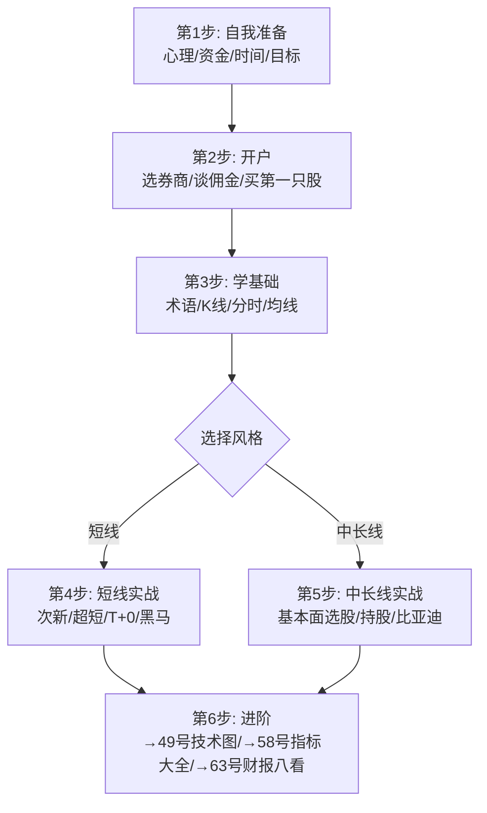
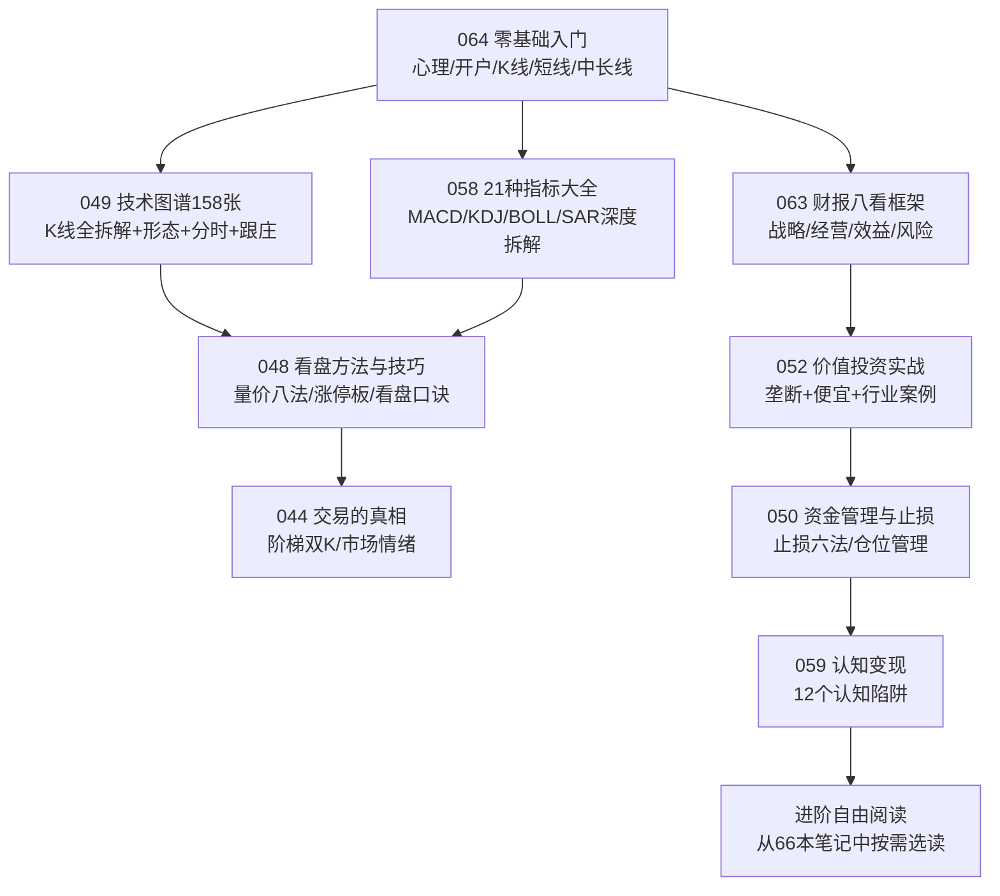
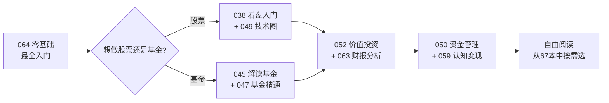

# 64《零基础学炒股从入门到精通》深度解读（详细版）

> **副题：张昆——"从开户到选股，从K线到财报，从短线到中长线"：A股最完整的炒股入门手册（第四版）**
>
> 作者：张昆，资深财经作者，本书已出版到第四版——历经市场验证的入门经典。十几章覆盖了炒股的全部基础知识：**心理准备 → 开户流程 → 股票术语 → K线解读 → 技术指标 → 基本面分析 → 短线实战 → 中长线实战**。
>
> **核心定位**：系列中的"零基础一站式手册"——如果你从来没有接触过股市，先读本书；如果你已经入市但知识零散，本书帮你把碎片拼成完整的图。与系列同类书的分工：

| 本书（064） | 相关书 | 关系 |
|-----------|--------|------|
| 张昆《从入门到精通》 | [[38《从零开始学炒股》深度解读（详细版）|38 号马涛]] | 064更全（十几章 vs 38的6章），覆盖心理/开户/短线/中长线 |
| 开户+术语+软件操作 | 其他书 | **系列唯一**有此详细实操的 |
| K线+技术指标 | [[49《零基础看懂158张股市关键技术分析图》深度解读（详细版）|49 号]] | 064是入门级，49是专家级（158图） |
| 基本面分析 | [[63《从报表看企业 数字背后的秘密》深度解读（详细版）|63 号张新民]] | 064是入门级，63是专业级（八看框架） |
| 短线实战 | [[44《交易的真相》深度解读（详细版）|44号]] | 064基础，44深入（阶梯双K） |

---

## 📖 全书架构：十几章完整路径

| 章节 | 核心内容 | 一句话 |
|------|---------|--------|
| 第1章 | 炒股前准备 | 心理>资金>时间>目标——先管好心，再管好钱 |
| 第2章 | 开户与交易 | 选券商/佣金谈判/买第一只股票——**系列唯一的实操教程** |
| 第3章 | 股票术语 | 指数/板块/除权除息/打新——"听懂老股民的话" |
| 第4-5章 | K线图+盯盘 | 单根K线/买入信号/卖出信号/分时图——**入门级技术分析** |
| 第6-8章 | 技术指标 | MACD/KDJ/均线/量价/其他——与58号互补 |
| 第9-10章 | 基本面选股 | 估值/财务指标/行业分析——**入门级基本面** |
| 第11章 | 风险与心态 | 止损/仓位/克服贪婪恐惧 |
| 第12章 | **短线炒股实战** | 次新股/超短线/T+0/牛市短线/震荡市短线/短线黑马 |
| 第13章 | **中长线炒股实战** | 巴菲特榜样/中长线选股/买点/卖点/持股心态/比亚迪案例 |

---

## 📑 目录

- [[#第1章 炒股前准备：心理比资金更重要|第1章 心理准备]]
- [[#第2章 开户与交易：系列唯一的实操教程|第2章 开户实操]]
- [[#第3章 技术分析入门：K线+指标+量价|第3章 技术分析入门]]
- [[#第4章 短线实战精华|第4章 短线实战]]
- [[#第5章 中长线实战精华|第5章 中长线实战]]
- [[#第6章 张昆的零基础路线图|第6章 路线图]]
- [[#附录|附录]]

---

## 第1章 炒股前准备：心理比资金更重要

### 1.1 四重准备——张昆的新手清单

| 准备事项 | 核心内容 |
|---------|---------|
| **心理准备** | **"认清最大的敌人就是自己"**——克服贪婪与恐惧 |
| **资金准备** | 最少116元可起步（1手最低价股票+5元手续费）；**只用闲钱，不借钱炒股** |
| **时间准备** | 短线=每天看盘；中线=业余时间分析；长线=买了放着 |
| **目标设定** | 合理的年收益预期——不要幻想年年翻倍

### 1.2 张昆的"恐惧与贪婪"实操训练

| 恐惧的表现 | 克服方法 |
|----------|---------|
| 下跌时恐慌卖出 | **专注于事实**——不看股价看价值 |
| 错过买入时机 | **列出利多利空清单**——客观判断而非情绪驱动 |
| 贪婪的表现 | 赚了还想更多→追高被套 |

---

## 第2章 开户与交易：系列唯一的实操教程

### 2.1 选择证券公司的三个标准

| 标准 | 内容 |
|------|------|
| 佣金费率 | **可以谈！**——万分之2.5到千分之3，短线交易者佣金影响巨大 |
| 软件好用 | 通达信/同花顺——选你习惯的界面 |
| 营业部位置 | 需要现场办理时方便 |

### 2.2 佣金吃掉你多少收益——张昆的震撼算术

> "对于短线股民，一周做两次交易，10万本金，一年交易额960万元。按0.3%佣金计算，全年佣金28,800元——**是投入本金的30%！**"

| 交易频率 | 10万本金年佣金（0.3%） | 占本金比例 |
|---------|---------------------|-----------|
| 每月1次 | 7,200元 | 7.2% |
| 每周1次 | 14,400元 | 14.4% |
| **每周2次** | **28,800元** | **28.8%** |

> **"把佣金谈到最低——这是新手的第一个赚钱技巧。"**

### 2.3 费用清单

| 费用 | 税率/费率 | 收取方 |
|------|---------|--------|
| 印花税 | 0.05%（2023.8起，仅卖出） | 国家 |
| 佣金 | 万2.5-千3（双向） | 券商 |
| 过户费 | 极低 | 交易所 |

---

## 第3章 技术分析入门：K线+指标+量价

> 064的技术分析是"入门级"——覆盖所有基础概念，但不深入。想深入→读49号（158图）和58号（21指标）。

### 3.1 K线——最基础的涨跌语言

| 单根K线信号 | 含义 | 与49号对照 |
|----------|------|----------|
| 大阳线 | 买方主导 | 49号详细拆解了位置分析 |
| 大阴线 | 卖方主导 | — |
| 十字星 | 多空平衡→变盘 | — |
| 锤子线/上吊线 | 底部反转/顶部反转 | — |

### 3.2 K线组合——买入卖出信号

| 买入信号 | 卖出信号 |
|---------|---------|
| 早晨之星 | 黄昏之星 |
| 红三兵 | 三只乌鸦 |
| 看涨吞没 | 看跌吞没 |
| 双针探底 | 双顶/M头 |

### 3.3 分时图——盯盘的细节

| 分时看点 | 含义 |
|---------|------|
| 白色线（价格线） | 实时成交价 |
| 黄色线（均价线） | 当天成交均价——"水上"=强势、"水下"=弱势 |
| 成交量柱 | 每一分钟的成交量——放量拉升=真涨 |
| 盘口大单 | 买卖五档——大单压盘/托盘=主力动向 |

### 3.4 常用技术指标速查

| 指标 | 核心用法 | 深入→ |
|------|---------|--------|
| **均线（MA）** | 金叉=买/死叉=卖/多头排列=持股 | 58号 |
| **MACD** | 金叉/死叉/背离 | 58号（六核心深度拆解） |
| **KDJ** | 超买(>80)=卖/超卖(<20)=买 | 58号 |
| **成交量** | 量在价先——验证一切信号 | 58号（排第一位） |
| BOLL | 上轨受阻/下轨支撑/开口=趋势 | 58号 |
| RSI | >70超买/<30超卖 | 58号 |

---

## 第4章 短线实战精华

### 4.1 什么人适合短线

> "新股民对股市的情况了解不够，在此情况下短线进出、反复操作——亏损累累将是大概率的结局。**短线适合有一定经验的老股民。**"

| 短线必备 | 内容 |
|---------|------|
| 技术功底 | 能判断支撑位和压力位 |
| 心理素质 | 相信自己的判断、尊重市场、果断 |
| 操作计划 | 每次操作前——买入价/止盈位/止损位全部定好 |

### 4.2 实战四法

| 方法 | 要点 | 原书案例 |
|------|------|---------|
| **次新股** | 无套牢盘/流通盘小/题材多——暴风集团上市月余涨十几倍 | 苏州规划（301505）两周翻倍 |
| **超短线** | T+0（做箱体）/ 尾盘买→次日冲高卖 / 3%就清仓 | 需极强执行力 |
| **牛市短线** | 追领涨龙头——"擒贼先擒王" / 5日均线多头排列 | — |
| **震荡市短线** | 参照30日均线抢反弹 / 涨多了有利就走 | — |

### 4.3 短线黑马的特征

> "黑马形成前的走势非常难看——连续阴线击穿各种技术支撑位，各种指标表示其非常弱势。**但筑底阶段会有不自然的放量现象——说明有增量资金在积极买进。散户资金不会在利空和技术面双杀的时候蜂拥建仓。**"

---

## 第5章 中长线实战精华

### 5.1 中长线选股三原则

| 原则 | 内容 |
|------|------|
| ① 选行业 | **找国家产业政策支持的行业**——有拐点或前景良好的 |
| ② 选龙头 | 行业龙头、中小盘——成长空间更大 |
| ③ 选估值 | 低PE/高ROE/稳定现金流——**"好公司+好价格"** |

### 5.2 买卖点的选择

| 买点 | 卖点 |
|------|------|
| 股价上穿长期均线并企稳 | 前期大涨后连续放量——考虑卖出 |
| 无量回踩长期均线→企稳 | 大盘走势变坏→个股冲高卖出 |
| 低位箱顶突破 | 连续涨停→涨停打开卖出 |
| 慢牛吸筹后无量深跌洗盘 | 技术图形出现滞涨信号（长上影/双顶） |

### 5.3 持股期间的考验——张昆坦诚

> "中长线炒股要忍受很多折磨：市场大幅波动可以轻松吃掉原有持仓的大部分利润；要放弃很多有把握的获利机会来换取长期利润；一年之中大部分时间在震荡——有时一直在亏损。**但成功结束一次中长线操作却可以获取令人羡慕的回报。**"

### 5.4 比亚迪案例——中长线经典

| 维度 | 分析 |
|------|------|
| **基本面** | 新能源汽车龙头/手机部件/电池——三大业务 |
| **品牌背书** | 巴菲特2008年入股（8港元/股），芒格称王传福是"管理界的杰克·韦尔奇" |
| **技术面** | 2015股灾后随大盘下跌——但基本面未变→中长期绝佳买点 |
| **结果** | 此后数年涨幅巨大 |

> "经过2015年6月的股指大跌，有些被高估的股票下跌只是回归正常价值；有些并非被高估的股票随大盘下跌只是市场的短期效应。**区分这两类股票，是中长线投资的关键。**"

---

## 第6章 张昆的零基础路线图

---

## 附录一 张昆金句精选

> 1. "股市最大的敌人就是自己。"
> 2. "10万本金短线交易——全年佣金可达本金的30%。"
> 3. "佣金是可以谈的——新手的第一个赚钱技巧。"
> 4. "会买的是徒弟，会卖的才是师父。"
> 5. "新股民短线操作，亏损累累将是大概率的结局。"
> 6. "股市有句谚语：中线重质，短线重势。"
> 7. "黑马筑底阶段会有不自然的放量——散户不会在这个时候蜂拥建仓。"
> 8. "区分被高估的下跌 vs 被错杀的下跌——中长线投资的关键。"
> 9. "持股时要忍受折磨——但成功一次中长线操作可获令人羡慕的回报。"
> 10. "短期股市的预测是毒药。"——巴菲特

---

## 附录二 064 号通往系列进阶的完整路径

| 学完064的什么 | 进阶到哪本书 |
|------------|-----------|
| K线基础知识 | → [[49《零基础看懂158张股市关键技术分析图》深度解读（详细版）|49号]]（158种K线/形态/信号全面拆解） |
| 技术指标入门 | → [[58《股市经典技术图谱大全集》深度解读（详细版）|58号]]（21种指标买点卖点+实战案例） |
| 基本面入门 | → [[63《从报表看企业 数字背后的秘密》深度解读（详细版）|63号张新民]]（八看框架专业财报分析） |
| 中长线选股 | → [[52《一本书看透价值投资》深度解读（详细版）|52号林奇]]（十二行业+A股案例） |
| 风险管理 | → [[50《股市投资资金管理与止损止盈技巧》深度解读（详细版）|50号雷冰]]（止损六法+止盈四种） |
| 投资心理 | → [[59《财富是认知的变现》深度解读（详细版）|59号舒泰峰]]（12个认知陷阱） |

---

## 附录三 30秒版

> 1. **四重准备**——心理 > 资金 > 时间 > 目标
> 2. **佣金是隐形成本**——短线交易者佣金可能占本金30%
> 3. **K线+指标**——入门级覆盖→深入读49号和58号
> 4. **短线**——次新股/超短线/T+0/黑马——适合有经验者
> 5. **中长线**——好行业+好公司+好价格+耐心持股=比亚迪式回报
> 6. **进阶路径**——064→49→58→63→52→50

---

## 附录四 短线实战完整案例拆解——金龙汽车（600686）2024.7

### 案例回顾（张昆原书）

> "2024年7月10日，汽车制造、无人驾驶题材在大众交通带领下早盘快速上涨。在涨幅榜上寻找相关个股，金龙汽车早盘突破几条均线、放量大涨——以7.70元买入。"

### 完整操作拆解

| 步骤 | 操作 | 依据 |
|------|------|------|
| **① 发现题材** | 大众交通涨停→无人驾驶概念爆发 | "擒贼先擒王"——龙头一动，跟风才有肉 |
| **② 筛选标的** | 涨幅榜上找同题材、技术面突破的 | 金龙汽车：**突破均线压力+成交量放大2倍** |
| **③ 买入** | 7.70元——突破盘整区 | "突破长期盘整区=主力启动信号" |
| **④ 制定计划** | 止盈：远离5日均线10% / 止损：跌破10日均线 | **每次操作前就定好——不是盘中临时决定** |
| **⑤ 走势** | 上午即涨停——成交量为前日2倍+ | "主力强力吸筹——后市应该会有大的涨幅" |
| **⑥ 结果** | 接下来几天持续上涨 | — |

### 这个案例教给新手的三件事

| 教训 | 内容 |
|------|------|
| **跟龙头不跟杂毛** | 大众交通是龙头→金龙汽车是跟风——但跟风也要跟最早的那一批 |
| **成交量是最诚实的指标** | 突破时放量2倍=主力真买；缩量突破=大概率假突破 |
| **计划比预测重要** | "买入前就定好止盈位和止损位——盘中不犹豫" |

---

## 附录五 中长线完整案例复盘——比亚迪：从"被错杀"到十倍

### 张昆原书的分析框架

| 维度 | 2015年股灾后的比亚迪 |
|------|-------------------|
| **基本面** | 新能源汽车龙头+手机部件+电池——三大业务护城河 |
| **品牌背书** | 巴菲特2008年入股（8港元/股）——"被世界最聪明的钱认可" |
| **被错杀** | 2015年股灾——全市场暴跌→比亚迪随大盘下跌——但基本面未变 |
| **技术面** | 暴跌后长期横盘→均线粘合→成交量极度萎缩→**黄金坑** |

### 完整时间线复盘

| 时间 | 股价区间 | 事件 |
|------|---------|------|
| 2008 | 8港元 | 巴菲特入股 |
| 2015.6 | ~55元（A股） | 股灾前高点 |
| 2015.9 | ~35元 | 股灾后低点——跌幅36% |
| 2016-2019 | 40-60元区间震荡 | 漫长横盘——"持股最大的考验" |
| 2020 | 突破60→190元 | 新能源大爆发——**三年三倍** |
| 2021 | 最高333元 | 从2015低点算+850%，从巴菲特入股算+4000% |

### 中长线的真正考验

> "从2015年9月到2019年，整整4年——比亚迪在40-60元之间来回震荡。这4年你受得了吗？看到别的股票涨得飞起，你的比亚迪在原地踏步——你会不会卖掉它去追热门？"

| 考验 | 如何应对 |
|------|---------|
| 长期横盘不涨 | 回归基本面——"公司还在增长吗？行业还有前景吗？→是→持有" |
| 别的股票暴涨 | "不要比较——你买比亚迪的逻辑和买热门股的逻辑不同" |
| 回撤吃掉利润 | "只要基本面不变，回撤是加仓机会" |
| 市场的悲观声音 | "2019年多少人喊'新能源是骗局'——2020年他们都沉默了" |

---

## 附录六 新手最常见的十大错误（张昆警示+系列补完）

| # | 错误 | 后果 | 改正方法 |
|---|------|------|---------|
| 1 | **不做计划就买入** | 涨了不知道什么时候卖，跌了不知道什么时候止损 | 每次买入前写下：止盈位__ 止损位__ |
| 2 | **把所有钱投入股市** | 急用时被迫割肉→两边亏 | 只用闲钱——3-5年不用的钱才进股市 |
| 3 | **频繁交易** | 佣金吃掉收益——10万本金年佣金可达30% | 降低交易频率→降低成本 |
| 4 | **追涨杀跌** | 高位接盘→低位割肉→反复亏损 | 制定买卖计划→按计划而非按情绪操作 |
| 5 | **不止损** | 小亏变大亏→深度套牢 | "亏10%必须止损——不等不猜不幻想" |
| 6 | **听消息炒股** | 消息=清朝太监（前面没胡子后面有辫子） | 自己研究——不懂不买 |
| 7 | **过度自信** | "我觉得这次一定对"→重仓→重亏 | 永远给自己留余地——单只<20% |
| 8 | **不分长短线** | 短线被套就变"长线"→被动持有→越套越深 | 买入前就明确：这是短线还是长线？ |
| 9 | **不看成交量** | 无量上涨=假涨 / 放量下跌=真跌 | **成交量是第一指标** |
| 10 | **不学习不总结** | 亏了不知道为什么亏→下次还犯同样错误 | 每笔交易写复盘笔记 |

---

## 附录七 30天新手模拟训练计划（张昆框架+系列补充）

| 周次 | 主题 | 每天任务 |
|------|------|---------|
| **第1周：认知与准备** | 心理+开户+术语 | D1-D2：读064第1-3章 / D3：虚拟开户（不开真仓） / D4-D5：用模拟盘买第一只"股票" / D6-D7：回顾本周的每一次操作——记录买入理由 |
| **第2周：技术分析基础** | K线+均线+MACD | D1-D3：每天识别10种K线形态 / D4-D5：用均线判断5只股票的走势 / D6-D7：找出3个MACD金叉和3个死叉的实例 |
| **第3周：短线实战模拟** | 分时+题材+黑马 | D1-D3：每天跟踪涨幅榜前20——找龙头和跟风 / D4-D5：模拟做一次T+0操作 / D6-D7：总结本周所有操作——命中率多少？ |
| **第4周：中长线选股模拟** | 基本面+财报+估值 | D1-D3：选择3个行业→每个行业选2只龙头 / D4-D5：用PE/ROE/营收增速做对比表 / D6-D7：模拟建仓→制定持有计划→写下来 |

### 训练营三大铁律

| 铁律 | 内容 |
|------|------|
| **只用模拟盘** | 30天训练期内不碰真金白银 |
| **每笔操作写记录** | 买入理由+止盈位+止损位——"没写的操作不算操作" |
| **每周复盘** | 周日花1小时回顾本周所有操作——哪些做对了、哪些做错了 |

---

## 附录八 从064到系列进阶的完整知识地图

### 三阶段学习路径

| 阶段 | 时间 | 阅读顺序 | 目标 |
|------|------|---------|------|
| **入门** | 1-2个月 | 064→045/054 | 掌握基础概念、能看懂K线和财报 |
| **进阶** | 3-6个月 | 049→058→048→063 | 技术+财报双通、能独立分析股票 |
| **实战** | 6-12个月 | 052→050→044→059 | 形成完整操作系统、控制情绪和风险 |

---

## 附录九 技术指标联动实战——四指标共振判买卖

### 核心原则：单指标不可靠，双指标可参考，三指标以上共振→高确定性

| 信号级别 | 指标数量 | 操作 |
|---------|---------|------|
| 弱信号 | 1个 | 忽略 |
| 中等信号 | 2个 | 观察+小仓位试水 |
| **强信号** | **3-4个同时发出** | **正常仓位操作** |

### 实战案例：四指标共振买入

**标的**：某只横盘3个月的股票

| 指标 | 信号 | 时间 |
|------|------|------|
| **均线** | 5日金叉20日+股价站上60日线 | D-Day |
| **MACD** | 零轴附近金叉+红柱放大 | D-Day |
| **KDJ** | K上穿D+J从超卖区（<20）反弹 | D-Day |
| **成交量** | 当日成交量=20日均量的2.5倍 | D-Day |

> **四指标同时发出买入信号→高确定性。当即买入，止损设在60日均线下方3%。**

### 四指标共振卖出

| 指标 | 信号 |
|------|------|
| 均线 | 5日死叉20日 |
| MACD | 顶背离（股价新高→MACD未新高） |
| KDJ | K下穿D+J>100 |
| 成交量 | 高位放量滞涨（量很大但股价不涨） |

---

## 附录十 分时图 T+0 操作完整教程

### T+0 的本质

> 利用手中已有的仓位——当天低位买入同等数量、高位卖出原有仓位，实现"变相 T+0"。**前提：你必须已经持有这只股票。**

### 正 T（先买后卖——适用于看涨判断）

| 步骤 | 操作 | 实例 |
|------|------|------|
| ① 判断 | 早盘低开低走→触及支撑位（均线/前低） | 持有1000股，成本10元 |
| ② 买入 | 在支撑位附近买入同等数量 | 9.80元买入1000股 |
| ③ 等待 | 股价反弹→回到分时均线上方 | 股价回升至10.20元 |
| ④ 卖出 | 卖出原有仓位的同等数量 | 10.20元卖出1000股 |
| ⑤ 结果 | 持仓不变，获利 | 获利(10.20-9.80)×1000=400元 |

### 反 T（先卖后买——适用于看跌判断）

| 步骤 | 操作 |
|------|------|
| ① 判断 | 早盘高开冲高→上方压力位明显 |
| ② 卖出 | 在压力位卖出部分仓位 |
| ③ 等待 | 股价回落→回到分时均线下方 |
| ④ 买入 | 在低位买回同等数量 |
| ⑤ 结果 | 持仓不变，成本降低 |

### T+0 四不做

| 情况 | 原因 |
|------|------|
| **不逆势做** | 大盘暴跌时做正T=送钱 |
| **不隔夜** | T+0当天必须完成买卖——不留隔夜仓位变化 |
| **不重仓T** | 每次T不超过持仓的30%——"T飞了还有底仓" |
| **不频繁T** | 一天最多做一次——"越T越亏是常态" |

---

## 附录十一 新股申购（打新）完整攻略

### 为什么打新是新手最友好的策略

| 优势 | 说明 |
|------|------|
| 几乎零风险 | 中签后缴款——上市首日绝大多数上涨 |
| 不需要选股能力 | 符合条件的就申购——不需要分析基本面 |
| 历史收益可观 | A股打新长期年化收益可达5-15%（取决于运气和市值） |

### 打新门槛

| 板块 | 市值要求 | 权限 |
|------|---------|------|
| 沪市主板 | 前20日日均1万元沪市市值 | 普通 |
| 深市主板 | 前20日日均1万元深市市值 | 普通 |
| 创业板 | 同上+开通创业板权限（2年经验+10万资产） | 需开通 |
| 科创板 | 沪市市值+开通科创板（2年+50万） | 需开通 |
| 北交所 | 无市值要求→需现金申购 | 需开通 |

### 打新日历

| 日期 | 操作 |
|------|------|
| 申购日（T日） | 在交易软件中一键申购 |
| T+1日 | 公布中签率 |
| **T+2日** | **公布中签结果——中了必须16:00前缴款！** |
| 上市日 | 通常上市首日涨幅最大——择机卖出 |

> **打新核心纪律：中签必须缴款。一年内3次中签不缴款=被禁止打新6个月。**

---

## 附录十二 从模拟盘到实盘——首次实盘操作的心理建设

### 模拟盘 vs 实盘的根本区别

| 区别 | 模拟盘 | 实盘 |
|------|--------|------|
| 亏损感受 | 无所谓 | **真实的痛苦——亏损1000元的痛苦>盈利2000元的快乐** |
| 决策质量 | 随意、频繁 | **恐惧和贪婪会扭曲所有判断** |
| 执行力 | 容易止损 | **"再等等就涨回来了"——永远等不回来** |

### 首次实盘五步过渡法

| 步骤 | 操作 | 金额 |
|------|------|------|
| ① 小资金试水 | 只用总资产的5-10% | 如总10万→先投1万 |
| ② 只做一笔交易 | 买入一只你最熟悉的股票 | 1手（100股） |
| ③ 完整走一遍流程 | 买入→持有3天→感受波动→卖出 | — |
| ④ 写复盘 | 记录：买入理由/持有感受/卖出理由/收益 | — |
| ⑤ 逐步加仓 | 连续3笔交易盈利后→增加到20%仓位 | 每次加仓不超过5% |

### 首次亏损的心理急救

> "第一次亏损是每个股民的成人礼。关键不是亏了多少，而是你有没有从这次亏损中学到东西。"——张昆

| 亏了之后怎么做 | 不要做什么 |
|------------|----------|
| 复盘：买入逻辑错在哪里 | 不要马上追加资金"翻本" |
| 记录下来避免再犯 | 不要因为亏损就永远退出 |
| 把亏损金额看作"学费" | 不要对家人隐瞒亏损 |

---

## 附录十三 系列入门书完整横向对比——新手的正确阅读顺序

| 书号 | 书名 | 最适合 | 读完后的水平 |
|------|------|--------|------------|
| **064** | 张昆《零基础炒股》 | **完全零基础**——从开户讲起 | 能独立买卖、看懂K线 |
| 045 | 季凯帆《解读基金》 | 不想炒股→只想买基金 | 能选基金、做定投 |
| 054 | 孟岩《投资第一课》 | 想理解投资本质——钱从哪来 | 建立正确的投资观 |
| 038 | 马涛《从零开始炒股》 | 已有基础知识→想学看盘 | 掌握均线/量价/指标 |
| 039 | 朱孜《入门进阶实战》 | 入门后想系统化 | 完整的股价分析框架 |

### 新手推荐阅读路径

---

## 附录十四 熊市生存手册——牛市赚钱、熊市保命

### 张昆的熊市警示（散见全书）

> "股票市场并不是每时每刻都有机会的。" ——第12章开篇，暗示：大多数时候应该不动。

### 熊市三个阶段及对策

| 熊市阶段 | 特征 | 对策 |
|---------|------|------|
| **初期（急跌）** | 从高点快速下跌——恐慌抛售 | **空仓或极轻仓**——不接飞刀 |
| **中期（阴跌）** | 慢慢跌、每天跌一点——磨掉所有信心 | **不开新仓**——"不操作就是最好的操作" |
| **末期（筑底）** | 缩量横盘——成交量萎缩至极低 | 开始关注——但不急于买入——等右侧信号 |

### 熊市中张昆原书提到的可做之事

| 可以做的事 | 不可以做的事 |
|----------|-----------|
| **学习中长线选股**——"在市场十分低迷时进场"（第13章） | 频繁短线——"亏损累累将是大概率结局" |
| **研究基本面**——被错杀的股票=未来牛股 | 追涨停——"熊市涨停次日大概率低开" |
| **等待成交量萎缩**——地量=底部信号 | 用杠杆——"熊市+杠杆=破产" |
| **小仓位试仓**——找感觉但不赌身家 | 补仓摊平——"越补越套" |

### 熊市心理急救三句话

> 1. "不是你的错——熊市中90%的股票都在跌。"
> 2. "保留现金就是保留未来的选择权。"
> 3. "熊市是用来学习的，不是用来交易的。"

---

## 附录十五 张昆的仓位管理心法——全书的"隐藏主线"

### 张昆原书中分散的仓位建议（集中整理）

| 场景 | 张昆的建议 | 来源 |
|------|----------|------|
| 初始资金 | "只用闲钱，不借钱炒股" | 第1章资金准备 |
| 新手首次实盘 | 最少116元起步——但建议从小额开始 | 第1章+附录十二 |
| 短线仓位 | "超短线操作仓位要轻" | 第12章超短线 |
| 中长线仓位 | "在市场十分低迷时进场"——可以逐步加仓 | 第13章 |
| 分散原则 | 中长线选股关注多个行业 | 第13章选股 |

### 整理后的"张昆仓位公式"

| 市场状态 | 仓位建议 | 理由 |
|---------|---------|------|
| 牛市初期 | 50-70% | "在长期均线开始向上时进场" |
| 牛市中期 | 70-80% | 趋势确立→加大仓位 |
| 牛市末期（放量滞涨） | 减至30-50% | "高位放量=考虑卖出" |
| 熊市初期 | 0-20% | "不接飞刀" |
| 熊市末期（地量） | 20-30%（试仓） | "等待右侧信号再加仓" |
| 震荡市 | 30-50% | "高抛低吸——快进快出" |

### 仓位管理的三个铁律

| 铁律 | 内容 |
|------|------|
| **永不满仓** | 任何时候保留至少20%现金——"现金是氧气" |
| **单只上限20%** | 一只股票不超过总仓位的20%——"黑天鹅来的时候你扛不住" |
| **不加杠杆** | 不借钱、不融资——"张昆反复强调：只用闲钱" |

---

## 附录十六 A 股交易规则全清单——新手最容易搞混的 15 条

| # | 规则 | 内容 | 新手常见误区 |
|---|------|------|-----------|
| 1 | **T+1** | 当天买入→次日才能卖出 | "为什么我买了不能马上卖？" |
| 2 | **涨跌停** | 主板±10%/创业板科创板±20%/北交所±30% | "涨停了为什么买不到？→没人卖" |
| 3 | **ST/*ST** | 特别处理——风险警示板→涨跌停5% | "ST股票还能买吗？→风险极高" |
| 4 | **停牌** | 重大事项→暂停交易 | "我的股票怎么不动了？" |
| 5 | **退市** | 连续亏损/重大违法→摘牌 | 退市整理期15天→"最后逃跑机会" |
| 6 | **除权除息** | 分红/送股后股价下调 | "股价突然跌了很多=除权，不是亏了" |
| 7 | **集合竞价** | 9:15-9:25→产生开盘价 | "9:25之前下的单可能成交不了" |
| 8 | **一手=100股** | 最小交易单位 | "我只有500块能买茅台吗？→一手6万+" |
| 9 | **手续费最低5元** | 佣金不足5元按5元收取 | "买100元的股票手续费5元=5%成本" |
| 10 | **新股上市首日** | 无涨跌停（注册制后前5日无限制） | "新股第一天可以涨多少？→没限制" |
| 11 | **中签缴款** | T+2日16:00前必须缴款 | "中了不交钱=一年3次被禁" |
| 12 | **大宗交易** | 单笔30万股/200万元以上→专用通道 | 散户接触不到 |
| 13 | **配股** | 向现有股东按比例配售新股 | "不参与配股=被摊薄，必须关注" |
| 14 | **融资融券** | 借钱买（融资）/借股卖（融券） | 门槛50万+6个月经验→新手别碰 |
| 15 | **北向资金** | 外资通过沪深港通买卖A股 | "北向流入=外资看好，但仅供参考" |

---

## 附录十七 "盘感"训练——技术分析之外的直觉培养

### 什么是盘感

> 张昆在书中没有明确定义"盘感"，但多处暗示——"金龙汽车早盘突破"、"黑马筑底阶段有不自然的放量"——这些判断既依赖指标，也依赖长期盯盘积累的直觉。

### 盘感的四个层次

| 层次 | 能力 | 训练时间 |
|------|------|---------|
| **① 识图** | 一眼认出K线形态（启明星/头肩顶/三角形） | 1-3个月 |
| **② 识势** | 扫一眼均线排列就知道趋势方向 | 3-6个月 |
| **③ 识量** | 看成交量柱能判断今天是主力买还是散户买 | 6-12个月 |
| **④ 识庄** | 从盘口挂单和分时走势感知主力意图 | 1-3年 |

### 每日盘感训练法

| 时间 | 训练内容 |
|------|---------|
| **盘前（9:00-9:25）** | 扫一眼外围股市/大宗商品/重大新闻→预判当日大盘方向 |
| **开盘（9:25-9:35）** | 看集合竞价结果→哪些高开、哪些低开→感受市场情绪 |
| **盘中（10:00/11:00/14:00/14:30）** | 每个整点扫一眼自选股→记录变化→不操作、只观察 |
| **盘后（15:30-16:00）** | 复盘涨停板/跌停板→找出龙头和板块联动 |
| **周末** | 回顾本周所有交易记录→总结模式 |

### 盘感训练的铁律

> "盘感不是感觉——是长期观察积累的模式识别能力。**没有1000小时以上的盯盘，任何'盘感'都是幻觉。**"

---

## 附录十八 从 064 开始的第一年实战日历

### 按月规划——新手第一年的学习+操作节奏

| 月份 | 学习重点 | 实战操作 | 必读书 |
|------|---------|---------|--------|
| **第1月** | 开户+术语+K线基础 | 模拟盘——每天虚拟买卖1只股票 | 064第1-3章 |
| **第2月** | 均线+MACD+KDJ | 模拟盘——用指标找买卖点 | 064第4-8章+58号 |
| **第3月** | 成交量+分时图 | 模拟盘——做一次完整的短线（计划→买入→复盘） | 064第12章+48号 |
| **第4月** | 基本面入门（PE/ROE） | 模拟盘——选一只中长线标的并"虚拟持有" | 064第9-10章+52号 |
| **第5月** | 首次实盘（小资金） | **真金白银：用5%资金买入1只股票** | 附录十二（心理建设） |
| **第6月** | 复盘+总结 | 回顾前5个月所有操作→写总结笔记 | — |
| **第7-8月** | 技术分析进阶 | 实盘仓位提高到15% | 049号（158图） |
| **第9-10月** | 财报分析 | 学会读年报+季报 | 063号（八看框架） |
| **第11-12月** | 建立个人操作系统 | 总结全年→写下自己的买卖纪律 | 050号+059号 |

### 第一年三大目标

| 目标 | 衡量标准 |
|------|---------|
| **不亏大钱** | 全年最大回撤<15% |
| **学会复盘** | 每笔交易都有书面记录 |
| **找到风格** | 年底能回答："我是短线还是中长线？" |

---

## 附录十九 选股五步法——从 5000 只股票中筛出你的标的

### 张昆的选股逻辑（散见第13章+系列补充）

> 中长线选股三原则：① 选国家产业政策支持的行业 ② 选行业龙头 ③ 选中小盘+低估值。结合本书其他章节，整理为完整五步：

### 五步筛选流程

| 步骤 | 操作 | 筛除标准 | 剩余数量（估算） |
|------|------|---------|---------------|
| **① 行业筛选** | 选政策支持+前景好的行业（新能源/半导体/医药/消费） | 淘汰夕阳行业（煤炭/钢铁/地产） | 5000→800 |
| **② 龙头筛选** | 每个行业选前3名龙头（营收/市值/份额） | 淘汰二三线 | 800→100 |
| **③ 财务筛选** | PE合理+ROE>15%+营收增速>10% | 淘汰高估值低质量 | 100→30 |
| **④ 技术筛选** | 股价在长期均线上方+趋势向上 | 淘汰下跌趋势 | 30→10 |
| **⑤ 最终确认** | 看年报+调研+写分析笔记 | 淘汰看不懂的 | 10→3-5 |

### 自选股池管理

| 股票池 | 数量 | 用途 |
|--------|------|------|
| **观察池** | 20-30只 | 长期跟踪——不操作，只记录 |
| **候选池** | 5-10只 | 等买点——跌破合理估值就准备 |
| **持仓池** | 3-5只 | 买入后——不超过总仓位20% |

### 五步法实操演练（以 2024 年为例）

| 步骤 | 示例 |
|------|------|
| ① 行业 | 新能源车（政策支持+渗透率提升） |
| ② 龙头 | 比亚迪/宁德时代/长安汽车 |
| ③ 财务 | 比亚迪营收增速高但PE偏高→长安PE低但增速一般 |
| ④ 技术 | 比亚迪站上60日均线→入选候选池 |
| ⑤ 确认 | 等回调到合理估值→分批建仓 |

---

## 附录二十 卖点艺术——"会买的是徒弟，会卖的才是师父"

### 为什么卖出比买入难

| 买入时的心理 | 卖出时的心理 |
|------------|-----------|
| 乐观——"它要涨了" | **贪心——"还会更高"** |
| 果断——分析好了就买 | **犹豫——"再等等看"** |
| 无成本——没买没亏 | **成本锚定——"我成本10元，现在9.8不甘心"** |

> 张昆原书："在股票赚钱时卖出，说起来容易，实战中很难做到。看到股票大涨就赶紧卖出，结果股价还在一路上涨——只获得一点微利，主升浪被放过了；或者一直不卖，涨回去又跌回来——两头受气。"

### 张昆的六种卖出时机

| # | 卖出时机 | 适用 |
|---|---------|------|
| 1 | **前期大涨后连续放量** | 中长线——主力出货信号 |
| 2 | **大盘走势变坏→个股冲高时** | 顺势卖出——"大盘拖累个股" |
| 3 | **连续涨停→涨停板打开** | 短线——"开板=资金撤退" |
| 4 | **技术图形滞涨**（长上影/双顶/黄昏星） | 技术面信号 |
| 5 | **跌破止损位**（如10日均线） | 纪律止损——无条件执行 |
| 6 | **达到目标价**（提前定好的止盈位） | 计划止盈——"赚到计划内的钱" |

### 卖出的三个心法

| 心法 | 内容 |
|------|------|
| **卖飞不后悔** | "卖了还涨——那不是我该赚的钱" |
| **分批卖出** | 先卖一半锁定利润→剩余用跟踪止损（如跌破5日均线再清） |
| **卖出后不立刻买入** | 休息1-2天——"空仓也是一种仓位" |

---

## 附录二十一 新股民资金规划——不同资金规模的配置方案

### 核心原则（张昆+系列整理）

> "炒股的钱必须满足两个条件：① 是闲钱（3-5年内用不到）② 亏了不影响生活。**不满足任何一条，都不应该入市。**"

### 按资金规模的三套方案

| 资金规模 | 仓位方案 | 特色建议 |
|---------|---------|---------|
| **<5万** | 40%股票+40%基金+20%现金 | 指数基金为主——"小资金选股成本高，指数更省心" |
| **5-20万** | 60%股票（3-5只）+30%基金+10%现金 | 个股+基金混合——"用基金分散个股风险" |
| **>20万** | 70%股票（5-8只）+20%债券/货基+10%现金 | 分散行业——"至少3个不同行业" |

### 资金规划五问（入市前自测）

| 问题 | 回答"否"就别入市 |
|------|----------------|
| 这笔钱3年内用不到吗？ | 是→闲钱 |
| 亏损30%不影响生活吗？ | 是→风险承受力 |
| 每天能花1小时研究吗？ | 是→时间投入 |
| 我能做到亏损不恐慌吗？ | 是→心理素质 |
| 我有明确的投资目标吗？ | 是→年化10%还是30%？ |

---

## 附录二十二 炒股软件进阶——通达信/同花顺的隐藏功能

### 张昆原书提到的软件基础（第2章）→进阶

| 功能 | 操作 | 用途 |
|------|------|------|
| **综合排名** | 快捷键 80-89 | 9宫格看涨幅/跌幅/量比/委比排名（第12章） |
| **自选股分组** | 自定义板块 | 观察池/候选池/持仓池分开管理 |
| **多周期同屏** | 日线+周线+月线同时显示 | 大趋势+小节奏一起看 |
| **画线工具** | 趋势线/水平线/黄金分割 | 画出支撑压力位 |
| **F10** | 一键看公司基本面 | 营收/利润/股东/行业数据 |

### 盘后复盘五件套（每天15分钟）

| 顺序 | 看什么 | 目的 |
|------|--------|------|
| ① 大盘分时 | 今日强弱——"水上还是水下" |
| ② 涨幅榜前20 | 今日主线——哪个板块在领涨 |
| ③ 跌幅榜前20 | 哪些在崩——回避风险 |
| ④ 自选股 | 观察池/候选池/持仓池逐一过目 |
| ⑤ 成交额榜 | 资金在哪——"大资金在买什么" |

---

## 附录二十三 长假/节前操作指南——持股还是持币？

### 长假前的新手困境

> "国庆7天/春节10天——持股怕跌，持币怕踏空。怎么办？"

### 张昆逻辑+系列经验的综合决策表

| 情况 | 建议 | 理由 |
|------|------|------|
| **持仓盈利+趋势向上** | 持股过节 | "趋势没坏不折腾" |
| **持仓亏损+趋势向下** | 减仓过节 | "假期不确定性大——熊市中节后低开概率高" |
| **空仓+市场高位** | 持币过节 | "高位过节=赌运气" |
| **空仓+市场低位（地量）** | 可半仓过节 | "低位+假期=超跌反弹机会" |
| **有融资杠杆** | **必须清仓或大幅减仓** | "假期利息照付+跳空风险——杠杆不过节" |

### 节前三天操作清单

| 时间 | 操作 |
|------|------|
| 节前第3天 | 检查持仓——有没有接近止损位的 |
| 节前第2天 | 决定持股/持币——**用决策表而不是情绪** |
| 节前第1天 | 执行决定——最后一天成交清淡，提前挂单 |

> **核心心法：假期是市场的"不确定性放大器"——你能做的不是预测，而是决定"涨跌我都能接受"的仓位。**
