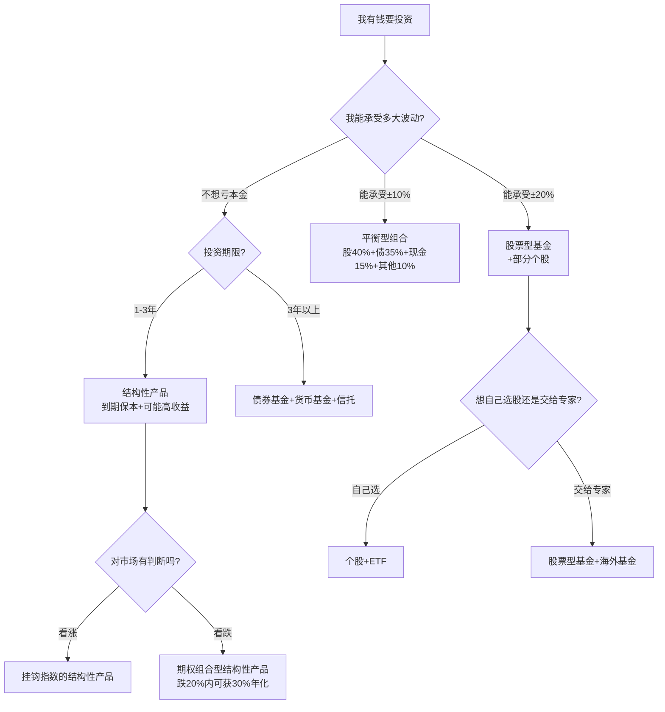

# 67《漫步牛熊市》深度解读（详细版）

> **副题：付骏——"动荡市场的赢家"：批判"长期持有"的谎言 + 四种工具全景 + 三种风格配置 + 动态组合管理实战**
>
> 作者：付骏，资深投资顾问，具有环球投资视野（在中国内地和香港均有丰富的金融服务经验）。本书是系列中**少有的批判"长期持有"教条的书**——付骏直接指出：**"在证券投资界，最大的谎言可能就是'长期持有'了"**，并引凯恩斯名言：**"在长期中，我们都死了。"**
>
> **核心定位**：本书不是让你"买了不动"——而是教你**什么时候买、什么时候调、什么时候卖**。与 [[60《慢即是快》深度解读（详细版）|60 号王宝存]]（买了不卖）形成健康张力，与 [[53《周期、估值与人性》深度解读（详细版）|53 号凌鹏]]（五上三下）和 [[59《财富是认知的变现》深度解读（详细版）|59 号舒泰峰]]（认知陷阱）深度同频。

---

## 📖 全书框架：赢家三件套

| 篇 | 核心 |
|----|------|
| **第一篇 理念** | 站上巨人肩膀（凯恩斯/格雷厄姆/巴菲特）+ 批判"长期持有"谎言 |
| **第二篇 工具** | 共同基金/结构性产品/信托/另类投资——四种工具全景 |
| **第三篇 实战** | 三种风格配置表（进取/平衡/保守）+ 动态组合管理 2005—2008 实战 |

---

## 📑 目录

- [[#第1章 赢家理念：站在巨人肩上——并敢说"皇帝没穿衣服"|第1章 赢家理念]]
- [[#第2章 赢家工具：四种武器的完整对比|第2章 赢家工具]]
- [[#第3章 赢家实战：三种风格 + 2005—2008 动态管理全记录|第3章 赢家实战]]
- [[#第4章 跋：赢输分界线到底在哪里|第4章 赢输分界线]]
- [[#附录一 付骏金句精选|附录]]

---

## 第1章 赢家理念：站在巨人肩上——并敢说"皇帝没穿衣服"

### 1.1 五位巨人的肩膀

| 大师 | 核心贡献 | 付骏的运用 |
|------|---------|-----------|
| **凯恩斯** | 宏观经济学奠基；"市场可以维持不理性的时间长于你维持不破产的时间" | 理解市场周期的本质 |
| **格雷厄姆** | 安全边际——花4角买1元的东西 | 赢家理念的根源——价值投资 |
| **巴菲特** | 好公司+便宜价格+能力圈 | 组合管理的核心信念 |
| **彼得·林奇** | 生活化选股；六种公司分类 | 补充实战视角 |
| 其他 | 美国200年证券市场经验 | 站在巨人肩上——看得更远 |

### 1.2 "长期持有"是最大的谎言——付骏最勇敢的批判

> "在证券投资界，最大的谎言可能就是'长期持有'了。关于这点，伟大的经济学家凯恩斯曾有所评论：'长期是对当前事务的误导。在长期中，我们都死了。如果在暴风雨的季节，他们只能告诉我们，暴风雨在长期中会过去，海洋必将平静，那么经济学家给自己的任务就过于容易而无用了。'"

| 付骏的三大质疑 | 详细拆解 |
|------------|---------|
| **① 反对选时=荒谬** | "如果长期持有是正确的——那么你在中国A股平均市盈率达60倍时，即风险最高、最没有投资价值的时候去投资也是正确的？这显然与巴菲特等大师倡导的价值投资背道而驰。" |
| **② "长期"是多长？没人能回答** | "10年？20年？没有人可以给出精确答案。长期持有=把模糊当精确——用一句正确但无法操作的话掩盖了真正的问题。" |
| **③ 公募基金的"长期持有"是利益诉求** | "公募基金是长期持有的强力支持者——因为他们靠管理费维持运作。即使市场风险已经很高，没有投资价值了，出于利益诉求，他们也不可能鼓励你赎回。**这或许是投资实务界鼓励长期投资的主要原因。**" |

### 1.3 付骏的"价值投资+动态管理"替代方案

> "不是不长期——而是在估值低的时候投入、估值高的时候逐步兑现。**'长期'不是'永远不动'，而是'永远按价值判断调整'。**"

| 传统"长期持有" | 付骏的"动态价值投资" |
|-------------|-----------------|
| 买了就不管 | 每半年检视一次——估值高了就减仓 |
| 任何时候都可以买 | 只在PE合理时买入——"60倍PE时买=自杀" |
| 公募基金的"长期"=管理费 | 自己管理——"利益是一致的" |
| 忽略市场波动 | 利用市场波动——"高估卖→低估买" |

**（这个观点与 054 孟岩"好公司买贵了=坏投资"、035 邱国鹭"估值最重要"完全一致——付骏只是说得更直白、更勇敢。）**

---

## 第2章 赢家工具：四种武器的完整对比

> "大多数投资者谈起基金时，认为基金就是基金经理帮自己去买卖股票。其实，基金不只有股票型基金，还有债券基金和货币基金。"

### 2.1 共同基金——最主流的工具

| 类型 | 特点 | 适合 |
|------|------|------|
| **股票型基金** | 高收益/高风险——2005-2007年A股基金有800-1000%回报 | 能承受波动的投资者 |
| **债券型基金** | 稳健收益——低于股票但高于存款 | 风险厌恶型 |
| **货币基金** | 流动性强——随时申购赎回 | 现金管理——"比活期强" |
| **海外共同基金** | 全球化分散——邓普顿拉丁美洲/富达东南亚等 | 想分散A股单一市场风险的投资者 |

### 2.2 结构性投资产品——"保本+高收益的可能性"

| 策略 | 原理 | 实例 |
|------|------|------|
| **CPPI**（恒定比例组合保险） | 大部分资金买债券保本+小部分买期权博高收益 | 到期100%保本+可能获得10-20%收益 |
| **期权组合** | 看跌时也能赚钱 | 股票组合跌20%内→可获得30%年化收益 |

> "结构性产品不是基金——它是一类'变种'的投资产品。理解它的设计原理比看它的预期收益更重要。"

### 2.3 信托产品——稳定回报+项目化投资

| 类型 | 案例 | 收益 |
|------|------|------|
| **房地产信托** | 万科朗润园信托（2006年/深国投发行/中行担保） | 4%年化——高于定存 |
| **公司融资信托** | 企业通过信托公司向公众募集资金 | 5-8% |
| **基础设施信托** | 公路/桥梁/水务项目 | 稳定——但期限长 |
| **证券投资信托** | 类似私募基金——投资二级市场 | 收益波动大 |

### 2.4 另类投资——对冲基金+大宗商品

| 策略 | 原理 |
|------|------|
| **长/短仓策略** | "买入优质股组合、卖出劣质股组合——行业涨=优质股涨得多、行业跌=劣质股跌得多——无论涨跌都赚钱" |
| **大宗商品** | 商品指数投资——"供给小于需求时必定上涨，但投机者放大了波动" |

---

## 第3章 赢家实战：三种风格 + 2005—2008 动态管理全记录

### 3.1 三种投资风格——找到你自己的位置

| 风格 | 股/债/现金配置 | 历史参考数据 |
|------|-------------|-----------|
| **进取型** | 股票60%+债券20%+其他20% | 三年回报~30%，标准差~20% |
| **平衡型** | 股票40%+债券35%+现金15%+其他10% | 三年回报~24.6%，标准差~14.8% |
| **保守型** | 股票20%+债券50%+现金30% | 稳健——波动最小 |

> "在其他领域，顺从内心直觉或许会取得喜人效果——但在投资理财领域，你要尽量避免这种情况。基于事实和数据分析，客观选择真正适合自己的投资品种。"

### 3.2 付骏的 2005—2008 动态管理全记录

> "以我个人为例——我每半年检视一次投资组合并进行必要的调整。以 2005 年 1 月为起点、2008 年 8 月为终点——演示我是如何根据'投资价值'来动态地管理投资组合的。"

| 检视时间 | 市场状态 | 关键操作 | 理由 |
|---------|---------|---------|------|
| **2005.1** | 全球景气、A股PE仅17倍、估值极低 | **进取配置**——重仓A股+环球基金 | "A股被严重低估了" |
| **2005.7** | A股触底998后回升 | 维持进取——不加不減 | 趋势确立——让利润奔跑 |
| **2006.1** | A股持续大涨——PE开始上升 | 开始关注债券——但暂不减持 | "还没到高估区域" |
| **2006.7** | A股加速上涨 | **逐步兑现利润**——增配债券+欧元强势货币基金 | "估值已从17倍→30倍+——开始偏贵" |
| **2007.1** | A股PE超40倍——泡沫明显 | **继续减仓A股**、转配环球配置 | "风险>机会" |
| **2007.7** | 上证逼近5000——疯狂期 | 大幅降低A股、增持现金/债券 | "上证60倍PE——没有安全边际了" |
| **2008.1** | 上证6124→开始跌 | 维持低仓位——等待 | "风暴来临前把船收进港" |
| **2008.7** | 次贷危机蔓延——全球暴跌 | 逐步试探性建仓——"有投资价值的股票开始出现" | "别人恐惧时贪婪——但不是一次性满仓" |

### 3.3 这个时间线的核心启示

| 教训 | 内容 |
|------|------|
| **不追涨** | 2005年初PE 17倍买——不是等牛市来了再追 |
| **不贪婪** | PE > 40 倍开始逐步减——不是等"再涨一点" |
| **每半年检视** | 不是每天看（过度交易），也不是永远不看（放任不管） |
| **用估值作为锚** | PE高=风险高——无论市场情绪多乐观 |

---

## 第4章 跋：赢输分界线到底在哪里

### 4.1 2005年的经典现场——恐惧让你错过最大牛市

> "2005年年初，上证指数1200点左右，平均市盈率仅17倍——我惊喜地发现A股被严重低估了。与一位专业人士分享，他不以为然，断言'A股必将崩盘，推倒重来'。他的理由很简单：全流通伤害了普通股民。"

| 两个人的选择 | 结果 |
|-----------|------|
| **专业人士**（恐惧→断言崩盘） | 完美错过 2005—2007 最大牛市 |
| **付骏**（低估值→买入） | 享受 998→6124 的 5 倍行情 |

### 4.2 为什么"明白道理"和"成为赢家"之间有一道鸿沟

> "明白价值投资的道理并不是一件难事——但无论是客户还是我身边金融机构的朋友，最终成为市场赢家的却寥寥无几。**究其原因，归根结底还是难以克服人性的弱点：恐惧与贪婪背后的非理性行为。**"

| 人性弱点 | 在 2005 年的表现 | 在 2007 年的表现 |
|---------|--------------|--------------|
| **恐惧** | "全流通会崩盘→快跑" | — |
| **贪婪** | — | "60倍PE了还在买→还会再涨" |
| **从众** | "所有人都说A股完了→我也跑" | "所有人都在买→我也买" |
| **短期思维** | "过去5年都是熊市→未来也一定是" | "过去2年翻5倍→未来也一定会" |

### 4.3 赢输分界线的三个维度

| 维度 | 输家 | 赢家 |
|------|------|------|
| **认知** | 听消息/追涨杀跌 | 基于估值——PE低=买/PE高=卖 |
| **情绪** | 恐惧时割肉、贪婪时追高 | "别人恐惧时贪婪"——但用估值做判断而非感觉 |
| **纪律** | 没有检视、没有计划 | **每半年检视一次**——"动态管理不是随心所欲，是按原则调整" |

---

## 总结：付骏的"赢家公式"

> **"明了并坚守价值投资理念 + 正确运用多种投资工具 + 每半年动态调整 = 成功之路由你掌控。"**

| 要素 | 实操 |
|------|------|
| **理念** | 不盲从"长期持有"——"PE 60倍时买=背离价值投资" |
| **工具** | 不止股票——基金/结构性产品/信托/另类——多武器作战 |
| **实战** | 每半年检视——PE低时加仓/PE高时减仓——"估值是唯一的锚" |
| **心态** | 赢输分界线=克服恐惧与贪婪——"2005年的专业人士和2007年的散户——恐惧和贪婪让他们成为输家" |

---

## 附录一 付骏金句精选（15条）

> 1. "正确的方向是赢多输少；错误的方向是输多输少。"
> 2. "在证券投资界，最大的谎言可能就是'长期持有'了。"
> 3. "在长期中，我们都死了。"——凯恩斯
> 4. "如果你在A股平均市盈率60倍时投资——这显然是背离价值投资的。"
> 5. "公募基金鼓励长期持有——因为管理费是他们的主要收入来源。"
> 6. "市场持续上涨真的就是参与的理由吗？市场持续下跌真的是离开的理由吗？"
> 7. "30%-40%的年收益率——这是我在职业生涯里听到过无数次的'笑话'。"
> 8. "按照30%年化，30岁投入20万→50岁将有3800万-1.67亿——实业商人都该转行做金融了。"
> 9. "过高的预期不仅不现实，还会让你在最不该放弃的时候放弃正确的策略。"
> 10. "资产配置不是机械地什么都投一点——而是根据市场变化的本质进行动态管理。"
> 11. "每半年检视一次投资组合——不是天天看，也不是永不看。"
> 12. "明白价值投资的道理并不难——最终成为赢家的却寥寥无几。"
> 13. "赢输分界线：恐惧与贪婪背后的非理性行为。"
> 14. "2005年上证1200点、PE17倍——专业人士断言崩盘→错过最大牛市。"
> 15. "站在巨人的肩膀上——我们将看得更远、更深刻。"

---

## 附录二 付骏 vs 系列"长期持有"观点的对照

| 观点 | 代表书号 | 付骏的看法 |
|------|---------|----------|
| "买了不卖"（赚分红） | 060 王宝存（茅台2001年2.45万→2023年分红12万） | 付骏同意——**但前提是买入时估值合理**——"茅台24元买=合理，2627元买=自杀" |
| "持股期限=永远" | 05 巴菲特 | 付骏："在PE60倍时买=背离巴菲特自己的价值投资" |
| "20年以上稳赚" | 045/054/061 长期主义 | 付骏："没人能给你精确的'长期'定义——真正的关键是'在什么估值买'" |
| 动态调整 | 付骏自己 | **"不是不持有——是在便宜时多持有、贵时少持有"** |

---

## 附录三 三种风格配置速查表

| 配置 | 进取型 | 平衡型 | 保守型 |
|------|--------|--------|--------|
| 股票 | 60% | 40% | 20% |
| 债券 | 20% | 35% | 50% |
| 现金 | 0% | 15% | 30% |
| 其他（信托/另类） | 20% | 10% | 0% |
| 参考年化 | ~30% | ~24% | ~15% |
| 参考波动 | ~20% | ~15% | ~10% |
| 适合谁 | 年轻人/长期20年+ | 中年人/10-20年 | 接近退休/5年内要用钱 |

---

## 附录四 与系列大师对照

| 付骏（067） | 同频书籍 |
|-----------|---------|
| 批判"长期持有"教条 | 035 邱国鹭"估值最重要" / 054 孟岩"好公司买贵了=坏投资" |
| 每半年动态检视 | 045 季凯帆"再平衡" / 041 孟岩"四笔钱" |
| 低估买/高估卖 | 053 凌鹏"五上三下" / 042 卜建业"太极图阴阳鱼" |
| 2005年PE17倍=低估 | 053 凌鹏"998点大底" / 060 王宝存"双腰斩理论" |
| 赢输分界线=人性 | 059 舒泰峰"12个认知陷阱" / 057 林皓墨"散户最后一课" |
| 三种风格配置 | 050 雷冰"牛熊仓位表" / 061 伍治坚"小乌龟组合" |

---

## 附录五 30秒版

> 1. **最大的谎言="长期持有"**——"PE60倍时买=背离价值投资"
> 2. **赢家公式**——价值投资理念 × 多用工具 × 每半年动态调整
> 3. **估值是唯一的锚**——PE低=买/PE高=卖——不是看情绪
> 4. **2005年经典**——PE 17 倍被低估→专业人士断言崩盘→完美错过牛市
> 5. **三种风格**——进取/平衡/保守——找到适合自己的
> 6. **赢输分界线**——不是知识——是克服恐惧与贪婪的能力

---

## 附录六 付骏对"长期持有"的五个替代方案——实操指南

| 替代方案 | 具体操作 | 举例 |
|---------|---------|------|
| **方案一：估值锚定法** | PE < 15 倍→重仓（60-80%）/ PE 15-25→正常仓（40-60%）/ PE 25-40→轻仓（20-40%）/ PE > 40→极轻仓（0-20%） | 2005年PE17→买入；2007年PE60→清仓 |
| **方案二：半年检视法** | 每年1月和7月——检视组合→调整股债比例恢复到目标 | 不管市场涨跌——到时间就检视 |
| **方案三：分批进退法** | 不一次性满仓/空仓——PE每升10→减仓20% / PE每降10→加仓20% | 2006年PE从17→30→40→60——分4次减仓 |
| **方案四：跨市场分散** | A股贵了→减仓A股、增配海外+债券+黄金 | 2007年A股60倍→转配环球基金+欧元资产 |
| **方案五：现金为王** | 找不到低估标的→宁可持有现金 | 2007年底→大幅减仓→手握现金等2008年底的机会 |

### "长期持有" vs "动态管理"对比表

| 维度 | 长期持有派 | 付骏的动态管理 |
|------|----------|-------------|
| 买入时机 | 任何时候都可以——"你无法择时" | 只在估值合理时买——"PE60倍时不买" |
| 持有过程 | 永不卖出 | 每半年检视——估值高了就减 |
| 卖出时机 | 永不卖出——"最好的卖出就是不卖出" | PE过高/基本面恶化/找到更好的 |
| 现金态度 | 永远满仓——"现金是垃圾" | 找不到标的时持有现金——"现金是选择权" |
| 心理要求 | "只要你拿得住" | "用纪律代替心理——到时间就检视，不看情绪" |

---

## 附录七 四种工具的实战选择决策树

---

## 附录八 2005—2008 年动态管理可视化时间线

| 时间 | 上证 | 全A PE | 付骏仓位（A股） | 操作 | 情绪温度 |
|------|------|--------|---------------|------|---------|
| 2005.1 | 1200 | 17 | 60% | 建仓——低估 | 冰冷——"所有人都说崩盘" |
| 2005.7 | 1000 | 15 | 70% | 加仓——更低了 | 恐惧——"崩盘论铺天盖地" |
| 2006.1 | 1300 | 20 | 70% | 持有 | 开始回暖 |
| 2006.7 | 1700 | 25 | 60% | 轻度减仓——逐步兑现 | 热起来了 |
| 2007.1 | 2700 | 35 | 40% | 中度减仓 | 很热——"人人都在谈股票" |
| 2007.7 | 4500 | 50 | 20% | 大幅减仓 | 疯狂——"死了都不卖" |
| 2008.1 | 5200 | 55 | 10% | 极轻仓——避险 | 还在幻想——"调整是买入机会" |
| 2008.7 | 2800 | 22 | 10%→20% | 试探性建仓 | 恐惧回归——"金融海啸" |

### 关键发现

| 发现 | 数据支撑 |
|------|---------|
| **估值高点≠市场高点** | 2007.1 PE 35→减仓后，A 股又涨了 100% 到 6124——"你不必卖在最高点" |
| **减仓要早于疯狂** | "PE40倍开始减 = 错过了最后50%的涨幅——但保住了之前300%的利润" |
| **加仓要早于复苏** | 2005年初PE17→市场还在跌→但估值已经合理——"你不必买在最低点，便宜就够了" |
| **现金是耐心** | 2007.7到2008.7——手握现金整整一年——"等待不是不作为" |

---

## 附录九 赢输分界线——自我检测清单

### 检视一：你在什么市场状态下买？

| 你买的时候 | 你是赢家还是输家？ |
|----------|----------------|
| 市场火热、所有人都在买 | → 输家倾向——"追涨" |
| 市场冰冷、没人愿意谈股票 | → 赢家倾向——"低估买入" |
| 因为看到别人赚钱了 | → 输家倾向——"贪婪驱动" |
| 因为研究后发现公司被低估 | → 赢家倾向——"价值驱动" |

### 检视二：你在什么市场状态下卖？

| 你卖的时候 | 你是赢家还是输家？ |
|----------|----------------|
| 市场暴跌、恐慌性抛售 | → 输家——"恐惧驱动" |
| 估值已经过高、逐步兑现 | → 赢家——"纪律驱动" |
| 因为听到利空消息 | → 输家——"情绪驱动" |
| 因为达到预设的止盈目标 | → 赢家——"计划驱动" |

### 检视三：你的操作频率

| 你的频率 | 诊断 |
|---------|------|
| 每天交易 | → 过度交易——"佣金吃掉利润" |
| 每周交易 | → 偏频繁——"可能过度自信" |
| 每月操作几次 | → 中性——取决于是否有计划 |
| **每半年检视一次** | → **赢家——付骏的节奏** |
| 买了就忘 | → "长期持有"的极端——也需要检视 |

### 最终自测：三项全"赢家"=你走在赢的路上

| 问题 | 赢家答案 |
|------|---------|
| 我根据什么买入？ | "估值合理+基本面好" |
| 我根据什么卖出？ | "估值过高+达到预设目标" |
| 我多久检视一次组合？ | "每半年——定期、有计划" |

---

## 附录十 "长期持有"的谎言——付骏的三个追问与三个答案

### 追问一：长期持有多长算"长期"？

| 说法 | 来源 | 付骏的追问 |
|------|------|----------|
| "至少10年" | 巴菲特 | 日本股市1990年38957→2024年仍在38000——**34年零收益，10年够吗？** |
| "20年稳赚" | 西格尔 | "20年数据是美国的——中国A股2007年6124→2024年3000——**17年零收益**" |
| "永远持有" | 巴菲特（可口可乐） | "可口可乐1988-1998十年十倍；1998-2008十年零收益——**永远是多远？**" |

### 追问二：公募基金为什么最支持"长期持有"？

| 利益链条 | 说明 |
|---------|------|
| 公募基金收入=管理费 | 管理费=基金规模×费率——与业绩无关 |
| "长期持有"=规模稳定 | 基民不赎回→规模不缩水→管理费稳定 |
| "择时=赎回=规模缩水" | 所以基金经理永远告诉你"不要择时" |

> **"金融监管部门应对基金管理人与基金投资人的利益分配政策进行深入思考和改革。"**——付骏的温和建议

### 追问三：如果"长期持有"是正确的——为什么巴菲特自己也卖？

| 巴菲特卖出的案例 | 原因 |
|--------------|------|
| 中国石油（2007） | "估值过高——PE超过合理范围" |
| 航空股（2020） | "基本面发生了根本变化" |
| IBM（2017） | "竞争优势减弱" |

> **巴菲特自己也不是"永远持有"——他卖的依据是：估值过高/基本面恶化/竞争优势消失。这不就是付骏说的"动态管理"吗？**

### 答案：不是不长期——是在便宜时长期、贵时不持有

| 正确的做法 | 错误的做法 |
|----------|----------|
| 便宜时（PE<15）买入→持有到贵（PE>40）→卖出 | 任何时候买入→永远持有 |
| 每半年检视一次 | 买了就忘 |
| 用估值判断持有还是卖出 | 用"长期持有"四个字掩盖不思考 |

---

## 附录十一 付骏的三个"反直觉"教训

### 反直觉一：专家断言崩盘的时候——反而是买点

> "2005年上证1200点、PE17倍——专业人士断言'A股必将崩盘，推倒重来'。结果：2005年998点→2007年6124点——上证涨了5倍。"

| 专家的判断 | 实际结果 |
|----------|---------|
| "全流通伤害股民→崩盘" | 全流通改革是A股第一大牛市的催化剂 |
| "A股没有投资价值" | PE17倍是A股历史估值底部——最具投资价值的时候 |

### 反直觉二：你以为自己在"长期投资"——其实只是"被套牢"

| 散户的常见行为 | 实际本质 |
|------------|---------|
| 高位买入→下跌→告诉自己"我是长期投资者" | **"被套牢后找借口"**——不是长期投资 |
| 低位买入→上涨→涨了30%就卖 | **"赚小钱→错过大钱"**——也不是长期投资 |

> 真正的长期投资：**便宜时买→贵时卖——中间持有时间可能是3年，也可能是10年——关键不是时间长短，而是估值变化。**

### 反直觉三：现金不是"垃圾"——是"选择权"

> 巴菲特和很多价值投资者说"现金是垃圾"——但付骏2007.7到2008.7整整一年手握现金。

| 现金在手时的心态 | 满仓被套时的心态 |
|--------------|------------|
| "我在等机会" | "我在等解套" |
| 主动——"我有选择权" | 被动——"我别无选择" |
| 下跌时兴奋——"便宜货来了" | 下跌时恐慌——"又要亏更多了" |

---

## 附录十二 2005年"崩盘论" vs 2007年"万点论"——两个时代的集体幻觉

### 2005年：集体恐惧

| 当时的主流观点 | 事实 |
|-----------|------|
| "全流通=崩盘" | 全流通后A股涨了5倍 |
| "中国股市没有投资价值" | PE17倍=最有投资价值的时候 |
| "五年熊市证明A股不行" | 五年熊市=弹簧被压到极限 |

### 2007年：集体贪婪

| 当时的主流观点 | 事实 |
|-----------|------|
| "黄金十年/万点不是梦" | 6124之后跌72% |
| "中国崛起了，股票永远涨" | 17年后的2024年仍在3000点 |
| "这次不一样" | **每次都一样** |

### 付骏的结论

> "市场持续上涨真的就是参与的理由吗？市场持续下跌也真的是应该离开的理由吗？**正确的做法正好相反——在市场无人问津时买入，在人声鼎沸时卖出。**"

---

## 附录十三 六次检视模板——付骏的实战工具

### 每半年的检视清单（可直接打印使用）

| 检视项目 | 你的回答 | 行动 |
|---------|---------|------|
| 当前组合的股/债/现金比例 | ____/____/____ | 与目标比例比较 |
| A股当前PE（全市场） | ____倍 | PE<15→加仓；PE>40→减仓 |
| 你持有的每只股票的PE | ____/____/____ | 高于行业均值30%以上→考虑减 |
| 有哪只股票的基本面发生了根本变化 | 是/否:___ | 是→卖出 |
| 有更好的投资机会吗 | 是/否:___ | 是→置换 |
| 组合再平衡了吗 | 是/否 | 否→立即执行 |

### 检视铁律

| 铁律 | 内容 |
|------|------|
| 只在检视日做决策 | "不是今天突然想卖就卖——等到检视日再决定" |
| 检视≠交易 | "如果一切都正常——检视的结果可以是'不动'" |
| 记录每次检视 | "一年后回看——你的检视质量如何？" |
