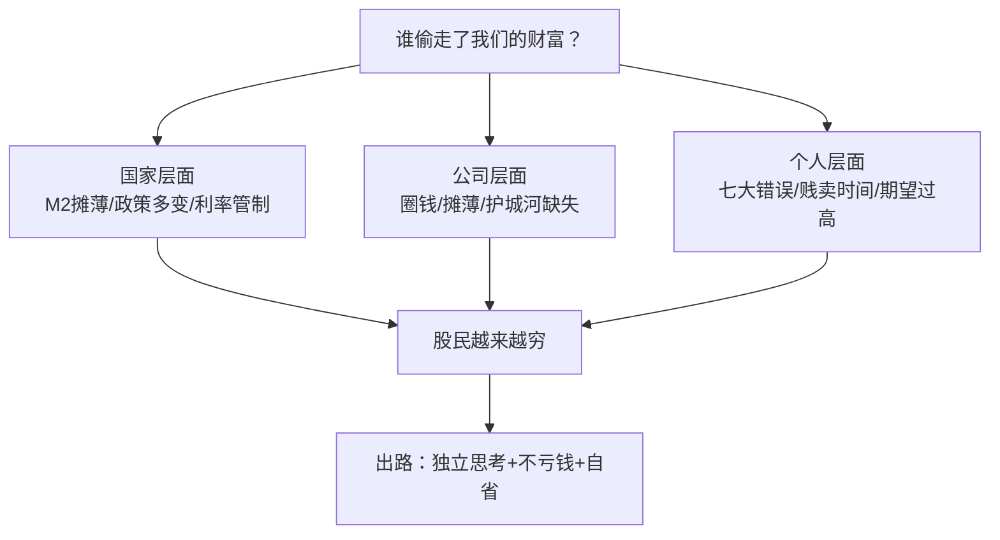

# 69《谁偷走了我们的财富？》深度解读（详细版）

> **副题：张化桥——"谁偷走了本来属于咱们的财富？"：散户的自省书 + 宏观的解剖书**
>
> 作者：张化桥（1963—），湖北荆门农家子弟，中国人民银行研究生部（五道口）毕业，瑞银中国研究部前主管，被称为"中国最敢讲真话的分析师"；后任万穗小额贷款公司董事长。本书是他的第二本投资随笔集——**第一本《避开股市的地雷》教微观排雷（040），这一本教宏观自省（069）**。
>
> **核心定位**：一本"拆穿幻觉"的书——拆穿 A 股估值幻觉（圈地运动）、货币幻觉（M2 摊薄）、名人幻觉（七大错误）、护城河幻觉（附录 A）。落脚点却是**自省**："我们无力强迫别人改变看法，但独立思考和实现财务自由，总可以吧！"
>
> **系列意义**：069 是系列第 69 本，**张化桥宏观批评篇**——与 [[40《避开股市的地雷》深度解读（详细版）|040 号《避开股市的地雷》]]（公司排雷）构成张化桥双璧；与 [[53《周期、估值与人性》深度解读（详细版）|053 号凌鹏"周期"]] 形成宏观对话；与 [[04《原则》深度解读（详细版）|004 号达利欧"原则"]] 的"极度求真"同频。

---

## 📖 全书结构与核心框架

| 板块 | 核心内容 | 一句话 |
|------|---------|--------|
| 序 | 你的艰难岁月，我的艰难岁月 | 中国巨变四件事+民意经常是错的 |
| 第1章 | 谁能战胜股市？ | 不亏钱第一原则+别贱卖时间+七大错误+选股路线图 |
| 第2章 | 股民要如何避免越来越穷？ | 沉船理论+2 倍 PE 思想实验+圈地运动+均衡估值 |
| 第3章 | 什么是能让你安枕的好公司？ | 护城河+董事长业绩+好行业也有坏公司 |
| 第4章 | 金融创新成了危机之源？ | 银行不能膨胀+余额宝+影子银行 |
| 第5章 | 咱们的财富在哪里？ | M2 摊薄+科长指数+加息+中华地票 |
| 附录A | 投资要有护城河 | 多尔西+护城河四大陷阱 |



---

## 📑 目录

- [[#第1章 序：你的艰难岁月，我的艰难岁月|第1章 序：艰难岁月]]
- [[#第2章 谁能战胜股市：打工仔的发财梦|第2章 谁能战胜股市]]
- [[#第3章 股民要如何避免越来越穷：沉船上的游戏|第3章 避免越来越穷]]
- [[#第4章 好公司：护城河与安枕|第4章 好公司标准]]
- [[#第5章 宏观解剖：谁在摊薄你的财富|第5章 宏观解剖]]
- [[#总结：张化桥留给散户的十句话|总结：十句话]]
- [[#附录一 张化桥金句集（30 条精选）|附录一 金句集]]
- [[#附录二 30 秒版：谁偷走了我们的财富？|附录二 30 秒版]]
- [[#附录三 与系列书籍对照|附录三 系列对照]]
- [[#附录四 知乎文风附录：那个"圈地运动"里的你|附录四 知乎文风附录]]
- [[#附录五 深度专题一：国企好过民企？（1.04）|附录五 国企好过民企]]
- [[#附录六 深度专题二：通用设备 vs 专用设备（1.05）|附录六 通用 vs 专用设备]]
- [[#附录七 深度专题三：A 股的未来十年（2.09）|附录七 A 股的未来十年]]
- [[#附录八 深度专题四：公路股与银行股的投资逻辑（3.07 + 4.03）|附录八 公路股与银行股]]
- [[#附录九 五大政策批评：谁夺走了企业家与散户的财富|附录九 五大政策批评]]

---

## 第1章 序：你的艰难岁月，我的艰难岁月

### 1.1 张化桥的来路

| 阶段 | 经历 |
|------|------|
| 1979 年 | 从湖北荆门农村考进湖北财经学院——"空气是清新的，空气中流动着希望" |
| 大学 | 每月 12 元政府补贴+父母 3 元，衣服等消费每月 6 元 |
| 1983 年 | 分配到襄樊税务局，但收到研究生录取通知书——五道口中国人民银行研究生部 |
| 1989 年 | 澳大利亚国立大学硕士——第一天洗盘子赚 100 澳元（等于北京公务员一年收入） |
| 1991 年起 | 在《澳大利亚金融评论报》《华尔街日报》等发表文章 |
| 1994 年 | 到香港投行——高薪厚禄却越来越穷（炒股亏光积蓄） |
| 2011 年 | 离开瑞银，任万穗小额贷款公司董事长——"有人表示赞赏，有人不理解" |

### 1.2 中国巨变四件事

> "这 30 多年来，我认为中国最大的变化是四件事：房改+利率管制、股市、城乡差距、国有企业垄断。"

| 巨变 | 内容 | 后果 |
|------|------|------|
| 房改+利率管制 | 公共房屋变私有财产，象征性付钱 | "拥有房产者财富迅速升值，与无房者差距越来越大"——**"在一个资产价格持续膨胀的环境里，你必须有资产才能跟市场保持一致"** |
| 股市 | 上市=扶贫/国企脱贫；严格控制上市数量 | 股价长期被高估；"每次股市大跌，股民便勇敢地当起了炮灰" |
| 城乡差距 | 30 多年迅速扩大 | 农民进城也没有经济能力住城里 |
| 国企垄断 | 石油/石化/铁路/电力/水务/银行占据有利地位 | 报酬越来越高，"我们不能以'多劳多得'为理由，将国有资产本应有的回报当成员工劳动回报" |

### 1.3 "民意经常是错的"

> "决策部门在制定政策的过程中，实际上在大多数情况下反映了民意，但民意经常是错的。有些政策开始是正确的，但时过境迁，政策就需要调整。有时候，民意可能会阻碍改革、阻碍进步。"

> **本书的落脚点**："作为老百姓，我如何看到自己的问题，尽量少犯错误。虽然我们无力强迫别人改变看法，但独立思考和实现财务自由，总可以吧！"

**（与 [[53《周期、估值与人性》深度解读（详细版）|053 凌鹏"人性永远重复"]]、[[43《势能命运》深度解读（详细版）|043 大鑫"自我局限"]] 形成呼应——先改自己，再改世界。）**

---

## 第2章 谁能战胜股市：打工仔的发财梦

### 2.1 面试官的当头棒喝

> "1998 年年底，我到一个英国投资银行申请工作。主考官问我：'请你告诉我，你将如何为我们赚钱？你要先为我们赚钱，我们才能有钱付你的工资和奖金。'我大吃一惊！打工就是打工，你给我多少钱，我做多少事。"

**张化桥的自我检讨**："我一直到 2001 年都是如此。现在，我终于完全安静下来，以**'不亏钱'为第一原则**。在'不亏钱'的前提下，赚取稳稳当当的钱。"

| 阶段 | 状态 |
|------|------|
| 1994 年赴港前 | 存款 100 多万港元（澳洲工作积蓄）——"完全没有负债" |
| 香港投行期间 | 高薪厚禄却越来越穷——"不是因为我花掉了，我其实非常节省，**可是炒股票慢慢亏掉了**" |
| 1998 年失业时 | 几乎一分钱也没有 |
| 痛定思痛后 | 重新学习投资——"没有了过去的焦躁，非常镇定，投资有得，反而富足了" |

> **血泪教训**：一个顶级分析师，高薪+节省，照样被股市掏空——**散户亏钱从来不是因为收入低，是因为"投资"乱花钱。**"很多人省吃俭用，'投资'的时候却一掷千金，打了水漂。"

### 2.2 别贱卖时间：洗盘子 vs 学英文

> 1989 年暑假，张化桥第一天在堪培拉洗盘子赚 100 澳元（相当于北京公务员一年收入），**第二天就辞了**："那份工作是贱卖我的青春——像那样打工，十年下去，工资不但不会上升，反而会下降。等我真的累断腰的时候，谁还要我？"

他辞掉工作，把两个月暑假完全投入英文训练："每天朗读英文两个小时，再读很多书报。"两年后硕士毕业，被堪培拉大学聘为正式讲师（终身教职）——"当时很多中国同学拿到博士学位后还在当助教"。

| 贱卖时间 | 投资自己 |
|---------|---------|
| 把人生价值画成一条**平平的直线** | 学差异化本事=画一条**上升的直线** |
| 洗盘子：十年后工资反而下降 | 学英文：两年后拿到终身教职 |
| 中国人"勤劳"的真相 | "多数中国留学生就是不肯做最困难、最枯燥、最考验意志的事：学英文" |

> **给留学生的建议**："花 80% 的时间学英文，剩下的时间学专业。"——**英文水准比专业知识更重要（运气和人际关系最重要）。**

### 2.3 我的资产分布：行业决定 80% 的成功

张化桥的资产组合（2014 年前后）：

| 资产类别 | 内容 |
|---------|------|
| 房产 | 香港+伦敦的房子+深圳小公寓 |
| 类金融 | 国内 P2P+万穗小贷公司股份+几个未上市公司股份 |
| 债券 | 内地地产公司在香港发行的高息债券 |
| 股票 | 博耳电力/重庆农商行/中油燃气/中裕燃气/茂业国际/中集安瑞科——**"这些投资我很少买卖"** |

> **"任何时候，永远要投资高增长的行业。行业决定一切，至少决定 80% 的成功。"**

**张化桥的行业点评表**：

| 行业 | 判断 | 理由 |
|------|------|------|
| 医药/养老 | ✅ 看好 | "行业前景很旺，值得研究" |
| 互联网 | 错过 | "估值太高，算了" |
| 旅游 | 看好 | 未找到合适标的 |
| 煤炭 | 2015 年某个时候也许值得投资 | — |
| 建筑/高铁 | ❌ 算了 | "周期性太强，资产密集性的行业很危险" |
| 乳业食品 | ❌ 风险太大 | 不可预测 |
| 码头航运 | ❌ 算了 | 周期性太强 |
| 航空 | ❌ 算了 | "太考验你的运气" |
| 百货 | ❌ 算了 | "时光不会倒流" |
| 超市 | ⚠️ 价值陷阱 | 上海联华超市亏钱——**"它有点像个价值陷阱。便宜，很便宜，但是又怎样呢？"** |
| 地产 | 谨慎投资 | 建业/茂业/新城 |

> **"便宜，很便宜，但是又怎样呢？"**——这句话是全书最锋利的一刀：**价值陷阱之所以是陷阱，正因为便宜是它唯一的优点。**

### 2.4 我们会犯的七大错误

| # | 错误 | 张化桥的剖析 |
|---|------|-------------|
| 1 | **迷信名人** | "名人也许并没有做过研究，也许这项投资是个错误（连巴菲特也时有错误）"；名人坚持两年赚一倍，你三个月跌 30% 就卖了 |
| 2 | **过分看重一次性利好** | 港交所持股增值>总市值的公司——"其他业务免费送"？要问三个问题：会不会卖光？会不会分红？钱会不会被浪费？ |
| 3 | **忘记业务监控能力** | 高管太关注股价而忘记业务；总部与地方脱节；"长期假手于人的结果就是下属自建独立王国"（合并时子公司连公章都不肯交） |
| 4 | **喜欢忙碌的公司** | "不断发新股/债券/可转债，同时又分派现金红利=耍弄投资者的雕虫小技"；不断并购又卖掉的公司股价反而高 |
| 5 | **期望过高，导致回报过低** | 股市中长期回报≈宏观增速=4%—8%；"如果你告诉散户回报只能 4%—8%，他会嘲笑你：太低了！"；新加坡等出租车的故事——"你刚刚走开，后面排队的人就等到了车" |
| 6 | **过分轻信管理层和专家** | "高管可能撒谎，或高估自己的能力，或低估面对的困难"；"很多投资者输钱就是因为轻信股评家、分析师和媒体" |
| 7 | **这山望见那山高** | 卖掉旧股买新股——"大家有没有发现，在未来两年内，旧的公司跑赢了新的？我们根本没有给公司足够长的时间让它们自我表现" |

### 2.5 我的选股路线图（五步）

| 步骤 | 内容 |
|------|------|
| ① 避开大价股 | 避开恒生指数成分股，在中小股票中找 **50—70 只**（市值 10 亿港元以上）——"大部分大价股已经毕业了，已经辉煌过了" |
| ② 分步建仓 | "永远记住我们没有能力抓住最佳的入市时机，平均成本法是个好原则"——随着工资奖金流入分步建仓 |
| ③ 再平衡 | 涨多了先问两件事：是否真的太贵？比重是否太大？"如果没有特别原因，尽量降低再配置频率" |
| ④ 剔除治理问题公司 | "董事长个人有无问题，管理层名声如何，公司透明度怎样？**避免损失比赚钱更为重要**"——本人四次碰到地雷公司 |
| ⑤ 利润增长率至上 | "利润增长率对股票升值至关重要，怎么强调也不过分"；行业足够分散，避开太热门或估值太高的股票；**不预测汇率和大宗商品** |

> 巴菲特的两面："他说如果你找到了好的团队，最佳的持股时间是永远——但他自己承认持有可口可乐时间过长（1999 年严重高估时也没卖），持有《华盛顿邮报》也时间太长。连股神都不完美，更何况我们？"


---

## 第3章 股民要如何避免越来越穷：沉船上的游戏

### 3.1 沉船理论

> "几年了中国股市不断下跌，财经演员们惊呼'真便宜啊'，可是股市并不领情。与其讨论股票指数明年的走势，还不如考虑一个长远的问题：**中国投资是否有点像沉船上的游戏？如果一条船正在慢慢下沉，那么我们在船上把椅子这样摆还是那样摆，最终的结果都不会有太大的区别。**"

| 表层问题 | 深层问题 |
|---------|---------|
| 指数明年走势？下季度点位？ | 小股东是否受到足够保护？ |
| 市盈率"够便宜"了吗？ | 公司会回购吗？大股东会增持吗？会退市吗？ |

### 3.2 2 倍市盈率思想实验：市盈率的真正底部也许是 0

> "2003 年，我还在瑞士银行做研究部主管时，发表过一篇尖刻的报告：如果有规定，任何公司只能用 2 倍的市盈率发行股票，否则就不准发行，你猜结果会怎样？——大量的公司除了加倍夸大利润之外，会接受用 2 倍市盈率发行新股。"

| 市盈率 | 市场反应（张化桥的推理） |
|--------|------------------------|
| 9—10 倍 | "有多少公司会大规模回购股票？有多少大股东会大规模增持？有多少公司会真正寻求退市？"——**相反，发行新股的公司依然排着长队** |
| 8 倍 | "排队的企业会更多，而不是更少，因为大家害怕永远错过了机会" |
| 5、4、3 倍 | 用数学方法无穷逼近——**"中国股市市盈率的真正底部也许是 0"** |

> **为什么大股东愿意贱卖？**"股本融资毕竟是不用归还的资金。反正小股东实际上没有权力，大股东控制公司股份的 35% 跟控制 60% 实际上是一样的。"

> **国资委的"英明"**："很多年以前他们就规定，政府控股甚至参股的企业不能低于净资产发行股票，否则就是国有资产流失。假想没有这项政策，我们的国有企业会被一家又一家快速摊薄，甚至卖掉。"

> **结论**："过去 20 年，大量投资者（特别是 PE 投资者）从中国市场获利甚丰，所以大家完全忽略了一个问题：**小股东（包括机构投资者）没有受到足够的保护。在风和日丽的时候，大股东可以做君子；一旦经济大萧条，法律和制度的脆弱就会暴露出来，大股东也会原形毕露。**"

### 3.3 股民怎样才能越来越富：一场"圈地运动"

| 张化桥的观点 | 内容 |
|-------------|------|
| 停止 IPO 没用 | "停止 IPO、停止增发都不能改变现有股票太贵的事实"——人为撑价只是"短暂的希望和幻觉" |
| 财富转移 | "这是一个巨大的划分'财主'和'贫民'的过程，这样的财富转移运动也许会被未来的历史学家定义为一场**'圈地运动'**。每个股民都天真地认为，自己一定是个赢家，当然结果是另一回事" |
| 卖方都不好意思 | 深圳 PE 老板说："券商和股民们'瞎胡闹'，在 IPO 时那么高的估值，让他都感到不好意思" |
| 买方比卖方更狂热 | "在中国，股民们为上市公司的估值做辩护的劲头比大股东们还大。卖家说每股 7 元就够了。买方说：'不行！你别客气。这么好的资产，每股起码 13 元……'" |

> **圈钱没错，贵才有错**："圈钱本身没错，大股东套现也没错——股市最基本的职能是交换产权。蔬菜和大豆价格下跌，难道我们可以随便关闭农贸市场和大豆交易所吗？""一个愿打，一个愿挨，只要披露全面和真实就行。"

> **IPO 融资=永远不用归还的债务**："IPO 带来的股本融资，等于永远不需要归还的债务，而且是不需要付利息的债务。天底下哪里去找这样的好东西？对于大股东来讲，他的股份属于他，你的股份也属于他。不求所有，只求所在！"

> **"左手圈钱，右手理财"没错**："理财没有什么不好，至少要比乱盖工厂好一百倍！要比随便把钱装进自己口袋好一万倍！"

### 3.4 均衡估值：合理市盈率的定义

> "股票的合理估值有一个标志，那就是一种均衡状态：**尚未上市的公司又想上，又不想上，可上可不上；已经上市的公司在留市和退市之间没有太大的偏好。**这种均衡状态下，股票估值就叫合理。"

| 高于均衡估值 | 低于均衡估值 |
|-------------|-------------|
| 公司排队上市和增发 | 公司纷纷退市或回购 |
| 大股东排队减持 | 大股东纷纷增持 |

> **合理市盈率是多少？**"3 年定期存款利息可以高达 5%，多数理财收益率 6%—8%。你需要留下起码 1/3 的安全边际——**A 股股市的合理市盈率在 9—11 倍；股市的市盈率只不过是市场利率的倒数。**但除了银行以外，多数 A 股市盈率高于 20 倍（如果利润有夸张成分，真实的市盈率可能更高）。"

---

## 第4章 好公司：护城河与安枕

### 4.1 投资要有护城河（附录 A 精华）

张化桥引多尔西《巴菲特的护城河》：**"世界是不公平的。行业有好有坏——好的行业就像顺水行舟（事半功倍），坏的行业就像逆水行舟（事倍功半）。男怕入错行，女怕嫁错郎。"**

**四大护城河陷阱（人们最常犯的错误）**：

| 陷阱 | 反例 |
|------|------|
| "产品好"不是护城河 | 克莱斯勒小型货车风靡一时→蜂拥而上失去优势；Krispy Kreme 甜甜圈→消费者热情很快消失；乙醇厂商→一年后欲哭无泪 |
| "市场占有率高"不是护城河 | 《纽约时报》名气大→股价几年跌 80—90%；海尔/戴尔/通用/柯达市场份额大→利润堪忧 |
| "执行力强"不是护城河 | 磨合好的团队"可遇不可求，而且可以随时变化"——领袖生病/死了/被挖角怎么办？Gateway 创始人重出江湖回天乏力 |
| "优秀管理团队"不是护城河 | "管理层好坏往往只有在事后我们才能看出来，而不是事前。事后的判断对于投资者来讲没有太大的实际意义" |

> **真正的护城河**：品牌和专利（详见原文）——"好公司的定义是能够持续创造比别人高的回报的公司。这与概念股——今天生物化学、明天环保或后天内需——是不一样的。"

### 4.2 好行业也有坏公司

（第3章 3.06 的核心——张化桥的行业洞察：）

| 观点 | 内容 |
|------|------|
| 行业决定大部分 | "任何时候，永远要投资高增长的行业。行业决定一切，至少决定 80% 的成功" |
| 好行业也有坏公司 | 行业再好，具体公司选错照样亏钱——要逐个甄别 |

### 4.3 你的钱属于谁？

| 问题 | 张化桥的答案 |
|------|-------------|
| 小股东的钱属于谁？ | 法律上属于股东，实际上——"对于大股东来讲，他的股份属于他，你的股份也属于他" |
| 董事长的业绩 | 要看真金白银的回报，不是故事和概念 |
| 董事被迫发大财 | 激励制度扭曲——高管薪酬与股东回报脱节 |

> **安枕公司的标准**：护城河+治理干净+利润真实增长——"避免损失比赚钱更为重要。"

---

## 第5章 宏观解剖：谁在摊薄你的财富

### 5.1 咱们天天被摊薄，还在傻乐（M2 的真相）

| 数据 | 中国 | 美国 |
|------|------|------|
| 货币供应量（2007 年底） | 相当于美国的 74% | 100% |
| 六年后 | **比美国高 61%**（美国 GDP 还比中国大 83%） | — |
| M2 年复合增长率 | **18.31%** | 2%—3%（含 QE1/2/3） |

> **"咱们的很多评论员拍拍脑袋就想当然，瞎喊'美国 QE，印钞票'——要知道，印钞票最疯狂的是我们。"**

**国家=上市公司**：

> "如果一家上市公司不断发行新股，股民们一定不高兴，因为被摊薄是很痛苦的。**一个国家就相当于一个上市公司。如果国家不断增发货币，那必然摊薄已经持有货币的人（两把斧子对等三张羊皮）**，除非新的货币发行能够为国家创造更高的回报率，而且你本人的份额也随着货币供应量的增长而增长。"

> **判定公式**："如果货币供应量的年复合增长率为 13%，而你自己的回报率因此超过 13%，那么你是受益者。否则，你就是一个受害者。"

> **张化桥的困惑**："所以，当我看到股民们为降准、减息和增加货币供应量而欢呼的时候，我感到十分困惑。"（股民把"摊薄自己的政策"当利好欢呼——这就是书名"谁偷走了我们的财富"的一部分答案。）

**张维迎的"钱荒"论**："2012 年发生的'钱荒'，是钱太多造成的。2009 年年初，各家银行、企业，无论有没有利润效率，都借钱投资，投资以后没需求，没需求还要还债，还债没钱，就闹了'钱荒'。用'灌水'解决'钱荒'不是办法，只能钱越来越荒。"

### 5.2 金融创新：银行、余额宝与影子银行

| 主题 | 张化桥的观点 |
|------|-------------|
| 中国的银行不能再膨胀了 | 信贷扩张太快，风险积累 |
| 银行可以上市，但不得融资 | 银行不需要股本融资——"银行股是拿来分红的，不是拿来圈钱的" |
| 中国银行股的黄金岁月 | 低估值+高分红——**全书少数看好的板块**（"A 股贵得离谱，也许除了银行以外"） |
| 余额宝想动银行的奶酪？ | 余额宝打破利率管制，是好事——"政府必须奖励余额宝" |
| 影子银行内幕 | 利率管制的副产品——资金绕道追逐真实利率 |
| 小微贷款 | 利率市场化才是小微金融的基础设施 |

> **核心逻辑**："中国几十年的利率压制人为地刺激了贷款需求，鼓励了低效率但是可能有关系和特权的投资者。这样，即使在信贷失控的状态下，中小企业也很难融资，只剩下三条路：付高息、走其他路或者忍受饥渴。"

### 5.3 咱们的财富在哪里：政策批评录

| 文章 | 核心观点 |
|------|---------|
| 如果水价涨五倍 | 资源价格被管制→补贴了富人→资源被浪费 |
| 咱们为什么都爱发改委 | 审批权=寻租空间 |
| 最简单的政策就是不行 | 政策多变（节假日高速免费）→"加大了投资的不确定性，加大了估值的风险折让" |
| 谁夺走了企业家的快感 | 产权保护不足→企业家缺乏安全感 |
| 衡量通胀，看科长指数 | 官方 CPI 失真——要看基层干部的实际生活成本 |
| 中国必须加息，而不是减息 | 利率压制=补贴借款人+坑存款人——**"我崇拜茅于轼，他正直和渊博。他关于加息的观点，我赞同。股市和楼市会因加息而大跌。早就该跌了！"** |
| 建议发行"中华地票" | 土地财政改革构想——让农民分享土地增值 |

---

## 总结：张化桥留给散户的十句话

| # | 一句话 | 出处 |
|---|--------|------|
| 1 | "不亏钱"是第一原则——在"不亏钱"的前提下，赚取稳稳当当的钱 | 1.01 |
| 2 | 贱卖时间，相当于把人生价值画成一条平平的直线 | 1.01 |
| 3 | 行业决定一切，至少决定 80% 的成功 | 1.03 |
| 4 | 便宜，很便宜，但是又怎样呢？（价值陷阱） | 1.03 |
| 5 | 期望过高，导致回报过低——股市中长期回报只有 4%—8% | 1.10 |
| 6 | 避免损失比赚钱更为重要 | 1.11 |
| 7 | 利润增长率对股票升值至关重要，怎么强调也不过分 | 1.11 |
| 8 | 估值只是第二位的问题——小股东保护才是第一位 | 2.03 |
| 9 | 合理市盈率=市场利率的倒数（9—11 倍），要留 1/3 安全边际 | 2.04 |
| 10 | 货币增长 13%，你的回报超 13% 才是受益者——别为降准欢呼 | 5.07 |

> **书名的答案**：谁偷走了我们的财富？——**高估值的 IPO 摊薄了股民，超发的货币摊薄了储户，多变的政策摊薄了企业家。但最大的小偷，是我们自己的七大错误。**"我们无力强迫别人改变看法，但独立思考和实现财务自由，总可以吧！"


---

## 附录一 张化桥金句集（30 条精选）

> 1. "不亏钱是第一原则——在'不亏钱'的前提下，赚取稳稳当当的钱。"
> 2. "很多人省吃俭用，'投资'的时候却一掷千金，打了水漂。"
> 3. "贱卖时间，相当于把你的人生价值画成一条平平的直线。"
> 4. "花 80% 的时间学英文，剩下的时间学专业。"
> 5. "行业决定一切，至少决定 80% 的成功。"
> 6. "便宜，很便宜，但是又怎样呢？"（联华超市=价值陷阱）
> 7. "资产密集性的行业很危险。"
> 8. "航空业太考验你的运气。"
> 9. "迷信名人——连巴菲特也时有错误。"
> 10. "期望过高，导致回报过低——股票市场的中长期回报率只有 4%—8%。"
> 11. "你刚刚走开，后面排队的人就等到了车。"（新加坡等出租车）
> 12. "避免损失比赚钱更为重要。"
> 13. "利润增长率对股票升值至关重要，怎么强调也不过分。"
> 14. "避开大价股——大部分大价股已经毕业了，已经辉煌过了。"
> 15. "不要对汇率或大宗商品的价格作预测——谁也无法作准确的预测。"
> 16. "中国投资是否有点像沉船上的游戏？"
> 17. "中国股市市盈率的真正底部也许是 0。"
> 18. "小股东实际上没有权力，大股东控制公司股份的 35% 跟控制 60% 实际上是一样的。"
> 19. "在风和日丽的时候，大股东可以做君子；一旦经济大萧条，大股东也会原形毕露。"
> 20. "这场财富转移运动也许会被未来的历史学家定义为一场'圈地运动'。"
> 21. "每个股民都天真地认为，自己一定是个赢家，当然结果是另一回事。"
> 22. "圈钱本身没错，大股东套现也没错——股市最基本的职能是交换产权。"
> 23. "IPO 带来的股本融资，等于永远不需要归还的债务。天底下哪里去找这样的好东西？"
> 24. "左手圈钱，右手理财——至少要比乱盖工厂好一百倍！"
> 25. "股市的市盈率只不过是市场利率的倒数——合理市盈率 9—11 倍。"
> 26. "一个国家就相当于一个上市公司——增发货币必然摊薄已持有货币的人。"
> 27. "看到股民们为降准、减息和增加货币供应量而欢呼的时候，我感到十分困惑。"
> 28. "印钞票最疯狂的是我们——中国 M2 年复合增长率 18.31%，美国只有 2%—3%。"
> 29. "产品好、市场占有率高、执行力强、优秀管理团队——这都是投资的陷阱，而不是护城河。"
> 30. "我们无力强迫别人改变看法，但独立思考和实现财务自由，总可以吧！"

---

## 附录二 30 秒版：谁偷走了我们的财富？

> 1. **微观**——排雷看 [[40《避开股市的地雷》深度解读（详细版）|040 号《避开股市的地雷》]]，这本看宏观；
> 2. **不亏钱**——第一原则；散户最大的浪费是"省吃俭用去投资"；
> 3. **别贱卖时间**——洗盘子不如学英文，直线不如上升线；
> 4. **行业定生死**——行业决定 80% 的成功；"便宜，很便宜，但是又怎样呢？"；
> 5. **七大错误**——迷信名人/一次性利好/忙碌公司/期望过高/轻信专家/见异思迁；
> 6. **沉船理论**——估值第二位，小股东保护第一位；
> 7. **圈地运动**——高估值 IPO=财富从股民流向大股东；
> 8. **均衡估值**——合理 PE=利率倒数（9—11 倍），留 1/3 安全边际；
> 9. **M2 摊薄**——货币增长 13%，回报超 13% 才是受益者；
> 10. **护城河陷阱**——产品好/市占率高/执行力强/管理团队≠护城河；
> 11. **自省**——最大的小偷是自己的七大错误。

---

## 附录三 与系列书籍对照

| 069 张化桥 | 对照笔记 |
|-----------|---------|
| 不亏钱第一原则 | [[36《炒股的智慧》深度解读（详细版）|036 陈江挺"败而不倒"]] |
| 便宜，很便宜，但是又怎样呢（价值陷阱） | [[35《投资中最简单的事》深度解读（详细版）|035 邱国鹭"便宜是硬道理但有前提"]] |
| 合理 PE=利率倒数 | [[42《逆向致胜》深度解读（详细版）|042 卜建业"PE15 满仓/PE65 空仓"]] |
| 行业决定 80% | [[46《投资至简》深度解读（详细版）|046 静逸"好大高正"]] |
| 护城河四大陷阱 | [[13《巴菲特的护城河》深度解读（详细版）|013 多尔西"护城河"]]（张化桥正是引用多尔西） |
| 七大错误之轻信专家 | [[37《股票投资沉思录》深度解读（详细版）|037 冉伟"博弈风险"]] |
| 圈地运动/小股东保护 | [[40《避开股市的地雷》深度解读（详细版）|040 张化桥"三种地雷"]]（姊妹篇） |
| M2 摊薄/通胀 | [[46《投资至简》深度解读（详细版）|046 静逸"现金是垃圾"]] |
| 别贱卖时间/自省 | [[43《势能命运》深度解读（详细版）|043 大鑫"走出自我局限"]] |

---

## 附录四 知乎文风附录：那个"圈地运动"里的你

> 你知道中国股民和全世界股民最大的区别是什么吗？
>
> 全世界的股民买股票，都希望公司便宜一点——便宜了，才能多买点。
>
> 中国股民不一样。**中国股民为上市公司的高估值辩护的劲头，比大股东自己还大。**
>
> 张化桥讲过一件真事：他去深圳一家 PE 公司做客，问老板他们投资的企业上市情况。老板说，券商和股民们"瞎胡闹"，IPO 时那么高的估值，"让他都感到不好意思"。
>
> 你看明白这件事有多荒诞了吗？卖家说："每股 7 元就够了。"买方说："不行！你别客气。这么好的资产，每股起码 13 元……"
>
> **买家帮卖家抬价，这是全世界独一份的奇观。**
>
> 为什么会这样？因为中国股民心里有一个根深蒂固的信念：股价涨=我赚钱。至于这个价格背后公司值不值，没人在乎——反正总会有更傻的人接盘。
>
> 张化桥管这个过程叫"圈地运动"：高估值的 IPO 和增发，把财富从股民手里源源不断地转移到上市公司大股东和 PE 手里。"每个股民都天真地认为，自己一定是个赢家，当然结果是另一回事。"
>
> 这本书里还有一个更扎心的比喻——沉船理论。
>
> "如果一条船正在慢慢下沉，那么我们在船上把椅子这样摆还是那样摆，最终的结果都不会有太大的区别。"
>
> 中国股市是不是一条沉船？张化桥说他不知道。但他提了一个让人脊背发凉的思想实验：如果规定公司只能以 2 倍市盈率发行股票，会发生什么？
>
> 答案是：公司会加倍夸大利润，然后照样排队上市。9 倍、8 倍、6 倍、4 倍……"你会得出跟我一样的结论：中国股市市盈率的真正底部也许是 0。"
>
> 为什么大股东愿意贱卖？因为 IPO 融资是"永远不需要归还的债务"。对小股东来说，股票是身家性命；对大股东来说，你的股份也属于他。"不求所有，只求所在！"
>
> 这本书的书名叫《谁偷走了我们的财富？》。张化桥给了三个答案：
>
> **高估值的 IPO 摊薄了股民。** 超发的货币摊薄了储户——中国 M2 年复合增长 18.31%，美国只有 2%—3%："印钞票最疯狂的是我们。"货币增长 13%，你赚不到 13% 就是被摊薄的受害者——**可股民还在为降准降息欢呼。**
>
> **多变的政策摊薄了企业家。** 节假日高速免费、煤炭价格、银行收费——"都无疑加大了中国投资的不确定性，加大了估值的风险折让。"
>
> 但最大的小偷，其实是我们自己：迷信名人、轻信专家、这山望见那山高、期望过高——**七大错误，每个股民都犯过。**
>
> 张化桥自己就是活例子：顶级分析师，高薪厚禄，省吃俭用，炒股票照样把积蓄亏光。"我一直到 2001 年都是如此。现在，我终于完全安静下来，以'不亏钱'为第一原则。"
>
> 全书最后，他说了一句特别朴素的话，我抄在笔记本上：
>
> **"我们无力强迫别人改变看法，但独立思考和实现财务自由，总可以吧！"**
>
> 没有人能阻止圈地运动。但你可以不做圈地里的那块地。

---

## 附录五 深度专题一：国企好过民企？（1.04）

> "我坚信，中国的国有企业好过民营企业。你会感到奇怪，张化桥这样一个'老愤青'，怎么会持有这样的看法？"

| 论点 | 论据 |
|------|------|
| 国企=一杆大旗 | "让大家云集在大旗之下，提供了至关重要的组织系统和稳定——**组织系统比做生意的启动资金更加重要**" |
| 自由资本主义的危险 | "当千千万万平民一分钱都没有、一点技能都没有的时候，逼着他们自己创业或找工作，大家都在肮脏的大街上像无头苍蝇一样——印度、巴基斯坦和菲律宾就是如此" |
| 民企的恶性循环 | "由于不被看好，部分民企就试图走偏门，而且业绩也不好。大家就说：'你看！你做坏事！你的业绩也不怎么样！'——这是一个恶性循环" |
| 政府手上的护城河 | "中国最大、最好、最赚钱的行业牢牢掌握在政府手上：烟草、盐业、银行、保险、证券、信托、电讯、'三桶油'、基础设施——**说起'宽宽的护城河'，政府手上的企业都是巴菲特会选择的**" |
| 股民的用脚投票 | "绝大多数大学生疯狂地追逐公务员的职位，追逐国有企业的职位。他们口头上有时指责发改委，但事实上，按照他们的愿望，中国即便成立 100 个甚至 1000 个发改委也不够用" |

> **投资含义**：国企=宽护城河+低估值（尤其 H 股），这是张化桥看好银行/公路/公用事业的根本逻辑——**在 A 股找"政府护城河+民企效率"的错配机会**。

---

## 附录六 深度专题二：通用设备 vs 专用设备（1.05）

**张化桥与钟兆民（东方港湾）的银行股辩论**：

| 钟兆民（不看好银行） | 张化桥（看好银行） |
|---------------------|-------------------|
| 周期性 | "中国绝大多数行业都有周期性，现在不是周期谷底也不是顶峰" |
| 资本密集型，需要不断圈钱 | "这本身就是进入门槛啊！还有牌照上的限制" |
| 高负债率，危险 | "银行垮台之前，我们的工厂和商业很可能更烂。**银行获救时股民会被摊薄，但工厂和商业企业的股东可能连被拯救的时间都没有了**" |
| 坏账看不清楚 | "工商企业账目更清楚吗？" |

> **通用设备 vs 专用设备**："股民要买通用设备（银行和与日常生活关系密切的公司）的股票，尽量避开专用设备（看不见摸不着的公司）。**通用设备就是不太需要专业知识的投资**——银行是整个经济的综合反映。专用设备包括高精尖、专业性太强、狭窄行业的东西——这些行业波动性大，也比较容易作假（因为大家不懂）。"

> 专用设备的例子："南美的森林、太平洋的渔业、蒙古的锡矿、泰山顶峰上的香精、'云端叠式磁性共振化疗'——这些行业只适合专业投资者。**说起渔业，注意蓝田股份在洪湖养的鱼。**"（蓝田股份=著名的农业造假股）

> 巴菲特："科技是人类进步的基石。不过我还是把登月的乐趣让给人家。"——**指数基金就是通用设备**（涵盖很多行业），特别适合没有时间或能力把握狭窄行业周期的投资者。

> **银行赚钱的真相（转移支付）**："不太好的银行确实还在赚钱。不过，这实际上是一种转移支付：**储蓄者会补贴银行，补贴使用贷款的企业。**从某些角度看，这不是很好（刺激信贷需求、浪费资金、可能导致腐败），但是我看十年之内，这种状况不太可能有变化。"

---

## 附录七 深度专题三：A 股的未来十年（2.09）

> "2005 年年底，我到美国拜会基金经理。某基金经理一坐下来就说：'Tell me something I do not know.'（说点我不知道的东西吧。）我一愣——如果我每次都要讲别人所不知道的东西，分析师这活儿怎么干呀？于是，我开始想办法离开我混了 10 多年的分析师岗位。"

**A 股为什么这么贵？**（张化桥的推理链）：

| 步骤 | 推理 |
|------|------|
| 现状 | 多数 A 股 PE 在 20 倍左右（利润有夸张成分则更高） |
| 合理值 | "一个市场的市盈率应该相当于市场利率的倒数。普通企业的正常资金成本约 10%——**A 股的合理市盈率在 10 倍上下，比现在的实际情况再低一半！**" |
| 为什么没跌到 10 倍？ | 惯性只是因素之一；散户的机会成本=存款利息（5%）和理财（6%—8%），不是企业资金成本 10% |
| 两个拖累因素 | ①通胀→利率上升→资金紧张（类似 2000—2004 年：经济活跃但股市连跌 5 年）；②**利率市场化→"脱媒"**（居民摆脱银行存款，投资机会成本提高） |

> **张化桥的预测**："由于利率市场化会很缓慢，股市也许不会大跌，而是**横行 10 年甚至 15 年**。与此同时，企业利润继续增长，但报出来的增长率不会很高——因为很多企业需要填补夸张了的利润。10 年之后回头看，市盈率跌到了 10 倍上下，但股票指数基本上原地踏步：**我们又白干了 10 年。**不过，大家不要沮丧，有危就有机……况且，我只是理论推导，可能全错。"

> **"我重复我最爱说的话：贵的可以更贵，便宜的可以更加便宜。股票的走势，谁知道呢？"**

---

## 附录八 深度专题四：公路股与银行股的投资逻辑（3.07 + 4.03）

### 公路股：皖通高速 vs 成渝高速

| 对比项 | 皖通高速（0995.HK） | 成渝高速（0107.HK） |
|--------|-------------------|-------------------|
| ROE | 约 12.5% | 约 10% |
| H 股 PE（2014 年） | 约 7.4 倍 | 约 6.15 倍 |
| 市值 | 75.8 亿元人民币 | 80.9 亿元人民币 |
| 息率 | 约 4% | 约 4% |
| 缺点 | 派息率太低/国有控股股东"异常繁忙"→现金投向次优项目（参股典当、小贷——"人情投资"） | 代客建造业务不挣钱/应收 19 亿 vs 应付 20 亿难周旋/加油站业务 22.5 亿营收仅 6676 万利润 |

> **买公路股的理由**：上市十年以上、经历资本市场磨炼、**做假账的可能性不大**；4% 息率不错；"资本市场对这个板块很负面时，提供了买入机会"。
>
> **H 股比 A 股贵的逻辑**："内地利率在未来五年甚至十年还可能继续高于香港——计算 DCF 时 H 股会比同一家公司的 A 股更值钱。**股市的合理市盈率无非就是市场利率的倒数。**"（"多年来，我这个'谬论'受到了不少人批评"）

### 银行股：中国银行股的黄金岁月

> "中国的银行坏账也许比报告出来的要高，但是这些年银行制度的改进和员工水平的提高也是很明显的。这个趋势还将持续很多年。"

| 看好理由 | 内容 |
|---------|------|
| 潜力未挖掘 | 信用卡/放款审查/结算体系/人员管理——"都是不需要跳起来就可以摘到的果子" |
| 银行=经济放大镜 | "银行就是经济的综合体和放大镜——经济往上走，银行有放大效应；经济往下走，银行受伤更重。但相比其他行业，银行业不知道好了多少倍" |
| 美国的教训 | "美国银行为了'业务增长'，只好往金字塔的下端走（次贷），一直走到荒唐的地步。中国的银行最终可能也会走上那条路，但距离还很遥远——**至少还有十年好日子**" |
| 利率管制的"好处" | "1983—1986 年，我在人民银行读研究生时的论文就是《中国利率自由化的途径》。20 多年后的今天，大家还在谈利率自由化。不过对于五千年的中华文明来说，20 多年算不了什么" |

**重庆农商行（3618.HK）六条买入理由**：

| # | 理由 |
|---|------|
| 1 | 不太可能倒闭 |
| 2 | 有坏账风险，但哪个行业没有？"出了大问题，政府会拯救它，倒不一定拯救别的行业的企业" |
| 3 | 356 亿港元市值，也算大型上市企业 |
| 4 | 地方性银行没什么不好——"重庆虽小，占地面积也几乎赶上匈牙利，人口多两倍" |
| 5 | "我在重庆调研和投资小贷公司，经常碰到农商银行的人。**在重庆，你竞争不过他们**" |
| 6 | 耐心等待：PE 从 6 倍变 3 倍，息率从 5% 变 10%，市净率 0.4——**"别看分析师定的 12 个月目标价格。我们看 4 年或者 5 年。如果不行，6 年。"** |

> **民生银行 H 股 vs A 股**："同样是民生银行的股票，H 股应该比 A 股贵很多（也许贵一半以上）才对——对于一个长期投资者来说，你只需要知道这么多，那些复杂的细节，让专家们去辩论。"

---

## 附录九 五大政策批评：谁夺走了企业家与散户的财富

| 批评对象 | 核心观点 |
|---------|---------|
| **发改委** | "咱们为什么都爱发改委？"——审批权=寻租空间；"最简单的政策就是不行"（节假日高速免费→黄金周大堵车，政策多变加大估值风险折让） |
| **利率管制** | 补贴借款人、坑存款人——"中国必须加息，而不是减息。我崇拜茅于轼，他关于加息的观点我赞同。股市和楼市会因加息而大跌。**早就该跌了！**" |
| **通胀统计** | "衡量通胀，看科长指数"——官方 CPI 失真，要看基层干部实际生活成本 |
| **货币超发** | M2 年增 18.31%——"印钞票最疯狂的是我们" |
| **土地财政** | 建议发行"中华地票"——让农民分享土地增值 |

> **张化桥的政策观**："政策多变（节假日高速免费、煤炭价格、银行收费、油价、电力价格、干部派遣）都无疑加大了中国投资的不确定性，加大了估值的风险折让。"——**政策风险是 A 股最大的系统性折价因素。**

---

# 附录十｜深度长文：真正偷走财富的，往往不是一个人

假设一个人的银行账户里一直有 100 万元。

第一年，他觉得自己有钱；十年后，账户上还是 100 万元，他却发现，同样的钱买不到原来的房子，付不起同样比例的教育和养老成本，也无法承担一次漫长的失业。

钱没有消失，账户也没有被盗。

但他的财富确实少了。

这大概是《谁偷走了我们的财富？》最值得追问的地方：**所谓“偷走”，未必是有人趁你睡着时拿走钱包。更多时候，它是一种缓慢、合法、分散而难以察觉的转移。**

货币扩张会稀释购买力，低效率投资会消耗社会资本，高价融资会把财富从后来者转给先进入的人，糟糕的公司治理会让利润停留在大股东能够支配、而小股东无法触及的地方。与此同时，我们自己还会因为迷信名人、追逐热点、频繁交易和过高预期，再主动交上一笔“认知税”。

所以，这本书真正要找的“贼”，不是一个人，而是一组机制。

## 一、你以为自己在看余额，实际上应该看四本账

普通人理解财富，最容易只看第一本账：名义账户。

工资从 5000 元涨到 10000 元，存款从 20 万元涨到 50 万元，感觉自然比过去富有。但名义数字只是财富最外面的一层包装。

真正决定一个人是否变富的，还有另外三本账。

第二本是购买力账。你的收入增长，能否跑赢与你有关的住房、医疗、教育、养老和日常生活成本？每个人面对的“个人通胀”都不一样。一个已经拥有住房的人和一个准备在大城市买房的人，即使工资完全相同，财富处境也可能截然相反。

第三本是所有权账。你买入股票以后，拥有的并不是一个代码，而是企业未来现金流的一小部分。如果公司不断增发、举债、做低回报并购，或者控股股东通过关联交易改变利益分配，那么公司规模虽然扩大，你的每股权益却可能越来越薄。

第四本是选择权账。负债过高、现金储备不足、资产缺乏流动性的人，即使账面资产很多，也可能没有等待的资格。一旦失业、疾病或市场下跌同时出现，他只能在最差的时间卖出资产。

因此，判断财富不能只问“我有多少钱”，还要问：

> 我的钱能买到什么？我在资产中的实际份额有没有被稀释？我能否在不利时期保留选择？

《谁偷走了我们的财富？》讨论的，正是这四本账之间的巨大落差。

## 二、第一个“小偷”：货币没有拿走你的钱，却改变了钱的尺度

书中最有冲击力的一章，是张化桥把国家比作一家上市公司。

一家上市公司不断发行新股，老股东会被稀释。一个经济体不断增加货币，如果新增货币没有带来相应的生产率和真实财富增长，原有货币持有者的购买力也会受到稀释。

这个比喻之所以有力量，是因为它把宏观问题翻译成了股民都能理解的语言：**你持有的不是一叠静止的钞票，而是对全社会商品、服务和资产的一种索取权。索取权增长得比可供索取的东西快，每一单位货币能够换到的东西就可能减少。**

很多人看到降息、降准和流动性增加，会首先想到股市上涨，却很少追问资金最终流向哪里。如果资金主要进入高效率企业，形成更好的产品、更先进的设备和更高的劳动生产率，那么新增货币背后有真实财富支撑；如果资金进入重复建设、低回报项目和资产投机，结果就可能是债务增加、资产价格抬升和后续偿债压力。

书中“钱荒是钱太多造成的”这句话乍听矛盾，其实指向一个常见现象：钱被低效率项目和债务链条占住以后，系统里的货币总量可能很多，真正能够自由流动、承担新风险的资金却越来越少。旧债需要新债维持，项目需要更多铺底资金，越“放水”越依赖放水。

不过，这里必须给作者的论证加一道边界。

**M2 增长多少，并不等于个人财富就按同样比例缩水。** 货币深化、储蓄结构、金融体系变化、货币流通速度和真实产出都会影响结果。作者提出“货币增长 13%，个人回报低于 13% 就是受害者”，作为警醒很有力度，但作为严格的个人投资公式过于简单。

普通人更应该计算的是：

> 实际财富增长 ≈ 税后名义回报 − 与自己相关的生活成本涨幅 − 交易和管理费用。

这意味着，财富管理的起点不是盲目追求高收益，而是先弄清自己的负债、支出和未来目标分别受什么价格影响。退休者、租房者、有房贷的家庭和准备留学的家庭，需要对冲的风险完全不同。

## 三、第二个“小偷”：资本市场最擅长让买方替卖方抬价

书里最生动的一幕，是一家 PE 机构面对过高的 IPO 定价，连卖方自己都觉得不好意思；股民却主动站出来说：“这么好的资产，怎么能只卖这个价？”

这看似是笑话，背后却是一套稳定的财富转移机制。

当企业以很高的估值发行股票时，原股东出售的是对未来利润的索取权。新股东支付的价格越高，卖方越有利，买方未来能够获得的回报越低。可在牛市中，人们往往把高发行价理解为“公司受认可”，把低发行价理解为“公司被贱卖”。

这里发生了一个角色错位：明明是买家，却开始替卖家维护价格。

张化桥把股票融资称作企业获得的“不需要归还、也可以不付利息的债务”。这句话并不符合严格的会计定义，却抓住了小股东面对的现实：债权人有合同约定的利息和到期日，股东只有剩余索取权；如果公司不分红、不回购，也不能高回报再投资，小股东就可能长期拿不到任何可实现的价值。

因此，“市盈率低不低”不是最先要问的问题。更重要的是：

- 公司为什么愿意在这个价格发行股票？
- 大股东在增持还是减持？
- 融来的钱能否创造高于原有业务的每股回报？
- 总股本增加以后，每股自由现金流是否同步增长？
- 如果账面价值真的被严重低估，公司为何不回购或私有化？

作者关于“2 倍市盈率仍可能有人愿意发行”的思想实验，真正想说的不是所有股票都应该跌到极低估值，而是：**如果企业在任何价格都热衷于卖出股权，而内部人很少愿意以市场价格买回，投资者就该重新审视所谓便宜。**

价格低只是产生高回报的必要条件之一。所有权能否得到尊重、现金能否到达股东手里，往往更加重要。

## 四、第三个“小偷”：公司增长了，你的每一股却没有成长

张化桥在书中写过一个很讽刺的场景：某国企董事长展示六年成绩，销售额增长 1.5 倍、利润翻番，所有人都在祝贺。作者回去一查，同期名义 GDP 和货币供应增长更快。换句话说，董事长口中的增长，很大一部分只是价格水平和经济总量上升带来的“货币幻觉”。

这个案例提醒我们，分析企业不能只看绝对数字。

一家公司的收入从 100 亿元增长到 200 亿元，看起来翻了一倍。但如果同期总股本也翻了一倍、负债增长三倍、资本开支吞掉全部现金，而同行平均增长更快，那么原股东未必得到任何好处。

真正应该比较的是四组数字：

```text
收入增长 vs 行业增长
利润增长 vs 投入资本增长
公司总价值增长 vs 总股本增长
账面利润增长 vs 自由现金流增长
```

只有当公司相对竞争者变得更强、新增资本获得合理回报、每股现金创造能力持续提高时，增长才属于股东。

这也解释了作者为什么喜欢“安安静静”的公司。

资本市场偏爱忙碌：今天增发，明天并购，后天拆分上市，再过几个月宣布进入新产业。每一步都有新闻，每一个动作都可以讲故事。相比之下，一家公司多年只做一件事、稳定收钱、很少融资，看起来没有想象力。

但商业世界里的很多价值，恰恰来自重复，而不是热闹。

收费公路、公用事业、优秀软件、某些金融服务或品牌消费品的吸引力，并不在于管理层每天发明新故事，而在于已有网络、客户转换成本、牌照、低成本结构或品牌能够反复产生现金。

忙碌是动作，复利才是结果。

## 五、第四个“小偷”：公司是你的，钱却未必属于你

书中有一句非常尖锐的话：你究竟是股东，还是捐款人？

股东在法律上拥有公司的一部分，但经济上的所有权并不只由持股证明决定。真正的所有权至少包含三件事：分享现金、参与重大决策，以及在权益受损时获得救济。

如果一家企业长期不分红，也不回购；留存利润被投入低回报项目；控股股东通过关联交易、并购和资本支出支配资金；小股东既无法改变管理层，也无法迫使资产变现，那么账面上的“内在价值”可能永远只是一个数字。

这正是价值陷阱最深的一层。

很多投资者看到公司拥有一块土地、一栋物业或一笔金融资产，就把市值减去这些资产，得出“主营业务免费赠送”的结论。张化桥提醒：即使资产真实存在，也要继续问三件事——公司会不会卖、卖了会不会分、如果不分又会不会被浪费。

这三问把资产价值与股东价值分开了。

对小股东而言，不能变现、不能分配、不能约束管理层使用的资产，估值时理应打折。折价幅度取决于治理结构、资本配置记录、控制股东信誉和法律救济效率，而不是一条机械公式。

因此，好公司的标准不能只写“行业优秀、管理层能干”。还必须加上：

> 管理层愿不愿意把自己视为股东资本的受托人？

诚信决定数字是否可信，商业模式决定公司有没有能力赚钱，执行力决定能力能否落地，资本配置则决定赚到的钱最终去了哪里。四者缺一，股东都可能只得到一个热闹的故事。

## 六、最隐蔽的“小偷”：我们总以为错误来自别人

这本书表面上批评货币、银行、发改委、上市公司和大股东，但作者在序言里已经给出了更不讨喜的答案：国家和决策部门由普通人构成，很多政策反映的正是民意，而民意经常会错。

我们希望存款利率高，又希望贷款利率低；希望房价上涨，又希望年轻人买得起房；希望股票便宜，却在市场下跌时要求停止 IPO、限制供给、托住价格；希望上市公司高分红，又乐于给不断融资的公司极高估值；希望投资回报高，又不愿承受研究、等待和波动。

这些愿望单独看都合情合理，放在一起却互相冲突。

书中列出的七类投资错误——迷信名人、放大一次性利好、忽略组织控制、偏爱忙碌公司、预期过高、缺乏耐心、轻信专家——本质上都来自同一种心理：**我们希望把困难的判断外包出去，却不愿放弃高回报的幻想。**

名人买了，替我们解决了研究问题；政策支持，替我们解决了行业问题；目标价很高，替我们解决了估值问题；股价上涨，替我们解决了证据问题。

可投资最残酷的地方在于，任何人都可以影响你的决定，却没有人替你承担结果。

真正偷走财富的，常常不是一次重大错误，而是许多看似无害的小决定：多付一点估值、频繁换一次股票、忽略一项股权稀释、相信一次无法验证的承诺、在下跌时被迫卖出。单次损失不大，复合起来却足以改变人生。

## 七、这本书最需要“反着读”的四个地方

一本有锋芒的书，最容易让读者把作者的判断当成新教条。《谁偷走了我们的财富？》更好的读法，是保留它的问题意识，同时检验它的答案。

### 1. “合理市盈率是利率的倒数”只能作为起点

利率决定折现率，是估值的重要变量。但企业的增长、盈利稳定性、资本强度、财务杠杆和治理风险同样重要。10% 的市场利率不意味着所有公司的合理市盈率都是 10 倍；一项衰退业务和一项能够低资本复利的业务，不应获得同样估值。

更完整的表达应当是：

> 合理估值由无风险利率、风险溢价、可持续增长和现金转化能力共同决定。

### 2. “行业决定 80%”是在强调顺风，但不能代替公司研究

好行业可以让普通公司活得舒服，却也会吸引资本和竞争者。书中燃气行业的成功与失败案例已经证明，好行业只是必要条件之一。真正的护城河必须在长期高资本回报、稳定现金流和竞争者难以复制的机制中得到验证。

### 3. M2 是警报器，不是个人收益率基准

货币供应快速增长值得警惕，但个人是否变穷，要看收入、资产、负债和消费篮子的共同变化。把投资回报机械地与 M2 增速比较，会忽略金融深化、货币流通速度和真实经济增长。

### 4. 作者当年的具体配置不是永恒答案

书中披露的资产包括 P2P、小额贷款公司股权、内地房企高息债券、地产股和银行股。这套组合在当时有作者自己的经验背景和收益判断，同时也明显暴露于信用、流动性、地产和金融周期。

这并不削弱本书，反而提供了一条更重要的教训：**能指出系统风险的人，也无法站在系统之外。** 投资框架只能提高胜率，不能取消时代、周期与认知边界。

因此，阅读十多年前的投资观点，应该把“当时买什么”与“作者怎样思考”分开。前者会过时，后者仍可用于今天。

## 八、把全书变成一套“财富防漏”系统

如果只允许从本书带走一套方法，可以把它整理成五层防线。

第一层是家庭资产负债表。计算现金储备、负债成本、未来三年刚性支出和个人通胀，不让自己在最坏时点被迫卖出。

第二层是购买力。现金不是绝对安全，股票也不是天然抗通胀。资产能否对抗通胀，取决于它有没有提价权、低资本再投资能力和稳定需求。

第三层是每股价值。研究收入利润的同时，必须追踪总股本、净负债、自由现金流和增量投入资本回报。公司变大不等于每股变值钱。

第四层是治理与实现。检查分红和回购的来源、关联交易、控股股东行为、审计记录，以及资产价值能否真正到达少数股东。

第五层是买入价格。把股票视为一项长期现金流权利，而不是等待别人接盘的筹码。为不确定性留下安全边际，并提前写下证伪条件。

具体研究一家公司时，可以先问十二个问题：

1. 公司真正依靠什么赚钱？这种优势能维持多久？
2. 过去五年的增长有多少来自真实销量，有多少来自价格、并购或货币因素？
3. 累计经营现金流能否覆盖累计净利润？
4. 扣除维持性资本开支后，还剩多少自由现金流？
5. 新增一元资本带来的回报是在上升还是下降？
6. 总股本、净负债和或有负债发生了什么变化？
7. 公司为什么融资？融资以后每股价值提高了吗？
8. 控股股东最近在增持、减持，还是质押？
9. 分红和回购来自经营现金，还是来自借债与再融资？
10. 账面资产通过什么路径变成小股东可获得的价值？
11. 当前价格已经包含了哪些乐观预期？
12. 哪三项事实出现时，必须承认自己的判断错误？

这十二问的目的，不是保证我们永远避开损失，而是让损失发生时能够知道：究竟是事实改变、估值错误、治理恶化，还是自己根本没有做研究。

## 九、书名最后的答案

读完整本书，再回头看“谁偷走了我们的财富”，答案并不痛快。

不是某一个部门，不是某一类公司，也不只是货币、银行或大股东。

财富的流失更像一条长长的管道：收入进入储蓄，储蓄进入金融体系，金融体系把资本分配给企业，企业创造利润，管理层再决定利润如何使用，最后市场价格决定投资者能获得怎样的回报。

管道的每一段都可能漏水。

通胀漏掉购买力，低效率信贷漏掉社会资本，股权稀释漏掉所有权，糟糕治理漏掉公司现金，高估值漏掉未来收益，频繁交易和认知偏差则漏掉最后一点耐心。

但这并不意味着普通人无能为力。

我们无法单独决定货币政策，无法保证市场永远公平，也无法要求每一家上市公司善待股东。我们能做的是识别自己站在财富转移链条的哪一端：是在用过高价格购买别人急于出售的资产，还是在拥有能够产生现金、尊重股东并且价格合理的权益；是在依赖下一次宽松拯救估值，还是在建立足以穿越坏时期的资产负债表。

张化桥在序言中写道，我们无力强迫别人改变看法，但独立思考和实现财务自由，总可以。

这句话才是全书真正的落点。

所谓保护财富，并不是找到一个永不贬值的神奇资产，而是逐渐建立一种能力：**看懂购买力的变化，看穿增长背后的资本代价，看清所有权与控制权的差别，也看见自己欲望中的漏洞。**

当我们能够同时守住购买力、每股价值、选择权和判断力，那个“偷走财富的人”即使仍然存在，也会越来越难从我们这里下手。
