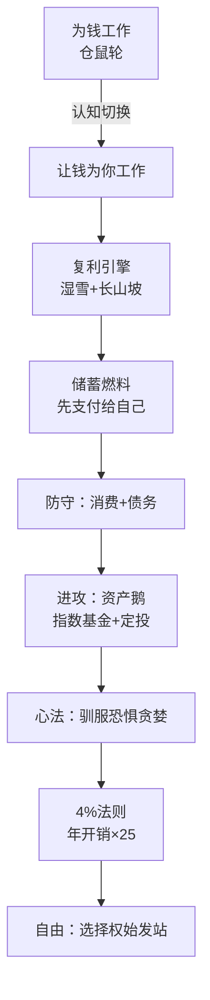

# 70《让钱为你工作》深度解读（详细版）

> **副题：周鸿仙——"从存小钱到财富自由"：两种人生游戏、复利雪球、4% 法则与你的 FIRE 数字**
>
> 作者：周鸿仙，理财科普作者。本书是一本**财富自由路线图**——从"为钱工作"切换到"让钱为你工作"的完整战略指南，10 章构成一条清晰的路径：认知（两种游戏）→ 魔法（复利）→ 燃料（储蓄）→ 防守（消费/债务）→ 进攻（资产/指数基金）→ 心法（恐惧贪婪）→ 终点（4% 法则）→ 升华（自由）。
>
> **核心定位**：**普通人的财富自由操作手册**——不教你暴富（"快速暴富是第一种游戏模式里最危险的陷阱"），而是教你把"财富自由"从梦想变成可计算的数字：**退休数字 = 年开销 × 25**。
>
> **系列意义**：070 是系列第 70 本，**理财启蒙·FIRE 篇**——与 [[54《投资第一课》深度解读（详细版）|054 号孟岩《投资第一课》]]（投资认知）、[[65《好好存钱》深度解读（详细版）|065 号洋洋姐《好好存钱》]]（储蓄实战）构成"普通人财富自由三部曲"；与 [[45《解读基金》深度解读（详细版）|045 号季凯帆]]（基金启蒙）互补。

---

## 📖 全书结构与核心框架

| 章节 | 核心内容 | 一句话 |
|------|---------|--------|
| 第1章 | 两种人生游戏 | 资产把钱放进口袋，负债从口袋掏钱 |
| 第2章 | 复利魔法 | 湿雪+长山坡=滚雪球 |
| 第3章 | 无痛储蓄 | 收入−储蓄=支出（先支付给自己） |
| 第4章 | 消费的陷阱 | 需要 vs 想要；享乐跑步机 |
| 第5章 | 债务双刃剑 | 坏债务=财富粉碎机；好债务=杠杆 |
| 第6章 | 睡后收入 | 股权/债权/房地产三类资产鹅 |
| 第7章 | 懒人投资法 | 指数基金+定投=打不过就加入 |
| 第8章 | 投资心法 | 贪婪与恐惧是最大的敌人 |
| 第9章 | 4% 法则 | 退休数字=年开销×25 |
| 第10章 | 自由而非终点 | 财富自由=选择权的始发站 |



---

## 📑 目录

- [[#第1章 两种人生游戏：仓鼠轮与金鹅|第1章 两种人生游戏]]
- [[#第2章 复利魔法：湿雪与长山坡|第2章 复利魔法]]
- [[#第3章 无痛储蓄：先支付给自己|第3章 无痛储蓄]]
- [[#第4章 消费的陷阱：需要与想要|第4章 消费的陷阱]]
- [[#第5章 债务双刃剑：坏债务与好债务|第5章 债务双刃剑]]
- [[#第6章 睡后收入：认识三类资产鹅|第6章 睡后收入]]
- [[#第7章 懒人投资法：指数基金与定投|第7章 懒人投资法]]
- [[#第8章 投资心法：与恐惧贪婪共舞|第8章 投资心法]]
- [[#第9章 4% 法则：你的退休数字|第9章 4% 法则]]
- [[#第10章 自由，而非终点|第10章 自由而非终点]]
- [[#总结：从存小钱到财富自由的七步|总结：七步路线图]]
- [[#附录一 周鸿仙金句集（25 条精选）|附录一 金句集]]
- [[#附录二 30 秒版：让钱为你工作|附录二 30 秒版]]
- [[#附录三 与系列书籍对照|附录三 系列对照]]
- [[#附录四 知乎文风附录：那台跑步机，你跳下来了吗？|附录四 知乎文风附录]]

---

## 第1章 两种人生游戏：仓鼠轮与金鹅

### 1.1 为钱工作：最拥挤的赛道

> "我们像一只在仓鼠轮里奋力奔跑的仓鼠，跑得越快，轮子似乎也转得越快。我们不断地用自己的生命去驱动这个轮子，以换取足以支付账单、维持生活的'饲料'。"

| 为钱工作 | 让钱为你工作 |
|---------|-------------|
| 出售时间换取薪水 | 让资产自动产生收入 |
| "收入−支出=结余" | "收入−储蓄=支出" |
| 金钱是主人 | 金钱是仆人 |
| 自由被锁在工资条上 | 自由来自资产组合 |
| 积累"看起来富有"的东西 | 积累"真正富有"的资产 |

### 1.2 资产与负债：清崎的一针见血

> "资产就是那些能够持续地把钱放进你口袋里的东西。负债就是那些会持续地把钱从你口袋里掏走的东西。"

| 资产（放进口袋） | 负债（掏走口袋） |
|-----------------|-----------------|
| 产生租金的房子 | 超出消费能力的汽车（+保养费+保险） |
| 盈利公司的股份 | 信用卡账单（+利息） |
| 股息/利息/分红 | 名牌包/昂贵电子产品 |

> "为钱工作的人领到工资后第一反应是消费，购买那些让他们'看起来'很富有的东西——他们的钱在口袋里短暂停留，然后就流向了商家和银行的口袋。而让钱为你工作的人，把钱变成一只只会下金蛋的'鹅'。"

### 1.3 财务自由的转折点

> "当他们拥有了足够多的'资产鹅'之后，一个奇妙的转折点就出现了：这些资产每天下的'金蛋'（股息、利息、租金）已经足以覆盖每天的'生活开销'。从这一刻起，他们就获得了名为'财务自由'的东西。"

> "他们依然可以选择去工作，但此时的工作不再是为了'薪水'，而是为了'兴趣''热情'和'自我实现'。他们从金钱的'奴隶'一跃成为金钱的'主人'。"

**（与 [[54《投资第一课》深度解读（详细版）|054 孟岩"投资成功=变成更好的人"]]、[[65《好好存钱》深度解读（详细版）|065 好好存钱"储蓄自由"]] 完全同频——先攒鹅，再谈自由。）**

---

## 第2章 复利魔法：湿雪与长山坡

### 2.1 爱因斯坦的"世界第八大奇迹"

| 单利 vs 复利 | 计算 |
|-------------|------|
| 单利（1 万，5%，10 年） | 每年固定 500 元利息，10 年共 5000 元 |
| 复利（1 万，5%，10 年） | 第二年基数变 10500——**利息也生利息，"子子孙孙"** |

> "一个人能否最终实现财富自由，在很大程度上取决于他是否善用了这个世界上最强大的'数学魔法'。"

### 2.2 滚雪球：湿雪与长长的山坡

> 巴菲特："人生就像滚雪球。最重要之事是发现湿雪和长长的山坡。"

| 比喻 | 含义 |
|------|------|
| **湿雪** | 能够持续产生回报的优质资产 |
| **长长的山坡** | 时间 |

### 2.3 小明 vs 小红：10 年打败 30 年

| 对比 | 小明 | 小红 |
|------|------|------|
| 开始年龄 | **20 岁** | 30 岁 |
| 投入期限 | 10 年（到 30 岁停止） | 30 年（到 60 岁） |
| 总本金 | 12 万 | **36 万（小明的 3 倍）** |
| 60 岁时财富 | **远远超过小红** | 反而更少 |

> **"尽管小明只投资了 10 年，投入的本金也只有小红的三分之一，但到 60 岁时，他的财富总额将会远远超过小红——那早期看似不起眼的本金和利息，在长达四十年的'山坡'上，以'利滚利'的方式进行了惊人的指数级增长。"**

### 2.4 复利三启示

| 启示 | 内容 |
|------|------|
| **越早越好** | "年轻人最宝贵的'资本'不是金钱，而是比任何人都更'长'的那条财富山坡——时间" |
| **保持耐心** | "复利效应的显现是非线性的——初期增长非常缓慢甚至令人沮丧。许多人正是因为无法忍受初期的'平淡'而放弃，或去追逐'快速回报'的投机游戏，结果血本无归" |
| **找到湿雪** | 投入能够长期稳定产生正向回报的优质资产 |

> **"一个真正的财富创造者是一个'长期主义者'。他像一个耐心的农夫——不会因为禾苗没有在一夜之间长高而焦虑。"**

**（与 [[45《解读基金》深度解读（详细版）|045 季凯帆"30 岁月 300=60 岁 97 万"]]、[[51《三十年股票投资心得》深度解读（详细版）|051 冷眼"油棕第 6 年才赚钱"]] 的复利/耐心观完全一致。）**

---

## 第3章 无痛储蓄：先支付给自己

### 3.1 颠覆公式：收入−储蓄=支出

| 大多数人的公式 | 富人的公式 |
|---------------|-----------|
| 收入−支出=储蓄（月底剩多少存多少） | **收入−储蓄=支出**（先存后花） |

> "你不再是从'消费'后的'结余'中去储蓄；而是在'储蓄'之后，用'结余'的钱去消费。你把'储蓄'放在了财务规划的最高优先级上。"

### 3.2 自动化的魔法

> "将'储蓄'这个需要我们每次都用意志力去决策的'痛苦'行为，变成无需思考、自动在后台运行的'无痛'习惯——它是对抗人性中那个倾向于'即时满足'的魔鬼的最有效武器。"

**操作**：银行 APP/支付平台设置"自动转账"——发薪日自动划转 10%—20% 到储蓄/投资账户。

### 3.3 三类支出分类法

| 类型 | 定义 | 策略 |
|------|------|------|
| **必要支出** | 维持基本生存（房租/水电/伙食/交通） | 优先保障 |
| **改善型支出** | 提升生活品质/投资成长（旅行/课程/高品质物品） | 完成储蓄目标后犒劳自己 |
| **非理性消费** | 冲动/攀比/虚荣（打折囤积/炫耀性消费） | **警惕并砍掉** |

> **拿铁因子**："指那些看似微小、但日积月累却非常可观的非必要开销"——识别并减少它们，在不降低核心生活品质的前提下为储蓄账户增加弹药。

---

## 第4章 消费的陷阱：需要与想要

### 4.1 商家是最顶级的"欲望制造者"

| 利用的心理 | 话术 |
|-----------|------|
| 不安全感 | "用了这款护肤品，你才能抵抗衰老" |
| 社交焦虑 | "开了这辆车，你才能获得别人的尊重" |
| 身份认同 | "穿上这个品牌，你才是有格调的独立女性" |

### 4.2 享乐跑步机：欲望永不满足

> "心理学上的'享乐适应'：当生活水平提升或获得新东西时，'快乐'非常短暂——很快你就会适应并视为'新常态'，然后产生新的更高的欲望。你以为买下那个名牌包会获得长久的满足，但实际上那种快乐可能只持续了一周。"

> **"我们在'欲望→满足→适应→新欲望'的循环中不断升级消费，但幸福感却始终在原地踏步。"**

### 4.3 跳下跑步机的两个方法

| 方法 | 操作 |
|------|------|
| **冷静期** | 购买冲动产生后强制等待 24—72 小时，问自己："我真的需要它吗？""一个月后我依然渴望吗？"——"许多'想要'都只是一时的、情绪化的产物" |
| **体验>物质** | "将金钱用于购买'体验'（旅行/音乐会/课程/与朋友的晚餐），其长久的幸福感远高于购买'物质'" |

> **"一个人管理财富的能力，首先体现在他管理自己'欲望'的能力之上。"**

---

## 第5章 债务双刃剑：坏债务与好债务

### 5.1 坏债务：财富粉碎机

| 特征 | 例子 |
|------|------|
| 为了消费欲望而借贷 | 信用卡分期/网络消费贷 |
| 高成本 | **年化 15% 甚至更高** |
| 购买的东西不断贬值 | 手机分期="真实价格远超标价" |

> "你用未来很长一段时间的辛勤收入，为今天的一次短暂消费快感买单。你的钱没有为你工作——恰恰相反，你正在为了偿还债务而更加辛苦地为银行打工。"

> **策略："像躲避瘟疫一样躲避'轻松借贷''先享后付'的陷阱。如果一件东西现在买不起，就努力储蓄直到能用现金全款买下。"**

### 5.2 好债务：杠杆的力量

| 类型 | 逻辑 | 案例 |
|------|------|------|
| 经营性贷款 | 投资回报率 > 贷款利率 | 项目回报 20% − 贷款 6% = **14% 利差** |
| 住房抵押贷款 | 30% 首付撬动 100% 资产 | 房价涨 20%→自有资金回报远超 20%；租金覆盖月供 |

> **好债务的核心逻辑**："它所能带来的'投资回报率'要能够稳定地高于它所需支付的'贷款利率'——这样我们就能利用银行的钱为自己赚钱。"

**（与 [[69《谁偷走了我们的财富？》深度解读（详细版）|069 张化桥"利率压制"]] 形成对照：好债务的前提是真实的回报率，而利率管制扭曲了回报信号。）**


---

## 第6章 睡后收入：认识三类资产鹅

### 6.1 什么是"睡后收入"

> "被动收入，或更形象地叫'睡后收入'——即便在你睡觉的时候，这些收入也依然在源源不断地流入你的账户。**开启'睡后收入'是实现财富自由的唯一路径。**"

### 6.2 三类资产鹅

| 资产 | 角色 | 回报方式 | 特点 |
|------|------|---------|------|
| **股权类（股票）** | 股东=微型老板 | 分红+资本利得 | 潜在回报高（优秀企业数十年增长几十倍上百倍）；风险高（经营不善可能一文不值） |
| **债权类（债券）** | 债主=放贷人 | 固定利息+到期还本 | "安全性高但回报率相对较低"——投资组合的**压舱石/稳定器** |
| **房地产** | 房东 | 租金+升值 | 中国人最偏爱；门槛高、流动性差 |

> "投资股票本质上是在投资一家企业的未来……而债券常常被视为投资组合中的'压舱石'——在市场动荡、股票大跌的时候，它能够为我们的整体资产提供宝贵的'防御'。"

---

## 第7章 懒人投资法：指数基金与定投

### 7.1 普通人的困境：战胜市场几乎不可能

> "试图在充满噪音和专业机构的资本市场中，通过'挑选个股'来战胜市场，是一件难度极高、成功率极低的事情。**就连许多专业的基金经理，在扣除各种费用后，其长期的投资回报都很难跑赢市场的平均水平。**"

### 7.2 指数基金：打不过就加入

> "这个方法的哲学思想充满了智慧：它承认'市场是长期有效的'——想要长期稳定地战胜由无数顶尖聪明人构成的市场'平均水平'，几乎是不可能完成的任务。那么，一个最聪明的策略就是**'放弃战胜市场，转而去跟随市场'。既然我打不过它，那我就加入它。**"

| 指数基金的三大优势 | 内容 |
|-------------------|------|
| **极致的分散** | "你永远不会因为某一家公司的'黑天鹅'事件而导致血本无归" |
| **极低的成本** | "不要小看每年百分之一点几的费用差异——在复利的长期作用下，它会极大地侵蚀你的最终回报" |
| **省心省力** | "你只需要相信'国运'，然后把一切都交给时间" |

> "购买一只宽基指数基金（比如沪深300或标普500），就等于你用一笔很小的钱，同时成为这个国家最优秀、最具活力的几百家上市公司的'股东'。你是在用你的钱来投资这个国家整体的、长期的'国运'和'经济增长'。"

### 7.3 定投：懒人策略

| 定投特点 | 说明 |
|---------|------|
| 固定时间 | 每月发薪日自动买入 |
| 固定金额 | 金额固定，不随市场情绪变化 |
| 摊平成本 | 低位买得多、高位买得少——自动实现"低买" |

> **定投与指数基金是"天作之合"**：指数基金解决"买什么"，定投解决"怎么买"——两个都是为普通人设计的"懒惰而智慧"的答案。

**（与 [[45《解读基金》深度解读（详细版）|045 季凯帆"定投+再平衡"]]、[[54《投资第一课》深度解读（详细版）|054 孟岩"永远待在市场中"]]、[[69《谁偷走了我们的财富？》深度解读（详细版）|069 张化桥"指数基金就是通用设备"]] 完全同频。）**

---

## 第8章 投资心法：与恐惧贪婪共舞

### 8.1 贪婪：牛市中的 FOMO

> "当你的同事兴高采烈地告诉你他上周买的股票翻了一倍；当你的朋友圈被'晒收益'的截图刷屏；当新闻里连卖菜的大妈都在讨论股票时……一种名为'害怕错过'（FOMO）的强烈焦虑感就会攫住你的心。"

> "你的'系统1'（快思考）会大声喊话：'快看！别人都在赚钱！再不上车就来不及了！''这次不一样！'——我们可能会忘记长期定投的纪律，将大量资金一次性追高买入，甚至借钱加杠杆。"

### 8.2 恐惧：熊市中的底部割肉

> "当账户一个月亏损 30% 甚至更多；当媒体充斥着'经济危机''金融海啸'的末日言论；当身边的人都在恐慌抛售时……'战斗或逃跑'反应会接管我们的大脑——**我们常常在市场的'最底部'，也就是资产价格最'廉价'的时候，因为无法忍受浮亏的痛苦而选择'割肉离场'。**"

> "而讽刺的是，这个被我们因为恐惧而卖出的'历史性大底'，在未来回过头来看，往往就是能够让我们获得最大回报的'黄金坑'。"

### 8.3 高买低卖：败给内心的完美反向操作

> "贪婪让我们在泡沫的顶峰疯狂买入；恐惧又让我们在价值的洼地恐慌卖出。这'高买低卖'的完美反向操作，就是绝大多数普通投资者在市场中最终亏钱的最根本原因。**他们并非败给了市场，而是败给了自己那颗摇摆不定、被'贪婪'与'恐惧'所操控的'内心'。**"

### 8.4 驯服心魔的三个方法

| 方法 | 内容 |
|------|------|
| **深刻理解所投资的东西** | "你之所以恐惧，是因为你对资产没有真正的'信念'。如果你明白指数基金背后代表的是这个国家数百家最优秀公司的'所有权'，短期的'价格'波动就不会影响你对其长期'内在价值'的判断" |
| **用纪律代替情绪** | 定投的固定规则=不受 FOMO 和恐慌支配的自动程序 |
| **记住历史的教训** | "当市场进入'非理性繁荣'，当所有人都沉浸在贪婪的狂欢中时，那往往就是'危险'即将到来的最明显的信号" |

**（与 [[36《炒股的智慧》深度解读（详细版）|036 陈江挺"败而不倒"]]、[[54《投资第一课》深度解读（详细版）|054 孟岩"正确操作短期可能亏钱"]]、[[53《周期、估值与人性》深度解读（详细版）|053 凌鹏"人性永远重复"]] 完全同频——投资是一场反人性的游戏。）**

---

## 第9章 4% 法则：你的退休数字

### 9.1 法则的由来

> "4% 法则由美国麻省理工学院的学者威廉·班根（William Bengen）在 1994 年提出：只要在退休第一年从投资组合中提取的金额不超过总资产的 4%，之后每年根据通胀率微调提取金额，那么在长达三十年的时间内，这笔资产将有极高的概率（超过 95%）不会被用完。"

### 9.2 FIRE 数字：年开销 × 25

> **财富自由目标金额 = 每年生活总开销 × 25**（因为 4% = 1/25）

| 年开销 | 退休数字 |
|--------|---------|
| 10 万 | 250 万 |
| **20 万** | **500 万** |
| 30 万 | 750 万 |
| 50 万 | 1250 万 |

> "这个'500 万'就是你专属的、清晰的、可量化的'退休数字'。它就像一座灯塔，为你未来的储蓄和投资航程提供一个明确的'目的地'。**从这一刻起，'财富自由'不再是一个遥不可及的梦想，而是一个可以通过数学公式来计算和规划的'工程项目'。**"

### 9.3 法则的前提与调整

| 前提 | 内容 |
|------|------|
| 股债配置 | "你的投资组合需要进行合理的股债配置（比如 60% 股票 + 40% 债券），而不是 100% 投入高风险的股票市场" |
| 历史数据 | 基于美国长期稳定的经济增长和通胀数据——其他国家可调整为 **3.5% 或 3%**（更保守） |

> **核心思想**："我们追求的不是一个无限大的天文数字般的'财富总额'，而是一个具体的、能够让'被动收入'稳定覆盖'生活支出'的'平衡点'。这个平衡点就是我们人生的'财务引力'的'逃逸点'——一旦突破它，我们就将摆脱必须为钱工作的'地心引力'。"

---

## 第10章 自由，而非终点

### 10.1 财富自由不是"终点站"，是"始发站"

> "在许多流行叙事中，常有一种过于简单化的想象：将财务自由等同于'永远停止工作，从此环游世界、享受人生'。这种'终点式'的幻想，可能让我们在真正抵达目标时，陷入更深的'存在主义式'的空虚和迷茫。"

> "因为人作为一种'意义动物'，幸福感和价值感不仅来自'享受'，更来自'创造''贡献'和'与他人产生有意义的连接'。**一份完全没有'挑战'和'责任'的生活，在最初的兴奋感褪去之后，常常会变得像一潭死水一样乏味而无聊。**"

> **"财富自由真正解放的不是我们的'身体'（让我们可以无所事事），而是我们的'灵魂'（让我们可以去纯粹地追寻真正热爱并认为有价值的事情）。"**

### 10.2 财富自由后的三种人生

| 选择 | 内容 |
|------|------|
| 继续原来的工作 | "只是不再需要忍受无意义的内耗和办公室政治——以更超然、更纯粹的心态享受工作中真正具有创造性的部分" |
| 开启新篇章 | 拾起年少时被现实搁置的梦想：写小说/开花店/学艺术 |
| 投入非营利事业 | 公益项目/社区志愿者/高质量陪伴家人 |

### 10.3 终身规划：每 3—5 年一次"体检"

> "财务规划是一场'终身'的修行——即便实现了最初的财富自由目标，依然要应对通货膨胀、医疗开销增加、家庭结构变化等变量。**你需要定期（比如每三到五年）对'资产配置'和'财务状况'进行一次'体检'和'压力测试'，动态调整提取率和投资策略。**"

> "这场探索与财富积累之旅是相辅相成的——它是在为我们那艘即将抵达自由港湾的'财富之船'，预先设计好下一段航程的精彩'航海图'。**否则，即便是最豪华的游轮，如果只是漫无目的地漂浮在海上，也终将会锈迹斑驳。**"

---

## 总结：从存小钱到财富自由的七步

| 步骤 | 行动 | 关键心法 |
|------|------|---------|
| ① 认知切换 | 从"为钱工作"到"让钱为你工作" | 资产 vs 负债 |
| ② 启动复利 | 找到湿雪+长山坡 | **越早越好** |
| ③ 积攒燃料 | 先支付给自己（收入−储蓄=支出） | 自动化无痛储蓄 |
| ④ 守住阵地 | 需要 vs 想要；坏债务远离、好债务善用 | 冷静期+拿铁因子 |
| ⑤ 买入资产 | 指数基金+定投 | 打不过就加入 |
| ⑥ 驯服心魔 | 理解→纪律→历史教训 | 不 FOMO、不割肉 |
| ⑦ 抵达自由 | 年开销×25=退休数字 | 自由=选择权始发站 |

> **全书一句话**："从'存下第一笔小钱'，到'让钱为你工作'，再到最终获得'定义自己人生的自由'——它不仅仅是一场关于'赚钱'的旅程，更是一场关于'自我认知'和'人生规划'的深刻'成人礼'。"


---

## 附录一 周鸿仙金句集（25 条精选）

> 1. "我们像一只在仓鼠轮里奋力奔跑的仓鼠，跑得越快，轮子似乎也转得越快。"
> 2. "资产是持续把钱放进口袋的东西，负债是持续从口袋掏走的东西。"
> 3. "他们把省钱变成一只只会下金蛋的鹅。"
> 4. "人生就像滚雪球。最重要之事是发现湿雪和长长的山坡。"（巴菲特）
> 5. "年轻人最宝贵的'资本'不是金钱，而是比任何人都更'长'的那条财富山坡——时间。"
> 6. "复利效应的显现是非线性的——初期增长非常缓慢甚至令人沮丧。"
> 7. "一个真正的财富创造者是一个'长期主义者'，他像一个耐心的农夫。"
> 8. "收入−储蓄=支出——把储蓄放在财务规划的最高优先级上。"
> 9. "自动化是对抗'即时满足'魔鬼的最有效武器。"
> 10. "一个人管理财富的能力，首先体现在他管理自己'欲望'的能力之上。"
> 11. "我们在'欲望→满足→适应→新欲望'的循环中不断升级消费，但幸福感却始终在原地踏步。"
> 12. "许多'想要'都只是一时的、情绪化的产物。"
> 13. "将金钱用于购买'体验'，其长久的幸福感远高于购买'物质'。"
> 14. "坏债务是'财富粉碎机'——你正在为偿还债务而更加辛苦地为银行打工。"
> 15. "如果一件东西现在买不起，就努力储蓄直到能用现金全款买下它。"
> 16. "好债务的核心：投资回报率稳定高于贷款利率。" 
> 17. "开启'睡后收入'是实现财富自由的唯一路径。"
> 18. "既然我打不过它，那我就加入它。"（指数基金）
> 19. "你是在用你的钱来投资这个国家整体的、长期的'国运'。"
> 20. "贪婪让我们在泡沫的顶峰疯狂买入；恐惧又让我们在价值的洼地恐慌卖出。"
> 21. "他们并非败给了市场，而是败给了自己那颗摇摆不定、被'贪婪'与'恐惧'所操控的'内心'。"
> 22. "当所有人沉浸在贪婪的狂欢中时，那往往就是'危险'即将到来的最明显的信号。"
> 23. "退休数字 = 年开销 × 25——财富自由变成了一个可计算的'工程项目'。"
> 24. "财富自由真正解放的不是我们的'身体'，而是我们的'灵魂'。"
> 25. "愿你不仅能够收获财富的果实，更能够找到那个不被金钱所定义、闪闪发光、真正自由的自己。"

---

## 附录二 30 秒版：让钱为你工作

> 1. **两种游戏**——为钱工作（仓鼠轮）vs 让钱为你工作（金鹅）；
> 2. **复利**——湿雪（优质资产）+长山坡（时间）；越早越好；
> 3. **储蓄**——先支付给自己：收入−储蓄=支出；自动化；
> 4. **消费**——需要 vs 想要；冷静期 24—72 小时；体验>物质；
> 5. **债务**——坏债务（消费贷 15%+）=粉碎机；好债务（回报>利率）=杠杆；
> 6. **资产**——股权/债权/房地产三类鹅；睡后收入是唯一路径；
> 7. **投资**——指数基金（打不过就加入）+定投（自动摊平成本）；
> 8. **心法**——FOMO 不追高、恐慌不割肉；深刻理解才能持有；
> 9. **数字**——退休数字=年开销×25（4% 法则）；60/40 股债配置；
> 10. **自由**——不是终点站，是选择权的始发站；3—5 年一次体检。

---

## 附录三 与系列书籍对照

| 070 周鸿仙 | 对照笔记 |
|-----------|---------|
| 资产 vs 负债/金鹅 | [[54《投资第一课》深度解读（详细版）|054 孟岩"四笔钱"]] |
| 复利雪球/越早越好 | [[45《解读基金》深度解读（详细版）|045 季凯帆"复利奇迹"]] |
| 耐心（农夫） | [[51《三十年股票投资心得》深度解读（详细版）|051 冷眼"油棕 6—7 年"]] |
| 指数基金+定投 | [[47《基金投资从入门到精通》深度解读（详细版）|047 合信岛"定投微笑曲线"]] |
| 恐惧贪婪/高买低卖 | [[36《炒股的智慧》深度解读（详细版）|036 陈江挺"败而不倒"]] |
| 4% 法则/退休数字 | [[65《好好存钱》深度解读（详细版）|065 好好存钱"储蓄目标"]] |
| 坏债务（财富粉碎机） | [[69《谁偷走了我们的财富？》深度解读（详细版）|069 张化桥"利率管制"]] |
| 自由=选择权 | [[43《势能命运》深度解读（详细版）|043 大鑫"尽人事听天命"]] |
| 心法=反人性 | [[53《周期、估值与人性》深度解读（详细版）|053 凌鹏"人性永远重复"]] |

---

## 附录四 知乎文风附录：那台跑步机，你跳下来了吗？

> 你有没有算过一笔账：你每个月省吃俭用攒下的钱，够买几个"想要"？
>
> 我认识一个姑娘，月薪两万，在北京。她每个季度都会买一个新款包包——不是那种爱马仕级别的，就是三四千块的轻奢。她说："这不算奢侈，这是对自己的奖励。"
>
> 一年四个包，一万五。十年四十个包，十五万。如果这十五万从 25 岁开始定投沪深300，按年化 8% 算，到她 55 岁的时候，是多少？
>
> 一百多万。
>
> 你可能会说：那也不能不买包啊，人活着总要有点快乐。
>
> 对。但问题在于——**那个包带给你的快乐，持续了多久？**
>
> 心理学管这叫"享乐适应"：你买到新包的那一周，确实很快乐。但一周之后呢？它变成了衣柜里一个普通的物件。然后你的目光又瞄上了下一个新款。你的消费在升级，你的幸福感原地踏步——这就是"享乐跑步机"。
>
> 周鸿仙的《让钱为你工作》里，我最喜欢的一个比喻是仓鼠轮："我们像一只在仓鼠轮里奋力奔跑的仓鼠，跑得越快，轮子似乎也转得越快。"
>
> 我们大多数人，一辈子都在这个轮子上跑：努力读书→找好工作→升职加薪→买更大的房子→生娃→给娃报班→娃再努力读书……
>
> 不是说这样不好。只是你有没有想过：**这个轮子，是你自己选的，还是别人给你装的？**
>
> 书里给出了另一条路——先支付给自己。
>
> 大多数人的公式是：收入−支出=储蓄。月底剩下多少，存多少。结果永远是零。
>
> 富人的公式是：**收入−储蓄=支出。**发工资那天，先把自己那份（10% 或 20%）划走，剩下的才是生活费。不是"存多少看剩多少"，而是"花多少看剩多少"。
>
> 就这么一个顺序的调整，一年下来，你可能就攒下了人生第一笔真正属于你的钱。
>
> 然后呢？把这笔钱变成"鹅"——指数基金，每月定投。你不需要懂 K 线，不需要研究财报。你只需要相信一件事：**这个国家的经济，未来几十年总体是向上的。**
>
> 周鸿仙说，指数基金的哲学是"打不过就加入"——既然战胜市场几乎不可能，那就跟着市场走。
>
> 但这条路上还有两个心魔：贪婪和恐惧。
>
> 牛市里，FOMO 会对你喊："别人都在赚钱！再不上车来不及了！"你追高买入，然后潮水退去，你摔得最惨。
>
> 熊市里，恐惧会对你喊："快跑！再不卖就血本无归了！"你在最便宜的时候割肉，然后把那个"黄金坑"留给了别人。
>
> **贪婪让你在顶峰买入，恐惧让你在谷底卖出——这"高买低卖"的完美反向操作，就是大多数人亏钱的根本原因。他们不是败给了市场，是败给了自己的内心。**
>
> 书里最后教了一个公式：退休数字 = 年开销 × 25。
>
> 一年花 20 万，你需要 500 万。听起来很多？那就从先支付给自己 10% 开始。一个月 5000 块的包换成 500 块的定投，十年后回头看，你会感谢那个跳下跑步机的自己。
>
> 周鸿仙在书尾写了一句话，我抄在笔记本上：
>
> **"愿你不仅能够收获财富的果实，更能够找到那个不被金钱所定义、闪闪发光、真正自由的自己。"**
>
> 记住：财富自由不是终点站，是始发站。真正的自由，是你在不必为钱工作时，依然知道自己想做什么。

---

# 附录五｜深度长文：在让钱为你工作之前，先别让生活把你辞退

有三个年轻人，月薪都是一万元。

第一个人每次加薪，都会立刻换一套更贵的生活：更大的房子、更新的手机、更体面的汽车。他看起来越来越富，账户却始终只能支撑下一个月。

第二个人很节俭，每个月把一半工资存在银行。他不乱消费，也从不投资。十年后，他确实攒下了一笔钱，但面对不断变化的生活成本，他发现自己的安全感并没有和存款数字同步增长。

第三个人的做法更慢。他先还掉高息债务，留出应急资金，补齐基础保障；然后每月稳定地把结余投入一个与自己风险承受能力匹配的组合。他没有突然暴富，但几年以后，即使暂时失去工资，也不必立刻接受下一份不喜欢的工作。

哪一个人才算“让钱为自己工作”？

《让钱为你工作》给出的答案，显然更接近第三个人。但如果把这本书只读成“少消费、多储蓄、买指数、等复利”，还是容易忽略真正重要的一点：

> **财富自由不是账户达到某个神奇数字，而是你的生活不再只靠一条脆弱的工资管道维持。**

钱为你工作，并不意味着人从此不工作。它意味着你在劳动收入之外，逐渐建立第二台引擎；当第一台引擎熄火、维修或主动停机时，人生不会立刻失速。

## 一、普通人真正要逃离的，不是工作，而是“单点故障”

“仓鼠轮”是本书最生动的比喻。

很多人每天奔跑，工资也在增长，却始终不敢停下来。因为房租、房贷、教育、赡养和日常消费都依赖下个月的工资。一旦失业、患病或行业衰退，整个家庭财务系统就会同时停摆。

问题不在于靠劳动赚钱。对绝大多数年轻人而言，劳动能力恰恰是最重要、回报最高的资产。问题在于，人的时间有限，健康会变化，行业也有周期。如果全部现金流只依赖自己持续出售时间，那么无论收入多高，系统都存在一个单点故障。

所以，“让钱工作”的本质不是鄙视工资，而是把工资的一部分转化为未来不依赖工资的资产。

这个过程可以理解为两台引擎的接力：

```text
第一台引擎：人力资本
技能 × 工作时间 × 行业机会 → 主动收入

第二台引擎：金融资本
储蓄本金 × 长期回报 × 时间 → 资产收入与选择权
```

年轻时，第一台引擎远强于第二台。一个刚工作的人，即使投资收益率提高两个百分点，对财富的影响也可能不如掌握一项稀缺技能、提高收入和就业稳定性。

随着年龄增长，人力资本的剩余年限缩短，已积累的金融资产逐渐变大，第二台引擎才开始承担更多责任。

这也是本书相对薄弱的一点：它很强调节流和投资，却没有充分强调普通人早期最重要的财富杠杆往往是**提升人力资本**。当收入刚刚覆盖基本生活时，仅靠少喝咖啡很难获得自由；提高专业能力、进入更有生产率的行业、改善健康和谈判能力，可能比研究基金收益率更重要。

真正合理的次序不是“少花钱，赶快退休”，而是：

> 先保护创造收入的人，再提高他的收入能力，随后把结余转化为不依赖他的资产。

## 二、第一桶金真正购买的不是收益，而是“不慌”

书中把储蓄称为复利的燃料，这没有错。但第一笔储蓄最先承担的任务，并不是投资增值。

它首先要购买的是时间。

如果一个人没有任何现金缓冲，一次失业就可能迫使他刷信用卡，一次家庭急病就可能迫使他在市场低点卖出基金。此时，即使他懂得所有投资理论，也无法长期执行。

因此，第一桶金应被分成两个完全不同的部分：

- **安全资金**：用于应急、短期刚性支出和避免被迫借债；
- **长期资金**：在多年内不需要使用，能够承受市场波动。

安全资金的使命不是跑赢通胀，而是在坏事情发生时立即可用。它的评价标准是流动性、确定性和可获得性。长期资金才承担增长任务，可以接受短期价格波动，以换取更高的长期预期回报。

如果把应急资金也投入高波动资产，看上去每一分钱都“没有闲着”，实际上却破坏了整个计划最重要的防火墙。

“先支付给自己”也不应理解成无论收入多低，都必须机械地存下 10% 或 20%。更可持续的方法是给储蓄设置优先级：

1. 先覆盖本月基本生活；
2. 再处理高息债务和必要保障；
3. 建立数月刚性开支的应急储备；
4. 然后进行长期投资；
5. 收入提高时，优先提高储蓄额，而不是让生活方式同步膨胀。

储蓄率不是道德分数。它受到收入、家庭责任、健康和城市成本影响。重要的不是和别人比较，而是让自己的财务脆弱性逐年下降。

## 三、“资产会把钱放进口袋”这句话，好懂但不够准确

书中沿用了《富爸爸穷爸爸》的定义：资产把钱放进口袋，负债把钱从口袋拿走。

这个说法很适合理财启蒙，却不适合作为严格的资产判断标准。

一套自住住房每月需要还贷、维修和缴费，短期看一直在把钱拿走，但它仍是一项具有使用价值和处置价值的资产。一家成长中的优秀公司可能多年不分红，把利润继续投入高回报项目；它没有立刻把现金放进股东口袋，也不能因此被称为负债。

反过来，一套正在收租的房子虽然每月有现金流，如果租金无法覆盖利息、空置、维修和折旧，或者买入价格过高，也未必是一项好投资。

更可靠的判断需要同时看两张表：

| 维度 | 要回答的问题 |
|---|---|
| 资产负债表 | 它是否具有可计量、可处置的经济价值？对应负债是多少？ |
| 现金流表 | 它现在及未来会产生什么现金流？需要持续投入多少？ |
| 回报与风险 | 扣除税费、维护、融资成本后，预期回报是否补偿了风险？ |
| 生活效用 | 即使不产生现金，它是否提供了稳定居住、教育、健康或职业能力？ |

因此，资产与好资产并不是同一个概念；负债与坏负债也不是同一个概念。

真正需要关注的是一个家庭的**净资产、现金流和风险敞口**，而不是给每件东西贴上过于简单的标签。

## 四、没有天然的“好债务”，只有能活着还完的债务

书中把消费贷款称为坏债务，把能够购买增值资产的贷款称为好债务。方向基本正确，但容易让人产生一个危险误解：只要预期投资回报高于贷款利率，借钱投资就是聪明的。

现实中，收益率是预期，利息和还款日却是合同。

一个项目预计年回报 20%，贷款利率 6%，并不等于稳稳获得 14%。项目收益可能晚两年出现，可能只有一半，也可能完全失败；银行不会因为项目不顺利而停止要求还本付息。

住房贷款同样如此。房产能否成为“好资产”，取决于买入价格、租售比、持有成本、人口和就业、房屋折旧、贷款期限以及家庭现金流。用 30% 首付撬动 100% 房产，会放大上涨收益，也会同样放大下跌损失。

判断一笔债务，至少要通过五道测试：

1. **成本测试**：真实年化成本是多少，是否还有手续费、担保和提前还款限制？
2. **期限测试**：资产产生现金的时间，能否匹配债务到期时间？
3. **压力测试**：收入下降、利率上升或资产价格下跌时，是否仍能偿还？
4. **集中度测试**：这笔债务是否让家庭过度押注一个城市、行业或单一资产？
5. **生存测试**：最坏情况下，损失是否会摧毁基本生活和重新开始的能力？

杠杆最危险的地方，不是它让判断出错，而是它可能让人没有等待判断最终兑现的时间。

所以，“好债务”不应定义为能够提高收益的债务，而应定义为：**用途有价值、成本可承受、期限相匹配，并且在悲观情景下仍不会破坏生存的债务。**

## 五、复利从来不是免费的魔法

复利公式很迷人，因为它把未来描绘成一条越来越陡峭的曲线。

但复利有四个经常被宣传图表藏起来的前提。

第一，回报必须能够持续。连续几十年获得固定 10% 回报，在现实中并不存在。市场收益会大幅波动，也可能经历多年停滞。

第二，亏损与盈利并不对称。亏损 50% 以后，需要上涨 100% 才能回到原点。复利既能放大收益，也能复合错误、费用和债务利息。

第三，名义回报不等于实际回报。投资赚了 8%，扣除通胀、税费和管理成本以后，购买力可能只增长很少。

第四，人必须留在游戏里。失业时停止定投、市场下跌时恐慌卖出、使用杠杆后被迫平仓，都会中断复利。

因此，复利真正需要的不是一句“相信时间”，而是四个条件：

```text
可持续的正回报
足够低的成本
不发生永久性损失
投资者有能力长期持有
```

书中“小明从 20 岁投资十年，小红从 30 岁投资三十年”的故事，强调尽早开始是对的；但固定 10% 回报只是教学假设。现实中，年轻人不必因为开始得晚而绝望，也不应为了追赶假想进度而承担过高风险。

复利最重要的变量之一确实是时间，但普通人最能控制的变量往往是持续投入。提高收入、提高储蓄额、控制费用和避免大亏，比预测未来三十年的精确收益率更实际。

## 六、指数基金不是“相信国运”这么简单

本书把宽基指数描述为对一个国家长期经济增长的投资。这种表达很鼓舞人，却把经济、上市公司和股东回报之间的关系说得过于直接。

一个国家的经济增长，不一定全部由上市公司获得；上市公司利润增长，也可能被增发稀释；指数上涨还受到初始估值、行业结构、公司治理、分红和指数编制方法影响。

经济增长很快而股市长期回报一般，或者经济增长不快而股市表现不错，都可能发生。

指数基金真正的优势不是“必然上涨”，而是用低成本获得一组资产的平均回报，同时降低单家公司失败的影响。它减少的是个股风险，不会消除市场风险、估值风险、国家集中风险和行为风险。

选择指数产品时，至少要看：

- 指数覆盖的是少数大公司，还是更广泛的市场；
- 行业和前十大成分股是否过度集中；
- 产品费率、跟踪误差、流动性和规模；
- 分红如何处理，指数是否包含股息再投资；
- 自己是否把全部资产押在一个国家、一种货币或一个风格上。

定投也没有“神奇的自动择时能力”。它的实际价值主要有三点：与每月工资自然匹配，降低一次性买在高点的心理压力，并用规则约束情绪。

当一笔长期资金已经一次性到位时，分批投入是降低后悔和短期波动风险的选择，但未必拥有更高的预期收益。因为有正预期回报的资产，通常越早进入市场，承担风险的时间越长。

所以，定投是一种优秀的**现金流与行为管理工具**，不是能够保证盈利的市场漏洞。

## 七、真正打败投资者的，不只是恐惧和贪婪

把投资亏损归因于恐惧和贪婪，很容易理解，却可能让人忽略结构性问题。

有些人熊市卖出，不是因为胆小，而是应急资金不足；有些人牛市追高，不只是贪婪，而是过去的低收益让他觉得自己落后于同龄人；有些人无法长期持有，是因为资产配置从一开始就超过了他的承受能力。

风险承受能力至少有三个不同维度：

- **主观意愿**：账户下跌时，心理能否承受；
- **客观能力**：收入、负债和家庭责任能否承受损失；
- **实际需要**：为了实现目标，是否真的必须承担那么高的风险。

一个人心理上愿意承受 50% 回撤，不代表他客观上有资格承担。如果两年后要支付首付、医疗或学费，这笔钱就不适合放进高波动资产。

反过来，一个距离退休还很远、收入稳定且已有充分保障的人，如果把全部长期资金放在现金里，也可能承担购买力不足的风险。

好的投资纪律不是不断告诉自己“不要害怕”，而是在平静时期就建立一个即使害怕也能执行的系统：安全资金与长期资金隔离、资产比例与目标匹配、自动投入、定期再平衡，并限制查看账户的频率。

情绪无法被彻底消灭，但可以通过制度降低它的决策权。

## 八、4% 法则不是退休许可证，而是一场压力测试的起点

“年开销乘以 25”是本书最容易被记住的公式，也是最容易被误用的公式。

4% 法则研究的是一个特定历史市场、特定股债组合和约三十年退休期限下，按照某种提款方式维持资产的历史结果。它不是保证每个人、每个国家、每个时代都能安全退休的自然定律。

尤其需要理解“收益顺序风险”。

两位退休者长期平均回报完全相同，一个人在退休初期先遇到上涨，另一个人先遇到连续下跌。由于他们每年都要从组合中取钱，后者会在资产低位卖出更多份额，即使后来市场恢复，也可能很难修复。平均收益相同，退休结果却完全不同。

此外，提前退休的人可能需要支持四十年甚至更久，而不是三十年；医疗和照护成本可能远高于一般通胀；税费、养老金、住房状态、家庭责任和遗产目标也会改变结果。

因此，个人的财富自由数字至少应包含四层：

```text
基本生活：住房、饮食、交通和基础医疗
弹性生活：旅行、娱乐和品质消费
风险准备：大病、照护、家庭支援和房屋维护
安全余量：市场低迷、长寿与计划外变化
```

比一个固定的 500 万目标更稳健的做法，是同时测算 3%、3.5% 和 4% 提取率，并分别模拟退休初期遭遇大跌、通胀上升和长期低回报的情景。

财务自由不是资产刚好等于年支出的 25 倍，而是当现实偏离平均值时，你仍然拥有调整空间：可以减少弹性支出、延后完全退休、获得少量工作收入，或降低提款比例。

真正的安全来自冗余，不来自公式的小数点。

## 九、比“退休数字”更有用的是财务自由阶梯

很多人算出自己的目标是 500 万元，第一反应不是动力，而是绝望。因为终点太远，而当下的每一步看起来都微不足道。

更符合现实的方法，是把财务自由拆成几个逐步获得的层级：

| 层级 | 财务状态 | 获得的自由 |
|---|---|---|
| 0：月度平衡 | 收入覆盖支出，不再新增消费债 | 不再用明天填今天的坑 |
| 1：短期安全 | 有应急资金和基本保障 | 面对意外不必立刻借钱 |
| 2：债务可控 | 高息债务清零，长期债务压力可承受 | 工资不再大量替过去还账 |
| 3：稳定积累 | 每月自动投资，资产配置清晰 | 开始拥有第二台收入引擎 |
| 4：部分自由 | 资产收益覆盖一部分基本生活 | 可以降薪转行、休整或减少工时 |
| 5：基本独立 | 稳健提款可覆盖基本生活 | 可以拒绝不合理的工作条件 |
| 6：充分选择 | 基本与弹性支出均有充足保障 | 工作主要为了意义而不是生存 |

这张阶梯最重要的启示是：自由并非到达最后一级才开始。

当你还清信用卡、积累半年生活费时，你已经获得了一部分自由；当资产收入可以覆盖房租或基本饮食时，你又多了一部分谈判权。财富自由不是一次跳跃，而是人生被金钱控制的程度逐渐下降。

## 十、把这本书改造成一套真正可执行的系统

读完本书以后，不需要立刻选择一只基金。更好的第一步，是完成一张个人财务地图。

### 1. 算清真实现金流

用过去十二个月数据计算税后收入、必要支出、弹性支出、债务成本和年度结余。不要用“理想的自己”估算，要用真实账单。

### 2. 排列风险顺序

优先处理会让计划中断的风险：高息债务、没有应急金、保障缺口、短期大额支出。投资收益不能弥补一个随时可能破裂的现金流结构。

### 3. 明确资金期限

三年内需要的钱以安全和流动性为主；长期不用的钱才有资格承担股票等资产的波动。期限比年龄更直接地决定风险配置。

### 4. 写一份个人投资说明书

内容只需一页：投资目标、投入金额、资产比例、允许的波动、再平衡规则、什么情况下可以暂停或动用资金。市场极端波动时，按照说明书行动，不临时发明策略。

### 5. 同时投资人力资本

为健康、技能、职业迁移能力和高质量关系预留预算。年轻阶段，一项提高长期收入能力的教育投入，可能比多赚几点金融回报更有价值。

### 6. 每年复盘，而不是每天盯盘

年度复盘关注储蓄率、净资产、费用、资产配置、目标变化和风险承受能力。市场价格每天变化，人生计划没有必要每天跟着改变。

这套系统可以浓缩成一个公式：

> **财务韧性 = 稳定现金流 + 安全储备 + 合理保障 + 分散资产 + 低杠杆 + 可调整的生活方式。**

收益率只是其中一个变量，而且不是最先需要解决的变量。

## 十一、让钱为你工作，最终是为了什么？

这本书最后把财富自由定义为人生选择权，这是全书最有内涵的部分。

但“选择权”不只存在于退休以后。

它可能是面对损害健康的工作时，有能力说不；是家人需要照顾时，可以暂时停下来；是看见真正想做的事情时，不必因为下个月的账单立刻放弃；也是在市场下跌时，仍然有现金、有收入、有时间等待。

如果为了尽快达到退休数字，一个人长期牺牲健康、关系和所有当下体验，那么他可能积累了金融资产，却同时透支了人生中无法复利的部分。

钱可以买回一部分时间，却买不回已经消耗掉的身体、陪伴和青春。

所以，理财不是把今天全部献祭给未来，也不是用“享受当下”替透支寻找借口。它是在今天与未来之间达成一份更公平的协议：今天的自己保留体面和真实的快乐，同时给未来的自己持续购买安全与选择。

“让钱为你工作”最成熟的版本，不是某一天宣布自己再也不用工作，而是逐步建立这样一种生活：

> 我愿意工作，但我并非只能工作；我可以消费，但不需要用消费证明自己；我承担风险，但任何一次失败都不足以摧毁人生；我积累财富，却不让财富成为衡量自己的唯一尺度。

到了这个阶段，钱不再是主人，也不必成为新的信仰。

它只是一个安静、可靠的工具，站在你身后，让你更有底气地决定下一段人生往哪里走。
