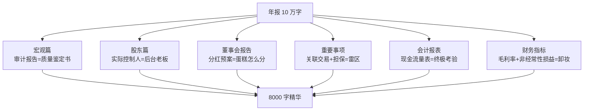

# 71《明明白白看年报》深度解读（详细版）

> **副题：袁克成——"投资者必读的年报阅读手册"：从审计报告到风险提示，29 章看懂年报的每一寸**
>
> 作者：袁克成，财经记者出身（《上海证券报》），长期研究上市公司信息披露。本书历经三版打磨，是**A 股年报阅读的经典工具书**——从"年报业绩早知道"到"风险提示"，把一份平均 10 万字的年报拆解成 7 大篇 29 章，教投资者按图索骥、去伪存真。
>
> **核心定位**：**年报的"庖丁解牛"手册**——"阅读年报并不是看上市公司希望我们看的内容，而是看那些我们期望看到的内容以及内容背后的'玄机'。"全书灵魂一句话：**"年报真正有意义的内容，大概不到 8000 字，剩下的多是赘言。"**
>
> **系列意义**：071 是系列第 71 本，**报表阅读工具篇**——与 [[63《从报表看企业 数字背后的秘密》深度解读（详细版）|063 号张新民《从报表看企业》]]（报表分析框架）互补：063 教"怎么看懂报表"，071 教"怎么读年报这份文件"；与 [[40《避开股市的地雷》深度解读（详细版）|040 号张化桥《避开股市的地雷》]]（排雷）、[[52《一本书看透价值投资》深度解读（详细版）|052 号林奇"八指标"]] 构成"财务排雷三件套"。

---

## 📖 全书结构与核心框架（7 大篇 29 章）

| 篇章 | 章节 | 核心问题 |
|------|------|---------|
| **宏观篇** | 1—6 | 业绩早知道/网络资源/正文摘要/创业板年报/**审计报告** |
| **股东篇** | 7—8 | 限售时间表/**实际控制人** |
| **董事会报告篇** | 9—12 | 公司治理/股权激励/**分红预案**/所得税 |
| **重要事项篇** | 13—15 | 交叉持股/**关联交易**/**担保** |
| **会计报表篇** | 16—21 | 四张表：资产负债表/利润表/**现金流量表**/权益变动表 |
| **财务指标篇** | 22—29 | **毛利率**/净资产收益率/市净率/市盈率/杠杆/**非经常性损益**/环比/风险提示 |

---

## 📑 目录

- [[#第1章 股票也是商品：年报的三项技能|第1章 股票也是商品]]
- [[#第2章 质量鉴定书：审计报告的四种"不合格产品"|第2章 审计报告]]
- [[#第3章 后台老板：实际控制人三类|第3章 实际控制人]]
- [[#第4章 蛋糕怎么分：分红预案的潜台词|第4章 分红预案]]
- [[#第5章 亲兄弟明算账：关联交易的黑幕|第5章 关联交易]]
- [[#第6章 连坐风险：担保的暗箭|第6章 担保风险]]
- [[#第7章 终极考验：现金流量表|第7章 现金流量表]]
- [[#第8章 暴利源泉：产品毛利率|第8章 产品毛利率]]
- [[#第9章 卸妆术：非经常性损益|第9章 非经常性损益]]
- [[#第10章 安全第一：年报中的风险提示|第10章 风险提示]]
- [[#总结：年报阅读十问十答|总结：十问十答]]
- [[#附录一 袁克成金句集（25 条精选）|附录一 金句集]]
- [[#附录二 30 秒版：明明白白看年报|附录二 30 秒版]]
- [[#附录三 与系列书籍对照|附录三 系列对照]]
- [[#附录四 知乎文风附录：8000 字 vs 10 万字|附录四 知乎文风附录]]

---

## 第1章 股票也是商品：年报的三项技能

### 1.1 年报=上市公司的"说明书"

> "我们去超市购物时会发现，每一种商品除了标示价格外，在其包装上还会标示产品成分、生产日期、保质期、性能介绍、原产地等信息。对投资者来说，上市公司（股票）其实也是一种商品，既然是商品，除了价格（股价）外，当然也会有其他的信息提供给投资者参考。"

> "年报就如同我国政府每年提交人大审议的政府工作报告——它主要告诉我们，上市公司在去年一年都干了什么，干得怎么样，现在情况如何，明年有什么打算。"

**两类信息**：

| 类型 | 内容 | 特点 |
|------|------|------|
| **财务信息** | 利润表/资产负债表/现金流量表 | "最客观、最准确、最容易进行比较"——"大幅"到底是多少，只有看了数字才知道 |
| **非财务信息** | 前十大流通股东/利润分配预案/治理结构 | 同样不容忽视 |

### 1.2 三项技能：对付 10 万字

> "目前上市公司的年报字数平均 10 万，沪深两市 A 股上市公司 1500 家左右，年报总字数过亿——即使我们用一年的时间看这些年报，每天也要看 40 万字。"

| 技能 | 内容 |
|------|------|
| **熟悉框架** | 知道哪些内容会出现在年报的什么地方——查询、阅读速度大大提高 |
| **基本功** | 财务知识+证券专业知识+公司运作知识——让专业化内容不成为阅读障碍 |
| **抓关键点** | **"年报真正有意义的内容，大概不到 8000 字，剩下的多是赘言"**——深刻把握决定投资价值的关键看点，按图索骥 |

> **本书的灵魂**："记住：**阅读年报并不是看上市公司希望我们看的内容，而是看那些我们期望看到的内容以及内容背后的'玄机'。**"

### 1.3 年报=企业的传记

> "如果通读一家上市公司上市历年来的年报，就如同看这家企业的'传记'一般——体会公司经营中的跌宕起伏，品味开拓的艰辛、收获的喜悦；理解为什么千里之堤会毁于蚁穴，为什么差之毫厘能失之千里。投资大师巴菲特的一大嗜好，就是独自一人在办公室研读年报。"

---

## 第2章 质量鉴定书：审计报告的四种"不合格产品"

### 2.1 标准 vs 非标

> "年报正文一开始的'重要提示'部分，篇幅很短，二三百字。其中，会计师事务所对年报中财务报表的审计报告类型，值得重视——**它相当于会计师事务所对财务报表出具的一份质量鉴定书。**"

| 类型 | 通俗含义 |
|------|---------|
| 标准无保留意见 | 财务报表质量合格 |
| **带强调事项段的无保留意见** | 报表存在**瑕疵** |
| **保留意见** | 报表存在**错误** |
| **否定意见** | 报表问题**严重** |
| **无法表示意见** | 报表"所说无凭、所载无据、迷雾重重"，**无法置评** |

### 2.2 君子不立危墙之下

> "如果会计师出具非标意见，对这样的公司，投资者在选股时要慎之又慎。特别是四种非标意见中的后三种，最好是避之惟恐不及——不合格的报表往往意味着上市公司隐含着巨大风险，披露出的很可能只是冰山一角。古语所谓'君子不立危墙之下'，就是这个道理。"

| 要点 | 内容 |
|------|------|
| 标准意见也可能翻车 | 银广夏案/蓝田案/科龙案——"被会计师事务所认为合格的财务报表，最终却被证实是'伪劣产品'。当然，这是小概率事件" |
| 非标意见的多发地带 | "非标意见一般集中于资产质量差的公司、微利公司、亏损公司——连续三年亏损会被暂停上市，有些公司为避免暂停上市就铤而走险，在财务报表上做手脚" |
| 连锁后果 | 被出具非标意见→**再融资可能受阻**（三年内失去公开增发资格）→交易所要求每半个月披露一次风险提示 |

> **操作铁律**：看到"非标"（后三种）→ 直接排除。放着那么多低风险的上市公司不关注，非要刀口舔血，没有必要。

---

## 第3章 后台老板：实际控制人三类

### 3.1 为什么实际控制人重要

> "上市公司的未来发展一方面取决于自己的经营；另一方面就取决于实际控制人的实力与地位——这一点与个人的发展实在无二，**一看实力二看背景，而且后者往往更重要。**"

**都市股份案例**：海通证券借壳都市股份上市，股价涨数倍——"两家公司的实际控制人都是上海市国资委，两者之间的资产置换，可以视为上海市国有资产之间的重新配置。**是实际控制人主导了本次重组，上市公司自身对于重组则没有什么发言权。**"

### 3.2 三类实际控制人

| 类型 | 特点 | 投资含义 |
|------|------|---------|
| **个人** | 实力有限，除了已装入上市公司的资产外难有更多优质资产 | "个人控制的上市公司如果经营遇困难，几乎不可能出现都市股份模式的重组——对这些公司估值要完全从其自身经营角度分析，不太可能有什么'惊喜'" |
| **地方国资委** | 看地方实力（上海/深圳本地股屡掀行情=国资委资源雄厚） | "投资者对那些**发达地区的国有上市公司**不妨高看一眼"；还要看公司是否与地方战略规划一致 |
| **国务院国资委** | 央企 | 实力最强，但也看行业定位 |

> **"子孙满堂"的警示**："一个自然人同时控制好几家上市公司——个人实力毕竟有限，如果实际控制人'子孙满堂'，其所辖上市公司并非'万千宠爱集于一身'，发展前景往往平平。事实也证明，在这样的上市公司中，我们很难找到真正的绩优股。"

---

## 第4章 蛋糕怎么分：分红预案的潜台词

### 4.1 分配预案的三项内容

| 内容 | 说明 |
|------|------|
| 利润分配（分现金/送红股） | 分现金=真金白银；送红股=会计科目调整，不涉及现金流出 |
| **资本公积转增股本** | 严格讲不属于分红，但与送红股实质类似，合并表述 |
| 盈余公积转增股本 | 理论可行，极少实施，可忽略 |

### 4.2 利润分配的两个前提条件

| 前提 | 内容 |
|------|------|
| **弥补以前年度亏损后仍为正** | "未分配利润"为负→不能分配——**新《公司法》禁止用资本公积弥补亏损后，一旦形成巨额亏损，可能几年之内都难以分红** |
| **本年度盈利** | "十几年来，当年亏损还厚脸皮分红的上市公司总数不会超过 5 家"——年报已预亏的公司，不用指望分配预案 |

### 4.3 送股潜力的判断公式

> "判断一家上市公司的送股潜力，要看两个指标：**每股未分配利润与每股资本公积**。如果每股未分配利润或每股资本公积金大于 1，从理论上讲，公司就具备了 10 送 10 或 10 转增 10 的潜力。当然，这个数字越大越好。"

> **利润分配顺序**：当年净利润 → 提取 10% 法定盈余公积（达到注册资本 50% 可不再提）→ 与以前年度未分配利润加总 → **可供股东分配的利润=那块"蛋糕"**。

---

## 第5章 亲兄弟明算账：关联交易的黑幕

### 5.1 两类黑幕：输送与抽血

> "关联交易容易滋生黑幕，所谓黑幕包括两个方面：一是虚增利润（关联方高价购买上市公司产品）；二是抽走利润（关联方高价向上市公司卖出产品或服务）。"

**A 公司案例**（2008 年年报）：向关联方销售 41 亿、从关联方采购 23 亿——主营业务成本中 **64%** 与关联方有关，主营业务收入中 **52%** 与关联方有关。采购端 B 公司净资产收益率 50%+（远超 A 公司自身 16%）→ 采购价过高之嫌；销售端 C 公司通过销售 A 公司产品获利 7 亿。**机构推算：通过两项关联交易，A 公司当年损失的净利润达 9 亿元——而 A 公司全年净利润不过 18 亿元。**

### 5.2 输送利益比抽血更可怕

> "将欲取之，必先予之——**关联方向上市公司输送利益，必定有所求，最终关联方还是会收回'投资'，而且往往是加倍收回。**投资者切不可暂时为关联交易所带来的利益所迷惑。"

| 抽血（关联方占便宜） | 输送（关联方给好处） |
|---------------------|---------------------|
| 上市公司利润被低估 | 上市公司利润被高估 |
| "至少不太可能净利润突然下降" | **"一旦这种输送停止，或者开始'抽血'，上市公司的业绩表现就可能是突然下滑"** |

### 5.3 识别方法

| 方法 | 内容 |
|------|------|
| 看比例 | "关联交易在采购、销售环节所占比例越低，关联黑幕的潜在危害性就越小" |
| 看价格 | 关联方 ROE 异常高（>50%）→ 采购价可能过高 |
| 交叉验证 | "重大事项"部分发现疑点 → 用会计附注部分详加分析 |

---

---

## 第6章 连坐风险：担保的暗箭

### 6.1 担保=古时的"连坐"

> "上市公司为其他企业向银行的贷款提供担保，如果贷款企业届时还不上钱，上市公司则需代为还款。**担保如同古时的'连坐'制度，一人犯事，会殃及他人。**"

### 6.2 暗箭难防：担保风险的突发性

| 经营风险 | 担保风险 |
|---------|---------|
| 有渐进过程（现金流恶化→应收增多→收入下降） | **"事前大都无迹可寻，因为投资者对被担保企业的经营情况一无所知"** |
| "观察仔细还有反应时间，可以全身而退" | "一旦事情发生，股价突然大跌，投资者损失惨重" |

> **"所谓明枪易躲、暗箭难防。对担保这样的'暗箭'，投资者必须见微知著，防患于未然。"**

### 6.3 担保比例的警戒线

> "一般来说，无论担保对象是谁，资质如何，这个比例（担保总额占净资产的比例）也不宜超过 50%。超过这个比例，则说明公司面临的风险过大，同时也表明管理层控制风险的意识较为薄弱。"

**中关村的灭顶之灾**（全书最震撼案例）：

| 数据 | 内容 |
|------|------|
| 2006 年年报 | 担保总额占净资产比例 **831.6%**——"等于将中关村置于火山口" |
| 2007 年 9 月 11 日 | 贷款方无法偿还 31.2 亿元债务，债权方要求中关村承担全部还款责任 |
| 当时净资产 | 仅 **5 亿元**——"31.2 亿元的还款负担无异于灭顶之灾" |

### 6.4 三类高风险担保

| 风险等级 | 类型 | 原因 |
|---------|------|------|
| **最高** | 为股东、实际控制人及其关联方担保 | "往往成为上述对象从上市公司'提款'的工具"；"当上市公司要出面为其担保之时，往往说明这些被担保人信用透支、债务缠身，已经是抵无可抵、押无可押" |
| **较高** | 为资产负债率超过 70% 的对象担保 | 高负债经营"一旦现金流不畅，高负债率很可能会将其压垮" |
| 越少越好 | 对外担保（无关联公司） | "上市公司的资质普遍较高，信用等级也较高"——给银行背书，收益小风险大 |

> **操作铁律**：年报中发现为股东/实际控制人担保 → "不仅风险高，更说明上市公司的治理不规范，对这样的公司，投资者最好回避。"

---

## 第7章 终极考验：现金流量表

### 7.1 为什么是"终极考验"

> "炒股票讲究落袋为安，账面上赚了钱还不能说胜券在握。上市公司的现金流量表，就是对上市公司的'终极考验'，能够过了这一关测试，才是真正的'绩优股'。"

| 原因 | 内容 |
|------|------|
| 造假难度高 | 其他报表涉及大量人为估计（折旧年限/坏账计提标准），现金流量表**"只认钱不认人"，排除了主观因素** |
| 审计简单 | "将该表与银行对账单核实一下就可以了" |
| 记账与款到不同步 | "货先交了，钱过一段时间再付"——利润表确认收入超前于收到现金→应收账款有水分→净利润也有水分 |

### 7.2 三类现金流

| 类别 | 内容 |
|------|------|
| **经营活动** | 影响利润表的活动：产品销售/支付薪酬/购买原材料——**最重要** |
| 投资活动 | 长期资产：买地/建厂房/买设备 |
| 筹资活动 | 借款/还款/分红/发行新股 |

### 7.3 预警指标：经营现金净额 vs 净利润

> "经营现金净额在某种意义上可视为**现金版的净利润**。如果经营现金净额明显低于净利润，那就得小心了。"

| 原因 | 验证方法 | 后果 |
|------|---------|------|
| 销售回款速度下降（卖货没收回钱） | 查应收账款是否明显增加 | "产品不抢手，只有靠赊销打开市场——赊销则容易滋生坏账，给未来埋下隐患" |
| 存货积压 | 查存货是否明显增加 | 企业要贷款扩大再生产→利息负担增加 |

> **"如果经营现金净额长期明显低于净利润，甚至为负数时，就是十分危险的信号了——说明企业长期处于入不敷出的状况。特别是当企业负债很高，经营现金净额再为负，投资者一定要避而远之。"**

> **造假者的马脚**："上市公司财务造假一般是合同作假，把净利润打扮得好看，但却会在经营现金净额上露马脚——**由于现金流造假成本太高，造假者大多不会在这上做文章。**因此，对经营现金净额保持警惕，还可以避免'踩雷'。"

---

## 第8章 暴利源泉：产品毛利率

### 8.1 毛利率的定义与营业成本三特点

> 毛利 = 营业收入 − 营业成本；毛利率 =（营业收入 − 营业成本）÷ 营业收入

| 营业成本的特点 | 内容 |
|--------------|------|
| **最大支出** | 对大多数企业（特别是制造型企业）来说，营业成本是所有支出中最大的一部分 |
| **与营收关联度最高** | "一家企业在有营业收入的情况下，可以没有财务费用，甚至可以没有销售与管理费用，但肯定有营业成本"——营收增 50%，营业成本增 45%，而期间费用只增 15% |
| **可拆细对应产品** | 管理费用 1000 万无法拆细对应每类产品，但营业成本可以——**这才可能分行业、分产品核算毛利率** |

### 8.2 毛利=利润之源

> "多数情况下，毛利是一家企业盈利的源泉，是企业创造利润的第一步，也可以说是最重要的一步。**如果上市公司第一步就没走好，剩下的环节，投资者基本上就不用看了。**"

> **"钱是赚出来的，不是省出来的。"**——企业即使把销售/管理/财务费用都压到零，对利润的贡献也有限；毛利才是决定性的。原材料 1000 万、销售额只有 1050 万——"那么还能赚什么钱呢"。

> **毛利率的用途**：判断企业核心竞争力所在、盈利有没有提高潜力；毛利率稳定或趋升=产品竞争力强（与 [[52《一本书看透价值投资》深度解读（详细版）|052 林奇"毛利率越高越好"]] 完全同频）。

---

## 第9章 卸妆术：非经常性损益

### 9.1 什么是非经常性损益

> "非经常性损益就是意外之喜或不测之灾。打个比方说：**你的工资收入就是经常性损益，而你中彩票就是非经常性损益；你买菜的支出就是经常性损益，而丢钱包则是非经常性损益。**"

> **"这就好像一个人年薪 5 万，但中彩票得了 5 万，于是就对外宣称自己年收入 10 万——如果你以年收入 10 万的数据判断这个人的生活水平与工作能力，那就大错特错了。"**

| 要点 | 内容 |
|------|------|
| 证监会定义 | 与正常经营无直接关系/性质特殊和偶发性的损益 |
| 21 种事项 | 证监会《第 1 号——非经常性损益（2008）》明确列出 |
| 非会计科目 | "在年报的财务报表中，看不到'非经常性损益'这一名称——它本质上是信息披露范畴" |

### 9.2 操纵利润的两大法宝

| 把戏 | 手法 |
|------|------|
| **失而复得** | "故意将一些可以收回的账款视为坏账，等到哪一年经营惨淡业绩不好的时候再收回来，当年的利润就可以增加"（死账收回/存货跌价冲回） |
| **一次性财政补贴** | "一些地方政府为了不使自己控股的上市公司退市，拿出一笔钱使上市公司渡过危急关头"——**对持股市值是好消息，对证券市场整体不是好事**（"一个健康的证券市场跟人一样需要新陈代谢"） |

> **使用铁律**：看净利润必须看**扣除非经常性损益后的净利润**——"让上市公司素面朝天"，不能让意外之喜使投资者高估盈利，也不能令不测之灾使投资者低估赚钱能力。

---

## 第10章 安全第一：年报中的风险提示

### 10.1 风险全景图

| 风险大类 | 子类 | 年报中的线索 |
|---------|------|-------------|
| **技术风险** | 获利盘过多（限售股流通日） | "限售股价的成本价一般会大大低于市价——事实上等同于获利盘" |
| **基本面风险-宏观** | 经济衰退/银根紧缩/严重通胀 | 利率上升→高负债公司受影响更大；严重通胀→非基础原材料公司受影响更大 |
| **基本面风险-行业** | 行业环境变化 | 胶卷（柯达）/手机（摩托罗拉）——全行业萎缩 |
| **基本面风险-个股** | 六种（见下表） | 年报中最能看出端倪 |

### 10.2 个股风险六种（年报可查）

| 风险 | 年报中的迹象 |
|------|-------------|
| **经营风险** | 营收增幅减缓/毛利率下降/存货应收大增/经营现金净额大幅降低 |
| **投资风险** | 持有其他上市公司股票，所持股票股价下跌 |
| **或有风险** | 巨额担保/大量关联交易/**更换会计师事务所**/治理不规范/非标审计意见 |
| **财务风险** | 负债率过高/负债与资产不匹配/会计政策过于激进（减值准备标准过低） |
| **股东风险** | 大股东、高管抛售股票——"往往说明其不看好上市公司的未来发展" |
| **道德风险** | 董事会成员及高管被证监会、交易所处罚——**"与信息披露相关的处罚最值得注意，一旦上市公司诚信出现瑕疵，投资者最好退避三舍"** |

> **全书主旨**："阅读年报的目的有两个：寻找投资价值与规避投资风险。**鉴于股票操作中安全第一的原则，规避投资风险是第一位的。**"

---

## 总结：年报阅读十问十答

| # | 问题 | 答案 |
|---|------|------|
| 1 | 年报有多少字值得读？ | **不到 8000 字**——剩下的多是赘言 |
| 2 | 第一眼看什么？ | 重要提示里的**审计报告类型**——非标（后三种）直接排除 |
| 3 | 后台老板怎么看？ | 实际控制人：个人（无惊喜）/地方国资委（看实力）/央企 |
| 4 | 分红潜力怎么算？ | 每股未分配利润/每股资本公积 >1 = 具备 10 送 10 潜力 |
| 5 | 关联交易看什么？ | 采购销售环节占比+关联方 ROE——**输送利益比抽血更可怕** |
| 6 | 担保警戒线？ | 担保总额/净资产 **>50%** 即过高（中关村 831.6%→灭顶之灾） |
| 7 | 终极考验是什么？ | **经营现金净额 vs 净利润**——明显低于=预警；为负+高负债=避而远之 |
| 8 | 暴利从哪来？ | 毛利率=利润之源——第一步没走好，后面不用看 |
| 9 | 净利润怎么看？ | 必须看**扣非后净利润**——中彩票不能算年收入 |
| 10 | 最该躲什么？ | 为股东担保/诚信瑕疵（信息披露处罚）/非标意见/大股东抛售 |

---

## 附录一 袁克成金句集（25 条精选）

> 1. "上市公司（股票）其实也是一种商品——除了价格（股价）外，当然也会有其他的信息提供给投资者参考。"
> 2. "阅读年报并不是看上市公司希望我们看的内容，而是看那些我们期望看到的内容以及内容背后的'玄机'。"
> 3. "年报真正有意义的内容，大概不到 8000 字，剩下的多是赘言。"
> 4. "通读一家上市公司上市历年来的年报，就如同看这家企业的'传记'一般。"
> 5. "财务信息是数字化、量化的信息——最客观、最准确、最容易进行比较。"
> 6. "审计报告相当于会计师事务所对财务报表出具的一份质量鉴定书。"
> 7. "君子不立危墙之下——对非标意见的公司，放着那么多低风险的上市公司不关注，非要刀口舔血，没有必要。"
> 8. "实际控制人的实力、地位以及资本运作思路，在一定程度上，决定着上市公司的命运。"
> 9. "一看实力二看背景，而且后者往往更重要。"（实际控制人）
> 10. "如果实际控制人'子孙满堂'，其所辖上市公司并非'万千宠爱集于一身'——很难找到真正的绩优股。"
> 11. "每股未分配利润或每股资本公积金大于 1，就具备了 10 送 10 的潜力。"
> 12. "关联交易是关联方操纵上市公司利润的重要手段之一。"
> 13. "将欲取之，必先予之——关联方向上市公司输送利益，必定有所求，最终会加倍收回。"
> 14. "上市公司为其他企业担保，如同古时的'连坐'制度，一人犯事，会殃及他人。"
> 15. "所谓明枪易躲、暗箭难防——对担保这样的'暗箭'，投资者必须见微知著，防患于未然。"
> 16. "担保总额占净资产的比例不宜超过 50%。"（中关村 831.6%→31.2 亿债务→灭顶之灾）
> 17. "现金流量表就是对上市公司的'终极考验'——能够过了这一关测试，才是真正的'绩优股'。"
> 18. "现金流量表'只认钱不认人'，排除了主观因素。" 
> 19. "造假公司案发前，大都有经营现金净额为负的朕兆——由于现金流造假成本太高，造假者大多不会在这上做文章。"
> 20. "毛利是一家企业盈利的源泉——如果上市公司第一步就没走好，剩下的环节基本上就不用看了。"
> 21. "钱是赚出来的，不是省出来的。"
> 22. "年薪 5 万，但中彩票得了 5 万，于是宣称自己年收入 10 万——以 10 万判断这个人的生活水平，就大错特错了。"（非经常性损益）
> 23. "一个健康的证券市场，跟人一样，也需要新陈代谢。"
> 24. "大股东或者上市公司高管抛售股票时，往往说明其不看好上市公司的未来发展。"
> 25. "阅读年报的目的有两个：寻找投资价值与规避投资风险——鉴于股票操作中安全第一的原则，规避投资风险是第一位的。"

---

## 附录二 30 秒版：明明白白看年报

> 1. **年报=商品说明书**——10 万字只有 8000 字有用；
> 2. **先看审计报告**——非标后三种（保留/否定/无法表示）直接排除；
> 3. **看实际控制人**——个人（无重组惊喜）/地方国资委（看实力）/央企；
> 4. **看分红预案**——每股未分配利润/资本公积 >1 = 送股潜力；
> 5. **看关联交易**——占比越低越好；输送利益比抽血更可怕；
> 6. **看担保**——占比 >50% 即过高；为股东担保=提款工具；
> 7. **看现金流量表**——经营现金净额 < 净利润 = 预警；为负+高负债=避而远之；
> 8. **看毛利率**——利润之源，第一步没走好后面不用看；
> 9. **看扣非后净利润**——中彩票不能算年收入；
> 10. **看风险提示**——担保/关联交易/更换事务所/大股东抛售/信息披露处罚=五大雷区。

---

## 附录三 与系列书籍对照

| 071 袁克成 | 对照笔记 |
|-----------|---------|
| 财务信息=最核心 | [[63《从报表看企业 数字背后的秘密》深度解读（详细版）|063 张新民"数字背后的秘密"]] |
| 扣非后净利润 | [[52《一本书看透价值投资》深度解读（详细版）|052 林奇"八指标"]] |
| 经营现金净额预警 | [[40《避开股市的地雷》深度解读（详细版）|040 张化桥"现金流为负=排雷"]] |
| 担保/关联交易雷区 | [[69《谁偷走了我们的财富？》深度解读（详细版）|069 张化桥"小股东保护"]] |
| 毛利率=利润之源 | [[46《投资至简》深度解读（详细版）|046 静逸"商业模式七要素"]] |
| 实际控制人 | [[35《投资中最简单的事》深度解读（详细版）|035 邱国鹭"逆向三点"]] |
| 非标意见=排雷 | [[28《聪明的投资者》深度解读（详细版）|028 格雷厄姆"安全边际"]] |
| 风险提示/安全第一 | [[36《炒股的智慧》深度解读（详细版）|036 陈江挺"败而不倒"]] |

---

## 附录四 知乎文风附录：8000 字 vs 10 万字

> 你第一次翻开上市公司年报的时候，是什么感觉？
>
> 我的感觉是：绝望。一本 10 万字的文件，满纸术语——"递延所得税资产""少数股东损益""商誉减值测试"——每一个字都认识，连在一起就不知道在说什么。
>
> 袁克成告诉我们一个让人宽慰的事实：**这 10 万字里，真正有意义的不到 8000 字。**剩下的，全是格式化的套话和法律法规要求披露的"正确的废话"。
>
> 关键是你得知道那 8000 字藏在哪。
>
> 袁克成给了我们一张藏宝图，我按自己的理解给你画出来：
>
> **第一站，重要提示里的审计报告。** 二三百字，却是整份年报的"质量鉴定书"。如果会计师出具的是"标准无保留意见"，报表基本可信；如果是"保留意见""否定意见""无法表示意见"——直接合上年报，换下一家。君子不立危墙之下，市场上有几千家上市公司，何必刀口舔血。
>
> **第二站，现金流量表。** 利润表可以化妆，现金流量表不行——它"只认钱不认人"。银行对账单在那摆着，会计师一核对就知道真假。所以你看净利润的同时，一定要看"经营现金净额"：如果净利润 1 个亿，经营现金净额只有 2000 万，说明货卖出去了，钱没回来——产品不抢手，靠赊销撑场面。**造假公司案发前，大都有经营现金净额为负的朕兆。**
>
> **第三站，担保和关联交易。** 这两块是年报里的"地雷区"。担保如同古时的连坐——中关村担保总额占净资产 831.6%，第二年 31.2 亿债务找上门，而它净资产只有 5 个亿。关联交易更阴险——袁克成说，关联方"抽血"其实还好，因为至少说明利润没被完全榨干；**最可怕的是"输送"——将欲取之，必先予之，今天给你输血的，明天会加倍抽回去。**
>
> **第四站，扣非后净利润。** 一个人年薪 5 万，中彩票得了 5 万，然后对外宣称年收入 10 万——你会怎么评价他？上市公司年年都有人"中彩票"：卖块地、卖个子公司的股权、政府补贴。所以看净利润，一定看"扣除非经常性损益后的净利润"，这才是素面朝天的真面目。
>
> **最后一站，分红预案。** 每股未分配利润和每股资本公积大于 1 的公司，才有 10 送 10 的潜力——这是最容易被忽略的"送股地图"。
>
> 袁克成在书里说了一句话，我特别认同：
>
> **"阅读年报并不是看上市公司希望我们看的内容，而是看那些我们期望看到的内容以及内容背后的'玄机'。"**
>
> 年报是上市公司写给监管看的，不是写给你看的。所以读年报的正确姿势，不是"读"，是"审"——像审计师一样怀疑它，像侦探一样找破绽。
>
> 巴菲特每天的工作，就是一个人坐在办公室研读年报。那是他的娱乐，也是他的护城河。
>
> 你可以不懂会计，但你不能不懂"审"年报的这五个站点。8000 字，半小时，够用了。