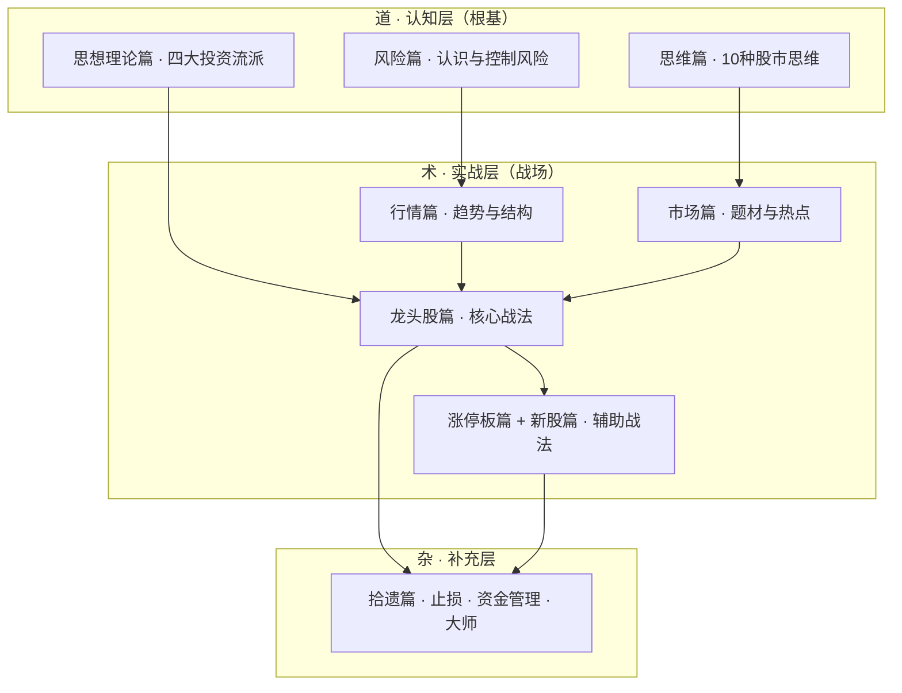
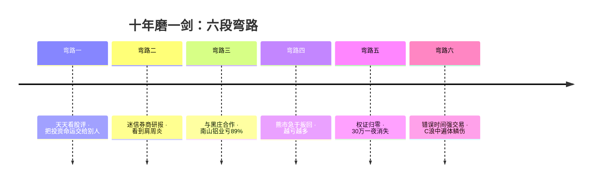
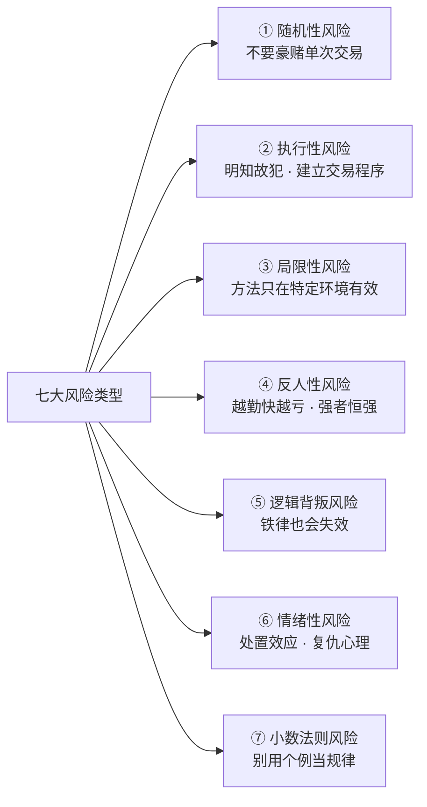
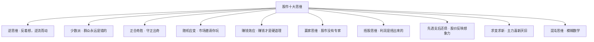
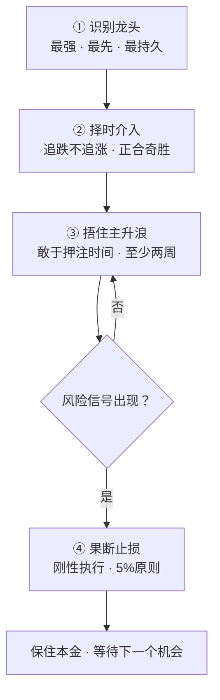
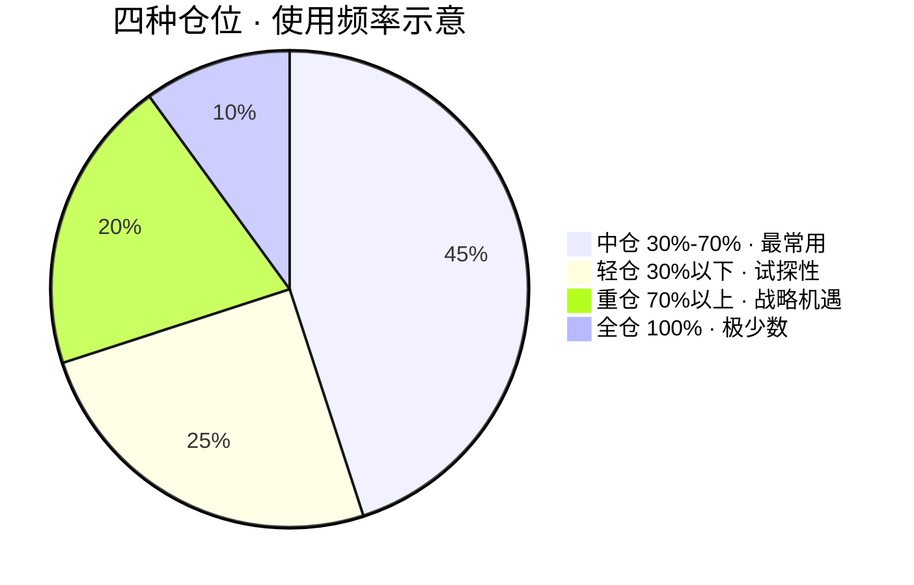
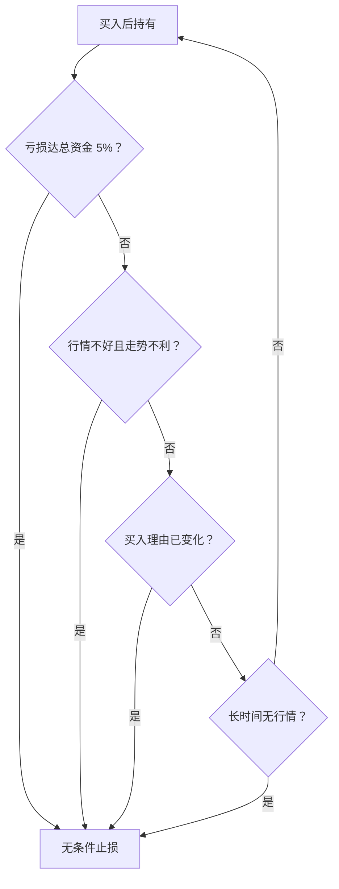
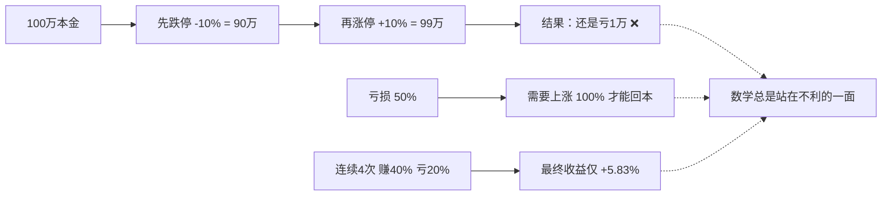

# 《股市极客思考录》读书笔记

> **书名**：股市极客思考录 — 十年磨一剑之龙头股战法揭秘（升级版）
> **作者**：彭道富（笔名：拈花成佛）
> **出版社**：中国经济出版社
> **类型**：#投资 #股市 #龙头股 #交易体系 #风险管理

---

## 📌 一句话总结

炒股最关键的是解决风险问题，而龙头股是确定性最高、安全性最强、利润最大的交易品种。

---

## 👤 作者简介

彭道富，四川大学工商管理硕士，一线实战投资者。研究股市多年，擅长捕捉龙头股和超级强势股。投资体系杂糅了基本分析、技术分析、心理分析、博弈分析，乃至周易、中医理论，是位"杂家"。

核心理念：**股市是不确定性的游戏，我们的任务是在不确定性中寻找相对确定性。**

---

## 📑 全书结构

| 编号  | 篇章    | 主题              | 定位       |
| --- | ----- | --------------- | -------- |
| #01 | 风险篇   | 认识风险、控制风险       | 道 — 根基   |
| #02 | 思维篇   | 逆思维、少数派等10种思维   | 道 — 哲学   |
| #03 | 思想理论篇 | 四大投资流派溯源        | 道 — 理论   |
| #04 | 行情篇   | 趋势与结构           | 术 — 战场   |
| #05 | 市场篇   | 题材与热点           | 术 — 格局   |
| #06 | 龙头股篇  | 龙头股的识别与操作       | 术 — 核心战法 |
| #07 | 涨停板篇  | 涨停板的真相与战法       | 术 — 辅助战法 |
| #08 | 新股篇   | 新股/次新股战法        | 术 — 辅助战法 |
| #09 | 拾遗篇   | 止损、资金管理、索罗斯、李费佛 | 杂 — 补充   |

---

## #01 📖 风险篇：从我的投资经历谈对风险的认识

### 1.1 作者的六段弯路

#### 弯路一：天天看股评
- 把报纸、电视上的股评当"圣旨"，比较哪家推荐得准
- 大盘好时歪打正着赚钱，大盘转熊后亏得一塌糊涂
- **教训**：把投资命运交给别人，永远不可能正确

#### 弯路二：迷信证券机构研究报告
- 没日没夜下载券商研报看，看到肩周炎
- 成功案例：从研报中发现中国国航（2元→30元）
- **教训**：研报有参考价值，但不能作为唯一决策依据

#### 弯路三：与黑庄合作、听信小道消息
- 南山铝业惨案：36.79元买入，最低跌到4.16元（跌去89%）
- 香江控股惨案：28元买入，最低跌到2.28元（跌去92%）
- 交8000元会员费，对方收款后消失
- **教训**：赚钱只能靠自己，任何外人都不能帮你赚钱

> "如果将你的身体交给一个陌生人任意处置，你一定会感到愤慨。那么，当你将自己的精神交给一个偶遇的陌生人任意处置时，你难道不感到羞愧吗？" — 爱比克泰德

#### 弯路四：熊市中急于扳回损失
- 2007年6124点→2008年1664点，跌幅73%
- 把下跌当"洗盘"，越跌越买，全仓押注
- 暴亏后急于"扳回损失"，结果越亏越多
- **教训**：亏损后的第一件事不是扳回损失，而是退场休息

#### 弯路五：权证归零的惨痛教训
- 一个股民30万元全买认沽权证，第二天权证归零退市
- 他反复重启电脑，不愿相信30万元消失了
- **教训**：不了解风险的产品，不要碰

#### 弯路六：在错误的时间强行交易
- C浪下跌中四处出击，结果遍体鳞伤
- **教训**：交易者要在正确的时间去交易，到有"油"的地方去

### 1.2 "铸剑"历程：五阶段进化

| 阶段 | 方向 | 核心感悟 |
|------|------|----------|
| 向外求 | 学技术指标、基本面、各种理论 | "股市不存在一劳永逸的秘密武器" |
| 向内求 | 分析自己的交易记录、性格缺陷 | "每张交易单的背后是人性" |
| 内外双修 | 把外求和内求结合 | "学自我比学别人更重要" |
| 反复修炼 | 在实战中反复试错、修正 | "推倒重来好多次" |
| 十年磨一剑 | 建立完整交易体系 | "剑不是某个指标，而是对市场的深刻理解" |

### 1.3 向内求时发现的自身"毛病"
- 喜欢做短线、做闹腾的股票
- 容易早盘冲动交易
- 随意性交易太强
- 过早卖出股票
- 太冲动，总想扳回成本
- 喜欢听信别人

### 1.4 风险的理性认识

#### 基本风险观
- **原罪性**：股市天生就是少数人赚钱、多数人亏损的市场
- **宿命性**：无论大师还是散户，风险永生伴随

> "股市的第一特性是风险而不是财富。炒股就像是虎口拔牙的游戏，做游戏之前的第一件事就是想方设法不要被老虎反咬。"

#### 大师也逃不过的命运

| 人物 | 惨败经历 |
|------|----------|
| 格雷厄姆 | 1932年亏70%，接近破产 |
| 费雪 | 预见1929年崩盘仍买入，几天亏几百万 |
| 李费佛 | 数次破产，最终用手枪结束生命 |
| 索罗斯 | 1987年做空日本失败，量子基金亏32% |
| 牛顿 | "我能计算天体运行的轨迹，但算不出人心的疯狂" |
| 长期资本公司 | 诺贝尔奖得主坐镇，败于小概率事件 |

#### 股市的数学逻辑
- 亏50%需要赚100%才能扳回
- 100万→涨停→跌停=99万（亏1万）
- 连续赚40%亏20%四次，收益率仅5.83%
- **数学总是站在不利于投资者的一面**

#### 七大风险类型

**① 随机性风险**
- 股市本质是混沌的，大多数时候是不确定的
- 用"赌王拒绝单局定输赢"的比喻：要靠交易体系，而非单次交易
- **启示**：不要豪赌单次交易的成败，用交易体系来回避随机性

**② 执行性风险——明知故犯**
- "蝎子让青蛙背过河"的故事：蝎子明知会死还是蜇了青蛙
- 理性驾驭不了感性，这是人的劣根性
- **解决方法**：建立交易程序，与盘面保持距离

**③ 局限性风险——你的方法只在特定环境有效**
- 牛市总结的方法在熊市会失效
- "天变了，你拿过去的那套玩意儿，不行了" — 马云
- 牛顿炒股亏损、丘吉尔炒股亏损
- **启示**：还原你交易系统诞生的土壤，不要越界使用

**④ 反人性风险——股市是反人性的游戏**
- 人性接受"勤劳致富"，但股市越勤快越亏
- 人性同情弱者，股市却是强者恒强
- 人性有感情，股市不讲感情（别和股票谈恋爱）
- 利好出尽是利空，利空出尽是利好

**⑤ 逻辑背叛风险——你的"铁律"有一天会失效**
- 业绩好=股价涨？2007年暴跌打破了这个逻辑
- 强势股暴跌后会反弹？很多一泻千里从不反弹
- 价值投资永远正确？次贷危机中米勒连续15年跑赢标普，一年亏回去
- **启示**：任何逻辑都有背弃自己的时候，要保持敬畏

**⑥ 情绪性风险**
- 复仇心理、懊悔心理、赌性、急于求成、侥幸、冲动
- 夜里冷静制定计划，一开盘全忘了
- 处置效应：卖掉赚钱的，留下亏损的

**⑦ 小数法则风险——用个例当规律**
- 有人在茅台长期持有赚了→得出"长期投资好"
- 有人在3个股票做突破买入赚了→得出"突破模式有效"
- **启示**：跳出小样本，进入更大样本中观察事物

#### 风险的终极根源

> **客观上的不确定性 + 主观上的犯错误**

#### 如何化解风险

> ❌ "股市有风险，投资需谨慎" — 谨慎解决不了风险
> ✅ "股市有风险，投资须学习" — 认知才是化解风险的关键

- 索罗斯在别人谨慎时"做一头勇敢的猪"——因为他认知不同
- 提高**认知**可以**重新定义风险**：别人认为是风险的地方，对你可能是机会

---

## #02 💡 思维篇：投资需要"离经叛道"的股市思维

> 衡量股市思维正确与否的唯一标准就是账户里资金的多少。股市是反人性的游戏，所以正确的股市思维也大都与常人思维不一样。

### 2.1 "逆"思维 — 反着想，逆流而动

**核心命题**：你敢不敢成为市场上一小撮逆流而动、特立独行的孤独者？

逆思维不是为了反而反，而是在思考问题时能跳出常人思维。

**经典案例一：邓小平去世**
- 1997年2月19日，邓小平去世，大盘大幅低开
- 正常思维：利空，应该卖
- 逆思维：改革开放大势已定，管理层会格外注意维稳
- **结果**：低开大阳线，随后几个月牛气冲天

**经典案例二：香港回归**
- 1997年7月1日，民族自豪感空前高涨
- 正常思维：形势大好，应该买
- 逆思维：一片繁荣中看到危机
- **结果**：香港回归前后大盘加速暴跌

**实战应用：追跌不追涨**
- 追涨停是典型的顺思维——风险大，大起大落
- 作者研究出"赌客信条"：追跌停、追暴跌股
- **结果**：追暴跌比追涨停利润率高多了，风险反而小很多
- 买点在-7%以下，每次短线利润15%以上

**主力为什么喜欢逆向操作？**
> 主力资金庞大，逆向操作才能捡到足够的低成本筹码。主力在暴跌中建仓比在上涨中建仓更普遍；主力喜欢在拉升中出货，暴跌中很难出货。

**逆思维 ≠ 蛮干**：
- 不是见到暴跌就买
- 建立在取大势弃小势的前提下
- 建立在对个股基本面技术面详尽判断的基础上
- 逆思维是哲学观，不是逆向投资

> "我现在已经能从容地在急跌中去建仓，在重大利空中寻找利好。"

---

### 2.2 "少数派"思维 — 群众永远是错的

**核心命题**：群众永远是错的，真理掌握在少数人手中

与逆思维的区别：
- **逆思维**侧重于对市场的观点，侧重于**勇气**
- **少数派思维**侧重于对人群的态度，侧重于**情绪**

**经典案例一：索罗斯的警告**
- 2007年夏，索罗斯召集全美20多位最有实力的基金经理开会
- 索罗斯说"狼来了"，只有2位基金经理听从
- 结果：次贷危机爆发，其他人深陷泥潭
- 索罗斯当年盈利32%，次年在危机最深处还能盈利10%以上

**经典案例二：赵丹阳清仓**
- 2007年股市极度暴涨时，赵丹阳发现基金经理和散户情绪空前一致
- 他意识到风险临近，清仓旗下私募基金
- 被基金界冷嘲热讽，说他是"失败者、胆小鬼"
- **结果**：清仓不久大盘暴跌，很多股票从五六十元跌到几元

**索罗斯的投资假说理论**：
> "一个优秀的投资者首先要小心构造一个合理性又绝不同于大众看法的投资假说，这种假说和市场的普遍看法差异越大，那么通过市场检验后获得的利润价值就越大。"

**少数派不是为了唱反调**：
- 倡导独立判断，不受外界"噪声"干扰
- 破除权威迷信、破除从众思想
- 炒股是我与市场之间的关系，与别人何干？

> 李费佛："我没有追随者，我自己的事情自己干，而且总是单干。"

---

### 2.3 正合奇胜思维 — 守正出奇，以道御术

**源自《孙子兵法·势篇》**：凡战者，以正合，以奇胜。

**四个维度的理解**：

| 维度 | "正" | "奇" |
|------|------|------|
| **风险** | 防御保守 | 冒险激进 |
| **资金量** | 大资金求稳 | 小资金求快 |
| **趋势** | 大趋势（不能逆） | 局部小趋势（机会所在） |
| **分析层面** | 基本面 | 题材和技术面 |

**核心智慧**：
> "既要控制风险又要勇猛激进。当风险大于机会的时候要胆小如鼠，当高胜算机会来临的时候敢胆大包天。"

**大资金 vs 小资金**：
- 大资金：安全第一，追求稳定增值
- 小资金：必须敢于冒险，否则永远变不成大资金
- "2万元3万元的，每年收益20%~30%，有意义吗？"

**大趋势 vs 小趋势**：
- 大趋势是"正"，绝对不能逆着下重仓
- 小逆反趋势是"奇"，是出奇制胜所在
- 在大牛股的局部洗盘处买股 = 顺大势 + 逆小势 = 典型的正合奇胜

> "只有正奇结合，游刃于安全和冒险之间者，才能在股市中翻江倒海，游刃有余。"

---

### 2.4 随机应变思维 — 市场邀请你怎么玩

**核心命题**：不是你要怎么玩，而是市场邀请你怎么玩

**欧洲股神科斯托兰尼的比喻**：
> "要学会听股市的'背景音乐'，是大调还是小调？股市奏什么乐我们跳什么舞。"

**市场为什么需要随机应变？**
- 市场善变：有时喜欢小盘股，有时喜欢大盘股
- 有时青睐低价股，转瞬又去攀高价股
- 2006年大牛市经历了多次审美嬗变：
  1. 有色金属股 → 2. 股改股 → 3. 金融地产 → 4. 低价小盘 → 5. "5·30"后大盘蓝筹

**核心原则**：
- 放弃自己的意志，追随市场的意志
- 放弃自己的口味，追随市场的口味
- 放弃自己的舞步，追随市场的舞步
- 大机会都在市场的主流题材和热点上

> "不及时发现并追随这种变化，就会被股市边缘化，赢了指数不赢钱。"

---

### 2.5 以赚钱效应思维取代牛熊思维 — 赚钱才是硬道理

**核心命题**：牛市不保证赚，熊市也不一定会亏

**什么是赚钱效应？**
- 指在某个大盘环境下，赚钱的难易程度和大多数人都赚钱的状况
- 比"牛熊"更细腻、更实用

**好的赚钱效应四大标准**：

| 标准 | 说明 |
|------|------|
| **逻辑单纯性** | 市场逻辑越单一、越简单，越容易赚钱 |
| **热点清晰集中度** | 热点集中则容易产生赚钱效应，凌乱则没有 |
| **技术分析有效性** | 技术分析屡试不爽时，说明赚钱效应来了 |
| **洗盘的剧烈程度** | 赚钱效应区洗盘有规律且短暂，非赚钱效应区洗盘剧烈持久 |

**经典案例：2013年上海自贸区行情**
- 大盘整体是震荡行情（看上证指数不起眼）
- 但这是不折不扣的赚钱效应行情：
  - 逻辑单纯：上海自贸区
  - 热点集中：上海股和土地改革股
  - 技术分析有效性高
  - 洗盘温和短暂
- **闭着眼睛买股都很容易赚钱**

**大熊市中也有赚钱效应区**：
- 2008年春：农业股行情
- 2009年：四万亿行情
- 2010年：稀土和煤炭股行情
- 2013年：自贸区行情

> "赚钱效应思维跳出'牛熊'这个大而空的概念，直接和行情本身接轨，能在熊市中寻找黄金，也会在牛市时提醒你保持警惕。"

---

### 2.6 树立赢家思维，抛弃专家思维 — 股市只有赢家，没有专家

**核心命题**：除非他能盈利，否则不要相信任何"专家"

**最需要防范的三种人**：
1. **政府官员**：他们的判断更多是政策导向而非真实观点
2. **记者**：最爱写骇人听闻的文章，其实根本不懂股票
3. **经济学家**：从经济大势看股市，典型捞过界

**震撼案例：马化腾卖腾讯**

| 时间 | 操作 | 结果 |
|------|------|------|
| 2005年 | 6.2港元卖1000万股 | 之后涨了几十倍 |
| 2008年 | 67-69港元减持 | 之后继续涨 |
| 2010年 | 102.7港元卖500万股（远低于市价） | 之后继续涨 |
| 2011年 | 67.8港元卖200万股（市价192.5港元，3.5折！） | 之后继续涨 |

**核心启示**：
- 连马化腾这样的超一流企业家都卖不好自己公司的股票
- 掌握所有内幕信息者，也未必就是股票专家
- 创业家、企业家、管理家 ≠ 股票专家

> "只有认真研究股票并经过历史证明是持续盈利的，才是唯一的股市'专家'。否则，无论他是谁，哪怕是上市公司的老板，哪怕是诺贝尔奖获得者，都不配做股市专家！"

---

### 2.7 捂股代替"炒"股思维 — 利润是捂出来的

**核心命题**：利润是捂出来的，不是炒出来的

**李费佛的经典语录**：
> "我的观点从来没让我赚钱，总是坐着不动让我赚钱。"

**《股票作手回忆录》中最精彩的一段**——老帕特的话：
> "亲爱的小兄弟，如果我现在卖出那个股票，我会失去我的位置，那么我该上哪儿呢？"

**李费佛的感悟**：
> "在多头市场，投资人的游戏就是买进后捂着……放弃设法抓住最后一档或第一档，这是任何人都能够学会的最有帮助的事情。这两档是世界上最昂贵的东西，他们让股票交易者付出了数百万美元的代价。"

**捂股与长线短线无关**：
- 短线也需要捂住——短线介入的都是最强势时段，错过一两天就错过二三成收益
- 龙头股主升浪至少持续两周以上
- 奋达科技（智能穿戴龙头）主升浪持续2个多月
- 莱茵生物（禽流感龙头）主升浪持续3个多月

**房地产的启示**：
> 如果把房子变成股票，交易非常简化，动下鼠标就能买卖——还会有那么多炒房客赚钱吗？房地产赚钱的一个被忽略的原因是：交割没那么容易，被迫"捂住"了。

**索罗斯也需要捂股**：
- 狙击英镑：从布局德国马克开始，到试探性建仓，整个过程是连续剧
- 攻击东南亚：前后布局很久
- "索罗斯的短线也不是今天买明天卖"

> "勇敢和冒险，不应仅仅是押注重仓，还应该包括敢于押注时间，即捂住股票。"

---

### 2.8 先透支后还债思维 — 股市是个败家子

**核心命题**：股价先被爆炒上天，然后再回归价值

**路易十五的名言**："我死后，哪管它洪水滔天。"
- 股市的逻辑也是如此：先把股价炒上天，再用时间来还债

**经典案例：纳斯达克互联网泡沫**
- 2000年纳斯达克指数创5132点高点
- 雅虎、思科等涨到几百倍甚至千倍市盈率
- 透支行情：股价飙上天
- 还债行情：纳斯达克至今（2014年）没有达到5132点，还债用了14年还没还清

**核心洞见**：
> "股价不是对基本面的反映，而是对想象力的反映。"

> "股市是个'坏孩子'，要么就涨过头，要么就跌过头，它永远不会按照学院派的想法去老老实实地反映价值。"

**索罗斯的"漂"理论**：
> "股市是非理性的，这种非理性能把股价'漂'到很远。在'漂'到头之前，我们要跟着它一起，千万不要逆势而为。要注意的是，在'漂'不动的转折点提前'拐大弯'就是了。"

**实操意义**：
- 当大行情来了，不要管它有没有泡沫，做就是了
- 2007年大牛市，哪个股票没有泡沫？但股价照样天天涨
- 2008年跌到1664点，哪个股票没有低估？但股价天天跌
- "花开堪折直须折，莫待无花空折枝"

---

### 2.9 求变求新思维 — 主力总是喜新厌旧

**核心命题**：不要选择一成不变的公司，要选择正在或将要发生变化的公司

**变与不变的对比**：

| 变化小（不涨） | 变化大（涨得多） |
|---------------|----------------|
| 高速公路、铁路、机场 | 互联网、新能源 |
| 传统银行（工行日赚18亿，但股价不涨） | 腾讯、谷歌、亚马逊 |
| 埃克森美孚、沃尔玛（一波三折） | 谷歌、亚马逊（一路狂奔） |
| 微软（除了Windows没啥变化） | 苹果（乔布斯时代不断变革） |

**谷歌超越埃克森美孚**：
- 2014年谷歌市值3941亿美元，超过埃克森美孚的3912亿美元
- 不是传统企业不盈利了，而是它们的未来一眼可以看穿
- 谷歌拥有创造未来的能力

**A股的惯例：逢新必炒**
- 吉峰农机（创业板首批）：28元→100元
- 中国中铁（先A后H第一股）：一个月暴涨74%
- 紫金矿业（一毛钱面值上市，破天荒）：上市当天涨203%

**本质是求"希望"**：
> "人们愿意给希望无限憧憬，希望就是预期，预期就是想象力，这些东西是无法用估值和基本面来定量的。"

---

### 2.10 混沌思维 — 投资是模糊数学的分支

**核心命题**：股市是混沌的，不能用精确数学来研究，要用模糊数学

**什么是混沌？**
- 确定性和随机性组成的复杂系统
- 宏观上有稳定性和确定性，微观上完全随机
- 股市天然就是混沌市场

**L.A.扎德的互斥性原理**：
> "当系统的复杂性日趋增长时，我们做出系统特性的精确然而有意义的描述的能力将相应降低。"

**翻译成股市语言**：
- 当你用精确数值去计算涨跌时，结论与现实往往南辕北辙
- 当你放弃精确，选择模糊的、粗线条的描述时，反而很接近股市本身

**为什么江恩预测小麦到1.20美元是编造的？**
- 股市是混沌的，不是传统数学
- 无法精确建模，无法生成唯一值
- 在模糊领域不可能得出精确到小数点后两位的具体值

**混沌思维的三大要点**：

**① 既可知又不可知**
- 随机性占主导 → 保持敬畏，风险第一
- 存在确定性 → 可以认知，可以利用
- "能把握住股市里5%的确定行情就足够我们赚钱了"

**② 破除因果观**
- 股市不存在简单的因果关系
- "因为业绩预增，所以股价涨停"？哪有这么简单！
- 股市需要的是**相关关系**，不是因果关系
- 相关因素既不是充分条件，也不是必要条件，而是关联条件

**③ 追求高胜算，不追求绝对**
- 任何交易策略都不是百分百的
- 建立在高概率、高胜算的基础上
- "它们也会背叛"——永远不放弃风险控制的"安全带"

> "如果我们退而求其次，从模糊数学角度，粗线条地、高概率地、宏观地去认识它，又会发现另外一番光景。"

---

### 2.11 十大思维速查表

| 编号 | 思维 | 核心一句话 | 关键词 |
|------|------|-----------|--------|
| 2.1 | **逆思维** | 反着想，逆流而动 | 勇气 |
| 2.2 | **少数派思维** | 群众永远是错的 | 独立 |
| 2.3 | **正合奇胜思维** | 守正出奇，以道御术 | 平衡 |
| 2.4 | **随机应变思维** | 市场奏什么乐我们跳什么舞 | 跟随 |
| 2.5 | **赚钱效应思维** | 用赚钱效应取代牛熊判断 | 精细 |
| 2.6 | **赢家思维** | 只有赢家，没有专家 | 务实 |
| 2.7 | **捂股思维** | 利润是捂出来的 | 定力 |
| 2.8 | **先透支后还债** | 股价先炒上天再回归 | 顺势 |
| 2.9 | **求变求新思维** | 选变化的公司，炒新鲜事物 | 预期 |
| 2.10 | **混沌思维** | 投资是模糊数学 | 概率 |

> 这十大思维是后面所有具体战法（龙头股、涨停板、新股）的**思想根基**。

---

## #03 📚 思想理论篇：投资理论的四个划分

> 有了正确的思维，还须有正确的思想，才能形成一套完整的股市哲学观和方法论。索罗斯之所以成为大鳄，与他的哲学素养和投资思想是分不开的；巴菲特也是因其独特的哲学思想才最终成为大师。

### 3.1 西方投资理论的源头

**早期三大泡沫**（人类对股市的恐惧起源）：
- 荷兰郁金香泡沫
- 英国南海泡沫
- 法国密西西比泡沫

> "人类创立证券之后，一开始尝到的不是它的甜头，而是它的灾难。"

**四大流派的诞生**：

| 流派 | 创始人 | 核心路径 | 比喻 |
|------|--------|----------|------|
| 技术分析派 | 查尔斯·道 | 价格 | 法家（法、术、势） |
| 心理分析派 | 李费佛→索罗斯 | 人与价格的关系 | 兵家（兵者诡道） |
| 基本分析派 | 格雷厄姆 | 价格背后的企业 | 儒家（王道） |
| 现代金融派 | 马克维茨 | 被动投资 | 道家（无为而治） |

---

### 3.2 技术分析流派 — 价格的研究

**查尔斯·道的三大贡献**：

1. **股票市场是商业的晴雨表** — 第一次为股市正名
   > "请注意温度计与晴雨表的区别。温度计能记录某一时刻的实际温度，但晴雨表特有的功能是预测。"

2. **为投机者正名**
   > "投机是一种事业，它既不猜测，也不赌博，而是工作。"

3. **三大基石**：市场行为包容一切、股价呈趋势运动、历史会重演

**发展脉络**：
道氏理论 → 艾略特波浪理论 → 形态理论 → 均线理论 → 江恩理论

**作者评价**：
> "技术分析为我们提供了一种观察股市的方法，如同X光片为医生看病提供依据。我们既不能完全依赖，也不能视而不见，应该辩证分析。"

**技术分析的局限**：
- 经过江恩之后，如同进入了迷宫
- 中小投资者使用技术分析绝大多数陷入亏损
- 核心是价格研究，K线是技术分析的核心
- 不要把技术分析当精确数学

---

### 3.3 心理分析投资流派 — "人"的研究

**李费佛的三大发现**：

**① 趋势是盟友**
> "赚大钱必须要在大波动中赚……自从市场开始按照我的方向走的时候，我有生以来第一次感到我有了盟友——世界上最强大最真实的盟友：基本形势。"

- 趋势一旦形成，会自我强化
- 连世界大战也无法阻止股市成为多头或空头市场
- 赚钱靠的不是想法，而是等待

**② 追随领导股（follow the leader）**
> "如果你不能从领头的活跃股票上赚到钱，你也就不能在整个股票市场上赚到钱。"

- 领导股不但有领涨的特质，还具有预测功能
- 当领导股不再上涨时，趋势可能终结

**③ 价格沿阻力最小方向运动**
> "价格像其他事物一样，会沿着阻力最小的路线移动，哪儿省事，便往哪儿移。"

---

**索罗斯的发展 — 哲学化**：

**① 认知的"可错性"**
- 我们对事物认知所取得的任何成果都是暂时的
- 市场定价通常是错误的
- 受哲学老师卡尔·波普证伪主义的影响

**② "反射性"（反身性）**
- 认知和基本面之间是互动的
- 偏见和基本面之间的互动影响市场

**③ 不确定性**
- 金融市场最大的特征就是不确定性
- 任何企图用科学方法给市场量化的努力都是错误的

**④ 投资是"试错"**
- 构造假说 → 付诸投资 → 市场检验 → 调整假说
> "金融市场的发展是一个不断验证投资者市场猜想的历史过程。"

**索罗斯的基金为什么叫"量子基金"？**
- 受量子力学测不准定律启发
- 告诉人们金融市场充满无限随机性

---

**行为金融学的三大发现**：

| 发现 | 含义 |
|------|------|
| **有限理性** | 投资决策不仅受知识能力影响，更受心理情绪影响 |
| **系统性偏差** | 偏差不是偶尔的、随机的，而是系统性的 |
| **前景理论** | 期望价值取决于价值函数和权重函数 |

**行为金融学的常用概念**：
- 认知偏差、心理账户、锚定效应、前景理论、处置效应

**心理分析派 vs 技术分析派**：
- 技术分析派顺的"势"是**价格的惯性**
- 心理分析派顺的"势"是**价格背后人的本性**

---

### 3.4 基本分析流派 — 企业的研究

#### 格雷厄姆（保守派）

**投资背景**：经历1929~1933年大萧条，1930年亏20%，1932年再亏70%，接近破产

**七大投资思想**：

| 编号 | 思想 | 含义 |
|------|------|------|
| 1 | **还原股票本质** | 被分割的对企业的索取权 |
| 2 | **安全边际** | 买价绝对低廉，"捡便宜" |
| 3 | **分散投资** | 给风险套上缰绳 |
| 4 | **寻找隐蔽资产** | 未被市场发现的资产 |
| 5 | **相对长期投资** | 比巴菲特短，中短期为主 |
| 6 | **量化分析工具** | 精通精算法，痴迷数学方法 |
| 7 | **反对依赖未来** | "价值投资者主要应为现在支付" |

**格雷厄姆的局限**：
- 根植在有形价值上，极端强调清算价值
- 不愿以持续经营为假设
- 与成长性投资无缘

---

#### 费雪（激进派）

**核心主张**：投资成功需要找到未来几年每股盈余将大幅成长的股票

**与格雷厄姆的区别**：
- 格雷厄姆：计算出来的往往是结果
- 费雪：更关心**过程的正确性**

**费雪的15个观察角度**：
- 公司产品是否广阔
- 持续发展前景如何
- 管理层开发新市场新产品的态度
- 公司研发能力
- 营销能力、利润率
- 人力资源、企业人际关系
- 独特竞争优势
- 长期盈余展望
- 融资策略、信息透明
- 管理层正直度
- ……

**"闲话"调研法**：
> 通过非正式渠道了解情况更真实，可以"顺藤摸瓜"了解到企业的竞争对手、客户、经销商和前雇员。

**费雪的影响**：
- 把注重调研之风引进华尔街
- 彼得·林奇是费雪投资思想的化身

---

#### 巴菲特（集大成者）

**六大投资思想**：

| 编号 | 思想 | 与前人的区别 |
|------|------|-------------|
| 1 | **从资产研究→企业研究** | 格雷厄姆像清算律师，巴菲特像企业主人 |
| 2 | **纳入无形资产** | 突破格雷厄姆对无形资产的偏见 |
| 3 | **集中持股** | 变格雷厄姆的分散为集中 |
| 4 | **无限拉长投资时间** | "如果你不愿意持有一只股票10年，那就不要拥有它10分钟" |
| 5 | **拒绝复杂** | 只投资自己"理解能力范围"内的企业 |
| 6 | **"护城河"理论** | 高转换成本、品牌溢价、网络效应 |

---

**价值投资三代人的演进**：

```
格雷厄姆（保守）→ 费雪（激进）→ 巴菲特（融合）
  安全边际           成长性          安全边际+成长性
  清算价值           定性分析        企业长期竞争优势
  分散投资           实地调研        集中持股+长期持有
```

---

**经典案例：段永平投资网易**

| 要素 | 内容 |
|------|------|
| **时间** | 2001年，互联网泡沫破灭后 |
| **背景** | 网易跌破1美元，面临摘牌风险 |
| **实业判断** | 段永平做过小霸王和步步高，发现游戏市场庞大 |
| **安全边际** | 每股账上现金就2美元，典型的"便宜货" |
| **风险** | 官司问题 + 可能被摘牌 |
| **对策** | 官司问题不大；即使摘牌，依然是股东可以分红 |
| **行动** | 0.8美元买入，投入几乎所有的钱，**孤注一掷** |
| **结果** | **赚了100多倍** |

> "这才是真正的基本分析和价值投资的高手，酣畅淋漓。"

---

**基本分析的三个层面**：

| 层面 | 研究内容 | 关键词 |
|------|----------|--------|
| **宏观** | 社会的需求和趋势 | 好未来 |
| **中观** | 行业格局和发展空间 | 好生意 |
| **微观** | 企业商业模式和管理层 | 好公司 |

> "选择好未来、好生意、好公司；如果再有好的价格，一定可以重仓。"

---

### 3.5 现代理论金融派 — 无为而治

**两大基石**：

**① 有效市场假说（EMH）**
- 价格反映所有信息
- 数学期望为零
- 建议被动投资，获取市场平均收益
- 直接导致**指数化投资**盛行

**② 马克维茨投资组合理论**
- 风险 = 不确定性 = 波动性
- 追求均值/方差的有效性
- β系数衡量证券受市场影响的程度

**作者评价**：
> "如果有效市场假说有效，那么我到现在还是街上的一个报童。" — 巴菲特

**但作者常用ETF和杠杆基金**：

| 工具 | 特点 | 适用场景 |
|------|------|----------|
| **ETF** | 高度比拟指数 | 趋势行情明显时 |
| **杠杆基金** | 加了杠杆，波动成倍放大 | 大盘出现极其火爆行情 |

**案例：2010年国庆行情**
- 上证指数8个交易日涨14.25%
- 双禧B（杠杆基金）8个交易日涨**70.29%**

> "ETF有个股无法比拟的优势：判断指数容易，寻找个股难。"

---

### 3.6 投资理论的比较与应用

**四大流派的核心分野**：

| 流派 | 研究路径 | 对超额利润的态度 |
|------|----------|-----------------|
| 技术分析派 | 历史价格 | 主动投资，战胜市场 |
| 心理分析派 | 人与价格的关系 | 主动投资，战胜市场 |
| 基本分析派 | 价格背后的企业 | 主动投资，战胜市场 |
| 现代金融派 | 市场组合 | 被动投资，获取平均 |

**作者的立场 — 兼收并蓄**：
> "==真正的实践者，不应该去纠缠理论，也不应该贴标签。宇宙大道，清浊并包，真正的大家，兼收并蓄==。"

> "==就像今天中医和西医的争论，真正到救死扶伤的时候，谁有效就用谁。股市应该完全借鉴这个思路。=="

**作者的综合运用**：
- 技术分析：K线、均线、趋势、分时图、成交量
- 心理分析：情绪和非理性，行为经济学
- 基本分析：宏观（社会潮流）、中观（行业格局）、微观（企业本身）
- 现代金融：ETF和杠杆基金

> "我对龙头股非常热衷，仅仅靠单一的理论和方法很不好把握，当我把技术的、基本面的、心理博弈层面的东西结合在一起的时候，就容易多了。"

---

### 3.7 投资理论最大的问题与局限

**核心困境：事后解释 vs 事前预测**

| 理论 | 事后解释 | 事前预测 |
|------|----------|----------|
| 波浪理论 | 怎么数浪都行 | "千人千浪"，靠猜 |
| K线理论 | 都能找到合理解释 | 给一根K线问明天，答不上来 |
| 江恩理论 | 解释得妙到毫巅 | 很少见到有人用它赚钱 |
| 索罗斯反身性 | 解释起来费解 | 但非常适合事前预测 |

> "事后解释只需要自圆其说，但股市需要的不是逻辑上的无懈可击，而是账户里实实在在的利润。"

**理论的两种错位**：
- 理论的巨人、实践的矮子 → 波浪理论、黄金分割
- 理论的矮子、实践的巨人 → 某些实战高手

**如何完成从"马后炮"到"马前课"的飞跃？**
1. 把理论千锤百炼，在实践中反复验证试错
2. 把理论与自己的心性与风格相匹配
3. 完成从"事后诸葛亮"到"事前诸葛亮"的转变
4. **这不是预测精准度的问题，而是把解释功能转换为预测功能**

> "我亏损最惨的不是什么都不懂的阶段，反而恰恰是我刚总结一套东西用于实战的时候。因为我不懂时还能蒙对，而刚总结的东西大多是事后解释。"

**作者的最终领悟**：
> "我的一切以现实盈利为最高法则，如果非要说假设，那我的假设只有一个：**股市不倒闭**。"

---

### 3.8 思想理论篇核心金句

> "投机是一种事业，它既不猜测，也不赌博，而是工作。" — 李费佛/查尔斯·道

> "赚大钱必须要在大波动中赚。" — 李费佛

> "如果你不能从领头的活跃股票上赚到钱，你也就不能在整个股票市场上赚到钱。" — 李费佛

> "价格像其他事物一样，会沿着阻力最小的路线移动。" — 李费佛

> "金融市场的发展是一个不断验证投资者市场猜想的历史过程。" — 索罗斯

> "如果你不愿意持有一只股票10年，那就不要拥有它10分钟。" — 巴菲特

> "宇宙大道，清浊并包，真正的大家，兼收并蓄。"

> "我的假设只有一个：股市不倒闭。"

---

## #04 📈 行情篇：趋势与结构

> 单纯的投资理论，无论是技术分析、心理分析还是基本分析，易流于坐而论道。如同战争，任何兵法都是纸上谈兵，必须结合战场实际情况才能使用。光有思维和理论还不行，还必须学会认识"战场"。

### 4.1 趋势

> 政治的核心是权力，兵法的核心是奇正，营销的核心是交易，经济学的核心是供需，那么**股市的核心就是趋势**。

---

#### 4.1.1 何谓趋势

**理论定义**：
- 向上趋势：一系列更高的高点或更高的低点
- 向下趋势：一系列更低的低点或更低的高点
- 震荡趋势：平衡震荡的价格区间

**实战理解——三个比喻**：

**① 礼堂着火**
- 2000人在礼堂看晚会，突然着火
- 有人喊"逃生出口在北面"，但你知道真实出口在南面
- **你怎么逃？** → 跟着人群向北，因为趋势的方向 = 主流人群的方向
> "事实有时候不是最重要的，人们对事实的反应才是最重要的。"

**② 羊群求生**
- 羊要活下去必须跟着羊群一起
- 单独逃生的羊第一个被狼干掉
- 跟随主流资金 = 安全

**③ 马云闯入交易室**
- 100个散户每人100万~500万，马云一个人进来
- **大部队是谁？** → 马云，虽然只有一个人，但资金占绝对优势
> "股市里的大部队不是人的大部队，而是资金的大部队。"

**关键区分**：
- 做"少数派"是**独立思考**（不从众）
- 跟随趋势是**跟随大资金**（不逆势）
- 二者**不矛盾**

---

#### 4.1.2 趋势的四个划分

| 类型 | 特点 | 操作建议 |
|------|------|----------|
| **单边趋势** | 确定性占主导，操作简单 | 顺势操作，捂股 |
| **震荡趋势** | 随机性占主导，最难把握 | 轻仓或空仓 |
| **假趋势** | 单边中的逆反，幅度超20% | 利用小逆反建仓 |
| **混杂趋势** | 单边+震荡交替 | 最难把握，接近股市常态 |

> "A股只能做多，本书提到'趋势'一般指狭义趋势，即单边上涨趋势。"

---

#### 4.1.3 趋势是怎么形成的

> **趋势 = 基本面 + 资金面的合流 = 虚拟资本和实业经济的共鸣**

资金不会盲目运动，总是选择寄生在基本面和题材上。

**破除两个迷信**：

**① 财团能决定趋势？❌**
- 连住友财团的"百分之五先生"滨中泰男都在伦敦铜期货上战败
- 财团可以决定**个股趋势**，但不能决定**大盘趋势**

**② 政府能决定趋势？❌**
- 2007~2009年美国政府无数救市措施，道指照样一路下滑
- 2007年以来中国政府出台无数救市计划，上证照样下跌
- 2006年大牛市政府用"半夜鸡叫"提高印花税打压，照样挡不住

> "趋势有自己的规律，政府可以局部改变和影响趋势，但根本趋势的形成是合力共振。"

---

#### 4.1.4 趋势的三大特性

**① 稳定性（持续性）**
- 趋势一旦形成，自我强化，具有**耐打击性**
- 连"9·11"和朝鲜核试验都无法改变趋势
- 趋势在时间上具有**长期性**，至少6个月以上

> "该牛市就牛市，该熊市就熊市，上帝也阻挡不了。" — 李费佛

**② 稀缺性**
- 股价大多数时候是随机运动
- 趋势是少之又少的确定性行情
> "空仓也是投资的一部分，要学会等待。"

**③ 小反向性**
- 趋势内部有逆反运动
- 1987年美股暴跌22%，索罗斯被迫减仓，量子基金亏30%
- 小反向性可以**杀人**，重仓和杠杆交易者要格外小心

---

#### 4.1.5 趋势的五大价值

**① 克服恐惧感**
> "自从市场开始按照我的方向走的时候，我有生以来第一次感到我有了盟友——世界上最强大最真实的盟友：基本形势。" — 李费佛

**② 空仓的启发**
> "好行情是稀缺的，在没有行情的时候，我们可以享受生活，可以等待机会。海盗也不是天天都出来抢劫的呀。"

**③ 伟大的力量**
> "台风来的时候，猪都会飞。趋势就是股市里的台风。" — 雷军

**④ 永远不逆势交易**
- 逆势交易是最容易让人破产的坏习惯之一
- "逆势交易如同开车时逆向而行，螳臂挡车。"

**⑤ 小反向性是建仓机会**
- 顺大势，逆小势 → "阴中求阳"
- 中医："善补阳者，必于阴中求阳"
- 在趋势中的小逆反处建仓，筹码便宜，利润率高

**案例：包钢稀土2010年**
- 单边上涨趋势中出现两次小逆反（A处和B处）
- 好的买点不在追高点C和D，而在逆反处A和B

---

### 4.2 行情结构

> "很多时候，不是投资理论管不管用，而是行情好不好。"

**巴菲特的鸭子比喻**：
> "如果你是池塘里的一只鸭子，由于暴雨的缘故水面上升，你开始在水的世界之中上浮。但此时你却以为上浮的是你自己，而不是池塘。"

**史玉柱投资民生银行的启示**：
- 2003年和2005年买入 → 赚了十来倍
- 2007年以后买入 → 收益率低于100%
- 同样的人、同样的方法、同样的股票，**收益不同**
- **原因**：行情变了，不是史玉柱的判断力变了

**作者的核心观点**：
> "与其讨论理论和解释，还不如直接分析行情。居高声自远，非是藉秋风。当行情好的时候，任何理论都有意义；当行情差的时候，任何解释都是苍白的。"

---

#### 4.2.1 行情的时间结构（八种行情类型）

---

**① 赚钱效应行情 — 股市的"太平盛世"**

**四大标准**：
- 逻辑单纯性
- 热点和题材清晰集中
- 技术分析有效性高
- 洗盘温柔短暂

**典型代表**：
- 2007年春天（券商股和低价股）
- 2009年3月~8月（四万亿行情）
- 2013年8月~9月（自贸区行情）

**操作建议**：
> "人有多大胆，地有多大产。花开堪折直须折，莫待无花空折枝。"

---

**② 沙漠绿洲行情 — 闷声发大财**

**特点**：
- 跌无可跌、有资金带头、人心思涨
- 管理层纵容，不会打压
- 典型的"小赚钱效应行情"

**案例**：
- 2011年重庆啤酒疫苗失败后：泽熙资本5亿建仓
- 2013年春节次新股行情：金轮股份20个交易日11个涨停板

**操作建议**：短线布局为主，切忌重仓

---

**③ 指数行情 — 大象狂欢，蚂蚁观战**

**特点**：指数上涨但个股分化，"二八行情"

**三种选股策略**：
1. 选择大盘股
2. 选择ETF（指数基金）
3. 选择杠杆基金

**案例**：
- 2007年7月~10月：上证ETF涨幅66.09%
- 2010年国庆后8天：双禧B涨幅70.29%

---

**④ 游资行情 — 来无踪去无影**

**特点**：
- 操作手法凌厉、怪异，不按理出牌
- 与牛熊无关，与行情本身有关
- 龙头股和妖股往往都是游资策划的

**游资最爱出动的条件**：
1. 市场环境相对安全（跌到重要支撑点或上升通道）
2. 有大的题材和消息刺激

**操作建议**：克服对大盘的恐惧感，但不要太恋战

---

**⑤ 震荡行情**

- 最常见的行情
- 有强震荡和弱震荡之分

---

**⑥ 鸡毛行情（鸡肋行情）**

- 走势飘忽不定，K线像鸡毛一样乱糟糟
- 没有主力关照，成交量少，人气散淡
> "食之无味、弃之有肉。建议大家放弃。"

---

**⑦ 吸毒行情（垃圾行情） — 主跌浪**

- 暴跌、重灾行情
- 无论用什么方法都很难赚钱
- **"三不"原则**：看也不看、想也不想、动也不动

**最害怕的是"艺高人胆大"思想**：
> "消灭股神最多的就是这种行情。在这种行情下，无论你采取哪种秘诀，都是愚蠢的。"

---

**⑧ 盛极而衰行情 — 宴会高潮戛然而止**

**六大技术征兆**：
1. 股价已经涨得非常高
2. 高位出现向上跳空缺口（衰竭性缺口）
3. 下影线、上影线增多
4. 莫名出现连续大阴线
5. 有些股已经不创新高甚至下跌
6. **领头羊股出现跌停** — 最重要的信号

**典型代表**：2007年年底、2010年11月

> "领头羊一般是不能轻易跌停的，它的跌停就预示着山雨欲来。"

---

### 4.3 行情篇核心金句

> "股市的核心就是趋势。"

> "事实有时候不是最重要的，人们对事实的反应才是最重要的。"

> "股市里的大部队不是人的大部队，而是资金的大部队。"

> "趋势有自己的规律，政府可以局部改变和影响趋势，但根本趋势的形成是合力共振。"

> "该牛市就牛市，该熊市就熊市，上帝也阻挡不了。" — 李费佛

> "空仓也是投资的一部分，要学会等待。"

> "台风来的时候，猪都会飞。趋势就是股市里的台风。" — 雷军

> "居高声自远，非是藉秋风。当行情好的时候，任何理论都有意义；当行情差的时候，任何解释都是苍白的。"

> "人有多大胆，地有多大产。" （赚钱效应行情时）

> "领头羊一般是不能轻易跌停的，它的跌停就预示着山雨欲来。"

---

## #05 🔥 市场篇：题材与热点

> 人是群居动物，股票也有群居性。行情的演绎往往是以题材和热点的形式来完成。题材和热点就是股市的灵魂。

### 5.1 题材

**什么是题材？**
> 题材是具有某种概念的股票集群，是具有某些共性的板块。也叫主题、概念、故事。能够作为题材的至少是三个股以上的群体。

**题材的意义**：
> "同样技术特征的股，后市涨幅完全不一样。内在题材不同是也。"

- 广发证券 vs 天马精化：第一浪走势几乎一样，后市完全不同
- 陆家嘴 vs 招保万金：2013年8月前K线一样，自贸区来了陆家嘴暴涨，其他趴着不动
- **是题材，而不是其他因素让同样走势的股出现分化**

---

#### 5.1.2 题材诞生的七大土壤

| 编号 | 土壤 | 特点 | 案例 |
|------|------|------|------|
| ① | **政策** | 题材最大的土壤 | 自贸区、股改、三中全会 |
| ② | **技术创新** | 最浪漫、最天马行空 | 互联网、移动支付、基因工程 |
| ③ | **重大事件** | 轰轰烈烈，易流于中短线 | 奥运会、禽流感、汶川地震 |
| ④ | **价格变动** | 最直截了当 | 有色金属涨价、稀土涨价 |
| ⑤ | **行业周期** | 最长久，适合中长线 | 造船、证券、航空 |
| ⑥ | **资产重组** | 最强悍，最难把握 | 中国船舶、海通证券 |
| ⑦ | **业绩和股利** | 流于数字游戏 | 高配送、业绩超预期 |

---

**① 政策 — 题材最大的土壤**

> "A股是政策市，炒股要听党的话。"

- 自贸区政策 → 上港集团、外高桥、陆家嘴涨幅3倍以上
- 三中全会 → 国家安全题材、二胎政策题材
- 股权分置改革 → 股改题材至今余光未尽
- 创业板设置 → 网宿科技、掌趣科技、乐视网

> "炒股的朋友要培养看新闻联播、看《人民日报》、看新华社新闻的习惯。"

**索罗斯也是赚政策的钱**：
- 2013年安倍经济学 → 做空日元，赚个盆满钵满
- 美国退出QE3 → 持有大量空头头寸，大赚一笔

---

**② 技术创新 — 最浪漫的题材**

> "技术创新是推动社会的原动力。技术每更新一步，题材也会跟着更新一步。"

**互联网题材的演进**：
门户网站 → 搜索引擎 → 即时通IM → 网络游戏 → 电子商务 → 娱乐社交 → 移动互联网 → 大数据和云计算

- 每一步都诞生新题材：雅虎、谷歌、腾讯、脸谱、WhatsApp、微信
- 海虹控股：1999年与互联网沾边就涨5倍，2013年大数据题材又炒了一把
- 重庆啤酒：乙肝疫苗题材，股价从7元炒到82元

> "对于技术创新股，不要被传统的估值所害，要捂住股，跟随技术一起疯狂。"

---

**③ 重大事件 — 大事件催生大题材**

> "炒股要做有心人，不能像普通人一样抱着看热闹的心态。"

**案例**：
- 奥运会题材：北辰实业连续22个阳线
- 禽流感题材：莱茵生物3个多月涨幅400%
- 香港回归：深发展一年多涨幅超1000%
- 非典：淘宝借此一炮打响

**克罗的忠告**：
> "赚大钱要在开天辟地的大事件中去赚。"

---

**④ 价格变动 — 最直截了当**

- 2006年伦敦铜锌黄金暴涨 → 江西铜业、山东黄金暴涨
- 2010年稀土价格暴涨 → 广晟有色、包钢稀土涨疯
- 百度产品涨价 → 股价强势上扬

> "多留意身边产品的价格，多看期货行情，了解国际大宗商品价格变化。"

---

**⑤ 行业周期 — 最长久**

- 中国船舶：受益于造船业景气周期，上轮牛市最高价股
- 券商股：牛市收入高，熊市冷清，典型炒周期

**李嘉诚的投资智慧**：
- 崇拜范蠡，学"候时物转"
- 2005年航空业大周期底部买入南方航空，大赚

> "大周期理论：在谷底买入，等待行情复苏，在沸腾的时候出手。"

---

**⑥ 资产重组 — 灰姑娘变成天使**

- 中国船舶借沪东重机的壳
- 海通证券借都市股份的壳
- 可口可乐收购汇源果汁 → 一夜涨10倍

**两种参与方式**：
1. 事前：用技术分析把握重组前的股价异动
2. 事后：参与重组后的二次炒作

> "炒重组是靠内幕和关系赚钱，而炒重组后是靠智慧和本事赚钱，后者更有意义。"

**成飞集成案例**：资产重组后5个涨停，第二波涨幅更大

---

**⑦ 业绩和股利政策**

- 业绩的相对数（增长率、超预期）
- 高配送历来是炒作重要题材

> "我不喜欢玩数字游戏，我喜欢业绩增长的题材。"

---

#### 5.1.3 题材价值判断四大标准

| 标准 | 含义 | 例子 |
|------|------|------|
| **级别** | 影响力越深远、影响面越广、影响越深、越具革命性 → 级别越大 | 互联网 > 地震 > 莫言获奖 |
| **新颖度** | 越新鲜越炒 | 创业板刚推出时 |
| **朦胧性** | 半推半就、欲说还休，有想象力 | "你懂的"比白纸黑字好 |
| **想象空间** | 超越传统估值体系 | WhatsApp无盈利估值190亿美元 |

> "想象力是题材最浪漫、最癫狂的气质。一旦某个题材拥有无限的想象力，它就会变得法力无边。"

**题材忌讳太明白**：
> "英雄一向如美人，不许人间见白头。题材也是不能见白头的。"

---

#### 5.1.4 题材在炒股中的应用

**为什么炒题材比炒个股容易？**
- 一群股比单个股更容易识别
- 题材是资金堆积的，有大资金保护
- 机构和散户共同喜欢题材
- 题材内股票互相抱团、互相保护
- 题材具有故事性和想象力

> "推动股价上涨是题材，而不是K线或者均线什么的。"

**作者的核心方法**：以题材为核心，技术分析为把关
- 题材是**行情发动机**
- 技术分析是**把关因素**

**经典案例：苏宁云商（民营银行题材）**

六大分析角度：
1. 实力最雄厚（家电连锁截留货款，天然做银行的资源）
2. 办银行意愿最强（张近东多次暗示）
3. 同时有互联网转型题材
4. 企业家进取心强（"苏宁做不过国美，我把苏宁免费送给你"）
5. 历史大牛股，基因好
6. 技术走势已开始异动

**结果**：苏宁在炒作民营银行期间是最牛气的龙头

---

#### 5.1.5 题材投资中个股的选择

**两大选股原则**：

**① 复合题材 — 集万千宠爱于一身**

> "复合题材的股就是大众情人，人见人爱。"

**案例**：
- 大众交通：持有国泰+光大+海通证券股权 + 上海第一大出租车公司 → 半年从2元到18元
- 中国国航：人民币升值 + 消费升级 + 大盘股股指期货 → 从2元涨到30元
- 腾讯：IM + 游戏 + 电商 + 微信 + 移动支付 + …… = 互联网帝国

> "凡是超级大牛股，都不是单单一个题材。"

---

**② 最题材 — 诸多题材中最震撼的那个**

> "最题材是'显学'，占据最主流资金和眼球。"

**五大识别标准**：

| 标准 | 含义 |
|------|------|
| **震撼性** | 最具革命性、影响最大 |
| **排他性** | 我花开尽百花杀 |
| **眼球效应** | 谁正火谁就是最题材 |
| **有龙头诞生** | 有妖股的那个题材就是最题材 |
| **游资广泛参与** | 从交易所公开信息查询 |

**经典案例：2014年春节后的最题材选择**
- 候选：次新股 vs 特斯拉 vs 环保 vs 互联网
- 排除过程：
  - 互联网概念炒过很多次，不新颖
  - 环保概念每隔几个月就炒一次
  - 特斯拉国机汽车连续两个跌停板洗牌 → 说明不是最题材
  - 次新股拥有很多第一、唯一的概念
- **结论**：次新股是最题材
- **验证**：金轮股份从8块多涨到38块多

---

### 5.2 热点

**热点是什么？**
> 热点是当下正在流行的题材，就像流行音乐、流行时尚。

---

#### 5.2.1 炒热点的关键思维：活在当下

**误区一：炒冷饭（活在过去）**
- 热点刚过去就去炒 → 慢半拍
- 银行地产早已不是热点，但很多人还恋恋不舍
> "真正的炒热点是发现热点就追上去，而不是等热点冷下来再炒。"

**误区二：盼新热点（活在未来）**
- 眼睁睁看着当前热点表演，内心天天盼着下一个
- 等下一个来了又害怕，还是等下一个
> "把握不好今天热点的人，也永远把握不好明天的热点。"

**核心原则**：
> "活在当下就是炒今天的热点、炒现在的热点。今天的热点继续会是明天的热点，这是大概率事件。"

---

#### 5.2.2 大热点 vs 小热点

| 类型 | 持续时间 | 操作建议 |
|------|----------|----------|
| 大热点 | 至少3天以上 | 重金参与，捂住股票 |
| 小热点 | 1-2天 | 小仓甚至放弃 |

**判断大热点的四个指标**：
1. 政策刺激的 > 单个新闻刺激的
2. 好行情 > 差行情
3. 大题材 > 小题材
4. 小盘股 > 大盘股

> "熊市中亏损最大的不是一直下跌的股票，而是小热点股票。小热点是熊市里的鬼火，是毒药。"

---

#### 5.2.3 热点的两种登场方式

| 方式 | 特点 | 参与策略 |
|------|------|----------|
| **悄无声息型** | 内幕型，提前布局 | 多只同题材股联动时果断参与 |
| **一声惊雷型** | 新闻刺激，所有人同一起跑线 | 分析新闻级别和想象力 |

**悄无声息型案例**：
- 2013年秋上海物贸、华贸物流突然异动 → 几天后公布自贸区政策
- 2010年国庆前煤炭板块集体联动，无任何消息 → 煤炭大行情

> "最好的上涨是没有消息的上涨，这样涨才真实。如同真正有权势的人说话，声音越低越显示霸气十足。"

---

#### 5.2.4 热点的两种待遇

| 态度 | 含义 | 操作建议 |
|------|------|----------|
| **热烈欢迎** | 基金重仓股、蓝筹充当热点 | 正常参与 |
| **充满质疑** | 市场怀疑、犹豫 | 恰恰是买入机会 |

> "别人怀疑，正说明股价的潜力没有被挖掘出来。"

**案例**：
- 中国国航2006年：很多人说油价上涨航空股能涨到哪？博时基金说"我们把航空股作为消费升级题材来炒" → 涨了10倍
- 奇虎360：杀毒软件免费，连BAT都看不懂 → 占领中国绝大多数PC终端

---

#### 5.2.5 早盘热点 vs 晚盘热点

| 类型 | 特点 | 操作建议 |
|------|------|----------|
| **早盘热点** | 早晨新闻刺激 | 一般行情少参与（有风险） |
| **晚盘热点** | 午盘后发生 | 一般行情多参与（不确定性低） |

**四大原则**：
1. 一般行情：多参与**晚盘热点**（隔日可套利）
2. 好行情：尽早参与**早盘热点**
3. 早盘+晚盘是同一热点 → **大胆重仓**
4. 没有热点 → **休息，不操作**

---

#### 5.2.6 热点的退潮

| 方式 | 特点 | 应对 |
|------|------|------|
| **戛然而止** | 绝情，连反弹都没有 | 过分爆炒的股要警惕 |
| **依依不舍** | 反复折腾，有第二波第三波 | 最喜欢的退潮方式 |

**戛然而止案例**：
- 四川路桥：汶川地震后桥梁建设热点，来得突然退得突然
- 吉峰农机：从28.5元炒到96.5元后，一泻千里，没有第二波

**依依不舍案例**：
- 西部矿业：有色金属热点，高位"磨叽"好久才跌
- 莱茵生物：禽流感热点，拉了好几个第二波

> "依依不舍退潮的热点是'礼貌的'热点，是'君子'式的热点。我们要多参与此类的热点。"

---

### 5.3 市场篇核心金句

> "题材和热点就是股市的灵魂。"

> "推动股价上涨是题材，而不是K线或者均线什么的。"

> "题材是行情的发动机，技术只是这种发动机的具体表现。"

> "炒重组是靠内幕和关系赚钱，而炒重组后是靠智慧和本事赚钱。"

> "想象力是题材最浪漫、最癫狂的气质，一旦某个题材拥有无限的想象力，它就会变得法力无边。"

> "英雄一向如美人，不许人间见白头。题材也是不能见白头的。"

> "活在当下就是炒今天的热点、炒现在的热点。"

> "熊市中亏损最大的不是一直下跌的股票，而是小热点股票。小热点是熊市里的鬼火，是毒药。"

> "最好的上涨是没有消息的上涨，这样涨才真实。"

> "别人怀疑，正说明股价的潜力没有被挖掘出来。"

---

## #06 🐉 龙头股篇：擒贼先擒王

> 龙头股是股市里最光彩夺目、最浪漫传奇、最天马行空、最风华绝代的股，是股市最华丽的篇章，是王者归来。

### 6.1 龙头股的天机（四大优势）

| 编号 | 优势 | 含义 |
|------|------|------|
| ① | **涨幅最大** | 龙头股涨幅至少是普通股的2倍，强者恒强 |
| ② | **最安全** | 主力为维护旗帜不会让龙头轻易倒下 |
| ③ | **抗打击抗跌** | 既抗系统性风险，也抗非系统性风险 |
| ④ | **操作傻瓜** | 走势单纯，除了涨几乎没有其他事情可干 |

> "龙头股是股市的'活菩萨'。如果你真想长期稳定赚钱，应该做减法，全力研究和操作龙头股。"

---

### 6.2 龙头股的难与易

**四大难点**：

| 难点 | 含义 |
|------|------|
| **辨认难** | 事后看一目了然，行情初期很难辨认 |
| **挑战人性极限** | 涨起来无法无天，越不敢买越涨 |
| **稀缺性** | 龙头股需要条件，可遇不可求 |
| **介入机会难** | 发现时买不到，能买到时已经很高 |

> "龙头股的难不是难在操作方式，而是难在它击穿炒股者的心理底线，难在它挑战的是人性的极限。"

---

### 6.3 何谓龙头股

**两类龙头**：

| 类型 | 含义 | 例子 |
|------|------|------|
| **基本面型龙头** | 行业领先者（静态） | 中信证券、工商银行、贵州茅台 |
| **炒作型龙头** | 一轮行情中涨得最狠的股（动态） | 莱茵生物、全聚德、金轮股份 |

**作者的定义**：
> "在最题材和热点行情中，涨幅是同板块中的领先者，上涨速度又像发疯了一样的股票，就是龙头股。"

---

### 6.4 龙头股的六大属性

| 编号 | 属性 | 含义 |
|------|------|------|
| 1 | **领涨**（核心属性） | 发动机、火车头、带头大哥 |
| 2 | **人气** | 明星效应、光环效应、万众瞩目 |
| 3 | **资金介入最疯狂** | 各路诸侯咸聚于此 |
| 4 | **涨幅数一数二** | 空间巨大，涨起来没完没了 |
| 5 | **无法无天、超越想象** | 涨到所有人心理极限之外 |
| 6 | **蔑视利空、蔑视大盘** | 利空反而是上涨的加速器 |

**案例**：
- 莱茵生物发澄清公告说与禽流感关系不大 → 照样涨400%
- 杭萧钢构被管理层反复审查停牌 → 从3.71涨到31.58
- 隆平高科：2008年大盘暴跌，它从13涨到47

> "龙头股天生具有傲骨，永不低头，一旦选择做龙头股，就天生选择了目空一切的叛逆精神。"

---

### 6.5 龙头股的六大身世

| 编号 | 身世 | 含义 | 案例 |
|------|------|------|------|
| 1 | **游资主导** | 非基金、无机构，"干净"的处女盘 | 金轮股份 vs 海天味业 |
| 2 | **题材正统** | 受益最大、最正宗 | 外高桥（自贸区）、腾讯（互联网） |
| 3 | **小盘** | 流通盘小，易于控制 | 全聚德、莱茵生物、金轮股份 |
| 4 | **IPO次新** | 干净、流通盘小、喜新厌旧 | 北辰实业、吉峰农机 |
| 5 | **低价** | 起步价平均六七元 | 莱茵生物13元、太行水泥2元 |
| 6 | **地域独特** | 京沪深 + 少数民族地区 | 北辰实业、西部矿业 |

**游资 vs 机构**：
- 游资主导的龙头：莱茵生物、全聚德 → 领涨、超预期、涨幅惊人
- 机构主导的龙头：工商银行、中国船舶 → 领涨、人气、资金介入

> "游资是龙头股的灵魂。一旦基金掌握了话语权，龙头股的龙性会慢慢变化，从凌厉变为四平八稳。"

---

### 6.6 从技术面寻找龙头股

**三大技术特征**：

| 特征 | 含义 |
|------|------|
| **走势凌厉凶猛漂亮** | K线干净利索、分时图气壮山河、成交量急剧放大 |
| **洗盘点到为止** | 时间短（几天）、空间窄（15%以内） |
| **马不停蹄分秒必争** | 给点阳光就灿烂，抓住机会就飙升 |

> "龙头股是受不了落于人后的。春来我不先开口，哪个虫儿敢作声？" — 毛泽东《咏蛙》

---

### 6.7 龙头股花落谁家 — 五步寻龙诀

| 步骤 | 内容 |
|------|------|
| **第一步** | 锁定热点和最题材 |
| **第二步** | 根据"领涨"内涵寻找候选股 |
| **第三步** | 从属性验证：人气、资金、涨幅、耐打击、超预期 |
| **第四步** | 从身世追根溯源：游资、正宗、小盘、低价 |
| **第五步** | 通过技术走势和市场反映最终选定 |

> "龙头股的江湖地位谁说了算？——市场！"

---

### 6.8 龙头股与妖股

**妖股** = 龙头股中的龙头 = 龙头股中的奇葩
- 完全不按逻辑来
- 纯粹炒作工具和符号
- 稀缺中的稀缺

**案例**：杭萧钢构、海虹控股、莱茵生物、吉峰农机、金轮股份

---

### 6.9 龙大、龙二与跟风股

| 类型 | 特点 | 操作建议 |
|------|------|----------|
| **龙大** | 最强的龙头 | 首选，第一时间买入 |
| **龙二** | 次强，龙大买不到时的替代 | 好的套利工具 |
| **跟风股** | 跟在龙头后面的虫 | 不要买，哪怕在涨停板追龙头也不在低位买跟风 |

> "是虫就成不了龙。龙头股第二天继续涨停，跟风股第二天反而大跌。"

---

### 6.10 龙头股的切换

**三大切换条件**：
1. 题材越大，越可能切换
2. 时间跨度越长，越可能切换
3. 行情越好，越可能切换

**案例**：
- 自贸区：上海物贸 → 上港集团 → 外高桥 → 陆家嘴
- 禽流感：莱茵生物 → 海王生物 → 联环药业
- 奥运会：中体产业 → 北辰实业 → 西单商场 → 全聚德 → 中视传媒 → 北京旅游

> "谁是龙头股就捂住谁，当新龙头股出现时，果断舍弃旧龙头拥抱新龙头。"

---

### 6.11 龙头股操作总诀

#### 第一原则：克服恐惧感，第一时间"亮剑"买入

**革命性思想：龙头股永远不晚！**
- 龙头股总是在所有人发现它之后，还敢继续大幅上涨
- 即使你很迟钝、很晚才发现，依然不晚
- 广晟有色：即使涨得很高了，敢于介入依然能带来丰厚利润

> "龙头股战法就是要不怕犯错、不怕暴涨，敢于在第一时间发现第一时间买入！"

#### 第二原则：捂住不放，留住位置

> "在龙头股上做短线太容易了、利润太触手可及了，所以很多人就经不住诱惑……这是致命的坏习惯。"

> "位置比什么都重要，龙头股不缺利润、不缺涨幅，最缺的是介入机会、是位置。"

---

### 6.12 龙头股能涨到哪儿

**核心观点**：永远不要去预测龙头股的涨幅

**解决方案**：用**顶部思维**取代**预测思维**

**八大顶部信号**：

| 编号 | 信号 | 含义 |
|------|------|------|
| 1 | **分时图怪异且严重失控** | 像精神病人画出来的 |
| 2 | **分时图断崖式跳水** | 主力不计成本出货 |
| 3 | **连续大阴线不能收回** | K线美感被破坏 |
| 4 | **高位连续长影线短实体** | 主力控制不住盘面 |
| 5 | **K线节奏和美感被破坏** | 唱着唱着跑调了 |
| 6 | **乌云盖顶** | 连续大涨后一根大阴线 |
| 7 | **单根夸张影线** | 主力分歧非常大 |
| 8 | **管理层反复监控停牌** | 时间成本增加，主力耗不起 |

---

### 6.13 龙头股的五大介入机会

| 编号 | 机会 | 适用场景 |
|------|------|----------|
| 1 | **发现就买** | 超级震撼题材，不管涨多少 |
| 2 | **下跌处买** | 急跌是送钱的机会，黄金坑 |
| 3 | **越涨越买** | 龙性确认后，追着买 |
| 4 | **尾盘买入** | 疑似龙头，谨慎性激进策略 |
| 5 | **潜伏第二春** | 第一波后洗盘时布局 |

> "急跌和瞬间暴跌比缓跌和慢跌好，因为急跌难以出货，要出货必然要再度拉升。"

---

### 6.14 龙头股的第二春

**第二春的四大成因**：
1. 龙头股的DNA决定的——天生就是为了上涨
2. 媾和的产物——上市公司高管和主力的"信任"关系
3. 出货的需要——需要第二次拉升完成出货
4. 失控的帝国——蚂蚁军团把股价推到癫狂

**影响第二春的四大因素**：

| 因素 | 有利于第二春 | 不利于第二春 |
|------|-------------|-------------|
| 第一波涨幅 | 适中 | 过大（超额完成） |
| 行情环境 | 大盘火热 | 大盘下跌 |
| 题材级别 | 超级大题材 | 中小级题材 |
| 信息连续性 | 间歇性连续刺激 | 一次性刺激 |

**A浪"龙脉"四种形态**：

| 形态 | 特点 | 能量 |
|------|------|------|
| **飞龙** | 全部涨停，连续跳空，90度上攻 | 最强 |
| **巨龙** | 涨停为主其他K线为辅，60度上攻 | 次强 |
| **火龙** | 连续红K线，小步快跑，主力建仓 | 强 |
| **显鳞之龙** | K线严丝合缝，精雕细琢 | 潜力大 |

> "驰宏锌锗火龙走势后，从18元涨到154元！不飞则已，一飞冲天；不鸣则已，一鸣惊人。"

---

### 6.15 龙头股篇核心金句

> "龙头股是股市的'活菩萨'。"

> "龙头股天生具有傲骨，永不低头，天生选择了目空一切的叛逆精神。"

> "游资是龙头股的灵魂。"

> "龙头股永远不晚！无论你在哪个阶段发现龙头股，都只有唯一一个性质——永远不晚！"

> "位置比什么都重要，龙头股不缺利润、不缺涨幅，最缺的是介入机会、是位置。"

> "在龙头股上做短线太容易了、利润太触手可及了，所以很多人就经不住诱惑……这是致命的坏习惯。"

> "永远不要去预测龙头股的涨幅，用顶部思维取代预测思维。"

> "急跌和瞬间暴跌比缓跌和慢跌好，因为急跌难以出货，要出货必然要再度拉升。"

> "龙头股是躁动的种子，是一座挖掘不完的金矿。"

> "春来我不先开口，哪个虫儿敢作声？" — 毛泽东《咏蛙》

---

## #07 📊 涨停板篇："面子"的风光与"里子"的冷暖

> 涨停板是股市的奇观，是A股单日最大涨幅的表现。这个奇葩诞生了一个新的交易法则：涨停板战法。

### 7.1 追涨停不是人干的活

**核心观点**：追涨停不是人干的活。没有一个人能靠完全追涨停活下来。

**四大理由**：

| 编号 | 理由 | 含义 |
|------|------|------|
| ① | **背离股市大道** | 股市根本逻辑是低买高卖，追涨停是高买更高卖 |
| ② | **失败一次需要成功几次来挽回** | 追涨停失败可能亏17-20%，需要好几次正确操作才能挽回 |
| ③ | **统计陷阱** | 只统计封住涨停的案例，没统计封不住的风险 |
| ④ | **带着脚链跳舞** | 用3%的空间博弈17%的风险，完全不占优势 |

**① 背离股市大道**：
- 追涨停一般+7%左右追入，筹码成本非常高
- 只有一种出路：更高价卖出
- 把所有希望寄托在短线一两天内股价要更高 → 近似于赌

**② 失败一次需要成功几次来挽回**：
- +10%追入涨停板，当天封涨停失败收盘+4%
- 第二天-3%，这次操作收益率为**-9%**
- 仅一次就足抵消好几次成功炒作的利润

**③ 统计陷阱**：
> "很多股一开始是涨停的，后来打开了，尾盘没有封住涨停，而这些没有纳入统计范围。"

- 很多涨停板战法的统计只看已涨停的
- 没封住涨停的风险被完全遗漏

**④ 带着脚链跳舞**：
- +7%~+10%追入，留给当天盈利的余地是0%~3%
- 留给当天风险的余地是17%~20%
- **用3%的空间博弈17%的风险，完全不划算**

> "追涨停是一项高风险的炒法，有点类似于破釜沉舟，虽然勇气可嘉，但风险太大。"

---

### 7.2 涨停板是用来"放风"的

**核心观点**：涨停板最大的意义是提供中线信号，而非短线工具

> "涨停板对我最大的意义是用来放风的，它的价值是提供信息'盟军'来了。"

**涨停板的真正价值**：
- 很多涨停板是**启动一波行情的信号**
- 追的是能够开启一波大行情的涨停板
- 不是为了今天追涨停明天卖掉赚蝇头小利

**案例**：
- 中国软件：最后一波大行情是涨停板启动的
- 棕榈园林：最后一波大行情是涨停板启动的

> "涨停板战法的关键是寻找能够启动一波大行情的涨停板，而不是今天追涨停板明天卖掉盈利。这才是涨停板战法的最高境界。"

---

### 7.3 涨停板的风险分析

**涨停失败的风险**：
- 涨停板封死还勉强一好百好
- 一旦涨停失败，可能面临一波暴跌

**案例**：
- 重庆啤酒：没有封住涨停，后来遇到利空，断崖式下跌
- 北京旅游：涨停失败后，雪雨风霜

> "所有爱追涨停的人都应该看看这样的风险。"

---

### 7.4 应该怎么追涨停板

**哪种情况下涨停板不可以追**：
- 大盘环境差时
- 涨停板反复打开时
- 涨停板封单很小时

**哪种情况下涨停板可以追**：
- 大盘环境好时
- 涨停板封单大且稳定时
- 题材级别大时

**哪种涨停板值得追**：
- 能启动一波大行情的涨停板
- 关键时刻的涨停板（启动日、第二波第一天）

---

### 7.5 涨停板的终极思考

**涨停板思维的转变**：

| 阶段 | 思维 | 结果 |
|------|------|------|
| 初期 | 只看到涨停板"面子"的光鲜 | 苦苦研究追涨停 |
| 中期 | 认识到涨停板风险比机会大 | 研究高胜算机制 |
| 后期 | 发现让涨停追我才是最好的 | 终极反思 |

> "追涨停其实不是最好的做法，能让涨停追我才是最好的。"

**涨停板的最高境界**：
- 不是今天追涨停明天卖
- 而是寻找能够启动一波大行情的涨停板
- 涨停板是**中线信号**，不是**短线工具**

---

### 7.6 涨停板篇核心金句

> "追涨停不是人干的活。"

> "涨停板对我最大的意义是用来放风的，它的价值是提供信息'盟军'来了。"

> "涨停板战法的关键是寻找能够启动一波大行情的涨停板，而不是今天追涨停板明天卖掉盈利。"

> "追涨停其实不是最好的做法，能让涨停追我才是最好的。"

> "用3%的空间博弈17%的风险，完全不划算。"

> "涨停板是用来放风的，不是用来赚钱的。"

---

## #08 🆕 新股篇：亦正亦邪

> 新股，也称为次新股，是指刚IPO上市的股票，它是股市中一个特殊的群落和板块。新股是我最爱的交易品种之一，我在新股战法上倾注了大量的心血。

### 8.1 新股的四大特色

| 特色 | 含义 |
|------|------|
| **不稳定性** | 巨大波动性，特别是上市第1~7个交易日 |
| **利润快而且高** | 前一个月涨幅100%以上者常见 |
| **章法怪而且乱** | 无法按常理推测，PE高的反而可能爆炒 |
| **风险多而且大** | 步步惊心，稍有不慎就可能暴亏 |

> "新股就是个妖孽，它亦正亦邪、让人又爱又恨。"

---

### 8.2 什么样的新股容易被爆炒（十大因素）

| 编号 | 因素 | 含义 | 案例 |
|------|------|------|------|
| 1 | **唯一** | 排他性、独占性、垄断性 | 粤传媒（三板转深交所唯一） |
| 2 | **第一** | 第一次吃螃蟹、破天荒 | 中国中铁（先A后H第一股） |
| 3 | **百年品牌** | 老字号、文化传承 | 全聚德、贵州茅台 |
| 4 | **无法估值** | 传统方法无法估值 | 西部矿业、中国人寿 |
| 5 | **独特产品** | 产品具有独特性 | 獐子岛、比亚迪、海南橡胶 |
| 6 | **独特地域** | 少数民族/京沪穗/宁波 | 宁波银行、西部矿业、北新路桥 |
| 7 | **负面消息满天飞** | 越有故事越炒 | 中国中铁、我武生物 |
| 8 | **主流热点吻合** | 恰逢市场热点 | 保利地产、北辰实业、中国神华 |
| 9 | **震撼题材** | 题材附身 | 全聚德（奥运）、网盛科技（互联网） |
| 10 | **基本面太好** | 真正赚钱的公司 | 中国远洋、中国平安、洋河股份 |

**额外因素：博弈工具**：
- 中国石油IPO时，中国神华和中海油服被当作"连环计的马前卒"爆炒
- 做给中国石油看的示范效应

> "炒新股其实就是炒噱头，主力要的是一个借口和理由。"

---

### 8.3 如何炒新：有所为、有所不为

**有所不为**：
1. 原则上首日不介入（除非有九成把握）
2. 大盘处于暴跌区不参与
3. 被广为传颂的新股不要参与（如中国石油）

> "兵者诡道也，当天下人都知道是好股了，它就不是好股了。"

**有所为**：
1. 新股嬗变为龙头股 → 按龙头股战法操作
2. 新股充当博弈工具 → 第一时间买入
3. 天生异胎（唯一、第一、百年品牌） → 首日轻仓参与
4. 新股创新高 → 特殊对待
5. 爆炒因素复合出现 → 大干一场

---

### 8.4 新股等级理论

| 等级 | 类型 | 含义 | 操作建议 |
|------|------|------|----------|
| **特等公民** | 嬗变成龙头或博弈工具 | 最高级别 | 必炒品种 |
| **一等公民** | 有爆炒因素 | 有噱头有借口 | 优选 |
| **二等公民** | 创新高的新股 | 试金石 | 关注 |
| **三等公民** | 普通新股 | 平平庸庸 | 回避（占80%以上） |

> "选择永远比努力更重要，选对新股比努力用技术手段去分析重要百倍。"

---

### 8.5 实盘交易中的六个关键判断

| 判断 | 问题 | 核心 |
|------|------|------|
| **方向判断** | 是上还是下？ | 向上的留下，向下的淘汰 |
| **行情判断** | 是做还是弃？ | 跑赢大盘且漂亮波浪才做 |
| **速度判断** | 是快还是慢？ | 过把瘾/行云流水/慢牛 |
| **洗盘判断** | 横盘/锅底/V形？ | 横盘最佳，V形最脆弱 |
| **介入点判断** | 洗盘买还是突破买？ | 把握性大→洗盘买；把握性小→突破买 |
| **布局判断** | 炒本身还是炒代表？ | 炒代表更嚣张 |

**三种上涨速度**：

| 速度 | 特点 | 适合 |
|------|------|------|
| **过把瘾速度** | 一招致命、一浪走完 | 短炒 |
| **行云流水速度** | 从容不迫、波澜不惊 | 中线（最喜欢） |
| **慢牛速度** | 走得稳走得远 | 长线（中国国航、腾讯） |

---

### 8.6 新股篇核心金句

> "新股就是个妖孽，它亦正亦邪、让人又爱又恨。"

> "炒新股其实就是炒噱头，主力要的是一个借口和理由。"

> "兵者诡道也，当天下人都知道是好股了，它就不是好股了。"

> "选择永远比努力更重要，选对新股比努力用技术手段去分析重要百倍。"

> "炒新股最大的方法就是找到能够或者刚刚嬗变为龙头股或博弈工具的新股，重仓去参与。"

---

## #09 🔧 拾遗篇：投资心得

> 本书是从我十多年来的投资日记和手稿中节选整理而成的。投资笔记有一麻袋多。

### 9.1 止损：永远正确

**核心观点**：止损永远正确，哪怕事后看是错误的

> "只有接受止损永远是正确的观点，我们才能摆脱扭扭捏捏、瞻前顾后和犹豫不决。"

**阻碍止损的五个关口**：

| 关口 | 心理 | 破解 |
|------|------|------|
| **侥幸关** | 也许再等等就反弹了 | 问自己：我愿意开仓吗？ |
| **羞辱关** | 万一止损后大涨该多羞辱 | 止损是对自己的错误负责 |
| **误解关** | "利润是被频繁止损止完的" | 谁见过止损能把利润止完的？ |
| **死扛关** | 已经亏这么多了还有什么意义 | 中国石油从48跌到7 |
| **不在乎关** | 才亏一点点呢 | 小亏会变成大亏 |

**七条止损规则**：

| 编号 | 规则 |
|------|------|
| 1 | 亏损达总资金5%，无条件止损 |
| 2 | 行情不好且走势不利，立即止损 |
| 3 | 走势看不懂且对我不利，立即止损 |
| 4 | 买入后没有实现预期，逐步止损 |
| 5 | 买入后长时间没有行情，逐步止损（时间止损） |
| 6 | 买股理由不存在/变化/被澄清，逐步止损 |
| 7 | 个股亏损超30%，无条件止损 |

> "止损是刚性的，到了止损位置我就执行。止损错了，再买上就是了。止损是一回事，再买入是另外一回事，它们是两个独立的逻辑。"

---

### 9.2 资金管理

**四种仓位**：

| 仓位 | 比例 | 适用场景 |
|------|------|----------|
| **全仓** | 100% | 龙头股、赚钱效应行情（极少数情况） |
| **重仓** | >70% | 战略性机遇、重大博弈 |
| **中仓** | 30%~70% | 最常用，进可攻退可守 |
| **轻仓** | <30% | 试探性仓位，且行且观察 |

**黄金法则：向上加仓而不向下摊薄成本**
> "只在已经证明是正确的仓位上加仓。我要的是扩大战果，乘胜追击，而不是兵败强撑着。"

> "永远不要在气急败坏的时候、永远不要在重亏之下以急于扳回损失的名义开仓。"

---

### 9.3 抢反弹

**核心观点**：旗帜鲜明地反对抢反弹

> "取易取之利，败已败之敌。不战而屈人之兵，善之善者也。"

**反对抢反弹的理由**：
- 没有人知道哪里是底，"地狱还有十八层"
- 下跌世道技术分析容易失效
- 下跌市股价对信息的反应会走形
- 抢反弹让人担惊受怕，收益却不多

**如果实在管不住手的16条细则**（精选）：
1. 下午2点之前不看盘
2. 抄底不追高
3. 快进快出，绝对不可恋战
4. 底部必须有"前戏"才能买（放弃第一波，买第二波）
5. 要找阻力位置而不是支撑位
6. 最要不得的就是害怕踏空心理
7. 错过一个好机会没有关系，亏钱是不可以的
8. 反弹亏损后，不要急于报仇

> "错过一个好机会没有什么关系，因为无数个好机会还会出现。可是亏钱是不可以的，因为它会让你失去捕捉下一个机会的能力。本钱如同种子，种错了，就没有了。"

---

### 9.4 索罗斯神秘的投资世界

**索罗斯 vs 巴菲特谁更伟大？**

| 维度 | 巴菲特 | 索罗斯 |
|------|--------|--------|
| **起点** | 贵族（父亲是议员） | 屌丝（5000美元到美国） |
| **收益率** | 24.31%（1969~2002） | 30.23%（1969~2002） |
| **投资标的** | 企业、股票、主要在美国 | 外汇、期货、黄金、股票、全球 |
| **灵活性** | 以不变应万变 | 以万变达到不变 |
| **慈善** | 晚年才捐 | 边投资边捐80多亿美元 |
| **哲学根基** | 价值投资 | 可错性+反身性 |

> "索罗斯比巴菲特更会赚钱。初始资金相差万倍，最终财富只差3.36倍。"

**索罗斯投资思想的基石：可错性**
- 市场会犯错误，人会犯错误
- 所有正确的认识都只是暂时的、等待证伪的
- 来源于卡尔·波普的证伪主义

**反身性理论**：
- 参与者的认知和被认知对象互相影响
- 基本面影响观点，观点反过来也影响基本面
- 永不均衡，互动变化，以至无穷

**索罗斯的五大投资习性**：

| 习性 | 含义 | 案例 |
|------|------|------|
| **学会逃生** | 保存实力，留好东山再起的本钱 | 1987年暴跌后果断清仓 |
| **狠辣多变** | 必要时反戈一击 | 1987年清仓后做空美元，当年盈利14.1% |
| **冒险** | 在重大机遇面前放手一搏 | 1992年狙击英镑，仓位从20亿提到100亿 |
| **直觉** | 后背疼就知道该出场了 | 广场协议做空美元，盈利122% |
| **赚历史性大波动** | 不赚日常波动，赚天翻地覆的波动 | 1992年英镑、2013年日元 |

> "对我来说，赚钱没有什么道理可言，就是凭借自己的直觉。" — 索罗斯

> "我时刻相信自己也会犯错误。" — 索罗斯

---

### 9.5 股票作手李费佛的功罪

**李费佛的三大贡献**：
1. 证明个人凭借天赋和勤奋可以在股市积累富可敌国的财富
2. 发现并总结股市铁律（顺势、止损、资金管理、捂股、领头羊……）
3. 屡败屡战的传奇经历激励一代又一代人

**李费佛破产的根本原因**：
- 不是他发明的方法不好，而是他自己没有遵守
- 喜欢押注全部、喜欢杠杆交易、喜欢扛到底
- **典型的执行性风险**

> "李费佛破产不但不能否认他投资方法的有效性，恰恰以反证法的方式证明了他投资方法的强大威力——连他自己都不能违背。"

---

### 9.6 拾遗篇核心金句

> "止损永远正确，哪怕事后看是错误的。"

> "在没有学会止损之前，你只不过是在博傻。"

> "赚多少还取决于市场，亏多少几乎全部取决于自己。"

> "向上加仓而不向下摊薄成本。只在已经证明是正确的仓位上加仓。"

> "永远不要在气急败坏的时候开仓。"

> "错过一个好机会没有什么关系，亏钱是不可以的，因为它会让你失去捕捉下一个机会的能力。"

> "索罗斯比巴菲特更会赚钱。"

> "我时刻相信自己也会犯错误。" — 索罗斯

> "李费佛破产恰恰以反证法的方式证明了他投资方法的强大威力——连他自己都不能违背。"

---

## 📊 图表总结：一图看懂全书

> 以下图表均为 Mermaid 语法，在 Obsidian 阅读模式下会自动渲染成图形，配合正文阅读效果更佳。

### 图1️⃣ 全书体系结构图 — 道·术·杂三层



### 图2️⃣ 作者的六段弯路 — 时间线



### 图3️⃣ 七大风险类型 — 风险地图



### 图4️⃣ 十大思维图谱



### 图5️⃣ 龙头股完整交易流程图



### 图6️⃣ 四种仓位配置 — 资金管理



### 图7️⃣ 止损决策流程图 — 七条规则可视化



### 图8️⃣ 亏损数学 — 为什么风险第一



---

### 💡 使用提示

- 以上图表在 Obsidian **阅读模式**下自动渲染为图形
- 如果某张图显示为代码，说明正处于编辑模式，切换到阅读模式即可
- 图表数据均来自正文，可与对应章节互相印证

