# 《巴菲特的投资心法》全文合订版

> 共11个章节。原章节顺序、段落结构和图表均予以保留。

## 百年一遇的投资大师

__第1章__

__百年一遇的投资大师__

巴菲特是20世纪最伟大的投资者之一，通过单纯的金融投资，数次问鼎世界首富，这在金融投资史上都是个奇迹。

相比于其他知名的金融投资明星，巴菲特最杰出的成就在于，在超长的时间里（截至2023年，已经超过了60年），获得了惊人的高复合年化收益率。要获得短期的高收益率不难，甚至10年期的高收益率，在华尔街或其他地方，也有不少高手达成这一成就。但能够像巴菲特这样，将这一成就维持几十年的，全世界找不到第二个。复利的力量使巴菲特从1957年的10万美元起步，通过几十年的增长，登上了世界首富的宝座。

巴菲特的投资生涯可以按照投资实体分为两个阶段：1965年以前，巴菲特以巴菲特合伙人（Buffett Partnership Limited，BPL）公司的名义进行投资；在1965年收购伯克希尔\-哈撒韦纺织厂后，逐步在伯克希尔下面开展投资活动，并在1969年关闭了BPL公司。因此，我们根据巴菲特历年致合伙人/股东的信，将其投资生涯分成1957～1964年（BPL公司），以及1965～2022年（伯克希尔）两部分。表1\-1及表1\-2所列示的逐年投资收益率，分别为1964年致合伙人的信和2022年致股东的信中所披露的内容。

▼表1\-1 BPL公司逐年投资收益率

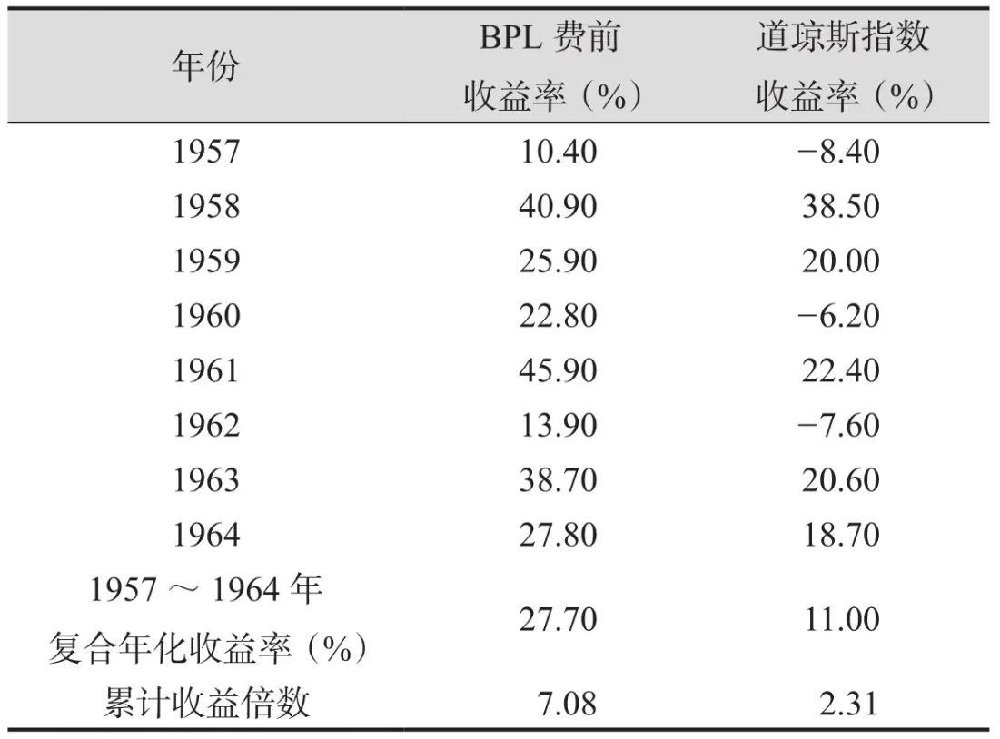

▲资料来源：巴菲特1964年致合伙人的信。

▼表1\-2 伯克希尔逐年投资收益率

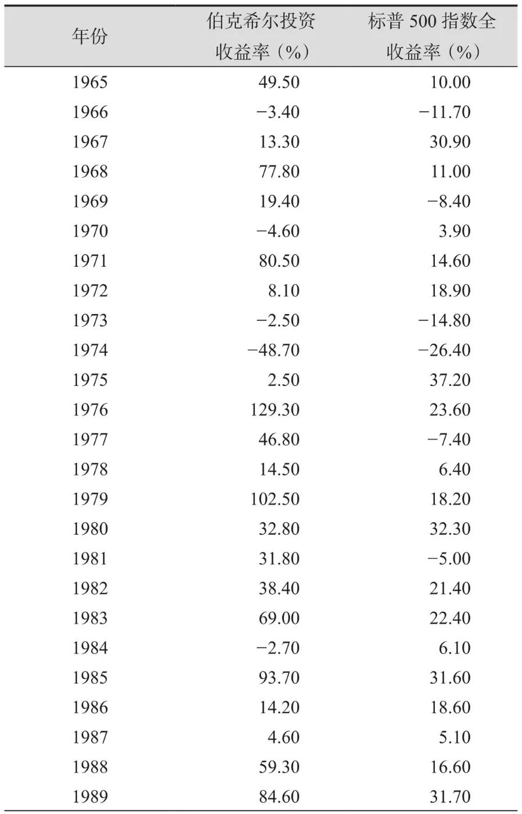

（续）

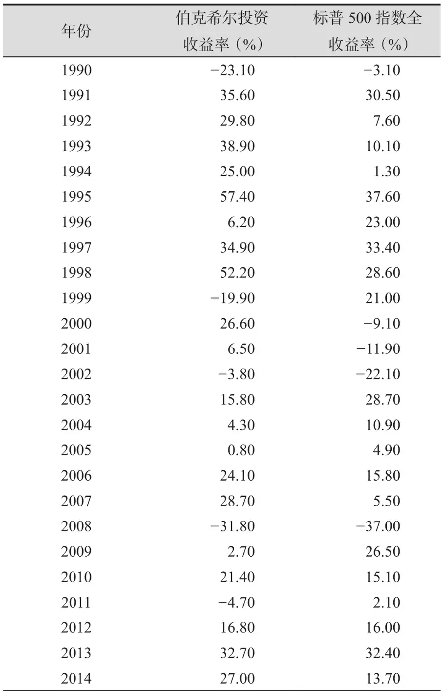

（续）

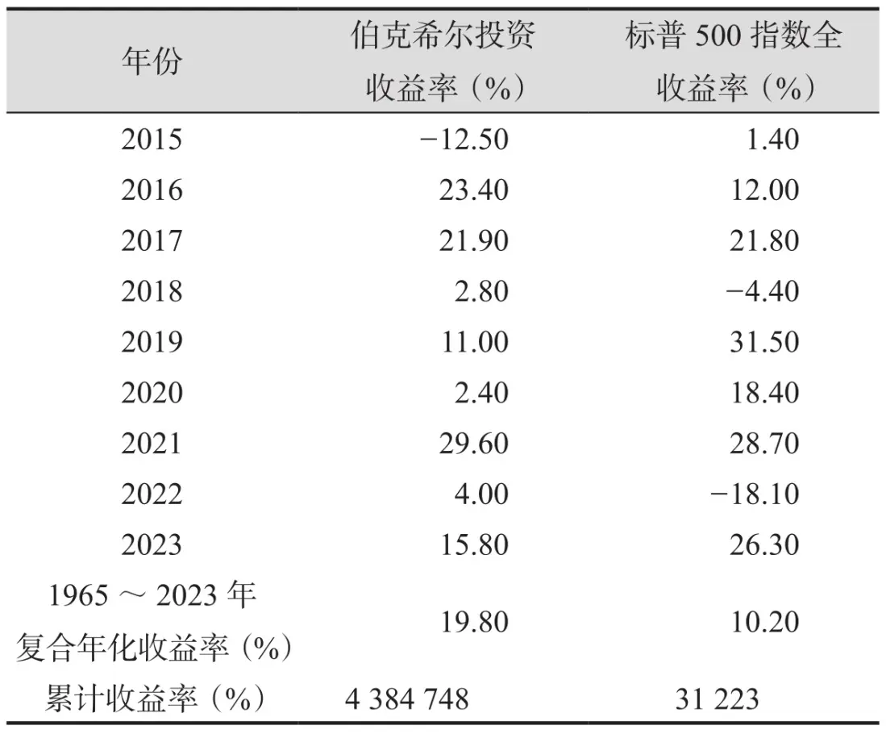

▲资料来源：巴菲特2023年致股东的信。

也就是说，如果你在1965年初买入1万美元伯克希尔的股权，那么在59年后的2023年，你的1万美元将变成约4\.38亿美元（增长为原来的约4\.38万倍），你将进入亿万富豪行列。而投资同期标普500指数，1万美元只能变成约312万美元（其实也不错）。

更进一步，如果你从1957年开始，就跟在巴菲特后面，放心地把钱交给他，不考虑1957～1964年收取的管理费和收益分成，67年后，当初的1万美元会变成约31亿美元。

在华尔街，乃至全世界，能做到1年的复合年化收益率在20%以上的投资者如过江之鲫；能做到3年的，似乎少了很多；能做到10年的，寥若晨星；而66年都能做到的，仅此一人。

首先你得保养好身体，做到能够活那么久。这一点就把大量的投资高手挡在了门外。

做投资，身体行是第一位的。

其次，不要太激进。华尔街有老的交易员，也有胆子大的交易员，但没有又老胆子又大的交易员。巴菲特说：“一连串成功的数字乘以零，结果还是零。”这方面，我相信利弗莫尔、Bill Hwang等人应该频频点头。

最后，也是最重要的——顺风车。巴菲特一直说，他的幸运首先在于搭上了美国的顺风车。他一辈子绝大部分投资都在美国，而美国孕育了一大批伟大的公司，成就了巴菲特。所以，巴菲特在信中感慨，美国缺少了巴菲特，没什么损失；而巴菲特缺少了美国，则什么也不是。

尽管如此，在如过江之鲫的华尔街投资人当中，为什么只有巴菲特成了那个最耀眼的明星？一定是因为他做对了什么，才让他成为现在的样子。

本书通过分析巴菲特长达60多年来写给合伙人或股东的信，尝试解开这个谜。

__1\.1 简单的道理，却用一生去坚守__

价值投资难不难？

也难也不难。

说不难，是因为价值投资的方法是非常清晰明了的；而且，在过去的100年间，其长期有效性已经被诸多价值投资大师的长期业绩所证实。

价值投资是什么？巴菲特在1968年致股东的信中说出了一句经典名言：“价格就是你所支付的，而价值就是你所得到的。”（Price is what you pay，value is what you get\.）简而言之，所谓价值投资，就是买得物超所值，用50元买下值100元的东西。

如此简单的道理，却很难用一辈子的时间去坚守。这也是真正的价值投资者极为稀缺的原因。

为什么难以坚守？因为人人都想赚快钱，想暴富。

美国著名对冲基金潘兴广场（Pershing Square）创始人比尔·阿克曼（Bill Ackman）曾说：“传统意义上的价值投资，就像看着油漆变干一样乏味。”

尽管价值投资的方法论也在进化，但这种等待价值回归的过程尤其难熬，绝大部分人都忍受不了。

普通投资者所梦想的还是1年1倍，甚至1年3倍的快速致富。

亚马逊创始人杰夫·贝佐斯（Jeff Bezos）曾经给巴菲特打电话，问他为什么别人不能像他一样投资并变得富有。巴菲特回答道：“因为没有人愿意慢慢变富。”

上面的这点才是价值投资最难坚守的地方。具体的方法论（例如，如何给一家公司估值），这个世界上有很多人都精通。

这种价值投资方法，由于对买入股票背后公司本身价值的看重，一个不可避免的结果就是：在牛市疯狂的时候，大概率会跑输大盘；而在熊市时，业绩会显著好于市场。

巴菲特在1957年致合伙人的信中便已挑明：“我预计我们将来在熊市的表现会比在牛市的表现要好。在牛市的情况下，我将会满足于取得一个相当于市场平均水平的回报率。”

例如，在1999～2001年的网络股泡沫破裂、2008年的金融危机中，巴菲特旗下公司（伯克希尔\-哈撒韦）的业绩（见表1\-3）明显地展示了上述特征。

表1\-3 伯克希尔逐年收益率（1999～2009年）

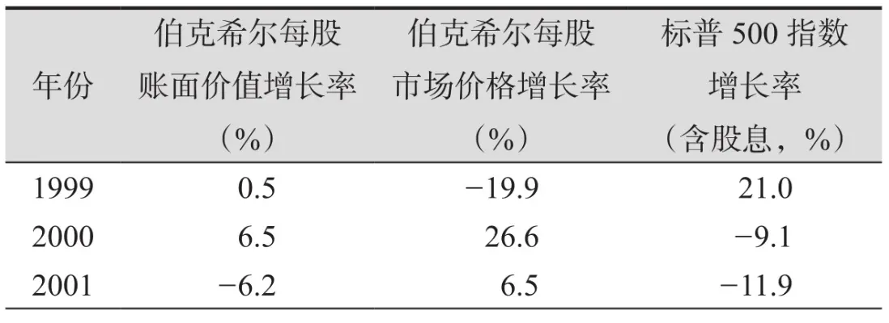

（续）

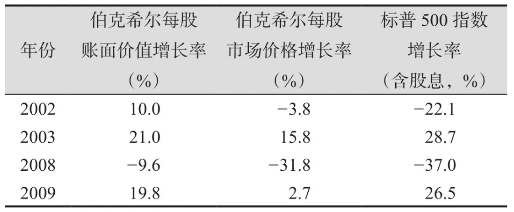

资料来源：巴菲特历年致股东的信。

可以看到，在1999年纳斯达克的科技股股价增长到顶峰时，伯克希尔无论是内在价值还是股价表现，都远逊于大盘指数。当泡沫破裂，股市陷入低迷时，伯克希尔的表现反而明显优于大盘。通过这种“熊市好很多，牛市别落后太多”的方式，巴菲特的长期业绩显著跑赢指数。

__1\.2 直达生意的本质，并知行合一__

在外界看来，巴菲特是位投资家；甚至在部分人眼里，巴菲特就是靠炒股炒成了全球首富。其实这是对他的误解。

实际上，优秀的投资家必然是优秀的企业家。这句话放在巴菲特身上再合适不过。

巴菲特旗下的主要公司——伯克希尔\-哈撒韦拥有大量的非上市公司。这些公司持续为巴菲特提供了极高的盈利回报以及源源不断的现金流，从而推升巴菲特的财富积累。

因此，购买上市公司的股票并不是巴菲特获得巨额财富的唯一途径，甚至不是首要途径。只要生意足够好，他更愿意买下一家非上市公司的全部股权。

例如他在投资生涯中期收购的喜诗糖果（1972年）、内布拉斯加家具城（1983年），以及大量的保险业的公司\[盖可保险公司（GEICO）、国民赔偿保险公司（NICO）、通用再保险公司等\]。可以说，非上市公司对整个伯克希尔的盈利贡献超过其持有的二级市场股票。

对于众多的伯克希尔拥有控制权的子公司，巴菲特是如何管理的呢？巴菲特在2015年致股东的信中提到，伯克希尔旗下公司在全球拥有36\.13万名员工，集团总收入超过2000亿美元。而伯克希尔总部有多少人呢？区区24名！按照普通人的思维，面对这样的情况，总部至少得有几千个人天天忙得团团转。

巴菲特究竟是如何做到的？

他在致股东的信中曾反复提及，首先，收购的公司一定是符合他要求的；其次，信任管理层，尽量保持原有管理层不变，除非实在有必要。

这就和幸福婚姻的秘诀一样：婚后的相处固然重要，但挑选合适的人结婚是最重要的一步。

巴菲特经常把致股东的信当成打收购广告的绝佳场所（伯克希尔有没有考虑过给巴菲特个人单独付一笔广告费？不能让老板总是“打黑工”）。例如1988年致股东的信中，他明确列举了伯克希尔的收购条件：

（1）年税前净利润至少为1000万美元（这个条件早期更低）。

（2）展示出持续的盈利能力（光有预期或困境反转型的企业，不要）。

（3）只需要很少（甚至没有）债务，就能获得很高的净资本回报率（ROE）。

（4）管理层已经就位。

（5）业务简单直白（如果涉及太复杂的技术，我们不懂）。

（6）明确的收购价（如果交易价格不明，需要双方坐下来谈谈，我们不愿浪费这个口舌）。

可以说，巴菲特对于自己“要结婚的对象”（收购的企业），标准清晰明了。这就使得后续的管理变得极为轻松。反之，如果收购到的是麻烦不断的企业，那么就有巴菲特好受的（巴菲特本人应该同意此处我列举收购伯克希尔\-哈撒韦纺织厂、所罗门兄弟公司、Dexter鞋业、Tesco等不堪往事）。

在收购了符合自己标准的企业后，巴菲特的做法往往是信任原有管理层（其中很多是公司创始人或家族后代）。这样能够保持被收购公司的长期稳定，不需要投入太多的精力。如1983年收购内布拉斯加家具城（NFM）后，就接着让公司的创始人Blumkin家族长期维持运营，巴菲特本人却当起了甩手掌柜，眼睁睁看着内布拉斯加家具城的生意蒸蒸日上，可谓是“躺赢”的杰出代表。这样的例子在伯克希尔数不胜数。

另外，你可能好奇，伯克希尔旗下有如此众多的公司，只是每年的预算、重大投资、定期会议等，都会让总部忙得不可开交，怎么区区20多人（中期的时候更少，只有10多个人）就能应付？关于这点，巴菲特在1987年致股东的信中提到过他们做法的与众不同：

在业务的日常营运上，查理和我实在是无事可做。事实上，平心而论，我们管得越多，可能越会把事情搞砸。我们没有企业会议，也没有企业预算，更没有绩效考核（当然各个子公司因自身所需，有自己的一套管理流程）。我们有什么可以指导Blumkin家族如何卖家具，或是指导Heldman家族如何经营制服事业的呢？

由此可见，巴菲特还是一位非常厉害的企业管理者，通过“筛选—信任—授权”的方式，激励被收购的公司自主经营，取得了惊人的业绩。

当然，我们在惊叹巴菲特管理才能的同时，也能想到，这些目标公司，不也是我们在股票投资中梦寐以求的吗？

所以说，买股票就是买公司。

__1\.3 关于巴菲特的几个谣言__

__1\.3\.1 巴菲特牛，是因为他有长期保险资金__

有些人对巴菲特的投资经历有一定了解，知道是巴菲特收购的众多保险公司在提供保险资金，为巴菲特收购企业或购买股票提供源源不断的子弹。

因此，有人得出结论：巴菲特也没那么牛。他牛是因为背后有保险公司提供源源不断的长期资金。

背后的保险公司提供源源不断的长期资金，这句话没错。

巴菲特也毫不掩饰这一点。相反，他在致股东的信中，反复提及这是伯克希尔集团无可比拟的强大优势。

不过，这么认为的人，有没有想过一个问题：既然保险公司的长期浮存金这么诱人，而美国有大大小小数千家保险公司，为什么其他人远远没有巴菲特做得成功，甚至难以望其项背？按理说，使用长期限的保险浮存金去投资股权，是明牌，很多投资者（尤其是金融机构）都可以复制。

所以，长期限的保险资金对于巴菲特固然重要（甚至可以说必不可少），但这不是巴菲特之所以成功的最独特、最核心的因素。

核心因素在于：①如何正确地获取保险浮存金；②如何正确地使用保险浮存金。

在展开介绍之前，我们先简单解释一下保险浮存金的概念。

保险业务是典型的“先收保费，后赔付”的模式。无论是财产险、意外险，或是人寿保险，均是保险公司先把保费收上来，真正的赔付要等到出险之后。时间差短的有几个月，长的则有几年甚至是数十年。

对于保险公司来说，这些预先收上来的保费，就成了可以暂时免费使用的资金，这就是浮存金。只有等保单出险了，才需要从浮存金中提取资金去支付赔偿金。只要保险业务永续开展且不剧烈收缩，那么这些浮存金会越积越多，最终变成长期甚至是永续的免费资金。

既然大家都知道这个原理（有免费长期资金可以用），那么保险应该是世界上最好的生意才对。

但事实并非如此，保险业的商业模式是比较差的。

这种“免费长期资金”的存在，导致保险业竞争白热化，每份保单的报价越来越低。按照理想情形，一家保险公司每年收1亿元的保费，最终的出险赔偿金是9800万元，则保险公司能够净赚200万元。这种情形下，1亿元的浮存金不但是免费的，而且是负成本的（因为还能净赚200万元）。但由于保险产品高度同质化，且购买人并不在乎是从哪家保险公司买入的保单，保单的报价越来越低，最终导致收1亿元的保费，出险赔偿金可能是1亿零500万元。

那保险公司如何挣钱呢？由于1亿元是可以长期投资的资金，只要保险公司在赔付期内赚取超过500万元的收益，就能覆盖额外成本，获得净收入。

道理保险公司都懂，但由于竞争压力存在，实际运行起来却不是这么回事。

巴菲特在2010年致股东的信中提到：

实际上，保险业务的健康运营需要遵循四条准则：①明白任何一项风险暴露都可能造成保险损失；②保守地估计所有风险暴露造成损失的可能性以及可能的损失成本；③一般来讲，在扣除未来损失和运营费用之后，保费的设定要确保能够实现承保利润；④如果不能获得合理的保费就放弃这项业务。

许多保险公司通过了前三条准则的考验，却在第四条上不及格。华尔街的急功近利、代理商和经纪人带来的压力，或者是雄心勃勃的首席执行官不肯让业务规模缩水，导致许多保险公司以低价承揽业务。“别人这么做，所以我们也必须这么做”，这种想法让许多企业身陷困境，保险行业尤其如此。

也就是说，由于同质化竞争的持续存在，很多保险公司以低于合理价格的价格出售保单，最终导致亏损。那巴菲特旗下的保险公司怎么做的呢？

正如上面第四条所说的，“如果不能获得合理的保费就放弃这项业务”。这句话说起来容易做起来难，这意味着业务的短暂甚至持续萎缩。但别的机构坚持不下来的，它能坚守。

因为这是一个再简单不过的常识：不做亏本买卖。

有事实为证。在2004年巴菲特致股东的信中，他提到了伯克希尔旗下的一家保险公司——国民赔偿保险公司——的例子。从1986年至1999年的14年间，由于市场的过度竞争，市场上的所有保险公司要么保单卖不出去，要么亏本卖保单。当大部分保险公司的股东或管理层在业绩考核的诱惑或压力下，即使亏本也干时，国民赔偿保险公司默默忍受了连续14年的保费收入下滑（见表1\-4）。

表1\-4 国民赔偿保险公司逐年保费收入（1980～2004年）

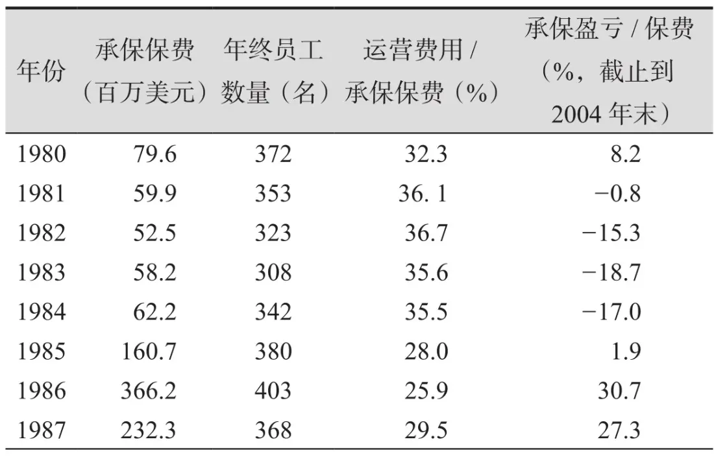

（续）

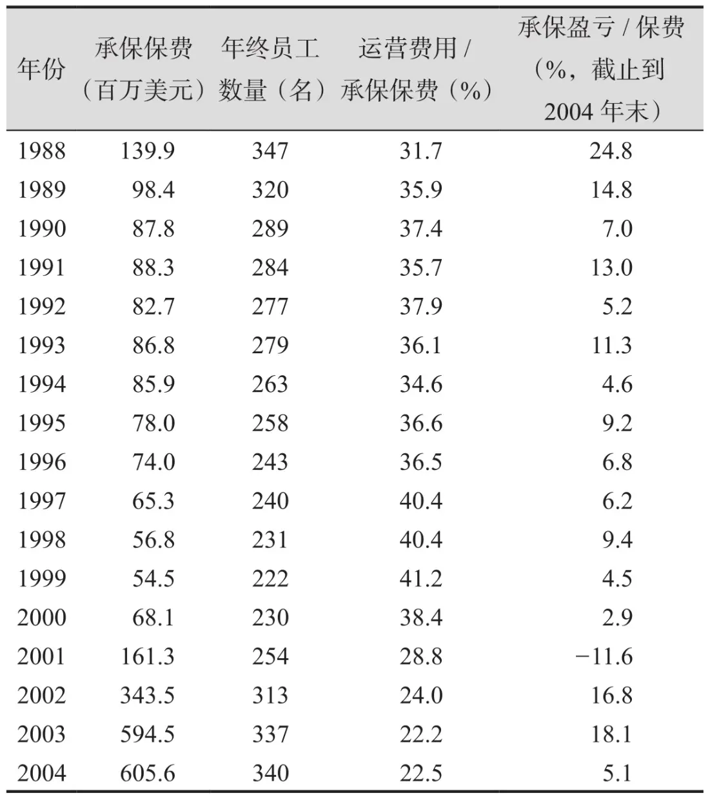

资料来源：2004年巴菲特致股东的信。

可以看到，国民赔偿保险公司的保费收入自1986年达到3\.662亿美元的顶峰后，进入持续下滑通道。巴菲特在此评论到，实际上只要他们愿意下调保单价格，立刻就能接到数十亿美元的保单。但是一个简单的常识——不做亏本买卖，被巴菲特及管理层坚守了下来，这一坚守就是14年。直到2000年开始，市场变得有利可图时，才主动增加保单。

这种对常识的坚守，在短期业绩诱惑面前，并不容易做到。

有了低成本甚至是负成本的长期保险资金，巴菲特就可以开展他的投资绝技了。在这方面，很少有人能与之匹敌。

巴菲特在致股东的信中多次提到，他和芒格并不擅长经营企业，他们的优势在资金配置：将资金分配到更有效、回报更高的地方去。这是巴菲特成为世界首富的秘诀。

坚持不做傻事，并将自身的些许优势发挥到极致，最终成就了巴菲特。

__1\.3\.2 买入一只股票就长期持有，几乎不卖__

巴菲特曾说过一句经典名言：“如果你不想持有一只股票10年，那么连10分钟也不要持有。”

很多人以为的价值投资是，买入一只股票，然后盖上被子蒙头大睡，10年后打开账户一看，股价涨了10倍。

这是对价值投资最大的误解！

巴菲特的意思是，在你买入一只股票前，一定要严谨、细致地研究。要深思熟虑，抱着长期持有的心态来买入这只股票。这就像是找如意伴侣进入婚姻的殿堂，都是打算过一辈子的。

不过，即使是经验丰富的投资高手，也不能保证每笔投资都很正确。巴菲特和芒格的伯克希尔几十年间做了很多投资决策，可芒格说：“如果把我们最成功的十几笔投资去掉，我们就是一个笑话。”可见，即使是价值投资大师巴菲特，错误的投资决策也非常多。

在1989年致股东的信中，巴菲特特意开了一个专栏，叫“头25年所犯过的错误（浓缩版）”，详细整理了自己1965年以来所犯过的错误。随后在1991年、1994年致股东的信中，他继续反思自己所犯的新的错误。

在买入一只股票后，可能会出现以下情况：①自己看走眼了，随着自己对公司了解的深入，发现公司并没有自己想象的那么好；②商业竞争环境发生了重大变化，公司的竞争力被明显削弱了；③发生了黑天鹅事件，公司遭受重大打击；④发现了更好的投资标的，把好的股票换成更好的股票。上面的四种情况都会导致卖出之前持有的股票。

第一种“看走眼了”的情况，在股票投资中再正常不过。段永平曾说：“发现错了马上改，无论多大的代价，都是最小的代价。”

巴菲特在2011年致股东的信中透露，他花费109亿美元买入IBM公司6390万股股票，并且在信中对这笔投资做了详细的计算。

当时，IBM的流通股大约为11\.6亿股，巴菲特购入了其中的5\.5%。并且，IBM已经宣布，未来5年，计划投入500亿美元左右回购股票并将其注销。巴菲特做了两个简单的情形假设。

__情形一：__IBM的平均股价维持在200美元，那么500亿美元的回购资金可以累计买入2\.5亿股自家的股票。这种情形下，巴菲特持有IBM股票的股份占比，可以从5\.5%提升到7%。

-
1. 原文引用，计算结果因四舍五入略有差异。

__情形二：__IBM的平均股价上涨到300美元。那么500亿美元的回购资金只能买入1\.67亿股自家股票。这种情形下，巴菲特持有IBM股票的股份占比，可以从5\.5%提升到6\.5%

。

因此，巴菲特的结论非常简单：在他重仓买入IBM的股票后，与大多数人的直觉相反，他期望股价能够持续下跌。这样他就能通过公司回购，被动持有更多的股份，岂不是美事一桩？

上面的分析可以说是非常缜密，但实际的投资结果却不尽如人意。随后IBM的业务转型并不顺利（没有押注云计算市场，转而做了Watson人工智能系统）。IBM的归母净利润在2012年达到166亿美元的顶峰后，一路下滑至2017年的57\.5亿美元。

6年过去，巴菲特再也没了耐心，于2017年彻底清仓IBM股票。

所幸算上股息，这笔投资没有亏钱，亏的是机会成本。

这也是托了巴菲特极度重视安全边际的福。

对于第二种“商业环境发生了重大变化，公司的竞争力被明显削弱了”的例子，巴菲特这有一大堆（望转告巴菲特，不必感谢我）。

在1993年致股东的信中，巴菲特提到伯克希尔以4\.33亿美元的高价收购了Dexter鞋业，并且在信中赞扬Dexter鞋业是“他和查理的职业生涯中见过的管理得最好的企业”。（巴菲特估计恨死我这个记忆力超好的作者了。）

几年后，Dexter鞋业倒闭了！

2014年致股东的信附有“伯克希尔50周年总结”。在总结里面，巴菲特着重提到了投资Dexter鞋业是这辈子“最可怕的错误”。

最可怕的错误是Dexter鞋业。当我们于1993年购买该公司的时候，它有很好的历史业绩。在我眼中，它全然不像烟蒂股。然而，因为海外的竞争，它的竞争优势很快消失。而我根本没有意识到这点。

结果，伯克希尔为Dexter鞋业支付了4\.33亿美元，但其价值很快归零。然而，GAAP会计准则并不能如实记录我错误的量级。事实是，我是用伯克希尔的股票收购的Dexter鞋业，而不是现金。我为购买Dexter鞋业所付出的股票现在价值约为57亿美元。作为一场金融灾难，它值得被写进吉尼斯世界纪录。

在1993年收购时，Dexter鞋业确实看起来非常不错。但是后来，商业环境发生了巨大变化：鞋业生产中心转向了亚洲（主要是中国）。中国生产的鞋子成本更低，压垮了美国的制鞋业，包括Dexter鞋业。

还有就是华盛顿邮报的例子。在巴菲特投资的早中期，他非常喜欢投资报业，并且在水牛城晚报、华盛顿邮报上赚到了非常多的钱。报业具体有什么竞争优势呢？在1984年致股东的信中巴菲特写道：

一家占主导地位的报纸公司的经济效益非常出色，在商业世界中名列前茅。当然，老板们愿意相信，公司出色的盈利能力只是因为他们始终如一地生产了出色的产品。这个令人愉悦的理论在一个令人不安的事实面前现形了。虽然一流报纸可以赚取丰厚的利润，但三流报纸的利润同样好或者更好——只要这类报纸在其社区中占主导地位。当然，产品质量可能是该报纸取得主导地位的关键。我们认为，《水牛城晚报》就是这种情况，且很大程度上是因为像阿尔弗雷德·柯克霍弗这样的人在领导。

一旦占据主导地位，报纸本身，而不是市场，决定了报纸的好坏。无论好坏，这家报纸公司都会繁荣昌盛。对于大多数企业来说，情况并非如此——低质量通常会产生低经济效益。但是，即使是一份糟糕的报纸对大多数市民来说也是有益处的，仅仅是因为它的“公告板”价值。在其他条件相同的情况下，劣质产品不会满足一流读者群的阅读需求。然而，对于大多数市民来说，劣质产品仍然是必不可少的、对市民有价值的东西，必然也会引起广告商对这份报纸的兴趣。

但是，随着20世纪90年代初互联网的兴起，纸媒的结局已定。1973年，巴菲特控股华盛顿邮报，持有时间超过40年，华盛顿邮报为巴菲特赚取了无数的利润。华盛顿邮报这个巴菲特口中“永远不会卖出的公司”（1988年致股东的信），还是在2014年被彻底清仓了。

至于黑天鹅事件，以及换仓（把好的股票换成更好的股票），这样的例子就更多了，这里就不一一列举了。

由此可见，具体到投资，一定要因时而变。芒格曾说：“如果你想成为一个伟大的投资者，你必须不断学习。世界在变，你也要变。”君子豹变，说的就是类似的意思。

-
1. 为本书完成时的2024年。

当然，更多的时候，巴菲特对于买入的公司股票是长期持有的，对于非上市企业的股权尤其如此。众所周知的可口可乐，巴菲特从1988年开始逐步买入其股票，并持有至今

。

## 投资理念进化的三部曲

__第2章__

__投资理念进化的三部曲__

__2\.1 阶段一：古典价值__

——崇尚烟蒂股投资

这一阶段（1957～1970年），巴菲特是近乎100%的格雷厄姆型投资者。巴菲特在哥伦比亚大学读书期间，格雷厄姆恰好是他的授课老师，巴菲特深受本杰明·格雷厄姆的传统价值投资理念影响，两人因此结缘。1954年，巴菲特进入格雷厄姆的投资公司工作直到1956年。由此可见，巴菲特职业生涯的早期深受格雷厄姆影响不是没有原因的。

如果你看过格雷厄姆的《证券分析》，就明显能感受到他的投资思路：以足够低的价格（显著低于清算价值）买入一家公司，要么等待价值回归，要么等待清算变现。

巴菲特在1958年致合伙人的信中提到的对Commonwealth信托公司（一家银行）股票的投资，便是烟蒂股投资的典范。

根据巴菲特的估算，Commonwealth信托公司的内在价值为125美元每股，每年的每股收益高达10美元。但由于公司不做任何的现金分红，当时的市场并不认可这样的行为方式。在那个年代，很多投资人买入股票的目的是每年获得稳定的股息收入，对于公司不进行分红，并将上一年的盈余用作扩大业务版图，使得公司业务实现复利增长的做法，不以为然。因此，当时公司股价只有区区50美元。但是巴菲特认为，Commonwealth信托公司是管理良好且具有较强盈利能力的银行，管理层对于股东也比较友好，因此他认为以50美元买进是一笔划算的买卖，损失概率较低。他在信中列举了公司的几个优点。

Commonwealth信托公司25\.5%的股权由一家大银行持有（Commonwealth信托公司的资产约为5000万美元，约为位于奥马哈的第一国民银行的一半）。这家大银行一直想与Commonwealth信托公司进行合并。出于私人原因，该并购一直被阻挠。但有证据显示，这种情况不会无限期地持续下去。因此我们有了这样的良好组合。

（1）很强的防御性特征。

（2）建立在稳健经营步伐上的良好价值。

（3）可能是一年，也可能是十年，这个价值最终会被释放。如果是后者，其价值大概会达到一个相当大的数字，比如说每股250美元。

巴菲特花了一年多的时间，买入了Commonwealth信托公司大约12%的股份，平均成本为51美元，并最终成功以80美元的价格卖出所有股份，获利近60%。

可以看到，Commonwealth信托公司的市盈率为5（每股收益为10美元，股价为50美元），处于极度低估水平，同时，还有被大股东收购的潜在利好。可以说，Commonwealth信托公司是“进可攻，退可守”的股票，符合格雷厄姆的投资范式。

以51美元买进，那为什么后来以80美元卖出了呢？（巴菲特在致合伙人的信中说长期看，股票值250美元）因为他找到了更好的投资标的，所以进行了换仓。

Commonwealth信托公司的例子还有一个特别有趣的细节：Commonwealth信托公司的经营不错，市场却不认可，导致市盈率低至5倍。上文的信中提到这是因为“它从不分红”，导致市场嫌弃。现在看来，公司如果能够持续发展，将上一年的利润留存下来继续投到业务规模的扩大中，是可以为股东创造更大的价值的，且长期复利的效果惊人。当时的投资者为什么就意识不到呢？这就是时代的局限，同时也给巴菲特创造了巨大的套利空间。

在2019年致股东的信“留存收益的威力”中，巴菲特提到1924年出版的一本书《用普通股进行长期投资》，作者是当时名不见经传的史密斯。在20世纪上半叶，公司的股东普遍对公司把一部分利润留存下来继续扩大生产的做法很不满，他们觉得作为股东，每年享受定期的分红，就是世界上最幸福的事。然而事实是，几乎所有的超级富豪家族均是依靠不断地把上一年的经营利润留存下来，投到未来的成长中去，从而依靠复利的魔力，将个人或公司财富推到一个不可思议的高度。

这本书出版了几十年，华尔街的股票投资者们仍然执迷不悟，钟情于那些把大部分利润分掉的所谓的“红利股”，因此像Commonwealth信托公司这样不分红的股票，投资者们避之不及，从而造就了其超低的估值，给巴菲特这样的有心人留下了大量的投资机会。

巴菲特对桑伯恩地图公司的投资更能体现出格雷厄姆“清算价值”式的分析方法。

在1960年致合伙人的信中，巴菲特提到，1959年的时候他就拿出基金净资产的35%去收购一家公司，这家公司就是桑伯恩地图公司（简称桑伯恩）。

简而言之，桑伯恩是一家卖详细地图给保险公司的地图公司，这些详细地图对火灾险公司的保费评估尤为重要。桑伯恩发行的地图，可以详细到街道下面总水管的直径、消防栓所在位置、屋顶的构成等，所以在20世纪50年代以前，桑伯恩借助近乎垄断性的优势，活得非常滋润。

然而从20世纪50年代早期开始，保险公司使用一种计分（carding）方式去进行承保，这使得它们对详细地图的需求骤降，桑伯恩的地图业务一落千丈。

好在桑伯恩从20世纪30年代开始，便利用公司的留存收益去投资债券及股票。到1958年的时候，公司拥有的金融资产组合价值居然已经超过了公司的总市值。巴菲特在1960年致合伙人的信中写道：

1938年，道琼斯指数在100～120点的时候，桑伯恩股价为每股110美元。1958年，当道琼斯指数在550点左右时，桑伯恩股价为每股45美元。与此同时，桑伯恩投资组合的价值从每股20美元左右增加到每股65美元。这实际上意味着，在商业和股票市场不景气的1938年，桑伯恩股票的购买者对地图业务的估值为每股90美元（110美元减去与地图业务无关的20美元投资组合的价值）；在1958年经济极其活跃的环境下，同样的地图业务被评估为负20美元（45美元减去65美元），股票的买家不愿支付投资组合价值的70%，而地图业务则是一文不值。

也就是说，如果全资收购桑伯恩，即使关停不怎么盈利的地图业务，卖出所有的证券资产，也能收获44\.4%（20/45）的投资收益，更何况地图业务也不是一文不值。

问题出在公司治理上。在巴菲特通过大量收购桑伯恩股票进到董事会以前，桑伯恩的14位董事中有9位是保险业中身居要职的人，而这些人几乎不持有桑伯恩的股票，持股最多的一位仅拥有10股。这些来自保险业的董事，当然不希望地图卖出更高的价格（毕竟他们是甲方）。

巴菲特通过大量持股进入董事会后，要求将地图业务与证券投资组合业务分开，并重建地图业务。对于持反对意见的股东，巴菲特将他们手中的股票换成等值的证券组合，然后让他们随意处置。

通过上述操作，巴菲特早期在桑伯恩地图公司上大赚一笔。

其实在巴菲特以格雷厄姆的方式进行投资时，也并非一根筋地抱残守缺。在实际的投资运作中，巴菲特展现了极其高超的投资灵活性，这往往被外界对巴菲特的刻板印象所掩盖。对于对巴菲特了解不深的人来说，似乎巴菲特是那个爱喝可口可乐、爱吃汉堡的老学究。在生活中确实如此（他的妻子苏茜确实抱怨巴菲特生活刻板甚至不能自理），但在投资中，他是一条灵活的鲨鱼。

在1961年致合伙人的信中，巴菲特专门辟出“我们的投资方法”，详述他的投资方法。他把他的投资分为三种类型：低估类股票、套利类股票以及控股类股票。信中详述了三种类型的特点。

第一类由被普遍低估的股票组成。我们对公司没有控制力，也没有低估状态何时可以修复的时间表。多年来，这是我们最大的投资类别，在这里赚的钱比其他任何一个类别都多。我们通常在5到6只被低估的股票上，每只持有总资产的5%～10%的大仓位，然后在其他10～15只被低估的股票上，每只持有更低的小仓位。

有时这些股票很快便赚到了钱；很多时候，需要数年的时间才能赚到。我们在购买时很难知道导致它们股价上涨的具体原因。然而，由于缺乏让市场觉得很兴奋的卖点，它们的股价往往很低。与买入价格相比，我们所能得到的价值很多。这种巨大的超额价值在每笔交易中都创造了一个舒适的安全边际。这种每只股票单独的安全边际，加上分散化投资组合，创造了兼具安全边际和上涨潜力的组合。多年来，我们对买入时点的把握，要比卖出时点的把握好很多。我们在低估类股票上，从来没想过要赚足最后一个铜板，但是我们对于自己的卖出价格往往非常满意，基本上介于买入价和从公司老板角度来看的公允价格之间。

低估类股票的市场走势往往与道琼斯指数高度趋同。某样东西便宜并不意味着它的价格不会下跌。在市场急速下跌期间，这类股票价格的跌幅很可能与道琼斯指数一样。假以时日，我相信低估类股票的表现将优于道琼斯指数。在1961年这样有火爆牛市的年份，这类股票在我们的组合中表现最为优异。当然，在不断下跌的市场中，它也是最脆弱的。

第二类是套利类股票。这类股票的财务表现取决于公司行为，而非股票买卖者的供需关系。换句话说，这些股票我们有个明确的时间表可以大差不差地预测大概能赚多少钱，以及如果计划落空会是什么结果。套利机会出现在并购、清算、重组、分拆等公司行为中。近些年，套利机会主要来自大型综合石油公司收购石油生产商。

无论道琼斯指数的走势如何，这一类别将在很大程度上每年产生相当稳定的收益。显然，如果我们的投资组合里大部分都是套利类股票，当某一年股市大盘指数下跌时，我们的组合将取得异常杰出的业绩；反之如果股市涨得好，这个组合的表现就相对落后。长期以来，套利类股票是我们持仓的第二大权重。在任何时间点，我们可能都有10到15只套利类股票，有些处于套利的前期，有些则处于末期。我觉得可以使用点儿借来的钱去做这类套利的操作，毕竟不管是从最终结果还是中间的市场行为来说，这类机会都是高度确定的。扣除融资成本后，这类套利组合的收益大概在10%～20%。我对自己设置的借钱杠杆限制是不超过我们公司净资产的25%。我们基本不借钱，借钱也只是为了构建这种套利组合。

最后一类是控股类股票。在此类投资中，我们或是拥有控股权，或者是大股东，对公司决策有话语权。衡量此类投资肯定要看几年的时间。当我们看好一只股票，在收集筹码时，它的股价最好长期停滞不动。所以在一年中，控股类投资可能不会贡献任何收益。此类投资同样受大盘影响相对较小。有时候，一只股票，我们是当作低估类买入的，但也会考虑把它发展成控股类的可能。如果股价长期低迷，很可能出现这种情况。如果我们还没买到足够的量，这只股票的价格就涨起来了，我们就在涨起来的价格上卖掉它，成功完成一笔低估类投资。我们现在正在买入的一些股票，再过几年可能发展成控股类。

可以看到，具体到投资方法上，巴菲特是非常灵活多变的，但是都遵从他所说的经典名言——“价格就是你所支付的，而价值就是你所得到的”。只要买入价格低于内在价值，就有利可图，具体方式灵活多样。

同时，我们也可以看到，巴菲特并不拒绝使用杠杆（借钱）。在后期的很多投资案例中，他都恰当地使用杠杆。因此，所谓的巴菲特“从来不用杠杆”，本身就是谣传。

在第一阶段，巴菲特通过使用格雷厄姆的烟蒂股投资，收获了巨大的成功。

巴菲特关闭自己的合伙人公司之前，其逐年收益率在1968年致合伙人的信中有完整披露（见表2\-1）：

表2\-1 BPL公司逐年收益率（1957～1968年）

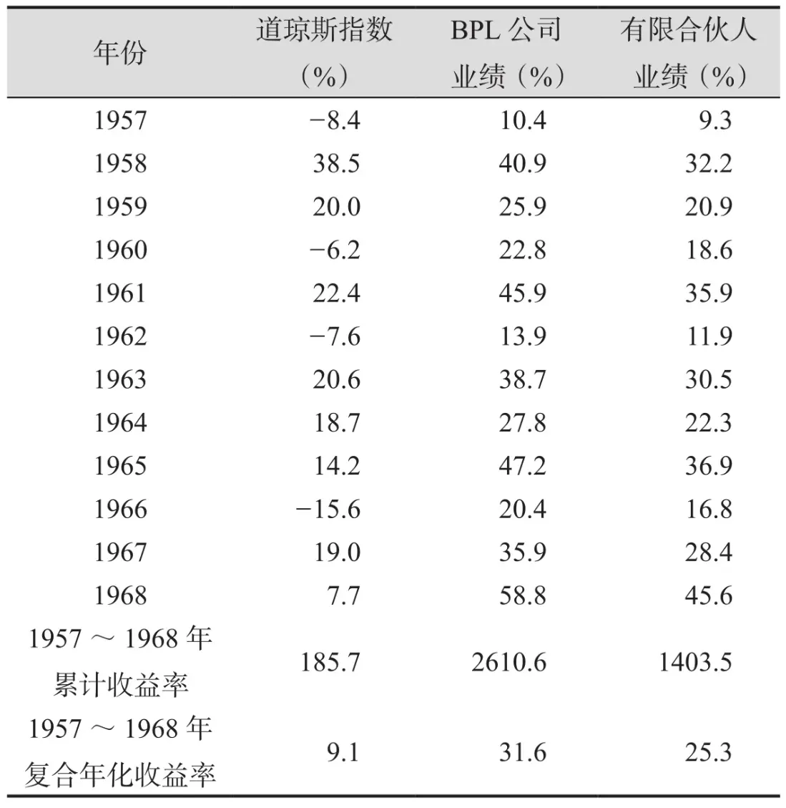

注：1\. 数据来源于巴菲特1968年致合伙人的信。

2\. 道琼斯指数收益包含了股息。

3\. BPL公司的有限合伙人是将资金委托给巴菲特进行投资运作的投资者。

1957～1968年的12年间，巴菲特合伙人公司创造了惊人的31\.6%的复合年化收益率。既然用传统的格雷厄姆式的方法创造了如此高、持续时间如此久的收益，为什么还要改弦更张，修正、优化原有的一套投资理念呢？

俗语有云：“如果东西没坏，就不要去修它。”巴菲特使用这套方法一定是遇到了一些挑战，才促使他去修正、优化格雷厄姆的烟蒂股投资。

在1966年致合伙人的信中，巴菲特写道：

过去几年里，环境彻底变了。现在我们基本找不到我们能看懂、规模合适，而且每年超额收益率（相比道琼斯指数）达到预定目标的投资机会。在过去三年里，我们每年只能找到两三个符合这个条件的新投资机会。好在我们充分利用了其中大部分机会。然而在早些年，这样的机会，不怎么费劲就能找到一大堆。关于自己发掘投资机会的能力降低了，我很难做到客观地分析其中的原因，但有三个原因是比较明显的：①市场环境变化了；②我们的资金规模在增加；③竞争更加激烈了。

过去的好机会像奔腾不止的河流，现在的好机会像潺潺流淌的小溪。现在的前景与过去相比，当然不能同日而语。这几年，没了奔腾的大河，从潺潺溪流中，我们同样汲取了养分，没少赚钱。为什么？原因有两点：首先，一个人的饭量是有限的（几百万美元的资金才能利用的投资机会，对只有几千美元的人来说没多大用，我年轻时对这一点感触很深）。其次，好机会越少，投资的时候就越珍惜，越要把少量的机会用好。显然，这几年我们靠的就是第二个原因。虽说如此，与大河相比，小溪太容易干涸。

正如巴菲特所述，他在那几年感觉到烟蒂股投资方法面临越来越大的困难。他提到了三个原因：

（1）市场环境变化了。格雷厄姆的投资生涯主要在20世纪20年代到20世纪50年代，那时候的美国股市经历了大萧条、二战等巨变。同时，那时候的投资者群体也不成熟，大家对于怎么投资股票也在逐步摸索中。因此，格雷厄姆时代的美国股市，确实充斥了大量的被严重低估的股票（股价远低于清算价值）。正如巴菲特所说，那时候股市中的机会像“奔腾不止的河流”，只要投入精力，就能找到非常多。但随着美国摆脱了衰退和战争，成为全球头号强国，经济蒸蒸日上，美国股市也迎来长期增长。这时候被严重低估的股票投资机会变成了巴菲特口中的“小溪”——机会在变少。

（2）资金规模迅速增加。规模是收益的敌人。1957年初，巴菲特开启职业投资生涯时，启动资金只有30万美元；而到了1968年，所管理的资金规模已经高达1\.04亿美元。在如此大的资金规模下（考虑到当时是1968年），那些过去的烟蒂股所能使用的资金有限，而能够容纳大额资金、收益足够高的机会就越发稀少。

（3）市场竞争更激烈了。这与第一点的市场环境变化息息相关。美国自20世纪50年代起经济高速增长，投资者逐渐变得成熟，烟蒂股投资的氛围逐渐浓厚，使得竞争者众多。以往不为人知的小股票，如今很多投资者都在日夜挖掘，导致其机会转瞬即逝。即使有，竞争买家也是众多，从而抬高了购买成本。

除了上述因素，其实还有个更为重要的原因，导致巴菲特对传统格雷厄姆式投资理念的反思，那就是几次重大的投资失败（是的，股神巴菲特也经历过很多次投资失败）。

谁能想到如今鼎鼎大名的伯克希尔\-哈撒韦集团，最初是一个投资错误。

在1989年致股东的信“头25年所犯过的错误（浓缩版）”中，巴菲特首先回忆的就是收购伯克希尔\-哈撒韦纺织厂。

这本应该是一笔成功的烟蒂股投资。1962年，巴菲特看到伯克希尔的运营资本为每股10\.25美元，账面价值为每股20\.2美元，但股价却只有每股7\.5美元。同时，公司正在关闭经营不善的工厂，并利用收回的现金回购自家股票。看到这些利好，巴菲特认为，即使现在清算纺织厂，所能回收的也明显高于每股7\.5美元，因此这是一只典型的烟蒂股。

之后的事态发展也印证了巴菲特的判断。公司不断地回购股票（表明从产业资本家的角度看，也认为公司股价被极度低估）。到1964年的时候，公司CEO同意以每股11\.50美元的价格回购巴菲特手中的股票（盈利超过50%）。但随后公司临时反悔，只愿意报价每股11\.375美元，这让巴菲特愤怒不已，并决定继续买入伯克希尔的股票。到1965年的时候，巴菲特控制了伯克希尔\-哈撒韦纺织厂。在取得控制权后，巴菲特做的第一件事就是把那个不守信用的CEO给开了。

尽管收购伯克希尔有赌气的成分，但巴菲特决策的最核心依据还是买得足够便宜（综合成本价为每股14\.86美元，而公司扣除机器和设备价值的净运营资本为每股19美元）。

但这一任性的举动，让伯克希尔成为巴菲特投资生涯中的一个巨大灾难。

在管理层的努力经营下，伯克希尔过了几年好日子，但随后形势急转直下，纺织业日薄西山。后面的故事，只是纺织厂不断地在盈利和亏损之间挣扎，白白地牺牲了所投入的大量资本。

更让后来的巴菲特痛心的是，伯克希尔居然在1975年继续收购了Waumbec纺织厂，期望通过伯克希尔和Waumbec纺织厂的协同效应，提升纺织业务的盈利能力。可谓是错上加错！

最终，到1985年的时候，纺织业务终于走向了穷途末路，巴菲特不得已关闭了所有工厂。

在1989年致股东的信“头25年所犯过的错误（浓缩版）”中，巴菲特提到，找烟蒂股的这种方法，看起来虽然容易有机会以不错的盈利卖出，但长期而言，这家公司的经营结果会很糟糕，进而侵蚀原有的账面价值，对于有一定规模的资金而言，实在不是什么好主意。除了伯克希尔，巴菲特在多元零售公司（DRC）、Hochschild Kohn（巴尔的摩的一家百货公司）上均犯过同样的错误：贪图便宜而买下了烂公司，以致后患无穷。

__2\.2 阶段二：追求优质企业并长期持有__

这一阶段（1971～1998年），巴菲特的风险逐步转向了长期持有优秀公司。

事实上，是在芒格的影响下，巴菲特逐渐接受了“以合理价格买下优秀公司”的投资理念，并在后续的投资中将其发扬光大。后来我们所熟知的对可口可乐、美国运通、GEICO、华盛顿邮报、富国银行以及苹果等公司的投资，都是这种价值投资的典范。

在2023年致股东的信中，巴菲特回忆了与芒格的过往。其中提到，在1965年他买下伯克希尔后，芒格建议他“以后再也不要买像伯克希尔这样的公司了。放弃以极好的价格买入平庸的公司，应该以合理价格买入优秀的公司”。换言之，芒格建议他放弃他老师格雷厄姆的那一套，因为芒格觉得这种方法只在小规模资金上管用。

巴菲特对喜诗糖果的收购是“以合理价格买下优秀公司”投资理念的第一次牛刀小试，与后面买入盖可保险公司及可口可乐公司股票不同的是，喜诗糖果是一家非上市公司。其实巴菲特收购非上市公司的情况更多，也更热衷于以这种方式控股一家优质企业。

喜诗糖果是一家位于美国加利福尼亚州的巧克力制造商及零售商，始创于1921年。历经祖孙三代，随着1971年公司经营人劳伦斯的去世，家族无心继续经营，便打算出售喜诗糖果。到1972年时，公司已有167家直营店，并成为美国西海岸知名的巧克力品牌。彼时，喜诗糖果每年税前盈利约为420万美元（税后净利润为208万美元），而它做到这点只用了800万美元的有形净资产。

喜诗家族报价3000万美元。芒格认为，考虑到喜诗糖果拥有的广泛且持久的竞争力和品牌形象，以及很强的定价能力，3000万美元并不高，它值这个价。更重要的是，喜诗糖果并不需要再投入更多的资本就可以稳定地盈利（这点和重资产型公司迥然不同）。然而巴菲特当时还未从传统的烟蒂股思维中解脱出来，超出3倍于有形资产的售价显然把他吓坏了。出于谨慎考虑，巴菲特最高报价2500万美元。

幸运的是，对方同意了。

喜诗糖果之后的表现，可以说是让巴菲特喜出望外。根据1984年致股东的信，收购12年后的1984年，喜诗糖果的税后净利润从1972年的208万美元，增长到1338万美元，是12年前的6\.4倍！而到了2007年（收购35年后），喜诗糖果的年销售额达到了3\.83亿美元，税前盈利8200万美元。其逐年经营业绩见表2\-2。

表2\-2 喜诗糖果逐年经营业绩（1972～1984年）

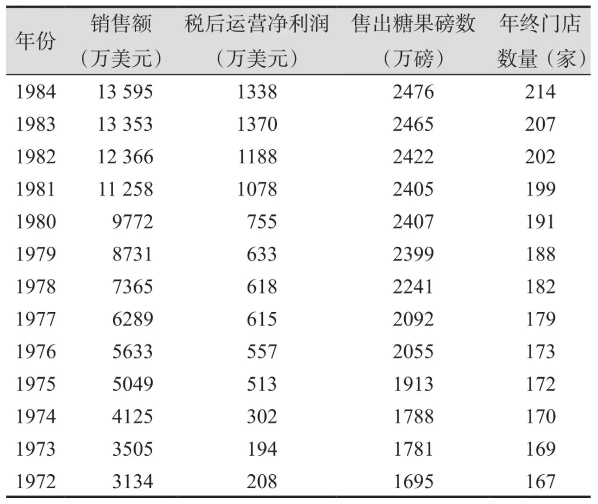

资料来源：巴菲特1984年致股东的信。

比盈利数据更重要的是，达成这些成就所需要的额外资本非常少。在1972年巴菲特收购喜诗糖果时，公司所需运营资本是800万美元。而到了2007年，这一数字是4000万美元。也就是说，过去35年（1972～2007年），仅仅新投入了3200万美元，就创造了累计13\.5亿美元的税前收益。

这些盈利在扣完税之后，都流向了哪里呢？巴菲特拿着这些盈利，投向了可口可乐、华盛顿邮报、一部分保险公司等具有更高投资收益的公司，从而让复利奔跑。

从盈利增长的角度看，喜诗糖果并不是最杰出的。但它最优秀的地方在于，不需要或者只需要很少的额外投入，就能让利润稳步增长，而这是大部分平庸公司做不到的。喜诗糖果能做到这点的原因在于，它拥有多年经营所积累的品牌价值、客户忠诚度、渠道体系等无形价值（尽管这些不体现在报表上），这些也让它有了提价能力。

这就是“现金奶牛”企业。

在2007年致股东的信中讲到喜诗糖果时，巴菲特特意写下了如下一段话：

我们要寻找的，是在稳定的行业中，具有长期竞争优势的公司。如果它的内生增长很快，非常好；但是即使没有成长，那样的生意也是值得的。我们只需简单地把这些生意中获得的可观收益拿去购买别的类似的公司。这里没有规定说，钱是哪儿挣来的，你就必须花在哪儿。事实上，这样的做法通常是错误的。真正伟大的生意，不但能使其投资者从有形资产中获得巨大回报，而且在任何持续期内，不用拿出收益中的很大一部分再投资，以维持其高回报率。

巴菲特对盖可保险公司的投资可谓是这种“以合理价格买下优秀公司”的又一价值投资典范。

对于盖可保险公司，巴菲特在其早年就熟知了。1950～1951年，巴菲特就读于哥伦比亚大学商学院，他的老师格雷厄姆恰好是盖可保险公司的主席，就这样，巴菲特知道了这家公司。1951年1月的一个星期六，巴菲特专门搭乘火车来到盖可保险公司位于华盛顿特区的总部，阴差阳错地遇上了正在加班的时任盖可保险公司总裁助理的Lorimer Davidson（后来升至总裁）。Davidson给巴菲特足足讲了四个小时关于盖可保险公司的经营情况。最终，巴菲特在1951年以个人身份买入350股盖可保险公司的股票，成本为10282美元，超过巴菲特当时净资产的50%。到了1952年，巴菲特以15259美元卖出全部股票（收益率约为48\.4%）。

然而令巴菲特唏嘘的是，这些在1952年卖掉的盖可保险公司的股票，在二十多年后，价值130万美元。

这让巴菲特学到了一课：绝对不能卖掉一家明显优秀的公司的股票。

不过这种遗憾在后来被弥补。20世纪70年代，盖可保险公司原总裁Davy退休，后续的管理层犯了一连串的错误——低估了保单成本，从而使保费定价过低，这使得20世纪70年代初的几年里，盖可保险公司出现了连续亏损，股价从最高的61美元一度跌到2美元。

但巴菲特认为，盖可保险公司的直销模式依然优秀，竞争力很强，错误在于激进的保单定价和平庸的管理层。巴菲特在1976年及1980年两次增持盖可保险公司的股票。到了1980年底，伯克希尔总共投入4570万美元，购买了盖可保险公司33%的股权。后来，随着公司不断地进行股票回购，到1995年伯克希尔收购剩余股份前，它对盖可保险公司的持股比例达到了50%。

当初以4570万美元购入的50%的盖可保险公司股票，到1995年价值几何呢？根据1995年致股东的信，其市值达到了惊人的23\.93亿美元！15年间市值增加到原来的52\.3倍，复合年化收益率为30\.2%。

1995年，伯克希尔以23亿美元的价格收购了剩余50%的股份，盖可保险公司正式成为伯克希尔旗下的全资子公司。巴菲特感叹，这是天价（如果1980年买，只需要4570万美元）。但是，如果放长时间，以现在的价值来看，当初的23亿美元又让人觉得好便宜！作为佐证，1995年伯克希尔收购它的时候，它的市场份额只有2\.5%，而在2015年（即20年后），它的市场份额达到了11\.4%。

这就是“以合理价格买下优秀公司”的魅力！

对可口可乐公司的投资也是巴菲特的得意之作。

巴菲特与可口可乐公司结缘颇早。早在1936年（巴菲特6岁）的时候，巴菲特便从爷爷的杂货店以每罐5美分的价格买入，然后以6美分的价格卖给邻居。从那时起，可口可乐对消费者的吸引力以及其蕴含的商机，让巴菲特印象深刻。

随后的52年间，尽管这种饮料风靡全世界，但巴菲特似乎对此视而不见。用他自己的话说，“在往后的52年内，当可口可乐席卷全世界的时候，我也持续地注意着这种特质。然而在同一时间，我很小心地避开了这只股票以至于一股都没买，反而将大部分的个人资产投注在街车公司、纺织公司、煤炭公司与邮票公司之类的股票上。”（1988年致股东的信）

我想，巴菲特早期之所以不买可口可乐的股票，与喜好烟蒂股的投资理念密不可分。这种消费类公司，靠账面价值完全无法衡量其真实的内在价值。例如，品牌、客户忠诚度、渠道、内生增长等优势，完全无法在会计报表上体现。从格雷厄姆式的财务报表角度分析，清算价值更是无法计算。

但随着巴菲特逐步进化到“以合理价格买下优秀公司”，他变得更加理解可口可乐这家公司的竞争优势了。于是分别在1988年、1989年，巴菲特连续买入累计2335万股的可口可乐股票，耗费资金10亿美元，可谓是大手笔！

这笔成功的投资为巴菲特带来了不菲的回报。10年后的1998年，根据当年的致股东的信，成本为13亿美元（1989年后又买了一些）的可口可乐股票，年末总市值为134亿美元，上涨了9倍！这还没算上现金分红。

这一切正如芒格所说：一家伟大的公司会在你离开后继续运作；而一家平庸的公司不会这样。

回到这一节问题的本身：究竟是有什么样特质的企业，符合巴菲特所说的“优秀”企业，以至于值得巴菲特掏出真金白银去买下它？

在连续多年的致股东的信里，巴菲特不厌其烦地列出他的初步标准（以1990年致股东的信为例）：

（1）税前盈利超过1000万美元。

（2）业已验证的持续的盈利能力（我们对预测未来不感兴趣，对困境反转型公司也不感冒）。

（3）只使用较少或不用债务，就能实现高的净资本回报率（ROE）。

（4）已有管理层到位（我们提供不了）。

（5）简单的生意（如果包含特别多的高科技，我们无法理解）。

（6）明确的售价（如果交易价格未定，即使预先沟通，我们也不愿浪费彼此的时间）。

当然，第1条随着时间而改变。在巴菲特管理的资金规模不那么大的时候，他对盈利规模的要求不高（例如在1982年致股东的信中，这个标准为500万美元）。其他几条标准一直没变过，我们试着对这几条标准做个简单的阐述。

__业已验证的持续的盈利能力。__巴菲特不喜欢憧憬，尤其是对商业前景进行憧憬。他喜欢的是“现实”，就是这家公司过去和现在有什么样的盈利能力。这也是巴菲特不喜欢高科技公司的原因之一，毕竟很多高科技公司前期需要巨大的投入，而未来的盈利能力（甚至生存）不确定。而困境反转型公司，很多往往最后都被证明“有困境而无反转”，巴菲特对伯克希尔纺织厂的投资令其印象深刻。当然，这种严苛的盈利标准，也确实会使其错失一大批像微软、谷歌、亚马逊这样的高科技公司。不过，谁在乎呢，只要挣到自己认知内的钱就好。

__只使用较少或不用债务，就能实现高的净资本回报率（ROE）。__喜诗糖果、可口可乐就是这种典型的例子。很多周期型行业的重资产公司，不可避免地高度依赖债务，且净资本回报率不高。对于这种公司，巴菲特是极力避免的。不过，这点并不绝对，主要针对收购实体企业。以巴菲特钟爱的金融业为例，这个行业是典型的高负债驱动行业，但并不妨碍巴菲特收购国民赔偿保险公司、盖可保险公司、通用再保险公司等，以及长期持有富国银行、美国银行的股票。

__已有管理层到位（我们提供不了）。__这个是大实话，看看伯克希尔总部有多少人就知道了。2015年的时候，伯克希尔总部办公室仅有24名员工，而管理的总资产超过5000亿美元。巴菲特的收购，倾向于保持原有管理层或从被收购企业的内部进行提拔。例如，1983年巴菲特收购内布拉斯加家具城后，仍让B夫人家族成员长期管理（反正巴菲特也不懂怎么卖家具）。

在这方面，巴菲特特意提到，他们不会进行恶意收购，从而打消被收购企业的顾虑。在6条标准之后，巴菲特特意提到，他们不会进行敌意并购，他们可以承诺完全保密并尽快答复是否感兴趣。

__简单的生意。__段永平曾说，好生意是一句话能讲明白的生意。两者的说法异曲同工。喜诗糖果——卖巧克力的；内布拉斯加家具城——卖家具的；波仙珠宝——卖珠宝的；可口可乐——卖汽水的；华盛顿邮报——卖报纸的……这样的例子在巴菲特的收购中不胜枚举。反之，那些把一大堆不同的生意塞到一家公司里面、业务过于复杂、10分钟甚至半小时都讲不清楚的公司，往往不是什么好公司。毕竟，注意力分散、不聚焦是公司经营的大敌。

有些机敏的读者可能会反问：既然巴菲特如此钟情简单的生意，那为什么伯克希尔旗下什么行业的公司都有呢？伯克希尔旗下有几十家甚至上百家公司，涉及几十个行业，难道这也是“简单”的生意？

我试着替巴菲特回答一下。

首先，伯克希尔旗下的子公司确实业务非常庞杂，但是它们都有一个共同特点：每一家子公司本身，从事的业务都是非常简单、易于理解的。这些子公司独立运作，互相不受任何干扰（尽管有时候会有业务合作）。这和有些多元化公司不一样，那些公司很多本身是各项业务都装在一家公司里，互相缠绕，资金、人员互相流动，最终业务失去了焦点。单个积木本身是非常简单的，伯克希尔就像一堆简单的积木拼成的大厦。

其次，总部不能对旗下子公司指手画脚，子公司从而实现了真正的独立。很多多元化公司也并不是将所有业务都放在一家公司里，有些公司每个业务板块都独立成子公司。组织形式并不是问题的关键，对于这种多元化集团，你看看集团总部有多少人就明白问题出在哪儿了。截止到2023年末，伯克希尔管理的总资产已经突破了1万亿美元，而总部却只有区区20多人（就这样芒格还觉得机构臃肿），这就是伯克希尔的运营方式和一般的多元化集团的不同。

最后，我认为伯克希尔这种简单高效的运营方式是很难复制的，甚至可以说是不可复制的。这与巴菲特本身的投资管理理念、这么多年形成的信誉、对被收购企业的精挑细选是密不可分的。而这些恰恰难以复制。

关于伯克希尔为什么会成为如今庞大的多元化经营的集团，这样的架构有何优点，巴菲特在2014年（时值伯克希尔成立50周年）致股东的信“伯克希尔的今天”中有自己的详细阐述。同时，这封信也附上了芒格对于伯克希尔为何如此成功的理解，写得相当精彩。建议读者有空阅读，必有所获。

自20世纪70年代初，巴菲特全面转向“以合理价格买下优秀公司”后，解决了资金规模激增带来的收益率下降，以及传统烟蒂股日趋稀少的问题。不过，这并不代表巴菲特放弃了格雷厄姆的思维理念。相反，那种对估值的重视，是刻在巴菲特骨子里的。巴菲特自己就说过，他是85%的格雷厄姆\+15%的费雪（但我认为巴菲特在中后期费雪占比远不止15%）。格雷厄姆重视估值，重视安全边际（向下底线思维）；而费雪重视优秀公司，重视具备长期增长趋势的优质成长股（向上潜力思维）。两者的结合，成就了巴菲特。这点是巴菲特与芒格投资理念最大的差别。芒格强调企业“长期优质”的特性，因此对估值放得比较松，也造成其投资风格大开大合，净值波动较大。对巴菲特来说，即使是伟大的公司，如果估值过高，他也会敬而远之。

在2018年致股东的信中，巴菲特写道：

有时候，以一个高得离谱的价格买入一只股票，会导致一笔优秀的生意变成一项糟糕的投资。哪怕不是永久糟糕，至少也会在相当长的时间内承受痛苦。

可见，估值过高仍是巴菲特在购买股票时一票否决的指标，即使再优秀的公司也是如此。

伯克希尔在阶段二的投资业绩表现见表2\-3。

表2\-3 伯克希尔在阶段二的投资业绩表现

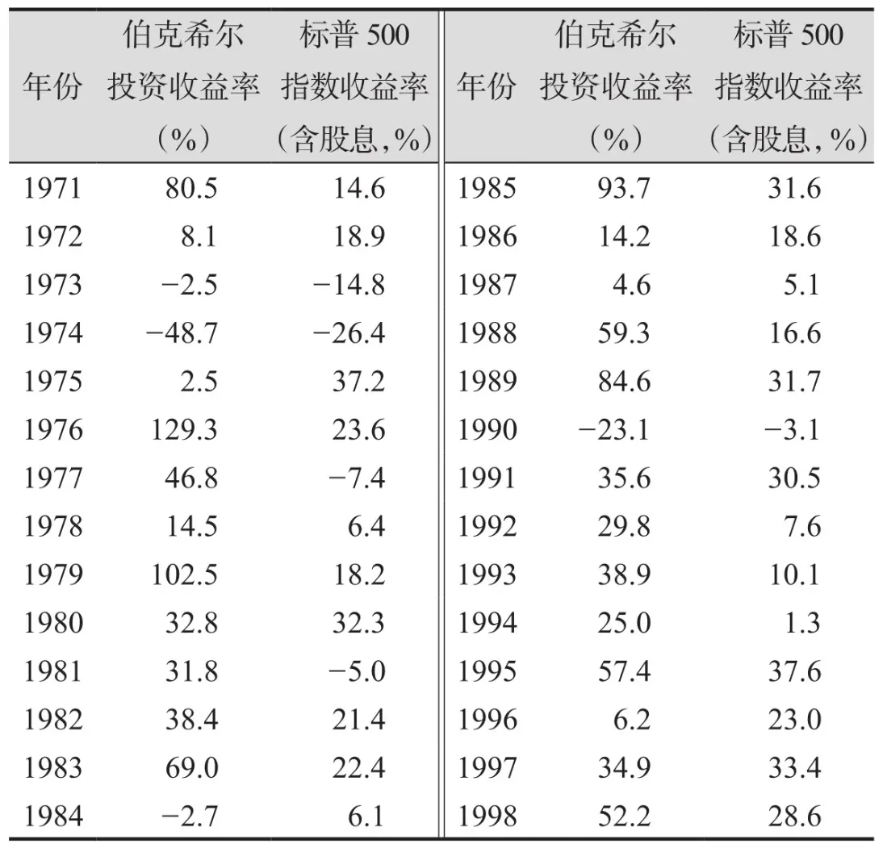

资料来源：巴菲特历年致股东的信。

__2\.3 阶段三：追求业务永续性，控制风险__

资金规模的上升必然导致投资收益率的下降，这是自然规律。虽然可以通过优化投资理念（正如巴菲特所做的）来缓解，但并不能彻底解决。

这一阶段（从1999年开始），随着伯克希尔可投资金规模的不断扩大，以及重大机会的稀缺，巴菲特逐步转向追求业务的永续性，以及适度的投资收益率。

实际上，这个世界上就没有“规模上升导致收益率下降”的彻底解决方案。否则，全世界的钱都要被巴菲特赚走了。你知道如果在古罗马时代拥有一个金币，即使以3%的速度增长，到现在能买多少东西吗？能够买下很多个地球啊！

巴菲特在阶段一（烟蒂股投资）的投资收益率是最高的。1999年他接受媒体采访时说，20世纪50年代是他收益率最高的十年。不过，随着市场环境的变迁，那种日子一去不复返了。随后从20世纪70年代开始，巴菲特全面转向寻求购买优质企业。这一转型极为成功，在伯克希尔资金规模激增的情况下，仍然保持了显著超越大盘指数的投资收益。

随着资金规模的继续增长（一方面是保险公司浮存金的不断涌入，另一方面是巴菲特增值有道），伯克希尔已经成为一头巨兽。那些巴菲特过去钟情的小而美的生意，根本无法满足它的资金胃口。

对于一头大象来说，需要喂多少颗葡萄才能填饱它？

实际上，主动型价值投资者的决策频率并不高。好的决策不在于速度，也不在于数量，而在于质量。就像人的一生，你这一辈子到底要做什么，是今天想明白，还是下个月想明白，还是几年后想明白，并不重要，重要的是你的答案，确实是适合你并且影响你一辈子的。

在2022年致股东的信中，巴菲特写道：

我们令人满意的业绩来自十几个真正优质的决策——大约每五年一个——对于伯克希尔这样的长期投资者来说，这是个常常被忽略的优势。

对于伯克希尔这样账上常年趴着千亿美元的公司来说，喜诗糖果或内布拉斯加家具城这样的公司显然满足不了其胃口，否则伯克希尔每年要做无数次决策。做的越多，错的越多，相信大家都明白这个道理。

从21世纪开始，巴菲特在致股东的信中数次提及，对伯克希尔未来的投资收益不能有过高的期望。他们能做的是超越大盘指数，但可能不会超越太多。例如，2001年致股东的信中，巴菲特如是写道：

最后再补充一点儿看法，那就是未来伯克希尔将很难再复制以往的纪录。虽然查理和我仍然会尽力维持均值以上的表现，且永远不会感到自满，但是如今有两个情况已与过去截然不同：在以前，我们可以很容易地就买到许多价廉物美的公司及股票，更重要的是，我们当时运用的资金规模也比现在少得多。许多年以前，一个1000万美元的好项目就可以让我们欢呼雀跃（比如说1973年的华盛顿邮报、1976年的盖可保险）。然而时至今日，就算是10个这样的好项目，且每个项目都是三倍于当初的市值，也仅仅是让伯克希尔的净资产增加0\.25%。只有“大象”才能让我们的盈利显著增长，然而“大象”很难找到。

在2006年致股东的信中，巴菲特继续写道：

早些年，我们是将大部分的留存收益及保险浮存金投资于有价证券。由于这种倾向，再加上买入的证券表现得都非常不错，所以我们在相当长的时间里，都保持了很高的投资方面的增速。

然而近年来，我们逐渐将重心转移到对运营企业的收购上。如此做法，既让我们放缓了直接投资的步伐，也让我们的非保险业务板块的税前收入加速增长。

巴菲特为何转向直接收购企业了呢？除了有税收因素的考虑外（股票卖出时需要缴纳高额资本利得税，而永久持有一家企业不需要，反正巴菲特也不会卖出企业），还有一个关键因素就是，收购一家企业，动辄需要几亿甚至几十亿美元的资金，满足巴菲特口中“大象”的标准。

从21世纪开始，手握重金的巴菲特开始在企业收购市场重拳出击，四处收购（当然股票市场的投资仍在持续做），直到形成他口中的“五大树林”。如果把伯克希尔比作一片森林，这五大树林分别是什么呢？2018年致股东的信将伯克希尔旗下资产做了如下分类：

（1）第一个树林：伯克希尔控股的几十家非保险公司。伯克希尔通常拥有这类公司100%的控股权，最低也不少于80%。这里面的两大巨头分别是美国伯灵顿北方圣太菲铁路运输公司（BNSF）和伯克希尔\-哈撒韦能源公司（BHE）。

（2）第二个树林：股票投资组合。通常，对于一家大型公司，伯克希尔拥有5%至10%的股权。例如可口可乐、美国银行、富国银行、苹果、美国运通等。

（3）第三个树林：与外部资本进行联营或者合营的大型公司。包括伯克希尔拥有的卡夫亨氏食品公司的26\.7%的股份、Berkadia商业抵押贷款公司50%的股份、德州电力传输公司50%的股份，以及PFJ公司38\.6%的股份等。

（4）第四个树林：持有的美国国债和其他现金等价物。这部分规模常年维持在千亿美元以上。

（5）第五个树林：保险公司。包括盖可保险公司、通用再保险公司、伯克希尔\-哈撒韦再保险公司等。

可以看到，这个阶段的巴菲特，受制于庞大的资金规模（想象一下旗下庞大的保险集团每天不断地签订保单，收取源源不断的保费，这可真是甜蜜的烦恼），转而追求业务的稳定性和永续性。至于投资收益率，巴菲特说得再明白不过：尽力维持超越指数的表现，别预期太高。

对美国伯灵顿北方圣太菲铁路运输公司及中美能源公司（即伯克希尔\-哈撒韦能源公司的前身）的收购可以说是这个思路的反映。

伯克希尔于2010年收购了BNSF，总计耗费220亿美元的现金外加伯克希尔6%的股票。实际上，巴菲特在2008年就逐步买入BNSF的股票，直至2010年完成收购。几百亿美元的收购，确实算得上巴菲特口中的“大象”。

按理说，像铁路公司这样重资产型公用事业公司，并不是巴菲特喜欢的类型。关于这点，2022年致股东的信引用芒格的语录进行了说明。

沃伦和我讨厌铁路股有几十年了，但世界变了，最终美国有了四条对美国经济至关重要的大型铁路。我们迟迟没有意识到这种变化，但迟到总比不到好。

可见“世界变了，你也要变”。美国铁路的格局已经形成，像BNSF这样的铁路巨无霸，能够提供长期稳定的回报，即使巴菲特去世，它仍然能够良好地运作。这就是巴菲特及芒格所看重的地方。至于投资收益率的高低，倒放在其次。

2023年致股东的信中，巴菲特专门对BNSF的收购和收益情况进行了回顾。

以收购价格来看，伯克希尔获得了可接受的回报，尽管比预期的要低。

……

一个世纪之后，BNSF仍然会是美国和伯克希尔的主要资产。你可以相信这一点。

对中美能源公司的收购思路和BNSF类似。收购这类公用事业公司，图的就是业务的永久性和稳健性。

当然，除收购“大象”级企业外，巴菲特在股票市场也没闲着，看好的股票同样是重拳出击。只不过这一时期，尤其是2010年之后的投资风格发生了很大的转变。这种风格转变，一部分与巴菲特自己有关，另一部分与巴菲特新聘的两位投资经理相关。

首先，虽然股票市场鲜有资质好、容量足够大的公司让巴菲特大量买入，但是他仍然觉得二级股票市场魅力十足，主要有两点原因。

（1）二级市场的股票价格，有时比直接收购一家企业要低得多（只要有足够的耐心）；而且，纠错很容易，直接卖出就行了（正如巴菲特对IBM的投资）。2021年致股东的信中，巴菲特写道：

我们的普通股部分的一个优势是，有时很容易以极好的价格买到优质企业的一部分股权。这种经验，在收购谈判和交易中是非常罕见的，而且不会大量发生。同时，在二级股票市场，从错误中退出也容易得多。

关于这一点，巴菲特在1987年致股东的信中引用了他的老师格雷厄姆关于“市场先生”的经典比喻：

本杰明·格雷厄姆，我的良师益友，很久以前有过一段有关对于市场波动心态的讲话，这段讲话是我认为对于投资成功最有帮助的一席话。他说，你应该把市场报价想象成热情的市场先生（你们俩的私人生意的合作人）给予你的报价。不管刮风下雨，市场先生每天都会出现，并且对从你手中买下股份，或是将他手中的股份卖给你，都会报价。

尽管你们俩所共同拥有的合伙企业经营稳定，市场先生每天还是会报价。同时，市场先生有一个毛病，那就是他的情绪很不稳定。当他高兴时，往往只看到合伙企业好的一面，所以为了避免手中的股份被你买走，他会报出一个很高的价格，甚至想要从你手中买下你拥有的股份。但有时候，当他觉得沮丧时，眼中看到的只是这家企业的一堆问题，这时他会提出一个非常低的报价要把股份卖给你，因为他很怕你会将手中的股份塞给他。

市场先生还有一个很可爱的特点，那就是他不在乎受到冷落。若今天他提出的报价不被接受，隔天他还是会上门重新报价，要不要交易完全由你做主。在这种情况下，他的行为举止越惊慌失措，你得到的好处就越多。

但就像灰姑娘参加化装舞会一样，你务必注意午夜前的钟响，否则一切将会变回南瓜和老鼠。市场先生是来给你服务的，而不是来指导你的。你会发现是他的钱包而非他的智慧，对你是有用的。如果哪一天他情绪低落、愚蠢至极，你既可以忽视他，也可以乘虚而入。但是如果你被他的情绪影响，那将是一场灾难。确实，如果你没有把握能够比市场先生更清楚地衡量企业的价值，你最好不要跟他玩这样的游戏。就像打牌，若你没有办法在30分钟内看出谁是傻瓜，那么你就是傻瓜。

格雷厄姆关于“市场先生”的比喻，是对二级股票市场的机会与风险最好的诠释。

（2）“宁吃仙桃一口，不吃烂杏一筐”的优质企业思维。在2013年致股东的信中，巴菲特写道：

在伯克希尔，我们情愿拥有一家非控股但具可观比例的优质公司股份，也不愿意拥有一家平庸公司100%的股份。我们宁愿拥有“希望”钻石（“希望”钻石是一颗传奇钻石）的一小部分，也不愿要一整颗人造钻石。

二级股票市场是巴菲特拥有“‘希望’钻石的一小部分”的绝佳场所。苹果、富国银行、美国银行、可口可乐、美国运通等股票就是巴菲特眼中的“希望”钻石。

__2\.4 巴菲特投资理念的变与不变__

在巴菲特过去几十年的投资生涯中，他的投资理念和操作方法逐步优化，与时俱进，从早期的格雷厄姆式的烟蒂股投资，到中期的追求优质企业，到后期巨额资金规模压力下寻求收购稳健经营的企业。在具体资产类别上，他也是灵活多变的，如果你通读他1957年至今的致合伙人/股东的信，你会发现巴菲特在股票、债券、外汇、衍生品上均有涉猎，并取得优异业绩。这是巴菲特变的地方——具体操作策略可以根据市场环境随机应变。

但无论其操作策略如何变化，有些东西是他自入行以来就一直坚守的，例如：

（1）严格按照价值投资的本质——“价格就是你所支付的，而价值就是你所得到的”行事，并用一生去坚守这个原则。他在买入任何一只股票（或股权）前，首先做的事就是客观地评估被投资企业的内在价值。当价格低于内在价值时，这笔交易就值得。当然价格越低越好，给未来留足安全边际。他从不去预测这只股票的价格下个月或者明年能涨到多少，事实上他也预测不了。

在1962年致合伙人的信中，他提到了基本原则第6条：

6\. 我的工作不是预测股市涨跌或经济波动。如果你觉得我能预测出来，或者认为预测对于投资来说非常关键，那合伙人基金不适合你。

在2018年致股东的信中，巴菲特继续写道：

我对购买更多股票的预期并不是看涨市场。查理和我不知道股市下周或明年的走势如何。这种预测从来都不是我们行动的一部分。相反，我们的思维集中在计算一项有吸引力业务的一部分价值是否高于其市场价格。

这种方式，可能会让巴菲特在股市大泡沫期间表现欠佳，毕竟那时候大部分股票的价格都远远高于其内在价值。在十倍股、百倍股比比皆是的疯牛期，冷静的人的收益肯定不会太好看。但是，只有在潮水退去时，才知道谁在裸泳。

（2）底线思维。在任何情况下，都要生存下来。毕竟，一直留在牌桌上，才是最重要的。这也是巴菲特对加短期杠杆投资那么警惕的原因。在2010年致股东的信中他写道：

毫无疑问，有些人通过借钱投资成为超级富豪。但这种方法同样可能使你一贫如洗。杠杆操作成功的时候，收益就成倍放大，配偶觉得你很聪明，邻居也会嫉妒。但杠杆会使人上瘾，一旦你从中获益，就很难回到谨慎行事的路上去。我们在小学三年级（有些人在2008年的金融危机中）都学过，不管多大的数字，一旦乘以零，都会化为乌有。历史表明，无论投资者多么聪明，经常使用杠杆往往会让一切归零。

在2014年致股东的信中讲到保险业务时，他又写道：

-
1. 若一把抢里有100个枪膛，里面只有1颗子弹，对着自己开一枪，若未有子弹击出，则开枪者获得一百万美元的游戏。这里是想说明不愿冒着小概率重大损失的风险去追求高收益。

我们永远不会用你们托付给我们的资金，玩金融的俄罗斯轮盘，即使枪有100个枪膛，且仅有1发子弹。

在我们看来，冒着损失你所需的，去追求你渴望的，这很疯狂。

这也解释了为什么伯克希尔账上常年放着数百亿乃至数千亿美元的现金。这固然显著拉低了巴菲特的投资收益率，但好处是，真遇到市场困难或流动性危机的时候（如2008年），伯克希尔可以安然无恙地度过，并且在合适的时机可以大举抄底。

__2\.5 芒格为巴菲特带来了什么__

芒格与巴菲特可谓是最佳搭档！

幸运之处在于两人都是价值投资型选手，但两人的具体投资理念又有重大差异，这使得两人完美互补。

试想，如果巴菲特找到了一个“小巴菲特”，于他而言又有何增益呢？

咖啡与咖啡混在一起，仍然是咖啡，咖啡只有与牛奶融合，才能变成更有风味的拿铁。

让我们先简单回顾一下，芒格在加入伯克希尔前有什么样的人生经历。

芒格出生于1924年，有着良好的家世背景和学历。他的祖父是一名联邦法官，父亲是一名律师。芒格在中断密歇根大学学业去服完兵役后，去上了父亲的母校哈佛大学法学院。毕业后芒格子承父业，当了一名律师。但第一段婚姻的破裂和孩子的疾病让他耗尽了积蓄，并让他意识到小富即安是不行的，只有实现真正的财富自由，才能自立自强同时帮助家人。

从1961年开始的几年，芒格与做律师时认识的客户一起，搞起了房地产开发，并经过数年经营，个人赚取了100多万美元，赚到了人生的第一桶金。

听从了巴菲特的建议（全职做投资），从1965年开始，芒格将重心放在了证券投资方面（实际上从1962年开始，芒格就兼职涉足股票投资），与人合伙成立了惠勒和芒格证券公司。开始的几年投资收益一直不错，但是遭遇了1973～1974年的净值暴跌（每年下跌超过30%），承受了来自客户的巨大压力。这让他心力交瘁，最终在1976年彻底关闭了公司。

芒格与巴菲特结缘甚早。早在1959年（芒格时年35岁，巴菲特29岁），芒格与巴菲特在他们共同的朋友小埃德温·戴维斯医生在奥马哈举办的宴会上相遇，并相谈甚欢。后来，芒格与巴菲特的频繁交集出现在蓝筹印花公司、多元零售公司、联合棉花商店，Wesco等被投资公司上。

1978年，蓝筹印花公司和多元零售公司并入伯克希尔，芒格由此成为伯克希尔的股东，持股1\.5%，并开始担任伯克希尔董事会副主席，辅佐巴菲特直至去世。

芒格的投资风格与早期的巴菲特可以说是截然相反。他觉得格雷厄姆式的烟蒂股投资早就过时了，应该寻求买入伟大的公司，然后静静地等待，让公司的利润奔跑。芒格对于估值的要求会比较松，觉得买得贵一点儿关系不大，这点与巴菲特保守型的风格差异颇大，这也体现在芒格在惠勒和芒格证券公司存续期间的收益率变化上（如1973～1974年，芒格的投资生涯遇到的重大挫折）。

关于芒格为巴菲特及伯克希尔带来了什么价值，在2023年致股东的信中，巴菲特专门悼念了芒格，他写道：

然而，在1965年，查理建议我：“沃伦，别再考虑收购像伯克希尔这样的公司了。但现在既然你已经控制了伯克希尔，应该以合理的价格收购别的优质公司然后装进去，放弃以便宜的价格买进平庸的公司。或者说，抛弃你从你的英雄老师格雷厄姆那学到的所有东西。这套方法只有当资金规模很小时才适用。”在经历了多次挫折后，我最终遵循了他的建议。

可以看出，芒格对巴菲特影响最深的就是“以合理价格买下优秀公司”的投资理念。这种理念在1964年巴菲特买入美国运通时就已萌芽，但并不坚实。1965年，巴菲特任性收购伯克希尔\-哈撒韦纺织厂，是格雷厄姆式烟蒂股投资思维的又一次故态复萌（当然后续的代价非常大）。

在2014年伯克希尔成立50周年时，巴菲特在致股东的信中专门开辟了赞扬芒格的内容——“查理理清了我的思路”，里面提到了烟蒂股投资的缺陷：

但是，这个方法的一个主要的弱点逐渐变得非常明显：烟蒂股投资只在某个资金规模以内好用。对大规模资金，它永远也无法好用。

另外，尽管用低廉的价格购买边缘性生意作为短期投资可能具有吸引力，但是以此为基础，去构建一家规模巨大且持久的企业，是错误的。挑选婚姻伴侣所需要考虑的条件远比挑选约会对象要严苛。

总结一下，烟蒂股投资有两个巨大弱点：①资金规模有限制。实际上，1965年以后，巴菲特合伙人公司以及后面的伯克希尔所能调动的资金规模就已经颇为可观了，光靠小规模的烟蒂股投资显然不能满足庞大的资金胃口。②烟蒂股投资只适合短期投资，无法满足长期投资需要，因为短期投资需要不停地翻石头，这是一项极其费时费力的工作，而且随着市场越来越成熟，石头下的螃蟹也越来越少。

收购喜诗糖果是巴菲特受芒格思维影响的第一个经典杰作。巴菲特在2014年致股东的信中谈到当时喜诗糖果的经营优势：

喜诗糖果是一家位于西海岸的传奇盒装巧克力制造商和零售商。那时候，它每年税前盈利大约为400万美元，但仅用了800万美元的净有形资产。另外，公司拥有未曾体现在它财报上的巨大资产——广泛的、持久的竞争优势，这赋予它强大的定价能力。这个优势实际上确定了喜诗糖果长期的主要盈利。更好的是，仅仅需要很少的新增投资，就能实现这些盈利。换句话说，喜诗糖果在未来几十年里，预期能产生巨大的现金流。

不过在买入喜诗糖果时，巴菲特老毛病又犯了，股东报价3000万美元，而巴菲特只愿意最多出2500万美元。芒格跟巴菲特说，喜诗糖果值3000万美元，不要在这些小钱上斤斤计较。所幸的是，后来股东方接受了2500万美元的报价。

多年以后，巴菲特还心有余悸地说，要是当初喜诗糖果拒绝2500万美元的报价，这笔极其成功的生意就从自己身边溜走了。

这一次，芒格是对的。当初为500万美元纠结的生意，从1972年到2014年，累计赚取了19亿美元的税前利润，而只需要4000万美元的新增资本。当初多出的500万美元报价与这些成绩比起来，九牛一毛。更何况巴菲特又将这十几亿美元的现金投向了其他优质公司，如此算下来，岂止是划算，简直是暴赚。

更能体现芒格投资理念的是对比亚迪与Costco的投资。

在2024年5月伯克希尔的股东大会上，巴菲特说到，芒格平时都顺着他的意思，当他提出什么想法时，芒格会说，好吧，这个想法真的没有那么好，但这是你能想到的最好的主意了，那么我就同意你的提议吧。但是有两次芒格跟我拍桌子，让我买，买，买！一次是比亚迪，另一次是Costco。事实证明，芒格是正确的，伯克希尔在这两只股票上赚取了巨额收益。

2008年，巴菲特购入了比亚迪（1211\.HK）10%的股份，成本为2\.32亿美元。在此之后，比亚迪的股价经历了过山车式的行情。随后的1年里，股价涨幅接近9倍，但又快速回落至巴菲特的成本价上方。就这样，直至2021年股价涨到其持仓成本的几十倍后，巴菲特才逐步将比亚迪的股份卖出套现。

从2000年起，巴菲特在芒格的建议下，逐步买入Costco，不过持仓占比并不大（只有几百万股）。即使如此，持有近20年后，巴菲特也获得了上百倍收益。

所以巴菲特毫不吝啬给予芒格的赞美，在2023年悼念芒格的信中，巴菲特将芒格比作伯克希尔的建筑设计师，而他只是建筑承包商，按照芒格的愿景日复一日地建设。

可以说，芒格的愿景就是把伯克希尔打造成一家集合了世界上最优秀公司的集团，而不是天天费心劳力地到垃圾堆里翻可以吃的东西。因为芒格说过，对于投资者来说，伟大的公司不需要花费太多精力，它可以自行发展。

## 巴菲特如何选股票

__第3章__

__巴菲特如何选股票__

巴菲特看到这一章的名字时，估计肺都要气炸了。

因为他在2021年致股东的信中写道：“查理和我选的不是股票，我们选的是生意。”（Charlie and I are not stock\-pickers;we are business\-pickers\.）

为了便于读者理解，我们仍然保留这个名字，希望巴菲特先生不要生气。

__3\.1 选股票就是选公司__

在价值投资者看来，选股票就是选公司。

在你买入一只股票前，目标公司的业务到底值多少钱，你必须要有个大致的了解。

当这个生意值500亿元而股票市值只有300亿元时，这当然是值得买入的。不过，你可别想着今天买入，下周或下个月就能涨。搞不好你买入后仍然下跌了20%，这在股票市场是再正常不过的事了。格雷厄姆口中“市场先生”的短暂疯癫状态可远不止于此。

但是，再疯癫的市场从中长期看总会回归理性。

问题是，如何给一家公司进行正确的估值？巴菲特说：“如果你没有把握能够比市场先生更清楚地衡量企业的价值，你最好不要跟他玩这样的游戏。”（1987年致股东的信）。

关于这点，巴菲特在1992年致股东的信中详细阐述了价值投资的方法。

在约翰·伯尔·威廉姆斯50年前所写的投资价值理论当中，提出计算价值的公式。我把它浓缩如下：今天任何股票、债券或是企业的价值，都将取决于其未来剩余年度的现金流入与流出，并以一个适当的利率加以折现后所得的期望值。这个公式对于股票与债券都适用。不过这里有一点很重要且很难克服的差异，那就是债券有票息与到期日，可以清楚地知道未来的现金流；但就股票而言，投资者必须自己去分析未来可能得到的“票息”。更重要的是，管理层的能力对于债券的影响相当有限，顶多因为公司无能或是诚信明显不足而延迟支付利息。但是对于股票投资者来说，管理层的能力将大大影响股票的“票息”收入。

用今天的话来说，一家公司的价值就是它未来所有净现金流的折现。

当然，难点在于如何正确地评估一家公司未来的现金流。虽然金融界有很多预测不同类型、不同成长阶段企业的未来现金流的方法，但预测始终是预测，错误是不可避免的。

尤其是这种通过复杂模型和计算公式评估出来的公司价值，巴菲特对此非常警惕。他曾说过，模糊的正确，要好过精确的错误（1993年致股东的信）。

巴菲特是怎么克服为公司估值这个难题的呢？在1992年致股东的信中他继续写道：

虽然评估股权价值的数学计算并不难，但是即使是一个经验丰富、聪明过人的分析师，在估计未来“票息”时也很容易搞错。在伯克希尔，我们试图以两种方法来解决这个问题。第一，我们试着坚守在我们自信很了解的产业上。这意味着这些行业必须要相对简单且稳定，如果一项生意很复杂或者经常变化，我们实在是没有足够的聪明才智去预测其未来的现金流。碰巧，这个缺点一点儿也不会让我们感到困扰。对投资人而言，最重要的不是他到底知道多少，而是理性客观地知道他不懂哪些东西。一个投资人，只要能避免犯大错误，只需要知道很少，就够了。

第二点同样重要，那就是我们在买股票时，必须要坚持安全边际，若是我们所计算出来的价值只比其价格高一点儿，我们不会考虑买入。我们相信格雷厄姆强调的安全边际原则是投资成功的基石。

巴菲特通过两招化解企业估值的难题：一是找容易估值的公司（柿子找软的捏），二是留足犯错空间（安全边际）。

__第一点，找容易估值的公司。__什么生意容易估值？①容易理解的生意，并且是巴菲特和芒格能够理解的生意，这类生意的特点一定是简单、清晰，一句话就能说清楚（段永平说，好生意是一句话能讲明白的生意）。②现在就有稳定现金流（巴菲特非常厌恶那些有“未来前景”的公司），至少非常容易算出当前及未来几年的现金流。③生意模式不容易被时间改变。因为对股票未来现金流进行折现，肯定要考虑未来相当长时间线的现金流，距离现在越远，现金流预测错误的概率就越大。如果一项生意的盈利模式不稳定，很容易被市场环境或竞争所改变，那么现金流的稳定性大大降低，从而增加了现金流预测错误的概率。

（1）容易理解的生意。巴菲特整个投资生涯，投向的基本都是这个类型的生意。从家具城、珠宝店、巧克力、汽水、报纸、铁路，到手机等消费电子产品，以及银行和保险公司。虽然巴菲特对银行业有一些看法（杠杆太高），但他认为经营良好的银行还是可以买入的。而那些不太容易理解的公司，包括复杂多元化经营、复杂高科技的公司，巴菲特很少涉猎。

这里一定要记得一点：每个人所能理解的生意是不一样的（因为每个人的能力圈不一样），巴菲特能理解卖汽水的生意（正如他对保险业很熟知一样），你未必就能理解。也许你有深刻认知的互联网、医药或者其他高科技公司，对你而言就是易于理解的，而对巴菲特来说可能是一本天书。

（2）现在就有稳定现金流。巴菲特不愿意去赌未来。他在致股东的信中做收购广告的时候，明确的第二条标准就是“展示出持续的盈利能力（光有预期或困境反转型的企业，不要）”。在后期致股东的信一开头，巴菲特便强调伯克希尔的价值取决于它的盈利能力，而非市值，因此总是把伯克希尔逐年的账面盈利（包括拥有未并表的公司股份所对应的留存收益）一一列出，供股东参考。可见他对现金流（盈利）的重视。

（3）生意模式不容易被时间改变。生意模式改变得越频繁，未来现金流的不确定性就越大。这和行业特性、竞争格局息息相关。当然，也许这种改变对你所买的那家公司的股票是有利的，也许你评估这家公司的公允价值为500亿元，实际上值1000亿元，你赚得更多，但谁能保证这点呢？也许下次评估就朝着对你不利的方向发展了呢？巴菲特在信中经常引用美国总统里根的一句名言：据说劳累工作不会导致死亡，要我说为什么要冒这个险呢？

__第二点，留足犯错空间。__谁都不能给一家公司做准确估值。公司未来发展的不确定性是无法避免的。商业环境的改变、竞争对手的增加、新技术的发明、黑天鹅事件、管理层的变更等，都会对企业未来的盈利造成很大影响。如果对自己的估值过度自信，当市场下跌时就失去了保护。因此，一只股票如果你的估值是10元，9\.5元肯定不是一个好价格，5元甚至3元就值得去试试了。

__3\.2 回避困难，追求简单__

股票投资不是做数学题，越困难的题目分值越高。

“回避困难”“柿子找软的捏”是巴菲特在漫长的投资生涯中的投资心得。

股市投资的终极目的是赚钱，不是为了自我挑战或学习新知识。

所以在1989年致股东的信中，巴菲特总结过去25年犯过的错误时提到：

另外还学到一个教训，在收购与经营各种不同生意25年之后，查理和我还是没能学会如何去解决生意上的困境。我们学会了如何去避免这些问题。在这点我们做得相当成功。因为我们专注于找到那些我们能轻松跨越的1尺高的跨栏，而非那些7尺高的跨栏。

这项发现看起来似乎不太公平。但是不管是企业经营还是投资，坚守在容易且简单的生意上，比整天去思考困难的生意，要赚钱得多……总之，我们尽量避开恶龙，而不是去屠恶龙来获得成功。

上面的“结案陈词”可以说是巴菲特过去25年来的肺腑之言。只有在这方面吃过很多亏的人，才有这样的感悟。屠恶龙（解决困难）也许是个本事，但避开恶龙，更容易赚钱。

这也是巴菲特彻底告别烟蒂股投资的总结性发言。因为烟蒂股往往是那种业务陷入困境、股价很低（超过清算价值）的“困境反转”（又一个巴菲特憎恶的词）股。

在1980年致股东的信中，巴菲特写道：

在过去的年报中，我们一再提到买入并经营那些“困境反转型”的生意令人大失所望的结果。这些年我们大约接触了十几个行业中几百家这样的公司，不管是作为参与者还是观察者，我们持续跟踪其预期和实际表现。我们的结论是，当一个声誉远播的管理层遇到烂生意时，往往是后者赢。

为什么这种困境反转型公司往往没有好结果呢？巴菲特在1990年致股东的信中继续写道（当然他是针对垃圾债说的，不过实质相同）：

这些债券的信徒向我们保证不可能发生崩盘危机：巨额的债务会迫使公司经理人比以往更专注于经营，就像一位驾驶员开着一辆轮胎上插着一把匕首的破车，大家可以确信这位驾驶员一定会小心翼翼地开车。当然我们绝对相信这位驾驶员一定会相当小心谨慎。但这辆车哪怕是遇上一个坑洼或是一小块冰，结果将是致命的。一个计划如果需要避开所有的坑，那这个计划就是一场灾难。

也就是说，困境反转型公司就像是在钢丝上跳舞，这当然会迫使舞者小心翼翼。但只要一不小心，他就会摔个粉身碎骨。而商业社会中，最不缺的就是意外。

这种惨痛经历也迫使巴菲特抛弃格雷厄姆的烟蒂股投资，转向寻找芒格口中的“伟大的公司”。

因为，一家伟大的公司会在你离开后继续运作；而一家平庸的公司不会这样。（芒格语）

在1994年致股东的信中，巴菲特继续宣扬他的这种“赚容易的钱”的精神：

投资者应该记住，他们的业绩不是使用奥林匹克跳水评分方法计算出来的，难度不被计算在内。如果你对一个企业的看法是正确的，其价值在很大程度上取决于一个既易于理解又持久的单一关键因素，其回报和你正确分析了一笔以许多不断变化的复杂变量为特征的投资是一样的。

也就是说，从赚钱的角度来看，从容易理解、容易分析的股票上赚到的钱，和从极为复杂、难以分析的股票上赚到的钱，是等价的，但是前者更为简单，且更不容易出错。因为市场不会为你高难度的分析提供额外的报酬。

__3\.3 无须投入过多资本__

在巴菲特眼里，盈利的生意有两种类型：一种是无须投入过多额外资本，每年都能产生稳定的盈利，有些公司每年还能有稳定的增长。另一种是每年都需要把上一年的大部分盈利投入到资本开支中，以维持现有盈利水平或使盈利增长。

毫无疑问，巴菲特最喜欢的是前一种类型的生意。即使这种生意每年没有盈利增长，他也喜欢，因为他可以把每年所有的盈利通过分红提取出来，再投入到其他优质项目上。以喜诗糖果为例，在2007年致股东的信的“伟大的生意、好生意及烂生意”中，巴菲特提到：

去年喜诗糖果的销售额是3\.83亿美元，税前利润是8200万美元，运营资金是4000万美元。这意味着自1972年以来，我们仅投资了区区3200万美元，以适应它适度的规模增长，和稍许过度的财务增长。同时，税前收益总计是13\.5亿美元，扣除3200万美元后，所有这些收益都流到了伯克希尔（或早些年的蓝筹印花公司）。在缴税后，我们用余下的钱买了其他有吸引力的公司。

……

在美国，像喜诗糖果这样的企业并不多。一般的做法是，要将公司的盈利从500万美元提升到8200万美元，需要额外投入比如4亿美元去支撑其发展。这是因为成长中的业务，销售额上升，既需要更多的运营资金，也会需要更多对固定资产的投资。

看看，这就是巴菲特最钟情的生意：一只母鸡几乎不吃什么，每天就可以产下一只蛋。这种公司真正的价值——声誉良好的品牌形象、成熟的低成本供应链、完善的销售渠道以及一大批忠实客户，所有这些，都是公司无形资产所带来的竞争壁垒。可惜的是，这些东西不会体现在报表上，因而很容易被烟蒂股爱好者忽略。

第二种公司更多的是重资本型公司。公司为了维持现有利润水平或保持利润增长，不得不将上一年利润的大部分重新投入到资本开支中。也就是说，每年的这些利润是“虚”的，最后可能换来的是一堆机器设备或厂房。而这些固定资产每年还要面临巨额的折旧。若哪天公司经营不利，过去所积累的利润变成了一堆机器设备或厂房，想卖都卖不出去。

巴菲特在伯克希尔纺织厂、航空公司上的投资，都曾折戟沉沙，与这种商业模式的缺陷不无关系。

在1985年致股东的信中，巴菲特谈到他关闭伯克希尔纺织业务时，做了如下总结，可以说是对这种重资本型公司最好的总结。

多年来，我们可以选择在纺织业务中进行大量资本支出，这将使我们能够在一定程度上降低可变成本。每一项这样的提案看起来都像立即可以赢得市场。事实上，通过标准的投资回报率测试来衡量，这些提案通常承诺比我们高利润的糖果和报纸业务的可比支出所产生的经济效益更大。

但是，这些纺织业务投资所承诺的益处最终成为黄粱一梦。我们许多的境内外竞争对手，都在同样加大支出。一旦有足够多的公司这样做，它们降低的成本就成为整个行业降价的基准。单独来看，每家公司的资本开支决策似乎具有成本效益以及合理性；从整体上看，这些投资决策相互抵消，是非理性的（就像每个观看游行的人都觉得，如果他踮起脚尖就能看得更清楚一样）。在每一轮投资之后，所有参与者在游戏中都投入了更多的钱，回报仍然乏善可陈。

因此，我们面临着一个痛苦的选择：巨额资本开支本来有助于保持我们纺织业务的活力，但会给我们不断增长的资本留下惨淡的回报。此外，在投资之后，外国竞争者在劳动力成本方面仍将保持主要的持续优势。然而，拒绝追加投资将使我们越来越缺乏竞争力，甚至与美国国内纺织品制造商相比也是如此。

这种重资本型，尤其是生产同质化产品的公司，都面临着这样的困境：必须要把赚到的利润重新投入到资本开支中去（有时股东还要额外投入），否则就面临被市场淘汰的命运。

话说回来，巴菲特认识到这点后，自此就不再投资重资本型公司了吗？也并不是。1985年（关闭伯克希尔纺织厂）以后，他仍数次投资，有成功也有失败。

1989年，巴菲特以3\.58亿美元投资了全美航空公司利率为9\.25%的优先股。然而，巴菲特买在了航空业景气度的最高点。随后航空业遭遇灾难级的亏损。1990～1994年，全美航空公司累计亏损24亿美元，公司净资产几乎归零。到了1994年，这笔3\.58亿美元面额的优先股，市值仅为8950万美元。到1995年，巴菲特对这笔投资近乎绝望，尝试卖出一半的持仓。所幸并未成功，因为除了优先股自带的罚息条款之外，从1996年开始，全美航空公司开始扭亏为盈，优先股的市值逐步上涨到当初的3\.58亿美元的成本左右，加上过去几年累计的2\.4亿美元的利息及罚息收入，这笔投资幸运地以盈利收场。但这笔投资仍让巴菲特心悸不已。

在1996年致股东的信中，巴菲特提到了英国维珍航空公司创始人理查德·布兰森讲的一个真实的笑话。有人问理查德·布兰森如何成为一名百万富翁。他回答道：“也没什么，你首先成为亿万富翁，然后买下一家航空公司，这事就成了。”

至于航空业为什么这么悲惨，巴菲特说到，全美航空公司的营收受到毫无节制的激烈价格竞争而大幅下滑的同时，成本控制却做得很糟糕。

航空服务毫无差异化，最后的结果必然是陷入激烈且单纯的价格战，而成本端（尤其是燃油价格）的下降确实非常困难。

在后期，伯克希尔收购了BNSF（2010年），总计耗费220亿美元的现金外加伯克希尔6%的股票。作为重资产型且需要持续资本投入的铁路公司，其资本回报率一般，不过这时候的巴菲特更多的是考虑业务的永续性。所幸的是，这时候的美国铁路格局已定，具有一定的垄断性，竞争不如往日激烈。

__3\.4 对商业模式的追求__

巴菲特最看重一家企业的商业模式。甚至可以说，商业模式是投资一家企业的首要考虑因素。

所谓商业模式，我个人的理解是：这家企业以什么样的形式为客户提供产品或服务，以及以什么样的形式让客户心甘情愿地付钱。

好的企业、有能力的管理层有很多，但如果身处不好的行业，或是商业模式很差，那么即使做到了行业顶尖，日子过得也并不舒服——竞争对手环伺，随时准备瓜分你的份额，没有坚实的护城河壁垒。

对于提供同质化产品（尤其是大宗商品）的企业来说，由于产品高度雷同（例如矿石、石油），无法形成差异化竞争，最终必然落到惨烈的价格战上。这种企业只在两种情况下能够舒服地获得盈利：①整个行业供需失衡，产品供不应求，所有的企业都得益；②有政策垄断，这家企业能做的，别家企业不能做，使得没有竞争对手。其他时候，整个行业都陷入微利或亏损境地。

在1982年致股东的信中，巴菲特分享了对这类行业及商业模式的看法：

对处于明显产能过剩且产品为“大宗商品”（对客户来说，无法在性能、外观和售后服务上做出差异化）的行业的企业来说，它们的盈利是个大麻烦。当然，若价格或成本以某种方式被管控住，从而至少在一定程度上不受正常市场力量的影响，盈利困扰也许能够避免。这些管控方式包括：①政府的合法干预（比如卡车司机的薪酬、金融机构的存款成本等）；②价格合谋；③类似于OPEC那样的企业联盟。

若是成本和价格完全由市场竞争决定，那么产能必然过剩，买家几乎不关心买的是谁的产品或用的是谁家的服务，行业利润几乎不存在。这将是一场悲剧。

这也是为什么所有的厂商皆努力强调并建立自身产品或服务的差异性，这种做法对糖果生意有用（消费者会指明买某品牌），对白糖生意却没有用（你听过多少人会说“我的咖啡要加奶油和C&H牌的白糖”）。

总而言之，这类只能提供同质化商品（大宗商品）的企业，因为无法提供差异化产品或服务，最终只能陷入价格战。它能否盈利，不取决于自己，只能寄希望于供给收缩或需求暴增（还记得2020年的锂矿股吗？）。

那巴菲特中意什么样的商业模式呢？在1981年致股东的信中，他谈到伯克希尔收购过的企业，有两类值得特别关注：

第一类是在有意或偶然的情况下，收购了能够很好适应通胀环境的企业。这些受青睐的企业必须具备两个特征：①有提价能力（即使产品需求平稳且产能未充分利用），且不必担心市场份额或销量的明显下降；②仅通过少量额外资本支出，就能适应销售额的大幅增加\[往往是通过提价（通胀）而非产量提升\]……

第二类涉及明星管理层——他们能够识别出那种伪装成青蛙的稀有王子，并具备管理能力，使他们能够去掉伪装……从直接和间接的经验中，我们认识到这些高管所取得的成就的困难和稀缺性。

也就是说，巴菲特所中意的商业模式，最好同时符合两条标准：一是有提价能力；二是不需要投入过多额外资本，就能实现销售额的增长。符合这两条标准的，往往都是提供了差异化产品或服务的企业，并且在某个领域是无可替代的。巴菲特买入的喜诗糖果、内布拉斯加家具城（NFM）、可口可乐及苹果公司，都同时符合这两条标准。

这样具有好的商业模式的公司，如果能配上优秀管理层（具备让青蛙变王子的能力；当然，很多时候，企业本身就是王子），那简直就是可遇不可求。

同时具备上述两种特征的企业非常稀有，只具备一项特征的企业就算是不错的企业了。如果二选一，究竟哪种特征更重要呢？

巴菲特认为，企业本身的商业模式更重要。毕竟，卓越的管理层不可能永久地待在公司，他们可能会退休，接替他们的也许是平庸之辈，从而公司的光环会迅速褪色。彼得·林奇就说过，要找那些傻子都能经营的公司，因为迟早会有傻子当上公司的管理层。

话说回来，刚才提到的大宗商品类（同质化产品）的生意，从商业模式上看是比较差的，很容易陷入价格战，盈利的命运并不在自己手中。那么是不是就没有什么好企业了呢？或者说，什么样的企业能在这种商业模式较差的行业中脱颖而出呢？有两种企业可以做到：

第一种是控制了绝大部分供给的垄断性企业，它们能够自行调节整个市场的供给，从而调节价格。这方面最典型的就是中东的石油生产商联盟OPEC组织。由于中东是全世界石油储备最大的地区，因此能够形成价格联盟，其增产或减产能够对石油价格造成显著影响，从而控制利润。但这种类型的企业或组织往往是资源禀赋型，极为稀有。

第二种是通过公司组织形式或商业模式的设计，将成本做到行业最低，持续保持了对竞争对手的低成本优势。这种最为常见。如巴菲特收购的GEICO，保险本身就是无差异化产品，如果没有监管部门管制价格，基本最终都会陷入无尽的价格战。而GEICO的创新之处在于通过直销而非代销的方式销售保单，大幅压缩了销售成本（从而降低了保单的报价），从而从一家寂寂无闻的小车险公司，一跃成为全美规模靠前的车险公司。美国的戴尔公司，也是通过直销模式，将个人电脑的销售成本降到了最低，同时通过即时供应链（JIT）模式，进一步压缩成本，从而创造了个人电脑界的销售奇迹。

__3\.5 不断加深护城河__

商业模式的优劣在很大程度上决定了这家企业的护城河有多深。巴菲特认为，对企业护城河（或者说竞争壁垒）的重视程度怎么强调都不过分。

如何理解一家企业的护城河有多深呢？1998年在佛罗里达大学的演讲中，巴菲特打了一个形象的比喻：如果给你一笔巨额资金，你愿不愿意研发类似产品或服务跟这家企业直接竞争？如果你不愿意，那这家企业的护城河不言自明。他以可口可乐为例，如果给他100亿美元，去研发类似饮料与可口可乐直接竞争，能否伤害到可口可乐？他认为他办不到。如果给他10亿美元去与绿箭口香糖直接竞争，他同样觉得自己做不到。

除了商业模式，生意本身所在行业的变化剧烈程度很大程度上也决定了护城河的深浅。对于高科技行业来说，经常会出现颠覆性创新，护城河顷刻间消失。一家现在活得非常滋润的企业，10～20年后也许就销声匿迹了。这也是巴菲特不太喜欢投资高科技股票的原因。他在1987年致股东的信中就坦白道：

经验表明，最好的商业回报通常是由那些今天所做的生意与五年或十年前非常相似的公司实现的。这并不是管理层自满的理由。企业总是有机会改进服务、产品线、制造技术等，显然应该抓住这些机会。但是，一个不断遇到重大机会的企业也可能会犯下很多重大错误。此外，在永远剧烈变化的竞争格局下，难以建立堡垒式商业特许经营权（franchise）的基础。这样的特许经营权通常是持续高回报的关键。

先前提到的《财富》杂志的研究，可以充分支持我的论点。1977～1986年，总计1000家公司中，只有25家能够达到连续十年平均净资本回报率超过20%且没有一年低于15%的双重标准。这些明星企业同时也是股票市场的宠儿。在这十年中，这25家企业中有24家的表现超越标普500指数。

这些财富冠军可能在两方面让你大吃一惊。第一，相对于偿付的利息，它们所运用的财务杠杆极其有限。真正的好生意是不需要借钱的。第二，除了一家高科技公司，和少数几家属于制药业的公司以外，大多数公司所在的行业相当普通。

大部分公司现在销售的产品或提供的服务与十年前大致相同，一点儿也不令人兴奋（尽管销售量或销售价格在提升，或两者兼有）。这25家公司的记录显示，最大化现有的自身竞争壁垒，或是专注于某一项拳头业务，通常是创造惊人盈利的不二法门。

当然，如此保守的行事作风，也让巴菲特错过很多高科技成长股的机会（尤其是互联网行业）。像微软、谷歌、亚马逊，都是巴菲特很早就接触并且较为熟悉的公司，但由于IT行业技术性迭代过快，很多明星公司几年之间就从巅峰滑落（如网景、雅虎、Sun等），巴菲特对这个行业有着天然的恐惧。不过，受芒格和伯克希尔旗下两位投资经理（Ted、Todd）影响，巴菲特逐渐改变了对这个行业的看法，但投资方面依然相当谨慎。最突出的动作就是2016年开始对苹果公司大举投资，使之成为伯克希尔的第一大重仓股。当然，个人认为，在巴菲特心里，苹果公司已经不是单纯的IT高科技公司，它更具有消费属性，且通过构建软硬件一体化和生态体系壁垒，建立了很深的护城河。

华尔街有很多投资高科技公司股票的高手。往前追溯，巴菲特最推崇的菲利普·费雪（《成长股获利之道》作者），也是以投资德州仪器、摩托罗拉等高科技成长股而闻名的。实际上，有些互联网头部公司已经成为超级垄断型公司，本质是数字地租生意，完全符合巴菲特特许经营权的标准。更重要的是，这种业务扩张的边际成本几乎为零（每多卖一罐可乐，可口可乐公司都要付出一定的制造成本，但新增一个会员账号，新增成本接近于零）。因此，我们不必刻舟求剑，完全模仿巴菲特的行事作风（你每天比巴菲特多喝一倍的可乐，也成不了巴菲特）。最重要的是，选择自己看得懂的公司，这才是巴菲特投资理念的精髓。

在1991年致股东的信中，巴菲特谈及报纸业的衰落时，又谈到了竞争壁垒和护城河的话题。

一个具有竞争壁垒的产品或服务需要满足：①有市场需求；②被顾客认定为找不到其他类似的替代品；③价格不受管制。以上三个特征反映在一家公司定期对其产品或服务进行大幅度提价的能力上，也反映在公司高额的资本回报上。另外，这种竞争壁垒能够容忍公司的管理不当。无能的管理层也许会削弱公司的盈利能力，但不会造成致命的伤害。

其实上面提到的三个特征（有市场需求、无替代品、价格不受管制），与1981年致股东的信中提到的两项特征（有提价能力、对额外资本开支依赖不大）互为补充。

有的企业虽然一时是明星，看起来无坚不摧，但事后被证明只是绚烂的烟花，一时光彩夺目，之后便陷入沉寂。这种企业的所谓“护城河”不值一提。因此，巴菲特要求护城河一定要有可持续性：即使管理层很平庸甚至很差，等着对手来进攻，别人也很难在短时间内攻破自家大门。

在2007年致股东的信中，巴菲特就说：

一个真正伟大的企业必须有一条持久的“护城河”，以保护投资资本的丰厚回报。资本主义的动态变化使得竞争对手反复攻击任何可获得高回报的商业“城堡”。因此，一道难以逾越的屏障，如公司是低成本生产商（GEICO、Costco）或拥有强大的全球品牌（可口可乐、吉列、美国运通）对于持续成功至关重要。商业史上充斥着“罗马焰火”，这些公司的护城河被证明是虚幻的，很快就被竞争对手跨越。

我们对“持续性”的标准，使我们排除了在容易发生快速和持续变化的行业的公司。尽管资本主义的“创造性破坏”对社会非常有益，但它不能保证投资的确定性。一条必须不断重建的护城河，最终将不再是护城河。

即使是一家没什么增长的企业，只要它有令人满意的净资本回报率，不需要再投入额外的资本去维持其竞争力，当它拥有坚实的护城河时，巴菲特也愿意去投资。可见巴菲特对于商业护城河的高度重视（比利润增长更重要）。

为什么？因为巴菲特可以利用这些具有坚实护城河的企业所创造的源源不断的现金流，去投资别的具有更高投资收益率的领域！喜诗糖果就是这方面的代表。所以在2007年致股东的信中他继续写道：

我所寻求的，是在稳定的行业中具备长期竞争优势的生意。如果这伴随着快速的内生增长，那就太好了。但即使没有内生增长，这样的生意也是值得投资的。我们将简单地利用企业的丰厚盈利，来购买其他地方的类似企业。没有制度规定你必须把钱投到你赚到钱的地方。事实上，这样做往往是一个错误：真正伟大的企业，在有形资产上赚取巨额回报，在任何较长的时期内，都无法通过将大部分利润进行内部扩大投资去赚取高额回报。

看到了吧！如果有两家企业，A是营收和利润不断增长，但竞争壁垒不够强的企业，并且为了增加营收和利润，需要不断将上一年利润投入到新的资本开支中。B是一家营收和利润相当稳定（无须额外投入资本），净资本回报率令人满意，竞争壁垒也高，但增长有限的企业（也许每年只有2%～3%的增长）。我相信在同样的估值下，巴菲特会毫不犹豫地选择B这样的现金奶牛企业。

当然，一家企业有了护城河，并不意味着管理层就可以躺着睡大觉了。如果企业停滞不前，护城河会慢慢被侵蚀。因此，巴菲特期望他所投资的公司，要不停地加深护城河。就像巴菲特幽默地对旗下子公司的管理层说的那样，要加深护城河，不停地往护城河里扔鲨鱼和鳄鱼，把竞争对手挡在外面。

在2005年致股东的信中，巴菲特又一次谈到了持续加深护城河的重要性：

每一天，通过无数种方式，我们下属每一家企业的竞争力要么变得更强，要么变得更弱。如果我们让客户更加愉悦，消除不必要的成本支出，改善我们的产品和服务，我们的竞争力就会更强。但如果我们对待客户冷淡，或者容忍不必要的费用不断上升，我们的竞争力就会被削弱。就某一天而言，我们行为的影响难以察觉，但长期积累所带来的影响非常深远。

当我们的长期竞争地位因这些几乎不引人注意的行动而提升时，我们将这种现象描述为“加深护城河”。如果我们要在十年或二十年后拥有我们想要的那种生意，那么这样做是必不可少的。当然，我们总是希望在短期内赚更多的钱。但是，当短期和长期冲突时，加深护城河必须优先。如果管理层为了达到短期盈利目标而做出错误的决定，从而在成本、客户满意度或品牌实力方面落后于同行，那么再多的后续辉煌也无法弥补已经造成的损害。看看当今汽车和航空业管理层在努力应对前任交给他们的巨大问题时所面临的困境。查理喜欢引用本杰明·富兰克林的名言：“少量的预防便胜过大量的治疗。”但有时再多的治疗也无法纠正过去的错误。

这种不只为短期盈利，主要精力都放在提高长期竞争力的措施（也许需要在10～20年后才能发挥它的效用），实在是不断加深企业护城河的明智之举。

有句俗语说得好，你10年后的样子是由你今天的行动所决定的。企业也是如此。

__3\.6 重视定性分析__

定量分析固然是股票投资中最重要的工作之一（你至少得学会看懂财务报表吧），但巴菲特还着重强调定性分析的作用——了解那些对公司未来发展至关重要但又无法准确用数字衡量的特质。

爱因斯坦曾说过，不是所有能够计算的东西都很重要，也不是所有很重要的东西都能计算。企业定性分析在投资决策中的作用，恰如爱因斯坦所述。

在1967年10月份写给合伙人的信中，巴菲特就谈到了自己对定量和定性分析的理解：

就投资角度而言，对证券和生意的估值常常会同时包含定量分析和定性分析。一个极端依赖定性分析的分析师会说：“买入正确的公司，别管股价是多少。”而一个依赖定量分析的分析师则会说：“只要价格合适，公司基本面无所谓。”在证券业一个令人愉悦的事实是，使用这两种方法都能赚到钱。当然，任何一位分析师都或多或少地同时结合定量和定性两种方法。他到底归属于哪一类分析师（定量还是定性），主要取决于他更看重哪一方面，而不是非此即彼地只考虑单一因素。

有趣的是，尽管我认为自己主要是定量学派，但我多年来真正绝妙的想法依靠的是定性分析，在定性分析中我有“高成功率的洞察力”。这才是我大量获利的真正原因。然而，这种情况很少发生，因为这种洞察力通常是灵光乍现，而定量分析不太需要什么洞察力。因此，真正的大钱往往是由那些在定性决策上正确的投资者赚到的。当然，至少在我看来，更确定的钱往往是从明显的定量决策上赚到的。

巴菲特认为，定量分析可以帮助自己赚到确定性高的钱（例如套利交易、烟蒂股投资等）。但是真正能赚到大钱的投资决策，往往需要定性分析的洞察力。

这里的定性分析包括什么呢？一般来说，包括所在行业的态势、公司商业模式及前景、护城河的深度、管理层的特质等。这些难以量化的东西，在决定一家公司长期的发展时，往往起着至关重要的作用。

爱迪生曾说：“天才是百分之九十九的汗水加百分之一的灵感，但有时那百分之一的灵感比那百分之九十九的汗水还要重要。”这里的汗水和灵感，与定量分析和定性分析的关系有异曲同工之妙。

__3\.7 不为清单__

投资和人生不一样。人在年轻的时候往往需要在多个方向上尝试，勇于尝试，才能明白自己这辈子要做的事，找到属于自己的精彩。

但乱试投资，往往得不偿失。市场上赚钱的道路千万条，你只要找到属于你的那条，然后一直坚持下去就够了。“弱水三千，吾只取一瓢饮”，千万别想着把市场上各种钱都赚了，只赚属于自己能力圈内的钱就很成功了。

巴菲特从没想过要赚走市场上所有的钱。他只想把他能理解的业务的钱赚到手。

所以在价值投资的道路上，有所为、有所不为是非常重要的。甚至可以说，“有所不为”更重要，因为它能避免你犯重大错误。这一点特别为芒格所推崇，他认为研究失败比研究成功重要得多，因而有了“要是知道我会死在哪里就好了，那我将永远不去那个地方”的经典名言。

段永平在一次采访中也坦言，无论是经营企业还是投资，要有“不为清单”（stop\-doing list）。哪些事是你不应该去做的，排除掉这些，那些正确的、应该做的事就自然浮出水面了。

在2009年致股东的信中，巴菲特专门写了“我们不做什么”（What We Don’t Do），阐述他在投资上的不为清单。

在这里，巴菲特详述了他和芒格不会做哪些傻事。

第一条就是关于高科技公司。毋庸置疑，普通人不需要特别高的智商，就能在1910年预言汽车的流行，在1930年预言飞机的流行，在1950年预言电视机的流行。但这些正确的预言，并不会让投资者大赚一笔。现实的情况却是，这些行业存在激烈的竞争和频繁的技术变革，这几乎摧毁了大部分进入这个行业的公司，并使得盲目买入这些公司股票的投资者亏得一败涂地。事实上，20世纪初期，美国有大大小小几千家汽车厂商，但活下来的寥寥无几，即使你买入了幸存者，其投资收益也并非你所想象的那样可观。因此，巴菲特坚持买入那些未来几十年利润前景高度确定的生意。他说，即便如此，他还是会犯很多错误。

第二条，他们永远不会依靠陌生人的善意救助。伯克希尔文化字典里没有“大而不倒”这个词。如果伯克希尔为了提升投资收益而牺牲流动性，他宁愿不要这样的收益。这样激进的方法，也许干10次成功9次，但失败的那次会要了伯克希尔的命。不要指望到时候会有政府或金融机构来救你（雷曼兄弟应该深有体会）。因此，尽管伯克希尔在牛市时并不那么耀眼，账上往往也堆积着大量的现金，拉低了投资收益率，但这是为了防范黑天鹅风险的必要代价。在投资圈，活得久比活得好要重要得多。

第三条是关于如何管理旗下子公司的。众所周知，伯克希尔集团旗下拥有多家子公司。如何管理子公司在很多企业成了大难题。但巴菲特的做法是，尽量不干预这些子公司的日常运营和资本开支决策，让其管理层自由发挥。这样的做法虽然有时也会因为部分管理层的不称职造成业务损失，但与事必躬亲、层层决策相比，避免了官僚主义带来的大量无形代价。事实证明，巴菲特的这一套管理体系极为成功，虽然管理着上万亿美元的集团资产，总部却只有区区二三十人，堪称奇迹。

第四条是关于华尔街的。他们并不会刻意讨好华尔街，而是以股东的长期利益为重，并且寻求同一类人去持有伯克希尔的股票。

简单说，就是巴菲特只在自己的能力圈内投资。虽然偶尔也出圈活动活动，但都是小规模资金，无伤大雅。真正重仓投资的股票或企业，他是慎之又慎的，一定要自己懂才行。即便这样，他投资历程中所犯下的错误，也足够编纂成册单独出版了（别担心出版费问题，本书专门有章节替巴菲特免费出版）。

在财务方面，巴菲特非常保守。当伯克希尔做大后，他不愿意为了提高投资收益率而去借短期的钱来加杠杆（尽管伯克希尔有时会发行长期限的债券去融资）。这样做的结果，当然是降低了潜在的收益率，但也让伯克希尔更加安稳。毕竟，号称百年一遇的金融危机，总是每隔十多年就会发生一次。

在如何管理子公司上，巴菲特和芒格都是“甩手掌柜”，充分信任并授权子公司的CEO们自由发挥，而不愿亲自去干预企业经营。表面上看，这样做可能会导致有些子公司问题爆发后他们才得知真相，但亲自下场、频繁干预的后果更为严重：让下属公司变成了执行机构，官僚主义最终损害股东的长期利益。

__3\.7\.1 不做自己不懂的投资__

这点最难。

有人说，这有什么难的？自己不懂的不做就是了。

难就难在，你要很清楚地知道自己的能力圈，知道哪些东西是自己真正懂的，哪些东西自己并不是真的懂。

这就需要你对自己极度诚实。

可惜人性使然，我们往往过度自信、文过饰非，总觉得自己懂的东西很多，结果吃了大亏。

葛卫东曾说过，投资者有四种类型：①自己完全被情绪或性格偏好左右，而不知道自己是不理性的；②知道自己非理性，但不知道哪些决定是理性的，哪些决定是非理性的；③明明知道自己容易被情绪或性格偏好左右，但就是恶习难改；④完全理性，知道自己哪些行哪些不行。

我们当然要努力做第4种类型的人。其实第4种人并非全知全能，而是清楚知道自己的优缺点，进而扬长避短的理性人。

巴菲特曾说：“一个清醒地了解自身缺点的业余投资者，其长期收益将好过忽略了自身哪怕只有一个缺陷的专业投资者。”

2013年致股东的信中，巴菲特就说到，认清自己“能力圈”的半径，并且待在能力圈里面，非常重要。即便这样，在投资股票或收购企业时，有时候巴菲特还是会犯错。

在巴菲特历年致股东的信中，他数次引用IBM创始人沃森的名言：“我不是个天才，我只是在某些领域比较擅长，但是我一直围绕这些领域做事。”

只要你在自己的能力圈内行事，你就有胜出优势，基本不会犯愚蠢的错误。很多时候，我们亏掉大钱，都是在短期盈利之后，信心爆棚，贸然踏入自己不熟悉、不了解的领域，乱做一通。

当然，每个人的能力圈是不一样的。对巴菲特来说，他很难理解高科技公司，因此很少投资高科技股票（这也让他错失了很多机会）。但对于有些人来说，科技股是他能懂的东西，是能力圈内的。

美国有一位经济学家亨利·考夫曼（Henry Kaufman）说过一句经典名言：“破产的有两种人，什么都不知道的人和什么都知道的人。”这是至理名言，应引以为戒。

最后，我以芒格的忠告作为这一小节的结尾：“如果你不知道你能力圈的边界在哪儿，那等于你没有能力圈。”

__3\.7\.2 不做复杂的生意__

不做复杂的生意，尽量保持简单。这是巴菲特遵循的投资原则。

这一条的本质源于“不做自己不懂的投资”。一家企业的业务如果过于庞杂，那么就很难搞得懂。仅仅一项业务就足以让投资者付出大量精力去搞明白了，何况好几种甚至十几种业务的组合。有的时候，也许上市公司的管理层压根儿就没想让你搞清楚，直接丢出几个具有前景的概念，让你非常憧憬公司的发展，好去下单买入。

段永平曾说过，好生意是一句话能讲明白的生意。如果写了好几百字，都不能说明白这家公司到底是干什么的，那么这家公司大概率不是什么好公司。正如在爱情中，没有什么比“我爱你”更简单也更直抵人心的表白了。

在2004年致股东的信中，巴菲特提到中美能源公司旗下某项业务的失败，就是源于涉及过多复杂的影响因素。

去年，中美能源减记了对锌回收项目的重大投资。该项目于1998年启动，并于2002年开始运营。我们在加利福尼亚州地热业务生产的盐水中含有大量的锌，我们相信我们可以有利可图地提取这种金属。几个月来，商业上可行的复苏似乎迫在眉睫。但在采矿业，就像在石油勘探中一样，前景总是“捉弄”开发者，每解决一个问题，另一个问题就会出现。9月份，我们彻底认输。

我们的失败再度凸显了一项原则的重要性，那就是尽量让事情保持简单，这项原则广泛运用于我们的投资以及事业经营中。如果某项决策只有一个变量，而这个变量有九成的成功概率，那么很显然你就会有九成的胜算，但如果你必须把握十个变量才能达到目标，那么最后成功的概率将只有35%。在锌回收这项合作案中，我们几乎解决了所有的问题，但一项无法解决的难题就让我们功亏一篑。既然链条总是从最薄弱处断，那么我们只寻找那种只有一个环的链条。

在复杂衍生品上，巴菲特也采取了避而远之的态度（注意，不是所有衍生品，而是复杂、看不懂的衍生品）。这符合巴菲特“复杂难懂的生意我不参与”的作风。2008年美国金融危机时，复杂衍生品推波助澜，在当年致股东的信中，巴菲特对衍生品进行了自己的描述（节选）：

衍生品很危险。它们大大增加了我们金融体系的杠杆和风险。它们使投资者几乎不可能理解和分析我们最大的商业银行和投资银行。它们让房利美和房地美多年来陷入大规模的盈利虚增的圈套中。房地美和房利美业务的复杂性让人难以理解，以至于它们在政府中的监管机构——联邦住房企业监督办公室（OFHEO）的100多名职员除了监督这两家公司之外什么都不用做，但仍彻底迷失在复杂的衍生品中。

实际上，最近发生的事件表明，大型金融机构的某些知名首席执行官（或前首席执行官）根本无法管理拥有庞大而复杂的衍生品仓位的企业。查理和我都在这个倒霉的群体中：当伯克希尔在1998年收购通用再保险时，我们知道我们无法理解它与884个交易对手签订的23218份衍生品合同（其中许多我们从未听说过）。所以我们决定终止这些合约。尽管我们没有承受任何压力，并且在良性市场中逐步退出，但我们花了五年时间，损失了超过4亿美元，才基本完成了这项任务。

“保持简单”（keep simple）是做好价值投资以及经营好企业的核心秘诀。如果一家上市公司业务的估值，我掰着十个手指头就能算出来，那它肯定要比通过复杂的Excel表格计算才能得出来的业务估值要安全有效得多。

不过在实践中，我们也应记住爱因斯坦的一句名言：“一切应当尽可能简单，但不能过于简单。”

__3\.7\.3 永远不去做空__

在2001年股东大会上，有听众问了一个关于股票做空的问题。巴菲特回答，他永远不会做空。有的时候，有些股票的价格是其内在价值的5倍甚至10倍，看起来似乎做空的成功率很高，但实际上暗含了太多风险。

（1）做空的损失是无限的。你永远无法预料股票投机者会把有些股票的股价推高到什么程度。在股价回归到真实的内在价值前，你可能已经爆仓了。如果内在价值为10美元，你觉得50美元已经很高了，决定做空。但市场的疯狂（尤其是通过推高股价赚钱的投机客）也许会将股价推高至100美元甚至200美元。也许最终你是对的，但你的资金很可能撑不到那天。

（2）做空的风险很大。因此你也不敢下重仓，不敢下重仓，你也就赚不到大钱。在这个市场上，大钱基本都是通过重仓做多挣到的（巴菲特自己就是如此）。但极少有人能够通过持续做空挣大钱。

（3）做空极度影响心情。因为你不但要分析基本面，还要应对市场的疯狂。当每天看着股价上涨自己却亏钱，且不断被要求追加保证金时，你的心情不会好到哪儿去。

芒格在年轻时也吃过做空的亏，因此在芒格语录里，警告人们千万不要做空。芒格曾说道：

“世界上最郁闷的事情之一，就是你费尽力气发现了一个骗局（并且做空了这家公司），但是眼睁睁地看着股价继续疯涨到三倍，并且这些骗子拿着你的钱弹冠相庆，然而你还要追加保证金。所以你何必要蹚这趟浑水呢？”

段永平在网络上也曾透露过自己做空的惨痛经历，这让他下定决心以后再也不做空了（不做不正确的事）。他曾经觉得某互联网公司的基本面一般，股价过高，因此做空。没想到股价却逆势上涨，最终亏了1\.5亿～2亿美元，不但耗费了宝贵的现金，更重要的是机会成本巨大（本可以投到别的好股票上）。

__3\.7\.4 不借钱买股票__

这里的不借钱买股票，主要指的是借短期的钱（如股票质押融资、短期借款）买入股票，放大杠杆，从而企图放大收益。

即使你看好一家公司的基本面，其内在价值为10元，但是市场经常性的非理性（格雷厄姆所说的“市场先生”的情绪极不稳定，时而狂热时而抑郁），可能会让股价跌到5元甚至更低。如果你通过融资借钱投资，可能等不到股价回归基本面，就被强行平仓了。短期借款也是如此，到期就要还，逼着你卖掉被低估的股票去还钱，最终竹篮打水一场空。

在2010年致股东的信中，巴菲特专门写了“生活与债务”（life and debt），讲述他对借钱买股票的看法。

毫无疑问，有些人通过借钱投资成为超级富豪。但这种方法同样可能使你一贫如洗。杠杆操作成功的时候，收益就成倍放大，配偶觉得你很聪明，邻居也会嫉妒。但杠杆会使人上瘾，一旦你从中获益，就很难回到谨慎行事的路上去。我们在小学三年级（有些人在2008年的金融危机中）都学过，不管多大的数字，一旦乘以零，都会化为乌有。历史表明，无论投资者多么聪明，经常使用杠杆往往会让一切归零。

即使是回报累计高达数万倍的伯克希尔的股票，如果使用借来的短期资金买入，也有可能造成灾难性的后果。

在2014年致股东的信中，巴菲特说道：

另一个告诫：不应当用借来的钱购买伯克希尔的股票。自1965年以来，曾经有过三次，我们的股价从高点下跌大约50%。有朝一日，像这样幅度的下跌还会发生，并且没人知道是什么时候。伯克希尔将几乎确定地成为投资者满意的持有标的，但是它同样能成为运用杠杆的投机者的灾难性选择。

即使是伯克希尔这样的20世纪超级牛股，股价在过去几十年也发生过3次腰斩，而且你并不知道何时会发生。如果是借来的短期资金，运气不好的话全部会亏光出局，后面股价涨幅再多也跟你没有任何关系了。

有人可能会有疑问，伯克希尔是不是从来不借钱呢？当然不是！

在利率比较低的时候，伯克希尔会发行长期限债券（比如5～10年期），筹集更多资金投入到股市里面去。但这里有很大区别：①这是长期负债，并没有短期的还款压力，巴菲特不必担心他买的股票由于价格下跌需要平仓；②由于伯克希尔旗下多个保险公司每天提供源源不断的巨额浮存金，即使债务到期，也根本不需要通过卖出股票来偿还债务。

那巴菲特为什么有时还要借长期的钱来投资股票呢？很简单的算术题：当长期限的利率很低时（例如低于3%），巴菲特认为在当前的股市环境下，从5～10年的维度来看，优质公司的股票所提供的回报率极大概率远超借钱成本。这种简单的算术题，小学生都会做。

## 他眼中的保守型投资

__第4章__

__他眼中的保守型投资__

__4\.1 什么是保守__

在大众眼中，巴菲特是保守型投资者，这点毋庸置疑。我们很难将巴菲特与高科技的创新型公司联系起来，似乎他投资的主要都是那些老掉牙的东西。不过这并不妨碍他靠着这些成为超级富豪。

1983年，当乔布斯想拉百事可乐的总裁斯卡利入职苹果公司时，问了一个经典的问题：“你想卖一辈子糖水，还是跟我一起改变世界？”

巴菲特当然没有改变世界的野心，他只想通过投资慢慢变富，如果老掉牙的卖糖水能让他获利，那是最好不过。

因此，我们误解了巴菲特所谓的“保守”。大部分人以为，投资成熟的行业是保守，投资债券而非股票是保守，投资那些激动人心的高科技，才不算保守。

巴菲特自己当然不同意上面的看法。

在1961年（巴菲特当时才31岁）致合伙人的信中，他专门辟出了“关于保守”的内容，详细陈述了他对保守型投资的看法：

多年以前，许多人买了中长期市政债券或国债，以为自己很保守。这种策略在很多情况下，也会导致持仓市值下跌。毫无疑问，它们的投资者也没办法做到实际购买力的保值、增值。

许多人担心，也许是过度担心通货膨胀，现在他们以所谓的保守方式行事，几乎不考虑市盈率、股息率等因素，就无脑买入蓝筹股。如果没有其他特别的好处，我觉得这种做法充满了危险。我认为，贪婪且反复无常的大众在市盈率能到多高上面进行投机，毫无保守型投资可言。

不是因为很多人暂时和你意见一致，你就是对的。不是因为重要人物和你意见一致，你就是对的。在许多情况下，当上述两点同时发生时，才是考验你的行为是否保守的时候。

在很多投资的过程中，只要你的前提正确、事实正确、逻辑正确，你最后就是对的。只有凭借知识和理智，才能实现真正的保守。

由此可见，是不是保守投资，跟你投资的是债券还是股票没什么关系，跟你的决策是否符合主流意见也毫无关系。重要的是，你是否基于资产的内在价值来决定是否投资。

答案很明显了，巴菲特认为的保守型投资者，并不是通过是否与大众或重要人士的意见一致，是否进行了常规性投资或具体投资了哪一种资产来区分，而是通过在做投资分析时，是否前提正确、事实正确、逻辑正确来区分。只要你做到了上述三点，那就是保守型投资者。

从价值投资的角度看，如果你买入的价格低于它的内在价值，那就是保守。当然，价格与内在价值相比越低（即更多的安全边际），就越保守。反之，如果你买入的价格高于它的内在价值，只是为了赌它未来的价格更高，击鼓传花，那就是投机，就是激进，跟保守没半毛钱关系。

在1966年7月致合伙人的信中，巴菲特又一次阐述了“保守”投资的真谛：

机构投资者经常以保守标榜自己。如果它们所谓的“保守”的意思是“业绩和市场平均水平相对吻合”，那我没意见。广泛分散投资优质证券，最后取得的业绩差不多就是这样。长期来看，“平均水平”也相当不错，普通投资者选择基金没什么不对。

然而，我认为保守更恰当的解释为“暂时或永久性损失要比整体平均水平低很多”。

所以说，巴菲特眼中的保守型投资，在熊市中更能体现其精髓——别人亏得多的时候，巴菲特亏得少，甚至赚钱；而牛市来临时，巴菲特能够追上或者不至于落后太多。

__4\.2 什么是风险__

什么是风险？按照学院派的观点，价格的波动是风险（他们甚至使用beta来衡量这种风险）。如果我们从实际股票投资的角度看，这种计量风险的方法简直是儿戏（尽管有人凭这个在顶级刊物上发文章，甚至拿诺贝尔奖）。

巴菲特喜欢集中持股（毕竟人的精力有限，每年能有一个好的投资主意就算不错了），但这种持股的方法，必然带来持仓市值短期内更大的波动（相比于分散投资数百只股票）。对此，巴菲特在1993年致股东的信中说：

查理和我很早就认为，在整个投资生涯中，做数百个明智的投资决策非常困难。随着伯克希尔的资本迅速膨胀，以及能够对我们业绩产生显著影响的投资范围急剧萎缩，这一判断变得越来越有说服力。因此，我们采用了这一策略：只需要在少数机会上做出明智决策，不需要频繁做出明智的投资决策。一年出现一个好的投资点子就行了。

我们采用的策略排除了遵循标准的分散化教条的可能性。因此，许多专家会说，这种策略肯定比更传统的投资者所采用的策略风险更大。我们并不认同。我们认为，如果投资组合的集中持股策略，既能提高投资者对企业的思考强度，又能提高投资者在买入之前对所投股票经济特质的舒适感，那么这种集中持股策略将会大大降低风险。在陈述这一观点时，我们将风险定义为“损失的可能性”。

在巴菲特眼里，只要这些股票是基于价值投资原则，理性、客观地甄选的（前提正确、事实正确、逻辑正确），那么集中持股的风险并不大（尽管短期市值会有波动，并且往往比市场大盘指数的波动幅度大）。

真正的风险来自投资了一堆自己都不知道是什么的股票组成的所谓的“分散”组合。

对于学术界普遍接受的关于风险的定义，巴菲特接着说道：

然而，学者们喜欢以不同的方式定义投资“风险”，认为它是股票或股票投资组合的相对波动性，即与大盘指数的波动性相比的波动性。这些学者利用数据库和统计技能，精确计算出股票的beta——股票价格过去的相对波动性，然后围绕这一计算建立起神秘的投资和资本配置理论。然而，在他们渴望用单一的统计数据来衡量风险时，他们忘记了一个基本原则：模糊的正确要好过精确的错误。

为何学者以价格的相对波动作为风险指标，如此滑稽呢？巴菲特说道：

在评估风险时，beta纯粹主义者会不屑于考察一家公司生产什么产品，它的竞争对手在做什么，或者企业借了多少钱，他甚至可能都不愿意知道公司的名字。他看重的是其股票的历史价格。相比之下，我们会很乐意放弃了解历史价格，转而寻求任何能加深我们对公司业务理解的信息。因此，在我们购买股票后，如果市场关闭一两年，我们也不会受到干扰。我们不需要用我们拥有100%股份的喜诗糖果或布朗鞋业的每日报价来验证公司的健康状况。因此，我们为什么需要我们拥有7%股份的可口可乐有报价呢？

站在上市公司股权所有人的角度来看，这种衡量风险的方法更是漏洞百出。巴菲特继续说道：

对于企业主来说——这就是我们从股东角度的看法——学术界对风险的定义偏离了正确的方向，以至于产生了荒谬的现象。例如，根据beta系数的理论，一只与市场相比跌幅非常大的股票（就像我们在1973年购买的华盛顿邮报），在较低价格下比在较高价格下“风险更大”。那么，对于那些以大幅折扣的价格收购整个公司的人来说，这是否有意义？

你会嫌弃自己想要买的东西价格越来越低吗？真正的价值投资者，是喜欢股价下跌的，尤其是自己中意的股票，价格越低越好。巴菲特继续阐释了这个观点：

事实上，真正的投资者欢迎波动性。格雷厄姆在《聪明的投资者》第8章中解释了原因。他介绍了“市场先生”，一个热心的家伙，他每天都会出现，只要你愿意，他可以向你购买或出售。这个家伙越是狂躁或抑郁，投资者获利的机会就越大。这是真的，因为剧烈波动的市场意味着，一些稳健的企业，也会定期出现非理性的低价。对于这种因价格波动出现的机会，投资者可以忽略，或利用这个机会捞一笔，它怎么可能会对投资者造成伤害呢？

既然巴菲特认为学者普遍接受的beta不可能准确衡量股票投资的风险，那么他自己怎么评估股票投资的风险呢？

信中继续写道：

我们认为，投资者应该评估的真正风险是，在预计持有的期间内，他们从一项投资收到的累计税后收入（也包含出售股份所得），是否保持初始投资时所拥有的购买力，再加上合理的利率。虽然这样的风险计算无法做到工程般精确，但它至少保证一定程度的精确，以使得它有作用。在做评估时主要的考虑因素有下列几点：

1）这家公司长期竞争能力可以衡量的程度。

2）这家公司管理阶层发挥公司潜能以及有效运用现金可以衡量的程度。

3）这家公司管理阶层将公司获得的利益确实回报给股东而非中饱私囊可以衡量的程度。

4）买进这家公司的股票的价格。

5）税务和通胀水平，因为这些决定着投资者净购买力的回报。

……

若你是稍具常识的投资者，能够熟知业务的话，应该就能够找出5～10家股价合理并具备长期竞争优势的公司。此时，传统的分散投资理论对你来说没有意义，那样做反而会伤害你的业绩并增加你的风险。我实在不明白，那些投资人为什么要把钱放在他排名第20的股票上，而不是把钱集中在排名最靠前，他最熟悉，同时风险最小、盈利概率最大的投资上。

想想真是搞笑，居然用股价的相对波动来衡量一家公司的风险。就像巴菲特说的那样，一家公司报价100亿美元的时候觉得没风险，同样的公司，市场报价20亿美元的时候，风险居然加大了吗？

华尔街一则经典的笑话阐述了这种情况。

客户：“很感谢你帮助我以5美元的价格买进了甲股票，我听说现在它已经涨到18美元了。”

经纪人：“是的，这才刚刚开始呢。事实上，由于该公司表现强劲，相比5美元时，在18美元时买进甚至会更好。”

客户：“见鬼。我就知道我应该再等等的。”

有人说，你这是站着说话不腰疼。我50元买的股票，现在跌到了30元，我亏了40%，怎么能高兴得起来？

如果当初你是抱着投机的想法去买的这只股票，期望50元买入100元卖出，那你亏个40%应愿赌服输，不能埋怨任何人。

如果你是真的按照“买股票就是买公司”的态度去认真研究了这家公司的基本面，觉得50元是个低估的价格，那么当公司经营基本面没有任何变化，价格却打了6折时，你最好别卖出，更好的动作是以6折价格买入更多。

当然，有的时候，确实是公司基本面发生了重大的负面变化，你之前对公司的判断有误，那么止损卖出当然无可厚非。事实上，巴菲特也经常看错，IBM、Tesco、康菲石油、派拉蒙全球影视公司等一连串的名字，都可以写在失败墙上。

但是恕我直言，如果你真的仔细研究过这家公司的基本面，对公司的估值心里也有数，那你很多时候的浮亏就是短期的股价下跌让你慌了神，匆匆卖出导致的。这种股价的短期下跌，也许是公司的短期负面消息（例如季度业绩不及预期）引起的，也许和公司没有任何关系，只是大盘走势不好，殃及池鱼而已。很多时候这种短期的负面消息，拉长了时间来看，根本不值一提。你还记得你第三次跟男朋友/女朋友闹别扭哭鼻子，是因为什么事吗？这两种情况其实都不值得你卖出，反而应该去加仓。

据我个人的观察，大部分的个人投资者，当股价下跌时匆忙卖出，往往只是出于两个原因：①纯粹的投机，只不过这回偷鸡不成蚀把米；②对公司基本面和合理估值研究得不够深入，就匆忙买入。说来也奇怪，股价上涨的时候，投资者认为自己对公司的研究非常深刻，股价上涨是市场给予自己辛勤劳作的奖励；而股价下跌的时候，又觉得自己的研究毫无价值，自己是个蠢蛋。这就是所谓的“躁郁症”：股价上涨时觉得自己很行，下跌时又觉得自己一无是处。

__4\.3 关于分散投资__

在一般人的观念中，分散投资是很好的规避风险、进行保守投资的方法。金融学的学术理论也把分散投资当成“免费的午餐”——在不降低预期收益率的情况下还能减少净值波动。

实际上果真如此吗？

如果你确实对个股没有了解，也没有足够的时间去了解，那么基于股市长期年化收益率尚可的事实（在美国，这一数字是7%），投资于指数基金是最好的选择，这也是巴菲特一直所推崇的。

但是如果你精选个股，是为了打败市场（大盘指数），那么不必要的分散投资则适得其反。

在1965年致股东的信中，巴菲特特意讲到他对分散投资的观点。

他首先讲到为什么大部分公募基金的基金经理都无法超越指数，并列举了几个原因。

去年在评论绝大部分投资经理都无法取得超越道琼斯指数的成绩时，我把原因归纳如下：①也许是我的偏见，我认为集体决策几乎不可能会产生优秀的投资管理团队，不管这个团队多大规模；②严格遵守各项政策及与其他大型机构管理的投资组合保持一定程度的仓位一致的倾向；③在一个机构的条条框框里，中庸是很“安全”的，而一个人的独立行动所带来的奖励与所承担的风险并不匹配；④对分散投资的坚守，尽管这并不理性；⑤惰性也是很重要的原因。

其中一个重要原因就是对分散投资的无脑坚守。当然，很多公募基金的合同条款本身限制了集中持仓的能力，强制要求分散化。

而巴菲特的投资是怎么做的呢？信中继续写道：

在1964年11月致合伙人的信中，我特别提醒你们注意新的“基本原则”的第7条：“7\. 我们的分散程度比大部分的投资机构都要低。在某些情况下，我们或许会将我们净资产的40%投资到某只单一的证券。在这些情况中，我们的事实和逻辑大概率是正确的，而底层资产的估值大幅变化的可能性不大。”

……

我们需要极度努力才能发现几个异常有吸引力的机会。

也就是说，巴菲特并不在乎是否分散，重要的是你买入的股票确实是你经过仔细研究并且认为最值得投资的。由于每个人的时间、精力以及能力圈有限，你所能发现的极具吸引力的机会就那么几个。自然而然地，持仓集中度就上去了。而大部分公募基金及资管机构为了分散而分散，实际上对持仓的标的并没有那么大的把握。

集中投资的波动性当然比高度分散要高一些，但巴菲特追求的是长期来看的高收益，而非波动性低。

毕竟，短期波动对长期投资者来说，没太大意义。

在1965年致股东的信中，巴菲特如是说道：

有一件事我可以向你保证。即使追求基金的优秀业绩只是一个次要目标，任何包含一百只股票的投资组合（无论经理处理的是一千美元还是十亿美元）都是不合理的。增加第100只股票根本无法充分减少投资组合净值的潜在波动，以弥补其加入对整体投资组合预期收益率的负面影响。

……

我宁愿放弃对年度结果（当我说结果时，我在说相对于道琼斯指数的表现）波动的控制，以求达到更好的长期投资收益。简单来说，这就意味着我愿意在我认为最好的投资机会上集中非常大的持仓比例，而这种投资机会或许会使得某年的收益很差，可能会比分散投资差很多，但这也意味着我们的投资结果将来反弹得更多，当然也意味着我们的长期投资收益会更多。

在1978年致股东的信中，巴菲特又说道：

我们的投资策略是集中持股。我们尽量不在对其生意或价格不是特别感兴趣的时候，试着这也买一点儿，那也买一点儿。当我们对它非常感兴趣时，我们就会大量买入。

在2002年致股东的信中，巴菲特说道：

在伯克希尔，我们宁愿赚取波动的15%，也不要平稳的12%。

总而言之，巴菲特认为，为了降低业绩波动性而刻意过度分散，是毫无必要的。买太多股票，肯定就没有办法对每一只股票都如数家珍，研究透彻，不如降低对业绩短期波动的要求，只持有数只你真正懂的股票，从长期来看，肯定会获得更高的投资收益。

对于那些无法忍受一定波动的人，巴菲特也给出了简单的选项：买低成本的指数基金，比什么都强。

1998年，巴菲特在佛罗里达大学的演讲中，有听众就问到了他对分散投资的看法。巴菲特回答说，如果不是职业投资者，追求通过管理资金，实现超额收益率的目标，他觉得应该高度分散。他认为98%～99%的投资者应该高度分散，但不能频繁交易。这样下来，投资成本应该极低，和投资指数基金的成本差不多。只要持有美股的一部分就可以了，这样投资是相信持有美股的一部分就会得到很好的回报。

但是如果你想积极地参与投资、研究公司并主动做投资决策，那就不一样了。分散投资是大错特错。如果真能看得懂生意，你拥有的生意不应该超过6个。你能找到6个好生意，就已经足够分散了，巴菲特敢保证你能赚很多钱。

不把钱投到你最看好的那个生意，而是投到第7个好生意，肯定会掉进沟里。靠第7个好生意发财的人很少，而靠最好的生意发财的人很多。

所以巴菲特说，任何人在资金量一般的情况下，对自己要投资的生意确实要了解，6个就很多了。巴菲特本人的投资不够分散，他所认识的投资做得比较成功的人都不搞分散投资。

如果你没那个兴趣或精力去研究公司，那么高度分散的指数基金是最好的选择。

如果你真的有意投入大量时间和精力进行研究，那么只投资少数几家你看得懂的公司就可以了。巴菲特和芒格都说过，他们好几年才会发现一个好的投资标的。巴菲特还曾说：“你无法靠着第7个好的点子发财，不如把钱都投到排前三的好点子上。”

相信我，刻意的分散除了让你承受你所不了解的风险之外，毫无益处。

__4\.4 股债性价比__

在2011年致股东的信中，巴菲特谈到了三类资产。

第一类资产是现金类资产，包括货币市场基金、债券、银行存款等。这类资产常常被认为是非常“安全”的。但实际上，巴菲特认为它们风险巨大。因为尽管从账面上看几乎不会出现损失，但由于通货膨胀的侵蚀，其实际购买力在持续下降，持有人持续受损。巴菲特感叹，47年前花1美元能买到的东西，今天要花7美元；也就是说，你要保证每年至少获得税后4\.3%的利息收入，才能让现金类资产的购买力保持不变。这种被认为非常“保守”的投资，在巴菲特看来风险很大，极不保守。

第二类资产是无法产出任何东西的资产，例如黄金。把黄金放在那儿，第一它没什么用处，第二它不会生出小黄金。购买这类资产的投资者，往往期盼日后以更高的价格卖出，获得价差收益。这类资产是巴菲特非常不喜欢的资产。

第三类资产是生产性（生息类）资产，例如农场、房地产、企业股权等。这类资产每年都可以持续产出稳定的收益。例如农场，每年可以产出大量农产品。拥有房地产可以持续获得租金收入，拥有企业股权可以按照比例分享企业盈利所带来的果实。

当人们的恐惧心理达到顶点时，往往喜欢大量购入第一类和第二类资产，而忽视了这两类资产所蕴含的真正风险，以及第三类资产的长期价值。巴菲特在信中如是说道：

当恐惧心理达到顶点时，第一类和第二类资产最受欢迎。对经济崩溃的恐惧推动个人投资者买入现金类资产，大部分是美国国债；而对货币贬值崩溃的恐惧会推动人们蜂拥买入黄金等非生息类资产。在2008年后期，我们听说“现金为王”，但这个时候反而应该花掉现金而不是持有现金。同样，在20世纪80年代早期，我们听到人人都在说“现金是垃圾”，但是那个时候的固定收益资产却处于我们记忆中最有吸引力的高收益率水平。在这两种情况下，那些盲目跟随大众的投资者为感到舒适和安定付出了沉重的代价。

所以，是不是真的“保守型”投资，真的不是按照所投资产类别分的，而应看在当时的环境下这个资产类别真正的价值。

现金类资产，从短期看，确实比股票“安全”。这里所说的“安全”，指的是波动性低。但从更长的时间看，由于通货膨胀的侵蚀，现金类资产的实际购买力持续萎缩，这才是真正的风险。在2014年致股东的信中，巴菲特讲道：

股票价格的波动性总是比现金等价物价格的波动性大得多。然而，从长远来看，以货币计价的工具是风险更高的资产（风险高得多的资产），风险比长期购买的广泛多元化的股票投资组合要高得多，这些投资组合仅收取象征性费用和佣金。商学院通常不会教授这一课，因为在商学院中，波动性几乎普遍被用作风险的代表。尽管这种教学假设使教学变得容易，但它是完全错误的——波动性远非风险的同义词。将这两个术语等同起来的流行公式会导致学生、投资者和首席执行官误入歧途。

当然，持有股票一天、一周或一年的风险（无论是从名义上还是从购买力的角度来看）都比将资金留在现金等价物中要大得多。这与某些投资者有关，例如投资银行，它们的生存能力可能会受到资产价格下跌的威胁，并且可能被迫在市场低迷期出售证券。此外，任何可能在短期内有实际资金需求的一方都应在国债或银行存款中保留适当的金额。

然而，对于绝大多数能够而且应该进行数十年投资的投资者来说，股价下跌并不重要。他们的重点应该继续集中在，在他们的投资周期内获得购买力的显著提升。对他们来说，随着时间的推移，购买的多元化股票投资组合，将证明比现金类资产风险要小得多。

简而言之，如果你担心短期的涨跌，那么现金类资产在你看来确实足够安全，但这种安全是以牺牲长期购买力为代价的。实际上，你手头的钱的购买力随着时间推移，会逐步降低，导致真正的损失。而不介意短期涨跌，投资期限以十年计的投资者，即便简单地买入低费率的指数基金，也能轻松让自己积蓄的购买力稳定增长。

债券看起来仿佛也很“安全”，但如果你从投资收益的常识角度去分析，很多当时看起来很“安全”的投资，其实蕴含了大量的风险和愚蠢的决策。在1984年致股东的信中，巴菲特说道：

我们的债券投资方法是，将其视为一种不寻常的“业务”，具有特别的优点和缺点，这可能会让你感到有点儿古怪。然而，我们认为，如果投资者从生意人的角度看待债券投资，他们就可以避免许多惊人的错误。例如，在1946年，20年期AAA免税债券的收益率略低于1%。实际上，当时这些债券的投资者购买了一门生意，该生意的回报率为1%（更重要的是，永远也不会赚到超过1%的利润）。

在二战以后的很多年，投资者蜂拥买入收益率为1%的长期限债券，并视之为“安全”的资产，而对年回报在10%～15%（P/B=1，ROE=10%～15%）的股票视而不见。然而，就其本质来说，股票也是一种长期限债券（企业未来现金流的贴现）。

如果我们不能把债券和股票都看成一种资产，即未来现金流的贴现，那么这种错误我们将一直犯下去。

巴菲特并不是光说不练，他始终贯彻此原则，此处仅举一例。

2007年底，巴菲特与一名投资经理做了一个著名的赌约，他打赌在未来十年里（2008～2017年），对冲基金的累计业绩将跑不赢以标普500指数为代表的大盘指数。Protégé Partners的泰德·西德斯（Ted Seides）欣然应战，赌注是双方各出50万美元，组成一个迷你的慈善基金，并用这总计100万美元的赌注买入美国国债。

在2012年底的时候，巴菲特觉得持有的这些美国国债收益率只有可怜的0\.88%，而标普500指数的现金分红率为2\.5%，是美国国债收益率的3倍，而且，标普500指数成分股的平均ROE远超10%。

与股票相比，这时候投资美国国债就是愚蠢至极。

与泰德·西德斯协商后，他们一致同意把赌注——慈善基金持仓的国债全部卖出，换成伯克希尔B股。结果如何呢？在2017年底赌约结束后（当然，巴菲特最终赢了），赌注变成了222\.23万美元，远超当初100万美元的本金。

我想，到底什么是“保守”投资，什么是“激进”投资，才是值得我们深思的。

## 几笔成功的投资

__第5章__

__几笔成功的投资__

__5\.1 华盛顿邮报（1973）__

华盛顿邮报是巴菲特投资优秀公司的又一个经典的早期案例。

早在投资华盛顿邮报前的1969年，巴菲特就收购了奥马哈地区的一家小型报业公司——太阳报业。虽然这家报业公司规模很小，但经过几年的运营，巴菲特也获得了宝贵的报业经验。

在跟踪华盛顿邮报多年以后，巴菲特为什么要在1973年开始出手呢？1971年华盛顿邮报上市后，股价迎来迅速上涨。虽然巴菲特持续跟踪这家公司，并且看好这家公司的竞争力，但是股价可能有些高估，没有出现一个让巴菲特特别舒服的进入点位。

1972年，《华盛顿邮报》作为第一份报道此事的报纸，报道了尼克松水门事件，尼克松政府警告当时华盛顿邮报的老板凯瑟琳·格雷厄姆不要出风头，华盛顿邮报为此承受了巨大的压力，对公司经营和股价造成了巨大的负面影响。1973年，或许是受到政府干预的影响，公司旗下的两家电视台经营许可证的展期申请遭到了否决，电视台的前景未明。在多重负面因素影响下，公司股价一泻千里，从1971年高点的近40美元，跌到了1973年最低的20多美元。

巴菲特觉得此时的价格相对于公司的内在价值，已经极度低估，因此大量买进华盛顿邮报的股票。根据1975年及1977年致股东的信，1973年巴菲特持续买入华盛顿邮报的B股，总计购买了467150股，占整个公司流通股的10%，总成本是1063万美元，买入平均成本约为每股22\.75美元。

根据华盛顿邮报1972年的财报，1972年的每股收益（EPS）为2\.08美元，对应巴菲特22\.75美元的买入成本，市盈率约为10\.9倍。可以看出，这并不是一次烟蒂股投资，而是以合理价格买下优秀企业的投资。

对于1973年时的买入价格，巴菲特在1985年致股东的信中回顾道：

我们之前曾提到，过去十年来，投资环境已由对伟大生意完全不给溢价的情况转变成认可其合理价值。华盛顿邮报就是一个最好的例子。

我们在1973年以不到其当时内在价值1/4的价格买入。计算价格/价值并不需要独到的眼光。大部分的证券分析师、媒体经纪人和媒体经营者跟我们一样，算出该公司的内在价值约在4亿～5亿美元。同时，它的1亿美元的市值每天都在市场上公布，人人可见。我们的优势在于态度，我们从本杰明·格雷厄姆身上学到了一点：成功投资的关键在于，当一门好生意的市场价格相比其企业价值有了很大的折扣时，买入！

业内人士和金融分析师都认可华盛顿邮报的公允价值在4亿～5亿美元，现在市值只有1亿美元，你买不买？这是一个小学一年级的数学题。

知易行难！做到知行合一，也许是这个世界上最难的事。

是什么企业特质让巴菲特痴迷于华盛顿邮报，并在1973～1974年重仓买入呢？

报业最大的一个竞争优势是，一旦建立起全国性或区域性的垄断优势，那么就能持续盈利，对产品质量（即新闻内容）的要求没有那么高。相应的，对编辑团队和管理层的要求也就没那么高了。这是一个很好的商业模式（电视台也是类似的商业垄断模式）。

那么华盛顿邮报有没有达到区域性垄断的要求呢？

原本华盛顿地区有三份报纸——《华盛顿邮报》《华盛顿每日新闻》以及《华盛顿星报》。1972年，《华盛顿每日新闻》停刊，华盛顿地区仅剩两份报纸，形成双寡头格局。其中，《华盛顿邮报》的市占率约为60%，成为当地名副其实的霸主。

1972年，公司顶住压力报道水门事件，虽然对公司正常经营和股价持续造成很大的负面影响，但是华盛顿邮报获得了最终的胜利——1974年8月，尼克松总统迫于压力辞职。这件事让华盛顿邮报获得了广泛的赞誉和全国性的知名度，极大地提高了报纸的品牌形象，增加了公司的商业价值。

但你千万不要觉得华盛顿邮报的股价会立刻飞升。事实上，1974年对华盛顿邮报的经营和声誉来说都是丰收的一年，但其股价却继续下跌——市场根本无视公司持续向好的经营基本面，也难怪巴菲特在1985年致股东的信中回忆道：

1973～1974年，华盛顿邮报的经营依旧良好，内在价值持续增加。然而，到1974年底，我们对华盛顿邮报持仓的损失约为25%，1060万美元是我们的持仓成本，市值却变成了800万美元。一年前（1973年），我们认为价格已经不可思议地低了，如今的市场却给出了更低的价格。市场以其无穷的智慧，将它的标价向下调整到至少比其实际价值低20%的位置。

1975年的情况也好不到哪儿去，巴菲特对华盛顿邮报的持仓仍然处于浮亏状态，一直到1976年。后面发生的事是，华盛顿邮报的内在价值终于被市场认可，股价逐步反映其不断增加的内在价值。巴菲特此役赚得盆满钵满。巴菲特对华盛顿邮报部分年份的持仓成本及市值详见表5\-1。

表5\-1 巴菲特对华盛顿邮报部分年份的持仓成本及市值

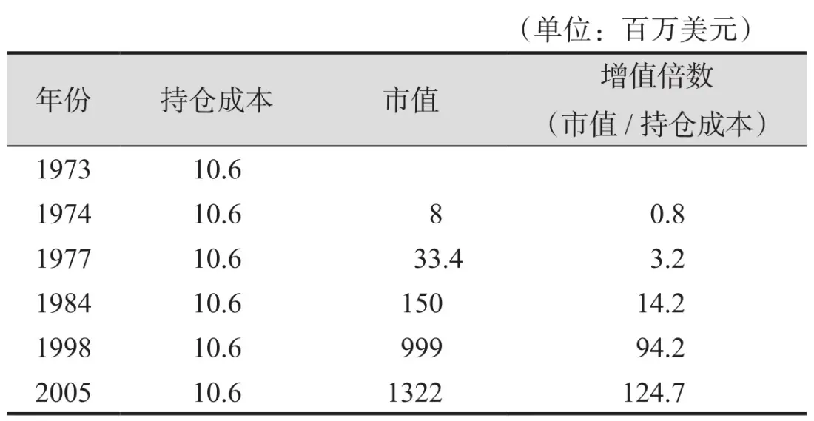

资料来源：巴菲特历年致股东的信。

由此可见，即使是伟大的公司，且业绩不断改善，也并不代表其股价能够立刻上涨，投资者也许还要承受较长时间的浮亏。

所以说，股票投资中，耐心是第一位的。

__5\.2 盖可保险（1976）__

盖可保险公司（全称为政府雇员保险公司）是巴菲特职业生涯开始时自己买入的第一只股票，当时他押上了自己一半的身家（1万美元），退出时获利超过50%。可以说，GEICO股票是巴菲特梦开始的地方。当时的他怎么也想不到，二十多年后，趁着GEICO陷入困境，他会将GEICO收入囊中。

巴菲特与GEICO结缘于在哥伦比亚大学商学院读书期间。当时他的授课老师格雷厄姆是GEICO的董事会主席。因此，在1951年的某一个周六，巴菲特独自乘车前往GEICO总部调研。所幸，时任公司总裁助理的Lorimer Davidson（Davy）正在公司加班，可能是出于对格雷厄姆学生的重视，Davy热情地接待了巴菲特，并耐心地花了4个小时给他讲了保险公司的情况并回答他的疑问。这家公司和Davy都给巴菲特留下了深刻的印象。

从学校毕业后，巴菲特把研究重心放在GEICO的股票上，并于1951年在当时知名的报刊《商业和金融年鉴》“我最喜欢的股票”栏目中，强力推荐GEICO的股票。

从这篇推荐文章中，大致可以看出他认为GEICO所具有的吸引力：

（1）其核心竞争力是直销的商业模式，与主流的保险公司相比，免去了保险中介，使得保单成本大幅低于行业水平，因而保单价格远低于同行，同时公司的利润率维持在行业高位。

（2）虽然过去的业绩显示了其高速增长，但目前业务只在美国少部分州开展，未来业务发展空间广阔，能够维持其高速增长。

（3）在整个保险业业绩下滑时，GEICO虽然业绩也同步下滑，但与同行比要好得多。

（4）未来1～2年能看到保险业的触底回升。

（5）目前市盈率很低（8倍），股价被明显低估。

可以看到，巴菲特从GEICO的长期竞争力、短期市场走向、价格吸引力等维度进行分析。这些分析，到1976年GEICO陷入困境，巴菲特出手大笔买入公司股票时，仍然有效（尤其是关于直销商业模式的竞争力分析和业务拓展空间的分析）。

巴菲特在1951年发表这篇文章的同时，就将超过个人全部资金的50%投到GEICO股票里，购买了共计350股，成本为10282美元。到了1952年，巴菲特以15259美元的市值卖出全部的GEICO股份，获利超过50%。巴菲特在回忆当时为什么卖出GEICO时说，是因为他找到了更便宜的公司（西方保险证券）。

不过，在1995年致股东的信中，巴菲特提到如果1952年不卖掉15259美元的股票，过20年（20世纪70年代初），这些股票会变成130万美元。这让他感慨，好公司不要轻易卖！

20世纪70年代初期，原总裁Davy（就是那位1951年热情接待巴菲特的人）退休后，公司的继任管理层犯了一个重大错误：为了增加保费收入，以低于理赔成本的价格大量卖出保单（这也是很多保险公司最常犯的错误）。这导致后续几年公司面临巨额的赔付，公司一度濒临破产。公司1976年的新任总裁Jack Byrne紧急采取了一些措施，使得公司暂时免于陷入破产境地。

这时候巴菲特出手了。出手的理由与1951年他写的那篇文章无异：低成本的直销商业模式。只要管理层经营得当，不要为了短期利益承保低于成本价的保单，最大限度发挥低成本优势，公司就能化险为夷。

伯克希尔在1976年下半年买进大量的GEICO股份，之后又小幅加仓，到了1980年底，总计投入4570万美元取得该公司33%的股权。在往后的15年内，由于该公司不断地购回股份，伯克希尔的持股比例逐渐增加到50%。

当初以4570万美元买入的GEICO股票，近二十年后（1995年）值多少钱呢？

剩余50%的股份，巴菲特在1995年以23亿美元的代价收购。也就是说，近20年，市值涨到了原来的50倍，4570万美元的买入成本，变成了23亿美元，复合年化收益率为21\.6%。

其实这并非投资GEICO所获得收益的全部，甚至并非最主要部分。最核心的是GEICO过去20年的保险浮存金（你可以认为是无限期的长期资金），它为巴菲特收购其他公司或购买股票提供了源源不断的子弹，让巴菲特的财富实现了指数级增长。

在1995年巴菲特全资收购GEICO后的二十多年里，GEICO又取得了长足的发展。在2018年致股东的信中，巴菲特说：

GEICO现在是美国第二大汽车保险公司（1992年是全美第七大），销售额比1995年增长了1200%。自收购以来，该公司的承保利润总计为155亿美元（税前），可供投资的流动资金已从25亿美元增至221亿美元。

也就是说，GEICO这200多亿美元的浮存金（成本很低甚至是负的）才是巴菲特放大财富效应的核武器。

可以说，保险公司的浮存金是巴菲特所使用的最大的杠杆。

__5\.3 可口可乐（1988）__

1988年，在经过长时间的观察和等待后，巴菲特出手了，重仓买入可口可乐公司的股票，耗资5\.9亿美元；并在第二年（1989年），继续大量买入。截止到1989年底，巴菲特共耗资10\.2亿美元，买入了2335万股。这在当时可谓是巨额投资。

可口可乐是巴菲特转向“以合理价格买下优秀公司”投资理念的经典之作。在持续购买公司股票的过程中，发生的小插曲更可印证。

至于为什么会投资可口可乐，巴菲特在1989年致股东的信中交代了他与可口可乐的结缘之路。

这次的可口可乐投资，提供了一个机会来证明你们的董事长对投资机会的反应之快速，不管这些机会是如何不明确或是被隐藏的。我记不清我是在1935年还是1936年第一次喝到可口可乐的，不过可以确定的是，我从1936年开始以25美分半打的价格从巴菲特兄弟杂货店批货，再以每罐5美分的价格卖给邻居街坊。作为我个人从事高毛利零售业的开端，我观察到这款产品对消费者特殊的吸引力及其背后所代表的巨大商机。

往后的52年间，当可口可乐席卷全世界时，我也持续地注意着这种特质。然而在同一时间，由于我个人过于小心谨慎以至于竟然连一股都没有买，反而将大部分的个人资产投在街车公司、纺织公司、煤炭公司与邮票公司之类的股票之上（如果你认为这是我编的笑话，我可以告诉大家确切的公司名称）。终于，到了1988年的夏天，我的大脑与眼睛完成了联机动作。

由此可见，可口可乐在巴菲特孩童时就已经给他留下了很深刻的印象。不过直到52年后，他才下定决心大笔买入可口可乐的股票。为什么明明看到可口可乐公司的业绩在过去几十年一直增长，巴菲特却没有买呢？

这就和巴菲特投资理念的进化有关了。

因为早期受限于格雷厄姆的烟蒂股投资，像可口可乐这种商誉价值很高，但并不符合烟蒂股特征的公司，他是比较犹豫的。好在从20世纪70年代开始，在芒格的影响下，他逐步转向优质股投资，并且在对喜诗糖果、GEICO、华盛顿邮报等优质公司的投资中获得惊人的投资收益后，对于公司的真正价值有了更为深刻的理解。

我们买入的任何一只股票，背后反映的都是我们的思维模式，不管好坏。

巴菲特到底为何如此看重可口可乐的竞争力呢？信中继续交代：

然后，我就感到心里变得清晰无比。经过20世纪70年代一度的浑浑噩噩之后，可口可乐在1981年的新任总裁古崔塔（Roberto Goizueta）的带领下焕然一新。古崔塔加上Don Keough（曾经是我在奥马哈的对街邻居），经过重新思考，聚焦公司政策，并切实地加以执行后，使得本来就已是全世界最独一无二的产品又平添新的增长动力，尤其是来自海外的营收更呈现爆炸性的成长。

利用其营销与财务方面的两把利刃，古崔塔将可口可乐产品的成长与股东的利益最大化。通常，一家消费品公司的CEO，基于个人过去的经验与个性，会使得营销或财务占据主导地位。但是古崔塔却能够将两者调和到极致，能有这样的结果实在是股东们的福气。

也就是说，巴菲特认为，可口可乐是全世界独一无二的饮料，具有很强的产品力；同时，巨大的海外市场等待着公司去开拓，因此成长空间没问题；只需要再来个能干的CEO，把产品力和全球销售做到极致，那么公司的发展必然突飞猛进。幸运的是，新任CEO古崔塔就是巴菲特想要的那种人。

产品好，销售天花板高（海外市场），再加上优秀的管理层，完美！

所以巴菲特在1989年致股东的信中，还懊悔没有在古崔塔担任CEO的第一时间就买入可口可乐的股票，错过了更好的时机。不过，1988～1989年买入也不晚，巴菲特后面也享受了股价巨大的涨幅。

当然，对于这个诞生了一百多年的饮料品牌来说，很多投资者怀疑它的增长能否持续，股价是否过高。这些顾虑在1938年的投资者心中就有。巴菲特在1993年致股东的信中说道：

先前我曾提到，若是在1919年以40美元投资可口可乐会获得怎样的成果。1938年，在可乐问世达50年且早已成为代表美国的产品之后，《财富》杂志对该公司做了一次详尽的专访。在文章的第二段作者写到，每年都会有许多重量型的投资人看好可口可乐，并对其过去的辉煌纪录表示敬意，但觉得自己发现得太晚，认为该公司已达巅峰，前方的道路充满了竞争与挑战。

-
1. 1美加仑=3\.785立方分米。
2. 1美液盎司=29\.573立方厘米。

没错，1938年确实充满了竞争，1993年也是。不过值得注意的是，1938年可口可乐一年总共卖出两亿箱饮料（若是将当时的加仑

装换算成现在192盎司

的箱子），但是到了1993年，该公司一年卖出的饮料高达107亿箱。这家当时已经成为市场领导者的公司在后来将近50年的时间内总共又增长了50倍。对于1938年加入的投资者来说，盛宴根本还没有结束。虽然在1919年投资40美元在可口可乐股票的投资人到了1938年可获得3277美元（含将所收到的股利再投资），但是若在1938年以40美元投资可口可乐股票至1993年底，还是照样可以增长到25000美元。

不过，巴菲特买入并持有可口可乐的过程并非一帆风顺，中途也发生了很多插曲，值得琢磨。

第一件事是，当1988年巴菲特开始买入可口可乐时，公司股价也开始大幅上涨。这对于任何一个投资者来说都是一个挑战：当你逐步买入的股票股价正在快速上涨，而你尚未建仓完毕时，究竟是按照原有计划继续买入还是停止买入？这对任何人来说都是一个艰难的决定。在可口可乐股票上面，巴菲特没有犯错，选择了继续买入。当初的那些股价涨幅，在事后看来是那么微不足道。

不过，这样的错误在1988年开始买入房利美（Fannie Mae）时，巴菲特却没能避免。巴菲特对房利美非常熟悉，在观察很久之后，在1988年决定以3\.5亿～4亿美元的成本大举买入房利美股票。不过当他刚买了大约700万股后，公司股价就开始上涨。失望之余，巴菲特停止了继续买进，甚至在股价继续上涨后，觉得700万股的规模实在是了无生趣，还做出了清仓卖出的动作。（数据来源于1991年致股东的信）

这两次投资让巴菲特深刻体会到，真正伟大的公司，只要价格合理，甚至稍微贵一点儿，都是可以接受的。怕的是出于对价格稍微贵一点儿的顾虑，而与伟大公司擦肩而过。

毕竟，真正伟大的公司是很少的，你一辈子能发现并能理解的也没几个。当然，过于高昂的买入价格，也能使任何一笔交易成为烂投资。这其中的区别，可以说是“运用之妙，存乎一心”。

所幸的是，巴菲特在苹果公司的股票上，没有再犯这样的错误。

第二件事关于何时卖出可口可乐公司的股票。按照普通人的逻辑，既然是伟大的公司，就可以坚持一辈子不卖。但是从投资的角度看，却并非如此。即使是可口可乐这样的伟大公司，当市场泡沫严重，估值被抬升到不可思议的高度时，卖出往往是更好的选择。

在1998年可口可乐股价创出新高，市盈率达到令人匪夷所思的50倍后，巴菲特仍然选择按兵不动。但随后可口可乐股价一路下滑，一直到2011年左右才追上1998年的股价高点（以复权价计）。可以说，1998～2011年从投资角度而言是可口可乐“失去的13年”。

也难怪在2003年致股东的信中（彼时可口可乐股价从高点腰斩），巴菲特酸溜溜地说道：

对于目前手头持有的这些投资组合，我们既不觉得特别兴奋，也没有抱负面看法。我们拥有的是一些优质企业的部分所有权。虽然去年这些企业的内在价值也在稳定增长，其杰出的表现更反应在股价上。当然，一个令人不愉快的推论是，没有在股市大泡沫期间卖出这些股票，于我而言是个重大的错误。如果这些股票目前已经被完全公允定价了，你可能好奇，四年前，当它们的价格远远高于其内在价值时，我究竟在思考什么。对此，我自己也百思不得其解。

所以说，投资这门手艺和艺术一样，也讲究“学我者生，似我者死”。巴菲特经常性地自我反思、自我进化（这正是他伟大的地方），我们这些学徒可不能依葫芦画瓢，邯郸学步，应有自己的理解与萃取。巴菲特在经过多年的投资历练后，敢于扬弃自己老师格雷厄姆的传统价值投资理念，我们在学习巴菲特时，更要存这份心，否则就是拿着旧时代的地图去寻找新大陆。

记住芒格的一句话：如果你想成为一个伟大的投资者，你必须不断学习。当世界变了，你也要变。

可以看到，巴菲特在可口可乐上有异常成功的经验：①以合理价格重仓买入优秀公司；②当买入的过程中股价飙升时，没有为了蝇头小利而犹豫不决（将军赶路，不追小兔）；③耐心持有。但也有遗憾的地方，那就是没有在估值极度泡沫化时坚决卖出，换成更高性价比的股票。

当然，投资上的事容易事后诸葛亮。即使是一家伟大的公司，在漫长的时间长河里，其股价大幅波动都是常有之事。即使是伯克希尔公司的股价，也经历了数次腰斩（似乎所有伟大公司的股票，只要时间足够长，其股价都会经历数次腰斩）。对于某个估值高点，到底是极度泡沫化透支了未来数十年的盈利，还是公司成长过程中的小插曲，只能留给每个投资者自行体会了。

__5\.4 富国银行（1990）__

1989年期间，正值美联储加息周期末期（完整的加息周期为1986年中至1989年中），美国西海岸房地产市场发生危机，包括富国银行在内的银行股股价受到影响。1989年第四季度至1990年第二季度，富国银行股价跌了20%。在经历了小幅反弹后，1990年中期，富国银行的股价下跌最多时，大跌了50%。

在经过了耐心的观察后，1989年，巴菲特进行了尝试性建仓。1990年富国银行股价大跌时，巴菲特大举买入，共耗资约2\.89亿美元，合计500万股，平均成本价为57\.9美元。巴菲特对富国银行的持股比例接近其流通股的10%。

在1990年致股东的信中，巴菲特详细解释了买入富国银行的原因。

我们是在1990年银行股一片混乱之时买进富国银行的股份的。这种失序的现象是很合理的。几个月来，有些原本经营名声不错的银行，其错误的贷款决定一一被媒体揭露。一个又一个庞大的损失数字被公布后，管理层往往拍着胸脯保证一切正常，投资者们却认为银行披露的数据不再可靠。趁着投资者逃离银行股，我们购入了富国银行大约10%的股份，耗资约2\.9亿美元。当时富国银行的税后市盈率低于5倍，税前市盈率低于3倍。

富国银行的规模很大，总资产为560亿美元，净资本回报率超过了20%，总资产回报率为1\.25%。我们购入10%的富国银行，相当于我们全资买下了一家资产规模为50亿美元的相同资质的银行。但是如果我们真的去买这么一家小银行，我们可能要支付比2\.9亿美元多一倍的价格。即使我们以高溢价买入了这家小银行，我们将面临另外一个麻烦：我们不可能找得到像Carl Reichardt这样的人才去经营它。近些年，富国银行出身的管理层在招聘市场上比别的银行出来的更受欢迎。但是没人能够请得动这样一位长老。

当然，持有一家银行的股份，或者其他公司的股份，不可能没有风险。加州的银行就要面临大地震这样的特殊风险，可能导致借款人遭受重大灾难而还不起银行的钱。还有一个风险是系统性的，业务收缩或金融危机过于严重可能导致高杠杆经营的机构出现风险，无论它们经营得多么好。最后，市场主要的担忧在于由于供给过剩，西海岸的房地产价格暴跌，导致那些提供融资的银行受损严重。由于富国银行在房地产贷款中业务领先，所以它被认为受冲击最大，也最脆弱。

-
1. 480×10%×30%=14\.4亿美元，扣除3亿美元的贷款损失准备后，与目前的年税前10亿多美元大抵相当。

以上所提到的风险都很难加以排除，当然，前两点发生的可能性相当低，而且，即使房地产价格大幅下跌，对于经营良好的银行而言，也不会造成太大的问题。我们可以简单地算一下，富国银行现在一年，在计提3亿美元的贷款损失准备之后，税前还可以赚10亿美元以上。假如该银行所有的480亿美元的借款中有10%（不单是房地产贷款）在1991年发生问题，且估计损失30%的本金（包含利息损失），这家银行仍可以盈亏平衡。

哪怕真有一年如此，虽然我们认为这种情况发生的可能性相当低，也不会让我们受不了。事实上，伯克希尔选择并购或投资一家公司，头一年不赚钱没有关系，只要以后每年能够有20%的净资本回报率。尽管如此，加州大地震使得投资人害怕新英格兰地区也会有同样的危险，导致富国银行在1990年的几个月内股价大跌近50%。虽然在股价下跌前我们已买进一些股份，但股价下跌使我们可以开心地用更恐慌性的价格买到更多的股份。

首先，巴菲特谈到其实他并不喜欢银行股，因为银行经营杠杆太高，一个失误就会造成巨大损失。不过，他并不排除在特殊情况下买入银行股，这些情况包括：

（1）银行经营稳健，不激进。

（2）管理层能力很强。

（3）价格特别好。

当1990年富国银行受西海岸房地产危机影响，股价跌去了50%，税后市盈率不到5倍（税前市盈率不到3倍）时，巴菲特果断出手。

此后的多年，巴菲特断断续续又继续加仓富国银行。尤其是在2008年金融危机后的几年内，巴菲特持续不断加码富国银行，直至其成为第一大重仓股。截止到2017年底，伯克希尔在富国银行的持仓高达278亿美元。1990年的那笔投资已经赚了近100倍。

不过，再好的公司也许都有变质的一天。

从2016年开始，富国银行爆发丑闻，出现多起侵害消费者权益事件。富国银行被称为“交叉销售之王”，但随着业务的扩张和奖金的激励，出现了大量开立虚假账户、违规收取房贷利息和违规搭售车险等丑闻。在2016年爆发丑闻之前，实际的违规操作已经持续数年之久，给客户造成了数十亿美元的损失。

2020年，富国银行与美国证券交易委员会达成和解，富国银行支付30亿美元和解费，时任CEO的John Stumpf黯然下台。2022年，美国消费者金融保护局（CFPB）又向美国富国银行开出37亿美元的高额罚单，包括向消费者赔偿的20亿美元，以及罚金17亿美元。

公司的管理层和营销文化出了大问题，这也让巴菲特重新审视对富国银行的投资。从2017年开始，巴菲特逐步减持富国银行，直至2021年几近清仓。伯克希尔从2016年至2021年持有富国银行股票的数量详见表5\-2，富国银行股价走势见图5\-1。

▼表5\-2 伯克希尔对富国银行的持股数量

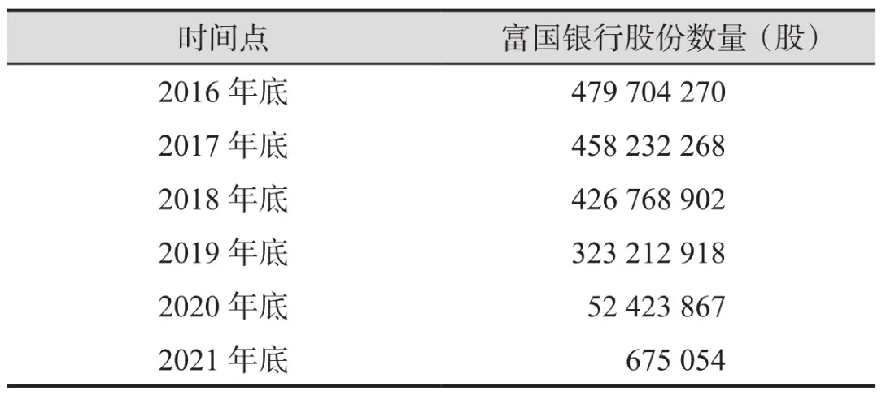

▲资料来源：伯克希尔SEC filing 13\-F。

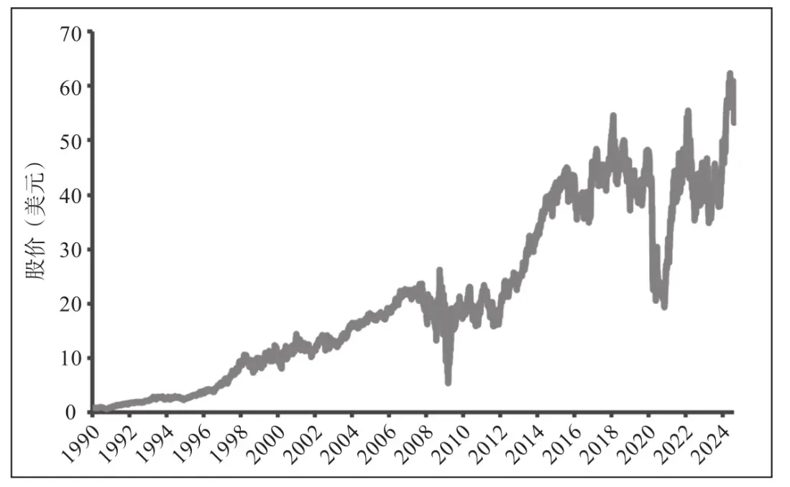

▲图5\-1 富国银行股价（前复权）走势

__5\.5 美国运通（1994）__

美国运通是巴菲特另一价值投资的典范。

巴菲特初次投资美国运通是在1964年，正值公司遭遇色拉油丑闻。

美国运通是美国旅行支票领域的领头羊，在旅行支票、汇票、信用卡、货运、汽车租赁、仓储等业务都有布局。20世纪60年代初，美国运通旗下一家经营仓储抵押贷款的子公司，为联合植物油精炼公司的色拉油库存签发了收据，从而这家公司可以拿着这些收据找银行进行大量贷款。哪知道，联合植物油精炼公司的老板安东尼·德·安杰利斯是个彻头彻尾的金融骗子。公司那些所谓的色拉油“库存”，几乎都是假的，就是靠着一堆海水上飘着的小部分色拉油，成功骗过了美国运通的这家子公司，让其签发了用于银行贷款的收据。

1963年底，市场传闻愈演愈烈，美国运通去核查色拉油库存，被事实震惊：号称价值数亿美元的色拉油库存是一场骗局，真实的色拉油价值只有数百万美元。

被骗了贷款的银行和客户怒不可遏，把矛头对准了为联合植物油精炼公司签发收据的美国运通。虽然按常理，子公司签发的收据出了问题，大不了子公司宣布破产，债务不会波及母公司。但在如此巨大的丑闻面前，作为母公司的美国运通是否需要承担连带赔偿责任，承担多少责任，市场上议论纷纷。受害者所要求的赔偿高达1\.5亿美元，而1963年底，美国运通公司的净资产只有7800多万美元，远远不足以支付索赔金额。

不凑巧的是，美国总统肯尼迪于1963年11月遇刺身亡。两件事情叠加，使得美国运通的股价一泻千里，从丑闻前的60美元暴跌到最低时的35美元。公司甚至出现了破产传闻。

巴菲特仔细研究了美国运通的财务状况和这件丑闻对它的潜在影响，他认为事情并没有想象中的那么坏。美国运通所具有的竞争壁垒（尤其是在旅行支票、汇票和信用卡领域）及特许经营，必能承受这次的事件冲击。

美国运通1954～1963年的财务数据详见表5\-3。

从美国运通过去十年（1954～1963年）的财务表现来看，公司业绩持续增长。作为旅行支票领域的霸主，1963年底的旅行支票和信用证余额高达4\.7亿美元（这部分资金属于客户但暂放在公司账户，类似于保险公司的浮存金，可称为客户浮存金，属于公司的长期免费资金）。美国运通本质上是金融公司，这点看杠杆倍数（总资产/净资产）便可一目了然。

市场对美国运通的担忧在于：

（1）色拉油丑闻可能导致其正常业务受影响，大批客户弃之而去。

（2）公司净资产只有7870万美元，根本无法承担可能的1\.5亿美元的赔偿费用。

表5\-3 美国运通公司十年财务摘要（1954～1963年）

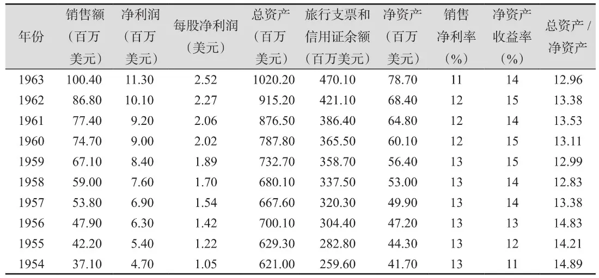

资料来源：美国运通1963年年报。

关于第1点，巴菲特特意委托人去调查丑闻发生后客户对这件事的反应。他发现，银行、餐馆、酒店，以及持有美国运通信用卡的人，仍然在继续大量使用公司的服务，并没有受到丑闻太多影响。

关于第2点，巴菲特认为实际情况并没有那么坏。尽管最终确实需要承担一定的连带责任，但以公司良好的经营业绩来说，完全承担得起。再过5年、10年，这件事的影响将烟消云散，而公司的市场地位将进一步得到稳固。

于是乎，从1964年初开始，巴菲特以巴菲特合伙人公司的名义大量买进美国运通，初步耗费400多万美元。1965年与1966年，巴菲特调动了尽可能多的资金继续大举买入美国运通。到1966年的时候，巴菲特已经对美国运通投了1300多万美元，持有公司5%的股份，并且这一持仓占到了巴菲特合伙人公司整体仓位的40%。难怪巴菲特在1994年致股东的信中说道：

我个人在美国运通的投资历史包含好几段插曲，在20世纪60年代中期，趁着该公司深陷色拉油丑闻，我们将巴菲特合伙人公司40%的资金压在这只股票上。这是合伙人公司有史以来最大的一笔投资，总计花了1300万美元，买进了该公司5%的股份。截止到今日，我们在美国运通的持股将近10%，成本为13\.6亿美元（美国运通1964年盈利为1250万美元，1994年则增至14亿美元）。

最终在1965年，美国运通与绝大部分索赔人达成了和解协议，赔偿总金额为6000万美元（与之前预估的1\.5亿美元相比甚少）。同时，这笔钱并非一次性支付，而是分为两期，第一期于1967年一次性支付3000万美元，剩余的3000万美元在后续的6年里分期付款。实际上，由于赔偿所带来的抵税效应，这6000万美元的赔偿款相当于税后3200万美元。因此巴菲特开玩笑地说到，可以把这笔赔偿款看成是“一张在邮寄过程中丢失的股息支票”。

随着色拉油丑闻的成功解决，巴菲特的1300万美元投资在短短四年的时间里，产生了数倍回报。巴菲特自己都承认这是他在管理BPL期间做过最成功的投资之一。

其实我们从1964年巴菲特投资美国运通的例子可以看出，这并不是一次典型的烟蒂股投资。当时公司的净资产只有7870万美元，赔偿可能使公司资不抵债。如果从破产清算的价值来看，清算价值也许为零。

即使不算潜在损失，美国运通的价格也远远谈不上有清算价值。1963年丑闻发生之前，美国运通股价为60美元，每股收益为2\.52美元，市盈率是23\.8倍。即使是跌到最低时的35美元，其市盈率也有14倍。巴菲特初始买入成本为40美元，对应市盈率为15\.9倍，这还没算上潜在损失（实际上这个损失一定会发生，只是损失金额有争议）。如果算上6000万美元的赔偿金，那美国运通的清算价值为零。

当时的“旧巴菲特”为什么仍然看中了美国运通，不惜以BPL40%的仓位去重仓这只股票呢？我想他最看重的，是公司在旅行支票及相关领域一骑绝尘的领先竞争优势（当时的万事达和Visa还未在市场推出），以及高达4\.7亿美元的客户浮存金。关于巨额客户浮存金所带来的长远好处，从巴菲特1967年收购国民赔偿保险公司，1976年买进盖可保险便可看出，他体会颇深。

“以合理价格买下优秀公司”的投资理念，很早就在“旧巴菲特”心里生根发芽了，直至多年以后，才终于长成了参天大树。

可以看到，所谓的“旧巴菲特”，并不是一成不变的。实际上，巴菲特没有一天是纯粹的“格雷厄姆”，他的投资理念是原则中有灵活，因时而变，从不墨守成规。

当然，1964年的购入并不是巴菲特与美国运通唯一的一次结缘。近30年后的1991年，巴菲特买入了3亿美元的美国运通Percs（一种可转换优先股，股息更高但是有价格上涨上限）。持有这种股票，前三年能收到比普通股更高的股息，但条款对其价格涨幅有限制。3年后，持有人有权将其转换成普通股。

1994年，在Percs到期前的几个月，巴菲特打算将持仓处理掉。

但是与赫兹租车公司（Hertz）的CEO Frank Olson的会面彻底改变了巴菲特的想法。Hertz的CEO给巴菲特详细解释了美国运通商业模式的竞争力和护城河，巴菲特被完全说服，最终不但没有出售Percs，而且还加仓了美国运通的股票，使得到1997年的时候，巴菲特在美国运通的投资收益足足有30亿美元。

为什么巴菲特当时在犹豫是否继续持有美国运通的股票呢？因为20世纪60年代，独霸市场的旅行支票和美国运通卡受到以Visa、万事达为代表的竞争对手的追击，美国运通过去的独占性优势不再。因此，尽管1994年美国运通的财务数据尚可，巴菲特对于它未来的竞争优势仍非常忧虑。当时，美国运通卡收费项目繁多，与Visa、万事达信用卡相比，没有任何费率优势。

美国运通当时的CEO调整了公司战略，更加聚焦富人与企业群体，塑造运通卡高端、服务完善的形象。因此，虽然运通卡的持卡人数不是最多的，但是所服务群体的消费能力极强，对价格不敏感，因而持续创造了高额的利润（可以类比手机界的苹果）。其全球性完善且周到的综合性服务，正是吸引高端客户群体的撒手锏。事后美国运通公司的发展也印证了这一点。

1994～1995年巴菲特买入美国运通股票，这一次他没有像1964年那样，获利后快速卖出，而是长期持有。根据伯克希尔1995年致股东的信及2023年持仓信息披露（13\-F），在完成股票建仓后，20多年间，伯克希尔对美国运通的持股几乎没动。部分年份的买入成本及市值见表5\-4。

表5\-4 美国运通的买入成本及市值

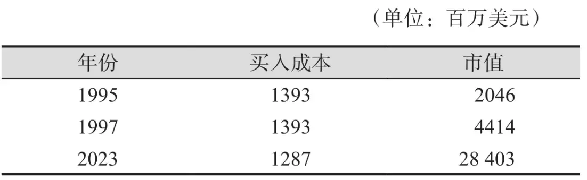

注：数据来源于巴菲特历年致股东的信。2023年的买入成本按照2021年致股东的信中披露的数据计。由于2021年与2023年伯克希尔对美国运通的持股数量不变，我们假设2023年的买入成本也保持不变。

28年间，市值增长超过20倍，复合年化收益率超过11%。这一次，巴菲特没让美国运通再从自己手中溜走。难怪巴菲特在2023年致股东的信中感慨，他从持有可口可乐和美国运通股票得到的经验是，当你找到一笔真正出色的生意时，请坚持下去。耐心是有回报的，一笔出色的生意可以抵消许多不可避免的平庸决策。

__5\.6 比亚迪（2008）__

巴菲特于2008年投资了在港股上市的比亚迪。巴菲特早就说过，四个轮子的生意不好做，商业模式并不好，所以他投资汽车股的次数并不多，且每次持有时间不长。在他看来，汽车生产商的同质化竞争非常激烈，并且需要持续的重资本投入。因此，他在比亚迪上的投资显得尤为有趣。

实际上，投资比亚迪是芒格的主意。这是芒格拍着桌子也要让巴菲特买入的两只股票之一（另外一只是Costco）。芒格的两次桌子都拍对了。

芒格之所以非常看好比亚迪，主要是因为比亚迪在电动车领域的前瞻性布局。从管理层看，芒格认为王传福身上兼具爱迪生和杰克·韦尔奇的气质，即“工程师\+管理大师”相结合的气质。在芒格的持续推荐下，巴菲特最终接受了建议，于2008年买入了2\.25亿股比亚迪（1211\.HK），占其总股份的10%，总计耗资2亿多美元。随后，股价迎来过山车式行情：2009年，股价从8港元上涨到最高80港元，涨幅近10倍，但随后股价又跌回原形。不过，在这期间，巴菲特一直按兵不动。一直到2022年，随着比亚迪股价不断创新高，从当初的8港元上涨到最高333港元（涨了40倍），巴菲特开始逐步减仓。到2024年6月末，巴菲特的持股已经从最初的2\.25亿股降低到6585万股，减持比例超过70%。

2008年，比亚迪营业收入为227亿元，净利润为10亿元；2023年，公司营业收入增加到6023亿元，净利润则增加到300亿元。公司净利润涨到了约30倍，股价则上涨到了约42倍。实现这一伟大跃升的，除了比亚迪公司本身的竞争力之外，还有国内新能源汽车销售渗透率的不断上涨，至2024年上半年已接近50%。电动汽车行业的飞跃发展，印证了芒格和巴菲特当初对电动汽车行业的判断。

从2008年以2亿多美元买入，到2022年开始减仓，持有的14年间，比亚迪为巴菲特带来的累计回报将近70亿美元，可谓是经典之战。

由此可见，巴菲特的耐心，世间罕见。

__5\.7 苹果（2016）__

巴菲特对苹果公司的大举投资，是巴菲特与时俱进、持续学习的象征。熟知巴菲特的人都知道，巴菲特对于科技股是比较排斥的。原因有二：一是科技行业的技术发展日新月异，颠覆性创新层出不穷，十年前还是耀眼的科技明星，下一个十年也许就是濒死的大象，例如诺基亚、摩托罗拉、柯达，都曾经是最耀眼的科技公司。巴菲特认为很难把握这类企业的长期发展前景，不确定性太大。二是对高新技术的理解及洞察并非巴菲特所擅长的，这点他自己心知肚明，知道自己的能力圈不在这儿。因此，尽管巴菲特与微软创始人比尔·盖茨在20世纪90年代初就认识，并一见如故，但基于上述原因，巴菲特从来没有投资过微软这只大牛股。在谷歌成立后的几年里，尽管GEICO在谷歌上投放广告并取得了超出预期的回报率，巴菲特仍没有下手买入谷歌的股票。对于亚马逊，巴菲特也是类似的态度，尽管他个人非常欣赏创始人贝佐斯，但对于亚马逊这种线上零售模式，他是非常谨慎的。

巴菲特自2016年开始对苹果公司大举投资，并使之成为自己的第一大重仓股，这改变了人们对于巴菲特的固有认知。巴菲特虽进入耄耋之年，但其思维仍持续进化。

实际上，苹果公司自1980年上市以来，中间经历过多次的起起伏伏。由于经营理念不同及性格问题，1985年，乔布斯被苹果董事会赶出公司。之后公司发展不顺，直至乔布斯1997年重新执掌苹果，公司才进入发展快车道，推出了iPod、iPhone、iPad等一系列震撼世界的创新产品，将苹果公司的业绩和股价都带上了巅峰。

从2001年苹果推出第一代iPod，到2016年巴菲特开始买入苹果公司股票，苹果公司股价已经上涨了超过100倍，并且苹果公司通过iPhone、iPad、Mac、AppStore等软硬件，打造了一个坚固无比的生态系统，在全球拥有无数的忠实用户。

巴菲特为什么会在2016年开始买入苹果这样的科技股？在2016年之后的多次股东大会上，巴菲特阐述了他的理由。他认为，当时的苹果经过生态系统的构建，已经成为一个电子消费品公司，而不是单纯的高科技公司。巴菲特虽然对科技领域没有深刻的理解力（例如iPhone是怎么制造出来的，用了哪些黑科技等），但他对于消费行业的洞察力无与伦比，尤其是对消费者行为和心理的洞察。他在一次股东大会上举了个简单的例子：如果给一个苹果手机用户一万美元，让他以后要么再也不能买苹果手机，要么再也不能买通用汽车，他会毫不犹豫地选择不买通用汽车，因为他可以选择别的品牌的汽车。这就是苹果产品的吸引力。

经过2016年开始的连续买入，到2018年的时候，巴菲特累计投入了360亿美元，买入了超过5%的苹果的股份。巴菲特买入苹果股票时，公司市盈率不过10多倍（巴菲特似乎不喜欢买入市盈率超过15倍的股票），且盈利和现金流状况极好。重仓苹果给巴菲特带来的回报是巨大的——360亿美元的成本，最终净赚超过1200亿美元！巴菲特宝刀不老！

有趣的是，自2024年开始，随着美股的节节攀升，苹果公司总市值超过了3万亿美元，巴菲特做了个惊人的举动——大幅减仓苹果股票。其持有股票数量从2023年底的9亿股，降到2024年6月末的4亿股，减仓超过一半。我想，巴菲特之所以大规模减持苹果股票，也许是吸取了自己在1998年没有卖出可口可乐股票的教训（当时可口可乐市盈率达到惊人的50倍）。这一次，巴菲特的决策是否正确，让我们拭目以待。

## 投资错误集锦

__第6章__

__投资错误集锦__

巴菲特不是神，在他一辈子几十年的投资生涯中，也犯过不少错，有些还是数亿美元、几十亿美元甚至更高金额的错误。

芒格说：“如果把我们最成功的十几笔投资去掉，我们就是一个笑话。”

确实如此。投资比的不是谁不犯错，而是谁犯的错少、犯的错量级小。巴菲特亲口承认，他一生犯的投资错误不少，但所幸在重大仓位的投资上基本上都是对的，且那些错误的部分损失可承受。

研究巴菲特的成功项目当然必不可少，但失败项目同样值得研究，甚至可以说，比研究成功项目更为重要。毕竟，投资成功各有各的路数，但失败的原因往往类似。

那我们就从巴菲特最重大的投资失败项目开始讲起（我相信巴菲特也不会反对）。这些数据主要来自巴菲特自1957年起致合伙人或致股东的信。

__6\.1 伯克希尔\-哈撒韦纺织厂（1965）__

在1989年致股东的信“头25年所犯过的错误（浓缩版）”中，巴菲特专门回忆了过去25年（1965～1989年）所犯过的错误，首先就是收购了伯克希尔\-哈撒韦（巴菲特旗下大名鼎鼎的投资运作平台的名字）纺织厂。

1962年，巴菲特通过巴菲特合伙人公司以每股6\.2美元的价格逐步买入伯克希尔\-哈撒韦纺织厂。1965年，巴菲特又以14\.86美元的价格买入大量股票，最终控股伯克希尔\-哈撒韦纺织厂。

那么，伯克希尔\-哈撒韦纺织厂怎么样呢？在当时看，巴菲特也认为不是一门好生意。事后看，更是烂透了，以至于巴菲特不得不在1985年彻底关闭了纺织业务。

那么在1965年，为什么巴菲特以超过BPL净资产25%的资金去收购伯克希尔\-哈撒韦纺织厂呢？

-
1. 为了便于读者更好地理解，我对信中段落做了重新排序。

在2014年伯克希尔成立50周年致股东的信中，巴菲特专门写了一个专栏——《伯克希尔的过去、现在及未来》，对投资伯克希尔\-哈撒韦纺织厂进行了全面的反思，信中写道

：

1962年12月，预计到公司将更多地关闭工厂和回购股票，我以BPL的名义第一次购买了伯克希尔的股票。那时候，股价是7\.5美元，相比于运营资本的每股10\.25美元和账面价值的每股20\.20美元，是大幅折价的。在这个价格买它的股票，就像是捡被丢弃的烟蒂，再吸上一口。尽管烟蒂可能难看或者乏味，吸的那口却是免费的。然而，一旦享受了短暂的愉悦，就再也没有什么能够期待的了。

伯克希尔随后如预想的那样——它很快关闭了其他2家工厂，在1964年5月的行动中，它开始用关闭工厂的收入来回购股票。Stanton（伯克希尔当时的CEO）那时候给的报价，高出我们原始买入成本的50%。免费吸烟蒂的机会正在等着我呢。吸几口，我就可以去别处寻找那些其他被抛弃的烟蒂了。

可以看到，到这里为止，如果巴菲特接受时任伯克希尔CEO Stanton的报价，那么就可以盈利50%退出，一切都很完美——又是一次完美的烟蒂股投资。

然而事情总有意外，信中继续写道：

1964年5月6日，伯克希尔\-哈撒韦，当时是由一个叫作Seabury Stanton的人负责经营。他送了一封信给股东，打算用11\.375美元每股的价格，从股东手中买225000股。我期待着这封信，却惊讶于这个价格。

伯克希尔当时有1583680股的流通股。BPL大约拥有其7%的股份（BPL是我运营的一家投资公司，并且我的绝大部分个人财富都投到里面了）。在那个要约寄给我前不久，Stanton询问我，什么价格才能让BPL出售所持股份。我回答说11\.50美元。他说：“好，成交。”然后，伯克希尔的信来了，价格少了0\.125美元（即11\.375美元）。我对Stanton的行为感到愤怒，所以没有接受。

随后，巴菲特带着愤怒，继续购买了伯克希尔的股票，成了公司的实控人，并炒掉了Stanton。最终，他的平均购入成本价是14\.86美元。

在1965年致合伙人的信中，巴菲特还为此得意扬扬地写道：

我们在1965年春控股它的时候，伯克希尔只剩下了2家工厂，约2300名员工。不过，最令人高兴的是，剩下的工厂中有很好的管理层，这样我们就不需要从外面请人来管理了。我们的初始购买价是每股7\.6美元（但因为1965年的大笔购买，最后的平均价是每股14\.86美元）。1965年12月31日，伯克希尔拥有的净运营资本（不包括机器和设备价值）为大概每股19美元。

也就是说，尽管收购伯克希尔有赌气的成分，但巴菲特决策的最核心依据还是买得足够便宜（成本价为14\.86美元，扣除机器和设备价值的净运营资本为每股19美元）。

当伯克希尔被巴菲特收至麾下后，就逐渐演变成了一场灾难。在管理层的努力经营下，虽然也过了几年好日子，但随后形势急转直下。最让巴菲特难过的是，在1965年，将BPL大量资金投到根本没有未来的烂生意中，从而失去了将宝贵资金投到收益更高的项目的机会。

机会成本巨高！

1985年是巴菲特正式关闭伯克希尔纺织业务的一年。在当年致股东的信中，巴菲特总结道：

从个人的经验与观察中我得到一个结论，那就是优异的管理记录（从投资回报的角度来衡量），往往取决于你从事什么生意，而非你运营得多么得当（虽然不管一家公司好还是坏，努力与才能也很重要）。几年前我曾说：“当一个声誉良好的管理层遇到经济前景堪忧的生意时，通常是后者会占上风。”如今我的看法一点儿也没变。当你遇到一艘总是会漏水的破船，与其不断白费力气去补破洞，还不如把精力放在如何换条好船上。

……

出售设备的毛收益只有163122美元，扣除掉处理所耗费的售前成本及售后成本，最后净收入为负数。1981年我们购入的5000美元一台的相对较新的织布机，如今售价50美元却无人问津。最后我们以26美元一台卖掉，都低于拆除成本了。

我想，在1985年巴菲特关闭伯克希尔纺织业务的一刹那，他应该是长吁了一口气。

伯克希尔这样的烟蒂股投资，让巴菲特明白了一个至关重要的道理：一门好生意，比低估值重要得多。

通过上面巴菲特的深刻反思，我们可以从伯克希尔\-哈撒韦纺织厂的失败中，得到以下结论：

（1）一门好的生意（一个好的行业）比一个低廉的价格重要得多。巴菲特说，与其在一艘漏水的破船上不断修补，不如把精力放在找到一条好船上。再能干的管理层，遇到江河日下的生意，最终也是后者占上风。

（2）如果已经犯了错误（比如买下了伯克希尔），就不要在错误的道路上继续前进了（比如10年后的1975年，又买下了Waumbec纺织厂）。如同巴菲特常说的一句忠告：如果你已经在坑里，就不要再往下挖了。

（3）净资产往往具有很强的误导性，这也是格雷厄姆式投资者常犯的错误。第一，如果你不能达到控制公司的程度，你便无法清算公司，清算价值也无从体现。更多时候，你是眼睁睁看着公司管理层或大股东继续消耗公司的现金，使得公司净资产继续贬值。第二，那些在资产负债表上列示的账面资产，等到要清算卖出的时候，其市场价格会显著低于账面价值，很多时候，价格会低到一个令人发指的程度。

（4）与投资失败相比，伯克希尔给巴菲特带来的更大的伤害在于，将大量资金长期锁定在无效益的业务上，从而错过了大量的投资机会。

__6\.2 国民赔偿保险公司（1967）__

根据2014年致股东的信中“伯克希尔的过去、现在及未来”所述，巴菲特认为收购国民赔偿保险公司是“职业生涯里最昂贵的错误”。这里是他的原话摘录。

早在1967年，我以伯克希尔的名义支付860万美元去收购国民赔偿保险公司，一个小型但前景不错的位于奥马哈的保险公司（一个小的姐妹公司同样包括在这笔交易中）。保险行业是我的舒适区，我理解并喜欢这个行业。

Jack Ringwalt，NICO的老板，是我的故友。他想把公司卖给我个人。他的报价，绝不是给伯克希尔的。所以，为什么我以伯克希尔的名义购买NICO，而不是巴菲特合伙人公司呢？我用了48年的时间去思考这个问题，终于得到了一个好的答案：我只是犯了一个巨大的错误。

如果BPL是NICO的收购者，我的伙伴和我将会拥有一个100%的好生意，会拥有与现今伯克希尔一样的基础。更重要的是，我们的增长将不会受到被纺织业务占用二十多年无效资金的影响。我们接下来的收购将会由我和我的合伙人完全拥有，而不是还被其他39%伯克希尔的股东拥有。对于他们，我们是没有义务的。尽管这些事实都怼在我的脸上了，而我选择将100%的好生意（NICO）给予我拥有61%股份的烂生意（伯克希尔\-哈撒韦）。这个决定将约1000亿美元从BPL转给了一群陌生人。

这里解释一下，巴菲特及合伙人只占伯克希尔61%的股份，其余39%由原有股东持有。因此，当使用伯克希尔收购NICO时，实际上巴菲特及合伙人只占到了NICO 61%的权益。1967年开始，公司使用NICO提供的源源不断的保险浮存金，逐步构建了今日的伯克希尔帝国。如果当初巴菲特及合伙人直接买下NICO，则后来所有的投资增值都归巴菲特及合伙人所有，他们的财富将比现在多许多，这一差异是1000亿美元（截止到2014年）。

要不巴菲特怎么说这是他人生中最昂贵的错误呢。

从这个错误中我们可以学到的是，好的股票或股权，要尽可能多地拥有，不要拿差的东西去抵换。彼得·林奇曾说，不要拔掉鲜花而种上野草。

__6\.3 所罗门兄弟公司的优先股（1987）__

巴菲特对所罗门兄弟公司优先股的投资，虽说最终以盈利收场，但中间的跌宕起伏，以及所投入的大量精力，让这种投资成为巴菲特心里再也不愿涉及的类型。

1987年，巴菲特旗下的伯克希尔以7亿美元买入所罗门兄弟公司利率为9%的优先股，这笔投资接近伯克希尔净资产的30%。这是巴菲特从业以来规模最大、最广为人知的单笔投资。这笔优先股投资还包含了一个转股期权：在3年后以38美元转换为所罗门兄弟公司普通股的期权；如果不执行转股期权，则从1995年10月31日起的5年内分批进行本金偿还。

这笔投资对于巴菲特来说，当时看是非常不错的。考虑到当时是1987年，牛市冲天，巴菲特对于股市过热的苗头忧心忡忡（当年股市发生的“黑色星期一”也印证了巴菲特的准确判断），股市里真正值得他出手的股票越发稀少，因此，利率为9%的所罗门兄弟公司的优先股是一笔非常不错的投资（考虑到当时所罗门兄弟公司的业务地位）。同时，它还内嵌了一个转股期权，为潜在的额外收益留下了想象空间。

但随后几年公司发生的丑闻，让所罗门兄弟公司陷入几乎破产的境地。所罗门兄弟公司被发现在美国财政部的国债投标中，操纵国债投标价格，囤积国债，并卖出获利。1991年，《华尔街日报》的一篇新闻报道揭露了所罗门兄弟公司的国债操纵丑闻，市场一片哗然。随后，财政部开启了对所罗门兄弟公司的调查并计划禁止公司参与国债的投标。这对公司来说无疑是致命一击。如果公司破产，伯克希尔7亿美元的优先股投资恐将遭受重大损失。

在这个危急关头，作为所罗门兄弟公司最大的股东之一，伯克希尔的巴菲特被财政部邀请出任所罗门兄弟公司的临时董事长来挽救危局。作为交换条件，巴菲特要求继续保留所罗门兄弟公司参与国债投标的资格，避免公司猝死。巴菲特上任后，通过大面积更换高管，重塑公司文化，降低运营成本等措施，让所罗门兄弟公司从泥潭中慢慢爬了出来，并且逐步恢复了正常的经营能力。

从1995年开始，伯克希尔的优先股开始逐步被回购。1997年，所罗门兄弟公司被旅行者集团收购（旅行者集团后并入花旗集团）。伯克希尔所持的优先股，一部分被赎回，另一部分转换成了旅行者集团的优先股或股票。最终，巴菲特从所罗门兄弟公司的这笔投资中全身而退，还获得了一定盈利。但事后复盘，巴菲特认为与投入的巨大精力和所带来的无尽麻烦相比，这笔投资做得实在不值得。而且，最终的圆满收场，还存在一定的运气成分。

在1995年致股东的信中，巴菲特回顾了对所罗门兄弟公司优先股的投资。

我们的另外两只优先股表现令人失望，尽管所罗门兄弟公司优先股的表现略优于作为替代品的固定收益证券。然而，查理和我为这家公司的管理经营所投入的时间远远超过了它对伯克希尔的经济意义。当然，拜之前购买了它的优先股所赐，我做梦也没想到自己会在60岁的时候找到一份新工作——所罗门兄弟公司临时董事长。

由此可见，当初看起来稳赚不赔的投资（每年利率为9%的股息，只要公司不倒闭就可以持续到本金兑付），由于管理层的失职导致公司一度陷入濒临破产的境地，7亿美元的投资差点儿化为乌有。经历了这件事之后，巴菲特更加重视对企业管理层诚信品质的考察。

__6\.4 Dexter鞋业（1993）__

Dexter鞋业是巴菲特在20世纪90年代一个重大投资错误的案例。

尽管当时的巴菲特早已从烟蒂股投资思维（当然，从出道开始，巴菲特就没完全按照格雷厄姆的方式进行投资）进化为寻找优秀公司思维，但是在甄别哪些是优秀公司上，巴菲特也偶尔失手。

2014年致股东的信附有“伯克希尔50周年总结”。在总结里面，巴菲特着重提到了投资Dexter鞋业是这辈子“最可怕的错误”。

纵使有了查理的设计蓝图，自Waumbec纺织厂之后，我还是犯了很多错。最可怕的错误是Dexter鞋业。当我们于1993年购买该公司的时候，它有很好的历史业绩。在我眼中，它全然不像烟蒂股。然而，因为外国的竞争，它的竞争优势很快消失。而我根本没有意识到这点。

结果，伯克希尔为Dexter鞋业支付了4\.33亿美元，但其价值很快归零。然而，GAAP会计准则并不能如实记录我错误的量级。事实是，我是用伯克希尔的股票收购的Dexter鞋业，而不是现金。我为购买Dexter鞋业所付出的股票现在价值约为57亿美元。作为一场金融灾难，它值得被写进吉尼斯世界纪录。

在1993年收购时，Dexter鞋业确实看起来非常不错。但是后来，商业环境发生了巨大变化：鞋业生产中心转向了亚洲（主要是中国）。中国生产的鞋子成本更低，压垮了美国的制鞋业，包括Dexter鞋业。

实际上，巴菲特收购Dexter鞋业并非心血来潮。在此之前的1991年，巴菲特以约2亿美元收购了布朗鞋业（H\. H\. Brown）。1990年，布朗鞋业的税前盈利高达2500万美元。在收购后的1991年，布朗鞋业的税前盈利为1362万美元，但1992年这一数字达到了2788万美元。巴菲特因此对于鞋业收购有了充足的信心，才促成了他对Dexter鞋业的收购。

巴菲特并不是不知道鞋业所面临的残酷竞争。在1991年致股东的信中谈到收购布朗鞋业时，他就谈到了美国鞋业的竞争力问题。

鞋业是门异常艰难的生意，在全美一年10亿双的采购量中，大约有85%是从国外进口，而产业中大部分的制造商的表现都乏善可陈。款式与型号繁多导致库存压力相当重，同时大量资金也沉淀在应收账款上面。

可见巴菲特并不是不知道鞋业的红海竞争问题（尤其是海外制鞋商的低成本冲击）。但他觉得不管是布朗鞋业还是Dexter鞋业，都有足够优秀的管理层，相信他们能够应付进口冲击的问题。然而形势比人强，自1993年收购Dexter鞋业之后，伯克希尔制鞋业务板块（包括布朗鞋业和Dexter鞋业）的税前盈利一路下滑（见图6\-1）。

由于Dexter鞋业持续亏损，尽管2001年巴菲特将Dexter鞋业并入布朗鞋业，使其在2002年的盈利得到改善，但实际上是昙花一现。制鞋业务板块的衰落是不可避免的。2015年，有着百年历史的布朗鞋业退市。

这真的是应了巴菲特自己说过的那句话：“当一个声誉良好的管理层遇到经济前景堪忧的生意时，通常是后者会占上风。”巴菲特过分看重管理层优秀的经营能力（实际上不管是布朗鞋业还是Dexter鞋业的管理层都很优秀），期望他们点石成金。但公主亲吻了青蛙，青蛙却没有变成王子，只是呱呱叫了两声便不再吱声。

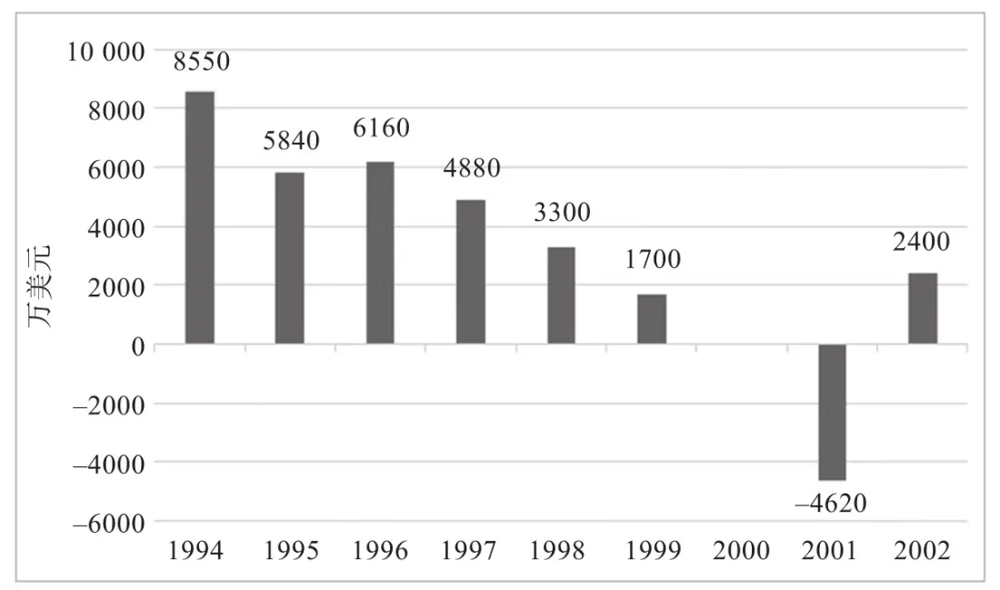

图6\-1 伯克希尔制鞋业务板块的税前盈利

注：1\. 数据来源于历年致股东的信。2000年数据信中未提供。

2\. 1992年，布朗鞋业收购了Lowell鞋业，业绩并入布朗鞋业。

在经历了Dexter鞋业的投资错误之后，巴菲特对于通过换股（用伯克希尔的股票去收购一家公司）去收购一家公司非常谨慎。如果收购来的资产盈利能力不及预期，那就相当于拿自己盈利能力高的生意（伯克希尔），去换取盈利能力低甚至亏损的生意。

__6\.5 Tesco公司（2006）__

2006年，巴菲特开始买入全球三大零售企业之一的英国超市零售商Tesco的股票。当初买入Tesco的理由应该和买入沃尔玛超市股票的理由差不多——是世界性的超市零售商，具有低成本供应链优势。根据2006年底的数据，买入2\.9%的Tesco股份，巴菲特花费了13\.4亿美元。

在随后的几年中，巴菲特对Tesco的持股数量变化不大。直到2012年，他才再次大幅增仓Tesco，将持股比例提高到5\.2%，持仓成本为23\.5亿美元。

然而随后的事态变化超出了巴菲特的预料——管理层出了大问题。2013年开始，公司就被财务造假的丑闻缠身，并且在海外市场的扩张折戟沉沙。公司的股价开始暴跌，2013～2014年，股价下跌了50%。

巴菲特只能认栽，于2014年清仓了Tesco的股票。这笔投资巴菲特总共投入资金23\.5亿美元，最终亏损（税后）4\.44亿美元（见表6\-1）。

表6\-1 伯克希尔对Tesco的持股变化

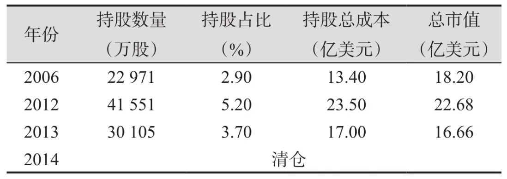

资料来源：巴菲特历年致股东的信。

在2014年致股东的信中，巴菲特反省道：

细心的读者可能会注意到，Tesco去年还出现在我们最大的普通股持股列表中，但今年已经从列表上消失了。作为一个细心的投资者，我不得不尴尬地向大家报告，稍早时我们已售出Tesco的股票。由于我的懒散，在这笔投资上我犯了一个巨大的错误。

2012年底，我们拥有4\.15亿股Tesco的股票，当时和现在Tesco都是英国领先的食品零售商，在其他国家也是重要的零售商。我们这一投资的成本是23亿美元，与这些股票的市值差不多。

2013年，我对Tesco当时的管理层略感失望，因此出售了1\.14亿股，获得了4300万美元的盈利。我慢吞吞的卖出方式最后被证明代价高昂。查理将这类行为称为“吮大拇指”症。

2014年，Tesco的问题与日俱增。公司市值缩水，利润率萎缩，财务丑闻缠身。在商业世界，坏消息经常是接踵而至的，当你在厨房发现一只蟑螂时，实际上厨房已经有了一群蟑螂。

我们在去年卖光了Tesco的股票，现在已没有任何持仓。（我们要指出的是，这家公司已聘用了新的管理层，我们希望他们一切顺利）。我们这笔投资的税后亏损是4\.44亿美元，相当于伯克希尔净值的0\.2%。过去50年中，我们仅有一次投资实现亏损达到我们净值2%的水平。另外有两次，我们经历了相当于净值1%的投资损失。所有的三次大亏损都发生在1974～1975年，当时我们以非常低的价格出售股票，是为了换钱购买那些我们认为更便宜的股票。

对于Tesco股票的投资，巴菲特最难过的不是对公司看走眼（当然这点也很令人难过，毕竟地球上没几个人能亏得起4\.44亿美元），而是在2013年已经发现Tesco出现问题的苗头时，没有下决心全部退出。实际上，如果在2013年全部退出，还能略有盈利（当年卖出了小部分，实现了4300万美元的盈利）。这种犹豫不决，就是芒格常常批评巴菲特的“吮大拇指”症：一边吮着大拇指，一边什么事也不干，不做决策。芒格提到的这种症状，在持股公司经营出现恶化，或是看到一家好公司却一直犹豫而没有下手时，巴菲特都曾多次出现过。芒格的投资风格是，当发现公司的表现与当初预想的差异较大时，会毫不犹豫地快刀斩乱麻。

另外，当一家公司经营出现一个问题时，往往背后隐藏了10个问题。这就是巴菲特说的，当你在厨房发现一只蟑螂时，实际上厨房已经有了一群蟑螂。

不过话说回来，真到实际投资时，这到底是公司经营层面恶化，并且无法扭转甚至由盛转衰，还是一家伟大公司发展过程中的小插曲，往往很难区分，需要丰富的投资阅历和火眼金睛。

现在我们回顾2014年巴菲特清仓Tesco后Tesco公司的业绩表现会发现，当初巴菲特清仓卖出是正确的（见表6\-2和图6\-2）。

▼表6\-2 Tesco公司历年经营业绩（2012～2024年）

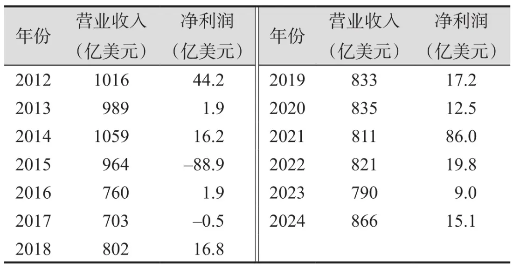

▲资料来源：Wind。

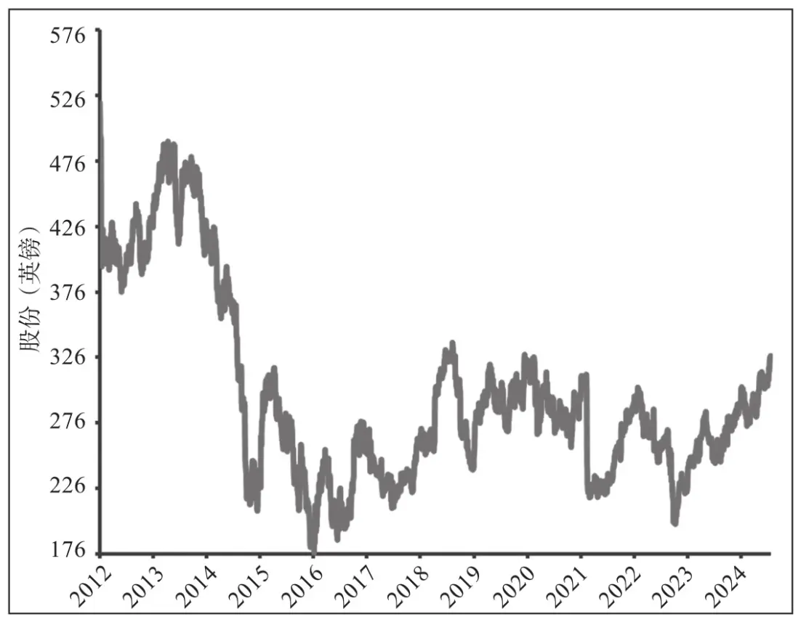

▲图6\-2 Tesco股价（前复权）走势（2012～2024年）

资料来源：Wind。

__6\.6 康菲石油（2006）__

2006年，巴菲特首次买入康菲石油（ConocoPhillips，股票代码：COP），当年持股1794万股，成本为10\.67亿美元。随着石油价格的不断上涨，巴菲特有了更足的信心，于是在2008年石油价格处于高点的时候，大举加仓康菲石油，增持了约7000万股，总共耗资70亿美元。

然而，随着美国金融危机的爆发，原油价格从100多美元每桶跌至最低40美元每桶以下。康菲石油的股价也一落千丈，从最高的90多美元跌至40美元以下。2009年巴菲特卖出了康菲石油的大部分股份，亏损了26亿美元。

在2009年致股东的信中，巴菲特点评这笔交易道：

此前我提到过，去年我犯了一个严重的投资错误（可能还有很多，只是这笔暴露出来了而已）。没有查理或任何其他人的催促，在油价和天然气价格接近最高点时，我购买了大量康菲石油公司的股票。我没能预计到2008年下半年能源价格的戏剧性下跌。我仍然认为未来石油价格会比现在的40～50美元高得多，但是到目前为止我错得离谱。即使石油价格回升，我选择买入的时机也让伯克希尔耗费了数十亿美元。

可见，对于周期性股票，在商品价格高点买入（意味着公司盈利高点），是非常冒险的一件事。即使你接受被套牢后忍住不卖，也许多年后能够解套，但被占用的资金的使用效率将大打折扣。

如果我们回过头来看，截止到2024年5月底，康菲石油的股价（前复权）自2020年以来上涨迅速。2009年最低点时股价（前复权）为20美元，直到2020年10月底，股价也才仅仅26美元（如果从2009年持股到这时，收益率低得可怜），不过自2020年底开始，康菲石油股价暴涨（受益于石油价格上涨），涨至2024年5月底的134美元（见图6\-3）。但十几年前谁能想到会出现新冠疫情、俄乌冲突等黑天鹅呢？

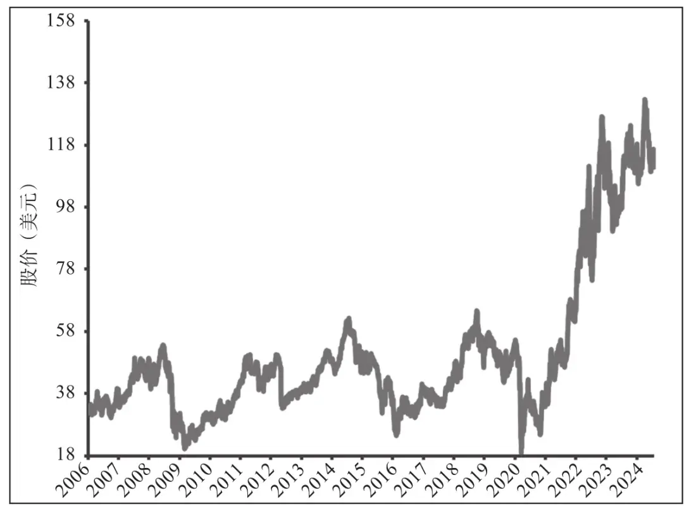

图6\-3 康菲石油股价（前复权）走势（2006～2024年）

资料来源：Wind。

话说回来，巴菲特对石油股情有独钟：2002年对中国石油的投资（大幅盈利退出），2022年对西方石油（OXY）、雪佛龙（CVX）的大举投资，都证明了这点。

__6\.7 卡夫亨氏（2015）__

卡夫亨氏食品公司（简称卡夫亨氏）是巴菲特投入巨资收购的一家公司。2015年，在3G资本和巴菲特的撮合下，亨氏食品收购了卡夫食品，合并成卡夫亨氏，一跃成为世界级的食品巨头。在2013年，巴菲特就联手3G资本收购了亨氏食品，伯克希尔占股50%。同时，在合并前，伯克希尔本身还持有卡夫食品的一部分股份。

2015年，亨氏食品以525亿美元的天价收购了卡夫食品。伯克希尔拥有合并后的卡夫亨氏食品公司约27%的股份，而新公司成为每年约270亿美元销售额的食品巨头。

不过，这桩生意并没有为巴菲特带来收益。合并后的卡夫亨氏，面临着激烈的市场竞争，同时还面临成本的上升，因此合并后的公司成长能力有限。

2019年2月下旬，卡夫亨氏公布了2018年的业绩，并公告对旗下卡夫（Kraft）和Oscar Mayer两个知名品牌进行了高达154亿美元的大笔商誉减值。消息出来后，卡夫亨氏股价当天下跌了27\.5%（见图6\-4）。

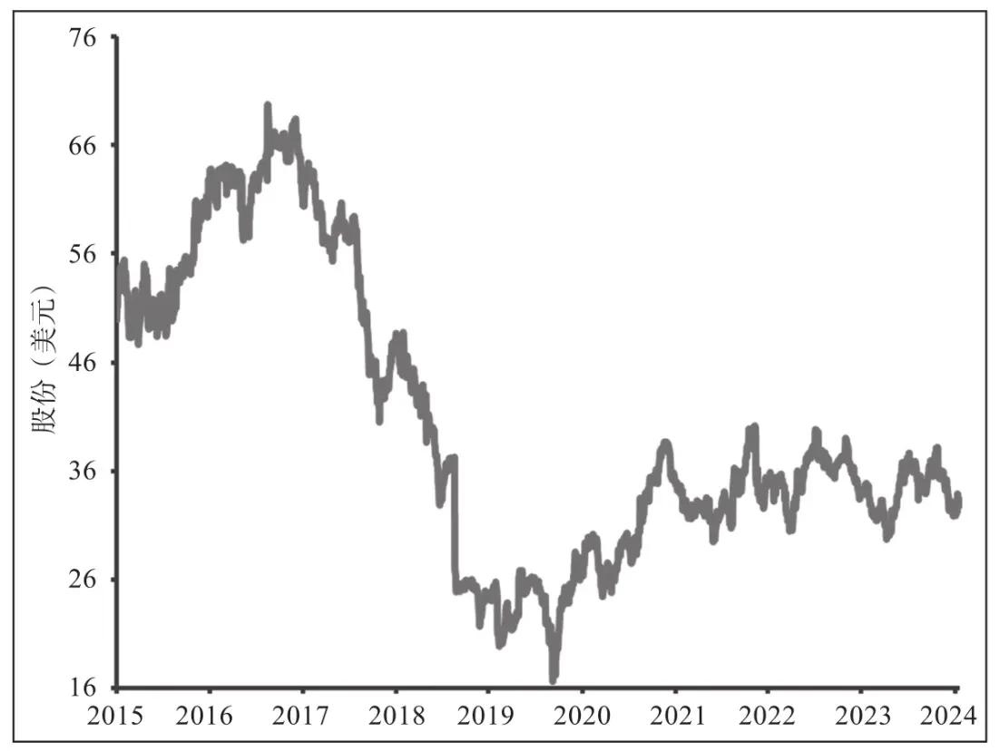

图6\-4 卡夫亨氏股价（前复权）走势（2015～2024年）

资料来源：Wind。

巴菲特在2019年的股东大会上，说到了卡夫亨氏食品公司。

我们在卡夫亨氏的卡夫食品（被收购的公司）上支付了太多的金额。两者的合并确实让经营效率提升了很多，但我们还是支付得太多，我们付出了500多亿美元。当你买得太贵时，任何投资都会变成一笔坏投资。

由此可见，再好的公司，买得太贵，都没什么好结局。安全边际不是嘴上说说而已。

__6\.8 派拉蒙全球（2022）__

派拉蒙全球影视公司（PARA\.O，简称派拉蒙）是好莱坞影视巨头之一。新冠疫情期间，派拉蒙的股价坐了一遍过山车，先是从疫情前2019年底的40多美元继续下跌到10美元左右，然后一飞冲天，最高涨到2021年第一季度的100美元以上（未复权），随后股价便持续回落（见图6\-5）。

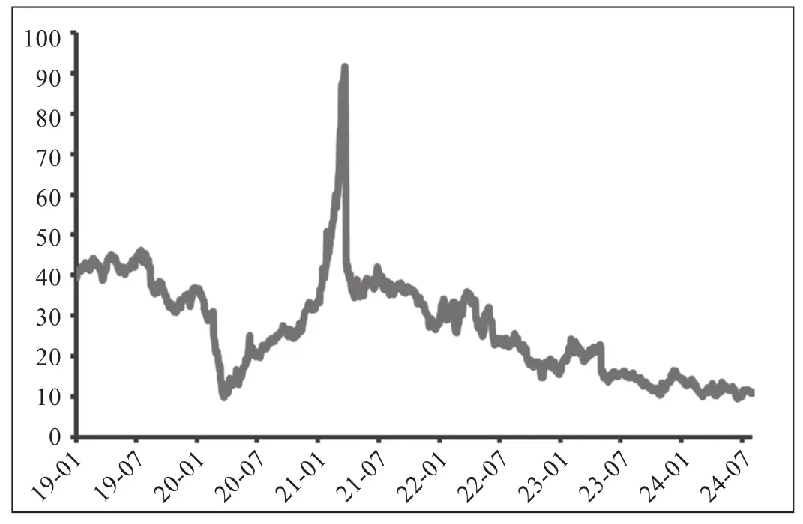

图6\-5 派拉蒙股价（前复权）走势（2019～2024年）

资料来源：Wind。

伯克希尔从2022年第一季度开始，逐步买入派拉蒙，到2022年底，持股接近9400万股，占其上市流通B股的14%，总计耗资约30亿美元。

但派拉蒙的生意在当时仍遭遇不利，控制权斗争、互联网流媒体公司的竞争，都让这家传统影视巨头生存得越发艰难。

股价的持续下跌让巴菲特终于失去了耐心，从2023年第四季度开始清仓派拉蒙。

在2023年伯克希尔的股东大会上，巴菲特亲口承认了投资派拉蒙的错误。他说：“这完全是我的决定，我们已经全部卖掉了，我们损失了不少钱。”并称，这段经历让他更深入地思考人们在空闲时间优先考虑什么。

__6\.9 过早卖出的错误__

过早卖出是投资中最常犯的错误之一。与避免过早卖出相比，更难的是在犯下过早卖出的错误后，能够克服人性的缺点（对自己诚实，承认自己错了），再把它买回来。

巴菲特在这方面犯过的错误不少。

例如，在1994年致股东的信“今日特色错误”中，巴菲特就提到他对资本城的投资，原文如下。

1993年底，我将1000万股资本城股份以每股63美元卖出。不幸的是，到了1994年底，该公司股价变成85\.25美元（我可以直接告诉各位我们损失了2\.225亿美元的差价，如果你心痛到不愿去算的话）。而当我们在1986年以每股17\.25美元买进该公司股份时，我就曾经向各位报告，在更早之前，也就是在1978～1980年，我就以每股4\.3美元的价格卖掉了该公司的股份，并强调对于本人这样的行为感到心痛。没想到现在我又明知故犯，看起来我似乎应该要找个监护人。

在1995年致股东的信中，巴菲特回忆了自己年轻时与GEICO结缘的历史。

我发现在1951年我总共分四次买进GEICO股份，最后一次是在9月26日，这样的做法让我觉得自己很早就有自我沉醉的倾向。印象中我那时是在向别人推销这只股票不成之后，决定自己买入这只股票，尽管当时我已将个人50%以上的身家全都押在这只股票上了。加码之后，我总共持有350股GEICO的股份，成本为10282美元，到了年底，这些股票的市值成了13125美元，超过我个人净值的65%。

……

可惜的是，在1952年我以15259美元的价钱将全部的GEICO股份出清，然后将所得资金投到西方保险证券上。这项变心的举动，一部分原因是西方保险证券当时的股价相当吸引人，市盈率只有一倍左右。然而，在往后的二十年间，当时被我卖掉的GEICO股份的价值却成长到了130万美元，这样的结局让我总结出绝对不能卖掉一家明显的好公司的原则。

当然，后来巴菲特通过伯克希尔弥补了这个遗憾。巴菲特在1976年趁着GEICO陷入濒临破产的困境时，大量买入GEICO股票。到1980年底，总计投入4570万美元收购了GEICO 1/3的股份，并在后续公司股份回购注销中，持股比例被动提高到了50%。1995年，巴菲特终于以23亿美元的代价收购了剩余50%的股份。

这里顺带说一句，GEICO提供的源源不断的浮存金为巴菲特中后期的投资立下了汗马功劳，可谓居功至伟。而1976年巴菲特大量买入GEICO股票时，GEICO就是典型的“困境反转”型公司——只有困境尚无反转。按照巴菲特致股东的信所宣称的，他一般不参与“困境反转”型公司的投资。然而事情并没有绝对，GEICO就是个最好的例子（1964～1966年，巴菲特买入美国运通也是“困境反转”型投资的经典案例）。如果我们学巴菲特的价值投资把自己学傻了，执行机械的教条主义，那才是东施效颦。

__6\.10 那些没投资的公司__

巴菲特说，与那些错误的投资相比，那些明明是好公司，但犹犹豫豫最终没有投资的公司或股票，才是更严重的错误，使他们失去了巨大的财富增值的机会。

因此，他在1989年致股东的信中专门说：

其实有些更严重的错误大家根本就看不到。那是一些明明我很熟悉的股票或公司，却因故没能完成投资。错失一些能力之外的大好机会当然没有罪，但是我白白错过了一些自动送上门，并且我有能力把握的大的投资机会。对于伯克希尔的股东，包括我自己在内，这种“吮大拇指”症所造成的损失是难以估计的。

在1991年致股东的信中，巴菲特又专门提到这种“没有投资”的隐性错误，虽不为外人所知，但造成的损失可一点儿也不小。

通常，我们很多重大的错误不是发生在我们已经做了的部分，而是在我们没有去做的那部分。虽然因为各位看不到这些失误，所以查理和我可以少一点儿难堪，但看不到不代表我们就不必付出代价。这些我公开承认的错误，并不是指我错过了某些革命性的新发明（像是Xerox）、高科技（像是苹果公司）或是更优秀的渠道零售商（像是沃尔玛），我们永远不可能拥有在早期发掘这些优秀公司的能力。我指的是那些查理和我可以很容易就了解，且很明显对我们有吸引力的公司。无奈当时我们只是不断地咬着指甲犹豫不决，就是不能下定决心把它们买下来。

每位作者都知道，让读者了解其意思最好的方式就是举个例子，不过希望我现在举的例子不会过于极端：1988年初，当时我们决定以3\.5亿～4亿美元的价格，买进3000万股的房利美。我们曾经拥有过这家公司的股份，也对其所处的产业相当了解。另外，我们很清楚公司总裁David Maxwell有能力处理他所接下的一堆问题，同时将公司建成一个金融帝国，可说是前景乐观。为此我还特地到华盛顿拜访David，和他确认了如果我们买下很大一部分股权，他不会感到不舒服。

只不过当我们买进不到700万股时，该公司股价就开始上涨。失望之余，我立刻停止买进（事后回想，还好我没有在买进可口可乐时犯下相同的错误）。更为愚蠢的是，我觉得区区700万股对我们来说实在没有太大的意义，所以之后又把持有的700万股全部卖掉了。

我期盼可以给各位我这样不具职业水准的投资行为一个稍微合理一点儿的解释，不过我实在是编不出来。但我倒是可以跟各位报告，本人的这项错误，大概使伯克希尔在1991年少赚了14亿美元。

另外，对于高科技公司的股票，包括互联网科技公司的股票，大部分人以为巴菲特对此不屑一顾，认为这并不是他所喜欢的业务。

实际上，并不是。

巴菲特和芒格在多个场合表达了对错失谷歌公司股票的痛心。谷歌的搜索业务，他们是懂的，只不过囿于惯有的思维习惯，一次又一次错失谷歌（市场给了他们多次机会）。

在一次雅虎财经对巴菲特的采访中，巴菲特说道：“我应该肯定是要投资谷歌的（实际上没有）。创始人团队在上市前跟我聊过，伯克希尔旗下的GEICO也在谷歌搜索投放广告，效果非常好，我自己也用谷歌的搜索引擎。我总是晚到一步。”

在2019年的股东大会上，芒格和巴菲特又一次提到错失谷歌。芒格说，他们的年纪都有些大了，不是最会变通的那群人，所以当互联网这样革命性的事物出现时，没有抓住它，那么其他人就会超过他们。亚马逊的贝佐斯是个“魔法师”，能把亚马逊带到今天这个规模，让人不可思议，所以错失亚马逊没什么好说的。但是错失谷歌确实不可原谅。

巴菲特继续补充到，我们确实搞砸了，我们对谷歌的业务是比较熟悉的。旗下的GEICO就在谷歌上做广告，按点击付费，效果不错。而这对于谷歌来说，边际成本为零。

又一次，巴菲特犯了“吮大拇指”症。

难怪在2014年纪念伯克希尔成立50周年的致股东的信中，附上了芒格对伯克希尔过去及未来的思索，芒格说道：

-
1. 指的是买卖有点儿频繁。

在巴菲特的领导下，伯克希尔犯了哪些重大错误？好吧，虽然佣金错误很常见

，但几乎所有的巨大错误都是没有购买，包括没有购买沃尔玛的股票，这肯定是笔好买卖。错过的错误非常重要。如果伯克希尔抓住了几个大机会，其净资产至少要比现在高出500亿美元。伯克希尔还不够聪明，无法识别这种几乎确定性的大机会。

同样在2019年，巴菲特提到旗下其中一位投资经理买入了亚马逊。他认为是不是价值投资，并不取决于你买的是什么行业。当投资经理买入亚马逊时，他同样遵循了价值投资原则，考虑了公司的当前盈利能力和指标、未来现金流以及折现。

文章写至此，我不得不感叹，巴菲特和芒格对自己极度诚实，才是他们成功的一个关键因素。有的投资者在欺骗别人的同时，还在欺骗自己，真是愚不可及。什么时候想明白了投资中要“对自己100%诚实”，价值投资才算是入了门。

## 投资中的错误心理

__第7章__

__投资中的错误心理__

__7\.1 从众心理__

投资中最常犯的错误就是产生从众心理。“别人这么做，所以我也这么做”会付出最昂贵的代价。这种随大流的方法（比如市场追捧什么股票，你也跟风买什么股票），最大的获益可能只有你的心理层面，这让你不感到孤单，仿佛你的股票是投资大咖认证过的，就能保证赚钱了。即使出现了投资亏损，你也会安慰自己说，大家都亏了，我亏点儿钱也很正常。

除此之外，这种“别人这么做，所以我也这么做”的方法有百害而无一利。最受伤的当然是你的股票账户——钱不会帮你说谎，亏掉了就是亏掉了。不管是投资股票还是经营企业，产生这种从众心理是最常犯的错误，也是危害极大的。

巴菲特在提到保险公司为什么竞争激烈、生存困难时，就特意提到了这种从众心理所带来的伤害。例如在2010年致股东的信中，巴菲特写到经营保险公司需要恪守的四条准则。

实际上，保险业务的健康运营需要遵循四条准则：①明白任何一项风险暴露都可能造成保险损失；②保守地估计所有风险暴露造成损失的可能性以及可能的损失成本；③一般来讲，在扣除未来损失和运营费用之后，保费的设定要确保能够实现承保利润；④如果不能获得合理的保费就放弃这项业务。

许多保险公司通过了前三条准则的考验，却在第四条上不及格。华尔街的急功近利、代理商和经纪人带来的压力，或者是雄心勃勃的首席执行官不肯让业务规模缩水，导致许多保险公司以低价承揽业务。“别人这么做，所以我们也必须这么做”，这种想法让许多企业身陷困境，保险行业尤其如此。

不跟风，说起来容易，做起来却非常难。难在拒绝短期利益的诱惑，坚守常识。就上面保险公司的经营来说，赔本卖保单，当然是不对的，不过谁又能拒绝短期承保业绩提升带来的诱惑呢？先做了再说，后面的麻烦后面再说。曾经的美国车险明星公司GEICO就是这个原因导致其在20世纪70年代衰落，甚至一度濒临破产。

股票投资也是如此，市场上的热门股票，大家都在疯狂买入，并且都赚了钱。如果你觉得价格过高或者公司基本面不行，能否拒绝诱惑？这相当考验你的定力，以及你对财富的态度。

在独立思考方面，有些人会犯和产生从众心理一样的错误，只不过是另一种表现形式而已——总是逆向思考，逆向行事，仿佛只要和大众反着干，自己就是独立思考，就是价值投资。巴菲特在1990年致股东的信中就批评了这种思维方式。

当然，以上所述并不代表不受欢迎的股票或企业就是好的投资标的，反向操作与从众一样愚蠢。投资所需要的是独立思考而不是投票表决。不幸的是，罗素对于生活的观察同样适用于金融世界：“大多数人宁愿去死也不愿意思考！”

所以什么是独立思考呢？基于事实、逻辑的客观分析，才是独立思考。人云亦云，或者始终反向操作，都是从众的表现。

当然，独立思考并非没有代价。这意味着你可能成为少数派，暂时得不到别人的赞扬和认同。但是，你投资的初心是赚钱，还是让别人夸你？正如巴菲特在2008年致股东的信中所说：

投资的目的不是得到别人的认同。事实上，追求认同是无益的，因为它束缚你的思维，让你的大脑开放度下降，不会对早前形成的结论进行反思。谨防那些让人喝彩的投资行为；伟大的行动通常都会让人听起来昏昏欲睡。

在股票投资上，如果你不能独立思考，要么就别玩股票，要么听从巴菲特的建议，直接买指数基金就好了。

毕竟，正确的路，往往是崎岖且人烟稀少的。

__7\.2 犹豫不决__

犹豫不决是投资中最常犯的错误，主要有两种表现形式：①当决策错误，买入了错误的股票或企业时，往往出于对沉没成本的怜惜，或是仅看到了短期的希望，就犹豫不决，没有卖出错误的股票或企业，甚至变本加厉投入更多的资金，试图挽救糟糕的生意。②在面对重大的投资机会时，踌躇不前，犹犹豫豫，长时间发呆什么也不做，即芒格经常说的“吮大拇指”症。

段永平曾说，发现错了马上改，无论多大的代价，都是最小的代价。

不过对于很多人来说，承认错误并不容易，尤其是在股票被套牢的情况下，这时人们总想着回本。不过，这里面提到的错误，并不是股价下跌，股价下跌从来不能证明投资错误，反而对于优质企业来说，股价越跌机会越大。投资错误指的是你对所投资公司（股票）业务的理解或是估值出现了偏差，企业的经营基本面根本不是你预想的那样，或者它根本不符合那么高的估值。

巴菲特在这方面可没少吃亏。

伯克希尔\-哈撒韦纺织厂肯定是这方面的“杰出代表”。

1965年，巴菲特因为赌气而买下伯克希尔\-哈撒韦纺织厂后（原本他可以获利后全身而退），对纺织业务心存幻想。毕竟，按照清算价值计算，伯克希尔有利可图。然而当他接手伯克希尔后，就完全不是那么回事了。考虑到对当地就业的影响，企业不能随意裁员。在1969年底巴菲特写给合伙人的信里，巴菲特提到。

纺织业务为1100名员工提供就业岗位，管理层非常努力地争取比同行做得更好。只要它的业绩还过得去，而且不必继续投入大量资本，我就不想清算。我不想为了年化收益率能高几个百分点，就去面对严重的人员混乱。如果我们不得不继续投入巨额资本，或者纺织业务一直亏损，我可能会做出不一样的决定，不过我暂时不考虑这个选项。

也就是说，即使觉得陷入纺织业务并非他本意，也不想纠缠，但是一方面要考虑当地就业，另一方面只要不新增资本投入，他就能忍受持续经营下去。于是，这一决定让巴菲特此后投入了大量的精力和资本，产出却非常微薄，直至1985年彻底关闭了纺织业务（足足拖延了20年）。

更为令人痛心的是，伯克希尔在1975年居然又收购了一家叫Waumbec Mills的纺织厂，企图形成所谓的“协同效应”。然而，本土纺织行业已经江河日下（受到亚洲国家的冲击），再采取添油战术，只会损失更多。难怪巴菲特在2015年致股东的信中写道：

再忏悔一件事，然后我就会进入更加让人开心的话题。你相信吗，在1975年，我买了Waumbec Mills公司——另一家新英格兰地区的纺织企业。当然，这次购买的价格，是个“便宜货”的价格。之所以说是个“便宜货”的价格，是基于我们获得的资产，和它与伯克希尔现存纺织业务产生的协同效应。然而，意外地，Waumbec纺织厂是一个灾难，因为工厂几年后就被关闭了。

伯克希尔对通用再保险公司的收购也曾犯过类似的错误。总体来说，收购通用再保险公司是一次比较成功的收购，极大地增加了伯克希尔能够动用的浮存金。不过，在收购通用再保险公司时，其中一块业务是一个隐患，那就是衍生品交易。巴菲特和芒格都知道复杂衍生品的潜在危害，因此在1998年收购通用再保险公司时，决定关闭衍生品交易部门。但实际执行过程却犹犹豫豫耗费了好些年，最终造成了数亿美元的损失。所以在2005年致股东的信中，巴菲特回顾这一历程时说道：

在收购通用再保险公司时，查理和我都知道这是一个麻烦，并且告诉这家公司的管理层，我们想退出这项业务。督促退出这项业务是我的责任，然而我并没有立刻解决掉这个问题，反而是浪费了好几年时间去尝试出售这个部门。这是一次注定要失败的努力，因为任何现实的解决办法都无法使我们摆脱将存在数十年的债务迷宫。我们所承担的义务尤其令人担忧，因为它们爆雷的可能性无法被衡量。此外，如果发生严重问题，我们知道它可能与金融市场上的其他问题发生连锁反应。

所以，我想毫发无损地脱身的努力以失败告终，与此同时，我们还开展了更多的交易，都怪我优柔寡断犯下大错（芒格称之为“吮大拇指”症）。不管是生活中还是商业中，当一个问题出现时，行动的最佳时机就是现在。

让我们记住巴菲特痛彻心扉的格言：“不管是生活中还是商业中，当一个问题出现时，行动的最佳时机就是现在。”

股票投资当如是。

沉没成本确实让人沮丧且不甘心。就像你在寒风中等了半个小时的公交车都还没等来时，离开是要下决心的。在投资上，让我们谨记巴菲特的名言：“当你发现自己深陷坑里，最重要的一件事就是不要再往下挖了。”

怎么解决这种犹豫不决造成的拖延症？巴菲特曾说，不管是做生意还是投资，往往不可避免地会犯错误，而聪明的人能从中吸取教训，当然，教训如果是从别人身上学来的更好（这样就不必亲自犯错误）。若过去一直习惯犯错误而不知悔改，那么未来还会继续犯错。

拖延症的另外一个表现就是，面对绝好的投资机会时，犹豫不决，导致看着机会白白溜走。巴菲特和芒格都曾说，在他们一辈子的投资生涯中，犯过最大的错误并不是那些失败的投资，而是那些明明他们很了解，却出于各种原因没有投资的重大机会（如谷歌、沃尔玛、亚马逊、房利美、医药股等，名单太长列不下，我相信巴菲特会原谅我的）。

不过，如果确实错过了重大投资机会，也不必过于自责。彼得·林奇曾说过，你不会因为错失一个投资机会而损失任何钱；反而有些人因为害怕错过所谓的“重大投资机会”而遭受了重大损失。投资中，机会有很多，失去了一个，抓住下一个就是了。没有人能够抓住所有的机会，一辈子抓住几个重大机会，就足矣。

__7\.3 痴迷调研__

在股票投资中，一个非常自然的想法是，我花在调研上的时间越多，看过的企业或项目越多，我的投资能力就越强。

必需的调研当然是有益的，但如果你把调研勤奋度和投资能力挂钩，甚至画上等号的话，那这个世界上投资能力最强的人，一定是那些出差最频繁、差旅报销费用最高的人。

我们来看看巴菲特是怎么做的。

在1968年致合伙人的信中，巴菲特提到了巴菲特合伙人公司历年的费用支出，说道：

1962年1月1日，我们将之前的所有有限合伙人账户整合到一起。我不用在家办公了，我还聘请了第一位全职员工，当时的净资产是7178500美元。从那时起，我们的净资产增长到现在的104429431美元，员工只增加了一人。1963年（净资产为9405400美元），房租从3947美元涨到5823美元（要是我签订了按管理资产规模收取一定比例的租约，Ben Rosner肯定不会原谅我），差旅费从3206美元增加到3603美元，会员费和订阅费从900美元增长到994美元。帕金森定律（Parkinson’s Laws）中的某一条或许在我们这儿也有效，好在我们还没出现失控的局面。

1962年，巴菲特合伙人公司管理的净资产已达718万美元（这在当时是一笔巨大的财富），而这一数字到1968年已经达到了约1\.04亿美元（惊人的规模），增长到原来的14\.5倍。但是差旅费用只从3206美元增长到可怜的3603美元，几乎没有增长。按普通人的理解，出差调研的频率不是应该大幅增加吗？

事实上，调研能解决信息获取的问题，但不能解决投资中的所有问题。尤其是投资中的核心问题，并不能通过单纯的调研解决。在信息获取更为便捷快速的今天，如果不是依靠内部消息，单纯依靠信息差赚钱，是难上加难。

巴菲特1998年在佛罗里达大学的演讲中说：“思考投资的最佳方法，是独自一人待在房间里静静地想。要是这样不行，别的方法也不管用。”

在收购企业时，巴菲特也是如此行事。有些企业即使在收购后，巴菲特都从未去过被收购公司总部。

1986年，伯克希尔完成收购Fechheimer制服销售公司后，在当年致股东的信中巴菲特就说道：

说来你可能不敢相信，事实上，查理与我甚至从未去过Fechheimer位于辛辛那提的企业总部视察它的运营情况。（另外，还有像帮我们经营喜诗糖果十五年之久的Chuck Huggins，也从未来过奥马哈。）若是我们的成功建立在不停地视察工厂上，伯克希尔早就遇到大麻烦了。相反，在考虑收购时，我们尝试评估这笔生意的经济价值——它的竞争优劣势，以及管理层人员的能力。

调研能解决信息获取的问题，但并不能解决投资中的核心问题：对公司盈利特质的分析。

__7\.4 频繁交易__

在体育竞技中，顶尖高手几乎没有多余动作，每一个动作都恰到好处。为什么？因为多余动作白白浪费体力，毫无用处。

不过在股票投资中，“什么也不做”比“做点儿什么”要难得多，尤其是手上有富余资金的时候。

股票交易所每个工作日都开门，挂牌的每只股票都在活跃交易。每天看着大量股票红红绿绿、涨涨跌跌，很少有人能够忍住不动。大家总想做点儿什么，仿佛这样就能显得自己在参与这个市场，在努力跟上市场行情，也在很努力地投资。

但是，钱不会陪你演戏。

其实，在价值投资者的眼中，交易中的买和卖只是事先对公司进行大量细致研究后的一个操作而已。难道经过几个月甚至几年的跟踪研究，在你买入后，股票价格下跌，立刻就能改变你对这家公司的认知和看法吗？

巴菲特在1998年佛罗里达大学的演讲中，有一位听众问了他一个问题：“和身处华尔街相比，住在偏远的小城市（指奥马哈）有什么好处？”

巴菲特回答道：

我在华尔街工作过一两年，我在东西海岸都有朋友。我喜欢拜访他们。每次和他们见面，我都能得到一些灵感。

思考投资的最佳方法，是独自一人待在房间里静静地想。要是这样不行，别的方法也不管用。

在任何类似市场的环境中，你都很容易受到影响，做出过激的反应，华尔街是个典型的市场环境。在华尔街，你觉得每天不做点儿什么都不行。钱德勒家族花了2000美元买下了可口可乐公司。选中可口可乐这样的公司，别的什么都不用做了，该做的事就是什么也不做，1919年都不应该卖，但是钱德勒家族后来把他们的股票卖了。

你该怎么做呢？一年找到一个好的投资机会，然后一直持有，等待它的潜力充分释放出来。在一个人们每五分钟就来回喊报价的环境里，在一个别人总把各种报告塞到你面前的环境里，很难做到持有不动。

华尔街靠折腾赚钱，你靠不折腾赚钱。

要是在座的各位每天都相互交易自己的投资组合，所有人最后都会破产，所有的钱最后都会进到中间商的口袋里。换个做法，你们都持有一般公司组成的投资组合，50年里你们都一动不动，最后你们都会很有钱，你们的券商会破产。

券商就像这样一个医生，他让你换药的次数越多，他赚得越多。他要是给你一种药，把你的病根治了，他只能做成一笔买卖，一笔交易，然后就没了。如果他能让你相信每天换各种药吃对健康有益，那么这对他有好处，对卖药的有好处，你却会亏很多钱。你的身体好不了，还会破财。任何刺激你瞎折腾的环境都要远离。华尔街无疑就是这样的环境。

我回到奥马哈之后，每半年都去大城市一次。我每次都列一个清单，把自己要做的事写下来，比如要调研的公司等。这些路费都没白花，该做的事都做完了，我就回到奥马哈思考。

这其中的关键，就是如何看待手上的股票。如果你认为买股票就是买公司，买的是一门生意，那么这门生意的好坏，是不可能一天天地跟着股价来回变的。然而，很多闲不住的人，他们并不在乎买的是什么生意，他们本质买的是看涨，至于是卖家电的，是卖石油的，还是卖软件的，他们根本不在乎。他们在乎的是，今天买入的，明后天要涨。

当然，这并不代表价值投资等同于长期持股不动。公司基本面发生重大变化，或股价出现明显的高估，都是充足的卖出理由。

关于不要有多余动作，只在情况最有利的时候出手的投资理念，巴菲特有过非常精彩的类比，那就是美国棒球明星泰德·威廉姆斯（Ted Williams）如何击球的故事。

在1997年致股东的信中，巴菲特专门提到了泰德如何选择性地击球，以提高击球成功率，并入选棒球名人堂的故事。

泰德在《击打的科学》一书提到，他把击打区域划分为77个小方格，每个方格就大约一个棒球的大小。只有当球进入最理想的小方格中时，他才挥棒击打。因为他知道只有这样做，才能维持40%的超高命中率，反之要是勉强去挥击较差的方格，将会使他的击打成功率骤降到23%（见图7\-1）。换句话说，只有耐心等待好球，才是通往名人堂的通道，而无差别击打的人，迟早会被降到小联盟。

为了每天提醒自己不要轻易出手，以免多余动作太多，巴菲特还把泰德·威廉姆斯的击球照片及最佳击打区域图放在自己的办公区域，时时警醒自己。

除此之外，巴菲特还做过别的类似的比喻，就是我们熟知的“20个打孔位”。“我可以给你一张只有20个打孔位的卡片，这样你就可以在上面打20个孔——代表你一生中能做的所有投资，一旦你在这张卡片上打满了20个孔，你就不能再进行任何投资了。”

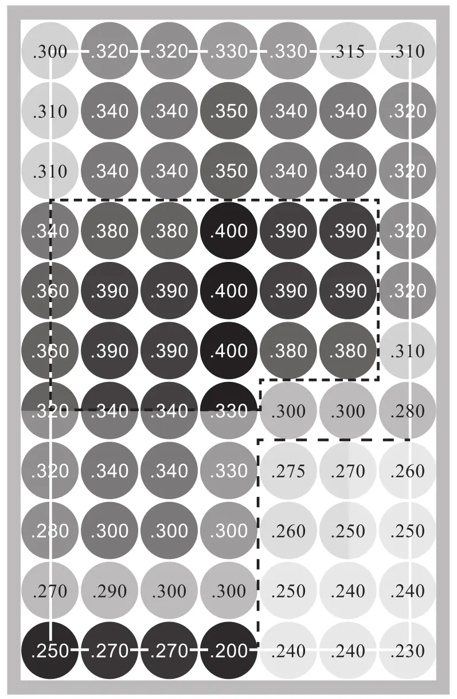

图7\-1 泰德·威廉姆斯的棒球最佳击打区域

巴菲特和芒格也是这么做的。在1993年致股东的信中他就说：“查理和我很早就觉得，在一个人的投资生涯中，做出上百个明智的投资决策是非常艰巨的。这种想法随着伯克希尔资金规模日益扩大而日趋明显。放眼投资世界，可以大幅影响本公司投资成效的机会已越来越少。因此我们决定采取一种只要求自己在少数时候足够明智，而不是每次都要非常明智的方法。我们现在只要求每年出现一次好的投资主意就可以了。”

在2023年致股东的信中，巴菲特提到长期持有可口可乐和美国运通股票的经验时，说道：

我们从持有可口可乐和美国运通的股票中学到的是，当你找到一家真正出色的企业时，请坚持下去。耐心是有回报的，一笔出色的生意可以抵消许多不可避免的平庸决策。

记住，很多时候，安静地坐在那儿喝杯咖啡，比干什么都强（巴菲特说这叫树懒式投资）。

__7\.5 高价买入__

很多人都知道，中后期的巴菲特崇尚以合理价格买入优秀的公司。至于什么是“合理”价格，可谓见仁见智。有些投资者就放松了对买入价格的要求，追求伟大的公司，而忽视了对估值的约束，仿佛只要买入了伟大的公司，就可以坐等收钱，享受财富自由。

怎么可能呢？

一个高昂的代价，会毁了一笔原本伟大的投资。

巴菲特在多个场合不止一次地说过这个观点。

在1980年致股东的信中，巴菲特就说道：“股票的买入价格过高，能极大地抵消掉这家公司未来十年的盈利积累所带来的好处。”

巴菲特自己就吃过这方面的亏。例如在2015年，伯克希尔控制的亨氏食品以525亿美元的天价收购了卡夫食品。伯克希尔拥有合并后的卡夫亨氏食品公司约27%的股份，新公司成为每年约270亿美元销售额的食品巨头。

但这笔投资由于对卡夫食品的收购价过高，并未带来想象中的成功。

巴菲特在2019年的股东大会上，说到了卡夫亨氏食品公司。

我们在卡夫亨氏的卡夫食品（被收购的公司）上支付了太多的金额。两者的合并确实让经营效率提升了很多，但我们还是支付得太多，我们付出了500多亿美元。当你买得太贵时，任何投资都会变成一笔坏投资。

由此可见，再好的公司，买得太贵，都没什么好结局。安全边际不是嘴上说说而已。

__7\.6 懂得多才能赚得多__

当我们看到知名卖方分析师在会议上或屏幕前侃侃而谈，从国际环境到国内宏观经济，再到行业政策等时，经常不禁为他们丰富的知识储备所震撼，似乎他们上知天文，下知地理。尤其是看到有些股票分析师在屏幕前口若悬河，几乎对市场上所有的东西都了如指掌时，一般人很容易产生这样的误解——要想自己的投资业绩出色，需要懂得非常多才行，而且还要紧盯每一分每一秒的市场动向。

这可能是对投资（不管是全职还是业余爱好）最大的误解。

巴菲特在1998年佛罗里达大学的演讲里提及，每个人都要清楚自己的投资能力圈，他说道：“每个人都有自己的能力圈，重要的不是能力圈有多大，而是待在能力圈的范围之内。如果主板中有几千家公司，你的能力圈只涵盖其中的30家，只要你清楚是哪30家，就可以了。”

懂得多当然不会成为股票投资的劣势（应该说是有益的），但重要的是懂得深。懂得又多又深当然是更完美的，但每个人的精力都有限，能力圈也有限，如果只能取其一的话，毫不犹豫当然是要懂得深。

如何构建自己的能力圈？自己所从事的行业，一定是自己最熟悉的，这就是自己的首要能力圈。除此之外，随着你对上市公司的不断深入研究，你会逐步对某些行业有了深入的认识。随着时间的推移，你对这几个行业的深入理解，就成为你的能力圈。巴菲特在20多岁时，所能理解的行业肯定是极其有限的，但经年累月的长期研究，他逐步拓展了自己的能力圈。

有时候，有的生意或者公司，你花上很长时间都搞不懂，那很可能它就不是你的能力圈，放弃就是明智的选择。巴菲特在1998年佛罗里达大学的演讲中就提到：

一门生意，要是你不能一眼看懂，再花一两个月的时间，你还是看不懂。要看懂一门生意，必须有足够的背景知识才行，而且要清楚自己知道什么，不知道什么，这是关键。我常说的能力圈就是这个意思，要清楚自己的能力圈。

在2013年致股东的信中，巴菲特又举了两个他实际参与投资的例子，以此来说明，把投资做好，并不需要什么超人的智商和渊博的知识。

-
1. 1英亩=4046\.856平方米。

第一个例子是他在1986年买下了奥马哈一个400英亩

的农场，花费28万美元。起因是1973～1981年中西部农场的价格暴涨，后来泡沫破裂，农场价格下跌超过50%。巴菲特的一个儿子喜欢经营农场，但巴菲特对经营农场一窍不通，不过，他还是从他儿子那儿知道了大豆和玉米的产量，以及运营的成本。根据这些数据，他估计投资农场的正常回报约为10%，并且，未来农作物产量会逐步提高，价格也会上涨。到2013年，28年过去了，农场的利润涨到1986年的3倍，农场的价格是当初购入价格的5倍以上。但巴菲特到现在都对农场经营一窍不通，并且几乎没去过这个农场。

-
1. 1平方英尺≈0\.093平方米。

第二个例子是1993年巴菲特对纽约大学旁边一个房地产的投资。当时这个小型零售物业的所有权属于RTC（Resolution Trust Corp），但RTC由于经营不当被迫出售这个物业。巴菲特做了个简单分析：这个物业当时无杠杆的回报率大约是10%，如果把空闲的地方租出去，回报率还能再提高一点儿。更重要的是，它最大的租客大约租了其中20%的面积，并且仅仅支付了每平方英尺

5美元的租金，而其他租客支付的租金是70美元每平方英尺。9年后，这位最大租客合约到期后，再续约的租金就可以得到很大的提升，而且这个物业的位置非常理想——纽约大学肯定不会搬走。

所以，巴菲特和几个朋友一起买下了这个物业。旧的租约到期后，利润涨到了3倍。到2013年，该物业每年的租金收益超过1993年投资本金的35%。同样地，巴菲特也从未去现场看过这个物业。

巴菲特之所以在信中举这两个例子是想说明，你并不需要成为专家，或是拥有超强的数学计算能力，只要在自己的能力圈内，坚守简单的常识，就能获得令人满意的投资收益。对此，巴菲特最后总结了6条规律。

·获取满意的投资回报并不需要成为专家。当然如果你不是专家，那就要认识自己的能力圈，并遵从一个行之有效的办法。保持简单，不要急功近利。当有人承诺让你赚笔快钱时，立即答复“不行”。

·把关注点放在你所考虑投资资产的未来产出上。如果你觉得难以估计一项资产的未来盈利，那就忘了它，放弃它。没有人能估计所有项目的投资回报。无所不知也是不需要的，你只需要理解你自己的所作所为就可以。

·如果你关注的是资产未来可能能卖出的价格，那这就是投机。投机没有什么不好，但是我知道我不是总能投机正确，我也质疑那些声称自己可以持续投机成功的人。抛硬币时，第一轮有一半人会赢，但这些赢家如果持续玩下去，是不会有盈利预期的。另外，一项资产近来持续升值绝不是一个买入的理由。

·在两笔投资上，我都只考虑资产的产出，而不是它们每天的估值。最后的赢家是把精力用在球场上的人，而不是紧盯着计分板的人。如果大家周末不看股价的时候可以放轻松，那么试着工作日的时候也这样做。

·总结宏观形势、听信别人的宏观或者市场分析都是浪费时间。实际上，这甚至是危险的，它会模糊大家对真正重要的事实的看法。（每当我听到电视评论员流利地分析着市场的下一步走势，我就会想起Mickey Mantle犀利的评论：“你不坐到直播间里去，都不知道原来棒球比赛这么简单。”）

·我的两笔投资分别在1986年和1993年做出。经济、利率或者股市在下一年（1987年和1994年）会如何发展对两笔投资都没有影响。我已经不记得当时的报纸头条和专家的意见，但是庄稼依旧在内布拉斯加州生长，学生们依旧到纽约大学上学。

我的两笔投资和股票投资有一个重要的区别：股票每分钟都有报价，但是我至今也没有见过农场和纽约大学物业的市场报价。

美国有一位经济学家亨利·考夫曼说过一句经典名言：“破产的有两种人，什么都不知道的人，和什么都知道的人。”至理名言，应引以为戒。

__7\.7 小资金做不好__

有的人在做股票投资时贪多贪大，觉得大资金才好操作，才能占据市场上游，才能指点江山，激扬文字。

恰恰相反，小资金更灵活，有更多的投资机会。当然，有些非上市企业的收购，小资金确实难以介入。但二级股票市场对资金是没有规模限制的。巴菲特就曾说过，宁要优质企业1%的股份，也不要烂企业100%的股份。二级股票市场恰好完美适配小规模资金，对于伯克希尔这样的巨兽来说，真正有价值的机会反而不多。毕竟，它不会为了几百万美元、几千万美元的好的投资主意去下注，因为这对千亿美元规模的资金来说，几乎没什么作用。

在1987年致股东的信中，针对这种担忧，巴菲特说道：

然而许多评论家在观察最近所发生的事时总结出一个不正确的结论，他们喜欢说由于股票市场掌握在这些投资大户手上，所以小规模资金投资人没什么投资机会。这个结论实在是彻头彻尾的错误。不管资金多寡，只要他能够坚持自己的投资理念，这样的市场绝对有利于任何投资者。基金经理以巨额资金进行非理性投机所引起的波动，将为真正的投资者提供更多机会做出明智的投资行动。只有当他迫于财务或心理压力，在不恰当的时机卖出时，他才会受到这种波动的伤害。

相比于二级股票市场，对非上市企业的收购（需要大资金），反而很难出现极低的价格。这一点巴菲特深有体会。

在2022年致股东的信中，巴菲特又一次提及二级股票市场和非上市并购的价格差异。

公开交易市场的一个优势是，偶尔可以很容易地以极好的价格买进一些极好的企业。重要的是要明白，股票交易的价格往往非常离谱，有可能高得离谱，也有可能低得离谱。“有效”市场只存在于教科书中。事实上，市场上的股票和债券价格常常令人困惑，投资者的行为通常只有在时过境迁后才能理解。

具有控制权的企业是另一种类型。它们的价格有时高得离谱，但几乎从来没有低的估值。除非受到胁迫，控股企业的所有者不会考虑以恐慌性估值出售。

这就是格雷厄姆对二级股票市场“市场先生”的比喻：他每天都来给你发报价，有的时候兴奋得要死，报价高得离谱；有的时候异常沮丧，报价匪夷所思地低。你完全可以接受或拒绝这个报价。所以在二级股票市场，只要有耐心，总是有机会以很大的折扣买下好股票。

还有一点也很重要，那就是如果在二级股票市场买入一只股票后，你的判断发生了错误，或是公司基本面发生了重大的不利变化，你从错误中退出很容易。这点对于小规模资金尤为便捷，是大资金难以做到的。

## 对基金的看法

__第8章__

__对基金的看法__

巴菲特历来对主动型公募基金（在国外又叫共同基金，mutual fund）和私募基金（在国外又叫对冲基金，hedge fund）持有相当保留的态度，认为它们除了收取高额的管理费让基金经理财富自由之外，拥有的能给投资人带来真正收益的产品或基金经理是极少的。

在1964年7月巴菲特写给合伙人的信中，讲到为什么当时市场上流行的公募基金产品无法跑赢自己，甚至跑不赢大盘指数时，说道：

上面的数据持续表明，那些拿着高薪、备受尊崇的基金经理的业绩很难跟上无人值守的大盘蓝筹股指数。这些产品就像漂在池塘上的鸭子。水位（市场）涨起来时，鸭子跟着往上涨；水位（市场）落下去时，鸭子跟着往下落。不管有没有动物保护协会，鸭子的功劳大小，都要看它们自己的表现，不能对池塘水位的涨跌呱呱乱叫。

……

资产管理是门大生意。基金经理非常重视评估汽车、钢铁、化工等各行各业公司的管理层。为了分析公司管理层的优劣，他们会严肃认真地投入大量时间和精力。基金经理不辞辛苦地评估投资组合中公司的管理层，他们自己却不会受到同样的评估，这实属不该。我们认为，投资者和基金经理必须确立业绩评估标准，并且像研究自己的投资标的一样，经常客观地审视自己的业绩。

也就是说，巴菲特认为这些公募基金收取高昂的管理费，但主要收益却来自市场涨跌，而且没有人为他们的业绩负责（比如说如何处置业绩不好的基金经理）——无论业绩如何，他们都能拿到高薪。

当然，这不能怪基金经理不够勤勉尽职。很多时候，公募基金的产品形式和各种限制，阻止了他们持续获取超越大盘指数的业绩。

例如，在1965年致股东的信中，巴菲特讲到为什么大部分公募基金的基金经理都无法超越指数时，列举了几个原因。

去年在评论绝大部分投资经理都无法取得超越道琼斯指数的成绩时，我把原因归纳如下：①也许是我的偏见，我认为集体决策几乎不可能会产生优秀的投资管理团队，不管这个团队多大规模；②严格遵守各项政策及与其他大型机构管理的投资组合保持一定程度的仓位一致的倾向；③一个机构的条条框框里，中庸是很“安全”的，而一个人的独立行动所带来的奖励与所承担的风险并不匹配；④对分散投资的坚守，尽管这并不理性；⑤惰性也是很重要的原因。

看看，可以说是入木三分了！这些限制导致公募基金几乎无法取得持续超越大盘指数的业绩。总的来说，一方面，独立思考的少数派的风险收益完全不对等（搞对了，激励不多；搞错了，直接丢掉工作），导致大部分基金经理倾向于随大流，通过集体决策降低个人的职业风险（而非降低投资人的风险）；另一方面，各种投资限制，如强制性的分散投资，以及对某些股票的投资限制等约束了基金经理。

另外，高昂的费用（比如管理费用、交易佣金以及超额业绩分成）也使得这些基金产品的长期收益很难超越指数，尤其是随着时间的推移，复利效应更为明显。

在2005年致股东的信中，巴菲特写了一篇“如何使投资收益最小化”（*How to Minimize Investment Returns*）的专栏文章，他用一种生动的比喻，来阐述为什么各种费用会使得你的收益减少。他认为，整个股市的收益就等于这些上市公司总体的盈利。那么从一个整体来看，投资者所获得的长期收益等于这些公司的累积盈利。

为此，巴菲特特意举了一个例子。假设美国所有的上市公司归一个家庭所有，那么这些上市公司每年的利润，全部归这个家庭所有。但是，总是有几个巧舌如簧的帮手，接触这个大家庭的部分成员，告诉这些成员可以找他们这样的专业助手，提升他们每年的投资收益，从而打败他的兄弟姐妹们，但是需要支付一定的费用。然而，家庭的所有成员都聘请了专业助手，最终谁也打败不了谁。从整个家庭来看，本来可以获得所有上市公司的所有利润，但是这么一顿操作下来，每个人每年能分到的利润都在减少。

股市投资者的整体收益应该等于上市公司的整体盈利，但有四种费用导致投资者整体获得明显低于上市公司整体盈利的收益。

第一种是交易佣金（给经纪人的）。券商或经纪人是鼓励你频繁交易的——你交易得越频繁，他们的佣金就越多。

第二种是基金的管理费用（给基金经理的）。既然自己炒股炒不赢其他人，那就聘用基金经理（也就是买基金）来帮自己选股，付出不菲的管理费，以及更多的交易佣金（因为基金经理为了自身利益，倾向于更高频地买卖）。

第三种是投资顾问费（给投资顾问的）。市场上那么多基金经理、基金产品，你自己选不出来，要不找个投资顾问或FOF投资经理帮你选。当然，是要费用的，即投资顾问费。

第四种是私募基金的相关费用（给私募基金经理的）。如果上面的三种方法都不管用，肯定是因为这帮人激励不够。不如买个私募基金，除了收取固定的管理费外，还收取超额业绩分成（一般为20%）。私募基金经理和投资人利益高度一致，心往一处想，劲往一处使，肯定有美好的收益。

不幸的是，收取上面四种费用的人，实际上都从股市整体收益中获取财富。产品业绩好，他们赚取管理费用和超额业绩分成；产品业绩不好，他们照样赚取管理费用。

巴菲特说这种摩擦成本占到了美国上市公司总体收益的20%。也就是说，投资者作为一个整体如果什么都不干，拿100%；如果拼命干，拿80%。

在2006年致股东的信中，巴菲特继续炮轰这种“固定管理费用\+超额业绩分成”的基金管理模式，实则是肥了基金经理，损害了投资者的长期收益。

机构投资人的钱，如洪水般涌入这些以2%的管理费用和20%的超额业绩分成的方式收费的人。对这种收费方式一无所知的人，容我稍做解释。这是种不平衡的体系，即使毫无业绩（甚至是大幅亏损），每年仍收取本金的2%支付给基金管理人；此外，只要基金的绩效达到业绩基准，就必须付给管理人盈利的20%，即使这样的成绩完全只是受益于大盘涨跌。举例来说，某一年，费前收益为10%的基金，管理人就可收到3\.6%（2%的管理费，以及10%扣掉2%后的20%）的费用，而投资人只剩下6\.4%。对于一只30亿美元的基金来说，6\.4%的净“绩效”，将为基金管理人带来1\.08亿美元的收入。对管理人来说，这就像一座矿山一样。但是也许同期的指数基金收益率就高达15%，而且只收取象征性的费用。

对于那些靠着激进风格或运气获得短期高收益的基金经理，巴菲特也毫不吝啬批评之辞。在2016年致股东的信中，巴菲特就说道：

在寻找投资业绩能够与其收取的高额费用相匹配的基金经理方面，让事情更为扑朔迷离的是，这些专业投资者（如同部分业余投资者）有亮眼的业绩只是因为在短期内运气比较好而已。如果1000名基金经理在年初做出市场预测，那么很可能至少有一位基金经理的预测会连续九年是正确的。当然，1000只猴子中同样可以产生一个看似全知全能的先知。但二者还是有区别的：不会有人追在这只幸运的猴子屁股后面排队给它送钱让它投资。

最后，有三个事实使得成功的投资酝酿着失败。首先，良好的投资履历会吸引大量的资金；其次，巨额的资金总是会带来投资业绩停滞——几百万美元的资金容易管理，几十亿美元的资金就不好管了；第三，由于管理的钱越多，收取的费用也就越多，所以大部分基金经理仍会不停地找新的资金。

更直白点儿说，巴菲特认为大部分基金经理的业绩其实都跟池塘里的鸭子一样，随着水位的升降而涨落（涨跌），但他们却旱涝保收（收取固定的管理费用）。对于不考虑成本极低的指数基金，转而寻求高额费用的主动管理型基金的行为，巴菲特认为是很傻的。即使有少部分基金经理做到了超额业绩，大部分时候也只是运气比较好而已，等你买了之后运气就不在了（业绩现形）。退一万步说，即使有个基金经理凭着自己的真材实料而不是运气做到了亮眼的业绩，等大量的资金蜂拥而至，规模定律（资金规模越大，回报越平庸）发挥效用时，这位基金经理也将泯然众人矣。

那巴菲特推荐什么呢？

对于没有大量时间和精力做投资研究的个人，答案就是低成本的指数基金。

因为买低成本的指数基金，就是买一篮子上市公司，几乎所有的收益都归投资者所有。

在2016年致股东的信中，巴菲特就对低成本的指数基金大赞特赞，指出指数基金对于大部分人而言，就是最好的股票投资工具。

如果要树立一座雕像，用来纪念为美国投资者做出最大贡献的人，毫无疑问应该选择约翰·博格（John Bogle）。几十年来，约翰一直敦促投资者投资超低成本的指数基金。在他的改革下，他只获得了极小部分的财富，而大量的财富都流向了那些承诺投资者能够获得超额收益的基金经理的口袋。实际上，这些基金经理根本没有做出任何超额业绩，甚至是负业绩。

早些年，约翰常常被资产管理行业嘲笑。然而，今天他欣慰地知道，他已帮助数以百万计的投资者用自己的储蓄实现了更高的回报，否则他们获得的收益要低得多。他是他们的英雄，也是我的英雄。

多年来，经常有人请求我提供投资建议。我通常给的建议是，投资低成本的标普500指数基金。值得肯定的是，我的只有中等财富水平的朋友通常都采纳了我的建议。

以美国最大的标普500指数ETF为例，先锋基金（Vanguard）的S&P 500 ETF（代码：VOO）管理规模超过1万亿美元，但费率低至0\.03%，这与一般的主动型公募基金动辄1\.2%～1\.5%（私募基金更高）的年管理费率形成鲜明的对比。

为了身体力行证明自己的洞见，从2005年开始，巴菲特就公开发起了一个赌约：他认为在长时间内（10年），由专业投资经理主动管理的基金，跑不赢低成本的大盘指数基金（以Vanguard的S&P 500 ETF为参照标的）。然而，并没有一个对冲基金经理出来应战。巴菲特于是在信中暗戳戳地说道：

随后，我下了50万美元的赌注，称在一段很长的时间内，任何一名职业投资人都可以选择至少5只对冲基金（那种很受欢迎并且费用很高的投资工具）进行对比。在这段很长的时间内，职业投资人选择的对冲基金的表现会落后于只收取象征性费用的标普500指数基金的表现。我提出赌注的期限为10年，并点名以低成本的Vanguard S&P 500基金来证明。随后，我充满期待地等待着各个基金经理（他们可以把自己管理的基金包含在5只基金内）蜂拥而来，为他们的职业辩护。这些基金经理催促着客户对他们的能力下了几十亿美元的赌注，既然这样，他们就不应该害怕把自己的钱拿出来一点儿，和我玩这个赌局。

随之而来的是一片死寂。数千名职业投资人通过兜售他们选股的能力累积了惊人的财富，却只有一名职业投资人——泰德·西德斯站了出来回应我的挑战。泰德是Protégé Partners的联席基金经理，他从有限合伙人手中筹集资金形成母基金，换句话说，泰德的基金投资了多只对冲母基金。

2007年底，终于，对冲基金经理泰德·西德斯出来应战，赌注是双方各出50万美元，组成一个迷你的慈善基金，并用这总计100万美元的赌注买入美国国债。

在2008～2017年的这十年间，这位对冲基金经理经过精挑细选后的产品组合，与大盘指数（标普500指数）相比，业绩详见表8\-1。

表8\-1 泰德·西德斯的FOF逐年业绩（%）

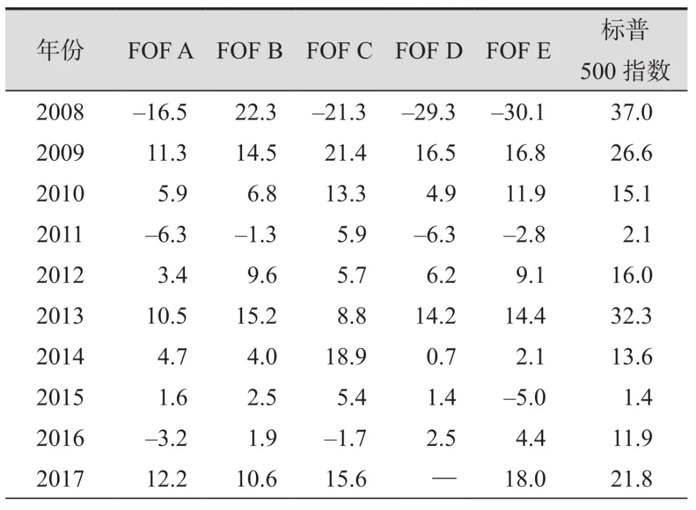

（续）

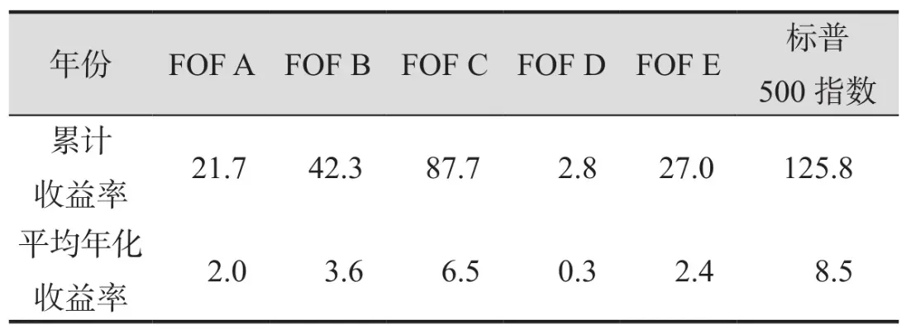

资料来源：2017年巴菲特致股东的信。

也就是说，没有一只精挑细选的FOF，10年的平均年化收益率超过了标普500指数的8\.5%。当投资者还在为这糟糕的业绩痛心疾首时，基金经理们却已经依靠管理费用或某些年的超额业绩分成赚得盆满钵满。羊毛出在羊身上，这点每个人都心知肚明。

巴菲特面对自己拥有的巨额财产（主要以持有伯克希尔股票的形式），在他去世后该如何打理呢？毕竟，我们不能要求巴菲特这种人像兔子一样，可以一窝一窝地诞生。

2013年巴菲特致股东的信中就明确说到了这点。

无论是机构还是个人，都会被赚取顾问费和交易费的中介机构不断怂恿，不停地交易。对投资者来说，这些费用总和非常巨大，它吞噬了利润。所以，忽略那些建议吧，保持最低的交易成本，并且像持有农场那样持有股票。

-
1. 指无论是机构还是个人都应该投资指数基金。

我应该补充一点，我言行一致，我在这里的建议

与我在遗嘱中列出的某些条款基本相同。其中一份遗嘱规定，现金将交付给一个信托（我的妻子是受益人）。我对受托人的建议再简单不过了：将10%的现金投资于短期政府债券，90%投资于成本非常低的标普500指数基金（我建议投Vanguard的基金）。我相信，该信托从这项政策中获得的长期收益，将优于大多数聘请了高费率基金经理的投资者（无论是养老基金、机构还是个人）。

可见，如果离世，巴菲特更愿意把个人资金放在成本极低的指数基金上，也不愿意有人把这些钱塞到所谓的“投资界巨咖”或“明日之星”等对冲基金经理手里。

毕竟，羊毛出在羊身上。

## 人才观及企业经营观

__第9章__

__人才观及企业经营观__

__9\.1 管理层的价值与局限__

巴菲特非常重视管理层，优秀的管理层能让公司经营蒸蒸日上，不断加深企业的护城河；而平庸乃至差劲的管理层，则可能会让公司陷入困境，把一手好牌打烂。

那巴菲特到底喜欢什么样的管理人才呢？他的观点主要体现在对伯克希尔旗下子公司CEO的挑选，以及在购买一家上市公司的股票时对其管理层的评估上。

在1999年致股东的信的“别处读不到的管理学故事”中，巴菲特谈道：

伯克希尔的经理人团队在许多方面都与众不同。举个例子，其中有很高比例的人，通过之前的生意已经实现了财富自由。他们勤劳工作，并不是因为他们缺钱，或者有合同义务在身——伯克希尔也没有这样的义务性合同。实际上，他们工作勤勉努力，是因为他们热爱他们自己的这份事业。我之所以使用“他们自己的”这个词，是因为这些经理人确实在公司说了算——在奥马哈，没有PPT，没有需要总部审批的预算，也没有关于资本开支的批示。我们只要求我们的经理人，把这家公司当成他们自己的可传百年的家族事业一样来经营即可。

__对所经营的事业热爱，是巴菲特挑选管理人才的首要条件。__尤其是当这些经理人已经财富自由，不需要再为钱工作时，他们所做出的经营决策往往是长期的，而非短期突击。因此，巴菲特在收购一家企业之后，往往保留其创始人管理团队（如果他们愿意继续经营的话），因为这些人通过出售公司，已经实现财富自由，并且深爱自己家族所创下的事业，对待企业就像对待自己的孩子一样用心。这样，就大大减少了伯克希尔在公司具体经营事务上的投入。实际上，让伯克希尔直接参与经营决策，极有可能是一场灾难（毕竟，总部也没那么多人对众多行业都熟悉）。

例如，在1972年收购喜诗糖果后（创始人家族不愿再继续经营），巴菲特和芒格提拔当时的副总裁Chuck Huggins担任CEO，这一做就是30多年，直至其退休。巴菲特在1983年收购了内布拉斯加家具城之后，仍然交由B夫人家族继续经营。1995年收购的Helzberg钻石商店，仍然交由时任总裁的Jeff继续经营（Jeff是当时Helzberg钻石商店股东请来的CEO）。这样的例子不胜枚举。

这么做还有个重要的好处：避免更换管理层。给公司安排合适的管理层是巴菲特管理下属企业最重要的工作之一（还有定高管薪酬体系）。股东选择了一个适合的经理人，就像拥有了一段幸福的婚姻一样，互相受益，白头偕老。反之，如果频繁更换管理层，将会带来频繁的经营动荡，不利于公司的发展。

在1987年致股东的信中，巴菲特说道：

在进行控股权收购或股票投资时，我们不但试着去找一家好公司，还希望最好能够由品格与才能兼具，且为我们所喜爱的管理者经营。如果是看错了人，在有控制权的情况下，我们还有权力去改变。事实上，这种优势有点儿虚无缥缈。更换管理层就像离婚一样，痛苦、费时还有不确定性。

……

我们宁可接受*x*的回报，同时与一群我们特别喜欢且钦佩的人工作，也不愿意为了获得1\.1倍*x*的回报，而与那些跟我们合不来的家伙打交道。

__当然，经理人的正直和诚实也是非常重要的品质，可以说这一点具有一票否决权。__如果经理人偷奸耍滑，哪怕能力再强，学历再高，巴菲特也断然不接受。在2019年致股东的信中，巴菲特说对于要收购的公司或买入的股票，要求其管理层必须德才兼备。

此外，我们还在持续寻找满足下面三个条件的生意。首先，它必须有良好的运营净资产回报率。其次，它的经理人必须有能力且诚实。最后，买进价格必须合理。

在2014年致股东的信中，巴菲特进一步阐述了他对未来伯克希尔集团管理层继任者的品格要求。这一要求和巴菲特在挑选合适的投资标的时，对目标公司管理层品格的要求是一致的。

品格是最重要的，伯克希尔的CEO必须为了公司全力以赴，而不是为了他自己的个人利益。（我使用男性代词以避免笨拙的措辞，但性别不应当决定谁能成为CEO。）但重要的是，即使他的成就远胜于同行，他也不会在自负和贪婪的驱使下追求高额薪酬，以与那些拿着顶级薪酬的同行们比肩。一个CEO的行为对其下属有着巨大的影响，如果下属知道，CEO非常重视股东利益和股东回报，下属将毫无例外抱有同样的想法。

我的继任者还需要另外一种特殊的力量：能够抵抗导致业务衰落的傲慢、官僚主义和自满。当这些企业癌细胞扩散时，即使是最强大的企业也会陷入泥潭。证明这一点的例子很多，但为了维持友谊，我只会挖掘出很早之前的案例。

巅峰时期，通用汽车、IBM、西尔斯罗巴克和美国钢铁在几大行业排行榜的榜首。它们的优势看上去无懈可击，但是我刚才所谴责的那些破坏性行为，最终使得它们中的每一个，都掉入了其CEO和董事在不久前都认为不可能的深渊。它们短暂的财务优势和过去的盈利能力，被证明不堪一击。

也就是说，一家公司的CEO不能单纯为钱工作，否则公司将出现大问题，对股东利益是重大伤害。同时，管理层必须要避免傲慢、官僚主义及自满等将摧毁公司长期竞争力的负面品质。

__有趣的是，巴菲特在甄选经理人或投资经理时，并不在意他们是否具有光鲜亮丽的学历或工作履历。__

在2004年致股东的信中讲到旗下子公司国民赔偿保险公司时，巴菲特提到，国民赔偿保险公司自1940年创立以来，历任的4位总裁只有一位拥有大学学历，但公司却顽强发展。因此，巴菲特感叹道：“我们的经验告诉我们，杰出的生意头脑很大部分是天生的。”

在2007年致股东的信中，巴菲特又继续说道：“查理和我都不是严重的履历迷。相反，我们关注头脑、热情和诚实。”

在为伯克希尔挑选继任的投资经理时（毕竟，2007年时，巴菲特和芒格都年事已高），巴菲特的选人标准仍然是投资经理本身的性格特质是否与伯克希尔的文化吻合，而非过去在大公司光鲜亮丽的工作履历。

在2006年致股东的信中，巴菲特谈到伯克希尔打算招聘一位能够管理大型投资组合的年轻投资经理，并描述了他的筛选标准：

挑出合适的人选，并不是一件容易的事。当然，从有辉煌投资业绩的人中找出聪明的人并不困难。但是长期投资要想成功，聪明的头脑以及近期良好的历史业绩是远远不够的。

长期来说，市场将出现异常，甚至诡异至极的情况。一个巨大的错误，将会把过去长期一连串的成功一笔抹去。所以，我们需要生来就能辨认及规避重大风险的人，这个风险甚至是任何人都从未经历过的。这些风险，使用当今金融机构里面基于常用模型所做出的投资策略，是无法规避的。

情绪的控制也十分重要。独立思考、情绪稳定，以及对人性及机构行为有敏锐洞察力，这些都是想在长期投资上取得成功的关键。我见过很多聪明绝顶的人，但他们都缺乏这些特质。

也就是说，聪明是远远不够的，巴菲特更看重投资经理对未来不可知风险的提前感知和预判能力（就像巴菲特在1969年做的那样）。拥有这样能力的人才能从容面对20世纪70年代美股“漂亮50”的崩溃、1987年黑色星期五、2000年网络科技股泡沫、2008年金融危机等重大危机。否则，无论过往的历史业绩多么辉煌，在面临重大风险时也会一切归零。就像巴菲特所说的，再大的数字乘以零，结果还是零。这方面，华尔街从来不缺血淋淋的案例，Bill Hwang就是最近的一个例子。

在2010年致股东的信中，巴菲特又提到伯克希尔挑选继任投资经理的标准。

找到许多历史业绩卓越的投资经理是件轻而易举的事。历史业绩虽然重要，却不足以判断其未来的业绩。判断他们取得这些历史业绩的原因是关键，因为这是一名投资经理对风险的理解与感知（这个当然不能被学术界常用的beta所衡量）。关于风险感知，我们要寻找那种具备很难被准确评估的技能的人士——他能够预判从未见过的经济环境下的状况。最后，我们需要全身心地为伯克希尔效力的候选人，而不仅仅把这当作一份工作。

也就是说，巴菲特挑选继任的投资经理，最看重的不是历史业绩（尽管也很重要），而是对风险提前感知的能力（这一点，1969年的巴菲特可以说是一战封神）。

2011年巴菲特招聘了第一位投资经理——Todd Combs。在2010年致股东的信中他曾谈道：

-
1. Lou Simpson是GEICO负责股票投资的投资经理，在任期间创造了辉煌的投资业绩。
2. Ajit Jain当时担任伯克希尔再保险公司的CEO，截至2023年末为伯克希尔集团的副董事长。
3. Secretariat赛马是美国1973年成就三冠的传奇赛马，感兴趣的读者可以观看迪士尼出品的同名电影；Seabiscuit赛马是美国大萧条时期国民英雄赛马，又称“贫民赛马”。

当我们宣布Todd将加盟我们的时候，许多评论员指出，他没什么名气，并对于我们没有找声名显赫的投资经理表示困惑。我想知道，究竟有多少人在1979年听说过卢·辛普森（Lou Simpson）

，在1985年认识阿吉特·杰恩（Ajit Jain）

，在1959年听说过查理·芒格。我们的目标是找到年仅2岁的Secretariat赛马，而不是一匹10岁的Seabiscuit赛马。

巴菲特对另一位投资经理Ted Weschler的招聘也遵循了同样的原则。这两位双子星（Todd和Ted）各自从几十亿美元起步，经过多年历练，到2021年，两人在伯克希尔合计管理的资金规模（不包括养老金账户）已达340亿美元。

当然，Todd和Ted两位投资经理的投资经历也颇为有趣。有兴趣的读者可以自行查阅。

对管理人才的过度重视，偶尔也会让巴菲特的投资翻船。有的时候，巴菲特非常欣赏某个公司的CEO，且当时公司经营状况还不错，于是就忽视了对公司本身所在行业的竞争环境及核心竞争力的严格审视。

例如，巴菲特在1989年对全美航空公司3\.58亿美元优先股的投资，就算得上是一笔失败的投资（尽管事后看，这笔投资还赚了钱，但运气成分更大）。巴菲特在反思这笔当时认为失败的投资时，写下了如下一段话（1996年致股东的信）。

那时我相当喜爱也崇敬全美航空公司当时的总裁Ed Colodny，直到现在仍是如此。不过我对全美航空公司的业务分析实在是过于肤浅且错误百出。我被该公司过去的盈利能力所蒙骗，同时过分相信优先股可以给我们提供债权上的保护，以至于忽略了最关键的一点：全美航空公司的营收受到毫无节制的激烈的价格竞争影响而大幅下滑的同时，其运营成本自监管保护时代至今却下降甚少。

因此，巴菲特对一家公司管理层的看法是双面的：一方面，他非常强调管理层对于公司运营及增值的重要性，认为好的管理层能让公司的价值发挥到最大，而不合格的管理层则可能让公司陷入困境；另一方面，他又认为，如果一家公司依赖于一个优秀的管理层或英雄CEO才能表现良好，那么这家公司的业务是否真的具有持续竞争力是值得怀疑的。

其实这并不是巴菲特自相矛盾，而是一家公司是否真的具有投资价值的一体两面。公司拥有良好的管理层，原本具有竞争力的公司就会如虎添翼，企业的价值能够最大化，从而提升盈利。但是，如果你在投资一家企业时，把关注点放在优秀的管理层或者英雄CEO身上，那么你可能会忽视对公司本身是否具有持久竞争优势的审视，误把企业一时的成功当作可以永恒持续的成功。

更直白地说，企业质量的重要性，远远高于管理层质量的重要性，具有一票否决权。如果一家企业需要优秀的管理层或CEO才能运行良好，那么即使现在运行良好，等优秀管理层退休或离开后，公司大概率要回归平庸甚至一蹶不振。美国传奇基金经理彼得·林奇说，要找那些傻子都能经营的公司，因为迟早会有傻子当上公司的管理层。

在2007年致股东的信中，巴菲特说道：

但是，如果一个企业需要一个超级巨星来产生伟大的业绩，那么这个企业本身就不能被认为是伟大的。由您所在地区首屈一指的脑外科医生加盟的医疗机构可能会获得超额且不断增长的收入，但这对其未来几乎没有什么影响。当脑外科医生离开时，该医疗机构的护城河就会消失。不过，你可以预期梅奥诊所的护城河能够继续存在下去，即使你不能说出它首席执行官的名字。

总之，一个好的管理层之于优质企业，是如虎添翼。但如果企业本身是一只肥猪，给它插上翅膀也不会让它飞起来，反而弄脏了那对珍贵的翅膀。

__9\.2 对企业并购的看法__

企业并购往往是由公司的管理层（尤其是CEO）所推动的。

不过，其台面上冠冕堂皇的并购理由，与管理层内心真实的想法，可能会大相径庭。这也导致在实际的商业社会中，成功的并购案例并不多见，而平庸甚至失败的并购案例则屡见不鲜。并购失败，受伤害的是股东利益。

在1982年致股东的信中，巴菲特列举了管理层常用的几个发起并购的理由。

通常公司管理层最常用的理由有下列几项：

（a）“我们现在要买下的这家公司未来能值大价钱。”

（b）“我们必须要增长”（也许有人会问，“我们”指的是谁？对于目前的股东来说，现实情况是，当股票发行时，所有现有业务都会缩水。如果伯克希尔明天发行股票进行收购，伯克希尔将拥有它现在拥有的一切以及新业务，但你对喜诗糖果、国民赔偿保险公司等难以匹敌的业务的股份将自动减少。如果①你的家庭拥有120英亩的农场，并且②你与拥有60英亩同等土地的邻居的农场合并，成为平等的合伙企业，并由你担任管理合伙人，那么③你的管理领域将增长到180英亩，但你将永久性地缩减25%你的家庭在种植面积和农作物方面的所有权权益。想要以牺牲股东利益为代价来扩大其管理领域的管理层，最好考虑在政府部门工作。

（c）“我们的股票被低估了，我们已经在这笔交易中尽量减少了它的使用，但我们需要给卖方股东51%的股票和49%的现金，以便这些股东中的某些人得到他们想要的免税交换。”（这一论点承认，暂停股票发行对收购方有利，我们对此表示赞同。但是，如果以100%的比例使用股份收购对原有股东会造成伤害，那么以51%的比例换股收购同样会伤害原有股东。毕竟，如果一只猎犬污损了一个男人的草坪，这个男人不会仅仅因为它是一只猎犬而不是圣伯纳犬就被迷住。卖方的意愿不能成为买方最大利益的决定因素。如果卖方坚持以更换收购方的首席执行官作为合并的条件，会发生什么？

巴菲特讲得已经很明白了。一家企业进行收购，很多时候都是出于管理层（尤其是CEO）自私自利的动机——想要管理更多、更大的业务，拥有更大的支配权力，以及自己在业界更高的知名度，但台面上的理由往往很宏大——协同效应。

如果拟被收购的企业具有业务互补性，或具有真实的业务前景，或盈利能力明显强于收购企业，这倒还好。不过，大部分时候，这些都是收购企业管理层提出收购的借口。有时，即使愿望是好的，动机也非常合理，但收购后由于文化差异、管理层重塑等，也会导致收购失败，效果从“1\+1＞2”变成了“1\+1＜2”。

对于大部分企业收购方来说，其管理层的真实动机，巴菲特在1981年致股东的信中说得很露骨。

（1）商业领袖最不缺的就是动物精神，他们经常对增加的商业活动和挑战乐此不疲。在伯克希尔，当一项并购即将达成时，我们的商业脉搏不会因此跳得更快。

（2）大多数商业或其他类型的机构，都以其业务规模作为最主要的衡量指标，且其管理层收入也与业务规模的排名挂钩。（随便问一家《财富》500强公司的经理人，他的公司在列表上排名第几，默认的排名顺序肯定是按照营业收入的规模。他甚至都不知道如果按照利润排名，他的公司能排到第几。）

（3）许多管理层显然对童年时期的一个童话故事印象深刻：被囚禁的英俊王子经美丽的公主一吻，就会从青蛙的身体束缚中挣脱。因此，他们确信他们的管理之“吻”将会给目标公司的盈利带来奇迹。

显然，巴菲特认为，大部分的台面上言之凿凿的并购案，其CEO有着明显的私人动机——好大喜功，为自己争取名利。但这对于股东来说，却不是一件好事。一项糟糕的并购，无疑会伤害股东价值，从而对股价造成伤害。

在1984年致股东的信中，巴菲特对在这种意图下进行的并购的后果进行了总结。

很多公司在股东权益和资本积累上持续显示出良好的回报，却把大量的留存收益投到回报率一般，甚至是灾难性的项目上。它们非凡的核心业务，其盈利年复一年地增长，掩盖了它们把资本配置到其他项目上的屡次失败。犯了错误的管理层定期在报告上反思他们最近的失误，然后接着寻找下一次教训。

在这种情况下，如果只使用留存收益来扩大回报率高的业务规模，再将剩余的利润以股息的形式进行分派或用于股票回购，股东的处境会好得多（这一方法增加了股东在拳头业务上的权益，同时使他们避免参与比较次的业务）。拥有高回报业务的企业管理层，如果持续将现金流投到低回报的业务上导致资金浪费，那么他们必须为此负责，不管公司从整体上看盈利性有多么好。

也就是说，拥有高回报业务的公司，往往把在资本配置上的失败，隐藏在原有核心业务的高利润下。

对于如何合理收购，巴菲特也给出了以下几个建议（节选）。

有三种方法可以避免原有股东的股份价值遭到侵蚀。第一种方法是以合理的价格进行并购。

第二种方法的使用发生在公司股票市值高于其实际内在价值时，在这种情况下发行股票会提升原有股东权益。

第三种方法是并购者照常进行交易，但之后从市场上买回与因并购所发行的股份数量相同的股票，如此一来，原本以股换股的交易就会转变为以现金换股的交易。

上面的三种方法，就是在尽可能地避免并购后原有股东手中权益价值的下降。当然，股东只是股东，公司的日常运营肯定是由管理层来负责。在这种权力体系下，往往CEO有了一个收购的点子，让下属去验证的时候，下属只会根据CEO想要的结果，去倒推收购的合理性。

汤姆·墨菲，伯克希尔集团的董事以及伟大的企业管理人，很早之前就给了巴菲特关于并购的建议：“若想成为一名受人尊敬的经理人，只需要确保你收购的是好生意即可。”（2019年致股东的信）

因此，我们在研究股票时，必须要注意这家公司的管理层，是不是经常性地冲动收购一些并没有太大价值的业务。若果真如此，还是避开这只股票为好。

## 不为人知的一面

__第10章__

__不为人知的一面__

__10\.1 宏观大师巴菲特__

世人皆知巴菲特擅长选股（或者说，选公司），却忽略了他的宏观判断能力。巴菲特在60多年致股东的信中，以及多个场合，也多次说自己并不擅长宏观预测，同时也觉得宏观预测并不靠谱。

例如在1961年致合伙人的信中，他就说道：“我肯定不会预测明后年宏观经济或股市行情会怎么样，我根本不知道。”2003年致股东的信中他又说道：“我必须强调的是，预言家的墓地有一大半都躺着宏观经济学家，在伯克希尔，我们很少对于宏观经济做出预测，我们也很少看到有人可以长期做出准确的预测。”在2013年致股东的信中，他又说：“总结宏观形势、听信别人的宏观或者市场分析都是浪费时间。”由此可见他对所谓的“宏观形势分析”有多么厌恶。

但这并不代表巴菲特对宏观环境没有自己的判断。只不过，他对宏观环境的判断方法，和主流的尤其是卖方分析师的方法迥异，他更关注具体股票的估值水平到底如何（是极度泡沫化还是有坚实底部）。

1969年巴菲特解散巴菲特合伙人公司的决定，可以说是股市成功逃顶的经典案例！他成功避过了之后股市漫长的熊市，并且在1974年股市处于底部时大举抄底，可以说这一手玩得非常漂亮，不愧是宏观大师！标普500指数走势见图10\-1。

在1969年5月巴菲特写给合伙人的信中，巴菲特表达了对当前股票市场过热的担忧。他说到，他觉得当前的投资环境已经变得更加恶劣且令人沮丧。他所能把握的机会已经逐渐消失，市场逐步走向以短期为目标的投机氛围。

可以看出，从1968年开始，巴菲特就对股市的热情高涨忧心忡忡。虽然自己管理的基金持续表现优异，但他知道这种情况难以持续下去，市场迟早有一天会出大事。简而言之就是，他觉得市场上找便宜的公司已经越来越难了，而他手上管理的钱却很多（超过1亿美元），根本找不到足够多的投资机会。

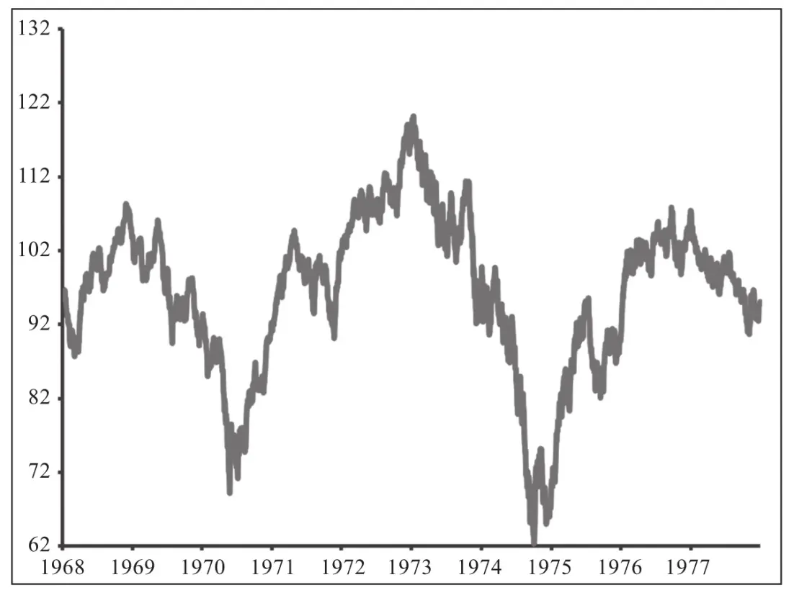

图10\-1 标普500指数走势（1968～1977年）

资料来源：Wind。

这种情况下，为了给他的投资者（合伙人）一个交代，他决定解散BPL。BPL的合伙人可以选择领取现金退出，或者将投资份额转成伯克希尔公司的股票。当然，以现在的视角看，选择转成持有伯克希尔股票的人，如果一直持有的话，都变成了亿万富豪；而当时选择拿回现金的人，错过了20世纪最伟大的一场复利投资。

从1969年开始进行的巴菲特合伙人公司的清算工作，耗费了巴菲特一年多的时间。后面几年的信也很简略，主要是教合伙人怎么投资债券，还有伯克希尔公司本身拥有的纺织业务、购买的保险业务（如1967年买下的国民赔偿保险公司）、银行（伊利诺伊国民银行）等经营情况的回顾。可以说，从1969年到1973年，巴菲特在股票市场并没有什么大的投资动作。1973年开始大举买进华盛顿邮报，算是巴菲特开始抄底股市的标志性事件。

由此可见，巴菲特对于宏观风险的嗅觉是十分灵敏的。不过，他并非根据传统的自上而下那种宏观数据分析得出了云山雾罩的结论，而是实打实地从公司估值水平的角度出发去看股市泡沫问题。

这并不是巴菲特唯一一次准确预判了股市的风险。在随后十几年的投资生涯中，他屡屡对股市出现的泡沫保持高度警惕。

在1987年美国股灾当年的年初，巴菲特写下了1986年致股东的信，信中表达了对当前股市泡沫的担忧。

当条件合适时，即当具有良好经济状况且管理良好的公司以远低于其内在价值的价格出售时，股市有时会提供大满贯本垒打的机会。但我们目前没有发现任何股票接近我们的标准。这句话绝不意味着我们对股市的预测，我们不知道，也从未知道，市场在近期或中期是会上涨、下跌还是横盘整理。

然而，我们所知道的是，恐惧和贪婪这两种超级传染性疾病的偶尔暴发将永远发生在投资行业，但发生时间是不可预测的。它们导致的市场紊乱在持续时间和程度上同样是不可预测的。因此，我们从不试图预测任何一种疾病的到来或离开。我们的目标很温和：我们只是在别人贪婪时恐惧，在别人恐惧时贪婪。

在撰写本文时，华尔街几乎看不到恐惧。相反，愉悦感占了上风——为什么不呢？还有什么比参与牛市更令人振奋的呢？在牛市中，企业主的回报与企业本身的低迷表现脱钩。然而，不幸的是，股票价格不能无限期地跑赢企业价值。

巴菲特对股市里面一些明明经营得比较差，股价却能一飞冲天的公司感到恐惧，认为这是股市泡沫的明显特征。终于，在1987年10月19日，美股发生了历史上著名的黑色星期一，当天标普500指数下跌20\.5%，创下了历史纪录（见图10\-2）。

当然，在1987年10月的大跌中，巴菲特并没有收集到足够的筹码。在他逐步买入时，股市迅速反弹。他在当年致股东的信中提到，

在伯克希尔，我们发现，过去几年股票方面几乎没有什么可做的。在10月份的休市期间，一些股票价格跌至我们感兴趣的区间，但我们无法在它们反弹之前买进足够多的股份。

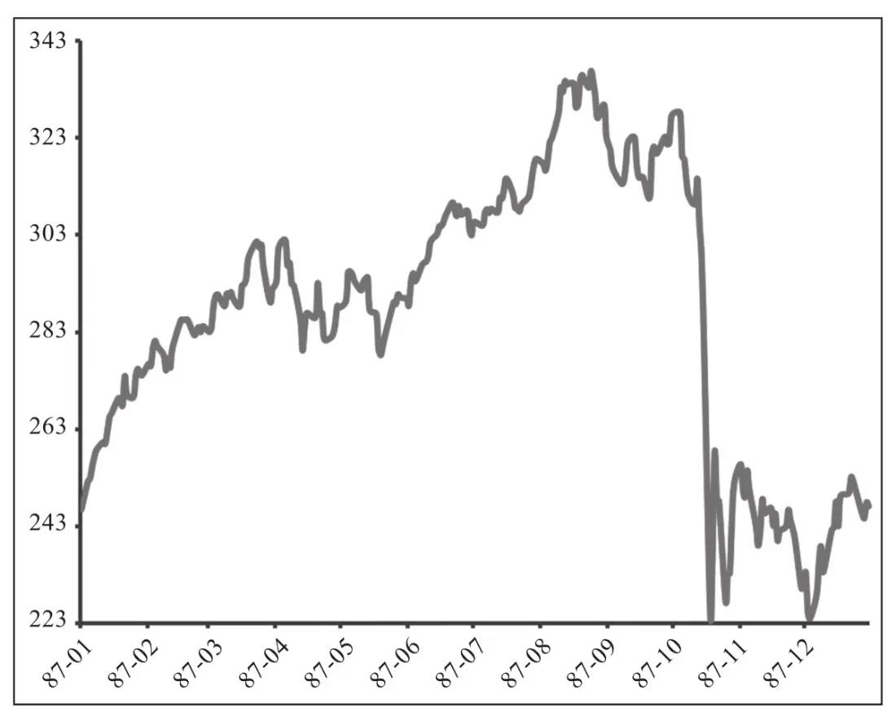

图10\-21987年标普500指数走势

资料来源：Wind。

2008年美国金融危机引发的美股大跌，更是巴菲特大幅抄底的经典之作。在2008年之前几年致股东的信里，巴菲特就反复提到了复杂衍生品的危险，觉得这玩意儿很难搞得懂，而且很多是场外衍生品，交易对手的信用风险具有传染性。所以巴菲特在1998年买下通用再保险公司后，决定关闭旗下的衍生品交易部门。但由于动作迟缓，在收购后的数年里，仍然损失了数亿美元，让巴菲特对复杂衍生品心有余悸。

当金融危机来临，美国股市大幅下跌时，手持巨额现金的巴菲特频频出手，并在《纽约时报》上喊出了“Buy American\. I AM\.”的口号，以表达自己言行一致。这一战也让巴菲特获利匪浅。那篇2008年10月17日（美股最为恐慌的时候）发表在《纽约时报》上的文章，我认为值得认真阅读。

金融市场短期内的混乱，改变不了这些上市公司本身经营基本面在未来的逐步改善。如果说股价最终反映的是企业的内在价值，那么只要公司盈利在中长期稳步增长，股价迟早会跟上，根本没必要担心。过于担心短期的得失，失去的是长期的收益。

__10\.2 投资风格多变__

巴菲特给人的印象似乎是古板与保守。在生活中他也许的确如此（如一套房子住几十年）。这种刻板印象也许是因为受到很多书或访谈的影响，认为巴菲特早期做烟蒂股投资，后期拿着几只优质股票长期不动。

实际上，巴菲特的投资风格极为灵活多变，像是海里的一条灵活凶猛的大鲨鱼，且在具体投资标的和执行方法上随机应变。

例如，他在1988年致股东的信中就写道：

一个投资者很难只靠单一投资类别或投资风格就能创造傲人的收益。他只能靠着仔细评估事实并持续地实践才能赚取超额利润。

巴菲特自己也是这么做的。

在职业生涯开始时，巴菲特就将他的投资分为低估类股票、套利类股票以及控股类股票三种类型。低估类股票就是其股价显著低于企业内在价值的股票；套利类股票就是那种消息驱动型（例如有并购传闻的）股票，当然其价格也不会太高，即使传言最终没有成为现实，也不怎么亏钱；而投资控股类股票，就是成为企业的大股东，拥有企业的控股权，再对企业经营进行梳理干预，挖掘潜在价值。由于套利交易策略的稳定性，以及和股市大盘表现的不相关性，套利类股票在巴菲特早期的整个持仓组合中占了很大一部分。即使到了中后期，伯克希尔的资金规模巨大的时候，他也根据市场机会时不时玩点儿套利交易。

例如，他在1963年致合伙人的信的附件中，他就详细描述了他在德州国家石油公司（Texas National Petroleum）上的套利投资，获利20%以上。

德州国家石油公司是一个比较小的石油生产商。1962年初，市场有传言它将被加州联合石油（Union Oil of California）溢价收购。但这种类型的收购，往往程序复杂，要经过国家相关部门的批准及税务筹划，时间拖得比较长。巴菲特买入了德州国家石油公司的以下几种证券。

（1）利率为6\.5%的债券，赎回价为104\.25美元，收购完成前继续支付利息，收购完成后进行赎回。流通的债券有650万美元，在收购完成前，我们买入了其中的26\.4万美元。

（2）公司有大约370万股普通股，其中，高管和董事持有40%。委托书估算每股清算价值是7\.42美元。从交易宣布到最后完成的六个月的时间里，我们买入了64035股。

（3）650000份以每股3\.50美元买入股票的认购权证。按照委托书估算的7\.42美元的清算价值，每份认购权证可实现3\.92美元的利润。在六个月的时间里，我们买到了83200份认购权证，占所有认购权证的13%左右。

在经历了一系列复杂的收购程序后，德州国家石油公司的收购案得以在1962年10月底完成，历时10个月。巴菲特的BPL得到了多少收益呢？

（1）我们总共买了260773美元的债券，平均持有时间是将近五个月。我们获得了6\.5%的利息，还实现了14446美元的资本利得，整体年化收益率是20%左右。

（2）我们通过股票和认购权证实现了89304美元的资本利得，目前还有一小笔大概价值2946美元的收益没实现。从4月份投资146000美元起，我们中间陆续投入，到10月份，投资总额是731000美元。根据资金投入的时间计算，年化收益率是22%左右。

在早期，巴菲特像德州国家石油公司这样的套利交易数不胜数。当然，有的成功，有的失败。从总体来看，还是赚的多亏的少，套利交易是巴菲特早期投资收益的主要来源之一。当然，从中后期开始，由于管理资金规模太大，能够匹配的套利机会越来越少，做得也就少了很多。

另外的例子就是对高收益债的投资。在机会合适的时候，巴菲特也会参与高收益债（难听一点儿的名字是垃圾债）的投资。在巴菲特看来，股票的本质就是永续性债券（收取股息及未来现金流），其估值方法和债券一样，都是未来现金流的折现。只不过债券的票息和期限是确定的，而股票的未来现金流具有不确定性，需要经验丰富的投资者进行预估。但两者就本质来说，没什么不同。

巴菲特在1983年对华盛顿公用电力供应系统公司（Washington Public Power Supply System，WPPSS）债券的投资就是成功之作。

1983年7月，WPPSS对其发行的22亿美元的债券违约，这部分债券的发行主要用作第四、第五期工程的建设，但当时公司已经放弃了这个项目的建设。这个违约事件，对以第一、第二、第三期项目为基础资产发行的债券的兑付蒙上了一层阴影，尽管这三期债券的条款和基础资产与第四、第五期有实质性不同。

伯克希尔旗下保险子公司持续买入WPPSS第一、第二、第三期的债券，巴菲特和芒格都认为其预期的收益率足以弥补所承担的风险。实际上，这批债券的税后利息收益高达16\.3%。巴菲特买入了1\.39亿美元的债券，每年可获得约2270万美元的利息收入。对股票投资或收购一家企业来说，能够赚取16\.3%的税后收益（税前收益就需要更高了）的公司是很少的，即使有，股票价格也高得吓人，巴菲特估计，要价就得是2\.5亿～3亿美元，是这批债券买入成本的2倍左右。

在1988年致股东的信中，巴菲特很高兴地说，1983年买入的WPPSS的那批债券，最终结果完全符合他的预期，除了一部分短期债券已经兑付之外，剩余部分的市场价已经按照略低于最高信用评级债券的水平来估值了。

当然，对高收益债的投资也有失手的时候，比如巴菲特对全美航空公司优先股的高达约3\.6亿美元的投资（利率为9\.25%）差点儿血本无归，好在后来运气比较好，盈利退出。因此巴菲特认为，投资这种品种，长期积累下来业绩肯定不错，但难保某一年或某一单的结果会很糟。

尽管巴菲特对复杂衍生品深恶痛绝，但并不代表他不参与衍生品交易。巴菲特在2008年致股东的信中道出了其中的原委：“我认为我们参与的每个衍生品合约的初始定价都是不合理的，有时还异常不合理。既然有些衍生品的定价如此不合理，那白赚的钱为何不赚呢？”

在2008年致股东的信中，巴菲特接着提到伯克希尔当时持有的名义价值为371亿美元的股市看跌期权。伯克希尔作为看跌期权的卖出方，卖出的是美国标普500指数、英国富时100指数、欧洲斯托克50指数，以及日本的日经225指数。这些卖出的看跌期权是欧式期权，期限为10年至20年不等。这意味着在合约期限内，买方是不能行权的。

伯克希尔卖出的名义价值为371亿美元的看跌期权，总共收到49亿美元的期权费，相当于平均的期权费率约为13\.2%。

这笔账巴菲特是怎么算的呢？他为何觉得这笔期权定价不合理呢？（即认为看跌期权买方付出了过高的期权费。）

（1）从长期看（10年以上），主要国家的股市指数极大概率是上涨的，这个已经被过去100多年的股市数据所验证。这也是为什么巴菲特签订的是长期限合约，而且是欧式期权——只有在到期日那天才可以行权。因为你无法保证这期间股市会不会跌破行权价，但是10年、20年后的指数会不会比行权价更高，这个巴菲特心里是有底的。

（2）当前市场（2008年）受到金融危机影响，各国股市都遭遇回调，估值水平较低，足够安全。

（3）损失有限。由于是看跌期权，伯克希尔理论最大损失为371亿美元，即四大指数全部跌到零的时候。即使是这个数字，伯克希尔也完全负担得起（即使发生了，也不是现在付，而是10～20年后付），而不会让公司陷入泥潭。

（4）所收取的49亿美元的期权费是现付的，这意味着伯克希尔立刻能得到这笔免费资金，巴菲特称之为另类的“浮存金”。他可以免费使用这笔49亿美元的浮存金，在未来10～20年进行投资。只要这笔49亿美元的本金加上后续10～20年的累计收益，能够覆盖期权行权所需要支付的金额（假设到时股票指数比现在的行权价低），那这批衍生品合约对于伯克希尔来说就是净赚的。

上面的分析没有用到复杂的高等数学，也没有用到期权定价常用的Black Scholes模型，你我普通人都能分析和理解。这其中，重要的就是常识的力量——你相不相信，从长期看，主要国家的股票指数是上涨的？

由此可见，在投资上，巴菲特绝不是什么老学究，他一直秉承的是“原则坚守，方法灵活”的投资方式，并不拒绝使用股票、债券、衍生品等各类组合来赚钱。但在他的投资生涯中，一直坚守的一个理念就是，

简单，看得懂。

## 后记

__后记__

如果你能读到这里，恭喜你，至少证明你确实对巴菲特的价值投资理念充满了兴趣，且愿意花时间去研究。

很多人问：“学了巴菲特，我有没有可能成为下一个巴菲特？”

很遗憾地告诉你，即使你在投资方面天赋异禀，成为下一个巴菲特的概率也许万分之一都不到。

为什么？

首先，你要非常幸运地出生在正确的时间、正确的地点。巴菲特很幸运地出生在20世纪强大的美国，并且出道时正值二战结束后，属于美国企业在全世界扩张的时代。只有肥沃的土壤里才能长出参天大树。20世纪伟大的公司大部分都诞生在美国，巴菲特在多个场合（包括致股东的信），公开表达了“美国顺风车”的威力。

好风凭借力，送我上青云。

不过，和巴菲特类似的幸运儿不少，但成为巴菲特的可能仅此一人。这是巴菲特自身天赋与努力相结合的结果（当然运气也很重要）。

巴菲特自身的投资天赋是无与伦比的：年少时就极度痴迷于股市（这点非常重要，可以说是最重要的），拥有深刻的商业洞察力、极致的专注、极为稳定的情绪，以及天生的逆向思考能力。

当然，玉不琢，不成器，再强大的天赋，也需要后天持续的学习与实践。1957～2023年长达67年致投资者的信所展现出来的，就是他持续实践、持续学习和反思的成果。

我认为，我们学习巴菲特，并不是要成为“下一个巴菲特”，而是要基于自身的资源禀赋，通过学习他的价值投资理念，提升自身的投资水平，成为“下一个更好的自己”。

成不了下一个巴菲特，成为半个巴菲特，甚至1/10个巴菲特，也是极好的。

做不到长期复合年化收益率在20%以上，做到了10%、8%也是极好的。

巴菲特对于很多具体公司、具体行业的看法和分析，随着时代的变迁，也许会变得不合时宜。但他的投资理念、投资方法，我相信会经受时间的考验，历久弥新。

在量化投资大行其道的今天，价值投资会不会逐步萎缩甚至消亡？

我认为，不会。

量化投资也许可以成为股票投资的主流技术（其实在美国已经是了），但价值投资作为股票投资一个流派，永远不会消失，在市场上永远都占有一席之地。

因为量化投资永远无法解决股票投资中的定性分析（商业护城河、商业前景、管理层特质），以及股市周期性的狂热与绝望。

价值投资永远是个人投资者挑选股票的最佳方法。它不能保证你一夜暴富，但基本能够保证长期获得不错的收益。

如果让我用一句话回答，价值投资是什么？

我会选择“价格就是你所支付的，而价值就是你所得到的”这句话。

如果能再加一句话，那就是，选股票就是选公司。

尔曹身与名俱灭，不废江河万古流。

价值投资不灭，巴菲特的投资心法永放光芒！
