# 《巴菲特投资案例集》全文合订版

> 共31个章节。原章节顺序、段落结构和图表均予以保留。

## 序

序

在阅读56年间沃伦·巴菲特致股东的信件时，我对其中的投资案例充满了敬佩之情，但想进一步知道其投资和决策时的细节时——他做出投资决定时，被投资公司的财务状况如何，处在一个怎样的发展阶段等——却遇到了很大的困难。

首先，巴菲特往往对一个投资对象的描述分布在若干年的致股东信里，需要仔细整理和挖掘；其次，缺乏许多重要的投资细节，例如买入价格、投资对象的财务细节、投资过程、投资后的表现等，这需要读者阅读被投资对象的年报资料，甚至需要计算，或者借助其他传记才能获取；再次，在互联网上搜索相关案例时，我发现关于巴菲特的投资理念和投资语录汗牛充栋，但关于巴菲特的投资案例则多为片段，鲜有完整者，并且挖掘的深度也难以让人满意。作为一名对巴菲特充满敬佩之心的投资者，我深知这些投资案例的珍贵，以及它们对投资者的重要意义。

于是，我开始下定决心自己动手整理巴菲特的投资案例，一方面使自己加深对巴菲特投资方法和投资理念的理解，另一方面，也希望自己的付出，能让更多的投资者有所受益。对于投资案例的整理，其难度超越了我初期的想象，有时为了一个很小的细节，可能要查阅海量的报表，但我想，这也许正是本书的价值所在——客观地将每一个案例真实地呈现在读者面前。怀着忐忑的心，我开始将一个个案例放在自己的博客和雪球中，没想到收到了超出我期望的反馈，这更坚定了我写作的决心。

为了客观地为读者呈现巴菲特的投资实例，本案例集的写作遵循以下一些原则：

（1）力求完整而客观地描述巴菲特的各个投资案例，尽力不画蛇添足，添加编者自己的主观想法。在每个案例之后附上巴菲特在致股东信中的相关论述，以便于读者阅读。

（2）每个案例皆力求还原巴菲特当时投资的情景，包括投资对象的背景、当时的财务状况、盈利能力、买入价格、巴菲特的投资逻辑、内在价值、投资业绩，等等。

（3）力求使每个案例成为一个独立完整的投资故事，成为洞悉巴菲特投资思想的窗口。

基于以上原则，我按照巴菲特投资的时间顺序，将其投资的主要公司一一进行分析，其中有些数据是作者根据年报或相关数据整理计算而得，不可避免会出现一些偏差，希望不足之处可以得到读者的谅解，也欢迎大家的批评与指正。

这些案例在整理过程中，我将部分案例发表在雪球上，获得众多雪球网友的大量转发、评论和支持，给了我更大的动力去完成此书，在这里对雪球运营团队和众多雪球网友的鼓励和支持表示衷心的感谢。

## 前言

前言

格雷厄姆和巴菲特的渊源

本杰明·格雷厄姆为沃伦·巴菲特在哥伦比亚大学的老师，巴菲特毕业后想进入格雷厄姆的投资公司（格雷厄姆\-纽曼公司），但格雷厄姆为了照顾犹太人就没有同意。巴菲特只好回到奥马哈，接替他父亲的证券经纪业务，并经常给格雷厄姆写信。三年后，格雷厄姆终于同意让巴菲特成为公司员工，巴菲特从给格雷厄姆打工一路上升为合伙人。1956年，格雷厄姆对市场的狂热感到担心，决定退休，关闭了他的投资合伙公司。巴菲特自己创建了巴菲特合伙公司，首批合伙人多为格雷厄姆\-纽曼公司的客户。秉承格雷厄姆的投资理念，巴菲特合伙公司的投资业绩卓越，1957—1969年的年复合收益率为29\.5%、总收益率27倍，同期道指分别为7\.4%和1\.5倍。

格雷厄姆投资思想

（1）安全边际，买入股份相当于买入公司的一部分所有权，如果以4毛钱买入价值1元的东西，赢的概率远大于亏的概率；（2）市场先生，证券市场短期是投票器，长期是称重机，市场的非理性波动是我们的朋友，能够提供以非常低折扣买入的机会。（3）杜绝投机，严格遵守价值投资原则。

格雷厄姆投资公司的营运方式

对投资人不收取管理费，不拿工资，只收利润分成，每年支付5%的资本利息后，利润超过部分按累进制进行利润分成，收益率20%以内利润分成20%，收益率20%～30%部分分成30%，依此类推，最高50%。公司资金和客户资金一起风险共担。后来巴菲特合伙公司运营方式与之类似。

格雷厄姆的盲点

对公司价值的评估主要集中在营运资产等有形价值上，较少关注公司竞争力、管理质量、未来盈利能力等方面的价值。随着资本市场的发展和完善，这种市值低于营运净资产的投资机会日渐稀少。后来费雪发展了成长性公司的投资理论，也被巴菲特所采用。

格雷厄姆的投资方法

（1）买入严重低估的普通股，例如市值低于营运净资产（流动资产减去负债）等；（2）套利交易，在公司的收购、合并、重组中投资确定性高的套利机会，也包括可转债套利；（3）控制类投资，成为价值严重低估公司的主要股东，通过分红等方法实现价值。巴菲特后来也依照这三种方法。

格雷厄姆的投资案例 [\1]

联合电车公司：该公司拥有116辆公共汽车和游乐场之外，还拥有价值约100万美元的国库券、现金和已发行汽车票，合每股60元，但当时股价不足35元，相当于用5毛买1元硬币。格雷厄姆买入，巴菲特跟投并登广告收购，后公司每股分红50元，巴菲特一笔赚了2万美元。

主动实现价值：北方输油管公司，格雷厄姆调查发现它拥有巨额铁路债券，加上现金约每股95元，无存货，股价为65元，分红6元。格雷厄姆买了5%的股份，并取得另外32\.5%的代理权，成为公司董事，迫使管理层将多余的现金分发给股东，最终每股分红70元，单笔投资的总收益率约70%。

股票换可可豆：洛克伍德公司以价值36元的可可豆回购每股34元的股票，格雷厄姆让巴菲特大量收购股票换可可豆，同时卖出可可期货锁定利润，收益丰厚。更绝的是巴菲特，他分析认为随着股数减少，每股价值将会远超当前股价，故买入222股持有，后股价超过100元，收益率约3倍（1956年）。

麻雀变凤凰：里丁煤铁公司的生意日落西山，但股价低估，格雷厄姆控股了公司，用公司现金买下了联合内衣公司，即用一项生意的钱购买利润更丰厚的另一项生意，投资回报丰厚。巴菲特后来把这种资产配置艺术用在伯克希尔上，使一家快破产的纺织厂变为世界第五大市值的多元化集团。

可转债套利：联合纺织公司有年利率7%的可转债，普通股被热炒高估严重。格雷厄姆卖空普通股，然后在面值附近买入可转债。后股价从70元跌到20元，而可转债价格基本未变，格雷厄姆卖出可转债买回普通股，收益丰厚。若普通股价格上涨，可转债也会同步上涨，风险可控，该方法退可守进可攻。

钱往低处流：杜邦持有通用汽车的股份，1923年通用汽车股价大涨，杜邦的市值仅相当于持有的通用汽车股份的价值，杜邦被严重低估而通用汽车被高估。格雷厄姆买进杜邦，并卖出7倍于杜邦股票的通用汽车股票，后通用汽车下跌而杜邦上涨，格雷厄姆获利丰厚。但是，格雷厄姆后来用这种方法也失败过一次，做空有风险。

格雷厄姆思想家族的富翁们 [\2]

沃尔特·施洛斯：没上过大学，但上过格雷厄姆的“证券分析”夜校课程，后进入格雷厄姆的投资公司，为巴菲特的同事。1956年自己开投资公司，严格按照价格远低于价值的投资方法，其28年的年复合收益率为21\.3%，总收益率231倍，同期标普指数分别为8\.4%和8\.8倍。

汤姆·拉普：“二战”退役后为海滩巡逻员，偶然看到格雷厄姆的夜校讲座，即报考哥伦比亚大学MBA成为格雷厄姆的学生，后追随格雷厄姆为巴菲特同事。1968年组建合伙公司，遵循价值投资，其15年的年复合收益率为20%，总收益率16\.6倍，同期标普500指数分别为7%和2\.4倍。后买下了那片他经常晃悠的海滩。

比尔·鲁安：毕业于哈佛商学院，后去哥伦比亚大学听格雷厄姆讲课与巴菲特相识，开始自己投资，业绩优异。巴菲特结束合伙公司后将客户介绍给他，1970年成立红杉基金，其后14年的年复合收益率为18\.2%，同期标普500指数为10%。

查理·芒格：开过律师事务所，同时投资业绩优异，后巴菲特建议他把律师当作爱好、专心投资。1962年成立合伙公司，集中持有价格低估的公司，其后12年的年复合收益率为19\.8%，总收益率11\.6倍，同期道指分别为5%和0\.96倍。后与巴菲特一起控制伯克希尔，为副董事长。

里克·格林：南加州大学数学系毕业，做过IBM销售员，是芒格的朋友，据说他5分钟就明白了价值投资法，受芒格建议转行做投资。1965年成立太平洋合伙公司，其后19年的年复合收益率为32\.9%、总收益率222倍，同期标普指数分别为7\.8%和3\.16倍。

沃伦·巴菲特（早期）：1930年出生于奥马哈，小学开始送报纸、卖爆米花和二手高尔夫球，用积累的钱在15岁高中时买了40英亩农场。11岁开始炒股，看遍了奥马哈图书馆中所有的投资书籍，试过各种方法，后进入哥伦比亚大学，在遇到格雷厄姆前投资业绩平平。

沃伦·巴菲特（中期）：大学时对格雷厄姆的课程入迷，成绩为全班唯一的A\+，毕业3年后进入格雷厄姆的投资公司，后自己创建了合伙公司，投资方法和运营方式与格雷厄姆类似，主要为低估类、套利类和控制类投资。1957—1969年的年复合收益率为29\.5%、总收益率27倍，同期道指分别为7\.4%和1\.5倍。

沃伦·巴菲特（后期）：1969年牛市时，巴菲特关闭了合伙公司，用全部资金和芒格一起控制了一家纺织厂——伯克希尔，以此为平台采用价值投资法不断收购公司和股份，最终形成一个市值世界第五的多元化集团。1965—2012年的年复合增长率为19\.7%、总增长率5868倍，同期标普为9\.4%和74倍。

[\1] 参考文献：本杰明·格雷厄姆\.格雷厄姆：华尔街教父回忆录\[M\]\.上海：上海远东出版社，2011\.

艾利斯·施罗德\.滚雪球\[M\]\.北京：中信出版社，2009\.

[\2] 参考文献：本杰明·格雷厄姆\.聪明的投资者（第4版）\[M\]\.北京：北京邮电出版社，2010\.

## 1.美洲国家火灾保险公司　1956

\(03\) 1\.美洲国家火灾保险公司 1956

1\.美洲国家火灾保险公司 [\1] 1956

公司背景

美洲国家火灾保险公司总部位于奥马哈，1919年，一些没良心的保险员把这家公司毫无价值的股票推销给了许多农民，每股价格100美元，随后这些凭证躺在抽屉里慢慢被人们遗忘。后来保险商威廉·哈曼森被骗入这家公司做负责人，哈曼森家族逐渐将这家公司变成一个正规的公司，逐步把最高等级的保险业务输入这家公司，股票价值逐步上升。但是，信息闭塞的农民们并没有觉察到他们手中的股票已经值钱了。

之后的几年，哈曼森家族暗地里从那些农民手中回购股票，到1956年为止，哈曼森家族已经拥有这家公司70%的股份。1956年，美洲国家火灾保险公司的每股盈利为29美元，而哈曼森家族的收购价约为每股30美元，市盈率约1倍，每股利润就能完全支付购买一股股票的所有成本，简直不可思议。

巴菲特很钦佩公司的实际控制人威廉·哈曼森。威廉·哈曼森通过美国家庭储蓄公司把高等级的保险业务输送给美洲国家火灾保险公司，并通过其弟弟海登·哈曼森掌管美洲国家火灾保险公司。威廉·哈曼森故意把抵押贷款业务放到远离居民的地方，使得居民只能通过邮寄的方式偿付抵押贷款，不用亲自跑到公司支付，从而降低公司的人力成本。

巴菲特策略

巴菲特翻阅《穆迪手册》时发现了这家公司，于是开始买入这种股票，但是一股也买不到，因为只有哈曼森家族才有股东名单。1956年，巴菲特派他的合伙人兼代理人丹·莫奈开着车，带着现钞去乡下，四处打听，悄悄地用现钞换股票。开始的出价为35美元，高于哈曼森家族的出价，农民们开始警觉，交易价格也开始上涨，最后价格上涨至100美元。丹·莫奈最终收集了2000股，占公司总股份的10%。

巴菲特担心哈曼森家族和他竞争，开始并没有把股票持有人改成自己的名字，只是附加了律师说明。等收集了足够的股票后，他提着袋子，走进海登·哈曼森的办公室，把他们全放在桌上，说我要把他们全改成我的名字，可以想象海登·哈曼森当时惊讶的表情。

一年后，他以每股约125美元卖出了这些股票，收益率大约100%。

[\1] 本章部分内容参考：艾利斯·施罗德\.滚雪球\[M\]\.北京：中信出版社，2009\.

2026年2月20日

12:59

## 2.共富诚信银行　1958

\(04\) 2\.共富诚信银行 1958

2026年2月20日

12:59

2\.共富诚信银行 1958

公司背景

共富诚信银行是位于新泽西的一家银行，1958年，其每股收益为10美元，管理良好且盈利能力强，总资产约5000万美元，但利润增长缓慢，公司没有进行现金分红，因此股价徘徊在50美元左右。

巴菲特策略

共富诚信银行的大股东是一家大银行，有意向将其合并。巴菲特对该公司的保守价值估计约为每股125美元，并有潜力达到每股250美元，但当时的市场价格只有50美元，有较大的价值折扣。巴菲特合伙公司在1958年大量买入共富诚信银行的股票，占其12%的股权，买入平均价格为51美元，对应市盈率为5\.1倍。

在1959年底，为了给另外一个投资机会筹集资金，巴菲特以80美元每股卖出了共富诚信银行的股票，该笔投资收益率约60%。新的投资机会来源于桑伯恩地图有限公司，这家公司的低估程度并不比共富诚信银行要大，但是巴菲特能够控股这家公司，以便于更快地实现价值。这笔投资将在下一个案例中介绍。

巴菲特认为，作出这种投资标的的置换是基于更好地使用资金，50美元的价格相对125美元的内在价值折扣要大于80美元的价格相对于135美元的价值折扣。另外，投资一个可以控股的公司可以更快速地让低估状态修复，所以他卖出了仍在低估状态的共富诚信银行，而买入了另一家可以控股的低估程度相近的公司。

自我剖析：巴菲特致股东信

1958年

为了更好地理解我们的操作方法，我想我最好回顾一下1958年的具体运作。去年我提到我们最大持股约占我们各个合伙人企业资产的10%～20%。我得指出，我非常乐意这只股票的价格是下跌的或者是保持稳定，这样我们就可以建立更大的头寸。正是这个原因，这只股票也许会在牛市中拖累我们的相对表现。

这只股票是位于新泽西的共富诚信银行。我们开始购买这只股票时，保守计算，它的内在价值是每股125元。然而，尽管每股收益达到10元，它却有充分理由没有做任何现金分红，其中最大的理由是其被压低的价格——每股仅有50元。我们拥有一个管理良好并且具有较强盈利能力的银行，但是交易价格远远低于其内在价值。管理层对我们这些新股东很友好，该笔投资最终损失的可能性很小。

共富诚信银行25\.5%的股权由一家大银行持有。共富诚信银行拥有资产约达5000万美元，约为第一国民银行或位于奥马哈的美国国民银行的一半。这家大银行一直想对共富诚信银行进行合并。出于个人的原因，该并购一直被阻止。但有证据显示，这种情况不会无限期持续下去。因此我们有了这样的良好组合：（1）很强的防御性特征；（2）建立在一个步伐上的优良稳定价值；（3）尽管可能是一年或十年，但是这个价值将最终释放。如果后者属实，其价值大概已经达到了一个相当大的数字，即每股250美元。

一年多以来，我们成功地获得了共富诚信银行约12%的股权，平均成本约在每股51美元左右。很明显，我们具有保持股价不动而增持股票的优势。我们所持股份将随着公司规模的扩张而增长，尤其是我们成为第二大股东后，就具有足够的投票权以就合并事宜提供征询建议。共富诚信银行大约只有300名股东，平均每月约有两个交易商。所以你可以理解为什么我说这部分股权从快速上涨的市场得益甚少了。

不幸的是，我们的确遇到了一些竞价对手。他们将股价抬高到65美元，而我们既不是买家也不是卖家。对于一个并不活跃的股票，很少的买单就可以造成非常大的价格波动，这就体现了我们投资持股中不能有“漏网之鱼”的重要性。

年底，我们成功地找到了一笔特殊交易，这笔交易可以使我们以一个富有吸引力的价格买入股份而成为最大股东。所以，我们以每股80元的价格售出共富诚信银行的股份，虽然该价格相对市场价格大约打了20%的折扣。

像共富诚信银行这样在某年实现可观收益，在很大程度上，是一种偶然。因此，当我们着眼长期投资业绩时，任何单一年份的投资业绩都具有很大的局限性。不过，我认为，投资这样一个低估且有很好（安全边际）保护的公司，是获得证券长期收益的可靠手段。

我可能提到，在80元左右收购的买家多年后也将做得不错。毕竟，80元相对于内在价值135元而言的低估程度，与50美元相对内在价值125元的低估程度比较，是不同的。在我看来，我们的资金应当在更好的形势下运作，所以决定以80元卖出共富诚信，再买入另一个公司。这个新投资部位比共富诚信银行要大，占我们合伙企业的资金总量达到了25%左右。它的低估程度并不比我们现在持有的证券低估程度大多少，但是由于我们是最大的股东之一，我们可以利用这一优势更快地修正低估状态。正是因为这一特别的持股，我们确信在我们持股期间，我们的业绩一定会优于道琼斯指数。

## 3.桑伯恩地图公司　1958

\(05\) 3\.桑伯恩地图公司 1958

2026年2月20日

12:59

3\.桑伯恩地图公司 1958

公司背景

桑伯恩地图有限公司主要从事地图出版和不断修正美国城市详细地图的工作，其对街道下面的水管直径、消防栓所在位置、房屋结构等有详细记载，这些信息对火险公司至关重要。保险公司的代理人通过桑伯恩地图公司提供的信息进行风险评估和保险费的厘定，桑伯恩地图公司的主要客户为大约30家保险公司。

原先，桑伯恩地图公司的业务具有垄断性，公司利润不受经济衰退的影响，几乎不需要营销，但是近些年由于保险公司政策变化，地图业务变得不景气，主业利润较少。公司的税后利润从30年代的50多万美元下降到1959年的不足10万美元。幸运的是，在20世纪30年代早期，桑伯恩公司开始购买证券，至1958年，公司拥有每股65美元的证券组合，但股价只有45美元。

巴菲特策略

1958年，公司的总股数为10\.5万股，年销售收入为250万美元，没有负债，拥有的证券组合市值约700万美元，合每股65美元，股价为每股45美元。巴菲特认为该公司的价值远超市值，拥有明显的安全边际，因此他投入了巴菲特合伙公司1/3的资金，买入了2\.4万股桑伯恩地图公司的股票，掌握了公司的控制权。

掌握控制权后，在1959年，巴菲特与董事会协商，建议将公司的证券组合分给股东们，但遭到拒绝。随后。他威胁要召开特别会议以控制公司，董事会别无选择，只好同意了巴菲特的建议。

在1960年初，为了避免卖出证券组合后缴纳约200万美元的税，同时巴菲特认为当时的蓝筹股价格过高，桑伯恩地图公司提出用证券组合按照市场价格兑换股票，相当于回购股票。总共有70%的股票被回购注销，剩下125万美元的政府及市政公债作为准备金，余下股票的每股盈利、每股股息和每股价值都得到大幅提升，巴菲特合伙公司的收益可想而知。

自我剖析：巴菲特致股东信

1960年

桑伯恩地图有限公司从事出版以及美国所有城市详细地图的不断修正工作。比如说，仅奥马哈的地图册就可能重达50磅，其对每一处的建筑都做出了仔细而准确的说明。通过用糨糊粘住需要修改的地方对原地图进行修正，在涂过糨糊的地方标明新的建筑物的名称，业主的变换、新的消防设施的配置，建筑材料的变换，等等。这种变动几乎每年都要在地图上标出，当不能进一步通过用糨糊粘住需要修改的地方时，新的地图就要重新出版一次，地图每隔20～30年就要更新一次。对于奥马哈的消费者来说，每年花在修正地图上的费用大约有100美元。

地图包含信息丰富翔实，例如，街道下面总水管的直径，消防栓所在位置，屋顶的构成等，所有这些对火险公司至关重要。位于中央办公室的保险业的各个部门，可以通过遍及全国的代理人对企业进行价值的评定。其理论是“一幅照片顶得上一千句话”，这种价值的评定方法将决定风险是否得到正确的估价，这个地区大火灾发生的频率，合理的再保险程序等。尽管地图也出售给保险业以外的顾客，比如说一些公用事业、抵押公司和税务部门，但是，桑伯恩公司大部分的业务对象仍是大约30家保险公司。长达75年，桑伯恩公司一直以一种多少有些垄断的方式进行经营，每年实现的利润几乎全然不受经济衰退的影响，不需要任何销售方面的努力就能达到预期目标。在公司的早期经营阶段，保险业对桑伯恩公司如此高的利润感到担心，于是许多保险公司的重要人物进入桑伯恩公司的董事会，担当公司的监察人员。

20世纪50年代早期，保险业一种被称为“梳理”的竞争性方法对桑伯恩公司造成了巨大的冲击，使得地图业从20世纪30年代的后期年平均50多万美元的税后利润，下降到1958年和1959年的不足10万美元。考虑到这个阶段经济上通货膨胀的特点，这种竞争性方法使得这家规模大，且具有稳定赚钱能力的大商业几乎全军覆没。

然而，在20世纪30年代早期，桑伯恩公司开始积累证券组合。这对企业来讲没有资金要求，任何未分配的利润都可以被用于这个计划。一段时间之后大约投资了2500万美元，一半投资于债券，另一半投资于股票。特别是在最近10年，在地图业经营不景气的时候，证券投资却赢利丰厚。

下面让我解释一下这两个因素间极端的分歧。1938年，当道琼斯工业指数在100～120之间的时候，桑伯恩公司的股票以每股110美元的价格售出。1958年，当道琼斯工业指数在550左右时，桑伯恩公司的股票价格只有45美元。但是与此同时，桑伯恩公司的证券组合从每股20美元上升到每股65美元。

这是怎么一回事儿呢？不论是1938年还是1958年，桑伯恩公司拥有很多对于保险业来讲有实际存在价值的信息。如果重新收集像桑伯恩公司这么多的详细地图信息，将花费上千万美元。尽管保险公司实行了“梳理”政策，5亿多美元的火灾保险费由“制图”公司承担。但是，出售、包装桑伯恩公司的产品和信息的手段多年来一直未变，最后这种惯性从收益中体现出来。

证券组合经营得如此成功这件事情，在大多数董事的眼中，使他们对出版业东山再起的必要性减少到最低限度。桑伯恩公司每年的销售额大约在250万美元，同时还拥有价值700万美元的可销售债券。来自证券组合的收益是丰厚的，公司没有任何经济上的后顾之忧，保险公司对地图的价格感到非常满意，股东们依然在分红。但是，这些股息在8年的时间里削减了5次，尽管我可能永远都不会找到任何适合削减员工工资和董事们以及委员会费用的建议纪录。

在我进入到董事会以前，14位董事中有9位是保险业中身居要职的人，在10\.5万股已公开发行的股票中他们只拥有46股。尽管他们在一些大公司里都担任重要职位，公司还是建议用金融手段使他们至少购买一定数量的股票，在这个群体中拥有股票最多的是10股。在几种情况下，与他们所拥有的投资组合相比，保险公司所拥有很少的股票数量仅仅是象征性的一点投资。在过去的10年中，在任何和桑伯恩股票相关的交易中，保险公司都是唯一的卖主。

最后一名董事是桑伯恩公司故去的总裁的儿子，总裁的遗孀拥有15000股股票。1958年后期，故去的那位总裁的儿子对公司的趋势感到不满意，要求担任公司的第一把手，在他的要求遭到拒绝后，他向公司递交了辞职书，公司准予了他的辞职。随后我们出价购买他母亲所拥有的股票，我们做成了这笔交易。当时另外还有两笔数量很大的股票，一笔大约有1万股，另一笔大约有8000股。这些人对当时的情况很不满意，非常希望撤出他们在报纸业的投资，我们也是如此。

最后，通过市场公开购买的方式，我们拥有的股票数量达到24000股，以三家为代表的总量上升到了46000股。我们希望能把这两种商业分开，实现有价证券的公平价值，努力经营以重新恢复出版业的盈利能力。看起来这是一个真正的机会，我们可以通过利用桑伯恩公司丰富的原材料资源，再加上利用电子技术把这个数据转换成顾客利用率最高的形式来增加地图的利润。

董事会中对于任何形式的变动，都会有很多人表示反对，尤其是当这种变动是由一个“局外人”发起的时候，情况更是如此。为了避免代理人之间发生争论，以及由于桑伯恩公司大部分的资金都投入了蓝筹股而造成时间上的拖延。按照当时的价格，我们对蓝筹股并不看好。我们制定出这样一个计划，即所有想撤出的股东都按照市场价格用证券组合兑换股票。证券交易委员会对这一计划的公正性表示赞同。桑伯恩公司大约70%的股票，其中涉及1600名股东的半数，都按照公平价格转换成了有价证券组合。最后，出版业只剩下125万美元的政府及市政公债作为准备金。公司潜在的100多万美元的资金收益税被免除。留给未走的股东们的资产名义价值也有所上升，每股股票的赢利额有大幅度提升，股息率也得到了提高。

## 4.登普斯特制造公司　1956—1963

\(06\) 4\.登普斯特制造公司 1956—1963

4\.登普斯特制造公司 1956—1963

公司背景

登普斯特是一个农业器具和灌溉系统的生产商，公司管理不良，处于困境，自由现金流几乎为零，存货周转率低，销售收入停滞不前。

1961年，登普斯特的销售收入为900万美元，净资产为450万美元，合每股75美元，流动资产减去所有负债后为每股50美元，当年巴菲特对该公司的合理估值为每股35美元。巴菲特认为，该公司管理不善且行业处于困境，若能提高管理水平，产生利润，则公司的价值会有所提高。

巴菲特策略

巴菲特合伙公司从1956年开始以每股16～25美元逐渐买入登普斯特的股票，到1961年中期，共持有公司30%的股权。在1961年8—9月，巴菲特以30\.25美元每股的价格大量买入，共持有该公司70%的股份，取得控制权并成为公司董事，全部股票的平均买入成本为每股28美元。在1961年，该笔投资占到巴菲特合伙公司净资产的约20%。

巴菲特控制公司后，提拔其执行副总裁为总裁，采取降低成本和管理费用等措施，然而情况依然不妙。在1962年4月23日，巴菲特请来了哈里·伯特做总裁。在哈里的帮助下，公司情况有了很大起色。

1963年，巴菲特以每股80美元的价格出售了所有股份，相对于每股28美元的成本，总收益率约为185%，年均收益率约23%。

自我剖析：巴菲特致股东信

1961年

我们目前正在进行对于登普斯特制造公司的控制。我们第一次买入这家公司是在5年前，作为价值被低估的股票买入的。之后，我在4年前成为该公司的董事。在1961年8月，我们取得了主要控制权。这可以说明我们的大多数投资并不是“一夜情”式的投资。

目前我们拥有其70%的股份，而其10%的股份被一些合伙人持有，另外的股票持有人则只有大约150人，因此该股票在市场上的交易额几乎是零了。我们在市场上的行为将会大大影响该股票的开价。

因此，我将很有必要估计一下我们所拥有的该股票的价值。因为新的合伙人将以此价格买入该股，而原有的持有人将以此价格卖出手中的部分股票。所估算出的价格不应该是我们所期望的价格，或者是在一个热切的买入者看来值得的价格，而是如果我们在一个合理的较短的时间段卖出我们持有的股份所能获得的价格。我们所努力达成的正是去尽量实现在这种情况下的一个较高的价格，而我们对能实现此目的的前景表示乐观。

登普斯特是一个农业器具和灌溉系统的生产商。其在1961年的销售收入为900万美元。该公司的运作只产生了名义上的利润（跟其每年的新增资本投入相比）。这反映了公司所处行业的困境和公司本身的管理不良。目前公司的资产净值约为450万美元，约75美元一股。全部的净营运资本约为50美元一股。在年末我们将每股的价格评估为35美元。我感觉这是一个对于新旧持有人而言同样公平的价值。当然，如果温和的利润能够被取得，则公司的价值应该有所提高。我们持股的成本约在28美元左右，如果按照35元的价格计算，则该公司的股票价值约占我们净资产的21%左右。

当然，我们这一部分资产决不会仅仅因为通用汽车或者美国钢铁之类的公司在以一个相对更高的价格卖出而增值。在牛市中，通过拥有控制权而实现公司的价值来赚钱要比直接买入市场的指数基金赚钱来得困难。但我同时也充分认识到在这样的市场环境中，风险比机遇要大。而上述控制公司的行为则可以在这种环境中减少我们面临的市场风险。

1962年

1962年我们的突出表现是我们控制了这家公司。该公司主要生产价格低于1000美元的农场器械（包括灌溉系统）。这家公司面临的情况是没有利润产生，低存货周转率和停滞不前的销售业绩。我们在大约1961年8月将这家公司大部分股权买下，均价约在28美元。当你买下一家公司后，对你而言市场的价格波动已经不再重要，重要的是这家公司的资产到底价值几何。在买下该公司后，我们努力尝试使该公司的成本降低，降低其管理费用，提高其资金利用效率。然而所有的这些努力都化为了泡影。在6个月之后，我们意识到我们需要给这间公司带来一些新的变化。

一个朋友向我介绍了哈里·伯特，在他的帮助下所有的一切都上了正轨，他不但完成了我们的所有目标，还为我们带来了不少有利的惊喜。

1963年

相关投资开始于1956年。当时每股售价为＄18，而每股的净资产为＄72，公司的流动资产（现金、应收账款和存货）减去所有的负债之后除以总股本的价值为＄50。

在长达5年的时间里，我们一点点买入该公司的股票，总的来说买入的均价在16～25美元的范围内。到1961年中期，我们约持有公司30%的股权，但是在1961年的8、9月份，我们开始在＄30\.25的价位大量买入，持股量占到了70%。

于是，我们提拔其执行副总裁为总裁，看看情况是否能有所改善，然而情况依然不妙。在1962年4月23日，我们请来了哈里·伯特做总裁。在哈里的帮助下，公司情况有了很大起色，我们得以在1963年以平均每股＄80的价格把公司出售。

2026年2月20日

12:59

## 5.德州国家石油（套利）　1962

\(07\) 5\.德州国家石油（套利） 1962

5\.德州国家石油（套利） 1962

公司背景

德州国家石油公司是一个相对较小的石油及天然气生产商，1962年4月宣布将被加州联合石油公司收购，其有利率为6\.5%的公司债券、普通股和普通股买入权证。

巴菲特策略

巴菲特当时判断这项交易成功的概率非常大，因为这笔交易是管理层商谈的结果。在交易宣布后，巴菲特大量买入了这三种证券，虽然过程有些波折，但相关并购交易半年后仍然顺利完成，巴菲特获得6\.5%的债券利息和相应的资本利得，相当于年投资收益率为20%。

自我剖析：巴菲特致股东信

1960年

这是一个我们的套利交易，是一个石油及天然气的生产商。

德州国家石油是一个相对较小的石油及天然气生产商，数年来我对它大概有了一定的了解。

在1962年年初我听到有关于它将卖给加州联合石油的传闻。我从来不会介入这种谣言，虽然如果谣言成真，则在早期介入无疑将可以得到更大的利润。

在1962年4月初，相关交易被正式宣布。德州国家石油有三种非常不错的证券。

（1）利率为6\.5%的债券（总值650万），我们购买了约26\.4万美元。

（2）总值370万的普通股，其中40%为管理层持有。估计卖出后每股将可以获得7\.42美元。我们在6个月中（从宣布交易到股票停止上市）购买了6\.4万股股票。

（3）65万份可以以3\.5元的价格购买普通股的权证。我们在6个月中购买了8\.32万份，占全部权证的13%。

该项交易被管理层否决的可能性为零，因为该交易就是管理层商谈的结果。而且最终的价格也不错。唯一的麻烦是关于遵从必要的税收裁决的问题。加州联合石油是使用标准的ABC生产支付型项目融资作为其资金渠道的。南加州大学是生产支付项目的持有者。由于南加州大学的慈善机构身份，导致在资金的偿付上有所拖延。

上述情况给美国国内收入署（TNP）造成了新的麻烦。虽然如此，我们确信南加州大学是愿意放弃慈善机构的身份的，在把所有的钱从银行借到手以后，他们仍然可以得到满意的利润。这导致了交易的延期，但是并未威胁到交易本身。

当我们在4月23日及24日与公司沟通时，他们预计公司的结算将在8、9月间进行。在5月底举行的股东会中，公司表示结算将在9月1日实施。

在随后的几个月中，我们与公司的管理层进行了电话交流，具体内容摘要如下：

6月18日，公司秘书表示：联合石油被告知对其有利的IRS裁决已经制定出来了，但是尚需要更多的IRS人员审议。裁决仍然有望在7月做出。

在7月24日，公司主席表示他预期IRS的裁决会在“下周出做出”。

8月13日，公司财务告知我们美国国内收入署、联合石油和南加州大学的人都集中在华盛顿，试图推敲出一个裁决结果。

9月18日，公司财务告知我们“虽然IRS表示裁决将在下周做出，但是截至目前尚未有明确的消息”。公司预计其卖出的每股价格仍将为7\.42美元。

在9月底我们收到了裁决结果。相关交易于10月31日终止。我们持有的债券在11月13日被偿付。之后我们将持有的权证转换成了股票，在1962年12月14日收到了每股3\.5美元；在1963年2月4日收到了每股3\.9美元；在1963年4月24日收到每股15美分；我们还将会在未来的一到两年内收到每股4美分的收益。考虑到我们一共有147235股，即便每股4美分的收益也是可观的（3\.5\+3\.9\+0\.15\+0\.04=7\.59＞7\.42）。

以上是一次具有普遍意义的例子：（1）交易所需的时间超过了通常所需要的时间；（2）最后的股票偿付额比预计的额度略高一些。拜TNP所赐，交易花费了更长的时间，我们也获得了一点额外的收益。

在债券方面我们投资了＄260773，平均持有了约不到5个月。我们获得了6\.5%的利息收入和＄14446的资本利得。这样算来，这一笔的套利为我们带来了相当于20%的年收益。

2026年2月20日

12:59

## 6.美国运通（第1次）　1964

\(08\) 6\.美国运通（第1次） 1964

6\.美国运通（第1次） [\1] 1964

公司背景

美国运通公司创建于1850年，由三家快递公司合并组成，开始主要做快递业务。在19世纪末，美国运通推出便于旅行者支付的旅行支票。后来，美国运通转型为主要提供旅游及相关服务，主要产品为旅行支票和信用卡等，在美国享有非常好的信誉和品牌知名度，美国运通是美国最有声望的金融机构之一。

1963年，一位商品交易商安吉里斯想通过豆油库存作为担保物，从银行借款，为了借更多的钱，他弄虚作假，把油罐底部装满海水，只在油罐口的小管子中注满油。美国运通公司的一家很小的子公司负责签发仓库收据，作为豆油库存量的依据，这种仓库收据可作为从银行贷款的抵押物，而美国运通的这家子公司被蒙骗，变成了收据担保人。

后来安吉里斯用借来的钱从事豆油期货投机，随后豆油价格崩溃，安吉里斯无法还款，导致给安吉里斯贷款的银行被迫破产，而美国运通的子公司需承担收据担保责任，美国运通因此股价暴跌。两天后的星期五，总统约翰·肯尼迪遭到暗杀身亡，道琼斯指数瞬间狂跌，纽约证券交易所紧急休市。美国运通的股价更是雪上加霜，股价被拦腰砍断一半。

巴菲特策略

巴菲特带着助理探访美国运通旅行支票和信用卡的使用者、银行职员、旅馆等，最后巴菲特认为该豆油担保事件并没有对美国运通卡的信誉和品牌造成大的影响。

1964年年初，巴菲特开始买入美国运通的股票，在6月底已经投入了300万美元，成为了合伙公司的最大投资，11月份该项投资达到430万美元，到1965年该投资占合伙公司的三分之一，到1966年该投资达到1300万美元，占到合伙公司资产净值的40%，持有美国运通公司约5%的股份。后来美国运通公司赔偿了6000万美元给银行，解决了该问题。

在1965年，美国运通的股价已经从1964年的不足35美元涨至70美元，并在随后几年为巴菲特合伙公司贡献了令人垂涎的收益。1967年，巴菲特合伙公司投资于美国运通的1300万美元升值为2800万美元，升值约1\.15倍，巴菲特开始逐步卖出。

对美国运通的投资是巴菲特的投资思想从单纯“捡烟屁股”逐步转向“关注公司竞争优势”的开始。

自我剖析：巴菲特致股东信

1966年

我们在价格被低估普通股投资上取得了史无前例的好成绩，这主要归因于其中一笔在1965年年底和1966年年底都占我们投资额度最大的一笔投资的表现。在1964—1966年的3年中，这笔投资都持续地战胜了道琼斯指数。也正是因为这笔投资的吸引，我才在1965年的11月声称我们可能将净资产的40%都投入到某一只证券上。我们也在其上花费了相当的努力，对其方方面面进行评价，并对我们认为其优于其他投资机会的假设进行检验。这种持续的评估和对于不断变化的各个投资标的的价格的比较对于我们的投资运营来说是至关重要的。

1994年

我个人在美国运通的投资历史包含好几段插曲，在1960年代中期，趁该公司为色拉油丑闻所苦时，我们将巴菲特合伙企业40%的资金压在这只股票上，这是合伙企业有史以来最大的一笔投资，总计花了1300万美元买进该公司5%的股份。时至今日，我们在美国运通的持股将近10%，但买入成本却高达13\.6亿美元，（美国运通1964年的获利为1250万美元，1994年则增加至14亿美元）。

我对美国运通财务服务（IDS）部门的投资可以追溯更早，该部门目前占公司整体获利来源的1/3。我在1953年第一次买进成长快速的IDS股份，当时的市盈率只有3倍（在那个年代，结实累累的果子唾手可得），为此我甚至还特别写了一篇长篇报告（不过印象中我好像没有写过短的），并在华尔街日报刊登广告，以一美元对外公开销售。

当然，很显然，美国运通与IDS（最近已更名为美国运通财务顾问）今日的营运模式与过去已有很大的不同，但是我还是发现，对该公司与其提供的产品内容长久以来的熟悉度，仍然有助于我们的评估。

[\1] 本章部分内容参考：艾利斯·施罗德\.滚雪球\[M\]\.北京：中信出版社，2009\.

2026年2月20日

12:59

## 7.多元零售公司　1966

\(09\) 7\.多元零售公司 1966

2026年2月20日

12:59

7\.多元零售公司 1966

霍克希尔曼\-科恩公司，简称HK公司，是一家百货商店，周围还有三家百货店，面临比较激烈的市场竞争，科恩家族希望打折卖出，巴菲特和芒格经过深入研究分析，认为价格有很大的折扣，一起拜访了科恩家族，并对家族中的路易斯·科恩产生了信任。巴菲特、芒格和戈特斯曼合伙成立了控股公司，取名为“多元零售公司”，股权分别为80%、10%、10%。

1966年上半年，多元零售公司收购了HK百货公司的全部股权，购买价约为1200万元，其中约600万从银行贷款，并请路易斯·科恩做公司总经理。

1969年12月，巴菲特和芒格认识到HK公司这样的百货零售是一个竞争壁垒很小的行业，HK公司的经营业绩不大可能有好转，于是他们卖出了HK公司，卖出价约1100万美元。这笔投资总体上是亏钱的，给巴菲特造成很深的阴影，从而使巴菲特有了“以合理价格买入一个好公司远好于以一个好价格买入一个普通的公司”的结论。

后来，多元零售公司又收购了联合棉布商店。联合棉布商店主要运营折扣服装店，管理良好，拥有80家连锁店，年销售额约3500万美元，年利润约100万美元。其公司创始人与合伙人遗孀之间闹矛盾，急切希望卖出公司。最后巴菲特以600万美元为多元零售公司买下了联合棉布商店，并留下了创始人本杰明·罗斯纳继续经营公司。

联合棉布商店的利润在多年以后也慢慢萎缩了，多元零售公司陆续把资金投向了其他业务，如蓝带印花公司的股权等。巴菲特结束合伙公司后，把主要资金投入到伯克希尔，以伯克希尔为平台进行投资，多年后，多元零售公司和伯克希尔进行了合并。

自我剖析：巴菲特致股东信

1966年

在上半年，我们以及两位在企业中拥有10%股份的合伙人联手买下了霍克希尔曼\-科恩公司的全部股份。这是一家巴尔的摩的私人百货公司。这是我们合伙企业第一次以谈判的方式买下整个生意。虽然如此，买入的原则并没有任何改变。对该生意价格的定量和定性的衡量都照常进行，并严格按照与其他投资机会同样的准绳进行了估价。HK从各个方面都满足了我们的要求。无论是从生意还是私人交往的角度来说，我们都拥有一流的人才来打理这桩生意。如果没有优异的管理，即便价格更加便宜，我们也不见得会买下这个生意。

当一个拥有数千名雇员的生意被售出时，想要不吸引一定的公众注意是不可能的。然而希望你们不要以公众新闻的报道来推断该生意对合伙企业的影响。我们有超过5000万美元的投资，绝大部分都投资在二级市场上，而HK的投资只占了我们净投资额的不到10%。在对于二级市场的投资部分，我们对于某只证券（指美国运通）的投资超过了我们对HK投资额度的三倍还多，但是这项投资却不会引起公众的注意。这并不是说对于HK的投资就不重要，它占我们投资额10%比例就说明它对我们而言是一项重要的投资。但是总体而言，它只是我们全部投资的冰山一角而已。

到年底我准备用购买成本加上自购买后它产生的盈余作为我们对它的估值。这项评估方法将一直被执行，除非未来发生新的变化。当然，如果不是因为一个吸引人的价格，我们是不会买入HK的。因此一个基于我们购买价格的估值，事实上低估了HK的价值，不过这仍然是最为客观的一个评价方法。我们所有投资所拥有的价值在我眼中都是被低估了的，否则我们就不会持有它们了。

我之前已经说过，我并不从事对市场情况和行业境况进行预测的生意。如果你认为我具有这种能力，或者你认为这对于投资而言是重要因素，那你就不应该仍然留在我们合伙企业中。

当然我的上述评论可能收到各方面的质疑和攻击。但是我也相信其中我想表达的意思是被大多数合伙人接受的。当我们买入或者卖出股票的时候，我们心想的并不是市场将会怎么样，而是公司将会怎么样。股票市场将会在很大程度上决定什么时候我们是正确的，而我们对公司分析的准确性则将在很大程度上决定我们是否是正确的。换句话说，我们关注的重点是应该会发生什么而不是它应该在什么时候发生。

对于上述的百货店生意，我可以确定的是它12月的生意会比7月的生意要好（你看我是不是已经对于百货行业有了非常深刻的认识？毕竟我曾经在小时候就在我祖父的小百货店里以0\.75美元每小时的薪酬工作过一段时间）。真正重要的是今年12月份的情况是否要比去年好，而我们对于未来的每一个12月份都做出了怎样的计划。但是对于我们的总体投资组合而言，我则完全无法预计12月份是否会比7月份要好，我甚至无法预计12月份是否会发生重大的损失。而有时候事情确实会这样发生。我们的投资组合可不管地球需要365又1/4天才能绕太阳一周，它们也完全不会考虑到我每年在地球绕完一周的时候都需要向各位合伙人提交一份这样的报告。

1969年

到年底，合伙公司将拥有80万到100多万多元零售公司的已发行股票。多元零售之前拥有100%的HK公司，而目前拥有100%的联合零售百货（之前的名称是联合棉花店）。在12月1日，多元零售卖掉了其HK的所有权益给通用超市公司，作价504万现金以及通用超市的价值200万的、于1970年1月2日偿付的无息票据和价值454万的、于1971年1月2日偿付的无息票据。这些票据的现值大概为600万，所以总共的卖出价约为1100万。

联合零售公司的净资产值大概是750万。它是一个非常好的，同时具有强劲财务状况的公司。其营运边际利润良好，近年来还实现了历史上最好的销售和利润的增长。去年其销售额约为3750万，而净利润约为100万。今年将会出现销售和利润的新纪录，据我估计大概会有110万的税后利润。

多元零售有660万的已发行债券，这些债券有一个特殊的附加条款，即如果我本人或任何一个我控制的公司不是多元零售的最大持股人，那么债券持有人便有权将债券兑现。

多元零售的净资产值约为每股11\.5～12美元，这是一个运营优异的生意，其产生的利润足以让我用来投资其他的营运生意。

1989年

首先我所犯的第一个错误，当然就是买下伯克希尔纺织的控制权，虽然我很清楚纺织这个产业没什么前景，却因为它的价格实在很便宜而受其所引诱。虽然在早期投资这样的股票确实让我获利颇丰，但在1965年投资伯克希尔后，我就开始发现这终究不是个理想的投资模式。

如果你以很低的价格买进一家公司的股票，应该很容易有机会以不错的获利出脱了结，虽然长期而言这家公司的经营结果可能很糟糕，我将这种投资方法称之为“烟屁股”投资法。在路边随地可见的香烟头捡起来可能让你吸一口，解一解烟瘾，但对于瘾君子来说，也不过是举手之劳而已。

除非你是清算专家，否则买下这类公司实在是属于傻瓜行径。第一，长期而言，原来看起来划算的价格到最后可能一点都不值得，在经营艰困的企业中，通常一个问题才刚解决不久，另外一个问题就又接踵而来，厨房里的蟑螂绝对不会只有你看到的那一只而已。第二，先前的价差优势很快就会被企业不佳的绩效所侵蚀，例如你用800万美元买下一家清算价值达1000万美元的公司，若你能马上把这家公司给处理掉，不管是出售或是清算都好，换算下来你的报酬可能会很可观。但是，若这家公司要花上你十年的时间才有办法把它给处理掉，而在这之前你只能拿回一点点可怜的股利的话，相信我时间虽然是好公司的朋友，但却是烂公司最大的敌人。

或许你会认为这道理再简单不过了，不过我却必须经历惨痛的教训才真正搞懂，在买下伯克希尔不久之后，我又买了巴尔的摩HK百货公司。我以相当的折价幅度买下这些公司，经营的人也属一流，整个交易甚至还有额外的利益，包含未实现的房地产增值利益与后进先出法的存货会计原则，我到底还漏掉了什么？还好3年之后，算我走大运，能够以成本价左右的价格脱身，在跟HK公司结束关系之后，我只有一个感想，就像一首乡村歌曲的歌词所述的：“我的老婆跟我最要好的朋友跑了，我是多么的怀念他”！

我可以给各位另外一个个人经验，以合理价格买入一个好公司远好于以一个好价格买入一个普通的公司，像查理老早就明白这个道理，我的反应则比较慢。不过现在当我们投资公司或股票时，我们不但选择最好的公司，同时这些公司还要有好的经理人。

从这里我们又学到了一课，好马还要搭配好骑师才能有好成绩，像伯克希尔纺织与HK百货也都有才能兼备的人在管理，很不幸他们所面临的是流沙般的困境，若能将这些人摆在体质更好的公司相信他们应该会有更好的成绩。

我曾说过好几次，当一个绩效卓著的经理人遇到一家恶名昭彰的企业，通常会是后者占上风，但愿我再也没有那么多精力来创造新的例子。我以前的行为就像是韦斯特曾说的：“曾经我是个白雪公主，不过如今我已不再清白。”

另外还学到一个教训，在经历25年企业管理与经营各种不同事业的岁月之后，查理跟我还是没能学会如何去解决难题，不过我们学会了如何去避免他们，这点我们做得相当成功。我们专挑那种一尺的低栏，而避免碰到七尺的跳高。

不管是经营企业或是投资，通常坚持在前景明朗的好公司会比死守在有问题的公司要好得多。当然，有时问题也有被解决的机会，像是我们刚开始经营水牛城报纸，或是有时一家好公司也会有暂时的难关，像是以前美国运通与GEICO都曾经一度发生状况。不过总体来说，我们尽量做到回避妖龙，而不是冒险去屠龙。

## 8.伯克希尔·哈萨维　1962

\(10\) 8\.伯克希尔·哈萨维 1962

2026年2月20日

12:59

8\.伯克希尔·哈萨维 1962

公司背景

伯克希尔\.哈萨维是一家纺织厂，总部位于新英格兰的新贝德福德。由于国外廉价劳动力的低成本竞争，公司的运营日益困难。截止到1962年，公司已经连续9年亏损，其净资产约为每股19美元。

巴菲特策略

在1962年年底，巴菲特开始买入第一笔伯克希尔股票，价格为7\.6美元。公司的总裁西伯里为了确保控制权，时常进行要约收购自己公司的股票。开始时，巴菲特买入的原因是他能够以安全边际非常高的低价格买入后，再把这些股票卖给公司总裁西伯里。

巴菲特去和西伯里会面，西伯里问巴菲特愿意以什么价格把这些股票出售给他，巴菲特出的价格是每股11\.5美元，西伯里同意了。巴菲特回去后收到西伯里的来信，信中的要约收购价格变成了11\.375美元，比达成的交易价格低12\.5美分。巴菲特感觉受到欺骗，火冒三丈，交涉无果后，他发誓要收购这家公司。

巴菲特开始四处收集伯克希尔的股票，在1965年年初获得控制权，全部股票的购买均价为14\.86美元，当时公司的营运资金净额为每股19美元。他进入董事会成为执行董事，并让总裁西伯里退休，选举副总裁肯·蔡斯担任总裁。

1967年8月，巴菲特给伯克希尔的股东们提供了一种交换方式，可以用股票来交换利率为7\.5%的公司债，共有32000股被收回。通过这种方式，巴菲特合伙公司在伯克希尔的股权比例进一步上升，并把看重短期收益的股东清洗出去。到1969年年底，伯克希尔的总股本为98\.3万股，合伙公司拥有69万股，控股比例约为70%。

伯克希尔的经营越来越困难，给合伙公司的业绩造成拖累，巴菲特和管理层想尽办法，但都徒劳无功。巴菲特开始收缩公司的纺织业务，并停止进一步大规模投资，开始把伯克希尔的现金用于购买其他更有利可图的生意。后来他认为当初购买伯克希尔的一时冲动是个错误，如果从来没有听说过伯克希尔，他的情况会更好。

走出逆境

1968年，巴菲特想摆脱伯克希尔的纺织业务，他提出想把伯克希尔的纺织厂卖给芒格和戈特斯曼，经过三天讨论，芒格和戈特斯曼都不想要，巴菲特始终无法摆脱伯克希尔。

为了确保伯克希尔的价值快速增长，在1969年之前，巴菲特以伯克希尔为平台，先后收购了国民赔偿公司、国民火灾及海事保险公司、伊利诺亚国民银行、奥马哈太阳报、布莱克印刷公司和70%的门户保险代理公司等。

到1969年底，伯克希尔的纺织业务价值每股16美元，保险业务价值每股15美元，银行业务价值每股17美元，伯克希尔的总价值约每股45美元，相对1965年的平均每股14\.86美元的购买价已经增值约2倍。

1969年底，巴菲特合伙公司管理总资产超过1亿美元，美国股市在多年上涨后泡沫严重，巴菲特感到已经买不到低估的股票，压力巨大，于是把合伙公司清算关闭了。之后，伯克希尔成为了巴菲特合伙公司的延续，巴菲特和芒格控制了伯克希尔，将伯克希尔作为经营平台，不断收购其他利润丰厚的生意和股权，创造了又一个投资神话。

自我剖析：巴菲特致股东信

1965年

对于获得控制权的投资部分，今年我们有一个原来归类为普通股投资的公司加入到了控制权投资的行列。我们自1962年11月起就开始购买伯克希尔的股份了。最初的购买价是7\.60美元每股。该价格部分地反映了由于纺织行业景气变动对该公司造成的巨大损失，以至于其不得不关闭部分纺织厂房。1948年，司有11家纺织工厂在运营，获得了2950万美元的税前利润，并雇佣了11000名工人，之后，公司一直在走下坡路。

当我们在1965年的春天获得该公司的控制权时，公司只剩下2家纺织工厂和约2300名工人。我们惊讶地发现，剩下的人员已经有很高的运营及管理素质，我们也无需再招聘任何外部人员到公司中。相对于我们7\.60美元的初始购买价格，最终的购买均价为14\.86美元每股，这主要是由于我们在1965年的大量买入造成的。在1965年的12月31日，该公司的营运资金净额为19美元每股。

拥有伯克希尔是令人高兴的。毫无疑问的是纺织行业的惨淡前景并不会改变，但是幸运的是我们拥有肯·蔡斯，他以一流的水平在运营该企业；同时我们也拥有一些业内最好的销售人员。

虽然处于竞争激烈行业中的伯克希尔的盈利能力不能跟施乐、仙童半导体等相比，但是拥有它仍然是令人愉悦的。

由于取得了控制权，我们对于伯克希尔的投资，其意义已经不仅仅限于证券投资，而是我们实际拥有的生意。即便伯克希尔的股票上升了5美元，我们也不会因此有所获益（因为我们将不准备在市场上出售该股票）。同样，若是其股价下降了5美元，我也不会认为我们遭受了任何损失。

基于我对于某公司的资产、盈利能力、行业境况、竞争地位等因素的认知，我总是倾向于在此基础上给予一个保守的估价。但是我们将不会根据该估价来卖出我们所持有的资产。

1967年

多元零售公司和伯克希尔在上半年都有一些重要的收购举动。我们拥有多元零售80%的股份，总体而言，多元零售以及其下子公司的表现都是令人满意的。但是，伯克希尔却在纺织领域深陷泥潭，无法自拔。目前，我尚不认为伯克希尔的根本价值将会遭到损失，但是，伯克希尔也似乎还不能够为我们提供一个满意的资产回报率。所以，如果未来股市上涨的趋势得以持续的话，我们在伯克希尔的投资必将拖累我们的整体业绩表现。类似的情况也会在我们其他的控制类投资上出现。并且，当被投资的生意本身没有任何改进的情况下，这种拖累将会表现得更为明显。正如我的一位朋友所说的：“所谓经验，是指当你在找寻其他东西时无意中的发现。”

1968年

我们控制多元零售80%和伯克希尔70%的股份。综合的税后利润超过了500万美元。常有合伙人说：“伯克希尔的表现还不错嘛，这周涨了4%。”又或者问：“最近发生了什么事情，为何伯克希尔跌了3%？”我再次说明，我们拥有控制权的公司的股票价格表现跟我们的年度收益和净资产变化无关。1967年底，我们评估伯克希尔的价值为每股25元，虽然其市场价值是每股20元；1968年底，我们评估伯克希尔的价值为每股31元，虽然市场价格为37元——即便市场价格为20或者25元，我们对伯克希尔的评估仍然会是31元。

1969年5月29日

大概在18个月以前，我曾经给你们致信，认为投资环境和我个人情况的变化将导致我对我们未来业绩预期做出调整。

我当时所讨论的投资环境，已经变得更加恶劣且令人沮丧。也许我仅仅是缺乏从精神层面进行调整的能力。（正如一位评论家对超过40岁的证券分析师所评价的那样：“他们知道太多如今已不再适用的东西。”）

虽然如此，就我看来：（1）在过去的20年中，通过数量（定量）分析方法所能把握的机会之水已经逐渐干涸，到今天可以说是已经完全枯竭了；（2）我们的资金基数已经达到一个亿，也就是说不超过300万的投资量对于我们净资产的影响几乎可以忽略不计，实际上我们的投资标的的市值已经不能低于一亿美元；（3）对于投资的过度专注已经导致市场的交易行为变得极度追求短期的利润，市场的投机性大大增加。

在1967年10月的信中，我亦提到个人境遇的变化是我调整我们未来收益预期的最重要原因。我表达了自己不想再在合伙公司上注入我100%精力的愿望。然而在过去的18个月中，我完全没有做到这一点。我曾经写道：“希望随着预期的降低，我对此投入的个人努力也可以随之降低。”然而实际上完全不是这样，我发现只要我一天还在管理合伙企业，我就完全无法让自己投入到其他与之无关的东西上去。我不想让自己成为一个永远管理着资金，追逐着投资收益的疯狂的兔子，而唯一让我放缓脚步的办法，就是将其停止。

所以，在年底之前，我希望所有的有限合伙人都能正式地得知我的退休愿望。

1969年12月5日

伯克希尔有着983582股的已发行股份，合伙公司拥有其中的691441股。

伯克希尔主要有三方面的业务：纺织业务、保险业务（由国民赔偿公司和国民火灾及海事保险公司执行，以下统称保险公司）以及伊利诺亚国民银行。伯克希尔亦拥有奥马哈太阳报、布莱克印刷公司和70%的入口保险代理公司，不过这些业务对伯克希尔的总体贡献有限。

纺织业务目前大概每股值16美元。虽然我认为相对纺织业的整体情况而言公司是有进步的，但是该业务仍算不上是令人满意的生意。其资本回报率尚不足以覆盖该业务所需的新增资产，而且其未来的表现估计也不会比现在及过去要好。相较而言，当我们在四年半前买下该企业时，它正处于最好的时期。来自其他业务的资金则被成功地重新分配，开始时是被暂时地分配到了可交易的证券上，现在则被永久性地用到了保险和银行业务上去。我喜欢从事纺织业的员工，他们努力在困难的情况下改善该业务，只要纺织业务的情况能够维持在接近目前的水平，我们就将继续将此业务做下去。

伯克希尔拥有100%权益的保险业务和拥有97\.7%的银行业务则有着令人愉悦的画面。这些都是我们一流的生意，给我们提供了非常好的资本回报，同时其营运数据不论是从绝对还是相对的分析角度都是不错的。银行业务对于伯克希尔来说大概值每股17美元，保险业务则为15美元。我预计它们目前的盈利能力大概是每股4美元（1968年大概是3\.4美元），预期其总值32美元的净资产也有望在未来继续增长。总体而言，伯克希尔每股的有形净资产约为43美元，账面价值约为45美元。

在多元零售和伯克希尔之间，我们有四个主要的业务，而其中的三个就我看来无论根据任何常有的评判标准而言都是一流的业务。这三个优异的业务都是由年龄超过60岁的人经营着。这些人都工作勤奋、富有且表现非常杰出。他们的年龄固然是一个弱点，但这也就是他们唯一的不足之处了。我之所以能高兴地持有这些业务的资产，原因之一就是这些业务被他们掌管着。

多元零售和伯克希尔没有分配股息，而且在未来也很可能不会分配或者只分配有限的股息。这是有多种原因的。这两个母公司都有借贷，而我们想为我们的银行及保险业务的客户提供一个良好水平的保护，而且其中的一些公司有着良好的利用增量资金的方式。我们亦有希望发现新的，可以使我们的投资更加多元化且可进一步放大我们的盈利能力的生意。

就我的个人观点而言，我认为多元零售和伯克希尔的内含价值将会随着时间的推移而增长。当然，没有人知道未来的情况。如果未来它们取得的年均增长率低于10%的话，我将会感到非常失望。市场的价值会围绕内含价值出现很大的波动，但长期而言，公司的内含价值终将在某个时刻被市场价值正确地反映出来。因此我认为它们会有良好的长期表现，我亦愿意将我个人净资产的相当一部分投资在它们上面。当你直接拥有这些证券时，你应当无视其短期内的价格表现，就如同你通过伯克希尔间接持有它们一样。我把它们视为实业，而非股票，如果长期而言实业的业绩良好，那么股票也会有着同样的表现。

我认为我仍将在相当长的时间内维持对多元零售和伯克希尔的投资，但我不会对此做出道德上的绝对承诺。我们目前准备在明年1月5日进行合伙企业的现金分配，分配量将不低于1969年1月1日合伙企业所拥有的资金减去1969年所分配的资金后的总量的64%。由于我们还有一项悬而未决的对于蓝带印花公开发售，如果其能在这个月底前完成，则我们分配的资金比例将达到至少70%。

## 9.蓝带印花公司　1968

\(11\) 9\.蓝带印花公司 1968

2026年2月20日

12:59

9\.蓝带印花公司 [\1] 1968

公司背景

印花是一种营销赠品，是一种优惠券，零售商店会在顾客购物后送一些印花，顾客把印花粘在小册子里，只要积累足够的小册子就可以兑换商品，例如一个烤炉、一个球拍，等等。

在加利福尼亚，一群连锁店成立了自己的专门生产印花的公司，名字为蓝带印花公司，该公司在加州实际上是垄断经营，而全美印花业的领先企业是斯佩雷。这些蓝带印花的股东们在购买印花时享受折扣，每单位美元售价的印花平均成本当时是2美分，而这些股东连锁店的购买成本平均为1\.5美分，因此蓝带在加州拥有71%市场份额。

巴菲特策略

1963年美国司法部对蓝带印花公司就垄断经营提起诉讼，斯佩雷也起诉蓝带。适逢股市低迷，蓝带公司股价下跌幅度较大，里克·格林注意到了蓝带印花并告诉了芒格，巴菲特也注意到了。

他们看中蓝带印花这家公司，原因是它便宜并有“浮存金”的特性。印花是预先付款的，而在积累足够的印花之后才兑换奖品，这期间（有时长达几年），蓝带印花公司可以免费使用这笔钱。

1968年，蓝带印花开始应对这起诉讼，赔偿斯佩雷公司600万美元，与司法部达成协议，将大部分股份卖出给其他零售商或个体，以转移控制权。在这之前，芒格和格林已经各自买了大约20000股蓝带的股票，巴菲特也在大量购买，他们赌这场法律诉讼将会得到解决，而蓝带印花会幸存下来。

巴菲特通过合伙公司大量买入蓝带印花的股票，总共拥有超过70000股，每股大约30美元，总投资金额约200万。

到1969年，当针对蓝带的反托拉斯诉讼解决后，蓝带的股票经过拆细，每1股拆成5股，拆细后的股价快速上涨至每股25美元，合伙公司在1968年投资的200万美元变成了约900万美元，巴菲特选择了卖出股份，收益率约3倍，合伙公司在1969年拥有了辉煌的最后一年。

之后蓝带印花在一系列悲观消息的打击下，又从25元下跌到了13元，巴菲特又重新购买，为多元零售公司、伯克希尔和国民赔偿公司购买了大量蓝带印花的股票。在合伙公司解散后，巴菲特个人通过大量买入持有蓝带印花13%的股份，并通过伯克希尔和多元零售公司间接持有蓝带印花的股份。

随着石油价格的上涨，物价飞涨，印花对于顾客的吸引力越来越小，蓝带印花的经营也越来越困难，巴菲特和芒格也采取与伯克希尔相同的策略，用蓝带印花的现金去投资更加利润丰厚的生意，后来他们用蓝带印花收购了著名的喜诗糖果和韦斯科金融公司64%的股份。

自我剖析：巴菲特致股东信

2006年

查理·芒格和我常常可以引领风潮，掌握一些在商业前景上可能发光发热的潮流。例如，虽然美国航空（飞行里程积分）和美国运通（信用卡点数积分）被视为客户“积分计划”的先驱，但我们却很早就注意到这种想法的强大魅力。这种令人兴奋的想法，鼓励了我们在1970年收购了一家印花交易公司——蓝带印花（Blue Chip Stamps）。当时，该公司的年营业收入为1\.26亿美元，其印花在加州各地随处可见。

实际上，就在1970年，约有600亿张印花，被收集者累积成册，前往我们的特约商店兑换商品。我们的回馈商品目录的页数厚达116页，满满都是令人迫不及待想兑换的商品。当我得知连一些特种行业如殡葬业者，都会给顾客兑换券时，我以为我终于找到了稳赚不赔的生意。然而，事实上并不尽然。从我们踏入此领域后，却是一路走下坡。到了1980年，该公司营收滑落至1940万美元。接着到1990年，犹如陷入泥沼的营收，更只剩下150万美元。由于我不是轻言退缩的人，在管理上我付出了加倍的努力。

但营收又再衰退了98%。到了去年，在伯克希尔集团980亿美元的总体营收中，来自蓝带公司的贡献，一共只有25920美元（后面并没省略任何0）。但我和查理还是怀抱着无比的希望，继续坚持下去。

[\1] 本章部分内容参考：艾利斯·施罗德\.滚雪球\[M\]\.北京：中信出版社，2009\.

## 10.喜诗糖果　1972

\(12\) 10\.喜诗糖果 1972

2026年2月20日

12:59

10\.喜诗糖果 1972

公司背景

喜诗糖果公司成立于1921年，由一位加拿大糖果商创建，其产品采用上等原料，经过精细加工而成，即使在原料不足的“二战”时期也未偷工减料，因此在加利福尼亚州享有无与伦比的声誉，具有很高的品牌知名度。

这家公司由弟兄两人共同拥有，兄长为拉里，弟弟为哈里，哈里属于花花公子类型，对葡萄酒和女人比较感兴趣，因此，公司主要由兄长拉里管理。1972年拉里去世后，哈里无心经营，于是想出售。

喜诗糖果在1972年的销售额为3133万元，净利润为208万元，净资产约为800万元，哈里的卖出价为3000万元。

巴菲特策略

巴菲特和芒格都对这家公司感兴趣，准备用蓝带印花公司来购买喜诗糖果。特别是芒格，觉得它具有非常好的生意模式，但巴菲特受格雷厄姆的影响深刻，觉得以15倍市盈率、高于净资产2倍的价格买一家公司简直是要了他的命。巴菲特给出的购买价格上限为2500万美元，庆幸的是哈里最终接受了这个价格。

以1972年至1983年为例，喜诗糖果年均单价增长率为10\.3%，年均销量增长率为3\.5%，年均销售额增长率为14\.2%，年均利润率增长率为5\.5%，年均净利润增长率为20\.7%。期间公司的糖果总销量增长了约45%，而糖果单价提高了2倍，净利润率上升了约56%，致使净利润增长了5\.5倍。

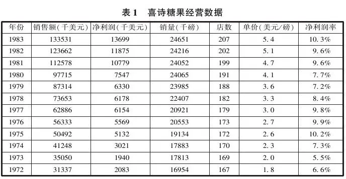

注：数据来源于伯克希尔公司年报。

后来，巴菲特在回顾喜诗糖果时，把它列为梦幻般的最伟大的投资对象之一。从1972年至2007年，喜诗糖果共为伯克希尔贡献了13\.5亿美元的税前利润，只消耗了其中3200万元用于补充公司的营运资金，其他资金被全部用来购买其他利润丰厚的企业，就像亚当和夏娃一样生养众多。

自我剖析：巴菲特致股东信

1983年

喜诗糖果的经营表现依旧亮丽，它拥有可贵而稳固的客户基础与管理阶层。近年来，喜诗遇到两个重大的难题，所幸其中至少有一个已找到解决的方法，这问题与成本有关，不过不是指原料成本。虽然我们跟竞争同业比原料成本较高，而若这种情况相反，我们反而会不高兴，事实上原料成本是我们较无法控制的，因为不管价格如何变化，我们所使用皆属最上等的原料，我们视产品品质为最重要的一点。

但其他成本却是我们可以控制的，问题就出在这上面，我们的成本（以每磅为基本单位，不包括原料成本）增加的速度远高于一般物价水准，若要扭转现在的竞争劣势与获利危机，降低成本绝对有其必要性。所幸最近几个月，成本已受到有效控制，相信1984年的成本增加率将会低于通货膨胀，这自信源自于我们与查克多年来共事的经验，自从我们买下喜诗以来便由他负责，而他的表现就如同下表一样有目共睹。

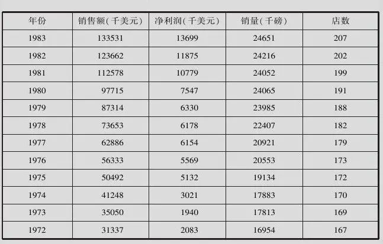

我们面临的另一个问题，如上表中可看到的，是我们实际售出的糖果磅数停滞不前，事实上这是这个行业普遍遇到的困难，只是过去我们的表现明显优于同业，不过现在却一样惨。过去4年来我们平均每家分店卖出的糖果数事实上无多大变化，尽管分店数有所增加（而销售费用同样增加），当然营业额因我们大幅调涨售价而增加许多，但我们认为衡量一家店经营绩效的标准在于每家分店卖出糖果磅数而非销售额。1983年平均一家店的销售量减少了0\.8%，不过这已是1979年以来较好的表现了，累计的降幅约达8%，集体订购量（约占整体销售的25%）在经过70年代成长高峰后已停滞不前。

我们不确定分店与集体订购的销售量无法增加，主要是受到我们的定价策略，还是景气萧条，或是受我们的市场占有率太高的影响。不过1984年我们调涨的幅度较以往几年温和，希望明年跟各位报告的销售量能因此增加，不过我们却无任何依据能保证这种情况一定发生。

除了销量的问题，喜诗具有多项重要的竞争优势，在我们主要的销售地区——西部，我们的糖果为消费者所偏爱，他们甚至愿意多花二三倍的价钱来购买（糖果就如同股票一样，价格与价值有所不同，价格是指你所付出的，而价值却是指你所得到的）。我们全美直营店服务的品质跟我们的产品一样好，亲切贴心的服务人员就跟包装上的商标一样，以一家雇用2000名季节性员工的企业来说，可是不容易办到的，这都要归功于查克与所有同人的努力。而由于我们在1984年仅微幅调整价格，所以预期明年的获利只与今年相当。

2007年

我们所寻找的企业来自于稳定行业中拥有长期竞争优势的企业。如果还能伴随着快速的有机增长，那就太棒了。但即使没有有机增长，这样的企业仍会提供丰厚回报。我们只需将企业获得的丰厚利润拿来，在其他地方购买类似的企业，没有规定说你必须将钱投向那些你已经赚钱的领域。事实上，这样做经常是错的：获取高额有形资产回报率的出色企业，不可能长期持续地把它们的大部分利润以很高的回报率再投资到公司内部。

让我们审视一项梦幻般出色的业务的原型，例如我们的喜诗糖果公司。这家公司所处的盒装巧克力行业并无让人兴奋之处——美国的人均巧克力消费极其低且一直没有出现增长，许多曾经著名的品牌如今都已经消失不见，在过去的40年内，只有三家企业赚到了像样的利润。事实上，尽管喜诗糖果公司的许多收入仅仅来自于几个州，但我相信这家公司的利润占了整个行业的近一半。

在蓝带印花公司1972年买下喜诗糖果公司的时候，这家糖果公司每年的糖果销售量为1600万磅（查理和我在那时获得了蓝带公司的控股权，并最终将它整合进了伯克希尔公司）。去年喜诗糖果公司的销售量为3100万磅，年增长率仅为2%。然而，喜诗家族在过去50年来所建立起来、随后又得到查克·希金斯和布莱德·金斯特勒强化的持久竞争优势，为伯克希尔公司创造了非比寻常的回报。

我们以2500万美元买下了喜诗糖果公司，当时它的销售额为3000万美元，税前利润不足500万美元。经营这家企业所需的资本为800万美元（每年还需要有几个月承担适度的季节性债务）。因此，这家公司投入资本的税前投资收益率为60%。有两项因素帮助该公司经营所需的资金降至最低——首先，销售的产品采用现金结算，这消除了应收账款；其次，生产周期和分配周期较短，这帮助库存降至最低水平。

去年喜诗糖果公司的销售额为3\.83亿美元，税前利润为8200万美元。如今经营这家企业所需的资本为4000万美元，这意味着自1972年以来我们只需要再投资3200万美元，以应对该企业最小程度的规模扩张——并获得骄人的财务增长。期间的税前利润总额为13\.5亿美元，除了那3200万美元，所有的这些利润都纳入了伯克希尔公司的腰包（开始几年则归蓝带印花公司所有）。在支付了企业利润税之后，我们使用剩下的资金来购买其他具有吸引力的企业，就像亚当和夏娃的行为带来了60亿人口一样，喜诗公司给我们带来了许多新的现金源泉（他对伯克希尔来说，就像《圣经》中所说的“丰腴膏沃且生养众多”）。

像喜诗糖果这样的企业在美国并不多，对许多企业来说，将利润从500万美元增加至8200万美元可能需要4亿美元左右的资本投资。这是因为成长中的企业，随着销售增长，对营运资金的需求也将同比增长，此外，对固定资产投资也有显著要求。

为实现增长而需要大量增加资本的企业，可能只是一项让人感到满意的投资。继续以我们自己的公司为例，从4亿美元的净有形资产中获得8200万美元的税前利润并不让人感到寒碜。但对企业的所有人而言，这就完全不同了，他们希望最好在没有大量资金需求的情况下能产生不断增加的现金流。这可以问问微软或者谷歌。

## 11.华盛顿邮报　1973

\(13\) 11\.华盛顿邮报 1973

2026年2月20日

12:59

11\.华盛顿邮报 [\1] 1973

公司背景

华盛顿邮报在1971年上市，总裁和大股东为凯瑟琳·格雷厄姆。1971年上市前夕，华盛顿邮报收到一封关于越战的五角大楼文件，联邦地区法院下达了禁令，禁止刊登该文件，但凯瑟琳顶住压力，坚持新闻操守进行了出版，之后大法官裁决支持该报，最高法院也支持大法官的裁决。这次胜利后，华盛顿邮报开始蜕变，从一家地区报纸一跃而成为一家重要的全国性大报。

1973年，华盛顿邮报深入挖掘报道“水门事件”，通过秘密线人对这起丑闻进行了大量报道。尼克松领导的白宫在五角大楼文件事件上已经与华盛顿邮报结了梁子，这次更是大加威胁，并使得华盛顿邮报的两家电视台失去了执照。再者，1973年正是熊市开始，标普500指数当年下跌了14\.8%，华盛顿邮报的股价一路暴跌，当年股价从年初约30美元下跌至年底的15美元，下跌约了50%。

巴菲特策略

1973年5月，巴菲特开始买入华盛顿邮报的股票，开始一共买入了23万股。之后，他给凯瑟琳写了封信。凯瑟琳由于害怕失去控制权，对恶意收购很敏感，在上市时已经将股票分为两类，其中B类股票没有投票权，凯瑟琳持有A类股票。

1973年底，巴菲特夫妇去拜访凯瑟琳，取得信任后，又购买了一批股票，总持股数为46\.175万股B类股，总购买价为1060万美元，平均购买价约23元，并与凯瑟琳签了书面协议，约定在未得到凯瑟琳的同意下不再购买该公司股票。在买入后，华盛顿邮报的股价还在继续下跌，到年底时，巴菲特买入的股份市值已经较成本亏损了26%。

在1974年，标普500指数下跌了26\.4%，华盛顿邮报的股价维持在低位，巴菲特持有的股票市值已经从1060万美元减少至约790万美元，亏损了26%。巴菲特还想继续购买，但他已经向凯瑟琳保证过不再购买，只能作罢，他把这只股票推荐给了他的朋友们。

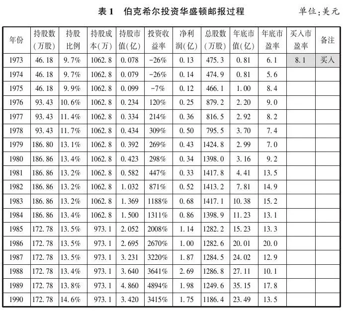

注：数据来源于伯克希尔年报和华盛顿邮报公司的年报。

巴菲特在1985年的致股东信中，详细阐述了他购买华盛顿邮报的原因。在1973年他购买期间，华盛顿邮报的总市值约8800万美元，当年公司净利润约1330万美元，市盈率约6\.6倍。巴菲特认为，报纸类公司具有经营垄断性，具备持久竞争优势，根据未来现金流折现的价值估算方法，该公司内在价值约为4亿到5亿，但市场价格当时不足1亿美元，具有非常大的折扣和安全边际。

从1973年到1985年底，巴菲特当初以1060万美元购买的华盛顿邮报股票市值已经大幅跃升至2\.2亿美元，总收益率约为19倍，年均复合收益率约为25%，同期道琼斯指数分别为82%和4\.7%。公司利润从0\.13亿美元增长至1\.14亿美元，增长约9倍，市盈率从6\.7倍增长至13\.3倍，增长约2倍。

报纸业的商业模式：报纸通过提供大量各方面的新闻，满足民众的信息获取需求。广告也是一种受欢迎的“新闻”，给民众提供招聘、促销、消费等方面的信息，同时广告收入也降低了民众的购买成本。反过来，报纸对于广告客户也不可或缺，作为商家的信息扩音器，其作用巨大。

报纸业的竞争优势：在电视和互联网普及之前，报纸是信息的主要来源，几乎所有城市最后只会剩下一家报纸。原因是，城市中一旦有一家报纸在发行量和受欢迎程度上有明显优势，自然会吸引最多的广告，广告反过来吸引读者，更多的读者又吸引更多的广告，良性循环，胖者更胖，而弱者被淘汰，最后形成事实上的垄断经营。

上世纪90年代后，电视机、网络等新媒体涌现，报纸开始面临激烈竞争，报纸业的业绩也开始停步不前，甚至开始倒退。华盛顿邮报随后将教育业务从课后培训业务拓展到高等教育、职业教育等领域。

自我剖析：巴菲特致股东信

1985年

我们之前曾提到，过去10年来，投资环境已由过去完全不看好大公司转变为适当的认同，华盛顿邮报就是一个最好的例子。

我们在1973年中以不到当时内在价值1/4的价格买进股权。计算价格/价值比并不需要有独到的眼光，大部分的证券分析师、经纪人与媒体经营者跟我们一样估计该公司的价值约在4亿到5亿美元之间，但当时其仅1亿的股票市值却是众人皆知，而我们具有的优势是态度：我们从格雷厄姆那里学到成功投资的关键是，在价格以大折扣低于内在价值时，买进好公司的股票。

在1970年代早期，大部分机构投资人认为企业价值与他们买进卖出的价格并无多大关联，现在看来当然令人难以置信。然而当时他们受到知名的商学院所提出的新理论所惑，“股票市场具有完全的效率，因此计算企业的价值对于投资活动一点也不重要”。事后想想我们实在亏欠这些学者太多了，在桥牌、西洋棋或选股等斗智的竞赛中，当对手被告知思考是白费力气的时候，还有什么比这个能让我们更有利呢？

1973到1974年间，华盛顿邮报的表现依旧良好，使得内在价值持续增加。尽管如此，到1974年底，我们在该公司的持股市值却大跌25%，由买入时的1060万美元变成800万美元。一年前我们觉得便宜得可笑的股票，如今变得更加便宜，无比智慧的市场将股价向下调整到内在价值的2折以下。

结局很美好，华盛顿邮报的总裁凯瑟琳具有无比的智能与勇气，除运用极佳的管理才能将公司的内在价值进一步提升之外，更以便宜的价格大量回购公司的股份。与此同时，投资人开始认识到公司特殊的竞争优势，而使得公司股价回升到合理的价位。所以我们享受了三重好处，一是公司本身的价值提升，二是每股价值因公司回购进一步得到提高，三是随着折价幅度逐渐缩小，股价的涨幅超过每股盈利的增长幅度。

除了1985年依持股比例卖回给公司的股份外，其他的持股皆未变动，年底持股的市值加上卖出股份所得的收入合计为2\.2亿美元。

假若在1973年中，我们将1060万随便投资几家当时最热门的媒体公司，则到今年底我们持股的市值大约会在4000到6000万元之间，这结果显然比一般市场的平均表现高出许多，其原因在于媒体公司的特殊竞争力。至于投资华盛顿邮报多出来的1\.6亿部分，是因为华盛顿邮报的总裁凯瑟琳作出的决策优于其他大部分媒体事业的经营者，虽然她惊人的成就并未有人大幅报导，但伯克希尔的所有股东却不能不感激。

由于我们买下大都会股份（后面会详描述），使得我必须在1986年被迫离开华盛顿邮报的董事会，但只要法令许可，我们将无限期地持有华盛顿邮报的股份。我们期待该公司的价值持续稳定成长，我们也知道公司的管理阶层有才能且完全以股东的利益为导向，不过该公司的市值目前已增加至18亿美元，公司的价值很难再以当初市值仅1亿美元时的速度成长。由于我们其他主要持股公司的股价也都大幅上涨，所以我们的投资组合很难有和过去一样的成长潜力。

1987年

有时候股票市场让我们能够以不可思议的价格买到绩优公司的部分股权，这个价格远低于协议买下整家公司取得控制权的平均价格。举例来说，我们在1973年以每股5\.63元买下华盛顿邮报的股票，该公司在1987年的每股盈余是10\.3元，同样，我们分别在1976、1979与1980年以每股6\.67元的平均价格买下盖可保险的部分股权，到了去年其每股税后的营业利润是9\.01元，从这些情况看来，市场先生实在是一位非常大方的好朋友。

1993年

华盛顿邮报的发行人——凯瑟琳女士在去年决定正式退休，1973年我们斥资1000万美元买进她公司的股份，时至今日我们每年从该公司取得700万美元的股利，而持有股票的市值已超过4亿美元。当初在决定买进该公司的股份时，我们便看好该公司的前景，但另外一点同样重要的是，查理和我都认为凯瑟琳将会证明自己是位杰出的经理人，同时能够诚实地对待所有的股东，后面那一点尤其重要，因为该公司股份分成两种，而这种架构常常遭到许多经理人滥用。

而我们做这项投资的正确性可通过许多事件获得证明。凯瑟琳杰出的表现使得她获得《财富》杂志的推荐进入商业名人堂，而对于身为股东的我们来说，查理和我早就把她列入伯克希尔的名人堂之中。

2012年

新闻，简单说，是一种人们不知道但又想知道的事情。人们会从各种渠道寻找对他们重要的新闻，这些新闻是及时性、方便性、可信性、综合性和低成本等因素的完美结合。这些因素的相对重要性因人而异，并由于新闻种类不同而有所变化。

在电视和互联网之前，报纸是大量新闻的主要来源，对绝大多数民众是不可缺少的。无论你感兴趣的是国际新闻、国内新闻、地区新闻、体育新闻，还是财经新闻，报纸常常是第一个告诉你最新的信息。确实，你买的报纸包含了如此大量的你希望去了解的信息，使得你感觉很值得，即使只有少数几页符合你的兴趣。更好的是，刊登广告的人通常会为所有这些页面的成本付款，而读者则从中得到实惠。

此外，广告本身也提供了对于大量读者来说很感兴趣的信息，相当于提供了更多的“新闻”。对于许多读者来说，知道哪些部门和职位在招聘，哪些超市在搞促销，哪些电影在何时何地上映，远比编辑们写的社论观点更重要。

反过来说，地区报纸对广告客户来说也不可缺少。如果西尔斯和西夫韦在奥马哈开了商店，他们是不是需要一个扩音器，去告诉城市居民为什么今天应该去逛逛他们的商店。确实，大的百货商店和珠宝店争先恐后地去刊登大幅广告，是因为他们知道这些广告的商品会被抢购一空。没有其他扩音器能够与报纸相提并论，所以广告能够自我销售。

只要一家报纸是所在社区唯一的报纸，他的利润注定会非常好，无论管理的好还是不好都区别不大。（正像一位南方出版商所说的：我的得意社会地位归功于两项伟大的美国制度——裙带关系和垄断。）

历年来，几乎所有城市都变成只有一家报纸（或者两家竞争性的报纸合并成一家来经营）。这种报纸的减少是不可避免的，因为人们希望只订阅一家报纸。但竞争存在时，在发行量上有明显优势的报纸自然会获得最多的广告。于是广告吸引读者，读者吸引广告。这种共生过程会导致弱势报纸的淘汰，正所谓“胖者生存”。

[\1] 本章部分内容参考：艾利斯·施罗德\.滚雪球\[M\]\.北京：中信出版社，2009\.

## 12.政府雇员保险公司GEICO　1951、1976

\(14\) 12\.政府雇员保险公司GEICO 1951、1976

12\.政府雇员保险公司GEICO 1951、1976

公司背景

GEICO的全称为政府雇员保险公司，主要经营汽车保险，创建于1936年，创始人为古德温夫妇。公司初始的顾客群主要为事故率低的政府雇员、头等兵和军官等，采取直接邮寄保单的销售方式，没有保险代理商，其销售成本比有销售代理商的保险公司低约30%，其保险利润率比行业平均高出约15～20个百分点，因此有显著的竞争优势。

巴菲特策略

1948年，本杰明·格雷厄姆成为GEICO的大股东之一。1950年，作为一名研究生和格雷厄姆的学生，巴菲特拜访了GEICO，正巧副总裁大卫在加班，接待了巴菲特。大卫花了约4个小时，详细向巴菲特解释了保险公司的运营方式，告诉巴菲特GEICO的核心竞争优势在于直销模式带来的低成本优势。

1951年，巴菲特大学毕业后回到奥马哈做股票经纪人，他认为当时GEICO的股票很有吸引力，开始不断买入GEICO的股票，并向周围投资人推荐GEICO。到1951年底，巴菲特共买入了350股，总购买价为10282元，平均买入价为29\.4元，超过50%的资产投在了这个公司的股票上。

1949年和1950年，GEICO的每股利润分别为4\.71美元和3\.92美元，1951年的股价约为1950年每股利润的8倍。巴菲特认为，GEICO虽然在1951年利润会进一步减少，但由于1950年正处于保险行业不景气的年份，保险费率已经开始上涨，其效果会在1952年显现出来。因此，当前价格相对于公司巨大的增长潜力来说，很具有吸引力。

1951年12月6日，巴菲特在《商业与金融年鉴》杂志上撰文推荐GEICO，文章的名字叫《我最喜欢的股票》。在文中，巴菲特写道：“经济衰退时期，随着成本竞争重要性的日益增加，政府雇员保险公司在费率方面所具有的优势，很可能会抢走其他保险公司的业务。随着保险费率由于通货膨胀的原因不断上涨，25%的费率变动幅度完全可以为保险公司创造更大的利润浮动空间。”“政府雇员保险公司目前的价格，大约是1950年盈利的8倍。而1950年是保险业不景气的一年。可以说，公司未来巨大的增长潜力并没有体现在股价上。”

1952年，巴菲特以总价15259元全部卖出了GEICO的股票，原因是当时他看中了一家更有吸引力的公司股票，这家公司叫西部保险证券公司，其每股利润约2\.9美元，而股价才3美元，市盈率约1倍。但是GEICO在其后继续快速成长，20年后，巴菲特当时持有的350股已经价值1300万。

20世纪70年代，大卫的继任者犯了一连串错误，低估了保险理赔的成本，使得销售的保单价格过低，导致公司濒临破产。1976年，GEICO的亏损高达1\.9亿美元，董事会解雇了管理层，之后找来拜恩担任总裁。拜恩需要筹集7600万美元来拯救这家公司，但当时没人愿意伸手援助。GEICO的股价曾一度达到61美元，不过现在股价只有2美元。巴菲特心动了，他拜访了拜恩，经过交谈，他十分认可拜恩的能力，并认为GEICO的核心优势并没有消失。第二天，他命令买进50万美元的GEICO股票，并指示只要市场上有出售就立即买进，共买入了约400万美元。

拜恩拜访了华尔街的银行家们，但吃了闭门羹，最后找到当时规模还很小的所罗门兄弟公司。拜恩滔滔不绝地罗列他们应该出钱的理由，说得口干舌燥、唾沫横飞。所罗门的经理最后说：我会承保的，除非你闭嘴。所罗门公司承担了7600万美元的可转换优先股担保，使得GEICO解了燃眉之急。此时，巴菲特更是加紧买入GEICO的股票，几周之后股价就增长了3倍，上升至约每股8美元。

1980年，巴菲特再次大笔买入GEICO的股票，当年斥资1890万美元以每股12\.8美元购买了147万股，总共持有720万股，占GEICO的总股本的33%，总成本4713万美元，平均每股6\.67元。至1980年底，GEICO的总市值为3\.1亿美元，总股数为2100万股，股价约为14\.8元，当年保费收入约为7亿美元，净利润约为6000万美元，每股净利润约为2\.9元，年底股价市盈率约5倍，巴菲特购买价的市盈率约为4\.4倍。

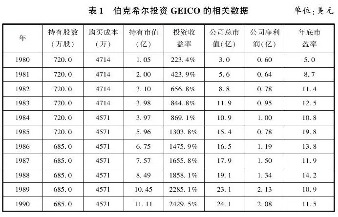

注：数据来源于伯克希尔年报。

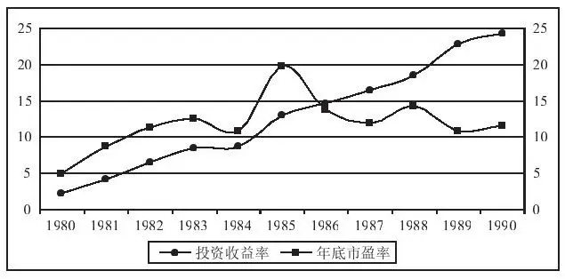

图1 伯克希尔投资GEICO的收益率

1980—1990年的10年里，伯克希尔在GEICO的投资收益增长了约10倍，年均收益率约为27%。其中，GEICO公司净利润从0\.6亿美元增长至2\.08亿美元，增长总倍数约为3\.5倍；市盈率从5倍增长至11倍，增长倍数约为2\.2倍；而通过股票回购，伯克希尔的股权占比增长了约40%。这三个因素共同作用，使得这10年的总投资收益率达到10倍，年均投资收益率高达27%。

在1980年之后的15年里，GEICO不断回购公司股票，使得伯克希尔的股权占比不断提高。1995年，伯克希尔的股权占比已经提高至50%，并花费23亿美元收购了剩余50%的股份。之后，GEICO不断为伯克希尔贡献免费的保险浮存金用于投资，帮助伯克希尔的资产净值快速增长。

1977—1980年投资的4700万，到1995年价值约23\.9亿，16年时间价值成长了约51倍，年均复合收益率约为28%，在危机时刻对核心优势的精确把握成就了令人生畏的投资业绩。

保险行业的产品难以做到显著差异化，所以竞争非常激烈，导致周期性的盈利和亏损，其核心竞争优势在于成本。GEICO直接销售的商业模式形成了持续的低成本优势，当保险业供大于求时，各公司竞相压价，但成本最低的公司仍然能够盈利，成本高的公司遭到淘汰。当市场供求关系逆转时，成本最低的公司则率先复苏。

另一方面，保险公司的浮存金投资能力也是其核心能力之一。GEICO旗下负责投资管理的卢·辛普森，拥有令巴菲特自叹不如的高超投资能力。

如表2所示，1980年到1986年的这段时间，GEICO保险资金的年平均投资报酬率高达31%，总收益率为6\.37倍，而同期标准普尔500指数分别为12\.8%和3\.1倍。从1980年到1995年的这段时间，GEICO保险资金的年平均投资报酬率高达22\.8%，同期标准普尔500指数为15\.7%。

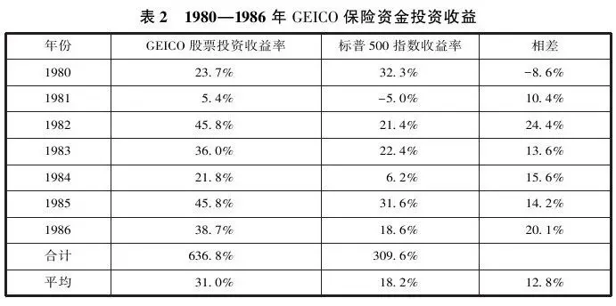

注：数据来源于伯克希尔年报。

自我剖析：巴菲特致股东信

1980年

目前我们不具控制权的股权投资最大的部分就是持有33%股权，约720万股的GEICO。通常若持有一家公司股权达到这样的比例（超过20%），便必须采用权益法每年依比例认列其投资损益。由于伯克希尔当初依照政府部门的特别命令购买该公司股份，其中规定须将此投票权交由一公正第三方管理，所以失去了投票权，意味伯克希尔对GEICO不具实质控制权。

当然，认不认列损益对伯克希尔及其股东而言，并不影响其实质的经济利益，这些盈余的实际价值将取决于运用它们的GEICO经营阶层能力的高低。

关于这一点，我们再满意不过了，GEICO可说是投资业界的最佳典范，它具有难以模仿的产业优势，同时加上高超的资金管理技巧。

如你所见到的，我们的持股成本约4700万美元，分别是在1976年与1980年分两次投入，依实际配息情况，我们每年约从GEICO认列300万元的利益，但实际上每年可分得的盈余却高达2000万元。换言之，我们光是在该公司未分配的盈余就达伯克希尔账面盈余的四成左右。

另外，我们必须强调的是，我们完全赞同GEICO经营阶层将剩下属于我们的1700万保留起来未予分配的做法，因为在此同时，GEICO于近两年内陆续买回自家股票，使得该公司流通在外的股份由3400万股缩减至2100万股，大大增进了原有股东的权益，如此对待股东的方式实在是无话可说。

过去几年我们一再提到买进那些具有转机题材的产业令人大失所望的结果，这些年我们大约接触了数百家这样的公司，最后不管是真正投入与否，我们都持续追踪其后续发展，在比较过预期以及实际的表现后，我们的结论是，除了少数的例外，当一个赫赫有名的经营者遇到一个逐渐没落的夕阳产业时，往往是后者占了上风。

GEICO或许是一个例外，自1976年几乎破产的边缘东山再起，从经营阶层杰克·拜恩上任的第一天起优异的表现，正是它能获得重生的最大因素。

当然，即使身陷于财务与经营危机当中，GEICO仍享有其最重要的产业竞争优势，这也是关键。

在汽车保险行业，不同于大部分行销组织僵化的同行，一直以来GEICO将自己定位为低营运成本的公司，所以能够在为客户创造价值的同时，也为自己赚进大把钞票。几十年来都是如此，而即使它在70年代中期发生危机，也从未减损其在此方面的经济竞争优势。

GEICO的问题与1964年美国运通所爆发的色拉油丑闻事件类似，一时的打击并未毁掉其原本的经济基础，就像是一个身体健壮的人得了局部可切除的肿瘤，只要遇到一位经验丰富的医生，就能化险为夷。

不论怎么说，我们还是很高兴能够以4700万美元的代价买到GEICO的持股，因为通过谈判购并方式想要买下一家类似具经济特质与光明前景，且每年可创造2000万盈余的公司，至少得花上2亿美金（有些产业的要价可能还更高）。

100%的持股可使控制人得以掌握公司的生杀大权，同时也会给企业总部带来一些乐趣（这点通常比较少人会提到）。由于保险业的规定，我们只能取得绩优企业的少数股权（以远低于买下整家企业的价格投资，这代表我们不能更换经营阶层、无法对资金做重新配置甚至处分公司）。但是，我们从来就不会感到任何不妥，在企业经营的世界里，杰克·拜恩或GEICO都算是少数，能够以伙伴的关系与它们共同合作有何不可呢？

GEICO持续以追求效率与客户服务为核心，而这点也保证了公司非凡的成功。杰克·拜恩与比尔·施奈德正在完成人类最难以捉摸的目标——让事情简单化并牢记你所欲达成的目标，加上业界最优秀的投资经理人卢·辛普森，我们很满意这种最佳组合。GEICO属于前面我们所提及的过度供给的大众化商品行业，但却是高获利特殊情况的最佳典范。它是一家具有既深且广的成本优势的公司，我们在该公司35%的权益代表约2亿5千万的保费量，远大于我们直接取得的数量。

1983年

GEICO在1983年的表现之好，其程度跟我们自己掌管的保险事业差劲的程度一样，跟同业平均水准111相比，GEICO的成本收入比为96，在这之前我从不认为它能够表现得如此之好，这都要归功于优异的企业策略与管理层。

杰克与比尔在承销部们一贯维持着良好的纪律（其中包含最重要的适当的损失准备提列），而他们的努力从新业务的开拓中获得了回报，加上投资部门的卢·辛普森，这三个人组成了保险业的梦幻队伍。

我们拥有GEICO大约1/3的股权，依比例约拥有2\.7亿元的保费收入，约比我们自己保险公司的保费还多80%，所以可以这么说，我们拥有的是全美最优质的保险业务，但这并不代表我们就不需改进自有的保险业务。

1984年

至于GEICO的消息与往常一样，大致上都不错。1984年，公司主要业务的投保户大幅增加，且其投资部的表现也一样优异，虽然承销结果不尽理想，但仍较同业突出。截至去年底，我们拥有该公司36%的权益，若以其产险总保费收入8\.8亿计，我们拥有的部分约3\.2亿左右，大约是我们自己承保量的2倍。

过去几年我一再提醒各位，GEICO的股价涨幅明显超越其本业的表现，虽然后者一样杰出。GEICO在我们公司的账面价值成长幅度大于该公司本身内含价值的成长幅度，而我同时也警告各位这种情形不会年复一年地一再发生，总有一天其股价的表现将逊于本业，而这句话在1984年应验了。去年，GEICO在伯克希尔的账面价值没什么变动，不过其公司的内含价值却大幅增加，而由于GEICO代表着伯克希尔27%的净值，当其市场价值迟滞不前，便直接影响伯克希尔净值成长的表现。但我们对这样的结果并不会觉得有什么不好，我们宁愿要GEICO的企业价值增加X倍而股价下跌，也不要公司内含价值减半而股价高涨。包括GEICO这项投资，乃至于我们所有的投资，我们看的是公司本质的表现而非其股价的表现，如果我们对公司的看法正确，市场终将还它一个公道。

所有的伯克希尔股东皆由于GEICO的经营团队，包括杰克·拜恩、比尔·施奈德与卢·辛普森而获益良多，在他们的核心事业——低成本的汽车与房屋住宅保险，GEICO拥有显著且持续的竞争优势，这在一般业界并不多见，可谓投资人的稀世珍宝（GEICO本身正说明了这一点，优秀的经营团队将所有的重心放在核心事业以维持高获利能力）。GEICO核心事业所产生的资金大部分皆交由卢·辛普森来投资，卢是一个感性与理性兼具的罕见人才，这项人格特色使其在长期投资方面有杰出表现，即使承受较低的风险，其投资报酬却较同业表现要好许多。在此，我对以上三位杰出经理人表达赞赏与感谢之意。

1985年

伯克希尔持有38%股权的GEICO公司，在保费收入成长与投资收益方面皆表现突出，但在承保结果与其过去高标准相较却表现平平，私家小客车与住宅房屋险是去年恶化最厉害的险种，GEICO也难逃一劫，虽然它的成绩比起其他主要的竞争对手要好得多。杰克在年中离开GEICO去主持消防人员基金，留下比尔与卢担任正副董事长。杰克之前挽救GEICO免于破产的表现卓著，他的努力使得伯克希尔获益良多，我们欠他的实在是数不清。其中还包括吸引许多优秀的人才，他找到具有跟他一样特质的经营阶层来继承他的工作，使得他对公司的贡献与影响力超过他实际的任期。

1986年

由伯克希尔持有41%股权的GEICO公司，在1986年表现相当突出，就整个产业而言，个人险种的承保表现一般来说不如商业险种，但以个人险种为主要业务的GEICO，其综合比率却降低到96\.9，同时保费收入亦增加了16%。另外，该公司也持续买回自家公司的股份，总计1年下来流通在外的股份减少了5\.5%，我们依投资比例所分得的保费收入已超过5亿美元，大约较3年前增加1倍。GEICO的账目是全世界保险公司中最好的，甚至比伯克希尔本身都还要好。GEICO之所以能够成功的重要因素，在于该公司从头到脚彻底地精简营运成本，使得它把其他所有车险公司远远拋在脑后。该公司去年的费用损失占保费收入的比例只有23\.5%，许多大公司的比例甚至比GEICO还要多出15%，即使是像Allstate与State Farm等车险直销业者，成本也比GEICO高出许多。

若说GEICO是一座价值不菲且众所仰望的商业城堡，那么其与同业间的成本与费用差异就是它的护城河。没有人比Bill，也就是GEICO的主席，更懂得如何去保护这座城堡。靠着持续降低成本开支，他不断地将这个护城河加大，使得这城堡更加稳固。过去两年间，GEICO创造了23\.5%超低成本率，展望未来，这项比率仍将持续下降。若能够同时再兼顾产品品质与客户服务的话，这家公司的前途将无可限量。另外，GEICO这一飞冲天的火箭，同时由负责投资部门的副主席卢·辛普森点燃第二节燃料仓，比起卢·辛普森于1979年接掌该公司投资部门后的绩效，身为母公司伯克希尔投资主管的我，实在觉得有点汗颜。而也因为我们拥有这家公司大部分的股权，使我在向各位报告以下数字时，能够稍微心安理得一些。

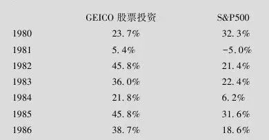

必须再次强调的是以上的数字不但是漂亮极了，更由于其稳定成长的态势，卢能够不断地找到价值被低估的股票加以投资，所以风险相对很低，也很少会产生损失。总而言之，GEICO是一家由好的经理人经营的好公司，我们很荣幸能与他们一起共事。

1987年

有时候股票市场让我们能够以不可思议的价格买到绩优公司部分的股权，远低于协议买下整家公司取得控制权的平均价格。举例来说，我们在1973年以每股5\.63元买下华盛顿邮报的股票，该公司在1987年的每股盈余是10\.3元，同样地，我们分别在1976、1979与1980年以每股6\.67元的平均价格买下GEICO的部分股权，到了去年其每股税后利润为9\.01元，从这些情况看来，市场先生实在是一位非常大方的好朋友。

到目前为止，伯克希尔算是资金成本相当低的公司。我们拥有48%股权的GEICO的资金成本更低，且通常每年都享有承保获利。GEICO借由不断地成长提供越来越多的资金以供投资，而且它的资金成本还远低于零成本以下。意思是说，GEICO的保单持有人不但要先付保费给公司，而且还要支付利息（就像有人又帅又有才干，GEICO非凡的获利能力源于公司经营的超高效率和对风险的严格分类，如此使得投保户也可享受超低价格的保单）。

1994年

我们投资美国运通的历史可以追溯到非常早的时期，而事实上与我个人过去的经验相符。举个例子，在1951年，当时我还是年仅20岁的股票业务员，GEICO保险占我个人投资组合的70%，同时它也是我第一次卖掉的股票，我将100股的GEICO股份卖给我的阿姨爱丽丝，基本上只要是我建议的她都照单全收。25年后，趁着该公司面临倒闭的危机，伯克希尔买下GEICO一大部分的股份。另一个例子就是华盛顿邮报，1940年代，我的第一笔投资资金有一半是来自发送该报的收入，30年后，伯克希尔趁该公司上市两年后的股价低档买下一大部分的股权。至于可口可乐，可以算得上是我生平从事的第一笔商业交易，1930年当我还是个小孩子的时候，我花了25美分买了半打的可乐，然后再以每罐5美分售出去，而直到50年后，我才终于搞懂真正有赚头的还是那糖水。

1995年

就在去年底，我们完成买进GEICO100%股权的动作。GEICO是全美第七大汽车保险公司，约有370万辆汽车加保，我个人与GEICO的关系长达45年以上，虽然这段故事已经说过很多遍，我认为还是有必要在这里稍微复述一次。

我是在1950—1951年间就读于哥伦比亚商学院，当时的目的并不在于取得学位，重点还在于我可以受教于当时在该校任教的本杰明·格雷厄姆。上格雷厄姆的课实在是一种享受，很快就让我从偶像那里学习到许多东西。有一回，我翻开全美名人录，发现我的恩师格雷厄姆是政府雇员保险公司——GEICO的董事会主席，对于当时的我而言，那完全是一家陌生产业的不知名公司。

一位好心的图书馆员，介绍我看看全美最佳火险与意外险公司手册，我发现GEICO的总部位于华盛顿特区，所以在1951年1月的某个星期六，我搭乘火车前往位于华盛顿的GEICO总部。一到当地，令人失望的是总部大门深锁，朝着大门敲了半天，终于有位守卫前来应门，我向这位一脸疑惑的警卫先生问道，公司是否有人可以跟我谈一谈，这位老兄说六楼有人在加班，你可以去找他试一试。

就这样我遇到了当时还是副总裁的大卫，后来他成为GEICO的总裁。虽然我唯一的背景只是格雷厄姆的一名学生，大卫还是很好心地花了4个小时左右的时间，好好地给我上了一课，我想大概没有人能够像我这样，可以幸运地接受如何经营保险业的半天课程。大卫很坦白地告诉我，GEICO的竞争优势在于直接行销，这使得该公司相较于一般竞争同业必须通过传统的业务中介的经营方式所负担的成本要低许多，后者依赖于传统的行销网络。而在上过大卫的课之后，GEICO也成为我有生以来觉得最心动的一只股票。

在我从哥伦比亚大学毕业的几个月后，我回到奥马哈担任股票业务员，自然而然地，我把重心全部放在GEICO这只股票上。我做成的第一笔生意就是把它介绍给总是最支持我的阿姨爱丽丝。不过当时的我只是个20岁初出茅庐的小伙子，所以我的话总是没有人愿意相信。即便如此，我还是在1951年写了一篇最佳推荐个股——《我最喜欢的股票——政府雇员保险公司》，并刊登在当时最大的金融时报专栏之上，当然最重要的是我自己也买了这家公司的股票。

你可能会觉得很奇怪，不过打从1944年开始报税到现在，我都保留每年个人报税的资料。在将这些资料拿出来比对之后，我发现在1951年我总共分四次买进GEICO股份，最后一次是在9月26日。这样的做法让我觉得自己很早就有自我沉醉的倾向，印象中我那时是在向别人推销这批股票不成之后，决定自己吃下这批股票，尽管在当时我已将个人50%以上的身家全都押在这只股票之上。而在加码之后，我总共持有350股的GEICO股份，成本为10282美元，到了年底，这些股票的市值成为13125美元，超过个人净值的65%。

所以大家可以看出GEICO公司可以说是我投资生涯的初恋。还有一点也相当具有纪念价值，我买下GEICO大部分的资金是来自于派送华盛顿邮报的收入，而后来经由伯克希尔，我靠着华盛顿邮报，将1000万美元变成5亿美元。

可惜的是，在1952年，我以15259美元的价钱将全部的GEICO股份出清，然后将所得资金投入到西部保险证券公司之上。这项变心的举动，一部分的原因是因为西部保险证券当时的股价相当吸引人，本益比只有一倍多一点。然而，在往后的20年间，当时被我卖出的GEICO股份的价值却成长到1300万美元，这样的结局让我体会到绝对不能卖掉一家明显的好公司的原则。

1970年代初期，在大卫退休后不久，继任的管理阶层犯了一连串严重的错误。他们低估了保险理赔的成本，使得公司对外销售保单的定价过低，此举导致公司几乎面临倒闭的命运。所幸后来由杰克·拜恩在1976年接掌公司，并采取紧急的补救措施后，才使得公司幸免于难。

由于我相信杰克以及该公司原本拥有的竞争优势，伯克希尔在1976年下半年买进大量的GEICO股份，之后又小幅加码。到了1980年底，我们总共投入4570万美元取得该公司33\.3%的股权。然而，在往后的15年内，我们并没有再增加持股，不过由于该公司不断地购回自家公司的股份，使得我们在GEICO的持股比例逐渐增加到50%左右。

1995年，我们同意以23亿美元买下另一半原来不属于我们的股份，这实在是天价。不过它让我们可以百分之百拥有一家深具成长潜力的企业，且其竞争优势从1951年到现在一直都维持不变。更重要的是，GEICO拥有两位相当优秀的经理人，一位是专门负责保险部门营运的托尼·奈斯利，一位是专门负责投资部门营运的卢·辛普森。

52岁的托尼·奈斯利在GEICO任职已有34年了，兼具智慧、精力、品格与专注力，他是我心目中经营GEICO保险部门的不二人选。如果我们够幸运的话，托尼·奈斯利应该还能再为我们经营GEICO 34年以上。

另一方面，卢在管理投资方面同样出色。从1980年到1995年的这段时间，GEICO的投资在卢的管理之下，年度平均投资报酬率高达22\.8%，同期间，S＆P只有15\.7%。卢·辛普森在GEICO所采取谨慎保守、专注集中的投资方式与伯克希尔一致，有他在，对伯克希尔来说绝对有相当大的帮助。而他的存在，同时也使得伯克希尔可以确保查理跟我本人万一要是有任何突发状况时，能够有一位杰出的专业人士可以立即接手我们的工作。

GEICO如同过往一般，持续地吸引优良的保户前来，而GEICO的服务也确实令他们满意，当然定价与提列准备必须适当，但是该公司能够成功的最重要关键，还在于超低的成本结构，这实在是其他竞争同业远远比不上的。1995年，在托尼与其领导的经营阶层的努力之下，该公司的承保损失与营业费用比率进一步压低到保费收入的23\.6%，比起1994年又低了一个百分点。在商业的世界，我致力于寻找拥有强不可破的护城河所保护的企业堡垒，感谢托尼·奈斯利跟他的经营团队，GEICO周围的护城河又更加宽了许多。

最后，让我向各位报告一下大卫的近况，93岁高龄的他，对我而言亦师亦友，到现在他还是一样关心GEICO的情况。而当公司现任的主管杰克·拜恩、比尔·斯奈德与托尼·奈斯利有任何需要他的地方，他都会随时挺身相助。虽然这次的并购案将使得大卫必须承担大笔的税负，但他还是一样支持这项交易。

自从我认识大卫后，45年以来他一直就是我崇拜的偶像之一，而他确实也从未让我失望过。大家必须了解，如果没有大卫在1951年那个寒冷的星期六慷慨解说，伯克希尔就绝对不可能会有今天的成就。多年来，在私底下，我已不知感谢他多少次了，但是今天在这里我觉得应该借着今年的年报，代替伯克希尔所有的股东向他致上深深的感谢之意。

阅读延伸：我最喜欢的股票——政府雇员保险公司（GEICO）

节选自《商业与金融年鉴》

1951年12月6日 沃伦·巴菲特

全民就业，居高不下的利润，以及创纪录的股利分派，让人们无论如何也联想不到股票价格的低落。在过去的五年里，大多数行业都出现盛极一时的繁荣，在这期间，为数不多的悄然变化似乎让人无法察觉。

然而，汽车保险行业却没有机会分享这让人欢欣鼓舞的飞跃。汽车行业在经历了第二次世界大战后长期徘徊不前的局面之后，终于在1949年走上正轨。1950年，经营事故保险的保险公司股票，由于连锁反应经历了15年内的第二次挫折。这些公司（尤其是那些承揽大量汽车保险业务的公司）最新公布的收入报告，开始让人们对牛市的吹捧热情有所下降。根据正常的收入能力以及其他资产要素，很多公司的股票价值似乎是被市场低估了。

这个行业在本质上具有削弱周期性浮动的优势，大多数汽车的购买者都认为汽车保险是一个非常必要的环节。有关合同收费标准也必须按照市场的发展状况来加以调整和更新。尽管由于在1945—1951年期间出现的物价上涨，给这些公司带来了一定的损失，但是，在通货紧缩政策发挥效力的情况下，根据成本对费率加以调整对于这些公司来说应该是有利可图的。

这个行业的另外一个优势在于不存在存货、劳动力和原材料问题。此外，基本不存在产品过时和落后的风险。

政府雇员保险公司成立于20世纪30年代中期，公司的目的主要是在全国范围内为一部分阶层提供全套的汽车保险，具体的服务对象包括：（1）联邦、州和市政府的雇员；（2）军队的现役军官和预备军官，以及现役的头等兵；（3）在服役期间享受此专项待遇的退役军人；（4）前政府官员；（5）大学、学院和学校的员工；（6）专门从事国防工作的政府采购机构雇员；（7）股东。

这家公司不设立任何代理机构和分支机构。因此，投保人可以按照公开收费率享受高达30%的折扣优惠购买汽车保险单。这家公司在全国各地通过大约500名代理人处理客户的索赔业务，因而顾客的索赔要求可以马上得到解决。

在过去的几年里，人们一直在毫不吝啬地用“成长性公司”这个词来形容那些收入不断增长的公司，而事实上，这些公司的成长在很大程度上来自于通货膨胀以及业务竞争所带来的一般性收入。而政府雇员保险公司则是地地道道一个处于成长阶段的公司，他们在过去的一些年中所取得的业绩反映出公司的良好发展前景：

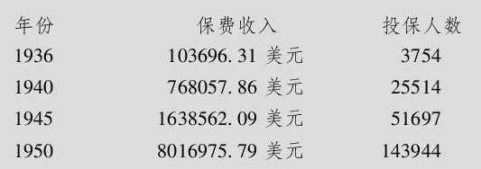

当然，昨天的成长对于今天的投资者来说毫无意义。对于政府雇员保险公司来说，我们完全有理由可以相信公司在未来会出现更大幅度的增长。在1950年以前，公司仅在美国全部50个州中（包括华盛顿特区和夏威夷在内）的15个州注册登记。在1950年年初，公司在纽约州的客户还不到3000人。

不同地区的保单费率具有不同的价值。在纽约，对于一个价值为125美元的保单按25%的费率收取保费，比人口稀少地区一个价值50美元的保单按照25%费率收费更有利可图。

在经济衰退时期，随着成本竞争重要性的日益增加，政府雇员保险公司在费率方面所具有的优势，很可能会抢走其他保险公司的业务。随着保险费率由于通货膨胀的原因不断上涨，25%的费率变动幅度完全可以为保险公司创造更大的利润浮动空间。

目前，没有来自代理人的压力，要求他们一定要接受那些可能存在问题的保险申请或一定要承接风险较大的业务。在某些费率结构不太合理的州，也许不应该继续进行新的保险推销活动。

政府雇员保险公司吸引人的地方，很可能是他们在利润方面所具有的优势。1949年，政府雇员保险公司的保险利润与保费之比为27\.5%，而根据贝斯特的分析，同期国内全部133家上市的事故险保险公司中，该比例仅有6\.7%。1950年，由于整个行业趋势发生恶化，贝斯特的分析显示出，行业的保费利润已经下降到3%。同期，政府雇员保险公司的保费利润也下降到18%。尽管政府雇员保险公司并不承揽所有类型的事故险，但是，对于公司最主要的两个险种——人身伤害险和财产损失险，却是整个公司各种产品中利润最低的两种产品。政府雇员保险公司还承揽了大量的交通事故险，这一产品在1950年为公司带来了相当可观的利润。

在1951年的上半年，所有保险商在人身伤害险和财产损失险方面都出现了严重的亏损。同期政府雇员保险公司的利润率也出现大幅度的下滑，勉强超过了9%，而马萨诸塞州保险公司则出现了16%的亏损，新阿姆斯特丹事故险公司的亏损比例则为8%，标准事故险公司的亏损比例达到了9%。

由于政府雇员保险公司正处于快速的增长期，因此，公司不得不维持低水平的现金股利。公司通过股票股利和一次25:1的股票分割，使公司的对外流通股从1948年6月1日的3000股增加到1951年11月10日的250000股。同时公司还发行了附属关联企业的认股权凭证。

从1948年开始，本杰明·格雷厄姆通过收购和股利派发的形式获得了公司的大量股份，从那时起，他一直在任政府雇员保险公司的董事长。莱欧·古德温从公司成立之日起，一直亲手执掌着公司的发展，他是一位非常能干的总裁。到1950年底为止，公司董事会的10名成员拥有公司大约1/3的对外流通股。

与1949年4\.71美元的每股收益相比较，公司在1950年的每股收益为3\.92美元。尽管这一指标在表面上似乎正在下降，但是，我们必须看到公司在1949年的业务量还很小，这些数字不包括公司无法计入收入的保费储备金。事实上，储备金在这两年的全部保费收入中占有相当大的份额。尽管1951年的每股收益低于1950年，但是，保费费率在去年夏天出现了新的一轮上涨风潮，将会在1952年的盈利中体现。1947—1950年，公司的投资收入增长为4倍，这反映出公司在资产总额方面的大幅度增长。

政府雇员保险公司目前的价格，大约是1950年盈利的8倍。而1950年是保险业不景气的一年。可以说，公司未来巨大的增长潜力并没有体现在股价上。

2026年2月20日

12:59

## 13.内布拉斯加家具店　1983

\(15\) 13\.内布拉斯加家具店 1983

13\.内布拉斯加家具店 1983

公司背景

内布拉斯加家具店的创始人名字叫罗斯·格里克·布鲁姆金，大家都叫她B夫人。

B夫人于1893年出生在俄罗斯的一个小村庄，犹太人，家里贫穷，没有上过学，从小梦想去美国。第一次世界大战爆发后，沙皇军队滥杀无辜，罗斯决定和她丈夫移居美国，但手里的钱只够一个人的路费，于是她让丈夫先去了美国。2年后的1916年，她登上了横跨西伯利亚的火车，说服边境士兵进入中国，经过东北三省来到天津，然后坐轮船到达日本的横滨，再搭乘一个运花生的货船前去美国。经过3个多月的长途跋涉，终于到达美国西雅图，找到丈夫后，搬到奥马哈居住。

她和丈夫开过当铺，卖过衣服。1937年，她借来500美元在地下室开了一家家具店。她把家具批发来后，只加价10%销售给客户，家具店生意火爆，在奥马哈家喻户晓，成为了打折家具的代名词。

由于售价低，扰乱了供应商的价格体系，许多供应商不给她供货。她跑遍了全美去进货，有一次，她撒谎说要给一栋楼装修，在一个供应商处进了一大批货，低价卖出后被告上法庭，法官判她胜诉，第二天去她店里买了条地毯。

到1980年，B夫人和她儿子已经将内布拉斯加家具店打造成了美国最大的家具城，面积约1\.2万平方米。无论奥马哈的经济繁荣还是萧条，其每年销售额都在增加。奥马哈曾经兴旺的家具店在内布拉斯加家具店的低价竞争下，大多销声匿迹，内布拉斯加家具店垄断了当地一半的市场。

巴菲特策略

几年前，巴菲特找B夫人谈判，想收购内布拉斯加家具店。B夫人说：“你得想法把它偷走才行啊！”

B夫人的女儿、女婿、儿子等都持有内布拉斯加家具店的股份。后来，B夫人想让她儿子路易斯来管理，于是，计划把大部分股份卖出，让女儿女婿们的股权退出。巴菲特经过一番说服，与B夫人家族达成协议，在库存都未清点之前，在1983年以5500万美元收购90%的股份，B夫人和他儿子继续经营。

巴菲特以5500万美元收购内布拉斯加家具店90%股权的当年，内布拉斯加家具店的年销售额约为1亿美元，税后净利润约为550万美元。在收购完成后，整理库存清单时发现库存价值高达8500万美元。这笔收购交易的市盈率约10倍，市净率小于1。对巴菲特来说，以如此便宜的价格得到一家具有长期竞争优势的公司，有很大的安全边际。

10年后的1993年，内布拉斯加家具店的净利润为1040万美元，年均净利润增长率约6%，10年里给伯克希尔贡献了约8000万的净利润。

有一件趣事不得不提：巴菲特收购内布拉斯加家具店之后，B夫人在95岁时被孙子们剥夺了经营权。一气之下，她在内布拉斯加家具店对面新开了一家家具店，名字叫B夫人商场。新店生意很好，发展迅速，让巴菲特和她的儿孙们很苦恼。两年后，B夫人和儿孙们和解，巴菲特以500万美元收购了这家店，并和接近100岁的B夫人签订了一份禁止同业竞争协议。可见B夫人之强大！

自我剖析：巴菲特致股东信

1983年

终于结束教条式的说明，接下来进行到1983年的重点，购并内布拉斯加家具店主要股权以及我们与B夫人一家的交往过程。

去年在提到许多经理人如何前赴后继追求一些愚蠢的购并案时，我们引用帕斯卡的话：“它使我想到所有的不幸皆归咎于大家无法安静地待在一个房间内”，但今年我要说：“帕斯卡也会为了B夫人离开那个房间”。

大约67年前，当B夫人23岁时，靠她一张嘴说服边界警卫逃离俄国来到美国。从未接受过正式教育（连小学也没有），也不懂英文，许多年后，靠着她的女儿每晚教她复习白天在学校所学的每一个字，她学会了英文，而后在卖了许多年二手衣后，在1937年靠着省吃俭用存下的500美金，她实现了开一家家具店的梦想。参酌当时全美最大家具交易中心——芝加哥美国家具超市，她将之命名为内布拉斯加家具超市。尔后，她遭遇到你所能预期的各种困难（也包括你想不到的）。以500美金起家，没有任何产品或地缘优势，去对抗资金雄厚、经营已久的同业。在早期，当她有限的资源损耗殆尽时，B夫人（这个个人商标在大奥马哈地区与可口可乐齐名）甚至把家中所有值钱的东西变卖一空以维持信誉。

奥马哈的家具零售商发现B夫人可以给顾客更低的价格时，便联手向家具及地毯工厂施压不要供货给B夫人。但靠着各种不同的方法，她还是取得货源并大幅降价，甚至因而被告上法院，罪名是违反《公平交易法》。但最终，她不但赢得所有官司，更打开了知名度。其中有一个案件，在法庭中为了证明即使以现行市价打一个大折扣后，她仍有所获利，她卖了一条地毯给法官。

今天，内布拉斯加家具店拥有一家20万平方呎的店面，年销售额高达1亿美金。全美没有一家零售家具店可以比得上，它所卖的家具、地毯与家电用品比奥马哈所有其他从业者加起来还多。

当我们在评断一家公司的企业价值时，我常常会问自己一个问题：“假设我有足够的资金与人才时，我愿不愿意和这家公司竞争”。答案是，我宁愿和大灰熊摔跤也不愿和B夫人家族竞争。他们采购很有一套，经营费用低到其竞争对手想都想不到的程度，然后再将所省下的每一分钱回馈给客人。这是一家理想中的企业，建立在为客户创造价值并转化为股东的经济利益的基础上。

B夫人凭借其高瞻远瞩与家族因素考量，终于决定于去年出售公司给我们。我对这个家族以及他们的事业已欣赏了数十年，所以整个交易很快便敲定。但B夫人并没有马上回家休息，因为她认为那样就失去了斗志。相反，她仍持续担任公司的负责人，每周七天都在卖场。销售地毯是她最擅长的，她一个人的业绩便足以打败所有其他零售业者。我们一共买下九成股权，剩下的一成由原管理公司的家族成员拥有，另外还预留一成的认购权给有潜力的年轻人。

遗传学家应好好研究B夫人家族为何皆能成为优秀的经理人。B夫人的儿子担任内布拉斯加家具店的总经理已有好多年，且被公认为最精明的家具与家电用品采购者。他说因为他有最好的老师，而B夫人则说她有最优秀的学生，两者的说法完全正确。B夫人跟他三个儿子皆继承了B夫人家族优秀的管理能力、勤奋工作的品质以及最重要的——正直的人格特质，他们实在是不错的合伙人，很高兴能与他们一起合作。

1986

内布拉斯加家具店的B夫人家族持续创造商业史上的奇迹。竞争者来来去去，但B夫人跟她的家族却仍屹立不倒。去年该店业绩成长10%，达到1亿3千万美金，是10年前的3倍。在当时，该店便已独霸整个奥马哈地区，若再考量本地缓慢的人口成长率与温和的通货膨胀率，这种成绩更是难能可贵。而唯一可以解释的原因就是，随着内布拉斯加家具店价廉物美、样式齐全的声名远播，其市场范围持续扩大，而为了应付日后的成长，该店已着手扩充仓库。93岁高龄的B夫人技压群雄，展现了超高的销售能力与耐力，一周工作七天，每天从开店到打烊，想要跟她竞争真的需要无比的勇气。大家可能很容易就忽略B夫人传奇，不过没关系，93岁的她还未抵达巅峰，等到2024年伯克希尔股东会召开时，请大家拭目以待。

2026年2月20日

12:59

## 14.斯科特-费策尔　1986

\(16\) 14\.斯科特\-费策尔 1986

2026年2月20日

12:59

14\.斯科特\-费策尔 1986

公司背景

斯科特\-费策尔（Scott Fetzer）公司由乔治·斯科特和卡尔·费策尔创建于1914年，开始时的主要产品为寇比吸尘器，后来发展成为一个多元化集团，旗下有多达22项事业，主要业务如寇比吸尘器、世界百科全书、空气压缩机、防火防爆材料、工业机器维修、消费金融等。

1986年，斯科特\-费策尔的总裁拉尔夫·施莱遇到一个企业掠夺者——伊万·布斯基，伊万·布斯基宣称将通过收购的方式把公司占为己有。于是，拉尔夫·施莱向巴菲特求助，希望斯科特\-费策尔与伯克希尔合并。

巴菲特策略

1986年，巴菲特通过伯克希尔收购了斯科特\-费策尔。当年，斯科特的账面净资产为1\.726亿美元，净利润为4030万美元，净资产收益率为23\.3%，公司现金充足，账上有超过1\.25亿美元的现金，几乎没有有息负债。

巴菲特的收购总价为3\.152亿美元，相当于7\.8倍的市盈率和1\.8倍的市净率。但是，仅在并购当年的1986年，斯科特就给伯克希尔分红了1\.25亿美元。除去这笔分红，实际购买的市盈率为4\.7倍。

表1为斯科特\-费策尔公司1986\-1994年的营运数据。从中可以看到，在这9年里，公司总分红比例114%，除去1986年的分红比例为98\.8%。在利润几乎全部分红的情况下，公司净利润从1986年的4030万美元增长到1994年的7930万美元，年均增长8\.8%。

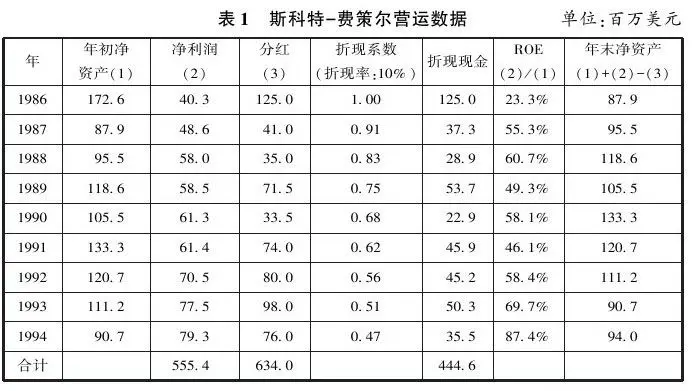

注：数据来源于伯克希尔公司年报。

这9年的总分红金额为6\.34亿美元，是3\.15亿美元收购价的2倍；若以10%的折现率计算，仅这9年的总现金流折现价值为4\.446亿美元，是3\.15亿美元收购价的1\.41倍，之后公司仍然会继续贡献现金流。到2000年，斯科特\-费策尔公司总共为伯克希尔贡献了10\.3亿美元的分红，而伯克希尔用这些现金去投资其他企业，总收益为数十亿美元。

公司的净资产收益率更是高得惊人，长期高于50%，在1994年更是达到87\.4%。经过和1993年财富500强公司的对比，巴菲特认为，若斯科特\-费策尔公司是一家独立企业的话，在净资产收益率上可以排名财富500强公司第一名。

巴菲特认为，斯科特\-费策尔公司的经营业绩如此优秀，不是因为公司处于繁荣周期高峰，不是因为高财务杠杆，也不是因为行业垄断，而是因为以拉尔夫为首的公司管理层有非常优秀的管理能力，专注于主营业务而不分心，设定好目标后全力去拼搏，坦率直言，自信而不自大。

20世纪90年代，受网络和CD等高科技媒介的激烈竞争，世界百科全书的业绩开始下滑，斯科特\-费策尔公司的业绩增长也开始变慢，但仍然比较稳定。

自我剖析：巴菲特致股东信

1986年

今年的报表与前几年有几点不太一样的地方。首先，由于新购事业斯科特\-费策尔、费区\-海默的加入，我们营业项目增加了斯科特\-费策尔、寇比吸尘器、世界百科全书、费区\-海默等四栏；同时也由于伯克希尔整体规模扩大了许多，我们也将几个较小的部门合并列示；另外，如同过去我们将个别企业购并的商誉摊销单独挑出，汇总后摆在最后一栏，由于斯科特\-费策尔、费区\-海默两件购并案使得1986年的商誉摊销较以往增加许多。

世界百科全书是1986年加入我们的斯科特\-费策尔，是所属十七个部门中最大的一个。去年我很高兴地跟各位介绍该公司的经营者与营运状况。一年后，我更加开心地向大家报告，拉尔夫真是个优秀的经理人，圆满地达成目标，虽然要管理各式各样的产品，并面对不同的机会、问题与挑战，拉尔夫却使得他的工作更加精彩、更多元化，而且更重要的是我们合作愉快，看来我们的好运持续不断。

世界百科全书的销售量连续四年皆增长，儿童工艺套书也大幅成长，世界百科全书称霸于直销市场，不但编排精美，且平均每页不到五毛钱，可谓老少皆宜。有一数字相当有趣，那就是书中有高达四万多个困难字，入门部分由简单的生字组成，慢慢地加入难度更高的单字，如此使得年轻的读者能够循序渐进，最后轻易地便能运用大学程度以上的单字。推销百科全书是项神圣的天职，我们超过半数以上的销售人员是现职或是退休的老师，有些则是图书馆员，他们将自己视为教育工作者，而且做得有声有色。如果你家中还没有一套世界百科全书，那么我建议你赶快去买一套放在家里。

寇比吸尘器同样维持连续四年的成长，全球的销售数量共增长了33%。虽然其产品价格要比同类型吸尘器贵许多，但它的性能却将其他品牌远远拋在后面。有许多产品经过了三、四十年还很耐用，想要最好的，就买寇比！

许多靠直销销售其产品的公司，近年来纷纷倒闭，主要是由于上班族妇女越来越多所致。不过到目前为止，寇比吸尘器与世界百科全书的表现算是可圈可点。以上企业再加上保险事业，便构成我们的主要事业领域，简单地带过并不意味着它们对我们不具重要性。一方面是因为许多东西在过去的年报中都已报告过，另一方面是因为公司的股东结构非常稳定（每年约有98%的股东会选择继续投资本公司），所以我们不必花太多时间赘述一些事情，当然若是有什么重大的事件或任何影响公司营运的情况，我们一定会立即向各位股东报告。总体来说，前面所提的公司都有非常稳固的经营基础，投资报酬率也很高，同时也拥有优秀的经营阶层。

1994年

伯克希尔是在1986年年初买下斯科特\-费策尔的，在当时这家公司拥有22项不同的事业，时至今日我们没有新增，也没有卖掉其中任何一项。斯科特\-费策尔的主要业务为世界百科全书、寇比吸尘器与坎贝尔空压机，当然其余的事业对利润的贡献也相当重要。

当时我们斥资3\.152亿美元买下了账面价值1\.726亿美元的斯科特\-费策尔，超过的1\.426亿美元溢价，代表着我们认为这家公司的实质价值大概是其账面价值的两倍。

因为在购并交易完成当年，公司账上有多余的现金，所以虽然斯科特\-费策尔在1986年的利润只有4030万美元，但却能够支付伯克希尔1\.25亿美元的分红。另外还有一点我必须强调的是，在斯科特\-费策尔我们并没有运用任何的财务杠杆。事实上，该公司在我们购并之初的负债便相当有限，之后甚至还掉了所有的债务（除了财务子公司的借款）。同时我们也没有把工厂卖掉再租回来，或是出售应收账款之类的举动。在我们拥有的这几年，斯科特\-费策尔一直以相当保守的财务杠杆经营并且维持相当高的流动性。

大家可以看到，斯科特\-费策尔的利润在我们买下之后持续稳定增加，不过净资产却未等比例增加。因此，在我们买下该公司时，就已经有相当不错的净资产收益率，到现在又变得更加优异。我们甚至可以拿它与财富500强作比较。事实上，以斯科特\-费策尔的规模，若作为独立公司，可以进入500强之列。

以最新的1993年500强公司名单来说，斯科特\-费策尔的净资产收益率可以名列第四。故事还没结束，前三名分别是Insilco、LTV与Gaylord，全部都是因为在1993年脱离破产边缘，债务获得免除致使盈余暴增，其他年度的获利皆乏善可陈。因此，若扣除这些没什么营运果实的公司，斯科特\-费策尔的净资产收益率足以名列财富500强公司首位，远远把其他对手拋在身后，甚至是第十名的两倍之多。

或许你会认为斯科特\-费策尔的成功，不过是利润周期循环的高峰、独占垄断或是靠财务杠杆。不过全都不对，这家公司真正成功的原因在于总裁拉尔夫优异的管理技能，这点在后面我们还会详加报告。

拉尔夫之所以能够成功的原因并不复杂。我的老师格雷厄姆45年前就教导我，在投资中，不需要为了额外的结果做额外的事。之后，我惊讶地发现，这个道理也适用于企业管理。经理人真正应该做的是把基本功做好而不分心。这正是拉尔夫的做事方法，在设立好正确的目标后，毫不犹豫放手去做。至于在私底下，拉尔夫也是很好共事的人，对于问题他坦率直言，自信却不自大。

我忘了经验丰富的拉尔夫今年真正的岁数，但我确信他跟我们旗下其他许多经理人一样，老早就过了65岁。在伯克希尔，我们注重的是绩效，而不是日历。查理今年71岁，而我64岁，我们都把拳王乔治·福尔曼的照片摆在我们的桌上。你可以记下，我们对于强制退休年龄的反感将会与日俱增。

1995年

在伯克希尔目前状况最多的就属世界百科全书，它正面临来自CD与网络激烈的竞争。虽然我们仍能勉强维持获利（大概没有其他百科全书业者敢这样说），不过业绩与获利却直线下滑。因此在1995年年底，世界百科全书决定大幅改变行销方式，加强电子产品内容并大幅降低营运成本，当然这些做法的成效还有待观察，不过我个人相信此举绝对有助于我们继续维持生存。

1998年

举例来说，在1994年的年报中，我曾经向各位提到拉尔夫在斯科特\-费策尔的杰出表现。只是我万万没想到的是，那时还只能算是他的热身阶段，去年在没有任何借款的情况下（除了其财务子公司的一点借款之外），靠着1\.12亿美元的净值，他竟缔造出9650万美元的惊人税后净利润。

1999

以下有一则故事我忍不住想补充。故事发生在1985年，有一家非常大的投资银行受委托负责出售斯科特\-费策尔公司，然而在经过多方的推销后却仍无功而返。在得知这样的情况后，我立即写信给斯科特\-费策尔当时的总裁拉尔夫，表达想买下该公司的意愿。在这之前我从来没有与拉尔夫见过面，不过在一个礼拜之内我们便达成协议。令人遗憾的是，在该公司与投资银行所签订的意向书中约定，一旦公司顺利找到买主便须支付250万美元给银行，即便最后的买主与该银行无关也要照付。事后我猜想，或许是该银行认为既然拿了钱，多少都应该办点事，所以他们好心地将先前准备的财务资料提供一份给我们。收到这样的礼物时，查理冷冷地响应说：“我宁愿再多付250万美元也不要看这些垃圾。”

## 15.大都会_美国广播公司　1986—1999

\(17\) 15\.大都会/美国广播公司 1986—1999

15\.大都会/美国广播公司 1986—1999

巴菲特策略

大都会通信公司（Capital Cities）和美国广播公司（ABC）开始是两个独立的公司，都经营电视台、广播电台和有线电视网等。

在1977年，巴菲特买入了1090万美元的大都会公司股票，当年按股权应分得的利润为130万美元，市盈率约为8\.4倍，于1978年卖出，收益率约30%～50%。

1978年，巴菲特卖出大都会通信后，买入了美国广播公司，买入成本为608万美元，到1979年底，该笔投资的市场价值为967万美元，收益率约60%。1980年他卖出了美国广播公司的全部股份。

1985年，大都会的CEO墨菲准备收购美国广播公司，向巴菲特请教如何收购，巴菲特对这笔交易非常感兴趣。

在1986年初，巴菲特斥资5亿美元买入了大都会发行的股份，每股均价172\.5元，共299万股，并将投票权交给了墨菲。在1987年，巴菲特增持了1万股，总持股数300万股，买入总成本为5\.16亿美元，占大都会公司18\.5%的股权。

1986年，大都会/美国广播公司的每股净利润为11\.3美元，巴菲特每股172\.5美元的买入价对应约16倍的市盈率。

公司运营

大都会通过贷款21亿美元，出售9亿美元的资产，另外向巴菲特股票融资了5亿美元，共花费35亿美元，在1986年收购了美国广播公司。大都会和美国广播公司合并后，改名为大都会/美国广播公司，其拥有约100家发行商、若干24小时播放的电台、24个主流电视频道和超过50个有线电视网络，在美国具有垄断地位。

在80年代电脑和互联网还没有兴起之前，电视作为主要媒体之一，有着非常独特的竞争优势。其通过商家在广播电视网上投放广告赚取利润，所需运营资本少，现金流充裕。

1984年，大都会的营业收入为9\.4亿，净利润为1\.35亿；美国广播公司营业收入为37亿，净利润为1\.95亿；大都会的运营效率约为美国广播公司的3倍。

美国广播公司之前的管理水平不是很高，虽然营业收入为大都会的4倍，但净利润只有其1\.5倍。巴菲特买入大都会公司股票的主要原因是他非常信任大都会的CEO墨菲。他认为，在墨菲的管理下，合并后公司的利润从长远看将会大幅增长；另外一个原因是他对媒体业情有独钟，非常看好这种轻资产近乎垄断的商业模式。

巴菲特的判断没错，墨菲通过大举控制成本和运营改进，到1990年底，巴菲特在1986年花费5\.17亿购买的股票市值达到13\.77亿美元，增值了1\.7倍，年均复合收益率为22%。其净利润从1986年的1\.8亿美元增长至1990年的4\.7亿美元，而市盈率几乎无增长，维持在16倍左右。

投资收益

在1993年，他以630美元每股卖出了1/3的股份，除税后净投资收益为2\.97亿美元。当年大都会的每股净利润为40\.3美元，卖出价格对应的市盈率约16倍。

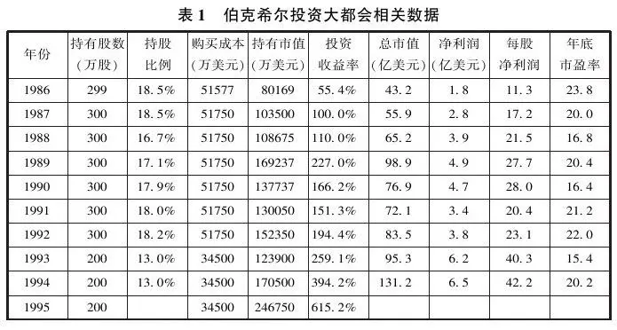

注：数据来源于伯克希尔年报。

1995年，迪士尼收购了大都会/美国广播公司，巴菲特将大都会的股票全部转成了迪士尼的股票，并额外购买了一些迪士尼的股票。

从1997年开始，巴菲特相继减持迪士尼的股份，到1999年全部卖完，卖出期间迪士尼股价市盈率约20～30倍，总投资收益约20亿美元。迪士尼公司的净利润从1998年开始逐年下降，1997年的净利润为19\.7亿美元，2000年的净利润为9\.2亿美元，净利润下降了约54%。

此后，美国股市进入熊市，恰逢9·11恐怖袭击，迪士尼的股价从2000年的约30美元下跌至2002年的约15美元，之后10年，股价长期徘徊在20～30美元之间。

自我剖析：巴菲特致股东信

1986年

大约1986年初，伯克希尔买进约300万股的大都会/ABC股票，每股价格172\.5美元。我追踪该公司的管理绩效已有许多年，我认为他们是上市公司当中最优秀的。汤姆·墨菲与丹柏克不但是最优秀的管理阶层，也是那种你会想把自己的女儿嫁给他的那一种人，跟他们一起合作实在是我的荣幸，也相当愉快，相信各位若认识他们应该也会有这种感觉。

我们的股权投资帮助大都会以35亿美元的资金购并美国广播公司（ABC）。虽然对大都会来说，或许ABC的效益无法在短暂几年内出现立竿见影的变化，但我们很有耐心，毕竟就算是才华与努力俱备，还是需要时间来发酵。就算你让九个女人同时怀孕，也不可能让小孩一个月就生出来。

为了展现我们的信心，我们特别与管理阶层签订了一项协议：在一定的期间内，我们的投票权将交给担任CEO的汤姆·墨菲（或是接任的丹柏克）来处理。事实上，这项提案是由我与查理主动提出，同时我们还自我限制了一些卖出股份的条件，主要是为了确保我们出售的股份不会落到未经现有管理层同意的人士手上，有点类似几年前我们与GEICO和华盛顿邮报签订的协议。

由于巨额的股票交易经常要溢价成交，有些人可能认为这样的限制条件会损及伯克希尔股东的权益，不过我们的看法正好相反。身为公司的股东，我们认定这些企业的长期经济利益将因为这些限制而更加巩固，因为如此一来，专业经理人便能全心全意地为公司打拼，进而为全体股东创造最大的利益。很显然，这比让经理人整天为了换不同的老板而分心要好得多（当然有些经理人会把自己的利益摆在公司的利益之前，所以我们在投资时会尽量避开这类的管理层）。

如今，企业的不稳定是股权分散的必然结果，一家公司随时都会有大股东浮上台面，满口仁义道德，但实际上却包藏祸心。

我们常借由锁住自身持有的股权来宣示对公司稳定性的支持，这种安定感加上好的管理层和好的生意，是让企业获利丰收的沃土，这就是我们会这样安排的用意所在。

当然人性面也很重要，我们不希望我们欣赏与推崇的经理人，在欢迎我们的加入后，会担心一觉醒来，因为我们持有重要股权而导致所有事情突然改变。我告诉他们绝对放心，我们一定说话算话，而且也包括伯克希尔公司的承诺，万一我个人发生了什么不幸（意思是指我本人活不到一百岁就挂了）。

当然我们投资大都会的这次交易并未占到什么便宜，这反映出近年来媒体事业的蓬勃发展（当然还比不上某些购并案的疯狂）。事实上，我们也没有多少讨价还价的余地，但重点是这项投资让我们能与这样杰出的人才与事业结合在一起，而且是相当庞大的规模。

至于有人可能会觉得很奇怪，为何同样一家公司，你们的董事长在1978—1980年以43块的价钱卖掉，而现在却以172\.5块的高价买回。有关这个问题，容我再多花一点时间，想一个漂亮一点的答案给各位。

1993年

我曾告诉过各位，我们预估这些已依估计税率调整过的未分配盈余至少可以为伯克希尔创造出同等的实质价值，而到目前为止，其真正的结果甚至超乎我们的预期。举例来说，我们在1986年以每股172\.5美元的价格买进300万股大都会/ABC公司的股份，去年我们以每股630美元的价格卖出了其中的1/3，在支付35%的资本利得税后，我们实现2\.97亿美元的税后盈余。相对地，在我们持有这些股份的8年时间，经由这些股份，大都会公司分配给我们的透视盈余在扣除估计14%的所得税之后，只有1\.52亿美元。换句话说，透过出售这些股份，所获取的利益，即便在扣除较高的所得税之后，还是比原先通过持股所分配到的盈余高出许多。

1994年

1993年底，我将1000万股大都会股份以每股63美元卖出，不幸的是到了1994年底，该公司股价变成85\.25美元（我可以直接告诉各位，我们损失了2\.225亿美元的差价，如果你心痛到不愿去算的话）。而当我们在1986年以每股172\.5美元买进该公司股份时，就曾经向各位报告，在更早之前，也就是在1978年到1980年间，我就曾经以每股43美元卖掉该公司股份，并强调对于个人这样的行为感到心痛。没想到现在我却又明知故犯，看起来我似乎应该要找个监护人来好好监管一下。

1995年

在迪士尼的并购案中，原来大都会的股东可以有好几种选择。他们可以选择将原有一股转换成迪士尼的一股外加65美元现金，或者他们可以要求全部换成现金或是股票，但是最终可获得的分配结果还要视其他股东的选择以及迪士尼本身的态度而定。以我们持有2000万股来说，我们选择全部转换成股票，不过到年报截止日为止，我们还不确定到底可以分配到多少股份，当然可以确定的是，最后收到的股数一定会超过2000万股。除此之外，我们还透过公开市场继续收购迪士尼的股份。

再透露一点历史，我第一次对迪士尼发生兴趣是在1966年，当时它的股票市值还不到9000万美元，虽然该公司在前一年度（1965年）的税前净利润是2100万美元，而且所拥有的现金多于负债。当时，迪士尼乐园斥资1700万美元的加勒比海海盗船才刚要开幕，而这家公司的卖价只不过是这艘海盗船的五倍！

我印象深刻的是，当时利用巴菲特合伙企业的资金，买进了一大笔迪士尼的股份，按照分割调整后的平均成本约31美分1股，这样的决定显然很正确，因为现在的股价大概是66美元一股。然而，各位的董事长却在1967年以每股48美分将这批股票卖出，使得投资效果大打折扣。

不过还好，绕了半天，我们很高兴能够再度成为这家拥有独特资产与杰出管理层公司的大股东。

2026年2月20日

12:59

## 16.所罗门公司　1987

\(18\) 16\.所罗门公司 1987

2026年2月20日

12:59

16\.所罗门公司 1987

如果说沃伦·巴菲特的成功投资案例不胜枚举，那么他的失败投资案例也需要一双手来数，巴菲特投资所罗门兄弟公司算是其中之一。

投资背景

巴菲特初次与所罗门兄弟公司相识是在1976年，当时政府雇员保险公司（GEICO）陷入破产边缘，所罗门兄弟公司出手解救了GEICO，巴菲特对此充满感激。当时，所罗门兄弟公司的经理为约翰·古特弗罗因德。

所罗门兄弟公司由阿瑟·所罗门、赫伯特·所罗门和波西·所罗门三兄弟创建于1910年，启动资金为5000美元。所罗门兄弟公司经过近30年的发展，成为美国政府的主要债券交易商之一。后来约翰·古特弗罗因德进入公司，在1963年晋升为股东，在1978年成为公司CEO。

在约翰·古特弗罗因德的带领下，所罗门兄弟公司作为一家投资银行，发展迅速，被美国《商业周刊》称为“华尔街之王”。1985年，所罗门兄弟公司发展到顶峰，但公司内部竞争激烈，公司的竞争对手将一批主力人员相继挖走，约翰·古特弗罗因德为了挽留人才，大幅提高薪酬水平。

1986年，所罗门公司的利润由于员工工资大幅攀升而出现缩水，部门主管和公司大股东开始发难，一个企业掠夺者出现，准备收购公司。危机之下，约翰·古特弗罗因德向巴菲特求助。巴菲特对约翰·古特弗罗因德非常信任，也因为以前约翰·古特弗罗因德帮助过GEICO而对他充满感激。

付出与收益不成正比

巴菲特认为投资银行业难以预测，无法判断其前景，自己对投资银行业短期、中期和长期的获利情况都没有特殊的远见。所以，巴菲特没有投资所罗门公司的普通股，而是购买了其可转换优先股。

1987年9月28日，巴菲特和约翰·古特弗罗因德签订了投资协议。伯克希尔投资7亿美元购买所罗门公司的可转换优先股，年票面利息为9%，即所罗门公司每年付给伯克希尔6300万美元利息，占所罗门公司年利润约15%。这种优先股特别要求公司提拨偿债基金，从1995年到1999年分批赎回。另一方面，该优先股的转换价格为38美元，若所罗门公司股价高于38美元，巴菲特可以选择转换成普通股。同时，巴菲特和查理·芒格成为所罗门公司的董事会成员。

这笔交易充分反映了巴菲特的安全边际原则，只要所罗门公司不破产，巴菲特能够稳赚9%的年利息，并且有可能在公司股票上涨中收获更大的利润。但是，最不希望发生的事即将发生。

在1987年10月19日（黑色星期五），道琼斯指数单日狂跌508点，从2246点跌至1738点，当日跌幅为22\.6%。所罗门公司当日损失7500万美元，公司股价大跌。公司董事会讨论下调员工股票期权价格，巴菲特认为这是在抢钱，提出反对意见，但被忽略了，董事会最终通过了下调员工股票期权价格的决议。巴菲特感到很愤怒，但是更棘手的问题还在后面。

所罗门公司是美联储所发行国债的主要承销商之一，只有主要承销商才有资格直接从美国政府那里竞标购买国债，然后卖给其他人赚取差价，因此这些大承销商几乎垄断了美国国债销售市场。所罗门公司发行部负责人保罗·莫泽，在1990年12月和1991年2月的两次竞拍中，超过规定上限竞标国债，然后将国债囤积起来，借此压榨手头“国债”短缺的公司。巴菲特在1991年8月份才被通知这件事，而在4月份，保罗·莫泽已经接到了财政部的调查函。该事件逐级上报至约翰·古特弗罗因德后，约翰·古特弗罗因德对此涉嫌违法行为只是提出了警告，并没有采取进一步行动，例如开除责任者并把情况汇报给财政部和美联储。而在1991年5月份，保罗·莫泽的竞标额又一次超过了规定上限，这次操纵国债给其他公司带来超过1亿美元的损失。

巴菲特和芒格对此感到非常担心，但约翰·古特弗罗因德认为此事可以轻松摆平。1991年8月12日，《华尔街日报》刊登了一篇文章《所罗门违规操作中期国债》，然后谣言四起。随后，事态越来越严重，财政部和美联储认为所罗门公司没有及时上报并作进一步处理，是对自己的严重藐视。财政部要求所罗门公司高层辞职，约翰·古特弗罗因德只好辞去董事长职务，公司股价大跌。

财政部计划请巴菲特出任董事长来拯救所罗门公司，避免金融市场崩溃。但是，与此同时，财政部即将要宣布禁止所罗门参加财政部的竞拍，此举相当于宣布所罗门公司的死刑。巴菲特感到绝望，立即与财政部和美联储联系，其中包括美联储主席艾伦·格林斯潘。巴菲特向财政部和美联储说明，如果要他就任所罗门公司的临时董事长，前提是撤销禁止所罗门参加财政部竞拍的公告，否则所罗门这家国际性大公司将提交破产申请，全球金融市场将会陷入多米诺效应和恐慌。在万分紧急之下，财政部同意保留所罗门的竞标权利，此时离股市开盘只有几个小时，巴菲特就任了所罗门的临时董事会主席，并选定了新的CEO。

上任后，巴菲特着手对所罗门公司的文化进行重整，大幅压缩成本，希望让公司逐步恢复名誉。所罗门公司被监管人员彻查，巴菲特也被召见到参议院作证。巴菲特被折腾得筋疲力尽，但所罗门公司也逐步出现好转，股价也慢慢在上涨。

1992年6月，在所罗门逐渐好转后，巴菲特辞去所罗门公司的董事长职务，回归奥马哈。在这次拯救行动后，巴菲特的名气飙升，成为人们眼中的英雄。

1995年开始，一部分优先股被所罗门公司回购。在1997年，所罗门公司被旅行家集团收购，另一部分优先股投资也得以收回。正像巴菲特自己所说：相对于所得到的回报，巴菲特和芒格在投资所罗门公司上所花费的精力不成正比。

自我剖析：巴菲特致股东信

1987年

在投资银行业，我们当然没有特殊的远见，能够预知其未来发展的方向与获利能力。就产业特性而言，投资银行业比起我们其他主要投资的行业更难预测，这也是为什么我们选择以可转换优先股的方式投资。

当然我们对于所罗门公司的CEO约翰·古特弗罗因德（John Gutfreund）的能力与品格有不错的印象，查理与我都很尊崇且信赖他。我们是在1976年开始认识他，当时他在协助GEICO汽车保险免于破产的命运时出了不少力。之后，我们看到他好几次引导客户免于愚蠢的交易，虽然这使得所罗门因此损失许多顾问费收入。这种以客户服务至上的表现在华尔街并不多见。

如同查理在第50页上所陈述的理由，截至年底，我们将在投资所罗门公司的价值定在面额的98%，大约比我们的投资成本少1400万。不过我们仍然相信这家公司有高品质的营运业务，将可为我们的投资创造不错的盈余。若果真如此，我们可转换为股权的权利将会非常有价值。

1988年

去年我们还提到了另外一个深具固定收益特色的投资：亦即所罗门公司7亿美元9%票息的可转换优先股。这种优先股特别要求公司提拨偿债基金，从1995年到1999年分批赎回。伯克希尔将这些投资以成本列示在账上。基于查理所提的原因，现在的估计市价已从前一年度略低于成本，转变为1988年的略高于成本。

我们与所罗门CEO约翰·古特弗罗因德之间良好的关系，随着几年来的合作日益增进，但我们还是无法判断投资银行业的前景，不管是短期、中期或是长期皆然，这是一个难以预估未来获利程度的产业。我们仍然相信，我们所拥有的转换权利会在其有效期间内，为我们产生相当大的贡献。然而这种特别股的价值主要还是来自于其固定收益，而不是股权特性。

1990年

我们的可转换特别股算是相当单纯的投资工具，不过我还是必须警告各位，若是过去能够完全指导未来，大家可能会经常读到一些不正确或误导的信息。举例来说，像去年，有几家报纸杂志错误地将它们的价值与可以转换的普通股价格混为一谈。我们的所罗门特别股转换价格为38美元，根据它们的逻辑，由于所罗门普通股的现价为22\.8美元，所以其可转换特别股的价值只有面额的60%。但这样的推论却有一个盲点，因为这样的说法表示所有的可转换特别股，其价值只在其所拥有的转换权利，至于所罗门不可转换的债券价值则为零，不管它所拥有的赎回条件为何。

大家必须特别记住的一点是，我们可转换特别股大部分的价值其实是来自于固定收益的特性。意思是，这些有价证券的价值不可能低于一般不具转换权的特别股，相反，会因为它们拥有可转换的选择权而具有更高的价值。

1992年

去年6月，在接手10个月后，我正式辞去所罗门董事会临时主席的职务。大家可以从1991年到1992年伯克希尔的经营绩效看出，公司并没有因为我暂时不在而发生任何差错，不过反过来说就不一定了。我很怀念伯克希尔且很愿意再度回到公司担任全职工作，对我而言，世界上没有任何其他工作比起经营伯克希尔更有乐趣。很庆幸，我自己能够身处现在这个位置。

这次所罗门的任务虽然不是很愉快，但却相当有趣且值得。在去年9月，《财富》杂志票选全美最受崇敬企业的年度调查中，所罗门在全部的311家公司中名列第二进步奖。此外，所罗门兄弟\-所罗门集团下属的证券子公司，其税前盈余更是创下之前历史新高34%之多。

所罗门能够得到解救，需要感谢许多人，其中有几位尤其要特别提到。若是没有Deryck Maughhan、Bob Denham、Don Howard与John Macfarlane等人的通力合作，这家证券商很可能无法走出困境。这些人努力不懈、有效率、无私奉献的精神，让我永远感激他们。

所罗门在政府事务方面的首席律师Munger, Tolles＆Olson联合律师事务所的Ron Olson也是这次问题能够顺利解决的核心人物。所罗门所面临的问题不但严重而且相当复杂，至少有5个主管机关——美联储、纽约联邦储备银行、美国财政部、纽约南区地方法院与司法部的反托拉斯部门——都牵涉其中。若是我们想要明快且有组织性地解决这件事，我们必须要有一位具有商务、法律专业与沟通技巧的律师来帮忙，Ron正是具备这样条件的最佳人选。

1995年

另外两个特别股投资个案的结果就让人相当失望，虽然所罗门特别股最后的投资报酬率仍高于其替代的固定收益证券投资。不过若考量查理跟我本人在这项投资上所花费的心思，其所得与付出实在是不成正比。当然我根本就没有料到，到了60岁的这把年纪，会因为一笔固定收益证券的投资，还能够接下这项担任所罗门临时董事会主席的新工作。

1987年，就在我们刚刚买下所罗门特别股不久之后，我就曾经说过，我们对于投资银行业的发展前景与获利能力并没有特殊的见地。

到目前为止，我们拥有将这笔投资转换为所罗门普通股的权利。其价值尚未浮现，另外自从买进这笔投资后，道琼指数已经涨了一倍，而券商的表现也相当不错。这代表我因为判断转换权利相当有价值，而决定继续与所罗门交往的决策相当差，不过即便如此，这笔特别股投资还是相当勉强的继续作为我们的固定收益证券投资，毕竟每年9%的股息收入还是很诱人的。

除非我们选择转换，否则这项投资有一条款约定，从1995年10月31日开始的5年，该公司每年都可赎回20%的投资。所以，去年我们总计7亿的投资中，1\.4亿已按计划由公司赎回（有些新闻报道将这笔交易称呼为“出售”，事实上债券到期后应该称之为“赎回”）。虽然去年我们放弃转换选择而被赎回，不过我们还有四次机会，而我也相信未来我们应该很有可能在这些转换的权利中找到一些价值存在。

1997年

在此同时，另外两个后进生，也已起死回生，其中所罗门最近决定并入旅行家集团的举动，终于让长久以来饱受苦难的股东获得回报。伯克希尔所有的股东，包含我个人在内，实在是亏欠Deryck Maughan跟Bob Denham太多了。首先要感谢他们在1991年所罗门爆发丑闻时，拯救公司免于倒闭，之后更让公司恢复以往的活力，使得公司得以风光地嫁给旅行家集团。我常常说，我渴望与我喜爱、信任与崇拜的经理人共事，Deryck与Bob正是这样绝佳的组合。

虽然伯克希尔投资所罗门的最终成果到目前仍未定案，所幸目前的情况要比我两年前预期的好得多。回顾过去，我觉得投资所罗门的经验令人感到刺激有趣，同时又具教化意义。我在1991—1992年间的感觉，就好像一个戏迷曾写道：“如果不是因为坐在一个不幸的位子上，我就不会这么认真地欣赏表演，因为它正对着台上”。

## 17.可口可乐　1988

\(19\) 17\.可口可乐 1988

2026年2月20日

12:59

17\.可口可乐 [\1] 1988

公司背景

可口可乐诞生于1886年，是一种含咖啡因的碳酸饮料。可口可乐公司则成立于1892年。

1899年，可口可乐的拥有人阿萨·坎得乐和罐装厂签署了一份几乎覆盖全美的永久性合同，阿萨·坎得乐以1美元的代价把合同卖给了罐装厂，合同的内容还包括赋予罐装厂永远以固定价格购买可口可乐糖浆的权利。结果，这个合同拖累了可口可乐公司几十年，给可口可乐的盈利能力造成巨大影响。

20世纪70年代，由于经营不佳，可口可乐一度萎靡。1981年，来自古巴的化学家罗伯托·古崔塔被任命为可口可乐的CEO，他上任后进行了一系列的改革，成效开始显现，罐装合同逐步解除，可口可乐在国外的市场也逐渐打开。

缘分起始

1987年之前近50年，巴菲特一直是百事可乐的忠实消费者和粉丝。1987年，在一个白宫举行的宴会上，巴菲特遇到了可口可乐公司的首席运营官唐·基奥，基奥建议巴菲特放弃百事可乐，去尝尝可口可乐的新品樱桃可乐。巴菲特尝了一下，感觉不错，从此改喝可口可乐，令家人和朋友们大跌眼镜。

巴菲特曾经认为可口可乐的股票价格太贵。1987年，可口可乐陷入了困境，百事可乐挑起了装瓶商之间的矛盾，可口可乐的股价较为低迷，公司在不断回购股份。同时，在1987年10月19日（黑色星期五），道琼斯指数单日狂跌508点，从2246点跌至1738点，当日跌幅为22\.6%，可口可乐的股票价格也下跌了约20%。1987年年底的股价为38\.1美元，当年每股净利润为2\.43美元，市盈率为15\.7倍。

巴菲特过去几年一直在研究可口可乐，他认为可口可乐的品牌在人们心中占有不可替代的地位，这种地位会不断得到强化，构成持久竞争优势，加上罗伯托·古崔塔为首的优秀管理层，这种资本开支小的生意模式未来将创造非常充沛的现金流。

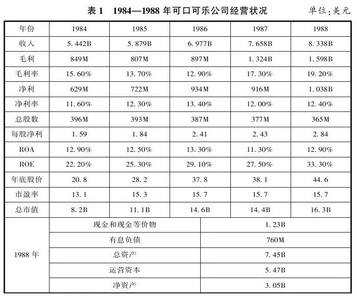

注：数据来源于可口可乐公司年报。B表示十亿，M表示百万。

巴菲特策略

1988年，巴菲特开始大量买入可口可乐的股份，1988年年底共持有1417万股，成本为5\.92亿，每股平均购买价为41\.8美元，当年可口可乐的每股净利润为2\.84元，购买价的市盈率为14\.7倍。

1988年，可口可乐的毛利率为19\.2%，净利率为12\.4%，净资产收益率为33\.3%，净利润在过去5年都在逐步上升，加上每年都在回购股份，每股净利润年均增长率为15\.6%。1988年，可口可乐在世界碳酸软饮料行业的市场占有率为45%。

1989年，巴菲特继续增持可口可乐的股票，总持股数翻了一倍，为2335万股，总成本为10\.24亿，新购入股票的平均价格为46\.8美元，市盈率约15倍。

三年后的1991年，可口可乐的净利润从1988年的10\.4亿元增长至16\.17亿元，增长了约60%，但是市盈率提高到了33倍，增长了1\.2倍。结合每年的股票回购，使得巴菲特持有股份的市场价值提高到37\.5亿元，是买入成本10\.24亿元的3\.7倍，年均收益率为38\.5%。

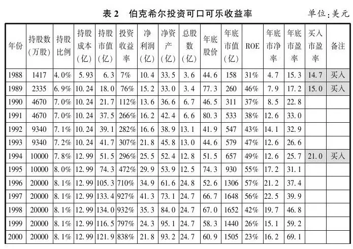

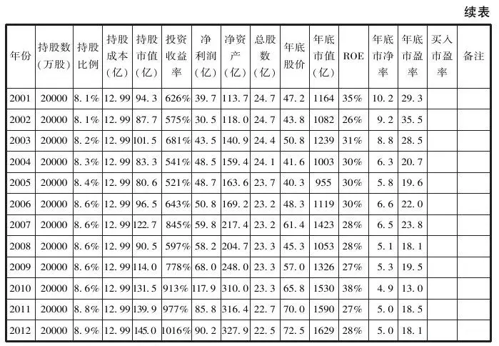

注：数据来源于伯克希尔年报和可口可乐公司年报。

1994年，可口可乐的股价经过近3年的横盘，公司净利润增长至25\.5亿元，市盈率逐步降低，巴菲特又买入了价值2\.7亿美元的股票，拆股后的买入价为41\.6元，当年每股收益为1\.98美元，市盈率约为21倍。

1998年，美国股市接近17年牛市的末期，可口可乐股价在年中最高涨到每股70美元，当年的净利润为35\.3亿美元，每股盈利为1\.42美元，市盈率约50倍。自此以后10年，可口可乐的股价都没有超过这个最高价。

至1998年底，伯克希尔在可口可乐的持股市值为134亿，10年里增长了约11倍，年均复合收益率约27%。这样的市值增幅中，市盈率由15倍涨至约50倍，贡献了约3倍的增长，净利润增长约3\.5倍，另外每年的回购也提高了每股净利润。

随着2000年美国股市的高科技股泡沫破裂，美国股市进入长期的调整。可口可乐的净利润从1997年开始下滑，直到2003年才恢复到1997年的利润水平。在2008年又遇上金融危机，可口可乐的股价直到2012年才重新站上1998年的高点。

2012年，可口可乐的净利润为90亿，是1998年35\.3亿净利润的2\.6倍，每股净利润为1\.97元，年底股价为36\.3美元，市盈率约为18倍，比1998年的50倍市盈率降低了约65%，两者综合影响，导致巴菲特持有股份的市值在这14年里只增长了约10%，持有市值由1998年的134亿美元增长至145亿美元，期间收到的分红总额约为30亿美元。

自我剖析：巴菲特致股东信

1988年

我们作出两项重大决定，大笔买进房地美（Freddie Mac）与可口可乐。我们打算要持有这些股票很长一段期间。事实上，当我们发现我们持有兼具杰出企业与杰出经理人的股权时，我们最长的投资期间是永久。我们跟那些急着想要卖出表现不错的股票以实现获利却顽固地不肯出脱那些绩效差的股份的那群人完全相反，彼得·林奇生动地将这种行为解释成砍除花朵来当作野草的肥料。我们持有房地美的股份比例是法令规定的上限，这部分查理在后面会详加说明。他们是属于我们一家非保险的子公司所投资，所以在我们的合并资产负债表当中，这些持股将以成本而非市场价格列示。

1989年

我们的投资组合与去年几乎相同，只有一项投资的持股有变动，我们将可口可乐的持股数由去年的1417万股提高到今年的2335万股。

这次对可口可乐的投资，提供了一个机会来证明你们的董事长对投资机会的把握速度之快，不管这些机会是如何不明确或是被隐藏。我记得我是在1935年或1936年第一次喝到可口可乐的，不过可以确定的是，我从1936年开始，以每半打25分钱的价格，从巴菲特兄弟杂货店批货后，再以每罐5分钱卖给邻居街坊。作为我个人从事高毛利零售业的开端，我也深深观察到这个产品对消费者的特殊吸引力及背后所代表的庞大商机。

在往后的52年里，当可口可乐席卷全世界的同时，我也持续地注意到这种特质。然而在同一段期间，由于我个人过于小心谨慎，以至于竟然连一股股票都没有买，反而将大部分的个人资产投注在街车公司、风车制造厂、纺织公司、煤炭公司与邮票公司之类的股票之上（如果你认为这是我编造的笑话，我可以再告诉大家确切的公司名称）。终于到了1988年的夏天，我的大脑与眼睛进行了连接。

一时之间，我的观感与眼界大开，在1970年代一度萎靡不振之后，可口可乐在1981年新任总裁罗伯托的带领下，焕然一新。罗伯托加上唐·基奥（曾经是我在奥马哈的对街邻居），经过思考并厘清公司的政策后，切实地加以执行，使得本来就已是全世界最独一无二的产品又添新动力，尤其是来自海外的营收更呈现爆炸性的成长。

利用其行销与财务方面的两把利刃，罗伯托将可口可乐产品的成长与股东的利益极大化。通常一家消费性商品的CEO——基于个人过去的经验与个性——会偏向公司的行销或财务，但是罗伯托却能够将两者调和到极致的境界，这样的结果实在是股东们前世修来的好福气。

当然我们应该在罗伯托与唐开始接掌公司时，就早点买进该公司的股票。事实上，要是我有足够的远见，早在1936年就应该说服我爷爷干脆卖掉杂货店，然后将钱全部用来买进可口可乐的股票。这次我终于得到了教训，不过照这种情况看来，距离下一次我灵光一现的时间，可能要再等上个50年以上吧。

1990年

当可口可乐利用保留盈余来买回自家股份，该公司等于间接增加我们的持股比例，也就是此举让我认定这家公司是全世界最好的企业（当然可口可乐还将资金运用在很多加强公司利益的地方上）。除了买回股份，可口可乐也可以将这些资金以股利的方式退还给股东，然后我们同样可以利用这笔钱买进更多可口可乐的股票，只是后面这种做法比较没有效率，因为如此还要支付额外的所得税，使得最后所得到的持股比例比前面的方式少一点。而讽刺的是，要是利用后面的那种做法，伯克希尔的账面盈余可能还会更好看。

1991年

我们在1991年所经历账面数字的超额成长是一种不太可能再发生的现象，受惠于可口可乐与吉列刮胡刀市盈率的大幅飙升，光是这两家公司就合计贡献了我们去年21亿美元净值成长中的16亿美元。三年前，当我们大笔买进可口可乐股票的时候，伯克希尔的净值大约是34亿美元，但是现在光是我们持有可口可乐的股票市值就超过这个数字。

可口可乐与吉列刮胡刀可说是当今世上最好的两家公司，我们预期在未来几年他们的获利还会以惊人的速度成长，相对地，我们持股的价值也会以等比例的程度增加。然而，另一方面，去年这两家公司的股价上涨的幅度却远高于其本身获利增长的幅度，所以说去年我们是两面得利，一方面是靠公司绝佳的获利能力，一方面是市场对于公司股票的重新评价。当然，我们认为这样的调整是经得起考验的，但这种情况不太可能每年都发生，展望未来我们可能只能靠前面那点而获益。

1994年

对于买进股份我们注意的只是价格而非时间，我们认为因为忧虑短期不可控制的经济或是股市变量，而放弃买进一家长期前景可合理预期的好公司，是一件很愚蠢的事。为什么仅是因为短期不可知的猜测就放弃一个很明显的投资决策呢？

我们分别在1967年买进国家产险公司、1972年买下喜诗糖果、1977年买下水牛城日报、1983年买下内布拉斯加家具店、1986年买下斯科特\-费策尔，而我们都是趁它们难得求售时，才得以买进，当然也因为它们的开价我们认为可以接受。当初在评估每个案子时，我们关心的不是道琼斯指数的走势、美联储的动向或是总体经济的发展，而是这些公司本身未来的前景；如果我们觉得这样的方式适用于买下整家公司的话，那么，当我们决定要在股市买进一些好公司的部分股权时，为什么就必须采取不一样的做法呢？

在寻找新的投资标的之前，我们选择先增加旧有投资的比例。如果一家企业曾经好到让我们愿意买进，我想再重复一次这样的程序应该也是相当不错的。若是能够，我们很愿意再增加在喜诗糖果或是斯科特\-费策尔的持股，但要增加到100%的比例实在是有困难。不过在股票市场中，投资人常常有很多的机会可以增加他感兴趣的公司股票，像是去年我们就扩大了我们在可口可乐与美国运通的持股数。

1996年

在买进股票时，我们同样也追求可预测的未来。以可口可乐来说，可口可乐产品所代表的热情与想象在总裁古崔塔的带领下升华到极点，此举为公司股东创造出可观的价值。在基奥与道格的协助之下，古崔塔从头到尾重新塑造公司的每一部分，不过这家公司的本质——可口可乐强力的竞争优势与主导性，多年来却从未改变。

最近我正在研读可口可乐1896年的年报（所以大家现在看我们的年报应该还不嫌太晚），虽然当时可口可乐已经成为冷饮市场的领导者，但那也不过只有十年的光景。然而，在当时该公司却早已规划好未来的百年大计，面对年仅14\.8万美元的销售额，公司总裁阿萨·坎得乐表示：“我们从没有放弃告诉全世界，可口可乐是能够提升人类健康与快乐、最卓越超凡的一件东西。”虽然我认为健康这档子事还有待努力，但我很高兴可口可乐在一百年后的今天，始终还是遵循坎得乐当初立下的愿景。坎得乐又继续谈道：“没有其他东西的味道能够像可乐一样深植人心。”当年的可乐糖浆销售量不过只有11\.6万加仑，时至今日，销售量已达到32亿加仑。

我实在忍不住想要再引用坎得乐的另一段话：“从今年三月开始，我们雇用了十位业务员，在与总公司保持密切联系下巡回各地推销产品，基本上我们的业务范围已涵盖整个美联共和国。”这才是我心目中的销售力量。

像可口可乐与吉列这类的公司应该可以被归类为“永恒的持股”。分析师对于这些公司在未来一、二十年饮料或刮胡刀市场的预测可能会有些许不同，而我们所说的永恒并不意味这些公司可以不必继续贯彻在制造、分销、包装与产品创新上的努力，只是就算是最没有概念的观察家或甚至是主要的竞争对手，也不得不承认可口可乐与吉列，在终其一生的投资生涯，仍将在其各自的领域中独领风骚，甚至于他们的优势还有可能会继续增强。过去十年来，两家公司在原有极大的市占率基础上又扩大许多，而所有的迹象显示，在往后的十年间，他们还会继续以此态势扩大版图。

当然，比起一些具有爆发性的高科技或新创事业来说，这些被永恒持股公司的成长力略显不足，但与其两鸟在林，还不如一鸟在手。

2011年

当恐惧心理达到顶点时，第一类资产（基于货币的资产）和第二类投资（非生产性资产）最受欢迎：对经济崩溃的恐惧推动个人投资基于货币的资产，大部分是购买美国国债；而对货币贬值崩溃的恐惧会推动人们蜂拥买入黄金等永远不会生产出任何东西的资产。在2008年后期，我们听到人人都在说“现金为王”，而这个时候反而应该是花掉现金而不是持有现金。同样，在1980年代早期，我们听到人人都在说“现金是垃圾”，但是那个时候固定收益投资却是处于我们记忆中最有吸引力的高收益率水平。在这两种情况下，那些盲目跟随大众的投资者们为了自己感到内心舒适安定而付出了沉重的代价。

我自己最看好的投资，你知道，就是我们接下来要谈到的第三类投资：对于生产性资产的投资，不管是企业、农场，还是房地产。最理想的资产应该符合两个标准，一在通货膨胀时期能够创造出源源不断的产品，这些产品本身能够提价而保持其企业购买力价值不变，二是只需最低水平的新增资本投入。农场、房地产和许多优秀企业，比如可口可乐公司、IBM公司以及我们拥有的喜诗糖果公司，都属于符合这两个标准的优质资产。当然，其他的公司，比如受到政府管制的公用事业公司，就不能符合第二条标准，因为通胀会给它们带来沉重的追加资本投资负担。为了获得更多盈利，这些公司的股东们必须投入更多的资本。尽管如此，这类对于生产性资产的投资还是优于非生产性投资和基于货币的投资。

不管未来100年以后的货币形式是黄金、贝壳、鲨鱼牙，还是今天这样的一个小纸片，人们还是会愿意用自己几分钟的日常劳动，来换取一罐可口可乐或一些喜诗巧克力花生糖。未来，美国人肯定将运输更多的商品，消费更多的食品，要求更大的住房。人们将会永远用自己生产的东西交换别人生产的东西。

美国企业将会继续高效地生产，提供美国人需要的商品和服务。打个比方，这些商业“奶牛”将会存活上好几百年，还会生产更多数量的“牛奶”。决定这些商业“奶牛”价值高低的因素不是商品交换的媒介，而是它们的产奶能力。对于奶牛的主人来说，来自销售牛奶的利润将会复合增长，就像20世纪的股票投资一样，在这100年间，道琼斯指数从66点增长到了11497点（与此同时还支付了很多股息）。伯克希尔的目标将是不断增加自己持有一流企业的股权。我们的第一个选择是整体收购这些一流企业，成为他们唯一的主人。但是，我们也愿意通过持有很大数量流通股的方式成为拥有部分股权的股东。我相信，在未来任何一个较长的时期内，对于一流企业的这类投资结果都将证明，这类投资是我们前面分析的三类投资中遥遥领先的优胜者。更重要的是，这类投资也将是最安全的投资。

阅读延伸：伯克希尔1997年股东大会

股东问：能不能深入解释一下你所谓的消费者的想法以及产品的本质是什么意思，你如何将这些应用到寻找对其产品需求不断增加、投资潜力最好的公司上？

巴菲特：在消费产品方面，你的兴趣应该是找到或者思考：对某一产品，世界上有多少人会在脑子里想着它，他们是怎么想的，10年、20年后，他们对这一产品的想法可能是什么样的。

这个世界上几乎每一个人——我们把数量削减到世界上75%的人吧——脑子里多少都会想着可口可乐。“可口可乐”这个字眼对他们来说意味着一些东西。与此相比，“RC可乐”对地球上几乎任何一个人来说都毫无意义。当然，RC可乐公司的老板以及罐装厂对它肯定有想法，但世界上差不多每一个人对可口可乐都有些想法。

喜欢可口可乐的人占大多数，可口可乐带给人们的体验是愉悦的。之所以会这样，部分原因是源于可口可乐的设计。另外，可口可乐经常出现在快乐的场合，迪士尼乐园和棒球场等，在每一个充满欢声笑语的场所——可能还包括伯克希尔年度股东大会的会场——都有可口可乐。

可口可乐在全球近200多个国家的消费者心目中的地位相当稳固，可口可乐将在更多消费者的心目中建立稳固的地位，10年后，这种情况会逐渐得到强化。所以，重要的不是市场份额，而是垂青份额。

我不知道人们如何才能打败可口可乐，如果有人给我1000亿美元——我鼓励任何一个有这个想法的人站出来，告诉我说打败可口可乐、取而代之成为全球软饮料行业的老大。我无论如何都想不出来如何才能做到这一点。

倘若我们那时没有买下喜诗糖果并经历随后的发展（因为这些发展让我们明白了其他道理），我们就不会在1988年买入可口可乐。所以，我们如今从可口可乐的投资中赚到的110多亿美元中，有很大一部分要归功于喜诗糖果。

这并不是因为我们没有接触过可口可乐。这真的令人吃惊，但这让我们开始思考得更多，我们看到了我们关于喜诗糖果的决定的后续发展，看到了什么是行得通的、什么是行不通的。这让我们对在商业方面什么能行得通豁然开朗，并让我们远离那些行不通的企业。这绝对导致我们投资可口可乐。

即便你投资的软饮料企业在行业中不占据统治地位，你仍然可以赚钱。不过坦白说，如果你投资的是该行业内的老大，你赚的钱会多得多。软饮料行业并不是一个赢家通吃的行业，它不像在一个10万或者20万人的小镇上有两家报纸。某些行业是那样的，但软饮料行业不属于赢家通吃的行业。

罐装厂其实挺有意思，奥马哈有个哥们，或者说有一个家伙在奥马哈生活过很长一段时间，他就是唐·基奥，他和罐装厂这件事大有关系，尽管罗伯托和这件事当然也大有关系。

19世纪80年代后期，阿萨·坎得乐进行了一系列交易，我觉得其中有些交易的时机不是那么合适，不过他以2000美元的价格买下了整个可口可乐公司，这可能是世界历史上最聪明的买入了。

然后，我记得是在1899年，从查塔努加来了一群人拜访坎得乐先生。那时，软饮料就像现在的OTC药一样主要在药店通过饮料机销售，罐装的销量很少。我记得没错的话，当时已经有人在密西西比装罐了。于是，几个家伙坐下来说：“罐装销售的前景应该不错，饮料机销售已经够你忙的了，为什么你不把罐装业务的开发交给我们来做呢？”

坎得乐先生肯定没有好好考虑过罐装业务，因为他和他们签署了一份几乎覆盖全美的永久性合同——他以1美元的代价把罐装权卖给了他们，合同的内容还包括赋予他们永远以固定价格购买可口可乐糖浆的权利。

糖浆的主要成分是糖，在“一战”期间以及“一战”之后，糖价疯狂上涨，但可口可乐的老板却签署了一份实际上永远以固定价格出售糖浆的合同。所以对阿萨来说，以2000美元的代价买下可口可乐是他干得非常漂亮的一桩买卖，可是他却签署了历史上最蠢的合同。

当时，他们就在罐装合同之下出售次级权利，出售的销售半径通常是骑马一天可以往返的距离。这才是你应该赋予其他人的销售范围。

那些年，可口可乐一直面临着罐装合同的问题，罐装产品很快在销售系统中占据了主导地位，但他们却受制于没有价格灵活性且期限为永久的合同。

这些罐装厂的老板在弥留之际，躺在病床上，在咽下最后一口气之前，肯定会把他的子女和孙子召集到床前，用尽力气告诫他们：“千万不要让可口可乐在罐装合同上捣乱”，然后才肯闭眼。结果，这个问题拖累了可口可乐几十年，上世纪20年代还发生过法律诉讼，可口可乐对罐装厂真的没辙。

后来，罗伯托和唐·基奥以及其他人花了20年到25年的时间，终于合理解决了罐装合同的问题，这是一项巨大的工程。随着时间的推移，此举为公司的价值带来了翻天覆地的变化。

当你着手解决一个问题的时候，一天、一周甚至一年之内都不会有什么结果。但他们决定要解决这个问题，他们真的做到了。解决这个问题需要资金，他们花钱解决了问题，他们还动用了大笔资金回购股票。这是非常聪明的做法，我希望他们能继续这么做，希望他们在我们谈话的时候依然在回购股票。

[\1] 本章部分内容参考：艾利斯·施罗德\.滚雪球\[M\]\.北京：中信出版社，2009\.

## 18.阿克塔公司（套利）　1981—1988

\(20\) 18\.阿克塔公司（套利） 1981—1988

18\.阿克塔公司（套利） 1981—1988

公司背景

阿克塔公司主要运营印刷和森林产品，旗下有多处森林资产。1978年，美国政府决定征收阿克塔的一处红木林，总面积约10700公顷，以扩大国家公园的范围。当时，政府确定的征收总价为9790万美元，并且分期支付，分期付款的利率为6%。但阿克塔不同意该方案，极力争取更高的赔偿金和适用利率。

1981年9月28日，阿克塔公司董事会同意将公司卖给KKR公司，KKR公司是一家大型杠杆收购企业。为了解决收购中存在的政府征收补偿款难题，KKR公司决定支付每股37美元再加上政府额外补偿款的2/3，作为收购阿克塔的条件，当时阿克塔股价约33美元。

巴菲特策略

巴菲特认为从KKR过去的收购记录看，其成功融资完成收购的可能性较高；如果真的收购失败，阿克塔的董事会也会将其卖给新的买主，价格可能低一些；另外，那块红木林的补偿款不管多少，算是一笔额外之财。

该收购案宣布后，巴菲特开始买进阿克塔的股票，在2个月内共买入了40万股，每股均价33\.5美元，占阿克塔5%的股权。12月份，公司宣布交易可能延后，1982年1月4日，公司终于签订了收购协议，巴菲特决定加码以每股38元继续买入，持股数增至65\.5万股，约7%的股权。至此，巴菲特的总投入成本为2290万美元。

过程多变，在2月25日，融资银行说由于房地产市场不景气，对阿克塔的前景有所顾虑，需要重新就融资条件进行谈判，股东大会因此被推迟至4月份。3月12日，KKR宣布之前的约定无效，将报价砍至每股33\.5美元，2天后调高至35美元。

然而，在3月15日，阿克塔董事会拒绝了KKR的收购方案，并接受另一家集团的收购提案，每股37\.5美元加上红木林补偿款的一半。董事会通过了这项收购案，公司股东在6月4日收到了现金。在约6个月的时间内，巴菲特投资的2290万美元收回了2460万美元，年投资回报率约为15%。

法院针对红木林征收案指派了2个委员会来解决争议，一个负责认定红木林的价值，另一个负责确定适用利率。1987年1月，法院认定红木林的价值为2\.75亿美元，适用利率为14%，这意味着政府需要支付高达6亿美元的补偿款。联邦政府提出上诉，1988年双方以5\.19亿美元达成庭外和解，巴菲特又额外收到了1930万美元的大红包，相当于每股29\.48美元。

自我剖析：巴菲特致股东信

1988年

近几年来，大部分的套利操作都牵涉到购并案，不管是友善的或是敌意的皆然。在购并案狂热之时，几乎感觉不到《反托拉斯法》的存在，投标的竞价屡创新高，套利客大行其道。在这行几乎不需要太多的才能。华尔街有一句经过改编的俗话，给一个人一条鱼，你只能养活他一餐，教会他如何套利，却可以养活他一辈子（当然如果他到学校学习套利，可能就要靠州政府过活了）。

在评估套利活动时，你必须要能回答四个问题：（1）已公布的事件有多少可能性确实会发生？（2）你的资金总计要投入多久？（3）有多大可能更好的结果会发生，例如购并竞价提高。（4）因为反托拉斯或是财务意外状况发生导致购并案触礁的机率有多高？

阿克塔公司是我们所经历的最曲折离奇的购并案例。1981年9月28日，该公司的董事同意将公司卖给KKR公司，一家在当时同时也是现在最大的融资买断公司。阿克塔所从事的是印刷与森林产品，但其中值得注意的是在1978年美国政府决定征收该公司所有的10700公顷的红木林，以扩增国家公园的范围，为此政府决定分期支付该公司总金额9790万美元的征收款。但阿克塔公司却认为金额太少，同时双方也对适用的利率存在争议，阿克塔极力争取更高的赔偿金与适用的利率。

买下一家具有高度争议的公司，将会给谈判过程增加许多的难度，不管诉讼案件是不利于还是有利于公司。为了化解这个难题，KKR决定支付阿克塔每股37美元再加上政府额外赔偿款的2/3，作为购并的条件。

在评估这项投资机会之后，我们发现KKR能否真正完成这项交易的关键，在于他们是否能够顺利取得融资。这对卖方来说永远是风险最高的一个问题，追求者在提出求婚到正式结婚的这段期间，要落跑是很容易的一件事。不过在这个案子，我们却不太担心，原因在于KKR过去的记录还算不错。

我们还必须扪心自问，若是KKR真的失败会如何，在这点我们觉得还好，阿克塔的董事会与经营阶层已经在外兜售好一段时间了，显示该公司的确有决心要出售。如果KKR跑掉，阿克塔一定还会再找新的买主，当然届时的价格可能会差一点。

最后我们还必须问自己，那块红木林的价值到底有多少？坦白说我虽然个人连榆树跟橡木都分不出来，但对于这个问题我的处理方式倒很简单，反正就是介于零到一大笔钱之间就对了。

后来，我们从9月开始以每股33\.5元买进阿克塔股票，8个礼拜之内总共买进40万股，约占该公司5%的股权。隔年1月，阿克塔公司第一次对外公布股东每股可以拿到37元，换算年投资报酬约为40%，这还不包含可能的红木林赔偿。

然而过程不大顺利，12月份，公司宣布交易可能会延后。尽管如此，1月4日还是签订了最终协议。受到此事件的鼓励，我们决定再加码以38元每股增持至65\.5万股，约7%的股权。我们的努力终于获得回报，虽然有点拖延，但结果却相当令人满意。

接着在2月25日，融资银行说鉴于房地产景气不佳，连带对阿克塔的前景可能有所疑虑，故有关融资条件可能还要再谈。股东临时会也因此再度延期到4月举行。同时，阿克塔公司发言人表示，他们不认为购并案已经触礁。但是，当套利客听到这种重申时，脑中便闪过一句老话：他说谎的方式就像是即将面临汇率崩盘的财政部长一样。

3月12日，KKR宣布先前的约定无效，并将报价砍至33\.5美元一股，两天后再调高至35美元。然而到了3月15日，董事会拒绝了这项提议，并接受另一家集团37\.5美元外加红木林一半的收益的开价，股东会迅速通过这项交易，并于6月4日收到现金。

总计我们花了近6个月的时间，投资2290万美元，最后收回2460万美元。但若是加计这项交易中间所经历的风风雨雨，则15%的年报酬率（未包含红木林潜在收益）还算令人满意。

不过好戏还在后头，承审法院指派两个委员会来解决这项纷争，一个负责认定红木林的价值，一个则负责应该适用的利率。1987年1月，委员会认定红木林的价值为2\.75亿美元，适用的复利率应为14%。

到了8月，法官裁定这项决议，这代表政府需要再支付高达6亿美元的赔偿金。联邦政府立刻提出上诉，而就在上诉即将宣判结果时，双方以5\.19亿美元达成和解，因此我们又额外收到1930万美元，相当于每股29\.48美元的大红包，之后还可以再拿到80万美元的进账。

2026年2月20日

12:59

## 19.房地美　1988—2000

\(21\) 19\.房地美 1988—2000

2026年2月20日

12:59

19\.房地美 [\1] 1988—2000

公司背景

联邦住宅贷款抵押公司（Federal Home Loan Mortgage Corp）简称房地美（Freddie Mac），由美国国会成立于1970年，是美国第二大政府赞助企业，商业规模仅次于房利美（Fannie Mae）。这两家公司共同负责建立美国房地产贷款的二级市场，主要业务为从银行购买住房按揭贷款，为这些贷款做担保，将其打包成证券资产，然后转卖给其他投资者，以盘活银行资产的流动性。

1970—1987年，美国传统住房抵押贷款市场的年增长率平均为13%，而且没有一年低于5\.5%。更美妙的是，这个行业缺乏竞争性，房利美是房地美仅有的最大竞争者，他们之间的主要区别是，房地美转卖手中的抵押贷款，而房利美主要持有抵押贷款。房利美和房地美共同占有90%的市场份额，形成双寡头垄断的局面。

到1988年，只有33%的传统住房抵押贷款被证券化，未来有非常大的增长空间。银行等贷款机构也有非常大的动力去进行贷款证券化，以提高流动性。

巴菲特策略

在巴菲特出手买入房地美公司股票的1988年，房地美公司的净资产收益率为23%，股价的市盈率低于8倍。巴菲特认为房地美是一个价值被低估的公司，低市盈率，有非常好的盈利记录，并且利润注定会变得越来越好。当年，伯克希尔旗下的非保险子公司（共同储贷）买入了240万股房地美公司股票，总成本为7173万美元，每股约30美元，所占股权比例接近当时的法定上线4%。

相对于房利美，房地美更加优秀。1978—1988年的10年间，房地美公司的资产收益率是房利美的两倍多。因为房地美只购买最高等级的贷款资产，房地美的贷款坏账率为0\.4%，而房利美约为1\.1%。

1989年1月3日，房地美的股票变成能够被普通投资者买卖，并在纽约证券交易所上市交易。这之前，房地美公司股票的投资者仅限于给其提供种子资金的会员金融机构。

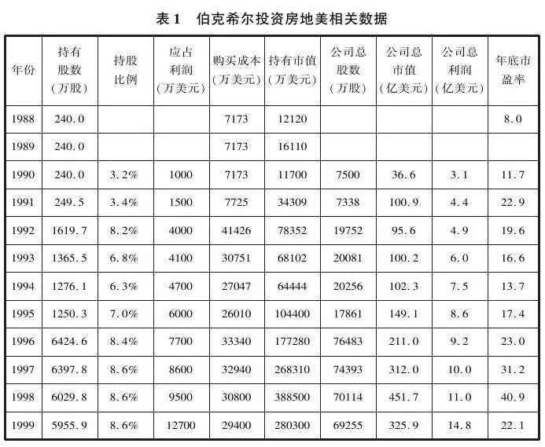

注：数据来源于伯克希尔公司年报。

到1991年年底，伯克希尔持有的房地美股票市值达到3\.43亿美元，相对于0\.77亿美元的成本，总收益率为345%，年均收益率约为64%。市盈率从1988年的不足8倍增长至1991年的约22倍，市盈率增长约2\.7倍。

在1992年，巴菲特用3\.4亿美元增持了房地美的股票，持有总成本为4\.1亿美元。在2000年，巴菲特全部卖出了房地美的持股，相对于约3亿美元的成本，税前总收益约为30亿，总收益率约10倍。

令人感到不可思议的是，在房地美和房利美处于发展鼎盛时期的2000年，巴菲特全部清仓了房地美和房利美的股票，成功避开了2008年金融危机时两房的破产。对此，巴菲特在2001年伯克希尔股东大会上做了解释：“不是因为政府管制的原因，而是风险因素使我们下定了决心。当我们了解了这个企业后，我们对这个企业的某些方面感到不安。”

房地美为了规避1998年新会计准则可能造成的业绩下滑，进行了大量复杂的金融衍生品交易，制定不合理的年度增长目标。在2000—2002年，为了平滑业绩更是虚增利润，这些行为为之后的金融风暴埋下了祸根。

巴菲特早在2002年的致股东信中，就对金融衍生品交易的危害提出了警告。他将衍生性金融商品交易称为“一颗定时炸弹”，随时有可能引发金融危机。衍生性金融商品交易以利率、股指、汇率、股价等人们能够想得到的指标作为标的进行对赌，设计出复杂的交易合约，而这些复杂的交易合约即使专业的会计师也难以看懂并评估风险。衍生性金融商品交易可能会因为交易一方因评级被调降而发生被要求提供质押担保，造成流动性进一步恶化，因而评级被进一步调降，如此恶性循环。另一方面，衍生性金融商品交易可能会由于一个外部事件，造成连锁反应，风险从一个公司传递到另一个公司，形成系统性风险。

2008年，正如巴菲特所预言的，美国金融危机爆发，美国房地产市场萧条引发了衍生性金融商品交易的连锁反应，形成次级贷款危机。房地美和房利美皆陷入巨额亏损，两房被美国政府接管，股票价格跌到1美元以下，双双从纽约证券交易所退市。

自我剖析：巴菲特致股东信

1988年

1988年我们做出两项重大决定，大笔买进房地美与可口可乐，并且打算要持有这些股票很长一段期间。事实上，当我们发现我们持有兼具杰出企业与杰出经理人的股权时，我们最长的投资期间是永久。我们跟那些急着想要卖出表现不错的股票以实现获利，却顽固地不肯卖出那些绩效差的股份的那群人完全相反。彼得·林奇生动地将这种行为解释为：砍掉花朵来给野草施肥。我们持有房地美的股份比例是法令规定的上限，这部分查理在后面会详加为各位说明。因为他们是通过共同储贷——我们一家非保险的子公司——进行投资，所以在我们的合并资产负债表当中，这些持股将以成本而非市价列示。

1991年

写作的人都知道，要让读者了解其意思最好的方式就是举个例子，不过希望我现在举的例子不会过于极端。回顾1988年，当时我们决定以3\.5亿到4亿美元买进3000万股（经过事后的分割调整）的房地美股份。我们之前曾经拥有过这家公司的股份，也对其所处的产业相当了解，也很清楚大卫·麦克斯韦尔也就是房地美的总裁，有能力处理他所接下的一堆问题，同时进一步将公司建立成为一个金融巨擘。一切可说是前景看好，为此我还特地到华盛顿拜访大卫，确认他对于我们持有该公司一大部分的股权不会感到任何的不愉快。

只不过当我们开始买进不到700万股时，该公司股价就开始上涨。失望之余，我立刻停止买进（事后回想还好我没有在买进可口可乐时犯下相同的错误），更有甚者，我觉得区区700万股对我们来说实在是没有太大的意义，所以之后又把持有的700万股全部卖掉。

我期盼对于我这样不具职业水准的投资行为，可以给各位一个稍微合理一点的解释。不过我实在是编不出来，不过我倒是可以跟各位报告因为本人的这项错误，大概使得伯克希尔在1991年少赚了14亿美元。

2000年

在2000年，我们几乎将所有房地美与房利美的持股全部卖出，同时利用15%的资金买进几家中型的公司以及一些高收益的债券（少部分，并不属于垃圾债券等级），另外加码一些优先顺位的抵押证券。目前，我们的投资组合并没有太大的潜在利益，虽然对于这样的投资组合我们感到满意，但却没有什么可以令人期待的地方。

2002年

对于衍生性金融商品以及其他附带的交易，查理跟我的看法完全一致，我们认为不论是对参与交易的双方或者是整个经济体系而言，它们就像是一颗颗定时炸弹！

在丢出这个爆炸性的看法后，请容我稍后详加说明。现在，让我先稍微解释一下衍生性金融商品。虽然这类的解释相当空泛，因为这个名词代表着相当广泛的金融交易。基本上，这类交易工具会使得财富在未来的一段时间内进行易手，其金额决定于某个或数个关键指针，包含利率、股价或汇率等。举例来说，假设你做多或放空S＆P500指数期权，那么你等于已经参与一项非常简单的衍生性金融商品交易。你的赚赔取决于指数的变动，衍生性金融商品的期间长短不一而足（有时甚至可能超过20年以上），其价值的变化则系于许多变量。

除非衍生性金融商品交易有质押担保或是附带保证，否则其最终的价值还必须取决于交易双方的履约能力。虽然在交易正式结算之前，交易双方都会随时在各自的损益表上记录盈亏——且其金额通常都相当庞大——即便实际上还没有任何一块钱进行移转。

只要是人想得到的（或者有时应该说是疯狂的人），都可以被列为衍生性金融商品交易的标的。举例来说，当初在安然，就有新闻及宽频衍生性金融商品，虽然要在许多年后才会结算，但此类交易还是可以入到公司的账上。或比如说你想要签一个契约，赌内布拉斯加州2020年双胞胎出生的数目，没有问题，只要你肯出价，保证找得到人肯跟你对赌。

当初我们在买下通用再保险时，该公司有一家附属的通用再保证券，这是一家衍生性金融商品经纪商，查理跟我认为它具有相当的危险性，所以并不想保留这个部门，于是我们试图将这个部门出售，但并没有成功，最后只好将它慢慢清算。

但想要关闭一个衍生性金融商品部门，谈何容易，想要摆脱它的纠缠可能要耗费许多个年头，（虽然我们正逐日降低所暴露的风险）。事实上，再保险业与衍生性金融商品交易有点类似，两者都像是地狱一样，并没有多大的进入障碍，但想要退出却难如登天。一旦签了约，你就摆脱不了它，有时甚至要等到几十年后，才突然冒出来，要你支付一大笔钱。当然，确实也有些法子可以帮你将风险转嫁给别人，但大多数的做法还是无法让你免除连带的责任。

再保险业与衍生性金融商品交易另一个共同特点就是两者的账面盈余通常都有过度高估的情况，这是由于目前的盈余大多系于许多未来的变量，而其正确性却需要很多年后才能揭晓。

但错误瞒得了别人，却骗不了自己，其所反映的，不过是人们对于他人的承诺，总是倾向采取乐观看法的现象，而且交易的双方有极大的动机在会计账务上做手脚。因为这些负责买卖衍生性金融商品的人士，其报酬（全部或部分）往往取决于依市价结算的账面盈余。但现实的状况是（想想我们刚刚提到的双胞胎合约）那个市场根本就不存在，所以取而代之的是“依公式结算”。这种替代性的做法有极大的漏洞，在通常的状况下，由于合约牵涉多个变量，再加上结算日期的遥远，使得交易双方无形中增加许多引用不实假设的机会。以我们刚刚提到的双胞胎案例来说，订立合约的双方可能使用截然不同的公式使得交易双方连续好几年同时享受巨额的账面获利。在最夸张的状况下，所谓的“依公式结算”极可能堕落沦为“依鬼话结算”。

当然，不论是内部的稽核人员或者是外部的会计师，也都看过这些数字，但要弄懂可不是一件容易的事。举例来说，通用再保证券截至2002年年底（在决定彻底关闭它的10个月后）仍有14384件有效合约流落在外，交易对象遍布全世界672个对手，每一项合约的价值都会随着一个或好几个变量的变化而随时上下变动，其中有一些变量光是看了就令人觉得头发昏。想要对这些交易组合进行评价，就算是专业的会计师，也往往会有不同的意见与看法。

评价难度本身早已超越学术性论证。近几年来，有好几件大规模的舞弊案及疑似舞弊案都是源自于衍生性金融商品交易。以公用能源事业来说，许多公司利用衍生性金融商品交易来创造账面巨额的获利，直到东窗事发之际，他们还试图将衍生性金融商品交易相关的应收款项，转换成为现金科目，至此“依市价结算”真正沦为“依鬼话结算”。

我可以向各位保证，在衍生性金融商品交易所发生的错误，绝对无法让交易双方的账对平。几乎没有例外，他们都会偏袒有机会得到百万奖金的营业员，或特别希望账面拥有亮丽的报表数字的一方（或甚至是双方），而最后往往要等到奖金支付给营业员，而CEO因为认股权大赚一笔后，股东们才会发现所谓亮丽的财报数字根本就是一场骗局。

衍生性金融商品交易的另一项问题是它可能因为一些毫不相关的原因，让一家公司的问题更为加重。这种滚雪球效应之所以会发生，主要在于许多衍生性金融商品交易的合约都要求对方一旦其信用评级遭到调降时，必须立刻提供质押担保给交易对方。大家可以想象，当一家公司面临困境而被调降信用评级的同时，衍生性金融交易却又立即登门，要求提供事先完全没有设想到，且金额庞大的现金时的情景，此举可能让公司进一步陷入流动性的危机。而通常这又会让公司的信用评级再度向下调降，恶性循环的结果可能导致一家原本好好的公司因此倒闭。

衍生性金融商品交易也有可能带来骨牌效应风险。这是因为许多保险业及再保业者习惯将风险分散给其他保险公司，在这类情况下，巨额的应收款项将随着交易对象的日趋复杂而持续累积（以通用再保证券来说，虽然已经经过将近一年的清算期，目前仍有高达65亿美元的应收款项流通在外）。交易的一方或许对于自己相当有信心，认为其巨额的信用风险已经经过适度的分散，因此不会发生任何危险。只有等到某种特殊状况下，一个外部事件导致A公司的应收账款发生问题，从而影响B公司，乃至于一路到Z公司。历史教训告诉我们，危机的发生往往是我们在太平盛世时所梦想不到的一连串问题串联所导致的。

在金融体系中，早期发现到连锁反应的问题严重性是联邦储备理事会成立的主要原因之一。在美联储成立以前，体质不佳的银行倒闭有时可能会对一些原本体质还不错的银行造成突然没有预期到的流动性压力，导致它们跟着出现问题。美联储于是建立了一道防火墙，将有问题的金融机构隔绝开。但是，在保险业或是衍生性金融商品交易，却没有类似中央银行的控管机制来防止骨牌效应的发生。在这些产业，一家原本体质不错的公司很有可能因为其他公司发生问题而受到拖累，当这种连锁反应的威胁存在于产业中时，就绝对有必要尽量降低彼此间的牵连，这正是我们目前在再保业采取的做法，同样这也是我们选择退出衍生性金融商品交易的原因之一。

许多人声称衍生性金融商品交易可以有效降低系统风险，通过这类交易让原本无法承担特定风险的人可以将风险移转给他人。这些人相信衍生性金融商品成为稳定经济的力量，让商业交易得以遂行，同时降低个别参与者的风险。就个体层面而言，他们的说法或许是事实，就像是在伯克希尔，我有时也会搭配一些大规模的衍生性金融商品交易好让某些投资策略得以遂行。

然而查理跟我本人一致认为，从总体经济的角度来看，这却是相当危险，而且风险有日益加重的趋势。大量的风险，尤其是信用风险，目前已逐渐累积在少数几家衍生性金融商品交易商身上，而且彼此的交易更是相当频繁，这使得一家公司在发生问题后，将很快传染给其他公司。到最后，这些交易商将欠非交易商的交易对手巨额款项。而这些交易对手，如我刚刚提到的，由于彼此关系过于紧密，一个单一事件将会使他们同时出现问题（比如说电信产业的崩溃或者民营电力事业的价值大幅减损等）。由于关联度过高，在问题浮现时，便有可能引发系统性风险。

就像是1998年大量从事高杠杆操作衍生性金融商品的避险基金——长期资本管理公司（LTCM），就搞得大家焦头烂额，最后使得美联储不得不火速实施紧急援助。在后来的国会听证会中，美联储官员坦承，当初若非他们介入，这家名声响亮但仅有数百名员工的神秘公司LTCM，很有可能对美国资本社会的稳定造成极严重的威胁。换句话说，美联储之所以甘冒风险打破惯例介入干预，完全是因为主事者害怕类似的事件会传染给其他金融机构，进而引发骨牌效应。而这次的事件虽然导致大部分固定收益市场一度瘫痪达数个星期之久，但个人认为，这还不是最坏的状况。

在所有衍生性金融商品中，全收益交换是LTCM经常使用的工具之一。这类合约使得该公司可以运用100%的杠杆在各种市场进行套利，也包含股票市场。举例来说，合约的一方A，通常是一家银行，必须投入百分之百的资金买进股票，而在此同时，合约的另一方B，却可以不必投入任何资金，B公司就可以约定在未来的某个日子时，取得或承担A银行所实现的利益或损失。

这类全收益交换合约竟然连保证金都可以不需要。除此之外，其他种类的衍生性金融商品也绕开了主管机关抑制银行、保险公司及其他金融单位采取高杠杆及风险控管的强力铁腕。同时，即便是经验老到的投资者及分析师，在看到这类布满衍生性金融商品交易公司的财务状况时，也会束手无策。记得当查理跟我自己在看完几家大型银行有关衍生性金融商品交易冗长的财务报表附注时，我们唯一可以确定的是，我们根本就不晓得这些金融机构到底承担了多少风险。

衍生性金融商品交易魔鬼现在已从潘多拉瓶子中窜出，而这类交易还会继续以各种不同形式自我复制，直至这个祸害所造成的危害为众人所知时为止。它们的危险程度从近年来弥漫在电力能源产业的几件个案可以略窥一斑。在事件发生之后，衍生性金融商品交易急速减少，然而在其他产业，衍生性金融商品交易却照样毫无节制地急速扩张。中央银行及美国政府到目前为止依然找不到有效克制的办法，甚至连监控这些合约所构成风险的机制都没有。

查理跟我相信，伯克希尔依然是所有股东、债权人、投保户及员工最坚强的财务堡垒。我们对于任何可能的潜在重大意外都感到恐惧，或许对于长期衍生性金融商品大量无担保应收款项的保留态度，让我们看起有点过于保守。但我们还是认为衍生性金融商品是财务、金融的毁灭性武器，其所带来的危险，虽然是潜在不可知，但绝对是致命。

[\1] 本章部分内容参考：Ellen Schultz\.A Warm Tip From Warren Buffett：It's Time to Buy FREDDIE MACS\[EB/OL\]\.1988\-12\-19\.

## 20.吉列剃须刀　1989

\(22\) 20\.吉列剃须刀 1989

2026年2月20日

12:59

20\.吉列剃须刀 1989

公司背景

吉列（Gillette）公司由金·吉列创建于1901年。金·吉列发明了一种用完后就丢弃的刮胡刀片，一副刀架配若干刀片，刀片用完后再购买。吉列剃须刀在第一次世界大战和第二次世界大战时均为美国士兵的军需品，由此开始了快速发展，成长为国际性品牌，其在剃须刀领域的全球占有率长期高于60%。

1989年，吉列公司股价约为42美元，总市值（包括可转换优先股）约46亿美元，净利润约2亿美元，市盈率约23倍。吉列当时发行了一种可转换优先股，年利息为8\.75%，并可以以每股50美元转换为普通股票，强制赎回期限为10年。

巴菲特策略

巴菲特用伯克希尔的资金买入了6亿美元的吉列可转换优先股，而没有买入普通股。巴菲特认为，投资可转换优先股，在任何条件下都能确保安全，当公司业绩不佳或股票价格下降时，能够收回成本并得到8\.75%的股息；若公司的股票表现良好，也可以转换成普通股而获利。在1989年，为什么巴菲特买入了吉列的可转换优先股而没有购买其普通股票，可能与吉列当时的股价高有关，约23倍市盈率可能不符合巴菲特的安全边际原则。

巴菲特认为自己对吉列所在的剃须刀行业有比较好的了解，能够对未来做一个合理的预估。他将吉列与可口可乐并举，认为吉列与可口可乐是当今世界上最好公司中的两家。吉列的品牌和品质造就了竞争优势，不可战胜。一方面，吉列剃须刀的价格便宜，平均每年的用量不多，顾客对价格不敏感，不会为了便宜一点而选择品质和品牌更低的产品，因此用户黏性强；另一方面，由于用户不会随意更换剃须刀品牌，因此吉列的新一代产品也会很快被顾客接受。

1991年，吉列公司提前赎回可转换优先股，巴菲特只好在4月1日将可转换优先股转换成普通股。到年底，伯克希尔持有吉列股票的总市值为13\.47亿，是购买成本6亿的2\.25倍，收益率为125%。

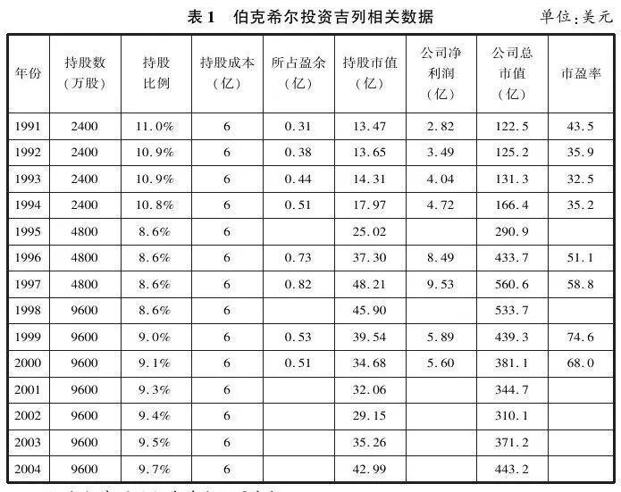

注：数据来源于伯克希尔公司年报。

1991—1997年，吉列的净利润从2\.82亿增长至9\.53亿，年均增长率为22\.5%，公司市盈率和股价都快速上升，市盈率在这期间皆维持在30倍以上，在1997年底更是达到了58\.8倍。在这期间，伯克希尔持有的吉列股票市值从13\.47亿增长至48\.21亿，年均增长23\.7%。

1996年，吉列以78亿美元收购了电池生产商金霸王，该笔收购代价过高，对吉列的公司价值产生了负面影响。

1998年，吉列在海外的收入出现下滑，公司利润开始下降，对金霸王的收购也没有产生预想的效果。1999年，新任CEO迈克尔·霍利上任，吉列加速下滑，市场占有率、利润、股价皆向下走，包括巴菲特在内的吉列董事会迅速采取行动。2000年10月，任职仅一年多的迈克尔·霍利被迫辞职。2001年2月，空降CEO詹姆斯·基尔茨走马上任，以善于控制成本著称的基尔茨逐步扭转了局面，利润开始增长。

到2004年底，吉列的总市值为443亿，仍然低于1997年底的高点560亿。

2005年，宝洁以总价570亿美元收购了吉列，其中60%换股，40%现金。巴菲特选择了换股，每股吉列股票换0\.975股宝洁股票，换股后共持有9360万股宝洁股票，并以约54元每股的价格追加了3\.4亿美元购买宝洁的股票，总持股数为1亿股，总投入成本为9\.4亿美元，持有股票的年底市值为57\.88亿。

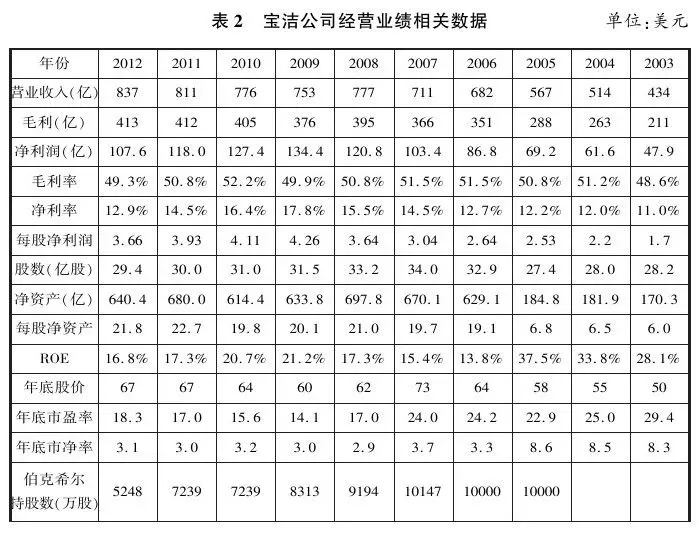

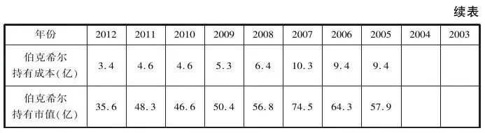

注：数据来源于宝洁公司年报和伯克希尔公司年报。

2008年，巴菲特开始减持宝洁的股份，到2012年底，共减持了宝洁公司约一半的股份，减持期间的市盈率约15～20倍，市净率约3倍。宝洁的净利润从2010年开始下降，而股价从2006年开始直到2012年底基本处于横盘状态。

自我剖析：巴菲特致股东信

1989年

我们将出售债券所得的收入连同期初账上的现金与年中所赚取的盈余，买进了三种可转换优先股。第一种是在7月份，我们投资6亿美金，购买了吉列年利率8\.75%十年强制赎回的可转换优先股，转换价格定为每股50美元；之后我们又花了3\.58亿美金投资美国航空年利率9\.25%十年强制赎回的可转换优先股，转换价格定为60美元；最后我们在年底又以3亿美金投资冠军企业年利率9\.25%十年强制赎回的可转换优先股，转换价格定为38美元。

吉列这家公司与我们喜爱的类型非常相近，查理和我都熟悉这个产业的环境，因此我们相信可以对这家公司的未来做一个合理的预估（若是没有试过吉列新的感应式刮胡刀，赶紧去买一个来试试）。但是我们就没办法预测投资银行业、航空业或是造纸业的未来前景（我们在1987年买下所罗门公司的可转换债券）。当然，这并不表示他们的未来价值就是个负数，基本上我们是不可知论者，而不是无神论者。所以，由于我们在这些产业上缺乏强而有力的论点支持我们，因此我们在这些产业上所采用的投资方式，就必须与那些显而易见的好公司好产业有所不同。

不管在任何情况之下，我们预期这些可转换优先股都可以让我们收回本金加上股利无虞，然而若是我们真的只能收回这些，那么这样的结果无疑是相当令我们失望的。因为我们必须被迫牺牲流动性，这有可能让我们在往后的十年内错失更好的投资机会。在这种情况下，我们就只能获得一般优先股所能获得的利益，而后者却是我们根本就不会想要去投资的，所以唯一对伯克希尔最有益处的是，我们投资的公司本身的普通股也能有优异的表现。

这些可转换优先股的报酬当然比不上那些具有经济优势却还没被市场发现的好股票，或许也比不上那些我们可以买下80%以上股权的优良企业购并案。但大家要知道，后面这两种投资机会相当稀少，实在是可遇不可求，尤其是以我们现在的资金规模，实在是很难找得到适合的投资标的。

总而言之，查理跟我认为这类的可转换优先股投资应该可以让我们获得比一般固定收益债券更好的投资利益，同时我们也可以在这些被投资公司扮演好具有建设性的少数关键角色。

1990年

就像我去年曾经提到的，我希望我们的透视盈余每年都能够成长15%，在1990年我们确实大幅超越这个比率，但1991年结果却差很多。我们在吉列的可转换优先股投资已经被赎回，我们将在4月1日把它们转为普通股，虽然这将会使得我们每年的账面盈余减少3500万，透视盈余也会跟着减少。另外我们在媒体事业的盈利，包括直接盈余和透视盈余，也可能下滑，但不论如何，我们每年还是会向大家报告透视盈余的计算结果。

我们持续持有先前向各位报告过的可转换特别股，包括所罗门7亿美金、吉列6亿美金、美国航空3\.58亿美金与冠军企业3亿美金。我们吉列的特别股将会在4月1日转换为1200万股的普通股，在衡量利率、债信与普通股的价格之后，我们可以确信在所罗门与冠军企业的投资现值应该与我们当初的成本差不多，吉列的价值比成本高，至于美国航空的价值则远低于当初的投资成本。

很遗憾，我必须在报告末段，以我的好朋友科尔曼（吉列的CEO）在今年1月过世作为结尾。除了“绅士”这个代表品格、勇气与谦和的词，没有其他字更能贴切地形容科尔曼这个人。除了这些特质之外，再加上他所拥有的幽默与超凡的经营能力，所以大家应该可以想象与他共事是多么令人感到愉快的一件事，这也是为何包含我在内的许多人，会对他感到特别怀念的缘故。

在科尔曼去世之前几天，吉列荣登福布斯封面故事，被大加赞扬。标题很简单，这家公司在刮胡刀产业的成功，不单单只靠营销手段（虽然他们一再展现这方面的能力），同时更源自于他们对于品质的追求。这种思维设定使他们持续将精力放在推出更好的产品之上，虽然现有的产品已是市场上最经典的。福布斯对于吉列的形容，就好像是在描述科尔曼本人一样。

1991年

我们在1991年所经历账面数字的超额成长是一种不太可能再发生的现象。受惠于可口可乐与吉列市盈率的大幅飙升，这两家公司就合计贡献了我们去年21亿美元净值成长中的16亿美元。三年前，当我们大笔买进可口可乐股票的时候，伯克希尔的净值大约是34亿美元。但是，现在光是我们持有可口可乐的股票市值就超过这个数字。

可口可乐与吉列可以说是当今世上最好公司中的两家，我们预期在未来几年，他们的获利还会以惊人的速度成长，相对地我们持股的价值也会以等比例的程度增加。然而另一方面，去年这两家公司股价上涨的幅度，却远高于其本身获利增长的幅度。所以说去年我们是两面得利，一方面是靠公司绝佳的获利能力，一方面是市场对于公司股票的重新评价。当然我们认为这样的调整是经得起考验的，但这种情况不太可能每年都发生，展望未来我们可能只能靠前面那点而获益。

1992年

虽然我们在吉列优先股的投资还算是成功（在1991年转换为普通股），但整体而言，这类协议谈判所取得的优先股投资的绩效，还是略逊于从二级市场所取得的投资。不过这种结果我们早已预期到，这与我们相信一个聪明的投资者在二级流通市场的表现会比初级发行市场来得好的道理是相同的。

1995年

我们在1989年以6亿美元取得吉列可转换优先股，之后转换为4800万股吉列的普通股（分割调整后），然而要是当初我们选择直接投资该公司的普通股，这笔钱可以买到6000万股，因为吉列当时每股的市价为10\.5美元。而由于那次的私募对于我们有诸多的限制条款，所以拿到5%左右的折扣应该不成问题。我不知道这样说对不对，我认为当时要是我们选择直接以取得普通股的方式投资，该公司的管理阶层可能会更高兴。

可惜人算不如天算，虽然在这两年内我们另外还收到额外的优先股股息（这是普通股所没有的），但是如果当初我选择普通股而非优先股的话，截至1995年，我们将可多获得6\.25亿美元的利益，当然还要再扣除7000万美元的优先股股息。

2005年

在2001年詹姆斯·基尔茨进入吉列之前，这家公司正在苦苦挣扎之中，特别是为资本配置上的大错而痛苦不堪。吉列收购金霸王电池（Duracell）让股东们支付了几十亿美元的代价，而这种代价在传统财务会计上根本看不出任何反映。简而言之，吉列在并购中获得的商业价值与其付出的并购成本并不相等（令人非常吃惊的是，这种非常简单的衡量标准在管理层及其投资银行家讨论并购时几乎总是被忽略）。

阅读延伸：伯克希尔1997年股东大会

巴菲特：我只能坚持我刚才的看法——在食品行业，你永远无法获得你能在类似于剃须刀这种单一消费品行业中的不可战胜性。如果我现在用的是吉列感应剃须刀，很显然，当这种剃须刀的下一代产品出来的时候，我会接着使用新一代产品，就是现在的超级感应剃须刀，我绝对不会在其他品牌之间乱换。使用吉列产品剃须的顾客——包括女性——其中有很高比例的人都对产品感到很满意。

并且它还不贵。对一个普通用户来说，一年的花费也就是20多美元。如果你使用的产品性价比很高，你是不会随便更换产品的。

巴菲特：很显然，食品行业对价格也比较敏感。

芒格：其中的部分原因是对比——在一年中，你在汉堡包上花的钱要比剃须刀片多得多。所以，改变剃须刀片不会节省多少钱。

巴菲特：没错。每年每个美国人平均购买27片超级感应剃须刀片，也就是说，每13\.5天换一次刀片。我不知道刀片的零售价是多少，作为吉列的董事会成员，我们用的刀片都是免费送的。不过，如果每张刀片的价格是1美元，一年就是27美元。一年花27美元得到的剃须感受是完全不同的。

当然，这就是全球各地的情况，人们在使用便宜的双层刀片，人们对剃须舒适度的要求越来越高。因此，吉列是直接的受益者。

如果好的剃须刀和一般的剃须刀之间的价格差别是一年10美元或者12美元，不会有太多的人改变他们对剃须刀的选择。

巴菲特：顺便说一下，女士版的感应剃须刀取得了巨大的成功。女士版的剃须刀推出后，售出的数量比当初男士版面市时多。我没想到市场竟然会这样扩大。在女士版的剃须刀出现之前，女性都是用一次性的剃须刀或者借用他们的丈夫或者男朋友的剃须刀。谢天谢地，现在终于有了面向她们的剃须刀。

## 21.富国银行　1990

\(23\) 21\.富国银行 1990

2026年2月20日

12:59

21\.富国银行 1990

公司背景

在1990年左右，美国西海岸的房地产市场陷入供过于求的困境，美国银行业股价都大幅下跌。富国银行作为美国最大的房地产贷款银行之一，也难以幸免，股价在低位徘徊，1988—1990年年底的市盈率分别为6\.5、6\.7、4\.3倍，市净率分别为1\.4、1\.5、1\.0倍。

1990年，富国银行的总资产为562亿美元，净资产为29\.6亿美元，贷款总额为490亿美元，存款总额为418亿，利息收入为23\.1亿，非利息收入为8\.9亿，营业收入为34\.1亿，运营成本为20\.2亿，当年贷款减值提取3\.1亿，净利润为7\.1亿，每股净利润为13\.39美元，每股净资产为57\.4美元。累计坏账拨备为8\.85亿，贷款拨备率为1\.81%，核心资本充足率为5\.03%，资本充足率为9\.27%。成本收入比为53\.4%，非息收入比为28\.3%，资产收益率（ROA）和净资产收益率（ROE）分别为1\.26%和24%。总体看各项指标都非常优秀，而当时股价约为1倍市净率，不到5倍的市盈率。

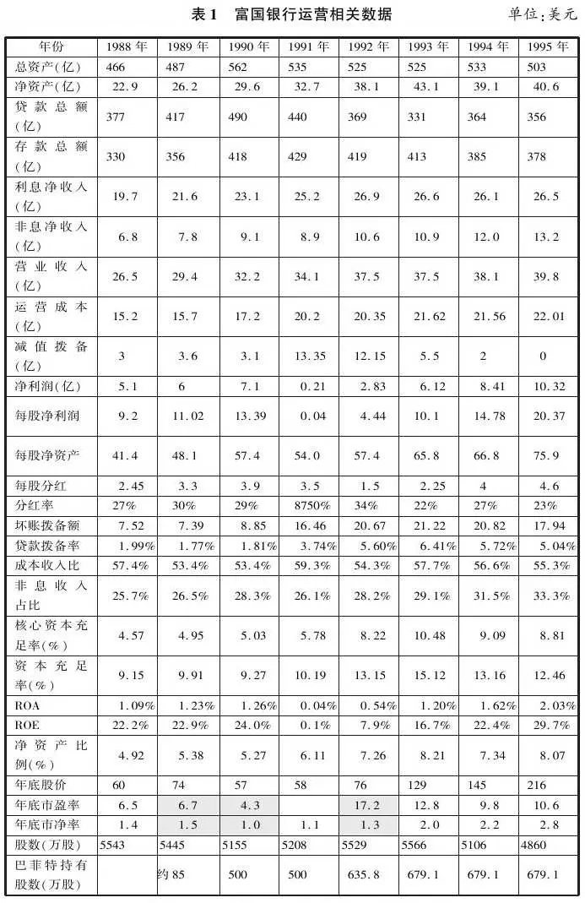

注：数据来源于富国银行公司年报和伯克希尔公司年报。

巴菲特策略

在1989年，巴菲特已经买入了富国银行约85万股的股票，每股成本估计约为70美元，市盈率约7倍，市净率约1\.5倍。当1990年股价进一步下跌后，他又大幅买入，年底共持有500万股，占富国银行总股数的9\.7%，接近无需向美联储申报的10%上限，总买入成本为2\.89亿美元，每股成本为57\.9美元，市净率1倍，市盈率4\.3倍。

巴菲特认为富国银行的管理层非常优秀，贷款的风险可控，即使发生房地产大幅下调的风险，也不会造成大幅亏损甚至倒闭。他认为，富国银行490亿美元的贷款，即使产生10%的不良贷款，即不良贷款额为49亿，这些不良贷款中假设30%的本金收不回来，那么损失的本金总额约15亿，但富国银行一年的税前利润加上提取的拨备也大约为15亿美元，在这种情况下，也能做到损益两平，而利润下降只是短期的，对长期投资的现金流影响不大。

巧合的是，巴菲特的最坏打算在1991年变成现实。1991年，富国银行经历了房地产市场的大幅下滑，坏账增多，当年提取了13\.35亿的减值拨备，造成净利润接近零，并在1992年继续大幅提取了12\.15亿美元。不过，这些提取超过了实际所需，在之后几年又大幅缩减了减值拨备提取额。即便如此，富国银行的营业收入和净资产还在不断上升，到1993年，净利润基本恢复到1990年的水平。

巴菲特在1992年和1993年继续增持了富国银行的股份，1992年和1993年增持股份的市净率分别1\.2倍和1\.5倍。至1993年底，巴菲特共持有679万股，总成本为4\.23亿美元。

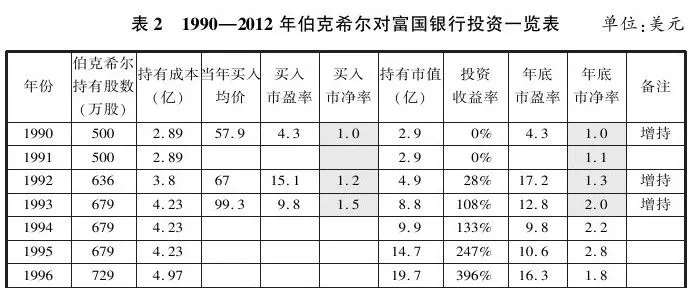

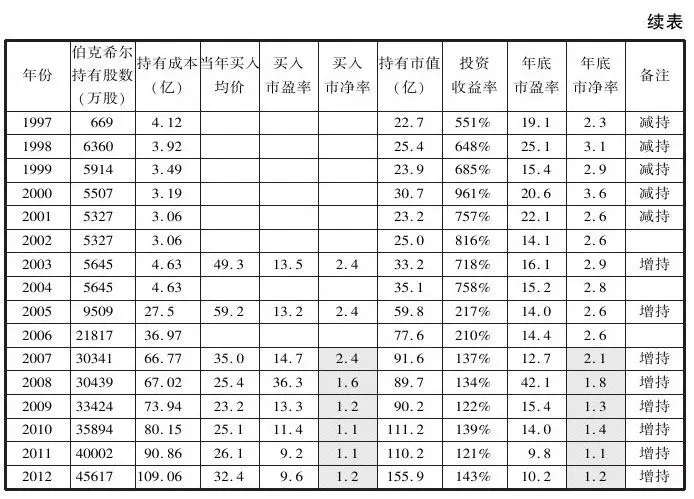

注：数据来源于伯克希尔公司年报。

由于富国银行的净资产不断提高，股价并未下跌，反而逐步上升，到1993年底，股价已经上升了1倍多。不包括分红，1993年年底的市值达到8\.8亿，投资收益率为108%，三年来的年均收益率为26%。

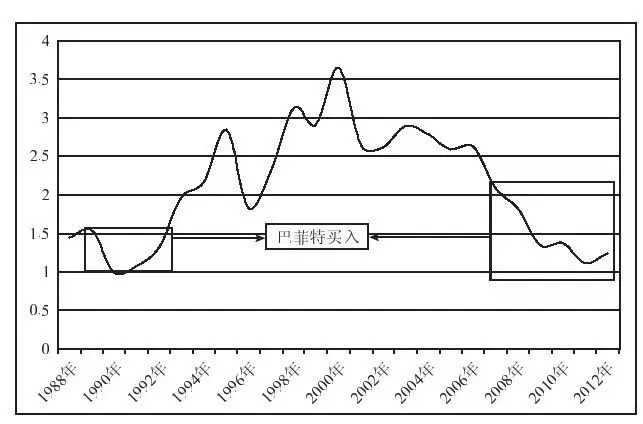

图11988—2012年富国银行市净率

随着净利润的逐渐增加，市场也越来越看好富国银行，再加上20世纪末的牛市，富国银行的市净率逐步提升，到2000年年底时，市净率高达3\.6倍。伯克希尔持有的富国银行股票市值达到30\.7亿，成本为3\.19亿，总收益率为9\.61倍，10年的年均复合收益率为25\.4%。

在市场亢奋期，巴菲特从1997年开始减持富国银行的股份，到2001年约减持了1/3的股份，减持期间的市净率约为2\.5～3\.5倍。

2005年以来，伴随富国银行股价估值的降低，巴菲特每年都在增持富国银行的股票，特别是2008年金融危机以后，增持的幅度较大。2008年开始，富国银行的股票市净率重新跌至1\.5倍以内。

从1988年至2012年，富国银行的非利息收入占比一直处于增长趋势，1988年为25\.7%，2012年为49\.8%，体现出其竞争优势；另一方面，富国银行的杠杆率在逐渐减小，1988年的净资产与总资产的比例为4\.9%，2012年为11%，这也导致其净资产收益率有所降低。若未来杠杆率的走势处于反方向，其利润将有大幅提升空间，预期伯克希尔持有的大量富国银行股票将获得可观的收益。

自我剖析：巴菲特致股东信

1990年

树懒天生特有的懒散正代表着我们的投资模式。今年我们没有增加也没有卖出任何持股，除了富国银行这家拥有良好的经营团队，并享有相当高的股东权益报酬率的银行，我们将持股比率增加到10%左右。这是我们可以不必向美联储申报的最高上限，其中1/6是在1989年买进，剩下的部分则是在1990年增加。

银行业并不是我们的最爱，因为这个行业的特性是资产约为股权的20倍，这代表只要资产发生一点问题就有可能把股东权益亏光光，而偏偏大银行出问题早已变成是常态而非特例。许多情况是管理当局的疏忽，就像是去年我们曾提到的系统规范——也就是经营主管会不自主地模仿其他同业的做法，不管这些行为有多愚蠢。在从事放款业务时，许多银行业者也都有旅鼠那种追随领导者的行为倾向，所以现在他们也必须承担像旅鼠一样的命运。

因为20比1的比率，使得所有的优势与缺点所造成的影响会被放大。因此，我们对于用便宜的价格买下经营不善的银行一点兴趣都没有，相反，我们希望能够以合理的价格买进一些经营良好的银行。

在富国银行，我想我们找到了银行界最好的经理人——卡尔·来卡特与保罗·黑曾。在许多方面，这两个人的组合使我联想到另外一对搭档，那就是大都会/ABC的汤姆·墨菲与丹伯克。首先，两个人加起来的力量都大于单打独斗，因为每个人都了解、信任并尊敬对方；其次，他们对于有才能的人从不吝啬，但也同时厌恶冗员过多；再次，尽管公司获利再好，他们控制成本的努力也不曾削减；最后，两者都坚持自己所熟悉的，让他们的能力而非自尊来决定成败。就像IBM的托马斯·沃森曾说：“我不是天才，我只是有点小聪明，不过我却充分运用这些小聪明。”

我们是在1990年银行股一片混乱之际买进富国银行的股份的，这种失序的现象是很合理的。几个月来，有些原本经营名声不错的银行，其错误的贷款决定却一一被媒体揭露。随着一次又一次庞大的损失数字被公布，银行业的诚信与保证也一次又一次被践踏。渐渐地，投资人越来越不敢相信银行的财务报表数字。趁着大家出脱银行股之际，我们却逆势以2\.9亿美元、5倍不到的本益比（若是以税前获利计算，则本益比甚至不到3倍），买进富国银行10%的股份。

富国银行实在是相当的大，账面资产高达560亿美元，股东权益报酬率高达20%，资产报酬率则为1\.25%。买下他10%的股权相当于买下一家50亿美元资产100%的股权。但是，真要有这样条件的银行，其价码可能会是2\.9亿美元的1倍以上。此外，就算真的可以买得到，我们同样也要面临另外一个问题，那就是找不到像卡尔·来卡特这样的人才来经营。近几年来，富国银行出身的经理人一直广受各家银行同业所欢迎，但想要请到这家银行的老宗师可就不是一件容易的事了。

当然，拥有一家银行的股权，或是其他企业也一样，绝非没有风险，像加州的银行就因为位于地震带而必须承担客户受到大地震影响而还不出借款的风险。第二个风险是属于系统性的，也就是严重的企业萧条或是财务风暴导致这些高财务杠杆经营的金融机构，不管经营的再好都有相当的危机。最后市场当时主要的考虑点是美国西岸的房地产因为供给过多而崩盘的风险，连带使得融资给这些扩张的银行承担巨额的损失，而也因为富国银行就是市场上最大的不动产借款银行，一般都认为它最容易受到伤害。

以上所提到的风险都很难加以排除，当然第一点与第二点的可能性相当低，而且即使是房地产大幅下跌，对于经营绩效良好的银行也不致造成太大的问题。我们可以简单地算一下，富国银行现在一年在提列3亿美元的损失准备之后，税前还可以赚10亿美元以上。今天假如该银行所有的480亿借款中有10%在1991年发生问题，且估计其中有30%的本金将收不回来，必须全部转为损失（包含收不回来的利息），即便在这种情况下，这家银行还是可以损益两平。

若是真有一年如此，虽然我们认为这种情况发生的可能性相当低，我们应该还可以忍受。事实上，伯克希尔选择并购或是投资一家公司，头一年不赚钱没有关系，只要以后每年能够有20%的股东权益报酬率。尽管如此，加州大地震使得投资人害怕新英格兰地区也会有同样的危险，导致富国银行在1990年几个月间大跌50%以上。虽然在股价下跌前我们已买进一些股份，但股价下跌使我们可以开心地用更低的价格捡到更多股份。

以长期投资作为终生目标的投资人对于股市波动也应该采取同样的态度，千万不要因为股市涨就欣喜若狂，股市跌就如丧考妣。奇怪的是，他们对于食物的价格则一点都不会搞错，很清楚自己每天一定会买食物，当食物价格下跌时，他们很高兴，（真正要烦恼的应该是卖食物的人）。同样，在水牛城报纸我们期望印刷成本能够降低，虽然这代表我们必须将账列的新闻印刷存货价值向下调整，因为我们很清楚，我们必须一直买进这些产品。

同样的原则也适用在伯克希尔的投资之上，只要我还健在（若我死后，伯克希尔的董事会愿意通过我所安排的神接受我的指示，则时间或许更长久），我们会年复一年买下企业或是企业的一部分——也就是股票。也因此，企业的价格下跌对我们会更有利，反之则可能会对我们不利。

股价不振最主要的原因是悲观的情绪，有时是全面性的，有时则仅限于部分产业或是公司。我们很期望能够在这种环境下做生意，不是因为我们天生喜欢悲观，而是如此可以得到便宜的价格买进更多好的公司。乐观是理性投资人最大的敌人。

当然，以上所述并不代表不受欢迎或不被市场注意的股票，就是好的投资标的，反向操作有可能与羊群心理一样的愚蠢，真正重要的是独立思考而不是投票表决。不幸的是，勃兰特·拉塞尔对于人性的观察同样地也适用于财务投资之上，“大多数的人宁死也不愿意去思考”！

1991年

另外有两项我没有预料到的结果，也影响到我们1991年的透视盈余。首先，我们在富国银行的利益大概仅维持损益两平（所收到的股利收入被其累积亏损所抵消）。去年我说这样的可能性很低的说法，其可信度存疑。其次，我们的保险业盈余虽然算是不错，但还是比往年低。

2011年

2011年我们的投资持股名单只有为数很少的几只股票变动。但其中有三个投资举动非常重大：我们购买了IBM的流通股，买入了美国银行的优先股，还增持了10亿美元的富国银行股票。

银行业正在起死回生，富国银行现在业务兴隆。富国银行的盈利强劲增长，资产稳健，资本金也达到历史最高纪录水平。至于美国银行，以前的管理层犯下了一些重大错误。其现任首席执行官布莱恩·莫伊尼汉在清理这些错误方面取得了极其出色的进展，不过要完成这个清理错误的过程还需要好几年的时间。与此同时，他在把美国银行培育成一家规模巨大的、具有吸引力的、基础坚实的大企业，在今天的问题被人们遗忘之后，能够持续很久。我们可以购买7亿美国银行股份的那些认购权证，在到期之前可能将会具有很高的价值。

## 22.M＆T银行　1991

\(24\) 22\.M＆T银行 1991

2026年2月20日

12:59

22\.M＆T银行 [\1] 1991

公司背景

M＆T银行创建于1856年，开始的名字为制造商和贸易商银行（Man\-ufacturers and Traders Bank），后来取名字中的首写字母简称为“M＆T银行”。M＆T银行是美国20家最大银行之一，主要业务区域如纽约、马里兰、宾夕法尼亚、华盛顿、新泽西等地区。

M＆T银行以20万美元资本开始在水牛城营业，于1902年成为全国性银行并进行了第一次收购。在1929年股灾时，美国超过1400家银行倒闭，M＆T银行虽然存款从1\.25亿美元缩减至1亿美元，然而仍然正常营业。至今，M＆T银行通过数十次的并购，结合业务增长，逐步成长为美国的大型银行之一。

1969年，M＆T银行的股东投票成立了一家由多银行组成的控股公司，名字叫第一帝国（First Empire），原M＆T银行成为其子公司。1991年，巴菲特购买了第一帝国价值4000万美元的可转换优先股，并于1996年全部转换为普通股。1998年，第一帝国把名字改为M＆T银行。

1990年，美国正处房地产泡沫破裂期，银行股一片萧条，投资者纷纷抛弃银行股。巴菲特趁市场惊恐时，以5倍不到的市盈率买入了富国银行约10%的股份。

在第二年的1991年，银行业坏账大幅产生，银行股价继续低迷，但第一帝国（M＆T银行）的坏账并没有显著增加。计提的坏账拨备从0\.27亿提高至0\.63亿美元后，净利润仍然在增加，净利润从0\.54亿增加值0\.67亿美元。

巴菲特策略

1991年3月15日，巴菲特出手买进了第一帝国（M＆T银行）的可转换优先股，购买人为伯克希尔的子公司国民赔偿保险公司，购买总价为4000万美元，强制赎回期为5年（1996年到期），每年股息率为9%，每股转换价为78\.91美元。

虽然巴菲特认为这笔投资规模太小，但他非常敬佩第一帝国（M＆T银行）的总裁鲍勃·威尔默斯，希望与之共事。鲍勃·威尔默斯也经常向巴菲特咨询企业并购相关事宜。1979年，当管理层和投资银行家向威尔默斯施压，要求他参与对克莱斯勒的第一次救助行动时，他向巴菲特寻求建议。巴菲特的回答言简意赅：“那些无法让你财富满袋的家伙总是会对你唠叨个不停。”

1991年，在巴菲特买入优先股时期，第一帝国（M＆T银行）的股价约为每股63美元，转股价为78\.91美元，转股价比股价溢价25%。当年第一帝国（M＆T银行）的每股净资产为80\.7美元，每股净利润为10\.1美元，当时股价对应的市盈率和市净率分别为6\.2倍和0\.8倍，而转股价对应的市盈率和市净率分别为7\.8倍和1倍。

投资业绩

到1999年，当初巴菲特投资的4000万美元变成了2\.1亿美元，不记分红的投资收益率为425%，年复合收益率为20%，另外收到1800万的优先股利息和700万美元的股票分红。市盈率从1991年购买时的7\.8倍提高到1999年的12倍，提高了约50%，而每股净利润增长了2\.4倍。

在2000和2001年，在股市下跌之际，巴菲特又投资了6300万美元增持M＆T银行的股票，增持部分的股票平均买入价格为38\.5美元，对应的市盈率约10\.5倍，市净率约1\.2倍。增持后的总买入成本为1\.03亿，总股数为670\.9万股，占M＆T银行约7%的股权。

至2006年末，伯克希尔持有的M＆T银行股票市场价值为8\.2亿美元，总收益率为696%，当年市盈率达到16倍，市净率为2\.2倍。

到2013年1季度末为止，伯克希尔仍然持有M＆T银行的股票，持有股数约538万股。

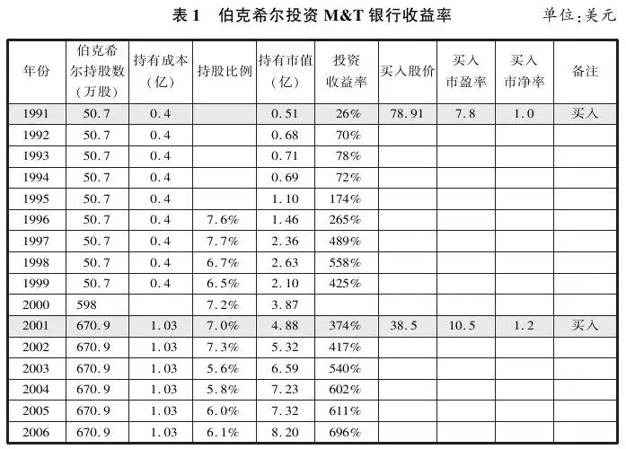

注：数据来源于伯克希尔公司年报。

营运情况

从1990年的房地产泡沫危机到2008年的次贷危机，刚好经历了一个完整的经济周期。M＆T银行股票的市净率从1991年的约1倍增长至2000年时的约2\.4倍，然后在2007年以后又下跌至约1倍市净率。

1990—2012年，M＆T银行的净利润和总市值增长了约20倍，年均增长率为17%，由于收购过程中增发股票的稀释，每股净利润增长约10倍，年均增长率为13%。与之相一致，净资产也增长了约20倍，年均增长率为17%，同样，由于收购过程中增发股票的稀释，每股净资产增长约10倍，年均增长率13%。

期间，平均总资产增长率为12%，平均营业收入增长率为14%，平均净资产收益率（ROE）为12\.4%，平均总资产收益率（ROA）为1\.1%。

期间，非利息收入占比从1990年约19%逐步增长至2012年的约40%，而杠杆率逐步下降，净资产/总资产的比例从1990年约5\.7%逐步增长至2012年的约12\.3%。

期间，M＆T银行的存贷比平均为99%，成本收入比平均为57%，贷款拨备率平均为1\.9%，净利润分红率从1990年的约15%逐步上升至2010的约45%。

在2007年美国次贷危机爆发后，M＆T银行大笔计提了贷款损失准备，2007—2010年共计提了15\.76亿美元，相当于2007年净利润的2倍，导致这3年的净利润出现负增长，股票价格跌幅超过50%，市净率重新回归到1倍附近。

自我剖析：巴菲特致股东信

1991

1991年我们在固定收益证券这方面的投资有很大的变动。如同先前曾提到的，我们的吉列可转换优先股被强制赎回，使得我们必须将之转换为普通股。另外，我们也出清了RJR Nabisco的债券，因为它在被转换后赎回。在另一方面，我们也买进美国运通与第一帝国——一家水牛城的银行控股公司的固定收益证券，此外还在1990年底买进了一些ACF工业的债券。

我们在第一帝国9%收益率的优先股投资了4000万美元，在1996年前公司无法赎回，每股转换价格定为78\.91美元。通常我会认为这样的规模对于伯克希尔来说实在是太小了，但由于我们对于该公司总裁鲍勃·威尔默（Bob Wilmers）实在是过于崇敬，所以不管金额大小，还是希望有机会能与他一起合伙共事。

1995年

我们在第一帝国银行的优先股在1996年3月1日进行转换，这是可以转换的最早日期。我们对于能够继续持有这家经营良好银行的股份感到相当安心，该公司的总裁鲍勃·威尔默是位相当优秀的银行家，我们很高兴能够与他一起合作。

[\1] 部分内容参考M＆T公司网站信息。

## 23.美国运通（第2次）　1991

\(25\) 23\.美国运通（第2次） 1991

23\.美国运通（第2次） [\1] 1991

买入背景

这次是巴菲特第二次买入美国运通，第一次是在1964年，当时美国运通旗下一家子公司被人欺骗，卷入色拉油丑闻。1963年，一位商品交易商安吉里斯想以豆油库存作为担保物，从银行借款。为了借更多的钱，他弄虚作假，把油罐底部装满海水，只在油罐口的小管子中注满油。美国运通公司的一家很小的子公司负责签发仓库收据，作为豆油库存量的依据。这种仓库收据可作为从银行贷款的抵押物，而美国运通的这家子公司变成了收据担保人。

后来安吉里斯用借来的钱从事豆油期货投机，随后豆油价格崩溃，安吉里斯无法还款，导致给安吉里斯贷款的银行被迫破产，而美国运通的子公司需承担收据担保责任，美国运通因此股价暴跌。两天后的星期五，总统约翰·肯尼迪遭到暗杀身亡，道琼斯指数瞬间狂跌，纽约证券交易所紧急休市。美国运通的股价更是雪上加霜，股价被拦腰砍断一半。巴菲特通过走访调查，认为该事件并没有对美国运通的品牌造成大的影响。1964—1966年，巴菲特合伙公司把公司40%的资金陆续买入美国运通的股票，总成本为1300万美元，1967年该笔投资升值为2800万美元，后陆续卖出，总收益率约2到3倍。

美国运通公司于1850年创建于水牛城，起先由三家快递公司合并组成，主要做快递业务。在19世纪末，美国运通推出了便于旅行者支付的旅行支票，开始转型做旅游相关服务。

上世纪90年代，美国运通主要运营三类业务：（1）旅游相关服务（TRS），主要业务包括消费者信贷、旅行服务、旅行支票、印刷和直接营销、保险等，服务机构遍布160多个国家。（2）财务服务（IDS），为个人、企业和机构提供财务产品和服务，主要业务包括财务计划服务、保险和年金服务、投资凭证、共同基金和一些其他服务。在1953年，巴菲特第一次买进IDS的股票，当时市盈率只有3倍。巴菲特还写了一篇长文章刊登在华尔街日报上，推销该股票。（3）美国运通银行（AEB），为美国运通的全资子公司，主要为高端客户和中小金融机构提供金融服务，业务包括私人银行、代理银行服务、贸易金融、支票清算、外汇等。

美国运通经过近百年的良好运营，逐渐成为美国最有声望的金融机构之一，享有非常好的信誉和品牌知名度。

1966年，VISA和MasterCard两大银卡联盟的成立突破了《银行法》的地域限制，使银卡业的格局发生了根本的改变。从那时起，所有的银行都可以加入银卡联盟。因此，VISA和MasterCard集所有银行的实力与运通卡竞争，后来居上并进而称霸银卡市场。

1990年，美国运通的净利润同比大幅减少，净利润由1989年的11\.6亿美元减少到1990年的1\.8亿美元；净利润率由8\.8%降为1\.2%；股价也大幅下跌，股价由1989年年底的35美元降低至1990年年底的约20美元；市净率由2\.7倍降至1\.6倍。1991年，美国运通的净利润有所好转，达到7\.9亿，但仍然处在比较低的水平，其净资产收益率只有10\.6%，而1989年的净资产收益率为20\.3%。

1991年，美国运通发行了一种附带上限的可转换优先股（PERCS）。该优先股的年利息率为8\.85%，即投资人每年能够获得8\.85%的利息收入。转股期限为3年，在普通股每股价格不超过33\.8美元时，转换价格为24\.5美元，对应1991年的市净率约为1\.7倍、市盈率约为15倍。若普通股价格超过33\.8美元，则转换价格为33\.8美元。也就是说，该笔投资的收益率有上限，除了每年8\.85%的利息收益外，3年后的普通股转换投资收益最多为38%（如果从24\.5美元涨到33\.8美元以上）。另外，该优先股有一个保护条款，若3年后，也就是在1994年，若普通股股价低于24\.5元，则转换期限延长1年。

巴菲特策略

巴菲特在1991年通过伯克希尔投资了3亿美元买入了美国运通的附带上限可转换优先股（PERCS），按照24\.5的转换价，可转换的总股数为1224\.49万股。巴菲特买入美国运通优先股期间，正是美国运通处在业绩低迷期，1990—1994年的5年间，其业绩都处在让人失望的低位，同时面临VISA和MasterCard两大银卡联盟的激烈竞争，股价徘徊在20～30美元之间。

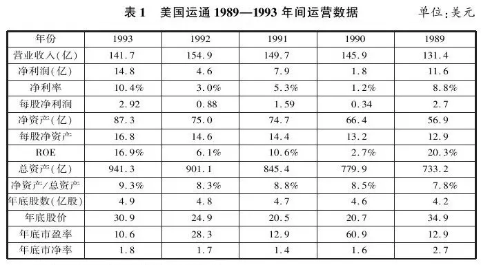

注：数据来源于美国运通公司年报。

在这种业绩低迷、面临VISA和MasterCard两大银行卡联盟激烈竞争的形势下，巴菲特准备在美国运通的优先股到期后将其处理掉。

幸运的是，就在要做决定的那个月，巴菲特正好到缅因州和Hertz租车公司总裁弗兰克·奥尔森一起打高尔夫球。弗兰克是一位相当优秀的经理人，因为业务的关系相当熟悉信用卡行业，所以打从第一洞开始，巴菲特就一直追问他有关这行业的种种问题，到了第二洞的果岭时，弗兰克已经让巴菲特完全相信美国运通的企业卡是一项绝佳的生意。所以，当下巴菲特就决定不卖了，等到后九洞时，他更决定加码投资。于是，在回来的几个月后，伯克希尔已经拥有该公司10%的股权。

1994年，伯克希尔将持有的美国运通优先股全部转换成普通股，由于当年美国运通的股价没有超过33\.8美元，所以转股价为24\.5美元，总股数为1224\.49万股。在巴菲特被弗兰克说服后，当年又投资了4\.2亿美元买入了1552万股美国运通普通股，平均买入价为26美元，对应1994年的市净率约为2倍，市盈率为9倍。到1994年年底，伯克希尔共持有2776万股，总买入成本为7\.2亿美元。

1995年，巴菲特继续增持美国运通的股票，花费6\.7亿美元增持了2170万股，平均成本为每股31美元，对应1995年的市净率为1\.9倍，市盈率为10倍。到1995年年底，伯克希尔共持有4946万股，占美国运通10%的股权，总买入成本为13\.9亿美元。

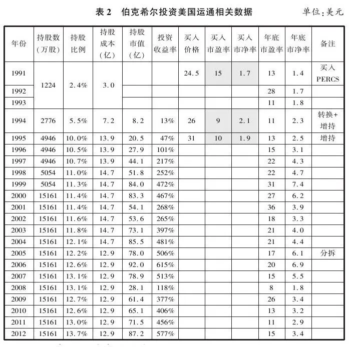

注：数据来源于伯克希尔公司年报。

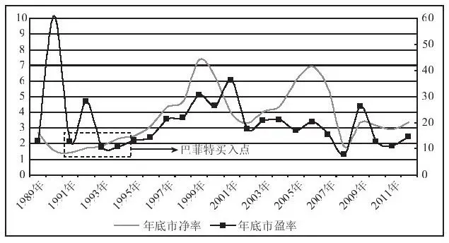

图1 美国运通公司市净率和市盈率

然而，巴菲特为什么在差点处理掉美国运通的股票时，又在弗兰克的解释后，重新大量买入呢？可能的原因是，巴菲特认识到美国运通的持久竞争力仍然很强，美国运通卡主要把客户群定位在富人和公司，由于运通卡长期以来建立的身份和地位象征，使其错开了和VISA和MasterCard的直面竞争。另一方面，处于业绩低迷期的美国运通的股价足够便宜，美国运通的长期净资产收益率约为20%，若市净率在2倍以下，可保证长期市盈率低于10倍。再者，美国运通当时的总裁哈维·戈卢布非常优秀，在其于1992年接任总裁后，聚焦于公司核心业务旅行相关服务，陆续剥离和分拆了公司的非核心业务，包括证券经纪业务、数据处理业务、投资银行业务（雷曼兄弟公司）等。

投资收益

1995年以后，美国运通的净利润连续增长，同时美国股市正处于牛市，道琼斯指数屡创历史新高，美国运通的股价也跟着水涨船高，迅速飙升。

1999年底，美国运通的股价上涨至160美元，伯克希尔持有股份的市场价值达到84亿美元，是买入成本14\.7亿美元的5\.7倍。5年来的年均收益率达到41%，同期道琼斯指数的总收益率约为203%，年均复合收益率为24\.8%。公司市盈率由1994年的10倍增长至1999年的30倍，贡献了约2倍的增长，公司净利润由14\.1亿增长至24\.8亿，增长了75%，利润年均增长率约为12%，美国运通公司累计回购了约10%的股份，这些因素共同形成高达472%的总投资收益率。

1999年，美国正处于自1982年以来17年牛市的末期，当年，巴菲特在太阳谷的演讲中对市场形势作了分析和预测。他认为，经过17年的上涨后，美国股市未来将面临长期调整，美国股市未来预期收益率最多达到6%，并对当时的科技股泡沫作了警示。1999年11月22日，《财富》杂志刊登了演讲的主要内容，题目为《巴菲特谈股市》。

1998年，美国股市的长期牛市进入收尾阶段，道琼斯指数从1982年的约1000点涨到1998年的9000点。巴菲特手持150亿美元现金，手发痒但找不到下手的对象。更有甚者，他从1997年开始，大幅清仓伯克希尔旗下的股票投资组合。

1997年，巴菲特清仓了5%的股票投资，包括把持有1年的麦当劳也清仓。1998年12月21日，伯克希尔完成对通用再保险公司的收购。收购完成后，全部清仓了通用再保险旗下的超过250只股票的投资组合，为此，还缴纳了9\.35亿美元的资本利得税。

2000年，道琼斯指数突破11000点，巴菲特清仓了房地美和房利美的全部股票，收购了几家中型公司，投资了部分高等级债券，加码了一些高顺位的贷款抵押证券。但是，他没有卖出美国运通。

2001年9月11日，美国发生恐怖袭击事件，股市大跌，美国运通也未能幸免，当年美国运通股价下跌了35%，股价从2000年年底的55美元下跌至2001年年底的36美元。2001—2006年，美国运通的股价随道琼斯指数逐步上升，股价从2001年年底的36美元上升至2006年年底的61美元。

2005年，美国运通将旗下Ameriprise分拆上市，当年年底，伯克希尔持有Ameriprise财务公司股票的市值达到12\.43亿美元，是持有成本1\.83亿美元的6\.8倍，该部分持股在2006年全部卖出。伯克希尔对美国运通的持股股数不变，但持股成本由14\.7亿降低至12\.9亿美元。

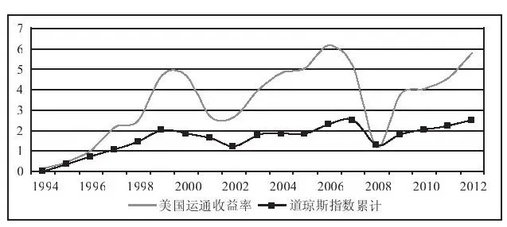

图2 伯克希尔投资美国运通收益率

2006年年底，美国运通股价对应的市盈率和市净率分别为20倍和6\.9倍，伯克希尔持有的美国运通股票市值达到92亿美元。1994—2006年共13年的总收益率为615%，年均复合收益率约为16%，同期道琼斯指数的总收益率约为230%，年均复合收益率为9\.6%。公司利润由14\.1亿美元增加至37\.1亿美元，总增长为2\.63倍，年均利润增长率为7\.7%；市盈率由10倍增长至20倍，增长为2倍；公司回购使得总股数减少约20%，拆分后总股数从1994年的15亿股减少至2006年的13亿股，伯克希尔的持股比例增加了47%。

2007年，金融危机开始爆发，道琼斯指数从最高14164点下滑，到2009年3月5日，道琼斯指数达到最低点6594点。期间，美国运通的股价也一路下跌，从最高约60美元下跌至2008年的最低约10美元，当年每股净资产为10\.2美元，每股收益为2\.3美元，最低价对应的市盈率约5倍，市净率约1倍。

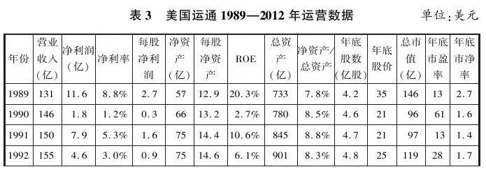

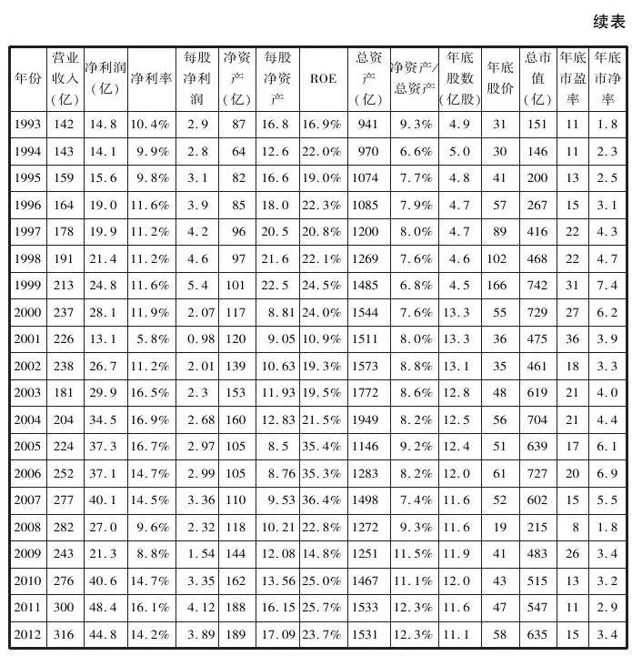

注：数据来源于伯克希尔公司年报和美国运通公司年报。

2009年开始，美国运通的股价开始爬升，到2012年基本恢复到1999年和2007年的水平，年底股价为58美元。

1999至2012年，伯克希尔持有美国运通股票市值从84亿美元上升至87\.2亿美元（不包括期间分红和公司分拆），投资收益率从472%增加至577%。期间，公司净利润从1999年的24\.8亿美元增长至2012年的44\.8亿美元，13年间的利润增长率为80\.6%，年均复合利润增长率为4\.6%；通过回购股票，伯克希尔的持股比例从11\.3%增至13\.7%；但市盈率从30倍下降至15倍，造成总投资收益率几无增长。

自我剖析：巴菲特致股东信

1991年

1991年我们在固定收益证券这方面的投资有很大的变动。如同先前曾提到的，我们的吉列可转换优先股被强制赎回，使得我们必须将之转换为普通股。另外，我们也出清了RJR Nabisco的债券，因为它在被转换后赎回。另一方面，我们买进美国运通与第一帝国——一家水牛城的银行控股公司的固定收益证券。

至于美国运通的投资则不是一般的固定收益证券，它算是一种Percs——每年可以为我们3亿美元的投资贡献8\.85%的股利收入，除了接下来会提到的一个特点。那就是我们的优先股在发行后的三年可以转换成最多12244898股的普通股，若有必要我们可转换的股份可能会向下调整，以确定我们所收到的股份总值不能够超过4\.14亿美元。虽然对于可能取得的普通股价值有其上限，但相对地却没有下限。不过这样的特别条款还包含若是三年期限到时公司股价低于24\.5美元时，可以有权请求延长转换期限一年。

1994年

在寻找新的投资标之前，我们选择先增加旧有投资的部位。如果一家企业曾经好到让我们愿意买进，我想再重复一次这样的程序应该也是相当不错的。若是可能，我们很愿意再增加在喜诗糖果或是斯科特\-费策尔的持股，但要增加到100%的比例实在是有困难。不过在股票市场中，投资人常常有很多机会可以增加他有兴趣的公司持股，像是去年我们就扩大了我们在可口可乐与美国运通的持股数。

我个人在美国运通的投资历史包含好几段插曲。在1960年代中期，趁着该公司为色拉油丑闻所苦时，我们将巴菲特合伙企业40%的资金压在这只股票上，这是合伙企业有史以来最大的一笔投资，总计花了1300万美元买进该公司5%的股份。时至今日，我们在美国运通的持股将近10%，但账列成本却高达13\.6亿美元（美国运通1964年的获利为1250万美元，1994年则增加至14亿美元）。

我对美国运通金融服务（IDS）部门的投资可以追溯更早，该部门目前占公司整体获利来源的1/3。1953年，我第一次买进成长快速的IDS股份，当时的市盈率只有3倍（在那个年代，结实累累的果子唾手可得），为此我甚至还特别写了一篇长篇报告（不过印象中我好像没有写过短的），并在华尔街日报刊登广告，以每股1美元对外公开销售。

当然，很显然，美国运通与IDS（最近已更名为美国运通财务顾问）今日的营运模式与过去已有很大的不同，但是我还是发现，对于该公司及其提供产品长久以来的熟悉度，仍然有助于我们的评估。

1997年

除了可转换特别股，我们在1991年还通过私募的方式投资了3亿美元的美国运通俗称“Percs”的股票，这种证券基本上算是一种普通股，只不过在投资的前3年我们可以领取一笔特别的股利，条件是在同时间我们因为股价上涨所带来的资本利得将受到限制。然而，即便如此，这笔投资还是因为本人的英明决策而获利不菲，当然其中也包含一些运气的成分，比例约是110%（剩下的才是本人的能力）。

根据约定，我们的Percs必须在1994年8月以前转换成普通股。而就在前1个月，我还一直在考虑是否应该在转换期限到期以前把这项投资给处理掉。当时考虑的是，虽然美国运通总裁哈维·戈卢布表现相当优异，他总是有办法将公司的潜力发挥到极致（这点从一开始便不断地获得证明），只是这种潜能还是面临严重的挑战，那就是美国运通来自于以VISA为首的其他发卡企业激烈的竞争。在衡量各种利弊得失之后，我还是倾向于把这笔投资提前给处分掉。

还好我走运，就在要做决定的那个月，我正好到缅因州和Hertz租车公司总裁弗兰克·奥尔森一起打高尔夫球。弗兰克是一位相当优秀的经理人，因为业务的关系相当熟悉信用卡行业，所以打从第一洞开始，我就一直追问他有关这行业的种种问题，到了第二洞的果岭时，弗兰克已经让我完全相信美国运通的企业卡是一项绝佳的生意。所以当下我就决定不卖了，等到后九洞时，我更决定加码投资，于是在回来的几个月后，伯克希尔已经拥有该公司10%的股权。

1998年

今年我们稍微提高了在美国运通的持股，至于其余另外两项重大的股票投资则维持不变。不过，在此同时，我们也大幅卖出其余一些较小的投资部位。在这里我也必须承认，我在1998年做的一些举动，事实上导致我们的利得不增反减，尤其是决定卖出麦当劳使得我们损失惨重，也就是说如果去年我在股票交易时间一动也不动的话，大家可能会更好过一点。

2005年

2005年，我们的投资组合由于公司事件而出现了两个变化——吉列并入宝洁（Procter＆Gamble），美国运通（American Express）将Ameriprise分拆上市。另外，我们大幅增持了Dick Ko\-vacevich管理得非常出色的富国银行（Wells Fargo）的股票，同时在安海斯\-布希（Anheuser\-Busch）和沃尔玛（Wal\-Mart）公司股票上建仓。

[\1] 本章部分内容参考：艾利斯·施罗德\.滚雪球\[M\]\.北京：中信出版社，2009\.

2026年2月20日

12:59

## 24.中美能源　1999

\(26\) 24\.中美能源 1999

2026年2月20日

12:59

24\.中美能源 1999

公司背景

1971年，中美能源控股的前身CalEnergy公司作为北美地热能源发展商而成立，在80年代，CalEnergy在美国主要开发地热能源。1992年，新的管理层修改了发展战略，把业务拓展至其他能源和全球市场。

1996年，CalEnergy收购英国大型天然气和电力零售服务公司Northern Powergrid。1998年，CalEnergy收购了美国地区能源提供商中美能源公司。1999年3月，CalEnergy被改组为中美能源控股公司。

巴菲特策略

1999年10月24日，巴菲特和沃尔特·斯科特、大卫·索科尔等人签约一起收购中美能源控股公司（简称“中美能源”），伯克希尔投资12\.4亿美元购买普通股和无利息可转换优先股，获得9\.7%的投票权和76%的公司权益。其余股权由沃尔特·斯科特和两位经理人大卫·索科尔与格雷格·亚伯分别持有。斯科特作为董事，控制86%的投票权，索科尔为公司CEO。

如此安排的原因是，美国《公用事业控股公司法》禁止伯克希尔取得公用事业公司超过10%的控股权。该笔交易在2000年3月14日完成，中美能源继续作为独立公司运营。

2000年，巴菲特的购买价为每股35\.05美元，买入3546\.4万股，总价12\.4亿美元。2000年，中美能源的每股收益约为2\.59美元，买入价格对应的市盈率为13\.5倍，每股净资产约34元，市净率约1倍，净资产收益率（ROE）约为8%。另外，伯克希尔投资4\.55亿美元购买中美能源的不可转换信托优先证券，年利率为11%。

开始时，巴菲特开出的购买价为每股35美元，并坚持“一口价”。但投资银行家们软磨硬泡，希望巴菲特提高收购价格，巴菲特最后“妥协”了，每股收购价提高了“惊人”的0\.05美元。

2000年，伯克希尔收购中美能源控股公司之后，使得中美能源的实力进一步增强，在全球能源市场上具有领先地位。中美能源提供从能源开采、运输到销售的一体化服务，在美国和英国为180万用户提供电力服务，为110万用户提供天然气服务，拥有10000兆瓦的发电设施，另外拥有全美第二大房屋中介公司。

2001年，中美能源收购了拥有210万用户的英国约克夏电力，在英国拥有360万的用户，在全英国排名第二位。

2002年，伯克希尔又以购买股份和次顺位公司债的形式，提供资金帮助中美能源收购了两个天然气管道公司，运输能力占全美的约8%。伯克希尔以每股60美元购买了670万股股份，共4\.02亿美元，另外购买了12\.73亿美元的次顺位公司债，年利率为11%，加上2000年购买的4\.55亿次顺位公司债，共持有这种高息债券17\.28亿美元。这次增持后，伯克希尔持有中美能源83\.4%的股权，把公司期权算入后持股比例为80\.5%。

2002年，中美能源的每股净利润为7\.2元，每股净资产为43\.6元，净资产收益率（ROE）为16\.6%，60美元增持价格对应的市盈率为8倍，市净率为1\.3倍。此次收购使得中美能源的每股净利润由2001年的3\.1美元提高至2002年的7\.5美元，净资产收益率和净利润都有显著增长。

2004年，中美能源终止了锌矿开发项目，造成一次性损失5\.79亿美元，当年净利润下降60%。

2005年，中美能源签约收购一家为西部6个州提供电力服务的公司太平洋集团（PacifiCorp），伯克希尔将为此购买34亿美元的中美能源普通股，中美能源用这笔资金加上17亿美元的贷款来完成收购交易，交易于2006年完成。2005年8月8日，《公用事业控股公司法》（PUHCA）被废止，伯克希尔在2006年1月9日将其持有的中美能源优先股转换为拥有投票权的普通股。

2006年3月，中美能源买下太平洋集团时，伯克希尔以每股145美元，买下2326\.8793万股中美能源的股票，出资额为33\.74亿美元。当年，中美能源的每股盈利为12\.3美元，每股净资产约为103美元，145美元的增持价格对应的市盈率约为12倍，市净率约为1\.4倍。

此次收购完成后，中美能源的净利润大幅增长，2006年的净利润比上一年增长了62%，每股净利润从12\.3美元增长至15\.8美元。

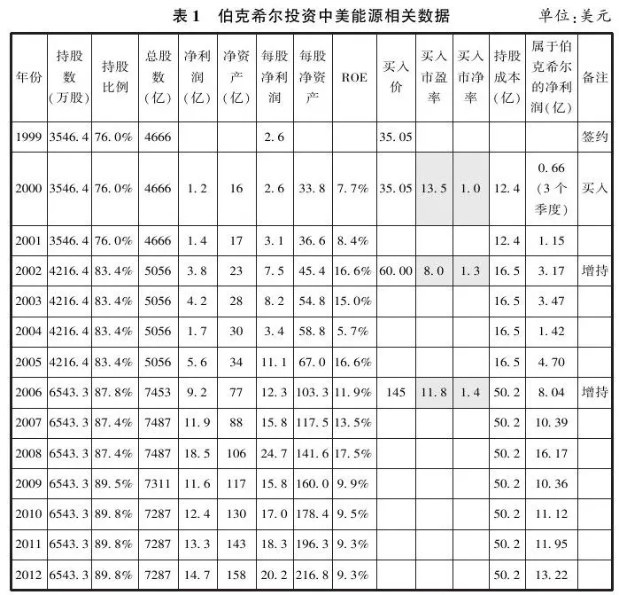

注：数据来源于伯克希尔公司年报。

自伯克希尔收购中美能源后，中美能源从来没有进行过分红，把所有利润都进行了再投资和收购，巴菲特喜欢这种滚动投资以在未来收获大量利润的方式。对于这种受政府管制的公用事业，监管部门在审查收购者时会严格检查以往的信用记录，巴菲特为中美能源投入巨资的做法让监管部门感到放心，这也是伯克希尔能够顺利收购太平洋集团的原因。

中美能源大力发展风能和太阳能等新能源，并于2008年9月投资中国的比亚迪汽车公司，购买了2\.25亿股新H股，占9\.89%的股权，每股8港元，总投资额18亿港元。

中美能源的负债率较高，例如2009年其有息负债达到约200亿美元，远超过净资产。但巴菲特认为中美能源具有抗周期的盈利特性，并且有多元化的盈利来源，能够规避由于某个监管部门的措施造成致命冲击。另外，伯克希尔并不为中美能源的负债做担保，万一存在风险也和伯克希尔进行了有效隔离。

中美能源的每股净利润从2000年的2\.6元增长至2012年的20美元，增长了670%，年均复合增长率为18%，2000年买入时的13\.5倍市盈率到2012年时变成了1\.7倍。中美能源的平均净资产收益率约为10%，净利润的高速增长主要依靠收购和利润全额再投资。

从表1中可以看出，中美能源的净资产收益率（ROE）并不高，平均约10%，巴菲特早期对投资对象的预期收益率为15%，那么，巴菲特为什么会投资低投资回报率且受政府价格管制的中美能源呢？

原因之一是受伯克希尔的资本量所限制。正如巴菲特所说的，随着伯克希尔的投资资本越来越庞大，目标投资对象也会越来越大。然而这种大象级别的投资对象在市场中数量有限，而且符合回报率要求的标的更少，因此不得不放低投资回报率的要求。

原因之二是中美能源本身的商业特性符合巴菲特的标准。中美能源具有多元化的业务组合，包括天然气、电力、房屋中介等，虽然受政府管制但能够提供稳定的现金流。另一方面，这些共用事业具有垄断性，随着美国经济总量的不断提高，电力和能源需求会不断提高，中美能源也能够从中受益。

原因之三是中美能源高超的经营能力能够提高总投资收益率。主要体现在两个方面，一方面，由于伯克希尔是控股股东，中美能源从来不分红，把所有的利润用来再投资，最大程度地使利润增长。另一方面，中美能源通过不断收购使得每股净利润的增长率远超过净资产收益率，中美能源2000—2012年的每股净利润年复合增长率约为18%，远高于约10%的净资产收益率，其中超出部分来源于收购产生的价值。通常情况下，价格高企的公司收购会造成价值流失而损害收购方股东利益，但伯克希尔进行的收购则另当别论。

有了并购和运营中美能源的经验后，巴菲特于2009年又斥巨资收购另一个受政府管制的资金密集型公用事业公司——伯灵顿北方圣太菲铁路公司（BNSF）。由于伯克希尔的规模庞大，能够用于投资的资金越来越多，之前那种轻资产、盈利能力强的中小公司已经难以满足胃口，此类有着合理回报、垄断经营、盈利稳定的大型公用事业逐步走入巴菲特的怀抱，为伯克希尔的增长增添动力。

自我剖析：巴菲特致股东信

1999年

接下去要报告的是第二个购并案，这件案子是通过我多年的好朋友，Level 3通信公司董事长，同时也是伯克希尔董事——沃尔特·斯科特牵线而成。沃尔特个人也拥有相当多的人脉，其中他在一家能源企业——中美能源公司拥有相当多的股份，同时也担任该公司的董事。去年9月，我们共同出席一场在加州举行的研讨会，沃尔特不经意地问我是否有兴趣投资中美能源公司，直觉告诉我这应该是一个很好的主意。回到奥马哈之后，我看了一下中美能源的相关资料，并与沃尔特及中美能源才能兼具的总裁大卫·索科尔短暂地见了两次面，当场我就表示，只要价位合适，我想成交的可能性很高。

购并电力能源事业有些复杂，牵涉1935年订定的《公用事业控股公司法》等各种行政法规，因此我们必须设计一个交易，以避免伯克希尔取得多数的控制权。最后，决定由我们出资购买11%固定收益的证券，加上部分普通股与可转换优先股的特殊组合，把伯克希尔对中美能源的表决权压在10%以下，同时又能持有该公司76%的权益，总计全部加起来的投资金额超过20亿美元。

而沃尔特也以具体的行动来支持这项合并案，他与他的家人同样投入了大笔的资金买进更多的中美能源股份，累计投资的金额超过2\.8亿美元，这使得他成为拥有该公司控制权的大股东，我想再也找不到比他更适合这个职位的人了。

虽然在能源事业有许多法规的限制，但我们极有可能在这个产业投入更多的资金，如果真的实行，这个数字铁定十分可观。

2001年

我们持股76%的中美能源公司，在2001年的表现相当不俗，虽然必须承担大笔的商誉摊销费用，但预期2002年获利仍将大幅成长，而依照一般公认会计原则，以后这类账面成本将不再出现。

去年中美能源买进了一些位于英国的产业，其中包含拥有210万用户的约克夏电力，目前我们在英国拥有360万的用户，在全英国排名第二位。此外，我们在爱荷华州、加州及菲律宾都拥有重大的发电设施。

说来各位可能会相当惊奇，中美能源公司还拥有全美第二大的房屋中介公司，在许多大都市的排名都居首位，尤其是中西部的城市。最近，公司还买下了亚特兰大及南加州几家相当大的中介公司。去年以当地知名的品牌经营，总共处理了1\.6万多件房屋交易，总成交值高达200亿美元。这项事业的负责人是Ron Peltier，而且我们在2002年以后的几年内，还有可能再继续买下更多的中介公司。

2002年

尽管受限于投票控制权的限制，使得中美能源现在的资本结构有点奇怪，但该公司仍然是伯克希尔非常重要的一部分。目前它的资产总额达到180亿美元，并成为伯克希尔非保险事业盈余的主要来源，展望未来，其成长依然可期。去年，中美能源买下了两条重要的天然气管线，第一条是从怀俄明州到南加州，名为肯特河的管线，每天运送9亿立方英尺的天然气，且目前我们又另外投资12亿美元进行扩充，预计在今年秋天完工后，运输能力可增加一倍，届时将可满足1000万个家庭用户所需。第二条路线则是从美国西南部一路延伸到中西部，全长16600英里，名为“北方天然”的管线，这项购并案更是引起奥马哈地区居民的注意，传为企业美谈。

自从1930年代初期，“北方天然”一直是奥马哈地区著名的企业之一，由地方上流社会的领导人士所经营，不过该公司在1985年（1980年改名为InterNorth）被规模不到它一半的休斯敦天然气所购并。该公司当时曾宣布将让总部继续设在奥马哈，并让原CEO继续留任，只是不满一年，这些承诺就被打破。休斯敦天然气的原任总裁接掌总裁职位，总部也搬到休斯敦，更有甚者，连公司名称都被后来新继任的总裁Ken Lay改名为“安然”！。

时光飞逝，话说到了15年之后的2001年，安然营运发生重大困难，被迫向另一家能源公司Dynegy借钱，并以“北方天然”这条管线作为质押担保品。结果不久之后，这条管线的所有权就移转到Dynegy的名下，只是没想到Dynegy没过多久也发生了严重的财务问题。中美能源在7月26日星期五接到Dynegy公司打来的电话，对方希望将这条管线立即变现以取得现金。我想他们算是找对人了，紧接着在7月29日，我们就签订了一项合约，就这样，“北方天然”终于回到家乡的怀抱。早在2001年初，查理跟我压根就没想到，我们会介入能源管线业的经营。不过在完成肯特河管线扩充案之后，MEHC所运送的天然气，将占全美使用量的8%。而在这之后，我们仍将继续寻求大型的能源事业投资案，虽然在能源产业，《公用事业控股公司法》（PUHCA）依然对我们还有诸多限制。

中美能源2002年的盈余稳定成长，展望明年仍将维持此态势。至于盈余成长的来源，不论是目前或将来，主要皆来自于先前提过的购并案。中美能源为了取得购并的资金，已由伯克希尔买进该公司发行12\.73亿美元的次顺位公司债（此举使得我们累计持有这种年息11%的债权达到17\.28亿美元），另外我们还投资了4\.02亿美元的约当普通股，总计伯克希尔现在持有（在完全稀释基础下）中美能源80\.2%的股权。

2005年

2005年春天，我们控股80\.5%的中美能源达成协议，收购一家为西部6个州提供电力服务的公司太平洋集团（PacifiCorp）。这类并购案需要获得许多监管部门的批准，目前我们已经得到批准，预计交易很快就会完成。伯克希尔将为此购买34亿美元的中美能源普通股，中美能源用这笔资金加上17亿美元的贷款来完成收购交易。投资政府监管的公用事业，你不能指望获得特别高的盈利，但这种行业却能为巨额资金提供合理收益的盈利机会，因此对资金规模庞大的伯克希尔来说，这种投资是十分有利的。早在几年之前，我曾说我们希望能够在公用事业方面进行一些规模巨大的投资。请注意我说的是一些，我们将寻找更多的这种投资机会。

我们持有中美能源80\.5%的股权（完全稀释后），这是一家拥有许多不同种类公用事业企业的控股公司，其中下属最大的三家企业包括：（1）约克夏电子（Yorkshire Electricity）和北方电力（Northern Electric），拥有370万电力用户，为英国第三大电力供应商；（2）MidAmerican Energy，主要是为爱荷华的706000用户提供服务；（3）肯特河管线（Kern River）和北方天然管线（Northern Natural pipelines），提供了美国消费天然气的7\.8%。并购太平洋集团（PacifiCorp）完成后，我们将在西部6州增加160万的电力用户，其中大部分业务在俄勒冈州和犹他州。这次交易将使中美能源的收入增加330亿美元，资产增加141亿美元。

2005年8月8日，《公用事业控股公司法》（The Public Utility Holding Company Act, PUHCA）被废止，这一里程碑事件使伯克希尔能够在2006年1月9日将其持有的中美能源优先股转换为拥有投票权的普通股，这次转换结束了《公用事业控股公司法》强加于我们的错综复杂的公司制度安排。现在我们同时持有中美能源的83\.4%普通股和投票权，这使得我们在财务会计和税收上能够合并这家公司的报表。可是我们真正的经济权益是前面提到的80\.5%，因为已经发行的期权肯定会在未来几年间执行，这将稀释我们的持股比例。

尽管我们的投票权大幅度增加，但四方共同持有的股权结构根本不会发生任何变化。我们将中美能源看作是伯克希尔、沃尔特·斯科特及其两位超级经理人大卫·索科尔和格雷格·亚伯四方组成的合伙企业，每一方持有多少投票权并不重要，重要的是，只有我们大家共同认为明智的情况下，我们才会采取重大的行动。与大卫、格雷格和沃尔特共同合作了5年，进一步强化了我最初的信念：没有比他们更好的合作伙伴了。

你会注意到，2005年我们提供了两份资产负债表，一份是根据GAAP规定我们在2005年12月31日的实际数据（不包括中美能源在内），另一份反映了我们将中美能源优先股转换为普通股的情况。今后伯克希尔所有财务报表都将中美能源合并在内。

也许看起来与公司主业有些不太协调，中美能源持有美国第二大房地产经纪公司，这可真是一颗掌上明珠。母公司名称为美国安家服务公司（Home Services of America），但公司的19200个代理人通过18家以当地品牌命名的下属企业进行经营，由于三次小规模并购，2005年我们参与了金额达640亿美元的房地产交易，比2004年增长了6\.5%。

近年来持续狂热的住宅相关房地产市场目前正在逐步降温，这将为我们带来更多的并购机会。我和公司CEO Ron Peltier希望美国安家服务公司在未来十年内能进一步发展壮大。

中美能源有相当高的债务，但这些债务只是这家公司的债务而已，虽然这笔债务将出现在我们的合并资产负债表上，但伯克希尔并没有为其提供担保。尽管如此，这笔债务毫无疑问是十分安全的，因为用以支付债务利息的是中美能源多元化的高度稳定的公用事业收入。

如果出现什么晴天霹雳似的突发事件，使中美能源的公用事业资产其中之一受到损害，那么，其公用事业资产的收入仍将远远高于支付所有债务利息的水平。不仅如此，中美能源保留其所有的收益（不分红），这种操作在公用事业业内是非常罕见的。

从风险的角度来说，公司拥有10种各不相同且各不相关的公用事业收入，足以支付利息，假设收入和利息的比例为2:1，与单一来源但支付能力更大的收入相比，前者要安全得多。不管公司的债务政策多么保守，一个灾难性事件就会让单独一个公用业务陷入破产境地——Katrina飓风摧毁了新奥尔良当地的电力事业就是明证。一个地理灾难，比如在美国西部地区发生地震，却不会对中美能源产生类似的毁灭性打击，即使是像查理这样的忧虑者，也不会认为一场事故能够大幅度减少这家公司的公用事业收入。由于中美能源政府管制业务收入的多元化程度不断增强，这家公司能够充分利用大量的债务。

我们对债务的态度基本上就是这样。对于伯克希尔，为了并购或经营的目的而发生任何大量的债务，我们根本不感兴趣。当然，根据传统的商业智慧，我们在财务上显得太过保守，如果我们在资产负债表中加入适当的财务杠杆，无疑能够安全地增加盈利。

2007年

1999年，我们同意以每股35\.05美元买下中美能源35464337股股票，这一年它的每股收益是2\.59美元。为什么会是35\.05美元这样一个有零头的数字呢？我最初认为它对伯克希尔的价值是35美元。到现在，我还是一个坚持“一口价”的人（还记得喜诗糖果的故事吗）。在几天里投资银行家对中美能源的推荐，并未有幸打动我，让我提高伯克希尔的出价。但是，最后，他们抓住了我软弱的一刹那，我退让了，告诉他们，我将出价每股35\.05美元。就为这个情况，他们可以告诉他们的客户，他们已经榨出了我最后一枚镍币。这的确切中当时的要害。

稍后，在2002年，伯克希尔又用每股60美元购买了670万股股份的方式，提供资金帮助它收购一个我们的管道供应公司（pipelines）。最后，在2006年，当中美能源买下太平洋集团（PacifiCorp）时，我们又以每股145美元，买下23268793股中美能源的股票。

在2007年，中美能源的每股收益是15\.78美元。当然，有其中的77美分是一次性发生的，是由于英国的公司税税率降低，减少了英国公用事业公司递延税额。所以，恢复到正常的收益是每股15\.01美元。是的，我很高兴，被这样榨干并挤出额外的镍币。

2008年

中美能源在电力供应和天然气管道输送方面的表现非常杰出。

1995年，中美能源成为爱荷华州的主要电力供应者。通过精确规划和效率提升，从我们进入以来，公司就一直维持电价不变，并且会继续保持价格稳定到2013年。

与此同时，中美能源还让爱荷华成为全美使用风能发电比率最高的州。自我们买下这家公司起，中美能源风能发电占总发电量的比率已经从零上升到了20%。

仅2008年一年，中美能源就在发展风能上投入了18亿美元。今天它已成为全美公用事业组织中最大的风能公司。自伯克希尔在2000年购得中美能源以来，这家公司还从没分过红。赚的钱全都投入到发展公用事业系统和满足客户需求上了。这样做的结果是，我们未来能取得不错的回报。从各方面衡量，这生意都棒极了。

在商业上，我们长期以来的公开目标就是成为“最佳买家”，尤其是对那些由家族创立和拥有的生意。想拥有这个称号，就必须配得上这个称号。这意味着我们必须坚守承诺：避免杠杆收购；给予经理人极大的自主权；和被收购公司同甘共苦，好坏共度（尽管我们更喜欢公司越来越好）。

过去的历史表明我们言行一致。同我们竞争的大多数买家都不走我们这条路。对他们而言，收购就像买卖萝卜白菜，合约墨迹未干，收购者已经在考虑“退出策略”，寻找下家。因此，当我们碰到那些真正关心自己生意未来的出售者时，我们拥有压倒性优势。

退后几年，我们的竞争者被称为“杠杆收购者”（LBO）。但是杠杆收购后来声名狼藉。因此，收购者要给自己换个马甲。但是他们的所作所为全都未变，比如他们深爱的收费制度和对资金杠杆的热爱。

它们的新马甲是“私募股权基金”（PE）。这个称号颇具颠倒事实的误导性。这些公司购买的商业组织总是得到一个不变的结局，同PE进入之前相比，股权投资在它们资本结构中的构成比例急剧下降。一些才被收购了两三年的公司，发现自己被PE加给它们的债务推到命悬一线的境地。今天，银行债券大都在以低于票面价值七折的价格出售。政府公债价格更低。尽管如此，应注意的是，PE公司并没有对它们的监护公司注入它们急需的股权投资，相反，它们把自己还剩下的资金牢牢掌控在自己手里，相当之“私”。

在高度管制的公用事业领域内没什么大的家族企业。因此，伯克希尔希望成为监管者眼中的“最佳买家”。当收购计划提出时，是监管者而不是出售股权的股东在判断买家品性如何。

在监管者面前隐藏你的历史表现毫无作用。他们能——而且也会——让他们在各州的合作机构调查你之前的商业轨迹，包括你是否愿意提供足够的资本入股。

中美能源在2005年意欲收购太平洋集团（PacifiCorp）时，6个州的监管机构迅速检查了我们在爱荷华州的记录。他们还仔细核查了我们的财务计划和资本能力。我们通过了检验。我们希望我们能一如既往地通过未来的各种检验。

我们如此自信的原因有两点。首先，大卫·索科尔和格雷格·亚伯会始终以一流的水准来管理交由他们管理的生意。他们根本不知道如何把事情做差。其次，我们希望在未来我们能购买更多管制下的公用事业机构。我们知道，明天是否受监管机构的欢迎，取决于今天我们如何表现。

2009年

我们所辖的电力公司在很多领域提供垄断性服务，与客户在多方面形成共生关系，客户依赖我们为其提供一流的服务和未来的投资。发电项目的审批和建设，以及主要电力设施的转移工程浩大，所以我们必须长远考虑。如果我们希望这些公司的管理者以客户利益为重，为客户赚取更多的回报，我们就必须为未来的需求铺路。我们必须自力更生，而非寄希望于我们的管理者各自为战。

大卫和格雷格确保我们正为此而努力。国家研究机构一致认为我们的Iowa and Western Utilities在行业中名列前茅。同样，根据Mastio公司对43家企业的排名，我们的肯特河管线（Kern Rive）和北方天然（Northern Natural properties）位列次席。

此外，我们不但着眼未来，而且斥巨资用于环保事业。自从10年前收购中美能源公司以来，从未派发过红利，而是将其用于扩大再生产领域。一个明显的例子是，我们的Iowa and Western Utilities公司在过去3年中盈利25亿美元，但同期用于风能发电的投资是30亿美元。

中美能源控股公司以社会责任为重，注重社会信誉，并因此受益。除个别情况外，我们的投资几乎都取得了较为合理的回报，进而我们可以尽量满足企业的生产需要。我们相信，我们能够从投资中受益。

早期，查理和我曾规避资本集中的产业，例如公共事业。截至目前，最好的投资依然是那些投入少，回报高的企业。幸运的是我们拥有一批这样的企业，而且还想拥有更多。不过，伴随伯克希尔日益强大，我们目前有意投资大资本运营企业。我们认为，伴随投资数额增长，这样的企业更容易取得合理的回报。如果我们的预期正确，我们相信伯克希尔将如虎添翼，在未来几十年中虽不能取得巨额收益，但是应该可以超过平均水平。

伯克希尔·哈撒韦收购伯灵顿北方圣太菲铁路公司与我们的电力公共事业公司具有很大的相似之处。两者都是向消费者、社区以及整个国家的经济发展提供基本服务，两者都需要进行大量投资，都必须进行前瞻性规划，最后两者都需要明智的监管者提供收益的稳定性，以便我们可以满怀信心地进行投资。

我们发现，公众与我们的铁路企业之间存在某种“社会契约”，这种关系与公用事业非常相似。无论某一方推卸责任，双方都将受害。所以，我们认为双方应该相辅相成。政府如果不评估大型电力和铁路系统，就几乎无法预测其潜在经济实力。

未来，伯灵顿北方圣太菲铁路公司的业绩可能并入公用事业部分，因为二者不但经济特征类似，而且他们所用贷款并非由伯克希尔担保。伴随市场起伏，他们的收入和投资规模巨大。总之，我们投入了巨大的时间和资金成本，预期这些行业将在今后为我们带来更多的收益。

## 25.亚马逊公司债　2002

\(27\) 25\.亚马逊公司债 2002

2026年2月20日

12:59

25\.亚马逊公司债 [\1] 2002

巴菲特策略

2002年，巴菲特以面值57%的价格购买了票面3\.1亿欧元的亚马逊公司债券，票面年利息率为6\.875%，以欧元计价，2010年到期。按照当时1欧元兑换0\.95美元计算，总投资额为1\.69亿美元。

当时，亚马逊公司面临严重亏损和高负债率，其净资产在2000和2001年分别为\-9\.67亿和\-14\.4亿美元，又恰逢科技股泡沫破裂和“9·11”恐怖袭击，股市急挫，亚马逊公司股价从最高时的约100美元下跌至不足10美元，亚马逊的公司债被市场认为是“垃圾”级别，以面值57%的价格在交易。

但是，在5年后的2007年，亚马逊的该种公司债券价格上升至面值的102%，同时美元汇率大幅下跌，变成了1欧元兑换1\.47美元。巴菲特在2005和2006年卖出了价值2\.46亿美元的公司债，在2007年年底仍持有价值1\.62亿美元的该种债券，总回报为4\.08亿美元，总投资收益约为2\.5亿美元，投资收益率约为140%，其中1\.18亿美元属于汇率变化贡献的收益，其余1\.3亿美元为债券升值贡献的收益。

那么，在亚马逊公司净资产为负、亏损严重、负债率如此之高且市场一片看衰之时，巴菲特何以认为市场看错了并下手买入亚马逊的“垃圾”债？这得从亚马逊的债务结构说起。

买入原因

亚马逊成立于1995年，两年后，亚马逊上市，但是，亚马逊IPO的融资额仅为5400万美元。对亚马逊当时动辄上亿的亏损来说，这些钱只是杯水车薪。

1997年12月23日，亚马逊以“高级担保债券”的方式贷款7500万美元。

1998年5月，亚马逊发行3\.26亿美元的“高级贴现票据”，实际融资3\.18亿美元，票面利率10%，2008年到期。

1999年2月3日，亚马逊通过发行10年期的“次级可转换票据”，融资12\.5亿美元，年利息率为4\.75%，2009年到期。

2000年2月16日，亚马逊公司发行了6\.9亿美元以欧元计价的可转换公司债PEACS（Premium Adjustable Convertible Securities），2010年到期。该债券的年利息率为6\.875%，即投资人每年能够获得6\.875%的利息收入。每股转换价格为84\.883欧元，以当时的汇率计算约为每股76美元。

从债务结构看，亚马逊的债务几乎全部为长期债券，且大部分为可转换债券，第一笔还款时间为2008年。至2001年年底，亚马逊的长期负债合计21\.56亿美元，年利息费用约1\.3亿美元，公司持有现金和可出售金融资产约10亿美元，经营现金流约为\-1\.2亿美元。

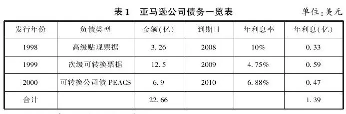

注：数据来源于亚马逊公司年报。

这么看来，只要亚马逊能够在2008年前不耗尽约10亿美元的现金，现金流就不会出现枯竭，也就不存在倒闭风险；如果能够在这期间实现盈利，一方面流动性风险解除，另一方面股价会上涨，可转债转股后还款压力随即消失，那么这批债券也就不存在违约风险。

亚马逊对外投资了很多企业，包括知名的Drugstore\.com和Pets\.com。不过这两个案例在接踵而来的互联网泡沫破灭过程中被证明是失败的。亚马逊2000年高达14\.11亿美元的年度亏损中，大部分来自这部分投资亏损，这些亏损以商誉摊销和按投资权益计算，并没有对现金流造成大的影响。2000年，亚马逊的经营现金流为\-1\.3亿美元，远低于账面亏损，由于发行了6\.9亿美元的债务，年底公司拥有的现金和可出售金融资产为11亿美元，流动性充足。

同样在2001年，虽然亚马逊公司的账面亏损高达5\.67亿，但经营现金流仅为\-1\.2亿美元，公司拥有的现金和可出售金融资产为9\.96亿美元，流动性充足。

另一方面，亚马逊在总裁贝佐斯的带领下，业务快速增长，营业收入从1998年的6亿美元增长至2001年的31亿美元，毛利也逐步提高。1997年，亚马逊的库房面积只有28\.5万平方英尺，到了2000年，仓储面积暴增到421万平方英尺，3年时间增长15倍。同时，亚马逊的后台系统也逐渐得到完善。

2002年，亚马逊的营业收入增长约26%，运营成本得到有效控制，前期大幅度的商誉摊销也基本消失，营业利润由负转正。当年营业利润为6400万美元，净利润依然亏损，为\-1\.49亿，但经营现金流则录得1\.74亿美元的净流入。

自2003年起，亚马逊的经营状况全面转好，净利润和经营现金流大幅增长，亚马逊公司开始偿付其长期债务，这场危机消失殆尽，股价和债券价格也都大幅上扬，到2004年其股价上涨至约50美元。

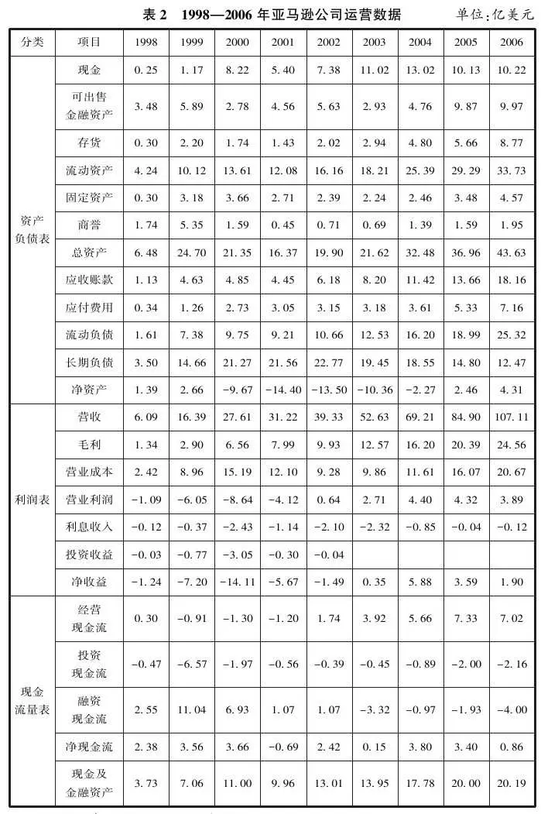

注：数据来源于亚马逊公司年报。

巴菲特买入亚马逊欧元记账的公司债也有从汇率上考虑。巴菲特在2003年《财富》杂志上发表的文章《日益沉重的贸易赤字是在出卖美国》中，详细解释了为什么美国的巨额贸易赤字会造成美元长期贬值。巴菲特依此买入了大量外汇资产，包括多国货币和外国股票，例如巴西货币、中石油股票、浦项钢铁股票，总收益数十亿美元。

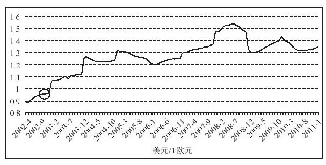

图12002—2010年美元对欧元汇率

自我剖析：巴菲特致股东信

2007年

我们持有的这个外币头寸在过去5年中已产生了23亿美元的税前利润，另外我们还从所持有的美国公司以外币单位发行的债券中获利。例如，2001和2002年，我们以票面价格的57%购买了亚马逊公司发行的3\.1亿欧元债券，这些债券将在2010年到期，票面利率6\.875%。在那时，亚马逊的债券被评为垃圾债券，虽然事实绝非如此。（是啊，你能不时地发现市场是多么荒唐和无效，或者说除了在那些主流商学院的金融系以外，你可以在任何地方发现这种情况。）

亚马逊以欧元标价的债券对我们有深层和重要的吸引力。2002年我们购买时1欧元兑95美分。因此，我们实际支付的成本是1\.69亿美元。现在这种债券的市场价格是面值的102%并且一欧元能兑换1\.47美元。2005和2006年，我们收到所持有的一些债券的到期兑付2\.46亿美元。目前我们持有债券在年底价值1\.62亿。在我们共计2\.53亿已实现和未实现的收益中，大约1\.18亿可归因于美元贬值的收益。看来外汇汇率确实很重要。

伯克希尔将继续努力以直接、间接的方式从国外盈利。但即使我们成功了，我们的资产和盈利也将大部分投入美国。尽管我们的国家存在这样那样不完善和不可宽恕的问题，但美国的法律规则、市场经济体系以及社会精英阶层的信仰将会为这个国家的公民创造永久的繁荣。

[\1] 本章部分内容参考：艾利斯·施罗德\.滚雪球\[M\]\.北京：中信出版社，2009\.

## 26.中国石油　2003—2007

\(28\) 26\.中国石油 2003—2007

2026年2月20日

12:59

26\.中国石油 2003—2007

投资背景

2003年春天，“非典”（SARS）肆虐神州大地，多数人的行动被限制在有限范围内，经济活动骤减，人们对经济的前景感到悲观，股市也不例外。2003年4月份，香港恒生指数经过长年的盘整和下跌，跌回十年前，最低达到8409点，为多年来的最低点位。

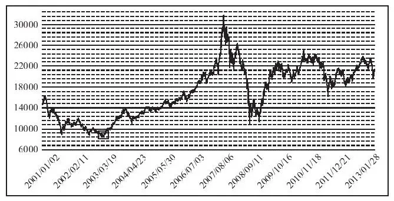

图12001年1月—2013年6月恒生指数收盘价

巴菲特策略

也就在这个时候（2003年4月份），沃伦·巴菲特用伯克希尔悄然买入中国石油的H股，共投资了4\.88亿美元，买入了23\.4亿股，占公司总股份的1\.3%。每股买入均价约为1\.6港元，当时的人民币对港元汇率为106，对应人民币为每股1\.7元。

巴菲特在5年后的2007年7—10月，全部卖出了中国石油的股份，每股卖出价约为13\.5港元，卖出总市值约为40亿美元。税前投资收益约为35\.5亿美元，不包括分红的总投资收益率为7\.3倍，年均复合投资收益率约为52\.6%，同期恒生指数分别为2\.7倍和22\.2%。另外，在这5年里，伯克希尔共收到税后分红约2\.4亿美元。

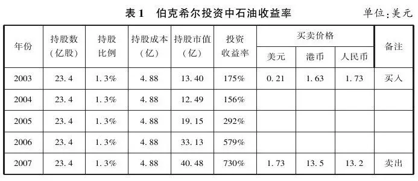

注：数据来源于伯克希尔公司年报。

关于为什么买入和卖出中国石油的股票，巴菲特曾经在2007年的致股东信中和2010年CCTV财经频道《对话》节目上都做过说明。

在2007年的致股东信中，他讲道：“去年我们作了一笔大减持。在2002、2003年，伯克希尔以4\.88亿美元的价格买入中国石油1\.3%的股份，以当时的股价计算，其总市值是370亿。查理和我认为其大约值1000亿美元。在去年，两个因素使其价值急速上升：原油价格大幅上涨；中石油的管理层在建立石油和天然气的储备上做了卓有成效的工作。去年下半年，中石油的市值上升至2750亿美元，这是与其他石油巨头相比较合理的价格。于是我们以40亿美元将其卖出。”

巴菲特投资中石油主要基于两个判断：（1）2002—2003年，中石油的市值约为内在价值的0\.4倍，存在非常大的安全边际；（2）原油价格偏低，原油价格上涨会进一步增加内在价值，使得安全边际进一步扩大。他认为，无论从原油储备、现金流还是其他标准看，中石油的股价都非常便宜。同时，俄罗斯有家石油公司也便宜，但他对中国更放心。

另外，巴菲特在2003年的致股东信中发表了对美元汇率的看法，并于2003年11月10日在《财富》杂志撰文《日益沉重的贸易赤字是在出卖美国》，预测美元汇率将持续走低，原因是美国巨额的贸易赤字。于是在2002年开始至2003年底，他已经买入了5个国家共120亿美元的外汇合约，以补偿部分风险。在这个判断下，买入以人民币计价资产的中国石油，也会在抵抗美元贬值上更加有利。

原油价格

2003年，石油价格约为25～30美元/桶，国际原油价格自20世纪80年代初一直处于每桶30美元以下，从1999年到2003年更是横盘了4年。由于世界经济日趋繁荣，中国等新兴国家的石油需求量越来越大，石油资源相对紧缺，原油价格上涨的概率大于下降的概率。

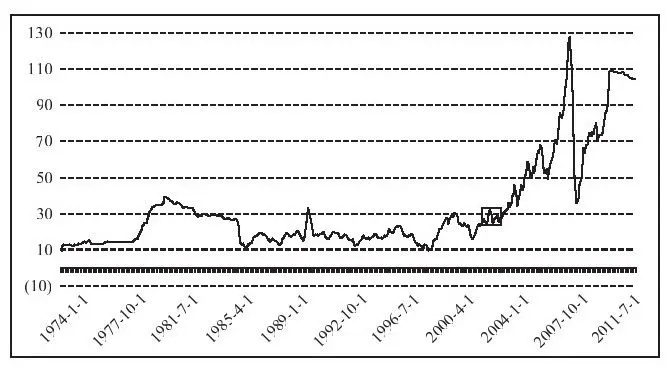

图21974—2012年世界原油价格走势（单位：美元/桶）

内在价值

中国石油股份公司在2000年4月份发行新股，筹资203亿元，开始在香港证券交易所上市，同时在纽约证券交易所以存托证券形式交易。

中石油的主要业务包括四部分：（1）原油勘探和生产，这部分贡献主要利润，2002年这部分经营利润为721亿元；（2）炼油与销售，2002年这部分经营利润为28亿元；（3）化工与销售，2002年这部分经营利润为\-31\.6亿元；（4）天然气与管道，2002年这部分经营利润为15\.5亿元，正在开始建设西气东输一期工程。

2000至2002年，中石油的净利润分别为546亿、454亿和469亿元，利润随原油价格上下波动。2000年至2003年上半年，股价处于横盘状态，围绕在1\.5港元附近波动，市盈率约4～6倍，市净率约0\.9倍。

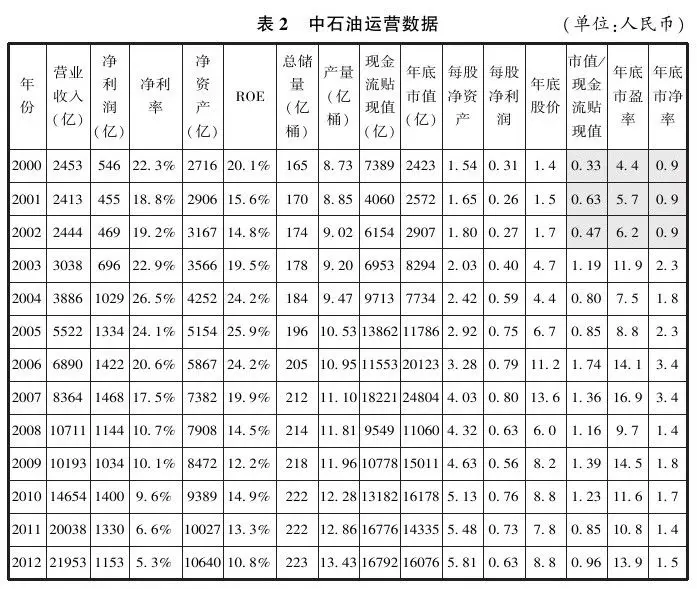

注：数据来源于中国石油公司年报。

每年的年报中，中石油都会发布一个按照美国财务会计准则计算的“经贴现的未来净现金流量标准化度量”值，在此将其简称为“现金流贴现值”。计算方法为，以每年年末的原油储量、原油销售价格、成品油销售价格、当年运营成本、当前税率等计算出未来每年的净现金流入，然后以10%的年贴现率进行贴现求和，得到总的现金流贴现值。该现金流贴现值主要随原油价格、原油储量、运营效率而变动。

2002年年报中披露，其当年底的原油储量为174亿桶，现金流贴现值为6153\.86亿元（约800亿美元），年底的总市值约为2900亿元（约350亿美元），总市值为现金流贴现值的0\.47倍，和巴菲特的判断相符。因此，在不考虑原油价格变动的情况下，现金流贴现值可以作为中石油内在价值的一种表征。

知识链接：标准化度量

以下有关探明油气储量未来现金流的标准化度量，是按照美国财务会计准则第69号呈列。下列数据是按照各期间终结时的价格和成本、现行法定税率和10%年贴现率计算。由于价格及成本并不固定，而价格或成本变动不在计算之列，因此结果未必能反映估计探明储量的公平价值，但可作为一般计算标准，提高使用者预测未来现金流的能力。

截至2001年12月31日和2002年12月31日，两年度每年末期有关探明石油及天然气储量的经贴现的未来现金流量标准化度量列示如下（以人民币百万计）：

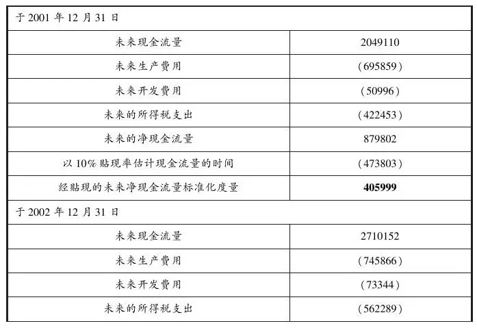

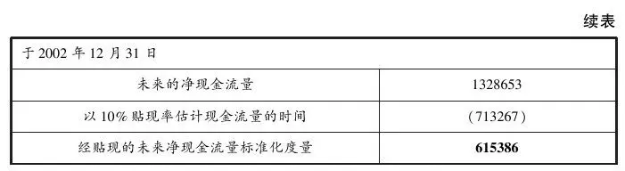

注：上述资料摘自中国石油股份有限公司2002年度报告。

投资收益总结

2007年，巴菲特卖出中石油的股票时，中石油的总市值约为2\.1万亿元（约2750亿美元），其年底现金流贴现值为1\.82万亿元（约2400亿美元），市值为现金流贴现值的1\.15倍。此时正值金融危机爆发前夕，国际原油价格快速上涨，超过每桶70美元。股票卖出价约为每股13\.5港元，折合成人民币为每股13\.2元，市盈率约16倍，市净率约3倍。

2003—2007年间，得益于原油价格上涨、原油储量和石油开采量的逐步上升，中石油的现金流贴现值由2003年初的6150亿元增长到2007年末的约18200亿元，增长约3倍；而市值与现金流贴现值的比值由0\.47倍上升至1\.15倍，增长约2\.5倍；而美元对人民币汇率由8\.27升高至7\.6，增长了约8\.8%。三者的共同作用，使得伯克希尔投资中石油的总收益率约为7倍。

2006年开始，中国石油的营运效率开始下降，净资产收益率由2006年的24\.2%逐步下降至2012年10\.8%。所以，虽然原油价格仍然处在高位，但现金流贴现值徘徊不前，而总市值相对现金流贴现值也未有明显的折价。

自我剖析：巴菲特致股东信

2003年

2002年我人生中第一次进入外汇市场，2003年我们进一步扩大这方面的投资，主要原因在于我个人长期看空美元。我必须强调的是，预言家的墓地有一大半都躺着宏观经济分析家。在伯克希尔，我们很少对宏观经济做出预测，我们也很少看到有人可以长期做出准确的预测。

展望未来，我们仍然会将伯克希尔大部分的投资摆在美国资产之上。然而近年来，我们国家的贸易赤字持续强迫全世界其他国家吸收美国的债权与资产。曾经一度，外国对于这类资产的兴趣消化了这类供给。但是到了2002年，全世界开始吃撑到吐，使得美元相对于其他货币开始贬值。然而汇率的变动却无法有效地解决贸易赤字，所以不管外国投资人愿意与否，他们手上仍将抱满美元，其结果大家很容易想象，最后还是会对外汇市场造成困扰。

身为一位美国人，我衷心希望这个问题能够得到圆满的解决。我个人就曾提出一个解决之道，这篇文章业已刊登在2003年11月10日的《财富》杂志上。然而，再一次，或许我提出的警告事后很可能被证实无效，我们国家的活力以及耐力一再让唱衰者像个傻瓜。不过伯克希尔手握数百亿美元，这也是为何我会想到，如果有一些外汇契约可以抵消部分的部位，会令我感到比较安心。

依照会计原则，这些契约的价值若有任何变动都必须立即反应在损益表之上，即便这些契约尚未到期也一样。我们把这部分的损益归类到财务与金融商品部门。截至年底，我们签订的外汇契约总额累计达到120亿美元，分布在5种外国货币。此外，当我们在2002年买入垃圾债券时，我们也尽量买进一些以欧元计价的债券，目前这部分投资的金额约有10亿美元左右。

2007年

去年我们作了一笔大减持。在2002、2003年，伯克希尔以4\.88亿美元的价格买入中国石油1\.3%的股份，以当时的股价计算，其总市值是370亿。查理和我认为其大约值1000亿美元。在去年，两个因素使其价值急速上升：原油价格大幅上涨；中石油的管理层在建立石油和天然气的储备上做了卓有成效的工作。去年下半年，中石油的市值上升至2750亿美元，这是与其他石油巨头相比较合理的价格。于是我们以40亿美元将其卖出。

值得一提的是，我们为这笔交易所得缴纳了12亿美元。这些钱够支付美国政府部门——国防部、社会保障部等等你所知道的所有部门——运转四个小时的所有开支。

阅读延伸：2009年度伯克希尔股东大会

问：你2002年买中石油时只读了它的年报。大多数职业投资者都会做更多的研究，你为什么不做呢？你看年报时主要看什么？你怎么能看一份报告就做投资决定？

巴菲特：我是在2002年春天读的年报。我从没问过任何人的意见。我当时认为这家公司值1000亿美元，但它那时的市值只有350亿美元。我们不喜欢做事要精确到小数点三位以后。如果有人体重大约在300到350磅之间，我不需要精确的体重数据就知道他是个胖子。如果你根据中石油年报上的数字还做不了决定，那你应该看下一家公司。

芒格：我们用于研究的费用比美国所有机构都低。我知道有个地方每年付2亿美元会计费。我知道我们的投资更安全，因为我们的思考方式像工程师——我们要的是可靠的利润。

问：你在中石油上的操作并不符合你一贯的买入—持有风格。你当时是怎么想的？

巴菲特：几个月前我见了中国投资公司的高（西庆）先生。我对他印象很好，我们在奥马哈吃了午饭。

决定买中石油是因为当时公司的市值才三四百亿美元，但我们认为这家公司应该值1000亿美元。当油价涨到70多美元时，我们认为它应该值大约3000亿美元。我们认为，和其他公司来比，它的价值已经不算低了，于是我们就卖出了。但中石油A股上市后涨了很多，并一度成为世界上市值最高的公司。如果股价跌得更多的话，我们以后还有可能会买进中石油。

阅读延伸：2010年度伯克希尔股东大会

问：中国的文化和商业环境与美国有很大不同，投资中国企业有什么特别之处吗？

巴菲特：当我投资中石油的时候，无论是按石油储备、现金流还是其他任何标准来衡量，其股价都非常便宜。另一家俄罗斯公司同样便宜，我不是什么地缘政治专家，但我对于在中国投资的感觉要好很多。

阅读延伸：CCTV财经频道《对话》节目

主持人陈伟鸿：您曾说，当别人贪婪的时候，我们需要恐惧。我们不妨在中国石油这只股票上来看一看，当别人40多块钱还在买的时候，您早就已经把它抛了，是不是意味着，当别人正在贪婪的时候，您早已经开始了恐惧？

巴菲特：我忘了是什么时候买的中国石油。我对中国石油不是很了解，但是当我读他的年报的时候，我发现这个报告很不错，很直接，包含了很多信息。在我阅读报告的时候，觉得这家公司在当时值1000亿美金，再看看市值，他当时的核心业务的估价只是350亿美金，所以我觉得很值，我就买了。后来股票价格上升之后我觉得这个价格并不是被低估了，实际上他是一个很好的公司，但是我们还是卖掉了。

刘建位：巴菲特先生，您在网络股泡沫破裂之后，2003年股价非常低迷，油价比较低的时候，您买入了中石油，买了4\.88亿美元，然后到2007年中国股市非常牛，而且油价又相当高的时候，您把它卖出了。在这件事上，我们觉得您做到了在别人恐惧时候贪婪，在别人贪婪时恐惧，非常完美。但是让我们比较疑惑的是，到了2008年，油价非常高的时候，股市也非常牛的时候，您却买了康菲石油，然后随着金融危机发生，康菲石油股价不断地下跌，下跌超过40%，您在赔钱，又把康菲石油卖掉了一部分。我不知道为什么同样都是石油公司，您好像对这两只石油股采用的是不同的做法？

主持人陈伟鸿：买康菲石油的时候大概已经达到了140亿美元了。

巴菲特：这是个很好的问题，在康菲石油上，我犯了一个很大的错误。我在油价非常高的时候买了康菲石油，尽管石油价格有些下跌，但是我觉得康菲石油的股票价格还是比较低，但是我的判断错误了，我们损失了很多钱，这是我自己犯下的错误。

## 27.股指期权　2004—2008

\(29\) 27\.股指期权 2004—2008

2026年2月20日

12:59

27\.股指期权 2004—2008

巴菲特策略

2004年至2008年，巴菲特逐步卖出了大量的指数看跌期权合约。到2008年年底，共持有371\.3亿美元的期权合约，收到期权费用49亿美元，当年账面损失高达50\.3亿美元，但是巴菲特仍然信心满满。

这种看跌期权（Put option）基于四个地区的四种股票指数，分别为美国标普500指数、英国的富时100指数、欧洲的道琼欧洲50指数和日本的日经225指数，期限为15年或20年。第一个合约将在2019年9月9日到期，最后一个合约在2028年1月24日到期。在到期日前，合约不能提前计算，即中间反映在账面上的收益或损失都没有实质意义。

若合约到期时相应的指数低于合约开始时的点位，伯克希尔将赔付相应比例的资金，若到期时相应的指数高于合约开始时的点位，伯克希尔什么也不欠，期权费和期权费产生的投资收益全部属于伯克希尔。

2004—2008年，标准普尔500指数的价位约在800～1500点之间。根据2008年年底伯克希尔该期权账面负债100亿美元，期权总金额371亿美元，下跌约27%，当年底标普500指数为903点，计算得到巴菲特卖出看跌期权的平均点位大约在1300点。

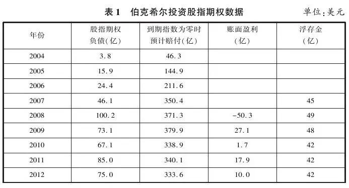

注：数据来源于伯克希尔公司年报。

“举例说，我们在标普500指数为1300点时卖出期限15年、价值10亿美元的指数看跌期权。如果指数在到期时为1170点（跌10%），我们将赔付1亿美元。如果高于1300点，我们什么也不欠。对我们来说，如果到期时指数为零，我们损失10亿美元。卖出看跌期权将给我们带来一笔收入，大约1亿至1\.5亿美元，这些收入我们可以拿去自由投资。”

风险与收益

巴菲特于1999年在《财富》杂志撰文《巴菲特谈股市》，对美国股指进行了分析。之前美国股指的牛熊周期约为17年。1948—1965年，道琼斯指数从约200点涨到约1000点，1965—1982年，道琼斯指数横盘在约1000点，1982—1999年，道琼斯指数从约1000点涨到约10000点，自1999年至今，道琼斯指数围绕在10000点波动。而该期权合约的第一个到期日为2019年，距离1999年为20年，最后一个到期日距离1999年为25年，时间都大于美国股指17年的周期，股指上涨的概率远大于下跌的概率。

巴菲特曾多次表达对美国制度和社会的信心，认为美国经济虽然有波动，但长期看仍然会向上增长，公司保留盈利也会自然造成上市公司价值的增长，而美国股指也将随之提高。

另外，该期权合约收到的资金可以用来投资，相当于保险公司的浮存金。凭借伯克希尔的投资能力，这笔浮存金在15～20年里的投资收益将非常可观。

以2008年为例。伯克希尔的合约总额为371亿美元，只有在四个指数全部为零时，才会发生371亿美元的损失，这种概率基本为0。

假设在到期时所有指数都下跌25%，而汇率都保持不变，将在2019—2028年间产生90亿美元的应付款。而伯克希尔共收到49亿美元的期权费用，即2008年到2019—2028年间只要总投资收益达到41亿美元即可损益平衡。按照15年，初始投资资金49亿美元，结束期的总资金为90亿美元，那么年均收益率约为4%。伯克希尔过去50年的年均收益率约为20%，即使规模增大造成将来的收益率大幅下降，年均4%的收益率难度也不大，而且这种股指下跌25%的可能性非常小。

假设到2019—2028年间，四大股指均高于合约开始时的点位，那么巴菲特这笔投资的收益情况如何？

伯克希尔过去56年的年均收益率约为20%。考虑到规模增大且巴菲特到时可能已经去世，假设将来15年的年复合投资收益率降低至8%，公司收到的49亿美元期权费用在15年后将价值约155亿美元，价值增长为3\.2倍，且这155亿美元将全部归伯克希尔所有，而成本为0。

另外，巴菲特对Black\-Scholes期权定价模型进行了分析，当长期变量被计价时，Black\-Scholes公式将产生不符合逻辑的结果，根源在于该公式中引入了波动性。用过去的非理性波动预测未来，就像从一个狂躁症者那里得到一组价格，计算出波动性来预测一个农场在一个世纪后的价值范围。

知识链接

Black\-Scholes定价公式：

C=S·N（d1）\-X·exp（\-r·T）·N（d2）

其中：

d1=\[ln（S/X）\+（r\+σ^2/2）T\]/（σ√T）

d2=d1\-σ·√T

C—期权初始合理价格

X—期权执行价格

S—所交易金融资产现价

T—期权有效期

r—连续复利计无风险利率

σ—股票连续复利（对数）回报率的年度波动率（标准差）

N（d1），N（d2）—正态分布变量的累积概率分布函数

2010年，伯克希尔持有的47份股指期权合约中，有8份被解除，共收到期权费用6\.47亿美元，支付4\.25亿美元，净赚2\.22亿美元，并且无成本地使用了3年6\.47亿美元的资金。余下39份合约，收到的期权费用共42亿美元，合约总金额339亿美元，到期日为2018—2028年间。

自我剖析：巴菲特致股东信

2007年

第二类合约，涉及我们卖出的、针对四种股票指数（标准普尔500指数，加上三种国外的指数）的各种卖出期权（put option）合约。这些卖出期权的起始期限不是15年就是20年，它们会受到市场的影响。我们（通过卖出这样的合约）收到45亿美元的额外收入，也在年底，记录了46亿美元的负债。这些卖出期权合约只能在到期时才会执行。它们的到期时间在2019年到2027年之间。届时，只有在上述的股票指数水平，低于签订卖出期权合约时的点位，我们才需要付钱出去。我相信这些合约总体上将是盈利的。我们也将在持有这些合约的15或20年里，通过用卖出这些合约获得的收入去投资，获得丰厚的收益。

对于我们的衍生品合约有两点是很重要的。第一，在所有交易里，我们都是通过卖出合约，收到钱的一方，这意味着我们并没有对冲风险。第二，这些衍生品合约适用的会计准则，不同于应用在我们资产投资组合上的。在资产投资组合中，资产价值的变化将以净资产的形式，显示在伯克希尔的资产负债表上，但它不会影响收益，除非我们出售\[或是冲销（write down）\]资产。而衍生品合约的价值变化，必须计入每季的收入中。

由此，我们持有的衍生品部位，有时会使公司报告的收益产生很大的摆动，可查理和我相信这些部位的内在价值，其实变化很小。即便这些摆动在一个季度里轻易就达到10亿美元或更多，他和我也将对此熟视无睹，我们希望你们也如此。你可能会想到，在我们的巨灾保险业务中，经常面临短时间内报告收益很快消失和在相当长的时间内净值有很大增长交替出现的情况。这也是我们在衍生品交易中所用的哲学。

2008年

考虑到前面我描述的关于衍生品造成的毁灭性危害，你们可能会问，为什么伯克希尔会参与251项衍生品合约（除了中美能源出于运营目的持有的部分和通用再保剩下的部分）。答案很简单：我相信我们持有的每个合约在买入时都被错误定价了，有时是非常显著的。我同时投资和监控这些投资部位，这与我的责任和信仰一致，我认为任何大型财务组织的首席运营官（CEO）必须同时也是首席风险官（CRO）。如果我们在这些衍生品上亏钱了，那将是我的错误。

我们的衍生品交易，要求我们的交易对手在合同签署时把资金支付给我们。因此，伯克希尔会一直持有这些资金，让我们不用面对没有意义的交易对手风险。等到合约到期时，我们实际支付的金额将少于我们应当支付的金额，原因是共81亿美元的衍生“浮存”资金会产生投资收益。这些浮存金类似于保险浮存金：如果我们的交易保持盈亏平衡，我们将长时间享用免费的资金。虽然不是十分确定，但我们期望结果好于盈亏平衡，且利用这些资金的投资收益将会锦上添花。

我们合约中只有一小部分在市场严峻时需要抵押物。即使在去年（2008年）四季度市场最混乱时，我们只对少于1%的投资组合进行了抵押担保。（当进行抵押时，我们把资金存在第三方，同时也会收到资金存放的投资收入。）在2002年的年报中，我们对抵押要求造成的致命危险提出了警告，去年活生生的例子在大量金融机构身上上演。（因为这个问题，当中美能源赶到营救时，美国联合能源公司在短短几个小时内宣布破产。）

我们的合约分为四个类别，我将详尽解释这些金融工具，对它们不感兴趣的人我表示歉意。

在去年的年报中，我已经说过我们适当增加了“看跌期权”组合。合约期限是15年或20年。如果合约到期时，相关指数低于合约开始时的点位，我们必须支付给合约对手相应的资金。任何一方都不能提前结算，只有到最后一天才能计算。

举例说，我们在标普500指数为1300点时卖出期限15年、价值10亿美元的指数看跌期权。如果指数在到期时为1170点（跌10%），我们将赔付1亿美元。如果高于1300点，我们什么也不欠。对我们来说，如果到期时指数为零，我们损失10亿美元。卖出看跌期权将给我们带来一笔收入，大约1亿至1\.5亿美元，这些收入我们可以拿去自由投资。

我们的期权合约以现在的汇率计算总共371亿美元，这些合约基于四个指数，分别为美国标普500指数、英国的富时100指数、欧洲的道琼欧洲50指数和日本的日经225指数。我们的第一个合约将在2019年9月9日到期，最后一个合约在2028年1月24日到期。我们已经收到49亿美元的合约费用，这些钱已经用来投资了。同时，我们没有付出任何东西，因为所有的到期日都非常遥远。但是，我们已经使用Black\-Scholes期权定价模型记录了年末100亿美元的负债，这个数每个报告日都会变动。这两个财务项目，100亿的损失减去49亿的收入，意味着以市价计算，这些合约给我们带来了51亿美元的损失。

我们支持用市价计价的方法。但是，我稍后将解释，为什么我认为当长期变量被计价时，Black\-Scholes公式将产生奇怪的结果，尽管它是期权计价的标准。

我们合约中有一点有时候不被理解：371亿美元的损失，只有在四个指数全部为零时才会发生。假设在到期时所有指数都下跌25%，而汇率都保持不变，我们将在2019—2028年间产生90亿美元的应付款。从合约开始到结束，我们将一直持有49亿美元的合约费，并可以用来投资获得收益。

Black\-Scholes公式在财务界的地位已接近《圣经》，我们为了编制财务报表，必须使用此公式来为股票的卖出选择权定价。计算所需要的关键变量，包括了契约期间及执行价格，同时也需要分析师预期的波动率、利率及股息。

然而，一旦将此公式运用在比较长的期间，得到的结果便会有些荒谬。平心而论，Black和Scholes两人一定也对此有所了解。但他们的信徒可能太过热切，而忽略了此公式在首次发表时这两位先生附带说明的任何警告。

要想验证一个公式，考虑其极端的状况，将会有所帮助。假设我们卖出的是100年、金额为10亿美元的标普500指数的卖出选择权，执行价格为903点（2012年8月12日的指数水平）。若采用长期合约的波动率估计值，并将合适的利率及股利一并考虑，运用Black\-Scholes公式所计算出的成本，将是250万美元。

为了判断此成本的合理性，我们必须评估标普500指数，在一个世纪之后，是否会比今天的水平来得低。未来一块钱的现值当然很低（只要物价上涨2%，它目前就只值0\.14元左右），因此这将是促使指数的数字上升的重要因素。而且更重要的是，100年的保留盈利将会大幅提升指数成份股的市值。在20世纪，基于保留盈余这个因素，就让道琼斯指数成长了175倍。

在将所有状况考虑进去，我相信在未来100年期间，指数下跌的可能性应该是远小于1%。但我们就以这个数字来看，同时假设最可能的下跌幅度（即使实际发生）为50%。在这些假设条件下，我们合约产生亏损的预期数值将是500万美元（10亿×1%×50%）。

但若我们按理论预先收取了250万美元的保费，我们只需要将此金额投入在年复利报酬率为0\.7%的工具上，就能支应未来的亏损，任何报酬率在此水平以上的都将是我们的获利。有谁不想用0\.7%的利率跟人借钱，100年后再还？

让我们用最悲观的角度来观察这个例子。若假设正确的话，我们将有99%的机会不必付钱。但即使是最差的状况，也就是那1%的可能性发生时（也就是总共10亿美元的损失），我们的借贷成本也只上升到6\.2%。很显然，若非我的假设太疯狂，那一定是公式有问题。

在前述极端的例子中，按照布雷克—休斯的理论，之所以会算出如此离谱的费率，是公式中的波动性所致。因为事实上，波动性是由股票在几天、月、或年的期间变动而定。但此指标在估算美国企业未来100年的机率值时，却显得一无是处。（不妨想象一下，若你有位狂躁症的农场邻居，每天向你提供一个报价，而你将这些报价的变化，当成公式重要的输入值，来估算你农场未来一个世纪后的可能值。）

虽然股价的历史波动性，在短期选择权的定价上，概念上或许有其帮助（没有定论），但其效用将随着期间拉长而迅速消失。我的看法是，目前我们的长期股票卖出选择权，依Black\-Scholes公式所定出的价格，已过分高估了我们的负债，但此情况将随着契约接近到期，而逐渐消失。

即使如此，我们在财务报表上，为长期看跌期权估算负债时，还是将继续使用Black\-Scholes公式。此公式代表的是传统智慧，我若提出任何的替代作法，势必将引发极端的怀疑声浪。而那是完全可以理解的：对那些为神秘金融工具自行捏造定价的CEO来说，只要能顺从传统主义那一派，就不会有错。但芒格和我并没有任何意愿加入此乐观的阵营。

第二类衍生品则是所谓的“认沽期权”，我们为美国、英国、欧洲和日本的希望避免股价暴跌风险的投资者提供保险，这些合约与各种股价指数挂钩，比如美国的标普500指数、英国的富时100。在2004至2008年间，我们缔结了47项此类合约，收取了48亿美元费用，这些合约期限大多是15年。

关于这些合约的情况，我向大家披露如下：在2010年下半年，我们解除了8个原定于2021至2028年间到期的合约，因此支付了4\.25亿美元，而原来因这些合约收取的费用是6\.47亿美元。这意味着我们获得了2\.22亿美元净盈利，同时在3年内无息、无限制地使用了6\.47亿美元资金。

截至去年年底，我们还有39个认沽期权，这些合约我们总共收费42亿美元。它们将来的具体收益当然是不确定的，但我可以从下列角度说明：如果上述合约到期时，其涉及指数的股价与2010年12月31日相同，而外汇汇率保持不变的话，我们需要在2018至2026年间偿付38亿美元。

但在我们的资产负债表上，我们将这些证券的负债记为67亿美元，换句话说，如果相关指数不变，我们将在这些合约到期的那几年中录得29亿美元盈利，也就是67亿美元减去38亿美元。我相信股价很可能会上涨，如果这一预言成真，我们的收益将更大，当然这并非确定的事情。确定的是，在超过10年之间，我们将可以免息使用收取的42亿美元资金。

2011年

考虑到我们未来能够长期持有42亿美元的浮存金超过15年以上，而且我们已经在那些我们回购的合约上赚到了2\.22亿美元，我和芒格仍然相信，我们的股票指数卖方期权仓位将会产生相当可观的利润。2011年年底，伯克希尔的账面价值包括现有衍生品合约产生的负债85亿美元，如果这些合约全部以去年底的指数价格到期，我们将会支付62亿美元。

2012年

伯克希尔签订以上还未到期的合约时，收到了42亿美元的保费。如果所有合约都在2011年到期，我们当时需要赔付62亿美元，2012年这个数字是39亿美元。由于结算负债的大幅下降，我们的GAAP负债从2011年的85亿下降到2012年的75亿。虽然最终结果还不确定，但是查理和我相信，最终的负债将会比我们现有的账面负债还低。另外，我们可以自由运用这些合约产生的42亿美元，投资于我们喜欢的标的。

## 28.德克斯特鞋业　1993

\(30\) 28\.德克斯特鞋业 1993

2026年2月20日

12:59

28\.德克斯特鞋业 1993

巴菲特策略

巴菲特开始进入制鞋业是在1991年，买入了HH布朗鞋业。这家公司管理良好，主要制造鞋子和靴子，利润增长较快。于是，在1992年，巴菲特又收购了Lowell鞋业，这家公司主要制造女鞋和护士鞋，表现仍然让人满意。所以，在1993年11月7日，巴菲特又收购了缅因州的德克斯特（Dexter）鞋业。

德克斯特是一家专门制造高级男女鞋的品牌，年产750万双鞋，拥有77家零售门店，其生产的高尔夫球鞋市场占有率达到15%，生产基地在美国的缅因州和波多黎各。

在1993年的股东信中，巴菲特对德克斯特的管理者Harold与Peter大加赞扬，认为德克斯特位于美国的工厂拥有高度的竞争力以对抗外来的入侵者。

Harold与Peter要求收购方式采用股票互换的方式，巴菲特同意了。伯克希尔发行25203股来交换德克斯特的股票，按当时的市价约价值4\.33亿美元。

根据伯克希尔的年报数据，1993年鞋业的税后净利润为2883万美元，1994年的税后净利润为5575万美元，两者之差约为2700万美元。考虑到1993年利润中存在约2个月德克斯特的业绩和1994年中其他鞋业公司利润的增长，估计德克斯特在1994年的税后净利润约为2700万美元。

对应于4\.33亿美元的收购价，这笔交易的市盈率约为16倍。交易价格对应伯克希尔的股价为每股17180美元，1993年伯克希尔的每股账面净值为8854美元，伯克希尔股价对应的市净率为1\.9倍，处于较高水平。

滑铁卢之役

好景不长，由于国外廉价的劳动力成本，多数鞋业制造公司迁往中国等发展中国家，导致美国本土的制鞋企业失去竞争优势。1999年，美国消费的鞋子中95%是从国外进口。1995年开始，伯克希尔的鞋业利润开始走下坡路，到1999年时，伯克希尔整个鞋业的税后净利润只有1100万美元，到2001年更是大幅亏损约4500万美元。

在2000年，巴菲特首度承认收购德克斯特是个错误，更糟的是用伯克希尔的股票换的，付出了巨大的时间成本。

在2007年，巴菲特认为收购德克斯特是他迄今为止最糟糕的一笔投资。一方面付出了4\.33亿美元的成本而一无所获，另一方面，当时用于收购的25203股伯克希尔股票在2007年价值30\.5亿美元。

他用鲍比·拜耳（Bobby Bare）的一首歌词来形容这笔交易：“我从不和丑女人上床，醒来时却发现身边躺着好几个。”

自我剖析：巴菲特致股东信

1993年

0

最后，去年我们又发行的一些股份，在一项去年曾提过的购并交易中，我们在1993年1月将4600万美元的可转换债券赎回，而发行了3944股。此外，在买下德克斯特鞋业时（后面报告还会详加叙述），我们又发行了25203股，总计新发行了29147股，增加4\.78亿美元的净值，每股账面净值也因发行价格高于原先账面每股净值而提升。

去年我们所做的乃是基于1991年买进HH布朗鞋业——一家管理良好的鞋子、靴子制造公司的续曲，布朗鞋业成为一家真正成功的赢家。虽然一开始我们就对他有相当高的标准，但是在Frank与其他经理人的努力之下，这家公司的表现甚至还超过我们的预期。基于我们对Frank团队的信心，接着在1992年年底我们又买下Lowell鞋业，Lowell是一家女鞋与护士鞋的老牌制造公司，不过他的管理还需要改进，再一次，他的表现又超乎我们的预期。所以，我们立刻又再接再厉在去年趁机买下缅因州的德克斯特鞋业，一家专门制造高级男女鞋的品牌。这次我可以向大家保证，德克斯特并不需要改造，德克斯特是查理跟我在职业生涯中，所见过最好的公司之一。

话说Harold Alfond从20岁以时薪25美分开始到制鞋工厂做工，并在1956年靠着1万美元的资本创立德克斯特。1958年，他的侄子Peter加入，从此两人建立起年产750万双鞋子的企业。大部分的鞋子都在缅因州生产，其余的则在波多黎各。就像大家都知道的，国内的制鞋业，一般被认为无法与国外进口低价产品竞争，但是大家似乎忘记提醒布朗鞋业与德克斯特经营团队有这么一回事，是他们让两家公司位于美国的工厂拥有高度的竞争力以对抗外来的入侵者。

德克斯特还拥有77家零售门市，主要集中在西北地区。该公司同时也是高尔夫球鞋的主要制造商，全美的市场占有率约为15%。不过，他的主要业务还是传统经销商的传统鞋类，这也是它最擅长的领域。去年，德克斯特还获得Nordstrom与JC Penny所颁发的年度最佳供货商奖项。

伯克希尔只能从1993年11月7号购并日后开始计入德克斯特的业绩。在1994年，我们预计伯克希尔光是在鞋类方面的销售额就达到5\.5亿美元，而总计税前获利极有可能超过8500万。记得在5年前，我们根本就没想到会跨进鞋类这一行，现在光是在这个产业所雇用的员工就超过7200人。现在我每天上班，都会边开车边唱，没有一个行业会像卖鞋这一行，营运还有很多发挥的空间。

在伯克希尔，对于将来会进入哪个产业，我们并没有特定的看法。事实上，我们常在想，对于一家大型企业的股东来说，追求具有远景的新创事业有时反而有害。我们比较偏爱专注于那些我们想要拥有的经济形态以及我们喜爱一起共事的经理人，剩下的就只看我们有没有足够的运气，找到同时拥有这两项特点的组合了，在德克斯特我们确实找到了。

接下来让我们休息一下，进段小广告，虽然他们拥有商业界的宝石，但我们也相信Harold与Peter（他们对于现金都不感兴趣）做了一个正确的决定，将德克斯特的股份转为伯克希尔的股份。他们所做的，实际上等于将一家规模小的好公司的全部权益转成一家大规模好公司的一部分权益，这样的转换并不会产生税收负担，同时还可享有依个人意愿随时进行赠与或变现的好处。如果他们的家族成员有意愿，他们可以依照自己的想法追求不同的目标，而不必像过去那样所有的资产全部绑在一家私人企业。

基于税收规划以及其他理由，私人企业通常很难通过延伸本业以外的投资达到分散风险的目的。相对地，在伯克希尔我们可以很轻易实现多元化。因此，借由经营权移转至伯克希尔，德克斯特的股东可以很轻易地解决转投资的问题。更重要的是，虽然Harold与Peter现在持有的是伯克希尔无控制权的股份，而不是原先德克斯特具控制权的股份，但他们很清楚自己将被视为真正的合伙人。同时我们也会以经营者的心态参与，所以一旦他们决定将自己的投资转为伯克希尔的股份，那么从合并那天开始，就可以确定他们的投资业绩将会与我个人的投资业绩相当。因为我个人绝大部分的身家都摆在伯克希尔，也因为我个人不会从公司身上取得特殊的股份或员工认股权，所以我个人的成败得失也将与其他股东一致。

1999年

回顾1999年，我们旗下的制造、零售与服务业的表现几乎接近完美，但德克斯特鞋业除外，不过该公司的问题不在于经营管理。就工作上的经验、活力与认真而言，德克斯特与其他子公司优秀的经理人毫无二致，主要的原因还在于我们的制造据点位于美国本土，缺乏竞争优势。1999年，在美国13亿双的鞋子消耗量中，93%来自于进口，廉价的劳工成本是关键因素。

若再加上HH布朗鞋业，我们是美国本土最大的鞋类生产者，我们仍将尽力维持这样的局面，我们的美国工厂拥有最忠诚且最有经验的工人，我们希望能够保留每一个职位，但尽管如此，为了保持弹性，我们不得不开始从海外寻找潜在的代工来源，也因此在年度账上提列部门调整的损失。

2000年

事后看来，我在1993年斥资买下德克斯特根本是个错误，更惨的是当时我还是用伯克希尔的股份换来的，为此我们在去年将当初账上购入德克斯特所有的商誉一次打销掉。虽然部分商誉在未来可能有机会恢复，但就目前而言，该公司的商誉可说是一毛不值。

于公于私，我们制鞋事业的经理人都称得上是一流的，他们在非常艰苦的环境下努力工作，即便他们早已不必为了五斗米而折腰，为此我衷心地佩服并感谢他们。

2001年

至于在德克斯特方面，我当初的三项决定让大家损失惨重：

（1）是把她买下来；（2）是用伯克希尔的股票做交换；（3）是在明显需要做改变的时刻却犹豫迟疑。我实在很想将这些过错推到芒格身上（或者其他任何一个人都可以），但无奈这确实是我的错。德克斯特在我们正式买下的前后几年，确曾享受过几年的好光景，一直到面临海外低成本产品的激烈竞争。当时我认为德克斯特应该有能力解决这样的问题，没想到我的判断错误。

现在我们将德克斯特的营运重任交付给HH布朗鞋业的Frank及Jim，这些人在伯克希尔表现优异，即便在制鞋业剧烈波动的情况下，仍能运用各项技巧生存下来。在2002年的前半段，德克斯特仍将受到先前所签订不赚钱的合约影响，但在那之后，我们的鞋业可望回到合理的获利水准。

2002年

去年我曾向各位报告，德克斯特是造成我们鞋业大幅亏损的元凶。现在在HH布朗鞋业的Frank及Jim的努力下，该公司的营运已回归正轨。尽管解决问题耗费了不少成本，但去年鞋业仍然赚了2400万美元的利润，较2001年的亏损，大幅改善了7000万美元。

主管Justin的Randy Watson对于这样的转变也贡献良多，在缩减投资规模的同时还能大幅提高毛利率。鞋业是一项艰苦困难产业，但所幸我们拥有最优秀的经理人，而且我也相信在未来我们一定能够赚取合理的投资报酬。

2007年

最后，还有更严重的错误，那就是我在1993年用价值4\.33亿美元伯克希尔的股票买下了德克斯特——一家制鞋企业。我当时认定的它的持续竞争优势在短短几年内就消失了。但那只是开始：利用伯克希尔的股票，我极大地扩大了这个错误，这一次花去的不是4亿美元，而是30\.5亿美元。实际上，我是用一个优秀公司的1\.6%——现在的价值是2200亿——来换一个毫无价值的烂公司。

到目前为止，德克斯特公司是我最糟糕的一次买卖，但是在未来，我还会犯更多的错误，我可以跟你打赌。鲍比·拜耳（Bobby Bare）一首歌的一句歌词解释了企业并购中经常会发生的事：“我从不和丑女人上床，醒来时却发现身边躺着好几个。”

## 附录

附录

道琼斯工业指数（1896—2012年）

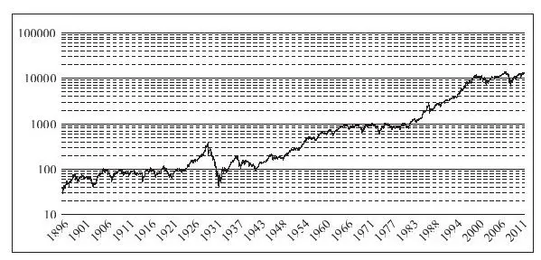

标普500指数（1950—2012年）

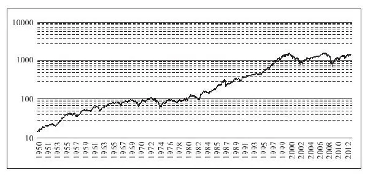

伯克希尔相对标普的表现（1965—2012年）

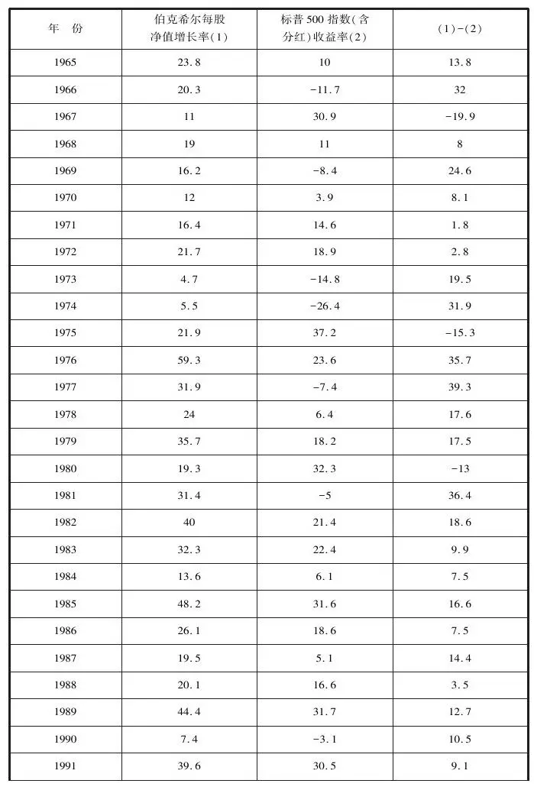

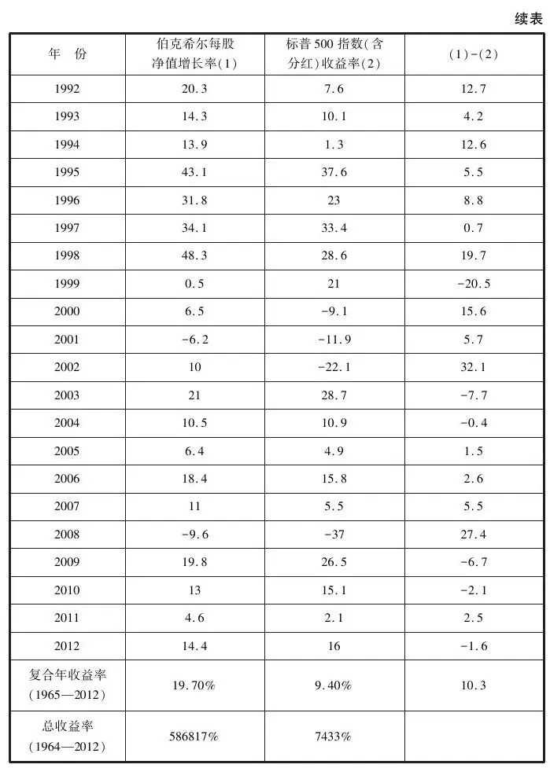

注：该表数据来源于伯克希尔年报。

伯克希尔股价（1990—2013年）

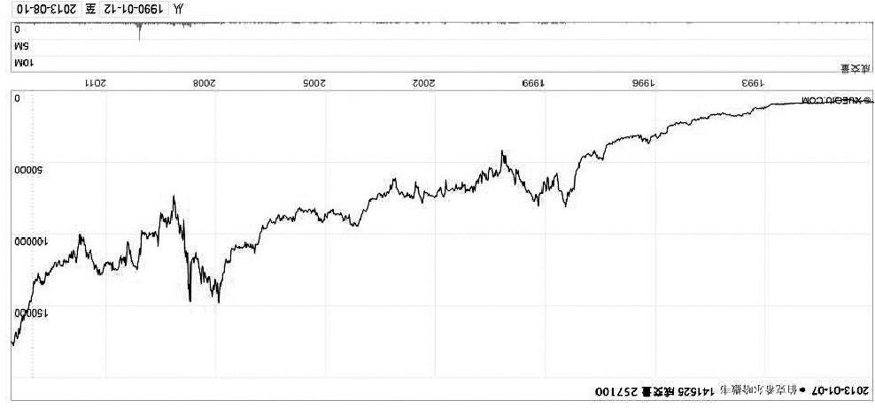

注：该图来源于雪球财经网站。
