# 《巴菲特 巴菲特致股东的信 1957-2013》全文合订版

> 共51个章节。原章节顺序、段落结构和图表均予以保留。

## Berkshire VS S&P500

__Berkshire VS S&P500__

__Annual Percentage Change __

__年百分比变动 __

__Year __

__in Per\-Share Book Value of Berkshire __

__伯克希尔公司每股账面价值（1） __

__in S&P 500 with Dividends Included __

__包括 S&P 500 股息（2） __

__Relative Results __

__对比结果 __

__（１）－（２） __

1965

23\.8

10\.0

13\.8

1966

20\.3

\(11\.7\)

32\.0

1967

11\.0

30\.9

\(19\.9\)

1968

19\.0

11\.0

8\.0

1969

16\.2

\(8\.4\)

24\.6

1970

12\.0

3\.9

8\.1

1971

16\.4

14\.6

1\.8

1972

21\.7

18\.9

2\.8

1973

4\.7

\(14\.8\)

19\.5

1974

5\.5

\(26\.4\)

31\.9

1975

21\.9

37\.2

\(15\.3\)

1976

59\.3

23\.6

35\.7

1977

31\.9

\(7\.4\)

39\.3

1978

24\.0

6\.4

17\.6

1979

35\.7

18\.2

17\.5

1980

19\.3

32\.3

\(13\.0\)

1981

31\.4

\(5\.0\)

36\.4

1982

40\.0

21\.4

18\.6

1983

32\.3

22\.4

9\.9

1984

13\.6

6\.1

7\.5

1985

48\.2

31\.6

16\.6

1986

26\.1

18\.6

7\.5

1987

19\.5

5\.1

14\.4

1988

20\.1

16\.6

3\.5

1989

44\.4

31\.7

12\.7

1990

7\.4

\(3\.1\)

10\.5

1991

39\.6

30\.5

9\.1

1992

20\.3

7\.6

12\.7

1993

14\.3

10\.1

4\.2

1994

13\.9

1\.3

12\.6

1995

43\.1

37\.6

5\.5

1996

31\.8

23\.0

8\.8

1997

34\.1

33\.4

0\.7

1998

48\.3

28\.6

19\.7

1999

0\.5

21\.0

\(20\.5\)

2000

6\.5

\(9\.1\)

15\.6

2001

\(6\.2\)

\(11\.9\)

5\.7

2002

10\.0

\(22\.1\)

32\.1

2003

21\.0

28\.7

\(7\.7\)

2004

10\.5

10\.9

\(0\.4\)

2005

6\.4

4\.9

1\.5

2006

18\.4

15\.8

2\.6

2007

11\.0

0\.1

5\.5

2008

\(9\.6\)

\(37\.0\)

27\.4

2009

19\.8

26\.5

\(6\.7\)

2010

13\.0

15\.1

\(2\.1\)

2011

4\.6

2\.1

2\.5

2012

14\.4

16\.0

\(1\.6\)

2013

18\.2

32\.4

\(14\.2\)

2014

2015

2016

2017

2018

2019

2020

Compounded Annual Gain 1965\-2013

年均复利回报

__19\.7 % __

__9\.8 % __

__9\.9 __

Overall Gain 1964\-2013

累计回报率

__693518 % __

__9841 % __

## 一九五七

__一九五七__

-
- __1957年股票市场的总体状况__
在去年的信中,我写到“我认为目前市场的价格水平超越了其固有的价值,这种情况主要反映在蓝筹股上。如果这种观点正确，则意味着市场将来会有所下跌——价格水平届时将被低估。虽然如此，我亦同时认为目前市场的价格水平仍然会低于从现在算起五年之后的水平。即便一个完整的熊市也不见得会对市场价值的固有水平造成伤害。”
“如果市场的价格水平被低估，我们的投资头寸将会增加，甚至不排除使用财务杠杆。反之我们的头寸将会减少，因为价格的上涨将实现利润，同时增加我们投资组合的绝对量。”
“所有上述的言论并不意味着对于市场的分析是我的首要工作，我的主要动机是为了让自己能够随时发现那些可能存在的，被低估的股票。”
去年，股票的价格水平稍有下降。我之所以强调“稍有下降”，是因为那些在近期才对股票有感觉的人会认为股票的价格下降的很厉害。事实上我认为，相对股票价格的下降，上市公司的盈利水平下降的程度更快一些。换句话说，目前投资者仍然对于大盘蓝筹股过于乐观。我并没有想要预测未来市场走势或者是上市公司的盈利水平的意思，只是想要在此说明市场并未出现所谓的大幅下降，同时投资价值也仍然未被低估。我仍然坚持认为，从长期的投资眼光来看，目前的市场仍显昂贵。
- __我们在1957的主要活动__
市场的下跌带来了更大的投资机会，因此我们的头寸（包括WORK\-OUT的部分）也相应有所增加。所谓WORK\-OUT的部分，是指我们对于公司出售、合并、清算等活动所进行的投资。这种投资的风险在于预期的上述活动可能最终没有完成。在1956年年末，我们的一半投资和WORK\-OUT的比例约为70/30，目前则为85/15。
去年我们面临投资量达到可能会需要在一定程度上参与公司决策的情况，其中之一我们达到了10\-20%的水平，另外一个我们则拥有5%的股份（注：持有的是非上市公司股份）。
因此这一部分投资将不太会受到市场下跌的影响，相信经过三到五年的努力，这一部分投资将会在风险很小的情况下获得良好的回报。当然，如果市场快速上涨，我们也无法从中获益。
- __1957年的结果__
在1957年，于1956年成立的三个合伙企业的表现超越了市场。年初道琼斯指数为499点，年底则为435点，下跌65点。考虑股利分红的因素，实际市场下跌了约42点或8\.4%。大部分投资基金的表现并不比市场要好，实际上据我所知，今年没有任何投资基金获得正收益。而我们三个合伙企业在今年分别获得了6\.2%、7\.8%和25%的净资产增长。当然这样的数字显然会引起一起疑问，尤其对于前两个合伙企业的投资人而言更是如此。这种情况的出现纯粹是运气使然。获得最高收益的企业成立的时间最晚，正好赶上市场下跌，同时部分股票出现了较为吸引人的价格。而前两个公司的投资头寸已经较高，因而无法获得这样的好处。
基本上，三个企业的投资标的和投资比例都是大致相同的。长期而言我将会满意于获得高于市场水平10%左右的回报率。对于1956年而言，这三个企业都已经超出了这个标准。
对于在1957年成立的另外两个合伙企业在57年的表现基本跟市场的平均水平差不多。相信随着时间的推移，这两个企业的投资绩效也会类似于之前的三个企业。
- __对于结果的解释__
在某种程度上我们之所以可以取得超越市场的表现恰恰是因为今年市场上大部分股票的表现不好。我预计我们将来在熊市的表现会比在牛市的表现要好。如果在牛市的情况下，我将会满足于取得一个相当于市场平均水平的回报率。

## 一九五八

__一九五八__

-
- __1958年股票市场的总体情况__
一个运作中等规模投资信托的朋友最近写到：浮躁易变的情绪是美国人的主要特征，而这一特征造就了1958年股票市场。1958年的股票市场，用“亢奋”这一词形容最合适。
我觉得这句话——无论从业余角度还是专业角度——很好地概括了主导1958年股票市场的心理变化。在过去的一年中，几乎所有的理由都被找出来，以证明市场是可投资的。无疑，相对于以前的若干年，现在的投资者队伍中充斥了更多的浮躁人群。他们持有股票的时间取决于他们这样的想法：多长时间内企业利润可以快速且毫不费力地实现。越来越多的此种人群加入投资大军，股票价格不断地被抬高。虽然不太可能预测这种现象会持续多长时间，但是我相信：这些人群造访的时间越长，他们退出的动能也会越大。
我无意于预测股票市场，我主要的精力是寻找被低估的证券。公众普遍相信，他们一定可以从股票投资中获利。然而，我深信这种信仰将最终导致麻烦。如果发生，被低估的证券价格也将无可避免会受到实质影响。
- __1958年的经营结果__
在我去年的信中，我曾写道：“我们的业绩，相对而言，可能熊市中表现比牛市中表现更好。因此，能有以上的结果，主要还是我们处在应当表现相对好的一年。如果哪一年市场总体有一个比较大的涨幅，能够赶上平均水平我就已经非常满意了。”
后句正巧是对1958年这一年的描述，我的预测成为了现实。道琼斯工业平均指数从435点上升到583点，再加上20个点的红利，总体收益水平是38\.5%。整年运作的五个合伙企业获得了比38\.5%略高的平均收益率。1957年底至1958年底的一年时间中，他们以市场价值计算的收益率在36\.7%至46\.2%之间。考虑到事实上有相当一部分资产已经且仍然投资于证券之中，它们从快速上涨的市场得益甚少。我相信这些结果是相当好的。我仍然预测我们的投资结果在下跌或盘整的市场中将高于平均水平，但是在上升的市场中我们所能做的仅是跟上。
- __一个典型的状况__
为了更好地理解我们的操作方法，我想我最好回顾一下1958年具体运作。去年我提到我们最大持股约占我们各个合伙人企业资产的10%\-20%。我得指出，我非常乐意这只股票的价格是下跌的或者是保持稳定，这样我们就可以建立更大的头寸。正是这个原因，这只股票也许会在牛市中拖累我们的相对表现。
这只股票是位于新泽西的CommonwealthTrustCo\.ofUnionCity。我们开始购买这只股票时，保守计算，它的内在价值是每股125元。然而，尽管每股收益达到10元，它却有充分理由没有作任何现金分红。其中最大的理由是其被压低的价格仅有每股50元。我们拥有一个管理良好并且具有较强盈利能力的银行，但是交易价格远远低于其内在价值。管理层对我们这些新股东很友好，该笔投资最终损失的可能性很小。
CommonwealthTrustCo\.ofUnionCity的25\.5%的股权由一家大银行持有。Commonwealth拥有资产约达5000万美元，约为第一国民银行或位于奥马哈的美国国民银行的一半。这家大银行一直想对CommonwealthTrustCo\.ofUnionCity进行合并。出于个人的原因，该并购一直被阻止。但有证据显示，这种情况不会无限期地持续下去。因此我们有了这样的良好组合：\(1\)很强的防御性特征；\(2\)建立在一个步伐上的优良稳定价值；\(3\)尽管可能是一年或十年，但是这个价值最终会释放。如果后者属实，其价值大概已经达到了一个相当大的数字，即每股250美元。
一年多以来，我们成功地获得了Commonwealth约12%的股权，平均成本约在每股51美元左右。很明显，我们具有保持股价不动而增持股票的优势。我们所持股份将随着公司规模的扩张而增长，尤其是我们成为第二大股东后，就具有足够的投票权以就合并事宜提供征询建议。
Commonwealth大约只有300名股东，平均每月约有两个交易商。所以你可以理解为什么我说这部分股权从快速上涨的市场得益甚少了。
不幸的是，我们的确遇到了一些竞价对手。他们将股价抬高到65美元，而我们既不是买家也不是卖家。对于一个并不活跃的股票，很少的购买单子就有可以创造价格如此的较大变动。这就解释这样一个重要性：我们投资组合中的持股，不能作任何“遗漏”。
年底，我们成功地找到了一笔特殊的交易，这笔交易可以使我们以一个富有吸引力的价格收购而成为最大的股东。所以，我们以每股80元的价格售出Commonwealth的股份，于此同时，市场交易的价格大约打了20%的折扣。
显而易见，我们还可以在50元左右的价格，耐心地、积少成多地收集股票。虽然我们相对市场的业绩表现可能因此而不太好看，但是我仍将很高兴地进行这样一项目。一旦Commonwealth实现了利润的大幅增长，我们将变得十分富有。因此，当我们基于业绩的长期结果而估计时，我们的业绩表现在任何一个单一年份具有很大的局限性。不过，我认为，投资这样一个低估且有很好（安全边际）保护的项目，是获得证券长期收益的可靠手段。
我可能提到，在80元左右收购的买家多年后也将做得不错。毕竟，80元相对于内在价值135元而言的低估程度，与50美元相对内在价值125元的低估程度比较，是不同的。在我看来，我们的资金应当在更好地形势下动作，所以决定以80元卖出再以50元慢慢收集。这种新的动作力度要稍微大一点，Commonwealth占我们合伙企业的资金总量达到了25%左右。它的低估程度并不比我们现在持有的证券低估程度大多少，但是由于我们是最大的股东之一，我们可以利用这一优势更快地修正低估状态。正是因为这一特别的持股，我们确信在我们持股期间内，我们的业绩一定会优于道琼斯指数。
- __现状__
股指越高，被低估的证券就越少。我越来越感觉很难找到足够数量的、具有吸引力的投资机会。我宁愿增加获利了结（work\-outs）的比例，但很难找到正确的时间。
因此，尽可能地，我试图通过在几个低估的证券上获得较大仓位，以创造获利了结。这种政策将会导致实现我早先预期：熊市或盘整中业绩高于平均水平；牛市中业绩处于一般水平。我希望基于这样的基础被评价。如果你有任何问题，请随时提问。

## 一九五九

__一九五九__

-
- __1959年股票市场的总体情况__
道琼斯工业股票平均价格指数无疑是被最广泛使用的指数，我们用它来描述1959年某种程度错误的情景。该指数从583涨至679，年回报率为16\.46%。如果加上已经发放给股东的红利，总回报率将达到19\.97%。
尽管这显示了强劲的市场，然而纽约交易所中下跌的股票要多于上涨的股票数量，分别是710比682。无论是道琼斯铁路平均价格指数还是公用事业平均价格指数都有不同程度的下跌。
大多数投资信托与工业平均价格指数相比，表现要差得多。Tri\-Continental公司，全国最大的封闭式证券投资公司，总资产达到4亿美元，仅仅获得了5\.77%的收益率。其董事长弗莱德\-布朗（FredBrown）在最近一次分析师协会中的演讲中透露了该数据，并以此来描述整个市场特征。
“不过，即使我们喜欢我们的组合中的股票，但Tri\-Continental公司1959年的市场表现仍然令人失望。投资者的信心和热情对1959年市场表现发挥了大部分的作用，对于训练于价值投资和长期投资理念的投资经理来讲很难琢磨。也许我们没有将我们的步伐调整合适，但是，我们认为这样我们可以将风险控制在有限的范围内，而这个风险是Tri\-Continenta公司投资者的钱所可以承受的。有一个限度的风险比投资的一个机构,而且我们认为该组合是对未来年份的反应。”
马萨诸塞投资者信托（MassachusettsInvestorsTrust,），是全国最大的共同基金，总资产十五亿美元，在当年取得了约9%的平均回报率。
你们大都知道，我已经对股票总体水平表示担忧好几年了。迄今为止，这种谨慎看来还是不必要的。按以前的标准，新闻界普遍宣称的蓝筹股，其价格包含了大量的投机成分，存在造成相应的损失风险。也许还有其他估值标准正在进化，将永久地取代旧的标准。但是我不这么认为。也许我是错的，__但是我宁愿接受因为过度保守而招致的惩罚，而不愿因为相信树木将长至天空外这样的“新时代”哲学观点而造成的错误结果。__ 后者的错误将可能给资本带来的永久性损失。
- __1959年的经营结果__
在以前的信中我一直强调过，我建议使用新的考核业绩标准来检验相对业绩（相对于一般市场指数和流行投资信托基金），在下跌或盘整的股市中是否有好的相对经营结果，而在迅速上涨的股市中可能拥有不是让人印象深刻的结果。
在1959年我们很幸运地取得相当好的成果，六个合伙企业已取得了总体约在22\.3%至30\.0%之间的收益率，平均是25\.97%。这些合伙企业的投资组合现在有80％的可比较性，但仍然存在一些差异是因为获取证券或现金的时间、支付给合伙人的资金不同。在过去的几年中，没有哪一个合伙企业持续地站在业绩的最前或最后。而当投资组合变得可比较时，合伙人之间的收益差异正在缩小。
总收益的计算基于年初至年末的市场价值，并针对资金的支付或获取进行了修正。该收益率并不是当年实现盈利除以年初资金，这样将有利于衡量不断流动的资产价值变化。该收益率是支付合伙人红利之前的收益率（已在合伙人协议中特别说明），也是支付普通合伙人（巴菲特本人）盈利提成前的收益率，还是扣除营业费用之后的收益率。
主要经营费用扣除准则基于的是Nebraska无形资产税法（NebraskaIntangiblesTax），该税额所有证券市场市值的0\.47%。去年，也就是成立的第一年，这种税已经有效地执行。这样也意味着我们失去了资产的0\.47%。
- __投资组合现状__
去年我曾提到涉及各个合伙企业大约25%的资产一项投资，现在该投资已经上升到约35%。这是一个非常大且非正常的比例，但我有强有力的理由。实际上，这家公司是一个拥有约三十或四十其他高质量证券的投资信托基金。我们以保守的方法来评估该企业的价值，在资产价值的基础上大打折扣的市场价格上买入。

## 一九六零

__一九六零__

-
- __1960年股票市场总体情况__
一年前，我曾根据1959年从583点上升到679点，即上升了16\.4%的道琼斯工业平均价格指数对有些不完善的市场形势做出了评论。尽管实际上所有的投资公司当年都有赢利，但其中不足10％的公司能够跟上或高于道琼斯工业平均价格指数。道琼斯公共事业平均指数甚至还有轻微下跌，下跌很大的是铁路行业平均价格指数。
1960年，经济形势倒转过来了。工业股票平均价格指数从679点下跌倒616点，下降了9\.3％。算上拥有道琼斯工业股票所带来的股息，总损失为6\.3％。另一方面，公共事业平均价格指数显示良好的获利纪录。尽管现在不能得到所有的结果，我估计大约90％投资公司的业绩要好于道琼斯工业平均价格指数。大多数投资公司大致看起来都在上升5％和下跌5％之间。在纽约股票交易所，653只股票亏损，只有404只股票盈利。
- __1960年的经营结果__
我在管理合伙基金方面目标是：长期来看，收益率高于工业平均价格指数。经过这么多年的经营，我相信工业平均价格指数总是和最好的投资公司的收益率不相上下，__如果我们不能达到高于工业平均价格指数的话，我们的合伙公司没有任何理由存在。__
- 但是我还是要指出：我们可能达到的任何一个优秀纪录，其相对工业平均价格指数的超额收益都不太可能总是稳定的。如果这种纪录可能被实现，那么我们尽可能这样做：在股票市场稳定或是下跌的情况下，获得高于平均水平的投资业绩；而在股票市场上涨的情况下，获得与平均水平持平或者略低的投资业绩。
如果有一年我们下降了15％，而市场平均下降了30％，这与我们和市场都上升了20％相比，就算是业绩非常突出的一年。日子久了，我们总会碰到好时候和坏时候，__投资并不因为好时候非常热情或者坏时候非常沮丧而有所得。就像打高尔夫球一样，重要的是以低于标准杆数的成绩去打赢某个球道。__ 在一个标准杆数为3杆的球道上，如果你的成绩是4杆的话，那么，你的成绩就不如在标准杆数为5杆的球道上你用5杆击球入洞的成绩。假设我们把标准杆数是3和标准杆数是5的两个成绩平均起来是不现实的。
- 以上是我的投资哲学，我把它再次告诉大家，是因为今年我们有许多新的股东成员，我想确保他们能明白我的奋斗目标、我的衡量标准以及我的认知极限。了解这一点，就不难预料在1960年我们应当获得高于平均值的业绩。和工业平均价格指数5\.3％的总损失率比起来，1960年我们七家整年运作的合伙公司平均盈利达到了22\.8％。我们合伙公司整整四年的投资业绩如下：（该业绩扣除了营业费用，但未扣除应当支付给有限责任股东的红利，亦未扣除应当支付给一般合伙人的报酬）
- __合伙公司的运行状况 __

年份

合伙公司利润率

道琼斯工业平均指数涨跌幅

1957年

10\.40%

\-8\.40%

1958年

40\.90%

38\.50%

1959年

25\.90%

19\.90%

1960年

22\.80%

\-6\.30%

累计收益率

合伙公司利润率

道琼斯工业平均指数涨跌幅

1957年

10\.40%

\-8\.40%

1957\-58年

55\.60%

26\.90%

1957\-59年

95\.90%

52\.50%

1957\-60年

140\.60%

42\.60%

在此再次强调，这是合伙公司的最终结果。有限合伙人的最终结果将依据合伙公司的相关协议而定。

总的赢利或损失是以市场价格为根据计算出来的。考虑到增加投资或撤回投资的金额后，盈利结果略有不同。后一个结果是基于年末相对年初对合伙公司资产的清算来实现的。当然，这不同于纳税结果的计算，因为纳税结果可以从成本上对证券进行估价，只有当证券真正售出后才能知道是赢利还是亏损。

虽然四年只是短短的一瞬间，不足以让我们得出某种推论，但是，从中我们还是可以看出，在股票行情有所下跌或是静态的市场状况下，我们的经营结果会相对好得多。在这个意义上，事实确实如此，这表明我们的投资组合相对于我们拥有“蓝筹股”的情况下可能要保守的多，尽管确实是不太符合常规。在蓝筹股急剧上涨的市场行情下，在赶上他们的业绩方面我们可能确实存在困难。

-
- __合伙公司的多样性__
上面的图表显示我们的合伙公司在不断地壮大，和我们合伙公司群的平均值相比，还没有任何一家合伙公司的业绩一直高于或低于我们，虽然我们努力让所有的合伙公司在同一种股票上投资相同的数额，但是，每年的经营结果都存在着一些差异。当然，这种差异可以通过把现有的合伙公司并入到一家大的合伙公司的方式来消除。这样的措施同时还会消除太多细节性的东西以及相当一部分费用。坦白地说，在未来的几年，我有意沿这个方向发展。问题是各位合伙人对合伙公司的运行方式各有所偏爱。没有合伙人的一致同意，什么事情也干不成。
- __预付款__
好几位合伙人都曾问过是否能增加投资，虽然有此先例，但在经营过程中要想修正合伙公司的经营协议也是很难的一件事，尤其是当有限合伙人中不止一个家庭时更是如此。所以，在混合型的合伙公司中附加利息通常要等到年底才能拿到。
我们确实在每年的经营过程中接受预付款，和合伙公司的利息，利息率是6%。当时，按照合伙人对经营协议的修正，预付款加上利息被添加到合伙公司的资本金上，此后，预付款放入公司的损益表中。
- __桑伯恩地图公司__
去年，有人提到占到我们净资产35％的一笔数额很大且不同寻常的一项投资，同时，人们还议论说，我希望这项投资包括在1960年度投资中。这种希望被物化了。可能你对这么大数目的投资历史感兴趣。
桑伯恩地图有限公司从事出版以及美国所有城市详细地图的不断修正工作。比如说，仅奥马哈的地图册就可能重达50磅，对每一处的建筑都做出了仔细而准确的说明。通过用糨糊粘住需要修改的地方对原地图进行修正，在涂过糨糊的地方标明新的建筑物的名称，业主的变换、新的消防设施的配置，建筑材料的变换，等等。这种变动几乎每年都要在地图上标出，当地图不能进一步通过用糨糊粘住需要修改的地方时，新的地图就要重新出版一次，地图每隔20年～30年就要更新一次。对于奥马哈的消费者来说，每年花在修正地图上的费用大约有100美元。
详细的信息表明街道下面总水管的直径，消防栓所在位置，屋顶的构成等，所有这些对火险公司至关重要。位于中央办公室的保险业的各个部门，可以通过遍及全国的代理人对企业进行价值的评定。其理论是“一幅照片顶得上一千句话”，这种价值的评定方法将决定风险是否得到正确的估价，这个地区大火灾发生的频率，合理的再保险程序等。尽管地图也出售给保险业以外的顾客，比如说像一些公用事业、抵押公司和评税权威人士，__桑伯恩公司大部分的业务对象是大约30家保险公司__ 。
- 75年来，桑伯恩公司一直以一种多少有些垄断的方式进行经营，每年实现的利润几乎全然不受经济衰退的影响，不需任何销售方面的努力就能达到。在公司的早期经营阶段，保险业担心桑伯恩公司如此高的利润，会使得许多保险公司的重要人物进入到桑伯恩公司的董事会，担当公司的监察人员。
20世纪50年代早期，保险业一种被称为“梳理”的竞争性方法对桑伯恩公司造成了巨大的冲击，使得地图业从20世纪30年代的后期年平均50多万美元的税后利润，下降到1958年和1959年的不足10万美元。考虑到这个阶段经济向上偏压的特点，这种竞争性方法使得这家规模大，且具有稳定赚钱能力的大商业几乎全军覆没。
然而，在20世纪30年代早期，桑伯恩公司开始积累证券清单。这对商业来讲没有资金要求，所以，任何未分配的利润都可以被用于这个计划。一段时间之后大约投资了2500万美元，一半投资于债券，另一半投资于股票。这样特别是在最近10年，在地图业经营不景气的时候，证券清单却赢利丰厚。
下面让我解释一下这两个因素间极端的分歧。1938年，当道琼斯工业指数在100～120之间的时候，桑伯恩公司的股票以每股110美元的价格售出。1958年，当道琼斯工业指数在550左右时，桑伯恩公司的股票的价格只有45美元。但是与此同时，桑伯恩公司的证券清单从每股20美元上升到每股65美元。实际上，这就意味着，1938年购买桑伯恩公司股票的人在商业和股票市场萧条低迷的状况下，为报纸业90美元一股的股票上添加了积极价值，在1958年强有力的经济气候下，对同一家出版业股票的估价则是股价不足20美元股票，购者不愿意多付70美分，因为投资出版业的证券清单参加合伙经营却没有任何收益。
这是怎么一回事儿呢?不论是1938年还是1958年，桑伯恩公司拥有很多对于保险业来讲有实际存在价值的信息。再现这么多年来他们收集的详尽信息，将花费他们上千万美元。尽管保险公司实行了“梳理”政策，5亿多美元的火灾保险费由“制图”公司承担。但是，出售、包装桑伯恩公司的产品、信息的手段多年来一直未变，最后这种惯性从收益中体现出来。
证券清单经营得如此成功这件事情，在大多数董事的眼中对出版业东山再起的必要性减少到最低限度。桑伯恩公司每年的销售额大约在250万美元，同时还拥有价值700万美元的可销售债券。来自证券清单的收益是丰富的，公司没有任何经济上的后顾之忧，保险公司对地图的价格感到非常满意，股东们依然在分红。但是，这些股息在8年的时间里削减了5次，尽管我可能永远都不会找到任何适合削减员工工资和董事们以及委员会费用的建议纪录。
在我进入到董事会以前，14位董事中有9位是保险业中身居要职的人，在10\.5万股已公开发行的股票中他们只拥有46股。尽管他们在一些大公司里都担任重要职位，公司还是建议用金融手段使他们至少购买一定数量的股票，在这个群体中拥有股票最多的是10股。在几种情况下，与他们所拥有的投资组合相比，保险公司所拥有很少的股票数量仅仅是象征性的一点投资。在过去的10年中，在任何和桑伯恩股票相关的交易中，保险公司都是惟一的卖主。
第10位董事是公司的律师，他持有10股股票；第11位董事是一个银行家，他也拥有10股股票，他清楚地意识到公司所存在的问题并积极地把问题指出来，后来他又购买了一些股票。接下来的两位董事是桑伯恩公司的高级职员，他们拥有大约300股股票，这两个高级职员有很强的工作能力，他们意识到了公司中存在的问题，但是，董事会只安排他们担任一些辅助性的工作。最后一名董事是桑伯恩公司故去的总裁的儿子，总裁的遗孀拥有15000股股票。
1958年后期，故去的那位总裁的儿子对公司的趋势感到不满意，要求担任公司的第一把手，在他的要求遭到拒绝后，他向公司递交了辞职书，公司准予了他的辞职。随后我们出价购买他母亲所拥有的股票，我们做成了这笔交易。当时另外还有两笔数量很大的股票，一笔大约有1万股，另一笔大约有8000股。这些人对当时的情况很不满意，非常希望撤出他们在报纸业的投资，我们也是如此。
最后，通过市场公开购买的方式，我们拥有的股票数量达到24000股，以三家为代表的总量上升到了46000股。我们希望能把这两种商业分开，实现有价证券的公平价值，努力工作以重新恢复出版业的赚钱能力。看起来这是一个真正的机会，我们可以通过利用桑伯恩公司丰富的原材料资源，再加上利用电子技术把这个数据转换成顾客利用率最高的形式来增加地图的利润。
董事会中对于任何形式的变动，都会有很多人表示反对，尤其是当这种变动是由一个“局外人”发起的时候，情况更是如此，尽管公司的管理完全符合我们的计划，管理专家布斯、艾伦和汉密尔顿为我们推荐了一个类似的计划。为了避免代理人之间发生争论，以及由于桑伯恩公司大部分的资金都投入了蓝筹股而造成时间上的拖延，按照当时的价格，我们对蓝筹股并不看好，我们制定出这样一个计划，即所有想撤出的股东都按照公平的价格结清。证券交易委员会对这一计划的公正性表示赞同。桑伯恩公司大约70%的股票，其中涉及1600名股东的半数，都按照公平价格转换成了有价证券组合。最后，出版业只剩下125万美元的政府及市政公债作为准备金。公司潜在的100多万美元的资金收益税被免除。留给未走的股东们的资产名义价值也有所上升，每股股票的赢利额有大幅度提升，股息率也得到了提高。
有必要说一下，上面这个小小的情节剧对这项投资经营做出了非常简短的描述。但是，考虑到我们的有价证券运行情况以及在短时间内，比如说一年的时间，检验我们的运行结果的无效性，它却强调了保守秘密的必要性。这种“可操纵性局面”是非常罕见的。我们基本的生意是买入估值偏低的债券，然后在估值偏低的行情被调整过来，再加上在“特殊情况”方面的投资，即利润的获得是依靠大家的努力而不是市场行为的情况下再把股票抛出去。在这个意义上，合伙公司的资金继续上升，在“可操纵性局面”中能够得到更多的机会。
大约在一周之内，审计师将把你的财务决算以及税款信息寄出去。如果你对他们的报告或是我的信有任何问题的话，一定要告诉我。

## 一九六一

__一九六一__

-
- __我们在1961年的表现__
我不断地告知各位合伙人,我们的预期,或者仅仅是愿望\(通常我们很难将这两者进行准确的区分\),是我们将在下降或持平的市场中有着较好的表现,而不是在上涨的市场。而在强劲上升的市场情况下，我预计届时我们将很难超越市场的平均水平。虽然1961年毫无疑问地是一个市场表现很好的年份，而我们的绝对和相对收益也都有着很好的表现，但是我上述的预期仍然保持不变。1961年，包括分红，道琼斯指数上升了22\.2%，而我们的收益率是45\.9%。
我们近五年的收益情况如下：

年份

合伙公司利润率

道琼斯工业平均指数涨跌幅

1957年

10\.40%

\-8\.40%

1958年

40\.90%

38\.50%

1959年

25\.90%

19\.90%

1960年

22\.80%

\-6\.30%

1961年

45\.90%

22\.20%

累计收益率

合伙公司利润率

道琼斯工业平均指数涨跌幅

1957年

10\.40%

\-8\.40%

1957\-58年

55\.60%

26\.9%

1957\-59年

95\.9%

52\.2%

1957\-60年

140\.6%

42\.6%

1957\-61年

251\.0%

74\.3%

对于优秀合伙人的选择和我与他们的良好关系将有助于确保我们使用同样的价值/业绩衡量标准。如果我的表现糟糕，我希望合伙人退出，而我也将寻找一个更适合的地方投放我自己的钱。如果表现良好，则我会努力表现得更好。

问题的关键在于，我们要确定所有的合伙人对于什么是好什么是坏的都具有相同的理念。我相信如果在行动之前就先确定评判的标准，将有助于所有的事业最终取得一个较好的结局。

我一直以来都使用道琼斯指数作为我们业绩的评判标准。我个人认为3年是最最起码的可以对于业绩的做出评判的时间段。而最好的业绩评判周期应该要经历一个完整的市场周期，比如从业绩评判当时的道琼斯指数水平开始，直到该指数最终回到几乎同样的水平为止。

战胜市场的平均水平并不是一件容易的工作。实际上，光是长期跟上市场的平均水平就已经是一件十分困难的工作。虽然没有确切的数据，但我认为即便是目前最好的几家投资咨询公司也只取得了与市场水平相近的回报。

Wiesenberger收集了70只共同基金自1946年以来的表现。其中有32只平衡型的基金，由于它们没有将全部资金投入股市，并且它们的表现也不如股票市场的平均水平，因此我将他们剔除。在剩余的38只基金中，只有6只长期而言超越了市场的平均水平。而且它们中没有任何一只的年均复合增长率能够哪怕是超过道琼斯指数几个百分点。

下面是近五年来四家有代表性的大型投资基金和道琼斯指数以及我们的投资业绩的比较：

Year

Mass\.Inv\.Trust

InvestorsStock

Lehman

TriCont\.

Dow

Partners

1957年

\-12%

\-12\.40%

11\.40%

\-2\.40%

\-8\.40%

9\.30%

1958年

44\.10%

47\.60%

40\.80%

33\.20%

38\.50%

32\.20%

1959年

8\.20%

10\.30%

8\.10%

8\.40%

19\.90%

20\.90%

1960年

\-0\.90%

\-0\.10%

2\.60%

2\.80%

\-6\.30%

18\.60%

累计收益率

Mass\.Inv\.Trust

InvestorsStock

Lehman

TriCont\.

Dow

Partners

1957年

\-12%

\-12\.40%

11\.40%

\-2\.40%

\-8\.40%

9\.30%

1957\-58年

26\.8%

29\.3%

24\.7%

30%

26\.9%

44\.5%

1957\-59年

37\.2%

42\.6%

34\.8%

40\.9%

52\.2%

74\.7%

1957\-60年

36%

42\.5%

38\.3%

44\.8%

42\.6%

107\.2%

我展示上述结果的目的并不是要控诉这些投资基金。由于资金总量较为庞大，而且受到各种条款的限制，即便由我个人来管理这些基金也不见得会取得更好的结果（如果不是更坏的话）。我只是想要说明：道琼斯指数做为投资业绩的衡量标准，是很多共同基金很难超越甚至哪怕是接近的。

我们的业绩表现则根道琼斯指数和其他共同基金的表现有很大的区别，其主要原因是我们的投资方法也同样跟大多数共同基金有着很大的区别。

-
- __我们的投资运作方法__
我的投资组合主要由三部分构成。每一部分的投资方式都各有不同，因而我们资金在这三部分中的分配比例将会对我们的投资业绩有很大的影响。对于资金在各部分中的分配比例，我们有着一个大概的计划，但同时也由于时机的不同而有所变化。
第一部分主要由价值被低估的证券组成。对于这一部分证券我们既不能影响公司的政策也无法推进公司做出某种决策的时间表。这是我们投资组合中最大的一部分。通常我们对于持有量最大的5\-6只证券会分别投入占我们总资产5\-10%的资金。而对于其他持有量较小的10\-15只证券则会投入占我们总资产更小的比例的资金。
有时价值的修正将会非常快，但大多数时候需要一年甚至数年的时间来实现。我们在买入时往往很难确切的知道为何某只股票将会在现有价格水平上增值。但也正是因为市场上缺乏对于该问题的解答而导致我们有机会买入价格大大低于其价值的股票。无论如何，基于证券固有价值并且以低于该价值的价格进行买入的行为是具有令人感到舒适的安全边际的。在具有相当的安全边际的前提下买入的股票将具有较大的升值潜力。长期以来，我们对于买入时机的选择都要优于我们对于卖出时机的选择。我们并不指望能够赚到可能赚到的每一分钱，我们将十分满足于以很低的价格买入，然后在该证券的价格能够大概正确地反映其价值时（意味着这对于一个私人持有人将是一个较为合理的价格）将他卖出。
我们持有的这些股票虽然便宜，但是一件东西的价格便宜并不意味着它的价格就不会继续下降。当市场下跌时，我们的这一部分也同样将下跌。1961年的市场表现很好，因而我们的这一部分投资是在三个组成中表现最好的。但是如果市场下跌，那么这一部分投资也将很可能会是表现最差的。
我们投资组成的第二部分是WORKOUT\.（套利性投资）他们是那些涨跌结果取决与公司的特定行为而非市场对于该证券的供求关系的股票。这些证券具有我们可以预期的时间表（当然也可能会有意外出现）。诸如合并、清算、重组、分拆等公司事件将会构成WORKOUT。最近几年石油生产商将自己出售给主要的一体化石油企业是WORKOUT的一项重要来源。
这一部分将会构成年复一年的较为稳定的利润，且很大程度上与道琼斯指数的表现无关。如果我们将大部分资产投入这个部分，而刚好当年的市场情况不佳时，显然我们将会有非常好的表现，反之亦然。在任一时期，我们都可能会有10到15项这样的投资，有的所对应的事项才刚开始，有的则是已经进入了快要结束的阶段。由于这一部分的投资相对而言较为安全，我相信可以利用借来的资金作为这一部分投资的一种补充。这一部分的投资收益率（不包括因借贷而产生的杠杆作用）一般在10%到20%之间。我个人设定的借款上限是不可以超过我们净资产的25%。多数时候我们没有借款，如果我们有，则只是将其作为WORKOUT投资的一种补充资金来使用。
第三种情况则是获得目标公司的控制权或者通过持有其较大比例的股权对该公司的政策产生影响。这种行为肯定将需要一年以上或数年时间才会见到成效。在某一年中，这种投资可能对我们的利润没有任何的贡献。而这种投资也跟道琼斯指数的表现没有什么关联。
有些时候，当我们买入一只价值被低估的股票时，我们可能从长期而言计划对其拥有控制权。当然当它的价格上涨时我们可能将其抛售，否则我们可能在一个较长的时间里不断增持其股票，直到拥有该公司的控制权。
- __Dempster Mill Manufacturing Company__
我们目前正在进行对于DempsterMillManufacturingCompany的控制。我们第一次买入这家公司是在五年前，作为价值被低估的股票买入的。之后我在4年前得以成为该公司的董事。在1961年八月，我们取得了主要控制权。这可以说明我们的大多数投资并不是“一夜情”式的投资。
目前我们拥有其70%的股份。其10%的股份被一些合伙人持有，另外的股票持有人则只有大约150人，因此该股票在市场上的交易额几乎是零了。因此我们在市场上的行为将会大大影响该股票的开价。
因此，我将很有必要估计一下我们所拥有的该股票的价值。因为新的合伙人将以此价格买入该股，而原有的持有人将以此价格卖出手中的部分股票。所估算出的价格不应该是我们所期望的价格，或者是在一个热切的买入者看来值得的价格，而是如果我们在一个合理的较短的时间段卖出我们持有的股份所能获得的价格。我们所努力达成的正是去尽量实现在这种情况下的一个较高的价格，而我们对能实现此目的的前景表示乐观。
Dempster是一个农业器具和灌溉系统的生产商。其在1961年的销售收入为9百万美元。该公司的运作只产生了名义上的利润（跟其每年的新增资本投入相比）。这反映了公司所处行业的困境和公司本身的管理不良。目前公司的资产净值约为4\.5百万美元，约75美元一股。全部的流动资本约为50美元一股。在年末我们将每股的价格评估为35美元一股。我感觉这是一个对于新旧持有人而言同样公平的价值。当然如果温和的利润能够被取得，则公司的价值应该有所提高。我们持股的成本约在28美元左右，如果按照35元的价格计算，则该公司的股票价格约在我们净资产的的21%左右。
当然,我们这一部分资产绝不会仅仅因为GeneralMotors或者是U\.S\.Steel之类的公司在以一个相对更高的价格卖出而增值。在牛市中，通过拥有控制权而实现公司的价值来赚钱要比直接买入市场的指数基金赚钱来得困难。但我同时也充分认识到在这样的市场环境中，风险比机遇要大。而上述控制公司的行为则可以在这种环境中减少我们面临的市场风险。
- __关于保守的问题__
从上述的评论你们应该可以看出我们的投资组合是多么的保守。很多人认为购买中长期国债或者类似的产品才算保守,但是这种投资最终可能导致投资组合的实际购买力下降。也有许多人认为购买所谓的蓝筹股是一种保守的投资，好像只要买的是蓝筹股，就可以不用仔细考虑其市盈率或者分红的情况。我认为这种行为充满了危险。
仅仅因为很多人在一段时间内与你的看法相同，或者因为某些重要人物赞同你的观点，并不意味着你的观点就是正确的。
如果你的假设是正确的，你掌握的事实是正确的，你的推论是正确的，那么经过许多次的交易后，你将最终是正确的。
因此，通过对比我们的投资组合和市场的所谓保守的投资组合并不能够判断出我们的投资组合是否保守。判断一个投资组合是否保守只能通过对其投资方法和结果的检验来进行。
- __关于规模的问题__
除了被问到我死了以后我们的合伙企业怎么办，我最多被问到的一个问题就是资金规模的快速增长对我们的业绩表现会有怎样的影响。
对于一些我们投资的证券而言，买入一万股比买入一百股要困难得多，有时甚至是不可能的。因此增加的资金规模绝对不利于我们的投资结果。这种情况包括我们的WORKOUT和一般性的投资。
然而对于以取得控制权为目的的投资而言，资金增加的影响将会是正面的。我认为随着资金的增加，我们能够把握的这类投资机会也会增多。因为一般被投资公司的规模增大，那么关注于控制它的竞争者将会大大减少。
那么总体而言到底资金的增加是好是坏呢？这个问题的答案取决于我们在特定时间段内的投资模式。而我可以确定的是，即使在1960年和1961年我们只有相等于1957年那样的资金规模，我们的投资业绩也不会变的更好。
- __一个预测__
一般的读者将会认为我这种做预测行为肯定是很有问题的。因为我一直避免去预测。我的确对于未来一两年间市场的情况一无所知。
我认为我们可以确定将来十年间市场会有在一年中上升20%或者25%的时候，也会有下降同样幅度的时候。当然更多的时候市场的波动会小于这个幅度。而对于长期投资者而言，上述的情况都是没有太大意义的。
对于任何一个较长的历史时期而言，我认为道琼斯指数应该会取得一个总体在5%到7%的年复合增长率（包括上市公司的分红）。对任何一个报有超出该幅度的希望的人而言，他都会面临失望。（美国70年的股票长期平均收益率有西格尔统计为6\.7%）
我们的目标是在一个较长的历史时期取得超过道琼斯年均复合增长率的回报，而不关心我们是否在某一年中超越了或者低于道琼斯的表现。许多合伙人对此表现出了成度不同的赞同。然而我希望大家能够真正的明白这一点，你们对此所表现出的赞同和理解应当不仅仅是表现在我们的表现超越市场的时候，更要在我们的表现低于市场的时候。
如果我们的表现能在长期而言战胜道琼斯指数十个百分点，我将会感到满意。
如果未来市场在一年中下跌35%或者40%\(我个人认为这种情况是很可能在未来的十年中的某一年出现的,当然我不知道具体是哪一年\),我希望我们的投资只下跌15%或者20%\.如果市场保持不变,我希望我们的投资能赚10%左右\.如果市场上升20%以上,我们将挣扎着达到市场的平均水平\.在预期道琼斯的长期年均复合增长率在5%\-7%之间的话，我希望我们的增长率将会在15%\-17%之间。
上述的预期可能有些草率，而且在将来也有可能被证明是错误的。然而我认为合伙人有权利知道我的想法的预期。1961年的情况就显然跟我预期有着很大的出入。幸好这种差异偏向于好的一面。然而，这种差异不会总是向好的一面倾斜！

## 一九六二

__一九六二__

-
- __主要关于合伙人的协议\.__
今年把很多投资都放在了\(非上市\)公司控制上,因而如果把Dempster的股份估计为50美元一股的话，我们的总资产到十月底约增加了5\.5%。今年道琼斯的表现不好（因此我们跑赢道琼斯指数22\.3个百分点），如果表现好的话，我们的相对业绩就将会变得很难看。我们今年的业绩有40%可以归功于Dempster资产价值的增值，其它投资则贡献了另外60%。
我想提醒各位的是我并没有刻意去猜测市场的情况，只是在市场上的股票价格显得昂贵的时候，我自然就把目光放在了其他的资产上。今年的表现，应该说，具有相当的偶然性。
- __基本规则__
由于有合伙人坦白地承认看不太懂我的整一封信，尤其是我也把这信写得越来越长。我觉得在此再次强调几个关于我们合伙企业的基本规则。当然有些合伙人会觉得这种反复的重复实在让人难以忍受，但我宁愿十个合伙人中有九个感到无聊郁闷，也不愿有一个合伙人误解了其中一些基本的规则。
1、任何保证给予一定回报率的承诺都是放屁（我们这里当然也没有这种承诺）。
2、在任何一年中，如果我们未能取得6%的回报率，则下一年中那些选择每月收到一定资金的合伙人会发现收到资金将有所减少。
3、我们所提到的年回报率，是指我们投资组合的市场价值与其年初时的市场价值的对比。这跟我们的税收情况没有关联。
4、至于我们在一年到底是做得好还是不好，主要要看道琼斯指数的情况而定，而不是看我们的绝对收益情况。只要我们战胜了道琼斯指数，我们就认为我们在这一年是做得比较好的，否则的话你们就应该无情地把西红柿扔向我的头。
5、虽然我认为5年是一个更加合适的时间段，但是退一步说，三年是最少最少的一个检测投资绩效的时间段。如果在累积三年（或更长）的时间里我们的投资绩效表现糟糕，那无论是你们还是我自己都应该考虑一种更好的让资金保值增值的方式。
6、我从来都不懂如何去预测市场的未来走势，也不会试图去预测商业产业在未来的波动。如果你们认为我可以去预测这些东西，或者认为这些预测对于投资行为是非常重要的因素，那你们就不应该加入这个合伙企业。
7、我不可能对最终的投资结果有所保证，而以下是我所能作出的承诺：
a、我们的投资将是基于价值而非市场的流行观点进行的。
b、我将致力于通过在最大范围内确保投资的安全边际来减少我们可能遇到的永久性资本损失（不是暂时性的短期损失）。
c、事实上我、以及我的妻子和孩子的全部净资产都投资在合伙企业当中。
- __我们在1962年的表现。__
我们不断地告知我们的合伙人：我们将在道琼斯下降的时候闪耀出光芒，而在道琼斯上升时涨红双颊。上述预言在今年得到了证实。
由于在近几个月中的重整旗鼓，市场水平并没有向有些人预测的那样产生令人惊恐的下跌。指数一度从年初的731点跌至六月份的535点，然而在年末重新恢复至652点的水平。而在1960年年末，道琼斯指数是616点。所以虽然过去两年市场中有许多的动作，然而实际上我们目前面临的市场离1959年和1960年的市场并不远。
年增长率与道琼斯对比：

年份

道琼斯工业平均指数涨跌幅

合伙公司利润率

有限合伙公司利润率

1957年

\-8\.40%

10\.40%

9\.30%

1958年

38\.50%

40\.90%

32\.20%

1959年

19\.90%

25\.90%

20\.90%

1960年

\-6\.30%

22\.80%

18\.60%

1961年

22\.20%

45\.90%

35\.90%

1962年

\-7\.60%

13\.90%

11\.90%

累计收益率

道琼斯工业平均指数涨跌幅

合伙公司利润率

有限合伙公司利润率

1957年

\-8\.40%

10\.40%

9\.30%

1957\-58年

26\.90%

55\.60%

44\.50%

1957\-59年

52\.20%

95\.90%

74\.70%

1957\-60年

42\.60%

140\.60%

107\.20%

1957\-61年

74\.30%

251\.00%

181\.60%

1957\-62年

61\.60%

299\.80%

215\.10%

年均复合增长率：8\.3% 26\.0% 21\.1%

我个人的想法是（没有科学根据），长期而言我们所能取得的最好的成绩就是年均复合增长率超过10％。所以上述的结果可能将会需要向下修正。

对于资金增加可能带来投资绩效下降的忧虑，我在上年的年报当中已经有所提及。资金的增加目前对我们的投资来说有利有弊，总体而言我认为对我们的绩效不会有明显的影响。我也已经保证在我认为会对我们的投资绩效有影响的时候及时将这种判断告知各位。从1957的三十多万美元到1962年的700多万美元，我目前仍不认为资金的增加会降低我们的投资绩效。

-
- __（其他）投资公司（的表现）__
两个最大的开放基金和两个最大的封闭基金的业绩表现。

Year

Mass\.Inv\.Trust

InvestorsStock

Lehman

TriCont\.

Dow

Partners

1957年

\-12%

\-12\.40%

11\.40%

\-2\.40%

\-8\.40%

9\.30%

1958年

44\.10%

47\.60%

40\.80%

33\.20%

38\.50%

32\.20%

1959年

8\.20%

10\.30%

8\.10%

8\.40%

19\.90%

20\.90%

1960年

\-0\.90%

\-0\.10%

2\.60%

2\.80%

\-6\.30%

18\.60%

1961年

25\.60%

24\.90%

23\.60%

22\.50%

22\.40%

35\.90%

1962年

\-9\.80%

\-13\.40%

\-13\.00%

\-10\.00%

\-7\.60%

11\.90%

-
- __复利的快乐__
10万美金分别按照5%、10%和15%的年利率复合增长10年、20年和30年的情况。

复利的快乐

5%

10%

15%

10year

162,889

259,374

404,556

20year

265,330

672,750

1,636,654

30year

432,194

1,744,940

6,621,177

-
- __我们的运营方法（之前的年报已有提过） __
- __DempsterMillManufacturingCompany__
1962年我们的突出表现是我们控制了这家公司。该公司主要生产价格低于1000美元的农场器械（包括灌溉系统）。这家公司面临的情况是没有利润产生，低存货周转率和停滞不前的销售业绩。我们在大约1961年8月将这家公司大部分股权买下，均价约在28美元。当你买下一家公司后，对你而言市场的价格波动已经不再重要，重要的是这家公司的资产到底价值几何。
在买下该公司后，我们努力尝试使该公司的成本降低，降低其管理费用，提高其资金利用效率。然而所有的这些努力都化为了泡影。在六个月之后，我们意识到我们需要给这间公司带来一些新的变化。
一个朋友向我介绍了HarryBottle，在他的帮助下所有的一切都上了正轨，他不但完成了我们的所有目标，还为我们带来了不少有利的惊喜。
目前该公司持有的证券价值约35美元/股,生产制造部分的价值约为16美元/股\.

## 一九六三

__一九六三__

-
- __1963年上半年的表现__
在1963年的上半年,道琼斯指数从652\.10上升到706\.88点\.如果有人在这段时间内持有道琼斯成分股,考虑到红利的获得,上半年的收益将超过10%\.
我们的咒语包括:1\)短期\(少于3年\)的表现意义不大,尤其对于我们这种投资组合包括了大量取得公司控制权的情况;2\)我们的投资组合会在熊市的时候有好的表现,而在牛市的情况下难以赶超大盘的表现\.
虽然如此,我们上半年的收益率,除开Dempste的变化之外，是14%。
这14%的收益率是通过计算我们全部净资产的变化得出的（包括Dempste）,并且已经扣除了我们的开支（但未包括每月返还给合伙人的钱）。总之，有限合伙人的实际收益约为12%。
虽然14%的业绩相对10%的道琼斯表现来说还是可以的，但是请不要忘记1962年上半年，当我们才下降7\.5%的时候道琼斯却下降了21\.7%。想想我前面的咒语吧。
上半年，我们投资在一般普通股的净资金约为527\.5万美元，在这一时段这部分投资的盈利为110万美元，上升了21%。而在1962年的时候这一部分投资由于大盘的下跌而遭受了惨重的损失。那时我们是靠着我们在WORKOUTS和CONTROLS上面的投资才使得我们取得了良好的业绩。
而今年我们的WORKOUTS的表现比道琼斯要差，当然在上升的市场当中这是我们可以预计的情况。在上升的市场中，最好我们的全部投资都是一般普通股，而在下降市场中则最好全部都是WORKOUTS。虽然如此，我并不试图去猜测未来市场到底会是上升还是下降。我们认为我们的这三种投资标的长期而言都会产生令人满意的利润，所不同的只是在短期而言它们的表现会随着大盘的表现而有所不同而已。我们认为去测量大盘的波动情况并试图预测其未来走势的做为在长期而言是很愚蠢的做法，所以我们不会试图依据我们对大盘未来走势的判断来猜测我们这三种投资中的哪一种会在未来有最好的表现。
- __其它投资公司的表现与我们合伙企业的表现__
从1957年到1963年6月30日，道琼斯指数上涨了77\.8%，而几大投资公司的表现都没有能够超越大盘。而我们的合伙企业取得了355\.8%的收益率，有限合伙人取得了252\.9%的收益率。
- __我们在1963年的表现\.__
1963年对我们而言是一个好年景,我们在这一年的收益率为38\.7%\.上述的收益率并不是造成我得出好年景结论的原因\.是不是好年景关键要看我们是否跑赢了大盘\.如果我们收益率是负的20%而大盘是负的30%,我仍然会认为这是一个好年景。

年份

道琼斯工业平均指数涨跌幅

合伙公司利润率

有限合伙公司利润率

1957年

\-8\.40%

10\.40%

9\.30%

1958年

38\.50%

40\.90%

32\.20%

1959年

19\.90%

25\.90%

20\.90%

1960年

\-6\.30%

22\.80%

18\.60%

1961年

22\.20%

45\.90%

35\.90%

1962年

\-7\.60%

13\.90%

11\.90%

1963年

20\.70%

38\.70%

30\.50%

累计收益率

道琼斯工业平均指数涨跌幅

合伙公司利润率

有限合伙公司利润率

1957年

\-8\.40%

10\.40%

9\.30%

1957\-58年

26\.90%

55\.60%

44\.50%

1957\-59年

52\.20%

95\.90%

74\.70%

1957\-60年

42\.60%

140\.60%

107\.20%

1957\-61年

74\.30%

251\.00%

181\.60%

1957\-62年

61\.60%

299\.80%

215\.10%

1957\-63年

95\.10%

454\.50%

311\.20%

年复合增长率10\.027\.722\.3

-
- __运营方式__
在开头我总是要发展出一段文字上的精神分裂症\.一方面我知道许多合伙人希望我详细介绍一下我们的生意情况,而另一方面我也知道有不少的合伙人对我的喋喋不休感到烦躁,希望我能够少说多干\.
为了同时满足上述两种合伙人的需要,我决定只在这里简单地把我们的三种不同性质的投资标的介绍一下,想了解详细情况的人可以看看附录中的具体例子\.
我们的三种性质的投资其实从长期来看在收益率上应该不会有太大的不同\.最终我们都希望在10到15年的时间段内,任何一种投资都可以取得在年复合增长率上战胜道琼斯指数约10%,这也是我们的目标\.
之后分别介绍了三种投资\(之前的信已经写过,这里不再累述\)\.
对于控制公司的投资方式而言,我们不会纯粹为了要主动而主动\.但是在需要我们主动采取措施来使得我们的资金运用达到最佳状态中,我们将毫不犹豫地采取行动\.
合适的买入需要时间\.在有必要的情况下,我们可以需要加强买入公司的管理水平,重新分配其资金,然后取得令人满意的销售业绩或促成某项合并\.而上述的这些事项可能要花上好几年的时间才可以完成\.这也就是对于取得控制权的投资而言,往往需要花费我们较长的一段时间才能看到利润\.也正是因为如此,在买入的时候,我们需要一个宽大的安全边际,否则我们宁愿错过一些”机会”\.
取得控制权的投资在刚开始的时候往往受大盘的波动影响,而在之后则会有独立于大盘的表现,最后的结果是比WORKOUTS相对大盘的独立性还要高\.
在目前的情况下,GENERAL的投资占了最大的比例,其次分别是WORKOUTS和CONTROLS\.
- __附言1:__
TEXAS NATIONAL PETROLEUM
这是一个我们的WORKOUTS\.是一个石油及天然气的生产商\.TNP是一个相对较小的石油及天然气生产商,数年来我对它大概有了一定的了解\.
在1962年年初我听到有关于它将卖给UnionOilofCalifornia的传闻。我从来不会介入这种谣言，虽然如果谣言成真，则在早期介入无疑将可以得到更大的利润。
在1962年4月初，相关交易被正式宣布。TNP持有三种非常不错的证券。
1）利率为6\.5%的债券（总值6\.5百万），我们购买了约26\.4万美元；
2）总值3\.7百万的普通股，其中40%为管理层持有。估计卖出后每股将可以获得7\.42美元。我们在6个月中（从宣布交易到股票停止上市）购买了6\.4万股股票。
3）65万份可以以3\.5元的价格购买普通股的权证。我们在六个月中购买了8\.32万份，占全部权证的13%。
该项交易被管理层否决的可能性为零，因为该交易就是管理层商谈的结果。而且最终的价格也不错。
药膏中唯一的苍蝇是关于遵从必要的税收裁决的问题。UnionOil是使用standard ABC production payment method作为其资金渠道的。The university of southern California是production payment holder\.由于The university of southern California的慈善机构身份，导致在资金的偿付上有所拖延。
上述情况给美国国内收入署（TNP）造成了新的麻烦。虽然如此，我们确信USC是愿意放弃起慈善机构的身份的，在把所有的钱从银行借到手以后，他们仍然可以得到满意的利润。这导致了交易的延期，但是并未威胁到交易本身。
当我们在4月23日及24日与公司沟通时，他们预计公司的结算将在8、9月间进行。在五月底举行的股东会中，公司表示结算将在9月1日实施。
在随后的几个月中，我们与公司的管理层进行了电话交流，具体内容摘要如下：
6月18日，公司秘书表示：Union被告知对其有利的IRS裁决已经制定出来了，但是尚需要更多的IRS人员审议。裁决仍然有望在7月做出。
在7月24日，公司主席表示他预期IRS的裁决会在“下周出做出”。
8月13日，公司财务告知我们TNP，UnionOil和USC的人都集中在华盛顿，试图推敲出一个裁决结果。
9月18日，公司财务告知我们“虽然IRS表示裁决将在下周做出，但是截至目前尚未有明确的消息。”
公司预计其卖出的每股价格仍将为7\.42美元。
在9月底我们收到了裁决结果。相关交易于10月31日终止。我们持有的债券在十一月十三日被偿付。之后我们将持有的权证转换成了股票,之后在1962年12月14日收到了每股3\.5美元；在1963年2月4日收到了每股3\.9美元；在1963年4月24日收到每股15美分；我们还将会在未来的一到两年内收到每股4美分的收益。考虑到我们一共有147，235股，即便每股4美分的收益也是可观的（3\.5\+3\.9\+0\.15\+0\.04=7\.59>7\.42）。
以上是一次具有普遍意义的例子：（1）交易所需的时间超过了通常所需要的时间；（2）最后的股票偿付额比预计的额度略高一些。拜TNP所赐，交易花费了更长的时间，我们也获得了一点额外的收益。
——在债券方面我们投资了$260,773，平均持有了约不到5个月。我们获得了6\.5%的利息收入和$14,446的资本利得。这样算来，这一笔的WORKOUT为我们带来了相当于20%的年收入。
- __附言2__
DEMPSTER MILL MFG\.
相关投资开始于1956年。当时每股售价为$18，而每股的净资产为$72，公司的流动资产（现金、应收账款和存货）减去所有的负债之后除以总股本的价值为$50。
在长达5年的时间里，我们小笔小笔的买入该公司的股票，总的来说买入的均价在$16\-25的范围内。
到1961年中期，我们约持有公司30%的股权，但是在1961年的8、9月份，我们开始在$30\.25的价位大量买入，持股量占到了70%。
我们于是提拔其执行副总裁为总裁，看看情况是否能有所改善，然而情况依然不妙。在1962年4月23日，我们请来了HARRYBOTTLE（译者按：注意不是HARRYPOTTER）做总裁。
在HARRY的帮助下，公司情况有了很大起色，我们得以在1963年以平均每股$80的价格把公司出售。

## 一九六四

__一九六四__

-
- __1964年上半年的表现__
由于我全家将于6月23日前往加利福利亚州度假，因此我在这里总结的市场水平是截止到今年6月18日的市场表现，而不是6月底。
在1964年的上半年道琼斯平均工业指数从762\.95点上涨至831\.50点。在这段时间，投资者还获得了大约相当于14\.40点的红利收入。所以总体而言上半年市场的平均水平上涨了10\.9%。我此时多么希望道琼斯指数在上半年乎没有上涨，而我能向你们报告我们获得了5%的正收益，又或者道琼斯指数下跌了10%，而我们的资金却没有任何亏损或盈利。正如我曾经反复告诉你们的那样：在道琼斯指数大幅上涨的时候，我们往往难以跟上市场上扬的步伐。
在上半年我们的买入情况是令人满意的。我们的普通股投资中包括三家我们（B\.P\.L\.）已经是最大的单一持股人的公司。这些股票一直在被我们买入，而且是在一个对于私人拥有者来说每股价值被市场所低估的价格买入的。对于这三家公司，有一家我们已经持续买入其股票达18个月，而另外两家则持续买入其股票达一年左右的时间。
我们完全有可能在未来一年内继续日复一日的买入上述股票，只要上述公司或在其它的类似情况中的公司能够持续的改善其盈利情况及增加其资产价值，同时其在资本市场上的股票价格却没有什么起色。这样的投资对我们的短期表现不会起到很好的影响，但就长期而言这确实是有利可图而且令人心安的做法。上述情况最终会以两种形式终止，一是由于外部因素的影响，其市场价格得到了正确的反映，二是我们的持续买入是的我们成为了实际控制人。任何一种结果都将令我感到满意。
需要注意的是，虽然在上述或类似的投资中，我们买入了价格被低估的股票，但是很多时候我们都是不可能成为其实际控制人的，因此剩下的唯一出路就是等待市场再次正确反映其价值，而市场正确反映其价值的时间我们是无法确定的。
- __我们在1964年的表现__
我们在1964年获得了$4,846,312\.37的盈利，相对于道琼斯指数的表现而言，这并不是我们表现出色的一年。我们（BPL）1964年获得了27\.8%的增长，道琼斯指数增长了18\.7%。对于有限合伙人来说，增长率为22\.3%。仅仅超出道琼斯指数9\.1%和3\.6%，这是至1959年以来我们表现得最差的一年。
虽然如此，我却并不感到灰心丧气，因为正如我早已经反复说过的，在道琼斯指数的表现很好的年份中，我们将会难以赶上市场的上涨幅度，而我感到幸运的是这种情况尚未在1964年发生。

年份

道琼斯工业平均指数涨跌幅

合伙公司利润率

有限合伙公司利润率

1957年

\-8\.40%

10\.40%

9\.30%

1958年

38\.50%

40\.90%

32\.20%

1959年

19\.90%

25\.90%

20\.90%

1960年

\-6\.30%

22\.80%

18\.60%

1961年

22\.20%

45\.90%

35\.90%

1962年

\-7\.60%

13\.90%

11\.90%

1963年

20\.70%

38\.70%

30\.50%

1964年

18\.70%

27\.80%

22\.30%

累计收益率

道琼斯工业平均指数涨跌幅

合伙公司利润率

有限合伙公司利润率

1957年

\-8\.40%

10\.40%

9\.30%

1957\-58年

26\.90%

55\.60%

44\.50%

1957\-59年

52\.20%

95\.90%

74\.70%

1957\-60年

42\.60%

140\.60%

107\.20%

1957\-61年

74\.30%

251\.00%

181\.60%

1957\-62年

61\.60%

299\.80%

215\.10%

1957\-63年

95\.10%

454\.50%

311\.20%

1957\-64年

131\.30%

608\.70%

402\.90%

AnnualCompoundedRate 11\.127\.722\.3

注：每年巴菲特都会把它的合伙企业的表现和道琼斯指数以及几家大的著名投资公司的表现进行比较，同时提出自己的一些观点，并强调相比那些投资经理而言，不但他们的业绩表现远远不如自己的合伙企业，同时巴菲特自己大部分的个人财产也都放在了合伙企业里面，而不像其它的基金经理那样即便亏损自己的个人财产也少有损失。这里不再一一翻译出来。而他的投资业绩，事实证明比绝大多数基金经理的业绩好得多。

-
- __复利的喜悦__
10万美元在不同的复合收益率情况下的表现：

复利的喜悦

4%

8%

12%

16%

10year

148,024

215,892

310,585

441,144

20year

219,112

466,096

964,629

1,946,076

30year

324,340

1,006,266

2,995,992

8,584,988

注：巴菲特随后论述了他关于长期复合收益率的观点，认为道琼斯指数近年来11%以上的复合收益率在未来是不会持续的，而他合伙企业未来的长期年均复合收益率也不可能保持在目前的高水平。之后他再次不厌其烦地简单介绍了他的三种投资方式（请参见1961年致合伙人信）。

年份

一般性投资

Workouts

道琼斯

1962

\-1\.00%

14\.60%

\-8\.60%

1963

20\.50%

30\.60%

18\.40%

1964

27\.80%

10\.30%

16\.70%

注：我们可以看到在道琼斯指数表现不好的年份，全靠WORKOUTS（套利）的贡献才使得巴菲特战胜了市场。巴菲特的第一种投资是有可能转化为第三种投资的，即对于普通股的投资是有可能转化为CONTROLS（控制）的，控股之后巴菲特就不再在乎公司的市场价值了，只要该公司持续改善盈利，使得其资产价值不断增加，巴菲特的合伙企业的收益自然就会不断增加。为了保证在买入后有利可图，巴菲特往往是把自己当成一个真正的生意人来权衡是否买入某只股票的，这是他对普通股进行投资的基本立场，所以对于第一和第三种投资方式，巴菲特的要求是非常苛刻的，他会挑选在公司股票的市场价格远远低于起市场价值的时候买入，这样一旦他获得控股权，只要能够稍微改善公司的情况他就能够保证合理的利润，即便不可能控股，他也降低了长期持股的风险。而对于第二种投资方式，则相对巴菲特不要求什么价格远远低于价值，但是他看重的是另一方面的安全性，即短期是否可以获得确定无疑的正回报（哪怕持股3个月只能获得3%的收益，只要该收益有确定性，那么从年化收益率的角度来看也是非常可观的收益率了，这在市场整体下跌的时候给整个投资组合带来的贡献无疑是非常巨大的，尤其是当很大一部分的资本都投入其中的时候——问题在于巴菲特自己也不是能够预测市场走势的人，因此他在信中也说到在1962年他获得超越市场水平的原因固然是在于WORKOUTS的贡献，但幸运的是他刚好是在市场低迷的时候在WORKOUTS中投入了较大比例的资金）。由此可见巴菲特的投资方式是跟很多基金经理的投资方式有着非常大的区别的\.

## 一九六五

__一九六五__

-
- __我们在1965年的表现__
我们对贫穷的战争在1965年取得了胜利，具体说来，我们的财产比去年年底多了$12,304,060。
我们在今年取得了47\.2%的收益，而同期的道琼斯指数只增长了14\.2%。
今年的业绩表现显然难以在未来被重复，而我们在未来很可能会有遭受损失的年份。当然，我仍然认为我们就长期而言将能够取得超越道琼斯指数表现10%的年均增长率这个目标，如果我对这个目标的预期有所改变，你们也将第一时间收到通知。
我感到我们确实开始面临资金基数过大的问题，对目前的资金量而言，我不准备鼓励新的合伙人加入，除非其能够为我们的合伙企业提供除了资金以外的有价值的资产。

年份

道琼斯工业平均指数涨跌幅

合伙公司利润率

有限合伙公司利润率

1957年

\-8\.40%

10\.40%

9\.30%

1958年

38\.50%

40\.90%

32\.20%

1959年

20\.00%

25\.90%

20\.90%

1960年

\-6\.20%

22\.80%

18\.60%

1961年

22\.40%

45\.90%

35\.90%

1962年

\-7\.60%

13\.90%

11\.90%

1963年

20\.60%

38\.70%

30\.50%

1964年

18\.70%

27\.80%

22\.30%

1965年

14\.20%

47\.20%

36\.90%

累计收益率

道琼斯工业平均指数涨跌幅

合伙公司利润率

有限合伙公司利润率

1957年

\-8\.40%

10\.40%

9\.30%

1957\-58年

26\.90%

55\.60%

44\.50%

1957\-59年

52\.30%

95\.90%

74\.70%

1957\-60年

42\.90%

140\.60%

107\.20%

1957\-61年

74\.90%

251\.00%

181\.60%

1957\-62年

61\.60%

299\.80%

215\.10%

1957\-63年

94\.90%

454\.50%

311\.20%

1957\-64年

131\.30%

608\.70%

402\.90%

1957\-65年

164\.10%

943\.20%

588\.50%

AnnualCompoundedRate 11\.429\.823\.9

-
- __我们的境况__
（注：在此对于原来的workout,普通股和控制权投资，巴菲特将其中的普通股投资又细分为普通股\-私人股权投资和普通股\-价值被低估的投资，巴菲特在此提到他在1964年的信中已经分别就这4类投资进行了定义，但是在我所获得的英文材料中1964年的信件中并未提及，可能是我所获得的英文材料并不完整。）
关于WORKOUT（套利）的间歇性业绩表现。我们在一年中只大概用到平均约600万的资金在此性质的投资上。我们在这方面的投资取得了约23\.5%的投资收益率（我们在这部分亦利用了借贷资金，从而导致实际的权益投资收益高于23\.5%的水平）。半数以上的WORKOUT收益都来源于某一次机会。对于我们日益增长的资金量而言，未来的WORKOUT所能贡献的收益比例可能会有所下降，但是我们仍将不遗余力地发现这些较少出现的机会。

对于普通股\-私人股权投资部分而言，我们今年获得了非常好的收益表现。我已经在去年提到，我们在此部分是三家公司的最大的单一股东。考虑到去年我们在此部分取得的未实现的增值为$451,000，而今年我们在此部分取得的收益为$3,188,000，我们今年实际取得的收益为$2,737,000。我之所以把上述情况进行说明是为了想你们展示我们获得的实际经济利益和我们的账面收益是有所区别的（注：即64年在此部分已经实现了$451,000的增值，但该增加的价值直到65年才反映到利润上）。
此性质的投资的基本概念是：私人的拥有者将愿意为获得实际控制权而对标的公司的股票支付一定的价格，而其它的股票购买者则未必情愿仅以此价格购买一小部分的标的公司的股票。此种情况多年来在资本市场上显得较为普遍。这种普通股投资时常会由于股票市场的变动而出现较好的表现，有时也会由于所投资公司的某些行为获得惊人的收益（正如我们在65年所遇到的情况）。
对于获得控制权的投资部分，今年我们有一个原来归类为普通股投资的公司加入到了控制权投资的行列。我们自1962年11月起就开始购买BerkshireHathaway股份了。最初的购买价是$7\.60每股。该价格部分地反映了由于纺织行业景气变动对改公司造成的巨大损失，以至于其不得不关闭部分纺织厂房。自1948年该公司获得了$29\.50百万的税前利润以及雇佣了11,000名工人以来，公司一直在走下坡路。当时公司有11家纺织工厂在运营。
当我们在1965年的春天获得该公司的控制权时，公司只剩下2家纺织工厂和约2,300名工人。我们惊讶地发现剩下的人员已经有很高的运营及管理素质，我们也无需再招聘任何一名外部人员到公司中。相对于我们$7\.60的初始购买价格，最终的购买均价为$14\.86每股，这主要是由于我们在1965年的大量买入造成的。在1965年的12月31日，该公司的营运资金净额为$19每股。
拥有Berkshire是令人高兴的。毫无疑问的是纺织行业的惨淡前景并不会改变（后来就惨啦85年彻底撤除），但是幸运的是我们拥有KenChace以一流的水平在运营该企业，同时我们也拥有一些业内最好的销售人员。
虽然在一个竞争激烈行业中的Berkshire的盈利能力不能跟施乐，FairchildCamera或者是NationalVideo相比，但是拥有它仍然是令人愉悦的。
由于取得了控制权，我们对于Berkshire的投资对于审计人员而言已经不再是市场证券，而是我们实际拥有的生意。即便Berkshire的股票上升了$5，我们也不会因此有所获益（因为我们将不准备在市场上出售其股票）。同样若是其股价下降了$5，我也不会认为我们遭受了任何的损失。
基于我对于某公司的资产，盈利能力，行业境况，竞争地位等因素的认知，我总是倾向于在此基础上给予一个保守的估价。但是我们将不会根据该估价来卖出我们所持有的资产。

我们最后的投资类型是相对被低估的普通股投资。这类型的投资在整个资产组合中的比例开始显得越为重要，因为其它三类投资的机会并不能够经常性地获得。
坦率地说，我个人认为这一类的投资相较前三类投资而言显得更加轻灵，而我并不是一个特别轻灵的人。所以，我认为这一类型投资所取得的成果相对而言显得并不坚实，同时对于未来的贡献也显得没有太显著的意义（注：巴菲特的这段话值得关注，显然这跟大多数人眼中的“买入被低估的证券并长期持有”的巴菲特的形象有所不同）。无论如何，1965年我们的这部分投资取得了很好的回报，部分原因是由于执行了上一年中我在信里所讨论的降低风险并潜在地放大收益的观念（注：遗憾的是在我的英文材料中并没有看到相应的章节，但是如果我理解正确的话，这话其实并不难理解：买入相对低估的证券本身就降低了风险，而在降低风险之后，随着市场在某一时刻的修正，潜在地放大收益就将会在未来的某个时点显现出来）。此种投资应当会降低我们风险，而确凿无疑地是它在1965年的确放大了我们的收益。需要指出的是，该类型投资在1965年获得的巨大收益只归因于我们在其中的两项投资。
Candor并要求我在此指出，对于上述类型的投资，我们在1965年也同样遭受了历史上最失败的一个单项投资。
总而言之，除去那一个失败的投资，虽然我们的投资标的并不是非常多，但是我们的投资质量还算不错。我并不是一个脑子里面有着大量的投资对象的人。展望1966年，我的头脑中确实有一些投资对象，但具体的投资结果将取决于市场的水平能否让我们在一个满意的价位买入足够数量的股票。
- __多样化投资__
去年我对于大多数基金经理未能取得超越市场平均水平的表现做出的解释包括：
1）集体决策——我的可能带有偏见的观点是，优越的投资成果不可能会是集体讨论的结果，尤其不是集体决策的结果；
2）潜意识地遵从有声望的投资机构的投资组合配置；
3）声称必须从事“安全”的投资的组织架构而在支付报酬时却仅仅根据回报率来决定，而不考虑该投资收益锁对应的资产组合所面临的风险水平；
4）不理性的，强制性的资产配置的多样化要求；以及最后一点，同时也是尤为重要的一点。
5）惯性。
我们的多样化程度远远低于大多数的投资机构。我们可能会将净资产的40%都投入到一支股票上去，只要我们认为该投资意味着巨大的回报，同时使得该投资标的的价值发生剧烈改变的可能性很小。
显而易见地是，我们所尊崇的所谓多样化投资跟市场上大多数人所认为的多样化投资有着非常大的区别。同时我也想声明我本人亦非常高兴出现如下情况：即我们发现了50个或以上的投资标的，而每一个对于我们而言都是具有能在一年中战胜道琼斯指数（比如15%）的确定性的。那么我也将兴高采烈地将我们的净资产均分为50份，并投资到这50只股票上去。真实的世界却远非如此理想，我们必需非常勤奋的工作才能找到少数的几项具有足够吸引力的投资项目（比如能够在一年中超越道琼斯10%）。而具体到每一项的投资比例上则将取决于我们对它的预期收益水平以及实现该预期的确定性。
上述的分析也许令你感到对我们的投资（资产组合比例）有了一个确切了解，但实际的情况并不是这样。具体的投资组合配置还受到资金管理者的经验和情感等方方面面的影响。只有经过多年的实践后，对比实践所产生的客观结果才能够准确判断一个投资者是否具备良好的资产配置能力。而对于有一个清晰的资产配置原则的投资者而言，他将在此方面获得一定的优势。
任何超过100只股票的资产配置组合都可能是不具有逻辑性的。因为任何第一百只股票在实际上都不可能（有确定性的）对整体的投资组合产生正面或负面的影响。
任何管理如此众多数量股票的投资方式我都将其归类为诺亚方舟式的投资，即每样东西都搞一点。其管理者则适合去当诺亚方舟的驾驶员。采用此种方式投资的资金管理者并未遵循纯粹的数学原则。
我们所尊崇的配置原则是：最优资产组合应由不同的投资选择的可获得性以及预期收益所决定，同时还要考虑最终实现的资产组合所导致的业绩波动在可以承受的范围之内。所选择的投资标的越多，投资业绩的结果和预期的年度波动就会越小，但与此同时所预期的收益水平也会降低（假设不同的选择所对应的标的有着不同的预期收益）。
就我们的情况而言，也许我们的业绩在某一年会有较大的波动，但是我相信这个副作用的结果是：长期而言我们将获得超越市场平均水平的满意的回报率。
在此我要提醒你们的是，取得超越40%的回报率的年份绝对是稀有的。任何相信我们能够继续取得这样高的回报率的人都不适合成为我们的股东。最后记得BillRose说过的一句话，“如果你有70个妻妾，那么你将不会了解她们中的任何一个。”

## 一九六六

__一九六六__

-
- __1966上半年的表现__
在1966年上半年，道琼斯工业平均指数从969\.26下降为870\.10。考虑到获得的14\.70的红利，总体的道琼斯收益为\-8\.7%。
上半年我们的收益为8\.2%，达到了我的目标（但这并非是我的预测！）。我们的这种收益情况可以被认为是不正常的。我们从事的生意的特点是，长期而言我不会让你们任何人失望，但是短期我则有可能让你们忍受负面的结果。
- __Hochschild,Kohn&Co\.__
在上半年我们以及两位在企业中拥有10%股份的合伙人联手买下了Hochschild,Kohn&Co的全部股份。这是一家巴尔的摩的私人百货公司。这是我们合伙企业第一次以谈判的方式买下整个生意。虽然如此，买入的原则并没有任何改变。对该生意价格的定量和定性的衡量都照常进行，并严格按照与其它投资机会同样的准绳进行了估价。HK（以后就这样叫它，因为我也是直到交易完成后才知道该公司的确切发音）从各个方面满足了我们的要求。
无论是从生意还是私人交往的角度来说，我们都拥有一流的人才来打理这桩生意。如果没有优异的管理，即便价格更加便宜，我们也不见得会买下这个生意。
当一个拥有数千名雇员的生意被售出时，想要不吸引一定的公众注意是不可能的。然而希望你们不要以公众新闻的报道来推断该生意对合伙企业的影响。我们有超过五千万美元的投资，绝大部分都投资在二级市场上，而HK的投资只占了我们净投资额的不到10%。在对于二级市场的投资部分，我们对于某只证券的投资超过了我们对HK投资额度的三倍还多，但是这项投资却不会引起公众的注意。这并不是说对于HK的投资就不重要，它占我们投资额10%比例就说明它对我们而言是一项重要的投资。但是总体而言它只是我们全部的投资的冰山一角而已。
到年底我准备用购买成本加上自购买后它产生的盈余作为我们对它的估值。这项评估方法将一直被执行，除非未来发生新的变化。自然地，如果不是因为一个吸引人的价格，我们是不会买入HK的。因此一个基于我们购买价格的估值事实上低估了HK的价值，不过这仍然是最为客观的一个评价方法。我们所有的投资所拥有的价值在我眼中都是被低估了的，否则我们就不会持有它们了。
- __市场预测__
我之前已经说过：“我并不从事对市场情况和行业境况进行预测的生意。如果你认为我具有这种能力，或者你认为这对于投资而言是重要因素，那你就不应该仍然留在我们合伙企业中。”
当然我的上述评论可能收到各方面的质疑和攻击。但是我也相信其中我想表达的意思是被大多数合伙人接受的。当我们买入或者卖出股票的时候，我们心想的并不是市场将会怎么样，而是公司将会怎么样。股票市场将会在很大程度上决定什么时候我们是正确的，而我们对公司的分析的准确性则将在很大程度上决定我们是否是正确的。换句话说，我们关注的重点是应该会发生什么而不是它应该在什么时候发生。
对于上述的百货店生意，我可以确定的是它12月的生意会比7月的生意要好（你看我是不是已经对于百货行业有了非常深刻的认识？毕竟我曾经在小时候就在我祖父的小百货店里以$0\.75每小时的薪酬工作过一段时间）。真正重要的是今年的12月的情况是否要比去年的情况好，而我们对于未来的每一个12月份就做出了怎样的计划。但是对于我们的总体投资组合而言，我则完全无法预计12月份是否会比7月份要好，我甚至无法预计12月份是否会发生重大的损失。而有时候事情确实会这样发生。我们的投资组合可不管地球需要365又四分之一天才能绕太阳一周，它们也完全不会考虑到我每年在地球绕完一周的时候都需要向各位合伙人提交一份这样的报告。
我之所以再一次提出这个关于市场预测的概念是因为自从道琼斯指数从2月份的高点995点下跌至5月份的865点时，我接到了几个合伙人的电话，声称他们认为股票的价格仍会进一步下跌。此情况让我的脑中瞬间产生了两个疑问：1）如果他们知道2月份道琼斯就会持续下跌至5月份的低点，那他们为何不早一点告诉我呢？2）如果他们在2月份的时候不知道指数会一直下跌到5月份的低点，那他们为何又会知道5月份之后指数会继续下跌呢？另外也有几个电话建议我应该卖出我们所有的股份并等待，直到市场的情况更加明晰。请允许我在此再度声明两点：1）未来对于我而言永远是看不清楚的；2）似乎从未有人在市场上涨100点之后打电话给我，声称未来的市场行情可能难以看清。
我们不会将我们持有的证券以一个被低估的价格抛售，即便某个星象学家声称市场将会下降，而且总有些时候他们的预测是正确的。我们也不会以一个已经合理反映了公司股票价值的价格买入任何股票，哪怕有专家声称市场将会上涨。有哪个人在购买私人公司的时候是根据股市的上涨或是下降的趋势做出购买决定的呢？随着市场的上涨或下降，公司的核心价值并未见得会有很大的改变，我们所要做到就是利用市场的非理性而获利。
- __1957\-1966第一个十年__
随着1966年的结束，我们的合伙企业也走过了第一个十年。今年的业绩用来庆祝我们的十周年是再合适不过了——我们超过了道琼斯指数36个百分点，今年我们的收益是20\.4%而道琼斯指数则是负的15\.6%。
当然今年的情况也有些特别，实际上今年大多数的基金经理都战胜了道琼斯指数，主要原因是代表道琼斯指数的30只蓝筹股的价格出现了大幅的下跌，尤其是在最后一个季度。而其中的几家公司在1966年的业绩也确实是不寻常的糟糕。

年份

道琼斯工业平均指数涨跌幅

合伙公司利润率

有限合伙公司利润率

1957年

\-8\.40%

10\.40%

9\.30%

1958年

38\.50%

40\.90%

32\.20%

1959年

20\.00%

25\.90%

20\.90%

1960年

\-6\.20%

22\.80%

18\.60%

1961年

22\.40%

45\.90%

35\.90%

1962年

\-7\.60%

13\.90%

11\.90%

1963年

20\.60%

38\.70%

30\.50%

1964年

18\.70%

27\.80%

22\.30%

1965年

14\.20%

47\.20%

36\.90%

1966年

15\.60%

20\.40%

16\.80%

累计收益率

道琼斯工业平均指数涨跌幅

合伙公司利润率

有限合伙公司利润率

1957年

\-8\.40%

10\.40%

9\.30%

1957\-58年

26\.90%

55\.60%

44\.50%

1957\-59年

52\.30%

95\.90%

74\.70%

1957\-60年

42\.90%

140\.60%

107\.20%

1957\-61年

74\.90%

251\.00%

181\.60%

1957\-62年

61\.60%

299\.80%

215\.10%

1957\-63年

94\.90%

454\.50%

311\.20%

1957\-64年

131\.30%

608\.70%

402\.90%

1957\-65年

164\.10%

943\.20%

588\.50%

1957\-66年

122\.90%

1156\.00%

704\.20%

AnnualCompoundedRate 8\.328\.823\.2

-
- __我们生意的境况__
一个聪明头脑对以上的数据进行合理分析的结果很可能会导致错误的结论。
头十年的结果并不能说明这种情况可能会在未来的十年中得到复制。同样的业绩也许会被某个以$105,100起家的25岁的毛头小伙子复制，同时市场的情况还要能够一直合适于他的投资哲学从而使他能够靠执行这一投资哲学而获得成功。
而这种情况将不太可能被一个脑满肠肥的36岁的管理着$54,065,345合伙人资金的人所复制，并且他脑袋中关于可以照此哲学执行的投资的点子都还不及25岁时的五分之一甚至十分之一。
BuffettAssociates,Ltd\.（我们合伙企业的前身）于1956年5月5日成立于密苏里西岸。初始的支持者包括我的四位家庭成员，3个我的好友和$105,100的启动资金。
在当时，以及在随后的几年中，为数不少的证券在以低于“对私人拥有者而言的合理价值”出售。我们也获得了不少的加油满意收益率的WORKOUTS。当时我们面临的问题不是买什么，而是买哪个。因此我们往往持有15至25只证券，并充满热情地期待它们中的任何一个可能会给我们带来的惊喜。
而在近几年中，情况发生了很大的转变。我们目前发现只有很少的股票能够被我理解，并且具有足够的额度以便我们购买，同时亦能给我们在提供在长期中战胜道琼斯指数10%的预期。在近几年中我们往往一年下来只能发现两三个投资对象符合上述标准。幸运地是有时我们充分地利用上了它们。虽然如此，在早期的岁月中，同样的努力往往能给我们带来数十个同样的投资机会。相比而言，三个新的因素出现了：1）一个多少变化了的市场环境；2）我们的资金基数的扩大；3）我们面临着更加激烈地竞争。
显而易见的是，基于几滴机会之水的生意将比基于一股稳定的机会之泉的生意要有着更加惨淡的前景。这种生意将会面临机会之水完全断绝的危险。
目前的状况将不会促使我进行我自认为在我能力以外的投资（我个人信奉的哲学不是：如果你不能征服他们，那就加入他们。相反我信奉的是：如果你不能加入他们，那你就去征服他们。）。因此我不会投资那些含有不能被我理解的科技因素，而且这些因素对生意具有重大影响的生意。我对半导体和集成电路的了解程度就跟我对于一种叫做chrzaszcz的东西的交配习惯的程度一样（有兴趣的人可以去查一查，这是一种波兰的小虫子。如果你觉得对于读出它的名字有困难，你大可以把它念成thrzaszcz）。
除此之外，我们亦不会跟随目前市场流行的一种投资风气，即尝试通过对市场波动而导致股票价格大于其商业价值来获利。此种投资方法在近年来也确实创造了实实在在的收益，并且这些收益往往是在短期获得的。关于这种投资技巧背后的坚固性我即无法否定也无法肯定。这种技巧并不能够完全获得我认识层面的认可（也许是我的偏见使然），同时与我的脾气完全背离。我不会将自己的钱通过这种方式进行投资，所以我也不会用你们的钱通过这种方式进行投资。
总而言之，我们将不会在一个很有机会出现人性的失误的投资方式中寻找利润，哪怕预期的利润非常诱人。
我可以向你们保证的是，我将会努力使得未来产生的每一滴机会之水都被得到最大的利用，如果有一天机会之水完全干涸，你们也将会在第一时间被告知，然后我们可能会对此做出新的选择。
- __对于1966年结果的分析__
我们的四个投资种类在1966年都有良好的表现：
Category AverageInvestment OverallGain
Controls $17,259,342 $1,566,302
Generals\-PrivateOwner 1,359,3401,004,362
Generals\-RelativelyUndervalued 21,847,0455,124,254
Workouts 7,666,3141,714,181
Miscellaneous,including
DVANCE\\d6U\.S\.TreasuryBills 1,332,609 \(18,422\)
TotalIncome $9,390,677
Less:GeneralExpense 483,976
OverallGain $8,906,701
- __控制权投资__
对于取得了控制权的公司的投资情况，在1966年主要有三方面的收益：1）所拥有的公司在当年所获得的利润；2）在公开市场买入的被低估的我们拥有控制权的公司的股票；3）我们控制的公司所持有的证券的未实现增值。加在一起总共是$2,600,838。
由于在上一年的信中我已经提过的原因（注：即主要是未实现的增值部分不能计入当年的收益）。我们实际上在这一部分的账面收益只有$1,566,058。
幸运的是1966年我们有相对高的净资产比例投入在了实际的生意而非市场的股票上。同样的资金如果投在市场上的话将很可能意味着全年都将持续地发生损失。上述情况的发生并不是我有意为之，所以如果市场有了显著的上涨这一部分的投资将很可能会拖累我们的整体表现。
- __私人拥有的普通股投资__
自从1965年年中以来，我们就已经开始购买一家售价远远低于其价值的证券。我们希望我们将最终投入一千万美元或更多的钱。该公司经营的不同的几种生意都是我们可以了解的，我们也可以通过公司的竞争者、供货商、前雇员等等了解公司的竞争优势和劣势。该股票所面临的奇特的市场情况让我们希望可以在不干扰其股价的情况下耐心地买入足够分量的股票。
在1965年年末我们投资了$1,956,980，其市场价值为$2,358,412，即$401,432贡献到了1965年的盈利当中。之后由于股价上升，我们并未买到符合预期的分量，且在1966年有另一家我们从来没听说过的第三方对该公司提出了股权收购，于是我们只好将其卖出，总共实现的收益为$1,269,181。
我想说的是，虽然实现的收益对1966年的业绩产生了正面的影响，但是如果我们能够有机会继续以一个很低的价格买入更多的股票，那么总体而言我们将在未来实现更多的收益。
- __价格被低估的普通股投资__
我们在这一部分的投资取得了史无前例的好成绩，这主要归因于其中一笔在1965年年底和1966年年底都占我们投资额度最大的一笔投资的表现。在1964\-1966年三年中，这笔投资都持续地战胜了道琼斯指数。也正是因为这笔投资的吸引，我才在1965年的11月声称我们可能将净资产的40%都投入到某一只证券上。我们也在其上花费了相当的努力，以对其方方面面进行评价，并对我们认为其优于其它的投资机会的假设进行检验。这种持续地评估和对于不断变化的各个投资标的的价格的比较对于我们的投资运营来说是至关重要的。
当然如果未来我们能够告知各位我们对于价格被低估的普通股的投资组合是由分布于10个不同的产业中的15只股票组成的，并且他们都跑赢了市场，那我无疑会感到更加高兴。但我们确实没有这么多的好点子。正如上面我说过的，我们会不断地将我们的新点子与旧点子进行比较，而只要我们认为就目前的情况而言新点子不会取得比就点子更好的业绩表现的话，我们就仍将维持原有的投资。这种情况产生的另一个副产品则是：我们的每个年度已实现的收益部分占资产的比例将会比合伙企业成立之初（那时我们拥有源源不断地好点子）时要少得多。
我们在这一部分投资的集中性将会导致我们的业绩存在大幅波动的可能。而有时候这种波动可能会令人感到相当的不愉快。这也就是为什么我觉得频繁地想各位回报我们的业绩表现将是一种愚蠢而且具有误导性地做法，尤其是对我们这种以长期收益为投资导向的生意而言。
因此，希望大家对我们未来可能出现的糟糕的收益情况做好心理准备，我个人是宁愿令我们的资产遭受短时期的不良表现而获得长期的良好表现的。但是我亦不会让我们遭受永久性的本金损失——哪怕以此为代价可能令我们有机会获得长期的良好回报。未来的糟糕年份正好能被我们在1965年和1966年的良好业绩所抵消。
同时我们在资金的借贷方面亦是非常地保守，1966年全年平均的银行借款不超过我们资本金的10%。
最后对该部分投资的一点补充。我们在1966年的晚春开始买入一只股票，我们大概才买入了160万美元时，它的价格突然快速上涨，而导致我们最终只好卖出这只股票并获利约73万美元。这一投资结果对我们今年的业绩有正面的贡献，但就长期而言则对我们不利——我们损失了一个可能在长期获得更大收益的机会。
- __对于WORKOUTS__
我们这部分的投资因为利用了借贷资金而取得了更高的净资产收益率。值得注意的是在上半年我们的平均投入为$7,870,151，而收益仅为可怜的$16,112。大家可以想象出下半年我们在这部分的投资收益是多么的惊人。
在之前的年份中，我们有时会将净资产的30\-40%都投入到这一部分来，不过未来可能不太可能再度出现上述情况。不过我们仍然能够期盼将来我们在这一部分所投入的适量的资金会取得令人满意的回报。
- __其它杂项__
我们对巴菲特合伙企业都有着超出了一般学术性质的兴趣。在1967年1月1日，我们企业的员工，我，我们的配偶和孩子们在公司的投资金额已经超过了一千万美元。对就我自己的家庭来说，我们投入合伙企业的钱超过了我们净资产的90%。

## 一九六七

__一九六七__

-
- __1967上半年的表现__
我们今年并没有一个良好的开端，一月份是我们历史上最糟糕的月份之一：我们的增长率为3\.3%,同时期的道琼斯指数为8\.5%。不过整体的上半年我们的增长率为21%，超越了道琼斯指数9\.6%。目前来看今年道琼斯指数是轻易地被我们和不少的基金经理打败了，然而这种情况不会每年都发生。
上半年的业绩表现纯粹是由占我们净资产比例63\.3%的二级市场投资的证券所贡献的，取得控制权的投资部分没有任何贡献，而我们买下的DiversifiedRetailingCompany\(DRC\)andBerkshireHathawayInc\.会在年底被重新评估并将其结果按固有的标准反映到我们的业绩中来。
DRC和BH在上半年都有一些重要的收购举动。我们拥有DRC80%的股份，而总体而言DRC以及其下的子公司的表现都是令人满意的。但是BH却在起纺织领域遭受着实实在在的困难境况。目前我尚不认为BH的根本价值将会遭到损失，但是BH也似乎还不能够为我们提供一个满意的资产回报率。所以如果未来股市上涨的趋势得以持续的话，我们在BH的投资必将拖累我们的整体业绩表现。类似的情况也会在我们其它的CONTROLL类投资上出现，然而当投资的生意本身没有任何进步的情况下，这种拖累将会表现得更为明显。正如我的一位朋友所说的：“所谓经验，是指当你在找寻其它东西时无意中的发现。”
- __1967年10月9日致合伙人__
在过去的十一年中，我一直把长期超越道琼斯指数10%作为我们的目标，我也说过虽然完成这一目标是困难的，但也并非是不可能的。下述的一些情况是我们的生意和市场本身在这些年来发生的变化：
1、市场较往日已经有了显著的变化：明显的有价格优势的投资标的已经在数量上大大减少；
2、人们对于投资业绩的关注度的快速提高导致了市场行为的过激反应，而我本人的分析技巧则只能评估出一个有限的价值区间；
3、我们的资金基数已经达到了6500万美元，我们的投资点子正在减少；
4、由于之前我们已经取得了良好的业绩，对我个人而言，继续努力取得优越业绩的动力难免会减少。
下面让我们再来仔细对上述各点进行分析。
对于证券或公司的估值总免不了要涉及到定性和定量的各方面的因素。从一个极端的角度来讲，定性的分析方法会说：“买下正确的公司，用不着考虑它目前的价格！”而定量的方法则会说：“以正确的价格买入，用不着考虑公司的情况！”而在实际分析的时候，显然两方面的因素都要给予考虑。
有趣的是，虽然我自认为自己主要毕业于强调定量方法的学派，我所做的真正令我感到很满意的投资往往又是着重强调了定性因素的点子，从这些点子上，我有着一种“高利润性洞察力”。这也是我大量利润的来源。虽然如此，这种洞察力往往来之不易，我并不能经常获得。正如洞察力往往都是偶然才能产生一样，而且显然洞察力本身就不是一种定量的东西。所以如果真正要赚大钱，那么投资者除了要能做出正确的定性分析，就我的观点来说，可能更确定的利润仍来自于明确的定量决策。
这种统计意义上的便宜货已经消失数年了。这可能是由于在近20年中对投资标的的不断梳理导致的，我们之后并没有再出现类似30年代的导致大量便宜货出现的时代。也许也是因为社会对于投资的认同度提高，而这也自然地减少了便宜货的存在。还可能是由于收到对于证券分析的爆炸性的增长导致的。无论是哪种情况，都导致从定量分析意义上的便宜货几乎消失。当然，也许时不时还会有少量的机会。偶尔也会有令我能够充满信心地从定量方面做出决定的投资机会。这是让我们获得大量盈利的最好机会。虽然如此，类似的机会将会非常稀少。在过去三年中我们的良好表现在很大程度上都只归因于此类的单个投资点子。
另一个难点是对于投资业绩关注程度的提高。数年来我一直在说明合适的衡量投资业绩的标准。我持续地告诉各位：如果我们的投资业绩不能超越平均水平，则我们的钱就都应该投入到别的地方去。而近年来的优良业绩可能会给各位造成对我原来提法的曲解。
一直以来我都敬告各位三年的时间是衡量投资业绩的一个最低的时限。而大众对于投资业绩的衡量时限却往往是按年度、季度、月度甚至更短的时间来衡量。而对于短时间取得优异投资业绩的资金管理者的报酬也相当惊人，无论是跟由此新募集到的资金还是跟实际的投资业绩相比都是如此。于是上述的情况便愈演愈烈。
接着发生的情况，便是更多的专业投资者认为自己有必要迎合当前的趋势。无疑如果成功便意味着巨大的报酬。这甚至有可能成为未来市场衡量投资业绩的一般标准。但是，这也是一种我确信自己并不擅长的行为。
正如我在去年的信的第五页所说的那样：“除此之外，我们亦不会跟随目前市场流行的一种投资风气，即尝试通过对市场波动而导致股票价格大于其商业价值来获利。此种投资方法在近年来也确实创造了实实在在的收益，并且这些收益往往是在短期获得的。关于这种投资技巧背后的坚固性我即无法否定也无法肯定。这种技巧并不能够完全获得我认识层面的认可（也许是我的偏见使然），同时与我的脾气完全背离。我不会将自己的钱通过这种方式进行投资，所以我也不会用你们的钱通过这种方式进行投资。
任何一种这样的包含大量资金投入的短期行为都会对市场的所有参与者制造麻烦。我不会尝试去猜测市场任何波动，同时也对明年市场会是600，900还是1200点没有丝毫的概念。虽然目前和未来的时期里对市场的投机行为会造成相应的严重后果，经验告诉我对市场时机的判断是毫无意义的。但是，我亦认为目前的这种市场情况将会对我们未来一段时间的投资造成困难。
上述的话可能过于守旧了（毕竟我已经37岁）。当游戏规则改变的时候，只有老人才会说新的方式是错的，而且肯定会导致问题，等等。我在过去已经因为这样遭到了其它人的轻蔑。我亦看到过因为只根据以往情况而非现在情况的分析而造成的损失。至少有一点我是清楚的。我不会抛弃之前自己所能明白其内在逻辑的投资方法，即便这意味着放弃一种看似容易获得大量利润的我自己不能理解的方法。这种方法并没有得到实践的足够的考验，并可能招致永久性的资金损失。
第三点便是我们资金基数的扩大。多年以来我的投资点子一般都能覆盖我们110%至1000%的资金。所以我也没有想到在将来这种情况会有变化。上述的两种情况，再加上目前我们的资金量，使我认为目前的资金基数已经可能拖累我们的业绩表现。同时我亦认为这是我所列出的四点中对我们影响最小的一点。但是持续扩大的资金量必然在一定程度上对我们的业绩造成（哪怕是有限的）影响。
最后一点，亦即最重要的一点：即对于个人动机的考虑。当我开始这项事业时我为自己设定的目标是长期的年均复合收益率超越道琼斯指数10个百分点。当时的我比现在要年轻，要穷，也可能比现在有着更强的竞争力。即便没有上述的三种可能对投资业绩产生影响的不利因素，我仍然认为个人环境的改变很有可能会影响我从事这项事业的动力。
可能会发生在我身上的事情是，我会愿意持续地买入一个公司的股票，只是基于我个人对于该公司人员和所处行业情况的喜好，哪怕在其它方面的投资可能取得更高的回报率。自然我们会在买入具有吸引价格的公司然后再卖出方面投入更多的资金。但是更令人愉悦的方式也许是持续地持有它们并尝试（通过财务等手段）改善其状况——哪怕对它们的运营只是有一点点的改进。
因此，我可能会把自己限制在那些就我而言容易理解，且我认为安全、有利可图且令人愉悦的东西里面。虽然我自认为这种方式并不会另我们的投资变得更加地保守，因为我认为从我开始投资以来，我们其实一直都是采取了很保守的投资方式。所以我们面临的长期风险并不会减少，而长期的增值潜力却多少可能受到影响。
具体而言，我们的长远目标是取得不超过9%的年均回报率，或者取得不低于道琼斯指数5%的回报率。因此，如果未来5年道琼斯指数年均增长率为\-2%，则我所期望获得的年均增长率将为\+3%。而如果道琼斯指数的年均增长率为12%，则我期望的我们的年均增长率将为9%。这便是我对于目前的情况对我们未来的收益做出的期望。此外，我希望通过限制投资的标的来限制我的工作量（至少我知道相反的情况必然是成立的）。
鉴于以上的情况，有的投资人可能会把资金从合伙企业中转出，投入到其它的渠道中去。我个人将对此表示同情。
上面所说的，确实是我个人的真是想法，这也是我管理资金多年来的经验之谈，即100%毫无保留地告知你们我个人的真实感受和个人目标。这些话语显然不是我一夜之间想出来的东西，而是经过了长时间的深思熟虑所得。相信你们也可以理解，即长期以来取得了超越当初我个人目标的回报后，我亦确实想有一个时间来缓冲一下我的未来预期。总体而言，除非我认为未来出现的缓冲还不至于会导致我的整体目标无法实现，否则我绝不会降低我的个人动力。
如有任何可以帮助您进一步解答这封信中内容的地方，请务必告知我。
- __我们在1967年的表现__
以绝大多数标准而言，我们在1967年都有着良好的表现。我们的整体收益率为35\.9%以上，同期的道琼斯指数为19\.0%。总体的收益金额为$19,384,250。即便考虑到目前正在加速的通货膨胀情况，这笔金额也足够买入喝不完的百事可乐了。
今年同样有大量的投资者跑赢了市场指数，据我个人估计，可能95%的投资公司都跑赢了。今年是投资收益与资金管理人的年龄成反比的一个年份（当然我不在其中，我算是投资界中上年纪的人了）。

年份

道琼斯工业平均指数涨跌幅

合伙公司利润率

有限合伙公司利润率

1957年

\-8\.40%

10\.40%

9\.30%

1958年

38\.50%

40\.90%

32\.20%

1959年

20\.00%

25\.90%

20\.90%

1960年

\-6\.20%

22\.80%

18\.60%

1961年

22\.40%

45\.90%

35\.90%

1962年

\-7\.60%

13\.90%

11\.90%

1963年

20\.60%

38\.70%

30\.50%

1964年

18\.70%

27\.80%

22\.30%

1965年

14\.20%

47\.20%

36\.90%

1966年

15\.60%

20\.40%

16\.80%

1967年

19\.00%

35\.90%

28\.40%

累计收益率

道琼斯工业平均指数涨跌幅

合伙公司利润率

有限合伙公司利润率

1957年

\-8\.40%

10\.40%

9\.30%

1957\-58年

26\.90%

55\.60%

44\.50%

1957\-59年

52\.30%

95\.90%

74\.70%

1957\-60年

42\.90%

140\.60%

107\.20%

1957\-61年

74\.90%

251\.00%

181\.60%

1957\-62年

61\.60%

299\.80%

215\.10%

1957\-63年

94\.90%

454\.50%

311\.20%

1957\-64年

131\.30%

608\.70%

402\.90%

1957\-65年

164\.10%

943\.20%

588\.50%

1957\-66年

122\.90%

1156\.00%

704\.20%

1957\-67年

165\.30%

1606\.90%

932\.60%

AnnualCompoundedRate 9\.329\.423\.6

-
- 其它杂项：
我们年初的资产为$68,108,088。在年底合伙人从中提取的金额为$1,600,000，很可能是因为我在10月份的信中所展望的更低的收益增长预期所致。对于他们而言这显然是一种理性的行为，因为他们中的大多数都有能力和动力来超越我们拟定的未来业绩目标，而我本人也因为不必在为了一个我自己可能无法达到的目标而劳心劳力而松了一口气。
有一些合伙人在收到我10月份的信之后问我“你的真正意思到底是什么？”这样的问题对任何作者都显然是某种打击。不过我也向他们保证，我的真正意思就是我的字面意思。还有人问我这是否意味这我有意逐渐淡出合伙企业。对此我的回答是：“绝不是这样。”只要各位还愿意将资金交付于我，同时该生意还能令人愉悦地做下去，我就必将为了从我还在穿廉价网球鞋的时候就一直支持的合伙人们继续工作下去。
如有任何可以帮助您进一步解答这封信中内容的地方，请务必告知我。今年的半年度的信会在大约7月15日左右出炉，敬请各位关注

## 一九六八

__一九六八__

-
- __1968年上半年的表现__
在1968年上半年，道琼斯工业平均指数从905点下降至898点。上半年的红利收益相当于15点，即整体收益为0\.9%。同样今年也有不少基金经理超越了该指数的表现。虽然并没有像1967年表现得那么突出。
今年上半年我们的表现是不同寻常地好，不考虑取得控制权公司（占了我们年初资产的略多于三分之一）的估值变化的情况下，总体收益达到了16%。但是你并没有理由要因此感到肾上腺激素的大量分泌。我们对所投资的可交易证券的持有较为集中，因此其变动也会相应地较为不稳定。
虽然我们要到年底才对我们的控股公司进行估价，但是预计今年它们将为我们贡献约三百万美元的收益。
今年DiversifiedRetailingCompany（即HochschildKohn和AssociatedCottonShops的拥有人）第一次对外发布了它的年报，主要因为其在去年12月份向约1000位债权人发行了债券。作为一个私人拥有的（起股东共有三家，我们拥有其80%的股份）投资控股公司，它对债权人而言多少显得有点特殊。我将把它的年报附在信件后面，以后如无意外我都会把它的年报附在我的半年度的信件后面。
我之前已经说过，我们对于这些准备永久持有的公司的股票将不能通过在二级市场的买卖来赚取差价，但是通过持有这些公司它们将为我们提供一个满意的长期回报率。
- __目前的情况__
目前市场的雪球正越滚越大，而我个人的感觉是这些股票不但没有可预期的短期价值，连长期持有的价值也存在疑问。通过对财务报表的扭曲和各种其它方法，使得相关公司获得了可观的利益。
此外建议大家赶紧去找亚当\-史密斯写的《金钱游戏》，该书富有智慧和洞察力。我不准备把该书也附在信件后面，其零售价为$6\.95。、
- __我们在1968年的表现__
每个人都有犯错误的时候。在1968年年初的时候，我觉得我们合伙企业的前景比以往任何时候都差。然而结果是今年我们获得了$40,032,691的收益，收益率为58\.8%，道琼斯指数仅为7\.7%。这种结果完全是变态的。

年份

道琼斯工业平均指数涨跌幅

合伙公司利润率

有限合伙公司利润率

1957年

\-8\.40%

10\.40%

9\.30%

1958年

38\.50%

40\.90%

32\.20%

1959年

20\.00%

25\.90%

20\.90%

1960年

\-6\.20%

22\.80%

18\.60%

1961年

22\.40%

45\.90%

35\.90%

1962年

\-7\.60%

13\.90%

11\.90%

1963年

20\.60%

38\.70%

30\.50%

1964年

18\.70%

27\.80%

22\.30%

1965年

14\.20%

47\.20%

36\.90%

1966年

15\.60%

20\.40%

16\.80%

1967年

19\.00%

35\.90%

28\.40%

1968年

7\.70%

58\.80%

45\.60%

累计收益率

道琼斯工业平均指数涨跌幅

合伙公司利润率

有限合伙公司利润率

1957年

\-8\.40%

10\.40%

9\.30%

1957\-58年

26\.90%

55\.60%

44\.50%

1957\-59年

52\.30%

95\.90%

74\.70%

1957\-60年

42\.90%

140\.60%

107\.20%

1957\-61年

74\.90%

251\.00%

181\.60%

1957\-62年

61\.60%

299\.80%

215\.10%

1957\-63年

94\.90%

454\.50%

311\.20%

1957\-64年

131\.30%

608\.70%

402\.90%

1957\-65年

164\.10%

943\.20%

588\.50%

1957\-66年

122\.90%

1156\.00%

704\.20%

1957\-67年

165\.30%

1606\.90%

932\.60%

1957\-68年

185\.70%

2610\.60%

1403\.50%

AnnualCompoundedRate \+9\.1 \+31\.6 \+25\.3

-
- __对于1968年的结果分析__
所有四个部分的投资成效都不错，总体超过四千万美元的投资分配如下：
CategoryAverageInvestmentOverallGain
Controls$24,996,998$5,886,109
Generals\-PrivateOwner16,363,10021,994,736
Generals\-RelativelyUndervalued8,766,8784,271,825
Workouts18,980,607,317,128
Miscellaneous,primarily
U\.S\.TreasuryBills12,744,973839,496
TotalIncome$40,309,294
Less\-GeneralExpense,includingInterest276,603
OverallGain$40,032,691
- __取得控制权的投资__
我们控制DRC80%和BERKSHIRE70%的股份。综合的税后利润超过了五百万美元。
常有合伙人说：“BERKSHIRE的表现还不错嘛，这周涨了4%。”又或者问：“最近发生了什么事情，为何Bkershire跌了3%？”。我再次说明，我们拥有控制权的公司的股票价格表现跟我们的年度收益和净资产变化无关。1967年底，我们评估BERKSHIRE的价值为每股25元，虽然其市场价值是每股20元；1968年底，我们评估BERKSHIRE的价值为每股31元，虽然市场价格为37元——即便市场价格为20或者25元，我们对BERKSHIRE的评估仍然会是31元。
- __普通股投资——私人所有__
这部分是一直以来是我们四个部分中回报率最为丰硕的部分。而今年此部分所获得的收益也主要只来源于一个商业点子。
- __普通股——相对价值被低估__
这一部分就1966和1967年整体而言贡献了我们总收益的三分之二。我亦在上年提到过这部分的主要收益也仅来源于一个点子。这种情况将继续下去。
- __Workouts__
这部分的表现在1967年是糟糕透顶，但在今年表现不错。
我们的点子确实越来越少了。我有时候想我们是不是应该在我们的办公室挂上一块牌子，上面写着：“我们不相信奇迹，但我们依靠奇迹而有所成。”就像个体重超重且视力不佳的老击球手仍然试图击中一个快速球一般。
- __大事记：__
巴菲特合作有限公司，即我们合伙公司的前身，建立于1956年5月5日。建立时共有7名有限合伙人（4名家庭成员，3名好友），总共的净资产为$105,000，而其中无限合伙人（巴菲特）提供的资金为$100。另外两个单一家庭组成的合伙企业也于1956年成立。所以在1957年1月1日，总共的净资产为$303,726。在1957年，我们获得的收益为$31,615\.97，即10\.4%的收益率。在1968年，纽约交易所的交易时间约为1200小时，即相当于我们在1968年每小时就赚了$33,000，相当于我们在1957一年的收益。
在1962年1月1日，我们成立了有限合伙公司，同时把我的办公室搬出了我的卧室，并且雇佣了5名员工。净资产已经达到了$7,178,500。从那时起到现在我们的净资产已经达到$104,429,431，而我们亦增加了一名雇员。自从1963年以来（净资产为$9,405,400），办公场地的租金从$3,947增长至$5,823，差旅费由$3,206增长至$3,603。就目前的情况而言，我们的费用尚未到达我们无法控制的地步。
- __其它杂项：__
虽然投资环境日益恶化，我们的办公条件确是不错的。

## 一九六九

__一九六九__

-
- __1969年5月29日致合伙人：__
大概在18个月以前，我曾经给你们致信，认为投资环境和我个人情况的变化将导致我对我们未来业绩预期做出调整。
我当时所讨论的投资环境，已经变得更加的恶劣且令人沮丧。也许我仅仅是缺乏从精神层面进行调整的能力。（正如一位评论家对超过40岁的证券分析师所评价的那样：“他们知道太多如今已不再适用的东西。”）
虽然如此，就我看来：\(1\)在过去的二十年中，对于数量（定量）分析方法所能把握的机会之水已经逐渐干涸，到今天可以说是已经完全枯竭了；（2）我们的资金基数已经达到一个亿，也就是说不超过三百万的投资量对于我们净资产的影响几乎可以忽略不计，实际上我们的投资标的的市值已经不能低于一亿美元；（3）大量地对于投资的专注已经导致市场的交易行为变得极度追求短期的利润，市场的投机性大大增加。
在1967年10月的信中我亦提到个人境遇的变化是我调整我们未来收益预期的最重要的原因。我表达了自己不想再在合伙公司上注入我100%的精力的愿望。然而在过去的18个月中我完全没有做到这一点。我曾经写到：“希望随着预期的降低，我的对此投入的个人努力也可以随之降低。”然而实际上完全不是这样，我发现只要我一天还在管理合伙企业，我就完全无法让自己投入到其它与之无关的东西上去。我不想让自己成为一个永远管理着资金，追逐着投资收益的疯狂的兔子，而唯一让我放缓脚步的办法，就是将其停止。
所以，在年底之前，我希望所有的有限合伙人都能正式地得知我的退休愿望。
- __1969年10月9日致合伙人：__
以下是接下来我认为对于我的退休将要涉及的事情：
（1）向你们介绍一下BillRuane，一位非常优秀的资金管理人。
（2）十一月底，按要求我将提前三十天正是通知各位我的退休意愿。
（3）关于我们解散的方案的选择，你们将收到目前合伙公司控股企业的资料，请详细研究这些资料并考虑接下来的选择。
（4）在大约1月5日\-\(a\)约占超过我们净资产56%的现金将会分配给各位；\(b\)按照你们的持股比例，DRC和BERKSHIRE的股份也将分配给各位，如果各位选择直接变现股份的话，那么将会为你带来占各位1969年底净资产30\-35%的现金。我们可能会进一步出售我们的资产，这样在年底的现金分配比例将会超过56%。
\(5\)……
\(6\)我们将花一点时间进行合伙公司的清算。
对于一个人类在未来不确定环境中的判断显然并不容易，不过有时我们只能在不确定的情况下做出选择。我认为BILL是一个可以在未来预期其有优异表现的资金管理人，而且在可以预见的将来他仍然将继续从事该项事业。
如果各位有意将钱交给BILL打理，我将会记录下各位的名字，同时他也会与各位联系。
BILL拥有非常好的投资业绩，在1956\-1961年，以及1964\-1968年，他的投资组合的年均回报率达到了惊人的40%。不过在1962年他的资产亦曾遭受50%的损失。然而他的投资组合中并没有控股公司和WORKOUTS，并且在普通股上的投资他的投资标的有不少跟我的是重合的。
目前BILL管理的资金量约为两千万到三千万，资金预计还会增加。对于各位的不利因素是，资金基数的扩大会造成投资业绩的相对下滑。另外由于BILL最近开了一家公司（NEWYORKSTOCKEXCHANGEFIRM），公司的日常事物亦可能分散他的精力。最后，优异的管理人往往也只能取得略胜于市场平均水平的业绩。
最后的忠告是，跟随BILL的投资可能将会整体市场的未来表现密切相关，这一点请各位注意。
在我整个的投资生涯中，我第一次感到对于一般的投资者而言，对于被动地投资债券和投资有专业人士管理的股票，几乎没有太大的差别。如果我的这种感觉是正确的，那么其中就有着重要的暗示。让我在此进行简要的叙述：
（1）收入税的问题。我所说的情况是，联邦政府收入税达到40%之多，除此之外还包括其它的州政府的收入税。
（2）我所讲的是指未来十年的情况。
（3）目前纯粹被动地投资债券的收益可以达到每年6\.5%。
（4）综合的公司股票的预期收益为每年9%，包括3%的红利收入和6%的价值增长。考虑到税收，实际收益与债券无异。
（5）对于好像Bill管理的表现优异的基金而言，可能会取得高于市场3%左右的年均复合收益，因此如果你们足够幸运的话，也许将会因此取得约9\.5%的年收益率。
（6）所以最后得出的惊人的结论就是在今天的奇特环境下，债券的收益跟股票的未来收益几乎持平，而也只是略逊于表现优异管理上佳的股票基金。
对于未来的估计显然未必正确，然而这其实是我目前的想法。
最后还是要靠你们自己来选择是持有股票还是债券，如果你们想就此跟我谈一下的话，鄙人亦乐意效劳。
- __1969年12月5日致合伙人：__
此信将提供给你们一些关于我们的两个控股公司（以及它们的四个主要的营运构成）的公开信息。我亦将同时对其营运情况给出我自己的评价。
到年底，合伙公司将拥有80万到100万DiversifiedRetailingCompany的已发行股票。第一曼哈顿公司和Wheeler,Munger&Company将各自拥有10万股。DRC之前拥有100%的Hochschild,Kohn&CompanyofBaltimore，而目前拥有100%的联合零售百货（之前的名称是联合棉花店）。在12月1日，DRC卖掉了其HK的所有权益给SupermarketsGeneralCorp，作价$5,045,205现金以及SGC的价值2百万的，于70年1月2日偿付的无息票据和价值$4,540,000的，于71年1月2日偿付的无息票据。这些票据的现值大概为6百万，所以总共的卖出价约为11百万。
联合零售公司的净资产值大概是7\.5百万。它是一个非常好的，同时具有强劲财务状况的公司。其营运边际利润良好，近年来还实现了历史上最好的销售和利润的增长。去年其销售额约为37\.5百万而净利润约为1百万。今年将会出现销售和利润的新纪录，据我估计大概会有1\.1百万的税后利润。
DRC有6\.6百万的已发行债券，这些债券有一个特殊的附加条款，即如果我本人或任何一个我控制的公司不是DRC的最大持股人的或，那么债券持有人便有权将债券兑现。
DRC的净资产值约为每股$11\.5\-12，这是一个运营优异的生意，其产生的利润足以让我用来投资其它的营运生意。
BerkshireHathway,Inc。有着983,582股的已发行股份，合伙公司拥有其中的691,441股。
BH主要有三方面的业务，纺织业务，保险业务（由国民赔付公司和国民火灾及海事保险公司执行，以下统称保险公司），以及伊利诺亚国民银行和伊利诺亚罗科福德信托公司。BH亦拥有太阳报，布莱克印刷公司和70%的GatewayUnderwriter，不过这些业务对BH的总体贡献有限。
纺织业务目前大概每股值$16。虽然我认为相对纺织业的整体情况而言公司是有进步的，但是该业务仍算不上是令人满意的生意。其资本回报率尚不足以覆盖该业务所需的新增资产，而且其未来的表现估计也不会比现在及过去要好。相较而言，当我们在四年半前买下该企业时，它正处于最好的时期。来自其它业务的资金则被成功地重新分配，开始时是被暂时地分配到了可交易的证券上，现在则被永久性地用到了保险和银行业务上去。我喜欢从事纺织业务的员工，他们努力地在困难地情况下改善该业务，只要纺织业务的情况能够维持在接近目前的水平，我们就将继续将此业务做下去。
BH拥有100%权益的保险业务和拥有97\.7%的银行业务则有着令人愉悦的画面。这些都是我们一流的生意，给我们提供了非常好的资本回报，同时其营运数据不论是从绝对还是相对的分析角度都是不错的。银行业务对于BH来说大概值每股$17，保险业务则为$15。我预计它们目前的盈利能力大概是每股$4（1968年大概是$3\.4），预期其总值$32的净资产也有望在未来继续增长。总体而言，BH每股的有形净资产约为$43，账面价值约为$45。
在DRC和BH之间，我们有四个主要的业务，而其中的三个就我看来无论根据任何常有的评判标准而言都是一流的业务。这三个优异的业务都是由超过60岁的人经营着。这些人都工作勤奋，富有且表现非常杰出。他们的年龄固然是一个弱点，但这也就是他们唯一的不足之处了。我能高兴地持有相当大的资产在这些业务上的原因之一，就是因为这些业务被他们掌管着。
DRC和BH没有分配股息，而且在未来也很可能不会分配或者只分配有限的股息。这是有多种原因的。这两个母公司都有借贷，而我们想为我们的银行及保险业务的客户提供一个良好水平的保护，而且其中的一些公司有着良好的利用增量资金的方式\-我们亦有希望发现新的，可以使我们的投资更加多元化且可进一步放大我们的盈利能力的生意。
就我的个人观点而言，我认为DRC和BH的内含价值将会随着年份增长。当然无人知道未来的情况，但如果未来它们取得的年均增长率低于10%的话，我将会感到失望。随着市场的价值会围绕内含价值出现很大的波动，就是长期而言公司的内含价值终将在某个时刻被市场价值正确地反映出来。因此我认为它们会有良好的长期表现，我亦愿意将我个人净资产的相当一部分投资在它们上面。当你直接拥有这些证券时，你应当对无视其短期内的价格表现，就如同你通过BH间接持有它们一样。我把它们视为实业，而非股票，如果长期而言实业的业绩良好，那么股票也会有着同样的表现。
我认为我仍将在相当长的时间内维持对DRC和BH投资，但我不会对此做出道德上的绝对承诺。我们目前准备在明年1月5日进行合伙企业的现金分配，分配量将至少不低于1969年1月1日合伙企业所拥有的资金减去1969年所分配的资金后的总量的64%。由于我们还有一项悬而未决的对于我们的BlueChipStampsholdings公开发售，如果其能在这个月底前完成，则我们分配的资金比例将达到至少70%。
- __1969年12月26日致合伙人：__
就上一次的信各位提出了不少问题，现分别回答如下：
（1）既然我们在BH的纺织业务上没有好的回报，为何还要继续营运下去呢？
主要是因为我在之前的信中提到的观点。我不想解散一个雇佣了1100人的生意，尤其在管理层已经在努力改善公司相对整体行业的表现，而且也取得了合理结果的时候，同时该业务目前尚不需要额外的资本投入。但是如果未来我们面临需要投入大量资本，或者该业务遭受相当程度的损失时，我将做出不同的决定。
（2）我们在太阳报等的投资量有多大？我们有进一步进入报纸、广播和电视领域的意图吗？
我们在太阳报、布莱克印刷和GatewayUnderwriters的投资大概略多于$1的每股BH股票，每股收益大概略少于10美分。我们对于进入上述领域未有具体的计划。
（3）GatewayUnderwriters是干什么的？
GatewayUnderwriters主要是作为国民偿付公司在密苏里州的一般代理人存在的。
（4）对于管理着三块优秀业务的人而言，是否有相应的接班人？
相应的二把手是非常难去评估的，唯一能够证明某人是否具备营运某个企业的方法就是让他去实际营运这个企业。虽然如此，我们的一些业务也确实并不是单靠一个人来营运的，所以从长远看来，我们确实会有相应的人选。
（5）……
（注：共有13问，之后的问题主要涉及清算问题等等，不在翻译。）

## 一九七七

__一九七七__

-
- __经营成果：__
1977 年本公司的营业净利为 2,190 万美元，每股约当 22\.54 美元，表现较年前的预期稍微好一点，在这些盈余中，每股有 1\.43 美元的盈余，系蓝筹邮票Blue Chip Stamps大量实现的资本利得，本公司依照投资比例认列投资收益所贡献，至于伯克希尔本身及其保险子公司已实现的资本利得或损失，则不列入营业利益计算，建议大家不必太在意单一期间的盈余数字，因为长期累积的资本利得或损失才是真正的重点所在。纺织事业的表现远低于预估，至于伊利诺国家银行Illinois National Bank的成绩以及蓝筹邮票贡献给我们的投资利益则大致如预期，另外，由Phil Liesche领导的国家产险保险业务National Indemnity Company的表现甚至比我们当初最乐观的期望还要好。
- __通常公司会宣称每股盈余又创下历史新高，然而由于公司的资本会随着盈余的累积扩增，所以我们并不认为这样的经营表现有什么大不了的，比如说每年股本扩充10%或是每股盈余成长5%等等，毕竟就算是静止不动的定存帐户，由于复利的关系每年都可稳定地产生同样的效果。除非是特殊的情况\(比如说负债比例特别高或是帐上持有重大资产未予重估\)，否则我们认为 “股东权益报酬率”应该是衡量管理当局表现比较合理的指针__ 。
1997 年我们期初股东权益的报酬率约为19%，这比去年同期稍微好一点，但远高于本身过去长期以及当年美国企业整体的平均数，所以虽然我们每股的盈余成长了37%，但由于期初的资本也增加了34%，这使得我们实际的表现并没有想象中那么好。我们预期未来年度将很难再达到1977年这样的报酬率水准，一方面是因为期初资本又增加了23%，一方面我们预期保险核保利润率会在年底以前开始反转，尽管如此，大家还是可以期待丰收的一年，而我们现在的估计是，虽然预测有其先天上的限制，我认为每股营业利益在 1978 年应该还有些许成长的空间。
- __纺织事业Textile Operations__
1977 年纺织事业的表现依旧低迷不振，过去两年我们乐观的预期纷纷落空，这或许也说明了我们预测能力的薄弱，或是纺织产业的本质，尽管一再地努力与挣扎，行销与制造的问题依旧存在，虽然市场上面临的困境与产业情势相关，但也有不少问题是我们自己造成。部份股东开始质疑我们是否应该继续留在纺织产业，虽然就长期而言其投资报酬率明显低于其它的投资，但我们的理由有以下几个：
\(1\)我们在纽贝福及Manchester的工厂都是当地最大的聘雇业者，员工的年龄偏高，缺乏转换工作的能力，同时我们的员工及其公会也已经尽其所能地与经营阶层配合努 力改善 成本结构 及产品 组合，以使我们的经营得以维持下去
\(2\)管理阶层也相当努力同时坦承面对产业的问题，尤其是在 1965 年经营权易主后，Ken Chace 依然尽力尽力地协助我们把纺织部门产生稳定的资金流入转到获利更加的保险事业投资与购并之上
\(3\)努力工作加上对制造与行销组合的乐观预期，我们的纺织事业在未来看起来应该可以维持一个起码的利润空间。
- __保险事业Insurance Underwriting__
我们的保险事业在 1977 年持续大幅地成长，早在1967年我们以860万美元购并国家产险National Indemnity Company及国家海上火险公司National Fire and Marine Insurance Company\(两者为姊妹公司\)的方式进军保险业 ， 当年他们的保费收入大约为2,200 万美元，时至今日，1977 年的累积年保费收入已达1\.51亿美元，必须强调的是，在此期间，伯克希尔没有再发行过任何一股新股以支应成长。
相反地，这600%的成长几乎都是来自于国家产险本身的传统业务的稳定成长再加上新创立的公司\(包含 1970年的Cornhusker Casualty产险、1971年的Lakeland火险、1972年的德州联合保险、1973年的爱荷华保险及 1977年的堪萨斯火险公司等\)，以购并方式买下的\(1971年的家庭与汽车保险 、1976年现已更名为中央火险的Kerkling再保险以及1977年的赛普路斯保险公司\)，以及最后透过行销新业务\-主要以国家保险名下进行的再保险业务所得。
总的来说，保险事业的表现还算不错，但情况并非全然如此，过去十年来，我们也犯过一些大错，不论是在产品或是人员方面，比如说我们在以下方面就曾遇到重大的困难：
\(1\)1969年推出的保证责任险
\(2\)1973 年扩充佛罗里达迈阿密地区的家庭及汽车保险业务
\(3\)目前尚未解决的航空”前置”安排
\(4\)我们在加州的劳工退休金业务，我们相信这业务一旦改组完成应该还是相当有潜力。
- __保险这行业虽然小错不断，但大致上还是可以获得不错的成果，就某些方面而言，这情况与纺织业刚好完全相反，管理阶层相当优秀，但却只能获得微薄的利润，各位的管理阶层所学到的一课，很不幸一再学到的就是，选择顺风而非逆风产业环境的重要性。__
1977年保险业核保的顺风不断地从后方吹来，保费大幅度的调整在 1976年正式生效后，适时地抵消1974 年及1975 年惨痛的核保记录，而由于保单的签订通常以一年为期，所以定价的修正通常必须等到换新约时，所以实际上费率的上涨一直等到 1977 年才充分反应在盈余之上。可惜的是钟摆再度开始摆荡到另一方向，我们预估保险理赔成本以每个月1%的幅度增加，主要的原因除了持续性的通货膨胀使得修复人体及财产的成本不停上涨，另一方面社会通膨，亦即社会及陪审团对于保单理赔范围不断扩大解释的倾向，因此除非费率每个月也能同步上涨 1%，否则核保利益肯定会缩水，只是最近保费调涨的速度明显趋缓，所以我们预期下半年的核保利润空间将大幅缩减。
讲到这里，我们必须再度将殊荣归予Phil Liesche，在核保部门RolandMiller以及理赔部门 Bill Lyons 的大力协助下，国家产险 1977 年在传统的汽车及 责任险 业务方面 又大放 异彩，保费收入不但大幅成长，相较于其它同业不堪 1974\-75年的危机陆续退出市场，其优异的核保利益更属难得，国家产险的核保利益大幅地成长，此外可供投资的资金亦迅速累积，只可惜这样的情况维持不了多久，这些业者又会再度卷土重来，随着市场紧绷情势转为宽松，费率又将变得失控，届时我们又必须回复过去冷静地接受保费收入锐减的考验，严格的核保纪律绝对必须维持，如此我们才能抗拒直觉，眼睁睁地看着其它业者以疯狂的价格抢走生意。
1977 年由 George Young 管理的再保险部门改善了其核保的绩效，虽然高达 107\.1 的综合比率不算理想，但至少趋势是向下，此外再保险的保费收入依然贡献大量的资金以供我们进行投资。至于John Seward 领导的家庭与汽车保险在各个方面都有重大进展，几年前当该公司因核保大幅亏损，面临倒闭危机时，John 跳上火线，在他的管理之下，公司的营运渐上轨道。John Ringwalt 负责的 Homestate 业务旗下主要包含五家公司，其中堪萨斯火险在Floyd Taylor 筹备下于1977年底正式营运，Homestate 1977年的保费净收入达到 2,300 万美元，三年前不过只有 550 万美元，其余四家的年度综合比率都低于 100，其中Cornhusker 甚至只有 93\.8，John 在努力管理其它四家公司的同时，更让Cornhusker 过去七年有六年的综 合比率低于 100，从 1970 年正式营运以来，该公司已顺利成为内布拉斯加州传统独立经纪系统的领导业者，至于由 Jim Stodolka 带领的 Lakeland 火险则荣获 1977 年主席杯的头衔，因为去年该公司的综合比率最低，总的来说，Homestate 集团的营运在去年大有进展。我们旗下保险事业最新加入的成员是位于加州的赛普路斯保险，至于劳工退休金保险则因为是在 1977 年底以现金买下，所以其 1,250 万美元的保费收入并未列入我们当年的营运记录，赛普路斯与国家产险现有的劳工退休金保险业务不会合并，而会采用不同的行销策略各自独立经营，赛普路斯现任总裁Milt Thornton，在保户、业务员、员工及股东方面的营运管理皆属一流，对于能与他一起共事，我们相当期待。
- __保险公司提供的制式保单很容易为其它同业所模仿，他们唯一的产品就是承诺，保险执照不难取得，而费率也是公开的，这行业商标、专利、地点、企业年资、原物料等都不重要，消费者对于产品也很难产生特别的偏好，在企业的年报中，常常看到有人强调自己不同于其它同业的特殊之处，有时这样的说法有道理，有时没什么道理，但不可否认的是，保险事业的本质使得经理人的表现，对于公司绩效的影响具有举足轻重的地位，很幸运的是与我们共事的是一群优秀的经理人。 __
- __保险事业的投资__
过去两年我们保险事业投入的资金成本\(扣除对关系企业蓝筹邮票的投资\)已从原先的1\.346亿美元成长到2\.528亿美元，保险准备的成长，主要是由于保费收入的大幅增加，加上保留的盈余，是我们投资部位之所以大幅增加的原因，也因此，我们整体保险事业因为投资而增加的净收益也由 1975 年税前 840 万美元的利益成长到 1977 年的 1,230 万美元。
除了股利与利息收入之外，我们还实现了税前 690 万美元的资本利得，四分之一来自债券，剩下的则来自股票，至于 1977 年年底未实现的资本利得大约在7,400万美元之谱，对于这个数字，就像任何单一日期的数字 ，\(1974 年底帐上有 1,700 万美元的未实现损失\)大家不必看得太认真，因为我们持股部位比较大的投资，往往要持有很长一段时间，所以我们的投资绩效依据的是这些被投资公司在这段期间的经营表现，而不是特定时期的股票价格，就像我们认为买下一家公司却只关心他的短期状况是件很傻的事，同样地持有公司部份所有权\-也就是股票，我们认为只关心短期盈余或者是盈余短暂的变动也不应该。
离题一下，有一点很有趣足以说明上述情况，伯克希尔纺纱与 Hathaway工业是在 1955 年合并成为伯克希尔Hathaway 公司的，再将时间往回推到1948 年，在拟制合并的基础下，当年他们合计税前盈余达到 1,800 万美元，旗下拥有十个遍布新英格兰地区的工厂，员工人数一万人，在当时的环境，他们算是经济成长的重要动力之一，因为 IBM 在同一年度的盈余也不过 2,800 万美元\(现在的年获利达到 27 亿美元\)，另外 Safeway 商店1,000 万、3M 只有 1,300 万而时代杂志则为 900 万，然而在双方合并后的十年内，累计营收虽然有 5\.95 亿，但结算亏损却达到 1,000 万美元，时至1964 年，公司的营运仅剩两家工厂，净值更从合并时的 5,300 万美元大幅缩减至 2,200 万美元，所以我们可以这样说，单一年度所透露出公司营运的景况实在是极其有限。
Equity holdings of our insurance companies with a market value of over $5 million on December 31, 1977 were as follows:

934300

Washington Post华盛顿邮报

10\.628

33\.401

220000

Capital Cities Communications, Inc

10\.909

13\.228

1986953

Government Employees劳工保险优先股

19\.417

33\.033

1294308

Government Employees劳工保险一般股

4\.116

10\.516

592650

The Interpublic Group of Companies, Inc

4\.531

17\.187

324580

Kaiser Aluminum& Chemical Corporation

11\.218

9\.981

1305800

Kaiser Industries, Inc

0\.778

6\.039

226900

Knight\-Ridder Newspapers, Inc\.

7\.534

8\.736

170800

Ogilvy & Mather International, Inc

2\.762

6\.96

其他

34\.996

41\.992

普通股总计

106\.889

181\.073

__我们投资股票的选择方式与买进整家企业的模式很相近，我们想要的企业必须是：\(1\)我们可以了解的行业\(2\)具有长期竞争力\(3\)由才德兼具的人士所经营\(4\)吸引人的价格。我们从来不试着去买进一些短期股价预期有所表现的股票，事实上，如果其企业的表现符合我们的预期，我们反而希望他们的股价不要太高，如此我们才有机会以更理想的价格买进更多的股权。我们过去的经验显示，一家好公司部份所有权的价格，常常要比协议谈判买下整家要来得便宜许多，也因此想要拥有价廉物美的企业所有权，直接购并的方式往往不可得，还不如透过间接拥有股权的方式来达到目的，当价格合理，我们很愿意在某些特定的公司身上持有大量的股权，这样做不是为了要取得控制权，也不是为了将来再转卖出或是进行购并，而是期望企业本身能有好的表现，进而转化成企业长期 的价值 以及丰厚 的股利 收入，不论是少数股权或是多数股权皆是如此。 __

这类的投资初期对于我们的经营利益的助益或许不大，举例来说，1977 年我们投资了 1,090 万美元在资本城通讯公司之上，去年依照持股比例应可分得的盈余约为 130 万美元，但实在反应在我们财务报表上的却只有区区4 万美元的现金股利。资本城拥有优良的资产与优异的管理阶层，而这些管理技能同样也延伸至营运面及资金管理面，想要直接买下资本城所要花费的成本可能是两倍于间接透过股票市场投资，更何况直接拥有权对我们并没有多大的好处，控制权虽然让我们拥有机会，但同样也带来责任去管理企业的营运及资源，我们根本就没有能力提供现有管理阶层关于这些方面额外任何的助益，事实上，与其管还不如不管，更能得到好的结果，这样的观念或许很反常，但却是我们认为比较合适的。

-
- __银行业__
1977 年伊利诺国家银行的资产报酬率约为其它规模较大同业的三倍，一如往常，这样的成绩，还搭配给予存户最优惠的利率，同时维持风险最低流动性最高的资产组合，Gene Abegg在 1931 年以25万美元成立这家银行，在第一个完整的营业年度，盈余就达到 8,782 美元，从那时候开始，银行就没有再办理任何一次增资，相反地，当我们在 1969 年买下该公司时，马上就领到了 2,000 万美元的现金股利，1977 年的盈余更达到 360 万美元，甚至比规模 大他两 三倍的银 行同业 还多。
去年现年 80 岁依然一马当先专注于银行营运的 Gene，要求新的接任者接手，因此前奥玛哈美国国家银行的总裁 Peter Jeffrey 于 3/1 正式加入伊利诺国家银行担任新总裁。老当益壮的 Gene 依然担任董事长，我们预期该银行仍将成为 Rockford 地区首区一指的银行 \(伊利诺州城市\)。
- __蓝筹邮票__
我们再度增加对蓝筹邮票的持股权益，截至 1977 年底，持有的股权比例大约是 36\.5%，蓝筹邮票去年的表现相当不错，营业利益达到 1,290 万美元，此外还有410万的已实现资本利得。蓝筹邮票持有 80%股权的 Wesco 金融公司\(由 Louis Vincenti所管理\)及持有99%股权的子公司喜斯糖果 \( 由Chuck Huggins 所管理\)在1977年都有重大进展，自从喜斯糖果在 1972年被蓝筹邮票所买下后，就没有挹注任何额外的资本，其税前盈余从420万美元成长到 1,260 万美元，尤其难得的是喜斯所处的产业环境，几乎没有成长，若有需要伯克希尔的股东可向 Mr\. Robert\(地址加州洛杉矶 5801 South Eastern Avenue\)索取蓝筹邮票的年报。

## 一九七八

__一九七八__

-
- __会计报表合并：__
首先，是会计相关的议题，在年底与多元零售公司的合并后，对于公司的财务报表有两项影响，首先在合并案完成后，我们对蓝筹邮票的持股比例将提高至58%左右，意味着该公司的资产负债以及盈余数字必须全部纳到伯克希尔的报表之内，在此之前，我们仅透过权益法按投资比例认列蓝筹邮票的净值与收益。如此全面性地将营收、费用、应收帐款、存货及负债等科目合并，所产生的数字将来自于各种产业特性截然不同的行业，包含纺织、保险、糖果、报纸及邮票等，某些行业各位的持有的权益是 100%，某些例如由蓝筹邮票所持有的却只有 58%\(至于其它股东所代表的权益，则列在资产负债表右半边负债科目的少数股东权益项下\)，对于财务报表这样的归类，我们认为非但无法解释实际现况反而模糊了真正的焦点，事实上，我们内部从来就不使用这样的报表进行分析管理。基于这样的理由，在接下来的报告中，我们将针对个别的行业提供各自的财务数字及分析检讨，以协助各位评估伯克希尔实际的表现及前景，这些信息大都是证管会信息揭露的相关要求，至于在这里我们则试着以经营者的角度为各位分析各个营利单位的表现。
合并案所引发的第二项影响则是今年报表中秀出 1977 年的数字与去年提供给各位同一年度的数字有所不同，会计原则要求当像多元零售与伯克希尔这样二个独立个体合并时，所有报告的财务数字都必须假设这两家公司原本就在一起，所以后续呈现所有数字，是假设这两家公司早在 1977 年\(甚至更早以前\)就已经合并，虽然真正合并的日期是1978年的12月30日，这样的改变使得比较性的评论很容易产生混淆，因为以往的报告中，我们告诉各位的都是伯克希尔的历史记录，而非依照合并多元零售后重新修正数字。然而即便在这样的前提下，我们还是可以如此说，不论财报数字是否重编，1978 年都是丰收的一年，不含资本利得的营业利益约为期初股东投资成本的 19\.4%，虽然低于1972年的历史记录，我们认为评估单一年度的表现，不适宜将资本利得或损失纳入计算，但不可否认他们却是衡量长期绩效的重要指针，拜这类利得所赐，伯克希尔每股权益长期的成长率远大于每年年度营业利益所带来的复利报酬。举例来说，过去三年算是保险业的黄金岁月，这行业也是伯克希尔获利主要来源，拜其所赐我们的每股净值呈倍数成长，每年的营业利益与资本利得约当以 25%的速度增加，但我们不认为 25%的股东权益年成长或 19\.4%营业利益的年成长可以维持多久，保险业的景气循环已于 1979 年开始反转向下，所以今年的营业利益相较于股东权益的比率很有可能会下滑，当然营业利益的金额还是会继续增加。
相较于对短期营运的保守看法，我们对于目前保险子公司所持有的股票投资却感到相当乐观，__我们从来不会想要去预测股票市场的走势，事实上，我不认为包含我自己本身在内，有人能够 “成功”地预测股市短期间的波动，然而就长期而言，我们觉得我们这些主要持股的价值终将远超过我们当初投资的成本，而这些投资收益将会使得保险事业的盈余表现更上一层楼。__
- __盈余报告：__
为了让各位对伯克希尔的盈余来源有所了解，让我稍微解释一下下面这张表，伯克希尔约持有蓝筹邮票 58%的股权，而后者除了持有一些企业 100%的股权外，还另外拥有 Wesco 金融公司 80%的股权，也因此伯克希尔等于间接持有 Wesco 约 46%的股权，总的来说，我们旗下事业约有 7,000 名全职的员工，年营收达到 5 亿美元。下表显示各个主要营运单位的税前盈余\(有几家公司适用的税率较低主要的原因是免税的利息及股息收入\)，以下是伯克希尔按持股比例可分得的税前及税后盈余，各事业的资本利得或损失则不包含在营业利益之内，而是加总列在已实现证券利得项下，由于复杂的会计及税务规定，大家不必将这些数字看得很神圣，最好是单纯地把他们当作是旗下事业在 1977 年及1978 年对于母公司所贡献的盈余。蓝筹邮票及Wesco都是公开发行公司，各自都必须对外公开报告，在年报的后段附有这两家公司主要经理人关于公司 1978 年现况的书面报告，他们运用的部份数字可能无法与我们的报告丝毫不差，这又是因为会计与税务一些细节规定所致，但我认为他们的见解将有助于各位了解这些旗下重要事业的经营现况。

Insurance Group

1978

1977

Underwriting

3

5\.802

Net investment income

19\.691

12\.804

Berkshire\-Waumbec textiles

2\.916

\-0\.62

Associated Retail Stores, Inc\.

2\.757

2\.775

See's Candies

7\.013

6\.598

Buffalo Evening News

\-1\.637

0\.389

Blue Chip Stamps

1\.198

0\.566

Illinois National Bank and Trust Company

4\.71

3\.706

Wesco Financial Corporation

0\.777

0\.813

Mutual Savings and Loan Association

4\.638

2\.747

Interest on Debt

\-4\.546

\-4\.255

Realized Securities Gain

13\.395

10\.807

Other

0\.438

0\.102

Total Earnings

54\.35

42\.234

-
- __纺织业__
1978 年的盈余达到 130 万美元，较1977 年有所改进，但相较于投入的1,700 万资本来说，报酬率还是很低，目前纺织厂房及设备帐列的价值远低于未来重置所需的成本，虽然这些设备都已相当老旧，但大部分的功能与目前同业所采用的全新设备差异并不大，但尽管固定资产的投入不须太大，但销售所须负担的应收帐款及存货周转资金却是相当沉重的担子，纺织业低资产周转率与低毛利无可避免地造成低落的股东权益报酬率，可能的改善方式包括产品差异化、使用新设备降低制造成本或妥善运用人力、朝高附加价值的纺织品转型等，我们的管理阶层正致力达到以上目标，当然真正的问题在于这也正是我们的竞争同业正在努力做的。
- __纺织业的现况充分地说明了教科书中提到的，当资本密集但产品无重大差异化的生产者注定将赚取微薄的报酬，除非供给吃紧或真正短缺，只要市场产能过剩，产品价格就会随直接营运成本而非投入资金作变动，不幸的是这样的情况正是目前纺织业的常态，所以我们只能期望获取稍微合理的投资报酬即可。我们希望以后不要再介入这类产业面临困境的企业__ ，但就像之前曾经提到的，只要\(1\)该公司为当地非常重要的雇主\(2\)管理当局坦诚面对困境并努力解决问题\(3\)劳工体认现况并极力配合\(4\)相对于投入的资金，尚能产生稳定现金收入。只要以上前提存在，我们也相信一定会，我们就会继续支持纺织事业的营运，虽然这样将使得我们被迫放弃其它更有利的资金运用管道。
- __保险核保业务__
1978 年伯克希尔盈余贡献的第一功臣当属由 Phil Liesche 所带领的__国家产险公司__ ，在所赚取的 9,000 万美元保费收入当中，有1,100 万美元是已实现的核保利益，即便是产业情况不错的环境下仍属相当难得，在 Phil的领导以及 Roland Miller 核保部门与 Bill Lyons 理赔部门的襄助之下，国家产险\(包含国家火海险公司\)创下有史以来表现最佳的一年，其表现更远优于其它同业，如今的成功不仅反应出现任经营者的功劳，还要归功于国家产险创办人 Jack Ringwalt 的远见，其经营哲学目前仍深深烙印在公司之上。去年是__家庭汽车保险公司__ 自1975年John Seward介入并改正公司营运以来表现最佳的一年，其成绩连同 Phil的营运绩效一起被放在特殊汽车及一般责任险业务范围之内。1978 年劳工退休保险是一个混合体，在她被列为 Milt Thornton 管理 的__Cypress 保险公司__ 子公司的第一年便缴出漂亮的成绩单，劳工退休保险业务在通货膨胀加剧以及社会观念改变的情况下，有可能产生钜额的核保损失，但 Milt 拥有一组谨慎且极度专业的团队小心处理这些问题， 1978 年他的表现使我们对于买进这项业务开始有不错的感觉。Frank DeNardo 是在 1978 年春天加入我们改正国家产险在加州劳工退休保险业务的行列，当时这项业务可以说是一场灾难，Frank具有导正加州办公室问题所需的经验与智能，目前这个部门的业务量只有一年半前的四分之一，初步的结果显示Frank已有相当好的开始。
- George Young的再保险部门创造的保费收入持续挹注投资所需的大量资金，并缴出相当令人满意的成绩单，只是核保部门的绩效依旧不如预期理想，再保险的核保成绩很容易让人搞错\(尤其是理赔时间通常拉得很长的意外险业务\)，而我们相信其它同业普遍也面临这样的问题，不幸的是，公司损失准备提列的自我迷惑通常导致不当的保险费率结构，如果市场上的主要份子对于自身的成本结构不甚了解，那么竞争爆炸的结果是伤到所有的参与者，也包含那些具有成本意识的业者在内，如果有必要的话，为达到合理的核保绩效，George 宁愿舍弃大部分的业务，而我们也有信心就长期而言，这项业务在他的领导之下会有不错的表现。Homestate 1978 年的营运让人感到相当失望，虽然核保绩效差，部份的原因要归咎于中西部意外发生的风暴，但是一向表现优异的传统保单业务恶化的情况却特别令人感到忧心，我们对于 John Ringwalt 导正这种情况的能力有信心，堪萨斯火险第一个完整会计年度不错的表现让我们吃下一棵定心丸，在 Floyd Taylor 的领导下，这个分支单位有一个非常好的开始，当然至少要好几年才能评估其真正的核保绩效，但初步的结果令人感到相当振奋，而 Floyd 1978 年的损失比率也是 Homestate 所有单位中表现最佳的。虽然某些单位的绩效令人感到失望，但总的来说，我们保险事业还是渡过了丰收的一年，当然就像 1978 年一样，在整个产业预期相对乐观的情况下，我们还是期待来年的丰收，几乎可以肯定的是1979年整个产业的综合比率将会上扬几个百分点，甚至有可能使得整个产业平均面临核保损失的情况，比如以目前产险业中最重要的车险业务来说，1979 年一月显示消费者物价指数仅比去年同期增加 3 个百分点，但是损失成本\-包含修理及医疗费用的支出却上扬的 9 个百分点，这与 1976年物价指数上扬 22 百分点但相关成本仅增加 8 个百分点的情况，有很大的不同。只有当费率增加的幅度与成本上扬的速度一致时，才得以维持稳定的利润空间，但很显然 1979 年的情况并非如此，而 1980 年甚至有可能还会继续恶化，我们现在的想法是我们 1979 年的核保绩效应该会比同业好一点，但其它保险同业或许也抱持着跟我们相同的看法，所以可以肯定的是其它一定有人会失望，而就算我们比其它同业表现要好一点，我们的综合比率还是有可能进一步提高，使得我们 1979年的核保利益就去年衰退。另外一方面，我们还是不断寻求增加保险业务的机会，不过各位对于我们这样的企图千万不要一面倒地感到高兴，我们一些扩张的努力，大部分都是由我本人所发起的，事后证明都是半调子，有的还付出昂贵的代价，事实上，经由买进 Phil Liesche的业务，我们在 1967 年进入保险事业，而到目前为止，这个部门还是我们所有保险事业中表现最好的，实在是很难买到一家好的保险公司，但要创立一家更难，然而我们还是会不断地用各种方法，因为一旦成功所获得的回报是相当惊人的。
- __保险事业的投资 __
- __我们必须承认对于保险事业的股票投资有点过于乐观，当然我们对于股票的偏爱并非毫无限制，在某些情况下，保险公司投资股票一点意义都没有。只有当以下条件都符合时，我们才会想要将保险公司大部分的资金投入到股票投资之上：\(1\)我们可以了解的行业\(2\)具有长期竞争力\(3\)由才德兼具的人士所经营\(4\)吸引人的价格，我们常常可以找到一些符合\(1\)\(2\)\(3\)项条件的投资标的，但第\(4\)项往往让我们止步__ 。
举例来说，1971 年伯克希尔所有股票的投资成本累计为 1,070 万美元，市价则为 1,170 万美元，市场上确实有不少好股票，只是他们的价格通常也不便宜，\(讲到这里，我不得不补充，1971 年全体退休基金经理人将可运用资金的 122%投资在高价股票之上，甚至还嫌不够，但到了 1974年，当股市大幅回档时，他们投资在股票的 比例却降到21%的历史新低点\)然而过去几年的情况完全相反，1975年底我们旗下保险事业持有的股票市值与 3,930 万美元的成本相当，到了1978 年底股票部位\(包含可转换特别股\)的投资成本增加为 1\.291 亿美元，市价则为 2\.165 亿美元，在这中间的三年内，我们另外还实现了 2,470 万美元的资本利得，换句话说，这三年间，我们已实现与未实现的税前资本利得达到 1\.12 亿美元，相较之下道琼指数在同一期间却由 852 点跌至 805点，对于价值型投资人来说，这真是一段美好的岁月。
- __未来我们仍将持续为旗下的保险公司寻找真正优秀的事业，透过证券市场拍卖的价格机制，以比协议买进整家公司更便宜的价钱，取得一小部份的股权。这种以划算的价格取得部份所有权\(即股票\)的计划，虽然不像透过谈判购并整家公司那么有趣，但我们相当清楚，以目前的市场情况，很多公司因为透过协议谈判的方式，犯了明显的错误，相较之下，我们以划算的价格买进不少公司的部份所有权，反而赚了不少钱，\(第二次补充，1978 年许多退休基金经理人，原本最应该采取长期投资做法的一群人，平均只将9%的资金摆在股票之上，创下比 1974年更低的比例\)。我们并不在乎市场是否会立即反应这些股价被低估的股票，事实上，我们宁愿价格不要反应，因为通常我们不断会有资金流入以供我们进场投资，持续不断以便宜的价格买进最终将证明比趁短期股价上扬出脱持股所赚取的利益更多。我们的投资策略是集中持股，我们试着尽量不要这也买一点，那也买一点，因为那样会使得我们对于被投资的产业漠不关心，当我们觉得价格合理，我们就会一口气大量地买进。 __

934300

Washington Post华盛顿邮报

10\.628

43\.445

246450

American Broadcasting Companies, Inc\.

6\.082

8\.626

1294308

Government Employees劳工保险优先股

4\.116

9\.06

1986953

Government Employees劳工保险一般股

19\.417

28\.314

592650

Interpublic Group of Companies, Inc

4\.531

19\.039

1066934

Kaiser Aluminum and Chemical Corporation

18\.085

18\.671

453800

Knight\-Ridder Newspapers, Inc

7\.534

10\.267

953750

SAFECO Corporation意外险

23\.867

26\.467

其他

39\.506

57\.04

普通股总计

133\.766

220\.929

在某些情况下，我们间接持股的获利能力变得相当的大，举例来说，像是我们持有的 953,750 股的SAFECO 股票，该公司大概是目前全美最优秀的大型产物意外险公司，他们的核保能力无与伦比，他们的损失准备提列相当保守，而他们的投资策略也相当合理。SAFECO 的保险事业营运绩效远优于我们\(虽然我们相信自己旗下部份公司的表现优于其平均\)，比起我们自己可以发展的还要好，同时也远优于我们可以透过协议买下具控制权的任何一家公司，然而我们仍然可以用远低于其帐面价值的价格买到这些股票，我们以折扣的方式买进这家最优良公司的部份股权，相较之下，你可能必须以溢价的方式才能买到一整家表现平庸的公司，更何况先不考量不确定性，没有人可以用打折的方式自行成立一家新事业。

__当然仅有少数的股权，代表我们无权去指挥或影响 SAFECO 公司的经营决策，但我们为什么要那样做? 过去的记录显示他们营运管理的绩效甚至比我们自己经营还要好，虽然闲坐一旁看别人表现，难免有点无趣且有伤自尊，但我们认为这本来就是被动参与某些优秀的经营阶层所必须牺牲的，因为就算有人有幸得以取得 SAFECO的控制权，最好的方式还是坐在一旁让现有管理阶层自由发挥。1978 年伯克希尔持有的 SAFECO 公司股份可分配到的盈余约为 610 万美元，但最后反应在我们盈余帐上的却只有实际收到的股利收入\(约占总盈余的 18%\)，我们相信剩下的部份，虽然报表上看不到，其意义与我们实际收到的那一部份盈余同等重要，事实上，保留在 SAFECO 公司帐上的盈余\(或是其它可以好好运用额外资金的那些好公司\)将来一定可以为股东创造出更多的价值。我们并不反对旗下百分之百持有的子公司将所赚取的盈余继续保留在帐上，如果他们可以再利用这些资金创造更好的投资报酬，同样地，对于其它持有少数股权的被投资公司，如果他们可以好好地运用这些资金，创造更好的报酬，我们何乐而不为，\(这样的前提，也意味着如果某些产业并不需要投入太多的资金或是管理阶层过去有将资金浪掷在低投资报酬率的记录的话，那么盈余就应该分还给股东或是拿来买回库藏股，这是现有资金运用最好的选择\)。这些股权投资累积下来未分配的盈余越来越可观，虽然他们并未反应在我们的报表之上，但我们认为他们对于我们股东长远利益的贡献相当重要，我们期望股票市场能够继 续维持现状，好让我们为旗下保险公司大量买进更多价廉物美的股票，虽然某些时候市场情 况不一 定会允许 我们这样做，但我们还是会继续试着努力去寻找更多的机会。 __

-
- __银行业__
在 Gene Abegg 及 Pete Jeffrey 的领导下，位于 Rockford 地区的伊利诺国家银行及信托公司持续创造历史新纪录 ， 去年的盈余达到平均资产的2\.1%，获利率约是其它大银行的三倍，我们认为有这样的盈余，同时还能够兼顾规避其它银行普遍存在的资产风险实在是难得。我们是在 1969 年买下伊利诺国家银行的，当时该公司的营运就属一流，这项传统打从 1931 年 Gene Abegg 创立时便一直维持到现在，自从 1968年以来，银行定期存款金额成长四倍、净收入增加三倍而信托部门的收入也增加二倍，另外成本控制也相当得宜依我们过去的经验显示，__一家费用成本高公司的经营者，永远找得到增加公司开支的借口;而相对的，一家费用成本低的经营者，永远找得到为公司节省开支的方法，即使后者的成本早已远低于前者，__ 这点我们在GeneAbegg 得到充分的验证。我们被要求必须在 1980 年 12 月 31日以前出脱银行事业，最有可能的方式是在 1980 年中将银行股份依持股比例分配给伯克希尔的股东。
- __零售业__
在与多元零售公司合并之后，我们取得__联合零售商店__ 100%的股权，这是一家拥有 75 家女性流行服饰店的公司，联合公司是在 1931 年在芝加哥由两位创办人 Ben Rosner 及 Leo Simon以 3,200 美元开立第一家店面，在Simon 先生死后，由多元零售公司在1967 年以现金买下，并由 Ben 照原来方式继续经营这家公司。虽然联合商店的业务因为面临地区以及零售趋 势的困境而停滞不前， 但Ben 在商品贩售、不动产以及成本控制的能力依旧让公司创造出优异的获利成绩，使得资金运用的报酬率达到20%股东权益税后报酬率之谱。Ben 今年 75 岁，但与伊利诺国家银行81 岁的 Gene Abegg 以及 Wesco 73 岁的 Louie Vincenti 一样，每天依旧为所领导的 企业灌 注无比的 热情与 活力，外界不知情的人还以为我们对于这群杰出的经理人有年龄上的特殊偏好，虽然极不寻常，但这样的关系实在是让我们受益良多，无论是在财务上或精神上都是如此，__与这群 “乐在其中”并以像老板一样心态每天认真经营公司的专业经理人在一起工作实在是一种享受。__

## 一九七九

__一九七九__

-
- __会计调整：__
首先，还是会计相关的议题，从去年年报开始，会计原则要求保险公司持有的股票投资在资产负债表日的评价方式，从原先的成本与市价孰低法，改按公平市价法列示，由于我们帐上的股票投资拥有大量的未实现利益，因此即便我们已提列了资本利得实现时应该支付的估计所得税负债，我们1978 年及 1979 年的净值依然大幅增加。大家都知道，我们持股 60%的蓝筹邮票业已并入伯克希尔的合并报表之中，然而依照现行会计原则规定，蓝筹邮票的股票投资仍必须按照旧制\-也就是成本与市价孰低法列示，换句话说，以同一种价格买进同一种股票，不同公司的会计评价方法竟不一样，\(这是不是让你毛骨悚然\)，蓝筹邮票持股的市值请参阅 18 页的附注三。
- __营运成果： __
- __就短期间而言，我们一向认为营业利益\(不含出售证券损益\)除以股东权益\(所有股票投资按原始成本计算\)所得出的比率，为衡量单一年度经营成果的最佳方式。__ 之所以不按市价计算的原因，是因为如此做将使得分母每年大幅波动而失去比较意义，举例来说，股票价格大幅下跌造成股东权益跟着下滑，其结果将使得原本平常的营业利益看起来反而不错，同样的，股价表现越好，股东权益分母跟着变大的结果，将使得营业利益率变得失色，所以我们仍将按期初的股东权益\(股票投资以原始成本计\)为基准来衡量经营绩效。在这样的基础下，1979 年我们获得了不错的经营成果，营业利益达到期初净值的 18\.6%，略逊于 1978 年的数字，当然每股盈余成长了不少\(约 20%\)，但我们不认为应该对每股盈余过于关注，因为虽然 1979 年我们可运用的资金又增加了不少，但运用的绩效却反而不如前一年度，因为即便是利率固定的定存帐户，只要摆着不动，将领取的利息滚入本金，每年的盈余还是能达到稳定成长的效果，一个静止不动的时钟，只要不注意，看起来也像是运作正常的时钟。所以我们判断一家公司经营好坏的主要依据，取决于其股东权益报酬率\(排除不当的财务杠杆或会计作帐\)，而非每股盈余的成长与否，我们认为如果管理当局及证券分析师能修正其对每股盈余的关注，则股东及一般投资大众将会对这些公司的营运情况有更深入的了解。
- __长期绩效__
就长期间而言，我们则认为公司纯益\(包含已实现、未实现资本利得与非常损益\)除以股东权益\(所有投资以公平市价计算\)所得的比率，为衡量永续经营成果的最佳方式，其中额外的资本利得，短期间看起来或许相当特殊，但就长期而言，其对股东利益的影响与日常的营业利益并无太大差别。自现有经营阶层接掌伯克希尔\(1964\-1979\)的十五年来，公司每股净值由 19\.46 美元成长至 335\.85 美元\(持有股票投资以市价计\)，年复合成长率达 20\.5%。__这个比率远高于每年营业利益率的平均数，突显保险子公司股票增值利益对于股东权益的重要性__ ，而且 1964 年的帐面价值实际上超过其实质价值，因为当时帐列的资产不论是以 继续经营或清算的基础来看，其价值都远低于帐面净值，\(至于负债则一毛也少不了\)。
- 我们极少运用财务杠杆\(不论是财务面的负债比，或是营运面的保费收入与资本比都相当低\)，亦很少发行新股筹资或买回自家股份，基本上我们就是利用现有的资金，在原有纺织业或蓝筹邮票及 Wesco 子公司的基础下，前后总计以现金购并了十三家公司，另外也成立了六家公司，\(必须说明的是，这些人在把公司卖给我们的当时与事后，对我们都相当客气且坦诚\)\.
- __但在各位过度沉溺于欢乐气氛之前，我们必须更严格的自我检视，几年前，年复合报酬率达到 20%的投资或许就可以称得上是成功的投资，但目前则未必，因为我们还须把通货膨胀率与个人所得税率列入考量，投资人惟有将这些负面因素扣除后所得购买力的净增加，才能论定最后的投资结果是否令人感到满意。就像是3%的储蓄债券、5%的银行定存以及 8%的国库券，由于通膨因素使得这些投资变成侵蚀而非增加投资人购买力的工具，同样的一项每年可以赚取 20%盈余的事业，在严重的通货膨胀情况下，也会产生类似的效果。而如果 我们继续维持每年20%的获利，这成绩已相当不简单，而且无法保证每年都如此，而这样的成绩又完全转化成伯克希尔股票价格的上涨，如同过去 15 年来的情况，那么在 14%的高通货膨胀率之下，各位的购买力可以说几乎没有任何增加，因为剩下的 6%将会在你决定将这 20%的所得变现放入口袋时，用来缴交所得税给国库。 __
- __通货膨胀率以及股东在将每年公司获利放入口袋之前必须支付的所得税率\(通常是股利以及资本利得所需缴纳的所得税\)，两者合计可被称为 “投资人痛苦指数”，当这个指数超过股东权益的报酬率时，意味着投资人的购买力\(真正的资本\)不增反减，对于这样的情况我们无计可施，因为高通货膨胀率不代表股东报酬率也会跟着提高。__
一位长期观察伯克希尔的朋友曾指出，1964年底我们每股帐面净值约可换得半盎斯黄金，十五年之后，在我们流血流汗地努力耕耘后，每股帐面净值还是只能换得半盎斯黄金，相同的道理也可以适用于中东地区的石油之上，关键就在于我们的政府只会印钞票及划大饼，却不会出产黄金或石油。我们仍将持续努力地妥善管理企业内部事务，但大家必须了解外界环境，如货币情势的变化却是决定各位在伯克希尔投资回报的最后关键因素。
- __盈余报告__
下表系伯克希尔盈余的报告，去年我们曾向各位说明过，伯克希尔持有蓝筹邮票 60%的股权，后者又持有 80%的 Wesco 金融公司，表中显示各个事业体的盈余合计数，以及伯克希尔依持股比例可分得的部份，各事业体的资本利得或损失则不包含在营业利益项下，而是加总列在已实现资本利得项下。

蓝筹邮票及Wesco都是公开发行公司，各自都必须对外公开报告，在年报的后段附有这两家公司主要经理人关于公司 1979 年现况的书面报告，他们运用的部份数字可能无法与我们所报告的丝毫不差，但这又是因为会计与税务一些细节规定所致，\(Yanomamo印地安人只会用三个数字：一、二、大于二\)，不过我认为他们的见解将有助于各位了解这些旗下重要事业的经营现况，以及未来发展的前景。

-
- __纺织业及零售业__
随着保险事业规模与盈余快速的成长，纺织业与零售业占整体事业的重要性日益下滑，然而尽管如此，联合零售商店的 Ben Rosner 还是不断地化腐朽为神奇，即使产业面临停滞不前的窘境，却能利用有限的资本创造出可观的盈余，且大多是现金而非尽是增加一些应收款或存货。Ben 现年 76岁，就像是其它后进者，伊利诺国家银行 82 岁的 Gene Abegg、Wesco 74岁的 Louis Vincenti 一样，其功力日益深厚。
- __虽然我们的纺织事业仍持续不断地有现金流入，但与过去所投入的资金实在是不成正比，这并非经理人的过错，主要是产业的环境使然，在某些产业，比如说地方电视台，只要少数的有形资产就能赚取大量的盈余，而这行的资产售价也奇高，帐面一块钱的东西可以喊价到十块钱，这反应出其惊人获利能力的身价，虽然价格有点吓人，但那样的产业路子可能反而比较好走。__
当然我们也不是没有试过其它方法，在纺织业就曾经过数度挣扎，各位的董事长也就是本本人，在数年前曾买下位于 Manchester 的 Waumbec 纺织厂，以扩大我们在纺织业的投资，虽然买进的价格相当划算，也取得一些价美物廉的机器设备与不动产，几乎可以说是半买半送的，但即使我们再怎么努力，整个决策事后证明依然是个错误。__因为就算我们再努力，旧的问题好不容易才解决，新的状况又冒出来。最后在经过多次惨痛的教训之后，我们得到的结论是，所谓有 “转机”\(Turn\-arounds\) 的公司，最后显少有成功的案例，所以与其把时间与精力花在购买廉价的烂公司上，还不如以合理的价格投资一些体质好的企业。__ Waumbec 虽然是个错误，但所幸并未酿成灾难，部份的产业仍对位于 NewBedford 的室内装饰品生产线\(这是我们最强的业务\)有所助益，而我们也相信 Manchester 在大幅缩减营运规模之后，仍将有获利的空间，只是我们原先的理论被证明不可行。
- __保险核保业务__
去年我们曾预估保险业的综合核保比率 \(Combined Underwriting Ratio\)会上升几个百分点，甚至有可能使得整体保险业界发生核保损失的状况，结果正如我们所预期，综合核保比率从 97\.4%上升到 100\.7%。我们也预言1979 年我们本身的核保表现会比同业平均好一点，事实证明我们确实从98\.2%降至 97\.1%。展望 1980 年，第一项预期不变，那就是整个业界表现将如去年一般会持续恶化，但另一方面，我们却无法保证自己的表现能像去年一般优于同业。\(但请大家放心，我们绝不会为了让本人的预测成真而故意松懈\)。
- __国家产险公司__ 的 Phil Liesche 在核保部门Roland以及理赔部门BillLyons的协助下，再度缴出漂亮的成绩单，这个部门总计为我们创造 840万美金的核保利益与 8,200 万美金的保费收入，这在同业间并不多见。而或许你可能会发现这比去年的数字少了些，虽然我们常听到同业提及宁愿少接点保单也不愿亏钱作生意，然真正能贯策执行的并不多，但 Phil却能真正作到，若保单合理他便签，否则一慨拒绝。我们不愿因为生意时好时坏而必须常常裁员，相对地，我们宁愿保持一点宽松的弹性，而不是让大家忙的要死，到头来却发现作的是亏本的生意，公司在 Jack Ringwalt创办时便立下此一理念，而 Phil 从未放弃保持此一优良传统，我们也认为这是经营一家一流的产险公司必备的条件。
负责__家庭与汽车保险公司__ 营运的John Seward 持续有重大的进展，目前该公司大举进军一般责任险业务，这类的业务极具爆炸性，到目前为止的表现还算不错，我们有JohnMaGowan 及 Paul Springman 等两位经理人来处理这类的新业务。
- 由 George Young 领军的__再保险部门__ ，在将投资收益并入考量后，持续地给予我们满意的成绩，惟核保部门的绩效仍有待改进。事实上，未来产业的前景并不看好，由于外来资金持续大举投入这一行业，让竞争变得更为激烈，保费水准一降再降的结果，使得新进者勇 于承担 着极高风 险而不 自知，直到真正出事时早已为时已晚，而更不幸的是，这类业务的有效期间通常长达许多年，而我们自认并不比其它同业聪明到哪里去的情况下，我们只有选择暂时退出竞争激烈的市场观望，业务量下滑的结果将无可避免。
- Homestate 1979 的营运则令人感到失望，George Billings 负责的__德州联合保险__ 再度以低损失率获得冠军，至于其它分支的营运，尤其是Cornhusker 产险\-Homestate 最大的营运单位，过去一向是传统的赢家，去年不但核保绩效不佳，同时还有数据处理、行政以及人员方面的问题，我们在重新整理数据处理犯下了几件大错，而且未能及时改进，然而目前John Ringwalt 已经投入火线全力导正错误，而我们也相信在几位新上任且颇具才干同仁的协助下，应该可以顺利达成任务。
- 我们__劳工退休金__ 的表现远优于 1979年初可能的预期，加州今年的天候相当不错，这相当有利我们的营运，除此之外，赛普路斯的 Milt Thornton以及国家产险加州劳工退休金部门的Frank Denardo 的表现也很好，我们确实在购并面犯了些错误，但赛普路斯事后被证明是块宝 ， 而MiltThornton 就像 Phil Liesche 一样，不以追求业务量为依归，坚持固守自己了解且熟悉的业务，这使得他拥有绝佳的营 运记录 以及运作 良好的 组织，另外 Frank Denardo 已经完全导正他在加州所接手的烂摊子，节省的成果甚至超乎我们预期达到七位数，有了好的开始，他现在可以进一步建立稳固的基础。
- 去年年底在 Chet Noble 的管理下，我们正式进入__保证再保险__ 这类专门领域，初期这类的业务量不会太大，因为我们的策略是先与有意愿的客户建立起长期的伙伴关系，对于目前上门的保险客户素质，我们感到相当满意，也期望我们稳健的财务实力在保证业务界建立起名声后，能够吸引更多优质的保险公司加入。
- 从前大家认为核保绩效通常会一年好、一年坏，1980 年若差一点，那么1981 年应该会好转。但我们却不这么认为，现在的__低利率环境使得业者会倾向牺牲部份核保损失，再试图从投资收益上弥补回来，这在过去高利率的时代是不可能发生的。许多同业高喊杀价竞争愚不可及，但实际上跟进者却不少，因此我们判断，同业忍受承保损失的限度将较过去提高，导致竞争越加激烈，综合比率将因此提高。__
- 某种程度而言，这样的预测发生的时点将略微延后，主要是由于车祸事故发生率明显的下滑，可能的原因在于油价上涨导致驾驶习惯改变，我们的看法是多亏驾驶习惯发生改变，否则在保险费率没有提高的情况下，核保结果肯定会恶化，当然这种侥幸的意外情况肯定不会一直维持下去。我们的估计是未来五年产险综合比率平均将会落在 105 左右，虽然我们有相当程度的信心，旗下部份的业务应该会比平均数好，但总的来说，还是一项艰难的挑战，保险业总是了充满意外。尽管如此，__我们还是认为保险业是个相当不错的行业，它有加大\(而且是极大幅度\)经营能力良窳的特性，我们有一大群经理人，其能力不但经过考验且不断地增强当中，__ \(此外透过SAFECO 及GEICO 的间接投资，我们拥有两组非常杰出的经营团队\)，因此我们预期这几年在保险业界将大有可为，当然一旦事故比率快速增加，我们以及其它同业也有可能面临某一个表现特别差的年度。
- __保险业投资__
最近这几年，我们花了相当大的篇幅谈到集团保险业的相关投资，主要是因为这些保险公司由于被投资公司缴出漂亮的成绩单而表现优异，这些被投资公司的保留盈余，虽然未能反应在我们的财务报表之上，但实际上却不断地累积，目前的金额已到了极为可观的地步，我们有信心这些管理阶层将会有效地运用保留下来的每一分钱，进一步创造出比原先更多的价值，从而转化为我们帐上未实现的资本利得。

持股

公司

成本

市值

1868000

Washington Post华盛顿邮报

10\.628

39\.241

289700

Affiliated Publications, Inc

2\.821

8\.8

112545

Amerada Hess

2\.861

5\.487

246450

American Broadcasting Companies, Inc

6\.082

9\.673

5730114

GEICO 盖可保险

28\.288

68\.045

328700

General Foods通用食品

11\.437

11\.053

1007500

Handy & Harman费区海默

21\.825

38\.537

711180

Interpublic Group of Companies, Inc

4\.531

23\.736

1211834

Kaiser Aluminum & Chemical Corp

20\.629

23\.328

282500

Media General, Inc

4\.545

7\.345

391400

Ogilvy & Mather International

3\.709

7\.828

953750

SAFECO Corporation

23\.867

35\.527

771900

F\. W\. Woolworth Company

15\.515

19\.394

其他

28\.675

38\.686

普通股总计

185\.413

336\.68

目前我们认为 1980 年的股票市场将会是近几年来我们投资组合头一次的表现不如市场大盘，我们相当喜爱目前这些我们拥有主要持股的公司，同时在未来的几年内，也没有计划主动调整目前的投资组合。

__债券投资 __

过去几年的年报，谈的主要是股票投资哲学，现在我想应该换个话题，__谈谈债券投资，__ 尤其是去年底以来发生了那么多的事。整个保险业界，因投资债券而蒙受了相当庞大的损失，虽然依照会计原则，允许保险公司以摊销成本而非已严重受损的市场价值来记录其债券投资，事实上，这种会计方法反而是导致更大损失的元凶，因为当初若是保险公司被迫以市场价格来认列损失，那他们或许就会早一点注意到问题的严重性。__更讽刺的是，某些产物保险公司有鉴于通货膨胀高涨，决定将原本一年期的保单缩短为半年为期，因为他们认为实在是无法去衡量未来的十二个月内，医疗成本、汽车零件价格会是多少? 然而荒谬的是，他们在收到保费之后，一转身却将刚收到的保费，拿去购买以三、四十年为期的固定利率债券。长期的债券是目前通货膨胀高涨的环境下唯一还存在的长期固定价格合约__ ，合约的买家可以轻易地锁定 1980年到 2020 年，每年使用这笔钱固定必须支付的价格，相较之下，其它诸如汽车保险、医疗服务、新闻信息、办公空间或是其它任何产品服务，如果他要求在未来五年内给予一个固定报价时，肯定会被别人笑掉大牙，__在其它商业领域中，只要是签订长期，合约的任何一方，通常都会要求适时反应价格或是坚持每年必须重新审议合约。__ 然而在债券的领域却存在有文化落差，不必指望买家\(借款人\)以及中介\(承销商\)会提出合理性的怀疑，至于卖家\(债权人\)即便历经经济与合约变革，却依旧浑然不觉。最近这几年来，我们的保险公司几乎未增加一般长期债券方面的部位\(Straight long\-term Bond\)\(即不含转换权或可提供额外获利可能性的债券\)，即使有买进也是为了弥补先前到期或出售的部位，而在此之前，我们也从未投资那些长达三、四十年的债券，顶多是那些较短期且备有偿债基金或是因市场缺乏效率而使得价格被低估的债券。然而，虽然较之同业我们稍具警觉心，却仍是不够的。 “虽然半梦半醒，比起熟睡要好得多，但却不能保证你不会被熊吃掉。”若说买进四十年期的债券是个大错，那么投资十五年期的也好不到那里去，很遗憾的是，我们属于后者，更惨的是，我们未能适时地忍痛卖掉，而眼睁睁的看着它们的价值日益缩水。\(当然，事后回想起来，会觉得真是笨得可以，而或许你会认为要是去年我就看透这点就好了\)。

当然基于保险营运所需，我们必须持有大量的债券或固定收益部位，但最近几年我们在固定收益方面的投资多属具转换权的债券，也由于具有转换权，使得这些债券实际发行的时间比其票面的到期日要短得多，因为在到期前，依合约规定我们可以要求转换为股份。这样的规定使得我们实际的损失要比一些产险或意外险的同业来的轻了许多。另外由于对于股票投资的特别偏好，也让我们在债券投资的部位相对偏低。尽管如此，在债券方面我们还是跌了一跤，而且比起那些从来不管问题发生的同业，我们犯得错实在是不应该。回顾我们在纺织业的经验，我们早该知道逆流而上\(买进备有偿债基金或其它特种债券\) 的结果肯定是徒劳无功。我们实在很怀疑，为什么长期固定利率的债券还能在市场上存在，当我们确信美金 的购买 力几乎每 天都在 变小，这些美元，也包含政府发行的任何货币，实在是很难作为长期的商业指针，同理长期的债券终将会沦为壁纸，而那些买进 2010 年或 2020 年才到期债券将会变成投资人手中的烫手山芋，而我们同样地也会对这些十五年期的债券，而且每年都必须为这个错误付出购买力下滑的代价。

在这其中，部份的可转换债券\(经由潜在的转换权利\)，有着跟我们股票投资组合一样的吸引力，我们预计可从中赚不少钱\(而事实上，有些个案已开始获利\)，同时亦期盼这部份的获利能弥补我们在一般债券上的损失。当然，我们对债券的看法也有可能保守了些，通膨降低的机率也不是没有，毕竟通货膨涨多是人为因素所造成的，也或许有一天人们真能有效地控制它，立法当局及有力团体应该也已注意到这个警讯，进而采取必要的措施。此外，现今的利率已反应较高的预期通货膨胀率，使得新发行的债券对投资者较有保障，这甚至将使我们可能错过债券价格反弹而获利的机会，__然而就像我们不愿意以一个固定的价格预先出售公元 2010 年或 2020 年一磅喜斯糖果或一呎伯克希尔生产的布料一样，我们也不愿意以一个固定的价格预先出售我们未来四十年金钱的使用 权 ， 我们倾向莎士比亚笔下的Polonius 的看法\( 稍微经过改编\):“不要作一个短期的借钱者，也不要当长期的借款人__ ”。

-
- __银行业__
这将会是我们最后一次报告Illinois National Bank 的状况，而我们也很开心的向各位宣布在 GeneAbegg 及 Pete Jeffrey 优秀的领导下，这家银行的获利打破历年来的记录，去年的资产报酬率高达 2\.3%，约是同业平均的三倍，对于如此优异的表现，实在值得所有伯克希尔的股东再度给予 Gene Abegg 热烈的掌声，感谢他们自 1969 年成为伯克希尔一员以来所作的贡献。
而如同各位所知，1969 年通过的银行控股公司法要求我们必须在 1980 年结束以前将这家银行处份掉，事实上我们曾试图以分割\(spin\-off\)的方式处理，但联邦准备局却坚持若要如此，则伯克希尔不能有任何一位董事或经理人在分割后的银行担任任何职务，即使依照我们这个个案，没有任何一个人同时拥有两家公司 40% 以上的股份也一样。在这种情况下，我们只能探询出售该公司 80%\-100% 股权的可能性，__但请相信，我们绝对会严格挑选买主，而且价格也不是惟一考量的重点，这家银行与其经营阶层待我们实在不薄，所以即使要卖，我们也要确定能以相同态度回报之。当然如果我们无法在秋天以前以合理的价格找到合适的买主，最后还是有可能以分割的方式解决。同时大家必须明了，我们经由出售这家银行所得的资金将来如果再转投资，其为伯克希尔创造盈余的能力可能永远无法与前者比拟。因此同等优质的产业实在是很难以如此低的本益比取得。__
- __财务报告__
1979 年伯克希尔在那斯达克上市，这表示在每天的华尔街日报证券版将可以看得到伯克希尔的报价，在此之前，不管是华尔街日报或是道琼工业指数都没有报导我们经营情况，即使我们的获利数百倍于它们常常提及的一些公司。现在当我们按季公布获利状况后，华尔街日报将会立即报导相关讯息，这将帮我们一举解决了长期困扰着我们发布消息的难题。在某些方面，我们的股东是相当特别的一群，这影响着我撰写年报的方式。举例来说，每年结束，约有 98% 股份的股东会 保留他们在伯克希尔的持股，因此每年年报的撰写皆延续前一年度，避免一再重复叙述相同的东西，从而大家可获得一些有用的讯息，而我也不会觉得厌烦。此外，约有 90% 股份的股东其最大的股票投资就是伯克希尔，所以有许多股东愿意花相当的时间在研读每年年报之上，而我们也努力设身处地的提供所有我们认为有用的信息给全体股东。相较之下，我们并未花太多时间对每季季报加以着墨，因为所有股东与经营者，皆以长期的眼光来看待这份事业，所以并不是每季都有新的或有重大的事需要报告。当然当各位果真收到某些讯息时，是因为各位付费聘请的董事长\-也就是我本人认为一个股东\-亦即是公司老板，应该从经理人那边听到有关公司的状况以及其评估此事的看法。你在一般事业所要求的待遇，在伯克希尔这家公开公司一点也不会少。我们认为一年一度的年报，绝对不应该只是交给底下员工或公关顾问处理便了事，而是应该以经理人向老板报告的方式去作才对，也就是像我们希望旗下被投资 公司应 该跟我们报告的一样。当然，详细的程度不一样，以免竞争者窥视，但大方向与诚挚的态度却并无二致。
- __而事实上，一家公司往往会吸引同类型的人成为其股东，若公司注重的是短期的成果或是股价的波动，则具有这种特色的投资人便会自动上门成为其股东，而若公司对其股东采取轻蔑的态度，最后投资大众亦会以相同的态度回报之。费雪\(Phil Fisher\)一位令人尊敬 的投资专家与作者，曾比喻一家公司吸引股东的方式，就好比餐厅招揽客户的方法一样，餐厅可标榜其特色，如便利的快餐店、优雅的西餐厅或特别的东方食物等，以吸引同一性质的客户群，若服务好、菜色佳、价钱公道，相信客户会一再上门。然而餐厅却不能时常变换其所强调的特色，一下是法国美食、一下又是外带披萨，最后反而可能导致顾客的忿怒与失望。同样的，一家公司亦不可能同时迎合所有投资大众的口味，有的要高股利报酬、有的要长期资本成长，有的又要短期股价爆炸性成长。所以我们对于一些公司总是希望自家公司的股票保持高周转率感到疑惑不解，感觉上这些公司好象希望原有的股东赶快厌倦而琵琶别抱、另结新欢，以使得新的股东能够抱着新希望、新幻想赶快加入。相反的，我们希望原有股东一直喜欢我们的服务、我们的菜单，而且常常来光顾，我们很难找到比原来的股东更好的新股东来加入我们的行列，因此我们期待公司的股份保持极低的周转率，这表示我们的股东了解并认同公司经营的方向与期待的未来。 __
- __未来前景__
去年我曾说过公司的盈余会成长但股东权益报酬率可能会下降，结果正如我所预期，展望 1980 年亦是如此，而若我预测错误，那表示可能会更惨。换句话说，我们几乎可以肯定的说，公司营业利益除以期初股东权益2\.36亿美元\(股票投资以 原始成本计\) 所得的报酬率将会比 1979 年的18\.6%下滑，甚至营业利益本身也有可能会比去年减少，其结果取决于何时正式处份银行、保险业核保获利的好坏以及储贷业亏损的严重性。我们对保险事业持有的股票投资依然非常看好，在往后的数年内，我们预期这些部份股权投资将会持续为母公司累积获利，大部份的个案皆属绩优公司且由优秀的人才所管理，而投资的成本更是价美物廉。
本公司有关财务决策一向是属于中央集权，且决策集中于最高当局。但在营运方面却是极端授权予集团子公司或事业体的专业经理人，我们的集团总部占地仅 1,500 平方呎，约合 42坪左右\)总共只有十二人，刚好可以组一只篮球队。也因此在管理上难免会出点差错，但另一方面扁平化的组织却能大幅降低成本并加速决策时程。因为每个人都有很多事可做，所以大家就可以完成很多事。更重要的是这使得我们能请到最优秀的人才来为我们工作，这是一般企业无法作到的，因为这些人就像是在经营自己的事业般尽情发挥。我们对他们寄与相当的厚望，然而他们的表现却远远超出我们的预期。

## 一九八零

__一九八零__

-
- __经营成果：__
1980 年本公司的营业利益为4190万美元，较1979年的3600万美元成长，但__期初股东权益报酬率\(持有股票投资以原始成本计\)__ 却从去年的 18\.6%滑落至 17\.8%。我们认为这个比率最能够作为衡量公司管理当局单一年度经营绩效的指针。当然要运用这项指针，__还必须对包含会计原则、资产取得历史成本、财务杠杆与产业状况等在内的主要因素有一定程度的了解才行。__ 各位在判断本公司的经营绩效时，有两个因素是你必须特别注意的，一项是对公司营运相当有利的，而另一项则企业绩效相对较不利的。让我们先从好的那一面看起:
- __无控制权之盈余\(Non\-controlled Ownership Earnings\)__
当一家公司拥有另一家公司部份股权时，在会计上通常有三种方式来处理投资公司在被投资公司所拥有的权益，其中所持有的股权多寡将决定公司采用何种方式。
一般公认会计原则规定若持有股权比例超过50%\(除了少数例外，就像我们先前持有的银行股份\)，则投资公司必须完全合并该被投资公司，包含营收、费用、所得税与盈余等在内的所有会计科目。比如说像是伯克希尔持有 60%股权的蓝筹邮票公司，便是属于这一类，至于其它 40%股东的权益在财务报表上则以少数股东权益列示。
而若是持有股权比例介于20%\-50%之间，像Wesco金融公司虽系由伯克希尔所控制但却仅持有 48%的股权，则在投资公司的帐上仅记录一个分录，将被投资公司依股权比例所认列的投资损失或利益予以入帐。因此如果 A公司拥有 B公司三分之一的股权，则不论 B 公司是否将年度盈余全数发放，A 公司都必须依比例认列投资利益，另外这两类的会计原则都规定，必须附带一些企业间所得税、购买法价格调整等调整分录，这部份的细节请容我们以后有空再详加说明，\(虽然我知道大家可能等不及了\)。
最后若是持股比例低于 20%，则依照会计原则，投资公司仅能认列被投资公司实际发放的股利部份，至于保留而不发放的部份盈余则不予理会，也因此假若我们持有一家 X 公司 10%的股份，又假设 X 公司在 1980 年共计赚了 1,000 万美金，若 X 公司将盈余全部发放，则我们可认列 100 万的利益，反之若 X 公司决定保留全部盈余不予发放，则我们连一毛钱都不能认列。
之所以强迫大家上了堂稍微简单的会计课的原因在于，伯克希尔将发展的重点集中于保险事业，使得其资源大量集中投注于第三类的股权投资\(亦即持股比例小于 20%\)之上，这些被投资公司仅将它们所赚的盈余分配一小部份以现金股利的方式分配给我们，这代表其获利能力仅有一小部份呈现在我们公司的帐上，但就经济实质面来说，那只是实际获利的冰山一角而已。这类投资近年来因为我们旗下保险事业蓬勃发展，同时也因为股票市场出现许多不错的投资机会而大幅增加，股票投资的大量增加再加上这些公司本身获利能力的增长使得我们实际获得的成果相当可观，以去年来说，光是保留在这些公司而未分配给伯克希尔的盈余，便比伯克希尔整年度的帐面盈余还高，虽然这样的情况在一般企业界并不多见，但我们预期这种情况在伯克希尔将会持续出现。
我们本身对投资盈余如何认列的看法与一般公认会计原则并不尽相同，尤其是在目前通货膨涨高涨之际更是如此，\(但话说回来批评要比修改这套原则要容易多了，有些问题早已是根深蒂固了\)，我们有些 100%持股的转投资公司帐面上所赚的钱，实质上并不足那个数，即使依照会计原则我们可以完全地控制它，\(就理论而言，我们对他具有控制权，但实际上我们却必须被迫把所赚到的每一分钱，继续投注在更新资产设备，以维持原有生产力，并赚取微薄的利润\)，相较之下，我们也有一些仅持有少数股份而其所赚的盈余远超过帐面列示之数，甚至其所保留的资金还能为我们赚取更多的盈余。因此对伯克希尔而言，对盈余的认定并非取决于持股比例是 100%、50%、20%、5% 或是 1%，__盈余的真正价值在于其将来再投资所能产生的效益，这与是否由我们自己或是专业经理人来决定并不相关，也与我们认列或不认列利益不相关\(重要的是剧本而不是演员\)。假设我们公司拥有一片山林，即使财务报表无法反映这些树木的成长，也无法掩盖我们拥有这片成长中的山林这项事实。我必须提醒诸位，这样的论点是突破传统的，我们宁愿将所赚的盈余能够继续交由不受我们控制的人好好发挥，也不希望转由我们自己来浪掷。__ \(讲到这理，忍不住休息一下顺便来段广告，若被投资公司将其所赚的盈余用于买回自家的股票，我们通常会报以热烈的掌声，理由很简单:若一家好公司其股票价格远低于其实质价值，那么还有什么投资会比前者来的更稳当、更有赚头、更能促进原有股东权益的呢?\)__企业购并的竞争性通常使得购并整家公司的实际价格远高于取得企业的实际价值，另一方面股票市场的拍卖特质，往往可以让我们以相对低廉的价格取得一家公司的部份股权。__
- __长期企业绩效\(Long\-Term Corporate Results\) __
- __如先前所提的，我们以营业利益除以股东权益\(股权投资以原史成本计\)来评估企业单一年度的绩效，至于长期评量的标准，则须加计所有已实现或未实现的资本利得或损失，__ 而一直以来，后者历年来的平均数都比前者还要好，最主要的原因是前段所提那些无控制权的公司盈余持续累积，反映在其市值增加之上。当然市值的变化起起伏伏且无法预测，更无法真正量化到底数字是多少，有时一个高价买进的错误，甚至可能把公司往后十几年盈余累积的效果都给抵销掉，但是只要市场回复理性，市价终究会反映公司累积盈余的能力，甚至超过买进后累积的盈余，这等于是在蛋糕上多得到一点糖霜呢。在现有经营阶层接掌伯克希尔的十六年来，公司每股的帐面净值\(其中保险事业的股权投资以市价计\)已由原先的19\.46美元成长至400\.8美元，相当于年复合成长率 20\.5% \(事实上你“本身”作得也不错，过去十年来人体内所含矿物质成份的价值以年复合成长率 22%增加\)，值得庆幸的是，虽然我们也犯了不少错，但还是能达到这样的记录，尽管管理上时常糟到三振，但优异的企业体质仍然可以维持相当不错的平均打击率。
我们旗下的保险事业将会持续地把资金投资在一些虽不具控制权但经营良好且保留大部份盈余的公司之上，按照这个策略，可预期的长期的投资报酬率将持续大于每年帐面盈余的报酬率，而我们对此理念的坚信不移是很容易用数字来说明的，虽然只要我们愿意，把手上的股权投资出清，然后转进免税的长期债券，公司每年帐面盈余马上就能净增加 3,000 万美金，但我们从来就没想过要那么去作。
- __股东权益报告： __
- __通货膨胀__
很不幸的，公司财务报表所记载的盈余已不再表示是股东们实际上所赚的。假设当初你放弃享受十个汉堡以进行投资，后来公司分配的股利足够让你买两个汉堡，而最后你处分投资可换八个汉堡，你会发现事实上不管你拿到是多少钱，你的这项投资并无所得，你可能觉得更有钱了，但不表示你能吃的更饱。__高通货膨胀率等于是对资本额外课了一次税，如此一来使得大部份的投资变得有点愚蠢，而近几年来这个基本门槛，即企业投资所须最基本的报酬率以使得整件投资报酬为正可说是日益提高，每个纳”税”人就好象是在一个向下滑的电扶梯上拼命往上跑一样，最后的结过却是愈跑愈往后退。__
- 举例来说，假设一位投资人的年报酬率为20%\(这已是一般人很难达到的成绩了\)而当年度的通膨为12%，又若其不幸适用50% 高所得税级别，则我们会发现该位投资人的实质报酬率可能是负的。总之若只有外在的所得税而无隐性的通货膨胀税，则不管如何正的投资报酬永远不会变成负的\(即使所得税率高达90%\)，但通货膨胀却不管公司帐面到底赚不赚钱，只要像最近这几年的通膨就会使得大部份公司的实质投资报酬由正转为负，即使有些公司不必缴所得税也是一样，当然这两者是交相存在在现实社会中。而以目前的通货膨胀率来看，相信以适用中高级别所得税率的投资人而言，将无法从投资一般美国公司获得任何实质的资本利得，即使他们把分配到的股利一再重复地投资下去也一样，因为其获利早已被隐藏的通货膨胀与直接的所得税吸收殆尽，而如同去年我们所说的一样，对于这个问题我们目前无解\(明年我们的回答很可能也是如此\)，通货膨涨对我们股权投资的报酬实在是一点帮助也没有。
编制指数\(Indexing\)是一般认为对抗通膨的一种方法，但大部份的企业资本却从未这样做，当然帐面每股盈余与股利通常会渐渐增加，若公司把所赚的钱再投资下去，即使是无通膨也是一样，就像是一个勤俭的薪水阶级，只要固定把他所赚薪水中的一半存入银行，就算是从来没有获得加薪，他每年的收入也会慢慢的增加。理论上，企业盈余\(当然不包括由额外投入的资本所产生的盈余\)会稳定地随着物价指数持续增加而不必增加任何资金，包含营运资金在内，但只有极少数的公司具有此种能力，而波克夏并不在其中。当然本公司在\-盈余再投资以求成长、多角化、卓壮的企业政策，碰巧也有减轻股东外在所得税负的效果，只要你不将所持有的波克夏股份转做其它投资，但隐藏的通货膨胀税却是每天你醒来就必须面对的问题。
- __盈余报告：__
下表显示伯克希尔依照各个公司持股比例来列示帐面盈余的主要来源，而各个公司资本利得损失并不包含在内而是汇总于下表 已实现出售证券利得”一栏中，虽然本表列示的方式与一般公认会计原则不尽相同，但最后的损益数字却是一致的:

Earnings

Percent

Total

Before Income Tax

After Income Tax

Earnings from Operation

Insurance Group

Underwriting

100\.0%

6738

6737

3637

Net Investment Income

100\.0%

30939

30927

25607

Berkshire\-Waumbec Textiles

100\.0%

\-508

\-508

202

Associated Retail Stores

100\.0%

2440

2440

1169

See's Candies

59\.6%

15031

8958

4212

Buffalio Evening News

59\.6%

\-2805

\-1672

\-816

Blue Chip Stamps\-Parent

59\.6%

7699

4588

3060

Illinois National Bank

97\.7%

5324

5200

4731

Wesco Financial Corporation\-Parent

47\.7%

2916

1392

1044

Mutual Savings and Loan

47\.7%

5814

2775

1974

Presion Steel

47\.7%

2833

1352

656

Interest on Debt

\-12230

\-9390

\-4809

Other

2170

1590

1255

Realized Securities Gain

19584

15757

11200

Total Earnings\-all entities

85945

70146

53122

其中伯克希尔拥有 Blue Chips Stamps 60%的股权，而后者又拥有 Wesco 财务公司80%的股权。此外，本期的帐面盈余并不包括联合储贷处份分公司办公室的利得，也因此使得表中“未包括已实现投资利得前盈余”与经会计师签证的财务报表数字有所不同。Blue Chip 及 Wesco 两家公司因为本身是公开发行公司以规定编有自己的年报，我建议大家仔细阅读，尤其是有 关Louie Vincenti和CharlieMunger对联合储贷业务所作的改造，若有需要伯克希尔的股东可向Mr\.Robert索取蓝筹邮票的 年报或向Mrs\.Bette索取Wesco的年报。就像先前我们所提到的，那些不具控制权的股票投资其未分配的盈余的的重要性已 不下于 前面表列 的帐面 盈余，至于那些已分配的部份则透过认列投资利列示在保险公司投资收益项下。

股份数

公司名称

成本

市值

未认列

434550

Affiliated Publications, Inc\.

2\.821

12\.222

9\.401

464317

Aluminum Company of America

25\.577

27\.685

2\.108

475217

Cleveland\-Cliffs Iron Company

12\.942

15\.894

2\.952

1983812

General Foods通用食品

62\.507

59\.889

\-2\.618

7200000

GEICO 盖可保险

47\.138

105\.3

58\.162

2015000

Handy & Harman费区海默

21\.825

58\.435

36\.61

711180

Interpublic Group of Companies, Inc

4\.531

22\.135

17\.604

1211834

Kaiser Alumnium & Chemical Corp\.

20\.629

27\.569

6\.94

282500

Media General

4\.545

8\.334

3\.789

247039

National Detroit Corporation

5\.93

6\.299

0\.369

881500

National Student Marketing

5\.128

5\.895

0\.767

391400

Ogilvy & Mather Int'l, Inc

3\.709

9\.981

6\.272

370088

Pinkerton, Inc\.

12\.144

16\.489

4\.345

245700

R\.J\. Reynolds Industries

8\.702

11\.228

2\.526

1250525

SAFECO Corporation

32\.062

45\.177

13\.115

151104

The Time Mirror Company

4\.447

6\.271

1\.824

1868600

Washington Post华盛顿邮报

10\.628

42\.277

31\.649

667124

EW Woolworth Company

13\.583

16\.511

2\.928

其他

26\.313

32\.096

5\.783

普通股总计

325\.161

529\.687

204\.526

从本表你会发现本公司背后的创造盈余的动力系来自于各行各业，所以我们只能约略地看个大概，譬如保险子公司约持有Kaiser Alumnium 3%和 Aloca 1\.25%的股份，在1980年我们光是从这些公司依持股比例可得约1300万美金\(当然若将这些盈余实际转为资本利得或股利，则大约会被课以25%的税负\)，因此单单在制铝这门行业，我们的经济利益就大于其它那些我们可以直接控制且须详尽报告的公司。

__GEICO保险公司 __

目前我们不具控制权的股权投资最大的部位就是持有33%股权，约720万股的GEIGO，通常若持有一家公司股权达到这样的比例\(超过20%\)，便必须采用权益法每年依比例认列其投资损益，但由于伯克希尔当初系依照政府部门一特别命令购买该公司股份，其中规定须将此投票权交由一公正第三人管理，所有失去投票权，意味伯克希尔对 GEICO 不具实质控制权。\(Pinkerton 也有类似的状况\)。当然认不认列损益对伯克希尔及其股东而言，并不影响其实质的经济利益，这些盈余的实际价值将取决于运用它们的 GEIGO 经营阶层能力的高低。关于这一点，我们再满意不过了，GEIGO 可说是投资业界的最佳典范，__它具有难以模仿的产业优势，同时加上高超的资金管理技巧。__ 如你所见到的， 我们的持股成本约4700万美元，分别是在1976年与1980年分两次投入，依实际配息情况，我们每年约从 GEIGO 认列 300 万元的利益，但实际上每年可分得的盈余却高达2000 万元，换言之，我们光是在该公司未分配的盈余就达伯克希尔帐面盈余的四成左右。另外我们必须强调的是我们完全赞同GEIGO 经营阶层将剩下属于我们的1700万保留起来未予分配的作法，因为在此同时，GEIGO 于近两年内陆续买回自家股票，使得该公司流通在外的股份由 3400 万股缩减至 2100万股，大大增进了原有股东的权益，如此对待股东的方式实在是无话可说。

__过去几年我们一再提到买进那些具有转机题材的产业令人大失所望的结果，这些年我们大约接触了数百家这样的公司，最后不管是真正投入与否，我们都持续追踪其后续发展，在比较过预期以及实际的表现后，我们的结论是，除了少数的例外，当一个赫赫有名的经营者遇到一个逐渐没落的 夕阳产业 时，往往是后者占了上风。__

GEIGO或许是一个例外，自1976年几乎破产的边缘东山再起，从经营阶层Jack Byrne上任的第一天起优异的表现，正是它能获得重生的最大因素。当然即使身陷于财务与经营危机当中，GEIGO仍享有其最重要的产业竞争优势也是重要关键。身处于广大市场中\(汽车保险\)，不同于大部份行销组织僵化的同业，一直以来 GEIGO 将自己定位为低营运成本的公司，所以能够在为客户创造价值的同时，也为自己赚进大把钞票，几十年来都是如此，而即使它在七十年代中期发生危机，也从未减损其在此方面的经济竞争优势。GEIGO 的问题与 1964 年美国运通所爆发的色拉油丑闻事件类似，两家公司皆为一时之选，一时的打击并未毁掉其原本的经济基础，就像是一个身体健壮的人得到局部可切除的肿瘤，只要遇到一位经验丰富的医生，就能化险为夷。

不论怎么说，我们还是很高兴能够以4700 万美元的代价买到 GEICO 的持股，因为透过谈判购并方式想要买下一家类似具经济特质与光明前景，且每年可创造 2000 万盈余的公司，至少得花上 2 亿美金\(有些产业的要价可能还更高\)，虽然 100%的持股更可使所有权人得以掌握公司的生杀大权，同时也会企业总部带来一些乐趣\(这点通常比较少人会提到\)。对于保险业规定，我们只能取得绩优企业的部份少数股权\(以远低于买下整家企业的价格投资\)，\(这代表我们不能更换经营阶层、无法对资金做重新配置甚至处份公司\)，我们从来就不会感到任何不妥，在企业经营的世界里，Jack Byrnes 或 GEICO 都算是少数，能够以伙伴的关系与它们共同合作有何不可呢?

-
- __保险产业现况__
保险产业的情况持续依我们先前所预期般地发展，综合比率从1979年的 100\.6 升高到1980年估计的103\.5，可预期的是1981 到1982 年这个趋势将继续持续下去，业界的核保损失将向上攀升，想要了解个中原因的人，我建议你读读 Chubb 保险集团的年报，其对产险业竞争态势所作的精譬分析，虽然报告不见得令人振奋，但绝对中肯。而不幸的是，一个尚未浮现但却非常棘手的问题使得保险业的阵痛将持续，它不但使得保险公司因核保损失创下历史新高而面临经营的困境，更有可能让业者苦心经营的努力事倍功半。
- __鸵鸟心态的保险业__
事情的起因在于债券价格下跌，而会计原则又允许保险业以摊销成本而非市价列示其帐面价值，结果导致许多业者以摊销成本记录的长期债券投资金额达到其净值的二、三倍之多，换言之，只要债券价格下跌超过三分之一，便很有可能把公司的净值全部吃光，这其中甚至包括好几家知名的大公司在内，当然债券价格也有可能会回升，使得其部份，甚至全部的净值得以回复，但也没有人敢保证债券价格不会继续下跌。\(__我们深信对股票或债券价格所作的短期预测根本是没有用的，预测这件事或许能够让你更了解预测者本身，但对于了解未来却是一点帮助也没有__ \)。
- 有点吊诡的是，若持有的股票投资组合价格下跌会影响到保险业者的生存，但若换作是债券价格下跌却是一点事都没有，保险业者所持的理由是不管现在的市价是多少，反正只要到期日前不卖出，便能按照票面赎回，所以短期 间价格 的波动并 无太大 影响，就算是二十年、三十年或甚至是四十年后到期，只要我不卖，等时间一到，就能够比票面金额收回，反倒是若我现在就出售这些债券，那么就算是再买进同类型价值更高的债券，我反而要立即认列相关损失，使得帐面净值因而大幅缩水。但真正的情况却是，业者很可能为避免认列损失而一直不敢出售债券，其结果反而错失其它更好的投资机会。更严重的是，保险公司资金主要是来自于保户所缴的保费，由于产险的投保期间较短，一但保户规模缩减，资金流动不足时，将被迫出售部份债券使得损失浮上台面，保险公司的净值立即大幅缩水。因此保险公司在面临债券价格下跌，净值大幅缩水 \(目前确有许多业者是如此\)，同时市场费率又低到不合理时，通常有两种选择：
一种是告诉核保部门，必须__坚守费率底限__ ，保费绝对不可以低于预估损失成本加上营业费用。这种选择的结果相当明确：\(a\)由于大部份的业务都是每年更新且对价格都相当敏感，所以很多保单在到期后都会流到竞争对手那边\(b\)随着保费收入大幅缩水，相对应的负债科目也会慢慢减少\(未到期保费及应付理赔款\)\(c\)资产\(债券\)必须跟着出售，以因应负债的减少\(d\)原先台面下的未实现损失，将被迫认列在保险业者的财务 报 表之 上 \(当 然要 看 出售 的多寡\)。此种令人沮丧的动作，对于净值影响程度不一，有些公司在\(c\)阶段的反应是出售成本与市价相当的股票，或是新进投资损失较小的债券，出售好的投资，留下烂的部份的这种驼鸟心态，短期间或许较不觉得痛，但对于公司与产业长远的发展皆会产生重大的伤害。
- 第二种选择比较简单，那就是不管保费水准有多低，将来要赔多少钱，都__照单全收__ 以维持现有保费收入水准，然后暗地里祈祷不要发生什么重大意外，或是期待债券价格早日回升，对于这样的做法，外界一直有相当大的批评。
- 当然各位都晓得我们应该采取那一种做法，而且产业的趋势也很明确，那就是只要大部份的保险公司都被迫采取第二种做法，那么保险市场就不会有好转的一天，因为如果大部份的业者，不论费率是否合理，都以微持保费收入水准为第一优先，那么市场价格就一定不会好转，除了本身发生财务问题之外，我们最不愿意见到的就是市场上大部份的同业都因为财务问题而纷纷采取流血式的杀价竞争。我们之前也曾提到，任何一家保险公司因为种种理由，诸如顾及公众反应、企业自尊 心或是 怕伤害到净值等原因，而不愿认赔出售债券者，终将发现自己被债券长期套牢而无法进行其它投资，而我们之前也提到，问题还不止于此，除了投资的选择被迫牺牲，甚至于连是否接受保单的选择也都荡然无存。
至于我们本身采取的立场就相当令人安心，我们相信自己的净值相对于保费收入水准，依所有业者债券采摊销成本制，是所有大型产险业者中最强的，甚至当债券价值以市价计时，我们的竞争优势更加明显，\(当然在吹嘘自夸的同时，我们还是必须提醒自己资产与负债部位的到期日仍不相称，而且本人也因为无法剑及履及的执行，而使得我们在债券方面的投资损失了不少钱\)。伯克希尔充足的资金与弹性的投资操作，将使得我们在面对市场不当定价的恶性竞争环境时，还能游刃有余，但是产业的问题就是我们的问题，我们坚强的财务实力，依旧无法使我们免于产业的杀价竞争，我们只不过是多了些持久力以及可供选择的空间。
- __保险业营运__
今年由 Phil Liesche 所领导的__国家产险公司__ 在核保部门 Roland 以及理赔部门 Bill Lyons 的协助下，不断地超越自我，虽然保费收入持平，但核保的利润率却创同业新高，虽然我们预期明年保费收入将减少，但身为总部的我们不会有任何的抱怨而他们的薪资考绩也不会受影响，对于公司创办人所定 下的核 保准则我 们信奉 不渝，而且相当清楚一旦失去就永难再回复。
- John Seward 领导的__家庭与汽车险公司__ 则小有进展，我们将较不具竞争力的小额一般责任险转为金额较大的汽车保险，同时随着核保绩效的改进，营运规模，不论是在地区或是产品线，也在缓步提升中。
- __再保业务部份__ 由于进入障碍较小，还是持续受到供过于求的局面，加上初级保险业者面临的问题，事前可先收取钜额保费，但灾害真正发生与理赔时程却拉得很长，这种感觉有点像青少年第一次拥有自己的信用卡一样。致命的吸引力使得大笔的资金拥入这个行业，目前的高利率环境更加深这样的现象，导致的结果是若某一年未发生大灾难，则往后几年的核保绩效便会变得很差，相反的，若有大灾难发生，则更大的灾难将会降临在保险公司身上，因为有些同业可能无法履行与客户当初签订的合约，而我 们George Young 在这一行的表现一 向是一流的，在加计投资收益后，仍能微持合理的获利，我们将继续留在再保市场，但在可预见的未来，保费收入将很难有大幅的成长。
在 Homestate __家计保险__ 业务方面，我们持续面临重大的问题，除了Kansas的 Floyd Taylor 外，其余的核保表现均在同业水准之下，其中Iowa保险，自1973年成立以来，每年皆发生钜额损失，直到去年我们决定结束该州的业务，并将之并入 Cornhusker产险，家计保险概念其实也很大的潜力，但还需要很多努力才有办法实现它。
- 我们的__劳工退休金业务__ 在去年痛失英才，37 岁的 Frank 不幸去世，他天生就是个保险专家，积极进取，努力上进，在短短时间内便改正在国家产业退休金业 务部门 的缺失， 当初介绍Frank 加入的 Dan 立即接手其原有工作 ， 并 伯 克 希 尔 以 另 一 家 子 公 司Redwood 火险为主体，承接业务。
- 至于由 Milt 所领导的 __Cypress 保险公司__ 一直是我们在这项业务的主力，且表现一直相当优异 ， 与PhilLiesche 一样，广为同业所仰慕与模仿，但其优秀的表现却是同业无法比拟的。
- 总之保险业务量在 1981 年将大幅下滑，整体核保表现也不会太好，虽然我们预期自己的绩效应该会比同业好许多，但其它同业也都这样认为，最后肯定有人会大失所望。
- __纺织业及零售业营运__
去年我们缩减在纺织业的营运规模，虽然不愿意但却不得不关闭 Waumbec工厂， 除了少数设备转移至NewBedford外，其余设备连同厂房都将处份掉，我本人由于无法早日面对事实而犯了重大的错误。而在 New Bedford 我们也淘汰了将近三分之一的织布机，保留适合少量多样型的机台，而即使一切顺利\(这种情况很少\)，这些生产线仍不具投资效益，就产业循环而言，损失将无可避免。剩下的纺织事业，规模还不算小，将划分为制造与销售两部门，各自独立运作，两者才不致于绑在一起，由于新购进中古130 吋针式织布机，将使得我们目前最具获利能力产品线的产能增加一倍，情势告诉我们纺织业又将面临艰困的一年，所幸我们在这一行所投入的资本已大幅减少。
Ben在联合零售商店的表现持续令我们惊艳，在零售业普遍惨淡的一年，该公司盈余表现仍佳，且大部份皆为现金收入，而明年联合零售将迈入第五十个年头，而连同前任者Simon\(1931\-1966\)，两人合计经营这家公司整整有五十年了。
- __伊利诺国家银行及 Rockford 信托处分案__
1980 年底，我们终于完成了以伯克希尔约当的股份交换41,086股Rockford Bancorp\(其持有 97\.7% 伊利诺国家银行股份\)的动作。交换的方式准许伯克希尔股东维持各自在该银行的权益\(除了我本人仅能维持原来的 80%\)，如此他们将可确保在该银行的权益与传统的分割方式一样受到保障，总计有 24 位股东\(目前股东总人数为 1,300 人\)选择了这种对等方式。另外股东们也可要求增加其在该银行的权益\(相对地，其在伯克希尔的权益将减少\)，所有提出此项要求的股东皆如愿拿到股票，因为这 39 位股东需求的股份数量刚好略低于其它 1,200 多位选择全数保留伯克希尔股份所释出的银行股份，剩下的中间差额则由本人承受\(约占 Bancorp 3%的股份\)，在加计先前基本 80%的分配额度后，最后的结果，本人在银行的权益稍微减少，而在伯克希尔的权益则略微增加。银行的经营团队对于这样的结果感到满意，Bancorp 将成为一个只有 65 位股东，组织单纯且不复杂的控股公司。
- __财务态度__
8月份，我们发行了12\.75%，25 年期\(2005 年到期\)，金额6,000万美元的公司债，依合约规定我们将于 1991年开始提存备偿基金。这项融资案的主要承销商 Donaldson自始至终皆提供我们一流的服务。__不像大部份的公司，伯克希尔并不会为了一些特定的短期资金需求而去融资，我们借钱反而是因为当我们觉得在一定期间内\(约略短于融资年限\)将有许多好的投资机会出现，最佳的投资机会大多是出现在市场银根最紧的时候，那时候你一定希望拥有庞大的火力。__
- __对于购并的对象，我们偏爱那些会“产生现金”而非 “消化现金”的公司。由于高通货膨涨的影响，越来越多的公司发现它们必须将所赚得的每一块钱再投入才能维持其原有的营运规模，就算这些公司帐面数字再好看，除非看到白花花的现金，我们对之仍保持高度警戒。__ 符合我们标准的公司并不容易发现，\(每年我们研就上百件的购并案，其中仅有少数能引起我们的兴趣\)，所以要让我们规模合理稳定扩充的想法并不容易落实，但我们仍将持续多方尝试以保持伯克希尔的成长。无论如何，我们皆希望能够保持适当的流动性，负债比例与结构适当并保留充裕的资本实力，虽然这种保守的态度将使得我们的投资报酬率因此打了点折扣，但这也是惟一能让我们感到安心的一种方式。
- __怀念Gene Abegg__
Gene Abegg我们长期投资的Rockford 银行创办人，于七月二日逝世，享年八十二岁，身为一位挚友、银行家与杰出公民，他是无可超越的。
- __当你向某个人买下一家公司时，你对这个人有了更多的了解，之后你又请他以伙计而非老板的身份继续经营这家公司。在买卖开始前，他对这家公司了若指掌，而你却一无所知，卖方有太多机会可以欺骗买方，而当交易完成后，微妙\(但又不那么微妙\)的态度开始改变而模糊的认知也会发酵，就像是求婚的过程一般，失望总是难免的。__
而当我们第一次碰面，Gene 百分之百坦诚，就像是其为人一般，谈判的开始，他把公司所有负面的因素摊开在桌上，另一方面，在交易完成数年后，他还会定期地告知你当初交易时未讨论到的地方。而就算是当他把银行卖给我们时已高龄 71 岁，Gene 仍然兴勤工作更甚于以往，虽然极少发生问题，但一有问题便立刻报告毫不迟疑，你还能对这样的人多要求些什么呢?\(早在 1933年该银行所持有的现金便足以立即清偿所有存款\)，他永远记得他是在处理别人的钱财，虽然这种正直不阿的态度将永远安息，但他杰出的管理能力将使银行在全美获利能力的表现上继续名列前茅。Gene 负责伊利诺国家银行的营运将近 50 年，约当美国历史的四分之一，当初是一位工业巨子 George Mead 从芝加哥把他找来 Rockford 开设银行，Mead 先生负责出钱，Gene 则负责出力，他的领导才能立即在 Rockford地区各种社交活动中展现出来。许多 Rockford 的居民告诉我这些年来 Gene 给予他们很多帮助，有时是金钱上的，但更多时候包含的是智能、同情与友谊，而我本身也从他身上获得许多，因为个别年纪与工作上的关系，我们益师益友，不论如何，这种关系相当特殊，我永远怀念他。

## 一九八一

__一九八一__

-
- __经营成果：__
今年的营业利益约为4000万美元，较从去年 1979 年的4200万减少，期初股东权益报酬率\(持有股权投资以原始成本计\)亦从去年的 17\.8%滑落至 15\.2%。我们的新计划是让所有股东皆能指定各自所要捐赠的机关单位，今年度盈余减少90万美元，往后将视我们公司所得税负状况决定金额。
- __无控制权之盈余\(Non\-controlled Ownership Earnings\)__
去年我们曾详细的讨论无控制权盈余的观念，亦即那些我们无法控制或影响其盈余分配的一些被投资公司\(我们很乐意与新股东或潜在股东讨论这项话题\)，而这部份的盈余完全未显现在波克夏的帐面之上，然而我们深信未分配且未记录的盈余仍将与那些我们控制的公司所赚的盈余一样转化成波克夏的价值，虽然它们是以波克夏不规则的已实现或未实现利得的方式呈现，但就长期而言，市场价格终将会与企业价值同步发展。整体而言，我们在无控制权公司的经济竞争力反而比具控制权公司的公司来得佳，可能的原因是在股票市场上我们可以合理的价格买到部份优秀企业的股权，而若要透过购并谈判的方式买下整家公司，其平均价格可能远高于市价。
- __一般的收购行为：__
我们的历史显示，__我们对于拥有整家公司或仅持有部份股权，并无特殊偏好，而事实上我们持续投资大笔资金于其上\(我们尽量避免小额投资，因为若一件事一点也不值得去作，那就算是把它作得再好也没有用\)__ ，而经营保险公司与礼券事业也必须保持流动性。我们购并的决策着重于把实质的经济利益而非管理版图或会计数字极大化，\(长期而言，若管理当局过度注重会计数字而乎略经济实质的话，通常最后两者都顾不好\)，不管对帐面盈余有何影响，我们宁愿以X 价格买下一家好公司10% 股权，而非以2X 价格买下那家好公司100% 股权，但大部份的公司经营阶层偏好后者，而且对此行为总是找得到借口。对于这种行为，我们归纳出三种动机\(通常是心照不宣\)：
- __\(1\)__ 领导阶层很少有缺少动物天性的，且时时散发出过动与战斗的意念。相对地在波克夏，即使是购并成功在望，你们的管理当局心跳也不会加快一下。
- __\(2\)__ 大部份的公司或企业与其经营阶层，多以「规模」而非「获利」，作为衡量自己或别人的标准\(问问那些名列Fortune 500 大企业的负责人，他们可能从来都不知道他们的公司若以获利能力来排的话，会落在第几位\)
- __\(3\)__ 大部份的经营阶层很明显的过度沉浸于小时候所听到的，一个变成蟾蜍的王子因美丽的公主深深一吻而被救的童话故事，而认为只要被他们优异的管理能力一吻，被购并的公司便能脱胎换骨。
如此的乐观是必要的，否则公司的股东怎么会甘心以二倍的价钱买下那家好公司，而非以一倍的价格自己从市场上买进。换言之，投资人永远可以以蟾蜍的价格买到蟾蜍，而若投资人愿意用双倍的代价资助公主去亲吻蟾蜍的话，最好保佑奇迹会发生，许多公主依然坚信她们的吻有使蟾蜍变成王子的魔力，即使在她的后院早已养满了一大堆的蟾蜍。尽管如此，平心而论仍然有两种情况的购并是会成功的:
- __\(1\)__ 第一类是你买到的\(不管是有意或无意的\)是那种特别__能够适应通货膨胀的公司__ ，通常它们又具备了两种特征，一是很__容易去调涨价格__ \(即使是当产品需求平缓而产能未充份利用也一样\)且不怕会失去市场占有率或销货量;一种是只要增加额外__少量的资本支出，便可以使营业额大幅增加__ \(虽然增加的原因大部份是因为通货膨胀而非实际增加产出的缘故\)，十几年来，只要符合以上两种条件，虽然这种情况不多，即使是能力普通的经理人也能使这项购并案圆满成功。
- __\(2\)__ 第二类是那些__经营奇才__ ，他们具有洞悉少数裹着蟾蜍外衣的王子，并且有能力让它们脱去伪装，我们尤其要向Capital City 的Tom Murphy致敬，他是那种能将购并目标锁定在第一类的公司，而本身具有的管理长才又使他成为第二类的佼佼者。直接或间接的经验使我们体认，要达到像他们那样成就的困难性\(当然也因为如此，近几年来真正成功的个案并不多，且会发现到头来利用公司资金买回自家股份是最实在的方法\)，而很不幸的，你们的董事长并不属于第二类的人，且尽管已充份体认到须将重点摆在第一类的公司，但真正命中的机率却是少之又少，我们讲得比作得好听\(我们忘了诺亚的叮咛: 能预测什么时候下大雨没有用，必须要能建造方舟才算。我们曾用划算的价钱买下不少蟾蜍，过去的报告多已提及，很明显的我们的吻表现平平，我们有遇到几个王子级的公司，但是早在我们买下时他们就已是王子了，而至少我们的吻没让他们变回蟾蜍，而最后我们偶尔也曾成功地以蟾蜍般的价格买到部份王子级公司的部份股权。
- __伯克希尔的收购行为：__
我们会持续地以合理的价钱买下整个公司，即使那家公司未来的发展与过去一般;我们也愿意以不错的价钱买下第一类的公司，若我们可以合理的相信他们就是;但我们通常__不会去买那些我们必须替其作许多改变的公司__ ，因为我们发现我们所作的改变不见得是好的。今年我们曾经几乎谈成一笔大买卖，那家公司与其经营阶层都是我们所喜爱的，但就是价钱谈不陇，若坚持买下的结果，股东的利益不见得会比买之前更好。整个波克夏帝国版图可能会变大，但人民素质反而会变差。尽管1981年我们并没有成功的个案，但我们预计未来仍能买到100% 符合我们标准的公司，此外我们有期望能有像后面报告所述Pinkerton这样投资大量无投票权的股权的例子，在身为次要的大股东的我们可获得可观的经济利益的同时，亦能帮助公司原有的经营阶层实现其长期的目标。我们也发现很容易从市场买到一些由有能力且正直的人经营的公司的部份股权，而事实上我们也从未打算自己去经营这些公司，但我们的确想要从这些公司上获利。而我们也预期这些公司的未分配盈余将会百分之百回报给波克夏及其股东，若最后没有，可能是出了以下几种差错：__\(1\)我们所指派的经营阶层有问题\(2\)公司的前景有问题\(3\)我们付的价格有问题__ 。而事实上，我们不论在买进具控制权或不具控制权的股权时，皆曾犯了许多错误，其中以__第二类误判的情况最常见__ ，当然要翻开我们投资的历史才能找到类似的案例\(可能至少要回溯至少二、三个月以上吧…\)，例如去年你们的董事长发表便看好铝业发展的前景，只是到后来陆续经过些微的调整，最后的结论却是一百八十度的转弯。然而基于个人与客观的原因，通常我们改正在对不具控制权的股权投资的错误要比对具控制权的来得容易许多，这时候缺少控制权，反而成为一种优点。而就像去年我曾提到的，我们在不具控制权的股权投资已经大到其依投资比例应分得之未分配盈余甚至超越公司整体的帐面盈余，且我们预期这种情况将会持续下去，1982年光是其中四家\(GEICO、General Foods、R\.J\.Reynolds 及华盛顿邮报\)加起来就超过三千五百万美元，由于会计原则使得我们在计算帐面股东权益报酬与单一年度获利表现时，无法将这些未分配盈余记入。
- __长期公司绩效__
在衡量一家公司长期的经济表现时，我们保险子公司所持有的股票会以市价\(扣除假设真的实现须付的所得税\)，而若我们前面所作的推论正确的话，那些不具控制权的股权其未分配盈余，虽然不规则但最后终究会找到路反映在我们公司帐上，至少到目前为止确是如此。当然若严格一点的话，还必须把债券投资及非保险子公司所持的股票以市价计算才更准确，然而GAAP\(一般公认会计原则\)并未如此规定，而且这样做对我们来说其实影响不大。在GAAP的基础下，公司的帐面价值，自现今经营阶层接手的十七年以来，约以年复合成长率21\.1%增加，只是这个比率在未来将会逐年下滑，但我们期望它至少会高于一般美国大企业的平均水准。在1981年净值增加的约有一半要归功于GEICO一家公司，总得来说，今年我们投资股票市值的增加要比其背后实际代表的经济价值增加数要大得多，而要注意股票市值却不会永远朝好的方向走。
去年我们曾解释通货膨胀是如何使我们的帐面表现比经济实质要好看的多，我们对Fed\(联邦准备理事会\)主席 Volcker先生所作的努力使得现在所有的物价指数能温和的成长表示感谢，尽管如此，我们仍对未来的通膨趋势感到悲观，就像是童真一样，__稳定的物价只能维持现状，却没有办法使其恢复原状__ 。
- __股票增值Equity Value\-Added：__
另外一项因素可能会对公司报酬率的热情再浇上一盆冷水，人们为什么要投资公司股权而非固定收益债券的理由，系在于公司经营阶层可运用这笔资金来创造比固定利息收入更高的盈余，故人们会愿意承担万一发生损失的风险，所以额外的风险贴水是理所当然的。但事实真是如此吗?? 过去数十年来，一家公司的股东权益报酬率只要超过10%，便能被归类为一家优良企业，所以当我们把一块钱投入到这家公司，其将来能产生的经济效益将会大于一块钱，\(考量到当时长期债券利率约为5%，而免税公债则约3%\)，即使加计税负的话，实际到投资人手中仍能有6%\-8%。股票市场认同这种道理，在过去的一段时间，一家股东权益报酬率达到11%的公司，其市价可以涨到约净值的一点五倍，而这些公司所产生的附加价值相当可观，然而那一切已成过去，但过去所得到的经验法则却很难拋弃，「__当投资大众与经营阶层一脚踏进未来，他们的脑子与神经系统却还深陷于过去。__ 」投资大众惯于利用历史的本益比PE而经营阶层则习惯用传统企业评价标准，但却不去深思其前提是否早已改变，若改变是缓慢的，那么持续的再思考便变得必要，若变化很大，则习于昨日的假设可能会付出极大的代价，而经济步调的变动是会令人窒息的。去年长期债券殖利率超过16%，而免税公债则约为14%，而这些收入直接落入投资人的口袋，在此同时，美国企业的股东权益报酬率约为14%，而且尚未考量落入投资人口袋前所须支付的税负\(视被投资公司的股利政策与投资人适用的所得税率而定\)因此以1981年的标准而言，投资一家美国公司一块钱所产生的经济价值还低于一块钱，\(当然若投资人是免税的慈善机构，则情况可能会好一点\)，假设投资人系适用于50%税率，而公司把所有盈余皆发放出来，则股东的投资报酬率约略等于投资7%的免税债券，而这种情况若一直持续下去，等于是套牢于一长期7%的免税债券一样，而它真正的价值可能连其原始投资额的一半还不到。但如果把所有盈余都保留起来，而报酬率维持不变，则盈余每年会以14%的速度增加，又假设本益比不动，则公司的股价每年也会以14%的比例增加，但增加的部份不算是已落入股东的口袋，因为收回去的话需要付最高约20%的资本利得税，所以不管怎么说，还是比最基本的免税公债14%低。除非基本报酬率降低，即使公司盈余每年以14% 成长，却从未能收到半毛钱股利，对投资人而言，等于是一无所获，这对股东与经营阶层都是不怎么愉快的经验，而更是后者希望掩饰过去的，但不论如何，事实就是事实。大部份的美国公司把大部份的盈余分配出去，所以算是介于两个极端的例子之间，而__大部份的美国公司的税后投资报酬率可能比投资免税债券还差__ ，当然也有少数例外，但如今总的来说，美国公司的资本对投资人来说无任何附加的价值。但要强调的是，我并不是说所有的美国公司表现的比以往差，事实上，反而是比以前还好一点，只是最低门槛比以前提高了许多，主要的原因\(但非惟一\)是过去的通膨经验与对未来通膨的预期，而遗憾的是产业的前景很难提高本身的表现，而只能转而寄望门槛能够降低一点。而如果对于通膨的形成原因能有效抑制，门槛自然会降低，而美国企业的经济价值也能大幅改善，由不良的企业转为优良的企业。
- __都是通胀惹的祸：__
当然有人会说若这家公司报酬率相对较高，那么把盈余留在公司继续投资下去有道理，但若这家公司报酬率差，为何不把赚的盈余分配给股东，让股东自己去寻找其它报酬率较高投资机会呢??（古经文亦赞同:__有个三个仆人的寓言，老天爷让其中二个会赚钱的仆人，保留他们所赚的钱并鼓励他们扩大营业，而另外一个懒惰不会赚钱的仆人，则被严厉得逞罚并叫他把钱交给前面二个仆人管理。马修第25章\)但通膨就像叫我们透过窥镜看爱丽丝梦游仙境一样，当通膨恃虐时，不良的企业被迫保留它所有的每一分钱，才能辛苦地维持它过去拥有的生产能力，实在是情非得已。通膨就像是寄生在企业体内巨大的条虫，不管被它寄生的主人身体状况如何，还是拼命的从他身上吸取养份，所以不管公司的获利到底有多少\(就算没有也一样\)，帐上总是会有越来越多的应收帐款、存货与固定资产以维持以往的生意规模，主人的身体越差，就表示有越多比例的养份被寄生虫吸走。__ 以目前的情况来讲，一家公司若只赚到8% 或10% 的话，根本不够拿来用于扩张、还债或发放实在的股利，通膨这条寄生虫早就把盘子清光光了，\(而事实上，通常利用许多方法将无法发放股利的窘境掩饰住，例如常常提出盈余转投资计划，强迫股东再投资，或是发行新股，拿张三的钱发放给李四，要小心这种必须要另外找到金主才能发放的股利\)。反观波克夏通常会因积极而非被动的理由而保流盈余再投资，当然我们也不能免除前述通膨的威胁，我们历史累计的报酬率21%扣除潜在的资本利得税后，持续地跨过那最低的门槛，但只能算是低空掠过，而只要在出一些差错，便可能使我们面临无法跨过门槛的窘境。
- __波克夏财务状况：__
下表显示波克夏依照各个公司持股比例来列示帐面盈余的主要来源，而各个公司资本利得损失并不包含在内而是汇总于下表最后「已实现出售证券利得」一栏，虽然本表列示的方式与一般公认会计原则不尽相同但最后的损益数字却是一致的: 其中波克夏拥有Blue Chips Stamps 60%的股权，而后者又拥有 Wesco 财务公司 80% 的股权。Blue Chip 及Wesco 两家公司因为本身是公开发行公司以规定编有自己的年报，我建议大家仔细阅读。

Percent

Total

Before Income Tax

After Income Tax

Earnings from Operation

Insurance Group

Underwriting

100\.0%

1478

1478

798

Net Investment Income

100\.0%

38823

38823

32401

Berkshire\-Waumbec Textiles

100\.0%

\-2669

\-2669

\-1493

Associated Retail Stores

100\.0%

1763

1763

759

See's Candies

59\.6%

21891

13046

6289

Buffalio Evening News

59\.6%

\-1057

\-630

\-276

Blue Chip Stamps\-Parent

59\.6%

3642

2171

2134

Wesco Financial Corporation\-Parent

47\.7%

4495

2145

1590

Mutual Savings and Loan

47\.7%

1605

766

1536

Presion Steel

47\.7%

3453

1648

841

Interest on Debt

\-14656

\-12649

\-6671

Other

1895

1344

1513

Realized Securities Gain

37801

33150

23183

Total Earnings\-all entities

98464

80386

62604

包含购并企业商誉的摊销\(如__See's Candies; Mutual; Buffalio Evening New__ __*s *__等\)

Illinois National Bank 已于1980\.12\.31 从波克夏脱离出去

就像先前我们所提到的，不具控制权的股权投资其已分配的盈余已列示于保险事业的投资收益之中，但未分配盈余占本公司的重要性已不下于前面表列的帐面盈余，下表列示的是那些我们不具控制权的股权投资的持股:

股份数

公司名称

成本

市值

未认列

451650

Affiliated Publications, Inc\.

3\.297

14\.114

10\.817

703634

Aluminum Company of America

19\.359

18\.031

\-1\.328

420441

Arcata Corporation\(Inc\. Common Equi\)

14\.076

15\.136

1\.06

475217

Cleveland\-Cliffs Iron Company

12\.942

14\.362

1\.42

441522

GATX Corporation

17\.147

13\.466

\-3\.681

2101244

General Foods, Inc

66\.277

66\.714

0\.437

7200000

GEIGO Corporation

47\.138

199\.8

152\.662

2015000

Handy & Harman

21\.825

36\.27

14\.445

711180

Interpublic Group of Companies, Inc

4\.531

23\.202

18\.671

282500

Media General

4\.545

11\.088

6\.543

391400

Ogilvy & Mather Int'l, Inc

3\.709

12\.329

8\.62

370088

Pinkerton, Inc\.

12\.144

19\.675

7\.531

1764824

R\.J\. Reynolds Industries

76\.668

83\.127

6\.459

785225

SAFECO Corporation

21\.329

31\.016

9\.687

1868600

The Washington Post Company

10\.628

58\.16

47\.532

All Other Common Stock

16\.131

22\.739

6\.608

Total Common Stock

351\.746

639\.229

287\.483

由于我们具控制权与不具控制权的企业经营遍布各行各业，所以恕我无法在此赘述，但无论如何，__集团的重点一定是摆在产险/意外险之上，__ 所以有必要对其产业未来发展加以说明。

-
- __保险运营状况： __
- __「预测」如同Sam Goldwyn 所说的是相当危险的，尤其是那些有关对未来的预测，__ \(波克夏的股东在过去几年的年报中读到你们的董事长对纺织业未来的分析后，可能也会深有同感\)，但若预测1982年的保险业承销会很惨，那就不会有什么好怕的了，因为结果已经由目前同业的杀价行为加上保险契约的先天性质获得了印证。当许多汽车保险保单以六个月为期来定价并发售，而许多产物保险以三年为期，而意外保险同业一般流通的期间则略低于十二个月，当然价格在保险有效的期间内是固定的，因此今年销售的合约\(业内的说法，称之为保费收入\)大概会决定明年保费收入的一半，而另外一半则由明年签下的保险契约来决定，因此获利的情况自然而然会递延，也就是说若你在定价上犯了错误，那你所受的痛苦可能会持续一阵子。注意下表所列为每年保费收入成长率与其对当年与隔年度获利的影响，而结果正如同你所预期的一样，当保费收入以二位数成长，则当年与隔年的获利数字就会很好看，但若保费收入仅能以个位数成长，则表示承销结果就会变得很差。下表反映一般同业所面临的情势，Combined Ratio 表示所有营运成本加上理赔损失占保费收入的比率，百分之一百以下表示有承保利益，反之则表示有损失:

保费收入

满期保费

综合比率

1972

10\.20%

10\.90%

96\.20%

1973

8\.00%

8\.80%

99\.20%

1974

6\.20%

6\.90%

105\.40%

1975

11\.00%

9\.60%

107\.90%

1976

21\.90%

19\.40%

102\.40%

1977

19\.80%

20\.50%

97\.20%

1978

12\.80%

14\.30%

97\.50%

1979

10\.30%

10\.40%

100\.60%

1980

6\.00%

7\.80%

103\.10%

1981

3\.60%

4\.10%

105\.70%

诚如Pogo 所说:「__未来与决不会与过去相同__ 」。现在的订价习惯已注定日后悲惨的结果，尤其若因近几年无重大灾难所和得的喘息机会结束时。__保险承保的情况会因大家运气好\(而非运气坏\)而变差__ ，近几年来飓风大多仅停留在海上，同时摩托车骑士较少在路上跑，但他们不会永远都那么守规矩。当然货币与社会\(法院与陪审团对保险投保范围认定超越合约与判例的扩张\)的双重通货膨胀是无法抵档的，财产的修补与人身的医疗等这些被视为保险公司的当然责任，所引发的成本将会无止尽的扩张。若没遇上什么倒霉事\(如大灾难或驾驶行为增加等\)同业保费收入平均至少要增加十个百分点才能使1982年的承销比率不会再恶化\(大部份同业估计承担损失每年以十个百分点成长，当然大家都期望自己公司成长较少\)。

去年年报我们曾经提到许多保险公司因投资不当使得其公司财务变得不健全，迫使他们放弃原有承保原则，不惜以低价承接保单以维持既有流动性。很明显的帐上持有不合理高估的债券的同业，为了现金周转而以明显不合理的低价大量卖出保单，他们害怕保单收入的减少更甚于承保所可能增加的损失。然而不幸的是所有的同业皆因此受波及，因为你的价格不可能与竞争同业差得太远，这种压力未曾稍减，并迫使愈来愈多的同业跟进，盲目追求量的成长而非质的增加，害怕失去的市场占有率永远无法回复。即使大家一致认同费率极不合理，我们认为没有一家保险业者，能够承受现金极度流出的情况下不接任何保单，而只要这种心态存在，则保单价格将持续面临调降压力。对于专家一再认定保险产业的循环具规则性且长期而言承销损益接近两平，我们则抱持不同的看法，我们相信承保面临钜额损失\(虽然程度不一\)将成为保险业界的常态，未来十年内最好的表现在以往仅能算得上是普通而已。虽然面临持续恶化的未来，波克夏的保险事业并无任何良方，但我们经营阶层却已尽力力争上游，虽然承保数量减少了，但承保损益相较于同业仍显优越。展望未来，波克夏将维持低保单的现状，我们的财务实力使我们能保持最大的弹性，这在同业间并不多见。而将来总有一天，当同业保单接到怕之时，波克夏财务实力将成为营运发展最有利的后盾。其中GEICO我们不具控制权的主要股权投资更是个中翘楚，它堪称企业理念的最佳实践典范。

-
- __股东自己做主的捐赠：__
我们让使得所有股东皆能指定其个别捐赠单位的新计划受到广大回响，在932,206 张有效股份中\(即在本公司股份系由本人登记者\)，有 95\.6%回复，而在即使不包含本人股份的情况下，也有超过 90%的成绩。此外有 3%的股东主动写信来支持本计划，而股东参与的热烈与提供的意见，也是我们前所未见，这种自动自发的态度说明了本计划成功与否，也可看出波克夏股东的天性。很明显的，他们不但希望能拥有且能自由掌控其所欲捐赠金钱的去向，教授父权式的管理学院可能会惊讶的发现，没有一位股东表示希望由波克夏的经营阶层来帮他们作决定或是依董监事捐赠比例行事 \( 这是目 前一般 美国大 企业普 遍的作 法\) 除了由波克夏及其子公司经营阶层决定的捐献外，总计 1,783,655 美元的股东指定捐赠款共分配给 675 个慈善机关团体。 往后几年波克夏将会因这项捐款计划获得些许的税负抵减，而每年十月十日以前，我们将会通知股东每股可捐赠的金额，你有三个礼拜的时间可以作决定，为免丧失资格，股份须确实由你本人名义登记，对于去年这项计划我们惟一感到遗憾的是，有些股东虽然不是因为本身的错误，而无法参加，由于税务单位的解释令于十月初才下来，并规定股份若由代理人或经纪人名义登记者不适用，由于时间紧迫，再加上联络前述股东仍须透过其代理人，使得部份股东没能参加，在此我们强烈呼吁那些股票经纪人尽速通知其客户，以免股东的权利被剥夺，其中有家证券 经纪商代表六十位股东\(约占 4%强股权\)很明显地在接到邮件三个礼拜后，才将之转到客户的手上。讽刺的是，该公司并非所有部门皆如此懒散，转寄邮件的帐单在六天内就送到波克夏公司。我们之所以告诉大家这件事有 两个理由\(1\)若你希望参加这项股 东指定捐赠计划的 话，请务 必将你的股份在九 月底以前改登记在 自己的名下\(2\)就算你不想参加， 最好还是至少将一股登记在自己的名下，如此才能确保你与其它股东一样在第一时间知道 有 关公 司 的重 大消 息 。最 后包 含 这项 股东 指 定捐 赠计 划 在内的许多很好的idea，都是由波克夏公司的副董事长兼 Blue Chip 的董事长 Charlie Minger 所构思，不管职称为何，Charlie 跟我皆以执行合伙人的心态管理所有事业，而各位股东就像是我们一般的合伙人一样。

## 一九八二

__一九八二__

-
- __经营成果：__
今年的营业利益约为3100万美元，期初股东权益报酬率\(持有股权投资以原始成本计\)仅约9\.8%，较去年1979年的15\.2%下滑，亦远低于1978年近年度的新高19\.4%，主要的原因包括:
\(1\)保险承销成绩大幅恶化。
\(2\)股权资本大幅扩张的同时，由我们直接控制的事业并未同步成长。
\(3\)我们持续增加对不具控制权股权投资的投入，但我们依比例可分得的盈余照会计原则却不能认列在帐面上。
- __评价标准的调整：__
几年前我曾经说过营业利益占股权资本的比率\(再加上一些调整\)是衡量企业单一年度经营绩效的最佳方法，虽然我们仍坚信这套标准仍适用于绝大部份的企业，但是我必须说明这套标准对波克夏的适用性却已大不如前，或许你会怀疑这样的说法，认为当数字好看时很少有人会将标准舍弃，但是将结果变得很糟糕时，经理人通常倾向将衡量标准而非自己给换掉。当成绩恶化时，自然就会有另一套标准跑出来解释原因，就像是射箭手先将箭射在空白的标靶上，然后再小心的将红心画在箭的周围一样，但基于前述原因\(3\)的重要性日益增加，我们确信移动红心的举动是具有正当理由的。
- __未分配盈余的重要性：__
后附财务报表所反映的帐面盈余一般已将我们持股超过20%的股权投资依持股比例认列其损益，然而低于20%的股权投资却只能认列实际有收到的现金股利，至于未发放的盈余则完全不列入计算。\(当然也有少数例外，譬如我们持有35%的GEICO保险公司便因为我们已将投票权委托出去给别人，故在1982年仅能以成本法认列实际收到的现金股利350万美元，至于剩下的2,300万未分配的部份则完全不列入计算;而假设GEICO当年度赚的比原本的少但却多发100万，则波克夏的帐面反而变得更好看，很明显的会计原则有时会扭区经济现实\)。所以我们比较认同__将所有未分配盈余皆计入而不管持股比例的经济盈余概念，我们认为一家公司其所赚得的盈余对股东的价值在于公司是否将其在运用于有效的用途之上，而非分配与否或是持股比例__ ，如果你拥有波克夏万分之一的股权，在过去十几年来你一定拥有并实际感受到公司盈余的成长，不管你采用的是何种会计原则。同样的，你也可能100%拥有一家资本密集的公司，即使每年皆能完全认列公司的损益，却毫无得到实质经济利益成长的喜悦。这不是在批评会计原则，而我们也没有能力再建立一套更好的制度，只是要告诉所有的经营阶层与投资大众，__会计数字只是企业评价的起点而非终点__ 。在大部份的公司，20%的股权可能不算重大，而前面我们所提到的经济与帐面利益的差异并不大，但我们的情况却非如此，相反地，他们的重要性与成长性，反而使得我们原来帐列的盈余数字显得微不足到。
- 在1981年的年报，我们曾预测我们四个主要不具控制权的股权投资，依持股比例可分得的未分配盈余高达三千五百万，而今年在其中三个持股比例未变\(包括GEICO、General Foods与Washington Post\)，另一家R\.J\.Reynolds大幅增加的情况下，可分得的未分配盈余超过四千万美金，这个数字完全未显现在帐上，已超过波克夏帐列盈余数\(其中包含前述四家公司所发放的一千四百万现金股利\) ，这还不包括其它未计入的不具控制权的股权投资部份。我们说明这些数字只是要强调它们的重要性，但基于税务考量却不一定要他们完全显现出来，而同时这些盈余将透过其本身股价不定期且不规则的反映出来，而这种特性却提供那些价值型的投资人投资机会，他们可以从各式各样的美国企业中挑选价廉物美的公司部份股权，并从一群投资行为有如惊慌失措的旅鼠手中捡到便宜货。在这个巨大的拍卖市场中，我们的工作就是去__挑选那些能将所赚的钱再利用并产生大于原本的经济效益的公司__ ，尽管曾经犯了不少错误，目前为止仍算达成目标，有时某些公司所保留的盈余并未增加其经济效益，但有时却高达二、三倍，到目前为止，表现好的多过表现差的，若我们能继续保持下去，不管对帐面盈余有任何影响，将可使波克夏经济盈余极大化。
- __冲动战胜其理智的并购：__
虽然我们对于买进部份股权的方式感到满意，但真正会令我们雀跃的却是能以合理的价格100%地买下一家优良企业，我们偶尔会缔造如此佳绩\(也希望能够再次做到\)，这是一件相当困难的工作，比买进部份股权要困难得多。当我们在观察1982年的几件大额购并案，我们的反应并不是忌妒，反而庆幸我们并非其中一员。因为在这些购并案中，__管理当局的冲动战胜其理智，追逐的刺激过程使得追求者变得盲目__ ，Pascal的观察非常恰当:「它使我想到所有的不幸皆归究于大家无法安静的待在一个房间内」\(你们的董事长去年也曾数度离开那个房间，且差点成为那场闹剧的主角\)，回想起来，去年我们最大的成就是试图大幅购买那些我们先前已投入许多的公司的股权但由于某些无法控制的原因却无法执行，倘若真的成功了，这宗交易必定会耗尽我们所有的时间与精神，但却不一定会获得回报。若我们将去年的报告作成图表介绍本公司的发展，你将会发现有两页空白的跨页插图用来描述这宗告吹的交易。
- 我们投资部份股权的作法惟有当我们__可以以合理的价格买到吸引人的企业才行得通__ ，同时也需要温和的股票市场作配合，而市场就像老天爷一样，帮助那些自己帮助自己的人，但与老天爷不一样的地方是他不会原谅那些不知道自己在做什么的人。对投资人来说，买进的价格太高将抵销这家绩优企业未来十年亮丽的发展所带来的效应。所以当股票市场涨到一定的程度，将使我们有效地运用资金买进部份股权的能力大打折扣或甚至完全消失。这种情况会定期发生，就在十年前当股市到达狂热的高档时\(由于高股东权益报酬股被机构投资人捧上天\)，波克夏的保险子公司\(不包括在Blue Chip Stamps部份\)仅仅持有一千八百万市值的股票\(相较于现在的80%\)，仅占保险公司投资总额的15% ，在1972年的当时有跟现在一样多的好公司，但他们当时的股价实在有点离谱。虽然股价高涨对公司短期的表现有所助益，但就长期而言却反而会影响企业的前景，而目前我们已观察到一些蛛丝马迹再度出现。
- 1982年波克夏净值的成长，\(保险子公司持有的股票以市价计，扣除未实现资本利得的潜在税负\)相较于期初净值约有40%的成长。在现今经营阶层接掌公司的十八年里，帐面价值约22\.0%年复合成长率，可以确定的这个比率在未来将减少。波克夏的经济目标是希望获得高于一般美国企业的长期报酬率，我们愿意以合理的价格购买全部或部份具竞争力的企业，有助于我们达成上述目标，再一次的我们不具控制权的股权投资其市值成长高于其实质经济利益的成长，举例来说，四成净值是由于GEICO市值的成长，这家公司持续表现优异，我们一再对该公司经营理念的实践与经营阶层的管理能力感到印象深刻\(虽然不是名校出身，但让Jack试看看的结果，证实我们的眼光并成为我们企业的信念\)。然而GEICO 在市值的成长却远超过本身内含价值的成长，虽然后者一样令人印象深刻，而当投资大众逐渐认清现实状况时，我们相信市值将会反映其真正价值，而每年的差异变化不会永远都对我们有利，就算我们的部份公司每年都表现很好，也不一定保证在股市的表现一定很好，而那时波克夏的净值便会大幅缩减，但我们不会感到沮丧，如果这家公司一直都是那么吸引人而我们手头上又刚好有现金，我们便会再逢低增加持股。
- __波克夏财务状况：__
下表显示波克夏依照各个公司持股比例来列示帐面盈余的主要来源，而各个公司资本利得损失并不包含在内而是汇总于下表最后「已实现出售证券利得」一栏，虽然本表列示的方式与一般公认会计原则不尽相同但最后的损益数字却是一致的: 其中波克夏拥有Blue Chips Stamps 60%的股权，而后者又拥有 Wesco 财务公司 80% 的股权。

Earnings

Total

Before Income Tax

After Income Tax

Earnings from Operation

Insurance Group

Underwriting

\-21558

\-21558

\-11345

Net Investment Income

41620

41620

35270

Berkshire\-Waumbec Textiles

\-1545

\-1545

\-862

Associated Retail Stores

914

914

446

See's Candies

23884

14235

6914

Buffalio Evening News

\-1215

\-724

\-226

Blue Chip Stamps\-Parent

4182

2492

2472

Wesco Financial Corporation\-Parent

6156

2937

2210

Mutual Savings and Loan

\-6

\-2

1524

Presion Steel

1035

493

265

Interest on Debt

\-14996

\-12977

\-6951

Other

2631

1857

1780

Realized Securities Gain

36651

21875

14877

Total Earnings\-all entities

77753

49617

46374

\*\*1 包含购并企业商誉的摊销\(如See's Candies; Mutual; Buffalio Evening News等\)

本报告并附有Blue Chip 及Wesco 两家公司主要经营阶层对其1982 年公司经营作的一番叙述，其中我相信你会发现有关Blue Chip在Buffalo Evening News 的情况特别有意思，目前全美大约有十四个城市的日报业者其每周发行量超过Buffalo ，但真正的关键却在于星期天发行量的成长，六年前也就是在周日版尚未推出之前，原本在Buffalo 发行星期天报纸的 Courier\-Express 约有27万份的发行量，而如今即使该地区家庭户数未见成长单单Buffalo News在周日便有36万份，约为35%的成长，就我们所知这是在全美其它地区所未见的，一切都要归功该报的管理阶层为我们所做的努力。如同我们先前曾说明过的，不具控制权的股权投资未分配的盈余其重要性早以不下于前表所列公司帐面营业净利。在不具控制权的股权投资中已分配的盈余当然已反映在公司净投资收益\(Net Investment Income\)项下，而下表所列系我们在不具控制权的股权投资依持股比例所应有之权益:

股份数

公司名称

成本

市值

未认列

460560

Affiliated Publications, Inc\.

3\.516

16\.929

13\.413

908800

Crum & Forster

47\.144

48\.962

1\.818

2101244

General Foods通用食品

66\.277

83\.68

17\.403

7200000

GEICO 盖可保险

47\.138

309\.6

262\.462

2379200

Handy & Harman费区海默

27\.318

46\.692

19\.374

711180

Interpublic Group of Companies, Inc

4\.531

34\.314

29\.783

282500

Media General

4\.545

12\.289

7\.744

391400

Ogilvy & Mather Int'l, Inc

3\.709

17\.319

13\.61

3107675

R\.J\. Reynolds Industries

142\.343

158\.715

16\.372

1531391

Time时代

45\.273

79\.824

34\.551

1868600

Washington Post华盛顿邮报

10\.628

103\.24

92\.612

其他

21\.611

34\.058

12\.447

普通股总计

424\.033

945\.622

521\.589

为免你未注意到，本表有个投资经验可与大家分享，__念旧\(Nostalgia\) 在我们投资选股时必须特别加以重视__ ，我们投资组合中具有最大未实现利益的两家公司GEIGO与Washington Post，事实上本人早在13岁与20岁时便与它们结缘，但磋跎了二十几年，迟至1970年代我们才正式成为该公司的股东，但结果证明所谓:「迟到总比未到好。」

由于我们具控制权与不具控制权的股权投资经营的行业实在是相当广泛，若我一一详细介绍将会使得报告变得冗长，然而这其中不管是现在或是将来最主要的事业经营将会是摆在__产险与意外险__ 领域之上，因此我们有必要对保险产业现状予以详加说明:

下表显示的是去年我们曾引用过，经过更新后的产业统计数字，其所传达的讯息相当明显，我们将不会对1983年的承保结果感到吃惊，数据正说明了目前整个行业所面临到的状况，__Combined Ratio__ =（经营成本\+理赔损失）/保费收入的比率，若比率小于100%则表示有承保利益，反之则有承保损失，就如同去年我们所说的一样，__若承销保费年增率低于10%，你就会发现隔年的承保结果恶化，即使像通膨率相对较低的今日也是如此，随着保单日益成长，医疗费用上涨的速度远高于一般物价，加上保险责任日益扩大的影响，承保损失将很难压低到10%以下__ ，大家必须有所认知1982年的Combined Ratio=109\.5已是相当乐观的估计，__在以前年代保险公司几乎可依自身喜好来调整年度获利，只要\(1\)承销长期保单\(Long\-tail\)因为理赔成本多采用估计；\(2\)以前年度提存有适当准备；\(3\)业务成长快速。__

保费收入

满期保费

综合比率

1972

10\.20%

10\.90%

96\.20%

1973

8\.00%

8\.80%

99\.20%

1974

6\.20%

6\.90%

105\.40%

1975

11\.00%

9\.60%

107\.90%

1976

21\.90%

19\.40%

102\.40%

1977

19\.80%

20\.50%

97\.20%

1978

12\.80%

14\.30%

97\.50%

1979

10\.30%

10\.40%

100\.60%

1980

6\.00%

7\.80%

103\.10%

1981

3\.90%

4\.10%

106\.00%

1982

5\.10%

4\.60%

109\.50%

有迹象显示有几家大型保险公司倾向__以模糊的会计与挪动准备的方式__ 来掩饰其本业不佳的情况。保险业，跟其它行业一样，不良的经营阶层对不良的营运通常最直接的反应就是不良的帐务，俗语说:「__你很难让一个空沙包站得直挺挺的__ 」。当然大部份的经营阶层都尽力正正当当的游戏规则玩，但即使是正直的管理当局在面对获利不佳的情况时，下意识多多少少也不会愿意完全承认走下坡的窘境，产业统计资料指出在1982年对于提列损失准备方面有恶化迹象，而实际的Combined Ratio 可能会比表列数更差一点。一般认为在1983或1984 年会到谷底，然后产业循环会如同过去经验一般缓步稳定地向上，但由于一项明显的改变\(这种改变已许多年未见，而如今却重现\)使我们抱持不同的看法。

-
- __影响企业获利的因素：__
对此我们必须探究几项影响企业获利的重要因素才能了解这种改变，一般来说若企业处在__产业面临供给过剩__ 且__产品为无差异化一般商品化__ 的情形\(在整体表现、外观、售后服务等都无差异化\)时，便极有可能发生获利警讯，当然若__价格或成本在某些情况下\(例如透过政府立法干预、非法勾结或国际性联合垄断如OPEC\)能获得控制或可稍微免除自由市场竞争。否则若客户不在乎其所采用的产品或服务由谁提供，成本与价格系由完全竞争来决定，如此产业铁定会面临悲惨的下场，这也是为什么所有的厂商皆努力强调并建立本身产品或服务的差异性__ ，这种作法在糖果有用\(消费者会指明品牌\)而砂糖却没有用\(难道你听过有人会说:「我的咖啡要加奶精和某某牌的砂糖」\) ，在许多产业就是无法作到差异化，有些生产者能因具成本优势而表现杰出，然在定义上这种情况极少或甚至不存在，所以对大部份销售已完全商品化的公司来说，不可避免的结局便是，持续的产能过剩无法控制价格滑落导致获利不佳，当然产能过剩会因产能缩减或需求增加而自我修正，而不幸的是这种修正的过程却是缓慢而痛苦的，当产业好不容易面临反弹时，却又是一窝蜂全面扩张的开始，不到几年又必须面对先前的窘况。而最后决定产业长期获利情况的是供给吃紧与供给过剩年度的比率，通常这种比率很小，\(以我们在纺织业的经验来说，供给吃紧的情况要追溯到许多年以前，且大约仅维持不到一个早上的时间\)。在某一些产业，供给吃紧的情况却可以维持上好一段期间，有时实际需求的成长甚至超过当初所预期，而要增加产能因涉及复杂的规划与建厂而须有相当的前置期。
- __保险面临的难题：__
回归正题谈到保险业，供给量能马上提高只要业者增加点资本\(有些时候由于州政府立法保障保户免于保险公司倒闭风险，甚至可不需要增加资本\)，在绝大多数的情况下，\(除了发生股市大崩盘或自然界的大天灾\)保险业皆处于过度竞争的环境下经营，通常来说尽管勇于尝试多变化，业者所销售的保单多属于无差异化的一般商品\(许多保户包含大公司的经理人在内，甚至不知道自己所投保的是那一家保险公司\)，所以保险业在教科书当中一般被归类为面临供给过剩且产品一般商品化死胡同的艰困行业。那么为什么保险业即使在面临这种情况下，数十年来仍能有所获利?\(在1950年到1970年间产业平均的Combined Ratio为99\.0，使得公司获利除投资收益外，还外加1%的承销利益，答案在于传统的规范与行销方式，这个世纪以来整个产业系依照业者所掌控的__近乎法定管制价格机制__ 在运作，虽然竞价行为确实存在，但在大型保险业间却不普遍，主要的竞争系在争取经纪人方面，且多用各种与价格无关的方式去争取。而大型业者的费率主要系透过产业公会与州政府管制当局协调\(或依照公司所建议\)来订定，讨价还价是难免的，但那是业者与政府间，而不是业者与客户间的行为。当争论结束，公司甲的价格可能与公司乙的完全一致，而法律也禁止业者或经纪人再杀价竞争。业者与州政府协议订定的价格保障业者的获利而当资料显示现有价格不敷成本时，政府还会与业者协调共同努力改善损失的状况，故产业大部份定价的举动皆能确保公司有利可图，最重要的是不同于一般商业社会运作的习惯，保险公司即使在超额供给的情况下，仍能合法地调整价格以确保公司的获利。但好景不常，虽然旧有的制度仍在但组织外的资金陆续投入市场，迫使所有的参与者，不论新旧皆被迫响应，新进者利用各种不同的行销管道且毫不犹豫地使用价格作为竞争的工具，而确实他们也善用这项武器，在过程中__消费者了解到保险不再是不二价的行业__ ，而关于这点他们永远记得。产业未来的获利性取决于现今而非过去竞争的特性，但许多经理人很难体认到这一点，不是只有将军才会战到最后一兵一卒，大部份的企业与投资分析都是后知后觉，但我们却看得很透澈，惟有一种情况才能改善保险业承保获利的状况，这和铝、铜或玉米生产业者相同，就是__缩小供给与需求之间的差距__ ，而不幸的是不像铝、铜，保单的需求不会因市场紧峭而一下子就大幅增加，所以相对的，须从紧缩供给面来下手，而所谓的供给实际上是偏向心理面而非实质面的，不须要关闭厂房或公司，只要业者克制一下签下保单的冲动即可。而这种抑制绝不会是因为获利不佳，因为不赚钱虽然会使业者犹豫再三但却不愿冒着丧失市场占有率与业界地位而放弃大笔的生意。反而是需要自然的或金融上的大风暴才会使业者大幅缩手，而这种情况或许明天就会发生，也或许要等上好几年，到时即使把投资收益列入考量，保险业也很难有获利的情况，__当供给真正的紧缩时，大笔的业务将会捧上门给幸存的大型业者，他们有能力也有通路能够吃下所有生意，而我们的保险子公司已准备好这一天的到来__ 。
- __公司保险的经营情况：__
在1982年我们的保险部门承销成绩恶化的比同业还严重，从获利优于同业滑落成同业平均之下，主要的变动在于National Indemnity传统的承保范围，我们以往获利颇佳的部份，价格下跌到保险公司铁定赔钱的惨况，而展望明年，我们预期表现将与同业水准相当，不过所谓的水准将会很惨。我们两位明星，Cypress的Milt Thornton 与Kansas的Floyd Taylor 表现持续看好，维持一惯的积极态度并建立在节省成本与客户至上的企业文化上，这明白显现在他们的得分记录上，在1982年母公司负责管理保险子公司的责任交给Mike Goldberg，自从Mike从我手中接棒后，不论在计划、招募与监控上皆也明显进步。GEICO持续以追求效率与客户服务的热诚所管理，而这点也保证公司非凡的成功，Jack Byrne与 Bill Snyder成就人类最微妙的目标\-__让事情单纯化并牢记你所欲达成的目标__ ，加上业界最优秀的投资经理人Lou Simpson，我们很满意这种最佳组合，GEICO是前面我们所提及过度供给的大众化商品高获利特殊情况的最佳典范，它是一家具有既深且广的成本优势的公司，我们在该公司35%的权益代表约二亿五千万的保费量，远大于我们直接取得的数量。
- __企业购并：__
波克夏与Blue Chip目前正考虑在1983年正式合并，若真的实现，将会以一致的评价模式进行股权的交换，波克夏上一次大量发行新股是在1978年购并Diversified Retailing时。我们公司发行新股系遵循一项原则，那就是我们不轻易发行新股，除非我们所换得的内含企业价值与我们所付出的一样多，这种原则看似理所当然，你会问那有人会笨到以一块钱去交换五毛钱的呢?但不幸的是，有许多企业的经理人恰恰愿意如此作。__他们在购并企业的第一选择是用现金或举债__ ，但通常CEO的欲望超过现金与融资额度所能负担\(我个人也是如此\)，尤其是他个人的持股市价远低于内含企业价值时更是如此，但事实仅维持一下子，然后就像Yogi Berra所说的:「__光看你就能观察到许多东西__ 」对股东而言，届时你就会发现公司__经营阶层在乎的到底是企业版图的扩张或是股东权益的维护了__ 。之所以需要在两者之间作选择的理由很简单，公司在股票市场上的价格通常低于其内含企业价值，但当股东会愿意将整间公司以协议的方式出售，必定想要且通常会取得相当于企业内含价值的回报，若收到的是现金，那么计算卖方取得的报酬是再容易不过了，若以买方的股票作交换，计算卖方取得的报酬还算简单，只要计算所取得的股票之市值即可，同时只要买方所用以交换的股票其市价接近内含企业价值便无太大问题，问题是假设若其股票市价仅及内含企业价值的一半，这时买方将会面临用贱卖自家股票的不愉快场面。讽刺的是，假设当买方变成卖方时，他反而能透过谈判换取相当于本身内含企业价值的代价，但当买方仅卖出公司部份股权以购并卖方，它将无法以高于市场给它的价格出售之。最后不论如何，往前冲的买方结果是以本身低估的股票换取价值合理的资产，等于是以一块钱价值的股票换到仅值五毛钱的东西，在这种情况下，以合理的价格买下不错的公司将会变成很不划算的买卖，就像是把金或银以锡的价格换到金子一样。当然若购并者对于规模的渴望配合上积极的行动自然能够找到理由解释这种摧毁公司价值的发行新股行动，亲切的投资银行家会再三保证其动作的合理性\(不要问理发师你是有应该理头发\)，通常公司经营阶层最常采用的理由有下列几项:
- __\(a\)我们现在要买下的这家公司未来潜力无穷__ \(假定他们要换走的原有公司股份可能也是如此，而未来的远景以企业评价的角度而言是诲暗不明的，若以二倍的东西换取一倍的东西，即使未来两者的企业价值皆倍增则此种差异将仍然存在\)。
- __\(b\)我们必须成长__ \(有人或许会问:「所谓的我们是指谁?」对现有的股东而言，事实是现有的企业价值将因发行新股而遭到稀释，假若明天波克夏要发行新股以购并别人，波克夏或许将拥有原有企业加上新购并的公司，但各位股东在那些无可取代的企业，诸如See’s Candy、National Indenmity等公司的权益将马上减少。就像你家里原有120亩的农场，结果你和拥有60亩农地的邻居合并经营而权益各半，最后虽然你实际管理的面积增加为180亩，但你实际可分得的权益将永远减少25%，那些想要牺牲老板权益以扩张个人版图的经营阶层最好考虑到政府机关做事\)
- __\(c\)我们的股票受到低估，而在此项交易我们已尽量避免动用公司股份，但我们仍须给予卖方51%的股票与49%的现金，使得他们得以免税__ \(这种论点无异承认买方应尽量少发行新股，我们认同。但若用100%的股票会损及原有股东权益，那么51%的股票也一样，卖方的期望并不是决定买方最佳利益的考量因素，若卖方坚持被购并的条件包含换掉公司CEO，那结果不知会如何?\)。
三种方法可以避免原有股东的股份价值遭到侵蚀，__第一种方法__ 是以合理的价格对合理的价格进行购并\(就像是波克夏与Blue Chip的合并案一样，试着用对双方都公平的方式进行，大家都收到与其付出一致的企业内含价值，Kraft与Nabisco的合并案也是如此，但他们是少数例外，不是因为购并者要回避这类交易，而是实际执行有困难\)。
- __第二种方法__ 发生在公司股票市价高于其实际企业内含价值，在这种情况下发行股票反而增进原有股东权益，在1965\-69年间许多购并案属于这类，结果与1970年后的购并案完全相反，被购并的公司股东收到膨胀不实的股份\(通常藉由可疑的会计与哄托的手法\)成为该项交易的真正输家。而近年来在大型的公司变得相当少见，有些例外主要是那些具有美丽远景的公司使得市场暂时以高于其企业内含价值的价格予以评价。
- __第三种方法__ 是购并者照样进行交易，但然后接着从市场买回与因购并所发行的股份数量相同的股票，如此一来，原本以股换股的交易会转变为以现金换股的交易，买回股份本身是一种修补损害的动作，正常的读者应该能正确的猜到我们宁愿以买回自家股份的方式直接增进原有股东权益，而不只是修补原先的损害，得分的达阵会比弥补失误更令人雀跃，但当失误真得发生了，弥补是很重要的，我们衷心建议弥补错误的买回自家股份动作能将一项不好的以股换股交易变为公平的以现金换股交易。
- __购并所用的语言通常会让事情搞混且鼓励经理人作出不合理的举动__ ，例如__股权稀释__ 通常须经过仔细试算对帐面价值与每股获利能力的影响，而后者尤其受到重视，若计算结果对购并者为负面\(即遭到稀释\)，则马上有人会提出合理解释说明在未来一定能够改善\(实际交易不一定成功，但计划绝对不会有问题，若老板很明显的对于一项购并案保持高度兴趣，下面的部属与顾问一定能量身订作一套计划来证明交易价格的合理性\)，更别提若是试算结果为正面\(即反稀释\)一定不会有人再有任何意见。对于股权稀释与否的关心实在是有点过度，现在的每股盈余\(甚至是未来几年的每股盈余\)是企业评价的重要变量，但却不是绝对惟一的。有许多的合并案，即使未遭稀释，购并者本身的权益却马上遭到损害，而有些案子虽然现在或未来几年的每股盈余遭到稀释，但原有股东的权益却大大提高，__真正重要的是一件购并案其企业内含价值是否有遭到稀释__ \(而这需要考量许多项变量\)，我们坚信从这个角度去判断是绝对必要的\(事实上也很难做到\) 。
- 第二个问题牵涉到__交换的比例__ ，若甲公司宣布要发行股票购并乙公司，通常大家都会把它解读成甲要取得乙或乙要卖给甲，但真正对这件事看得透澈的人却会直接但贴切的形容为甲卖掉部份股份以取得乙或乙股东得到部份甲的股份以换取乙全部的财产。在交易中，你给对方的跟对方给你的东西一样重要，即使要经过好一阵子才能知道你所给的是什么。后续不论是出售普通股或发行可转债以取得交易所需资金或恢复财报实力，皆必须仔细计算以评估原本这项购并案的影响，\(若企业怀胎是企业结合的必然结果，那么在享乐之前便须面对现实\) 。管理阶层必须仔细想清楚，他们会不会在像卖部份股权一样的情况下，把100%股权卖掉，若卖掉全部股权的作法不恰当，那么在同一基础下卖掉部份股权就合理吗?管理当局的小错误会慢慢累积成为一项大错误而非大胜利\(拉斯维加斯就是建立在人们从事认为无伤大雅的资本交易所造成的财富移转之上\) 。
- __取舍之间的因素考量__ 在投资公司间可以很容易的计算，假设投资公司甲其市价仅为其真正价值的一半，并打算购并投资公司乙，又假设投资公司甲决定发行相当市值的股份以换取投资公司乙全部的资产，在这种情况下等于是投资公司甲以二块钱的内含价值换取一块钱的内含价值，而马上会接到甲公司股东与证管会的异议，强调投资公司合并的公平性，所以这样的交易一定不被允许。然而对制造、服务、金融等公司而言，价值却不像投资公司那么容易计算，但我们也曾见过有些购并案像前面所提案例一样明显伤害原有股东的权益，而如果公司经营阶层能注重公平性，愿意用同样的标准来评估两家企业的话，这样的伤害便绝对不会发生。
最后我们对购并者原有股东因发行稀释股份的祸不单行表示点意见，在这种情况下，第一项打击是__购并案本身所造成对内含价值的损害__ ，第二项打击是在__购并案后对企业评价的向下修正__ ，因为包括现有与未来可能的股东会对管理当局这种损害股东权益的行为感到失望，而宁愿把钱交给真正重视股东权益的人手上，如此一来公司的本益比将向下修正，不管管理当局如何再三强调这种行为只是偶发性，就像是客人在餐厅的汤内发现一只蟑螂，生意马上受到影响，不管你换了厨师也一样，同理可证最高的本/内含价值比将会给那些不轻易发行股份稀释原有股东权益的经营阶层。
- 在波克夏或是其它由我们作决策的公司，包括Blue Chip及Wesco，惟有当我们所换得的企业价值跟我们所付出的一样多时，才考虑发行新股，我们绝不会将企业发展或企业规模与股东权益划上等号。由于会有许多不同的读者看到这份报告，其中可能会有人对我们的购并计划有所帮助，我们对具以下条件的公司有兴趣:

__\(1\)巨额交易\(每年税后盈余至少有五百万美元\) __

__\(2\)持续稳定获利\(我们对有远景或具转机的公司没兴趣\) __

__\(3\)高股东报酬率\(并甚少举债\) __

__\(4\)具备管理阶层\(我们无法提供\) __

__\(5\)简单的企业\(若牵涉到太多高科技，我们弄不懂\) __

__\(6\)合理的价格\(在价格不确定前，我们不希望浪费自己与对方太多时间\) __

我们不会进行敌意购并，并承诺完全保密并尽快答复是否感兴趣\(通常不超过五分钟\) ，我们倾向采现金交易，但若符合先前所提状况也会考虑发行股份。

-
- __股东捐赠计划：__
今年的股东指定捐赠计划再度得到热烈回响，虽然每股仅分配1美元较去年的2美元少，仍有95\.8%的有效票参与，若与Blue Chip的合并案成真，附代的好处是合并报税将使我们可捐赠的总额大幅增加，每位股东可分配的金额未来也会跟着增加。若你也想参加的话，我们强烈建议你赶快把股份从经纪人那儿改登记于自己的名下。
- __管理层：__
在一时冲动之下，我们将企业总部的面积增加252平方呎\(约17%\)，恰巧碰上重新签订五年的租约，和我一同工作的五个人\-Joan Atherton、Mike Goldberg、Gladys Kaiser、Verne McKenzie与Bill Scott等其生产力远超过企业集团，精简的组织使我们有更多的时间管理旗下公司而非互相管理。我的合伙人Charlie Munger将继续留在洛杉矶不管与Blue Chip的合并成功与否，Charlie 跟我在企业决策上是可以互相替代的，距离一点也不会阻碍我们，我们总是发现一通电话会比半天冗长的会议更有效率。今年我们有两位经营明星退休，National Indemnity 65岁的__Phil__ Liesche和Associated Retail 79岁的__Ben__ Rosner，这两个人都让身为波克夏股东的你更为富有，National Indemnity是支持波克夏成长的重要力量。Phil和他的继任者Ringwalt是该公司成功主要的推动者，而Ben Rosner 在1967年将Associated Retail以现金卖给Diversified Retailing后，原本仅承诺继续待到当年度年底，结果在往后的十五年仍持续表现杰出。他们两人皆为波克夏尽心尽力管理公司就好象是他们100%拥有这家公司一样，不须订定额外的规则来强迫他们，这种态度早在波克夏加入前便已深植在他们的人格特质中，他们好的个性成就我们更多的财富，如果我们能持续吸引到像Ben 和Phil这样的人，你将可不必担心波克夏的未来。
-

## 一九八三

__一九八三__

-
- __企业原则：__
去年登记为波克夏的股东人数由1,900人增加到2,900人，主要是由于我们与Blue Chip的合并案，但也有一部份是因为自然增加的速度，就像几年前我们一举成长突破1,000大关一样。有了这么多新股东，有必要将有关经营者与所有者间关系方面的主要企业原则加以汇整说明：
尽管我们的组织登记为公司，但我们是以__合伙的心态来经营__ \(Although our form is corporate, our attitude is partnership\.\) 查理芒格跟我视波克夏的股东为合伙人，而我们两个人则为执行合伙人\(而也由于我们持有股份比例的关系，也算是具控制权的合伙人\)我们并不把公司视为企业资产的最终拥有人，实际上公司只要股东拥有资产的一个媒介而已。对应前述所有权人导向，我们所有的董事都是波克夏的大股东，五个董事中的四个，其家族财产有超过一半是波克夏持股，简言之，我们自给自足\(We eat our own cooking\) 。
- 我们__长远的经济目标__ \(附带后面所述的几个标准\)是将每年平均每股内含价值的成长率极大化，我们不以波克夏规模来作为衡量公司的重要性或表现，由于资本大幅提高，我们确定每股价值的年增率一定会下滑，但至少不能低于一般美国大企业平均数。我们最希望能透过直接拥有会产生现金且具有稳定的高资本报酬率的各类公司来达到上述目的，否则退而求其次，是由我们的保险子公司在公开市场买进类似公司的部份股权，购并对象的价格与机会，保险公司资金的需求会决定年度资金的配置。
- 由于这种取得企业所有权的双向手法，及传统会计原则的限制，__合并报告盈余无法完全反映公司的实际经济状况__ ，查理跟我同时身为公司股东与经营者，实际上并不太理会这些数字，然而我们依旧会向大家报告公司每个主要经营行业的获利状况，那些我们认为重要的，这些数字再加上我们会提供个别企业的其它信息将有助于你对它们下判断。会计数字并不会影响我们经营或资金配置的决策，当购并成本接近时，我们宁愿去买依会计原则不列示在帐面的两块钱盈余，而非那种完全列示在帐面的一块钱盈余，这也是我们当要购买整家企业\(盈余可完全列示\)的价格要比购买部份股权\(盈余不可列示\)贵上一倍而常常所须面临的选择一样类似，但就长期而言，我们却可期望这些不可列示的盈余透过长期资本利得反映在公司帐面之上。
- 我们__很少大幅举债__ ，而当我们真得如此做时，我们倾向把它们定在长期固定利率的基础之上，我们宁愿避免资产负债表过度融资而放弃许多吸引人的投资机会，虽然如此保守的作法有时使我们的绩效打了点折扣，但考量到对保户、存款人、借款人与全体股东将大部份财产托付给我们的责任时，这也是惟一令我们感到安心的作法。
- 管理当局的心愿不会靠股东的花费来实现，我们不会因为要任意的多角化而随便买下整家公司却忽略了股东长期的经济利益，我们会__把你的钱当作就好象在用自己的钱一般地谨慎__ ，就宛如你直接透过股票市场分散买进股票具备一样的价值。
- 我们认为应该__定期检验结果__ ，我们测试的标准是衡量保留下来的每一块钱是否能发挥至少一块钱的市场价值，而到目前为止，尚能达到标准，我们会以每五年一个循环，而随着净值的成长，这项目标将愈来愈难达成。
- 惟有在当收到跟付出一样多的经济价值时，我们才有考虑__发行库藏股__ ，这项原则适用于各种情况，不管是购并或公开市场收购，另外债务转股权、选择权与转换权都一样，我们绝不会违背股东权益的情况下，把公司的一部份卖掉\(这正是发行新股背后代表的意义\) 。
- 你必须完全明了查理跟我可能有一种会损及绩效表现的态度，那就是:不论价格高低，我们__绝不会出售波克夏所拥有的好公司__ ，只要我们预期它们能够产生一些现金流入，而我们也对该公司的经营阶层、劳资关系感到安心。我们希望不要重复犯下资金配置错误导致我们投入次级的产业，同时也对于那些只要投入大量资本支出便能改善获利状况的建议\(预测通常很亮丽，支持的人也很诚恳，但到最后，额外的重大投资得到的结果就好象是在流沙上挣扎一般\)，尽管如此，打牌似的管理行为\(每轮都把最好的牌丢出\)并非我们行事风格，我们宁可整体的结果逊色一点也不愿意花大把银子处理它。
- 我们会以绝对__真诚的态度__ 对待大家，尤其是有关评估企业价值的各种利与弊方面。我们的原则是假设今天的位置对调时，我们希望你应该告知我们的所有事实，这是我们应该给你的，此外，由于波克夏是一家具有媒体事业的集团，我们责无旁贷地须以同样客观正确的标准要求自己，就像是我们要求新闻同仁一般，我们深信坦白对身为经营者的我们来说是有益的，因为一个在对外欺骗别人的人最后一定会把自己也给骗了。但坦白的原则也有限度，那就是我们__仅在法令规定范围内讨论__ 我们在股票上的进出，就像一件好产品或商业购并案一样，好的投资机会不多所以珍贵，且很容易被盗用，所以通常我们不会详细说明投资细节，这甚至包括已经出售的部份\(因为我们很有可能会在买回来\)与传言我们要买进的，若我们否认相关报导但说:「不予置评」，有时反而会被认为已经证实。
- 终于结束教条式的说明，接下来进行到1983年的重点：购并Nebraska Furniture主要股权以及我们与Rose Blumkin一家的交往过程：
去年在提到许多经理人如何前扑后继追求一些愚蠢的购并案时，我们引用Pascal的话:「它使我想到所有的不幸皆归究于大家无法安静的待在一个房间内」，但今年我要说:「Pascal也会为了Blumkin太太离开那个房间」大约67年前，当Blumkin太太23岁时，靠她一张嘴说服边界警卫逃离俄国来到美国，从未接受过正式教育\(连小学也没有\)，也不懂英文，许多年后靠着她的女儿每晚教她复习白天在学校所学的每一个字，她学会了英文，而后在卖了许多年二手衣后，在1937年靠着省吃简用存下的500美金她实现梦想开了一家家具店，参酌当时全美最大家具交易中心\-芝加哥American Furniture Mart，她将之命名为Nebraska Furniture Mart，尔后她遭遇到你所能预期的各种困难\(也包括你想不到的\)，以500美金起家没有任何产品或地缘优势地去对抗资金雄厚、经营已久的同业竞争，在早期当她有限的资源损耗怠尽时，B太太\(这个个人商标在大Omaha地区与可口可乐齐名\)甚至把家中所有值钱的东西变卖一空以维持信誉。Omaha的零售商在发现到B太太可以给顾客更低的价格时，便联手向家具及地毯工厂施压不要供货给B太太，但靠着各种不同的方法，她还是取得货源并大幅降价，甚至因而被告到法院违反公平交易法，但最后不但赢得所有官司更大大打开了知名度，其中有一个案件，在法庭中为了证明即使以现行市价打一个大折扣后，她仍有所获利，结果她卖了一条地毯给法官。今天Nebraska Furniture 一家20万平方呎的店面，年销售额却高达一亿美金，全美没有任何一家零售家具店可以比得上，它所卖的家具、地毯与家电用品比Omaha所有其它业者加起来还多。
当我们在评断一家公司的企业价值时，我常常会问自己一个问题:「__假设我有足够的资金与人才时，我愿不愿意和这家公司竞争__ 」，我宁愿和大灰熊摔角也不愿和B太太家族竞争，他们采购有一套，经营费用低到其竞争对手想都想不到的程度，然后再将所省下的每一分钱回馈给客人，这是一家理想中的企业，建立在为客户创造价值并转化为对所有者的经济利益的基础上。B太太凭借其高瞻远瞩与家族因素考量终于决定于去年出售公司给我们，我对这个家族与其事业已欣赏了数十年，所以整个交易很快便敲定，但B太太并没有马上回家休息如同她所说的失去斗志，相反的她仍持续担任公司的负责人，在每周七天都待在卖场，其中销售地毯更是她的擅长，一个人的业绩便足以打败所有其它零售业者。我们一共买下九成股权，剩下的一成由原有管理公司的家族成员拥有，另还预留一成的认购权给有潜力的年轻人。 遗传学家应好好研究Blumkin家族为何皆能成为优秀的经理人?Louie Blumkin\- B太太的儿子担任Nebraska Furniture 的总经理已有好多年且被公认为最精明的家具与家电用品的最佳采购者，他说因为他有最好的老师，而B太太则说她有最优秀的学生，两者的说法完全正确，Louie 跟他三个儿子皆继承了Blumkin家族优秀的管理能力、勤奋工作与最重要的正直的人格特质，他们实在是不错的合伙人，很高兴能与他们一起合作。
- __经营状况：__
1983年公司的净值约成长32%，但我们从未把单一年度的数字表现看得太认真，毕竟没有什么道理要把企业反映盈余的期间与地球绕行太阳公转的周期划上等号，反而我们建议至少以五年为一周期来评断企业整体的表现，若五年平均利得要比美国企业平均来得差时，便要开始注意了\(就像Goethe所观察到的，到时要注意我们所提出的解释，万一要是失败了，解释的理由可能会有一大堆\)
在现有经营阶层过去十九年的任期内，帐面价值由19美元增加成为975美元，约以22\.6%年复合成长率成长，考量到我们现有的规模，未来可能无法支持这么高的成长率，不信的人最好选择去当业务员而非数学家。我们之所以选择帐面价值\(虽然不是所有形况皆如此\)是因为它是衡量内含价值成长\(这是真正重要的\)的一种保守但合理的替代方式，它的好处是很容易去计算且不牵涉主观去衡量内含价值，但仍需强调这两者事实上具有截然不同的意义。
- __帐面价值是会计名词__ ，系记录资本与累积盈余的财务投入，__内含价值则是经济名词__ ，是估计未来现金流入的折现值，帐面价值能够告诉你已经投入的，内含价值则是预计你能从中所获得的。类似词能告诉你之间的不同，假设你花相同的钱供二个小孩读到大学，二个小孩的帐面价值即所花的学费是一样的，但未来所获得的回报\(即内含价值\)却不一而足，可能从零到所付出的好几倍，所以也有相同帐面价值的公司，却有截然不同的内含价值。
- 像波克夏在1965年会计年度刚开始由现有经营阶层接管时，其帐面价值为每股19美金，明显高于其实际的内含价值，所谓的帐面价值主要系以那些无法赚取合理报酬的纺织设备为主，就好比是将教育经费摆在不会读书的孩子身上一样。但如今我们的内含价值早已大幅超越帐面价值，主要的原因有两点:
\(1\)标准会计原则要求我们保险子公司所持有的股票以市价记录于帐面上，但其它公司部份却以成本与市价孰低法计算，到1983年底为止，后者的市价超过帐面价值有税前七千万美金或税后五千万美金之多，超过的部份属于内含价值的一部份，但不包含在计算帐面价值之内。
\(2\)更重要的是，我们所拥有的几家企业具有__庞大的经济商誉__ \(事实上是包含在内含价值之内的\)且远大于记载在帐上的商誉。
- 商誉不管是经济上或是会计上的，是一项神秘的课题，实在需要比现在所报告还要更多的时间解释，本报告书的附录有关商誉及其摊销、规定与现实，将解释为何经济上与会计上的商誉事实上通常是大不相同。虽然不用了解商誉及其摊销，你一样可以过得很好，但对于研究投资的学生或经理人也好，却有必要了解其间些微的不同，我现在的想法与35年前课堂所教要重视实质的资产并规避那些主要倚靠经济商誉的公司的作法已有明显的转变，当初的偏见虽然使我投入较少但也犯了许多投资上的疏乎。
凯恩斯发现问题所在，__困难的地方不在于要有新观念，而是如何摆脱旧有的窠臼__ ，我的反应比较慢，一方面是由于教我的老师一直以来皆让我受益良多，但从商的经历，直接或间接地让我对拥有商誉而仅须运用少量实质资产的公司大有好感。我建议那些对会计专有名词不会觉得感冒且对商誉的经济价值有兴趣的人读读附录，而不论你看不看附录，Charlie跟我一致认为波克夏拥有比帐面价值更高经济价值的商誉。
- __经营报表：__
下表显示波克夏依照各个公司持股比例来列示帐面盈余的主要来源，而各个公司资本利得损失并不包含在内而是汇总于下表最后「已实现出售证券利得」一栏\(我们认为单一年度的出售证券利得并无太大意义，但每年加总累计的数字却相当重要\)，至于商誉的摊销则以单一字段另行列示，虽然本表列示的方式与一般公认会计原则不尽相同但最后的损益数字却是一致的: 其中在1982年波克夏拥有Blue Chips Stamps 60%的股权，但到了1983年下半年这个比例增加到100%，而Blue Chips又拥有 Wesco 财务公司 80% 的股权，故波克夏间接拥有Wesco的股权亦由48%增加到80%。

Earnings

Percent

Total

Before Income Tax

After Income Tax

Insurance Group

Underwriting

100\.0%

\-33872

\-33872

\-18400

Net Investment Income

100\.0%

43810

43810

39114

Berkshire\-Waumbec Textiles

100\.0%

\-100

\-100

\-63

Associated Retail Stores

100\.0%

697

697

355

Nebraska Furniture Mart

80\.0%

3812

3049

1521

See's Candies

89\.5%

27411

24526

12212

Buffalio Evening News

85\.5%

19352

16547

8832

Blue Chip Stamps\-Parent

131\.9%

\-1422

\-1876

\-353

Wesco Financial Corporation\-Parent

64\.6%

7493

4844

3448

Mutual Savings and Loan

58\.5%

\-798

\-467

1917

Presion Steel

64\.9%

3241

2102

1136

Amortization of Goodwill

\-532

\-563

\-563

Interest on Debt

\-15104

\-13844

\-7346

Shareholder's Contribution

\-3066

\-3066

\-1656

Other

10121

9623

8490

Sales of securities and unusual sales of assets

67260

65089

45298

Total Earnings\-all entities

149303

137499

113493

有观Wesco旗下事业会在Charlie的报告中讨论，他在1983年底接替Louie Vincenti成为Wesco的董事长，Louie由于身体健康的关系以77岁年纪退休，有时健康因素只是借口，但以Louie这次情况确是事实，他实在是一位杰出的经理人。

GEICO的特别股利系由于该公司自我们及其它股东手中买回自家股票，经过买回后我们持有的股权比例仍维持不变，整个卖回股权的过程其实等于是发放股利一样，不像个人，由于企业收到股利的实际联邦税率6\.9%较资本利得税率28%低得许多，故前者可让公司股东获得更多实质收益。而即使把前述特别股利加入计算，我们在1983年从GEICO所收到的现金股利还是远低于我们依比例所赚到的盈余，因此不论从会计或经济的角度来说，将这项额外收入计入盈余当中是再适当也不过了，但由于金额过于庞大因此我们必需特别加以说明。

前表告诉大家我们盈余的来源，包括那些不具控制权的股权投资所收到的现金股利，但却不包括那些未予分配的盈余，就长期而言，这些盈余终将反映在公司的股票市价之上，而波克夏的内含价值亦会跟随着增加，虽然我们的持股不一定表现一致，有时让我们失望，但有时却会让我们惊喜，到目前为止，情况比我们当初预期的还要好，总得来说，最后所产生的市场价值要比当初我们保留的每一块钱还要高。

下表显示在1983年底我们持有不具控制权的股权投资，所有的数字包含波克夏与80%Wesco的权益，剩下的20%已予以扣除:

股份数

公司名称

成本

市值

未认列

690975

Affiliated Publications, Inc\.

3\.516

26\.603

23\.087

4451544

General Foods通用食品

163\.786

228\.698

64\.912

6850000

GEICO 盖可保险

47\.138

398\.156

351\.018

2379200

Handy & Harman费区海默

27\.318

42\.231

14\.913

636310

Interpublic Group of Companies, Inc

4\.056

33\.088

29\.032

197200

Media General

3\.191

11\.191

8

250400

Ogilvy & Mather Int'l, Inc

2\.58

12\.833

10\.253

5618661

R\.J\. Reynolds Industries

268\.918

314\.334

45\.416

901788

Time时代

27\.732

56\.86

29\.128

1868600

Washington Post华盛顿邮报

10\.628

163\.875

153\.247

其他

7\.485

18\.044

10\.559

普通股总计

566\.348

1305\.913

739\.565

依照目前持股情况与股利发放率\(扣除去年GEICO发放特别股利的特例\)我们预期在1984年将收到约三千九百万美金的现金股利，而保留未予发放的盈余估计将达到六千五百万，虽然这些盈余对公司短期的股价将不会有太大影响，但长期来说终将显现出来。

-
- __水牛城晚报__
首先我要澄清一点，我们公司的名称是水牛城晚报公司，但所发行的报纸名称，自从一年多以前开始发行早报开始，却是水牛城新闻。1983年公司约略超过原先设定10%的税后纯益率，主要有两项原因:\(1\)州的所得税因前期亏损扣抵而变得很少\(2\)每吨新闻印刷成本突然降低\(不过隔年情况可能完全相反\)
虽然水牛城新闻的获利情况在一般新闻来说表现平平，但若考量到水牛城当地的经济与销售环境，这种表现却是不凡，由于重工业聚集，故最近的不景气确使当地的一部份经济活动受到重创，且复苏缓慢，一般民众大受其害，当地的报纸也无法幸免，发行量大幅滑落，许多业者被迫删减版面作为因应，在这种窘况下，水牛城新闻却拥有一项利器\-__大众对其的接受程度，即渗透率\(指每天每个社区家庭购买该报的比率\)__ ，我们的比率相当高，以1983年九月止的前半年，水牛城新闻高居全美一百份最大报纸的第一位\(这项排名系由流通量调查局依照城市邮政编码所编撰\) 。
- 在解释所谓的排名之前，有一点必须要说明的是有许多大城市同时发行两份报纸，则其渗透率一定会比只发行一份的城市，如水牛城还低得许多，尽管如此，仍有许多名列一百大者拥有单一城市，而水牛城不但名列前茅，更远胜于许多全国赫赫有名的日报。此外在周日版部份，水牛城的渗透率更挤进前三名，比某些大报还高上一到二十个百分点，而这并不是一开始就如此的，下表列示该报在1977前几年与现在发行量的比较，在水牛城所发行的周日报原来是Couier\-express\(当时水牛城日报还未发行周日报\)而现在当然是水牛城日报了:

1970

1971

1972

1973

1974

1975

1976

1984

314,000

306,000

302,000

290,000

278,000

269,000

270,000

376,000

__我们认为一份报纸的渗透率是该事业强弱的一项重要指针__ ，__广告主而言若一家报纸能在某一地区拥有极高渗透率的话，便能发挥极高的经济效益，相对的若渗透率很低则无法吸引太多的广告主。__

而我们认为有三个原因使得水牛城日报广为当地民众所接受，其中第二与第三亦能解释为何水牛城周日报会比当时同时发行的Couier\-express更受欢迎的原因:

\(1\)第一点与水牛城日报本身无关，水牛城居民的流动率相对较低，稳定的居民对于当地社区事务抱持着更多的关心，也因此对当地地区性报纸的在地新闻更感兴趣。

\(2\)该报长期由传奇人物Alfred Kirchhofer领导，以编辑品质与公正客观性著称，并由Murray Light继承并保存之，这对于我们能够成功战胜Courier\-express的激烈竞争极为重要，若没有周日报，水牛城日报可能无法存活至今。

\(3\) 水牛城日报就如其名一般，它刊载大量的新闻，在1983年我们的新闻版面\(News Hole\)即真正的新闻而非广告，约占超过一半\(不包括夹报的部份\)，就我们所知在所有主宰当地地区的大报之中，只有一家的比例是超越我们的，虽然没有具体明确的数字，但一般估计的平均比例约为三十几，换言之，我们提供的新闻份量比其它同业还要多上25%，事实上丰富的新闻内容是经过精心安排的，有些出版业者为了提高获利，大幅删减新闻版面，但我们却不愿如此做并坚持至今，而我们相信只要好好地撰写与编辑提供丰富的新闻内容，将是对读者最大的服务，而读者对我们刊物的珍视也将转化成极高的渗透率。

仅管水牛城日报本身极具竞争力，但是ROP \(报纸版面上的广告与夹报的广告量的比\)却很难有再增加的空间，虽然我们在1983年有大幅成长，广告数则由九百多万增加为一千六百多万，营收则由360万成长至810万美元，增加幅度与全美其它地区差异不大，但以我们的Case来说考量到Courier\-express同时关闭则视嫌高估。

平心而论，若广告由报纸版面移到夹报对我们来说有负面的经济影响，夹报的利润较低，且受限于其它相同传递方式的竞争，更甚者ROP则数的减少连带使的新闻版面亦跟着减少\(因为新闻版面须维持一定比例\) ，进而减少对读者的实用性。

Stan Lipsey在年中接替Henry Urban成为水牛城日报的发行人，Henry在日报因发行周日版而面对诉颂与损失的灰暗时期从未退缩，当时这项决定受到许多当地新闻同业质疑，但Henry仍受到水牛城日报所有员工，也包含我与 Charlie的敬重，Stan跟Henry从1969年起便为波克夏工作，它对于水牛城日报从编辑到发行的大小事务亲身参与，他的表现无与伦比。

-
- __喜斯糖果__
喜斯糖果的经营表现依旧亮丽，它拥有可贵而稳固的客户基础与管理阶层，近年来喜斯遇到两个重大的难题，所幸其中至少有一个已找到解决的方法，这问题与成本有关，不过不是指原料成本，虽然我们跟竞争同业比原料成本较高，而若这种情况相反的话我们反而会不高兴，事实上原料成本是我们较无法控制的，因为不管价格如何变化，我们所使用皆属最上等的的原料，我们视产品品质为最重要的一点。
但在其它成本却是我们所可以控制的，不过问题却出在这身上，我们的成本\(以每磅为基本单位，但不包括原料成本\)增加的速度远高于一般物价水准，若要扭转现在的竞争劣势与获利危机，降低成本绝对有其必要性，所幸最近几个月，成本已受到有效控制，相信1984年的成本增加率将会低于通货膨胀，这自信源自于我们与Chuck多年来共事的经验，打从我们买下喜斯以来便由他负责，而他的表现就如同下表一样有目共睹:

Sales\('000\)

Profit\('000\)

Pounds\('000\)

Stores

1983

133,531

13,699

24,651

207

1982

123,662

11,875

24,216

202

1981

112,578

10,779

24,052

199

1980

97,715

7,547

24,065

191

1979

87,314

6,330

23,985

188

1978

73,653

6,178

22,407

182

1977

62,886

6,154

20,921

179

1976

56,333

5,569

20,553

173

1975

50,492

5,132

19,134

172

1974

41,248

3,021

17,883

170

1973

35,050

1,940

17,813

169

1972

31,337

2,083

16,954

167

我们面临的另一个问题，如上表中可看到的是我们在实际售出的糖果磅数停滞不前，事实上这是这个行业普遍遇到的困难，只是过去我们的表现明显优于同业，不过现在却一样惨。过去四年来我们平均每家分店卖出的糖果数事实上无多大变化，尽管分店数有所增加\(而销售费用有同样增加\)，当然营业额因我们大幅调涨售价而增加许多，但我们认为__衡量一家店经营绩效的标准在于每家分店卖出糖果磅数而非销售额__ ，1983年平均一家店的销售量减少了0\.8%，不过这已是1979年来较好的表现了，累计的降幅约达8%，集体订购量\(约占整体销售的25%\)在经过1970年代成长高峰后已停滞不前。

我们__不确定分店与集体订购的销售量无法增加主要是受到我们的订价策略还是景气萧条或是我们的市场占有率太高的影响__ ，不过1984年我们调涨的幅度较以往几年温和，希望明年跟各位报告的销售量能因此增加，不过我们却无任何依据能保证这种情况一定发生。

除了销量的问题，喜斯具有多项且重要的竞争优势，在我们主要的销售地区\-西部，我们的糖果为消费者所偏爱，他们甚至愿意用多花二三倍的价钱来享受\(糖果就如同股票一样，价格与价值乃有所不同，价格是指你所付出的，而价值却是指你所得到的\) ，我们全美直营店服务的品质跟我们的产品一样好，亲切贴心的服务人员就跟包装上的商标一样，以一家雇用二千名季节性员工的企业来说，可是不容易办到的，这都要归功于Chuck与所有同仁的努力。而由于我们在1984年仅微幅调整价格，所以预期明年度的获利只与今年相当。

-
- __投资业绩__
我们本身除了经营保险业外，还在这项产业有庞大的投资部位，而这些由本人作决策的事业，其经营成果显而易见的很惨，所幸那些不受本人控制的部份，如GEICO表现杰出，才避免整个集团经营亮起红灯，没错你心里想的完全正确，几年前我犯下的错误如今已找上门来了。整个产业如下表所示，已低迷了好几个年头:

Combined Ratio

承保保费增长率

成本收入比

1972

10\.20%

96\.20%

1973

8\.00%

99\.20%

1974

6\.20%

105\.40%

1975

11\.00%

107\.90%

1976

21\.90%

102\.40%

1977

19\.80%

97\.20%

1978

12\.80%

97\.50%

1979

10\.30%

100\.60%

1980

6\.00%

103\.10%

1981

3\.90%

106\.00%

1982

4\.40%

109\.70%

1983

4\.60%

111\.00%

资料明白显示出目前整个产业，包括股市、共同基金与互助会所面临的惨况，__Combined Ratio__ 代表所有的保险成本\(发生的理赔损失加上费用\)占保费收入的比重，一百以下表示有承销利益，反之则发生亏损

如同去年我们所揭示的原因，我们认为1983年的惨况仍将持续好几个年头，不过并不表示情况不会好转，事实上一定会，只是要未来几年的平均__Combined Ratio__ 明显低于前几年的水准将不太可能，基于对通货膨胀的预期，除非保费收入每年以超过10%成长，否则损失比率将很难压到比现在的水准还低。

我们自己的* *__*Combined Ratio *__是121，由于最近Mike Goldberg以接手负责保险事业的经营，所以这个烫手山竽交给他来解决，要比本人亲自处理要来得好得多了，然而不幸的是，保险这行业前置期很长，虽然企业政策与人员可随时改进，但其效果却须要相当长的一段时间才能显现，\(事实上我们就靠这点在投资GEICO上，赚了很多钱，我们可以在公司营运效益真正显现之前，先一步预期\) ，所以目前的窘境事实上是我两三年前直接负责营运时所捅下的偻子。所以尽管整体表现不佳，但其中仍有几位经理人表现杰出，Roland所领导的National Indemnity在同业对手一片惨泹时，一支独秀，而Tom在Colorado展露头角，我们可说是挖到宝了。

近来我们在再保险领域的表现极为活跃，而事实上我们希望能够再更活跃一些，在这行投保者相当注重承保者长期的债信以确保其对之多年后的承诺得以实现，这一点波克夏所提供坚实的财务实力使我们成为客户倚赖的首选。这行生意的来源主要是终身赔偿\(Structured Settlement\)即损害请求者每月定期领取赔偿费直到终身而非一次给付，这对请求者来说可享受税赋上的优惠，也可避免一下子把赔偿款花得精光，通常这些被害人皆严重伤残，所以分次给付可确保其往后数十年的衣食无虞，而关于这点我们自认为可提供无与伦比的保障，没有其它再保业者，即使其资产再雄厚，有比我们更坚强的财务实力。

我们也想过或许靠着本身坚强的财务实力，可承受有意愿移转其损失赔偿准备的公司，在这类个案中，保险公司一次付给我们一大笔钱，以承担未来所有\(或一大部份\)须面临的损害赔偿，当然相对的受托人要让委托人对其未来年度的财务实力有信心，在这一点上我们的竞争力明显优于同业。

前述两项业务对我们而言极具潜力，且因为它们的规模与预计可产生的投资利益大到让我们特别将其承销成绩，包括* *__*Combined Ratio *__另行列示，这两项业务皆由National Indemnity的Don 负责。

GEICO在1983年的表现之好，其程度跟我们自己掌管的保险事业差劲的程度一样，跟同业平均水准111相比，GEICO在加计预估分配给保户的股利后的数字为96，在这之前我从不认为它能够表现的如此之好，这都要归功于优异的企业策略与经营阶层。

Jack与Bill在承销部们一贯维持着良好的纪律\(其中包含最重要的适当地损失准备提列\)而他们的努力从新事业的开展有成获得了回报，加上投资部门的Lou Simpson，这三个人组成了保险业的梦幻队伍。

我们拥有GEICO大约三分之一的股权，依比例约拥有二亿七千万的保费收入量，约比我们本身所有的还多80%，所以可以这么说我们拥有的是全美最优质的保险业务，但这并不代表我们就不需改进自有的保险业务。\(1983\)

-
- __波克夏不分割它的股票__
有人常问为什么波克夏不分割它的股票，而这个问题通常是建立在这个动作将会对股东有利的假设基础之上，不过我们并不认同这点，让我告诉你为什么。
我们有一个目标是希望波克夏的股价能与其本身拥有的内含价值成正相关\(请注意是合理的正相关而非完全一致，因为如果一般绩优公司的股价远低于其真正价值的话，波克夏也很难免除在外\) ，而一个公司要维持合理的股价跟其所背后的股东有很大关系，若公司的股东与潜在的买家主要都是基于非理性或情绪性的投资该公司股票，则公司股票便会不时出现很离谱的价格，__躁郁的人格会导致躁郁的价格__ ，这种性格甚至有助于我们买卖其它公司的股票，但我们尽量避免这种情况跟波克夏沾上边将会对身为股东的你我有利。
- 很难确保公司股东皆维持高水平，A太太可依自己喜好选择其个人的投资组合，任何人都可买任何股票，没有任何公司可依智力、情绪稳定度、道德感或衣着品味来筛选股东，所以__股东优生学__ 基本上是一项不可能的任务。但大致而言，我们觉得可透过不断地沟通公司经营哲学以吸引并维持优质的股东群，以达到自我筛选的目的。例如一场标榜为歌剧的音乐会，跟另一场以摇滚乐为号召的演唱会，铁定会吸引不同的观众群来欣赏，虽然任何人皆可自由买票进场。相同地透过不断地宣传与沟通，我们希望能够吸引到认同我们经营理念与期望的股东\(一样重要的是说服那些不认同的远离我们\)我们希望那些倾向长期投资且把公司当成是自己事业一样看待的股东加入我们，大家重视的是公司的经营成果而非短期的股价波动。
- 具有这项特质的投资人属于极少数，但我们却拥有不少，我相信大概有90%\(甚至可能超过95%\)的股东已投资波克夏或Blue Chips达五年以上，另外95%的股东，其持有的波克夏股票价值比起其本身第二大持股超过两倍以上，在股东上千人，市值超过十亿的公司中，我敢保证波克夏的股东与经营者的想法是最能契合的，我们很难再将我们股东的素质再加以提升。
如果我们将公司的股票分割，同时采行一些注重公司股价而非企业价值的动作，我们吸引到的新进股东其素质可能要比离开的股东差得多，当波克夏的股价为1,300元时，很少有人负担得起，对于买得起一股的人来说，将股票分割为一百股对他来说并无任何影响，而那些认为有差别且真的因为我们股票分割而买进的人肯定会将我们现有的股东水准往下拉\(难到我们牺牲到那些原有思想透澈换来一堆认为九张十元钞要比一张百元钞好的蛋头真得能够提升整个股东团队的素质吗?\)人们若非基于价值而买进股票早晚也会基于相同原因卖掉股票，他们的加入只会使公司的股价偏离价值面而作不合理的波动。所以我们尽量避免那些会招来短期投机客的举动，而采取那些会吸引长线价值型投资者的政策，就像你在怖满这类型投资者的股票市场中买进波克夏的股票，你也可以在相同的市场中卖出，我们尽量维持这种理想的状态。
股票市场上讽刺的一点是太过于重视变动性，经纪商称之为流动性与变现性，对那些高周转率的公司大加赞扬\(那些无法让你口袋麦可麦可的人，一定会让你的耳朵不得闲\)但投资人必须有所认知，那就是凡事对庄家有利的一定对赌客不利，而过热的股市跟赌场没有两样。假设一家公司的股东权益报酬率为12%，而其股票年周转率为百分之百，又若买卖股票须抽1%的手续费\(低价股的费率可能还更高\)而公司股票以帐面净值进行交易，这样算下来光是每年股权移转的交易成本便占去净值的百分之二，且对公司的获利一点帮助都没有，\(这还不包括选择权交易，后者将会使这项磨擦成本更上一层楼\)玩这种大风吹的游戏实在是有点划不来，若是政府突然宣布调高企业或个人所得税16%时，相信大家一定都会跳起来，但过度重视变动性的结果便是要付出这样的代价。
过去在每天交易量约一亿股的年代\(以今日的水准算是相当低的了\) ，对所有权人来说是绝对是祸不是福，因为那代表大家要付出二倍于五千万股交易量的成本，又假设每买卖一股的交易成本为十五分钱，则一年累积下来约要花费75亿美金的代价，这相当于爱克森石油、通用动力、通用汽车与太古石油这四家全美最大企业的年度盈余加总，这些公司以1982年底计有750亿美元净值，约占财富杂志五百大企业净值与获利的12%，换句话说投资人只因为手痒而将手中股票换来换去的代价等于是耗去这些大企业辛苦一年的所得，若再加计约20亿投资管理费的话，更相当于全美前五大金融机构\(花旗、美国银行、大通银行、汉华银行与摩根银行\)获利的总和，这昂贵的游戏只是用来决定谁能吃这块饼，但没有一点办法让饼变得更大。\(我知道有一种论点说这过程能使资金作更有效的配置，但我们却怀疑其可信度，相反的过热的股市反而妨碍的资金合理的配置，反而使饼变得更小。__亚当史密斯说:自由市场中有一只看不见的大手能导引经济社会使其利益极大化，我们的看法是\-赌场般的股市与神经质的投资行为仿佛是一只看不见的大脚碍手碍脚地拖累了经济社会向前发展。__
- 与那些过热的股票相比，波克夏目前的买卖价差约为30点，或大约2% ，依据交易量大小的不同，买卖双方所需支付的成本约略从4%\(只买卖几股\)递减至1\.5%\(若量大的话可以议价方式降低差价与手续费\)，而波克夏的股票交易单量通常较大，故平均成本不超过2%。同时波克夏股票的周转率\(扣除盘商间交易与亲属赠与\)每年约仅3%，也就是说总的而言，波克夏股东每年所付出的交易成本约占其市值的万分之六，粗估约为90万美金\(这笔金额不少，但远低于市场平均\) ，股票分割会增加交易成本，降低股东素质并鼓励公司股价与其内含价值悖离，我们想不到有任何一点好处。
- __广告时间：__
去年这时我登了一小段广告寻求可能的购并对象，在我们的新闻事业我们告诉广告主重复刊登便会有结果\(事实上是如此\)，所以今年我再复述一次我们购并的标准（见上次年报）。Blue Chips与波克夏的合并案顺利完成，仅有低于0\.1%的股东表示反对，也没有人要求再评估，在1983年我们因而获得了一些租税上的优惠，我们预期往后几年能够再获得一些，此外整个合并案有个小插曲，相较于1965年现有经营阶层接手时的1,137,778股，波克夏现今有1,146,909股流通在外，若你当初持有1%的股权约等于现在的0\.99%股权，不过波克夏的资产已从过去单纯的纺织机器设备厂房，增加为拥有新闻、糖果、家具与保险事业，外加13亿美金的有价证券。我们欢迎原来是Blue Chips的股东加入我们，为了帮助你们对波克夏有进一步的认识，只要来信索取我们很愿意将1977\-1982的年报寄给各位。
-

## 一九八四

__一九八四__

-
- __经营成果：__
1984年波克夏的净值每股约增加133美金，这个数字看起来似乎还不错，不过若考虑所投入的资金，事实上只能算普通，二十年来我们的净值约以22\.1%年复合成长率增加，去年则只有13\.6%。如同我们去年曾提过的，真正重要的是每股内含价值的成长率，不过由于其涉及太多主观的意见而难以计算，所以以我们的情况，通常用帐面价值当作代替\(虽然通常是有点低估\) ，我个人认为在1984年内含价值与帐面价值增加的程度可谓相当。过去个人以学术角度曾跟各为提到暴增的资本将会托累资本报酬率，不幸的是今年我们以报导新闻的方式跟各位报告，过去动辄22%的成长率已成历史，在往后十年我们大约要赚到39亿美金，每年才能以15%成长\(假设我们仍维持目前的股利政策，后面我会详加讨论\)，想要顺利达成目标，必需要有一些极棒的点子，我跟我的执行合伙人Charlie Munger目前并无任何够棒点子，不过我们的经验是有时它会突然冒出来。
下表显示波克夏帐列盈余的来源，由于年中与Blue Chips合并致使我们在一些长期投资的股权发生变动，而各个公司资本利得损失并不包含在内而是汇总于下表最后「已实现出售证券利得」一栏\(我们认为单一年度的出售证券利得并无太大意义，但每年加总累计的数字却相当重要\)，至于商誉的摊销则以单一字段另行列示，虽然本表列示的方式与一般公认会计原则不尽相同但最后的损益数字却是一致的:

Earnings

Percent

Total

Before Income Tax

After Income Tax

Insurance Group

Underwriting

100\.0%

\-48060

\-48060

\-25955

Net Investment Income

100\.0%

68903

68903

62059

Berkshire\-Waumbec Textiles

100\.0%

418

418

226

Associated Retail Stores

100\.0%

\-1072

\-1072

\-579

Nebraska Furniture Mart

80\.0%

14511

11609

5917

See's Candies

100\.0%

26644

26644

13380

Buffalio Evening News

100\.0%

27328

27328

13317

Blue Chip Stamps\-Parent

100\.0%

\-1843

\-1843

\-899

Wesco Financial Corporation\-Parent

80\.1%

9777

7831

4828

Mutual Savings and Loan

80\.1%

1456

1166

3151

Presion Steel

80\.1%

4092

3278

1696

Amortization of Goodwill

\-1434

\-1434

\-1434

Interest on Debt

\-14734

\-14097

\-7452

Shareholder's Contribution

\-3179

\-3179

\-1716

Other

4932

4529

3476

Realized Securities Gain

112810

109272

78881

Total Earnings\-all entities

200549

191293

148896

-
- __股票回购：__
比较细心的股东可能会发现GEICO特别股利的金额与其分类的位置有变动，虽然损益数字些微受到影响，但实质上并无太大差别，但背后的故事却相当有趣。如同去年我报告过的，\(1\)1983年中GEICO 宣布实施库藏股买回自家股票\(2\)同时我们签署协议同意GEICO 自我们手中买回等比例的股份\(3\)总结最后我们卖还给GEICO 35万股，并收到2,100万现金，而我们在GEICO的持股比例则维持不变\(4\)我们著名的律师事务所认可这整件交易为减资\(5\)依税法我们只要缴交6\.9%的集团企业间股利税\(6\)最重要的是这2,100万现金比我们未认列的未分配盈余少得多，故经济实质面而言，我们将之视为股利的分配。但由于这种情况并不常见且金额又不小，所以在去年季报与年报中我们特别加以分别列示，并且经我们的本地签证会计师认可同意。而1984年General Foods也发生同样的状况，只是后者是直接自公开市场中买回，所以我们每天卖出一点股份以使我们在该公司的持股比例维持不变，同样的双方在交易之前已签订好协议，且我们收到的现金比我们在该公司未认列的未分配盈余少得多，总计我们收到2,100万现金，而持股比例则维持在8\.75%不变。但这时签证会计师的纽约总部却跳出来讲话，否决的其分所的结论，认定我们与GEICO 与General Foods之间的交易属于股权买卖而非股利分配，在这种情况下，我们所收到的现金被认定为出售股票收入，在扣除当初的原始投资成本后，应列示为资本利得，当然这只是会计上的处理与税务无关。虽然我们并不认同纽约方面的看法，但为免会计师出具保留意见，我们仍勉强接收，并重编1983年的报表，尽管如此，公司实质上未受任何影响，我们在这两家公司的权益、帐上的现金、所得税与持有股权的市值皆维持不变。
而今年我们又与General Foods签订类似的协议，为了确保在税法上得以认定为股利分配，我们仍将在该公司维持持有的股权比例不变，当然若后续还有类似的情况我们一定会跟所有的股东报告。而在参与过这么多次类似的交易后，我们觉得这种作法对不卖出股份的股东同样有利，当一家经营绩效良好且财务基础健全的公司发现自家的股价远低于其内含价值时，买回自家股票是保障股东权益最好的方法了。
但我必须说明我是指那些基于本益比角度的买回，并不包括那种不道德的green\-mail\(在这类交易中，甲乙双方为自身私利协议剥削不知情的丙方，甲方\-是指职业股东在刚买下股票后，便对公司经营阶层发出要钱或是要命的勒索，而乙方\-是指息事宁人的公司经营阶层，愿意用高价买回，只要这个钱不要是他出的就好，丙方\-就这样被牺牲，别人花钱他来买单，结果公司经营阶层还信势旦旦的说要维持公司利益，而不知情的股东只能呆呆的被宰还不自知。
去年我们几个投资部位较大的被投资公司只要其价格与价值差异颇大时，都努力买回自家股份，而对于身为股东的我们而言，有两点好处：
第一点很明显，是一个简单的数学问题，透过买回公司的股票，等于只要花一块钱的代价便能够获得两块钱的价值的，所以每股的__内含价值可大大的提高__ ，这比花大钱去购并别人的公司的效果要好得多。
- 第二点较不明显，且没有什么人知道，实际上也很难去衡量，但时间一长其效果越明显，那就是管理当局可__透过买回自家的股票来对外宣示其重视股东权益的心而非一昧的要扩张个人经营事业的版图，因为后者往往不但对股东没有帮助，甚至反而有害股东的利益。__ 如此一来，原有的股东与有兴趣的投资人将会对公司的前景更具信心，而股价便会向上反应而与其本身的价值更为接近。相对地那一些成天把维护股东权益的口号挂在嘴边，却对买回自家股票的建议置之不理的人，很难说服大家他不是口是心非，久而久之，他便会被市场投资人所离弃。
- 最近我们靠前三大持股\-GEICO、General Foods与华盛顿邮报大量买回自家股票\(艾克森\-我们的第四大持股也积极买回股票，只是因为我们是最近才建立部位，所以影响不大\)，而大发利市，我们对于投资这种具竞争优势同时又真正注重股东权益的管理阶层感到相当安心。 下表显示我们在1984年底，主要的投资部位\(所有数字已扣除Wesco等公司的少数股权\)

股份数

公司名称

成本

市值

未认列

690975

Affiliated Publications, Inc\.

3\.516

32\.908

29\.392

740400

American Boradcasting美国广播

44\.416

46\.738

2\.322

3895710

Exxon Corporation

173\.401

175\.307

1\.906

4047191

General Foods通用食品

149\.87

226\.137

76\.267

6850000

GEICO 盖可保险

45\.713

397\.3

351\.587

2379200

Handy & Harman费区海默

27\.318

38\.662

11\.344

818872

Interpublic Group of Companies, Inc

2\.57

28\.149

25\.579

555949

Northwest Industries西北工业

26\.581

27\.242

0\.661

2553488

Time时代

89\.327

109\.162

19\.835

1868600

Washington Post华盛顿邮报

10\.628

149\.955

139\.327

Media General

Ogilvy & Mather Int'l, Inc

R\.J\. Reynolds Industries

其他

11\.634

37\.326

25\.692

普通股总计

584\.974

1268\.886

683\.912

-
- __各持股单位经营表现：__
最近十年来实在很难找得到同时能够符合我们质与量\(价格与价值的差距\)标准的投资标的，我们尽量避免降格以求，但你知道什么事都不做才是最困难的一件事\(有一位英国政治家将该国十九世纪的伟大归功于统治者的无为而治，但历史学家可以随随便便就提议，不过后继统治者却很难真得做得到\)
除了先前曾提到的数字，有关Wesco的经营理念在Charlie Munger写的报告中会详加描述。此外我们实际掌控的企业，如Nebraska家具店、喜斯糖果、水牛城日报与保险事业集团的经营，将在稍后加以说明
- __Nebraska家具店__
去年我曾介绍过B太太跟她的家族的优异表现，不过事实上我还低估他们的管理才能与人格特质，B太太身为公司的负责人，现年九十一岁，当地的报纸曾形容她每天工作完便回家吃饭睡觉，每晚等不到天亮便急着要回店里头上班，每天从早到晚，每周工作七天，她一天所决定的事情可能比一家大公司总裁一年内决定的事还多（当然是指好的决策）。今年五月B太太荣获纽约大学颁赠荣誉博士学位，（她是个跳级生，在她获得这个学位之前，从来没有到学校上过一天课），在她之前获颁这项殊荣的包有括艾克森石油总裁、花旗银行总裁、IBM总裁与通用汽车总裁等杰出企业人士。而B家族有其母必有其子，由他们的表现可以得知，Louie B太太的儿子跟他三个小孩，皆遗传到B太太的个性，去年NFM单店的营业额增加一千多万美金，成为一亿一千多万，是全美单店业绩最高的一家家具量贩店，事实上它的成功不是没有道理的，以下数字说明一切
根据去年财报，全国最大的家具零售商－Levitz 自夸其所卖价格要比当地所有传统家具店要便宜许多，而该公司的毛利率却高达44\.4%\(亦即消费者每付100元所买的货品，公司的成本只要55\.6元\)而NFM的毛利却只有前者的一半，其所凭借的便是优异的效率（包含薪资、租金与广告费等成本只占营业额的16\.5%），我们不是要批评Levitz，事实上该公司经营亦颇出色，只是NFM的表现实在是太好了，（记着这一切的一切都是从B太太1937年的五百块本钱开始），靠着精打细算与大量采购的成本优势，NFM在供献股东盈余的同时，也替顾客节省了可观的采购预算，这一点也使得该公司的客户分布越来越广。
人们常常问我，B太太到底有什么经营诀窍，而其实说穿了也不是什么深奥的道理，他们整个家族（1）对事业怀抱的热情与冲劲会让富兰克林与Horatio Alger看起来像辍学生（2）脚踏实地的去落实并果断的决定要作的事情（3）不受外在对于公司竞争力没有帮助的诱惑（4）对待所有人皆能保持高尚的人格。我们对于B太太家族的人格的信任可从以下交易过程看出，NFM从来未找会计师查核，我们也从未对存货进行盘点或核对应收帐款或固定资产，我们便交给她一张五千五百万的支票，而她给我们的是一句口头的承诺。我们很荣幸能与B太太合伙作生意
- __喜斯糖果__
下表是该公司自从被Blue Chips买下后，对其表现的一段回顾:

Sales\('000\)

Profit\('000\)

Pounds\('000\)

Stores

1984

135,946

13,380

24,759

214

1983

133,531

13,699

24,651

207

1982

123,662

11,875

24,216

202

1981

112,578

10,779

24,052

199

1980

97,715

7,547

24,065

191

1979

87,314

6,330

23,985

188

1978

73,653

6,178

22,407

182

1977

62,886

6,154

20,921

179

1976

56,333

5,569

20,553

173

1975

50,492

5,132

19,134

172

1974

41,248

3,021

17,883

170

1973

35,050

1,940

17,813

169

1972

31,337

2,083

16,954

167

看得出其表现并非处于持续成长的状态，事实上盒装巧克力这行业的获利情况并不一定，有的品牌赔钱，但有的却颇有赚头，就我们所知只有一家竞争对手维持高获利，而喜斯的成功要归功于优秀的产品与杰出的经营人才\-Chuck Huggins。尽管在1984年我们产品价格的涨幅不若以往，大约1\.4%，不过还好我们在过去几年一直困扰我们的成本控制问题上大有进展，除了我们无法控制原料成本外，其它费用仅较去年增加2\.2%。过去我们由于单店销售数量\(指重量，而非金额\)略微下滑，整体销量只能靠增加门市来扩张，当然使得销售成本恶化，1984年单店销量减少1\.1%，但整体销量因扩点的关系成长0\.6%\(两者皆已将1983年53周的因素列入考量\)

喜斯糖果的销售受到季节因素的影响越来越大，在圣诞节到来的前四周，其业绩与获利分别占全年的四成与七成五，此外复活节与情人节期间的业绩也特别好，至于平时的生意表现便平平，不过也因为如此使得管理部门与员工在忙季特别辛苦，须要特别的耐性来处理大量的订单。而即使如此服务态度与产品品质却一点也没有打折扣，至于其它同业我就不管保证，事实上有的为了降低成本增加保存期限而添加防腐剂或将成品加以冷冻，我们宁愿大家辛苦一点而拒绝这样的作法。此外我们的店在非假日期间遭遇到一些新式食物与零食店的竞争，所幸在1984年我们推出六种新式糖果棒加以反击，其效果颇佳广为消费者所接受，目前我们正在研发新产品预计在不久的未来推出上市。

展望明年我们期望把成本增加幅度压得比通货膨胀率低，当然这比必须要增加单店的销量来加以配合，预估平均售价将调涨6\-7%，获利将稳定成长。

__水牛城晚报 __

1984年该报的获利超过我们的预期，与喜斯糖果控制成本一样具成效，不包括编辑室，整体的工作时数减少约2\.8%，由于生产力的增进，使得整体成本减少约4\.9%，Stan Lipsey与其经营团队的表现为业界之最，但我们同时也面临一项不利的因素，在年中我们与工会签订一项数年的工作合约，使得__工资大幅调涨__ ，基于过去1977\-1982年该报亏损时，工会与员工一致配合的态度，是使我们战胜Courier\-express的关键因素，所以我们认为这种调整尚属合理，若非当时我们及时将成本降低，现在的结局可能完全相反，而由于这项调整案系分阶段进行，所以对1984年的影响有限，但到明年此时便会全数反应，虽然我们可以努力提高生产力作为因应，但不可避免的明年的单位劳动成本将大幅增加，而新闻__印刷成本预估也将增加__ ，由于这两项不利因素，明年毛利将略微下滑。

但另外有两点是对公司有利的:\(1\)本报发行流通的范围是一个广告效用极高的地区，相对于一般地区性报纸对广告主的效益极为有限，一个几百英哩远的订户对于位在本地的杂货店来说一点效用也没有，对于一家报社来说，其揩支主要取决于总发行量，而其广告收入\(约占总营收的七到八成\)却要依靠实际有效的发行量。\(2\)水牛城报纸的零售业绩特别突出，广告主只要凭着这份报纸便能将信息传递到所有潜在的客户手中。

去年我曾告诉各位该报优异的读者接受度\(在全美前一百大报纸中，我们在平日排名第一、而假日则排第三\) ，最新的资料显示前者仍维持第一、而后者则跃居第二位\(不过我们水牛城的订户数却减少，主要是在平日部份\) ，而我们曾提到高接受度的原因是由于我们丰富的新闻内容\(在相同规模的报纸中，我们提供的新闻量是最多的\) ，1984年的比率是50\.9%\(相较于去年的50\.4%\)，远较一般的35%\-40%高出许多，而我们也会继续维持在50%以上的比率，另外去年我们虽然减少一般部门的工作时数，但编辑部门的编制却维持不变，虽然编辑室的开支增加达9\.1%，远较总成本增加4\.9%为高。

在商业社会中，一家强势报纸的优势是极为明显的，老板通常相信惟有努力地推出最好的产品才能维持高获利，但是这种令人信服的理论却让无法令人信服的事实打破，当一流的报纸维持高获利时，三流报纸所赚得的钱却一点也不逊色有时甚至更多，只要你的报纸在当地够强势，当然产品的品质对于一家报纸提高市场占极为关键，而我们也相信在水牛城也是如此，而且像Alfred这样的人能领先我们的最主要原因亦是如此。

一旦主宰当地市场，报纸本身而非市场将会决定这份报纸是好还是坏，不过好或坏，终将大发利市，在一般行业却不是这样，不良品质的产品它的生意一定不好，但即使是一份内容贫乏的报纸对一般民众来说仍具有布告栏的价值，其它条件相同时，一份烂报当然无法像一份一流报纸拥有广大的读者，但对一般市民却仍具用处，而间接使得广告主认同其存在的价值。

因为市场对于报纸品质的要求水准并不高，管理阶层便须自我要求，我们的报纸在量的方面具体地要求新闻成本须高于一般同业水准，而我们也有信心Stan Lipsey与Murray Light会继续在质的方面予以加强，Charlie与我皆相信报纸是社会中的一特殊机构，我们相当引以为傲，也期待在往后的日子更将更上层楼。

-
- __保险业状况： __

保费收入

综合比率

1972

10\.20%

96\.20%

1973

8\.00%

99\.20%

1974

6\.20%

105\.40%

1975

11\.00%

107\.90%

1976

21\.90%

102\.40%

1977

19\.80%

97\.20%

1978

12\.80%

97\.50%

1979

10\.30%

100\.60%

1980

6\.00%

103\.10%

1981

3\.90%

106\.00%

1982

4\.40%

109\.70%

1983

4\.50%

111\.90%

1984

8\.10%

117\.70%

上表充份显示出整个产险业所面临到的状况，* *__*Combined Ratio *__代表保险总成本\(产生的损失与费用\)占保费收入的比率，当它低于一百时表示有承保利益，反之则有承保损失，过去几年我一再强调公司每年惟有保持10%以上的保费成长速度方能确保此比率不变，这是基于费用占保费收入的比例不变，而理赔损失将因为单量、通膨与法院判决扩大理赔范围等原因，而每年成长百分之十的假设。而不幸的是，实际情况真如我所预言，总计从1979\-1984年间保费收入约增加61%\(平均年增率10%\)，而* *__*Combined Ratio *__与1979年一样皆是100\.6，相较之下，同业保费平均增加30%，而* *__*Combined Ratio *__则变成117\.7，而到今天我们仍相信保费收入的年变动率是承保获利趋势的最佳指针。目前显示明年的保费年增率将超过10%，所以假设明年不会发生什么特别大的灾害，我们预期* *__*Combined Ratio *__将往好的方向发展，然而若依照目前产业损失的估计\(及年增率10%\)保费收入必须连徐续五年成长15%，才能将* *__*Combined Ratio *__降回到100，亦即代表到1989年时保费须成长整整一倍，这似乎是不太可能的一件事，所以持平而言，我们预期保费每年将成长约略超过10%，而* *__*Combined Ratio *__在产业竞争激烈的情况下，将维持在108\-113区间。

我们自己在1984年的* *__*Combined Ratio *__是可怜的134\(在这里我不包括Structured Settlement在内\)这是连续三年我们的表现比同业水准差，我们预期明年* *__*Combined Ratio *__会变好，而且也会比同业表现的好，Mike 自从从我手中接下保险业务后已改正了不少先前我所犯下的错误，而且过去几年我们的业务集中在一些表现不如预期的保单上，这种情况将有助于与我们竞争的同业退缩甚至出局，而当竞争局势打破后，我们就可以提高保费而不怕失去客户。过去几年我一再告诉各位总有一天我们坚强的财务实力将有助于我们取得保险营运的竞争优势，而这一天终将来临，无疑的我们是全美产险营运最佳，资金最雄厚的保险公司\(甚至比一些有名规模又大的公司还要好\) ，同样重要的是公司的政策便是要持续维持此优势，保单购买者用钱所换到的只是一纸承诺，而这纸承诺必须要经得起所有的逆境而非顺境的考验，最低限度，它必须要能够经得起低迷股市与特别不利的承保状况等双重考验，我们的保险子公司有意愿也有能力确保其承诺在任何状况下兑现，这是没有多少家保险公司能做得到的。

我们的财务实力对于去年曾提过的Structured Settlement与损失准备提列业务上来说是一项很好用的利器，Structured Settlement的理培申请户与申请再保的保险公司必须要百分之百确定在往后的几十年内能顺利获得支付，很少产险公司能够符合这种要求\(事实上只有少数几家公司能让我们有信心将我们自己的风险再保出去\) ，而我们在这方面的业务大有成长，我们持有用以弥补可能的负债的资金从一千六百万成长至三千万，我们预期这项业务将继续成长且成长速度更快，为此我们特地为执行该业务的哥伦比亚保险公司办理增资，虽然竞争颇为激列但获利却也令人满意。

-
- __GEICO保险公司__
至于GEICO的消息与往常一样大致上都不错，这家公司1984年在其主要业务的投保户大幅增加，而其投资部们的表现一样优异，虽然承销结果不尽理想，但仍较同业突出，截至去年底我们拥有该公司36%的权益，若以其产险总保费收入亿八千万计，我们的部份约有三亿二千万左右，大约是我们自己承保量的二倍。
过去几年我一再提醒各位GEICO的股价涨幅明显超越其本业的表现，虽然后者一样杰出，GEICO在我们公司的帐面价值成长幅度大于该公司本身内含价值的成长幅度，而我同时也警告各位这种情形不会年复一年地一再发生，总有一天其股价的表现将逊于本业，而这句话在1984年应验了，去年GEICO在波克夏的帐面值没什么变动，不过其公司的内含价值却大幅增加，而由于GEICO代表着波克夏27%的净值，当其市场价值迟滞不前，直接便影响到波克夏净值成长的表现，但我们对这样的结果并不会觉得有什么不好，我们宁愿要GEICO的企业价值增加X倍而股价下跌，也不要公司内含价值减半而股价高涨，以GEICO这个case，乃至于我们所有的投资，我们看得是公司本质的表现而非其股价的表现，如果我们对公司的看法正确，市场终将还它一个公道。
所有的波克夏股东皆由于GEICO的经营团队，包括Jack Byrne、Bill Snyder与Lou Simpson而获益良多，在他们的核心事业\-低成本的汽车与房屋住宅保险，GEICO拥有显著且持续的竞争优势，这在一般业界并不多见，可谓投资人的稀世珍宝\(GEICO本身正说明的这一点，优秀的经营团队将所有的重心放在核心事业以维持高获利能力\) ，GEICO核心事业所产生的资金大部份皆交由Lou Simpson来投资，Lou是一个情绪与理性兼具的罕见人才，这项人格特色使其在长期投资方面有杰出表现，即使承受的较低的风险，其投资报酬却较同业表现要好的许多，我对以上三位杰出经理人表达赞赏与感谢之意。
- __年度报告中的盲点__
我认为所有在产险业有重大投资的股东对于这行业每年盈余报告的一项盲点要特别注意，Phil Graham在担任华盛顿邮报的发行人时曾说:「新闻日报是攥写历史的第一手草稿」，而很不幸的，产险业者所提供的年度财务报告，也可称得上是该公司财务与经营状况的第一手草稿。主要的问题在于成本，__保险业最主要的成本是保户的理赔__ ，__而对于当年的收入会发生多少损失实在是很难以去估计，有时损失的发生与其程度要在好几十年之后才会明朗。__ 一般来说，产险业__当年度认列的损失主要包含有下列几项__ : \(1\)当年发生且支付的损失 \(2\)对于已发生且提报但仍未合解案件的估计损失 \(3\) 对于已发生但尚未提报，亦即保险业者尚不知情案件所作的损失估计数字\(一般业界称之为IBNR\-发生了但尚未提报\) 以及 \(4\)对于以前年度对于前述\(2\)\(3\)项估计所作之调整
- 虽然上述的调整时间可能会拉得很长，但不管怎样，__先前在X年所估数字与实际的差异，于以后年度不论是X\+1 或是 X\+10年，一定要修正回来，而这无可避免地，也将使得以后年度的损益数字遭到误导__ ，举例来说，假设我们的一位保户在1979年受伤，而当时估计的理赔金额为一万美元，所以在当年度我们便会在帐上提列一万美元的损失与准备，又若后来到了1984年商双方以十万美元合解，结果我们必须还要于1984年另行认列九万美元的损失，虽然我们明知道该项损失系属于1979年所发生的，又再假设那是我们在1979年所接惟一的个案，则公司的损益与股东的权益将明显遭到误导。
- 不管管理当局的意图如何地正当，由于需要广泛地应用”估计”来组合产险业财务报表上所有看似真实的损益数字，所以无可避免地其中一定隐含着某些错误。而为了减少这类错误，大部份的保险人运用各种不同的统计方法来调整其对成千上万的被保险人之损失估算以作为加总估计所有应付义务的基础资料，而除此之外另外提列的特别准备则称之为补充准备，而调整的目的是要__使得损失在真正确定支付金额之前高估与低估的机率尽量接近百分之五十。__
- 在波克夏我们已另加一项我们认为合理的损失准备，然而近年来它们却显得不太适当，而在此有必要让各位知道牵涉到这项损失准备提列错误的严重性，如此大家便可明了此提列过程是如何地不合理，从而判断公司的财务报表是否存在某些系统性的偏差。
下表显示近年来我们跟各位报告的保险承销成绩，同时并提供一年之后以”若当时我们知道则我们认为我们现在认为应该是如何”的基础下的计算数字，而所谓地”我们认为我们现在认为应该是如何”系因为这其中还包含许多对以前发生的损失所作的估计调整，然而这些损失却还没有作最后的确定，只是因为一年的经过使得整个估计过程较为准确而已。\(Structured Settlement 与loss reserve assumption等保险业务不包括其中\)

承销成绩

一年后更正

差额

1980

6,738,000

14,887,000

8,149,000

1981

1,478,000

\-1,118,000

\-2,596,000

1982

\-21,462,000

\-25,066,000

\-3,604,000

1983

\-33,192,000

\-50,974,000

\-17,782,000

1984

\-45,413,000

?

?

为了让各位进一步了解上表，让我们以1984年的数字加以解释，当年的税前承保损失为四千五百万\(这其中包括二千七百万为当年度所发生的损失，加上前一年度一千七百万估计的差异数\)由此你可以发现，我跟各位报告的数字与实际所发生的数字有很大的出入，而且这几年的差异数越来越不利，这特别让我觉得非常地懊恼，因为\(1\)我一向自认说话算话\(2\)我和我的保险事业经理人若早发现事情的严重性一定不会坐视不管\(3\)我们少估计了损失，等于是多付给国库本来不需付的税金\(虽然早晚会修正回来，只是时间拉得越长，我们损失的利息就越多\) 。

而由于我们将整个重心摆在意外险与再保险事业，比起其它产险业者我们在估计损失这上头隐含更多问题，\(当你承保的一栋建筑物烧毁了，你可以很快地在损失成本上作反应，比起一家向你投保的雇主发现他一名退休的员工在几十年前因工作关系感染某种疾病\)即便如此，我仍对于所犯的错误感到不好意思，在直接投保部份，__我们大大低估了法院及陪审团不顾事实真相与过去判例对损害赔偿的认定，而要求我们这些所谓深口袋付钱的群起效应，我们也低估了一般大众对于受伤者应获得钜额补偿的传染效应。__ 在再保险部份，既然我们自身已低估了应提列准备，向我们寻求再保的保险公司也犯了相同的错误，由于我们的损失系依据对方所提供的资料提存，所以他们犯的错也等于是我们犯的错一样。

最近我听到一则故事可以用来说明保险业目前所遇到的会计问题，有一位仁兄因公赴海外出差，有一天接到他姐姐来电表示父亲因意外身故，由于一时无法赶回国内参加丧礼，他便交待姐姐处理一切丧葬事宜并允诺负责所有费用，之后当他回国后不久便收到一张几百块美金的帐单，他马上就把它给付掉，不过隔一阵子他又收到一张15元的帐单，而他也付了，可是没想到一个月过后他再度收到类似15元的帐单，他终于忍不住打电话给他姐姐问一问是怎么回事，只见他老姐在电话的另一头淡淡地表示:「噢\! 没什么，忘了告诉你，那是因为爸爸身上穿的那套西装是用租的」如果这几年你是从事保险业\-尤其是再保险事业的话，这段故事听下来可能会让你很心痛，尽管我们已尽可能让所有类似前述的西装租金列入在当期的财务报表上，但过去这几年的结果却令我们感到汗颜，也足以引起各位的怀疑，在往后的年报中我会持续跟诸位报告每年浮现的差异，不论是有利或是不利的。

当然在产险业间，不是所有准备提列不当的错误都是无心之过，随着承保绩效持续恶化，加上管理当局在损失准备提列乃至于财务报表表达上有很大的裁量权，所以人性黑暗的一面便彰显出来，有些公司若真正认真去评估其可能发生的损失成本的话，他们可能早已不适合再继续经营下去，在这种情况下，有些被迫往特别乐观的方向去看待那些还未支付的潜在赔偿款，有些则从事一些可以将损失暂时隐藏起来的交易行为。当然这些行为可以撑过一阵子，外部独立的会计师也很难有效地对这类行为加以规范制止，__当一家保险公司的实际上的负债大于资产时，通常必须由公司本身宣告自己死亡，在这种强调自我诚信的制度下，尸体本身通常会一再给自己翻案复活的机会__ 。

在大部份的公司，倒闭的原因是因为现今周转不灵，但保险公司的情况却不是如此，你挂掉时可能还脑满肠肥，因为保费是从保户一开始投保时便收到，但理赔款却是在损失发生之后许久才须支付，所以__一家保险公司可能要在耗尽净值之后许久才会真正耗用完资金，而事实上这些所谓的活死人，通常更卯尽全力以任何价格承担任何风险来吸收保单，以始得现金持续流入__ ，这种态度就好象一个亏空公款去赌博的职员，只能被迫继续污公司的钱再去赌，期望下一把能够幸运的捞回本钱以弥补以前的亏空，而即使不成功反正污一百万是死罪，污一千万也是死罪，只要在事情东窗事发之前，他们还是能够继续保有原来的职位与待遇。

别的产险公司所犯的错对波克夏来说，不是只是听听而已，我们不但身受那些活死人削价竞争之痛，当他们真得倒闭时，我们也要跟着倒霉，因为许多州政府设立的偿债基金系依照保险业经营状况来征收，波克夏最后可能被迫要来分担这些损失，且由于通常要很晚才会发现，事件会远比想象中严重，，而原本体质较弱但不致倒闭的公司可能因而倒闭，最后如滚雪球一般，一发不可收拾，当然如果管理当局发现的早而及时加以防范，强制那些烂公司结束经营，当可防止问题进一步扩大。

-
- __投资状况：__
从1983年十月到1984年六月间，波克夏的保险子公司持续买进大笔的华盛顿公用电力供应系统的一、二、三期债券\(WPPSS 就是那家在1983年七月因无法履约偿还当初发行二十二亿美元债券用以兴建四、五期电厂计划\(现已放弃\)的公司，虽然这两种债券在义务人、承诺事项与抵押担保品上有极大不同，但四、五期问题的发生对于一、二、三期债券来说，已蒙上一层阴影，且有可能对后续发行债券产生重大问题，此外一、二、三期本身的一些问题也可能摧毁Bonneville所提供原先看起来颇具信用基础的保证。尽管有这些负面因素，但Charlie跟我评估以我们当初买进时所承担的风险与购买的价格\(远低于现在的市价\)来说，其预期报酬仍足以弥补所要承担的风险。
如你所知我们为保险子公司买进上市公司股票的标准与我们买下整家企业的标准并无二致，然而这种企业评价模式并未广为基金经理人所应用，甚至还遭到学术人士批评，尽管如此，对于那些追随者来说却颇为受用\(对此有些学者会说，或许实际上真得可行，但理论上一定行不通，简单地说，若我们能以合理的价格买到代表一小部份优良企业的经济利益，且能累积一些这样的投资组合的话，对我们来说也是一件不错的事。而我们甚至把这种评价模式衍伸到像WPPSS这类的债券投资之上，我们比较在WPPSS的一亿四千万期末投资成本与同样金额的股权投资，前者可产生二千三百万的税后盈余\(透过支付利息费用\)且都是现金，只有少数企业每年可赚得16\.3%的税后资本报酬率，就算有其股票价格也高得吓人，以一般平均购并交易来说，一家无财务杠杆每年可赚得二千三百万的税后盈余\(等于要税前要赚四千五百万\)的公司，大约要价二亿五到三亿美元\(有时还更高\)，当然对于那种我们了解且特别偏爱的公司，或许真的下得了手，但那还是等于我们购买WPPSS价钱的两倍。
然而在WPPSS这个Case，我们仍然认为存在有在一、二年内一文不值的些许潜在风险，同时可能也会有暂时付不出利息的风险存在，更重要的是我们所持有二亿美金面值\(大约比我们持有成本高出48%\)的债券。当然__获利具有上限__ 也是一大缺点，但各位必须了解，__大部份的事业投资除非持续投入大量的资金，事实上所谓的获利上限的空间极为有限__ ，这是__因为大部份的企业无法有效地提高其股东权益报酬率__ \-即使是原先一般认定可自动提高报酬率的高通膨环境也是如此。
- 让我们对这个把债券当作投资的个案进一步作说明，若你决定将每年12%报酬的债券利息收入继续买入更多的债券，它就好比你投资一些保留盈余继续再投资的一般企业一样，就前者而言，若今天你以一千万投资30年票票面零利率的债券，则三十年后即2015年你约可得到三亿美元，至于后者，若你同样投资一千万，则三十年后一样公司市值可增加至三亿美元，两者在最后一年皆可赚得三千二百万美元。换句话说，我们投资债券就好象把它当成一种特殊的企业投资，它具备有利的特点，也有不利的特点，但我们相信若你以一般投资的角度来看待债券的话，将可避免一些头痛的问题。例如在1946年二十年期AAA级的免税债券其殖利率约1%不到，事实上买进这些债券的投资人等于是投资一家每年赚不到一个百分点的烂企业，若这些投资人有一点商业头脑，面对这样的投资条件，他一定会大笑地摇头走开，当时有一些具有大好前景且每年可赚得税后10%、12%甚至15%的公司，却以帐面价值进行交易，当时能以帐面价值交易的公司大概没有人会怀疑它赚不到1%的报酬率，但当时习惯买卖债券的投资人仍努力地在这样的基准下进行交易，在往后的二十年间，虽然情况没有当初那么夸张，债券投资人持续地以从商业角度来看完全不合理的条件，签下长达二、三十年的约定，\(在至今我个人认为最佳的投资教材\- 由葛拉罕所写的the intelligent investor书中最后一段提到，最佳的投资是以商业角度来看的投资\)
我们必须再次强调投资WPPSS一定具有相当风险，且很难加以具体衡量，但Charlie跟我一生若有五十次类似的投资机会，我想我们最后结算的成绩应该不赖，但我想我们一年大概遇不到五次以上相同的机会，虽然长期累积下来的成绩铁定会不错，但也难保有一年的结果会很惨\(那也是为什么前面所有的句子开头不是Charlie跟我或是我们的原因\) 。
大部份的经理人没有太大的动机去作那些\-聪明但有时可能会变成白痴的决策，他们个人的得失利弊太明确不过了，若一个很棒的点子真的成功，上头可能拍拍他的肩膀以示鼓励，但万一要是失败，却可能要卷铺盖走路\(依照老方法而失败是一条可行之路，就一整个团体而言，旅鼠可能身负臭名，但却没有一只单独的旅鼠会受到责难\) ，但在波克夏却不同，拥有47%的股权，Charlie跟我不怕被炒鱿鱼，我们是以老板而非伙计的身份支领报酬，所以我们把波克夏的钱当作自己的钱一样看待，这常使得我们在投资行为与管理风格上不遵循老路。
我们不默守成规的作法表现在我们将保险事业的资金集中投资之上\(包括WPPSS债券投资\) ，而这种作法之有当像我们一样具备特别雄厚的财务实力方能成功，对其它保险公司来说，相同程度的集中持股可能完完全全不适当，因为它们的资金实力可能无法承受任何重大错误的发生，不管那个投资机会基于或然率的分析看起来多么吸引人都一样。以我们的财务实力我们可以买下少数一大笔的我们想要买且用合理的价格投资的股票\(Bill Rose形容过度分散投资的麻烦，若你拥有四十位妻妾，你一定没有办法对每一个女人认识透彻，长期下来我们集中持股的政策终会显现出它的优势，虽然多少会受到规模太大的拖累，而就算某一年度它们表现得特别糟，至少你还能够庆幸我们投入的资金比各位还多。
我们在WPPSS的债券投资分几个不同时点与价格买进，若我们决定要调节有关部份，可能要在变动结束后许久才会知会各位，\(在你看到这篇年报时，我们可能已卖到或加码相关部位\) ，由于股票的买卖是属于竞争激烈的零和游戏，所以即使是因此加入一点竞争到任何一方，也会大大影响我们的获利，所以我们买进WPPSS的债券可以作为最佳范例，从1983年十月到1984年六月间，我们试着买进所有第一、二、三期的债券，但到最后我们只买到所有流通在外数量的百分之三，如果我们在碰到一个头脑清楚的投资人，知道我们要吃货而跟着进场，结果可能是我们以更高的价格买到更少的债券，\(随便一个跟班可能要让我们多花五百万美金\)基于这项理由，我们并不透露我们在股票市场上的进出，不论是对媒体，或是对股东，甚至对任何人，除非法令上特别要求。
最后我们对WPPSS的债券的最后心得是大部份情况下，我们不喜爱购买长期的债券，事实上近几年来也很少买进，那是因为债券就像美元一样稳固，而我们对于美元长期的前景看淡，我们相信高通货膨胀摆在眼前，虽然我们无法预测真正的数字，而且不排除完全失控的可能性。这听起来不大可能会发生，考量到目前通膨已有下降的趋势，但我们认为以目前的财政政策\(特别是预算赤字\)相当危险且很难加以改善\(到目前为止两党的政治人物多听从Charlie Brown的建议，没有什么问题是无法加以控制的\)但若不能加以改善，高通膨或许暂时不再发生\(但却无法完全摆脱\) ，而且一旦成形，可能会加快速度向上飙涨。__其实投资股票或债券并无太多分别，当通膨维持在5%\-10%之间，但在高通膨时代可就完全不是那么一回事了，在那种情况下，投资股票组合在实质上将会蒙受重大损失，但已流通在外的债券却可能更惨，所以我们认为所有目前流通在外的债券组合事实上隐含着极大的风险，所以我们对于债券投资特别谨慎__ ，只有当某项债券比起其它投资机会明显有利时我们才会考虑，而事实上这种情况少之又少。
- __股利政策：__
一般公司都会跟股东报告股利政策，但通常不会详加解释，有的公司会说我们的目标是发放40%\-50%的盈余，同时以消费者物价指数增加的比率发放股利，就这样而已，没有任何分析解释为何这类的政策会对股东有利，然而资金的配置对于企业与投资管理来说是相当重要的一环，因此我们认为经理人与所有权人应该__要好好想想在什么情况下，将盈余保留或加以分配会是对股东最有利__ 。
- 首先要了解的是，并非所有的盈余都会产生同样的成果，在许多企业尤其是那些资本密集\(资产/获利比例高\)的公司，通膨往往使得帐面盈余变成人为的假象，这种受限制的盈余往往无法被当作真正的股利来发放而必须加以保留再投资以维持原有的经济实质，万一要是勉强发放，将会使得公司在以下几方面失去竞争力: \(1\)维持原有销售数量的能力\(2\)维持其长期竞争优势\(3\)维持其原有财务实力，所以不论其股利发放比率是如何保守，一家公司要是常此以往将会使得其注定面临淘汰，除非你一再抑注更多资金。
对公司老板来说受限制的盈余也并非毫无价值，但它们的折现值通常少得可怜，事实上企业又非用它们不可，不管它们可产生的经济效益有多差，\(这种不管前景多么不乐观一律保留的情况，在十年前由Consolidated Edison无意间所提出而后令人难以置信的广泛流传着，在当时一项惩罚性的规范政策是使得公司的股价以远低于帐面价值的价格交易的主要原因，有时甚至以25%的帐面值交易，亦即当每一块钱的盈余被予以保留再投资，市场预期其将来所可能产生的经济效益只有25分钱，讽刺的是尽管这种由金变成铜的现象一再发生，大部份的盈余还是持续的被保留下来再投资。在此同时，在纽约都会区的建筑工地逐渐树起了企业的标语写到:「我们还要继续挖下去吗?」
对于受限制的盈余我不再多谈，让我们将话题转到更有价值的不受限制的部份，所谓不受限制的盈余顾名思义可以加以保留，也可以予以分配，我们认为分配与否主要取决于管理当局判断何者对公司股东较为有利，当然这项原则并未广为大家所接受，基于某些理由管理当局往往偏好将盈余予以保留以扩大个人的企业版图，同时使公司的财务更为优渥，但我们仍然相信将盈余保留只有一个理由，亦即__所保留的每一块钱能发挥更有的效益，且必需要有过去的成绩左证或是对未来有精譬的分析，确定要能够产生大于一般股东自行运用所生的效益__ 。具体而言，假设有一位股东持有一种10%无风险永久债券，这种债券有一个特色，那就是投资人每年有权可选择领取10%的债息或将此10%继续买进同类型的债券，假设其中有一年当时长期无分险的殖利率为是5%，则投资人应当不会笨到选择领取现金而会将之继续买进同类型的债券，因为后者能够产生更高的价值，事实上若他真得需要现金的话，他大可以在买进债券后在市场上以更高的价格拋售变现，换句话说若市场上的投资人够聪明的话，是没有人会选择直接领取现金债息的。相反的若当时市场的殖利率是15%，则情况将完全相反，没有人会笨到要去投资10%的债券，即使他手上的闲钱真得太多，他也会先选择领取现金之后再到市场上以较低的价格买进相同的债券。
- 同样的道理也可以运用在股东思考公司的盈余是否应该发放的问题之上，当然这时候的分析可能较为困难且容易出错，因为再投资所能赚得的报酬率不像债券那个case是白纸黑字的数字，反而可能会变动不一，股东必须去判断在可见的未来其平均的报酬率是多少，而一旦数字订下来的话，之后的分析就简单多了，若预期报酬率高便可以再投资，反之则应要求加以分配。许多企业的经理人很理智地运用上述标准对待旗下子公司，但到了自己所掌管的母公司可就完全不是那么一回事了，__他们很少会站在股东的立场为大家想__ ，这种类似精神分裂症的经理人，一面要求每年只能产生5%报酬率的子公司甲将资金分配回母公司，然后转投资到每年可产生15%报酬率的子公司乙，这时他从不会忘记以前在商学院所学到的校训，但若母公司本身预期的报酬率只有5%\(市场上的平均报酬率是10%\)，他顶多只会依循公司从前或同业平均的现金股利发放率来做而已，当他要求旗下子公司提出报告对其保留盈余的比例作出解释的同时，他却从来不会想到要对他公司背后的股东提出任何说明。
- 在判断是否应将盈余保留在公司，股东不应该只是单纯比较增加的资本所能增加的边际盈余，因为这种关系会被核心事业的现况所扭曲，在高通膨的时代，某些具特殊竞争力的核心事业能够运用少量的资金创造极高的报酬率\(如同去年我们曾提过的商誉\) ，除非是经历销售量的钜幅成长，否则一家好的企业定义上应该是指那些可以产生大量现金的公司，相对的如果一家公司将本来的资金投入低报酬的事业，那么即使它将增加的资本投入较高报酬的新事业，表面上看起来是不错，但实际上却不怎么样，就好比在高尔夫球配对赛中，虽然大部份的业余选手成绩一蹋胡涂，但团体比赛只取最好的成绩却由于部份职业选手的精湛球技而显得出色。许多表面上持续缴出好绩效的公司事实上把大部份的资金投注在不具竞争力的事业之上。只是前者掩盖住后者惨不忍睹\(通常是用高价购并平庸的企业\)的失败，而经营阶层也一再强调他们从前一次挫败所学到的经验，但同时马上物色下一次失败的机会。这种情况下，股东们最好把荷包看紧，只留下必要的资金以扩充高报酬的事业，剩下的部份要嘛就发还给股东，要嘛就用来买回库藏股\(一种暨可以增加股东权益，又可以避免公司乱搞的好方法\) 。
以上的讨论并不是指说公司的股利要随着每季盈余或投资机会的些微差异便要跟着变来变去，上市公司的股东一般偏好公司有一贯稳定的股利政策，因此股利的发放应该要能够反应公司长期的盈余预期，因为公司的前景通常不会常常变化，股利政策也应该如此，但长期而言公司经营阶层应该要确保留下的每一块钱盈余发挥效用，若一旦发现盈余保留下来是错的，那么同样也代表现有经营阶层留下来是错的。
现在让我们回过头来检视波克夏本身的股利政策，过去记录显示波克夏的保留盈余可赚得较市场更高的报酬率，亦即每保留一块钱盈余可创造大于一块钱的价值，在这种情况下，任何发放股利的动作可能都不利于所有波克夏的大小股东。事实上，以我们过去刚开始经营事业的经验显示，在公司的草创初期发放大量的现金股利并不是一件好的事情，当时Charlie跟我掌控三家企业\-波克夏、多元零售与蓝筹邮票公司\(现在已合并为一家公司\) ，蓝筹邮票公司只发放一点股利而其余两家皆未发放，相反的若当时我们把所赚的钱统统发掉，我们现在可能赚不到什么钱，甚至连一点资本也没有，这三家公司当初各自靠一种事业起家\(1\) 波克夏的纺织\(2\) 多元零售的百货公司\(3\) 蓝筹邮票的邮票买卖，这些基础事业\(特别要提到的是，那些我跟Charlie再三斟酌敲定的一个形容词\)目前已\(1\)幸存下来但赚不到什么钱\(2\)规模萎缩并发生大幅亏损\(3\)只剩当初入主时，5%的营业额。所以只有将资金投入到更好的事业，我们才能克服先天上的劣势\(就好象是在补救年轻时的荒诞\)很明显的，多角化是对的。
我们将持续多角化并支持现有事业的成长，虽然我们一再强调，这些努力的报酬铁定比过去的成绩逊色，但只要被保留下来的每一块钱能够创造更大的利益，我们便会持续的这样做，而一旦我们评估留下的盈余无法达到前述的标准，我们一定会把所有多余的钱发还给股东，当然会同时权衡过去的记录与未来的前景，当然单一年度的变化颇大，基本上我们会以五年为期来作判断。
我们现今的计划是用保留的盈余来扩充保险事业，我们大部份的竞争对手财务状况比我们差而不愿大幅的扩充，但此刻正值保费收入大幅成长之际，比起1983年的50亿，预计1985年将成长至150亿，这正是我们大捞一笔的难得良机，当然没有什么事百分之百确定的。
- __广告时间：__
又到了每年我刊登小广告的时候了，去年John Loomis我们一位特别有心的股东，跟我们提到一家完全符合我们标准的公司，我们马上加以锁定，只可惜最后因为一项无解的问题而功亏一篑，以下是跟去年一模一样的广告。今年破记录的有97\.2%的有效股权参与1984年的股东指定捐赠计划，总计约三百多万美元捐出的款项分配给1,519家慈善机构。
波克夏的股东年会预计于1985年五月二十一在奥玛哈举行，我希望各位届时都能参加，大部份的股东年会都是在浪费股东与经营阶层的时间，有时是因为经营阶层不愿深入讨论公司的实质面，有时是因为有些股东只顾自己出锋头而未真正关心公司的事务，本来应该是经营事业的讨论会最后往往变成一场闹剧\(这是件再划算不过的主意，只要买进一股，你就可以让一大群人坐着听你高谈阔论\) ，最后往往是劣币驱逐良币，使得真正关心公司的股东避而远之，剩下一堆爱现的小丑。
波克夏的股东年会却完全不是那么一回事，虽然与会的股东一年比一年多，但至今我们却很少遇到什么蠢问题或是以自我为中心的言论，相反的，大家提出的都是一些有见地的商业问题，正因为大家开会的目的便是为此，因此不管要花多少时间我跟Charlie很乐意为大家解答这类的问题，\(然而很抱歉我们无法在其它的时候用书面或电话回答问题，因为以一家拥有三千名股东的公司，若一一回答的话实在是太没有效率了\) ，而我们惟一无法回答的商业问题是正直要花多少代价去证明，尤其是我们在股票市场上的进出。

## 一九八五

__一九八五__

-
- __经营状况：__
各位可能还记得去年年报最后提到的那个爆炸性消息，平时表面上虽然没有什么动作，但我们的经验显示偶尔也会有一些大卡司出现，这种精心设计的企业策略终于在1985年有了结果，在今年报告的后半部将会讨论到：\(a\)我们在资本城/ABC的重大投资部位。\(b\)我们对Scott&Fetzer的购并。\(c\)我们与消防人员保险基金的合约。\(d\)我们卖出在通用食品的部位。
去年波克夏的净值约增加了48\.2%，这比率就好比哈雷慧星造访一般，在我这辈子中再也看不到了，二十一年来我们的净值从19\.46增加到1,643\.71约为23\.2%年复合成长率，这又是一项不可能再重现的比率。
有两个因素让这种比率在未来难以持续，第一种因素属于暂时性\-即与过去二十年相较，现在股市中缺乏合适的投资机会，如今我们已无法为我们的保险事业投资组合找到价值低估的股票，这种情况与十年前有180度的转变，当时惟一的问题是该挑那一个便宜货。市场的转变也对我们现有的投资组合产生不利的影响，在1974年的年报中，我可以说我们认为在投资组合中有几支重要个股有大幅成长的潜力，但现在我们说不出口，虽然我们保险公司的主要投资组合中，有许多公司如同过去一样拥有优秀经营团队也极具竞争优势，但目前市场上的股价已充份反应这项特点，这代表今后我们保险公司的投资绩效再也无法像过去那样优异。第二项负面因素更显而易见的是我们的规模，目前我们在股票投入的资金是十年前的20倍，而市场的铁则是成长终将拖累竞争的优势，看看那些高报酬率的公司，一旦当他们的资本额超过十亿美金，没有一家在往后的十年能够靠再投资维持20%以上的报酬率，而仅能依赖大量配息或买回自家股份来维持，虽然前者能为股东带来更大的利益，但公司就是无法找到理想的投资机会。
而我们的问题就跟他们一样，去年我告诉各位在往后十年我们大约要赚到39亿美金，才能有15%的成长，今年同样的门槛提高到57亿美金\(根据统记:扣除石油公司不算，只有15家公司在过去十年能够赚到57亿\)。我跟Charlie\-经营波克夏事业的合伙人，对于波克夏能够保持比一般美国企业更高的获利能力持乐观的态度，而只要获利持续身为股东的你也能保证因此受惠，\(1\)我们不必去担心每季或每年的帐面获利数字，相反地只要将注意力集中在长远的价值上即可\(2\)我们可以将事业版图扩大到任何有利可图的产业之上，而完全不受经验、组织或观念所限\(3\)我们喜爱我们的工作，这些都是关键因素，但即便如此我们仍必须要大赚一笔\(比过去达到23\.2%还要更多\)才有办法使我们的平均报酬率维持15%。
另外我还必须特别提到一项投资项目，是与最近购买本公司股票的投资人有密切相关的，过去一直以来，波克夏的股票价格约略低于内含价值，维持在这样的水准，投资人可以确定\(只要折价的幅度不再继续扩大\)其个人的投资经验与该公司本身的表现维持一致，但到了最近，这种折价的状况不再，甚至有时还会发生溢价，折价情况的消失代表着波克夏的市值增加的幅度高于内含价值增长的速度\(虽然后者的表现也不错\)，当然这对于在此现象发生前便持有股份的人算是好消息，但对于新进者或即将加入者却是不利的，而若想要使后者的投资经验与公司的表现一致，则这种溢价现象便必需一直维持，然而管理当局无法控制股价，当然他可对外公布政策与情况，促使市场参与者的行为理性一点，而我个人偏好\(可能你也猜得到\)即期望公司股价的表现尽量与其企业本身价值接近，惟有维持这种关系，所有公司的股东在其拥有所有权期间皆能与公司共存共荣，股价剧幅的波动并无法使整体的股东受惠，到头来所有股东的获利总和必定与公司的获利一致，但公司的股价长时间偏离内含价值\(不管是高估或低估\)都将使得企业的获利不平均的分配到各个股东之间，而其结果好坏完全取决于每个股东本身有多幸运、或是聪明愚笨，长久以来，波克夏本身的市场价值与内含价值一直存在着一种稳定的关系，这是在所有我熟悉的上市公司中少见的，这都要归功于所有波克夏的股东，因为大家都很理性、专注、以投资为导向，所以波克夏的股价一直很合理，这不凡的结果是靠一群不凡的股东来完成，几乎我们所有的股东都是个人而非法人机构，没有一家上市公司能够像我们一样。或许你会认为法人机构，拥有高薪的职员与经验丰富的专业人员会成为金融市场稳定与理性的力量，那你就大错特错了，那些法人持股比重较重且持续受关注的的股票，其价格通常都不合理。
我的老师葛拉罕四十年前曾讲过一个故事说明为何专业的投资人员会是如此，一个老石油开发商蒙主宠召，在天堂的门口遇到了圣彼得，圣彼得告诉他一个好消息跟一个坏消息，好消息是他有资格进入天堂，但坏消息却是天堂里已没有位置可以容纳额外的石油开发商，老石油开发商想了一下，跟圣彼得说只要让他跟现有住户讲一句话就好，圣彼得觉得没什么大碍就答应了，只见老石油开发商对内大喊:「地狱里发现石油了」，不一会儿，只见天堂的门打开，所有的石油开发商争先恐后地往地狱奔去，圣彼得大开眼界地对老开发商说:「厉害\!厉害\!现在你可以进去了」，但只见老开发商顿了一下后，说到:「不\!我还是跟他们一起去比较妥当，传言有可能是真的」。
- __分行业经营状况：__
下表显示波克夏帐列盈余的主要来源，这些数字加上一些更详细的各部门信息是Charlie跟我注意的重点，反而我们不认为合并的总数对于管理与评量波克夏有什么帮助，事实上我们内部本身从来不会用到。
部门信息对于想要了解一家多角化公司的投资人来说同等重要，企业经理人在购并一家公司时通常也会坚持这一点，但最近这几年对于要决定买进卖出股权的投资人却要不到这样的信息，相反的当股东想要了解公司的经营情况而跟管理阶层要这样的信息时，他们通常以可能危害公司利益来响应，直到最后证管会下令公司须揭露才心甘情愿一五一十的报告出来，这种态度的转变让我想起Al Capone的比喻:__拿着一只枪好好的说的效果，会比光是好好的说要好的多__ 。
- 下表商誉的摊销以单一字段另行列示\(理由详我1983年的附录\)

Earnings

Percent

Total

Before Income Tax

After Income Tax

Insurance Group

Underwriting

100\.0%

\-44230

\-44230

\-23569

Net Investment Income

100\.0%

95217

95217

79716

Berkshire\-Waumbec Textiles

100\.0%

\-2395

\-2395

\-1324

Associated Retail Stores

100\.0%

270

270

134

Nebraska Furniture Mart

100\.0%

12686

12686

5181

See's Candies

100\.0%

28989

28989

14558

Buffalio Evening News

100\.0%

29921

29921

14580

Blue Chip Stamps\-Parent

100\.0%

5763

5763

2813

Wesco Financial Corporation\-Parent

100\.0%

9500

9500

4191

Mutual Savings and Loan

100\.0%

2622

2622

4016

Presion Steel

100\.0%

3896

3896

1477

Amortization of Goodwill

\-1475

\-1475

\-1475

Interest on Debt

\-14415

\-14415

\-7288

Shareholder's Contribution

\-4006

\-4006

\-2164

Other

3106

3106

2102

Realized Securities Gain

487907

109272

342867

Total Earnings\-all entities

613356

234721

435815

1985年出售证券的收益特别高，但事实上不代表今年就是丰收的一年\(虽然事实上的确是\)，出售证券收益就好象大学生的毕业典礼一样，四年来所学的知识在一朝正式被认可，而事实上在当天你可能一点长进都没有，我们可能持有一支股票长达十年之久，而在这期间其价值与股价可能以稳定的步调增长，可是在我们真正出售的那一年其价值可能一点也没变，或甚至减少，但所有的帐面利益却全反应在出售的那一年，\(但是如果这支股票是由我们的保险子公司持有，其市价的变动将会按期反应在帐面之上\) ，总而言之，帐列出售损益是没有什么意义的，根本无法反应我们在当年度的实际表现。

-
- __卖出通用食品：__
1985年大部份出售证券的收益约三亿四千万美金是缘于我们出售通用食品的股票，我们从1980年开始便持有大部份个股，我们当初以远低于我们认为合理的每股企业价值的价位买进，年复一年，Jim与Phil等管理阶层的优异表现大幅提升该公司的价值，一直到去年秋天，Philip Morris对该公司提出购并的要求，使其价值显现出来，我们因四项因素而大大受惠__\(1\)便宜的买进价格\(2\)一家优秀的公司\(3\)一群能干且注重股东权益的管理阶层\(4\)愿意出高价的买主。__ 而最后一项因素是这项获利能够一举浮现的惟一原因，但我们却认为前三项才是能为波克夏股东创造最大利益的原因。在选择股票时，我们专注于如何漂亮的买进，而全不考虑出售的可能性。
- 今年我们又再度收到被投资公司的特别股利，这次是华盛顿邮报以及通用食品，\(通用的这笔交易很明显地是发生在Philip Morris提出并购要求之前\) ，这种特别股利的发生系由于公司在买回我们手中的股份的同时也从其它股东那里买回等比例的股份，合约中并明订我们在该公司所占的股权比例在买卖交易的前后维持不变，这类交易被IRS认定为类似股利的发放，因为身为一位股东即使在收到现金之后，在该公司的股权比例仍维持不变。这对我们来说较为有利，因为美国税法规定法人纳税义务人\(不像个人\) ，对于股利的所得税远低于长期投资的资本利得税\(而其中的差异将会再扩大，若国会通过的法案正式成为法律:相关条款规定企业实现的资本利得所适用税率与一般所得相同\) ，然而会计原则对于这类交易在财务报表上应如何处理却无统一看法，为与去年作法一致，在财务上我们仍将之视为资本利得。
虽然我们不刻意促成这类交易案，但当管理当局自动提出这种想法时，我们通常站在支持的立场，虽然每次我们都觉得选择不卖的股东\(当然大家都有权利以我们收到的价格出售\)将因公司以低于内含价值的价格买回而受惠，但税负上的优惠以及我们寄望与管理阶层维持合作的态度以增进所有股东权益，使得我们不得不接受卖回股份，但只有在我们的持股比例未减损的大原则之下进行。
- __关闭纺织事业：__
通常讲到这里接下来要谈的是，我们经营的主要事业，在开始之前，先看看我们所属事业的一项失败，我们的副主席Charlie Munger，总是强调研究事业与人生各方面的失败要比研究成功要重要的多，他这样的精神正如有人说:「我总是想要知道以后我会怎么死，然后尽量去避免这件事发生。」而你可能也看得出，我们两个可说是合作无间，他喜欢研究错误，而我总是能够确保他有足够的题材去作研究，尤其是在纺织与保险事业方面。
- __关闭纺织事业__ ：
七月时我们决定关闭我们在纺织事业的营运，而到年底之前这项令人不太愉快的工作也大致告一段落，而回顾纺织产业的历史深具启发性。
当巴菲特合伙事业\(当时由我本人担任该合伙事业的执行合伙人\)在二十一年前买下波克夏纺织公司的控制权时，公司的帐面价值约为二仟二百万美元，全部集中在纺织事业，然而当时由于公司无法赚得与帐面价值相称的报酬，其内含价值却远低于此数，事实上，在此之前九年，\(即波克夏与海瑟威两家合并经营期间\)合计总营收达五亿多美元，却发生一仟万美金的亏损，__虽然时有获利，但总是进一步、退两步。__
- 在我们买下该公司的当时，南方的纺织工厂由于不具工会组织而被公认为较具竞争优势，大部份北方的工厂皆已结束营运，而当时许多人认为我们也应该将该公司清算。然而我们觉得公司若能有一位长期稳定的管理者，营运将可改善，所以当时我们马上选中Ken Chase接手，有关这点我们到是作对了，Ken跟后来接替他的Garry作得非常好，一点也不输给我们其它获利更高的事业经营者。
在1967年初我们利用纺织事业产生的大量现金进入保险事业买下National Indemnity，一部份资金来自于盈余，一部份则来自于减少纺织事业的存货、应收与固定资产的投资，这次撤退的决策事后证明完全正确，即使由于Ken的管理营运大为改善，但纺织事业从未赚到什么钱，即使是在景气高峰的时候。波克夏后来持续多角化，始得纺织业的不良对于公司整体的影响越来越轻微，而我们之所以继续来在纺织业的原因，我早在1978年便曾提过\(后来也曾陆续提到\)：\(1\)该公司为当地非常重要的雇主，\(2\)管理当局坦诚面对困境并努力解决问题，\(3\)劳工体认困境并极力配合，\(4\)尚能产生稳定现金收入。我后来还说只要这些情况持续不变\(我们也预期不会变\)，即使有更多更好的投资机会，我们仍会支持纺织事业坚持下去。但事实证明第四点是错的，虽然隔年1979年的获利状况还不错，但之后却耗用大量的资金，直到1985年中情况变得再明显不过，若我们能够找到合适的买主，即使贱价出售我们也不愿意看到该事业被清算，但我们清楚这点，表示别人更清楚，没有人会有兴趣。我们不会因为想要将企业的获利数字增加一个百分点，便结束比较不赚钱的事业，但同时我们也觉得只因公司非常赚钱便无条件去支持一项完全不具前景的投资的作法不太妥当，亚当 史密斯一定不赞同我第一项的看法，而卡尔 马克斯却又会反对我第二项见解，而采行中庸之道是惟一能让我感到安心的作法。
我必须还要再强调一次，Ken与Garry两个人都极具干劲与想象力，努力地想要使我们的纺织事业经营成功，为了使公司持续稳定获利，他们重新规划产品线、生产流程与通路商配置，同时也大手笔并购了同业Waumbec，期望能够发挥合并综效\(一个企业合并广泛应用的名词，用来解释一些想不出有其它任何意义的购并案\) ，但到结果最后一点用都没有，而这一切都因我没有及早结束这项事业，最近商业周刊有一篇文章提到1980年以来一共有250家纺织业结束营运，这些工厂的老板所收到的所有信息我全都明了，只是他们能够更客观地看待事情，我忽略了Comte的建议:「__智者应该是心灵的仆人，而非它的奴隶__ 」，__相信你所相信的__ 。
- 国内的纺织业所面临的是全球产能过剩的商品化产品的激烈竞争，我们所面临的问题主要归因于直接或者是间接来自于国外低劳力成本的竞争。但关厂绝对不是本国劳工的错，事实上比起美国其它产业的劳工来说，纺织业的员工薪资水准低得可怜，在劳资协议时，工会的干部与成员充份体认到整个产业所面临的困境，从未作出不合理的调薪要求或不符生产效益的诉求，相反地，大家都努力的想要维持竞争力，而即使到了公司最后清算的时刻，他们仍极力配合，而讽刺的是，要是工会表现的过份一点，使我们早一点体认到这行不具前景而立刻关厂，我们的损失可能会少一点。
长年以来，我们一再面临投入大量的资本支出以降低变动成本的抉择，每次提出的企划案看起来都稳赚不赔，以标准的投资报酬率来看，甚至比起我们高获利的糖果与新闻事业还好的许多，但这预期的报酬最后都证明只是一种幻象，因为我们许多竞争者，不管是国内或者是国外，全都勇于投入相同的资本支出，使得降低的成本被迫全数反应在售价之上，在个别公司看来，每家公司的资本支出计划看起来都再合理不过，在若整体观之，其效益完全被抵销掉而变得很不合理，就好比每个去看游行队伍的观众，以为自己只要蹎一蹎脚就可以看得更清楚一样，每多投入一回合，所有的竞争者投注的金额就越高，但投资报酬却一点也不见起色。
结果是我们面对一个悲惨的抉择，大笔的资本支出虽然可以令我们的纺织事业得以存活，但其相对的投资报酬却是少得可怜，每次投入一笔资金，依然还是要面对国外低成本的强力竞争，若不再继续投资，将使我们更不具竞争力，即使是与国内同业相比，我总觉得自己就好象伍迪爱伦在他某一部电影中所形容的:「比起历史上的任何一刻，此时人类面临抉择的路口，一条通往绝望的深渊，而另一条则通往毁灭，请大家一起祈祷让我们有足够的智能去作正确的决定」
想要对在商品化产业是否应继续投资作决定，看看__伯灵顿工业__ \-二十年来为美国最大的纺织公司，1964年该公司的营业额约为十二亿美元\(波克夏则约五千万\)，他们在行销与生产上拥有我们无法比拟的优势，当然盈余数字也比我们要好看得多，当然它的股价为60块\(波克夏则约13块\) 。之后Burlington决定固守纺织本业，直到1985年营业额达二十八亿美金，在此二十年间该公司总计投入约三十亿美金的资本支出，这数字远比其它同业高出许多，换算每股约为二百元，而我相信大部份的花费用于降低成本与扩张之上，以该公司决定固守本业的决定之上，这种投资决策绝对是合理的。
- 但尽管如此，比起二十年前该公司现在的实际销售数字与投资报酬却是大不如前，该公司现在的股价是34元，若考虑1965年每二股配一股计算在内，大约略高于当年的60元，而在此同时，消费者物价指数却早已增加三倍，因此每股大约仅剩下当初三分之一的购买力，虽然每年有固定的盈余发放，但它的购买力一样受到严重的减损。这个对股东来说最悲惨的结局，说明了花费大量人力物力在错误的产业所可能导致的后果，这种情况有如山谬杰克森的那匹马，__一只能数到十的马是只了不起的马，却不是了不起的数学家__ ，同样的一家能够合理运用资金的纺织公司是一家了不起的纺织公司，但却不是什么了不起的企业。从个人的经验与观察得到一个结论，那就是一项优异的记录背后\(从投资报酬率的角度来衡量\)__你划的是一条怎样的船更胜于你怎样去划__ \(虽然不管一家公司好或坏，努力与才能也很重要\) ，几年前我曾说当一个以管理著名的专家遇到一家不具前景的公司时，通常是后者会占上风，如今我的看法一点也不变，__当你遇到一艘总是会漏水的破船，与其不断白费力气去补破洞，还不如把精力放在如何换条好船之上__ 。
- 有关我们在纺织业投资的”辉煌历史” 还有一段后话，有些投资人在买卖股票时把帐面价值看得很重\(就像早期我的作风一样\)，也有些经济学者相信重置价值在计算一家公司的股价时极为重要，关于这两种说法在经过拍卖纺织机器设备后，让我好好地上了一课，卖掉的设备\(包括部份先前已处分的\)满满一工厂全为堪用品，原始成本为一仟三百万美金\(包括近几年投入的二百万\) ，经过加速摊提折旧后，帐面价值八十六万，虽然没有人会笨到再继续投资，但要买一套全新的设备也要花三、四千万美金。但你知道吗?整个机器处分只收到十六万，扣除掉处份所耗费的成本，最后一毛也不剩，我们在几年前买五千块一只的纺纱开价五十元还没人要，最后以几近下脚价格的二十六块卖掉，连付搬运的工资都不够。想想看二家水牛城报摊或一家喜斯糖果店铺所能发挥的经济价值还比它高，而这些有形资产在几年之前，不同的经济环境之下，却能一口气雇用上千个人。
- __资本报酬率__
记得十二岁时我和爷爷一起住了大概有四个月，那时他开了一家杂货店，且用心写了一本书，每晚还指定几页要我读，书名叫「如何经营一家杂货店与我从钓鱼上学到的一些事」，我爷爷以为所有人对于这两件事一定都会感兴趣，且全世界一定都会看重他的想法，看完下面这一段后，你一定会觉得我的写作风格与内容\(也包含个性\)完全承袭了我爷爷。
我把Nebraska家具店、喜斯糖果店与水牛城报纸摆在一起谈是因为我认为这几家企业的竞争优势、弱点与产业前景跟我一年前报告的一样，一点都没有改变，简短的叙述不代表它们占我们公司的重要性有丝毫的减损，1985年合计税前净利为七千二百万美元，在十五年前还未买下它们之前，此数字为八百万美元，从八百万到七千二百万，看起来好象很惊人\(事实上也是\) ，但你千万不要以来本来就是这样，__首先你必须确定基期没有被低估，还要考虑所投入的资金，以及增加盈余所需再投入的资金。__ 关于这几点，这三家公司完全经得起考验，第一，十五年前它们相对于其所耗用的资本，所产生的盈余颇为可观，第二，虽然每年增加了六千多万盈余，其额外投入的资本也不过只有四千万美金而已。公司运用少数额外资金便能大幅提高获利能力的原因在于高通膨时代品牌商誉所能发挥的魔力，\(我们在1983年报中有详细解释\) ，这些公司的特性使得我们可以将他们所赚到的盈余用在别的用途之上，然而一般的美国企业就不是这么一回事，想要大幅提高获利相对地往往也要再投入大量的资金，平均要每投入五块钱每年才能增加一块钱的获利，等于要额外投入三亿美元，才能达到我们这三家公司的获利水准。
- __当资本报酬率平平，这种大块头式的赚钱方式跟本没什么了不起__ ，你坐在摇椅上也能轻松达到这样的成绩，好比只要把你存在银行户头里的钱，一样可以赚到加倍的利息，没有人会对这样的成果报以掌声，但通常我们在某位资深主管的退休仪式上歌颂他在任内将公司的盈余数字提高数倍，却一点也不会去看看这些事实上是因为公司每年所累积盈余与复利所产生的效果。当然若那家公司在此期间以有限的资金赚取极高的报酬或是只增加一点资金便创造更多的盈余，则他所得到的掌声是名符其实，但若报酬率平平或只是用更多的资金堆积出来的结果，那么就应该把掌声收回，因为只要把存在银行所赚的8%利息再继续存着，18年后你的利息收入自然加倍。
- __十年固定价格的认股权__
这种简单的算术问题常常被公司所忽略而损及股东的权益，因为许多公司的奖励计划随随便便大方的犒赏公司主管，例如十年固定价格的认股权，事实上公司的盈余增加有许多只是单纯地因为盈余累积所产生的效果，有一个例子可以用来说明这其间的不合理性，假设你在银行有年利率8%定存十万元交由一位信托人士来保管，由他来决定你每年实际要领多少利息出来，未领出的利息则继续存在银行利滚利，再假设我们伟大的信托人将实领利息的比例定为四分之一，最后让我来看看十年之后你会得到什么，十年后你的户头会有179,084，此外在信托人的精心安排下，你每年所赚的利息会从8,000增加到13,515，实领的利息也从2,000增加到3,378，而最重要的是当每年你的信托人送交的你的年度报告时，你会发现图表中每一项数字都是一飞冲天。
现在让我们再作进一步假设，你与信托人签订的信托合约中有一项附予信托人十年固定价格的认股权的约定，到最后发现你的信托人会从你的口袋中大捞一笔，而且你会发现要是利息负现的比例越低，你付的就会越多。而你不要以为这跟你一点关系都没有，在现实社会中这样的情况比比皆是，这些公司主管只因公司盈余累积而非将公司资金管理得当便大捞一票，十个月我都觉得太长，更何况是长达十年以上。
而事实上，公司主管对于选择权\(扣除附认股权可让公司立即取得对价\)这档子事具有双重标准，假设是对外发行这样的认股权，其价格一定会高得惊人，当然这种奖励方法有时也会用到那些有才能、对公司真正有贡献的人身上，\(事实上，一家公司真正给有杰出表现的人往往给的不够多\) ，不过通常只是碰巧，而这种选择权一旦给了，便无法收回，无论这个人之后表现如何都不能取消\(只要他老兄继续留在公司\)，一个庸才从选择权赚到的跟真正的人才一样多，这实在是管理界的李伯大梦最好的去处了。
我忍不住要再提一下之前克来斯勒所给美国政府外部选择权作为部份报酬以请求其为借款担保的案例，当后来这些选择权变得价值不菲时，克来斯勒竭尽所能想要修改条件，声称这比真正应该给政府协助该公司东山再起的报酬多出太多，该公司认为政府所获得与付出不成正比的不满最后甚至演变成全国性的新闻，这种不平之鸣显得有点突兀，因为就我所知，没有一家公司的经理人会对本身在选择权的不劳而获表示过任何异议。讽刺的是，大家一再发表「选择权的实施有其必要，因为如此一来经理人与股东便能同舟一济」的论调，而事实上，__两者的船是完全不同，所有股东皆必须负担资金成本，而经理人持有的固定价格选择权却什么也不必承担，股东在期盼公司发达的同时还必须承受公司可能失败的风险，事实上一个你希望能享有认股权的投资计划往往是你不会想要投资的计划__ ，\(若有人要免费送我乐透彩券，我一定欣然接受，但若要我买一张则完全免谈\) 。
- 在股利政策方面亦然，凡事对持有选择权的经理人最有利的对股东一定最不利，回到之前的银行存款上头，不领利息对于持有选择权的受托人最有利，相反地，身为委托人应该要倾向把利息全领出来，免得让经理人利用利滚利占你便宜。
虽然有那么多缺点，选择权在某些时后还是很好用，我批评的重点主要是它们被无限制地遭到滥用，这里我有三点要说明:
\(1\)__由于选择权与公司整体的表现惜惜相关，所以理论上它们应该用在负责公司全局的高阶主管身上__ ，部门的主管则应视其负责部份的表现给予奖励，对于打击率高达三成五的球员来说，应该给予大幅的调薪，即使他待的是一支大烂队，相反地，对于打击率一成五的球员，就算他们那一队最后得到冠军也应该请他走路，只有负责全局的人，如总教练才应与球队整体战绩绑在一起
- \(2\)选择权规划应当要非常慎重，除非有特殊原因，应该要把资金成本与保留盈余的影响列入考量，价格也要合理的订定，当公司面临外部购并时，他们一定马上指出市价是如何地不合理无法反应公司实际的价值，但是为何公司要以更低的价格贱卖给公司部份股权给经理人呢?\(他们甚至还会说，会尽量以最低的价格将股权卖给内部人，不管公司要负担多少税负\)除非在非常特殊的情况，公司不管是将部份股权廉价卖给内部人或外部人，原来的股东权益一定受到损害，最后的结论是选择权的认购价一定要与真实价值相当
\(3\)我必须强调有一些我非常欣赏且经营绩效更甚于我的经理人，不认同我在固定价格选择权的看法，他们建立了一套具个人管理风格的企业文化，而其中固定价格认股权是他们认为非常有用的一项工具，以他们个人的领导风格与示范并以认股权作为诱因，他们成功地引导部属以股东的心态来想事情，这种风格不多见，但若有我们也必须小心的加以维护，即使这样的作法会破坏公平性与效率，孰谚有云:「东西若没坏，就不必修理」，这总比无可救药的完美主义好得多。
然而在波克夏我们采用的奖励计划系依每个人在其职权范围内的目标达成状况做为奖赏的依据，若喜斯糖果表现的好，则这与新闻事业部门一点关系都没有，反之亦然，而我们在发放奖金时与公司本身股价高低没有任何关连，我们认为表现好的单位，不管波克夏的股价是涨是跌，都应该奖励，同样的即使波克夏的股价飙涨，若员工表现平平也不应该大发奖金，而表现系依据各个公司本身竞争条件与环境列入考量，有时只是运气好搭上顺风车一切平顺，有时只是运气差遇到逆境特别倒霉。即使是在这样的制度下，有时奖励也相当可观，在各个部门中，视状况有人可以领到底薪五倍以上的奖金，以今年为例就有人会领到二百万以上的奖金，而事实上金额并没有上限，与阶级与年资也没有太大关连，若表现得好一个小单位的主管可能比一个大单位的主管领得多的多，只要打击率能超过三成，不管你是二十岁的菜鸟或是四十岁的老将，我们都一样重视。
而很显然的，波克夏各事业的经理人可以利用他们所领到的奖金\(或甚至去借钱\)到股票市场上买进公司本身的股票，而事实上有许多人确实如此，而且持股比例甚高，与其它股东一样承担风险与资金成本，这些经理人确实与公司站在同一条阵线之上。
- __主要的三项事业__
在Nebraska家具店我们最具优势的竞争力在于低成本的营运，并提供客户最有质感的家具，身为全国同类型中规模最大的一家店，即使小镇的经济明显衰退，营收仍创新高，我也很高兴跟各位报告，家具店的负责人B太太虽然高龄92，每天仍以年轻人跟不上的步伐在店里忙碌着，坐在轮椅上，她一个礼拜工作七天，我希望当大家造访Omaha时，能到店礼看看她，相信你会与我一样精神一振。
在喜斯糖果我们与同业竞争对手相比，其单店销售量仍大幅领先，虽然我们广为消费大众所接受认同，整个产业表现并不好，单店糖果销售磅数持续下滑，这使得单位成本提高，而我们却只能稍微调涨价格，如此一来我们的毛利势必受到影响。
在新闻事业方面一样很难增加发行量，虽然广告量略增，但主要来自于夹报部份，ROP 广告\(报纸版面上的广告\)却减少，前者的利润远比后者低，且竞争较激烈，所幸去年成本控制得宜而家庭订户数表现颇佳。
我们较不担心的是这三家都有优秀的管理阶层，在接手喜斯我们便一直有Chuck掌控大局，选上他是我们作得最对的决策之一，在新闻事业我们也有Stan Lipsey同样是狠角色，他跟我们在一起十七年了，每当我们复予他更多责任，他的才能表现便更上一层楼，在家具店不用说我们则有B太太家族，三代同堂可谓一门豪杰。能够跟这一群优秀的专业经理人一起共事，我实在感到非常幸运，在专业上我佩服之至，在私人方面则是我的好朋友。
- __保险事业的主要两项数字__ :

保费收入

综合比率

1972

10\.20%

96\.20%

1973

8\.00%

99\.20%

1974

6\.20%

105\.40%

1975

11\.00%

107\.90%

1976

21\.90%

102\.40%

1977

19\.80%

97\.20%

1978

12\.80%

97\.50%

1979

10\.30%

100\.60%

1980

6\.00%

103\.10%

1981

3\.90%

106\.00%

1982

4\.40%

109\.70%

1983

4\.50%

111\.90%

1984

9\.20%

117\.90%

1985

20\.90%

118\.00%

综合比率Combined Ratio代表所有的保险成本\(损失加上费用\)占保费收入的比率，100以下表示有承保利益，反之100以上则表示有承保损失。

1985年产业整体的数字有点不寻常，保费收入大幅成长，而投保损失则与前几年一样以固定比率成长\(约比通货膨胀率高几个百分点\) ，结果两项因素加起来竟使得Combined Ratio下降，只是损失不大配合，虽然通膨有趋缓的现象，理赔损失却成长惊人，相较于去年的16%，今年创新高的17%更显得惊人。

__意外并不是损失成长的主因__ ，虽然1985年确实有几次相当大的飓风发生，但所造成的损失仅占保费收入的2%，这比例不算异常，而且也不是投保汽车、房屋、员工或其它投保标的出险的爆增。可能可以解释的原因是去年业界__大幅提拨损失准备__ ，就像报告所显示的，这场景有点像检讨会议，保险事业经理人大家一窝蜂地承认前几年损失准备确实提拨不足，而结果修正后的数字严重影响今年的损益。另外一项更令人困扰的因素是__社会或司法通膨成本__ 的增加，保险业者的赔偿能力已成为陪审团判决责任与损害成立与否的重要因素，越来越多人觊谀深口袋，不管保单上是怎么写、不管事实真相为何，也不管以前的判例。这成为保险业预测未来的最不确定的因素，尽管如此，短期间的影响尚属有限，只要保费成长的速度持续，不要发生什么特别大的灾难，明年产业整体的Combined Ratio可望大幅下降。

不过获利改善的情况无法持续太久，主要有两个原因，一是商品化企业只有在价格稳定或供给短缺的情况下才能维持高获利，一是公司必须在景气转佳之前先扩充产能并准备好资金。如同我在1982年年报跟各位报告过的，曾广泛地讨论商品化企业的特点，__一般的投保人不太在乎产品的差异而只注意价格__ ，几十年来公会的垄断使得价格居高不下，但这种情况如今已不复见到，在自由市场中保单与其它商品一样地被自由订价，当供给吃紧，价格自然上升，反之就不会。

供给目前在许多险种有些吃紧，虽然保险业不像大部份的行业，所谓的产能只是心态上而非实质的，保险业者可以接下无限量他认为适当的保单，这其间只受到主管当局与公会评比的压力，公司与主管当局在乎的是资本的适足性，越多的资本当然是越好，也代表可以签下更多的保单，在标准的商品化企业，如钢铁或铝业，要增加产能还要一定的前置期间，而在保险业资金却是可以随时取得，因此供给不足的情况可能马上就会消失。这就是目前实际发生的状况，在去年总计有十五家业者大约募集了三十亿的资金，使得他们可以吃下所有可能的生意，而且资金募集的速度越来越快。照这样下去不用多久马上的会面临到杀价竞争的情况，之后获利也会跟着受影响。而这一切都要归疚那些大幅增资的业者\(有人一定会批评，就像我们在纺织业一样\)，资本社会的动态变化，使得所有业者做出那种个别看似合理，但就产业整体而言，弊多于利的结果。

以往年报我曾告诉过大家，波克夏雄厚的资本结构\(堪称业界之最\)有一天能让我们在保险业拥有独一无二的竞争力，随着市场的紧缩，这一天已到来，去年我们的保费收入在经过许多年的停滞之后，增加三倍以上，波克夏的财务实力\(以及过去优异的记录\)是我们争取业务最有用的利器。我们正确地预期到大客户对于品质的要求，在他们了解到保单也不过是一张借据，而许多借条在去年皆无法兑现。这些客户最后都被波克夏健全的资本结构吸引上门，而另外有一点是我们没有预期到的发展，那就是还有许多客户是因为我们能够承担钜额的风险而觉得我们与众不同。关于这点，你必须对钜额风险有一些认识，__在以往有许多业者都很愿意接下这种保单，但是他们会这样做的原因是透过再保险的安排，业者只要保留一小部份的风险，而将大部份的风险移转给再保业者__ ，想想看例如经理人投保额二千五百万，透过与再保签约，保单发行公司可以只留下头一个一百万损失，超过的部份最高到二千四百万由再保公司负责，照业界的说法，其保险毛额很高，但净额却很少。

在任何的再保安排中，最重要的问题是保费收入要如何来分配，以我们的经理人经营保险为例，保险人必需要有足够的保费来弥补其承担第一个一百万损失的风险，而再保人必需要有足够的保费来弥补其承担一百万到二千五百万损失的风险。一种解决这种难题的方法叫做__派翠克\-亨利法则__ :__系完全依照过去的经验，换句话说过去再保业者需要多少保费来弥补其所承担的损失。__ 但不幸的是过去的经验因为投保期间过长往往无法完全反映实际的情况，亦即要在许多年之后才能真正知道会发生多少损失，而且最近产业能见度不但越来越差，有时甚至还会误导，亦即法院不管以前判例倾向于给予钜额的赔偿，使得再保业者过去推估的公式与结果相差太远而变成一场大灾难。__派翠克\-亨利不管用，换成Pogo所说:「未来与过去绝对不同。」__

产业的不确定性加上许多经验不足的新进者，使得这几年保险业者偏好维持低水准的保单净额，他们能够吃下比其所能承担的风险要大得多的保单量，这样的作法有时在保险与再保公司整体亏钱的情况下，本身甚至还能获利，\(这种结局并不是刻意的，通常保单发行公司对于较高级的风险所生，最后成本的了解的不一定比再保公司多\) ，这种不合理的情况尤其会发生在环境变化快且成本高涨的时代，如执行业务不当、经理人保险与产品责任险等，在这些情况下，也难怪保险公司还会积极签发保单，即使保费毛额已相当不合理之时。最明显的例子是在1984年有一家大型的同业，在那一年那家公司一共签下六十亿元的保单，在保留其中的40%约二十五亿后，将剩下的三十五亿转给再保公司，结果保留部份理赔的损失最后只有不到二亿元\(算是不错的成绩\) ，但是分保出去的部份却使再保业者蒙受了十五亿元的损失，使得保险公司的Combined Ratio不到110，但再保公司却高达140，而这与天然灾害一点关系都没有，完全是业者之间的\(但发生的频率却相当高\) ，虽然我尚未看到该公司今年的年报，但可想而知这种不平衡的情况一定还继续维持着。已有好几年一些反应较慢的再保业者由于无法对保费作合理的分配，甚至是估计，使得权益因而受损，到最后再保业者的行为有点像马克吐温的猫一样，「__一旦被热炉子烫过一次，便不会再去碰任何炉子，即使是冷的炉子也一样__ 」，再保业者在长期的意外险方面有太多不愉快的经验，以至于到最后干脆放弃\(有可能是正确地\)该项业务，不管投保价格如何诱人，结果使得某些业务的供给量严重短缺。如此一来许多再保客户便着急了，他们不能够再像以前一样，动不动就将上千万的保单转给再保业者，进而也没有能力与财力自行吃下大额的保单，有的业者的承保毛额萎缩到与承保净额相当。

在波克夏我们从来不玩这类的游戏，直到最近这样的作法使我们在某些业务处于不利的竞争地位，不过现在整个局势已改变，我们拥有同业比不上的承保实力，__只要我们认为价格合理，我们愿意签下其它大型业者吃不下的保单__ ，例如我们愿意承担一次可能损失一仟万美元的风险，__只要价格合理且其风险与我们已承保的风险无太大的相关__ 。同业间连愿意承担前述一半的都不多见，尽管在不久之前，有再保业者当靠山，许多业者甚至愿意吃下十倍以上的保单。1985年我们旗下保险公司National Indemnity在保险杂志大幅刊登广告对外宣传愿意吃下超过百万美金的大额保单，结果总计收到高达六百封的回函，最后约有五千万美金的生意成交\(先不要高兴太早，由于属于长期保单，至少鳔要经过五年以上才能确定这次成功的行销也是成功的承保\)，现在一般的保险经纪人要接高额的保单第一个一定会想到我们的保险子公司。不过就像我说过的，供给吃紧的状况不会维持太久，大家最后还是会回到低价竞争的老路，不过一两年内，我们在几项业务方面还是有很好的发挥空间，Mike Goldberg 在营运上作了许多的改进\(本人先前的管理不当，提供他不少发挥的空间\) ，尤其是最近几年他找了许多深具潜力的优秀人才进来，明年他们将更有机会一显长才。

Combined Ratio方面也由去年的134进步到今年的111，只不过过去不良的影响还在，去年我曾告诉各位由于本人在损失准备的提列不当，我曾保证会定期跟各位报告，本来我是想说以后的记录应该会渐渐改善，不过到目前为止，好象并非如此，细节详后述，去年的损失准备提列与前几年一样还是明显不足。所幸不足的部份主要发生在再保部份，而许多保单已陆续到期，这种解释使我想起许多年前，通用再保的董事长告诉我的一个小故事，他说每年公司的经理人都告诉他「除了佛罗里达的飓风豁中西部的龙卷风的话，今年的成绩一定很好」，到最后实在忍不住他召集所有干部开会并建议他们干脆另外成立一个新的部门，叫作「除了」，部门专门把他们后来不计入的业务塞在那里算了。不管是在保险或其它行业也好，应该把「除了」这个字眼从辞典里删除，如果你要参加比赛，就应该把对手所有的得分全部计入，任何一直把「除了」挂在嘴上的经理人，之后只会说又上了一课的人，真正应该上的课是应该要换得是演员而不是剧本。当然不可避免的作生意往往会出些差错，__而聪明的经理人一定能从中记取教训，但这教训最好是从别人身上学来的，若过去习惯犯错表示未来还是会继续犯错__ 。

波克夏持有38%股权的GEICO公司，在保费收入成长与投资收益方面皆表现突出，但在承保结果与其过去高标准相较却表现平平，私家小客车与住宅房屋险是去年度恶化最厉害的险种，GEICO也难逃一劫，虽然它的成绩比起其它主要的竞争对手要好得多。Jack在年中离开GEICO去主持消防人员基金，留下Bill与Lou担任正副董事长，Jack之前挽救GEICO免于破产的表现卓著，他的努力使得波克夏获益良多，我们欠他的实在是数不清。其中还包括吸引许多优秀的人才，他找到具有跟他一样特质的经营阶层来继承他，使得他对公司的贡献与影响力超过他实际的任期。

__绝对不要轻易放弃任何一张饭票__ ，结果我们跟着Jack 加入由他担任控股公司董事长兼总经理的消防人员基金，1985年九月一日我们成为FFIC集团7%的参与者\(不包括他们为不相关的公司所接的再保险保单\) ，合约为期四年，明订期间的损失与成本依比例分摊，除非到期前予以展期，否则我们将不再继续参与，不过在可预见的未来我们仍须分摊FFIC在四年间发生的损失中的7%。合约签订后FFIC须立即将7%的保费汇给我们，而我们也必须马上支付其所发生的任何损失，预收的资金则用在投资之上，合约附带条件是本人必须随时提供一般投资咨询服务给FFIC，但我并不介入特定投资决策，而波克夏也不参与该公司任何的保险业务。目前FFIC 的业务量约达三十亿美元，且当费率调涨后规模有可能再增加，该公司在1985年九月的未到期保费准备达十三亿美元，所以FFIC汇了其中的7%，相当于九千多万美金给我们，同时我们也支付了三千万美金给他们代表他们已预付的理赔费用，这部份的业务完全由National Indemnity承作，之后再将其中的七分之二转给Wesco的子公司。在保险部门我们特别新增一项主要分配合约，不过由于属于新业务，所有数字只能算是大概的估计。到了年底我们又取得一件新合约，明年度的金额大约为五千万元，我们希望能够扩展这项业务，而产业环境也不错，许多公司产生超过其本身处理能力的业务，而我们坚强的财务实力正是他们希望合作的最好对象。

股份数

公司名称

成本

市值

未认列

1036461

Affiliated Publications, Inc\.

3\.516

55\.71

52\.194

900800

American Boradcasting美国广播

54\.435

108\.997

54\.562

6850000

GEICO 盖可保险

45\.713

595\.95

550\.237

2379200

Handy & Harman费区海默

27\.318

43\.718

16\.4

847788

Time时代

20\.385

52\.669

32\.284

1727765

Washington Post华盛顿邮报

9\.731

205\.172

195\.441

Exxon Corporation

General Foods通用食品

Interpublic Group of Companies, Inc

Media General

Northwest Industries西北工业

Ogilvy & Mather Int'l, Inc

R\.J\. Reynolds Industries

其他

7\.201

27\.963

20\.762

普通股总计

275\.11

1198\.321

923\.211

-
- __华盛顿邮报__
我们之前曾提到__过去十年来投资环境已由过去完全不看重大企业的情况转变成适当的认同__ ，华盛顿邮报就是一个最好的例子，我们在1973年中以不到当时内含价值四分之一的价格买进股权，计算价格/价值比并不需要有独到的眼光，大部份的证券分析师、经纪人与媒体经营者跟我们一样估计该公司的价值约在四亿到五亿美元之间，但当时其仅一亿的股票市值却是随处可见，只是我们具有的优势是态度，我们从葛拉罕那里学到成功投资的关键是在__买进好的公司股票在其股价相对于代表的实际价值被低估的时候__ 。在1970年代早期大部份的机构投资人却认为企业价值与他们考量买进卖出的价格并无太大关联，现在看来当然令人难以置信，然而当时他们受到知名的商学院所提出的新理论所惑，「__股票市场具有完全的效率，因此计算企业的价值对于投资活动一点也不重要__ 」，事后想想我们实在欠这些学者太多了，在不管是桥牌、西洋棋或是选股等斗智的竞赛中，还有什么能让我们更有利的，当对手被告知__思考是白费力气__ 的一件事。
- 1973到1974年间华盛顿邮报表现依旧良好使得内在价值持续增加，尽管如此我们在该公司的持股市值却由原始成本的一仟多万减少25%变成八百万美元，本来我们觉得已经够便宜的东西，没想到在一年之后具有无比大智能的市场又将它的标价又向下调整到至少比其实际价值少两成的地步。美好的结局可以预知，Kay Graham\-华盛顿邮报的总裁具有无比的智能与勇气除了拥有极佳的管理长才将公司的内在价值进一步提升之外，更大手笔地以便宜的价格大量买回公司的股份，在此同时投资人开始体认到公司特殊的竞争优势而使得公司股价回升到合理的价位。所以我们经历了三重享受，一来公司本身的价值提升，二来每股所代表的价值因公司实施库藏股又增加，三来随着折价幅度逐渐缩小，股价的表现超越公司价值实际增加。除了1985年依持股比例卖回给公司的股份外，其它的持股皆未变动，年底持股的市值加上卖回股份所得的收入合计为二亿二仟万美元。
假若在当初1973年中我们将一仟万随便投资一家当时最热门的媒体事业，则到今年年底我们持股的市值大约会在四到六仟万元之间，这结果显然比一般市场的平均表现高出许多，其原因在于媒体的特殊竞争力，至于再多出来的一亿六仟万部份是因为华盛顿邮报的总裁Kay作出的决策优于其它媒体事业的经营者，虽然她惊人的事业成就并未有人大幅报导，但波克夏的所有股东却不能不加以珍惜。
由于我们买下资本城股份\(后面会详描述\)使得我必须在1986年被迫离开华盛顿邮报的董事会，但只要法令许可我们将无限期的持有华盛顿邮报的股份，我们期待该公司的价值持续稳定成长，我们也知道公司的管理阶层有才能且完全以股东的利益为导向，不过该公司的市值目前已增加为十八亿美元，公司的价值很难再以当初市值仅一亿美元时的速度成长，也由于我们其它主要的持股股价大多已反映，所以我们的投资组合很难再像过去一般具成长潜力。
- __短期套利和债券投资__
或许你会发现年底我们有一大笔Beatrice公司的持股，这是属于短期的套利动作，算是闲置资金暂时的去处\(虽然不是百分之百安全，因为交易有时也会发生问题导致重大的损失\) ，但我们大多只参与已宣布的购并案，当然若能为这些资金找到更长期可靠的去处我们会更高兴，但现阶段却找不到任何合适的对象。
到年底为止，我们旗下保险子公司大约持有四亿美元的免税债券，其中大约有一半是WPPSS华盛顿公用电力供应系统发行的债券\(该公司我已于去年详尽的说明同时也解释在事情尘埃落定之前我们为何不愿进一步说明公司的进出动作，就像我们投资股票时一样，到年底我们在该债券的未实现投资利益为六仟二百万美元，三分之一的原因是由于债券价格普遍上涨，其余则是投资人对于WPPSS一、二、三期计划有较正面的看法，我们每年从该投资所获得的免税利益大约为三仟万美元。
- __投资资本城/ABC__
大约在年后，波克夏买进约三百万股的资本城/ABC股票，\(每股价格172\.5美元，我追踪该公司的管理绩效已有许多年，我认为他们是上市公司当中最优秀的，汤姆墨菲与丹柏克不但是最优秀的管理阶层，也是那种你会想把自己的女儿嫁给他的那一种人，跟他们一起合作实在是我的荣幸，也相当愉快，若相信各位若认识他们应该也会有这种感觉。我们的股权投资使得资本城能够取得三十五亿美元的资金用来购并美国广播公司ABC，虽然对资本城来说，或许ABC的效益无法在短暂几年内就立竿见影，但我们很有耐心一点也不心急，毕竟__就算是才华与努力俱备，还是需要时间来发酵，就算你让九个女人同时怀孕，也不可能让小孩一个月就生出来。__ 为了展现我们的信心，我们特别与管理阶层签订了一项协议，在一定的期间内，我们的投票权将交给担任CEO的汤姆墨菲\(或是接任的丹柏克\)来处理。事实上这项提案是由我与查理主动提出，同时我们还自我限制了一些卖出股份的条件，这个动作主要是为了确保我们出售的股份不会落到未经现有管理阶层同意的人士身上，有点类似几年前我们与吉列刮胡刀与华盛顿邮报签订的协议。
- 由于有时钜额的股票交易可能必须要溢价，有些人可能认为这样的限制可能会损及波克夏股东的权益，不过我们的看法正好完全相反，身为公司的所有权人，__我们认定这些企业的长期经济利益将因为这些限制而更加巩固，因为如此一来专业经理人便能全心全意的为公司打拼，进而为全体股东创造最大的利益，很显然的这比让一些经理人整天为了换不同的老板而分心__ ，\(当然有些经理人会把自己的利益摆在公司的利益之前，所以我们在投资时会尽量避开这类的经营阶层\)
- __今天企业的不稳定性是股权分散的必然结果__ ，一家公司随时都会有大股东浮上台面，满口仁义道德但实际上却包藏祸心，我们常藉由锁住自身持有的股权来宣示对公司稳定的支持，这种安定感加上好的经营阶层与企业型态，是让企业获利丰收的沃土，这就是我们会这样安排的用意所在。
当然人性面也很重要，我们不希望我们欣赏与推崇的经理人，在欢迎我们的加入后，会担心一觉醒来，因为我们持有重要股权，所有事情一夕生变。我告诉他们绝对放心，我们一定说话算话，而且也包括波克夏公司的承诺，万一我个人发生了什么不幸\(意思是指我本人活不到一百岁就挂了\) 。
当然我们投资资本城的这次交易并未占到什么便宜，这反应出近年来媒体事业的蓬勃发展\(当然还比不上某些购并案的疯狂\)，事实上也没有多少讨价还价的余地，但重点是这项投资让我们能与这杰出的人材与事业结合在一起，而且是相当庞大的规模。
至于有人可能会觉得很奇怪，为何同样一家公司，你们的董事长在五、六年前以43块的价钱卖掉，而现在却以172\.5块的高价买回，有关这个问题，容我在多花一点时间，想一个漂亮一点的答案给各位。
- __并购史考特费泽__
同一期间我们还斥资三亿二千万美金购并了位于克里夫兰的史考特费泽，下一个段落我将会说明波克夏购并公司的一些标准，史考特费泽就是个典型的例子\-易懂、够大、管理佳、很会赚钱。该公司有17项事业，年营业额约七亿美金，很多都是该行的领导者，投资报酬率相当高，拥有许多知名品牌，如克比家护系统、空气压缩机、瓦斯炉等。另外著名的世界百科全书约占该公司销售额的四成，是主要的营业项目之一，其销售量比起其它四家同业的量还多。我和查理对世界百科全书特别感兴趣，事实上我读他们的书已有25年的历史，现在连我自己的孙子都有一套，它被所有的老师、图书馆与读者评选为最有用的百科全书，而且它的售价比起同类型的书还便宜，这种价美物廉产品的结合使得我们愿意以该公司提出的价格进行投资，尽管直销业近几年来表现并不出色。另外值得注意的是担任该公司总裁已九年的Ralph Schey，由于1960年代的购并风潮，当他上任时，该公司共有多达31项的事业，他大刀阔斧将不合适或不赚钱的事业处置掉，他在资本分配上的功力相当杰出，我们很高兴能与他一起共事。
事实上购并史考特费泽的过程相当有趣，在我们介入之前还有段小插曲，早在1984年便传出该公司有意要出售，一家投资银行顾问花了好几个月编织了许多美丽的远景，以吸引一些买主上门，最后在1985年中一项具有员工认股计划特色的出售案为股东大会所通过，然而到了最后节骨眼却由于特定因素被搁置，我在报上看到这项消息，立刻写了一封简短的信给Ralph Schey，虽然我并认识他本人，我说我们很欣赏公司过去的表现，不知道他有没有兴趣与我们谈一谈，不久我与查理便在芝加哥与Ralph碰面共进晚餐，并在隔周正式签定购并合约。
由于这项购并案与原本保险事业的大幅成长，将使明年公司的营收超越二十亿美元，大概是今年的两倍。史考特费泽购并案充份说明了我们对于购并采取随性的态度，我们并没有任何特定的策略与计划，也没有专人来研究一些中介者提供的企划案，反而我们倾向一切顺其自然，反正时候到了，我们就会有逤行动。
- __广告时间：__
为了主动向命运招手，我们依惯例还是列出征求企业被购并的小广告，今年惟一的小变动是第一项获利的标准略微提高，主要是因为我们期望购并能为波克夏带来明显的改变:巨额交易\(每年税后盈余至少有一千万美元\)，其他一致。
另一方面我们也持续接到一些不符合我们条件的询问，包括新事业、转机股、拍卖案以及最常见的中介案\(那些说你们要是能过碰一下面，一定会感兴趣之类的\) 。在此重申我们对这些一点兴趣都没有。除了以上买下整家公司的购并案外，我们__也会考虑买进一大部份不具控制权的股份__ ，就像我们在资本城这个Case一样，当然这要是我们对于该事业与经营阶层都感到认同时才有可能，而且是要大笔的交易，最少也要五千万美金以上，当然是越多越好。
- 今年破记录的有96\.8%的有效股权参与1985年的股东指定捐赠计划，总计约四百多万美元捐出的款项分配给1,724家慈善机构。
五年前由于银行控股公司法的通过使得我们必须将旗下所有伊利诺银行的股权处份掉，当时我们的作法是相当特别的，我们宣布波克夏与洛克福银行集团\(伊利诺银行的母公司\)的换股比率，让除了我本人以外的所有股东自行决定是否将其所有或部份波克夏的股份转独立的洛克福银行集团股份，剩下的部份由我本人全数吸收，当时我曾说，这种分法是最古老且最有效分配一件东西的方法，就像是小时候大人会叫一个小孩切蛋糕，然后叫另一个小孩先选一块一样，由我先将公司切成两半，在让所有股东自由选择。去年伊利诺银行正式出售，当洛克福银行集团清算结束，所有股东所收到的售股收入与每股波克夏的价值相当，我很高兴五年后看来当时那块蛋糕切的相当公平。

## 一九八六

__一九八六__

-
- __ 经营状况： __
- 本公司1986年的帐面净值增加了26\.1%，在过去的22个年头\(也就是现有经营阶层接掌本公司后\) ，帐面每股净值年复合成长率为23\.3%，在计算每股净值时，分子与分母都同样的重要，过去22年公司整体的净值虽然增加超过有一百倍之多，但流通在外的股份却增加不到一个百分点。
- 在过去的年报中我已不只一次地提醒大家，多数公司的帐面价值与其实际的内在价值其实存在有极大的差异\(后者才是对股东真正要紧的\)，不过以我们公司本身的状况而言，过去十多年来帐面价值在某种程度\(从保守的角度\)，却颇能代表本公司实际的价值。意思是说Berkshire企业的价值略微超越其帐面价值，两者之间的比例一直维持着稳定的差距。而现在跟各位报告的好消息是，在1986年本公司企业价值增加的幅度应该是超过帐面价值增加的幅度，我说"应该是"是因为企业价值的判断较为弹性，以我们本身的例子来说，两个同样完全了解本公司的人所衡量出的价值，可以会差到10%以上。
- 本公司去年企业价值成长的原因，主要系归功于旗下主要企业经理人杰出的表现，这些企业，除了保险业外，这几年来在没有耗费额外的资金的前提之下，还能稳定的提高公司的获利，这种成就塑造出我们所谓 __典型的经济价值或商誉 __，这虽然无法在公司的资产负债表上反映出来，但必须向各位报告，在1986年这种情况极为显著。讲完了好消息，接下来的坏消息是本人的表现并不足以与这些优秀的经理人匹配，当他们在各自的岗位上努力经营事业，可是我却没能好好有效地利用他们所产生的资金。
- __经理人态度： __
- 查理孟格跟我平时主要只有两项工作，一个是吸引并维系优秀的经理人来经营我们的各种事业，这项工作并不太难，通常在我们买下一家企业时，其本来的经理人便早已在各种产业展现他们的长才，我们只要确定没有妨碍到他们即可，这点非常重要，如果我的工作是组织一支职业高尔夫球队，若尼克劳斯或阿诺帕玛愿意替我效力，我实在不必太费心去教他们如何挥杆。其实我们一些经理人自己本身已经相当富有，\(当然我们希望所有的经理人都如此\)但这一点都不影响他们继续为公司效力，他们之所以工作是因为乐在其中并散发出干劲，毫无疑问地他们皆站在老板的角度看事情，这是我们对这些经理人最高的恭维，而且你会为他们经营事业各方面成就所着迷。这种职业病的典型，就像是一位天主教的裁缝省吃俭用了好几年，好不容易存了一笔钱到梵蒂冈朝圣，当他回来后，教友们特地集会争相想要了解他对教宗的第一手描述，赶快告诉我们，教宗到底是个怎么样的人，只见这位裁逢师，淡淡地说︰「四十四腰，中等身材。」查理跟我都知道，只要找到好球员，任何球队经理人都可以做的不错，就像是奥美广告创办人大卫奥美曾说︰「若我们雇用比我们矮小的人，那么我们会变成一群株孺，相反地若我们能找到一群比我们更高大的人，我们就是一群巨人。」
- 而这种企业文化也使得查理跟我可以很容易地去扩展波克夏的事业版图，我们看过许多企业规定一个主管只能管辖一定人数的人员，但这规定对我们来说一点意义都没有，当你手下有一群正直又能干的人才，在帮你经营一项他们深具感情的事业时，你大可以同时管理一打以上这样的人，而且还行有余力打个盹，相反地，若他们存心要欺骗你或是能力不够或是没有热情时，只要一个就够你操心的了，只要找对人，查理与我甚至可以同时管理比现在多一倍的经理人都没有问题。我们将会继续维持这种与我们喜爱与崇敬的伙伴合作的原则，这种原则不但可以确保经营的绩效极大化，也可以让我们能享受愉快的时光。否则要是仅为了赚钱成天与一些会令你反胃的人为伍，这感觉就好象是当你本来就已经很有钱时，你还为了钱跟不喜欢的人结婚一样。
- __资金分配： __
- 查理跟我的第二项工作是处理资金的分配，这在Berkshire尤其重要，其主要原因有三，一是因为我们赚的钱比别人多，二是我们通常将所赚的钱保留下来，最后也最重要的是因为我们旗下的企业可以不需要太多的资金便能维持竞争力与成长性，的确一家每年能赚23%且全数保留盈余的公司，比起每年只赚10%，且只保留半数盈余的公司，前者资金分配的任务要繁重的多，所以将来若是我们运用盈余的方式不佳，或是旗下主要被投资公司，诸如盖可、美国广播公司等表现不好，则Berkshire经营情况恶化的程度将会非常地快，假设公司净值以后每年只有5%的成长，则公司资金分配的工作虽然还是很重要，但体质改善的速度也会变慢许多。
- 事实上在1986年Berkshire资金分配的工作并不好干，我们确实是完成了一项购并案\-那就是买下费区\-海默兄弟公司，后面我们还会有详细的描述，这家公司极具竞争力，而且是由那种我们喜欢打交道的人在经营，不过就是小了点，大概只运用Berkshire不到百分之二净值的资金。
在此同时我们从市场直接买进股权这方面也没有太大的进展，相较几年前我们可以利用大笔资金以合理的价格买进许多不错的股票，所以最后我们只好将资金用来偿还负债并囤积银弹，虽然这比死掉还好一点，但却没有做到繁衍下一代的任务，若是查理跟我在往后的几年持续在资金分配这方面缴白券，Berkshire净值的成长势必将会变缓许多。
我们会持续在市场上寻找符合我们标准的企业，我想要是运气好可能每几年就能够找到一家，但若想要对公司净值有明显助益，则其规模就必须够大，只是以目前的股票市场状况，我们实在很难为我们的保险公司找到合适的投资标的，当然市场终究会转变，总有一天会轮到我们站上打击位置，只不过我们不清楚何时能够换我们上场。
- __ 主要盈余来源： __
- 下表系Berkshire帐列盈余的主要来源，今年的表与前几年有几点不太一样的地方，首先由于新购事业史考特\-费泽、费区\-海默的加入，我们营业项目增加了史考特\-费泽、寇比吸尘器、世界百科全书、费区\-海默等四栏，同时也由于Berkshire整体规模扩大了许多，我们也将几个较小的部门合并列示，另外如同过去我们将个别企业购并的商誉摊销单独挑出，\(原因请参阅1983年的附录\)汇总后摆在最后一栏，由于史考特\-费泽、费区\-海默两件购并案使得1986年的商誉摊销较以往增加许多另外史考特\-费泽的购并案依一般公认会计原则采购买法处理，所以在本表也稍作调整，在合并财务报表上所显示的数字系依照一般公认会计原则所编制，但就我们本身的观点，这个数字对于经理人与投资人来说，并不见得有意义，因此下表所显示的数字系扣除这些调整前的数字，事实上这才是这家公司原本的盈余状况，假设今天我们没有买下他们的话，\(详细解释请参阅附录，不过若嫌内容不具吸引力，可以不看，当然我也知道在所有六千位股东当中，有许多对于我个人在会计方面的观点感到折服，希望你们都能好好地欣赏\) ，同时我也强力推荐各位看看查理每年写给Wesco股东的年报，里头有该公司旗下事业的详细介绍：

Earnings Before Income Tax

After Income Tax

Earnings from Operation

Insurance Group

Underwriting

\-55,844

\-29,864

Net Investment Income

107,143

96,440

Associated Retail Stores

Berkshire\-Waumbec Textiles

Blue Chip Stamps\-Parent

Buffalio News

34,736

16,918

Fechheimer

8,400

3792

Illinois National Bank

Kirby

20,218

10508

Mutual Savings and Loan

Nebraska Furniture Mart

17,685

7,192

Presion Steel

Scott Fetzer\-Diversified

25,358

13,354

See's Candies

30,347

15,176

Wesco Financial Corporation\-Parent

5,542

5,550

World Book

21,978

11,670

Amortization of Goodwill

\-2,555

\-2,555

Interest on Debt

\-23,891

\-12,213

Shareholder's Contribution

\-3,997

\-2,158

Other

10,737

\-2,346

Realized Securities Gain

216,242

150,897

Total Earnings\-all entities

412,099

282,361

-
- 如你所见营业净利在1986年大幅改善，一方面是由于保险事业\(这部份连同费区\-海默公司会在稍候详细说明\)，一方面则是其它事业群的表现:
- __水牛城报纸__ 在史坦\-利普席的带领下持续表现优异，连续第三年每人工作时数皆大幅下绛，其它成本也控制得宜，即使该报的广告增加率远低于同业，营业毛利仍然大幅增加，同时控制成本并不代表我们在新闻品质上有所退让，我们的新闻量\(新闻版面占整体版面的比例\)持续维持在50%以上，这是现有相同或是更大规模的报纸中比例最高的，一般同业的水准约只有40% 。各位可不要小看这10%的差距，同样三十页的广告，40%约有二十页新闻，50%则代表会有三十页的新闻， __一比一的新闻与广告量是我们坚持的原则 __，我们相信这也是为何水牛城报纸能在当地拥有全美最高渗透率的重要原因\(订户数占当地家庭户数的比率\)，其中周日版的比率更令人印象深刻，十年前水牛城最主要的周日版报纸先锋报发行量为27万份，渗透率63%，大概与全美其它大城市相当，这在当时已被视为是很自然的上限，然而从1977年水牛城报纸开始发行周日版，虽然该地区人口数不增反减，到如今其渗透率已达83%，且发行量更高达37万份。虽然拥有超高的市场接受度，却也代表营业利润已达顶峰，虽然去年年底新闻用纸价格调涨，同时1987年的广告比率增加量也比其它新闻同业来的少，但我们仍坚持过半的新闻量，即便如此会使得我们的利润下降也在所不惜。屈指一算，今年已是我们买下水牛城报纸的第十个年头了，它带给我们的投资报酬远远超过我们的预期，还有精神上的收获也是如此，我们对于水牛城报纸及其经营者Murray Light的敬仰从买下它开始与日俱增，是他让这份报纸拥有超高的社区认同度，他们在水牛城报纸面临困难与诉讼之时所展现的耐力，并未随着日后公司迈入坦途就松卸，查理与我在此对他们表示由衷的感谢。
- __内布拉斯加家俱店NFM __的布鲁金家族持续创造商业史上的奇迹，竞争者来来去去，但B太太跟她的家族却仍屹立不摇，去年该店业绩成长10%达到一亿三千万美金，是十年前的三倍，在当时该店便已独霸整个奥玛哈地区，若再考量本地缓慢的人口成长率与温和的通货膨胀率，这种成绩更是难能可贵，而惟一可以解释的理由就是随着NFM价廉物美、样式齐全的声名远播，其市场范围持续扩大，而为了应付日后的成长，该店已着手扩充仓库，高龄93岁的B太太技压群雄，展现超高的销售能力与耐力，一周工作七天，每天从开店到打烊，想要跟她竞争需要无比的勇气，大家可能很容易就忽略B太太传奇，不过没关系93岁的她，还未抵达巅峰，等到2024年波克夏股东会召开时，请大家拭目以待。
- __喜斯糖果 __比起前几年来说喜斯糖果的销售磅数增加约2%，销售业绩略有成长，\(若你是巧克力的爱好者，告诉你一个惊人的数字，我们一年的销售量是一万两千公吨\) ，只是过去六年单店销售量持续下滑，使得我们只有靠增加店面来维持销售量不坠，但今年这数字大致维持不变，主要是拜圣诞节销售旺季特别旺所赐，而即便销售业绩迟滞不前，该公司仍然靠着成本控制维持利润空间，感谢Chuck Huggins在这方面为我们所做的努力。喜斯糖果算是一种独一无二的个性化商品，甜美的糖果加上公道的价格，且该公司完全掌握销售管道并由店员提供贴心的服务，Chuck的成就反应在客户的满意度之上，并进而感染到整个公司，很少有销售公司能够持续维持客户导向的精神，这一切都要归功于他，展望未来喜斯的获利应该可以维持在现有状态，我们仍会持续调整价格，以反映增加的成本。
- __世界百科全书 __是1986年加入我们的史考特\-飞兹所属十七个部门中最大的一个，去年我很高兴地跟各位介绍该公司的经营者与营运状况，一年后我更加开心地向大家报告，Ralph真是个优秀的经理人，圆满地达成目标，虽然要管理各式各样的产品，并面对不同的机会问题与挑战，Ralph却使得他的工作更加精彩更多元化，而且更重要的是我们合作愉快，看来我们的好运持续不断。世界百科全书的销售量连续四年皆成长，儿童工艺套书也大幅成长，世界百科全书称霸于直销市场，不但编排精美，且平均每页不到五毛钱，可谓老少咸宜，有一数字相当有趣，那就是书中有高达四万多个困难字，入门部份由简单的生字组成，慢慢地加入难度更高的单字，如此使得年轻的读者能够循序渐进，最后轻易的便能运用大学程度以上的单字，推销百科全书是项神圣的天职，我们超过半数以上的销售人员是现职或是退休的老师，有些则是图书馆员，他们将自己视为教育工作者，而且做的有声有色，如果你家中还没有一套世界百科全书，那么我建议你赶快去买一套放在家里。
- __寇比吸尘器 __同样维持连续四年的成长，全球的销售数量共成长了33%，虽然其产品价格要比同类型吸尘器贵许多，但它的性能却将其它品牌远远拋在后面，有许多产品经过了三、四十年还很耐用，想要最好的，就买寇比！许多靠直销销售其产品的公司，近年来纷纷倒闭，主要是由于上班族妇女越来越多所致，不过到目前为止，寇比吸尘器与世界百科全书的表现算是可圈可点，以上企业再加上保险事业，便构成我们的主要事业领域，简单地带过并不意味着它们对我们不具重要性，一方面是因为许多东西在过去的年报都已报告过，一方面是因为公司的股东结构非常稳定\(每年约有98%的股东会选择继续投资本公司\)，所以我们不必花太多时间重复赘述一些事情，当然若是有什么重大的事件或任何影响公司营运的情况，我们一定会立即向各位股东报告，总的来说，前面所提的公司都有非常稳固的经营基础，投资报酬率也很高，同时也拥有优秀的经营阶层。
- __费区\-海默 __： 另外每一年我都会在公司年报上不厌其烦地，提及我们想要买下公司的条件，在今年终于有了具体的回报，去年的一月五日我收到一位资深股东Bob的一封信，他是费区\-海默公司的董事长，在此之前我并不认识Bob或费区\-海默公司，他在信中提到他经营的公司应该符合我们的条件，并提议大家碰个面，于是等到该公司年度报告出炉后我们相约在奥马哈，他简单介绍一下公司的历史，这是一家专门制造与销售制服的老牌公司，成立于1842年，Bob的父亲\-Warren于1941年接手，跟着Bob与现在担任总裁的弟弟George也加入该公司，在该家族的带领下，公司的业绩蒸蒸日上，1981年该公司被一家专门从事融资购并\(LBO\)的投资集团买下，但现有经营阶层仍保有部份股权，只是这类型的公司在被购并后，一开始通常都须承担极高的负债比率，所幸由于公司营运稳健，等负债逐渐被清偿完毕后，公司的价值便立即显现出来，基于某些原因，当初投资的LBO集团想要把股权卖掉，这时Bob立刻就想到我们。事实上费区\-海默正是我们想要买的公司类型，它有悠久的历史，有才能的管理人员，品格高尚，乐在工作，且愿意与我们一起分享公司经营所带来的利益，所以我们很快地就决定以四千六百多万美元买下该公司84%的股权，这与我们当初买下内布拉斯加家具NFM的情况很类似，持有股权的大股东有资金上的需求，原有经营家族有意愿继续经营公司并持有部份股权，且希望买下公司股权的股东不要只为了价格便随便将公司股权出让，并确保股权交易完成后，公司的经营形态不受干扰，这两家公司真正是我门所想要投资的类型，而它们也确实适得其所。
- 说来你可能不敢相信，事实上我与查理甚至根本就从未去过费区\-海默位于辛辛那提的企业总部，\(另外还有像帮我们经营喜斯糖果十五年之久的Chuck，也从未来过奥玛哈Berkshire的企业总部\) ，所以说若Berkshire的成功是建立在不断地视察工厂的话，现在我们可能早就要面临一大堆问题了，因此在从事购并公司时，我们试着去评估该公司的竞争能力，其优势与缺点，以及经营阶层的能力与水准，费区\-海默在各方面都很杰出，而Bob与George正值六十多岁的壮年期\(以我们的标准而言\)，且后继还有Gary等三位优秀的子弟继承衣钵，身为购并的最佳典型，该公司只有唯一一个小缺点，那就是它的规模不够大，我们希望下一次有机会能遇到各方面条件都与费区\-海默一般，且规模至少要有它好几倍大的公司，目前我们对于购并对象年度税后获利的基本门槛已由每年的五百万美元，提高到一千万美元。当然我们也持续接到一些不符合我们条件的询问电话，包括新事业、转机股、拍卖案以及最常见的中介案\(那些通常会说你们要是能过碰一下面，一定会感兴趣之类的\) 。在此重申我们对这类型案件一点兴趣都没有。除了以上买下整家公司的购并案外，我们也会考虑买进一大部份不具控制权的股份，就像我们在资本城这个Case一样，当然这要是我们对于该事业与经营阶层都感到认同时才有可能，而且是要够大笔的交易，我想最少也要在五千万美金以上，当然是越多越好。
- __保险事业部门 __
- 下表是我们固定提供的保险业统计数字，今年起多加了发生损失与GNP通膨指数两项，保费成长与损失比率与1986年差异，可用来解释为何整年度的承保表现能够大幅改善的原因。

Yearly Change in Premiums Written

Combined Ratio

Yearly Change in Incurred Loss

GNP Deflators 通膨指数

1981

3\.80%

106\.00%

6\.50%

9\.70%

1982

4\.40%

109\.80%

8\.40%

6\.40%

1983

4\.60%

112\.00%

6\.80%

3\.90%

1984

9\.20%

117\.90%

16\.90%

3\.80%

1985

22\.10%

116\.50%

16\.10%

3\.30%

1986

22\.60%

108\.50%

15\.50%

2\.60%

-
- 综合比率代表保险总成本\(发生损失加上费用\)占保费收入的比例 ，若比率低于一百，表示承保有利益，反之则会有损失，若将保险公司从保户那边收到的保费，\(又称浮存金\)，运用在投资所赚取的利益列入考虑后（扣除股东权益部份），比率在107\-112间会是损益两平点，保险事业经营的逻辑，若用简表来说明，其实一点都不复杂，当保费收入年成长率只能在4%到5%游移时，承保损失一定会增加，这不是因为意外、火灾、暴风等意外灾害发生更频繁，也不是因为通货膨胀的关系，主要的祸首在于社会与司法成本的膨胀，一方面是因为司法诉讼案件大幅增加，一方面是因为法官与陪审团倾向超越原先保单上所订的条款，扩大保险理赔的范围，若这两种情况在未来没有好转，则可以预见的是，保费收入年成长必须达到10%以上才有可能损益两平，即使目前一般通货膨胀的水准维持在2%到4%之间也一样。如表上所示，保险业保费收入成长的速度甚至高于理赔损失增加的速度，因此承保损失大幅下降，去年的年报我们就已预先报告可能会有这种情形发生，同时还判断这样的荣景只是短暂的，很不幸的再一次我们一语中的，今年保费成长的速度已大幅减缓，从第一季的27\.1%一路下滑到第四季的18\.7%，而且我们预期还会进一步下滑，最后很有可能会落到10%的损益两平点之下，但尽管如此，只要1987年没有发生什么重大的灾难，由于保费调整的递延性，承保结果还是能够改善，通常在保费调整的半年到一年后，效果会反应到公司的盈余之上，但好景通常不易维持，过不了多久一切又会回到原点，保险商品的订价行为与一般商品的订价模式几乎一模一样，唯有在供给短缺时价格才会上来，但偏偏这种光景维持不了多久，当获利旭日东升时，马上就有人会进来泼冷水，增加投入资金抢食大饼，结果当然会埋下不少后遗症，供给增加，代表价格下跌，跟着获利剧减，当保险业龙头在要求他们的同业在订价时要维持同行之谊，我们可以观察到一个有趣的现象，他们会问为什么我们不能从历史经验中学到教训，不管景气低潮或高峰，都能够合理的订价以维持适当的获利呢??他们当然希望保险费能够像华尔街日报一样，有一个好的开始，同时又能够每年持续稳定的调涨价格，但这种诉求得到的效果，就像内布拉斯加州种植玉米的农夫，要求全世界其它种植玉米的农夫一起遵守道德规范一样有限，事实上道德诉求的效果极其有限，重点是如何让玉米的产量变少，最近两年来保险同业从资本市场上所募集的资金，就好象是新进耕种的玉米田一样，结果是更多更多的玉米产量，只会使市场价格进一步滑落，我们自己本身的保险事业在1986年的表现还算不错，展望明年一样乐观，虽然市场的状况让我们获益不少，但真正要感谢的却是旗下经理人优异的能力与表现，我们的综合比率从1985年的111减少到1986年的103，此外我们的保费成长率更是杰出，虽然最后的数字现在还无从得知，但我确信我们是前一百大保险公司中成长最快的，诚然有一部份的成长来自于我们与消防人员退休基金的合约，但即使在扣除这部份之后，我们仍然维持第一，有趣的是在1985年我们是所有保险业者中成长最慢的一家，事实上我们是不增反减，而只要市场情况不佳时，我们仍会维持这样的做法，我们保费收入忽上忽下并不代表我们在这个市场来来去去，事实上我们是这个市场最稳定的参与者，随时作好准备，只要价格合理，我们愿意不计上限签下任何高额的保单，不像其它业者一下子进入这个市场，一下子又退出，所以当其它同业因资金不足或慑于巨大的损失退出市场时，保户会大量涌向我们，且会发现我们早已作好准备，反之当所有业者抢进市场，大幅杀价甚至低于合理成本时，客户又会受到便宜的价格所吸引，离开我们投入竞争对手的怀抱，我们对于价格的坚持，对客户来说一点困扰也没有，当他发现有更便宜的价格时，随时可以离去，同样地对我们的员工也不会造成困扰，我们不会因为景气循环一时的低潮就大幅裁员，奉行不裁员的政策，事实上这也是为了公司好，否则担心业务量减少而被裁员的员工可能会想尽办法弄一些有的没有的业务进来给公司，这在国家保险公司所从事的汽车保险与一般责任保险最可以看出，同业是如何一会儿贪生怕死，一会儿又勇往前进，在1984年的最后一季，该公司平均月保费收入是500万美元，大约维持在正常的水准，但到了1986年的第一季，却大幅攀升至3,500万美元，之后又很快地减少到每月2,000万元的水准，相信只要竞争者持续加入市场，并杀价竞争，该公司的业务量还会继续减少，讽刺的是部份新加入保险公司的经理人，就是几年前让原本几家旧有保险公司破产倒闭的那批原班人马，不可思议的是我们竟然还要透过政府强制的保证基金机制，来分摊他们部份的损失。这种我们称之为高风险的险种在1986年大幅成长，且在未来也会扮演相当重要的角色，通常一次所收取的保费就可能超过百万美元，有的甚至还更高，当然承保最后的结果可能会两极化，不管是保费收入或是承保获利，但我们雄厚的财务实力与高度的承保意愿\(只要价格合理\)使我们在市场上相当有竞争力，另一方面，我们在结构清偿业务则因为现在的价格不理想而接近停摆，1986年损失准备的变动详附表，数字显示我们在1985年底所犯的估计错误，在今年已渐渐浮现，就像去年我提醒各位的，我们所提的负债准备与事实有很大的出入，而造成连续三年一连串的错误，若照木偶奇遇记的标准，我的鼻子可能早已能够吸引众人的目光。当保险公司主管事后补提适当的损失准备，他们通常会解释成”加强”损失准备，以冠上合理的说法，理直气壮地好象的是真要在已经健全的财务报表上再多加一层保障，事实上并非如此，这只是修正以前所犯错误的婉转说法而已，\(虽然可能是无心的\) ，在1986年我们特别花了一番功夫在这上面做调整，但只有时间能告诉我们先前所作的损失准备预测是否正确，而尽管在预测损失与产品行销上我们遭遇极大的挑战，我们仍乐观地预期我们的业务量能够成长并获取不少利润，只是前进的步伐可能会不太规则，甚至有时还会出现令人不太愉快的结果发生，这是一项变化多端的行业，所以必须更加小心谨慎，我们时时谨记伍迪艾伦所讲的，一只羊大可以躺在狮子的旁边，但你千万不要妄想好好地睡一觉，在保险业我们拥有的优势是我们的心态与资本，同时在人员素质上也渐入佳境，此外，利用收得保费加以好好运用，更是我们竞争的最大利基，在这个产业也唯有多方条件配合，才有机会成功。
- __GEICO公司 __
- 由Berkshire 持有41%股权的GEICO公司，在1986年表现相当突出，就整个产业而言，个人险种的承保表现一般来说不如商业险种，但以个人险种为主要业务的GEICO其综合比率却降低到96\.9，同时保费收入亦成长了16%，另外该公司也持续买回自家公司的股份，总计一年下来流通在外的股份减少了5\.5%，我们依投资比例所分得的保费收入已超过五亿美元，大约较三年前增加一倍，GEICO的帐是全世界保险公司中最好的，甚至比Berkshire本身都还要好，GEICO之所以能够成功的重要因素，在于该公司从头到脚彻底地精简营运成本，使得它把其它所有车险公司远远拋在脑后，该公司去年的费用损失占保费收入的比例只有23\.5%，许多大公司的比例甚至比GEICO还要多出15%，即使是像Allstate 与 State Farm等车险直销业者成本也比GEICO高出许多。若说GEICO是一座价值不菲且众所仰望的商业城堡，那么其与同业间的成本与费用差异就是它的护城河，没有人比Bill，也就是GEICO的主席，更懂得如何去保护这座城堡，靠着持续降低成本开支，他不断地将这个护城河加大，使得这城堡更加稳固，过去两年间，GEICO创造了23\.5%超低成本率，展望未来，这项比率仍将持续下降，若能够同时再兼顾产品品质与客户服务的话，这家公司的前途将无可限量，另外GEICO这一飞冲天的火箭，同时由负责投资部门的副主席Lou Simpson点燃第二节燃料仓，比起Lou Simpson于1979年接掌该公司投资部门后的绩效，身为母公司Berkshire投资主管的我，实在觉得有点汗颜，而也因为我们拥有这家公司大部分的股权，使我在向各位报告以下数字时，能够稍微心安理得一些。必须再次强调的是以上的数字不但是漂亮极了，更由于其稳定成长的态势，Lou能够不断地找到价值被低估的股票加以投资，所以风险相对很低，也很少会产生损失，总而言之GEICO是一家由好的经理人经营的好公司，我们很容幸能与他们一起共事

GEICO's Equities

S&P500

1980

23\.70%

32\.30%

1981

5\.40%

\-5\.00%

1982

45\.80%

21\.40%

1983

36\.00%

22\.40%

1984

21\.80%

6\.20%

1985

45\.80%

31\.60%

1986

38\.70%

18\.60%

-
- __ 有价证券 __
- 在去年我们的保险公司总计买近了七亿美元的免税政府公债，到期日分别在八到十二年之间，或许你会觉得这样的投入表示我们对于债券情有独钟，不幸的是事实并非如此，债充其量券只不过是个平庸的投资工具，他们不过是选择投资标的时看起来最不碍眼的投资替代品，虽然现在看起来也是，我突然发现我与Mae West的喜好完全相反，她曾说：「我只爱两种男人，本国人或是外国人」，现在的我对股票与债券皆不感兴趣。在保险公司随着资金持续涌入，我们当然必须将有价证券列入投资组合，一般来说我们只有五种选择：
- __\(1\) 长期股票投资\(2\)长期固定收益债券\(3\)中期固定收益债券\(4\)短期约当现金\(5\)短期套利交易。 __
- 在其中第一种股票算是最有乐趣的，当状况好时，我是说找到经营得当，业绩蒸蒸日上但价值被低估的公司，很有机会你会挥出大满贯的全垒打，不过很不幸的是目前我们根本找不到类似这样的标的， __这不代表我们要预测未来的股市，事实上我们从来就不知道股市接下来到底是会涨还是会跌，不过我们确知的是贪婪与恐惧这两种传染病在股市投资世界里，会不断地发生上演，只是发生的时点很难准确预期，而市场波动程度与状况一样不可捉摸 __， __所以我们要做的事很简单，当众人都很贪心大作时，尽量试着让自己觉得害怕；反之当众人感到害怕时，尽量让自己贪心一点。 __而当我在写这段文章时，整个华尔街几乎嗅不到一丝的恐惧，反而到处充满了欢乐的气氛，没有理由不这样啊?有什么能够比在牛市中，股东因股票大涨赚取比公司本身获利更多的报酬而感到更高兴的事，只是我必须说很不幸的是，股票的表现不可能永远超过公司本身的获利表现，反倒是股票频繁的交易成本与投资管理费用，将使得投资人所获得的报酬无可避免地远低于其所投资公司本身的获利，以美国企业来说，平均投资报酬率为12%，这表示其投资人平均所能获得的报酬将低于此数，牛市可以暂时模糊数学算术，但却无法推翻它。
- 第二种投资选择是 __长期债券 __，除非在特殊情况下，就像是我们在1984年年报曾提到的华盛顿功用电力系统所发行的公司债，\(截至年底我们拥有该公司债券的未摊销成本为二亿一千万美元，市价则为三亿一千万美元\)，否则债券这种投资标的实在很难引起我们的兴趣。我们对于长期债券没有兴趣的原因在于对于 __未来十几年通货膨胀可能再度肆虐的潜在恐惧 __，长期而言，汇率的演变将取决于立法诸公的态度，这会威胁到汇率的稳定，进而影响到长期债券投资人的利益，我们持续将资金运用在套利之上，然而不像其它套利客，每年从事几十个案子，我们只锁定在少数几个个案，我们限制自己只专注在几个已经公布消息的大案子， __避开尚未明朗化的 __，虽然这样会让我们的获利空间减小，但相对的只要运气不要太差，我们预期落空的机率也会减少许多，到年底为止，手上只有一个案子Lear\-Siegler，另外还有一笔一亿四千五百万的应收款项，这是联合利华用来买下庞氏欠我们的款项。
- __套利 __是除了政府债券以外，短期资金运用的替代品，但风险与报酬相对都比较高，到目前为止，这些套利投资的报酬确实比政府债券要来的好的多，不过即便如此，一次惨痛的经验将使总成绩猪羊变色。
- 另外虽然有些不情愿，我们也将目光摆在 __中期的免税债券 __之上，买下这类债券我们将承担钜额损失的风险，若可能的话我们在到期之前就会把它们卖掉，当然这样的风险也提供我们相对的报酬，到目前为止未实现的获利还是比短期债券要来的好的多，不过这种高报酬在扣除可能承担损失的风险与额外的税负，其实报酬好不了多少，更何况还有可能估计错误，不过即便我们真的发生损失，其程度还是比我们不断在短期债券上打滚来的好。以目前的市场状况，我们在债券或股票的预期报酬都不会太高，目前我们可以做的，顶多是认赔处分一些债券，然后重新将资金投入到未来可能好一点的股票投资上， __债券会发生损失的原因在于利率高涨 __， __当然这同样也会压缩股票的价格。 __
- 下表是我们截至1986年底金额超过二千五百万以上股票的投资组合，不包含Wesco与NFM在内

股份数

公司名称

成本

市值

2990000

Capital Cities/ABC资本城

515\.775

801\.694

6850000

GEICO 盖可保险

45\.713

674\.725

1727765

Washington Post华盛顿邮报

9\.731

269\.531

489300

Lear Siegler, Inc

44\.064

44\.587

2379200

Handy & Harman费区海默

27\.318

46\.989

其他

12\.763

36\.507

普通股总计

655\.364

1874\.033

-
- 大家要特别注意的是我们会将三项投资列为永久的投资组合，分别是资本城/ABC、GEICO与华盛顿邮报，即便这些股票目前的价格看起来有些高估，我们也不打算把它们卖掉，就像即使有人出再高的价格，我们也不打算卖喜斯糖果或水牛城报纸一样，这种态度现今看起来有点老套过时，现在当红的基金经理人所谓的企业组合，大多是为了迎合华尔街的喜好，列出适合再造的对象，\( __奇怪的是企业再造的定义范围却只限于拋弃被锁定的企业，但却不包含其经理人与负责人本身，憎恨罪恶却深爱犯罪者，这种理论在财富五百大企业流传地跟救世军一样普遍 __\)。基金经理人更是肾上腺素分泌过多，他们的行为在股票交易时间大声叫嚣让不断念经的苦行僧看起来显得安静许多，事实上机构投资人这个名词听起来，跟超级大虾米、女性泥巴摔角手、收费便宜的律师，同时并列自相矛盾的修饰名词。尽管这种对于购并案的乐衷横扫整个美国金融界与企业界，但我们还是坚持这种至死不分离的政策，这是查理跟我唯一能够感到自在的方式，事实证明这种方式长期下来让我们有不错的获利，也让我们的经理人与被投资公司专注于本业之上而免于分心
- __投资NHP租赁 __
- 去年我们投资了二千三百多万在NHP50%股权，这是一家房屋租赁发展与整合商，不过若所有主管股票认股权都行使的话，我们的权益大概会降到45%左右。该公司有段非凡的历史血统，1967年美国总统詹森指定Kaiser带领一个由民间与企业领袖所组成特别小组，研究如何满足中低收入家庭市场的生活所需，最后有两个小组因此具体成形，而目前这两者皆由NHP所拥有，在其中有一条特殊的规定，那就是该公司有三席董事必须由总统指定，并经参议院同意，依法每年还须提供年度报告给总统，超过260个美国大企业，以非营利为出发点，集资四千二百万成立两个合伙组织，透过与房屋使用者合伙形式，由政府补助租赁房屋，典型的合伙是持有一个房地产单位，附带一个抵押贷款，大部分的资金来源系由一群有租税减免需求的有限合伙人提供，NHP担任一般合伙人并买下所有合伙事业一小部份的出资权，后来政府房屋计画政策有所转向，所以NHP有必要转型扩展在主流市场\-即非补助房屋租赁，此外NHP的一个子公司也在华盛顿特区建造了一个单亲家庭之家，年营业收入五千万美元，NHP目前管理五百个合伙产业，遍布全美四十个州、哥伦比亚特区与波多黎各，总计有八万个家庭户数，这些产业的总值超过25亿美元，同时管理相当良好，NHP直接管理其中五万五千户，其余透过监督方式进行，公司管理的收入每年约一千六百万美元，而且还在持续成长中。除了公司所投资的部份合伙事业的权益，NHP在产业处分后也可分得部份利益，虽然部份补助较多的产业无利可图，但有些的利润还不错，尤其当通货膨胀高张时，1986年通过的租税改革法案已使这些对于以租税由导向的投资人受到阻断，NHP目前的大方向是好好运用这些合伙权益与非补助租赁产业，强化其质与量，在这类计画中，NHP通常与大型的投资法人合作，NHP会持续寻求各种方法来发展中低收入房屋计画，当然除非政府政策修改，否则以目前情况很难真正成功。除了我们以外，NHP的大股东还有Weyerhauser持有25%的股权，其余则由经营团队与其它60多家大企业持有。
- __税负 __
- 1986年通过的租税改革法案对我们旗下许多事业影响的层面非常的广，虽然整体而言我们对于这项法案褒多于贬，但实际上对于Berkshire财务投资来说却是负面的，新制将使得我们企业价值未来的成长率减少几个百分点，对于我们股东的负面影响更大，Berkshire的价值每成长一美元，假设完全反应在公司的股票价格之上，股东在扣除相关税负后真正拿到手的，相较于旧制约有八十美分，新制可能只剩下七十二美分，主要是因为 __个人资本所得 __的上限税率由20%调高到28%的缘故，兹将对Berkshire所有影响列示如下：
- __企业一般收入的税率 __由46%减少到34%，这个变化对我们的影响颇为正面，同时包含几个主要的被投资事业资本城/ABC与华盛顿邮报在内。这样说是基于多年来一直存在在不同政党间，到底是企业或是消费者在支付所得税的争论，这种争论最后通常导致企业税负增加而不是减少，反对调涨税率的一派认为，不管税率有高，企业总是有办法将税负成本转嫁到消费者身上，导致产品价格调高，以弥补税负上的支出，反之调降税率并不会增加企业的获利，而是会使产品价格下跌。另一派则认为企业不但要支付税负，同时还要吸收调涨的税负成本，所以对消费者来说一点影响都没有，事实到底是怎样呢?当企业税率减少，Berkshire、华盛顿邮报或是资本城公司他们自己真的可能将所有获利放到自己口袋，或是将利益透过降价与客户一起分享吗?这对投资人、经理人或是政策制定者来说，都是一个很重要的问题。最后我们自己得到的结论是部份企业会将减税的利益全部或是大部交到企业与其股东的手上，另一部份的企业则是将利益流到消费者或是客户的身上，主要的关键还在于企业本身的竞争优势与其获利能力是否受到政府管制等因素。举例来说，当强势企业如电力事业，其获利程度受到法规管制，税率调降将直接立即反应在电力价格而非电力公司获利数字之上，反之亦然，虽然调涨的速度较慢，另外像价格竞争激烈的产业也会有同样的结果，这类型的企业通常竞争力薄弱，不得不透过自由竞争市场慢慢地反应到产品价格之上，这种价格反应机制与前面所提的公用电力事业相类似，税负减少对价格的影响，远大于对获利的影响。不过另外一方面，在强势且较不受政府规范的企业，情况就完全相反了，企业与其背后的股东将会是最大的受益者，许多我们百分之百或部份持有的事业都属于此一类型，所有降税的好处最后都落到我们而非消费者的口袋里，虽然这样讲有点冒昧，却很难加以否认，若你一时无法接受这项事实，看看你周围那些名医或是名律师，难道你会认为这些专业人士\(也算是个人强势的事业\)会因为个人所得税率减少而调降其收费标准吗? 不过大家不要高兴的太早，因为预计在1988年实施的减税方案对我们一点来说有点不太切实际，因为可以预期的是这些减税方案将会造成未来华府的财政困难，进而对物价稳定有严重影响，所以可预期的在未来五年之内，高税率或是高通膨将会再现，且很有可能两者都会同时发生。
- __企业资本利得税率__ 从1987年起将从原来的28%调高到34%，这种改变对于Berkshire来说将有重大影响，因为我们预期未来被投资企业的价值，如同过去一般会反应在企业的资本利得之上，例如我们主要的三大投资资本城、GEICO与华盛顿邮报，目前总市值已高达17亿美元，约占Berkshire净值的七成五强，但每年反应在公司帐上的收益却只有九百万美元，其余大部分的盈余都保留在公司，继续发挥其投资效益，最终为我们带来大量的资本利得。新法案增加所有未来实现的资本利得税负，包含过去新法修正之前已存在的未实现利益，到年底为止，我们帐上有高达12亿未实现股票投资利得，原来以28%估算预计应付所得税，不久之后，若改成34%的税率，将会使得公司净值减少七千三百万美元，直接加到应付政府的所得税之上。
保险事业收到的__股利与利息收入的税负__ 将比过去为重，首先企业从国内公司收到的股利税率将从15%增加到20%，第二是有关产物意外险业者剩下的80%的股利，若股票是在1986年八月以后取得的，还要再加课15%的所得税，第三也是与产物意外险业者相关，也就是在1986年八月以后取得的免税债券，将只有85%的比例可以免税。
- 后面两项的变动非常重要，代表我们在以后年度，投资所得将会比以前旧制来的少，我个人估计影响获利能力约有十个百分点。
- __新税法 __也会大幅影响产物意外险公司支付税负的时点，新规定要求我们在报税时将所提列的损失准备打折，此举将使得我们的课税所得增加，另外在未来六年内，要求我们将20%未赚取的保费列入课税所得中，虽然两者并不影响报表中应付所得税的数字，但却都会大幅加速我们支付税金的时点，意谓过去不必马上支付的税负，现在却都有可能要面临缴纳，这对我们的获利将有相当大的影响，这好比当你21岁成年时，便被要求要对你一生所能赚得的收入预先课税，则你往后一辈子个人的财富与身家将会比原来你死时再课税要来的少的多。
- 细心的读者可能会发现一项与我们先前所说不一致的地方，刚刚提到在价格竞争激烈的产业，我们认为税负的增减，只会将变化移转到客户的身上，对公司的获利影响有限，不过以目前正处在激烈竞争的产物意外险业来说，税负的增加直接影响的却是公司的获利能力，主要原因在于并非所有的保险业者都适用同样的税法规定，由于一些公司先前帐上有相当大的亏损可供往后年度的获利扣抵，有一些则因为并进亏损的非保险部门享有租税上优惠，使得不同产险公司的实际税率不一而足，这与其它价格竞争激烈的产业，诸如汽车、铝业、百货业，主要竞争对手税率差异不大的情况，完全不一样，税负成本基础不一，导致差异无法完全反应到客户的身上，保险公司本身必须吸收部份的税务负担，另外部份负担可被"fresh start"所吸收，虽然当我们在1986年提列的损失准备，依照新税法规定，在1987年认列时将被打折，\(当然在给各位的财务报告上的数字仍维持不变\) ，不过由于重复扣抵的结果，将会使得净影响数较以前增加。这项净值增加的影响尚未反应在年度的资产负债表上，依照现行的一般公认会计原则，这项影响数将会陆续反应在未来的损益表的减税利益上，我们预期这项重新的调整将会使得公司净值增加三、四千万美元，不过须特别注意的是，这种优惠只是一时的，不过其它不利的税负增加却是永久的。
- 公用事业原则在新税法实施后将被取消，意思是说在1987年以后，对于企业的清算其税负将加倍，一个是在企业阶段，一则是在股东个人阶段，在过去企业阶段的税负可透过适当方法予以规避，举例来说，假设今天我们把Berkshire清算，\(当然这是不可能的事\) ，在新制之下，公司股东所能收到的清算收入，将比过去旧制时代少了很多，虽然这只是假设，但事实上却影响到许多准备清算的公司，同样也会影响我们对投资标的的评估，如石油业、媒体业、或不动产业等等，虽然公司实际经营状况并没有多大改变，但其处分价值却因税法的修订而有极大的变动，个人认为一般投资人或基金经理人可能尚未完全了解其严重性，虽然我不爱提，但我还是必须向各位报告以上复杂难解的内容，总之我只能说新法对Berkshire来说，绝对会有不利的影响，至于详细的数字是多少，以目前的情况实在很难详细的估算。
- __其它事项 __
- 去年公司 __新添购了一架飞机 __，没错一架对很少到远处旅行的我们来说，算是相当昂贵且豪华的飞机，这架飞机不仅所费不贷，还要花许多钱在保养之上，一架1,500万美元的新飞机，每年光是帐上的资金成本与折旧提列就要三百万美金，比起先前那架85万美元二手飞机，每年只会产生二十万美元的费用，确实有极大的差别，虽然充分了解其中的差异，不幸地你们的主席还是对于企业专用飞机发表了许多不当的言论，因此在购买之前，我不得已暂时变身成为伽利略，突然间得到一项反启示，原来旅行可以比过去来的容易多了，只是也变得比过去更贵了，到底Berkshire会不会因为这架飞机而受益，目前尚无定论，但我个人一定会将部份企业的成功因素归诸于它\(不管别人如何地怀疑\) ，我很害怕富兰克林打电话告诉我说，没错\!人类身为一种有理性的动物实在是太方便了，只要他想要做的，随时可以找一个理由来解释它。
- 大约有97%的股东参加了去年的股东指定捐赠计画，透过这项计画去年我们总共捐出了四百万美元给1,934个不同的慈善团体机构，我们促请新加入的股东赶快看一看相关的计划，若你在未来年度也想要参加，务必确认将股份登记在自己而非信托公司的名下。
- 去年总计有450位股东参加年度的股东会，\(去年约有250位，十年前则只有十几位\) ，我很期望各位在五月十九日都能到奥玛哈来参加今年的股东会，查理与我会很乐意为各位回答所有有关公司经营的问题，去年所有股东总共提了65个问题，其中有许多相当好的意见，去年股东会结束后，两位分别来自纽泽西与纽约的股东到内布拉斯加家具店花了五千元向B太太各买了一套市价一万元的地毯，B太太相当高兴但却不甚满意，所以今年股东会后，B太太将在店内等待各位，希望各位能够打败去年的记录，否则我可能会有麻烦，所以各位请帮帮忙，不要忘了顺道去看看她。
-

## 一九八七

__一九八七__

-
- __经营状况__
本公司在1978年的净值较去年增加了19\.5%，而过去23年以来\(自从现有经营阶层接手后\)，每股净值年复合成长率约为23\.1%。
真正重要的当然是企业每股实际价值，而非帐面价值的增加，在许多情况下一家公司的帐面与其实际价值一点关连都没有，举例来说，LTV与鲍德温联合公司就在宣布破产之前的会计师签证的年度报告还显示，帐面各有净值六亿与四亿美金，但是另一个公司Belridge石油在1979年以36亿美元高价卖给壳牌石油之时，帐面净值却不到两亿。不过在波克夏两者成长的趋势倒是蛮相近的，过去十年公司的实际价值成长率略高于帐面价值成长率，很高兴这种好现象在今年也能持续维持。我们企业价值对帐面价值的差距，因为以下二个简单的原因又扩大了一点，一是我们拥有优秀的企业，一是这些企业皆由最优秀的经理人在管理。各位有理由对第二个原因表示意见，因为一家企业的总经理很少会告诉公司股东说，你们所投资的公司是由一群笨蛋组成的经营阶层来管理，而也就是为了要避免露出马脚，所以常常使得一些公司常常会出现相当诡异的财务报表。通常在致股东的报告中，CEO会花一大篇幅详细描述过去企业的表现是如何的不当，最后不可免俗地会以感性的语气来形容其所带领的公司干部实在是公司最珍贵的资产，这种形容有时会让人搞不清楚那其它的资产到底又算是什么?
不过在波克夏，我个人对于管理干部任何的称赞都是很容易让人理解的，首先请看看第七页，显示本公司七个非金融业的主要企业\-水牛城报纸、费区海默西服、寇比吸尘器、内布拉斯加家具、史考特飞兹集团、喜斯糖果与世界百科全书的获利状况\(以历史成本会计基础\)，1987年这七家公司的年度在扣除利息与所得税前的获利高达一亿八千万美元。单独这数字本身并不足以说明其特殊性，但若你知道他们利用多少资金就达到这项成果时，你就知道他们是如何了不起了，事实上这些公司的负债比例都非常的低，去年的利息费用总共加起来也不过只有二百万美元，所以合计税前获利一亿七千八百万，而帐列的历史投资股本竟只有一亿七千五百万！若把这七家公司视作是单一个体公司，则税后净利约为一亿美元，股东权益投资报酬率更将高达57%，即使财务杠杆再高，你也很难在一般公司看到这种比率，根据财星杂志在1988年出版的投资人手册，在__全美五百大制造业与五百大服务业中，只有六家公司过去十年的股东权益报酬率超过30%，最高的一家也不过只有40\.2%。__
- 当然Berkshire真正从这些公司赚得的报酬并没有那么地高，因为当初买下这些公司时，支付了相当的溢价才取得这些股份，经过统计我们在这些公司原始投资超过其帐列的股权净值的溢价金额约为二亿二千二百万美元，当然要判断这些公司经理人的绩效应该是要看他们创造的盈余是靠多少资产所产生的，至于我们用多少钱买下这些公司与经理人的绩效并无关联，就算你用高于净值六倍的价钱买下一家公司，同样也不会影响该公司的股东权益报酬率。以上所提数字代表着三项重要的指针，首先现在这七家企业的__真正价值远高于其帐面净值__ ，同样也远高于Berkshire帐列的投资成本，第二因为__经营这些事业并不需要太多的资金__ ，所以这些公司利用所赚取的盈余便足以支应本身业务的发展，第三这些事业都__由非常能干的经理人在经营__ ，像是Blumkins家族、Heldmans、Chuck Huggins、Stan Lipsey与Ralph Schey皆兼具才干、精力与品格，将旗下事业经营的有声有色。也因此当初这些明星经理人加入时，我们并抱持着极高的期待，事后证明得到的结果远高于预期，我们获得远高于我们所应得的，当然我们很乐意接受这样不公平的对待，我们借用杰克班尼在获得最佳男主角时的感言：「__我不应该得到这个奖项，但同样地我也不应该得到关节炎。__ 」
- 除了这七个圣徒之外，我们还有一项主要的事业：保险，同样地我也认为它的价值远高于其帐列的资产，只是要评估一家产物意外险公司的价值就没有办法那么明确了，这个产业变动很大，报表所列的获利数字有时会有很大的偏差，而且最近税法修正对我们未来年度的获利有很大的影响，尽管如此保险事业仍会是我们经营事业的最大重心，在Mike Goldberg的管理之下，保险事业的报酬仍可期待。
有这些优秀的专业经理人，在事业的日常营运上，查理孟格跟我实在是没有什么好费心思的地方，事实上，平心而论我们管的越多，可能只会把事情搞砸，在Berkshire我们没有企业会议，也没有年度预算，更没有绩效考核 \(当然各个企业单位因应自身所需，有自己的一套管理办法\) ，但总的来说，我们实在没有什么可以告诉指导Blumkin如何去卖家具事业或是指导Heldman家族如何经营制服事业。我们对于这些所属事业单位最重要的支持就是适时地给予掌声，但这绝对不是在做烂好人，相反地这是长久下来我们深入观察这些企业的经营结果与管理当局的作为所给予的正面肯定，我们两个人这些年来看过太多平庸企业的表现，所以我们是真正地珍惜他们艺术级的演出，对于1987年旗下子公司整体的表现，我们只能报以热烈的掌声，而且是震耳欲聋的掌声。
- __盈余的来源__
下表显示Berkshire主要盈余的来源，其中商誉的摊销与购买法的会计调整数，特别从各个企业挑出汇总成单独一栏，事实上这样的目的是为了让旗下事业的经营绩效，不因我们买下他们而有所影响，在1983与1986年的年报中，我已不只一次的解释这样的表达方式会比依照一般公认会计原则更符合管理当局与投资者的需要，当然最后加总结算的数字，还是会与会计师出具的财务报表上的盈余数字完全一致。在后面的部门别信息中，大家可以找到个别事业的详细信息，除此之外，我也强烈建议大家一定要看查理写给Wesco股东叙述其旗下事业情况的一封信

Before Income Tax

After

Earnings from Operation

Insurance Group

Underwriting

\-55,429

\-20,696

Net Investment Income

152,483

136,658

Associated Retail Stores

Berkshire\-Waumbec Textiles

Blue Chip Stamps\-Parent

Buffalio News

39,410

21,304

Fechheimer

13,332

6,580

Illinois National Bank

Kirby

22,408

12,891

Mutual Savings and Loan

Nebraska Furniture Mart

16,837

7,554

Presion Steel

Scott Fetzer\-Diversified

30,591

17,555

See's Candies

31,693

17,363

Wesco Financial Corporation\-Parent

6,209

4,978

World Book

25,745

15,136

Amortization of Goodwill

\-2,862

\-2,862

Interest on Debt

\-11,474

\-5,905

Shareholder's Contribution

\-4,938

\-2,963

Other

16,914

7,152

280,919

214,745

Realized Securities Gain

27,319

19,807

Total Earnings\-all entities

308,238

234,552

Gypsy Rose Lee在她晚年的一场生日宴会上宣布：「我还是拥有去年所有的一切，现在唯一的差别是全部都矮了两吋。」如同本表所示，在1987年几乎我们所有的事业都又成长的一岁。我们旗下这些事业实在是没有什么新的变化可以特别提出报告的，所谓没有消息就是好消息，剧烈的变动通常不会有特别好的绩效，当然这与大部分的投资人认为的刚好相反，大家通常将__最高的本益比PE给予那些擅长画大饼的企业__ ，这些美好的远景会让投资人不顾现实经营的情况，而一昧幻想未来可能的获利美梦，对于这种爱做梦的投资人来说，任何路边的野花，都会比邻家的女孩来的具吸引力，不管后者是如何贤慧。经验显示，能够创造盈余新高的企业，现在做生意的方式通常与其五年前甚至十年前没有多大的差异，当然管理当局绝对不能够太过自满，因为企业总有不断的机会可以改善本身的服务、产品线、制造能力等等，且绝对必须要好好把握，不过一家公司__若是为了改变而改变，反而可能增加犯错的机会__ ，讲的更深入一点，在一块动荡不安的土地之上，是不太可能建造一座固若金汤的城堡，而具有这样稳定特质的企业却是持续创造高获利的关键。先前提到财星杂志的研究，可以充分支持我的论点，在1977年到1986年间，总计1,000家中只有25家能够达到连续十年平均股东权益报酬率达到20%的标准，且没有一年低于15%的双重标准，而这些优质企业同时也是股票市场上的宠儿，在所有的25家中有24家的表现超越S&P500指数。这些财富之星可能让你大开眼界，首先相对于本身支付利息的能力，他们所运用的财务杠杆极其有限，一家真正好的公司是不需要借钱的，第二除了有一家是所谓的高科技公司，另外少数几家属于制药业以外，大多数的公司产业相当平凡普通，大部分现在销售的产品或服务与十年前大致相同，\(虽然数量或是价格、或是两者都有，比以前高很多\)，这些公司的记录显示，__充分运用现有产业地位，或是专注在单一领导的产品品牌之上__ 通常是创造企业暴利的不二法门。事实上我们在Berkshire的经验正是如此，我们的专业经理人所以能够缔造优异的成绩，所从事的业务相当平凡，但重点是把它们做到极致，经理人致力于保护企业本身、控制成本，基于现有能力寻找新产品与新市场来巩固既有优势，他们从不受外界诱惑，钜细靡遗地专注于企业之上，而其成绩有目共睹。

-
- 以下是近况报导
- __NFM家具__
克里思蒂小姐嫁给一位考古学家，她曾说︰「__配偶最理想的职业就是考古学家，因为你越老，他就越有兴趣__ 」，事实上应该是商学院而非考古学系的学生，需要多多研究B太太\-这位NFM高龄94岁的负责人。五十年以前B太太以五百块美金创业，到如今NFM已是全美远近驰名的家具量贩店，但是B太太还是一样从早到晚，一个礼拜工作七天，掌管采购、销售与管理，我很确定她现在正蓄势待发，准备在未来的五到十年内，全力冲刺再创高峰，也因此我已说服董事会取消一百岁强迫退休的年龄上限，\(也该是时候了，随着时光的流逝，越来我越相信这个规定是该修改了\) 去年\(1987年\) NFM的销货净额是一亿四千多万美元，较前一年度成长8%，这是全美独一无二的一家店，也是全美独一无二的家族，B太太跟她三个儿子拥有天生的生意头脑、品格与冲劲，且分工合作，团结一致。B太太家族的杰出表现，不但让身为股东的我们受益良多，NFM的客户们更受惠更大，只要选择NFM的产品据估计光是1987年就可省下至少三千万美元，换句话说若客户到别处去买可能要贵上这么多钱。去年我接到一封无名氏所写的相当有趣的信︰「很遗憾看到Berkshire第二季的获利下滑，想要提高 贵公司的获利吗? 有一个不错的法子，去查查NFM的产品售价，你会发现他们把一、两成的获利空间白白奉送给客户，算算一年一亿四千万的营业额，那可是二千八百万的利润，这个数字实在是相当可观，再看看别家家具、地毯或是电器用品的价格，你就会发现把价格调回来是再合理不过了。谢谢。一位竞争同业留」。展望未来NFM在B太太「__价格公道实在__ 」的座右铭领导下，必将继续成长茁壮。
- __水牛城报纸__
在全美相同规模\(或甚至更大\)的报纸中，水牛城报纸有两个特点第一、它在__平时与假日的普及率最高__ \(即订户数在该地区家户数的比率\)，第二是__新闻比率最高__ \(新闻版面占总版面的比率\)。事实上一份报纸能够同时拥有这两项特色绝对不是巧合，因为新闻内容越丰富，也就越能吸引更广泛的读者，从而提高普及率，当然除了量之外，新闻品质也很重要，这不但代表要有好的报导与编辑，也代表要有实时性与关联性，为了让报纸成为读者们不可或缺的东西，它必须能够马上告诉读者许多他们想要知道的事情，而不是等读者们都已知道后，事后报纸才刊登出来。以水牛城日报来说我们平均每24小时出七个版本，每次内容都会更新，举一个简单的例子就足以让人感到惊奇，光是每天的讣文就会更新七次，也就是说每则新增的讣文会在报纸上连续刊登七个版。当然一份新闻也必须要有有深度的全国与国际性新闻，但一份地区性的报纸也必须及时并广泛地报导社区动态，要把这点做好除了必须要有足够的空间，并加以有效地运用。如同往年，去年\(1987年\)我们的新闻比大约是50%，若是我们把这比率砍到一般40%的水准，我们一年约可省下四百万美金的新闻成本，但我们从来都不会考虑如此做，就算哪一天我们的获利大幅缩减也是一样。虽然水牛城新闻的营收最近几年只有些微的成长，但在发行人Stan Lipsey杰出的管理之下，获利却反而大幅成长，有好几年我甚至错误地预测该报的获利会下滑，而同样地今年我也不会让大家失望，1988年不管是毛利或者是获利都会缩水，其中新闻印刷成本的飞涨是主要的原因。
- 基本上查理跟我都__不太相信营业预算__ ，像是「间接费用必须缩减，因为预估营业收入不若以往」之类的说法，。如果有一天我们必须降低新闻比率或是牺牲喜斯糖果的品质与服务，以提升疲弱不振的获利表现，或是相反地因为Berkshire太多钱以致现金花不完，就去聘请经济分析师、公关顾问等对公司一点帮助都没有的人。这些做法一点道理都没有，我们__完全不了解为何有些公司因为公司赚太多钱就增加一些没有用的人来消化预算__ ，__或是因为获利不佳就砍掉一些关键的人事__ ，这种变来变去的方式既不符合人性也不符合商业原则，我们的目标是不论如何都要做对Berkshire的客户与员工有意义的事， \(你可能会问那公司专机又是怎么一回事??嗯\!我想有时一个人总会有忘了原则的时候\)
- __费区海默兄弟公司__
费区海默兄弟公司是我们旗下另一个家族企业，而就像Blumkins一样是个非常杰出的家族，Heldmans家族三代几十年来，努力不懈地建立了这家制服制造与销售公司，而在Berkshire取得所有权的1986年，该公司的获利更创新高，此后Heldmans家族并未停下脚步，去年\(1987年\)盈余又大幅增加，而展望今年\(1988年\)前景更是看好。在制服事业大概没有什么出奇的事，唯一的惊奇就是Heldmans家族， Bob、George、Gary、Roger跟Fred，对于这行业熟的不能再熟，同时也乐在其中，我们何其有幸能与他们一起合作共事。
- __喜斯糖果__
Chuck Huggins持续为喜斯糖果缔造新猷，自从十六年前我们买下这家公司，并请他主掌这项事业时，便一直是如此，在1987年糖果销售量创下近二千五百万英镑的新高，同时连续第二年单店平均营业额维持不坠，你可能会觉得没什么了不起，事实上这已是相当大的改善，因为过去连续六年数字都呈现下滑的趋势。虽然1986年的圣诞节特别旺，但1987年的记录比86年还要好，使得季节因素对喜斯糖果来说越来越重要，经统计去年一整年约有85%的获利是在十二月单月所创造的。糖果店是个很好玩的地方，但对大部分的老板来说就不那么有趣了，就我们所知，这几年来除了喜斯赚大钱之外，其它糖果店的经营皆相当惨淡，所以很明显的喜斯搭的并不是顺风车，它的表现是扎扎实实的。这项成就当然需要优秀的产品，这个倒不是问题，因为我们确实拥有，但除此之外它还需要对客户衷心的服务，Chuck可以说是百分之百地为客户设想，而他的态度更直接感染到公司上下所有的员工。以下是一个具体的例证，在喜斯我们通常会定期增添新的口味并删除旧的口味以维持大约一百种组合，去年我们淘汰了14种口味，结果其中有两种让我们的客户无法忘怀，而不断地表达他们对我们这种举动的不满，「愿喜斯所有做出这种卑鄙决定的相关人士嘴巴流脓长疮；愿你们新的巧克力糖在运送途中融化；愿你们吃到酸掉的糖果；愿你们的亏大钱；我们正试图寻求要求你们恢复供应原有口味的法院强制令」，总计最后我们收到好几百封的抱怨信。为此Chuck不但重新推出原来的口味，他还将危机化为转机，所有来信的客户都得到完整且诚实的回复，信上是这样写的︰「__虽然我们做出错误的决定，但值得庆幸的是最后得以以喜剧收场__ 」，随信还附赠一个特别的小礼物。过去两年喜斯糖果仅稍微地涨价，在今年\(1988年\)我们仍会继续调涨价格，幅度还算合理，只是截至目前为止销售持续低迷，预计今年公司盈余将难再有继续成长的可能性。
- __世界百科全书、寇比吸尘器与史考特费兹制造集团__ 皆由Ralph所领导，很高兴我们能做这样的安排，去年我曾告诉各位史考特费兹集团在我们买下公司的当年度\-1986年的表现超乎预期，但去年1987年的表现更出色，税前获利成长了10%，但所耗费的资金却较前年大幅缩减。Ralph同时掌管19项事业的方式实在是令人叹为观止，同时他也吸引了一群优秀的经理人协助他经营事业，我们很乐意在多找一些事业交到Ralph旗下去经营。由于史考特费兹的事业范围过于繁杂，在此不便详述，这里谨就其中一项我们的最爱\-世界百科全书加以介绍，去年底世界百科全书推出自1962年以来改版最多的最新版本，全套书中的彩色照片从14,000祯增加到24,000祯，超过6,000篇文章从新编写，840位作者参与；查理跟我衷心向您与您的家庭推荐包含世界百科全书与儿童工艺等一系列的套书。在去年该套书在美国地区销售量连续第五年成长，国外地区的销量与获利亦大幅增加，史考特费兹集团前景看好，尤其世界百科全书更是如此。
- __保险事业营运__
下表是我们惯用保险业主要指数的最近更新数字

Premiums Written

Combined Ratio

Incurred Loss

GNP Deflators

1981

3\.80%

106\.00%

6\.50%

9\.70%

1982

4\.40%

109\.80%

8\.40%

6\.40%

1983

4\.60%

112\.00%

6\.80%

3\.90%

1984

9\.20%

117\.90%

16\.90%

3\.80%

1985

22\.10%

116\.50%

16\.10%

3\.30%

1986

22\.20%

108\.00%

13\.50%

2\.60%

1987

8\.70%

104\.70%

6\.80%

3\.00%

-
- 综合比率代表所有保险成本\(发生损失加上费用\)占保费收入的比率，一百以下表示有承保的获利，一百以上则有承保的损失，若考量保险公司利用保费收入\(浮存金\)所赚取的投资收益列入计算，则107到111之间大约是损益两平点，当然这是不包含公司自有资金所运用的收益。
保险事业的数字，若以上面那张简表来说明，事实上并不会太复杂，当同业平均保费收入年成长只在4%或5%徘徊，则当年承保损失一定会上升，原因不在于车祸、火灾、暴风等意外事件发生更频繁，也不是因为一般通货膨胀的关系。主要的祸首在于今天社会与司法过度膨胀，法律诉讼费用暴增，一方面是因为诉讼更频繁，一方面是由于陪审团与法官倾向扩大保险单上的保险理赔范围，若这种乱象不能加以抑止，则保险公司每年至少要有10%以上的保费收入年成长，才有办法收支打平，即使在通货膨胀相对温和的状况下也是如此。
过去三年来保费收入的大幅成长几乎可以确定今年同业的绩效都会相当不错，事实证明也是如此，不过接下来的情况可就不太妙了，根据Best's统计预估， 1988年的每季的成长率将由12\.9%按季逐渐下滑至11\.1%、5\.7%、5\.6%，可以确定的是1988年的保费成长一定会低于10%的损益两平点，很明显的好日子已经不多了。然而盈余数字却不会马上滑落，这个产业具有递延的现象，因为大部分的保单都是一年期，所以对于损益的影响会在往后的一年之间陆续浮现，因此打个比方，在party结束、酒吧关门之前，你还可以把手上的那杯喝完了再走，假设往后几年没有发生什么天灾地变，我们预期1988年的同业平均综合比率将会微幅上扬，紧接下来的几年则会大幅攀升。
保险业最近受到几项不利的经济因素所困而前景黯淡，数以百计的竞争对手、进入障碍低、无法大幅差异化的产品特性，在这种类似商品型产业之中，只有营运成本低的公司或是一些受到保护的利基产品才有可能有长期获利成长的机会。当产品供给短缺时，即使是商品化产业也能蓬勃发展，不过在保险业界，这种好日子早就已经过去了，资本主义最讽刺的地方就是商品型产业大部分的经理人都痛恨商品短缺不足，但偏偏这是唯一可能让这些公司有获利的机会，当短缺出现时，经理人便会迫不及待地想要扩充产能，这无异是将源源不断流入现金的水龙头关掉一样，这就是过去三年保险公司经理人的最佳写照，再次验证Disraeli的名言：「__我们唯一从历史得到的教训就是我们从来无法从历史得到教训！__ 」
- 在Berkshire，我们__努力避免自己的公司成为商品化的企业__ ，首先我们凭借着自己强大的资金实力，来凸显我们产品的不同，但这种效果实在是有限，尤其在个人险的部份，因为即使是其所投保的保险公司倒闭\(事实上这种状况还不少\)，汽车险或或房屋险的购买者仍可获得理赔，在商业险的部份也是如此，当情况好时，许多大企业投保户与保险掮客都不太关心保险业者的财务状况，即使是比较复杂的案件，顶多拖个三、五年，最后还是有办法可以解决， \(眼不见为净的结果，可能会让你的口袋落空\)。不过一段期间保户会偶尔想起富兰克林所说的空沙包很难站的直挺，并了解寻找一个可靠稳定的保险公司的重要性，这时我们发挥优势的机会就来了，当客户认真想到往后五到十年，若是面对景气不佳同时又碰上金融市场低迷，再保业者倒闭频繁等景象时，而怀疑保险公司是否仍有能力轻松地支付一千万美元理赔金时，那么他可以挑选的保险公司其实是相当有限的，在所有的沙包之中，Berkshire无疑是站得最直挺的一个。我们第二个方法是试着让我们__完全不理会签发保单的数量__ ，在下一个年度我们很愿意一口气签出比前一年多五倍的保单，但若是只能签发五分之一的保单也无所谓，当然情况若许可我们希望是越多越好，但我们实在是无法掌握市场价格，若价格不理想，我们就会暂时退出市场少做一点生意，在同业中再没有其它任何一家保险公司有我们如此高的自制力。在保险业普遍存在的第三种情况，\(这在其它产业并不多见\)__使得我们能保持相当的弹性__ ，__第一市场占有率并不绝对等于获利率，不像新闻业或是零售业__ ，最后能够存活的不一定是最肥的那个人，第二许多的保险类种，其中也包含我们所从事的主要险种，销售通路并非只有唯一管道，所以__进入障碍低，今年业绩不多，不代表明年就一定会很少__ ，第三闲置的产能，在保险业来说__主要是在于人力，这部份并不会造成太大的负担，在印刷或是钢铁业的话就不是如此__ ，我们可以在保持慢速前进的同时，随时蓄势待发准备向前冲刺。我们完全__以价格为导向\(而非竞争\)__ 来决定我们的风险部位，因为如此对于股东投资者才有意义，但同时我们也很高兴，因为这对社会同样也有助益，这个原则代表我们随时准备就绪，只要市场价格合理，我们愿意随时进场承接任何产物意外险的保单，配合许多保险同业遵循的进出策略，当他们因为损失扩大、资本不足等原因退出市场时，我们随时可以接替，当然当一些同业进来杀价抢食市场时，虽然我们也愿意继续服务大众，但由于我们的报价高于市场价格，所以只好暂时退出观望，基本上我们__扮演的是市场供需调节的角色__ 。1987年中的一个事件可以充分说明我们的价格政策，在纽约有一家家族经营的保险经纪公司是由一个Berkshire多年资深的老股东所领导，这老兄手上有许多客户是我们所想要交往的，但基于职业道德他仍然必须为他的客户争取到最好的权益，所以当保险市场价格大幅滑落，他发现我们的保费比起其它同业贵了许多时，他第一个反应就是赶快把他客户的保单从Berkshire转移到别的保险公司，接下来第二的动作就是买进更多Berkshire的股票，他说要是那一天Berkshire也一样以降价竞争作为因应，那么他就会把生意给Berkshire做，但他可能就会把Berkshire的股票卖光。Berkshire 1987年的承保表现实在是好极了，一方面是因为先前提到的递延效应，我们的综合比率是105\(泛指一般保单，不包含私下协议与金融再保部份\)，虽然这个数字比起1986年的103来说略微逊色，但我们在1987年的获利却由于有更多的浮存金运用而大幅增进，这种好现象将会持续保持，在往后几年我们浮存金对保费收入的比例还是继续增加，所以展望Berkshire1988年与1989年的获利仍将大幅成长，即便综合比率预估亦会增加。我们的保险事业去年在非财务数字面亦有重大的斩获，我们组织了一支训练有素的专业团队，专门承保特殊钜额的风险，他们已准备好帮助我们处理任何可能遇到庞大的商机。有关损失准备提列的情况，详附表，今年的状况比前几年好一点，但由于我们签下了许多长期的生意，许多理赔申请可以要花上好几年才能解决，就像是产品责任保险，或专业经理人责任险，在这种特殊的产业，一年的损失准备其实无法是代表最后结果。大家应该对保险公司的盈余数字时时抱持怀疑的态度，\(当然也包含我们公司本身，事实证明确是如此\) 。
- 过去十年来的记录显示，有许多显赫一时的保险公司报告给股东亮丽的盈余数字最后证明只不过是一场空，在大部分的情况下，这种错误是无心的，我们诡谲多变的司法制度，使得就算是最有良知的保险公司都无法准确预测这类长期保险的最终成本。但奇怪的是，会计师每年就是有办法为就这些管理阶层给的数字背书，并出具无保留的意见表示这些数字允当表达该公司，也就是他们的客户的财务状况，而事实上他们自己深知过去惨痛的经验告诉他们，这些经过验证的数字与最后可能结算出来的可能会有天壤之别，但却还是仍然使用这种坚定的语言，而从另一方面来说，就算是历史殷鉴在前，投资人却还是相当仰赖会计师的意见，对于会计门外汉来说，他根本就不懂得「该财务报表允当表达」，所代表的真正含意是什么。会计师标准无保留意见查核报告的遣词用语在明年将有重大改变，新的用语有相当的改进，但还是很难充分说明产物意外险公司在查核时所受到的限制，如果一个人想要描述一件事情的真相，我们认为给产物意外险公司股东的标准无保留意见报告中应这样写︰「__我们仰赖管理当局提供损失准备与损失费用调整产生财务报表，而这些估计数字事实上影响公司盈余与财务状况甚巨，受限于损失准备的提列先天信息的不足与我们必须提出的意见，我们完全无法对这些数字的正确性表达看法，等等__ 」。假若有人对这种完全不正确的财务报表提出诉讼官司\(事实上就有\)，会计师一定会在法庭上做类似的辩解，那么他们为什么不一开始就坦白地说明他们真实的角色与所受的限制呢??我们想要强调的是我们并不是怪罪会计师没有办法准确地评估损失准备 \(当然这会影响到最后的盈余数字\)，我们__无法原谅的是他们没有公开地承认做不到这一点。__ 从各种不同的角度来看，这种不断在提列损失准备时所犯无心的错误，往往也伴随着许多故意的过失，许多骗徒就是看准会计师没有能力评估这些数字，同时又愿意配合为这些数字背书，假装好象他们真的有这个能力，靠着这种方式来欺骗投资大众赚大钱，在往后的日子我们仍将看到这样的骗局持续上演，只要大笔一挥，盈余便可凭空生出，前述我们建议的查核报告措词，至少可以让无知的投资人提高警觉避免遭到这些掠食者的坑杀。
- 去年在年报中详述刚通过的税负改革法案，使得保险公司支付的税负以递延渐进的形式大幅增加，这种情况在1987年更加恶化，讽刺的是虽然这个法案大大地影响到保险公司长期的获利与价值，却让保险公司短期的盈余数字格外亮丽，光是在Berkshire1987年的盈余就增加了八百多万美金。就我们个人的看法，1986年的法案是近十多年来保险业界最重要的经济事件， 1987年的新法案进一步将企业间股利可扣抵的比率由80%减为70%，除非被投资公司有超过20%的股权是由一般投资人所拥有。投资人透过中间企业法人\(除了专业投资公司外\)持有的股份或债券，先天上本来就比直接持有这些有价证券要来的不利的多，尤其是在1986年租税改革法案通过后，这种租税惩罚更为明显，\(虽然1987年的情况稍微好转一点，尤其是对保险公司来说\)，我们没有任何方法可以规避这项增加的税负成本，简而言之，现在同样的税前获利，在扣除税负成本后最后所得到的税后净利，要比过去要来得少的多。
不论如何，我们的保险事业应该可以做的不错，只是最后的成绩可能无法像过去那么好，目前的展望是保费收入将减少，尤其是消防人员基金在1989年到期后，但盈余可略微改善，之后我们可能可以再遇到好机会，不过那可能要好几年以后，届时我们应该可以作好更万全的准备。
- __有价证券\-永恒的持股__
每当查理跟我为Berkshire旗下的保险公司买进股票\(扣除套利交易，后面会再详述\)，我们采取的态度就好象是我们买下的是一家私人企业一样，__我们着重于这家公司的经济前景、经营阶层以及我们支付的价格__ ，我们从来就没有考虑再把这些股份卖出，相反地只要能够预期这家公司的价值能够稳定地增加，我们愿意无限期地持有这些股份，在投资时我们从不把自己当作是市场的分析师、总体经济分析师或是证券分析师，__而是企业的分析师__ 。我们的方式在交易热络的股票市场相当管用，因为__市场三不五时就会突然浮现令人垂涎三尺的投资机会__ ，但这价格其实并不太重要，因为就算是我们持有的股票停止交易很长一段时间我们也不在意，就像是世界百科全书或是费区海默同样没有每天的报价，最后一点，我们的经济利益取决于我们所拥有的公司本身的经济利益，不管我们持有的是全部或者是部份股权都一样。
- Ben Graham是我的老师，也是我的朋友，很久以前讲过一段有关对于市场波动心态的谈话，是我认为对于投资获利最有帮助的一席话，他说__投资人可以试着将股票市场的波动当作是一位市场先生每天给你的报价，他就像是一家私人企业的合伙人，不管怎样，市场先生每天都会报个价格要买下你的股份或是将手中股份卖给你。即使是你们所共同拥有的合伙企业经营稳定变化不大，市场先生每天还是会固定提出报价，同时市场先生有一个毛病，那就是他的情绪很不稳定，当他高兴时，往往只看到合伙企业好的一面，所以为了避免手中的股份被你买走，他会提出一个很高的价格，甚至想要从你手中买下你拥有的股份；但有时候，当他觉得沮丧时，眼中看到的只是这家企业的一堆问题，这时他会提出一个非常低的报价要把股份卖给你，因为他很怕你会将手中的股份塞给他。市场先生还有一个很可爱的特点，那就是他不在乎受到冷落，若今天他提出的报价不被接受，隔天他还是会上门重新报价，要不要交易完全由你自主，所以在这种情况下，他的行为举止越失措，你可能得到的好处也就越多。但就像辛蒂瑞拉参加的化妆舞会一样，你务必注意午夜前的钟响，否则马车将会变回番瓜，市场先生是来给你服务的，千万不要受他的诱惑反而被他所导引，你要利用的是他饱饱的口袋，而不是草包般的脑袋，如果他有一天突然傻傻地出现在你面前，你可以选择视而不见或好好地加以利用，但是要是你占不到他的便宜反而被他愚蠢的想法所吸引，则你的下场可能会很凄惨；事实上若是你没有把握能够比市场先生更清楚地衡量企业的价值，你最好不要跟他玩这样的游戏，就像是打牌一样，若是你没有办法在30分钟内看出谁是肉脚，那么那个肉脚很可能就是你！__
- Graham的市场先生理论在现今的投资世界内或许显得有些过时，尤其是在那些大谈市场效率理论、动态避险与beta值的专家学者眼中更是如此，他们会对那些深奥的课题感到兴趣是可以理解的，因为这对于渴望投资建议的追求者来说，是相当具吸引力的，就像是没有一位名医可以单靠「吃两颗阿斯匹林」这类简单有效的建议成名致富的。这当然是股市秘籍存在的价值，但就我个人的看法，投资成功不是靠晦涩难解的公式、计算机运算或是股票行情板上股票上下的跳动，相反地投资人要能成功，__惟有凭借着优异的商业判断同时避免自己的想法、行为，受到容易煽动人心的市场情绪所影响__ ，以我个人的经验来说，要能够免除市场诱惑，最好的方法就是将葛拉汉的市场先生理论铭记在心。追随葛拉汉的教诲，查理跟我着眼的是投资组合本身的经营成果，以此来判断投资是否成功，而不是他们每天或是每年的股价变化，短期间市场或许会忽略一家经营成功的企业，但最后这些公司终将获得市场的肯定，就像葛拉汉所说的：「__短期而言，股票市场是一个投票机，但长期来说，它却是一个体重机__ 」一家成功的公司是否很快地就被发现并不是重点，重要的是只要这家公司的内在价值能够以稳定地速度成长才是关键，事实上越晚被发现有时好处更多，因为我们就有更多的机会以便宜的价格买进它的股份。
- 当然有时市场也会高估一家企业的价值，在这种情况下，我们会考虑把股份出售，另外有时虽然公司股价合理或甚至略微低估，但若是我们发现有更被低估的投资标的或是我们觉得比较熟悉了解的公司时，我们也会考虑出售股份。然而我们必须强调的是我们不会因为被投资公司的股价上涨或是因为我们已经持有一段时间，就把它们给处分掉，在华尔街名言中，最可笑的莫过于是「__赚钱的人是不会破产的__ 」，我们很愿意无限期的持有一家公司的股份，只要这家公司所运用的资金可以产生令人满意的报酬、管理阶层优秀能干且正直，同时市场对于其股价没有过度的高估。但是这不包含我们保险公司所拥有的三家企业，即使它们的股价再怎么涨，我们也不会卖，事实上我们把这些投资与前面那些具控制权的公司一样地看待，它们不像是一般的商品可以卖来卖去，反而像是Berkshire企业的一部份，不管市场先生提出再怎么高的天价也一样，只是在此我要加一条但书，除非因为我们的保险公司发生钜额亏损，必须出售部份的持股来弥补亏损，当然我们会尽所能避免这种情况发生。当然查理跟我决定要拥有并持有一家公司的股份，是同时综合了个人想法与财务方面的考量，对某些人来说，我们这样的做法可能有点不合常规， \(查理跟我长期以来一直遵从奥美广告创办人：大卫奥美的建议，__在年轻时发展出你自己的特异风格，这样子等你到老时，人们就不会觉得你是个怪胎__ \)，的确，近年来在交易频繁的华尔街，我们的态度看起来有些特立独行，在那个竞技场内，所有的公司与股份，都不过是交易的筹码而已。但是我们的态度完全符合我们本身的人格特质，这就是我们想要过的生活，丘吉尔曾经说过，我们很清楚我们要如何去塑造我们想要的模式，因此我们宁愿跟我们喜欢与推崇的对象往来，就算是因此，会比跟一些我们讨厌或是不喜欢的人打交道，少得到一些投资报酬也没有关系，我想我们是大概不可能再遇到像这三家主要的被投资公司组成份子一样，令我们所喜爱与推崇。
- 以下所列就是我们永恒的持股

股份数

公司名称

成本

市值

3000000

Capital Cities/ABC资本城

517\.5

1035

6850000

GEICO 盖可保险

45\.713

756\.925

1727765

Washington Post华盛顿邮报

9\.731

323\.092

在这些公司上，我们实在看不出买下并控制一家企业或是购买部份股权有什么基本上的差异，每次我们都试着买进一些长期看好的公司，我们的目标是__以合理的价格买到绩优的企业，而不是以便宜的价格买进平庸的公司__ ，查理跟我发现买到货真价实的东西才是我们真正应该做的。必须特别注意的是，本人虽然以反应快速著称，不过却花了二十年才明白要买下好企业的重要性，刚开始我努力寻找便宜的货色，不幸的是真的让我找到了一些，所得到的教训是在农具机械、三流百货公司与新英格兰纺织工厂等经济形态上上了一课。当然查理跟我确实会误判一家企业的基础竞争力，结果是我们面临了一大堆问题与挑战，不管是买下全部或是部份的股权，当然后者要脱身相对容易一点， \(确实企业很可能会被误判，一位欧洲记者被派驻到美国采访卡内基，发了一封电报给他的编辑主管说到，老天你一定不敢相信经营博物馆竟然可以赚那么多钱\)。在进行取得控制权或是部份股权投资时，我们不但试着去找一家好公司，同时最好是能够由品格才能兼具且为我们喜爱的管理者经营，如果是看错了人，在具控制权的情况下，我们还有机会发挥影响力来改变，事实上这种优势有点不太实际，因为__更换管理阶层，就像是结束婚姻关系一样，过程是相当地费时痛苦且要看运气__ ，不论如何，我们三家永恒的股权投资在这点是不太可能发生的，有Tom Murphy 和Dan Burke 在资本城, Bill Snyder 和 Lou Simpson 在盖可保险 Kay Graham 和Dick Simmons 在华盛顿邮报，我们实在想不出有更有的接替人选。

-
- __控股的优点__
我必须说明控制一家公司有二个主要的优点，首先当我们控制一家公司我们__便有分配资金与资源的权力__ ，相较之下，若是部份股权投资则完全没有说话的余地，这点非常重要，因为大部分的公司经营者，并不擅长于做资金分配，之所以如此并不让人讶异，因为__大部分的老板之所以能够成功是靠着他们在行销、生产、工程、行政管理方面的专长。__ 而一旦成为CEO之后，他们马上必须面临许多新的责任与挑战，包括要做资金分配的决策，这是一项他们以前从未面对艰巨且重要的任务，打个比方，这就好象是一位深具天分的音乐家，没有安排让他到卡内基音乐厅演奏，却反而任命他为联邦准备理事会主席一般。CEO缺乏资金分配的能力可不是一件小事，一家公司若是每年保留10%的盈余在公司的话，经过十年后，他所要掌管的资金等于增加了60%。某些体认到自己缺乏这方面能力的CEO\(当然也有很多不这样认为\)，会转向部属、管理顾问或是投资银行家寻求建议，查理跟我时常观察这种帮忙最后的结果，总的来说，我们认为大多数的情况并不能解决问题，反而是让问题变得更严重。结果你就会发现在美国企业一大堆不明智的资本分配决策一再重复的发生 \(这也是为什么你常常听到组织重整再造的原因\)，然而在Berkshire我们算是比较幸运，在一家我们不具控制权的股权投资方面，大部分的公司资金运用还算得当，有的甚至还相当的杰出。
- 第二项优点是相较于部份投资，取得控制权的投资__享有租税上的优惠__ ， Berkshire身为一家控股公司，在投资部份股权时，必须吸收相当大的租税成本，相较之下，持有控制股权的投资则没有这种情况，这种租税弱势发生在我们身上由来已久，但过去几年的税法修订，使得这种情形更雪上加霜，同样的获利，若发生在我们持有80%以上股权的公司，要比其它部份股权投资的效益要高出50%以上。不过这种劣势有时可以由另一项优势所抵消掉，__有时候股票市场让我们可以以不可思议的价格买到绩优公司部份的股权，远低于协议买下整家公司取得控制权的平均价格__ ，举例来说，我们在1973年以每股5\.63元买下华盛顿邮报的股票，该公司在1987年的每股盈余是10\.3元，同样地，我们分别在1976、1979与1980年以每股6\.67元的平均价格买下盖可保险的部份股权，到了去年其每股税后的营业利益是9\.01元，从这些情况看来，市场先生实在是一位非常大方的好朋友。
- __会计精神分裂症__
一个矛盾又有趣的会计现象，从上面的表你可以看到，我们在这三家公司的股权投资市值超过20亿，但是他们在1987年总共贡献给Berkshire帐面税后盈余却只有一千一百万美元。会计原则规定我们必须在这些公司分配股利的时候才能认列利益，这通常要比公司实际所赚的数字要少的多，以这三家公司合计， 1987年可以分配到的盈余数字高达一亿美元，另一方面，会计原则规定这三家公司的股份若是有保险公司所持有，则其帐面价值应该要以其市场价格列示，结果是一般公认会计原则要求我们在资产负债表上秀出这些被投资事业的实际价值，却不准让我们在损益表是反应他们实质的获利能力。在我们具有控制权的投资事业，情况却刚好相反，我们可以在损益表上充分表示其获利状况，但不管这些资产在我们买下之后，价值在无形间如何地增加，我们也无法在资产负债表上做任何的变动。我们对于这种会计精神分裂症的调整心态方式就是不去理会一般公认会计原则所编制的数字，而只专注于这些具控制权或者是部份股权的公司，其未来的获利能力，采用这种方法，我们依自己的概念建立一套企业价值的评价模式，它有别于会计帐上所显示的具控制权的帐面投资成本以及有的时候高的离谱的部份股权投资市值，这才是我们真正想要在未来年度持续稳定增加的数字\(当然若能以不合理的速度成长的话更好\)。
- __其它有价证券__
除了上述的三家重要投资事业，我们的保险公司也持有大量的有价证券，主要可以分为五个类型，分别为：
- __\(1\)长期股票投资\(2\)长期固定收益债券\(3\)中期固定收益债券\(4\)短期约当现金\(5\)短期套利交易。__
对于这五种类型的交易，我们没有特别的偏好，我们只是持续不断地寻找最高的税后报酬预计的数学期望值，且仅限于我们认为了解熟悉的投资，我们无意让与短期的帐面盈余好看，我们的目标是让长期的净值极大化。
首先谈谈__普通股投资__ ，1987年股市的表现精彩连连，但最后指数却没有太大的进展，道琼整个年度只涨了2\.3%，你知道这就好象是在坐云霄飞车一样，市场先生在十月以前爆跳如雷，但之后却突然收敛了下来。市场上有所谓专业的投资人，掌管着数以亿万计的资金，就是这些人造成市场的动荡，他们__不去研究企业下一步发展的方向，反而专研于其它基金经理人下一步的动向__ ，对他们来说，股票只不过是赌博交易的筹码，就像是大富翁里的棋子一样。他们的做法发展到极致，便形成所谓的投资组合保险，一个在1986到1987年间广为基金经理人所接受的一种策略，这种策略只不过是像投机者停损单一样，当投资组合或是类似指数期货价格下跌时就必须处分持股，这种策略不管如此，只要下跌到一定程度便会涌出一大堆卖单，根据一份研究报告显示：有高达600亿到900亿的股票投资在1987年十月中面临一触即发的险境。若是你认为投资顾问是被请来投资的，那你就大错特错了，在买下一家农场后，一个理性的主人会不会叫其不动产经纪人开始寻求可能的买主，只因为隔壁的农场最近卖出的价格更低一些?或是你会不会一早起来就想要把你的房子卖掉，只因为几分钟前你听到隔壁的房子以比以前便宜的价格脱手。这样的举动正是投资组合风险理论告诉退休基金或是学术单位当他们持有福特或是通用电气部份股权时，应该要做的动作，因为这些公司的价值越被低估，你就越应该赶快把他们处分掉，根据逻辑推论，这种方法还要求投资机构在股价反弹时再把他们买回来，一想到有这么多的资金，掌握在整天沉溺在爱莉丝梦游仙境般的经理人手中，也难怪股票市场会有如此不寻常的表现。然而许多评论家在观察最近所发生的事时，归纳出一个不正确的结论，他们喜欢说由于股票市场掌握在这些投资大户手上，所以小额投资人根本一点机会也没有，这种结论实在是大大地错误，不管资金多寡，这样的市场绝对有利于任何投资者，只要他能够坚持自己的投资理念，事实上由手握重金的基金经理人所造成的市场波动，反而使得真正的投资人有更好的机会可以去贯彻其明智的投资行动，只要他在面临股市波动时，不会因为财务或心理因素而被迫在不当的时机出脱手中持股，他就很难会受到伤害。
- 在Berkshire过去几年，我们在股票市场实在没有什么可以发挥的地方，在十月的那段期间，有几支股票跌到相当吸引我们的价位，不过我们没有能够在他们反弹之前买到够多的股份，在1987年底除了永久的持股与短期的套利之外，我们并没有新增任何主要的股票投资组合\(指5,000万美元以上\)，不过你大可以放心，一旦市场先生一定会给我们机会的时候，我们一定会好好把握住的。
至于我们主要的资金避风港\-__中期的免税债券__ ，在去年我已经解释过其特点，虽然在1987年间我们也有进出，但整个部位变化不大，总金额约在9亿美元左右，大部分的债券是属于1986年税务改革法案中祖父级的债券，不同于现在保险公司新买进的债券，他们享有百分之百免税的优惠。当作短期约当现金的替代品，中期免税债券的表现还算不错，他们贡献了不少额外的投资报酬，且目前的价值也略高于我们当初投资的成本，但不管之后他们的市价高或低，只要我们找到更好的投资机会，我们随时都有可能把他们给处分掉。我们持续避免去碰长期债券\(也有可能因为没有对中期免税债券保持距离而犯下大错\)，债券没有比他们表彰的货币来得好，在过去十年以即可预见的未来，我们看不出我们会对美国债券有太大的兴趣。我们钜额的贸易逆差，使得我们必须面临许多不同形式的支票帐单，这包含外国人持有的美国政府与企业公债、银行存款等，以惊人的速度累积成长，一开始我们的政府所采取的方式，就像是欲望街车的角色布兰奇所说的，我总是依赖陌生人的同情心而活，当然本案的陌生人依靠的主要是债务人的可靠性，虽然贬值的美元也让他们必须付出高昂的代价。外国人对我们的信心可能有点所托非人，因为当要付的支票帐单持续的增加，而债务人又能够无限制地主导自己的购买能力时，美钞发行人增加流通货币来稀释其货币价值的情况铁定会发生，对于债务国政府来说，通货膨胀这项武器就好象是经济战争中威力强大的氢弹一样，很少有国家可以让全世界充斥着以自己货币计价的债券，不过由于我们国家过去不错的财政记录，使得我们能够打破这项限制，只是这样的宽容使得我们通膨的压力只会增加不会减少，而一旦我们屈服于这样的压力，不只是持有美国债权的外国人遭殃，连带的我们也会受到影响。当然在债务问题失控之前，美国政府也会试着采取一些方法来抑制贸易逆差， \(有关于这点，下滑的美元汇率或许会有帮助，只是同样地它又会造成另一种伤害\)，目前我们政府的做法跟乱世佳人里郝思佳的态度差不多一样，「明天再想办法吧\!」，而几乎无可避免的对于财政问题的处理耽搁将会造成通货膨胀的后果。只是这些后果发生的时点与影响我们实在无从去预测，不过无法去量化或是锁定这种风险不代表我们就可以忽视它的存在，当然我们的推论也许会不准确，目前的利率水准或可弥补通货膨胀所带来的损失，只是我们对于长期的债券仍报以持续的戒心。然而我们仍愿意把一部份资金摆在这上头，如果在某些特定的有价证券上有特殊的利益，就像是我在1984年年报中曾经提到我们在华盛顿公用电力系统债券上的投资，在1987年我们又持续加码投资，总计到年底我们持有的这类帐面未摊销成本为2\.4亿美元债券，市价约为3\.16亿美元，还外加每年三千四百万美元的免税利息收入。
- 我们持续在__短期套利交易__ 上有所斩获，虽然我们从事的规模有限，每年我们限制自己只专注在几个少数已公开信息的大型交易案，我们不介入那些已被投机套利客锁定的个案。我们从事机率套利已有好几十年的经验，到目前为止，我们的成果还算不错，虽然我们从来没有仔细去算过，我相信我们在套利投资方面的税前年报酬率应该有25%左右，我确信1987年的成绩甚至比以前好的多，但必须强调的是只要发生一、两次像今年其它几个套利惨痛的经验，就可能使得整个结果猪羊变色。今年我们新增5,000万美元以上的套利案只有斥资7,600万美元投资100万股Allegis，目前的市价约为7,800万美元。我们在年底还有其它二个主要的投资组合不在前述五个范围之内，一项是Texaco短期债券，全都是在它破产之后才买进，要不是因为我们旗下保险公司的财务实力雄厚，我们实在不太适合去买这种已发生问题的债券，不过以这些债券在Texaco倒闭后的低廉价格，这是目前我们可以找得到最吸引我们的投资标的。考量其所牵涉的诉讼案件，在最坏的情况之下，我们认为应该还是可以将投资成本回收，而若是官司可以和解收场，我们预期债券的价值将会更高，截至年底Texaco债券在我们帐面上的成本约为一亿美元，目前的市值则约为1\.2亿美元。
- 在投资银行业，我们当然没有特殊的远见能够预知其未来发展的方向与获利能力，就产业特性而言，投资银行业比起我们其它主要投资的行业更难预测，这也是为什么我们选择以可转换特别股的方式投资。当然我们对于所罗门公司的CEO \-John Gutfreund的能力与品格有不错的印象，查理与我都很尊崇且信赖他，我们是在1976年开始认识他，当时他在协助GEICO汽车保险免于破产的命运时出了不少力，之后我们看到他好几次引导客户免于愚蠢的交易，虽然这使得所罗门因此损失许多顾问费收入，这种以客户服务至上的表现在华尔街并不多见。如同查理在50页上所陈述的理由，截至年底我们将在所罗门公司的投资价值定在面额的98%，大约比我们的投资成本少1,400万，不过我们仍然相信这家公司在高品质资本筹募与市场创造营运，将可为我们的投资创造不错的盈余，若果真如此，我们可转换为股权的权利将会非常有价值。
最后关于我们有价证券的投资再补充两点，第一照例我还是给诸位一个提醒，相较于去年底的持股内容，我们现在的投资组合又有变动，而且在没有知会大家的情况下，还会继续变动。这二点跟前面也有相关，跟前几年一样，在1987年媒体不时在猜测我们进出的投资标的，这些报导有时是真的，有时是半真半假，有时根本就不是事实，有趣的是，我发现媒体的规模与声誉和报导的真实性一点相关都没有，曾经有一家全美举足轻重的媒体杂志刊登一项完全错误的谣言，另外一家出版业者则将一桩短期的套利投资误当做是一项长期的投资， \(之所以没有公布名字，是因为古有名训，__遇到整桶整桶买墨水的人，最好不要跟他发生争吵__ \)。大家应该知道__我们从来不会对任何的谣言加以评论，不管是真或是假，因为若是我们否认不实的报导，或是拒绝对真实的事件发表评论，都等于间接表达了我们的立场。__ 在现在这个社会，大型的投资机会相当的稀少且弥足珍贵，除非法令特别要求，__我们不可能向潜在的竞争对手透露我们的动向，就像我们也不可能期待对手告诉我们他的想法，同样地我们也不期待媒体能够揭露他们独家采访得到的购并消息，就像是一个记者不可能向他的同业透露他正在努力追踪的独家新闻。__ 我特别觉得很不高兴，当我的朋友或是旧识告诉我说他们买进X公司的股票，因为报纸错误地报导说Berkshire已经买进这家公司的股票，不过后来我发现事情没有那么单纯，他们会买的原因主要是因为这些股票实在太热门，至于是否能够真正获利则是另外一回事。
- __财务方面__
在年度结束后不久，Berkshire发行了两期的债券，总共的金额是2\.5亿美元，到期日皆为2018年并且会从1999年开始慢慢分期由偿债基金赎回，包含发行成本在内，平均的资金成本约在10%上下，负责这次发行债券的投资银行就是所罗门，他们提供了绝佳的服务。尽管我们对于通货膨胀抱持悲观的看法，我们对于举债的兴趣还是相当有限，虽然可以肯定的是Berkshire可以靠提高举债来增加投资报酬，即使这样做我们的负债比例还是相当的保守，且就算如此我们很有信心应该可以应付比1930经济大萧条更坏的经济环境。但我们还是不愿意这种大概没有问题的做法，我们要的是百分之百的确定，因此我们坚持一项政策，那就是不管是举债或是其它任何方面，我们希望是能够在最坏的情况下得到合理的结果，而不是预期在乐观的情况下，得到很好的利益。只要是好公司或是好的投资决策，不靠投资杠杆，最后还是能够得到令人满意的结果，因此我们认为__为了一点额外的报酬，将重要的东西\(也包含政策制定者与员工福祉\)暴露在不必要的风险之下是相当愚蠢且不适当的__ 。当然我们不会畏惧借贷\(我们还不至于认为借钱是万恶不赦的\)，我们还是愿意在估计不会损及Berkshire利益的最坏情况下，进行举债，至于这个限度在哪里，我们就必须评估自己本身的实力， Berkshire的获利来自于许多不同且扎实的产业，这些产业通常不需要额外大量的投资，负债的部份也相当健全，同时我们还保有大量的流动资产，很明显的，我们大可以承担比现在更高的负债比例。我们举债政策还有一向特点值得说明，不像其它公司，我们比较__希望能够预先准备而不是事后补救__ ，一家公司若能够同时管好资产负债表的两侧，就会有不错的成绩，这代表一方面要能够将资产的报酬率提高，一方面要能够将负债的资金成本降低，若是两边都能碰巧的兼顾那就太好了，不过事实告诉我们，通常情况正好相反，__当资金吃紧时，代表负债的成本上升，这正是对外购并的最好时机，因为便宜的资金有时会将竞标的资产飙到天价__ ，我们的结论是，在举债方面的动作，有时应该要跟购置资产方面的动作分开做。当然何谓吃紧﹖何谓便宜的资金﹖很难有一个清楚的分野，__我们无法去预测利率的走向，所以我们随时保持开放的心态，随机地在市场还没有那么悲观时借钱，期望之后可以找到合适的购并或投资标的__ ，而通常如同我们先前所提到的，__大概是会在债市情况悲观时出现__ ，我们一个基本的原则就是，如果你想要猎捕那种罕见且移动迅速的大象，那么你的枪枝就要随时上膛准备。我们这种先准备资金，之后再买进扩张的政策，虽然会对我们短期间的盈余造成影响，例如我们之前取得10%成本的2\.5亿美元，现在大概只能赚得6\.5%的收益，中间的利差损失每个礼拜大概是16万美元，这对我们来说，只是个小数目，也不会迫使我们去从事一些短期高风险的投资，只要我们能在未来五年内找到理想的目标猎物，这一切等待都是值得的。
- __其它事项__
除了以上买下整家公司的购并案外，我们也会考虑买进一大部份不具控制权的股份，就像我们在资本城与所罗门这两个Case一样，尤其是我们对于像这次购买所罗门一样的可转换特别股当作长期投资特别有兴趣。接下来是一点记忆回顾，大部分Berkshire的大股东是在1969年清算巴菲特合伙事业时取得本公司股份的，这些合伙的伙伴可能还记得当初在1962年，我曾经在巴菲特合伙事业所投资控制的Dempster\-一家帮浦与农用机具制造公司，面临经营上重大的难题。在当时我带着我无法解决的问题去找查理，就像是现在一样，查理建议我在加州他有一位朋友叫Harry Bottle非常脚踏实地，或许可以帮得上忙，我在当年四月去洛杉矶拜访他，一个礼拜后，他就被请到内布拉斯加州来管理Dempster，此后问题立刻获得解决，记得在1962年的年报中，我还特地将Harry封为年度风云人物。24年后，场景搬到Berkshire 另外一家子公司K & W公司，一家专门生产自动机具的小公司，过去这家公司做得还不错，不过到了1985\-1986年却突然发生状况，盲目追求达不到的东西，却放弃现有可以做的产品，负责管理监督K & W的查理，知道可以不必知会我，直接找到现年68岁的Harry，任命他为CEO，然后就静待结果出来，事实上他没有等多久，到了1987年隔年， K & W的获利就创下新高，比1986年成长三倍，由于获利提升，该公司所需的资金也就跟着减少，该公司的应收及存货水准减少了20%。所以要是在往后的十年、二十年，我们的被投资事业又发生问题时，你就知道谁的电话又会响了。
大约有97\.2%的有效股权参与1987年的股东指定捐赠计划，总计约490万美元捐出的款项分配给2,050家慈善机构。最近一项研究显示约有50%的美国大公司的捐赠计画是由董事会所决定，这等于是由代表公司所有股东的一小群人来决定公司资金捐给他们所偏爱的慈善机构，却从来不会去管股东们的意见，\(我很怀疑若情况刚好相反，由股东们来决定这些董事口袋里的钱要捐给谁时，他们会有什么样的反应\)，当甲从乙的身上拿钱给丙时，若甲是立法者，则这个过程叫做课税，若甲是企业的主管或是经理人时，这就叫做是慈善，我们仍然坚信除非是捐给那些很明显对于公司有助益的单位时，应该要先征询股东们而非仅仅是经理人或是董事的意见。
去年总共有450位股东参加年度股东会，总计提出了60个左右精彩的问题，在许多公司股东会只是浪费时间，因为大多流于形式，不过我们的股东会却不一样，股东们非常具有建设性且带来了许多欢乐。

## 一九八八

__一九八八__

-
- __去年经营状况：__
本公司1988年的净值增加了五亿六千九百万美元，较去年增加了20\.0%，而过去24年以来，每股净值从19元成长到现在的2,974美元，年复合成长率约为23\.0%。在过去的年报中我们一再强调真正重要的是企业的真实价值，它代表着我们旗下企业组成份子到底值多少钱？__这个数字绝对是个估计数__ ，根据我们内部的估算，目前Berkshire真实的价值已大幅超越其帐面价值，过去24年以来，企业价值成长的速度一直要比帐面价值成长的幅度要高一点，但在1988年情况有点不同，后者增加的幅度略高于前者。过去Berkshire真实与帐面价值成长的背景，与现在有很大的不同，若搞不清楚其间的差异，就好象是一位棒球教练在判断高龄42岁的中外野手未来潜力时，以他一生的平均打击率作为判断依据。
- 今日我们所面临不利的因素主要有︰\(1\)目前的股票市场过热，股价相对偏高\(2\)企业投资利益的税负过高\(3\)企业被购并的价格偏高\(4\) Berkshire主要三大投资事业\(约占本公司净值的一半\)资本城/ABC、GEICO汽车保险与华盛顿邮报，个别的产业状况多多少少不若以往，虽然这些公司有杰出的管理与强势的资产，但以目前的股价来看，他们向上成长的潜力相对有限。然而我们面对的主要问题还是不断增加的资金规模，先前各位也听过类似的说明，不过这个问题就好象是一个人的身体健康与年纪的关系一样，随着时间的流逝，问题也越严重，\(当然在这种情况下，我们是希望这个问题越严重越好\)。四年前我曾告诉各位若在未来十年，Berkshire想要每年维持15%的报酬，我们总共约要有39亿美元的获利，时至今日，这个数字暴增到103亿美元，对查理与我来说，这实在是无法承担之重，\(当然若这个数字事后发现真的过大，大家或许会在以后的报告中，查理可能会另外个别署名资深合伙人\)。
虽然资金规模会影响到最后的投资报酬率，但同时我们也拥有另外一项以前没有的优势，过去我们大部分的资金都被绑在没有多大经济效益的纺织事业之上，如今部份的资金已转移到一些相当不错的事业。去年我将他们取名叫做七个圣徒;水牛城日报、费区海默、寇比吸尘器、内布拉斯加家具量贩店、史考特费兹制造集团、喜斯糖果及世界百科全书等，今年七圣徒持续向前迈进，大家可以发现以历史投资成本的角度来看，他们的投资报酬实在是惊人，没有依靠财务杠杆，平均股东权益报酬率高达67%。虽然其中一部分的企业本身就是属于强势的企业，但优良的管理却是绝对必要的条件，查理跟我唯一可以做的就是让他们放手去干。根据我个人的判断，这些企业总的来说，应该还会持续有好的表现，我们想要在往后年度继续维持15%报酬率的目标，绝对需要他们的支持，唯一的关键在于查理跟我是否能够有效地运用他们所贡献出来源源不绝的资金。在这点我们做出了一个正确的决定，那就是买下位于奥玛哈Borsheim珠宝80%的股权，这项购并案会在后面说明，与我们当初的预期相符，一家优秀的企业由我们所欣赏且信任的人来经营，今年有一个好的开始。
- __会计原则变动：__
1988年开始有一项重要的会计原则变动开始适用，展望1990年还会有一项变动，当经济现况没有改变，但会计帐面却必须将数字搬来搬去，我们一定会花一番工夫讨论一下影响层面。首先我习惯性的提出拒绝声明，虽然一般公认会计原则确有缺点，但我却必须坦承没有能力重新订出一套新的规则，虽然这套原则确有其先天性的限制，却不必就此废除，CEO大可以也应该将一般公认会计原则当作是对股东与债权人尽告知义务的开始而非结束；若他们只是提供阳春的财务报表，却没有附上经营分析所必要的关键讯息，部门经理人会发现会被总经理修理的很惨，同样的母公司的总经理是不是也应该向他的老板，也就是公司股东所有人，报告必要有用的信息。
真正需要的是资料，不管是一般公认、非一般公认或是一般公认以外，可以帮助财务报表使用者可以了解三个问题︰__\(1\)这家公司大概价值多少?\(2\)它达到未来目标的可能性有多大?\(3\)在现有条件下，经理人的工作表现如何?__ 大部分的情况下，简单的财务数字并不能回答以上的问题，商业世界实在很难用一套简单的规则有效地来解释企业的经济实质状况，尤其是像Berkshire这种由许多各种不同产业组成集团。更复杂的是许多管理阶层不把一般公认会计原则当作是应该达到的标准，而是应该要克服的阻碍，且大多数的会计师也心甘情愿给予协助，当客户问到二加二等于几?配合的会计师可能会回答︰「那要看你想要多少?」即使是诚实且正直的管理阶层有时也会超越一般公认会计原则，以使得报表数字更符合他们认为应该有的表现，不管是让损益平滑一点或是某季特别突出，都是还算正直的经营阶层经常运用的做帐技巧。另外还有一些不肖经理人专门利用一般公认会计原则来进行欺骗与贪污，他们很清楚许多投资人与债权人把一般公认会计原则当作圣经朝拜，所以这些骗徒运用丰富的想象力技巧性让交易记录符合一般公认会计原则，但却与实际的经济实质背道而驰。只要投资人，包含看起来复杂的专业投资机构，迷信稳定向上攀升的盈余数字，我们可以百分之百确定还会有经理人与拥护者不顾现实，继续滥用一般公认会计原则来满足投资人的需求，多年以来查理跟我看到许多会计诈骗案，鲜少有人因此被惩罚，有的甚至都没有被发现，用笔偷钱要比用枪抢劫要来的容易的多。
- 1988年一般公认会计原则有一个很重大的转变，依新规定Berkshire必须将子公司与关系企业的资产与损益完全并到母公司的财务报表之上，在过去互助储贷与史考特费兹金融\(主要从事世界百科全书与寇比吸尘器分期付款的信用公司\)，只须一次认列投资损益即可，意思是说\(1\)仅将被投资公司净值按投资比例以投资权益显示在Berkshire的合并资产负债表之上\(2\)仅将被投资公司年度损益按投资比例以投资利益显示在Berkshire的合并损益表之上，但是现在我们必须将被投资公司的资产与负债、营收与费用，放进合并的财务报表之上。这项转变低估了公司也要报告部门信息，企业形态越复杂的公司，其按传统财务报表所加总出来的数字越没有意义，越没有办法让投资人回答前面所提的三个问题，事实上在Berkshire我们会准备合并数字的唯一原因就是要符合外部规定，查理跟我看的则是另一套部门的信息。现在我们被要求在财务报表上将更多的数字混在一起，我们现在决定公布更多的补充信息，有助于帮助各位来衡量企业价值与管理当局的表现，Berkshire将责任转移给债权人的能力，我们提到的第三个问题，应该很明确，不管是在看什么样的报表，在这些补充信息中，我们不一定会依照一般公认会计原则，甚至不会以公司别来区分，相反地我们会试着将同性质的企业汇总有助于大家分析而不是被一大堆信息所掩没，我们的目标是设身处地的为各位设想，给各位我们认为重要的讯息。
下表我们依\(1\)金融事业，包含互助储贷与史考特财务公司\(2\)保险事业，依投资部位分门别类\(3\)制造、出版、零售事业，去除某些非营业资产与购买法会计调整数\(4\)其它项目，包含前述非营业资产\(主要是有价证券投资\)及Wesco与Berkshire母公司所持有的资产与负债。如果将以上四类的盈余与净值加总，你将得到与一般公认会计原则一致的总数，但是我们必须强调的是这种新的表示方法并未经过会计师看过，最好是不要，因为他们要是看到这种报表，一定会被吓个半死。
先前我曾提到在1990年会有另一项会计原则的重大变动，主要与递延所得税有关，这原则相当的复杂且极具争议性，以致于原定计画于1989年实施延后一年。当这项原则开始实施后，对我们有几个方面，最重要的一点就是我们必须重新修正旗下保险公司所持有的未实现股票资本利得，其计算递延所得税负债的方式，原先我们在这方面的负债分作好几层，对于1986年以前帐列未实现利益，大约在12亿美元左右，系以28%的税率估算，对于1986年之后的帐列未实现利益，大约在6亿美元左右，系以34%的税率估算，1987年起调整税率的差异反应税负的差异。现在看起来，新的会计原则要求我们从1990年开始必须将所有未实现利益的预估税率订在34%，经估算光是这一项做法就会使得我们的年度盈余与净值减少七千多万美元，还不包含其它大大小小的影响。其实我们不认为这样转变有其必要性，因为对于Berkshire来说不管税率是28%或是34%，都不能反应我们公司的实质现况，因为我们从来不考虑出售我们具有庞大未实现利益的股票。对于那些对会计不感兴趣的人，很抱歉耽误各位的时间，我很清楚你们当中有很多根本不会仔细去看数字，但却仍持续支持我们，因为你们知道\(1\)查理跟我本身的身家也都在里面\(2\)我们绝对会与各位共享荣枯\(3\)到目前为止先前的记录还算令人满意。事实上这种完全信任的投资方法并没有什么不好，但也有一些股东比较喜欢深入分析的方式，因此我们也有必要提供足够的信息给他们，至于Berkshire本身在做投资时，则是两种方法并用，重点在于能不能得到满意的答案。
- __帐列盈余的来源：__
除了提供给各位最新四个部门的会计资料，我们一如往常还是会提列出Berkshire帐列盈余的主要来源。在下表商誉的摊销数与购买法会计调整数会从个别被投资公司分离出来，单独加总列示，之所以这样做是为了让旗下各事业的盈余状况，不因我们的投资而有所影响，过去我一再地强调我们认为这样的表达方式，较之一般公认会计原则，不管是对投资者或是管理者来说，更有帮助，当然最后损益加总的数字仍然会与经会计师查核的数字一致。年报中还有企业个别部门的信息，有关Wesco公司的信息，我强烈建议大家可以看看查理孟格所写的年报，里头包含我看过对储贷机构危机事件写得最贴切的一篇文章，另外也可以顺便看看Precision钢铁厂，这家Wesco的子公司所处的产业竞争相当激烈，但经理人Dave仍然努力创造相当不错的绩效，虽然手头上缺乏资料来证明，但我相信他的表现绝对不比其它同侪逊色。

Earnings

Before Income Tax

After Income Tax

Insurance Group

Underwriting

\-11081

\-1045

Net Investment Income

231250

197779

Buffalio News

42429

25462

Fechheimer

14152

7720

Kirby

26891

17842

Nebraska Furniture Mart

18439

9099

Scott Fetzer\-Diversified

28542

17640

See's Candies

32473

19671

Wesco Financial Corporation\-Parent

16133

10650

World Book

27890

18021

Amortization of Goodwill

\-2806

\-2806

Interest on Debt

\-35613

\-23212

Shareholder's Contribution

\-4966

\-3217

Other

34717

19837

Realized Securities Gain

131671

85829

Total Earnings\-all entities

550121

399270

\*不包含史考特飞兹金融集团的利息费用

-
- 我们旗下各项营运事业所创造的盈余，不管是依绝对值或是与同业相较，实在是相当出色，对此我们衷心感谢这些辛苦的经理人，你我应该感到庆幸能与他们一起共事。在Berkshire，这样的关系可以维持相当长久，我们不会因为这些杰出优秀的明星经理人年纪到了一定程度就把他们给换掉，不管是65岁或是B太太在1988年所打破的95岁上限，明星的经理人实在是可遇不可求的稀罕珍宝，他们就像是插满蜡烛的蛋糕，如何叫人舍得把他们丢弃，相较之下，我们对于新进的MBA企管硕士的评价就没有那么高了，他们的学术经历看起来总是很吓人，讲起话来头头是道，但个人对于企业长期发展的投入却相当有限，实在是很难去教菜狗那套老伎俩。
- __以下是我们非保险部门的最新营运状况︰__
在__内布拉斯加家具店__ 方面，B太太坐着她的轮椅持续运转，自从44岁那年以500块美金开始创业当老板，至今已有51个年头，\(要是当初是用1,000块的话，现在可能更不得了\)，对于B太太来说，就是再多十岁也不嫌老。这家全美最大的家具量贩店到现在还在持续成长，去年秋天，又新开了一家占地20,000平方英呎的清洁用品中心，让我们的产品线不论是各种价格都应有尽有。最近Dillard一家在全美地区经营相当成功的百货公司打算进军奥玛哈地区，在它其它主要的分店都设有家具部门，事实上他们在这方面也做的相当成功，不过就在其奥玛哈分店开幕的前夕，Dillard总裁William先生却宣布这家分店决定不卖家具，他特别提到NFM，表示你绝对不会想要与它竞争，我想它在当地已经是最强的了。水牛城报纸我们赞扬广告的价值，而我们在NFM的政策则是证明我们所宣扬的确实可行，过去三年来，NFM是奥玛哈世界先锋报的最大广告客户，\(ROP是指直接印在报纸而非夹报式的广告\)，据我所知，除此之外没有一家报纸的主要广告客户是家具商，同时我们也在堪萨斯等地区刊登广告，所得到的反应也相当不错，广告当然有其效果，只要你所要介绍的东西值得推荐。B太太的儿子路易，还有他几个小孩组成了一支梦幻队伍，跟他们一起共事实在是一种享受，所有的成员品格与才能兼具。
- 去年我曾明确地表示__水牛城日报__ 1988年的税前盈余一定会下滑，事实证明要不是有Stan Lipsey，结果可能会如我所预测，与其它同规模的报纸同样地沉沦，很高兴Stan让我看起来很愚蠢。虽然我们去年我们调涨的价格较同业水准略低，同时印刷与工资成本调整的幅度与同业一致，但Stan还是硬生生让毛利率又扩大一些，在新闻业没有其它人可以像他这样有更好的经营绩效，且同时还能够让读者得到如此丰富的新闻，我们相信我们自己的新闻比率，绝对是同样规模或甚至更大报纸中最高的，1988年49\.5%，不管获利状况如此，我们一定会努力将这个比率维持在50%上下。查理跟我在年轻的时候就很热爱新闻事业，而买下水牛城报纸的12年来，让我们渡过许多快乐时光，我们很幸运能够找到像Murray这样杰出的总编辑，让我们一入主水牛城报纸后，便深深引以为傲。
- __喜斯糖果__ 在1988年总共销售了2,510万磅重的糖果，本来在十月前整个销售前景看起来不太乐观，但拜圣诞节旺季特别旺所致，整个局势跟着扭转。就像我们以前告诉各位的，喜斯的糖果旺季越来越向圣诞节集中，去年光是12月的税前获利2,900万就占全年度3,250万的90%，\(如此你应该相信圣诞老公公真的存在了吧\)，十二月的旺季使得Berkshire第四季的盈余看起来相当不错，另外第一季则是因为世界百科全书年度出版所以也会有一波小高潮。查理跟我是在买下喜斯糖果五分钟之后，决定为Chuck Huggins负责这家公司的管理，在看过他这些年来的绩效之后，你可能会怀疑为何我们要考虑那么久！
在__费区海默__ ，Heldmans家族就好象是B太太家族的辛辛那提版，不管是家具业或者是制服业都不会很有吸引力的行业，也只有好的管理才能让股东们获得好的投资报酬，这正是Heldmans五位家族成员为Berkshire所作的贡献，身为职棒大都会队的发言人，Ralph Kiner曾说比较该队投手Steve Trout与他的父亲Dizzy Trout也是老虎队名投手，你就会发现虎父无犬子。费区海默在1988年进行了一项规模颇大的购并案，查理跟我对于他们相当有信心，所以我们连看都没有看就同意了这项交易，很少有经营阶层，即便是财星五百大企业也好，能得到我们这样的信任。因为这项购并案与内部本身的成长，费区海默的营业额可望大幅成长。
- 所有Ralph Schey所管理的事业，包含世界百科全书、寇比吸尘器与史考特费兹制造集团，在1988年的表现皆相当出色，投资其上的资金也获得相当不错的报酬。在史考特费兹制造集团当中，又以Campbell家用器具最突出，这家全美最大的中小型压缩机自从1986年来每年盈余都呈倍数成长。寇比吸尘器与世界百科全书的1988年销售数量都大幅成长，尤其在外销部份更是强劲，世界百科全书在九月配合莫斯科当地最大的一家美国百货公司开幕，正式在苏联推出，成为该店唯一展示的一套百科全书。Ralph个人的工作效率真是惊人，除了同时经营19项事业之外，他还投入相当的时间在克里夫兰医院、Ohio大学等单位，另外还负责一个创投，创设了16家位于Ohio的新公司，他可以称的上是Ohio与Berkshire之宝。
- __波仙珠宝__
Berkshire是在1983年买下内布拉斯加家具店80%的股权，当时我忘了问B太太一个连小学生都会想到的问题，你还有没有其它兄弟姊妹，上个月我补救了这个错误，现在我们又成为另一个家族分支80%的股东。当B太太1917年从苏俄往东经满州一路逃到美国之后，她的双亲与五位兄弟姊妹也陆续来到美国，其中她有一个姊妹Rebecca在1922年跟着丈夫Friedman冒着生命危险往西途经拉脱维亚，当家族在奥玛哈重新团聚时大家一无所有且身无分文，然而只要身具智能、品格与热情一切就已足够，后来证明他们所向无敌。1948年Friedman先生买下奥玛哈地区一家叫波仙的小珠宝店，后来他的儿子与女婿陆续加入。你应该不难预料，这个家族为当地珠宝业所带来的影响与B太太的情况相近，两家店共同的特色就是东西实在又价美物廉，另外共通的特色还有__\(1\)单店经营，但货品样式价格种类齐全，满足消费者各式需求\(2\)老板每天专心经营\(3\)货品周转快速\(4\)精明的采购\(5\)费用开销难以想象地低。__ 后面三项特点让店内产品的售价，全美其它地方都得比。大部分的人们不管在其它行业多么学有专精，但是遇到买珠宝首饰时，就像是迷失在森林里的小孩子一样，不会判断东西的品质好坏与价格高低，对这些人来说，只要记住一条，不懂珠宝没有关系，只要认识珠宝商就好。我敢保证大家只要放心交给Friedman家族，一定不会让各位失望，我们购买波仙股权的方式就是最好的证明，波仙没有会计师查核报告，也没有盘点存货、验证应收帐款或是做任何方式的查核，他们只是简单地告诉我们如何如何，于是双方就草拟的一页简单的合约，并由我们开出一大笔金额的支票。随着Friedman家族声誉的远播，近年来波仙珠宝的生意越做越大，客户从美国各地远道而来，其中也包含我一些从东西两岸来的朋友，他们也都很感谢我能带他们去参观波仙。波仙的营运模式并不会因为Berkshire的加入而有所改变，所有的家族成员仍将持续在各自的岗位上奋斗，查理跟我会站在旁边默默支持，事实上所有的成员包含高龄88岁与87岁的老先生与老太太，仍然每天到店里工作，其它儿子媳妇也是从早忙到晚，家族的第四代已正准备开始学习接班。跟你所欣赏的人一起共事实在是一件很大的乐趣，Friedmans家族的成功就像是B太太家族的成功一样，实至名归，两个家族都坚持对客户有益的事之上，同时对他们自己也有很大的益处，这是我们最好的事业伙伴。
- 保险事业营运
下表是有关保险事业的几项主要的数据更新

Premiums Written

Combined Ratio

Incurred Loss

GNP Deflators

1981

3\.8

106

6\.5

9\.6

1982

3\.7

109\.6

8\.4

6\.4

1983

5

112

6\.8

3\.8

1984

8\.5

118

16\.9

3\.7

1985

22\.1

116\.3

16\.1

3\.2

1986

22\.2

108

13\.5

2\.7

1987

9\.4

104\.6

7\.8

3\.3

1988

3\.9

105\.4

4\.2

3\.6

Source: A\.M\. Best Co\.

综合比率代表的是保险的总成本\(损失加上费用\)占保费收入的比率，100以下代表会有承销利益，100以上代表会有承销损失，若把持有保费收入浮存金\(扣除股东权益部份所产生的盈余\)所产生的投资收益列入考量，损益两平的范围大概是在107\-111之间。基于前几次年报所说明的理由，即使是通货膨胀在这几年来相对温和，我们预期保险业每年损失增加的比率约在10%左右，若是保费收入成长没有到达10%以上，损失一定会增加，虽然保险公司在景气不好时，会习惯性地将损失暂时隐藏起来，如附表所示，1988年产业整体的损失确实增加，而这个趋势应该会继续持续下去，甚至在未来两年还会加速恶化。产险业的获利情况不但是相当的低，而且也是__不太受尊重的行业，\(就像是山姆高德温曾说一个人要学会体验人生的苦与乐，不过这行很讽刺的是，做的要死要活的同时，还要被客户糟蹋，不像有些赚翻了的行业，东西明明贵的要死，却是一个愿打，一个愿挨__ \)。以早餐麦片为例，它的资产报酬率是汽车保险业的一倍\(这也是为什么家乐氏与通用磨坊的股价净值比PB是五倍，而保险业者的股价净值比仅为一倍\)，麦片公司常常在调整产品售价，即便其生产成本没什么变，但消费者却连一个屁都不吭一声，但要是换做是保险业者，就算只是反映成本稍微调整一下价格，保户马上就会生气地跳起来，所以若你识相，最好是选择去卖高价的玉米片，而不是低价的汽车保险。一般大众对于保险业的敌视会造成严重的后果，去年秋天加州通过的一项103提案，虽然成本一再上涨，却还威胁要将汽车保费价格大幅压低，所幸法院后来检视这项提案予以搁置，但这次投票所带来的冲击未曾稍减，保险业者在加州已很难再有营运获利的空间，\(感谢老天还好加州人没有对巧克力糖果感到反感，若是103提案也如保险般适用于糖果的话，喜斯可能被迫以每磅5\.76元而不是现在的每磅7\.6元，果真如此，喜斯可能就要亏大钱了\)\.对Berkshire来说，这项法案的短期影响不大，因为即使在这法案之前，加州现行的费率结构也很难让我找到有获利的商机，然而这项压低保费的做法却会直接影响到我们持有44%股权的GEICO，约有10%2的保费收入系来自加州，更具威胁的是若其它州，不管是透过提案或是立法的方式，也跟进采取类似的行动，若民众坚持汽车保险费的价格一定要低于成本，则最后可能要由政府直接来负责，股东或可暂时支应保户，但只有纳税人可以长久地给予支助，对大部分的产物意外险业者来说，社会化的汽车保险对于其股东不会有太大影响，因为由于这个产业是属于大众产品，保险业者所赚的投资报酬平平，所以若因此被政府强迫退出市场，也不会有太大的商誉损失，但GEICO就不一样了，由于它的成本低，相对地可以获得高报酬，所以可能会有很大的潜在商誉损失，而这当然会连带影响到我们。在1988年Berkshire的保费收入持续减少，到了1989年我们预期保费收入还会大幅下滑，一方面是因为消防人员退休基金即将于八月底到期，届时依合约我们必须将未到期的保费退还，估计总共退回的金额8,500万美元，这将使得我们第三季的数字看起来有点奇怪，当然这对于我们公司本身的获利不会造成太大的影响。Berkshire 1988年的承保表现依旧相当不错，我们的综合比率\(依照法定基础扣除和解与财务再保\)大约在104，损失准备提列在前几年不佳后，连续两年情况还算良好\)。我们的保费收入规模预计在未来几年内都会维持在相当低的水平，因为有利可图的生意实在是少之又少，随它去，在Berkshire我们不可能在知道明明会亏钱的情况下，还去硬接生意，光是接看起来有赚头的生意，就让我们的麻烦够多了。尽管\(也或许正因为如此\)我们的保单量少，可以预期的我们的获利情况在未来几年内也会比同业来的出色，相较于保单量我们有高比例的浮存金，通常这代表着获利，在1989与1990这两年内，我们的__浮存金/保费收入比例__ 至少会是同业水准的三倍以上，Mike Goldberg在Ajit Jain等人的协助下，加上国家产险的经营团队使我们站在相当有利的位置。有一点我们不知道什么时候，我们会被保险事业拖垮，有可能会是一些重大的天然或是经济上的意外，但我们也有可能会遇到像1985年一样爆炸性的成长，因为当其它同业因长期杀价抢单，一夕之间损失突然爆发，才发现损失提列准备远远不足，在那种情况下，我们一定会稳固好我们的专业人员与资本并尽量避免犯下重大的错误。

-
- __有价证券投资__
在为我们的保险事业选择有价证券投资之时，我们主要有五种选择\(1\)长期股票投资\(2\)长期固定收益债券\(3\)中期固定收益债券\(4\)短期约当现金\(5\)短期套利交易。对于这五种类型的交易，我们没有特别的偏好，我们只是持续不断地寻找最高的税后报酬预计的数学期望值，且仅限于我们认为了解熟悉的投资，我们无意让与短期的帐面盈余好看，我们的目标是让长期的净值极大化。
下表是我们超过一亿美元以上的普通股投资，\(不包含套利交易，这部份我们后面会再谈\)，一部份的投资系属于Berkshire关系企业所持有

股份数

公司名称

成本

市值

3000000

Capital Cities/ABC资本城

517\.5

1086\.75

14172500

Coca\-Cola可口可乐

592\.54

632\.448

2400000

Freddie Mac房地美

71\.729

121\.2

6850000

GEICO 盖可保险

45\.713

849\.4

1727765

Washington Post华盛顿邮报

9\.731

364\.126

我们永久的持股\-资本城/ABC、GEICO汽车保险与华盛顿邮报依旧不变，同样不变的是我们对于这些管理阶层无条件的敬仰，不管是资本城/ABC的Tom Murphy 与 Dan Burke、GEICO汽车保险的Bill Snyder 与Lou Simpson，还有华盛顿邮报的Kay Graham与 Dick Simmons，查理跟我对于他们所展现的才能与品格同感敬佩。他们的表现，就我们最近距离的观察，与许多公司的CEO截然不同，所幸我们能与后者保持适当的距离，因为有时这些CEO实在是不适任，但却总是能够坐稳其宝座，企业管理最讽刺的就是不适任的老板要比不适任的部属更容易保住其位置。假设一位秘书在应征时被要求一分钟要能够打80个字，但录取之后被发现一分钟只能打50个字，很快地她就可能会被炒鱿鱼，因为有一个相当客观的标准在那里，其表现如何很容易可以衡量的出来；同样的，一个新进的业务，若是不能马上创造足够业绩，可能立刻就要走路，为了维持纪律，很难允许有例外情形发生。__但是一个CEO表现不好，却可以无限期的撑下去，一个原因就是根本没有一套可以衡量其表现的标准存在，就算真的有，也是写的很模糊，或是含混解释过去，即便是错误与过失一再发生也是如此，有太多的公司是等老板射箭出去后，再到墙上把准心描上去。__ 另外一个很重要但却很少被提起老板与员工之间的差别是老板本身没有一个直接可以衡量判断其表现的上司，业务经理不可能让一颗老鼠屎一直留在他那一锅粥之内，他一定会很快地把它给挑出来，否则可能连他自己都会有问题，同样的一个老板要是请到一位无能的秘书，也会有相同的动作。但CEO的上司也就是董事会却很少检视其绩效，并为企业表现不佳负责，就算董事会选错了人，而且这个错误还持续存在又怎样？即使因为这样使得公司被接收，通常交易也会确保被逐出的董事会成员有丰厚的利益\(且通常公司越大，甜头越多\)。最后董事会与CEO之间的关系应该是要能够意气相投，在董事会议当中，对于CEO表现的批评就好象是在社交场合中打嗝一样不自然，但却没有一位经理人会被禁止不准严格地审核打字员的绩效。以上几点不是要一杆子打翻一条船，大部分的CEO或是董事会都相当努力、能干，有一小部份更是特别的杰出，但查理跟我在看过很多失败的例子之后，更加对于我们能够与前面三家公司优秀的经理人共事感到非常幸运，他们热爱他们的事业，想法跟老板一致，且散发出才气与品格。

1988年我们做出两项重大的决定，大笔买进联邦家庭贷款抵押公司__房地美__ \(Freddie Mac\)与__可口可乐__ ，我们打算要持有这些股票很长的一段期间，事实上当我们发现我们持有兼具杰出企业与杰出经理人的股权时，我们最长的投资期间是永久，我们跟那些急着想要卖出表现不错的股票以实现获利却顽固地不肯出脱那些绩效差的股份的那群人完全相反。彼得林区生动地将这种行为解释成__砍除花朵来当作野草的肥料__ ，我们持有Freddie Mac的股份比例是法令规定的上限，这部份查理在后面会详加为各位说明，因为他们是属于共同储贷\-我们一家非保险的子公司所投资，所以在我们的合并资产负债表当中，这些持股将以成本而非市价列示。我们持续将投资集中在少数我们能够了解的公司之上，只有少部份是我们想要长期投入的，因为当我们好不容易找到这样的公司时，我们会想要达到一定的参与程度，我们同意Mae West的看法，好东西当然是多多益善。

去年我们减少在__中期免税债券__ 约一亿美元的投资，所有卖出的债券都是在1986年之后才取得的，当这些债券由产险公司所持有的时候，其中15%的利息收入是要课税的。剩下我们仍持有约8亿美元的债券，都是属于适用1986年租税改革法案完全免税的祖父级债券，出售的债券将有些许的获利，而继续持有的债券平均到期日大概是六年，其市价大概略高于帐面价值。去年我们曾提及我们所持有的已破产的Texaco短期与中期公司债券，1988年我们已经将所有的部位处分，获利约2,200万美元，此举将使得我们在固定收益债券的投资部位减少1亿美元。去年我们还提到了另外一个深具固定收益特色的投资：亦即所罗门公司9%可转换特别股，这种特别股特别要求公司提拨偿债基金，自1995年到1999年间分批赎回，Berkshire将这些投资以成本列示在帐上，基于查理所提的原因，现在的估计市价以从前一年度略低于成本，转变为1988年的略高于成本。我们与所罗门CEO\- John Gutfreund之间良好的关系，随着几年来的合作日益增进，但我们还是无法判断投资银行业的前景，不管是短期、中期或是长期皆然，这是一个难以预估未来获利程度的产业，我们仍然相信我们所拥有的转换权利会在其有效期间内，对我们产生相当大的贡献，然而这种特别股的价值主要还是来自于其固定收益，而不是股权特性之上。我们对于长期债券的规避依旧不变，唯有当我们对于货币的长期购买力有信心时，我们才会对这类的债券有兴趣，但这种稳定却根本没办法预期，因为不管是社会或是选出来的官员实在是有太多的优先事项是与购买力的稳定性相冲突的。所以目前我们唯一持有的长期债券就是WPPSS华盛顿功用电力供应系统，其中有些属于短期，有一些则是分几年赎回的高票息，目前资产负债表上帐列成本为2\.47亿美元，目前市价约为3\.52亿美元。我们在1983年年报中曾经解释过购买WPPSS的理由，现在很高兴跟大家报告结果完全符合我们当初的预期，在买进的时候，债券的评等被暂时取消，估计税后的投资报酬率约为17%，最近它被史坦普评等机构评为AA\-等级，目前的市价大概只有比最高等级债信的投资报酬好一点。在1983年的年报中，我们比较了投资WPPSS与一般企业的差异，结果显示这次的投资要比当时同期间所从事购并案还要好，假设两者皆以为无财务杠杆的基础下进行。不过我们在WPPSS的愉快经验并未能改变我们对于长期债券的负面看法，除非再让我们碰到暂时僵住的大案子，因为短暂的问题使得其市价严重的被低估。

__套利： __

在过去的报告中我曾经告诉各位保险子公司有时也会从事套利的操作，以作为短期资金的替代，当然我们比较喜欢长期的投入，但可惜资金总是多过于点子，与此同时，套利的报酬有时会多过于政府公债，同时很重要的一点是可以稍微缓和我们对于寻找长期资金去处的压力，\(每次在我们谈完套利投资之后，查理总是会附带一句，这样也好，至少能让你暂时远离市场\)在1988年我们在套利部份斩获不少，不论是金额或是投资报酬率，总计投入1\.47亿美元的资金，赚取7,800万美元的获利。如此的成绩使我们值得详细的描述一下，所谓的套利是指在不同的市场同时买卖相同的有价证券或是外汇，目的是为了撷取两者之间微小的差距，例如阿姆斯特丹的荷兰币、英国的英镑或是纽约的美元，有些人将此行为称之为剃头皮，但通常这一行的人惯用法国的字汇\-套利。自从第一次世界大战之后，套利或者说风险套利的定义，已延伸包括从已公开的企业购并、重整再造、清算等企业活动中获利，大__部分的情况下，套利者期望不管股市变动如何皆能获利，相对的他面临的主要风险是宣布的事件未如预期般发生。__ 有些特别的套利机会也会偶尔出现，我记得在24岁时当时我在纽约的葛拉罕\-纽曼公司上班，Rockwood一家在布鲁克林生产巧克力的公司，原则该公司自1941年开始就采用后进先出制的存货评价方式，那时可可亚每磅是50美分，到了1954年可可亚因为暂时缺货价格大涨至64美分，因此Rockwood想要把帐上价值不菲的可可亚存货在价格滑落之前变卖掉，但若是直接将这批货卖掉，所得的收益可能要支付50%左右的税金，但1954的税务法令及时公布，其中有一项不太为人知的规定，就是如果企业不是把这些存货卖掉而是直接分配给股东间接减少营运规模的话，就可以免税，因此Rockwood决定停止其贩卖可可亚奶油的业务，并将1,300万磅的可可亚豆子发还给股东，同时公司也愿意以可可亚豆子换买回部份股份，换算下来，每股可以换得80磅的豆子。有好几个礼拜我整天忙着买进股票、换豆子，再把豆子拿去卖，并常常跑到Schroeder信托公司拿着股票凭证换取仓库保管单，获利算下来还不错，而唯一的成本费用就是地铁车票。

Rockwood改造计画的规划者是32岁没有名气但相当优秀的芝加哥人Jay Pritzker，若你知道Jay后来的记录，你应该就不会讶异这个动作对于公司股东有多大的益处了，在这项提议推出不久之后，虽然公司营运呈现亏损，但Rockwood的股价却从15美元涨到100美元，有时股票的价格会远远超过合理的本益比之外。近几年来，大部分的套利操作都牵涉到购并案，不管是友善的或是敌意的皆然，在购并案狂热之时，几乎感觉不到托拉斯法的存在，投标的竞价履创天价，在当时套利客大行其道，在这行不需要太多的才能，唯一的技巧就像是Peter Sellers的电影那样，只要轧一脚就行，华尔街有一句经过改编的俗话，__给一个人一条鱼，你只能养活他一餐，教他如何套利，却可以养活他一辈__ 子，\(当然要是他到学校学习套利，可能就要靠州政府过活了\)。在评估套利活动时，你必须要能回答四个问题__\(1\)已公布的事件有多少可能性确实会发生?\(2\)你的资金总计要投入多久?\(3\)有多少可能更好的结果会发生，例如购并竞价提高\(4\)因为反托拉斯或是财务意外状况发生导致购并案触礁的机率有多高?__

Arcata公司我们最曲折离奇的购并经验，说明了企业的曲曲折折，1981年9月28日该公司的董事同意将公司卖给KKR公司，一家在当时同时也是现在最大的融资买断公司，Arcata所从事的是印刷与森林产品，但其中值得注意的是在1978年美国政府决定征收该公司所有10,700公顷的红木林，以扩增国家公园的范围，为此政府决定分期支付该公司总金额9,790万美元的征收款，但Arcata公司却认为金额太少，同时双方也对适用的利率也争议，Arcata极力争取更高的赔偿金与适用的利率。买下一家具有高度争议的公司将会让公司在谈判过程中，会增加许多的难度，不管诉讼案件是不利或是有利于公司皆然，为了化解这个难题，KKR决定支付Arcata每股37美元再加上政府额外赔偿款的三分之二，作为购并的条件。在评估过这项投资机会之后，我们自问KKR能否真正完成这项交易的关键在于他们是否能够顺利取得融资，这对卖方来说永远是风险最高的一项条款，追求者在提出求婚到正式结婚的这段期间，要落跑是很容易的一件事，不过在这个案子我们却不太担心，原因在于KKR过去的记录还算不错。我们还必须扪心自问若是KKR真的失败会如何，在这点我们觉得还好，Arcata的董事会与经营阶层已经在外兜售好一段时间了，显示该公司却有决心要出售，如果KKR跑掉，Arcata一定还会再找新的买主，当然届时的价格可能会差一点。最后我们还必须问自己，那块红木林的价值到底有多少？坦白说我虽然个人连榆树跟橡木都分不出来，但对于这个问题我的处理方式倒很简单，反正就是介于零到一大笔钱之间就对了。后来我们开始从九月开始以每股33\.5元买进Arcata股票，八个礼拜之内总共买进40万股，约占该公司5%的股权，隔年一月第一次对外公布股东每股可以拿到37元，换算年投资报酬约为40%，这还不包含可以的红木林赔偿损失。然而过程中不太顺利，到了12月宣布交易可能会延后，尽管如果1月铁定会签约，受到这项鼓励，我们决定再加码以38元每股至65\.5万股，约7%的股权，我们的努力终于获得回报，虽然有点拖延，但结果却相当令人满意。接着在2月25日融资银行说有鉴于房地产景气不佳，连带对Arcata的前景可能有所疑虑，故有关融资条件可能还要再谈，股东临时会也因此再度延期到四月举行，同时Arcata公司发言人表示他不认为购并案已触礁，但是当套利客听到这种重申时，脑中便闪过一句老话︰他说谎的方式就好象是即将面临汇率崩盘的财政部长一样。3月12日KKR宣布先前的约定无效，并将报价砍至33\.5美元一股，两天后再调高至35美元，然而到了3月15日董事会拒绝了这项提议，并接受另一家集团37\.5美元外加红木林一半的收益，股东会迅速通过这项交易，并于6月4日收到现金。总计我们花了近六个月的时间，投资2,290万美元，最后收回2,460万美元，但若是加计这项交易中间所经历的风风雨雨，则15%的年报酬率\(未包含红木林潜在收益\)还算令人满意。不过好戏还在后头，承审法院指派两个委员会来解决这项纷争，一个负责认定红木林的价值，一个则负责应该适用的利率，隔年1月委员会认定红木林的价值为2\.75亿美元，适用的复利率应为14%。到了八月法官裁定这项决议，这代表政府需要再支付高达6亿美元的赔偿金，联邦政府立刻提出上诉，而就在上诉即将宣判结果时，双方以5\.19亿美元达成和解，因此我们又额外收到1,930万美元，相当于每股29\.48美元的大红包，之后还可以再拿到80万美元的进帐。

Berkshire的套利活动与其它套利客有些不同，首先相较于一般套利客一年从事好几十个案子，每年我们只参与少数通常是大型的交易案，有这么多锅子同时在煮，他们必须花很多时间在监控交易的进度与相关股票的股价变动，这并不是查理跟我想要过的生活方式，\(为了致富，整天盯着计算机屏幕到底有何意义?\)。也因为我们只专注在少数几个案子，所以一个特别好或是特别差的案子，可能会大大地影响到我们一整年的套利成绩，所幸到目前为止，Berkshire还没有遇到什么惨痛的经验，一旦发生我一定会一五一十的向各位报告。另有一点不同的是我们__只参与已经公开对外宣布的案子__ ，我们不会仅靠着谣言或是去预测可能被购并的对象，我们只看报纸，思考几项关键因素，并依照我们判断的可能性做决定。到了年底，我们剩下唯一的套利投资是334\.2万股的RJR Nabisco，投资成本2\.82亿美元，目前市价3\.04亿美元，今年一月我们增加持股到400万股，接着在二月全部出清。有300万股是KKR决定购并RJR后，我们卖给KKR的，获利6,400万美元略高于预期。稍早之前，另外一个竞争对手Jay Pritzker\-第一波士顿集团浮现加入对RJR的竞争行列，提出以租税规划为导向的提案，套句Yogi Berra的说法:这感觉识曾相识！大部分的时间我们买进RJR相当大的限制，由于我们在也是竞争者的所罗兄公司有投资，虽然查理跟我都是所罗门的董事，但我们却与整个购并案的所有信息隔绝，而我们认为这样也好，额外的信息对我们不见得就有好处，事实上，有时还会妨碍到Berkshire进行套利的投资。然而由于所罗门的提案规模相当的大，以致于所有的董事都必须完全被知会并参与，因此Berkshire总共只有两个时点可以进行买进RJR的动作，第一次是当RJR经营阶层宣布整个购并计画的几天内，当时所罗门还未宣布加入竞标，另外是后来RJR董事会决定优先考虑KKR的提案，也因为所罗门的董事职务，使得Berkshire的投资成本大大提高。

看到1988年如此丰硕的套利成果，你可能会觉得我们应该继续朝这方面加强，但事实上，我们决定采取观望的态度。一个好的理由是因为我们决定大幅提高在长期股权方面的投资，所以目前的现金水位已经下降，常常读我们年报的人可能都知道，我们的决定不是基于短期股市的表现，反而我们注重的是个别企业的长期经济展望，我们从来没有、以后也不会对短期股市、利率或企业活动做任何的评论。然而就算是我们现金满满，我们在1989年可能也不会从事太多的套利交易，购并市场的发展已经有点过头了，就像桃乐斯所说的:「奥图，我觉得我们好象已经不是在堪萨斯市了！」我们不太确定这种过热的现象会持续多久，包含参与热潮的政府、金主与买家的态度会如何转变，不过我们可以确定的是，当别人越没有信心参与这些活动时，我们的信心也就越高，我们不愿意参与那些反应买方与金主无可救药的乐观，通常我们认为那是无保障的，在此我们宁愿注重Herb Stein的智能，若一件事不能持久不衰，那么它终将结束。

-
- __效率市场理论__
前面提到的套利活动使得我们有必要讨论一下市场效率理论，这理论在近年来变得非常热门，尤其在1970年代的学术圈被奉为圣旨，基本上它认为分析股票是没有用的，因为所有公开的信息皆已反应在其股价之上，换句话说，市场永远知道所有的事，学校教市场效率理论的教授因此做了一个推论，比喻说__任何一个人射飞镖随机所选出来的股票组合可以媲美，华尔街最聪明、最努力的证券分析师所选出来的投资组合__ ，令人惊讶的是市场效率理论不但为学术界所拥抱，更被许多投资专家与企业经理人所接受，正确地观察到市场往往是具有效率的，他们却继续下了错误的结论，市场永远都具有效率，这中间的假设差异，简直有天壤之别。就我个人的看法，就我个人过去在葛拉罕\-纽曼公司、巴菲特合伙企业与Berkshire公司连续63年的套利经验，说明了效率市场理论有多么的愚蠢\(当然还有其它一堆证据\)，当初在葛拉罕\-纽曼公司上班时，我将该公司1926年到1956年的套利成果做了一番研究，每年平均20%的投资报酬率，之后从1956年开始我在巴菲特合伙企业与之后的Berkshire公司，运用葛拉罕的套利原则，虽然我并没有仔细地去算，但1956年到1988年间的投资报酬率应该也有超过20%，\(当然之后的投资环境比起葛拉罕当时要好的许多，因为当时他遇到过1929\-1932年的景气大萧条\)。
- 所有的条件皆以具备来公平测试投资组合的表现\(1\)三个公司63年来买卖了上百种不同的股票证券\(2\)结果应该不会因为某个特别好的个案所扭曲\(3\)我们不需要故意隐瞒事实或是宣扬我们的产品优秀或是经营者眼光独到，我们只是从事高度公开的个案\(4\)我们的套利部份可以很容易就被追查到，他们并不是事后才特别挑选出来的。过去63年来，大盘整体的投资报酬\(加计股利\)大概只有10%，意思是说若当初投入1,000美元的话，现在可以获得405,000美元，但是若投资报酬率改为20%的话，现在却会变成9,700万美元，统计上如此大的差异使得我们不禁好奇的想要怀疑，然而理论支持者从来就不会去注意理论与现实如此地不相符，确实现在他们讲话已不如过去那么大声，但据我所知却没有任何一个人愿意承认错误，不管他们已经误导了多少个学生，市场效率理论还是继续在各个企管名校间列为投资课程的重要教材之一，很显然的，死不悔改、甚而曲解神意，不是只有神学家才做的出来。
自然而然，这些遇人不淑的学生与被骗的投资专家在接受市场效率理论后，对于我们与其它葛拉罕的追随者实在有莫大的帮助，在任何的竞赛中，不管是投资、心智或是体能方面，__要是遇到对手被告知思考与尝试是没有用的，对我们来说等于是占尽了优势，__ 从一个自私的观点来看，葛拉罕学派应该祈祷市场效率理论能够在校园中永为流传。说了那么多，最后还是要提出一个警告，最近套利看起来相当容易，但它却不是永远都保证有20%报酬的投资活动，__现在的市场比起过去来的有效率许多__ ，除了我们过去63年所真正掌握的套利活动之外，还有更多是因为价格合理而因此被舍弃掉的。__一个投资者很难只靠单一一种投资类别或投资风格而创造超人的利益，他只能靠着仔细评估事实并持续地遵照原则才能赚取超额利润，就套利投资本身而言，并没有比选择利用飞镖选股的策略好到哪里去。__
- __纽约证券交易所挂牌__
Berkshire的股份于1988年11月29日正式在纽约证券交易所挂牌，后面附有我们写给股东有关挂牌的正式声明。除了那封信之外，我个人还有一点要说明，虽然我们在交易所的基本交易单位是10股，但只要是1股以上还是一样可以进行买卖。另外如同信中所提到的，我们之所以__决定挂牌的主要目的是要降低交易成本__ ，而我相信这目的也已经达到，一般来说，在NYSE买卖之间的价差会比在柜台买卖要来得小的多。负责买卖Berkshire股份的是Henderson兄弟公司\-交易所中一家老牌专家，它的前身William Thomas Henderson，是在1861年以500块美金买下一个交易所的席位\(最近一个席位的成交价大约是62\.5万美金\)，在所有54家交易公司当中，HBI共被分配到第二多的83种股票，我们很高兴Berkshire能够被分配给HBI负责交易，到目前为止对于他们的服务感到相当满意，该公司负责人Jim Maguire亲自负责Berkshire的交易，他是我们可以找到的最佳人选。
- 有两点是我们与其它挂牌公司最大不同的地方，第一我们__不希望Berkshire的股价过高__ ，主要是希望它能够反应的实质价值范围内交易\(当然我们希望实质价值能够以合理的速度增加，当然能够不合理的增加更好\)，查理跟我都不希望，股价被过分高估或是被过分低估，两者都会使Berkshire的股东的获利与公司本身经营获利状况不相当，所以如果Berkshire的股价持续地反应企业实质的价值，则我们可以确定每个股东在他持有公司股份的期间所获得的利益，都能与公司本身营运的获利成等比。第二我们__希望交易量越少越好__ ，如果我们经营的是一家只有几位合伙人的私人企业，我们也不希望合伙人时常进进出出合伙事业，经营一家公开上市公司也是同样的道理。
- 我们希望能够吸引具有远见的投资人，在买进股份时，抱着打算与我们永远同在而不是订有卖出价格的时间表，我们实在不能理解为何有公司的CEO希望自己公司的股份交易量越多越好，这代表公司的股东组合会变来变去，在其它如学校、俱乐部、教堂等社会机构当中，没有主持人希望自己的组织成员离开的，\(然而偏偏就有营业员就是要靠着说服成员离开组织来维生，你有没有听过有人劝你反正最近基督教也没有什么搞头，不如下礼拜大家改信佛教试一试\)。当然还是有些Berkshire股东需要或是想要偶尔把他持有的股份卖掉，而我们希望能够找到合适的人以适当的价格来接手，因此我们试着透过我们的政策、表现与沟通，吸引真正了解我们营运、认同我们理念并用同样的方式来对待我们的新股东，如果我们能够持续地吸引这种类型的股东，同时很重要的，让那些短视近利的投资人远离我们，相信Berkshire一定能够持续地以合理的价格交易买卖。
- __大卫．陶德__
与我相交38年亦师亦友的大卫．陶德，于去年以高龄93岁过世，大多数的人可能都不知道他是谁，但是许多Berkshire的老股东却因为他对本公司的间接影响而受益良多。大卫终其一生在哥伦比亚大学教书，同时他也与葛拉罕合作著述「证券分析」一书，自从我到哥伦比亚之后，大卫不时地鼓励与教导我，给我的影响一个接着一个，他所教导我的很一件事，不论是直接或透过他的著作都非常有道理，后来毕业后，透过不断往来的信件，他给我的教育持续到他逝世之前。我认识许多财经与投资学的教授，除了葛拉罕以外，没有人可以比得上大卫，最好的证明就是他学生的成绩，没有其它投资学的教授可以造就出那么多杰出的英才。__当学生离开大卫的教室，就代表着他们一生将具备有投资智能，因为他所教导的原则是如此的简单、完整有用且持久，虽然这些特点看起来并不显著，但要将这些原则教导给学生却不是一件容易的事。__ 让我印象最深刻的是大卫总是言行一致，就像凯恩斯运用自己研究出的学术观点来致富，大卫也是如此。事实上他在财务操作上的表现远比凯恩斯来得出色，凭借着__企业与信用循环理论，之后再演变成价值投资__ ，大卫一开始就选择了正确的方向。查理跟我运用大卫与葛拉罕所教的原则，在Berkshire的投资之上，我们的成功正代表着他们心血的结晶。
- 其它事项
我们最喜欢的交易对象之一是像B太太\- Heldman家族那样，公司经营者希望能马上有一大笔现金，不管是给自己、家人或是其它股东，最好这些经营者如往常一样能够继续留在公司，我想我们可以提供具有以上想法的经营者，一个满意的方式，我们也欢迎可能的卖方与那些过去与我们合作过的对象打听。另一方面我们也持续接到一些不符合我们条件的询问，包括新事业、转机股、拍卖案以及最常见的中介案。我们发现如果你登广告要买牧羊犬，结果却有一大堆人打电话来要卖你长耳猎犬，在此重申我们对这些交易，只有高德温的另一句话可以形容，请把我排除在外。除了以上买下整家公司的购并案外，我们也会考虑买进一大部份不具控制权的股份，就像我们在资本城与所罗门这两个Case一样，尤其是我们对于像这次购买所罗门一样的可转换特别股当作长期投资特别有兴趣。
几个礼拜以前，我们接到了一个好消息，史坦普评等机构将我们的债信等级调高的三A的最高标准，相较于1980年的28家，目前全美只有15家公司可以拥有此殊荣。过去几年企业公司债的持有人在事件风险上跌了一大跤，意思是说一家原本财务操作保守的公司，因为进行高杠杆购并或是重整再造，使得公司在一夜之间被大幅调降信用评等，购并的世界之中，除了少数经营权与所有权一致的公司之外，大部分的公司都会面临这样的风险，但Berkshire绝对不会，查理跟我保证给债券持有人与股东一样的承诺。

## 一九九零

__一九八九__

-
- __经营状况：__
本公司1989年的净值较去年增加了44\.4%，过去25年以来每股净值从19元成长到现在的4,296美元，年复合成长率约为23\.8%。然而真正重要的还是实质价值\-这个数字代表组合我们企业所有份子合理的价值，__根据精准的远见，这个数字可由企业未来预计的现金流量\(包含流进与流出\)，并以现行的利率予以折现__ ，不管是马鞭的制造公司或是行动电话的业者都可以在同等的地位上，据以评估其经济价值。当Berkshire的帐面价值是19\.46美元之时，由于主要的资产多属于纺织事业，所以实质的价值大概比帐面价值要少一点，但时至今日我们企业的价值却早已较帐面价值多的多，这代表着Berkshire实质价值成长的速度要比帐面价值每年平均23\.8%的复合成长率还要再高一些。后视镜是一回事，雨刷又是另外一回事，我们帐面价值大部分是反应我们所持有的有价证券，而这些有价证券除了少数的例外，又大多以市价在资产负债表上列示，在去年年底这些有价证券较之过去，又以比实质价值呈现更高的价格，一方面当然是因为1989年股市的飙涨，另一方面则是这些有价证券的价值得到大家的认同，也就是说过去他们的股价曾经相当的低，但这种情况如今已不复存在。我们仍然会保有我们主要的持股，不管相较于实质价值，他们现在的市场价格是多少，我们对于他们至死不分离的态度加上这些股份现在的价位，意味者他们在未来可能无法再像先前那样将Berkshire的净值大幅向上推升，换句话说，我们能有现在的表现主要受惠于两方面\(1\)我们旗下的公司所创造出的实质价值增长 \(2\)由于市场对于这些公司的股价，相较于一般企业所做合理的修正所带来的额外红利。在未来我们有信心仍然可以享受公司所创造出来的价值，但是对于先前补涨的利益则因为大都已实现，这意味着我们将来只能靠前者来受惠。此外我们还面临到另一项挑战，在有限的世界里，任何高成长的事物终将自我毁灭，若是成长的基础相对较小，则这项定律偶尔会被暂时打破，但是__当基础膨胀到一定程度时，好戏就会结束，高成长终有一天会被自己所束缚。__ Carl Sagan曾经开玩笑地解释这种现象，假设有一种细菌每15分钟可以分裂一次，亦即代表每一小时复制四次，一天可复制96次，虽然单一个细菌其重量只有一兆分之一公克重，但是只要经过一天无止尽的无性生殖，其重量可能会比一座山还重，经过两天后，甚至会比太阳还重，要不了多久所有的宇宙都将由这种细菌所组成，不过Sagan又说，大家不必担心，上天一定会安排障碍来阻止其倍数成长，有可能他会耗尽食物，或是毒死自己，或是有可能羞于在大庭广众之下复制。即使是在最坏的情况下，查理孟格与我都不认为Berkshire会像细菌一样无止尽地成长，当然更不可能像细菌那样找到每15分钟就能够复制一次的方法，虽然我们不会像细菌那般羞于在公开场合进行复制，不过Sagan的观察还是对的，相较于刚开始的2,200万，以Berkshire目前的49亿美元的净值基础，我们实在很难像过去那样每年以15%以上的成长率增加。
- __所得税递延__
事实上，1989年Berkshire 15亿美元的增加净值还是已扣除7\.12亿美元估计应付所得税后的净额，此外这还不包含其五个主要被投资公司合计已缴1\.75亿美元的所得税。在今年的所得税费用中，大约有1\.72亿美元是马上要支付的，剩下的5\.4亿则可以记帐递延处理，大部分是由于1989年我们持有的股票未实现利益，以34%的预估税率计算出来的数字。另外我们也1987年及1988年的未实现资本利得依照前项税率补提准备，但如同去年解释过的，我们在1987年所累积的未实现利益约12亿美元仍依照当时28%的税率提列准备。新的会计原则有可能会要求公司将所有的利得以现行的税率估算\(不管实际可能会是多少\)，若以34%来计\(等于将税率提高6个百分点\)，这样的规则可能会大幅增加我们帐列递延所得税的数字，并使我们的帐面净值减少约7,100万美元，由于新提出的规定引发相当大的争议，最后的结果尚难定论，所以目前公司帐上尚未做此反应。大家可以从资产负债表上看到，若是年底我们一口气将所有的有价证券按市价全部出清，则我们要支付的所得税将高达11亿美元，但这11亿的负债真的就跟15天后要付给厂商的货款，一样或是相近吗? 很显然的并非如此，虽然在财务报表上计算的净值的方式都一样，只是很简单地减掉11亿美元。从另一个角度来看，难道这项估计所得税负债，会因为我们从来没有意愿要把股票卖掉，所以政府课不到所得税，就表示它不具重大的意义吗? 答案很显然也不是。就经济实质而言，这种__所得税负债就好象是美国国库借给我们的无息贷款，且到期日由我们自己来决定__ ，\(当然除非国会把课税时点提早到未实现时\)，这种贷款还有一项很奇怪的特点，它只能被用来购买某些特定涨价的股票，而且额度会随时市场价格来变动，有时也会因为税率变动而改变，事实上这种递延所得税其实有点类似于资产移转时所要缴交的交易税，事实上我们在1989年只做了一小部份的变动，总共产生了2\.24亿的资本利得，因此发生了7,600万的交易税。由于税法运作的方式，如果情况许可的话，我们偏爱李伯大梦式的投资，因为较之疯狂短线进出的方法，它有一个很重要的利基点，让我们举一个很极端的例子来做说明。假设Berkshire只有1块美金的投资，但它每年却可以有一倍的报酬，假设我们将卖掉后所得的资金，用同样的方式再重复19年，结果20年下来，依照34%的税率总共贡献给国库13,000美元，而我们自己则可以拿到25,250美元，看起来还不错，然而要是我们简单一点，只做一项不变的投资，但是它同样可以赚每年一倍，则最后的金额却高达1,048,576美元，在扣除34% 356,500的所得税之后，实得约692,000美元。之所以会有如此大的差异唯一的理由就是所得税支付的时点，有趣的是政府从后面那种情况所抽的税金还比前者高，当然政府必须等到最后才能拿到这笔税金。必须强调的是我们并不是因为这种简单的算术就倾向采用长期投资的态度，没错经常性的变动有可能会使我们的税后报酬高一些，事实上在几年之前，查理跟我就是这样在做的。但现在我们觉得一动不如一静，虽然这样的投资报酬看起来可能会少一点，其中的理由很简单，我们已经找到相当难得的商业合作关系，并珍惜我们彼此间所发展出来的情感，做这种决定对我们来说一点都不困难，因为我们相信这样的关系一定会让我们有一个满意的投资成果，虽然它可能不是最佳的。也因此我们觉得实在没有意义要舍弃原来我们熟悉欣赏的人，而把时间浪费在我们不认识且人格可能会在水准以下的人身上，那不等于一个有钱人竟然还为了金钱而结婚，这未免有些精神错乱。
- __帐列盈余的来源__
下表显示Berkshire帐列盈余的主要来源，在这张表中商誉的摊销数与购买法会计调整数会从个别被投资公司分离出来，单独加总列示，之所以这样做是为了让旗下各事业的盈余状况，不因我们的投资而有所影响，过去我一再地强调我们认为这样的表达方式，较之一般公认会计原则要求以个别企业基础做调整，不管是对投资者或是管理者来说，更有帮助，当然最后损益加总的数字仍然会与经会计师查核的数字一致。年报中还有企业个别部门的信息，有关Wesco公司的信息，我强烈建议大家可以看看查理孟格所写的年报，里头包含查理在1989年5月写给美国储贷联盟的一封公开信，信中传达对于其推行政策的不满并做出辞去在其组织中的职位。
营业收入：
保险集团：

Underwriting

Net Investment Income

Buffalo News

Fechheimer

Nebraska Furniture Mart

Kirby \.

1989

$\(24,400\)

243,599

46,047

12,621

17,070

26,114

1988

$\(11,081\)

231,250

42,429

14,152

18,439

26,891

1989

$\(12,259\)

213,642

27,771

6,789

8,441

16,803

1988

$ \(1,045\)

197,779

25,462

7,720

9,099

17,842

制造部门

喜诗糖果

Wesco \- other than Insurance

百科全书

商誉摊销

1989

33,165

34,235

13,008

25,583

\(3,387\)

1988

28,542

32,473

16,133

27,890

\(2,806\)

1989

19,996

20,626

9,810

16,372

\(3,372\)

1988

17,640

19,671

10,650

18,021

\(2,806\)

Other Purchase\-Price

Accounting Charges 会计费用

Interest Expense 利息费用

1989

\(5,740\)

\(42,389\)

1988

\(6,342\)

\(35,613\)

1989

\(6,668\)

\(27,098\)

1988

\(7,340\)

\(23,212\)

Shareholder\-Designated

Contributions

Other

Operating Earnings

Sales of Securities

1989

\(5,867\)

23,755

393,414

223,810

1988

\(4,966\)

41,059

418,450

131,671

1989

\(3,814\)

12,863

299,902

147,575

1988

\(3,217\)

27,177

313,441

85,829

Total Earnings \- All Entities

1989

1988

1989

1988

$617,224

$550,121

$447,477

$399,270

\*不包含史考特飞兹与联 合储贷的利息费用

-
- 在后面我会提到重新将Berkshire的部门分类为四大项，这是查理跟我认为可以帮助大家计算本公司实质价值的最好方式，以下的资产负债表与盈余表就是依此分类表示：\(1\)保险事业，并将主要投资部位归类\(2\)制造、出版与零售事业，扣除非本业资产与购买法的会计调整\(3\)金融业的子公司\-诸如联合储贷与史考特飞兹财务公司\(4\)其它项目，包含前述非营业资产\(主要是有价证券投资\)与购买法调整，还有Wesco与Berkshire母公司一些其它的资产与负债。如果你将这四个部门的盈余与净值加总，会得到与经会计师依公认会计原则查核的数字一致，然而我还是必须强调这种表达方式并未经过会计师的检视，我想他宁可选择不要看的好。除了帐列盈余数字之外，实际上我们受惠于会计原则不能认列的盈余，后面我列示出五家主要被投资公司在1989年收到的税后现金股利收入合计是4,500万美元，然而若依照投资比例我们可以分得的税后盈余却高达2\.12亿美元，这还不包含我们在GEICO与Coca\-Cola身上所获得的资本利得，而若将这应得的2\.12亿盈余分给我们，则在扣除应付的所得税之后，公司帐列的盈余可能会大幅增加为5亿美元，而不是现在的3亿美元。你应该判断的关键在于这些未分配的盈余与我们帐上已经列示的盈余同样的珍贵，甚至我们相信他们以后可能还更有价值，这一鸟在林更是两鸟在手的道理，就像是与其把盈余交到我们手中，还不如留给我们信任有才干的经理人继续运用发挥，通常我对一般的经理人不会有这么高的评价，但以这几家公司来说，的确是实至名归。就我们的观点，Berkshire的基本获利能力可以用直接法来衡量，也就是我们将被投资公司真正应分给我们的盈余加到帐列的营业利益之上，同时扣除我们在这些投资已实现的资本利得，所以如果说我们想要让企业的实质价值每年平均以15%的速度成长，我们的直接盈余也必须要以同等的速度增加，因此我们相当需要现有的被投资公司给予我们更多的支持，同时也需要时时增加新进的成员才有办法达到这15%的目标。
- __非保险营运__ ：
在过去我们将主要的制造、出版与零售业昵称为七个圣徒，在1989年波仙珠宝加入后，马上面临的一个问题就是要找到一个贴切又好听的名词，但到目前为止我们还没有想到，现在姑且将他们称作为「七加一个圣徒」吧。这神圣的组合\-波仙珠宝、水牛城日报、费区海默、寇比吸尘器、内布拉斯加家具、史考特费兹、喜斯糖果与世界百科全书等公司，可以说是模范企业的绝佳组合，他们的管理人也可以说是好的不能再好了。大部分的管理人根本就不需要为了讨生活而工作，他们参加球队的原因只是为了要击出全垒打，事实上这正是他们常常有的表现，他们合并的财务报表\(加上一些较小的事业\)，显示他们的表现是如此的优异，以历史投资成本做基准，他们现在每年的税后盈余高达平均股东权益的57%，更甚者，他们并不靠举债，帐上所拥有的现金就足以清偿所有的借款，当我念到这些管理人的名字\- the Blumkin, Friedman, Heldman families, Chuck Huggins, Stan Lipsey 与 Ralph Schey，这感觉就好象是名教练Miller Huggins 在宣布1927纽约洋基队的先发阵容一样。现在让我们逐一来检视：
在__波仙珠宝__ 加入Berkshire的第一年，它达到我们所有的预期目标，营业额大幅成长，较四年前刚搬到现址的时候要好上一倍，事实上在搬来之的六年前，它的业绩早已成长了一倍，Ike Friedman 波仙珠宝的管理天才，只有一种速度，那就是全速前进！如果你还没有到过那里，你一定没有看过有珠宝店像波仙那样，由于销量非常大，所以在那里你可以看到各式各样、各种价格的种类，同样的理由，它的营业费用开销大概只有一般同类型珠宝店的三分之一，对于费用的严格控管，加上优异的采购能力，使得它所贩售的商品要比其它珠宝店要来的便宜许多，而便宜的价格又吸引更多的顾客上门，良性循环的结果，使得该店在忙季的单日人潮流量高达四千人。Ike Friedman 不但是个优秀的商人、表演者，更是品格高尚的人，买下这家店时，我们没有查帐，事后所有的惊奇完全都是正面的，有句话说不懂珠宝没有关系，但你一定要有认识的珠宝商，这句话真的好有道理，不管是你要买一颗小小的钻石或是要买下一整家店都一样。有一段故事可以说明为何我个人如此喜爱Ike，每两年我都会参加一个非正式的聚会，大家一起同乐并探索新事物，去年九月，在圣塔菲与主教会面，我邀请Ike跟他的太太与儿子为大家讲解珠宝。Ike为了加深大家的印象，所以特地从奥玛哈带了总值超过2,000万美元的各式珠宝，当时我个人有点担心，因为主教的住所并非像福克斯堡那般坚固，所以当晚在活动开始之前，我特别向Ike表达个人的关切，Ike把我拉到一旁说，看到那保险箱没?? 下午时我们早已掉过包，所以根本没有人可能分得清真或假，听到这话，我放心多了，Ike接着又说，看到旁边那两个腰配枪枝的彪形大汉没?? 他们会整晚守护着这只保险箱，正当我舒口气准备会到宴会中时，Ike小声说到更重要的，真正的珠宝并不在保险箱里！我们怎么能够错过这样一号人物呢?? 尤其是当他背后还有一个兼具才能与活力的家族。
- __喜斯糖果__ 去年糖果的销售磅数再创新高，比前一年度又增加了8%，而且单店的平均销售磅数经过好几年来，首次呈现正成长。广告在这家杰出的企业中扮演着很重要的角色，去年我们的广告预算从原先的400万增加到500万美元，透过我们的广告代理商Hal Riney 将钱百分之百花在传达喜斯糖果之所以能够如此特别的品质之上。在我们的媒体事业，像是水牛城报纸，我们贩售广告，在其它的事业，像是喜斯糖果，我们是广告客户，反而变成买主，然而当我们买广告时，我们做事的方式跟我们当初在卖广告的诉求是一致的，去年喜斯糖果在报纸广告上的花费增加了有三倍之多，是我印象之中占营业额的最高比例，不过所得到的回报却更是惊人，对于能有这样的成绩，我们相当感谢Hal Riney与报纸的宣传效果。喜斯杰出的表现好象变得很自然，但Chuck Huggins的管理却绝对不是侥幸，每天他都全心全意专注于生产与销售各个环节，将品质与服务的观念传达给公司上上下下几千位员工，每年销售超过2,700万磅的糖果，在一家拥有225家店面，再加上一个邮购与电话中心，要让每个客户都能够满心欢喜的离去，实在不是一件简单的事，不过这差事到了Chuck的手上，总是让人感觉轻松自在。
- __内布拉斯加家具店__ 的业绩与盈余在1989年又创新高，但是这伴随着一项坏消息，52年前以500美元创立这家店的B太太，由于与家族其它成员在内部改装与地毯部门的营运上意见不合，在五月决定离职。B太太可能是现存美国人中最聪明的生意人，但在这件事上我却必须站在家族其他成员的这一边，过去三年来，当店内其它部门营收平均成长24%之时，地毯销售却减少17%，\(这并不是代表B太太的销售技巧退步，因为她个人卖的商品绝对比店内其它营业员要多的多\)。大家应该很高兴B太太让Horatio Alger笔下的英雄看起来像是浴血奋战后的失败者，以96岁的高龄，她却执意再另创新事业，而且还是一样，卖家具跟地毯，同样地，每个礼拜工作七天。在原来的家具店，B太太的子孙们还是继续支撑这家全美最大也最成功的家具事业，他们实在是相当优秀的生意人，管理者，跟他们一起相处实在是很愉快的一件事。有一件事可以显示他们的聪明才智，在1989年第四季，地毯部门在奥玛哈地区的市场占有率从前一年度的67\.7%增加到75\.3%，相当于第二名竞争者的六倍。__NFM与波仙遵循的是相同的成功模式\(1\)商品种类齐全、应有尽有\(2\)营运成本极低\(3\)大量采购进货成本低\(4\)毛利高但售价因销量压低\(5\)亲切的服务与家族式的管理。__ 另外提供一则新闻插播，NFM在1989年增加20%的报纸广告量，依旧是当地报纸的最大广告客户，\(ROP是指印在报纸上的广告，与事先印好的夹报有别\)，就我所知，奥玛哈是唯一一个以家具业者为最大报纸广告客户的地区，许多客户在1989年都大砍广告量，但是就我们在喜斯糖果与NFM的经验来说，这实在是个天大的错误。
- __水牛城日报__ 在1989年有三点特别值得一提，首先在所有主要的都会报纸中\(不管是平时或是假日\)，水牛城的家庭渗透率是最高的\(即当地家庭每天订购报纸的户数\)，第二是新闻比率\(报纸所有版面中，新闻所占的比率\)，相较于1988年的49\.5%，1989年则是50\.1%，这比率代表水牛城报纸的新闻内容要比其它同类型的报纸要来的丰富许多，第三在同业获利频频下滑之际，水牛城的获利连续第七年成长。某种程度而言，这三个因素是相关的，虽然很明显的高新闻比率会大幅减少获利，一个精彩丰富的新闻能够吸引广大的读者，从而增加渗透率，而高的渗透率回头来又会使得报纸成为广告商喜爱的对象，因为这等于让他们可以透过一个单一的管道，对整个社区进行宣传，相对的一家渗透率低的报纸对于广告商的吸引力就大大的降低，到最后一定会使得广告费收入与获利节节下滑。必须强调的是我们的渗透率并不是个意外抑或是自然而然的一件事，以水牛城报纸的大本营Erie市来说，当地的人口数从1970年的111万人一路减少到1980年的101万，乃至于1988年的96\.6万人，但报纸发行量的变化却完全相反， 1975年在我们刚准备开始发行周日版之前，Courier\-Express一家水牛城当地相当悠久的报纸每周的发行量约为20万份，去年在总人口比当初还少5%的情况下，水牛城的发行份数却将近有30万份，我相信在美国没有其它地区能够像我们这样成长的。当我们能够如此成长同时又得到家乡父老如此的支持，一定有人居功厥伟，我想总编辑Murray Light应该是当之无愧，是他日复一日创造出如此发人深省、有用且有趣的产品，当然发行与生产部门也一样功不可没，一家报纸若是因为印刷或配送问题而时常误点，不管他的内容有多精彩丰富，一定会影响客户订阅的意愿的。Stan Lipsey报纸的发行人，利用获利来加强我们的产品竞争力，我相信Stan管理能力至少让我们报纸的营业利益增加五个百分点以上，这真是令人赞叹的表现，这只有完全熟悉企业大大小小事物的优秀经理人才有办法做到这样的成绩。Stan的知识与才能也延伸到编辑出版之上，早期他个人的生涯多花在新闻采访之上，曾经花了相当多的时间报导一系列的故事，并在1972年为奥玛哈太阳报赢得新闻界的最高荣誉\-普立兹奖，Stan与我已经共事长达20年之久，一起经历各种风雨、患难与共，实在很难再找到像他这么好的伙伴。
在__费区海默__ ，Heldman家族继续他们不凡的表现，1989年的获利因为1988年的一件大的购并案出了点问题而略受影响，所幸问题及时获得解决，所以费区海默的投资报酬还是相当不错。像我们其它的管理人，Heldmans家族对于其事业的了解钜细靡遗，去年的年度股东会时我曾经半开玩笑的说，只要犯人一进到监狱，Bob就可以马上只到他的身材Size是多少，不管你跟他们提到全美那一个地区，他们都相当清楚当地的市场与竞争对手的状况。虽然我们是在四年之前买下费区海默的，但查理跟我却从来没有去参观过他们的工厂或是位在辛辛那提的总部，我们有点像是无聊的Maytag维修工人，由Heldman所管理的东西因为太好根本不会坏，以致于我们从来就没有接过叫修的电话。
- __Ralph Schey__ 还是继续发挥他的长才，为我们管理\-世界百科全书、寇比吸尘器与史考特飞兹所组成的大集团，自从我们买下这些企业以来，他们的总盈余年年都成长，投资的报酬相当可观，Ralph所领导的企业集团真是够大，单单他旗下事业加总起来就足以名列财星五百大，而若以投资报酬的角度来看，大概可以让他排在前十名。有好几年，世界百科全书只在芝加哥的一个商业广场集中营运，有鉴于租约即将到期，未来它将分散成四个据点，搬迁的费用相当的庞大，不过尽管如此1989年的获利还是会增加，这项搬迁的费用要经过好几年的时间才会慢慢地消化吸收掉。寇比的生意去年特别的旺，尤其是在外销方面的成长惊人，近两年来的业绩已成长了一倍，累计四年来成长了四倍，市场占有率从5%增加到20%，我们1989年最大的资本支出就花在寇比身上，预计在1990年会有一次大改款。Ralph的事业部门所贡献的盈余大概占非保险部门的四成左右，当我们在1986年初买下史考特飞兹时，能将Ralph一并挖过来当经理人，跟我们当初买下这家公司一样地重要，除了贡献可观的盈余之外，Ralph管理资金也是一把罩。这些能力使得Berkshire能够获得源源不绝的资金，让我们回头可以再做更多更好的投资。
以上就是我们的职棒先发阵容\!
- __保险事业营运：__
下表是产物意外险业的几项重要的指数

Premiums Written

Combined Ratio

Incurred Loss

GNP Deflators

1981

3\.8

106

6\.5

9\.6

1982

3\.7

109\.6

8\.4

6\.5

1983

5

112

6\.8

3\.8

1984

8\.5

118

16\.9

3\.8

1985

22\.1

116\.3

16\.1

3

1986

22\.2

108

13\.5

2\.6

1987

9\.4

104\.6

7\.8

3\.1

1988

4\.4

105\.4

5\.5

3\.3

1989

2\.1

110\.4

8\.7

4\.2

综合比率代表保险的总成本\(理赔损失加上费用\)占保费收入的比例，比率在100以下代表有承保的损失，在100以上则代表有承保的获利综合比率代表的是保险的总成本\(损失加上费用\)占保费收入的比率，100以下代表会有承销利益，100以上代表会有承销损失，若把持有保费收入浮存金\(扣除股东权益部份所产生的盈余\)所产生的投资收益列入考量，损益两平的范围大概是在107\-111之间。基于前几次年报所说明的理由，即使是通货膨胀在这几年来相对温和，我们预期保险业每年损失增加的比率约在10%左右，若是保费收入成长没有到达10%以上，损失一定会增加，\(事实上过去25年以来，理赔损失系以11%的速度在成长\)，虽然保险公司在景气不好时，会习惯性地将损失暂时隐藏起来。去年我们曾说若综合比率八成会继续上升，甚至在未来两年内还会加速，今年我们不再做加速的预期，不然的话还会再重复去年的预测，保费收入成长的幅度远低于每年最低10%成长的要求，而且大家要记住，10%只表示能抑止综合比率上升的情况，却不能使它下降。1989年的综合比率增加的幅度略高于我们的预期，原因在于意外灾害\(主要是Hugo飓风\)特别严重，这部份造成的影响大约占了2个百分点，假若1990年能够回到正常情况，相较于1989年略微膨胀的基础，综合比率可能只会增加一点点，然后到了1991年可能又会提高增加的幅度。

产业评论家常常会讨论到承保循环并预测它下一次反转的时点，若那个名词是用来暗示有节奏性的本质，则我们认为那他们就有点张冠李戴的把这个产业情况搞错了。这个名词在几十年前当产业界与政府单位通力合作维持一个类似卡特尔组织时或许还适用，在那个年代，综合比率只因两个原因上下变动，两者都具有递延性，第一是过去的信息会被分析然而据以订定新的费率，一体适用于所有的保险业者之上；第二所有的保单通常是一次以三年为期，这代表着一张有问题的保单通常要花三年才能解决，所以新费率的实施影响有其递延性，这两个因素使得综合比率的变化有脉络可循，同时没有价格的竞争通常就保证可以有稳定的获利，意味着整个循环下来可以获致满意的报酬。不过卡特尔的年代早已过去，现在的产业有几百家公司在销售同一种商品，价格各自独立，在这种情况下，不管所卖的商品是钢铁或是保单，除了产能短缺的情况之外，整体同业的获利一定很可怜，不过却须视所处产业的获利情况来决定短缺情况的发生时点与期间长短。在大部分的产业，产能是以具体的事物来呈现，不过在保险的世界里，产能所代表的却是指财务数字，亦即假设一家公司的净值有Y，那么他可以承接的保单大概就只能有X，就实务而言，做这样的限制其实效果相当有限，主管机关、保险掮客与客户对于其节制背后的保险公司的反应都很慢，而且就算真正的资本有被夸大的情况，他们也给予姑息，因此一家资本额不大的保险公司若他们愿意，照样可以接下一大堆保单，__因此整个保险业的供给能量，主要还是视保险公司经理人本身的心态而定__ 。在了解内情之后，大家不难预知这个产业未来的获利情况，__获利要好只有当供给短缺时才有可能发生，而供给短缺只有当保险业者感到害怕时才有可能发生，而偏偏这种情况又很少见，且可以确定短期之内不会出现__ 。有些分析师认为最近刚实施的保险业新税法过于繁重，同时加上Hugo飓风与加州的地震，将会是保险费率大幅提高，我们并不认同这样的看法，因为这些负面的因素并不会迫使同业不以现在的价格接受保单，因此1990年的保费收入应该无法成长10%以上，也就是说整体的承保绩效可能还会继续恶化。业者同时也会宣称保险业需要调高价格才能维持一般美国企业的获利水平，当然事实确是如此，钢铁业也一样，但需要与想要与产业长期的获利并无绝对相关，反而是经济实质现况才是决定结果的关键因素，保险业的获利要改进，只有靠所有业者通力合作，除非价格合理否则就不接生意，但现在离那样的情况还很远。

Berkshire 1990年的保费收入可能会降至1\.5亿美元左右，\(相较于1986年的10亿美元高点\)，一方面是因为我们传统的业务持续在萎缩，一方面是消防人员退休基金这项业务在去年八月已到期，但不管业务量减少多少，一点都不影响我们，我们完全没有兴趣去接那种一看就会赔钱的保单，光是那些看起来有赚头的生意就够我们受的了。然而我们对于价格合理的生意胃口却很足够，1989年有一件事可以说明，那就是CAT防护，也就是一般保险公司\(也包含再保公司本身\)都会向再保公司签约买下再保合约，来免于承担像是龙卷风或是飓风等单一意外事件所可能引发钜额损失的风险，在这些再保合约中，原始的保险公司可能会保留一个单一的损失上限，例如1,000万美金，然后在此之上买进好几层的再保险，当损失超过自留的部份时，再保公司依规定就要支付超过的部份，最高比例可达95%，\(之所以要求保险公司本身每层保留5%，是为了让保险公司与再保公司站在同一阵线，避免保险公司慷再保公司之凯\)。CAT防护的保单通常是一年期，一般可以自动延长一年，这样的条款主要是保护保险公司避免因为重大灾害发生后，投保的空窗期，事件发生的持续期间通常由合约限定在72小时以内，在这种定义之下，一场持续三天的大风暴所造成的损害，可被归类为单一事件。要是大风暴持续四天以上，则保险公司可以切割出其受害最惨重的72小时，超过的部份则必须视为另一个独立的事件。1989年有两件特殊的事件发生，第一Hugo飓风造成40亿美元的损失，不过之后不久72小时，又在加勒比海发生相同规模的灾害；第二加州大地震在几个礼拜内又接连发生，造成难以估计的损失，受到这两个事件严重的打击，或者应该说是三个，许多有买CAT防身的保险公司及再保公司，立刻使用第二次投保权。在当时许多卖CAT保单的业者亏了一屁股，尤其是第二次投保部份，根本收不到足够的保费，由于有许多变量，保费通常会是在保额的3%到15%不等，有好几年，我们认为这种保费收入并不合理，所以没有介入这个市场。但是1989年的大灾害使得许多CAT业者穷于填补保险客户的伤口，使得地震灾后保单供给发生短缺，保费价格很快地就回到相当吸引人的水准，尤其是再保公司本身自己所买的保单，若有需要，Berkshire可以马上就签下2\.5亿美元以上的保单，虽然并不是所有上门的生意都接，但忙个十天下来所签的保单金额也是相当可观。世界上再没有其它再保公司会像我们一样，愿意一口气接受如此大金额的投保，当然也有保险公司偶尔会愿意接下二亿五美金的灾害理赔保险，但是其提通常是他们可以再向其它保险公司分保出去，当他们找不到分散风险的再保公司时，他们会马上退出市场。相反地Berkshire的政策则是保留大部分的保额而不是把他们给分配掉，当保险费率看起来有利可图，我们很愿意承担更多的风险，以外界的标准而言，那应该是个大数字。

我们之所以愿意承担比一般保险公司更多的风险，主要有两个原因: \(1\)以会计原则的规范标准，我们的保险公司净值高达60亿美金，位居全美第二\(2\)我们并不在乎每季的短期盈余数字，就算是每年也无所谓，只要长期而言，这些决策是基于稳健获利的立场所作的明智决定。很明显地如此我们接下二亿五的灾害保险，并自留大部分的保额，很有可能我们会在一夕之间损失这二亿五，这种机率虽然很低，却并不表示没有可能，若真的发生那样的损失，我们的税后损失大概会是1\.65亿，相较于Berkshire每季所赚的盈余来说，只能算是个小数字，虽然会我们会丢了面子，但还不至于失了里子。这种态度在保险业界来说实在是少之又少，通常一般的保险公司会愿意接下很多的保单以确定公司每年可以获得一定的利益，但他们却不愿意公司在某一个单季发生大额的损失，虽然这种短期损失可以获致更长远的利益；我想我能够体谅他们的立场，对股东最有利的事并一定对经理人最好，很幸运的查理跟我的工作保障与身家利益与所有的股东皆一致，我们愿意被人当作是傻子，只要我们自己知道我们不是个傻子。事实上我们这样的经营策略让我们成为市场上的稳定力量，当供给短缺时，我们可以马上进场满足大家的需求，而当市场过于饱和时，我们又会立即退出市场观望，当然我们这样的做法并不只是为了达到市场的稳定而已，我们之所以会这样做是因为我们认为这样才是最合理、对大家最有利的做法，当然这样的做法间接达到稳定市场的效果，也符合亚当．史密斯所提市场有一只看不见的手的说法。现阶段相较于保费收入，我们自留的大部分的浮存金，这样的情形应该可以让我们往后几年的获利像1989年那样不错的结果，承保损失应该还可以接受，相较之下我们靠投资所赚得的利益却更为惊人，只是这种好现象可能会随着浮存金的流失而渐渐光芒不再。不过在其它方面，还是有机会能够让我们找到大额且有利可图的生意，Mike Goldberg与其经营团队，长期而言可以为我们创造有利的地位。

-
- __有价证券投资__
在为我们的保险事业选择有价证券投资之时，我们主要有五种选择\(1\)长期股票投资\(2\)长期固定收益债券\(3\)中期固定收益债券\(4\)短期约当现金\(5\)短期套利交易。对于这五种类型的交易，我们没有特别的偏好，我们只是持续不断地寻找最高的税后报酬预计的数学期望值，且仅限于我们自认为了解熟悉的投资，我们无意让与短期的帐面盈余好看，我们的目标是让长期的净值极大化。下表是我们超过一亿美元以上的普通股投资，一部份的投资系属于Berkshire关系企业所持有\)。

股份数

公司名称

成本

市值

3000000

Capital Cities/ABC资本城

517\.5

1692\.375

23350000

Coca\-Cola可口可乐

1023\.92

1803\.787

2400000

Freddie Mac房地美

71\.729

161\.1

6850000

GEICO 盖可保险

45\.713

1044\.625

1727765

Washington Post华盛顿邮报

9\.731

486\.366

-
- __可口可乐__
表上的投资组合与去年几乎相同，只有一项投资的持股有变动，我们将可口可乐的持股数由去年的1,417万股提高到今年的2,335万股。这次的可口可乐投资，提供了一个机会来证明你们的董事长快速反应投资机会，不管这些机会是如何的不明确或是被隐藏，我记得我是在1935年或1936年第一次喝到可口可乐的，不过可以确定的是，我从1936年开始以25分钱半打从巴菲特兄弟杂货店批货后，在以每罐5分钱卖给邻居街坊，作为我个人从事高毛利零售业的开端，我也深深观察到这项产品给消费者特殊的吸引力及背后所代表庞大的商机。在往后的52年内当可口可乐席卷全世界的同时，我也持续地注意到这种特质，然而在同一段期间，由于我个人过于小心谨慎以致于竟然连一股都没有买，反而将大部分的个人资产投注在街车公司、纺织公司、煤炭公司与邮票公司之类的股票之上，\(如果你认为这是我编造的笑话，我可以再告诉大家确实的公司名称\)，终于到了1988年的夏天，我的大脑与眼睛完成了联机动作。一时之间，我的观感与眼界大开，在1970年代一度委靡不振之后，可口可乐在1981年新任总裁古崔塔的带领下，焕然一新，古崔塔加上Don Keough\(曾经是我在奥玛哈的对街邻居\)，经过思考并厘清公司的政策后，切实地加以执行，使得本来就已是全世界最独一无二的产品又平添新动力，尤其是来自海外的营收更呈现爆炸性的成长。利用其行销与财务方面的两把利刃，古崔塔将可口可乐产品的成长与股东的利益极大化，通常一家消费性商品的CEO，基于个人过去的经验与个性，会偏向公司的行销或财务任何一边，但是古崔塔却能够将两者调和到极致的境界，这样的结果实在是股东们前世修来的好福气。当然我们应该在古崔塔与Don开始接掌公司时，就早点买进该公司的股票，事实上，要是我有足够的远见，早在1936年我就应该说服我爷爷干脆卖掉杂货店，然后将钱全部用来买进可口可乐的股票，这次我终于学到了教训，不过照这种情况看来，距离下一次我灵光一现的时间，可能要再等上个50年以上吧！
就像是我上次所提到的，相较于过去，我们这些被投资公司的股价已高于其实质价值，虽然目前以这种价位不会造成我们流鼻血，但难免会受到大盘波动的影响，当然股价下挫一点都不会造成我们的困扰，甚至反而对我们有利，但不可避免地可能会造成Berkshire年度净值的减少，只要在未来的两、三年间，我们的投资组合市值平均每年减少10%，就有可能会发生这种状况。我们持续受惠于这些被投资公司经理人，他们高品格、能力佳且设身处地为股东着想，我们能够有这么好的投资绩效，可以说是完全仰赖这些经理人不凡的人格特质。
去年我曾向各位报告今年可能会减少在__套利投资__ 方面的活动，结果正是如此，__套利投资是短期资金的替代去处__ ，有时我们手头上没有太多的现金，就算是有我们也宁愿选择不参与套利，主要的原因是因为最近这些企业活动实在是没有太大的经济意义，__从事这类的套利交易就好象是在比谁比较笨__ ，华尔街人士Ray DeVoe所说：__天使回避但傻瓜趋之若骛__ ，我们三不五时会从事大型的套利交易，但只有当我们觉得胜算颇大时，才会考虑进场。
- 除了后面会提到的三项__可转换特别股投资__ 之外，我们大幅减少在中长期的固定收益债券部位，尤其是长期部份，大概就只剩下华盛顿公用电力系统债券，去年我们处分了部份当初以相当低折价买进的低收益债券，处分价格与一般信用评等佳的债券差不多，是原始投资成本的一倍，外加每年15%到17%的免税利息，至于高收益的债券则予以保留，有些即将在1991年或1992年到期，剩下的则会在1990年中期到期赎回。同时我们也卖了不少中期的免税债券，当初买下这些债券时就曾说过，只要时机成熟找到更好的投资标的，我们会很高兴地把他们给处分掉，不管届时的价格是高或是低于我们的投资成本，如今时机确实成熟了，所以我们便将大部分的债券出清，所得的报酬还算不错，总结下来我们1989年从出售免税债券所获得的税前收益大概在5,100万左右。我们将出售债券所得的收入连同期初帐上的现金与年中所赚取的盈余，通通买进三种可转换特别股，第一种是在7月我们投资6亿美金在__吉列刮胡刀__ 年利率8\.75%十年强制赎回的可转换特别股，转换价格订为50美元；之后我们又花了3\.58亿美金投资美国航空年利率9\.25%十年强制赎回的可转换特别股，转换价格订为60美元；最后我们在年底又以3亿美金投资冠军企业年利率9\.25%十年强制赎回的可转换特别股，转换价格订为38美元。不像一般的可转换特别股，这次我们所拥有的在限定时间内不得出售或转换的，所以短期间我们要靠普通股反转而获利的机会不大，我并且已经加入吉列的董事会，至于美国航空或是Champion公司则没有，\(我很喜欢现有加入的董事会，但可是由于分身乏术可能无法再加入其它公司的董事会\)。吉列这家公司与我们喜爱的类型非常相近，查理跟我都熟悉这个产业的环境，因此我们相信可以对这家公司的未来做一个合理的预估，\(若是没有试过吉列新的感应式刮胡刀，赶紧去买一个来试试！\)，但是__我们就没法子来预测投资银行业、航空业或是造纸业的未来前景，\(我们在1987年买下所罗门公司的可转换债券\) ，当然这并不表示他们的未来就是个负数，基本上我们是不可知论者，而不是无神论者__ 。所以由于我们__在这些产业上缺乏强而有力的论点支持我们__ ，因此我们在这些产业上所采的投资方式就必须与那些显而易见的好公司好产业有所不同。不过在另一方面，有一点还是很重要，我们只跟我们喜欢、欣赏且信任的人打交道，像是所罗门的John Gutfreund、吉列的Colman Mockler二世、美国航空的Ed Colodny与Champion企业的Andy Sigler都算是符合我们的标准。同时他们对我们也相当的信任，坚持给我们无限制的转换权利，这在一般美国大企业融资案里头并不多见，事实上他们相信我们是聪明的老板，看的是未来而不是现在，就像我们相信他们是聪明的经理人一样，不但会看未来同时也会顾及现在。这种可转换特别股的投资方式可以确保即便是我们的被投资公司面临产业前景不佳的环境时，仍能确保我们可以得到稳定的收益，同时若被投资公司表现不错时，我们又可以获得比投资一般美国企业更好的报酬，我们相信吉列在Colman的领导之下，一定会有不错的表现，另外John与Andy即使是面临产业不佳的前景，应该也不会让我们失望。不管在任何情况之下，我们预期这些可转换特别股都可以让我们收回本金加上股利无虞，然而若是我们真的只能收回这些，那么这样的结果毋宁是相当令我们失望的，因为我们必须被迫牺牲流动性，这有可能让我们在往后的十年内错失更好的投资机会，在这种情况下，我们就只能获得一般特别股所能获得的利益，而后者却是我们根本就不会想要去投资的，所以唯一对Berkshire最有益处的是我们的被投资公司本身的普通股也能有优异的表现。这需要靠好的经营团队再加上可以忍受的产业环境，不过我们相信Berkshire本身对这四家公司的资金挹注，也能够对这些公司与其股东的长远利益有所帮助，这是由于他们可以确信现在这些公司的背后有一个稳定又关心公司的大股东在默默地支持他们，再与我们被投资公司相处时，我们通常会采取支持、客观并给予分析建议的态度，我们了解这些公司的CEO对于其所处的产业都相当的清楚，但我想他们应该有会很珍惜我们这些与产业背景完全不相关的客观人士所给他们的经验交流。这些可转换特别股的报酬当然比不上那些具有经济优势却还没被市场发现的好股票，或许也比不上那些我们可以买下80%以上股权的优良企业购并案，但大家要知道后面这两种投资机会相当的稀少，实在是可遇不可求，尤其是以我们现在的资金规模，实在是很难找的到适合的投资标的。总而言之，查理跟我认为这类的可转换特别股投资应该可以让我们获得比一般固定收益债券更好的投资利益，同时我们也可以在这些被投资公司扮演好具建设性的少数关键角色。
- __零息债券__
去年九月，Berkshire发行了9亿美元的零息可转换次顺位债券，目前并已在纽约证券交易所挂牌交易，由所罗门公司负责本次的债券承销工作，提供了我们宝贵的建议与完美无缺的执行结果。大部分的债券当然需要按时支付利息，通常是每半年一次，但是零息债券却不须要马上支付利息，而是由投资人在以相当大的折价幅度在取得债券时预先扣除，实质的利率则取决于发行的债券价格、到期面值与发行时间的长短而定。以我们这次发行的债券来说，发行价是面额的44\.314%，十五年到期，对于买下这次债券的投资人，约可获得相当于5\.5%的年报酬率，因为我们只拿到44\.31每分，所以这次扣除950万美元的发行费用，我们实得的款项是4亿美元。这次发行的债券面额是10,000美元，每张债券可以申请转换为0\.4515股的Berkshire股份，因为每张债券的发行价大约是4,431美元，所以代表转换为Berkshire的价格大概是9,815美元，约为现在市价15%的溢价，同时Berkshire有权在1992年9月28日以后加计利息\(5\.5%的年利率\)赎回这些债券，至于债券持有人也有权在1994年与1999年的9月28日要求公司加计利息买回其所持有的债券。就税负的观点而言，虽然没有马上支付利息，但Berkshire每年仍可享受5\.5%利息支出的所得税扣抵，由于减少了税负支出，所以就现金流量的角度而言，我们每年还有现金净流入，这是一项不错的好处，当然一些不可知的变处，使我们无法确定这次发行真正的资金成本，但不管怎样，应该都低于5\.5%，而相对的债券持有人每年还是要支付5\.5%的利息所得税，虽然他们根本没有收到任何的现金利息收入。去年我们与其它公司所发行的类似债券\(尤其是Loews与摩托罗拉公司\)，与这几年盛行的零息债券有相当大的差异，对于后者，查理跟我一直有相当的意见，后面我会再详加说明，我们认为这些债券隐藏着欺骗行为，对买下他们的投资人有相当不利的影响，不过在谈论这个话题之前，让我们回溯时光到亚当还未引诱夏娃啃下苹果之前的时代。如果你像我这样的年纪曾在二次世界大战期间第一次买进最有名的E系列美国储蓄零息债券，\(这种广为流传的债券几乎每两个家庭就会有人持有\)，当然在当时没有人会把它当作是零息债券的一种，因为这名词根本就还未出现，但基本上它就是一种零息债券。这种债券的面额最小的只有18\.75美元，买下10年后美国政府必须偿还25美元，投资人大概可以获得2\.9%的年投资报酬率，在当时这是相当不错的一项投资，2\.9%的年利率远高于普通的政府债券利率，且持有人不必担心利率波动的风险，而且他可以随时予以变现，利息不会被打折太多。第二种形式的美国国库零息债券出现在十几年前，也相当的不错，一般的债券有一个很大的问题，那就是虽然它的票面是10%，但持有人却不一定能够保证就能得到10%的报酬率，因为要能获得10%的话就必须所收到的10%利息收入也能再运用投资也能得到10%以上才行，若是所得的利息之后只能得到6%或7%的报酬，则最后结算的报酬率可能没有办法达到10%的预定利率，这对于退休基金或是其它具有长期负债的投资者来说，再投资所可能遇到的风险可能是一个很严重的问题，储蓄债券则可以解决这样的问题，只可惜它只能发行给个人而且面额都不大，对于大买家来说，它们需要的是类似这种储蓄债券的替代品。这时创意十足的银行家就适时出现了，\(我很高兴的向各位报告那就是所罗门兄弟公司\)，它们从标准的政府债券中，分拆出大家所想要的零息债券，每一张债券都跟储蓄债券一样，在未来的某一天到期后可以拿回完整的一笔钱，举例来说如果你可以将20年期每半年付息的债券，分拆成40张到期日分别为半年到20年不等的零息债券，之后再将到期日相同的债券并起来对外出售，假设现行的殖利率为10%，半年期的价格大概是95\.24%，20年期的则只有14\.20%，如此一来所有购买这种债券的投资者就可以明确的确保它可以获得的报酬率，分拆债券这几年因符合长期的退休基金与个人的IRA帐户投资者需求，广受欢迎而大量流行。但就像是华尔街经常会发生的，不管什么好东西到最后都会变质，最近几年来零息债券\(以及功能类似的pay\-in\-kind债券，只发放PIK债券取代现金\)，有一大部份是垃圾债券等级，对这些发行公司来说，零息债券有一个很大的好处，因为在发行后直到到期日前根本就不必付出任何资金所以根本就不有无法偿付的情况，事实上，LDC政府在1970年后除了长期零息债券之外就没有发行过其它债券，所以就一个债务人来说，它们到现在还拥有完美无暇的记录。这原则实在是管用，你大可以正经八百的说你一定不会还不出钱，原因是因为你有好长一段时间可以不必支付一毛钱，直到支持者与投资银行家再发明出更刺激的融资方式之前，不过债权人也要花好长一段时间才能支持这种做法，当融资购并热开始风行的几年之前，投资者只能借到一点钱，因为债权人会保守地估计其未来的现金流量，亦即营业收益加计折旧与摊销再扣除资本支出，必须要能够确保未来的利息支出与本金的支付。之后随着肾上腺素升高，买价持续飙高使得所有的预估现金流量都必须被分配用来支付利息，至于本金的部份根本就不在预计偿付范围之内，接着贷款者对于本金偿还的态度就变得像乱世佳人中的郝思佳一样，「管他的，明天再说吧！」，而更离谱的是偏偏就有借钱者愿意吃这一套，那就是专门买垃圾债券的投资者，债务从此以后只要再融资即可，根本就不用考虑要偿还，这种心态的转变在纽约客卡通中描写的罪贴切，一个贷款人痛哭零涕地握着银行员的手说到，「我实在不知道该如何”偿还”你对我的恩情。」很快的其它借款人又找到更新、更宽松的约束方式，为了拐骗金主借钱来从事更离谱的交易，这群人又引进了一个新名词叫做扣除折旧、利息与税负前的盈余EBDIT，来衡量一家公司偿债的能力，利用这种较低的标准，借款人故意忽略了折旧也是一种费用，虽然它不会马上有现金的支出。这样的态度摆明了就是掩耳盗铃，95%的美国企业，长期而言其资本支出大概与平时提列的累积折旧费用相当，所花的每一分钱都与日常的劳工薪资或水电成本一样实在，即使是中学的中辍生也知道养一台车子不只是要负担利息与日常油钱保养费用而已，还必须精确地考量到每月实际摊销的折旧，若是他跑到银行摆出EBDIT这一套说法，保证一下子就会被轰出来。在企业资本支出当然可以暂时不去考虑，就像是一个人可以一天或甚至一个礼拜不吃东西，但若是这种情况便做是一种坏习惯的话，身体很快就会发生不适的状况，甚至有死亡的危险，更甚者，有一餐没一餐的做法比起稳定的进食习惯，更可能使得一个健康的人身体机能变差，不管是人体或是企业都是如此，身为一个生意人，查理跟我对于竞争对手可能没有资金进行资本支出来感到欣喜。或许你会认为排除一项主要的费用诸如折旧等使得原本一桩很烂的交易变成不错的交易，是华尔街聪明才智极致的表现，，那你可能是完全没有注意到华尔街过去几年的发展，支持者必须再找到一个更有看头的做法，来合理解释价格更离谱的购并案，不然的话，他们就必须冒犯最严重的天条\-被其它更有”创意”的支持者把生意抢走。所以穿过外面的那道玻璃，支持者与其投资银行宣称EBDIT应该可以只跟要付的利息做比较就好，意思是说在评估一项投资案的时候，那些记帐不须马上支付的利息根本就可以不必纳入考量，这样的方式不但是把折旧丢到没人注意的角落边，还将大部分的利息费用用同样的方式对待，可耻的是，许多专业投资银行家竟然昧着良心附和，反正只要确定这是客户而不是他们自己的钱就好，\(称呼这群人为专业人士实在是太恭维他们了，他们应该被归类为抬轿者\)。在这种新的标准之下，一家公司假设税前有1亿美元的获利，同时最近一年有9千万的利息支出，大可以运用零息债券或是PIK债券来额外负担6千万只要记帐却不须马上支付利息与本金，而这种债券的利率通常非常高，到了第二年，公司可能要承担9千万的付现息与6,900万的记帐息，之后随着复利记帐息持续增加，而这种高利率的融资计画，在刚开始几年还能获得有效控制，但不久之后就变成所有大型投资银行必备推荐给客户的标准融资工具。当他们推出这样的新案子时，投资银行展现他们幽默的一面，他们将损益表与资产负债表的预估展延为五年或甚至更长的一段期间，虽然在几个月之前，他们可能连这家公司的名字都没听过，我想如果你那天碰到这种预估表，我建议你可以参与这样的游戏：跟这位投资银行家要一份他们自己公司的过去几年的年度预算，然后跟他们实际的结果必较一下，你就知道是什么回事了。许久以前Ken Galbraith在他的名著「大恐慌」中，发明了一个新的经济名词\-Bezzle，用来代表现有未被发现的贪污舞弊，这种财经现象有一个很奇特的特质，那就是贪污舞弊者因为贪污舞弊而发大财，但问题是受害者却一点也没有被剥夺变穷的感觉。Galbraith教授真知卓见地点出大家应该把这个数字统计一下，加进国民财富当中，从而我们可以知道心理上的国民财富为多少，理论上一个社会若想要觉得自己经济繁荣发展就应该多多鼓励人民去贪污舞弊，并试着不要去揭发它，透过这种方式，一个国家的财富可以大幅地增长，虽然实际上它什么有生产力的事都没做。但是这种不合理的贪污舞弊，在现实社会中却被零息债券给比了下去，利用这些”零”一家公司可以大大方方靠着这纸签约，利用借款享受所带来的收入，但另外一方面却不知承担支付支出的痛苦，以我们先前提到的例子，一家每年可以赚1亿美元的公司，利用这种方法，在债券投资人的面前，却可以把膨胀到1亿5,000万美元，只要投资人愿意充当彼得潘，不断地说「我相信你」，只要你愿意零息债券所创造的收入是没有上限的。华尔街以热情拥抱这项新的发明，后知后觉的人可能就准备等着卷铺盖走路，终于在这里大家找到一个可以不必理会公司实际获利能力的融资方法，结果很明显，当然就会有更多的生意上门，离谱的价格一定有卖家愿意出，就像Jesse Unruh可能会说的一句话，交易就像是金融世界的母奶。此外零息与PIK债券还有一项特点使得支持者与银行家更愿意推行，就是东窗事发的时间可以再延长，这点可是相当的重要，如果交易所衍生的后果要很长一段时间才会浮现，那么支持者就可以在这段期间做更多的交易，从中赚取更多的手续费，直到事件东窗事发之前。不过到最后，炼金术，不管是冶金的或是财务上的，终究是会落空，一个烂公司不可能只靠着会计或财务技巧而摇身一变成为好公司，那个宣称会炼金术的财务专业人士或许会发大财，但他靠的却是容易上当的投资人而不是企业经营。不过这些债券有多少缺点，但我们却必须承认许多零息与PIK债券应该不会还不出钱来，事实上我们自己也投资了一些，而且若是债券市场情况再变差一点，我们可能还会买的更多，\(当然我们从来就不会考虑去买那些新发行债信又差的垃圾债券\)，就本质而言，没有一项财务工具是不对的，只是有一些含有相当高程度的可能伤害在里面。所有的罪过应该归咎于债券发行者没有办法在现在就立即支付利息，我们的建议是当任何投资银行家在开始提到EBDIT之前，或是任何人在对你提议一项可以不必支付任何利息的金融工具时，为了你自己的现金流量着想，赶快把你的荷包看紧，换个角度建议这些推销者是否也能接受等这些零息债券真正偿还本金之后，再缴交手续费，看看这些人的热情还能支撑多久。我们对于这些投资银行家的批判或许是激烈了一点，但查理跟我以我们这种无可救药的保守作风，相信他们确实应该要做好把关的工作，保护投资人免于这些推销者过度的引诱，因为 __推销者对于佣金的饥渴就像是酗酒者对于酒精的沉溺一样__ ，__最低限度，投资银行家也要肩负起吧台调酒师的角色，必要的时候，就算少赚一杯酒钱，也要劝客户少喝一点__ ，不幸的是最近几年来，许多大型的投资银行都认为这样的基本道德规范是一项很严重的限制，因为其它很多大胆的业者，可以更自由的大行其道。最后还有一个令人不平的附带说明，零息债券的代价并不只由直接参与者自己承担而已，一些储贷机构由于是这些垃圾债券的大买家，利用由联邦政府所保险的人民储蓄存款来投资，为了尽量美化帐面盈余数字，这些单位将这些即使还没有收到的超高利息收入全部认列，许多储贷机构现在却因此面临严重的问题，若是他们那些债信不佳的债务人付出本金，当然状况就可以顺利解决，但问题是通常他们都付不出本金，到最后还是必须由整体纳税义务人来买单，套句Jackie Mason的话，应该是由这些储贷机构的经理人来戴区棍球面罩。
- __头25年所犯的错误或者经验__
套用Robert Benchley的名言：「要一只狗教小孩子忠诚、忍耐，并且能够滚三圈再在地上躺好」，这就是经验传承的难处，不过不论如何，再犯下一错误之前，最好能够先反省一下以前的那些错误，所以让我们花点时间回顾一下过去25年的经验。
首先我所犯的第一个错误，当然就是买下Berkshire纺织的控制权，虽然我很清楚纺织这个产业没什么前景，却因为它的价格实在很便宜而受其所引诱，虽然在早期投资这样的股票确实让我获利颇丰，但在1965年投资Berkshire后，我就开始发现这终究不是个理想的投资模式。__如果你以很低的价格买进一家公司的股票，应该很容易有机会以不错的获利出脱了结，__ 虽然长期而言这家公司的经营结果可能很糟糕，我将这种投资方法称之为「烟屁股」投资法，在路边随地可见的香烟头捡起来可能让你吸一口，解一解烟瘾，但对于隐君子来说，也不过是举手之劳而已。__不过除非你是清算专家，否则买下这类公司实在是属于傻瓜行径__ ，第一长期而言，原来看起来划算的价格到最后可能一点都不值得，在经营艰困的企业中，通常一个问题才刚解决不久，另外一个问题就又接踵而来，__厨房里的蟑螂绝对不会只有你看到的那一只而已__ ，第二先前的价差优势很快地就会被企业不佳的绩效所侵蚀，例如你用800万美元买下一家清算价值达1,000万美元的公司，若你能马上把这家公司给处理掉，不管是出售或是清算都好，换算下来你的报酬可能会很可观，但是若这家公司要花上你十年的时间才有办法把它给处理掉，而在这之前你只能拿回一点点可怜的股利的话，相信我时间虽然是好公司的朋友，但却是烂公司最大的敌人。或许你会认为这道理再简单不过了，不过我却必须经历惨痛的教训才真正的搞懂，在买下Berkshire不久之后，我又买了__巴尔的摩百货公司__ 、__Hochschild Kohn__ 与一家叫__多元零售公司__ \(后来与Berkshire合并\)，我以相当的折价幅度买下这些公司，经营的人也属一流，整个交易甚至还有额外的利益，包含未实现的房地产增值利益与后进先出法的存货会计原则，我到底还漏掉了什么? 还好三年之后，算我走狗运，能够以成本价左右的价格脱身，在跟Hochschild Kohn公司结束关系之后，我只有一个感想，就像一首乡村歌曲的歌词所述的，「__我的老婆跟我最要好的朋友跑了，我是多么地怀念他\!__ 」
- 我可以给各位另外一个个人经验，__以合理的价格买下一家好公司要比用便宜的价格买下一家普通的公司来的好的多__ ，像查理老早就明白这个道理，我的反应则比较慢，不过现在当我们投资公司或股票时，__我们不但选择最好的公司，同时这些公司还要有好的经理人。__ 从这里我们又学到了一课，__好的马还要搭配好骑师才能有好成绩__ ，像Berkshire纺织与Hochschild, Kohn也都有才能兼具的人在管理，很不幸的他们所面临的是流沙般的困境，若能将这些人摆在体质更好的公司相信他们应该会有更好的成绩。我曾说过好几次，当一个绩效卓著的经理人遇到一家恶名昭彰的企业，通常会是后者占上风，但愿我再也没有那么多精力来创造新的例子，我以前的行为就像是Mae West曾说的︰「__曾经我是个白雪公主，不过如今我已不再清白。__ 」
- 另外还学到一个教训，在经历25年企业管理与经营各种不同事业的岁月之后，查理跟我还是__没能学会如何去解决难题__ ，不过我们__倒学会如何去避免他们__ ，在这点我们倒做的相当成功，我们专挑那种一呎的低栏，而避免碰到七呎的跳高。这项发现看起来似乎是不太公平，不管是在经营企业或是投资通常坚持在容易又明显的好公司会比死守在有问题的公司要来的好，当然有时困难的问题也有被解决的机会，像是我们刚开始在经营水牛城报纸一样，或是有时一家好公司也会有暂时的难关，像是以前美国运通与GEICO都曾经一度发生状况，不过总的来说，我们__尽量做到回避妖龙，而不是冒险去屠龙。__
- 我最意外的发现是__企业一种看不到的巨大影响力__ ，我们称之为"系统规范"，在学校时没有人告诉我这种规范的存在，而我也不是一开始进入商业世界就知道有这回事，我以为任何正当、聪明有经验的经理人都会很自动的做这样的决策，但慢慢地我发现完全就不是这么一回事，相反的理性的态度在系统规范的影响下都会慢慢地变质。举例来说：\(1\)就好象是受牛顿第一运动定律所规范，任何一个组织机构都会抵抗对现有方向做任何的改变。\(2\)就像拥有会有工作来填满所有的时间，企业的计画或购并案永远有足够的理由将资金耗尽。\(3\)任何一个崇拜领导者的组织，不管有多离谱，他的追随者永远可以找到可以支持其理论的投资评估分析报告。\(4\)同业的举动，不管是做扩张、购并或是订定经理人待遇等都会在无意间彼此模仿。是组织的动力而非腐败或愚蠢，误导他们走上这些路子，也因为我忽略了这种规律的力量，使我为这些所犯的错误付出高昂的代价，之后我便试图组织管理Berkshire尽量让这种规律降低其影响程度，同时查理跟我也试着将我们的投资集中在对于这种问题有相当警觉的公司之上。
- 再犯下其它几个错误之后，我试着__尽量只与我们所欣赏喜爱与信任的人往来__ ，就像是我之前曾提到的，这种原则本身不会保证你一定成功，二流的纺织工厂或是百货公司不会只因为管理人员是那种你会想把女儿嫁给他的人就会成功的，然而公司的老板或是投资人却可以因为与那些真正具有商业头脑的人打交道而获益良多，相反地__我们不会希望跟那些不具令人尊敬的特质为伍，不管他的公司有多吸引人都一样，我们永远不会靠着与坏人打交道而成功。__ 其实有些更严重的错误大家根本就看不到，那是一些明明我很熟悉了解的股票或公司，但却因故没有能完成投资，错失一些能力之外的大好机会当然没有罪，但是我却白白错过一些自动送上门，应该把握却没有好好把握的好买卖，对于Berkshire的股东，当然包括我自己本身在内，这种损失是难以估计的。
- 另外我们一贯保守财务政策可能也是一种错误，不过就我个人的看法却不认为如此，回想起来，很明显的我们只要能够再多用一点财务杠杆操作\(虽然较之他人还是很保守\)，就可以得到远比现在每年平均23\.8%还要高的投资报酬率，即使是在1965年我们也可以百分之九十九地确定高一点的财务杠杆绝对只有好处没有坏处，但同时我们可能也会有百分之一的机会，不管是从内部或是外部所引发令人异想不到的因素，使得我们负债比率提高到介于一时冲高到负债倒闭之间。__我们一点都不会想要有那种99比1的可能性，以后也不会，一点挫败或是侮辱小小的可能性永远没有办法可以用很有可能大捞一笔的大好机会来弥补__ ，只要你的行为合理，你就一定能够得到好的结果，在大部分的状况下，融资杠杆顶多只会让你移动的更快，查理跟我从来都不会着急，我们享受过程更甚于结果，虽然我们也必须学会去承担后者。
- 我们希望25年后还能向各位报告Berkshire头50年所犯的错误，我想公元2015年的年报，大家应该可以确定这一部份将占据更多的版面。
- __其它事项__
我们希望能够买进更多像我们现在拥有一样的企业，当然我们可以透过大家的协助，如果你拥有符合以下条件的企业，记得打电话或者是写信告诉我。
两年前，我曾跟各位提到Harry Bottle这个人，他在1962年曾帮我解决我个人所控制的第一家公司Dempster纺织制造公司\(又是一个便宜货\)，一个大难题，接着在24年后又重出江湖来拯救我，那次换做K&W一家Berkshire所属专门生产自动组件的小公司，就像我曾提到的，Harry很快地就有效地降低K&W的资金负担、大砍成本使获利倍增，你或许认为任务完成后，他铁定要休息一下喘口气，但是去年高龄70岁的他，又参与一家破产公司的拍卖，以极少数的资金取得符合K&W使用的产品线，经过这次斩获，公司的获利又因此将增加50%以上，请大家好好拭目以待，这个专门替Harry准备的专栏。
Henderson 兄弟公司的Jim Maguire是纽约证交所专门帮我们买卖Berkshire股票的交易员，一年下来他的表现相当称职，在Berkshire上市挂牌之前，公司股份买卖的价差多在3%甚至以上，但Jim却能将价差维持在50点以下，这使得股东在买卖本公司股份的交易成本降到1%以下。因为我们与Jim、NYSE与纽约证交所这次合作愉快的经验，使我尽可能在纽约证交所安排的活动中免费帮他们打广告，通常我种场合我是能免则免，但这次我很高兴能够公开地赞扬交易所的表现。
去年夏天我们把三年前以85万美元买的公司专机给卖掉，另外又以670万美元买了一架二手飞机，大家只要想到先前我提过的细胞复制的数字游戏就会觉得很惊讶，如果我们公司的净值持续以相同速度增长，而更换飞机的成本同样也以每年100%的速度上升，大家会发现，Berkshire庞大的净值很快就会被这架飞机给吃光光。查理对于我将飞机比喻成细菌的做法不太高兴，他认为这样岂不污辱了细菌，他个人最理想的旅行方式是坐有空调冷气的巴士，这还是当车票有打折时才有的奢侈做法。对于这架专机我个人一贯的态度是圣奥古斯丁当初想要脱离世俗的富裕生活出家去到教士一样，在理智与荣耀的中间天人交战，他乞求上天，救救我吧，让我成为一个圣洁的人，不过不是现在！替这架飞机命名可不是一件简单的事，一开始我建议取名叫做查理孟格号，查理反击说应该叫神经有问题号，最后双方妥协决定称它为「无可辩解号」。
大约有96\.9%的有效股权参与1989年的股东指定捐赠计划，总计约590万美元捐出的款项分配给2,550家慈善机构。
今年的股东会预计在1990年4月30日，星期一早上9点30分举行，去年股东会参加人数突破一万人，差点超过开会场地的座位容量，所以今年的会场将会移到奥玛哈市中心的Orpheum中心，对街有一家不错的旅馆叫Radisson\-Redick，另外距离红狮旅馆约有1英理远，当然你也可以选择离波仙珠宝店100公尺远的Marriott，届时将会有巴士接送大家往返股东会会场。查理跟我一直都很喜欢开股东会，我也希望大家能够来参加，我们股东的素质可由大家所提出的问题看得出来，我们参加过很多股东会，但从来没有别的公司的股东像Berkshire的股东一样由高智能水准与经营者荣枯与共的股东组合。

## 一九九零

__一九九零__

-
- __营业状况：__
去年我们曾经预测过，Berkshire的净值在未来的三年内有可能会减少，结果在1990年的下半年我们差点就证明了这项预测的真实性，还好年底前股票价格的上涨使得我们公司的净值，还是较前一个年度增加7\.3%，约3\.62亿美元；而总计过去26年以来\(也就是自从现有经营阶层接手后\)，每股净值从19元成长到现在的4,612美元，年复合成长率约为23\.2%。1990年成长之所以减缓的原因主要是因为我们四个主要的股票投资市值加总并没有多大的变动所致，去年我曾向各位表示，虽然这些公司\-资本城/ABC、可口可乐、GEICO保险与华盛顿邮报等，拥有良好的企业体质与经营阶层，但是因为这些特点现在已广为投资大众所认同，所以也促使公司股价推升到一个颇高的价位；另外其中两家媒体事业之后的股价又大幅滑落，原因在于后面我会再详细叙述该产业革命性的演进，另外可口可乐的股价也因为我个人也相当认同的原因为大众所接受而大涨，不过总的来说，目前这四大天王的股价，虽然不够吸引人，但比起一年以前来说，要算是合理的多。
Berkshire过去26年来辉煌的记录并不足以确保未来也会如此发展，当然我们也希望过去一年惨痛的记录也不能代表未来的结果就是如此，我们还是依旧将目标订在每年15%的实质价值成长率，只是还有一点是过去从未向各位报告的，以我们现在的股权规模，要完成这项任务的门槛是53亿美金\!要是我们真的能够达到这样的目标，那么我们的股东一定赚翻了，因为Berkshire的企业获利将会为那些买卖价格与公司实质价值一致的投资人创造相同的获利，举例来说，如果你以实质价值10%的溢价买进Berkshire股份，假设后来公司实质价值每年成长了15%，而之后你同样以实质价值10%的溢价卖出所持有的股份，则你的投资年报酬率应该也会是15%\(这个例子假设期间公司并未发放任何股利\)，当然要是后来你以低于10%的溢价卖出股份的话，那么你最后所得到的投资报酬率可能就会低于公司同期间15%的报酬率。在理想的情况下，Berkshire所有的股东的投资报酬，在其拥有公司部份所有权的期间，应该会与公司本身的经营成果相符，这也是为什么查理孟格\-Berkshire的副主席，也是主要的合伙人，和我本身都希望Berkshire的股价能与其所代表的实质价值维持一定关系的原因，相较于过去两年股市默视价值的任意波动，我们宁愿Berkshire股价稳定一点，1989年的实质价值约成长幅度远低于帐面价值44%的增加幅度，与股价85%的大涨；到了1990年，帐面价值与实质价值都略微增加，但同期间的本公司的股票价格却下跌了23%。截至目前为止，Berkshire的实质价值仍与帐面价值仍有一段不小的差距，不过我们无法告诉你实际的数字是多少，因为实质价值本身就是一个估计数，事实上光是查理与我自己本身所估出来的数字就可能有超过10%的差距，不过可以确信的是，我们所拥有一些优秀的企业其实际的价值远高于列示在公司帐上的投资成本。
我们的被投资公司之所以能够拥有这么多额外的价值，完全要归功于经营它们的这批优秀经理人，查理跟我可以很自在地夸耀这支团队，因为他们之所以能够拥有这些才能与我们一点关系都没有，这些超级经理人一直都是如此，而我们的工作只不过是发掘这些有才能的经理人同时提供一个环境，让他们可以好好地发挥，就这样他们就会将现金源源不绝地送回总部，接下来我们就会面临另一项重要的任务\-如何有效地运用这些资金。我个人在营运上扮演的角色可由我孙女Emily的一个小故事来做说明，去年秋天在她四岁的生日宴会上，参加的人除了小朋友与疼爱她的家人之外，还有一位小丑演员Beemer，席间他还特地为大家表演了一段魔术。一开始Beemer请Emily帮他拿一支神奇的魔棒在一个宝贝箱上挥舞，绿色的手帕放进箱子里，在Emily挥了棒子一下之后，跑出来蓝色的手帕；接着又放进一条手帕，Emily又挥了一下，这回跑出一条打结的手帕，经过四回合一次比一次精彩的表演之后，Emily喜不自胜，脸上发光沾沾自喜的大叫，「我实在是太厉害了\!」这就是我在Berkshire的所有贡献，感谢旗下企业所有的魔术师\- Blumkins家族、Friedman 家族、Mike Goldberg、the Heldmans、Chuck Huggins、Stan Lipsey与Ralph Schey等人，请为这些人精彩的演出给予热烈的掌声。
- __帐列盈余的来源__
下表显示Berkshire帐列盈余的主要来源，在这张表中商誉的摊销数与购买法会计调整数会从个别被投资公司分离出来，单独加总列示，之所以这样做是为了让旗下各事业的盈余状况，不因我们的投资而有所影响，过去我一再地强调我们认为这样的表达方式，较之一般公认会计原则要求以个别企业基础做调整，不管是对投资者或是管理者来说，更有帮助，当然最后损益加总的数字仍然会与经会计师查核的数字一致。年报中还有企业个别部门的信息，有关Wesco公司的信息，我强烈建议大家可以看看查理孟格所写的年报，里头包含我看过对银行产业写的最详尽精辟的分析。

Operating Earnings: Insurance Group

Underwriting

Net Investment Income

Buffalo News

Fechheimer

Kirby

Nebraska Furniture Mart

1990

$\(26,647\)

327,048

43,954

12,450

27,445

17,248

1989

$\(24,400\)

243,599

46,047

12,621

26,114

17,070

1990

$\(14,936\)

282,613

25,981

6,605

17,613

8,485

1989

$\(12,259\)

213,642

27,771

6,789

16,803

8,441

Scott Fetzer Manufacturing Group

See's Candies

Wesco \- other than Insurance

World Book

Amortization of Goodwill

1990

30,378

39,580

12,441

31,896

\(3,476\)

1989

33,165

34,235

13,008

25,583

\(3,387\)

1990

18,458

23,892

9,676

20,420

\(3,461\)

1989

19,996

20,626

9,810

16,372

\(3,372\)

Other Purchase\-Price

Accounting Charges

Interest Expense\*

1990

\(5,951\)

\(76,374\)

1989

\(5,740\)

\(42,389\)

1990

\(6,856\)

\(49,726\)

1989

\(6,668\)

\(27,098\)

Shareholder\-Designated

Contributions

Other

Operating Earnings

Sales of Securities

1990

\(5,824\)

58,309

482,477

33,989

1989

\(5,867\)

23,755

393,414

223,810

1990

\(3,801\)

35,782

370,745

23,348

1989

\(3,814\)

12,863

299,902

147,575

Total Earnings \- All Entities

1990

1989

1990

1989

$516,466

$617,224

$394,093

$447,477

\*不包含史考特飞兹与联合储贷的利息费用

目前我们已将Berkshire的财务信息重新分类为四大部门，这是查理跟我认为最可以帮助大家计算本公司实质价值的最好方式，以下的资产负债表与盈余表就是依此分类表示\(1\)保险事业，另将主要投资部位归类\(2\)制造、出版与零售事业，扣除非本业资产与购买法的会计调整\(3\)金融业的子公司\-诸如联合储贷与史考特飞兹财务公司\(4\)其它项目，包含前述非营业资产\(主要是有价证券投资\)与购买法调整，还有Wesco与Berkshire母公司一些其它的资产与负债。如果你将这四个部门的盈余与净值加总，会得到与经会计师依一般公认会计原则查核一致的数字，然而我还是必须强调这种表达方式并未经过会计师的检视，我想他宁可选择不要看的好。

-
- __透视盈余__
盈余这个名词有一个明确的定义，而当盈余数字再加上会计师无保留意见的背书后，单纯的投资人可能就会以为它是像圆周率一样经过计算，可以到好几个小数点般精确。然而事实上，当公司盈余数字是由骗徒所主导时，盈余可能像油灰一样地脆弱，当然到最后真相一定会大白，但在此同时一大笔财富可能已经换手，确实许多美国财富传奇就是靠着这种会计数字假象所创造出来的。有趣的企业会计并不是件新鲜事，对于企业诈骗的专家，我特别附上班哲明葛拉罕在1936年所写未经出版有关会计做帐的讽刺性文章，自此之后，我们可以发现这种葛拉罕所描写的方法散见于各大美国企业财务报表中，而且全部都经过各大会计师事务所签证背书，所以对此投资人必须特别提高警戒，要了解在计算一家公司的实质的经济盈余时，会计数字只不过是个出发点，而绝非是最后的结果。
Berkshire本身的盈余在某些重要的方面也有所误导，首先我们主要的被投资公司其实际盈余远高于后来发放的股利，而Berkshire帐列的盈余也仅限于这些已发放的股利收入，最明显的例子就是资本城/ABC公司，若依照我们持股17%的比例，去年可分得的利润是8,300万美元，但Berkshire依照一般公认会计原则所认列的投资利益却只有53万美元\(亦即60万股利收入扣除7万美元的税负\)，剩下8,200多万的盈余则保留在该公司的帐上，虽然实际上对我们大有益处，但在我们公司的帐上却一点踪迹都没有。我们对于这种被遗忘但却存在的盈余的态度很简单，到底认不认列数字一点都不重要，最重要的是我们可以确定这些盈余可以为我们所有且会被充分加以运用，我们不在乎听到会计师说森林中有一棵树被砍倒了，我们在乎的是这棵树是不是属于我们的，以及之后要如何来处理它。当可口可乐利用保留盈余来买回自家股份，该公司等于间接增加我们的持股比例，也就是此举让我认定这家公司是全世界最好的企业\(当然可口可乐还将资金运用在很多加强公司利益的地方上\)，除了买回股份，可口可乐也可以将这些资金以股利的方式退还给股东，然后我们同样可以利用这笔钱买进更多可口可乐的股票，只是后面这种做法比较没有效率，因为如此还要支付额外的所得税，使得最后所得到的持股比例比前面的方式少一点，而讽刺的是要是利用后面的那种做法，Berkshire的帐面盈余可能还会更好看。我个人相信最好的方式是利用透视的方法来衡量Berkshire的盈余，2\.5亿美元大概是我们在1990年可以从被投资公司那边未分配到的营业利润，扣除3,000万的额外股利所得税，再将剩下的2\.2亿美元加到本来的帐列盈余3\.71亿，所得的5\.9亿大概就是我们经过透视的真正盈余。就像我去年曾经提到的，我希望我们的透视盈余每年都能够成长15%，在1990年我们确实大幅超越这个比率，但1991年结果却差很多，我们在吉列的可转换特别股投资已经被赎回，我们将在4月1日把它们转为普通股投资，虽然这将会使得我们每年的帐面盈余减少3,500万，透视盈余也会跟着减少，另外我们在媒体事业的直接与透视盈余也可能下滑，但不论如何，我们每年还是会向大家报告透视盈余的计算结果。
- __非保险营运__
看看52页的那些数字，亦即我们非保险事业的盈余与资产负债加总，1990年的平均股东权益报酬率是51%，这个获利能力在1989年的财星五百大可以排在前20名。还有两项因素使得这样的成绩显得更为出色，第一它们完全不靠融资杠杆，几乎所有的主要设备都是自有而不是向外面租的，仅有的负债可以由自有的现金完全抵销，事实上若讲到资产报酬率，亦即扣除负债对于盈余的影响，我们非保险事业甚至可以排在前10名。同样重要的是我们的获利并不是来自于像香烟或是电视台这些拥有特殊经济型态的产业，相反地它们是来自于一些再平凡不过的产业，诸如家具零售、糖果、吸尘器甚至是钢铁仓储等，这样的解释很明白，我们得来不易的报酬主要是靠优秀杰出的经理人后天的努力而非先天的产业环境优势。让我们来看看其中比较大的营运：
去年对__零售业__ 来说算是相当惨淡的一年，尤其是单价高的东西，不过大家可能是忘了提醒在波仙珠宝店Ike Friedman这项事实，导致他店里的业绩逆势成长了18%，这是单店也是全店的数字，自从波仙仅此一家别无分号的老店开幕以来就是如此。喔\!超厉害的一家店，我们实在不太敢相信这是事实，\(因为大部分最高级的珠宝店多是私人拥有\)，但我们却相信这家店除了纽约的Tiffany之外，全美其它所有的珠宝店没有一家比得上它。波仙的客户群若只有大奥玛哈都会区600万人口的话，生意可能没有办法做的那么大，长久以来我们在奥玛哈地区的占有率一直就很高，不过这部份的成长潜力实在是有限，所幸每年来自非中西部地区的生意都大幅成长，很多都是客户自己慕名而来单独上门，但还有一大部分是透过相当有趣的邮购方式购买我们的产品。这些客户大多指定要一定品质与价位的珠宝，例如1万到2万美元的绿宝石，之后我们会送上五到十个符合他们要求的样品供他们做挑选，去年我们总共寄出超过1,500种组合，每种组合的价值从1,000美元到几十万美元不等。这些产品被分送到全美各地，有些人是波仙素未谋面的，\(当然他们必须要经过别人郑重的推荐\)，虽然这个数量在1990年达到高峰，但事实Ike在几十年以前就开始这样的创举，厌世者在得知我们所实施的荣誉制度可能会崩溃，截至目前为止我们还没有因为客户的不诚实而遭受损失。我们之所以能够吸引全美各地的生意上门主要是因为我们有几项优势是其它竞争对手所无法比拟的，其中最重要的一项就是经营的成本，相较于同业的40%的高比率，波仙的营业成本大概是营业额的18%\(这包含持有与买进成本，有些公开发行的大公司还把他们列在销货成本项下\)，就像是Wal\-Mart的营业费用率只有15%，因此可以以其它高成本竞争者无法达到的价位销售，从而持续地增加其市场占有率，波仙也是如此，同样的方式除了卖尿布以外，换做于卖钻石一样管用。由于价格低廉所以销售数量也相当大，因此我们可以备有各式各样的产品存货，比起其它店规模与数量甚至超过十倍之多，除了种类齐全、价格低廉之外，再加上我们贴心的服务，这也是为什么Ike与他的家庭可以在奥玛哈这个小地方创造出全美闻名的珠宝传奇。真是虎父无犬子，Ike的团队总少不了他儿子Alan与女婿Marvin和Donald，而且要是生意忙不过来的话，Ike的老婆Roz跟他的女儿们Janis与Susie还会跳进来帮忙，另外Fran Blumkin\-Louie的老婆\(内布拉斯加家具店的老板\-Ike的侄子\)，有时也会插花帮忙，最后大家绝对不要忘了还有高龄89岁的老祖母Rebecca，每天下午都会手拿华尔街日报坐镇店里，能够有一个家族像这样的投入，也难怪他们可以轻松击败那些由每天只等五点下班的专业经理人所经营的店。
- 当Fran Blumkin帮助Friedman家族创造波仙珠宝店的记录时，她的先生Louie再搭配儿子Irv与Ron，同时也在__内布拉斯加家具店__ 创造记录，1990年单店的营业额1\.59亿美元，较前一年度增加4%，虽然没有精确的统计数字，但我们相信NFM的销售量最少是全美其它同业的两倍以上。NFM成功的方程式与波仙十分的相近，首先经营成本实在是有够低，1990年相较于全美最大家具零售商Levitz的40%与家用电器折扣量贩店Circuit City的25%，NFM竟只有15%，第二也由于成本低，所以NFM的产品订价就可以比竞争同业低许多，事实上许多通路商也很清楚这一点，所以他们唯一的做法就是尽量远离奥玛哈地区，第三便宜的价格导致销量大好，从而可以让我们备有更多别处所看不到，种类齐全的产品。有关NFM的商品魔力可以从最近Des Moines地区的消费者行为调查报告中看出端倪，NFM在该地区所有的20家家具零售商当中排名第三，这讯息乍听之下或许没什么了不得，但你可知道其它19家都位在Des Moines，除了NFM离该地区足足有130英哩远，这距离代表当地的居民虽然在附近有更多的选择，却还是情愿大老远开车走相当从华盛顿到费城的距离，只为了买我们的产品，事实上NFM就像波仙一样，急速地扩张其版图范围，靠的不是传统地展店模式，而是利用价格与种类散发出强烈的磁场，吸引客户远道而来。
- 去年在家具店发生了一件重大的历史事件，使我经历了一次自我反省，经常阅读我们年报的读者应该都知道长久以来我对于企业主管动不动就强调的企业综效嗤之以鼻，认为这不过是经营阶层对于愚蠢购并案所作的推托之词，不过现在我学乖了，在Berkshire我们创造出第一个企业综效，NFM在去年底决定在店内摆设喜斯的糖果车，结果所卖出的糖果甚至比加州的旗舰店还要多，这次的成功打破了所有零售业的定律，有B太太家族在，所有不可能的事都变成家常便饭。提到__喜斯糖果__ ，1990年的销售数量又创新高，不过成长相当有限且主要是拜年初业绩大好所致，在伊拉克入侵科威特之后，西方世界的交通活动大减，使得圣诞节的销售数量稍微下滑，虽然因为调整价格的关系，使得我们的营收成长了5%。销售金额增加加上营业费用控制得当，获利也有所改善，面对零售业大环境不佳的窘境，就如同过去他接手后的19年，Chuck Huggins还是一如往常递出漂亮的成绩单，Chuck对于品质与服务的坚持，在我们所有225家分店中都看得到。1990年所发生的一件事最足以说明喜斯糖果与客户之间紧密的关系，经过15年的营运，我们在Albuquerque的分店经营发生危机，地主不愿与我们继续签订租约，反而希望我们搬到购物商场地点较差的摊位，并且还要调涨租金，如此一来将会把我们仅有的利润给吃光，经过协调不成，迫不得已我们贴出的即将停业的告示。之后靠着店经理Ann Filkins个人的努力，采取行动敦促客户们像房东表达抗议，总计有263位客户写信或打电话到喜斯位于旧金山的总部，有的甚至扬言要抵制购物商场，甚至引起当地记者的注意，大幅刊载这项消息，有了众多客户的支持，房东最后终于妥协，提供一个令我们满意的条件\(我想他应该也得到一个自我反省的机会教育\)。事后Chuck对喜斯所有忠实的支持者一一写给每个人亲笔的感谢函，并在报纸上刊登所有263位客户名单，后续的发展是我们在Albuquerque分店的业绩大幅成长。
- 查理跟我对于过去几年媒体事业的发展感到相当的意外，包含__水牛城日报__ 等报纸在内，这个产业现在因为经济衰退所受到的伤害，要比过去的经验要来的严重许多，问题是这种退化只是因为景气循环的暂时失调呢? \(意味着下次景气翻扬会再回复\)，或是有可能一去不复返，企业的价值就此永远地流失掉。因为我没能预料到已经发生的事，所以你可能会质疑我预测未来的能力，尽管如此我还是提供个人的判断供大家参考，虽然相较于美国其它产业，媒体事业仍然维持一个不错的经济荣景，不过还是远不如我个人、产业界或是借款人几年前的预期。媒体事业过去只所以能有如此优异的表现，并不是因为销售数量上的成长，而主要是靠所有的业者运用非比寻常的价格主导力量，不过时至今日，广告预算成长已大不如前，此外逐渐取得商品销售市场占有率的一般零售通路商根本就不做媒体广告\(虽然有时他们会做邮购服务\)，最重要的是印刷与电子广告媒体通路大幅增加，因此广告预算被大幅度地分散稀释，广告商的议价能力逐渐丧失殆尽，这种的现象大大地减低我们所持有几个主要媒体事业投资与水牛城报纸的实际价值，虽然大体而言，他们都还算是不错的企业。不看这些问题，Stan Lipsey的新闻事业经营还是相当地杰出，1990年我们的盈余比起其它主要都会地区的报纸要好的多，大概只下滑了5%，虽然去年有几个月份，减少的幅度稍微大了一点。展望1991年我可以很安心地向大家做出两个保证\(1\)Stan将会继续在所有的主要新闻出版者当中名列前茅\(2\)盈余一定会大幅缩水，因为虽然新闻印刷需求大幅缩水，但每吨印刷成本与劳工成本还是会大幅增加，再加上营收下降，面临两头挤压的窘境。获利虽然缩水，但我们对于产品依然感到骄傲，比起其它相同规模的报纸，我们拥有超高的新闻比率\-新闻占报纸所有版面的比率，从1989年的50\.1%增加为52\.3%，只可惜增加的原因是因为广告量的减少，而不是新闻版面的增加，虽然受到盈余不小的压力，但我们还是会坚持50%的新闻比率，降低产品的品质不是身处逆境最好的应对方式。
- 接下来是我们制服的制造与销售商__费区海默__ 的好消息，除了一个坏消息之外，那就是69岁的George Heldman决定要退休，我曾经试着说服他，不过他有一项令人无法拒绝的理由，因为他留下了其它四位Heldmans家族的成员\-Bob、Fred、Gary与Roger做接班。费区海默的经营绩效在1990年又大幅增进，因为先前在1988年大型的购并所产生的问题已逐渐获得解决，然而由于几个特殊的事件使得我们今年的盈余表现平平，在零售的部份，我们持续地拓展店面，目前在全美22个州拥有42家店，总言之，我们对于费区海默的前景仍然相当看好。
- 轮到__史考特飞兹__ ，Ralph Schey经营19家企业的手法比起一般人经营一个还娴熟，除了后面所叙述的三家企业\-世界百科全书、寇比吸尘器与史考特飞兹制造公司之外，Ralph甚至还掌管一家年税前获利1,220万美元的财务公司。如果史考特飞兹是一个独立的集团，它在财富五百大股东权益报酬率的排名一定能名列前茅，虽然它所处的产业很难出现耀眼的明星，但这些难得的成绩全都要归功于Ralph。__世界百科全书__ ，虽然销售数量略微下滑，但盈余却变佳，1990年因分散决策中心的做法所须负担的成本较1989年减少，而其所带来的效益却逐渐显现，世界百科全书在全美百科全书销售中依旧独占鳌头，至于海外市场方面虽然基础规模较小，但却持续地成长中。受惠于新款的真空吸尘器，__寇比__ 在1990年的销售数量大增，第三代的推出无疑是一大胜利，由于先期开发成本与新产品制造所面临的学习曲线问题，使得获利增加不若营收成长的幅度，海外市场方面相较于去年爆炸性的成长，今年再度有20%的成长，而由于最近产品价格再度调涨，我们预期寇比在1991年的获利应该会更好。至于史考特飞兹制造公司部份，最大的单位Campbell Hausfeld今年的表现特别好，它是全美中小型空气压缩机的领导品牌，年度营业额创下1\.09亿美元的新高，其中有30%的营收系来自于最近五年新推出的产品。
- __保险业营运__
在看我们非保险业的营运数字时，大家可能会好奇为何我们年度的盈余有1\.33亿美元，但净值却只增加了4,700万美元呢? 这并不代表我们的经理人用任何方法来掩盖其公司的经济实力或成长潜力，事实上他们无不努力追求这些目标。不过他们也从不会毫无理由地浪费资金，过去五年以来他们将所赚得的80%盈余送回母公司，交给查理跟我运用在新的事业与投资机会之上。下表是产物意外险业的最新的几项重要指数：

Premiums Written

Combined Ratio

Incurred Loss

GNP Deflators

1981

3\.8

106

6\.5

9\.6

1982

3\.7

109\.6

8\.4

6\.5

1983

5

112

6\.8

3\.8

1984

8\.5

118

16\.9

3\.8

1985

22\.1

116\.3

16\.1

3

1986

22\.2

108

13\.5

2\.6

1987

9\.4

104\.6

7\.8

3\.1

1988

4\.4

105\.4

5\.5

3\.3

1989

3\.2

109\.2

7\.7

4\.1

1990

4\.5

109\.8

4\.1

5

综合比率代表保险的总成本\(理赔损失加上费用\)占保费收入的比例，比率在100以下代表有承保的损失，在100以上则代表有承保的获利综合比率代表的是保险的总成本\(损失加上费用\)占保费收入的比率，100以下代表会有承销利益，100以上代表会有承销损失，若把持有保费收入浮存金\(扣除股东权益部份所产生的盈余\)所产生的投资收益列入考量，损益两平的范围大概是在107\-111之间。基于前几次年报所说明的理由，即使是通货膨胀在这几年来相对温和，我们预期保险业每年损失增加的比率约在10%左右，若是保费收入成长没有到达10%以上，损失一定会增加，\(事实上过去25年以来，理赔损失系以11%的速度在成长\)，虽然保险公司在景气不好时，会习惯性地将损失暂时隐藏起来。去年保费收入的成长远低于最基本的10%要求，承保成绩可想而知会继续恶化， \(不过在这张表上，1990年恶化的程度因为1989年发生Hugo飓风钜额损失而被略微掩盖\)，1991年的综合比率将会再度恶化，有可能会增加2个百分点以上。虽然以现在的市场状况保险业者大可以用比现在更高的价格来作生意，但营运结果却只可能在所有的保险公司主管因为恐惧而远离市场时才有可能好转，就某种程度而言，这些经理人应该已经收到了一些讯息，当你发现自己深陷洞中最重要的一件事就是不要再挖了，不过这个临界点显然还没到，许多保险公司虽然不甘愿但还是用力地在挖洞。还好这种情况可能在发生重大的天然灾害或金融风暴后很快地改变，但若是没有这类事件发生，可能还要再等一、两年，直到所有的保险公司受不了钜额的承保损失，才有可能迫使经理人大幅提高保费，而等那个时刻到来时，Berkshire一定会作好准备，不论是在财务上或是心理上，等着接下大笔大笔的保单。在此同时，我们的保费收入虽然很少但还是处于可以接受的范围，在下一段报告中我会告诉大家如何去衡量保险公司的绩效表现，看完之后你就会明了，为何我对我们的保险事业经理人，包含Mike Goldberg与他的明星团队Rod Eldred、Dinos Lordanou、Ajit Jalin与Don Wurster的表现会感到如此满意了。

在衡量我们保险事业过去几年的经营绩效时，大家必须特别注意因为我们所追求的生意形态而造成经营结果的波动，若是这类型的生意扩张，事实上这很有可能，则我们的承保结果可能会与一般产业趋势有很大的差异，大部分的时候，我们的成绩会超乎大家的预期，但很有可能在某一年度又大幅落后在产业标准之下。我预估的波动主要是反应在我们即将成为真正超大型意外灾害保单\(又称霹雳猫\)承保人的事实之上，这些灾害有可能是飓风、风暴或是地震，这类保单的购买者大多是接受一般保险业者分散风险的再保公司，由于他们自己本身也要分散或是卸下部份单一重要灾害的风险，而由于这些保险公司主要是希望在发生若干重大的意外后，在一片混乱之中还能有可以依靠的对象，所以在选择投保对象时，首重的就是财务实力，而这正是我们最主要的竞争优势，在这个业界，我们坚强的实力是别人所比不上的。典型的霹雳猫合约相当的复杂，不过以一个最简单的例子来说，我们可能签下一年期，1,000万美元的保单，其中规定再保公司在灾害造成两种状况下才有可能得到理赔，\(1\)再保公司的损失超过一定的门槛\(2\)整个保险业界的总损失超过一定的门槛，假设是50亿美元，只是通常在第二种条件符合时，第一个条件也会达到标准。对于这种1,000万的保单，我们收取的保费可能会在300万左右，假设我们一年收到所有的霹雳猫保费收入为1亿美元，则有可能某些年度我们可以认列将近1亿美元的利益，但也有可能在单一年度要认列2亿美元的损失，值得注意的是我们不像其它保险公司是在分散风险，相反地我们是将风险集中，因此在这一部份，我们的综合比率不像一般业者会介于100\-120之间，而是有可能会介于0\-300之间。当然有许多业者无法承受这样大幅的变动，而且就算有能力可以做到，他们的意愿也不会太高，他们很可能在吃下一大笔保单之后，因为灾害发生一时必须承担大额的损失而被吓跑，此外大部分的企业管理阶层会认为他们背后的股东应该不喜欢变动太大。不过我们采取的方向就不同了，我们在初级产险市场的业务相当少，但我们相信Berkshire的股东，若事先经过沟通，应该可以接受这种获利波动较大，只要最后长期的结果能够令人满意就可以的经营结果，\(查理跟我总是喜欢变动的15%更胜于固定的12%\)。我们有三点必须要强调\(1\)我们预期霹雳猫的业务长期来讲，假设以10年为期，应该可以获得令人满意的结果，当然我们也知道在这其中的某些年度成绩可能会很惨\(2\)我们这样的预期并非是基于客观的判断，对于这样的保险业务，历史的资料对于我们在做订价决策时并没有太大的参考价值\(3\)虽然我们准备签下大量的霹雳猫保单，但有一个很重要的前提那就是价格必须要能够与所承担的风险相当，所以若我们的竞争对手变得乐观积极，那么我们的量就会马上减少，事实上过去几年市场价格有点低的离谱，这使得大部分的参与者都被用担架抬离场。在此同时，我们相信Berkshire将会成为全美最大的霹雳猫承保公司，所以要是那天都会地区发生大地震或是发生席卷欧陆地区的风暴时，请点亮蜡烛为我们祈祷。

衡量保险业的表现

在前段文章我曾提到__浮存金__ \-也就是保险业者在从事业务时，所暂时持有的资金，因为这些资金可以用在投资之上，所以产物意外险公司即使在损失与费用超过保费收入7%到11%，仍能自行吸收达到损益两平，当然这要扣除保险业者本身的净值，也就是股东自有资金所产生的获利。当然7%到11%的范围还是有许多例外情况，例如保险业者承保谷物冰雹伤害损失几乎没有浮存金的贡献，保险业者通常是在冰雹即将来临之前才收到保费收入，而只要其中有任何一位农夫发生损失就要马上支付赔偿金，因此即使谷物冰雹保险的综合比率为100，保险业者也赚不了半毛钱。另外一个极端的例子，执行业务过失保险\-一种专门提供给医师、律师与会计师分散可能责任风险的保险，较之每年收到的保费收入，这部份险种的浮存金就很高，这种浮存金之所以很重要的原因在于理赔申请案通常会在业务过失发生很长一段时间之后才会提出，而且真正理赔的时点也会因冗长的法律诉讼程序结束后才会执行，保险业界统称__业务过失保险与其它特定种类的责任保险为"长尾巴业务"意思是说保险业者在将理赔金支付给申请人跟他的律师\(或甚至是保险公司的律师\)之前，可以持有这一大笔的资金相当长的一段时间。__ 像这种长尾巴业务，通常即使综合比率高达115\(或更高\)都还可能有获利，因为在索赔与费用发生之前的那一段时间利用浮存金所赚的利润甚至会超过15%，但重点是所谓的长尾巴顾名思义，就是在某一年度承接的责任保险保单之时，假设会有115的综合比率，但结果到最后尾大不掉，经过多年的纠缠，终于和解的结果，有可能让保险业者承担200、300或是更糟的综合比率。这项业务一定要特别注意一项时常令人忽略的经营原则的陷阱，虽然部份长尾巴业务在110到115的综合比率之间仍可以获利，但若是保险业者依此比率来订定保费价格的话很可能会亏大钱，所以保费价格必须要有一个安全的边际空间以防止当今总是会让保险业有昂贵的意外蹦出来的社会趋势，将综合比率设在100一定会产生重大的损失，将目标锁定在110\-115之间则无异是自杀的行为。说了那么多，到底该如何衡量一家保险公司的获利能力呢? 分析师与经理人通常习惯性的会去看综合比率，当然在我们要看一家保险公司是否赚钱时，这项比率是一个很好的正确指针，但我们认为还有一项数字是更好的衡量标准，那就是__承保损失与浮存金的比率__ 。这种损失/浮存金比率跟其它保险业常用的绩效衡量统计数字一样，必须要有一段相当长的时间才有意义，单季或甚至是单一年度的数字，会因为估计的成份太浓而无参考价值，但是只要时间一拉长，这个比率就可以告诉我们保险营运所产生浮存金的资金成本，若资金成本低就代表这是一家好公司，相反地就是一家烂公司。下一页是我们进入保险业后，每年的承保损失统计\(若有的话\)，以及每年平均持有的浮存金数量，从这个表我们可以很轻易地算出保险事业所产生的浮存金其资金成本是多少。

\(承保损失\) \(平均浮存金\) \(平均资金成本\) \(长期公债殖利率\)

1967

profit $17\.3 less than zero 5\.50%

1979

profit 227\.3 less than zero 10\.08%

1968 \.

profit 19\.9 less than zero 5\.90%

1980

profit 237\.0 less than zero 11\.94%

1969

profit 23\.4 less than zero 6\.79%

1981

profit 228\.4 less than zero 13\.61%

1970

$0\.3732\.41\.14% 6\.25%

1982

21\.56220\.69\.77% 10\.64%

1971

profit 52\.5 less than zero 5\.81%

1983

33\.87231\.314\.64% 11\.84%

1972

profit 69\.5 less than zero 5\.82%

1984

48\.06253\.218\.98% 11\.58%

1973

profit 73\.3 less than zero 7\.27%

1985

44\.23390\.211\.34% 9\.34%

1974

7\.3679\.19\.30% 8\.13%

1986

55\.84797\.57\.00% 7\.60%

1975

11\.3587\.612\.96% 8\.03%

1987

55\.431,266\.74\.38% 8\.95%

1976 \.

profit 102\.6 less than zero 7\.30%

1988

11\.081,497\.70\.74% 9\.00%

1977

profit 139\.0 less than zero 7\.97%

1989

24\.401,541\.31\.58% 7\.97%

1978

profit 190\.4 less than zero 8\.93%

1990

26\.651,637\.31\.63% 8\.24%

浮存金的数字是将所有的损失准备、损失费用调整准备与未赚取保费加总后，再扣除应付佣金、预付购并成本及相关再保递延费用，若是别的保险业者可能还有其它项目需要列入做计算，但因为这些科目在Berkshire并不重要，所以予以省略。在1990年我们大概持有16亿美元的浮存金，这些钱会慢慢地流到其它人的手中，当年度的承保损失约为2,600万美元，因此我们从保险营运所获得的资金，其成本约为1\.6%，而就如同这张表所显示的，有些年度我们有承保获利，所以我们的资金成本甚至低于零，但是也有些年度，像1984年我们必须为浮存金支付相当高的成本，但是总计至今24个年度当中有19个年度，我们负担的资金成本甚至比美国政府发行债券的成本还低。这项计算式有两个重要的要求，首先胖女人漱口都很难听了，更何况还要她唱歌，除非等到这时间所发生的损失都已确定解决，否则我们不能确定1967年\-1990年的资金成本到底是多少，第二浮存金对于股东的价值有点打折，因为股东们还必须__投入相对的资金来支持保险事业的营运，同时这些资金所赚取的投资收益又必须面临双重的课税，相较之下直接投资的税负就少多了__ 。间接投资加诸在股东身上的租税惩罚事实上是相当重的，虽然计算公式铁定没办法做的很精确，但我估计对于这些保险事业的所有者来说，租税惩罚至少让他们增加一个百分点以上的资金成本，我想这个数字也适用于Berkshire之上。分析保险事业的资金成本使得任何人都可以据此判断这家公司的营运对于股东到底是正面的还是负面的，若是这项成本\(包含租税惩罚\)高于其它替代性的资金来源，其价值就是负的，若是成本更低，那么对股东便能产生正面的价值，而若是成本远低于一般水准，那么这个事业就是一项相当有价值的资产。到目前为止，Berkshire算是资金成本相当低的那类，虽然我们拥有48%股权的GEICO的比率更好，且通常每年都享有承保获利，GEICO藉由不断地成长提供越来越多的资金以供投资，而且它的资金成本还远低于零成本以下，意思是说GEICO的保单持有人不但要先付保费给公司而且还要支付利息，\(但就像有人又帅又有才干，GEICO非凡的获利能力导因于公司经营的效率与对风险的严格分类，如此使得保户也可享受超低价格的保单\)。在另外一方面，许多知名的保险公司，在考量承保损失/浮存金成本，再加上租税惩罚之后，事实上让股东产生负的报酬，此外这些公司像其它业者一样，相当容易受到大型灾害的伤害，在扣除再保部份所得到的保护之后，资金成本率还是有可能升高到无以复加的地步，而除非这些公司能够大幅改善其承保的成绩，历史的经验显示这是项不可能的任务，这些股东很可能会和__吸收较高的存款利息支出，却只能收到较低的借款利息收入的银行股东__ 一样的下场。总的来说，保险营运给我们的回报算是相当不错的了，我们的保险浮存金以合理的资金成本率持续增加，而靠着这些低成本的资金赚取更高的投资报酬使我们的事业蒸蒸日上，确实我们的股东必须负担额外的税负，但大家从这样低的资金成本所获得的利益却补回更多\(至少到目前为止是如此\)。尤其有更令人振奋的一点，这些记录还包含本人之前所犯下一些重大的错误，在Mike Goldberg接手后，应该会有更好的成绩，保险往往会有一大堆让你发生错误的机会，而通常在这些机会敲门时，我都会响应，以致于经过那么多年之后，到现在我们还必须为我以前所犯的那些错误付出代价，在保险业愚蠢的程度是没有上限的。保险事业的实际价值永远比其它事业如糖果或是报纸事业难以估计，但是不管用任何计算方法，__保险事业的价值一定远高于其帐面价值，更重要的是虽然保险业让我们三不五时会出状况，但这行业却是我们现在所有不错的事业当中，最有成长潜力的。__

-
- __有价证券投资__
下表是我们超过一亿美元以上的普通股投资，一部份的投资系属于Berkshire关系企业所持有\)。

股份数

公司名称

成本

市值

3000000

Capital Cities/ABC资本城

517\.5

1377\.375

46700000

Coca\-Cola可口可乐

1023\.92

2171\.55

2400000

Freddie Mac房地美

77\.245

117

6850000

GEICO 盖可保险

45\.713

1110\.556

1727765

Washington Post华盛顿邮报

9\.731

342\.097

5000000

Wells Fargo富国银行

289\.431

289\.375

__Wells Fargo银行 __

树濑天生特有的懒散正代表着我们的投资模式，今年我们没有增加也没有处分任何持股，除了Wells Fargo这家拥有良好的经营团队，并享有相当高的股东权益报酬率的银行，所以我们将持股比率增加到10%左右，这是我们可以不必向联准会申报的最高上限，其中六分之一是在1989年买进，剩下的部份则是在1990年增加。银行业并不是我们的最爱，__因为这个行业的特性是资产约为股权的20倍，这代表只要资产发生一点问题就有可能把股东权益亏光光__ ，而偏偏大银行出问题早已变成是常态而非特例，许多情况是管理当局的疏失，就像是去年度我们曾提到的系统规范\-也就是经营主管会不自主的模仿其它同业的做法，不管这些行为有多愚蠢，在从事放款业务时，许多银行业者也都有旅鼠那种追随领导者的行为倾向，所以现在他们也必须承担像旅鼠一样的命运。因为20比1的比率，使得所有的优势与缺点所造成的影响对会被放大，我们对于用便宜的价格买下经营不善的银行一点兴趣都没有，相反地我们希望能够以合理的价格买进一些经营良好的银行。在Wells Fargo，我想我们找到银行界最好的经理人Carl Reichardt与Paul Hazen，在许多方面这两个人的组合使我联想到另外一对搭档，那就是资本城/ABC的Tom Murphy与Dan Burke，首先两个人加起来的力量都大于个别单打独斗，因为每个人都了解、信任并尊敬对方，其次他们对于有才能的人从不吝啬，但也同时厌恶冗员过多，第三尽管公司获利再好，他们控制成本的努力不曾稍减，最后两者都坚持自己所熟悉的，让他们的能力而非自尊来决定成败，就像IBM的Thomas Watson曾说:「__我不是天才，我只是有点小聪明，不过我却充分运用这些小聪明。__ 」我们是在1990年银行股一片混乱之间买进Wells Fargo的股份的，这种失序的现象是很合理的，几个月来有些原本经营名声不错的银行，其错误的贷款决定却一一被媒体揭露，随着一次又一次庞大的损失数字被公布，银行业的诚信与保证也一次又一次地被践踏，渐渐地投资人越来越不敢相信银行的财务报表数字，趁着大家出脱银行股之际，我们却逆势以2\.9亿美元，__五倍不到的本益比\(若是以税前获利计算，则本益比甚至不到三倍\)，__ 买进Wells Fargo 10%的股份。Wells Fargo实在是相当的大，帐面资产高达560亿美元，股东权益报酬率高达20%，资产报酬率则为1\.25%，买下他10%的股权相当于以买下一家50亿美元资产100%股权，但是真要有这样条件的银行，其价码可能会是2\.9亿美元的一倍以上，此外就算真的可以买得到，我们同样也要面临另外一个问题，那就是找不到像Carl Reichardt这样的人才来经营，近几年来，从Wells Fargo出身的经理人一直广受各家银行同业所欢迎，但想要请到这家银行的老宗师可就不是一件容易的事了。当然拥有一家银行的股权，或是其它企业也一样，绝非没有风险，像加州的银行就因为位于地震带而必须承担客户受到大地震影响而还不出借款的风险（__挤兑风险__ ），__第二个风险是属于系统性的__ ，也就是严重的企业萧条或是财务风暴导致这些高财务杠杆经营的金融机构，不管经营的再好都有相当的危机，最后市场当时主要的考虑点是美国西岸的房地产因为供给过多而崩盘的风险，连带使得融资给这些扩张建案的银行承担钜额的损失，而也因为Wells Fargo就是市场上最大的不动产借款银行，一般咸认它最容易受到伤害。以上所提到的风险都很难加以排除，当然第一点与第二点的可能性相当低，而且即使是房地产大幅的下跌，对于经营绩效良好的银行也不致造成太大的问题，我们可以简单地算一下，Wells Fargo现在一年在提列3亿美元的损失准备之后，税前还可以赚10亿美元以上，今天假若该银行所有的480亿借款中有10%在1991年发生问题，且估计其中有30%的本金将收不回来，必须全部转为损失\(包含收不回来的利息\)，则在这种情况下，这家银行还是可以损益两平。若是真有一年如此，虽然我们认为这种情况发生的可能性相当低，我们应该还可以忍受，事实上在Berkshire选择购并或是投资一家公司，头一年不赚钱没有关系，只要以后每年能够有20%的股东权益报酬率，尽管如此，加州大地震使得投资人害怕新英格兰地区也会有同样的危险，导致Wells Fargo在1990年几个月间大跌50%以上，虽然在股价下跌前我们已买进一些股份，但股价下跌使我们可以开心地用更低的价格捡到更多的股份。

以长期投资作为终生目标的投资人对于股市波动也应该采取同样的态度，千万不要因为股市涨就欣喜若狂，股市跌就如丧考妣，奇怪的是他们对于食物的价格就一点都不会搞错，很清楚知道自己每天一定会买食物，当食物价格下跌时，他们可高兴的很，\(要烦恼的应该是卖食物的人\)，同样的在水牛城报纸我们期望印刷成本能够降低，虽然这代表我们必须将帐列的新闻印刷存货价值向下调整，因为我们很清楚，我们必须一直买进这些产品。同样的原则也适用在Berkshire的投资之上，只要我还健在\(若我死后，Berkshire的董事会愿意透过我所安排的降神会接受我的指示，则期间或许更长久\)，我们会年复一年买下企业或是企业的一部份\-也就是股票，也因此企业的价格下跌对我们会更有利，反之则可能会对我们不利。股价不振最主要的原因是悲观的情绪，有时是全面性的，有时则仅限于部份产业或是公司，我们很期望能够在这种环境下做生意，不是因为我们天生喜欢悲观，而是如此可以得到便宜的价格买进更多好的公司，__乐观是理性投资人最大的敌人__ 。当然以上所述并不代表不受欢迎或注意的股票或企业就是好的投资标的，反向__操作有可能与群众心理一样的愚蠢，真正重要的是独立思考__ 而不是投票表决，不幸的是Bertrand Russell对于人性的观察同样地也适用于财务投资之上，「__大多数的人宁死也不愿意去思考__

__债券 __

我们去年其它主要的投资组合的变动就是增加RJR Nabisco的__债券__ ，我们是在1989年开始买进这种有价证券，到了1990年底我们的投资金额约为4\.4亿美元，与目前的市价相当\(不过在撰写年报的同时，他们的市价已增加了1\.5亿美元\)。就像我们很少买进银行股，同样地我们也很少买进投资等级以下的债券，不过能够引起我们兴趣的投资机会，同时规模大到足以对Berkshire有相当影响力的投资机会实在是不多，因此我们愿意尝试各种不同的投资工具，只要我们对于即将买进的投资标的有相当的了解，同时价格与价值有相当大的差距\(伍迪艾伦也另一句台词用来形容开明的好处︰「我实在不了解为什么有那么多人排斥双性恋，人们在星期六夜晚至少可以有多一倍的机会能够约会？」\)。在过去我们也曾成功地投资了好几次投资等级以下的债券，虽然他们多是传统上所谓的失翼的天使，意思是指原先发行时属于投资等级但后来因为公司出现问题而被降等，在1984年的年报中我们也曾经提到过买进华盛顿公用电力系统债券的原因。不过到了1980年代大量假冒的失翼的天使充斥着整个投资界，也就是所谓的垃圾债券，这些债券在发行时企业本身的信用评等就不佳，十几年下来垃圾债券越来越垃圾，最后真的变成名符其实的垃圾，到了1990年代在经济衰退引发债权危机之前，整个投资界的天空已布满着这些假冒失翼天使的尸体。迷信这些债券的门徒一再强调不可能发生崩盘的危机，钜额的债务会迫使公司经理人更专注于经营，就像是一位驾驶开着一辆轮胎上插着一只匕首的破车，大家可以确定这位驾驶一定会小心翼翼地开车，当然我们绝对相信这位驾驶一定会相当小心谨慎，但是另外却还有一个变量必须克服，那就是只要车子碰到一个小坑洞或是一小片雪就可能造成致命的车祸，而偏偏在商业的道路上，遍布着各种坑坑洞洞，一个要求必须避开所有坑洞的计画实在是一个相当危险的计画。在葛拉罕智能型投资人的最后一章中，很强烈地驳斥这种匕首理论，如果要将稳健的投资浓缩成三字箴言，那就是安全边际，在读到这篇文章的42年后，我仍深深相信这三个字，没能注意到这个简单原则的投资人在1990年代开始就会慢慢尝到损失的痛苦。在债务恐慌最高点的时候，资本结构注定导致失败的发生，有些公司的融资杠杆高到即使是再好的企业也无法负担，有一个特别惨、一出生就夭折的案例，就是一个坦帕湾地方电视台的购并案，这个案子一年的利息负担甚至还超过他一整年的营收，也就是说即使所有的人工、节目与服务都不须成本，且营收也能有爆炸性的成长，这家电视台还是会步上倒闭的命运，\(许多债券都是由现在大多倒闭的储贷机构买进，所以身为纳税义务人的你，等于间接替这些愚蠢的行为买单\)。现在看起来这种情况当然不太可能再发生，当这些错误的行为发生时，专门贩卖匕首的投资银行家纷纷把责任推给学术单位，表示研究显示低等级债券所收到的利息收入应该可以弥补投资人所承担可能收不回本金的风险，因此推断说好心的业务员所介绍给客户的高收益债券将给客户带来比高等级债券更好的收益，\(特别要小心财务学上过去的统计资料实证，若历史资料是致富之钥，那么富比士四百大富豪不都应该是图书馆员吗?\)不过这些业务员的逻辑有一个漏洞，这是统计系的新生都知道的，那就是假设所有新发行的垃圾债券都与以前的失翼天使一样，也就是说前者还不出本金的机率与后者是一样的，\(这种错误就像是在喝Jonestown的毒药之前，以过去的死亡率为参考\)。这个世界在许多方面当然有很大的不同，对于开拓者来说，失翼天使的经理人无不渴望重新到投资等级的名单之上，但是垃圾债券的经营者就全然不是那么一回事了，不思解决其为债务所苦的困境，反而偏好运用英雄式的行径，寻找暂时解脱之道，此外失翼天使忠诚的敏感特质通常比那些垃圾债券经营者要来的好的多。华尔街对于这样的差异根本就不在乎，通常华尔街关心的不是它到底有多少优缺点，而是它可以产生多少收入，成千上万的垃圾债券就是由这帮不在乎的人卖给那些不懂得思考之人。即使现在垃圾债券的市场价格只有发行价格的一点点，它还是个地雷区，就像是去年我们曾经说过的，我们从来不买新发行的垃圾债券，\(唯一会买进的时点是没有y之时\)，不过趁现在市场一遍混乱，我们倒是愿意花点时间看看。在RJR Nabisco这个案子我们认为这家公司的债信要比外界想象中好一点，同时我们感觉潜在的利益，应该可以弥补我们要承担的风险\(虽然绝非无风险\)，RJR资产处份的价格还算不错，股东权益增加了许多，现在经营也渐上轨道了。然而在我们看了市场以后发现，大部分低等级的债券还是不具吸引力，华尔街1980年代的技术比我们想象中差多了，许多重要生意都大受影响，不过我们还是会继续在垃圾债券市场中寻找好的投资机会。

-
- __可转换特别股__
我们持续持有先前向各位报告过的可转换特别股，包括所罗门7亿美金、吉列6亿美金、美国航空3\.58亿美金与冠军企业3亿美金。我们吉列的特别股将会在4月1日转换为1,200万股的普通股，在衡量利率、债信与普通股的价格之后，我们可以确信在所罗门与冠军企业的投资现值应该与我们当初的成本差不多，吉列的价值比成本高，至于美国航空的价值则远低于当初的投资成本。在投资美国航空时，本人真是抓对了时点，我几乎是在航空业爆发严重的问题之前，跳进去这个产业，\(没有人强迫我，如同在网球场上，我把它形容做是非受迫性失误\)，美国航空问题的发生，导因于产业本身的状况与对Piedmont购并后所产生的后遗症，这点我应该要早该预料到，因为几乎所有的航空业购并案最后的结果都是一团混乱。在这不久之后，Ed Colodny与Seth Schofield解决了第二个难题，美国航空现在的服务受到好评，不过整个产业所面临的问题却越来越严重，自从我们开始投资之后，航空业的状况便很急遽地恶化，尤其再加上某些业者自杀性的__杀价竞争__ ，这样的结果导致所有的航空业者都面临一项残酷的事实，__在销售制式化商品的产业之中，你很难比最笨的竞争对手聪明到哪里去__ 。不过除非在未来几年内，航空业全面地崩溃，否则我们在美国航空的投资应该能够确保安全无虞，Ed与Seth很果决地在营运上做了一些重大的改变来解决目前营运所面临的问题，虽然如此，我们的投资现在的情况比起当初还是差了一点。我们的可转换特别股算是相当单纯的投资工具，不过我还是必须警告各位，若是过去的经验有任何参考价值，大家可能还是会读到一些不正确或是误导的讯息，举例来说像去年，有几家报章杂志错误地将它们的价值与可以转换的普通股价格混为一谈，我们的所罗门特别股转换价格为38美元，根据它们的逻辑，由于所罗门普通股的现价为22\.8美元，所以其可转换特别股的价值只有面额的60%，但这样的推论却有一个盲点，因为这样的说法表示所有的可转换特别股，其价值只在其所拥有的转换权利，至于所罗门不可转换的债券价值则为零，不管它所拥有的赎回条件为何。大家必须特别记住的一点是我们可转换特别股大部分的价值其实是来自于固定收益的特性，这意思是说这些__有价证券的价值不可能低于一般不具转换权的特别股，相反地会因为它们拥有可转换的选择权而具有更高的价值。__ 很遗憾我必须在报告末段以我的好朋友Colman Mockler\-吉列的CEO在今年一月过世做为结尾，除了「绅士」这个代表品格、勇气与谦和的字，没有其它字更能贴切形容Colman这个人，除了这些特质之外，再加上他所拥有的幽默与超凡的经营能力，所以大家应该可以想象与他共事是多么令人感到愉快的一件事，这也是为何包含我在内的许多人，会对他感到特别怀念的缘故。在Colman死之前几天，吉列受到富比士以封面故事大加赞扬，标题很简单，这家公司在刮胡刀产业的成功，不单单只靠行销手段\(虽然他们一再展现这方面的能力\)，同时更源自于他们对于品质的追求，这种心理建设使得他们持续将精力摆在推出更新更好的产品之上，虽然现有的产品已是市场上最经典的，富比士对于吉列的形容，就好象是在描述Colman本人一样。
- __救命\!救命\!__
熟悉的读者都知道我经常利用年报不顾廉耻地替Berkshire寻找合适的投资标的，此外我们也常常在水牛城报纸刊登广告征求投资标的，而如此的宣传做法确实也收到效果，有好几家企业收到我们相关的讯息后，上门前来\(任何好的业务销售人员都会告诉你不靠广告卖东西就好象是在黑夜里对于女孩扎眼一样没有用\)。附录B是我回信给一位可能的卖方的摘要，若是你知道那家企业可能会是我们有兴趣的标的，同时你有认识的朋友在那家企业，欢迎你直接将这份资料送给他参考。
- __其它事项__
Ken Chace决定从今年股东会起不再担任本公司的董事，在Berkshire我们没有强制董事退休的年龄限制\(以后绝对也不会有\)，但是住在缅因州75岁的Ken还是决定减少自己在Berkshire的活动量。Ken是我在1965年透过巴菲特合伙入主Berkshire时，选择经营纺织事业的第一人选，虽然我在坚持纺织事业继续经营上做了错误的决策，但选择Ken却是正确的决定，他把公司经营的非常好，对于所面临的问题也是百分之百地坦诚，更重要的是他产生出足够让我们进军保险业的资金。我的内人Susan将会被提名接替Ken担任董事，她个人现在是Berkshire第二大股东，而且要是她活的比我久的话，还会继承我个人所持有的股份，进而取得公司的控制权，她明了也完全同意我个人对于可能接替人选的想法，同时也认同不管是Berkshire本身或是旗下事业与主要的投资，都不会单纯地因为有人出高价要买，便轻易地对外出售。我强烈地感觉Berkshire企业与经理人的命运不应该依赖在我个人的健康之上，当然若是因此可以加分会更好，为此我已做好的万全的计画，不管是我个人或是我内人的遗嘱都不打算将这些财产留给家族，相反地重点会放在如何保持Berkshire的特质，并将所有的财富回归给社会。所以万一要是明天我突然死了，大家可以确定三件事\(1\)我在Berkshire的股份，一股都不会卖\(2\)继承我的所有权人与经理人一定会遵循我的投资哲学 \(3\)Berkshire的盈余会因为出售我个人的专用飞机\-无可辩解号，每年可增加100万美元\(不要管我希望让她陪葬的遗愿\)。
大约有97\.3%的有效股权参与1990年的股东指定捐赠计划，总计约580万美元捐出的款项分配给2,600家慈善机构。Berkshire除了透过股东指定捐赠计画对外捐赠之外，我们旗下事业的经理人每年也会透过公司对外捐赠，包含商品在内每年平均金额约在150万美元左右。这些捐赠主要是赞助当地像是联合劝募等慈善团体，所得的效益应该与我们所捐出的相当。今年的股东会预计在1991年4月29日，星期一早上9点30分举行在Orpheum中心召开，去年股东会参加人数突破1,300人，大概是十年前的一百倍。查理跟我一直都很喜欢开股东会，我也希望大家能够来参加，我们股东的素质可由大家所提出的问题看得出来，我们参加过很多股东会，但从来没有别的公司的股东像Berkshire的股东一样由高智能水准与经营者荣枯与共的股东组合。去年股东会第一个问题是由来自纽约11岁的Nicholas Kenner所提出，他们一家三代都是Berkshire的股东，一开场Nicholas就来硬的，：「为什么股价会下跌?」面对如此强大的火力，我的回答却不甚了了。我希望今年Nicholas最好有其它的事要忙，不要来参加今年的股东会，若他真的出席了，他可能有机会再提出第一个问题，查理跟我都希望尽量不要碰到他，还好今年轮到查理先回答。

附录A

美国钢铁公司宣布全面更新计划

本文是葛拉罕于1936年所写未对外公开的讽刺性文章，由巴菲特于1954年提供

Myron C\. Taylor\-美国钢铁公司的董事长，今天宣布令人期待已久，有关全世界最大的制造公司的全面更新计画，与预期相反的，公司的制造或是销售政策全部没有变动，反而是会计帐务系统做了大幅度的调整，在采取一系列最新最好的现代会计与财务措施之后，公司的获利能力因而大幅增进，即使是在景气不佳的1935年，在采用新的会计制度下，估计每股盈余还是可以达到50美元的水准，这项改造计画是经由Messrs等人经过广泛的研究调查后制定的，其中主要包含六大点：

\(1\)将厂房价值减少到负的10亿美元

\(2\)普通股每股面额减到一美分

\(3\)以认股权的方式支付所有的薪水与奖金

\(4\)存货的帐面价值减为1美元

\(5\)原有特别股改成不必马上支付利息50%折价发行的公司债

\(6\)建立10亿美元的或有准备

以下就是这项全面更新计画的官方完整声明

美国钢铁公司的董事会很高兴向大家宣布，在经过对产业界所面临的问题广泛地研究之后，我们已经核准了一项重新塑造公司会计制度的方案，一项由特别委员会主导并经Messrs等人协助之下完成的调查显示，我们公司在运用最先进的会计制度方面远远落后于其它美国企业，透过这样的做法，公司不必负担额外的支出、营业与销售政策也不必改变，就可以不费吹灰之力地大大改善获利能力，所以大家一致决定不但要立即跟进采用，而且还要将这项技术发展到淋漓尽致的境界，董事会所采用的做法，主要可以归纳为以下六点：

1\.固定资产减为负的10亿美元

许多代表公司都已将其帐列厂房价值减为象征性的1美元，好让其损益表免于折旧费用沉重的负担，特别委员会指出如果它们的厂房只值1美元，那么美国钢铁的的固定资产比起它们来说还要少很多，事实上近来大家都承认一项事实，许多厂房对公司来说实际上是一种负债而不是资产，除了要摊提折旧之外，还要负担税金、维修及其它开支，因此董事会决定要从1935年开始将资产打销，从原先帐列1,338,522,858\.96美元减少为负的1,000,000,000美元。

这样做法的效益相当明显，随着工厂逐渐折减，所代表的负债也相对地减少，因此以往每年4,700万的折旧费用不但可以免除，以后每年还可以有5,000万美元的折旧利益，一来一往等于让公司的获利至少增加9,700万美元。

2\.将普通股面额减少到1美分。所有的薪资与奖金一律以认股权的方式发放。

许多企业早已将本来应该支付给经营主管薪水奖金的大笔支出改以不必认列费用的股票认股权方式取代，这种现代化的创新做法很明显地还没有被充分运用，所以董事会决定采取一项更先进的做法。企业所有的员工将发给认购价为50美元的认股权作为薪资的替代，而普通股面额则减少到1美分。

这项计画很明显的有下列好处：

A公司将不再有任何的薪资支出，参考1935年的情况，每年估计将因此省下2\.5亿美元。

B同时，所有员工的报酬将因此增加好几倍，因为在新的会计原则之下公司帐上显示的每股盈余将因此大增，从而使得公司的股价远高于认股权所设定的50美元认购价，于是所有的员工都将因为认股权的行使而受惠，所得到的报酬将远比他们原来领的现金收入要高的多。

C透过这些认股权的行使，公司因此还可以实现额外特别的年度利益，而由于我们将普通股面额设定为1美分，因此每认购一股便能产生49\.99美元的利益，虽然就会计学保守的立场，这些利益可能无法显现在损益表之上，但却可以在资产负债表上以资本溢价的方式单独列示。

D企业的现金部位也会因此大大地增强，每年不但不再有2\.5亿美元的薪资流出，透过行使500万股认股权的做法，每年还可以创造2\.5亿美元的现金流入，公司惊人的获利能力加上坚强的现金部位将使得我们可以随心所欲地配发股利，然后我们又可以透过行使认股权的方式补强现金实力，之后又可以有更高的配股能力，如此一直循环下去。

4\.帐列存货价值调为1美元

在经济衰退时因为必须将存货价值调整至市价，公司可能会因此蒙受钜额的损失，因此许多公司，尤其是钢铁与纺织公司纷纷将其帐列存货价值压到相当低的程度，而成功地解决这方面的问题，有鉴于此美国钢铁公司决定采用一种更积极的做法，打算将存货价值一举压低到1美元的最低限度，在每年底都会进行这样的动作，将存货予以调整，差异的数字则全部摆到前面所提到的或有准备科目项下。

这种新做法的好处相当的大，不但可以消除存货耗损的可能性，同时也可大大地增进公司每年的获利能力，每年初存货因为帐列价值只有1美元，所以将因出售而获得大笔的利益，经估计透过这种新会计方法的运用将可使我们每年至少增加1\.5亿美元的收益，而碰巧的是这个数字与我们每年冲销的或许准备金额相当。

特别委员会的一项报告建议为了维持一致性，应收帐款与约当现金最好也能够将帐面数字调整为1美元，同时也一样可以有先前所提的好处，但这样子的提案现在被驳回，因为我们的签证会计师认为，任何应收帐款或约当现金若冲回，最好还是先贷记原有科目，而不是直接作为损益表上的收入，但是我们也预期这种老掉牙的会计原则应该很快会更新，好与现代趋势做接轨，而等新原则一通过之后，我们一定会马上将这份报告的建议列为优先执行的方案。

5\.将现有特别股改成不必马上支付利息50%折价发行的公司债。

过去许多公司在面临景气不佳的时候，大都利用买回自己原先发行大幅折价的债券来弥补其营业上的损失，不幸的是由于美国钢铁公司的债信一向都还算不错，所以没有类似这样的油水可以趁机捞一笔，但现代更新计画解决了这样的难题。

报告建议原先发行的每一股特别股全部换成面额300美元不必支付利息的债券，并且可分为十期以面额的50%赎回，总计将要发行面额10\.8亿美元的债券，每年有1\.08亿美元到期，并由公司以5,400万美元的价格赎回，同时公司每年将可因此增加5,400万美元的获利。

就像是第3条所述的薪资奖金计画，这样的安排将可以让公司与其特别股股东一体受惠，后者可以确定在五年内收回现有特别股面额的150%，因为短期的有价证券实在是没有多少报酬率，所以不必付息的特点算是无关紧要，如此一来公司每年将可以减少2,500万的特别股股息，再加上每年多出5,400万美元的获利，加总之后将可获得每年7,900万的利益。

6\.建立10亿美元的或有负债准备 ：董事们有信心经过上述的安排，公司未来不管在任何情况下，都可以确保拥有令人满意的获利能力，然而在现今的会计原则下，公司最好不要承担任何可能的潜在损失的风险，因为最好能够事先先建立一个或有损失负债准备以兹因应。

特别委员会因此建议公司可以建立一个10亿美元的或有负债准备，就像是先前所述的，存货价值调整为1美元的差异将由这个准备来吸收，同时为了怕将来或有准备消耗殆尽，每年还将固定由资本公积提拨补充，因为后者透过股票选择权的运用每年将至少可以增加2\.5亿美元\(见前面第3点\)，所以随时准备好可供或有准备补充之用。

透过这样的安排，董事会必须坦承他们很遗憾还不能够向其它美国大企业一样，充分地运用各种方法，让股本、资本公积、或有负债与资产负债表其它科目互通有无，事实上我们必须承认，目前我们公司所作的分录还过于简单，根本没有达到一般业界那样能够利用最先进的手法，让整个会计程序神秘复杂化，然而对此董事会还是强调在规划革新方案时，还是必须坚持清楚明了的原则，虽然这样做会对公司的获利能力有所影响。

为了显示新方案对于公司获利能力的影响到底有多大? 我们特别列出1935年分别在两种不同基础下的损益状况：

B\. Pro\-Forma

Giving Effect to

Changes Proposed

Herewith

A\. As Reported

Gross Receipts from all Sources \(Including Inter\-Company\)

$765,000,000

$765,000,000

Salaries and Wages

251,000,000

\-\-

Other Operating Expenses and Taxes

461,000,000

311,000,000

Depreciation

47,000,000

\(50,000,000\)

Interest

5,000,000

5,000,000

Discount on Bonds Retired

\-\-

\(54,000,000\)

Preferred Dividends

25,000,000

\-\-

Balance for Common

\(24,000,000\)

553,000,000

Average Shares Outstanding

8,703,252

11,203,252

Earned Per Share

\($2\.76\)

$49\.80

为了配合有点老旧的会计原则，附件是美国钢铁1935年12月31日拟制性的合并资产负债表，在经过调整后的资产负债科目状况。

ASSETS

LIABILITIES

Fixed Assets, net

\($1,000,000,000\)

Common Stock Par 1￠ \(Par Value $87,032\.52\) Stated Value\*

\($3,500,000,000\)

Cash Assets

142,000,000

Subsidiaries' Bonds and Stocks

113,000,000

Receivables \.

56,000,000

New Sinking Fund Notes

1,080,000,000

Inventory

1

Current Liabilities

69,000,000

Miscellaneous Assets

27,000,000

Contingency Reserve

1,000,000,000

Other Reserves

74,000,000

Initial Surplus

389,000,001

Total

\($774,999,999\)

Total

\($774,999,999\)

有别于原先的固定面额，现在的股本改为不固定面额，根据维吉尼亚州的法令，公司必须重新设立。

实在是不必要跟各位股东报告，更新过后的资产负债表与原先的报表将会有很大的不同，我想为了让公司的获利大增因此必须就资产负债科目做很大的调整，大家应该不会对此有太多的意见。

总而言之，董事会这一连串措施，包含将厂房价值调为负数、薪水删掉、存货降到几乎为零，将可使美国钢铁在产业的竞争力大为增加，我们将可以因此以非常低的价格销售我们所生产的产品，同时还可以保有很好的获利，董事会也认为在这项更新计画之下，我们将可以彻底打败竞争对手，直到我们达到反托拉斯法100%市场占有率的最高上限。

当然在准备这份报告时，董事会不是不知道同业也有可能仿效我们这类的做法，使得我们这样做的效益大打折扣，但是我们有信心美国钢铁身为提供钢铁用户这类新式服务的先驱领航者，一定能够维持住客户的忠诚度，不论是老客户或是新客户，当然若是有任何意外，美国钢铁仍将透过我们新设立的会计研究实验室，致力于研发出更新的会计做帐原则，以继续保持我们的优势地位。

__附录B __

__ 对于阁下有意出售公司的一些想法 __

这是几年前我写给一位有意出售其家族事业给我们的人士，在经过修正后，我特地把这封信摆在这里，因为这正是我想传达给其它有意出售事业者的讯息\-华伦巴菲特

您好：以下是在前几天我们的谈话后，我个人的一些想法。

大部分的企业老板无不终其一生努力地建立自己的企业王国，经过不断地努力焠炼，他们在行销、采购与人事管理上的经验都能持续地精进，这是一个学习的过程，先前一时的挫败通常会成就后来的成功。

相对地，自己当老板的经理人在面对来自各方的压力，偶尔会在一时冲动的情况下，考虑出售自己拥有的事业，通常是因为中间人为了赚取成交的佣金不顾买卖双方的利益而怂恿老板赶快做决定，事实上做这样的决策牵涉重大，不管是在财务或是个人方面皆是如此，仓促地决定可能使得老板做出错误而不是正确的决策，而且一旦发生可就是一辈子无法挽回的错误。

价格当然很重要，但是通常它并不是整个交易最关键的因素，你跟你的家族拥有业界最棒的企业，所有的潜在买家当然都知道这一点，而随着时间的演进，你的事业也会变得更有价值，所以若你现在决定不卖了，这代表以后你可能可以赚更多的钱，而有了这样的认知，你大可以从容以对，慢慢地寻找你希望的买主。

但是要是你真的决定要卖，我相信Berkshire绝对可以提供比别人更好的条件，基本上可能的买主可以分为两大类︰

\(1\)第一种是你的同业或是与你的所处的产业相近的业者，这种买家不管他给你怎么样的承诺，通常会让你感觉到好象他比你懂得如何来经营你的事业，而早晚有一天他会想要插手来帮忙你的营运，而若是买方再大一点，通常还会应征一大堆经理人进来，借口表示以后还会有更多的购并案，他们一定会有自己的一套做事方法，虽然你过去的经营记录明显地比他们好太多，但人性的某一面还是使他们觉得他们做事的方法才是对的，你跟你家人的朋友大概也有人曾经将公司卖给大企业的，我想他们应该也有这方面的经验，可以证实大公司有倾向将子公司的业务接过去管理，尤其是他们对这行也很内行或自认很内行时。

\(2\)第二类的公司是财务公司，大量运用所借来的资金，只要时机得当，总是准备随时将公司再卖给投资大众或是别的大企业，通常这类买主对公司最大的贡献就是改变公司的会计政策，使得公司盈余比以前看起来好看一点，如此一来使他得以用更好的价格脱手而出，附件是最近一篇有关这类交易的文章报导，由于最近股市热络所以这类的活动也相当频繁，同时这类的资金也相当充沛。

如果公司现在的拥有人唯一的目标只是随时准备将企业待价而沽，弃企业整体的利益于不顾，很多的卖主确实属于这类型，那么先前所描述的买方应该都可以为卖方所接受，但是要是卖方所要出售的公司是他一辈子的心血结晶，甚至已经成为其人格与生命的一部份，那么这两类的买方可能都不能符合你的标准。

至于Berkshire则属于另外一类型的买主，而且绝对是与众不同的，我们买进是为了拥有，但我们不要，也不希望公司的营运主管由母公司指派，我们旗下所有的事业都能够相当独立自主地营运，大部分的情况下，我们所拥有的重要事业管理人从来就没有来过奥玛哈，甚至于双方连面都没碰过，当我们买下一间公司之后，卖方依旧还是照原来的样子经营公司，是我们要去适应他们，不是他们要来适应我们。

我们没有任何家族成员或是新进聘用的企管硕士，准备要来经营我们买下的任何企业，我想以后也不会有这种情况。

如果你知道我们过去的购并案，我会附上过去我们购买企业的名单，我建议你可以打个电话check看看，我们是不是说到做到，特别是你可以问问少数几家经营不甚理想的公司，看看在艰难的状况下，我们又会采取怎样的做法。

任何买主都会告诉你，私底下他很需要你的协助，当然若他真的有大脑，他就会知道他真的是需要你，但大多数的买主，基于先前所提的几个理由，大都不会遵守先前所作的承诺，但我们不一样，绝对是说到做到，因为一方面我们已做出承诺，另一方面我们也是为了有更有的经营成果。

这样的需求可以说明为何我们希望原有的经营团队最好能够保留20%的股份，基于租税规划我们需要80%以上的股权，这点很重要，但同时我们也希望继续留下来管理的家族成员也能够自己当老板，所以很简单，除非我们确定原有的主要经理人还会继续留下来成为我们的合伙人，否则我们不会考虑买下公司，合约并不能保证你会继续投入，我们相信的是你承诺的每一个字。

我们会介入的领域是资金的规划与配置，以及高阶人员的任命与报酬，其余的人事、营运策略等那就是你自己的事，有些Berkshire旗下事业的经理人会把他们所作的一些商业决定向我报告，有些则不会，这主要是视他们本身的个性，以及与我个人的私人关系而定。

如果你决定要跟Berkshire一起做生意，我们会以现金的方式给予报酬，你的企业资产也不会被Berkshire拿来当作借款的抵押品，也不会有掮客牵涉其中。

另外在交易成交后，我们也不会临时宣布退出不玩，或是提出要做调整的要求， \(当然要是银行、律师、董事会等方面的出状况，我们也会做出道歉与合理的解释\)，你不会碰到几年前与你谈判的主管突然走人，之后新上任的主管一概不认帐，或是公司总裁很遗憾地跟你说，他背后的董事会要求你这样或要求你那样， \(或甚至想要再把你的公司卖掉以支应母公司新的资金需求\)。

另外也必须要提醒你在交易完成后，你并不会比原来还富有，因为拥有原来的事业已经让你用最有利的投资方式赚了很多钱，整个交易只会让你的财富形式有所改变，但基本上金额数量并不会改变，若你要卖，你可以确定将能够把原有100%持有且熟悉的资产，换得另外一种资产\-现金，或再加上一小部份你比较不熟悉的企业股份，要做出出售的决定总有许多理由，但若整个交易是公平合理的话，这个理由绝对不是卖方因此可以变得更富有。

我不会刻意纠缠你，但若你有任何的意愿想要出售的话，我会很乐意接到你的电话，我很荣幸能够让Berkshire与你的家族成员一起拥有这份事业；我相信公司在财务上一定会变得更好，而我也相信在未来的20年内，你也会像过去20年来一样，愉快地继续经营这份事业。

## 一九九一

__一九九一__

-
- __经营状况：__
1991年本公司的净值成长了21亿美元，较去年增加了39\.6%，而总计过去27年以来，每股净值从19元成长到现在的6,437美元，年复合成长率约为23\.7%。现在我们股东权益的资金规模已高达74亿美元，所以可以确定的是，我们可能再也无法像过去那样继续维持高成长，而随着Berkshire不断地成长，世上所存可以大幅影响本公司表现的机会也就越来越少。当我们操作的资金只有2,000万美元的时候，一项获利100万美元的案子就可以使得我们的年报酬率增加5%，但时至今日，我们却要有3\.7亿美元的获利\(要是以税前计算的话，更要5\.5亿美元\)，才能达到相同的效果，而要一口气赚3\.7亿美元比起一次赚100万美元的难度可是高的多了。查理孟格\-Berkshire的副主席与我一起设定，以15%做为每年公司实质价值成长的目标，也就是说如果在未来十年内，公司要能达到这个目标，则帐面净值至少要增加22亿美元，请大家祝我们好运吧\! 我们真的很需要祝福。我们在1991年所经历帐面数字的超额成长是一种不太可能再发生的现象，受惠于可口可乐与吉列刮胡刀本益比的大幅飙升，光是这两家公司就合计贡献了我们去年21亿美元净值成长中的16亿美元，三年前当我们大笔敲进可口可乐股票的时候，Berkshire的净值大约是34亿美元，但是现在光是我们持有可口可乐的股票市值就超过这个数字。可口可乐与吉列刮胡刀可说是当今世上最好的两家公司，我们预期在未来几年他们的获利还会以惊人的速度成长，相对地我们持股的价值也会以等比例的程度增加，然而另一方面去年这两家公司的股价上涨的幅度却远高于其本身获利增长的幅度，所以说去年我们是两面得利，一方面是靠公司绝佳的获利能力，一方面是市场对于公司股票的重新评价，当然我们认为这样的调整是经得起考验的，但这种情况不太可能每年都发生，展望未来我们可能只能靠前面那点而获益。
第二件工作：所罗门董事会临时主席
1989年当我以每天五瓶樱桃可乐的爱用者身分，宣布买进价值10亿美元的可口可乐股票时，我曾形容这项举动其实只是将钱花在嘴巴上的最佳例证，在去年8月18日当我被推举为所罗门公司的临时主席时，则完全是另外一件事，这次我把嘴巴摆在我们的钱上。我想大家应该都已经从报上看过有关我个人任命为所罗门董事会临时主席的报导，我之所以愿意接受这个职位具有一个深刻且重要的意义，那就是Berkshire旗下事业的经理人是如此的优秀，让我可能很放心的时间摆在别的心思之上，而完全不必担心公司的营运会走样，Blumkins家族、Friedman 家族、Mike Goldberg、the Heldmans、Chuck Huggins、Stan Lipsey 、Ralph Schey与Frank Rooney\(我们最新购并的HH Brown鞋业的CEO，后面还会有详细的介绍\)等人，都是所属产业的龙头，因此根本就不需要我个人的协助，我的工作只是要思考如何更公平合理地对待他们，同时有效地运用他们所产生出来的资金，而这两方面都不会因为我在所罗门的工作而受到影响。查理跟我在这些成功的企业所扮演的角色，可以由迈阿密大学著名的四分卫\-George Mira与他的教练\-Andy Gustafson的故事来作说明，有一回在与佛罗里达大学对抗时，在终点线前，Mira突然煞车后退并准备传球，他看到有一个队友有空档，不过他的右手边却有一位难以摆脱的防守球员在侧，右撇子的Mira于是将球换到左手，并丢出生平第一次的左手传球，而后达阵成功，当所有的球迷疯狂地簇拥而上，教练Gustafson镇定地转向一位记者说到：「这都是因为我平常训练有素的缘故！」。以我们现有的梦幻明星级的经营团队阵容来说，Berkshire的表现绝不会因为查理或是我偶尔跷班而有所影响，大家必须知道，我在所罗门的名衔只是暂时的， Berkshire才是我的最爱，而且是至死不渝的爱，去年在哈佛商学院，有学生问我何时会退休，我的回答是：「大概要等到我死后五到十年吧！」。
- __帐列盈余的来源__
下表显示Berkshire帐列盈余的主要来源，在这张表中商誉的摊销数与购买法会计调整数会从个别被投资公司分离出来，单独加总列示，之所以这样做是为了让旗下各事业的盈余状况，不因我们的投资而有所影响，过去我一再地强调我们认为这样的表达方式，较之一般公认会计原则要求以个别企业基础做调整，不管是对投资者或是管理者来说，更有帮助，当然最后损益加总的数字仍然会与经会计师查核的数字一致。年报中还有企业个别部门的信息，依照一般公认会计原则所编写的格式，另外从今年开始我们将不再像过去那样详细叙述非保险业的营运，因为我们旗下事业组织日益庞大，且以后还会继续成长，所以实在是没有必要每年都重复讨论相同的事情。

Underwriting

Net Investment Income

H\. H\. Brown \(acquired 7/1/91\)

Buffalo News

Fechheimer

Kirby \.

1991

$\(119,593\)

331,846

13,616

37,113

12,947

35,726

1990

$ \(26,647\)

327,047

\-\-\-

43,954

12,450

27,445

1991

$ \(77,229\)

285,173

8,611

21,841

6,843

22,555

1990

$ \(14,936\)

282,613

\-\-\-

25,981

6,605

17,613

Nebraska Furniture Mart

Scott Fetzer Manufacturing Group

See's Candies

Wesco \- other than Insurance

World Book

Amortization of Goodwill

1991

14,384

26,123

42,390

12,230

22,483

\(4,113\)

1990

17,248

30,378

39,580

12,441

31,896

\(3,476\)

1991

6,993

15,901

25,575

8,777

15,487

\(4,098\)

1990

8,485

18,458

23,892

9,676

20,420

\(3,461\)

Other Purchase\-Price Shareholder\-Designated

Accounting Charges 会计费用

Interest Expense\* 利息费用

Contributions 捐献

Other

1991

\(6,021\)

\(89,250\)

\(6,772\)

77,399

1990

\(5,951\)

\(76,374\)

\(5,824\)

58,310

1991

\(7,019\)

\(57,165\)

\(4,388\)

47,896

1990

\(6,856\)

\(49,726\)

\(3,801\)

35,782

Operating Earnings 营业收入

Sales of Securities 证券卖出

Total Earnings \- All Entities

1991

400,508

192,478

$ 592,986

1990

482,477

33,989

$ 516,466

1991

315,753

124,155

$ 439,908

1990

370,745

23,348

$ 394,093

-
- 透视盈余
之前我们曾经讨论过透视盈余（__帐列\+保留\-税费__ ），其主要的组成份子有\(1\)前段所提到的__帐列盈余__ ，加上\(2\)主要被投资公司的__保留盈余__ ，按一般公认会计原则未反应在我们公司帐上的盈余，扣除\(3\)若这些未反应的盈余分配给我们时，估计可能要缴的__所得税__ 。我曾经告诉各位，长期而言，如果我们的实质价值也期望以这个幅度来成长的话，透视盈余每年也必须增加15%，而的确过自从现有经营阶层于1965年接手后，公司的透视盈余几乎与帐面价值一样，以23%的年复合成长率增加。然而去年我们的透视盈余不但没有增加，反而减少了14%，这样的下滑主要导源于去年年报就曾经向各位提过的两项因素，那时我就曾经警告各位那对我们的透视盈余将会有负面的影响。首先我告诉各位旗下媒体事业的盈余，不管是帐面直接或是间接透视一定会减少，而事实证明确是如此，第二个因素发生在4月1号我们吉列特别股被要求转为普通股，1990年来自特别股的税后盈余是4,500万美元，大概比1991年一季的股利总和加上三季的普通股透视盈余还多一点。另外有二项我没有意料到的结果，也影响到我们1991年的透视盈余，首先我们在Well\-Fargo的利益大概仅维持损益两平\(所收到的股利收入被其累积亏损所抵消\)，去年我说这样的可能性很低的说法，其可信度存疑，第二我们的保险业盈余虽然算是不错，但还是比往年低。各位可以从下表看出我们是如何计算透视盈余的，不过我还是要提醒各位这些数字有点粗糙，\(被投资公司所分配的股利收入已经包含在保险事业的净投资收益项下\)

Berkshire's Share of Undistributed \\Berkshire's Approximate Operating Earnings \\Berkshire's Major Investees Ownership at Yearend \(in millions\)

Capital Cities/ABC Inc

The Coca\-Cola Company

Federal Home Loan Mortgage Corp\.

The Gillette Company

GEICO Corp\.

The Washington Post Company

Wells Fargo & Company

1991

18\.1%

7\.0%

3\.4%\(1\)

11\.0%

48\.2%

14\.6%

9\.6%

1990

17\.9%

7\.0%

3\.2%\(1\)

\-\-\-

46\.1%

14\.6%

9\.7%

1991

$ 61

69

15

23\(2\)

69

10

\(17\)

1990

$ 85

58

10

\-\-\-

76

18

19\(3\)

Berkshire's share of undistributed earnings of major investees $230 $266

Hypothetical tax on these undistributed investee earnings \(30\) \(35\)

Reported operating earnings of Berkshire 316371

Total look\-through earnings of Berkshire $516 $602

1\.已扣除Wesco的少数股权

2\.仅含Berkshire于4月1日申请转换为普通股后的九个月

3\.以年平均持有股权比例计算

我们也相信投资人可以透过研究自己的透视盈余而受益，在算这个东西时，他们就会了解到其个别投资组合所应分配到的真正盈余的合计数，所有投资人的目标，应该是要建立一项投资组合可以让其透视盈余在从现在开始的十年内极大化。这样的方式将会迫使投资人思考企业真正的长期远景而不是短期的股价表现，从而藉此改善其投资绩效，当然无可否认就长期而言，投资决策的绩效还是要建立在股价表现之上，但价格将取决于未来的获利能力，投资就像是打棒球一样，想要得分大家必须将注意力集中到场上，而不是紧盯着计分板。

-
- __媒体产业的变化与其评价的算式__
在去年的报告中，我曾经表示媒体事业获利能力衰退主要是反应景气的循环因素，但在1991年发生的情况则不是那么一回事，由于零售业形态的转变加上广告与娱乐事业的多元化，以往曾经一度风光的媒体事业，其竞争力已受到严重的侵蚀，然而不幸的是在商业世界中，从后照镜所看到的景象永远比挡风玻璃的还清楚，几年前几乎没有人，包含银行、股东与证券分析师在内，会不看好媒体事业的发展，\(若是再多给我几年，我可能就能正确判断出这个产业正在走下坡\)。事实是报纸、电视与杂志等媒体的行为，越来越超越身为特许行业所应该做的事，让我们很快地看一下特许事业与一般事业在特性上的不同，不过请记住，很多公司事实上是介于这两者之间，所以也可以将之形容为弱势的特许事业或是强势的一般企业。
- __藉由特定的产品或服务，一家公司可以成为特许的行业\(1\)它确有需要或需求\(2\)被顾客认定为找不到其它类似的替代品\(3\)不受价格上的管制，一家公司到底有没有具有以上三个特点可能从他是否能积极地为本身所提供的产品与服务订定价格的能力，从而赚取更高的资本报酬率，更重要的特许事业比较能够容忍不当的管理，无能的经理人虽然会降低特许事业的获利能力，但是并不会造成致命的伤害。相对的，一般事业想要获致高报酬就只有靠着节省成本或是当其所提供的产品或服务供需不均之时，但是这种供给不足的情况通常维持不了多久，倒是透过优良的管理，一家公司却可以长期维持低成本的营运，但即使是如此，还是会面临竞争对手持续不断的攻击，而不像特许事业，一般事业有可能因为管理不善而倒闭。__
直到最近，媒体产业还拥有特许事业这三项特质，因此还能够订定侵略性的价格并容忍宽松的管理，不过现在的消费大众不断地寻找不同的信息与娱乐来源，也越来越能够接受各种不同的选择，另一方面很不幸的是消费者的需求并不会随着供给的增加而变大，五亿只美国眼睛，一天24小时，就这么多，不可能再增加了。所以结果可想而知竞争会变得更激烈，市场被区隔开，媒体产业因而丧失了部份原有的特许能力。媒体产业转为弱势，除了让短期盈余获利受到冲击之外，对其本身的价值将有更深远的影响，为了让大家了解这种现象，让我们来看看稍微简化但却颇为相关的数学算式。几年以来一般人都认为新闻、电视或是杂志产业的获利能力，可以永无止尽地以每年6%左右的比率成长，而且可以完全不必依靠额外的资金，也因此每年的折旧费用应该会与资本支出相当，而由于所需的营运资金也相当小，所以帐列盈余 \(在扣除无形资产摊销前\)几乎等于可以自由分配运用的盈余，也就是说拥有一家媒体事业，每年几乎可以有6%稳定增加的纯现金流入，同时若我们以10%的折现率来计算现值的话，等于是一次2,500万的投资，每年可以贡献100万美元的税后净利贡献\(亦即约为25倍的税后本益比，若换成税前盈余本益比则约为16左右\)。现在假设条件改变，这家公司只拥有普通的获利能力，所以每年100万的获利只能上上下下起伏，这种打摆子的形式就是大部分公司的状况，而公司的获利想要有所成长，老板就必须要投入更多的资金才办得到\(通常都是透过保留盈余的方式\)，经过我们将假设重新做修正，同样以10%加以折现，大概可以达到1,000万美元的价值，结果可以看出，一项看起来不大重要的假设变动却使这家企业的价值大幅减少至10倍税后盈余本益比\(或6\.5倍税前盈余本益比\)。现金就是现金，不管今天它是靠经营媒体事业或是钢铁工厂得来的都一样，而过去同样是一元的获利，大家之所以看重媒体事业的原因是预期他会继续成长\(股东不需要再投入额外的资金\)，而钢铁业很明显会落入打摆子的那类族群，不过现在大家对于媒体事业的看法也逐渐改为后者，而如我们刚刚所举简单的例子，评价的结果可能因为这样的修正而有很大的改变。我们在媒体事业有相当大的投资，不管是百分之百拥有的水牛城日报或是在华盛顿邮报与资本城/ABC的股票投资，而这些媒体事业的价值因为前面所提到的产业所面临的形态转变而大幅滑落，\(景气循环因素也使得我们现在的透视盈余大受影响，虽然还不致于让实质价值减少\)，然而就像是我们经营Berkshire的企业原则所揭示的，我们不会只是因为还有其它更有利的资金用途，就随便将已被列为永恒的事业或主要投资出售，\(当然之前我们也确实卖了一些媒体股，不过规模相对较小\)。还好我们的实质价值受到损害的情况尚称轻微，因为水牛城日报在Stan Lipsey的领导之下，表现远比其它报纸同业要来的优秀，另一方面资本城与华盛顿邮报的经营也都很上轨道，特别是在1980年代许多媒体公司以高价大举并购同业时，我们的投资事业都只是做壁上观，而资本城与华盛顿邮报两家公司的负债也都很少，甚至于手上的现金就足以清偿所有的债务，因此公司资产的缩水并没有因为杠杆而扩大，所以现在在所有主要的媒体事业当中，大概就只有我们投资的这两家公司可以免于债务所苦，而早期那些透过大量购并的同业，除了盈余大幅缩水之外，还同时背负着至少相当于年度获利能力五倍以上的负债。总而言之，资本城及华盛顿邮报超强的资产负债表与管理阶层，持有它们的股份使得我们比持有别家公司的股份感到更放心，而且就现阶段而言，媒体事业还是比其它一般美国企业要来的有竞争力，只是不再像过去拥有金刚不坏之身与诱人的暴利而已。
- __二十年的糖果店__
我们刚刚跨过历史性的一页，二十年前也就是1972年1月3日，蓝筹邮票公司\(原为Berkshire的分支机构，后来并入Berkshire\)，买下喜斯糖果\-西岸的一家盒装巧克力制造与销售厂商，当时卖方所提的报价，以最后取得的100%股权换算约为4,000万美元，但当时光是公司帐上就有1,000万美元的现金，所以认真算起来真正出的资金只有3,000万美金，不过当时查理跟我还不是那么了解一家特许事业所拥有的真正价值，所以在看过帐面净值只有700万美元的报表之后，竟向对方表示2,500万是我们可以出的最高上限\(当时我们确实是这样子认为\)，很幸运的是卖方接受了我们的报价。之后蓝筹邮票公司的邮票买卖收入从1972年的1亿美元下滑到1991年的1,200万美元，但在同一期间喜斯糖果的营收，却从2,900万成长到1\.96亿美元，更甚者，其获利成长的幅度还远高于营收成长的幅度，税前获利从1972年的420万，变成去年的4,240万美元。对于每多赚一块钱的效益评量，大家必须将其所需额外投入的资金考量进去，就这点儿言，喜斯的表现实在是相当惊人，这家公司现在的净值只有2,500万美元，意思是说除了原来投资时的700万美元，后来只保留了1,800万的盈余未分配，除了之外喜斯将这20年来剩下所赚的4亿1,000万美元，在扣除所得税之后，全部发还给蓝筹邮票与Berkshire，将资金分配到更有利的地方之上。在买下喜斯时，有一点是我们已预见的，那就是它__尚未被发掘的订价能力__ ，另外我们有两方面算是很幸运，第一整个交易还好没有因为我们愚昧地坚持2,500万美元的上限而告吹，第二我们选中Chuck Huggins\-当时喜斯糖果的副总经理，立即走马上任，不管是在公事或是私人方面，我们与Chuck共处的经验都相当难得，有一个例子可以说明，当购并案完成后，我们在短短五分钟内就与Chuck协议好他担任总经理的薪资报酬，而且连书面契约都没有签，就一直延续到今天。1991年喜斯糖果的销售金额与前一年度相当，但是若是以销售数量来算，则减少了4%，所有减少的部份大多来自于占年度获利80%的最后两个月，不过尽管业绩不太好，获利还是成长了7%，税前盈益率更创下21\.6%的新高记录。喜斯糖果80%的收入都来自于加州，而我们的生意很明显地受到景气衰退的影响，尤其在年度的后半段更是显著，另外一个负面因素是加州在年度中开始对零食课征7%\-8%的营业税\(依每个市镇有所不同\)，当然巧克力糖果也不能幸免。若是精研认识论差异的股东应该会觉得加州对于零食与非零食的分类感到相当有兴趣。你一定会问，那融化的牛奶冰淇淋棒要不要课税呢? 在这种仿真两可的状态下，它到底是比较像冰淇淋棒还是在大太阳底下的糖果棒呢? 也难怪Brad Sherman\-加州公平交易委员会的主席，虽然反对这项法案但还是必须负责监督执行，他提到我以税务专家的身分到这个委员会任职，但我觉得大家要选的对象，应该是小孩子才对。查理跟我有太多理由要感谢Chuck跟喜斯糖果，最明显的原因是他们帮我们赚了那么多钱，而且其间的过程是如此令人愉快，还有一点同样重要的是拥有喜斯糖果让我们对于强势的特许事业有更深一层的认识，我们靠着在喜斯身上所学的东西，在别的股票投资上，又赚了更多的钱。
- __H\. H\. Brown布朗鞋业__
我们在1991年做了一件大型的购并案，那就是买下布朗鞋业，这背后有一段有趣的故事，1927年时有一位29岁的年轻商人\-Ray Heffernan以10,000美元买下这家公司，并把它搬到麻赛诸赛州，从此展开长达62年的事业\(当然同时他还有其它追求的目标，高龄90岁的他现在还在加入新的高尔夫球俱乐部\)，等1990年Heffernan先生宣布退休时，布朗鞋业在美国已有三座工厂，还有另外一座在加拿大，每年的税前获利约有2,500万美元。这期间Heffernan的一个女儿Frances嫁给了Frank Rooney，当时Heffernan严正地告诉他的女婿最好断了想要参与经营布朗鞋业的念头，但这却是Heffernan先生所犯下的少数错误之一，Frank后来跑到另外一家鞋业Melville担任CEO，在他从1964年到1986年担任主管的期间，Mellville每年的股东权益报酬高达20%，而股价更从16元涨到960元\(经过还原后\)，而在Frank退休多年后，Heffernan先生因为生病，才叫Frank回来经营布朗鞋业。之后在1990年Heffernan先生过世，他的家人决定要把公司卖掉，所以我们的机会就来了，那时我们认识Frank也有好几年了，但没有好到让他认为Berkshire是布朗鞋业合适的买主，反而他把卖公司的事交给一家投资银行来负责，可想而知投资银行绝对不会想到我们，但是就在去年春天，Frank跟John Loomis一起到佛罗里达打高尔夫球，John是我多年的好友，同时也是Berkshire的股东，他总是随时注意有没有适合我们投资的对象，在听到布朗鞋业即将出售的消息之后，John告诉Frank说这家公司应该要投到Berkshire的麾下，而Frank也从善如流马上打了通电话给我，我当下觉得我们应该可以谈得成，果然在不久之后，整个交易便确定了。我之所以会对这项交易这么感兴趣的原因在于Frank愿意继续留下来担任CEO，就像我们其它所有经理人一样，他不需要因为经济因素而继续工作，但他确实热爱这项任务且做的很好，这类型的经理人可不是三言两语就可以"请"得到的，我们能做的就是__尽量提供一个够水准的演奏厅，让这些商业界的天才艺术家可以在这里好好发挥。__ 布朗\(跟圣路易的布朗鞋子完全没有关系\)是北美地区工作鞋与工作靴的领导品牌，同时拥有非凡的销售毛利与资产报酬，事实上鞋子产业竞争相当地激烈，在全美一年10亿双的采购量中，大约有85%是从国外进口，而产业中大部分的制造工厂表现都乏善可陈，由于款式与型号繁多导致库存压力相当重，同时资金也绑在大笔的应收帐款，在这样的环境底下，只有像Frank这样优秀的经理人再加上Heffernan先生所建立这样的事业才有可能生存。布朗鞋业有一个相当与众不同的特点，那就是它的薪资奖赏制度与我之前看到的完全不同，不过却深得我心，公司主要的经理人每年的底薪只有7,800美元，之后再依据公司每年的获利，乘以一个事先订定的百分比，并扣除运用资金的成本，因此我们可以说这些经理人完全是与股东站在同一条船上，相对于一般说归说、做归做的经理人，选择运用红萝卜长，杆子短的薪资报酬制度\(总是把股东所提供的资金当作是不用成本的\)，事实证明布朗鞋业这样的安排，不论在任何情况下，对于公司与经理人都绝对有利，胆敢依恃个人能力来做赌注的经理人，绝对有相当的能力来下赌。
- 很令人失望的是虽然我们有四个主要的投资个案的卖方是透过著名的投资银行所介绍，但却只有一家是真正由投资银行主动联系我们的，其它三个案子都是在投资银行寻求其名单上的买主不成后，由我本人或是朋友促成最后的交易，我们很希望中间人在赚取其佣金收入的同时，还能够想到我们的存在，以下就是我们想要找的企业条件
- __保险业营运__
下表是产物意外险业的最新的几项重要指数

Premiums Written

Combined Ratio

Incurred Loss

GNP Deflators

1981

3\.8

106

6\.5

10

1982

3\.7

109\.6

8\.4

6\.2

1983

5

112

6\.8

4

1984

8\.5

118

16\.9

4\.5

1985

22\.1

116\.3

16\.1

3\.7

1986

22\.2

108

13\.5

2\.7

1987

9\.4

104\.6

7\.8

3\.1

1988

4\.4

105\.4

5\.5

3\.9

1989

3\.2

109\.6

4\.8

4\.1

1990

4\.4

109\.6

4\.8

4\.1

1991

3\.1

109\.1

2\.9

3\.7

综合比率代表保险的总成本\(理赔损失加上费用\)占保费收入的比例，比率在100以下代表有承保的损失，在100以上则代表有承保的获利综合比率代表的是保险的总成本\(损失加上费用\)占保费收入的比率，100以下代表会有承销利益，100以上代表会有承销损失，若把持有保费收入浮存金\(扣除股东权益部份所产生的盈余\)所产生的投资收益列入考量，损益两平的范围大概是在107\-111之间。基于前几次年报所说明的理由，即使是通货膨胀在这几年来相对温和，我们预期保险业每年损失增加的比率约在10%左右，若是保费收入成长没有到达10%以上，损失一定会增加，\(事实上过去25年以来，理赔损失系以11%的速度在成长\)，若是保费收入还是大幅落后于10%的门槛，承保损失一定会继续增加。然而产业普遍存在损失准备提列不足的现象，使得企业前景不佳的情况可以获得暂时的掩饰，这正是去年度所发生的事，虽然保费收入成长不到10%，但综合比率非但没有像我所预测地那样恶化反而还有点改善，损失准备的统计资料显示这样的现象实在是相当令人怀疑，这种结果也可能导致1991年的比率将更进一步恶化，当然就长期而言，这些利用会计手法掩盖营运问题的经理人还是要面对真正的麻烦，到最后这类的经理人会变得跟许多病入膏肓的病人对医生说的一样：「我实在是承受不起另一次手术，不过你是否可以考虑把我的X光片给补一补」。于是Berkshire旗下的保险事业将与公司本身或产业经营绩效越来越不相关的综合比率做了一番修正，对我们来说__真正重要的是我们从保险业所得到的资金的成本，套句行话就是浮存金的成本。__

浮存金\-我们靠保险业所取得大量的资金，系指将所有的损失准备、损失费用调整准备与未赚取保费加总后，再扣除应付佣金、预付购并成本及相关再保递延费用，至于浮存金的成本则是以我们所发生的承保损失来衡量。下表是我们在1967年进入保险业后，浮存金的成本统计：

\(承保损失\) \(平均浮存金\) \(平均资金成本\) \(长期公债殖利率\)

1967

Profit/17\.3/less than zero/5\.50%

1980

Profit/237\.0/less than zero/11\.94%

1968

Profit/19\.9/less than zero/5\.90%

1981

Profit/228\.4/less than zero/13\.61%

1969

Profit/23\.4/less than zero/6\.79%

1982

21\.56/220\.6/9\.77%/10\.64%

1970

$0\.37/32\.4/1\.14%/6\.25%

1983

33\.87/231\.3/14\.64%/11\.84%

1971

Profit/52\.5/less than zero/5\.81%

1984

48\.06/253\.2/18\.98%/11\.58%

1972

Profit/69\.5/less than zero/5\.82%

1985

44\.23/390\.2/11\.34% 9\.34%

1973

Profit/73\.3/less than zero/7\.27%

1986

55\.84/797\.5/7\.00%/7\.60%

1974

7\.36/79\.1/9\.30%/8\.13%

1987

55\.43/1,266\.7/4\.38%/8\.95%

1975

11\.35/87\.6/12\.96%/8\.03%

1988

11\.08/1,497\.7/0\.74%/9\.00%

1976

Profit/102\.6/less than zero/7\.30%

1989

24\.40/1,541\.3/1\.58%/7\.97%

1977

Profit/139\.0/less than zero/7\.97%

1990

26\.65/1,637\.3/1\.63%/8\.24%

1978

Profit/190\.4/less than zero/8\.93%

1991

119\.6/1,895\.0/6\.31%/7\.40%

1979

Profit/227\.3/less than zero/10\.08%

各位可以看到我们1991年的资金成本甚至比美国政府新发行的长期公债利率还低，事实上在过去25年的保险事业经营中，我们有20年是远胜于政府公债发行利率，而且差距的幅度通常都相当可观，同时所持有的浮存金数量也以惊人的幅度成长，当然这只有在资金成本低的情况下，才称得上是好现象，展望未来，浮存金的数量还会继续成长，对我们而言，__最大的挑战是这些资金是否能有合理的成本取得。__ Berkshire一直都是霹雳猫保单相当大的发行公司，或许规模已是全世界最大的，这类保单通常是由其它保险公司买来分散他们本身在重大意外事故所需承担的风险，这类保险的获利情况变化相当的大，就像是去年我曾经提过的，一亿美元的保费收入，这大约是我们预期一年所能接到的业务量，可能可以让我们有一亿美元的获利\(只要当年度没有重大灾害发生\)，也可能让我们产生二亿美元的损失\(只要当年度发生连续几个飓风或地震\)。当我们在订价时，长期而言我们预期只要支付出90%收到的保费收入，当然在任何一个特定年度，我们可能大赚或是大亏，一部份的原因在于一般公认会计原则并不允许我们在没有重大灾害发生的年度提拨损失准备，以弥补其它年度一定会发生的损失，事实上以一年为期的会计期间并不适合这类的保险业务，所以换句话说当你在评断我们公司的年度绩效时，一定要特别注意到这一点。去年照我们的定义可能会有一件霹雳猫保单要付上我们年度保费收入的25%，因此我们预计1991年这类业务的承保获利大约是1,100万美元\(或许你很好奇想要知道1991年所发生的最大灾害是什么? 它既不是奥克兰大火也不是Bob飓风，而是九月在日本发生的台风造成的损失估计在40\-50亿美元上下，若以上限估计，这个数字将超过Hugo飓风先前所创下的最高损失记录\)。保险业者总会需要大量的再保险来规避航海与航空以及天然灾害等意外事故，在1980年代许多再保险保单都是由外行人来承接，这些人根本就不知道这类保险的风险有多高，所以现在他们已经被烫的不省人事，\(就连Berkshire在本人经营这项业务时也是如此\)，保险业者如同投资人一样，还是会一再重复所发生的错误，只要有一、两年意外灾害较少，就会有无知的业者跳出来以极低的价格杀价竞争抢单。然而只要市场上费率看起来合理，我们就会继续留在这一行里，而在推销这类保单时，我们所拥有的最大竞争优势就是我们的财务实力，有远见的客户都知道许多再保业者可以很轻松地接下保单，但是当重大的意外灾害接连发生时，要他们支付赔偿金可能就有点困难，\(有些再保业者就像Jackie Mason所说的一样，我可以一辈子不花钱，只要我不买任何东西\)，相对地Berkshire在任何极端的状况下，都能够履行他所做出的承诺。总的来说，保险业提供Berkshire相当大的机会，Mike Goldberg在他接手这项业务之后，就一直缔造出优异的成绩，也使得保险子公司成为我们非常宝贵的资产，虽然我们无法以精确的数字来衡量。

-
- __有价证券股票投资__
下表是我们超过一亿美元以上的普通股投资，一部份的投资系属于Berkshire关系企业所持有\)。

股份数

公司名称

成本

市值

3000000

Capital Cities/ABC资本城

517\.5

1300\.5

46700000

Coca\-Cola可口可乐

1023\.92

3747\.675

2495200

Freddie Mac房地美

77\.245

343\.09

6850000

GEICO 盖可保险

45\.713

1363\.15

24000000

Gillette吉列

600

1347

31247000

Guinness PLC

264\.782

296\.755

1727765

Washington Post华盛顿邮报

9\.731

336\.05

5000000

Wells Fargo富国银行

289\.431

290

一如往常，以上这张表显示我们李伯大梦式的投资方式，健力士Guinness是我们最新的投资部位，至于其它七项主要的投资都持有一年以上\(如果把吉列从特别股转换成普通股也包含在内的话\)，其中六项投资甚至连持股数都没有变动，唯一的例外是联邦家庭贷款抵押\(Freddie Mac\)，我们投资的股数略微增加，我们以不变应万变的做法主要是反应我们把股票市场当作是财富重分配的中心，而__钱通常由积极的份子流到有耐性的投资人手中__ ，\(我嘴巴可能闭的不够紧，我认为最近几件事情显示许多躺着赚的有钱人招到许多攻击，因为他们好象没做什么事就使得本身的财富暴涨，而在此同时过去那些积极活跃的有钱人，如房地产大亨、企业购并家与石油钻探大亨等，却眼睁睁地看着自己的财产一点一滴地缩水\)。我们在健力士Guinness的持股代表Berkshire第一次对海外公司进行大规模的投资，不过Guinness所赚的钱与可口可乐、吉列刮胡刀等美国公司却极为类似，主要都是__仰赖国际部门的营运__ ，确实以国际性的眼光来看，Guinness与可口可乐的获利来源有相当的共通性，\(但是大家绝对不能将自己最爱的饮料搞混掉，像我个人的最爱依旧是樱桃可口可乐\)。

我们还是持续地在寻找大型的企业，那种令人容易了解、具有持续性且让人垂涎三尺的事业，并且由有能力才干并以股东利益为优先的经营阶层，虽然这些要求的重点并不一定保证结果就一定令人满意，当然我们一定要以合理的价格投资并且确保我们的被投资公司绩效表现与我们当初所评估的一致，这样的投资方法\-寻找产业的超级明星，是我们唯一能够成功的机会，查理跟我的天资实在是有限，以我们目前操作的资金规模，实在是无法靠着买卖一些平凡普通的企业来赚取足够的利益，当然我们也不认为其它人就有办法以这种小蜜蜂飞到西、飞到东的方法成功，__事实上我们认为将这些短线进出如此频繁的法人机构称为投资人，就好象是把一个每天寻找一夜情的花花公子称作为浪漫情人一样。__ 今天假设我的投资天地仅限于比如说奥玛哈地区的私人企业，那么__首先我们仔细地评估每家企业长期的竞争力，第二我会再评估经营者的特质，之后再以合理的价格买进一小部份的股权__ ，既然我不可能雨露均沾地去买镇上所有公司的股权，那么为什么Berkshire在面对全美一大堆上市大公司时，就要采取不同的态度，也__因为要找到好的事业并加上好的经理人是如此的困难，那么为什么我们要拋弃那些已经被证明过的投资对象呢?__ \(通常我喜欢把它们称做是狠角色\)，我们的座右铭是__如果你第一次就成功了，那就不要费力再去试别的了。__ 著名经济学家凯恩斯，他的投资绩效跟他的理论思想一样杰出，在1934年8月15日他曾经写了一封信给生意伙伴Scott上面写到，随着时光的流逝，我越来越相信__正确的投资方式是将大部分的资金投入在自己认为了解且相信的事业之上，而不是将资金分散到自己不懂且没有特别信心的一大堆公司，每个人的知识与经验一定有其限度__ ，就我本身而言，我很难同时有两三家以上的公司可以让我感到完全的放心。

-
- __实时供应的错误__
在1989年的年报中，我曾经写过Berkshire头25年所犯的错误，而且承诺在2015年还会再有更新的报告，但是第二阶段的头几年让我觉得若是坚持原来的计画的话，可能让这些记录多到难以管理，因此我决定每隔一段时间会在这里丢出一点东西，所谓自首无罪，抓到双倍，希望我公开的忏悔能够免于大家继续对我的轰炸\(不管是医院的死后验尸或是足球队常常用到的事后检讨，我想应该也能够适用在企业与投资人之上\)。
通常我们很多重大的错误不是发生在我们已经做的部份，而是在于我们没有去做的那部份，虽然因为各位看不到这些失误，所以查理跟我可以少一点难堪，但看不到不代表我们就不必付出代价，而这些我公开承认的错误，并不是指我错过了某些革命性的新发明\(就像是全录像印技术\)、高科技\(像是苹果计算机\)或是更优秀的通路零售商\(像是威名百货\)，我们永远不可能拥有在早期发掘这些优秀公司的能力，反而我指的是那些查理跟我可以很容易就了解且很明显对我们有吸引力的公司，无奈在当时我们只是不断地咬着指甲犹豫不决，就是不能下定决心把他们买下来。每位作者都知道，要让读者了解其意思最好的方式就是举个例子，不过希望我现在举的例子不会过于极端，回顾1988年当时我们决定以3\.5亿到4亿美元之间，买进3,000万股\(经过事后的分割调整\)的联邦国家贷款协会，简称Fannie Mae，我们之前曾经拥有过这家公司的股份，也对其所处的产业相当了解，另外很显然的，也很清楚David Maxwell也就是Fannie Mae的总裁，有能力处理他所接下的一堆问题，同时进一步将公司建立成为一个金融巨擘，一切可说是前景看好，为此我还特地到华盛顿拜访David，确认他对于我们持有该公司一大部分的股权不会感到任何的不愉快。只不过当我们开始买进不到700万股时，该公司股价就开始上涨，失望之余，我立刻停止买进\(事后回想还好我没有在买进可口可乐时犯下相同的错误\)，更有甚者，我觉得区区700万股对我们来说实在是没有太大的意义，所以之后又把持有的700万股全部卖掉。我期盼对于我这样不具职业水准的投资行为可以给各位一个稍微合理一点的解释，不过我实在是编不出来，不过我倒是可以跟各位报告因为本人的这项错误，大概使得Berkshire在1991年少赚了14亿美元。
- __固定收益证券__
1991年我们在固定收益证券这方面的投资有很大的变动，如同先前曾提到的我们的吉列可转换特别股被强制赎回，使得我们必须将之转换为普通股，另外我们也出清了RJR Nabisco的债券，因为它在被转换后赎回，在另一方面我们也买进美国运通与第一帝国\-一家水牛城的银行控股公司的固定收益证券，此外还在1990年底买进了一些ACF工业的债券，以下是截至年底我们持有的主要部位：

ACF Industries

American Express

Champion International

First Empire State

RJR Nabisco

Salomon

USAir

Washington Public Power Systems

$ 93,918\(2\)

300,000

300,000\(2\)

40,000

222,148\(2\)

700,000\(2\)

358,000\(2\)

158,553\(2\)

$118,683

263,265\(1\)\(2\)

300,000\(1\)

50,000\(1\)\(2\)

285,683

714,000\(1\)

232,700\(1\)

203,071

\(1\)公平价值是由查理跟我来判断 \(2\)是指财务报表上的帐面价值

我们在__第一帝国__ 9%收益率的特别股投资了4,000万美元，在1996年前公司无法赎回，每股转换价格订为78\.91美元，通常我会认为这样的规模对于Berkshire来说实在是太小了，但由于我们对于该公司总裁Bob Wilmers实在是过于崇敬，所以不管金额大小，还是希望有机会能与他一起合伙共事。

至于__美国运通__ 的投资则不是一般的固定收益证券，它算是一种Perc\-每年可以为我们3亿美元的投资贡献8\.85%的股利收入，除了接下来会提到的一个特点，那就是我们的特别股在发行后的三年可以转换成最多12,244,898股的普通股，若有必要我们可转换的股份可能会向下调整，以确定我们所收到的股份总值不能够超过4\.14亿美元，虽然对于可能取得的普通股价值有其上限，但相对地却没有下限，不过这样的特别条款还包含若是三年期限到时公司股价低于24\.5美元时，可以有权请求延长转换期限一年。总的来说，不管最近或是是长期而言，我们在固定收益证券上的投资表现还算不错，靠着这样的投资我们赚取大量的资本利得，在1991年这个数字大约在1\.52亿美元左右，此外我们的税后投资报酬率也远高于一般的固定收益证券。不过在这期间也发生一些小意外，当然没有像所罗门事件那样让我本人都跳进去，当我在撰写这封信时，我也同时写了一封信要放在所罗门的年度报告之内，我顺便提出来算是对于该公司近况的一份报告，\(写给纽约第七世贸大楼所罗门公司\)，虽然公司遭逢不幸，但查理跟我都相信，目前低利率的环境加上所罗门普通股的股价回升，使我们在所罗门的特别股价值已略见增加。去年我曾告诉各位除非航空业的经营环境在未来几年内加速恶化，否则我们在美国航空的投资应该可以有不错的结果，不过很不幸的随着中美、泛美与美西航空相继倒闭，1991年正是航空业加速恶化的一年，\(若是把时间延长为14个月，则还要包括大陆航空与TWA两家航空公司\)。表上我们对于在美国航空投资的评价之所以如此的低，反应出整个产业目前所面临到的获利前景不佳的风险，这个风险又因为法院鼓励已经宣布破产的航空公司继续营运而更加提高，这些同业得以用比一般成本还低的价格，因为它们完全可以不必在乎其它还咽咽一息的同业所需负担的资金成本，因为为了避免营运停摆，它们可以靠着变卖资产来弥补所发生的损失，这种拆家具拿来当材火烧的做法，有可能进一步危及其它营运还算正常的同业，然后引发骨牌效应，使得整个产业一败涂地。Seth Schofield在1991年成为美国航空公司的总裁，正对整个公司的营运做出相当重大的调整，期能增加其成为航空业仅存的几位幸存者之一，在美国没有比经营一家航空公司还要困难的行业，虽然大笔的资金已经投入到这个产业，但是从小鹰号诞生开始，航空业历史累积加总所产生的损失却是相当惊人，航空公司的经理人需要的不只是智能、勇气还要再加上经验，而毫无疑问的，Seth 同时具有以上三项的特质。

-
- __其它事项__
大约有97\.7%的有效股权参与1991年的股东指定捐赠计划，总计约680万美元捐出的款项分配给2,630家慈善机构。Berkshire除了透过股东指定捐赠计画对外捐赠之外，我们旗下事业的经理人每年也会透过公司对外捐赠，包含商品在内每年平均金额约在150万美元左右。这些捐赠主要是赞助当地像是联合劝募等慈善团体，所得的效益应该与我们所捐出的相当。
死忠的巴菲特迷可能会发现，许多年来头一次大家在年报中找不到查理孟格写给Wesco股东的信，主要是因为他认为今年的报告相当阳春，所以没有必要附在我们的年报中，不过我个人还是建议，想办法写信给Wesco公司的秘书，就可以拿到Wesco的年报。
现年88岁的Malcolm Chace二世，决定从今年起不再担任本公司的董事，但Berkshire与Chace家族的关系却不会断，他儿子也就是Malcolm三世会接替其位置继续担任本公司董事。1931年Malcolm进入Berkshire针织工厂工作，后来该公司在1955年与Hathaway工业合并，成为现在的Berkshire Hathaway，之后两年他接任本公司董事长的职位，直到1965年由他一手促成巴菲特合伙事业买下他与亲人大部分的股权，而使得我们成功入主该公司，之后Malcolm家族在往后的27年内继续持有本公司的股份成为仅次于巴菲特家族，本公司第二大股东，Malcolm一直是个很容易相处的伙伴，我们很高兴Chase家族与巴菲特家族的感情能够延续到下一代。
今年的股东会预计在1992年4月27日，星期一早上9点30分在位于奥玛哈市中心的Orpheum中心召开，去年股东会参加人数又创新高突破1,550人，不过会场还是剩下很多座位。去年股东会Nicholas Kenner又杠上我了，他表示：「我在去年1990年报中表示他在1990年5月11号满十岁，但事实上他那时才刚满9岁」，他接着又用很嘲讽的语气说：「如果你连这个都搞不清楚，我如何还能相信你报告中的其他数字是正确的」到现在我还在想如何做出一个有力的回答，今年Nicholas还会出席，他拒绝了我邀请他当天到迪士尼乐园玩的建议，所以请大家继续好好观赏这一面倒的机智问答。

## 一九九二

__一九九二__

-
- __经营状况：__
1992年本公司的净值成长了20\.3%，总计过去28年以来，也就是自从现有经营阶层接手之后，每股净值由当初的19元成长到现在的7,745美元，年复合成长率约为23\.6%。回顾过去一年，Berkshire的净值增加了15\.2亿美元，其中98%系来自于盈余与投资组合的增值，剩下的2%则是因为发行新股的缘故，这些股份是因为我们赎回在1993年1月4日所发行的可转换特别股，其中有部份持有人不要现金而选择领取本公司的普通股，大部分的持有人选择在1月进行转换，另外有一小部份则在去年12月就径行转换，总计当初我们发行总值4\.76亿美元的债券中，4,600万在一月转换，另外4\.05亿美元则以现金赎回，转换价订为11,719美元一股，换算下来一共发行了6,106股。Berkshire目前流通在外股数为1,152,547股，相较于1964年10月1日当初，巴菲特合伙取得Berkshire控制权时的1,137,778股来说，增加的股数实属有限。对于发行新股我们有相当严格的规定，那就是除非我们确信所收到的价值与我们付出的一致时，我们才会考虑这样做，当然同等的价值不是那么容易达到，因为我们一向自视甚高，不过那又如何，除非确定公司股东的财富也会增加，否则我们不会随便扩大规模。大家要知道这两个目的不一定就会自然吻合，事实上在我们过去所举过的例子中，有些就是看起来有趣但却是让价值受到减损的经验，在那次经验中，我们在一家银行有相当大的投资，而银行经理人对于扩张却有极度偏好，\(他们不都是如此吗?\)，当我们投资的银行在追求另外一家较小的银行时，对方开出的价码是以其净值与获利能力作为基础后的两倍，当时我们的经理人因为正在热头上，所以很快就答应了，这时对方又得寸进尺开出另外一项条件，他说：「你必须答应我，在整个购并案完成后，我可以变成公司最大的股东，同时以后你也不能在做类似这次交易那样愚蠢的购并案」。大家一定要记得，我们的终极目标是希望能让公司每年以15%稳定的速度来增加每股的实质价值，当然公司的帐面价值虽然保守了点，但却是相当有用的替代性指针，不过这样的目标很难以平稳地态势达成，这在Berkshire尤其困难，因为会计原则规定，我们旗下保险事业所持有，占Berkshire相当大部分的股票投资必须以市价列示。自从1979年以来，一般公认会计原则就要求它们以市价方式而非原先的成本与市价孰低法列在公司帐上\(当然要扣除未实现资本利得估计应支付的税负\)，股票价格如同水车滚轮般上上下下，也使得我们每年结算的成绩变化很大，尤其是在与一般公司产业比较时更为明显。为了解释我们净值变化的程度以及股票市场波动对于公司帐面盈余短期的影响，从今年起我们决定在年报的首页放置每年公司净值变化以及与S&P 500指数\(含现金股利\)之间的比较。
大家在评估这份资料时至少必须要注意三个重点，第一、我们旗下许多事业每年年度的获利并不受股市波动的影响，而这些企业对于我们绝对或相对的影响每年也都不一样，就早期而言，由于我们在纺织事业的报酬占我们净值相当大的部份，所以要是在这方面投资不当，我们的绩效可能会远远落后于将钱摆在S&P 500指数相关类股之上，不过到了最近，当我们逐渐利用投资组成一支由优秀经理人经营的优秀企业团队时，这些企业所带来的报酬通常远高于投资S&P 500指数。第二项应该要特别注意的因素\-也是影响我们相对表现的因素，那就是我们投资证券所产生的收益与资本利得必须要负担相当重的税负，而在此同时S&P 500指数却是以免税基础计算的，为了让大家了解这期间的差异性，假设Berkshire在过去28年间就只投资S&P 500指数，则最后所得到的投资报酬将远低于S&P 500指数本身的表现，依照目前的税率，若是S&P 500上涨18%，则在课税后投资人真正得到的报酬只有13%不到，而这个问题若是考量目前税率即将调高的情况，将会变得更严重，这是一个我们必须要忍受的结构性问题，基本上没有办法可解。第三点包含两个预测，查理孟格\-Berkshire的副主席兼主要合伙人，跟我都相当清楚，那就是未来十年内S&P 500指数的表现将无法像过去十年那样的好，而我们同样也相信以Berkshire目前资本规模越来越大的趋势，将会大大影响过去我们大幅超越指数的表现。
做出第一项预测有违我们的本性，一直以来我们认为股市预言家唯一的价值就是让算命先生看起来像那么一回事，即便是现在，查理跟我还是相信短期股市的预测是毒药，应该要把他们摆在最安全的地方，远离儿童以及那些在股市中的行为像小孩般幼稚的投资人，虽然有时股市的表现会有相当大的起伏，然而很明显的股市的表现不可能永远都能超越其背后所代表的企业，这也是为何我们胆敢预测未来十年投资人在股市所获得的报酬将很难再像过去十年那样的优异的原因。我们第二点结论，规模越来越大的资金将会拖累我们的绩效，对于这点倒是不容置疑，唯一的问题在于我们拖着这样的重担的同时，如何还能以缓慢但是可以忍受的速度前进。往后我们将会继续经历年度绩效的上下变动，面对多变的股市，这点绝对可以确定，尤其是我们将资金集中在几家主要的被投资公司之上，同时也因为我们将大部分的资源摆在超级意外险之上的商业决策，我们不但接受这种变动，而且相当能够接受，只要忍受短期变动的同时可以为我们带来长期的效果，套句棒球常用的术语，我们的表现主要是看长打率而不是打击率。
- __所罗门插曲__
去年六月，在接手十个月后，我正式辞去所罗门董事会临时主席的职务，大家可以从1991年到1992年Berkshire的经营绩效看出，公司并没有因为我暂时不在而发生任何差错，不过反过来说就不一定了，我很怀念Berkshire且很愿意再度回到公司担任全职工作，对我而言，世界上没有任何其它工作比起经营Berkshire更有乐趣，很庆幸我自己能够身处现在这个位置。这次所罗门的任务虽然不是很愉快，但却相当有趣且值得，在去年九月财富杂志票选全美最受崇敬企业的年度调查中，所罗门在全部的311家公司中名列第二进步奖，此外所罗门兄弟\-所罗门集团其下的证券子公司，其税前盈余更是创下之前历史新高34%之多。所罗门能够得到解救需要感谢许多人，其中有几位尤其要特别提到的，若是没有Deryck Maughhan、Bob Denham、Don Howard与John Macfarlane等人的通力合作，这家证券商很可能无法幸免，这些人努力不懈、有效率、无私奉献的精神，让我永远感佩他们。所罗门在政府事务方面的首席律师\-Munger, Tolles&Olson联合律师事务所的Ron Olson也是这次问题能够顺利解决的核心人物，所罗门所面临的问题不但严重而且相当复杂，至少有五个主管机关\-证管会、纽约联邦准备银行、美国财政部、纽约南区地方法院与司法部的反托拉斯部门都牵涉其中，若是我们想要以明快有组织性地解决这件事，我们绝对必须要有一位具有商务法律专业与沟通技巧的律师来帮忙，Ron正是具备有这样条件的最佳人选。
- __购并案__
在Berkshire所有的活动中，最令查理跟我感到雀跃的是当我们找到同时具有超强产业竞争力并且还拥有我们信任与崇敬的经营者的那种企业，想要买到这类公司可不是件容易的事，但我们会一直努力寻找，而在寻找的过程当中，我们采取的就像是与一般人寻找终身伴侣一样相同的态度，当然积极、乐观与开放的态度是应该的，但绝对没有必要躁进。过去我看过许多对于购并活动相当饥渴的经理人，很显然地可能是小时候青蛙王子的故事看太多了，脑中只记得那美丽的结局，他们很慷慨地花大笔的银子取得亲吻蟾蜍的机会，期望会有神奇的事情发生，而失望的结果往往只会让他们更积极地寻找下一次机会，\(Santyana说：__所谓的狂乐就是当你忘了目标何在时，还加倍投入你的心力__ \)，到最后即使是最乐观的经理人还是要被迫面对现实，深陷在一堆没有反应的蟾蜍当中，然后他会再大声地宣布将进行另一波的重整改造方案，在这种企业版的全新出击方案，CEO学到相当宝贵的教训，只不过学费却必须由股东们来出。早年在我担任经理人时，也曾碰到几只蟾蜍，还好他们算是相当便宜的了，虽然我并没有那么积极，但所得到的结果与那些花高价追求蟾蜍的凯子经理人差不多，在亲了之后，它们还是依然聒聒叫。在失败过几次之后，我终于想起我曾经从某位职业高尔夫选手的建议\(像所有职业选手一样，只要和我打过球的，通常都不太愿意我提起他们的名字\)，他说：「__不断的练习虽然无法达到完美的境界，但练习却能够使你的成绩永续维持__ 」，也因此我决定改变我的投资策略，试着以合理的价格买进好公司而不是以便宜的价格买进普通的公司。去年十二月，我们做了一个我们现在所认为最典型的购并案，那就是买下中央州险公司82%的股权，这是一家专门受理信用卡持有人因为突然失业或是失能而付不出信用卡帐单风险的保险公司，现在这家保险公司一年的保费收入大概是9,000万美元，获利1,000万美元，总部就设于奥玛哈，并且由与我结交35年以上的老朋友Bill Kizer所管理，Kizer家族包含他几个儿子持有剩下18%的股权，而且还会如同以前那般地经营这项事业，我们实在是不太可能再找到更合适的人选。碰巧的是这件最新的购并案与我在26年前第一次所做的案子有许多雷同之处，在当时，我们从另一位老朋友Jack Ringwalt手中，买下奥玛哈另一家保险公司\-国家产险公司，这家公司是由Jack一手草创，同时也跟Bill一样，当他打算把公司卖掉时，第一个人就想到我，\(Jack当时说到：若是我自己不卖这家公司，我的遗嘱执行人也会卖，所以我宁可自己为它找个归宿\)，国家产险在我们当初买下时，就是一家相当优秀的好公司，而在Jack的领导下依旧维持这样的情况，好莱坞在发行电影续集时，通常都会有不错的成绩，我想我也是。Berkshire的购并标准详另页，除了母公司本身时常对外进行购并，我们旗下的子公司偶尔也会自行新添生力军，以延伸其产品线或是通路能力，就这点儿言，我们很愿意扩大旗下经理人的视野，因为我们相当清楚他们优异的能力，这绝对是低风险高报酬的一件事，在1992年我们总共有5件这样类似的案例，另外还有一件比较大的案子，在年底时，布朗鞋业买下Lowell鞋业\-一家年营业额9,000万美金，专门制造护士专用鞋的公司，当然我们旗下事业的经理人还是继续寻找扩充的机会，而我们也预期他们未来将能够为Berkshire创造出更多的价值。不过市场上目前的趋势再度地不利于购并活动的进行，母公司在1991年所买下的布朗鞋业，经营者Frank有八个小孩，我们在1992年唯一的案子的经理人， Bill有九个小孩，不过我想这种趋势很难在1993年继续维持下去。
- __帐列盈余的来源__
下表显示Berkshire帐列盈余的主要来源，在这张表中商誉的摊销数与购买法会计调整数会从个别被投资公司分离出来，单独加总列示，之所以这样做是为了让旗下各事业的盈余状况，不因我们的投资而有所影响，过去我一再地强调我们认为这样的表达方式，较之一般公认会计原则要求以个别企业基础做调整，不管是对投资者或是管理者来说，更有帮助，当然最后损益加总的数字仍然会与经会计师查核的数字一致。

Berkshire's Share of Net Earnings \(after taxes and Pre\-Tax Earnings minority interests\)

Operating Earnings:

Insurance Group

H\. H\. Brown

Buffalo News

Fechheimer

Kirby

Underwriting

Net Investment Income

1992

$\(108,961\)

355,067

27,883

47,863

13,698

35,653

1991

$\(119,593\)

331,846

13,616

37,113

12,947

35,726

1992

$ \(71,141\)

305,763

17,340

28,163

7,267

22,795

1991

$ \(77,229\)

285,173

8,611

21,841

6,843

22,555

Nebraska Furniture Mart

Scott Fetzer Manufacturing Group

See's Candies

Wesco \- other than Insurance

World Book

Amortization of Goodwill

1992

17,110

31,954

42,357

15,153

29,044

\(4,702\)

1991

14,384

26,123

42,390

12,230

22,483

\(4,113\)

1992

8,072

19,883

25,501

9,195

19,503

\(4,687\)

1991

6,993

15,901

25,575

8,777

15,487

\(4,098\)

费用

Other Purchase\-Price

Shareholder\-Designated

Accounting Charges

Interest Expense\*

Contributions

Other

1992

\(7,385\)

\(98,643\)

\(7,634\)

72,223

1991

\(6,021\)

\(89,250\)

\(6,772\)

77,399

1992

\(8,383\)

\(62,899\)

\(4,913\)

36,267

1991

\(7,019\)

\(57,165\)

\(4,388\)

47,896

合并

Operating Earnings

Sales of Securities

Total Earnings \- All Entities

1992

460,680

89,937

$ 550,617

1991

400,508

192,478

$ 592,986

1992

347,726

59,559

$ 407,285

1991

315,753

124,155

$ 439,908

\*不包含史考特飞兹与联合储贷的利息费用，另外加计1992年与1991年分别赎回可转换债券所额外支付的2,250万与570万溢价。在年报中你可以找到依照一般公认会计原则编制，详细的部门别信息，至于我们的目的是希望给你所有查理跟我认为在评估Berkshire价值时，应该必要的资讯。

-
- __透视盈余__
之前我们曾经讨论过透视盈余，其主要的组成份子有\(1\)前段所提到的帐列盈余，加上\(2\)主要被投资公司的保留盈余，按一般公认会计原则未反应在我们公司帐上的盈余，扣除\(3\)若这些未反应的盈余分配给我们时，估计可能要缴的所得税。虽然没有任何一项数字是完美的，但我们相信这项透视盈余会比按一般公认会计原则下的数字更能够反应Berkshire实际的获利状况。我曾经告诉各位，长期而言，如果我们的实质价值也期望以这个幅度来成长的话，透视盈余每年也必须增加15%，1992年我们的透视盈余约为6\.04亿美元，而到公元2000年为止，若要以15%的目标，透视盈余必须成长到18亿美元，要完成这样的目标，代表我们旗下的营运事业及主要的被投资公司必须要有更杰出的表现，同时我们本身资金规划分配也要更有效益才成。我们不敢保证届时一定可以达到18亿美元的目标，甚至很有可能根本就达不到，不过这目标还是对我们的决策有帮助，每当我们现在在分配资金时，我们都会想到要如何将2000年的透视盈余极大化。不过我们对于长期目标的专注并不代表我们就不注重短期结果，总的来说我们早在5到10年前就预先规划设想，而当时所作的举动现在才开始慢慢地回收，__如果每次有信心的播种最后的收割结果都一再让人失望的话，农夫就应该要好好地检讨原因了，\(不然就是农地有问题，投资人必须了解对于某些公司或甚至是某些产业，根本就没有所谓的长期性策略\)，__ 就像是你可能会特别留心那些利用会计手法或出售资产撑高短期盈余的经理人，你也应该要特别注意那些一再延长达成目标期程，并把长期目标一直挂在嘴上的人，\(即使是爱莉丝一再听到母后明天再挤牛奶的说教，她最后还是忍不注坚持，总有一些应该要今天挤吧！\)各位可以从下表看出我们是如何计算透视盈余的，不过我还是要提醒各位这些数字有点粗糙，\(被投资公司所分配的股利收入已经包含在保险事业的净投资收益项下\)
- Berkshire's Share of Undistributed
Berkshire's Approximate Operating Earnings

Capital Cities/ABC Inc\.

The Coca\-Cola Company

Federal Home Loan Mortgage Corp\.

GEICO Corp

General Dynamics Corp\.

The Gillette Company

Guinness PLC

The Washington Post Company

Wells Fargo & Company

1992

18\.2%

7\.1%

8\.2%\(1\)

48\.1%

14\.1%

10\.9%

2\.0%

14\.6%

11\.5%

1991

18\.1%

7\.0%

3\.4%\(1\)

48\.2%

\-\-

11\.0%

1\.6%

14\.6%

9\.6%

1992

$ 70

82

29\(2\)

34\(3\)

11\(2\)

38

7

11

16\(2\)

1991

$ 61

69

15

69\(3\)

\-\-

23\(2\)

\-\-

10

\(17\)\(2\)

Berkshire's Major Investees Ownership at Yearend \(in millions\)

Berkshire's share of undistributed earnings of major investees

Hypothetical tax on these undistributed investee earnings

Reported operating earnings of Berkshire

Total look\-through earnings of Berkshire

1992

$298

\(42\)

348

$604

1991

$230

\(30\)

316

$516

\(1\)已扣除Wesco的少数股权\(2\)以年平均持有股权比例计算\(3\)扣除重复发生且金额大的已实现资本利得

-
- __保险事业营运__
下表是产物意外险业的最新的几项重要指数

1981

1982

1983

1984

1985

1986

1987

1988

1989

1990

1991

1992

3\.8

3\.7

5\.0

8\.5

22\.1

22\.2

9\.4

4\.5

3\.2

4\.5

2\.4

2\.7

106\.0

109\.6

112\.0

118\.0

116\.3

108\.0

104\.6

105\.4

109\.2

109\.6

108\.8

114\.8

综合比率代表保险的总成本\(理赔损失加上费用\)占保费收入的比例，比率在100以下代表有承保的损失，在100以上则代表有承保的获利综合比率代表的是保险的总成本\(损失加上费用\)占保费收入的比率，100以下代表会有承销利益，100以上代表会有承销损失，若把持有保费收入浮存金\(扣除股东权益部份所产生的盈余\)所产生的投资收益列入考量，损益两平的范围大概是在106\-110之间。1992年的综合比率由于史上最大的单一损失理赔事件\-Andrew 飓风发生而多增加了4个百分点，Andrew让几家小型保险公司因此倒闭，另外他也让许多大型保险公司发觉自己并未寻求到足够的再保险保护，\(__只有当浪退了，大家才知道是谁没穿衣服还在游泳的__ \)，还有一家大型的保险公司要不是因为背后有个有钱的母公司及时供应资金的话，可能早就已经关门大吉了。坏归坏，还好Andrew没有往北20\-30英哩侵袭到佛罗里达，或是往东侵袭到路易西安那州，否则损失可能难以估计，总而言之，很多公司因为Andrew事件可能会重新考虑现有的再保险安排是否适当。

大家知道Berkshire一直都是霹雳猫保单相当大的发行公司，或许规模已是全世界最大的，这类保单通常是由其它保险公司买来分散他们本身在重大意外事故所需承担的风险，也因此我们必须承受一大块Andrew所造成的损失，金额约为1\.25亿美元，这数字相当于我们一整年的保费收入，不过还好其它霹雳猫保单实际发生的损失都相当轻微，所以结算下来全年的总损失只有200万美元，\(另外我们的被投资公司GEICO也因Andrew飓风产生了一些损失，在扣除再保分摊与税负抵减之后，金额约为5,000万美元，依我们的持股比例大概要分摊2,500万美元，虽然这项损失不会反应在我们的帐上，但确实已对我们的透视盈余造成影响\)。在去年的年报中，我曾告诉各位我们希望能从霹雳猫保险这类业务获得10%的利润空间，但我还是要提醒各位在某些特定的年度中，有可能一下子大赚或是一下子大亏，然而1991年与1992年倒是维持在损益两平的边缘，不过我还是认为这样的结果有点异常，同时我还是坚持在这行获利可能大好大坏的预测。我还是苦口婆心再提醒各位霹雳猫保单的特点，通常只有在两种情况发生时，理赔才会生效，首先受我们保护的保险或再保公司的损失必须超过一定金额\-也就是保户的自留保额部份；第二整个保险业界的损失也必须超过一定的上限，比如说30亿美元以上或甚至更多。在大部分的状况之下，我们发行的保单只包含特定地区，像是美国一部份州、或是全美国或是除了美国的以外地区，另外有许多保单也不是在第一次大型灾害发生后就须理赔，有的只保第二次或第三次甚至是第四次大灾害，最后一点有些保单只保特定种类的灾害，比如说是地震，我们暴露的风险相当的大，我们有一张保单若是发生保单上指定的特定灾害发生的话，就必须给予保户1亿美元的理赔，\(现在你应该知道我常常盯着气象频道盯到眼睛酸的原因了吧\)。

现在Berkshire是全美国净值第二大的产业意外险公司\(排名第一的是州农保险，不过他们并不从事再保业务\)，因此我们绝对有能力也有兴趣去承担别的保险公司无法承担的风险，随着Berkshire的净值与获利能力继续成长，我们接受保单的意愿也跟着增加，但是我必须强调__只有好的生意我们才愿意接，有人说：笨的有钱人特别好骗，我想这句话也适用在再保险之上__ ，事实上我们平均我们拒绝98%以上上门的保单请求，我们挑选客户的能力跟我们本身的财务实力相当， Ajit Jain负责经营我们的再保业务，堪称业界的翘楚，两者结合使得我们的竞争力确保我们可以在霹雳猫保险业界继续成为主要的参与者，只要保费价格合理的话。当然何谓合理的价格实在是很难去界定，__灾害保险业者实在是很难依据过去的经验来预估未来__ ，例如若是全球温室效应确实存在的话，意外变量一定会增多，只要大气状况有任何些微的转变就有可能造成气象形态的巨幅波动，更有甚者，最近几年美国海岸地区人口爆炸性成长，使得这些地区的被保标的特别容易受到飓风的侵袭，而飓风正是超级意外最常发生的第一名，现在一次飓风所发生的损失可能是二十年前的十倍以上。而且有时还会有意想不到的事情发生，比如说谁会想到Charleston地区竟然会发生大地震\(它在1886年发生，芮氏规模6\.6，造成60个人死亡\)，又有谁知道美国史上最严重的地震是1812年发生在密苏里州估计规模8\.7的那次地震，比较起来1989年发生在旧金山的大地震，规模只有7\.1，大家要知道每增加0\.1级代表其释放的力量就要增加10倍，哪一天要是加州发生大地震的话，将会对所有保险业者造成难以估计的损失。

当各位在检视我们每季的数字时，大家一定要知道我们霹雳猫保险的会计原则与一般保险有些许的不同，没有将霹雳猫的保费收入按保单发行期间平均分摊认列，我们必须等到整个保单期间__结束或是损失发生后才全部一次认列__ ，我们之所以采取这样保守的做法，原因在于霹雳猫保单在年度截止之前特别容易发生意情，尤其是天气状况更是如此，在历史上前十大意外灾害中，有九件是发生在下半年，此外由于许多保单在第一次重大灾害发生时，并不理赔，所以若真的发生损失的话，通常会是在下半年。对于霹雳猫保险我们的会计原则底限就是，钜额的损失可能会发生在任何一季，但钜额的获利只有在每年的第四季才有可能出现。

-
- __浮存金__
就像是前几年向各位提过的，真正重要的是我们从保险业所取得的资金，其资金成本到底是多少，套句专业术语，就是浮存金成本，浮存金\-系指我们靠保险业所取得大量的资金，系指将所有的损失准备、损失费用调整准备与未赚取保费加总后，再扣除应付佣金、预付购并成本及相关再保递延费用，至于浮存金的成本则是以我们所发生的承保损失来衡量。
下表是我们在1967年进入保险业后，浮存金的成本统计：

\(1\) \(2\) Yearend Yield Underwriting Approximate on Long\-Term

Loss Average Float Cost of Funds Govt\. Bonds \(In $ Millions\) \(Ratio of 1 to 2\)

1967

profit $17\.3 less than zero 5\.50%

1980

profit 237\.0 less than zero 11\.94%

1968

profit 19\.9 less than zero 5\.90%

1981

profit 228\.4 less than zero 13\.61%

1969

profit 23\.4 less than zero 6\.79%

1982

21\.56220\.69\.77% 10\.64%

1970

$ 0\.3732\.41\.14% 6\.25%

1983

33\.87231\.314\.64% 11\.84%

1971

profit 52\.5 less than zero 5\.81%

1984

48\.06253\.218\.98% 11\.58%

1972

profit 69\.5 less than zero 5\.82%

1985

44\.23390\.211\.34% 9\.34%

1973

profit 73\.3 less than zero 7\.27%

1986

55\.84797\.57\.00% 7\.60%

1974

7\.3679\.19\.30% 8\.13%

1987

55\.431,266\.74\.38% 8\.95%

1975

11\.3587\.612\.96% 8\.03%

1988

11\.081,497\.70\.74% 9\.00%

1976

profit 102\.6 less than zero 7\.30%

1989

24\.401,541\.31\.58% 7\.97%

1977

profit 139\.0 less than zero 7\.97%

1990

26\.651,637\.31\.63% 8\.24%

1978

profit 190\.4 less than zero 8\.93%

1991

119\.591,895\.06\.31% 7\.40%

1979

profit 227\.3 less than zero 10\.08%

1992

108\.962,290\.44\.76% 7\.39%

去年我们保险营运所产生的资金成本还是一样低于美国政府当年所新发行的公债利率，意思是说在过去26年的保险事业经营中，我们有21年是远胜于政府公债发行利率，而且差距的幅度通常都相当可观，\(__那天要是我们平均的资金成本高于政府公债的利率的话，我们实在就没有理由继续留在保险业了__ \)。 1992年，如同以往年度，由Don Wurster领导的国家产物意外险公司所经营的汽车与一般责任保险以及Rod Eldred领导的Homestate营运，对于我们取得低廉的资金有相当的贡献，事实上，在去年这两家公司都有承保获利，也就是说所产生的保险浮存金的资金成本都是低于零，当然我们也有一大笔的浮存金是来自于Ajit所开发出来的大型案件，展望1993年这方面所贡献的保费收入还会增加。查理跟我还是相当喜爱保险业，这也是我们预期未来十年盈余的主要来源，这个产业规模够大，在某些类别我们可以与全世界业者竞争，同时Berkshire在这方面也拥有特殊的竞争力，我们会继续寻找在这行增加参与的机会，不管是间接透过GEICO、或是以取得中央州立保险公司的股权那样直接参与。

-
- __股票投资__
下表是我们超过一亿美元以上的普通股投资，一部份的投资系属于Berkshire关系企业所持有\)。

股份数

公司名称

成本

市值

3000000

Capital Cities/ABC资本城

517\.5

1523\.5

93400000

Coca\-Cola可口可乐

1023\.92

3911\.125

16196700

Freddie Mac房地美

414\.257

783\.515

34250000

GEICO 盖可保险

45\.713

2226\.25

4350000

General Dynamics Corp\.

312\.438

450\.769

24000000

Gillette吉列

600

1365

38335000

Guinness PLC

333\.019

299\.581

1727765

Washington Post华盛顿邮报

9\.731

396\.954

6358418

Wells Fargo富国银行

380\.983

485\.624

除了股票分割，我们1992年在这些主要投资的持股只有四项变动，我们小幅增加Guinness与Wells Fargo的持股，另外将Freddie Mac的持股增加一倍，至于__通用动力__ 则是全新增加的投资。

我们很喜欢买股票，不过卖股票又是另外一回事，就这点我们的步伐就像是一个旅行家发现自己身处于只有一个小旅馆的小镇上，房间里没有电视，面对慢慢无聊的长夜，突然间他很兴奋地发现桌上有一本书名为「在本小镇可以做的事」，只是当他翻开书后，里面却只有短短的一句话：「那就是你现在在做的这件事」。我们很高兴能买到通用动力，之前我并未特别留意这家公司，直到去年夏天该公司__宣布买回流通在外30%的股权__ ，看到这样难得的__套利机会__ ，我开始替Berkshire买进这家公司的股票，预期透过公司买回股份可以小赚一笔，在过去几年中，我们曾经做了好几次类似这样的交易，让短期投入的资金获得相当丰厚的报酬。之后我开始研究这家公司，以及Bill Anders在__担任该公司CEO短短期间所做的事__ ，没想到让我眼睛一亮，Bill有一套精心设计的策略，他相当专注于把这项策略付诸实行，而最后所得到的成果也相当不错。过不了多久，我就把短期套利的念头拋开，决定Berkshire应该成为Bill的长期投资者，而受惠于买回股份的消息，成交量扩大，我们得以买进大量的部位，在短短一个月期间，我们一口气买进通用动力14%的股份，这是在扣除该公司本身买回的股份之后的比例。

我们在股权投资的策略跟15年前1977年度报告的那套一样，并没有多大的变化，在选择股票投资所采用的评估方式与买下一整家企业的情况没什么两样，我们希望投资的对象\(1\)是我们所了解的\(2\)具有长期的远景\(3\)由才德兼具的人所经营\(4\)非常吸引人的合理价格。但考量目前市场的情况与公司的资金规模，我们现在决定将"非常吸引人的价格"改成"吸引人的价格"。或许你又会问，那么到底应该如何决定价格够不够吸引人呢? 在回答这个问题时，大部分的分析师通常都会选择两种看起来对立的方法，"价值法"与"成长法"，事实上有许多投资专家会将这两种方法交替运用，就像是轮流换穿衣物一样。我们觉得这种观念似是而非\(为此我个人必须承认，好几年前我也是采用这种方法\)，基本上我们认为__这两种方法本为一体__ ，在计算一家公司的价值时，成长当然是一件很重要的因素，这个变量将会使得所计算出来的价值从很小到极大，所造成的影响有可能是正面的，也有可能是负面的。此外，我们也认为所谓的「价值投资」根本就是废话，__若是所投入的资金不是为了换取追求相对应的价值的话，那还算是投资吗? 明明知道所付出的成本已经高出其所应有的价值，而只是寄望在短期之内可以用更高的价格卖出根本就是投机的行为__ ，\(当然这种行为一点都不会违法，也不违反道德，只是就我们的观点来说，只是在玩吹气球游戏而已\)。不管适不适当，「价值投资」这个名词常常被人引用，一般而言，__它代表投资人以较低的股价/净值比或是本益比PE或是高的股利收益率ROE买进投资标的，很不幸的是，就算是具备以上所有的特点，投资人还是很难确保所买到的投资标的确有此价值，从而确信他的投资是依照取得企业价值的原意在进行；相对地，以较高的股价/净值比或是本益比或是低的股利收益率买进投资标的，也不一定就代表不是一项有「价值」的投资。同样的企业成长本身而言，也很难保证就一定代表价值，当然成长通常会对价值有正面的影响，有时是相当重要的一项前提，但这种影响却不是绝对__ ，例如投资人以往将大笔的资金投入到国内的航空业来支持获利无望\(或是悲惨\)的成长，对于这些投资人来说，应该会希望莱特兄弟当初没有驾着小鹰号成功起飞，航空产业越发达，这些投资人就越悲惨。__成长只有当企业将资金投入到可以增加更多报酬的活动上，投资人才有可能受惠，换句话说，只有当每投入的一块钱可以在未来创造超过一块钱的价值时，成长才有意义，至于那些需要资金但却只能创造出低报酬的公司，成长对于投资人来说反而是有害的。__

在John Burr Williams 50年前所写的投资价值理论当中，老早便已提出计算价值的公式。我把它浓缩列示如下：今天任何股票、债券或是企业的价值，都将取决于其未来年度剩余年限的现金流入与流出，以一个适当的利率加以折现后所得的期望值，特别注意这个公式对于股票与债券皆一体适用，不过这里有一点很重要但却很难克服差异的差异，那就是债券有债票与到期日可以清楚的定义未来的现金流入，但是就股票而言，投资者必须自己去分析未来可能得到的票息，更重要的是管理阶层的品质对于债券的影响相当有限，顶多因为公司无能或是诚信明显不足而延迟债息的发放，但是对于股票投资者来说，管理阶层的能力将大大影响未来票息发放的能力。根据这种现金流量折现的公式计算，投资人应该选择的是价钱最低的那一种投资，不论他的盈余变化大不大、营收有没有成长，与现在的盈余以及帐面价值差多少，虽然大部分的状况下，投资股票所算出来的价值会比债券要来多划算，但是这却不是绝对，要是当债券所算出来的价值高于股票，则投资人应该买的就是债券。今天先不管价格多少，最值得拥有的企业是那种在一段长的期间可以将大笔的资金运用在相当高报酬的投资上，最不值得拥有的企业是那种跟前面那个例子完全相反的，在一段长的期间将大笔的资金运用在相当低报酬的投资之上，不幸的是，第一类的企业可遇不可求，大部分拥有高报酬的企业都不需要太多的资金，这类企业的股东通常会因为公司发放大量的股利或是买回自家公司的股份而大大地受惠。虽然评估股权投资的数学计算式并不难，但是即使是一个经验老到、聪明过人的分析师，在估计未来年度票息时也很容易发生错误，在Berkshire我们试图以两种方法来解决这个问题，首先我们试着坚守在我们自认为了解的产业之上，这表示他们本身通常相当简单且稳定，如果企业很复杂而产业环境也一直在变，我们实在是没有足够的聪明才智去预测其未来的现金流量，碰巧的是，这个缺点一点也不会让我们感到困扰，就投资而言，人们应该注意的，不是他到底知道多少，而是应该注意自己到底有多少是不知道的，投资人不需要花太多时间去做对的事，只要他能够尽量避免去犯重大的错误。第二点一样很重要，那就是我们在买股票时，必须要坚持安全边际，若是我们所计算出来的价值只比其价格高一点，我们不会考虑买进，我们相信恩师葛拉罕十分强调的安全边际原则，是投资成功最关键的因素。

-
- __固定收益证券__
下表是我们固定收益证券主要持有的部位：

\(000s omitted\) Cost of Preferreds and Issuer Amortized Value of Bonds Market

ACF Industries Debentures

American Express "Percs"

Champion International Conv\. Pfd\.

First Empire State Conv\. Pfd

Salomon Conv\. Pfd\.

USAir Conv\. Pfd

Washington Public Power Systems Bonds

$133,065\(1\)

300,000

300,000\(1\)

40,000

700,000\(1\)

358,000\(1\)

58,768\(1\)

$163,327

309,000\(1\)\(2\)

309,000\(2\)

68,000\(1\)\(2\)

756,000\(2\)

268,500\(2\)

81,002

\(1\)是指财务报表上的帐面价值\(2\)公平价值是由查理跟我来判断

1992年我们增加了ACF债券的部位，另外华盛顿公用电力系统债券有部份被赎回，另外RJR Nabisco的部位则已出清。过去几年来，我们在固定收益证券的表现还不错，靠着他们不但实现了相当大量的资本利得\(包含1992年的8,000万\)与利息收益，克莱斯勒、Texaco、时代华纳、WPPSS与RJR Nabisco都是相当好的投资，另一方面发生损失的部份也相当少，虽然过程一度紧张但幸好最后并没有搞砸。虽然我们在吉列特别股的投资还算是成功\(在1991年转换为普通股\)，但整体而言，这类协议谈判所取得的特别股投资的绩效还是略逊于从次级市场所取得的投资，不过这种结果我们早已预期到，这与我们相信__一个智能型的投资人在次级流通市场的表现会比初级发行市场来的好__ 的道理是相同的。原因与当初设定价格的方式有关，__次级市场时常受惠于群众愚蠢的心理所影响，总是会有一个重新设定的全新价格__ ，不管价格是多么的离谱，那都是代表该股票或债券的持有人想要出脱的价格，不论何时总会有一小部份的股东会有这种念头，在很多的情况下，一家具有X价值的股票往往以不到一半半数，也就是1/2X的价格求售。至于初级发行市场则受到发行公司与大股东所掌控，通常会选择对他们最有利的时点发行，当市场状况不理想的时候，甚至会避开发行，可以理解的是，__卖方不太可能让你有任何便宜可占__ ，不管是透过公开发行或私下协议的方式都一样，你不可能以一半的价格买到你想要的东西，尤其是在发行普通股时，原有股东惟有在他们认为市场价格明显过高时，才有可能大幅出脱其持股，\(这些卖方当然会换另外一种说词，强调如果市场过于低估其股份时，他们是不可能贱价出售的\)。到目前为止，我们透过协议所作的投资，算是勉强达到我们在1989年年报所作的预期，这些特别股投资应该可以产生比一般固定收益债券还好一点的报酬，不可讳言若是我们当初不是透过协议而是直接在公开市场上买进类似的投资的话，我们的表现可能会更好，只是考量到我们的规模太大与市场的状况，这样的做法在执行上有其困难度。

1989年报还有一段相当令人怀念的话，"__我们没有能力去预测投资银行业、航空业或是造纸业的前景__ "，在当时或许有很多人怀疑我们这样公开的承认有点无知，不过到如今，连我的母亲都不得不承认这项事实。就像我们在美国航空的投资，在我们签发支票的墨水还没干之前，产业情况就已经开始恶化，如同先前所提到的，没有人强迫我，是我自己心干情愿跳下水的，没错，我的确预期到这个产业竞争会变得相当激烈，但我没想到这个产业的领导者竟会从事长期自杀性的行为，过去两年以来，航空业者的行为就好象觉得自己是公务人员抢着办退休好领退休金一样，为求尽快达到目的而不择手段。在一遍混乱之中，美国航空的总裁\-Seth Schofield在重新调整该公司体质之上，花了不少的工夫，尤其是去年秋天他勇于承担一次罢工事件，若是处置不当，再拖延下去很可能让公司面临倒闭的命运，而若是屈服于工会抗争的压力，则其下场一样悲惨，该公司所面对沉重的薪资成本与工会要求比起其它竞争同业来说，又更繁杂许多，而事实很明显任何成本过高的业者到最后终将面临淘汰的命运，还好罢工事件在发生几天后圆满地落幕。__对那些为竞争所苦的行业，如美国航空来说，比起一般产业更需要好的管理技巧，不过很不幸的是，这种技巧所带来的好处，只不过是让公司得以继续存活下去，并不能让公司如何地飞黄腾达。__ 在1993年初，美国航空为确保存活以及长远发展，做了一项重大的决定\-接受英国航空所提出的钜额的投资，透过这次的交易，查理跟我本人被邀请担任该公司的董事，我们同意接受，虽然此举将使得我要同时担任五家公司的外部董事，远超过我个人认为对公司能做的贡献，不过即便如此，只要我们的被投资公司以及其董事认为查理跟我加入其董事会，会对其公司有所帮助，我们还是会欣然接受，在我们期望旗下事业经理人拼死拼活为我们打拼以增加公司价值之时，身为公司大股东的我们有时也应该多尽一点自己的本分。

__两个会计新原则，还有一个亟待增加的原则 __

一项与递延所得税有关的新颁会计原则在1993年开始生效，它取消了先前曾经在年报中提过会计帐上的二分法，而这又与我们帐上未实现投资利益所需提列的应付所得税有关，以1992年年底计，我们这部份未实现高达76亿美元，其中64亿我们以34%的税率估列应付所得税，剩下的12亿美元则以发生时点的28%估列，至于新的会计原则则要求我们以现行税率一体估计所得税，而我们也认为这样的做法较合理。新颁的命令代表我们从1993年的第一季开始我们股票未实现利益就必须以34%的税率来估算，因而增加我们所得税的负债，并使净值减少7,000万美元，新规定也使我们在计算递延所得税时，在几个地方做了点修正。往后若税率有做任何变动时，我们的递延所得税负债以及净值也必须马上跟着做调整，这个影响数可能会很大，不过不论如何，真正重要的是我们在最后出售证券而实现增值利益时，所适用的税率到底是多少。

另一项会计原则的重大变动在1993年1月1日开始实行，要求所有企业必须认列公司员工应计的退休金负债，虽然先前一般公认会计原则也曾要求企业必须先认列未来必须支付的退休金，但却不合理地忽略企业未来必须承受的健康保险负担，新规定将会使得许多公司在资产负债表上认列一大笔负债\(同时也会使得净值大幅减少\)，另一方面往后年度在结算成果时，也会因为须认列这方面的成本而使得获利缩水。另一方面查理跟我在进行购并时，也会尽量避开那些潜藏高额退休金负债的公司，也因此虽然Berkshire目前拥有超过22,000名的员工，但在退休金这方面的问题并不严重，不过我还是必须承认，在1982年时我曾经差点犯下大错买下一家背有沉重退休金负债的公司，所幸后来交易因为某项我们无法控制的因素而告吹，而在1982年年报中报告这段插曲时，我曾说：「__如果在年报中我们要报告过去年度有何令人觉得可喜的进展，那么两大页空白的跨页插图，可能最足以代表当年度告吹的交易__ 」不过即便如此，我也没有预期到后来情况会如此恶化，当时另外一家买主出现买下这家公司，结果过了没多久公司便走上倒闭关门的命运，公司数千名的员工也发现大笔的退休金健保承诺全部化为乌有。最近几十年来，没有一家公司的总裁会想到，有一天他必须向董事会提出这种没有上限的退休健保计画，他不须要具有专业的医学知识也知道越来越高的预期寿命以及健保支出将会把一家公司给拖垮，但是即便如此，很多经理人还是闭着眼睛让公司透过内部自保的方式，投入这种永无止尽的大坑洞，最后导致公司股东承担后果血本无归，就健保而言，没有上限的承诺所代表的就是没有上限的负债，这种严重的后果，甚至危急了一些美国大企业的全球竞争力。而我相信之所以会有这种不顾后果的行为，一部份原因是由于会计原则并没有要求公司将这种潜藏的退休金负债呈现在会计帐上，相反地，会计原则允许业者采取现金基础制，此举大大地低估了负债，而公司的经营阶层与签证会计师所采取的态度就是眼不见为净，而讽刺的是，这些经理人还常常批评国会对于社会保险采用现金基础的思惟，根本就不顾未来年度所可能产生的庞大负债。经理人在思索会计原则时，一定要谨记林肯总统本身最常讲的一句俚语：「__如果一只狗连尾巴也算在内的话，总共有几条腿﹖ 答案还是四条腿，因为不论你是不是把尾巴当作是一条腿，尾巴永远还是尾巴！__ 」，这句话提醒经理人就算会计师愿意帮你证明尾巴也算是一条腿，你也不会因此多了一条腿。

__发行认股权不认列成本的鸵鸟心态 __

提到公司主管与会计师鸵鸟心态，最极端的例子就是发行认股权这档子事，在Berkshire 1985年的年报中，我曾经对于认股权的滥用表示过个人的看法，但是即便是认股权规划得当，在许多方面这种做法还是显得相当没有道理，然而缺乏逻辑绝对不是第一次，几十年来，企业界就不断地向会计原则制定者进行攻击，意图将发行认股权的相关成本排除在企业的损益表之外。通常企业主管会辩称很难衡量选择权的价值，也因此其成本应该可以被忽略，有时经理人也会说若认列这方面的成本，将不利于新成立公司的发展，有时他们甚至义正词严地指出处于价外\(亦即行使的价格等于或是高于现在的股价\)的选择权在发行时并没有价值。很奇怪的是机构投资人协会这时也插进来表示不同的意见，他们认为选择权不应当被视作为一种成本，因为从头到尾公司根本就不需要从口袋里掏出一毛钱，我认为这样的理由等于是给了所有美国企业大幅改善帐面获利的难得良机，例如他们可以以选择权的方式来支付公司的保险费，所以如果由你来担任CEO，同时充分地运用这种不付现金就没又支出的会计理论，我绝对可以提出一个你无法拒绝的条件，打个电话到Berkshire给我们，我们很愿意以取得贵公司长期认股权的代价，接受你们的保单。__公司股东们必须了解当公司将某些有价值的东西交给别人，实际上就已经发生成本了，而不是等到现金付出去时才算__ ，还有一点，如果有人说因为所付出的实在是难以准确衡量，因此就可以不须认列成本，这实在是既愚蠢又让人啼笑皆非的说法。会计这档子事本来就充满的不确定性，有哪一个经理人或是会计师可以正确的预估一架波音747客机的寿命到底有多久，那么难道他就不能估列这架飞机一年所需分担的折旧费用有多少吗? 何况像是产险业的损失估计更是有名的不准。所以难道这类重大的成本项目，就可以因为一句难以估计而加以省略吗? 当然不行，相反地这些成本应该由诚实有经验的人加以估算并认列在帐上，而说到这里，没有其它任何成本，会像员工认股权成本金额既高影响更重大的了，难道会计师在计算年度损益时真的可以将这个项目刻意省略不计吗?更何况，选择权也不是那么地难以估计，虽然授与经理人的选择权，因为加了许多限制条款，而使得计算的难度增加，所代表的价值也略微减少，但却从不表示他们就完全没有价值，事实上，如果我们旗下的经理人愿意，我也可以提供给他们有限制的认股权作为报酬奖励，而在发行的那天，虽然行使的价格远高于现在的市价，但Berkshire还是必须因此付出一大笔金额，好让他们能在未来年度行使这项认股权，所以如果若你遇到任何一位总裁跟你说他发行的认股权一点价值都没有的话，告诉他来找我们试一试，事实上比起决定企业专机每年的折旧费用，对于认股权的评价我们觉得有信心多了。总而言之，个人对于认股权的看法可以归纳为以下简单几点。如果认股权不算是对经理人的一种报酬的话，那么它又算是什么? 而如果一家公司可以不必把报酬列为是一种费用的话，那么它又算是什么? 又如果一家公司可以不必把费用列入盈余计算的话，那么它到底又跑到哪里去了呢?会计学者以及证管会应该对于选择权会计长期受到企业牵制而感到羞愧，此外企业长期不遗余力的游说也会产生相当不良的副作用，个人认为，企业人士竟会为了一己之私利而干冒为社会尽一份心力、失去重大议题公信力的风险。

-
- __其它事项__
今年我们有两件遗憾的消息，首先Gladys Kaiser我个人的朋友同时也是我25年的助理决定在1993年股东会后，辞去后面那项职务，虽然她永远都是我的好朋友，长久以来Gladys与我已培养出相当好的团队默契，虽然我老早就知道她准备退休的计画，但一时之间我还是不太能够接受这项事实。第二去年九月Verne McKenzie辞去在本公司长达30年的财务长职位，早期Verne曾担任巴菲特合伙企业的签证会计师，不过他将以顾问的名义继续留在Berkshire，虽然在大部分的情形下，这种顾问名义只是形式性的，但Verne却是真的会在Berkshire扮演重要的角色，只是会稍做调整以符合他本身的步调，而跟在Verne已有五年之久的Marc Hamburg，将会接替Verne担任Berkshire财务长的位置。我一直记得有个女人曾经被问到什么样的男人是最理想的终身伴侣，她回答说：「考古学家！因为我越老，他就越对我有兴趣。」我想她也应该会喜欢我的品味，对于Berkshire这群老早就超过他们退休年龄的资深经理人，我特别珍惜，因为相较之下他们远比那些年轻许多的同侪表现要出色的多，不过我还是相当尊重Verne与Gladys决定退休的想法，时间到了就必须休息，当然我也绝对不鼓励其它人这样做，因为__实在很难教新狗老把戏。__
- 对于退休年龄的看法比起B太太我可算是温和的多，现年99岁的她还是一样每周工作七天，提到她我有一项好消息要报告。大家应该记得当B太太家族在1983年买NFM 80%的股权卖给Berkshire时， B太太还是继续留下来担任负责人并经营地毯生意，然而在1989年，她因为管理意见与其它家族成员不合而决定在隔壁自己再开一家店，在那里她亲自经营地毯生意，至于家具的部份则租给其它家具百货业者经营。不过去年底，B太太决定把这家店连同土地全部卖回给NFM，但她还是会继续在原来的地方经营她的地毯生意\(在这样的情况下，她还是一点都没有停下来的意思\)，NFM将会在她店的旁边增设家具部门以扩大营运。我很高兴B太太可以再度与我们合伙做生意，她成功的故事实在是前所未有，而我本人也是她忠实的支持者，不管她是我们的伙伴或是竞争对手，当然最好是能成为伙伴。有鉴于上次她89岁时，我在签约时疏忽掉，这一次经过B太太的首肯，同意签下竞业禁止的条款了，B太太有好几项记录可以名列金氏世界记录之中，在99岁签下竞业禁止条款，只不过是再增添一项罢了。
Ralph Schey\-史考特飞兹的总裁，也是另一位我希望他能够一直工作到99岁的经理人，在去年击出了满贯全垒打，总计去年创造出1\.1亿美元的税前获利，更令人印象深刻的是史考特飞兹总计也不过用了1\.16亿美元的资本，就缔造出这样惊人的盈余数字，而且这样的结果并没有靠任何的财务杠杆，整个公司只有少量的借款\(扣除旗下的财务金融子公司所运用的借款不算\)。史考特飞兹现在在存货与固定资产上的投资比起当初我们在1986年买下该公司时还要少，这代表着公司不但可以将我们拥有该公司七年的期间，所赚到的盈余全部分配给我们，同时还能继续保持获利能力大幅度的成长，Ralph不断地超越自我，而Berkshire欠他的也越来越多。
眼尖的读者应该会发现，1992年420万美元的营业费用，比起1991年的560万还要少的多，或是各位会以为是我把企业专机\-无可辩解号给卖掉了，别做梦！除非我退休，否则别想打这架飞机的主意，\(对于这点我个人展现了前所未有的弹性，早年对于企业专机我曾大力反对，不过到最后我的理念还是屈服在个人的因果报应之下\)。其实公司营业费用的减少主要是因为1991年的费用特别高的缘故，当时因为一次性地提列早期1970年代纺织事业与环境相关的费用所致，而现在一切回复正常，所以我们__税后的费用占帐列税后盈余的比率不到1%，占年度透视盈余的比率更低于0\.5%__ ，在Berkshire我们没有法律、人事、公关或是营运企划部门，这同时也代表我们不需要警卫、司机或是跑腿的人，最后除了Vernre以外，我们也没有任何的顾问，Parkinson教授一定会喜欢我们的营运模式，虽然我必须说查理还是觉得我们的组织过于庞杂。在某些公司，营业费用可能占营业利益10%以上，这种十分法不但对于盈余有来说，投资人可能因为企业总部额外的费用，立即就要遭受9%以上的损失，查理跟我这么多年观察下来的结果，__企业总部的高成本与公司的绩效改善之间可以说是完全没有关系__ ，事实上我们__认为组织越简单、成本越低的公司运作起来会比那些拥有庞大官僚组织的公司更有效率的多__ ，就这点而言，我们相当佩服Wal\-Mart、Nucor、Dover、GEICO与Golden West等公司。
- 去年底Berkshire的股价正式超越10,000美元大关，有许多股东反应高股价让他们产生相当的困扰，因为他们每年必须分出部份股份，却发现Berkshire的股份价值超过10,000美元年度赠与税上限的门槛，因为超过上限代表捐赠人必须使得个人终身捐赠的上限额度，而且若是再超过的话，就必须要缴赠与税。对于这个问题，我个人提出三种解决的方案，第一对于已婚的股东，可以与配偶共同利用20,000美元的额度，只要在申报年度赠与税时，附上配偶的同意书即可。第二不论结婚与否，股东可以考虑以较低的价格进行转让，例如假设Berkshire的股价为12,000美元，则股东可以考虑用2,000元的价格进行移转，则其间10,000美元的差价则视同赠与，\(但是大家还是必须注意，若是价差超过你本身累积的免税额度时，还是要被课赠与税\)。最后，你可考虑与你要赠与的对象成立合伙关系，以Berkshire的股份参与合伙，然后每年再将部份权益慢慢移转给合伙人，金额的大小可以由你自行决定，只要每年不超过10,000美元的上限，即可免课赠与税。不过照惯例我们还是要提出警告，在从事比这些例子更极端的交易之前，最好还是跟你的税务顾问咨询一下比较妥当。
在1983年的年报中，我们曾经提到对于股票分割我们持保留的态度，毕竟我们相信我们以股东利益为优先的政策，也包含不分割股份在内，使得我们得以组成一群全美国企业中，最优秀的股东阵容，我们的股东不论是在想法或是做法上，都是长期稳健的投资人，同时与查理跟我一样看重公司，也因此Berkshire的股价也才能一直与公司本身的实质价值保持一致。此外，我相信Berkshire股份的周转率比起其它公开发行的公司来说，要低的许多，股权交易所产生的摩擦成本，或是我们称之为持有股权主要的税负，在Berkshire身上几乎是看不到，\(在纽约证券交易所负责我们股份交易的营业员\-Jim Maguire藉由其搓合市场的能力使得我们的交易成本进一步下降\)，而很显然地，股份分割对于交易成本的降低贡献着实有限，而且股份分割也不可以使我们的股东阵容水准进一步提高，相反的我们认为因为股份分割而被引吸上门的新股东可能会使得我们的股东水准变得更低。
先前曾经提到过，在12月16日我们宣布将于1993年1月4号将先前所发行的零息可转换债券赎回，这些债务在1989年发行的时候，所背负的资金成本大约在5\.5%左右，在当时算是相当低的利率，但时至今日这样的利率水准并不吸引人，所以我们决定将他们给赎回。这些债券其持有人可选择在1994年9月以5\.5%的利率要求公司赎回，此外Berkshire有可转换的权利流通在外，对其他股东而言，实在不是件有利的事，当然当初债券发行时，其利率水准相对对我们有利。总的来说，我们还是尽量避免举债，尤其是短期的借款，不过若是规划得当且对于股东有利的话，我们也不排斥承担少量的债务。
大约有97%的有效股权参与1992年的股东指定捐赠计划，总计约760万美元捐出的款项分配给2,810家慈善机构，目前我正考虑是否该提高提拨捐赠的比率使得其超越Berkshire本身净值增加的幅度，同时我也很愿意听到各位对于这件事情的看法。今年的股东会预计在1993年4月26日，星期一早上9点30分在位于奥玛哈市中心的Orpheum中心召开，去年股东会参加人数又创新高突破1,700人，不过会场还是剩下很多座位。

## 一九九三

__一九九三__

-
- __经营状况：__
1993年本公司的净值成长了14\.3%，总计过去29年以来，也就是自从现有经营阶层接手之后，每股净值由当初的19元成长到现在的8,854美元，年复合成长率约为23\.3%。回顾过去一年，Berkshire的净值增加了15亿美元，主要受到两项负面以及两项正面非营业的因素所影响，为了做完整的表达，我将它们条列如下，若是大家对于会计有点感冒，大可直接跳过本段不看。
- __负面：__ 一个负面因素是由于一般公认会计原则变动所造成，主要与帐上依照市价计算的未实现增值利益所估列的所得税有关，原来规定税率必须按照涨价所发生时点来计算，因此在1992年底，我们的未实现利益也64亿美元系按照34%计算，其余12亿则按28%计算；而新的规定则改成全部依照现行税率计算，故1993年第一季所适用的税率则为34%，包含1987年以前的未实现利得在内全部适用，此举将使得我们的净值因此减少7,000万美元。第二个负面因素与第一个也有关，因为从1993年开始企业税率提高为35%，此举又使得我们必须为帐上未实现利得多提1%的税负，导致我们的净值又减少7,500万美元，奇怪的是一般公认会计原则要求这两项变动皆须列入损益表，却不顾当初这些未实现利得根本就从未列入盈余之内，而是直接当作是净值的增加。
- __正面：__ 1993年另外一个会计原则的变动影响的则是我们帐上持有的这些有价证券的价值，近几年来，我们保险公司所持有的不管是普通股或是约当普通股，都是按市价计算，至于母公司或是其它非保险业子公司所持有的的股票则以成本与市价孰低法计算，现在一般公认会计原则则改成全部都按市价计算，这个规定将从1993年的第四季开始实施，此举将使得Berkshire的净值增加1\.72亿美元。最后去年我们又发行的一些股份，在一项去年曾提过的购并交易中，我们在1993年一月将4,600万美元的可转换债券赎回，而发行了3,944股，此外在买下Dexter鞋业时，\(后面报告还会详加叙述\)我们又发行了25,203股，总计一共新发行了29,147股，增加4\.78亿美元的净值，每股帐面净值也因发行价格高于原先帐面每股净值而提升。
当然真正重要的是每股实质价值而非帐面净值，帐面净值是一个会计名词，用来衡量一家公司所投入的资本，也包含未分配的盈余在内，实质价值则是对于一家企业终其一生所能产生现金流量的估计折现值，对大部分的公司来说，这两个数字大多不相关，不过Berkshire算是一个例外，我们的帐面净值，虽然远低于实质价值，但却是追踪实质价值相当好的一项指针，在1993年两项数值大约皆以14%左右的比率增加，这种成绩虽让人满意却不令人惊喜。这些利得比起Berkshire本身股价39%的涨幅来说还是略微逊色，当然就长期而言，Berkshire的市价与实质价值将会到达相同的水平，但短期而言，两者的变化可能会有很大的差异，这种现象稍后我们会再详细讨论。
- __可口可乐__
两年前我们两项主要的投资可口可乐与吉列刮胡刀的股价表现远超过本身的盈余成长，在1991年的年报中，我便说过这些公司的股票市价不可能永远持续超越其本业。从1991年到1993年，可口可乐与吉列刮胡刀每股获利的增加幅度分别为38%与37%，但是同期间股票市价的涨幅却只有11%与6%，换句话说，这些公司的表现超越股票市场，主要的原因还在于华尔街对于品牌有很深的疑虑，但是不管怎样，真正重要的还是这些公司本身的获利情况，如果他们经营顺利，Berkshire也就跟着水涨船高，虽然不是依照一步步稳定的方式前进。接着让我为各位上一次历史课，1919年可口可乐股票以每股40美元公开上市，到了1920年由于市场对于可口可乐的前景看法相当冷淡，而将股价下修一半至19\.5美元，然而时至今日，1993年底，若是将收到的股利再重复投资下去，则当初股票的价值将变成210万美元，就像葛拉罕所说：「__短期而言，市场是投票机器，投资人不须靠智能或情绪控制，只要有钱都可以登记参加投票，但就长期而言，股票市场却是一个体重机。__ 」所以我们应该如何看待Berkshire去年的股价超越本质的表现呢? 很明显的在1993年底Berkshire的股价占实质价值比重较年初为高，另外一方面，在长期利率只有6%到7%的投资环境下，同时若是你了解查理孟格跟本人只能让Berkshire的实质价值每年达到15%的成长的话，你就知道Berkshire去年这样的股价表现实在是有点反常，虽然对于这样的目标我们从不妥协，但我们必须再一次强调，随着资本规模的日益扩大，想要达到这个目标的困难度也与日俱增。不过另一方面，伴随我们的是由一些相当规模且拥有竞争优势的企业，并且由杰出的经理人所经营，对于这样的梦幻组合大家大可以放心。倒是查理跟我在母公司利用子公司所贡献资金所作的资金分配工作，所面临的不确定性就比较高，要找到像我们现在拥有一样好的企业并不容易，但是虽然难度高，查理跟我却绝对不会放弃追寻，而很高兴在1993年我们能有相当成功的斩获。
- __Detxter 鞋业__
去年我们所做的乃是基于1991年买进HH布朗鞋业\-一家管理良善的鞋子、靴子制造公司的续曲，布朗鞋业成为一家真正成功的赢家，虽然一开始我们就对他就有相当高的标准，但是在Frank与其它经理人的努力之下，这家公司的表现甚至还超过我们的预期，基于我们对Frank团队的信心，接着在1992年年底我们又买下Lowell鞋业，Lowell是一家女鞋与护士鞋的老牌制造公司，不过他的管理还需要改进，再一次他的表现又超乎我们的预期，所以我们立刻又再接再厉在去年又趁机买下缅因州的Dexter鞋业，一家专门制造高级男女鞋的品牌，这次我可以向大家保证Dexter并不需要改造，Dexter是查理跟我在职业生涯中，所见过最好的公司之一。话说Harold Alfond从20岁以时薪25美分开始到制鞋工厂做工，并在1956年靠着一万美元的资本创立Dexter，1958年他的侄子Peter加入，从此两人建立起年产750万双鞋子的企业，大部分的鞋子都在缅因州生产，其余的则在波多黎各，就像大家都知道的，国内的制鞋业，一般被认为无法与国外进口低价产品竞争，但是大家似乎忘记提醒布朗鞋业与Dexter经营团队有这么一回事，是他们让两家公司位于美国的工厂拥有高度的竞争力以对抗外来的入侵者。Dexter还包含77家的零售门市，主要集中在西北地区，该公司同时也是高尔夫球鞋的主要制造商，全美的市场占有率约为15%，不过他的主要业务还是传统通路商的传统鞋类，这也是它最擅长的领域，去年Dexter还获得Nordstrom与JC Penny所颁发的年度最佳供货商奖项。Berkshire只能从1993年11月7号购并日后开始计入Dexter的业绩，在1994年我们预计Berkshire光是在鞋类方面的销售额就达到5\.5亿美元，而总计税前获利极有可能超过8,500万，记得在五年前我们根本就没想到会跨进鞋类这一行，现在光是在这个产业所雇用的员工就超过7,200人，现在我每天上班，都会边开车边唱，__没有一个行业会像卖鞋这一行，策略计画还有很多发挥的空间__ 。在Berkshire，对于将来会进入那个产业，我们并没有特定的看法，事实上，我们常在想对于一家大型企业的股东来说，与其追求具有远景的新创事业有时反而有害，所以我们比较偏爱专注于那些我们想要拥有的经济型态以及我们喜爱一起共事的经理人，剩下的就只看我们有没有足够的运气，找到同时拥有这两项特点的组合了，在Dexter我们确实找到了。
- __股份置换的态度__
接下来让我们休息一下，进段小广告，虽然他们拥有商业界的宝石，但我们也相信Harold与Peter\(他们对于现金都不感兴趣\)做了一个正确的决定，将Dexter的股份转为Berkshire的股份，他们所做的，实际上等于将一家规模小的好公司的全部权益转成一家大规模好公司的一部份权益，这样的转换并不会产生租税负担，同时还可享有依个人意愿随时进行赠与或变现的好处，如果他们的家族成员有意愿，他们可以依照自己的想法追求不同的目标，而不必像过去那样所有的资产全部绑在一家私人的企业。基于租税规划以及其它理由，私人企业通常很难透过延伸本业以外的投资达到分散风险的目的，相对的，在Berkshire我们可以很轻易地就多角化，因此藉由经营权移转至Berkshire，Dexter的股东可以很轻易地就解决转投资的问题，更重要的是，虽然Harold与Peter现在持有的是Berkshire无控制权的股份，而不是原先Dexter具控制权的股份，但他们很清楚自己将被视为真正的合伙人，同时我们也会以经营者的心态参与，所以一旦他们决定将自己的投资转为Berkshire的股份，那么从合并那天开始，他们就可以确定本身的投资成果将会与我个人的投资成果相当，而因为我个人绝大部份的身家都摆在Berkshire，也因为我个人从不会自公司身上取得特殊的股份或员工认股权，所以我个人的成败得失也将与其它所有公司股权持有人一致。此外，Harold与Peter也相当了解，在Berkshire我们言出必行，在可见的未来几十年内，Berkshire的控制权与文化将不会有所改变，最后同时也是最重要的一点，Harold与Peter可以确定将能够继续经营原来的企业，这是他们最喜爱的工作，这点不会因为合并案完成而有任何的改变，在Berkshire，我们不会鸡婆地去提醒打击率高达四成的强打者应该要如何挥棒。我想这些的道理同样也适合其它大型私人企业的所有者，所以如果你有公司的情况符合我们的标准的，请务必让我知道，在年报的后段有我们拟购并企业的标准。
- __帐列盈余的来源__
下表显示Berkshire帐列盈余的主要来源，在这张表中商誉的摊销数与购买法会计调整数会从个别被投资公司分离出来，单独加总列示，之所以这样做是为了让旗下各事业的盈余状况，不因我们的投资而有所影响，过去我一再地强调我们认为这样的表达方式，较之一般公认会计原则要求以个别企业基础做调整，不管是对投资者或是管理者来说，更有帮助，当然最后损益加总的数字仍然会与经会计师查核的数字一致。

\(000s omitted\) Berkshire's Share of Net Earnings \(after taxes and Pre\-Tax Earnings minority interests\)

Operating Earnings: Insurance Group:

Underwriting

Net Investment Income

H\. H\. Brown, Lowell, and Dexter

Buffalo News

Commercial & Consumer Finance

Fechheimer

Kirby

1993

$ 30,876

375,946

44,025\*

50,962

22,695

13,442

39,147

1992

$\(108,961\)

355,067

27,883

47,863

19,836

13,698

35,653

1993

$ 20,156

321,321

28,829

29,696

14,161

6,931

25,056

1992

$\(71,141\)

305,763

17,340

28,163

12,664

7,267

22,795

Nebraska Furniture Mart

Scott Fetzer Manufacturing Group

See's Candies

World Book

Purchase\-Price Accounting &

Goodwill Charges

Interest Expense\*\*

Shareholder\-Designated

Contributions

Other

1993

21,540

38,196

41,150

19,915

\(17,033\)

\(56,545\)

\(9,448\)

28,428

1992

17,110

31,954

42,357

29,044

\(12,087\)

\(98,643\)

\(7,634\)

67,540

1993

10,398

23,809

24,367

13,537

\(13,996\)

\(35,614\)

\(5,994\)

15,094

1992

8,072

19,883

25,501

19,503

\(13,070\)

\(62,899\)

\(4,913\)

32,798

Operating Earnings

Sales of Securities

Tax Accruals Caused by New Accounting Rules

Total Earnings \- All Entities

1993

643,296

546,422

\-\-\-\-\-\-\-\-\-\-\-

$1,189,718

1992

460,680

89,937

\-\-\-\-\-\-\-\-\-\-\-

$ 550,617

1993

477,751

356,702

\(146,332\)

$688,121

1992

347,726

59,559

\-\-\-\-\-\-\-\-\-\-\-

$407,285

\*Dexter的盈余仅含购并日1993年11月7日以后的盈余

\*\*不含商业与消费金融公司的利息费用，另外1992年部份还包含2,250万提前赎回债券的溢价。

在年报中你可以找到依照一般公认会计原则编制，详细的部门别信息，至于我们的目的是希望给你所有查理跟我认为在评估Berkshire价值时，应该必要的资讯。

-
- __透视盈余__
之前我们曾经讨论过透视盈余，其主要的组成份子有\(1\)前段所提到的帐列盈余，加上\(2\)主要被投资公司的保留盈余，按一般公认会计原则未反应在我们公司帐上的盈余，扣除\(3\)若这些未反应的盈余分配给我们时，估计可能要缴的所得税。在这里我们所谓的营业盈余系扣除资本利得、特别会计调整与企业调整的主要支出。长期而言，如果我们的实质价值想要以每年15%的幅度来成长的话，那么透视盈余每年也必须增加以这个幅度来成长，去年我曾经提到，到公元2000年为止，Berkshire若要以15%的目标，透视盈余必须成长到18亿美元，而由于1993年我们又发行了一些新股，所以现在的门槛提高到18\.5亿美元。这是一个高难度的目标，不过也希望大家能够继续支持我们，__在过去我们常常批评有些管理阶层总是先把箭射出去后再划上准心，不管这箭射得有多歪，因此关于这点我们宁愿先标出准心，然后再瞄准目标射箭。__ 如果我们想要命中靶心，那么我们绝对需要有能以合理价格买到好的公司与股份的市场，不过对我们来说，现在市场上的情况并不理想，当然这种情况随时都有可能会改变，在此同时，我们也会尽量避免手上闲钱太多而去做那些浪费工夫的蠢事，若方向不对，再怎么努力冲刺也是白费力气。各位可以从下表看出我们是如何计算透视盈余的，不过我还是要提醒各位这些数字有点粗糙，\(被投资公司所分配的股利收入已经包含在保险事业的净投资收益项下\)。

Berkshire's Share of Undistributed

Berkshire's Approximate Operating Earnings

Berkshire's Major Investees Ownership at Yearend \(in millions\)

Capital Cities/ABC, Inc

The Coca\-Cola Company

Federal Home Loan Mortgage Corp\.

GEICO Corp

General Dynamics Corp

The Gillette Company

Guinness PLC

The Washington Post Company

Wells Fargo & Company

1993

13\.0%

7\.2%

6\.8%\(1\)

48\.4%

13\.9%

10\.9%

1\.9%

14\.8%

12\.2%

1992

18\.2%

7\.1%

8\.2%\(1\)

48\.1%

14\.1%

10\.9%

2\.0%

14\.6%

11\.5%

1993

$ 83\(2\)

94

41\(2\)

76\(3\)

25

44

8

15

53\(2\)

1992

$ 70

82

29\(2\)

34\(3\)

11\(2\)

38

7

11

16\(2\)

Berkshire's share of undistributed earnings of major investees $439 $298

Hypothetical tax on these undistributed investee earnings\(4\) \(61\) \(42\)

Reported operating earnings of Berkshire 478348

Total look\-through earnings of Berkshire $856 $604

\(1\)不包含Wesco的少数股权\(2\)以年平均持有股权比例计算\(3\)扣除重复发生且金额大的已实现资本利得，\(4\)适用的税率为14%，这是Berkshire收到现金股利时的平均税率。

我曾告诉过各位，我们预估这些已依估计税率调整过的未分配盈余至少可以为Berkshire创造出同等的实质价值，而到目前为止，其真正的结果甚至超乎我们的预期，举例来说，我们在1986年以每股172\.5美元的价格买进300万股资本城/ABC公司的股份，去年我们以每股630美元的价格处分了其中的三分之一，在支付35%的资本利得税后，我们实现2\.97亿美元的税后盈余，相对地，在我们持有这些股份的八年期间，经由这些股份资本城公司分配给我们的透视盈余在扣除估计14%的所得税之后，只有1\.52亿美元，换句话说，透过出售这些股份，所获取的利益，即便在扣除较高的所得税负之后，还是比原先透过持股所分配到的盈余还要高出许多。而我们也预期这样的情况在未来还会持续发生，因此我们相信Berkshire所计算的透视盈余，算是相当保守的表达方式。

-
- __税负__
就像是刚刚提到的资本城股份出售案，Berkshire可以说是联邦政府的缴税大户，总计在1993年，我们总共缴了3\.9亿美元的所得税，其中2亿属于本业获利，另外1\.9亿则源自于资本利得，此外我们的被投资公司另外向联邦政府与国外政府又缴交了超过4亿美元的所得税，这是你在本公司的财务报表上看不到，但却又确实存在的，__直接再加上间接合计，Berkshire占去年所有美国企业缴给联邦政府所得税总额的1\.5%。对于这个比例，查理跟我本人一点怨言也没有，我们知道我们是在一个市场导向的经济社会，我们努力所收到的报酬，其比例甚至比一些对这个社会有更多贡献的人还要多，透过租税政策，多多少少可以降低这种不合理性，不过即便是如此，我们还是认为自己受到特别优厚的待遇。__ 虽然Berkshire若是以合伙或S型企业的形式来经营，\(在美国许多商业活动确实是以这两种形态在运作\)，Berkshire跟其所有的股东，总的来说可以大大减少所需负担的税负，但基于许多理由，那样的做法并不适合Berkshire的运作，所幸我们以企业形态运作的模式所受到的租税惩罚，因为我们采取长期投资的策略而稍稍减轻，虽然就算是证交所得免税，查理跟我还是会坚持遵照买进并持有的策略，这是我们认为最好的投资方式，同时也最符合我们的个人特质，当然第三个好处就是因为这样做可以使我们只有在实现资本利得时才需要缴税。
- 经由我个人最喜爱的漫画短片，Li'l Abner，我有机会可以体会到延迟支付所得税的好处，虽然当时我没有好好地利用那次机会，为了让他的读者觉得自己很优越，Li'l Abner一直快乐地维持单身，直到他为纽约一位女演员Appassionatta深深地着迷，但由于她只对百万富翁有兴趣，因此一贫如洗的Abner可以说是一点希望都没有，在遭到拒绝之后，Abner跑去智能老人Mose那里请他指点迷津，结果这位圣贤对Abner说，很简单你只要能够将身上仅有的一块钱，复制20次，Appassionatta自然就会投入到你的怀抱\(1,2,4,8,…\.,1,048,576\)。我记得这段漫画的最后一段是Abner跑到一家旅馆，将他仅有的一块钱投入吃角子老虎中，结果竟然中了七星，一时之间奖金掉满地，没想到他老兄一丝不苟遵照Mose老人的旨意，只捡起了其中的两块钱之后，就出发去寻找下一次复制的机会，看到这里我便舍弃了Abner，并开始研读葛拉汉的理论。Mose很显然地不配当他人的精神导师，除了低估Abner对于他的指示过于盲从的程度，他也忘了考虑到可能的税负，假设今天Abner也像Berkshire一样必须负担高达35%的联邦所得税的话，而且他每年只能成功地复制一次的话，就算连续20年都如他所愿，他也只能累积到22,370元，当然若是他能持之以恒地保持这样的记录的话，他则还须多等上七年半，才能累积到所需的100万以赢得Appassionatta的芳心。然而要是Abner只将资金放在单一不变的投资之上，同时连续27年半都能保持每年倍数成长的记录的话，这样到最后，他在税前可以累积高达二亿美元的获利，或是在扣除7,000万美元的所得税之后，得到税后1亿3,000万美元的利益，届时可能会换做是Appassionatta爬着来求他了，当然等到27年后，一个坐拥1亿多美元的富翁会怎么看待年华老去的Appassionatta，则又是另外一回事了。__这宗小故事告诉我们必须负担税负的投资人从每年固定以一个比率成长的单一投资上，可以获得比每年更换投资对象所得的多的多，即便是两者成长的幅度一样也是如此__ ，不过我怀疑许多Berkshire的股东老早就已经知道这个道理了。
- __保险事业营运__
接下来到这里我们通常会准备一张表来说明保险业过去十多年来的综合比率，综合比率代表保险的总成本\(理赔损失加上费用\)占保费收入的比例，多年以来，比率在100以下代表有承保的损失，也就是说，保险业者当年度从客户那里收到的保费，不足以支应必须支付给保户的理赔款以及营运所需的费用开支。当然若是两者能够相等，将会是一个很令人高兴的结局，因为保险业者在真正支付给客户理赔金之前，通常有一段时间可以将这笔钱好好地运用，因为大部分的保单都是先向客户收取保费，更重要的是，通常得花上一段时间才会将损失理赔款给付出去，尤其是像产品责任险或是专门职业执行业务不当等保险，通常要花上好几年的时间，才能将理赔损失定案。再讲白一点，这些保户预付的保险费加上那些已经发生但还未理赔的资金统称为保险浮存金，在过去，利用这些浮存金创造投资收益，使得整个保险业即使面临高达107到111的综合比率，却依然可以维持损益两平。__不过随着利率下滑，保险浮存金的价值大幅滑落__ ，因此过去我们提供的比率已经无法用来衡量保险业者每年的获利状况比较，今天一家拥有相同综合比率的保险公司比起1980年代来说，已无法同日而语。我们认为只有__将保险业的承保结果与保险浮存金可以获得的无风险盈余做分析__ ，才有办法正确地评估一家产物意外险公司真正的价值，当然一家保险公司利用其浮存金与股东资金所能创造的投资收益也相当重要，这点也是投资人在该公司的经营表现时，必须特别注意的，只不过那需要分开另外分析，而不是我们现在要讨论的主题。事实上，保险浮存金的价值，关键在于其从保险营运移转至投资营运的转拨价格，这点可以简单的以长期无风险的资金利率作为标准。下一页我们将会列出如何计算出Berkshire保险事业价值，首先__先计算浮存金总额\-__ 相对于我们的保费收入总额，我们的浮存金部位算是相当大的，将所有的损失准备、损失费用调整准备与未赚取保费加总后，再扣除应付佣金、预付购并成本及相关再保递延费用，至于浮存金的成本则决定于所发生的承保损失或利益而定，在某些年度由于我们有承保利益，所以换句话说，我们的资金成本甚至是负的，此时我们的保险事业盈余等于是由原先从浮存金获取的利益再加上承保利益。

\(1\) \(2\) Yearend Yield Underwriting Approximate on Long\-Term\\Loss Average Float Cost of Funds Govt\. Bonds \(In $ Millions\) \(Ratio of 1 to 2\)

1967

profit $ 17\.3 less than zero 5\.50%

1981

profit 228\.4 less than zero 13\.61%

1968

profit 19\.9 less than zero 5\.90%

1982

21\.56220\.69\.77% 10\.64%

1969

profit 23\.4 less than zero 6\.79%

1983

33\.87231\.314\.64% 11\.84%

1970

$ 0\.3732\.41\.14% 6\.25%

1984

48\.06253\.218\.98% 11\.58%

1971

profit 52\.5 less than zero 5\.81%

1985

44\.23390\.211\.34% 9\.34%

1972

profit 69\.5 less than zero 5\.82%

1986

55\.84797\.57\.00% 7\.60%

1973

profit 73\.3 less than zero 7\.27%

1987

55\.431,266\.74\.38% 8\.95%

1974

7\.3679\.19\.30% 8\.13%

1988

11\.081,497\.70\.74% 9\.00%

1975

11\.3587\.612\.96% 8\.03%

1989

24\.401,541\.31\.58% 7\.97%

1976

profit 102\.6 less than zero 7\.30%

1990

26\.651,637\.31\.63% 8\.24%

1977

profit 139\.0 less than zero 7\.97%

1991

119\.591,895\.06\.31% 7\.40%

1978

profit 190\.4 less than zero 8\.93%

1992

108\.962,290\.44\.76% 7\.39%

1979

profit 227\.3 less than zero 10\.08%

1993

profit 2,624\.7 less than zero 6\.35%

1980

profit 237\.0 less than zero 11\.94%

大家应该看得出，去年我们保险事业的营运结果，等于是让我们可以免费利用26亿美元的浮存金，而事实上，应该还要再加上3,100万美元的承保利益，这看起来相当不错，不过实际上并没有想象中的那么好。我们试着大家冷静一下，因为我们接下的生意其中有一大部分属于霹雳猫保单 \(这是其它保险公司或再保公司专门买来分担他们在发生重大意外灾害时，所可能造成的损失\)，同时去年这类的业务并没有出现重大的损失，意思是说，就连发生在1993年真正严重的中西部水灾也没有触及霹雳猫损失理赔的门槛，原因在于很少有私人保险公司会去购买水灾险。这样很容易会产生错觉，并做出单一年度霹雳猫的成绩是相当不错且令人满意的一年，一个简单的例子足以说明一切，假设每个世纪平均都会发生25次重大的意外事件，而你每年都以以一赔五的比率赌它今年不会发生，则你赌对的年份可能远比赌错的年份多出许多，甚至你有可能连续赌对六年、七年，甚至是更多年，但我必须说，不管怎样，到最后你一定会以破产作为结局。在Berkshire，我们直觉地相信我们已经收到合理的保费，以类似以1：3\.5的赌率接受赌注，当然没有人可以真正正确地算出霹雳猫保险真正的赔率，事实上，可能要等到几十年后，我们才能知道当初的判断是否正确。不过我们确实知道，当损失真正降临时，铁定是件轰动的事，以后可能会发生三倍或四倍于我们在1993年所赚到的盈余那样大的意外事件，1992年Andrew飓风发生的那次，我们总共赔了1\.25亿美元，时至今日由于我们已大幅扩大在霹雳猫保险的业务量，所以同样规模的飓风可能会造成我们六亿美元左右的理赔损失。1994年到目前为止，我们还算是幸运，在我写这封信时，我们因为洛杉矶大地震所造成的损失还算在正常范围之内，不过要是当时地震发生的规模不是6\.8而是7\.5的话，那么最后的结果就完全不是那么一回事了。Berkshire本身很适合从事霹雳猫保险的业务，我们有业界最优秀的经理人Ajit Jain，此外从事这行需要相当雄厚的资金实力，在这点我们公司的净值大概是其他主要竞争对手的10到20倍，对大部分的保险业务而言，背后所拥有的资源还不是那么地重要，一家保险公司可以很轻易地就把它所承担的风险分散出去，若有必要，也可以降低险种集中度以减低风险，但是对霹雳猫保险这种特殊的保险就没有办法这样子做，所以其它的竞争同业只能被迫降低理赔的上限来因应，而要是他们胆敢承担更高的风险，则一个超大型的意外灾害或是连续发生几个较小型的灾害，就有可能让他们粉身碎骨。有一件事情可以显示我们超强的竞争力与卓越的声誉，那就是全世界前四大再保公司全部都向Berkshire投保钜额的霹雳猫保险，这些大公司比谁都清楚，对于再保公司来说，真正要考验的是他们在困难的状况下，愿意且能够支付理赔金的能力与意愿，而绝对不是在太平时期勇于接受保费收入的意愿。值得注意的是，近年来愿意接受再保业务的供给量大幅增加，再保业者总共募集了近50亿美元的资金来进军这类业务，且大部分都是新成立的公司，很自然的这些新进的业者急欲承接业务以证明当初他们吸收资金时所作的预估，这些新加入的竞争并不会影响我们1994年的营运，因为我们早已经接满了生意，主要是在1993年签下的，不过我们已经看到保费价格有恶化的趋势，如果这种情况持续下去，我们将会大幅降低承接的业务量，但随时准备好接下大型且复杂的保险业者所欲寻找确定能够理赔损失的保证。

在我们其它保险业务方面，我们由Rod领导的住宅保险、Brad带领的员工退休保险以及由Kizer家族经营的信用卡保险业务，以及由Don所领导的国家产险所从事的传统汽车保险与一般责任险方面，总的来说，这四类业务都表现的相当不错，不但有承保获利，还贡献了相当大金额的保险浮存金。总而言之，我们拥有第一流的保险事业，虽然他们的经营成果变化相当的大，但是其实质价值却远超过其帐面的价值，而事实上，在Berkshire其它事业的身上也有类似的情况。

-
- __股票投资__
下表是我们超过二亿五千万美元以上的普通股投资，一部份的投资系属于Berkshire关系企业所持有\)。

股份数

公司名称

成本

市值

2000000

Capital Cities/ABC资本城

345

1239

93400000

Coca\-Cola可口可乐

1023\.92

4167\.975

13654600

Freddie Mac房地美

307\.505

681\.023

34250000

GEICO 盖可保险

45\.713

1759\.594

4350000

General Dynamics Corp\.

94\.938

401\.287

24000000

Gillette吉列

600

1431

38335000

Guinness PLC

333\.019

270\.822

1727765

Washington Post华盛顿邮报

9\.731

440\.148

6791218

Wells Fargo富国银行

423\.68

878\.614

看到今年所列的投资与去年竟如此的相似，你可能会认为本公司的管理阶层实在是昏庸到无可救药的地步，不过我们还是坚持相信离开原本就熟悉且表现优异稳定的公司，实在是非常不智之举，这类的公司实在是还难找到更好的替代。有趣的是企业经理人在认定何者才是自己本业时，从来就不会搞不清楚情况，__母公司是不会单纯因为价格因素就将自己旗下最优秀的子公司给卖掉，公司总裁一定会问，为什么要把我皇冠上的珠宝给变卖掉，不过当场景转换到其个人的投资组合时，他却又会毫不犹豫地，甚至是情急地从这家公司换到另一家公司，靠的不过是股票经纪人肤浅的几句话语，其中最烂的一句当属，你不会因为获利而破产，__ 你能想象要是一家公司的总裁用类似的方式建议董事会将最有潜力的子公司给卖掉时，就我个人的观点，适用于企业经营的原则也同样适用于股票投资，投资人在持有一家公司的股票所展现的韧性应当与一家公司的老板持有公司全部的股权一样。

先前我曾经提到若是在1919年以40美元投资可口可乐会获得怎样的成果，1938年在可乐问世达50年且早已成为代表美国的产品之后，财富杂志对该公司做了一次详尽的专访，在文章的第二段作者写到：每年都会有许多重量型的投资人看好可口可乐，并对于其过去的辉煌记录表示敬意，但也都做下自己太晚发现的结论，认为该公司已达巅峰，前方的道路充满了竞争与挑战。没错，1938年确实充满了竞争，而1993年也是，不过值得注意的是1938年可口可乐一年总共卖出二亿箱的饮料\(若是将当时加仑装改成现在192盎斯的箱子\)，但是到了1993年该公司一年卖出饮料高达107亿箱，对这家当时已经成为市场领导者的公司，在后来将近50的期间总共又成长了50倍，对于1938年加入的投资者来说，Party根本还没有结束，虽然在1919年投资40美元在可口可乐股票的投资人\(含将所收到的股利再投资\)，到了1938年可获得3,277美元，但是若是在1938年重新以40美元投资可口可乐股票，时至1993年底，还是照样可以成长到25,000美元。我忍不住想要在引用1938年财富杂志的报导，「__实在是很难在找到像可口可乐这样规模而且又能持续十年保持不变的产品内容__ 」，如今又过了55个年头，可口可乐的产品线虽然变得更广泛，但令人印象深刻的是这种形容词还依旧适用。

查理跟我老早以前便明了要一个人的投资生涯中，做出上百个小一点投资决策是件很辛苦的一件事，这种想法随着Berkshire资金规模日益扩大而益形明显，而放眼投资世界中，可以大幅影响本公司投资成效的机会已越来越少，因此__我们决定采取一种只要求自己在少数的时候够聪明就好，而不是每回都要非常的聪明，所以我们现在只要求每年出现一次好的投资主意就可以了__ ，\(查理提醒我今年该轮到我\)。我们采取的这种策略排除了依照普通分散风险的教条，许多学者便会言之凿凿说我们这种策略比起一般传统的投资风险要高的许多，这点我们不敢苟同，__我们相信集中持股的做法同样可以大幅降低风险，只要投资人在买进股份之前，能够加强本身对于企业的认知以及对于竞争能力熟悉的程度，在这里我们将风险定义，与一般字典里的一样，系指损失或受伤的可能性。__ 然而在学术界，却喜欢将投资的风险给予不同的定义，坚持把它当作是股票价格相对波动的程度，也就是个别投资相较于全体投资波动的幅度，运用数据库与统计方法，这些学者能够计算出一只股票"精确"的Beta值，代表其过去相对波动的幅度，然后根据这项公式建立一套晦涩难解的投资与资金分配理论，为了渴望找出可以衡量风险的单一统计值，但他们却忘了一项基本的原则，__ 宁愿大概对，也不要完全错。 __对于企业的所有权人来说，这是我们认为公司股东应该有的想法，学术界对于风险的定义实在是有点离谱，甚至于有点荒谬，举例来说，根据Beta理论，若是有一种股票的价格相对于大盘下跌的幅度更高，就像是我们在1973年买进华盛顿邮报股份时一样，那么其风险远比原来高股价时还要更高，那么要是哪天有人愿意以极低的价格把整家公司卖给你时，你是否也会认为这样的风险太高，而予以拒绝呢?事实上，__真正的投资人喜欢波动都还来不及__ ，班哲明．葛拉汉在智能型投资人一书的第八章便有所解释，他引用了市场先生理论，__市场先生每天都会出现在你面前，只要你愿意都可以从他那里买进或卖出你的投资，只要他老兄越沮丧，投资人拥有的机会也就越多，这是由于只要市场波动的幅度越大，一些超低的价格就更有机会会出现在一些好公司身上，很难想象这种低价的优惠会被投资人视为对其有害，对于投资人来说，你完全可以无视于他的存在或是好好地利用这种愚蠢的行为。__ 在评估风险时，Beta理论学者根本就不屑于了解这家公司到底是在做什么，他的竞争对手在干嘛，或是他们到底借了多少钱来营运，他们甚至不愿意知道公司的名字叫什么，他们在乎的只是这家公司的历史股价，相对地，我们很愿意不管这家公司过去股价的历史，反而希望尽量能够得到有助于我们了解这家公司的资讯，另外在我们买进股份之后，我们一点也不在意这家公司的股份在未来的一、两年内是否有交易，就像是我们根本就不需要持有100%股权的喜斯糖果或是布朗鞋业的股票报价来证明我们的权益是否存在，同样地我们也不需要持有7%的可口可乐每日的股票行情。__我们认为投资人应该真正评估的风险是他们从一项投资在其预计持有的期间内所收到的税后收入加总\(也包含出售股份所得\)，是否能够让他保有原来投资时拥有的购买力，再加上合理的利率，虽然这样的风险无法做到像工程般的精确，但它至少可以做到足以做出有效判断的的程度__ ，在做评估时主要的因素有下列几点︰

__1\)这家公司长期竞争能力可以衡量的程度 __

__2\)这家公司管理阶层发挥公司潜能以及有效运用现金可以衡量的程度 __

__3\)这家公司管理阶层将企业获得的利益确实回报给股东而非中饱私囊可以衡量的程度 __

__4\)买进这家企业的价格 __

__5\)投资人的净购买力所得，须考虑税负与通货膨胀等因素必须从投资收益总额中扣除的部份 __

这些因素对于许多分析师来说，可能是丈二金刚摸不着头脑，因为他们根本无法从现有的数据库中找到这些信息，但是取得这些精确数字的难度高并不代表他们就不重要或是无法克服，就像是司法正义一样，Stewart法官发现他根本无法找到何谓猥亵的标准，不过他还是坚称，只要我一看到就知道是不是，同样地对于投资人来说，不需靠精确的公式或是股价历史，而只要运用不太精确但却有用的方式，就可以看到潜藏在某些投资里的风险。

就长期而言，可口可乐与吉列所面临的产业风险，要比任何计算机公司或是通路商或小得多，可口可乐占全世界饮料销售量的44%，吉列则拥有60%的刮胡刀市场占有率\(以销售额计\)，除了称霸口香糖的箭牌公司之外，我看不出还有那家公司可以像他们一样长期以来享有傲视全球的竞争力。更重要的，可口可乐与吉列近年来也确实一点一滴地在增加他们全球市场的占有率，品牌的力量、产品的特质与配销通路的优势，使得他们拥有超强的竞争力，就像是树立起高耸的护城河来保卫其经济城堡，相对的，一般公司却要每天耗尽心思去打没有意义的游击战，就像是彼得．林区所说的，对于那些只会销售量贩式产品的公司来说，大家应该在其股票上加印这句警语\-「__竞争可能有害于人类的利益__ 」。可口可乐与吉列的竞争力在一般产业观察家眼中实在是显而易见的，然而其股票的Beta值却与一般平庸、完全没有竞争优势的公司相似，难道只因为这样我们就该认为在衡量公司所面临的产业风险时，完全不须考虑他们所享有的竞争优势吗? 或者就可以说持有一家公司部份所有权\-也就是股票的风险，与公司长期所面临的营运风险一点关系都没有，我们认为这些说法，包含衡量投资风险的Beta公式在内，一点道理都没有。

Beta学者所架构的理论根本就没有能力去分辨，销售宠物玩具或呼拉圈的玩具公司与销售大富翁或芭比娃娃的玩具公司，所隐藏的风险有何不同? 但对一般普通的投资人来说，只要他略懂得消费者行为以及形成企业长期竞争优势或弱势的原因的话，就可以很明确的看出两者的差别，__当然每个投资人都会犯错，但只要将自己集中在相对少数，容易了解的投资个案上，一个理性、知性与耐性兼具的投资人一定能够将投资风险限定在可接受的范围之内。当然有许多产业，连查理或是我可能都无法判断到底我们在玩的是宠物玩具或芭比娃娃，甚至在花了许多年时间努力的研究这些产业之后，我们还是无法解决这个问题，有时是因为我们本身智识上的缺陷，阻碍了我们对事情的了解，有时则是因为产业特性的关系__ ，例如对于一家随时都比须面临快速变迁技术的公司来说，我们根本就无法对其长期的竞争力做出任何的评断，人类在三十年前，是否就能预知现在电视制造或计算机产业的演进，当然不能，就算是大部分钻研于这方面领域的投资人与企业经理人也没有办法，那么为什么查理跟我要觉得应该要有去预测其它产业快速变迁前景的能力呢? __我们宁愿挑些简单一点的，一个人坐的舒舒服服就好了，为什么还要费事去挨稻草里的针呢?__

__分散风险 __

当然，有些投资策略，例如我们从事多年的套利活动，就必须将风险分散，__若是单一交易的风险过高，就比须将资源分散到几个各自独立的个案之上，如此一来，虽然每个个案都有可能导致损失或伤害，但只要你确信每个独立的个案经过机率的加权平均能够让你获致满意的报酬就行了，__ 许多创业投资者用的就是这种方法，若是你也打算这样做的话，记得采取与赌场老板搞轮盘游戏同样的心态，那就是鼓励大家持续不断的下注，因为长期而言，机率对庄家有利，但千万要拒绝单一一次的大赌注。另外一种需要分散风险的特殊情况是，__当投资人并没有对任何单一产业有特别的熟悉，不过他却对美国整体产业前景有信心，则这类的投资人应该分散持有许多公司的股份，同时将投入的时点拉长，例如，透过定期投资指数基金，一个什么都不懂的投资人通常都能打败大部分的专业经理人，很奇怪的是，当愚昧的金钱了解到自己的极限之后，它就不再愚昧了__ 。另一方面，若是你是稍具常识的投资人，能够了解产业经济的话，应该就能够找出五到十家股价合理并享有长期竞争优势的公司，此时一般分散风险的理论对你来说就一点意义也没有，要是那样做反而会伤害到你的投资成果并增加你的风险，我实在不了解那些投资人为什么要把钱摆在他排名第20的股票上，而不是把钱集中在排名最前面，最熟悉了解同时风险最小，获利可能最大的投资之上，或许这就是先知梅西卫斯特所说的，「好事物越多，就越完美」。

-
- __企业治理__
在年度的股东会上，有人常常会问︰「要是那天你不幸被车撞到，该怎么办?」我只能说很庆幸他们还是在问这样的问题，而不是「__要是那天你不被车撞到，我们该怎么办?__ 」。这样的问题让我有机会谈谈近年来相当热门的话题\-公司治理，首先我相信最近许多公司的董事们已开始试着把他们的腰杆打直，而现在的投资人比起以前来说，也慢慢地被公司当作真正的拥有人来对待，但是评论专家并没有仔细地去区别目前公开上市公司三种截然不同的经营权与所有权形态，虽然在法律上，董事们应该承担的责任是责无旁贷的，但他们能发挥影响力进行改变的程度却有很大的不同，大家通常都把注意力摆在第一类的案例之上，因为这是目前一般企业的常态，但由于Berkshire本身是属于第二类，甚至有一天会变成第三类，所以在这里我们有必要讨论一下三者的不同。
- 首先是第一类，也是目前最普遍的一类，在公司的股权结构中，__并没有一个具掌控能力的大股东__ ，__在这种情况下，我相信董事会的行为应该要像是公司有一个因事未出席的大股东一样，在各种情况下，都要能够确保这位虚拟大股东的长期利益不会受到损害__ ，然而很不幸的是，所谓的长期利益，反而给了董事会很大的弹性操作空间，而假设董事会运作尚称顺畅，不过经营阶层却很平庸甚至差劲时，那么董事会就必须负起责任将经营阶层换掉，就好象一般公司老板会做的决定一样，另外要是经营阶层能力尚可，只不过过于贪心，不时地想要从股东的口袋里捞钱，那么董事会就必须适时地出手制止并给予警告。在这种一般常见的情况下，当个别董事发觉有不合理的现象时，应该试着说服其他董事有关他的看法，若能够成功，那么董事会就有能力做出适当的决定，但是假设要是这位落寞的董事孤掌难鸣，无法获得其它董事的支持，那么他就应该要让没能出席的股东知道他的看法，当然很少有董事真的这样做，很多的董事事实上并没有足够的胆识敢做这样大胆的动作，但我却认为这样的举动并没有什么不妥，当然假设问题真的很严重的话，自然而然发出不平之鸣的董事一定会遭到其他不认同看法的董事严正的驳斥，认为反对的董事不要在枝微末节或是非理性的原因上捣乱。对于前述讨论的董事会形态，我认为董事的人数不必太多，最好是十个以内，同时大部分成员应该从外部遴选，而外部董事应该要能够建立对CEO表现的评核制度，并定期聚会，在CEO不在场的情况下，依据这些原则评断其表现。至于董事会成员遴选的条件，并须具备商业经验、对这项角色有兴趣同时以股东利益为导向，只是目前大部分被遴选出来的董事，大多是因为他们的社会地位或只是为了增加董事会成员的多样化，这样的做法是错误的，更有甚至，这种错误还有后遗症，__因为董事被任命之后就很难再加以撤消，好说话且没有意见的董事是不怕找不到位置的。__
- 第二种就像是发生在Berkshire的，__具控制权的大股东本身也是经营阶层__ ，在某些公司，经过特殊的安排，将公司的股权按投票权重的不同分成两类，也会产生这种情况，在这种情况下，很明显的董事会并非所有权人与经营阶层之间的中介，且除非经由劝说，否则董事会很难发挥改变的影响力，也因此要是老板经营者本身的能力平庸或很差劲或不顾他人，则董事除了表示反对以外，别无他法，而要是与老板经营者没有关系的董事碰巧做出相同的结论，有时或许还有用，但大部分的状况下是无济于事的。而要是公司无法做出改变，且情况演变的很严重时，外部董事就应该要辞职，外部董事的辞职等于是对现有的经营阶层投下反对票，同时凸显外部董事没有能力纠正老板经营者缺失的现象。
- 第三种情况是公司拥有__具控制权的大股东，但却不参与公司经营__ ，这种特殊个案在现实社会中有Hershey食品与道琼公司等例子，公司能够充分运用外部董事的能力，若是董事们对于经营阶层的能力或品格感到不满意，他们可以直接向大股东反应\(当然大股东可能也是董事成员\)，这种环境相当适合外部董事的发挥，因为他只需要将情况向单一且关心公司前景的所有权人报告，同时只要论点理由充分就可以马上发挥改变的效果，但即便如此，有意见的董事也只能有这样的选择管道，若是他对于特定事情的处理结果不满意，他还是只能辞职而别无其它选择。
- 理论上，第三种情况最能够确保一流的经营阶层存在，因为第二种情况，老板不可能把自己给Fire掉，而第一种情况，董事们通常很难与表现平庸又难以驾驭的经理人打交道，而除非那些有意见的董事能够获得董事会多数的支持，这是一件很困难的协调沟通任务，尤其是经营阶层的表现虽然可恨但却罪不至死的时候，基本上他们的手脚是被绑的死死的，实务上，面临这种现象的董事通常会说服自己留在董事会，至少还能有所图，但在此同时，经营阶层却还是同样可以为所欲为。在第三种情况下，老板本身不必衡量自己的表现也不必费心去取得多数人的支持，同时他也可以确保所遴选出来的外部董事将可对董事会的素质有所提升，而这些被选中的董事，也可以确定所提出的建议会真正被听进去，而不是被消极抵制的经营阶层当作是耳边风，而若是大股东本身够聪明且有自信，那么他就能够找到以股东利益为优先的菁英经理人，还有一点更重要的是，他能够随时准备改正本身所犯的错误。
在Berkshire，我们现在是以第二种情况在做营运，而且在我有生之年都会是如此，至于我个人的健康状况，我必须要强调，实在是好极了，不管是好或坏，大家都必须继续接受我担任大股东兼经营者。直到我死后，我拥有的所有股份将会归我内人Susie拥有，要是她比我长寿的话，不过要是她比我早死，所有的股份将会捐给一个基金会，且不论如何都不会因为遗产或赠与税而必须被迫出售相当的股份。而当我的股份移转到我内人或是基金会之后，Berkshire将会进入第三种公司治理情况，变成一个关心公司但却不参与经营的大股东搭配完全为股东设想的经理人，为了预先做准备，Susie在几年前已经被选为公司的董事，而1993年我的儿子豪尔也紧接着加入董事会，这些家族成员以后将不会担任公司的经理人，但要是万一我不在时，他们将继承控制公司的权力，当然公司其它的董事本身也都是主要的股东，且皆有很强的股东利益导向，总而言之，对于那辆卡车可能到来，我们已经作好了准备。
- __股东指定捐赠计画__
大约有97%的有效股权参与1993年的股东指定捐赠计划，总计约940万美元捐出的款项分配给3,110家慈善机构。Berkshire在自由乐捐方面的做法，\(不同于具有特定商业目的的捐赠\)，与其它公开上市公司的做法有很大的不同，因为大部分的公司所作的捐赠大多是依照CEO的意愿\(他们通常背负许多社会压力\)，员工\(透过相对赠与\)或董事\(透过相对赠与或是对于CEO的要求\)。不过在Berkshire我们相信公司所有的钱都是属于股东的，就像是在私人家族合伙企业一样，因此只要这些捐赠资金与公司本身商业活动无关的话，那么就应该要由股东们所想要赠与的慈善机构收到这些款项，就像是我们还没看到过有CEO愿意拿自己的钱，依照股东们的意愿进行乐捐，那么又有什么理由，让股东为公司的CEO买单呢?而我必须说明的是我们这项计画执行起来并不困难，去年秋天，我们从国家产险公司借调一个人为期两个月，帮我们处理来自7,500位股东的捐款指示，而我也相信其它公司花在处理相同捐赠规模所发生的成本铁定比我们高出许多，事实上，我们公司每年所有的行政费用甚至不到我们每年捐赠金额的一半，\(查理坚持我必须向大家报告，总计490万美元的营业费用当中，有140万是发生在公司的企业专机\-无可辩解号之上\)。
下表显示股东指定捐赠的前十大慈善机构：\(a\)347个教堂与犹太教堂收到569笔善款\(b\)283所大专院校收到670笔善款\(c\)244所K\-12学校收到525笔善款\(三分之二是普通学校，另外三分之一属教会学校\)\(d\)288所艺术、文化或人类学研究机构收到447笔善款\(e\)180所宗教性社福机构\(犹太教与基督教各半\)收到411笔善款\(f\)445所民间社福机构\(其中四成与青少年相关\)收到759笔善款\(g\)153所医疗机构收到261笔善款\(h\)186所与医疗相关的机构\(如美国心脏学会，美国癌症协会等\) 收到320笔善款在这之中，有三点我认为特别有趣，首先，某种程度可以显示出当人们系依个人意志而非迫于募款人的压力或募款机构感性的诉求时，所可能做出的选择，第二，一般大公司的捐赠计画从未将教堂或犹太教堂列入考虑，但这却是股东心目中最佳的选择之一，第三，股东们所做出的决定有时有明显的冲突，有130笔捐款给支持堕胎的机构团体，而另外有30笔的捐款指定要给反堕胎的机构团体 \(扣除宗教机构不算\)。
去年我曾经告诉大家我考虑提高Berkshire股东指定捐赠计画的额度，并询问大家的意见，不过我们却收到一些股东来信反对整个计画，他们认为我们的责任是将公司经营好而不是去强迫股东做一些慈善捐赠，当然大部分的股东还是支持这项计画，认为这种做法可以享受租税优惠，并敦促我们提高捐赠的额度，有好几位把部份股份移转给子女或孙子女的股东告诉我，他们认为这是让下一代了解施比受有福最好的教育方法，因此最后我们还是决定将下限从每股8美元提高到每股10元。
- __几件私人事务__
B太太在12月3日渡过她100岁的生日，\(光是蜡烛钱就比蛋糕还贵\)，本来当天家具店预计营业到晚上，对于每周工作七天的B太太来说，二话不说，等到晚上店关门之后，才开始她的生日宴会。虽然B太太的传奇故事已广为人知，但我还是不厌其烦地再说一次，77年前她逃到美国来，不会说英文也没有受过正式的教育，1937年她以500美元创立内布拉斯加家具店，截至去年该店的年营业额达到2亿美元，远远超过全美其他单一家具店的业绩，我们与她的关系肇始于十年前，B太太将大部分的股权卖给Berkshire，当然双方既没有看会计师的财务报表、也没有对房地产权状或是提供任何保证，简而言之，B太太的一诺值千金。当然我很高兴能受邀参加她100岁的生日宴会，另外她还答应以后要来参加我100岁的生日宴会。
华盛顿邮报的发行人\-凯萨琳葛兰姆女士在去年决定正式退休，1973年我们斥资1,000万美元买进她公司的股份，时至今日我们每年从该公司取得700万美元的股利，而持有股票的市值已超过4亿美元，当初在决定买进该公司的股份时，我们便看好该公司的前景，但另外一点同样重要的是，查理跟我都认为凯萨琳将会证明自己是位杰出的经理人，同时能够诚实地对待所有的股东，后面那一点尤其重要，因为该公司股份分成两种，而这种架构常常遭到许多经理人滥用。而我们做这项投资的正确判断可由许多事件获得证明，凯萨琳杰出的表现使得她获得财富杂志编辑群选为商业名人堂，而对于身为股东的我们来说，查理跟我早就把她列入Berkshire的名人堂之中。
另外一位在去年退休的人是可口可乐的Don Keough，虽然如同他本人所说的他的退休只维持了14个小时，Don是我认识最优秀的人类之一，他不但拥有绝佳的商业天分，同时更重要的是使得每个幸运能够与他共事的人发挥其潜能，可口可乐希望其产品能够伴随每个人一生最快乐的时光，而Don这个人却带给周围的人无限的欢乐，每当想起Don时，没有不让人会心一笑的。在介绍我如何结识Don时，顺便介绍一下我在奥玛哈的街坊邻居，虽然查理住在加州长达45年，但他儿时的老家距离我现在住的地方不到100公尺，而我的内人苏珊从小就住在对街，Berkshire有125个股东住在同一个邮政编码，而Don在1958买的房子就在我家的正对面，当年他还是一个收入微薄，却必须养一大家子的咖啡销售员。当年我对Don的印象是我在1988到1989年间，决定替Berkshire买下10亿美元可口可乐股票的因素之一，Roberto Goizueta在1981年当上可口可乐总裁时，Don是他的副手，两人联手接掌这家业务已停滞成长10多年的公司，短短13年期间将这家原本44亿市值的公司变成为580亿美元，虽然所贩卖的产品已经问世100年，这两个人却还能让这家公司产生如此大的变化。
Frank Rooney从去年开始做了双份的工作，除了领导的HH布朗鞋业在去年创下获利历史新高，较去年同期增加35%之外，他也是购并Dexter鞋业的主要灵魂人物。Frank认识Harold与Peter有好几十年了，在买下布朗鞋业不久之后，他向我提到这家由他们管理良善的公司，他积极地把我们凑在一起，过了不久之后，我们便达成协议，Frank告诉Harold与Peter说，Berkshire将会是Dexter企业最理想的归宿，而这种安全感无疑的是他们最后决定加入我们最关键的因素。过去我曾向各位提过Frank在Melville企业23年总裁期间的杰出表现，如今高龄72岁的他在Berkshire的速度甚至比以前还快，虽然Frank有个低调又闲散的Style，但千万不要被他的外表所骗，当他大棒一挥时，球儿可是会一飞冲天、消失在围墙之外呢！
- __年度股东会__
今年的股东会预计在1994年4月25日，星期一早上9点30分在位于奥玛哈市中心的Orpheum中心召开，去年股东会参加人数又创新高突破2,200人，不过这个会场还可以容纳更多的人，会场中将展示我们所销售的许多产品，包含糖果、水枪、鞋子、刀叉、百科全书等，其中喜斯糖果为了庆祝B太太100年生日所推出的纪念礼盒是我的最爱，不同于原本喜斯太太的画像，礼盒上所附的是B太太的画像。过去几年若你去过波仙，应该都碰到过Susan Jacques， 23岁那年她进入公司从4美元时薪的小妹做起，经过11年的工作生涯，在1994年初Susan成为波仙珠宝公司的总裁，星期天Susan连同Berkshire旗下许多经理人以及查理和我都会出席。在前一天4月23日，星期六晚上，在Rosenblatt体育馆将会有一场奥玛哈皇家队对Nashville \(就是麦可乔登后来加入的那只棒球队\)，或许大家知道，几年前我个人买下皇家队25%的股权\(一个我自己不太好意思让大家知道的资金分配决策\)，今年联盟特地将主场安排在Berkshire股东年会期间。我将会担任开场的先发投手，而我绝对保证将一雪去年差劲的表现，记得当时捕手突然向我做出投出下沉球的指示，我遵照指示投出却差点砸到我自己的脚，今年不管捕手做出什么暗号，我都将祭出个人最拿手的上飘速球，所以大家最好把测速器都带来，股东会资料将告诉大家如何取得入场的门票，大家千万不要向黄牛买门票。

## 一九九四

__一九九四__

-
- __经营状况：__
1994年本公司的净值成长了14\.5亿美元或是14\.3%，总计过去30年以来，也就是自从现有经营阶层接手之后，每股净值由当初的19元成长到现在的10,083美元，年复合成长率约为23%。查理．孟格\-Berkshire的主要合伙人跟我本身很少做预测，不过有一点我们倒是很确定，那就是Berkshire未来的表现将很难再像过去那样的辉煌。
问题不在于过去的方法在以后会不管用，相反的，我们认为__我们的成功方程式\-那就是以合理的价格买进具有产业竞争优势同时由诚实有才干的人经营的做法__ ，在往后同样能够获致令人满意的结果，我们预估应该可以继续保持这种好成绩。然而皮夹子太厚，却是投资成果的大敌，目前Berkshire的净值已高达119亿美元，还记得当初查理跟我开始经营这家公司时，公司的净值只有2,200万美元，虽然还是一样有许多好的公司，但却很难在找到规模够大的对象，\(就像是查理常常说的，如果一件事情不值得去做，那么就算是你把它做的再好也没有用\)现在我们只考虑买进至少一亿美元以上的投资，在这样的高门槛下，Berkshire的投资世界，一下子缩小了许多。尽管如此，我们还是会坚持让我们成功的方法，绝对不会放宽原有的标准，Ted Williams在我妻子的故事中写到，我个人的看法是如果你想成为一个优秀的打击者的话，首先你得先相中一颗好球来打，这是教科书里的第一课，如果强迫自己在不中意的好球带挥棒，我绝对无法成为打击率3成44的强打者，而可能变成2成5的普通球员，查理跟我都很同意这样的看法，所以我们宁愿静静的等待球儿滑进我们喜欢的好球带。
- __对于坊间一般投资人与商业人士相当迷信的政治与经济的预测，我们仍将保持视而不见的态度__ ，三十年来，没有人能够正确地预测到越战会持续扩大、工资与价格管制、两次的石油危机、总统的辞职下台以及苏联的解体、道琼在一天之内大跌508点或者是国库券殖利率在2\.8%与17\.4%之间巨幅波动。不过令人惊讶的是，这些曾经轰动一时的重大事件却从未让班哲明．葛拉罕的投资哲学造成丝毫的损伤，也从没有让以合理的价格买进优良的企业看起来有任何的不妥，想象一下，若是我们因为这些莫名的恐惧而延迟或改变我们运用资金的态度，将会使我们付出多少的代价，事实上，我们通常都是利用某些历史事件发生，悲观气氛到达顶点时，找到最好的进场机会，__恐惧虽然是盲从者的敌人，但却是基本面信徒的好朋友。__ 在往后的三十年间，一定还会有一连串令人震惊的事件发生，我们不会妄想要去预测它或是从中获利，如果我们还能够像过去那样找到优良的企业，那么长期而言，外在的意外对我们的影响实属有限。
- 而就像我曾经承诺过的，除了获利没办法像以前那么好之外，你们在Berkshire股权所得到的待遇将会与查理和我一完全致，如果你遭受损失，我们也不好过，如果我们吃香的，那么你们也就跟着喝辣的，而且我们绝对不会靠任何奖金报酬制度让我们多占点便宜而破坏这样美好的关系。此外我们也向大家保证我个人绝大部份的身家都将继续摆在Berkshire的股份之上，我们不会在央求各位参与我们投资的同时，还把自己的钱摆在别的地方，甚至于巴菲特家族以及查理跟我在1960年代经营合伙企业时期的老朋友，所拥有的投资绝大部份也都是以Berkshire股份为主。值得庆幸的是，我们可以在一个很好的基础上努力打拼，十年前，也就是在1984年，Berkshire的保险子公司持有价值17亿美元的股票投资组合，每股约当有1,500美元的投资，扣除这部份的收益与资本利得不算，Berkshire当年的税前盈余只有区区的600万美元，没错，__虽然我们在制造、零售以及服务事业方面依然有不错的利润，但是大部分的盈余都被保险事业的承保损失、营业费用以及利息支出所抵消掉。__ 时至今日，我们持有的股票投资组合价值超过180亿美元，每股约当有15,000美元，若是再一次我们将这些股票投资所产生的收益扣除的话，我们在1994年的税前盈余是3\.84亿美元，十年来，雇用的员工人数从原先的5,000人增加到22,000人，\(包含企业总部的11人在内\)。
- 之所以能有这样的成果，要归功于旗下这群特别的经理人，是他们让那些看起来很普通平凡的事业能有不凡的结果，Casey曾经把他带领一支棒球队的工作，形容为靠着别人击出全垒打赚钱过活，这也是我在Berkshire维生的方式。我们持有少数股权企业的贡献，对Berkshire来说也功不可没，从一些统计数字中，可以看出他们的重要性，1994年可口可乐总计卖出2,800亿罐八盎斯饮料，每罐大概能赚一美分，不过积沙成塔，若按Berkshire拥有7\.8%可口可乐的股权比例，我们大概可以分配到210亿罐，总计光是饮料贡献给我们的盈余就有二亿美元；同样的，透过对于吉列的持股，Berkshire大概可以分得全世界刮胡刀7%的市场占有率\(以营收而非销量计算\)，约为2\.5亿美元的销售额；另外在拥有530亿美元资产的富国银行，我们持有13%的股权大概就等于是一家拥有70亿美元资产同时每年获利一亿美元的银行。__我们宁愿拥有天然钻石的一小部份，也不要有100%的人工钻石，而刚刚提到的那些公司堪称为天然的稀有宝石，更难得的是我们不是只拥有现在这一些，以后还会得到更多更多。__ 股票价格仍会持续波动，有时幅度会很大，同时经济景气的循环也会上上下下，然而就长期而言，我们相信所拥有的这类优良企业的价值很有可能还会继续以稳定的速度成长。
- __帐面价值与实质价值__
我们会固定公布每股的帐面价值，虽然它的用处不大，但这总算是一个比较容易计算的数字，就像是我们一再提醒各位真正重要的是实质价值，虽然这个数字没有办法准确计算但却有必要将以估算。例如我们可以很确定的告诉大家1964年每股的帐面价值是19\.46美元，不过这个数字很明显的高于其实质的价值，因为公司的资产主要集中于获利不怎么理想的纺织事业，我们纺织资产的继续经营或清算价值都远比不上帐面价值，所以任何想要了解1964年Berkshire资产负债表健全性的人士，得到的答案跟恶名昭彰的好莱坞大亨可能给你的答案一样，「__放心好了，所有的负债都如假包换！__ 」。如今Berkshire的情况已完全倒转，我们掌控的许多企业其实际的价值远高于帐面价值，\(至于无法掌控的公司，如可口可乐或吉列刮胡刀则是以目前市价列示\)，不过我们还是照旧提供各位帐面价值的数字，因为虽然这项数字被严重低估，但仍然可以被当作为追踪Berkshire实质价值的一项指针，事实上，以去年来说，这两项数字以颇为一致的速度变动，帐面价值增加了13\.9%，而实质价值大概也是以这个速度成长。
- __我们将实质价值定义为一家企业在其生涯中所能产生现金流量的折现值，任何人在计算实质价值都必须特别注意未来现金流量的修正与利率的变动都会影响到最后计算出来的结果，虽然模糊难辨，但实质价值却是最重要的，也是唯一能够作为评估投资标的与企业的合理方法。为了了解历史投入的帐面价值与未来产出的实质价值__ 会有怎样不同的演变，让我看看另外一种不同形式的投资\-大学教育，假设把教育成本当作是帐面价值，再算的仔细一点，还要包含学生因为读书而放弃工作收入的机会成本。在这里，我们姑且先不论非经济的效益而只专注于经济效益，首先，我们必须先估计这位毕业生在毕业后终其一生的职场生涯所能得到的收入，然后再扣除要是他没有接受这项教育，原本可以得到的收入，从而我们可以得到因为这项投资，他可以获得的额外收入，当然之后还要利用一个适当的利率加以折现，得到截至毕业日止的折现值，所得到的数字也就等于这场教育所能够带来的实质经济价值。有些毕业生可能会发现其帐面成本可能远高于计算出来的实质价值，这就代表着不值得他去接受这样的教育，相对地，要是接受教育所产生的实质价值远高于投入的成本，那么就表示这样的投资是明智的抉择，不过不管怎样，有一点很明确的，那就是__实质价值的多寡跟帐面投入成本一点关系都没有__ 。
- 若各位觉得这种说法学究气太重，就让我们以Berkshire本身实际投资史考特飞兹的经验当做具体的例证，在这里我们不但可以解释帐面价值与实质价值之间的关系会有多大的变化，同时可以藉此替大家上一课期待已久的会计学，当然这次我选择说明的对象是一个相当成功的购并投资案。Berkshire是在1986年初买下史考特飞兹的，在当时这家公司拥有22项不同的事业，时至今日我们没有新增，也没有处分其中任何一项，史考特飞兹主要的营运集中在世界百科全书、寇比吸尘器与Campbell空压机，当然其余的事业对盈余的贡献也相当重要。当时我们斥资3\.152亿美元买下帐面价值1\.726亿美元的史考特飞兹，超过的1\.426亿美元溢价，代表着我们认为这家公司的实质价值大概是其帐面价值的两倍。
下表显示的是自我们买下史考特飞兹后，历年来的帐面价值以及它的获利与股利收入。

账面价值 股利收入

账面价值

年初余额

获利

分红

年末余额

1986

172\.60

40\.30

125\.00

87\.90

1987

87\.9

48\.6

41

95\.5

1988

95\.5

58

35

118\.6

1989

118

58\.5

71\.5

105\.5

1990

105\.5

61\.3

33\.5

133\.3

1991

133\.3

61\.4

74

120\.7

1992

120\.7

70\.5

80

111\.2

1993

111\.2

77\.5

98

90\.7

1994

90\.7

79\.3

76

94

因为在购并交易完成当年，公司帐上有多余的现金，所以虽然史考特飞兹1986年的获利只有4,030万美元，但却能够支付Berkshire 1\.25亿美元的股利，另外还有一点我必须强调的是，在史考特飞兹我们并没有运用任何的财务杠杆，事实上，该公司在我们购并之初的负债便相当有限，之后甚至还掉了所有的债务\(除了财务子公司的借款\)，同时我们也没有把工厂卖掉再租回来或是出售应收帐款之类的举动，在我们拥有的这几年，史考特飞兹一直以相当保守的财务杠杆经营并且维持相当高的流动性。大家可以看到，史考特飞兹的盈余在我们买下之后持续稳定的增加，不过在此同时净值却未呈等比例的增加，也因此在我们买下该公司时，就已经相当不错的股东权益报酬率，到现在又变得更加优异，我们甚至可以拿它与财星五百大作比较，事实上以史考特飞兹的规模，若单独计便得以列入五百大之林。以所能得到最新的1993年五百大名单来说，该公司的股东权益报酬率可以名列第四，故事还没结束，前三名分别是Insilco、LTV与Gaylord，全部都是因为当年度脱离破产边缘，除了当年因为债务获得免除致使盈余暴增之外，其它年度的获利皆乏善可陈，因此若扣除这些没什么营运的烂果子的话，史考特飞兹的股东权益报酬率足以名列财星五百大首位，远远比其它对手拋在脑后，甚至是第十名的两倍之多。或许你会认为史考特飞兹的成功不过是盈余循环的高峰、独占垄断或是靠财务杠杆，不过全都不对，这家公司真正成功的原因在于总裁Ralph Schey优异的管理技能，这点在后面我们还会详加报告。接下来是之前说过的会计课，我们支付超过史考特飞兹帐面价值1\.426亿美元的溢价，将会被记录在Berkshire的资产负债表上，详细的细节我就予以省略\(这些在我们1986年年报的附录都有\)，而溢价在登录之后，不管怎样都必须按年摊销当作成本，并显现在每年的盈余报表之上。

下表显示，第一栏是Berkshire每年必须慢慢地摊销购买史考特飞兹所产生的溢价的余额，第二栏是每年必须摊销的金额，这些费用对现金部位或税负支出都不会有影响，同时就我们的观点而言，也没有任何实质的经济意义\(虽然很多会计师可能不同意我们的看法\)，这不过是让我们的帐列投资成本能够慢慢减少，到最后终与史考特飞兹本身帐列净值一致的方法而已。

并购溢价摊销

并购溢价

年初余额

摊销额

年末余额

1986

142\.60

11\.60

131\.00

1987

131

7\.1

123\.9

1988

123\.9

7\.9

115\.9

1989

115\.9

7

108\.9

1990

108\.9

7\.1

101\.9

1991

101\.9

6\.9

95

1992

95

7\.7

87\.2

1993

87\.2

28\.1

59\.1

1994

59\.1

4\.9

54\.2

大家可能注意到截至1994年底为止，帐列的溢价还剩下5,420万美元，这个数字若再加上史考特飞兹当年底的净值9,400万美元的话，就等于Berkshire帐上持有该公司的投资成本1\.482亿美元，这个数字甚至不到当初我们买下它时的一半不到，然而史考特飞兹现在每年所赚的钱，却是当时的二倍，很明显的，其实质价值一直都在成长，然而透过溢价摊销，Berkshire帐上持有的投资成本却一再向下调整。

史考特飞兹实质价值与其在Berkshire帐上的帐面价值差距越来越大，如同先前我曾经提到而现在也很高兴在重申一次，这种不对称的现象完全都要归功于Ralph Schey\-这位专注、聪明且高格调的经理人。Ralph之所以能够成功的原因并不复杂，我的老师葛拉汉四十五年前就告诉我，画蛇不必添足，尔后在我个人的投资生涯，我相当惊讶地发现，这道理也适用在企业管理之上，经理人真正应该做的是把基本工夫做好而不分心，这正是Ralph的做事方法，在设立好正确的目标后，并毫不犹豫放手去做，至于在私底下， Ralph也是很好共事的人，对于问题他坦率直言，自信却不自大。我忘了经验丰富的Ralph今年真正的岁数? 但我确信他跟我们旗下其它许多经理人一样，老早就过了65岁，在Berkshire，我们注重的是绩效，而不是年资，查理今年71岁，而我64岁，两人都把拳王George Foreman的照片摆在桌上，你可以记下，我们对于强制退休年龄的反感将会与日俱增。

-
- __实质价值与资金分配__
了解实质价值，对经理人来说，其重要性与投资人一般，当经理人本身在做资金分配的决策时\-也包含决定买回股份，必须确定这些举动能够增加公司的实质价值，并尽量避免损害实质价值的举动，这原则看来理所当然，但是违反的情况却屡见不鲜，而只要不当的决策形成，股东的权益立即就会受到伤害。举例来说，在思考企业合并与购并活动时，__许多经理人都会专注于每股盈余是会被稀释或是反稀释\(或是在金融机构，则是每股帐面价值\)，过分强调这点是相当危险的，__ 回到我们先前所举大学教育的例子，假设一位25岁MBA一年级的学生，考虑将他个人未来的经济利益与另一位25岁的工人做结合，他会发现如果现在尚无谋生能力的他，要是现在与工人做一比一的合并的话，他往后几年的赚钱能力将会立即大幅提升，但是你想这位MBA会笨到接受这样的提议吗?谈到企业购并，__对于可能的买主来说，只专注于现在的获利情况却不管潜在的卖方拥有不同的前景、不一样的非营业资产或不同的资本结构，是一件很愚蠢的事__ ，在Berkshire我们不知拒绝了多少那种虽然会让短期盈余美观但却可能损及每股实质价值的合并案或投资机会；总之我们的方式乃效法Wayne Gretzky的建议，__要紧盯小精灵的去向而不是它现在的位置__ ，结果长期下来比起运用一般的投资标准方法，我们的股东因此多赚了好几十亿美元。
- 很遗憾的是，大部分的购并交易案都充满了不公平性，对于被购并方来说，算是得到解脱，购并方的管理阶层则名利双收，旁边的投资银行家与专业顾问也都能跟着大捞一笔，只不过真正受害的却是购并方背后全体的股东，他们损失惨重，原因在于购并公司最后所得到的实质价值通常远比得到的低，就像是Wachovia公司已退休的领导人John Medlin说，这种事做太多，就好象是在倒写连锁信一样。就长期而言，公司经理然滥用公司资金将会对企业的价值有很大的影响，我们认为一家好公司所能贡献出的现金\(至少是在早期\)，一定会超过其本身内部所需，而公司当然可以透过分配股利或买回股份的方式回馈给股东，但是通常企业的CEO会要求公司策略企划部门、顾问或是投资银行，做出购并一、两家公司的必要性报告，这样的做法就好象是问你的室内设计师，你是否应该增添一条五万美元的地毯。
这类购并问题又因为隐藏在背后的生物原始本能而变得更复杂，许多CEO之所以能够做到这个位置，部份的原因在于他们先天拥有相当丰富的动物本能与自尊，当然我们必须承认一位主管拥有这样的特质，有时对他们有极大的优势，然而这种本能在他们爬上顶峰之后并不会消失，而当CEO被其顾问们鼓励去进行购并交易时，我想他的反应跟一位青少年被父亲鼓励可以拥有正常的性生活一样，这样的做法未免有点揠苗助长。几年前，我的一位CEO朋友半开玩笑地在无意间透露出许多大交易的病态心理，我这位朋友经营的是一家产物意外险公司，当时他在董事会上向所有的成员解释为何公司必须要取得一家人寿保险公司，在就经济与策略面解释了半天理由之后，突然间他停止了演说，同时露出顽皮的眼神说道：「好吧！我承认，谁叫其它人也都有一家。」在Berkshire，我们的经理人不断地透过看似平凡普通的事业，赚取惊人的报酬，这些经理人的第一步是先寻找可以充分利用其盈余的最佳方法，之后再把剩余的资金交回给查理跟我，然后我们会试着为这些资金寻找更好的出路以创造出更多的实质价值，我们的目标是取得我们熟悉了解、有持续竞争力且由我们喜爱、崇拜与信任的经理人所经营的公司的部份或全部所有权。
- __薪资报酬__
在Berkshire，有关薪资报酬这方面，我们试着采取与处理资金分配时一样合理的做法，举例来说，我们给付给Ralph Schey的报酬是根据他在史考特飞兹而非Berkshire的成绩而定，这样的方式再合理不过了，因为他负责的是单一部门而非全Berkshire的营运，若是将他的报酬全部锁在Berkshire的荣枯身上，对Ralph Schey来说，其报酬将会显得不公平，比如说有可能他在史考特飞兹击出全垒打但查理跟我却在Berkshire把事情给搞砸了，最后使得他的功劳与我们的过错相抵销，而万一要是Berkshire别的部门大放异彩的同时，史考特飞兹的表现却平平，那么Ralph Schey又有什么理由跟其它人一样分享Berkshire的获利与奖金呢?在设定薪资报酬标准时，我们不会吝啬提出重赏的承诺，但绝对必须是在各个经理人的职权范围内论功行赏，当我们决定对某项营运投入大笔资金时，我们会将高额的资金利息成本算在其经理人的头上，相对地，当他们将多余的资金释回给我们时，我们也会对等的利息收入记在其经理人的功劳簿上。这种资金有价的游戏规则，在史考特飞兹决策上再清楚也不过了，如果Ralph可以运用额外的资金创造出高额的报酬，那么他就绝对有理由这么做，因为当公司的投资报酬超过一定的门槛后，他本身所获得的奖金也会跟着水涨船高，不过我们的奖励方式可是赏罚分明，相对地，要是额外的投入的资金没有办法贡献足够的报酬，Ralph本身连同Berkshire都将一体受害，另一方面，要是Ralph能将多余用不到的资金送回奥玛哈给我们的话，他将可以因而获得丰厚的奖金报酬。
最近上市公司很流行强调管理阶层的利益与公司的股东是一致的，不过在我们的赏罚簿上，所谓的"一致"是对等的，而不是只有当公司营运顺利时才如此，许多公司的一致性就不符合我们的标准，因为表面上虽是如此，但其实骨子里玩的却是"__正面我赢，反面你输__ "的游戏。这种不一致的情况最明显的莫过于__员工认股权__ 了，因为认股权的认购价格并没有定期予以检视调整，这等于是漠视公司本身随着盈余的累积自动可增加的获利能力，假设一家公司给予员工十年的认股权，又该公司股利发放的比例很低，则经理人就很有可能会得到超过其本身应得的报酬，计较一点的人甚至会发现，每年支付给股东的盈余越来越少，但经理人透过认股权行使所得到的利益却越来越多，到目前为止，我还没有在一般公司股东会的投票议案里，看到有要求股东表决是否核准认股权计画案的。我忍不住要提到我们与史考特飞兹总裁Ralph Schey所做的薪资协议，在我们正式买下史考特飞兹之后，只花了五分钟就达成这项协议，这中间没有律师或人力资源顾问的"协助"，这些条件仅仅包含了几个简单的概念，与那些不得不提出复杂的条款否则就无法附上高昂的帐单的人力资源顾问有很大的不同\(而且这些条款每年还须定期检视以决定是否有修正的必要\)，反观我们与Ralph的协议到目前为止从未更动过，当初在1986年我们双方认为公平合理的，至今仍然是如此，同样的我们与旗下事业其它经理人的协议也都相当简单，当然依照产业特性的不同以及部份经理人同时拥有部份所有权等情形，而有所变化。在所有的个案中，我们强调的是公平合理，当然经理人对于高的不合理，或是名不符实的报酬通常都来者不拒，必竟没有人会拒绝免费的乐透彩，但是这类的安排，对于公司的资源来说是一种浪费，同时也会导致经理人忘记他真正应该关心的事，此外，母公司脱序的行为等于是间接鼓励旗下子公司起而效尤。在Berkshire，只有查理跟我对公司整体的经营负全责，因此我们两人是唯一应该以公司整体的表现作为薪资报酬的依据，即便如此，那也不是我们两人真正想要的方式，我们花了相当的时间塑造我们的公司与工作模式，好让我们可以与我们欣赏的人一起做我们想做的事，同时也让我们可以不会被迫去做一些无聊或是不想做的工作，当这些物质与精神的报酬流向企业总部时，我们是最大的受惠者，在这种田园诗歌般的工作环境下，我们不期望股东们还需要额外给予一些我们不太需要的多余报酬。事实上，就算不领薪水，查理跟我还是会乐在我们现在这种舒适的工作，最起码，我们效法里根总统的信条，辛勤的工作不太可能要一个人的命，但我在想为何要冒这个险呢。
- 帐列盈余的来源
下表显示Berkshire帐列盈余的主要来源，在这张表中商誉的摊销数与购买法会计调整数会从个别被投资公司分离出来，单独加总列示，之所以这样做是为了让旗下各事业的盈余状况，不因我们的投资而有所影响，过去我一再地强调我们认为这样的表达方式，较之一般公认会计原则要求以个别企业基础做调整，不管是对投资者或是管理者来说，更有帮助，当然最后损益加总的数字仍然会与经会计师查核的数字一致。

Berkshire's Share of Net Earnings \(after taxes and Pre\-Tax Earnings minority interests\) \(000s omitted\)

Operating Earnings: Insurance Group:

Underwriting

Net Investment Income

Buffalo News

Fechheimer

Finance Businesses

Kirby

Nebraska Furniture Mart

See's Candies

1994

$129,926

419,422

54,238

14,260

21,568

42,349

17,356

47,539

1993

$ 30,876

375,946

50,962

13,442

22,695

39,147

21,540

41,150

1994

$ 80,860

350,453

31,685

7,107

14,293

27,719

8,652

28,247

1993

$ 20,156

321,321

29,696

6,931

14,161

25,056

10,398

24,367

Scott Fetzer Manufacturing Group

Shoe Group

World Book

Purchase\-Price Premium Charges

Interest Expense\*\*

Shareholder\-Designated Contributions

Other

1994

39,435

85,503

24,662

\(22,595\)

\(60,111\)

\(10,419\)

36,232

1993

38,196

44,025\*

19,915

\(17,033\)

\(56,545\)

\(9,448\)

28,428

1994

24,909

55,750

17,275

\(19,355\)

\(37,264\)

\(6,668\)

22,576

1993

23,809

28,829

13,537

\(13,996\)

\(35,614\)

\(5,994\)

15,094

Operating Earnings

Sales of Securities

Decline in Value of USAir Preferred Stock

Tax Accruals Caused by New Accounting Rules

Total Earnings \- All Entities

1994

839,365

91,332

\(268,500\)

\-\-\-

$662,197

1993

643,296

546,422

\-\-\-

\-\-\-

$1,189,718

1994

606,239

61,138

\(172,579\)

\-\-\-

$494,798

1993

477,751

356,702

\-\-\-

\(146,332\)

$688,121

\*Dexter的盈余仅含购并日1993年11月7日以后的盈余 \*\*不含商业与消费金融公司的利息费用。

在年报中你可以找到依照一般公认会计原则编制，详细的部门别信息，至于我们的目的是希望给你所有查理跟我认为在评估Berkshire价值时，应该必要的资讯。

-
- __透视盈余__
之前我们曾经讨论过透视盈余，比起一般公认会计原则的数字，这是我们认为它更能反应Berkshire本身实际的获利状况，其主要的组成份子有\(1\)前段所提到的帐列盈余，加上\(2\)主要被投资公司的保留盈余，按一般公认会计原则未反应在我们公司帐上的盈余，扣除\(3\)若这些未反应的盈余分配给我们时，估计可能要缴的所得税。在这里我们所谓的营业盈余系扣除资本利得、特别会计调整与企业调整的主要支出。长期而言，如果我们的实质价值想要以每年15%的幅度来成长的话，那么透视盈余每年也必须增加以这个幅度来成长，几年前我第一次提到这个观念时曾表示，到公元2000年为止，Berkshire若要以15%的目标，透视盈余必须成长18亿美元以上，而由于1993年我们又发行了一些新股，所以现在的门槛提高到18\.5亿美元。到目前为止，我们稍微超越目标进度，但其中有一项很重要的原因是我们的霹雳猫保险近年来的表现超乎预期的好 \(有关这部份在下一段我还会详加叙述\)，虽然即使扣除这项不正常部份，我们还是符合当初预期，但还是不能保证一定达的到。各位可以从下表看出我们是如何计算透视盈余的，不过我还是要提醒各位这些数字有点粗糙，\(被投资公司所分配的股利收入已经包含在保险事业的净投资收益项下\)。

Berkshire's Shareof Undistributed\\Berkshire's Approximate Operating Earnings\\ Berkshire's Major Investees Ownership at Yearend \(in millions\)

1994199319941993

American Express Company

Capital Cities/ABC, Inc

The Coca\-Cola Company

Federal Home Loan Mortgage Corp\.

Gannett Co\., Inc\.

GEICO Corp

The Gillette Company

PNC Bank Corp\.

The Washington Post Company

Wells Fargo & Company

1994

5\.5%

13\.0%

7\.8%

6\.3%\(1\)

4\.9%

50\.2%

10\.8%

8\.3%

15\.2%

13\.3%

1993

2\.4%

13\.0%

7\.2%

6\.8%\(1\)

\-\-\-

48\.4%

10\.9%

\-\-\-

14\.8%

12\.2%

1994

$ 25\(2\)

85

116\(2\)

47\(2\)

4\(2\)

63\(3\)

51

10\(2\)

18

73

1993

$ 16

83\(2\)

94

41\(2\)

\-\-\-

76\(3\)

44

\-\-\-

15

53\(2\)

Berkshire's share of undistributed earnings of major investees $ 492 $422

Hypothetical tax on these undistributed investee earnings\(4\) \(68\) \(59\)

Reported operating earnings of Berkshire 606478

Total look\-through earnings of Berkshire $1,030 $ 841

\(1\)不包含Wesco的少数股权\(2\)以年平均持有股权比例计算\(3\)扣除重复发生且金额大的已实现资本利得， \(4\)适用的税率为14%，这是Berkshire收到现金股利时的平均税率。

-
- 保险事业营运
就像我们在过去年报跟各位解释过的，保险事业最重要的关键，__第一是保险浮存金的数量，第二是它的成本__ ，浮存金是我们持有并非我们所有，保险事业营运之所以能有浮存金的原因在于大部分的保单都要求保户必须预付保险费，另外更重要的是保险公司在被知会并真正理赔之前，通常都要经过好长的一段时间。通常保险公司实际上收到的保费并不足以支应发生的损失与费用，所以大多会产生承保的损失，而这就是浮存金的成本。__长期而言，保险公司的浮存金成本若能低于其它资金管道所需的成本就能获利，但是要是其浮存金成本高于货币市场利率的话，其是否有存在的价值就有疑问。__
- 如同下表中的数字所显示的，Berkshire的保险事业大获全胜，表中的浮存金，系将所有的损失准备、损失费用调整准备与未赚取保费加总后，再扣除应付佣金、预付购并成本及相关再保递延费用，相对于我们的保费收入总额，我们的浮存金部位算是相当大的，至于浮存金的成本则决定于所发生的承保损失或利益而定，在某些年度由于我们有承保利益，所以换句话说，我们的资金成本甚至是负的，此时我们的保险事业盈余等于是由原先从浮存金获取的利益再加上承保利益。

\(1\) \(2\) Yearend Yield

Underwriting Approximate on Long\-Term\\Loss Average Float Cost of Funds Govt\. Bonds \(In $ Millions\) \(Ratio of 1 to 2\)

1967

profit $ 17\.3 less than zero 5\.50%

1982

21\.56220\.69\.77% 10\.64%

1968

profit 19\.9 less than zero 5\.90%

1983

33\.87231\.314\.64% 11\.84%

1969

profit 23\.4 less than zero 6\.79%

1984

48\.06253\.218\.98% 11\.58%

1970

$ 0\.3732\.41\.14% 6\.25%

1985

44\.23390\.211\.34% 9\.34%

1971

profit 52\.5 less than zero 5\.81%

1986

55\.84797\.57\.00% 7\.60%

1972

profit 69\.5 less than zero 5\.82%

1987

55\.431,266\.74\.38% 8\.95%

1973

profit 73\.3 less than zero 7\.27%

1988

11\.081,497\.70\.74% 9\.00%

1974

7\.3679\.19\.30% 8\.13%

1989

24\.401,541\.31\.58% 7\.97%

1975

11\.3587\.612\.96% 8\.03%

1990

26\.651,637\.31\.63% 8\.24%

1976

profit 102\.6 less than zero 7\.30%

1991

119\.591,895\.06\.31% 7\.40%

1977

profit 139\.0 less than zero 7\.97%

1992

108\.962,290\.44\.76% 7\.39%

1978

profit 190\.4 less than zero 8\.93%

1993

profit 2,624\.7 less than zero 6\.35%

1979

profit 227\.3 less than zero 10\.08%

1994

profit 3,056\.6 less than zero 7\.88%

查理跟我对于1994年的浮存金能够继续成长都感到相当高兴，更有甚者，这些资金都是完全免费的，但是我们还是要像去年那样再强调一次，虽然我们的保险事业经营得不错，但实际上并没有外界想象中的好。我们之所以一再强调这一点的原因在于我们的霹雳猫业务\(也就是专门提供保险公司与再保公司规避重大天然灾害风险的保单\)今年再度赚大钱，由于真正重大的灾害并不常发生，所以我们的霹雳猫业务有可能在连续几年赚大钱后，突然发生重大的损失，换句话说，我们这项霹雳猫业务到底有多吸引人可能要花上好几年才有办法看清，当然1994年绝对是相当好的一年，唯一的重大灾害要算是一月所发生的加州大地震，另外在这里我要特别声明1995年初发生的神户大地震对我们造成的损失并不大。霹雳猫保单有数量少、金额高且非制式化的特性，因此，要承接这类业务必须仰赖相当专业的判断，而不像一般的汽车保险有庞大的数据库可供参考，就这点而言，Berkshire拥有一张王牌\-Ajit Jain，他是我们霹雳猫业务的经理人，拥有最精细的承保技巧，他可以说是我们的无价之宝。此外，在霹雳猫业务，Berkshire还拥有一项特殊的优势，那就是我们雄厚的财务实力，这对我们有相当大的帮助。首先，谨慎小心的保险公司都会希望对于真正天大的灾害\-比如说像是纽约长岛发生飓风或加州大地震这类可能造成五百亿美元损失发生时，可以得到相当确切的依靠，但是保险公司也相当清楚，这类会造成本身财务需要支持的灾害，同样也有可能导致许多再保公司自顾不暇而破产，所以它们不太可能笨到将保费付出后，却换得无法兑现的承诺，也因此Berkshire可以确保在不可预期的天灾发生时，仍然有办法拿得出钱来理赔的稳当保证，就成为我们最佳的竞争优势。再者雄厚的财务实力让我们可以签下别人想都不敢想的大额保单，举例来说， 1994年，有一家保险业者临时想要买一张金额高达4亿美元的加州地震险保单，我们二话不说立刻接下来，我们敢说全世界除了我们以外，可能没有人敢独立接下这样的保单。一般来说，保险经纪人通常倾向将大额的保单拆成数张小额的保单以分散负担，但是这样的作业安排却颇耗费时间，同时也使得本来想要寻求再保分散风险的保险公司并须被迫面对它本来不愿意承担的风险，进而危及保险公司本身的利益，相对地在Berkshire，我们对单一保单的投保上限最高可以到达5亿美元，这是其它同业所做不到的。虽然接下这类大额的保单，会使得Berkshire的经营成果变得很不稳定，但我们完全可以接受这样的结果，通常保险同业\(其实其它的行业也一样\)总是倾向采取比较保守的做法，使得营运数字可以平滑稳定一点，但是就这点而言，我们的做法比较不一样，选择接受变动较大的前景，我们可以获致比前景确定的方式更高的长期投资报酬。在承受这类风险时，Ajit跟我总是会__将焦点摆在最坏的状况下__ ，虽然我们知道实在是很难去衡量，大家可以想象如果同一年发生长岛飓风、加州地震以及霹雳猫X时，会是怎样的一个光景，此外，保险损失通常会伴随非保险的问题，例如假设我们因为加州大地震而承受大量的霹雳猫损失，在此同时股市的大跌很有可能也会伴随而来，此举将会使得我们在喜斯糖果、富国银行与弗迪麦的持股价值大减。__在考虑过所有的状况之后，我们认为在最坏的情况下，我们在霹雳猫保险所可能产生的损失大约在6亿美元的上下，稍稍超过Berkshire每年从其它事业的盈余，__ 如果你对于这样的风险感到不自在，那么现在是你卖出Berkshire股份的最佳时机，而不是等到这种无可避免的大灾难发生。我们霹雳猫的业务量在1995年很有可能会下滑，因为保险的价格略微下滑，原因在于几年前新加入再保市场的资金，正以不合理的价格竞逐保单，尽管如此，我们还是拥有一些重要的客户群，可以稳定的贡献我们1995年业绩。Berkshire其它保险事业1994年的营运表现皆相当杰出，由Rod领导的住宅保险、Brad带领的员工退休保险以及由Kizer家族经营的信用卡保险业务，以及由Don所领导的国家产险所从事的传统汽车保险与一般责任险方面，总的来说，这四类业务都表现的相当不错，不但有承保获利，还贡献了相当大金额的保险浮存金。总而言之，我们可以做出与去年同样的结论，我们拥有第一流的保险事业，虽然他们的经营成果变化相当的大，但是其实质价值却远超过其帐面的价值，而事实上，在Berkshire其它事业的身上也有类似的情况。

-
- __股票投资__
下表是我们超过三亿美元以上的普通股投资，一部份的投资系属于Berkshire关系企业所持有。

股份数

公司名称

成本

市值

27759941

American Express美国运通公司

723919

818918

20000000

Capital Cities/ABC资本城

345000

1705000

100000000

Coca\-Cola可口可乐

1298888

5150000

12761200

Freddie Mac房地美

270468

644441

6854500

Gannett Co\., Inc\.

335216

365002

34250000

GEICO 盖可保险

45713

1678250

24000000

Gillette吉列

600000

1797000

19453300

PNC Bank Corporation

503046

410951

1727765

Washington Post华盛顿邮报

9731

418983

6791218

Wells Fargo富国银行

423680

984727

我们的投资组合持续保持集中、简单的风格，真正重要的投资概念通常可以用简单的话语来作说明，我们偏爱具有持续竞争力并且由才能兼具、以股东利益为导向的经理人所经营的优良企业，只要它们确实拥有这些特质，而且我们能够以合理的价格买进，则要出错的机率可说是微乎其微\(这正是我们一直不断要克服的挑战\)。投资人必须谨记，你的投资成绩并非像奥运跳水比赛的方式评分，难度高低并不重要，__你正确地投资一家简单易懂而竞争力持续的公司所得到的回报，与你辛苦地分析一家变量不断、复杂难懂的公司可以说是不相上下。对于买进股份我们注意的只是价格而非时间，我们认为因为忧虑短期不可控制的经济或是股市变量而放弃买进一家长期前景可合理的预期的好公司是一件很愚蠢的事，__ 为什么仅是因为短期不可知的猜测就放弃一个很明显的投资决策呢?

我们分别在1967年买进国家产险公司、1972年买下喜斯糖果、1977年买下水牛城日报、1983年买下内布拉斯加家具店、1986年买下史考特飞兹，而我们都是趁它们难得求售时才得以买进，当然也因为它们的开价我们认为可以接受，当初在评估每个案子时，__我们关心的不是道琼指数的走势、联准会的动向或是总体经济的发展，而是这些公司本身未来的前景__ ；而如果我们觉得这样的方式适用于买下整家公司的话，那么每当我们决定要透过股市买进一些好公司部份的股权时，为什么就必须采取不一样的做法呢?__在寻找新的投资标的之前，我们选择先增加旧有投资的部位__ ，如果一家企业曾经好到让我们愿意买进，我想再重复一次这样的程序应该也是相当不错的，若是能够我们很愿意再增加在喜斯糖果或是史考特飞兹的持股，但要增加到100%的比例实在是有困难，不过在股票市场中，投资人常常有很多的机会可以增加他有兴趣的公司持股，像是去年我们就扩大了我们在可口可乐与美国运通的持股数。

我们投资美国运通的历史可以追溯到相当早的时期，而事实上也符合个人过去的经验，举个例子在1951年，当时我还是年仅二十岁的股票业务员，GEICO保险占我个人投资组合的70%，同时它也是我第一次卖掉的股票，我将100股的GEICO股份卖给我的阿姨Alice，基本上只要是我建议的她都照单全收，二十五年后，趁着该公司面临倒闭的危机，Berkshire买下GEICO一大部分的股份，另一个例子就是华盛顿邮报，1940年代，我的第一笔投资资金有一半是来自发送该报的收入，三十年后，Berkshire趁该公司上市两年后的股价低档买下一大部分的股权，至于可口可乐，可以算得上是我生平从事的第一笔商业交易，1930年当我还是个小孩子的时候，我花了25美元买了半打的可乐，然后再以每罐5美分分售出去，而直到五十年后，我才终于搞懂真正有赚头的还是那糖水。我个人在美国运通的投资历史包含好几段插曲，在1960年代中期，趁着该公司为色拉油丑闻所苦时，我们将巴菲特合伙企业40%的资金压在这只股票上，这是合伙企业有史以来最大的一笔投资，总计花了1,300万美元买进该公司5%的股份，时至今日，我们在美国运通的持股将近10%，但帐列成本却高达13\.6亿美元，\(美国运通1964年的获利为1,250万美元，1994年则增加至14亿美元\)。我对美国运通IDS部门的投资可以追溯更早，该部门目前占公司整体获利来源的三分之一，我在1953年第一次买进成长快速的IDS股份，当时的本益比只有三倍\(在那个年代，结实累累的果子垂手可得\)，为此我甚至还特别写了一篇长篇报告\(不过印象中我好象没有写过短的\)，并在华尔街日报刊登广告，以一美元对外公开销售。当然很显然的美国运通与IDS\(最近已更名为美国运通财务顾问\)今日的营运模式与过去已有很大的不同，但是我还是发现对于该公司与其提供的产品内容长久以来的熟悉度，仍然有助于我们的评估。

-
- __新鲜出炉的错误__
错误通常在做决策时就已经造成，不过我们只能将新鲜错误奖颁给那些很明显的愚蠢决策，照这种标准，1994年可算是竞争相当激烈的一年，在这里我必须特别指出以下大部分的错误都是查理造成的，不过每当我这样说时，我的鼻子就会跟着开始变长。获得提名的有\. \. \.
1993年底，我将1,000万股资本城股份以每股63美元卖出，不幸的是到了1994年底，该公司股价变成85\.25美元，\(我可以直接告诉各位我们损失了2\.225亿美元的差价，如果你心痛到不愿去算的话\)；而当我们在1986年以每股17\.25美元买进该公司股份时，就曾经向各位报告，在更早之前，也就是在1978年到1980年间，我就曾经以每股4\.3美元卖掉该公司股份，并强调对于个人这样的行为感到心痛，没想到现在我却又明知故犯，看起来我似乎应该要找个监护人来好好监管一下。更不幸的是，资本城一案只能得到银牌，金牌的得主要算是我在五年前就犯下的一项错误，但直到1994年才爆发出来，那就是我们在美国航空3\.58亿美元的特别股投资，去年九月，该公司宣布停止发放特别股股息，早在1990年，我就很准确地形容这项交易属于非受迫性的失误，意思是说，没有人强迫我投资，同时也没有人误导我，完全要归咎于我个人草率的分析，这项挫败导因于我们过于自大的心态，不论如何，这是一项重大的错误。在做这项投资之前，我竟然没有把注意力摆在一直为航空深深所苦、居高不下的成本问题之上，在早年，高成本还不致构成重大的威胁，因为当时航空业受到法令的管制，航空业者可以将成本反映在票价之上转嫁给消费者。在法令松绑的初期，产业界并未立即反应此状况，主要是由于低成本的业者规模尚小，所以大部分高成本的主要业者仍然勉力维持现行的票价结构，不过随着时间慢慢地发酵，在长久以来隐而未见的问题逐渐浮现的同时，旧有业者完全无竞争力的高成本结构却早已积重难返。随着低成本营运业者座位容量的大幅扩增，超低的票价迫使那些高成本的老牌航空公司也不得不跟进，然而额外资金的挹注\(也包含我们在美国航空的那笔投资\)，延迟这些老牌航空公司发现这项问题的时机，然而终究到最后，基本的经济法则还是战胜一切，__在一个没有管制的商品制式化产业，一家公司不是降低成本增加竞争力，就是被迫倒闭关门，__ 这道理对于身为公司负责人的我，可说是再清楚也不过了，但是我竟然疏忽了。美国航空的总裁\-Seth Schofield一直致力于改正该公司长久以来的成本结构问题，不过到目前为止，仍然力有未殆，一部份的原因在于，他所面对的是一个不断变动的目标，因为部份航空业者幸运地取得劳资双方的协议，另一些业者则受惠于破产法令的保护，可以有一个全新出发的成本，\(就像是西南航空的总裁\-Herb Kelleher所说的破产法对于航空业者来说，就好象是得到了一次健康的spa\)，此外，对于哪些在合约上受到保护得以获得高于市场水准薪资的劳工来说，只要他们发现自己的薪资支票仍能按时兑现，就会全力地抵制减薪的提议。尽管面临目前的困境，美国航空还是有可能完成降低成本的任务，以维持长期继续生存的能力，不过到目前为止，还很难确定一定能够成功。因此，在1994年底，我们将美国航空帐面的投资金额调降为8,950万美元，当初一美元的投资等于仅剩下25美分的价值，这样的举动反应出将来我们的特别股有可能完全或大部分地恢复其价值，但同时也有可能到后来变得一文不值，不论最后的结果为何，我们必须谨记一项投资的基本原则，那就是__你不一定要靠那些已失去的赚回来。__ 本次打销美国航空投资价值的会计影响有点复杂，根据一般公认会计原则的规定，保险公司在资产负债表上必须将它们的投资以市价列示，因此截至去年第三季止，我们在美国航空投资的帐面价值是8,950万美元，大概只有原始成本3\.58亿美元的25%，换句话说，在当时我们的净值就已反应了这项调整。不过到了第四季，我们认为这种下跌的情况，套句会计的专有名词，并非属于暂时性的，所以我们必须将这笔向下调整的金额反应在损益表之上，然而这个动作对于本公司的净值并不会再造成任何的影响，因为早在第三季我们便已反应过了。在即将召开的美国航空年度股东会中，查理跟我决定不再续任董事，当然要是Seth总裁觉得有任何需要我们帮忙的地方，我们愿意提供任何咨询服务。
- __其它事项__
去年有两位对Berkshire贡献卓著的经理人决定退休，分别是资本城/ABC的Dan Burke与富国银行的Carl Reichardt，Dan与Carl近年来在各自的产业都面临到相当大的挑战，但他们杰出的管理能力使得他们经营的事业在这段期间内仍能保有出色的盈余，并赋予公司光明与璀璨的前景，此外，对于他们的离开， Dan与Carl都已作好准备，将公司交由能干的人才接手，我们对他们报以深深的敬意。大约有95\.7%的有效股权参与1994年的股东指定捐赠计划，总计约1,040万美元捐出的款项分配给3,300家慈善机构。
1994年我们只进行了一项小型的购并案\-那是一家鞋业的连锁店，然而对于寻找好的候选对象，我们的兴致与过去一样热烈，对于买进与购并标准请参阅附录。去年春天，我们曾经对一家大型的家族企业提出购并的提议，交易的内容包含发行Berkshire可转换的特别股，虽然后来双方未能达成协议，但这次的经验提醒我们必须先取得Berkshire股东们的同意，授权董事会发行特别股，好让我们在合适的购并机会出现时，可以做出快速的响应，因此，在今年的股东会议案中，包含了一项授权董事会在适当的时机发行特别股的提案，当然大家可以百分之百地相信，除非我们认为所得到的实质价值跟我们所付出的相当，否则查理跟我绝对不会轻易地发行这些股份。
查理跟我很希望各位都能够来参加今年的股东会，由于去年参加的人数稍微超过了Orpheum中心2,750的座位容量，因此今年股东会我们决定于1995年5月1日，星期一早上9点30分在新的场地\-Holiday会议中心召开，新场地的大厅可以容纳3,300人，若有必要，藉由视听器材的辅助，旁边还有一个可以容纳1,000人的会议室。

## 一九九五

__一九九五__

-
- __经营状况：__
1995年本公司的净值成长了45 %约53亿美元，但由于去年以发行股份的方式并购了两家公司，使得发行在外股份增加了1\.3%，所以每股净值仅成长了43\.1%，而总计过去31年以来，也就是自从现有经营阶层接手之后，每股净值由当初的19元成长到现在的14,426美元，年复合成长率约为23\.6%。对于1995年能够有这样的成果并没有什么值得好高兴的，因为在去年那样的股票市场状况，任何一个笨蛋都可以很轻易在市场上有所斩获，我们当然也不例外，套句甘乃迪总统说过的一句话，__只要一波大浪来就可以撑起所有的船只。__
- 先不管亮丽的财务数字，去年对Berkshire来说，有许多令人振奋的好消息，我们总共谈成了三件我们渴望已久的公司购并交易，其中两家\-Helzberg钻石店与R\.C\. Willey家具店，将可列入Berkshire 1995年的财务报表之中，而另外一项更大的交易\-买进GEICO剩余全部的股权，则在年度结束后不久正式敲定 \(在年报后面会再详加叙述这三件并购交易\)。这些新加入的子公司将使我们的营收增加一倍，然而购并之后公司流通在外的股份或是负债并没有增加多少；另外，虽然这三家公司旗下员工人数合计高达11,000人，但集团总部的人员却仅由11人增加为12人，\(我们还没有到走火入魔的地步\)。Berkshire的副主席，同时也是我的主要合伙人\-查理．曼格以及我本人一直致力于建立起一个拥有绝佳竞争优势，且由杰出经理人领导的企业所组成的集团，其中一部份是100%持有，一部份则是持有部份股权，当然我们最希望的方式还是透过协商以公平合理的价格取得全部的股权，不过如果我们在股票市场中有机会能够找到以低于购并整家公司所需的平均价格，取得一家好公司相当程度的股份的话，我们也很乐于尝试，事实上这种双管齐下的做法，\(也就是经由协议买下整家公司或是透过股市买进部份股权\)，使得我们比起其它坚持单一做法的资金分配者来说，拥有绝佳的优势。伍迪．艾伦曾经用以下的方式来形容为什么会有折衷派出现，他说：__双性恋者最大的好处就是可以让他们在周末时，比一般人整整多出一倍的约会机会__ 。多年来，我们的看法一直与伍迪一致，在努力增加我们非凡企业的投资部位的同时，也试着买下一些同样优秀企业的全部所有权，下表充分显示了我们在这两方面的进展，表中列示出在十年间Berkshire每股所拥有的股票价值以及每股在扣除利息与营业费用之后来自其它活动的营业利益\(但未扣除所得税与购买法会计调整数\)，换言之，后者所代表的是在扣除我们从股票投资所得的股利、利息收入与资本利得之后的盈余收益，至于购买法会计调整数不列入的原因，在以前的年报中，我们已经花了相当的篇幅解释过了，在这个地方我们就不再重复了，当然如果你有被虐待的倾向的话，我们也不介意再复述一次。

Pre\-tax Earnings Per Share Marketable Securities Excluding All Income from Year Per Share Investments

股票总价值

营业类收益

1965

$4

$4\.08

1975

159

\-6\.48

1985

2,443

18\.86

1995

22,088

258\.2

Growth Rate

33\.4%

14\.7%

当初在1965年时，我们并未刻意规划什么伟大的计画，来达成以上的成果，我们只知道我们应该朝这个方向做，但却不晓得到底会有什么样的机会会出现，时至今日，我们同样是漫无目标，只能够预期这两栏的数字都能够持续地精进，至于应该要如何达成，并没有一个明确的概念。我们拥有两项优势，首先，我们旗下事业的经理人都相当优秀，且大部分的经理人都与Berkshire保持紧密的关系，第二，查理跟我本人在资金分配方面拥有相当丰富的经验，可以理性客观地执行这项工作，我们所面临最大的劣势是规模太大，在早年，我们只需要好的投资方案，但是现在我们需要的却是又"大"又好的投资方案，然而不幸的是，要找到能够与Berkshire发展速度相匹配的公司的难度日益升高，这个问题持续地侵蚀我们的竞争优势。在报告的后段讨论有关公司所提的股权重组提案，我会再详加说明Berkshire未来的前景。

-
- __并购活动__
以往到了这里，通常是我们质疑其它公司从事的并购活动的时间，然而大家对于我们在去年突然发神经地进行了三件并购案可能会感到相当奇怪，不过大家倒是可以放心，查理跟我本人从来就没有失去我们原来保持的怀疑态度，我们坚信大部分的并购活动会大大损及发起并购公司背后所代表的股东利益，HMS 围裙说得没有错︰__事情通常不是他们外表所看到得的那样，去脂牛奶会被冒充成奶油__ ，犹有甚者，卖方与其代表人总是会提出一些娱乐性质高于教育性质的财务预估数字，在规划出美丽的大饼这招方面，华尔街的能力可是不会输给华府的。我实在不了解为什么有些可能的买主会相信卖方提出的预估数字，查理跟我连看都懒得看他们一眼，我们一再谨记一位拥有跛脚马主人的故事，__他牵着病马去给兽医看说到︰「你可以帮帮我吗? 我实在是搞不懂为什么这匹马的表现时好时坏。」，兽医的回答正中要害，「没问题，趁它表现正常的时候，赶快把它卖掉」__ ，在并购的世界中，这样的跛脚马往往被装饰成圣物到处行骗。在Berkshire，我们无从了解这些有意从事并购的公司到底怎么会做出这样的举动，与他们一样，我们也面临一个先天上的问题，那就是卖方永远比买方了解内情，所以很自然地，他们一定会挑选卖出的最佳时机，也就是当跛脚马表现的都很正常的时候。尽管如此，我们还是拥有几项优势，其中最有利的大概就是我们并没有一套策略计画，所以我们就没有必要依照固定的模式\(一种几乎注定会以离谱的价钱成交的模式\)，而是__完全以股东本身的利益为优__ 先，在这样的心态之下，我们随时可以客观地将购并案与其它潜在的几十种投资机会做比较，其中也包含经由股票市场买进部份股权，我们习惯性地做比较，__购并vs被动的投资__ ，是一昧地想要扩张经营版图的经理人绝对做不出来的。管理大师彼得．杜拉克几年前在对时代杂志的一次专访中，切中要点的提到︰__让我告诉你一个秘密，促成交易比辛勤工作好，促成交易刺激有趣，而工作却尽是一些骯脏污龊的事，经营任何事业无可避免的是一大堆繁杂的工作，而促成交易相对的就很性感浪漫，而这也是为什么通常交易的发生都没什么道理可循。__ 在从事并购案时，我们还有一项优势，那就是我们可以提供给卖方，一种背后由众多优秀企业所组成的股份当作对价，当一家公司的老板或家族想要处分绩优的家族产业，同时希望相关的税负能够继续递延下去时，应该会发现Berkshire的股票是一种相当好的选择，事实上，我相信这样的盘算在我们1985年促成以股份交换的两项购并案中扮演极关键的角色。此外，有些卖方也会关心他们的公司是否能够找到一个稳定可靠的美满归宿，可以让其旗下员工有一个良好的工作环境，而就这点而言，Berkshire绝对与众不同，我们旗下事业的经理人拥有绝对的自主权，此外我们的股权结构使得卖方可以相信当我们在购并时，所做出的每一个承诺将会被信守，对我们而言，__我们也希望能与真正关心购并后其公司与员工会有怎样结局的老板打交道__ ，就我们的经验而言，这类的卖主通常会较那些一心要把所拥有的公司拍卖掉的人，要让我们少发现许多令人不愉快的意外。以上算是对于我们购并模式的一些解释，当然在这里我也要打一点小广告，如果你拥有或代表一家每年税前获利超过2,500万美元的公司，同时也符合我们表列的各项标准的话，记得打个电话给我，我们谈话的内容将会完全保密，当然若是你现在没有兴趣，也请你把我们的这些条件记在脑海，因为我们从来就不会放弃买下拥有优良的竞争优势与杰出经理人的公司的意愿。为了将以上购并论点做一个总结，我忍不住再重复一遍，去年一位企业经理人告诉我的一则小故事︰他提到他原来经营一家由他一手扶持的好公司，在其所处的产业拥有长期的领导地位，只是其前景显得有些黯淡，所以几十年前，这家公司特别聘请了一家管理顾问公司，很自然的管理顾问建议他们应该要多角化经营，这在当时还是股风潮\(专注本业的论调还未成形\)，不久之后，这家公司在经过顾问公司一连串冗长且收费昂贵的购并调查之后，陆续买进了好几家公司，你一定会想要问，最后结果如何? 这位主管很难过的说，__一开始我们的盈余百分之百是来自于我们原来的本业，但是过了十年后，这个比例变成百分之一百五十\!__
- __Helzberg 钻石店__
几年前，管理顾问专家有一句相当流行的术语\-走动式管理，在Berkshire我们运用的则是走动式并购。1994年五月，在年度股东会过后不久，正当我在纽约第五大道与58街交叉路口准备过马路时，突然有一位妇人叫我的名字，我停下驻足，她提到自己很喜欢参加Berkshire的股东会，过了一会儿，旁边一位先生听到这位妇人的谈话，也如法炮制的把我给拦下来，没想到他竟是Barnett Helzberg二世，他持有Berkshire四股的股份，同时也曾参加过我们的股东会。在我们短暂的交谈之中，Barnett表示他拥有一家我们可能会有兴趣的公司，普通当人们这样说的时候，一般都是指一些茶水摊，当然搞不好，也有可能会变成微软第二，所以我只是简单地请Barnett将他的资料送给我，然后我想一切将就此结束。过了不久，Barnett果然把Helzberg钻石店的财务报表送给我，这家公司是在1915年由其祖父创立，当初只不过是在堪萨斯市的一家单店，然而直到我们碰面时，该公司已发展成在全美23个州拥有134家分店的集团，营业额也从1974年的1,000万美元成长到1984年的5,300万美元，乃至于1994年的二亿8,200万美元，这显然不是一间茶水摊。Barnett现年六十岁，很热爱这项事业，但也很希望能够减轻负担，在1988年他跨出第一步，找到Wanamaker前任总裁\-Jeff Comment来协助他经营事业，这个决定事后证明相当正确，但Barnett还是觉得他的压力相当沉重，而且，他虽然拥有价值不菲的事业，但却面临单一且竞争相当激烈的产业，因此他认为有必要要分散家族持股的风险。Berkshire被要求提出一个报价，我们花了一段时间才在价格上达成协议，然而此外从头到尾我都没有太多的疑问，首先，Helzberg是那种我们想要拥有的事业，第二Jeff，是属于我们这喜欢的经理人类型，事实上，要是这项事业不是由Jeff所经营的话，我们可能就不会考虑买下它，__买下一家没有优良管理的零售业，就好象是买下一座没有电梯的艾菲尔铁塔。__ 我们在1995年完成对Helzberg的并购案，以免税的股权交换方式进行，这也是Barnett唯一愿意接受的方式，虽然没有法令规定，但是他还是将并购后的所得与其众多的员工一起分享，就这点而言，你可以确信对员工如此慷慨的人，相信也会公平合理地对待新加入的买主。Helzberg单店年平均营业额大约是二百万美元，这个数字远比其它相同规模的竞争对手多得多，这种高生产力正是Helzberg拥有高获利的关键因素，如果这家公司能够继续这种一流的表现，\(我们相信绝对没问题\)，则在不久的将来它将可以发展为数倍于现在的规模。有一点必须强调的是，Helzberg经营的形态与我们原有在奥玛哈的珠宝事业\-波仙珠宝店完全不同，两家公司仍然会维持各自独立的营运，波仙1995年的业绩相当理想，营收较去年又增加了11\.7%，该公司总裁\-Susan Jacques的表现更是优异，去年圣诞节前夕她产下第二个儿子，在接任二年后，Susan证明自己是位相当杰出的领导者。
- __R\.C\. Willey家具店__
关于R\.C\. Willey家具店\-这家犹他州最大家具店的并购案，这次换做是内布拉斯加家具店的Irv Blumkin做走动式并购，多年以来，Irv一直向我提及这家公司所拥有的竞争力，而他也不断地告诉R\.C\. Willey总裁\-Bill Child，Blumkin家族与Berkshire的合作关系是多么地令人愉快，终于到了1995年，Bill向Irv提及基于资产税负与分散风险考量，他自己本身与R\.C\. Willey其它股东有意出售该公司股份。从那一刻开始，事情就变得再简单也不过了，Bill给了我一些数字，而我则回信表达我对价值的看法，我们很快地就达成价格上的协议，而后续所产生的化学变化可说是再完美不过了，一直到年中，整个合并案大功告成。R\.C\. Willey有一段相当精彩的故事，1954年当Bill从其岳父手中接下这项事业时，该公司的年营业额只有25万美元，从那个基础开始，Bill运用Mae West的哲学，重点不在于你得到的是什么，重点在于你将得到的如何运用，在其兄弟Sheldon的协助之下，Bill将公司的营业额一举提升到1995年的2亿5,700万美元，目前拥有犹他州超过50%以上的市场占有率，就像是NFM一样，除了家具以外，R\.C\. Willey也贩卖小家电、电子信息与地毯等商品，两家公司的营业额相当，只是NFM的营收全部来自在奥玛哈惟一的一家总店，而R\.C\. Willey却即将在几个月后成立第六家分店。__零售业的经营相当不易，在我个人的投资生涯中，我看过许多零售业曾经拥有极高的成长率与股东权益报酬率，但是到最后，突然间表现急速下滑，很多甚至被迫以倒闭关门收场，比起一般制造业或服务业，这种剎那间的永恒在零售业履见不鲜，部份的原因是这些零售业者必须时时保持聪明警戒，因为你的竞争对手随时准备复制你的做法，然后超越你，同时消费者绝对不会吝于给予新加入业者尝试的机会，在零售业一但业绩下滑，注定就会失败。__ 相对于这种必须时时保持警戒的产业，还有一种我称之为只要聪明一时的产业，举个例子来说，如果你在很早以前就懂得睿智地买下一家地方电视台，你甚至可以把它交给懒惰又差劲的亲人来经营，而这项事业却仍然可以好好地经营个几十年，当然若是你懂得将Tom Murphy摆在正确的位置之上，你所获得的将会更惊人，但是对零售业来说，要是用人不当的话，就等于买了一张准备倒闭关门的门票。不过今年我们买下的这两家零售业，却很幸运的拥有喜欢面对竞争挑战的经理人，同时过去几十年来也表现的相当优异，就像是我们旗下其它事业的经理人，他们将可以独立自主地经营事业，我们希望他们觉得就好象是在经营自己的事业一样，没错就是这样，查理跟我绝没有其它的意思，我们尽量避免像校友会常常对足球校队教练所说的那样︰不论赢或是打平，我们永远与你站在同一阵线，身为所有权人，我们的基本原则是期望我们自己的行为与我们要求旗下的经理人的表现一样。而在我们又新增旗下事业的同时，我被问及我一个人到底可以应付多少个经理人同时向我报告，我的回答相当简单，要是我只管一个经理人，而他是一颗酸柠檬，那么管一个人对我来说，实在是太多了，相反的，要是我所面对的是像我们现在所拥有的经理人的话，那么这个数目将没有任何限制，很幸运的是，这回新加入的是Bill跟Sheldon，而我们也很希望在不久的未来，还能有更多相同水准的经理人加入我们的行列。
- __盖可GEICO保险营运__
就在去年底，我们完成买进盖可保险100%股权的动作，盖可是全美第七大的汽车保险公司，约有370万辆汽车加保，我个人与盖可保险的关系长达45年以上，虽然这段故事已经说过很多遍，我认为还是有必要在这里稍微复述一次。我是在1950年\-1951年间就读于哥伦比亚商学院，当时的目的倒不在于取得学位，重点还在于我可以受教于当时在该校任教的班哲明．葛拉汉门下，上葛拉汉的课实在是一种享受，很快的就让我从偶像哪里学习到许多东西，有一回我翻开全美名人录，发现我的恩师葛拉汉是公务人员保险公司\-GEICO的董事会主席，对于当时的我而言，那完全是一家陌生产业的不知名公司。一位好心的图书馆员，介绍我看看全美最佳火险与意外险公司手册，我发现GEICO的总部位于华盛顿特区，所以在1951年一月的某个星期六，我搭乘火车前往位于华盛顿的GEICO总部，一到当地，令人失望的是总部大门深锁，朝着大门敲了半天，终于有位守卫前来应门，我向这位一脸疑惑的警卫先生问到，公司是否有人可以跟我谈一谈，他老兄说六楼有人在加班，你可以去找他试一试。就这样我遇到了当时还是副总裁的Lorimer Davidson，后来他成为GEICO的总裁，虽然我唯一的经历背景只是葛拉汉的一名学生，大卫还是很好心的花了四个小时左右的时间，好好地给我上了一课，我想大概没有人能够像我这样，可以幸运地接受如何经营保险业的半天课程，大卫很坦白地告诉我，GEICO的竞争优势在于\-__直接行销__ ，这使得该公司相较于一般竞争同业必须透过传统的业务仲介的经营方式所负担的成本要低得许多，后者受限传统无法摆脱行之有年的行销网络，而在上过大卫的课之后，GEICO也成为我有生以来觉得最心动的一支股票。在我从哥伦比亚大学毕业的几个月后，我回到奥玛哈担任股票业务员，自然而然的，我把重心全部摆在GEICO这只股票之上，我作成的第一笔生意就是把它介绍给总是最支持我的阿姨Alice，不过当时的我只是个20岁初出茅庐的小伙子，所以我的话总是没有人愿意相信，即便如此，我还是在1951年写了一篇最佳推荐个股\-GEICO并刊登在当时最大的金融时报专栏之上，当然最重要的是我自己也买了这家公司的股票。你可能会觉得很奇怪，不过打从1944年开始报税到现在，我都保留每年个人报税的资料，在将这些资料拿出来比对之后，我发现在1951年我总共分四次买进GEICO股份，最后一次是在9月26日，这样的做法让我觉得自己很早就有自我沉醉的倾向，印象中我那时是在向别人推销这批股票不成之后，决定自己吃下这批股票，尽管在当时我已将个人50%以上的身家全都押在这支股票之上，而在加码之后，我总共持有350股的GEICO股份，成本为10,282美元，到了年底，这些股票的市值成为13,125美元，超过个人净值的65%。所以大家可以看出GEICO公司可以说是我投资生涯的初恋，还有一点也相当具有纪念价值的，我买下GEICO大部分的资金是来自于派送华盛顿邮报的收入，而后来经由Berkshire我靠着华盛顿邮报，将1,000万美元变成五亿美元。可惜的是，在1952年我以15,259美元的价钱将全部的GEICO股份出清，然后将所得资金投入到西方保险证券公司之上，这项变心的举动，一部份的原因是因为西方保险证券当时的股价相当吸引人，本益比只有一倍左右，然而在往后的二十年间，当时被我卖的的GEICO股份的价值却成长到1,300万美元，这样的结局让我体会到__绝对不能卖掉一家明显的好公司的原则。__ 1970年代初期，在大卫退休后不久，继任的管理阶层犯了一连串严重的错误，他们低估了保险理赔的成本，使得公司对外销售保单的订价过低，此举导致公司几乎面临倒闭的命运，所幸后来由Jack Byrne在1976年接掌公司，并采取紧急的补救措施后，才使得公司幸免于难。由于我相信Jack以及该公司原本拥有的竞争优势，Berkshire在1976年下半年买进大量的GEICO股份，之后又小幅加码，到了1980年底，我们总共投入4,570万美元取得该公司33\.3%的股权，然而在往后的15年内，我们并没有再增加持股，不过由于该公司不断地购回自家公司的股份，使得我们在GEICO的持股比例逐渐增加到50%左右。然后到了1995年，我们同意以23亿美元买下另一半原来不属于我们的股份，这是实在是天价，不过它让我们可以百分之百拥有一家深具成长潜力的企业，且其竞争优势从1951年到现在一直都维持不变，更重要的是，GEICO拥有两位相当优秀的经理人，一位是专门负责保险部门营运的Tony Nicely，一位是专门负责投资部门营运的Lou Simpson。52岁的Tony在GEICO任职已有34年了，兼具智能、精力、品格与专注力，他是我心目中经营GEICO保险部门的不二人选，如果我们够幸运的话，Tony应该还能再为我们经营GEICO 34年以上。另一方面，Lou在管理投资同样出色，从1980年到1995年的这段期间，GEICO的投资在Lou的管理之下，年度平均投资报酬率高达22\.8%，同期间S&P只有15\.7%，Lou在GEICO所采取谨慎保守、专注集中的投资方式与Berkshire一致，有他在，对Berkshire来说绝对有相当大的帮助，而他的存在同时也使得Berkshire可以确保查理跟我本人万一要是有任何突发状况时，能够有一位杰出的专业人士可以立即接手我们的工作。GEICO如同过往一般，持续地吸引优良的保户前来，而GEICO的服务也确实令他们满意，__当然订价与提列准备必须适当，但是该公司能够成功的最重要关键，还在于超低的成本结构__ ，这实在是其它竞争同业远远比不上的，1995年在Tony与其领导的经营阶层的努力之下，该公司的承保损失与营业费用比率进一步压低到保费收入的23\.6%，比起1994年又低了一个百分点，在商业的世界，我致力于寻找拥有无可侵犯护城河所保护的企业堡垒，感谢Tony跟他的经营团队， GEICO周围的护城河又更加宽了许多。最后让我向各位报告一下大卫的近况，高龄93岁的他，对我而言亦师亦友，到现在他还是一样关心GEICO的情况，而当公司现任的主管\-Jack Byrne、Bill Snnder与Tony有任何需要他的地方，他都会随时挺身相助，虽然这次的并购案将使得大卫必须承担大笔的税负，但他还是一样支持这项交易。自从我认识大卫后，45年以来他一直就是我崇拜的偶像之一，而他确实也从未让我失望过，大家必须了解如果没有大卫在1951年那个寒冷的星期六慷慨解说，Berkshire就绝对不可能会有今天的成就，多年来私底下，我已不知感谢他多少次了，但是今天在这里我觉得应该借着今年的年报代替Berkshire所有的股东向他致上深深的感谢之意。
- __保险事业营运__
除了取得GEICO保险公司全部的股权，1995年我们其它保险事业也都有相当不错的发展。就像我们在过去年报跟各位解释过的，保险事业最重要的关键，__第一是保险浮存金的数量，第二是它的成本__ ，浮存金是我们持有并非我们所有，保险事业营运之所以能有浮存金的原因在于大部分的保单都会要求保户必须预付保险费，另外更重要的是保险公司在被知会并真正理赔之前，通常都要经过好长的一段时间。通常保险公司实际上收到的保费并不足以支应实际发生的损失与费用，所以大多会产生承保的损失，而这就是浮存金的成本，长期而言，保险公司的浮存金成本若能低于其它资金管道所需的成本就算是获利，但是要是其浮存金成本高于货币市场利率的话，其是否有存在的价值就有疑问。如同下表中的数字所显示的，Berkshire的保险事业大获全胜，表中的浮存金，系将所有的损失准备、损失费用调整准备与未赚取保费加总后，再扣除应付佣金、预付购并成本及相关再保递延费用，相对于我们的保费收入总额，我们的浮存金部位算是相当大的，至于浮存金的成本则决定于所发生的承保损失或利益而定，在某些年度由于我们有承保利益，所以换句话说，我们的资金成本甚至是负的，此时我们的保险事业盈余等于是由原先从浮存金获取的利益再加上承保利益。

__\(1\) __ \(2\) Yearend Yield\\Underwriting Approximate on Long\-Ter\\Loss Average Float Cost of Funds Govt\. Bonds \(In $ Millions\) \(Ratio of 1 to 2\)

1967

profit 17\.3 less than zero 5\.50%

1982

21\.56220\.69\.77% 10\.64%

1968

profit 19\.9 less than zero 5\.90%

1983 \.

33\.87231\.314\.64% 11\.84%

1969

profit 23\.4 less than zero 6\.79%

1984

48\.06253\.218\.98% 11\.58%

1970

0\.3732\.41\.14% 6\.25%

1985

44\.23390\.211\.34% 9\.34%

1971

profit 52\.5 less than zero 5\.81%

1986

55\.84797\.57\.00% 7\.60%

1972

profit 69\.5 less than zero 5\.82%

1987

55\.431,266\.74\.38% 8\.95%

1973

profit 73\.3 less than zero 7\.27%

1988

11\.081,497\.70\.74% 9\.00%

1974

7\.3679\.19\.30% 8\.13%

1989

24\.401,541\.31\.58% 7\.97%

1975

11\.3587\.612\.96% 8\.03%

1990

26\.651,637\.31\.63% 8\.24%

1976

profit 102\.6 less than zero 7\.30%

1991

119\.591,895\.06\.31% 7\.40%

1977

profit 139\.0 less than zero 7\.97%

1992

108\.962,290\.44\.76% 7\.39%

1978

profit 190\.4 less than zero 8\.93%

1993

profit 2,624\.7 less than zero 6\.35%

1979

profit 227\.3 less than zero 10\.08%

1994

profit 3,056\.6 less than zero 7\.88%

1980

profit 237\.0 less than zero 11\.94%

1995

profit 3,607\.2 less than zero 5\.95%

1981

profit 228\.4 less than zero 13\.61%

自从1967年我们进军保险业以来，我们的浮存金每年以20\.7%复合成长率增加，大部分的年度，我们的资金成本都低于零以下，受惠于这些免费的资金，大大地帮助Berkshire的绩效提升。__任何一家公司的获利能力决定于\(1\)资产报酬率\(2\)负债的成本\(3\)财务杠杆的运用\-也就是其运用负债而非股东权益来支应资产取得的程度。__ 多年以来，我们在第一项表现的相当不错，运用资产所产生的报酬很高，然而在另外一方面由于资金成本极低，也使得我们受惠不少，这点就比较不为人所知，资金成本之所以可以压得很低，主要是由于我们可以用很有利的条件取得保险浮存金，关于这点在其它同业身上就不敢说了，通常他们也能取得大量的保险浮存金，但是取得的成本可能远超过应该付的代价，在这种状况下，运用财务杠杆反而变得相当不利。由于多年来这些保险浮存金几乎没有让我们增加任何额外的成本，所以它们实际上等同于股本，当然不同于真正的股本，这些资金并不真正属于我们，不过假设在1994年我们持有的不是34亿美元的浮存金，而是34亿美元的股本的话，在这种情况下，我们拥有的总资产一点都不会增加，而且我们的盈余却可能还会不增反减，因为去年浮存金的成本是负的，也就是说浮存金的存在对于我们的获利还有额外的贡献，而资本的增加却代表着Berkshire必须额外再发行许多新股，所以想当然尔，更多的股份代表着更低的每股盈余，等于大大地减损了每股股份的价值，所以大家应该能够了解，为什么浮存金对于一个企业来说如此的重要，尤其是当它们取得的成本极低之时。在购并GEICO之后，我们的保险浮存金马上增加近30亿美元，而且展望未来这数字还会继续成长，此外我们也预期GEICO每年还能够继续拥有相当的承保获利，这等于保证这些浮存金不但不须负担资金成本还能额外贡献给我们获利，当然就内部转拨而言，我们还是必须支付GEICO一笔相当的对价以取得浮存金。对于1995年我们的保险营运绩效的兴奋程度可能要再度稍微降温一下，原因在于我们的霹雳猫再保业务连续第三年大放异彩，我们出售保单给保险公司与再保公司以分散其面临超大型意外灾害所可能承担的风险，由于真正重大的灾害并不常发生，所以我们的霹雳猫业务有可能在连续几年赚大钱后，才突然发生重大的损失，换句话说，我们这项霹雳猫业务到底有多吸引人可能要花上好几年才有办法看得清，我们很清楚的了解过去三年来优异的成果一定会被未来某些悲惨的年度给抵消掉部份的效果，当然我们希望所谓的"部份"是个适当的形容词。去年天灾不断，但没有一个逾越霹雳猫的界限，曾有一个强风Opal在美国东南部以每小时150英哩的速度徘徊在佛罗里达附近，所幸它在登陆前及时转弱，而避免成为第二个Andrew飓风，另外对保险公司来说，阪神大地震同样令人印象深刻，不可讳言，那次造成的总体经济损失可算是空前，不过由于其中仅有一小部份有保险，所以最后真正保险理赔的金额有限，当然保险业不可能永远都那么幸运。Ajit Jain可说是我们霹雳猫业务的天纵英才，当然他同时也负责许多重要的非霹雳猫业务，在保险业所谓的灾害，系指可能导致许多理赔损失的事件，诸如飓风或地震等，另外Ajit也负责受理一些单一重大事件的投保，以下三件个案应该可充分以说明我所说的意思，同时展现Ajit的多才多艺，我们受理\(1\)拳王泰森的生命险，当然一开始金额相当的高，但随着一场场的比赛在几年后逐渐递减到最后变成零\(2\)英国最大保险劳埃氏总计225人的生命险以及\(3\)保证两颗中国卫星的发射及在轨道上周转一年；结果所幸中国卫星发射顺利，并在轨道上正常运转，同时劳埃氏的死亡率还算正常，而拳王泰森看起来再健康不过，看不出有谁可以从他手上抢下冠军戒指。Berkshire目前积极寻求各类保险业务，包含霹雳猫与大型单一风险，因为\(1\)我们无与伦比的财务实力，使得投保客户可以确定不论在多糟的状况下，他们都可以顺利获得理赔\(2\)我们可以最快的速度向客户完成报价\(3\)我们可以签下比其他保险公司金额更高的保单，其它竞争同业大多都有范围广阔的再保条款，并将大部分的业务分保出去，虽然这样的做法可以让他们避免重大的损失意外，但却也破坏掉他们的弹性与反应时间，大家都知道，Berkshire抓住投资与购并的动作向来相当的快，在保险业务方面我们的反应速度也是如此，另外还有很重要的一点，高额的保险上限吓唬不了我们，相反地更能引起我们的兴趣，我们可以接受的最高理赔上限是10亿美元，相较之下，其它同业所能容忍的最高限度仅为4亿美元。总有一天我们会碰上大麻烦，但是查理跟我本人却相当可以接受这种变动剧烈的结局，只要长期来说我们的报酬可以令人满意，讲的再白一点，我们比较喜欢上下变动的15%，更甚于平淡无奇的12%，而正因为大部分的经理人倾向平淡，这使得我们长期报酬极大化的目标享有绝对的竞争优势，当然我们会密切注意避免让最坏的状况超越我们可以容忍的范围。事实上，即使是发生百年一次的超级大灾难的最坏情况下，我们净值所可能受到的损害程度可以远比其它签下一大堆产物意外险保单的知名保险业者要来的轻微许多，虽然这些同业没有像我们一样签下单一极高上限的保单，但是所谓积沙成塔，他们累积的小额保单却可能造成无以弥补的后果，因为后者可能会直接穿越再保险的防护罩，使他们必须承担没有上限的损失与生存的危机，至于我们，损失数字虽然很大，但却是在我们可以轻易化解的范围之内。近年来霹雳猫保单的价格一直萎糜不振，这点可以理解的原因在于几年前大量的资金流进再保业界竞逐有限的保单生意，然而不管别人怎么做，我们是绝对不会以不合理的价格赔钱做生意的，早在1970年代初期，我们就一直在不知情的情况下，犯下类似的错误，结果在往后的二十年内，因为那个年代错误所付出的代价，化成理赔损失的帐单不断地涌进本公司，而我有预感我们将会为20年前所犯的错误继续付出代价，一张糟糕的再保合约就像是地狱一样，进去容易，但想要出来可就难了。早年我积极参与再保业务，结果使得Berkshire必须为我这一堂课付出昂贵的学费，更不幸的是，修再保课程的学生根本没有办法拿到奖学金，碰巧的是GEICO在1980年代初期，也面临过类似悲惨的命运，当时该公司一头热地栽进再保与大型灾害保险的业务，虽然GEICO愚昧的举动为期不久，但是它却必须花费十年以上的工夫收拾残局，著名的英国劳埃氏保险的困境进一步说明了不当再保可能造成的灾难以及共同投入资金参与保险业务出资人的利益，基本上就是一个生命共同体，不管是在顺境与逆境皆然，一旦人们失去对于这点观念的聚焦，保险业者就注定会发生问题，而且通常必须经历一段时间后，问题才会逐渐地浮上台面。有一段小故事是有关一位保险公司总裁接受一位分析师访问谈到保险业的经营，面对分析师询问关于其公司的情况时，得到的答案显得相当无奈，费率低得离谱、财务报表上所提的准备连一般理赔都不够，更不要说其它那些因为石绵与环保问题所引发的重大损害赔偿，想到许多以往依靠的再保公司都已倒闭，只剩他一个人独撑大局，突然间这位总裁略微释怀的说到，当然情况有可能会更糟，再来可能就会轮到我的荷包，天啊\!在Berkshire，这可是我们的荷包呢\!Berkshire其它的保险营运，虽然规模相对较小，但在1995年的表现却同样极为出色，国家产物保险传统业务的综合比率只有84\.2，同时以其保费收入来看，还贡献了大量的浮存金，过去三年以来，这个由Don Wurster负责的部门平均的综合比率只有85\.6；另外由Rod Eldred负责的Homestate业务也有相当幅度的成长，去年的综合比率更只有81\.4，过去三年平均为82\.4；由Brad负责的加州劳工退休基金在1995年面对激烈的价格竞争，同时还因为拒绝不合理的降价要求而失去续约的机会，虽然此举使得业务量大幅缩减，但整体的承保利益仍然相当可观；最后负责中央州立产险公司营运的John则依然表现出色，1995年的保费收入成长23%，承保利益更大幅增加59%，Ajit、Don、Rod、Brad与John的年纪都在45岁以下，这种情况也让我以往认为经理人要到70之后才能随心所欲的论点破功。总的来说，1995年我们规模适中的保险事业缴出漂亮的成绩单，而展望1996年，在GEICO加入之后，在维持保险事业原有的品质之下，规模与成长皆可期，较之以往，保险事业已成为我们核心竞争事业。

-
- __帐列盈余的来源__
下表显示Berkshire帐列盈余的主要来源，在这张表中商誉的摊销数与购买法会计调整数会从个别被投资公司分离出来，单独加总列示，之所以这样做是为了让旗下各事业的盈余状况，不因我们的投资而有所影响，过去我一再地强调我们认为这样的表达方式，较之一般公认会计原则要求以个别企业基础做调整，不管是对投资者或是管理者来说，更有帮助，当然最后损益加总的数字仍然会与经会计师查核的数字一致。

\(in millions\) Berkshire's Share of Net Earnings \(after taxes and Pre\-Tax Earnings minority interests\)

Operating Earnings: Insurance Group

Underwriting

Net Investment Income

Buffalo News

Fechheimer

Finance Businesses

Home Furnishings

Jewelry

Kirby

1995

$ 20\.5

501\.6

46\.8

16\.9

20\.8

29\.7\(1\)

33\.9\(2\)

50\.2

1994

$129\.9

419\.4

54\.2

14\.3

22\.1

17\.4

\-\-\-\(3\)

42\.3

1995

$ 11\.3

417\.7

27\.3

8\.8

12\.6

16\.7\(1\)

19\.1\(2\)

32\.1

1994

$ 80\.9

350\.5

31\.7

7\.1

14\.6

8\.7

\-\-\-\(3\)

27\.7

Scott Fetzer Manufacturing Group 34\.139\.521\.224\.9

See's Candies

Shoe Group

World Book

Purchase\-Price Premium Charges

Interest Expense\(4\)

Shareholder\-Designated Contributions

Other

1995

50\.2

58\.4

8\.8

\(27\.0\)

\(56\.0\)

\(11\.6\)

37\.4

1994

47\.5

85\.5

24\.7

\(22\.6\)

\(60\.1\)

\(10\.4\)

35\.7

1995

29\.8

37\.5

7\.0

\(23\.4\)

\(34\.9\)

\(7\.0\)

24\.4

1994

28\.2

55\.8

17\.3

\(19\.4\)

\(37\.3\)

\(6\.7\)

22\.3

Operating Earnings \.\.\.\.\.\.\.\.\.\.\.\.\. 814\.7839\.4600\.2606\.2

Sales of Securities

Decline in Value of USAir Preferred Stock

Total Earnings \- All Entities

1995

194\.1

\-\-\-

$1,008\.8

1994

91\.3

\(268\.5\)

$662\.2

1995

125\.0

\-\-\-

$725\.2

1994

61\.1

\(172\.6\)

$494\.8

\(1\)包含R\.C\. Willey 1995年6月29日以后的盈余\(2\)包含Helzberg 1995年4月30日以后的盈余\(3\)珠宝事业1994年的盈余包含在其它项目之下\(4\)扣除金融事业的利息支出

在年报中你可以找到依照一般公认会计原则编制，详细的部门别信息，至于我们的目的是希望能够给大家，所有查理跟我认为在评估Berkshire价值时，应该必要的信息。

在Berkshire，我们相信查理的格言，__只管告诉我坏消息，因为好消息绝对会不胫而走__ ，而这也是我们希望旗下事业经理人向我们报告时所采取的态度，也因此身为Berkshire负责人的我有义务向大家报告，去年总共有三个事业营运发生问题，虽然投资在他们身上的资金所取得的报酬率仍然相当的不错\(或甚至是更好\)，但每个事业都面临了不同的问题。去年一整年我们的鞋类事业一直面临产业困境，有些同业只能勉强赚取蝇头小利，甚至是亏钱，当然这也代表在某个层面来说，至少我们与同业间仍维持着甚至是扩大了竞争差距，所以我依然坚信在未来，我们的鞋类事业一定能够回复以往的高获利，换句话说，虽然目前尚未看到反转的迹象，但我认为大家可以将去年的数字视为景气即将反转的底部，而不是永远的谷底。至于水牛城新闻报的表现，较之同业虽然还是相当不错，却也面临另外的问题，那就是__报业前景不佳__ ，在1991年的年报中，我就曾说过报业早已失去以往金刚不摧的特许事业所享有的竞争优势，虽然时至今日，报业经营还算稳定，但却逐渐失去另一项竞争优势，我们预期报业的竞争力将与日剧减，虽然这产业在未来可见的年度内还是一项不错的投资。在Berkshire目前状况最多的就属世界百科全书，__面临来自CD与网络激烈的竞争__ ，虽然我们仍能勉强维持获利，\(大概没有其它百科全书业者敢这样说\)，不过业绩与获利却直线下滑，因此在1995年底，世界百科全书决定大幅改变行销方式，加强电子产品内容并大幅降低营运成本，当然这些做法的成效还有待观察，不过我个人相信此举绝对有助于我们继续维持生存。我们旗下所有的事业，也包含几个获利大幅衰退的公司，一直都由杰出专注的经理人所经营，就算我们有机会能够挖到业界最好的经理人，但我们还是不会考虑将给他们取代掉。我们有许多经理人根本就不必靠这份工作过活，但每天还是一样全力以赴，就像是口袋麦克麦克的职业高尔夫球选手还是继续打巡回赛一样，他们喜欢现在从事的工作，而且把它做的很好，把他们形容是在工作或许是个错误的名词，他们只不过是把他们大部分的时间花在他们所擅长的生产活动而非休闲活动之上而已，而我的工作则是努力维持一个让他们有这样感觉的环境，截至目前为止，我们做的还算是相当成功，回顾过去1965年到1995年这三十年间，Berkshire没有任何一位主要经理人发生琵琶别抱的情况。

-
- __股票投资__
下表是我们超过六亿美元以上的普通股投资。

股份数

公司名称

成本

市值

49456900

American Express美国运通公司

1392\.7

2046\.3

20000000

Capital Cities/ABC资本城

345

2467\.5

100000000

Coca\-Cola可口可乐

1298\.9

7425

12502500

Freddie Mac房地美

260\.1

1044

34250000

GEICO 盖可保险

45\.7

2393\.2

48000000

Gillette吉列

600

2502

6791218

Wells Fargo富国银行

423\.7

1466\.9

其他

1379

2655\.4

普通股总计

5745

22000

我们继续做着我们的李伯大梦，在1994年持有的前六大持股中，有五支在1995年维持不动，唯一有变动的是美国运通，我们将持有股权比例提高到10%左右。在1996年初期，有两个重大事件影响到我们的持股，首先在买下GEICO剩余一半的股份之后，GEICO变成我们百分之百持有的子公司，第二，__我们将资本城股份转换成现金与迪士尼股票__ 。在迪士尼的并购案中，原来资本城的股东可以有好几种选择，他们可以选择将原有一股转换成迪士尼的一股外加65美元现金，或者他们可以要求全部换成现金或是股票，但是最终可获得的分配结果还要视其它股东的选择以及迪士尼本身的态度而定，以我们持有2,000万股来说，我们选择全部转换成股票，不过到年报截止日为止，我们还不确定到底可以分配到多少股份，当然可以确定的是最后收到的股数一定会超过2,000万股，除此之外，我们还透过公开市场继续收购迪士尼的股份。再透露一点历史，我第一次对迪士尼发生兴趣是在1966年，当时它的股票市值还不到9,000万美元，虽然该公司在前一年度\-1965年的税前净利是2,100万美元，而且所拥有的现金甚至多过于负债，当时迪斯奈乐园斥资1,700万美元的加勒比海海盗船才刚要开幕，而这家公司的卖价只不过是这艄海盗船的五倍\!印象深刻的我，利用巴菲特合伙企业的资金，买进一大笔的股份，照分割调整后的平均成本约31美元一股，这样的决定显然很正确，因为现在的股价大概是66美元一股，各位的董事长却在1967年以每股48美元将这批股票卖出，使得其效果大打折扣。不过还好，绕了半天，我们很高兴能够再度成为这家拥有独特资产与杰出管理阶层公司的大股东。

-
- __可转换特别股__
大家可能都还记得，Berkshire在1987年到1991年透过与公司私下协议的方式，取得五种可转换特别股，现在的时机很适合来谈谈它们现在的状况，以下是一些重点摘要。

Dividend Year of Market\\Company Rate Purchase Cost Value \(dollars in millions\)

Champion International Corp\.

91/4% 1989 $300 $388\(1\)

Salomon Inc

9% 1987700728\(3\)

First Empire State Corp\.

9% 199140110

USAir Group, Inc\.

91/4% 1989358215

The Gillette Company

83/4% 19896002,502\(2\)

\(1\)系1995年转换为普通股后，出售股票的收入。\(2\)系1991年转换为普通股后的股票市值。 \(3\)包含1995年收到部份赎回的1\.4亿美元收入。

每一个案子我们都有权选择维持原来以固定收益证券为主的特别股形式或是将它们转换成普通股，__刚开始它们的价值主要来自于固定收益证券的特质，至于其所附带的转换权利只不过具有加分的作用而已。__ 另外在1991年的年报中已经介绍过，我们透过私募所取得的美国运通Percs，并未包含在本表之中，其原因主要是因为Percs事实上是一种普通股的修订版，其固定收益的特性只占其原始价值的一小部份，在我们买下它们的三年后已经自动转为美国运通的普通股，相对的，本表所提到的五种有价证券只有在我们有意愿的状况下，才会转变成一般的普通股，基本上这之间有相当大的差异。当我们买进这些可转换证券时，我曾经跟各位提到我们预期这些投资的税后报酬率应该可以略高于其所取代的中期固定收益证券，幸运的是结果超乎预期，原因是因为其中有一个案子发了，同时我也提醒过各位，这些投资可能无法与真正找到具有竞争优势好公司的投资相比，不幸的就这点而言，我一语中的，最后我还说过，不论在任何状况下__，我们完全可以预期这些投资一定能够回收本金再加上股息，这句话我想要收回来，虽然英国前首相丘吉尔曾说过︰把说过的话吞回去，并不会让人消化不良，但是关于我说过"特别股一定不会让我们赔钱的这句话"确实让我感到心痛__ 。

其中表现最佳的是吉列特别股，从一开始我就跟各位说过这是一家相当好的公司，不过讽刺的是，这也是我犯过的一个大错之一，虽然这项错误从未反应在财务报表之上。我们在1989年以六亿美元取得吉列可转换特别股，之后并转换为4,800万股吉列的普通股\(分割调整后\)，然而要是当初我们选择直接投资该公司的普通股，这笔钱将可以买到6,000万股，因为吉列当时每股的市价为10\.5美元，而由于那次的私募对于我们有诸多的限制条款，所以拿到5%左右的折扣应该不成问题，我不知道这样说对不对，我认为当时要是我们选择直接以取得普通股的方式投资，该公司的管理阶层可能会更高兴。可惜人算不如天算，虽然在这两年内我们另外还收到额外的特别股股息\(这是普通股所没有的\)，如果当初我选择普通股而非特别股的话，截至1995年止我们将可多获得6\.25亿美元的利益，当然还要再扣除7,000万美元的特别股股息。

另外在Champion这个案子，由于公司可以以115%的价位赎回我们持有的特别股，使得我们被迫于去年八月有所动作，这个案子就在公司即将有权动用赎回权的前夕，以略微打折的价格申请转换为普通股。查理跟我对造纸业从来没有涉猎，事实上在我长达54年的投资生涯中，印象中从来就没有持有过纸类股的股票，所以去年八月我们可以做的选择大概就是将这笔投资在市场上卖掉或是任由公司赎回，在我们投资Champion的过程中，该公司经营阶层对我们的态度一向坦白自重，而他们也希望将这批股票买回，所以到最后我们决定顺应公司的要求，这项举动让我们有19%的税后资本利得，当然还要再加上持有六年期间所收到的特别股股息，\(附带一提，许多新闻报导都过度高估一般产物意外险业者所收到股利收入的税后报酬率，原因在于媒体记者忘了将1987年通过的新税法列入考虑，这项税法大大减少了保险业者最后可以得到的利益，相关的细节请参阅1986年的年报\)。

我们在第一帝国银行的特别股在1996年3月1日进行转换，这是可以转换的最早日期，我们对于能够继续持有这家经营良好银行的股份感到相当安心，该公司的总裁Bob Wilmers是位相当优秀的银行家，我们很高兴能够与他一起合作。

另外两个特别股投资个案的结果就让人相当失望，虽然所罗门特别股最后的投资报酬率仍高于其替代的固定收益证券投资，不过若考量查理跟我本人在这项投资上所花费的心思，其所得与付出实在是不成正比，当然我根本就没有料到到了60岁的这把年纪，会因为一笔固定收益证券的投资，还能够接下这项担任所罗门临时董事会主席的新工作。1987年就在我们刚刚买下所罗门特别股不久之后，我就曾经说过__我们对于投资银行业的发展前景与获利能力并没有特殊的见地__ ，我想事后看来就算是最好心的评论家，也会觉得我当时说的那段话很有道理。到目前为止，我们拥有将这笔投资转换为所罗门普通股的权利，其价值尚未浮现，另外自从买进这笔投资后，道琼指数已经涨了一倍，而券商的表现也相当不错，这代表我因为判断转换权利相当有价值而决定继续与所罗门交往的决策品质相当的差，不过即便如此，这笔特别股投资还是相当勉力地继续当作我们的固定收益证券投资，毕竟每年9%的股息收入还是相当诱人的。除非我们选择转换，否则这项投资有一条款约定从1995年10月31日开始的五年，该公司每年都可赎回20%的投资，所以去年我们总计7亿的投资中，1\.4亿已按计画由公司赎回，\(有些新闻报导将这笔交易称呼为出售，事实上债券到期后应该称之为"赎回"\)，虽然去年我们放弃转换选择而被赎回，不过我们还有四次机会，而我也相信未来我们应该很有可能在这些转换的权利中找到一些价值存在。

去年我花了相当大的篇幅讨论美国航空，这家公司今年的表现略微好转，不过还是着面临许多的问题，幸运的是我们的特别股投资条款当初订的对我们较有利，比如说，虽然从1994年起本来应该付给我们的特别股股息就已跳票，但是欠我们的股息每年还是必须以5%的基放利率加计利息，不过不幸的是跟我们打交道的是一家债信不良的公司。关于美国航空特别股的情况，比起一年前，我们现在乐观许多，不过这家公司最后到底会变成怎样，我跟各位一样还是没有任何头绪，\(事实上，观诸过去本人在这项投资上的经验，或许各位的看法要比起我个人来得具参考价值\)，截至去年底，我们帐列的特别股投资金额是票面金额的60%\(此特别股并没有公开明确的市价\)，虽然在此同时，美国航空还有另一项发行在外，除了转换价格之外，其余的条件包含抵押顺位都不如我们的特别股，系以票面金额的82%左右的价位进行交易，而就在我写这份年报的同时，其交易的价格已上涨为票面金额的97%，衷心期盼市场的看法是对的。

总的来说，我们的特别股投资绩效算是相当不错的了，不过主要的原因还在于压对了吉列特别股这个宝，若扣除吉列不记，我们其它的特别股投资带给我们的税后盈余，大概仅与原先他们所取代的中期固定收益债券的投资报酬率差不了多少。

-
- __股权重组提案__
今年的股东会将会有一项股权重组提案需要各位进行投票表决，一旦获得通过， Berkshire原来发行的股份，将会被分拆为两种普通股，一种为A级普通股，一种为B级普通股。B级普通股拥有A级普通股三十分之一的权利，除了以下两点，第一，B级普通股的投票权只有A级普通股的二百分之一\(而不是三十分之一\)，第二，B级普通股不能参加Berkshire股东指定捐赠计画。当股权重组完成之后，每一股A级普通股可以依持有人的自由意志在任何时候，选择转换成30股的B级普通股，但反之则不行，也就是说30股的B级普通股不能要求转换成一股的A级普通股。跟A级普通股一样，B级普通股也将在纽约证券交易所中挂牌交易，而为了维持挂牌之后的流通性，Berkshire预计将会发行总金额1亿美元以上的B级普通股，整个释股的过程将以透过公开说明书的方式进行。市场最终将会决定B级普通股的合理价格，当然若无特殊情况，B级普通股将会以A级普通股三十分之一左右的价位进行交易。持有A级普通股的股东若有赠与的计画，将可以很轻易地先将持有的股份转为B级普通股，当然可能也会有一些转换套利方面的交易可能使得B级普通股股价略高于A级普通股股价的三十分之一。然而，由于A级普通股还是享有完整的投票权以及参与Berkshire股东指定捐赠计画的权利，所以就这方面而言，A级普通股还是比B级普通股来得好，所以我们预期大部分的股东，就像巴菲特与曼格家族一样，还是会选择继续持有A级普通股，除非有股东有赠与的考量时，可能会将少部份的股份进行转换，而由于我们预期大部分会选择维持不变，所以A级普通股的流通性应该会比B级普通股来得高。这次的股权重组对Berkshire来说有利有弊，原因不在于发行新股所带来的资金，我们一定可以找到合理的用途，也不在于发行新股的价格，就在我撰写年报的时刻，Berkshire的股价约为每股36,000美元，查理跟我本人都不认为这样的价位过于低估，因此此次发行新股并不会使得公司原本的每股实质价值受到损害，讲的再白一点，以现在的价位而言，查理跟我都不会考虑再加码买进Berkshire的股份。当然因为B级普通股的发行，Berkshire公司本身必须承担处理更多股东所带来的股务作业，不过对于那些有赠与计画的股东来说，却变得方便许多，而对于喜欢股票分割的投资人来说，也多了一个自助式分割的管道。当然，之所以会有这样的举动还有其它理由，主要是由于目前坊间出现一种模仿Berkshire的信托基金，号称价位低，只要收取部份费用，人人都投资得起，这样的主意并不是首次出现，近几年来，有一些人向我传达想要设立一种所谓的仿Berkshire投资基金，以较低的价位对外发行，不过由于我个人并不赞同这样的做法，所以这些人才没有进一步的举动。对于这些人我不会一昧地打压，因为毕竟我们的目标锁定在大额投资人，如果可能，查理跟我当然希望公司的净值可以直接由1,000美元翻个两、三翻立刻变成3,000美元，如此一来大家因为这样的资本利得肯定不会再有其它的意见。为了将这些小筹码成长三倍，我们可能必须让Berkshire的市值从原本的430亿美元，一下子暴增为1,290亿美元\(这相当于通用电气\-目前股票市场上市值最高的公司\)，这根本就不可能办得到，所以我们比较希望的是，平均而言， Berkshire的每股价值每五年能够翻一番，当然要达到这样的目标并不容易。总而言之，查理跟我不太在乎我们的股东们拥有公司股份的多寡，我们衷心期盼的是不论是大、小股东，都能了解我们的营运模式、与我们拥有共同的目标与长期投资理念，同时也能够明暸我们受到的限制，尤其是股本过大本身加诸予我们的负荷。这些基金最近纷纷以这样的号召浮上台面，通常它们都是透过经纪人以高额佣金销售，所以加入的投资人必须背负相当沉重的成本，而一些不知情的投资人，可能冲着Berkshire过去的成绩以及查理与我本人近年来的高知名度而受骗上当，最后的结果肯定是︰__投资大众注定会大失所望__ 。__所以透过B级普通股的诞生\-一种低面额但远优于仿Berkshire基金的产物，我们希望可以让那些模仿的假货无法在市场上生存。__ 不过我们还是必须再次提醒Berkshire现有以及未来可能的股东，虽然在过去五年间本公司的实质价值以相当快速的速度成长，不过公司本身的股价涨升速度却有过之而无不及，换句话说，在这期间股票的市价表现远过于公司本业的表现。这样的情况不太可能无止尽的持续下去，不管是Berkshire或是其它股票都一样，无可避免的，总有一天股价的表现会逊于本业的表现，我们不太愿意见到公司的股价受到股票市场影响而剧烈波动，我们比较喜欢的模式是Berkshire的股价能够与其所代表的实质价值一致，如此一来我们就可以确保每位股东在持有本公司股份的期间所获得的报酬皆能与Berkshire本身事业的发展状况一致。很显然的Berkshire的股价不可能以这样理想的方式演变，不过若是我们能够确定现有与未来的股东在做投资决策时，能得到充分的信息、以公司发展为导向且不会受到高佣金的营业员所引诱，我们就越有可能达到这样的目标，基于这样的前提，我们必须降低那些想要推销仿Berkshire基金的动机，这也是我们决定推出B级普通股的主要原因。当然若大家对于本次股权重组还有任何问题，欢迎在股东年会上提出讨论。
- __其它事项__
- Berkshire并不是第一家采用新颖有趣的ABWA走动式并购策略的美国企业， 1995年7月14日下午1点15分，当时华德迪士尼的总裁Michael Eisner正在Sun Valley的野花大道上行走，在此同时，我刚好从同一条街上Herber Allen家中一场午宴离开，赶赴与资本城/ABC总裁Tom Murphy的一场高尔夫球会。就在当天早上，面对由Allen的投资银行召集一大群企业总裁与基金经理人， Michael做了一场有关迪士尼相当精彩的演讲，会后在街上遇到他，于是我上前向他致意，我们做了短暂的交谈，聊到迪士尼与资本城进行合并的可能性，这并不是第一次讨论有关合并的可能，先前之所以一直没有进展，一部份的原因是由于迪士尼希望用现金进行交易，而资本城想要拿股票。Michael跟我花了几分钟等候Murph的到来，在接下来短暂的会谈后，双方同意在现金/股票的问题上互做让步，几个星期后，双方达成协议，而经过连续三天马不停蹄的谈判后，终于拟订了合并契约。我认为 __迪士尼与资本城的合并案是天造地设的一对 __，即使没有那天在Sun Valley的巧遇，双方终究还是会结合，不过要不是那天刚好我在野花大道碰到正要赶飞机的Michael，整个合并案可能不会那么快地顺利完成，不可讳言的，迪士尼与资本城都将因为我们那天的巧遇而受惠良多。在这里我特别要提一下Murph，简单的说，他是我在投资生涯中，遇到最好的经理人之一，同时除了优秀的管理特质之外，他也拥有同等的人格特质，他是一位杰出的朋友、父亲、丈夫与公民，许多时候当其个人利益与股东利益相冲突时，他毫不犹豫地会选择后者，每当我提到我喜欢与那种我希望他们能够成为我的子孙、女婿或遗嘱执行人的经理人共事时，Murph就是我所能引用的最佳典范。如果Murph决定另创事业，不必费心去研究其可行性，闭着眼睛投资就对了，而且绝对不要笨到像我前年一样把资本城三分之一的持股以6\.35亿美元卖掉，这批股票在与迪士尼合并后，价值超过12\.7亿美元。
- 大约有96\.3%的有效股权参与1995年的股东指定捐赠计划，总计约1,160万美元捐出的款项分配给3,600家慈善机构，详细的名单参阅附录。
- 每次提到年度股东会，查理跟我就变成啰唆的老头，我们实在是很喜欢这场盛会，所以请大家务必在五月六日星期一大驾光临，在Berkshire我们没有投资人公关部门，也从不依赖股票分析师当作信息沟通的桥梁，盈余的预估解说等等，相反地，我们比较喜欢股东与经理人直接面对面的沟通，而且相信年度股东会正是观念沟通的最佳场所，与各位一谈对我们来说一点也不会浪费时间，同时也让各位以相当民主的方式听到我们想要跟各位传达的理念。
-

## 一九九六

__一九九六__

-
- __经营状况：__
1996年本公司的净值成长了36\.1%，约62亿美元，不过每股净值仅成长了31\.8%，原因在于去年我们以发行新股的方式并购了国际飞安公司，同时另外还追加发行了一些B级普通股\*，总计过去32年以来，也就是自从现有经营阶层接手之后，每股净值由当初的19元成长到现在的19,011美元，年复合成长率约为23\.8%。\* B级普通股拥有A级普通股三十分之一的权利，这是从1996年五月开始Berkshire新增的股份类型，在年报中所谓的每股数字系以A级普通股约当数为基础，亦即全部流通在外的A级普通股数加上流通在外的B级普通股数的三十分之一。
基于技术性原因，我们必须将1995年的财务报表予以重编，这使我能够再度展现令人震摄的会计密技，相信我，我会试着长话短说。重编的原因是因为原先被列为被投资的GEICO保险在1996年1月2日正式成为Berkshire 100%持有的子公司，从经济观点来看，考量可观的租税优惠与其它优点，我们原先在1995年底持有的51%的GEICO股权，其价值在二天后我们取得剩余49%股权之后大幅增加，然而对于这种渐进式购并，一般公认会计原则却要求我们必须在取得100%股权时，将原帐上51%的成本反向予以调减，使得帐面价值减少为4\.784亿美元，这结果使得原来51%股权的帐面价值不但远低于后来49%股权的取得市价，也低于我们持有后来这49%股权的帐面价值。不过除了刚刚提到净值的减少之外，我们在1996年两度溢价发行股份，第一次是在五月办理现金增资发行B级普通股，第二次是在十二月发行A级与B级普通股，以购并国际飞安公司，总的来说，以上三项非营业项目对于去年本公司31\.8%的每股净值成长率的净影响还不到1%。今年我之所以一再强调每股净值，原因在于它大约就等于我们在去年的实质进展，不过就像是查理跟我一再提醒各位的，对Berkshire来说，真正重要的不是帐面价值，而是实质价值，最近一次跟各位提到是在今年六月本公司发行B级普通股时，在送给各位的股东手册当中，我们不但对于一些名词予以定义，诸如实质价值等，同时也揭露了我们的企业宗旨。多年来，我们在年报前头揭示这些宗旨，在这里我们偶尔也会提到股东手册，这样我们就可以不必再重复解释一些常用的名词，比如说如果你想要了解一下什么叫实质价值，建议大家可以再翻翻那本手册的第64、65页。
从去年开始我们首度提供给各位一张查理跟我本人认为可以帮助大家估计Berkshire公司实质价值的表格，在下面这张经过更新资料的表上，我们可以发现到两项与价值相关的重要指针，第一栏是我们平均每股持有的投资金额\(包含现金与约当现金\)，第二栏则是每股在扣除利息与营业费用之后，来自本业的营业利益\(但未扣除所得税与购买法会计调整数\)，当然后者已经扣除了所有来自第一栏投资所贡献的股利收入、利息收入与资本利得，事实上，若是把Berkshire拆成两部份的话，这两栏数字将分别代表这两个部门的损益绩效。

Pre\-tax Earnings Per Share Investments Excluding All Income from Year Per Share Investments

1965

1975

1985

1995

1996

Annual Growth Rate 1965\-95

One\-Year Growth Rate 1995\-96

投资金额

$ 4

159

2,443

22,088

28,500

33\.4%

29\.0%

营业利益

$ 4\.08

\(6\.48\)

18\.86

258\.20

421\.39

14\.7%

63\.2%

从这张表大家可以看出，我们1996年的每股投资金额增加了29%，而非投资的本业盈余则增加了63\.2%，我们的目标是让这两栏的数字以合理的速度稳定地成长，当然若是偶尔能以不合理的速度暴增也不错。不过这样的预期可能会受到两项现实的因素所干扰，首先，我们很难再达到或接近过去那样高的成长速度，原因在于Berkshire现在的资本规模实在是太庞大了，事实上以我们现在的资本规模已经可以排在全美企业的前十名，过多的浮存资金一定会影响到整体的报酬率，第二点，不管成长的速度如何，铁定很难以平稳的速度增加，第一栏的数字将很容易随着股市大环境上下波动，第二栏的数字则会跟着超级灾害再保业务获利的不稳定变动而变化。在这张表中，股东指定捐赠的款项被列为第二栏的减项，虽然我们将之视为股东的福利而非支出，企业其它的支出同样也被放在第二栏当作减项，这些开支远低于其它美国大企业的平均水准，每年我们企业总部的费用占净值的比率大约不到万分之五，即便如此查理还是认为这样的比率高得离谱，我想主要要怪罪于我个人所使用的Berkshire企业专机\-无可辩解号，不过最近在我们买下国际飞安\-这家专门负责训练飞行的公司之后，查理的态度有了180度的转变，现在只要一提到飞机他就狂乐不已。

认真的说，控制成本开支绝对重要，举例来说很多共同基金每年的营业费用大多在2%上下，这等于间接剥削了投资人将近10%的投资报酬，虽然查理跟我不敢向各位保证我们的投资绩效，但我们却可以向各位打包票，Berkshire所赚的每一分钱一定会分文不差地落入股东的口袋里，我们是来帮各位赚钱，而不是帮各位花钱的。

-
- __实质价值与股票市价的关系__
去年当Berkshire的股价约在36,000美元时，我曾向各位报告过\(1\)Berkshire这几年的股价表现远超越实质价值，虽然后者的成长幅度也相当令人满意，\(2\)这样的情况不可能无限制地持续下去，\(3\)查理跟我不认为当时Berkshire的价值有被低估的可能性。自从我下了这些批注之后，Berkshire的实质价值又大幅地增加了，主要的原因在于GEICO惊人的表现，\(关于这点在后面还会向大家详细报告\)，而在此同时Berkshire的股价却维持不动，这代表在1996年Berkshire的实质价值表现优于股价，也就是说，在今日Berkshire的价格/价值比比起一年以前而言，又有很大的不同，这同时也是查理跟我认为比较合理的情况。就长期而言，Berkshire股东的整体利得一定会与企业经营的获利一致，当公司股价的表现暂时优于或劣于企业经营时，少部份的股东\-不管是买进的人或是卖出的人，将会因为做出这样的举动而从交易的对方身上占到一些便宜，通常来说，都是老经验的一方在这场游戏中占上风。虽然我们主要的目标是希望让Berkshire的股东经由持有公司所有权所获得的利益极大化，但在此同时我们也期望能让一些股东从其它股东身上所占到的便宜能够极小化，我想这是一般人在经营家族企业时相当重视的，不过我们相信这也适用在上市公司的经营之上，对合伙企业来说，合伙权益在合伙人加入或退出时必须能够以合理的方式评量，才能维持公平，同样地，对于上市公司来说，惟有让公司的股价与实质价值一致，公司股东的公平性才得以维持，当然很明显，这样理想的情况很难一直维持，不过身为公司经理人可以透过其政策与沟通的方式来大力维持这样的公平性。当然股东持有股份的时间越长，那么Berkshire本身的表现与他的投资经验就会越接近，而他买进或卖出股份时的价格相较于实质价值是折价或溢价的影响程度也就越小，这也是为什么我们希望能够吸引具有长期投资意愿的股东加入的原因之一，总的来说，我认为就这点而言，我们算是做的相当成功，Berkshire大概是所有美国大企业中拥有最多具长期投资观点股东的公司。
- __1996年的并购案__
我们在1996年进行了两件并购案，两者皆拥有我们想要的特质\-那就是绝佳的竞争优势与优秀的经理人。
第一桩购并案是__堪萨斯银行家保险__ \-从字面上可知，这是一家专门提供__银行业者保险__ 的保险公司，在全美22个州从事相关业务，拥有相当不错的承保记录，全仰赖Don Towle这位杰出的经理人的努力，Don与上百位银行家皆保持良好的关系，而且也了解他所从事业务的每一项细节，那种感觉就好象是在经营"自己"的事业一样，这种精神是Berkshire最欣赏的，由于它的规模不太大，同时正好Berkshire 持有80%股权的Wesco有意拓展保险事业，所以我们决定把它摆在Wesco之下成为其子公司。大家或许会对我们这次精心设计的购并计画感到兴趣，在1996年初我受邀参加侄媳妇Jane 40岁的生日宴会，由于我个人对于社交活动通常不太感兴趣，所以很自然地我按照惯例想出许多理由以婉拒这项邀请，不过对方显然有备而来，特别将我安排在另外一位我极有兴趣打交道的对象\-Roy Dinsdale也就是Jane的父亲，此举使得我无法拒绝而欣然赴会。生日宴会在1月26日举行，虽然当时现场音乐震耳欲聋\(我实在搞不懂为何乐队总是要弹得那么大声，难道他们的出场费是按照分贝数计算的吗?\)，不过我还是听到Roy说他刚参加完堪萨斯银行家保险的董事会，这是我一直相当欣赏的一家公司，我大声地响应他说，如果这家公司有意出售的话，记得一定要通知我。2月12日我收到一封Roy的来函，上面写到：亲爱的华伦，随函附送一份堪萨斯银行家保险的年度财务报表，就是上次在Janie的生日宴会上提到的那一家公司，如果你有任何需要，请务必让我知道。2月13日，我告诉Roy愿意出7,500万美元买下这家公司，不久之后，整个交易就搞定，现在的我正盘算明年还要再参加Jane的生日宴会。
- 1996年发生的另一件购并案，全世界最大的飞行员训练公司\-__国际飞安公司__ ，其规模比起前一个案子要大得多了，总金额高达15亿美元，不过这个案子发生的过程一样充满戏剧性，本案的功臣首推Richard Sercer\-他是塔克森市的飞行顾问，当然还要归功于他的妻子\-Alma Murphy，哈佛医学院眼科学系毕业的她好不容易在1990年说服她的丈夫买进Berkshire的股份，而且在那之后每年都到奥玛哈参加我们的股东会，只是我一直没有机会与他们认识。碰巧的是，Richard同时也是国际飞安公司长期投资的股东，刚好在去年他认为这两家公司应该有机会可以做一个结合，他相当了解Berkshire购并公司的标准，同时也知道国际飞安79岁的总裁\-Al Ueltschi想要为自己的公司找一个理想的归宿，以为自己的股权找到一层保障，所以就在七月份，Richard写信给所罗门公司的总裁\-Bob Denham请他研究这项合并交易的可能性。Bob于是接手进行这个案子，在9月18日我和Al正式在纽约碰面，我对国际飞安这家公司的经营状况本来就相当熟悉，而在60秒内我马上就知道Al正是符合我们类型的经理人，一个月后，合约正式敲定，由于查理跟我希望能够尽量避免再发行Berkshire的新股份，所以在这项交易中，虽然我们提供国际飞安原股东换取股票或现金两种选择，但是交易条件等于间接鼓励这些税负没有太大差异的股东选择领取现金，结果总计最后有51%的股份领取现金，41%换得Berkshire A级普通股，另外8%换得Berkshire B级普通股。Al 一生热爱飞行，曾经驾驶过查理林登号，在经过1930年代轰轰烈烈的飞行事业之后，他开始担任泛美航空的机长，之后并在1951年创立国际飞安公司，将这家公司塑造成飞行仿真器制造与飞行员训练的世界级领导公司\(单引擎、直升机、客机与水上飞机\)，营业据点遍布41个地方，拥有175座的飞行仿真器，大至波音747客机，小到Cessna 210型小飞机，大家要知道飞行仿真器的造价可不便宜，有的要价甚至高达1,900万美金，所以这一行不像我们原来拥有的其它事业，__算是相当资本密集的，该公司大约有一半的营业收入来自于训练飞行员的收入，其余则来自于航空公司与军事单位__ 。Al 今年虽然已经79岁，不过外表举止看起来像55岁，他将一如往常继续经营这家公司，我们从来不会把成功搞混，我甚至跟他开玩笑说，虽然我们从没想过将Berkshire的股份予以分割，不过等他满100岁时，我们倒是可以考虑把他的年纪一分为二。有人可能会怀疑我们现在雇用人的政策，可能是缘于早期年龄歧视政策所受到的创伤，其实真正的原因乃是出于自私的观点，因为我们认为实在是__很难教新狗老把戏__ ！在Berkshire，许多经理人虽然已经年过70，但是他们还是像年轻时一样活跃，频频击出全垒打，所以如果各位有意到本公司谋得一职，请记得运用一位__高龄76岁老翁如何追到25岁年轻辣妹__ 的技巧，当同年龄的同伴很钦羡地问他：你到底是如何说服对方同意的呢?? 他回答到：很简单，我告诉她我今年86岁\!接下来休息一下，顺便做点广告，如果你拥有具极佳竞争优势的大企业同时想要与拥有同样特质的企业群为伍的话，Berkshire可以提供你绝佳的归宿，我们的要求条件详如附件，若是你的公司符合这些条件，而我又没能来得及参加你的生日派对，记得打电话给我。
- __保险事业盈余\-总检讨__
在1996年，我们保险事业的营运大放异彩，不管是初级保险\-其中以GEICO车险为主，或者是霹雳猫再保业务的表现都很杰出。就像是在过去年报中一再跟各位解释的，对于我们的保险事业来说，真正重要的，第一是我们因此取得的保险浮存金，第二就是取得它的成本，这两点相当的重要，大家必须了解浮存金虽然不会反应在公司净值之上，但却是Berkshire实质价值构成的关键因素之一。更进一步说，浮存金是一项我们持有但不属于我们的资金，在保险公司的营运中，浮存金的产生原因在于保险公司在真正支付损失理赔之前，一般会先向保户收取保费，而通常保险业者收取的保费不足以因应最后支付出去的相关损失与费用，于是保险公司便会发生承保损失，这就是浮存金的成本，而当浮存金成本长期而言低于从其它管道取得资金的成本时，保险公司就有存在的价值，不过保险事业取得浮存金的成本若远高于资金市场利率时，它就像是一只在陆地上笨重的信天翁。不过如同下表中的数字所显示的，Berkshire的保险事业可说是大获全胜，表中的浮存金，系将所有的损失准备、损失费用调整准备与未赚取保费加总后，再扣除应付佣金、预付购并成本及相关再保递延费用，相对于我们的保费收入总额，我们的浮存金部位算是相当大的，至于浮存金的成本则决定于所发生的承保损失或利益而定，在某些年度，就像是最近四年，由于我们有承保利益，所以换句话说，我们的资金成本甚至是负的，光是持有这些资金我们就已经开始赚钱了。自从1967年我们进军保险业以来，我们的浮存金每年以22\.3%复合成长率增加，大部分的年度，我们的资金成本都在零以下，受惠于这些免费的资金，大大地帮助Berkshire的绩效提升。更甚者，在完成对GEICO的并购之后，我们取得免费资金的成长速度又加快了许多。

\(1\) \(2\) Yearend Yield\\Underwriting Approximat on Long\-Term\\Loss Average Float Cost of Funds Govt\. Bonds \(In $ Millions\) \(Ratio of 1 to 2\)

1967

profit 17\.3 less than zero 5\.50%

1983

33\.87231\.314\.64% 11\.84%

1968

profit 19\.9 less than zero 5\.90%

1984

48\.06253\.218\.98% 11\.58%

1969

profit 23\.4 less than zero 6\.79%

1985

44\.23390\.211\.34% 9\.34%

1970

0\.3732\.41\.14% 6\.25%

1986

55\.84797\.57\.00% 7\.60%

1971

profit 52\.5 less than zero 5\.81%

1987

55\.431,266\.74\.38% 8\.95%

1972

profit 69\.5 less than zero 5\.82%

1988

11\.081,497\.70\.74% 9\.00%

1973

profit 73\.3 less than zero 7\.27%

1989

24\.401,541\.31\.58% 7\.97%

1974

7\.3679\.19\.30% 8\.13%

1990

26\.651,637\.31\.63% 8\.24%

1975

11\.3587\.612\.96% 8\.03%

1991

119\.591,895\.06\.31% 7\.40%

1976

profit 102\.6 less than zero 7\.30%

1992

108\.962,290\.44\.76% 7\.39%

1977

profit 139\.0 less than zero 7\.97%

1993

profit 2,624\.7 less than zero 6\.35%

1978

profit 190\.4 less than zero 8\.93%

1994

profit 3,056\.6 less than zero 7\.88%

1979

profit 227\.3 less than zero 10\.08%

1995

profit 3,607\.2 less than zero 5\.95%

1980

profit 237\.0 less than zero 11\.94%

1996

profit 6,702\.0 less than zero 6\.64%

__霹雳猫保险业务 __

与过去三年一样，我们再次强调今年Berkshire保险事业之所以能够有这么好的成绩，部份的原因要归功于霹雳猫业务又渡过幸运的一年，从事这类业务，我们出售保单给保险公司与再保公司以分散其面临超大型意外灾害所可能承担的风险，由于真正重大的灾害并不常发生，所以我们的霹雳猫业务有可能在连续几年赚大钱后，才突然发生重大的损失，换句话说，我们这项霹雳猫业务到底有多吸引人可能要花上好几年才有办法看得清，不过大家必须明了，所谓的重大损失的年头不是可能会发生，而是肯定会发生，唯一的问题是它什么时候会降临。我之所以会把丑话说在前头，是因为我不希望大家那天突然听到Berkshire因为某某大型意外灾害须理赔一大笔钱时，恐慌地拋售手中的持股，而如果届时你真的会有这种反应，那么你根本就不应该拥有本公司的股份，就像是__如果你是那种碰到股市崩盘，会恐慌性的拋售手中股票的人，我建议你最好不要投资股票，听到坏消息而把手中的好股票卖掉通常不会是一个明智的决定__ ，\(数十年前创办可口可乐的天才企业家\-Robert Woodruff曾经被问到，什么情况下是出售可口可乐股票的好时机， Woodruff简短的回答到，我不知，我从来就没有卖过\!\)。

谈到霹雳猫保险业务，我们的客户主要是一些想要降低本身必须承担盈余变动剧烈风险的保险公司，而我们贩卖的产品\-当然一定要以合理的价格，将这些盈余变动的风险转移到本公司的帐上，因为我们对于Berkshire公司盈余剧烈的变动一点都不会介意，查理跟我宁可接受上下变动但平均可达15%的结果，也不要平稳的12%，\(就像是我们知道公司的盈余每天、每周都会变动，那么我们又何必强求公司的盈余变化一定要跟地球环绕太阳轨道的时间一致呢?\) 我想如果Berkshire的股东合伙人也能有这样的看法，那么我们执行业务时便能更得心应手，而这也是为什么我们要一再提出相同警告的原因。我们在1996年陆续接了好几件大业务，在年中我们与全美保险签约承保佛罗里达飓风险，虽然没有确切的资料可供左证，但我们相信这应该是单一公司独力承受单一风险的最高记录，接着到年底，我们又与加州地震局签约承保比佛罗里达飓风高出一倍的理赔上限，保单预计从1997年4月1日开始生效，再一次我们独立承揽所有的风险，虽然承保的金额相当庞大，但是即使在最坏的状况下，任何一件大型灾害的税后损失也不会超过六亿美元，大约不到Berkshire净值的3%或市值的1\.5%，大家要了解这类风险的影响性，比起年报第二页所示的股票市场变动对我们的影响性来说，前者可谓是小巫见大巫。

在霹雳猫保险业务，我们主要有三项竞争优势，首先向我们投保再保险的客户都知道我们有能力，也会在最糟糕的情况下履约付款，因为万一真的发生什么样的大灾难，很难保证金融恐慌就不会接踵而至，届时在其客户最需要援助时，可能连一些原本享有盛誉的再保公司都拿不出钱来，而事实上我们之所以从来不将风险再转嫁出去的一个原因也是因为我们对于灾难发生时，其它保险公司能否顺利支付赔款的能力有所保留，反之只要是Berkshire做出的保证，所有的保户都可以百分之百确定一定可以立即得到理赔。我们的第二项优势，跟第一项有点关联，虽然不显著但却相当重要，当一件大灾害发生后，保险公司最迫切需要重新办理投保时，可能会发现很难再找到新保单，在这个时候，Berkshire保证绝对可以提供任何服务，当然我们会优先受理原来与我们有长期往来的客户，这个经验已经使得全世界的保险公司与再保公司了解与我们维持往来的必要性，事实上，我们现在正从许多再保公司那里收取预备准备费，以防万一市场情况紧绷时，他们可以确保取得再保的优先机会。我们拥有的最后一项优势是我们能够提供别处得不到单一最高的投保上限，保险业者都知道只要打一通电话到Berkshire，就可以立即得到确定满意的答复。

有关加州大地震方面有几点需要在这里做说明，因为这是我们最大的风险部位所在， 1994年发生的北岭大地震使得保险业的住宅保险损失远超过计算机所估算的预期范围，不过这次地震的震度比起预估可能的最坏情况，还算是相对轻微的，所以可想而知某些保险业者肯定都吓坏了，因此开始考虑将地震险从他们的住宅险保单条款中撤掉。深富远见的加州保险委员会委员Chuch Quackenbush立即规划出一张由加州地震局背后支持新的住宅地震保单，然而这项预计从1996年12月1日开始正式生效的措施极需要再保险的庇护，这时候就轮到我们上场了，Berkshire总共提供10亿美元的再保险防护，当地震局在2001年3月31日之前因地震发生的损失超过50亿美元时，\(媒体原先报导的数字比这更高，不过那是在所有保险业者都一同加入时的情况，总计最后只有72%的业者参与签约\)。大家一定会问在保单有效期间我们最后真正必须支付理赔的机率到底有多大?? 老实说我们实在是不知道，而我们也不认为用计算机运算出来的程序可以帮我们什么忙，基本上__计算机做出的预测根本就是垃圾__ ，__它们反而会让做决策的人误以为得到某种确定的假象，从而使得他们犯下大错的机会大增__ ，过去不管是在保险或投资业者，这种离谱的情况屡见不鲜，看看投资组合保险在__1987年股市大崩盘时所造成的惨况，有人开玩笑说，当时应该要跳楼是计算机而不是那些被它所愚弄的人。__

虽然保险业者无法准确地评估风险到底有多大，不过我们却还是可以合理的接下保单，就像是你并不一定要真的知道一个人的实际年龄，才能判断他是否可以去投票或是一定要知道一个人几公斤重才认为他该不该减肥，同样的，从事保险这一行，大家必须谨记的是，基本上所有的意外都不会让人感到愉快，所以在接下保单时，我们心里早有预备，准备把90%的保费收入花在损失理赔与相关费用之上，慢慢的一段时间下来，我们就会发现，这样的订价是否合理，这绝对需要时间来证明，霹雳猫保险这一行就像是投资事业一样，绝对需要一段很长的时间，你才能确定知道自己到底在干什么。不过有一点我绝对可以向各位保证的是，我们拥有全世界最优秀的霹雳猫保险保险专家，那就是Ajit Jain，他在Berkshire的价值大到难以想象，在再保险这一行，恐怖的灾难时常发生，我很清楚的原因是我个人在1970年代就抱了不少个地雷，而GEICO在1980年代初期，即使当时拥有最能干的经理人，也同样签了一堆愚蠢的保险合约，不过提到Ajit，我可以向各位保证，绝对不会再犯同样的错误。另一方面我也说过，自然灾害的发生同样也会间接导致金融风暴的发生，这样的可能性不大，但也不是不可能，要是加州真的发生规模大到我们理赔下限的大地震，我们旗下其它事业也可能会受到严重的打击，比如说喜斯糖果、富国银行或Freddie Mac等，不过总的来说，我们应该可以妥善处理发生的状况。就这方面而言，我们试着事先规划Berkshire的未来，时时谨记查理常说的一句格言，「__希望能够知道自己最后会死在哪里，然后打死都不去那里！__ 」\(事先回想真的有效，大家可以试着多唱唱以前流行的乡村歌曲，很快的你就会发现重新找回你的房子、车子跟老婆\)，如果我们没办法承担可能的后果，不管其可能性有多小，那么我们就必须避免播下罪恶的种子，这也是为什么我们不大幅举债的原因，同时虽然霹雳猫损失理赔的上限金额看起来很大，但对Berkshire本身价值的影响却极其有限。

-
- __保险事业营运\-GEICO以及其它主要保险__
去年当我们完全取得GEICO的所有权之后，我们曾对它抱以深切的期望，如今这些期望不但全部实现，甚至是有过之而无不及，不论是从企业或个人的观点来看皆是如此，GEICO的领导者Tony Nicely不但是一个杰出的经理人同时也是令人感到愉快的工作伙伴，不论在任何的情况下，GEICO永远都是我们价值不菲的珍贵资产，有Tony负责掌舵，GEICO甚至迈入几年前根本就想象不到的营运高峰。GEICO的成功没有任何深奥的道理，该公司的竞争优势完全拜其超低成本的经营模式所赐，低成本代表低售价，低售价自然能够吸引并留住优良的保险客户，而整个营业流程在满意的客户向他们的朋友推荐GEICO时划下完美的句点，靠着客户的推荐， GEICO每年至少因此增加100万张保单，占新接业务量的半数以上，也使得我们新接业务成本大幅下降，从而又进一步降低我们的成本。这种模式在1996年大放异彩，自动上门的保险量成长了10%，过去二十年来，该公司最高也不过是在有一年达到8%而已，更好的是，这些自愿保单的增加主要源自于非制式的保单市场，这个市场对GEICO来说算是亟待开发的一块，我之所以一再强调自愿保单的原因在于，从别处分配到的集体性非自愿的保单根本就没什么利润，那方面的成长就可有可无。__如果不能产生合理的承保获利，GEICO保费收入的成长就没有任何意义__ ，不过再一次我们得到的答案是正面的肯定，去年我们顺利达到原先设定的承保目标，甚至还超越，不过我们__真正的目标不是要扩大承保的利差，而是将利润透过价格的调整回馈给客户__ ，在这样的策略之下，我们相信1997年的成长一定还会超越1996年的表现。同时我们也预期会有新的竞争者加入直效行销的市场，而现有的一些竞争同业也有可能会扩大他们的营业区域，不过不管怎样，我们目前所建立的规模经济，绝对可以确保甚至是扩大我们现在占有的经济堡垒，我们在拥有最高市占率的地区尽量降低成本，预期还会将成本进一步地降低，GEICO永续性的成本优势是当初在1951年吸引我投资该公司的主要原因，当时整家公司的市值不过只有700万美元，而那也是为什么我在去年愿意花23亿美元买下另外一半不属于Berkshire的股权的原因。
- __想要让一家好公司的表现发挥到极致，必须依赖优秀的管理人员与明确的目标方向__ ，值得庆幸的是我们已经有像Tony这样优秀的专业经理人以及绝对不会动摇的目标，而为了确保GEICO所有的组织成员都能像Tony一样专注一致，我们需要一套能够搭配的薪资酬劳计画，所以在整个购并案完成之后，我们立刻落实执行。现在，以Tony为首的几个主要高阶经理人所领取的薪资奖励主要就看两个指数︰\(1\)自愿性保单的成长，以及\(2\)常态性保单承保的获利\(指留在公司超过一年的保单\)，此外，我们也将同样的标准运用于公司每年员工盈余分配的计画，所以基本上在GEICO每个人都知道真正重要的是什么。GEICO这项计画充分说明的Berkshire薪资奖励的原则，那就是必须要能够达到以下目标\(1\)适用于个别公司经营状况\(2\)简单明了的规则，如此可以很清楚的加以衡量\(3\)与每个参与的员工直接相关；所以很自然的，我们避免给予员工不劳而获的乐透彩，比如说Berkshire的认股权，其最终的价值可能由极少到极大，但这却不是那些我们想要影响其行为的人员所能够直接控制影响的，在我们的观念中，不合理的薪资奖励办法，不但是浪费股东的钱，同时也会让旗下的经理人分心而产生不当的行为。每一季，GEICO公司总共9,000名的员工都可以看到根据盈余分配计画所计算出来的结果，1996年他们确实享受到这项成果，因为根据这项计画所计算出来的数字早已打破当初规划时的最高上限，连我也知道要如何解决这个问题，那就是把上限再扩大，到最后，员工总共分配到年度获利的16\.9%，金额将近有4,000万美元，远高于过去五年平均不到10%的比率，同时在Berkshire对于员工辛勤工作的表现，我们绝对不会回以更高的门槛，如果GEICO的员工继续保持如此优异的表现，我们还会继续提高奖励的上限。负责管理GEICO资金的Lou Simpson同样继续其优异的表现，去年他的投资组合超越S&P 500指数整整6\.2个百分点，关于Lou在GEICO的表现，再一次我们将其奖励计画跟其投资绩效绑在一起，不看GEICO的承保绩效或整体的成绩，而是以过去四年平均的投资绩效为准，__对于有些保险公司不分承保部门或投资部门，完全不顾一方优异的表现可能被另一方糟糕的表现所抵消掉的情况，而将其薪资奖励计画完全绑在一起，一视同仁的做法感到愚不可及__ ，在Berkshire如果你的打击率高达三成五，我可以向你保证绝对不会亏待你，即使其它同队的球员平均打击率只有二成而已，不过很庆幸在GEICO，不论是在保险或投资部门，我们都拥有像Lou与Tony这类足以列入名人堂的优秀球员。
- 虽然比起GEICO，我们其它主要保险事业规模要小得多，但他们在去年同样缴出惊人的成绩单，国家赔偿公司的传统业务综合比率只有74\.2，同时以其保费收入来看，还贡献了大量的浮存金，过去三年以来，这个由Don Wurster负责的部门平均的综合比率只有83\.0；另外由Rod Eldred负责的Homestate业务也有相当幅度的成长，去年虽然必须负担开拓新州业务的费用，但综合比率仍只有87\.1，过去三年平均为83\.2；另外原先由Brad负责的加州劳工退休基金现在已将业务重心移到其它六个州，虽然初期须负担沉重的开办费用，但是仍然能维持可观的承保获利；最后负责中央州立产险公司营运的John Kizer则依然表现出色，保费收入不但大幅成长，同时承保利益更大幅增加，总的来说，我们几个小型保险事业\(包含堪萨斯银行家保险在内\)的表现是其它同业所比不上的，Don、Rod、Brad与John全都替Berkshire创造了可观的价值，而我们也相信他们未来的潜力仍然可期。
- __租税问题__
1961年，肯尼迪总统曾经说过一句名言︰__不要问国家能为你做些什么，问问你能为国家做些什么\!__ 去年我们决定照他的建议试一试，不过不知道是谁说问问没有关系的?? 我们最后得到的答案是总共要缴8\.6亿美元的所得税给美国国库。这个数字到底有多大呢? 如果全美能够有2,000名跟Berkshire一样的纳税义务人的话，则美国国库不需要再征收其它任何的所得税、社会安全捐或任何你想得到名目的税捐，1996年的预算收支就能够打平，所以Berkshire的股东可以大声地说自己，功在国库。查理跟我本人对于Berkshire必须支付如此高额的税负感到完全接受，我们对于整个社会的贡献远远比不上社会对我们所作的贡献，要不是身在美国，Berkshire不可能有这样的荣景。
- __帐列盈余的来源__
下表显示Berkshire帐列盈余的主要来源，在这张表中商誉的摊销数与购买法会计调整数会从个别被投资公司分离出来，单独加总列示，之所以这样做是为了让旗下各事业的盈余状况，不因我们的投资而有所影响，过去我一再地强调我们认为这样的表达方式，较之一般公认会计原则要求以个别企业基础做调整，不管是对投资者或是管理者来说，更有帮助，当然最后损益加总的数字仍然会与经会计师查核的数字一致。

\(in millions\) Berkshire's Shareof Net Earnings \(after taxes and Pre\-tax Earnings minority interests\)

Operating Earnings: Insurance Group

Underwriting

Net Investment Income

Buffalo News

Fechheimer

Finance Businesses

Home Furnishings

Jewelry

Kirby

See's Candies

1996

$ 222\.1

726\.2

50\.4

17\.3

23\.1

43\.8

27\.8

58\.5

51\.9

1995\(1\)

$ 20\.5

501\.6

46\.8

16\.9

20\.8

29\.7\(2\)

33\.9\(3\)

50\.2

50\.2

1996

$ 142\.8

593\.1

29\.5

9\.3

14\.9

24\.8

16\.1

39\.9

30\.8

1995\(1\)

$ 11\.3

417\.7

27\.3

8\.8

12\.6

16\.7\(2\)

19\.1\(3\)

32\.1

29\.8

Scott Fetzer Manufacturing Group

Shoe Group

World Book\.

Purchase\-Accounting Adjustments

Interest Expense\(4\)

Shareholder\-Designated Contributions

Other

1996

50\.6

61\.6

12\.6

\(75\.7\)

\(94\.3\)

\(13\.3\)

58\.8

1995\(1\)

34\.1

58\.4

8\.8

\(27\.0\)

\(56\.0\)

\(11\.6\)

37\.4

1996

32\.2

41\.0

9\.5

\(70\.5\)

\(56\.6\)

\(8\.5\)

34\.8

1995\(1\)

21\.2

37\.5

7\.0

\(23\.4\)

\(34\.9\)

\(7\.0\)

24\.4

Operating Earnings

Sales of Securities

Total Earnings \- All Entities

1996

1,221\.4

2,484\.5

$3,705\.9

1995\(1\)

814\.7

194\.1

$1,008\.8

1996

883\.1

1,605\.5

$2,488\.6

1995\(1\)

600\.2

125\.0

$ 725\.2

\(1\)不包含GEICO重编部份。\(2\)包含R\.C\. Willey 1995年6月29日以后的盈余\(3\)包含Helzberg 1995年4月30日以后的盈余 \(4\)扣除金融事业的利息支出

去年到这段时，我曾提到有三个事业盈余大幅下滑\-水牛城新闻报、鞋子事业与世界百科全书，今年我们高兴向大家报告，这几个事业都大有进步。不过对于世界百科全书来说，这可不是一件简单的事，尽管如今它们是全美仅存以直销的方式销售百科全书的业者\(大英百科全书在去年退出了这个市场\)，不过它的销售数量还是呈现下滑的状态，另外世界百科全书还投入大笔的经费在CD版的新产品之上，但其效益至少要等到1997年初与IBM的合作正式展开后才有可能显现，在种种不利的状况下，世界百科全书如果不能大力改革通路方式并降低总部营运开销，以彻底降低固定成本的话，盈余可能会消失殆尽，不过总的来说，该公司已想尽各种方法以确保自身能够在竞争激烈的印刷与电子出版市场上继续存活下去。去年唯一让我们感到失望的反而是珠宝事业，波仙还不错，不过Helzberg的盈余却大幅下滑，单店平均费用持续大幅增加，但是当营收表现平平时，获利自然缩减，针对这个问题该公司总裁\-Jeff Comment已经采取必要的措施，我想它们1997年的盈余表现应该能够有所改善。不过总的来说，我们旗下所有的营利事业的表现，比起其同业来说仍然相当杰出，对此查理跟我本身向所有经理人致上深深的敬意，而如果各位在年会上遇到他们，也请大家不吝给予掌声。在年报中你可以找到依照一般公认会计原则编制，详细的部门别信息，另外你还可以找到经过重编，依照Berkshire四大部门的信息，这是查理跟我能够完整呈现Berkshire现况的模式，我们的目的是希望能够换个角度设想，提供大家所有必要的信息。

-
- __完整透视盈余__
我们认为帐列盈余很难表现Berkshire实际的营运状况，部份原因在于列示在本公司帐上的股利收入，事实上仅占被投资公司收益的一小部份，其实对我们而言，我们更重视未分配的那一部份，因为他们可以为我们创造出更高的价值，原因很简单，因为我们的被投资公司往往比母公司更有机会把资金投入到高投资报酬的用途之上，既然如此又何必一定要强迫他们把盈余分配回来呢?为了要能更真实的反应Berkshire实际的经营状况，于是乎我们运用了完整透视盈余的观念，这个数字总共包含\(1\)前段所提到的帐列盈余，加上\(2\)主要被投资公司的保留盈余，按一般公认会计原则未反应在我们公司帐上的盈余，扣除\(3\)若这些未反应的盈余分配给我们时，估计可能要缴的所得税。在这里我们所谓的营业盈余系已扣除资本利得、特别会计调整与企业其它非常态的项目。各位可以从下表看出我们是如何计算出1996年透视盈余的，不过我还是要提醒各位这些数字只不过是估计数，很多都是基于简单的判断，\(被投资公司所分配的股利收入已经包含在保险事业的净投资收益项下\)。

Berkshire's Shareof Undistributed

American Express Company

The Coca\-Cola Company

The Walt Disney Company

Federal Home Loan Mortgage Corp

The Gillette Company

McDonald's Corporation

The Washington Post Company

Wells Fargo & Company\.

Berkshire's Approximate Operating Earnings

10\.5%

8\.1%

3\.6%

8\.4%

8\.6%

4\.3%

15\.8%

8\.0%

Berkshire's Major Investees Ownership at Yearend

$ 132

180

50

77

73

38

27

84

Berkshire's share of undistributed earnings of major investees\.\. 661

Hypothetical tax on these undistributed investee earnings\(3\)\.\.\.\. \(93\)

Reported operating earnings of Berkshire\.\.\.\.\.\.\.\.\.\.\.\.\.\.\.\.\.\.\.\.\.\.\.\. 954

Total look\-through earnings of Berkshire\.\.\.\.\.\.\.\.\.\.\.\.\.\.\.\.\.\. $1,522

\(1\) Does not include shares allocable to minority interests

\(2\) Calculated on average ownership for the year

\(3\) The tax rate used is 14%, which is the rate Berkshire pays on the dividends it receives

-
- __股票投资__
下表是我们市价超过五亿美元以上的普通股投资。

股份数

公司名称

成本

市值

49456900

American Express美国运通公司

1392\.7

2794\.3

200000000

Coca\-Cola可口可乐

1298\.9

10525

24614214

Walt Disney迪士尼

577

1716\.8

64246000

Freddie Mac房地美

333\.4

1772\.8

48000000

Gillette吉列

600

3732

30156600

McDonald's 麦当劳

1265\.3

1368\.4

1727765

Washington Post华盛顿邮报

10\.6

579

7291418

Wells Fargo富国银行

497\.8

1966\.9

其他

1934

3295

普通股总计

7910\.2

27750\.6

\*系以税务为基础的成本，比一般公认会计原则的帐面成本少12亿美元。

__我们的投资组合还是没有多大变动，我们打盹时赚的钱比起醒着时多很多。__ 按兵不动对我们来说是一项明智的行为，就像是我们或其它经理人不可能因为谣传联准会可能调整贴放利率或是华尔街那帮土匪大幅改变他们对股市前景的看法，就决定把旗下高获利的金母鸡卖来卖去一样，我们也不会对拥有部份所有权的好公司股票任意出脱，投资上市公司股票的秘诀与取得百分之百的子公司的方法没有什么两样，都是希望能够以合理的价格取得拥有绝佳竞争优势与才德兼备的经理人，也因此大家真正应该关心注意的是这些特质是否有任何改变。只要执行得当，运用这样投资策略的投资人到最后会发现，少数几家公司的股份将会占他投资组合的一大部分，这样的方式就好象一个人买下假设一群极具潜力的大学明星篮球队员20%的未来权益，其中有一小部份的球员可能可以进到NBA殿堂打球，那么投资人会发现其因此从中收取的权利金将会占其收入的绝大部分，__要是有人建议把这部份的权益转让掉就好象是要公牛队把麦可乔登交易出去一样，只因为他对球队来说实在是太重要了。__ 不管是研究买下整家公司或股票投资时，大家会发现我们偏爱__变化不大的公司与产业__ ，原因很简单，我们希望买到的公司是能够持续拥有竞争优势达十年或二十年以上者，变迁快速的产业环境或许可能让人一夕之间大发利市，但却无法提供我们想要的稳定性。另一方面我必须强调的是，身为公民的一份子，查理跟我相当欢迎改变，因为新的观念、新的产品或创新的方法可以提升我们的生活水准，这点很明显的对我们有好处，不过身为投资人对于热门流行产业的态度就好象在太空探险一样，对于这种勇猛的行为我们给予喝采，但是若要我们自己上场，那就再说吧\!

当然所有的产业都会变化，在今日喜斯糖果的经营形态与我们当初在1972年买下这家公司时又有很大的不同，喜斯提供了更多样的糖果、生产设备与销售通路也大不相同，不过人们为什么要购买盒装巧克力的动机，与购买盒装巧克力又为什么一定要选择喜斯的原因，自从喜斯在1920年代由喜太太家族创立以来就从来没有变过，而我想这原因在往后20年，乃至于50年都不会有所改变。在买进股票时我们同样的也追求可预测的未来，以可口可乐来说，可口可乐产品所代表的热情与想象在总裁古崔塔的带领下升华到极点，此举为公司股东创造出可观的价值，在Don Keough与Doug Ivester的协助之下，古崔塔从头到尾重新塑造公司的每一部份，不过这家公司的本质\-可口可乐强力的竞争优势与主导性，多年来却从未改变。最近我正在研读可口可乐1896年的年报\(所以大家现在看我们的年报应该还不嫌太晚\)，虽然当时可口可乐已经成为冷饮市场的领导者，但那也不过只有十年的光景，然而在当时该公司却早已规划好未来的百年大计，面对年仅14\.8万美元的销售额，公司总裁Asa Candler表示：「我们从没有放弃告诉全世界，可口可乐是能够提升人类健康与快乐、最卓越超凡的一件东西。」虽然我认为健康这档子事还有待努力，但我很高兴可口可乐在一百年后的今天，始终还是遵循Candler当初立下的愿景，Candler又继续谈到：「没有其它东西的味道能够像可乐一样深植人心。」当年的可乐糖浆销售量不过只有11\.6万加仑，时至今日，销售量已达到32亿加仑。我实在忍不住想要在引用Candler的另一段话：「从今年三月开始，我们雇用了十位业务员，在与总公司保持密切联系下巡回各地推销产品，基本上我们的业务范围已涵盖整个美联共和国。」这才是我心目中的销售力量。像可口可乐与吉列这类的公司应该可以被归类为"永恒的持股"，分析师对于这些公司在未来一、二十年饮料或刮胡刀市场的预测可能会有些许的不同，而我们所说的永恒并不意味这些公司可以不必继续贯彻在制造、配销、包装与产品创新上的努力，只是就算是最没有概念的观察家或甚至是其最主要的竞争对手，也不得不承认可口可乐与吉列，在终其一生的投资生涯，仍将在其各自的领域中独领风骚，甚至于他们的优势还有可能会继续增强，过去十年来，两家公司在原有极大的市占率又扩大许多，而所有的迹象显示，在往后的十年间，他们还会继续以此态势扩大版图。

当然比起一些具爆发性高科技或新创的事业来说，这些被永恒持股公司的成长力略显不足，但__与其两鸟在林，还不如一鸟在手__ 。虽然查理跟我本人终其一生追求永恒的持股，但能够真正让我们找到的却属鳞毛凤角，光是取得市场领导地位并不足以保证成功，看看过去几年来通用汽车、IBM与西尔斯这些公司，都曾是领导一方的产业霸主，在所属的产业都被赋予其无可取代的优势地位，__大者恒存的自然定律似乎牢不可破，但实际结果却不然__ ，也因此在找到真正的真命天子之前，旁边可能还有好几打假冒者，这些公司虽然曾经红极一时，但却完全经不起竞争的考验，换个角度来看，既然能够被称为永恒的持股，查理跟我早就有心理准备，其数量绝对不可能超过五十家或甚至是不到二十家，所以就我们的投资组合来说，除了几家真正够格的公司之外，还有另外几家则是属于极有可能的潜在候选人。当然有时你也很有可能以过高的价格买下一家好的公司，这种风险并不是没有，而以我个人的看法，像现在的时机买任何股票就都有可能必须承担这样的风险，当然也包含永恒的持股在内，__在过热的股市进场买股票的投资人必须要先做好心理准备，那就是对于付出高价买进的优良企业来说__ ，__必须要有更长的一段时间才有办法让他们的价值得以彰显。__ 有一个问题倒是很值得注意，那就是有一些体质原本不错的公司，由于经营阶层规划的方向产生偏差，将原本良好的本业基础弃之不顾，反而跑去购并一堆平凡普通的公司，当这种状况发生时，其投资人所须承受的煎熬便会加重加长，而不幸的这正是几年前发生在可口可乐与吉列身上的惨事，\(大家可以想象十几年前，可口可乐大举投入养虾事业，而吉列竟热衷于石油探勘吗?\)，失去聚焦是查理跟我在思考是否投资一些外表看起来很不错的公司时最关心的重点，我想傲慢或不甘寂寞的出现，使得这些经理人胡思乱想进而导致企业的价值停滞不前，这种情形屡见不鲜，不过还好这种情况应该不会再在可口可乐与吉列现在与未来储备的管理阶层身上发生。

对于各位个人的投资方式，让我提供一点心得给各位参考，大部分的投资人，不管法人或是散户，可能会认为投资股票最好的方式是直接去买手续费低廉的指数型基金，当然这样的做法所得到的结果\(在扣除相关手续费用之后\)，应该可以很轻易地击败市场上大部分的投资专家。其实你也可以选择建立自己的投资组合，但有几点是大家必须特别注意的，智能型投资并不复杂，当然它也不是一件容易的事，投资人真正需要具备的是给予所选择的企业正确评价的能力，请特别注意"所选择"这个字，你不必像很多专家一样同时研究许多家公司，相反的你要做的只是选择少数几家在你能力范围之内的公司就好，能力范围的大小并不重要，要紧的是你要很清楚自己的能力范围。投资要成功，你不需要研究什么是Beta值、效率市场、现代投资组合理论、选择权定价或是新兴市场，事实上大家最好不要懂得这一些理论，当然我这种看法与目前以这些课程为主流的学术界有明显不同，就我个人认为，有志从事投资的学生只要修好两门课程\-亦即"如何给予企业正确的评价"以及"思考其与市场价格的关系"即可。身为一位投资人，大家其实只要以合理的价格买进一些很容易了解且其盈余在未来五到十年内会大幅成长的企业的部份股权，当然一段时间下来，你会发现只有少数几家公司符合这样的标准，所以要是你真的找到这样的公司，那就一定要买进足够份量的股权，在这期间，你必须尽量避免自己受到外界诱惑而偏离这个准则，如果你不打算持有一家公司股份十年以上，那最好连十分钟你都不要拥有它，在慢慢找到这样盈余加总能持续累积的投资组合后，你就会发现其市值也会跟着稳定增加。

虽然我们很少承认，但这正是Berkshire股东累积财富的唯一方式，我们的透视盈余在过去几年间大幅跃进，而同期间我们的股票价格也跟着大涨，要不是我们的盈余大幅增加，Berkshire所代表的价值就不可能大幅成长。当然我们现在背负庞大的资金基础将无可避免地会影响到我们未来盈余成长的能力，但我们还是会按照和过去一致的方向，在现有的基础之上，这部份的难度较低，因为我们拥有一群杰出的经理人，同时继续买进全部或部份一些不会受外界环境影响且拥有竞争优势的新事业。

-
- __美国航空__
当Richard Branson\-维京亚特兰大航空公司的老板被问到要如才能够变成一个百万富翁，他的回答很简单：__其实也没有什么\! 首先你要先成为一个亿万富翁，然后再去买一家航空公司就成了\!__ 但由于各位的董事长\-也就是我本人不信邪，所以我在1989年决定以3\.58亿美元投资取得美国航空年利率9\.25%的特别股。那时我相当喜爱同时也崇拜美国航空当时的总裁\-Ed Colodny，直到现在仍是如此，不过我对于美国航空业的分析研究实在是过于肤浅且错误百出，我被该公司过去历年来的获利能力所蒙骗，同时过分相信特别股可以提供给我们在债权上的保护，以致于忽略了最关键的一点︰__那就是美国航空的营收受到毫无节制的激烈价格竞争而大幅下滑的同时，其成本结构却仍旧停留在从前管制时代的高档，这样的高成本结构若不能找到有效解决的办法，将成为灾难的前兆，不管以前航空业曾经享有多么辉煌的历史\(如果历史可以给人们所有的答案，那么富比士四百大富翁不就应该都是图书馆员了吗?\)。__ 要让成本结构合理化，美国航空必须大幅修改其劳资契约，不过这偏偏又是航空公司难以达成的罩门，除了公司真正面临倒闭的威胁或甚至是真的倒闭，而美国航空也不例外，就在我们投资该公司特别股不久之后，公司营收与支出的缺口突然开始大幅扩大，在1990年至1994年间，美国航空累计亏损了24亿美元，此举让公司普通股的股东权益几乎耗损殆尽。在这段期间内，美国航空还是继续支付特别股股利给我们，直到1994年才停止，也因此在不久后，由于该公司前景展望不太乐观，我们决定将美国航空特别股投资的帐面价值调减75%，只剩下8,950万美元，从而到了1995年，我甚至对外提出以面额50%的折价，打算出售这笔投资，所幸最后并没有成功出脱。幸运的是在投资美国航空所犯的一连串错误当中，我总算做对了一件事，那就是当初在投资时，我们在特别股投资合约当中，特地加了一项"惩罚股息"条款，也就是说万一该公司延迟支付股息的话，除原有欠款外，还必须外加依基本利率5%的利息，也就是说因为这两年我们没有收到9\.25%的股息，所以以后美国航空必须就未支付的款项加计13\.25%与14%的利息。面对这样的惩罚条款将督促美国航空尽快清偿对我们的欠款，而等到1996年下半年美国航空开始转亏为盈时，他们果真开始清偿这笔合计4,790万美元的欠款，为此我们特别要感谢美国航空现任总裁\-Stephen Wolf，是他让这家落难的航空公司得以付出这笔钱，同时美国航空的表现也归因于航空业景气复苏，当然该公司还是有成本结构的问题有待解决。不过不论如何，目前美国航空普通股的市价显示我们所持有特别股的价值应该回复到3\.58亿美元的面额左右，另外不要忘了，这几年来我们还陆陆续续从该公司收到2\.4亿美元的股息\(包含1997年的3,000万美元在内\)。在稍早1996年初，我们还尚未收到积欠的股息之前，我再度尝试以3\.35亿美元把这笔投资卖掉，所幸这次的举动又没有成功，使得我们得以从胜利之神口中逃过失败的命运。在另外一个场合，有一位朋友问我：「你很有钱，可是为什么还这么笨? 」在进一步检讨本人在美国航空这个案子上的表现后，你可能会觉得他说得很有道理。
- __财务融资__
去年我们总共付了四次钱给所罗门兄弟公司，而很高兴每一张支票都代表着该公司为我们提供了不错的服务，先前我已经说明过其中的一项交易\-那就是买进国际飞安公司的交易，所罗门担任这项交易的投资银行顾问，第二个案子是所罗门帮我们旗下的财务子公司安排了一项融资案。此外，透过所罗门我们完成另外两件案子，两者也都有相当有趣的特点，一件是在五月我们发行了517,500股的B级股，总共募得5\.65亿美元的资金，关于这件案子，先前我就已经做过相关的说明，主要是因应坊间有些模仿Berkshire的基金，避免他们以Berkshire过去傲人的绩效记录对外吸引一些不知情的小额投资人，在收取高昂的手续费与佣金之后，却无法提供给投资人一个令人满意的投资结果。我相信这些仿Berkshire基金可以很容易募得大笔的资金，而我也认为在这些基金成功募集到资金之后，一定还会有更多的基金跟进打着我们的旗号对外吸收资金，__在证券业，没有什么是卖不掉的东西__ ，而这些基金无可避免的会将所募得的资金大举投入到Berkshire现有少数的股票投资组合，最后的结果很可能是Berkshire本身以及其概念股股价暴涨而泡沫化，然后股价的上涨很可能又会吸引新一波的无知且敏感的投资人蜂拥投入这些基金，造成进一步的恶性循环。有些Berkshire的股东可能会发现这是一个大好的机会，因为可以利用新加入者不当的预期而想要趁机出脱持股赚取额外的利益，但在此同时选择继续留下来的股东却必须承担后来的苦果，因为等到回归现实后，我们会发现Berkshire会有一群成千上万高档套牢的间接股东\(亦即基金投资人\)，以及受到毁损的企业清誉。B级普通股的发行正可以抑止这些仿Berkshire基金的销售，同时提供小额投资人投资Berkshire的低成本管道，如果在他们听过我之前所提出的警告后仍执意要投资的话，而为了降低经纪人一般喜欢推销新股发行的习惯\(因为这是真正有赚头的所在\)，我们刻意将承销佣金降到1\.5%，这是所有发行新股承销佣金最低的比率，此外我们对发行新股的数量不设上限，以避免一些专门投资初次上市股票抢帽子的投机客，利用新股数量稀少而刻意炒作赚取短期股价飙涨的差价。总而言之，我们希望买进B级普通股的投资人是真正希望长期投资的，事实证明我们的做法相当成功，在公开发行后的B级普通股成交量\(亦即代表换手的情形\)远低于一般初次上市的股票，结果总计我们因此新增了40,000名的股东，我相信他们大部分都了解他们到底在投资什么，同时与我们拥有相同的经营理念。在这次不常见的交易中，所罗门的表现好得不能再好了，身为我们的投资银行，他们充分了解我们想要达成的目标，从而量身订做，提供符合我们需要的服务，事实上若是按照一般的标准模式，所罗门应该可以赚进更多钱，有可能比现在多十倍以上，不过他们并没有刻意引导我们这样子去做，相反地有时他们还是提出一些对自己本身利益冲突，但却有助于Berkshire达成目的的一些建议，感谢Terry这次为我们操刀所做的努力与贡献。基于这样的背景，大家不难想象当Berkshire决定发行以所持有的所罗门股份做为转换标的的可转换票券时，我们又再度找上Terry，再一次所罗门的表现一流，卖出以五年为期、总面额五亿美元的票券，共取得4\.471亿美元的资金，每张面额1,000美元的票券可以转换成17\.65股的所罗门股份，同时有权在三年后要求以帐面价值卖回，总计原先票面折价加上1%的票面利息，此证券可以给予到期不选择转换成所罗门股份的投资人3%的报酬率，不过我想投资人在到期前选择不转换的机率微乎其微，若果真如此，在转换前我们实际负担的利率成本大约在1\.1%左右。近年来，媒体不断报导查理跟我对于支付投资银行所有的费用都很感冒，这样的报导完全不对，事实上做过去三十年来，从1967年我们请Charlie Heider协助我们买下国家赔偿保险公司开始，我们就很乐于签支票给他们，只要他们所提供的服务与表现值得的话，而以1996年所罗门这次的案子来说，我们就觉得物超所值。
- __其它事项__
虽然这个决定有点赶，查理跟我本人已决定正式跨入二十世纪，我们决定从现在开始将在公司网络上公布每季与每年最新的Berkshire年报，大家可以透过以下这个网址http://www\.berkshirehathaway\.com\.找到相关的讯息，我们会固定选在星期六把报告摆上去，主要的目的是希望大家能够有充足的时间在股市开盘做出进出的决定，预计未来一年内公布报告的时间为1997年5月17日、8月16日、11月15日以及1998年3月14日，同时网站上也会有我们对外发布的其它公开讯息。在此同时，我们也将停止过去邮寄每季季报的习惯，而直接将它们公布在公司网站上，此举不但可以大幅减少邮寄的成本，同时也因为我们有一些股东的股份是登记在别人的名下，这使得季报最后送到真正股东手上的时间很不一定，有的股东收到报告的时间整整比其它股东晚了好几个礼拜。当然透过网络公布也有一个很大的缺点，那就是许多我们的股东从来不使用计算机，当然大家还是可以透过同事或朋友的帮助把它们给打印下来，如果大家觉得还是用寄得比较好的话可以向我反应，我们很想听听大家的意见，至少在1997年还是会持续原来的做法，另外必须强调的是，每年的年报除了在网络上公布之外，依然还是会用邮寄的方式送到各位的手上。
大约有97\.2%的有效股权参与1996年的股东指定捐赠计划，总计约1,330万美元捐出的款项分配给3,910家慈善机构，详细的名单参阅附录。
- __股东年会__
资本家版的伍斯达克音乐会\-Berkshire股东年会将在五月五日星期一举行，查理跟我实在是很喜欢这场盛会，所以我们很希望大家都能来，会议预计从早上9点半正式开始，中午休息15分钟\(现场备有餐点，不过必须付费\)，然后会继续与许多死忠的股东谈到下午三点半，去年全美50州都有股东代表出席，另外还有来自海外地区，如澳洲、希腊、以色列、葡萄牙、新加坡、瑞典、瑞士以及英国等国家，股东年会是公司股东可以得到有关公司经营所有问题解答的场合，所以查理跟我一定会竭尽所能地回答各位提出的问题，直到我们头昏脑胀为止\(如果查理跟我有异状时，希望各位能及时发现\)。去年总共有5,000名股东与会，虽然我们预先另外准备了三间小会议室，不过还是把当时的会场\- Holiday会议中心给挤爆了，今年由于发行B级普通股的关系使得我们的股东人数又增加了整整一倍，因此我们决定把开会的场地移到可以容纳10,000人同时备有宽广停车场的阿肯萨本体育馆，大门会在当天早上七点开放，同时在八点半，我们会播放由财务长Marc Hamburg制作的全新Berkshire电影短片供大家欣赏\(在Berkshire所有人都必须身兼数职\)。为了克服大家对于商业气息的厌恶，我们在会场外大厅备有Berkshire各式各样的产品供大家选购，去年我们打破记录，总共卖出1,270磅的糖果、1,143双的鞋子以及价值超过29,000美元的世界百科全书与相关出版品，外加700只由旗下子公司Quikut所生产的小刀，另外在现场许多股东询问有关GEICO汽车保险的信息，如果你想在汽车保险费上省一笔钱，记得把你现在的保单带到现场，我们估计至少有40%的股东可以因此而节省不少保费\(我很想说100%，不过保险业实务的经营并非如此，因为每家保险业者对于风险的估计都不同，事实上，我们有些股东支付的保费就比跟GEICO投保要来得低\)。后面附有股东会开会投票的相关资料，跟各位解释如何拿到入场所许的识别证，由于预期会有相当多的人与会，我们建议大家最好先预订机位与住宿，美国运通\(电话800\-799\-6634\)将会很高兴为您提供相关安排服务，如同以往，我们会安排巴士接送大家往返各大旅馆与会场之间，并在会后接送大家到内布拉斯加家具店与波仙珠宝店或是到饭店与机场。占地75英亩的NFM主馆距离会场约1英哩远，营业时间平日从早上10点到下午9点，星期六从早上10点到下午6点，星期日则从中午开到下午6点，记得去向Rose Blumkin\-B太太问好，她今年高龄103岁，有时还会戴上氧气罩在轮椅上工作，不过如果你想要跟得上她的脚步，需要氧气的可能是你，NFM去年的营业额高达2\.65亿美元，这是全美单一家具店营业的新高记录，记得去现场查一查商品的种类与标价，你就会知道原因了。平时礼拜天不营业的波仙珠宝，特地在五月四日股东会当天会为股东与来宾开放，从中午开到下午6点，去年在星期六股东会前一天，我们打破了波仙单日的订单量与营业额记录，当然还包括每平方英吋的参观人数记录，今年我们考量到参观人数还会再增加，所以大家在当天一定要准备好入场证，当然不想人挤人的股东可以选择在前一天或后一天前往参观，星期六从早上10点开到下午5点半，星期一则从早上10点开到晚上8点，无论如何今年大家一定要来看看波仙的总裁Susan是如何施展她的技巧将你的荷包给掏空。我个人最爱的牛排馆\-Gorat's去年在股东年会的那个周末完全客满，虽然临时还在星期天下午四点多排出的一个空档，今年该餐厅从四月一号开始接受预订\(电话402\-551\-3733\)，我会在星期天参加完波仙珠宝的活动后到Gorat's享用我最常点的丁骨牛排加上双份的肉丸，当然我也推荐我的宝贝助理Debbie标准的菜单\-生烤牛肉三明治外加马铃薯泥与肉汤，记得报上Debbie的名号，你就可以多得到一碗肉汤。在前一天5月3日，星期六晚上，Rosenblatt体育馆将会有一场奥玛哈皇家队对印第安纳拿波里市印第安人队的比赛，一如往年轮到由我先发，每一年就投那么一球。虽然Rosenblatt球场的外观看起来与其它球场没有多大的不同，不过它的投手丘地形却相当特殊，有时会发出特殊的重力短波，导致本来很平稳投出的球突然急速往下坠，过去有好几次我都成为这种怪异自然现象的受害者，不过我还是希望今年的情况会好一点，虽然当天会场有许多拍照的机会，不过我还是奉劝大家的快门要抓准一点，才能完整捕捉由我投出向本垒板急速奔去的快速球。股东会资料将告诉大家如何取得球赛入场的门票，同时我们也会提供星期天晚上会开张的餐厅信息，同时列出假日期间在奥玛哈你可以从事的活动介绍，Berkshire总部所有成员都期待能够见到大家。

## 一九九七

__一九九七__

-
- __经营状况：__
1997年本公司的净值增加了80亿美元，每股帐面净值不管是A级股或B级股皆成长了34\.1%，总计过去33年以来，也就是自从现有经营阶层接手之后，每股净值由当初的19元成长到现在的25,488美元，年复合成长率约为24\.1%\*（在年报中所谓的每股数字系以A级普通股约当数为基础，这是本公司在1996年以前流通在外唯一的一种股份，B级普通股拥有A级普通股三十分之一的权利。）看到我们高达34\.1%的超高报酬率，大家可能忍不住要高呼胜利口号，并勇往前进，不过若是考量去年股市的状况，任何一个投资人都能靠着股票的飙涨而大赚一票，__面对多头的行情，大家一定要避免成为一只呱呱大叫的骄傲鸭子，以为是自己高超的泳技让他冲上了天，殊不知面对狂风巨浪，小心的鸭子反而会谨慎地看看大浪过后，其它池塘里的鸭子都到哪里去了。__ 那么我们这只鸭子在1997年的表现又如何呢? 报表显示虽然去年我们拼命的向前划，不过到最后我们发现其它被动投资S&P 500指数的鸭子的表现一点也不比我们差，所以总结我们在1997年的表现是︰呱呱\!当股市正热时，相较于S&P 500指数，我们比较吃亏，因为指数或共同基金不必负担租税成本，他们可以直接将税负转嫁到投资人的身上，相对地在另一方面Berkshire光是去年就必须认为高达42亿美元的联邦所得税，这相当于我们年初净值的18%。由于Berkshire必须要负担企业所得税，所以为了要证明其存在的意义，它就一定要能够克服这先天的障碍，不过很显然的Berkshire的主要合伙人查理曼格跟我很难每年都打败这样的差杆，当然就长期而言，我们还是预期Berkshire能够打败大盘指数，这也是大家可以评断我们表现的最低标准，我想我们应该不会让大家像芝加哥小熊队球迷在面对连续几个战绩不佳球季时，自我调侃所说的︰有什么好沮丧的?? 谁都可能有不好过的一世纪。帐面净值的增加当然不是经营Berkshire的最终目标，因为真正重要的是每股实质价值，虽然在Berkshire通常两者会以相当接近的频率波动，就像是1997年便是如此，受惠于GEICO爆炸性的成长，Berkshire的实质价值\(远高于帐面价值\)以接近帐面价值成长的幅度增加。
- 有关"实质价值"等名词的解释，请大家参阅股东手册，手册中揭示了本公司经营的宗旨，也包含了许多对Berkshire股东相当重要的信息。在过去两年的年报中，我们提供给各位一张查理跟我认为最能够估计Berkshire实质价值的表，在下面这张更新过数字的表中，主要有两项跟价值息息相关的指标，第一栏是我们平均每股持有的投资金额\(包含现金与约当现金\)，第二栏则是每股在扣除利息与营业费用之后，来自本业的营业利益\(但未扣除所得税与购买法会计调整数\)，当然后者已经扣除了所有来自第一栏投资所贡献的股利收入、利息收入与资本利得，事实上，若是把Berkshire拆成两部份的话，就等于是一家持有我们投资部位的控股公司，以及另一家经营旗下所有事业负担全部成本盈亏的营利事业。

Pre\-tax Earnings Per Share Investments Excluding All Income from Year Per Share Investments

1967

1977

1987

1997

投资金额

$ 41

372

3,910

38,043

营业利益

$ 1\.09

12\.44

108\.14

717\.82

对于那些无视于我们38,000名辛勤奉献员工的存在，而武断地将Berkshire当做是一家投资公司的乡野匹夫，应该要请他们看看第二栏的数字，打从1967年我们进行第一次的并购开始，本公司的税前营业盈余已从当时的100万美元成长到现在的8\.88亿美元，这还是吸收了Berkshire全部的开销，包含660万美元的企业营运费用、6,690万美元的利息支出与1,540万美元的股东指定捐赠款后的结余，虽然这其中有一部份是与投资活动相关的支出。下表是这两个部门每十年的成长率︰

Pre\-tax Earnings Per Share Investments Excluding All Income from Decade Ending Per Share Investments

1967\-1977

1977\-1987

1987\-1997

1967\-1997

十年成长率

24\.6%

26\.5%

25\.5%

25\.6%

十年成长率

27\.6%

24\.1%

20\.8%

24\.2%

回顾1997年Berkshire两个部份都缴出漂亮的成绩单，每股投资金额增加了9,543美元，约33\.5%；而每股营业盈余则增加了296\.43美元，约70\.3%，当然其中有一个很重要的关键，那就是我们的霹雳猫保险业务\(后面还会在详加说明\)的运气不错，同时GEICO保险的表现甚至优于以往，这使得1997年的营业表现超乎当初的预期，甚至超过未来1998年可能的表现。我相信未来不管是投资或营业盈余的成长速度一定会向下滑落，对于任何负责资金运用的人而言，__成功必然导致衰退__ ，就拿我个人的投资历史来说，回想当初我在1951年进入哥伦大学拜在葛拉汉名下时，只要抓住能够赚到1万美元的投资机会就能让我的投资绩效超过百分之百，不过时至今日，一笔能赚5亿美元的成功投资个案，也不过只能让Berkshire增加区区一个百分点的投资绩效，也难怪个人在1950年代早期的投资绩效会比接下来几十年的年度绩效差距达30个百分点以上，而查理本身的经历也很相似，不是我们变笨了，而是因为我们目前的规模实在是太大了，现在任何一项重大进展都会因为规模庞大的关系而显得微不足道。当然只要我们投资的子公司以及股票具有远景，我们绝对能够因此受益，同时也要感谢旗下这群卓越的能力与专注力的经营管理团队，大家要知道这些经理人本身大多都已经很有钱了，根本就不需要靠Berkshire这份薪水过活，他们不为名，也不为利，纯粹是冲着那份成就感。虽然对于现有的投资部位感到相当满意，但是我们也对于陆续进来的资金找不到理想的去路而感到忧心，目前不管是整家公司或是单一股票的市场价格都过高，但我并不是要预言股价将会下跌，我们从来就不对股市发表任何看法，这样说的意思只是要提醒大家未来新投入资金的预期报酬将会大大减少。在这种情况下，我们试着学习__职棒传奇明星Ted Williams的作法，在他的"打击的科学"一书中解释到，他把打击区域划分为77个框框，每个框框就约当一个棒球的大小，只有当球进入最理想的框框时，他才挥棒打击，因为他深深知道只有这样做，他才能维持四成的超高打击率，反之要是勉强去挥击较差的框框，将会使得他的打击率骤降到二成三以下，换句话说，只有耐心等待超甜的好球，才是通往名人堂的大道，好坏球照单全收的人，迟早会面临被降到小联盟的命运。__ 目前迎面朝我们而来的"投"资机会大多只在好球带边缘，如果我们选择挥棒，则得到的成绩可能会不太理想，但要是我们选择放弃不打，则没有人敢跟你保证下一球会更好，或许过去那种吸引人的超低价格已不复存在，所幸我们不必像Ted Williams一样，可能因为连续三次不挥棒而遭三振出局，只是光是扛着棒子站在那里，日复一日，也不是一件令人感到愉快的事。

-
- __非常态性投资__
有时我们的资金不一定能够找到最理想的去处\-也就是经营良好、价码合理的企业，这时我们就会将资金投入到一些期间较短但品质不错的投资工具上，虽然我们很明白这样的做法可能无法像我们买进好公司那样稳健的获利，甚至在少数的状况下有可能赔大钱，不过总得来说我们相信赚钱的机率还是远高于赔钱，唯一的关键在于其获利何时能够实现。截至年底，我们总共有三项异于往常的投资：
- __原油期货合约__
首先是1,400万桶的原油期货合约，这是我们在1994\-1995年间所建立4,570万桶原油的剩余部位，预计在1998\-1999年陆续到期，目前未实现获利约有1,160万美元，而已经结仓的3,170万桶原油合约总共贡献我们6,190万美元的获利，会计原则规定期货合约必须依市场价格评价，因此这些合约所有未实现的损益皆已反应在我们年度或每季的财务报表上，__当初我们之所以会建立这些部位，主要考量当时的石油期货价位有些低估，至于现在的市场状况我们则没有任何意见。__
- __白银__
至于第二项则是白银，去年我们一口气买进总共1\.112亿盎斯的白银，以目前的市价计算，总共贡献1997年9,740万美元的税前利益，某个角度来说，这仿佛又让我回到过去，记得在三十年前，我因为__预期美国政府货币将自由化而买进白银__ ，自此之后，我便一直追踪贵金属的基本面，只是并没有其它的买进动作，直到最近这几年，__银条的存货突然大幅下滑，查理跟我得到一个结论，那就是白银的价格应该要稍微向上调整以维持供给与需求的平衡，至于一般人较注意的通膨预期则不在我们计算价值的范围之内。__
- __零息债券__
最后一项是46亿美元以帐面摊销长期的美国零息债券，这些债券不支付利息，相反的是以透过折价发行的方式回馈给债券持有人，也因此这类债券的价格会因市场利率变动而大幅波动，如果利率上升，持有零息债券的人可能损失惨重，反之若利率下跌，投资人就可能因此大赚一笔，而因为1997年的利率大幅下滑，所以光是1997年我们的未实现利益就高达5\.98亿美元，这些利益已全数反应在公司年底的帐上。当然不把现金好好的摆着而拿去投资零息债券不是没有风险的，这种基于总体经济分析的投资绝对不敢保证百分之百能够成功，不过查理跟我绝对会运用我们最佳的判断能力，大家可不是请我们来闲闲没事干，当我们认为胜算颇大时，我们就会大胆地去做一些异于往常的举动，当然万一不小心突锤时，还请大家多多包含，就如同克林顿总统一样，我们绝对与各位感同身受，因为曼格家族有90%的资产系于Berkshire，而巴菲特家族更高达99%。
- __我们对于股市波动的看法__
一则小谜语︰如果你打算一辈子吃汉堡维生，自己又没有养牛，那么你是希望牛肉价格上涨或是下跌呢? 同样的要是你三不五时会换车，自己又不是卖车的，你会希望车子的价格上涨或是下跌呢? 这些问题的答案很显然显而易见。最后我再问各位一个问题︰假设你预估未来五年内可以存一笔钱，那么你希望这期间的股票市场是涨还是跌? 这时许多投资人对于这个问题的答案就可能是错的，虽然他们在未来的期间内会陆续买进股票，不过当股价涨时他们会感到高兴，股价跌时反而觉得沮丧，这种感觉不等于是当你去买汉堡吃时，看到汉堡涨价却欣喜若狂，这样的反应实在是没有什么道理，__只有在短期间准备卖股票的人才应该感到高兴，准备买股票的人应该期待的是股价的下滑。__ 对于不准备卖股票的Berkshire股东来说，这样的选择再明显也不过了，首先就算他们将赚来的每一分钱都花掉，Berkshire也会自动帮他们存钱，因为Berkshire会透过将所赚得的盈余再投资其它事业与股票，所以只要我们买进这些投资标的的成本越低，他们将来间接所获得的报酬自然而然就越高。此外，Berkshire许多重要的投资部位都持续不断地买回自家公司的股份，在这种情况下，股票价格越低对我们越有利，因为这代表同样的一笔钱可以买进更多的股份，从而间接提高我们持股的比例，举例来说，过去几年可口可乐、华盛顿邮报与富国银行皆以非常低的价格大量买回自家股票，其所带来的效益要比在现在的高价再进行要来得有利的多。
- 每年度结束，大约有97%的Berkshire股东会选择继续持有本公司的股份，这些人都是储蓄爱好者，所以每当股市下跌时，他们都会感到高兴，因为这代表我们以及被投资公司的资金可以作更好的运用。所以下次当你看到"股市爆跌\-投资人损失惨重"的新闻头条时，就知道应该要改成"股市爆跌\-不投资的人损失惨重而投资的人赚翻了"，虽然记者常常忘记这样的真理，__不过只要有卖方就代表会有买方，一方损失就代表有另一方会得利，就像是高尔夫球场上常讲的，每当一个柏忌出现时，就会有人在旁边暗爽。__ 当初我们靠着在1970与1980年代股价低迷时所做的一些投资，确实让我们赚了不少，这是一个对股市短暂过客不利却对股市长期住户有利的市场，近几年来，我们在那个年代所做的一些投资决策陆续获得了验证，不过现在我们却找不到类似的机会，身为企业资金的积蓄者，Berkshire致力于寻找资金合理运用的方法，不过以现在的状况来看，我们可能还需要一段时间才能再找到真正让我们感到兴奋的投资机会。
- __保险事业营运\-总检讨__
真正令我们感到兴奋的是保险事业的营运，GEICO正处于爆炸性的成长阶段，而且这种情况预期还会继续维持下去，在进一步说明之前，让我们先解释一下何谓浮存金，以及如何来衡量它的取得成本，因为除非你对于这个课题有所了解，否则你根本就不可能有办法对Berkshire实际的价值做合理的判断。首先浮存金是一项我们持有但不属于我们的资金，在保险公司的营运中，浮存金的产生原因在于保险公司在真正支付损失理赔之前，一般会先向保户收取保费，在这期间保险公司会将资金运用在其它投资之上，当然这样的好处也必须要付出代价，通常保险业者收取的保费并不足以因应最后支付出去的相关损失与费用，于是保险公司便会发生承保损失，这就是浮存金的成本，而当一家公司取得浮存金成本，就长期而言低于从其它管道取得资金的成本时，它就有存在的价值，否则一旦保险事业取得浮存金的成本若远高于货币市场利率时，它就像是一颗酸柠檬。__有一点必须特别注意的是，因为损失成本必须仰赖估算，所以保险业者对于承保结算的成绩有相当大伸缩的空间，连带使得投资人很难正确地衡量一家保险公司真正的浮存金成本，估计错误，通常是无心，但有时却是故意，与真实的结果往往会有很大的差距__ ，而这种结果直接反映在公司的损益表上，有经验的行家通常可以经由公司的准备提列情形发现重大的错误，但对于一般投资大众来说，除了被迫接受财务报表的数字之外，别无他法，而我个人常常被这些经过各大会计师事务所背书的财务报告所吓到，至于就Berkshire本身而言，查理跟我在编列财务报表时，都尽量采取最保守的做法，因为就我们个人的经验而言，保险业所发生的意外，通常都不是什么好消息。不过如同下表中的数字所显示的，Berkshire的保险事业可说是大获全胜，表中的浮存金，系将所有的损失准备、损失费用调整准备与未赚取保费加总后，再扣除应付佣金、预付购并成本及相关再保递延费用，相对于我们的保费收入总额，我们的浮存金部位算是相当大的，至于浮存金的成本则决定于所发生的承保损失或利益而定，在某些年度，就像是最近五年，由于我们有承保利益，所以换句话说，我们的资金成本甚至是负的，光是持有这些资金我们就已经开始让我们赚钱了。

\(1\)\(2\)Yearend Yield\\Underwriting Approximate on Long\-Term\\Loss Average Float Cost of Funds Govt\. Bonds \(In $ Millions\) \(Ratio of 1 to 2\)

1967

profit 17\.3 less than zero 5\.50%

1982

21\.56220\.69\.77%10\.64%

1968

profit 19\.9 less than zero 5\.90%

1983

33\.87231\.314\.64%11\.84%

1969

profit 23\.4 less than zero 6\.79%

1984

48\.06253\.218\.98%11\.58%

1970

0\.3732\.41\.14% 6\.25%

1985

44\.23390\.211\.34% 9\.34%

1971

profit 52\.5 less than zero 5\.81%

1986

55\.84797\.57\.00% 7\.60%

1972

profit 69\.5 less than zero 5\.82%

1987

55\.431,266\.74\.38% 8\.95%

1973

profit 73\.3 less than zero 7\.27%

1988

11\.081,497\.70\.74% 9\.00%

1974

7\.3679\.19\.30% 8\.13%

1989

24\.401,541\.31\.58% 7\.97%

1975

11\.3587\.612\.96% 8\.03%

1990

26\.651,637\.31\.63% 8\.24%

1976

profit 102\.6 less than zero 7\.30%

1991

119\.591,895\.06\.31% 7\.40%

1977

profit 139\.0 less than zero 7\.97%

1992

108\.962,290\.44\.76% 7\.39%

1978

profit 190\.4 less than zero 8\.93%

1993

profit2,624\.7 less than zero 6\.35%

1979

profit 227\.3 less than zero10\.08%

1994

profit3,056\.6 less than zero 7\.88%

1980

profit 237\.0 less than zero11\.94%

1995

profit3,607\.2 less than zero 5\.95%

1981

profit 228\.4 less than zero13\.61%

1996

profit6,702\.0 less than zero 6\.64%

1997

profit7,093\.1 less than zero 5\.92%

自从1967年我们进军保险业以来，我们的浮存金每年就以21\.7%复合成长率增加，更棒的是，这些资金完全不用成本，事实上它还能帮我们赚钱，可惜讽刺的是，就会计原则而言，__浮存金在会计报表系属于负债，但实际上，这些负债对于Berkshire而言，其价值远高于列在帐上的其它股东权益。__ 虽然在1998第一季几项重大合约到期后，我们拥有的浮存金会略微减少，但就长期而言，我们还是预期浮存金会大幅成长，同时我们也相信取得浮存金的成本仍然会继续维持这种令人满意的态势。

__巨灾保险 __

然而有时候我们浮存金的成本也会突然大幅上扬，主要的原因在于我们从事的巨灾保险业务，本身属于保险业中变动最大的一种险种，从事这类业务，我们将保单卖给其它保险公司与再保公司以分散其面临超大型意外灾害所可能承担的风险，事实上，Berkshire是有经验的业者最喜爱往来的对象，因为他们深深知道当有"大事"真正发生时，所有巨灾保险的承保业者都会面临财务实力的严峻挑战，而Berkshire无疑的是同业之最。而由于真正重大的灾害并不是每年都发生，所以我们的巨灾业务极有可能在连续几年赚大钱后，突然又发生重大的损失，换句话说，我们这项巨灾保险业务到底有多吸引人可能要花上好几年才有办法看得清，不过大家必须明了，__所谓的重大损失的年头不是可能会发生，而是肯定会发生，唯一的问题是它什么时候会降临。__

去年我们在巨灾业务的表现还算不错，全世界一整年到头都没有发生足以造成重大损失的大型灾害，也就是说基本上一整年收到的所有保费都自动落到我们的口袋里，只是事情并不如想象中完美，有许多不知情的投资人，并非基于本身对于保险承保的认识而是在业务人员的怂恿推销之下，进场买进一种叫做"巨灾债券"的有价证券，事实上这根本就是一个错误的名词，真正的债券意指到期后发行人有义务支付债款，然而这种债券，本质上其实是一种给予买方一种附条件承诺限制的合约。这种拐弯抹角的做法主要是推销业者为了要规避政府禁止非保险业从事相关业务而衍生出来的商品，而业者之所以将它取名叫做债券的原因在于这样的做法可以吸引不知情的投资人，承担远比其表面上还高的许多的风险。这些商品若未经过仔细的核算价格的话，很可能会形成极高的风险，更严重的是灾害保险通常还有一种特色，那就是问题要经过许久之后才会慢慢地浮现，举个例来说明，__二颗骰子要掷出十二点的机率约为36分之一，现在假设我们一年只掷一次，每次可以收取100万的赌注，但一旦掷出十二点时庄家的你必须支付五千万美元，或许刚开始你会以为这100万美元得来全不费工夫，甚至有75\.4%的机率保证你在前十年都不必付出一毛钱，但最后你会发现就长期而言，接受这样的赌注对庄家来说实际上是亏大了，甚至有可能让你倾家荡产。__ 在玩这种骰子游戏时，其机率还很容易计算，但是要说到估算大型飓风与地震的发生机率的难度就高的多了，我们自认能做的最多只有大约估计一个范围，然而缺乏详细的信息，加上大型的灾害本来就很少发生，正好让一些有心人士有机可乘，通常他们会雇用一些"专家"对有意投资这类债券的客户解说发生损失的可能性，而这些所谓的专家玩得根本就是一种无本生意，因为不论他估算的到底准不准，事先都可以拿到一笔订金，更令人讶异的是，回到前面的主题，你会发现无论赌注有多高，专家永远会告诉你掷出12点的机率不是36分之一，而是100分之一，\(平心而论，我们必须强调这些专家可能真的认为自己的看法是对的，这虽然让人不忍予以苛责但却更加凸显他们的危险性\)。

越来越多的资金涌入投资这类巨灾债券，使得巨灾的投保费率大幅下滑，其结果可能真如其名，终将导致巨大的灾害，为此我们大幅减少1998年在这方面的业务量，还好我们先前已签了好几件长期的合约使得冲击相对减小，其中最大的两件在去年的年报中已向各位报告过，一件是佛罗里达的飓风险，另一个是与加州地震局CEA签订的加州地震险，在最坏的状况下，我们必须承受的损失是税后六亿美元，这也是CEA保单规定的上限，虽然这个数字看起来很大，但占Berkshire市值的比例也不过只有1%，当然我必须再强调的是，只要保费合理，我们很愿意大幅提高最坏状况的风险上限。Berkshire的巨灾保险业务在Ajit Jain的努力下，从无到有，对Berkshire可谓贡献良多，Ajit一方面有拒绝订价不合理保单的勇气，一方面又发挥创造力，开创新的业务，他可以称得上是Berkshire最珍贵的资产之一，我觉得他不论从事什么行业都可以成为那一行的明星，还好他对于保险业还算是相当有兴趣。

-
- __保险\-盖可GEICO及其它主要保险事业__
去年我提到盖可的Tony Nicely以及他优异的管理技能，不过我要是早知道他在1997年的表现，我可能会试着去用更好的形容词，现年54岁的Tony在盖可服务已有36年之久，在去年更达到个人事业的巅峰，身为公司的总裁，他的识见、能量与热情感染到公司上上下下的每一个人，激励他们不断地超越巅峰。我们运用好几种方法来衡量盖可的表现，首先是自愿加入汽车保单数量的净增加数\(也就是不包含州政府分配给我们的保单数\)，第二长期汽车保单业务的获利状况，系指那些持续一年以上，已经过了初次取得成本而开始赚钱的保单，1996年有效保单的数量成长了10%，当时我曾告诉大家这是相当令人兴奋的一件事，因为这是20年来的新高，不过到了1997年，保单数量的成长率又大幅跃升为16%\!下表是新加入自愿保单以及有效保单数量的统计:

1993

1994

1995

1996

1997

新加入自愿保单

354,882

396,217

461,608

617,669

913,176

有效保单

2,011,055

2,147,549

2,310,037

2,543,699

2,949,439

当然任何一家保险公司都可以不顾承保品质而快速的成长，然而盖可本年度的承保获利却是保费收入的8\.1%，这数字远优于一般同业水准，确实这数字也远高于我们本身的预期，我们原先的目标是将低成本营运所贡献的获利回馈给我们的客户，仅保留4%的获利比例，基于这样的信念，我们将1997年的保险费率再度略微调降，同时在明年有可能也会采取相同的做法，当然最后的费率还须参酌保户本身状况以及居住的地区，我们最终还是希望费率的改变可以合理地反映每位驾驶人发生损失的预期机率。盖可并不是近年来唯一取得好成绩汽车保险业者，去年整个产业获得高于原先预期的获利成果，但这种好光景很难维持下去，__因为来自同业激烈的竞争很快地就会压缩获利的空间，然而面对可能的发展，我们胸有成竹，就长期而言，艰困的市场环境有利于低成本营运的业者生存，这也是一直以来我们努力维持的竞争优势。__

去年我也曾跟各位报告过盖可员工为自己挣得高达16\.9%的盈余分红比例，同时也解释只有两项简单的参数计算出这个比例，那就是保单的成长率与长期业务的获利状况，我还说由于1996年的表现实在是超乎预期以致于原先预估支付奖金的图表，因不敷使用而必须加大，不过到了今年新的图表竟然又不够用，为此我们再度提高上限，总计全公司上上下下的10,500名员工，一共可以领到相当于底薪的26\.9%，总金额高达7,100万美元，当然这两项参数，同时也适用于包含Tony在内，数十位高阶经理人的奖金红利。在盖可，我们支付薪资红利的方式很能够获得劳资双方的认同，我们颁发的是红利奖章而不是乐透彩券，Berkshire旗下的子公司员工的薪资报酬与母公司的股价一点关系都没有，因为前者并没有能力直接影响后者，相反地，我们将子公司的薪资与各单位的各自表现完全绑在一起，因为后者的成败必须由前者负全部的责任，当某事业单位的表现杰出时，就像盖可去年的情况一样，查理跟我乐于签发大笔大笔的支票。不过盖可1998年的承保获利很可能会下滑，但是保单数量应该还会继续成长，我们已准备好加紧油门，盖可保险今年预计的行销费用将突破一亿美元的大关，这数字比起1997年要增加50%以上，截至目前为止，我们的市场占有率约为3%，预计在未来的十年内还会大幅增加，整个汽车保险市场的大饼相当可观，每年约有1,150亿美元的市场胃纳量，预估将有上千万的驾驶人因为将保单转移到我们这边而节省相当可观的保费。

在1995年的年报中，我曾经提到我们欠Lorimer Davidson一个大人情，因为要不是当年他很有耐心地跟一个素未谋面却冒冒失失闯入GEICO公司总部的二十岁小毛头深入浅出地介绍GEICO以及其所属产业种种的话，也不会有今天的Berkshire跟我本人，Davy后来也成为该公司的总裁，并与我维持长达47年亦师亦友的情谊，没有他的宽容与智能，Berkshire也没有办法靠着GEICO的成功而发扬光大。Davy去年已高龄95岁，旅途奔波对他来说是一件很辛苦的事，不过Tony跟我还是会尽量说服他参与今年的股东会，好让大家能够藉这个机会好好地感谢他对Berkshire所做的贡献，希望我们能够如愿。

当然除了GEICO保险以外，我们其它主要的保险事业，虽然规模较小，但所缴出来的成绩单总的来说，同样令人激赏，国家产险传统业务的承保获利率高达32\.9%，同时也贡献出相较于保费收入高比例的浮存金，累计过去三年，这个由Don Wurster领导的部门平均获利率为24\.3%，另外在由Rod Eldred 领导的Homestate业务部份，在必须吸收地区业务扩展的费用下，仍然缴出14\.1%的承保获利，累计最近三年的获利率为15\.1%，此外Berkshire的劳工退休金业务部份，在加州的Brad Kinstler主持下，虽然面临困难的环境，但产生承保损失的程度相对轻微，平均三年的承保成绩是正的1\.5%，还有由John Kizer领导的Central States保险在保费收入缔造新高的同时，也贡献相当不错的承保获利，最后是我们在1996年买进的Kansas银行家保险，Don Towle的表现甚至超过我们当初设立的高标准。总计下来，这五家保险子公司平均的承保获利率是15\.0%，两位Dons加上Rod、Brad及John，为Berkshire创造了可观的利益，而且我们也相信后势可期。

-
- __帐列盈余的来源__
下表显示Berkshire帐列盈余的主要来源，在这张表中商誉的摊销数与购买法会计调整数会从个别被投资公司分离出来，单独加总列示，之所以这样做是为了让旗下各事业的盈余状况，不因我们的投资而有所影响，过去我一再地强调我们认为这样的表达方式，较之一般公认会计原则要求以个别企业基础做调整，不管是对投资者或是管理者来说，更有帮助，当然最后损益加总的数字仍然会与经会计师查核的数字一致。

\(in millions\) Berkshire's Share of Net Earnings \(after taxes and Pre\-Tax Earnings minority interests\)

Operating Earnings: Insurance Group

Underwriting

Net Investment Income

Buffalo News

Finance Businesses

FlightSafety

Super\-Cat

Other Reinsurance

GEICO\.

Other Primary

1997

$ 283\.0

\(155\.2\)

280\.7

52\.9

882\.3

55\.9

28\.1

139\.5

1996

$ 167\.0

\(174\.8\)

171\.4

58\.5

726\.2

50\.4

23\.1

3\.1\(1\)

1997

$ 182\.7

\(100\.1\)

181\.1

34\.1

703\.6

32\.7

18\.0

84\.4

1996

$ 107\.4

\(112\.4\)

110\.2

37\.6

593\.1

29\.5

14\.9

1\.9\(1\)

Home Furnishings

Jewelry

Scott Fetzer\(excluding finance operation\)

See's Candies\.

Shoe Group

Purchase\-Accounting Adjustments

Interest Expense\(3\)

1997

56\.8\(2\)

31\.6

118\.9

58\.6

48\.8

\(104\.9\)

\(106\.6\)

1996

43\.8

27\.8

121\.7

51\.9

61\.6

\(75\.7\)

\(94\.3\)

1997

32\.2\(2\)

18\.3

77\.3

35\.0

32\.2

\(97\.0\)

\(67\.1\)

1996

24\.8

16\.1

81\.6

30\.8

41\.0

\(70\.5\)

\(56\.6\)

Shareholder\-Designated Contributions

Other

Operating Earnings

Capital Gains from Investments

Total Earnings \- All Entities

1997

\(15\.4\)

60\.7

1,715\.7

1,111\.9

$2,827\.6

1996

\(13\.3\)

73\.0

1,221\.4

2,484\.5

$3,705\.9

1997

\(9\.9\)

37\.0

1,194\.5

707\.1

$1,901\.6

1996

\(8\.5\)

42\.2

883\.1

1,605\.5

$2,488\.6

\(1\) From date of acquisition, December 23, 1996\. From date of acquisition, December 23, 1996\.

\(2\) Includes Star Furniture from July 1, 1997\. y 1, 1997\.

\(3\) Excludes interest expense of Finance Businesses\.

总的来说，我们旗下的营利事业的表现远优于一般的同业，尤其是Helzberg钻石在渡过令人失望的1996年之后，获利状况大幅提升，Helzberg公司的总裁Jeff Comment在1997年初断然地采取各项措施，带领整个公司在重要的圣诞旺季大有斩获，而截至今年上半年为止，销售状况依旧强劲。一般的人可能无法体会，我们众多旗下事业的表现到底有多杰出，虽然相较于其他已上市的同业，水牛城新闻报或是史考特飞兹的获利表现看起来并不突出，不过大家要了解，大部分的上市公司通常会将三分之二以上的盈余保留不分配以支应内部的成长，但是Berkshire大部分的子公司却将所赚取的盈余分毫不差的缴回母公司，是他们贡献的资金促成母公司Berkshire进一步的成长。事实上这些上市公司的盈余对于其获利表现有累积效果，相较之下，我们的子公司却没有这方面的支助，然而就长期而言，这些子公司上缴的资金对于Berkshire在其它地方的获利能力却有极大的贡献，总计水牛城新闻、喜斯糖果与史考特飞兹，这三家公司这几年来贡献的盈余就高达18亿美元，而我们也得以好好地运用这些资金，所以我们对于这些经理人的感谢绝不仅止于帐面上所看到的那些盈余数字而已。在年报中你可以找到依照一般公认会计原则编制，详细的部门别信息，另外你还可以找到经过重编，依照Berkshire四大部门的信息，这是查理跟我能够完整呈现Berkshire现况的模式，我们的目的是希望能够换个角度设想，提供大家所有必要的信息。

-
- __完整透视盈余__
我们认为帐列盈余很难表现Berkshire实际的营运状况，部份原因在于列示在本公司帐上的股利收入，事实上仅占被投资公司收益的一小部份，其实我们并不要求盈余一定要分配，事实上对我们而言，我们更重视未分配的那一部份，因为他们极可能为我们创造出更高的价值，原因很简单，因为我们的被投资公司往往比母公司更有机会把资金投入到高投资报酬的用途之上，既然如此又何必一定要强迫他们把盈余分配回来呢?为了要更真实的反应Berkshire实际的经营状况，于是乎我们运用了完整透视盈余的观念，这个数字总共包含\(1\)前段所提到的帐列盈余，加上\(2\)主要被投资公司的保留盈余，按一般公认会计原则未反应在我们公司帐上的盈余，扣除\(3\)若这些未反应的盈余分配给我们时，估计可能要缴的所得税。在这里我们所谓的营业盈余系已扣除资本利得、特别会计调整与企业其它非常态的项目。各位可以从下表看出我们是如何计算出1997年透视盈余的，不过我还是要提醒各位这些数字只不过是估计数，很多都是基于简单的判断，\(被投资公司所分配的股利收入已经包含在保险事业的净投资收益项下\)。

Berkshire's Share of Undistributed

American Express Compa

The Coca\-Cola Company

The Walt Disney Company

Freddie Mac

The Gillette Company

The Washington Post Company

Wells Fargo & Company

Berkshire's Approximate Operating Earnings

10\.7%

8\.1%

3\.2%

8\.6%

8\.6%

16\.5%

7\.8%

Berkshire's Major Investees Ownership at Yearend

$161

216

65

86

82

30

103

Berkshire's share of undistributed earnings of major investees 743 \\Hypothetical tax on these undistributed investee earnings\(3\) \(105\)\\ Reported operating earnings of Berkshire 1,292

Total look\-through earnings of Berkshire $1,930

\(1\) Does not include shares allocable to minority interests

\(2\) Calculated on average ownership for the year

\(3\) The tax rate used is 14%, which is the rate Berkshirepays on the dividends it receives

-
- __1997年的购并活动__
1997年我们同意买下__星辰家具与国际乳品皇后__ \(后者在1998年初正式敲定\)，两家公司都完全符合我们的标准，产业性质单纯、拥有绝佳的竞争优势且由杰出的人才所经营。
- __星辰家具__
星辰家具的交易有个相当有趣的故事，每当我们跨足一个原本我们不熟悉的产业，我都会习惯性地问一问新加入的合作伙伴，"除了你们以外，还有没有像你们一样的企业?"，早在1983年我们买下内布拉斯加家具店时，我就问过B太太家族这个问题，当时她告诉我全美其它地方还有三家不错的家具零售商可以考虑，不过很可惜在当时没有任何一家有出售的意愿。多年后，B太太家族的Irv得知当初获得推荐的三家公司之一\-R\.C\. Willey家具总裁Bill Child有意与人合并，我们立刻把握良机促成交易，这项交易也在1995年的年报向各位报告过，事后我们也很满意这次的结合，Bill是再理想不过的合作伙伴，当然我也不忘问问Bill相同的问题，请他推荐其它杰出的同业，结果得到的答案与B太太所说的一致，其中一家就是位于修士顿的星辰家具，只是随着时光的流逝没有一家有意愿出售。而就在去年年度股东会的前一个星期四，所罗门公司的董事长丹汉告诉我星辰家具的大股东兼总裁\-Melvyn Wolff，有意愿跟我谈谈，于是在我们的邀约下， Melvyn光临奥玛哈与我们会谈，进一步确认对于Berkshire的正面观感，而在此同时我也看了星辰家具的财务报表，一切正如我所预期。几天后，Melvyn与我再度在纽约碰面，前后只花了两个钟头的会谈就把整个交易敲定，而如同先前与B太太家族及Bill Child的经验一样，我不需要再去查核租约、员工雇用合约等，我知道我正在和一位具有正直人格的人打交道，这样就足够了。虽然Wolff家族与星辰家具的关系可以追溯到1924年以前，但是该公司直到Melvyn跟他姐姐Shirly在1962年接手经营后才有起色，时至今日，星辰总共有12家分店，其中十家在修士顿、另外两家在奥斯丁与拜伦，还有一家新店即将在圣安东尼奥开张，我想星辰要是在未来十年内以倍数的方式扩张，我一点都不会感到意外。下面的一则故事充分说明Melvyn与Shirley是怎么样的人︰当星辰家具正式宣布出售公司时，他们同时也公布将支付一笔大额的红利给所有帮助公司成功的人士，范围包含公司上上下下所有的员工，而根据交易的合约内容，这笔钱将由Melvyn与Shirley自掏腰包，查理跟我相当赞赏即将与我们共事的合伙人能有这样的举动。星辰家具的交易案在七月一日正式定案，而在之后的几个月，星辰家具本来已经表现相当不错的营收又继续大幅成长，Melvyn与Shirley将会出席今年的股东年会，届时希望大家能够前来与他们见见面。
- __国际乳品皇后__
另一个购并案：国际乳品皇后，简称乳品皇后IDQ，总共有5,792个营业据点，分布在全球的23个国家，除了少数系加盟店外，其余皆为自营，此外还有409家Orange Julius加盟店与43家Karmelkorn，其中有190个据点同时提供三种选择。早期乳品皇后的命运多舛，在1970年代当时，由来自明尼拿波里斯的John Mooty与Rudy Luther接手经营，新的经营阶层面对的是由前手遗留下来混乱的加盟合约以及不合理的融资计画所造成岌岌可危的窘况，所幸在接下来的几年内，新经营阶层导正这种乱象，并且对外扩张新增了许多营业据点，让公司经营逐渐步入坦途。去年夏天Luther先生过世，他的股份因而必须对外出售，而在这之前经由William Blair公司的总裁Dick Kiphart的介绍，使我得以结识John Mooty与乳品皇后的总裁Mike Sullivan，且这两人让我印象相当深刻，也因此Berkshire可以趁此机会与乳品皇后合并，而我们也提出与之前购并国际飞安公司时相同的条件，提供乳品皇后股东换成现金或股票两种不同的选择，其中换成Berkshire股份的条件略低于现金，主要是因为大家尽量选择换成现金，不过即便如此，总共也只有45%的股东决定领取现金。在这次的交易中，查理跟我稍微发挥了一下对于产品的知识，查理他几十年来固定光顾位于明尼苏达州凯斯湖与Bemidji的乳品皇后，而我则是奥玛哈地区乳品皇后的常客，我们等于是"把钱花在嘴巴上"。
- __自我检讨__
我之所以会一再强调倾向利用现金而非Berkshire股票进行购并的原因在于，记录显示我们所有利用股票并购的合并案\(扣除早期的多元零售与蓝筹邮票两个案子不算\)，大家会发现所得的结果可能比不购并还差，虽然这样子讲对我很伤，不过我还是必须承认，每当我发行股票，就等于是让股东们亏钱。不过有一点要澄清的是，之所以会如此绝对不是因为我们遭到卖方的误导或是在被买下后不用心经营，相反的，这些卖方在交易谈判当时皆坦诚布公，同时也很努力经营事业。主要的问题在于，我们原本就已经拥有的绝佳企业组合，因此不论拿什么新的东西来换都不划算，也就是说每当我们发行新股用来购并新的企业时，就等于是间接减少我们原本拥有的绝佳企业的股权比例，不论是只有部份股权的可口可乐、吉列刮胡刀及美国运通，或者是旗下所有营利事业皆是如此，在运动场上有一个例子可以充分说明我们所面临的难题，__对一只棒球队来说，挖到一位打击率高达三成五的选手肯定是件令人欣喜的事，除非是你必须被迫用一个打击率高达三成八的球员去交换。正因为目前我们的球员名单已布满了打击率三成八的高手，__ 所以我们总是希望尽量用现金来进行购并，而事实证明我们的成绩远高于预期，从1967年的国家产险开始，接着是喜斯糖果、水牛城新闻报、史考特飞兹以及盖可保险等等，这些企业在我们用现金买下之后的表现再再令人激赏，它们也为Berkshire增添了无数的价值，这实在是远高于我们当初的预期。我们相信实在是很难将我们现在拥有的事业与其经营阶层交换出去，我们现在的处境与Camelot Mordred刚好相反，Guenevere说他一定可以找到理想的伴侣，因为世上所有人的条件都比他还要好，但是对Berkshire来说，要找到足以匹配的伴侣实在是难上加难。所以大家可以预见的是在未来查理跟我将会越来越不愿意以发行新股的方式进行购并，要是遇到非如此不可的情况时，也就是被购并者坚持要拿股票的时候，我们也会附带提供一个比较优渥的现金价格，以促使更多的股东选择领取现金。此外当我们购并已公开发行的公司还会遇到另一项问题，那就是如果我们提供被购并者任何溢价的话，必须要能够符合以下两项条件其中之一，要嘛就是相对于对方，Berkshire的股价被高估；要嘛就是两家公司合并后所赚得的利益高于两家独立营运时的利益。关于这个问题，就过去的经验，Berkshire的股价很少被高估，相对地以目前的市场状况，实在很难再找到其它股价相对被低估的公司，至于另外一个可能性，也就是__所谓的合并综效，通常都很不切实际，我们顶多能期望被购并的事业在被买下之后的表现跟之前一样好就不错了，因为加入Berkshire不代表营收就能够自动增加或成本就能够自动地减少。__ 而其中还有一些以选择权充当薪资酬劳配套措施的公司，在我们买下之后，其帐列成本往往会暴增\(但并不会影响实际真实的成本\)，事实上应该说是这些公司过去的获利状况被高估，因为他们所采取的是在我们看来典型的，完全忽略发行选择权潜藏企业成本的不当会计手法，也因此当Berkshire买下一家有发行选择权的公司时，我们会立刻将之更换成以现金报酬为主，但却与原来认股权同样优惠的奖励计画，如此一来，被购并的这家公司其实际的薪资酬劳成本方能摊开在阳光底下，具体反应公司的获利状况。__Berkshire在购并公开公司所采用的原则也是所有买家必修的学分，买方没有理由以溢价进行购并，除非在以下特殊的情况下，a\)相对于被购并者，其股价被高估，或者是b\)两家原本独立的企业在合并之后所赚取的利润高于原先的总和，而显而易见的买方通常会采取第一个理由，因为很少有公司会公开承认自己的股价被高估__ ，__然而贪得无厌的买家，以比印钞票还快的速度印股票的这群人，最后却不得不默认自己的股价确实被高估，通常他们玩的宛如华尔街版的连锁信游戏__ 。虽然有些合并案确实可以发挥综合效益，但通常买家所付出的代价过高，且通常成本节省与营收增加的预期效益最后都会成一场空，不过有一点可以确定的是，__不管这个购并案多么的不合理，只要老板有强烈的意愿，其内部的同僚与外部的专家顾问都能够提出一份看似合理的评估报告来支持其立场，只要在童话中才有人敢大胆地告诉国王他没有穿衣服。__
- __股票投资__
下表是Berkshire市价超过七亿五千万美元以上的股票投资。

股份数

公司名称

成本

市值

49456900

American Express美国运通公司

1392\.7

4414

200000000

Coca\-Cola可口可乐

1298\.9

13337\.5

21563414

Walt Disney迪士尼

381\.2

2134\.8

63977600

Freddie Mac房地美

329\.4

2683\.1

48000000

Gillette吉列

600

4821

23733198

Travelers Group Inc\.

604\.4

1278\.6

1727765

Washington Post华盛顿邮报

10\.6

840\.6

6690218

Wells Fargo富国银行

412\.6

2270\.9

其他

2177

4467

普通股总计

7206\.9

36247

\*系以税务为基础的成本，比一般公认会计原则的帐面成本少18亿美元。

今年我们大概处分了5%左右的投资部位，其中包含一些市价未达七亿五千万表列门槛的股票被大幅地处分掉，此外也有一部份超过七亿五千万的股票被小幅的调整，主要是为了调整债券与股票投资部位间的比例，以因应我们认为市场相对价值的认知，这个动作一直到1998年仍在持续进行。不过有一点必须强调的是，报表上显示的投资部位，有时反应的是GEICO保险公司Lou Simpson所做的决策，Lou独自管理将近20亿美元的股票投资组合，当然其中有些部位与我重叠，但通常他的投资动作与我有别。

__虽然我们从来不愿尝试去预测股市的动向，不过我们却试着大约评估其合理价位__ ，记得在去年的股东会时，道琼指数约为7,071点，长期公债的殖利率为6\.89%，查理跟我就曾公开表示，如果符合以下两点条件，则股市并未高估，__1\)利率维持不变或继续下滑，以及2\)美国企业继续维持现有的高股东权益报酬率。__ 现在看起来，利率确实又继续下滑，这一点算是符合条件，另一方面，股东权益报酬率仍旧维持在高档，换句话说，若这种情况继续维持下去，同时利率也能够维持现状，则一般来说没有理由认为现在的股市过于高估，不过从保守角度来看，股东权益报酬率实在很难永远维持在现有的这种荣景。记得1979年的夏天，在当时的股票市场当中，便宜的股票垂手可得，为此我特地在富比士写了一篇文章，名为"__在股票市场中，想让大家有乐观的共识是要付出相当大的代价的__ "，当时市场弥漫着怀疑与悲观的情绪，不过当时我力排众议认为对于这种现象投资人应该要感到高兴，因为悲观的情绪使得许多公司的股价跌到相当吸引人的价位，不过现在看来我们似乎已经快要达到乐观的共识了，当然这不代表现在就不能买股票，近年来美国企业的获利大增，搭配现在的利率水准，企业赚取的每一块盈余比起过去来说要珍贵的许多，虽然以现在的股票价位，已经严重地脱离的葛拉汉一再强调的安全边际，这是智能型投资哲学的基石。

去年年报我花了相当多的篇幅谈到我们现有最大的投资部位\-可口可乐，虽然目前可口可乐仍然继续扩大其在全世界饮料市场的霸主地位，不过很不幸的是，该公司总裁Roberto Goizueta却在去年十月过世，在他死后，我再一度阅读过去九年来，我与Goizueta超过上百篇的往来书信，这些讯息确实可以做为如何成功经营企业与人生的最佳教材。在这些书信中，Roberto展现出高瞻远瞩的识见，总是将重点摆在如何增进可口可乐股东的权益，Roberto很清楚他要将公司带往何处，以及要如何才能到达目的地，同时了解为何这样的方法最适合所有的股东，当然更重要的是他对于达成这样目标抱持着强烈的渴望，有一张他手写给我的字条最能充分说明当时他的心境，"对了，我跟Olguita提到有关于她常常讲的"着魔"，我个人比较喜欢巴菲特的说法"专注"，就像是所有认识Roberto的人一样，我会永远怀念他\!一如他对于公司的关心，Roberto早就安排好接班的问题，他认为Doug Ivester正是最佳的人选，与他共事多年的经验足以确保在公司领导高层更迭的同时，公司的运作不致受到任何的影响，相信在Doug的领导之下，可口可乐仍能一本初衷勇往直前。

-
- __可转换特别股__
两年前，我曾经就1987到1991年间进行的五项可转换特别股投资做了一番现况报告，在报告出具的当时，我们出脱了__冠军国际__ 部份的持股实现小部份的获利，剩下的四项投资中，吉列与第一帝国早已转换成普通股，并享有高额的未实现获利，而美国航空与所罗门兄弟则发生严重的经营问题，这两项投资让我不得不哼起一首乡村歌曲的歌词，"要是你不离开，我又怎么会想念你呢?"而就在报告发布之后，所有四项投资的价值皆大幅增加，吉列与第一帝国的普通股股价飙涨，与公司的经营基本面一致，截至年底，当初我们在1989年投入吉列的6亿美元已经增值为48亿美元，而在1991年投入第一帝国的4,000万美元，则已增值至2\.36亿美元。在此同时另外两个后段班，也已起死回生，其中所罗门最近决定并入旅行家集团的举动，终于让长久以来饱受苦难的股东获得的回报，Berkshire所有的股东，包含我个人在内，实在是亏欠Deryck Maughan跟Bob Denham太多了，首先要感谢他们在1991年所罗门爆发丑闻时，拯救公司免于倒闭，之后更让公司恢复以往的活力，使得公司得以风光地嫁给旅行家集团，我常常说，我渴望与我喜爱、信任与崇拜的经理人共事，Deryck与Bob正是这样绝佳的组合。虽然Berkshire投资所罗门的最终成果到目前仍未定案，所幸目前的情况要比我两年前预期要好得多，回顾过去，我觉得投资所罗门的经验令人感到刺激有趣同时又具教化意义，虽然我在1991到1992年间的感觉就好象是一个戏迷曾这样写到"要是因为坐到一个不幸的位子，我可能就能够好好地欣赏表演，因为它正对着台上"。另一方面美国航空的重生过程近乎奇迹，熟悉整个投资过程的朋友都知道，个人在这项投资上获得了前所未有的胜利，一开始买进这家公司的股票就是一项错误，后来又反悔打算以半价出售再度犯了第二次的错误。两项改变促使该公司得以东山再起，1\)查理跟我辞去该公司董事的职位，2\) Stephen Wolf接任成为该公司总裁，还好后者才是公司真正能够重生的主因，否则我们的脸可就丢大了，Stephen Wolf的表现对整个航空业而言，可说是意义非凡。当然美国航空还有很长的一段路要走，不过存活下来应该不是问题，也因此该公司在1997年顺利地偿还积欠我们的特别股股息，还包含延迟支付的赔偿损失，该公司的普通股股价更从原来的4块钱，一举涨到目前73块钱的新高。我们持有的特别股已在三月15日被赎回，不过受惠于该公司股价大涨，原本一文不值的转换权现在却变得价值不菲，可以肯定的是我们现在持有的美国航空普通股将为我们创造极高的获利，当然还要先把我买胃药的钱给算进去。我想哪天要是我再度干下什么愚蠢的投资决策，Berkshire的股东肯定知道该怎么做了，没错，记得打电话给Wolf先生。除了可转换特别股，我们在1991年还透过私募的方式投资了三亿美元的美国运通俗称"Percs"的股票，这种证券基本上算是一种普通股，只不过在投资的前三年我们可以领取一笔特别的股利，条件是在同时间我们因为股价上涨所带来的资本利得将受到限制，然而即便如此，这笔投资还是因为本人的英明决策而获利不菲，当然其中也包含一些运气的成份，比例约是110%\(剩下的才是本人的能力\)。根据约定我们的Percs必须在1994年八月以前转换成普通股，而就在前一个月我还一直在考虑是否应该在转换期限到期以前把这项投资给处分掉，当时考量的是虽然美国运通总裁Harvey Golub表现相当优异，他总是有办法将公司的潜力发挥到极致\(这点从一开始便不断地获得证明\)，只是这种潜能还是面临严重的挑战，那就是美国运通来自于以Visa为首的其它发卡单位激烈的竞争，在衡量各种利弊得失之后，我还是倾向于把这笔投资提前给处分掉。还好我走狗运，就在要做决定的那个月，我正好到缅因州和Hertz租车公司总裁Frank Olson一起打高尔夫球，Frank是一位相当优秀的经理人，因为业务的关系相当熟悉信用卡的行业，所以打从第一洞开始我就一直追问他有关这行业的种种问题，到了第二洞的果岭时，Frank已经让我完全相信美国运通的企业卡是一项绝佳的生意，所以当下我就决定不卖了，等到后九洞时，我更决定加码投资，于是在回来的几个月后，Berkshire已经拥有该公司10%的股权。现在我们光是在美国运通的投资潜在利益就有30亿美元，当然这一切都要感谢Frank，不过我们俩人共同的好友\-George Gillspie却直说我搞错应该要感恩的对象了，他强调要不是因为他安排这次的球会，并且把我跟Frank摆在同一组的话，也不会有今天这样的成果。
- __给股东的季报__
在去年的年报中，我曾经向各位透露由于邮寄季报的费用大幅增加，同时要将季报寄给那些不是用本名登记的股东有其困难性，所以征询大家是否可以接受直接将季报与年报公布在公司网站上，取代原先印制与邮寄报告的做法，虽然只有少数的股东响应，但长期以来具有科技恐惧症的我很明白还是有少数想要年报信息的股东，不习惯透过网络取得相关的信息，我完全能够体会他们的想法。惟考量大幅增加的印刷费用，最后我们还是决定除非股东有特别要求，我们才邮寄印好的季报，所以若你也有意要一份书面的季报，请填妥年报上所附的申请表格，同时在此也提醒所有的股东，我们还是会继续邮寄年报给所有的股东。至于喜欢利用计算机上网的股东们，一定要到我们公司网站的首页看看，里面包含大量有关Berkshire现况的信息，同时还有1977年到现在为止的公司年报，此外网站上还有对旗下其它子公司的网站连结，经由这些网站大家可以更了解子公司的产品信息，有的甚至可以透过网络直接下单购买。根据证管会法令的规定，我们必须在每季结束后45天内申报季报，而透过网络公开信息的主要原因之一是我们希望如此重大的讯息可以以完整而不经过媒体消化过滤的方式，在股市收盘后实时地传达给所有关心本公司状况的人士，因此我们决定在往后每季的最后一个星期五，今年分别是5/15、8/14及11/13将季报对证管会做申报的动作，并在当天晚上将相同的信息同步公布在公司的网站上，此举将能够使得Berkshire所有股东，不管是以本人或挂名的方式持有，皆站在同等的地位之上，另外，我们也预计在1999年3月13日星期六将年报公布在网站上，并在同一时间将年报邮寄出去给所有的股东。
- __股东指定捐赠计划__
大约有97\.7%的有效股权参与1997年的股东指定捐赠计划，总计约1,540万美元捐出的款项分配给3,830家慈善机构，详细的名单参阅附录。累计过去17年以来，Berkshire总计已按照股东意愿捐赠高达1\.131亿美元的款项，除了之外，Berkshire还透过旗下的子公司进行捐赠，而这些慈善活动都是早在他们被我们购并以前就行之有年的\(除了先前的老板自行本身负责的个人捐赠计画之外\)，总的来说，我们旗下的关系企业在1997年总计捐出810万美元，其中包含440万美元等值的物品。每年都有一小部份的股东由于没有将股份登记在本人的名下，或是没能在60天的期限内，将指定捐赠的表格送回给我们，而没办法参加我们的指定捐赠计画，对此查理跟我感到相当头痛，不过我们必须忍痛将这些指定捐赠剔除，因为我不可能在拒绝其它不符合规定股东的同时，还破例让这些人参与。想要参加这项计画者，必须拥有A级普通股，同时确定您的股份是登记在自己而非股票经纪人或保管银行的名下，同时必须在1998年8月31日之前完成登记，才有权利参与1998年的捐赠计画，当你收到表格后，请立即填写后寄回，以免被丢在一旁给忘记了。
- __年度股东会__
今年Berkshire的伍斯达克将在五月2号到4号举行，整个大会将在五月4号星期一的年度会议召开后落幕，去年的年会在Aksarben体育馆召开，所有的工作人员及参与的来宾对于当天的会场都相当满意，唯一美中不足的是，在年会的前一天，我的嗓子沙哑了，当时几乎要如了查理的愿，只不过隔天当我恢复原本的声音时，在一旁的查理几乎要崩溃。去年的股东会总共有7,500位股东出席，分别来自全美50州以及包含澳洲、巴西、以色列、沙特阿拉伯、新加坡与希腊等在内的16个国家，我想即使今年我们的股东人数又大幅增加，加上其它几个备用的房间，应该可以容纳超过11,000名以上的人员参加，会场备有足够的停车位，音效也不错，就连座椅坐起来也很舒服。大门会在星期一早上七点开放，同时照例在八点半会播放由我们财务长Marc Hamburg精心制作具世界级水准的Berkshire电影短片供大家欣赏，扣除中午短暂的休息时间，让精疲力尽的人可以偷偷离开到阿肯萨本中心的小吃摊吃点东西，整个会议将一直进行到下午三点半，查理跟我很喜欢老板们提出的各种问题，所以记得准备好你要问什么。再一次我们在会场外大厅备有Berkshire各式各样的产品供大家选购，虽然我不是特别的用心，去年我们再度打破记录，总共搬走了2,500磅的糖果、1,350双的鞋子以及价值超过75,000美元的世界百科全书与相关出版品，外加888组由旗下子公司Quikut所生产的小刀，同时我们也接受预订一种新款的服装，上面印有Berkshire的Logo，结果总计卖出1,000件各式polo衫、毛衣与T恤，在今年的股东会，我们还将推出1998年全新系列产品。GEICO公司再度会派出地区最优秀的业务员，在会场设立摊位，接受股东询问有关汽车保险的信息，记得去看看你是否能在汽车保险费上省一笔钱，我们估计至少有40%的股东可以因此而节省不少保费\(我只所以没说100%的原因在于，每家保险业者对于风险的估计都不同，有些保险公司对于居住于某些特定地区的居民与从事某些特定职业的客户有偏好，不过我仍然坚信我们提供给一般民众的费率通常都低于其它全国性的业者，在随年报附赠的GEICO资料中，大家将可以看到我们提供给来自全美38州股东最高8%的折扣费率，至于其它州的股东也接受开放申请取得不等的折扣。后面附有股东会开会投票的相关资料，跟各位解释如何拿到入场所许的识别证，由于预期会有相当多的人与会，我们建议大家最好先预订机位与住宿，美国运通 \(电话800\-799\-6634\)将会很高兴为您提供相关安排服务，如同以往，我们会安排巴士接送大家往返各大旅馆与会场之间，并在会后接送大家到内布拉斯加家具店与波仙珠宝店或是到饭店与机场，当然你可能会觉得如何有一辆车就更方便了。占地75英亩的NFM主馆距离会场约1英哩远，营业时间平日从早上10点到下午9点，星期六从早上10点到下午6点，星期日则从中午开到下午6点，在五月1日到5日期间，股东持随股东开会通知单附赠的点券到NFM购买各类商品，将可获得员工价的优惠。平时礼拜天不营业的波仙珠宝，特地在五月三日股东会当天会为股东与来宾开放，从中午开到下午6点，去年在星期六股东会前一天，我们缔造了历史次佳的记录，仅次于1996年，我认为去年的下滑有点反常，所以希望大家都能前来共襄盛举，证明我的看法的对的，查理会在现场接受大家的签名，当然大家如果拿波仙的发票给他签，他会更高兴，另外选择在前一天或后一天前往参观的人，记得表明Berkshire股东的身分，相信波仙的总裁\-Susan Jacques会给各位最热情的接待，有一点我必须特别说明的是，Susan在1997年表现相当优异，她实在是所有老板心目中最理想的专业经理人。另外在星期天下午我们也会在波仙珠宝店外面的大厅举办一场桥牌大赛，现场Bob Hamman 桥牌界的传奇性人物也将出席，接受各路英雄好汉的挑战，记得来参加，秀秀你的牌技给Bob看看。我个人最爱的牛排馆\-Gorat's为了Berkshire股东年会破例在星期天开门营业，去年为了消化1,100位预订的席次，只有235个座位的Gorat's牛排馆从下午四点开始营业，一直到半夜一点半，所以已经预订座位的人，要是临时无法光临，请记得一定要打电话取消订位，因为Gorat's如此尽心尽力的为我们服务，这是我们可以给他们最起码的回报，今年该餐厅从四月一号开始接受预订\(电话402\-551\-3733\)，去年由于我的喉咙有问题，所以必须提早离开，但今年我一定会到Gorat's好好享用我最喜爱的丁骨\\牛排加上双份的牛肉丸。吃完牛排后，查理跟我还会赶到位于道奇街114号的乳品皇后冰淇淋摊，在整个奥玛哈地区总计有12家乳品皇后，但是114街却是最适合接待大量群众的地点，在店的两旁有好几百个停车场供大家使用，同时该店也会延长假日营业时间到晚上11点，以接待所有前往光顾的Berkshire股东。114街的分店目前由Coni Birge与Deb Novotny两姊妹所经营，系由她们的祖父于1962年在当时还是市中心外围的现址创立，在1972年由她们的母亲接手经营，Coni与Deb则是第三代的经营者，Jan、Coni及Deb在星期天晚上将会在现场为大家服务，希望大家可以去和她们见见面，若是大家挤不进Gorat's的话，也可以尝尝两姊妹亲手做的汉堡，八点整我将会出现享用我的喜欢的冰风暴圣代，这是个人特调的秘方，当然你也可以要求乳品皇后照我的配方给你来一份，这可是只有在股东会当天才对外提供独家秘方。在前一天5月2日，星期六晚上，Rosenblatt体育馆将会有一场奥玛哈皇家队对Albuquerque Dukes队的比赛，一如往年厚颜无耻的我会利用拥有该球队25%的特权，站上投手丘担任先发，不过今年我保证各位一定会有新的感受。过去几年，可能是受到现场观众喧闹声所影响，我总是不顾捕手对我所做出的暗号，虽然他一直要求我投出拿手的变化曲球，但我总是极力反抗，结果总是投出软趴趴的快速球，最快的球速也不过是每小时8英哩\(这还是在顺风的情况下\)。其实我之所以不愿意投曲球背后有极大的隐情，大家或许知道，Candy Cummings在1867年发明曲球的时候，曾在国家联盟引起极大的效应，这种球路使得他每个球季至少可以赢得28场胜投，但是这样的投球方式也立刻引起最高当局的严厉批评，当时的哈佛校长Charles Elliott对外宣称，我听说今年哈佛棒球队靠着一位专门投曲球的投手赢得冠军，有人还告诉我，这种曲球基本上是一种欺骗打者的行为，我必须说的是，哈佛从来不教人这种骗人的勾当。而自从我知道Elliott校长的教诲之后，我就一直小心翼翼地避免使用到我这种杀人无数拿手的曲球，不过现在已经到了忍无可忍的地步了，我决定再度使出我的杀手戬，星期六晚上大家记得光临球场，让你们见识一下我这魔球的威力。股东会资料将告诉大家如何取得球赛入场的门票，里面同时包含一本旅行小手册，介绍本地热门的旅游景点，当然也包括12家乳品皇后在内。欢迎大家在五月莅临奥玛哈\-资本主义的摇篮，也预祝大家玩得愉快。

## 一九九八

__一九九八__

-
- __经营状况：__
1998年本公司的净值增加了259亿美元，每股帐面净值不管是A级股或B级股皆成长了48\.3%，总计过去34年以来，也就是自从现有经营阶层接手之后，每股净值由当初的19元成长到现在的37,801美元，年复合成长率约为24\.7%\*（在年报中所谓的每股数字系以A级普通股约当数为基础，这是本公司在1996年以前流通在外唯一的一种股份，B级普通股则拥有A级普通股三十分之一的权利。）通常当公司的净值一年能够成长48\.3%时，大家应该要高兴的手舞足蹈，不过今年却不行，还记得德国音乐天才华格纳吗? 他的音乐曾被形容为没有想象中好听，嗯\! 我想Berkshire在1998年的进展，虽然已经相当令人满意了，但还是没有表面上看起来那么好，主要的原因在于在增加的48\.3%净值当中，有绝大部份系来自于因购并交易所发行的新股。再进一步说明，由于我们公司目前的股价远高于帐面价值，这意思代表每当我们发行新股，不管是现金增资或者是合并发行新股，都会立即大幅拉高我们每股的帐面净值，但实际上我们没有因此多赚进半毛钱，而真实的情况是，这类交易对我们每股实质价值并不会产生立即的效果，主要是由于我们所得到的跟我们所付出的只能算是相当，而就像我与合伙人查理孟格不厌其烦，但却一再强调的真正重要的是实质的价值的增加而非帐面净值的增加，虽然Berkshire 1998年的实质价值大幅成长，但绝不到帐面净值增加48\.3%的那种幅度，不过尽管如此，我还是必须强调，目前的实质价值仍远高于帐面净值，\(有关这些名词的说明，请大家参阅股东手册，在里头我们揭示了与股东相关的经营原则\)。
展望1999年，我们拥有有史以来最佳企业与经理人的黄金组合，我们在1998年买下的两家公司，分别是通用再保与Executive Jet在各方面的条件皆是一时之选\(后面还会详加说明\)，而原有拥有的企业表现更是超乎我个人的预期， GEICO保险再一次令人瞠目结舌，当然也有不好的消息，几家我们拥有大笔投资的大型上市公司经营纷传缺失，这也是当初我们没有预期到的，也因此使得我们股票投资组合的绩效表现低于同期S&P 500指数，还好这些公司所发生的问题都只是暂时的，查理跟我都相信他们长期发展的远景还是相当的乐观。在最近三年的年报中，我们提供了我们认为可以最能够估计Berkshire实质价值的一张表，在今年刚刚更新资料的表中，我们以拟制的方式将通用再保的数字加入其中，也就是假设该公司自年度一开始就为我们所拥有，第一栏的数字代表我们拥有每股的投资金额\(包括现金与约当现金，但扣除财务金融单位持有的证券\)，第二栏则是每股在扣除利息与营业费用之后，Berkshire来自本业的营业利益\(但未扣除所得税与购买法会计调整数\)，当然后者已经扣除了所有来自第一栏投资所贡献的股利收入、利息收入与资本利得，事实上，从这张表可以看出若是把Berkshire分拆成两部份的话会变成怎样，其结果就等于是__一家持有我们投资部位的控股公司，以及另一家经营旗下所有事业负担全部成本盈亏的营利事业。__

Year

1968

1978

1988

1998

Investments Per Share

$ 53

465

4,876

47,647

Pre\-tax Earnings Per Share With All Income from Investments Excluded

$ 2\.87

12\.85

145\.77

474\.45

Here are the growth rates of the two segments by decade:

Decade Ending

1978

1988

1998

Annual Growth Rate, 1968\-1998

Investments Per Share

24\.2%

26\.5%

25\.6%

25\.4%

Pre\-tax Earnings Per Share With All Income from Investments Excluded

16\.2%

27\.5%

12\.5%

18\.6%

回顾1998年，我们每股的投资金额增加了9,604美元，约25\.2%，不过每股营业盈余却减少33\.9%，主要的原因缘自于通用再保\(如先前所说，在今年以拟制的方式并入Berkshire\)，这家公司拥有相当大的投资部位，这使得我们每股的投资金额大幅增加，不过另一方面，该公司在1998年也产生承保损失，这又拖累了我们的每股营业盈余表现，事实上，要是我们没有买下通用再保，我们当年的每股营业盈余可能还能维持小幅增加。虽然某些特定的购并案与经营策略会影响到其中某一栏数字，但我们还是尽量让两栏数字能够均衡发展，不过有一点可以确定的是，我们未来的成长率将远不及过去所创造的水准，Berkshire现在的规模实在是大到我们很难再做出任何重大的突破，若是你不这样认为，你应该去从事业务员的工作，而不是去教数学\(请永远记住，世界上只有2种人，一种会算术，另一种不会算术\)。净值代表着一家公司经理人可以运用的资金，就这方面而言，Berkshire的规模无疑是相当可观的，现在我们可以掌控的净值高达574亿美元，这数字居所有美国公司之冠，\(虽然如果艾克森和Mobil石油合并案成功的话，我们必须让出宝座\)，当然这并不代表Berkshire实际的价值，对于股东来说，公司总市值才是最重要的，就这点而言，通用电气与微软的市值就是Berkshire的三倍以上。不过说归说，查理跟我还是希望能够尽力让公司的价值在未来以每年15%的平均速度成长，这是我们认为可能达到的极限，在往后的日子，有时我们可能可以超过15%，但也很有可能远不如这个标准，甚至可能会变成负的，而使得我们平均成长率往下拉，另外大家要知道，所谓每年平均15%的成长率代表在往后的五年之内，我们的净值必须要成长580亿美元，如果没有几个轰轰烈烈的大案子的话，是绝对不可能办的到的，像爆米花摊这种小玩意可不行，而现在的市场环境也不利于我们寻找合适的大象猎物，不过我们可以向大家保证一定会全神贯注。不管未来会如何，有一点我可以向各位保证的是，只要我还在，我都会将我个人99%以上的身家摆在Berkshire，至于能够维持多久? 我则是希望能够效法Fort Wayne忠诚的民主党员，临终时还表示希望死后能够葬在芝加哥，好就近参加党的活动，所以我也在办公室事先选好的一个好位置，以后可以用来摆我的骨灰坛。随着经济实力的增长，我们雇用员工的人数也同步增加，我们现在拥有47,566位员工，其中包含1998年购并通用再保后并进来的7,074人，以及内部增聘的2,500人，而为了服务新增加的9,500个人手，我们的总部人员也从原来的12人扩编为12\.8人\(0\.8指的不是查理或是我本人，而是我们新请的一位会计人员，一个礼拜工作四天\)，尽管这是组织浮滥的警讯，但是我们去年税后总部开支却只有区区350万美元，大概占我们管理总资产的一个基本点\(万分之一\)还不到。

-
- __租税__
我们规模扩大最直接的受惠者之一就是美国国库，今年光是Berkshire与通用再保已经支付或即将支付的联邦所得税就有27亿美元之巨，这笔钱足够供美国政府支应半天以上的开销。也就是说，全美国只要有625个像Berkshire及通用再保这样的纳税人的话，其它所有的美国公司或二亿七千万的美国公民都可以不必再支付任何的联邦所得税或其它任何形式的联邦税\(包含社会福利或房地产税\)，所以Berkshire的股东可以说是"功在国家"。对于查理跟我来说，签发后面有一长串"零"的大额支票一点都不会感到困扰， Berkshire身为一家美国企业，以及我们身为美国公民，得以在美国这个伟大的国家繁荣发展，这是在其它国家所不可能达到的，我想要是我们生在世界上的别的角落，那么就算是我们再怎么努力的逃避税负，我们也不可能像现在这么富有 \(也包含生活上其它层面\)，从另一个角度来说，我们感到很幸运能够支付一大笔钱给政府，而非因为我们残障或失业，要靠政府三不五时来救济我们。
Berkshire的租税负担常常引起外界的误解，首先资本利得对我们并不太有利，企业不论是资本利得或是其它正常的营利都必须支付35%的所得税，这也就是说面对相同的长期资本利得，Berkshire的租税负担要比一般个人要高出75%以上。另外有些人还抱有一个不正确的观念，以为我们可以将70%以上的股利收入列为免税收入，事实上这种适用于大部分美国企业的优惠，仅适用于Berkshire旗下非保险事业所持有的股票，可惜我们大部分的股份都是由保险事业所持有，这部份的免税比例就只有59\.5%，当然这仍然代表每一块钱的股利收入比起其它一般的应税收入来得有价值。Berkshire去年真的是卯起来贡献国库，像是去年的通用再保合并案，我们就付了3,000万美元给美国证管会作为发行新股的手续费，这金额创下了证管会有史以来的新纪录，查理跟我对于证管会为所有投资人所做的努力感到崇敬，只是如果能用其它方法来表示敬意就更好了。
- __GEICO保险__
好的理念加上好的经理人，最后一定可以获得好的成果，这样的完美组合在GEICO身上获得最佳的印证，透过直效行销大幅降低成本的汽车保险搭配像Tony Nicely这样优秀的经理人，很显然的全世界再没有其它人可以像Tony可以把GEICO经营的这样好，他的直觉毫无偏差、他的能量没有上限，而他的行动完美无暇，在严守承保纪律的同时，Tony所带领的团队正以超高的速度攻占市场占有率。这样的速度更因为受到我们特殊的奖励计画激励而加快，通常保单直接销售\-也就是不透过代理或中介，直接由保险公司与客户接洽的业务，需要一笔相当大的前置投资，也因此第一年刚接到的保单通常都没有什么利润，不过要是客户在接下来年度能够继续续约的话，公司将享有极高的获利，在GEICO我们为了不希望公司的同仁因而降低争取新业务的企图心，所以我们特别__将第一年的数字排除在关乎员工奖金与分红的奖金计算公式之外__ ，其中有__50%是基于每季的帐上获利\-代表投保期间超过一年以上的保单__ ，另外的50%则是视公司保单数量的成长情况，这也是我们正加紧油门全力冲刺的。1995年当Berkshire还没有完全买下GEICO时，该公司每年的行销预算是3,300万美元，并有652位电话咨询员，到了去年，公司的行销预算增加为1\.43亿美元，电话咨询员的人数也增加至2,162位，这些努力所得到的成果可以从下表该公司新接保单与有效保单数字中看出端倪。

Years

1992

1994

1995

1996

1997

1998

New Auto Policies\*

354,882

396,217

461,608

617,669

913,176

1,317,761

Auto Policies In\-Force\*

2,011,055

2,147,549

2,310,037

2,543,699

2,949,439

3,562,644

\* "Voluntary" only; excludes assigned risks and the like\.

展望1999年我们将继续增加行销预算到至少1\.9亿美元，事实上Berkshire对于GEICO在新业务取得上的投资是没有上限的，只要我们可以帮公司建立起能够提供客户更好服务的各种措施。而也由于第一年的成本负担，许多关心短期利益的公司都吝啬于从事相同的投资，不管这些动作对公司长期的利益而言，是如何的有助益，但是我们的盘算就不一样了，我们只是很简单的去评量__现在所投入的每一块钱在未来是否能产生高于一块钱的效益__ ，如果估算出来确实有利，那么就算是花再多的钱我也开心。当然GEICO成功的原因决不仅于低价与强势的行销，申诉的处理也要合理、快速、亲切，这里有一个客观的数据可说明这点，在业务量居我们首位的纽约地区，保险主管机关最近公布GEICO在1997年前五大汽车保险公司当中，其申诉比率是最低的，其比例甚至远低于其它四家同业平均数的一半。GEICO 1998年的获利率达到6\.7%，超过我们当初的预期，事实上是远高于我们所能想象的程度，我们的成绩反映出产业间普遍存在的一种现象，近几年来，汽车意外发生的频率与程度都比以往减轻许多，也因此我们立刻反应调降3\.3%的费率，预计在1999年还会降得更多，虽然这个举动马上使得我们的获利率下降，但我们的目标至少是4%或甚至更低，不过不论如何，我们相信GEICO的获利率还是远比同业的数字来得好的许多。

由于GEICO 1998年优异的绩效与获利能力，该公司的分红数字亦跟着水涨船高，总计1\.03亿美元，约占薪资的32\.3%，由公司全体年资超过一年以上的9,313位同仁共同来分享，这个数字在全美所有公司当中比例可以说是最高的， \(此外同仁还可经由公司提拨的退休金持股计画间接受惠\)。虽然公司分红计画中的成长因子应该还会继续维持，但考量到获利因子在未来几乎可以肯定会逐渐下降，所以32\.3%的比例可以说是破天荒的新高，当然我们预期这两项因子在未来的十年内仍然会是分红计画中扮演极为重要的角色，不过对于我们的同仁来说，成长还代表着另一个意义，去年总计有4,612位同仁获得升迁。虽然GEICO的绩效数字是如此的令人印象深刻，但是我们仍然还有相当大的成长空间，没错\! GEICO1998年的市场占有率确实大幅提升，但也只不过从3%增加为3\.5%而已，换句话说相较于我们现在服务的每一个保单客户，等于还有十个在外面等待我们去给他们提供服务。有些正在读我们年报的人很可能就属于这类的人，在每个来征询GEICO保单费率的人当中，平均有40%的人会发现向我们投保能为他们省下一笔钱，而之所以不是百分之百的原因在于每家保险业者对于风险的判断估计都有所不同，有些保险公司对于居住于某些特定地区的居民或从事某些特定职业的客户有偏好，不过我仍然坚信我们提供给一般民众的费率通常都低于其它全国性的业者，在随年报附赠的GEICO资料中，大家将可以看到我们提供给来自全美40州股东最高8%的折扣费率，所以记得打电话给我们试一试。

在这段我还有一个广告要打，这广告主要是要写给上市公司的经理人看的。在Berkshire我们一直认为要教像Tony这样杰出的经理人如何经营公司是一件相当愚蠢的事，事实上要是我们一直在背后指指点点的话，大部份的经理人可能早就干不下去了，\(坦白说他们大多根本就可以不必要再靠工作过活，75%以上的人都已经相当有钱\)，他们可以说是商场上的强打麦奎尔，根本就不需要我们去指导他如何拿棒子或何时挥棒。但是由Berkshire掌控企业所有权，却能够让这些经理人有更好的发挥，首先我们去除掉所有一般总裁必须面对所有的繁文缛节与没有生产力的活动，我们的经理人可以全心全意的安排自己个人的行程，第二，我们给予相当明确简单的任务指示，那就是一、像自己拥有公司一样的心态来经营，二、把它当作是你跟你家人在全世界仅有的资产来看待，第三、在有生之年内，你没办法将它卖掉或是让别人给并走，我们告诉他们完全不要被会计帐面方面的考量来影响到其实际经营上的决策，我们希望经理人了解什么才是最关键紧要的事。很少有上市公司的经理人可以如此自在的经营公司，这是因为大部分公司背后的股东往往只着重短期的利益，相较之下，Berkshire背后有几十年来一直相当稳定的股东群，拥有其它上市公司少见的长期投资眼光，事实上，这些股东打算一直持有Berkshire至死方休，也因此旗下的经理人可以用一辈子的时间来经营公司，而不用为了下一季的获利情况来烦恼，当然这绝不代表我们就不关心公司经营的现况，事实上，这点也相当的重要，只是我们不希望只因为一昧追求短期的获利而被迫牺牲掉公司长远发展的竞争优势。我想GEICO成功的经验一再显示出Berkshire经营模式的优越性，查理跟我从来就没有指示Tony该怎么做事，我想以后也不会，我们的工作就是提供他一个绝佳的环境，让他能够彻底发挥才能去做该做的事，他不需要把时间耗费在无意义的董事会、记者会或分析师与投资银行业者的演示文稿上，此外他也不必担心公司的资金问题、信用评等或坊间对于公司获利的预期，而更因为我们特殊的股权结构，他更了解这样的营运模式至少可以继续维持长达数十年以上，在这样自由的环境之下，Tony跟他所带领的团队就可以将百分百的心思花在应付外在多变的环境。所以如果你同样也在管理一家获利稳定的大型企业，并且向往在像GEICO一样的经营环境下大展鸿图的话，建议你先看看我们报告后段的购并标准，然后打个电话给我，我保证一定会很快可以回复，而且除了查理之外，我不会把这件事告诉其它任何人。

-
- __EJA飞机出租__
想要了解企业主管飞行计画\(EJA\)的无限潜力，你必须要先了解这个产业的特性，它专门出售专机部份所有权给客户并且帮所有权人维护保养机队，EJA的总裁\-Rich Stantulli预视到飞机使用的革命新方法，于是在1986年发挥其个人绝佳的胆识与才能让其创意成真，开创了专机部份所有权这个新兴行业。按照部份所有权计画，你可以买下，由EJA提供各种系列的飞机，比如说八分之一的部份所有权，如此你便可获得该架飞机每年100个小时的飞行时数，\(不包含飞机停机的时间，而且你还有权利将这些时数自由分配到五年内\)，不过每个月你还必须支付一些管理费以及真正搭乘时的钟点费。然后，你只要在几个小时前通知我们，EJA就可以在全美指定的5,500座机场安排好飞机，换言之，这种便利性跟你打电话叫出租车一样的方便。我是在四年前头一次知道它的存在，当时它叫做Netjets计画，经由我们旗下H\.H\. Brown鞋业的经理人Frank Roony的介绍，Frank本身就常利用该公司所提供的服务，而且觉得相当满意，于是他建议我可以和Rich碰个面研究看看是否可以让我的家族加入，结果Rich前后只花了15分钟的时间就说服我买下四分之一的\(也就是每年200小时\)的霍克1000型飞机的所有权，从此之后，我的家族在经过900个飞行小时，300次旅程的亲身体验之后，渐渐了解这种服务为客人所带来的亲切、方便与安全性，毫无疑问地就爱上它，而我本人也在家族成员热心的督促下，为该公司的服务在广告中做了见证，而事实上，在当时我还没有想到有可能能够买下这家公司，不过我还是跟Rich提到，如果他有意愿记得随时打电话给我，而幸运的是，Rich真的在去年五月份打电话给我，我们很快就达成这笔7\.25亿美元的交易，其中现金与股票各半。
EJA目前已是这个产业规模最大的业者，拥有超过1,000位的客户以及163架的飞机，\(其中包含23架由EJA本身拥有或出租的核心飞机，用来确保在订位需求最强劲时还能保持最高品质的服务\)，安全性当然是任何飞行单位最重要的考量，而Rich旗下650位的飞行驾驶每年都要到国际飞安公司\(另一家由我们转投资全世界最大的飞行员训练公司\)接受至少两次广泛的训练课程，对我来说我能做的都做了，我已经把Berkshire原来的专机给卖掉，并把我的事业与家庭连同Netjets的同僚一起飞上天际。在这个产业成为领导品牌是最重要的一件事，我们的客户因为我们遍布全美各地的机队而受惠，因为我们可以提供别家公司比不上的服务，所以我们也可大幅降低飞机停在地面的时间，另一个令客户无法抵挡的致命吸引力是我们提供了各式各样的飞机，从波音、湾流、Falcon、Cessna到雷神，相较之下我们其它两个由飞机制造商经营的竞争对手就只能提供自家生产的飞机，事实上，Netjets就好象是一位医生一样，可以为个别的病人量身订做，依其所需提供不同的配方，不像另外两家业者，都是千篇一律的开出家传的狗皮膏药。实际上我们有许多客户，包含企业与一般个人，同时拥有不同种类的飞机部份所有权，以应付不同场合所需不同的机型，举列来说，一个客户可以拥有三种飞机各16分之一的所有权\(也就是每年各50小时的飞行时数\)，这等于只要花一笔为数不多的钱，就拥有一群机队一般。更重要的是，并不是中小企业才可以利用到这种服务，目前已经有一些大企业利用Netjets来补充本身机队调度的不足，这让他们可以不必因为应付尖峰时间与避免必须长期间停留地面的任务而省下一大笔开支。当一架飞机被用来当作私人使用，有一个很大的争议那就是不是由现在的客户买单，就是由后辈的子孙来买单，这也是我最敬爱的阿姨Alice在40年前，问我是否应该买一件貂皮大衣时，我回答她的话:"阿姨，你花的不是自己的钱，而是你的继承人的"。
EJA正以爆炸性的速度成长，1997年31%以上的企业专机订单是由它所下，不过Rice与我都认为飞机部份所有权的潜力根本还未充分的被挖掘，如果目前有成千上万的人认为值得花一整架飞机的钱\(也就是每年花350\-400个小时飞行\)，那么我们认为就应该有更多人需要拥有部份飞机的所有权。Rich除了身为一位杰出的经理人之外，本人也非常风趣幽默，就像是我们旗下大多数的经理人一样，Rich根本就不需要靠工作来过活，Rich之所以愿意全心全力地投入在EJA，完全因为这是他一手催生带大的孩子，他只想要看自己能够做到怎样的地步，当然我们都已经知道最后的答案，不论是从文字上或是从数字上皆是如此。另外给Berkshire董事会们一个小暗示，去年我光是在波仙珠宝与EJA的花费就是我个人薪水收入的九倍以上，所以大家可以想象到只有给我一点小小的加薪，保证会对Berkshire集团企业的生意有大大的提升。
- __通用再保__
12月21号我们完成对通用再保公司220亿美金的购并案，除了拥有这家全美国最大的产物险再保险公司之外，这家公司亦拥有世界上历史最悠久的再保公司\-科隆再保82%的股权\(包含预计准备要买进的股份\)，两家公司合起来将可接受所有保险险种的再保险，并在全世界124个国家设有营业据点。几十年来，通用再保代表的是再保业界品质、正直与专业的保证，而在Ron Ferguson的领导之下，这个招牌更加获得肯定，关于通用再保的专业， Berkshire实在没有太多的东西可以给他们，反倒是他们应该有很多的东西可以教我们。不过我们仍然相信Berkshire的所有权可以让通用再保在许多方面受益，而在往后的十年内，通用再保的获利情况应该可以比合并之前要好的许多，而我们的自信心完全建立在我们能够提供通用再保一个可以完全自由发挥的经营环境。
让我们花一点时间来了解为何通用再保自己在再保险业没有办法像在Berkshire之下那样的发挥，再保险的需求大部分来自于第一线保险公司想要规避大型的意外损失所造成获利状况大幅波动的风险，事实上，再保险业者就是因为吸收保险业客户想要规避的变动性而存在。讽刺的是一家上市的再保险公司必须要同时接受股东以及外界评估其获利稳定的检验，因此盈余变动过大将会影响其债信评级与本益比，就算就长期而言，这家公司或许可以获得更有利的平均报酬，市场的现实有时却可能导致再保公司因此犯下重大的错误，包含被迫放弃原先接下的一大部分业务\(业界一般称之为倒退\)或放弃上门的好生意，只因为要避免带来获利的不稳定性。不过Berkshire却很能够接受这样的不确定性，只要就长期而言，它的预期报酬能够有好的表现，更重要的是，Berkshire可以说是资金的诺克斯金库，也就是说任何盈余的剧烈变动一点也不会影响到我们的债信评等，也因此我们有能力也有意愿签下并自留没有任何上限的再保金额，事实上，过去十年来，我们早已运用这个优势建立起强大的巨灾保险业务。
而通用再保可以给我们的是行销通路、技术背景与管理技能，让我们得以将原本拥有的财务优势更充分运用到保险业的每一个层面，尤其是通用再保与科隆再保现在可以加速投入国际市场，这块大家看好将呈现高成长的处女地，而就像合并案的公开说明书中所强调的，Berkshire将为通用再保带来租税与投资上的优势，但是更重要的原因还在于通用再保的优秀经营阶层将可以在既有的基础上，摆脱原有的种种束缚，尽情地发挥其潜能。Berkshire将会承担管理通用再保投资组合的工作\(但科隆再保部份不包含在内\)，除此之外我们并不会干涉通用再保的承保业务，我们只算很简单地要求他们继续维持原有的原则，同时利用Berkshire强大的财务实力以及盈余变动的超强忍受力，增加自留业务的比例、扩大现有产品线、增加业务区域，就像是我们一再强调的，我们宁可接受变动剧烈的15%，也不要稳健平顺的12%。相信只要给他们一点时间，Ron跟他的团队一定能够将通用再保的潜力发挥到极致，我跟他已经结识好几年了，彼此之间也一直维持有再保业务上的往来，事实上，通用再保在1976年GEICO当初东山再起的过程中，扮演极为重要的角色。Ron跟Rich两人都将出席今年的股东会，希望届时大家可以过来跟他们两位打声招呼。
- __产物意外险的经营__
随着通用再保的加入以及GEICO业务的突飞猛进，大家越来越有必要对如何评估保险业有更多的了解，其中主要的关键因素有\(1\)这个行业所能产生的浮存金数量\(2\)以及它的成本\(3\)最重要的是这些因素长期的展望。首先浮存金是一项我们持有但却不属于我们的资金，在保险公司的营运中，浮存金产生的原因在于保险公司在真正支付损失理赔之前，一般会先向保户收取保费，在这期间保险公司会将资金运用在其它投资之上，当然这样的好处也必须要付出代价，通常保险业者收取的保费并不足以因应最后支付出去的相关损失与费用，于是保险公司便会发生承保损失，这就是浮存金的成本，而当一家公司取得浮存金成本，就长期而言低于从其它管道取得资金的成本时，它就有存在的价值，否则一旦保险事业取得浮存金的成本若远高于货币市场利率时，它就像是一颗极酸的柠檬。
有一点必须特别注意的是，因为损失成本必须仰赖估算，所以保险业者对于承保结算的成绩有相当大伸缩的空间，连带使得投资人很难正确地衡量一家保险公司真正的浮存金成本，估计错误，通常是无心，但有时却是故意，与真实的结果往往会有很大的差距，而这种结果直接反映在公司的损益表上，有经验的行家通常可以经由公司的准备提列情形发现重大的错误，但对于一般投资大众来说，除了被迫接受财务报表的数字之外，别无他法，而我个人常常被这些经过各大会计师事务所背书的财务报告所吓到，至于就Berkshire本身而言，查理跟我在编列财务报表时，都尽量采取最保守的做法，因为就我们个人的经验而言，保险业所发生的意外，通常都不会是什么好消息。下表中所显示的数字是，Berkshire进入保险事业32年以来所贡献的浮存金，资料以每五年计，而最近的五年还包含通用再保大量的浮存金在内，可说是大获全胜，在这张计算浮存金的表中，我们将所有的损失准备、损失费用调整准备、再保预先收取的资金与未赚取保费加总后，再扣除应付佣金、预付购并成本、预付税负以及取得再保业务的相关递延费用，得出浮存金的数额，弄清楚了吗?? 相对于我们的保费收入总额，我们的浮存金部位算是相当大的。

Year

1967

1972

1977

1982

1987

1992

1997

1998

Average Float

17

70

139

221

1267

2290

7093

22,762 \(yearend\)

每年25\.4%的成长确实令人印象深刻，不过真正重要的是取得浮存金的成本，如果成本过高，那么浮存金的成长就可能变成一项诅咒而非幸福。在Berkshire 我们的记录算是不错的了，32年来我们的平均成本远低于零，总的来说，我们享有相当多的承保利益，也就是说我们在持有一笔大额且不断成长的资金的同时，还能获得额外的利益，这是全世界之最，虽然就会计原则而言，浮存金在会计报表系属于负债，但实际上，这些负债对于Berkshire而言，其价值远甚至高于列在帐上的其它股东权益，而只要我们在承保上能够持续维持利益的话，这些浮存金的价值就远胜于帐上的净值。在往后的几年内，Berkshire浮存金的成长速度可能会略微减缓，再保险的市场相当低迷，在这行商业关系的变动相当缓慢，也因此占我们总浮存金将近三分之二的通用再保浮存金在可见的未来很难有重大的进展，不过我们仍然预期Berkshire浮存金的成本相较于其它同业能够维持相当低的水准。

-
- __帐列盈余的来源__
下表显示Berkshire帐列盈余的主要来源，在这张表中商誉的摊销数与购买法会计调整数会从个别被投资公司分离出来，单独加总列示，之所以这样做是为了让旗下各事业的盈余状况，不因我们的投资而有所影响，过去我一再地强调我们认为这样的表达方式，较之一般公认会计原则要求以个别企业基础做调整，不管是对投资者或是管理者来说，更有帮助，当然最后损益加总的数字仍然会与经会计师查核的数字一致。

Berkshire's Share of Net Earnings\(after taxes and minority interests\) \(in millions\)

Pre\-Tax Earnings

1998

1997

1998

1997

Operating Earnings: Insurance Group:

Underwriting \-\- Super\-Cat \.

$154

$283

$100

$183

Underwriting \-\- Other Reinsurance

\(175\)

\(155\)

\(114\)

\(100\)

Underwriting \-\- GEICO

269

281

175

181

Underwriting \-\- Other Primary

17

53

10

34

Net Investment Income

974

882

731

704

Buffalo News

53

56

32

33

Finance and Financial Products Businesses

205

28

133

18

Flight Services

181

\(1\)

140

110

\(1\)

84

Home Furnishings

72

57

\(2\)

41

32

International Dairy Queen

58

\-\-

35

\-\-

Jewelry\.

39

32

23

18

Scott Fetzer \(excluding finance operation\)

137

119

85

77

See's Candies

62

59

40

35

Shoe Group

33

49

23

32

General Re

26

\(3\)

\-\-

16

\(3\)

\-\-

Purchase\-Accounting Adjustments

\(123\)

\(101\)

\(118\)

\(94\)

Interest Expense \(4\)

\(100\)

\(107\)

\(63\)

\(67\)

Shareholder\-Designated Contributions

\(17\)

\(15\)

\(11\)

\(10\)

Other\.

34

60

29

37

Operating Earnings\.

1,899

1,721

1,277

1,197

Capital Gains from Investments\.

2,415

1,106

1,553

704

Total Earnings \- All Entities\.

$4,314

$2,827

$ 2,830

$1,901

*\(1\) Includes Executive Jet from August 7, 1998\.*

*\(2\)* *Includes Star Furniture from July 1, 1997\.*

\(3\) From date of acquisition, December 21, 1998\.

\(4\) Excludes interest expense of Finance Businesses\.

大家绝对可以我们旗下优秀的经理人为荣，他们几乎都能够在各自产业所能允许的情况下创造出最好的获利，同时还能继续强化企业长期的竞争优势，总的来说，他们已为所有的股东创造出数十亿美元的价值。举例来说，在1994年的年报中，我曾经向各位提到Ralph在史考特飞兹的杰出表现，只是我万万没想到的是那时还只能算是他的热身阶段，去年在没有任何借款的情况下\(除了其财务子公司的一点借款之外\)，靠着1\.12亿美元的净值，竟缔造出9,650万美元的惊人税后净利。时至今日，Berkshire 有一大群杰出的明星份子，就像Ralph等在各自的产业都是一方之霸，其中很多人是在我们买下公司时，就已经加入了我们的行列，不过近来年我们也从内部发掘了不少的人才，而最近在购并通用再保与EJA之后，更让我们的梦幻队伍声势大振。

查理跟我在Berkshire的工作其实很简单，主要的任务就是资金分配，即便是如此我们的态度也不是那么的积极，其中有一个原因在于做的多，不代表就拿得多，事实上，在投资与购并的世界中，疯狂的行为往往会造成反效果，也因此查理跟我通常都只是静静地等待电话铃响。当然我们的经理人也非常的努力，且成效显著，而很自然的，他们也希望自己的努力可以得到公平的对待，只是金钱的报酬并不足以解释他们为何能有这样杰出的成就，主要的动力还在于每个经理人都想要了解自己所带领的企业到底能够发挥到怎样的境界，为此，查理跟我谨代表大家向他们致上十二万分的谢意。在年报中你可以找到依照一般公认会计原则编制，详细的部门别信息，另外你还可以找到经过重编，依照Berkshire四大部门编排的信息，这是查理跟我认为最能够完整呈现Berkshire现况的模式。通常接下来这一段应该是报告完整透视盈余，但是由于通用再保的购并案发生的时点接近年底，所以不管是历史性或拟制性的1998年的获利数字都已无关紧要，在明年的报告中，我们会再恢复完整透视盈余的计算式。

-
- __投资__
下表是Berkshire市价超过七亿五千万美元以上的股票投资。

股份数

公司名称

成本

市值

50536900

American Express美国运通公司

1470

5180

200000000

Coca\-Cola可口可乐

1299

13400

51202242

Walt Disney迪士尼

281

1536

60298000

Freddie Mac房地美

308

3885

96000000

Gillette吉列

600

4590

1727765

Washington Post华盛顿邮报

11

999

63595180

Wells Fargo富国银行

392

2540

其他

2683

5135

普通股总计

7044

37265

\*系以税务为基础的成本，比一般公认会计原则的帐面成本少15亿美元。

今年我们稍微提高了在美国运通的持股，至于其余另外两项重大的股票投资则维持不变，不过在此同时我们也大幅出脱其余一些较小的投资部位，在这里我也必须承认，嗯\! 我在1998年做的一些举动事实上导致我们的利得不增反减，尤其是决定卖出麦当劳使得我们损失惨重，也就是说如果去年我在股票交易时间一动也不动的话，大家可能会更好过一点。到年底，我们手上持有超过150亿美元的约当现金\(包含一年内到期的优质债券\)，抱着这么多现金让我们感到相当不自在，但是我们宁愿让这150亿美元放在我们的手里发痒，也不要让他们轻轻松松落入他人的口袋里，当然查理跟我还是会继续去寻找合适的大型股票投资，当然要是能来一个真正的企业购并案会更好，以消化我们手上过剩的流动资金，不过到目前为止，我们还没有发现任何潜在的目标。

当整个合并案正式敲定之后，我们立刻要求公司处分掉手头上所有的股票投资 \(就像之前提到过的，这不包含科隆再保手上持有的各类有价证券\)，而通用再保也立刻将手上超过250种以上的股票出脱，为此还缴了9\.35亿美元的税，这个清仓的动作充分反应查理跟我在经营与投资上的基本原则，我们不替过去决策背书。

去年我打破从来不主动公开投资组合的惯例\(除非法令有特别要求\)，告诉大家我们最近参与的三项不同于以往的投资，之所以会这样做主要有几个原因，第一关于投资银币，主管机关提出的一些问题，让我们感觉他们希望我们能够公开承认这项投资的存在，第二由于零息债券的投资部位大到让我们觉得还是让我们的股东知道这项投资对公司净值的影响性会比较好，第三我们只是要让大家知道，三不五时我们还是会做出一些与以往大不相同的投资动作。不过就像是我们在股东手册一再提到的，我们不认为主动揭露特定的投资动作会给公司带来任何的好处，也因此除非我们再度在某些特别的项目有非常大笔投资，我们将不会再向各位报告我们在某些非传统投资的有关事项，当然我们还是会定期向大家报告去年我们出脱的某些部位或是新增了某些投资部位。我们这种对投资"就算不对也不评论"的做法，虽然让一些有意搭顺风车的人无法得逞，但却也能达到保护股东权益的目的，因为如果我们不断地公开讨论所有的投资细节，将会严重损及各位所持有的Berkshire股份的价值，同时我也要提醒大家通常媒体报导有关我们的投资动向往往都是错误的，相信他们话的人可能会自食恶果。

-
- __会计问题\-第一部份: 员工的认股权未认列费用__
我们与通用再保之间的购并案反映出会计原则一直以来存在的一个重大瑕疵，眼尖的股东在阅读合并相关的股东会文件时，应该都会发现其中有一项不寻常的项目，在拟制性的损益表中，清楚仿真出两者1997年的盈余如果在合并后会是怎么的结果，其中有一项薪资酬劳费用因为合并而增加了6,300万美元。这个项目我必须特别强调的是并不代表查理跟我的个性有任何重大的改变\(他还是一样搭乘长途巴士出差，并以富兰克林的名字订位\)，同时也不表示通用再保本身的会计政策有何疏失之处，该公司业已完全依照一般公认会计原则运作，实际的情形是我们__特别要求通用再保将原先发给员工的认股权全部以等值的现金奖励取代__ ，在此之前与这些经理人本身权益息息相关的是公司的股价，在此之后，他们可以领到的报酬完全要看他们各自负责单位的绩效表现。新的计画与先前的认股权计画对公司员工来说具有相同的效益，也就是说在相同的表现之下，公司给予员工同样的报酬奖励，只不过原先大家预期可以获得的股票将会改以现金取代，\(至于先前已经发放的选择权则继续保持流通在外\)。虽然两项计画在经济实质上相当，但我们改采的现金奖励计画在会计帐面上却相当不利，这种爱莉丝梦游仙境的结果主要起源于会计原则在计算公司获利时，根本上忽略认股权的成本，虽然在许多大企业员工认股权早已成为公司庞大的成本负担，事实上，会计原则给予公司经理人一个相当弹性的空间，若你以这种形式给予员工报酬，就必须计入成本，但若你以另一种形式给予员工报酬，就不必计入成本，也难怪员工认股权已经到了过度泛滥的地步，一面倒地采用这种方式使得公司的股东权益大大受损，虽然我承认选择权若能够好好的规划，有时候是可以成为一种补偿同时激励高阶经理人的好方法，只是大部分的时候，他们通常过于慷慨，严重损及原有股东的利益，并不适合作为一项好的激励工具。不过不管选择权到底有怎样的优点，有关它们的会计处理原则实在是太离谱，试想今年我们预计投入1\.9亿美元在GEICO汽车保险的广告之上，假若我们不支付现金而改以同等价值的Berkshire股票选择权作为给予厂商的对价，那么有没有人会跳出来说Berkshire的广告怎么就可以不花一毛钱，难道它不应该反应在公司的会计帐簿之上吗?或许Berkeley主教，\(大家或许还记得他曾经提到一棵倒在无人迹深山中的大树的笑话\)，会真的相信会计师没有发现的成本就代表它不存在，不过要查理跟我接受这样的概念实在是有点困难，当我们考虑要投资一家有发行选择权的公司，我们会先将这家公司的获利能力向下修正，直接扣除若对外公开发行这些选择权所能得到的对价，同样的，要是我们准备要购并一家公司时，我们也会将更换原有选择权的成本列入考量，然后等到合并案正式通过后，我们会立即将相关成本反应在会计帐上。不同意我对选择权看法的读者这时可能会抗议我将发给员工认股权的成本跟对外公开发行的股票选择权划上等号，没有错，在这些争辩中，员工的认股权有时会被没收，使得股东权益受损的程度有可能会减小，公开发行的选择权就没有这项优点，而员工在行使认股权时，公司也可因而获得抵税权，公开发行的选择权也没有这项好处，但是在另外一方面，员工选择权的转换价格常常会做修正，比起公开发行的选择权来说，所付出的代价更为高昂。也有人认为限制移转的员工认股权其价值对于员工来说，比没有可以公开交易的选择权来得低，但这种讲法并没有办法淡化公司发行认股权给员工所需付出的代价，就像是公司配给员工的配车，虽然限制员工只能作为公务使用，但是这并不代表公司就可以不必花钱买车。而查理跟我在对这类选择权所作的盈余修正通常会在5%以上，而就算是10%以上的幅度也不会令人感到意外，有时调整的幅度甚至大到影响我们的投资决策，有时更因此被迫要将持股卖出或是放弃买进原先看上的投资标的。几年前，我们就曾提出至今还没有得到解答的三个问题，"__如果选择权不算是一种报酬的话，那它又算是什么? 而如果给予员工的报酬不算是一种费用的话? 那它又算是什么? 而如果费用不必列入损益表计算盈余的话，那么又应该把它们摆到哪里去呢??"__
- __会计问题\-第二部份：一次性提列大量隐藏的损失__
管理阶层在员工认股选择权会计问题上所扮演的角色绝对不能马虎，最近有一群公司主管与会计师极力反对美国财务会计准则委员会打算将原先不实的选择权予以更正，但结果却没有人公开表示支持，反对者甚至动员国会议员参与游说，将这种虚增盈余的议题提升到国家利益的层次。此外，我认为有些管理当局在公司再造与合并的会计处理上的心态更为可议，很多管理当局刻意操纵损益，欺骗投资人，而就像Michael Kinsley曾经批评华府的"真正的丑闻不是那些违反法律的，而是那些完全合法的行为"。在以前透过财务报表，很容易可以分辨一家公司的好坏，但时至1960年代后期，却掀起一波骗徒称之为"大胆且富想象力的会计"的热潮，\(这种做法在当时受到华尔街人士的热烈欢迎，因为他们从来都不会让人失望\)，不过在当时大家都知道谁是老千，至于一般受到崇敬的美国大公司基本上都洁身自好，相当爱惜自己的羽毛。只是近年来，道德逐渐沦丧，虽然许多大企业还是开大门走大路，不过却有越来越多所谓高格调的经理人，\(就是那种你想要把女儿许配给他或请他担任遗嘱执行人的人\)，渐渐认为玩弄数字以符合华尔街预期的做法没有什么大不了的，没错，有许多经理人不但觉得这类操纵数字的行为很正常，甚至是他们的工作责任之一。这些经理人一开始往往就认定他们的主要工作之一是让公司的股价越高越好， \(关于这点我们实在不敢苟同\)，而为了撑高股价，他们可以说是无所不用其极地在公司营运上冲刺，只是当公司营运结果不若预期时，他们自然而然地会想到运用不当的会计手法，不是"制造"出想要的盈余数字，就是预埋伏笔，在未来的盈余做手脚。而为了让这样的行为合理化，这些经理人常常表示如果公司股票的价格不能合理反应其价值，则公司股东的权益将会受损，同时他们也声称运用会计骗术以得到想要的数字的做法很普遍，而一旦这种"别人都这样，为何我不行"的想法生根后，道德方面的顾虑早已消失殆尽，Gresham之子称这样的行为叫做:__邪恶的会计创造出伪装的善良。__
- 有一种会计科目叫做"重整损失"，在法理上虽然属于合法但却通常被当作操纵损益的工具，通常公司会将多年来累积的开支在单一个季节一次提列损失，这是一种典型让投资人大失所望的骗术，有时候，公司则是为了将过去塑造不实在的盈余所累积的垃圾一次出清或是为虚增未来年度的盈余预先做铺路，不管怎样，这些做法的主要前提都是抓住华尔街只关心未来年度的盈余高于预期五分钱，却一点也不在乎公司当季的盈余少了五块钱的心理。这种将所有的垃圾在当季一次出清的做法跟高尔夫球场上一种大胆偷机的方法类似，在球季一开始，取巧的高尔夫球员不管本身实际的实力，先在计分卡上填上最离谱的成绩\-柏忌、双柏忌、三柏忌，结果一算下来可能有140杆之多，接着他再跑到高尔夫球店给教练表示他想要调整一下不理想的挥杆，然后等到他再度回到球场上时，他就专挑好的洞的成绩，而不好的部份则全部归到先前所预留的准备，结果五回合下来，他的成绩就变成140杆、80杆、80杆、80杆、80杆，而不是本来的91杆、94杆、89杆、94杆、92杆，不过对华尔街的哪些人来说，他们根本就不管最前面的140杆，因为那不是正常情况下的表现，然后直接把这位选手归类为平均80杆的高手\(而且成绩还相当稳定\)。而对于这种喜欢偷鸡摸狗的球员来说，有几个变量是他们要注意的，首先球员要找到能够配合的杆弟\-也就是会计师，好让他可以将不好的洞数往后递延，顺利地先拿下四局80杆，使得这位球员可以得到表现杰出且稳定的运动家称号后，然后再偷偷地把第五局的140杆球卡交出，结果只见到他随便应付几句抱歉的话语便间接承认先前计算成绩时候的罪行，而且他还会不断地拿着自己的成绩跟其它好手相比，\(而这位杆弟，不用我们说，当然是深得其老板的心，不怕下次得不到主人的惠顾\)。不幸的是，这些惯用作弊技俩的总裁在回到现实世界后，还是习惯玩这种把戏，毕竟与其花费时间在辛苦练习上，还不如轻轻松松在计分卡上动手脚，要说服他们放弃不玩可能比登天还难，他们这种行为不禁让我想到法国文豪伏尔泰Voltaire对于性实验的评论：「__一回生，二回熟。__ 」\(编按伏尔泰头一次到妓院去体验那里的情境，事后有人问他感觉如何，他回答说，第一次去还算是哲学家，但要是再去的话，可能便会成为堕落者\)。在购并的世界里，组织重整早已被提升至艺术的层次，经理人现在越来越习惯透过合并来操控公司资产与负债的价值，以使得公司未来的盈余能够平稳地虚增，事实上，在交易的时候，大型的会计师事务所偶尔也会建议公司来点小小会计戏法\(当然有时也可能会搞的很大\)，而在得到领路者的引诱，一流的人格往往会屈服于三流的伎俩，CEO实在是很难拒绝会计师所提出让公司未来盈余好看一点的美意。
- 产物意外险业有一个很好的例子可以作为说明，当一家公司取得另一家产险公司时，买方通常会顺势大幅补提大量的损失准备，这项举动只会凸显以前损失准备提拨不足的问题，虽然你会发现这种精算调整的时机与整个交易签字的时点是如此令人惊异的吻合，更重要的是，这样的举动等于是为以后损失准备回冲，以增加公司未来获利数字所预埋的伏笔。不过Berkshire从来都不会干这类的勾当，如果我们真要让你们失望，那么决定会是真实的获利情况而不是会计手法，在我们所有的购并案当中，我们皆让损失准备的数字保持在当初我们发觉时的水准，因为一直以来与我们共事的保险事业经理人都很了解自己本业的状况，同时在财务报表的编制上也都坦诚布公，所以要是在这些购并案进行的同时，还发生负债大幅增加的状况的话，那么就代表这些美德其中之一出现了问题，或者说购并者为虚增未来盈余预留的后路。这里有一件真实的故事充分说明美国企业普遍存在的一种观点，有两家大型银行的CEO，其中有一位主导了很多购并案，在不久前参与了一项友善购并的讨论\(虽然后来并没有成功\)，正当这位经验丰富的购并老手侃侃而谈合并后可能的种种好处时，突然被另一位CEO的问题给打断：「那不是要耗费相当高的成本吗? 我想可能不下十亿美元吧\!」这位老练的银行家毫不迟疑的回答到：「这正是我们要搞这个案子的原因，而且我们可以把它搞的更大。」根据巴尔的摩R\.G\.协会初步的统计，光是1998年宣布或认列的特别开支，也就是包含组织重整开支、R&D、购并费用以及相关科目打销等1,369种各项名义，加总的金额就超过721亿美元，相较之下1997年财星500大企业的总获利也不过是3,240亿美元而已。很显然的，现今许多经理人对于编制正确报表的藐视态度可说是商业界的一大耻辱，而另一方面如我们先前所提到的，会计师却未能够导正这样的偏差，尽管理论上会计师应该要把投资大众当作是他们的老板，但他们却宁可向那些有权决定会计师人选的经理人弯腰磕头以求分一杯羹，\(唉\! 正所谓拿人手短\)。
不过告诉各位一个大消息，在现任主席Arthur Levitt的带领下，主管机关证管会似乎有意要好好地整顿美国企业的种种不当行为，在去年九月的一次历史性演说中，Levitt呼吁大家停止"盈余管理"，他一针见血地指出太多的企业经理人、会计师与分析师参与这种大家心知肚明的戏局，接着他又开门见山地提出一项指控，当经理人得到太多的机会来操纵盈余的同时，其人格也随着消失殆尽化成幻影。我强烈建议大家读一读Levitt主席的演说内容\(你可以在证管会的官方网站www\.sec\.gov上找到\)，同时共同声援他致力于导正美国企业向股东们提供真实财务报告所作的努力，Levitt这项工作或许相当艰巨，但也很难再找到其它任何比这个更重要的任务了。
- __给股东的报告__
Berkshire的官方网站www\.berkshirehathaway\.com成为取得本公司信息的最重要来源，除非事先要求，否则我们每季的季报都只透过网站对外公布，当然我们还是一如往来将每年的年报邮寄给股东们，里头也包含了申请寄发1999年季报的申请表格。在编写报告时，查理跟我禀持两个简单的原则：1\)我们希望能够提供各位所有换个立场我们希望各位能够提供给我们的所有信息；2\)我们希望这些信息能够在同一个时间到达所有人的手上，而透过网络使得我们第二个目标得以更容易地达成。
- __在演说的另一段内容中，Levitt主席对于他称之为"选择性揭露"的行为感到遗憾，他的这项评论正中时弊，如今许多公司明显偏袒华尔街的分析师与机构投资人，其种种行径早已逾越公平合理的界限，这种行为让其它广大的股东与投资大众处于不利前者的劣势地位。__
在Berkshire即使是持有一股B股的小股东其所得到的待遇，也与其它大型投资机构投资人并无二致，当然我们也很欢迎大型的投资机构法人成为我们的股东，事实上经由通用再保的购并，确实也带进许多投资机构法人，同时我们也希望这些新加入的股东能够发现由我们所提供的股东手册与公司年报，较之其它公司一般公关部门所提供的讯息更为有用，给他们更多的启发，不过要是股东或分析师想要的是公司的盈余预估，那么我们就只能请他们直接参考我们已对外公布的公开文件。今年我们预计分别在5/14、8/13及11/12将季报公布在公司的网站上，另外也预计在2000年3月11日星期六将年报公布在网站上，并在同一时间将年报邮寄出去给所有的股东。同时我们也会立即将相关的新闻公布在我们的网站上，也就是说你不需要依赖经过报章媒体消化过的二手消息，而可以轻轻松松在家透过计算机直接读到最原始的内容。虽然本人的计算机技能相当的低落，但是我还是很高兴地向各位报告，我们旗下的事业，包含GEICO、波仙珠宝、喜斯糖果以及水牛城新闻在内现在皆已透过网路从事大量的商务活动，同时我们也开始在网站上贩卖相关的年金产品，这项业务主要是由Ajit Jain所负责开发，他个人在过去十年来为Berkshire贡献了大量的盈余，每当查理跟我休息时，Ajit还是无时无刻不在为Berkshire想出增进价值的方法。
- __股东指定捐赠计划__
大约有97\.5%的有效股权参与1998年的股东指定捐赠计划，捐出的款项总计约1,690万美元，详细的名单参阅附录。累计过去18年以来，Berkshire总计已依照股东意愿捐赠出高达1\.3亿美元的款项，除了之外，Berkshire还透过旗下的子公司进行捐赠，而这些慈善活动都是早在他们被我们购并以前就行之有年的\(先前的老板自行本身负责的个人捐赠计画之外除外\)，总的来说，我们旗下的关系企业在1998年总计捐出1,250万美元，其中包含200万美元等值的物品。
- __年度股东大会__
今年Berkshire的伍斯达克将在五月1号到3号举行，只是我们面临到一个问题，去年总计有超过一万名的股东来参加我们的年度股东会，而如今我们股东的人数又增加了一倍，这使得我们很难预估今年到底会有多少股东与会，为了安全起见，我们特别订下可容纳14,000名观众的阿肯萨本体育馆，另外外加5,000个座位的Holiday会议中心，而奥玛哈地区的股东们为了尽地主之谊，也特地将场地的前排座位让给外城市来的股东\(很多都来自海外\)，至于大奥玛哈地区的股东则采取先到先选的方式入座，如果阿肯萨本体育馆的门票发光了，就会开始发放Holiday会议中心的门票给奥玛哈地区的股东。而万一要是两个场地还不够，查理跟我就会将正式会议前的时间分成两部份，此外，在两个会场我们都准备了展示品、Berkshire特别制作的影片、大型的电视屏幕以及麦克风，等到中午休息时间，许多与会者陆续离开阿肯萨本体育馆后，此时坐在Holiday会议中心的股东就可以利用简短的五分钟时间参观一下会场，然后一直待到会议结束，会后我们也备有巴士接送没有开车的股东。大门会在星期一早上七点开放，同时照例在八点半会播放由我们财务长Marc Hamburg精心制作具顶级水准的Berkshire 1999年电影短片供大家欣赏，扣除中午短暂的休息时间，整个会议将一直进行到下午三点半。后面附有股东会开会投票的相关资料，跟各位解释如何拿到入场所许的识别证，由于预期会有相当多的人与会，我们建议大家最好先预订机位与住宿，美国运通 \(电话800\-799\-6634\)将会很高兴为您提供相关安排服务，如同以往，我们会安排巴士接送大家往返各大旅馆与会场之间，并在会后接送大家到内布拉斯加家具店与波仙珠宝店或是到饭店与机场，当然你可能会觉得如何有一辆车就更方便了。在阿肯萨本体育馆的会场我们也将备有Berkshire全系列的产品供大家选购，另外我们也会把其中最热门的商品陈列在Holiday会议中心，去年我们再度打破记录，大家总共搬走了3,700磅的糖果、1,635双的鞋子、1,150组Quikut小刀以及3,140件Berkshire的衣服与帽子，另外也卖出26,944美元的世界百科全书与相关出版品以及2,000颗上面印有Berkshire Logo的高尔夫球，老实说，查理跟我对于这样的成绩并不太满意，不过我们相当有信心今年一定能够再度刷新所有品项的记录，而我们1999年全新的服装也将在会议期间公布，所以请大家在看过我们的样式之前，暂且将今年的治装费保留住。乳品皇后也将再度在现场摆设摊位，同时将所得全数捐给儿童希望联盟，去年我们总共卖出4,000根Dilly、雪花棒以及香草/橘子口味的巧克力棒，此外GEICO公司会再度派出各地区最优秀的业务员，在会场设立摊位，随时提供股东们汽车保单的报价，在大多数的情况下，GEICO都可以提供给你一个相当优惠的股东折扣，各位记得问看看是否能帮自己省下一笔钱。这次的会议还有另一位主秀，那就是79英尺长、12英尺宽、全配备的波音737商务机展示座舱\(简称BBJ\)，这是Netjet最新推出的产品，这架飞机飞行时数长达14个小时，可搭载19位乘客，并附有一个卧室、一间办公室以及两套淋浴设备，预计在2000年春季加入服务客户的行列。BBJ在五月1日到3日期间，将会陈列在阿肯萨本体育馆的大厅入口处，不想排队的人最好提早在星期六或星期日去参观，记得随身携带你的支票本，以备一时心动的不时之需。占地75英亩的NFM多层复合式建筑距离阿肯萨本体育馆约1英哩远，营业时间平日从早上10点到下午9点，星期六及星期日则从早上10点到下午6点， NFM 1998年单店的营业额高达三亿美元，提供各式各样的产品，举凡家具、电子产品、小家电、地毯以及计算机，全部都以超低的价格供大家选购，在四月30日到五月4日期间，股东只要持随股东开会通知单附赠的优惠券到NFM购买各类商品，都可获得员工价的优惠。平时礼拜天不营业的波仙珠宝，特地在五月二日股东会当天会为股东与来宾开放，从中午开到下午6点，去年在股东会的那一个周末，我们缔造了历史最佳的记录，业绩比前一个年度成长一倍，星期天的单日销售额打破历史记录，查理臭屁的认为这完全要归功于当天他在现场接受大家用发票索取签名的缘故，当然我对于这样的推论持保留态度，我不认为这是成功方程式中的重要因子，在去年星期天短短8个小时的营业时间内，波仙总共开出了2,501张的发票，数学好的人可以掐指一算，这约等于每11秒钟开出一张发票，不过请大家千万不要对查理客气，务必让他签名签到手抽筋。怕挤的股东可以选择在星期六\(早上10点到下午5点半\)或星期一\(早上10点到下午8点\)光临波仙珠宝，记得向波仙的总裁\-Susan Jacques 表明你Berkshire股东的身分，如此她才能够给各位股东周末的优惠价，Susan在1983年从每小时时薪4美元的业务员做起，并在1994年成为公司的总裁，这项人事调整事后证明是我一生中最佳的管理决策之一。桥牌爱好者请屏息以待，桥牌界的传奇性人物Bob Hamman将会在星期天下午出席在波仙珠宝店外面大厅举办的一场桥牌大赛，Bob打牌从来不用整理排堆，嘿嘿\!或许这就是我为什么一直打不好的原因，当然现场还会有其它高手出现与大家一起打牌。我个人最爱的牛排馆\-Gorat's为了Berkshire股东年会破例在星期天开门营业，虽然去年Gorat's牛排馆从下午四点开始营业，一直到半夜一点半，但是餐厅还是被拥挤的人群给挤爆了，以致于让许多股东等候多时，今年我们将减少订位人数，事先没有订位的人请勿前往以免向隅，当然股东也可选择在星期五、星期六或星期一前往，该餐厅从四月一号后才开始接受预订\(电话402\-551\-3733\)，识途的老马都知道要点丁骨\\牛排加上双份的牛肉丸。奥玛哈金钉鞋队\(原奥玛哈皇家队\)将于五月一日星期六晚上在Rosenblatt体育馆对上爱荷华州的小熊队，去年本人技惊四座的变化球，将会再度出现在投手丘上，不过今年我还预计祭出新练的上飘球，对于许多人将Berkshire股东会视为投资金融界而非体育界的盛事，我感到相当的气愤，相信等到世人看过我的上飘球后，应该就能导正大家这种错误的观念。股东会资料将告诉大家如何取得球赛入场的门票，以及有关本次会议期间大量的旅游信息，在此我也特别呼吁经由购并通用再保而新加入的60,000名股东，一定要来见见其它资本主义的伙伴。在年报结束前，我一定要再感谢一下在Berkshire企业总部与我一起共事的11\.8位工作伙伴，除了平时要处理因为拥有数十家营利事业所衍生复杂难解的租税、法令与行政事务之外，这个团队同时还非常有效率且热心地管理许多特别的专案，包含了上千次的不厌其烦的回答，以下就是他们在1998年所做的一些工作：6,106位股东指定捐赠给3,880个慈善机关团体 ；Kelly Muchemore处理超过17,500件股东会出席证，外加3,200件棒球赛的订单与支票 ；Kelly与Marc Hamburg负责制作、导演整个阿肯萨本秀，包含安排各个子公司所做的演示文稿、准备短片，有时还要协助来宾解决交通与食宿的问题 ；Debbie Bosanek满足了46家采访媒体机构各种不同的需求\(其中还包含13家外国媒体\)，同时一如往常地协助我处理所有日常事务 ；Debbie及Marc负责整理股东会的报告并负责165,000份年报的制作与发送\(今年的份数将增加至325,000份\) ；Marc负责处理95%以上的细节，同时更重要的是完成两件重大购并案的后续处理工作 ；Kelly、Debbie以及Deb Ray非常快速地处理成千上万要求寄发年报及相关财务信息的回函；虽然我们只支付11\.8人份的薪水，但我们所得到的成果却相当于100位人力的付出，对于这支11\.8个人的团队，我衷心地致上个人的感谢之意。
-

## 一九九九

__一九九九__

-
- 经营状况：
本公司1999年的净值增加了3\.58亿美元，每股A股或B股的帐面净值皆成长了0\.5%，累计过去35年以来，也就是自从现有经营阶层接手之后，每股净值由当初的19元成长到现在的37,987美元，年复合成长率约为24\.0%（在年报中所谓的每股数字系以A级普通股约当数为基础，这是本公司在1996年以前流通在外唯一的一种股份，B级普通股则拥有A级普通股三十分之一的权利。）首页上的数字完全显示出我们1999年的成绩是如何的不理想，这也是个人历年来表现最差的一年，不管从绝对数字或是与S&P 指数比较皆是如此，当然相对数字是我们比较在意的，只不过时间一久，相对较差的数字其绝对数值肯定也不会理想到哪里去。即使是顽皮豹探长也知道谁是去年真正的犯人︰没错\! 就是我本人，而我个人的表现让我想起一位成绩单上满是F跟一个D的四分卫，偏偏又遇到一个体谅人的教练轻声说到：「孩子，我想你把太多的时间摆在单一的科目之上了。」我所指的单一科目就是"资金的分配"，而很显然的我在1999年所获得的成绩就只有D，除此之外表现最惨的要算是Berkshire的股票投资组合了，至于该为这件事负责的，除了少部份的投资是由GEICO公司的Lou Simpson管理外，其余全部都要归咎于我本人，我们几件大型的投资标的，由于本身1999年的经营情况不佳，导致公司股价表现远落后于大盘，不过我们仍然对它们所处的产业情有独钟，同时也愿意继续与它们同在，只是它们的挫败严重影响到我们去年的表现，而且也不确定何时才能够回归正轨。Berkshire 1999年积弱不振的表现，更导致公司的股价大幅下滑，相较之下， 1998年的股价反而表现的比本业还好，去年可说是刚好相反，直到年报发布之日止仍是如此，当然就长期而言，公司股价的表现大致上还是会与本业的表现相当。尽管去年表现不佳，不过Berkshire 主要的合伙人\-查理孟格，跟我本人仍然预期Berkshire未来十年实质价值的成长率应该可以略微超越S&P 指数同期的表现，当然这种事没人敢打包票，不过我们依旧愿意以我们所有的身家作为担保，大家应该都知道，我个人的身家有99%以上都摆在Berkshire，我跟我内人从来就没有卖过一张Berkshire的股票，而且除非哪一天真的不够钱花，否则我们永远不会考虑出售任何一张股票。请注意我说的是"略微"超越S&P，因为对Berkshire来说，大幅超越S&P指数的情况已经成为历史，当初能够有这样的成绩，主要是因为那时不管企业或是股票的价格都相当低廉，而我们的资本规模相对也较小，那使得我们比现在有更多的投资机会可供选择。此外我之所以对Berkshire未来的表现如此有信心的原因在于，我认为S&P在未来一、二十年的表现将远远不如过去十几年的表现，在最近的财星杂志我发表了一篇文章解释这种无可避免的缘由，在年报后面我也附了一份供大家参考。我们的目标是把现有的事业给经营好\-这点对于现有优秀的经营阶层来说是件很简单的事，同时再设法取得具有相同竞争优势与优秀经理人的新事业，去年我们在这方面大有进展，不但买下了Jordan家具，同时还签约买下了MidAmerican能源大部分的股权，在报告的后段我还会详加介绍这两家公司，不过有一点我要强调的是，这两项购并案Berkshire全部皆以现金进行交易，没有发行任何新股，虽然这样的交易方式可遇不可求，但却也是查理跟我比较偏好的。
- 实质价值简介
在接下来的这一段，我要谈谈常常提到实质价值的观念，这是一个我们在进行企业购并与股票投资时，很重要但却很难明确界定的标准，\(有关这个议题的广泛讨论，也包含其它投资与会计名词观念，请参阅股东手册\)。在最近四年的年报中，我们提供了我们认为可以最能够估计Berkshire实质价值的一张表，在今年刚刚更新资料的表中，我们以拟制的方式将通用再保的数字加入其中，也就是假设该公司自年度一开始就为我们所拥有，第一栏的数字代表我们拥有每股的投资金额\(包括现金与约当现金，但扣除财务金融单位持有的证券\)，第二栏则是每股在扣除利息与营业费用之后，Berkshire来自本业的营业利益\(但未扣除所得税与购买法会计调整数\)，当然后者已经扣除了所有来自第一栏投资所贡献的股利收入、利息收入与资本利得，事实上，从这张表可以看出若是把Berkshire分拆成两部份的话会变成怎样，其结果就等于是一家持有我们投资部位的控股公司，以及另一家经营旗下所有事业负担全部成本盈亏的营利事业。

Year

Investments Per Share

Pre\-tax Earnings \(Loss\) Per Share With All Income from Investments Excluded

1969

$45

$4\.39

1979

577

13\.07

1989

7,200

108\.86

1999

47,339

\-458\.55

下表是这两个部份每十年的成长率：

Decade Ending

Investments Per Share

Pre\-tax Earnings Per Share With All Income from Investments Excluded

1979

29\.00%

11\.50%

1989

28\.70%

23\.60%

1999

20\.70%

N\.A\.

Annual Growth Rate, 1969\-1999

25\.40%

N\.A\.

1999年，我们每股投资金额变化不大，但是每股营业利益却因为几个重大的负面因素而大幅滑落，我们大部分的经理人都得到A级以上的评价，大幅增加各自事业的实质价值与显示在资产负债表上的帐面价值，只不过可惜的是这一切的努力通通都被通用再保异常的承保损失给抵消掉了，此外GEICO的承保利益也一如预期地下滑，虽然其整体表现仍然远远超越当初我订下的严格目标。展望今年我们并不预期承保获利能够大幅改进，虽然GEICO的实质价值应该还是能够以一个令人满意的幅度增加，但其承保成绩却一定会滑落，原因在于车险业者在2000年整体的表现肯定不佳，也因为我们将投入大笔的行销经费，至于通用再保，我们已开始调高保费，只要2000年不要再发生重大的意外灾害的话，该公司的承保损失应该会大幅减少，不过保费调整的效果要完全显现，可能需要一段时间，所以可以预期的是通用再保明年的承保成绩肯定也不会好到哪里去。

财报中有一个叫做商誉摊销的费用项目是大家要特别注意的，Berkshire每年固定提列的金额大约在五亿美元左右，这个动作使得资产负债表上商誉的会计数字逐年递减，但却与实质经济稳定成长的现况背道而驰，而就算是实质的经济商誉价值维持不变，每年固定提列的商誉摊销费用也会使得帐上的商誉与实际上的商誉价值间的差距日益扩大。虽然我们无法给各位一个Berkshire实际价值的确切数字，这实在是很难去估算，不过查理跟我可以向各位保证，实际的数字绝对远超过578亿美元的帐面价值，许多事业包含水牛城新闻报与喜斯糖果在内的实际价值大概是帐面价值的十五到二十倍之间，不过我们的目标是继续让子公司扩大这样的差距。

-
- __别处读不到的经营故事__
Berkshire的经营团队在许多方面都与众不同，举个例子来说，这些先生女士大部分都已经相当有钱，靠着自己经营的事业致富，他们之所以愿意继续留在工作岗位上，并不是因为缺钱或是有任何合约上的限制，事实上Berkshire并没有跟他们签订任何契约，他们之所以辛勤工作，完全是因为他们热爱自己的事业，而我之所以用"他们"这个字眼，是因为他们对这些事业完全负全责，不需要到奥玛哈做演示文稿，也不需要编预算送交总部核准，对于任何开支也没有繁复的规定，我们只是简单地要他们就像是经营自己祖传百年的事业一样来对待即可。查理跟我与这些经理人保持互动的模式，与我们和Berkshire所有股东保持的互动模式一致，那就是试着尽量站在对方的立场为大家设想，虽然我本人早就可以不必为了经济因素而工作，不过我还是很喜欢现在在Berkshire所做的这些事，原因很简单，因为这让我很有成就感、可以自由的去做我认为应该做的事，同时让我每天都有机会与欣赏及信赖的人一起共事，所以为什么我们旗下的经理人\-在各自产业卓然有成的大师，一定要有不同的想法呢?
在与Berkshire母公司的关系上，我们的经理人通常恪守甘乃迪总统曾说过的名言，"__不要问国家为你做了什么，问问你为国家做了什么?__ " 以下就是去年一个最明显的例子，这是有关R\.C\.Willey\-犹它州家具业的霸主，Berkshire是在1995年从Bill Child家族买下这家公司的，Bill跟他大部分的经营团队都是摩门教徒，也因此他们的店星期天从来不开张，这样的惯例实在是不适合用在做生意上，因为对大部分的顾客来说，星期假日正是他们出外血拼的大好时机，不过尽管如此，Bill还是坚守这项原则，而且将这家店从1954年他接手时的25万美金营业额，一路成长到1999年的3\.42亿美元。Bill认为R\.C\.Willey应该也能够在犹它州以外的地区成功开拓市场，因此在1997年我们在Boise设立一家分店，不过我还是相当怀疑这种星期天不营业的政策能否在陌生的地区抵抗每周七天无休的对手强力的竞争，当然由于这是Bill负责经营的事业，所以尽管我对这点持保留的态度，但是我还是尊重他的商业判断与宗教信仰。Bill后来甚至提出一个非常特别的提案，那就是他愿意先花九百万美元，以私人的名义买下土地，等建筑物盖好，确定营运良好之后，再以成本价卖回给我们，而要是营运不如预期，那么公司可以不必付出一毛钱，虽然这样他必须独力承担庞大的损失，对此我告诉Bill很感谢他的提议，但若Berkshire想要获取投资的报酬，那么它也必须同时承担可能的风险，Bill没有多说什么，只是表示如果因为个人的宗教信仰而使得公司经营不善，他希望能够独力承担这个苦果。这家店后来顺利于去年八月开幕，立即造成当地的轰动，Bill随即就将产权办理过户，另外包含一些地价已高涨的土地，并收下我们以成本价开出的支票，还有一点必须特别说明，对于两年来陆续投入的资金，Bill婉拒收取任何一毛钱的利息。从来就没有一家公开发行公司的经理人会这样做，至少我个人没有听说过，所以各位不难想象能够与这样的经理人共事，让我每天早上上班时都雀跃不已。附带一提的是，在八月简单的开幕仪式之后，一个月后我们在Boise举行了盛大的开幕仪式，自然我也受邀参加开幕剪彩，\(我必须强调看来你们的董事长还是有点用处的\)，在致词时我告诉在场的来宾销售状况远超过我们当初的预期，让我们成为Idaho地区最大的家具店，远远将其它同业拋在脑后，而等到致词快结束时，我突然想起来，当初决定在Boise开店的，正是我的主意。
- __产物意外险的经营__
保险是我们最主要的本业，当然其它事业也相当重要，想要了解Berkshire，你就必须知道如何去评估一家保险公司，其中主要的关键因素有\(1\)这个行业所能产生的浮存金数量\(2\)以及它的成本\(3\)最重要的是这些因素长期的展望。首先浮存金是一项我们持有但却不属于我们的资金，在保险公司的营运中，浮存金产生的原因在于保险公司在真正支付损失理赔之前，一般会先向保户收取保费，在这期间保险公司会将资金运用在其它投资之上，当然这样的好处也必须要付出代价，通常保险业者收取的保费并不足以因应最后支付出去的相关损失与费用，于是保险公司便会发生承保损失，这就是浮存金的成本，而当一家公司取得浮存金成本，就长期而言低于从其它管道取得资金的成本时，它就有存在的价值，否则一旦保险事业取得浮存金的成本若远高于货币市场利率时，它就像是一颗极酸的柠檬。有一点必须特别注意的是，因为损失成本必须仰赖估算，所以保险业者对于承保结算的成绩有相当大伸缩的空间，连带使得投资人很难正确地衡量一家保险公司真正的浮存金成本，估计错误，通常是无心，但有时却是故意，与真实的结果往往会有很大的差距，而这种结果直接反映在公司的损益表上，有经验的行家通常可以经由公司的准备提列情形发现重大的错误，但对于一般投资大众来说，除了被迫接受财务报表的数字之外，别无他法，而我个人常常被这些经过各大会计师事务所背书的财务报告所吓到。
1999年有许多保险业者宣布对先前不当提列准备而导致投资人形成错误决策的骗术进行调整，不过在Berkshire，我们在提列准备时，都尽量采取最保守的做法，不过我还是要警告大家，保险业所发生的意外，通常都不会是什么好消息。下表中所显示的数字是，Berkshire自取得国家产险公司经营权，进入保险事业33年以来所贡献的浮存金，\(其中传统业务包含在其它主险项下\)，在这张计算浮存金的表中，\(相对于收到的保费收入，我们持有的浮存金部位算是相当大的\)我们__将所有的损失准备、损失费用调整准备、再保预先收取的资金与未赚取保费加总后，再扣除应付佣金、预付购并成本、预付税负以及取得再保业务的相关递延费用，得出浮存金的数额，弄清楚了吗??__

Yearend Float \(in $ millions\)

Year

GEICO

General Re

Other Reinsurance

Other Primary

Total

1967

20

20

1977

40

131

171

1987

701

807

1,508

1997

2,917

4,014

455

7,386

1998

3,125

14,909

4,305

415

22,754

1999

3,444

15,166

6,285

403

25,298

浮存金持续成长虽然很重要，但是取得它的成本却更关键，多年以来，我们的承保损失一直控制在相当低的限度，这代表我们浮存金的成本也非常的低，有时甚至还有承保的利益，这等于是由别人付费来保管他们的钱，就像是我们1998年结算下来就有承保利益，只不过很不幸的，我们1999年发生了14亿美元的承保损失，这使得我们浮存金的成本一下暴增到5\.8%，令人庆幸的是，其中有一笔4亿美元的损失，将可以在未来十年内提供给我们一笔高额的浮存金，当然其它的损失就让人觉得不太愉快，这样的成绩很明显的让人无法接受，除非再发生重大的天灾人祸，我们预期2000年的浮存金成本将会下降，不过任何的下降都必须面临GEICO强力行销计画的阻拦，关于这点在后面我还会再详细叙述。

能够取得这笔免成本的浮存金要归功于许多人，这其中贡献最大的当属Ajit Jain，他对于Berkshire贡献的价值实在是难以估算，在他的任期间，从无到有一手建立起Berkshire的再保险事业，如今不但持有63亿美元的浮存金，同时每年还维持稳定的承保获利。在Ajit的身上，我们看到一位核保人员如何运用智能将风险合理的订价，能够理性回绝无法衡量的风险，同时又能勇敢地接受高额但合理的保单，纪律地拒绝任何不合理订价的微小风险，我们很难在一般人身上找到这类的特点，而要三者合一更是绝无仅有。而自从Ajit全心全力投入巨灾的再保业务之后，这是损失发生及不稳定，但一发生即非常惨重的险种，可以肯定的是，Ajit绝对将面临比其它险种变动更大的状况，所幸到目前为止，Berkshire在这类业务的运气还算不错，但即便如此， Ajit的表现依然可圈可点。

其它规模较小但同等重要的"其它保险"营运一样为Berkshire增添了许多实质价值，总结过去五年来，这群保险公司为我们贡献了1\.92亿美元的承保利益，外加下表所显示的浮存金，在保险世界里，能够有这样的成绩实属不易，这都要感谢Rod、Brad、John、Don等人。就像是先前我曾提过的，通用再保1999年的承保绩效相当的惨烈，\(虽然投资利益足以让这家公司免于赤字\)，我们的保费订价实在是过低，不管是国内或海外业务皆是如此，虽然目前情况已有改进但却尚未完全矫正过来，不过就长期而言，我认为这家公司应该还是能够稳定地贡献低成本的浮存金，目前在通用再保以及其位于科隆的子公司，经理人的绩效奖金多寡完全取决于浮存金成长速度以及其取得成本，这同时也是股东们最重视，也是决定公司价值的几项主要数据。虽然再保业者都有一套相当明确、合理的奖励计画，但实在是很能保证每年都能够有亮丽的成绩，再保业是变动相当大的产业，不管是通用再保或甚至是Ajit都很难免除业者杀价竞争的不当行为，不过通用再保拥有行销通路、承保技巧、企业文化等优势，加上在Berkshire强大的财务支持之下，极有潜力成为全世界获利最佳的再保公司，当然要达到这样的目标绝对需要时间、精力以及纪律，相信Ron Ferguson及其经营团队绝对能够完成这个目标。

-
- __盖可GEICO保险 \(1\-800\-847\-7536 or GEICO\.com\)__
盖可1999年的成长十分惊人，原因很简单：一个绝佳的经营想法由最优秀的经理人\-Tony Nicely加以落实，当Berkshire在1996年初买下盖可时，我们立刻把钥匙交到Tony的手上，请他把这家公司当作是自己拥有的一样的心态去经营，接下来就看他的表演，大家可以看一看他的成绩单。

Years

1993

1994

1995

1996

1997

1998

1999

New Auto Policies \(1\)\(2\)

346,882

384,217

443,539

592,300

868,430

1,249,875

1,648,095

Auto Policies In\-Force \(1\)

2,011,055

2,147,549

2,310,037

2,543,699

2,949,439

3,562,644

4,328,900

\( 1 \) "Voluntary" only; excludes assigned risks and the like\.

\(2\) Revised to exclude policies moved from one GEICO company to another\.

1995年，盖可花了3,300万美元在行销活动之上，旗下拥有652位电话咨询顾问，去年公司预算提高为2\.42亿美元，咨询顾问的人数增加为2,631位，这还只是刚起步而已，展望2000年还会大幅的成长，行销预算预计会突破10亿美元，只要我们确认每一块钱都花在刀口之上，同时自信有能力顺利处理蜂拥而至的生意。就目前而言，有两项因素会影响到保单取得成本，不利的是现在每增加一通询问电话的单位成本比过去大大提高，媒体曝光率虽然增加，但询问的响应却相对减少，也就是说在我们与竞争对手同时卯足全力加强宣传时，每家业者每段广告所贡献的询问电话也同步递减，所幸这种负面效果因为我们成交率\(每通询问电话真正成交的比率\)稳定地增加而减少，总的来说，我们新保单的取得成本虽然增加，但还是远低于同业的水准，而更重要的是，我们续约保单的营运成本更是全美保险业者当中最低的，这两项极重要的竞争优势应该可以继续维持下去，别人或许可以抄袭我们的营运模式，但他们绝对没有办法复制我们的经济规模。上表显示GEICO的保单续约率正在下降当中，这其中有两个原因造成此种假象，第一，过去几年来，我们的产品组合重心已从原先续约率本来就比较高的指定保户，转成续约率普遍比较低的标准与非标准保户，\(虽然名称不同，但三者的获利水准差异不大\)，第二，新保户的续约率通常都比长期保户的续约率来得低许多，而因为近年来我们的业务成长快速，所以新保户的比重相对提高，在扣除这两项因素之后，我们的续约率其实变化不大。去年我就曾向各位表示1999年 GEICO以及整个保险业界的承保利润率将会下滑，事后证明确是如此，过去几年来由于意外发生的频率与严重性出乎意料的低，所以整个业界得以享有不错的利润率，而业者也因此陆续反应调降费率，只是好景不常，最近损失又有逐步上扬的趋势，所以要是2000年的承保利润率再下滑3个百分点的话，我们一点都不会感到意外。除此之外保险业还有两项因素可能使得意外发生的频率与程度加剧而受到伤害，第一是费率的反应通常需要一段时间，一方面是法律规范的限制，一方面是新费率要等到旧合约到期后才能开始实施，第二，许多保险同业由于几年来损失成本普遍高估，所以损失准备回冲的结果，使得财务报表上盈余看起来还不错，不过这些额外多出来的准备已损耗的差不多了，后续能够支撑盈余数字的准备数量将极其有限。

为了慰劳同仁们的辛劳，从Tony以降，GEICO都利用两项，惟二的两项数据当作评估绩效与奖金分红的标准，1\)是保费收入增长的比率；2\)是续约保户\(泛指投保超过一年的客户\)的承保获利表现，1999这年两项数字都十分优异，因此我们加发了相当于28\.4%年薪的奖金\(金额合计1\.133亿美元\)给公司所有的同仁，Tony跟我一向很乐意签发这类支票。在Berkshire，我们希望奖励规定不但明了易懂，且与我们希望同仁努力完成的目标方向一致，签发新保单的成本相当的高\(而且如同刚刚提到的，还有越来越贵的趋势\)，也因此如果将这部份的成本列入计算奖金的公式当中，这正是我们在入主GEICO前公司经营阶层的做法，此举无异让员工认为取得新保单是对他们的一种变相惩罚，虽然这明明对Berkshire来说是很有益处的一件事，所以我们站出来告诉员工，请大家放心公司会为新保单所付出的成本买单，甚且把保户成长率也当作是奖励公式的一部份，同仁得以因为这类新增加但不赚钱的保单而获得奖励，当然要是有人能够降低续约保户维持成本的，同样也能获得奖励。

虽然我们大举投入广告活动，但我们新保单的主要来源还是来自于原来保户的口耳相传，因为他们对于我们的服务与价格感到满意而向其它人推荐，去年私人理财杂志Kiplinger曾经发表一篇文章，贴切的说明GEICO在消费者心中满意的程度，该杂志总计在访问了20个州立保险部门后发现，GEICO的申诉比率最低，而且远低于主要竞争同业的平均数。由于我们已建立了不错的口碑，所以很有可能我们每年只要花5,000万美元的广告费就可以维持既有的保单数量，但那仅仅是大胆的猜测，永远没有人知道其正确性，因为Tony仍然会持续地踩着强力广告的油门，\(而我也会插一脚\)，不过有一点我必须要强调的是，在2000年的3亿到3\.5亿广告预算以及更多投资在销售顾问、通讯设备等花费当中，有绝大部份并非必要支出，但我们之所以仍然愿意投入，主要就是希望在提升保费收入成长的同时，还能维持甚至加强美国人心目中GEICO对于承诺付诸实现的形象。就我个人观点而言，我认为这是Berkshire能够做的最好投资，经由大量广告， GEICO可以直接与更多的美国家庭建立起直接的关系，年复一年每个家庭平均提供1,100美元的资金给我们运用，这使得我们在众多销售各式各样产品的公司当中，成为全美最畅销的直销产品之一，而随着我们与更多的美国家庭建立起长期的关系，现金更将源源不绝的流入\(在这里完全不靠网络\)，去年随着GEICO的客户数量增加到766,256人，包含营业利润以及浮存金增加就贡献了5\.9亿美元的资金。

过去三年以来，我们在汽车保险的占有率从原先的2\.7%提高到4\.1%，无疑地我们属于全美许多家庭的，甚至可能是你们家的，打个电话给我们试看看，大约有四成的人在看过我们的费率之后，会发现可以为他们省下一大笔钱，\(我只所以没说100%的原因在于，每家保险业者对于风险的估计都不同，有些保险公司对于居住于某些特定地区的居民与从事某些特定职业的客户有偏好，不过我仍然坚信我们提供给一般民众的费率通常都低于其它全国性的业者，在随年报附赠的GEICO资料中，大家将可以看到我们提供给来自全美40州股东最高8%的折扣费率，至于其它州的股东也接受开放申请取得不等的折扣。在这里很遗憾地向各位报告， GEICO前董事长\-Lorimer Davidson，于去年十一月去世，享年97岁，对于GEICO来说，大卫是带领公司跃上台面的企业巨人，而对我个人来说，他是我的偶像，亦师亦友，在过去年度的报告中，我不只一次的提到他对我个人的关照，很显然的要是没有他，我个人的一生可能要完全改观，Tony、Lou Simpson与我在去年八月还曾经去拜访他，对于他当时的记忆力还佩服不已，尤其是有关GEICO的点点滴滴，一直以来，他就是GEICO公司的头号支持者，我们将会永远地怀念他。

-
- __航空服务业__
我们旗下两家航空服务公司\-国际飞安\(FSI\)以及企业主管飞行服务\(EJA\)都是各自产业的领导者，EJA所推出的NetJets计画，专门出售并为客户管理其拥有的专机部份所有权，目前的占有率超过其它两家主要竞争业者的总和，FSI则专门训练机师\(也包含其它专门运输人员\)，其规模是其它最大竞争业者的五倍。这些公司另外还有一项特点就是到目前为止，都还是由原来的创办人在经营，Al Ueltschi在1951年以10,000美元创立FSI，而Rich Santulli则是在1986年开创部份所有权事业，这两位都是相当杰出的企业家，目前他们早已不需要为了钱而工作，不过现在依然在自己的岗位上兢兢业业地让自己创立的公司继续发扬光大。虽然两家公司所领导的产业相当类似，但却有很不相同的竞争形态，FSI需要相当密集的资本，光是一台飞行仿真器就要耗资1,500万，现在我们拥有222台，而且每一台仿真器，一次只能训练一位飞行员，这意味着每一元营收所要投入的资本支出相当的高，也因此要维持一定的投资报酬，营业毛利一定要够高，去年FSI与其持股50%的国际飞安\-波音的资本支出达2\.15亿美元。相对的由于EJA的设备所有权属于客户，当然我们也必须投资一部份资金取得核心机队的所有权以维持高档的服务水准，举例来说，在EJA每年最忙碌的感恩节后的那个星期天，简直就把我们给忙坏了，由于169架飞机分别属于1,412位所有权人，许多人都想要在当天下午三点到六点使用飞机，所以我们绝对有必要准备额外自有的飞机，好让每个客人在任何时候到达任何他想要到的地方。当然大部分的飞机还是属于客户所有，意思是说在这行只要有合理的税前毛利，股东的投资报酬就相当可观，现在我们客户拥有的飞机价值超过20亿美元，后续我们陆续又下了许多飞机订单，金额总计42亿美元，确实目前限制公司营运成长的主要因素就在于飞机数量，现在我们的订单约占全世界飞机制造交货量的8%，我们希望能够再提高这个比重，虽然EJA在1999年增加的供给量有限，但其固定的营收，也就是客户每个月固定按飞行时数缴交的管理费仍然成长了46%。专机所有权的产业还在刚起步的阶段，EJA目前在欧洲尚在累积经济规模当中，长期而言我们将计画进军全世界的市场，当然要这样做，必须再投入相当大的资本，相当相当的大，不过只要值得，我们都愿意，对于我们与客户而言，规模经济是最关键的因素，只有在全世界各地拥有最多飞机的公司才能提供给客户最好的服务，"买下部份所有权，你就能拥有全部的机队"，在EJA将不只是个梦。EJA还享有另外一个非常重要的优势，那就是它的两家主要竞争对手都只是国际飞机制造业者的子公司，所以它们被迫只能提供母公司制造的飞机，虽然这些都是好飞机，但竞争对手却因此大大受限于机舱形式以及能够提供的机种用途，相较之下，EJA则能够提供由全世界五大飞机制造公司所生产的全系列飞机，所以我们可以给客户任何他想要的飞机形式，而不是被动接受其母公司的飞机。去年在年报当中，我曾经形容我的家族自从1995年来买下四分之一的\(也就是每年200小时\)的霍克1000型飞机所有权的愉快经验，不久之后，我又再接再厉签约买下一架Cessna V Ultra型六分之一的所有权，现在每年我在EJA以及波仙珠宝的花费大概是我年薪的十倍，如此大家可以据此推算你可以负担的底限在哪里。去年，Berkshire有两位外部董事也与EJA签约买下部份所有权，\(可见我们付给他们的酬劳过高\)，我可以向大家保证我们付出的价格与得到的服务和其它客户并无二致，在EJA我们推行"最惠国待遇"政策，没有人可以得到特别的对待。现在赶快加入我们的行列吧\!因为EJA已经通过最严格的考验，连查理都已经签约了，再也没有比这个更能说明EJA提供的服务所代表的价值，记得打电话1\-800\-848\-6436索取申请部份所有权的表格。
- __1999年的购并活动__
不管是GEICO或者是EJA，我们新客户的来源主要还是来自于现有客户的介绍，事实上，在专机部份所有权计画中有65%的新客户是来自于现有满意公司服务的老客户所推介。我们的购并行动发生的形态一向很类似，在别的公司，高阶主管通常亲自与投资银行家一起寻求可能的购并机会，所运用的拍卖程序相当制式化，在过程中银行业者准备的帐册让我想到童年时代读到的"超人"漫画，只不过在华尔街版，换成一家本来平淡无奇的公司进到了银行业者特地准备的电话亭后，摇身一变成了一跃升天，盈余成长飞快的超人，而抵挡不住卖方帐册所叙述的神力，购并案饥渴成痴的买方，就像是具有冷艳外表的露易丝，立刻融化在其膝下。而在这其中最有趣的是，__这些资料所显示未来几年的盈余预测都相当明确，不过要是你问问编造这些报表的银行业者，他们自己银行下个月的盈余预估，他会马上露出警戒的神色告诉你，产业与市场的状况是如何变化多端，以致于他无法妄下定论。__ 以下有一则故事我忍不住想补充，故事发生在1985年，有一家非常大的投资银行受委托负责出售史考特\-飞兹公司，然而在经过多方的推销后却仍无功而返，在得知这样的情况后，我立即写信给史考特\-飞兹当时的总裁\-Ralph Schey表达买下该公司的意愿，在这之前我从来没有与Ralph见过面，不过在一个礼拜之内我们便达成协议，可惜令人遗憾的是，在该公司与投资银行所签订的意向书中明订，一旦公司顺利找到买主便须支付250万美元给银行，即便最后的买主与该银行无关也要照付，事后我猜想，或许是该银行认为既然拿了钱，多少都应该办点事，所以他们好心地将先前准备的财务资料提供一份给我们，收到这样的礼物时，查理冷冷地响应说：「我宁愿再多付250万美元也不要看这些垃圾。」
- __乔丹家具__
在Berkshire，我们精心设计的购并策略很简单\-就是静静地等待电话铃响，可喜的是，有时还真管用，通常是先前加入我们集团的经理人，建议其周遭的好朋友可以如法炮制。在这里我不免要提到我们的家具事业，两年前我回想到当初在1983年我是如何买下内布拉斯加家具店，以及如何透过B太太家族与R\.C\.威利家具\(1995年\)及星辰家具\(1997年\)结缘的经过，就我个人而言，这些经验实在是棒极了，Berkshire不但得到了三家杰出的零售事业，同时也让我得以认识全天下最好的朋友。因此自然而然地，我就不断地询问B太太家族、Bill及Melvyn身旁有没有像你们一样好的人，他们异口同声的回答都是住在新英格兰州的Tatelman兄弟，以及他们优秀的事业\-乔丹家具。终于在去年我见到了Tatelman兄弟\-Barry以及Eliot，很快地我们就签下由Berkshire买下乔丹家具的契约，如同先前的三次购并案，这也是一家家族企业，时间要追溯至1927年，当时由两兄弟的祖父在波士顿市郊创立，之后在两兄弟戮力经营下，不但成为当地家具业的龙头，更进一步跃升为新罕布什尔州以及麻州最大的家具零售店。Tatelman兄弟不光只是贩卖家具或者是管理店面，他们还提供上门的顾客一种全新的消费经验，他们称之为"血拼秀"，合家光顾的客人不但可以见到各式各样的商品，同时还可享受一段愉快的时光，这样的经营成果无疑让人印象深刻，乔丹家具拥有全美每平方英吋最高的营业额，如果你家住在波士顿地区，衷心建议你可上门看一看，尤其是位于Natick新开幕的那一家，记得要带钱\!Barry与Eliot堪称为谦谦君子，就像是Berkshire旗下其它三家家具店一样，当他们顺利把公司卖给Berkshire之后，他们决定至少为店里的每位员工加发每小时50美分，乘以他们在该店任职时间的薪水，总计最后的金额是900万美元，全部由两兄弟个人而不是Berkshire的口袋支应，记得当时两兄弟在签支票时手还会发抖。我们旗下每一家家具店都是当地首屈一指的业者，目前我们在麻州、新罕布什尔州、德州、内布拉斯加州、犹它州以及爱达荷州等地的市场占有率都是第一，去年星辰家具的Melvyn连同他姊姊Shirly又再下两城，成功在圣安东尼奥以及奥斯丁大展身手。世上没有一家家具业的经营能够像Berkshire一样，这是我个人的乐趣，也是各位获利的关键所在，W\.C\. Fields曾经说过：「__是女人让我沈于酒国，可惜我从来没有机会得以好好地谢谢她__ 」，我不想犯下相同的错误，在此我要感谢Louie、Ron、Irv等人，是他们让我得以与家具业结缘，而且毫无犹疑地引导我组成现今的梦幻组合。
- __中美能源__
接下去要报告的是第二个购并案，这件案子系透过我多年的好朋友，Level 3 通讯公司董事长，同时也是Berkshire董事\-Walter Scott牵线而成，Walter个人也拥有相当多的人脉，其中他在一家能源事业\-中美能源公司拥有相当多的股份，同时也担任该公司的董事，去年九月我们共同出席一场在加州举行的研讨会，Walter不经意地问我是否有兴趣投资中美能源公司，在当时我就直觉地认为这应该是一个很好的主意，回到奥玛哈之后，我看了一下中美能源的相关资料，并与Walter及中美能源才能兼具的总裁David Sokol短暂地见了两次面，当场我就表示，只要价位合适，我想成交的可能性很高。购并电力能源事业由于牵涉到包含1935年订定的公用事业控股公司法在内的__各种行政法规而显得有些复杂__ ，__因此我们必须设计一个交易，以避免Berkshire取得多数的控制权，最后决定由我们出资购买11%固定收益的证券，加上部份普通股与可转换特别股的特殊组合，把Berkshire对中美能源的表决权压在10%以下，同时又能持有该公司76%的权益？__ 总计全部加起来的投资金额超过20亿美元。而Walter也以具体的行动来支持这项合并案，他与他的家人同样投入了大笔的资金买进更多的中美能源股份，累计投资的金额超过2\.8亿美元，这使得他成为拥有该公司控制权的大股东，我想再也找不到比他更适合这个职位的人了。__虽然在能源事业有许多法规的限制，但我们极有可能在这个产业投入更多的资金，如果真的实行，这个数字铁定十分可观。__
- __购并案的会计处理__
再一次，我要对会计原则发表一些看法，这次是有关购并案的会计应用，到目前为止，这也是一项争议性相当高的议题，在所有事件尘埃落定以前，甚至连国会议员都有可能会介入干涉\(这听起来令人感到不寒而栗\)。当一家公司被购并，通常一般公认会计原则\(GAAP\)容许两种截然不同的会计处理方法：一种是购买法；另一种是权益合并法，要运用权益合并法，交易的标的必须是股票，至于购买法则使用现金或股票皆可，但不论如何，管理阶层通常很排斥使用购买法，因为在大多数的情况下，公司的会计帐上会因此多出一项叫做"商誉"的会计科目，而此商誉日后还要分年摊销，意思是说在合并完成后，公司每年都要提列一笔为数庞大的商誉摊销费用列为损益数字的减项，而且时间可能长达数十年，相对地，权益合并法就没有这样的麻烦，可想而知这种方法广受一般高阶经理人的欢迎。如今财务会计准则委员会\(FASB\)有意取消权益合并法之运用，此举让许多高阶经理人为之跳脚而群起反对，可以预见双方将会有一场激烈的纷争，为此我们必须站出来发表个人的意见，首先我们同意许多经理人认为商誉摊销根本就不切实际的说法，大家可以在1983年年报的附录\(已公布于本公司网站\)以及股东手册55\-62页，找到我个人对这件事的看法。对于强制规定摊销的会计原则，通常导致与现实严重不符，从而引发相当麻烦的问题，因为大部分的会计原则虽然无法准确地反应出实际状况，但最起码差异不大，举个例子来说，折旧费用的提列虽然无法完全地反映出实体资产价值减损的真实情况，但这种做法至少与现实发展的方向相一致，实体资产本来就必然会逐渐减损，同样的存货提列跌价损失、应收帐款提列呆帐费用以及保固责任提列准备都是反映潜在成本的合理做法，虽然这些费用成本难以准确的计算出来，但确实也有加以估计的必要。但相对的，经济商誉在许多情况下，并不会减损或消失，事实上在大部分的案例中，商誉不但不减反而会随着时间的累积而增加，在某些特质上，经济商誉反而类似土地，两者的价值都会上下波动，但何时会增加，何时又会减少却不一定，以喜斯糖果的例子来说，在过去的78年来，其品牌价值以不规则但快速的速度成长，而只要我们经营得当，其品牌价值增长的态势很有可能再继续维持78年。为了避免商誉不当的摊销，伟大的经理人们宁愿选择拥抱不当的权益合并法，这项会计创意源自于两条河川在汇流后就不必分彼此的概念，在这种观念下，一家被另一家更大公司购并的公司并不算是被"买下"的\(虽然他们通常会得到相当的合并溢价\)，从而推论合并的过程并没有商誉会产生，自然而然也就没有随后令人感到麻烦的商誉摊销发生，反而应该要把这两家公司当作一开始就是一体的来看待。有点咬文嚼字，事实上这与合并背后所代表的事实真相却大不相同，毫无疑问的，既然有交易，就一定有购并方与被购并方，不管你如何修饰交易的条件细节，一定有一方是被另一方买下，其实很简单，只要你问问交易双方的员工，谁是征服者，而谁又是被征服者，就知道是怎么一回事了，绝对不会搞混，所以从这个角度来看，FASB的坚持绝对是正确的，在大部分的购并案中，绝对有买卖的性质存在，当然确实也有对等的合并个案发生，但出现的机率实在是少之又少。
查理跟我始终相信应该有一个与现实相接轨的方法可以同时满足FASB想要正确的反应买卖交易实质的看法，以及经理人反对商誉不当摊销的呼声，我认为首先购并公司应该要以公平市价认列其投资成本，不管是支付现金或是股票，当然在大多数的情况下，公司帐上会出现大笔的经济商誉，但我们应该让这项资产继续保留在会计帐上，而不是分年摊销，嗣后若公司的经济商誉真得有减损的情况，这不是没有可能，那么就按一般判断资产价值是否减损的方式去评估。如果我们提出的方案获得采用，预计将会追溯适用，以使得全美的购并会计处理原则都一致，而不是像现在一样乱象纷呈，可以预见的是，一旦这项方案开始施行，经理人一定会更审慎地处理购并案，小心评估到底应该使用现金或是攸关股东长远利益的股票，而不光只是看合并后的会计帐面损益而已。在买下乔登家具的过程中，我们采用能够让Berkshire股东未来的现金流量极大，而帐列盈余最小的方式，为此Berkshire决定使用现金买下资产，此举让我们可以在分十五年摊提商誉费用时得到租税的抵减，而减税的效益，等于是让公司未来几年的现金流量明显的增加，相较之下，使用股票进行购并就没有这项好处，一次打销的商誉损失是无法用来抵税的，两者之间的经济实质差异再明显也不过了。从购并者的经济角度来看，最不划算的交易方式就是以股换股的做法，不但租税上没有任何好处，买方还要付出高额的购并溢价，而若买方之后再把这家公司卖掉，即使实际上公司承担庞大的经济损失，卖主还是要负担高额的资本利得税\(税率往往高达35%以上\)。不过在Berkshire我们也曾用过非租税最佳化的方式，主要的原因在于卖方基于某种原因的坚持，当然基本上我们也认为这样的规划还算合理，但是我们绝对不会因为要让帐面数字好看而牺牲任何的租税利益。
- __帐列盈余的来源__
下表显示Berkshire帐列盈余的主要来源，在这张表中商誉的摊销数与购买法会计调整数会从个别被投资公司分离出来，单独加总列示，之所以这样做是为了让旗下各事业的盈余状况，不因我们的投资而有所影响，过去我一再地强调我们认为这样的表达方式，较之一般公认会计原则要求以个别企业基础做调整，不管是对投资者或是管理者来说，更有帮助，当然最后损益加总的数字仍然会与经会计师查核的数字一致。

* \(in millions\) Berkshire's Shareof Net Earnings \(after taxes and* *Pre\-Tax Earningsminority interests\) *

Operating Earnings: Insurance Group:

Underwriting

Net Investment Income

Buffalo News

Finance and Financial Products Businesses

Flight Services

Home Furnishings

International Dairy Queen

1999

$\(1,440\)

24

22

2,482

55

125

225

79

56

1998

$\(21\)

269

17

974

53

205

181

\(2\) 72

58

1999

$\(927\)

16

14

1,764

34

86

\(1\) 132

46

35

1998

$\(14\)

175

10

731

32

133

110 \(1\)

\(2\) 41

35

Jewelry

Scott Fetzer \(excluding finance operation\)

See's Candies

Shoe Group

Purchase\-Accounting Adjustments

Interest Expense \(3\)

Shareholder\-Designated Contributions

Other

1999

51

147

74

17

\(739\)

\(109\)

\(17\)

33

1998

39

137

62

33

\(123\)

\(100\)

\(17\)

60 \(4\)

1999

31

92

46

11

\(648\)

\(70\)

\(11\)

20

1998

23

85

40

23

\(118\)

\(63\)

\(11\)

45 \(4\)

Operating Earnings

Capital Gains from Investments

Total Earnings \- All Entities

1999

1,085

1,365

$2,450

1998

1,899

2,415

$4,314

1999

671

886

$1,557

1998

1,277

1,553

$ 2,830

*\(1\)* *Includes Executive Jet from August 7, 1998\.*

*\(3\)*

*Excludes interest expense of Finance Businesses\.*

*\(2\)* *Includes Jordan's Furniture from November 13, 1999\.*

*\(4\)* *Includes General Re operations for ten days in 1998\.*

回顾1999年，我们旗下的制造、零售与服务业的表现几乎接近完美，Dexter鞋业除外，不过该公司的问题不在于经营管理，就工作上的经验、活力与认真而言，Dexter与其它子公司优秀的经理人毫无二致，主要的原因还在于我们的制造据点位于美国本土，缺乏竞争优势，总计1999年，在美国13亿双的鞋子消耗量中，93%来自于进口，廉价的劳工成本是主要的关键因素。若再加上H\.H\.Brown，我们是美国本土最大的鞋类生产业者，我们仍将尽力维持这样的局面，我们的美国工厂拥有最忠诚，且最有经验的工人，我们希望能够保留每一个职位，但尽管如此，为了保持弹性，我们不得不开始从海外寻找潜在的代工来源，也因此在下表年度帐上提列部门调整的损失。几年前，在全美拥有200家分店的贺兹柏格钻石，为了恢复原有高毛利而在营运上做了许多调整，在Jeff Comment的领导下，目标顺利达成，利润率快速的回升，同样的在鞋业，我们拥有Harold、Peter、Frank以及Jim担纲，我相信在未来几年内也能有相同的成果。此外在这里要特别提到喜斯糖果，因为它去年的营业利润高达24%，自从我们在1972年以2,500万美元买下该公司以来，它已为我们贡献了8\.57亿美元的税前净利，而尽管公司营运维持高成长，本身却不需要额外的资金加以支应，有鉴于Chuck Huggins过去优异的表现，我们在买下该公司的第一天起就把公司交给他负责，而他对产品品质与亲切服务的坚持，让顾客、员工与股东都受益良多。Chuck的表现一天比一天好，记得他接手喜斯时的年纪是46岁，公司的税前获利\(单位百万美元\)大概是他年纪的10%，如今他高龄74岁，但这个比率却提高到100%，在发现这个有趣的数字之后，我们把它称之为Huggins定律，现在查理跟我只要想到Chuck的生日快到时，就暗自窃喜不已。有关其它关系企业的信息大家可以在39\-54页找到，包含依照一般公认会计准则编制的部门别信息，此外在63\-69页，你还可以找到经过重编，依照Berkshire四大部门编排的信息\(非按一般公认会计准则编制\)，这是查理跟我认为最能够完整呈现Berkshire现况的模式。

-
- __完整透视盈余__
我们认为帐列盈余很难表现Berkshire实际的营运状况，部份原因在于列示在本公司帐上的股利收入，事实上仅占被投资公司收益的一小部份，其实我们并不要求盈余一定要分配，事实上对我们而言，我们更重视未分配的那一部份，因为他们极可能为我们创造出更高的价值，原因很简单，因为我们的被投资公司往往比母公司更有机会把资金投入到高投资报酬的用途之上，既然如此又何必一定要强迫他们把盈余分配回来呢?为了要更真实的反应Berkshire实际的经营状况，于是乎我们运用了完整透视盈余的观念，这个数字总共包含\(1\)前段所提到的帐列盈余，加上\(2\)主要被投资公司的保留盈余，按一般公认会计原则未反应在我们公司帐上的盈余，扣除\(3\)若这些未反应的盈余分配给我们时，估计可能要缴的所得税。在这里我们所谓的营业盈余系已扣除资本利得、特别会计调整与企业其它非常态的项目。
各位可以从下表看出我们是如何计算出1999年透视盈余的，不过我还是要提醒各位这些数字只不过是估计数，很多都是基于简单的判断，\(被投资公司所分配的股利收入已经列在13页的营业利益之内，大部分包含在保险事业的净投资收益项下\)。

Berkshire's Approximate

Berkshire's Share of Undistributed

Berkshire's Major Investees

Ownership at Yearend \(1\)

Operating Earnings \(in millions\) \(2\)

American Express Company

11\.3%

$228

The Coca\-Cola Company

8\.1%

144

Freddie Mac

8\.6%

127

The Gillette Company\.

9\.0%

53

M&T Bank\.

6\.5%

17

The Washington Post Company

18\.3%

30

Wells Fargo & Company

3\.6%

108

Berkshire's share of undistributed earnings of major investees

707

Hypothetical tax on these undistributed investee earnings \(3\)

\(99\)

Reported operating earnings of Berkshire

1,318

Total look\-through earnings of Berkshire

$ 1,926

\(1\) Does not include shares allocable to minority interests

\(2\) Calculated on average ownership for the year

\(3\) The tax rate used is 14%, which is the rate Berkshire pays on the dividends it receives

-
- __证券投资__
下表是Berkshire 1999年市价超过七亿五千万美元以上的股票投资。

股份数

公司名称

成本

市值

50536900

American Express美国运通公司

1470

8402

200000000

Coca\-Cola可口可乐

1299

11650

59559300

Freddie Mac房地美

294

2803

96000000

Gillette吉列

600

3954

1727765

Washington Post华盛顿邮报

11

960

59136680

Wells Fargo富国银行

349

2391

其他

4180

6848

普通股总计

8203

37008

\* Represents tax\-basis cost which, in aggregate, is $691 million less than GAAP cost\.

1999年我们只做了些许的变动，如同先前我曾提到的，去年有几家我们拥有重大投资部位的被投资公司其经营状况令人不甚满意，尽管如此，我们仍然相信这些公司拥有相当的竞争优势，可协助其继续稳定经营下去，这种可以让长期投资有不错成果的特点，是查理跟我还有点自信可以分辨得出的地方，__只是有时我们也不敢百分之百保证一定没问题，这也是为什么我们从来不买高科技股票的原因，即使我们不得不承认它们所提供的产品与服务将会改变整个社会，问题是\-就算是我们再想破头，也没有能力分辨出在众多的高科技公司中，到底是哪一些公司拥有长远的竞争优势。不过我必须强调，__ __不懂高科技一点都不会让我感到沮丧，毕竟在这个世界上本来就有很多产业是查理跟我自认没有什么特殊的经验 ，举例来说，专利权评估、工厂制程与地区发展前景等，我们就一窍不通，所以我们从来不会想要在这些领域妄下评论。如果说我们有什么能力，那就是我们深知要在具竞争优势的范围内，把事情尽量做好，以及明了可能的极限在哪里，而要预测在变化快速产业中经营的公司，其长期的经营前景如何，很明显的已超过我们的能力范围之外，如果有人宣称有能力做类似的预测，且以公司的股价表现做为左证，则我们一点也不会羡慕，更不会想要去仿效，相反的，我们会回过头来坚持我们所了解的东西，如果不幸偏离轨道，那也一定是不小心的，绝非慌张莽撞想要得到合理的解释，还好可以确信的是Berkshire永远有机会找到它能力范围内可以做的事。__

目前我们拥有的这些好公司的股票价格其实不甚吸引人，从另外一个角度来看，我们认为它们的本质比起股价表现要好得多，这也是为什么我们并不急着增加持股，尽管如此，我们也没有大幅降低持股部位，如果要在股价令人满意但有问题的公司与股价有问题但令人满意的公司作选择，我们宁愿选择后者，当然真正会引起我们兴趣的，是那种公司令人满意，同时股价也令人满意的标的。我们对于目前大盘的股价表现与先前对于本身持股投资组合股价的看法一致，我们从来不会想要试图去预估下个月或下一年度的股市走势，过去不会，现在也不会，不过如同我在附录的文章中指出的，股市投资人现在对于目前持股未来可能的投资报酬实在是显得过于乐观。

__我们认为企业获利的成长幅度，与一个国家的国内生产毛额\(GDP\)的成长率成一定关系，而我们估计目前GDP的年增率大概只有3%左右，此外再加上2%预估通货膨胀，__ 当然查理跟我无法对于2%的准确性做任何保证，但这至少市场上一般的共识，预防通膨的国库券\(TIPS\)的利率大约也是一般政府公债减2个百分点左右，当然如果你感觉通货膨胀可能比这个数字还高，你大可以买进TIPS，同时放空政府公债。而如果公司获利果真与GDP 预估5%的成长走势相当，那么大家在对美国企业进行评价时的预期，就不可能过于乐观，若再加计配发的股利，那么你可以得出的预计股票报酬率，可能远低于大部分投资人过去几年的投资绩效以及未来几年的投资预期，而如果投资人的期望可以变得更实际一点，我相信总有一天他们一定会，则股市将会进行一波相当大程度的修正，尤其是投机气氛特别重的那些类股。总有一天Berkshire会有机会将大量的资金再度投入股市，这点我们相当有信心，不过就像有首歌的歌词是这样："不知在何处?不知在何时?"当然要是有人想要试着跟你解释为何现今股市会如此的疯狂，请记住另一首歌的歌词："__笨蛋总是为不合理的事找理由，而聪明人则避而远之"__ 。

-
- __买回库藏股__
最近有一些股东建议Berkshire可以考虑从市场上买回公司的股份，通常这类的要求合情合理，但有时候他们背后依俟的逻辑却有点奇怪。__只有在一定条件下公司买回自家的股份才有意义，首先，公司在扣除短期周转所需之外还拥有多余的资金，\(含现金与银行额度在内\)，其次，其股价必须远低于其实质价值，关于这点我还有一点补充：股东必须还有足够信息来对公司进行评价，否则的话，公司内部人极有可能运用信息不对称的现象占不知情股东的便宜，以偏低的价格买到公司的股份__ ，就Berkshire而言，符合上述条件的情形并不多见，当然一般而言，大部分的公司通常都会诱使股东把股价拉高而非压低。
- __我提到的公司资金需求大概有两种情况：首先，公司要保留维持其根本的竞争优势的基本开支\(例如贺兹柏格钻石店的重新装潢\)，第二，其它每投入一块钱能够创造出高于一块钱价值的那类支出\(例如R\.C\.Willey家具店在爱达荷州新成立的据点\)。__ 当一家公司的资金超过前述的资金需求，一家以成长导向的公司股东可以考虑买进新事业或是买回公司自家的股份，要是公司的股价远低于其实质的价值，买回股份通常最有利，在1970年代，投资大众就曾大声呼吁公司的经营阶层采取类似的做法，不过当时却很少有公司响应，真正落实的事后证明大大增进了股东的利益，而为多余资金另外找出路的公司则惨不忍睹，确实在1970年代\(以及以后断断续续好几年\)，我们专门锁定那些大量买回自家股份的公司，因为这种举动通常暗示这是一家公司股价被低估，同时又拥有相当注重股东权益的经营阶层。不过这种情况已成昨日黄花，虽然现在买回自家股份的公司比比皆是，但我们认为大部分的背后都隐含着一个令人鄙夷的动机，那就是为了要拉抬或支撑公司股价，这当然有利于在当时有意出售股份的股东，因为他们能够以不错的价格顺利出场，不管他的背景或出售的动机是什么，不过留下来的股东却因为公司以高于实质价值的价格买回股份而蒙受其害，以1\.1美元的价格买进1块钱美钞的生意很明显的并不划算。__ 查理跟我承认我们对于估计股票的实质价值还有点自信，但这也只限于一个价值区间，而绝非一个准确的数字 __，不过即便如此，我们还是很明显地可以看出许多公司目前以高价买回股份的举动，等于是让卖出股份的股东占尽留下来股东的便宜，当然站在公司的立场来看，大部分的主管对于自家公司有信心也是人之常情，但他们其实比我们更知道公司的一些内情，不管怎样，这些买回的举动总是让我认为压根就不是为了想要增进股东权益，而只不过是经营阶层想要展现自信或者一窝蜂跟进的心态而已。有时有的公司也会为了抵消先前发行低价认股选择权而买回股份，这种买高卖低的策略跟一般投资人无知的做法并无二致，但这种做法绝不像后者一样是无心的，然而这些经营阶层好象相当热衷于这种对于公司明显不利的举动。
- 当然发放认股选择权与买回股份不见得就没有道理，但这是两码子事绝不能混为一谈，一家公司要决定买回自家的股份或发行新股，一定要有充分的理由 ，如果只是因为公司发行的认股权被行使或其它莫名其妙的原因，就要强迫公司以高于实质价值的代价买回股份，实在是没有什么道理，相反的，只要公司的股价远低于其合理的价值，则不管公司先前是否发行过多的股份或选择权，都应该积极买回流通在外的股份。在过去，Berkshire确实有一段期间错过了买回自家股份的机会，一方面是由于我本身对于Berkshire的评价本来就比较保守，也因为当时我将大部分的注意力摆在如何将资金更有效地运用在其它方面之上，此外由于Berkshire本身的交易量本来就不大，实在是很难有机会买回足够的量，也就是说想要透过买回Berkshire股份提高公司实质价值的可能性实在是很低，举例来说，假设我们有机会以低于实质价值25%的价格买回2%流通在外的股份，也只不过是让公司每股的实质价值增加0\.5%而已，更何况还要再考量把这些资金运用到其它更能够创造价值的其它用途之上所代表的机会成本。
- 在我们收到的这些信件中，有的仅仅是要求我们对外释放买回股份的讯息，以藉此拉抬公司股价\(或阻止股价进一步下滑\)，但其实一点也不关心公司的实质价值，我们认为若是这些人明天就打算出售股份，那么这样的想法还算合理，至少就他本身立场而言，然而要是他根本就没打算处分持股，则他应该祈祷公司的股价进一步下滑，好让我们有机会可以进场买回足够的股份，这是Berkshire唯一有可能藉由买回股份以增进股东权益的情况。除非我们认为Berkshire的股价远低于其实质价值\(经过保守的估算\)，否则我们不会考虑买回自家股份，我们也不会发表任何意见来影响股价的高低走势，\(不管是公开或私人的场合，我从来不会告诉任何人该买进或卖出Berkshire的股份\)，相反的我们会设身处地的提供信息给所有的股东，也包含可能加入的潜在股东，藉此评估公司的价值。最近当A股的股价跌落到45,000美元以下时，我们一度曾考虑要开始买回股份，不过后来我们还是决定要等看看，至少等股东们有机会看到年度报告后再说，而如果我们真的要买进，我们将不会经由纽约证券交易所\(NYSE\)下单，我们只会接受那些直接找上门的卖单，因此如果你有意卖回股份，请要求你的经纪人直接打电话402\-346\-1400给Mark Millard，成交之后，经纪人可以第三市场或在NYSE申报，若是有B股愿意以A股2%以上的折价卖回我们也很乐意接受，但A股低于10股或B股低于50股的交易恕不受理。请大家特别注意一点，我们绝对不会为了要阻止Berkshire股价下滑而买回股份，我们之所以会这样做，完全是因为我们认为这样的资金运用对公司最有利，毕竟买回库藏股对提高公司股份未来的报酬率的影响实在是有限。
- __股东指定捐赠计划__
大约有97\.3%的有效股权参与1999年的股东指定捐赠计划，捐出的款项总计约1,720万美元，有关本计画详细的信息请参阅70\-71页。累计过去19年以来，Berkshire总计已依照股东意愿捐赠出高达1\.47亿美元的款项，除了之外，Berkshire还透过旗下的子公司进行捐赠，而这些慈善活动都是早在他们被我们购并以前就行之有年的\(先前的老板自行本身负责的个人捐赠计画之外除外\)，总的来说，我们旗下的关系企业在1999年总计捐出1,380万美元，其中包含250万美元等值的物品。想要参加这项计画者，必须拥有A级普通股，同时确定您的股份是登记在自己而非股票经纪人或保管银行的名下，同时必须在2000年8月31日之前完成登记，才有权利参与2000年的捐赠计画，当你收到表格后，请立即填写后寄回，以免被丢在一旁给忘记了，逾期恕不受理。
- __年度股东大会__
今年资本家的伍斯达克周末将与往来的形态略有不同，由于前几年年会固定的举办地点\-阿肯萨本体育馆即将关闭，所以今年我们将移师市立体育馆\(位于首都街，双树饭店后方\)，全奥玛哈地区大概只剩这里拥有足够我们使用的空间。由于市立体育馆位于奥玛哈的市中心，可想而知要是我们于周末期间在那里举行股东会，铁定会造成停车与交通的梦魇，因此我们决定在4月29日星期六举行股东会，大门会在星期一早上七点开放，同时电影短片照例会在八点半播放，正式会议则从九点半开始，扣除中午短暂的休息时间，\(市立体育馆外备有各类点心摊\)，整个会议将一直进行到下午三点半。后面附有股东会开会投票的相关资料，向各位解释如何拿到入场所许的识别证，由于预期会有相当多的人与会，我们建议大家最好先预订机位与住宿，美国运通 \(电话800\-799\-6634\)将会很高兴为您提供相关安排服务，如同以往，我们会安排巴士接送大家往返各大旅馆与会场之间，并在会后接送大家到内布拉斯加家具店与波仙珠宝店或是到饭店与机场，当然你可能会觉得如何有一辆车就更方便了。今年\(2001年\)由于市立体育馆的预定时间已提早被订走，所以我们被迫将时间改成4月28日，但明\(2002年\)后年\(2003年\)的股东会我们仍将按照惯例在五月的第一个星期六举行，不论如何，市立体育馆应该能够满足我们的需要，因为周围拥有足够的停车位，同时提供的与会者空间将较以往宽敞许多，而我已成功克服了本身的商业坚持，我将保证各位在市立体育馆可以买到Berkshire一系列的产品，去年的记录是大家总共搬走了3,059磅的糖果、16,155美元的世界百科全书与相关出版品、1,928双Dexter鞋子、895组Quikut小刀以及1,725颗上面印有Berkshire Logo的高尔夫球和3,446件Berkshire的衣服与帽子，我相信今年的成绩一定会更好。去年我们开始试着推出EJA的专机所有权，今年的星期六与星期天，在奥玛哈机场，我们仍将展示一系列的机队供大家参观，请到市立体育馆向EJA的业务代表洽询参观的事宜。乳品皇后也将再度在市立体育馆现场摆设摊位，同时将所得全数捐给儿童希望联盟，去年我们总共卖出4,586根Dilly、雪花棒以及香草/橘子口味的巧克力棒，此外GEICO公司会再度派出各地区最优秀的业务员，在会场设立摊位，随时提供股东们汽车保单的报价，在大多数的情况下，GEICO都可以提供给你一个相当优惠的股东折扣，各位记得将自己现在的投保资料带来，看看是否能帮自己省下一笔钱。最后Ajit Jain跟他的同事也会在现场受理钜额无佣金年金与责任保险的服务，其最高上限是你在别的地方所找不到的，记得找Ajit聊聊如何帮你自己及家人规避1,000万美元以上的潜在风险。NFM位于道奇街与太平洋街，新改装的大卖场占地75英亩，营业时间平日从早上10点到下午9点，星期六及星期日则从早上10点到下午6点，提供各式各样的产品，举凡家具、电子产品、小家电、地毯以及计算机，全部都以超低的价格供大家选购，NFM 1999年单店的营业额超过三亿美元，以奥玛哈区区67\.5万都会人口而言，实在称得上是个商业奇迹，在四月27日到五月1日股东会期间，股东只要持随股东开会通知单附赠的优惠券到NFM购买各类商品，都可获得员工价的优惠，自从这项优惠推出以来，销售业绩十分惊人，以去年股东会的五天期间，NFM的营业额高达798万美元，较前两年分别增加26%及51%。波仙珠宝\-全美单店营业额仅次于纽约曼哈顿蒂芬妮的珠宝店，在股东会期间将会有两场专为股东举办的展览会，第一场是在四月28日的鸡尾酒会，时间从下午6点到晚上10点，第二场主秀则在四月30日举行，从早上9点到下午6点，当天查理跟我也会出席，在现场接受大家凭发票索取签名，在星期四到星期一的股东会期间，波仙都将提供股东特惠价，所以如果你希望避开星期五晚上到星期天的拥挤人潮，你可以在其它的时间上门光顾，记得表明股东的身分，星期六我们会营业到晚上7点，波仙的营业毛利要比其它主要竞争对手要低20个百分点以上，所以请大家准备好席卷我们所有的商品吧\!照例桥牌界的传奇性人物Bob Hamman将会在星期天下午出席在波仙珠宝店外面大厅举办的一场桥牌大赛，除此之外还会有其它桥牌高手与股东们同乐，去年由于参加人数比预期多，造成牌桌不够，今年我们将改善这个问题。Patrick Wolff\-美国棋两度冠军，也会再度在会场蒙眼与所有挑战者对奕，他向我透露，他从来没有这样与四位以上的对手下棋，不过他今年会试着挑战同时对付五位甚至是六位对手，如果你也是个棋迷，记得到现场找Patrick挑战，但在下棋前记得要确定他的眼睛是否真的蒙住了。我个人最爱的牛排馆\-Gorat's为了Berkshire股东年会破例在4月30日星期天开门营业，从下午四点开始营业，一直到午夜，请记得星期天事先若没有订位的人请勿前往以免向隅，要预约请在四月3日以后打电话\(402\-551\-3733\)，若订不到当天的位子，也可以试试其它晚上，每个星期我都会到Gorat做一次品质检查，而我可以向各位保证它的丁骨\\牛排加上双份的牛肉丸仍然是全美之最。按照往例棒球赛将于星期六晚上在Rosenblatt体育馆举行，今年奥玛哈金钉鞋队将对上爱荷华小熊队，记得早一点来，因为重头戏在一开始就会出现，去年有参加的人都知道，本人一开球就把球砸在Rrnie Banks的身上。这样的结果证明这是运动界期待已久的大对决，在前面几次不痛不痒的投球之后，\(当然是因为我还没有使出绝招，只是不知道我的绝招何时才会出现\!\)，我狠狠地将球砸要Ernie的背上，好让他知道谁才是老大，Ernie立刻冲向投手丘，我也不甘示弱往本垒板前进，可惜的是在正面对决之前，两人早已气力放尽。Ernie对于他去年的表现感到非常不满意，所以整个冬天都在研究比赛时的录像带，大家可能知道，Ernie在小熊队时代拥有生涯512支全垒打的惊人记录，现在据可靠消息指出，他已经找到我投球的弱点，准备在4月29日当天挥出第513支全垒打，不过我也不是省油的灯，准备将我拿手的上飘球加以改良，记得到现场观赏这场精彩的大对决。不过我也已经得到Ernie的保证，不会回敬我飞奔而来的滚地球，因为我实在是没有能力躲过，我的反应神经跟伍迪艾伦一样差，据说他曾经被一辆用两人手推的车子撞到。股东会资料将告诉大家如何取得球赛入场的门票，以及有关本次会议期间大量的旅游信息，股东会场见\!

## 二零零零

__二零零零__

-
- __经营状况：__
本公司2000年的净值增加了39\.6亿美元，每股A股或B股的帐面净值成长了6\.5%，累计过去36年以来，也就是自从现有经营阶层接手之后，每股净值由当初的19元成长到现在的40,442美元，年复合成长率约为23\.6%\*。在年报中所谓的每股数字系以A级普通股约当数为基础，这是本公司在1996年以前流通在外唯一的一种股份，B级普通股则拥有A级普通股三十分之一的权利。总的来说，Berkshire去年的表现还算不错，不管是每股净值或价值的表现都超越S&P500指数，虽然这样的说法略显主观，但我们认为Berkshire每股实质价值的成长甚至超过帐面价值的成长，\(不管是投资学或是会计学，实质价值都是相当关键的一个名词，有关实质价值详细的说明，请参阅股东手册\)。
去年我们一口气完成八件购并案，其中有两件从1999年就开始谈，这些案子的金额总计高达80亿美元，所有资金完全依靠自有资金支应，没有举债半毛钱，其中97%是以现金支付，其余3%则用股票，所以流通在外股份仅增加0\.3个百分点而已，这八家企业的年营业额合计高达130亿美元，雇用员工58,000名，更棒的是目前我们手上的现金依然满满，随时准备再买下更大的公司。不要太着急，后面我还会再详细跟各位报告合并案的内容，在这里，我要向各位报告，展望21世纪，我们将大举进军砖块、地毯、隔热品与油漆等实体的尖端产业。另一方面，GEICO的保户成长速度出现停滞的现象，取得新保单的成本越来越高，去年我曾跟各位打包票说我们所投入大笔广告经费保证值回票价，事实证明我的判断是错误的，在报告的后段我们还会再仔细检讨原因。另外还有一项几年来一直存在的负面消息，那就是目前我们的股票投资组合的价位还是没有太大的吸引力，我们确实拥有一些本质不错的股票，但这些公司的股价大多已合理反应其价值，所以在未来很难再有爆发性的投资报酬，这绝非单一现象，目前整体股市的长期前景并不像一般人想的那么乐观。最后还有一项每年都会发生的坏消息，那就是查理曼格\-Berkshire的副董事长兼主要合伙人以及我本人，相较于去年又都老了一岁，所幸比起其它美国大企业来说，我们的主要经理人老化的速度可以说要慢得多\(年度/年龄\)，而且这种差异以后还会越来越大。
就长期而言，查理跟我还是一样把Berkshire每股实质价值成长的速度锁定在稍微超过S&P500指数的目标上，如同封面上那张表所显示的，虽然只是每年几个百分点的差异，但只要能够持之以恒，久而久之也能产生不少的差距，当然每年为了达到这个目标，我们都必须固定再为Berkshire增添几家好公司，并让原先就已经拥有这些好公司的价值保持成长，同时还要避免流通在外的股数继续大幅膨胀，个人觉得要做到后两点没有太大问题，但第一点则真的要碰运气。
在这里要特别感谢两组团队让我去年的工作一如往年般的轻松愉快，首先，我们旗下事业的经理人依然继续坚守岗位表现杰出，完全不让我操心，\(当然这本来就不是我的专长\)，使我可以将大部分的心思摆在如何运用资金之上。我们旗下的经理人是非常特殊的一群，在大部分的公司，真正有能力的部门经理很少乐在本身的工作，他们通常渴望能够尽快晋升成为总裁，不论是在现在的公司或跳槽到别家公司都可以，而要是他们不积极争取，他自己本身以及其同事，反而会认定他为懦夫。在Berkshire，我们所有的明星经理人都乐在本身的工作，一份他们想要而且期望能够终生拥有的事业，也因此他们可以完全专注在如何把这份他们拥有且热爱事业的长期价值极大化，如果这份事业成功了，也就等于他们本身成功了，他们一直与我们同在，在Berkshire过去36年来，还没有听说过任何一位旗下事业经理人自动跳槽离开Berkshire的。还有另外一群伙伴，我要深深致上谢意，那就是Berkshire企业总部的员工，在新购并的八个事业加入之后，我们全球的员工总数增加到112,000人，为此查理跟我的态度稍微软化，答应让总部人员编制增加一名成为13\.8人\(查理这小子，总是提醒我富兰克林的名言，__为山九仞，功亏一篑__ \)。这一小群菁英再次创造了奇迹，2000年他们一口气处理了八件购并案大大小小各项事宜、应付例行法令行政规范与税务申报\(光是申报书就厚达4,896页\)、让总计25,000名股东出席的股东会圆满落幕并正确无误地发出股东指定捐赠的支票给3,660家慈善机构，除此之外，对于一家集团营业额高达400亿美金、股东超过30万人的大公司，其日常行政事务有多少可想而知，说到这里，有这12\.8人在身边感觉真好。我实在是不应该领薪水，而要付薪水。
- __2000年的购并案__
在Berkshire，我们的购并策略极其简单\-那就是静待电话铃响，可喜的是，现在电话好象有点应接不暇，原因在于有越来越多的公司及其经理人慕名而来想要加入Berkshire的行列，关于我们购并公司的标准请参见年报23页，或请电402\-346\-1400。接下来让我详细向各位报告过去十四个月以来，我们到底买进了哪些公司，先说说两件从1999年就开始谈，并于2000年敲定的个案，\(本表并未包含旗下子公司零零星星所买下规模较小的个案，通常它们都会被统一纳入个别子公司的营运报告中\)。第一个案子是__中美能源76%的股权__ ，在去年的报告中，我就曾提到，由于行政法规限制我们对该公司的控制权，所以我们只能透过长期投资权益法，将该公司的盈余与权益纳入母公司的财务报表之上，事实上要是能够将该公司的财务数字充分反应在母公司的帐上，则Berkshire的营收将至少增加50亿美元以上，当然损益数字并不会有任何变化。
- 1999年11月23号我收到由Bruce Cort署名的传真，后附一篇刊登在华盛顿邮报有关__CORT商业服务公司__ 标购失败的新闻，事实上，除了名字巧合之外，Bruce Cort与CORT公司完全没有关系，这位先生是一位中古飞机中介商，巧合的是，他本人还曾经在1986年卖过一架飞机给Berkshire，在这张传真之前，我已经有十年没有跟他有过任何接触。在此之前，我对CORT公司一无所知，但我马上调出该公司向证管会申报的文件，一看之下大喜过望，就在当天，我向Bruce表示我对该公司很有兴趣，并请他立即帮我安排与该公司总裁Paul Arnold会面，不久后Paul跟我在11月29号碰面，当下我就知道我们很有可能会成交，那是一家朴实无华的好公司，同时价格也合理\(当然多多少少受到先前流标的影响\)。拥有117个外部展示点，CORT是全美办公室家具出租\(也有临时公寓使用者\)的领导品牌，必须说明一点，这个行业与分期付款租赁并不相同，后者通常将目标锁定在推销电子产品及家具，给经济能力有限且信用记录不佳客户者。我们很快地透过持有80%股权的子公司Wesco名义以3\.86亿美元的现金买下CORT，大家可以在Wesco 1999年及2000年的年报中找到更多有关CORT的讯息，查理跟我都很喜欢与Paul一起共事，而CORT的表现更超乎我们的预期，我们算是押对宝了。
- 去年初，通用再保的董事长Ron Ferguson帮我联络上Bob Berry，其家族49年来一直拥有__美国责任险公司__ ，这家保险公司，加上其它两家姊妹公司都是属于中小型、声誉卓著的特殊险保险公司，套句保险业界的行话，那是好又多的业务，而Bob在与我接触之后，也同意以一半股票，一半现金的方式进行交易。近几年来，都是由Tom Nerney为Berry家族经营这家公司，不论是成长速度或是获利能力的表现都相当突出，Tom本身更是精力充沛，不但亲自认养四名小孩\(其中有两个来自俄国\)，他本身还担任教练带领一支来自费城的青少女篮球队，这只球队去年拥有62胜4败的辉煌战绩，并在AAU全国锦标赛中夺得亚军。好的产物意外险公司本来就不多，但我们却拥有不少，这超过我们应得之份，美国责任险公司的加入，无异为我们更增添辉煌。
- __Ben Bridge珠宝公司__ 是另外一件靠电话成交的个案，在这之前我们双方连面对面谈话都没有，Ed Bridge是Barnett Helzberg的好朋友，1995年我们向Barnett买下贺兹柏格珠宝，Ed跟他的侄子Jon共同经营这家位于西岸拥有65家分店的珠宝公司，在听到Bridge有意出售公司之后， Barnett立刻强烈建议Berkshire买进，于是Ed打电话向我说明公司营运的状况，同时送了一些报表资料过来，然后双方就此成交，这次一样是一半现金，一半股票。早从89年前，该公司在西雅图创立之后，到现在Ed与Jon已经是第四代了，经营成员还包括Herb及Bob，他们分别是Jon与Ed的父亲，在当地享有盛誉，过去七年来，该公司的营业额分别成长了9%、11%、13%、10%、12%、21%及7%，这个记录真是惊人。对于该家族而言，公司的运作能否一如往常，至关重要，没有人愿意坐视其它珠宝连锁商趁虚而入，或是因为提出综效及降低成本等馊主意让公司营运走下坡\(虽然大家可以预知这一点效果都不会有，但还是一定会被要求试看看\)，然而我却明确告知仍由Ed及Jon负全责，他们也知道我说话算话，毕竟本人还有自知之明，要我负责经营一家珠宝专卖店，铁定会是一场灾难，虽然我的家人买珠宝买到可以获颁黑带的荣衔。令人敬佩的是，Bridges家族将出售事业的所得，与协助公司成功的数百位员工一起分享，我们很荣幸可以与这样的家族及公司建立关系。
同年七月，我们买下__西式靴子的领导厂商Justin企业__ ，旗下品牌包含Justin、Tony Lama、Nocona及Chippewa，同时他们也是德州以及邻近五州砖块的主要制造商Acme。再一次我们的购并之旅充满了惊奇，5月4号我收到一位署名Mark Jones的传真，我根本就不认识这个人，他提议Berkshire可以参与购并一家不知名的公司，我回传真给他，表示除非是特例，否则我们很少跟别人一起参与投资，不过要是他肯把资料送给我们参考，事后若购并成功，我们愿意支付他一笔介绍费，他回复说这家神秘公司叫做Justin，于是我便到Fort Worth与该公司董事长\-John Roach及创办人兼大股东John Justin会面，不久之后，我们顺利以5\.7亿美元的现金买下Justin公司。John非常热爱Justin企业，但却由于健康问题不得不自公司退休，\(后来他更不幸在隔年二月去世\)，John是位优秀的市民、企业家以及人士，所幸他还网罗了两位杰出的经理人\-Acme砖块的Harrold以及Justin靴子的Randy，两人各自独立经营这两家事业。Acme的规模稍大，22座工厂每年生产出超过10亿个砖块，大约占全美砖块总产出的11\.7%，__砖块产业有其区域性限制__ ，在其经营的区域， Acme享有独霸的地位，当德州佬被问到知名砖块的品牌时，75%的人会想到Acme，远远超越第二位的16%，\(很遗憾在买下这家公司之前，我竟连一个砖块品牌都不知道，不知道各位能不能? \)这种品牌的认同度不仅仅归功于Acme的产品品质，更深深地反映出该公司几十年来深耕地方服务的成果。
- 而我也忍不住要指出Berkshire的经营阶层还老顽固地深陷在19世纪当中，如今又多了一项地道实在的产业，另一方面进入2000年，我们旗下的GEICO也经由网络做生意，但是后来我们又增添了Acme，我敢保证Berkshire的这项举动将使硅谷的那帮人汗流浃背。
六月，Bob Shaw\-__Shaw企业__ 的总裁\-该公司是全世界最大的__地毯制造商__ ，带着其伙伴\-Julian Saul\(同行还有一位正与Shaw企业洽谈合并的公司总裁\)，一起来见我，后者因为石绵案面临潜在庞大的诉讼赔偿，而合并交易能否成功要看这些或有负债能否透过保险来解决。两位主管拜访我的目的是希望Berkshire能够提供他们一张保单以协助他们解决合并后所有未来潜在的石绵赔偿成本，我向他们解释到虽然我们可以签发的保单金额比任何其它保险业者都来得大，但却不可能发出金额没有上限的保单。Bob跟Julian当场决定要是连我们都不敢下重注，赌被购并者潜在的风险，那么他们也不干，双方的交易最后因此告吹，不过在此同时我对Shaw企业却产生浓厚的兴趣，几个月后查理跟我与Bob会面敲定Berkshire买下该公司的细节，其中有一条相当重要的条款，那就是Bob跟Julian依然可以继续持有Shaw企业最少5%的股权，此举让我们可以与这个业界最优秀的经理人一起共事，如同Bob跟Julian过去几年来辉煌的战绩，各自在1998年加入我们之前皆已在地毯界建立了规模庞大的成功事业。Shaw的年营业额高达40亿美元，而我们则持有该公司87\.3%的股权，除了既有的保险事业营运之外，Shaw成为我们目前最大的事业体，现在如果现在有人要从我们身上踩过去，我们一点都不会介意。
- 七月，Bob Mundheim\-__Benjamin油漆公司__ 的董事打电话给我，问到Berkshire是否有兴趣买下该公司，我是在所罗门时代认识Bob的，当时他在该公司最困难的时候提供了许多宝贵的意见，我本人对他相当的敬重，所以我立即表示：「请继续说。」八月底，查理跟我与Richard Roob及Yvan Dupuy碰面，两人分别是Benjamin油漆公司前后任的总裁，我们与他们一见如故，也很欣赏这家公司，当场我们就开出10亿现金的条件，到了十月份，该公司董事会通过这项交易案，而我们则在十二月完成内部手续，Benjamin公司生产油漆已有117年的历史，并拥有数千家的独立经销商，这也是他们最珍贵的资产，记得下次买油漆时指名该公司的产品。
- 最后在十二月底，我们同意以18亿美元买下__Johns Manville公司__ \(简称JM\)，这家公司过去几十年来创造了令人难以置信的传奇\-族烦不及备载，其中又以生产石绵产品最为著名，当时因为石绵引发许多人致癌的健康问题而导致该公司在1982年宣布申请破产。之后破产法庭为受害人成立了一笔信托基金，其中最主要的资产就是JM的多数股权，而这笔信托基金为了要分散其资产配置，于是在去年六月同意将该公司卖给一位融资购并业者，只是后来由于该业者无法顺利取得融资而使得交易告吹。之后到了12月8号星期五交易正式宣布取消，隔周，查理跟我打电话给Bob Felise\-该信托基金的董事会主席，提出全部现金不必等候融资的条件，隔天信托基金临时表决接受我们的提案，并于一个星期后正式签订契约。JM是全美商业用与工业用__隔热材料的领导品牌__ ，同时在屋顶装设与其它工业产品也占有相当大的市场，该公司的年营业额超过20亿美金，同时也享有不错的获利水准，\(当然该公司还是有景气循环\)，该公司总裁Jerry Henry本来已宣布一年后计画要退休，但在这里我很高兴向各位报告，查理跟我已经成功说服他继续留下来。
- 去年购并案之所以会蜂拥而现，主要有两个原因，首先，许多经理人跟老板都预视到自己公司的产业即将走下坡，事实上在我们这次买下来的公司当中，确实就有好几家今年的盈余将会较1999年或2000年减少，不过对于这点我们并不介意，__因为每个产业都会有景气循环，\(只有在券商做的投资演示文稿中，盈余才会无止尽地成长\)，我们不在乎这短期的波折，真正重要的是长期的结果，当然有些人会比较看重短期的成败，而这反而能增加卖方出售的意愿或降低其它潜在买家的竞争意愿。__ 第二个能让我们在2000年这么顺的原因，是去年垃圾债券市场状况日益低迷，由于前两年垃圾债券投资人逐渐降低他们的标准，以不合理的价格买进许多体质不佳的公司债，浮滥的结果终究导致大量违约的出现，在这种状况下，习惯靠融资买下企业的投机者\-就是习惯印股票换公司的那群人\-便很难再借到足够的钱，而且就算能够借到，其成本也不便宜，也因此当去年有公司对外求售时，__融资购并者\(LBO\)的活动力便锐减__ ，而因为我们习惯以买下整家公司股权的方式投资，所以我们的评估方式没有太大的改变，这使得我们的竞争力大幅提高。除了这两项有利于我们的外部因素之外，现在在进行购并时，我们自己本身也拥有另一项优势，那就是Berkshire通常都是卖方期望指定的买方，虽然这无法保证交易一定能谈成，一方面还要看卖方是否能接受我们的报价，一方面也要看我们喜不喜欢这家公司以及其经理阶层，但无可否认确实对交易的进行大有帮助。另外我们还发现__卖方是否在意公司将来的归属其实相当重要__ ，我们喜爱与那些钟爱公司，而不只是斤斤计较出售公司能够得到多少钱的人往来，\(当然我们也明瞭没有人会不爱钱\)，当我们意识到有这样的情节存在时，通常代表了这家公司拥有相当重要的特质：__诚实的帐务、产品的自信、客户的尊重以及一群专心一致的忠实员工，反之亦然，当一家公司的老板只一昧地想要卖一个好价钱，但却一点都不关心公司卖掉后的下场，那么你马上就会了解为什么他会急着想要卖公司的原因__ ，尤其当他是靠借钱买下这家时，而当一家公司的老板表现出一点都不在乎公司死活时，公司的上上下下一定也会感染到这种气氛，使得其态度与行事作风跟着转变。要知道一家经典企业由一个企业家终其一生，有时甚至是好几代，以无微不至的用心与优异的才能建立时，对于老板来说，接手的人是否承续过去辉煌的历史是相当重要的一件事，关于这点，查理跟我相当有信心，Berkshire绝对可以提供这些企业一个美满的归宿，我们相当重视对于这些企业创办人所作的保证，而Berkshire的控股结构绝对可以确保我们的承诺顺利落实，当我们告知John Justin他的企业总部仍将留在Fort Worth或保证Bridge家族他们的公司绝不会与其它珠宝公司合并时，我们可是绝对说到做到。就像是林布兰画作一样珍贵的公司，与其让信托人或不肖的子孙把它拍卖掉，还不如由画家本身选择其最后的归宿，这几年来我们与有这样认知的人士有过非常多愉快的经验，并让这些感觉一直延续到这些企业上，至于拍卖这玩意儿，就留给别人去用吧。
- __产物意外险的经营__
我们最主要的本业就是保险，当然其它事业也相当重要，想要了解Berkshire，你就必须知道如何去评估一家保险公司，其中主要的关键因素有\(1\)这个行业所能产生的浮存金数量\(2\)以及它的成本\(3\)最重要的是这些因素长期的展望。首先浮存金是一项我们持有但却不属于我们的资金，在保险公司的营运中，浮存金产生的原因在于保险公司在真正支付损失理赔之前，一般会先向保户收取保费，在这期间保险公司会将资金运用在其它投资之上，当然这样的好处也必须要付出代价，通常保险业者收取的保费并不足以因应最后支付出去的相关损失与费用，于是保险公司便会发生承保损失，这就是浮存金的成本，而当一家公司取得浮存金成本，就长期而言低于从其它管道取得资金的成本时，它就有存在的价值，否则一旦保险事业取得浮存金的成本若远高于货币市场利率时，它就像是一颗极酸的柠檬。有一点必须特别注意的是，因为损失成本必须仰赖估算，所以保险业者对于承保结算的成绩有相当大伸缩的空间，连带使得投资人很难正确地衡量一家保险公司真正的浮存金成本，估计错误，通常是无心，但有时却是故意，与真实的结果往往会有很大的差距，而这种结果直接影响到公司的损益表上，有经验的行家通常可以经由公司的准备提列情形发现重大的错误，但对于一般投资大众来说，除了被迫接受财务报表的数字之外，别无他法，而我个人常常被这些经过各大会计师事务所背书的财务报告所吓到，许多保险公司的损益表与资产负债表上布满了许多地雷。
在Berkshire我们对于损失准备提列尽量采取保守且一贯的做法，但我们仍不免会犯错，不过我还是要警告大家，保险业本来就会发生很多意外，而且通常都不会是什么好消息。下表中所显示的数字是，Berkshire自取得国家产险公司经营权，进入保险事业34年以来所贡献的浮存金，\(其中传统业务包含在其它主险项下\)，在这张计算浮存金的表中，\(相对于收到的保费收入，我们持有的浮存金部位算是相当大的\)我们将所有的损失准备、损失费用调整准备、再保预先收取的资金与未赚取保费加总后，再扣除应付佣金、预付购并成本、预付税负以及取得再保业务的相关递延费用后，所得出浮存金的数额，不要紧张，这不是什么考试\!

Yearend Float \(in $ millions\)

Year

GEICO

General Re

OtherReinsurance

OtherPrimary

Total

1967

20

20

1977

40

131

171

1987

701

807

1,508

1997

2,917

4,014

455

7,386

1998

3,125

14,909

4,305

415

22,754

1999

3,444

15,166

6,285

403

25,298

2000

3,943

15,525

7,805

598

27,871

对于2000年的浮存金成长我们感到相当欣慰，但却对其成本不甚满意，一直以来，我们浮存金成本通常都维持在接近于零的低水准，有时好的时候，还能享有可观的承保利益，来弥补像1984年那样糟糕的年度，当年的资金成本高达19%，不过2000年我们的承保损失却高达16亿美金，这使得我们的浮存金成本飙高至6%，除非再发生什么重大的灾难，否则我们预期2001年的浮存金成本将会大幅下降，主要的原因是General RE已经逐渐开始反映调整价格，至于GEICO虽然规模较小，但也应该会有同样的情形。相较于其它保险同业，Berkshire现在有两项相当罕见但却越来越重要的因素影响到其浮存金的成本，第一是部份同业目前正面临相当严重的承保损失，迫使我们必须跟着分摊，而影响到我们短期的盈余表现，但另一方面也让我们在未来几年有更多的浮存金可以运用，而在保单第一年的损失发生过后，以后年度将不会再有这方面的成本。只要保单的价格合理，我们乐于接受这类先苦后甘的结果，在1999年所有的承保损失当中，有4亿美元\(约占总损失的27\.8%\)是来自于这类的业务，至于2000年则有4\.82亿美元\(约占总损失的34\.4%\)，我们无法预测以后每年能够接到多少这类的业务，不过只要有案件金额通常都不小，而也由于这类的交易往往会严重影响到我们的损益数字，所以只要发生我一定会向各位报告。其它再保业者对这类业务往往没有多大兴趣，因为他们根本就无法接受其财务报表突然出现重大的损失，即便可以确定这类业务长期的结果都相当不错，所以各位在拿我们的数字跟其它同业做比较时，要特别注意这一点。

另外还有一个影响更大的因素，也是你在别的地方找不到的，那就是有些公司想要把过去发生但却不确定的损失解决掉，简单的说，有家XYZ保险公司在去年向我们买了一张保单，约定我们必须支付头10亿美元的损失再加上以前年度，比如说1995年后续的损失调整费用，这些合约的金额有可能相当大，当然不论如何，我们还是会定一个上限，我们在2000年签了几件这类的合约，到了2001年也会再签下几件。依据一般公认会计原则，这类追溯型的保险对于当年度的盈余不会有任何的影响，反倒是我们的报表因此增加了一项叫做"再保递延支出"的会计科目，将收到的保费收入与估计将支付的理赔损失\(当然在此之前已先提列准备\)的差额计入，之后我们再将分年摊销在这个科目项下的金额列为承保的损失，大家可以在季报与年报的经营说明中看到相关的信息，依其特性，这类的损失会持续发生很多年，甚至达几十年，当然相对的我们可以得到大笔浮存金的运用权利。很明显的，这类浮存金所负担的成本不像其它一般业务能够为我们带来承保利益 \(这种健康的我们可是有很多\)，尽管如此，追溯保险对我们来说，仍然算是不错的买卖。综合以上因素最后得到的结果是a\)我预期以后浮存金的成本可以压得非常低， b\)但由于必须负担前述提到的追溯再保险每年提列的费用，因此可能没有办法像以前一样完全不用成本。当然很明显的，这些浮存金对我们到底是好是坏，除了当初取得的成本外，我们运用这笔资金的效率高低也同等重要。而我们追溯再保险业务几乎完全由Ajit Jain一手包办，每年照例我都会给他褒奖一番，实在是很难去估计Ajit在Berkshire所代表的价值，大家除了关心我的健康之外，更应该关心他的健康。去年，Ajit光靠着一家英国的主要保险公司的追溯再保险，就替我们收到24亿美元的再保费收入，这有可能创下业界的历史新高，之后，他又接了美国大联盟德州游骑兵队一张钜额保单，投保强打者Alex Rodrriguez可能终身不遂的风险，喜爱棒球的人士都知道，A\-Rod曾以2\.52亿美元的天价签约，我想我们的这张保单应该又创下了失能险的保额记录，此外我们也受理许多运动明星的保险。此外Ajit也展现他多才多艺的天份，去年秋天他与一家网络公司Grab\.com协商订出一张相当有趣的保单，该公司成立的目标是希望吸引数百万的网友到其网站，并从其中撷取有用的资料给行销公司，而为了要吸引网友上门，Grab\.com推出了一个10亿美元的大奖\(约等于1\.7亿美元的现值\)，万一真的有人中奖时，由我们保证支付这笔款项，当然网站上也强调得到这笔奖金的机会微乎其微，事后证明没有人得到，但在当时中奖的机率并非全无可能。签下这类的保单，我们将可以预先收到为数可观的保费，但同样也必须面临潜在的重大损失，所幸机率上对我们有利，并不是所有的保险业者都爱玩这种游戏，因为他们没办法利用再保险来克服这样的不愉快感，由于每一张保单都不寻常，甚至有时拥有其独特性，保险业者通常无法透过一般的再保安排来规避这类突发的潜在重大损失，也因此几乎所有的保险公司总裁在经营事业时都必须面临这种机率不大但却又不容忽视可能深深影响单一季盈余数字的风险，这简直是有如芒刺在背，我想没有任何一位经理人会喜欢向董事会或股东会解释这中间的为难，不过对于查理跟我本人而言，只要算盘拨起来合理，我们根本就不在乎其对帐面损益数字可能的影响。

至于__General RE__ ，情况变得比以前好多了，Ron Ferguson加上Joe Brandon与Tad Montross以及一班能干的团队在2000年实行了许多做法，让公司的获利回到过去的水平，虽然我们的订价还无法完全修正过来，但对于获利情况最差的那部份业务，我们已大幅调整价格或干脆舍弃掉，如果2001年没有再发生什么重大的天灾人祸，General RE的浮存金成本可望大幅下降。过去几年，对于Ron跟他的团队来说并不好过，但所幸他们已经做出最困难的抉择，查理跟我仍然给予其肯定的掌声，General RE拥有许多重要且稳定的竞争优势，更棒的是，我相信其经理人一定能够充分发挥运用这些优势。

总的来说，其它规模较小的保险业务在2000年产生了可观的承保利益，同时一如过去十年来持续贡献大量的浮存金，如果把这些公司视为单一独立的企业，那么他们绝对可以称得上是一家经营绩效优异的保险公司，而因为这些事业隐身在Berkshire如此庞大的事业体中，外界无法理解他们的努力与成就，但至少我个人能够深深地体会地，去年我感谢过Rod、John、Don等人，今年则还要再加上美国责任险的Tom以及Cypress的新任主管Michael。大家可能会发现过去我常称赞的Brad\- Cypress公司的前任总裁，已不在上述的名单当中，那是因为我们位于辛辛那堤的制服公司\-费区海默需要一位新的经理人，所以我们特地拜托Brad，在Berkshire我们很少调动经理人，不过现在看来我们应该要再多试一试，因为Brad在新职务上表现相当优异，就如同他原来在Cypress的表现一般。

-
- __盖可GEICO保险 \(1\-800\-847\-7536 or GEICO\.com\)__
下表是用来显示盖可保险成长幅度的一张表，去年我很兴奋地向各位报告我们2000年在广告行销的大笔投入，并强调每一分钱都节节实实花在刀口上，事实证明我错了，我们额外投入的经费并没有为我们相对增加询问的电话，而且平均每通询问电话最后成交的比率几年来也首度下滑，这些不利的发展使得我们平均每张保单的取得成本大幅增加。

Years

New AutoPolicies \(1\)

Auto PoliciesIn\-Force \(1\)

1993

346,882

2,011,055

1994

384,217

2,147,549

1995

443,539

2,310,037

1996

592,300

2,543,699

1997

868,430

2,949,439

1998

1,249,875

3,562,644

1999

1,648,095

4,328,900

2000

1,472,853

4,696,842

\(1\) "Voluntary" only; excludes assigned risks and the like\.

__事后悔恨犯下的错误固然不对，但勇敢承认并虚心检讨原因却大有助益，__ 虽然这种景象在美国企业的内部高层会议上并不常见，查理跟我本人几乎很少看到有人会诚心诚意的检讨一项错误的决策，尤其是跟购并案有关，唯一著名的例外是华盛顿邮报认真客观地检讨三年前的一项失败的购并案，除此之外，就__只看到大家对成功的案子歌功颂德，至于愚蠢的决定则只字未提，置之不理。__ 这类错误投资最后的下场往往是在财报上一次打销提列非常损失，专业经理人最喜欢这样搞，这使得近年来这类"不常"发生的科目，反而成为一般公司的损益表上的常客，至于它发生的原因则没有人愿意花时间去深究，CEO通常将它们归类为无性生殖。回到GEICO的检讨，去年取得成本大幅增加主要归咎于四个原因，且全部都有一个共通点。

首先，我们的广告频率过高，在某些媒体的曝光实在是过度频繁，大家知道__大量且密集透过媒体传递讯息的效果绝对是递减的__ ，__同样在有线电视，一个小时内连续第三波的广告，其效果绝对比不上第一波。__ 其次，所有的软柿子可能都已经被我们给捡光了，很明显的，虽然愿意经由直效行销参与投保的客户群分布甚广，但不论如何，老一辈的人就是不愿透过这种管道投保，当然时间站在我们这一边，这种排斥感终究会消退，新一代乐于接受新事物的年轻人，很快就会发现透过直接投保可以为他们省下大笔的保费。另外一个肯定会降低成交率的因素是GEICO的__投保资格审核趋严__ ，去年不管是事故发生的频率与严重性都提高，使得某些地区的费率变得不合理，在这种情况下，我们必须提高承保的标准，同时提高费率，这两项变动使得我们相对于其它对手的竞争力略微下降。当然我必须强调，对于大部分打电话上门投保的顾客来说，还他们是可以省下一大笔钱，不过比起过去可以省下200美元，现在只能省50美元，其吸引力确实大不如前，所以费率提升使得我们的价格与其它同业相近，绝对会影响我们在客户间受欢迎的程度。

最后，产险业的竞争版图产生了一项重大变化，那就是目前排名第一市占率约19%的State Farm，对于费率调整的反应速度相当缓慢，虽然他的成本的增加幅度肯定与其它同业不相上下，State Farm去年的承保损失率\(包含回馈保户的退佣\)高达18%，相较之下GEICO则只有4%，即便如此我们浮存金的成本也高达6\.1%，\(相对于我们预估长期成本为零，这种结果当然不令人满意\)，我们估算State Farm 2000年的浮存金成本将高达23%，而当市场上最大的玩家，竟然愿意忍受如此高的经营成本，其它业者的处境就可想而知了。不过这仍然无损于State Farm身为美国企业最伟大的传奇故事之一，我不断建议商学院应该把这家成功的企业列为课堂的教材，因为他的成功过程有许多是挑战学术单位的教条，研究相反的例证是相当有用的方法，虽然并不是所有人都喜欢在学术殿堂中热烈地把它拿来讨论。State Farm成立于1922年，由伊利诺州一位45岁半退休的农夫所创立，当初他是为了与纽约、费城与Hartfold长期垄断的傲慢保险业者对抗才成立State Farm的，相对于前者拥有资本、信誉与通路等强大优势，由于State Farm是合作社性质，所以他的董事与经理人不得拥有股份，因此在早期高成长时期，无法得到资本市场的资金挹注，同时他们也没有一般公司认为吸引优秀经理人赖以生存绝对必要的认股选择权或高额薪水。然后到最后，State Farm竟击败所有竞争对手，事实上截至1999年，该公司的净值仅次于其它四家美国大企业，如果你想知道他们是如何办到的，想办法弄一本"来自Merna的农夫"来看看。尽管面对State Farm的强大优势，GEICO依然拥有更好的商业模式，其营运成本相当低，这个特点在一个已经一般商品化的产业中尤其重要，GEICO这项竞争优势早上1951年，我还是一个21岁的学生时便是如此，当时我便因此为这家公司着迷，并认为随着时间的过去，他的市场占有率以及获利绝对能够稳定提升，当然如果State Farm决定继续忍受现在这样的承保损失的话，GEICO的成长势必将受到影响而减缓。

Tom Nicely\-GEICO公司的CEO，依然还是老板们梦寐以求的经营长才，他所作的一切都切中要点，当意外发生时，他从来不会像其它经理人一样将时间浪费在妄想逃避或扭曲事实上，2000年开始，他大举砍掉不具成本效益的广告，展望2001年若有必要他仍将继续维持相同的做法，\(虽然我们依然会维持大量的媒体曝光率\)，若有需要，Tony绝对会大幅的调涨保费价格，他每天都盯着报表，永远不落于人后，想要从竞争对手那边扳回一城，我们绝对是Tony的好帮手。过去我曾经向各位说明，GEICO的利润分享计画主要系于两项因素1\)是保费收入增长的比率；2\)是续约保户的承保获利表现，尽管面对2000年的产业逆境，我们仍然发出了约当8\.8%年薪的奖金，金额约为4,070万美元。GEICO在Berkshire的未来仍将扮演相当重要的角色，由于其彻头彻尾的低营运成本，它能够提供美国大众最低消费最高品质的产品，这家公司所提供的服务在各项消费者调查报告中一直名列前茅，这样的组合将可确保公司继续维持成长与获利的态势。近几年来，越来越多的驾驶人知道与GEICO投保可以省下大笔的保费，我们仍将继续大力宣传直到所有美国人都知道我们的价值所在为止。

-
- __股票投资__
下表是Berkshire 2000年市价超过十亿美元以上的股票投资。

股份数

公司名称

成本

市值

151610700

American Express美国运通公司

1470

8329

200000000

Coca\-Cola可口可乐

1299

12188

96000000

Gillette吉列

600

3468

1727765

Washington Post华盛顿邮报

11

1066

55071380

Wells Fargo富国银行

319

3067

其他

6703

9501

普通股总计

10402

37619

在2000年我们几乎将所有Freddie Mac与Fannie Mae的持股出清，同时利用15%的资金买进几家中型的公司以及一些高收益的债券\(少部份\-并不属于垃圾债券等级\)，另外加码一些优先顺位的抵押证券，目前我们的投资组合并没有太大的潜在利益，虽然对于这样的投资组合我们感到满意，但却没有什么可以令人期待的地方。许多人以为股票是Berkshire投资时的第一选择，这样的想法不太正确，自从1983年我们开始公开揭露经营准则后，我们就一再公开表示我们偏爱买下整家公司而非部份股权，其中一部份是私人理由，那就是我喜欢与经理人一起共事，他们是一群高水平、有才干同时忠诚度高的伙伴，而我必须坦言他们的行为远较一般上市大公司的经理人还要理性，还要以公司股东的利益为重。当然除此之外还有一个重大的财务理由，而且是跟税负有关，根据税法规定，持有80%以上的股权比起拥有少数股权对Berkshire要有利的多，当一家完全由我们持有的公司税后赚了100万美元，这笔钱将全数纳到我们的口袋里， Berkshire不会因为收到股利而被课任何的税，而且如果我们将盈余全数保留，之后再把这家子公司出售\-当然Berkshire是不可能做这样的事，那么就算之后的卖价超过100万美元，我们也不必为此支付任何的资本利得税，原因在于我们在税法上的成本包含我们先前买下该公司的成本以及以后年度保留的所有盈余。这与我们一般单纯持有上市公司的股票有相当大的不同，如果我们持有一家一年赚1,000万美元公司10%的股权时，则我们依比例分得的100万美元将必须负担额外的州政府与联邦所得税，那包含\(1\)大约14万美元股利税负\(我们大部分的股利税率为14%\)或\(2\)最少35万美元的资本利得税，如果这100万没有分配，而事后我们又把该公司处分\(我们适用的税率约在35%左右，但有时也可能接近40%\)，当然只要我们不处分该项投资，这笔税负将可以一直递延下去，但最终我们还是必须支付这笔税金，事实上政府可以说是分享我们利润的主要合伙人之一，只是投资股票她要分两次，而投资事业则只能分一次。

扣除税负因素不计，我们分析评估股票与事业的公式并无二致，事实上亘古至今，这个评估所有金融资产投资的公式从来就未曾改变，远从公元前600年某位先知头一次揭示就是如此，\(虽然他可能也没有能力预知当时是公元前600年\)。奇迹之一就是在伊索寓言里，那历久弥新但不太完整的投资观念，也就是「二鸟在林，不如一鸟在手」，要进一步诠释这项原则，你必须再回答三个问题，__你如何确定树丛里有鸟儿? 它们何时会出现，同时数量有多少? 无风险的资金成本是多少?__ \(这里我们假定以美国长期公债的利率为准\) 如果你能回答以上三个问题，那么你将知道这个树丛最高的价值有多少，以及你可能可以拥有多少鸟儿，当然小鸟只是比喻，真正实际的标的还是金钱。伊索的投资寓言除了可以进一步扩大解释成资金，也一样可以适用在农业、油田、债券、股票、乐透彩券以及工厂等，就算是蒸汽引擎的发明、电力设备的引用或汽车的问世一点都不会改变这样的定律，就连网际网络也一样，只能输入正确的数字，你就可以轻轻松松地选择出世上资金运用的最佳去处。__一般的准则，诸如股利报酬率、本益比甚至是成长率，除非他们能够提供一家企业未来现金流入流出的任何线索，否则与价值评估没有一点关联，有时成长甚至对价值有损，要是这项投资计画早期的现金流出大于之后的现金流入折现值，__ 有些市场的分析师与基金经理人信誓旦旦地将"成长型"与"价值型"列为两种截然不同的投资典型，可以说是是无知，那绝不是真知灼见。成长只是一个要素之一，在评估价值时，可能是正面，也有可能是负面。可惜的是，__虽然伊索寓言的公式与第三个变量\-也就是资金成本相当简单易懂，但要弄清楚另外两个变量却有相当的困难，想要明确算出这两个变量根本就不可能，求出两者可能的范围倒是可行的办法。__ 只不过范围过大通常会导致结论仿真两可，而且估计越保守所得出的价格相较于价值较越低，也就是树丛最终出现鸟儿的数量，\(我们姑且把这个现象称之为IBT\-树丛无效率理论\)，可以确定的是，__投资人除了必须对于一家企业的经营有一定的了解外，并且要有能力独立思考以获致立论坚实的肯定结论__ ，除此之外，投资人不须其它什么大道理或歪理论。另一个极端，有很多时候，即使是最聪明的投资人都没有办法提出小鸟确实会出现的证据，即使是在最宽松的假设下仍是如此，这种不确定性在检验新事业或是快速变化的产业尤其明显，在这种状况下，任何资金的投入都难脱投机的嫌疑。如今投机主义\-亦即不管资产真实的价值，只看下一个人会用多少价格买进的观念\-事实上，这不但不违法、也不算不道德，甚至不能说是非美国式，但也绝非查理跟我愿意玩的游戏，既然我们两手空空参加派对，那么我们又如何期望能从派对中满载而归呢? __投资与投机之间永远是一线之隔，尤其是当所有市场的参与者都沉浸在欢愉的气氛当中时更是如此，再也没有比大笔不劳而获的金钱更让人失去理性，在经历过这类经验之后，再正常的人也会像参加舞会的灰姑娘一样被冲昏了头，他们明知在舞会中多待一会\-也就是继续将大笔的资金投入到投机的活动之上，番瓜马车与老鼠驾驶现出原形的机率就越高，但他们还是舍不得错过这场盛大舞会的任何一分钟，所有人都打算继续待到最后一刻才离开，但问题是这场舞会中的时钟根本就没有指针\!__ 去年我们对于这种失序的状态大加批评，这实在是太不合理了，我们赫然发现投资人的预期得到超过数倍他们可能得到的报酬，一份潘伟伯证券公司在1999年进行的调查报告显示，当投资人被问到自己预期未来十年内的年平均投资报酬有多少，答案平均是19%，这很明显的是不当的预期，对整个美国树丛来说，到2009年为止，根本就不可能藏有这么多鸟儿。更夸张的是，目前市场参与者对于一些长期而言明显不可能产生太高价值或甚至根本就没有任何价值的公司，给予极高的市值评价，然而投资人依然被持续飙涨的股价所迷惑，不顾一切地将资金蜂拥投入到这类企业，这情形就好象是病毒一样，在专业法人与散户间广为散播，引发不合理的股价预期而与其本身应有的价值明显脱钩。伴随着这种不切实际的景况而来的，还有一种荒唐的说法叫做「价值创造」，我们承诺过去数十年来，许多新创事业确实为这个世界创造出许多价值，而且这种情况还会继续发生，但我们打死都不相信，那些终其一生不赚钱，甚至是亏钱的企业能够创造出什么价值，他们根本是摧毁价值，不管在这期间他们的市值曾经有多高都一样。在这些案例中，真正产生的只是财富移转的效应，而且通常都是大规模的，部份可耻的不肖商人利用根本就没有半只鸟的树丛，从社会大众的口袋中骗走大笔的金钱，\(这其中也包含他们自己的朋友与亲人\)，事实证明泡沫市场创造出泡沫公司，这是一种赚走投资人手中的钱而不是帮投资人赚钱的幌子，通常这些幕后推手的最终目标不是让公司赚钱，而是让公司上市挂牌，说穿了这只不过老式连锁信骗局的现代版，而靠手续费维生的证券商就成了专门送信的邮差帮凶。然而任何的泡沫都经不起针刺，当泡沫破灭，不可避免的会有一大票菜鸟学到教训，__第一课，不论是什么东西，只要有人要买，华尔街那帮人都会想办法弄来卖给你，第二课，投机这玩意儿看似简单，其实岸潮汹涌。__

在Berkshire，我们从来没有妄想要从一堆不成气候的公司中，挑出幸运儿，我们自认没有这种超能力，这点我们绝对有自知之明，相反的我们试着遵循2,600年来既有的古老伊索寓言，耐心研究某些树丛里到底有多少鸟儿，以及他们出现的时机，\(或许以后我的孙子可能会把它改为五个电话簿上的女孩，不如一个敞篷车上的女孩\)，__当然我们永远没有办法精准地预估一家公司每年现金流入与流出的状况，所以我们试着用比较保守的角度去估算，同时将重心锁定在那些比较不会让股东错估情势的公司上头，即便是如此，我们还是常常犯错，__ 大家可能还记得我本人就曾经自称是相当熟悉集邮、纺织、制鞋以及二流百货公司等产业的人士。近来，我们最看好的树丛要算是经由协议买下整家公司，这种方法确实让我们感到相当满意，不过大家要记住，这类的购并交易顶多让我们有一个合理的回报，想要有超额的报酬一定要等到资本市场非常惨淡，整个企业界普遍感到悲观之时，机会才会出现，目前我们离那种状况还很远。

-
- __帐列盈余的来源__
下表显示Berkshire帐列盈余的主要来源，在这张表中商誉的摊销数与购买法会计调整数会从个别被投资公司分离出来，单独加总列示，之所以这样做是为了让旗下各事业的盈余状况，不因我们的投资而有所影响，过去我一再地强调我们认为这样的表达方式，较之一般公认会计原则要求以个别企业基础做调整，不管是对投资者或是管理者来说，更有帮助，当然最后损益加总的数字仍然会与经会计师查核的数字一致。

\(in millions\)

Pre\-Tax Earnings

Berkshire's Share of Net Earnings

\(after taxes and minority interests\)

2000

1999

2000

1999

Operating Earnings: Insurance Group:

Underwriting \- Reinsurance

$\(1,399\)

$\(1,440\)

$\(899\)

$\(927\)

Underwriting \- GEICO

\(224\)

242

\(146\)

161

Underwriting \- Other Primary

383

222

242

141

Net Investment Income

2,7472,74

2,4822,48

1,9291,92

1,7641,76

Finance and Financial Products Business

55655

12512

36036

868

Flight Services

21321

22522

12612

13213

MidAmerican Energy \(76% owned\)

19719

\-\- \-

10910

\-\- \-

Retail Operations

17517

13013

10410

777

Scott Fetzer \(excluding finance operation\)

12212

14714

808

929

Other Businesses

22522

21021

13413

13113

Purchase\-Accounting Adjustments

\(881\)

\(739\)

\(843\)

\(648\)

Corporate Interest Expense

\(92\)

\(109\)

\(61\)

\(70\)

Shareholder\-Designated Contributions

\(17\)

\(17\)

\(11\)

\(11\)

Other

39

25

30

15

Operating Earnings

1,6991,69

1,0851,08

93693

67167

Capital Gains from Investments

3,955

1,365

2,392

886

Total Earnings \- All Entities

$5,654 $5,65

$2,450 $2,45

$3,328 $3,32

$1,557 $1,55

去年，我们旗下的制造、零售与服务业的表现都相当不错，唯一的例外是制鞋业，尤其是Dexter，为了让所有的制造据点尽量留在美国境内，我们付出了极大的代价，即便我们之后做了一番调整，但2001年仍将是辛苦的一年。事后看来，我在1993年斥资买下Dexter根本是个错误，更惨的是当时我还是用Berkshire股份换来的，为此我们在去年将当初帐上购入Dexter所有的商誉一次打销掉，虽然部份商誉在未来可能有机会回复，但就目前而言，该公司的商誉可说是一毛不值。于公于私我们制鞋事业的经理人都称得上是一流的，他们在非常艰苦的环境下努力工作，即便他们早已不必为了五斗米而折腰，为此我衷心地佩服并感谢他们。

另外一方面，我们很高兴能继续在两项航空服务业中称霸\-一是飞行员训练的国际飞安公司\(FSI\)，一是部份飞机所有权的主管专机公司\(EJA\)，两家公司目前依然由其杰出的创办人经营着。FSI的Al Ueltschi今年83岁，目前仍然处于全速前进的状态，虽然我本身不喜欢股票分割这玩意儿，但我却计画在Al 100岁时，将他的年龄一分为二。\(如果此举确实可行，大家应该猜得到下一个会轮到谁\!\)2000年我们投资2\.72亿美元在购买飞行仿真器上头，今年的投资金额也约当此数，有谁胆敢说每年的折旧费用不算是真正的成本的，应该请他到飞行仿真公司打打工，让他知道每一分折旧都跟薪资或原料成本一样真实，每一年我们都必须投入约当于折旧金额的资金在更新设备上，以维持既有的竞争优势，而如果我们想要成长的话，就必须再投入额外的资金，对于FSI而言，其目前成长的前景依然可期。

另一方面，成长更快速的是EJA\(其飞机部份所有权称之为NetJet\)，Rich Santulli是背后主要的推手。去年，我告诉大家EJA 1999年每月固定的管理费加上钟点费成长了46%，到了2000年成长幅度增加为49%，我也曾向各位报告说这个行业的毛利不高，所以能够存活的家数不多，去年EJA的利润率确实相当微薄，部份的原因是因为我们正在努力扩展欧洲的业务当中。不论成本有多高，只要是为了安全考量，EJA愿意不惜血本，在任何情况下，我们都会坚持这项政策，因为这其中还掺杂有个人的因素在里头，包含我本人、内人、小孩、姊妹、高龄94岁的阿姨、Berkshire的所有董事\(除了一位例外\)以及其它9位主要经理人都是NetJet的常客，在这里我要特别为Rich维持飞行员一年平均达23天高时数训练的坚持给予掌声，此外我们的飞行员一年平均都维持800小时以上的飞行时数以强化本身的飞行技巧，同时每位飞行员只固定飞一种机型，这意思是说，他们不必常常在不同种飞机机舱间换来换去。虽然EJA的业务依然受限于飞机供给有限的数量，但是2001年至少有50架飞机会加入服务的行列，这约占全世界飞机出厂数量的7%，我们有信心可以继续在部份飞机所有权这行业中维持领先的地位，不管是以飞机数量、服务品质以及安全可靠性来说，皆是如此。

有关其它关系企业的信息大家可以在42\-58页找到，包含依照一般公认会计准则编制的部门别信息，此外在67\-73页，你还可以找到经过重编，依照Berkshire四大部门编排的信息\(非按一般公认会计准则编制\)，这是查理跟我认为最能够完整呈现Berkshire现况的模式。

-
- __完整透视盈余__
我们认为帐列盈余很难表现Berkshire实际的营运状况，部份原因在于第15页列示在本公司帐上的股利收入，事实上仅占被投资公司收益的一小部份，为了要更真实的反应Berkshire实际的经营状况，于是乎我们运用了完整透视盈余的观念，这个数字总共包含\(1\)前段第15页所提到的帐列盈余，加上\(2\)主要被投资公司的保留盈余，按一般公认会计原则未反应在我们公司帐上的盈余，扣除\(3\)若这些未反应的盈余分配给我们时，估计可能要缴的所得税。在这里我们所谓的营业盈余系已扣除资本利得、特别会计调整与企业其它非常态的项目。各位可以从下表看出我们是如何计算出2000年透视盈余的，不过我还是要提醒各位这些数字只不过是估计数，很多都是基于简单的判断，\(被投资公司所分配的股利收入已经列在15页的营业利益之内，大部分包含在保险事业的净投资收益项下\)。

Berkshire's Major Investees

Berkshire's Approximate Ownership at Yearend \(1\)

Berkshire's Share of Undistributed

Operating Earnings \(in millions\) \(2\)

American Express Company

11\.4%

$265 $26

The Coca\-Cola Company

8\.1%

16016

Freddie Mac

0\.3%

10610

The Gillette Company

9\.1%

515

M&T Bank

7\.2%

232

The Washington Post Company

18\.3%

181

Wells Fargo & Company

3\.2%

117

Berkshire's share of undistributed earnings of major investees

74074

Hypothetical tax on these undistributed investee earnings \(3\)

\(104\)

Reported operating earnings of Berkshire

1,7791,77

Total look\-through earnings of Berkshire

$ 2,415 $ 2,41

\(1\) Does not include shares allocable to minority interests

\(2\) Calculated on average ownership for the year

\(3\) The tax rate used is 14%, which is the rate Berkshire pays on most dividends it receives

-
- 详实客观的财务报告
在Berkshire，所谓详实的报告代表着今天如果角色互换，我希望各位能够提供所有我们想要知道的信息，这包含了目前经营的重大讯息以及CEO对于公司长远发展的真正看法，当然要解释这些讯息必须辅以相关的财务资料。当查理跟我在阅读财务报告时，我们对于人员、工厂或产品的介绍没有多大兴趣，有关扣除折旧摊销税负利息前的盈余\(EBITDA\)的引用更让我们胆颤心惊，难道经营阶层真的认为拿牙齿就可以换来大笔的资本支出吗?\(注:美国小孩相信牙齿掉时，只要把牙齿藏在枕头底下，tooth fairy就会拿钱来换你的牙齿\)，对于那些仿真不清的会计原则，我们一向抱持怀疑的态度，因为经营阶层通常都会藉此掩盖来一些事实，此外我们也不想读那些由公关部门或顾问所提供的资料，我们希望能够由CEO自己亲自解释实际发生的状况。对我们来说，详实的报告代表我们30万位合伙人可以同时得到相同的信息，至少能够尽可能地做到，因此我们习惯将季报与年报在星期五收盘后透过网络统一对外公布，如此一来，股东们与所有关心Berkshire的投资人都可以及时的得到重要的讯息，同时在星期一开盘之前，有足够的时间吸收消化相关的信息，今年我们的季报分别会在5月12号、8月11号及11月10号星期六公布，至于2001年的年报则会在3月9号公开。
对于证管会主席Arthur Levitt近来大力打击企业如癌症般扩散的__选择性透露__ 做法喝采，确实近年来许多大企业习惯引导分析师或大股东的盈余预估刚好符合公司本身的盈余预期\(或只差一点\)几乎已成常态，透过选择性地揭露信息，不论公司是如何挤眉弄眼，投机性的机构法人与投资顾问因此得到比以投资为导向的散户更多的内线，这实在是一种堕落的行为，不幸的这在华尔街与美国企业间广受欢迎。由于Levitt主席为投资人所做的努力，美国企业现在才得以被要求要公平对待所有的股东与投资人，同时我们也为这些CEO与公关部门基于被动而非主动才这样做感到羞耻。最后站在这个肥皂箱上，我再发表一点个人的看法，那就是查理跟我认为CEO__预估公司未来成长率是相当危险且不当的，他们通常是在分析师与公关部门要求下才这样做的，但我认为他们应该要坚决抗拒，因为这样做通常会惹来许多不必要的麻烦。__ CEO自己心中有一个目标不是件坏事，甚至我们认为CEO公开发表个人心中的愿景是很好的一件事，如果这些期望能够附带合理的条件，但如果一家大公司公开的宣称每股盈余长期可以维持15%的年成长率的话，那肯定会招致许多不必要的麻烦。其原因在于这种高标准只有在极少数的企业才有可能做得到，让我们做一个简单的测试，根据历史记录，1970年与1980年代，在200家盈余最高的公司当中，算算到底有几家在此之后能够继续维持15%的年盈余成长率，你会发现，能够达到这个目标的公司少之又少，我可以跟你打赌，__在2000年获利最高的200家公司当中，能够在接下来的20年年平均成长率达到15%的公司，绝对不超过10家。__ 过高的预估不但造成没有根据的乐观，麻烦的是此举还会导致CEO行为的腐化，这么多年来，查理跟我已经看过很多CEO不专注于本业而热衷于运用一些非经济的手段来达成他们先前所做的盈余预估，更糟的的是，在用尽营运上的各种手段之后，被逼得走投无路的经理人最后还会运用各种会计方法无所不用其极的做假帐，这种会计骗术会产生滚雪球效应，一旦今天你挪用以后的盈余，明天你就要变本加厉地挪用以后的盈余，到最后从造假演变为贪污，\(毕竟用笔偷钱要比用枪抢钱要来得容易得多了\)。查理跟我对于那些习惯以绚丽的盈余预估吸引投资人的CEO所带领的公司，总是报以怀疑的态度，或许少数的经理人确实能说到做到，但大部分的经理人最后都变成无可救药的乐观派，甚至可以说是骗子，不幸的是，投资人实在是很难事先分辨出他们到底是在跟哪一种人打交道。
- 过去我就一再警告大家千万不要将你在外面听到或读到有关Berkshire的任何消息信以为真，即使这消息来自最具权威的新闻单位也一样，错误报导的杀伤力确实相当高，特别是它们是从令人崇敬的媒体人士口中传出来的，因为读者与观众一向倾向相信这些管道所传出来的讯息。有关Berkshire错误讯息最离谱的是刊登在12月29号华尔街日报的一则新闻，那是一份一直以来我认为相当有用的报纸，在当天的头版上\(而且是头条\)，刊登了一则简短的讯息，以肯定的语气报导Berkshire正大举买进Conseco与Finova的公司债，这条消息又导引读者到投资理财专栏的专题报导，在那篇文章的第二段，华尔街日报再一次毫无保留的指出Berkshire正积极买进Conseco与Finova的公司债，并强调金额已达数亿美元之谱，只有到了文章的第18段\(那时文章已换到新闻的内页\)，文章才含蓄地表示买进Conseco的消息是由熟悉内情的人士所透露。嗯\! 这篇报导不太对，没错，我们确实买进Finova的公司债与银行债权，只是金额与报纸所说的有很大的出入，而但到目前为止，Berkshire公司以及我本人从来就没有买进过Conseco任何的股份或者是债券。有一位芝加哥报纸的记者长期追踪Berkshire，其报导就相当详实严谨，至于这一回，这则"独家新闻"则是纽约报社记者所捅的偻子，我想29号当天应该是他相当忙碌的一天，因为下午他又在CNBC重复相同的报导，过了不久，一窝蜂效应产生，其它的新闻媒体开始跟进争相报导相关新闻，其根据来源就完全只靠这则报导，结果竟造成Conseco的股价在当天爆量大涨，成为当天纽约交易所前十大成交量的公司之一。在整篇报导当中，我没有看到或听到"谣传"这个字眼，很显然的，一向对于以使用语言相当谨慎而自豪记者与编辑，实在是很难将这个字眼引用在自己的报导当中，然而到底该用什么样的方式来形容呢? 我想应该也不是"消息来源指出"或是"据报导"等。若把这个专栏取名为"今日谣传"，这实在是很难让新闻媒体将之与自我形象划上等号，这些新闻从业人员可能会觉得刊登这类明显的错误就好象是L'Osservatore Romano\(编按:该报专门追踪教宗与教廷的讯息\)开辟了一个小道消息专栏一样，这些媒体机构确实经常广泛报导各种未经证实的谣言，不管他们用了多少借口作推托，最起码，读者应该看到诚实的用语\-以保护投资人本身的财产身家，这就好象香烟盒上都会印有请吸烟者注意本身身体健康的警语。美国宪法第一修正案允许媒体自由刊登或发表任何信息，但新闻学的第一项原则却要求媒体在判断此真义时必须要小心谨慎。
- __其它事项__
去年年报我们检讨企业购并时是否能使用"权益结合法"的论战，看起来两方的论点各有其立场，但也有各自的缺点，在此之后，我们欣然见到财务会计准则委员会提出了一个替代方法让我们觉得相当满意。如果这个提案获得采用，以后我们每年将可以不必再提列大笔的无形资产摊销费用，我们的帐列盈余也因此更能够真实反映实际的经营状况，\(请参阅第65页\)，虽然这些都不会影响到Berkshire本身的实质价值，但身为公司的董事会主席，我个人将可因此不必在这一方面再多费唇舌。这里我检附了一份广为杰出投资人文摘散发的报告\-那是查理在去年五月Wesco股东年会的一番谈话，查理在企业经营与股票投资方面的见解一向比我更深刻，而我个人更从他身上受益匪浅，阅读他的评论绝对有助于你对Berkshire的了解。
1985年我们买下史考特飞兹，买到的不但一家公司，还附带一位优秀的经理人\-Ralph Schey，当时Ralph 61岁，对大部分注重年龄而非能力的公司来说， Ralph为其服务的时日可能已不多。但是在Berkshire却正好相反，Ralph之后又在史考特飞兹待了15年，直到2000年底他正式退休为止，在他的领导的期间，相较于当初2\.3亿美元的买进成本，该公司前前后后总共贡献了10\.3亿美元的盈余给Berkshire，而我们又利用这些资金再买进其它的企业，算下来，Ralph为Berkshire所贡献的价值可能已超过数十亿美元。身为一位专业经理人，Ralph绝对可以列入Berkshire的名人堂，查理跟我本身欢迎他的加入。
又到了怀旧时间，约莫50年前，我在哥伦比亚大学修了葛拉罕老师的课，在此之前的十年，我一直盲目地从事分析、买进然后卖出股票的动作，但当时的成绩却是平平。从1951年起我的投资绩效开始改善，并非我改变饮食或运动习惯，唯一的改变是其间增加了葛拉罕的观念，__当时在大师面前沈浸几个小时的效果远远大于我个人过去十年来独自的摸索。__ 除了是一位伟大的老师，葛拉罕更是一位难得的挚友，他对我的恩情比天高比海深。
- __股东指定捐赠计划__
大约有97%的有效股权参与2000年的股东指定捐赠计划，捐出的款项总计约1,690万美元，有关本计画详细的信息请参阅74\-75页。累计过去20年以来，Berkshire总计已依照股东意愿捐赠出高达1\.64亿美元的款项，除了之外，Berkshire还透过旗下的子公司进行捐赠，而这些慈善活动都是早在他们被我们购并以前就行之有年的\(先前的老板自行本身负责的个人捐赠计画之外除外\)，总的来说，我们旗下的关系企业在2000年总计捐出1,830万美元，其中包含300万美元等值的物品。想要参加这项计画者，必须拥有A级普通股，同时确定您的股份是登记在自己而非股票经纪人或保管银行的名下，同时必须在2001年8月31日之前完成登记，才有权利参与2001年的捐赠计画，当你收到表格后，请立即填写后寄回，以免被丢在一旁给忘记了，逾期恕不受理。
- __年度股东大会__
去年我们将股东会举办的地点移到市立体育馆，结果令人相当满意，今年4月28号星期六我们将再度在这里聚会，大门会在当天早上七点开放，同时电影短片照例会在八点半播放，正式会议则从九点半开始，扣除中午短暂的休息时间， \(会场外备有三明治等各类点心\)，除了中午休息时间外，查理跟我本人会在现场回答大家各类问题直到下午三点半为止。在未来几年内，市立体育馆将是我们唯一的选择，而为了解决交通与停车问题，我们只能在星期六或星期天举行，以避开平日的交通阻塞，所幸在不久之后，奥玛哈将会有一个大型的新会议中心诞生，拥有宽敞的停车场，等到这个会议中心完成之后，我会再发问券询问大家将会议时间改回星期一的看法，届时我们将以股东投票人数而非股权比例来决定。后面附有股东会开会投票的相关资料，向各位解释如何拿到入场所许的识别证，由于预期会有相当多的人与会，我们建议大家最好先预订机位与住宿，美国运通 \(电话800\-799\-6634\)将会很高兴为您提供相关安排服务，如同以往，我们会安排巴士接送大家往返各大旅馆与会场之间，并在会后接送大家到内布拉斯加家具店与波仙珠宝店或是到饭店与机场，当然你可能会觉得如何有一辆车会更方便。今年由于我们又新加入了许多公司，所以我就不再详细说明在现场会提供什么产品供大家选购，总之从糖果到砖块应有尽有，不过有一项新产品值得特别向各位推荐，那就是Bob Shaw 专门以查理的形貌所设计3x5 的地毯，很显然的若这款地毯销售情形不佳而迫使我们降价的话，查理的面子可能会挂不住，所以请大家千万响应支持他。GEICO公司会再度派出各地区最优秀的业务员，在会场设立摊位，随时提供股东们汽车保单的报价，在大多数的情况下，GEICO都可以提供给你一个相当优惠的股东折扣\(大约8%\)，各位记得将自己现在的投保资料带来，看看是否能帮自己省下一笔钱。星期六在奥玛哈机场，我们仍将展示一系列的机队供大家参观，请到市立体育馆向EJA的业务代表洽询参观的事宜，如果你股东会买了一大推相关产品，我相信你一定也需要用自己的飞机把它们带回家。位于道奇街与太平洋街的内布拉斯加家具店NFM，再度会有Berkshire周特价，我们将特别提供给股东原先只有员工可以享有的优惠价，我们在四年前首次推出这种促销活动，营业额更一举从1997年的530万美元成长到2000年的910万美元。想要享有折扣记得在4月25号星期三到4月30号星期一间采购，并出示股东开会证明，在这期间的特卖活动也适用于许多原本从不打折的顶级品牌，这可是为了股东会才特别破例，我们很感谢他们的配合，NFM的营业时间平日从早上10点到下午9点，星期六及星期日则从早上10点到下午6点。波仙珠宝\-全美单店营业额仅次于纽约曼哈顿蒂芬妮的珠宝店，在股东会期间将会有两场专为股东举办的展览会，第一场是在四月27日星期五的鸡尾酒会，时间从下午6点到晚上10点，第二场主秀则在四月29日星期天举行，从早上9点到下午6点，从星期四到星期一的股东会期间，波仙都将提供股东特惠价，所以如果你希望避开星期五晚上到星期天的拥挤人潮，你可以在其它的时间上门光顾，记得表明股东的身分，星期六我们会营业到晚上7点，波仙的营业毛利要比其它主要竞争对手要低20个百分点以上，所以买得越多省得越多，\(这是我的家人告诉我的\)照例在星期天下午波仙珠宝店外面大厅将举办的一场桥牌大赛，桥牌界的传奇性人物Bob Hamman，由于今年要到非洲所以不克出席，不过他已经承诺2002年一定会再度出席。Patrick Wolff\-美国棋两度冠军，也会再度在会场蒙眼与所有挑战者对奕，去年他一口气同时与六位对手下棋，并获得全胜。如果你认为这还不够看，今年的波仙奥林匹亚棋艺大赛将新增Bill Robertie\-两度世界双陆旗冠军，双陆旗的赌注通常都不小，所以记得把你的Berkshire股票带来。我个人最爱的牛排馆\-Gorat's为了Berkshire股东年会破例在4月29日星期天开门营业，从下午4点开始营业，一直到晚上10点，请记得星期天事先若没有订位的人请勿前往以免向隅，要预约请在四月2日以后打电话\(402\-551\-3733\)，若订不到星期天的位子，也可以试试其它晚上，如果你点的是丁骨\\牛排加上双份的牛肉丸的话，你就有资格被称作是老饕。例行的棒球赛将于星期六晚上7点在Rosenblatt体育馆举行，今年奥玛哈金钉鞋队将对上纽奥良西风队，Rrnie Banks将再度勇敢地站上打击区面对我的快速球\(据说球速约在95英哩\.\. \.\. \.\. \.\.每个月\!\)去年我的表现未达最佳状态，我投了五次才勉强丢出一记好球，相信我，当你在投手丘上却找不到本垒板时的感觉有多孤单，最后我勉强挤出一记好球，Ernie将之击到左外野，在我被拉出球场后，许多运动记者问我对上Ernie时作何感想?我引述Warren Spahn在被Willie Mays击出全垒打时所说的话\(那是Willie大联盟的第一发全垒打\)：「这真是一个好的开始。」今年的剧情将会不太一样，我将不会再透露我的球路，我只能说Ernie今年要面对的将是与以往截然不同的球路。股东会资料将告诉大家如何取得球赛入场的门票，以及大量有关奥玛哈的旅游资讯，股东会期间将有许多活动，所以一定要来参加资本家的伍斯达克嘉年华会。

## 二零零一

__二零零一__

-
- __经营状况：__
本公司2001年的净值减少了37\.7亿美元，每股A股或B股的帐面净值减少了6\.2%，累计过去37年以来，也就是自从现有经营阶层接手之后，每股净值由当初的19元成长到现在的37,920美元，年复合成长率约为22\.6%。\(在年报中所谓的每股数字系以A级普通股约当数为基础，这是本公司在1996年以前流通在外唯一的一种股份，B级普通股则拥有A级普通股三十分之一的权利。\)过去37年以来，每股实质价值成长的速度一直高于帐面净值增加的幅度，不过时至2001年情况可能有所改变，有关实质价值的说明请参见62页的股东手册，我建议新加入的股东多看看这本手册，如此方能对Berkshire的一些主要经营原则有所了解。两年前，在1999年的报告中，我曾提到当时「我们经历了有史以来最惨烈的表现，不论是从绝对或相对的角度来看」，我还说「我们比较重视相对的结果」，这个观念从我在1956年5/5成立第一个投资合伙事业时就已成形，犹记得当天晚上，我与7位有限合伙人开会时，我给了在场的每个人一张便条纸，上面罗列了一些「基本原则」，其中有一条是这样写的：「我们的成绩到底好不好，要看整体股市表现而定」，一开始我们是以道琼工业指数为标竿，后来则改用接受度较高的S&P 500指数，两者从1965年迄今的比较记录列示在年报的首页上，去年Berkshire以5\.7%的差距胜出。有些人并不认同我们将重点摆在相对数字的做法，认为"相对绩效并不保证就能获利"，但如果你抱持与查理跟我本人一样的观念，预期S&P 500指数长期的绩效应该会相当不错的话，则就长期而言，只要投资人的绩效每年都能比它好一点，其结果自然而然也颇为可观，就如同喜斯糖果那般，虽然一年四季营运波动很大\(基本上每年夏天它都是在亏钱\)，但每年结算都获利的公司，拥有它保证可以让你躺着收钱。虽然去年我们企业的整体表现还算令人满意，但我个人的表现却刚好相反，我本身管理Berkshire大部分的股票投资，但其成绩却乏善可陈，而且这情况已经维持好几年了，更要命的是，我竟允许通用再保在没有安全保障的情况下做生意，而911事件的发生正好把我们逮个正着，后面我还会向大家报告我所犯的错误，以及我们要如何来改正它。另外还有一条1956年的基本原则，现在看来倒还适用，那就是「我个人不敢保证绩效」，不过查理跟我可以向各位保证，在持有Berkshire股票期间所得到的效益，绝对会与我们本身的相同，我们不会靠领取奖金或股票选择权等方式，使得我们所得到的利益优于各位。此外，我也将继续将个人99%以上的身家财产摆在Berkshire上面，我和我内人过去从来就没有卖过任何Berkshire的股份，而且以后也没有打算要卖，查理跟我对于近年来，许多让公司亏损累累的经理人与公司高层，竟然能够带着丰厚的利润弃股东们扬长而去感到相当不耻，这些人在公开场合鼓励投资人高价买进公司股份的同时，自己却暗中将股票倒到市场上，这些可耻的企业领导人简直把股东当作是自己的禁脔而非伙伴。虽然恩隆公司已经成为企业弊案的典型案例，但这种贪婪的行为在美国企业当中却绝非特例，就像我个人就曾听过一个故事，显示经理人心中普遍存在对待股东的一种心态，在一场宴会上，有位美丽媱娇的女士溜到一位总裁的面前，用那性感的嘴唇说到，「只要你想要，我愿意为你做任何事\!」，只见这位总裁立刻毫不犹豫地回答说：「那好，请给我更多的股票选择权\!」最后再补充一点看法，那就是往后Berkshire将很难再维持以往的盛况，虽然查理跟我仍然会尽力维持水准以上的表现，且永远不会感到自满，无奈现今有两个环境条件已与过去截然不同，在以前我们可以很容易的就买到许多价廉物美的公司及股票，同时我们当时运用的资金规模也比现在少得多，许多年以前，一个1,000万美金的好案子就可以让我们雀跃不已，比如说像1973年的华盛顿邮报或1976年的GEICO保险等投资，然而时至今日，就算是30个这样的案子，也仅仅能让Berkshire的净值增加0\.25%而已，我们需要像大象般的大案子才有可能使得净值大幅成长，只不过这样的个案实在是少之又少。从好的方面来看，我们拥有一群坚强的经理人阵容，\(大家可以在Robert Miles刚出版的新书\-华伦巴菲特的经理人\-中，读到更多有关他们的事迹\)，而且大部分由他们所经营的事业，其竞争力在各自的产业中，可以说都是数一数二的，他们的能力、精力与忠诚度都属最优等，个人经营Berkshire 37年以来，旗下还没有任何一位经理人离开我们跳槽到别家公司的。我们星光满布的经营团队在2001年又增添了一群生力军，首先我们完成了二件从2000年就开始谈的案子，Shaw地毯及Johns Manville，此外又买下了另外两家公司\-MiTek及XTRA，同时手上还有其它两件个案\-Larson\-Juhl最近才刚结案以及Fruit of the Loom纺织，后者只等债权人会议通过我们的提案，以上这些企业皆由兼具智能、理性以及值得信赖的CEO所领导。此外，去年所有的购并案全部皆以现金买断，这代表我们的股东可以不必牺牲原先就拥有优秀企业的任何权益，同时还能成为这些新加入公司的幕后老板，往后我们仍将继续维持这个策略，在想尽办法增加现有优秀企业的价值，以及寻找新的优秀企业加入的同时，还能不轻易的增加流通在外的股份。
- __2001年的购并案__
就在去年股东会的前几天，我收到从圣路易寄来的一个大包裹，里面装了一块看不出做何用途的金属，包裹里还有一封信，署名Gene Toombs\-他是一家叫做MiTek公司的总裁，他解释说MiTek是专门制造这玩意儿的世界级领导厂商，也就是用来做屋梁的连接板，他进一步表示MiTek的英国母公司有意出售这家公司，他认为Berkshire应该是最合适的买家，我相当欣赏他写这封信的语气，所以当下打电话给他，几分钟的谈话，我就发觉他是属于我们类型的经理人，而MiTek也是我们想要的公司类型，于是我们报了一个价给其英国母公司，没多久后就正式成交。Gene所带领的经营团队对于公司相当有信心，愿意参与这次的购并交易，所以最后我们安排由55位经营成员取得10%的股权，每人最低的投资金额为10万美元，其中很多人都是靠借钱参与投资。这些没有认股选择权的经理人真的称得上是公司的拥有者，完全站在股东的立场设想，他们真正愿意与公司同甘共苦，自己承担资金成本，也没有办法让自己的认股价格重新修正，要怎么收获先怎么栽。查理跟我欣赏存在MiTek的这种高格调、真正的企业家精神，我们相信这绝对可以创造出多赢的局面。
2000年初，我的好朋友Julian Robertson宣布将结束其投资合伙事业\-老虎基金，除了四项主要的持股投资之外，其余的投资将全部予以结算，其中包含了XTRA公司\-货柜拖车租赁的领导业者，于是我打电话给Julian问到他及公司的经营团队是否有意将整家公司出售，Julian建议我直接连络XTRA的总裁\-Lew Rubin，后来我们两个人相谈甚欢，可惜的是双方似乎很难达成交易。之后到了2001年六月，Julian打电话给我表示他决定出售XTRA的股份，于是我恢复与Lew的谈判，终于XTRA的董事会接受了我们的提案，由我们对外提出公开收购，截止日订为9/11，这项公开收购案订有一项例行条款，约定买方有退出的权利，如果在收购截止日前，股市有重大异常的变化，谁也没想到9/11当天，Lew竟经历了上上下下煎熬的难忘经验，一开始，他有一位在纽约世贸中心上班的女婿下落不明，其次，他很清楚我们有权取消整个收购案，所幸最后故事有个圆满的结局，Lew的女婿侥幸逃过一劫，而Berkshire则如原先预期完成了收购案。货柜车租赁业的景气循环相当明显，不过它仍是一个我们预期能够得到长期合理报酬的行业，Lew为Berkshire带来一项我们欠缺的Know\-how，我们期望将来能够扩张在租赁业的布局。
12/3我收到Larson\-Juhl老板Craig Ponzio的一通电话，该公司是美国订制相框的领导厂商，Craig是在1981年买下这家公司的\(这也是他大学时代打工的第一家公司\)，自此公司的营业额从300万美元成长到3亿美元，虽然在Craig打电话给我之前，我完全不知道有这家公司的存在，不过几分钟的谈话令我感到我们很有可能达成交易，他对于企业现况坦率直言，同时也在乎买方的来历背景，至于所提价格也相当合理，两天之后，Craig跟公司总裁Steve McKenzie来到奥玛哈，前后只花了90分钟双方就达成共识，并于十天后正式签订合约。Larson\-Juhl提供服务给全美18,000家相馆，同时也是加拿大及欧洲大部分地区的领导厂商，我们期望在不久的未来还有类似的购并机会。
在我写这封信的同时，Fruit of the Loom的债权人正在考虑接受我们的提案，这家公司由于负债过于沉重加上管理不当，在几年前宣布破产，而事实上，在许多年以前，我个人也曾与Fruit of the Loom有过接触的经验。1955年八月，当时我还是纽约一家投资公司，葛拉罕\-纽曼公司仅有的五位员工之一\(包含三位经理加上二位秘书\)，当时葛拉罕\-纽曼所掌控一家专门生产无烟煤，名叫费城碳铁的公司\(P&R\)，该公司拥有多余的资金、可扣抵的税务亏损以及日益下滑的业务，在当时我将个人有限资金的大部份投资在这家公司上头，此举充分反映我对老板们\-包含班哲明葛拉罕、杰瑞纽曼以及霍华纽曼等人投资哲学的信仰。这样的信仰在P&R决定以1,500万美元从Jack Goldfarb手中买下联合内衣公司时获得了丰厚的回报，联合公司\(虽然它只是被授权生产的厂商\)当时专门生产Fruit of the Loom的内衣，该公司拥有500万美元的现金\-其中250万美元被P&R用来购并用，另外每年约300万美元的税前盈余，将因P&R本身亏损部位而得到免税的利益，另外更棒的是在剩下的1,250万美元尾款当中，有整整900万美元是开出免付利息的票据，由联合公司日后年度盈余超过100万美元时提拨半数支付，\(真是令人怀念的往日时光，每当想起这类的交易就让我雀跃不已\)。后来，联合公司进一步买下Fruit of the Loom的商标权，同时跟着P&R并入西北工业，Fruit后来累计的税前获利超过2亿美元。John Holland是Fruit营运最辉煌时期的经营者，然而John却于1996年宣布退休，之后的管理当局竟大幅举债，其中部份的资金被用来购并一堆没有效益的公司，公司最后终于宣布破产，John后来又回锅走马上任，并对于营运进行大幅改造，在John回来之前，交货总是一团混乱、成本激增、与主要客户之间的关系日益恶化，而John在陆续解决这些问题之后，也开始裁减公司不当的冗员，将员工人数由40,000人减为23,000人，简言之，他又让Fruit of the Loom回复到原来的模样，只是外在的产业环境竞争却日益激烈。在Fruit进入破产程序之后，我们提出了一项提案，其中并无任何融资计画，且有效期间长达数个月，不过在此同时我们也坚持几项特殊的条款，首先我们要求在接手之后，John必须继续担任公司的总裁，因为在我们看来，John跟Fruit的商标是该公司最主要的资产。在这项合并交易中，我得到昔日老板兼好友，现年61岁的麦克纽曼相当多的帮助，我们的友情常在。
我们旗下的子公司在去年也进行了几项购并案，其中有一件我一定要提，去年十二月，Frank Rooney 打电话给我表示H\.H\. Brown正打算以70万美元买下Acme 靴子的存货及商标权。这听起来好象没什么大不了， 但你知道吗? Acme是继P&R之后的第二件购并案，时间大约是我在1956年春天离开葛拉罕\-纽曼公司之前不久，当时的交易价格是320万美元，其中也包含无息分期支票，买下年营业额700万美元的公司。而在P&R与西北公司合并后，Acme持续成长跃居全世界规模最大的靴子制造商，每年的获利是当初P&R投资成本的好几倍，不过后来该公司的营运还是不免逐渐走下坡，乃至于剩下最后残存的资产被我们所收买。
在葛拉罕与陶德所着的证券分析一书中，开头引用Horace的一句名言，「十年河东，十年河西。」在我头一次听到这句话的52年后，我个人对于这句话描写企业与投资真理的体认日益加深。除了这些附带的购并案，我们的经理人仍然不断的寻找内部自我成长的方法，关于这一点，这里有一则两年前我告诉各位R\.C\.Willey进军Boise的后话，大家应该还记得，R\.C\.Willey的董事长Bill Child想将业务拓展到犹他州以外的地区，他的公司在当地的年营业额超过3亿美元，\(Bill在48年前接手时的营业额只有25万美元\)，这家公司是在违反商业法则，坚持星期天不营业的情形下达成独霸的地位，然而我还是很怀疑这项原则是否也能在Boise地区或是任何犹他州以外的地方成功推行，毕竟星期天是许多消费者出外血拼的日子。Bill 当时很坚持一件特别的事，那就是他希望先用自己的钱投资1,100万美元成立Boise的分店，然后等分店经营顺遂后，再以成本卖回给Berkshire\(而且不算利息\)，而万一如果失败，Bill将自行负担开店的损失，而正如我在1999年年报中提过的，该店事后证明相当成功而且业绩持续成长。在Boise分店开张后不久，Bill又建议可以到Las Vegas试试看，这次我则抱持更怀疑的态度，我们怎么可能在这个规模如此大的城市开店，同时还在同业大发利市的星期天打烊，不过受到Boise经验的鼓舞，我们还是决定进军Hendersn\-一个邻近Las Vegas的新兴城市。结果是：这家店的营业额打破R\.C\.Willey其它连锁店的记录，业绩比当地所有的竞争对手都还要好，业绩达到我原先预估的两倍，在进行几个礼拜的试卖会后，我受邀在10月的正式开幕仪式莅临剪彩，而如同我在Boise时一样，向在场来宾暗示这是我个人的构想。不过此举显然无效，现在每当我对于零售业侃侃而谈时，公司的人一定会说，喔\!那Bill又是怎么想呢? \(不过我必须先说明我最后的底线，如果他敢提议星期六也休息就给我走着瞧\)。
- __产物意外险的经营__
我们最主要的本业就是保险，当然其它事业也相当重要，想要了解Berkshire，你就必须知道如何去评估一家保险公司，其中主要的关键因素有\(1\)这个行业所能产生的浮存金数量\(2\)以及它的成本\(3\)最重要的是这些因素长期的展望。首先浮存金是一项我们持有但却不属于我们的资金，在保险公司的营运中，浮存金产生的原因在于保险公司在真正支付损失理赔之前，一般会先向保户收取保费，在这期间保险公司会将资金运用在其它投资之上，当然这样的好处也必须要付出代价，通常保险业者收取的保费并不足以支应最后支付出去的相关损失与费用，于是保险公司便会发生承保损失，这就是浮存金的成本，而当一家公司取得浮存金成本，就长期而言低于从其它管道取得资金的成本时，它就有存在的价值，否则一旦保险事业取得浮存金的成本远高于货币市场利率时，它就像是一颗极酸的柠檬。
根据过去的记录显示，Berkshire 一向能够以很低的成本取得浮存金，确实在Berkshire经营的这些年来，有半数以上的年头，浮存金的成本甚至低于零，也就是说这实际上等于是别人要付费请我们帮他们保管资金，然而最近这几年，我们的成本大幅飙涨，而2001年尤其恐怖。下表中所显示的数字是，Berkshire自取得国家产险公司经营权，进入保险事业35年以来所贡献的浮存金，\(其中传统业务包含在其它主险项下\)，在这张计算浮存金的表中，\(相对于收到的保费收入，我们持有的浮存金部位算是相当大的\)我们将所有的损失准备、损失费用调整准备、再保预先收取的资金与未赚取保费加总后，再扣除应付佣金、预付购并成本、预付税负以及取得再保业务的相关递延费用，得出浮存金的数额，弄清楚了吗??

Yearend Float \(in $ millions\)

Year

GEICO

General Re

OtherReinsurance

Other Primary

Total

1967

20

20

1977

40

131

171

1987

701

807

1,508

1997

2,917

4,014

455

7,386

1998

3,125

14,909

4,305

415

22,754

1999

3,444

15,166

6,285

403

25,298

2000

3,943

15,525

7,805

598

27,871

2001

4,251

19,310

11,262

685

35,508

去年我曾告诉各位，除非发生什么重大的灾难，否则我们浮存金的成本将可由2000年6%的高档往下降，当时我心里想到的是自然天灾之类的意外，__但任谁也想不到发生的竟是911恐怖份子攻击事件这样的人祸，它造成保险业有史以来最重大的损失，也让我们的浮存金成本大举飙高到12\.8%__ ，这是自1984年以来最惨的记录，而且大部分的责任，在后段我还会再详加解释，要归咎于我们自己。如果没有发生重大的灾害，我个人再度预期，明年度我们的浮存金成本将会大幅降低，我们确实极需要降低成本，我想其它业者也是一样，几年前，4%的浮存金成本还算可以忍受，因为当时政府的公债利率是其两倍以上，而股市预期也能提供相当不错的报酬，然而时至今日，丰厚的投资报酬已不复见\(至少我们无法找到\)，短期资金的报酬低于2%，在这种情况下，我们旗下所有的保险事业，除了追溯再保险业务\(去年的年报曾详加介绍过，虽然目前一年让我们必须__额外承担4\.25亿美元的承保损失__ ，但就长期而言却有相当的经济价值\)，都必须能够创造出承保获利才能称得上是好公司。

-
- __保险业承保的几项原则__
当产物意外险公司以浮存金成本来判定公司的好坏时，很少有公司的成绩可以令人感到满意，而有趣的是，不像一些产业普遍存在的现象，规模或品牌并非保险公司获利的关键，事实上许多最大最有名的保险公司其成绩表现大多平平，这个行业最要紧的是承保的纪律原则，真正成功的公司必须坚守以下三项重要原则：
1\.他们只接受能够妥善衡量的风险，\(也就是谨守自己的能力范围\)，在谨慎评估所有相关因素，包含最微小的损失可能在内，然后得出获利的期望值，这些公司从来不以市场占有率为意，同时在看到同业为抢夺客户而杀价竞争或提供不合理的理赔条件时，也不会跃跃欲试。2\.要严格限制承接的业务内容，以确保公司不会因为单一意外及其连带事件而累积理赔损失，导致公司的清偿能力发生疑虑，同时不遗余力地寻找任何看似不相关的风险间，彼此可能的潜在关联。3\.他们避免涉入可能引发道德风险的业务，不管其费率多么诱人，不要妄想在坏人身上占到任何便宜，大部分的客户其诚信都值得信赖，所以不必要与有道德疑虑的人打交道，事后证明通常其成本远比想象中的高。
911事件的发生证明在通用再保，我们对于第一条与第二条的执行力相当的差，在设定费率及评估累计的可能风险，我们不是忽略就是低估了大规模恐怖事件发生的可能性，那是一项相当要紧的承保因素，偏偏我们竟把它给忽略了。举例来说，产险在订定价格时，我们通常都会参酌过去的经验，只预期可能会遇到过去发生诸如飓风、火灾、爆炸及地震等灾害，不过谁也没有想到产险史上最大的理赔损失\(在加上其它相关的业务中断理赔\)与上述原因都没有任何关系，简言之，__产险业的所有从业人员都犯下了最基本的承保错误，那就是过于注重过去的经验，而未顾及真正暴露的风险，其结果导致我们在承担庞大的恐怖份子活动风险的同时，却没有为此收取任何一分的保费。经验，当然是承保大部分风险最有用的出发点，举例来说，保险公司在承保加州地震险时，绝对必须了解过去一百年来，当地地震规模在芮氏六级以上发生的次数，虽然这类信息无法明确地告诉你明年发生地震的确实机率，或者是可能发生的地点，但统计数字还是有其效用，尤其当你像国家产险最近几年那样，承受整个州的地震险时更是如此。__ 不过在某些时候，运用过去的经验当作依据来订定保费价格，不但没有用，有时反而相当的危险，举例来说，前几年股市正旺时，董事及经理人的责任险\(D&O\)实际上发生重大损失的机率少之又少，当股票价格上涨，很难找到适合的目标可以告，而此时作假帐及管理舞弊通常不会引起太多的注意，在此种情势下，业者在高上限D&O的经验肯定相当不错。不过这正是风险暴露可能爆炸的时候，离谱的公开释股、盈余操控、连环信式的股票拉抬以及一些无聊的举动等行为大举出笼，然而等到股价暴跌时，所有的罪恶都一一浮现，总计超过数千亿美元的损失使得投资人一败涂地，而决定这些损失到底该由小额投资人或是大型保险公司来承担的陪审团，其打击保险公司所采用的证词是过去股票市场当红时所听不到的，只要出现一个大案子，就有可能导致以后的理赔损失大幅增加，因此D&O超额保险的正确费率\(意思是保险业者及再保业者赔偿超过上限\)若真要考量暴露的风险，极有可能是现行依照经验所订保费的五倍以上。保险业者往往会发现没有注意到新暴露风险的代价相当的高，而若是遇到恐怖活动这种情况，更可能造成保险公司实质上的破产，没有人知道今年在主要大都会发生核子爆炸的可能性\(或甚至是连环爆炸，假若恐怖份子组织一旦有能力制造的话，铁定不会只有一颗\)，而也没有人能百分之百确定，今年或明年，致命的生化武器被大量运用\(比如说透过空调系统\)进入办公大楼及工厂的机率有多高，诸如此类的攻击事件有可能造成天文数字的劳保理赔金额。在这里我们确信：
- a\.这类震慑人心灾难的可能性，现在虽然很低，但绝非没有可能。b\.这种可能性，正以一种不规则且难以衡量的速度逐渐增加当中，随时仇视我们的敌人渐渐掌握伤害我们的信息及资源，恐惧的心理或许会随着时间慢慢淡化，但危险却依然存在，对抗恐怖活动的战争永远不会结束，我们能够得到最好的结果是让问题控制在一定程度之下，对于铲除仇视我们的狂热份子绝无根治之道。c\.直到目前为止，保险及再保业者仍然不自知地承担以上我提到的这种无法预估风险的财务后果。d\.在最坏的状况下，有可能产生1兆美元的经济损失，整个保险产业将因此崩溃，除非经营者能够将恐怖攻击风险承担的上限大幅压低在一定的水准以下，我想只有美国政府本身有能力承受如此大的重击，如果政府不愿意积极地担下此重责大任，任由人民负担所有的风险，则只有等灾难真的发生之后，再由政府出面来收拾残局。或许有人会问，为何我不在911事件发生之前，就提出这项警讯?? 我的回答是，我确实有想到这点，但可惜的是我并未将想法化为举体的行动，关于这点我严重违反了诺亚的原则，「能够准确预测下不下雨不重要，重要的是要去建方舟」，我等于是让Berkshire在相当危险的情况下经营，尤其是通用再保，而且我必须承认，截至目前我们还在免费为大家承担无可预测的风险，所幸这种情况已随着时间慢慢减少。
在Berkshire，有一点必须说明的是，多年以来我们一直有强烈的意愿承担比其他业者更多的风险，即便是现在也是如此，前提是保费要合理，对于单一事件我们愿意承担最多20亿到25亿美元的可能损失\(就像是911那样的损失规模，只可惜那时我们没有收到一毛钱的保费\)。确实我们勇于承担钜额损失的意愿，使得我们的竞争优势大幅提高，Berkshire拥有大量的流动资产、极高的非保险事业盈余、有利的租税架构以及愿意容忍盈余上下变动的优秀股东阵容，这种独特的组合，让我们可以承担远比其它竞争对手更高的潜在风险，长期而言，接受这类钜型风险肯定有利可图，虽然在某些年度的成绩可能惨不忍睹。目前我们的底限是愿意承接恐怖份子攻击事件的保单，包含一些非相关事件极高的风险上限，但我们绝不愿意让Berkshire在不知情的情况下，曝露于我们无法妥善处理的损失，我们会将整体的风险部位控制在一定程度之内，不论外在的市场竞争状况如何都一样。
- __2001年保险事业营运状况__
多年以来，我们旗下的保险事业提供了Berkshire大量低成本，成长所需的资金，查理跟我都认为这样的态势仍将继续维持下去，谁知道我们竟在2001年跌了一大跤，主要的原因就在于通用再保大幅的承保亏损。过去我一再保证，通用再保的承保一向相当有原则，事实证明我的看法有误，虽然管理阶层的出发点甚佳，但公司还是违反了前面我提到的三项原则，更为此付出极大的代价，其中一个失败的主要原因就在于损失准备提列不当，在后段我还会再详细说明，从而因此严重低估了某些尚在销售的保单成本，对许多企业来说，搞不清楚自己的成本是相当严重的问题，在长天期的再保险业，多年的无知将导致保费订价过低的影响加重，不了解成本结构就像是一颗不定时的炸弹。此外，通用再保过于热衷追求或保有客户，即便所有人都知道要小心谨慎地承接业务，但还是很难让有才干又肯努力的杰出经理人克制压倒竞争对手的欲望，但如果胜利的定义是争取市场占有率而非获利率的话，那么麻烦就随时准备上门，勇敢地说"不"字，是任何保险从业人员字典里应该必备的一个字。虽然听起来有点过度乐观，不过我还是向各位保证通用再保\(以及其子公司科隆再保\)的承保纪律目前正在恢复当中，Joe Brandon已在九月被任命为通用再保的新任总裁，再加上新任总经理Tad Montross皆致力于转亏为盈，去年秋天，查理跟我在读了奇异总裁\-杰克威尔许的新书\-直言无讳\(赶快去买一本来看\)，在经过讨论后，我们都认为Joe拥有许多杰克谈到的特点，他相当聪明、有活力、经验也够，同时对本身及组织都有深切的自我期许。当她还是一家独立的公司时，通用再保就相当出色，如今她又有Berkshire在背后提供许多奥援，在增添助力以及承保纪律逐渐恢复的情况下，我们想通用再保应该可以成为Berkshire最重要的资产之一，我预期Joe跟Tad一定办得到。
在国家产险的再保业务方面，Ajit Jain继续为Berkshire增添了许多价值，只靠着18位同仁的协助，Ajit管理全世界前几大\(以资产计\)的再保险业务，而若以承担的整体风险来算，更是全世界第一，自从他1986年加入以来，对于他承接的所有保单，我知之甚详，但我从来没有发现他违背前述三项原则，虽然他严格的纪律无法保证绝不会发生损失，但他确实可以避免不必要的错误，这就是关键，就像是我们在投资时一样，__保险业者想要有优异的长期绩效，靠的不是少数的成功个案，而是如何持续避免做出愚蠢的决定。__ 自从911事件发生之后，Ajit就变得异常忙碌，在我们承接且全部自留在公司帐上的保单，主要有\(1\)南美洲炼油厂损失超过10亿美元以上的5\.78亿美元意外险\(2\)数家国际航空公司10亿美元恐怖份子攻击事件不得撤销第三责任险\(3\)北海原油平台5亿英镑恐怖份子攻击及恶意破坏的产物意外险，以及超过6亿英镑以上业者自留或再保损失\(4\)芝加哥Sears大楼恐怖份子攻击事件超过5亿美元以上的损失等；此外我们也接了许多项超大型的意外险，例如世界杯足球赛以及2002年冬季奥运等，但不论是那一件个案，我们都尽量避免会发生连锁反应大量累积损失的保单，比如说，我们不会一口气接下位于同一个大都会的办公及住宅大楼大量的意外险，除非排除核子爆炸及后续可能引发的火灾损失。提到承接钜额保单的速度，没有人可以比得上Ajit，在911事件发生之后，他的快速反应，就变成一个相当重要的竞争优势，当然还有我们引以为傲的财务实力，某些再保同业，尤其是那些习惯将大部分的风险转嫁给其它再保业者俗称倒退派的保险公司的情况都相当凄惨，而且很有可能无法在承受第二次大灾难的发生，当致命的连锁关系产生时，一个微妙的关连可能导致全面的崩溃，当保险业者在衡量自身再保安排的健全性时，必须谨慎地试探整个连环所有参与者的抗压性，并深切地思考当一件大灾难万一在非常困难的经济状况下发生时该如何自处，毕竟只有在退潮时，你才能够发现到底是谁在裸泳，在Berkshire，我们将所有的风险自留，独立承担绝不依赖他人，而不论世上发生什么问题，我们的支票保证永远都能够兑现。Ajit的业务量或许会有潮起潮落，但他的承保原则绝不改变，他在Berkshire的价值永远不可限量。
- GEICO我们目前最大的初级保险公司，在该公司总裁Tony Nicely及所有同仁的努力下，于2001年有重大进展，毫无疑问，Tony是老板心目中的明星经理人。GEICO去年的保费收入成长了6\.6%，浮存金净增加3\.08亿美元，并贡献了2\.21亿美元的承保利益，这代表去年我们在帮别人保管42\.5亿资金的同时，还有一笔额外的收入，虽然这笔浮存金不属于Berkshire所有，但却可以为我们运用，进行各项投资。在2001年，GEICO唯一让人感到失望的是我们无法进一步增加保户数量，我们的指定保户\(约占总保户的81%\)成长了1\.6%，但标准型与非标准型的保单则下滑了10\.1%，总的来说，有效保单数量减少了0\.8%。最近几个月，新保单业务有复苏现象，我们的电话行销成交率正在攀升之中，至于网络行销业务则稳定成长，因此我们预期2002年的保单数量至少将可维持些许的成长，Tony跟我都急于想要投入比去年2\.19亿美元还要多的行销预算，但直到目前为止，我们仍然找不到如何有效运用的方法，在此同时，我们的营运成本依旧远低于其它主要的竞争对手，我们的价格相当具吸引力，而我们的浮存金依旧不须成本且持续成长当中。
我们其它初级的保险公司去年的表现依旧出色，由Rod、John、Don、Tom、Michael等人带领的各家保险事业，总计贡献了5\.79亿美元的保费收入，较2000年成长了四成，浮存金则增加14\.5%成为6\.85亿美元，外加3,000万美元的承保利益，总的来说，这些公司堪称全美最好的保险公司之一，展望2002年他们的前景依然可期。
- __损失调整及保险业会计。__
不当的名词是正确思考的敌人，当一家公司或基金经理人使用诸如"EBITDA"\(扣除利息税负及折旧摊销前的盈余\)及"pro forma"\(拟制\)等名词时，通常代表他们意图引导你错误地接受某些严重偏差的概念，\(在高尔夫球场上，我的成绩通常拟制性地低于par标准杆：关键在于推杆，由于我正在进行一套改造计画，因此我只将到达果岭以前的杆数列入计算\)。
在保险业的会计制度中，"损失调整"是被广泛运用的工具，但同时也是被严重误导的名词，首先，关于是它的定义：保险业者提列的__损失准备并非业者提拨以备雨天不时之需的资金，实际上它应该是一个负债科目__ ，如果能经由合理地估算，这项负债代表业者在财务报表截止日已经发生所有损失但尚未支付的可能金额 \(包含所有相关成本\)，在计算损失时，保险业者除了已经被正式告知必须支付的损失外，还必须包含那些尚未被告知的潜在损失，后者通称为IBNR\(意即已经发生但尚未告知\)的损失，事实上，在某些情况下\(比如说产品责任险或员工忠诚险\)，被保人本身甚至还不知道损失已经发生了。对于保险公司来说，实在是很难事先去准确地算出这些已告知及未告知意外事件的最终成本，但__具备合理估计的能力却相当重要，否则保险业的经理人将无从得知本身真实的经营成本，从而订定合理的保费__ ，GEICO在1970年代发生经营危机，就是因为它连续好几年严重低估了损失准备，因而大大低估了其产品的成本，导致公司在不知情的状况下，以不当的价格出售其保单，卖得越多，亏得就越多。当保险公司在期后发现，__损失准备明显地与现实的潜在负债不一致时，公司便将"损失调整"这个科目搬出来，这些以前年度遗留下来的补提成本，却必须在实际发现的年度报表上认列__ ，这正是2001年通用再保身上所发生的案例，以前年度总计8亿美元的累积损失，一口气在去年的财务报表上显现出来，我可以向各位保证，这个数字应该是相当中肯的了，尽管如此，多年来的准备提列不当，让我们误以为我们的成本远低于实际数字，这又导致我们不当的订价，除此之外，过度高估的盈余数字，也让我们为此支付额外的奖金以及所得税。因此我们强烈建议废除"损失调整"这个会计科目，以及另外一个类似的丑陋字眼"强化损失准备"\(那么要是有保险公司因为发现其先前提列的准备过高，而在冲回损失准备时，是不是该用"削减损失准备"的字眼呢?\)。表面上，"损失调整"告诉投资人，某些自然，不可控制的事件在最近年度发生，至于"损失准备强化"则暗示损失准备已被适当地补提增强。然而事实却是，管理当局在先前的估计发生错误，导致以前年度的盈余不实，损失本身并没有任何改变，它一直都在哪里，改变的是管理当局对于损失的认知\(或是在管理当局明知故犯的情况下，最后终于承认其所犯的错误\)。
- 我认为关于这种现象更贴切的名词应该是"未能及时发现的损失成本"或者可以简称为"哦\!哦\!"，必须说明的是损失提列不足是产险业界普遍存在的严重问题，在Berkshire，我们就曾在1984年及1986年告诉大家，我们发生过的估计不足问题，不过通常来说，我们的损失提列政策算是相当的稳健保守。损失严重提列不足的现象在经营状况不佳的保险公司尤其常见，事实上，__保险业的会计可以说是一项自己评分的考试，对于保险业者自结的财务报表数字，查核的会计师通常都不会有太大的意见，\(会计师要的通常是一封，万一数字发生重大偏差，可以用来撇清关系的客户声明书\)，一家面临财务困难的公司，通常对于自我评分的要求都不会太高，以免真得经营不下去，毕竟没有人会想要替自己签下处以死刑的判决书。__
- 而且就算公司有足够的诚意，还是很难保证能够适当地提列损失，我曾经说过一个关于一位旅居海外人士的故事，话说有天这位仁兄接到姐姐告知父亲过世的消息，他回复表示可能无法回到家乡参加父亲的葬礼，不过倒是愿意负担所有的丧葬费用，后来他果然收到一张4,500元美金的帐单，二话不说他立即付清，可是谁知不久之后，他又收到一张10美元的收据，月覆一月，皆是如此，他不解的询问姐姐到底是怎么一回事，他姐姐回复道：「哦\!我忘了告诉你，爸的寿衣是用租的。」在保险业经营中，有许多这类租来的寿衣，有时候这类的问题甚至会隐藏数十年不被发现，就像是石绵赔偿问题，但一发就不可收拾，虽然这项工作有点棘手，但管理当局有责任适当的将所有可能性列入考量，保守稳健绝对有其必要，当损失理赔部门的经理走进总经理的办公室说到：「猜猜发生了什么事?」他的老板，如果是老鸟，应该知道肯定不会是什么好消息，保险世界的意外，对于盈余的影响通常不会非常一致。也由于存在着这种偏差的经验，所以当有人盲目地认为产物意外险的损失准备由于反应的是未来必须支付的款项，所以在经过现值折算后，应该会小于实际上的负债，我个人认为这种想法有点可笑，当然损失准备若系经过准确估算，按现值加以折现或许可以接受，但由于几项不可抗力的因素\-举两个存在已久的问题，保单条款的任意延伸以及医疗通膨，使得损失准备长期以来处于提列不当的景况，折现只会让原来存在的问题变得更加严重，并且让某些不肖公司平添回旋的空间。我必须说，告诉一家在获利边缘挣扎的保险公司总经理可以透过折现将损失准备降低，其结果就好象是一位父亲告诉自己16岁的儿子可以自由地享受正常的性生活一般，我想两者都不需要这种揠苗式的助长。
- __帐列盈余的来源__
下表显示Berkshire帐列盈余的主要来源，在这张表中商誉的摊销数与购买法会计调整数会从个别被投资公司分离出来，单独加总列示，之所以这样做是为了让旗下各事业的盈余状况，不因我们的投资而有所影响，近年来我们在商誉摊销的金额相当庞大，从今以后，一般公认会计原则将不再要求商誉必须摊销，此举将提高我们的帐面盈余\(虽然实质的经济盈余一点变动都没有\)，并大幅简化这部份的报告。

Pre\-Tax Earnings

Berkshire's Shareof Net Earnings \(after taxes and minority interests\)

Operating Earnings: Insurance Group

2001

2000

2001

2000

Underwriting \- Reinsurance

$\(4,318\)

$\(1,416\)

$\(2,824\)

$\(911\)

Underwriting \- GEICO

22122

\(224\)

14414

\(146\)

Underwriting \- Other Primary

303

252

181

161

Net Investment Income

2,8242,82

2,7732,77

1,9681,96

1,9461,94

Building Products \(1\)

46146

343

28728

212

Finance and Financial Products Business

51951

53053

33633

34334

Flight Services

18618

21321

10510

12612

MidAmerican Energy \(76% owned\)

60060

19719

23023

10910

Retail Operations

17517

17517

10110

10410

Scott Fetzer \(excluding finance operation\)

12912

12212

838

808

Shaw Industries \(2\)

29229

\-\- \-

15615

\-\- \-

Other Businesses

17917

22122

10310

13313

Purchase\-Accounting Adjustments

\(726\)

\(881\)

\(699\)

\(843\)

Corporate Interest Expense

\(92\)

\(92\)

\(60\)

\(61\)

Shareholder\-Designated Contributions

\(17\)

\(17\)

\(11\)

\(11\)

Other

25

39

16

30

Operating Earnings

48848

1,6991,69

\(47\)

93693

Capital Gains from Investments

1,320

3,955

842

2,392

Total Earnings \- All Entities

$1,808 $1,80

$5,654 $5,65

$ 795 $ 79

$3,328 $3,32

\(1\) Includes Acme Brick from August 1, 2000; Benjamin Moore from December 18, 2000; Johns Manville from February 27, 2001; and MiTek from July 31, 2001\.

\(2\) From date of acquisition, January 8, 2001\.

以下是2001年我们非保险事业相关的重点摘要：

我们的制鞋事业营运\(包含在其它事业当中\)税前损失为4,620万美元，其中H\.H\.Brown有获利，但Justin仍深陷在损失泥沼当中。至于在Dexter方面，我当初的三项决定，让大家损失惨重：\(1\)是把她买下来\(2\)是用Berkshire股票做交换\(3\)是在明显需要做改变的时刻却犹豫迟疑，我实在很想将这些过错推到曼格身上\(或者其它任何一个人都可以\)，但无奈这确实是我的错，Dexter在我们正式买下的前后几年，确曾享受过几年的好光景，一直到面临海外低成本产品的激烈竞争，当时我认为Dexter应该有能力解决这样的问题，没想到我的判断错误。现在我们将Dexter的营运重任交付给H\.H\.Brown的Frank及Jim，这些人在Berkshire表现优异，即便在鞋业剧烈的产业波动下，仍能运用各项技巧生存下来，在2002年的前半段，Dexter仍将受到先前所签订不赚钱的合约所影响，但在那之后，我们的鞋业可望回到合理的获利水准。

我们持股76%的中美能源公司，在2001年的表现相当不俗，虽然必须承担大笔的商誉摊销费用，但预期2002年获利仍将大幅成长，而依照一般公认会计原则，以后这类帐面成本将不再出现。去年中美能源买进了一些位于英国的产业，其中包含拥有210万用户的约克夏电力，目前我们在英国拥有360万的用户，在全英国排名第二位，此外我们在爱荷华州、加州及菲律宾都拥有重大的发电设施。在中美能源公司底下，说来各位可能会相当惊奇，我们还拥有全美第二大的房屋中介公司，我们在许多大都市的排名都居首位，尤其是中西部的城市，最近还买下了亚特兰大及南加州几家相当大的中介公司，去年以当地知名的品牌经营，我们总共处理了10万6,000多件的房屋交易，总成交值高达200亿美元，负责为我们建立这项事业的是Ron Peltier，而且我们在2002年以后的几年内，还有可能再继续买下更多的中介公司。

即便在景气衰退的大环境底下，我们的零售业在2001年的表现仍可圈可点，其中珠宝业的单店平均营业额虽然下滑了7\.6%，税前获利由2000年的10\.7%降为8\.9%，不过股东投资报酬率仍然相当的高。至于家具的单店营业额则维持不变，税前营利依然保持在9\.1%的高檔，整体的股东投资报酬依旧相当出色。不论是在珠宝或是家具业，我们仍然持续扩张，其中要特别提到的是内布拉斯加家具店NFM目前正在兴建一座45万平方公尺超大的旗舰店，预计在2003年秋天落成，届时将可服务堪萨斯市广大的群众，虽然有Bill Childs成功的反面例证在前面，我们还是决定在星期天开张营业。

至于我们在2000年底进行的几项购并案\-Shaw地毯、Johns Manville耐火材料及Benjanmin油漆等公司，都顺利圆满地渡过了与我们在一起的第一个年头，查理跟我在买下她们的当头，就知道Bob Shaw、Jerry Henry及Yvan Dupuy都是个别产业的个中好手，但现在我们更感谢他们为我们所做的一切，这些公司去年总计为我们赚进了6\.59亿美元的税前盈余。在年度结束的不久之后，我们又以4,740股的Berkshire A股\(或等值的B股\)买下Shaw地毯剩余的12\.7%股权，意思是说在此之后，我们将持有该公司100%的股权，Shaw地毯目前是我们非保险的最大事业，在未来也将在Berkshire扮演重要角色。

2001年的航空服务所有盈余都来自我们的飞行员训练子公司\-飞安公司，实际盈余数字还超过此数，虽然股东投资报酬因为去年大笔投资2\.58亿美元在添购飞行仿真器等设备上而略微下降，但盈余仍成长了2\.5%，我84岁的老友Al Ueltschi继续以当初在1951年用1万美元创立公司时，同样的热情与毅力来经营飞安公司，如果我在股东会上让Al跟一群60几岁的老先生坐在一起，你可能分辨不出他来。911事件发生之后，商业飞机训练业务受到严重影响，而且截至目前为止依旧没有改善的迹象，不过我们的业务大宗\-商务及一般飞行的训练则维持在近乎正常的水准，并有可能继续维持成长，展望2002年，我们预计斥资1\.62亿美元添购27架飞行仿真器，这笔投资金额远超过我们一年的9,500万美元的折旧金额，我们欢迎那些爱用EBITDA\(扣除利息税负及折旧摊销前的盈余\)的人士来为我们买单。

去年我们的NetJets飞机部份所有权计画卖出了创纪录的飞机架数，同时管理费收入及钟点费也大幅成长了21\.9%，但即便如此，相较于2000年的小赚，其营运还是呈现小幅亏损，虽然我们在美国的业务有获利，但这些盈余却不足以弥补我们在欧洲发生的损失，若以我们客户拥有的飞机价值来看，NetJets的占有率大概超过整个产业的半数，因此我们推断其他竞争对手肯定大幅亏损。

要维持高等级的安全服务水准，其代价肯定相当高昂，这种情况在911事件发生之后更是如此，不过不论成本有多高，我们还是努力在这些方面成为产业趋势的领导者，对于服务丝毫不打折扣的坚持早已深植在该公司总裁兼飞机部份所有权创始人Rich Santulli的基因里头，于公于私，我个人对于Santulli的执着皆感到相当欣慰，我相信巴菲特家族是全世界使用飞机部份所有权时数最频繁的家庭\-去年整个家族的飞行总时数超过800个小时，大家不必怀疑，我们所使用的飞机与机组员与其它所有客户并无二致。在911事件发生之后，NetJets的订单曾经出现短暂爆增的情况，但不久之后其销售速度就回到正常的水准，每位客户平均使用的时数甚至略微下滑，我想这多少跟景气不佳有些关联。由于NetJets在产业的领导地位，使得我们及客户皆受益良多，目前我们拥有遍布全美300架飞机，让客户在很短的时间内就能得到想要的服务，这种特性让我们可以大幅减少飞机停在地面上的成本。我们拥有的规模经济等优点让NetJets在面临竞争时拥有强大的优势，只是在前几年竞争如此激烈的情况下，这些优势顶多只能让我们获得些许利润。

在财务及金融商品业务方面，我们目前包含XTRA、通用再保证券\(目前正处于逐渐结束的状态\)以及其它一些规模比较小的业务，这部份的资产与负债的发生，包含我个人亲自管理的三A超高评等的有价证券，起源于维持固定收益的策略，这部份的业务只有在市场符合某些特定状况存在时才有用，过去以来一直为我们贡献不错的报酬，展望未来几年内，仍将维持这样的态势。

-
- __股票投资__
下表是Berkshire 2001年市价超过5亿美元以上的股票投资。

股份数

公司名称

成本

市值

151610700

American Express美国运通公司

1470

5410

200000000

Coca\-Cola可口可乐

1299

9430

96000000

Gillette吉列

600

3206

15999200

H&R Block布洛克税务

255

715

24000000

Moody's穆迪

499

957

1727765

Washington Post华盛顿邮报

11

916

53265080

Wells Fargo富国银行

306

2315

其他

4103

5726

普通股总计

8543

28675

我们的投资组合在2001年几乎没有什么变动，总的来说，我们主要的投资部位近几年来的表现乏善可陈，有些本身的营运本就不尽理想，然而查理跟我还是相当喜爱这些公司的本业经营现况，不过我们也不认为现在这些投资组合的股价有受到任何的低估。我们对于持有股票保留的态度与我们对于当前股市未来十年内的前景不表乐观的看法相一致，我在七月份一场Allen公司举办会议中的演讲，表达了个人对于投资股市的看法，\(早在两年前我就已经表达过类似的看法\)，同时在同年12/10的财富杂志中有关于个人看法的修正版，我也将之检附在年报之后，各位也可以在公司的网站上www\.berkshirehathaway\.com 看到财富杂志1999年版文章，查理跟我相信就长期而言__，我们仍看好美国企业的发展，但目前股票的价格注定了投资人只能得到一般的报酬，股市的表现已有好一段时间优于公司本身的表现，而这种现象终将结束，市场不可能永远超越企业本身的发展，我想这将让许多投资人大失所望，尤其是那些股市新手。__ 当然也有一些人偶尔可以享受到特别的例外，就像是在2000/3/10正式结束的大泡沫\(虽然我们实际要等到好几个月后才发现这项事实\)，在那天纳斯达克指数创下5,132点的历史新高\(现在约为1,731点\)，在同一天，Berkshire的股价则以自1997年以来的最低价40,800美元收盘。

2001年我们在垃圾债券市场的活动较以往频繁，但我们必须强调，这类投资并不适合一般投资大众，因为在通常的情况下，这些债券正如其名，我们从来没有买过一般投资人最热衷的初次发行垃圾债券，因为一旦发生违约，其损失必定惨重，有许多债券投资者最后仅能收回一小部份的资金，有的最后甚至变成壁纸，使得投资人血本无归。尽管风险颇大，我们不时还是可以找到少数\-非常少数能够引起我们兴趣的垃圾债券，而截至目前为止，总计个人50多年的垃圾债投资经验感觉还算不错，在1984年的年报中，我们曾提到当初投资经营发生状况的华盛顿公用电力系统公司债，而这些年来我们也陆续介入其它有问题的公司债，诸如克莱斯勒金融公司、德士古石油及RJR 纳贝斯可饼干等，事后这些公司也都能重返光采，然而如果我们一直积极投入垃圾债券市场的话，总有一天我们会发生损失，不过偶尔买进一些问题债也有可能让我们钓到大鱼，在Fruit of the Loom宣布破产的初期，我们以相当于面额50%的价格买进该公司的债券与银行债权，该公司的破产个案相当特殊，因为公司并未停止支付有担保债务的利息，这等于让我们一年得到约当15%的收益，目前我们持有Fruit of the Loom有担保债权的比例提高到10%，而且最后我们很有可能收回相当于面额70%的本金，经由这笔投资，我们等于间接降低了整个购并案的投资金额。在2000年底，我们开始陆续买进FINOVA公司的债权，那是一家发生问题的财务金融公司，而此举又间接促成了另一笔投资案，FINOVA当时约有110亿美元的债务流通在外，我们以面额三分之二的价位买进了其中约13%的债权，我们预估这家公司将难逃破产的命运，但确信在清算这家公司之后，债权人估计可以收回的金额将超过当初投资的成本，而该公司果然在2001年初无法清偿债务，于是我们乃联合Leucadia公司向FINOVA提出一项解决方案。这个提案后来经过修正\(过程简单说明如下\)，每位债权人可以先拿到面额70%的本金\(以及所有利息\)，至于剩下的30%则领取利率7\.5%的分期应付票据，而为了让FINOVA顺利支付这70%的本金，Leucadia跟Berkshire合组一家新公司\-结合两者取了一个相当好听的名字Berkadia，由这家新公司向FleetBoston金融公司借了56亿美元，然后再将这笔资金转借给FINOVA，并由其取得FINOVA资产第一顺位的抵押权，Berkshire则提供Berkadia 借款金额90%的保证，剩下的10%则由Leucadia负责担保，Berkshire则为第二顺位的保证人 \(我刚刚有说要简单说明了吗?\)。在Berkadia付给FleetBoston的利息费用与收到FINOVA的利息收入间，有2%的差距，这2%的利差分成90%与10%由Berkshire与Leucadia分配，而截至我写年报为止，这笔借款已经还到剩下39亿美元。在2001/8/10通过的破产计画中，Berkshire同意以面额70%的价格买下FINOVA预备发行总额32\.5亿美元7\.5%的分期票券中的5亿美元，\(在这之前，我们已先收到4\.268亿美元，这是我们先前投资13%债权所收回的本金\)，我们这项报价除了几项特殊的状况外，在2001/9/26前都有效，其中一条就是纽约证券交易所在报价期间不会关闭，谁知后来竟发生911事件，于是我们马上取消这项提案。FINOVA许多贷款的价值系于飞机资产，在911事件发生后，这些资产价值大为减损，而其它应收帐款在该事件发生后也产生相当大的质变，也因此FINOVA的本质与前景已不若当初我们向破产法庭提案时那般，尽管如此，我们还是觉得整个交易对Berkshire来说还算有利，Leucadia对于FINOVA每日的营运付全责，我们一直对于其主要经理人精细的商业判断能力与管理才能印象深刻。

又到了似曾相识的时间了，早在1965年，当投资合伙事业正式入主Berkshire时，公司主要的往来银行是波士顿的第一国家银行以及纽约花旗银行，不过在此之前我个人与这两家并无往来，后来到了1969年，当Berkshire有意买下伊利诺州国家银行以及洛克福信托公司时，我们需要1,000万美元的资金，于是我连络这两家银行，花旗银行方面没有任何响应，但另一方面波士顿银行却立即派了两位代表到奥玛哈，他们明确表示愿意提供购并所需的资金，至于详细细节可以等稍后再谈。在这之后的数十年内，我们几乎不向银行借钱，\(债务对Berkshire来说不过是一个普通的名词而已\)，不过到了去年二月，当我们在规划FINOVA的投资架构时，我再度打电话给位于波士顿的这家银行，当时的第一国家银行已经改名为FleetBoston，该银行的总裁\-Chad Gifford的响应与当初1969年Bill Brown及Ira Stepanian一模一样，"没关系\!钱你先拿去用，细节稍后再谈"。事情一如这般，由FleetBoston出面主办的一项60亿美元的联贷案\(结果实际上也没有用到那么多\)，立刻得到全世界17家银行的超额认购，所以如果你需要60亿美元的资金，可以打电话给Chad，…只要你的信用评等是三A最高等级。

关于投资还有一点要说明，报章媒体经常报导说"巴菲特正在买进"这支或那支股票，其中大多是媒体经由Berkshire向主管机关申报的文件中推敲出蛛丝马迹，这些报导有时正确，但有时Berkshire申报的交易也有可能是Lou Simpson的杰作，他个人独立管理GEICO 20亿美元的投资部位，通常Lou不会告诉我，他正在买进或卖出什么股票，而通常我是在每个月结束后几天看到投资月报表时才知道他的进出动作，当然Lou的思考模式与我非常相近，但通常我们买进的股票截然不同，主要的原因在于他管理的资金相较于我这边规模小了许多，因此他只能投资一些小型类股，哦\! 当然我们之间还有一点不太相同，那就是他的投资绩效比起我来要好太多了。

-
- __慈善捐赠__
关于慈善捐赠，Berkshire所采取的做法与其它企业有显著的不同，但这却是查理跟我认为对股东们最公平且合理的做法。首先，我们让旗下个别的子公司依其个别状况决定各自的捐赠，只要求先前经营该企业的老板与经理人在捐赠给私人的基金会时，必须改用私人的钱，而非公款，当他们运用公司的资金进行捐赠时，我们则相信他们这么做，可以为所经营的事业增加有形或无形的收益，总计去年，Berkshire的子公司捐赠金额高达1,920万美元。
至于在母公司方面，除非股东指定，否则我们不进行任何其它形式的捐赠，我们不会依照董事或任何其它员工的意愿进行捐赠，同时我们也不会特别独厚巴菲特家族或曼格家族相关的基金会，虽然在买下公司之前，部份公司就存在有员工指定的捐赠计画，但我们仍支持他们继续维持下去，干扰经营良好公司的运作，并不是我们的作风。为了落实股东们的捐赠意愿，每年我们都会通知A股股东的合法登记人\(A股约占Berkshire所有资本的86\.6%\)，他们可以指定捐赠的每股金额，至多可分给三家指定慈善机构，由股东指名慈善机构，Berkshire则负责开支票，只要国税局IRS认可的慈善机构都可以捐赠，去年在5,700位股东的指示下，Berkshire捐出了1,670万美元给3,550家慈善机构，自从这项计画推出之后，累计捐赠的金额高达1\.81亿美元。大部分的上市公司都回避对宗教团体的捐赠，但这却是我们股东们最偏爱的慈善团体，总计去年有437家教会及犹太教堂名列受捐赠名单，此外还有790间学校，至于包含查理跟我本人在内的一些大股东，则指定个人的基金会作为捐赠的对象，从而透过各自的基金会做进一步的分配运用。每个星期，我都会收到一些批评Berkshire捐赠支持计画生育的信件，这些信件常常是由一个希望Berkshire受到抵制的单位所策划推动，这些信件的措词往往相当诚挚有礼，但他们却忘了最重要的一件事，那就是做出此项捐赠决定的并非Berkshire本身，而是其背后的股东，而这些股东的意见可想而知本身就非常的分歧，举例来说，关于堕胎这个问题，股东群中支持与反对的比例与美国一般民众的看法比例相当，我们必须遵从他们的指示，不论他们决定捐给计画生育或者是生命之光，只要这些机构符合税法501\(c\)\(3\)的规定，这就等于是我们支付股利，然后由股东自行捐赠出去一样，只是这样的形式在税负上比较有利。不论是在采购物品或是聘用人员，我们完全不会有宗教上、性别上、种族上或性向上的考量，那样的想法不但错误，而且无聊，我们需要人才，而在我们能干又值得信赖的经理人、员工与供货商当中，充满了各式各样的人士。想要参加这项计画者，必须拥有A级普通股，同时确定您的股份是登记在自己而非股票经纪人或保管银行的名下，同时必须在2002年8月31日之前完成登记，才有权利参与2002年的捐赠计画，当你收到表格后，请立即填写后寄回，逾期恕不受理。
- __年度股东大会__
今年的股东会将在5/4星期六举行，地点还是在市立体育馆，大门会在当天早上七点开放，同时电影短片照例会在八点半播放，正式会议则从九点半开始，扣除中午短暂的休息时间， \(会场外有供应三明治等各类点心\)，除了中午休息时间外，查理跟我本人会在现场回答大家各类问题直到下午三点半，记得将你的问题准备好。
至少在明年以前，位于市中心的市立体育馆仍将是我们唯一的选择，而为了解决交通与停车问题，我们只能在星期六或星期天举行，以避开平日的交通阻塞，所幸在不久之后，奥玛哈将会有一个大型的新会议中心诞生，拥有宽敞的停车场，等到这个会议中心完成之后，我会再发问券询问大家将会议时间改回2000年以前在星期一开会的惯例，届时我们将以股东投票人数而非股权比例来决定。\(当然这并非一般的做法，各位休想比照此做法选出新任总裁\)。后面附有股东会开会投票的相关资料，向各位解释如何拿到股东会入场及其它活动必须的识别证，至于有关机位、住宿、租车等预订服务，我们很高兴与美国运通\(电话800\-799\-6634\)再次签约为您提供相关安排，每年他们都为大家提供非常好的服务，在此谨代表大家向他们说声谢谢。如同以往，我们会安排巴士接送大家往返各大旅馆与会场之间，并在会后接送大家到内布拉斯加家具店与波仙珠宝店或是到饭店与机场，当然即便如此你可能会觉得如果有一辆车会更方便。今年由于我们又新加入了许多公司，所以我就不再详细说明在现场会提供什么产品供大家选购，总之从糖果到砖块应有尽有，当然还有内衣，假设Fruit of the Loom的购并能在5/4以前顺利结案的话，我们也会在现场销售Fruit的最新款式，保证让你在街坊邻居间成为时尚领导，记得一次买个够。GEICO公司会再度派出各地区最优秀的业务员，在会场设立摊位，随时提供股东们汽车保单的报价，在大多数的情况下，GEICO都可以提供给你一个相当优惠的股东折扣\(大约8%\)，这个特别优惠在我们有营业据点的49州中的41州都有效，各位记得将自己现在的投保资料带来，看看是否能帮自己省下一笔钱。星期六在奥玛哈机场，我们仍将展示一系列的机队供大家参观，请到市立体育馆向EJA的业务代表洽询参观的事宜，如果你股东会买了一大推相关产品，我相信你一定也需要用自己的飞机把它们带回家，如果你真的买下飞机的部份所有权，我们还会附赠几个大行李箱。位于道奇街与太平洋街的内布拉斯加家具店NFM，再度会有Berkshire周特卖，我们将特别提供给股东原先只有员工可以享有的优惠价，我们在五年前首次推出这种促销活动，营业额更一举从1997年的530万美元成长到2001年的1,150万美元。想要享有折扣记得在5/2星期四到5/6星期一间采购，并出示股东开会证明，在这期间的特卖活动也适用于许多原本从不打折的顶级品牌，这可是为了股东会才特别破例，我们很感谢他们的配合，NFM的营业时间平日从早上10点到下午9点，星期六及星期日则从早上10点到下午6点。波仙珠宝\-全美单店营业额仅次于纽约曼哈顿蒂芬妮的珠宝店，在股东会期间将会有两场专为股东举办的展览会，第一场是在5/3星期五的鸡尾酒会，时间从下午6点到晚上10点，第二场主秀则在5/5星期天举行，从早上9点到下午6点，从星期四到星期一的股东会期间，波仙都将提供股东特惠价，所以如果你希望避开星期五晚上到星期天的拥挤人潮，你可以在其它的时间上门光顾，记得表明股东的身分，星期六我们会营业到晚上7点，波仙的营业毛利要比其它主要竞争对手要低20个百分点以上，所以买得越多省得越多，\(这是我的家人告诉我的\)，记得来到现场，让我们替你的荷包减减肥。星期天下午，我们照例会在波仙珠宝店外面大厅为股东们举办的一场桥牌大赛，邀请多位世界级桥牌顶尖高手与大家同乐，Hamman兄弟及Sharon Osberg预期都将出席，另外Patrick Wolff\-美国棋两度冠军，也会再度在会场蒙眼与所有挑战者对奕，去年他一口气同时与六位对手下棋，今年他将同时挑战七位对手，最后两度世界双陆旗冠军\-Bill Robertie，也会莅临测试各位双陆旗的实力，记得星期天到现场参加奥林匹亚棋艺大赛。我个人最爱的牛排馆\-Gorat's为了Berkshire股东年会破例在5/5日星期天开门营业，从下午4点开始营业，一直到晚上10点，请记得星期天事先若没有订位的人请勿前往以免向隅，要预约请在4/1以后打电话\(402\-551\-3733\)，若订不到星期天的位子，也可以试试其它晚上，记得你点的是丁骨\\牛排加上双份的牛肉丸，如此人家就知道你是识途老马。例行的棒球赛将于星期六晚上7点在Rosenblatt体育馆举行，今年奥玛哈皇家队将对上奥克拉荷玛红鹰队，去年为了仿效贝比鲁斯的传奇挥击，我弃投从打，在奥玛哈出身的选手\-Bob Gibson站上投手丘后，我当场被吓坏了，因为Bob以内角上飘球著名，谁知道他最后投出的竟是正中直球，那时只见我用力使出马奎尔式的挥击，击出内野方向的软弱滚地球，我并没有往一垒跑，因为以我这个年纪，只适合在桥牌桌上驰骋。我不确定今年球场会发生什么事，记得到现场体验惊奇，股东会资料将告诉大家如何取得球赛入场的门票，所有决定参加股东会的股东将会收到一大本册子，内含大量有关奥玛哈的旅游信息，股东会期间将有许多活动，所以一定要来参加资本家的伍斯达克嘉年华会，并到市立体育馆参与资本主义的飨宴。最后我要感谢Berkshire企业总部\(占地约5,246平方英呎\)那群最棒、生产力最高的员工，是他们让我的工作轻松愉快，Berkshire去年增加了40,000名员工，使得员工总数增加到110,000人，为此总部人员编制增加一名成为14\.8人\(虽然我试图说服JoEllen Rieck将她的每周上班天数从4天改为5天，不过我想她还是喜欢当那个0\.8\)。以我们目前的规模，为了要顺利处理好所有的日常业务，同时还要加上Berkshire特有的一些活动\-诸如股东盛会及指定捐赠计画等，我们绝对必须有一群特别的人，而可以肯定的是我们已经找到合适的对象。

## 二零零二

__二零零二__

-
- __经营状况：__
本公司2002年的净值增加了61亿美元，每股A股或B股的帐面净值增加了10\.0%，累计过去38年以来，也就是自从现有经营阶层接手之后，每股净值由当初的19元成长到现在的41,727美元，年复合成长率约为22\.2%。（在年报中所谓的每股数字系以A级普通股约当数为基础，这是本公司在1996年以前流通在外唯一的一种股份，B级普通股则拥有A级普通股三十分之一的权利。）从任何角度来看，2002年无异是丰收的一年，后面我会再详加说明，以下是几点总结：
尽管外界景气低迷，但Berkshire旗下所有非保险事业的表现都异常优异，十年前，我们非保险事业的税前盈余为2\.72亿美元，但时至今日，在持续大举扩张零售、制造、服务以及金融事业版图之后，这数字约当我们一个月的获利。2002年我们旗下保险事业的浮存金大幅增加了57亿美元，累积达到412亿美元，更棒的是，运用这些资金的成本仅为1%，能够回到以往低成本浮存金的感觉真好，特别是经历过惨淡的前三年，Berkshire的再保险部门以及GEICO车险在2002年都大放异彩，而General RE的承保纪律也已恢复。Berkshire购并了几项重要的新事业，其产业竞争力在各自的业界均堪称数一数二，并由优秀的经理人所管理，这些特点是我们"进入"策略决定关键的两只脚，至于合理的价格则是第三只脚，不过不同于一般融资购并者LBO及私人投资银行，我们并没有所谓的"退出"策略，在买进以后，我们就把它们好好地放着，这也是为何Berkshire往往成为许多卖方以及其经理人，心目中的首选，有时甚至是唯一的选择。我们的股票投资组合表现超越市场上大多数的指数，对于负责管理GEICO保险资金的Lou Simpson来说，这是司空见惯的事，但就我个人而言，却是在经历过好几个悲惨的年头后，终于获得翻身。
综合以上这些有利的因素，造就我们的帐面净值大幅超越S&P 500指数达到32\.1个百分点，这样的成绩有点反常，Berkshire的副董事长兼主要合伙人\-查理曼格跟我本人最希望的是Berkshire每年都能稳定的超越指数几个百分点就好，我想在以后的某些年度，极有可能会看到S&P指数大幅超越我们的表现，尤其是当股市大幅上涨的年头，主要的原因在于目前我们在股市投资占总资产的比例已大幅下降，当然也由于是这样的转变，让我们在2002年股市大幅回档之际，仍能维持不错的绩效。关于去年的结果，我还有一点要补充，如果你经常阅读最近几年上市公司的财务报表，你会发现满是所谓"拟制性盈余"这类的报表\-这种报表所显示的盈余数字往往都远高于经过会计师签证的查核数，而公司高阶经理人会告诉股东们，"不要理这个，不要管那个，只要算那些会让盈余数字好看一点的就好了"，而管理当局对于这类"过去种种，譬如昨日死"的现象年复一年地出现，早就习以为常，一点都不会感到脸红。我们还没有看过有那家公司的拟制报表，其盈余是低于会计师查核数字的，现在就让我们来编一个故事，故事的大纲是：去年就拟制基础而言，Berkshire的盈余数字远低于会计师的查核数字。我之所以会如此说，也并非全然凭空捏造，去年有两项有利的因素，让我们的财报数字特别好看，第一，由于2002年没有发生什么重大的灾难，所以Berkshire\(也包括其它所有保险业者\)赚取的盈余比一般正常的年度要多得多，反之亦然。然而奇怪的是要是遇到飓风、地震与其它人为灾害频传的歹年冬时，许多保险同业往往会声明"要是"没有发生XX灾难，本公司的盈余应可达到预计目标，意思是说，由于这类灾难的发生相当特殊，所以不应该列入"正常"的盈余科目计算，这根本就是一派胡言，要知道"特殊灾难"损失本来就是保险业司空见惯的事，而且绝对必须要由公司背后的股东来买单。不论如何，我们还是继续完成这次的练习，由于去年我们没有遇到什么重大的灾难，所以实有必要将帐面盈余向下调整，以算出正常合理的承保绩效。其次，2002年的债券市场特别有利于我们金融产品部门的策略运作，这类的利得在未来一两年内很可能会逐渐缩减，甚至完全消失。所以呢\. \. \. 在"扣除"这几项有利的短暂因素后，我们去年实际的税前获利将比帐面减少约5亿美元，当然没有人会嫌盈余太多，就像是Jack Benny在得奖后所发表的感言：「我实在是不配得到这个奖项，但这就像是我不应该得到关节炎一样」。
Berkshire旗下一直有一大群杰出的经理人为我们打拼着，且其中绝大部分都已经可以不必再为这份薪水工作，但他们依然坚守岗位，38年来还没有任何一位经理人离开Berkshire跳槽到他处上班，包含查理在内，目前我们共有6位经理人的年龄超过75岁，预期4年后还会再增加2名\(那就是Bob Shaw跟我本人，我们现年都是72岁\)，我们的观念是，「实在是很难教新狗老把戏\!」Berkshire的所有经理人都是各自行业的佼佼者，并把公司当作是自己的事业一样在经营，至于我的任务其实相当简单，那就是站在旁边默默鼓励，尽量不要碍着他们，并好好地运用他们所赚来的大笔资金。提到管理模式，我个人的偶像是一个叫做Eddie Bennett的球僮，1919年，年仅19岁的Eddie开始他在芝加哥白袜队的职业生涯，当年度白袜队立刻就打进世界大赛，隔年Eddie跳槽到布鲁克林道奇队，果不其然，又让道奇队赢得世界大赛，之后不久，这位传奇性的人物发现苗头不对，接着转换跑道到纽约洋基队，此举更使得洋基队在1921年赢得队史上的第一座世界大赛冠军。自此Eddie仿佛预知接下来会发生什么事，决定安顿下来，果不其然，洋基队在往后的七年间，五度赢得美联的冠军，或许有人会问，这跟管理模式有什么相干?? 很简单\-那就是想要成为一个赢家，就是与其它赢家一起共事，举例来说，1927年， Eddie因为洋基赢得世界大赛\(当年棒球界传奇人物贝比鲁斯也在阵中\)而分到700美元的奖金，这笔钱大约相当于其它球僮一整年的收入，结果Eddie总共只工作4天就拿到手\(因为当年度洋基队四连胜横扫对手\)，Eddie很清楚地知道他如何拎球棒并不重要，重要的是他能为球场上最当红的明星拎球棒才是关键，我从Eddie身上学到很多，所以在Berkshire，我就经常为美国商业大联盟的超级强打者拎球棒。
- __购并活动__
去年我们的打击阵容又增添了好几位强打者，两件从2001年就开始谈的案子在去年结案，全美__相框订做业__ 的领导厂商__Albecca__ \(以Larson\-Jhul品牌经营\)以及__Fruit of the Loom__ 纺织公司，全美约有1/3的男士及儿童内衣系由该公司制造，当然该公司还有销售其它服装，两家公司都由相当优秀的经理人领军，Albecca有Steve MaKenzie，而Fruit of the Loom则有John Holland，后者在1996年自该公司退休，三年前又回锅挽救该公司免于毁灭的命运，他今年70岁，现在我正努力说服他跟我同进退\(目前我个人预定在死后5年再办理退休，并且有可能会视状况予以延长\)。此外，去年我们另外又完成的其它两件规模较小的购并案，不过两家公司加起来的年度税前获利超过6,000万美元，虽然两者所处的产业竞争都相当激烈，但却同样拥有相当的竞争优势，使得我们的投资依然能够维持不错的报酬率。这两位新成员分别是：\(a\)__CTB__ \-全世界鸡、猪等农畜__养殖设备__ 的领导厂商\(b\)__Garan\-童装__ 生产厂商，以Garanimals等著名品牌对外行销。两家公司的经理人过去都拥有令人印象深刻的成绩，CTB的Vic Mancinelli以及Garan的Seymour Lichtenstein，至于在2002年开始进行的购并案中，规模最大的就属__The Pampered Chef\(TPC\)__ \-这也是一家拥有辉煌历史的传奇公司，时间回溯到1980年，当时34岁的Doris Christopher还是一位芝加哥郊区家庭经济学的教师，与先生育有2个小女儿的她，完全就没有任何商业经验，为了要补贴家庭微薄的收入，她想到运用本身最拿手的绝活\-准备食物，她在想想是不是可以利用家里的餐具来做点生意，这是她自己认为身边最派得上用场的东西。为了要创业，Doris利用寿险保单质借了3,000美元，这也是她仅有的一次资金投入，然后到大卖场进行一趟采购之旅，买了一大堆烹饪餐具，然后回到家里的地下室展开事业。她的计画是集合一群女性友人到其朋友家里进行展示，记得在第一次出发公开展示的路上，Doris几乎要说服自己放弃打道回府。所幸当晚她所遇到的女性朋友们相当喜爱她及她的产品，总共买了175美元的东西，TPC于焉诞生，在她的先生Jay的帮忙之下，Doris头一年总共做了50,000美元的生意，22年后的今天，TPC的年营业额高达7亿美元，共有67,000名餐饮顾问，我自己也曾经参加过TPC的宴会，很轻易地就能发现这个行业成功的原因，公司的产品大部分都是独家专用、造型设计优美且深具实用性，而餐饮顾问的经验丰富且非常热心，这使得与会的每一位客人都尽兴而归，赶快上pamperedchef\.com网站看看如何才能就近参加她们所举办的派对。两年前，Doris找到现任总裁\-Sheila O'Connell Cooper加入，以分担管理重责，两人在八月联袂来到奥玛哈与我会面，我前后只花了10秒钟的时间就确定我想要这两个人加入我们的团队，当下双方就签订合约，能够与Doris与Sheila在一起共事，Berkshire的股东实在是再幸运也不过了。
- 去年透过持股80\.2%的__中美能源MEHC__ ，Berkshire也进行了几项重要的购并案，由于公用事业控股公司法\(PUHCA\)限制我们只能拥有该公司9\.9%的投票权，所以我们无法将MEHC的财务数字，完全并到母公司的财务报表之中。尽管受限于投票控制权的限制，使得MEHC现在的资本结构有点奇怪，但该公司仍然Berkshire非常重要的一部份，目前它的资产总额达到180亿美元，并成为Berkshire非保险事业盈余的主要来源，展望未来，其成长依然可期，__去年MEHC买下了两条重要的天然气管线__ ，第一条是从怀俄明州到南加州，名为肯特河的管线，每天运送9亿立方英呎的天然气，且目前我们又另外投资12亿美元进行扩充，预计在今年秋天完工后，运输能量可增加一倍，届时将可满足1,000万个家庭用户所需，第二条路线则是从美国西南部一路延伸到中西部，全长16,600英哩，名为「北方天然」的管线，这项购并案更是引起奥玛哈地区居民的注意，传为企业美谈。自从1930年代初期，「北方天然」一直是奥玛哈地区著名的企业之一，由地方上流社会的领导人士所经营，不过该公司在1985年\(1980年改名为InterNorth\)被规模不到它一半的休斯敦天然气所购并，该公司当时曾宣布将让总部继续设在奥玛哈，并让原CEO继续留任，只是不满一年，这些承诺就被打破，休斯敦天然气的原任总裁接掌总裁职位，总部也搬到休斯敦，更有甚者，连公司名称都被后来新继任的总裁\-Ken Lay改名为\. \. \. \.「安隆」\!\!。时光飞逝，话说到了15年之后的2001年，安隆营运发生重大困难，被迫向另一家能源公司Dynegy借钱，并以「北方天然」这条管线作为质押担保品，结果不久之后，这条管线的所有权就移转到Dynegy的名下，只是没想到Dynegy过不了多久也发生严重的财务问题， MEHC在7/26星期五接到Dynegy公司打来的电话，对方希望将这条管线立即变现以取得现金，我想他们算是找对人了，紧接着在7/29，我们就签订了一项合约，就这样「北方天然」终于回到家乡的怀抱，早在2001年初，查理跟我压根就没想到，我们会介入__能源管线业的经营__ ，不过在完成肯特河管线扩充案之后，MEHC所运送的天然气，将占全美使用量的8%，而在这之后，我们仍将继续寻求大型的能源事业投资案，虽然在能源产业，PUHCA依然对我们还有诸多限制。几年前，MEHC在无意中，发现自己介入__不动产中介业的经营__ ，只是后来我们大幅扩张这方面的业务却绝非意外，更有甚者，我们有意在未来继续拓展营运规模，我们将之称呼为"__美国人的居家服务__ "，虽然依照地区的不同，我们以取得当地据点时的原名称对外经营，比如说奥玛哈的CBS、明尼拿波里市的Edina不动产或Des Moines的艾荷华不动产等，在多数我们有营运的大都会中，我们都是市场的领导者。居家服务现在是全美第二大的住宅不动产中介商，我们去年参与了总值370亿美元的不动产交易案，\(包含单边或双边\)，较2001年增加了一倍，大部分的成长动力来自于我们在2002年进行的三项购并案，其中最大的一件是保德信加州不动产，该公司是洛杉矶、橘郡及圣地亚哥等地最大的业者，去年促成的不动产成交总额高达160亿美元，该公司的CEO\-Ron Peltier在相当短的时间之内，就让居家服务的营收及获利大幅成长，虽然这个行业的产业循环波动性相当的大，但仍然不失为我们想要继续进行购并扩张的行业。Dave Sokol\-MEHC的CEO及其主要伙伴Greg Abel，现在已成为Berkshire珍贵的资产，他们是梦想创造者，更是优秀的经理人，Berkshire已准备好要挹注大量的资金到MEHC，相当期待Dave与Greg会如何运用这些资金开疆辟土。
- __产物意外险的经营__
我们最主要的本业就是保险，当然其它事业也相当重要，想要了解Berkshire，你就必须知道如何去评估一家保险公司，其中主要的关键因素有\(1\)这家公司所能产生的浮存金数量\(2\)以及它的成本\(3\)最重要的是这些因素长期的展望。首先浮存金是一项我们持有但却不属于我们的资金，在保险公司的营运中，浮存金产生的原因在于保险公司在真正支付损失理赔之前，一般会先向保户收取保费，在这期间保险公司会将资金运用在其它投资之上，当然这样的好处也必须要付出代价，通常保险业者收取的保费并不足以支应最后支付出去的相关损失与费用，于是保险公司便会发生承保损失，这就是浮存金的成本，而当一家公司取得浮存金成本，就长期而言低于从其它管道取得资金的成本时，它就有存在的价值，否则一旦保险事业取得浮存金的成本远高于货币市场利率时，它就像是一颗极酸的柠檬。
根据过去的记录显示，Berkshire 一向能够以很低的成本取得浮存金，确实在Berkshire经营的这些年来，有半数以上的年头，浮存金的成本甚至低于零，也就是说这实际上等于是别人要付费请我们帮他们保管资金，然而最近这几年，我们的成本大幅飙涨，2001年尤其恐怖，资金成本大幅飙涨至12\.8%，其中半数归因于世界贸易大楼损失，回顾过去，我们在1983到1984年间，也曾有过更悲惨的记录，便宜的浮存金绝非凭空而降。下表中所显示的数字是，Berkshire自取得国家产险公司经营权，进入保险事业36年以来所贡献的浮存金，\(其中传统业务包含在其它主险项下\)，在这张计算浮存金的表中，\(相对于收到的保费收入，我们持有的浮存金部位算是相当大的\) 我们将所有的损失准备、损失费用调整准备、再保预先收取的资金与未赚取保费加总后，再扣除应付佣金、预付购并成本、预付税负以及取得再保业务的相关递延费用，得出浮存金的数额，弄清楚了吗?

Yearend Float \(in $ millions\) Other OtherYear GEICO General Re Reinsurance Primary Total

1967

1977

1987

1997

1998

1999

2000

2001

2002

20

40

701

2,917

3,125

3,444

3,943

4,251

4,678

20

131

807

4,014

14,909

15,166

15,525

19,310

22,207

171

1,508

455

4,305

6,285

7,805

11,262

13,396

7,386

415

403

598

685

943

22,754

25,298

27,871

35,508

41,224

去年我们的浮存金成本约为1%，不过从前我就曾说过，大家千万不要被这样的结果冲昏了头，那完全是因为2002年没有发生什么重大的天灾人祸所致，总有一天，我们会让碰到某些大灾难，届时我们的浮存金成本将激增。此外2002年我们的绩效受到损失： 1\)补提通用再保先前年度未认列的损失 2\)追溯再保险业务每年固定必须提列的损失成本\(在后面还会有详细的说明\)，这些成本金额总计17\.5亿美元，约为浮存金的4\.6%，可喜的是，除此之外，2002年我们整体的承保经验相当不错，这使得我们即便在提列以上损失之后，仍然接近损益两平。除非再发生什么重大的天灾人祸，否则我预期2003年的浮存金成本将可以压得非常低，甚至有可能在零以下，在以下保险子公司的营运概述中，各位将可以明了为何我会那么有信心，就长期而言，我相信我们的承保绩效一定可以超越同业的平均水准，从而让我们以相当低的成本取得投资所需的资金。

-
- __保险事业营运状况__
如果我们的保险事业长期以来想要产生低成本的浮存金，必须要做到以下几点，__\(a\) 必须有毫不妥协的承保纪律\(b\)稳健保守地提列准备\(c\)避免那些看起来"不可能发生"意外所累积的风险部位影响到公司的偿债能力__ ，除了一家公司以外，我们其它所有主要的保险事业大致都能谨守这些原则。
- 这个例外正是通用再保，所幸去年该公司进行了许多的改进动作，现在我很高兴地向各位报告，那就是在Joe Brandon的领导，以及Tad Montross尽心尽力的辅佐下，该公司在以上提到的这几点皆有重大的进展。当我在1998年同意由Berkshire购并通用再保时，我以为该公司早已谨守以上我所揭示的三项原则，因为我已追踪该公司营运达数十年，也发现到其承保纪律相当一致，同时损失准备提列也相当保守，可以说在购并的当头，我并未发现到通用再保的标准有任何漏洞。不过事后证明我的看法大错特错，__通用再保的文化以及作风在近年来已彻底的变质__ ，而管理当局，包含我本人在内却不自知，这家公司的业务很明显地订价不当，此外通用再保在更不知不觉地累积了致命的风险，例如，恐怖份子就有可能连续引爆大规模的核子炸弹来攻击美国，虽然发生这样灾难的机率微乎其微，但保险公司却绝对必须谨慎地将风险限制在让公司的财务稳若盘石的境地，以防万一这种不可能的事情果真发生，事实上，我们可以说当初通用再保要是没有并进Berkshire的话，单单世界贸易大楼攻击事件的损失就足以危及公司的经营。世贸大楼攻击事件的发生，严重地凸显了通用再保营运上的缺失，这是我早该注意却偏偏没有注意到的一点，所幸我的运气还算不错，有Joe跟Tad在身边，随时准备好被赋予重任，并充满改变过去陋规的企图心，他们很清楚该怎么做，而且也确实做到了。虽然保险契约有时间递延性，不过2002年整体的结果还算令人满意，虽然我们仍未将核子生化等事故\(简称NCB\)累积的风险降到可以忍受的限度之内，但目前这个问题已成过去式。在另外一方面，通用再保的承保心态也已做了彻底的转变，目前整个团队相当明了我们只愿意接受价格合理业务的态度，至于金额则没有上限，Joe跟Tad只惟通用再保的获利结果是问，至于规模问题则完全不用顾虑。最后，我们正尽可能地提列适当的损失准备，如果我们做不到这一点，那么我们可能根本就不知道我们真实的成本，任何一家不了解自家公司成本的保险业者，将来肯定会发生大纰漏。
- 记得在2001年底，通用再保试图将以前年度提列已发生但未支付的损失准备补足，但事后证明我们做的还差得很远，这使得该公司必须在2002年再补提13\.1亿美元的损失，以修正以前年度所发生的估计错误，当我在检视通用再保后来才被发现的准备提列疏失时，我突然想到有一首乡村歌曲的歌词形容的相当贴切，「真希望现在的我没有发现以前我不知情的那段往事」。我可以向各位保证，__未来我们的首要目标就是避免损失准备提列的不当，__ 当然我无法保证一定做得到，保险公司经理人大多倾向少提列一些准备，而想要克服这种糟糕的偏差，他们必须将其特殊的心态做个调整，说起来或许你会讶异，这完全与精算专业无关，同时，相对于初级保险业者，再保业者适当提列准备的难度更高，不过即便如此，在Berkshire，我们在损失准备提列这点做得还算不错，而我们也将努力让通用再保比照办理。总的来说，我相信通用再保现在已准备好要为Berkshire贡献大量无成本的浮存金，整家公司倒闭的风险可说已被排除，该公司仍然拥有过去我一再提到的竞争优势，同时在去年它又获得另外一项重要的竞争优势，那就是其它三家原本同列三A最高信用评等的世界级主要竞争同业，在去年至少都被调降一个评等等级，在这些保险巨擘当中，唯有通用再保一路维持三A评等，在象征财务实力的领域中取得独占鳌头的地位。再没有其它特点比这个更重要了，相较之下，最近某家世界级的大型再保公司\-该公司通常名列保险经纪人推荐给客户的首选，目前已暂停支付损失理赔金，包含那些有效且到期的部份，该公司积欠高达数十亿美元的理赔金，这迫使其数百家保险客户必须面临大幅冲销应收款的命运，__"便宜"对再保业来说，绝对是愚蠢的交易__ ，当保险业者今天将资金付给再保业者以换取一、二十年后的保障承诺时，唯有跟实力最强的再保业者打交道，才有可能避免无谓且有时甚至危及企业生存的风险。Berkshire的全体股东应该深深感谢，Joe跟Tad在2002年为我们所做的一切，他们去年一整年尤其特别的辛苦，当然这一切的努力现在已获得回报。
- 在GEICO，2002年所有的事都再顺利也不过了，好到甚至让我们无法置信，成长的幅度相当可观，获利也相当突出，保户续约率持续提升，同时业务生产力也大幅跃升，而且这些现象在2003年依然继续维持。感谢Tony Nicely为我们所做的一切，认识他的人都知道，他跟GEICO结缘已达41个年头，当时他的年龄只有18岁，而他的成绩有目共睹，他一向对于能为客户节省保费感到相当自傲，相较于其它保险业者，GEICO平均每年可为保户省下10亿美元的保费，同时他也对GEICO提供的服务相当有信心，根据业界的一项调查，GEICO目前名列消费者满意度第一名，同时他更对旗下19,162位同仁引以为傲，去年这些同仁因为优异的表现，总共为自己赚取了相当于19%底薪的奖金，最后他也对持续为Berkshire贡献稳定成长的获利感到自豪。1996年在我们完全买下GEICO时，它的年度保费收入约为29亿美元，去年这个数字增加到69亿美元，而后续成长依然可期，其中尤以网络行销最具潜力，去年这个部门成长率高达75%，记得到GEICO\.com看看\(或电800\-847\-7536\)，在大部分的州，股东都可以得到8%的特别折扣。关于GEICO 2002年的盈余有一件事要附带报告，这件事突显了保险公司绝对只能与最好的再保公司往来的重要性，话说1981年到1983年间，当时负责经营GEICO的经理人决定要在商业防护及产品责任险上试试身手，这类风险看起来似乎不大，事实上，公司在当年也不过收取了约305万美元的保费，但却耗费了其中298万美元投保了再保险，打算将风险限制在一定范围内，总结GEICO仅留下区区7万美元而已，以作为承担自留风险的对价，谁知这样的安排，竟让公司留下了难以抹灭的惨痛经验，总计GEICO后来为此承受的损失高达9,410万美元，约当所收取净保费的1,300倍，在这笔损失中，再保公司应收赔款不算太多，只不过是9,030万美元而已\!\!\(其中包含2002年认列的1,900万损失\)，__便宜实在是没好货\!__ Ajit Jain领导的再保险部门是我们去年浮存金成本之所以能够压得这么低的主要原因，如果Berkshire的年报必须要摆年度风云人物照片，那肯定会是Ajit，而且一定要用彩色的\! 从1986年开始，Ajit的部门，截至目前已经为我们累积了134亿美元的浮存金，这是其它业者前所未有的成绩，而雇用员工人数不过20人，更重要的是，他还享有承保利益。如果各位再将我之前提到过的几项会计因素，这样的成果就更显得难能可贵，所以各位卜派请准备好你们的大力丸，\(如果你对会计借贷事项没兴趣，可以跳过后面两段不看\)。
- Ajit 2002年的承保利益达5\.34亿美元，其中包括所承担4\.28亿美元的追溯再保险损失，经由这类的业务，我们承受其它保险业者已经发生损失但尚未履行完毕的义务，这类损失通常早在许多年前就已经发生，但理赔金到现在却还没有付完，\(举例来说一件1980年发生的职业灾害，但现在可能还持续按月支付终生的理赔金\)，在这类协议中，由保险业者一次支付一大笔保险费给我们，但金额仍远低于我们将来预期要付出的总数，而我们之所以愿意这样做，原因在于a\)我们支付的金额仍有其上限，b\)在理赔金真正付出之前的空档，期间往往长达数十年以上，我们得以运用这笔资金\)，在我们受理的66亿美元的石绵及环境伤害损失准备中，有80%是有上限的合约，因此其损失成本不至于无限制飙升。当我们签下一张追溯再保险保单时，我们立即将保费收入入帐，并把预期会发生的损失提列准备，至于两者的差额则以一项资产科目"递延费用\-承受再保险"入帐，这金额通常都不小，截至年底，帐列资产负债表的这个科目金额就高达34亿美元，之后我们会按这笔资产的预计年限分年摊销，并列为损益减项，2002年的摊销金额高达4\.4亿美元\(含通用再保部份\)，这些承保损失是我们事先就预期到的必然科目，但即便帐列盈余因此受到拖累，Ajit去年依然缔造了可观的承保利益。不过我们想要强调的是，我们早就预期到Ajit营运所承担的风险相当的高，甚至远高于世界上其它任何保险业者所自留的风险，因此只要任何一季或任何一个年头有任何单一重大灾害发生，都可能让Ajit的绩效大打折扣，不过这一点一点也不会让我们感到困扰，只要我们收到的保费合理，我们乐于承担那些别人避之唯恐不及的短期损益变动，在Berkshire，我们宁愿赚取变动不拘但达平均15%的投资报酬，也不要稳定的12%报酬，各位如果在股东会上遇到Ajit，记得献上深深的一鞠躬。
Berkshire其它规模较小的保险公司其表现同样突出，合计浮存金增加了38%，并贡献了3,200万美元的承保利益，约当保费收入的4\.5%，如果这些公司加起来，可以堪称为全美最好的保险公司之一。不过除了这些好消息外，我们在加州退休基金的经营绩效却惨不忍睹，关于那边的业务我们还有许多工作要做，同时提列准备也严重失真，直到我们确信找到把它们搞定的方法，否则我们宁愿维持目前较小的规模。感谢Rod Eldred、John Kizer、Tom Nerney、Don Towle及Don Wurster，让2003年成为美好的一年，是他们让各位在Berkshire的投资平添许多价值。
- __帐列盈余的来源__
下表显示Berkshire帐列盈余的主要来源，大家或许已经发现，2002年的购买法会计调整数大幅减少，其原因在于一般公认会计原则已经过修正，不再要求商誉必须摊销，此举将使得我们的帐面盈余增加，只是这对实质的经济盈余一点影响也没有。

Berkshire’s Share of Net Earnings \(in millions\) \(after taxes and Pre\-Tax Earnings Minority interests\)

2002200120022001

Operating Earnings: Insurance Group:

Underwriting

Net Investment Income

Apparel \(1\)

Building Products\(2\)

General Re

Berkshire Group

GEICO

Other Primary

2002

$\(1,393\)

534

416

32

3,050

229

516

2001

$\(3,671\)

\(647\)

221

30

2,824

\(33\)

461

2002

$\(930\)

347

271

20

2,096

156

313

2001

$\(2,391\)

\(433\)

144

18

1,968

\(28\)

287

Finance and Financial Products Business

Flight Services

MidAmerican Energy \(80% owned\)

Retail Operations

Scott Fetzer \(excluding finance operation\)

Shaw Industries\(3\)

Other Businesses

2002

1,016

225

613

166

129

424

256

2001

519

186

565

175

129

292

212

2002

659

133

359

97

83

258

160

2001

336

105

230

101

83

156

131

Purchase\-Accounting Adjustments

Corporate Interest Expense

Shareholder\-Designated Contributions

Other

Operating Earnings

Capital Gains from Investments

Total Earnings – All Entities

2002

\(119\)

\(86\)

\(17\)

19

6,010

603

$6,613

2001

\(726\)

\(92\)

\(17\)

25

453

1,320

$1,773

2002

\(65\)

\(55\)

\(11\)

12

3,903

383

$4,286

2001

\(699\)

\(60\)

\(11\)

16

\(47\)

842

$ 795

\(1\) Includes Fruit of the Loom from April 30, 2002 and Garan from September 4, 2002\.

\(2\) Includes Johns Manville from February 27, 2001 and MiTek from July 31, 2001\.

\(3\) From date of acquisition, January 8, 2001\.

-
- __以下是2002年我们非保险事业相关的重点摘要： __
- __中美能源__ 2002年的盈余稳定成长，展望明年仍将维持此一态势，至于盈余成长的来源，不论是目前或将来，主要皆来自于先前提过的购并案，中美能源为了取得购并的资金，已由Berkshire买进该公司发行12\.73亿美元的次顺位公司债\(此举使得我们累计持有这种年息11%的债权达到17\.28亿美元\)，另外我们还投资了4\.02亿美元的约当普通股，总计Berkshire现在持有\(在完全稀释基础下\)中美能源80\.2%的股权，该公司详细的财务报表请参阅37页。
去年我曾向各位报告，__Dexter__ 是造成我们鞋业大幅亏损的元凶，现在在H\.H\.Brown的Frank及Jim的努力下，该公司的营运已回归正轨，尽管解决问题耗费了不少成本，但去年鞋业仍然赚了2,400万美元的利润，较2001年的亏损，大幅改善了7,000万美元。主管Justin的Randy Watson对于这样的转变也贡献良多，在缩减投资规模的同时还能大幅提高毛利率，鞋业是一项艰困产业，但所幸我们拥有最优秀的经理人，而且我也相信在未来我们一定能够赚取合理的投资报酬。
- 去年对于__家具及珠宝零售业__ 来说，算是平平的一年，但我们旗下事业的表现却相当不错，在我们旗下八家公司当中，表现最好的当属位于Des Moins的家庭服务公司，才华洋溢的Merschman家族缔造了优异的营业额与获利记录。
- __内布拉斯加家具__ 店NFM将于今年八月在堪萨斯市开立一家全新的大型购物中心，总楼地板面积高达45万平方英呎，它将成为全美单店营业额第二位的家具店，仅次于其位于奥玛哈的本店，我希望住在堪萨斯地区的Berkshire股东能够一起莅临开幕剪彩\(当然以后更要继续惠顾\)。
至于我们__住宅建筑相关行业__ \-包含Acme砖块、Benjamin油漆、Johns\-Manville防火材料、MiTek材料及Shaw地毯等事业，去年总计贡献了9\.41亿美元的税前获利，其中要特别提到的是Shaw地毯的表现，其税前获利从2001年的2\.92亿美元大幅提高到20002年的4\.24亿美元，Bob Shaw及Julian Saul堪称经营高手，去年地毯的价格涨幅平均不过1%，但Shaw本身的生产力提升以及绝佳的成本控管使得该公司的毛利率依然大幅提高。
- 在Berkshire我们特别强调成本意识，我们的模范是一位准备刊登丈夫讣文的寡妇，报社告诉她每登一个字要二毛五，于是她要求刊登「Fred死了」，但报社又表示每则至少要七个字，于是这位哀伤的妇人回复到，那就改为「Fred死了，售高球证」。__航空服务__ 去年的盈余略微成长，但那纯粹是因为我们出售持股50%的飞安波音股权所获得6,000万美元特别利益的关系，扣除这项利益，我们训练业务的盈余略微下滑，主要反应商务飞行业务的下滑，飞安公司的训练业务依旧是这个产业的最高标准，而我们预期未来几年将会持续成长。
- 至于__专机部份所有权NetJets__ 的营运，我们在这行大幅领先市场上其它三家同业，FAA的记录显示我们2002年的市场占有率高达75%，这代表客户购买或租赁我们飞机的总金额是其它三家同业的三倍，去年我们的机队发行哩程数高达1\.327亿海哩，搭载客户到全世界130个国家。我们的优势完全要归功于Netjets的CEO\-Rich Santulli，他在1986年开创这个行业，至此之后，他便展现不折不挠的决心提供最顶级、最安全的服务，Rich、查理跟我本人一向坚持必须培养足堪信赖的机队与机组人员，因为我们自己本身的家人就经常使用搭乘。虽然NetJets的营业额在2002年创下新高，但该公司仍然处于亏损状态，美国地区确有小赚但仍抵不过欧洲地区的亏损，总的来说，专机所有权这行业在去年亏了不少钱，而可以肯定的是2003年约莫也是这样的光景，养机队实在是一项很沉重的负担。就长期而言，经济现实终将站在我们这一边，主要系考量私人专机仍是许多大企业必备的商务工具，而对于这些公司来说，NetJets无疑是他们最主要或次要的飞机供应厂商。利用我们的飞机，很多公司每年都可以轻易省下数百万美元的开支，有些大公司节省的金额甚至可以数千万美元，更重要的是，搭配我们的飞机，这些公司可以大幅增加自己的飞机调度弹性，只要持有一小部份的飞机所有权，客户甚至可以同时使用好几架飞机，此外，经由我们提供的机队组合，一位客户可以视状况自由选择12种不同机型，\(我有一个姐姐拥有一架Falcon 2000部份所有权，她经常利用它往来夏威夷与美国本土之间，但由于血液里同样拥有巴菲特家族的基因，她也经常转换选用比较经济的Citation Excel 进行美国境内短程的旅行\)。NetJets的爱用者名单证明了我们能够提供给大企业的种种好处，以奇异电气为例，由于其公司本身就拥有大批的机队，因此相当了解应该如何有效率地运用其飞机，事实上，它正是我们的最大客户。
- 我们的__财务及金融产品部门__ 涵盖了各式各样的营运，其中包含一些信用评等高的固定收益债券，这类交易在2002年的获利特别高，我们预期这方面的高盈余还会持续一阵子，但就长期而言，这部份的盈余终究会日渐下滑，甚至消失殆尽。这其中包含特别令人感到满意，但同时也以极快速度消失的Berkadia来自Finova投资的收益\(这项交易在去年的年报就详述过\)，我们的合资伙伴\-Leucadia公司以相当高超的技巧来管理Berkadia，并极愿分担远超过其份的重担，我个人也很愿意将这重担分给它们，并期望在将来可以与Leucadia共同参与更多的交易。从负面的角度来看，财务金融部门的业务也包含了通用再保证券\-这是衍生性金融商品的买卖业务，这个单位去年税前亏损了1\.73亿美元，这个成绩其中也包含了一部份迟迟未认列的错误损失，虽然当时依照一般公认会计原则，那样的做法相当正常，事实上对于衍生性金融商品，人们必须施以特别的关照，不管是其所运用的会计原则或者它对个别公司或整个经济社会可能造成的潜在问题。
- __ 衍生性金融商品 __
- 对于衍生性金融商品以及其它附带的交易，查理跟我的看法完全一致，我们认为不论是对参与交易的双方或者是整个经济体系而言，__它们就像是一颗颗定时炸弹\!__ 在丢出这个爆炸性的看法后，请容我稍后我再详加说明，现在让我先稍微解释一下衍生性金融商品，虽然这类的解释相当空泛，因为这个名词代表着相当广泛的金融交易，基本上，这类交易工具会使得财富在未来的一段时间内进行易手，其金额决定于某个或数个关键指针，包含利率、股价或汇率等，举例来说，假设你做多或放空 S&P500指数期权，那么你等于已经参与一项非常简单的衍生性金融商品交易，你的赚赔取决于指数的变动，衍生性金融商品的期间长短不一而足\(有时甚至可能超过20年以上\)，__其价值的变化则系于许多变量__ 。__除非衍生性金融商品交易有质押担保或是附带保证，否则其最终的价值还必须取决于交易双方的履约能力，虽然在交易正式结算之前，交易双方都会随时在各自的损益表上记录盈亏\-且其金额通常都相当庞大\-即便实际上还没有任何一块钱进行移转。__ 只要是人想得到的\(或者有时应该说是疯狂的人\)，都可以被列为衍生性金融商品交易的标的，举例来说，当初在安隆，就有新闻及宽频衍生性金融商品，虽然要在许多年后才会结算，但此类交易还是可以入到公司的帐上；或比如说你想要签一个契约，赌内布拉斯加州2020年双胞胎出生的数目，没有问题，只要你肯出价，保证你一定找得到有人肯跟你对赌。
- 当初我们在买下通用再保时，该公司有一家附属的通用再保证券，这是一家衍生性金融商品经纪商，查理跟我认为它具有相当的危险性，所以并不想保留这个部门，于是我们试图将这个部门出售，但并没有成功，最后只好将它慢慢清算。但想要关闭一个衍生性金融商品部门，谈何容易，想要摆脱它的纠缠可能要耗费许多个年头，\(虽然我们正逐日降低所曝露的风险\)，事实上，__再保险业与衍生性金融商品交易有点类似，两者都像是地狱一样，并没有多大的进入障碍，但想要退出却难如登天，一旦签了约，你就摆脱不了它，有时甚至要等到几十年后，才突然冒出来要你支付一大笔钱，确实也有些法子可以让你将风险转嫁给别人，但大多数的做法还是无法让你免除连带的责任。__ 再保险业与衍生性金融商品交易另一个共同特点就是两者的__帐面盈余通常都有过度高估的情况__ ，__这是由于目前的盈余大多系于许多未来的变量，而其正确性却需要很多年后才能揭晓。__ 但错误瞒的了人，却骗不了自己，其所反应的，不过是人们对于他人的承诺，__总是倾向采取乐观看法的现象__ ，而且交易的双方有极大的动机在会计帐务上作手脚，因为这些负责买卖衍生性金融商品的人士，其报酬\(全部或部份\)往往取决于依市价结算的帐面盈余，__但现实的状况是\(想想我们刚刚提到的双胞胎合约\)那个市场根本就不存在，所以取而代之的是"依公式结算"，这种替代性的做法有极大的漏洞__ ，在通常的状况下，由于合约牵涉多个变量在加上结算日期的遥远，使得交易双方无形中增加许多引用不实假设的机会，以我们刚刚提到的双胞胎案例来说，订立合约的双方可能使用截然不同的公式使得交易双方连续好几年同时享受钜额的帐面获利，在最夸张的状况下，所谓的"依公式结算"极可能堕落沦为"依鬼话结算"。当然，不论是内部的稽核人员或者是外部的会计师，也都看过这些数字，但要弄懂可不是一件容易的事，举例来说，通用再保证券截至2002年年底\(在决定彻底关闭它的10个月后\)仍有14,384件有效合约流落在外，交易对象遍布全世界672个对手，每一项合约的价值都会随着一个或好几个变量的变化而随时上下变动，其中有一些变量光是看了就令人觉得头发昏，想要对于这些交易组合进行评价，就算是专业的会计师，也往往会有不同的意见与看法。评价难度本身早已超越学术性论证，近几年来，有好几件大规模的舞弊案及疑似舞弊案都是缘自于衍生性金融商品交易，以公用能源事业来说，许多公司利用衍生性金融商品交易来创造帐面钜额的获利，直到东窗事发之际，他们还试图将衍生性金融商品交易相关的应收款项，转换成为现金科目，至此"依市价结算"真正沦为"依鬼话结算"。我可以向各位保证，在衍生性金融商品交易所发生的错误，绝对无法让交易双方的帐对得平，几乎不例外的，他们都会偏坦有机会得到百万奖金的营业员或特别希望帐面拥有亮丽的报表数字的一方\(或甚至是双方\)，而最后往往要等到奖金支付给营业员，而CEO因为认股权大发利市后，股东们才会发现所谓亮丽的财报数字根本就是一场骗局。
- 衍生性金融商品交易的另一项问题是它可能因为一些毫不相关的原因，让一家公司的问题更为加重，这种滚雪球效应之所以会发生主要在于许多衍生性金融商品交易的合约都要求对方一旦其信用评等遭到调降时，必须立刻提供质押担保给交易对方，大家可以想象到当一家公司面临困境而被调降信用评等的同时，衍生性金融交易却又立即登门要求提供事先完全没有设想到且金额庞大的现金时的情景，此举可能让公司进一步陷入流动性的危机，而通常这又会让公司的信用评等再度向下调降，恶性循环的结果可能导致一家原本好好的公司因此垮台__。衍生性金融商品交易也有可能造成骨牌效应的风险，__ 这是因为许多保险业及再保业者习惯将风险分散给其它保险公司，在这类的情况下，巨额的应收款项将随着交易对象的日趋复杂而持续累积，\(以通用再保证券来说，虽然已经经过将近一年的清算期，目前仍有高达65亿美元的应收款项流通在外\)，交易的一方或许对于自己相当有信心，认为其钜额的信用风险已经经过适度的分散，因此不会发生任何危险，只有等到某种特殊状况下，一个外部事件导致A公司的应收帐款发生问题，从而影响B公司，乃至于一路到Z公司，历史教训告诉我们危机的发生往往是我们在太平盛世时所梦想不到一连串问题串连所导致的。
- 在金融体系中，早期发现到连锁反应的问题严重性是联邦准备理事会成立的主要原因之一，在联准会成立以前，体质不佳的银行倒闭有时可能会对一些原本体质还不错的银行造成突然没有预期到的流动性压力，导致它们跟着出现问题，联准会于是建立一道防火墙将有问题的金融机构隔绝开，但是在保险业或是衍生性金融商品交易，却没有类似中央银行的控管机制来防止骨牌效应的发生，在这些产业，一家原本体质不错的公司很有可能因为其它公司发生问题而受到拖累，当这种连锁反应的威胁存在在产业中时，就绝对有必要尽量降低彼此间的牵连，这正是我们目前在再保业采取的做法，同样这也是我们选择退出衍生性金融商品交易的原因之一。许多人声称衍生性金融商品交易可以有效降低系统风险，透过这类交易让原本无法承担特定风险的人可以将风险移转到他人身上，这些人相信衍生性金融商品成为稳定经济的力量、让商业交易得以遂行同时降低个别参与者的变量，就个体层面而言，他们的说法或许确是事实，就像是在Berkshire，我有时也会搭配一些大规模的衍生性金融商品交易好让某些投资策略得以遂行。
然而查理跟我本人认为，__以总体经济的角度来看，这却是相当危险，而且风险更有日益加重的趋势，大量的风险，尤其是信用风险，__ 目前已逐渐累积在少数几家衍生性金融商品交易商身上，而且彼此的交易更是相当频繁，这使得一家公司在发生问题后，将很快地传染给其它公司，到最后这些交易商将积欠非交易商的交易对方钜额欠款，而这些交易对方，如我刚刚提到的，由于彼此关系过于紧密，将导致一个单一事件让他们同时出现问题，\(比如说电信产业的崩溃或者民间电力事业的价值大幅减损等\)，关联度过高\-在问题浮现时，便有可能引发系统性的风险。
- 就像是1998年大量从事高杠杆操作衍生性金融商品的避险基金\-长期资本管理公司LTCM就搞得大家焦头烂额，最后使得联准会不得不火速施出紧急援助，在后来的国会听证会中，联准会官员坦承当初若非他们介入，这家名声响亮但仅有数百名员工的神秘公司LTCM，很有可能对于美国资本社会的稳定造成极严重的威胁，换句话说，联准会之所以甘冒大不讳打破惯例介入干预，完全是因为主事者害怕类似的事件会发生在其它金融机构的身上进而引发骨牌效应，而这次的事件虽然导致大部份固定收益市场一度瘫痪达数个星期之久，但个人认为，这还不是最坏的状况。在所有衍生性金融商品中，全收益交换是LTCM经常使用的工具之一，这类的合约使得该公司可以运用100%的杠杆在各种市场进行套利，也包含股票市场，举例来说，合约的一方A，通常是一家银行，必须投入百分之百的资金买进股票，而在此同时，合约的另一方B，却可以不必投入任何资金，B公司就可以约定在未来的某个日子时，取得或负担A银行所实现的利益或损失。这类全收益交换合约竟然连保证金都可以不需要，除此之外，其它种类的衍生性金融商品也严重危害到主管机关抑制银行、保险公司及其它金融单位采取高杠杆及风险控管的强力铁腕，同时，即便是经验老道的投资者及分析师在看到这类布满衍生性金融商品交易公司的财务状况时，也束手无策，记得当查理跟我自己在看完几家大型银行有关衍生性金融商品交易冗长的财务报表附注时，我们唯一可以确定的是我们根本就不晓得这些金融机构到底承担了多少的风险。
- __衍生性金融商品交易鬼怪现在已从潘多拉瓶子中窜出，而这类交易还会继续以各种不同形式自我复制，直至这个祸害所造成的危害为众人所知时为止，它们的危险程度从近年来弥漫在电力能源产业的几件个案可以略窥一二，在事件发生之后，衍生性金融商品交易急速减少，然而在其它产业，衍生性金融商品交易却照样毫无节制的急速扩张中，中央银行及美国政府到目前为止依然找不到有效克制的办法，甚至连监控这些合约所构成风险的机制都没有。__ 查理跟我相信Berkshire依然是所有股东、债权人、保户及员工最坚强的财务堡垒，我们对于任何可能的潜在重大意外都戒慎恐惧，或许对于长期性衍生性金融商品的大量交易及巨额膨胀的无担保应收款项的保留态度，让我们看起有点过虑了，但我们还是认为衍生性金融商品是财务金融的毁灭性武器，其所带来的危险，虽然是潜在不可知，但绝对是致命的可能。
- __股票投资__
下表是Berkshire 2002年市价超过5亿美元以上的股票投资。

股份数

公司名称

成本

市值

151610700

American Express美国运通公司

1470

5359

200000000

Coca\-Cola可口可乐

1299

8768

96000000

Gillette吉列

600

2915

15999200

H&R Block布洛克税务

255

643

6708760

M&T银行集团

103

532

24000000

Moody's穆迪

499

991

1727765

Washington Post华盛顿邮报

11

1275

53265080

Wells Fargo富国银行

306

2497

其他

4621

5383

普通股总计

9164

28363

在股票投资方面，我们依旧没有什么动作，查理跟我对于Berkshire目前主要的持股部位越来越感到满意，一方面由于被投资公司的盈余逐渐增加，同时间其股价反而下滑，不过现在我们还是无意增加持股部位，虽然这些公司的前景都相当不错，但截至目前为止，我们还是不认为他们的股价有受到低估的可能。我们认为，这种看法也适用于一般的股市，尽管股市连续三年下跌，相对大大增加了投资股票的吸引力，但我们还是很难找到真正能够引起我们兴趣的投资标的，这可谓是先前网络泡沫所遗留下来的后遗症，而很不幸的，__狂欢之后所带来的宿醉截至目前而止仍然尚未完全消退。__ 查理跟我现在对于股票退避三宿的态度，并非天生如此，事实上，我们非常喜欢投资股票，我是说如果可以以合理的价格进行的话，在我个人61年的投资生涯中，大约有50个年头以上，都有这样的机会出现，我想以后也还会有相当多类似的机会，只不过，__除非是我们发现至少可以获得税前10%报酬的机率相当高时，\(在扣除企业所得税后，净得6\.5%到7%的报酬\)，否则我们宁可在旁观望，虽然必须忍受短期闲置资金不到1%的税后报酬，但成功的投资本来就必须要有耐性。__

所幸，去年我们得以将部份资金运用在一些不错的垃圾债券及债权投资之上，至去年底我们在这方面的累计投资金额增加了6倍，达到83亿美元之谱。投资垃圾债券跟投资股票在许多方面相当雷同，两者都需要评估价格与价值比，并在成千上万个标的中挑选出少数风险/报酬比率最佳者，当然两者在原则上也有许多明显的不同，在投资股票时，我们预期每一笔投资都会成功，因为我们已将资金锁定在少数几家财务稳健、具备竞争优势并由才干诚信兼具的经理人所经营的公司身上，如果我们以合理的价格买进这类公司时，损失发生的机率通常非常小，确实在我们经营Berkshire 的38年当中\(扣除通用再保与GEICO的投资\)，投资获利的个案比起投资亏损的比例约为100比1。但在投资垃圾债券时，我们面对的企业体质就比较差了，这些公司通常都背负大笔的负债，同时所处产业的投资报酬率都相当低，此外管理当局的素质有时也有问题，其利益有时甚至与债权人相冲突，因此我们预期这类投资难免会出现亏损，所幸到目前为止，我们在这部份的投资绩效还算相当不错。

-
- __公司治理__
长久以来，管理当局的能力与诚信本就必须受到严密的检视，事实上，在2000多年以前，耶稣基督就曾对这个议题发表过看法，祂在路加福音16:2提到：「一位财主叫管家来，请你把所管的事情交代清楚，因为你不再是我的管家」。过去10多年来，企业诚信度与领导风范日渐式微，在网络泡沫巅峰时期，这些特质不再受到人们的重视，当公司股价上涨的同时，经理人的行为举止却向下沉沦，这使得90年代末期，那些高格调的CEO几乎遇不到同路人。不过必须注意的是，大部分的CEO私底下就像是你会想要把子女的资产付托或就像是邻居般亲切的好好先生女士，不过这里面有很多人，近年来在职场上的表现却每下愈况，不但表现平庸，还假造数字，藉以榨取高额不当的利益，这群美中不足的人士，遵循的不过是Mae West生涯规划：「__曾经我是位白雪公主，但如今我已不再清白。__ 」
- 理论上，公司董事会应该要能够预防这类恶质行为的发生，最近一次我在1993年的年报上曾提到过董事们应尽的责任，\(若有需要，可向我们索取这篇文章，或者大家可以透过网络直接下载1993年有关企业治理的篇章\)，当时我曾表示「我认为董事会的行为举止，应该要像是公司背后有一个因事未出席的大股东一样，在各种情况下，都要能够确保这位虚拟大股东的长期利益不会受到损害」，这句话的意思是，董事会绝对不能容许公司让一个平庸或甚至是差劲的经理人存在，不管他是如何受到所有人的爱戴皆然，董事们应该要像是一位年轻的辣妹在下嫁给85岁的亿万富翁时，被问到：「如果我身无分文的话，你是否还会爱我?」时的反应一样，这位年轻女郎回答说：「虽然我爱你，但我会更想念你」。在1993年的年报中，我也曾说过董事的另外一项责任：「要是能干的经营阶层过于贪心，不时地想要从股东的口袋里捞钱，那么董事会就必须适时地出手制止并给予警告」，只可惜自从那以后，尽管经理人掏空口袋的行为司空见惯，但却不见有人出面制止。为何一向英明且睿智的董事们会如此惨败呢?? 其实问题并不在法律层面，董事会本来就应该以捍卫股东利益为最高职责，我认为真正的症结在于我所谓的"__董事会习性__ "。
- 举例来说，通常在充满和谐气氛的董事会议上，几乎不可能讨论到是否应该撤换CEO这类严肃的话题，同样地董事也不可能笨到会去质疑已经由CEO大力背书的购并案，尤其是当列席的内部幕僚与外部顾问皆一致地支持他英明的决策时，\(他们若不支持的话，可能早就被赶出去了\)，最后，当薪资报酬委员会，通常布满了支领高薪的顾问，报告将给予CEO大量的认股权时，任何提出保留意见的董事，通常会被视为像是在宴会上打嗝一样地失礼。在这样的沟通困难下，于是便有让外部董事在CEO不在场的情况下，进行例行聚会的呼声，这项改革目前正在立法当中，个人对于这样的建议，给予相当正面的肯定，不过我也怀疑，增加任何的治理规定以及建议，其所必须付出的金钱与其它成本，可能与因此所得到的利益相当。对于目前外界大声疾呼的"独立董事"制度，理论上，公司绝对必须要有思想与言论上独立的董事存在，但他们同时也必须具有丰富的商业经历、积极的态度，并以股东利益为导向，我在1993年就曾提到，这是我个人认为绝对必要的三项特质。过去40多年来，我曾经担任过19家公开上市公司的董事\(Berkshire不算在内\)，同时至少跟250位以上的董事进行过互动，他们其中多数都符合目前"独立董事"的标准，但这些董事大多至少缺乏我所提到的三项特质之一，这样的结果导致他们对于股东利益的贡献微乎其微，甚至常常有害股东的利益，这些人虽然彬彬有礼且学识渊博，但对于产业的了解却极其有限，同时也不会站在股东的立场去质疑不当的购并决策或不合理的薪资报酬，至于我个人的表现，我必须郁卒地承认，往往做的也不够好：__当公司管理阶层在做出有违股东利益的提案时，通常我只能选择沉默以对，在这种状况下，和谐感战胜了独立性。__
- 现在让我们更进一步来探讨丧失独立性的现象，看看过去62年以来涵盖数千家公司的个案研究就可看出端倪，自从1940年以来，联邦法令规定投资公司\(其中绝大部份为共同基金\)一定比例的董事必须维持独立，原本的要求是40%，目前则提高为50%，但不论如何，共同基金的董事会组织运作一般都符合独立性的条件。这些董事及整个董事会依功能区分背负许多责任，但实务上的运作，通常只有两项重要的任务，__一是找到最优秀的基金经理人，一是协调争取最低的管理费__ ，我想当一个人在为自己寻求投资的协助时，这两项目标应该是最要紧的，同样地当董事们接受其它投资人托咐时，也应该会有相同的考量，然而实证显示，这些独立董事在这方面的表现却是令人感到叹息。成千上万的投资公司董事会每年都会聚会行使投资人赋予他们的重大责任\-为其背后所代表的数百万投资人选择适当的人选来管理其身家财产，只是我们发现，年复一年董事会只不过是装出掌握控制权的表面假象，A基金公司永远选择A经理人、B基金公司也总是选择B经理人，其制式程序就像僵尸般食古不化，当然偶尔也会有董事会突锤，但大部分的时候，就算现任的基金经理人的表现有多差劲也一样视而不见，我想要等这些独立行使职务的董事愿意开始建议寻找其它合适的经理人人选，恐怕连猴子都有办法写出莎士比亚歌剧了，吊诡的是，当这些人在处理自己的资产时，只要发现苗头不对，他们肯定立刻见风转舵，另觅贤能，实在是无法理解当他们在受托帮他人管理资产时，为何脑筋偏偏就转不过来呢?当一家基金公司\-我们姑且称之为A公司，被一位经理人B以极高价位买断时，弥漫在这个系统内的伪善气氛就会被特别凸显，这时我们立刻可以发现这些独立董事们终于开始"自我反省"，认为B先生才是最佳的基金经理人，尽管B先生不是今天才存在这个业界\(其实是被刻意忽略\)，而且通常很不凑巧的，B先生在自A先生手中买下A公司后，其薪资价码肯定比原本的薪资水准高得许多，我想主要原因在于，为了取得A公司，B先生已经砸下了大笔的银子，非得从连带移转过来A公司的股东们支付\(这也是交易的附带条件\)的管理费中捞回来不可，\(如果想要多了解基金公司的内幕，建议各位读一读John Bogle的著作\-共同基金的常识一书\)。
- 几年前，我的女儿受一家大型的基金机构的邀请担任该公司的董事，担任董事的报酬非常可观，大概可以让她的年收入一下子增加50%以上，\(关于增加的部份，她个人保证有能力可以运用\)，在法律形式上，她将会是一位独立的董事，但骨子里基金经理人真的会认为她能够独立地提供任何有用的建议吗?? 当然不，然而我也很自傲的跟各位报告，她果然很独立地拒绝了这项优渥的提案，当然该基金也绝对不愁找不到有人来替代\(倒是令人惊讶的该基金并未更换基金经理人\)。投资公司的董事同样也没有能够好好地为投资人协调争取合理的管理费\(就像是很多美国大企业的薪资委员会未能将该公司总裁的薪资限制在合理的范围内一样\)，我想如果是你我受命委托，我可以跟各位打包票，我们绝对可以轻易地跟绝大多数现任的基金经理人谈判，大幅降低其所收取的管理费，而且相信我，如果董事被告知可以分到节省下来的部份所得，我保证管理费用一定降翻天，然而在现有制度下，降低管理费对于独立的董事们来说一点好处都没有，但却又是基金经理人最最在乎的地方，所以很明显的胜负立判。当然找到一位好的基金经理人要远比一昧地删减管理费重要的多，但不论如何，两者都是董事最主要的职责，只是在谈到这些最最重要的责任时，数万名独立董事，六十多年来的经验显示，他们的成绩实在是惨不忍睹，\(不过对于自己的权益，他们倒是保护的不错，即便是同时担任同一家基金公司不同基金的董事，其酬劳往往轻易地超过六位数\)。
当基金经理人非常在乎而董事却漠不关心，这时就需要有一股强而有力的反制力量存在，但偏偏这却是今日公司治理最缺乏的要点，想要能够摆脱平庸CEO的纠缠，寻找真正的能人取而代之，股东们，尤其是大股东必须要站起来有所行动，这样的道理并没有多大的学问，近年来股权的集中程度有增无减，机构投资法人在面对问题发生时，可以很容易依照其意志提出解决方案，只要少数比如说20家大型的投资机构联合采取行动，就可以有效地改革任何一家公司的企业治理程度，只要不把票投给那些容忍脱序行为发生的董事就成了，就我个人的看法，唯有采取这种的团结一致的行动才可能让企业治理获得明显的改善。不幸的是，某些大型的投资机构根本上存在着"玻璃屋"的问题，声称可以从其它地方着手加强企业治理，比如说，它们一想到董事会要来严密检视其绩效及管理费时，就感到惊惧不已，但先锋基金的Jack Bogle、Davis投顾的Chris Davis及Legg Mason的Bill Miller现在都站出来引导CEO朝向公平对待股东的路上迈进，而如果退休基金以及其它信托基金也能够一起站出来支持这群人，个人相信这些机构在未来一定可以得到更佳的投资报酬。
辨别改革真伪的最好方法就是看看CEO的待遇报酬，经理人一般都相当赞同董事会的多元化，以符合证管会的法令要求，并依规范遵循一些没有太大意义的作业程序，然而多数经理人真正关心的，还是如何争取对自己最有利的待遇及福利。近年来，薪资报酬委员会往往扮演摇尾乞怜的摇摆狗，有如橡皮章一样被动遵循顾问们的建议，就是那群由股东们付高薪却不懂得效忠其主之流，\(如果你不清楚这群人到底是站在那一边，那么它们肯定不是跟你一国的\)，确实每一个委员会在委托书件中都会被证券主管机关要求说明其报酬的缘由，但其用词遣字往往是由公司律师或者是公关部门事先安排好的例行法律用字。这类画蛇添足的行为实无存在之必要，董事们不应担任薪资委员会成员，除非他们自认为有能力为股东们喉舌争取权益，同时他们必须说明对于经理人报酬的看法以及如何来评估其绩效，在代投资人管理资金时，他们必须像是在处理自己的金钱一样用心。
1890年代，美国劳工联盟创盟主席 Samuel Gompers形容劳工组织的主要目标就是"我要更多"，1990年代美国企业的CEO们采取相同的口号，而最终的结果往往是CEO们累积了大量的财富的同时，股东们却遭受重大的财务损失。董事会绝对必须要阻止这样的劣行，虽然支付高薪给表现真正优秀的经理人本是天经地义的事，但如果不是那么一回事的话，董事们就有必要大胆说句"够了"，否则要是近年来这类夸张的薪资报酬成为往后薪资报酬的底限时岂不荒唐，关于此事薪资委员会实有必要再好好重长计议一番。
目前正在修正并渴望于近日通过的法令，势必要求Berkshire的董事会进行改组，在原本的董事外增列符合"独立性"法令规范的独立董事，为此我们认为还必须增加另外一项相当重要但也不是那么绝对的测试，以认定其独立性，我们将选拔真正拥有重大权益\(也就是其本人或家族投资，而不是由Berkshire透过认股权给予的股份\)，以确保其真正会为了自身的权益而不是名望或董事酬劳来决定其做法。这其中又牵涉到常常被忽视的董事报酬问题，上市公司董事的年平均收入达到5万美元以上，这让我感到困惑，多数董事在面对这笔超过其年收入20%以上的金钱时，是如何维持其独立性的，相对地Berkshire的董事之一Ron Olson，就比较不会被认为不独立，因为他从Berkshire公司收取的法律顾问费只不过占其庞大收入的非常小部份，就如一位投资公司先知所说的，一位收入普通相当依赖董事酬劳，而且亟欲受邀担任其它公司董事以获取更多董事报酬的人，他很有可能不敢斗胆冒犯CEO或其它董事成员，因为后者对于前者在公司业界的名声有相当大的影响力，而如果管理当局相信高额金钱会影响到独立性\(事实也确是如此\)，那么他们很有可能错过了一大群真正敢发出声音的人。
在Berkshire，为了避免董事报酬占其个人收入的比例太高，我们仅象征性地支付一点报酬，此外为了不让董事们规避公司发生重大经营意外的风险，我们也不提供董事经理人责任保险\(虽然这在一般公司并非常态，但每年却也为公司节省了好几百万美元的保险费用\)，基本上，我们希望董事们的行为想法跟在处理自家财务一般小心谨慎，而不只是着眼于董事报酬，这跟查理与我本人在身为Berkshire经营者的心态一致，我们这样的做法同样也适用于Berkshire的董事们。为了寻找新任董事，我们会先从现有股东名单中着手，挑选个人及家族长期拥有大量Berkshire股份的股东，金额绝对以百万计，因为达到标准的这些人很自然的已经符合前两项测试，也就是他们关心Berkshire，同时也以股东权益为导向，至于第三项测试，我们将挑选具有丰富商业经验的人士，这点的困难度相对就较高。最后，巴菲特家族成员也将继续留在Berkshire的董事会中，但这并不代表他们在我死后会接手经营Berkshire，也不会另外领取其它额外的报酬，他们主要的目标是替所有公司经理人与股东，确保未来在其它CEO接替我之后，Berkshire能够继续保有其特有的企业文化。当然任何董事会的变动都不会影响到查理跟我经营Berkshire的方式，我们还是会像过去一样重实质而不重形式，并且尽量避免董事会把时间浪费在形式上的问答上，Berkshire董事会最主要的任务就是决定查理跟我日后的继承人，这才是他们将来真正应该要做的。截至目前为止，我们的董事会监督的是一家以股东权益为主要导向的企业，并一直以68\-74页所揭示的经营原则\(这也是我一向督促新进股东必读的资料\)持续运作中，而我们的目标也是找到同样关心这类原则的新任董事。
- __审计委员会__
审计委员会没有能力进行稽核，唯有公司外部独立的会计师才有能力判断公司管理当局提出的盈余报告是否可疑，没有正视这项现实而只是将焦点放在审计委员会组织架构上的任何改革终将徒劳无功。就像是我们先前讨论过的，近年来太多的经理人在公司的营运数字上动手脚，不管是会计帐上或是营运统计皆是如此，表面上虽然完全合法，但实际上却严重误导投资人，在通常的情况下，会计师都相当清楚这些欺骗手法，但偏偏他们选择保持沉默，所以审计委员会最主要的职责就是让会计师吐露他们所知道的事实。要达成这项任务，委员会必须确定会计师勇于冒犯管理当局，免于成为同谋误导委员会的共犯，但很遗憾近年来会计师的想法作为却刚好相反，__他们往往把公司的CEO，而不是股东或董事当作是客户__ ，这是因为平日合作的关系使然，同时会计师也很清楚，不论公司的报表数字如何，CEO与CFO保证会支付签证公费，并且有权决定是否由原会计师继续进行签证业务及其它服务，而近来修正的法令依然无法改变这个根本的现实，想要打破这种暧昧的关系，唯有靠审计委员会明白地告诉会计师，让他们清楚地了解如果不将所发现或怀疑的事实说出来，他们将必须负担大笔的金钱赔偿。
- 我个人认为，审计委员会可以经由询问会计师以下四个问题来达到这个目的，同时必须将他们的回复记录下来，并向股东报告，这四个问题分别是：
1\.）如果今年是由贵会计师单独负责本公司的财务报表编制，那么你的做法会不会与现在管理当局准备的报表有所不同? 不论是重大或不重大的差异，都必须答复，如果贵会计师的做法有任何不同，包含管理当局的论述以及会计师的回复都必须揭露，然后由审计委员会来评估现实的状况。2\.）如果 贵会计师身为投资人，那么你是否认为已经收到了\-讲的白一点\-你认为了解这家公司在签证期间财务经营状况，所需的所有必要信息?3\.）如果贵会计师是本公司的CEO，那么你认为本公司是否已经遵循了所有必要的内部稽核程序? 如果没有，是哪边有差异，以及其原因为何? 4\.）贵会计师是否知悉管理当局有任何可能挪移公司的收入或费用的举动，不管是会计帐面或者是营运统计上的数字?
我相信如果审计委员会能确实询问会计师以上四个问题，那么其组织架构\(这是大部分改革计画的重点\)就一点也不重要了，此外，这样的做法可以大大节省时间跟成本，当会计师被推上火线，保证他们会乖乖负起职责，但如果让他们静静地躲在角落，嗯\! 届时你就知道结果如何。我们列举的这些问题必须要财务报表正式对外公布的前一个礼拜提出，这段时间应该足够让委员会了解会计师与管理当局间的差异在哪里，并把问题解决，因为如果时间太紧，将会面临财报发布在即，但会计师与委员会却还在沟通的窘境，这将使委员会迫于压力沦为橡皮图章的老路，时间越赶，准确度就越差，就像是我个人认为，证管会最近缩短财报公布的时程的做法，将严重影响到股东们接收财务信息的品质，查理跟我认为这样的规定根本就是个错误，应该要立即加以改正。我们这四个问题最主要的优点在于，它们将能够发挥防范于未然的效果，一旦会计师了解到审计委员会将会要求他们肯定地为管理当局的行为背书，而不是默默地姑息他们时，会计师就能够在事情刚发生的初期就出面制止，让有问题的数字不在会计帐上出现，可能的牢狱威胁保证会发生效用。
芝加哥论坛报在去年九月刊登了四天连载，详细报导近年来安达信会计师事务所是如何让会计准则与审计品质腐化到如此地步，十几年前，安达信事务所出具的意见可以说是业界的金字招牌，在事务所内部，由一群菁英组成的专业准则小组\(PSG\)，不管面对来自客户多少的压力，仍坚持财务报表必须诚实编制，为了坚持这项原则，PSG在1992年坚持选择权本来就应该列为费用的立场，然而曾几何时，PSG在另一群"呼风唤雨"的合伙人推动下，对于此立场做了180度的转变，他们相当清楚客户心里最渴望的东西\-那就是亮丽的盈余数字，不论实际的状况如何。而许多CEO也极力反对将选择权成本列为费用，因为他们相当清楚，如果这些高额选择权成本如实反应在公司帐上的话，他们渴望已久的大笔选择权将会马上被取消。在安达信立场转变后不久，独立的会计准则委员会\(FASB\)以7比0的票数通过将选择权成本列为费用，而如预期的，大型会计师事务所以及大群的CEO蜂拥赶赴首府华盛顿向参议院施压企图废掉FASB，到底是哪一个单位最适合来处理会计问题啊\! 抗议者的声音透过大笔的政治献金大量传送出去，讽刺的是他们用的是原来属于被欺瞒股东所拥有的公司资金，这实在不是文明社会应该有的现象。可耻的是，参议院竟以88对9票通过反对选择权列为费用，几位资深的参议员甚至扬言废掉FASB，如果它依然坚持原来的立场\(真是好有独立性啊\!\)，当时的证管会主席Arthur Levitt，他一向也是股东权益的捍卫先锋，后来表示当时迫于压力向国会及企业低头，是他在担任证管会主席任内最感到遗憾的一件事，\(有关这件遗憾的往事，相关的细节可参考Levitt所写的好书\-挑战华尔街\)。在参议院成为其囊中物，而证管会又不敌火力的情况下，美国企业了解到他们在会计方面已经是天下无敌，就这样"随只我高兴，有什么不可以"盈余报告的新时代于焉到来，更理想的是，还有知名的大会计师在后面推波助澜，。
面临来自参议院的威胁，FASB也从原来的立场退缩，转而采取"自我要求"的荣誉制度做法，声明费用化为优先但也容许公司依个别喜好忽略此成本不计，这是多么令人感到伤痛的结果，在S&P 500大公司当中，共有498家选择采取比较不理想的方法，好让他们的帐列盈余好看一点，想钱想疯了的CEO们当然很高兴最后的结果，FASB赢得了面子，而他们却赢得了里子。在我们1992年的年报当中，我们提到了许多CEO不当的自肥行为，我将之称为"企业菁英冒着失去他们在社会重大议题公信力的风险\-这是他们本来拥有相当发言份量的领域\-当他们在大力鼓吹让自己夺取不合理利益的做法"。这种公信力沦丧的现象已经发生，目前CEO们最大的任务是如何重拾美国大众对他们的信任，而站在国家利益的立场，他们绝对有必要这样做，但如果我们看到的是一再自以为是的言论、无意义的政策说明、董事会与委员会形式上的搬风改组，那么一切的努力终将徒劳无功，相反的，我认为CEO们应该将领导力落实到内心中，将股东们视为真正的伙伴而不是其禁脔，现在是CEO们起而行的时候了。
- __给投资人三个衷心的建议，第一，特别注意会计帐务有问题的公司，如果一家公司迟迟不肯将选择权成本列为费用，或者其退休金精算的假设过于乐观，千万要小心。当管理当局在人前选择比较软的柿子来吃，那么在人后很有可能也是如此，厨房里绝对不可能只有一只蟑螂__ 。大力鼓吹EBITDA\-亦即扣除利息税负及折旧摊销前盈余的观念更是一项危险的举动，这意思好象说折旧根本就不是费用的一种，因为它并不影响到现金的流出，这根本就是一派胡言，确实折旧是一项很不起眼的费用，__因为它的现金支出是在取得的资产还未发挥效益之前就预先支付的，__ 然而现在假设你在年初就预先支付公司员工未来十年的薪资报酬\(就好象是支付现金购买一项耐用年限达十年的固定资产一般\)，那么在接下来的九年之间，所有的薪资报酬都将变成一项没有现金支出的费用，会计上系做为预付费用的减项。在这种状况下，不知道还有没有人敢说后九年所记录的费用只不过是会计上的形式而已呢??
- 第二，__复杂难懂的财务报表附注揭露通常暗示管理当局不值得信赖，如果你根本就看不懂附注揭露或管理当局的说明解释，这通常代表管理当局压根就不想让你搞懂，__ 安隆在某些交易的过程说明，到现在还让我相当困惑。最后要特别小心那些习惯夸大盈余预测及成长预期的公司，企业很少能够在一帆风顺、毫无意外的环境下经营，所以盈余也很难按照当初预计般稳定成长\(那只有券商提供的公开说明书才看得到\)。目前查理跟我不仅不清楚明年我们旗下事业到底能够赚多少钱，我们甚至不知道下一季的数字，所以__我们__ 相当怀疑那些常常声称知道未来会如何如何的人，而如果他们真的每次都能达到盈余目标，我们反而更怀疑这其中有鬼，那些习惯保证能够达到数字目标的人，总有一天会被迫去假造数字。
- __股东指定慈善捐赠__
大约有97\.3%的有效股权参与Berkshire 2002年的股东指定捐赠计划，捐出的款项总计约1,650万美元。累计过去22年以来，Berkshire总计已依照股东意愿捐赠出高达1\.97亿美元的款项，除了之外，Berkshire还透过旗下的子公司进行捐赠，而这些慈善活动都是早在他们被我们购并以前就行之有年的\(扣除先前的老板自行本身负责的个人捐赠计划\)，总的来说，我们旗下的关系企业在2002年总计捐出2,400万美元，其中包含400万美元等值的物品。想要参加这项计画的人，必须拥有A级普通股，同时确定您的股份是登记在自己而非股票经纪人或保管银行的名下，同时必须在2003年8月31日之前完成登记，才有权利参与2003年的捐赠计画，当你收到表格后，请立即填写后寄回，以免被丢在一旁给忘记了，逾期恕不受理。
- __年度股东大会__
今年的股东会预计在5/3星期六举行，地点仍将选在市立体育馆，大门会在当天早上七点开放，同时电影短片照例会在八点半播放，正式会议则从九点半开始，扣除中午短暂的休息时间， \(会场外有供应三明治等各类点心\)，除了中午休息时间外，查理跟我本人会在现场回答大家各类问题直到下午三点半，记得将你的问题准备好。后面附有股东会开会投票的相关资料，向各位解释如何拿到股东会入场及其它活动必须的识别证，至于有关机位、住宿、租车等预订服务，我们很高兴与美国运通\(电话800\-799\-6634\)再次签约为您提供相关安排，每年他们都为大家提供非常好的服务，在此谨代表大家向他们说声谢谢，一如往来我们会安排小巴士往来会场与旅馆之间，同时在会后小巴士还会载大家回旅馆或是到内布拉斯加家具店、波仙珠宝店及机场等地，当然即便如此你可能会觉得如果有一辆车会更方便。今年Berkshire各项产品及服务的展示场地将会比以往更大更好，所以请大家准备好大大地血拼，我想大家应该会特别喜欢TPC的摊位，在那里你很有可能会碰到Doris及Sheila。GEICO公司会再度派出各地区最优秀的业务员，在会场设立摊位，随时提供股东们汽车保单的报价，在大多数的情况下，GEICO都可以提供给你一个相当优惠的股东折扣\(大约8%\)，这个特别优惠在我们有营业据点的全美49州中的41州都有效，各位记得将自己现在的投保资料带来，看看是否能帮自己省下一笔钱。星期六在奥玛哈机场，我们仍将展示一系列的机队供大家参观，请到市立体育馆向EJA的业务代表洽询参观的事宜，如果你股东会买了一大推相关产品，我相信你一定也需要用自己的飞机把它们带回家，甚至如果你真的买下飞机的部份所有权，我个人也亲自确定你收到一个Fruit of Loom生产的大行李箱。位于道奇街与太平洋街的内布拉斯加家具店NFM，再度会有Berkshire周特卖，我们将特别提供给股东原先只有员工可以享有的优惠价，我们在6年前首次推出这种促销活动，营业额更一举从1997年的530万美元成长到2002年的1,420万美元。想要享有折扣记得在5/1星期四到5/5星期一间采购，并出示股东开会证明，在这期间的特卖活动也适用于许多原本从不打折的顶级品牌，这可是为了股东会才特别破例，我们很感谢他们的配合，NFM的营业时间平日从早上10点到下午9点，星期六及星期日则从早上10点到下午6点，在今年的星期六，我们将有一个股东会特卖会，时间从下午6点到下午10点，我本人也将出席，顺便吃点热狗配配可乐。波仙珠宝\-全美单店营业额仅次于纽约曼哈顿蒂芬妮的珠宝店，在股东会期间将会有两场专为股东举办的展览会，第一场是在5/2星期五的鸡尾酒会，时间从下午6点到晚上10点，第二场主秀则在5/4星期天举行，从早上9点到下午5点，记得请查理在你的收据上签名。 从星期四到星期一的股东会期间，波仙都将提供股东特惠价，所以如果你希望避开星期五晚上到星期天的拥挤人潮，你可以在其它的时间上门光顾，记得表明股东的身分，星期六我们会营业到晚上6点，波仙的营业毛利要比其它主要竞争对手要低20个百分点以上，所以买得越多省得越多，\(这是我的老婆跟女儿告诉我的\)。星期天下午，我们照例会在波仙珠宝店外面大厅为股东们举办的一场桥牌大赛，邀请多位世界级桥牌顶尖高手与大家同乐，Bob Hamman、Sharon Osberg、Fred Gitelman及Sheri Winestock都将出席，另外Patrick Wolff\-美国棋两度冠军，也会再度在会场蒙眼与所有挑战者对奕，去年他一口气同时与六位对手下棋，而且头一次落败，\(不过他还是赢了其它五个对手\)，不过事后他已加紧练习，计画重新展开连胜的记录。此外，Bill Robertie\-史上惟二赢得两度世界双陆旗冠军的人，也会莅临测试各位双陆旗的实力，最后今年将会有一位新面孔\-Peter Morris，他是1991年世界拼字大赛的冠军，Peter这次将一口气挑战五位对手\(当然他无法蒙眼\)，并允许其对手查阅字典。此外在会场我们也将测试各位的歌喉，我的好朋友\-来自费城的Al Oehrle将会在现场以钢琴做伴奏，任何歌任何Key都行，我内人苏珊跟我本人将会为大家开唱，她的歌声相当不错。我个人最爱的牛排馆\-Gorat's为了Berkshire股东年会破例在5/4日星期天开门营业，从下午4点开始营业，一直到晚上10点，请记得星期天事先若没有订位的人请勿前往以免向隅，要预约请在4/1以后打电话\(402\-551\-3733\)，若订不到星期天的位子，也可以试试其它晚上，记得老练一点地点丁骨\\牛排加上双份的牛肉丸。很可惜今年将没有棒球赛可以看了，在我的快速球时速降到5英哩之后，我就决定要高挂钉鞋，所以星期六晚上大家在NFM见。明年我们的股东会将会移师到奥玛哈新落成的会议中心召开，这项变更将得以使我们自由选择在星期六或星期一举行，只要大多数的股东同意，利用会议通知后附的选票，请选择你个人的偏好，当然最好是你未来有可能参加再投。我们将按股东投票的人头数而非股数来决定在星期六或星期一开会，也就是说持有一股B股的股东其投票权将与持有大量A股的股东一样，如果投票数过于接近，我们将以外县市来的股东意愿为优先考量。再一次提醒大家，只有在将来有可能出席股东大会时，才建议你参与投票。

## 二零零三

__二零零三__

-
- __经营状况：__
经结算本公司 2003 年的净值增加了 136 亿美元，A 股或 B 股每股的帐面净值增加了 21\.0%，累计过去 39 年以来，也就是自从现有经营阶层接手之后，每股净值由当初的 19 元成长到现在的 50,498 美元，年复合成长率约为22\.2%。（在年报中所谓的每股数字系以 A 级普通股约当数为基础，这是本公司在 1996 年以前流通在外唯一 的一种股份 ，B 级普通股则拥有 A 级普通股三十分之一的权利。）我们真正在乎的是实质价值，而非帐面价值，而庆幸的是，从 1964 年到2003 年期间，Berkshire 已经从一家原本摇摇欲坠的北方纺织公司，蜕变成一个跨足各个产业的大型集团，其实质价值大幅超越帐面价值，39 年来实质价值的成长率甚至远超过帐面价值 22\.2%的成长率，\(想要对实质价值与本人与查理孟格经营 Berkshire 的原则有更多的了解的人，我建议大家阅读 69 页的股东手册\)。 虽然并非完美，但计算帐面价值仍不失为于衡量实质价值长期成长率的有效工具，只是单一年度净值的表现与 S&P 500 指数的比较\(相关比较参阅首页\)，其意义已不若以往，主要原因在于我们股票投资部位，包含可转换特别股在内，占我们净值的比重已经大幅下降，从 1980 年代早期的114%，到 2000\-03 年的 50%，也因此股市波动对于我们净值影响的程度已经大不如前。 不过即便如此，Berkshire 相对于 S&P 长期的表现还是顶重要的，因为股东们现在可以非常低的手续费买到指数型基金，间接投资 S&P，因此除非在未来我们能够以高于 S&P 的速度累积每股实质价值，否则查理跟我就没有存在的价值。如果做不到，我们将没有任何借口，因为查理跟我拥有相当理想的工作环境，首先我们背后拥有超级坚强的经营团队支持我们的营运，如果有企业名人堂\(译注：Cooperstown 为美国职棒名人堂所在地\)，那么我们旗下许多经理人肯定可以名列其中，所以错误一定不会是我们这些明星经理人造成的。 此外，我们在管理上享有极其罕见的自由弹性，大部分的公司身上都背负了组织的包袱，举例来说，企业过去辉煌的历史可能使得其受困于前景有限的产业，更常见的问题是来自于股东的压力，迫使其经理人必须随着华尔街的基调起舞，虽然多数经理人抗拒，但还是有不少人屈服，被迫改采不同的营运与资金运用政策。在 Berkshire，我们完全没有历史或股东的压力来妨碍我们做出明智的决定，所以当查理跟我本人犯错时，套句网球界常用的术语\-那肯定是「非受迫性失误」。
- __营业利益：__
当评估出来的价值差不多，我们强烈偏爱拥有一整家企业胜于持有部份股票，当然在我们经营的大多数年头里，股票往往还是比较便宜的选择，也因此在我们的资产组合中，股票投资还是占大多数，其比例如同先前所提到的。 然而近年来，我们发现越来越难再找到股价被低估的股票，尤其是当我们手头上可运用的资金不断地大量涌入，时至今日，规模足以撼动 Berkshire绩效指针的股票种类已屈指可数，\(基金经理人通常依靠累积基金规模而非基金绩效而获益，所以如果有人告诉你基金规模不会影响绩效的话，小心点\!注意他的鼻子是否开始变长\)。 找不到大量价格便宜的股票对我们并不会造成困扰，只要我们能够找到具备以下三项特点的公司\(1\)拥有长期竞争优势；\(2\)由才德兼具的经理人所经营，以及\(3\)可以用合理的价格买到。近年来，尽管仍不足以消化源源不断流入的资金，我们确实买进不少这类的企业，在企业购并方面，我犯过许多可怕的错误，不论是已经造成的或是该做未做的，然而总的来说，这些购并案还是让我们每股盈余有不错的表现。 下表足以量化以上的论点，但首先我要提醒大家的是，成长率可能因为基期或末期期间点选择的不同而有相当大的差异，比如说，如果所选择的基期盈余很低，那么一个寻常的绩效也可能让人觉得很可观，实际上却只有少数人能够受惠，或只是一家赚取微薄利润的大公司，同样地，选定盈余偏高的末期也可以让成长率特别好看。自1965 年现有经营阶层取得控制权以来，Berkshire 的规模就已经相当大，但 1964 年这家公司只不过赚了 175,586 美元，每股盈余约当 15 美分，这几乎仅仅勉强打平，因此以此基期所计算的成长率可以说毫无意义，但是考量当时的时空背景，如此微薄的盈余也聊胜于无，自从 1955 年 Berkshire纺织与 Hathaway 工业合并后的十年，该公司累计亏损了 1,010 万美元，数千名员工被解雇，这显然不是天作之合。 基于这样的背景，我们决定以 1968 年做为基期，来描述 Berkshire 盈余成长的幅度，并且另外再以每五年为间距计算成长率，一系列不同的计算方式主要是想让大家得以自行判断选择最合理的解释，之所以选择1968年，是因为那年是我们开始经营国家产险的年头，该公司是 Berkshire 第一家对外扩张的购并对象。另外我也不认为选择 2003 年为末期就会大幅改变我们的计算结果，虽然当年我们保险事业表现极佳，但是这部份的高获利，却被手头上大量闲置资金赚取的微薄利息所抵消掉\(相信这种情况不会维持太久\)，有一点必须特别说明的是，以下所有显示的数字并未包含资本利得在内。

Year | Operating Earnings | Operating Earnings Per\-Share | Subsequent Compounded Growth Rate of Per\-Share Earnings

1964 \.2 \.15 Not meaningful \(1964\-2003\)

19682\.72\.6922\.8% \(1968\-2003\)

197311\.912\.1820\.8% \(1973\-2003\)

197830\.029\.1521\.1% \(1978\-2003\)

198348\.645\.6024\.3% \(1983\-2003\)

1988313\.4273\.3718\.6% \(1988\-2003\)

1993477\.8413\.1923\.9% \(1993\-2003\)

19981,277\.01,020\.4928\.2% \(1998\-2003\)

20035,422\.03,531\.32

往后我们仍将维持过去惯用的资金分配方式，如果买股票比买整家公司便宜，我们就会大肆采购，如果特定的债券够吸引人，就像是 2002 年一样，我们就会买进满手的这类债券，__而不管市场或经济状况如何，我们随时都很乐意买进符合我们标准的企业，而且规模最好越大越好，目前我们的资金并未被充分利用，这种情况时而有之，虽然这让人感到不太好受，但那总比干蠢事好得多，\(我可是我从惨痛的教训学来\)。__ 总的来说，可以确定的是 Berkshire 往后的表现肯定远不及过去的绩效，但尽管如此，查理跟我还是希望我们的成绩能够高于一般平均，这也是我们存在的意义。

-
- __购并活动__
熟悉的读者都知道，我们的购并案的来源通常都很特殊，但再也没有比去年__买进 Clayton 房屋__ 更特别的了。这件购并案的构想系出自于田纳西大学一群财经系的学生以及老师 AlAuxier 博士，过去五年来，Al 每年都会带他的学生到 Omaha 进行参访，参观 NFM 家具店及波仙珠宝店、到 Gorat’s 吃牛排，之后再到 Kiewit 大楼与我一叙，通常学生人数在 40 位左右。 在经过二小时的你来我往之后，参访团按例都会赠送一份纪念品给我，\(不拿上来，门是不会开的\)，往年的礼物，不是 Phil Fulmer 亲自签名的足球，不然就是田纳西州著名女子篮球队的篮球。不过今年二月，参访团却选择赠送给我一本书\- 那是 Clayton 房屋创办人\-Jim Clayton 当时刚出版的自传，我很久以前就知道该公司是组合房屋建筑业的金字招牌，这源于过去我投资另一家同业 Oakwood 房屋垃圾债券的惨痛教训，刚开始在我买进的当头，我本来不清楚这行业的消费贷款竞争情况是如此的惨烈，不过不用多久，当 Oakwood 破产后，我就晓得了。 但是有一点必须强调的是，组合房屋业对于购屋者来说，绝对是一大福音，事实上过去数十年来，这行业提供的房屋约占全美建造房屋的 15%，更重要的是，所建造房屋的品质与类型一直不断在提升当中。 然而设计与建造技术的改良，却远不及行销与融资方式的演进，到最后这几年，这行经营的诀窍逐渐变质成如何将零售商与制造商背负的不良贷款转嫁到不知情的金主身上，当权益证券化开始在 1990 年代盛行时，进一步使得资金提供者无法提供借贷，业者的行径也越加脱轨，导致几年来许多不该买房子的人进场买房子，不该借钱给人的人借钱给人，最后的结果是大量的房屋产权被收回，即便顺利收回也损失不贷。Oakwood 从头到尾都参与了这场闹剧，反观 Clayton 虽然无法完全撇清，但情况比起其它主要竞争对手来说，要轻微许多。在收到 Jim Clayton 的自传后，我向在场的学生们表示个人相当崇拜他的事迹，于是他们将这项讯息带回家乡Knoxville，那也是田纳西大学与Clayton 房屋的所在地，随后 Al 更建议我打通电话给 Jim Clayton 的儿子，Clayton 房屋现任总裁Kevin，直接表达我个人的看法，在我跟 Kevin 一聊之后，马上就了解他是一个能干且有话直说的人。不久之后，我便出价打算买下这家公司，其判断依据仅仅基于 Jim 的自传、我个人对于 Kevin 的评价、Clayton 房屋公开的财务信息以及个人从投资Oakwood 所得的经验，layton 董事会采取接受的态度，因为他们深知未来很难再为 Clayton 找到所需如此大规模的融资来源，金主大举逃离这产业，至于唯一可行的权益证券化却必须付出比以往更高昂的成本与更严格的条件，这种压迫的感觉，在盈余偏向依赖资产证券化的 Clayton 身上尤其明显。直到现在，组合房屋建筑业乃未摆脱问题的沉岢，逾期放款依旧高涨、收回余屋量可观，而中介零售商仅剩一半存活下来，实在有必要发展出一套全新的经营模式，一套可以防止中介商及业务员将注定会违约的交易所得的大笔佣金放入私人口袋的有效方法，这类的交易使得买方与借贷方双双陷入困境，另一方面大量涌现的断头户，更将导致新建的成屋去化不易，在这套合理的制度下，买方将必须支付一大笔订金，并签订期间较短的借款合约，虽然此举将导致整个产业的规模远较 90 年代大幅萎缩，但此举将让购屋者在日后出售房屋时，真正靠此资产受益，而不是一连串的懊悔。 为了使得交易更加圆满，Clayton 也已经同意买下 Oakwood 的资产，在这项交易完成之后，Clayton 组合房屋的产能、经营区域以及销售通路将大幅增长，另外附带的是，我们当初以大幅折价买进的 Oakwood 垃圾债券，现在不但债权收回有望，甚至还能小赚一笔。 至于那 40 位有功的学生，我们十月在 Knoxville 举办了一次特别的毕业典礼，我身着学士帽，亲自颁发每位学生一张 Berkshire PhD\(专门用以表彰对于 Berkshire 购并有功人员\)外加每人一股 Berkshire B 股，至于 Al教授则获赠一股 A 股，所以如果各位在今年的股东大会上遇到来自田纳西州的新股东，请向他们表示感谢，并记得顺便问问他们最近读了什么新书。
- 今年初春，高盛证券一位执行董事\-Byron Trott 告诉我，威名百货有意出售其子公司\-McLane，该公司专门为便利商店、药妆店、量贩店、快餐店、戏院等通路，提供配送杂货以及非食品等__物流服务__ ，这是一家好公司，可惜却不是威名百货未来发展的核心事业，然而对我们来说，她却有如量身订做。 McLane 的年营业额高达 230 亿美元，但利润却相当微薄，税前利润率约当1%，所以其对 Berkshire 营收的膨胀将远大于盈余的贡献，在过去，某些通路商碍于McLane为主要对手的子公司而放弃她的服务，然而在该公司杰出经理人Grady Rosier的带领下，已经成功攻下部份市场，即便是交易完成当头，他依然在大步迈进当中。多年来，个人一直将财富杂志每年固定举办的年度最佳企业奖投给威名百货，在 McLane 的交易完成后，更加加深我的看法，在交易过程中，我只跟威名百货的财务长 Tom Schoewe 有过一次二小时的单独会面，之后双方就握手达成共识，\(那也是他第一次造访 Bentonville\)，29 天之后，威名百货就拿到钱，我们没有执行任何实地查核程序，我们确信所有情况都会像威名所说的那样，事后证明确实如此，有一点我要特别强调的是，截至目前为止，Byron 累计已对三件 Berkshire 购并案有所启发，他比过去任何一位与我们有过接触的投资银行家都了解 Berkshire，而且我也不得不承认，他已赚了我们不少顾问费，不过我还是深深期待第四件案子发生，\(而我相信他也还期待\!\)。
- __租税 __
2003 年 5 月 20 号，华盛顿邮报的社论版面刊登了本人关于布什减税政策的评论，13天后，美国财政部主管税务政策的助理秘书 Pamela Olson，在一场租税新法令的演讲中提到，「这代表，我必须这样说，某位擅长玩弄税法的中西部圣人，将可以放心地留住他赚到的所有钱」，我想她讲的正是我本人\! 可惜的是，我的琴技不要说无法让我进入卡内基音乐厅，甚至可能连高中音乐会都派不上用场，Berkshire 2003 年总计缴交了 33 亿美元的所得税，约占全美所有企业缴交国库的 2\.5%，\(相对之下，Berkshire 的市值仅占全美企业总值的 1%\)，这金额肯定可以让我们名列全美纳税大户前十名，没错，假使全只要有 540 个像 Berkshire 这样的纳税人，不论是企业或是个人，其它所有人都可以不必再缴一毛的税给美国政府，让我再说一次，全美其余 2\.9 亿的人民以及其它公司不必再支付一毛的所得税、社会保险费、不动产契税给联邦政府，\(这里有一个简单的数学算式，2003 年联邦政府税收，包含社会保险费在内，金额为 1\.782 兆美元，只要有 540 个像Berkshire，每位缴纳 33 亿美元就足矣\!\)。2002 年\(2003 年尚未核定\)Berkshire 总计缴了 17\.5 亿美元，税务申报书厚达 8,905 页，依规定税务申报书须附两份，叠起来有七英呎高，由在Berkshire 的全球总部区区的 15\.8 个人，拼死拼活赶出报告，因此我们可以大声地说：Berkshire 已经尽到其应尽的纳税义务。 但是 Olson 女士却有不同的看法，如果这代表查理跟我本人目前所作的努力还不够的话，我们唯有再加把劲了。不过我还是希望 Olson 女士能为我过去所做的努力给予一些赞许，回顾1944 年当我还是一个年仅 13 岁的送报生时，第一次申报所得税，整个 1040表只有三页，在减除 35 元的脚踏车扣抵之后，结算出应纳税额为 7\.1 美元，我将支票寄给美国国库，并于不久之后兑现，一直以来，我们都相安无事。我可以体会为何财政部现在对于美国企业相当感冒，且已经到了忍无可忍的地步，但他们应该做的是将目标锁定在国会以及行政体系寻求解决之道，而不是将矛头对准 Berkshire。 2003年会计年度，美国企业全体累计缴纳所得税仅占联邦税收的 7\.4%，远低于 1952 年战后 32%的巅峰，除了 1983 年外，去年的比率是自 1934 年有统计数字以来最低的一年。即便如此，企业以及其投资人 \(尤其是大股东\)享有更多的租税优惠，是2002 年及 2003 年布什政府减税法案的主轴，如果今天美国发生阶级战争，则属于我们这一阶级显然将获得大胜，相较于其它美国大企业总裁所玩弄的技巧，本人的程度显然只能算是个三岁小孩，支付的所得税与法定联邦所得税率 35%相差无几。 1985 年 Berkshire 支付了 1\.32 亿美元的联邦所得税，而所有美国企业合计缴纳了 610 亿美元，相较于 1995 年，Berkshire 支付了 2\.86 亿美元的税，而所有美国企业合计缴纳了 1,570 亿美元，另外刚刚说过，2003 年Berkshire 支付了 33 亿美元的联邦所得税，但所有美国企业合计缴纳的金额却仅有 1,320 亿美元，我们期望未来 Berkshire 缴纳的所得税金额能够继续增加，因为那代表我们又赚了更多的钱，但在这同时，我们也希望其它美国企业也能够向我们看齐，我认为这才是 Olson 女士应该努力的方向。
- __公司治理 __
在判断美国企业是否真的有心进行改革，CEO 的薪资报酬绝对是最关键的指针之一，然而直到现在，其结果显然令人感到相当失望，少数的 CEO 包含 GE 的 Jeff Immelt 带头推动公平对待经理人与股东双方的方案，然而总的来说，他的示范所获得表面的赞许显然远多于实际的跟进动作。 我们很容易理解薪资给付为何会失去控制，当管理阶层聘雇员工或是公司与供货商讨价还价时，双方的利益属于零和游戏，一方得利就等于就是另一方的损失，中间牵涉的利益对彼此都极具意义，所得结果一般相信较公正客观。 但是当 CEO\(或是其代表\)与薪资委员会谈到报酬时，则 CEO 这边在乎最后敲定的条件的情况远胜于另一方，比如说，CEO 可能会对是否能多争取到10 万股的认股权或是 50 万美元的年薪而耿耿于怀，然而对于另一边身为配角的委员会来说，这样的差异看起来似乎无关紧要，尤其是对大部分的公司来说，给或不给对于公司的盈余报表不会有任何影响，在这样的情况下，谈判的过程往往带点数字游戏性质。CEO 越矩的行为在 1990 年代变本加厉，一旦某个离谱的薪资报酬方案被采纳，其它经理人立刻就会跟进比照，这种贪婪习气的媒介者，往往就是那些人力资源顾问与公关部门，他们很清楚谁才是喂奶给他们喝的娘，就像是一位人力资源顾问曾说的「有两种客户是你绝对不愿意得罪的，现有的以及潜在的」。
在导正这个失控系统的改革方案中，呼声最高的是引进”独立”的董事，但问题是真正促使董事独立的因素却反而被忽视了。 为此我特定检视了一下去年发布的一些年报，看看目前共同基金依照法令设置的独立董事是如何行使其职权的，独立董事设置的法源系根据 1940年就订定的投资公司法，这也意味我们可以有一段很长的时间来检视法令订定后的成果，身为董事，不论是共同基金或是其它行业，有两项最重要的任务，分别是找到或留住才干品行兼备的经理人，以及给予其适当合理的报酬，因此我们乃针对基金董事有关这两项任务的表现记录进行检讨。 我们调查的结果并不乐观，年复一年，成千上万的共同基金，不论其绩效有多惨，不断地续聘现任的基金管理公司，依照惯例，董事们毫不用心地核准远超过合理程度的管理费用，之后当管理公司被卖掉，通常会以高于实体净值的价格出售，董事们突然又”幡然悔改”，立刻与新的经理人签约，并全盘接受其所提出的收费结构，实际上，董事们的考量是谁愿意出最高价买下原有管理公司的人，就可以在未来管理投资人的钱。尽管这些基金独立董事的摇摆狗行为，但不代表我们认为这些人是坏人，他们显然不是，但遗憾的是，董事会的气氛让他们的忠诚基因沉寂下来。
2003 年 5 月 22 日，在 Berkshire 的年报公布不久之后，投资公司协会的主席对其会员发表有关”产业现况”的报告时，在有人问到「衡量我们目前感受到的失败气氛」，他半开玩笑地回答，这让我不禁想到如果我们真的做错了什么事时，结果会怎样。小心你的期望落空\! 就在几个月内，全世界慢慢开始明了许多基金管理公司过去一直以来，一面进行着伤害其所管理基金投资人权益的程序，一面又大幅膨胀基金经理人的管理费用，必须说明的是，这些基金管理公司在大幅越矩之前，本来就享有比一般美国企业还高的投资报酬率，但为了进一步膨胀获利，他们竟胆敢以骇世惊人的手法，践踏投资人的利益。那么这些被掠夺的基金，其董事到底做了些什么??直到我下笔的时刻，我还没有看到任何一位董事跳出来终止与胆大妄为基金经理公司所签订的合约\(虽然这些公司会意思意思开除几个员工\)，我就不相信当这些董事自身的权益被侵害时，还会采取如此吊儿琅当的态度。
更惨的是，至少有一家为非作歹的管理公司公开对外标售，明目张胆的意图将自己掌管的资金出卖给出价最高的竞标者，这完全是一场拙劣的闹剧，为何这些董事就不能选出一个真心替投资人着想的管理公司，同时直接跟对方签约? 如此得标者就可以省下一笔原本必须给前任经理人的钜额补偿金，因为这位奢言治理原则的经理人根本就不配拿到任何一毛钱，而由于不必承担这笔购并的成本，接任者肯定会接受以远比通常管理费率还低的收费来管理公司，我相信任何一位真正独立的董事都应该坚持采用这种方式选任新的基金经理人。现实的情况是几十年规范投资公司董事的老规矩或者是压倒美国企业的新规定都无法选任出真正具独立性的董事，在两种情况下，一旦有人可以百分之百靠收取董事酬劳过活，那么他一定会想法子再去争取担任其它公司的董事，而离谱的是，这样的做法竟然还可以被视为独立，这实在完全没有道理，另一方面，根据相同的规定，在 Berkshire 董事之一的 Ron Olson律师反而变得不独立，虽然他从 Berkshire 所得的收入仅占其整体收入的3%，但他不被视为独立的理由，竟然是因为他领的是法律顾问费而非董事的酬劳，我想大家可以确定的是，不论这 3%的来源为何，都不会妨碍到Ron 的独立性，反之我认为不论名目为何，只要你从任何一个地方拿到 20%、30%或 50%，那肯定就会影响到独立性，尤其考量到其它收入相对微薄之时，而我可以相当肯定的是在共同基金界的情况就是如此。在这里让我对共同基金的董事们给予一个衷心的建议，大家为何不在基金年报上做出以下的声明：\(1\)在征询过其它基金管理公司后，我们确信目前选定的公司堪称业界一时之选；\(2\)我们已经与基金经理人商议过管理费用，并获得与规模相当同业一致的收费水准。我想投资人期望基金董事们能够做到上述这些声明的要求并不过分，尤其考量这些董事每年平均收到超过十万美元以上的高额酬劳，而且我们可以肯定的是如果他们在处理个人金钱的时候，他们也一定会做到以上这些事情，而如果有董事不愿做出以上这两点声明，投资人就必须要特别小心，俗谚有云：如果你不确信他是不是站在你这边，那么他很可能就是敌人。
最后，是一项声明，许多基金的运作相当正常良好，即使舞弊的机会确实存在，这些基金的投资人依然因此受惠，经理人也赚取其应得之份，确实如果我担任某些基金的董事，包含那些我认为收费过高的基金，我一定会积极地做出以上的那些声明，此外，还有一些收费相当低廉的指数型基金\(比如说先锋基金\)其本质相当适合某些投资人，我认为对于某些想要投资股票的人来说，算是相当不错的选择。现在的我就像是站在肥皂箱上，眼见公然露骨的行为不断发生，背叛了数百万投资人的信任，许多业内人士都相当清楚事件发生的来龙去脉，但就是没有人敢站出来说一句公道话，最后还是劳驾史匹哲检察官以及其它协助办案的执法同仁，出面来进行一次大清扫，我们敦促这些共同基金董事们继续执行这些工作，就像是全美其它企业的董事，这些受托的人士必须决定他们到底是为了投资人或是经理人服务。
- __Berkshire 治理__
真正的独立，代表的是当企业发生错误或是愚昧的事情时，董事有勇于挑战强势总裁的勇气，这是担任董事必须具备最重要的特质之一，可惜这种特质极其罕见，要找到这种特质必须从品格高尚且利益着眼点与一般股东一致的人士，一定要相当一致的才行。
在 Berkshire 我们试着从内部寻找这类的人选，我们现在拥有十一位董事，而他们每一位，包含其家族成员在内，加起来总共持有价值超过 400 万美元的 Berkshire 股票，而且每位持股的时间都相当长，其中六位，其家族持股价值都超过数千万美元，持有时间甚至长达 30 年以上，同时所有董事的持股跟其它股东一样都是从公开市场用钱买来的，我们从来没有发放过选择权或是特别股，查理跟我喜欢这种俯仰无愧的持股方式，毕竟没有人会喜欢去洗外面租来的车。 此外，Berkshire 董事酬劳平平\(我儿子\-Howard 就时常提醒我这件事\)，换句话说，Berkshire 全体董事的利益按比例与其它任何一位 Berkshire完全一致，一直以来皆是如此。 不过 Berkshire 董事们的不利的一面实际上远高于各位股东，因为我们没有投保任何的董事主管责任险，因此如果有任何可能的灾难发生在董事们身上，他们面临的损失将远高于各位。我们董事们的最后底线是，如果你们赢，他们就大赢，如果你们输，他们就大输，我们的方式或许可以被称之为所有者资本主义，我们不知道有什么方法可以维持真正的独立性，\(虽然这样的安排无法保证一定会有完美的结局，但这比起我个人在 Berkshire 拥有大量股份的公司董事会担任董事，当大多数有疑问的提案提出时，董事会往往只能扮演橡皮图章的角色，要好的太多了\)。
除了要维持独立性，董事们也必须具备丰富的商务经验、以股东利益为导向再加上在这家公司拥有真正的利益，在这三样条件中，第一项尤为难得，如果缺乏这一项，其它两项的作用就不大，社会上有许多聪明、有思想且受人景仰的知名人物，但他们对企业却没有充足的了解，这并不是他们的错，或许他们可以在别的领域发光发亮，但他们并不适合待在企业的董事会内，就像我本人也不适合待在医学或科学的委员会一样\(虽然我可能也会是一些想要为所欲为的主席所欢迎的对象\)，我个人的名声或许可以让董事会的组成更添光彩，但我却相当清楚自己没有足够的能力在这类的董事会上评论所提方案的可行性，更有甚者，为了要掩饰个人的无知，我可能会选择紧闭双唇\(大家可以想象哪种景况\)，事实上，如果我的位置可以由一个花盆来取代可能也无伤大雅。 去年，我们着手调整董事会组织，我公开征求自认符合各项条件的股东自告奋勇担任 Berkshire 董事，尽管没有董事责任险或者高额的董事报酬，我们还是接到超过 20 件以上的申请，大部分申请者的条件都相当不错，许多以股东利益为导向的个人连同家族持股都超过百万美元，但在考量这些报名者后，查理跟我，在其它现任董事们的同意之下，我们还是邀请其它四位 未提 名自 己担 任董 事的 人士 加入 董事会 ，他 们分 别是 David Gottesman、Charlotte Guyman、Don Keough 以及 Tom Murphy，这四位都是我个人的好朋友，我很了解他们的能力，他们也会为 Berkshire 董事会增添了不少商业色彩。
董事会的主要责任就是选任未来接替我的人选，不管是在我死亡、失去能力或理智之后，\(奥美广告创办人 David Ogilvy 曾说，在年轻时应该培养怪僻，这样等你老了之后，就没有人会认为你是阿达怪脚\)，查理跟我本人的家族都觉得我们俩对于 Ogilvy 的建议反应过度。在董事会开会时，我们除了进行例行的公式之外，真正实质的讨论\-不论我有没有出席\-主要的议题就是围绕在内部可能接替我四位人选各自的优缺点。我们的董事会相当了解，其功过将由其选定接任我的继承者实际的成绩来论定，他或是她必须要能够维持 Berkshire 的企业文化、分配资金同时让这群全美最优秀的经理人乐在各位的岗位上，这绝非世界上最困难的任务，因为我们的事业早已步入正轨，而我个人对于目前四位可能接替我的人选都感到相当放心，目前我个人将超过 99%的身家都摆在 Berkshire 之上，而往后我也很乐见我太太或基金会\(这取决于我跟她谁先死\)将财产继续集中在 Berkshire。
- __部门成绩__
身为经理人，查理跟我希望能够提供给股东，若是角色互换，我们希望经营阶层能够提供给我们所有的财务信息与看法，而随着Berkshire 的版图日益扩大，要做到透明化与合理简洁化其难度越来越高，我们旗下有些企业的经营性质与其它企业截然不同，这也代表着我们合并之后庞杂的数字与报表，实在难以进行任何合理有意义的分析。 因此，在接下来的篇幅，我们将按旗下四大事业分别列示资产负债表与盈余数字并加以说明，特别要告诉大家的是，只有在罕见的情况下，我们才会举债经营，基本上我们一向对负债采取回避的态度，同时我们也不会塞给各位一些对于衡量 Berkshire 实质价值毫无意义的信息，因为那样做只会模糊了真正的焦点，另外要提醒大家，在分析 Berkshire 时，记得把它当作是一部正在上演的影片，而不是一张静止的照片，否则仅靠单一片段的信息有时很可能会得到错误的结论。
保险事业
首先登场的是保险事业，因为这也是真正的重心所在。 我们经营保险事业所取得主要资金的来源就是浮存金，这笔钱并不属于我们而只是交给我们暂时保管，浮存金的来源包含\(1\)藉由我们所提供的服务\-亦即保险防护时，所收到的保费，期间通常长达一年，\(2\)损失已经发生但却不必马上支付的理赔金，因为有些损失可能要经过一段很长的时间之后才会被通报、协商乃至于和解\(就像是石绵案一样\)。 保险浮存金固然多多益善，但前提是其取得成本不能太高，浮存金的成本取决于核保绩效，也就是相对于收到的保费收入，支应损失及费用的比例，产物意外险通常都会产生核保损失，其结果往往导致浮存金的成本不太理想。 总的来说，我们的成绩相当出色，确实我们过去曾有五个年头浮存金的成本超过 10%，但是在 Berkshire 跨入保险领域的 37 个年头中，有 18 个年头享有核保利益，这代表我们以收取费用的方式保管这些资金，而这些便宜资金累积的速度远远超过当初 1967 年我介入这个行业时的预期。

Yearend Float \(in $ millions\)

Year GEICO General Re Other Reinsurance Other Primary Total

19672020

197740131171

19877018071,508

19972,9174,0144557,386

19983,12514,9094,30541522,754

19993,44415,1666,28540325,298

20003,94315,5257,80559827,871

20014,25119,31011,26268535,508

20024,67822,20713,39694341,224

20035,28723,65413,9481,33144,220

去年的表现尤其杰出，累积的浮存金再度创下历史新高，这些资金不但没有成本，而且额外还贡献了 17 亿美元的税前核保利益。 我们的成绩之所以能够这么出色，只有一个原因，那就是我们拥有真正杰出的经理人，保险公司贩售的是不具任何独特性的保单，任何人都可以仿制类似的产品，没有固定的基础、重要的专利、不动产或任何自然资源来保护现有竞争优势，而通常品牌的重要性也不那么明显。 因此真正关键的因素还在于管理者的智能、纪律以及品格，我们旗下的经理人统统具备这样的特性，接下来就让我们一起来欣赏这些明星经理人以及他们的营运成果。

通用再保在我们于 1998 年购并之后，一直就是 Berkshire 的问题小孩，更惨的是，他还是一个重达四百磅的巨无霸小孩，所以他的负面效应对我们整体表现的影响极为重大。 不过这已经是过去式，通用再保已经完全恢复，这要感谢 Joe Brandon 总裁以及他的伙伴 Tad Montross 为我们所作的一切，当我去年在写年报的时候，我以为所有核保的纪律以及损失准备的提列都已完全改进，2003 年所发生的事件更加加深我这样的看法。 当然这不代表以后就完全不会再有问题，再保险这行业本来就注定不时会有爆炸性事件发生，但在 Joe 及 Tad 的领导下，这家公司将会是 Berkshire未来获利成长的重要推动力。 通用再保的财务实力，是其它再保同业所无法比拟的，遑论 2003 年该公司的实力又更上一层楼，相形之下，许多同业在去年的信用评等纷纷被降级，使得通用再保以及其姊妹公司国家产险成为全世界主要再保险公司中，唯一具备三 A 最高信用评等等级的再保业者。 当保险公司购买再保险时，他们买下的只是一纸承诺，而其有效性可能要在几十年后才会受到考验，在再保险世界中，再没有任何一家公司可以比通用再保及国家产险更具保障性，此外，不像其它大部分的再保业者，我们几乎将所有承担的风险自留下来，因此我们的理赔能力，不必再依赖其它再保公司的能力或意愿，这种独立的财务实力，在可预期一定会发生重大灾难的保险世界来说尤其重要。

经常阅读本公司年报的读者都知道 Ajit Jain 过去 18 年对于 Berkshire的贡献是如此之大，2003 年他依然继续付出，在只有 23 位同仁的协助之下，Ajit 管理全世界最大的再保险业务，专门处理超大型非寻常的风险。 这些业务通常包含承担一般再保公司无法承担的灾难风险，比如说加州大地震，这也意味 Ajit 以及 Berkshire 的绩效变动将会相当的大，所以大家最好有心里准备，在未来的某些年度，Ajit 的表现可能会非常的差，不过就长期而言，大家可以相信，堪称一时之选的 Ajit 绝对会是交出优异的成绩单。 Ajit 签过许多相当特别的保单，比方说去年百事可乐曾经举办过一次摸彩，参加者有机会可以获得 10 亿美元的大奖，我们可以理解，百事可乐一定会想要分散这样的风险，而我们正是最合适的人选，就这样我们签下了一笔保额 10 亿美元的保单，并独立承担所有的风险，依照游戏规则这笔奖金如果真的被抽到，将会分期支付，因此我们实际承担的风险现值只有 2\.5 亿美元，\(我曾希望得奖者可以分 10 亿年领取奖金，不过这样的提案显然不被接受\)，正式的摸彩活动在 9 月 14 日举行，Ajit 跟我屏息以待，当然最后的参赛者也一样，所幸最后笑着离开的是我们，百事可乐打算在2004 年再度举办这项活动。

在 1992 年 Tony Nicely 接手时，GEICO 就已经是一家相当优秀的保险公司，现在它则蜕变成一家伟大的公司，在他任职期间，保费收入从原先的 22亿美元成长到目前的81 亿美元，而我们在小客车保险的市场占有率从 2\.1%成长为 5\.0%，更重要的是，GEICO 更还拥有优异的核保成绩。 \(中场休息时间来段广告\)自从 67 年前，在 Leo Goodwin 的创意下建立了 GEICO 保险公司后，这家公司已为成千上万的保户节省了无数的金钱，请上 Geico\.com 网站或是打电话到 1\-800\-847\-7536，看看我们能为你做些什么。\(广告结束\)2003 年，不论是询问 GEICO 的电话以及成交率都大幅提升，总计我们特级保户人数成长了 8\.2%，标准以及非标准的保单则成长了 21\.4%。GEICO 的业务不断地成长使得我们必须一再扩充人员编制与配备，我很高兴向大家报告，最近的一次扩编是在去年 12 月，我们在水牛城设立一个客户服务中心，水牛城日报的发行人\-Stan Lipsey 对于引导 GEICO 进入水牛城有重大贡献。 这整起事件的主角，当属州长 George Pataki，在他的领导与坚持之下，我们的扩编计画得以完全实现，水牛城也因此增加了 2,500 个就业机会，Stan、Tony 以及我个人也包含水牛城都衷心感谢他的大力协助。

Berkshire 几个规模较小的保险事业同样也缔造了惊人的成绩，这个由 Rod Eldred、John Kizer、Tom Nerney、Don Towle 及 Don Wurster 领导的团体，浮存金成长了 41%，同时也维持优良的核保绩效，这些人的工作内容或许平淡无奇，但所创造的获利却极其惊人。 我们必须再一次指出，一个签发长尾型保险的公司\(保单理赔范围通常在损失事件发生好几年后才会理赔的保单\)，其经理几乎可以随心所欲的操控其短期的盈余数字，这行业因为负债错估而导致报表数字不真实可说是司空见惯的事，大部分的错误或许都是出于无心，但有时也有可能是故意的，其目的无非是想要误导投资人以及主管机关，而会计师以及精算师往往无法预防此类的事件发生。我自己也曾发生过失误，其中尤以未能发现通用再保几年前损失准备提列不当的过失，这不但代表我们提供不正确的报表数字给各位，同时也意味我们多支付大量税金了给政府，啊\!\(惨叫一声\)，去年我不是才告诉各位我们目前提列的准备还是适当吗?? 目前这样的判断可能要暂时候住。 以下是 Berkshire 税前的核保成绩数字：

Gain \(Loss\) in $ millions

2003 \- 2002

Gen Re\.\.\.\.\.\.\.\.\.\.\.\.\.\.\.\.\.\.\.\.\.\.\.\.\.\.\.\.\.\.\.\.\.\.\.\.\.\.\.\.\.\.\.\.\.\.\.\.\.\.\.\.\.\.\.\.\.\.\.\.\.\.\.\.\.\. $ 145 \- $\(1,393\)

Ajit’s business excluding retroactive contracts \.\.\.\.\. 1,434 \- 980

Ajit ’ s retroactive contracts\* \.\.\.\.\.\.\.\.\.\.\.\.\.\.\.\.\.\.\.\.\.\.\.\.\.\.\.\.\.\.\.\(387\) \- \(433\)

GEICO\.\.\.\.\.\.\.\.\.\.\.\.\.\.\.\.\.\.\.\.\.\.\.\.\.\.\.\.\.\.\.\.\.\.\.\.\.\.\.\.\.\.\.\.\.\.\.\.\.\.\.\.\.\.\.\.\.\.\.\.\.\.\.\.\.\.\.\.\.\. 452 \- 416

Other Primary \.\.\.\.\.\.\.\.\.\.\.\.\.\.\.\.\.\.\.\.\.\.\.\.\.\.\.\.\.\.\.\.\.\.\.\.\.\.\.\.\.\.\.\.\.\.\.\.\.\.\.\.\.\.\.\.\.\.\.\. 74 \- 32

Total \.\.\.\.\.\.\.\.\.\.\.\.\.\.\.\.\.\.\.\.\.\.\.\.\.\.\.\.\.\.\.\.\.\.\.\.\.\.\.\.\.\.\.\.\.\.\.\.\.\.\.\.\.\.\.\.\.\.\.\.\.\.\.\.\.\.\. $1,718 \- $ \(398\)

这些合约已经在 2002 年的年报中解释过了，大家可以到 [www\.berkshirehathaway\.com\.找到相关的](http://www.berkshirehathaway.com.找到相关的) 信息，简单的来说，这个部门包含了一些超大额的保单，极有可能产生的核保损失\(所幸设有上限\)但同样的我们也因此取得大量的浮存金。

-
- __公用事业__
透过美中能源控股公司，我们持有众多公用事业 80\.5%\(按完全稀释基础\)的权益，其中主要的项目包括\(1\)拥有 370 万用户，英国第三大的电力公司约克夏电力以及北方电力\(2\)在爱荷华州拥有 68\.9 万用户的美中能源公司\(3\)肯特河及北方天然等两条天然气输送管线，约占全美 7\.8%的天然气运能。 剩下的 19\.5%权益则由 Berkshire 三位合作伙伴所持有，分别是 Dave Sokol及 Greg Abel，他们是美中能源杰出的专业经理人，另外一位是 Walter Scott，他是我个人长期的好友，也是他引荐我投资这家公司的，由于美中能源公司受限于公用事业控股公司法\(PUHCA\)的规定，限制 Berkshire的投票权最高只能达到 9\.9%，所以 Walter 他拥有绝对的控制权。 受限的投票权使得我们仅能以相当简略的方式将美中能源的财务数字列入财务报表，而无法将该公司所有的资产负债以及营收损益列入Berkshire报表，依照会计原则我们只能按投资比例认列该公司的投资金额及损益，或许在不久的将来，PUHCA 会被取消或是会计原则有重大改变，那么届时美中能源所有的财务数字就会被列入 Berkshire 的合并报表之中，当然也包含其大量的融资负债在内。 美中能源债务的规模\(目前不是，以后也不会是 Berkshire 的责任\)还算是适当，其多元化且稳定的公用事业营运将可以确保即使在最严峻的经济情势下，都能够累积足够的盈余来支应所有的债务。 截至年底， 在美中能源大部分的次顺位债券中，15\.78亿美元是对Berkshire的债务，这笔债务让美中能源在进行购并时，可以不必再向其它三位已投入大笔资金的主要大股东掏钱，而藉由收取 11%的利息，Berkshire 获得了提供资金所应得的合理对待，此外其它三位股东也免于稀释个人在这家公司的持股比例。美中能源另外还拥有一些非公用事业，那就是全美第二大不动产中介商\-美国居家服务，不同于公用事业，这行业的景气波动相当的大，但我们仍然对其抱予热烈的期望，我们拥有一位优异的经理人\-Ron Peltier，透过其经营及购并长才，正逐渐建立起一个房屋中介王国。去年居家服务总计参与了 486 亿美元的交易案，较 2002 年又大大地成长了 117 亿，其中 23%的成长来自于四件新的购并案，经由全美各地 16 个中介公司，他们全都保留原有公司名称，我们在16个州聘雇了16,343位业务人员，往后在未来十年居家服务仍将藉由购并的方式继续大幅成长。
这里有一则相信所有企业自由化支持者都会珍惜的宝贵新闻，1990年3月1日，英国的国营电力事业正式民营化，当时北方与约克夏电力总共有6,800 名员工，时至今日，在营运规模丝毫未缩减的情况下，员工降为 2,539人，客户数与国营时相当，而输送的电力甚至比以往更多。 必须强调的是这并非是自由化的胜利，价格以及盈余目前仍受到政府合理的管制，这点合情合理，这个胜利系属于那些相信以营利为导向的经理人，虽然所节省的利益大都回馈到客户的身上，所能展现以往政府自营时所未有的效率。 以下是美中能源的几项重要数据：

Earnings \(in $ millions\)

2003 \- 2002

U\.K\. Utilities \.\.\.\.\.\.\.\.\.\.\.\.\.\.\.\.\.\.\.\.\.\.\.\.\.\.\.\.\.\.\.\.\.\.\.\.\.\.\.\.\.\.\.\.\.\.\.\.\.\.\.\.\.\.\.\.\.\.\. $ 289 \- $ 267

Iowa\.\.\.\.\.\.\.\.\.\.\.\.\.\.\.\.\.\.\.\.\.\.\.\.\.\.\.\.\.\.\.\.\.\.\.\.\.\.\.\.\.\.\.\.\.\.\.\.\.\.\.\.\.\.\.\.\.\.\.\.\.\.\.\.\.\.\.\.\.\.\.\.\.\.\. 269 \- 241

Pipelines \.\.\.\.\.\.\.\.\.\.\.\.\.\.\.\.\.\.\.\.\.\.\.\.\.\.\.\.\.\.\.\.\.\.\.\.\.\.\.\.\.\.\.\.\.\.\.\.\.\.\.\.\.\.\.\.\.\.\.\.\.\.\.\.\.\.\.\. 261 \- 104

Home Services\.\.\.\.\.\.\.\.\.\.\.\.\.\.\.\.\.\.\.\.\.\.\.\.\.\.\.\.\.\.\.\.\.\.\.\.\.\.\.\.\.\.\.\.\.\.\.\.\.\.\.\.\.\.\.\.\.\.\.\. 113 \- 70

Other \(Net\) \.\.\.\.\.\.\.\.\.\.\.\.\.\.\.\.\.\.\.\.\.\.\.\.\.\.\.\.\.\.\.\.\.\.\.\.\.\.\.\.\.\.\.\.\.\.\.\.\.\.\.\.\.\.\.\.\.\.\.\.\.\.\.\. 144 \- 108

Earnings before corporate interest and tax \.\.\.\.\.\.\.\.\.\.\.\.\. 1,076 \- 790

Corporate Interest, other than to Berkshire\.\.\.\.\.\.\.\.\.\.\.\.\.\.\. \(225\) \- \(192\)

Interest Payments to Berkshire \.\.\.\.\.\.\.\.\.\.\.\.\.\.\.\.\.\.\.\.\.\.\.\.\.\.\.\.\.\.\.\.\. \(184\) \- \(118\)

Tax\.\.\.\.\.\.\.\.\.\.\.\.\.\.\.\.\.\.\.\.\.\.\.\.\.\.\.\.\.\.\.\.\.\.\.\.\.\.\.\.\.\.\.\.\.\.\.\.\.\.\.\.\.\.\.\.\.\.\.\.\.\.\.\.\.\.\.\.\.\.\.\.\.\.\. \(251\) \- \(100\)

Net Earnings\.\.\.\.\.\.\.\.\.\.\.\.\.\.\.\.\.\.\.\.\.\.\.\.\.\.\.\.\.\.\.\.\.\.\.\.\.\.\.\.\.\.\.\.\.\.\.\.\.\.\.\.\.\.\.\.\.\.\. $ 416 \- $ 380

Earnings Applicable to Berkshire\*\.\.\.\.\.\.\.\.\.\.\.\.\.\.\.\.\.\.\.\.\.\.\.\.\.\.\.\. $ 429 \- $ 359

Debt Owed to Others\.\.\.\.\.\.\.\.\.\.\.\.\.\.\.\.\.\.\.\.\.\.\.\.\.\.\.\.\.\.\.\.\.\.\.\.\.\.\.\.\.\.\.\. 10,296 \- 10,286

Debt Owed to Berkshire \.\.\.\.\.\.\.\.\.\.\.\.\.\.\.\.\.\.\.\.\.\.\.\.\.\.\.\.\.\.\.\.\.\.\.\.\.\.\.\.\. 1,578 \- 1,728

\*包含支付给 Berkshire 的利息\(扣除所得税后\)，2003 年及 2002 年分别为 1\.18 亿及 0\.75亿美元。

-
- 财务及金融商品
这个部门包含各种不同的营运，以下择要说明如下。 我个人所管理的一些三 A 评等的固定收益证券，过去几年的获利都还不错，这些机会来来去去，但就现阶段而言，我们找不到什么机会，反倒是去年我们主动弃他们而去，这部份的利益约占表上已实现收益的 24%。Though 虽然不是那么简单易懂，但由于这些交易未牵涉到信用风险，且多为流动性极高的有价证券，因此我们几乎都是以融资的方式买进这些部位，所以当这部份的资产减少，相对应的负债也跟着消失，目前仅存的少数部位意味着在未来这部份的收益将大幅减少，过去持有他们的经验相当愉快，我相信不久之后，又会轮到我们上场打击。 至于清理通用再保证券部门的经验就没有那么令人感到愉快了，衍生性金融商品交易部门在我们买进该公司时就已经存在了。 当我们在 2002 年初开始着手清算通用再保证券时，它还有 23,218 份合约流通在外，总计有 884 位交易对象\(我甚至不会念某些交易对方的名字，更不用说要去评估这些公司的信用\)，打从那时起，部门经理人就开始努力小心地清理这些部位，然而经过两年之后，直到去年底，我们还有 7,580 份合约流通在外，牵涉 453 个交易对象，\(就像有首乡村歌曲形容的，如果你不离去，我又如何能想念你呢?\)。清除这个部门的代价相当高，光是 2002 年及 2003 年的税前损失就达到 1\.73 亿美元及 0\.99 亿美元，必须强调的是，这些损失全部来自于那些已依照一般公认会计原则按时依公平市价，参酌适当的未来信用损失估列以及行政成本的合约，更甚者，在我们清算的过程期间，市场的变动还算相当温和，处理过程也有条不紊，同时也未发现有任何重大的信用损失，这样的结局比起万一发生金融危机，许多衍生性金融商品交易双方同时无法履约的惨况，已算是不幸的大幸。 如果在看到我们处理衍生性金融商品的经验，加上Freddie Mac去年被揭发大规模的舞弊行为后，让你开始怀疑这方面的会计原则，这就表示你变聪明了，不管你具备有多丰富的金融知识，你都无法经由阅读这些从事衍生性金融商品公司的相关揭露文件来了解它到底背负了多少潜藏的风险，事实上，你越了解这些衍生性金融商品，你就越知道这些制式文件能够给你的讯息多么地有限，套句达尔文的话，初生之犊不畏虎，越无知胆子越大，越有经验就越怕死。
接下来是忏悔时间，如果当初我当机立断关掉通用再保证券部门，我确信可以为大伙省下税前 1 亿美元的损失，查理跟我当初在购并通用再保时，就知道其证券部门很令人讨厌，只是当时帐面上的盈余数字误导了我们，虽然我们总是觉得这部门有极高的风险且无法有效的衡量或限制，更有甚者，我们知道这部份所可能产生的任何重大问题，无论是金融或是保险方面，再再皆与 Berkshire 其它营运隐含某些关连，换个角度说明，如果说我们打算继续支撑衍生性金融商品部门，这代表我们必须放弃 Berkshire本身原来可以运用的资金与信用所创造出潜在的更大利益，\(历史的经验告诉我们， 1974 年我们在保险舞弊案所经历的惨痛教训殷鉴不远，我们无法判断当时的舞弊事件将会引发多少的成本，这使得我们必须被迫将众多的资金摆在流动性最高的约当现金之上，若非如此，当时我们大可以趁股市低档大举买进更多物廉价美的好股票\)。 要是换查理作主，他肯定会快刀斩乱麻，立即关闭通用再保证券部门，绝对不要怀疑，可惜的是我犹豫不决，也因此导致股东们必须花更高的代价才能摆脱这个事业的纠缠。 虽然我们把通用再保庞大的人寿及健康再保险业务归类在保险事业之下，另外我们则把 Ajit Jain 负责的人寿及年金业务归类在财务及金融商品业务项下，这是因为他的业务大部分都牵涉到套利资金，我们的年金保险的种类，从网络直接零售到因重大职业伤害而要求我们在 70 年后付款的协议清偿都有。 去年我们在这些业务实现了一些额外的收益，其原因在于我们先前以折价买进某些特定的固定收益证券提前清偿本金所致，这样的现象的发生已经告一段落，换句话说，这部门的盈余在未来几年很可能会持续下滑。
目前我们投资了 6\.04 亿美元在 Value Capital 之上 ，这是由Mark Byrne所领导的合伙企业，他的家族一直以来都是Berkshire 重要的支柱，Berkshire 仅为 Value Capital 的有限责任合伙人，并未参与实际的营运管理，这家企业主要专精于高度避险的固定收益投资，Mark 相当聪明且诚实，他和他的家人在 Value Capital 同样有大笔的投资。 由于安隆等公司滥用会计原则的关系，相关规定在近日将会修改，要求我们将 Value Capital 所有的资产与负债并入 Berkshire 合并报表之中，我们认为这样的要求并不合理，由于 Value Capital 的负债经常维持在 200亿美元的高档，而这显然不是属于我们的负债，不过不用过多久，等到其它投资人加入 Value Capital 后，我们在该公司的权益比例将逐渐下降，合并的条件也就跟着消失。 过去我已跟各位提过 Berkadia，这是我们在三年前与 Leucadia 合资成立的 公司 ，主要目的是用来经营管理并金援一家面临倒闭的融资公司\-Finova，根据当初的计画，我们将提供大部分的资金而 Leucadia 则负责出大脑管理，事后证明彼此合作愉快，确实在 Leucadia 的 Joe Steinberg及 Ian Cumming 的领导之下，Finova 顺利成功地将原有的资产组合予以清算，这也使得当初我们提供的 56 亿美元的连带保证随着取消，如此快速清偿唯一的副作用是往后我们可以因此获得的利益将大幅减少，不过总的来说，Berkadia 为我们赚进大把的钞票，而 Joe 及 Ian 实在是不可多得的合伙人。
目前我们的租赁事业包含XTRA\(运输设备\)以及CORT\(办公室家具\)等，两者过去两年的营运都乏善可陈，景气衰退使得需求下降的幅度超乎预期，不过他们在各自的产业依旧处于领导的地位，而我也预期他们今年的盈余将会有所改善。 透过 Clayton 的购并案，我们同时也取得庞大的组合房屋融资业务，Clayton 如同这行的其它同业，习惯将这部份的贷款予以证券化，这样的做法虽然可以稍解 Clayton 财务报表的压力，但同样也使得其盈余迫于一般公认会计原则的规定提前漏馅。 我们资产负债表的实力一向雄厚，从来就不急着将利益提前认列入帐，同时也相信目前手上所持有的客户债权，其长期的经济利益肯定优于透过证券化所能得到的收益，基于这样的理由，Clayton 目前已开始保留其客户贷款。 我们认为，应该可以让一些经过精挑细选的应收帐款，以融资举债的方式支应\(就像是一般银行的做法一样\)，因此 Berkshire 将先对外借钱，再将资金转融通予 Clayton，利息则按 Berkshire 的借贷成本加计一个百分点，这样的加码既可以让 Berkshire 超优的债信评等发挥用处取得合理的报酬，同时另一方面，Clayton 也可以划算的成本取得资金。 2003 年，Berkshire 以这样的方式借了 20 亿美元，并将这笔钱转借给Clayton，Clayton 则将大部分的资金从有意退出此业务的金主手中买回应收帐款，其余的资金则用来弥补年前已发行的受益凭证，但由于后续无法继续发行所产生的资金缺口。大家或许会觉得奇怪，为何满手现金的我们还要对外举债，主要的原因在于，我们奉行一个萝卜一个坑的策略，我们认为任何子公司要借钱，都必须支付一个合理的费率来支应其应收款项，而不是由母公司给予补贴，否则有钱的老爸只会害了儿子，同时我们在 Berkshire 累积的现金，原本就是用来做购并或是买进有机会获利的股票之用，而 Clayton 的贷款组合预估在未来几年内将会成长到 50 亿美元，相信只要有合理的信用评估程序，应该可以贡献不错的盈余数字。 为了让事情简单化，我们将 Clayton 全部的盈余归到本项下，虽然有某些部份的获利并非来自消费金融业务。

\(in $ millions\)

Liabilities Pre\-Tax Earnings Interest\-bearing

2003 \- 20022003 \- 2002

Trading – Ordinary Income \.\.\.\.\.\.\.\.\.\.\.\.\.\.\.\.\.\.\.\.\.\.\.\.\.\.\. $ 379 \- $ 553 $7,826 \- $13,762

Gen Re Securities \.\.\.\.\.\.\.\.\.\.\.\.\.\.\.\.\.\.\.\.\.\.\.\.\.\.\.\.\.\.\.\.\.\.\.\.\.\.\.\.\.\.\. \(99\) \- \(173\) 8,041\* \- 10,631\*

Life and annuity operation\.\.\.\.\.\.\.\.\.\.\.\.\.\.\.\.\.\.\.\.\.\.\.\.\.\.\.\.\.\. 99 \- 832,331 \- 1,568

Value Capital\.\.\.\.\.\.\.\.\.\.\.\.\.\.\.\.\.\.\.\.\.\.\.\.\.\.\.\.\.\.\.\.\.\.\.\.\.\.\.\.\.\.\.\.\.\.\.\.\.\. 31 \- 6118,238\* \- 20,359\*

Berkadia \.\.\.\.\.\.\.\.\.\.\.\.\.\.\.\.\.\.\.\.\.\.\.\.\.\.\.\.\.\.\.\.\.\.\.\.\.\.\.\.\.\.\.\.\.\.\.\.\.\.\.\.\.\.\.\.\. 101 \- 115525 \- 2,175

Leasing operations\.\.\.\.\.\.\.\.\.\.\.\.\.\.\.\.\.\.\.\.\.\.\.\.\.\.\.\.\.\.\.\.\.\.\.\.\.\.\.\.\.\. 34 \- 34482 \- 503

Manufactured housing finance \(Clayton\) \.\.\.\.\.\.\. 37\*\* — 2,032 —

Other\.\.\.\.\.\.\.\.\.\.\.\.\.\.\.\.\.\.\.\.\.\.\.\.\.\.\.\.\.\.\.\.\.\.\.\.\.\.\.\.\.\.\.\.\.\.\.\.\.\.\.\.\.\.\.\.\.\.\.\.\.\.\. 84 \- 102618 \- 630

Income before capital gains\.\.\.\.\.\.\.\.\.\.\.\.\.\.\.\.\.\.\.\.\.\.\.\.\.\.\.\. 666 \- 775

Trading – Capital Gains\.\.\.\.\.\.\.\.\.\.\.\.\.\.\.\.\.\.\.\.\.\.\.\.\.\.\.\.\.\.\.\.\.\. 1,215 \- 578 N\.A\. \- N\.A\.

Total \.\.\.\.\.\.\.\.\.\.\.\.\.\.\.\.\.\.\.\.\.\.\.\.\.\.\.\.\.\.\.\.\.\.\.\.\.\.\.\.\.\.\.\.\.\.\.\.\.\.\.\.\.\.\.\.\.\.\.\.$1,881 $1,353

\* Includes all liabilities

\*\* From date of acquisition, August 7, 2003

-
- __制造、服务及零售业务__
这个项目的业务种类相当繁多，但请先看一看简化的资产负债表以及盈余报表等合并报表。

Balance Sheet \(in $ millions\)

Assets Liabilities and Equity

Cash and equivalents\.\.\.\.\.\.\.\.\.\.\.\.\.\.\.\.\.\.\.\.\.\. $1,250 Notes payable \.\.\.\.\.\.\.\.\.\.\.\.\.\.\.\.\.\.\.\.\.\.\. $1,593

Accounts and notes receivable \.\.\.\.\.\.\.\.\.\.\. 2,796 Other current liabilities\.\.\.\.\.\.\.\.\.\.\.\.\. 4,300

Inventory \.\.\.\.\.\.\.\.\.\.\.\.\.\.\.\.\.\.\.\.\.\.\.\.\.\.\.\.\.\.\.\.\.\.\.\.\.\.\.\.\.\.\. 3,656 Total current liabilities \.\.\.\.\.\.\.\.\.\.\.\.\. 5,893

Other current assets \.\.\.\.\.\.\.\.\.\.\.\.\.\.\.\.\.\.\.\.\.\.\.\.\.\.\.\.\. 262 Total current assets\.\.\.\.\.\.\.\.\.\.\.\.\.\.\.\.\.\.\.\.\.\.\.\.\.\.\.\. 7,964

Goodwill and other intangibles\.\.\.\.\.\.\.\.\.\.\. 8,351 Deferred taxes\.\.\.\.\.\.\.\.\.\.\.\.\.\.\.\.\.\.\.\.\.\.\.\.\.\.\.\.\. 105

Fixed assets \.\.\.\.\.\.\.\.\.\.\.\.\.\.\.\.\.\.\.\.\.\.\.\.\.\.\.\.\.\.\.\.\.\.\.\.\.\. 5,898 Term debt and other liabilities\.\. \.\.\.\.\.\.\.\.\.\.\. 1,890

Other assets \.\.\.\.\.\.\.\.\.\.\.\.\.\.\.\.\.\.\.\.\.\.\.\.\.\.\.\.\.\.\.\.\.\.\.\.\. 1,054 Equity \.\.\.\.\.\.\.\.\.\.\.\.\.\.\.\.\.\.\.\.\.\.\.\.\.\.\.\.\.\.\.\.\.\.\.\.\. 15,379

\.\.\.\.\.\.\.\.\.\.\.\.\.\.\.\.\.\.\.\.\.\.\.\.\.\.\.\.\.\.\.\.\.\.\.\.\. $23,267 \.\.\.\.\.\.\.\.\.\.\.\.\.\.\.\.\.\.\.\.\.\.\.\.\.\.\.\.\.\.\.\.\.\.\.\.\. $23,267

Earnings Statement \(in $ millions\)

20032002

Revenues \.\.\.\.\.\.\.\.\.\.\.\.\.\.\.\.\.\.\.\.\.\.\.\.\.\.\.\.\.\.\.\.\.\.\.\.\.\.\.\.\.\.\.\.\.\.\.\.\.\.\.\.\.\.\.\.\.\.\.\.\.\.\.\.\.\.\.\.\. $32,106 $16,970

Operating expenses \(including depreciation of $605 in 2003 and $477 in 2002\)\.\.\.\.\.\. \.\.\.\.\.\.\.\.\.\.\.\.\.\.\.\.\.\.\.\.\.\.\.\.\. 29,88514,921

Interest expense \(net\)\.\.\.\.\.\.\.\.\.\.\.\.\.\.\.\.\.\.\.\.\.\.\.\.\.\.\.\.\.\.\.\.\.\.\.\.\.\.\.\.\.\.\.\.\.\.\.\.\.\.\.\.\.\.\.\.\.\.\.\. 64108

Pre\-tax income\.\.\.\.\.\.\.\.\.\.\.\.\.\.\.\.\.\.\.\.\.\.\.\.\.\.\.\.\.\.\.\.\.\.\.\.\.\.\.\.\.\.\.\.\.\.\.\.\.\.\.\.\.\.\.\.\.\.\.\.\.\.\.\.\. 2,1571,941

Income taxes\.\.\.\.\.\.\.\.\.\.\.\.\.\.\.\.\.\.\.\.\.\.\.\.\.\.\.\.\.\.\.\.\.\.\.\.\.\.\.\.\.\.\.\.\.\.\.\.\.\.\.\.\.\.\.\.\.\.\.\.\.\.\.\.\.\.\.\.\.\.\. 813743

Net income \.\.\.\.\.\.\.\.\.\.\.\.\.\.\.\.\.\.\.\.\.\.\.\.\.\.\.\.\.\.\.\.\.\.\.\.\.\.\.\.\.\.\.\.\.\.\.\.\.\.\.\.\.\.\.\.\.\.\.\.\.\.\.\.\.\.\. $1,344 $ 1,198

这个种类广泛的族群，所销售的产品从糖果棒到波音 737 都有，净资产报酬率却高达 20\.7%，不过由于我们大多以大幅溢价的方式收购这些公司，所以资产负债表上有大量的未摊销商誉，这使得我们帐面价值报酬率缩减为 9\.2%。 以下是其中几个主要项目的税前盈余。

Pre\-Tax Earnings \(in $ millions\)

20032002

Building Products \.\.\.\.\.\.\.\.\.\.\.\.\.\.\.\.\.\.\.\.\.\.\.\.\.\.\.\.\.\.\.\.\.\.\.\.\.\.\.\.\.\.\.\. $ 559 \- $ 516

Shaw Industries \.\.\.\.\.\.\.\.\.\.\.\.\.\.\.\.\.\.\.\.\.\.\.\.\.\.\.\.\.\.\.\.\.\.\.\.\.\.\.\.\.\.\.\.\.\.\.\.\.\. 436 \- 424

Apparel \.\.\.\.\.\.\.\.\.\.\.\.\.\.\.\.\.\.\.\.\.\.\.\.\.\.\.\.\.\.\.\.\.\.\.\.\.\.\.\.\.\.\.\.\.\.\.\.\.\.\.\.\.\.\.\.\.\.\.\.\.\. 289 \- 229

Retail Operations\.\.\.\.\.\.\.\.\.\.\.\.\.\.\.\.\.\.\.\.\.\.\.\.\.\.\.\.\.\.\.\.\.\.\.\.\.\.\.\.\.\.\.\.\.\.\.\. 224 \- 219

Flight Services\.\.\.\.\.\.\.\.\.\.\.\.\.\.\.\.\.\.\.\.\.\.\.\.\.\.\.\.\.\.\.\.\.\.\.\.\.\.\.\.\.\.\.\.\.\.\.\.\.\.\.\.\.\. 72 \- 225

McLane \*\.\.\.\.\.\.\.\.\.\.\.\.\.\.\.\.\.\.\.\.\.\.\.\.\.\.\.\.\.\.\.\.\.\.\.\.\.\.\.\.\.\.\.\.\.\.\.\.\.\.\.\.\.\.\.\.\.\.\.\. 150 —

Other businesses \.\.\.\.\.\.\.\.\.\.\.\.\.\.\.\.\.\.\.\.\.\.\.\.\.\.\.\.\.\.\.\.\.\.\.\.\. \.\.\.\.\.\.\.\.\. 427 \- 328

$2,157 \- $1,941

\* From date of acquisition, May 23, 2003\.

-
- 我们旗下三个建筑材料事业，Acme 砖块、Benjamin Moore 油漆以及 MiTek，去年的获利纷纷创下历史新高，至于第四个事业\-Johns Manville 的表现也于年底开始提升，总的来说，这些事业的净值报酬率高达 21%。 Shaw 地毯\-全世界最大铺地地毯制造商，去年同样也缔造了历史记录，在 Bob Shaw 的领导之下，从一家小公司发展成大企业，一般相信2004 年该公司的获利会持续创新高，同年 11 月 Shaw 又透过购并的方式买下年营业额 2\.4 亿美元的 Dixie 集团，使得 Shaw 的年营业额一举突破 50亿美元。 至于我们的服饰事业，规模最大的就属 Fruit of the Loom，该公司主要拥有三项资产，一是 148 年全世界知名的品牌、一是低制造成本、一是其总裁\-John Holland，2003 年 Fruit 囊括威名百货、Target 及 K\-mart 等大卖场 42\.3%的男性及儿童内衣，而女性及少女内衣的比例也从 2002 年的11\.3%成长到 13\.9%。 零售业方面，我们的家具集团总计赚取了 1\.06 亿美元的税前利益、珠宝事业则有 5,900 万美元、喜斯糖果包含制造及销售在内，也赚了 5,900 万美元。 units\.\)R\.C\.Willey 及 NFM 在去年所开的新店都极为成功，Willey 在拉斯维加斯，NFM 则在堪萨斯，实际上我们认为堪萨斯分店将会是全美最大的家具零售店\(我们在奥玛哈的业务，在同一个据点上，由三个建筑物所组成\)。 NFM 系由 B 太太在 1937 年以 500 美元所创立，她一直工作到 103 岁\(嗯\!这实在是一个不错的好主意\)，她灌输给下一代的一些智能包含，如果你拥有最低的价格，客户自然会在最偏僻的角落找到你，就像我们的新店服务堪萨斯州广大的客户，其座落地点位于该市人口最稀少的地区，就证明了这一点，虽然我们拥有广达 25 英亩的停车位，但却依然时时一位难求。甘乃迪总统在猪猡湾灾难发生后告诉我们，「胜利有成千上万的父亲，但失败却是一个孤儿」，在 NFM 萨斯州分店轰动一时的开幕仪式一个月后，一位胜利者顺利诞生，当时一位声称自己为父亲的人士突然造访，来宾引用 B 太太家族的话表示，他们有信心且行政当局也正努力准备提供 1,000个就业机会给当地市民，这位在讲台上致词的来宾正是美国现任总统：布什。
在航空服务业方面，负责训练业务的国际飞安的正常营业利润从去年的 1\.83 亿美元下滑至 1\.5 亿美元，\(2002 年由于出售先前合伙事业与波音公司帐上获得 6,000 万美元的业外利益，2003 年由于报废部份飞行仿真器，而提列 3,700 万美元的损失\)，近年来由于企业航空业务成长趋缓，使得国际飞安的业绩受到影响，不过该公司依然处于业界的领导地位，该公司投入飞行仿真器的资金累积已达12 亿美元，约当是第二名的三倍。
NetJets\-我们飞机分时业务，2003 年的税前损失是 4,100 万美元，该公司在美国地区享有不错的经营利润，但是这些都被 3,200 万美元的飞机存货跌价损失以及欧洲地区的亏损所抵消殆尽。NetJets 依然主宰整个飞机分时业界，且领先的幅度持续拉大，相较于其它三个竞争对手，优势明显站在我们这一边，去年以销售净额计算，我们的市场占有率高达 70%。 有个例子足以说明 NetJets 为何可以拉大与竞争对手的差距，我们所推出与美国著名医疗机构 Mayo Clinic 合作的主管旅行响应系统，这是 NetJets所有客户都可免费享有的专属福利，不论是在陆地上或者是在空中，不论是在世界上任何一个角落，不论何时何地，我们的客户及其家人都可以与Mayo 医院取得直接联系，一旦意外发生，不论是在国内或者是海外，Mayo都会立即将他们受到最合适的医院与医生那里接受医疗服务，而 Mayo 所拥有与病人有关的所有医疗记录也将立即传送给负责医疗的医生，在这项服务开始提供之后，许多客户立即发现其珍贵之处，包含一位曾在东欧地区接受脑部紧急手术的客户。 我们在 2003 年认列的 3,200 万存货跌价损失，其发生的原因在于当年度中古飞机价格下滑的因素，其中较特别的是我们以当时的市场价格从一些退订的客户手中买回部份所有权，而在我们再度将他们出售之前，市场价格进一步滑落所致，目前市场价格已趋于稳定。 欧洲地区的损失相当令人头痛，但任何一家放弃欧洲地区业务的公司，\(如同我们其它竞争同业的做法\)，终将成为市场的二军，许多美国地区的客户时常飞到欧洲，他们希望 NetJets 的飞机以及机师也能提供同样的安全与便利，虽然起步较晚，但我们欧洲地区的客户数也正稳定地增加中，2001年到 2003 年的营收成长率分别是 88%、61%以及 77%，但截至目前为止依然未达到损益两平的阶段。 NetJets 杰出的总裁\-Rich Santulli 以及我本人都有信心欧洲地区会在2004 年转亏为盈，也预期美国地区将持续获利，更重要的是，我们的客户爱死了 NetJets 所提供的服务，一旦客户尝试过我们的服务，就很难要他们在回到过去所搭乘传统的航空公司班机，可以肯定的是就长期而言，NetJets 一定可以发展成一个大企业，同时在客户满意以及企业获利上，获得重大成果，我相信 Rich 一定可以做到这一点。
- __股票投资__
下表是 Berkshire 2003 年市价超过 5 亿美元以上的股票投资。

股份数

公司名称

持股比例

成本

市值

151610700

American Express美国运通公司

11\.8

1470

7312

200000000

Coca\-Cola可口可乐

8\.2

1299

10150

96000000

Gillette吉列

9\.5

600

3526

14610900

H&R Block布洛克税务

8\.2

227

809

15476500

HCA医疗

3\.1

492

665

6708760

M&T银行集团

5\.6

103

659

24000000

Moody's穆迪

16\.1

499

1453

2338961000

PetroChina中国石油天然气

1\.3

488

1340

1727765

Washington Post华盛顿邮报

18\.1

11

1367

56448380

Wells Fargo富国银行

3\.3

463

3324

其他

863

4682

普通股总计

8515

35287

去年我们增加了一些 Wells Fargo 股票，除此之外，在我们六大持股当中，可口可乐最后一次调整持股的时间是 1994 年、美国运通是 1998 年、吉列是 1989 年、华盛顿邮报是 1973年，而慕迪信用是 2000 年，股票营业员实在拿我们没有办法。对于目前手头持有的这些投资组合，我们既不觉到特别兴奋，也没有抱持负面看法，我们拥有的是一些优质企业的部份所有权，虽然去年这些企业的实质价值都有着长足的进步，可是同样的其杰出的表现也反应在其股价之上，当然从另一个角度来推论，这也代表个人没有在股市泡沫化期间出脱这些持股是个重大的错误，换句话说，如果这些股票的价值现在都已充分反应的话，我想你一定会联想到四年前，当它们的实质价值更低，股价更高时，我在做什么。我也觉得很奇怪。 回顾 2002 年，当时的垃圾债券价格相当便宜，所以我们一口气买了 80 亿美元，只是钟摆显然摆荡的很快，目前这方面的投资标的，很显然地对我们已没有任何吸引力，昔日的野草如今被人捧为鲜花。 个人一再重申已实现的资本利得，对于分析 Berkshire来说，一点用处都没有，我们帐上拥有大量的未实现资本利得，何时该实现，其考量点完全与某些特定日期的财务报表完全没有关连，但有鉴于 Berkshire 的投资活动日益多元化，大家或许对于以下表列 2003 年的数字会感到有兴趣。

Category Pre\-Tax Gain \(in $ million\)

Common Stocks \.\.\.\.\.\.\.\.\.\.\.\.\.\.\.\.\.\.\.\.\.\.\.\.\.\.\.\.\.\.\.\.\.\.\.\.\.\.\.\.\.\.\.\.\.\.\.\.\.\.\.\.\.\.\.\.\.\.\.\.\.\. $ 448

U\.S\. Government Bonds\.\.\.\.\.\.\.\.\.\.\.\.\.\.\.\.\.\.\.\.\.\.\.\.\.\.\.\.\.\.\.\.\.\.\.\.\.\.\.\.\.\.\.\.\.\.\.\.\.\.\.\. 1,485

Junk Bonds \.\.\.\.\.\.\.\.\.\.\.\.\.\.\.\.\.\.\.\.\.\.\.\.\.\.\.\.\.\.\.\.\.\.\.\.\.\.\.\.\.\.\.\.\.\.\.\.\.\.\.\.\.\.\.\.\.\.\.\.\.\.\.\.\.\.\.\.\.\. 1,138

Foreign Exchange Contracts \.\.\.\.\.\.\.\.\.\.\.\.\.\.\.\.\.\.\.\.\.\.\.\.\.\.\.\.\.\.\.\.\.\.\.\.\.\.\.\.\.\.\.\.\.\.\. 825

Other\.\.\.\.\.\.\.\.\.\.\.\.\.\.\.\.\.\.\.\.\.\.\.\.\.\.\.\.\.\.\.\.\.\.\.\.\.\.\.\.\.\.\.\.\.\.\.\.\.\.\.\.\.\.\.\.\.\.\.\.\.\.\.\.\.\.\.\.\.\.\.\.\.\.\.\.\.\.\.\.\.\. 233

$4,129

-
- 普通股的获利主要来自于处分其它一些次要的持股，而非先前提到的那些主要持股，至于政府公债的处分利益主要系出售长期债票\(这是政府公债中价格变动最剧烈的券种\)以及财务与金融商品部门投资策略上的调整，我们保留大部分的垃圾债券，只出售了其中一少部份，另外垃圾债券的利益还包含了一些到期或是提前赎回的债券。 2002 年我们生涯首度进入外汇市场，2003 年我们进一步扩大这方面的部位，主要原因在于个人长期看空美元，我必须强调的是，预言家的墓地有一大半都躺着总体经济分析家，在Berkshire 我们很少对于总体经济做出预测，我们也很少看到有人可以长期做出准确的预测。展望未来，我们仍然会将 Berkshire 大部分的投资摆在美国资产之上，然而近年来，我们国家的贸易赤字持续强迫全世界其它国家吸收美国的债权与资产，曾经一度，外国对于这类资产的兴趣消化了这类供给，但是到了 2002 年，全世界开始吃撑到吐，使得美元相对于其它货币开始贬值，然而汇率的变动却无法有效地解决贸易的赤字，所以不管外国投资人愿意与否，他们手上仍将抱满美元，其结果大家很容易想象，最后还是会对外汇市场造成困扰。 身为一位美国人，我衷心希望这个问题能够得到圆满的解决，我个人就曾提出一个解决之道，这篇文章业已刊登在 2003 年 11 月 10 日财富杂志之上，然而再一次的，或许我提出的警讯事后很可能证实无效，我们国家的活力以及耐力一再让唱衰者像个傻瓜，不过 Berkshire 手握数百亿美元的美金，这也是为何我会想到如果有一些外汇契约可以抵消部份的部位会感到比较安心。 依照会计原则，这些契约的价值若有任何变动都必须立即反应在损益表之上，即便这些契约尚未到期也一样，我们把这部份的损益归类到财务与金融商品部门，截至年底，我们签订的外汇契约总额累计达到 120 亿美元，分布在五种外国货币，此外当我们在 2002 年买入垃圾债券时，我们也尽量买进一些以欧元计价的债券，目前这部份投资的金额约有 10 亿美元左右。 当我们找不到什么可以投资时，我们所设定投资选择就是美国债券，包含国库券以及附买回债在内券，不管这些投资的报酬率有多低，我们从来不会因为想要获得更多利益就降低我们的信用评估标准或延长到期日，除非得到合理的报酬，否则查理跟我痛恨接受任何些微的风险，到目前为止，我们勉强可以接受的最大风险限度就是：吃标示过期一天的乳酪。 2003 年投资人可以好好读的好书，包含 Maggie Mahar 的「牛市\!」，另外两本推荐好书是 Bethany McLean 及 Peter Elkind 合着的「交易室里最聪明的人」以及 Bob Rubin「不确定的年代」，这三本书都写得相当详实，文笔也颇佳，此外 Jason Zweig 去年重编了智能型投资人，这是我个人最钟爱的投资工具书。
- __股东指定捐赠计画__
从 1981 年到 2002 年，Berkshire 执行了一项股东指定捐赠计画，股东们可以指定 Berkshire 捐赠给其喜爱的慈善机构，这些年下来，在这项计画下，我们总共捐出 1\.97 亿美元，教会是最常被指明的捐赠对象，当然还有其它成千上万的单位受惠，我们是唯一一家提供这类服务的公开上市公司，查理跟我对于这项计画相当引以为荣。 不过我们却不得不在 2003 年停止这项计画，其导火线在于对于堕胎问题的争议，多年来，在股东的指定下，Berkshire 同时捐赠的许多金钱给多家与堕胎议题相关的组织，支持与反对双方都有，这也使得我们时常收到反对捐赠给敌对阵营的抗议，其中有些组织甚至发动其成员抵制我们关系企业的产品，我们原本并不以为意，我们拒绝了所有限制股东依其喜好捐赠的无理要求，\(只要受赠者符合 501\(c\)\(3\)税法要求的规定即可\)。 然而到了 2003 年，The Pampered Chef 旗下许多独立的会员却开始感受到抵制的效应，这样的演变代表某些信赖我们，但并非我们员工或是在Berkshire 决策过程中无法发言的人将面临收入锐减的困境。 对于股东来说，相较于自行捐赠，股东指定捐赠在税法上享有较优惠的效益，此外这样的计画符合我们一向倡议的合伙人制度精神，这也是我们在股东手册中揭示的首要的原则，但这样的优点在部份白手起家辛苦建立自己事业的死忠成员无端受害之下相形失色，确实，查理跟我认为若仅为了股东自身些许的税务优惠，就伤害这些正正当当、辛勤工作的善良百姓，实在称不上是什么慈善之举。 也因此 Berkshire 往后将不在母公司阶段进行任何形式的捐赠，至于旗下关系公司仍将维持其各自在并入 Berkshire 之前就行之有年的惯例，除非这些捐赠是先前的老板自行本身负责的个人捐赠计画，这部份必须要从他们自己的腰包掏钱。
- __年度股东大会__
去年我要大家投票决定股东会在星期六或星期一召开，我个人是比较偏爱星期一，不过最后投票结果，星期六以二比一的比例胜出，我想可能还要好长的一段时间才会再产生下一次的股东式民主。 当然既然股东们都已经说话了，我们还是决定于五月一日星期六在奥玛哈市中心新落成的 Qwest 中心举行年度股东大会，Qwest 中心这次提供了194,000 平方英呎的场地给我们\(去年只有 65,000 平方英呎\)，同时还增加了许多座位，Qwest 中心的大门会在早上七点钟准时开放、电影短片照例会在八点半播放，正式会议则从九点半开始，扣除中午短暂的休息时间，\(会场外有供应三明治等各类点心\)，除了中午休息时间外，查理跟我本人会在现场一五一十地回答大家各类问题直到下午三点半，我会向各位爆更多的料。 后面附有股东会开会投票的相关资料，向各位解释如何拿到股东会入场及其它活动必须的识别证，至于有关机位、住宿、租车等预订服务，我们很高兴与美国运通\(电话 800\-799\-6634\)再次签约为您提供相关安排，每年他们都为大家提供非常好的服务，在此谨代表大家向他们说声谢谢。 一如以往，我们会安排小巴士往来会场与旅馆之间，同时在会后小巴士还会载大家回旅馆或是到内布拉斯加家具店、波仙珠宝店及机场等地，当然即便如此你可能会觉得如果有一辆车会更方便。 今年会场展示的 Berkshire 各项产品及服务，将让大家眼花撩乱，比如说一楼将会有 Clayton1,600 平方英呎大型的组合式房屋\(配有 Acme 瓷砖、Shaw 地毯、Johns\-Manville 隔热材料、MiTek 扣件、Carefree 雨蓬外加NFM 各式家具\)，各位将会发现与以往印象中的活动式房屋有大大的不同。 GEICO 公司会再度派出各地区最顶尖的业务员，在会场设立摊位，随时提供股东们汽车保单的报价，在大多数的情况下，GEICO 都可以提供给你一个相当优惠的股东折扣\(大约 8%\)，这个特别优惠在我们有营业据点的全美49 州中的 41 州都有效，各位记得将自己现在的投保资料带来，看看是否能帮自己省下一笔钱。 星期六在奥玛哈机场，我们仍将展示 NetJets@一系列的机队供大家参观，请到市立体育馆向 EJA 的业务代表洽询参观的事宜，如果你股东会买了一大推相关产品，我相信你一定也需要用自己的飞机把它们带回家。 位于道奇街与太平洋街的内布拉斯加家具店 NFM，再度会有 Berkshire 周特卖，我们将特别提供给股东原先只有员工可以享有的优惠价，我们在七年前首次推出这种促销活动，营业额更一举从 1997 年的 530 万美元成长到 2002 年的 1,730 万美元，每年的销售成绩持续创新高。 想要享有折扣记得在 4/29 星期四到 5/3 星期一间采购，并出示股东开会证明，在这期间的特卖活动也适用于许多原本从不打折的顶级品牌，这可是为了股东会才特别破例，我们很感谢他们的配合，NFM 的营业时间平日从早上 10 点到下午 9 点，星期六及星期日则从早上 10 点到下午 6 点，在今年的星期六，我们将有一个股东会特卖会，时间从下午 6 点到下午 10点，我本人也将出席，顺便吃点烤肉配配可乐。 波仙珠宝\-全美单店营业额仅次于纽约曼哈顿蒂芬妮的珠宝店，在股东会期间将会有两场专为股东举办的展览会，第一场是在 4/30 星期五的鸡尾酒会，时间从下午 6 点到晚上 10 点，第二场主秀则在 5/2 星期天举行，从早上 9 点到下午 5 点，记得请查理在你的收据上签名。 从星期四到星期一的股东会期间，波仙都将提供股东特惠价，所以如果你希望避开星期五晚上到星期天的拥挤人潮，你可以在其它的时间上门光顾，记得表明股东的身分，星期六我们会营业到晚上 6 点，波仙的营业毛利要比其它主要竞争对手要低 20 个百分点以上，所以买得越多省得越多，这是我的老婆跟女儿告诉我的，她们两人都谨记从前一个小男孩的故事，他因为错过一班公车而走路回家，同时骄傲的表示自己因此省下了五毛钱，他爸爸听到之后，很生气的说，要是你错过的是出租车，不就可以省下十块钱吗?星期天下午，照例会在波仙珠宝店外面大厅为股东们举办的一场桥牌大赛，这次我们了邀请两位世界级桥牌顶尖高手 Bob Hamman、Sharon Osberg与大家同乐，此外 Patrick Wolff\-美国棋两度冠军，也会再度在会场蒙着眼与所有挑战者对奕，去年我特定留意了一下，他确实没有偷看。 我个人最爱的牛排馆\-Gorat's 为了 Berkshire 股东年会破例在 5/2 星期天开门营业，从下午 4 点开始营业，一直到晚上 10 点，请记得星期天事先若 没 有 订位 的 人 请勿 前 往 以免 向 隅 ，要 预 约请 在 4/1 以 后打 电 话\(402\-551\-3733\)，若订不到星期天的位子，也可以试试其它晚上，记得跟我一样，老练一点地点丁骨\\牛排加上双份的牛肉丸。 星期六下午四点到五点，我们也会为来自北美以外地区的股东举行欢迎会，每年股东年会吸引了来自世界各地的人们参与，查理跟我不想错过与所有参加过的人会面的机会，任何来自美国与加拿大地区以外的股东事先都会拿到参与这项仪式的证明与注意事项。 每年股东大会查理跟我都相当尽兴，而我相信你也一样，所以再次欢迎大家到 Qwest 中心参与资本主义家的伍斯达克年度音乐会。

## 二零零四

__二零零四__

-
- __经营状况：__
经结算本公司 2004 年的净值增加 83 亿美元，A 股或 B 股每股的帐面净值增加 10\.5%，累计自现有经营阶层接手之后的 40 年以来，每股净值由当初的 19 元成长到目前的 55,824 美元，年复合成长率约为 21\.9%（在年报中所谓 的每股数字系以 A 级普通股约 当数为基础，这是本公司在 1996 年以前流通在外唯一的一种股份，B 级普通股则拥有 A 级普通股三十分之一的权利。）。 真正重要的是实质价值，而不是帐面净值，而好消息是，在 1964 年到 2004年期间，Berkshire 已经从一家原本摇摇欲坠的北方纺织公司，蜕变成一个跨足各个产业的大型集团，其实质价值大幅超越帐面净值，可以这样说，40 年来实质价值的成长率甚至远超过帐面净值 21\.9%的成长率，\(想要对实质价值以及本人与查理孟格经营 Berkshire 的原则有更多的了解的人，我建议大家阅读 73 页的股东手册\)。。 虽然帐面净值并非完美，但仍不失为衡量实质价值长期成长率的有效工具，当然单一年度净值的表现与 S&P 500 指数的比较\(相关比较参阅首页\)，其意义已不若以往，主要原因在于我们股票投资部位，\(含可转换特别股在内\)，占我们净值的比重已大幅下降，从 1980 年代早期的 114%，到近年 50%不到，也因此股市波动对于我们净值影响的程度也大不如前。 不过即便如此，Berkshire 相对于 S&P 长期的表现还是顶重要的，因为股东们现在可以非常低的手续费买到指数型基金，间接投资 S&P，因此除非在往后我们能够以高于 S&P 的速度累积每股实质价值，否则查理跟我就没有存在的价值。 去年 Berkshire 的帐面净值仅增加了 10\.5%，略低于 S&P 10\.9%的报酬率，这种平庸的表现与我们旗下经理人完全无关，一如往常，他们已分担了许多重担，我给他们的指示相当简单明确，以继承自家百年老店的心来经营事业，而他们大多都照办，并把多余的资金送回奥玛哈交由我运用。 去年是我没有做好份内的工作，我本来希望能够谈成几个数十亿美元的购并案，好让我们能够再增加稳定的盈余创造能力，可惜我一事无成，此外我也找不到什么股票可以买，就这样到年底 Berkshire 帐上累积的高达 430亿美元的约当现金，真伤脑筋，明年查理跟我会更努力地将这些闲置资金转化为较吸引人的资产，不过我们实在是不敢打包票。 从另一方面来说，2004 年的股市表现确实不错，如果你看看自六 O 年代以来的 35 年间，你会发现投资人的报酬率，含股利在内，年平均高达11\.2%，\(这远高于未来我们预期可获得的报酬率\)，但如果看看最近几年的报酬率，你会发现在 2004 年以前只有一年达到以前的水准，所以说去年看起来正常的报酬可以说是特例。
过去 35 年来，美国企业创造出优异的成绩单，按理说投资人也应该跟着获得丰厚的回报，只要大家以分散且低成本的方式搭顺风车即可，事实上指数型基金同样可以达到这样的目的，但为什么实际上大多数投资人的绩效却惨不忍睹呢? 我认为这其中主要有三个原因，第一是交易成本太高，投资人的进出往往过于频繁，或者是花太多费用在投资管理之上，第二、投资决策往往基于小道消息而非理性量化的企业评价，第三，潜尝辄止的方法加上错误的介入时点，如在多头上涨多时的高点才介入，或是经历一阵子的盘底走势后低档退出，投资人必须谨记，过度兴奋与过高的交易成本是其大敌，而如果大家一定要投资股票，我认为正确的心态应该是当别人贪婪时要感到害怕，当别人害怕时要感到贪婪。
- __部门绩效：__
身为管理者，查理跟我设身处地的为大家着想，希望自己能够提供给各位所有重要的财务信息与看法，虽然随着 Berkshire 的规模日益庞杂，要兼顾简洁与明了的困难度大大提高，因为我们有些产业的性质截然不同，这代表将所有数字混在一起的大杂烩，对于分析一点用处都没有。 因此在接下来的报告中，我们将按产业别分类列示各产业的资产负债表、盈余数字以及我们的看法，我必须让各位了解除非在极少数的情况下，我们尽量避免对外举债，同时我们也不会塞给你一大堆对于分析 Berkshire实质价值没有帮助的数字，因为这样做反而会模糊了焦点。
- __受管制的公用事业__
经由持股 80\.5%\(按完全稀释基础计算\)美中能源控股公司，我们拥有众多公用事业的权益，其中主要的项目包括\(1\)拥有 370 万用户，英国第三大的__电力公司__ 约克夏电力以及北方电力\(2\)在爱荷华州拥有 69\.8 万用户的__美中能源__ 公司\(3\)肯特河及北方天然等两条__天然气输送管线__ ，约占全美 7\.9%的天然气运能。剩下的 19\.5%权益则由 Berkshire 三位合作伙伴所持有，他们分别是 Dave Sokol 及 Greg Abel，他们是美中能源优秀的经理人，另外一位则是 Walter Scott，他是我个人长期的好友，也是他引荐我投资这家公司的，由于美中能源公司受限于公用事业控股公司法\(PUHCA\)的规定，限制 Berkshire 的投票权最高只能达到 9\.9%，所以 Walter 他拥有绝对的控制权。 受限制的投票权使得我们仅能以相当简略的方式将美中能源的财务数字列入财务报表中，而无法将该公司所有的资产负债以及营收损益列入Berkshire 报表，依照现行会计原则，我们只能按投资比例认列该公司的投资金额及损益，或许在不久的将来，PUHCA 会被取消或是会计原则有重大变格，那么届时美中能源所有的财务数字就会被列入 Berkshire 的合并报表之中，当然也包含其大量的融资负债在内。 截至年底，Berkshire 对于美中能源尚有 14\.78 亿美元的次顺位借款，这笔借款将可使得美中能源在进行购并时，其它大股东不用再掏钱出来。此外藉由收取 11%的利息， 一方面 Berkshire 可获得合理的报酬，另一方面我们的合伙人则可避免持股权益遭到稀释，但由于美中能源去年未进行任何重大的购并案，所以偿还了 1 亿美元的借款。
- 美中能源另外还拥有一项重要的非公用事业，那就是全美第二大不动产中介商\-__美国居家服务__ ，不同于公用事业，这行业的景气波动相当的大，但我们仍然对其抱予热烈的期待，我们拥有一位优异的经理人\-Ron Peltier，透过其经营及购并长才，正逐渐建立起一个房屋中介王国。 去年居家服务总计搓合了 598 亿美元的交易案，较 2003 年又大大地成长了 112 亿，其中 24%的成长来自于六件新的购并案，经由全美各地 17 个中介分支，他们全都保留原有公司名称，我们在 18 个州聘雇了 18,000 位业务人员，在往后的十年内，居家服务仍将藉由购并的方式继续大幅成长。 去年美中能源打销掉一项锌金属回收的重大投资案，该计划在 1998 年开始，并于 2002 年正式营运，由于地热发电产生的卤水含有大量的锌，而我们相信回收这些金属应该有利可图，近几个月来，回收运用在商业上似乎可行，__但冶矿这行，就像是石油探勘一样，希望往往一再戏弄开发商，每当一个问题解决了，另一个问题马上又浮现__ ，就这样一直拖到九月，我们终于举白旗投降。 我们的失败再度突显了一项原则的重要性，那就是别把事情搞得太复杂，尽量让事情简单化，这项原则广泛运用于我们的投资以及事业经营之上，如果某项决策只有一个变量，而这变量有九成的成功机率，那么很显然你就会有九成的胜算，但如果你必须克服十项变量才能达到目标，那么最后成功的机率将只有 35%， 在锌金属回收的这项合作案中，我们几乎克服了所有的问题，但一项无法解决的难题却让我们吃不完兜着走，套句矛盾的修饰语法，单一环结的连锁。
- 下表系美中能源营运成绩的明细表，2004 年在其它项下有一笔 7,220 万美元的出售安隆应收帐款利益，这是两年前我们买下北方天然时连带进来的款项，Walter、Dave 及我本人身为奥玛哈地区的子弟，把这笔意外之财视为战争赔款，以弥补当年 Ken Lay 违背承诺，硬将北方天然从奥玛哈迁到休斯顿的部份损失\(相关细节请参阅 Berkshire 2002 年的年报\)。

Here are some key figures on MidAmerican’s operations:

Earnings \(in $ millions\)

\.\.\.\.\.\.\.\.\.\.\.\.\.\.\.\.\.\.\.\.\.\.\.\.\.\.\.\.\.\.\.\.\.\.\.\.\.\.\.\.\.\.\.\.\.\.\.\.\.\.\.\. \.\.\.\.\.\.\.\.\.\.\.\.\.\.\.\.\.\.\.\.\.\.\.\.\.\.\.\.\.\.\.\.\.\.\.\.\. 20042003

U\.K\. utilities \.\.\.\.\.\.\.\.\.\.\.\.\.\.\.\.\.\.\.\.\.\.\.\.\.\.\.\.\.\.\.\.\.\.\.\.\.\.\.\.\.\.\.\.\.\.\.\.\.\.\.\.\.\.\.\.\.\.\.\.\.\.\.\.\.\.\.\.\. $ 326 $ 289

Iowa utility \.\.\.\.\.\.\.\.\.\.\.\.\.\.\.\.\.\.\.\.\.\.\.\.\.\.\.\.\.\.\.\.\.\.\.\.\.\.\.\.\.\.\.\.\.\.\.\.\.\.\.\.\.\.\.\.\.\.\.\.\.\.\.\.\.\.\.\.\.\.\.\.\. 268269

Pipelines \.\.\.\.\.\.\.\.\.\.\.\.\.\.\.\.\.\.\.\.\.\.\.\.\.\.\.\.\.\.\.\.\.\.\.\.\.\.\.\.\.\.\.\.\.\.\.\.\.\.\.\.\.\.\.\.\.\.\.\.\.\.\.\.\.\.\.\.\.\.\.\.\.\.\.\. 288261

HomeServices\.\.\.\.\.\.\.\.\.\.\.\.\.\.\.\.\.\.\.\.\.\.\.\.\.\.\.\.\.\.\.\.\.\.\.\.\.\.\.\.\.\.\.\.\.\.\.\.\.\.\.\.\.\.\.\.\.\.\.\.\.\.\.\.\.\.\.\.\.\.\. 130113

Other \(net\) \.\.\.\.\.\.\.\.\.\.\.\.\.\.\.\.\.\.\.\.\.\.\.\.\.\.\.\.\.\.\.\.\.\.\.\.\.\.\.\.\.\.\.\.\.\.\.\.\.\.\.\.\.\.\.\.\.\.\.\.\.\.\.\.\.\.\.\.\.\.\.\.\.\. 172190

Loss from zinc project \.\.\.\.\.\.\.\.\.\.\.\.\.\.\.\.\.\.\.\.\.\.\.\.\.\.\.\.\.\.\.\.\.\.\.\.\.\.\.\.\.\.\.\.\.\.\.\.\.\.\.\.\.\.\.\.\.\.\.\. \(579\) \(46\)

Earnings before corporate interest and taxes \.\.\.\.\.\.\.\.\.\.\.\.\.\.\.\.\.\.\.\.\.\.\.\.\.\.\.\.\.\.\. 6051,076

Interest, other than to Berkshire \.\.\.\.\.\.\.\.\.\.\.\.\.\.\.\.\.\.\.\.\.\.\.\.\.\.\.\.\.\.\.\.\.\.\.\.\.\.\.\.\.\.\.\.\.\. \(212\) \(225\)

Interest on Berkshire junior debt \.\.\.\.\.\.\.\.\.\.\.\.\.\.\.\.\.\.\.\.\.\.\.\.\.\.\.\.\.\.\.\.\.\.\.\.\.\.\.\.\.\.\.\.\.\. \(170\) \(184\)

Income tax \.\.\.\.\.\.\.\.\.\.\.\.\.\.\.\.\.\.\.\.\.\.\.\.\.\.\.\.\.\.\.\.\.\.\.\.\.\.\.\.\.\.\.\.\.\.\.\.\.\.\.\.\.\.\.\.\.\.\.\.\.\.\.\.\.\.\.\.\.\.\.\.\.\.\. \(53\) \(251\)

Net earnings\.\.\.\.\.\.\.\.\.\.\.\.\.\.\.\.\.\.\.\.\.\.\.\.\.\.\.\.\.\.\.\.\.\.\.\.\.\.\.\.\.\.\.\.\.\.\.\.\.\.\.\.\.\.\.\.\.\.\.\.\.\.\.\.\.\.\.\.\.\.\.\. $ 170 $ 416

Earnings applicable to Berkshire\*\.\.\.\.\.\.\.\.\.\.\.\.\.\.\.\.\.\.\.\.\.\.\.\.\.\.\.\.\.\.\.\.\.\.\.\.\.\.\.\.\.\.\.\.\.\. $ 237 $ 429

Debt owed to others\.\.\.\.\.\.\.\.\.\.\.\.\.\.\.\.\.\.\.\.\.\.\.\.\.\.\.\.\.\.\.\.\.\.\.\.\.\.\.\.\.\.\.\.\.\.\.\.\.\.\.\.\.\.\.\.\.\.\.\.\.\. 10,52810,296

Debt owed to Berkshire \.\.\.\.\.\.\.\.\.\.\.\.\.\.\.\.\.\.\.\.\.\.\.\.\.\.\.\.\.\.\.\.\.\.\.\.\.\.\.\.\.\.\.\.\.\.\.\.\.\.\.\.\.\.\.\.\.\.\. 1,4781,578

\*Includes interest earned by Berkshire \(net of related income taxes\) of $110 in 2004 and $118 in

\*包含Berkshire赚取的利息收入\(已扣除所得税\)，2004 年为 1\.1 亿美元; 2003 为 1\.18 亿美元。

-
- __保险事业__
自从 Berkshire 在 1967 年买下国家产险 NICO之后，产物保险便成为我们的核心事业之一，更是促使不断成长的动力来源，保险业使我们取得源源不绝的资金进行投资与购并，让 Berkshire 的盈利来源更多更广，所以在接下来的这一段中，我会花一点时间告诉大家我们是如何做到的。 保险公司的资金来源在于浮存金，这笔资金虽然不属于我们所有，但却可暂时为我们所用，而我们的浮存金之所以增加系由于\(1\)保费通常在我们提供服务之前就先预缴，\(2\)今天发生的损失不代表我们立刻就要理赔，其原因在于损害有时要在发生后好几年才会被发现，从而协调及合解\(比如说石棉案就是很好的例子\)，这笔金额从 1967 年最早的 2,000 万美元，经由多年的内部成长及对外购并，累积增加至如今的 461 亿美元之谱。 浮存金固然不错，但前提是取得成本要够低，而其成本取决于核保的绩效，也就是损失与费用占保费收入的比例，当核保有利益时，就像 Berkshire过去 38 年来多数的情况一样，此时浮存金甚至比免费还好，在这些年度，意谓着别人付费来请我们帮他们保管资金，然而对于其它大部份的保险同业来说，可就没有那么好过了，总的来说，产物意外险业通常都会有核保损失，当损失过大时，就代表浮存金的成本过高，有时甚至高得离谱。 保险业者的绩效之所以不好的原因其实很简单，他们的产品\-保单多属制式而且许多保险业者都提供相同的产品，有些甚至以合作社的方式经营\(公司系由保户而非股东所拥有\)，所以利润空间相当有限，以至于大部份的投保客户根本就不在乎保单是向谁购买的，大部份的消费者或许会说”我要买吉列的刮胡刀” 、”我要买可口可乐” ，但绝对不会有人说”给我来份国家产险的保单”，也因此价格竞争在保险业界可说是相当的激烈的，看看航空公司就知道是怎么回事了。 所以或许你会问，Berkshire 是如何摆脱产业普遍存在的劣势，同时保有持续的竞争优势的，我们从许多方面来克服这个问题，首先让我们来看看NICO 的策略。
当我们买下该公司时，这是一家专门从事商用车险及一般责任险的公司，当时它显然并未拥有得以克服同业沉苛的特点，它的名气不够响亮，也没有任何信息上的优势\(当时公司甚至没有精算师\) ，营运成本也不是最低的，保单透过一般的中介销售，这在当时被视为落伍的做法，尽管如此，在往后的 38 年内，NICO 的表现却极为优异，我们可以这样说，当时要是我们没没吃下这家公司，Berkshire 的价值可能不及现在的一半。 我们所做的是一般保险业者绝对无法复制的一种管理思惟，请大家看一下年报的首页，大家肯定没有看过有公司可以忍受营收连续十多年\(1986年\-1999 年\)持续下滑的经营模式，我必须强调，那种大幅度下滑的原因并不是没有生意可做，事实上只要我们愿意降点价格，马上就会有几十亿美金的保单上门，但 NICO 宁可维持利润也不愿与同业随波逐流，我们从来不弃客户于不顾，是客户主动离开我们。 大部份的美国企业都不愿看到营收大幅下滑，没有公司的主管会愿意跟股东报告去年的营收下滑，且看起来束手无策，这在保险公司尤其明显，因为继续签发保单的愚昧的后果可能要等上好长一段时间才会被发现，如果保险业者对于准备提拨过于乐观，那么帐面的盈余便可能高估，而隐含的损失可能要等好几个年头才会浮现，\(就是这种自欺欺人的技俩让 GEICO在七零年代差点倒闭\)。 有纪律保险业者的成绩单

National Indemnity Company

Year Written Premium \(In $ millions\)

No\. of Employees at Year\-End Ratio of Operating Expenses to Written Premium

Underwriting Profit \(Loss\) as a Percentage of Premiums

\(Calculated as of year end 2004\)\*

1980 \.\.\.\.\.\.\.\.\.\.\.\.\.\.\.\.\.\.\.\.\.\.\.\.\.\.\. $79\.637232\.3% 8\.2%

1981 \.\.\.\.\.\.\.\.\.\.\.\.\.\.\.\.\.\.\.\.\.\.\.\.\.\.\. 59\.935336\.1% \(\.8%\)

1982 \.\.\.\.\.\.\.\.\.\.\.\.\.\.\.\.\.\.\.\.\.\.\.\.\.\.\. 52\.532336\.7% \(15\.3%\)

1983 \.\.\.\.\.\.\.\.\.\.\.\.\.\.\.\.\.\.\.\.\.\.\.\.\.\.\. 58\.230835\.6% \(18\.7%\)

1984 \.\.\.\.\.\.\.\.\.\.\.\.\.\.\.\.\.\.\.\.\.\.\.\.\.\.\. 62\.234235\.5% \(17\.0%\)

1985 \.\.\.\.\.\.\.\.\.\.\.\.\.\.\.\.\.\.\.\.\.\.\.\.\.\.\. 160\.738028\.0% 1\.9%

1986 \.\.\.\.\.\.\.\.\.\.\.\.\.\.\.\.\.\.\.\.\.\.\.\.\.\.\. 366\.240325\.9% 30\.7%

1987 \.\.\.\.\.\.\.\.\.\.\.\.\.\.\.\.\.\.\.\.\.\.\.\.\.\.\. 232\.336829\.5% 27\.3%

1988 \.\.\.\.\.\.\.\.\.\.\.\.\.\.\.\.\.\.\.\.\.\.\.\.\.\.\. 139\.934731\.7% 24\.8%

1989 \.\.\.\.\.\.\.\.\.\.\.\.\.\.\.\.\.\.\.\.\.\.\.\.\.\.\. 98\.432035\.9% 14\.8%

1990 \.\.\.\.\.\.\.\.\.\.\.\.\.\.\.\.\.\.\.\.\.\.\.\.\.\.\. 87\.828937\.4% 7\.0%

1991 \.\.\.\.\.\.\.\.\.\.\.\.\.\.\.\.\.\.\.\.\.\.\.\.\.\.\. 88\.328435\.7% 13\.0%

1992 \.\.\.\.\.\.\.\.\.\.\.\.\.\.\.\.\.\.\.\.\.\.\.\.\.\.\. 82\.727737\.9% 5\.2%

1993 \.\.\.\.\.\.\.\.\.\.\.\.\.\.\.\.\.\.\.\.\.\.\.\.\.\.\. 86\.827936\.1% 11\.3%

1994 \.\.\.\.\.\.\.\.\.\.\.\.\.\.\.\.\.\.\.\.\.\.\.\.\.\.\. 85\.926334\.6% 4\.6%

1995 \.\.\.\.\.\.\.\.\.\.\.\.\.\.\.\.\.\.\.\.\.\.\.\.\.\.\. 78\.025836\.6% 9\.2%

1996 \.\.\.\.\.\.\.\.\.\.\.\.\.\.\.\.\.\.\.\.\.\.\.\.\.\.\. 74\.024336\.5% 6\.8%

1997 \.\.\.\.\.\.\.\.\.\.\.\.\.\.\.\.\.\.\.\.\.\.\.\.\.\.\. 65\.324040\.4% 6\.2%

1998 \.\.\.\.\.\.\.\.\.\.\.\.\.\.\.\.\.\.\.\.\.\.\.\.\.\.\. 56\.823140\.4% 9\.4%

1999 \.\.\.\.\.\.\.\.\.\.\.\.\.\.\.\.\.\.\.\.\.\.\.\.\.\.\. 54\.522241\.2% 4\.5%

2000 \.\.\.\.\.\.\.\.\.\.\.\.\.\.\.\.\.\.\.\.\.\.\.\.\.\.\. 68\.123038\.4% 2\.9%

2001 \.\.\.\.\.\.\.\.\.\.\.\.\.\.\.\.\.\.\.\.\.\.\.\.\.\.\. 161\.325428\.8% \(11\.6%\)

2002 \.\.\.\.\.\.\.\.\.\.\.\.\.\.\.\.\.\.\.\.\.\.\.\.\.\.\. 343\.531324\.0% 16\.8%

2003 \.\.\.\.\.\.\.\.\.\.\.\.\.\.\.\.\.\.\.\.\.\.\.\.\.\.\. 594\.533722\.2% 18\.1%

2004 \.\.\.\.\.\.\.\.\.\.\.\.\.\.\.\.\.\.\.\.\.\.\.\.\.\.\. 605\.634022\.5% 5\.1%

特定年度的获利情况通常需要很长一段时间以后才能知晓，其原因在于，首先，许多理赔申请通常要到年底才会提出，所以我们必须事先预估可能的数字，套句保险业的术语，这些理赔申请简称为 IBNR\-发生但尚未申诉的案件，其次，理赔申请可能要好几年，有时甚至要好几十年，才能合解，这意思是说其间可能横生许多波折。 基于以上几个原因，上表的这些数字仅代表我们在 2004 年底所能估算的预估，如同以往年度一样，截至 1999 年的数字应该比较不会出错，因为那年以前的理赔申请案都已提出的差不多了，离现在越近的年度的数字，其估计的成份也就越大，尤其是最近两年，也就是 2003 年及 2004 年，日后大幅变化的可能性最大。

最后，有一项恐怖因子在其间作祟，业务萎缩通常会导致裁员，为了避免被炒鱿鱼，员工通常将不当订价的原因合理化，告诉自己降价以保存组织完整是可以被忍受的，如此整个行销系统都将皆大欢喜，如果不这样做，员工们会声称，一旦景气回春，公司将无法恭逢其盛。 为了抵档员工保住自己饭碗的天性，我们总是一再承诺 NICO 的同仁不会因为业务萎缩而裁员，这儿可跟唐诺川普那里不一样，__NICO 不是劳力密集的公司，而如同上表所示的，我们可以忍受较宽松的人力配置，但却绝对不能忍受不当的订价，以及随之而来的核保纪律，因为现在不在乎核保获利的保险公司，以后也不可能会在乎。__ 当然采取不裁员态度的企业一定要避免在景气好时，过度征人，三十年前当时资本城总裁汤姆莫菲让我彻头彻尾了解这点，当时他告诉我一个小故事，话说有位员工要求老板新增一个人力，这位员工认为公司一年增加二万美元的薪水开支没什么大不了，但他的老板却提醒他要把它当做像是一个三百万美元的提案般慎重，因为考量其终身所得福利及其它开支\(人越多，厕纸当然也用得越凶\)，因为除非公司真的快经营不下去了，否则这位员工将很难会被解雇，不管他对公司的贡献有多微薄。 当然要让像 NICO 这样的文化深植在公司的企业文化之中，必须要耗费相当大的功夫，看过这张表的人可以特别注意 1986 年到 1999 年的数字，很少有经理人可以默默忍受业务日渐下滑，特别是当其它竞争同业因为业绩大增而受到华尔街分析师的掌声之时，然而 NICO 自 1940 年创立以来的四任总裁却没有一位屈服，特别要说明的是，这四位总裁只有一位拥有大学学历，经验告诉我们，生意头脑大多是天生的。 现任 NICO 的管理明星是 Don Wurster，姑且称他为超级巨星 \(没错，拥有大学文凭的就是他\)，自 1989 年起便接掌该公司，他的打击率可以媲美Barry Bonds，因为跟 Bonds 一样，Don 宁愿选择保送也不会对着坏球挥棒，总计到现在他已为我们累积了 9\.5 亿美元的浮存金，而且几乎可以说是不用成本的，而由于目前的保费水准有下滑的趋势，所以 NICO 的业务很可能会再度大幅下滑，关于这点，查理跟我百分之百支持他。 商品化的企业另一项生存之道就是压低成本，在众多车险业者当中，GEICO 无疑荣获桂冠，至于 NICO 则是另外一种路遥知马力类型，但追求低成本的企业必须努力不懈，彻头彻尾的维持优势，而 GEICO 正是如此。

一百年前，当汽车首次问世，产物意外险业便是个垄断的行业，几家最主要的公司，大多位于东北部，订立了公订的价位，且完全不二价，没有人会杀价竞争，保险业者所竞逐的是强势的中介商，此举造成高佣金与高费率。 1922 年州农保险由伊利诺州 Merna 的农夫 George Mecherle 所创立，目标锁定在打破业界掮客所树立的高价保护伞，州农雇用专属中介人员，这套系统让州农取得保单的成本远低于一般保险同业，其独立业务代表接二连三成功地搞倒其它业者，拜其低成本结构所赐，州农最终拮取 25%的个人业务大饼，含车险及住宅险在内，远远超越昔日强大的竞争对手，而创立于 1931 年的 Allstate 也仿效设立类似的行销通路，并一举跃居第二，仅次于州农，资本主义再度发挥神奇的效用，而这种低成本的营运确已势不可挡。 但此时有一个叫 Leo Goodwin 却有一个更有效率的想法，他在 1936 年以区区的 20 万美元创立 GEICO，Goodwin 计划完全柄除掉中介，而直接与车主接触，他认为当客户在投保汽车险所面对的保单大多是制式化且又昂贵不堪时，中间为什么一定要有昂贵且不必要的销售机制，他认为商业保险的客户或许需要许多专业上的建议，但一般的顾客却只知道他们需要的是一张车险保单，这在当时真是真知灼见。 一开始，GEICO 只是将其低价的讯息邮寄给少数的公务人员，之后又将范围扩大，并把销售重点摆在电话行销、广播及报章杂志，而时至今日，网络更是来势汹汹。 从 1936 到 1975 这 40 年间，GEICO 从无到 4%的市场占有率，成为全美第四大的汽车保险公司，大部份的时候，公司的经营相当上轨道，营收与获利同步成长，看起来势不可挡，但直到该公司总裁，同时也是我的好朋友 Davidson 在 1970 年宣布退休，情势随即起了变化，他的继任者犯下损失准备提拨不足的大错，此举大大扭曲了成本结构，进而导致不当的订价，1976 年，GEICO 已濒临倒闭。 就在此时，Jack Byrne 加入 GEICO 担任总裁，靠着赤手空拳，包含大幅调涨保费在内的壮举，虽然这绝对是 GEICO 继续存活下去的必要之恶，客户却纷纷离去，到了 1980 年，市场占有率剧降至 1\.8%，此时 GEICO却又做出多角化的不智之举，这使得过去赖以成长的核心业务顿时失去了重心，1993 年该公司的市占率仅微微增加到 1\.9%，一直到 Tony Nicely接手后，事情才有了改观。 2005 年 GEICO 拮取了 6%的市占率，而且获利也大幅成长，所有参与的成员皆同步受益，2004 年 GEICO 总计为保户节省了 10 亿美元的保费，员工领取了 1\.91 亿美元的红利，约等于三个月的奖金，至于股东们更获得了可观的投资回报。 不仅如此，当他在 1976 年力图挽救公司之际，纽泽西州拒绝其提高保险费率的提议，Jack 二话不说立刻退出该州的营运，之后 GEICO 又退出了麻赛诸赛州，认定这两州主管机关的态度不利于保险业者的经营。 一直到 2003 年纽泽西州终于开始正视其沉苛已久的车险市场，立法遏止保户诈骗的行为，还给业者一个公平合理的经营环境，然即便如此，一般还是预期主管当局的改革缓不济急困难重重。 然有道是柳暗花明又一村，此时纽泽西州优秀的保险官员 Holly Bakke，毅然决定从法律面扭转现状，在与其幕僚通力合作之下，GEICO 研拟出重返纽泽西市场的细部计划，并于去年八月顺利取得营运执照，之后所获得的保单数量远远超过我的预期。 目前我们拥有 14 万的保户，约占该州市场 4%，且一如其它州一样，GEICO为他们节省了可观的保费，口耳相传的引荐使得询问电话蜂拥而至，而且据报该州的结案成功率远远高于全美平均的水平。 当然我们无法保证所有人都可以在我们这里拿到最低的保费，因为各家保险公司的计费标准不尽相同，但我敢保证在所有大型的保险公司当中，GEICO 可以提供多数人最低廉的保费，此外，只要是 Berkshire 的股东，包含纽泽西在内，都可以享受 8%的折扣，大家不妨花几分钟，上上 GEICO的公司网站，或打电话到 800\-847\-7536，问看看能不能省下一笔钱，\(当然只要你喜欢，Berkshire 还有许多商品，任君选择\)。

__再保险__ \-系保险业者分散自身承担风险给同业的一项机制，说到底，保单只不过是一纸承诺，关键在于是谁所发出，所以承保人是何方神圣影响至关重大。 至于对初级市场来说，谁做承诺就没有那么紧要，以个人险种来说，政府平常会向业者征收规费，用来支应倒闭业者付不出来的理赔金，至于商业险方面，劳工保险也有类似的机制，这类具防护机制的保险占所有产险保单六成以上，虽然经营稳健的业者对于要被迫补贴经营不善的业者非常反感，但这行的游戏规则就是如此。 其它初级商业保险的形式包含让保户承担更高的风险，当责任与住家险引进市场时，他们的承诺最后证实是空话，这使得许多保单持有者蒙受大量的损失。 但这些履约风险跟再保险保单比起来根本就算不了什么，当再保险公司倒闭时，与其往来的保险公司将无一幸免糟受波及，这类的风险绝对不可等闲视之，GEICO 在 1980 年代便曾因为选择再保公司不慎而蒙受好几千万美元的损失。 若是往后一、二十年内发生天大的灾难，这不是没有可能，可能会有一些再保公司不支倒地，目前有史以来最大的损害当属 911 纽约世界贸易中心，总计全体保险公司支付了 350 亿美元，1992 年的安德鲁飓风以 155 亿美元居次，\(虽然以今日的币值应不只此数\)，这两起灾害都曾撼动整个保险业界，但若好死不死在要命的地方发生超级大地震或是大飓风，1,000 亿美元以上的灾害损失也不是没有可能，2004 年在佛罗里达发生的四起飓风合计就造成 250 亿美元的经济损失，其中两起飓风差一点就登陆进入美国境内造成三倍以上的损失。 许多保险业者认为 1,000 亿美元以上的理赔损失根本就不可能发生，但在Berkshire，我们却未雨绸缪，以我们平均 3%到 5%承担损失比例来说，光是以我们每年从投资及其它事业所赚取的盈余来支应就绰绰有余，即便是当电影明天过后的事件真的发生，Berkshire 所开出的支票依旧能兑现。 虽然我们为飓风损失了 12\.5 亿美元，但总的来说，去年的再保业务表现甚佳，以 General Re 来说，Joe Brandon 也恢复往日的核保秩序，然而他在2004 年缴出的成绩，却被他接手之前所埋下的恶果所抵销，至于 NICO的再保部份，Ajit Jain 持续成功地接下别人不敢接的超大风险保单，Ajit可说是 Berkshire 的无价之宝。 我们的再保经理人使得我们的竞争优势极大化，再度在去年缴出漂亮的成绩单，我们的浮存金成本甚至低于零，以下是他们的成绩单。

\(in $ millions\)

Underwriting Profit Yearend Float

Insurance Operations 200420042003

General Re \.\.\.\.\.\.\.\.\.\.\.\.\.\.\.\.\.\.\.\.\.\.\. $ 3 $23,120 $23,654

B\-H Reinsurance\.\.\.\.\.\.\.\.\.\.\.\.\.\. 41715,27813,948

GEICO \.\.\.\.\.\.\.\.\.\.\.\.\.\.\.\.\.\.\.\.\.\.\.\.\.\.\.\.\. 9705,9605,287

Other Primary\*\.\.\.\.\.\.\.\.\.\.\.\.\.\.\.\.\. 1611,7361,331

Total \.\.\.\.\.\.\.\.\.\.\.\.\.\.\.\.\.\.\.\.\.\.\.\.\.\.\.\.\.\.\.\.\. $1,551 $46,094 $44,220

\*Includes, in addition to National Indemnity, a variety of other exceptional insurance businesses, run by Rod Eldred, John Kizer, Tom Nerney and Don Towle\.

2004 年 Berkshire 的浮存金又增加了 19 亿美元，虽然也有少数几位客户在到期后倾向解约，但只有在对我们有利的情况之下，我们才接受解约，也就是必须先衡量我们将钱退回给客户后，未来将因此少赚的报酬。 总言之，去年为了保管这 452 亿美元，我们额外获得了 15 亿美元的报酬，展望 2005 年市场订价较不吸引人，尽管如此，只要不发生什么重大的天灾地变，我们还是可以维持免成本的浮存金。

-
- __金融相关产品__
去年在这一部份，我们拉里拉杂地讲了一堆，今年我们将一些比较不重要的省略掉，Berkadia 已接进尾声，Value Capital 也有新的投资者加入，降低其并入 Berkshire 报表的必要性，至于我个人负责操刀的交易业务也持续萎缩。 Berkshire 旗下两项租赁业务则有所起色，办公室家具租赁 CORT 的获利情况虽依旧不佳，但已有好转，XTRA 处份掉货柜及整合运输业务，以专注于货柜车租赁的强项，在现任总裁 Bill Franz 的领导下，删减费用开支，资产运用效率提高，获得不错的利润。
关闭 Gen Re 证券业务的动作仍在持续当中，我们在三年前决定退出这个市场，但要退出谈何容易，虽然衍生性金融商品理论上流动性颇高，且以目前温和的市场环境也有利于我们的退出，但截至年底，我们依然有 2,890项合约缠身，\(高峰时有 23,218 件合约\)，就像是地狱一样，衍生性金融商品市场易进难出，当然其它还有很多相似的地方，Gen Re 证券的衍生性金融合约要求随时以市价反应，而我也确信该公司的经营阶层已尽力订出反应真实的水平，但衍生性金融商品的市价却由于真正结算的时点可能要落在几十年以后，而使得市价很难估算，同时还须仰赖非常多个变量，但以此为基础来计算的奖金却是每年发放，这也难怪虚幻的获利数字满天乱飞。 投资人必须了解在各种金融机构当中，快速成长通常蕴藏天大的问题，有时甚至于重大舞弊，要真正测试衍生性业务的获利能力，必须是在无成长的状态下，只有等浪退了才知道是谁在裸泳。
历经四十载之后，Berkshire 终于展现出一点组织的综效，Clayton 表现的相当不错，部份原因当然要归功于 Berkshire 的加持，组合房屋业目前仍处于加护病房阶段，去年售出的新屋不超过 13 万 5 千户，这数字仅与前一年度相当，创 1962 年来的新低，约当 90 年代高峰时的四成，当时在没有良心业者的波助澜下，达到前所未有的疯狂地步。 由于主要的金主一一撤离这个市场，使得财务问题一直困扰着组合房屋厂商、零售消费者，此时 Berkshire 的支持对 Clayton 来说，可谓久旱逢甘霖，只要合理，我们愿意无限制提供资金，而一年下来，Clayton 也不负我们所望。 在 2003 年的年报中我就曾解释过，我们相信借钱来支应可收取利息的应收款将有利可图，去年初我们转借 20 亿美元给 Clayton，并收取 1%的利差，到 2005 年初，这笔借款增加为 73\.5 亿美元，主要是支应 Clayton 向退出该市场的银行手中买下的应收款。 目前还有两笔应收款洽谈中，金额合计 16 亿美元，不过这大概是最后一笔大额的交易，所以 Clayton 帐上的应收款将会一直停留在 90 亿美元左右的水准，\(新增的金额大约会被偿还的帐款所抵消\)，并持续贡献稳定的盈余，这景况与业者过去习惯将应收帐款证券化刻意让盈余提早实现的做法截然不同，过去两年，应收帐款证券化的市场几乎停摆，就算能取得资金，其利率与条件都相当严酷，如果 Clayton 依旧单打独斗，将只能维持惨淡的经营局面。 去年四月份，Clayton 顺利买下 Oakwood，一举成为组合房屋业界最大的制造与销售商，我们乐意将更多的资源交予该公司总裁 Kevin，他是典型的 Berkshire 经理人，当初我们买下 Clayton 时，该公司拥有 7 千多名员工，目前则已增加到 1 万 1 千多名，查理跟我很高兴能与他们共同参与成长的过程。 为了简化起见，我们将 Clayton 所有的盈余归类到消费金融项下，虽然它还有一大部份的盈余不属于此项。
-

\(in $ millions\)

Pre\-Tax Earnings Interest\-Bearing Liabilities 2004200320042003

Trading – ordinary income \.\.\.\.\.\.\.\.\.\.\.\.\.\.\.\.\.\.\.\.\.\.\.\.\.\.\.\. $ 264 $ 355 $5,751 $7,826

Gen Re Securities \.\.\.\.\.\.\.\.\.\.\.\.\.\.\.\.\.\.\.\.\.\.\.\.\.\.\.\.\.\.\.\.\.\.\.\.\.\.\.\.\.\.\. \(44\) \(99\) 5,437\* 8,041\*

Life and annuity operation\.\.\.\.\.\.\.\.\.\.\.\.\.\.\.\.\.\.\.\.\.\.\.\.\.\.\.\.\.\. \(57\) 852,4672,331

Value Capital\.\.\.\.\.\.\.\.\.\.\.\.\.\.\.\.\.\.\.\.\.\.\.\.\.\.\.\.\.\.\.\.\.\.\.\.\.\.\.\.\.\.\.\.\.\.\.\.\.\. 3031 N/A N/A

Berkadia \.\.\.\.\.\.\.\.\.\.\.\.\.\.\.\.\.\.\.\.\.\.\.\.\.\.\.\.\.\.\.\.\.\.\.\.\.\.\.\.\.\.\.\.\.\.\.\.\.\.\.\.\.\.\.\.\. 1101 — 525

Leasing operations\.\.\.\.\.\.\.\.\.\.\.\.\.\.\.\.\.\.\.\.\.\.\.\.\.\.\.\.\.\.\.\.\.\.\.\.\.\.\.\.\.\. 9234391482

Manufactured housing finance \(Clayton\) \.\.\.\.\.\.\. 22037\*\* 3,6362,032

Other\.\.\.\.\.\.\.\.\.\.\.\.\.\.\.\.\.\.\.\.\.\.\.\.\.\.\.\.\.\.\.\.\.\.\.\.\.\.\.\.\.\.\.\.\.\.\.\.\.\.\.\.\.\.\.\.\.\.\.\.\.\.\. 7875 N/A N/A

Income before capital gains\.\.\.\.\.\.\.\.\.\.\.\.\.\.\.\.\.\.\.\.\.\.\.\.\.\.\.\. 584619

Trading – capital gains \.\.\.\.\.\.\.\.\.\.\.\.\.\.\.\.\.\.\.\.\.\.\.\.\.\.\.\.\.\.\.\.\.\.\. 1,7501,215

Total \.\.\.\.\.\.\.\.\.\.\.\.\.\.\.\.\.\.\.\.\.\.\.\.\.\.\.\.\.\.\.\.\.\.\.\.\.\.\.\.\.\.\.\.\.\.\.\.\.\.\.\.\.\.\.\.\.\.\.\.\.\.\. $2,334 $1,834

\* Includes all liabilities

\*\* From date of acquisition, August 7, 2003

-
- __制造业、服务业与零售业的营运报告__
以下所代表的营业项目可说是包山包海，让我们直接来看所有的资产负债与盈余的总和数字。

Balance Sheet 12/31/04 \(in $ millions\)

Assets Liabilities and Equity

Cash and equivalents \.\.\.\.\.\.\.\.\.\.\.\.\.\.\.\.\.\.\.\.\.\.\.\.\.\.\.\.\. $ 899 Notes payable \.\.\.\.\.\.\.\.\.\.\.\.\.\.\.\.\.\.\.\.\.\.\.\.\.\.\.\.\.\.\. $ 1,143

Accounts and notes receivable \.\.\.\.\.\.\.\.\.\.\.\.\.\.\.\.\. 3,074 Other current liabilities\.\.\.\.\.\.\.\.\.\.\.\.\.\.\.\.\. 4,685

Inventory \.\.\.\.\.\.\.\.\.\.\.\.\.\.\.\.\.\.\.\.\.\.\.\.\.\.\.\.\.\.\.\.\.\.\.\.\.\.\.\.\.\.\.\. 3,842 Total current liabilities \.\.\.\.\.\.\.\.\.\.\.\.\.\.\.\.\. 5,828

Other current assets \.\.\.\.\.\.\.\.\.\.\.\.\.\.\.\.\.\.\.\.\.\.\.\.\.\.\.\.\.\.\.\. 254

Total current assets\.\.\.\.\.\.\.\.\.\.\.\.\.\.\.\.\.\.\.\.\.\.\.\.\.\.\.\.\.\.\. 8,069

Goodwill and other intangibles\.\.\.\.\.\.\.\.\.\.\.\.\.\.\.\.\.\. 8,362 Deferred taxes\.\.\.\.\.\.\.\.\.\.\.\.\.\.\.\.\.\.\.\.\.\.\.\.\.\.\.\.\.\.\. 248

Fixed assets\.\.\.\.\.\.\.\.\.\.\.\.\.\.\.\.\.\.\.\.\.\.\.\.\.\.\.\.\.\.\.\.\.\.\.\.\.\.\.\.\. 6,161 Term debt and other liabilities\.\.\.\.\.\. 1,965

Other assets\.\.\.\.\.\.\.\.\.\.\.\.\.\.\.\.\.\.\.\.\.\.\.\.\.\.\.\.\.\.\.\.\.\.\.\.\.\.\.\.\. 1,044 Equity \.\.\.\.\.\.\.\.\.\.\.\.\.\.\.\.\.\.\.\.\.\.\.\.\.\.\.\.\.\.\.\.\.\.\.\.\. 15,595

$23,636 $23,636

Earnings Statement \(in $ millions\)

20042003

Revenues \.\.\.\.\.\.\.\.\.\.\.\.\.\.\.\.\.\.\.\.\.\.\.\.\.\.\.\.\.\.\.\.\.\.\.\.\.\.\.\.\.\.\.\.\.\.\.\.\.\.\.\.\.\.\.\.\.\.\.\.\.\.\.\.\.\.\.\.\.\.\. $44,142 $32,106

Operating expenses \(including depreciation of $676 in 2004

and $605 in 2003\)\.\.\.\.\.\.\.\.\.\.\.\.\.\.\.\.\.\.\.\.\.\.\.\.\.\.\.\.\.\.\.\.\.\.\.\.\.\.\.\.\.\.\.\.\.\.\.\.\.\.\.\.\.\.\.\.\.\.\.\.\.\.\. 41,60429,885

Interest expense \(net\)\.\.\.\.\.\.\.\.\.\.\.\.\.\.\.\.\.\.\.\.\.\.\.\.\.\.\.\.\.\.\.\.\.\.\.\.\.\.\.\.\.\.\.\.\.\.\.\.\.\.\.\.\.\.\.\.\.\.\. 5764

Pre\-tax earnings\.\.\.\.\.\.\.\.\.\.\.\.\.\.\.\.\.\.\.\.\.\.\.\.\.\.\.\.\.\.\.\.\.\.\.\.\.\.\.\.\.\.\.\.\.\.\.\.\.\.\.\.\.\.\.\.\.\.\.\.\.\.\.\.\.\.\. 2,4812,157

Income taxes\.\.\.\.\.\.\.\.\.\.\.\.\.\.\.\.\.\.\.\.\.\.\.\.\.\.\.\.\.\.\.\.\.\.\.\.\.\.\.\.\.\.\.\.\.\.\.\.\.\.\.\.\.\.\.\.\.\.\.\.\.\.\.\.\.\.\.\.\.\.\.\. 941813

Net income \.\.\.\.\.\.\.\.\.\.\.\.\.\.\.\.\.\.\.\.\.\.\.\.\.\.\.\.\.\.\.\.\.\.\.\.\.\.\.\.\.\.\.\.\.\.\.\.\.\.\.\.\.\.\.\.\.\.\.\.\.\.\.\.\.\.\.\.\.\. $ 1,540 $ 1,344

这些精挑细选的组合，所贩卖的产品从棒冰到波音 737 客机，应有尽有，去年股东权益报酬率高达 21\.7%，比起前一年的 20\.7%还要高，特别值得说明的是他们极少运用财务杠杆，他们无疑是最优秀的企业，当然由于我们大多以高于净值相当大的幅度买下，因此帐上会出现大量的商誉，而商誉的摊销也使得我们帐列成本的投资报酬率降为 9\.9%。 以下系主要营业项目的盈余明细:

Pre\-Tax Earnings \(in $ millions\)

2004\- 2003

Building Products \.\.\.\.\.\.\.\.\.\.\.\.\.\.\.\.\.\.\.\.\.\.\.\.\.\.\.\.\.\.\.\.\.\.\.\.\.\.\.\.\.\.\.\.\.\.\.\.\.\.\.\.\.\.\.\.\.\.\.\.\.\.\.\.\.\.\.\.\.\.\.\.\.\.\. $ 643 \-$ 559

Shaw Industries \.\.\.\.\.\.\.\.\.\.\.\.\.\.\.\.\.\.\.\.\.\.\.\.\.\.\.\.\.\.\.\.\.\.\.\.\.\.\.\.\.\.\.\.\.\.\.\.\.\.\.\.\.\.\.\.\.\.\.\.\.\.\.\.\.\.\.\.\.\.\.\.\.\.\.\.\.\.\. 466 \-436

Apparel & Footwear \.\.\.\.\.\.\.\.\.\.\.\.\.\.\.\.\.\.\.\.\.\.\.\.\.\.\.\.\.\.\.\.\.\.\.\.\.\.\.\.\.\.\.\.\.\.\.\.\.\.\.\.\.\.\.\.\.\.\.\.\.\.\.\.\.\.\.\.\.\.\.\.\.\.\. 325 \-289

Retailing of Jewelry, Home Furnishings and Candy \.\.\.\.\.\.\.\.\.\.\.\.\.\.\.\.\.\.\.\.\.\.\.\.\.\.\.\.\.\.\.\.\.\.\.\. 215\- 224

Flight Services\.\.\.\.\.\.\.\.\.\.\.\.\.\.\.\.\.\.\.\.\.\.\.\.\.\.\.\.\.\.\.\.\.\.\.\.\.\.\.\.\.\.\.\.\.\.\.\.\.\.\.\.\.\.\.\.\.\.\.\.\.\.\.\.\.\.\.\.\.\.\.\.\.\.\.\.\.\.\.\.\.\.\.\. 191\- 72

McLane\.\.\.\.\.\.\.\.\.\.\.\.\.\.\.\.\.\.\.\.\.\.\.\.\.\.\.\.\.\.\.\.\.\.\.\.\.\.\.\.\.\.\.\.\.\.\.\.\.\.\.\.\.\.\.\.\.\.\.\.\.\.\.\.\.\.\.\.\.\.\.\.\.\.\.\.\.\.\.\.\.\.\.\.\.\.\.\.\.\.\.\.\. 228\- 150\*

Other businesses \.\.\.\.\.\.\.\.\.\.\.\.\.\.\.\.\.\.\.\.\.\.\.\.\.\.\.\.\.\.\.\.\.\.\.\.\.\.\.\.\.\.\.\.\.\.\.\.\.\.\.\.\.\.\.\.\.\.\.\.\.\.\.\.\.\.\.\.\.\.\.\.\.\.\.\.\.\.\.\. 413 \-427

$2,481 \-$2,157

\* From date of acquisition, May 23, 2003\.

在建材与地毯业务方面，面临了原料成本与能源价格持续上涨的困境，举例来说，光是去年 12 月，MiTek 钢材的进料成本就整整比去年高出一倍，\(其主要的产品系屋檐\)，该公司每年需耗用 6\.65 亿磅的钢材，不过即便如此，该公司表现依然出色。 打从我们在 2001 年买下 MiTek 后，该公司总裁 Gene Toombs 就创造出好几件辉煌的购并案，逐渐打造出属于自己的小型 Berkshire。 Shaw 地毯在年中接到一个原料成本爆涨的大炸弹，这个重大的打击使得其成本剧增三亿美元，当你在地毯上行走，其实所踩的是经过处理的石油化学产品，虽然我们以调涨售价做为因应，但时间上还是有些落差，这使得毛利空间持续受到压缩，但即便如此，在 Bob 与 Julian 的领导下，去年还是为我们赚取了 25\.6%的股东权益报酬，这家公司充满动力，且深具潜力。

在服装业方面，Fruit of Loom 的内衣销售增加了 1 千万打，约当 14%，其中女用内衣与少女内衣更成长了 31%，这方面查理比我还懂得多，他跟我保证女性朋友目前穿得内衣还不够多，这更让我确信，我们在这方面的市场占有率正急速增加中，多亏 John Holland，Fruit of Loom 又重新振作起来。 另外一家公司 Garan 童装，去年的表现也相当不错，在 Seymour 及Lichtenstein 的带领之下，这家公司专门制造知名童装品牌 Garanimals，下次你去 Wal\-Mart 逛时，记得顺道去看看他们饶富创意的产品。

在其它零售业者当中，Ben Bridge 珠宝及 R\.C\.Willey 家俱，去年的表现也相当不错。 在 Ben Bridge 单店营业额成长了 11\.4%，毛利也同步增长，这是所有上市珠宝商中表现最好的，去年的成绩绝非侥幸，该公司过去十年平均成长率达到 8\.8%。Ed 跟 Jon 是 Bridge 家族第四代的成员，并把公司当做是自家般在经营，除了股票上登记的名字改成 Berkshire 外，其它一切不变，靠着选址正确，Bridge 成功地扩张据点，此外更重要的，每个据点的员工都充满了热情与专业知识，今年我们将进军双子城。 至于犹他州的 R\.C\.Willey，其成长的态势更加惊人，拜外地新店所赐，公司营业额成长了 41\.9%，毛利也有所改善，其中包含拉斯维加斯的两家新店。 我要跟大家说，这些店事实上是我的主意，只是我本来以为它们做不起来，虽然我明明知道 Bill Child 跟 R\.C\.Willey 在犹他州的辉煌战果，他们在当地耕耘已久，但我就是觉得这种星期天不开张的做法在外地肯定行不通，但结果证明我们在外地 Boise 的第一家店就一炮而红，但我还是不相信，不断质疑已经习惯没有周休的拉斯维加斯居民是否也吃这一套，这种怀疑在我们当地的第一家店于 2001 年开张，彻底被粉碎，单店营业额居所有分店首位。 Bill 跟他的继任者 Scott Hymas，趁胜追击在 20 分钟车程远的地方，开设第二家分店，当时我认为此举将拖垮第一家店的营运，成本肯定不敷效益，结果呢? 两家店的营业额比起其它分店都高出 26%，且营业额年年成长。 R\.C\.Willy 很快就要在 Reno 开店，但在正式投入之前，Bill 跟 Scott 礼貌性地征询我的意见，一开始，我对于他们向我请益感到颇为自豪，但最后证明，他们只是把我的看法，当做反向参考意见。

航空服务的获利也有所改善，在全世界最大的飞行员训练公司\-国际飞安方面，拜企业部门反弹及与区域性航空公司合作所赐，获利增加，目前我们拥有 283 座仿真机，帐面成本 12 亿美元，飞行员只能在这些昂贵的设备中逐一接受训练，这意味着每三块半的资本设备投资只能创造出一块钱的年营业收入，在如此资本密集的情况下，惟有高毛利才足以获得合理的投资回报，因此设备利用率便显得相当重要，去年该公司的有形资产报酬率由 8\.4%提升至 15\.1%。 另外一件事是于 1951 年以一万美元创立国际飞安的 Al Ueltschi，在去年将总裁的位置交给 Bruce Whitman，Bruce 是公司 43 年的老臣，但相信我，我绝不会让 Al 跑掉的，Bruce 跟 Al 拥有相同的理念，认为惟有经常接受高品质训练的人，才有资格驾御航空飞行器，几年前查理受企业朋友所托，向 Al 关说求情，结果 Al 冷酷地回答到，「告诉你的朋友，给我乖乖地待在后舱。」 国际飞安最大的客户就是 NetJets\-我们飞机分时业务的子公司，旗下 2,100位飞行员每年平均花 18 天在训练之上，此外不像别人常常在不同机种间跳来跳去，我们的飞行员只专心飞固定的机型，NetJets 在这两方面高水平的要求，是为什么我早在买下该公司以前，就成为它们客户的主要原因。 另外我之所以会买下 NetJets 的原因还有，这家公司是由 Rich Santulli 所经营，他是飞机分时产业的创办人，对于安全与服务的要求几尽疯狂，我认为挑选飞行员跟选择脑部外科医生一样重要，要挑就要挑最好的，其它次等的人选就留给别人吧。

去年 NetJets 的营业额大幅成长 70%，持续主宰整个市场，其中一部份系来自 Marquis 推出的 25 小时券，Marquis 并非 NetJets 的关系企业，不过它向 NetJets 批发时数后，再包装卖给终端消费者，Marquis 只专作 NetJets的生意，并以 NetJets 的卓越名声做为行销的重点。 去年我们在美国的签约件数，从 3,877 成长到 4,967，\(1999 年当 Berkshire买下该公司时，其客户数为 1,200\)，有些客户\(包括我在内\)为了使用不同的机型，会一次签好几项合约，以因应不同场合的需求。

NetJet去年在美国这边的获利还算不错，但大部份的获利却被欧洲的亏损所侵蚀，不过目前国外的业务确有起色，包含刚刚提到的 25小时券在内，合约数已从 364 件增加到 693 件，虽然 2005 年预估还会继续发生庞大亏损，但美国本土的获利还是能够让我们的帐面免于出现红字。欧洲实在是让我们付出重大的代价，且远远超过我当初的预期，但为了建立品质却是不得不走的路，我们许多美国的客户希望无论到世界上的那个地方，都能够享受相同品质的服务，而跨国旅行的需求在未来肯定会大幅成长，去年美国客户总计飞到欧洲 2,003 趟，成长了 22%，在此同时，欧洲的客户飞到美国，则有 1,067 趟，成长了 65%。 投资组合下表列示 Berkshire 2004 年市价超过 6 亿美元以上的股票投资。

股份数

公司名称

持股比例

成本

市值

151610700

American Express美国运通公司

12\.1

1470

8546

200000000

Coca\-Cola可口可乐

8\.3

1299

8328

96000000

Gillette吉列

9\.7

600

4299

14350600

H&R Block布洛克税务

8\.7

223

703

6708760

M&T银行集团

5\.8

103

723

24000000

Moody's穆迪

16\.2

499

2084

2338961000

PetroChina中国石油天然气

1\.3

488

1249

1727765

Washington Post华盛顿邮报

18\.1

11

1698

56448380

Wells Fargo富国银行

3\.3

463

3508

1724200

White Mountains白山保险

16

369

1114

其他

3531

5465

普通股总计

9056

37717

\*此为我们实际取得的成本，也是按税务基础，至于依会计原则的成本则由于摊销或调升而有所不同。

看过这张表的人或许会以为这些股票是根据线型图、营业员的建议或是公司近期的获利预估来进行买卖，其实查理跟我本人根本就不理会这些，而是以企业所有权人的角度看事情，这是非常大的区别，事实上，这正是我几十年来投资行为的精髓所在，打从我十九岁时，读到葛拉罕的智能型投资人之后，我便茅塞顿开，在此之前，虽然我早已投入股市，但实际上对投资根本就没有一点概念。

接下来看看我们的四大天王\-美国运通、可口可乐、吉列及富国银行的表现如何，如上表所示，我们在这四家公司的投资金额合计 38\.3 亿美元，分别在 1988 年到 2003 年间分批买进，总的来说，我们平均买进的日期是 1992年 7 月，截止 2004 年底，我们平均持股的时间是 12\.5 年。 2004 年依持股比例，Berkshire 可分配到的盈余高达 12\.2 亿美元，这个数字可以称得上合理，虽然吉列与富国银行因为选择权成本隐含不计而高估，但同时可口可乐却也提列了一笔非经常性的损失。 我们从这四大天王所分得的盈余几乎每年都稳定的成长，累积至现在已占当初投资成本的 31%，所分配的现金股利也同步成长，2004 年达到 4\.34亿美元，总的来说，这四大天王给了我们还算满意的回报。在股价方面的感受也是如此，自我们买进以后，由于本益比提升缘故，股价的增幅还高于盈余成长的幅度，就个别单一年度而言，股价与企业本身经营状况往往有所分岐，在大泡沫期间，股价的涨幅远远超过本业的表现，至于泡沫破灭之后，其表现则恰恰相反。 当然，要是我能够掌握其间变动的诀窍，Berkshire 的绩效应当会更好，这种事后诸葛的话人人会说，但只可惜投资人真正需要的是先见之明，无奈前方的景象晖暗不明，而我们庞大的投资部位更大大提高了灵活进出的困难度。 在股市泡沫期间，我只不过老调重谈价值投资理念，连动不来没动就饱受批评，虽然那时我说我们部份的持股市价高于其应有的价值，但我低估其间的差异，坐而言不够，还须起而行。 查理跟我实在是应该起来活动活动了，手上这 430 亿现金不能只靠微薄的利息过日子，目前可能会从市场上买进一些股票，当然若是能买断整家公司会更好，不过价格也要合理。我们一再强调，单一会计期间所示的已实现利得不具任何意义，虽然帐上享有大量的未实现资本利得，但我们绝对不会为了让帐面数字好看而去兑现，另外由于会计原则规定外汇投资每季必须按市价调整损益，这使得我们每季的盈余波动幅度更为加剧。虽然多了以上几项变量，大家可能还是想要了解帐列近两年资本利得的明细，以下资料，除了外汇投资，其余多属已实现。

Category Pre\-Tax Gain \(in $ millions\)

20042003

Common Stocks \.\.\.\.\.\.\.\.\.\.\.\.\.\.\.\.\.\.\.\.\.\.\.\.\.\.\.\.\. $ 870 $ 448

U\.S\. Government Bonds\.\.\.\.\.\.\.\.\.\.\.\.\.\.\.\.\. 1041,485

Junk Bonds \.\.\.\.\.\.\.\.\.\.\.\.\.\.\.\.\.\.\.\.\.\.\.\.\.\.\.\.\.\.\.\.\.\.\.\.\. 7301,138

Foreign Exchange Contracts\.\.\.\.\.\.\.\.\.\.\. 1,839825

Other\.\.\.\.\.\.\.\.\.\.\.\.\.\.\.\.\.\.\.\.\.\.\.\.\.\.\.\.\.\.\.\.\.\.\.\.\.\.\.\.\.\.\.\.\.\.\. \(47\) 233

Total \.\.\.\.\.\.\.\.\.\.\.\.\.\.\.\.\.\.\.\.\.\.\.\.\.\.\.\.\.\.\.\.\.\.\.\.\.\.\.\.\.\.\.\.\.\.\. $3,496 $4,129

垃圾债券交易利得包含部份汇兑利益，几年前我们买下这些债券时，首先考量的当然是发行人的债信，所以全数皆为美国本土的公司，其中部份系以外币计价，由于我们认为美元长期走势看贬，所以当初投资时乃以外币计价为优先。举例来说，我们在 2001 年以 51\.7%的折价幅度买进 Level 3 面值 2\.54 亿欧元的债券\(2008 年到期;年息 10\.75%\)，之后在 2004 年底以 85%的折价幅度出脱，当初买进的时候，欧元对美元的汇率是 1 比 0\.88，等到我们卖出时，欧元对美元的汇率已涨升为 1 比 1\.29，所以在总计 1\.63 亿美元的资本利得当中，8,500 万美元系市场对于该公司债信的修正，另外 7,800 万则是来自于欧元升值的贡献，此外在持有期间我们每年还收到相当于投资成本25%的利息收入。 不论我如何澄清，媒体还是一再报导，「巴菲特买进某些股票」，这些讯息主要的来源是 Berkshire 向证券主管机关申报的文件，这样的说法其实并不正确，就像我一再强调的，他们应该要说，这是「Berkshire 买进的」。

-
- __自律型投资人的典范 Lou Simpson __

Return from

Year GEICO Equities S&P Return Relative Results

1980 \.\.\.\.\.\.\.\.\.\.\.\.\.\.\.\.\.\.\.\.\.\.\.\.\.\.\.\.\.\.\.\.\.\.\.\.\.\.\.\.\.\.\.\.\.\.\.\. 23\.7% 32\.3% \(8\.6%\)

1981 \.\.\.\.\.\.\.\.\.\.\.\.\.\.\.\.\.\.\.\.\.\.\.\.\.\.\.\.\.\.\.\.\.\.\.\.\.\.\.\.\.\.\.\.\.\.\.\. 5\.4% \(5\.0%\) 10\.4%

1982 \.\.\.\.\.\.\.\.\.\.\.\.\.\.\.\.\.\.\.\.\.\.\.\.\.\.\.\.\.\.\.\.\.\.\.\.\.\.\.\.\.\.\.\.\.\.\.\. 45\.8% 21\.4% 24\.4%

1983 \.\.\.\.\.\.\.\.\.\.\.\.\.\.\.\.\.\.\.\.\.\.\.\.\.\.\.\.\.\.\.\.\.\.\.\.\.\.\.\.\.\.\.\.\.\.\.\. 36\.0% 22\.4% 13\.6%

1984 \.\.\.\.\.\.\.\.\.\.\.\.\.\.\.\.\.\.\.\.\.\.\.\.\.\.\.\.\.\.\.\.\.\.\.\.\.\.\.\.\.\.\.\.\.\.\.\. 21\.8% 6\.1% 15\.7%

1985 \.\.\.\.\.\.\.\.\.\.\.\.\.\.\.\.\.\.\.\.\.\.\.\.\.\.\.\.\.\.\.\.\.\.\.\.\.\.\.\.\.\.\.\.\.\.\.\. 45\.8% 31\.6% 14\.2%

1986 \.\.\.\.\.\.\.\.\.\.\.\.\.\.\.\.\.\.\.\.\.\.\.\.\.\.\.\.\.\.\.\.\.\.\.\.\.\.\.\.\.\.\.\.\.\.\.\. 38\.7% 18\.6% 20\.1%

1987 \.\.\.\.\.\.\.\.\.\.\.\.\.\.\.\.\.\.\.\.\.\.\.\.\.\.\.\.\.\.\.\.\.\.\.\.\.\.\.\.\.\.\.\.\.\.\.\. \(10\.0%\) 5\.1% \(15\.1%\)

1988 \.\.\.\.\.\.\.\.\.\.\.\.\.\.\.\.\.\.\.\.\.\.\.\.\.\.\.\.\.\.\.\.\.\.\.\.\.\.\.\.\.\.\.\.\.\.\.\. 30\.0% 16\.6% 13\.4%

1989 \.\.\.\.\.\.\.\.\.\.\.\.\.\.\.\.\.\.\.\.\.\.\.\.\.\.\.\.\.\.\.\.\.\.\.\.\.\.\.\.\.\.\.\.\.\.\.\. 36\.1% 31\.7% 4\.4%

1990 \.\.\.\.\.\.\.\.\.\.\.\.\.\.\.\.\.\.\.\.\.\.\.\.\.\.\.\.\.\.\.\.\.\.\.\.\.\.\.\.\.\.\.\.\.\.\.\. \(9\.9%\) \(3\.1%\) \(6\.8%\)

1991 \.\.\.\.\.\.\.\.\.\.\.\.\.\.\.\.\.\.\.\.\.\.\.\.\.\.\.\.\.\.\.\.\.\.\.\.\.\.\.\.\.\.\.\.\.\.\.\. 56\.5% 30\.5% 26\.0%

1992 \.\.\.\.\.\.\.\.\.\.\.\.\.\.\.\.\.\.\.\.\.\.\.\.\.\.\.\.\.\.\.\.\.\.\.\.\.\.\.\.\.\.\.\.\.\.\.\. 10\.8% 7\.6% 3\.2%

1993 \.\.\.\.\.\.\.\.\.\.\.\.\.\.\.\.\.\.\.\.\.\.\.\.\.\.\.\.\.\.\.\.\.\.\.\.\.\.\.\.\.\.\.\.\.\.\.\. 4\.6% 10\.1% \(5\.5%\)

1994 \.\.\.\.\.\.\.\.\.\.\.\.\.\.\.\.\.\.\.\.\.\.\.\.\.\.\.\.\.\.\.\.\.\.\.\.\.\.\.\.\.\.\.\.\.\.\.\. 13\.4% 1\.3% 12\.1%

1995 \.\.\.\.\.\.\.\.\.\.\.\.\.\.\.\.\.\.\.\.\.\.\.\.\.\.\.\.\.\.\.\.\.\.\.\.\.\.\.\.\.\.\.\.\.\.\.\. 39\.8% 37\.6% 2\.2%

1996 \.\.\.\.\.\.\.\.\.\.\.\.\.\.\.\.\.\.\.\.\.\.\.\.\.\.\.\.\.\.\.\.\.\.\.\.\.\.\.\.\.\.\.\.\.\.\.\. 29\.2% 23\.0% 6\.2%

1997 \.\.\.\.\.\.\.\.\.\.\.\.\.\.\.\.\.\.\.\.\.\.\.\.\.\.\.\.\.\.\.\.\.\.\.\.\.\.\.\.\.\.\.\.\.\.\.\. 24\.6% 33\.4% \(8\.8%\)

1998 \.\.\.\.\.\.\.\.\.\.\.\.\.\.\.\.\.\.\.\.\.\.\.\.\.\.\.\.\.\.\.\.\.\.\.\.\.\.\.\.\.\.\.\.\.\.\.\. 18\.6% 28\.6% \(10\.0%\)

1999 \.\.\.\.\.\.\.\.\.\.\.\.\.\.\.\.\.\.\.\.\.\.\.\.\.\.\.\.\.\.\.\.\.\.\.\.\.\.\.\.\.\.\.\.\.\.\.\. 7\.2% 21\.0% \(13\.8%\)

2000 \.\.\.\.\.\.\.\.\.\.\.\.\.\.\.\.\.\.\.\.\.\.\.\.\.\.\.\.\.\.\.\.\.\.\.\.\.\.\.\.\.\.\.\.\.\.\.\. 20\.9% \(9\.1%\) 30\.0%

2001 \.\.\.\.\.\.\.\.\.\.\.\.\.\.\.\.\.\.\.\.\.\.\.\.\.\.\.\.\.\.\.\.\.\.\.\.\.\.\.\.\.\.\.\.\.\.\.\. 5\.2% \(11\.9%\) 17\.1%

2002 \.\.\.\.\.\.\.\.\.\.\.\.\.\.\.\.\.\.\.\.\.\.\.\.\.\.\.\.\.\.\.\.\.\.\.\.\.\.\.\.\.\.\.\.\.\.\.\. \(8\.1%\) \(22\.1%\) 14\.0%

2003 \.\.\.\.\.\.\.\.\.\.\.\.\.\.\.\.\.\.\.\.\.\.\.\.\.\.\.\.\.\.\.\.\.\.\.\.\.\.\.\.\.\.\.\.\.\.\.\. 38\.3% 28\.7% 9\.6%

2004 \.\.\.\.\.\.\.\.\.\.\.\.\.\.\.\.\.\.\.\.\.\.\.\.\.\.\.\.\.\.\.\.\.\.\.\.\.\.\.\.\.\.\.\.\.\.\.\. 16\.9% 10\.9% 6\.0%

Average Annual Gain 1980\-200420\.3% 13\.5% 6\.8%

其实那些投资决策也并非由我所做出， Lou Simpson 管理的 GEICO 投资组合规模约 25 亿美元，Berkshire 申报的交易大多指的是这一部份，一般而言，他买进的标的规模约在二、三亿美元之间，比我锁定的交易目标来得小，对照一下封面上的投资绩效，你就知道 Lou Simpson 进入投资界的名人堂几乎是十拿九稳的事。 大家或许不相信，Lou 事前不须跟我报告他的进出动作，当查理跟我授权给部属时，我们是真的交出指挥大棒，Lou 是如此，其它旗下事业经理人也是如此，也因此我通常是在每个月结束后十天才知道 Lou 又从事了那些交易，虽然有时候老实说，我并不一定认同他的看法，不过事后证明他总是对的。

-
- __外汇投资__
截至去年底，Berkshire 总计持有 214 亿美元的外汇部位，投资组合遍布十二种外币，去年我就曾说过，这类的投资对我们来说，也是头一遭，直到 2002 年以前，Berkshire 跟我本人从来就没有买卖过外汇，但越来越多迹象显示，目前我们的贸易政策，将为往后几年的汇率不断施加压力，有鉴于此，自 2002 年起，我们开始调整投资方向以做为因应，就像老牌喜剧演员 W\.C\.Fields 所说的一样，抱歉小子，我的钱全部套牢在外汇上了。」大家一定要搞清楚一点，外汇上的投资不代表我们在唱衰美国，因为我们生活在一个极其富有的国度，这个系统相当重视市场经济，尊重法制，每个人都有公平的机会，我们无疑是当今世上最强大的经济体，而且以后也是，我们是何等的幸运。 但就像我在 2003 年 11 月 10 日在财富杂志发表的文章所提到的\(大家可在Berkshire 的官方网站 berkshirehathaway\.com 上找到\)，我们国家现今的贸易政策终将拖垮美元，美元价值目前已大幅下滑，且没有任何好转迹象，若政策不改，外汇市场脱序的情况将不断发生，并在政治与金融面上产生连锁效应，虽然没有人保证影响的层面有多广，政治人物却不得不正视此问题的严重性，但政客们目前所采的态度却是刻意的忽视，一项厚达 318页的贸易赤字评估报告在 2000 年 11 月国会发表时，曾引发渲然大波，当时美国一年的贸易赤字达到 2,630 亿美元，去年贸易赤字却已达 6,180 亿美元的历史新高。
当然必须强调的是，查理跟我都相信，真正的贸易，也就是与他国交换货物与服务的行为，对于彼此都有相当大的益处，去年光是这类的贸易总额就达 1\.15 兆美元，但除此之外，我们另外又向外国多采购了 6,180 亿美元的产品与服务，这笔居高不下的数字将引发严重的后果。__单一方向的虚拟交易，在经济学上总有对价，维持均衡的结果就是以本国的财富移转到国外，其型式有可能是由私人企业或政府部门所发出的借据，或者是出让股票或房地产的所有权，不管怎样，此举将造成美国人拥有自家资产的比例逐渐下滑，平均每天以 18 亿美元的速度流失中，这数字比去年同期又增加了两成，目前外国人累积持有我国资产已达 3 兆美元，在十年前这项数字还微乎其微。__ 上兆元对一般人来说或许是遥不可及的天文数字，更让人容易搞混的是目前的「经常帐赤字」\(由三个项目组成，其中最重要的项目就是贸易逆差\)，这与我国的「预算赤字」，并称为双胞胎，但两者的成因不同，造成的影响也不同。 预算赤字仅会造成本国内财富的重分配，别的国家与人民不会增加对我们资产的所有权，也就是说就算是赤字飙上天，国内所有的产出所得，仍将归我国民所有。 当一个国家强盛富粟时，美国人民可透过国会议员来争取如何分配国家产出，也就是谁必须付税而谁可以得到政府的补助，如果开出的支票过于浮滥，家族成员便会激烈地争辩谁将受累，或许会以调高税赋因应，或许开出的承诺会做些调整，也或许会发更多的公债，但一旦纷争结束，家中所有的饼不管怎么分，依旧是由所有成员来分享，绝不会有外人进来分一杯羹。但目前积重难返的经常帐赤字将改写整个游戏规则，随着时间过去，债主将一一上门，将我们收入瓜分殆尽，其结果是世界上其它人从我们身上抽取的税捐一天比一天高，而我们就像是一个入不敷出的家庭，而且慢慢会发现，辛苦的工作所得，将被债主吸得一乾二净。 若是我们让经常帐赤字的情况继续恶化下去，未来十年内外国人持有我国资产的数目将爆增到 11 兆美元，而若以平均 5%的投资报酬率来计，我们每年还须额外支付 5,500 亿美元的劳务与货品给外国人，十年之后，我们的 GDP 预估不过是 18 兆美元\(假设维持低通膨，虽然这还不是很确定\)，届时美国家庭，为了过去的挥霍无度，每年都要奉献出 3%的全年所得给外国人，在这种状况下，真的就要变成所谓的父债子还了。 每年要支付给外国的年贡，除非是美国人从现在开始缩衣结食，同时持续地增加贸易顺差，否则定将引起国内的政局纷扰，虽然在这种情况下，美国人依旧能够维持不错的生活水平，事实上拜经济成长所赐，过得会比过去还好，但光想到每年定期要向外国朝贡，对于一个强调「所有权社会」的国家来说，可能就会引起国人一肚子气，在这里我必须夸张一点地讲，「佃农经济」，这正是共和党与民主党这些政客，准备带领我们前进的方向。 许多重量级的美国财经学者，不论是当政的或是在野的，都一再重申，目前的经常帐赤字绝非常态，举例来说，美国联邦准备公开市场操作委员会于 2004 年 6 月 29\-30 日的会议记录中便提到，幕僚群已注意到我们绝对无法负荷长期大量的外部赤字，尽管一些重量级人物不断大声疾呼，但实际上他们还是无法提出彻底解决贸易赤字的具体方案。
- 在我 16 个月以前于财富杂志刊登的一篇文章当中，我就曾警告，持续贬值的美元并不能解决问题，到目前为止，确是如此，然而政府官员却依然希望经济能够软着路，同时敦促本国人省着点花用，其它国家刺激\(应该说是膨胀\)本国经济，在我看来这些建言都没有切中要点，除非贸易政策大幅改弦更张或是美元大幅贬值到惊天动地的程度，否则根深蒂固的结构性失衡问题仍将持续困扰金融市场的运作。 赞成维持现状的支持者喜欢引用亚当史密斯的话说，__如果每个家庭的做法都正确无误，那么整个国家的方向就错不了，如果外国人能够生产出比我们自己还要便宜的东西，那当然是用我们自家产出较具竞争优势的东西拿来做交换。 我同意这点，但是请注意，史密斯先生的说法，指的是以物易物，而不是拿家产来做交换，尤其是当我们一年要典当 6,000 亿美元的资产，同时我相信他同样也不赞同家人以变卖资产的方式来弭补过度消费的缺口，__ 而很不幸的，这正是当今最伟大的国家\-美利坚合众国正在做的事。 换个角度来说，如果美国现在享有的是 6,000 亿美元的贸易顺差的话，其它国家一定会立刻跳出来谴责我们的贸易政策，将之视为重商主义，也就是长久以来，为人所垢病的鼓励出口、压抑进口、囤积财富的经济政策，我对这种做法也期期以为不可，但事实上就算不是有意的，目前世界上其它国家确实正对美国实行重商主义，觊谀我国丰厚的资产以及深厚的家底，确实除了美国以外，世界上再也没有其它国家可以享有几乎无上限的信用额度，截至目前为止，大部份的外国人还是相当乐观，他们认定我们是花钱如流水的败家子，而且是极其富有的败家子。 但我们这种挥金如土的行为，不可能无限制地持续下去，虽然很难预估这样的贸易问题未来将如何收尾，但可以肯定的是，绝对不可能依靠美元对其它货币大幅升值的结局。
- 我们很希望美国能够提出一套立即解决贸易逆差的方案，虽然，这样将使得 Berkshire 帐上立即产生大量的外汇交易损失，但由于 Berkshire 大部份的资产还是摆在以美元为计价的资产之上，强势的美元以及低通膨的环境还是我们的最爱。 如果你想要持续追踪贸易与汇率问题，建议你看金融时报，这份伦敦地区发行的报纸长期引领国际金融讯息，同时还发行有美国版，它们在贸易方面的报导与社论都堪称一流。 当然照例我还是要老调重谈，__总体经济是没有人搞得懂的玩意儿__ ，我们在汇率上的判断不一定对，事实上，近来也有很多份子跟着凑热闹，一起高喊美元弱势的现象，反而让我们觉得怪怪的，果真如此，那我们可就糗大了，讽刺的是，要是我们按兵不动，将 Berkshire 的资金摆在美元资产之上，就算其价值大幅下滑，反而没有人会注意。 凯恩斯曾经提到他著名的通用理论，普世的智能告诉我们，__寻常的失败可能比不寻常的成功更能搏取名声__ ，或者讲得再通俗一点，__旅鼠或许以愚蠢著称，但却没有任何单一一只旅鼠挨骂__ ，若是为了面子，查理跟我在外汇上的作法，很可能让自己的面子挂不住，但我们还是尽心尽力的经营Berkshire，这也是我们不独钟美元资产的根本原因。
- __其它事项__
去年我告诉各位有一群田纳西州财经系的学生，在一宗 Clayton 房屋 17亿美元的购并案扮演了关键性的角色，每年他们固定由 Al Auxier 教授带到奥玛哈，参观 NFM 及波仙珠宝，到 Gorat’s 吃牛排，同时与我在 Kiewit总部来一场问答，这群访客，如同每年来参加股东年会的股东一样，都对本市及其市民留下深刻的印象。 之后其它大专院校的学生也开始陆续造访，这一学年将会有来自芝加哥、Dartmouth、Delaware、佛罗里达、印地安纳、爱荷华、马里兰、内布拉斯加、宾州、史丹佛、田纳西、德州、多伦多、犹它州等地的学生，人数从 30 到 100 人不等，大部份都是 MBA 的学生，我对于他们的素质印象深刻，他们对于商业与投资深感兴趣，但从所提的问题看得出他们不只是想赚钱而已，我总是很喜欢跟他们见面。 在会面中，我告诉新来的访客有关田纳西州学生以及 Clayton 房屋的故事，我之所以这么做，是想要像有位农夫巡鸡舍，却只看到一颗鸡蛋时说到「其它母鸡们可要努力一点啊\!」，目前我们这些新同学还没有为我们带来新案子，不过我应该已经很清楚地告诉他们的任务了。
大家要知道，一项会让我们今天的财务报表难看的会计原则，明天肯定会给我们回报，Berkshire 以现金向原本有意将保单贴现的个人及企业购买人寿保单，身为这些保单的新持有人，我们支付后续到期的保费，等到原保单持有人过世后，我们则向保险公司领取保险理赔金。 在买进保单之时，其原持有人的身体状况一般都不错，且我们买进的价格通常远高于保单既有价值 CSV，有时原持有人甚至已用 CSV 抵押来支付保费，在这种情况下，剩余的保单价值并不高，所以卖给我们的价格可能是他们自行向保险公司贴现的好几倍。 依照会计原则，我们在买进保单的同时，必须马上就买进价格与贴现价值的差异，认列一笔已实现的资本损失，同时以后每年还必须就当年度支付保费与贴现价值的差异提列支出，当然我们很清楚这仅仅是帐面上的损失，__因为杀头的生意有人做，赔钱的生意没人做。__ 2004 年，我们光是在这方面认列的损失就有 2\.07 亿美元，列为其它资本利得的减项，当然日后等我们拿到理赔金时，也必须就实际收取金额与保单贴现价值的差异认列资本利得。
- 有两项泡沫化后政府提出的两项方案对 Berkshire 特别受用，而我很后悔没有早一点就付诸实施，第一项是推动__总裁不得列席__ 的董事会，我总计担任十九家公司的董事，而通常的情况下，这个提案往往故意让事情复杂化而束诸高阁，在某些总裁非撤换不可的情况下，将有助于加速相关程序的进行，这方案没有任何坏处，同时还可带来正面的助益。 第二项改革是有关__检举专线__ ，也就是公司所有员工都能够有管道向我本人及董事会的积核委员会提供讯息，而不怕遭到申斥的管道，Berkshire 极端的分权化，突显这项制度的重要性，在庞大如 Berkshire 的帝国，员工人数已达 18 万人，总部不可能知道所有事情，在我们收到的申诉中，大部份是「坐在我隔壁的人有口臭」之类的抱怨，但偶尔我也会收到本来不会被揭穿的子公司重大弊病，这些问题通常不容易经由正常的稽核管道发现，而是关于个人行为与企业常态，我想当初若是早一点实施，Berkshire将可以更加美好。
- __查理跟我一向推崇股东以老板的想法做法自居，有时这需要他们主动一点，特别是大型机构投资人更应该身先士卒__ ，可惜到目前为止，他们的举措仍乏善可陈，通常他们过于重视细节，却忘了最重要的三个关键问题，__首先，公司总裁是否适任__ __? __ __其次，他的报酬是否合理__ __? __ __最后，其所提出的购并案，是否有损于原有股东权益?__ 关于这些问题，总裁的利益与股东并非完全一致，而董事们有时可能缺乏智能或勇气来反驳总裁的决定，也因此大股东对于这三个关键，同时大声说出自己的看法，就显得相当重要。 结果有很多人只是把这当做例行公事，去年我仅能依此标准被动地接受大家的公评，其中有些大型机构投资人认定我担任可口可乐的董事缺乏独立性，其中有一个团体要求我退出该公司的董事会，另外一个好一点，只想把我赶出稽核委员会。 我头一个反应是，我或许该偷偷地捐款给第二个团体，我不知道到底是谁想要待在稽核委员会，通常董事通常会被分配到各个委员会，但由于没有任何一位总裁希望我待在薪资委员会，所以一般我都会被排到稽核委员会，结果证明，这些团体的努力功败垂成，我还是被分到稽核的任务，虽然我曾极力要求重新投票。有些团体因为 Berkshire 子公司 McLane 及乳品皇后与可口可乐有生意上的往来，而质疑我的独立性，\(难道为此我们就应该弃可口可乐而选择百事可乐吗?\)，根据韦氏大辞典关于「独立」的定义，指的是「不受他人所控制」，我实在搞不懂，怎么会有人认为我会为了其间的蝇头小利，而牺牲个人在可口可乐高达 80 亿的股东权益，再退一步想，就算是小学生也应该知道，我的心到底是站在公司股东或经营阶层那一边。 我忍不住要说，连耶稣基督都比这些抗议团体还要了解独立性的真义，在马修 6:21 章节中，他提到，「__你的财富在那里，你的心就在那里__ 」，我想即便对一个大型投资法人来说，80 亿美元也绝对是一笔不小的数目，相较于与可口可乐往来能赚取的蝇头小利。
- 根据圣经的标准，Berkshire 的董事会堪称典范，\(a\)每位董事至少将 400 万美元以上的身家摆在 Berkshire\(b\)没有任何股份是靠选择权或赠与取得\(c\)董事们领取的酬劳相较于自身的年所得都极其有限\(d\)虽然我们有一套企业赔偿机制，但我们并没有替董事们安排任何责任保险。 在 Berkshire，董事们与所有股东站在同一条船上。 查理跟我已看过很多符合圣经所说观点的种种行为，根据多年的董事会经验，__最不独立的董事当属那些依赖董事酬劳过生活的人__ ，\(还有那些期待被邀请加入董事会的人士，好让他们得以增加更多的外快\)，更可笑的是，正是这些人被归类为独立的董事，这类董事举止大多彬彬有礼，且有一流的工作，但人的天性使得他们不得不反对可能危及其生计的任何方案，基于诱惑而继续沉沦下去。 让 我们看看周 遭现实的状况 为何，关于最 近刚传出的 一件购并案\( 与Berkshire 无关\)，我有第一手的资料，管理阶层相当青睐这件收购案，而投资银行也觉得相当不错，因为购并价格远高于目前股票的市价，此外许多董事也相当赞同，并准备提案到股东会表决。 然而就在此时，有几位董事会的同僚，每位每年平均都从公司领取超过十万美元酬劳，却跳出来大表反对，最后使得这件金额高达数十亿美金的购并案胎死腹中，这些未参与公司实际经营的外部董事，仅持有极少数的股权，且多数为公司所赠与，且很奇怪的是，虽然目前的股价远低于购并的提案价格，却不见他们自己从市场买进多少股份，换言之，这些董事压根就不希望股东们提出 X 价格的报价，同时自己却也不愿从市场上以 X 价格买进部份股权。 我不知道到底是那几位董事反对让股东看到相关的提案，但我却很清楚这十万美元的酬劳，对这些被外界视为独立的董事来说，至关紧要，绝对称得上圣经上所说的财富，而万一这件购并案要是谈成了，他们每年固定可以领取的酬劳将因此泡汤。 我想不论是我或是该公司的股东，永远都不会知道是谁提出反对的议案，而基于私利，这群人也永远不知道要如何反省，但至少我还知道一件事，那就是就在拒绝这项收购案的同一次董事会上，另一项大幅提高董事酬劳的提岸却获得通过。
- 既然我们提到自利的话题，就让我们来聊聊最容易让管理阶层将盈余灌水的会计手法，也就是免费用化的股票选择权，参与这项荒谬闹剧的共犯包含国会议员，他们公然蔑视四大会计师事务所以及会计准则委员会及众多投资专家所提的建言。 附件有一篇我曾在华盛顿邮报刊登的社论，文中提到去年夏天在众议院以312 票对 111 票通过的一项惊世骇俗的法案，多亏参议员 Richard Shelby的阻挡，参议院最后并未批准众议院的愚蠢行为，另外证管会主委 Bill Donaldson 以其一生清誉，坚定抵挡强大的政治压力，大企业总裁们企图利用政治献金游说国会议员，重施在 1993 年封杀选择权会计原则实行的故技，。 由于让选择权议题模糊化的力量毫不停歇，所以我还是要不厌其烦地再一次强调，包含财务会计准则委员会 FASB，一般投资大众以及我本人在内，从来就没有人主张限制选择权的使用，事实上，包含未来 Berkshire 的继任者在内，都很有可能会经由选择权获得大量的报酬，只不过这种选择权必须经过各方面的仔细核算，包含\(1\)适当的执行价格\(2\)将保留盈余本身的增长能力考量在内\(3\)限制其在取得股份后不久就处份，我们赞成任何激励管理阶层的措施，不管是现金或者是选择权，而若选择权的发行真有助于公司价值的提升，我们看不出有任何理由只因为必须将其成本列为费用就弃而不用。 真正的原因其实很简单，那就是某些总裁明知一旦将选择权费用化后，他们所获取的酬劳突然间将被迫全部摊开在阳光底下，同时费用化也将影响其未来处份持股的价格，后者关乎其真正获得的报酬，这使得他们必须倾全力悍卫自己的利益，讽刺的是，他们用的还是公司的钱，这全是股东们的血汗钱。 选择权费用化将在今年 6 月 15 日起强制实行，大家可以预期此后将不断有人企图阻止或是废除相关规定，去之而后快，务必让你选区的议员知道你对于这项议题的立场。
- __年度股东大会__
关于股东年会今年有两项变革，首先由于母亲节缘故，股东会日期改为四月的最后一个星期六\(也就是 4/30\)，而不是以往的五月第一个星期六，实在是不好意思要求波仙珠宝及 Gorat’s 牛排店在这个重要节日来为我们服务，因此我们决定提早一个星期举行，明年我们就会回复以往惯例，在 2006年 5 月 6 日召开。 此外，我们也改变了开会当天的程序，Qwest 中心的大门还是会在早上七点钟准时开放、电影短片照例会在八点半播放，不过 Q&A 的时间会提早到九点半开始，\(会场中午备有点心摊位\)，一直到下午三点为止，然后在短暂的休息之后，在三点十五分开始召开正式会议，之所以会这样做，是因为有些股东抱怨去年有两位股东提出两项无关紧要的议题，浪费在座19,500 位股东宝贵的时间，在改变程序之后，那些想要畅所欲言，全程参与的股东，可以一直待到会议结束，而没有兴趣浪费时间的股东也可提早离开去血拼。 当天在会场旁边的展场也会有许多娱兴节目，Kelly\-Berkshire 的 FloZiegfeld 去年布置了一件大型的展览品，不过她说去年只是热身而已，我很高兴向大家报告，Kelly 在去年十月结婚，我本来建议她选在股东大会举行婚礼，可惜由于查理坚持要男傧相而作罢，再一次我们将在会场展示一个 2,100 平方英呎宽的组合屋，配备有 Acme 砖块、Shaw 地毯、Johns Manville 隔热材料、MiTek 螺栓、Carefree 屋檐及 NFM 家具，记得来参观一下，最好顺便买一套。 GEICO 公司会再度派出各地区最顶尖的业务员，在会场设立摊位，随时提供股东们汽车保单的报价，在大多数的情况下，GEICO 都可以提供给你一个相当优惠的股东折扣\(大约 8%\)，这个特别优惠在我们有营业据点的全美 50 州中的 45 州都有效，各位记得将自己现在的投保资料带来，看看是否能帮自己省下一笔钱。 星期六在奥玛哈机场，我们仍将展示 NetJets@一系列的机队供大家参观，请到 Qwest 会场向 EJA 的业务代表洽询参观的事宜，来的时候坐车，回去可以搭飞机。 去年书虫书店在会场设摊贩售 Berkshire 相关书籍，全部十八种，总计卖出 2,920 本，也因为摊位不收租金\(我越来越好讲话了\)，所以股东买书都可以打八折，今年我特地要求书虫增加 Graham Allison 所着的核子恐怖主义\-最终可避免的大灾难，这是所有关心国家安危必读的书籍，此外当天也会举行 Peter Kaufman 所着可怜查理的年鉴，一直以来许多学者都在争论查理是否为富兰克林再世，我想这本书或可解决大家的疑问。后面附有股东会开会投票的相关资料，向各位解释如何拿到股东会入场及其它活动必须的识别证，至于有关机位、住宿、租车等预订服务，我们很高兴与美国运通\(电话 800\-799\-6634\)再次签约为您提供相关安排，每年他们都为大家提供非常好的服务，在此谨代表大家向他们说声谢谢。 位于道奇街与太平洋街占地 77 英亩的内布拉斯加家具店 NFM，再度会有Berkshire 周特卖，我们在八年前首次推出这种促销活动，营业额更一举从 1997 年的 530 万美元成长到 2004 年的 2,510 万美元，每年的销售成绩持续创新高，去年股东会周末再度创下单日营业额新高 610 万美元。 想要享有折扣记得在 4/28 星期四到 5/2 星期一间采购，并出示股东开会证明，在这期间的特卖活动也适用于许多原本从不打折的顶级品牌，这可是为了股东会才特别破例，我们很感谢他们的配合，NFM 的营业时间平日从早上 10 点到下午 9 点，星期六及星期日则从早上 10 点到下午 6 点，在今年的星期六，我们将有一个股东会特卖会，时间从下午 5 点半到下午 8点，我本人也将出席，顺便吃点烤肉配配可乐。 波仙珠宝\-全美单店营业额仅次于纽约曼哈顿蒂芬妮的珠宝店，在股东会期间将会有两场专为股东举办的展览会，第一场是在 4/29 星期五的鸡尾酒会，时间从下午 6 点到晚上 10 点，第二场主秀则在 5/1 星期天举行，从早上 9 点到下午 4 点，星期六则营业到下午 6 点。 整个周末波仙都将人满为患，从 4/25 星期一到 5/7 星期六的股东会期间，波仙都将提供股东特惠价，只要出示出席证或者是委托书表明股东的身分即可享有折扣，波仙的营业毛利要比其它主要竞争对手要低 20 个百分点以上，去年的营业额较前年又成长了 73%，再度创下历史的新高，让我们努力把它打破。 波仙外面所搭的棚子内，Patrick Wolff\-美国棋两度冠军，也会再度在会场蒙着眼与所有挑战者分六个一组分批对奕，此外两位世界级桥牌顶尖高手Bob Hamman、Sharon Osberg 也会在星期天下午与大家同乐，当然他们不会蒙眼，不过以 Bob 的习惯，他从来不整理牌组，就算是在参加全国桥牌大赛时，也是如此。 我个人最爱的牛排馆\-Gorat's 为了 Berkshire 股东年会破例在 5/1 星期天开门营业，从下午 4 点开始营业，一直到晚上 10 点，请记得星期天事先若没 有 订 位 的 人 请 勿 前 往 以 免 向 隅 ， 要 预 约 请 在 4/1 以 后 打 电 话\(402\-551\-3733\)，若订不到星期天的位子，也可以试试其它晚上，记得跟我一样，老练一点地点丁骨牛排加上双份的牛肉丸。星期六下午四点到五点半，我们也会为来自北美以外地区的股东举行欢迎会，每年股东年会吸引了来自世界各地的人们参与，查理跟我希望能够亲自接待这些远道而来的股东，去年人数达到四百位，其中至少有一百位是来自澳洲，任何来自美国与加拿大地区以外的股东事先都会拿到参与这项仪式的证明与注意事项。 查理跟我真是幸运，每天能够从事我们喜爱的工作，同时由这么多有干劲的同仁协助，也难怪我们每天都能够边跳舞上班，当然每年能够与股东伙伴们同乐更是一大乐事，所以再次欢迎大家到 Qwest 中心参与资本主义家的伍斯达克年度音乐会。

## 二零零五

__二零零五__

-
- __经营状况：__
2005 年伯克希尔公司的净利润为 56 亿美元，每股 A 种股票和 B 种股票账面价值增长了 6\.4%。在过去的 41 年间，也就是说从目前的管理层接手以来，每股账面价值从 19 美元增长到 59,377 美元，年复合增长率为 21\.5%（这份报告中使用的所有数据适用于伯克希尔 A 种股票，这是本公司在1996 年以前发行在外的唯一一种股份，B 种股票拥有 A 股股票三十分之一的经济利益）。2005 年伯克希尔的表现相当不错。我们进行了 5 起并购，其中 2 起并购已经完成，而且我们下属的大多数业务经营良好。尽管卡特里娜飓风\(Hurricane Katrina\)让伯克希尔公司和整个保险行业遭受到了创纪录的巨大损失。估计卡特里娜飓风给我们造成的损失高达 25 亿美元，她那两个同样可恶的妹妹丽塔（Rita）和威尔玛（Wilma）飓风，又让我们进一步损失了 9 亿美元。在 2005 年这个巨灾之年我们的保险业务能够取得如此辉煌的业绩，应该归功于 GEICO 及其杰出的首席执行官 Tony Nicely。统计数据清楚地表明，在过去仅仅两年时间里，GEICO 经营效率提高了 32%。尤为引人注目的是，保单数量增长了 26%，收益大幅增长，与此同时，公司员工数量却减少了 4%。由于我们能够如此显著地降低单位成本，所以能为客户创造更多的价值。这样的结果如何呢？GEICO 去年赢得了更多的市场份额，获得了令人羡慕的盈利，并进一步提高了品牌的影响力。如果你 2006 年喜得龙子龙孙的话，给他起名叫 Tony。
我写这份报告的目的是为股东们估计伯克希尔的内在价值并提供相应的信息，之所以说是估计，是因为尽管计算内在价值在投资中为重中之重，但往往并不精确，且错误常常非常严重。公司业务的前景越是不确定，内在价值的计算就越是有可能谬之千里（关于内在价值的有关解释，请参见公司年报的第 77\-78 页）。不过伯克希尔公司具有以下有利因素：__种类众多的相对稳定的收入流，同时拥有巨大的流动性和很少的债务。__ 这些因素使伯克希尔公司能够比其他绝大多数公司更为准确地估计内在价值。尽管伯克希尔的财务特征有助于提高估值的准确度，但计算内在价值的工作由于有如此之多的收入流而变得更加复杂。早在 1965 年，我们只有一家小小的纺织厂，估值不过是小菜一碟。如今我们已经拥有 68 种经营特性和财务特性相差很大的业务，这些各不相关的业务，加上我们巨大的投资规模，使你根本不可能简单地分析一下我们的合并报表就能对公司内在价值做出一个合理的估计。为了更好地解决这一难题，我们将自身的业务合理地分为四类并在以下报告中详细分析每一类业务，讨论中我们会提供每类业务及其主要企业的关键数据。当然，伯克希尔的总体价值可能会高于或低于四类业务价值之和。最终结果取决于两个因素：__一是我们下属的众多部门作为一个规模更大的企业的组成部分，运作得更好还是更差？二是在母公司的管理下，资本配置进一步改善了还是进一步恶化了？__ 简而言之，伯克希尔作为母公司为下属各企业带来了什么好处？是不是伯克希尔公司的股东们直接持股而不是通过伯克希尔间接持股更加有利？这是一个至关重要的问题，各位股东必须自己寻找答案。在讨论下属各个企业之前，让我们先来看看两组说明我们的起点如何及现状如何的数据。第一组数据（见表 1）是每股投资额（包括现金及现金等价物），在进行计算时，我们将下属金融企业中持有的投资排除不计，因为这些投资大部分为借款所抵消。下表是伯克希尔公司的每股投资额。除了有价证券和下属保险企业持股的少数例外，我们持有种类广泛的非保险企业。 下表是这些企业在扣除商誉摊销后的每股税前利润。

__年度 __

__每股投资额 __

1965

4

1975

159

1985

2407

1995

21817

2005

74129

1965\-2005 复合增长率

0\.28

1995\-2005 复合增长率

0\.13

在讨论增长率时，你非常有必要留心__基期与终期__ 年度的选择。开始与结束的年度二者中有一个选择不当，无论如何计算出来的增长率都会被歪曲，尤其是当基期年度盈利很少时，计算出来的增长率会高得惊人却毫无实际意义。

年度

每股利润

1965

4

1975

4

1985

52

1995

175

2005

2441

1965\-2005 复合增长率

0\.172

1995\-2005 复合增长率

0\.302

在上表中，作为基期的 1965 年度的盈利却是异乎寻常地好，伯克希尔公司 1965 年的盈利水平高于此前 10 年中的 9 个年度。从表 1、表 2 中我们可以看出，__伯克希尔的每股投资额相对每股收益的复合增长率而言，在最后一个 10 年期间发生了很大的变化，这一结果反映了我们的经营重心日益向企业并购倾斜。__ 尽管如此，伯克希尔的副董事长，也是我的合作伙伴——查理·芒格，和我的目标还是努力使这两个表格中的数字能够双双实现增长。对于我们的这一雄心壮志，我们希望（打个比方），避免那些年迈的夫妇一度在罗曼蒂克方面面临挑战的命运。当这对夫妇庆祝结婚 50 周年的晚餐结束之后，妻子在温柔的音乐、醉人的香槟和摇曳的烛光的刺激下，忽然感到一阵久违的冲动，于是故作娇羞地建议她的丈夫一起上楼到卧室去 ML。她丈夫极度痛苦了好一阵子才回答说：“上楼行，ML 也行，既上楼又 ML 我可不行。”

-
- __并购__
未来几年，我们目前的业务总体上应该在经营利润上表现出一定的增长，但仅靠这些业务本身并不能产生出令人满意的回报，要想实现这样的理想目标，我们必须进行一些规模较大的并购。已经过去的 2005 年，我们的大规模并购活动令人鼓舞，我们达成了 5 项并购协议，其中 2 项在 2005 年年内完成；1 项在 2006 年年初完成；其余 2 项预计也会很快完成。__这些并购协议无一涉及到伯克希尔发行新股，这一点非常关键却常常被忽略__ ：当一家公司管理层骄傲地宣布以股票收购另一家公司时，作为收购方公司的股东们不得不为此牺牲自身的一部分股东权益。我也做过几次类似的并购交易，当然，伯克希尔的股东们为我的举动付出了相应的代价。以下逐一讨论我们去年的并购：
- 2005 年 6 月 30 日，我们收购了__医疗保护保险公司__ （Medical Protective Company，MedPro），这是一家位于 Fort Wayne 的、有着 106 年经营历史的医疗事故保险公司。医疗事故保险是一种十分难以承保的险种，一度成为许多保险公司的梦魇之地。然而，MedPro 却由于以下原因将会经营良好：首先，MedPro 将和伯克希尔下属其他保险公司一样在制度上领先一筹，那就是承保纪律重于其他一切经营目标; 其次，作为伯克希尔公司的一个组成部分，MedPro 拥有远远超过其竞争对手的财务实力，这足以向医生们保证，那些需要很长时间的诉讼案件绝不会由于他们所投保的保险公司的破产而无法结案; 第三，这家公司有一个聪明能干的首席执行官 Tim Kenesey，他本能地和其他伯克希尔经理人一样遵循同样的思考模式。
- 我们的第二起并购是__森林之河__ （Forest River），已经于 2005 年 8 月 31 日完成。在此之前的7 月 21 日，我收到一份只有 2 页纸的传真，上面逐一说明了森林之河完全符合我们曾经在年报上披露的收购标准（参见本年年报第 25 页）。在此之前，我从未听说过这位年销售额 16 亿美元的__周末旅游汽车制造商__ 及其所有人兼总经理 Pete Liegl。但这份传真却让我十分动心，于是我马上要求对方提供更多的相关数据。第二天早上我就拿到了这些数据，当天上午我就向 Pete Liegl 提出了收购要约。7 月 28 日，我们俩握手成交。Pete Liegl 是一个杰出的企业家，几年之前，他的企业远远比现在小，那时他把企业卖给了一家杠杆收购（LBO）机构，他们接手后马上对他指手画脚，不久 Pete Liegl就离开了公司。此后不久，公司就陷入破产，Pete Liegl 重新收回了这家公司。你可以放心，我绝不会干涉 Pete Liegl 的任何经营行为。森林之河拥有 60 家工厂和 5,400 名雇员，在休闲车（Recreation Vehiele，RV）制造业中持续保持相当的市场份额，同时还将向船舶制造等其他业务拓展。Pete Liegl 现年 61 岁，绝对处于加速前进的状态。请你好好读读年报中所附的刊登在《RV Business》上的一篇文章，你就会明白为什么 Pete 会和伯克希尔喜结良缘。
- 2005 年 11 月 12 日，华尔街日报上刊登了一篇讨论伯克希尔与众不同的并购和管理运作的文章。文中 Pete 宣称:“向巴菲特出售我的公司比更新我的驾照还容易。”纽约的 Cathy Baron Tamraz 读了这篇文章之后，触动了心弦。11 月 21 日，她给我写来一封信，开头这样写道:“作为 Business Wire 公司的总裁，我想向你介绍我的公司，因为我认为我的公司符合最近一篇刊登在华尔街日报上的文章中详细说明的伯克希尔下属子公司的特征。”一看完 Cathy 的来信，我马上觉得 Business Wire 与伯克希尔是一对佳偶，我特别喜欢她来信中的倒数第二段:“我们严格控制成本，并且限制一切不必要的支出。我们公司没有秘书，也没有管理分层。但我们却会大量投资以取得技术领先和推动业务发展。”我马上给 Cathy 打了一个电话，伯克希尔与 Business Wire 的控股股东 Lorry Lokey 很快达成了收购协议。Lorry Lokey 于 1961 年创建了这家公司，刚刚聘请 Cathy 为 CEO。我非常欣赏像Lorry Lokey 这样的商业成功传奇故事，今年 78 岁高龄的他已经把公司打造成一家把信息传送到150 个国家的 25,000 个客户的优秀企业，与许多其他同样选择将伯克希尔作为他们一生打造的企业的最终归宿的企业家一样，他的商业成功传奇故事是一个好的创意、一个商业天才、一种勤奋刻苦工作的态度完美结合的成功典范。
2005 年 12 月我们达成协议，收购 __Applied Underwriters__ 81%的股权。这是一家向小型企业__提供薪水支付服务和员工补偿保险业务__ 的公司，其大部分客户在加利福尼亚州。1998 年，这家只有 12 名员工的小公司并购了一家基地位于奥马哈的有 24 名员工、经营类似业务的公司。Applied Underwriters 杰出业务的创始人 Sid Ferenc 和 Steve Menzies 经过分析得出结论，奥马哈作为经营基地拥有很多优势——我想说这真是远见卓识——如今这家公司的 479 名员工中有 400 人在此安家落户。不到一年之前，Applied Underwriters 与 National Indemnity 再保险部门的杰出经理人 Ajit Jain 达成了一项大额再保险合同。Ajit Jain 对 Sid Ferenc 和 Steve Menzies 留下很深的印象，而他们俩对伯克希尔的经营之道也赞叹不已，我们双方决定合作。我们很高兴地看到，Sid Ferenc 和Steve Menzies 在收购后继续保持 19%的股份，12 年前他们刚起家时只有很小一笔资本，现在获得如此的成就，想一想有伯克希尔强大的资本支撑，之后他们还会取得多么巨大的成就，我简直乐不可支。
- 2005 年春天，我们控股 80\.5%的 MidAmerican Energy 达成协议，收购一家为西部 6 个州提供__电力服务的公司 PacifiCorp__ 。这类并购案需要获得许多监管部门的批准，目前我们已经得到批准，预计交易很快就会完成。伯克希尔将为此购买 34 亿美元的 MidAmerican 普通股，MidAmerican用这笔资金加上 17 亿美元的贷款来完成收购交易。投资政府监管的公用事业，你不能指望获得特别高的盈利，但这种行业却能为巨额资金提供合理收益的盈利机会，因此对资金规模庞大的伯克希尔来说，这种投资是十分有利的。早在几年之前，我曾说我们希望能够在公用事业方面进行一些规模巨大的投资。请注意我说的是一些，我们将寻找更多的这种投资机会。
- 除了收购新的业务之外，我们继续在进行链接（bolt\-on）并购，其中一些并购规模不可小看——我们下属的地毯企业 Shaw 2005 年投资 5 亿美元进行两起并购的__业务链垂直整合__ ，这将进一步提升其毛利率。XTRA 和 Clayton Homes 也进行了价值提升的并购。与其他并购方不同，伯克希尔根本没有“退出策略”，我们买入只是为了长期持有。不过我们的确有一个进入策略，在美国及国际上寻找符合我们的 6 个标准且价格合理、能够提供合理回报的目标企业，如果你有合适的企业，请给我来电。就像一个充满爱情憧憬的小女生，我会在电话旁等候梦中男孩的电话。
- __保险__
让我开始讨论我们的四大部分业务。首先从我们最核心的保险开始，在保险业务中浮存数量及其时间成本意义重大。考虑到我的新读者，需要解释一下浮存金（Float）。保险公司的浮存金是一笔虽然不属于我们所有但可暂时为我们所用的资金。我们的浮存金增加的两个主要原因是：（1）在保险业务中，我们先收取保费，通常在 1 年左右之后才提供保险服务；（2）目前发生的损失不表示我们马上就要理赔，从发现损害、调解到最终解决，有时需要经过好几年时间（比如石棉诉讼案就是很好的例子。由于石棉中含有致癌物质，很多从事有关行业的工人因此生病。20 世纪 80 年代的美国，有将近 20 万的工人就此提出索赔诉讼，其中以得克萨斯州情形最烈——译者注）。
1967 年我们的保险浮存金为 2,000万美元，经过多年的内部成长及外部并购，已经增长到如今的 490 亿美元之巨。浮存金确是一件大好事，但前提是取得的代价不能太高。其成本取决于承保的结果，也就是我们的费用和最终承担的损失与收取的保费对比后的结果。当一家保险公司获得承保利润时，就像伯克希尔过去 38 年来多半年份的保险业务那样，浮存金的成本甚至低于零成本。在这些年度，我们实际上是持有客户的资金还要向他们收费。然而，对于其他大部分保险同业来说，日子却过得非常艰难——总体而言，承保的财产意外险通常不可避免地会发生承保损失，当损失很大时，他们就必须为浮存金支付代价，有时甚至是毁灭性的代价。2004 年我们的浮存金成本低于零，即负成本，我曾告诉大家，除非发生超级巨大灾难，2005年我们仍会有机会使浮存金成本为零。遗憾的是，作为承保超级巨大灾难保险的专家，我们确实遭遇了超级巨大灾难，由于飓风使伯克希尔损失高达 34 亿美元。尽管如此，我们的浮存金仍然无需支付任何成本，这主要是由于我们其他保险业务尤其是 GEICO 的杰出经营所创造的超级业绩。
GEICO 的汽车保险业务大规模增长了 12\.1%，这使其在美国私人汽车保险业的市场份额从5\.6%增长到约 6\.1%。汽车保险市场规模巨大，市场份额每增长 1%，相当于销售额增长 16 亿美元。尽管我们的品牌无法量化，但我相信同样在显著增长。1996 年伯克希尔完全控股 GEICO 时，其年均广告费支出为 3,100 万美元。2005 年广告费支出增长到 5\.02 亿美元，而且我们迫不及待要继续 追加广告费投入。我们的广告之所以有效，是因为我们讲述了一个非常好的故事：与任何一家向所有客户提供汽车保险服务的全国性保险公司相比，在 GEICO 公司投保汽车险能节省更多的钱（一些专业汽车保险公司的确在其擅长的领域中向申请人提供特别良好的服务；同样，由于我们的全国性竞争对手运用不同的分类系统，所以有时能提供比我们更好的价格）。2004 年我们获得了迄今为止的历史最高转化比率，即网络和电话订单转化为销售的比率，这正是我们的价格与竞争对手相比，现在比以前更加有吸引力的一个强有力的证据。访问 GEICO\.com 或致电 800\-847\-7536，你就会发现我所言不虚，记住一定要说明你是伯克希尔公司的股东，因为作为股东往往会让你享受特别的优惠。我曾对人说过，2004 年 8 月 GEICO 进入新泽西州，那里的驾车人士非常喜欢 GEICO。我们在该州的新保户的保留率（retention rate, 即衡量当下一期时上一期的顾客仍存在的百分比——译者注）大大高于其他州，估计到 2007 年左右，GEICO 可能将成为新泽西第三大汽车保险商。除此之外，我们的低成本能够在低价格销售的同时保持稳定的盈利。55 年前，我第一次发现 GEICO 时，这家公司简单却有效的经营之道给我留下了深刻的印象。实际上，我 21 岁时还写了一篇关于这家公司的文章（其复本在年报第 24 页），当时这家公司市值只有 700 万美元。在文章中你会看到，我称 GEICO 为“我最喜欢的股票”。如今我还是这样称呼它。我们的再保险业务主要由 General Re 和 National Indemnity 经营，前者由 Joe Brandon 和Tad Montross 管理，后者由 Ajit Jain 管理。考虑到 2005 年异常严重的飓风损害让再保险业遭受了严重打击，两家公司的业绩表现可以说相当不错。大气、海洋或者其他偶然因素是否已经大大改变了飓风发生的频率和强度，这至今还是一个未能解开的谜。最近飓风发生的情况令人相当恐惧不安。例如，我们知道，在 2004 年前的 100 年中大约有 59 次 3 级或更强一些的飓风袭击了东南部和墨西哥湾海岸（Gulf Coast）地区各州，其中只有3 次为 5 级飓风。我们知道，2004 年有三次 3 级飓风袭击了这些地区，2005 年发生了 4 次，其中1 次是历史上破坏性最大的卡特里娜飓风。此外，2005 年沿海发生了 3 次 5 级飓风，幸运的是在登陆之前风力减弱了。这种更频繁且更强烈的飓风袭击只是一种异常现象？还是由于气候、水温或者我们并不完全了解的其他因素引发的变化？这些因素能否发展为一种模式，导致未来将会出现连卡特里娜飓风也相形见绌的更大的灾难？Joe、Ajit 和我并不知道这些问题的答案，我们所知道的是，我们对这些问题的答案一无所知，这就意味着我们必须遵循帕斯卡尔（Pascal）提出的应对之道。正如你所知道的那样，在一场著名的关于上帝是否存在的打赌中，Pascal 得出的结论是，__既然他不知道答案是什么，个人的输赢比率注定他应该选择一个上帝肯定存在的答案。__ \(十七世纪法国数理科学家、思想家帕 斯卡尔 \(Blaise Pascal，1623\-1662 年\) 提出了关于信仰上帝存在的赌博论证。意思是说，在上帝是否存在这个问题上，人们可以选择上帝存在，也可以选择上帝不存在，但不能不作选择，在人生中必须对此作出选择，必须下赌注。赌上帝存在时，如果上帝存在，信奉上帝的人会获全胜，有无限的收益，会获得幸福。如上帝不存在，也无多大损失。理性虽然不能证明上帝存在，但是它可以告诉我们应该选择上帝存在——译者注）。以此原则为指导，我们已经得出结论，我们目前只能在价格远远高于去年的水平上而且如果近期将来某些重要因素发生变化导致发生危害更为严重的风暴时，我们的总体风险水平也不会让我们痛心时，才会承保超级灾难保险。2004 年以后，在相对较弱的程度上我们已经觉察到这样的变化，在价格没有提高的情况下减少了承保。现在我们将会更加小心谨慎，不过如果价格合适，我们将仍旧拥有能力和愿望成为世界上保险金额最大的超级灾难保险商。
- 我们下属的规模较小的保险公司，包括最近加入进来的 MedPro，2005 年取得了非常杰出的业绩。不过，你们在以下表格中所看到的数据并没有完全反映他们的业绩，这是因为我们在收购 MedPro以后马上将其损失准备金（the loss reserves）提高了约 1\.25 亿美元。没人能够精确地知道需要多少资金才足以支付我们承保的保单的索赔，医疗过失责任 保险（Medical malpractice Insurance）是一种长尾（long\-tail）型的保险，这意味着索赔往往需要好多年才能最终解决。另外还会有其他损失发生，但我们却可能在一段时间内对此一无所知。保险商对迫在眉睫的损失问题往往过于乐观，他们的行为类似一个弹簧小折刀搏斗中的一个家伙，当对手在他喉咙上猛刺一刀后，他高喊道:“你别想靠近我。”他的对手回答:“等你摇摇脑袋后再喊喊试试。”除了我们为前期的保单增加了损失准备金之外，MedPro 只在能够取得承保利润时才签发保单。我们下属其他主要保险公司在 12\.7 亿美元承保业务量上取得了 3\.24 亿美元承保利润，这是一个非常卓越的业绩，我们为此应该感谢 Berkshire Hathaway Homestate Companies 的 Rod Eldred、Central States Indemnity 的 John Kizer、U\. S\. Liability 的 Tom Nerney、Kansas Bankers Surety 的 Don Towle、 National Indemnity 的 Don Wurster。下表是我们下属主要保险企业的承保和浮存总体情况。表 3：伯克希尔下属主要保险企业的承保和浮存总体情况 （单位：百万美元）

承保利润\(亏损\)

年底浮存金

保险业务

2005

2004

2005

2004

General Re

\-334

3

22920

23120

B\-H Reinsurance

\-1069

417

16233

15278

GEICO

1221

970

6692

5960

其它主要企业

235\*

161

3442

1736

总计

53

1551

49287

46094

-
- __政府管制公用事业业务__
我们持有__中美能源__ 80\.5%的股权（完全稀释后），这是一家拥有许多不同种类公用事业企业的控股公司，其中下属最大的三家企业包括：（1）Yorkshire Electricity 和Northern Electric，拥有 370 万电力用户，为英国第三大电力供应商;（2）MidAmerican Energy，主要是为爱荷华的 706,000 用户提供服务;（3）Kern River 和 Northern Natural pipelines，提供了美国消费天然气的 7\.8%。并购 PacifiCorp 完成后，我们将在西部 6 州增加 160 万的电力用户，其中大部分业务在俄勒冈州和犹他州。这次交易将使 MidAmerican 的收入增加 330 亿美元，资产增加 141 亿美元。2005 年 8 月 8 日公用事业控股公司法案（The Public Utility Holding Company Act, PUHCA）被废止，这一里程碑事件使伯克希尔能够在 2006 年 1 月 9 日将其持有的 MidAmerican 优先股转换为拥有投票权的普通股，这次转换结束了公用事业控股公司法案强加于我们的错综复杂的公司制度安排（a convoluted corporate arrangement）。现在我们同时持有 MidAmerican 的 83\.4%普通股和投票权，这使得我们在财务会计和税收上能够合并这家公司的报表。可是我们真正的经济权益是前面提到的 80\.5%，因为已经发行的期权肯定会在未来几年间执行，这将稀释我们的持股比例。尽管我们的投票权大幅度增加，但四方共同持有的股权结构根本不会发生任何变化。我们将MidAmerican 看作是伯克希尔、Walter Scott 及其两位超级经理人 Dave Sokol 和 Greg Abel四方组成的合伙企业，每一方持有多少投票权并不重要，重要的是，只有我们大家共同认为明智的情况下，我们才会采取重大的行动。与 Dave、 Greg 和 Walter 共同合作了 5 年，进一步强化了我最初的信念：没有比他们更好的合作伙伴了。你会注意到，2005 年我们提供了两份资产负债表，一份是根据 GAAP 规定我们在 2005 年 12月 31 日的实际数据（不包括 MidAmerican 在内），另一份反映了我们将 MidAmerican 优先股转换为普通股的情况。今后伯克希尔所有财务报表都将 MidAmerican 合并在内。也许看起来与公司主业有些不太协调，MidAmerican 持有美国第二大房地产经纪公司，这可真是一颗掌上明珠。母公司名称为美国安家服务公司（HomeServices of America），但公司的 19,200个代理人通过 18 家以当地品牌命名的下属企业进行经营，由于三次小规模并购，2005 年我们参与了金额达 640 亿美元的房地产交易，比 2004 年增长了 6\.5%。近年来持续狂热的住宅相关房地产市场目前正在逐步降温，这将为我们带来更多的并购机会。我和公司 CEO Ron Peltier 希望美国安家服务公司（HomeServices of America）在未来十年内能进一步发展壮大。下表是 MidAmerican 业务经营的主要数据：

MidAmerican 业务经营的主要数据（单位：百万美元）收入

收入

2005

2004

U\.K\. utilities

308

326

Iowa utility

288

268

Pipelines

309

288

HomeServices

148

130

其它净收入

107

172

来自于已停止炼锌项目的收入（或损失）

8

\-579

息税前收益

1168

605

支付伯克希尔以外债务的利息

\-157

\-170

支付伯克希尔高等级债务的利息

\-157

\-170

所得税

\-248

\-53

净利润

563

170

伯克希尔可分配利润\*

523

237

应付其它企业债务

10296

10528

应付伯克希尔债务

1289

1478

\*包括伯克希尔 2005 年和 2004 年获得的利息 1\.02 亿美元和 1\.10 亿美元（扣除相关所得税以后）

-
- __金融与金融产品__
我们金融业务的明星是由管理技巧炉火纯青的 Kevin Clayton 先生经营的 Clayton Homes，他卓越的经营业绩记录并非只是由于行业景气而水涨船高——从 2003 年伯克希尔收购 Clayton Homes 以来，__预制房屋业务__ （manufactured\-housing，部分或完全在工厂预制的房屋单元——译者注\)一直很不景气，最近由于卡特里娜飓风破坏带来的市场需求上升几乎可以肯定是短暂的，近年来该行业许多企业都在亏损，只有 Clayton Homes 盈利丰厚。在这种非常残酷的经营环境下，Clayton Homes 从几家大型银行买入了大量预制房屋贷款，这些银行认为这种贷款无利可图而且难以提供服务。Clayton Homes 的专业能力和伯克希尔的财务实力却使这种业务成为一个非常有利可图的业务，在这项业务中我们是鹤立鸡群。买入贷款时我们只提供了 54 亿美元预制房屋贷款服务，而现在我们提供的预制房屋贷款服务高达 170 亿美元。不仅如此，Clayton Homes 现在持有 96 亿美元的贷款服务资产组合，这些几乎全部是伯克希尔进入后新增的。Clayton Homes 从伯克希尔借款以建立这些资产组合，由于使用了伯克希尔的信用，伯克希尔向 Clayton Homes 加收 1%的利息以弥补其借款成本。2005 年 Clayton Homes 为此项借款安排所支付的成本为 8,300 万美元，这些数据包括在报表中的其他收入中，Clayton Homes 的 4\.16 亿美元收益已经扣除该项支付。在制造业务上，Clayton Homes 表现得相当活跃。在原有的 20 家工厂的基础上，2004 年第一次增加了 12 家工厂，这些工厂全部来自于对几年前还是行业老大的 Oakwood 的破产收购。2005年又收购了拥有 4 家工厂的 Karsten，大大加强了公司在西海岸地区的地位。很早以前，马克·吐温说：“一个想揪着猫尾巴把它弄回家的人将会得到一个他除此之外根本不可能得到的教训。”如果马克·吐温现在还在世，他可能会试图终止一个衍生产品业务。过不了几天，他会觉得还是选择揪猫尾巴更好。
- 在 2005 年继续努力退出 Gen Re 衍生业务的过程中，我们税前损失了 1\.04 亿美元，自从我们开始这一工作之后，我们的累计损失高达 4\.04 亿美元。原来我们有 23,218 份未平仓合约，2005 年年初下降为 2,890 份。你也许会以为我们的损失会到此为止，但事实上我们的损失却仍旧血流不止，2005 年将未平仓合约减至 741 份让我们付出了前面所说的 1\.04 亿美元的代价。请记住，Gen Re 在 1990 年设立衍生交易部门是为了满足保险客户的需求，但我们 2005 年清算的合约中有一个期限竟然是 100 年。很难以想象这样一个合约所满足的是什么需求，除非可能是一个只关心其补偿的交易商在他的交易登记簿中有一个长期合约需要对冲的需求。长期合约或者那些多变量合约，以市值计价（mark to market，在衍生交易财务会计中应用的标准程序）的难度最大，这就为进行估值的交易商们提供进行“想象”的绝佳机会，因此，交易商们拼命向客户推荐这些合约一点也不奇怪。一个根据假想的数据计算出拥有巨额报酬流入的业务很明显将危机四伏，当两个交易者执行一笔有着几种深奥难懂的变量而且结算日（settlement date）非常遥远的资金时，他们各自代表的企业在计算收益时必须相应对他们的合约进行估值。对于一份相同的既定合约，A 企业会得出一个估值，而 B 企业则会得出另一个估值。但你可以打赌他们的估值差异往往是由于两家公司向有利于提高自身收益的方向进行估值。我个人的几次经验表明双方估值的差异甚至差之千里，执行同一份书面合约的双方竟然同时报告盈利，这种事情真是匪夷所思。
我之所以每年都细述有关衍生交易的经历，主要基于两个原因: 一个是让我感觉相当不快的个人原因。严酷的事实是，由于我没有马上采取行动结束 Gen Re 的衍生交易业务，导致股东们损失了大笔金钱。在收购 Gen Re 时，我和查理·芒格都知道这是一个麻烦的问题，并且告诉这家公司的管理层，我们想尽快从这项业务中脱身。督促执行这一计划本是我的职责所在，但我不但不强调尽快脱身，还浪费了好几年时间出售这一业务。这一努力注定必然失败，因为对于我们那些将要持续几十年的债务迷宫来说，根本不存在任何真正的解脱之道。我们为这些合约承担的责任尤其令人不安，因为一旦问题爆发，后果会不堪设想。更有甚之，一旦发生严重的问题，我们知道将在金融市场上引发出其他连锁反应。我想不伤毫发地脱身的努力以失败而告终，与此同时，我们进行了更多的交易。都怪我优柔寡断犯下大错（芒格称之为__吮拇指癖__ ），__当一个问题发生时，不管是生活中还是商业中，行动的最佳时机是马上行动。__ 第二个原因是，之所以一再阐述我们在这一领域遇到的问题，是希望我们的经历能够对经理人、审计师、监管层有所启发。在某种意义上，我们是一只刚刚从这一商业煤矿坑逃离的百灵鸟，有义务为大家敲响警钟。全球衍生交易合约的数量和价值继续不断攀升，现在已经是上一次金融危机爆发的1998 年的数倍之多。我们的经验尤其应该让大家更加清醒，因为我们的情况要好于平均水平，本来完全可以体面地脱身而去，却由于拖延的缘故，一错再错，一损再损。Gen Re 在衍生交易市场中只不过是一个小玩家，它交到好运时能够在一个有利的市场上解除其预计流动资产头寸（liquid positions），从而不用在财务或其他压力之下可能被迫以并不有效的方式进行平仓。我们过去的会计政策是十分传统的，实际上，大家都认为我们相当保守。另外，据我们所知公司没有任何人卷入不正当交易行为。对于其他人来说，故事的结局可能会完全不同。想象一下，如果一个或者更多的企业（麻烦总会迅速扩散——拥有数倍于我们的头寸，想要在一个混乱的市场中进行平仓，并且面临着巨大的且广为人知的压力，事情会如何。对于这种情形，应该在事前而不是在事后充分加以关注，安全撤离新奥尔良的最佳时机应该是在卡特里娜飓风来临之前。当我们最终将 Gen Re 的证券交易部门关门大吉之后，我对它的感觉就像一首乡村歌曲中所唱的那样__:“我的老婆与我最好的朋友跑了，我想念的更多的是我的朋友而不是我的老婆。”__

表 5: 不同种类的金融及金融产品活动的经营情况（单位：百万美元）

税前收益

付息债务

2005

2004

2005

2004

交易－经常性收入

200

264

1,061

5,751

Gen Re 证券业务（损失）

（104）

（44）

2,617\*

5,437\*

Life 及年金业务

11

（57）

2,461

2,467

value Capital（损失）

（33）

30

N/A

N/A

租赁业务

173

92

370

391

预制房屋金融业务（Clayton）

416

192

9,299

3,636

其它

159

107

N/A

N/A

资本收益以外的收益

822

584

交易－资本收益（损失）

（234）

1,750

合计

588

2,334

\*包括所有债务

-
- __制造、服务和零售业务__
我们这部分业务种类繁多，让我们先看看总体的资产负债表和损益表主要数据：

表 6:总体的资产负债表\(截至 2005 年 12 月 31 日\)\(单位：百万美元\)

资产

资产

现金及等价物

1004

应收票据

3287

应付票据

1469

存货

4143

其它流动资产

342

其它流动负债

5371

所有流动资产

8776

所有流动负债

6840

商誉及其它无形资产

9260

递延税款

338

固定资产

7148

长 期 债 务 及 其它债务

2188

其它资产

1021

权益

16839

总资产

26205

负债及权益

26205

表 7：总体的损益数据表（单位：百万美元）

2005

2004

2003

收入

46896

44142

32106

营业支出

44190

41604

29885

（包括折旧）

699

676

605

利息支出（净值）

83

57

64

税前利润

2623

2481

2157

所得税

977

941

813

净利润

1646

1540

1344

这个多种多样的业务组合，销售的产品从 Dilly Bars 冰淇淋到波音 737 的部分产权（fractional interests）应有尽有，其 2005 年平均有形资产净值收益率达到令人称奇的 22\.2%。值得说明的是，这部分业务经营取得如此之高的收益率，只使用了很小的财务杠杆。显而易见，我们拥有非常卓越的企业，可是我们是以显著高于其净值的价格收购其中大部分企业的，这种溢价反映在资产负债表的商誉上，这使我们平均账面现行价值（carrying value, 等于总资产\-无形资产及负债——译者注\)收益率减少为 10\.1%。

表 8：规模较大的分类或经营单位的税前收益情况\(单位:百万美元\)

税前收益

2005

2004

建筑产品

751

643

Shaw 公司地毯产品

485

466

服饰鞋类

348

325

珠宝、家庭装饰和糖果零售

257

215

航空服务

120

191

McLane

217

228

其它业务

445

413

合计

2623

2481

\*McLane 以前是 Wal\-Mart 的子公司，负责配送食品及一般商品至便利店、药妆店、大卖场、批发店、快餐店和电影院，是美国最大的批发配送商。2002 年度会计年度的营业额为 220亿美元，沃尔玛在 2003 年 2 月宣布将其卖给伯克希尔——译者注 我们的建筑产品企业和 Shaw 仍然受到原材料和能源成本上升的打击，这些企业中大多数是石油（更准确地说是石化产品）和天然气的消费大户，这些商品的价格已经快速上涨。

我们同样也提高了产品的销售价格，但在提价到实现业绩增长之间往往有相当长的时间间隔，尽管如此，我们的建筑产品企业和 Shaw 地毯公司的经营业绩还是令人称赞的，这应该归功于他们强大的商业特许权和能干的管理层。在服饰业务方面，我们最大的企业 Fruit of the Loom 收益与市场份额再次双双增长。当然，我们在男士和女士内衣市场上的领先优势尽人皆知，根据 Wal\-Mart、Target 等大型卖场的统计，我们的销售份额约为 48\.7% ，与 2002 年我们收购这家企业时的 44\.2%相比显著上升。从较小的基数开始，我们在大卖场销售的成年妇女和女孩的内衣的市场份额从 2002 年的 13\.7%上升到 2005 年的 24\.7%。在一个主要产品类别市场上能够实现如此的增长并非易事，为此我们要特别感谢公司的CEO John Holland 创造了这一奇迹。

2005 年我曾告诉各位: Ben Bridge （珠宝业）和 R\. C\. Willey（家庭装饰业）的销售额（same\-store sales）远远超过业内同行。你们可能会认为，一个年度的爆炸性增长会导致第二年的业绩难以比肩，但 Ben Bridge 的 Ed 和 Jon Bridge、R\. C\. Willey 的 Scott Hymas 面对这种挑战却仍旧实现了继续增长，2005 年 Ben Bridge 同家店销售额增长了 6\.6%，R\. C\. Willey 增长了 9\.9%。当我们在新的市场开出新店铺时，R\. C\. Willey 继续以周六不营业的经营方式横扫一周经营 7天的竞争对手，几年之前我还十分怀疑的 Boise 店 2005 年竟然取得了 21%的收益率，刷新了 2004年 10%的纪录。2005 年 11 月新开的 Reno 店一开张就挤破了大门，销售额很快超过了 Boise 店早期的增长速度。2006 年 6 月我们将在 Sacramento 开始营业，如果这家店能够像我所预料的那样成功的话，那么，未来几年内我们将在加利福尼亚开设 R\. C\. Willey 专卖店。

在航空服务业务方面，航空公司业务的反弹使 FlightSafety 的收益得到改善。为了支持公司业务持续增长，我们大笔投资新的模拟飞行器，我们最近的扩张是 2005 年 9 月份在英国 Farnborough新开张一个主要设施训练基地，拥有 42 个训练中心。到 2007 年完全建成时，我们将累计投资 1 亿美元用于建筑及 15 台模拟飞行器。FlightSafety 非常能干的 CEO Bruce Whitman 确信，没有任何竞争对手所提供服务在深度和广度上能够与我们相媲美的。

NetJets 的经营成果却是一个完全不同的故事。2004 年我曾放言其业务将在 2005 年实现盈利，但我却错得一塌糊涂（全世界最大的公务机公司——巴菲特麾下的 NetJets 公司在全球范围提供最安全私密的航空旅行解决方案。NetJets 公司的部分产权拥有计划允许个人或企业花费整架飞机购置成本的一部分购买公务机的部分产权，只需提前几小时通知 NetJets，即可在全年随时得到安全、可靠和高质量的服务。2004 年，NetJets 公司有超过 26 万个航班飞往 140 多个不同的国家——译者注）。应该说明的是，我们欧洲地区的业务在实现了良好的增长的同时，成本也有所下降，客户合同增长了 37%。我们是欧洲地区经营飞机部分所有权业务的唯一一家企业，我们目前在欧洲地区业务遍地开花的局面是 NetJets 成为这一行业全球领导者的关键因素。可是我们的美国业务尽管客户大幅度增长，却出现了严重的亏损，其经营效率下降、成本急升。我们相信，我们三个最大的竞争对手也遭受到了同样的打击，但他们都各自隶属于飞机制造商，因此可能并不像我们那样非常关注获得足够利润的必要性。无论如何，这三家竞争对手管理的飞行机队的综合价值都继续远低于我们运作的机队的价值。Rich Santulli 这位我所认识的最具活力的经理人将会解决公司的收入成本问题，但他绝不会以损害公司服务质量的方式来解决问题。我和他都保证我们的服务、保安、安全水平肯定是其他任何对手难以比拟的。

我们的零售业务中包括 See's Candies 这家我们早在 1972 年收购的公司，这也是我们历史最为悠久的非保险企业，当时我们马上决定由 46 岁的 Chuck Huggins 来负责。尽管我们俩当时在选择经理人上还是新手，芒格和我在这次任命上却打出了一个“本垒打”。在他 34 年的任期中，Chuck Huggins 对客户和品牌的热爱已经渗透到整个组织中，使这家公司的盈利增长了 10 倍。值得指出的是，这一成就是在一个增长得很慢甚至可以说是几乎没有增长的产业中所取得的（在这个行业中，销售数量的数据很难搞清楚）。2005 年年底，我们把 See's 的管理权杖交给了 Brad Kinstler，在此之前，他在为伯克希尔公司管理 Cypress Insurance 和 Fechheimer 时就做得很好。对于我们来说，把经理人调来调去并不寻常，但 Brad Kinstler 的良好记录让我们认为，他显而易见是 See's 经理人的最佳选择。我希望Chuck 和他的妻子 Donna 能够出席今年的股东大会。如果出席的话，所有股东就能与我和芒格一起给这位美国排名第一的糖果制造商经理人非常应得的掌声。

每一天，通过无数种方式，我们下属每一家企业的竞争地位要么变得更强，要么变得更弱，如果我们让客户更加愉悦、消除不必要的成本支出、改善我们的产品和服务，我们的竞争力就会更强。但如果我们对待客户时冷淡或者容忍不必要的费用成本不断上升，我们的竞争力就会萎缩。就每一天而言，我们行为的影响难以察觉，但天长日久所累计的影响后果之巨大却难以估计。__由于这些几乎毫不显眼的行为的后果导致我们的长期竞争地位得到改善时，我们称这种现象为“加宽护城河”，这些行为对于我们想要打造 10 年甚至 20 年以后的企业至关重要。当然，我们总是想在短期内赚到更多的钱，但当短期与长期目标冲突时，加宽护城河应该优先加以考虑。如果一个公司管理层作出糟糕的决策以实现短期盈利目标并因此置成本、客户满意度、品牌吸引力于不顾，那么，以后再出色的努力也难免弥补由此造成的损害。__ 当今汽车和航空行业的公司经理人在努力处置其前任留下的问题时所面临的进退两难的局面就是最好的证明。芒格和我喜欢引用本·富兰克林的名言:“__预防为主，治疗为辅__ ”（An ounce of prevention is worth a pound of cure）。但有时无论如何治疗也无法治愈过去的错误。我们的经理人们专注于加宽护城河并且在这方面才华横溢，原因非常简单，他们对他们的企业充满热情。在伯克希尔收购以前，他们往往已经管理了这家公司很长时间，伯克希尔进入之后唯一的作用是继续坚持原来的方向。各位股东如果在年度大会上看到这些为股东们作为杰出贡献的英雄们（其中包括四位女中豪杰），请向他们表示感谢。我们的经理人的态度与一位娶了商业大亨独生女儿的年轻小伙子形成了鲜明的对比，在婚礼之后，感到十分宽慰的父亲把他的女婿叫来，开始讨论他们的将来：“孩子，你是我盼望已久却一直未能找到的乘龙快婿，这是我的公司的 50%的股权证明，从现在开始，你就是与我平起平坐的合伙人。”

“谢谢您，父亲大人。”

“那么，你想负责公司的哪些事务？负责销售怎么样？”

“恐怕我连把水卖给一个在撒哈拉沙漠缓缓爬行的人也做不到。”

“好吧，那么负责人际关系如何？”

“我对别人根本毫不关心。”

“没关系，在经营中我们还有许多其他事情要做。你愿意做什么？”

“事实上，我对任何事都没有兴趣。你为什么不买断我的股权呢？”

-
- __股票投资__
以下是我们的普通股投资情况。2005 年年底市值超过 7 亿美元的股票投资明细如下：

股份数

公司名称

持股比例

成本

市值

151610700

美国运通

12\.2

1287

7802

30322137

美奇金融（AmeripriseFinancial, Inc）

12\.1

183

1243

43854200

安海斯\- 布希（ Anheuser\-Busch Cos\.,Inc ）

5\.6

2133

1884

200000000

可口可乐

8\.4

1299

8062

6708760

M&T Bank Corporation

6

103

732

48000000

穆迪（Moody’sCorporation）

16\.2

499

2948

2338961000

中国石油

1\.3

488

1915

100000000

宝洁公司（The Procter&Gamble Company）

3

940

5788

19944300

沃尔马

0\.5

944

933

1727765

华盛顿邮报

18

11

1322

95092200

富国银行集团\(Wells Fargo& Company\)

5\.7

2754

5975

1724200

白山保险（White Mountains Insurance\.）

16

369

963

其他

4937

7154

普通股总计

15947

46721

\*This is our actual purchase price and also our tax basis; GAAP “cost” differs in a few cases because of write\-ups or write\-downs that have been required\.

2005 年，我们的投 资组合由于公司事件而出现了两个 变化——吉列并入宝洁 （Procter & Gamble），美国运通（American Express）将 Ameriprise 分拆上市。另外，我们大幅增持了 Dick Kovacevich 管理得非常出色的富国银行（Wells Fargo）的股票，同时在 Anheuser\-Busch 和Wal\-Mart 公司股票上建仓。不要期望我们的证券投资组合会出现什么奇迹，尽管我们主要持股一些实力强大且盈利能力很高的企业，但其股价根本谈不上便宜。作为一个整体，它们可能会在 10 年后价值翻番，一种可能性是下一个十年他们的每股收益总体上将每年增长 6%\-8%，其股价将或多或少与每股收益的增长相近（当然这些公司的经理人会认为我的预期过于保守，我希望他们是对的）。宝洁与吉列的并购于 2005 年第 4 季度结束，这要求伯克希尔记录 50 亿美元的税前收益。从经济的观点来看，美国公认会计准则（GAAP）规定的这种会计分录没有任何意义，你在评估伯克希尔2005 年收益情况时，应该忽略这笔巨额会计收益。在合并之前，我们从来没有打算卖出吉列的股票，合并之后，我们也不打算卖出宝洁的股票，合并也不会导致我们缴纳任何税费。无论如何夸大一个 CEO 对公司的重要性也不过分，在 2001 年 Jim Kilts 进入吉列之前，这家公司正在苦苦地挣扎之中，特别是为资本配置上的大错而痛苦不堪。吉列收购金霸王电池（Duracell）让股东们支付了几十亿美元的代价，而这种代价在传统财务会计上根本看不出任何反映。简而言之，吉列在并购中获得的商业价值与其付出的并购成本并不相等（令人非常吃惊的是，这种非常简单的衡量标准在管理层及其投资银行家讨论并购时几乎总是被忽略）。Jim Kilts 入主吉列以后，马上开始逐步严格财务纪律，全面收紧业务，推动市场营销，他的一系列措施大幅度提升了公司的内在价值。吉列并入宝洁进一步增强了两家公司的发展潜力。由于其管理成就，Jim Kilts 获得了非常丰厚的补偿金——但他所挣的每一分钱都理所应当（这并非一个学术探讨：作为在吉列公司持股 9\.7%的股东，伯克希尔实际上支付了相应比例的补偿金）。事实上，__向一个巨型企业的能力的确超凡的 CEO 支付再高的报酬也不为过__ ，可惜这种 CEO 实在是太罕见了。大多数美国高管的薪酬与经营业绩并不匹配，将来也不会出现什么太大的变化，因为关于 CEO薪酬就像以欺骗方式做牌一样是已经事先安排好的，完全不利于投资者。结果是，一个表现平平或者表现糟糕的 CEO，在他精心物色的人际关系主管和非常乐于助人的咨询公司顾问 Ratchet and Bingo 的协助下，最终总是从一个恶意设计的高管薪酬安排中获得大量的金钱。例如十年固定价格的股票期权（谁不愿意要呢?\)。假设停滞公司（Stagnant）的 CEO 无用先生（Fred Futile）接受了这样一批期权，比如给予他相当于公司 1%的股票期权，那么，他获取个人利益的方法就会显而易见——他肯定不会支付任何红利，而是保留公司所有收益来回购股票。假设在无用先生的领导下，停滞公司恰如其名没有什么增长，在发行期权后的十年间，公司每年在 100 亿美元的净资产价值基础上盈利 10 亿美元，相当于所发行的全部股票每股盈利 10 美元。无用先生拒绝向股东派发红利，用全部收益来回购股票。如果股价一直保持 10 倍市盈率的水平，那么，在期权到期之日股价将增值 158%。这是因为持续回购使股份减少了 3,870 万股，每股收益将因此提高到 25\.80 美元/股。通过将股东收益全部保留不作分配，无用先生就能获得 1\.58 亿美元的巨额财富，尽管公司业务没有任何增长。更令人吃惊的是，即使停滞公司的收益在这十年间下降了 20%，无用先生仍然可以赚到 1 亿美元以上。通过不分配红利而将留存收益投资到各种令人失望的项目和并购上，无用先生仍然会获得巨大的报酬，即使这些投资只能取得微不足道的 5%的收益率，无用先生个人仍然能有大笔金钱进账。具体来说，在停滞公司的市盈率在十年间保持不变的情况下，无用先生的期权会让他赚到 630 万美元。与此同时，所有股东会开始怀疑：当时向无用先生发行期权时所声称的股东与管理层结成“利益同盟”究竟是什么回事？一种“正常”的红利政策，比如将收益的三分之一派发红利，虽然不会导致如此极端的结果出现，但仍然会让那些根本没有任何成就的经理人获得极其丰厚的报酬。CEO 们非常明白这个数学道理，他们知道支付给股东的每一分钱红利都会相应减少已发行期权的价值，可是我从未见过管理层与股东关于要求批准固定价格股票期权计划（a fixed\-priced option plan）的股东大会委托材料（proxy materials）发生冲突。尽管 CEO 们总是一成不变地在公司内部鼓吹资本是有成本的，但他们不知为何总是忘记告诉股东们，固定价格股票期权给 CEO 们带来的资本却是免费的。事情本来并非注定必须如此, 对于一家公司的董事会来说，实行一种当保留收益时自动调整计算期权价值的做法简直是轻而易举的。但让我吃惊又吃惊的是，这种期权几乎从来没有发行过。实际上，期权履约价格（Strike Price）随着留存收益而调整的期权激励计划，对于管理层激励“专家”来说似乎十分陌生，然而这些专家对所有出现过的有利于管理层的期权计划却像百科全书一样了如指掌（吃人的嘴软，“Whose bread I eat, his song I sing\.”）。遭受解雇那一天将会是一个 CEO 收入特别丰厚的一天，事实上，在清理他的办公桌走人的那一天，他“挣”到的钱要比一个清扫厕所的美国环卫工人一年所挣的钱还要多得多。忘掉那句古老的格言: “一事成功事事成功”（nothing succeeding like success）。如今，在公司管理层中，一个风靡一时的定律是:“一事失败事事成功”（nothing succeeds like failure）。为管理层毫不起眼的平平业绩支付巨额的离职补偿、慷慨的额外补贴和超标的薪水，早已司空见惯，因为公司薪酬委员会（compensation Committee，是在英美企业董事会内部普遍设立的旨在评价包括 CEO、其他执行董事在内的高管人员的绩效，负责制定和核定董事会成员及高管人员的一揽子补偿方案的一个专门机构——译者注）已经成为数据比较的奴隶。搞定董事会的方法很简单，选择三名董事，当然并非随机选择，在董事会会议召开前几个小时，用薪酬支付永远逐步提高的统计数据对他们进行一番狂轰乱炸。如此这般，董事会就会把一大堆稀奇古怪的“糖果”撒向 CEO 们，而原因只是我们儿时都会用的小把戏:“但是，妈妈，其他小朋友都有一个。”当公司薪酬委员会采用类似的逻辑推理时，昨天已是非常过分的过度要求在今天看来只不过是底线而已。公司董事会应该采取我儿时 的偶像底特律队著名强击手（ 打出许多本垒打的击球手）Hank Greenberg 的态度。Hank Greenberg 的儿子 Steve 曾经是一个球手的代理人，在代表一个外场手与一家职业棒球大联盟俱乐部谈判时，Steve 试探性地问他的老爸，他应该要求多少签约奖金。Hank Greenberg 这位真正的按劳付酬主义者一针见血地问：“去年他的击打成功率是多少？”Steve说：“0\.246。”Hank Greenberg 的回答直截了当：“要一件队服。”（让我停下来简短地坦白一下: 在批评公司薪酬委员会的行为时，我并非作为一个真正的内幕人士进行爆料，尽管我曾经担任过 20 家上市公司的董事，但只有一家公司的 CEO 把我安排进入公司薪酬委员会。呜呜呜……）

我认为美国经济的长期问题在于贸易不平衡，对此，我已经在过去的年报中详细陈述，我的观点仍旧不变。我的这一信念却让伯克希尔 2005 年度税前利润减少了 9\.55 亿美元，这一数据包括在我们的损益表中，也反映了美国公认会计准则（GAAP）对待收益和损失的不同方式。我们在股票或债券上持有长期头寸（long\-term position）时，每年的持仓市值变化会反映在资产负债中，但只要我们没有出售，这笔资产就极少反映在损益表中。比如，我们的可口可乐股票价值从 1998 年年底的134 亿美元下跌到 2005 年年底的 81 亿美元，市值下降了 53 亿美元之巨，却不会影响我们的损益表。可是长期外汇头寸却是根据当日市价每日计价的，因此，每个报表日都会影响我们的收益情况，从我们第一次涉足外汇交易起至今，我们一共赚了 20 亿美元。2005 年我们减少了一些美元现汇看跌头寸（direct position in currencies），可是通过买入以多种外汇计价的证券，我们部分抵消了这一变化，并且赚到了一大部分国际利润。查理和我更喜欢以这种方式获得非美元暴露（nondollar exposure，外汇风险仅指因两国货币汇率的变动给交易双方中任何一方可能带来的损失或收益。通常将承受外汇风险的外汇金额称为“受险部分”或“暴露”——译者注）。这主要是由于利率的变化——当美国利率相对于其他国家上升时，持有资产大部分为外汇就会形成一个显著的负盈利（Negative Carry，负盈利，持有的市场头寸利率较低而借贷货币要支付较高的利率从而导致负值现金流，也就是融资成本高于证券或期货投资收益率的交易——译者注）。我们持有美元头寸的这种盈利变化实际上给我们造成了损失，2006 年可能会继续如此。与之相反，持有国外证券经过一段时间之后，形成一个正盈利（与负盈利相反，正盈利指持有的市场头寸利率较高而借贷货币要支付较低的利率从而导致正值现金流。也就是证券或期货投资收益率高于融资成本的交易——译者注）的可能性会相当大。影响美国经常账户赤字的潜在因素继续恶化，而且看起来没有中止的迹象，不仅我们的贸易赤字——经常账户中最大也是最常见的项目——在 2005 年创下了历史新高，而且我们预计第二大项目——投资收支也将很快由正转负。由于相对于美国海外投资而言，外国投资者所持有的美国资产（或者对美国的要求权）增加得更多，因此，这些外国投资者通过他们所持有的美国资产所获得的收益将开始超过我们美国所持有的海外资产获得的收益。最后，经常账户的第三个项目国际收支中的单边资金转移总是负的。应该强调的是，美国特别富裕，并且将更加富裕。结果是，美国经常账户的巨大不平衡如果对美国经济或市场没有产生显而易见的有害影响的话，可能会持续很长一段时间。可是我不太相信这种情况会永远是有利的，要么美国人尽快用我们所选择的方式来处理这个问题，要么到了某种程度，这个问题可能将会以一种不太令人愉快的方式引起我们的注意。

-
- __如何使投资收益最小化__
对于伯克希尔和其他美国股票投资人来说，过去这些年来大把赚钱简直是轻而易举的。一个真正称得上长期的例子是，从 1899 年 12 月 31 日到 1999 年 12 月 31 日的 100 年间，道琼斯指数从66 点上涨到 11,497 点（猜一猜需要多大的年增长率才能形成这一结果？在这一部分的结尾，你会看到一个吃惊的答案）。如此巨大的升幅只有一个十分简单的原因：__20 世纪美国企业经营得非常出色，投资人借企业繁荣的东风赚得盆满钵满。__ 目前美国企业经营继续良好，但如今的投资人由于受到了一系列的伤害，在相当大的程度上减少了他们本来能从投资中实现的收益。要解释这一切是怎么回事，我们得从一个最基本的事实开始：__除了一些无足轻重的情况例外\(比如企业破产时企业的损失由债权人负担\) ，在大多数情况下，所有者们从现在开始到世界末日（Judgment Day）期间所能获得的收益与他们所拥有的公司总体而言的收益相等。__ 当然，通过聪明地买入和卖出，投资者 A 能够比投资者 B 获得更多的收益，但总体而言，A 赚的正好相当于 B 赔的，总的收益还是那么多。当股市上涨时，所有的投资者都会感觉更有钱了，但一个股东要退出，前提必须是有新的股东加入接替他的位置。如果一个投资者高价卖出，另一个投资者必须高价买入。所有的股东作为一个整体而言，如果没有从天而降的金钱暴雨神话发生的话，根本不可能从公司那里得到比公司所创造的收益更多的财富。实际上，由于“磨擦”成本（“frictional”costs）的存在，股东获得的收益肯定少于公司的收益。我个人的看法是: __这些成本如今正在越来越高，将会导致股东们未来的收益水平要远远低于他们的历史收益水平。__
- 为了弄清楚这些费用是如何飞涨起来的，你可以这样想象一下。美国所有的上市公司被一个美国家庭所拥有，而且将永远如此。我们称其为 Gotrocks。对所得分红纳税之后，这个家庭的一代接一代依靠他们拥有的公司所获得的利润将变得更加富有。目前美国所有上市公司一年的收益约为 7,000亿美元，这个家庭自然还得花费掉一些钱用于生活，但这个家庭所积蓄的那部分财富将会稳定地以复利不断地累积财富。在这个 Gotrocks 大家庭里，所有的人的财富都以同样的速度持续增长，一切都十分协调。但让我们设想一下，几个伶牙俐齿的帮助者接近这个家庭，劝说每个家庭成员通过买入某一只股票和卖出另外一只股票来取得比其他家庭成员更好的投资业绩。这些帮助者十分热心地答应来处理这些交易，当然他们要收取一定的佣金。Gotrocks 这个大家庭仍然包括美国所有的上市公司，这些交易只不过是重新安排哪些人持有哪些公司而已，因此，这个家庭每年的总体财富收益在减少。这些家庭成员交易的次数越多，他们从企业收益这个大饼中所分到份额就越少，那些作为经纪人的帮助者分到的份额却变得越多。这些作为经纪人 的帮助者始终牢记的事实是：__交易的活跃性是他们的朋友，因此他们总是想方设法提高客户交易的活跃性。__ 不久之后，大多数家庭成员意识到，在这种新的“打败我兄弟”（“beat\-my\- brother”）的游戏中，这些经纪人做得并不好，于是又来了另一批帮助者。第二批帮助者对每个家庭成员解释说，只靠成员们自己的努力是很难胜过其他家庭成员的，他们给出的解决办法是: “__聘用一个__ __经理人 ，就是我们，我们会做得非常专业。__ ”第二批帮助者兼经理人继续使用第一批帮助者兼经纪人进行交易，这些经理人甚至提高了交易的活跃性以致那些经纪人业务更加兴隆。总之，企业收益这张大饼的更大一块儿落入了这两批帮助者的私囊。这个大家庭的失望与日俱增。每个家庭成员都聘用了专业人士，但这个家庭整体的财务状况却每况愈下，怎么办？答案是显而易见的——要寻求更多的帮助。第三批帮助者的身份是__ 财务规划专家和机构咨询专家 __，他们正在仔细斟酌向 Gotrocks 这个大家庭提供关于选择经理人的建议，已经晕头晕脑的这个家庭对他们的协助自然非常欢迎。事到如今，这些家庭成员才明白，他们自己既不能选择合适的股票，也不能选择合适的选股人。有人就会产生疑问，为什么他们还想成功地选择合适的顾问呢？遗憾的是，Gotrocks 这个大家庭并没有产生类似的疑问，第三批帮助者兼顾问当然肯定不会向他们说明这个问题。Gotrocks 这个大家庭现在要为这三批帮助者支付昂贵的费用，但他们却发现情况更加不妙，他们陷入了绝望之中。但就是最后的希望即将破灭之时，第四批帮助者——我们称其为超级帮助者 （the hyper\-Helpers）出现了。他们态度十分友好地向这个大家庭解释，他们至今无法得到理想结果的原因在于现有的三批帮助者（经纪人、经理人、顾问）的积极性没有充分调动起来，他们只不过是走过场而已。第四批人说: “你们能指望这些行尸走肉做什么呢？”新来的第四批帮助者提出了一个惊人的简单解决之道——支付更多的报酬。超级帮助者充满自信地断言：舍不得孩子套不着狼，为了真正做到超越其他家庭成员的投资业务，每个家庭成员必须付出更多的代价：在固定的佣金之外，因事而定支付巨额的临时性报酬。这个家庭中比较敏锐的成员发现，第四批 hyper\-Helpers 其实就是第二批帮助者兼经理人，只不过是穿上新的工作服、上面绣着吸引人的__ 对冲基金（hedge fund）或私人股权投资公司 __（private equity）而已。可是第四批帮助者向这个大家庭信誓旦旦地说，工作服的变化非常重要，会赐予穿着者一种魔力，就像本来性格温和的 Clark Kent 换上超人（Superman）衣服之后就威力无比一样。这个家庭听信了他们的解释，决定全部付清他们的报酬。这正是我们投资人今天的处境：如果投资人只是老老实实地躺在摇椅上休息的话，所有上市公司收益中一个创纪录的比例本来会全部装进他们的口袋里，而如今却落入了队伍日益庞大的帮助者们的口袋。最近广为流行的__ 盈利分配机制 __使这个家庭付出的代价更加昂贵，根据这种分配机制，由于帮助者的聪明或运气所取得的盈利，大部分归帮助者所有，而由于帮助者的无能或运气不好所发生的损失则全部由家庭成员承担，同时还得支付大笔的固定佣金。大量的盈利分配安排与此类似，都是帮助者拿大头，而由 Gotrocks 这个家庭承担损失，而且还要为如此安排而享有的特权支付昂贵的费用，因此，我们也许将 Gotrocks 这个家庭的名字改为Hadrocks 更为恰当。如今事实上这个家庭的所有这样那样的磨擦成本大约要占到所有美国上市公司盈利的 20%，也就是说，支付给帮助者的负担，使美国股票投资者总体上只能得到所有上市公司收益的 80%，而如果他们静静地坐在家里休息而不听任何人的建议的话，就能稳稳得到 100%。
- 很久以前，牛顿发现了三大运动定律，这的确是天才的伟大发现（Isaac Newton）。但牛顿的天才却并没有延伸到投资中。牛顿在南海泡沫（the South Sea Bubble）中损失惨重，后来他对此解释说: “__我能够计算星球的运动，却无法计算人类的疯狂。__ ”如果不是这次投资损失造成的巨大创伤，也许牛顿就会发现第四大运动定律——对于投资者整体而言，__运动的增加导致了收益的减少。__ 这部分开始时提出的问题的答案如下：非常精确地说，20世纪道琼斯指数从65\.73点上涨到11,497\.12 点，总体上相当于每年 5\.3%的复利收益率（当然投资者也收到分配的红利）。要在 21世纪得到相同的收益率，道琼斯指数在 2099 年 12 月 31 日必须上涨到 2,011,011\.23 点才能让你心满意足，而我只要能够达到 2,000,000 点就相当满意了。事实上，在 21 世纪过去的 6 年里，道琼斯指数根本没有任何上涨。
- __债务与风险__
合并 MidAmerican 之后，我们新的资产负债表可能会让大家认为，伯克希尔对借债的容忍度已经有所增加，但事实并非如此，除了象征意义的数量之外，我们回避债务，只是为了以下三种目的才会求助于债务：
1、我们偶而利用回购协议（repurchase agreement，repo）作为某种短期投资策略的一个组成部分，其中包括持有美国政府（或其代理）证券。购买这种类型的证券是非常机会主义的，只能涉及最有流动性的证券。几年前，我们进行了几次有趣的交易都毫发无损或者全身而退。抵销债务（The offsetting debt）同样已经大幅度缩减并且不久将全部清除。
2 、我们会为了__清楚了解其风险特征的带息应收账款组合__ （portfolios of interest\-bearing receivables）而借债。2001 年我们就曾经这样操作过，为了与 Leucadia 合伙收购破产的 Finova（这家公司有很多种类的应收账款），我们为 56 亿美元的银行借款提供了担保。最近我们借款给Clayton 管理的一个广泛多元化的、业绩能够预测的预制房屋应收账款组合提供财务支持。作为选择, 我们可能将这些应收账款“证券化”（“securitize”），也就是说将其出售，但我们将继续保持相应的服务。如果我们采取类似的这种在业内十分常见的操作程序，在资产负债表上并不会反映这样做所产生的债务，而且将加快报告收益的时间，可是最终我们的盈利会相对较少一些。如果市场因素的变化使证券化对我们更有利时（这种情形不太可能发生），我们将会出售一部分资产组合并消除相关的债务。在这种情况发生之前，我们宁愿要更好的利润而不是更好的财务包装（cosmetics）。
- 3、MidAmerican 有相当高的债务，但这些债务只是这家公司的债务而已，虽然这笔债务将出现在我们的合并资产负债表上，但伯克希尔并没有为其提供担保，尽管如此，这笔债务毫无疑问是十分安全的，因为用以支付债务利息的是 MidAmerican __多元化的高度稳定的公用事业收入__ 。如果出现什么晴天霹雳似的突发事件，使 MidAmerican 的公用事业资产其中之一受到损害，那么，其公用事业资产的收入仍将远远高于支付所有债务利息的水平。不仅如此，MidAmerican 保留其所有的收益， MidAmerican 这种操作在公用事业业内是非常罕见的。从风险的角度来说，拥有十种各不相同且各不相关的公用事业收入足以支付利息，假设二者比例为 2∶1，与单一来源但支付能力更大的收入相比，前者要安全得多。不管公司的债务政策多么保守，一个灾难性事件就会让单独一个公用业务陷入破产境地——Katrina飓风摧毁了新奥尔良当地的电力事业就是明证。一个地理灾难，比如在美国西部地区发生地震，却不会对 MidAmerican 产生类似的毁灭性打击，即使是像查理这样的忧虑者，也不会认为一场事故能够大幅度减少这家公司的公用事业收入。由于 MidAmerican 政府管制业务收入的多元化程度不断增强，这家公司能够充分利用大量的债务。我们对债务的态度基本上就是这样。
- 我们对于伯克希尔为了并购或经营的目的而发生任何大量的债务根本不感兴趣。当然，根据传统的商业智慧，我们在财务上显得太过保守，如果我们在资产负债表中加入适当的财务杠杆，无疑能够安全地增加盈利。也许如此吧。但成千上万的投资者将其很大一部分资本净值投资到伯克希尔股票之一（应该强调的是，其中包括我们大部分董事会成员和主要经理人），公司的一个重大灾难就会成为这些投资者们个人的一个重大灾难。不仅如此，对于那些我们已经向其收取了 15 年甚至更多年份保费的人们，会造成永远无法弥补的伤害。对于这些以及其他客户，我们已经承诺，无论发生什么情况，他们的投资都会绝对安全，无论是金融恐慌、股市关闭（例如 1914 年拖延了很长时间的股市关闭）、甚至是美国遭受核武器、化学或生物武器袭击。我们十分乐意承保巨大的风险，实际上，我们为单独一种巨大灾难事件承保远远超过其保险公司的 high\-limit 保险金额，我们还持有在某种情况下（如 1987 年 10 月 19 日股市崩盘）市值可能将迅速大幅下跌的巨额投资组合。不论发生什么情况，伯克希尔都有足够的资本净值、收入流和流动性轻而易举地处理这些问题。除此之外，任何其他解决问题的方式都是危险的。多年来，一些非常聪明的投资人经过痛苦的经历已经懂得：再长一串让人动心的数额乘上一个零，结果只能是零。我永远不想亲身体验这个等式的影响力有多大，我也永远不想因为将其惩罚加之于他人而承担罪责。
- __管理继任__
作为伯克希尔公司的所有者，你们自然会十分关心，如果我的精力开始日渐衰退之后是否会继续坚持担任 CEO，以及如果果真如此，董事会将如何处理这个问题？你们也想知道如果我今晚突然与世长辞，公司将会如何运作？第二个问题很容易回答，我们旗下的绝大多数公司拥有强大的市场地位、强劲的发展动力、非常杰出的经理人，伯克希尔独特的企业文化已经深植于下属每个企业之中，即使我去世，这些公司的业务经营也不会出半点差错。除此之外，在伯克希尔，我们拥有三位相当年轻而且完全胜任 CEO 的经理人，这三位经理人中的任何一位在我的工作范围之内的某一管理方面都要远胜于我，但不利的一面是，他们之中没有一人具备我所独有的__交叉性经验__ （crossover experience），__这种经验使我在商业和投资领域都能从容地作出正确的决策__ 。解决这一问题的办法是要组织内部指定另一位人士专门负责有价证券的投资工作，在伯克希尔，这是一件十分有趣的工作，新的 CEO 毫无问题将会选择一位聪明能干的人士来负责这项投资工作。实际上，这正和我们过去 26 年在 GEICO 公司所做的完全一模一样，我们这样做的结果简直是好极了。伯克希尔董事会已经充分讨论过这三位 CEO 候选人中的每一位，而且就接替我的最终人选已经全体一致达成决议。董事们就此问题继续根据最新情况对决议进行更新，如果情况发生变化，可能将会改变他们的看法，新的管理明星可能会升起，原来的管理明星则会陨落。重要的一点是，董事们现在完全知道且未来也会知道，如果需要的话，他们应该做些什么。另一个需要处理的问题是，如果更换 CEO 的需要不是由于我的去世而是由于我的衰退，尤其是与这种衰退随之而来的是我虚妄地认为我正处于个人管理才华的一个新的高峰时，董事会是否将会准备好作出变化。在伯克希尔下属企业中，我和查理一次又一次遇到这种情况。人老化的速度差别非常大，但或早或晚他们的智力和精力都会衰减，有些经理人在进入 80 岁高龄之后仍然生龙活虎……查理本人就是一个 82 岁的神奇经理人。但其他经理人刚刚年满 60 岁就明显地出现衰退，当他们的能力衰退之时，他们自我评估的能力也往往相应衰减，有些还需要经常在其耳边鸣笛警告。当这种情况出现在我的身上之时，我们的董事会将不得不出面接替我的工作。从财务的观点来看，董事会成员很少有此动机作出如此举动。据我所知，没有其他任何一家美国公司董事会中的董事与股东们的财务利益如此完全紧密地结合在一起，少数董事甚至关系更为紧密。可是在私人关系层面上，对于大多数人来说，要告诉别人尤其是一个朋友，他（她）已经能力不济，实在是件特别难以启齿的事。如果我开始成为这一信息的候选人，我们的董事会将善意地实言相告。我所拥有的每一股股票都已经事先指定捐赠给慈善事业，我希望整个社会能够从这些生前赠予和死后遗赠中收获到最大限度的好处。如果由于我的合作伙伴们逃避责任，没有告诉我我应该离开了（我希望他们说得温和一些），那将是一场悲剧。但不必为此担心，我们拥有一群非常杰出的董事，他们总是能够做出对于股东来说最为正确之事。谈及此事时，我的感觉好极了。
- __年度股东大会__
2006 年我们的股东大会将在 5 月 6 日（星期六）召开。与往常一样， Qwest 中心的大门将会在早上 7:00 准时打开，最新的伯克希尔电影短片将在 8:30 开始播放，9:30 我们将直接进入提问回答时间，并将一直持续到下午 3:00 为止（中间短暂地休息，在 Qwest 看台上有午餐供应）。短暂休息之后，我和查理将在 3:15 正式召开年度股东大会，这一会议的程序去年进行得十分顺利，因为这使得那些想要参加正式会议的股东可以如愿参加，没有兴趣的股东也可以自由地去购物。你去年肯定也参与了购物方面的活动，与大会场地相连的 194,300 平方英尺的大厅布满了伯克希尔下属公司的产品，而且 21,000 名参加会议的人将会让每个展台创造新的销售纪录。Kelly Broz （neéMuchemore 是伯克希尔的 Flo Ziegfeld）（弗洛伦兹·齐格菲尔德：（1869\-1932 年），美国戏剧导演，以其夸张的时事讽刺剧 the Ziegfeld Follies 而闻名，从 1907 年到 1931 年每年上演一次（除了 1926 年、1928 和 1929 年）——译者注）组织了这次超豪华的购物秀和年度大会。展出者都非常喜欢她，我也同样如此。Kelly 问我，是否愿意在婚礼节目上亮相，我的回答是“嫉妒新郎”，这句话竟然原封不动地就上了新闻。今年我们将重点展示两套 Clayton 房屋（内部布置有 Acme 的砖块、Shaw 的地毯、Johns Manville 的隔热材料、MiTek 的螺栓、Carefree 的遮阳篷及 NFM 的家具）。你会发现，这些标价7\.9 万\-8\.9 万美元的预制房屋非常价廉物美。事实上，2005 年三位与会股东对这些房屋的性价比非常青睐，以至于他们竟然购买了我们用来展示的价值 11\.9 万美元的样板房。与 Clayton 预制房屋相邻的是 Forest River 的休闲车（Recreational Vehicle,RV）展览。GEICO 公司将在会场设立摊位，取信全美最顶尖的保险顾问，他们将为你提供汽车保险的报价，在大多数情况下，GEICO 都会为你提供一个相当优惠的股东折扣（大约 8%）。这个特别优惠在我们开展业务的全美 50 个州中的 45 个州都可以提供。请各位股东将自己现在的详细保险资料带来，GEICO 的顾问将会帮你检查是否能为你省下一笔保费。我相信，我们至少能为你们之中的一半人省下不少的保费。当你到了之后，请签名申请新的 GEICO 信用卡，我现在用的就是这张卡。星期六在奥马哈机场，我们仍将展示 NetJets@一系列的机型以供大家检阅。请到 Qwest 中心会场里 NetJets 的展位参观了解这些飞机的详情。来奥马哈时是坐车，回去时坐你的新飞机。2005 年书虫（Bookworm）书店在 Qwest 销售与伯克希尔公司相关的书籍打破了所有的销售纪录，令人吃惊的是，竟然卖出了 3,500 本收集了我的合作伙伴查理·芒格智慧妙论的好书——《Poor Charlie's Almanack》，这意味着，每隔 9 秒种就会卖出一本。如此畅销的原因相当简单——你无法找到比这本书拥有更多有价值的思想的书。口口相传的一致推荐使查理第一次印刷的 20,500 册书已经销售一空，我们在今年的股东大会上将推出经过修订和扩充的新版。2005 年在 Bookworm 书店还展示了其他 22 种书籍和 DVD，总共销售了 4,597 册，销售收入 84,746 美元。我们的股东们确实是书商们梦寐以求的客户。这份报告后面附有股东大会相关资料，向各位解释如何索取参加股东大会以及其他活动所需的证件。至于有关机票、住宿、用车预订服务，我们很高兴再次与美国运通（电话 800\-799\-6634）签约，为您提供具体帮助。负责处理这些事宜的 Carol Pedersen 每年都为我们提供非常周到的服务，在此向他表示感谢。在第 72 大街位于 Dodge 与 Pacific 之间的占地 77 英亩的内布拉斯加家具店\(Nebraska Furniture Mart , NFM\)中，我们将再次举办“伯克希尔周末”（“Berkshire Weekend”）专场特卖会。我们在 9 年前首次推出这种专场特卖活动，“伯克希尔周末”的营业额从 1997 年的 530 万美元增长到 2005 年的 2,740 万美元（平均每年增长 9%），去年股东会周末再度创下单日营业额新高610 万美元。一想到如此之高的销售额，我不禁热血沸腾。想要获得优惠折扣，你必须在 5 月 4 日（星期四）到 5 月 8 日（星期一）之间进行采购，并且出示你参加股东大会的证件。这期间的优惠活动将包括一些平常从不打折的顶级品牌，这可是为了我们伯克希尔股东周末专场才特别破的例，我们非常感谢他们的配合。NFM 的营业时间是周一到周六从上午 10:00 到下午 9:00，周日则是从早上 10:00 到下午 6:00。在今年股东大会期间，周六从下午 5:30 到下午 8:00，我们将举行一个只对股东开放的特别活动，我本人也将到场，一边吃着烤肉喝着可乐，一边计算销售额。Borsheim 珠宝在股东会期间将再次有两场专门为股东举办的活动，第一场是 5 月 5 日（周五）从下午 6:00 到晚上 10:00 举办的鸡尾酒会；第二场也是主要的展览会（gala），在 5 月 7 日（周日）从早上 9:00 到下午 4:00 举行，周六营业时间一直到下午 6:00。整个周末，Borsheim 珠宝店都将人满为患。为了方便股东们购物，从 5 月 1 日（周一）到 5月 13 日（周六）期间，Borsheim 珠宝店都将为股东提供优惠价，只要出示参加股东大会的证件或者是交易单表明你的股东身份，即可享受优惠。Borsheim 珠宝店的营业毛利即使是不计算为股东提供的折扣，也要比其主要竞争对手低 20%以上。2005 年股东大会期间营业额比 2004 年增长了 9%，2004 年股东大会期间营业额则比 2003年创纪录地增长了 73%。这家店销售了 5,000 件 Berkshire Monopoly 游戏，后来一度脱销。我们已经汲取了教训，今年将有充足的库存。在 Borsheim 外面所搭的帐篷里，美国两届棋赛冠军 Patrick Wolff 将蒙上双眼与所有挑战者们六个一组地进行对奕。此外，两位世界级桥牌顶尖高手 Bob Hamman 和 Sharon Osberg 也会在周日下午与我们的股东们进行比赛，他们当然不会蒙着双眼，但 Bob 从来不理牌，就算是参加全国桥牌冠军大赛也如此。我个人最爱的牛排餐厅 Gorat's 将再次单独为伯克希尔股东们在 5 月 7 日（周日）开放，从下午 4:00 开始一直营业到晚上 10:00。请记得周日务必光临 Gorat's，你一定要提前预约订位，预约请在 5 月 1 日之后（请不要在此之前预约），请致电 402\-551\-3733。在这个学年，大约有 35 个班级的大学生到奥马哈来和我交流。我带所有的学生到 Gorat's 共进午餐，学生人数总计约有 2,000 人之多，他们都非常喜欢这家餐馆。要想知道原因何在，周日请和我们一道光临。周六下午 4:00\-5:30，我们会为来自北美地区以外的股东们举行一个特别招待会，每年股东年度大会都吸引了全球各地的人们参加，查理跟我希望能够亲自接待这些远道而来的股东们。去年我们非常高兴地接待了 400 多位来自北美以外数十个国家的股东们，任何来自美国与加拿大以外其他国家的股东都会拿到参与这个活动的专门证件与具体指南。查理跟我实在是万分幸运。我们出生在美国；我们有杰出的父母抚育我们并让我们受到良好的教育；我们享受到幸福的家庭生活并拥有非常健康的身体; 上天赋予我们一种“商业”基因，从而使我们在商业上所取得的成就大大超过了其他为我们这个社会贡献同样多甚至更多的人。不仅如此，我们能够长期从事我们喜爱的工作，工作中方方面面得到了既聪明能干又令人心情愉悦的同事们的大力帮助。因此，毫不奇怪我们每天都会跳着踢踏舞来工作。当然，没有什么比每年能够在伯克希尔年度股东大会上与我们的股东兼合伙人们欢聚一堂更开心的事了，所以请大家 5 月 6 日来 Qwest 中心参加我们的资本家（Capitalists）伍德斯托克年度音乐节。
-

## 二零零六

__二零零六__

-
- __经营状况：__
伯克希尔集团在 2006 年的净值，增加了 169 亿美元。因此，A 股与 B 股的每股净值，都较去年成长了 18\.4%。过去 42 年（亦即现任管理阶层接手以来\)，每股净值由 $19 成长至 $70,281，平均年复合成长率为 21\.4%。 我们相信，这 169 亿美元的净值单年成长金额，除少数企业因合并后净值爆增的例外（例如美国在线 AOL 购并时代华纳 Time Warner），已经缔造美国企业史上的新纪录。当然，埃克森•美孚石油公司（Exxon Mobil）及其它的企业获利金额，还是有超过波克希尔者，但其获利多透过股利发放、及／或股票回购等方式，交还股东，而不是用来累积在净值的资本上。话虽如此，我们 2006 年所写下的成绩，应该要坦承一个事实：我们最重要的事业－保险业的亮丽表现，主要是相当的幸运使然：由于上天有好生之德，使得一切平安。在历经 2004、2005 年飓风的重创（巨灾保险的高额理赔金，使我们损失惨重）后，终于让我们松了一口气。去年，我们的巨灾保险事业已由亏转盈，并且大有斩获。
除此之外，波克希尔旗下的 73 个事业体，在 2006 年也绝大多数都有突出的表现。让我们将焦点先放在波克希尔旗下最大的事业体—盖可车险（GEICO）上，其管理阶层的成就，可说是非同小可。 如过去所提，45 年前以 18 岁又二个月的年纪进入公司，现任盖可执行长的东尼·奈斯利\(Tony Nicely\)，自 1992 年走马上任以来，公司的成长突飞猛进。而近年来，奈斯利更在生产力的提升上精益求精，由 2003 年底至 2006 年底，盖可的保单数从 570 万、成长至 810 万，成长了 42%。但此同时，公司的全职员工却减少了 3\.5%。因此，生产力不但提升了 47%，而盖可也没有规模膨胀的问题。 盖可创造出的惊人成长，即便在广告支出激增的情况下，仍可在实行低成本策略的业者中，保持绝对领先的地位。盖可的广告支出，自 2003 年的 2\.38 亿美元，到去年的 6\.31 亿美元（在波克希尔 1995 年收购时只有 3100 万\)。目前，盖可的广告支出较任何竞争对手，即使规模远大于盖可者，都要高出许多，而我们也会持续将竞争的门坎拉高。各位还记得去年我说过，如果你有儿子或孙子出生，一定要帮他取名“东尼”。 但波克希尔的董事－唐·考夫\(Don Keough\)最近有更好的想法：在审阅盖可 2006年的表现后，他写信给我说：“甭提出生了，告诉股东们赶快把小孩的名字，都改成东尼、或安东尼（Antoinette）吧！”而他在信后面已经署名为“东尼”了。
我的搭档、也是波克希尔的副董事长－查理·芒格\(Charlie Munger\)，和我现在共同经营的波克希尔，已经是一个庞大的事业体，其中拥有 217,000 位员工，年营收直逼 1,000 亿美元。当然这并非我们原先的规划，芒格一开始是以律师身份起家，而我则将自己视同证券分析师。从这些角色的观点来看，对于任何形态的大形组织，在运作的健全性方面，我们都愈来愈抱着怀疑的态度。过大的组织规模，可能会造成决策牛步化、抗拒改变、甚至自 以为是。丘吉尔\(Churchill\)曾说过：“人们塑造组织，而组织成形后就换组织塑造我们了。”明显的事实如下：1965 年时市值排名前十大的非石油公司－如通用汽车\(General Motors\)、西尔斯\(Sears\)、杜邦\(DuPont\)、与柯达\(Eastman Kodak\)等，在 2006 年的名单中就只剩一家了。但持平而言，还是有许多大企业的经理人表现非凡，像我马上就能想到一些让人推崇倍至的执行长，如美国运通的柴诺（Ken Chenault）、奇异的伊梅特（Jeff Immelt）、及富国银行的柯塞维奇（Dick Kovacevich）等。不过 我认为自己的定位，与他们管理方面的工作有所不同。而且我也不认为自己能欣然接受这些随着地位而来，像是应接不暇的会议、演说、出差、慈善巡回、与政府公关等义务。我很认同美国前总统里根（Ronald Reagan）曾说的话： “繁重的工作也许压不死人，但何苦冒这个险呢？” 因此，我决定让人生过得轻松点，完全放手让集团中的优秀经理人来表现，而我的任务，只有激励、塑造及加强企业文化、及资本分配决策方面。而波克希尔的所有经理人，也以认真的态度、及实际的工作成果，来回报我对他们的信任。 对于过去 42 年来的绩效，尤其是 2006 年的优异成果，芒格和我感谢他们的努力。
- __评量标准__
芒格与我用来衡量波克希尔的表现与评估其内在价值的方法有很多种，其中并没有任何一个绝对标准能用以评估波克希尔，而且很多重要事实也是无法用大量统计数据表示出来的。举例来说，对波克希尔而言，拥有很多未来大有可为的年轻经理人是很重要的优势，但我可没办法单纯用数字来证明这点。 然而，在这里还是可以举出二种非常重要的衡量基准，其中之一便是每单位股份所持有的投资金额\(包括现金与约当现金\)，在计算时，我们排除了财务部门所持有的部位，因为其大量的融资负债，会抵消大部分的投资价值。以下是自从现任管理阶层接手波克希尔到现今的数据纪录：

年份

每股投资价值

1965

4

1975

159

1985

2407

1995

21817

2006

80636

复合年成长率1965\-2006

27\.50%

复合年成长率1995\-2006

12\.60%

以下为非保险事业的税前盈余：

年份

税前每股收益

1965

4

1975

4

1985

52

1995

175

2006

3625

复合年成长率1965\-2006

17\.90%

复合年成长率1995\-2006

31\.70%

__波克夏早期的作法，是将大部分的保留盈余及保险浮存金\(insurance float\)，投资有价证券，由于如此专注投资，再加上购入的证券都有不错的表现，故长期的投资成长率十分快速。 然而近年来的作法开始有所改变：我们逐渐将重心转移从证券投资，转为企业经营权的收购。此一结果反映在第二个衡量基准──利用资金以达成收购，使得波克夏的投资成长减缓，但却让我们在非保险事业税前盈余加速成长。__ 去年波克希尔在非保险事业的税前盈余数字上拥有达 38%的成长数字，但欲维持此一水平的前提就是，只有在一些重大、及有价值的收购案不虞匮乏下才有可能，而这并非易事。所幸波克希尔仍保有相当的优势，因为对许多企业的股东及经理人来说，波克希尔已愈来愈有“最佳买主”的架势。而且起初“最佳买主”的评价是以美国的企业界\(大部分属非私人企业\)为主，但在波克希尔长期规划，努力开拓海外，终于在去年开花结果。

-
- __收购__
波克希尔在 2006年初，将2005年底仍在处理的三项收购，予以结案。总金额达60亿美元，且进展都相当顺利，此三家企业分别为__太平洋电力公司__ （PacifiCorp ）、__企业通讯__ （Business Wire ）、与__应用承保公司__ （Applied Underwriter）。 不过，去年的收购重点，是在 7 月 5 日取得以色列公司__艾斯卡__ （ISCAR）的多数股权，并与该公司董事长艾登·威萨姆（Eitan Werth eimer\)，及执行长雅各布·哈帕斯（Jacob Harpaz）建立新的关系。故事是从 2005 年 10 月 25 日那天，对我而言相当陌生的威萨姆，寄来一封 1页多的信说起。信开头写道：“这封信的目的，是向你介绍艾斯卡这间公司，”后面便开始描述此一于 61 个国家经营的切割工具事业。接着写道：“在大型家族事业，通常都有的世代传承及经营权方面问题方面，我们花了不少时间，慎重地思考了艾斯卡的未来。而结论是，波克希尔集团将是理想的归宿，我们也相信，艾斯卡会在成为集团一员后，继续繁荣兴盛。” 总体来看，威萨姆的信成功地突显该事业的质量、及管理阶层的特质，同时也让我有了更深入了解的念头。11 月的时候，威萨姆、哈帕斯、与艾斯卡的最高财务长丹尼·高曼（Danny Goldman\)来到奥玛哈。几小时的会面时间，使我坚信此一收购案若能成功，这个值得信任、能力超凡的管理阶层，将能顺利地融入波克希尔团队。因为他们将能秉持收购前活力十足、及全心全意的态度，继续经营该事业。然而，由于波克希尔从未收购总部设于美国以外的企业（尽管我购买过许多外国企业的股票），故需要研究相关税制、与司法管辖权等事务。了解过后，波克希尔以 40 亿美元，购买艾斯卡 80%的股权，而其余 20%仍由威萨姆家族继续持有，并成为我们宝贵的合作伙伴。 艾斯卡生产小型、消耗性的切割工具，其用途主要是作为高价大型机器设备的零组件。这个事业没有任何神奇之处，只有靠管理者赋予其价值。而威萨姆、哈帕斯、与团队成员，真的都像管理魔术师一样，不断研发出新型工具，使顾客的机器更具生产力。所以结论是：__艾斯卡的获利之道，是帮助顾客赚更多的钱。__ 应该没有比这更能创造持续成功的秘诀了吧！ 芒格、我，与波克希尔其它 5 位同事，在 9 月时前往以色列参观艾斯卡公司。我们之中的所有人都对其营运方面的表现，赞叹不已。艾斯卡，就像全以色列一样，到处充满了具备聪明才智、与充沛活力的人才。对波克希尔的股东们来说，能有威萨姆、哈帕斯、高曼、及其人才辈出的团队一同加入，实在是三生有幸。
- 数月后，我在华斯堡（Fort Worth）的朋友－罗契（John Roach），拜他的牵线所赐，波克希尔又再度成为“最佳买主”。大家应该还记得，罗契是波克希尔集团 2000 年所收购__贾斯丁工业__ （Justin Industries）的董事长。当时罗契正辅佐临终的约翰·贾斯丁（John Justin）寻找永久 的归宿。就在波克希尔收购后，贾斯丁旋即去世，但贾斯丁工业仍运作自如，这是我们对贾斯丁的承诺。 罗契在 11 月时，带着安德鲁二世（Paul Andrews Jr\.） 来拜访我。安德鲁二世拥有一家华斯堡当地电子零件经销商－TTI 八成的股权。历经 35 年的努力，安德鲁使 TTI 的年营收由 11\.2 万美元，成长至 13 亿美元，是一位不可多得的创业家与经营者。 今年 64 岁的安德鲁，非常热衷于经营这份事业。但就在不久前，他亲眼见识到私有企业创办人的过世，对公司员工、及其家人所造成的冲击。尤其是此一突如其来的变化，常常会进而演变成最终的毁灭。因此在一年前，安德鲁就开始构思出售 TTI，目标是将公司亲自交到细心挑选的买主手中，而不愿一手创立的企业，任由信托人员或律师，在他过世后予以拍卖。 对于某些“策略性”买主的想法，安德鲁的反应是嗤之以鼻。因为这类企业的所有人，通常为追求所谓的“综效（synergies）” ，倾向将他精心建立的事业予以肢解，使得数以百计的员工失去依靠（此一过程也可能让 TTI 的事业受到重创）。他也排除掉私募股权机构的买主，因为公司未来势必将因此背负过多债务，而只要一有机会就可能再度被卖出。 最后，只有波克希尔符合他的心意。安德鲁与我在 11 月 15 日早晨会面，并在午餐前达成协议。不久后他写信给我：“双方会晤之后，我坚信波克希尔就是TTI 的最佳拥有者。…我对我们的过去感到自豪，而对未来则感到兴奋不已。”芒格与我也深有同感。
- 波克希尔在 2006 年也进行了一些__“附属性（tuck\-in）”收购__ ，像是织果公司（Fruit of the Loom）、迈铁（MiTek）、西堤毕（CTB）、萧氏地毯（Shaw）、与克雷顿\(Clayton\)等关系企业，都有收购的行动。其中以 织果公司所进行的规模最大。首先，以 12 亿美元（负债也包含其中）收购运动服、及制服的生产商－罗素公司\(Russell Corp\.\)；接着在十二月，同意浮华世界公司（VF Co rp\.） 内衣制造部门的收购案。总计这些收购，为织果增加了 22 亿美金的营收，也带进23,000 名员工。 这些被收购企业的管理者，若都像织果的约翰·荷兰（John Holland），可以在波克希尔集团中发光发热，芒格与我十分乐见其成。以迈铁为例，自 2001年被我们买下后，已进行 14 次的收购，在图姆斯（Gene Toombs）的领导下，藉由这些行动展现成果，远远超过我们先前的预期。事实上，我们也藉由这些附属性收购，使集团内的人才充份发挥，以达事半功倍的效果，是值得我们继续努力的方向。
- 然而，为运用波克希尔越来越多流入的现金，我们持续需要__“大象级”的企业__ ，作为收购的目标。因此，芒格与我必须放弃追求小老鼠，将心力投注于更大的收购案上面。 我们所效法的精神，将在以下的故事中展露无遗：一个老男人推着购物车，与同在大卖场购物的年轻小伙子相撞。年长者满怀歉意地说明，因老伴走丢，一心一意都在找她，所以一时不慎。好巧不巧地，这位初识者竟然也表示与妻子走散，建议两人一起寻找，可能将更有效率。老男人点点头，询问这个新伙伴的太太长相如何。小伙子回答：“她是个金发美女！而且身材好到能让主教冲破教堂彩绘玻璃，而且她今天穿的是件白色紧身热裤。那你的太太呢？”这位年长者立刻脱口而出：“别管她了，我们找你的太太就好。” 我们正在寻找的对象，在股东信 25 页有详细说明，如果阁下有符合资格的收购标的，不管什么时候都欢迎打电话给我。然后，就看着我撞碎彩绘玻璃吧！
- __波克希尔的四大营运事业群__
现在，就让我们来审视一下波克希尔的四大营运事业群。若将它们的财务数字混为一谈，将阻碍我们的分析。故四大事业群，我们将分别加以探讨，就由对波克希尔而言无比重要的保险事业开始。
- __保险事业__
下个月是我们进入保险产业的 40 周年。1967 年 3 月 9 日，波克希尔从林华特 （ Jack Ringwalt\) 手中以860 万美金，买下全国保险公司 \(National Indemnity\)、及其关系企业－全国火险及海运险公司（National Fire & Marine\)。 林华特是我的老朋友，他是一位杰出、但脾气有些古怪的生意人。每年，他有大约 10 分钟的时间，会产生想要出售公司的冲动。而这样的情绪，也许是因为与主管机关意见相左、或是法院判决不尽人意，但却稍纵即逝。 在 1960 年代中期，我告诉一位投资银行家朋友海德\(Charlie Heider，是林华特和我的共同朋友\)，在下次林华特“上火（in heat）”时，赶快联络我。之后海德一来电，我便火速安排与林华特会面。我们在几分钟内就成交，因为我刻意跳过审计、“审查评鉴\(due diligence\) ”、以及其它任何会使他重新考虑的事情。于是我们就握手达成协议，一切大功告成。 而我们在海德的办公室签约以完成收购的当天，林华特迟到了。在他终于踏进办公室，解释说是因为开车在附近绕来绕去，想找定时器还未跑完的免钱车位。此刻对我来说，实在是妙不可言，因为我知道林华特就是我想找的那一种经理人。 波克希尔买下林华特两家保险公司，共有 1700 万的“浮存金”。在过去每年的年报中，我们持续对浮存金作详尽的解释，你也可以在我们的网站上查阅。
简单来说，浮存金是在我们手中，虽然不具所有权、但却可以用来投资的钱。 截至2006年底，我们的浮存金已 成长 至 509 亿美 元， 而自从与意克达\(Equitas\)签订巨额的可回溯性再保险合约（我会在下个部份加以说明\)，浮存金的水平又再提高了 70 亿。此一浮存金的增长，大多是来自于我们对其他保险事业的收购，但波克希尔原本所经营的保险事业，也有显著的成长，尤其是詹阿杰\(Ajit Jain\)所管理的再保险事业，表现更是突出。在 1967 年时的我，自然无法想象浮存金可以发展至此一规模，但这都归功于每天的一步一脚印，所创造出积少成多的效果。 我们目前持有许多可回溯性再保险合约，其所产生的浮存金，将随着时间而日益减少。所以，除非我们在此方面不断有新收购案的完成，否则浮存金在未来的增加上，或有相当的困难。然而，无论浮存金的规额大小，对波克希尔来说最重要的，是浮存金的成本，经过一段时间后，可能远低于业界的标准，甚至可能低于零。请注意，是经过“一段时间”之后，因为以周期性来看，总有不好的几年，这一点是可以确定的。
不过，保险事业 2006 年的状况相当不错，可以说实在很理想。我们的管理群，包括盖可的耐斯里（Tony Nicely）、B\-H再保险的詹阿杰、通用再保险的布兰登（ Joe Brandon） 及蒙确斯 （Tad Montross ）、全国保险的 沃斯特（ Don Wurster）、美国债务公司（U\.S\. Liability）的奈里（Tom Nerney）、医疗保护（Medical Protective）的 金纳西（Tim Kenesey）、 家乡公司（ Homestate Companies and Cypress ） 的 艾尔杰德 （ Rod Eldred ） 、 应用承保 （ Applied Underwriters）的佛瑞克（Sid Ferenc）及曼斯（Steve Menzies）、中州保险（Central States）的吉什（John Kizer）、堪萨斯金融担保（Kansas Bankers Surety）的陶勒（Don Towle）等人，表现发光发热。在朗诵 他们的名字时，我觉得好像在棒球发源地库伯斯敦（Cooperstwon），照着名人堂上的名单一一念出。当然，整个保险业在 2006 年都有亮丽的演出，但波克希尔经理人的表现，却普遍优于竞争对手。 以下是保险事业群，在不同领域的承保金额，及其浮存金的数字。请仔细地回味，因为近期内，你将很难再看到如此精采的报告了。

承保利润

年终浮存金

2006

2005

2006

2005

General RE

526

\-334

22827

22920

B\-H Reinsurance

1658

\-1069

16860

16233

GEICO

1314

1221

7171

6692

OTHER

340

235

4029

3442

合计

338

53

50887

49287

\*自 2005 年 6 月 30 日起，医疗保护公司也包括在此\*\*自 2006 年 5 月 19 日起，应用承保公司也包括在此

2007年，在此波克希尔赖以为生的保险事业方面， 将很难再创造出更好的结果，但我认为，应该可以维持不错的表现，但超级巨灾保险（ Super\-cat insurance），却是最大的未知数。2004－2005 年飓风的接踵而来，是脱离常轨的吗？或者这些天灾只是警讯，告诉我们 21 世纪的地球气候，已经变得跟过去截然不同？如果第二个问题的答案是肯定的，2006 年将可能是 未来一连串暴风雨前的宁静。如此一来，整个保险产业势必将天翻地覆，故若将前年的卡崔那飓风视为最坏的情况，可能是过于天真的想法。 无论是负责巨灾保险事业的詹阿杰，还是我本人，都不知道未来将如何演变。我们只知道，若保险业者押注在地球气候转变，对他们只会有正面及良性的影响，根本就是大错特错的。但不要太早认定，波克希尔会因此对风险的承担，而失去了味口。假若承保特定的风险，我们能够得到合宜的保费收入，我们还是愿意准备 60 亿美元，作为单一事件担保的理赔金。然而，对于一些经过评估，在保费上无法反映可能的损失的风险，就算理赔的金额不大，我们也不愿承保。合理的保费，并不确保在某个单年的获利；但只要保费不合理，却保证会在最后以亏损收场。由于大量资金涌入巨灾保险业，使得近来的保费降低，因此波克希尔将大幅减少风灾保险的承保额。波克希尔在保险事业上的经营，和我们在金融市场上的作法，可说是如出一辙：__在别人贪心时提高警觉，却在一片恐惧中大展身手__ （Be fearful when others are greedy, and be greedy when others are fearful\.）。

__洛伊、意克达，以及可回溯再保险 __

接下来，就要谈到意克达了。去年，波克希尔签订了金额庞大的可回溯再保险合约，这是为了保险业者，针对已发生损失、但无法确知理赔金多少的可能风险，提供相关的保障。稍待片刻，我将会讲解一下这合约的相关细节。但先来回顾一下保险的历史，然后大家自然就会了解这笔交易的来龙去脉。 故事发生在 1668 年左右，当时有位名叫洛伊（Edward Lloyd）的人，在伦敦经营一家小咖啡厅。因为顾客（包括船主、商人、以及爱冒险的英国资本家）都在店里从事商业交易，所以在那个没有星巴克的年代里，他的店就注定远近驰名。这些顾客啜饮着洛伊的咖啡，并与资本家签下能转移他们货船、货物海上风险的合约。这些签下合约的资本家，是押注在此次出海，可以顺利平安的想法上，最后就变成所谓的“位于洛伊的保险业者\(underwriters at Lloyd’s\) ”。 虽然有很多人认为洛伊是家保险公司，但实情并非如此。就跟一个世纪前一样，洛伊仅是许多保险业者处理交易的场所而已。 经过时间的演变，保险业者吸引了一些被动投资人，加入共同承保（syndicates）的行列。除此之外，此一事业也扩展至航海险以外的领域，几乎任何可能的保险形式，其中包括一些无奇不有的保单。也因为如此，让洛伊声名远播。保险业者们后来走出咖啡厅，各自找更雄伟的总部，并订立同业公会来提供行为规范 。而那些提供资金给保险业者的被动投资人，就变成所谓的“金主\(names\)”。 最后，成千上万的金主来自世界各地，都期望一起加入承保，以为这是毫不费力、或根本没有太大风险的赚钱之道。当然，这些潜在的金主们，在加入保险业者的共同承保前，都被理性地告知，承保的后果可能在理赔的责任上，不但无金额上限，在时间也没有期限。白话一点，就是“赔到脱裤子（down to the last cufflink）”。但是这样的警告根本只是照本宣科、没人理会。由于过去三百年来，并没有人真的“赔到脱裤子”，对于金主来说，这是极具说服力的证明，因此许多安心地加入共同承保。 随后就出现了石绵问题。在 1980年代，因为环保及产品索赔的声浪风起云涌而来，使保险业者的理赔成本，如滚雪球般膨胀，洛伊开始瓦解。数十年前所签下的保单（许多早就被人遗忘的合约），亏损金额大幅攀升，再精明的人恐都难以估计总数，但必定是数百亿美金之谱。无穷无尽的巨大损失，吓坏许多金主，以及原本考虑加入者。许多金主最后只能选择破产一途，有些甚至以自杀来了结。

动荡中，还是有些人愿尽一切努力，重振洛伊 的雄风。1996 年，此一机构的高层，决定以 111 亿英镑的资金，成立一家新公司──意克达，来承担1993年以前的所有保险合约。其实，这个计划是将许多悲惨共同承保者的问题集中处理，当然，拨出的资金是绝对是入不敷出，但若如此，金主们仍要为资金的短缺来负责。但是，集中所有债务一起处理的新计划，至少可以让共同承保者间的内斗告一段落。此外，将这些保险合约集合起来，也可以在评估、沟通，以及诉讼上，较先前的决策更为明智。意克达计划，怀抱的是富兰克林（Ben Franklin）的思想：“我们必须团结一致，否则一定会被各个击破（We must all hang together, or assuredly we shall hang separately）。” 起初，许多人预期，意克达终将走上失败一途。但在 2006 年春天（距离最后一张保单，以及支付 113 亿英磅理赔金之后的 13 年），我和詹阿杰审视所有的数据后，结论是它还是有存活下去的可能。于是我们决定，愿提供意克达巨额的再保险合约。 由于仍存在许多不可知的变量，故波克希尔并不能提供意克达、及其 27,972名金主无上限的保障。但我们提出（用尽量简单的说法），只要意克达支付波克希尔 71\.2 亿美金的现金及证券（这就是先前提到的浮存金），我们就愿意负担其未来的理赔金，上限为 139 亿美金。此一金额，较意克达最近评估的所有债务，还多出 57 亿美金。如此一来，金主得到了巨大（几乎保证是足够）的未来保障，能够杜绝不幸意外的打击。而波克希尔提供的保障之大，甚至让意克达计划支付现金红利给数千名金主，这是他们做梦都想不到的。 对这对波克希尔的影响为何？取决于最终有多少“已知”的理赔要负责，以及将有多少还未申请理赔的保单会出现、要求我们负责，理赔金何时正式支付，以及波克希尔能在这笔钱支付前、创造出多少现金。我跟詹阿杰认为情况将对波克希尔有利，而且即使判断出了差错，波克希尔也能应付自如。 意克达的执行长－莫索（Scott Moser），对此交易的评语十分简洁。他说：“金主们希望晚上能安然入睡，而我们刚为他们买了世界上最好的床铺。”

注意：吃花椰菜的时间到了（译按：对健康有益），现在开始来讨论会计上的处理。对于喜欢阅读会计报表、研究借贷关系的波克希尔股东，希望后面的讨论可以满足各位，并有所收获。其它人可以跳过此一部份，不必担心有随堂测验。 波克希尔已进行许可回溯再保险的交易，不管是在数量或是金额上，都比其它的保险业者的承保上，多出许多倍。由于我们是这类再保险业者中的佼佼者，对于这些将移转给我们的义务（例如对于受伤员工的终身伤害医疗给付），保险期限都在五十年以上。没有别的公司，可以像波克希尔一样，提供了最完整的保障条件，以及充份的理赔能力，这无论于原本承保的业者、保户、及主管机关来说，都是非常重要的。 可回溯交易的会计程序既不是众所皆知，却也不是凭直观反应的。为了让波克希尔股东了解，最好的方法，就是简单列出会计的借方及贷方。这是芒格和我，最常希望看到，但却常常失望的。许多公司的重要交易，往往令人摸不着头绪，因为常会藏在会计补充说明\(accounting footnote\)。对这种故意将财务报告作如此呈现的公司，我们一向抱着怀疑态度、而不想理会。（例如，即使是了解最后的结局为，也不妨试着解读安隆公司过去年报中，对于“描述”交易上的呈现方式。）

让我们总结一下意克达的会计交易。主要的借方项目是现金与投资、再保摊回（Reinsurance Recoverable），以及再保险的递延支出（Deferred Charges for Reinsurance Assumed， DCRA）。 主要的 贷方项目为赔偿预备金（Reserve for Losses）以及赔偿调整费用（Loss Adjustment Expens e）。在交易之初，并没有获利或损失入帐，但是每年摊销再保险的递延收费资产（DCRA asset）时，保险损失就会跟着出现。而每年摊销的费用最主要取决于每年年底，有关未来赔偿之时机点、及赔偿金额的预估，与年初的预估值相比。最后，赔偿最后一张保单之后，再保险的递延收费资产账户就会降低为零，而这一天会是 50 年或是更久之后。 但重点是，可回溯的再保险合约，总是会为波克希尔带来损失。而这样的损失是否值得，就取决于我们是否能创造出超越损失的投资获利。波克希尔近期在再保险的递延收费的费用上，为每年 3 亿美金左右，大约和我们将所收保费、用于投资所产生的收益相互抵消。由于没有新的可回溯合约，每年费用的持续下降是自然的。然而，在与意克达签订合约之后，每年的再保险的递延收费成本，在刚开始的一年会成长至 4\.5 亿。这代表我们其它的保险事业，必须创造出相同金额的承保利益，波克希尔才能让浮存金成本降为零。此一目标具有相当的挑战性，但我相信在几年后（而非最后）将可获得解决。 各位是不是很高兴，还好我之前说没随堂测验？

-
- __制造、服务及零售事业__
波克希尔在这个事业群的活动，可说是包罗万象。不过，让我们先看整体的资产负债表及损益表的概要。

资产 \(单位:百万美元\)

负债及股东权益

现金或约当现金

$1,543

应收帐款及应收票据

3,793

应付票据

$1,468

存货

5,257

其它流动资产

363

其它流动负债

6,635

流动资产总额

10956

流动负债总额

8,103

商誉及其它无形资产

13314

递延税额负债

540

固定资产

8934

有期借款和其它负债

3,014

其它资产

1168

股本

22,715

$34,372

$34,372

损益表

2006

2005

2004

营业收入

$52,660

$46,896

$44,142

营业费用\(包括折旧费用2006年$823,2005年$699及2004年$676\)

49,002

44,190

41,604

利息费用 \(净额\)

132

83

57

税前净利

3,526\*

2,623\*

2,481\*

所得税

1,395

977

941

税后净利

$2,131

$1,646

$1,540

\*不包含收购的会计调整

此一兼容并蓄的组合，从销售棒棒糖到旅行用家庭拖车，去年的平均有形净资产（average tangible net worth）的报酬率为 25%，令人欣喜。值得注意的是，此一营运结果仅用了极小的财务杠杆。显而易见的，我们持有的这些企业，实在是表现非凡。不过，__我们在收购这些事业时大多支付了高出净资产相当多的溢价（premium），这反映在上面的商誉（goodwill）科目。__ 而此一事实，也让相对于平均持有价值\(average carrying value\)的盈余报酬率，掉到 10\.8%。 以下是这个事业群中几家表现显著的公司：

__包柏萧\(Bob Shaw\)__ 是非凡的创业家。身为萧氏地毯公司创办人的他，把公司扩展为全国最大的地毯制造商。去年，包柏萧在他 75 岁时，决定退休。接任者是 31 岁的萧氏地毯老手－贝尔（Vance Bell），且深受包柏萧的推荐。就像以往一样，包柏萧做了正确决定。虽然房市走疲，使得地毯事业的发展也跟着迟缓，然而萧氏地毯公司依旧是波克希尔的主力事业，贡献了可观的盈余。

__迈铁（MiTek）__ 是屋顶椼架连接工具的制造商，波克希尔在 2001 年收购迈铁，目前该公司也拓展成迷你集团。不过事实上，以目前的发展速度来看，很快地，以“迷你”一词来形容迈铁，将变得不恰当。当初收购迈铁的金额为 4\.2 亿，我们以 9%的利率，融资了迈铁 2 亿美金，并且买下价值 1\.98 亿美金的股票（以每股 1 万美元的价格购入）。另外，55 名员工以 2200 万的美金购入 2200 股。每名员工和我们付出的价格一样，并且大部份的人是用借钱的方式完成。 这些员工都十分庆幸自己做了这个决定。五年后迈铁的销售额成长 3 倍，并且每股价值也成为 71,699 美元。尽管它收购了 14 家公司，斥资 2\.91 亿，迈铁目前还可以还清所有积欠波克希尔的债务，并且还拥有 3500 万现金。我们在 7月时欢庆收购 5 周年纪念，我告诉经营团队如果迈铁的股价超越了波克希尔的 A型股，那对波克希尔来说，还真的难为情。各位，如果此事成真，千万别感到惊讶（虽然芒格跟我试着把波克希尔的股票推向目标）。 不过并不是所有波克希尔事业的获利都提升了。当产业的基本面崩坏时，有才能的管理阶层，仅能试着减缓其衰退速率。最后，逐渐崩坏的基本面会战胜管理人的智能。（就像一个有智慧的朋友曾经告诉我：“要当一个好的事业家，那就要确定从事的是好事业”）。报业的基本面绝对是每况愈下，如此的情势使得波克希尔水牛城日报（Buffalo News）的获利下降，而且还会持续下去。

我跟芒格还年轻时，在__美国经营报业__ 可以很轻易获得可观的获利。就像某位不太聪明的发行人名言：“我的财富，来自于美国社会的两大支柱：独占、及重用亲信。”。在某家报社垄断的城市中，报纸即使内容差强人意，甚至是管理上的无能，都还是能创造获利。 产业的迟缓可能仅有一个理由可以解释。在 20 世纪大部份的时间中，报纸是美国大众主要的信息来源。不管主题为体育、财经，或政治，报纸都有至高的地位。另外很重要的是，报纸广告提供最简单的征才机会，以及了解镇上超市商品价格的管道。绝大部分的家庭感知到报纸对日常生活的重要。但是可理解的，大多数的人每天并不需要第二份报纸。广告客户喜欢找发行量最多的报社，并且也希望找到读者会喜欢广告、及新版面的报纸。如此的循环，导出一项报业的丛林生存法则：“抢得先机者，才能生存。” 如此一来，当两家或更多报纸共存于主要大城时（一个世纪以前，这个现象相当普遍），通常抢在前头的报社将会成为最后的赢家。而当竞争期结束时，报社在广告及报纸的定价上能有更大的自由。一般而言，广告客户及读者的成长率每年增加，而获利也源源不绝。对报社业者来说，这曾是获利的天堂（economic heaven）。（有趣的是，虽然报纸定期或通常提出一些让人不以为然的获利报告，比如汽车产业或是钢铁业。但却从未教育大众，报社自己点石成金的状况。唉…\.） 但我早在 1991 年的股东信，就认为这种不受经济景气影响的状况，正在改变。我写道：“媒体事业…\.最后将发现其营运结果，将比 我、整个产业、或是债权人（lender）几年前所预期的好景，逊色不少。”有些报社对我这番评论、或后来陆续出现的警告感到不悦。而且，愿意接手报业资产的人仍络绎不绝，以为其仍是不会坏的吃角子老虎机器。事实上，许多在报业定期记录、及分析重要国际事件的聪明经理人，对发生在自己身上的事，不是视而不见，就是装作无所谓。 然而，现今所有的报社老板都了解到他们渐渐地在这场“眼球争霸战”中败阵下来。简单来说，如果传输缆线、卫星，以及因特网比报纸早诞生，那么也许根本就不会有报纸了。 利普西（Stan Lipsey）把水牛城日报经营得相当有声有色，并且我也对苏立凡（Margeret Sullivan）编辑，感到无比骄傲。水牛城日报在报纸市场的渗透率，比起全国其它报纸都来得高。在财务营运方面，即使水牛城的人口及商业趋势并不是很好，水牛城日报也仍旧比其它大都会的报纸来得优异。不过，营运还是面临无情的压力，最后获利率持续探底。 当然，我们在水牛城拥有领导地位的网络新闻事业，并且这将会持续吸引更多浏览者及广告客户。但是，报纸网站的经济潜力，充其量仅是过去报纸垄断荣景的一小部份。因为网站提供了许多免费的信息及娱乐选择，并且只要用鼠标一点，就把浏览者送走了。 但对当地居民来说，发行当地专属的报纸，就像是当地拥有运动球队一样，可以马上吸引目光。一般来说，也就是拥有力量及影响力，可以减少许多的铜臭味。更甚之，对市政有热情的人或是富人，可以感受到当地的报纸服务乡里。这就是为什么基威特\(Peter Keiwit\)，经营奥马哈报纸超过 40 年的原因。 我们常常看到非经济考虑的个人报社买主崛起，就好像许多收购运动特许权的买主一样。但是向往进入新闻界的大亨们可要当心，__因为没有原则显示报社的盈余不能低于支出，也没原则显示亏损不会愈演愈烈。经营报社的固定成本很高，并且当发行量减少时，那还真是坏消息呢。在报纸重要性降低的同时，心理上对拥有报社的价值也会减损；反之，拥有运动特许权的价值却还保有一样的地位。__ 就像先前说的，除非面临不能改善之现金流出困难，否则我们还是会坚持经营新闻媒体事业。芒格和我热爱报纸，我们一天都要读 5 份，再加上我们相信：自由、精力旺盛的新闻媒体，是维持民主的关键要素。希望纸本印刷及网络的结合，可以规避报纸的末日。波克希尔也会与水牛城一起努力，发展成一套持续经营的商业模型。相信最后的成功将会是我们的，只是报业获利可观的岁月已经逝去。

出售及管理分时持有飞机群之__NetJets__ 有明显的成长。该公司的成长从来不是问题，其营收自 1998 年自波克希尔收购以来，已经成长 596%，但在获利方面却十分不稳定。 我们于 1996 年进军欧洲，成本支出可说相当可观。在欧洲营运 5 年后，总共获得 80 个客户，但在 2006 年年中，累积的税前损失仍达到 2\.12 亿美金。不过目前欧洲方面的需求暴增，2005\-06 年NetJets就增加了 589 名客户。在布斯\(Mark Booth\)精明的领导之下，NetJets在欧洲终于转亏为盈，我们期待如此的经营态势可以延续。 2006 年美国方面也经营得不错，使得全球的税前盈余达到 1\.43 亿。即使在06 年的第一季出现 0\.19 亿的损失，但以整年度来看，还是缔造佳绩。 如此由亏转盈的营运成绩，当然和布斯一起努力的圣图利\(Rich Santulli\)也有功劳。就像是其它波克希尔的经理人，圣图利并不为了钱而工作，但实在令人看不出来。他确实精力旺盛，负责管理营运、交易成交，并来回穿梭世界各地，以持续拓展本来就相当庞大的市场，让NetJets可以超越对手。今日，NetJets的机群价值，已经远远超越前三大 3 家竞争对手的总和。NetJets之所以能鹤立鸡群，是因为它提供了极致的安全及服务。在波克希尔，及许多我们的子公司里，NetJets的飞机是不可或缺的商业工具。而我、我的家人，以及波克希尔董事会成员，也有和网络喷射公司签下私人用途的合约（我必须要说，我们并未享有折扣）。一旦你接受过NetJets的服务，再回去坐一般的商用客机，好像又回到过去一样，凡事只有自求多福。

-
- __政府管制的公用事业__
在波克希尔拥有86\.6%股权的__中美能源控股公司__ \(MidAmerican Energy Holdings\)旗下，包含许多不同种类的公用事业的营运。其中最大的分别为：\(1\)约克夏电力公司 \(Yorkshire Electricity\) 与北方电力公司 \(Northern Electronic\)，经营涵盖的 370 万电力用户，让其成为英国第三大的电力供应者；\(2\) 中美能源\(MidAmerican Energy\)，主要供给爱荷华州 706,000 电力用户；\(3\) 太平洋能源\(Pacific Power\)与石山能源公司\(Rocky Mounta in Power\)，主要供应 范围涵盖美西六州 170 万电力用户；\(4\) 柯恩河\(Kern River \)与北部天然气\(Northern Natural pipelines\)，供应全美 8%的天然气销耗。 我们在中美能源控股的经营伙伴是史考特（Walter Scott）与其它两位非常杰出的经理人，苏格尔\(Dave Sokol\)与埃布尔\(Greg Ab el\)。在合伙的双方，握有多少股权并不重要；只有在理智地思考后，取得意见的一致后，我们才会做出重要的决定。在与他们几位共事六年后我超越原先的认知：他们真是波克希尔万中选一的好合伙人。
- 与亮眼成绩稍微不搭调的，就属中美能源旗下的美国家庭服务公司（HomeServices of America），也是美国第二大的不动产中介业者。这家公司经营20多个地区性品牌、拥有 20,300 位动产经纪业务人员。但尽管其去年进行两个收购案，房屋总成交金额却下降了 9%，达到 580 亿美元，获利也缩水 50%。 近年来放款质量的低落，是造成住宅不动产交易减缓的因素之一。而“可任意选择”的合约、以及“可笑”的利率，使得借款人可以在贷款的头几年，以远低于正常利率的利息偿还。在几乎没有要求的状况下，自然没有什么贷款人会违约，如一些尖酸刻薄的说法：“__不断循环的贷款，因为收不到钱，所以没有损失可言。__ ”但是未交的利息，却会滚入本金，使先前付出不正常利息的房贷户，在后来每月超高的利息负担中，不支倒地。如同史卡雷特．欧赫拉（Scarlett O’Hara）的“明天的事明天再担心”现象，对许多屋主来说，所谓的“明天”已经到来了。所以，此一后续效应，势必在美国家庭服务公司的几个市场中浮现。 话虽如此，但我们还是会继续寻觅其它的不动产中介事业当收购标的，因为相信十年后，美国家庭服务公司必然将远超过目前的规模。

以下是中美在营运上的关键数字：

2006

2005

英国公用事业

338

308

爱荷华州公用事业

348

288

西部公用事业\(2006 年 3 月 21 日收购\)

356

N/A

管线提供

376

309

美国家庭服务

74

148

其它净收入

226

115

税及利息前净利

1718

1168

利息支出\-\-\-不含支付波克夏之部分

\(261\)

\(200\)

对波克夏借款之利息

\(134\)

\(157\)

所得税

\(407\)

\(248\)

税后净利

916

563

属于波克夏之净利\*

885

523

对其他公司之负债

16946

10296

对波克夏之负债

1055

1289

\*包括了波克夏所得的利息 \(所有相关所得税后的净额\), 分别是 2006 年的$87，和 2005 年的$102\.

-
- __财务及金融商品__
各位一定很高兴听到这个消息（当然我本人更高兴）：这将是我最后一次，在股东信中提及通用再保险公司，在衍生性金融商品业务的亏损。波克希尔从2002 年初开始，将 23,218个在外流通合约，逐渐予以处置到去年只剩 197个，而此部分事业的税前亏损达 4\.09 亿美元（但 2006 年只产生500万亏损数字）。芒格表示，如果我们在 2001 年的资产负债表中要对这 4\.09 亿下批注，那可能会是“__直到最后，才知没有__ \(Good Until Reached For\) ”。总而言之，这句改编过的莎翁台词，会是此衍生性金融商品业务的最佳墓志铭：“__只要能结束都好__ （All’s well that ends）。” 同时，我们也结束对价值资本公司（Value Capital）的投资。因此在此部份的报表中，这两个事业的盈余或损失，都不会再出现在未来的报表中。
- 克雷车屋在组合屋制造市场的表现颇反常，在去年创下自 1962 年来最低的销售量。的确，此产业去年的销售数字只达到 1999 年三分之一的水平，而撇开克雷车屋的表现不谈，我对这个产业在 2006 年是否有赚到任何钱感到怀疑。克雷车屋创造 5\.13 亿税前盈余，并且支付波克希尔另外 0\.86 亿，作为波克希尔融资克雷车屋 100 亿美元的分期偿还款项。波克希尔健全的财务体质，虽然帮了克雷车屋帮助不少，但企业成功幕后的真正推手要归功于凯文克雷顿（Kevin Clayton）。凯文对此事业不但了解透彻，并且也身兼理性的决策者 、与合作愉快的工作伙伴。透过收购所带来的成长，跟一开始被买下时的 6,661 人相较，克雷车屋现今的员工规模已成长至 14,787 人。
而在租赁方面包含两大事业，寇特家具（CORT）是由保罗阿诺（Paul Arnold）担任负责人；而 XTRA 卡车货柜是由比尔佛兰兹\(Bill Franz \) 担任负责人。寇特的营收在去年有显著的成长，而 XTRA 则维持 2005 年的高营收水平。我们会继续让阿诺跟佛兰兹寻找收购企业的机会，并随时准备新租赁事业的收购。 以下为本事业群盈余状况：

\(单位：百万美元\) 税前盈余 有息负债

2006200520062005

交易\-\-\-\-一般营业收入 $274 $200 $600 $1,061

通用再保险证券\(损失\) \(5\) \(104\) 1,204\* 2,617\*

寿险及年金业务 29112,4592,461

资本评价\(损失\) 6 \(33\) N/A N/A

租赁业务 182173261370

组合屋融资\(克雷顿\) 51341610,4989,299

其它 158159 N/A N/A

资本利得前盈余 1,157822

交易\-\-\-\-资本利得\(损失\) 938234

总利 $2,095 $588

\*包含所有负债

-
- __投资方面 __
- __普通股__
下表为波克希尔集团在普通股方面的投资。我们将 2006 年底市场价值超过7 亿美金者列入，但有两家例外。因为这两家市值合计超过 19 亿美金的公司，我们仍在持续买进。当然，我也可以告诉各位是哪两家，但随后我可能就有必要杀人灭口了。

持股数

公司

占总股本的比例

成本

市值

151610700

American Express美国运通公司

12\.6

1287

9198

36417400

Anheuser\-Busch安布酒品

4\.7

1761

1792

200000000

Coca\-Cola可口可乐

8\.6

1299

9650

17938100

ConocoPhillips康菲石油公司

1\.1

1066

1291

21334900

Johnson强生公司

0\.7

1250

1409

6708760

M&T银行集团

6\.1

103

820

48000000

Moody's穆迪

17\.2

499

3315

2338961000

PetroChina中国石油天然气

1\.3

488

3313

3486006

POSCO韩国浦项制铁

4

572

1158

100000000

ProcterGamble宝洁公司

3\.2

940

6427

229707000

Tesco英国特易购

2\.9

1340

1820

31033800

U\.S\.Bancorp美国合众银行

1\.8

969

1123

17072192

美国石绵公司\(USG Corp\)

19

536

936

19944300

Wal\-Mart沃尔玛

0\.5

942

921

1727765

Washington Post华盛顿邮报

18

11

1288

218169300

Wells Fargo富国银行

6\.5

3697

7758

1724200

白山保险

16

369

999

其它

5866

8315

普通股合计

22995

61533

\*这是根据实际的购买价格，也是计算税负的基准；这 与一般公认会计原则所认定的“成本”，有一些不同，因为按照规定，账面价值有时需要加以调高、或予以冲销。

我们对几乎所有的投资标的，于 2006 年营运的绩效表现感到欣慰。如去年所提的，我们预期其整体而言，每年可在盈余上创造 6~8%的成长，而此一比率，大约每十年左右，就能让企业的盈余再增长一倍。2006 年波克 希尔的四大持股－美国运通、可口可乐、宝洁、及富国银行，每股盈余的成长分别是 18%、9%、8%、及 11%，感谢这些企业执行长，所创造的亮眼成绩。

__外汇 __

波克希尔已经将直接持有外汇的部位全数结清，在 2006 年实现了 1\.86 亿的税前盈余（包含在前面的财务及金融商品的盈余报表中）。这使我们自 2002年开始建立外汇部位以来，获利的总数升高到 22 亿美元。以下是各类外汇的损益状况：

总获利\(损失\) 单位：百万美元

澳元 $247\.1 墨西哥披索 $106\.1

英镑 287\.2 纽西兰元 102\.6

加币 398\.3 新加坡元 \(2\.6\)

人民币 \(12\.7\) 南韩圜 261\.3

欧元 839\.2 瑞士法郎 9\.6

港币 \(2\.5\) 新台币 \(45\.3\)

日元 1\.9 各式选择权 22\.9

在间接持有外汇的获利方面，波克希尔也大有斩获，但我从来无法精确地计算实际数字。举例来说，在 2002－2003 年间，我们以 8200 万亿美金（已经尽其所能了），买进安隆（Enron）的公司债，其中部份是以欧元计价的。我们已从这些债券里获得 1\.79 亿的利息收入，而持有的本金部份，现值为 1\.73 亿美金。这意味了波克希尔总共的获利为 2\.7 亿美金，其中部分是由 于购买这些债券之后，拜欧元升值所赐。当我们开始建立外汇部位时，美国的利率尚高出其它国家，此一利差有利波克希尔直接持有外汇。但 2005 年时，利差由正转为负值，于是我们改以其它方式持有外汇部位，像是买进海外企业股权、或买进有大量海外盈余的美国企业。必须强调的是，汇率因素对于选股，并没有太大的意义，而仅是众多考虑之一而已。

__美国贸易逆差 __

由于美国贸易逆差的问题恶化，美元持续走贬的机率居高不下。我热切地相信公平的贸易往来，对美国及任何国家来说都是好事，而 2006 年，的确有1\.44兆的金额是属于这类 。但在去年，美国同时也存在了0\.76兆的假贸 易（pseudo\-trade），也就是只有进口，却没有相等的货品或服务出口的状况。【大家不妨沉思一下，评论家会如何描述，若我们全部只有 0\.76 兆的进口（目前约占 国内生产毛额的 6%），然而却没有任何出口的情势。】在大举向外采购，却缺乏相对应的销售收入，美国势必要变卖资产，或向世界其它国家融资。就像是一个相当富有、但奢靡无度的大家族一样，在生产能力不足以支应消费时，我们被迫要舍弃一些目前拥有的东西。 这美国来说，并没有多大的问题。因为我们仍是非常富裕的国家，而过去的信用也不错。因此，全世界还很乐意接受美国的债券、房地产、股票、以及企业。由于资产雄厚，我们仍有继续挥霍的本钱。 然而，这样的变卖家产，后果是不堪设想的。我在去年所预测，大肆挥霍的后果，其中之一已经成真：美国的“投资收益（investment income）”账户（原本自 1915 年以来，每年皆为正值），在 2006 年转为负数。目前外国人从美国投资方面所产生的利得，已经超过美国人在海外投资所赚取的金额。目前的状况，如同美国人已经用尽了银行账户内的钱，并且将目光转向信用卡。然而，就像借高利贷一样，在不断地循环计息下，美国目前正面临一个“反向复 利（reverse compounding）”的处境。 我想强调的是，即使知道此一做法极不明智，美国人仍可在未来十到二十年，过得比今天还要好，国民平均的财富也将升高。只是在此同时，美国公民为了支应庞大负债的成本，在每年的生产成果中，有绝大一部份，是要转交给外国人的。每天辛勤的工作，有很多时间只是在为前一代的过度消费，而付出代价，实在是令人不满。因此未来会有一天，美国的劳工及选民，终会对这种“贡献（tribute）”感到厌烦，形成对政治的强烈反弹。市场将如何面对此一效应，我们根本无法评估，但若对于所谓“软着陆（soft landing）”抱着期望，恐怕只是自我安慰的想法而已。

我应该告诉过大家，波克希尔所有由直接外汇部位上实现的盈余，都是来自于远期合约（forward contract）。这是一种衍生性金融商品，而我们也会运用其它种类的衍生性合约，这可能让大家感到奇怪。我们都清楚通用再保险公司的衍生合约账户，在进行状士断腕后，所得到的惨痛经验；同时也听我谈论过，衍生性商品运用的惊人成长，将导致金融市场上的系统性问题。你们也许会纳闷，为什么波克希尔现在还要跟这个有害物质一起厮混呢？ 答案是，__衍生性金融商品也像股票及债券一样，常在价格与价值上出现离谱的偏差。__ 因此，许多年来，波克希尔在衍生性合约的签订，一向是具有选择性的，在数量上不多，但有时金额却很庞大。我现在亲自管理 62 个流通在外的衍生性合约，确保交易对手没有信用风险。截至目前，这些衍生性合约的效益还不错，为波克希尔赚取了数亿美元的税前盈余（远远超过前面有关远期外汇报表上的获利数字）。虽然时时都有亏损的可能，但是整体来说，还是很有可能继续从价格与价值的偏差中，获得可观的利益。

-
- __波克希尔候选人__
我过去已经表示，波克希尔已有三位杰出的候选人，将接替我担任执行长的职务。而且董事会也明确地知道，要是我今晚就过世，该会由谁来接任。三位中无论是谁，都比我年轻很多。波克希尔的董事们也都相信，继任者的任期要长，是很重要的一点。 坦白来说，波克希尔在投资方面人选的接班上，就不算是准备充分。不过，这有其历史因素：过去有一段时间，我曾考虑由芒格来继任，但最近我属意辛普森（Lou Simpson）来填补空缺。辛普森是位长期投资的高手，在管理盖可公司的股票投资组合期间，创造了相当出色的长期绩效。但他仅比我小 6 岁，如果我的大限快到了，那么他可以风光表现的时间，可能也并不太长。所以长期而言，波克希尔需要另外的解决之道。 在我们十月的董事会上，我们已针对这一问题彻底讨论。董事会形成的共识为一接班人计划，而芒格及辛普森，将协助我共同执行。 依照计划，我打算雇用一位更年轻、且有潜力管理大型投资组合的人（性别不拘），视状况的需要，继任成为波克希尔投资长的职务。但在评选的过程中，实际上会挑出几位候选人。挑出合适的人选，将是艰巨的使命。当然，从投资绩效斐然的人才中，再找出聪明的人选并不困难。但是长期投资要想成功，即使有精明的头脑、以及短期的优异绩效，还是有很遥远的距离。长期来说，市场将出现非比寻常、甚至诡异至极的举动。__只要犯了大错，过去无论多长期不断的成功纪录，都会被一笔抹煞。所以，波克希尔需要生来就能辨认、及规避重大风险的人，甚至是有生以来、从未见识过的风险。__ 而现行许多金融机构所普遍采用的规范，运用在投资策略上，都有一些特定、及重大的危机潜伏其中。情绪的控制也十分重要。独立思考、心智稳定、以及对人性及组织行为的敏锐洞察力，这些都是想在长期投资上成功的要件。 我看过很多聪明绝顶的人，但都缺乏这些特质。最后，我们还有一个特别的问题需要考虑：我们能让受聘者留任多久。在波克希尔的资历加到个人履历上，可以让此投资经理人，在市场上更加奇货可居。因此，我们要能确定最后所选择的人，即使在别的地方收入更优越，也能坚持留在波克希尔。 我们所需要的人才，必定是存在的，只是可能比较难以辨认而已。1979 年，伯瑞（Jack Byrne）和我，认定那个人就是辛普森。于是我们和他达成协议，若能维持过人的绩效，收入就必然可观，辛普森因此在财富上，得到丰硕的成果。然而，辛普森大可以在几年前，因为更优厚的合约条件而离职，去管理更大笔的资金。如果只考虑钱的话，他早就离开波克希尔了，但辛普森从未有此念头。我们就是需要找到一位或两位更年轻的人，前提就是要具备辛普森的特质。
- 好消息是：76岁的我，感觉自己状况极佳。而且根据所有衡量指标 ，我的健康程度都在优良的水平。对于一个常喝樱桃可乐、及吃汉堡的家伙来说，实在是再神奇不过的事。 伯克希尔董事会的部份变动自今年春季开始，波克希尔董事会的组成，将在两个方面产生变动，首先是与却斯（Chace）家族有关。却斯家族和波克希尔、及其前身 ，有超过一个世纪的渊源。1929 年时，在将四家新英格兰地区的纺织厂，整并成波克希尔精品针织联合公司（Berkshier Fine Spinning Associates）的行动中，第一代的梅肯·却斯（Malcom G\. Chace）扮演了重要的角色。该公司在 1955 年时，与海瑟威纺织公司（Hathaway Manufacturing）合并成波克希尔·海瑟威，而梅肯·却斯二世（Malcom G\. Chace Jr\.）随即成为董事长。1965 年初， 在梅肯· 却斯二 世的安排 下，巴菲特有限合伙事业 （Buffett Partnership Ltd\.）买进了波克希尔的关键性股权，对我们取得经营权表示欢迎。梅肯·却斯二世并继续担任波克希尔的名誉董事长，于 1969 年才卸任。他是一位德高望重、也乐于助人的好伙伴。 同样的形容词，也适用于他的孙子－棋姆（Malcom “Kim” Chace）身上，他在 1992 年由父亲的手中接下董事一职。棋姆于 1996 年自行创业，目前正积极、而且成功地经营一家小区银行，因此在去年建议，可以寻找一位年青人来取代他的位子。由于我们找到了适合人选，因此棋姆将在今年的股东会时卸任。我希望对却斯家族、以及棋姆多年来对波克希尔的贡献，表达我最由衷的感谢。
在挑选新董事上，我们是沿用多年来的标准：能够符合主动积极、事业心态、兴致昂然、及真正独立等特质者。我所谓__“真正”的独立，是指完全不依靠董事的酬劳、来维持其生活水平者，这与目前很多主管机关、及观察家，在独立董事的认定上， 有相当的出入。__ 这类以不同形式来支付的款项，通常每年在15~25万美元的范围，这样的酬劳，与所谓“独立”董事的其它收入，已经差不多、甚至超过不少。而且（似乎也见怪不怪），董事酬劳在近年来更持续暴涨，这归功于美国企业界最乐于聘请的薪酬顾问公司－高一点、再高一点、对了（Ratchet, Ratchet and Bingo）。（这个公司名称是虚构的，但它的作法却一点不假。） 格和我都相信，前面所提的四个标准，是担任董事善尽职责－也就是依法要忠实地代表所有股东，缺一不可的。但是，这些标准通常都被大家所忽视。取而代之的，那些为董事会寻觅人选的顾问公司、及执行长们，通常的说法只是：“我们想要的是一名女性”、或“西班牙裔”、或“来自海外的人”等。这样的任务，有时就让人感觉像是把挪亚方舟塞满而已。在征询我某人是否适合成为董事的许多问题中，从来没有任何人问过我：“__请问他是否站在明智股东的立场来思考？__ ”然而，我被询问的一些问题，在其它同样需要分析候选者资格的状况，例如足球队、或陪审团、作战指挥中心的遴选等，听来可能就显得有些荒谬。__在这些状况中，评审者希望找到的人，是具备在专业分工方面，所需的特定才能及态度。__ 对波克希尔来说，我们主要的活动在于好好地经营事业，故事业上的判断力，是我们所企求的。这正是我在雅虎（Yahoo\!）财务长－苏珊·戴克（Susan Decker）身上所看到的特质。她将在今年的股东会上，正式加入董事会。我们很幸运，她不但在我们的四个标准上，获得非常高的分数；而且，44 岁的她相当年轻，你可能注意到，这正是你们的董事长目前十分欠缺的。未来我们将继续努力引进新血，但长久坚持的四个标准特质，我们是绝不会轻忽的。
- __其它二三事__
波克希尔集团因 2006 年的盈余，支付给美国联邦政府的所得税，金额约 44亿美元。而美国政府上一年度的支出为 2\.6 兆美元，即每天的花费约 70 亿美元。换句话说，波克希尔可以支应所有联邦政府半天以上的所有开支，无论是社会福利、健保、及至于国防相关的成本。只要约有 600 个像波克希尔这样的纳税者，所有的美国人就无需缴交任何所得税给政府。 应该要加以说明的是 ，我们去年向美国政府申报的所有文件 ，页数总共为9,386。而相关业务办理、州政府、外国政府的税务申报、美国证券监管单位限期完成的许多报表，以及所有与波克希尔营运相关的各类事项，都是由世界总部的 19 位同仁所一手包办。 这些人员的办公场所，占地 9,708 平方英呎，而查理·芒格所在的洛杉矶美西世界总部，则有 655 平方英呎。我们去年花在总部办公的所有支出，包括员工福利、及两个办公场地费用，总数为$3,531,978 美元，显见我们在开销方面的步步为营。
企业界许多重要人物，对于美国政府的开销颇有微词，指责官僚体系在支出上，无法将纳税人的钱，视为自己的钱一样有所节制。__不过，有时这些企业高层在公司的财务上，也会因为钱并不由自己口袋拿出来，而展现出不同的行为模式。__ 我在担任所罗门投资银行董事时，所发生的一个小故事，大家就可以看得很清楚。在 1980 年代时，该公司请了一位名为__吉米的理发师__ ，每个星期前来为高层人士服务，随行还有一位专门修指甲的人。后来，由于削减成本之故，想要接受服务的人，必须自行负担费用。其中有某位主管（并不是执行长），本来是每周都向吉米报到，但在新规定实施后，立刻决定三个星期再来理一次发。查理．芒格和我常常可以引领风潮，掌握一些在商业前景上可能发光发热的潮流。例如，虽然美国航空（以其“浬程数”）和美国运通（信用卡的红利点数）被视为客户“红利回馈”的先驱，但我们却很早就注意到，这门生意的强大吸引力。此一洞烛先机，鼓励了我们于 1970 年时，收购一家__集点券__ （trading stamp）公司－__蓝筹__ （Blue Chip Stamps）。当时，该公司的年营收为 1\.26 亿美元，其集点券在加州各地随处可见。实际上，就在 1970 年，约当有 600 亿美元的集点券，被收集者累积成册，前往我们的特约商店兑换商品。我们的回馈商品型录的页数厚达 116 页，满满都是令人迫不急待想兑换的项目。当我得知连一些特种行业、及葬仪业者，都会给顾客兑换券时，我以为我终于找到了稳赚不赔的生意。然而，事实上并不尽 然。从我们踏入此一领域后，却是一路走下坡。到了1980 年，该公司营收滑落至 1,940 万美元。接着到 1990 年，犹如陷入泥淖的营收，更只剩下150 万美元。由于我不是轻言退缩的人，在管理上我付出了更加倍地努力。 但营收又再衰退了98%。到了去年，在波克希尔集团980亿美元的总体营收中，来自蓝筹公司的贡献，一共只有 25,920 美元（后面并没省略任何0）。但我和查理还是怀抱着无比的希望，继续坚持下去。
- __薪酬水平__
如我去年的股东信中所提，在我担任十九个公司（不含波克希尔、或其关系企业）的董事职务上，几乎所有的薪酬委员会，都视我如同伤寒玛丽（Typhoid Mary）般、避之唯恐不及。只有一家公司的薪酬委员会，邀请我担任委员，但在大多数关键性的决定上，我的意见却还是立刻遭到否决。在制定公司执行长薪酬水平上，经验不可谓不丰富的我，却受到如此的排斥，实在令人匪夷所思。毕竟，波克希尔的薪酬委员会，我是唯一的成员，为集团中近四十个重要的营运事业，决定了所有执行长的薪水和奖励方案。 在此类工作方面，究竟占了我多少时间？几乎是没有。那在我们 42 年来的营运历史中，有多少执行长想要跳槽？却是一个也没有。波克希尔有许多奬励方案的设计，内容条款是依据一些基本条件，例如该执行长所负责事业的经济潜力、或资本密集程度来决定。但无论是什么样的薪酬方案，我总是尽量本着简单、同时维持公平的原则。 当我们采用奖励制度时（而且会十分丰厚），总是要与该名执行长所负责的营运结果，有直接的关连。我们不希望让他们产生投机的心理，以为可以得到与事业表现无关的报酬。如果一个执行长的打击率只有三成，那他就应该获得相同成绩的收入，即使是他控制范围以外的因素，导致波克希尔集团的表现不尽人意。而对于打击率只有一成五的执行长来说，就算其它事业的成功，让波克希尔大展鸿图，他也不应该因此获得任何好处。举例来说：波克希尔目前持有 610 亿美元的股权，其任何一年的价值，很轻易地就可能上升、或下降 10%。无论此一盈亏对股东的重要性如何，但对那些为我们经营事业的主管而言，究竟有什么样的理由，他们的收入要和这 60 亿美元的变动，有任何的关连？ 企业执行长在绩效差强人意，但却仍可领取天文数字薪酬的许多事例，已经广为流传。但大家比较少听说到的真相是，美国的企业执行长普遍也过着十分优渥的生活。应该强调的是，他们当中有许多真的是能力非凡，而且大多人一周工作时数也远超过 40 个小时，只是大家看待他们的方式，就像是商业过程中的权利金（royalty）支出而已。【而波克希尔目前对待执行长的方 式，必定还是会持续下去。虽然查理·芒格比较偏好的是勤俭克难（sackcloth and ashes），但我宁愿被过度溺爱（spoiled rotten）。波克希尔集团旗下有家公司，名为放纵大厨（The Pampered Chef），而我们良好的集团文化，则 让我成为了放纵的大家长（The Pampered Chief）。】 一家企业提供给执行长的福利津贴，很快就会被其它公司所复制沿用。在董事会中，“__ 别家小孩都这样 __”的想法，可能因为过于幼稚，比较不会被视为合理的解释。然而，当业界的顾问人员，在对薪酬委员会提出建议时，实际上却是以此为主要的论点。当然，他们只是用更优雅一些的方式，来加以修辞而已。透过信息的揭露，或是聘请“独立董事”来担任薪酬委员，对这类在薪酬发放上不合理、且过于慷慨的普遍作法，并无法产生任何实际上的改变。说实在的，我之所以会被许多薪酬委员会拒于门外，最可能的理由，就是因为我被视为是过于独立的董事。薪酬制度的改革只有在几个最大的机构投资者（数目不必多）提出要求，就能使整个系统出现全新的气象。目前这些顾问在面对客户，巧妙运用“同业”水平、来作为比较基准的手法，只会让目前在薪酬发放已过份慷慨的现象，在企业界更为盛行下去。
- __股权捐赠慈善__
去年，我已将大部份持有的波克希尔股权，移转给五个慈善基金会。此一安排，是我生前规划的一部份，最终我会将名下所有持股，全数投入于公益。有关我所做的承诺、及所持的理由，都刊登在我们的网站：http://www\.bershirehathaway\.com。大家应该注意的是，此一决定及实行时机，都并非出于税负的考虑。2006 年我必须缴交给联邦、或州政府 的所得税，与我去年夏天的首次捐献前，维持完全相同的水平，对 2007 的所得税来说，也没有任何不同。
根据我遗嘱中的主张，我在过世时仍持有的波克希尔股份，将以为期十年的时间加以变卖，以投入公益使用。由于处理上并不算复杂，因此最多再花三年，就能完成所有程序。将这十三年的时间，加上我预期自己还能再活约十二年（当然，我的目标不只如此），就意味着我所有波克希尔持股的卖出所得，将在未来廿五年间，完全移作社会公益用途。 决定此一时程，是由于我希望这些钱，交给我所知悉有能力、活力、及动机的人，能够在限期内加以运用。由于这些管理上的特质，常随着机构（尤其在缺乏市场的竞争下）的老化而衰减。目前，这五个基金会都是由不可多得的人才来主事，因此在我离开人世时，何不让他们以明快的方式，善加运用我所遗留的财产？ 对偏重在基金会永续经营方面的人来说，强调未来一定会有更重大的社会问题，需要慈善组织的密切关注。我同意此一看法，但我认为将来一定会出现更多的超级富豪及家族，其财富规模将超过美国现有的水平，能够在慈善组织的号召下，提供所需捐助的基金。届时，这些资助者，就可根据当时的实际需要，提供机构在运作上所需的动能，将焦点放在那时才发生的重大社会问题，以寻求最佳解决之道。如此一来，这些机构的理念及有效性，就可在市场上接受验证。有些基金会理应获得源源不绝的挹注，但许多社会目标已然完成者，剩余的基金该如何处置，反而形成更大的问题。即使活着的人在决策上不尽理想，但在资金的分配上，也还是应该比几十年前死者的好意安排，更符合实际的需要。当然，遗嘱随时都能够改写，但若要我的想法出现重大的改变，恐怕是不大可能的。
部份波克希尔的股东，对这些获得捐助的基金会，可能在变卖持股时，对我们股价所造成的冲击，表达了他们的关切。这其实不足为惧，因为许多股票的年成交量，往往超过其在外流通股数的 100%，但其股价仍可维持在内在价值附近。而波克希尔的年成交量，只有在外流通股数的 15%，仍可维持在合理的股价水平。获得我手中持股的基金会在卖出时，最多只会增加年成交量的百分之三，波克希尔的股票周转率，仍然是处在市场的最低水平。
整体而言，波克希尔集团的事业表现，才是决定其股价的根本原因。在极大多数的状况下，其价位都将在合理的区间之内变动。对于定期将卖出波克希尔持股的那些基金会而言，价格的合宜是重要的，但对波克希尔的新进股东来说，不让他们付出过高的成本，也是同样重要的事（请参阅年报 77 页经济原则的第 14点）。无论是经营方针，以及股东的沟通交流方面，波克希尔的主管们都竭尽所能，确保股价与内在价值间，既不会出现大幅折价，也没有大量溢价的空间。 针对基金会的持股，绝不会影响波克希尔董事会，在股利、股票回购、及发行新股方面的决策。我们将遵循与过去完全一致、持续提供着启示的规则：长期而言，什么行动极可能带给股东最佳的成果？
- __既得利益家族__
在去年的股东信中，我描述过象征性的既得利益家族 －也就是持有所有美国企业股权的所有民众，企图以违反生产原则的方式，支付给“帮手们”愈来愈高的佣金及费用，来增加投资报酬率。悲哀的是，这“一家人”在 2006 年，仍然持续往自我毁灭的路前进。 这一家人执迷不悟地做傻事，部份是对于可获得的回报，怀抱了不符实际的预期。有时候，这类错觉完全是自导自演出来的。举例来说，透过一些似乎遥不可及的投资假设，私人企业的退休金计划，可以暂时将获利数字美化；而政府的退休金制度，也能将原本应增加的税负，予以延后。精算师与审计人员，也在这些手法上同流合污，因为真正的结果，要几十年后才看得到。（届时，这些误导全世界的企业执行长、及政府首长，早就消失无踪了。） 同时，华尔街也持续以绩效来吸引这一家人，为他们缘木求鱼的愿望来加油添醋。这个不幸的既得利益家族，以为只要支付了持续升高的费用，家族中所有成员，就能获取优于平均投资绩效的想法，深信不疑。这就像大人版的渥布冈湖（Lake Wobegon）故事一样。（译按：此为根据一本 1985 年小说 “Lake Wobegon Days” 所流传的故事。小说里，住在这个地方的每一个孩子，都有优于平均的表现。\) 在 2006 年，前述的承诺、及费用都创下了新高。机构投资人的钱，如洪水般涌入这些以 2 又 20 的方式收费的一群人。对这种收费方式一无所知的人，容我作一番解释：这是种一面倒的系统，因为即使毫无绩效表现（甚至是大幅亏损），每年仍需缴交本金的 2%给基金业者；此外，只要是基金公司的绩效为正数，就必须付给它们获利的 20%，即使这样的成绩完全只是看大盘的脸色。举例来说，某年绩效为 10%的基金，就可收到 3\.6%（2%管理费，以及 10% 扣掉 2%后的 20%）的费用，而投资人将只剩下 6\.4%。对于一支 30 亿美元的基金来说，此一6\.4%的净“绩效”，将为业者带来 1\.08 亿美元的收入。对业者来说，这根本就像金矿一样，因为一般的指数基金，就算年报酬率高达 15%，投资人也只付出象征性的费用而已。 __这种无论赚赔、坚持都要收费的古怪方式，注定了既得利益家族逐步走向贫穷的命运，若他们从未听说过这些“超级帮手（hyper\-he lpers）”，就不会如此凄惨了。__ 但即使如此，此一 2 又 20 的模式还是继续蔓延。这种现象让我们想到一个英文古谚：“当有经验的人，向有钱的人提议一项交易，最后的结果多半是，有钱的人将学到经验，而他的钱则进了有经验的人口袋（When someone with experience proposes a deal to someone with money, too often the fellow with money ends up with the experience, and the fellow with experience ends up with the money\.）。”
- __许洛斯__
让我介绍一位华尔街的好人好事代表－许洛斯（Walter Schloss），这个去年刚过 90 大寿、也是我的老友，以他的故事来作为此一段落的结语。自 1956至 2002 年，许洛斯掌管着一个十分成功的投资合伙事业，关键在于投资者一定要赚钱，否则他不收一毛钱。必须强调的是，我对他的尊崇，并不是事后诸葛。因为早在五十年前，有个位在圣路易（St\. Louis）的家族，问我是否可介绍一些既诚实、又能干的投资经理人时，许洛斯就是我唯一的推荐者。 许洛斯并没有上过大学的商学院，或是相关的专科学校。在1956年时，他的办公室只有一个档案柜，但 2002 年时，已增加为四个。许洛斯在工作上，从来没有请过秘书、职员、或帐务人员，唯一的同仁为他的儿子－爱德文，是北卡罗来纳大学的艺术硕士。许洛斯及爱德文从来不听信什么内线消息，实际上，即使是“外界”的信息，他们也很少使用，完全只运用一些特定的统计方法，而那是许洛斯在与葛拉汉共事时所学习到的。在接受1989年杰出投资人文摘（Outstanding Investors Digest）访问时，被问道：“请问该如何归纳你们的投资法则？”爱德文的答复是：__“我们只是努力买便宜的股票。”__ 如此来看，__现代的投资组合理论、技术分析、总体经济学派、及许多复杂的运算法，对他们来说，似乎太多余了。__ 遵循此一不具实质风险（我们将其定义为资本的永久损失）的策略，许洛斯在他 47 年的合伙事业所创造出的成果，戏剧化地超越了史坦普 500 指数的同期表现。值得一提的是，这是以投资约 1000 家、大多为冷门的股票，所缔造出来的纪录。少数几支股票的大胜，并不能完全解释他的成功。因为保守估计，投资经理人中应有数以百万计的交易，是（1）以随机的方式来选股，（2）与许洛斯购买的数量相当，（3）与许洛斯同时卖出持股。但即使是当中最幸运者，也难以接近许洛斯的纪录。这说明一件事实：许洛斯 47 年来的成果，绝对不是机运所能解释的。
- 我在 1984 年时，首次针对许洛斯的傲人记录，公开加以讨论。当时，“效率市场假说（efficient market theory, EMT）”在大多数主流商学院的投资课程中，成为中心思想。如同那时大多数人所学到的观念，此一理论指出，市场对于股价的分析，无论何时都不会出现明显的误差。亦即对只运用公开信息的投资人来说，不必期待有超越股市大盘的表现（虽然运气的确能让某些人办到）。在我 23 年前提到许洛斯时，他的纪录与此一学说，明显而强烈地抵触。 但对于学术界的人来说，在接触这些新出现的重要证据时， 他们的反应为何？不幸地，他们却与平常人的反应模式太过雷同：__不但未敞开心灵、加以思考，他们反而选择闭上眼睛。__ 就我所知，提供效率市场假说这门课的商学院中，并没有任何人针对许洛斯的绩效，展开研究，探讨其对于此一受到学院派推崇的理论，所产生的意义。 取而代之的，这些学院派在传达效率市场假说的意义时，态度有如讲述圣经般坚定。在财务学的讲师中，胆敢对效率市场假设提出质疑者的比例，就如同伽利略（Galileo）被提名为教宗的可能性一样低。 因此，有数以万计的学生在进入社会后，对于所有股票每天价格的“正确性”（比较精确的说法是，没有明显的错误），深信不疑，故认为任何企业（亦即股票）的评估，都是毫无帮助的。在此同时，许洛斯得以持续地超越市场，由于年轻人的心灵都被这些错误观念所灌输，这使得许洛斯的工作更轻松了。毕竟，对于运输业者来说，若所有竞争者受到的教育，都以为是地球是平的，应该可获益不少。 对于许洛斯的投资者而言，也许真应该庆幸的是，他没进商学院就读过。
- __年度股东会__
今年的 股东 会将 于五 月五 日星 期六 召开。 一如 往常 ，开 斯特 中心 （Qwest Center）的大门将于早上七点开启，介绍波克希尔的影片将在八点半开始播映，九点半时我们会直接进入提问与回答时间，直到下午三点结束（中间将有午餐休息时间）。在短暂的休息之后，查理芒格和我将在 3:15 召开年度会议。而如果您决定在问答时间中途离席，请等到芒格发言时再这么做吧。 离开会议的最好理由当然是“购物”。在仳邻会议场地的 194,300 呎见方的大厅里，将会堆放波克希尔各关系事业的产品，如此绝对会符合您的需求。去年经过总计 24,000 位与会人士的努力，让每个摊位的销售记录都不断向上攀升。不过纪录就是为了被打破而设立的，我相信各位今年会表现地比去年更好。 今年我们将再次展示一组克雷顿的房屋，并由艾克米（Acme）砖业、萧氏地毯、庄门（Johns Manville）隔热、迈铁（MiTek）扎筋 、开福（Carefree）雨篷、以及内布拉斯加家具市场（NFM）共同参展为主题。而您会发现，这样的房子才开价 139,900 美元，真是物超所值。去年开斯特的工作人员在还未向股东开展前，就从所展示的两间样品屋中订走一栋。今年在克雷顿房屋展示场地的两旁，将会展示森河（Forest River）所提供的拖车房屋（RV）与浮舟。 盖可的摊位上，将由许多来自全国的顶尖保险顾问，为您提供汽车保险的报价。在大多数的状况，盖可会给股东们特别的优特（通常为 8 %），这个优惠在我们全美 50 州中 45 州的营运据点，都可适用（补充一下，若各位股东同时适用于其它特定团体的优惠，不同优惠方案是不能累加的）。请各位股东带着你目前的保险资料，让顾问们为您研究是否有省钱的可能，而我相信有一半以上的股东，是能够办到的。在此同时，您也可以申请一张新的盖可信用卡，我也是爱用者之一 \(当然，请抱持节俭的心来使用\)。 在星期六当天的奥玛哈机场，网络喷射公司将会一如往常地陈列机队，可供各位股东参观。各位不妨到开斯特会场的网络喷射公司的摊位，索取相关飞机的数据。对于坐车来奥玛哈的人，或许可以搭乘全新的客机回家，但请记得带着您的造型发胶上飞机。 在开斯特会场的书虫精品（Bookworm）摊位，将会以折扣贩卖 25 本书与激光视盘，主打著作依然会是谦卑查理年鉴（Poor Charlie’s Almanack）\(附带一提，去年有位读者询问芒格，如果他不喜欢这本书怎么办? 芒格则以一贯的曼氏风格回答：“请不用担心，只要把书交给另一位更聪明的 家伙就行了！”\)。今年在摊位里又多加了几本着作，包括瑞典的波克希尔长期忠实股东──彼得贝弗林\(Peter Bevelin\)的《从达尔文到芒格身上寻觅智慧》，与费德萧\(Fred Schwed\)的经典著作《客户的游艇都停在哪里?》，后者在 1940 年出版后目前已再版第四次。这本书可说是有史以来最有趣的投资类书籍，以微言大义的方式点出许多重要的主题。 随着本年报一同寄发的委托书附件中，说明了如何取得参加股东会及相关活动的入场券。关于飞机、旅馆、及租车等预约服务，也可以像往常一样向美国运通（800\-799\-6634）连系，以获得协助。派得森（Carol Pedersen）小姐每年都负责此一工作，而且成果非凡，在此表示感谢。旅馆或许会一位难求，但若跟派德森小姐联系，相信不会让您失望。 位于道奇（Dodge）及太平（Pacific）之间七十二街，占地 77 英亩的内布拉斯加家具卖场（Nabraska Furniture Mart），今年将再度 举办“波克希尔周末”特价活动。我们在十年前开始此一活动，活动期间的销售额从 1997 年的 530万美金，到 2006 年已成长至 3,000 万美金；光想到此一惊人的销售量，都会令我起鸡皮疙瘩。 如果要享受特价优惠，请您务必在五月三日星期四，到五月七日星期一这段期间（包含头尾）购买商品，同时要以会议入场券为证明。此一期间的特价也适用于部份知名厂商几乎从不打折的产品，唯有在股东会期间例外，非常感谢这些厂商的鼎力支持。内布拉斯加家具卖场周一到周六的营业时间为早上十点到晚上九点，周日则为早上十点到晚上六点。今年在周六下午五点三十分到八点，卖场将会举办只限股东参加的餐会，供应鸡肉与牛肉墨西哥卷饼 \(或是为像我这样的传统主义者提供汉堡类食物\)。 在重新扩充装潢的博盛珠宝店（Borsheim’s）也会再 次举办两场股东限定的特卖会。第一场为五月四日周五的晚上六点到十点，提供鸡尾酒招待；第二场的重头戏，将在五月六日周日的早上九点到下午四点。周六则在晚上六点前，都照常营业。 整个周末博盛珠宝都将人山人海，因此为了您的方便起见，股东的特惠期间将自四月三十日周一开始，一直到五月十二日周六为止。在此期间请出示你的股东会入场券、或券商对账单，以确认你的股东身份。 周 日 ， 两 届 美 国 西 洋 棋 冠 军 － 沃 夫 （ Patrick Wolff ） ， 以 下 盲 棋（blindfolded）的方式，将在博盛珠宝外的帐棚，接受所 有六人一组来宾的挑战，不过这些来宾并不蒙眼睛。去年我在沃夫下盲棋时曾跟他有过简短对话。而在帐篷附近，著名的达拉斯魔术师贝克\(Norman Beck\)也 将会用精彩的手法迷炫观众的眼睛。此外，我们也邀请了世界顶尖的桥牌高手－韩曼（Bob Hamman）及欧丝伯格（Sharon Osberg），在周日下午和各位股东切磋牌艺。 为了增加博盛周日的趣味，从下午一点到四点，爱尔信\(Arie l Hsing\)将会接受所有在场者的桌球\(也就是乒乓球\)挑战，虽然她只有 11 岁，不过已经是美国16岁以下青少女桌球界的第一把交椅\(同时也是12岁以下青少男女组的冠军\)。在我 75 岁生日那周我曾跟她挑战桌球，当时她九岁，身高甚至只能让她刚好构到桌面，我还在思索要如何才不会因赢的太轻松，而伤害她的幼小心灵，不过最后被伤害的那个人是我。所以从那时开始我就策划，要如何能再次挑战她。因此周日下午一点，我会担任比赛的第一位挑战者，进行一场抢两分的赛局。如果我能先抢下一分，到时我就会佯装受伤，并带着胜利光荣退场。经过这场艰苦的赛局应该可以削弱爱尔信的实力，我们的股东或许就能凭运气获胜。 我最爱的戈瑞（Gorat’s）牛排，也会再度于五月六日周日，仅为波克希尔股东敞开大门，自下午四点到晚上十点为各位服务。若欲当日至该店消费，记得务必事先订位，并请在四月一日以专线 402\-551\-3733 预约（但四月一日前恕不开放）。 在这个学年，将会有 35 个大学班级至奥玛哈\(包括巴西的 IBMEC，Instituto Brasileiro de Mercado de Capitais\)，与我会面讨论。我将带着全部超过 2,000位的学生，到戈瑞牛排享用午餐，他们对此都兴奋无比。请各位周日到那里用餐，便可了解个中原因。 在周六下午四点，我们将再度针对来自美加以外地区的股东，举办特别的接待酒会。每年的股东会，都会吸引世界各地的人齐聚一堂，芒格和我都希望亲自接待这些远道而来的贵客，去年共有来自数十个国家、400 多位来宾参与。针对这些来自美加以外的股东，我们将提供特别的入场券、及指引说明，以便其参与此一盛会，共襄盛举。 芒格和我都无比幸运，能够生在美国，在父母的良好照顾下，接受高等教育，建立和乐融融的家庭，并且享受健康的生活。同时又因为具备了“商业”基因，我们获得无与伦比的财富；但在增进社会福祉的贡献上，却未必超出一般人。而且，拜许多杰出与热情同僚的协助所赐，我们能一直以无比热忱对工作乐在其中，难怪我们上班都像在跳踢跶舞一样，热闹有趣。但我们觉得，没有什么比得上在年度股东会、和各位股东欢聚一堂，更让人愉悦。因此，五月五日请来参加这场在开斯特中心为各位资本家（Capitalists）召开的年度嘉年华会（Woodstock），期待各位股东的光临，我们将恭候大驾。
-

## 二零零七

__二零零七__

-
- __经营状况：__
伯克希尔在 2007 年的净值收益为 123 亿美元。A 股与 B 股的每股净值，都较去年成长11%。过去 43年（即现任管理阶层接手以来\)，每股账面价值由 19美元增长为 78,008 美元，平均年复合成长率为 21\.1%。总体上，去年我们旗下的 76 家公司全部运行得很好。少数几个出问题的业务主要是与房地产相关，包括我们的砖料、地毯以及房地产中介业务。他们受的影响是轻微的和暂时性的。我们在这些业务领域中的竞争优势依然强大。我们拥有一流的管理层，无论好年景还是坏年景，相信他们总能把公司运营得很好。然而，一些主要的金融机构正面临严重问题，原因是他们卷入了我去年致股东信中提到的“羸弱的放贷操作”（weakened lending practices）。富国银行的 CEO，John Stumpf 对许多放贷机构最近的行为剖析道：“这个行业真有趣，老的赔钱方法还挺管用呢，却又在发明新的赔钱方法。” 你可能记得 2003 年的时候，硅谷很流行一个车贴：“神啊，求求你再给个泡沫吧”。很不幸，这个愿望很快就成真了：几乎所有的美国人都认为房价会永远上涨，这种坚信不疑令借款人的收入和现金损益表对放贷机构无足轻重，他们大把大 把的把钱借给别人，相信房价上涨 （HPA， house price appreciation\)会解决所有问题。今天，我们国家里不断蔓延的痛苦，正是源于这种错误的信心。随着房价的下跌，大量愚蠢的金融问题被曝光。对此你能学到经验就是：只有在退潮的时候，你才能看出哪些人在裸泳。我们目睹那些最大金融机构的现状，简直是“惨不忍睹”。 来点好消息 ，现在报告：伯克希尔最新规模收购的企业——TTI和艾斯卡（Iscar）公司，分别在他们的 CEO Paul Andrews 和 Jacob Harpaz 领导下，2007年表现不俗。艾斯卡公司是我见过的制造企业中令人印象深刻的一家，去年我报告过这点，而秋天造访它在韩国非比寻常的工厂后，更加深了。 最后，作为伯克希尔公司中流砥柱的保险业务，这一年的业绩非常出色，这部分要归功于我们网罗了保险业中最好的一批经理人。剩下的是我们在 2007 年非常幸运，这是第二年美国没有发生非常重大的灾难。不过盛宴已经结束。确定无疑的是：2008 年，整个保险业，包括我们在内，利润将明显下滑。保费在降低，损失敞口却无情地在扩大，即使美国继续经历第三个小灾之年，保险业的利润率也将下降 4％或更多。如果遇上飓风或地震，结果将非常糟糕。所以在接下来的几年里要对较低的保险收益有所准备。
- __评判标准__
伯克希尔的价值主要源于两个方面。一是我们的投资：__股票、债券及现金等价物__ 。在年底这些投资的价值为 141 亿美元（在计算时，我们排除了财务和运营部门所持有的部位，将其归入第二块价值里）。保险浮存金，就是在保险业务中，发生的那部分由我们暂时掌管的，但不属于我们的资金。在我们的投资中占到59亿美元。只要保险业的赔付情况正常，浮存金就可以看作是“免费”获得的，这意味着，我们获得的保费，要与我们可能遭受的损失和产生的费用相当。当然，保险业是不确定的，总在收益和损失之间摇摆不定。在我们的历史中，无论怎样，我们都要有利可图，__所以我期望在未来，我们将继续保持无亏损的状况，甚至做得更好。如果我们做到了，股东们将看到我们的投资，将成为伯克希尔公司股东们，源源不绝的价值来源。__ 下面的表格显示了这种转移，首先，我们在表格中按14年为间隔，列出每股所含的投资金额。我们排除了少数股权的收益。

年份

每股投资价值

每股年复合增长率

1965

4

1979

577

1965\-1979

42\.8

1993

13961

1979\-1993

25\.6

2007

90343

1993\-2007

14\.3

在 42 年里，我们每股年复合收益是 27\.1％。但是这一趋势，随着我们用我们可能有的资金，购买整个运营企业开始，已经下降。 下面的记录反映了我们非保险业务的增长。同样是基于扣除少数股权收益后的每股收益：

年份

每股税前收益

每股税前收益的年复合增长

1965

4

1979

18

1965\-1979

11\.1

1993

212

1979\-1993

19\.1

2007

4093

1993\-2007

23\.5

在整个时期内，每年的复合收益增长是 17\.8％，随着我们投资重点的转移，收益会加快增长。尽管通过这些表格，让你们对伯克希尔公司的收益增长历史有了大致概念，也有助评估伯克希尔的内在价值，但是它们对于预测未来公司发展的可能性会有误导。伯克 希尔过去的增长纪录，未来不要说复制，即使是接近这个水平都是不可能的。我们的资产和 收益基数，现在对我们来说， 已经大的 不可能在未 来获得超常 的增长。我在伯克希尔的搭档——查理•芒格（Charlie Munger）和我将继续按前面提到的两个指标来衡量我们的进步，并定期将结果呈现给你们。尽管我们不可能接近地复制过去的增长，但是我们仍将努力确保未来的增长不令人失望。 我们的努力，得到了那些加入伯克希尔公司管理层们的有力支持。在一些方面，这是一个与众不同的团体。首先，他们中的许多人在经济上根本无需工作，在将生意卖给我们时，他们大都得到一大笔数目庞大的金钱。他们现在管理公司，只是因为他们对此乐此不疲，而不是因为需要钱。当然他们也希望获得公平合理的报酬，但金钱，绝对不是他们如此辛勤而有效率工作的原因。 其次，在这些管理层身上，稍微能找的关联性是，他们正从事着，想在自己剩余工作年限里，从事的工作。而在绝大多数其他公司里，那些主要的经理们，只要还不是公司一把手，就热衷于爬上公司权力金字塔的顶端。对于他们来说，他们现在管理的分支机 构或部门 ，只是晋升途中的小站——或 者他们希望是这样。甚至，让他们在目前的职位上待上五年，也会让他们深感失败。 相比之下，我们 CEO 们的“计分牌”上显示的成功，不是坐上我的位置，而是他们企业的长期表现。他们的决策是基于“今天在这里，永远在这里”的心态做出的。我想正是我们这种罕见和难以复制的管理结构，才是伯克希尔真正的优势。

-
- __收购__
尽管我们的管理层是最棒的，我们仍需要进行明智的大型企业收购，以使我们业务收入增长符合我们的期望。这点上，我们直到 2007 年很晚的时候，才取得了一点进展。那是在圣诞节，查理和我签约了在伯克希尔公司历史上最大的现金收购，最终为我们自己挣到了当年的薪水。这次交易的种子早在 1954 年就播下了，那年夏天，刚得到新工作才三个月的我，被我的老板本•格雷厄姆和杰瑞•纽曼派去参加 Rockwood 巧克力公司在布鲁克林召开的股东大会。一个年轻小伙子，刚控制了这家用可可豆做原料，生产多种 产品的公司。他当时发明了一种绝无仅有的“ 代币”，为每股 Rockwood公司的股票出价 80 磅可可豆。我在 1988 年给股东的信中描述过这次交易，也解释了其 中的套利机会。我要告诉你们 Jay Pritzker， 就是上面提到的那个小伙子——一个躲在那个节省税款主意背后的商业天才。这种可行办法逃过了其他想买 Rockwood 股票专家们的眼睛，包括我的老板本和杰瑞。在那次股东大会上，Jay 友善地教了我很多，关于 1954 年度免税代码的知识，让我在离开时对他印象深刻。此后，我热心地跟踪着 Jay 那些繁多但出色的生意。Jay 最有价值的伙伴是他的兄弟 Bob，后者负责的 Marmon 集团，是 Jay 许多公司的母公司。 在 Jay1999 年去世后，Bob 在 2002 年初也退休了。Pritzker 家族决定逐步卖掉或重组他们的财产，其中包括 Marmon 集团。Marmon 集团通过它的 9 个部门运营着 125 项生意，其中最大的一项是联合槽罐车公司（Union Tank Car）。算上它的加拿大公司，联合槽罐车公司共拥有 94,000 辆铁路槽罐车，被分别租赁给不同的货主。这只“舰队”的初置成本是 5\.1 亿美元，合计有 7 亿美元的销售额和大约 20,000 名员工。我们不久将收购 Marmon 集团 60%的股权，并获得六年里公司事实上的全部收益。我们的初始费用是 4\.5 亿美元，我们最终购买的价格是基于一个依赖收益来计算的公式。在我们涉足其中之前，Pritzker 家族从 Marmon 集团的现金分配、投资以及可靠的生意中获得了可观的收益。 这项交易，也是按 Jay 喜欢的方式进行的。我们仅凭 Marmon 集团的财务报表就出此价格，没有雇用顾问和进行细致的查证。我知道公司会和 Pritzker 家族描述的情况一样，同样他们也知道，不论混乱的金融市场情况如何，我们都会说到做到。在过去的一年里，许多大交易被重新谈判或干脆取消，但这个交易，对 Pritzker 家族来说，象对伯克希尔一样，一个交易就是一个交易（a deal is a deal）。
Marmon 集团的 CEO，Frank Ptak 有一个长期的合作者 John Nichols 。John从前是伊利诺斯工具公司（ITW）很成功的 CEO，在 ITW 他和 Frank 搭档管理一个多种经营的工业集团。看一眼他们在 ITW 的记录，你会留下深刻印象。 高盛公司的 Byron Trott——我在 2003 年给股东的信中曾对其大唱赞歌，促成了与 Marmon 集团的交易。Byron 是那种很罕见的，能设身处地为客户着想的投资银行家，查理和我百分百地信任他。 你们也会喜欢高盛公司为这个交易起的代号。因 Marmon 集团在 1902 年－1933 年曾涉足汽车业，他们制造的 Wasp 品牌车，赢得了在 1911 年首次举办的印地安纳布里斯 500 汽车赛，所以这个交易被称为“印地 500”。 2006 年 5 月，当我在我们拥有的 Ben Bridge 公司举办的午餐会上发言时，下面的听众很多就是出售这家位于西雅图的，珠宝连锁公司的卖主，他们中间就有 Dennis Ulrich，他是一家金饰品制作公司的老板。 2007 年 1 月，Dennis 打电话给我，建议说如果能得到伯克希尔的支持，他可以缔造出一个珠宝制造业巨人。不久我们与他达成了交易，同时又收购了另一家与他同等规模的公司，组成 Richline 集团公司。新公司后来又做了两笔较小的收购。即便如此，Richline 公司的收入水平也远低于，我们通常要收购公司，所需达到的收入水平。不过我打赌，Dennis 在他的搭档 Dave Meleski 的辅助下，将会建立起一个巨无霸，为投入的资本赚取可观的回报。
- __公司：出色的，良好的和糟糕的__
让我们来看看，什么样的公司能让我们眼前一亮。在关注于此时，我们同样也要探讨，哪些是我们期望极力避开的企业。 查理和我要 寻找的公司是__ A业务我们能理解； B有持续发展的潜质；C有可信赖有能力的管理层；D一个诱人的标价。 __我们倾向买下整个公司，或者当管理层是我们的合伙伙伴时，至少买下 80％的股 份。如果控股收购的方式不可行，我们也很乐意在证券市场上简单地买入那些出色公司的一小部分股权，这就好比__拥有“希望之钻”（Hope Dia mond, 世界名钻，重 45\.52 克拉）的一小部分权益也好过拥有一整颗“莱茵石”（一种人造钻石）。__ 一家真正伟大的公司__必须要有一道“护城河”来保护投资获得很好的回报。但资本主义的“动力学”使得，任何能赚去高额回报的生意“城堡”，都会受到竞争者重复不断的攻击。__ 因此，一道难以逾越的屏障，比如成为低成本提供者，象盖可保险（CEICO）或好事多超市（Costco）,或者拥有象可口可乐、吉利、美国运通这样晓誉世界的强大品牌，才是企业获得持续成功的根本。商业史中充斥着“罗马烟火筒”（Roman Candle）般光彩炫目的公司，它们所谓的“长沟深堑”最终被证明只是幻觉，很快就被对手跨越。 我们对“持续性”的评判标准，使我们排除了许多处在发展迅速，且变化不断行业里的公司。尽管资本主义的“创造性的破坏”对社会发展很有利，但它排除了投资的确定性。一道需要不断重复开挖的“护城河”，最终根本就等于没有护城河。 另外，这个标准也排除那些依靠某个伟大的管理者才能成功的企业。当然，一个令对手恐惧的 CEO 对任何企业都是一笔巨大资产，在伯克希尔，我们拥有相当数量这样的经理人。他们的能力创造出巨大的财富，这是让一般 CEO 们来运营，根本无法实现的。 __但是如果一个生意，依赖一个超级巨星才能产生好成效，那这个生意本身不会被认为是个好生意。__ 一家在你们地区首席脑外科医生领导下的医疗合伙公司，可能有着令人高兴的巨大且增长的收入，但是这对它的将来说明不了什么。随着外科医生的离开，合伙公司的“壁垒”也一起消失，即使你不能叫出梅奥诊所（Mayo Clinic）（美国最好的医院之一）CEO 的名字，你也能计算出它的“壁垒”能持续多久。__我们要寻找的生意，是在稳定行业中，具有长期竞争优势的公司。如果它的成长迅速，更好。但是即使没有成长，那样的生意也是值得的。我们只需简单地把这些生意中获得的可观收益，去购买别处类似的企业。__ 这里没有什么规定说，钱是哪儿挣来的，你就必须花在哪儿。事实上，这样的做法通常是一个错误：真正伟大的生意，不但能从有形资产中获得巨大回报，而且在任何持续期内，不用拿出收益中的很大一部分再投资，以维持其高回报率。
- 让我们来看看这种梦幻般生意的原型——我们拥有的喜诗糖果公司（See’s Can dy）。盒装巧克力业的经营，一点不会让人兴奋：在美 国，人均的消费量非常低而且没有增长。许多名噪一时的品牌都已消失，并且在过去 40 年中只有三个公司赚到的收益是超过象征性的。真的，我相信，尽管喜诗糖果的收入大部分来源于很少几个州，但却占到整个行业将近一半的收入。1972年当蓝筹邮票公司（Blue Chip Stamps）买下喜诗糖果时，它年销售1,600 万磅的糖果。（那时查理和我控制着蓝筹邮票公司，后来将其并入伯克希尔），喜诗去年的销售额是 3,100 万磅，年增长率只有 2％。然而由喜诗家族在50 多年里，建立起来的持久竞争优势，随后被 Chuck Huggins 和 Brad Kinstler继续巩固，给伯克希尔创造出超乎寻常的成果。 我们用 2,500 万美元买下它时，它的销售额是 3,000 万美元，税前所得少于500 万美元。企业的运营资本是 800 万美元（每年有几个月，它需要适度的季节性负债 ）。从此，公司为投入资本赚取60％的税前所得。__有两个因素帮助了营运资金的最小化：一是，产品是现金销售，消除了应收账款；二是，生产和分销的周期很短，使存货最小化。__ 去年喜诗糖果的销售是 3\.83 亿美元，税前利润是 8,200 万美元，运营资金是 4,000 万美元。这意味着从 1972 年以来，我们不得不再投资区区 3,200 万美元 ，以适应 它适度的规模增长， 和稍许过度的财务增长。同时税前收益总计是13\.5 亿美元，扣除3,200 万美元后，所有这些收益都流到伯克希尔（或早些年的蓝筹邮票公司）。利润在缴纳公司税后，我们用余下的钱买了其他有吸引力的公司。就像从亚当和夏娃最初喜好（Adam and Eve kick\-started）的活动，带来了 60 亿人一样，喜诗糖果开启了我们后来的许多滚滚而来的新财源。（它对于伯克希尔来说，就如圣经上说的：“丰腴膏沃而且生养众多”） 在美国的企业中，象喜诗糖果这样的企业并不多。一般的做法是，要将公司的收入从 5 百万美元提升到 8200 万美元，需要投人 4 亿美元或更多资金才能办到。这是__因为成长中的业务，既会因销售额的上升，需要更多的营运资金，也会需要更多对固定资产的投资。一个公司为满足它的成长，对资本的需求是否有大幅增长，正好证实它，是否能成为一项满意的投资。__ 顺着回到我们的例子，当一个用4亿美元的有形资产净值，能赚到 8200 万美元税前收益的公司，实在没有什么好自惭形秽的，不过它 业主的现金平衡表与喜诗糖果的是完全不同的。拥有一条不需要大量资金投入，就能带来滚滚财源的业务，这真是太棒了！不信去问问微软或谷歌（google）吧！
- 一个良好，但不出色生意的例子是我们拥有 的飞安公司（FlightSafty）。这家公司为它的消费者创造利益，就如同其他我知道的类似公司一样。它同样拥有一项持久的竞争优势：参加飞行训练，如果选择其他公司，而不是它这家顶尖的飞机训练公司，就象在一次外科手术前，对价格斤斤计较。 当然，这项生意如果要增长， 需要将收入中的很大一部分再投入。 当我们1996 年买下飞安公司时，它的税前营运收入是 1\.11 亿美元，在固定资产上的净投资是 5\.7 亿美元。自从我们买下后，在产生了总计 9\.23 亿美元的折旧费后，资本支出总计为 16\.35 亿美元，其中的大部分用来购买飞行训练模拟器，以配合那些经常被提及的飞机的新型号。（一个模拟器花费超过 1,200 万美元，我们有273 个），现在我们的固定资产，扣除折旧后，达到 10\.79 亿美元。税前营运收入在 2007 年达到 2\.7 亿美元，与 1996 年比，增加了 1\.59 亿美元。这个收入带给我们的回报，对于我们增加投入的 5\.09 亿美元投资来说还不错，但和喜诗糖果带给我们的，根本没法比。因此，如果仅仅计算经济回报，飞安公司是一个良好的，但绝非超乎寻常的业务。它那种高投入高产出的经历正是许多公司面临的。例如，投资公用事业公司，我们巨大的投入在以很快的速度贬值。从现在开始的十年里，我们可以从这个生意里挣到相当多的钱，但是我们需要投入数十亿美元才能实现它。
现在让我们来说说糟糕的生意，比较差的生意是那种收入增长虽然迅速，但需要巨大投资来维持增长，过后又赚不到多少，甚至没钱赚的生意。想想航空业，从莱特兄弟飞行成功的那天到现在，__这个行业所谓的竞争优势，被证明纯粹子虚乌有。__ 事实上，假如当时有某个富有远见的资本家在基蒂霍克（Kitty Hawk，莱特兄弟试飞的地方）的话，他应该把奥利佛•莱特打下来，给他的后辈们帮上一个大忙。 航空公司从它开出第一个航班开始，对资本的需求就是贪得无厌的。投资者在本应对它避而远之的时候，往往受到公司成长的吸引，将钱源源不断地投入这个无底洞。就是我，也很惭愧地加入这场愚蠢的活动 ，1989 年我让伯克希尔买入美国航空公司（U\.S\.Air）的优先股。可付款支票上的墨迹未干，美国航空就开始了盘旋下落，不久它就不再支付给我们优先股的股息。不过最后我们算是很幸运的。在又一轮被误导的，对航空公司的乐观情绪爆发时，我们在 1998 年卖掉了我们手里的股票，竟然也大赚了一笔。在我们出售后的 10 年里，美国航空申请破产了，两次！
- __总结，对这三类“储蓄存款账户”的看法。出色的账户，能逐年带来异乎寻常高收益率增长；良好的账户，能带来有吸引力回报率，挣到的钱也在增加；最后，那些糟糕的账户，既给不了足够的收益率，又需要你为那些令人失望的回报继续投入。__
现在又到忏悔时间了。必须明确的是并没有哪个咨询顾问、董事会或投资银行 家，把我 推到我将说的那些错误中去。 用网球术语来说，它们都是主动失误（unforced errors）。 就从我差点搞砸对喜诗糖果的收购说起。当时卖主开价 3,000 万美元，而我坚持不能超过 2,500 万美元。幸运的是，他退让了。否则我的止步不前，让这13\.5 亿美元落入别人的腰包。 大 约 在 收 购喜 诗 糖 果的 时 候 ， 当时管理首府广播公司（ Capital Cities Broadcasting）的汤姆•墨菲（Tom Murphy）打来电话，为国家广播公司（NBC）位于达拉斯，沃尔斯堡的电视台开价 3,500 万美元，电视台是属于首府广播公司买下 的“沃尔斯堡报”，鉴于“相互持股” （cross\-ownership）的法律规定，Murphy不得不要剥离它。我知道电视台也是象喜诗糖果那样的生意，实际上不需要什么投资，就会获得可观的增长前景，它们很容易运营并且为所有人带来滚滚财富。此外，Murph 至今都是我们的一位老朋友——一位我钦佩的，出色的经理人和杰出人物。他了解电视这门生意的方方面面，而且除非他认为这个收购值得去做，否则不会给我打电话。实际上 Murphy 已经把一个“买”字灌进了我的耳朵，可惜我充耳不闻。 在 2006 年，这个电视台赚到 7,300 万美元的税前收益。从我放弃那个交易至今，它一共赚取至少 10 亿美元的收益——几乎都是可以让所有人另作他用的。不仅如此，该资产目前还有大约 8 亿美元的资本价值。为什么我要说“不”？唯一的解释就是我的大脑度假去了，却忘记通报我。（我的行为类似于政治家 Molly Ivins 说过的：“__如果他的智商是出奇的低，你就需要一天用水浇他两次。__ ”）终于，当我在 Dexter 公司的问题上说了“是”的时候，我又犯了一个相当糟糕的错误。Dexter 公司是 1993 年我用价值 4\.33 亿美元的 25203 股伯克希尔的 A 股股票，买下的制鞋公司。在随后几年里，不但我自认为的持续竞争优势消失得无影无踪。而且这只是个开始：由于用的是伯克希尔的股票，我将这个错误放大很多。这次购买的费用对伯克希尔股东来说不是 4 亿美元，而是近 35 亿美元。说到底，我就是放弃一份，现在的价值是 2200 亿美元，出色的生意的1\.6％，买回了一项毫无价值的生意。到此为止， Dexter 是我做的最糟糕的交易。但是你 可以打赌，我将来还会犯更多的 错误。Bobby Bare 的乡村歌曲中有一段歌词 ，解释了为什么会如此频繁的发生这样的结果：“__我决不会和一个丑女人上床，但当我确定醒来时，身边总有几个。__ ” 现在，让我们检视伯克希尔公司 4 个主要的运营部门。每个部门都有完全不同的资产负债表和损益表特征。因此，将他们合并一起，会阻碍分析。所以，我们把它们当作四种独立业务来介绍，就象查理和我如何看待它们一样。
- __保 险__
我在目前总统竞选中听到最有趣的故事是关于米特•罗姆尼（Mitt Romney）的，他问妻子安（Ann），“在我们年轻时，你有没有在你最狂野不羁的梦里想到过，我可能成为总统？”“亲爱的，在我最狂野不羁的梦里，没有你！” 在我们 1967 年首次进入财产和灾难保险业时，我最狂野不羁的梦里也没有我们现在业务的景象。下面是我们买下国民保险公司（National Indemnity）后最初 5 年和最近5年的情况。这种质变的完成靠的是一些出色的经理人，让我们看看他们各自的完成情况。

年份

承保利润 \(损失\)

浮存金 \(百万美元\)

1967

0\.4

18\.5

1968

0\.6

21\.3

1969

0\.1

25\.4

1970

0\.4

39\.4

1971

1\.4

65\.6

2003

1\.718

44220

2004

1551

46094

2005

53

49287

2006

3838

50887

2007

3374

58698

__盖可保险（GEICO）__ ，在我们所有的保险公司里拥有最宽的“护城河”，在 CEO 托尼•莱斯利（Tony Nicely）的细心维护和拓展下，去年，再一次，GEICO在主要车险保险公司中，取得了最好的增长记录，市场份额上升到 7\.2％。当伯克希尔 1995 年控制它是，它的份额是 2\.5％。与此不相符的是，GEICO 的年广告支出同期从 3,100 万美元，上升到 7\.51 亿美元。 托尼今年 64 岁了，18 岁就进入 GEICO。此后的每一天里，他都对公司充满热情，对 GEICO 能做到，既为客户省钱，又为员工提供发展机会而自豪。即使到现在，销售额 120 亿美元的情况下，托尼仍觉得 GEICO 的发展才刚开始，我也这么想。 这里有些证据。在过去三年里，GEICO 在摩托车市场的份额从 2\.1％上升到6％ 。我们已经开始推出针对全路况 车辆（ATVs, All\-terrain vehicles）和娱乐车辆（RVs, Recreational Vehicle）的险种，并 11 月份签出了第一份商业车辆的保单。GEICO 和国民保险公司（National Indemnity）正一起进入商业车辆保险领域，而从最初的成果来看，非常鼓舞人心。 集合这些产品线，也只占我们私人车辆保险市场容量的一小部分。

__通用再保险公司（General Re）__ ——我们国际性的再保险公司，到目前为止是我们“土生土长”浮存金的最大来源，在年底达到 230 亿美元。这项业务现在是伯克希尔一项巨大的资产。可是，我们的拥有却是从提心吊胆开始的。 数十年里，General Re 都被认为是再保险业里的“蒂芙妮”（Tiffany, 世界上最著名的奢侈品公司之一，以生产昂贵的银器著称），以它的承保技巧和原则受到大家的推崇。不幸的是，这种声誉其实已并不符实。当我 1998 年做出决定要并购 General Re 时，完全忽略了这一个暇疵，那就是：General Re 在 1998年的运营方式已经与它在 1968 年或 1978 年的不一样了。现在，多亏了 General Re 的 CEO Joe Brandon，以及他的搭档 Tad Montross，恢复了公司以往的光彩。Joe 和 Tad 执掌公司已经六年，套用 J\.P\.摩根的话，他们是用一流的方式来做一流的生意。他们恢复了对承保、储备以及客户的挑选上的原则。 公司在国内和国外的遗留问题，耗费巨大且旷日持久，让他们的工作更加困难。尽管有那样的牵制，Joe 和 Tad 通过技巧重新定位公司业务，已经带来极好的承保结果。

__伯克希尔再保险__ 自从 1986 年加入伯克希尔，Ajit Jain 从草图开始，建立起一套真正伟大的专业再保险业务，现在只要是那种独一无二“猛 犸象”般\(mammoth\)的大型交易，全世界都会来找他。 去年 ，我告诉你们和意可达（Equitas）达成巨额交易的详情，但是现在事情有所变化，伯克希尔要承保的只是一笔保费为 71 亿美元的单独保险。对于此笔生意的初期情况，我们的经验很管用，但这对于预计一根稻草，被风吹五十年或更长时间后的情况，这些经验不能告诉我们更多。我们能确定知道的情况是，至少以 Scott Moser 为首的伦敦团队加入了我们，他们是一流的并已经成为我们保险生意里一笔有价值的财富。

最后，我们还有很小部分的业务，是服务于特殊细分的保险市场。总体上，这些公司运营情况出奇的好，赚取的保险利润高于平均水平并为投资输送了有价值的浮存金。

去年，Bill Oakerson 领导的美国游艇公司（BoatU\.S\.）加入了我们的团体。这个公司管理着一个约有 65 万游艇主组成的协会，提供给游艇主的服务类似于AAA 汽车俱乐部（auto clubs）提供给司机的。在协会提供服务之一是游艇保险。想更多了解这方面情况，可以在每年的年会上参观他们的展示。 下面显示我们四个财产和灾害保险部分的记录\.

保险利润

年度浮存金

2007

2006

2007

2006

通用再保险

555

526

23009

22827

伯克希尔再保险

1427

1658

23692

16860

盖可保险

1113

1314

7768

7171

其他主要保险

279

340

4229

4029

合计

3374

3838

58698

50887

-
- __政府管制的公用事业__
在伯克希尔拥有87\.4% 股权的__中美洲能源__ 控股公司\(MidAmerican Energy Holdings\)旗下，包含许多不同种类的公用事业类公司。其中最大的分别为：\(1\) 约克希尔电力公司 \(Yorkshire Electricity\) 与北方电力公司 \(Northern Electronic\)，它提供 380 万用户的电力供应，让其成为英国第三大的电力供应商；\(2\) 中美洲能源\(MidAmerican Energy\)，主要为爱荷华州 72 万用户提供电力；\(3\) 太平洋能源\(Pacific Power\)与石山能源公司\(Rocky Mountain Power\)，主要电力供应范围涵盖美国西部六个州的 170 万用户；\(4\) 柯恩河\(Kern River\)与北部天然气管道公司\(Northern Natural pipelines\)，供应全美 8%的天然气消费量。
- 我们在中美洲能源控股的经营伙伴是 Walter Scott， 和他两位非常杰出的经理人，D ave Sokol 与 Greg Abel。合作双方各自拥有多 少股票投票权并不重要，我们只在理智思考并达成一致意见后，才会采取重大的行动。与 Dave,Greg和 Walter 共事的八年加强了我最初的信念：伯克希尔不可能找到比他们更好的合伙人。 稍有不协的是，中美洲能源也拥有美国第二大房地产中介公司——美国家庭服务公司（HomeServices of America），这家公司经营 20 多个地区性品牌、拥有 18,800 个房动产经纪人员。去年是房屋销售增长很缓慢的时期，而 2008 年很有可能更缓慢。不过，当质地良好的中介公司处于一个很合算的价格时，我们将会继续进行收购。以下是中美洲能源在营运上的关键数字：

__收入 __

__2007 __

__2006 __

英国公用事业

337

338

爱荷华州公用事业

412

348

西部公用事业

692

356

管线提供

473

376

美国家庭服务

42

74

其它净收入

130

245

税及利息前净利

2086

1737

利息支出\-\-\-不含支付伯克希尔的部分

\-312

\-261

对伯克希尔借款的利息

\-108

\-134

所得税

\-477

\-426

税后净利

1189

916

属于伯克希尔的净利\*

1114

885

对其他公司的负债

19002

16946

对伯克希尔的负债

821

1055

\*包括了伯克希尔所得的利息 \(所有相关所得税后的净额\), 分别是 2007 年的 70 美元，和 2006 年的 87 美元。

1999 年，我们同意以每股 35\.05 美元买下中美洲能源 35,464,337 股股票，这一年它的每股收益是 2\.59 美元。为什么会是 35\.05 美元这样一个有个零头的数字呢？我最初认为它对伯克希尔的价值是 35 美元。到现在，我还是一个坚持“一口价”的人（还记得喜诗糖果的故事吗？），在几天里投资银行家对中美洲能源的推荐，并未有幸打动我，让我提高伯克希尔的出价。但是，最后，他们抓住了我软弱的一刹那，我退让了，告诉他们，我将出价每股 35\.05 美元。就为我解释的这个情况，他们可以告诉他们的客户，他们已经榨出了我最后一枚镍币。这的确切中当时的要害。 稍后，在 2002 年，伯克希尔又用每股 60 美元购买了 670 万股股份的方式，提供资金帮助它收购一个我们的管道供应公司（pipelines）。最后，在 2006 年，当中美洲能源买下太平洋集团（PacifiCorp）时，我们又以每股 145 美元，买下23,268,793 股中美洲能源的股票。在 2007 年，中美洲能源的每股收益是 15\.78 美元。当然，有其中的 77 美分是一次性发生的，是由于英国的公司税税率降低，减少了我们的英国公用事业公司递延税额。所以，回复到正常的收益是每股 15\.01 美元。是的，我很高兴，被这样榨干并挤出额外的镍币。

-
- __制造、服务和零售业务__
现在我们详细谈谈（cover the waterfront）伯克希尔这部分的业务。先看看，整个部分业务的资产负债表和损益表摘要

__资产 __

__负债及股东权益 __

现金或约当现金

2080

应收账款及应收票据

4488

应付票据

1278

存货

5793

其它流动资产

470

其它流动负债

7652

流动资产总额

12831

流动负债总额

8930

商誉及其它无形资产

14201

递延税额负债

828

固定资产

9605

有期借款和其它负债

3079

其它资产

1168

股本

25485

合计

38322

38322

__损益表 __

__2007 __

__2006 __

__2005 __

营业收入

59100

52660

46896

营业费用包括折旧费用

55026

19002

44190

利息费用净额

127

132

83

税前净利

3947

3526

2623

所得税

1594

1395

977

这是一个包罗万象的组合，从销售棒棒糖到旅行用家庭拖车，去年赚到了令人高兴的 23％的平均有形净资产（average tangible net worth）收益率。值得关注的是，达到这样的收益回报，仅用了极小的财务杠杆。显而易见的，我们拥有的是一些非常棒的企业。我们在收购它们中的很多家时，支付了高出净资产相当多的溢价（premium），这反映在资产负债表的商誉（goodwill）科目。事实上也缩小了平均持有价值\(average carrying value\)的收益率，到 9\.8%。 这里有一些关于这个组合中公司的值得告知的情况：

萧氏地毯（Shaw），艾可美砖料（Acme Brick），曼维尔公司（Manville），和迈铁钢架（MiTek）全部受挫于 2007 年低迷的房地产市场，他们的税前收益分别下降 27％，41％，38％和 9％。总共这些公司赚到了 9\.41 亿美元的税前收益，同比 2006 年这个数字是 12\.96 亿美元。去年，萧氏地毯，艾可美砖料以及迈铁钢架 尽情（tuck\-in）地签下收购合约，这些获取物，对他们今后的收益很有帮助。你可以确信他们还会寻找更多这样的收购。

在一个零售业的困难年里，我们的杰出代表是喜诗糖果（See’s），波仙珠宝（Borsheims）以及内布拉斯加家具卖场（Nebraska Furniture Mart）。 两年前 Brad Kinstler 成为喜诗糖果的 CEO。在伯克希尔，我们很少将经理们从一个行业调到另一个。但是伯德（Brad）是一个例外，他以前负责我们的生产制服的 Fechheimer 公司，和赛泊瑞斯保险（Cypress Insurance）。这项调动的效果好得不要再好，在他去的两年，喜诗糖果的利润有了超过 50％的增加。在波仙珠宝，销售增加了 15\.1％，27％的收益得益于在股东周期间。两年前 Susan Jacques 建议我们扩大营业面积，并重新定义商店风格。我曾表示怀疑，但事实证明 Susan 是对的。 Susan 在 25 年前，作为时薪 4 美元的女售货员，进入波仙珠宝。尽管她缺乏管理背景，但我在 1994 年毫不犹豫的让她担任 CEO。她聪明、热爱这项事业，也热爱她的员工。这些在任何时候，足可以超过拥有一个工商管理硕士（MBA）学位。（旁白 ：查理和我都不是严重的“履历迷”（big fans of resumes）。取而代之，我们聚焦在智力、激情和诚实正直。另一个我们的超级经理是 Cathy Baron Tamraz。她让我们在 2006 年初收购的电线业务，取得瞩目的增长。她是每个企 业所有人梦寐以求想得到的那种经理人。（鉴于凯茜（Cathy）会不顾一切地冲向目标），因此呆在 Cathy 和一项她的生意目标之间绝对是危险的。而众所周知，她开始的职业是出租车司机。最后， 内布拉斯加家具卖场的收入创了记录，它在奥 马哈（Omaha）和堪萨斯城（Kansas City）的店的销售额双双达到大约 4 亿美元。需要注明的是，这是国内最顶尖的两家家居家具店。在一个对家具零售商来说，灾难性的年度里，堪萨斯店的销售额增加 8％，在奥马哈是 6％。多亏有非凡的 Blumkin 兄弟，Ron和 Irv 才会有这样的表现。他们都是我亲密的私人朋友和出色的生意人。

艾斯卡公司（Iscar）继续着它的辉煌。它的产品是小型碳化合金切割刀具，可以让巨大而昂贵的工作机床有更高的生产率。它的碳化物原料——钨，是在中国开采。数十年来，艾斯卡公司都是将钨运到以色列，在那里靠聪明的大脑把它们 变成非常有价值的东西。2007 年末，艾斯卡在中国大连开办一家大型工厂。结果就是，我们现在把聪明的大脑搬到有钨的地方。众多成长的机会正等着艾斯卡公司。在 Eitan Wertheimer, Jacob Harpaz, 和 Danny Goldman 领导下的管理团队一定会抓住其中的很多。

飞行服务业在 2007 年创造了一项记录，税前收益增长 49％，达到 5\.47亿美元。对企业的商业飞行发展是异乎寻常的一年。我们的两家公司，作为它们领域里领先的龙头企业，充分分享到增长。飞安公司（FlightSafety），我们的飞行员培训公司，收 入增长 14％，税前利润增加 20％。我们估计我们培训了 58％的美国企业的飞行员。公司的 CEO，Bruce Whitman 在 2003 年，从称为“高级飞行训练之父”——Al Ueltschi 手中接过公司的领导权以来，证明自己是一个称职的继任者。

网络喷射机公司（NetJets）的“NetJets”这个品牌，随着它对飞行安全、机上服务和人身安全方面的承诺，业务每年都有很强劲的增长。它的背后是一个充满激情的人——Richard Santulli。如果你需要挑选一个人，和你待在一个散兵坑里，没有比 Rich 更好的了。不管前面有什么障碍，都不能让他停止。 欧洲是一个很好的例子，证明 Rich 的坚持不懈怎样让他走向成功。最初十年里，在那里我们只取得微不足道的财务进步，却竟然积累了 2\.12 亿美元的运营亏损。自从 Rich 把 Mark Booth“拉上船”，负责欧洲的业务后，我们有了增长牵引机，现在我们的发展真是势不可挡，去年的收入增加了 3 倍。 在11月，我们的主管们在网络喷射公司，位于哥伦布市的总部碰头，顺便看了一下他们那儿复杂的操作部门。它担负着每天大约 1000 架次全天候的飞行任务， 客户总是期待着顶尖的（top\-notch）服务。我们的 主管们离开时，对他们的设备和承载能力印象深刻，不过 Rich 和他的员工给大家留下更为深刻的印象。

-
- __融资和金融产品__
我们这部分主要的业务是__克莱顿公司__ （Clayton Homes），全美最大的预制房屋建造商和市场占有者。去年克莱顿公司的市场份额达到创记录的 31％。但是行业规模在继续萎缩：去年预制房屋的销售数是 9\.6 万幢，低于 2003 年我们买下克莱顿公司时的 13\.1 万幢。（需要记得的是，当时还有一些评论员批评克莱顿的主管们，在行业周期的底部出售了公司）。虽然克莱顿公司从出售和出租预制房屋中获利，但是它收益的主要来源是一个金额 110 亿美元，包含 30 万个借款人的贷款资产组合（loan portfolio）。这就是为什么我们将克莱顿公司的业务归到金融这部分。尽管在 2007 年房地产金融领域遭遇了很多问题，但克莱顿公司的贷款资产组合却运作良好。这一年里逾期还款、丧失抵押品赎回权以及贷款损失的比例同我们此前作为业主时的情况相仿。克莱顿的贷款资产组合的资金一直由伯克希尔提供。 为这笔资金，我们在伯克希尔借款成本上加 1％后向克莱顿公司收取。去年该费用是 8,500 万美元。扣除该项费用后，克莱顿公司 2007 年的税前收入是 5\.26 亿美元。这项交易的另一面是伯克希尔记入 8,500 万美元的收入，包含在下表中“其他”项下。

税前盈余

2007

2006

交易\-\-\-\-一般营业收入

272

274

寿险及年金业务

111

182

租赁业务

526

513

预制房融资\(克莱顿公司\)

157

159

其它

1006

1157

资本利得前盈余

105

938

交易\-\-\-\-资本利得\(损失\)

1111

2095

表列中，租赁业务包括经营拖车租赁业务的 XTRA 公司，以及经营家具租赁的寇特家具（CORT）。2007 年，由于拖车利用率的明显下降，导致 XTRA 公司的收益下降（drop in）。公司去年还通过伯克希尔借款 4 亿美元，增加利息支出的结果，将降低 XTRA 公司的收益。 在 Kevin Clayton, Bill Franz 和 Paul Arnold 的良好经营下，克莱顿公司、XTRA公司和寇特家具都是很好的公司。在归入伯克希尔旗下后，它们每个都进行了一系列的收购，以后会更多。

-
- __投 资__
下面列出到年底我们持有的股票，它们的市值至少是 60 亿美元。

持股数

公司

占总股本的比例

成本

市值

151610700

美国运通

13\.10%

1287

7887

35563200

Anheuser\-Busch

4\.80%

1718

1861

60828818

Burlington Northern Santa Fe

17\.50%

4731

5063

200000000

可口可乐

8\.60%

1299

12274

17508700

Conoco Phillips

1\.10%

1039

1546

64271948

强生

2\.20%

3943

4287

124393800

卡夫食品

8\.10%

4152

4059

48000000

穆迪

19\.10%

499

1714

3486006

浦项制铁

4\.50%

572

2136

101472000

宝洁

3\.30%

1030

7450

17170953

Sanofi\-Aventis

1\.30%

1466

1575

227307000

Tesco plc

2\.90%

1326

2156

75176026

U\.S\. Bancorp

4\.40%

2417

2386

17072192

美国石棉

17\.20%

526

611

19944300

沃玛特

0\.50%

942

948

1727765

华盛顿邮报

18\.20%

11

1367

303407068

富国银行

9\.20%

6677

9160

1724200

白山保险

16\.30%

369

886

其他

其他

5238

7633

普通股总计

普通股总计

39242

74999

\*这是根据实际的购买价格，也是计算税负的基准；这与一般公认会计原则所 认定的“成本” ，有一些不同，因 为按照规定， 账面价值有时需 要加以调高、或予以冲销。

总的来说，我们所投资公司的表现让我们欣慰。在 2007 年，我们持有市值最大的四家公司中的三家：美国运通、可口可乐以及宝洁公司，每股收益分别增长了 12％、14％和 14％。第四家富国银行的收益由于房地产泡沫的破裂而稍有下降。不过，我相信它的内在价值还是在增加，即使增加了那么一点点。 注意到美国运通公司和富国银行都是 Henry Wells 和 William Fargo 创建的。美国运通创建于 1850 年，富国银行在 1852 年。宝洁公司和可口可乐公司分别开始于 1837 年和 1886 年。游戏开始时我们都没参加。我必须强调的是：__在任何时候，我们不是通过投资品的市场价格来计算我们投资的进展。__ 我们宁可用两条适用在我们自己企业的测试标准，来衡量它们的成绩。__第一条标准，扣除整个行业预期增长后的实际收益增长。第二条，更主观些，就是看它们的“护城河”是否这一年里变得更宽，“护城河”是一种隐喻，指的是公司拥有的，会让它的竞争对手日子难过的竞争优势。__ 这四大公司在这项测试中毫无疑问，都能得分。

__卖出中石油 __

去年我们有一笔很大的卖出。在 2002 年和 2003 年，伯克希尔用 4\.88 亿美元买入中石油公司（PetroChina）1\.3％的股权。按这个价格，这个中石油公司的价值大约为 370 亿美元。查理和我那时感觉该公司的内在价值大约应该为 1000亿美元。到 2007 年，两个因素使得它的内在价值得到很大提高：油价的显著攀升；以及中石油的管理层在石油和天然气储备上下的大工夫。到去年下半年，公司的市值上升到 2750 亿美元，大约是我们在与其他大型石油公司比较后，认为它应该有的价值。所以，我们把手里中石油的股票卖了 40 亿美元。 一个脚注：我们为在中石油交易上的收益向美国国税局缴纳了 12 亿美元的税。此笔税款大约够美国政府运作 4 小时的费用，这包括了国防、社会保障等，我能叫得出的所有费用。

__衍生品 __

去年我告诉你们，我管理着伯克希尔 62 个衍生品合约。（我们还有一些合约，遗留在了通用再保险（General Re）流失的账簿里）。今天，我们有 94 个这样的合约，它们主要分为两类。第一类，我们签的 54 个合约，承担特定债券（certain bonds），包括各种高收益率债券（high\-yield indices）的违约风险。这些合约的到期日各不相同，从 2009 年到 2013 年。到年底，我们从这些合约中收到 32 亿美元的额外奖励，承担了 4\.72 亿美元的亏损；并且在最坏的情况下（尽管这种极端的情况不太可能发生），还需要再付出 47 亿美元。我们确定还会付出更多，但我相信，撇开我们能从持有的部分中大赚一笔不说，单单就从额外的回报来看，这些合约也证明是有价值的。在年底我们的资产负债表中，为这些合约的“风险敞口”，记录了 18 亿美元的“衍生合约负债”。第二类合约，涉及到我们卖出的，针对四种股票指数（标准普尔 500 指数，加上三种国外的指数）的各种卖出期权（put option）合约。这些卖出期权的起始期限不是 15 年就是 20 年，它们会受到市场的影响。我们（通过卖出这样合约，）收到 45 亿美元的额外收入，也在年底，记录了 46 亿美元的负债。这些卖出期权合约只能在到期时，才会执行。它们的到期时间在 2019 年到 2027 年之间。届时，只有在上述的股票指数水平，低于签订卖出期权合约时的，我们才需要付钱出去。同样的 ，我相信这些合约，总体上将是盈利的。我们也将在持有这些合约的 15或 20 年里，通过用卖出这些合约获得的收入去投资，获得丰厚的收益。对于我们的衍生品合约有两点是很重要的。第一，在所有交易里，我们都是通过卖出合约，收到钱的一方，这意味着我们并没有对冲风险。 第二，这些衍生品合约适用的会计准则，不同于应用在我们资产投资组合上的。在资产投资组合中，资产价值的变化将以净资产的形式，显示在伯克希尔的资 产负债表 上，但它 不会影响 收益，除非我们出售 \(或是冲销（write down）\)资产。而衍生品合约的价值变化，必须计入每季的收入中。 由此，我们持有的衍生品部位，有时会使公司报告的收益，产生很大的摆动，可查理和我相信这些部位的内在价值，其实变化很小。即便这些摆动在一个季度里，轻易就达到 10 亿美元或更多，他和我也将对此熟视无睹，我们希望你也如此。你可能想到，__在我们的巨灾保险业务中，经常准备面临，短时间内报告：收益很快消失，和在相当长的时间内净值很大增长的情况，交替出现。这也是我们在衍生品交易中所用的哲学。__

__美元贬值 __

美元在 2007 年对其它主要货币进一步走弱，原因显而易见：美国人喜爱购买其它地方生产的产品，超过世界其他地区的人们对美国产商品的喜爱。这就不可避免地，造成美国每天将大约价值 20 亿美元的借据（IOU,I own You）和资产输送给世界其他地区。随着时间过去，这种变卖，对美元造成压力。 当美元贬值时，它既让外国人能更便宜地购买我们的产品，又使它们的产品对美国公民来说变得更昂贵。这就是为什么__一种贬值的货币常被假设可以用来医治贸易赤字__ 。的确，美元大幅贬值后，美国的贸易赤字，毫无疑问会有所缓解。但是考虑一下这个现象：在 2002 年，欧元对美元的汇率平均在 1：0\.946，我们对德国（我们第五大贸易伙伴）的贸易赤字是 360 亿美元。到了 2007 年，汇率平均在 1：1\.37，我们对德国的贸易赤字却上升到 450 亿美元。相似的情况是，美元对加元从 2002 年平均 1：0\.64，下跌到 2007 年的 1：0\.93。我们对加拿大的贸易赤字同样也从 2002 年的 500 亿美元上升到 2007 年的 640 美元。到目前为止，至少__一个疲弱的美元，并不能对平衡我们的贸易起很大的作用。__

最近大家都在谈论主权财富基金，以及它们如何在购买大量美国公司的股份。这是我们自己造成的，并不是外国政府有什么邪恶的阴谋。实际上，我们的贸易平衡仰仗在美国的巨额外国投资。当我们每天将 20亿美元强加给（force\-feed）世界其他地区时，他们必定会在这里投资点什么。__当他们选择股票，而不是债券时，为什么我们要抱怨呢？__ 美元的走弱，错不在欧佩克（OPEC,石油输出国组织）， 中国及其他。别的发达国家和美国一样，依赖石油进口，也在和从中国进口的产品竞争。美国应当发展出一套明智的贸易政策，而不是挑选出一些国家来惩罚或一些行业来保护。我们也不应该采取那些很容易引发报复的行动，那样只会减少美国的出口，真正的贸易应该是我们和世界的其他地区之间互惠的。 我们的立法者应该认识到，这种货币流动的不平衡是不能持久的，所以现在需要调整政策，以求从本质上尽早减少这种不平衡。否则，我们每天强加给世界各地的 20 亿美元，已经造成全球某些方面令人不快的消化不良。（要了解其他对我们难以容忍的贸易赤字的评述，请看艾伦•格林斯潘（Alan Greenspan）2004年 11 月 19 日的论述，联邦开放市场委员会 2004 年 6 月 29 日的备忘录，和本•伯南克（Ben Bernanke）2007 年 9 月 11 日的讲话）。

__外汇头寸 __

伯克希尔在 2007 年只持有一种直接外汇的头寸。它就是——请屏住你的呼吸——巴西的货币雷亚尔（real）。就在不久以前，将美元兑换成雷亚尔被认为是不可想象的。毕竟，在上个世纪里，多达 5 个版本的巴西货币，让雷亚尔快变成狂欢节里洒的小纸片了。当货币真实出现像许多国家一样的情况：货币陷入发行、贬值，退出流通的周期性中，富有的巴西人为保护他们的财富，有时将大笔的钱转移到美国。 但是任何采用这种看上去谨慎方式的巴西人，已经在过去 5 年中，损失了他一半的净资产。这里有从 2002 年到 2007 年底，每年雷亚尔对美元的指数记录：100；122；133；152；166；199。每年雷亚尔都在走高，美元却在下跌。此外，在这段时期里，巴西政府还在市场中买入美元，以此来控制雷亚尔（的升值速度），同时支撑美元（的下跌）。我们直接外汇头寸在过去 5 年中已经带来 23亿美元的税前收益。另一方面，我们也从持有美国公司用其他货币发行的债券中获利。例如，在 2001 年和 2002年，我们以 57％面值的价格，购买了 3\.1亿欧元的亚马逊公司（Amazon\.com）的债券：票面利率 6\.875％，2010年到期。那时，亚马逊公司的债券被标以“垃圾” junk）级信用的价格在出售，尽管它们决不是。 对在维吉尼亚（Virginia），你能够偶尔发现市场是多么可笑和无效，或者至少你可以在，除了某些主流商学院的金融系外的，任何地方发现它们。亚马逊债券的以欧元计价，对我们有更深层和重要的吸引力。在 2002 年我们购买的时候，欧元对美元的汇率是 1：0\.95。因此，我们的成本以美元计算，仅仅是 1\.69 亿美元。现在债券以 102％面值的价格被出售，欧元对美元的汇率是 1：1\.47。在 2005 年和 2006 年一些我们的债券被赎回，我们从那里获得 2\.53亿美元。我们保留的债券在年底，价值 1\.62 亿美元。在 2\.46 亿美元，我们已实现和未实现的收益里，有 1\.18 亿美元是由于美元的下跌。都是货币自己干的。 在伯克希尔，我们将努力提高直接和间接来自国外的收益。即使我们能成功，我们的资产和收益仍将主要集中在美国。尽管我们国家在一个又一个领域里的许多问题上的错误，是令人遗憾和不能宽恕的，但是美国法律的规则，市场经济体系，以及社会精英的信仰都将为国民创造持久的繁荣。

-
- __伯克希尔候选人__
就象我以前告诉过你们的，我们已经对 CEO 的继任人选做了充分的准备，因为我们拥有三个很出色的内部候选人。董事会很清楚的知道，一旦我无法胜任工作，不管是去世还是丧失能力，谁将被挑选，来接替我的工作。并且董事会还有两个后备人选。 去年，我告诉你们，我们将尽快完成伯克希尔在投资业务上的继任者计划。我们的确现在确定了 4 个候选人，他们都能接替我的投资工作。他们都普遍拥有管理素质，并且他们对应邀到伯克希尔来工作，都显示出强烈的兴趣。董事会了解这四位的能力，并期待如果需要，可以雇佣到一个或更多的人。这些候选人都正当壮年，经济上非常富有（well\-to\-do），所有人希望能为伯克希尔工作的原因，并不是为了得到经济上的补偿。（我很不情愿地打消了，要在我死后继续管理投资组合的念头。也放弃我希望给“拓展视野”（thinking outside the box），这项条款赋予的新含义）
- __充满想象力的数字——上市公司们是如何给收益“注水”的 __
- __股票期权__
前参议员艾伦•辛普森（Alan Simpson）有句名言：“__那些在华盛顿高速公路上开车的人，需要不怕交通堵塞__ ”。假如他真的到少有人至的道路上找找，参议员会在那里看到美国公司的会计们。 在“首选路线的问题”（road businesses prefer）上最重要的一次投票发生在 1994 年。迫于美国 CEO 们的压力，美国参议院投票以 88 比 9 通过提案，让美国财务会计准则委员会（ FASB,Financial Accounting Standards Board）闭上了嘴。此前一项毫无异义的规定，让 FASB 饱受指责，这项规定告知公司的首脑们，奖励给他们的股票期权，是一种经济补偿，它们的价值将被作为一项费用计入公司的财务报表。 在参议员们投票后，FASB 现在要求教授的会计准则，必须符合参议院第 88号法令在注册会计师（CPAs）方面的规定。
- 法令规定：对于期权，公司可以选择两种报告方式。“首选的”处理方式是：将期权的价值视为费用。不过法令也允许，当公司是按市场价值颁发期权时，可以忽略它的费用。轮到美国的 CEO 们说真话的时候（A moment of truth），他们的回应一点不光彩。在接下去的 6 年里，入选标准普尔指数的 500 家公司中只有两家，选择了“首选的”路线。余下公司的 CEO 们全都选择了另一条低速路线，从而__忽略了一大笔显而易见的费用__ ，只为在报表上，有更高的“收益”。我确信他们中的一些人也觉得，即使他们选择把期权作为费用计入，他们的董事们也会在将来的某些时候 ，为了通过经理们渴望的“一次性授予（mega\-giants）”（期权），而重新考虑。 即便如此，对很多 CEO 来说，那条低速路还不够好。在日趋削弱的公司章程里有规定，如果期权，被以一个低于公司市场价值很多的行权价格售出，其导致的收益应保留在公司。不过，没问题。为了规避这条恼人的规定，许多公司秘密地回溯授予期权的日期，造成他们是按当时的市场价格获得期权的假相，而事实上，他们早因拿到低于市场的价格，而将收益纳入囊中。
- __养老金投资回报假设__
十多年里，针对股票期权，荒谬的会计规则正在淡出，但是其他这样的会计手段依然存在——其中比较重要的是：一个公司计算养老金费用时，使用的投资回报假设。许多公司会继续选定这种假设，这种情况将会毫不奇怪的出现，__这样的假设能让他们报告 “超过实际”（less\-than\-solid）的虚假收益__ 。从 363 家进入标准普尔指数的公司制定的养老金计划，2006 年这个投资回报假设是 8％。让我们看看这个假设实现的可能性。在所有的养老基金中，平均持有债券和现金的比例大约是28％，这部分资产的回报率不会超过 5％。更高的收益，当然是有可能达到的，不过伴随而来的是，造成与之相对称（或更大）损失的风险。并且这意味着剩余 72％的养老金资产——将主要是投资公司的股权。不是直接持有股票，就是透过，比如对冲基金（ hedge funds ）或私人股权投资（private\-equity investments）这样的载体间接持有。如果要使整个资产收益达到假设的 8％，这部分资产必须挣到 9\.2％的收益，并且那种收益回报，必须是扣除所有交易费用后的，但是现在的交易费用远比它们先前的高。
- 这种期望的真实性有多少呢？让我们回顾一些，我在两年前提到的数据：在整个 20 世纪，道琼斯指数（Dow）从 66 点涨到 11,497 点。这个增长看上去很大，但换算成每年的复合增长，不过 5\.3％。如果一个投资者，持有道琼斯指数整整一个世纪，在期间的很多时候，他会收到很慷慨的分红，但在最后的几年里，分红大约也只有 2％左右。20 世纪是一个多么精彩的世纪。 想想现在这个世纪。投资者如果仅仅想达到 5\.3％的市值增长，那道琼斯指数，最近低于 13,000 点，也将在 2099 年 12 月 31 日时，收报于 200 万点！就是在 100 年里，为达到年平均 5\.3％的收益水平，需要道琼斯指数上涨 198\.8 万点，在这个世纪的头八年里，我们只取得不到 2000 点的上涨。有趣的是，市场评论人士在道琼斯指数有可能跨越，诸如 14,000 点或 15,000点这样千点整数位时，都会有规律的加快呼吸。如果他们保持这种反应，按本世纪内年增长 5\.3％计算，他们在余下的 92 年里，至少要将经历 1,986 次这样的体验。虽然说什么事都可能发生，但我们真的相信这样的事能发生吗？ 红利收益继续徘徊在 2％左右。即使股票年平均增长，能达到上世纪 5\.3％的水平，养老金计划中的股票部分，在考虑支出 0\.5％的费用后，收益将不会超过 7％左右。并且 0\.5％的费用估算，对于邀请投资顾问和高身价经理们——所谓的“投资助理”（helper）出马，已经是相当保守的了。 每个人很自然的，期望收益超过市场的平均水平。那些“投资助理”由衷的（bless their hearts）鼓励和灌输他们的客户这种观念。但是作为一类，雇佣这些投资助理的群体，他们收益一定是低于平均水平。 原因很简单：1）所有投资者都不可避免赚到：一个平均的投资回报，减去交易 费用；2）被动型投资者和指数投资者，由于从头至尾他们的交易很不活跃，他们赚到的收益是：平均收益水平 ，减去一个非常低的交易费用。3）在赚取市场平均收益的群体中，剩下的一部分就是——交易活跃的投资者。但是这个群体也因此会招致高额的交易、管理和顾问咨询费用。所以交易活跃的投资者，相比他们那些不活跃的“同胞们”（ brethren ） ， 会抹去很大一部分的投资回报。这意味着：“懵懂无知”（know\-nothing）的被动型投资者（与他们相比）一定会胜出。
我还必须指出，在本世纪里，想从股票中赚到 10％年 收益的人，他们的如意算盘是 2％的年收益来自分红，8％来自股价上涨。但这无异于他们是在预计：2100年道琼斯指数会在 2,400 万点的水平！如果你的理财顾问告诉你，会从股票上赚到两位数的投资回报，那就把上面的数字解释给他听，一定会让他感到狼狈。许多“投资助理”显然是童话“绿野仙踪”（Alice in Wonderland）里，那个说： 为什么，我在早饭前，有时已经相信了超过六件不可能发生的事情呢？”话的女王的直系后代。所以要谨防那些油嘴滑舌的投资助理，向往你头脑里塞进幻想的时候，同时也在往自己的口袋里揣着酬金。
一些公司在欧洲也有类似和美国一样的养老金计划，并且在他们的会计账上，几乎所有美国养老金计划的假定收益，都高于海外的。这种差异令人困惑：为什么这些公司不派他们的美国经理们，去负责公司海外养老金计划的资产，让他们能将自己的神奇魔力，一样作用到这些资产上？我从来没有看到关于这种迷惑的解释，但是负责审查这些假定投资回报的审计人员和核算师也似乎对此没有疑问。 不过，对于为什么 CEO 们要选择一个如此高投资收益假设的原因，并不让人困惑：这样他们就可以报告更高的公司收益。而且即便他们，如我认为的那样，确实是错的，那恶果（chicken come home to roost）在他们退休后的很长时间里，也不会发生。数十年来，美国公司掩藏（push the envelope）（收益），或是更坏的企图，想尽可能高的报告当前收益的行为，应该好收敛了。他们应该听听我搭档查理•芒格的话：“如果你三次把球击出左边界，那下次击打时，瞄得稍微靠向右些。” 无论公司在养老金费用上耍得花样，如何让股东们逡巡止步于道上（in store down the road），纳税人要经历的打击，要远胜公司股东们许多倍。__公共养老金虽然承诺巨大，但在很多方面，养老基金却严重不足。只是因为引爆这颗定时炸弹的导火索还很长，政治家们畏缩于税收会造成的伤痛。__ 反正只有在这些官员去世后很久，这些问题才会出现。官员们很容易就制定出，这些养老的承诺 ， 涉及有时是哪些不满 40 岁人的提早年退休计划；慷慨的生活费（cost\-of\-living）调整计划。在这个人们寿命越来越长而通货膨胀又是必然的世界里，那些承诺将决不会很容易的兑现。
- 尽管在美国公司会计账目中推行一个“诚信系统”已经失败，但我需要说明的是，在大量伯克希尔资产负债表的项目中，它是确实存在的。在每个我们提供给你们的报表中，我们必须为我们保险的业务__估算损失储备金__ 。如果我们的估算有误，将意味着我们的资产负债表和损益表都是错的。所以很自然的，我们尽自己所能让这部分估算精确。然而，在每一个我们估算的报告中，也一定会有差错。 在 2007 年底，我们显示 560 亿美元的保险负债。这表示我们推测，在年底前我们需要对所有可能损失事件，最终进行赔付的金额，（除去大约 30 亿美元按现值已经被贴现的储备金）。我们为知道的数以千计的保单，为它们每个记上一美元的价值，来反映我们相信需要支付哪些。在某些案子里，由工伤赔偿保障引发的，对某些严重伤害的索赔，会延续 50 年或更长的时期里，都产生赔付。 我们当然会对在年底前已发生的损失，准备大笔的储备金，这不包括我们已听说的损失。有时，被保险人也不知道是否有损失发生。（想想哪些经年未被发现的职务侵占案件。）我们有时候接到索赔，损失来自我们几十年前承保的保单。 有个几年前我告诉你们的故事，形象说明我们在精确估算损失责任方面的问题：一个小伙子正在欧洲进行一次重要的商务旅行，这时他姐姐来电话告诉他：父亲过世了。但她的弟弟解释说，他没法回去，但鉴于自己没有在葬礼上出什么力，他愿意承担葬礼的费用。在他回来后，他的姐姐告诉他，葬礼办得顺利，并出示一张总额 8000 美元的账单给他，他付了。但一个月后，他又收到从殡仪馆开出的一张 10 美元账单。他又付了。又一个月后，他又收到另一张同样的 10 美元账单。当第三张 10 美元发票，在接下的一个月送来时，这个困惑的男人打电话给他姐姐，询问为什么这件事没完没了了。“哦，”她的姐姐回答说“我忘了告诉你，我们埋葬爸爸的时候，租了套西装（一起埋了）。” 在我们的保险公司，我们有一个未知的，但确实相当大，数量的“租赁的西装”被埋在世界各地。我们正试图精确估算出他们的账单。在十或二十年后，我们就能恰当估算出，我们现在的估计有多不准确。即使那个估算出人意料，我个人相信，我们声明的拨备也是充足的，不过在过去，我也犯过好几次错误。
- __年度股东大会__
我们今年的股东大会将在 5 月 3 日，星期六举行。与往常一样，奎斯特中心（Qwest Center）在上午 7 点开门，一部关于伯克希尔的新影片将在 8 点半放映。在 9 点半开始，我们直接进入解答问题阶段（question\-and\-answer），（中间休息一下，在奎斯特中心的看台上吃午饭），直到下午 3 点。接着，在稍作休息后，查理和我将在 3 点 15 分，召开年度股东大会。如果在白天的问答阶段你打算离开的话，拜托请在查理讲话时，这样做。离开最好的理由，当然是购物。在毗邻会议区，我们辟出 194,300 平方英尺的场地，摆满伯克希尔旗下公司的产品，希望能满足你们的购物欲望。去年，由于 27,000 名与会人士各尽其力，几乎所有的摊位的销售额记录都大幅上升。但是，今年你们能做的更好。（如果需要，我会锁上所有的门。） 今年我们将再次展示克莱顿公司的预制房屋（特点是艾可美（Acme）的砖块；萧氏（Shaw）的地毯；约翰•曼维尔公司（John Manville）的隔热材料；和迈铁（MiTek）的扣件；凯夫瑞（Carefree）的遮阳蓬；内布拉斯加家具中心（NFM）的家具。你会发现这间 1,550 平方英尺的房屋，售价在 69,500 美元，送货费用另加。在你买下房屋后，考虑一下摊位附近丛林河流（Forest River）公司的娱乐车（RV）和浮舟。盖可保 险（GEICO）将有一个摊位，来自全国的顶尖保 险顾问齐聚于此，他们全部准备给你提供车辆保险的报价。在大多情况里，盖可保险能给你一个特殊的股东折扣（通常是 8％）。这个特殊的报价在我们全美 50 个州中的 45 个营业网点，都适用。（补充一点：如果你有资格享受另一个折扣，比如给特定团体的折扣，这些折扣不能累加。）带上你已有保险的详细资料，让我们看看是否能帮你省钱。我相信我们能做到，至少帮你省下至少 50％的保费。 星期六，在奥马哈机场，NetJet 公司象以往一样陈 列他们的飞机供你们参观。Ne tJet 公司在奎斯特中心的摊位上，你也可以看到这 些飞机的资料。坐大巴来奥马哈的，乘你的新飞机离开吧。你可以带上所有你想带的定型发胶和剪刀，和你一起上飞机。 接着，如果你还有钱剩下，去看看书虫公司（Bookworm）的摊位，你会找到大约 25 种图书和 DVD 碟片，以《穷查理年鉴》（Poor Charlie’s Almanack）为首，全部打折。在没有做任何广告或在书店做陈列，查理的书现在引入注目卖出近 50,000 本。你们中谁没有与会的话，上网站 poorcharliesalmanack\.com，去预订一本。 随本报告一起寄送的股东委托资料里，会解释你如何获得参加股东大会和其他活动的资格 。 我们也再次委托美国运通公司（ American Express ）（800\-799\-6634）为你们提供飞机、宾馆和汽车预订方面的帮助。负责这些事情的卡洛尔•佩德森（Carol Pedersen），每年都为我们做着这件令人恐惧的工作，我为此感谢她。宾馆的房间会很紧张，但与卡洛尔联系，你将会得到一间。 坐落在第 72 街，位于道奇街（Dodge）和太平洋街（Pacific）之间，占地77 英 亩的内布拉斯加家具中心。在那里，我们会再次 举办“伯克希尔周末”大减价。我们开始举办这一特殊活动是在 11 年前。“周末大减价”的销售额也从1997 年的 530 万美元，增加到 2007 年的 3090 万美元。这个数目比许多家具店一年登记的销售额要大的多。 你只有在 5 月 1 日到 5 月 5 日的这段时间内购买，并出示你的年会入场券，才能享受折扣价。在此期间的折扣价，也适用于部分几乎从不打折销售的知名厂商，为祝贺我们的股东周末，特别破例。我们非常感谢这些厂商的支持。内布拉斯加家具中心周一到周六的营业时间为，早上十点到晚上九点，周日则为早上十点到晚上六点。今年，在周六从下午五点三十分到八点，卖场会举办一场巴加海滩盛会（Baja Beach Bash），供应特色的牛肉和鸡肉墨西哥卷饼。 在波仙珠宝 （Borsheims），我们将再次举办两场特 别针对伯克希尔股东的活动。第一场是鸡尾酒招待会，时间是 5 月 2 日，周五下午 6 点到 10 点。第二场，主要的庆祝活动将在 5 月 4 日，周日的上午 9 点到下午 4 点举行，周六，则一直开到下午 6 点。 在整个周末，波仙珠宝店里将会人山人海。为了方便你们，股东特惠价格将从 4 月 28 日，周一开始，一直到 5 月 10 日，周六，一直有效。在此期间，请出示你的年会入场券，以证明你的股东身份，或出示交易说明，证明你是一个伯克希尔股票持有人。 周 日，在波 仙珠宝店 外的帐篷 里，两届美 国国际象 棋冠军派 屈克•沃 尔夫（Patrick Wolff）将带着眼罩，和来宾下盲棋，当然六 人一组的来宾，是可以把他们的眼睛挣得大大的。从达拉斯来的著名魔术师诺曼•贝克（Norman Beck）会在附 近迷惑旁观者。另外，我们还请到两位世界顶级的桥牌高 手 Bob Hamman和 Sharon Osberg，在周日下午，会和我们的股东们玩桥牌。 戈瑞特餐厅（Gorat’s）照例再次在 5 月 4 日，周日，只对伯克希尔股东开放。服务时间是下午 4 点到 10 点。去年，240 个座位的戈瑞特餐厅，在周日接待了 915 位来晚餐的股东，三天里共卖出 2,487 份牛排，其中 656 份是丁骨牛排。美食对美食鉴赏家优先，请记住那天去戈瑞特餐厅，你必须提前预约，需要的人，在 4 月 1 日（不要提前）打 402\-551\-3733 进行预订。 周六下午，我们将再次为从北美以外来的股东，举办一个招待会。每年我们的股东大会吸引来自全球的许多人，查理和我想对这些来自远方的客人，表示一下我们个人的问候。去年，我们很高兴与来自许多国家的 400 位股东会面。任何非美国和加拿大的股东，将收到特别的入场券，上面有参加这个招待会的说明。 84 岁的查理和 77 岁的我，拥有的幸运超过了我们的梦想。我们都出生在美国；都有非常了不起的父母，让我们能获得良好的教育；都有美满的家庭和健康的身体；都有一些“商业”基因，让我们取得了某种其他人未经历过的巨大成功，这些人对我们社会福利的贡献，并不逊于我们，甚至比我们更多。而且，我们都热衷于做着我们热爱的工作，并有无数杰出的和令人愉快的同事协助。对于我们，每天都 是那样令人兴奋；所以不要惊讶，看到我们跳着 踢踏舞（tap\-dance）去上班。不过对我们，没有比在伯克希尔每年的股东大会上，与我们的持股合伙人欢聚一堂，更让人兴奋的了。因此，5 月 3 日在奎斯特中心，来加入每年我们的“为资 本家举办的伍德斯托克音乐节 ”（Woodstock for Capitalists）。我们将在那里恭候各位。

## 二零零八

__二零零八__

-
- 经营状况：
2008 年，我们公司的净值降幅高达 115 亿美元，这导致 A 类和 B 类股票的每股账面价值下降 9\.6%。在过去 44 年（也就是说，现任管理层继任以来），公司每股账面价值从 19 美元增长至 70530 美元，年复合增长率为 20\.3%\*。上页表格记录的伯克希尔股票账面价值和标准普尔指数过去 44 年的表现显示，2008 年对两者都是最坏的年景。这一时期对于房地产、商品市场、企业债券和地方政府债券均具极大破坏力。截止年底，各个市场的投资者就像一群误入羽毛球赛场的小鸟，晕头转向且伤痕累累。随着时间的推移，全球许多大型金融机构中存在的一系列致命性问题逐渐暴露。这使得信贷市场的问题很快蔓延至非金融领域。我年轻时曾在一家旅店墙上看到的信条成为整个国家的格言：__吾信吾主；其余，请付现金。__ 截止第四季度，信贷危机加上房价和股价暴跌已经造成严重的担忧情绪，这种担忧情绪已经弥漫全国。商业活动呈直线下降，并且以我前所未见的速度加快。美国以及全球多数地区已经陷入残酷的负反馈循环。担忧情绪导致商业活动收缩，商业活动收缩又导致担忧情绪进一步加剧。 不断上升的萎靡气氛促使政府采取大动作。用扑克牌局的术语描述，财政部和美联储已经全押（all in）。如果说此前为经济开出的药都是论杯装，那最近就是论桶。曾被认为是不可思议的用药量当然必然带来不受欢迎的副作用。尽管一个可能的后果是恶性通货膨胀，但是大家还想当然认为用药精确，毫无后顾之忧。更甚，主要行业都依赖于政府的支持，接下来市和州将会面对各种难以置信的请求。让这些组织从公众的乳头上断奶，将会是一项政治挑战。他们才不愿轻易离去。即使可能会出现经济下滑的趋势，但为了避免金融体系彻底崩溃，政府去年采取的迅速而强有力的行动是不可或缺的。一旦金融体系彻底崩溃，经济中各方各面所受到的影响将是灾难性的。不管你是否喜欢，华尔街、主街和小巷里的所有居民现在都被困在一条船上。然而，在各种坏消息面前，我们永远不能忘记我们的国家过去曾经历过更艰难的时期。仅仅在 20世纪，我们就经历了两次重大战争，十数次恐慌和衰退，1980 年高达 21\.5%的通胀率，还有 30年代的大萧条，失业率多年一直维持在 15%至 25%之间。美国从来不缺少挑战。没有失败，只因为我们战胜了失败。面对着这么多障碍——其他还有很多——美国人的实际生活水准在 20 世纪翻了七番，道琼斯工业指数从 66 点上升到 11497 点。与之形成对比的是，在数十个世纪中，人类都只能依靠微薄所得（如果有的话）过活。尽管前进之路并不平坦，我们的经济体系在过去运转得相当不错。没有其他体系能像它那样激发出人类的潜力，而且这套体系还会继续如此运作。美国最好的日子还在前头。在过去 44 年中，75％的时间里标准普尔指数都代表着收获。我猜，接下来 44 年中，大概有相同比例的年份也相当不错。但无论是查理•芒格——我管理伯克希尔公司的搭档——还是我，都不能提前预知哪些年景好，哪些年景坏。（我们固执的认为，也没人能做出如此预知。）我们能确定，比如，2009 年的经济状况将会惨不忍睹，但是这个结论也不能告诉我们股票市场会上涨还是下跌。无论在好的年景还是坏的年景，查理和我简单地专注于 4 个目标：\(1\) 维持伯克希尔健康的财务情况，这包括大量的流动性，适度的短期债务，多源的收益和现金；\(2\) 为了持久的竞争优势，围绕我们的运营业务构筑壁垒；\(3\) 收购和发展新的和各式各样的收益来源；\(4\) 扩张和培养在过去已经为伯克希尔带来不寻常业绩的杰出的运营管理人员基础结构。
- __伯克希尔 2008__
很多伯克希尔业务的经营业绩受经济影响重大，因此去年盈利低于潜在水平，而且在 2009 年也会是这样。我们的零售商以及与住宅建筑相关的业务受冲击尤为严重。然而总体来看，我们的建筑，服务和零售业务盈利坚实，它们中的大部分——尤其是大型的，继续强化了它们的竞争地位。此外，幸运的是，伯克希尔的两个最重要的业务\(保险和公用事业\)的盈利和普通经济的相关性不大。这两块业务在 2008 年的业绩突出，并且有很好的前景。正如去年年报预期的，我们的保险业务在 2007 年实现的非同寻常的承保盈利在 2008 年是不可复制的。不过，保险集团连续六年保持盈利，这表明我们的 585 亿美金保险“浮存金”（这部分钱不属于我们，但是由我们来持有和投资，并获益）对我们的成本是 0。实际上，2008 年为了持有这些浮存金，我们支付了 28 亿美金。查理和我发现这是令人愉快的。 过往，绝大多数保险商经历了严重的承保损失，这使它们的经济情况远不同于我们。当然，在某些年份，我们也将经历承保损失。但是我们在保险业务领域有最好的经理人队伍，而且他们管理着确立的和有价值的牌照。考虑这些优势，我相信未来我们仍然能够获取承保利润，这样我们的浮存金仍然将是零成本的。我们的保险运营，伯克希尔的核心业务，是经济上的发电站。
查理和我同样热心于公用事业业务，该业务去年盈利，未来的盈利也将是平稳的。Dave Sokol 和Greg Abel，这项业务的经理，取得了在公用事业行业中不可比拟的业绩。我喜欢的是这些收益来自于新的项目，因为在这个资本密集型的业务领域，这些风险常常是很大的。这样的项目带给伯克希尔可观的回报。
对于商业和证券，伯克希尔公司总是一个买家，市场的紊乱对于我们的购买而言是一种便利。__对于投资而言，悲观的情绪是你的朋友，高涨的乐观情绪是你的敌人。__ 在我们的保险投资组合中，我们进行了三项在普通市场上不易进行的大型投资。这些投资将使伯克希尔增加大约 15 亿的年度税前收入及相应的基本收益。此外，我们结束了对于马蒙\(Marmon\)的收购（我们拥有 64%的公司权益并将在接下来六年的时间内购买剩余股份）。我们的子公司也会进行大量的“附属性”收购以增加竞争地位和收益。这些都是好消息。但是同样也有其他不让人高兴的事实：在 2008 年，我进行了一些愚蠢的投资。我至少犯了一个大错误以及多个小错误。后面我会详细介绍。此外，当一些新的情况出现而需要我重新思考及马上行动的时候，我往往错误地忽略了它们。 另外，我们长期持有的债券及股票市值受到市场大幅下降的影响。这并不让我和 Charlie 恼怒。的确，当我们有足够的资金去增加我们仓位的时候，我们反而很享受这样价格的下跌。很久以前，格雷厄姆告诉我“__价格是你所支付的，价值是你所得到的__ ”。__无论我们所谈论是袜子或者是股票，我总是喜欢在市场下跌的时候购买足够的货物。__
- __业绩衡量__
伯克希尔有两个主要的价值投资领域。其一是我们的投资：股票，债券以及现金等价物。在年末的时候这些总计为 1220 亿（不计算我们下属金融公司和公用事业类公司所持有的投资，这些投资计算入我们第二类的投资）。合计大约 585 亿是我们的保险浮存金。伯克希尔的第二类投资收益来自于除了投资和保险以外的来源。这些收益来自于我们 67 家非保险类的公司。我们的保险收入并不计算在内，主要是因为保险运营的价值主要来自于可供投资的资金，我们已将其列入我们第一类的投资。在 2008 年，我们的投资从公司每股价值 90343 美元（去除少数权益）跌到 77793 美元，这一下降主要是由于市场价格的下降而不是股票或者债券公司净收入的减少。我们第二类投资的价值从税前 4093 美元每份伯克希尔下跌到 3921 美元（剔除少数权益）。所有的这些业绩都不让人满意。如果我们在一个合理的比例上增加伯克希尔公司的内在价值，我们需要在每个方面获得合理的收益。然而，当我们专注于这些收益部分时，就像之前的许多年一样，我们喜欢购买被低估的证券，但是我们更喜爱购买那些定价合理的营运类资产。现在让我们看一下伯克希尔四个主要的业务领域。它们当中的每个都有不同的资产负债表和收入表。如果将这些合并起来形成一个标准的财务报表的话，反而会妨碍我们分析。所以我们将这些部分分开，就像我和查理看到的这样。
- __政府管制的公用事业__
在伯克希尔拥有 87\.4%股权的美中能源控股公司\(MidAmerican Energy Holdings\)旗下，包含许多不同种类的公用事业的营运。其中最大的分别为：\(1\) 约克夏电力公司\(Yorkshire Electricity\)与北方电力公司\(Northern Electronic\)，经营涵盖的 370 万电力用户，让其成为英国第三大的电力供应者；\(2\) 中美能源\(MidAmerican Energy\)，主要供给爱荷华州 706,000 电力用户；\(3\) 太平洋能源\(Pacific Power\)与石山能源公司\(Rocky Mountain Power\)，主要供应范围涵盖美西六州 170 万电力用户；\(4\) 柯恩河\(Kern River\)与北部天然气\(Northern Natural pipelines\)，供应全美 8%的天然气销耗。我们在中美能源控股的经营伙伴是史考特（Walter Scott）与其它两位非常杰出的经理人，苏格尔\(Dave Sokol\)与埃布尔\(Greg Abel\)。在合伙的双方，握有多少股权并不重要；只有在理智地思考，取得意见的一致后，我们才会做出重要的决定。在与他们几位共事九年后，我超越原先的认知：他们真是伯克希尔万中选一的好合伙人。 与亮眼成绩稍微不搭调的，就属中美能源旗下的美国家庭服务公司（HomeServices of America），也是美国第二大的不动产中介业者。这家公司经营 21 多个地区性品牌，并拥有 16000 位动产经纪业务人员。去年对于房地产行业来说，可谓是极其糟糕的一年，2009 年预期并不乐观。但我们还是会继续寻觅其它的不动产中介事业当收购标的。

Earnings

2008

2007

U\.K\. utilities 英国公用事业

339

337

Iowa utility 爱荷华州公用事业

425

412

Western utilities西方公用事业

703

692

Pipelines管线提供

595

473

Home Services 美国家庭服务公司

\-45

42

Other\(net\) 其他净收入

186

130

Operating earnings before corporate interest and taxes扣除公司利息和税收前的经营性收入

2203

2086

Constellation Energy\* 美国联合能源公司\*

1092

\-

Interest, other than to Berkshire利息支出—不含支付给伯克希尔公司之部分

\-332

\-312

Interest on Berkshire junior debt伯克希尔公司次级债券利息

\-111

\-108

Income tax 所得税

\-1002

\-477

Net earnings 净收益

1850

1189

Earnings applicable to Berkshire属于伯克希尔公司收益\*\*

1704

1114

Debt owed to others 对其他公司之负债

19145

19002

Debt owed to Berkshire 对伯克希尔公司之负债

1087

821

\*包括了 17500 万美元的单方终止协议费用以及 91700 万美元的投资收益。

\*\*包括伯克希尔所得的利息 \(所有相关所得税后的净额\), 分别是 2008 年 72 美元和 2007 年 70 美元。

中美能源在政府管制的电气和天然气管道服务方面的运营非常出色。主要基于以下几点原因。公司于 2002 年收购 Kern 及北部天然气管道公司。根据 Mastio 公司的客户满意度排名，当时在总计 44 家公司中，Kern 排名第 9， 北部天然气排名 39。我们有许多工作要做。在 Mastio2009 年的报告中，Kern 排名升至第 1，而北部天然气排名第 3。对于这样的业绩我们非常的骄傲。这主要得益于每个运营部门所有员工对新文化的认同以及全心全意的付出。电力行业的成功同样让人印象深刻。1995 年，中美能源成为爱荷华州的主要电力供应商。自从我们购买之后，公司供应的电力价格维持不变并且承诺到 2013 年维持价格稳定。中美能源公司维持电力价格稳定的主要原因在于公司使爱荷华州成为美国各州当中风能发电占比最高的州。自从我们购买之后，中美能源公司以风电为基础的装机容量从零上升到 20%。当我们在 2006 年购买了太平洋电力（PacifiCorp）公司之后，我们积极的扩张风电设施。风电装机容量从 33 兆瓦上升到 794 兆瓦，未来将进一步上升。（在太平洋电力公司，我们发现“风”有不同分类：以前该公司经常碰面的有 98 个委员会。现在仅剩下 28 个。同时，我们现在更加关注电气，并与约 2%的少数员工一起探讨）。在 2008 年，中美能源花费 180 万投资于风力设施，现在公司的风电装机容量位于全美第一位。顺便提一下，可对比太平洋电力公司（参见表格中的“西部电力”）和爱荷华州电气公司，这两个公司的税前收益分别为 18 亿美元和 11 亿美元。在公共事业领域，我们花费所赚取的利润以满足服务领域之需。自从伯克希尔公司 2000 年初购买公司之后，公司尚未分红，年度收益被再投资以改善我们客户的设备网络。作为回报，我们的巨额投资获得了合理的回报。这对所有相关方来说，均是一次伟大的合作。

我们长期公认的目标是成为__业务选择权__ 的买家——特别是那些__家庭建立和拥有的业务__ 。我们必须恪守我们的承诺：__避免在收购业务上过多使用杠杆作用；同时还要对经理层给予足够的授权；并与被收购的公司同甘共苦（虽然我们更倾向于困难在少一点）。__ 我们取得的成绩是实实在在的。当然我们有很多竞争对手，但是，他们走的道路与我们不同。对于他们来说，__收购是“商品”。__ 在购买合同上的笔迹干之前，这些经营者还在盘算着“退出战略”。当我们遇到真正关心企业未来的卖主，我们就有掌握决定权的优势。许多年以前，我们的竞争者以杠杆收购出名（LBO）。但是 LBO 成了一个坏名词。在 Orwellian式（通常指缺乏个性），这些收购的公司决定更换这一绰号。但是他们所不能更换的是这些以前交易的实质，包括他们对于这样费用结构和杠杆交易的热衷。这个新的标签变成了“私募资本”，这样的商业购买与先前存在的交易相比始终不变的是被购买者权益部分的戏剧性的减少。两三年前被并购的那些公司现在往往都难逃一死，__因为它们的债务往往是由那些私募资金堆积起来的。__ 那些私人资本公司，需要注意的是，他们并不急于将他们的资本注入那些急需的公司，反而仍然非常私有的保存着这些资金。

在公用事业行业，再也没有家族性企业。因此，伯克希尔希望成为有选择权的买家，是我们而不是卖家，来决定交易是否合适。在这些政府管制者面前是毫无隐瞒的。他们可以请求你经营所在州的同僚帮忙，并询问你在业务上的表现，包括是否愿意放弃足够的权益资本。当中美能源公司决定在 2005 年收购太平洋电力（Pacific）公司时，六个州的政府管理层立即审核我们在爱荷华的记录。他们同样仔细的评估我们的财务计划和能力。我们通过这个审核，就如同我们计划未来通过的任何一个。我们的自信有两个原因 。第一，苏格尔\(Dave Sokol\)与埃布尔\(Greg Abel\)将继续以一流的服务理念经营业务。对其他的经营方法一无所知。第二个原因是，我们计划未来收购更多的受管制的公共事业，而且我们深知我们在目前辖区内的经营表现将决定我们明天在新辖区的受欢迎程度。

-
- __保险业务__
我们的保险集团自从 1967 年进入以来一直在推进伯克希尔的成长。这个令人惊喜的结果并不是由于这个行业的发展。在截至 2007 年的前 25 年内，保险业的平均回报率为 8\.5%而相对的财富 500强的平均回报率是 14%。我和查理在以前做梦也没有想到我们保险公司的 CEO 们能够如此的出色。
在GEICO，Tony Nicely 18 岁加入这个公司，在之后的第 48 个年头，他继续蚕食着市场份额。1993年，Tony 成为 CEO 时，ＧＥＩＣＯ拥有２％的汽车保险市场份额，长久以来这个公司一直保持这个水平未曾突破，现在达到了 7\.7%，而在 2007 年则为 7\.2%。新业务的收入和旧业务的改善使得 GEICO 跃居车辆保险领域的第三名。在 1995 年，当伯克希尔夺得控制权的时候，GEICO 是第七名。现在我们的排名仅次于州立农业保险公司（State Farm）和好事达保险公司（Allstate）之后。__GEICO 成长的原因在于为驾驶员节省资金。没有人喜欢去购买汽车保险。但是骨子里每个人都喜欢驾驶。所以，驾驶员经常选择低价而服务较好的保险。效率是降低成本的关键，而效率则是 Tony的专业。__ 五年之前__每个雇员的保单__ 是 299 份。而在 2008 年，这个数字是 439 份，在数量上这是一个巨大的增加。当我和 Tony 研究 GEICO 现在面对的机会的时候，我们发现各种各样的机会无处不在。首先最重要的是我们汽车保险的新业务正在膨胀。美国人前所未有的在省钱，他们成群结队的走向 GEICO。在一月，我们设定了一个月度的计划，由于收益人的增加而增加保证金，一个清楚的事实是 2 月的收益正在增加的更快。除此之外，我们同系的公司也在前行。去年，我们摩托车保险增加了 23\.4%，使我们的市场份额从 6%上升到 7%。我们 RV 和 ATV 同样实现快速增长，尽管其基数很少。最后，我们开始进入商业汽车保险领域，这是一个非常巨大的市场，将为公司带来可观的效益。GEICO 现在正在为成百上千的美国人省钱。登录 GEICO\.com 或者电话 800\-847\-7536 看我们是否也能为你省钱。
- General Re，我们最大的全球再保险公司，同样在 2008 年表现出色。一段时间以前，公司存在着严重的问题（当我在 1998 年购买的时候并没有察觉）。在 2001 年，当 Joe Brandon 成为 CEO 时，General Re\.的文化已经被直接破坏，在费用、准备金等问题上丧失纪律性。自 Joe 和 Tad 接任之后，这个问题被成功解决了。今天 General Re 已经恢复了光彩。去年春天，Joe 退休了，Tad 接任了 CEO。我和 Charlie 非常高兴 Joe 接掌了公司，而且确信，Tad 能够更好的掌握 General Re 的未来。 __再保险业务是一个长期的承诺，期限有时候要达到五年甚至更长。去年事实再次教会客户一个重要的原则：承诺本身几乎等同于做出承诺的人或机构。__ 而这正是 General Re 公司的优势所在：该公司是唯一一家信誉 AAA 级的再保险公司。Ben Franklin 曾经说过：“空麻袋，难站立”。而对于General Re 公司客户来说，并不需要担心。
- 我们第三块主要的保险业务是 Ajit Jain 的再保险部门，总部在斯坦福德，共有 31 名员工。这也许是世界上最突出的业务之一，说起来容易，但难以描述其特征。每一年 Ajit 的业务都有所不同。主要表现在交易量大，执行速度快以及自主对保单报价等，这些足以让别的保险公司眼花缭乱，抓耳挠腮。如果客户有较大的异常风险需要投保，就一定会找 Ajit。Ajit 于 1986 年加入伯克希尔公司。很快，我们发现了我们找到了一个天才。因此，我做了一件很有滑稽的事：我写信给他在新政的父母，问他们家里是否还有一个跟他一样的孩子。当然，在写信前我就知道了答案。世上没有第二个 Ajit。我们其他小型的保险公司跟这“三大保险巨头”一样，也表现突出，常常为公司创造有价值的浮额金，而无需支付消极性成本。我们将其结果合并归入“其他主要保险公司类”。限于篇幅原因，我们再此就不逐一讨论这些保险公司了。但是请相信，查理和我都非常感激他们每个人对公司所做的一切。 下表是我们保险业务的四大支柱。承保业务产生的利润足以证明去年这四家保险公司跟 2007 年一样，为伯克希尔公司提供了大额的无需成本的资金。去年和前年，我们的承保业务盈利水平均远远高于行业利润。当然，我们也遇到保险业务糟糕的年度。但是，总体来说，我们预计公司可获得平均的承保业务利润。这样我们就有足够的自有资金应对不确定的未来。

Insurance Operations

保险经营机构

Underwriting Profit

承保业务利润

Yearend Float

年底浮额金

2008

2007

2008

2007

通用再保险 General Re

342

555

21074

23009

BH Reinsurance

1324

1427

24221

23692

GEICO

916

1113

8454

7768

Other Primary 其他主要保险公司

210

279

4739

4229

合计

2792

3374

58488

58698

-
- __制造业、服务和零售事业__
伯克希尔公司在这个事业群的活动，可谓是包罗万象。不过，我们先看整体的资产负债表及损益表情况。

资产

负债及股东权益

现金及现金等价物

2497

应付票据

2212

应收账款及应收票据

5047

应付票据

2212

存货

7500

其他流动资产

752

其他流动负债

8087

流动资产合计

15796

流动负债合计

10299

商誉及其无形资产

16515

递延税款

2786

固定资产

16338

定期借款和其他负债

6033

其他资产

1248

权益

30779

合计

49897

合计

49897

损益表

2008

2007

2006

营业收入

66099

59100

52660

营业费用（包括折旧费用）

61937

55026

49002

利息费用

139

127

132

税前收益

4023\*

3947\*

3526\*

所得税和少数股东权益

1740

1594

1395

净收益

2283

2353

2131

这是一个非常混杂的组合，从销售棒棒糖到旅行用家庭拖车，去年的平均有形净资产的报酬率为17\.9%，令人欣喜。值得注意的是，这一营运结果仅用了极小的财务杠杆。显而易见，我们持有的这些企业，实在是表现不凡。不过，我们再收购这些事业时，大多支付了高出净资产相当多的溢价，这反映在上表的商誉科目项下。而这一事实，也让相对于平均账面价值的盈余报酬率下降到 8\.1%。 整年的回报是令人满意的，但是其中我们的许多业务在第四季度出现下滑。预计 2009 年会变得更糟。无论如何，在当前的整体情况下，__整个集团依然保持着强劲的竞争力并为母公司提供强大的现金流。整体上来看，这些公司在去年改善了它们的竞争格局，我们强大的财务状况让我们在收购上有着优势。反之，我们的竞争对手则在沉没。__

上述收购中最值得一提的是 Iscar 于 11 月底收购日本机械共军厂商 Tungaloy，该公司是日本最主要的小型工具制造商。查理和我对 Iscar 的管理开始觉得惊讶，随后是欣赏。如果在收购公司的时候能够获得像 Eitan Wertheimer，Jacob Harpaz 或 Danny Goldman 这样的管理人员，那简直是我们的福音。得到他们三个就像赢得三角赛冠军。自收购后 Iscar 的成长水平已经超过我们的预计，Tungaloy 公司的经营业绩非常高而且会达到更高的高度。MiTek, Benjamin Moore, Acme Brick, Forest River, Marmon 和 CTB等公司在这些年也进行了一个及多个收购。CTB 主要在世界范围内经营农业设备，自 2002 年被我们收购后，目前已拥有六个小型农场。而当时，我们支付了 1 亿 4 千万来购买这个公司。去年它的税前利润是 8 千 9 百万。该公司的 CEO Vic Mancinelli 在公司被收购前就一直遵循伯克希尔公司的经营原则。Mancinelli 擅长排除障碍和解决困难，他每天认真地做每件小事，从不想当然。在未来十年里，Vic 将开展规模更大的经营，更重要的是，将获得更高的资本回报率。

-
- __金融及金融产品__
鉴于 Clayton 现在的经验有助于房屋及抵押贷款债券，这里主要叙述 Clayton Homes 的抵押贷款运营，财务注释将在本章节尾表格内概述，在此不作解释。Clayton 是房屋建设行业最大的公司，去年建设 27499 单位，占行业总和 82899 单位的 34%。由于行业的衰退，公司所占份额在 2009 年可能会有所上升。从全行业来看，建造量在 1998 年到达372843 单位顶峰之后处于一个稳定下滑的过程。对于之前的那段时间，很多行业使用恶劣的销售途径。我形容其为__“不该借款的借款人总是能从不该贷款的贷款人得到贷款”。__ 开始的时候，有意义的首付款经常被忽视，当中甚至包括了许多的造假（看起来就像有人送我一只价值 2000 美元的猫，意思就是，如果贷款获批，销售人员就能获得 3000 美元的佣金。）此后，许多达不到月付标准的合同被签订，由于他们不会失去任何东西。这些抵押贷款合同往往被证券化并被华尔街卖给那些对此毫不怀疑的投资者。这个愚蠢的链条不得不被极坏的终止，现在也确实这么发生了。必须强调的是，当时 Clayton 公司在放贷方面遵循了十分谨慎的原则。实际上，由其经办然后证券化的抵押贷款的购买人未曾损失一分一毫的本息。但是 Clayton 公司只是个例外，行业亏损现象严重。而且这种情形一直持续到今天。1997 年至 2000 年，fiasco 如同煤矿中的金丝雀被用来作为大型的传统住宅市场的预警。但是投资者、政府和评估机构并未从成品房崩溃的事实中吸取任何经验教训。相反，继这次灾难后，2004年至 2007 年传统住房市场再次重犯这个错误：贷款人欣然放贷，借款人没有足够的收入偿还借款，但借款人也高兴的签字承诺支付。借款人和贷款人都指望“房子升值”，否则难以安排其他工作。正如 Scarlett O’Hara 的口头禅：“还是留给明天去想吧”。这种行为的结果正反映在经济的各个角落。然而，Clayton 的 198888 个借款人，仍然在继续支付他们的贷款，尽管房屋价格快速下跌，这使得我们没有未预知的损失。这并不是因为我们的借款人异乎寻常的信誉卓著，根据信用风险评估方法 FICO 成绩，我们借款 FICO 中数是 644，而国家中数是 723，当中有大约 35%更是低于 620，处于次级贷款范围。根据 FICO 分数显示，很多恶化的普通房屋抵押贷款由于信誉较好的贷款人存在而转移。直到年底，我们的坏账率仅仅从 2006 年的 2\.9%和 2004 年的 2\.9%轻微上升到 3\.6%。 除了初次贷款外，我们从其他金融机构购买了各种不同类别的投资组合）。2008 年，Clayton 丧失抵押品赎回权的情况占原始贷款的 3%，2006 年，该比例为 3\.8%，2004 年为 5\.3%。
- 为什么我们这些收入中等且信用级别一般的借款人表现却如此的出色。答案很简单，回到 101 条款，我们的借款人着眼的是其自身的真实收入，而不是其希望的预期收入，以此来决定他们的居住合同。当我们的一些客户确实进入困难，不管房屋价格高低，他们会拿出抵押用于偿还。真正重要的是我们的借款人不做什么。他们不打算利用再融资方式偿还欠款。他们不签合约享受根据其收入水平重新制定的“诱惑利率”的好处。而且，他们认为，如果偿还抵押贷款要承担法律责任，并不能够保证总是在盈利情形下卖出房子。Jimmy Stewart 很喜欢这类人。当然我们的一些客户确实进入困难，在不利情形下他们没有其他储蓄用以渡过难关。造成坏账率的主要原因是失业，而不是死亡、离婚和医药成本。如果失业率继续上升的话，2009 年失业率肯定会上升，更多的 Clayton 的客户会进入困境，我们会面临更大的但是仍然可控的损失。但是，我们的问题不会因为房屋价格的变动而发生多大的改变。
现在关于房价危机的评论往往忽视了一个事实，许多丧失抵押品赎回权的情况往往不会发生因为房价往往比它的抵押贷款额更低（即所谓的“颠倒”贷款）。在大多数情况下，是因为购房者无法按约支付月供。__那些已经用自己的积蓄（而并非借款）支付了预付定金的房屋拥有者，很少会草率地因为其房产价值低于抵押贷款而放弃他们的住房，相反，他们会因为无法承担月供而放弃。__ 拥有一座房子是幸福的事。我和我的家人已经在现在的住所渡过了 50 年，以后的日子仍然愿意在那里生活。__购买房产，主要的动机应该是出于实用性的追求和享受生活的态度，而不应该是出于对利润或再融资的考虑。同时，购买的房产应与购买者的收入水平相一致。现在的房价崩溃给房屋购买者、借贷者、经纪商以及政府上了一堂简单的课程。__ 房屋的购买者应该包括一个至少 10%的首付以及对于借款人来说能够稳定支付的月度还款额。这种收入应该被详细的确认。__将人们推进房屋并不应该这个国家的主要目标。维护他们的住房才应该是政府所下的决心。__ Clayton 的贷款业务尽管没有被借款人所破坏，然而却被另一个信贷危机的元素所威胁。发行商业票据的大型机构现在都有美联储的信用作为依托，其他的有一定公关能力的公司都处于政府的保护伞之下，他们的资金成本是极低的。相反的，评级较高的公司的资金成本，例如伯克希尔的资金借贷成本则和美国国债利率相关，处于较高水平。此外，对于政府信用担保的借款人来说资金是充裕的，而对于别人而言是匮乏的，无论他们的信用等级是多么的高。对于那些不喜欢政府信用担保的资金而言，这样不可预测的利差使得他们无利可图。政府最终决定给钱或者不给。这也就是为什么那些公司急于转型成银行控股公司，而不是像伯克希尔这样的公司。尽管伯克希尔的信用是极好的，我们是这个国家中仅有的七家 3A 评级公司之一。我们现在的借款成本远高于那些负债表较差但又有政府支撑的竞争者。在这时候，贷款给一家有政府信用背景的公司要好于一家没有背景的公司。目前极端的经营状况将很快结束。在最坏的情况下，我们相信仍然可以找到一些办法继续开展Clayton 的借款业务。但是，如果我们不得不与政府支撑的竞争者长期进行竞争的话，Clayton 的收益肯定会受到影响。

税前收益

2008 年

2007 年

投资净收益

330

272

人寿和健康业务

23

\-60

租赁业务

87

111

厂房贷款融资

206

526

其他\*

141

157

投资和衍生性损益前的收入

787

1006

\*包括伯克希尔公司向 Clayton 公司收取的伯克希尔公司信誉使用费，2008 年为 9200 万美元，2007年为 8500 万美元。

-
- __免税公债__
2008 年初，我们成立了 Berkshire Hathaway 保险公司（“BHAC”），此公司承保由各州、各市和当地机构发行的免税公债。当债券被投资者拥有时（次级交易），BHAC 为发行者在债券公开出售（首次交易）及之后提供保险。在 2007年末，这个行业的主要公司中大概有六间出现大问题。他们问题的原因在很久之前就被Mae West 看出来了：“我是白雪公主，但我是漂白的。”单一金融业务（债券保险人的称呼）最初只承保低风险的免税债券。但之后这个行业竞争激烈，价格降低。出于对发展停止或收入减少的担忧，单一金融的经理们把注意力转向风险较高的债券。其中包括住宅抵押债券。当房价骤然下降，单一金融行业迅速陷入难以救药的状态。
年初，伯克希尔公司提出承保三间最大的__单一金融公司__ 的免税债券。这些公司都处于危及生存的困难中（虽然他们并不承认）。我们将接管价值 8220 亿美元债券的担保并收取 1\.5%的费用。如果我们的承保被接受，按照要求我们必须支付这些债券投资者的所有损失，有些情况担保期限还延迟到 40 年。我们并不是草率的提议：之后我们将叙述相关原因，这给伯克希尔公司带来了巨大的风险。单一金融公司马上拒绝了我们提出的建议，有的还还以一句或两句的辱骂。结果，虽然他们的拒绝对于我们来说是很好的消息，因为很明显我们严重低估了这个建议的价格。在那之后，我们在次级市场卖了价值约 156 亿美元的保险。关键在于，77%的业务是已经投保的债券，并且多数来自前面提到的三家公司。在这些协议中，我们只需要在原始承保人无法支付的时候才支付拖欠违约的部分。我们这些“第二支付者”的保险的费率平均为 3\.3%。没错，因为我们是第二支付者，我们收取的费率远远多于我们是第一支付者的 1\.5%。在某些极端情形下，我们其实是第四支付者，然而收取了是第一支付者 3 倍的保险费，他们收得保费是 1%。 换句话说，其他三间保险公司都破产了我们才写一张支票。三间我们最初提出成批承保的保险公司中，有两间后来筹集了足够的资本。当然，这对于我们是有帮助的，因为至少在近期，这两个保险公司的倒闭而使我们作为第二支付者支付的可能性减少了。除了次级业务，我们也卖了价值 37 亿美元的一级业务，保费一共是 9600 万美元。当然，在一级业务下，如果发行者有麻烦，我们是第一支付者。比起其他保险公司，我们卖的保险有倍数极高的资本乘数。结果，我们的担保比其他公司更有价值。这解释了为什么尽管许多复杂的投资者已经买了其他公司的保险还从我们这里买第二支付者的保险。BHAC 不仅成为了优先承保人，在很多时候还成为了债券持有人唯一能接受的承保人。
- 尽管如此，我们对于卖出的保险还是非常谨慎，并且把它看作这项保险最终能给公司带来利润是非常不确定的。原因很简单，我从未看过一个金融分析师，等级中介或保险公司的 CEO 的传送参考。低保费承保免税债券的道理在于历史上几乎没有违约欠款。但这个记录主要是反映发行无保险债券的团体的经验。在 1971 年之前，免税债券的保险并不存在，即使在那之后，多数债券仍然没有买保险。全部投保的免税债券与没有投保的相似债券在某种程度上必然存在不一样的损失经验，唯一的问题是有多大的不同。要明白这个原因，让我们回到 1975 年，那时候纽约处在破产的边缘。那时候，债券基本上没有投保，多数被市里的富人，纽约银行和其他机构持有。这些当地债券持有者非常希望解决城市的财务问题。 因此不久，一群相关的选民通过让步和合作，制定了一个解决方案。否则，所有纽约市民和商业会因为持有债券而遭受大规模的且严重的经济损失。现在想象一下，所有城市的债券都由伯克希尔公司保险。类似的紧缩开支，增加税收，劳工让步等等会到来吗？当然不会。至少，伯克希尔公司会被要求一起承担应有的牺牲。考虑到我们深深的口袋，被要求的贡献一定是非常巨大的。当地政府将来要面对比起现在困难更多的财政问题。在去年报告中我提到的养老金负债将会是这些灾难的主要贡献者。许多城市和州在 2008 年末检查他们的资金情况时，一定被惊吓到。资产和实际债务价值之间的差距简直是令人震惊。当面对巨大的收入不足问题时，比起由当地银行和市民持有，没有买保险的债券发行团体和有买债券保险的团体更有可能制定对债券持有者不利的解决方案。免税债券带来的损失也很有可能在发行者中互相影响。如果一些团体对债权人不友善并且一走了之，其他团体效仿的可能性就会增大。市长和市议会应该如何选择？用增税的方式让当地市民承受痛苦还是让遥远的债券发行者承受？因此，__承保免税债券，今天看来是一项危险的业务__ ，__实际上和承保自然灾害相似。一连串无损失的年份过后，可能跟着一次毁灭性的损失，足以让之前的利润一扫而光。__ 因此，我们将对这项业务非常谨慎，许多其他保险公司都会接受的债券等级，我们会避开。把没有投保的债券带来的损失隐射到似乎相似却已经投保的债券上的错误说法在金融行业的其他领域突然出现。对这类错误，许多不同的回溯测试模型很敏感。但是，他们经常在金融市场上作为未来行为的导向而备受推崇（如果只看以前的金融数据，将被告知以后应持有什么的话，福布斯 400 可由图书管理员组成）。
- 其实，与抵押相关的债券的巨大损失有一大部分原因是销售人员、等级机构和投资者运用不完善的基于历史的模型而造成的。 这些人只看以往时期的损失经验，那时候房价只是适度地上升，投机行为在房地产中可以被忽略。然后他们把这个经验当作估计未来损失的标尺。他们兴奋地把把这些事实忽略掉：最近房价飞速上涨，借款条例被破坏，许多购买者选择他们支付不起的房子。总之，过去与现在的情形大相径庭。但是贷方，政府和媒体都没发现这些重要的事实。投资者应该对基于历史的模型产生怀疑。这些模型由听似书呆子构建，运用神秘的专用术语 β，α，ε 等等，看上去令人印象深刻。许多时候，投资者忘记检验这些模型背后的假设。我们的建议是：__小心带有公式的怪人__ 。最后对 BHAC 的附言：也许你会想知道，谁在运行这个公司？ 我呢，负责帮助制定政策，所有繁重的事情有 Ajit 及他的团队完成。当然，他们已经每年获得 240 亿公开流通股票及几千万的保险利润。但是要多忙才能维持一个 31 人的团队呢？Charlie 和我觉得是时候让他们做全日制工作了。
- __投 资__
由于会计规则的原因，今年我们把所持有的大部分普通股票分为 2 类。下面的表格介绍了第一类，以市场价值列出了我们资产负债表中的投资以及年末价值超过 50 亿的投资。

持股数

公司

占总股本的比例

成本

市值

151610700

美国运通

13\.10%

1287

2812

35563200

Anheuser\-Busch

60828818

Burlington Northern Santa Fe

200000000

Coca\-Cola 可口可乐

8\.60%

1299

9054

84896273

Conoco Phillips

5\.70%

7008

4398

30009591

Johnson 强生

1\.10%

1847

1795

130272500

Kraft Foods Inc 卡夫食品

8\.90%

4330

3498

48000000

穆迪

3947554

POSCO 浦项制铁

5\.20%

768

1191

101472000

Procter 宝洁

3\.10%

643

5684

17170953

Sanofi\-Aventis

1\.70%

1827

1404

11262000

Swiss Re

3\.20%

773

530

227307000

Tesco plc

2\.90%

1326

1193

75145426

U\.S\. Bancorp美国银行

4\.30%

2337

1879

17072192

美国石棉

19944300

Wal\-Mart沃尔玛

0\.50%

942

1118

1727765

Washington Post华盛顿邮报

18\.40%

11

674

303407068

Wells Fargo富国银行

7\.20%

6702

8973

1724200

白山保险

其他

6035

4870

普通股总计

普通股总计

37135

49073

\*这是我们实际的购买价格也是我们的计税标准；GAAP 下的“成本”由于要求必须增记或减记，在不同情况下会有所不同。

另外，我们持有 Moody’s 和 Burlington Northern Santa Fe 的股票，我们持有权益价值，即我们的成本加上自我们持有以来的留存收益，减去因为留存收益作为分红而派发的相关税款。当持有投资对象超过 20%股份时，即采用这种会计处理方式。我们几年前购买 Moody’s 15%的股票，之后再也没买这支股票。Moody’s 在期间回购自己的股票，回购的股票减少了市场中的股票数，于是我们的持有率上升到了 20%。Burlington Northern 也回购了他们的股票，但我们持续购买这个股票，因为占有率早已到达 20%。除非事实或者规则改变，你将会看到无论这些股票的市场价格是多少，这些持有的股票将以权益会计价值反映在我们的资产负债表中。你也将会看到他们收入中被我们占有的那部分（减去应付税）也定期的纳入我们的季度和年度收入中。

在这份报告的前面部分我已经告诉你，我在授权中犯了一个大错误（或者更多；这个比较突出）。在没有 Charlie 或其他人的鼓励下，__我在油价接近历史最高位的时候，增持了康菲石油公司大量股票。__ 我没有预料到能源价格在去年下半年的急剧下跌。我依旧认为，未来油价远高于当前 40 至50 美元水平的可能性很大；但到目前为止，我完全错了。即使价格将来可能上升，我在错误时期的错误投资已经给公司造成数十亿美元的损失。我还犯了其他一些已经发现的错误。虽然相对小，但不幸的是，实际上也不是那么小。在 2008年间，我花了 24\.4 亿美金买了两间爱尔兰银行的股票，它们看起来很便宜。年末，我把这些股票低价卖出去：2\.7 亿美金，损失了 89%。之后，这两只股票价格进一步下跌。打网球的人会把我这个错误称之为“非强迫性失误”。

从好的方面想，去年我们购买了由 Wrigley, Goldman Sachs 和 General Electric 发行的总共 145 亿美金的债券。我们非常喜欢这些承诺，因为他们现时收益率高，使我们对这些投资非常满意。但这三个购买中，我们每个都购买了相当多的股票作为奖金。为了获得这些购买所需的资金，我不得不卖了一些原本想持有的股票（主要是 Johnson & Johnson, Procter & Gamble 和ConocoPhillips）。然而，我已经对你们、评级机构及自己保证过，要以足够多的现金运行伯克希尔公司。我们从来不想靠陌生人的仁慈来履行未来的义务。__当被迫进行选择时，我不会放弃一晚的睡眠去换取可能的额外利润。投资世界从价格低估风险发展到价格高估。这个改变并不小；钟摆覆盖了一个非常角度。__ 几年前，很难想象从高级市政或者公司债券可以获得像今天的收益率，即使零风险的政府发行接近零收益的短期债券和微薄收益的长期债券。如果要撰写这 10 年的金融历史，他一定会说到 90 年代末的互联网泡沫和 21 世纪初的房地产泡沫。但是美国 2008 年末的国库券泡沫同样也被认为非比寻常。继续长久持有现金等价物或以现在的收益率持有长期政府债券必然是一个可怕的政策。因为金融混乱加剧，这些证券的持有者一定会因为跟随了这个政策而觉得越来越舒服，其实应该是沾沾自喜。当他们听到评论员说“现金就是王道”的时候，他们觉得他们的判断被肯定了，即使那些美妙的现金几乎不赚任何钱，并且随着时间的过去，他们的购买力一定下降。虽然，认可不是投资的目的。其实，认可制约了生产力，因为它使大脑镇定，使它不容易接受新事物或者再次检查以前下的结论。小心赢得了掌声的投资活动；巨大的举动通常都是由哈欠来迎接。

-
- __衍 生 品 __
- __衍生品很危险。它们急速增加了金融系统中的杠杆和风险。它们使投资者几乎不可能理解和分析我们最大的商业银行和投资银行。__ 它们允许了 Fannie Mae 和 Freddie Mac 多年来涉及大额收入的错误列报。Freddie 和 Fannie 难以辩解，以至于他们的联邦管理机关，OFHEO 的 100 名员工失去了工作，他们平时除了监管这两个机构没有别的任务。的确，最近的事情说明了某些大金融机构的大头衔 CEO\(或前 CEO\)其实没有能力管理又大又复杂的衍生品业务。包括 Charlie 和我也在这个不行的队伍中：当伯克希尔公司在 1998 年购买了 General Re, 我们知道我们不能避免那 23218 份与 884 方（其中许多我们都从未听说过）签订的衍生品合同。于是我们决定关闭商店。虽然我们没有压力，并且当我们退出时，市场是良性的，但还是用了我们五年的时间和多于 40 亿美金的损失，从而基本上完成这个任务。在离开前，我们的感觉正像一首乡村歌曲所说的：“__在了解你之前我更喜欢你。__ ”
- 提高“透明度”，这是政治家，评论家和金融管理者为了避免今后事故而喜欢用的一个方法，并不能解决衍生品带来的问题。我没有听说过任何报告机制去描述或者衡量巨大复杂的衍生品组合的风险。当我阅读 10\-k 条例中的公司公开资料时，若他们涉及到衍生品，我所知道的是我不知道他们的投资组合在到底干什么（然后我会吃些阿司匹林）。学习管理有效性的案例是有必要的，让我们再深入看看 Freddie 和 Fannie 的例子。这两个庞大的机构由国会创立，并且由他们控制，指示他们什么可以做，什么不可以做。为了帮助监管，国会在 1992 年成立了 OFHEO,告诫它要保证这两个巨大的机构行为得当。按照分配到这个任务的人力衡量，这个举措使 Fannie 和 Freddie 成为据我所知监视最严密的公司。2003 年 6 月 15 日，OFHEO（年度报告参见网页）递交 2002 年报告给国会，尤其给参议院和众议院的四个老板，其中正是 Messrs\.Sarbanes 和 Oxley。长达 127 页的报告包括一个自我庆祝的标题：“庆祝 10 年的卓越。”Freddie 的 CEO 和 CFO 在丑闻后辞职和 COO 被辞退后的九天，转送函和报告被递交。报告的总结跟以往一样：“这两个企业的财务合理并且管理得很好”，信中并未提及他们的离开。其实，这两间企业有时候涉及较大的会计欺骗行为。最后，在 2006 年，OFHED 发表了长达 340页的记录，严厉揭露了 Fannie 的罪状，并或多或少地指责了每个团体的失败，当然，你可以猜到，除了国会和 OFHEO。Bear Stearns 的崩溃使衍生品交易中对方问题凸现，这正是我在 2002 年伯克希尔公司的报告中首次提到的时间炸弹。2008 年 4 月 3 日，纽约州有能力的州长 Tim Geithner 解释了救援的必要：Bear的衍生品对方突然发现，为保护自己防止金融风险的重要位置已经不再起作用，Bear 的对方会兑现之前的抵押品，并且试图在本已很脆弱的市场中复制那些位置，从而进一步混乱市场。”美联储发言说：“我们参与防止不可预见的重大金融连锁反应。”
我认为，美联储是时候行动了。正常的股票债券交易通常在几天内完成，一方获得钱，一方获得证券。交易对方违约风险很快就消失，信用问题不可以积累。快速的结算过程是保持市场完整性的关键。这就是为什么纽约交易市场和纳斯达克交易市场在 1995 年把结算周期从 5 天缩短到 3 天的原因。相反，衍生品合同通常几年内甚至几十年都不结算，彼此又向对方提出了很多的要求。难以量化的“纸”资产和负债构成了财务报表的重要部分，尽管这些款项在多年内都不会生效。另外，在大型金融机构中有着惊人的、互相依赖的网络。亿万富翁的应收款和应付款都集中在几个大交易商手中，这些人也同样在其它方式有很高的杠杆。逃避困难的参与者其实和逃避性病的人面对的问题一样：“__重要的不止是你和谁睡，还有他们和谁睡。__ ”继续借用我们的比喻，和周围人发生关系，其实这对大型的衍生品交易者来说是有用的，因为它保证了如果他们遇到麻烦时，他们会得到政府帮助。换句话说，只要公司遇到会传染给它身边公司的问题时，政府一定会关注（我悲哀地说，这是一个正确的结果）,当然我不会点名。
- 这个恼人的事实缔造了企业生存的第一法例，这法例适用于那些有野心的,喜欢堆积杠杆，运用大量深不可测的衍生品的 CEO，一般无能力的不会这样做，他们的头脑被弄得一团糟。考虑我构建的毁灭性画面，你也许会想知道，为什么伯克希尔公司也是 251 个衍生品合约的一方（除了那些在中美能源公司出于运行目的和一些留给 Gen Re 的）。答案很简单：我相信每个合约的定价在我们拥有时都是不合理的，有时还是非常不合理。我初始化和监督这些位置，一系列的责任构成了我的信念，__任何大型金融机构的 CEO 必须同样是首席风险执行官。__ 如果我们在衍生品中有损失，那就是我的错。我们的衍生品交易要求我们的对方在合约生成时就付款。因此钱一直在伯克希尔公司手里，我们其实没有违约风险。年末，我们收取的资金减去我们付出的损失——称之为我们的衍生品“浮存金”，共计 81 亿美金。__这些浮存金和保险浮存金类似__ ：如果我们在交易中不盈不亏，我们就享受了长期的免费资金。虽然不确定，但我们的期望是，我们会比不盈不亏做得更好，这样，赚得的大量投资收入会使资金有充分的累积。至少有一小部分合约要求我们在市场发展对我们不利时放置抵押品。尽管在去年第四季度的混乱情况中，我们只是抵押了不到 1%的证券组合（当我们交出抵押品时，我们把它放在第三方，同时保留投资收益在存放的证券中。）在 2002 年年度报告中，我们提到了放置要求引起的致命威胁，去年我们亲眼目睹各种各样金融机构的剧变就是活生生的实例（因为这个问题，当中美能源公司赶到进行挽救时，美国联合能源公司在短短的几个小时内宣告破产）。
- 我们的合约有四大类。对金融工具不感兴趣的人我很抱歉，因为我将很详细的解释他们。在去年报告中我提出适当增加“股票卖出”组合。有一些合约是 15 年内到期，其他是 20 年内。如果卖出合约的参考指标低于合约生成时的价格，我们将要在到期给对方支付款项。任何一方都不能选择提前结算，只有最后那一天的价格才计算。为了更好地描述，我们在标准普尔 500 指数在 1300 时卖出一个价值 10 亿美金、期限为 15年的指数卖出合约。如果指数下降了 10%到 1170，结算日那天我们将要支付 1 亿美金。如果指数高于 1300，我们什么都不欠。如果我们全部损失掉 10 亿美金，指数必须降到 0。同时，卖出那份合约将会我们带来一笔收入，大概 1 亿到 1\.5 亿美金，如果我们想的话，我们将可以自由地投资。我们的合约总共价值 371 亿美金（按照现时汇率计算），包括四大指数：美国的标准普尔 500,英国的富时 100 指数，欧洲的道琼欧盟 50 指数 和日本的日经 225 指数。我们第一份合约在2019 年 9 月 9 日到期， 最后一份在 2028 年 1 月 24 日到期。我们已经获得了 49 亿美金的合约费，这些钱我们已经用来投资了。同时，我们不用支付任何东西，因为所有的到期日都在很遥远的未来。尽管如此，我们采用了 Black Scholes 计价方法去记录年末的 100 亿美金债务，这个数字在每个报告日都会变动。用估计的损失 100 亿美金减去 49 亿收取的合约费，结果表明，到目前为止，以市值计算，我们的合约带来了 51 亿美金的损失。我们支持用市值计算的会计方法。稍后我会解释为什么我觉得 Black Scholes 公式在长期变量被计价时会生成奇怪的结果，即使它是期权计价的标准。我们的合约中有一点有时候不被理解：当我们损失掉所有的 371 亿美金时，那四个指数的所有股票都必须在到期日回落到零。比如，如果所有指数都比合约生成时下降 25%，汇率保持今天的水平不变，我们在 2019 到 2028 年将会产生 90 亿元的应付款。在合约生成和到期日间，我们将会持有 49 亿元的合约费用，并且赚取投资收入。
在去年报告中提到的第二类衍生品，要求我们当各类高收益指数中的公司发生信用损失时，我们要支付费用。我们的标准合约覆盖 5 年期，涉及 100 家公司。我们去年适当增加了这类衍生品的投资。当然，2007 年末记载的合约离到期日更近了。总之，我们的合约平均寿命约是 2\.3 年，第一个到期日是 2009 年 9 月 20 日，最后一个是 2013 年 12 月 20 日。年末我们收到了这些合约的 34 亿美金合约费，并且支付了 5\.42 亿美金的损失。用以市值计算的原则，我们建立了未来损失的负债，年末一共是 30 亿美金。支付和预计损失一共 35亿美金，减去收到的 34 亿美金合约费，因此我们一共记录的损失是 1 亿美金。然而，在我们的季度报表中，收益和损失变化很大，从 2008 年第二季度的 3\.27 亿美金利润到 2008 年第四季度的 6\.98 美金损失。惊奇的是，去年，这些合约我们只支付了 9700 万美金，远远低于比我们计入报表时预计的数。然而今年，损失将会大大增加，因为很多企业都破产了。在去年的信中，我告诉你我期望这些合约在到期时有利润产出。现在，经济快速衰退，最终损失的可能性加大。无论结果如何，我都会告诉你。
2008 年，我们开始对私人公司出售“信用违约掉期”。这只是信用保险，和我们在 BHAC 出售的类似，除了我们在这里承保的是公司的信用风险，而不是免税发行者。比如，如果 XYZ 公司破产了，而我们出售了一张价值 1 亿美金的合约，我们有义务支付XYZ 债务的缩水部分（例如，如果公司的债券在违约后价值 3 千万，我们就欠 7 千万美金）。典型的合约是，我们 5 年里每季度获得对方支付的费用，之后我们的保险到期。年末，我们一共出售了 40 亿美金的合约，涉及 42 个公司，一共收了 9300 万美金年金。这是我们出售的衍生品中唯一有违约风险的。合约的买方必须在 5 年内运行良好，因为他每季度都必须给我们付年费。我们将不会扩大这项业务，因为买方现在坚持卖方存放抵押品，而我们不会参与这样的交易。
在客户的要求下，我们出售了一些免税债券保险合约，与 BHAC 出售的类似，但结构是衍生品。两份合约唯一真正的不同是，衍生品用的是以市值计算价格，而 BHAC 要求用标准应计会计规则。但这些不同会产生奇怪的结果。衍生品保险的债券多数是国家的义务，我们对这些感觉良好。但是在年末，以市值计算的会计方法要求我们记录 6\.31 亿美金的衍生品合约损失。如果我们用同样的价格，在 BHAC 保险这些债券，运用保险公司要求的应计会计规则，我们今年将会有少量利润的记录。我们承保债券的这两种方法最终会产生一样的会计结果。但是短期内，报告的利润会很一样。之前我已经告诉你，运用市值计价会计方法的衍生品合约，会在报表中利润变化很大。增加和减少都不会使我和 Charlie 欢呼或者烦恼。其实，“下降”可以很有帮助，他给我们扩大有利条款的机会。希望我们对交易的解释也让你有同样的想法。Black\-Scholes 公式在金融界有着接近神圣的地位，我们用它在报表中定价我们的股票卖出期权。计算需要的主要数据是合约的期限、行使价格、和分析者对波动性的预测、利率和分红。如果在延长期间运用这个公式，会产生荒谬的结果。说实话，Black 和 Scholes 一定对这一点很明白。但他们的追随者第一次发现这个公式时也许忽略了两位先生附加的说明。用一个极端的情形测试一个理论通常很有用。假设我们出售了一张期限为 100 年，价值 10 亿的 S&P500 指数卖出期权，执行价格为 903（08 年 12 月 31 日的水平）。运用暗含的对长期合约的波动性假设，加上合适的利率和分红假设，我们发现，这份合约正确的 Black\-Scholes 价格为 250 万美金。要评价这个价格的合理性，我们必须估计标准普尔指数一个世纪之后会不会比今天低。当然，美元到时候会贬值（按 2%通货膨胀率算，到时候价值大概 14¢）。那也是一个推使指数升高的因素。更重要的是，100 年的保留盈余会大大的增加指数内公司的价值。在 20 世纪里，道琼斯平均工业指数上升了大概 175 倍，主要是因为留存收益。考虑了所有因素，我相信指数在 100 年后下降的可能性少于 1%。但让我们就用这个数字，并且假设如果真的发生，最有可能的下降是 50%。在这个假设下，我们的合约计算出来的预计损失是500 万美金（10 亿 x 1% x 50%）\.但如果我们在前期收了理论价格 250 万美金，我们只需要把它们以每年 0\.7%的复合年金投资就可以弥补这个预期的损失。只要赚取了 0\.7%以上，我们就有利润。你们愿意以 0\.7%的利率贷款 100年吗？让我们用最坏的角度来看我这个例子。记住，如果我们的假设是对的，有 99%的机会我们不用付出任何东西。但即使在最坏的那 1%可能性里，假设一共损失 10 亿美金，我们的贷款成本也只是6\.2%。显然，我这两个假设都是荒唐的，或者说，这个公式是不正确的。Black\-Scholes 在我这个极端的例子中算出来的荒谬的结果是因为在公式中包括了波动性，而波动性又是由在过去的日，月，年终有多少股票在波动的结果决定的。这个方法和预计 100 年间美国商业价值的范围可能性权重没有关系（想象一下，你每天从一个患有狂郁症的邻居中得到一个价格，然后用计算出来的波动性作为一个等式里重要因素来预测这个农场在一个世纪后的价值可能范围）。虽然历史波动性是一个评定短期期权的有用概念，但却不够完善，当期权的期限延长时，他的效用就会迅速降低。我的意见是，Black Scholes 公式用在我们的长期卖出期权时，计算值高估了我们的估计，即使这个高估会随着合约到期而消失。即使这样，在财务报告中，我们会继续使用 Black Scholes 公式去估计我们的长期股票卖出期权。这个公式蕴含了传统的智慧，任何我可能提出的替代品都会引起极端的质疑。这个很好理解：保守主义方面，那些建造自己的繁琐金融工具估价模型的 CEO 很少犯错误。我和 Charlie 都没有欲望加入乐观主义的行列。
- __年 会__
今年我们的年会将在 5 月 2 日，星期六举行。像往常一样，大门将在 Qwest 中心早上 7 点中打开，新的 Berkshire 电影将在 8 点半播放。9 点半我们将直接进入回答问题时间（午餐将稍作休息，在Qwest 的观众席举行），这个会将持续到下午 3 点。短时间的休息过后，Charlie 和我就很喜欢在 3点 15 分召开的年度大会。如果你决定在当天的问题环节离开，请在 Charlie 说话的时候离开。离开的最好理由，当然就是购物。我们会在连接会场的 194300 平方英尺的大堂摆放伯克希尔子公司的产品。去年， 31000 到会的人们都在这里购物，几乎每个摊位都创出了新的销售记录。但你可以做得更好。（友情提醒：如果我发现销售情况差，我会把出口锁上。）今年，Clayton 会陈列出他新的咨询屋，包括 Shaw 的地板，Johns Manville 的隔音和 Mitek 的接线柱。这个创新的“绿色”家园，以太阳能面板，和其他许多节能产品为特征，是真正意义上的未来房子。如果这个房子在像奥马哈这样的地区的话，电热费加起来估计总共才 1 美金一天。买了这个咨询屋之后，你会接下来考虑在旁边陈列的森林之河 RV 和浮筒艇。一定会让你的邻居很羡慕。 GEICO 将会有一个摊位，员工都是全国最好的顾问，他们都会为你提供汽车保险定价。许多时候，GEICO 会给你们一个股东优惠折扣（通常是 8%）\.这个特殊的优惠在我们的 50 个管辖区内，有44 个管辖区得到许可。（补充：如果你满足其他优惠团体的要求，这个优惠将不会附加上去。）带上你现有保险的详细资料，检查一下我们是否可以帮你省钱。我相信，至少有 50%的人可以。星期六，在奥马哈机场，我们会像往常一样有一系列 NetJets 飞机让你检阅。在 Qwest 的 NetJets的摊位停留一下，学习如何观赏这些飞机\.乘坐公车到达奥马哈，进入你的新飞机。不用担心光身检查，带上你在我们 Quikut 子公司展示上买的 Ginsu 小刀。接下来，如果你还有钱，可到访一下 Bookworm，这里出售大约 30 种书籍和 DVD。现场有船运服务，为那些渴望学习新知识却不够能力搬运的人解决问题。最后，我们的展示厅有三辆迷人的汽车，其中一辆来自过去和一辆来自未来。我们 TTI 子公司的CEO Paul Andrews 将会带来他 1935 年版的 Duesenberg, 这辆车曾经属于我们在 Wrigley 收购案中新合伙人的母亲和外祖母 Mrs Forrest Mars, Sr\.。而未来的那一辆由一个令人惊奇的中国汽车公司BYD 所生产的（插电汽车）作为代表，同时我们也拥有这个公司 10%的产权。 连同这份报告书一起附上的委托书附件里解释了如何取得参加会议以及其它活动所需要的凭证。至于飞机，酒店以及汽车的预订，我们已与美国快递（American Express）\(800\-799\-6634\)签署合约，他们将为您提供详尽的服务。每年负责这些事项的 Carol Pedersen 工作十分出色，在此我对她表示谢意。酒店预订可能会有难度，请和 Carol 联系她会帮你解决这个问题。位于 Dodge 和 Pacific 中间 72 大街，占地 77 英亩的 Nebraska Furniture Mart 今年仍会举行“伯克希尔周末”折扣活动。这项特殊的活动于 12 年前在 NFM 首次举行，活动期间的销售额由 1997 年的530 万美元上升到 2008 年的 3330 万美元。仅周六一天，我们就创造了单日 720 万美元的销售记录。问一问任何一个零售商他对这个数量的看法吧。为了享受伯克希尔公司的折扣，请您在 4 月 30 日周四到 5 月 4 日周一这段期间购买，届时请出示你的与会凭证。在此优惠期间，本着此次活动的精神，折扣价格甚至适用于某些享有很高声望但通常有严格规定不许折价出售的商品，我们非常感谢这些生产商的配合。NFM 的营业时间是周一至周六早上 10 点到晚上 9 点，周日早上 10 点到下午 6 点。此外，今年周六下午 5 点 30 分到晚上8 点钟，NFM 将会举办西式野外烹饮聚会，欢迎各位参加。在 Borsheims 将有两项专为股东举办的活动。首先是 5 月 1 日周五晚上 6 点至 10 点的鸡尾酒会。其次是 5 月 3 日周日早上 9 点至下午 4 点的大型庆祝活动，周六则持续到下午 6 点。预计周末 Borsheims 会有大量的人潮，出于您的方便考虑，股东价格优惠期间由 4 月 27 日周一起至 6 月 9 日周六止。在此期间，请出示您的股东与会凭证或代理委托书以证实您是伯克希尔公司持有人的身份。周日在 Borsheims 大卖场的外面，两届美国象棋冠军 Patrick Wolff 将蒙眼挑战所有前来的参赛者，六人为一组，参赛者眼睛无需蒙上。在此附近，来自达拉斯的著名魔术大师 Norman Beck 将使旁观者们不知所措。另外，两位世界顶尖的棋牌专家 Bob Hamman 和 Sharon Osberg 将在周日下午与股东们进行切磋。Gorat\`s 将在 5 月 3 日周日下午 1 点至 10 点专为伯克希尔公司股东们提供服务。去年，足以容纳240 人的 Gorat\`s 在周日提供了 975 道餐点，3 天里一共提供了 2448 道，其中包括 702 行家们青睐的主菜——T 骨牛排。如果你要点鹅肝，请不要觉得让我为难。请记住：如果你选择那天在 Gorat\`s用餐，请在 4 月 1 日订位（无需提前），预订电话为：402\-551\-3733。周六下午 4 点钟同样会有一场专为来自非北美地区的股东而设的招待会。每一年我们举办的会议都会吸引来自世界各地的人士前来参加，为了表示热诚的欢迎，我和 Charlie 将会亲自迎接来自远方的客人们。去年我们就接见了来自不同国家的 700 多个贵客。来自非北美和加拿大的股东们都会收到特别的入场凭证以及参加本场招待会的指南。今年我们在处理股东提问的环节上会有重大的改变。最近几年，我们只收到了少量的只与伯克希尔公司及其运作相关的问题，而去年几乎没有收到。所以我们必须将讨论的主题引导到伯克希尔公司的生意事务上。另一个相关的问题就是：当早上 7 点钟开门的时候曾经出现过混乱的场面，原因就是人们争先排队为了取得用于发问的扩音器。这从安全的角度出发是不可取的，我们也不认为奋力而跑的能力是决定能否发问的因素。（在 78 岁这一年我总结出徒步疾行是荒谬的被高估的才能。）因此，一个新的程序是迫切需要的。第一个变化，一些来自报纸杂志以及电视媒体的金融新闻工 作者将会参加问答环节并向我和Charlie 提出股东们通过 电子邮件提交的问题。他们的名字和邮箱分别 为：财富杂志的 Carol Loomis，cllomis@fortunemail\.com; CNBC 的 Becky Quick,berkshirequestion@cnbc\.com;纽约时报的Andrew Ross Sorkin,arsorkin@nytimes\.com。每个记者都会从所提交的问题中选出他们认为最有趣和重要的一些问题参与讨论。 如果您的问题被选中而您希望记者在提问时提及您的名字，请在电子邮件中注明。）我和 Charlie 都无法从中得到太多关于所要问及问题的线索。我们知道记者们会选一些比较尖锐的问题，而我们喜欢这种方式。我们的第二个变化是，我们会在 8 点 15 分为那些想提问题的股东进行一个麦克风的抽签。在会上，我会轮流回答记者和在场股东的提问。因此，至少一半的问题是从你们的提交中选出的并且是与伯克希尔公司有关的。同时我们也会继续回答一些来自观众的好的问题，也许涉及娱乐的。所以请加入我们为资本家们举办的伍德斯托克音乐节并让我们知道你是否喜欢这一新形式。我和Charlie 非常期待您的光临。

## 二零零九

__二零零九__

-
- __经营状况：__
2009年，伯克希尔•哈萨维的净值增长了218亿美元，从而使我们A股和B股的账面价值每股均上涨19\.8%。在过去45年间，即现任 管理层接管公司以来，账面价值从19 美元升至84,487美元，每年的复合增长率达20\.3%\*。\(\*本报告中所有每股数据适用于伯 克希尔的A股，B股数据为A股的1/1500。\)
公司最近收购了伯灵顿北方圣太菲铁路公司\(BNSF\)，这使我们已有的约 50 万名股东至少增加了 6\.5 万名。对于我和我的长期合作伙伴——查理\-芒格\(Char lie Munger\) 而言，所有的股东都了解公司的业务、目标、局限性和文化具有重要意义。因此，我们在每次的年报中都会重申指导我们的经济原则。今年这些原则刊登在第 89 至 94 页，我强烈要求你们所有人，尤其是新股东阅读这些原则。伯克希尔数十年来都在坚持这些原则，在我不在之后的长时间内会继续坚持。我们还会在这封信中回顾一些业务的基本情况，希望为新加入的 BNSF 股东和老股东提供新人辅导课和复习课。
- __我们如何衡量自己__
我们评估管理层业绩的标准刊登在首页。查理和我一开始就认为，衡量我们完成和未完成的工作要有一个理性和坚定的标准。这令我们避免受到眼前的业绩并以此为目标的诱惑。将标准普尔 500 指数作为我们的标杆是一个容易的选择，因为我们的股东持有某一指数基金几乎不费什么代价就能赶上它的业绩。那么，他们有什么理由为我们仅仅创造同样绩效而掏钱？ 对于我们而言，难度更大的决定是如何衡量伯克希尔相比标普 500 指数的进步。只用股价变化来衡量也有很好的理由。实际上，在一段较长时间内股价是最好的考验。不过，每一年的市场价格可能会极其不稳定，即使涵盖时间长达 10 年的评估也会被衡量期的首尾时间愚蠢的高或低价极大扭曲。微软的史蒂夫\-鲍尔默\(Steve Ballmer\)和通用电气的杰夫\-伊默尔特\(Jeff Immelt\)对此就有体会，他们在执掌这些企业时都遭遇股价变动令人留鼻血的地步。
衡量我们每年进步的理想标准或许是伯克希尔股票每股内在价值的变动，奈何这一价值的计算方法难以与精确搭边，所以我们运用了一个粗略的替代标准——每股的账面价值。依靠这一标准有其自身的缺点。此外，大多数企业股票的账面价值都低估了内在价值，在伯克希尔 当然也是如此。总的说来，我们业务的价值要比其账面价值高得多，而且在我们十分重要的保险业务中差额庞大。即使如此，查理和我认为，我们的账面价值\(虽然被低估\)，是追踪内在价值变动的最得力工具。运用这种衡量标准，正如本封信开篇一段所言，自 1965 财年以来，伯克希尔账面价值每年的复合增长率达 20\.3%。我们应该注意到，如果选用市场价格作为我们的衡量标准，伯克希尔的业绩看起来会更好，自 1965 财年年初以来的年复合增长率达到 22%。令人惊讶的是，由于这一温和的年复合增长率差额，45 年以来，市场价值的年增长率达到 801516%，而账面价值 的增长率为 434057%。我们的市场增长率更高，这是因为在1965年，伯克希尔股票以营收不佳的纺织资产账面价值一个合适的折扣出售，而如今伯克希尔股票一般以其一流业务的账面价值溢价出售。总之，第二页的表格传达了三个信息，其中两个为正面信息和另一个极为负面。
首先，在从 1965 至 1969 年开始、以 2005 至 2009 年结束的五年一个阶段的时期内，我们账面价值的增速都超过了标普 500 指数的增速；其次，虽然我们在市场向好的几年中落后于标普 500 指数，我们在该指数业绩消极时一直超过了它。也就是说，我们的防守好于进攻，这也可能持续下去。一个大的负面因素是，随着公司规模的增长，我们的业绩优势大幅减少，这一令人不快的趋势势必会持续下去。可以肯定的是，伯克希尔拥有许多出众的业务和一批真正优秀的经理人，并以一种不同寻常的企业文化运营，使他们能够最大限度发挥自己的才干。查理和我相信，这些因素随着时间的推移将继续创造好于平均水平的业绩。但是，巨大数额已经形成扎根，而我们的未来优势\(如果有的话\)会是我们的一小部分传统优势。
- __我们有所不为__
很久以前，查理制订了自己最远大的雄心：“__我只想知道我将丧生何处，那么我就绝不会去那个地方。__ ”这些智慧受到了伟大的普鲁士数学家雅各比 \(Jacobi\)的启发，他将“反向，一直反向 ”作为解决难题的帮助。\(我也知道这种反向方法在一个不那么崇高的层面上也会起作用——倒唱一首乡村歌曲，你会重新得到房子、车子和妻子。\)以下这些例子体现我们如何在伯克希尔应用查理的思想：
- __查理和我避开我们不能评估其未来的业务，无论他们的产品可能多么激动人心__ 。过去，即使是普通人也能预测到汽车\(1910 年\)、飞机\(1930 年\)和电视机\(1950 年\)这些行业的蓬勃发展。 不过，未来则会包含会扼杀所有进军这些行业的公司的竞争动力，即使幸存者也常常是鲜血淋漓地离开。由于成群竞争者争夺主导权，__查理和我能够明确预见某个行业未来会强劲增长并不意味我们能够判断其利润率和资本回报会是多少。在伯克希尔我们将坚持从事其未来数十年的利润前途似乎可合理预测的行业。__ 即使如此，我们还是会犯下许多错误。我们绝不会依赖陌生人的善举。__“大到不能倒”不会是伯克希尔的退路__ 。反之，我们可以想象的现金需求与自身的流动性相比微不足道，这是我们的事务安排方式。此外，__我们量多且多样化的业务的收益将不断注入新的流动性。__
- 2008年9月，当金融体系陷入瘫痪之时，伯克希尔为该体系提供流动性和资本，而不是求助者。在危机顶峰时期，我们向企业界投入 155 亿美元，这些企业否则可能只能向联邦政府求助。其中，9亿美元投入了三家倍受尊敬、以前均安全的美国企业以提高它们的资本金，这些企业刻不容缓需要我们投出无形的信任票。其余的 65 亿美元实现了我们为__收购绿箭__ 提供资金的承诺，这桩交易在其他交易充满恐慌时顺畅完成。我们为维持自己的一流财务实力付出极高代价。目前我们照例持有的相当于200多亿美元现金的资产带来的收益很少。但是，我们睡得安稳。我们往往让自己的众多分支自主经营，我们不会实行任何程度的监督和监视。这意味着我们有时会迟于发现管理层问题，偶尔他们的运营和资本方面的决策，如果要我们给予建议可能不会同意。然而，我们大多数经理人都很好运用了我们授予的自主权，保持着一种在大型机构鲜见的、以股东为导向的珍贵态度。__我们宁愿承受一些糟糕决策造成的有形代价，也不愿遭受由于僵化的官僚作风而决策过于迟缓或者根本没有决策带来的大量无形代价。__
- 收购 BNSF之后，我们现在拥有 25\.7 万名员工和数百家运营分支。我们希望增加这两方的数量，但绝不允许伯克希尔成为一个充满各种委员会、预算报告和多级管理层的某种巨头。反而我们计划以一批单独管理的中型和大型企业的方式运营，这些企业的大多数决策都在运营层做出。查理和我将把自己的角色限于募集资本、控制企业风险、挑选经理人和制定他们的薪酬。我们没有尝试去讨好华尔街。__基于媒体或分析师评论进行交易的投资者不是我们喜欢的类型，反而我们希望合作伙伴是因为希望对自身理解的企业进行长期投资、并认同这个企业所遵循的政策而加入伯克希尔。假如查理和我要与一些合作伙伴加入一家小企业，我们会寻找与我们志同道合、了解共同目标和共有命运会促进股东和经理人之间幸福的企业“婚姻”的合作者。__ 企业发展到巨大规模也不会改变这一事实。为了形成一个相容的股东人群，我们努力与所有者进行直接和提供有用信息的沟通。我们的目标是告知如果我们的处境调换，我们想要知道什么。
- 此外，我们努力在周末一早在网上公布季度和年度财务信息，因此给予你和其他投资者非交易时段的大量时间来仔细琢磨我们这个多样化的企业发生的事情。\( 美国证券委员会的最后期限偶尔迫使在非周五披露。\) 短短数段不能充分总结这些问题，也不足成为新闻记者寻求的那种夺人眼球的新闻标题。我们在去年一个事件中看到原声摘要报导也会出问题。在长约 12,830 个字的年度信中有这么一句话：“例如，我们确定经济在整个 2009 年或者这一年之外处境艰难，但是这一结论并不告诉我们市场会上涨或下跌。”许多新建机构报道了\(实际上是大肆宣扬\) 这句话的第一部分，而对这句话的结尾只字不提。我认为这是可怕的新闻报道， 受到误导的读者或观众很可能会认为查理和我在预测股市会出现糟糕状况，虽然我们不仅在这句话中还在他处明确表示我们根本不是在预测股市。任何受到这些煽动者误导的投资者都付出了巨大代价，道琼斯指数在这封信公布之日以 7,063 点收盘，在当年以 10,428 点收关。考虑到我们所经历的这类事情，你会明白我更愿意我们与你之间的沟通尽可能地直接和完整。
- __伯克希尔业务__
让我们转到伯克希尔业务的一些具体问题。我们有四大业务部分，每一部门的资产负债表和营收帐目都各具特色。因而，如果按照财务报告标准做法把它们混杂在一起会妨碍分析。因此，我们会把它们分为四个单独业务进行展示，这也是查理和我看待它们的方式。
- __保险业__
我们的财产险业务一直是公司发展壮大的发动机，它为我们取得了惊人的成绩，并在未来的时间里继续充当这一角色。当前财产险公司帐面资产超过其有形资产净额 155亿美元。当然，通过我下面对财产险领域经济模式特点的解释可以了解到，这些公司的价值要远远超过其帐面价值。保险公司运营模式的突出特点即预先收取保险费用而滞后支付客户索赔。在一些极端情况下，如一些企业工人的事故赔偿，滞后期甚至能够达到几十年之久。这种当前筹集资金而滞后支付的模式使得我们能够得以持有大量资金，我们称之为__“流动资本”__ 。尽管这部分资本最终将会流向客户，但同时，我们能够利用这部分资本进行投资并为伯克希尔•哈萨维带来利润。尽管不断有保单及索赔被建立，但我们所持有的流动资金受保险交易量的保障仍能基本保持稳定。因此，随着业务增长，我们的流动资金也会越来越多。如果公司收取的保险费用超过了最终赔偿及运营费用支出总额，那么我们除流动资金的投资收入外还获得了承保盈利收入。这种组合为我们提供了免费使用投资资本的机会，更有利的是，我们甚至还因为持有这部分资金而获得了费用。当然，这一理想结果也产生了强烈的竞争，这种竞争使得近几年大部分时间里财产险行业整体在以亏损局面运营。事实上，这种亏损 是整个行业为其所持有的流动资金支付的费用。并且，通常这一成本并不高。当然，不可避免在某些灾难年中，保险业损失的成本会超过其流动资金带来的收入。
- 以我或许存有偏见的观点来看，伯克希尔•哈萨维拥有全球最好的大型保险运营机构，并且无疑我们也拥有世界上最好的经理人。自 1967 年进入保险领域至 2009 年底，我们的流动资金从当时的 1600 万美元上升至 620 亿美元。更重要的是，我们已连续 7年实现了承保盈利运营。我很有信心，在未来的大部分时间里，我们也将能保持承保盈利的骄人局面。如果现实发展正如我的预计，那么我们的流动资本将是免费的。即尽管持有多达 620 亿美元的存款，我们仍可以在不必支付利息的情况下，使用这部分资金进行投资为我们带来利润。__我再次强调，免费使用流动资本并不是整个财产险行业的普遍现象，在大部分时间里，保险费并不足以支付客户要求的索赔及公司运营费用。__ 伯克希尔•哈萨维取得的成绩仅仅是因为我们拥有众多出色的经理人完成了那些非比寻常的业务。我们保险公司的那些首席执行官们值得我们所有人去感谢，是他们使得伯克希尔•哈萨维的价值增加了数十亿美元。在此，我很荣幸地介绍一下我们这些明星 CEO 们：
- 首先让我们始于 __GEICO 公司__ 。没错，就是因其 8 亿美元的年度广告宣传预算而为股东所知的 GEICO 公司。CEICO 首席执行官托尼\-奈斯利\(Tony Nicely\)18 岁进入公司工作，现年已经 66 岁的托尼仍然每天跳着踢踏舞来上班，正如我在 79 岁时所做的一样。我们都为从事自己热爱的事业而感到幸运。GEICO 同样也给予了客户们温暖的感觉。自伯克希尔 1996 年接手 GEICO 以来，其市场占有率由 2\.5%上升到了 8\.1%，即净增了 700 万投保人。这些投保人或许是因为我们的壁虎形象可爱而与我们取得联系，但他们最终选择了从我们这里购买保险产品储存大笔款项，并且因为对我们服务与价格的肯定而成为了我们稳定的客户。伯克希尔通过两个阶段完成了对 GEICO 的收购。1976 年至 1980 年，我们出资 4700万美元购买了 GEICO 约三分之一的股份，多年来，GEICO 通过本身发展完成了大量的再次购买使得我们所持有的股分上涨至 50%左右。1996 年 1 月 2 日，我们再次以23 亿美元现金的形式购买了 GEICO 剩余的 50%股份，这一价格大概是我们最初购买价格的 50 倍。华尔街流行的一个小笑话很好地诠释了我们这段经历：
- 客户：“很感谢你帮助我以5美元的价格买进了XYZ股票，我听说现在它已经涨到 18 美元了。”
经纪人：“是的，这才刚刚开始呢。事实上，由于该公司表现强劲，相比 5 美元时，在18美元买进会甚至赚得更多。”
客户：“见鬼。我就知道我应该再等等的。”
GEICO 的增长在 2010 年可能会有所减缓。尽管我们“低成本”的特点无疑会在未来给我们带来可观的业务，但__由于市场总的汽车销售量大幅下跌，美国车辆登记数目实际上也在下降。此外，高失业率使得越来越多的司机放弃了保险。__ 1995 年，GEICO 是全国第六大汽车保险公司，而现在，我们的排名已经上升至第三位。企业的流动资本也由 27 亿美元上涨至 96 亿美元。同样重要的是，GEICO 在伯克希尔管理的 14 年 里，其中的 13 年均实现了承保盈利。1951 年 1 月，当我在 20 岁以一名学生的身份参观 GEICO 时就因它而激动，感谢托尼，因为今天的 GEICO 更加令我感到喜悦。
- 伯克希尔历史上的一项重大事件发生在 1985 年的一个周六。在阿吉特\-贾殷\(Ajit Jain\)进入我办公室的那一刻，我立即意识到我们找到了一个超级明星。阿吉特被迅速任命负责__小型国家赔偿和再投保业务运营__ 。多年来，阿吉特将这一业务发展成为保险领域最卓越的业务之一。如今，在仅拥有 30 名员工的情况下，阿吉特领导的团队在许多保险领域的交易额都创下了历史新高。三年前，他接手了劳埃德的巨额债务，仅一份合同的交易金额就达到了 71 亿美元。2009 年中，他谈成的一项人寿保险再投保合同将在未来 50 年左右的时间里为我们带来 500 亿美元的保险费。阿吉特的业务特点正好与 GEICO 相反。在 GEICO，我们拥有数百万的小额保单年复一年地被更新。然而阿吉特签定的保单数量很少，但其影响很大。在全球范围内，阿吉特是人们在寻求为巨大而非同寻常的事物购买保险时想到的第一人。如果有一天，查理、阿吉特和我共在一条正在下沉的船上，而我们当中只有一人能获救的话，那么就救阿吉特吧。
- 我们的第三大保险业发电站就是 __General Re__ 。几年前，这家企业还处在困境之中，而如今，它却是我们保险领域里一块闪闪发光的宝石。泰德\-蒙特罗斯\(Tad Montross\)领导下的 General Re 在 2009 年完成了突出的承保盈利业绩，并且为我们提供了罕有的大笔流动资金。除了财产险业务，泰德和他的伙伴们使人寿险的再投保业务也得到了良好发展。去年，我们终于拥有了 General Re 全部 100%的股份。泰德和我今年 9 月将前往科隆，去向那些经理人为伯克希尔所做出的突出贡献表示感谢。除上述三大动力，我们还拥有一些规模较小的保险公司，他们中的大部分都专攻保险业中某个不常见的特殊领域。总的说来，他们一直在良好运转，从下面的数据中可以看出，这些小型保险公司一直为我们提供稳定的流动资本。查理和我十分重视和感谢这些企业以及他们优秀的经理人。下面是我们保险业四个构成部分财产险和人寿险业务记录：

企业名称

承保盈利

浮存金年末余额

__2009 __

__2008 __

__2009 __

__2008 __

General Re

477

342

21014

21074

BH Reinsurance

349

1324

26223

24221

GEICO

649

916

9613

8454

Other Primary

84

210

5061

4739

__总计 __

__1559 __

__2792 __

__61911 __

__58488 __

最后，是我的一项忏悔。去年，董事会结束了一项成本昂贵且成绩不佳的业务，其惨败完全是由自身造成的。多年来，我一直努力思考为数百万忠诚的 GEICO 客户提供一些附属产品，不幸的是，我终于想到了。向客户推销我们自己的信用卡这一想法闪现在我的脑海中。我推测 GEICO 的投保人极有可能拥有良好的信誉，假如我们发行了具有吸引力的信用卡，他们可能会更青睐我们的业务。遗憾的是，我们的业务方向是正确的，但却采取了错误的形式。在我觉醒前，我们在__信用卡运营__ 上的损失已达到了630 万美元，并且通过出售投资产品还额外损失了4400 万美元。值得强调的是，GEICO 的经理们始终没有对我的想 法产生兴趣，他们曾给予我提醒，我不得不承认我确实年纪大了。

-
- __公用事业__
伯克希尔公司拥有中美能源控股公司89\.5% 的股份，后者在公用事业方面业务广 泛，其中主要包括：\(1 \)\.Yorkshire Electricity and Northern Electric，它拥有380万终端用户，是英国第三大电力公司；\(2\)。中美能源，它服务着72\.5万电力用户，主要集中在爱荷华；\(3 \)\.Pacific Power and Rocky Mountain Power，服务着西部六州的170万电力用户；\(4\)\.Kern River and Northern Natural pipelines，通过它运输的天然 气占美国用量的6%。中美能 源控 股有 两位了 不起 的管 理者戴 夫\- 索科尔\(Dave Sokol\)和 格雷 格\- 亚伯\(Greg Abel\)。另外，我的老友瓦尔特\-斯科特\(Walter Scott\)及其家族也持有该公司部分股权。同戴夫、格雷格和瓦尔特的十 年合作让我深信，我们再找 不到比他们更好的搭档了，他们是真正的梦之队。有些让人扫兴的是，中美能源还拥有全美第二大房地产经纪公司 HomeServices of merica。这家公司有 21 个地方品牌和 1\.6 万个代理商。尽管去年对于房屋销售而言仍是恐怖之年，但HomeServices取得了还算不错的业绩。另外，该公司还收购了一家芝加哥经纪公司，并且我们还将在合理价格水平上寻求收购其他高质量的经纪公司。中美能源控股公司主要运营数据：

收入

2009

2008

英国公用事业

248

339

爱荷华公用事业

285

425

西部公用事业

788

703

在建项目

457

595

家庭服务

43

\-45

其他__ \( __净 __\) __

25

186

运营收入 \(未扣除公司权益和税收\)

1846

2203

各种能源\*

—

1092

股权\(非伯克希尔\)

\-318

\-332

股权\(伯克希尔次级债\)

\-58

\-111

所得税

\-313

\-1002

净收益

1157

1850

伯克希尔可用收益\*\*

1071

1704

欠其他债务

19579

19145

欠伯克希尔债务

353

1087

__我们所辖的电力公司在很多领域提供垄断性服务，与客户在多方面形成共生关系，客户依赖我们为其提供一流的服务和未来的投资。__ 发电项目的审批和建设，以及主要电力设施的转移工程浩大，所以我们必须长远考虑。如果我们希望这些公司的管理者以客户利益为重，为客户赚取更多的回报，我们就必须为未来的需求铺路。我们必须自力更生，而非寄希望于我们的管理者各自为战。戴夫和格雷格确保我们正为此而努力。国家研究机构一致认为我们的Iowa and Western utilities在行业中名列前茅。同样，根据Mastio公司对43家企业的排名，我们的Kern River and Northern Natural properties位列次席。戴夫和格雷格确保我们正为此而努力。国家研究机构一致认为我们的Iowa and Western utilities在行业中名列前茅。同样，根据Mastio公司对43家企业的排名，我们的Kern River and Northern Natural properties位列次席。此外，我们不但着眼未来，而且斥巨资用于环保事业。自从我们10年前收购中美能源公司以来，从未派发过红利，而是将其用于扩大再生产领域。一个明显的例子是，我们的Iowa and Western utilities公司在过去3年中盈利25亿美元，但同期用于风能发电的投资是30亿美元。中美能源控股公司以社会责任为重，注重社会信誉，并因此受益：除个别情况外，我们的投资几乎都取得了较为合理的回报，进而我们可以尽量满足企业的生产需要。我们相信，我们能够从我们的投资中受益。早期，查理和我曾规避资本集中的产业，例如公共事业。截至目前，最好的投资依然是那些投入少，回报高的企业。幸运的是我们拥有一批这样的企业，而且还想拥有更多。不过，伴随伯克希尔日益 强大，我们目前有意投资大 资本运营企业。我们认为，伴随投资数额增长，这样的企业更容易取得合理的回报。如果我们的预期正确，我们相信伯克希尔将如虎添翼，在未来几十年中虽不能取得巨额收益，但是应该可以超过平均水平。

伯克希尔•哈 萨维收购__伯灵顿北方圣太菲铁路公司__ 与我们的电力公共事业公司具有很大的相似之处。两者都是向消费者、社区以及整个国家的经济发展提供基本服务，两者都需要进行大量投资，都必须进行前瞻性规划，最后两者都需要明智的监管者提供收益的稳定性，以便我们可以满怀信心地进行投资。我们发现公众与我们的铁路企业之间存在某种“社会契约”，这种关系与公用事业非常相似。无论某一方推卸责任，双方都将受害。所以，我们认为双方应该相辅相成。政府如果不评估大型电力和铁路系统，就几乎无法预测其潜在经济实力。未来，伯灵顿北方圣太菲铁路公司的业绩可能并入公用事业部分，因为二者不但经济特征类似，而且他们所用贷款并非伯克希尔担保。伴随市场起伏，他们的收入和投资规模巨大。总之，尽管我们投入了巨大的时间和资金成本，我们预期这些行业将在今后为我们带来更多的收益。

-
- __制造业、服务业和零售业__
伯克希尔在这些行业中业务众多。首先让我们浏览一下其资产负债表和损益表。

资 产

负债和股东权益

现金及现金等价物

3018

应收账款和票据

5066

应付票据

1842

存货

6147

其他流动资产

625

其他流动负债

7414

总流动资产

14856

总流动负债

9256

商誉及其他无形资产

16499

递延税

2834

固定资产

15374

有期债项

6240

其他资产

2070

股东权益

30469

合计

48799

合计

48799

损益表

2009

2008

2007

收入

61665

66099

59100

营业支出\(包括折旧\)

59509

61937

55026

折旧

1422

1280

955

利息费用

98

139

127

税前收入

2,058\*

4,023\*

3,947\*

所得税和少数股东权益

945

1740

1594

净收入

1113

2283

2353

2009 年全球经济衰退使我们旗下几乎所有的制造、服务及零售企业都受到了严重影响，但分销企业麦克莱恩\(McLane\)却是个例外。麦克莱恩主要的业务是向零售商店提供日用品、食品及其它非食品类货物，迄今为止其最大客户是著名零售企业沃尔玛。格雷迪\-罗齐尔\(Grady Rosier\)领导下的麦克莱恩 2009 年创下了税前 3\.44 亿美元的收益纪录。麦克莱恩拥有一系列实物资产，包括 3242 辆拖车、2309 辆牵引机及总面积达1520 万平方英尺的 55 个分销中心。当然，麦克莱 恩最重要的资产是格雷迪\-罗齐尔。我们的一些公司尽管销售下滑，但盈利增长，这主要归功于其领导才能，以下是成就这一事实的首席执行官名单：

__公__ __ 司 __

__首席执行官 __

Benjamin Moo re \(化妆品\)

Denis Abrams

Borsheims \( 珠宝零售\)

Susan Jacques

H\. H\. Brown \( 制造业和鞋业零售\)

Jim Issler

CTB \( 农业设备\)

Vic Mancinelli

Dairy Queen

John Gainor

Nebraska Furniture Mart \( 家具零售\)

Ron and Irv Blumkin

Pampered Chef \( 厨房用具直销\)

Marla Gottschalk

See’s \( 制造业和糖果零售\)

Brad Kinstler

Star Furniture \( 家具零售\)

Bill Kimbrell

上述个别企业所属行业深受危机影响，但 Marmon 和 Iscar 却能够脱颖而出。尽管销售减少 27%，弗兰克\-普塔克\(Frank Ptak\)领导的 Marmon 公司创造了税前利润增长 13\.5%的历史新高，弗兰克的成本管理弥补了收益下滑。无论战争、衰退还是竞争都无法阻止位于以色列的 Iscar 公司前进的步伐。世界其他两家小型切割工具的主要供应商年内大半时间亏本运营。尽管 Iscar 业绩也明显下滑，但是依然盈利。一旦制造业复苏，Iscar 将再创新高。由 Eitan Wertheimer, Jacob Harpaz 和 Danny Goldman 组成的领导团队对此翘首以待。

此外，我们拥有的与住宅及商业建筑有关的业务在 2009 年都遭到了严重冲击。Shaw, Johns Manville, Acme Brick 和 MiTek 的税前收入是 2\.27 亿美元，较 2006 年建筑业高潮期的 12\.95 亿美元减少 82\.5%。上述企业仍将奋力挣扎，但其竞争力依然完好无损。

伯克希尔去年最主要的问题是航空业务公司NetJets。多年来，NetJets 曾将自身发展成为该行业最突出的企业，它拥有的飞机总价值超过其三大竞争对手的飞机价值总和。总体上说，NetJets 在该行业中的支配地位仍是毋庸置疑的，但其管理运营上存在问题。在我们拥有 NetJets 的 11 年中，共税前亏损总计达到了 1\.57 亿美元。同时，截至去年4 月，公司债务由最初的 1\.02 亿美元飞涨至 19 亿美元。如果不是有伯克希尔对其债务提供担保，恐怕 NetJets 已经倒闭了。显然对于 NetJets 走到今天这个地步我难辞其咎，但幸运的是我们已经获得救援。

中美能源\(MidAmerican En ergy\)公司杰出的建立者及管理者大卫\-索科尔\(Dave Sokol\)于去年 8 月成为 NetJets 的新任 CEO。他改革了旧有的领导方式，使目前公司债务下降至 14 亿美元，并且继 2009 年惊人地亏损了 7\.11 亿美元后，使公司实现了稳定的赢利运营。更为重要的是，大卫采取的措施丝毫没有损害 NetJets 前任首席执行官 Rich Santulli对于安全和服务的严格要求。大卫和我对于上述标准非常赞赏，我们及家人的出行几乎都乘坐 NetJets的航班，而且公司的许多主管和经理也是如此。我们从不指定特殊航班和服务。我们与其他乘客一视同仁，支付同样的价格，享受同样的服务。简言之，我们自给自足，在航空业奋力前行。

-
- __金融及金融产品__
住宅建筑公司Clayton是我们在这一领域的主要企业。当然，Clayton 并非一直占据着首要位置。10 年前，该领域三大制造企业 Fleetwood、Champion and Oakwood 拥有着行业 44%的产量，但所有这些公司现在都已经破产。同时，整个行业的产量也从1999年的 38\.2 万套下降至 2009 年的 6 万套。当前，整个行业的杂乱局面主要源于两个 原因。首先，行业发展前景取决于美国经济能否实现复苏，它决定了美国所需的住房数量。2009年，55\.4万套的市场新建房屋创下了近50年来的最低记录。但这似乎是一个好消息。为什么这么说呢？曾经，住房市场年供应量约为200万套，但另一方面，市场需求量每年仅为120万套，所以人们认为新建住房下降是一个好现象。供求不平衡的状态持续几年后，国家必然要想办法改变这一情况。这一情况的改变通常有三种途径。__第一，与“汽车换现金”计划相似，毁掉大量的房屋；第二，通过鼓励青年人同居加速人们对住房的需求，但这一办法只有在当事人自愿的情况下才能得以推行；第三，减少新建房屋数量，使其增长率低于家庭组建率；__ 我们的国家理智地选择了第三种途径。在未来一段时间里，住房价格将会远远低于泡沫时期水平，当然，这在给售房者或信贷方造成损失的同时，能够使购房者从中受益。事实上，几年前那些无法承担购房压力的家庭现在发现拥有一套住房成为了他们力所能及的事，因为房地产市场泡沫已经破裂。第二个原因是企业建造的房屋因其住屋抵押贷款汇率与政府机构所提供的汇率之间存在着惩罚性的差异而在行业竞争中处于劣势。
- 下面我将解释一下为什么汇率的不同会给大量低收入美国民众及 Clayton 公司双方均造成影响。住房抵押贷款市场受政府通过房地美及房利美表现出来的条例控制，其信贷标准占有绝对的优势，因为他们担保的抵押贷款能够实现证券化，并且实际上均将其转变成联邦政府义务。拥有资格享有这种担保的房屋购买者，可以获得利率仅为5\.25%的30年期贷款。此外，作为维持超低利率水平的举措之一，目前这种贷款已大量被美联储购买。相比而言，几乎很少企业建造房屋的购房者有资格获得受此担保的抵押贷款，他们所要负担的利率水平达到了9%。对于那些采取现金支付方式的购房者，Clayton 的住房拥有着极高的购买价值，然而，如果购房者需要申请住房抵押贷款，事实上大部分购房者都属于后者，那么利率上的差距足以抵消企业建造住房在价格上的吸引力。
去年，我曾解释了为什么我们的贷款者收入不高但却表现出了更好的信用，因为他们的态度决定了一切。他们购买房屋是为了居住其中而并非打算从转售中赚上一笔。通常，我们的贷款者在选择贷款时，更多地是考虑自身实际偿还能力，并期待着某天他们能最终还清贷款。当然，如果他们失业、离婚或者遭遇了严重的健康问题，我们也有可能面临违约问题的发生，但他们并不会因为房屋的价值下降而放弃偿还贷款。即使当前失业压力剧增，但 Clayton 的违约行为仍很适度并且没有我们制造出重大麻烦。我们也曾努力使客户能够享有更多的优惠，并且截至目前也取得了一些象征性成功。如果我们的限定条件不被放宽，不向那些符合首付和收入标准的购房者打开更低成本的资金条件，企业建房的发展空间注定将会越来越小。尽管在这样的情况之下，我仍相信 Clayton 在未来的时间里能实现盈利运营。我们拥有一位将伯克希尔的利益视为自身利益的最好的CEO人选凯文 \- 克莱顿\(Kevin Clayton\) ，我们还拥有物美价廉 的一流产品和不断进取的 信念，并且，伯克希尔也 将会继续以其信誉为 Clayton 的抵押贷款提供支持。当然，我们同时不得不承认，即使这样我们也无法将信贷利率降低到政府机构所能提供的水平，这一障碍将会限制我们的销售，损害到 Clayton 和大量寻求低成本住房的美国家庭的共同利益。下面的图表 说明了去 年的经济 危机对我 们的家 具和拖车 租赁业务 造成了多 么严重的影响。尽管他们的竞争地位仍如以往一样牢固，但我们还没有看到这方面业务有任何反弹迹象：

税前收益

2009

2008

净投资收入

278

330

人寿及养老金业务

116

23

租赁业务

14

87

Clayton

187

206

其它收入\*

186

141

不计投资及金融衍生品盈亏的总收入

781

787

\*上表金额包括伯克希尔于 2009 和 2008 两年分别向 Clayton 收取的 1\.16 亿美元及 9200 万美元的担保费用

2009年底，我们已拥有全国第三大商业抵押贷款服务商 Berkadia 公司 50%的股份。除了拥有2350亿美元的投资管理资产外，Berkadia是最初出现住房抵押贷款时的重要操作者，在全国拥有25间办公场所。尽管在接下来的几年里商业房地产将面临巨大的挑战，但长远地看，Berkadia 将拥有可观的发展机会。我们在Berkadia 的合作伙伴是乔\-斯坦伯格\(Joe Steinberg\)和伊恩\-卡明\(Ian Cu mming\)运营的 Leucadia。几年前，当伯克希尔收购陷入困境的 Finova 时，我们就曾有过愉快的合作经历。当时，乔和伊恩所做的努力远远超出了其份内工作，所以当他们与我联系共同购买 Berkadia 时我感到很高兴。我们也将第一次的冒险经历命名为 Berkadia，所以让我们将这次称为 Berkadia 的儿子，未来的某天，我将会在写给股东的信中谈论 Berkadia 的孙子。

-
- __投资__
下面是年末市场价值超过 10 亿美元的普通股票投资

持股数量

持股公司

持股比例

成本 __\*__

市值

151610700

American Express美国运通公司

12\.7

1287

6143

225000000

BYD比亚迪

9\.9

232

1986

200000000

CocaCola可口可乐

8\.6

1299

11400

37711330

ConocoPhillips康菲石油公司

2\.5

2741

1926

28530467

Johnson强生公司

1

1724

1838

130272500

Kraft Food卡夫食品公司

8\.8

4330

3541

3947554

POSCO韩国浦项制铁

5\.2

768

2092

83128411

ProcterGamble宝洁公司

2\.9

533

5040

25108967

Sanofi\-Aventis赛诺菲－安万特

1\.9

2027

1979

234247373

Tesco英国特易购

3

1367

1620

76633426

USBancorp美国合众银行

4

2371

1725

39037142

WalMart沃尔玛

1

1893

2087

334235585

WellsFargo富国银行

6\.5

7394

9021

其他

6680

8636

持有普通流通股总额

34646

59034

不仅如此，我们在道氏化学、通用电气、高盛、瑞士再保险和箭牌的不可交易债券中持仓，总成本是211亿美元，账面现行价值是260亿美元。我们在过去十八个月收购了五个仓位。除了它们给我们提供的巨大的资产潜力之外，这些持有给我们带来了总计21亿美元的年度分红和利息。最后， 我们拥有0\.77亿股\(22\.5%\)的BNSF铁路 ，之后账面价值达到85\.78美元每股，但是随后并入了我们对整个公司的收购。2009年，我们最大的卖出是康菲石油\(ConocoPhillips\)，穆迪\(Moody's\)、宝洁\(Procter & Gamble\) ，以及强生\(Johnson & Johnson\)\(后者的卖出在我们今年早期持仓后发生\)。我和查理相信所有这些股票都很可能在将来以更高的价格成交。我们在2009年初卖出了一些，为道氏和瑞士在保险筹集资金，然后今年卖出一些来筹备BNSF的收购。

我们去年曾告诉你，公司和市政公债市场存在非常罕见的情况，这些证券与美国财政部的相比非常便宜，我们通过几项采购支持了这个观点。但是我应该做的更多。这样大的机会非常罕见。__当天上掉金子的时候，应该拿桶去接，而不是管子。__ 2008年初，我们拥有443亿美元的现金资产，之后我们获得了170美元的经营收益。然而，在2009年，我们的现金减少到了306亿美元\(其中80亿用于BNSF采购\)，我们在过去两年已经用了很多钱。那是一个投资的理想时期：常伴随恐慌的氛围。那些投资者为了毫无意义的保证而付了更高的价格。最后，__在投资中起作用的是你对所花的成本以及这个业务在随后的十年或二十年的盈利，尽管只是在股市上买入一小部分。__

去年我详细的介绍了我们的衍生品合约，引起了争议和误解。关于这个问题，请登陆网站www\.berkshirehathaway\.com。之后我们改变了几个仓位。一些信用合约到期了。10%的股票指数合约也改变了：期限缩短，成交价减少。这些改变中没有金钱易手。去年中提到的几点现在需要重申一下：

\(1\)尽管不能确保，但我认为我们的合同总值将持续给我们带来利润，即使把投资收入大幅波动考虑在外。我们的衍生品浮存金——并不包括在之前提到的620亿美元保险浮存金中，几乎达到63亿美元。

\(2\)只有少数合同要求我们无论如何交付抵押保证金。去年，股市和信用市场价位走低，我们的支付要求是17亿美元，只是我们拥有的衍生品相关浮存金的一小部分。当我们支付抵押保证金的时候，我们所支付的抵押品仍然在给我们赚钱。

\(3\)最后，这些合同的帐面价值会有大的波动，这会很大程度上影响我们的季度报告盈利，但是不会影响我们的现金或投资持有。这个想法很适合 2009年的环境。这里有去年从衍生品股值中带来的税前季度收益：

季度

收 益

1

\-1\.517

2

2\.357

3

1\.732

4

1\.052

正如我们所解释的，这些大幅震荡不会使我和查理高兴或者烦恼。当我们报告给你的时候，你仍将区分这些数字\(就像我们确实实现了收益或损失一样\)，这样你就可以更清楚地看到我们所经营业务的盈利情况。

我们很高兴我们持有这些衍生品合同。至今我们已经从它们所提供的浮动中获利颇丰。我们希望继续通过这些合同赚取更多的投资收益。我们长期以来一直投资我和查理认为错误定价了的衍生品合同，正如我们尝试错误定价的股票和债券一样。事实上，我们在 1998 年第一次报告我们拥有这些合同。我们一直都在警告衍生品给社会和相关人士带来的危险，这可能是毁灭性的，当这些合同导致交易对手风险和/或举债经营风险的时候风险达到顶点。

在伯克希尔，这从来没有发生过，将来也不会。伯克希尔远离这些风险是我的职责所在。我和查理相信一位 CEO 一定不能忽视风险控制。这太重要了。在伯克希尔，我发起并监控每一项衍生品合同，除了在少数几家的分公司运营相关的合同，例如中美能源控股公司\(MidAmerican\)和 General Re再保险公司。如果伯克希尔出现问题，那就是我的问题，决不会是风险委员会或者首席风险办公室的责任。 我认为，__一个大型金融机构的主管委员如果没有建议 CEO 为风险承担全部责任，那么他们就是不负责任的。如果 CEO 不能胜任这项任务，那么他应该担任其他的工作。__ 如果他无法做到，而政府需要投入资金的话，他和他的委员会应该承担很大责任。搞糟几家全国最大金融机构的运营的不是股东。然而他们加重了负担，他们在失败的时候抛掉了持有价值的 90%或更多。总之，他们在过去的两年中的四次最大的金融飓风中已经损失了超过5000 亿美元。如果说这些持有者是“跳楼\(Bailed\-out\)”，那么简直都是对“跳楼”这个词的嘲讽。尽管如此，一个失败公司的 CEO 们和主管们都毫发无伤，而且还活的很好。正是这些 CEO 和主管们的行为应该改变：如果他们的公司和国家被他们的不负责任伤害了，他们应该付出代价，而不应该由公司或者保险来买单。__在很多情况下，主管都从过多的金融胡萝卜中获利，应该在他们的职业生涯中加入一些大棒了。__

-
- __一个不愉快的事实__
我们旗下的子公司去年为了现金做了几项小型并购案，但是我们对 BNSF 铁路的大型收购要求我们发行 95000 股伯克希尔股份，这接近已公开发行的 6\.1%。我和查理对发行伯克希尔股票的喜爱，正如我们享受结肠镜检查前的准备工作一样。我们不喜欢发行股票的原因很简单。如果不是做梦以现在的市价卖掉全部伯克希尔股票的话，为什么要以几乎同样低的发行价卖掉公司如此大的一部分呢？评估换股并购时，目标公司的股东不仅注重认购公司股份的市场价，同样也希望交易能够给他们带来所放弃的那些自己股份的内在价值。如果低于其内在价值，在仅交换股票的情况下，一般不可能成交。我们不能用一个被低估的股票去交换一个被完全反应价值的股票，这会损害股东利益。打个比方，公司 A 和公司 B 规模相同，且每股都是 100 美元。它们的股票市面上都卖 80 美元每股。A 公司的 CEO 非常自信但不够精明，他用 1\.25 股去换 B 公司的 1股，并告诉主管们 B 公司每股 100 美元。然而他没有认识到，他将让他的股东们为 B公司的每股支付 125 美元的内在价值。如果主管们没有异议 ，那么交易就成交了。B公司的股东将拥有 A 公司和 B 公司联合资产的 55\.6%，而 A 公司的股东只拥有 44\.4% 。并不是 A 公司的每个人都是这次不明智交易的受害者。它的 CEO 将经营一个两倍大的公司，带来更多的名誉和利益。如果是认购公司的股票被高估，情况就不同了：这会对认购者有利。这就是为什么__股市到处存在的泡沫将不可避免带来一系列发行。__ 如果按照他们股价的市场价值，他们可以多付款，因为事实上他们在使用伪币。这种认购周期性发生。在二十世纪六十年代末的特殊时期，这种圈套很多。事实上，某些大公司就是通过这种方式建立起来的\(当然没有当事人公开承认内幕，但是私底下有许多消息传出来\)。
- 在 BNSF 铁路的认购中，出售方的股东恰当地评估了我们所提出的100美元每股的报价。然而我们的成本却稍高于此，因为这100美元是以股票形式。我和查理都相信股票的价值超过这个市场价。幸运的是，我们在市场上现金购买了BNSF的一大部分，因此我们的成本中只有30%是用伯克希尔股票购买的。最后，我和查理认为，虽然要用股票支付 30%的价格，但是这是我们一直以来所熟悉和喜欢的业务，并且能够给我们带来 220 亿美元可支配的现金。额外的好处是，将由迈特\-罗斯\(Matt Rose\)经营公司，我们对他很信任。我们同样愿意在几年内再投资几十亿美元，如果能得到合理的回报。但是这还不一定。如果我们需要用更多的股票来认购，那就没有意义了。我们会得不偿失。
我曾参加过几十次股东会，讨论认购案，通常，一些价格高昂的投资银行给主管们提供咨询。不可避免的，银行家向给股东会的详细评估了被收购公司的价值，强调其价值远远比市场价值高。在长达五十年的股东生涯中， 我从没听到任何投资银行\(或管理层！\)讨论公司所得到的真实价值。当交易涉及认购方股票的发行时，他们只使用市场价值，甚至在知道认购方股票被严重低估时仍然这么做。当股票被低估时，而主管从顾问获得理性意见的方法看起来只有一种了，雇佣第二顾问，来反对提议的认购案，若交易不成交则得到酬劳。没有这个，我们得到的建议永远都是，“不要问理发师你是不是该理发了。”
我忍不住要告诉你很久以前的一个真实故事。那时我们在一个管理良好的大型银行拥有一些股票，几十年来法律都不允许认购。之后法律允许认购，我们的银行立即开始寻找可能的交易。银行经理们本来都是很有能力的银行家，这时却像没见过女孩的男孩子。他们很快盯上了一家较小规模的银行，经营也很好，提供同样的金融服务。我们的银行以较低的价格售出，几乎接近账面价值， 而且价格/收益比很低。然而，那家小银行被美国其他大型银行哄抬，其价值几乎达到账面价值的三倍。不仅如此，他们要的是股票，而不是现金。自然，我们的同事答应了。“我们需要显示我们开始认购了。而且这只是很小的交易。”他们这么说就好像只有对股东造成很大伤害才能成为阻止他们的理由一样。查理的反应是，“我们是否应该庆幸在草坪上撒尿的是吉娃娃，而不是圣伯纳。”这家小银行的老板可不是傻瓜，他提出了谈判中的最后一个要求。当时他的措辞可能比较含蓄，“在合并后，我将成为你的银行的大股东，这是我净资产中很大一部分。你们必须保证，你们再也不做这么蠢的交易了。”是的，这个合并案通过了。小银行的老板赚了钱，我们则赔了钱。大银行——现在规模更大了——的经理们却活得更滋润了。
- __年 会__
去年有大约 35000 人参加了年会\(1981 年仅 12 名\) 。随着股东人数的增加，今年可能有更多人参会。因此，我们将对惯例做一些改变。尽管如此，我们对大家的热情欢迎不减。我和查理将与大家见面，回答问题，最好还能让你们购买更多的产品。今年的年会将在五月一日周六召开。同往常一样，哈奎斯特中心的大门会在早上七点准时敞开。八点半放映一部新的伯克希尔影片。九点半直接进入问答环节并持续到下午三点半 \(中间在哈奎斯特用午餐\)。在一个短暂的休息后，我和查理将在三点四十五分做会议总结。如果你决定在问答环节离开，请在查理讲话的时候走\(但要快，他讲话很简短\)。离开会议去做的最佳活动当然是购物。我们将在 19 万平米的相邻大厅里摆满各种伯克希尔商品。去年大家买东西都很努力，销售额破了纪录。今年大家还可以做的更好。\(友情提示，如果我发现销量上不去将会很生气，并把出口锁上\)。政府雇员保险公司\(GEICO\)将设一个展台，有来自全国的优秀顾问为您服务，竭诚为您提供汽车保险建议。GEICO 将给您一个股东折扣\(通常是 8%\)。我们开展业务的 51个区域中的 44 个都允许了这个特别优惠。\(额外提示：这个折扣可以累积在其他优惠上\)把你现在的保险拿来，看看能否再省点钱。我相信你们中至少 50%可以。 一定要光顾书虫书吧。它提供 30 余种书和 DVD，其中有两本我儿子新出的书：《哈佛碎片\( Howard’s Fragile\)》，其中有采自全球的照片和评论，另一本是：彼得的生活由你造就\(Peter ’s Life Is What You Make It。\)。完成家庭三部曲的是我妹妹的处女作《桃瑞 斯自传\(Doris’s biography\)》，这本书讲 述了她著名的慈善活动。还有《可怜查 理编年史\(Charlie’s Almanac\)》，这是我合伙人的故事。它是出版届的奇迹——从不打任何广告，然后每年都在网上售出上千本。如果您需要将买的书邮寄回去的话，旁边就有邮递服务。如果您是一位骨灰级购物狂——或者只是喜欢到处看看，可以在在周六中午到下午五点光顾奥玛哈机场东侧的伊里亚特飞机\( Elliott Aviation\)。NetJet 公司的飞机舰队将让您心跳加速。有一个随信附件告诉您如何获取参会凭证，来参加会议和其它活动。至于航班、酒店和汽车租赁，我们仍将与美国运通\(800\-799\-6634\)合作，为您提供专门的服务。卡洛尔\-彼得森\(Carol Pedersen\)将一如既往为我们处理相关事务，我知道这很繁杂，在此对她表示感谢。酒店房间可能很难找，但是通过卡洛尔应该能订到。 内布拉斯加家具商场\(NFM\) 位于 72 街上道奇和太平洋\(16\.40,\-0\.09,\-0\.55%\)之间，占地77 英亩，在这里我们将召开“伯克希尔周末”特价促销。要得到伯克希尔折扣，你必须在四月二十九日周四到五月三日周一之间光临并出示参会证。本季特价包括了几个大牌产品，这几个牌子通常是没有任何折扣的，但由于是股东周末，所以有例外。我们感谢他们的支持。NFM 在周一至周六早十点到晚九点开放，周日是早上十点到晚上六点。周六下午五点半到晚八点，NFM 都举行烧烤晚会，邀请所有与会者。在博希姆珠宝\(Borsheim's\)，我们将再次召开两场股东专场活动。首先将是一个鸡尾酒招待会，在四月三十日周五下午 6 点到晚上 10 点。 然后是一个大型聚会，在五月二日周日早上九点到下午四点。周六，我们将开放到下午六点。我们将在博希姆周末迎来大批顾客。为了您的方便，股东优惠将从四月二十六日周一持续到五月八日周六。在此期间，请出示您的参会卡或者股东证明来享受优惠。开奥拓来，带奔驰走。我的女儿告诉我买的越多，省得越多。 周日，在博希姆外面的大厅，两届美国国际象棋 冠军帕特里克\-沃夫\(Patrick Wolff\) 将以一敌六，盲棋应战挑战者。著名的达拉斯魔术师贝克\(Norman Beck\) 将进行精彩表演。今年的特别活动能够是我一位朋友的再次光临， 她就是邢延华\(Ariel Hsing\)，全国顶级乒乓球运动员\( 将来很有可能获得奥运会奖牌\)。今年 14 岁的邢延华四年前参加过年会，打败了所有挑战者，包括我。\( 你可以在 YouTube 上参观我被打败的过程，只要输入 Ariel Hsing Berkshire 即可\)。 当然，我一直在策划她的再次光临，她将在周日下午一点出现。所有的股东都可以试试运气。获奖者将获得一篮 See's 糖果。我们将准备现成的球拍，但你也可以带上自己的球拍，如果你觉得有所帮助的话\(其实不会有差别\)。 戈瑞餐馆\( Gorat's\)将在五月二日周日开放伯克希尔股东专场，从下午一点至晚上十点。去年简直人满为患。今年我已经让我的朋友，皮科洛\(Piccolo’s\)餐馆的唐纳\-希恩\(Donna Sheehan\)，我的另一家最爱的餐馆，为股东在周日提供用餐服务。我计划两个餐厅都去，周日的活动将让我胃口大开，我在两家都有最爱的菜。要在葛瑞订餐，请在四月一日拨打电话 402\-551\-3733\( 但不要提前\)，皮科洛电话是 402\-342\-9038 。遗憾的是，今年我们将不能为外国客人提供特别接待。我们国际客户去年增加了 800个。既然今年要增加更多的国际客人，我和查理决定取消特殊接待。但是我们仍然一如既往地欢迎与会的国际客人。 去年我们改变了问答环节挑选问题的方法，会后很多人表示喜欢这样的安排。所以今年我们将同样由这三位财经记者主持问答环节，他们将通过电子邮件收集股东的问题，并对我和查理进行提问。 这三位记者和他们的电子邮件分别是：财富杂志记者卡罗尔\-卢米斯\(Carol Loomis\)：cloomis@fortunemail\.com； CNBC记者贝基奎克\(Becky u ick\)：BerkshireQuestions@cnbc\.com；纽约时报记者安德鲁\-罗斯\- 索金\(Andrew Ross Sorkin\)： arsorkin@nytimes\.com。从提交的 问题中，每 位记者将选择 十几个他认 为最有趣最重要的问题。希望你 们的邮件尽量简 洁明了，并且不 超过两个问题。 \(并注明是否介 意透露姓名。\) 我和查理事先都不知道问题。记者们会 挑选一些有挑战性的，这正是我们所喜欢的。我们将在周六八点十五分通过十三台手机抽签选出问题。在会议上，我将轮流回答记者提的问题和抽中的问题。我们已经将提问时间延长了三十分钟，所以每组大概能有三十个问题。 查理今年 86 岁，我 79 岁，我们仍然感到很幸运。我们在美国出生，我们的父母让我们接受了良好的教育，我们有美好的家庭和良好的健康，我们拥有的商业天赋给我们带来了财富，比那些跟我们一样为社会做出贡献的人获得的要多。不仅如此，我们一直以来都热爱我们的工作，我们通过工作帮助了无数的有才华的合伙人，事实上这些年来，我们的工作变得越来越引人入胜，简直可以跳着踢踏舞去上班。如果需要的话，我们简直愿意花钱来保留我们的工作\( 但请不要告诉公司委员会\)。 当然，没有什么比同我们的股东合伙人相聚更加让人开心的了。所以，加入我们五月一日在哈奎斯特召开的年度伍德斯托克音乐节吧。我们在那里见。

## 二零一零

__二零一零__

-
- __经营状况：__
2010年，A股和B股的每股账面价值都增长了13%。也就是说，自从现任管理层接手公司之后，在过去46年中，每股账面价值从19美元增长到95，453美元，年复合增长率为20\.2%。
2010年的亮点是公司收购了北伯林顿铁路公司\(Burlington Northern SantaFe，以下简称"BNSF"\)，该项收购比我预期的要好。现在表明，拥有这条铁路将提高伯克希尔哈撒韦公司的"正常"盈利水平，税前盈利将近提高了40%，税后盈利提高超过30%。伯克希尔哈撒韦公司花费220亿美元现金来收购该条铁路。通过该次收购，我们的股份提高了6%。由于我们很快就补充了现金，该项交易的经济效益证明非常好。
当然，伯克希尔哈撒韦公司的副总裁\(也是我的合伙人\)，查理\.芒格\(CharlieMunger\)，或者我本人，都无法准确定义"一个正常年份"的内涵。但是，为了估算公司当前的盈利能力，为了保险起见，我们假定"一个正常年份"不存在巨大灾难，其一般的商业环境比2010年的商业环境要好，但却不如2005年或2006年的商业环境。采用这些假设以及我在"投资"章节中所做的一些其他假设，本人估计公司目前所拥有资产的正常税前盈利能力为170亿美元，税后盈利能力为120亿美元，不包括资本损益。查理和我每天都在考虑如何增强公司的盈利能力。
查理和我都对BNSF的前景持乐观的态度，因为与其主要的竞争对手，汽车运输相比，铁路也存在巨大的成本和环境优势。
2010年，在大家都不看好美国经济的情况下，我们的伯克希尔哈撒韦公司公司显示了对资本投资的热情，花费了60亿美元进行不动产和设备投资，其中90%，即54亿美元，是投资在美国境内。当然，公司的业务在将来将会扩张，但是，绝大多数投资还将位于美国境内。在2011年，我们的资本支出将创造新的记录，80亿美元。与2010年相比，所增加的20亿美元将全部投资于美国境内。
资本总是在追逐机会，在美国存在大量的机会。如今的评论员经常提及"great uncertainty"。但是，回忆起来，例如，与1941年12月6日，1987年10月18日和2001年9月10日相比，无论今天如何平静，未来总是存在不确定性。
不要让现实来告诉你。在我的整个一生中，政客和学者总在为美国所面临的恐惧问题而痛苦呻吟。然而，与我出生之时相比，美国民众的生活水平提高6倍，这让我们感到很惊讶。世界末日的语言家们忽略了一个最重要的因素，这也是一个确定的因素：人类的潜能是取之不尽用之不竭的，用来释放这种潜能的美国制度永葆活力和高效\(这种美国制度在两个多世纪里一直在创造奇迹，经过由于经济衰退甚至美国内战而经常中断\)。
- __业绩__
查理和我认为那些受托为他人理财者应该在其工作伊始就确定业绩目标。如果缺乏业绩标准，管理层将会固步自封，不思进取。就以伯克希尔哈撒韦公司来讲，在很久之前，我们就告诉你们我们的工作是增加每股内在价值，其增加速度\(包括红利\)超过标准普尔500指数的增加速度。在有些年份，我们实现了业绩目标，而在有些年份，我们则落后于业绩目标。但是，如果随着时间的流失，我们无法实现业绩目标，对于投资者来讲，我们是碌碌无为，投资者本人通过投资指数基金，也可以达到相同的结果，甚至结果更好。
为了让你们能够了解我们的长期业绩，我们在迎面页公布了年度数据，每5年为一期，总共为42期。每一期都是一个有趣的故事。比较来看，我们最好的年份结束于20世纪80年代。然而，接下来的17年是市场的黄金时期。伯克希尔哈撒韦公司在此期间的绝对收益是名列前茅的，尽管我们的优势相对缩小。
1999年之后市场低迷\(不知道你们是否注意到这一点？\)，因此，从那个时候起，伯克希尔哈撒韦公司所实现相对于标准普尔500指数的满意收益率只带来有限的绝对收益。
展望未来，我们希望伯克希尔哈撒韦公司所实现的收益率能够比标准普尔500指数平均高几个点，尽管这远非一件确定的事情。如果我们达到了这个目 标，我们几乎可以肯定伯克希尔哈撒韦公司能够在股票市场糟糕的年份获得较好的相对结果，而在股票市场坚挺的年份免遭较少的损失。
- __内在价值\-\-今天和明天__
尽管我们无法准确计算伯克希尔哈撒韦公司的内在价值，但是，对于其三个关键点，我们可以衡量其中的两个。查理和我在对伯克希尔哈撒韦公司的价值进行估量的时候，特别依赖这些衡量。
内在价值的__第一个成分__ 是我们的投资：包括股票、债券和现金等价物。期末，这些投资的市场价值为1，580亿美元。
- 保险浮存金：在保险业务中，我们所临时持有的不属于我们的货币，保险浮存金为我们的投资提供了660亿美元的资金。只要我们所承销的保险达到了盈亏平衡点，这种"浮动"就是自由的，也就是说，我们收取的保费等于我们所发生的损失和成本。当然，保险承销结果在盈利和亏损之间变化多端。然而，纵观伯克希尔哈撒韦公司的整个历史，我们一直是盈利不菲。在将来，我本人也希望我们能够平均能够实现盈亏平衡或者实现盈利。如果达到了这一点，我们的所有投资，由保险浮存金和保留收益融资的投资就可以视为伯克希尔哈撒韦公司股东们的一项价值要素。
伯克希尔哈撒韦公司内在价值的__第二个组成部分__ 是来自于投资和保险承销之外的其他来源的收益。这些收益来自于保险公司之外的其他68家公司。在伯克希尔哈撒韦公司成立的早些年间，我们集中于进行投资。然而，在过去20年间，我们逐渐强调开发来自于非保险业务的收益。我们将继续如此。
- 伯克希尔哈撒韦公司非保险业务每股税前盈利40年以来的复合年收益增长率为21\.0%，伯克希尔哈撒韦公司的股票价格同期年增长率为 22\.1%。随着时间的流失，你就会发现公司的股票价格变动与伯克希尔哈撒韦公司的投资和收益变动大致一致。市场价格和内在价值的路径经常不同，有的时候是时期延长，但最终它们将交汇。
查理和我希望我们非保险业务的每股盈利能够继续带来令人满意的增长。但是，由于数字变得更加庞大，这项工作就越来越困难。我们不仅希望当前业务业绩良好，还希望更多主要收购项目的业绩良好。我们整装待发，猎象枪弹药已经上膛，扣动扳机的手指发痒痒。
我们所具备的一些重要优势部分抵消了我们的庞大规模。首先，我们有一群业务娴熟的经理，他们对自身的业务运营以及伯克希尔哈撒韦公司忠诚无比。 我们的许多首席执行官都是独立的富裕阶层，他们因为喜欢才享受工作。他们是自愿的，而非唯利是图。由于无人能够向他们提供一份令他们更乐意从事的工作，所以他们不会因为受到诱惑而离开公司。
伯克希尔哈撒韦公司的首席执行官们具备多种形式。有些是工商管理硕士，其他的则是大学肄业。有些首席执行官进行预算，循规蹈矩；其他首席执行官则是摸着石头过河。我们的团队犹如一支棒球班，其所有明星球员的击球风格大相径庭，我们很少要求他们做出改变。
我们的第二个有点关系到我们业务收入的分配。在满足业务需要之后，有大量的剩余现金。绝大多数公司将剩余现金投资局限于自身的业务领域。针对少数机会的竞争变得更加激烈。卖方占据有力地位，如同在由众多男孩子参加的聚会上那名唯一的女孩子。这种不平衡的情况将对女孩子有利，却对男孩子有些恐怖。
在伯克希尔哈撒韦公司，我们处置资本的时候不会受到制度上的约束。查理和我只是受制于个人的能力，无法理解将来可能发生的潜在收购。如果我们清除了这项障碍\(然而往往我们无法清除该项障碍\)，我们就能够将一项机会与其他众多机会进行对比。
我们在资本配置上的灵活性能够很好地解释我们迄今为止所取得的大多数成就的原因。
伯克希尔哈撒韦公司的__最后一项优势__ 是弥漫在公司内部的难以复制的文化。在业务上，文化发挥着重要的作用。
- 文化是自我推进的。温斯顿\.丘吉尔曾经说道，"你建立自己的房屋，房屋成就了你。"这种智慧适用于业务。只要查理和我视你们的资金为我们自己的资金，伯克希尔哈撒韦公司的经理人将可能会同样对待。
我们的薪酬方案、年度股东大会甚而我们的年度报告的设计都关注于增强伯克希尔哈撒韦公司的文化，使得这种文化击退带有不同倾向的经理人。这种文化氛围逐年增强，即使在查理和我离职之后很久一段时间内，这种文化将完好无缺地保留下来。
- 政府雇员保险公司\(GEICO\)
在过去的60年间，GEICO发生了很多变故，但是，它的核心目标，大幅节省美国人的汽车保险购买成本，却始终未变。通过关注于该目标，公司发展成为美国第三大汽车保险商，市场占有率为8\.8%。
当GEICO的首席执行官，托尼莱斯利\(TonyNicely\)，上任的时候，GEICO的市场占有率为2\.0%。GEICO的市场占有率曾经在10年中徘徊在该水平。在托尼的领导下，GEICO成长为一家不同的公司，因为托尼发现了一条持续增长的路径，同时遵守承销秩序，保持低成本。
让我来量化一下托尼的成绩。当我们在1996年购买我们已经不再持有的GEICO另外50%的股票的时候，成本为23亿美元，对应的隐含价值为46亿美元，GEICO当时有形资产价值为19亿美元。
隐含价值比有形资产价值高27亿美元，这27亿美元就是我们估算的GEICO的"商誉'在当时的价值。这种商誉代表当时与GEICO发生业务联系的保险客户的经济价值。在1995年，这些客户向GEICO支付了28亿美元的保险费，而这其中有97%可以作为公司的收入。按照行业标准，这是一个非常高的价格。但是，GEICO不是普通的保险公司。由于公司成本比较低，保险客户一直是盈利的，并且忠诚度非常高。
在托尼领导下，GEICO已经发展成为美国境内最大的个人保险机构，主要向GEICO汽车保险客户销售家庭保单。在该项业务中，我们象征着众多与我们不存在关联关系的保险公司。他们承担风险，我们只简单地与客户签单。在2010年，我们出售了769，898份新订单，比2009年增加了34%。该项业务对我们最明显的帮助是能够带来佣金收入。同等重要的是，它进一步增强了我们的保险客户与我们的关系，有助于我们留住客户。
我欠托尼和Davy很多\(并且，想到这一点，也同样欠那个看门人很多\)。
现在，让我们来检查一下伯克希尔哈撒韦公司的四个主要部门。每个部门的资产负债表即收入特征各有不同，将它们搅合在一块则无法进行分析。因此，我们将其分为四项业务进行单独陈述。
首先来看保险业务，这是伯克希尔哈撒韦公司的核心业务和发动机。数年以来，是保险业务推动着伯克希尔哈撒韦公司的扩张。
- __保险业__
财产及意外险保险公司预先接受保险费，在事后支付索赔。在极端情况下，例如对于劳工赔偿问题所引发的索赔，索赔支付可能拖延数十年。这种"先收钱，后付款"的模式使我们持有大量的现金，我们称其为"浮存金"，这些"浮存金"最终将流向别处。同时，我们用这种"浮存金"进行投资，从而使得伯克希尔哈撒韦公司获利。尽管个人保单和索赔来去不停，但相对于保险费用，我们持有的浮存金的金额却特别稳定。因此，随着公司业务的增长，浮存金也在增长。
如果我们的保险费超过费用与最终亏损的总和，则记为保险利润，保险利润将加计入到保险浮存金产生的投资收益之中。如果产生了保险利润，我们就很享受使用这种自由资金，并且，如果情况良好的话，还因为持有这种自由资金而带来回报。哎，每个保险公司都希望实现这种结果，结果导致了激烈的竞争。在绝大多数年份，竞争是如此激烈，以至于财产及意外险行业整体遭遇严重的保险亏损。保险亏损的实质，是财产及意外险行业持有保险浮存金而招致的成本。例如，StateFarm到目前为止是美国最大的保险公司，尽管其经营管理良好，但在过去10年之中，有7年都承受保险损失。在此期间，总保险损失超过200亿美元。
在伯克希尔哈撒韦公司，我们连续八年获得保险利润，在此期间的盈利总计达到170亿美元。我相信保险业务在将来的绝大多数年份\(尽管不是全部年份\)继续盈利。如果我们达到了这个目标，我们不仅可以免费使用保险浮存金，还将获得利润。如果当事方将660亿美元存入我们公司，并因为我们持有它的资金而向我们支付费用，然后允许我们为了自己获利使用该笔资金进行投资，我们则将如愿所偿地的获利。
我要再次强调一下，免费的保险浮存金不是财产险及意外险行业整体的一个结果。在大多数年份，行业的保险费不足以支付理赔金和其他费用支出。因此，几十年来，保险业有形资本的总收益远远低于其他行业的平均收益，业绩乏善可陈，以后肯定也将如此。伯克希尔哈撒韦公司拥有雄厚的经济实力，是因为我们卓越的经理人在经营着非同寻常的业务。GEICO的故事到此结束。除了GEICO外，我们还拥有另外两家大型保险公司和数家小公司。每个公司都因为自己独特的地方而熠熠生辉。
实际上，保险业务的健康运营需要遵循四条准则：1、明白任何一项风险承担都可能造成保险损失；2\.保守地估计任何风险承担实际造成损失的可能性以及一旦发生损失情况下的可能成本；3\.一般来讲，在扣除未来损失和运营费用之后，保险费的确定要确保能够实现保险利润；4\.如果不能获得合理的保险费就放弃这项业务。
许多保险公司通过了前三条准则的考验，却在第四条碰了壁。华尔街的急功近利、机构和经纪人带来的压力，或者是雄心勃勃的首席执行官不肯让业务规模缩水，导致许多保险公司以低价承揽业务。"别人在做，我们也必须要做"，这种想法让许多企业身陷困境，但是保险行业尤其如此。
在这些大型的保险公司中，我认为伯克希尔哈撒韦公司是全球最好的保险公司。
- __制造业、服务业和零售业__
该组企业销售的产品范围很广，从棒棒糖到直升飞机。有些企业的经济效益特别好。用__ 非杠杆净有形资产的收益率 __来衡量，其税后收益率最低为25%，有的甚至超过100%。其他企业的收益率介于12\-20%之间。不幸的是，少数企业的收益率特别低，这是我在资本配置的工作中所犯下的严重错误的结果。发生这些错误的原因是因为我错误判断了我正在收购的企业的竞争力，或者该企业所在行业的未来经济效益。我试图本着十年二十年的长期持有来进行收购，但有时候也难免老眼昏花。
- 管制及资本密集型商业领域
北伯林顿铁路公司\(BNSF\)和中美能源\(MidAmerican Energy\)是我们旗下两家最大的企业，这两家企业都有区别于我们其他企业的共性。
这两家企业的一个主要特征是对使用寿命长、受管制资产投资巨大，资产投资是通过长期巨额负债进行融资，且伯克希尔哈撒韦公司不提供担保。这两个企业不要我们的信用。这两家企业都拥有盈利能力，即使面临不利的经营条件，足以满足盈利对利息的倍数比率的要求。例如，在2010年经济衰退的情况下，BNSF的车载运输远未达到高点，而企业的盈利对利息的倍数比率为6：1。
这两家企业都是高度管制性的，两家企业都存在无止境的工厂和设备巨额投资需求，两家企业都需要提供高效的，客户满意的服务来获得业界的及其管理者的尊重。作为回报，两家公司都需要确保可以获准其将来的资本投资获取合理的收益。
先前我就强调过铁路对于国家未来的重要性。如果按照__ 吨盈利 __来衡量的话，美国境内42%的城际货物运输是通过铁路运输的，其中，大约28%的货物是BNSF来运输的，该数据高于其他任何一家铁路公司。简单计算一下，你就会发现，美国境内超过11%的城际货物通过BNSF完成的。鉴于美国人口的西进趋势，我们在BNSF的股份还要进一步扩大。
- 重任在肩，我们是美国经济循环系统中主要的基本组成部分，有义务去不断改善我们23，000英里的铁路线，包括辅助性桥梁、隧道、引擎和卡车。为了履行这份职责，我们不应该只是被动作出反应，还要预见社会的需要。为了完成我们的社会责任，除了折旧之外，我们还要额外进行消费支出，2011年该笔金额为20亿美元。我们不断增加的巨大投资会获得相应的回报，对此我有信心。明智的调控和明智的投资是同一枚硬币的正反面。
至于中美能源\(MidAmerican\)，我们也享有类似的"社会契约"。为了满足客户的未来需要，我们需要不断增加产量。如果能够同时兼顾可靠性和高效性，我们会获得公正的投资回报。
- __融资和金融产品__
这是我们规模最小的部门，包括两家租赁公司，分别是经营拖车租赁业务的XTRA公司和经营家具租赁的寇特家具\(CORT\)，以及全美最大的预制房屋建造商和融资公司克莱顿\(Clayton Homes\)。
去年两家租赁公司的业绩都有所改善，尽管基础较差。XTRA公司的设备利用率从2009年的63%提高至2010年的75%，税前利润也随之从1，700万美元增加到3，500万美元；寇特家具的业务也逐步复苏，同时严控运营费用，从而使其扭亏为盈，实现1800万美元税前利润。
如果全美各地的住房买家都像我们的客户那样行事，美国就不会面临信贷危机了。我们的成功法则是：收取合理的首付，且将每月还款额度与月度收入固定挂钩。该政策使克莱顿不致破产，也帮助客户保住了住宅。
考虑到现今美国的房价和利率都很低，购买住房对大多数美国人来说都是明智的选择。我自己就把购买住宅看成我第三成功的投资，仅仅花了3\.15万美元，我和家人就获得了52年的美好回忆，而且今后还将继续受益。\(前两大成功投资是购买一对婚戒。\)尽管如此，如果购房者的眼光高于其经济承受能力，而银行助长了他的幻想，那住房就可能成为灾难。我们国家的社会目标不应该是让家庭享受梦幻住宅，而是住进能够承担的住房。
- __投资__
我们在报表中反映的收益只是投资组合公司支付给我们的红利。然而，2010年，我们在这些被投资公司的未分配盈利超过20亿美元。这些留存收益特别重要。根据我们多年的投资经验，这些未分配盈利已经相当于或超过市场收益。我们预计，本公司持有股份未来的市场收益将和被投资企业的留存收益持平。
我们此前预计了伯克希尔哈撒韦公司正常盈利能力，根据未来的投资收益做出了三次调整\(尚未考虑到目前的未分配盈利因素\)。
总体看来，我们的正常投资收益将和2010年的收入持平，尽管前述的股票回购将减少我们在2011年和2012年的持股份额。
四年以前，我曾经说过，等到我和查理、卢辛普森都退休后，公司需要聘请年轻的投资经理。关于首席执行官的职位，我们目前有多位杰出的候选人，但是在投资领域，我们还没有合适的人选。
找到多位绩效卓越的投资经理人是件轻而易举的事。但是过去出色的表现尽管重要，却不能以此判断未来的业绩。至关重要的是如何取得业绩，经理人如何理解和感知风险。在风险评价标准方面，我们希望找到能力超群的候选人，他能够预计到经济形势前所未有的影响。最后，我们需要全身心为伯克希尔哈撒韦公司效力的候选人，而不仅仅把这当做一份工作。
我和查理发现托德库姆斯\(ToddCombs\)的时候，我们就明了他符合我们的各项要求。托德和卢辛普森的待遇相同，薪金加上和业绩相关的额外奖金。我们安排他负责收入延期和抵免业务，防止波动剧烈的投资受到不当支付的影响。对冲基金见证了普通合伙人的可怕行径，他们在上涨时获得利润，在下跌时让有限合伙人丧失此前的收益。有些普通合伙人会立即开设另一个对冲基金，套取预期利润，而不顾及过去的损失。把资金托付给这种经理人的投资者实际上成了替罪羊，而不是合伙人。
只要我担任首席执行官，我就会继续管理伯克希尔哈撒韦公司的大部分资产，包括债券和股票。托德将初步管理30亿美元的基金，每年会重新安排管理范围。他主要负责股票，但是不限于投资形式。其他基金顾问可能会分为"长期投资"、"宏观投资"和"国际股票投资"，而我们在伯克希尔哈撒韦只有一种模式，即"精明投资"。
随着时间推移，如果能找到合适的人选，我们将增设1\-2名投资经理的职务。每位投资经理的绩效薪酬，80%来自于他管理的投资组合，20%来自于其他经理人的投资组合。我们希望为每位成功人士建立一套薪酬体系，__促进他们之间相互合作而不是竞争__ 。
- 等到我和查理退休后，我们的投资经理将负责首席执行官和董事会委托的全部投资组合。出色的投资者具有良好的商业眼光，我们预计他们将在企业并购方面提供咨询和经验智慧。当然，董事会将对重大并购案作出决策。
当我们宣告托德将加盟我们的时候，有些评论员指出，托德是无名小卒，对于我们没有找到声名显赫的经理人表示困惑。我想知道，究竟有多少人在1979年听说过卢辛普森，在1985年认识阿吉特杰恩，在1959年听说过查理。我们的目标是找到一位资历尚浅的经理人，而不是久经沙场的老将。
- __金融衍生品__
两年前，在2008年年度报告中，我向你们披露伯克希尔持有251个金融衍生品合约\(不包括用于子公司经营的合约，比如中美能源公司，还有一些合约为Gen Re所持有\)。截止到目前为止，我们持有203个金融衍生品合约，数字变化是由于我们增加了一些新的投资，一些旧合约已经到期或被解除。
我们继续持有的这些金融衍生品均由我本人负责，它们主要包括两种类型。这两种都属于和保险相似的投资活动，即我们为他人承担极力避免的风险而收取费用。实际上，这些交易中我们采用的决策机制也与保险业务相似。此外，我们在缔结这些合同时预先收费，因此不会面临对手风险。这点相当重要。
正如我们之前告诉你们的，几乎我们所持有的全部衍生品合约免担保 的，这种情况减低了我们收取的保险费。但是，在金融危机期间，我们因此而倍感轻松，使得我们能够在那些日子进行一些有利的收购。前述一些额外衍生品保险费证明是合理的。
- __报告与误报：哪些数字在财报中算数？__
我和查理发现了有利于评估伯克希尔、衡量其进展情况的数字，已经在前面提供给大家。
下面我们重点谈谈被忽略的一个数字：净利润，其媒体作用远大于所有其它数字。这个数字对大多数公司来说很重要，但对伯克希尔来说往往毫无意义。不管业务如何运营，我和查理总能在任何特定时期合法地创造想得到的净利润。
我们有大量未实现收益可利用，因此如果确实认为净收益很重要，我们可以定期在其中加入已实现收益。不过，请放心，我和查理绝不会抛售证券，因为抛售会影响我们即将报告的净利润，而且我们都对"玩数字游戏"深恶痛绝。
总体来看，虽然存在某些缺点，但是__ 营业收入能合理指导我们的经营 __。不过，它忽视了我们的净利润数字。法规要求我们向你们报告这个数字，但是，如果报告者强调这一点，则说明他们的业绩比我们的好。
- 我们的帐面价值计算全面反映了已实现和未实现收益与亏损。你们应该注意度量标准和营业收入过程的变化。
我和查理都认为，在评估长期期权时，布莱克\-斯科尔斯期权定价公式产生了非常不相称的数值。两年前，我们通过签订股票买卖合同含蓄地宣称，我们的交易对手或其客户采用的布莱克\-斯科尔斯期权定价公式运算有缺点。
但是，我们继续采用这个公式编制财务报表，因为布莱克\-斯科尔斯是公认的期权估价标准，几乎所有顶级商学院都开设这个课程。我们不得不按它计算，否则会受到指责，还会给审计带来难以解决的问题。因为我们的交易对手也采用此公式，如果双方的评估方法相差太大，审计就无法证明他们与我们评估的精确度。
约翰·肯尼思曾经俏皮地评论，经济学家最节省观点：他们在研究院学到的观点能用一辈子。上世纪七、八十年代，各大学金融系几乎都固执地坚持有效市场理论，轻蔑地称驳倒这一理论的有力事实为"反常现象"。
我们需要重新审视大学教师把布莱克\-斯科尔斯公式作为披露真相的现行方法来教授，也要重新审视大学教师详述期权定价的倾向。即使没有丝毫评价期权的能力，你一样可以成为非常成功的投资者。学生们应该学习的是如何评价一个企业，那才是与投资相关的一切。
- __生活和债务__
毫无疑问，有些人通过借钱投资成为巨富，但此类操作同样可能使你一贫如洗。杠杆操作成功的时候，收益就成倍放大，配偶觉得你很聪明，邻居也艳羡不已。但它会使人上瘾，一旦你从中获益，就很难回到谨慎行事的老路上去。而我们在三年级\(有些人在2008年金融危机中\)都学到，不管多大的数字一旦乘以0都会化为乌有。历史表明，无论操作者多么聪明，金融杠杆都很可能带来"0"。
对企业来说，金融杠杆也可能是致命的。许多负债累累的公司认为债务到期时可以靠继续融资解决，这种假定通常是正常的。可一旦企业本身或者全球信用出现危机，到期债务就必须如约清偿，届时只有现金才靠得住。
信贷就像氧气，供应充沛时，人们甚至不会加以注意。而一旦氧气或信贷紧缺，那就成了头等危机。即使短暂的信贷危机也可能使企业崩溃，事实上，2008年9月一夜之间席卷多个经济部门的信贷危机使整个美国都濒临崩溃。
我和查理不会从事任何可能给伯克希尔带来丝毫威胁的活动。\(我们俩加起来已经167岁，可不想"从头再来"。\)我们永远铭记在心：你们，也就是我们的合伙人往往将毕生积蓄的很大一部分投入到本公司，信赖我们的谨慎管理。此外，一些重要的慈善活动也依赖于我们的审慎决定。最后，许多因事故致残的受害人依赖于我们的保险服务。如果为了追求额外的一点利润而使这么多人面临风险，那将是不负责任的。
我们伯克希尔公司承诺，将始终维持最少100亿美元的现金储备，为此我们通常都持有最少200亿美元现金。如此我们既可以承受前所未有的保险偿付\(迄今为止最大的一笔保险偿付是因卡特里娜飓风带来的，高达30亿美元，对保险业来说是最昂贵的一次灾害\)，还能抓住收购或投资机会，即使金融危机也不会影响我们。
我们的现金主要以美国国库券形式存在，而避免持有利率略高几个基点的其他短期证券。商业债券和货币市场基金的脆弱性在2008年9月毕露无疑，而我们在此之前就长期坚持上述原则。
此外，伯克希尔过去40年来从未将现金用于分红或回购股票，我们将所有的盈利都用于强化业务，现在月度盈利已超过10亿美元。在这40年中，我们的净资产从4,800万美元增长至1,570亿美元，没有任何其他美国公司像我们这样重视财务实力。
由于我们对利用金融杠杆持谨慎态度，我们的回报率略受影响，但拥有大量现金使我们得以安枕无忧。在偶尔爆发的经济危机中，其他公司都为生存而挣扎，而我们拥有充沛资金和精神准备去发动攻势。2008年雷曼兄弟破产后市场一片恐慌，而我们得以在25天内投资了156亿美元。
- 年会
年会将于4月30日周六召开。今年的主题是飞机、火车和汽车，NetJets、BNSF和比亚迪将有机会表演。

## 二零一二

__二零一一__

-
- 经营状况
2011年我们的A股和B股每股账面价值增长了4\.6%。在过去47年，即现任管理层就职以来，账面价值从每股19美元增长到99860美元，年复合增长19\.8%。
伯克希尔副董事长，我的合伙人查理\-芒格对2011年公司取得的进展感到满意，以下是要点：
董事会的主要工作是确保让合适的人选来运营我们的业务，确认下一代领导人并让他们做好准备明天就可以接管公司。我在19个公司董事会任职，伯克希尔董事们在继承方案上投入的时间和努力是最多的。更重要的是，他们的努力得到了回报。
2011年开始的时候，Todd Combs作为一名投资经理加入了我们，在年末结束不久，Ted Weschler也加入了我们。他们两个人都拥有杰出的投资技能，以及对伯克希尔的承诺。在2012年他们两人只掌管数十亿美元资金，但他们拥有的大脑、判断力和魅力，可以在我和查理不再运营伯克希尔时掌管整个投资组合。
你们的董事会对于谁会成为CEO的继任人也同样热情。同样我们也有两个非常好的超级替补。我们到时候可以做到无缝交接，而伯克希尔的前途将保持光明。我的98%以上净财富都是伯克希尔股票，他们将进入各种慈善基金。将如此多资金投入到一只股票中并不符合传统智慧。但我对这一安排感到满意，我知道我们的业务质量好并且多元化，而管理他们的人又如此能干。有了这些资产，我的继任者就有了良好的开端。不要把这段话解读为我和查理会去哪里。我们仍非常健康，并且喜欢我们做的事情。
在9月16日，我们收购了路博润，一家生产添加剂和其他特殊化学制品的全球性公司。自James Hambrick在2004年成为CEO以来取得了杰出的成绩。税前利润从1\.47亿美元增长到10\.85亿美元。路博润在特殊化学领域将会有很多附加的收购机会。其实，我们已经同意了三起收购，成本为4\.93亿美元。James是一个有原则的买家，一个超级的公司运营者。查理和我都迫切希望扩张他的管理领域。
我们的主要业务去年也表现很好。实际上，我们五个最大的非保险公司，BNSF，Iscar，路博润，Marmon集团和中美能源都取得了创纪录的盈利。这几项业务2011年税前共盈利超过90亿美元。而在七年前，我们只拥有其中一家，就是中美能源，当时其税前盈利为3\.93亿美元。除非经济在2012年走弱，我们这五项业务应该都能再创纪录，总盈利能够轻易超过100亿美元。
总体来说，我们运营的所有公司2011年在房地产、工厂和设备上投入了82亿美元，比之前的记录还要高20亿美元。大约有95%的支出都是在美国，这可能会让那些觉得我们的国家缺乏投资机会的人感到吃惊。我们欢迎海外的项目，但是预期未来伯克希尔的资金承诺主要还是在美国。2012年这方面的开销会再创纪录。
我们的保险业务继续为无数其他机会提供没有成本的资本。这个业务制造的是“浮款”——这些钱不属于我们，但我们可将之用于投资给伯克希尔带来好处。同时如果我们在亏损和成本方面的支出比我们收到的保费少，我们就赢得了一笔额外的承销费用，意味这比浮款的成本比零还要少。尽管我们不时会出小一些承保损失，我们现在已经连续9年都获得了承销利润，总额高达170亿美元。在过去的9年时间，我们的浮款从410亿美元上升到现在创纪录的700亿美元。保险是我们的一个好业务。
最后，我们在市场上做了两项重大投资：1、50亿美元购买美国银行6%的优先股，同时获得权证可以在2021年9月2日之前以每股7\.14美元的价格购买7亿股普通股。2、6390万股IBM股票，成本为109亿美元。加上IBM，我们现在在四家非常优秀的公司里占有大量股份：美国运通13%，可口可乐8\.8%，IBM 5\.5%，富国银行7\.6%。（当然，我们也拥有很多小一点，但同样重要的仓位。）
我们将这些持仓视为在伟大的公司里的合伙人利益，而不是基于短期前景可供出售的证券。这些公司的盈利情况还远未反应在我们的盈利中。只有我们从这些公司的分红反应在我们的财务报告中了。长期来说，在这些公司未分配的盈利中，归属我们所有权的那一部分对我们来说至关重要。因为我们将通过各种方式使用这些盈利，来增加未来的盈利和投资对象的分红。他们也可以用来回购股票。
如果我们在去年就持有我们现在的仓位，我们从这“四大”公司中就可以获得8\.62亿美元的分红。这一部分就会出现在伯克希尔的收入报告中。我们这个季度的盈利就会高得多，为33亿美元。查理和我相信我们账本上没有报告的24亿美元将为伯克希尔创造同等的价值，因为它可以增加未来数年的盈利。我们预期这四家公司的盈利和分红2012年会继续增长，并在未来许多年都会增长。十年后，我们持有的这四家公司盈利可能为我们带来70亿美元盈利，其中有20亿美元的分红。
我的好消息报完了。接下来是2011年伤害我们的一些事情：
过去几年，我花了20亿美元购买了Energy Future Holdings发行的多种债券，后者是一家为德克萨斯州的部分地区提供服务的电力运营商。这是一个错误\-巨大的错误。从大的方面衡量，这家公司的前景与天然气价格的前景联系在一起，而后者在我们购买后大幅下跌并一直在低估徘徊。尽管自购买后我们每年收到大约1\.02亿美元的利息支付，但除非天然气价格大幅上升，否则这家公司的支付能力将很快耗尽。我们在2010年对这笔投资提了10亿美元减记。去年又补提了3\.9亿美元。
在年底，我们将这笔债券的账面价值按其市值8\.78亿美元确认。如果天然气价格维持在目前水平，我们很可能将面临更多损失，金额甚至最终能够抹去目前的账面价值。相反，如果天然气价格大幅回升，我们将会恢复部分，甚至全部的减记额。无论结果如何，在我购买债券的时候都算错了收益损失概率。在网球术语中，这是你们的主席一次非常重大的非受迫性失误。
在2011年，三项大规模的同时也是非常有吸引力的固定收益投资被其发行人赎回了。瑞士再保险，高盛和GE在赎回证券时一共向我们支付了128亿美元，这些证券此前每年给伯克希尔创造12亿美元的税前收益。这么一大笔收益需要再投资，尽管我们对Lubrizol的收购抵消了大部分的影响。
去年，我告诉你们“房地产复苏很可能在一年左右时间内开始。”我错的离谱。我们拥有5家企业，其业绩受到房地产业的显著影响。这直接影响了Clayton Homes的业绩，后者是美国最大的家庭房屋制造商，占到2011年此类房屋建造量的7%。
此外，Acme Brick，Shaw（地毯），Johns Manville（隔热层）和MiTek（建筑产品）都受到建筑活动的极大影响，我们的5家房地产相关公司在2011年共录得税前收益5\.13亿美元。这与2010年类似，但低于2006年的18亿美元。
房地产会复苏的\-你能够对此确信无疑。长期看，房屋的数量需求与家庭的数量相当（在考虑通常比例的空置率后）。然而，在2008年前的一段时期内，美国增加的房屋数量高于家庭数量。不可避免的，最终我们造了太多的房屋，泡沫破裂的威力动摇了整个经济。这还给房地产业带来了另一个问题：在衰退初期，新家庭形成的速度放缓，在2009年这一下滑非常剧烈。
这一毁灭性的供求关系等式如今逆转了：每天新的家庭数量要多于房屋。人们可能在充满不确定的时期搁置置业，但最终荷尔蒙会接管一切。在衰退期间，一些人最初的反映可能是“暂时同居一室”，但与对方父母同居一室很快会失去吸引力。
我们目前每年建造60万个家庭房屋\-远低于新家庭形成的数量\-购买和租赁需求正在吸收此前遗留下的过度供给。（这一过程在美国各地已不同速率开展；不同地区的供需情形不同）。然而当这种修复发生时，我们的房地产相关企业却手忙脚乱，他们在2006年的员工数字为58769，而如今却只有43315。作为经济中至关重要的部门，它不仅包含建筑业，还包含所有对其依赖的行业，房地产业仍然在经历其自身的衰退过程中。我相信这是就业复苏远远落后于我们在经济的绝大部分行业所看到的稳固和显著的复苏的原因。
明智的货币和财政政策在缓和衰退中起到重要作用，但这些政策工具不会创造家庭，也不能消除多余的房屋。幸运的是，人口因素和我们的市场体系将会恢复所需的平衡\-很可能在不久之后。当那一天来临的时候，我们的年均住宅建造量将再度达到100万栋或更多。我相信，一旦这种情形发生后，那些自命权威的人将对失业率的下降程度感到惊讶。他们将再度意识到1776年以来就一直确认的事实：美国的好日子还在前面。
- __企业内含价值__
查理和我使用伯克希尔的每股内含价值的增长率来衡量我们的业绩表现。如果我们的收益长期内超过标普500的表现，我们就配得上自己的薪水。如果未能超过，那么我们得到的薪水太多了。
我们没有办法准确定位内含价值。尽管其价值被大幅低估，但我们确实有一个有效的代理指标：__ 每股账面价值 __。这一指标在大部分公司毫无意义。然而在伯克希尔，账面价值大致追随企业价值波动。这是因为伯克希尔的内含价值超过账面价值的幅度不会每年大幅变化，尽管这一差异在大部分年份内都是增加的。长期看，这一差异在绝对值上可能越来越大，但企业价值/账面价值的比例却大致稳定，因为其分子、分母同时变大。
- 我们此前经常强调我们的账面价值表现在股市糟糕的日子里几乎确定超过标普500的表现，在股市强劲的时候将会弱于指数表现。真正的考验是我们长期做的如何。去年的年报包含了一张表格列出了自我们在1965年接手伯克希尔后的42个5年期间（例如1965\-69,1966\-70）的业绩表现。所有的期间都显示我们的账面价值表现击败了标普，我们的记录一直持续到2007\-11。
去年我列出了两张表，阐明一些关键数据以帮助你估算我们每股的内在价值。上次那两张表中需要有所更新的是，2011年每股投资增长4%至98366美元。我们从商业本身而非保险或投资获得的税前收益增长18%至每股6990美元。
我和查理都乐见这两方面的增长，但我们更关注营业收益。我们现在拥有的公司应该增加他们的总收入。同时，我们希望购入一些大型业务，以获得更大的收入增长。__我们现在有8个子公司位列财富500强，所以还剩492个选择。__ 我的任务非常明确，而我现在仍在考虑中。
- __股份回购__
去年九月，我们宣布，伯克希尔将以最高为股票账面价值的110%回购股份。我们入市仅几天，在触及我们所限定的价格之前，回购了价值6700万美元的股份。
当满足两个条件时，我和查理会选择股份回购：1、公司拥有充裕的资金来维持日常运转和所需的现金流；2、股票价格远低于保守估计的公司内在价值。
我们曾目睹很多股份回购并非满足上述第二条条件。你要知道，很多CEO永远认为他们公司的股票太便宜了。但事实上，股份回购并非简单用来抵消股票增发带来的股权稀释，或者仅仅因为公司手握多余的现金。只有当回购价格低于股票内在价值时，继续持有的股东才不会利益受损。考虑是否要收购或者股份回购时的第一准则是，在某一个价格你是明智的，但在另一个价格时你可能就是愚蠢的（what is smart at one price is dumb at another）。（摩根大通的Jamie Dimon就始终重视价格/价值因素在回购决定中的重要性。）
当很多人在伯克希尔股票低于内在价值时抛售时，我和查理心情复杂。一方面，我们希望帮助继续持有的股东获得更丰厚的利润，而最好的方法无疑是购入我们自己的股票，因为我们知道现在的股价只是内在价值的九成、八成，甚至更低。（这就像我们一位董事曾经说过的，这在就好比在一个水已流干的桶里，射那些已经停止跳跃的鱼。）另一方面，我们并不希望我们的股东在股票价格还未达到内在价值时就出仓，尽管我们回购股份的价格或许比一些股东预设的出仓价位要高。我们回购时，希望那些退出的股东能充分意识到他们所抛售的资产究竟价值几何。
我们预设回购价格上限为账面价值的110%，回购明显增加了伯克希尔每股的内在价值。而且我们买得越多，买的价格越便宜，继续持有的股东获得的利润将更丰厚。因此，如果有机会，我们希望积极回购股票，甚至在价格上限或略低于价格上限的价位上。但是，你要知道，我们对支持股市并无兴趣。另外，如果我们持有的现金少于200亿美元，我们也不会进行股票回购操作。在伯克希尔，财务实力毫无疑问比其他所有事情都要重要。
对回购的讨论为我提供了一个阐述众多投资者对股价变化非理性反应的机会。当伯克希尔购买一家正在回购股票的公司时，我希望出现两件事情：首先，我们通常希望企业盈利在未来一段较长时期将有良好的增长；第二，我们还希望股票在相当长一段时间表现落后于大市。对第二点的一个推论就是：“按照我们的剧本”持有我们拥有的股票——假设这能够有效——事实上将会对伯克希尔有害，而不是评论家惯常认为的有益。
让我们以IBM为例。正如许多行业观察者所知，其CEO郭士纳（Lou Gerstner）和彭明盛（Sam Palmisano）作出了出色的工作，把IBM从20年前濒临破产变成了今天的卓越领先，他们的经营成果是极不平凡。
但是他们的财务管理也同样辉煌，特别是近年来改善了公司的财务灵活性。事实上，我能认为没有其他大公司有更好的财务管理，这一技能实实在在的增进了IBM股东的获利。该公司明智地使用债务，几乎全部用现金完成增值收购，并积极的回购自己的股票。
今天IBM有11\.6亿股流通股，我们拥有约6390万股占到5\.5%。当然公司未来五年的盈利对我们而言尤其重要。除此之外该公司还可能会花500亿美元左右在未来几年回购股份。我们今天的测验就是：一个长期投资者，比如伯克希尔，应该在这段时间内期待什么呢？
我们不会让你保留悬念。我们应该期待IBM股价在未来五年内下跌。
让我们做数学题。如果IBM股价在这一时间段的平均价格为200美元，公司将用500亿美元收购2\.5亿股股票。这将导致流通股数量为9\.1亿股，我们将拥有7%的公司股份。反之如果股价未来五年以平均300美元的价格出售，IBM将仅仅能购买1\.67亿股。这将导致在五年后有约9\.9亿股流通股，而我们将拥有其中的6\.5%。
如果IBM将盈利，比如第五年有200亿美元，我们享受的份额将是一个完整的1亿美元，而在“令人失望”较低股价下享受的收益大于高股价的情况。
逻辑很简单：如果你将要在未来成为某只股票的净买方，要么直接用自己的钱购买或者间接（通过持有一家正在回购股票的公司），当股价上升时你就受害，当股价不振时你获益。不过，情感因素通常会令事情变得复杂：大多数人，包括将在未来成为净买入者那些人，看到股价上升会觉得舒服。这些股东就像是看到汽油价格上涨感到高兴的通勤者，仅仅因为他们的油箱里已经装满了一天汽油。
查理和我并不指望能赢得你们中的很多人用与我们相同的思维思考，我们已经观察到了足够多人的行为，知道这是徒劳的。但是我确实想要你了我们的个人算法。并且在这里陈述是为了：在我早期的日子里，我也乐于看到市场上涨。然后我读到格雷厄姆的“聪明的投资者”第八章，这章说明了投资者如何对待股价的波动。立刻一切在我眼前发生了变化，低价成为了我的朋友。拿起那本书是我一生中最幸运的时刻之一。
最后，IBM的带给我的投资成本主要取决于它未来的盈利。但是一个重要的辅助因素是，公司愿意拿出多少可观的资金来购买自己的股票。如果回购一旦令IBM的流通股跌到了6390万股，那么我将放弃我们著名的节俭，给伯克希尔公司所有员工有薪假期。
- __保险__
首先看保险，伯克希尔的核心业务，这个在过去几年推动我们发展的引擎。
财产险保险公司在前期收保费和以后支付索赔，极端的例子下，比如那些工人事故赔偿，可能要几十年才会产生支付。这个现在收钱，以后付款的模式让我们持有大量现金，我们称这位“浮动”的钱，并最终向流到别人的地方。与此同时，我们将投资这些浮存金令伯克希尔收益。虽然个人保单来来往往，但是我们持有的浮存金相对于保费量仍然保持稳定。因此随着我们业务的增长，浮动金也在增长。

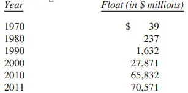

-
- 我们的浮存金从目前的水平上可能不会再增长多少，如果还有的话。这主要是因为相对于我们的保费收入，已经有一个超大型的浮存金规模。浮存金是否会出现一个下降，我将会补充，它将几乎肯定以一个缓慢的形式出现，因此不会令我们付出大量资金。
如果我们的保费收入超过我们的开支和最终损失的总额，我们把浮存金产生的获利加入到投资收入中。当这样的一个利润发生时，我们享受自由使用资金——并且更好的是，持有资金还能获利。不幸的是，所有保险人希望发生的情况导致了激烈竞争，如此激烈导致大量年份中财产保险业整体出现亏损。比如State Farm，这个迄今为止美国最大的保险公司，并且作为一个良好管理的公司，在过去11年中的8年产生承保亏损。保险业出现亏损的方式有很多，这个行业有办法创造新的亏损。
正如本报告第一部分所指出的，我们经营的业务连续九年有承保利润，我们在这阶段的收益总计达到170亿美元。我们相信我们将在大多数年份继续承保利润，但肯定不是全部年份。如果我们实现这个目标，我们的浮存金将好过免费午餐。我们的获利就像是某些团体在我们这里存了706亿美元，向我们支付一笔费用持有这些钱，并允许我们用这笔钱为自己获利投资。
那么这些浮存金是如何影响内在价值的估算呢？我们的浮存金作为一笔负债从伯克希尔的账簿中减去，如同我们要在明天付掉，并且无法补充它。但这是一种对浮存金不正确的看法，而正确的看法应该是作为周转基金 来看。__如果浮存金既是无成本的，又是长期持久的，这个负债的真正价值远低于会计定义上的负债__ 。
- 部分抵消这种夸大的负债是对我们保险公司的155亿美元“商誉”作为资产纳入账簿，事实上，商誉代表了我们为浮存金支付的价格。然而商誉的成本没有体现真正的价值。__如果保险业产生巨大和持续的承保损失，任何商誉的资产都应该被视为毫无价值，不论其原始成本多少。__
- 幸运的是，在伯克希尔情况并非如此。查理和我认为我们保险业务的商誉的真正经济价值——我们将以此作为支付购买浮存金—— 要远远超过其历史账面价值。我们的浮存金价值是其中的一个原因——一个很大的原因——这就是我们为什么相信伯克希尔的内在商业价值大大超过帐面价值。
让我再次强调一点，无成本的浮存金不是整体财产保险业预期都能产生的结果：我不认为有很多“伯克希尔”式的浮存金在保险业界中存在。在大多数年份里，包括2011年，该行业的保费收入已不足以支付索赔和费用。因此，该行业几十年来的有形资产整体回报为，远远短低于美国工业企业的平均回报。这一遗憾的表现几乎可以肯定将继续。伯克希尔优秀经济性只是因为我们有某些了不起的经理人在运营某些非凡的保险业务。让我告诉你们一些主要的部门。
以浮存金规模计，排名第一的是Ajit Jain管理的伯克希尔\-哈萨维再保险集团。Ajit担保的风险没有别的人愿意或者有资本能接纳得了。他的运作结合了容量、速度、果断。最重要的是，他的思维方式在保险业中独一无二。然而他从来没有把伯克希尔暴露到与我们的资源不适当的风险中。事实上，我们在这方面比大多数大型保险公司更为保守。举例来说，如果保险业应该经历一个从一些亏损2500亿美元特大灾难——损失相当于任何时候曾经历的三倍——作为一个整体伯克希尔可能会录得适度利润的一年，因为它有许多盈利流。目前所有其他主要保险公司和再保险公司都离上涨的红色很远，有些人还将面临破产。
从1985年开始，Ajit已创造了有340亿美元浮存金的保险业务和巨大的承保利润，一个没有任何其他保险公司的首席执行官能够接近的壮举。这些成就使他为伯克希尔价增加了数十亿美元的价值。查理很乐意拿我换第二个Ajit，但是第二个不存在。
我们另一个强力保险部门是由Tad Montross管理的General Re。
作为一个优秀保险人他的经营要坚持四条准则，他必须（1）了解所有敞口可能会导致的保单损失；（2）保守评估任何敞口可能导致的真实损失以及可能造成的成本 （3）设置能提供利润的一保费，能平均的把两个潜在损失成本和运营费用都覆盖在内 （4）如果不能得到适当的保费溢价。愿意离场。
许多保险公司通过前三个测试但第四个不及格。他们就是无法转身离开其竞争对手都热切进入的业务。老话：“其他人正在这么干所以我们必须也干 ”，在任何行业都会出问题，但是没有其他行业的情况会比保险业更坏。事实上，一个好的有独立思维的承报人，必须像在开车回家途中接到妻子电话的那个人一样聪明。
- Tad明白保险业四条军规，而这也反映到他的成绩单上。General Re在他的领导下创造了巨大的浮存金，我们希望，从平均的角度而言他能继续。在我们收购General Re的最初几年，它是一个麻烦，现在它是一笔财富。
最后还有GEICO，这个保险人让我在61年前获得了经验。GEICO由Tony Nicely运营，他18岁加入公司，2011年已经供职了50年。GEICO令人羡慕的业绩，来自Tony完美的执行一个几乎无法被复制的运营模式。在他担任CEO的18年中，我们的市场份额从2\.0%增长到9\.3%。如果公司的仍然维持静止的份额——如同他担任CEO以前的情况——那么现在我们的保费将是33亿美元而不是实际在2011年获得的154亿美元。Tony和他的同事创造的的额外价值，是伯克希尔的内在价值超过账面价值的主要元素。
汽车保险市场仍然有超过90%的市场在等待GEICO。不要对赌Tony会在未来一年年的收购。我们的低成本允许了低价格。
除了我们拥有的三大主要保险业务，我们还有一群较小的公司，他们中大多数在做保险业务中最奇怪的业务。总体而言，他们的一贯有盈利，并且向我们提供了巨大的浮动。查理和我把这些公司和经理们当作珍宝。
年末我们收购了Princeton Insurance，一家承保医疗事故的保险人。这一闪电交易使得我们的明星Medical Protective的明星CEO有更大的管理空间。Princeton能带来6亿美元的浮存金，数字包括在下表。

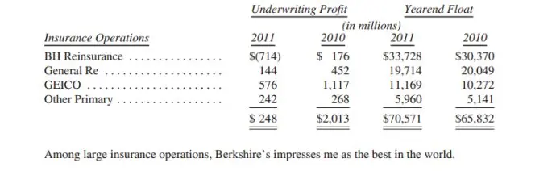

-
- 我们拥有两家非常大的企业，BNSF和中美能源（MidAmerican Energy），他们重要的共同特点使其与许多我们的其他企业截然不同。因此，我们在这封信里将他们单列一个版块，在我们GAAP财务报表中也将其单独列报。
这两家公司的关键特点是他们对长期，受监管资产的巨额投资，这些投资部分由非伯克希尔担保的大额长期债务融资。不需要我们的信用：两家公司在糟糕商业环境下的盈利能力足以覆盖其利息要求。在2011年的疲软经济下，BNSF的利息覆盖率为9\.5倍 。同时，对于中美能源，两项关键指标确保了其在所有环境下偿付债务的能力：其收益能力来自于独家提供必需的服务和多元化的收入来源，使其免受任何单一监管机构行动的影响。
- 以吨\-公里计，铁路承担了美国城市间货运量的42%，而BNSF运输量要多于其他铁路，占到行业总量的37%。简单的算术就能告诉你，美国城市间运输量的15%是由BNSF运输的。毫不夸张的说，铁路是我们经济的循环系统。而你们的铁路是主干线。
所有这一切使我们肩负重任。我们必须维护好和提升我们23000公里长的铁路以及1\.3万座桥，80座隧道，6900台机车以及78600台运输车辆。这一工作要求我们在所有经济情形下都有足够的财务资源以及能够迅速而有效的处理千变万化的行业特征的人才。
- __为了能完成社会义务，BNSF定期投资额远大于其折旧支出，2011年这一差额达到18亿美元。__ 美国的三大主要铁路都做了类似投入。尽管许多人指责我们国家的基础设施支出不足，但这一批评对铁路行业并不合适。这一行业正将私人部门的资金滚滚投入各种投资项目，这些项目将在未来提供更好和更多的服务。如果铁路没有做出这样庞大的支出，我们国家公共部门融资的高速公路系统将面临更大的拥堵和维护问题。
类似BNSF这种的大额投资如果不能获得合适收益将会非常愚蠢。但我非常有信心，由于其所提供的价值，BNSF会盈利。正如多年前Ben Franklin所说的话，对应到我们的受监管业务，他会说：“照顾好你的客户，那么监管者\-代表着你的客户也会照顾你。”做好事有好报。在中美能源，我们参与了类似的“社会契约”。我们预期将拨出越来越多的金额来满足我们客户未来的需求。如果我们同时能够可靠而有效的运营，我们知道我们将能在这些投资上获得公平的收益。
伯克希尔持有中美能源89\.8%的股份，后者向美国国内的250万客户提供电力服务，是爱荷华，犹他和怀俄明州的最大供应商，并且是其他6个州的重要供应商。我们的输气管运输着这个国家8%的天然气。很明显，数百万的美国人每天要依赖我们。他们从未失望。当中美能源在2002年收购Northern Natural的输气管时，这家公司被行业的领先机构评为行业43家公司中的最后一位。在最近的报告中，Northern Natural已经列到第二位。第一位则是我们的另一家输气公司，Kern River\.
在电气行业中，中美能源有着无可比拟的记录。在最近的客户满意度调查中，中美能源美国公用事业部分位列受调查的60家公用事业机构中位列第2，而这一切与多年前中美能源收购这些资产时大相径庭。
到2012年底，中美能源将拥有3316兆瓦风电运营，远超美国其他电力公用事业机构。我们已经投资以及承诺的风能领域的投资达到惊人的60亿美元。我们能够做出如此投资是因为中美能源保留了所有的收益，不像其他公用事业企业几乎将其收益全部支付给股东。此外，去年底我们上马了2个太阳能项目，一个是100%独资的加州项目，另一个亚利桑那州的项目占股49%，这些项目将需要30亿美元建设。后续还有更多风能和太阳能项目。
正如你现在可以看出来的，我对BNSF的Matt Rose和中美能源的Greg Abel为社会做出的贡献感到骄傲。我对他们为伯克希尔的股东做出的贡献同样骄傲和感谢。

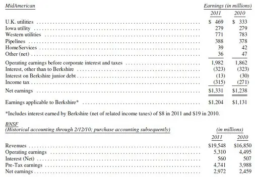

-
- 在我们的资产负债表的账面价值中，BNSF和中美能源商誉的账面价值总计200亿美元。对每一例，我和查理都相信目前的内含价值远高于账面价值。制造业、服务业、零售业运营伯克希尔这一部分的业务面面俱到。让我们来看一下资产负债表和整个集团的盈利报告。

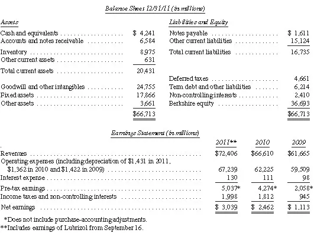

-
- 这个集团的公司出售从棒棒糖到飞机等产品。有一些业务极佳，没有杠杆的净有形资产税后盈利可达25%至100%以上。其他一些产品回报则在12%\-20%。但也有一些回报很糟糕，这是因为我在分配资本时犯了一些严重的错误。之所以犯错，是因我错误地判断了这些公司的竞争力与该行业未来运营的经济状况。我尝试在做并购时要看10年或20年，但有时我的视力并不好。查理比我的要好；他在我错误收购的一些案例中投了反对票。
伯克希尔比较新的股东可能会对我继续自己错误的决定感到迷惑。不管怎样，他们的盈利对伯克希尔来说并不重要，而有问题的公司比优秀的公司需要更多管理时间。管理咨询或或华尔街顾问都会看着我们这些落后的公司，然后说“扔掉他们”。
这种情况并不会发生。过去29年来，我们经常会罗列伯克希尔的经济准则，其中第11条讲的是__我们总体上会抵制出售表现糟糕的公司（很多情况落后都是因为行业原因，而不是管理的缺陷）。__ 我们与达尔文主义者相差很远，你们很多人可能会不同意。我可以理解你们的立场。__但我们曾经对卖家承诺过，并将继续承诺，不管是顺境还是逆境，我们都会保留这些公司。__ 到目前为止，这些承诺的美元成本并不高，他们在潜在买家中建立的商誉可能已经抵消了这些成本。这些买家在为他们宝贵的业务和忠实的伙伴寻找一个合适且永久的家。这些买家知道他们无法从其他地方得到从我们身上得到的，我们对他们的承诺未来数十年对他们对会有益。
- 但是请你们理解，查理和我既不是受虐狂，也不是盲目乐观。如果在第11条规则中的任何一个缺点出现，如果这些业务长期很可能会现金枯竭，如果劳工冲突很流行，我们将采取快速果断的决定。在我们47年历史中，这种情况只发生过几次，我们现在拥有的业务没有一个因陷入困境而要求我们考虑放弃。
这一部分前面的盈利表格可以看出，美国经济自2009年中以来稳步持续复苏。这一部分共包括54家公司。但其中一个公司Marmon在11个地区业务部门拥有140家企业。__简而言之，当你看伯克希尔的时候，你就是在整个美国经济。__ 所以让我们进一步挖掘，看看过去几年发生了什么。
- 这一部分中四个与房地产有关的公司（这一部分将除去Clayton，它被归入金融和金融产品中），他们总税前盈利2009年为2\.27亿美元，2010年3\.62亿美元，2011年3\.59亿美元。如果把房地产公司从联合报告中去除，你会发现我们多元化的非房地产业务2009年盈利18\.31亿美元，2010年盈利39\.12亿美元，2011年盈利46\.78亿美元。2011年大约有2\.91亿美元盈利来自于路博润并购。剩余的43\.87亿美元盈利则说明美国已经从2008年金融恐慌的破坏中恢复过来。虽然房市相关业务还留在急诊室，但其他大多数业务都已经离开医院，完全康复。
几乎我们所有的经理去年都有优秀的业绩，其中一些房市相关的经历正在对抗飓风般的经济逆境。几个案例：
Vic Mancinelli在CTB再创新纪录。CTB是我们的农业设备业务。我们在2002年以1\.39亿美元收购了CTB。他在随后为伯克希尔贡献了1\.8亿美元。CTB去年税前盈利1\.24亿美元，并拥有1\.09亿美元现金。Vic 在过去一些年又做了大量附带的并购，包括今年年底后的一项并购。
TTI是我们的电子组件经销商，其销售收入增加至21亿美元，比2010年高12\.4%。盈利也创下纪录，自2007年以来增长了127%。我们就是在2007年收购TTI的。在2011年，TTI的表现比这个领域其他大型公共交易公司的表现要好得多。这丝毫不出意外：Paul Andrews和他的伙伴们已经有很多年都打败了他们。查理和我很高兴Paul在2012年初在讨论一项大型的附带并购。我们期待更多进展。
Iscar是一家割削工具公司，我们拥有80%股份，它继续给我们带来惊奇。他的销售增长和整体业绩在其行业中是独一无二的。Iscar的经理Eitan Wertheimer, Jacob Harpaz和Danny Goldman是聪明的战略家和运营者。在全世界经济在2008年11月崩溃时，他们出售收购了Tungaloy，一家领先的日本割削公司制造商。去年春天东京遭到海啸冲击时，Tungaloy遭受了严重打打击。但你不会想到现在怎么样：Tungaloy销售在2011年创下纪录。我在11月参观了他们在Iwaki的工厂，对Tungaloy管理层及员工的热情和贡献印象深刻。他们是一个了不起的团体，值得我们尊敬和感谢。
我们的大型经销商McLance由Grady Rosier公司运营，在2011年新增了重要的新客户，并创下3\.7亿美元的税前盈利纪录。我们在2003年以15亿美元收购了该公司，从那时到现在，他们带来了24亿美元的税前盈利，并增加了2\.3亿美元LIFO储备，因为其经销的产品（糖果、口香糖、香烟）价格增长了。在运营这台物流机器方面，没有人比得上Grady。McLance接下来可能还会有一些附加并购，特别是在我们新的葡萄酒和烈酒分销生意上。
Jordan Hansell在4月份接管Netjets，2011年的税前盈利为2\.27亿美元。这是非常了不起的业绩，因为新飞机销售在过去一年大多数时候都很缓慢。12月出现了上涨趋势，且比季节性正常情况要多。但这种情况能持续多久还不确定。
几年之前NetJest是我最大的担忧：它的成本远超收入，且现金一直在流血。没有伯克希尔的支持，NetJets将走向破产。我们已经将这些问题留在了后面，Jordan现在正从管理良好运营顺畅的业务中带来稳定的利润。__NetJests正计划与一些头等舱合伙人推进一项进入中国的方案。__ 这一动作将进一步拓宽我们的商业“护城河”。其他的少数股权公司在规模和范围上都与NetJets相差甚远，未来也没有人可以赶上它。NetJets坚持不懈专注于安全和服务已经在市场上带来了回报。
- 我们很高兴看到Marmon在Frank Ptak的领导下取得进步。除了取得内部增长外，Frank不断做附加并购，这些并购加起来将大幅增加Marmon的盈利能力。（在过去几个月里他花费2\.7亿美元收购了三家公司。）全球范围内的合资企业对Marmon来说也是一个机会。去年年中Marmon与一顿的起重机公司Kundalia家族合作，目前已经产生了大量利润。这是Marmon与该家族合作的第二个企业，之前他们合资的电线电缆公司也很成功。在Marmon运营的11个主要行业中，有10个行业在过去一年贡献了盈利。你应该有信心未来数年Marmon会有更高的盈利。
“买商品，卖品牌”多年来一直是企业成功的一个方程式。这一方程式让可口可乐自1886年以来，箭牌自1891年以来都产生了巨大且可持续的利润。而在较小的公司方面，40年前我们收购喜诗糖果，用这一方法也带来了大量财富。去年喜诗税前盈利8300万美元创新纪录，__我们收购喜诗以来总盈利达到了16\.5亿美元。__ 可以比较一下，我们在收购喜诗的时候只花了2500万美元。这一切都归功于Brad Kinstler，他在2006年就任CEO后将公司带到了新的高度。
- 内布拉斯加家具市场（简称NFM，我们持有80%）盈利在2011年创新纪录，比1983年我们收购它的时候高出十倍多。
但这还不是大新闻。更重要的新闻是，NFM收购了达拉斯以北433英亩的土地，我们将在此建造全美最大的家具商店。目前全美最大的家具商店是我们在奥马哈和堪萨斯的商店，每一个在2011年都创下历史小时纪录，均超过4亿美元。德州那个商店还需数年才可以完成，我希望在开业时剪彩。
我们的新商店将提供各种无与伦比的商品，价格也是其他人无法比较的，它将吸引远近的客户前来。
我们在NFM上的经验，以及Blumkin家族的管理都是愉快的经历。1937年，Rose Blumkin（我们所有人都称为B女士）为了一个梦想，用500美元创建了这家公司。当她89岁的时候把公司的股份卖给我们，并一直工作到103岁。（她退休后一年就去世了。我把这个结果告诉过所有想过退休的伯克希尔经理。）B女士的儿子Louie现在92岁，他从二战归来后就一直帮他的母亲打造这份生意，他的妻子Fran过去55年都是我的朋友。Louie的儿子Ron和Irv将公司带到了新的高度，他们先是开了堪萨斯商店，现在又在着手准备德州的。
两个“男孩”和我一起度过了许多美好时光，我将他们做为我最好的朋友。Blumkins是了不起的家族。他们从未让优秀的基因库浪费，最近Blumkin第四代家族的几位成员加入NFM让我感到高兴。
总体来说，伯克希尔这一部分的内在价值大大超过他们的账面价值。但对很多更小的公司，情况不是这样的。我在购买小公司方面犯错更多。查理很早之前就告诉过我，“如果有些事根本就不值得做，也不值得把它做好，” 我本应听他的话。总体来说，我们的大型收购都表现不错，有一些非常优秀。总体来说我们在这个领域是赢家。
- 有一些股东告诉我们，他们渴望了解更多对会计奥秘的讨论。那我就谈一点对GAAP的胡说八道。
常识告诉你，我们的各个附属公司表现在我们的账本上时，都是用从我们购买他们时的成本加上留存盈利（除非他们的经济价值大幅下降，必须减记）。伯克希尔的现实基本就是这样的，出来Marmon的情况比较糟糕。
我们在2008年收购了该公司64%的股份，在我们账面上记下了48亿美元成本。到目前为止一切顺利。在2011年初，我们按照与Pritzker家族的最初合同，又支付了15亿美元购买了16%股份（当时Marmon的价值已经上升）。于是我们被要求马上对2010年底的购买价格减记6\.14亿美元。很明显，这个减记与经济活动没有关系。在这个没有意义的减记中，实际上Marmon的内在价值上升了。
- __金融与金融产品__
这个部门是我们企业中最小的部门，包括两家租赁公司，XTRA（拖车）和CORT（家具），以及美国领先的活动房屋制造商和融资提供方Clayton Homes。除了这些100%控股的子公司，我们在这一类业务中还包括一系列金融资产以及Berkadia Commercial Mortgage50%的权益。
在2008年末经济跌落悬崖后，观察我们的三家公司业务运营所体现的情况是很有帮助的，因为他们的经历显示出随后到来的经济的部分复苏。
我们两家租赁公司的业绩表现是“除房地产外”经济的体现。他们的税前收益合计在2009年为1300万美元，2010年为5300万美元，而2011年为1\.55亿美元，这一提升反映了我们在绝大部分非房地产业务中所看到的稳步复苏势头。相比之下，Clayton的活动房屋业务经历了名副其实的萧条，至今未曾恢复。美国的活动房屋销售量在2009年为49789户，2010年为50046户，2011年为51606户\(而在2005年房地产繁荣时，这一数字为146744户）。
尽管时局艰辛，但Clayton还是继续盈利，大部分是因为其抵押贷款组合在令人头痛的条件下表现良好。因为我们是移动房屋业最大的借贷者且通常贷款给中低收入家庭，你可能预期我们将在房地产崩溃中承受沉重的损失。但通过对传统贷款政策的坚守，即有意义的，与固定收入相适应的首付和月供，Clayton已经将损失维持在可以接受的水平。甚至在我们的许多借款人在部分房屋上拥有负权益时也做到了这点。
众所周知，美国在其房屋所有权和抵押贷款政策上出了问题，而我们的经济如今正在为这些错误付出巨大的代价。我们所有人都参与了这一毁灭性的行为\-包括政府、贷款人、借款人、媒体以及评级机构等。这些愚蠢行为的核心是几乎所有人都相信房屋的价格必定会一直上涨，任何下跌都是不合理的。真是对这一前提的接受使得房地产交易中任何价格和行为都是合理的。各地的房屋拥有者们感到自己变得富裕，争相通过再融资将其房屋增值部分“货币化”。这类大规模资金注入推动了全国各地的消费狂潮。当这股潮流持续的时候看起来一切都很好。（一个几乎不被注意的事实是“许多在止赎中“失去”房屋的人事实上已经获得了收益，因为他们在此前通过再融资获得的资金超过其成本。这类情况下，遭驱逐的房主是获胜的一方，而贷款人才是受害者）。
2007年，泡沫破裂，正如所有泡沫必定会经历的那样。我们如今已是在泡沫破裂后逐渐恢复的第4个年头，尽管这一恢复过程漫长而痛苦，但终将成功。今天，新家庭形成数量持续高于房屋开工数量。
当全国的超额房屋存货被消耗完后，Clayton的收益应该会大幅提高。然而，正如我所理解的，我相信这三家企业的内含价值与其账面价值没有显著差异。
- __投资__
以下显示我们的普通股投资年底市值逾10亿美元。

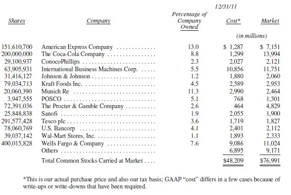

-
- 2011年，我们的投资持股很少变动。但重要的变动有3次：我们购买了IBM和美国银行的股份，还增持了10亿美元的富国银行股份。
银行业东山再起，富国银行正走向繁荣，其收益表现强劲，其资产稳固可靠，其资本处于创纪录高位。美国银行此前的管理层犯下了一些大错误。该行首席执行官Brian Moynihan在清理失误方面取得出色的进展，不过完成这一过程需要多年时间。目前，他在培养一家具有吸引力和潜力的大企业。这家企业会在今天的问题被人们遗忘很久之后还屹立不倒。我们购买7亿美国银行股份的那些认购权证将可能在它们到期以前拥有巨大的价值。
与1988年和2006年分别投资可口可乐和铁路一样，我也没有赶早买入IBM。这家公司的年报我已经读了50多年，可直到去年3月的一个星期六，我才感到柳暗花明。正如梭罗所说：“要紧的不是你看到的，而是你看到了什么。”
- Todd Combs去年构建了17\.5亿美元的投资组合，Ted Weschler将很快打造一个同样规模的投资组合。他们每个人都会凭借个人成绩得到80%的绩效奖金和20%的合伙人奖励。我们的季度报告分别汇报了小额持仓，这些不可能是我买入的股份（但媒体通常夸大了这点），而是Todd或者Ted名下购买的股份。
对这两位新人有一点要补充。Ted和Todd都会帮助下任伯克希尔的首席执行官进行收购。他们拥有优秀的“商业头脑”，能捕捉到可能决定多种类别企业未来的经济动力。他们了解什么是可以预计到的，什么是不可知的，这有助于他们思考判断。
关于我们的衍生品仓位，没有什么新东西可报告的，过去的报告中已经详细解说。（1977年以来的年报可以登录www\.berkshirehathaway\.com查阅。）然而，必须指出一个重要的行业变动：虽然我们现有合约要求的抵押非常少，但新仓位的情况有所不同。因此，我们不会建立任何大规模的衍生品仓位。我们杜绝各类可能要求立即提供抵押的合约。可能有些提供极大抵押的突然要求——来自世界范围内金融恐慌或者大批恐怖分子袭击这样的意外事件——与我们过多流动性的组要目标和毋庸置疑的财力不符。
我们类似保险的衍生品合约就要到期。如果包括高收益率债券指数违约在内的各种问题出现就会赔付。我们亏损风险最大的那些合约已经过期，剩下的会很快到期。2011年，我们为两笔亏损赔付8600万美元，这让我们的总付款额达到了26亿美元。我们几乎确定认识到了这一投资组合最终的“减记利润”，因为我们收到的溢价是34亿美元，今后的亏损会低于这一金额。此外，我们的这类合约5年内平均浮动抵押为20亿美元。在面临巨大信贷压力的时期取得了这样的成功表现，这突出表明，获得一个与风险相匹配的险的溢价有多重要。
考虑到我们会在15年左右持有42亿美元的浮动抵押，而且我们已经发现我们回购的合约盈利2\.22亿美元，查理和我仍然认为，我们的卖权仓位将产生可观的利润。2011年年底，伯克希尔的面值反映出，现存合约负债85亿美元。如果这些合约全部在我们支付之时到期，实际金额就是62亿美元。
- __投资者的基本选择与我们的强烈偏好 __
- 投资行为被形容这样一个过程：在今天投出资金，预期未来能收回更多的钱。在伯克希尔，我们对此要求更高，我们将投资定义为将今天的购买力转移给他人而预期在未来收到合理的购买力（扣除对名义收益的税收）。更简洁的说法是，投资是放弃今天的消费，为了在以后的日子里能够有能力更多的消费。
从我们的定义中可以得出一个重要的推论：投资的风险并非被beta衡量（华尔街以此衡量波动性以及风险），而是由概率衡量\(合理的概率\)即投资导致其主人在持有期间损失的购买力的概率。 资产价格经常大幅波动，而只要他们在其持有期间内可以合理确信提供增加的购买力，那么这些资产就不是风险高的。而正如我们将看到的，一个波动性小的资产也能充满风险。
- 投资有许多种且变化多端。然而，投资概率主要有三个类型，理解每个类型的特征是非常重要的。因此，让我们了解下这一领域。
- __部分投资是以给定的货币计价的，包括货币市场基金，债券，抵押贷款，银行存款以及其他工具。__ 大部分基于货币的投资被认为是“安全”的。事实上，他们是最危险的资产之一。他们的beta是零，但风险巨大。
- 在过去一个世纪，这些工具毁了许多国家投资者的购买力，即使是其持有者持续收到定期的利息和本金支付。此外，这一丑陋的结果将一直重复发生。政府决定了货币的最终价值，但系统的力量不时会使他们被制造通胀的政策所吸引。而这类政策经常失控。
即使在美国，尽管对稳定货币的愿望非常强烈，自我在1965年接管伯克希尔的管理之后，美元仍然贬值了惊人的86%。那时的1美元的价值不低于今天的7美元。因此，为了能够维持购买力，对于免税的机构来说，其在这段期间内的债券投资收益需达到年化4\.3%。而如果这家机构的投资经理认为其收到的利息是“收益”的话，那他是在开玩笑。
- 对于需要支付税收的你我来说，情况就更糟了。在同样的47年时间段内，持续的对美国国债滚动投资产生每年5\.7%的收益。这听起来很令人满意。但如果个人投资者需要支付平均25%的个人所得税时，这5\.7%的回报率以真实收入衡量毫无收益。可见的所得税将削减投资者1\.4%的收益，而不可见的通胀“税”则超过所得税的三倍，而投资者很可能只是认为所得税才是其主要负担。尽管我们的货币上印有“我们信仰上帝”的语句，但操作我们政府印钞机的双手却都是人。
- 当然，高利率可以弥补购买者基于货币的投资所面临的通胀风险。确实，上世纪80年代早期的利率在这方面做得很好。然而如今的利率无法弥补投资者所需承担的购买力风险。如今的债券应该标上警示标识。
因此，在如今的条件下，我不喜欢基于货币的投资。即使如此，伯克希尔仍然持有大量此类投资，主要是短期品种。但不管利率怎样，在伯克希尔，对充足流动性的需求占据核心位置，且永不忽视。为了满足这一需求，我们主要持有美国国债，这是在绝大部分混乱的经济情况下对于流动性唯一可靠的投资。我们的目前的流动性水平是200亿美元；100亿美元时我们最低要求。
在流动性和监管层对我们的要求以外，我们购买货币相关证券只是因为其提供超常收益的可能性\-或是因为一特定信贷工具被错误定价，例如在定期的垃圾债券市场可能发生的，或是因为利率上升到一定程度，使得在其下降时，足以在高收益债券上实现大额收益。尽管我们曾经在过去利用过这类机会\-也可能再次这么做，但我们如今对这一前景持悲观态度。对于如今的情形，华尔街谢尔比Cullom Davis在很久以前说的话看起来很适用“债券此前被推销为提供无风险收益，而如今的价格实际上是在提供无收益风险。”
- __第二类投资包括的资产是指那些实际不产生任何收益，但买家在认为其他人未来会为此支付更高的价格的期望下所购买的资产，这些买家也清楚这些资产永远不具有生产性。__
17世纪的郁金香就是此类买家的最爱。这类投资要求有足够容量的买家市场，而这些买家受到诱惑是因为他们相信这一购买市场将持续扩大。持有者并非被这些资产的生产力所激励，这些资产永远不会生产，而是坚信他们在未来会对其更渴望。这一类别最主要的资产就是黄金，后者是对其他所有资产（尤其是货币）恐惧的投资者的最爱。然而黄金有两个显著的缺点，用途不广且不具有生产性。确实，黄金有一些工业和装饰的用途，但此类用途的需求优先，且不足以吸收新的产量。同时，如果你一直持有一盎司黄金，到最后你将仍然只拥有一盎司。
激励大部分黄金购买者的动机是他们相信恐惧的等级将会增长。在过去的十年，这一想法被证明是正确的。此外，上升的价格自身会产生额外的购买热情，吸引那些认为价格上升证实其投资理论的购买者。当大量投资者涌入时，这一结果就自我实现了。但只是暂时。
在过去15年，互联网股票和房地产业都已经证实了这一理论：起初明智的理论加上广为宣传的价格上升能够创造出惊人的多余需求。在这些泡沫中，许多起初充满怀疑的投资者屈服于所谓市场的“证据”，而购买者群体的扩大在一段时间内足以使得这场盛宴持续。但泡沫吹得大了不可避免会破裂。那个时候那句古老的谚语又将得到证实：“明智的人开头，蠢蛋收尾。 ”
- 今天，全球黄金储量约17万公吨。假如把它们熔铸成一个每面约68英尺的立方体。（设想它可以轻轻松松地放在一个棒球内场。）如果每盎司黄金价格1750美元，也就是我写下这些内容时的金价，这个立方体的价值大约9\.6万亿美元。我们称它立方体A。
然后来创造一个和立方体A价格相同的立方体B。为此，我们要买下美国所有的耕地（4亿英亩，年产值2000亿美元），以及16家埃克森美孚公司（全球利润最高的公司，年利润超过400亿美元）。买下这些以后，我们还有1万亿美元可以用来零花。你能想象到，一个9\.6万亿美元在手的投资者会选立方体A还是立方体B？
不计对现存黄金令人吃惊的估值，目前的价格让今天的黄金年产值达到约1600亿美元。买家——不论是珠宝和工业用户还是投资者——都必须不断消化增加的供应。这仅仅是为了维持现有价格的平衡。
一个世纪以后，无论可能用哪种货币，4亿英亩农田都会生产出大量的玉米、小麦、棉花和其他作物，继续带来有价值的回报。埃克森美孚则可能分红数万亿美元，持有16家这样的公司会新增数万亿美元。而17万吨黄金既不会增加规模，也不能创造任何产品。你可以深情抚摸它，它却不会有回应。
- 还得承认，当距今一个世纪的未来人类担忧的时候，可能还会有很多人蜂拥而上为黄金。但我相信，一个世纪过去，目前价格9\.6万亿美元的立方体A这期间的复合价值增长率会远远不及立方体B。
我们的前两个资产类别在恐惧情绪达到顶峰时最受欢迎。对经济崩溃的恐慌将散户推向货币基础的资产，首当其冲的是美国债务。而且，对货币崩溃的恐慌又将这些散户推向黄金这种没有产出能力的资产。2008年底，我们风闻的是“现金为王”，当时应该配置现金，不应持有。同样地，20世纪80年代初，我们听说的是“现金如垃圾”，当时的固定美元投资处于我们记忆中最有吸引力的水平。在这些情况下，需要从众心理支持的投资者为求得心安付出了代价。
我自己最青睐的——你知道，就要讲到了——是我们的__第三类资产：__ __投资于有生产力的资产 ，无论是企业、农场，还是房地产。__ 在理想的情况下，这些资产应该能在通胀时期让产出保持自身的购买力价值，同时只需要尽可能最少的新增资本投入。农场、房地产和可口可乐、IBM这样的很多企业，以及我们自己的See's Candy（译注：逾90年历史的美国老牌糖果与巧克力食品公司）都能满足这双重考验。其他特定的公司——比如我们那些受管制的公共事业公司——都不能通过上述考验，因为它们在通胀的环境下需要大量资本。为了增加收益，它们的所有者必须增加投资。即便如此，第三类投资也仍会超越毫无生产力和以货币为基础的资产。
- 一个世纪过去，不管那时的货币是黄金、海贝、鲨鱼牙，还是（和今天一样的）一张纸，人们都愿意用他们每日劳作的几分钟时间换来喝一杯可口可乐，或者吃一些See's Candy的花生薄片糖。未来的美国人会出售更多的商品，消费更多的食品，需要的生活空间也比现在多。__ 人们永远都会用自己生产的换取他人生产的。 __
- 我们国家的企业会继续高效地运送我们国民需要的商品和服务。这好比说，这些商业“奶牛”活了几个世纪，产了比以往更多的“牛奶”。__它们的价值不是由交换的中介决定，而是由它们产奶的能力而定。__ 对奶牛的主人而言，销售牛奶会是复利交易，就像20世纪道指由66点涨至11497万点时那样（当时也支付了大量的股息）。伯克希尔的目标将是增持第一等企业的股权。我们首先会选择整体持有——但我们也会通过持有大量可交易股票成为所有者。我相信，任何一段较长的时间内，事实都会证明，这类投资在我们考查的三类资产中是长线赢家。更重要的是，它最为安全。
-

## 二零一三

__二零一二__

-
- __经营业绩__
2012年，伯克希尔的总收益为241亿美元。我们用了13亿美元回购公司股票，这使得我们的资产净值增加了228亿美元。A、B类股票每股账面价值增长了14\.4％。在过去的48年，我们的账面价值从19美元增长到114214美元，年复合增长为19\.7％。
过去的一年伯克希尔有很多的好事情，但是似乎应该先说说不太好的。自1965年我掌管伯克希尔开始，我从未想过能够一年能够获得241亿美元的收益，一些比较我们已经在第一页有所呈现。
但是这个表现并不尽如人意，在过去48年中，这是我们的账面价值上升幅度第九次跑输标普的上涨幅度（包含股息和价格上涨），值得一提的是，在这9年的八个年头里，标普指数上涨幅度超过了15%（译者注：伯克希尔跑输的9个年头只有2004年标普上涨10\.9%），我们更擅长逆势投资。
如果以5年为周期，过去的48年里有43个这样的周期，到目前为止，43个5年周期，我们还没有一次被标普打败过，然而，这次可能有点不一样，如果2013年标普继续高歌猛进，哦，NO，我们这个记录将可能被打破。（译者注：1、过去四年伯克希尔已经有三年跑输标普；2、过去四年为周期的话，标普也已经跑赢了伯克希尔；3、巴菲特早年说过，在指数小幅上涨或者下跌的背景下，跑赢往往不成问题，但是猛烈上涨的年份却很难）
不管伯克希尔表现如何，有一件事情你无论如何都要坚信，那就是查理和我都不会改变我们投资的标尺。而以比标普上涨更快的速度提升伯克希尔的商业价值是我们的工作，如果我们做到了这一点，虽然不可预知，但是随着时间的推移，最终，是的，是最终伯克希尔的股价上涨也将超越标普的上涨幅度。而如果不幸，我们没有做到这一点，我们的管理对于我们的持有者而言是毫无价值的，因为他们完全可以直接买入成本更低的以标准普尔为标的的指数型基金。
查理和我都始终坚信，随着时间的推移，伯克希尔的内在价值增长速度能够小幅的跑赢标普指数。我们的自信是因为我们有着一些牛逼（outstanding翻成优秀显然是不够的）的企业，一个牛逼的管理团队以及以投资者利益为导向的企业文化。当市场下跌或者小幅上涨的年份，相比较而言，我们一定是更棒的，但是在过去几年的这种高歌猛进的市场里，我们很难打败市场。
另外一件让我不爽的事情是，2012年在重大并购方面，我一无所成，我追几只大象追得满头大汗，结果是两手空空。
不过，似乎我们的运气在今年有所好转，我们在2月份联手3G资本收购了亨氏，我们一半股权，这个由巴西著名的商人和慈善家豪尔赫·保罗·雷曼领导的3G资本占一半。
这是再好不过的企业了。保罗和我是老朋友了，他也是一个杰出的管理人士。保罗他们和伯克希尔各出资40亿美元购买普通股，而伯克希尔还将出资80亿美元购买优先股。这些优先股除了能获得每年9%的股息意外，还将享有如下的两个优先权：1、在某些时点，他可能会出现一个明显溢价的回购（译者注：还记得08年投资高盛的50亿美元优先股吗？）；2、这些优先股让我们优先享受购买亨氏5%股权的权利。
我们大概一共投资了120亿美元，但是我们仍有足够的现金，而且现金额还在快速增长。查理和我已再次踏上征途，继续寻找大象。
现在该说说好的了。
为我们提供利润最多的五个非保险类企业：BNSF（伯灵顿北方圣达菲铁路），Iscar（伊斯卡切削工具），lubrizol（路博润特种化学），Marmon（美联集团）和中美能源将会在2012年为我们提供超过超过100亿美元的税前利润，是的，他们做到了。尽管美国经济要死不活的，甚至还拖累了全球经济，我们的五大金刚还是在2012年度利润比2011年度增长了6亿美金，合计达到101亿美元。这一些企业里，我们在八年前就控股了当年只有3\.93亿美元税前利润的中美能源，随后我们用全现金交易购买了这五家中的三家。在购买第五个企业BNSF的时候我们用现金支付了所需资金的七成，剩余金额以增发6\.1%的股票来支付。因此总计给我们贡献97亿美金利润的五家企业只带给我们股东权益少量的稀释，这个更符合我们不仅要增长，更要增加每股利润的的目标。
除非遇到我们没有预期到的美国经济崩溃，否则由5位杰出的执行官掌管的我们的五大金刚应该在2013年度获得更高的收益。
尽管在2012年我本人没有做成一项重大的并购，但是我们的子公司的管理者们做的那就好太多了，我们的“补强型”并购创下了记录（译者注：bolt\-on这种术语让不做投资的人不知道会翻成什么，这里的意思是指那些对公司有益的并购），我们用230亿美元购收购了26家公司，并让这些新并购的公司磨合进了现有业务。在这些交易中，没有新发行伯克希尔·哈撒韦的股票。
查理和我当然爱极了这些并购，既不需要总部承担，又使得子公司的管理者们更有余地发挥。
而我们的保险业务更是大放光彩，在向伯克希尔提供了730亿美元的浮存金进行投资的同时，他们还实现了16亿美元的承保利润，这已经是连续第十个年头实现承保盈利了，他们太棒了。
盖可（政府雇员保险公司）作为保险业务的引领者，继续扩大市场份额的同时又坚持了我的一贯原则（译者注：此处的discipline不能简单翻译成纪律，巴菲特在多次信中提到宁可要利润也不要盲目的扩大规模，此处专指他的这个一贯原则）。自从1995年伯克希尔全面控股盖克以后，盖克在个人汽车保险市场的份额从2\.5%增长到了9\.7%，保费总额则从28亿美元提升到167亿美元。嗯\.\.\.我相信，更多的增长近在眼前。
盖克的优异表现自当归功于托尼和他的27000名伙伴们。不仅如此，我们还应该继续拓宽我们的护城河。或许是漫漫长夜，抑或是刮风下雨，抑或是满路泥泞，不管是多大的困难都不能阻止他们前行的道路，他们正用他们的实际行动告诉美国人，如果你去GEICO\.com将会是多么的省钱。
当我计算上天给我的恩赐的时候，我是多么的希望它赐给我两个盖克。
托德康布斯和泰德威施勒，他们是我们的两位新的投资管理人，他们的优异表现证明了他们的脑袋瓜很聪明，投资模式很完整，而且对于伯克希尔在投资组合管理方面很有帮助，还非常适应我们的企业文化。能够得到这两位优秀的投资管理人，我感觉就像中了大乐透一样，2012年他们的管理的组合跑赢标普500指数超过了10%，在他们面前我逊毙了。
不出大家的预料，我们已经给这优秀的二位每人都增加50亿美元的投资管理额度（其中还是我们下属公司的养老金）。我和查理离开以后必然由这两位还算年轻的牛人来掌管我们巨大的投资组合。等到他们接管的时候我认为你们可以继续高枕无忧。
在去年我们雇佣职工人数增长了17604人，所以到去年年底我们雇佣的职工就已经创纪录的达到了288462人（具体数据可以在年报106页看到）。不必惊慌，我们总部人数还是一成不变的24人。
我们的四大天王：运通、可口可乐、IBM和富国银行也都是好年景。在这一年里这四个公司里我们的所有者权益都有所增加。我们还增加对富国和IBM的股票持有量（富国在11年基础上的7\.6%增加到现在的8\.7%，IBM从5\.5%上升到6%），当然可口可乐和运通回购股票使得我们持有权被动上涨。我们在可口可乐的持有量上升0\.1%到8\.9%，我们在运通的所有者权益从13%上升到13\.7%。未来我们在上述四家公司的所有者权益很有可能继续增加，借用梅·韦斯特的话就是好事越多越精彩（梅·韦斯特是上世界三十年代最著名女影星，被称为银幕妖女http://baike\.baidu\.com/view/1899505\.htm）
这四家企业拥有了不起的好生意，而且他们还被天才的并且还考虑股东利益的领导层管理，从我们企业自身角度来看我们宁可要优秀企业的一部分也不要平庸企业的全部。我们在资金分配上的灵活性使得我们相对于其他只能用他们自由资金做并购的企业有巨大优势。截至去年底，2012年我们在四大企业上赚了39亿美元，在财报中我们向你们汇报我们只收到11亿，但是我们没有出错：另外我们没有向您汇报的28亿元和我们已经记录在案。
这四大企业利润经常会被用来回购，这样会提高我们未来的收益，当然也不排除企业用于他们已经发现的有优势的项目。光阴荏苒，我们期望从这些投资公司赚取的更多的利润。如果我们被证明是正确的，那么分给伯克希尔的股息将增加，更重要的是，将实现我们的未实现资本收益（截至年底四大企业约有267亿元）。
去年有一大批执行官们在面对如何进行资本分配决策的时候担心流动性而焦头烂额（尽管他们很多人的企业创了盈利和现金的新纪录）但是作为我们公司来说我们没有他们的担心，我们在2012年花费了创纪录98亿美元在工厂和设备上，占了全美国这项投入的88%，我们这项花费比我们之前最高的2011年还增加了19%。无论砖家叫兽怎样说，查理和我喜欢投资大笔金钱在有利可图的项目上，听他们胡扯，还不如听加里艾伦新的乡村歌曲EveryStormRunsOutofRain
我们会一步一个脚印，13年我们很有可能在资本支出上创造新纪录。美国遍地都是机会，到处都是黄金。
我的CEO同仁们：未来唯一确定是就是不确定，事实是从1776年美利坚独立以来一直都在面对未知。只是有时人们将注意力集中在一直存在的无数不确定上，而在其他时候，他们忽略他们（通常是因为最近一直平安无事）。
随着时间的流逝，美国的企业将向前发展，同样确定的是股票将会上涨。因为它们的命运是和企业的业绩紧紧相连的。周期性的衰退将会发生，但是投资者和企业管理者在玩一个对他们极为有利的游戏（在20世纪，道琼斯\(美股 \)工业指数从66点上升到11,497点，惊人的17320%的增长，尽管经历了4次昂贵的战争，经济大萧条和多次经济衰退。另外不要忘记，除了指数的成长，投资者还享受了大量的分红）
因为这个游戏的基础是如此有利，查理和我相信，尝试按照所谓专家的扑克牌预测，跳进跳出商业活动是一个可怕的错误。置身游戏之外所冒的风险要比在游戏内的风险大得多。
我自己的历史提供了一个戏剧性的例子：我第一次购买股票是在1942年春天，当时美国在整个太平洋战区遭受了重大损失。每天的新闻头条都在讲述更多挫折。即便如此，没有人谈论不确定性；我认识的每一个美国人都相信我们一定会胜利。
从那段危险的时间到现在，美国的成功让人困惑：经通胀因素调整后的人均国内生产总值从1941年到2012年翻了两番。在这段时间内，每一个明天都不确定。美国的命运却一直清晰，不断增长的财富。如果你是一个CEO手握一些巨大的富有盈利前景的项目，却因为担忧短期经济状况而被搁置，给伯克希尔打电话，我们来帮助你解决负担。
总而言之，查理和我希望通过以下手段构筑每股内在价值：\(1\)不断提高我们分子公司的赚钱能力；\(2\)通过附加收购进一步增加他们的收益；\(3\)分享我们投资企业的成长；\(4\)当伯克希尔的股价大大低于内在价值时回购股票；\(5\)偶尔的大型收购。我们会尽量尝试为你寻求最优方案，可能很少，如果有的话，也会发行新的伯克希尔的股票。
这些砖块构筑在一个坚实的基础上。今后一个世纪，BNSF和中美能源仍将在美国经济中扮演着重要的角色。此外，保险行业对于个人和商业将永远是至关重要的。在这个竞技场上没有公司能比伯克希尔能提供更多的资源。当我们看到这些优势时，查理和我认为我们的公司前景广阔。
- __内在商业价值__
当查理和我谈论在内在商业价值时，我们不能精确的告诉你伯克希尔公司的股票的内在价值的数字\(或者,就此而言,任何其他股票的内在价值的精确数字\)。在我们的2010年度报告中，我们列出三个因素—其中一个是定性的—我们相信这是合理的估计伯克希尔内在价值的关键。这个讨论完整重现在第105 \- 104页。这是两个定量因素的更新：2012年我们的每股投资增加了15\.7%,达到113,786美元，我们除保险和投资业务之外的业务的每股税前收益也增加了15\.7%,至8,085美元。
自1970年以来，我们的每股投资的年复合增长率为19\.4%，而我们的每股收益增长20\.8%。伯克希尔公司的股票价格在42年期间增长速率非常接近我们上述的两个数字。这不是巧合。查理和我喜欢看到在这两个方面收益都有所增长，但我们的重点总是在建立营业收益上。
现在，让我们检视四个主要运营部门。每个部门都有着截然不同的资产负债表和收入特点。把它们混在一起会妨碍分析。所以我们将把他们按照四个独立的业务部门呈现出来，这与查理和我看待他们的方式一致。
接下来，让我们来看看四个主要业务组成部分的经营情况，查理和我认为，这四个业务各有其特点，都有截然不同的平衡表，盈利模式也不尽相同，如果不分缘由的放在一起分析恐怕比较困难，所以我们将他们分别罗列以让你们看得更加清楚。
- __保险业务__
作为伯克希尔的核心业务、成长引擎，保险业务推动了我们过去多年的扩张，因此我们必须先来看看保险业务。
财险公司现在收取保费并在以后理赔。在极端的情况下，比如工人的事故赔偿，我们的理赔可能长达几十年。这种现在收集保费并等到以后才可能理赔的模式让我们持有一大笔钱——我一直叫他们“浮存金”。虽然浮存金最终可能会理赔出去，但是在理赔之前，我们可以用它参与伯克希尔的收购。虽然充满了不确定性，但是我们持有浮存金和保费总量有着明显的相关性。因此，保险业务的增长就会带来浮存金的增长，从而带来我们的增长。下面是我们浮存金历年情况：

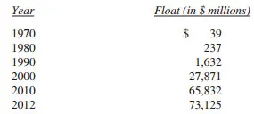

-
- 去年我告诉你们，我们的浮存金在未来将有一定程度的下滑，但是我们的保险业务的CEO们用他们的行动证明我错了，在2012年，浮存金继续增加25亿美元。我现在预测，2013年，浮存金仍有一定程度的增加，只是这种增加正在变得越来越难。另外，几乎确定的是盖可公司的浮存金仍将增加。但是国家赔偿的再保险业务的浮存金从合同情况来看将存在下滑。如果我们在未来遭遇到浮存金总量下滑的情况，他也会非常缓慢，每年下滑幅度不会超过2%。
如果我们的保费超过了费用和最终的损失，那么显然我们就获得了承保利润，还有比这更好的盈利模式吗？一方面使用免费的资金进行投资，另外到头来我们还能大赚一笔，就像你从银行贷款，不但不用你支付利息，银行还反向你支付利息。
但是不幸的是，大家都想获得这样快乐的结果从而导致了竞争的加剧，这种竞争看起来是的财险行业蓬勃发展，但是却带来了全行业的承保亏损。大家支付亏损以保证浮存金不会下滑。例如，StateFarm保险公司是全国最大的保险公司，管理经营也十分良好，但是其在2011年前的11年有8年承保的亏损的（2012年情况尚未公布）。在保险行业，亏损有很多种方式，而且这个行业还在不断寻找新的赔钱方式。
正如我们在第一节中提到的，我们已经连续十年实现了承保利润，这期间税前利润总额达到了186亿美元。展望未来，我相信我们依然会在大多数的年份里实现承保利润，如果我们做到这一点，我们的浮存金就比免费的钱更棒。
但是如此令人着迷的浮存金在计算我们的内在商业价值的时候，我们是怎么处理的呢？本着谨慎的态度，我们在计算内在商业价值的时候将浮存金全额扣除。因为万一明天这些浮存金就要赔付出去，我们却无法做到，那就糟透了。但是我们本身不能认为浮存金毫无价值，浮存金应该视为一种循环的资金链。如果浮存金既不需要付出代价又可持续发展，至少我相信伯克希尔一定是这样，那么它的价值远远高于会计上的价值。（译者注：全段大致就是在说浮存金虽然在会计上没有计入内在价值的计算，实际上不是这样）
155亿美元的商誉部分抵消被认为在一定程度上夸大了我们的资产负债，这些商誉归属于我们旗下的保险企业，而且作为资产计入了平衡表。实际上，商誉是为浮存金付出的成本，但是却又没有任何真正的价值。如果一家保险公司承保长期出现亏损，那么商誉无论其原始成本如何，都是被认为是毫无价值的。
幸运的是，对于Berkshire情况并非如此。查理和我相信我们保险商誉的真正经济价值，远远超过其历史账面价值，为此我们很乐意付钱给产生类似品质的浮存金的保险公司。我们浮存金的价值是为什么我们相信Berkshire公司的内在价值大大超过其账面价值的很大的一个原因。
让我再次强调，无成本的浮存金并不是我们期待财产和财产和意外险行业的所有产出。在于保险行业只有非常少量的“伯克希尔品质”的浮存金。在2011年之前的45个年份中的37个，保险行业的保费都不足以覆盖债权和费用之和。因此，该行业有形资产的整体回报在已经几十年来落后于美国工业的平均回报，而且不尽如人意的表现几乎肯定还会继续。
另一个令人不快的事实使行业的前景更显暗淡。目前保险收入受益于以往的债券组合，这些组合的收益率会远低于几年后的再投资的收益率。今天的债券投资组合实际上在浪费资产。债券到期再投资会严重影响保险公司的盈利。
Berkshire公司的卓越，只是因为我们有一些了不起的管理者管理着一些了不起的保险业务。让我们谈谈其中主要的保险公司。
按照浮存金的规模，首先是由Ajit Jain管理的Berkshire Hathaway Reinsurance Group（以下简称“BHRG”）。Ajit对没人愿意或者没人有足够的规模承担的风险进行保险。他的业务结合了容量，速度和果断，还有最重要的是，保险行业独无二的思维。然而，他从来没有把BHRG暴露在与我们的资源不相配的风险面前。事实上，我们在规避风险方面要远比大多数保险公司保守得多。举例来说，假如保险业经历一次高达2500亿美金的大灾难，这几乎是保险行业所经历过最大损失的三倍，当年BHRG作为一个整体，可能因为收入来源广泛而录得显着的利润，而所有其他主要保险公司和再保险公司将面临亏空，甚至破产。
1985年从零开始，Ajit已经建立了一家具有350亿美元浮存金和可观累计承保利润的保险公司，这是一个壮举，乃至没有任何其他保险公司的CEO可以与之匹敌。因此，他也极大地增加了Berkshire的价值。如果你在Berkshire的年会上遇到Ajit，请向他表示感谢。
除此之外，我们还拥有另一个由Tad Montross管理的强大的保险帝国，General Re。基本上，一个健全的保险业务需要坚持四个原则。 （1）理解所有的可能导致蒙受损失的风险暴露;（2）保守的评估任何实际可能导致的损失或者成本的风险暴露的可能性；（3）设置平衡的保费水平，在覆盖预期损失和运营费用后创造利润；（4）如果不能获得适当的保费，愿意离开。
许多保险公司通过了前三个考验，而在第四个中折戟。他们只是无法看着竞争对手活跃而置之不理。古话说的“人云亦云”，在任何事情上都带来麻烦，但都不会有在保险行业这么致命。
Tad遵守了这四个保险业戒律，这体现在他的表现上。在他的领导下，General Re的巨量浮存金已经比无成本更低。我们预计，在平均情况下这样的局面还会继续。我们格外感到兴奋的是，自从我们1998年买入General Re之后，它的国际寿险再保险业务已经取得了持续的盈利性增长。
最后还有GEICO，62年前为我拔牙提供保险服务的公司。GEICO是由Tony Nicely管理，他18岁时加入公司，到2012年已经服役51年之久。
回顾Tony的成绩时我很感动。应该注意的是，去年，他的成绩比GEICO的GAAP承保利润的6\.8亿美元要好很多。因为年初更改了会计准则，我们从GEICO的承保收入中计提了4\.1亿美金。这项与2012年的经营业绩无关，也不改变现金，收入，费用和税。实际上，减记只是扩大了GEICO的内在价值和我们账簿上记录的价值之间本已存在的巨大差距。
尽管遭受着公司历史上最大的单一损失，GEICO仍然获得了承保利润。损失的原因是飓风桑迪，造成了GEICO三倍于之前的记录保持者卡特里娜的带来的损失。我们向46,906辆在风暴中被摧毁或损坏的车辆提供赔偿，这个惊人的数字，反映了GEICO的纽约大都会地区领先的市场份额。
去年GEICO在现有保单持有人续保率（“持久性”）和在带来销售的保费报价的百分比（“关闭”）上享受到意义深远的增长，大量收入基于这两个因素。持续增长的单个百分点，增加的内在价值超过十亿美元。GEICO在2012年的增长提供了显著的证明，当人们检查公司的价格，他们通常发现可以省下很多。（让我们试试拨打1\-800\-847\-7536或登陆GEICO\.com，一定要提你是一个股东，这通常会带来一定的折扣。）
除了我们的三大保险公司，我们还拥有一些规模较小的公司，他们中的大多数从事一些有特色的保险业务。总的来说，这些公司一直提供承保利润。此外，如下表所示，他们还为我们提供有大量浮存金。Charlie和我很珍惜这些公司和他们的经理。
在2012年的晚些时候，我们通过收购Guard扩大了保险业务，这是一个位于Wilkes\-Barre的公司，主要提供工人赔偿保险，客户群体为规模较小的企业。Guard的年度保费总额约3亿美元。公司在传统业务和已经开始提供的新业务上都具有良好的增长前景。
因为行业范围内的会计准则变化导致的收入减少4\.1亿美金。

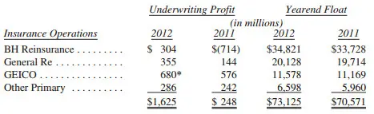

-
- 在大型保险公司中，Berkshire留给我的印象是世界上是最好的。1967年3月是我们的幸运日，Jack Ringwalt以860万美金的价格卖给我们两家财产和意外灾害保险公司。
- __管制类资本密集型企业__
我们有两个大企业，BNSF（伯灵顿北方圣特菲铁路公司）和中美能源，它们共同的重要特征区别于伯克希尔的其他公司。因此，在这封信中将其独立成章，并单列出它们在GAAP准则下的资产负债表和损益表的合并财务数据。
这两家公司的关键特征是他们都巨额投资于极长期性的管制类资产，对其长期的巨额债务资金偿付的本息部分，伯克希尔并未提供担保。它们实际上不需要伯克希尔的信用，因为每家企业的盈利能力，都能在即使是恶劣的经济条件下也能充分保证其利息要求。例如，在去年低迷的环境下，BNSF的利息覆盖率为9\.6倍。（我们定义的范围是税前收益/利息，不是EBITDA/利息——这是一种常用的评测方式，但我们认为存在严重缺陷。）同时，在中美能源公司，两项关键因素可确保其在任何经济环境中具有偿付债务的能力：抵御经济衰退的收益能力，源自我们独家提供的主要服务；其巨大而多样性的收入流，使其免受由任何单一监管机构的严重损害。
每一天，我们这两家子公司推动美国经济前进的主要途径是：
★BNSF占全美所有城际间货物运输量的15%（按吨英里来计算），无论是公路、铁路、水运、航运，还是管道运输。事实上，我们比其他任何企业都运输了更多数量的商品，这使BNSF成为美国经济循环系统中最重要的大动脉。同时，BNSF也在以极为节能高效、环境友好的方式运输货物——一吨货物运送500英里，只消耗一加仑柴油——而用卡车完成同样的任务，则需要四倍的燃料。
★中美能源电力公用事业服务所规定的零售客户有10个州。只有一家公用企业服务的州的数量超过中美能源。此外，我们是可再生能源的领导者：第一，在最一开始的九年前，到现在我们占全国6%的风力发电能力。第二，当我们完成三个在建项目时，我们将占美国太阳能发电总量的14%。
这些项目需要巨大的资本投入。事实上，项目完成后我们在可再生能源上耗资将达到130亿美元。我们乐意做这样的投入，如果他们承诺合理回报——在这方面，我们高度信任未来的监管部门。
我们的信心源自过去的经验和知识，在运输和能源上社会将永远需要大量的投资。这是政府对待资本提供者的自利方式，以确保资金持续不断地流向重要的项目。获得监管机构和他们所代表的人的批准，这也是我们运作企业获利的方式。
我们的管理者们必须思考今天这个国家在更远未来的发展需要什么。能源和交通项目可能需要许多年才能开花结果；国家的快速发展实在不能承受能源和运输供应曲线的迟滞。
我们一直在做我们应尽的职责，以确保上述情况不会发生。任何你听到的有关我们国家基础设施日益破败的消息，一般来讲，对于BNSF或是铁路公司是不相关的。美国铁路系统的状态从来没有像现在这样好，这是行业巨额投资的结果。然而，我们不会躺在我们的荣誉上休息：2013年，BNSF将在铁路上投资约40亿美元，几乎是其折旧费的两倍，同时也超过了任何一家铁路公司一年的投入。
我们拥有两位杰出的CEO，分别为伯灵顿北方圣太菲铁路运输公司\(BNSF\)的马修·罗斯，以及中美能源控股公司（MidAmerican）的格雷格·埃布尔。他们是在发展业务上能够同时为他们的顾客和所有者服务的杰出的经理人。我对他们表示感谢，他们也理应得到你们的感谢。下面是他们的业务的主要数据：

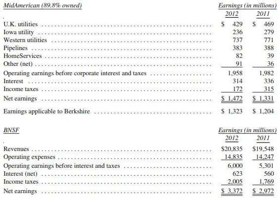

-
- 眼尖的读者会注意到中美能源控股公司的利润表中一个不协调的地方。居家服务公司\-一个房地产经纪业务公司\-出现在这样一个“受监管的，资本密集的行业”报表中，它到底想做什么？
好吧，居家服务公司是我们在2000年买下中美能源控股公司控制权的时候拥有的。在那个时候，我的主要精力集中于中美能源控股公司的公用事业业务上而几乎没注意到居家服务公司，此时这家公司仅仅拥有少量房地产经纪公司。
然而从那之后，这家公司经常性地增加住宅经纪公司\-在2012年增加了三家\-现在它在美国主要城市带拥有约16,000名代理人（我们的房地产经纪公司名单列出在第107页。）在2012年，我们的代理人参与了420亿美元的房屋出售业务，比2011年增长了33%。
另外，居家服务公司去年收购了“Prudential and Real Living ”公司旗下67%的特许经营店，在全国范围内总计为544家经纪公司而且在他们的房屋交易中我们能够得到少量的版税。我们有一个在五年内付清这笔交易余款的安排。在2013年，我们将会逐渐让我们的特许经营商和特许经营公司采用新的名称\-伯克希尔哈撒韦居家服务公司。
在经济低迷时期，罗恩·佩尔提耶在管理居家服务公司上做得非常出色。现在，住宅市场回暖，我们期待收益能够显著提高。
- __制造业、服务业以及零售业__
如果上面的几块业务算是伯克希尔的核心业务的话，那么我们接下来将要提及的相比较而言就算是一些边缘产业了。尽管如此，我们仍有必要对他们的平衡表和损益表打包进行一些总结。

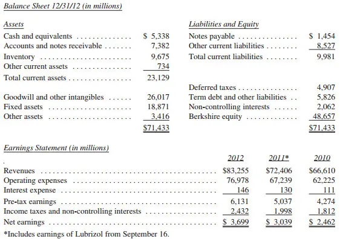

-
- 我们在上表中的收入和支出列支均符合GAAP会计准则，但是费用数据却是经过GAAP准则调整以后的。特别需要指出的是，会计人员删减了一些企业并购时的会计项目，主要是一些无形资产的核销，我们这样做是因为查理和我相信经过调整后的数据能够更加准确的反应实际的费用以及利润。
我不会一一的说明这些调整，因为有些无关大局，而有些却又只可意会不可言传，但是认真的投资人应该了解无形资产的不同性质：随着时间的推移，有一些无形资产，价值也越来越小，而有些无形资产却不会损失其价值。就软件为例，其折旧摊销是非常合理和真实的，可是客户关系这种无形资产能够也和软件一样进行折旧和摊销吗？但是会计准则就规定需要进行折旧和摊销，尽管这种费用并不是真实的。但是GAAP会计准则却没有因为这两种无形资产的不同而规定不一样的会计方法。而即使是最普通的人都能看到的区别，可是在计算利润的时候，上述两种折旧都要作为费用列支在利润表中。
通过GAAP会计准则计算的数字我们已经为大家呈现在年报的29页上，大约6亿美元的摊销被作为费用扣除了。我们认为大约这里面只有20%是上述的那种真真切切存在的价值消失，而我们在上表（未翻译部分）中就是这样调整的，由于伯克希尔的收购活动的增多，这种差异越来越显著。
上述的这种“并不真实存在的”摊销费用也困扰这我们一些主要的投资企业，比如IBM，最近几年，IBM也做了很多小规模的并购，他们在定期报告中也对净利润进行调整，这种调整是在GAAP准则的基础之上调整的。分析师们应该关注这些调整。
然而，富国的 “非真实”摊销费用并没有被公司突出说明过，并且据我所知，它也从来没有在研究报告中被提及过。富国的盈利深受“主要存款摊销“费用的拖累，这意味着这些存款正在以相当快的速度“消失”。然而主要存款定期增加。去年的费用大概是15亿美元。除了GAAP会计准则，没有理由将这笔庞大的费用作为支出项目。
今天的会计课正式结束，为啥没有人喊“再来一个“？
在这一部分里的公司，经营范围从棒棒糖到喷气式飞机，有些业务发展的相当棒，净资产收益率从税后25%发展到超过100%，其他一些在12\-20%之间，但是由于我在资本分配上所犯的错误，有一些业务非常不尽如人意。
50多年前，查理跟我说以合理的价格买入有一个优秀的公司远比以低价买入一个平庸的公司要好，尽管他的看法有无可辩驳的逻辑，但我有时还是会犯“捡便宜”的老毛病，结果有的过得去有的惨不忍睹。幸运的是，我的错误通常都发生在小的收购上。我们的大型收购通常都很成功，在有些案例中，结果甚至更好。
因此，作为一个整体来看，集团里的公司都是很好的业务，他们有226亿美金的净资产并且，在此基础上，取得了16\.3%的税后ROE。
当然，如果买价过高，一个美妙的业务也会成为一个失败的投资，对于我们的大多数的业务，我们付出了大量的相对于有形资产的溢价，这些成本反映在无形资产的大额数字中。但是，总体上我们在这个领域的投资得到了合理的回报。此外，这些业务的内在价值，总体上超过了他们的账面价值\(不错的盈余\)。虽然如此，在保险和受管控行业这种内在价值和账面价值的差异更加巨大，这是大赢家潜伏的地方。
Marmon提供了一个账面价值和内在价值有着清晰和根本差异的样本，让我来解释一下这个差异的奇特来源。
去年，我告诉你们我们已经增持了Marmon的股份，把我们的权益比例提升到了80%（从我们2008年收购时的64%）。同时我还告诉你们GAAP会计准则要求我们在账目中按照远低于实际支付价记录2011年的收购，我花了一年的时间去思考这个诡异的会计准则，但是至今没有找到有任何意义的解释，Charlie，CFOMarc也没有。当我听到说如果不是我们已经持有了64%的股份，我们在2011年收购的那16%股份就要被作为成本计入账目，我更加疑惑了。
在2012年（并且在2013年初 回溯到2012年底）我们增持了Marmon10%的股份，做了同样诡异的会计处理。立刻发生的7亿美元的销账对盈利没有影响，但是确实减少了账面价值，因此也影响了2012年净资产的增长。
按照我们最近收购10%股份的成本计，我们现在拥有的90%Marmo的股权价值为126亿美元。但是，在我们的损益表中90%股权对应账面价值为80亿美元。查理和我相信目前的收购物超所值，如果我们没算错的话，我们持有的Marmon至少要比账面价值高46亿美元。
Marmon是一个多元化的企业，由大约150家分布在不同领域的公司组成，它最大的业务包含罐车租赁业务，将其租赁给不同的运输企业，比如石油和化工公司。Marmon通过两家子公司经营此项业务，美国的Union Tank Car和加拿大的Procor。
联合罐车（Union Tank Car）是家老牌公司，一度为标准石油信托（Standard Oil Trust）所有，直至该帝国于1911年解体。凡列车过处，留意找找“UTLX”徽标——作为伯克希尔的股东，你拥有标有上述徽标的罐车。而当你认出一辆UTLX罐车时，挺挺胸膛，享受那种100年前J\. D\.洛克菲勒看到他的船队时的满足吧。
罐车为承运商或租赁商所有，而非铁路公司。到年末为止，联合罐车（Union Tank Car）和Procor公司共拥有97,000辆车，账面净值40亿美元。值得一提的是，一辆新车的成本不超过10万美元。联合罐车公司也是主要罐车制造商——其制造产品部分用于出售，但大多数为自有，并用于出租。目前，该公司订单已经稳稳地排到2014年。
从圣特菲铁路公司（BNSF）和美联集团（Marmon），我们正获益于美国石油业的复苏。事实上，我们的铁路公司现在每天承运约50万桶石油，占“下48州”（即阿拉斯加及近海以外）石油总量的近10%。所有指标显示圣特菲铁路公司的石油运输将在今后数年突飞猛进。
受时间限制，我们也就不进入该部分其他业务的细节。第76到79页上，有针对地记录了一些较大型公司在2012年的营运信息。
- __金融和金融产品__
这是我们最小的领域，包括两家租赁公司，XTRA（移动房屋）、CORT（家具），以及Clayton Homes，工厂化房屋制造和贷款的行业龙头。除了这些100%控股的子公司外，我们的这类业务还包括一系列金融资产以及Berkadia Commercial Mortgage50%的权益。
由于Clayton拥有33\.2万笔按揭贷款并提供服务，总计137亿美元，我们把Clayton归入此领域。这些贷款中的大部分是为中低收入家庭提供的。尽管如此，在整个地产崩溃时期，这些贷款表现良好，因此也证实了我们的信念——即使是在经济恶化时期，合理的首付以及收支比率应该能避免大规模的止赎损失。
去年，Clayton造了25,872套房屋，比2011年上升了13\.5%，约占美国所有家庭独栋建造量的4\.8%。Clayton的这一市场份额使其成为美国第一房屋建筑商。
CORT和XTRA也是各自行业的领头羊。2012年我们在XTRA用于购买新租赁设备的支出总计2\.56亿美元，是折旧费的两倍多。在对手还在为今天的不确定性发愁的时候，XTRA已经在为明天做好准备。
Berkadia的好业绩还在继续。在这项风险投资中，我们在Leucadia的合作者担当了大多数工作，而我和查理也乐见这样的安排。

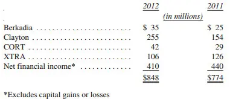

-
- __投资__
下面我们展示截止年底市价超过10美金的普通投资：

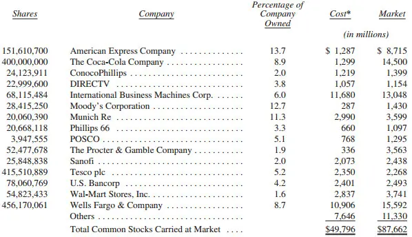

-
- 这里本是指实际购买价格，同时也是税基。会计准则的成本和这里的成本在很多项目上有一些差异，因为会计准则要求对（股票投资）进行增记和减记。
上述股票组合名单中有一点值得一提。在过去的伯克希尔年报中，列在本表中的每一只股票都是由我购买的，也就是由我做购买的决策。但是这张表中的超过10亿美元门槛的许多股票是由T&T两个人分别或者联合决定购买的。比如第一支这样的股票——直播电视公司。2012年末，T&T都在他们各自的或联合的投资组合中拥有这只股票头寸达到了11\.5亿美金。
T&T 也是某些伯克希尔子公司的养老金的管理者。由于监管的原因，其他子公司的养老金由外部人管理。我们未将养老金组合中的持股包含在本年报表格中。尽管他们的投资组合经我们持续消减涉及伯克希尔的类似保险风险假设的衍生品投资组合的仓位（然而，由于经营目的我们继续使用有关电力和天然气业务的衍生品）。新的委托要求我们发布期望最低的担保物，但我们不愿意这么做。市场以超常的方式自然反应。金融世界要求我们随时保持高额的现金，我们没有兴趣把伯克希尔暴露在的一些突发事件中。
查理和我信奉在经营中保持多层的流动性，我们避免了可能吸干我们现金的多种重大的责任。这种思路在100年中有99年会减少我们的回报，在第100年，当其他人失败的时候我们依然健在。且100年来我们夜夜安眠。
我们所出售的用来给我们的公司债券提供信用保护的衍生品将会在明年全部过期。现在我们几乎可以确定我们将会从这些合约中获得超过10亿美元的税前收入。 我们也收到了大量关于这些衍生品的前期付款, 而我们由于这些衍生品所获得的可供我们自由调动的资金\(类似我们由保险业务获得的“浮存金”\) 将会在20亿美元一年,平均年限5年。总的来说,这些金融衍生品给我们的收益让我们感到非常满意,尤其是考虑到我们通过这些衍生品保护了我们的高收益公司债的信用风险,并且是当市场处于恐慌,经济正在衰退的时刻。
我们最大的衍生品头寸是出售了关于美国,英国,欧洲,和日本的主要股指的长期看跌期权\. 这些合同在204\-2008年间被售出并且只有很少的担保要求,哪怕是在市场环境最坏的时候\. 在2010年我们结清了10% 的头寸并获得了2亿2千2百万美元的收益。 剩下的合同将会在2018到2026年间到期。 我们的对赌方没有提前清算头寸的权利,而只有指数在合同截止日期的表现才能决定我们收益。
我们剩下的这些头寸给伯克希尔带来了42亿美金的期权权利金。 如果这些头寸都在2011年被终止,我们将会付出62亿美元, 而如果是2012年,这个数字将会是39亿美元\. 由于应付账款的大幅下降,我们把基于GAAP准则的负债从2011年的85亿美元下调到2012年的75亿美元\. 尽管我们不能保证这点,但我和查理芒格均认为我们最后的应付账款将会比现在记录的少很多\. 与此同时,我们也将把这些期权权利金投资于我们认为合适的地方。
自行车,要啥自行车啊?\.\.\.\.不对, 我说的是报纸
在过去15个月里，我们以3\.44亿美元收购了28家日报。可能有两个原因让你们有些迷惑。第一，在以往的致股东信和年度股东会中，我已经告诉过你们，报纸行业的发行量、广告和利润将一定会下降，这个预测至今仍然不变。第二，我们买入的这些资产也远达不到我们所要求的规模标准。
我们能够容易地解释第二点。查理和我热爱报纸，若她们的经济价值合理，我们会出手收购他们，即使他们远不符合我们的规模门槛，他们是些小公司。关于第一点，需要我提供详细的解释，包括一些历史。
新闻，简单说，是一种人们不知道的但他们想知道的东西。人们会去寻找并购买新闻\-\-\-对他们来说重要的新闻—从最好整合了及时性,方便得到的程度,可信度,综合性,和低成本的来源处购买\.这些因素的相对重要性因人而异，并由于新闻种类不同而有所变化。
在电视和互联网之前，报纸是大量新闻的主要来源，因此对绝大多数民众来说保重是必不可少的。无论你感兴趣的是国际新闻、国内新闻、地区新闻、运动新闻，还是财经新闻，你的首先的消息来源一般都是报纸。事实上，你买的报纸包含了如此大量的你希望去了解的信息，使得你感觉很值得，哪怕一份报纸中只是几页符合你的兴趣。更好的是，刊登广告的人通常会为所有这些页面的付款，从而降低成本并使读者得到实惠。
此外，广告本身也提供了对于大量读者来说很感兴趣的信息，以致会产生更多的“新闻”。对于许多读者来说，知道哪些部门和职位在招聘，哪些超市在搞促销，哪些电影在何时何地上映，远比编辑们写的社论观点更重要。
反过来说，地区报纸对广告客户来说也不可缺少。如果西尔斯百货和西夫韦百货商店在奥马哈开了商店，他们需要一个渠道去告诉城市居民为什么今天应该去逛逛他们商店。事实上，大的百货商店和杂货店争先恐后的去刊登大幅广告，是因为他们知道刊登了这些广告的商品会卖得不错。没有其他的媒介能够与报纸相提并论，因为报纸能从广告获得双重收益…打广告的人会为了广告而付钱,大家也购买报纸以获得广告上的信息。
历年来，几乎所有城市都变成只剩一家报纸（或者2家竞争性的报纸合并成一家来经营）。这种报纸数量的减少是不可避免的，因为人们希望只订阅一家报纸。但竞争存在时，在发行量上有明显优势的报纸自然会获得最多的广告。这样会出现广告吸引读者和读者吸引广告的的良性循环。这种共生过程会导致弱势报纸的死亡，正所谓“胖者生存”。
现今，世界已经改变了。股票市场行情和大型体育比赛的信息在开始新闻出版前就变成了旧闻。互联网提供了广泛的关于找工作和找房子的信息。电视给观众轰炸各种政治的、地区的和国际的新闻。在一个接一个受众感兴趣的领域，报纸已经失去了他们的首要地位。当随着他们的受众减少，他们的广告也跟着减少了。（“员工招聘”广告收入\-曾经作为报纸的一个主要收入来源\-在过去12年来已经下降了90%。）
然而，报纸继续在社区新闻中占据着统治地位。如果你想知道你的城镇正在发生什么，无论这新闻是关于镇长或税收或高中的橄榄球\(在美国高中足球是社区参与度非常高的一项运动\)，没有消息源可以替代地区报纸做这个事情。一位读者可能会在看了两个关于加拿大关税或巴基斯坦政治发展的段落后，移开去阅读关于自己和邻居的故事直到看完。只要是在一个居民有着社区医师的地方,提供社区所需要的特别信息的报纸，对大部分居民来说，将是不可缺少的。
然而，即使一个有价值的产品，也会因为一个错误的商业策略而自我破坏。过去十年，这样的过程已经在几乎所有具有一定规模的报纸上发生了。出版商们,包括伯克希尔在纽约州水牛城都用的报纸，都已经在互联网上免费提供报纸,而反而为化石般的纸质报纸收取高额费用。这样怎么不会导致印刷报纸的销量锐减呢？下降的发行量导致报纸对广告客户来说变得越来越不重要。在这种情况下，过去的“良性循环”反转了。
华尔街日报早就以付费模式经营。而地区性报纸的典范是阿肯色民主公报，出版商是沃尔特霍斯曼，沃尔特也是早就采用一种付费模式，过去十年，他的单张报纸被阅读人数\(平均每份报纸被阅读的次数\)已经远超国内任何一家大型报纸。即使有沃尔特这样的榜样，也只是在过去的几年中才开始有其他报纸\(包括伯克希尔的\)，开发付费模式。到底如何才能最有利润地运营一份报纸\-究竟是什么还不清晰\-将会被大范围的拷贝。
我和查理芒格都相信报纸可以为紧密联系的社区提供全面可信的报导, 与此同时一个可行的将报纸电子化的方案也会是保证报纸在长期内可以生存的重要因素\. 我们不觉得减少报纸的内容或者发布的频率将会给我们的报纸带来成功\. 事实上,敷衍了事的报纸将会使订阅我们报纸的人数下降\. 现在一些大城市的报纸已经开始尝试不再每天出版,但这种措施尽管可以在短期内使利润得到提升,在长期内几乎肯定会将报纸变得毫无意义\. 我们的目标是为我们的读者提供让他们感到兴趣和有用处的内容,这样他们就会相应地付钱,无论是纸质的报纸还是网络上的订阅。
支持我们的自信是源于泰瑞\.克罗格为首的团队在奥马哈世界\-赫勒尔德报纸的杰出管理，这个团队具有管理大量报纸的能力。每一份单独的报纸，在封面和编辑方面都是独立的。（我投了奥巴马，在十二份报纸支持总统候选人中，十位投了罗姆尼）。
我们的报纸当然不能从驱使我们的销售额下滑的力量中孤立出来。我们仍然有六份小报保持了2012年销售额没有变化，领先于有经验的大城市报纸。并且，我们全年运作的两大报纸布法罗新闻和奥马哈世界\-赫勒尔德，销售额损失了3%，这个损失仍然高于平均结果。在美国最大的五十份都市报纸中，布法罗和奥马哈世界在家乡范围的发行量中排名居前。
好的发行量并不是运气：要归功于报纸的编辑\-新闻的玛格丽特\.沙利文和奥马哈世界的麦克\.赖利，他们传递的信息对社区感兴趣的读者来说新闻和世界的发行是不可或缺的。（在这里我很遗憾的说，玛格丽特\.沙利文，最近离开我们加入了纽约时报，她得到的工作邀请开出的条件让人难以拒绝。时报这次招聘是相当划算的，祝愿玛格丽特）。
毋庸置疑随着时间的推移伯克希尔在报纸上的现金收入大多是下降的。即使互联网战略也不能阻止这种恶化。然而，从保本的角度我相信它们会达到或者超过我们收购的经济测试的指标。加以时日的结果会支持我们这个信念。
然而我和查理仍然会按照经济规则第11条（细节见第99页）运营我们的业务，并不会继续运营任何会无休止亏损的业务。一家我们从一般媒体一揽子收购的其中之一的报纸在这家公司旗下明显不盈利，经过分析我们看到无任何修复的可能，勉强关闭了。其他剩下的报业在很长时间内应该盈利（第108页有列举）。我们会以合适的价格，意味着占我们盈余的很小比例，我们会更多地收购我们喜欢的风格的报纸。
作为伯克希尔报纸运营的里程碑事件是年终时斯坦\.利普西从布法罗新闻出版人的位子退休。可以毫不夸张地说，对我来说如果没有斯坦新闻今天早就不存在了。
我和查理在1977年四月收购了新闻。新闻是一份晚报，主要是工作日发行，没有周末版。全国范围内，发行的报纸倾向于早报。但是，周末版对都市报纸盈利变得更关键。如果没有周末版，新闻肯定会输给早报的竞争对手，周末版是一份优厚的确定的市场份额。
因此我们在1977年晚些时候开始发行周末版。结果是一片混乱，我们的竞争对手向区法官查尔斯\.布瑞恩投诉我们，法官主导了一个很恶劣的条款，很不利于我们报纸的发行。他的条款在长达十七个月后的，第二法院3:0的结果被翻转了。但是这个上诉依然悬而未决，我们丧失了发行量，金钱流失，处于会失去这个业务的危险中。
后来斯坦\.利普西加入了，他从60年代就是我的朋友，他和他妻子把一份小的奥马哈周报卖给伯克希尔。我发现斯坦\.利普西是一个杰出的办报人，拥有发行，印刷，销售，编辑等各方面的知识。（他是奥马哈周报在1973年获得普利策奖的关键人物）。因此当我在新闻遇到了大麻烦时，我让斯坦\.利普西离开了奥马哈舒适的生活，加盟了布法罗。
斯坦\.利普西从没有迟疑过，和我们的编辑布瑞\.莱特一起，维持了四年辛苦的黑暗的日子，直到1982年新闻打赢了这场战役。从此以后，尽管布法罗经济很困难，新闻的表现意外地好。作为朋友和经理人，斯坦\.利普西无疑是最好的。
不少伯克希尔的股东，包括一些我很好的朋友，都希望伯克希尔发放分红。他们为我们一方面希望自己持有的股票分红，另一方面我们自己的公司却从不发分红而大感疑惑。那么何时分配股利何时保留盈余最有利于股东利益呢？
盈利的公司有多种处理盈余的方法（互相之间并不排斥）。公司管理层首先需要检视对现有业务再投资的可能性——提高效率，开拓市场，延伸或改造产品线，再或者拓宽使公司领先于竞争对手的护城河。
我总是要求我们分公司的管理层始终专注于寻找拓宽护城河的机会，而他们也都发现这招确实有用。但有时管理层的投资也会哑火。常见的失利原因是管理层预设了一个他们想要的答案，然后反向寻找支持证据。当然了，整个过程都是下意识的；这也使之更加危险。
你们的主席我也未能独善其身。在伯克希尔1986年的年报中，我写道我们在原纺织业务上二十年的经营管理和资本性改良纯属无用功。我希望该业务成功，并在美好的愿望中做出了一系列糟糕的决策。（我甚至并购了另一家英国的纺织品企业。）但美好的梦想只在迪士尼电影中方能实现；梦想是生意的毒药。
过去固有如此的失误，我们对可支配资金的第一选择仍然是再投资于现有业务中。我们破纪录的120\.1亿的固定资产和2012年的后续并购显示这是资产配置的一片沃土。此处我们还有一个优势：鉴于经营日久，我们拥有比其他公司更大的选择范围。采取此种策略，我们得以滴水浇花，免于浪费于野草。
在将大笔资金投资到现有业务中之后，伯克希尔仍然持续产生大量现金。因此，我们的下一步就是寻找与现有业务无关的并购机会。我们的标准非常简单：Charlie和我是否认为我们的并购行为可以让股东更富有。
我曾做过很多失败的并购决策也会做更多，但总体来说，我们的投资表现还是让人满意的，这意味着将资金用于并购相较于发放分红或股票回购让股东获利更多。
但是，用老一套的免责声明的话说，过往表现不保证未来回报。对伯克希尔尤其如此：我们现有的规模让我们寻找有意义有价值的并购机会比以往大多数时候都更难。
虽然如此，很多交易仍然提供了增加每股内在价值的大好机会。BNSF是现时一个绝佳例子：其市场价值大大超过了账面价值。若非将资金用于此项并购而是分红或回购，你我的境况将差的多。虽然像BNSF这样的大笔交易并不常见，但海里终究还有大鱼。
资金的第三种用途回购，在股价远低于保守估计的内在价值时很有意义。事实上，有计划的股票回购是资金运用最稳妥的方法：用80美分购买1美元总不会错。我们在去年的报告中阐释了回购的准则，同时，若机会显现，我们会大量回购。我们原本承诺回购成本不会超过股票账面价值的110%，但这被证明不切实际。因此，当有机会以116%的账面价值达成一大笔交易时，我们就在12月将此项限制提升至120%。
但是，永远不要忘记：对再回购来说，价格是最重要的。如果购买价格高于内在价值，\(我们股东的部分\) 价值被摧毁。董事们和我都相信，长期投资者会从我们设立的120%回购上限中合理的受益。
下面让我们谈谈分红。这里我们要做一些假设，还要稍微计算一下。这些数字需要大家仔细的阅读，但它们对于你们理解这个关于分红的例子非常重要。所以忍耐一下，我们这就开始吧。
假设你和我两人共同拥有一个账面总值200万的生意（一个虚拟公司），而我们拥有相同的股权。现在这公司，包括以后我们预计再投资于此的钱，都将赚取平均一年12%的净值回报，即24万。另外，现在有其他投资者愿意以1\.25倍净值的价格随时购买我们的资产。于是，你和我每人拥有的股权大约值125万。
你希望将每年新赚取利润的2/3 再投资，并分掉剩下的1/3。你觉得这可以很好地平衡你的资产增长和现金收入。于是你建议，将这生意每年带来24万的盈利中的8万作为分红发给股东，另外16万再投资维持未来的健康成长。这样第一年你将有4万分红。随着再投资的进行，这项生意将以12\-4=8%的速度成长，与此同时股东收到的分红也将以同样速度增长。
十年以后，我们的公司将值4317850元，即原始的200万乘以1\.08的十次方，同时你的分红将达到86357，这是4万乘以1\.08的十次方。我们每个人将有价值2698656元的股权，这是前面提及的431万的一半的1\.25倍。如此，我们应该会很快乐地生活下去，因为大伙的分红和股权每年都将以8%的速度复合增长。我们给它个名字，叫“分红策略”。
不过，还有另外一种办法，或许能让我们更加开心。我们可以把所有利润留存，但每年将我们股权存量的3\.2%卖出。因为股价是账面价值的1\.25倍，这么做也将给我们带来4万的初期现金回报（125万\*0\.32%）。我们姑且称其为“卖出策略”。
在这种卖出策略下，我们公司的净值十年后将增长至6211696，这是200万乘以1\.12的十次方。因为我们每年卖出3\.2%的股权，十年后我们还各自拥有36\.12%的股权（另外的34%在这十年中被等比递减地分批卖出）。虽然不再100%控股，你拥有的账面价值将为2243540，大约是621万的36\.12%。记住，账面的每一块钱都可以以1\.25元卖出，所以你持有的股权价值2804425。（看到没，有着同样的起点和分红额，）这个“卖出策略”在十年后能给你带来比“分红策略”多大约4%的股权。
你看，根据“卖出策略”，你每年收到的钱也将比“分红策略”以多4%的速度增长。哇，你将有更多的现金和更多的股权资产！
当然了，这种计算方法的前提条件是，12%的年复利增长和能持久的1\.25倍PB。现实中，SP500的公司能以远高于12%的速度赚取资产，也能以远高于1\.25PB的价格售出它们的股权。因此，看上去，我们之前的两个假设条件对伯克希尔而言算是合理的，虽然我们不敢对此做100%担保。
另外可以想象我们的假设数据有可能被超越。当现实超越我们的估算假设时，我们的“卖出策略”会更有利。看看伯克希尔的历史，我们知道辉煌再也无法重现，“卖出策略“很明显会给股东们带来远远超越“分红策略”的回报。
撇开这一堆令人欣喜的数字，还有两个重要的理由来支持我们的“卖出策略”。第一，对于所有股东来说，分红是“强制性”的，也就是说，如果我们决定拿40%的年盈利分红，那些希望更多或更少分红的投资者就不太高兴。多达60万的投资者对现金有着各种各样或高或低的期待，稳妥地说，其中有很多甚至大部分人，每月都是能存下一些钱的，那么自然的，他们也不希望（伯克希尔）有任何的分红。
另一方面，清仓的选择，则让投资者自行决断，是获利现金了结还是资本增加。某个股东可能选择提走60%的年收益，另一个股东可能选择20%甚至完全不提。当然，一个股东在我们的红利派付情境下可以转而用红利买入更多的股份，但是他会受到一些损失：会有税的产生和25%的溢价费用（记住，开放市场的股票购买价格是帐面资产的125%）
红利方式的第二个弊病也同样值得重视：税的影响对于所有纳税的股东来说是都是次要的，对于那些选择清仓的则影响更小。在红利模式下，每年股东所收到的现金都要被征税，然而在清仓模式下，只有赢利部分需要交税
让我来完成这个数学游戏\-我几乎可以听到你们如释重负的欢呼声\- 我想用我个人的例子来说明一个股东如何可以在减持股份的同时得到在其投资企业中投资增加的效果。过去的7年里，我每年放弃我的伯克希尔股份中的4\.25%。在这过程中，我原有的712497000股B股股份拆股调整后减为528，525，623股。很明显我对公司所有权的占有比例显著下降。
但是，我在公司的投资其实是增加了。我现在在伯克希尔公司中的帐面资产远超7年前在我名下的帐面资产。（从2005年的282亿美元到现在的402亿）。换句话说，虽然我在公司中的所有权下降，但是我在伯克希尔公司中有更多的钱为我工作。而且我所拥有的股份的内在价值和公司的盈利能力比起2005年有了极大提升。随着时间推移，我认为这种增值仍将延续 \- 尽管一定会是以一种不规则的状态\-尽管我现在每年放弃4\.25%股份（这个比例的增加是因为我近期加倍了对于某些基金会支持的承诺）
综上所述，红利政策应该总是清晰，连贯和理性的。反复无常的政策会迷惑股东，也会让那些潜在投资人远离。费雪54年前就在他的＜普通股和不普通的利润＞第七章完美的总结了这点。这本书在严肃投资者的最佳书单上仅排在＜聪明的投资者＞和1940版的＜证券分析＞之后。费雪在书中指出你可以成功的经营一家汉堡餐厅或者是一家特色中餐馆，但你绝不可能二者兼而有之而又同时都拥有食客的支持
大多数公司持续支付红利，通常试图每年增加而不愿削减。我们的＂四大＂组合中的公司也遵循这一明智而又好理解的方式。而且在某些条件下，愿意积极回购股票。我们都赞同他们这些做法，希望他们继续现在的方向。我们喜欢增加红利派发，也爱合理价格回购股票
但是在伯克希尔，我们一贯坚持的是另一条路径，我们认为这条路一直以来是明智的，我们希望你们通过阅读以上所述也明了其义。只要我们坚信我们对于帐面价值的增加和市场价格溢价的假设合理，我们就会继续坚持这个政策。如果这两个因素中任一明显变恶，我们会重新考量我们的决策。
- __年会__
年会将在5月4号，星期六开始，地点在世纪互联中心。Carrie sova 总负责。（虽然看起来是个新名字，其实仍是去年那个优秀的carrie。她刚刚嫁给一个幸运的男士）所有我们总部的团队都会协助她，整个活动都是我们公司自己操办，我为所有参与其中的员工由衷的感到骄傲
我们将在早上7点开门,7点半我们将开展我们的第二届国际报纸投递挑战赛。目标将在克雷顿之家（Clayton Home）的门廊,精确来说从投掷线算起有35英尺。去年我成功的打败了所有的挑战者。但是如今伯克希尔已经收购了一大批报业公司，与之同来的有很多的报纸投递高手\(当然投递索赔也是\) 。来看看他们的才能是否有他们说的那么好。最好你也加入进来。这些报纸有36至42页,你必须自己把他们折起来。\(不准用橡皮筋\)
早上8点半，一部新的伯克希尔电影会上映。一个小时以后,我们将开始问答阶段，这将会持续到下午3点半\(其间会有在CenturyLink的看台休息吃午饭\)。在短暂的休息之后，查理与我将会在3点45分召开年度会议。如果你决定在白天的提问时间离开,请在查理说话的时候溜走：）
最好的退出理由当然是购物。毗邻会议区，一个占地达19万4300平方英尺的大堂里会放满伯克希尔旗下数十家企业的产品，我们就这样帮你购物的。去年,在你购物的时候，大多数地点都创下了销售新纪录。在9小时内我们卖出了1090双Justin靴子\(算起来30秒卖出一双\) ，10010磅的诗喜糖果，12879把Quikut小刀\(每分钟售出24把刀\) 与5784双Wells Lamont手套\(那一直卖得很好\)。但你可以做的更好。记住，那些说金钱不能买幸福的人甚至还没有在我们的年会上买过东西。
去年，Brooks，我们的跑鞋公司，在第一次展览时就获得了15万美元的销售。Brooks现在火了，其销售额在2012年增长了34%，紧跟在其2011年约34%的增长之后。公司的管理层预计2013年销售额还能再提升23%。我们将再次有一款特殊的纪念性跑鞋在年会上供应。
周日早上8点，我们开启了“伯克希尔5公里”活动，一场从Century Link开始的跑步比赛，参赛的所有细节会可见于来宾手册。你在收到你的会议邀请函同时会收到这本手册。我们将会有各类比赛，包括一个对于媒体的比赛。\(当他们报道自己的表现时一定会很有趣\)。遗憾的是，我会错过这项跑步比赛，因为某人不得不去打响发令枪。
我得给你们提个醒，我们有很多土生土长的人才。Ted Weschler的马拉松纪录为3小时1分钟。Jim Weber，Brooks跑鞋公司的CEO，另一位体力充沛的跑步健将，有着3小时31分的记录。Todd Combs 的专长是铁人三项全能，但他在5公里项目上有着22分钟的记录。
然而，这仅仅是开始：我们的管理者也是跑步健将（或者说，我们这些管理者中的一些也是）。Steve Burke在波士顿马拉松赛的成绩是2小时39分。（这是他们家特色：他的妻子，Gretchen，在3小时25分内完成了纽约马拉松赛）。Charlotte Guyman的最好成绩是3小时37分，Sue Decker在纽约跑了3小时36分。至于查理，他没有回复我给他的问卷。
GEICO将会在购物区设个摊，由其在全国各地的顶级顾问们负责。插一句，在多数情况下，GEICO会给你一个股东优惠（通常为8%）。在我们运营的51个地区中有44个区可以享受这个特别的优惠。（加一点：这个优惠不可以与其他优惠同时享有，假如你已经享受到另一个优惠，比如给予某些特殊群体的）。带上你现存保险的细节，我们来看看是否能帮你省钱。你们当中有至少一半以上的人，我相信我们能够帮到。
你一定要去Bookworm店里走走。它会带来35种书籍及DVD产品，包括一些新书。Carol Loomis，自1977年来就在帮我修改这封信，对我提供了无价之宝的帮助，最近写了《踏着踢踏舞去工作：沃伦巴菲特和他的一切》\(Tap Dancing to Work: Warren Buffet on Practically Everything\)。她和我已经一起签了500本书，只有在会场专卖。
《外界》The Outsiders，由William Thorndike,Jr\.撰写，是一本杰出的好书，是关于CEO如何在资本配置方面达到出色业绩。Tom Murphy，是我所见到过的最好的商业管理者，在这本书中写了有洞察力的一章。我也推荐Jack Bogle的《文化的冲撞》The Clash of the Cultures与Laura Rittenhouse的《从字里行间间挖掘投资机会》（Investing Between Lines）。如果你需要运输你买的书，附近就有一家能提供物流服务。
Omaha World\-Herald将会再设一个摊，提供其最近出版的几本书。活跃的Huskers粉丝，（哪一个内布拉斯加州人不是他的粉丝呢），将会想买一本《不可战胜》（Unbeatable）。它讲述了内布拉斯加州橄榄球在1993\-97的故事，那个黄金时代里Tom Osborne的队伍赢得了60胜3负的战绩。
如果你很能烧钱，或有打算这样做，周六中午至下午5点来奥马哈机场东面的Signature Aviation。在那里我们会有一队NetJets飞机供你来爽一把。你可以坐巴士来，开私人飞机走，活着不就要享受一下嘛。
代理投票材料的附件中有报告，可以告诉你如何获得进入会场与其他活动的邀请函。这周到伯克希尔航线价格已经大大上涨。如果你从远方来，可以比较飞去堪萨斯城与直飞奥马哈的成本。这两个城市之间的车程在2个半小时，你也许可以省不少钱，尤其如果你打算在奥马哈租车的话。和我们一起省钱吧。
在 Dodge路与Pacific路之间的 72号大街，有着77英亩的土地，上面坐落着内布拉斯加州家具市场，我们在那儿会再次举办“伯克希尔周末”的打折活动。去年这家店在会议期间的销售额达3590万美元，是一项划时代的记录，帮助其他零售商盈利。为了获得伯克希尔的折扣，你必须在4月30日周二至5月6日周一之间（包含这两天）的这段时间购物，同时也必须出示你的邀请函。这段时间的特殊折扣甚至适用于好几家知名生产商的产品，通常是不给打折销售的，但出于股东周末的考虑，给予你一个例外。我们感激他们的合作。内布拉斯加州家具市场的营业时间是周一至周六早上10点至晚上9点，周日是早10点至晚6点。今年的星期六，从晚上5点半到8点，家具市场会举办一个野餐会，你们都会被邀请的。
在伯克希尔，我们会再次开展两个股东独有的活动。第一个是鸡尾酒招待会，从5月3日周五晚上6点至9点。第二个是大型庆祝活动（main gala），5月5日周日早上9点至下午4点。在周六，我们会开到晚上6点。最近几年，我们三天的销售额已经超过了12月的所有销售额，通常是jeweler的最好月份。
周日下午1点，我会在Borsheims开始我的慈善午餐拍卖会。去年我的销售额累计到150万美元。今年我会坚持到200万美元。因为我需要在日落前好好的离开，我会拼命努力的。来占我便宜好了。为“疯狂的沃伦”开个价吧。
整个周末我们在Borsheims有巨大的人群。为你的方便考虑，股东优惠价从4月29日周一至5月11日周六都可以。在此期间，请出示你的参会邀请函或证券单据来证明你是伯克希尔的股东。
在周日，Borsheims外面的大厅，蒙住眼睛的 Patrick Wolff，两次美国象棋冠军，会带着所有的来宾，让他们大开眼界，在六个人的群体。Norman Beck，一位来自达拉斯的魔术师，会震撼观众。此外，我们会邀请Bob Hamman与Sharon Osberg，两位世界顶级桥牌大师，在周日下午与我们的股东玩桥牌。不过别和他们玩牌赌钱。
5月5日周日Gorat家与 Piccolo家两家餐馆会再次向伯克希尔的股东开放。他们会服务到晚上10点，Gorat家下午1点开门，Piccolo家4点开门。这两家餐馆都是我的最爱，周日晚上两家我都会去光顾。记住，要在Gorat家预定，4月1日起拨打402\-551\-3733，Piccolo家电话是402\-342\-9038。在Piccolo家可以点一个“大屋顶啤酒冰淇淋”作为饭后甜点。只有修女才会点小的。我曾经看到比尔盖茨在一顿晚饭后干掉大屋顶，那时我认识到他会成为一个伟大的管理者的。
我们再次会有三位相同的经济记者主持会议的问答环节，他们会向查理和我提出股东通过电子邮件发来的问题。他们及他们的电子邮箱地址是：Carol Loomis，财富杂志，cloomis@fortunemail\.com；Becky Quick， CNBC，BerkshireQuestions@cnbc\.com,和Andrew Ross Sorkin，纽约时报，arsorkin@nytimes\.com
那些被提交的问题中，每一个记者将会选择六个他（她）认为最有趣和重要的进行提问。他们过去的选择已经告诉我那些简洁，提交时间较早，和伯克希尔相关的问题（请记住，每封电子邮件最好不要提出超过两个问题）最有可能被选中（在您的邮件中，请告诉记者如果问题被选中，您希不希望自己的名字被公开）。
去年我们邀请了一个由三名研究伯克希尔的分析师组成的分析师团队，但是由于他们三人都是保险业的专家，所以很多股东在会后表示希望今年的分析师团队能够更加多元化一些。因此，今年我们将只邀请一名保险行业的专家：来自野村证券的Cliff Gallant。除了他以外，来自Ruane,Cunniff & Goldfarb的JonathanBrandt将会被邀请到今年的分析师团队对非保险业务进行提问。
最后，为了让整个提问过程变得更为给力，我们希望能够有一位看空伯克希尔的分析师加入到分析师团队中，如果是已经开始在做空伯克希尔的那就更理想了。尽管此前从来没有过对伯克希尔的前景看空的论调，我们仍然希望能找到这样的分析师。对这位分析师唯一的要求是你是一位投资专家并且看空伯克希尔。三位分析师将会提出他们自身对于伯克希尔的疑问，同时，记者和其他参会者也将会交替对他们发问。
我和查理相信所有的股东都能在同时获得伯克希尔的信息，并且拥有充足的时间去分析它们，而这也是为什么我们在周五收盘之后公布去年的年度报告，并在周六举行年度股东大会的原因。我们不会一个一个去告知大型的机构投资者或者分析师。我们希望记者和分析师所提出的问题能够帮助伯克希尔的股东进一步理解他们对伯克希尔的投资。
我和查理将不会获知那些即将被问及的问题的细节。我们也知道记者和分析师将会提出很有水准的问题（有些甚至会让我们难堪），可是那正是我们所希望看到的。总的来说，我们希望能被问到至少54个问题，其中每个分析师和记者将提出6个，剩余的18个将由其他股东大会参与者提出。如果有多余的时间，我们允许与会者提出更多的问题。那些有权提出问题的其他与会者将会被选择并在早上八点一刻通过十一个布置在主会场和分会场的麦克风宣布。
我时常对旗下运营经理所取得的成就进行褒奖是有充足理由的：他们都是这一行的精英，并且把他们所经营的生意当成他们家族唯一的资产一样来对待。我确信他们拥有和大多数大型公众公司相同的“以股东为导向”的信念。他们中的大多数人已经实现了财务自由，对他们而言，享受运营好一家公司的乐趣并不低于支票簿上的数字所能够带来的快乐。
当然，另外23名与我在公司办公室共事的员工（我们都在一层楼层办公，这是一个我们一直在维持的工作传统）也是同样出色和重要的。
这个团队高效率地去应对证券交易委员会和其他监管机构繁杂的监管要求，发布了21,500页的联邦，州立以及海外营业税返还，回复数不清的股东及媒体要求，制作公司的年度报告，准备公司一年一度最大规模的股东年会，协调董事会的活动并且年复一年日复一日地重复着上述繁杂的工作任务。
他们以一种欢欣的态度和令人难以置信的效率去处理上述一切事宜，从而让我的生活变得轻松和快乐。他们还将精力花在与伯克希尔的业务非直接相关的事务中：去年他们接待了48个学校的代表（他们是从200多个申请学校中选拔出来的）——他们来到奥马哈参加和我的问答日活动。除此之外，他们还着手处理一切我所收到的请求，安排我的行程，甚至给我订购午餐吃的汉堡。作为一个CEO，还能要求有更多吗？我感觉每一天自己都是开心到跳着踢踏舞去上班的。
企业的职员和我们的运营经理，请接受我最真挚的感谢，你们配的上这些称赞。5月4号，请来奥马哈——资本的摇篮——并且为我助阵。

## 二零一三

__二零一三__

-
- __经营业绩__
2013年，伯克希尔的净值增长了342亿美元。这是抵消了18亿美元的账面冲销后的数据，账面冲销源于我们购买Marmon和Iscar的少数股权——这些冲销没有实质上的经济意义，我后面会解释。扣除上述摊销费用后，伯克希尔的A级和B级股票每股账面价值增长了18\.2%。过去的49年（即从现任的管理层接手以来），我们的每股账面价值从19美元增长到134,973美元，复合增长率19\.7%。
封面上是我们的业绩衡量标准：每年伯克希尔每股账面价值的变动和标普500指数的比较。当然真正有意义的是每股内在价值。但内在价值是一个主观的数字，每股账面价值则是内在价值一个有用的参考。（关于内在价值，更详细的讨论请参考我们的股东手册103‐108页。30多年来，这些原则一直印在我们的股东手册上，我们希望新加入的以及有兴趣成为股东的投资者都阅读这部分内容。）
我已经说过，伯克希尔的内在价值远超账面价值。并且两者之间的差距近年来显著扩大。这也是我们在2012年以账面价值120%的价格回购公司股票的原因。在这个价位回购股票有利于继续持有的股东，因为公司的每股内在价值超过了账面价值一大截。2013年我们没有回购股票，原因是股价一直没有掉到账面价值120%的价位。要不然我们会积极回购的。
公司的副董事长，我的合伙人，查理·芒格和我都相信，在市场下跌或者上涨缓慢的年份，伯克希尔的账面价值和内在价值增速都会战胜标普指数。在市场强势上涨的年份——比如刚刚过去的2013年，我们一般会暂时落后。过去49年里，我们曾有10年跑输市场，其中只有一次标普指数上涨不到15%。
2007‐2013年这个周期里，我们成功跑赢了标普指数。在未来的周期中，我们也一样会跑赢市场。如果没有做到这一点，我们将愧对于自己的工资。因为大家始终可以买一只指数基金来获得和标普500一样的收益。

运营方面，过去的一年结果很不错——某些方面甚至非常棒。请看下文：
我们完成了两项大型收购，花了180亿美元完全买下NV Energy，以及亨氏（H\.J\.Heinz） 的大笔股权。两家公司和我们都非常契合，而且它们的生意都还会红火一个世纪。
在亨氏的收购中，我们创造了一个未来伯克希尔可能还会使用的合作模式。具体来说，我们和3G Capital的投资者合作完成了收购。3G Capital是由我的朋友Jorge Paulo Lemann 领导的一家公司。他的天才合伙人——Bernardo Hees，亨氏的新CEO，以及Alex Behring，公司的董事长，将会负责公司未来的运营。 伯克希尔扮演的角色是财务合伙人。作为财务合伙人，我们花80亿美元买下了亨氏分红率9%的优先股，并且有权利将每年优先回报提高到12%。同时伯克希尔和3G分别出资42\.5亿美元各买下亨氏一半的普通股。
我们对亨氏的收购看起来和“私募股权”投资的交易非常相似，但是有着本质的不同：伯克希尔不打算卖出公司的任何股份。我们喜欢的是购买更多的股份，而且那很可能发生：3G的部分投资者将来会把他们的股份转让给我们，于是我们可以提高持股比例。另外，伯克希尔可以和3G协商，在未来某个合适的时间，在对双方都有利的情况下，将我们的优先股转换为普通股（以当时一个合理的估值）。
去年6月，我们的合作伙伴接手了亨氏，业绩喜人。但是在伯克希尔的报表上，来自亨氏的利润很小，这是由于收购和业务重组形成了13亿美元的一次性摊销。2014年的业绩数字就会变得非常明显。有了亨氏以后，世界500强公司里，伯克希尔已经拥有了8\.5家公司（忽略关联关系将它们看作独立的公司）。现在还剩491\.5家等着我们。
NV Energy，由中美洲能源以56亿美元买下，隶属于我们的公共事业板块，为内华达州88%的人口供电。这笔收购和我们现有的电力事业相辅相成，并且给我们在可再生能源的几个大项目提供了许多机会。NV Energy不会是中美洲能源的最后一个大型收购。
Mid American Energy（中美洲能源）是我们的“五驾马车”之一——我们最大的5家非保险公司。2013年中美洲能源税前利润创纪录地达到108亿美元，而2012年仅有7\.58亿。其他的4架马车分别是BNSF（伯灵顿北方圣特菲铁路公司）、Iscar（伊斯卡） 、Lubrizol（路博润） 和Marmon 5架马车中，只有中美洲能源是9年前伯克希尔就已经拥有的，当时它税前利润3\.93亿。后来，我们相继以现金收购了另外3家。收购第五家，也就是BNSF的时候，我们支付了70%的现金，剩余部分通过增发股票支付，这样我们增发了6\.1%的股份。换句话说，现在5驾马车每年贡献给伯克希尔的104亿利润，而我们的股票这9年来却只有轻微的稀释。这与我们不单单追求增长，而是要追求每股价值的增长这一目标相符。
如果2014年美国经济继续恢复，我们预计5驾马车的利润也会随之增长——大致会增加10亿美元左右。
非保险业务里，我们其他小一些的公司税前盈利从2012年的39亿增长到今年的47亿。预计2014年它们也会持续增长。
2013年，伯克希尔最重要的保险业务再次实现了承保盈利——这是连续承保盈利的第11个年头了，浮存金也还在继续增加。11年来我们的浮存金——那些不属于伯克希尔，但是我们可以投资并为伯克希尔赚取收益的钱，从410亿增加到了770亿。
与此同时，我们累计实现了220亿税前承保利润，其中2013年30亿。而这一切，都起始于我们1967年以860万美元收购了National Indemnity。
现在我们已经拥有多家卓越的保险公司。最为人所熟知的，GEICO, 由1955年伯克希尔完全收购的车险公司（在那之前很多年我们就持有它部分权益了）。1996年GEICO在美国车险企业里排名第七。现在它排第二，刚刚超过了Allstate。它惊人增长的秘密其实非常简单：便宜的价格和可靠的服务。大家应该打客服电话1‐800‐847‐7536，或者登录Geico\.com，看看GEICO的产品是不是能帮你节省一些保险支出。省下来的钱可以买些其他伯克希尔的产品。
查理和我一直在猎象，我们的公司也在不断进行补强型收购。去年我们一共有25笔，总计31亿美元的此类收购。这些收购从190万到11亿美元不等。查理和我都支持这些收购。它们把资本用在了契合我们现有业务的地方，并且将由我们优秀的经理人团队管理。结果就是，我们不用干活，大家却在赚钱。未来还会有更多类似的补强型收购。整体而言，它们带来的意义非凡。
去年我们投资了35亿，用于确定无疑的补强型投资：购买了两家我们已经拥有控制权公司的剩 余股权。第一个是Marmon，根据2008 年的协议我们获得 了Marnon 100%的权益。另一个是Iscar，Wertheimer家族决定行使它的卖出权，将其持有公司的20%股份转让给我们。2006年我们已经获得了公司的控制权。
两笔收购让我们增加了3亿的税前利润，带来8亿的现金流。但是去年的信中已经讲过的，“虚幻”的会计准则要求我们以低于支付金额18亿的价格对它入账，于是减少了伯克希尔的账面价值。（这项费用应该记在“超过账面价值的资本”项目下；一个报表上没有的项目）。大家应该明白，这条怪异的会计要求使得伯克希尔内在价值和账面价值的差距增加了18亿。
2013年，伯克希尔所属企业在厂房、设备上的资本开支达到110亿，几乎是折旧额的2倍。大约89%的钱投在了美国。我们也在国外投资，但是投资机会的主矿脉还是在美国。
去年多数投资经理没能战胜标普500，但是Todd Combs和Ted Weschler轻松做到了。他们各自管理的组合都超过了70亿美元。他们应得的。
我不得不坦白，他们的投资业绩超过了我。查理提醒我应该加上“超过了一大截”。）如果这种令人惭愧的对比继续下去，我就只好闭口不提他俩了。 除了投资赚钱以外，Todd和Ted还在诸多方面为大家创造了价值。他们带来的价值只是小荷才露尖尖角：他们都流淌着伯克希尔的血。
截至年底，伯克希尔的雇员总数，算上亨氏，再创纪录达到了330,745人，比去年增加了42,283人。我得承认，增加的人里包括一名在奥马哈家庭办公室里上班的人。（别慌：一层楼还是足够公司总部的家伙们用了，不挤。）
去年伯克希尔在“四大”上的投资比例都上升了——美国运通、可口可乐、IBM和富国银行。我们增持了富国银行（从2012年底的8\.7%增加到9\.2%）和IBM（从6\.0%到6\.3%）。同时，可口可乐和美国运通的股票回购提高了我们的持股比例。我们在可口可 乐的持股比例 从8\.9%提 高到9\.1%，美国运通的 从13\.7%提高 到14\.2%。如果大家觉得百分之零点几的变动意思不大，那请大家这样估算一下：我们在四大上的投资，每增加0\.1%，伯克希尔每年的利润就会增加5000万。
四家公司都拥有良好的业务，并由聪明而且为股东着想的经理人掌管。在伯克希尔，我们情愿拥有一家好公司非控制性但大比例的持股，也不愿意100%拥有一家普普通通的公司；宁愿拥有希望之星的一部分，也不愿要一整颗人造钻石，同样的道理。以年末的持股比例计算，2013年四大归属于我们的利润44亿。但是在利润表上，我们只报告了分红——大约14亿。但是别犯迷糊：没有报告的30亿利润每一分都和账上报告的一样值钱。
4家公司留存的利润经常被用于回购股票——这将增加未来我们所占的利润比例，或者投资于有利可图的新业务。可以预期，我们在“四大”上的每股投资利润都会不断显著增长。倘若事实的确如此，伯克希尔获得的分红也将随之增加，更重要的是，我们的未实现资本收益也会增长。（截止年底，我们在“四大”上的未实现收益累计390亿美元。）
相比于那些局限于投资自身能够运营的业务的公司，我们在投资上的灵活性——大额进行被动投资的意愿，让我们拥有更多优势。伍迪·艾伦说过，“双性恋的好处就是，周六晚上约会的概率可以提高一倍。”同样，我们即投资可以自己运营的业务，又愿意被动投资，于是我们源源不断的现金找寻到合适投资机会的概率也提高了一倍。
2009年年末，在大衰退的阴影中，我们通过了买下BNSF的决定，伯克希尔历史上最大的收购。当时我把这笔交易称作是“完全下注于美国经济的赌博”。
当然这对我们来说也不是新鲜事了：从巴菲特合伙公司1965年买下伯克希尔以来，我们一直在下类似的赌注。以同样充分的理由。查理和我一直认为“赌”美国长盛不衰，几乎是一件只赚不赔的事。
过去的237年里看空美国的人中谁获益了？如果把我们国家现在的样子和1776年作一个比较，大家一定不敢相信自己的眼睛。而且市场经济的内在机制还会继续发挥它的魔力，美国的好日子还在前头。
趁着顺风，查理和我希望通过以下方式更进一步增加伯克希尔的每股内在价值：1、持续增强各个业务公司的盈利能力；2、继续通过补强型收购来增加它们的利润；3、从我们投资的公司的增长中获益；4、当伯克希尔的股价下跌到相对内在价值有很大折扣时回购公司股票；5、偶尔进行大型的收购。少数情况下，我们也可能通过增发伯克希尔的股票来最大化大家的收益。这些方式都有其坚实的基础。一个世纪内，BNSF和中美洲能源还将继续在我们的经济中扮演重要角色。无论对于公司还是个人，保险业务也依然不可或缺，在这方面，伯克希尔投入的人力和资金超过其他任何公司。
另外，我们依然会保持高度的财务稳健，维持至少200亿的现金及等价物，并避免承担大规模的短期债务。考虑到方方面面的优势，查理和我非常看好公司的未来。我们感到非常幸运能够将财富托付给公司管理。
- __内在价值__
查理和我时常提到内在价值，但是我们很难告诉大家伯克希尔每股内在价值的准确数字（实际上，其他任何股票都不能）。2010年的年报中，我们提出了三个基本要素——其中一个是定性的，我们相信这些要素是衡量伯克希尔内在价值的关键指标。这些讨论我们完整地收录在109‐110页。
这里是我们对两个定量指标的更新：2013年，我们的每股投资增长了13\.6%至129,253，另外我们的非保险非投资业务每股税前利润增长了12\.8%至9,116。
1970年来，我们的每股投资以每年19\.3%的速度复合增长，同时我们的运营利润数增速是20\.6%。伯克希尔的股价43年来以一个类似的速度增长并非巧合。查理和我喜欢看到两个部分都获得增长，但是我们会更在意运营利润。

接下来，我们看一下公司四个主要板块的业务情况。四个板块都有完全不同的资产负债表和收入特性。所以我们把它们区别对待，这也是查理和我看待业务的方式（但是把它们在同一个体系中运作是非常重要并且具有优势的）。假设我们位置互换，我们自己是没到场的股东，而大家是作报告的管理层，那提供我们想要知道的信息就是以下汇报的目标。
- __保险业务__
“在保险行业的投资是我们形成多元化利润来源的重要一步。” —1967年年报
我们先来看保险业务，1967年的年报发布以来不断驱动伯克希尔前进和扩张的核心业务。
财产保险公司先收取保费，事后进行理赔支付。在一些极端情况下，比如某些工伤保险，赔付可能发生在几十年之后。这种现在收钱，将来赔付的模式让我们持有大量的现金——我们把它称作“浮存金”——最终它会支付到别人手中。同时，我们可以使用这些浮存金为伯克希尔投资。虽然单笔的保单和索赔有进有出，但是我们持有的浮存金总额和保费收入维持一个稳定关系。所以，当我们的业务扩张时，我们的浮存金规模也扩张。我们增长的速度，参见下面的表格：

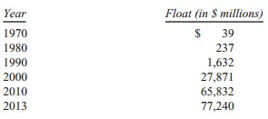

-
- 获取更多的浮存金越来越困难了。不过GEICO的浮存金继续增长基本确定无疑。在National Indemnity的再保险业务部门，我们流失了一些保单，浮存金也相应下降。
即便未来我们出现浮存金的下降，那也会是非常轻微的——每年最多不会超过3%。相较于我们的流动性规模，我们的保单特性保证我们不会受制于任何短期的流动性压力。（在这方面，财险业务和某些形式的寿险业务有非常的区别。）
如果我们的保费收入超过了总成本和最终的赔付支出，我们会在利用浮存金投资获得的投资收益之外，录得一个承保利润。赚到这种利润的时候，我们是在享受持有这些免费资金的好处——更好的是，我们还因为持有资金而赚到钱。这就好像你去银行贷款，银行还倒贴给你利息。
不幸的是，保险公司实现这个美好结果的强烈愿望导致了激烈的竞争，竞争如此惨烈以至于大多数年份，财产保险行业整体处在严重的承保亏损中运行。这笔承保亏损，实质上就是整个行业为了获得浮存金而支付的成本。举个例子，State Farm，当前美国最大且管理良好的保险公司，截止到2012年前的12年里有9 年都录得承保亏损（依据我写作本报告时所能获得的最新一年的财务数据）。保险行业有很多种亏钱的方式，而且这个行业从来不曾停止寻找新的亏钱方式。
正如前一部分提到的，我们已经连续11年录得承保利润，我们这一时期内的税前承保利润累计达220亿美元。预计未来大部分年份中，我们依然会保持录得承保利润。实现承保利润是我们保险公司管理层的每日工作，他们明白浮存金的价值，糟糕的承保亏损将会吞噬它的价值。
那我们诱人的浮存金将会如何影响内在价值？当伯克希尔计算账面价值的时候，所有的浮存金都作为负债被扣除了，就好像我们明天就要兑现债务，并且再也无法补充回来。但把浮存金当做一种严格意义上的负债是错误的，它实际上应该被看做一笔循环基金。2013年，我们平均每天赔付超过500多万笔保单总计170亿美元——这减少了浮存金。同时，我们每天都承接新保单从而增加浮存金。如果浮存金是无成本并且是长期存在的，我相信对伯克希尔来说确实如此，那这项负债的真实价值就远比账面负债小得多。
我们资产账面上记录的，对应保险公司的155亿“商誉”部分地抵消了负债账面价值的高估。实际上，这些商誉代表着我们为保险公司产生浮存金的能力所支付的价格。
然而商誉的账面成本，和它的真实价值毫无对应关系。比如说一家持续产生大额承保亏损的保险公司，其商誉应该为零，无论其历史成本是多少。
幸运的是，伯克希尔的情况不是那样。查理和我相信，我们保险公司的真实商誉——我们愿意为购买一家能产生类似质量的浮存金的保险公司所支付的价格——远超过账面上记录的历史成本。浮存金的价值是我们认为伯克希尔的内在价值明显超过账面价值的一个原因——一个重要原因。

伯克希尔优越的经济特性之所以存在，是因为我们有一群卓越的经理人经营我们拿手的业务，并且这些业务模式基础强健并且难以复制。让我将给大家介绍一些主要的公司。
首先，浮存金规模排在第一的是伯克希尔哈撒韦再保险集团，由Ajit Jain领导。Ajit对其他人都不愿意承保，或者没有足够资本进行承保的风险进行承保。他的公司集能力、速度、果断，以及最重要的，保险专业智慧于一身。他从未让伯克希尔暴露于与我们的资源不相称的风险之下。实际上，我们比多数大保险公司在规避风险方面都更加谨慎。举例来说，如果保险行业因某项巨灾遭遇了2500亿美元的亏损——这是历史上所发生过最大规模亏损的3 倍——伯克希尔当年整体上依然能够实现盈利，因为它有如此多的利润来源。我们一直会攥满现金，等待巨灾冲击市场这样的好机会。而其他的大保险公司和再保险公司则可能会出现大额的亏损，有些甚至将面临破产。
从1985年开始，Ajit已经创立了一个浮存金370亿美元，实现巨额累计承保利润的再保险公司，这是一项任何其他保险公司的CEO都难以望其项背成就。Ajit的大脑就想一个创意工厂，无时不刻搜寻着任何可以扩展他现有业务的机会。
去年6月一项新业务成行，Ajit组建了伯克希尔哈撒韦专业保险公司（“BHSI”）。这是我们首次进入商业保险领域，全国主要的保险经纪人和企业风险管理人都非常认可我们。这些专业人士明白，在财务稳健方面没有任何其他保险公司可与伯克希尔相比，这保证了它们未来多年的任何合法索赔都会得到及时的全额赔付。
BHSI由Peter Eastwood领导，他是一名经验丰富、受人尊敬的保险人。Peter组建的豪华团队已经为许多世界500强企业提供了大量承保，当然也包括小一些的公司。BHSI将会成为伯克希尔的重要资产之一，一块在未来几年内贡献数十亿美元的财富。如果大家在年会上碰到Peter的话，向他致以伯克希尔式的问候。

我们还有另外一驾再保险马车，它属于通用再保险，由Tad Montross掌管。
最起码地，一家优秀的保险公司必须遵守四项原则。它必须（1）理解所有可能导致保单形成损失的风险敞口；（2）保守地衡量风险敞口实际形成损失的概率以及可能的损失规模；（3）设定合理的保费，平均来看，要能在覆盖潜在的损失成本和运营成本后实现承保利润；（4）愿意在收取不了合意的保费时放弃保单。
很多保险公司顺利通过前三条，但在第四条上不及格。它们无法在它们的竞争对手也争抢的业务上回头。古话说，“别人这么干，我也得这么干”，这在很多行业都造成了麻烦，但这在保险行业造成的麻烦尤其多。
Tad非常明了保险行业的四条军规，他的业绩证明了这一点。在他的领导下，通用再保险的巨额浮存金比免费的资金还要诱人，并且我们预计这种情况依然会继续。我们尤其对通用再保险的国际人寿再保险业务充满热情，从1998年我们收购公司以来，这项业务持续增长并不断盈利。
当初我们买下通用再保险时，公司问题缠身，许多评论员——甚至在短时间内包括我，都认为我自己犯下了巨大错误。不过事情过去很久了。现在，通用再保险是一块珍宝。

最后，是GEICO，63年前让我开始入行时投资的保险公司。GEICO由Tony Nicely掌管，他18岁就加入了公司，到2013年，已经服役52年。1993年Tony当上了CEO，公司从那一刻开始起飞。
1951年1月我第一次接触到GEICO的时候就被公司无与伦比的成本优势所震撼。这项优势至今依旧保持并且是公司最最重要的资产。没人喜欢买车险。但是几乎每个人都喜欢开车。必不可少的车险成了大多数家庭的主要开支。便宜对他们来说非常重要——而只有低成本的保险公司能为他们提供这样的车险。
GEICO的成本优势是其市场份额年年上升的原因。它的低成本优势是其它竞争对手难以逾越的、持久的护城河。我们的小蜥蜴 一直在宣传GEICO如何为大家省钱。最近公司进行了新一轮的运营成本削减，它的传说还将继续。
1995年，我们买下GEICO剩余的一半股份时，比净有形资产多花了14亿。这被记作“商誉”，并且在财报上的数值一直不变。但是随着GEICO的业务增长，它的真实商誉也不断增长。我认为这个数值现在接近200亿。
除了我们的三家主要保险公司外，我们还有一些小保险公司，它们的大部分专注于保险行业的一些细分领域。整体上，这些公司一直为我们贡献承保利润。另外，正如表格数据显示的那样，它们也提供了大量浮存金。查理和我感谢这些公司和它们的经理人们。

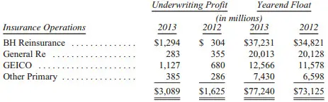

-
- 简单的说，保险卖的是对未来的承诺。“顾客”现在付钱，保险公司承诺未来某些事件发生的情况下付钱。
有时候，承诺在未来几十年都有效。（比如大家20来岁时买的寿险。）因此，保险公司的赔付能力和赔付意愿非常的重要，哪怕赔款的需要刚好赶上经济危机。
伯克希尔的信誉是无人能比的，最近几年的事实更加证明了一点，一些全球最大最富经验的保险公司正在试图摆脱它们巨额的长寿风险，尤其涉及到石棉的保单。
它们希望将这些负债转移给再保险公司。但是如果选择了错误的再保险公司——那些将会陷入财务困境或者运营不良的再保险公司，对原保险公司来说意味着将赔付责任转回自己脚下的风险。
毫无例外，所有寻求帮助的大保险公司都会联系伯克希尔。实际上，2007年Lloyd’s将上千笔1993年前的确定将会索赔的保单出售给了我们，同期的保单里还有不确定数量但是绝对是大额的索赔未来基本一定会赔付，这是创纪录的一笔交易。（对，我们会接收几十年前的保单并对1993前发生的事件承保。）
伯克希尔因为Lloyd’s的交易最终的赔付额今天还不得而知。但是可以确定的是，伯克希尔一定会赔付上限为150亿内的一切有效索赔。没有任何其他保险公司的承诺能给予Lloyd’s伯克希尔所提供的安心。公司的CEO拿着Lloyd’s的保单说：“某某（Lloyd’s的原承保人）希望晚上能安心睡觉，我们想我们已经给他送去了世界上最好的床垫。”
伯克希尔优秀的经理人团队，良好的财务稳健性，还有多元化的业务，构成了它在保险行业独一无二的护城河。这样的构成是伯克希尔股东们的巨大财富，并且随着时间推移，它会变得越发值钱。
- __受管制的、资本密集型业务__
“虽然公用事业充满管制，我们还是有机会进行一些投资。一旦我们决定投资，一定是大手笔。” ——1999年年报
这个 版块主要 有两家公 司，BNSF（ 伯灵顿北 方圣特菲 铁路公司 ）和MidAmercian Energy（中美洲能源），它们有一些重要共同特点区别于我们其他的公司。所以，我们在这里把它们单独归为一类进行讨论，并在GAAP会计报表中单独列示它们的合并资产负债表和营收表。
它们的一个重要特征是，两家公司都有巨额的长期受管制的资产投资，这些资产部分由大额长期账务支持，伯克希尔并不承担相关的债务责任。它们实际上并不需要我们的信用支持，因为它们具备良好的盈利能力，即使在恶劣的环境下也能覆盖它们的债务利息。比如在去年疲软的经济中，BNSF的利息覆盖倍数是9:1。（我们对覆盖倍数的定义应该是税前利润/利息，而不是EBITDA\(息税折旧摊销前利润\)/利息，一项我们认为被普遍使用的错误指标。）
在中美洲能源，有两个因素确保它在各种情形下都具有还本付息的能力。第一个因素与其他公用事业企业相同：抗周期的盈利能力，这源于公司垄断地提供社会必需的服务。第二个因素则只有少数公用事业公司才具备：多元化的利润来源，这保护我们不会因为监管部门的某一项措施而遭受重创。收购了NV Energy以后，中美洲能源的利润来源进一步扩大了。同时，由于伯克希尔的股东背景，中美洲能源和它的分支机构可以以显著低于同行的利率借债。这种优势即有利于我们也有利于我们的顾客。

每天，我们的两家公司都在驱动着美国经济：
BNSF承担了全国15%（以吨‐英里衡量）的城际间货运量，包括公路、铁路、水路、航空以及管道运输。BNSF的吨‐英里运量超过其他任何公司，这个事实意味着BNSF是全国经济循环系统最重要的大动脉。2013年它依然保持着其龙头地位。和其他铁路公司一样，BNSF还以一种非常节约能源和环境友好的方式在运输着货物，它运输一吨货物500英里只需一加仑柴油。卡车实现同样的运力大约要使用4倍的能源。中美洲能源的电力设施为11个州的零售客户服务。没有任何公用事业公司服务范围比我们更广。另外，我们是再生能源方面的领导者：9年前开始涉足，到目前我们已经占全国风力发电量的7%，未来还会更多。我们在太阳能上的份额——虽然大部分还在建设当中，甚至更高。
中美洲能源之所以能进行上述投资是因为它留存了所有利润。事实上：去年中美洲能源迄今为止累计留存的利润超过美国任何其他电力公司。我们和监管部门都把这看作一项重要的优势——一项还会持续5年、10年、20年的优势。 等我们的在建项目完工后，中美洲能源的可再生能源投资将达到150亿。只要这些投资的预期回报合理，我们都喜欢这样的投资。在这方面，我们给予了未来的监管极大的信任。
我们的信心来源于过往的经验，也来源于社会在交通和能源方面会一直需要大量投资的认识。政府为了自己的利益将会合理对待资本提供者，以保证有持续的资金来满足必须的公共项目。从我们自身的利益出发，我们愿意去争取监管者和它们所代表的人民的认可和批准。
去年一份消费者对52家控股公司和它们的101家电力公司满意度调查的结果，是我们投资于未来这一决心的有力证明。我们的中美洲能源排名第一，95\.3%的被调查者表示“非常满意”，并且没有一个被调查者表示“不满意”。调查中垫底的公司，仅有34\.5%的满意度。
我们现有的三家公司在被中美洲能源收购以前的调查中排名远低于现在。优异的消费者满意度在我们扩张的时候发挥着重要作用：我们希望进入地区的监管部门愿意看到我们的到来，因为他们知道我们是负责任的公司。
预见到消费者的需求增长，我们的铁路板块也在兢兢业业的工作。你听说的任何关于我们国家基础设施建设的怨言，都不适用于BNSF和铁路行业。美国的铁路系统从未有过今天这样良好的状态，这是行业巨额投资的成果。当然我们也没闲着：2013年BHSF在铁路上投资了40亿，是折旧额的两倍，也是有史以来最高的单年投资额。我们可能在2014年投资更多。就好像预见到未来交通需求的诺亚一样，我们明白必须未雨绸缪。
领导我们两家重资本公司的是中美洲能源的Greg Abel，还有BNSF的Matt Rose和Carl Ice团队。他们三人都是卓越的经理人，该受到我和大家的感谢。
以下是他们公司的业务数据：

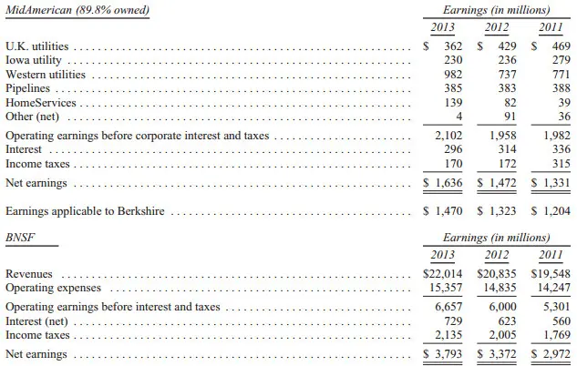

-
- Ron Peltire在继续打造Home Services，中美洲能源的房地产经济业务。去年他进行了四次收购，最主要的是对Fox & Roach的收购，一家总部位于费城、全国最大的地区性经纪公司。
住房服务公司现在有22,114名经纪人（各地区的名单见112页），比2012年增加38%。住房服务公司还拥有Prudential and Real Living 67%的特许经营权业务，它正在更名为伯克希尔 哈萨维住房服务公司。大家很快就会在“待售”的房屋广告上看到我们的名字。
- __制造、服务和零售业务__
“看那间超市”，沃伦指着内布拉斯加家具超市说，“那真是个好公司。”“那你为什么不买下它？”我说。“它是家私有企业”沃伦说。“哦”，我说。“我一定会买下它的”，沃伦说，“总有一天”。 ——《超级金钱》，亚当·斯密 \(1972\)
我们在这部分的业务种类繁多。我们将通过一个合并的资产负债表和营收表来了解整个部门。

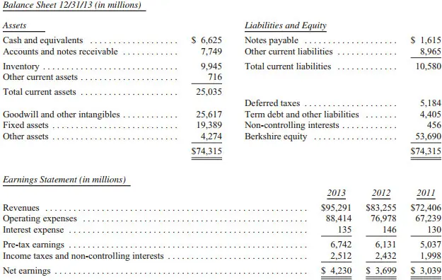

-
- 符合美国通用会计准则（GAAP）的收入和支出数据列示在29页。上表中的运营成本剔除了一些并购会计项目，是不符合GAAP准则的（主要是某些无形资产的摊销）。我们列示这些数据是因为查理和我认为调整后的数字比GAAP下显示的数字更准确地反映了整块业务真实的成本和利润。
我不打算逐一解释所有的调整——有些是细微并且晦涩的——但是认真的投资者必须要理解不同无形资产之间的本质区别：一些无形资产的价值随时间消耗殆尽，但是另外一些的价值从不耗减。比如说软件，其摊销额是真实的成本支出。但对于某些无形资产，例如对客户关系，购买法会计准则下的摊销则显然不是真实的成本。GAAP会计准则并不对这两者进行区分。尽管从投资者的角度看，它们完全不同，但在会计上计算利润是它们都会被记作成本。
在29页列示的GAAP会计准则的数据下，该部门6\.48亿美元的摊销费用被计入了成本。我们大致认为其中的20%是“真实”的——这也是我们上面的表格包括的部分——其他的则不是。这种差别因为我们做了非常多的收购而变得影响巨大。我们未来进行的收购越多，这样的差别还会越来越大。当对应的资产没摊销完之后，相应的账面成本也就没有了。但这通常需要15年，哎，我的继承人才能享受到摊销完之后报表上增加的利润了。
我们报告的折旧，才是真正的成本支出。对其他任何公司来说也是这样。当华尔街人士用EBITDA作为估值指标时，捂紧你的钱包。 当然我们公开的财报依然会遵循GAAP会计准则。但是请认清现实，记得把我们报告的摊销加回来。
这个版块的公司销售的产品从棒棒糖到喷气式飞机，无所不包。有些公司有非常好的经济特性，它们无杠杆条件下的税后有形资产回报率从25%到100%多。其他一些产品的回报率介于12%‐20%。但也有少数公司回报率很糟糕，这是我们在资产配置上所犯下的严重错误。我并没有受到误导：我只是错误地估计了公司或者其所在行业的经济形势。
幸运的是我们犯得错误一般是小型的收购。我们的大型收购都运行的很好，有些甚至非常好。但以上不会是我犯得最后一个错误。并非事事都如我所料。
把整个板块看作一个公司的话，这家公司业务非常优秀。2013年它们运作250亿的净资产，大量的现金和极低的杠杆，实现了16\.7%的税后收益。
当然，如果出价过高，买入一些具有良好经济特性的公司也可能成为一笔糟糕的投资。我们大多数的收购里都支付了远超有形净资产的溢价，这些成本反映在财报巨额的无形资产数据中。不过总体来说，我们收获了与投资额相称的回报。而且，这些公司的内在价值，远超它们的账面价值。需要说明的是，在保险板块和受管制的行业板块，内在价值和账面价值之间的差距更加巨大。那里才是真正的大赢家所在之处。
这个版块内的公司太多，我们不能一一道来。而且它们现有和潜在的竞争对手都能看到这份报告。公开某些公司的数据将会对它们不利。所以，对伯克希尔来说，规模不是非常大的公司我们仅按要求披露信息。不过，在80‐84的内容里，大家可以找到更多详细内容。
我还是忍不住要像大家汇报一下内布拉斯加家具超市在德克萨斯扩张的最新进展。
我把它拿出来说，是因为它对伯克希尔来说不仅仅是新开了一家店那么简单，虽然相比伯克希尔2250亿的资产规模来说这微不足道。我和Blumkin家族合作30多年了，我为这家新店而兴奋，一家真正德克萨斯式的超市，它开在达拉斯市区北面的The Colony。
明年NFM建成以后，它将会在433英亩的地基上拥有180万平方英尺的零售和仓储空间。可以在www\.nfm\.com/texa 查询项目的进展情况。NFM已经拥有全国销售额最大的两家店铺了（分别位于奥马哈和堪萨斯市），两家的年销售额分别达到4\.5亿左右。我预计德克萨斯的新店将会刷新上述纪录。如果大家住在达拉斯附近，欢迎大家来看看。
回想起1983年8月30日，那天刚好是我的生日，我拿着自己起草的1页半不到的收购意向书（114‐115页有复印版）去见B夫人（Rose Blumkin）。B夫人在没有改动一个字，在没有投资银行家和律师在场的情况下接受我的收购协议（这是专业人士觉得在天堂才会发生的事）。虽然公司的财务报告并没有经过审计，我也毫不担心。B夫人告诉我实际情况，她的话对我来说足够了。 那时候B夫人89岁了，后来一直工作到103——绝对是我们风格的女强人。大家看一看116‐117页上NFM从1946年以来的财务报告。NFM现在所有的一切都从当初72,264美元净资产、50美元的现金，以及B夫人、她的儿子Louie、孙子Ron和Irv难以置信的天才衍化而来。
故事里最妙的地方是，B夫人从来没上过学。而且她从俄国移民到美国时甚至连英文都不会说。但是她热爱这个接纳它的国家：家庭聚会时他们经常应B夫人的要求合唱上帝保佑美国。
有抱负的经理人应该好好学习让B夫人成功的那些朴素却稀有的品质。每年都有超过40所大学的学生们来拜访我，我以带领他们参观FM作为开场。如果他们吸收了B夫人的经验，他们不需要向我学任何东西。

- __金融和金融产品__
“Clayton的贷款规模不用几年就会达到50亿美元，它们信用质量良好，将会产生巨额利润。” ——2003年年报
这是我们最小的业务版块，包括两家租赁公司，XTRA\(拖车租赁\)和CORT\(家具租赁\)，以及Clayton Home，国内领先的预置房生产商和金融租赁商。除了这些100%拥有的子公司外，我们还有其他一些金融资产以及BerkadiaCommerical Mortgage公司50%的权益。
Clayton被归入这个版块，是因为它有326,569笔抵押贷款，合计136亿美元。近几年，由于预置房销量的下跌，公司大部分的盈利都来自于抵押贷款业务。
但是2013年，新房的销售开始回升，制造和零售两部分的利润恢复。Clayton依然是美国最大的房屋建筑商：2013年它建造了29,457套房屋，占全国新建住宅总数的4\.7%。公司的CEO，Kevin Clayton成功领导公司度过了房地产市场的衰退。现在他的工作——一定比之前轻松多了——就是在2014年实现盈利。 CORT和XTRA也是各自行业中的佼佼者。JeffPederson和BillFranz依然会维持它们的领先地位。我们支持他们购置设备扩大租赁规模的计划。
下面是这个版块的税前收入：

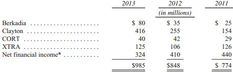

-
- __投 资__
“我们的股票投资……大约比他们的账面价值（投资成本）要低1700万美元……但我们相信，几年以后，整个组合的价值将会远超投资成本。” ——1974年年报
下面列出了我们市值前15的股票投资：

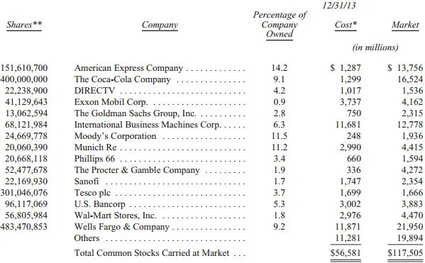

-
- \*此处为实际投资成本，等于计税基础，GAAP准则下的成本在某些情况下因减记和增计而不同。 \*\*不包括伯克希尔下属公司养老金投资的持股。
伯克希尔有一项重要的股票投资没有列在表上：在2021年以前的任何时候，我们都可以以50亿美元购买美国银行7亿股股票。截至年底，这些股票价值109亿。我们倾向于在购买权到期前行权购买。大家应该了解，美国银行的投资是我们的第五大股票投资，并且我们非常看好。
除了股票以外，我们也会大额投资债券。通常我们业绩都不错。但也并非时时如此。
大家应该没有听说过Energy Future Holdings这家公司。请相信你们是幸运的；我宁愿自己也没听过这家公司。它是2007年为杠杆收购一家德克萨斯的电力公司而成立的。权益投资者提供80亿美元同时借入大量债务实现收购。债务中的大约20亿由伯克希尔提供，我没有咨询查理的情况下做了这个决定。这真是个巨大的错误。尽管天然气价格大幅上涨，EFH还是注定要在2014年申请破产。去年我们以2\.59亿卖出了我们的债权。持有债权期间，我们收到了8\.37亿现金利息。所以我们税前一共亏了8\.73亿。下次我一定会先问问查理。
我们的一些公司——主要是电力和天然气公司——在经营中会使用衍生工具。除此之外，我们近年来都没有投资衍生品，原有的头寸也逐步到期。已经到期的衍生品给我们带来了数十亿美元的利润，和中期浮存金一样。虽然不是百分之百确定，我们预计资产负债表上剩下的衍生品同样会给我们带来利润。

- __关于投资的一些思考__
最聪明的投资，是把它当做生意一样看待。 ——《聪明的投资者》，作者本杰明·格雷厄姆
引本·格雷厄姆的话作为本章开头非常恰当，因为我对投资的理解很多都归功于本。后面我会讲一些本的事情，我还会讲到股票投资。但是让我先讲两个很早以前非股票投资的投资的例子吧。虽然两笔投资对我个人财富的影响并不大，但它们却具有启发意义。
事情发生在内布拉斯加。1973到1981年间，中西部农场价格疯涨，原因是对通货膨胀的预期和一些小型农村银行宽松的贷款政策。后来泡沫破灭了，价格下跌了50%多，这摧毁了借债的农场主和他们的债权人。那次泡沫中爱荷华和内布拉斯加倒闭的银行数量是刚过去的大萧条中倒闭的五倍。
1986年，我买下了奥马哈北部，距FDIC 50英里的400英亩农场。花了28万美元，比几年前银行贷给农场主买地的金额小的多。我对经营农场一窍不通。但是我儿子喜欢农场，我从他那里了解到玉米和大豆的产量，还有对应的运营成本。根据这些估计，我计算出农场的正常回报大约10%。我还考虑到，产量会逐步提高，并且作物的价格也会上涨。两个预期后来都被证明是对的。
我并不需要特别的知识来判断投资不会没有底部，同时可能有可观的上升空间。糟糕的产量和价格当然偶尔会令人失望。但这又怎么样呢？同样也会有些好的异常的年份，并且我不用迫于压力出售资产。现在，28年过去了，农场的利润翻了三倍，价值是我们当初投资额的五倍。我依然对农场一窍不通，而且最近才第二次去到那片农场。
1993 年 ，我做了另外一小笔投资。当我还是Salomon的CEO的时候，老板Larry Silverstein告诉我纽约大学旁边Resolution Trust 集团的一块零售物业打算出售。同样，当时泡沫破裂——RTC被迫拆分出售资产，那些遭殃的储蓄机构当初乐观的贷款政策导致了现在的愚蠢行为。这里的分析同样简单。和农场的情况类似，该物业当时无杠杆的收益率是10%。但是考虑到RTC糟糕的管理，空置的店铺出租以后收入还会增加。更重要的是，它的最大租客——约占20%左右的出租面积，仅仅支付每平方尺5美元的租金，而其他租客的平均租金是70美元。它的租约将在9年内到期，到时盈利必然可以大幅上升。物业的位置也是非常理想的：纽约大学绝不会搬走。
包括Larry和我的朋友Fred Rose的团队买下了这个物业。Fred是一位经验丰富，高水准的房地产投资者，而且他的家族将会管理这个物业。他们接手了。旧的租约到期后，利润翻了三倍。年租金回报现在达到了当初投资额的35%。另外，我们最初的按揭贷款在1996年和1999年两次进行了重置，这让我们获得了相当于初始 投资额150%的特别租金回报。我至今还没去看过这块物业。
农场和纽大物业的收入未来几十年还会继续增加。虽然他们的收入不会突然激增，但两笔投资都是我和我的孩子、孙子可以一辈子持有的稳固并且令人满意的投资。
我讲这两个故事是为了阐明投资的基本道理：
获取满意的投资回报不需要成为专家。当然如果大家本身不是专家，那就要认识到自己的能力圈，并遵从一个合理的规律。保持简单，不要揠苗助长。当有人承诺让你赚笔快钱时，立即答复“不行”。关注拟投资资产的未来产出。如果大家觉得难以估计一项资产的未来盈利，那就忘了它，放弃它。没有人能估计所有的投资回报。无所不知也是不需要的；大家只需要理解自己的行为就可以。
如果大家关注的是资产未来可能被接手的价格，那么这就是投机。投机没有什么不好。但是我知道我不能总是投机正确，我也怀疑那些声称自己可以持续投机成功的人。置硬币时第一轮有一半人会赢；但是这些人如果继续不断玩下去都不会有赢家。另外，一项资产近来持续升值绝不是一个买入的理由。
在两笔投资上，我都只考虑资产的产出，而不是它们每天的估值。最后的赢家是把精力用在球场上的人，而不是紧盯着计分板的人。如果大家周末不看股价的时候可以放轻松，那么试着工作日的时候也这样做。
总结宏观形势，听信别人的宏观或者预测市场都是浪费时间。实际上，这甚至是危险的，它会模糊大家对真正重要的事实的看法。（每当我听到电视评论员流利地分析着市场的下一步走势，我就会想起Mickey Mantle 犀利的评论“你不坐到直播间里去都不知道原来棒球比赛这么简单”。）
我的两笔投资分别在1986年和1993年做出。接下来经济、利率、或者股市在下一年——1987和1994年——会如何发展对两笔投资都没有影响。我已经不记得当时的报纸头条和专家的意见。但是庄稼依旧在内布拉斯加生长，学生们一样到纽大上课。
我的两笔投资和股票投资有一个重要的区别。股票每分钟都有报价，但是我至今也没有见过农场和纽大物业的市场报价。
疯狂波动的股价本该成为股票投资者的一项巨大优势——对其中部分投资者来说是这样。毕竟如果有一个喜怒无常的人每天给我报价，买入或者卖出农场——并且价格在短期内随着他的心情忽上忽下，那我不就可以从它疯狂的行动中赚钱吗？如果他的报价低的可笑，而我又有些闲钱，那我就会买入农场。如果他的报价高的要命，那我就把自己的卖给他然后去种地。
股票投资者，经常让其他同伴善变的，并且通常不理性的行为所影响。因为有太多关于市场、经济、利率和股价走势的评论，一些投资者认为应该听听专家的建议——更糟糕的是，认为应该根据他们的建议买卖。
那些拥有一片农场或者一项房产时可以安静持有几十年的人，经常因为置身于源源不断的股价波动中和评论员们“别光坐着，你得做点什么”的鼓动而变得头脑发热。对这些投资者来说，流动性从一项绝对的优势变成了诅咒。
“闪电暴跌”或者其他一些市场的极端波动不会伤害投资者，就好像一个飘忽不定、爱说大话的邻居不会影响我的农场投资。本来涨涨跌跌的市场对那些真正的投资者来说是好事，如果他有现金在价格跌破价值时购入的话。恐惧的顶点是投资的好朋友；一路上涨的市场才是投资的敌人。
在刚刚过去的2008年金融危机中，我从没想过要卖掉农场或者纽大的物业，即便一段严重的衰退即将到来。如果我拥有一项长期前景不错的业务100%的权益，光是考虑卖掉它的想法都非常愚蠢。那我为什么要考虑卖掉那些优秀业务的小比例持股?确实，它们中一些会令人失望，但是作为整体而言它汇报会非常不错。真的有人相信美国无与伦比的物质资本和人力资本将会毁于一旦吗？
查理和我买股票的时候，我们把它都当作获得部分权益的投资看待，我们的分析和买下整个公司的分析类似的。首先我们要考虑是否能够估计公司未来5年，或者更长时间内的盈利。如果答案是可以，那我们就会在对应估计区间下限的价格上买入股票。如果我们不具备估计未来盈利的能力——经常是这样——那我们就去考虑其他投资。合作54年来，我们从来没有因为宏观或者政治环境的因素，或者因为其他人的看法放弃过有吸引力的投资。实际上，这些都不是我们做投资决策时会考虑的因素。
认清自己“能力圈”的半径，并且呆在能力圈里面非常重要。即便做到了，有时候我们还是会犯错误，无论买股票还是收购公司。但是这样不会带来灾难，就像一个持续上涨的牛市诱导大家根据价格走势买股票，或者因为需要有所行动的欲望买股票那样。
对多数的投资者而言，研究公司的前景并非生活的重点。于是，他们可能认为自己并不具备足够的知识来理解公司和预测未来的盈利能力。
我有一个好消息告诉这些非专业人士：一般投资者并不需要那些技能。总体而言，美国公司长期以来都表现很好，并且还会欣欣向荣（当然一定会有起起伏伏）。20世纪的一百年里，道琼斯指数从66点涨到了11,497点，分红不断提高。21世纪一样会有巨额的回报。非专业投资者的目标不应该是挑出优胜企业——他和他的“帮手”都做不到，而是应该配置一个跨行业的组合，整体而言其回报必定不错。一个低费率的标普500指数基金就可以实现这个目标。
以上就是非专业投资者所需的“做什么”。“何时做”也同样重要。主要的风险是，胆小投资者的或者投资新手可能刚好在市场剧烈波动前入场，并且在出现浮亏时幻想破灭。（记住巴顿·比格斯 的话：“牛市就像性爱一样，在结束之前达到高潮。”）解决时间问题的办法是，在一个较长的时间内逐步买入，并且无论利空满天还是股价新高都不卖出。遵守这些规则，“盲投”并且保持多元组合和低费率的投资者一定会获得满意的回报。实际上，认识到自身不足的简单投资者长期将会战胜那些哪怕只是忽略了一个弱点的专业投资者。
如果“投资者”市场时常买卖他们的农场，产量和庄稼的价格都不会增加。唯一的结果就是农场所有者的最终收益由于咨询和交易费用显著下降。
无论是机构还是个人，都会被赚取咨询和交易费的中介结构不断怂恿，不停地交易。对投资者来说，这些费用总和非常巨大，它吞噬了利润。所以，忽略那些建议吧，保持最低的交易成本，并且像持有农场那样持有股票。
我的钱将会投到指数基金里，因此我还得再为此说两句：我在这里所建议的和已经写在遗嘱中的内容是一致的。遗赠将会把现金配置到为我妻子设立的信托当中。（我必须使用现金进行个人遗赠，因为我所持有的全部伯克希尔股票将在我去世后的十年内会分配给一些慈善组织。）我对信托公司的要求非常简单：持有10%的现金购买短期政府债券，另外90%配置在低费率的标普500指数基金上。（个人推荐先锋集团的基金。）我相信遵守这个策略，信托的长期业绩常会战胜大多数的聘请了高费率管理人的投资者——无论是养老金、机构还是个人。
现在回过头来说说本·格雷厄姆。我大多数的投资分析都是从本写的《聪明的投资者》当中学到的。1949年我买到这本书，从此我的投资生涯完全改变。 在阅读本的书以前，我在投资的世界四处游荡，尝试每一种投资方法。很多我读到的方式曾吸引我：我试着自己画图，用市场标记预测股价走势。也曾坐在交易大厅里盯着交易带，听评论员的评论。这些都很有趣，但是我始终被找不到归宿的感觉困扰。
而本的理论完全不同，它逻辑清晰，容易理解（不用任何希腊语或者复杂的公式）。对我而言，最重要的观点在新版本的第8章和第20章。（1949年的原版章节划分和后来不同）。正是这些观点指导着我今天的投资决策。
这本书还有另外一些有意思的事：后来的版本里有一则附录，描述了一项让本大赚一笔的不具名投资。本1948年写第一版的时候进行了这项投资——拥抱自己吧——这家神秘的公司就是GEICO。如果不是本在GEICO还是萌芽时期就认识到它的优越特性，我和本的财富经历都会大不相同。
1949年版的书还推荐了一家铁路公司，每股17美元而净利润10美元。（我敬佩本的原因之一是他敢使用当时并未验证的例子，如果未来并不如他所言他可能会被嘲笑。）如此低的估值部分是由于当时的会计准则要求铁路公司将其下属公司的留存利润从报告的利润中剔除。
被推荐的股票就是北太平洋铁路公司，它主要的下属公司是芝加哥、柏林顿和昆西铁路。这些铁路现在成为了BNSF的主要部分，BNSF由伯克希尔全资拥有。当我读到那本书时，北太平洋铁路公司市值4000万美元。现在，它的继承者（当然增加了很多资产）每4天就能赚4000万。
我已经不记得买《聪明的投资者》第一版花了多少钱。不管是多少，它都证明了本的格言：价格是你付的数字，价值才真正是你所得到的。在我所有的投资当中，买本的书应该是最划算的一笔（不包括我的两次结婚证）。
地方和国家的财政问题在加剧，很大程度上是由于政府承诺了它们支付不起的养老金。公民和政府官员通常低估了承诺和和支付能力之间的冲突导致的财务困境。不幸的是，养老金的计算至今对大多数美国人来说都是一个迷。
养老金的投资策略也是造成上述问题的原因之一。1975年，我写了一份备忘录给时任华盛顿邮报董事长的Katharine Graham，当中讲到了养老金和投资策略的重要性。这份备忘录被抄录在118‐136页。 接下来的数十年，大家于将会读到很多关于公共养老金计划的消息——坏消息。我希望我的备忘录有助于大家理解立即采取补救措施的必要性。

- 年 会
年会将于5月3日（周六）在Century Link中心举行。我们能干的Carrie Sova将负责此项工作，我们集团总部的所有人将提供支援来帮助她。我们这帮人将会比专业的活动策划者做得更好， 当然，这样做也可以省点钱。 Century Link将会在当天的早上7点钟开门。我们将举行第三届国际扔报纸挑战赛。我们的目标是Clayton Home走廊，确切来讲是从投掷线开始要达到35英尺。在我在10来岁的时候，就扔了约50万张的纸了。因此我认为我的水平相当不错。我将买Dilly Bar送给任何能够投得比我更接近目标的人。所有的报纸有36到42页，而且必须自己折\(不能用橡皮筋绑\) 8点30，将会放映一部新的关于伯克希尔的电影。一个小时后，将会开始答问环节，并且将持续到3点30（途中将暂停来吃饭）\. 经过短暂的休息后，查理与我将在3点45开始召开年度会议。如果你决定在这天的答问期间离开的话，就请这么做吧,虽然这时查理正在讲话呢。中途离开的最好理由当然是要去购物。通过这些塞满194,300平方英尺的连接会议区大厅的产品，我们将协助你购物，这些产品是来自于几十个伯克希尔子公司的。 去年，由于你做了你该做的，使得大部分的产品达到创记录的销售额。在9个小时的时间里，我们卖了1,062双Justin皮靴\(相当于32秒一双\)，12,792磅的喜丝糖果，11,162副Quikut刀具\(每分钟21副\)及6,344双Wells Lamont手套\.这些只是属于热卖的\.今年，查理和我将进行蕃茄酱瓶的售卖比赛。当然地，有查理图片的瓶将会大打折扣的。但是，如果你们帮我的话，我的销量会超过他的。这一点很重要，因此不要让我失望喽。 布鲁克斯，一家我们经营鞋的公司, 将再次在这次会议期间提供一个特别的纪念鞋\. 在您购买了一双，第二天穿起来参加我们上午8点开始的在Century Link中心举行的第二届年度“伯克希尔5K”比赛。参赛者的详情将在与会议门票一起收到的”宾客指南书”中说明。参赛者会发现跟自己一起跑人的中有许多伯克希尔的经理，董事及合伙人。 GEICO将会在购物区有摊位，其人员是由来自全国的顶级顾问组成的。请停下来看看，在多数情况下，GEICO能给你一个股东式的折扣\(通常为8%\)。此报价是由我们经营的51个辖区中的44个所允许的。\(补充一点：此折扣不能重复享受，如果你有资格享受另外一种折扣的话，例如给特定团体的折扣\)。请告诉你现有保险的具体情况以便我们看看是否可以省点钱\.我相信我们能至少帮到你们中的一半。 记得一定要去看一下Bookworm摊位，摊位上大约有35种书及DVD，其中有两本新的。一个是Max Olson汇编的伯克希尔致股东的信，这些信可以追溯到从1965年开始的\.这书里面的索引我认为特别有用，他列明对个人，公司及主题问题的专门页码。另一个我建议大家看看由我儿子霍华德写的Forty Chances。你们会乐在其中的。如果你是个大富豪或者渴望成为大富豪的话，可以在周六的中午到下午5点之间参观位于Omaha机场东面的Signature Flight Support。在这里，我们有一排NetJets飞机让high翻天。来是座巴士,离开时乘私人飞机。有点像大富豪的真实生活一样。与本报告一起的代理材料是向你说明怎么获得允许你参加此次会议及其它活动的凭证。航空公司有时会在伯克希尔股东会的周末抬高价格。如果你从来自较远的地方，可以比较一下飞到堪萨斯城与奥马哈的成本。这两个城市间的车程为2\.5个小时，可以飞到堪萨斯城能为你节省一笔可观的钱，特别若是你打算在奥马哈租车的话。与我们一起节省花费吧。位于Dodge与Pacific之间的第72大街有77英亩场地上有一个Nebraska家具卖场，我们仍然有”伯克希尔周末”折扣价。去年会议期间的那周里，这个卖场的业务量达到4020万美元，增长12%，打破了之前的销售记录，它也打破周六820万的单日销售记录，仅床垫就卖了接近100万美元。 你须在4月29日（周二）到5月5日（周一，包括这一天）之间进行采购，并出示你的参会凭证。才能在NFM上获得伯克希尔式的折扣。这期间的特价甚至包括几个很有声望工厂的产品。通常他们的产品对于打折有严格的规定的\.为了周未的股东大会，他们为你们做了个例外。我们感谢他们的合作。 NFM开放时间为周一至周六为早上10点到下午9点，周天为早上10到下午6点。今年的那个周六的早上5点30到下午8点，NFM邀请你们所有人去参加野餐渗活动。 在Borsheims，我们再一次有只有股东可以参加的活动: 一个是在5月2日\(周五\)从下午6点到9点举行的鸡尾酒会，另外一下是在5月4日\(周天\)从上午9点至下午4点举行的庆功会\. 周六我们将开放到下午6点。几年来,这三天的活动已经远远超过12月的销量，通常12月是珠宝销售最好的月份。 在周天的下 行1点15,我将会 在Borsheims开始办事\.要求 我在你们选择的项目”Crazy Warren”进行报价\.随着我年龄越来越大,我的出价也变得越来越荒唐\. 好好地利用这个时间吧\. 在整个周末，在Borsheims将会有聚集大量的人。 因此，为了你的方便，股东特价将从4月28\(周一\)至5月10日\(周六\)一直有效。在此期间，请提供参会凭证或经纪公司声明来证明你是股东或是伯克希尔股票的持有者。周日，在Borsheims外面的购物街上，两届美国象棋冠军将蒙上眼睛与所有感兴趣的来者进行对决，六人一组的参与者当然是睁开着大大的眼睛的。旁边，来自Dallas的非凡魔术师Norman Beck将让大家叹为观止。此外,周日下午，将会有两位世界顶级的桥牌高手Bob Hamman和Sharon Osberg与各位股东过过招。 Don’t play them for money\. 不要和他们玩钱我的朋友Ariel Hsing也将周天在购物街举行乒乓球的擂台赛。去年，美国人特别是我对她在奥运会上的表现感到自豪。Ariel在9岁时我就认识她了，但与她打球的话,我从没赢过她一分。现在她是普林斯顿大学的新生及美国女乒冠军。如果你不介意自己颜面扫地的话，可以和她玩几把，这个是在下午1点开始的。比尔 盖茨和我将与她首先过招，并试着杀杀她的锐气。Gorat’s与Piccolo’s 餐厅将再次在5月4日专门为伯克希尔的股东提供服务。Gorat’s将在下午1点开始营业，Piccolo’s在下午4点开始营业\.两家餐厅将都一直营业到晚上10点。两家的口味都是我特别喜欢的\.周天的晚上两家我都要去吃一吃。记住：预订Gorat’s 餐 厅 ， 请 在4 月 1 日 开 始打 这 个 电 话 402‐551‐3733, 预 订Piccolo’s 餐 厅 ，打402‐342‐9038\.在Piccolo’s的菜单中，有一个大杯的酒上放冰淇淋的点心\.胆子小的人可能只能吃到一点点冰淇淋。 我们仍然有相同的三位财经记者来指导我们的会议进程中的答问环节。各位股东向查理和我提的问题通过电子邮件给他们。具体的联系方式是: 来自财富杂志的Carol Loomis,邮 箱:cloomis@fortunemail\.com;来自CNBC的Becky Quick, BerkshireQuestions@cnbc\.com;来自纽约时报的 Andrew Ross Sorkin, arsorkin@nytimes\.com 每位记者可以提交6个他或她认为感兴趣或重要的问题。记者会告诉我你的提问。如果你的问题比较精简，提问与伯克希尔有关的，且不是在最后一刻提交的，提问不超过两个，那么你的提问将可能被选中。（在发给记者的邮件中，请指明若是你的问题被选中，是否可以提及你的名字）。 我们也将就伯克希尔股东大会有一个三位分析师组成的小组。今年的保险专家是来自Barclays公司的Jay Gelb。处理非保险业务问题的是来自Ruane,Cunniff& Goldfarb公司的Jonathan Brandt\. 同时我们将有一场就伯克希尔看空的讨论会。我们将听取这个不看好伯克希尔股票的人的想法（请列明你的职位）。这三个分析师将带来一些自己对于伯克希尔的专门问题\.同时也会与记者及观众进行互动。 查理与我坚信所有的股东可以同时得到最新的伯克希尔的信息并有足够的时间去分析这些信息\.这就是我们为何在周五晚上或周六早上发布财务信息及为何在周六开年度大会。 我们不会与大机构投资者或分析师进行一对一的交谈。对所有的股东也是一样\. 我们希望记者与分析师提的问题能使我们就投资问题有所受益。 查理和我都不会就提问的问题透露太多的线索。我们知道许多记者与分析师会带着一些尖锐的问题来的，这也是我们乐意看到的。我们期待至少可以回答54个问题。每位分析师与记者各有6个问题，18个问题来自观众。如果还有多余时间的话，我们会回答更多观众的提问。观众提问者会在早上8点15前确定下来。 我经常称赞我们经理人的成就。他们是名副其实的全明星团队，他们如同自己的家族拥有公司一样经营着公司。我认为我们经理人那样为股东着想的理念在大型的公众持股公司中也能找到。他们中的大多数财务自由；他们在业务上的“全垒打”成就感和他们的薪酬同样重要。 同样重要的，还有24位和我一同在总部办公室工作的男女同事。这个团队非常高效地处理大量和SEC和其他监管机构的要求，提交23000页的联邦税收、地方税收和国外税收文件，回复不计其数的股东和媒体的问询，制作年报，筹备全国最大的股东年会，配合媒体的工作等等，这个单子还有很长很长。 他们充满热情地处理上述事务，效率惊人，让我的生活变得简单而愉快。他们的努力不仅仅是服务于伯克希尔：去年他们联系了40所大学（从200个申请者中挑选而出）派送学生到奥马哈和我进行问答互动的活动。他们还处理各种我接到的邀请，安排行程，甚至给我买汉堡和法式炸薯条（当然是涂满番茄酱的）当午餐。没有任何CEO有比这更好的团队；我每天都是跳着舞去上班的。 最后，我觉得应该无视我们年报“无图片”的传统，让大家看看我们举世瞩目的办公室团队。下面是我们圣诞节晚餐的一张照片。有两个人缺席；不然你就可以看到伯克希尔总部的全家福了。他们真的是创造奇迹的员工。 明年的信将会回顾伯克希尔过去的50年，并且憧憬一下下一个50年。记得5月3日到奥马哈来享受投资界的伍德斯托克音乐节。
-

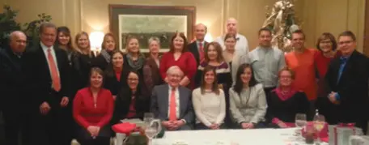
