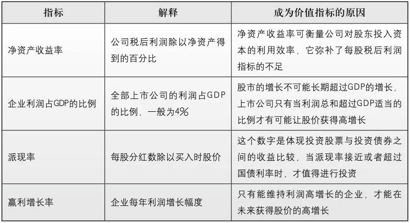

# 《巴菲特投资学大全集 造就美国股市上万个亿万富翁的秘密》全文合订版

> 共16个章节。原章节顺序、段落结构和图表均予以保留。

## 关于巴菲特

__⊙关于巴菲特⊙__

__沃伦·巴菲特是美国最成功的集团企业的塑造者，他既是精于投资之道的股神，更是才华洋溢的管理者，他的一举一动都影响着全球金融市场走势。他比杰克·韦尔奇更懂得管理，他曾宣称在死后50年仍能管理和影响后人。他并非天才，他也曾如普通人一样遭遇挫败，然而他独特的投资理念不仅成就了自己在股市中无法撼动的地位，而且成就了美国股市上万个亿万富翁。__

__同巴菲特的投资哲学一样，他的生活哲学和个人品质也独具魅力。虽然他已成为全球首富，备受媒体追捧，却一直过着简单的生活，并已承诺将他毕生积蓄的财富捐给社会。这样高尚的品质和富有社会责任感的情怀，更是当今富豪们的榜样。他做人、做事、做投资的基本原则，无一不体现着大师超凡的智慧，指引我们解开人生、事业中的迷惑，走向成功。__

## 序言

__序言__

__巴菲特教你搏击股市，决胜人生__

如果你在1956年把l万美元交到一个人手中，那么这笔资金就能在今天魔术般地变为税后2\.7亿美元的巨额财富，这个人就是巴菲特，人称“美国股神”、“奥马哈的智者”，2008年的全球首富。

巴菲特被人们誉为“当代最伟大的投资者”。20世纪末期的美国《财富》杂志评出的“20世纪八大投资大师”中，巴菲特荣登榜首。他在世界投资界享有极高的威望，他的一举一动都能牵引全世界投资人的目光。不仅如此，几十年中，巴菲特领导的伯克希尔公司，造就了数以万计的亿万富翁。其中，仅在他居住的奥马哈市，就培养出近200名亿万富翁。

巴菲特的投资哲学极富魅力，很多金融界的人士把他的言论视为“投资圣经”，他们像念布道的经文一样背诵着他的格言。许多投资界人士为了聆听巴菲特关于投资的智慧箴言，甚至会特意花费数万甚至几十万美元购买一股或几股伯克希尔公司的股票，每一年都不辞劳苦，像朝圣一样，千里迢迢到奥马哈参加伯克希尔公司年度股东大会。然而，许多投资人在听了巴菲特关于投资的智慧言论后，都会不由自主地感叹，巴菲特的投资哲学是如此简单，其效果却比那些繁复难懂的投资理论强了不知多少倍。

实际上，巴菲特投资理论的精髓就在于选择最佳的时机，买入表现优异的个股，并以最佳的组合长期持有。他曾说：“任何人都不能准确预测股市涨跌，投资成功与否与预测股市涨跌无关，其成功关键在于精选个股；无论牛市还是熊市，只要通过对企业的基本面进行深入分析，精选具备持续竞争优势的个股，坚持长期持有，不为市场短期波动所左右，从中长期来看必然能实现较好的投资回报。”巴菲特的价值投资有如在果园种植果树，需要花费一定时间来精心栽培，然后才能收获甜美的果实。相反，股市中流行的投机主义，则有如为摘取果实而把果树拦腰斩断，这种做法无异于杀鸡取卵。对于当今投机主义盛行的中国股市来说，巴菲特的投资理念无疑是一剂良药。

同他的投资哲学一样，巴菲特的生活理念也很独特。他似乎天生对诱惑有一种很强的免疫力。这位世界首富曾断然拒绝几届美国总统请他出任政府财长的邀请，远离华尔街疯狂的人群，隐居在宁静的奥马哈市过着简单的生活：没有晚会、没有雪茄。他把生命的大部分时间都用在阅读、思考和“分配资金”上。他尽量不去高档饭店吃饭，常去的地方是奥马哈市只供应牛排和土豆的格拉特牛排餐厅。并且，他拒绝将自己的财产分配给孩子们，这让几乎所有的富翁们都难以理解，但他的家人却能够理解他，整个家庭因此更加和谐、民主……

诸如此类点点滴滴，无一不体现着巴菲特大师般的人生智慧，这不仅是指引我们搏击股市追求成功的不二法门，更是指引我们解脱人生、拥抱幸福的智慧真理。

本书作者参考大量文献资料，为读者揭开了巴菲特传奇人生的面纱，展露像普通人一样遭遇过挫折和失败的巴菲特的真实奋斗历程，同时整理了巴菲特大量精彩的投资智慧妙语，并对其投资的经典案例进行深入分析，总结其投资策略的精髓，使读者在体会巴菲特跌宕起伏的人生的同时，学会将巴菲特的投资方法成功应用于中国股市，决胜于未来。

为此，我们特别在此感谢本书编著者在写作过程中为求真求实而不辞辛苦，翻阅大量资料；感谢所有编辑和制作人员认真负责的工作，以及在本书出版之前面世的大量有关巴菲特的资料提供者。同时，我们也要对读者给予的支持和鼓励表示感谢，受到各方面因素的限制，本书同其他书籍一样，不可避免地会出现一些不足之处，也希望读者能够予以谅解。令我们欣慰的是，虽然并不是所有的人都能够买得起价值80万元人民币的一股伯克希尔的股票，也不是每个人都能够不受时空和金钱的限制，去大师身边亲耳聆听他醍醐灌顶般的教诲，然而，我们相信，在所有业界同仁的共同努力下，在所有对生活和知识充满渴望的读者的支持下，我们将会努力使这些宝贵的精神财富得以与众人共享，传承后世，让更多渴求成功的人受益。

现在，还等什么呢？就让我们赶快翻开本书，与巴菲特一起面对人生的挑战吧！

__编者谨识__

__2011年2月__

## 第1章　他天生热衷于金钱

__第1章__

__他天生热衷于金钱__

这个注定一生传奇的男人出生于美国内布拉斯加州的奥马哈。他的父亲霍华德·巴菲特是当地的证券经纪人和共和党议员。从最初开始，沃伦就超乎年龄地谨慎，他被母亲称为“很少带来麻烦的小孩”。这个体重只有6磅、早产5周的小男孩自从降生到世上以来，似乎对数字就有一种本能的迫切渴望……

__一、对数字，他似乎有一种本能的迫切渴望__

沃伦·巴菲特被喻为“当代最成功的投资者”。在历史上伟大的投资家中，巴菲特以他敏锐的业务评估技术引人注目。1930年8月30日，这个注定一生传奇的男人出生于美国内布拉斯加州的奥马哈。他的父亲霍华德·巴菲特是当地的证券经纪人和共和党议员。从最初开始，沃伦就超乎年龄地谨慎，他被母亲称为“很少带来麻烦的小孩”。这个体重只有6磅、早产5周的小男孩自从降生到世上以来，似乎对数字就有一种本能的迫切渴望。巴菲特会经常到朋友鲍勃·拉塞尔家玩，他们一起坐在拉塞尔家的门廊前，静看门前的车水马龙，记下过往车辆的车牌号码。等到天黑了两个孩子就回到家里，在桌上铺开《奥马哈世界先驱报》，数着每个字母在报上出现的次数，在小贴板上密密麻麻地写满算术列式，看起来就像他们在算数学难题一样。拉塞尔会拿出一本年鉴，逐个大声念出一些城市的名字，巴菲特则会一个接着一个快速报出每个城市的人口数。棒球得分、赛马胜率……任何数字都是这颗早熟的大脑的养料。巴菲特的母亲每到周日都会让他洗漱干净，把头发梳得油光锃亮，带他去教堂听布道。他倒也不会浪费时间，老实地坐在那里扳着手指头开始算起神职作曲家的寿命来。无聊的时候他会站在起居室里手握乒乓球拍颠球，一玩就是好几个小时。《大富翁》游戏他更是喜欢得不得了，兴奋地数着自己不断累积起来的虚拟财富。

__① 注定了传奇__

巴菲特蓝色眼眸、皮肤白皙、脸颊泛着一丝粉色，他不仅对数字很着迷，对金钱更是极为热衷。他得到的第一个和财富有关的礼物是艾丽斯姑妈在圣诞节送他的货币换算器，他自豪地将它一直别在腰间。5岁那年，巴菲特就在自家门外的过道上摆了个小摊，向过往的人兜售口香糖。后来他又换到了地段更加繁华的拉塞尔家门口卖柠檬汁。

等到了9岁的时候，巴菲特和拉塞尔在他家对面的加油站数饮料售卖机里出来的瓶盖数，这可不是小孩无聊的游戏，他们实际是在做市场调查。市场上卖了多少瓶某个牌子的橙汁？卖了多少瓶可口可乐和无醇啤酒？他俩会把这些瓶盖运到巴菲特家的地下室里分门别类地堆在一起。他们想知道哪一种饮料的销量最大，哪家公司的生意最好。

美国经济大萧条以来，父亲霍华德的证券经纪人工作一直处于困境之中，致使家里的生活非常拮据。母亲常常克扣自己以便让丈夫和孩子吃得更饱些。直到巴菲特开始念书的时候，这种状况才渐渐得到好转。经历了这些艰辛的岁月之后，他便怀有一种执著的愿望，想要变得非常富有。巴菲特曾经平静地对他的好友说他将在35岁以前发财。他从来没表现出自吹自擂、头脑发胀的迹象，他自己也对此深信不疑，有人曾问他为什么想赚那么多钱，巴菲特答道：“这倒不是我想要很多钱，我觉得赚钱来看着它慢慢增多是一件很有意思的事。”

巴菲特10岁的时候，父亲霍华德带他乘上了开往纽约的夜班火车。他带几个孩子轮流去纽约旅游，他们的行程包括看一场棒球赛，参观一个集邮展，去一个有玩具火车的地方玩耍。他们还去了华尔街，参观了纽约股票交易所。

巴菲特显现出来的对股票的着迷程度丝毫不亚于其他孩子对飞机模型的喜爱。他常常跑到父亲生意日益兴隆的证券经纪公司去玩。在父亲的办公室里，巴菲特经常目不转睛地盯着那些放在镀金专柜里的股票和债券单据。它们对年幼的巴菲特有着一种奇异的诱惑力。巴菲特也经常兴冲冲地跑到楼下的哈里斯厄珀姆证券，那里的股票经纪人也对这个小小年纪、长着一双大耳朵的小孩很是放心，让他把股票价格抄写到黑板上。巴菲特回到家中就开始整理自己的股价走势图，观察它们的涨跌趋势，试图参透其中奥秘的念头让他兴奋不已。11岁的时候，巴菲特大胆地以每股38美元的价格买进了3股城市设施优先股，他还让他的姐姐多丽丝也买了3股。多丽丝后来回忆往事时说：“我知道他很明白自己到底在干什么。他满脑子想的全是数字。”不过可惜不久后股价下跌到27美元。历经波折之后，股价终于回升到了40美元。巴菲特抛出股票，扣除佣金之后，赚到了他在股市上的第一桶金——5美元。有意思的是，他的股票刚刚清仓，股价却飙升到了每股200美元。这也给小巴菲特上了很好的一课——在股海沉浮中，投资者必须要有耐心和定力。

小时候的巴菲特在赛马场也表现得极为出色。受到赌马胜率中概率论的启发，他和拉塞尔甚至开发了一套供赛马者使用的参考系统。不久以后，他们就发现事实证明用自己的这套系统来帮助投注，效果非常明显，所以他们就把这套系统命名为“必胜马仔系统”，然后带着一大堆复印件来到阿克－萨－本赛马场。后来据拉塞尔回忆说：

“我们觉得自己能够卖几套赚些钱，我们四处叫卖道：‘买份必胜马仔系统吧！’遗憾的是我们没有营业执照，后来他们就把我们给赶跑了。”

在外人看来，巴菲特家是个理想的完美家庭：家人互敬互爱，生活红红火火，人人品质高尚，而且重视家庭。母亲利拉认为自己遇上霍华德的那天是“人生中最幸运的一天”。利拉对待自己的丈夫就像伺候君王，尽管这个君王很仁慈，但毕竟还是个君王。她渴望成为一个完美的妻子。巴菲特的朋友都知道她是一个身材娇小、性格乐观、笑靥迷人的女人，她就好像电影《绿野仙踪》里的善良女巫一样，脸上总是带着甜美的微笑，落落大方而又充满活力，但是当追求完美的压力太大时，她就会迁怒于巴菲特和他的姐妹。她会突然之间大发雷霆，而利拉狂怒时，好像有恶魔附身一般，几个孩子的一举一动都逃不过她的眼睛。要是孩子们稍有一点过错，都会招致她一顿恶毒的咒骂。孩子们有时候或许根本没有犯什么错，但是多疑的她都能想出些莫须有的罪名来。

巴菲特却从不会向朋友们抱怨母亲的脾气，而且他天生的乐观开朗也不会使自己流露出这种不满。不过，久而久之，有的男孩注意到巴菲特待在他们家玩的时间可能要比他待在自己家的时间更长。多年之后，巴菲特的儿子彼得甚至曾经怀疑，在一定程度上，父亲的成功是否应该归功于内心想要离开这个家的渴望。答案不为人知，但冥冥之中有种力量驱使着巴菲特，巴菲特愿意埋头苦读自己最喜欢的《赚到1000美元的1000招》。这本书对那些想要今后成为洛克菲勒一样大富大贵的人来说就像《圣经》一样，里面充满了“以自制软糖起家”、“如何用38美元生出百万财富”之类的故事。巴菲特津津有味地把自己想象成故事中的人物，幻想自己站在一座高大的金山旁边，金山给他带来的狂喜远远胜过一座糖山。他用自己的实践再次演绎了书里的故事。在第53北大街，巴菲特是有名的书虫，邻居公认他“过目不忘”的本事。在同龄的孩子中，他算个高的，喜欢运动，但打什么球都很笨拙。不过只要谈起金融知识，他就会滔滔不绝，而且引人入胜。每当巴菲特一开口的时候，他的朋友们就会竖起耳朵倾听。他并没有刻意地要求那些朋友当他的听众，而是他本身就有很大的吸引力，就像他父亲给他起的外号一样，他就像一个“火球”，火球是会吸引飞蛾的。

__② 为什么与众不同__

沃伦·巴菲特在家里的三个孩子中排第二，也是唯一的男孩子。他的父亲霍华德·巴菲特性情严肃但却为人和善，对沃伦·巴菲特的一生有着至关重要的影响。是他把儿子带入了股票和债券的世界，并且为儿子未来的发展打下了良好的基础。但就目前来说老巴菲特对于数字的精明似乎还不敌儿子，他对赚钱的兴趣也不像儿子那么浓厚。那么，究竟是什么力量使得沃伦·巴菲特宁可从舒适安逸的家中跑出来，甘愿在赛马场的泥地上爬来爬去捡票根，就好像地上扔满了珠宝呢？而又是什么，使得多年以后的他在商业伙伴面前大显身手呢？他能够心算复杂的数学题，记忆力之强就活像一部百科全书，连阿克伦城的人口都能脱口而出。沃伦·巴菲特的妹妹罗伯塔断言：“他生来就如此。”

巴菲特身上的某些特点可能要追溯到他善于经商的祖先身上。最早来到美国的巴菲特家族先辈名叫约翰·巴菲特，他是来自法国的一名纺织工人。1696年，他在长岛北海岸的亨廷顿与汉娜·泰特斯完婚。老巴菲特夫妇一直到南北战争结束后都在长岛居住，家里面以种植业为生，不过他们志存高远，这样的理想与家族的简朴生活很不相称。悉尼·巴菲特在1867年受雇为他的祖父泽布隆·巴菲特开垦农场。但当他听说每天的工钱只有50美分时就愤愤地离开了农场。他找到工作后，驾着马车离开了奥马哈。1869年，他开了一家属于自己的巴菲特杂货店。当时，奥马哈城还处于发展初期，但是巴菲特一家的商业氛围已经很浓厚了。这家杂货店的位置与后来美国富人办公林荫区只相隔1\.5英里。

悉尼·巴菲特的杂货店在一个黄金时间开张了，当时正值铁路贯通美国大陆之后三个月。奥马哈成了一个全国瞩目的交通枢纽，火车隆隆驶过的声音响彻整个中西部平原。来自四面八方的拓荒者、流浪汉、投机商、老兵、铁路工人、被释放的囚犯以及妓女蜂拥而至，各行各业的人都会光顾巴菲特家的杂货店，来买鹌鹑、野鸭和松鸡。但是泽布隆·巴菲特有些担心悉尼·巴菲特的前途，在写给他21岁孙子的信中，他一再强调说巴菲特家族的生意经就是“谨慎为本”：

“你不要指望一口吃成个胖子，但我也希望今年春天生意能变得更加红火。”

“如果不行的话，就赶紧关张，把欠债还清，维护好你的信誉，因为这比金钱更重要。”

还好，年轻的奥马哈城日益繁荣，悉尼·巴菲特一家也随之变得更加富裕。悉尼·巴菲特扩大了杂货店，还把两个儿子叫来给他帮忙，其中小儿子欧内斯特·巴菲特遗传了家族经商的本事，他就是沃伦·巴菲特的祖父。他曾和哥哥同时追求一个女孩，最终他获得了女孩的芳心并娶她为妻，自此兄弟两人形同陌路。1915年，欧内斯特离开位于闹市区的这家商店，在城西开了一家新店，名叫巴菲特父子商店。这一次他再次精明地抓住了商机，因为奥马哈城的居民逐渐迁往河西岸。欧内斯特开始了送货业务和赊账销售。不久以后，富豪家的厨师纷纷打来电话订货，店里的生意变得越来越兴隆。

霍华德·巴菲特是欧内斯特·巴菲特的儿子，他对成为第三代杂货店老板没有一点兴趣。霍华德和欧内斯特一样具有独立思考精神，而且他不像父亲那么暴躁，反而显得温文尔雅。他曾在怀俄明州的一家石油管道公司工作过一小段时间，他真正的兴趣还是在于思考行为。所以当霍华德在位于林肯镇的内布拉斯加大学就读时，就当上了《内布拉斯加日报》的编辑，他渴望着以后能在新闻界打拼出一番天地。尽管霍华德算不上十分英俊，不过他头发乌黑，目光炯炯有神。而作为校友会的主席，他也有很多漂亮的女追求者，但在大四时，他遇到了一个家境贫寒的乡下女孩，这个女孩除了善于交际之外别无所长，她就是利拉·斯塔尔。

利拉·斯塔尔在内布拉斯加州西点镇长大，她在高中毕业以后为了筹集在内布拉斯加大学的学费，不得不去打了3年工。这一天，她忽然出现在霍华德·巴菲特的办公室里，恳求在《内布拉斯加日报》谋一份职位。多年来的风风雨雨让她变得出语泼辣，幽默之中带着一点刻薄的味道。她长相美丽，身材娇小，淡棕色的卷发富有光泽。照她自己的说法，她“主修的专业就是结婚”——相对于一个找不到出路就必须重返西点镇的女孩来说，这也的确是一门实用的专业。

霍华德痛快地给了她一份工作，并且很快就跟她约会了。两人快速坠入爱河并准备结婚。利拉的父亲约翰·斯塔尔是一个读书人，他本希望女儿能念完大学再结婚，不过还是同意了两人的婚事。1925年12月26日，两人在西点镇举行婚礼。利拉在的回忆录中提到，霍华德后来曾对她说：“和你结婚是我这辈子最成功的一笔交易。”他俩根本没有闲情逸致度蜜月，婚礼一结束两人就直接坐上了去奥马哈的汽车。

霍华德在报社找到了一份梦寐以求的工作。但是他父亲的一位朋友在保险公司给他找了个周薪25美元的职位，所以他只好妥协了。霍华德放弃了自己理想职业的消息当时还一度传得沸沸扬扬，但正像利拉所说的那样：“他屈从了父亲的主见，因为是父亲供他念的大学。”

他们两人搬进了位于巴克大街的一座只有一个壁炉、两间卧室的小平房。对于利拉来说，这是一个艰难的开端。她由疾病缠身的母亲带大，并没有什么干家务活的经验。由于霍华德要用车，利拉在去工作时就只能搭乘公共汽车，回家后还有一大堆家务活得干。那时她赚钱甚至比霍华德还要多。1927年，利拉做了一个眼科手术，不久她的头疼病又复发了。第二年，她生下第一个孩子多丽丝，两年之后，他俩又喜添贵子，这就是沃伦·巴菲特。

巴菲特似乎自打出生那天开始，就比他的实际年龄要显得老成得多。他学走路时总是弯着膝盖，好像这样做就可以保证他不会摔得太惨似的。而当母亲带着他和姐姐多丽丝去教堂时，多丽丝会到处乱跑，巴菲特却像小绵羊一样乖乖地坐在母亲旁边。所以利拉称他是“一个从来都不惹麻烦的乖小孩”。

巴菲特两岁时的照片上样子非常可爱，他矮矮胖胖、头发金黄、皮肤白皙，穿着小靴子和白色短袜。一只手里握着一块积木，抿着嘴微笑，两只大眼睛炯炯有神。他的头发后来变成了浅褐色，不过他的性格却没有任何改变。他从来不会去陌生的地方瞎逛，也不会去调皮捣蛋。更有甚者比他小3岁的妹妹却要常常保护他不受附近伙伴的欺负。有一次，霍华德带回家一副拳击手套，还找来一个男孩与巴菲特“决战”。利拉回忆说：“那些拳击手套后来根本就没用过。”巴菲特天性温顺善良，总能激起他的姐妹或是其他人对他一种本能的保护心理。小巴菲特似乎天生就不会打架。

在巴菲特刚出生时，家里经济很困难。当时，霍华德在联合街道银行担任证券销售员，而脾气暴躁的欧内斯特认为这是一个不稳定的职业，他在给巴菲特的叔叔克拉伦斯的信里面写道：

我对股票相当了解。简单地说，“任何人含辛茹苦攒钱到了50岁却要去股市上投资，那么他在我眼里绝对是个傻瓜，是个地地道道的傻瓜。”

当霍华德看到这封信时，他却只是在信笺旁不屑地写道：“这真是对我事业的莫大鼓励。”然而还不到一年，欧内斯特的预言就应验了。就在1931年8月13日，离巴菲特周岁生日只有两周时，霍华德失业了。这是大萧条时期常见的情形，人们对生活的激情被无情地浇灭了。他的工作没有了，所有的积蓄都打了水漂。欧内斯特给了儿子一些时间来偿还他欠杂货店的债款，这对于霍华德来说无疑是一颗苦果，因为他和巴菲特家族的其他成员一样，一向都反对借钱度日。霍华德觉得自己事业的前景暗淡，甚至一度考虑要迁回西点镇。

不过没过多久，霍华德便宣布巴菲特－斯克莱尼卡公司在法纳姆大街联合州立银行大楼里开业了，这里就是后来巴菲特生活和工作的地方。此时霍华德和他的合伙人乔治·斯克莱尼卡四处出售“投资证券”，包括市政公司及公用事业股票及债券。关于这次投资，霍华德是鼓起了极大的勇气的，因为大萧条冲击了公众对经济的信心。奥马哈市民幻想着能逃过一劫，但是到了1932年，小麦价格暴跌，农民只能靠救济金过活，连填饱肚子都成了一种奢侈。

等到巴菲特开始念书时，父亲的生意已经开始有了成果。在巴菲特6岁时，全家搬进了郊区一座砖房里，这是一所以前都铎王朝式样的房子，比原先的住处要宽敞许多。巴菲特一家曾经历过的苦难岁月随着时间的流逝逐渐被淡忘了。

然而那段艰难岁月却在巴菲特心头留下了不可磨灭的印记。自那以后，他就迫切地想要变得非常富有。他在5岁之前便有了这种念头，而且这种想法从来都没有从他脑中消除过。

在巴菲特6岁时，全家人一起去艾奥瓦州北部的奥科博古湖度假，他们在那儿租了一间小木屋。度假时巴菲特绕着湖边到处找人出售可乐，最后赚到了5美分。回到奥马哈之后，巴菲特从祖父的杂货店里买进一些廉价的饮料，在夏日的夜晚挨家挨户地兜售，而这时同龄的孩子还忙着在街上嬉戏打闹呢。

自那以后，这样的赚钱点子便在巴菲特的脑中层出不穷。巴菲特挣钱并不是用来零花，而是有特别的目标，他在一笔又一笔地勾画自己未来的宏伟蓝图。

巴菲特在7岁时因为发了一场高烧住进了医院。在医生切除了他的盲肠后，他身体十分虚弱，大家甚至担心他会小命不保。不过，每当他一个人待着的时候，就会拿着一支铅笔在纸上不停地写下很多数字。当护士问他这些数字代表什么意思时，他回答说这些数字代表着自己未来的财富。巴菲特带着一脸憧憬的神情说：“虽然现在我没什么钱，但是总有一天我会变得很富有，我也会成为报纸上的焦点人物。”医生都觉得他危在旦夕了，但他却从对金钱的渴望中找到了慰藉。

霍华德不希望再让儿子经历自己曾经忍受过的苦难，他还觉得作为一个父亲，不能像欧内斯特那样贬损自己的儿子。因此，他对巴菲特一直抱有非常大的信心，对巴菲特所做的任何事情都坚定地给予支持。所以，尽管巴菲特遗传了母亲积极向上的性格，但他的整个世界还是围绕着父亲运转。

在霍华德看来，政府正在使货币贬值，于是就把家里的金币发给孩子们，还给家里添置了许多漂亮的装饰，不仅有水晶吊灯、纯银的碟子，还有来自东方的挂毯。因为霍华德觉得有形资产比美元更能保值。他甚至储存了大批罐头，还买下了一个农场，为的是在发生严重的通货膨胀时能给家人找一个安全的避难所。

霍华德一直重视养成独立思考的习惯，秉持这一原则比他对任何政治观点的信仰都要更坚定持久。每当孩子们围坐在他身旁时，他总是会背诵一句爱默生的经典名言：

“伟大的人，是能够大隐于世且保持独立人格者。”

霍华德不仅牢记这样的名言警句，重要的是他能做到身体力行。他烟酒不沾。有时跟他关系很好的客户购买的股票价格下跌，霍华德会觉得十分内疚，甚至还会用自己的钱回购。

这位平凡的股票经纪人不知道，他的行事作风已经深深地埋在了小巴菲特的心里。

__二、19岁的巴菲特，却已拥有13年的商业经验__

巴菲特曾经说过：“我是一个比较好的投资家，因为我同时是一个企业家。我是一个比较好的企业家，因为我同时是一个投资家。”

大多数人要么是企业家，要么是投资家，他们只在一方面擅长。而身兼两职，两手都在抓，两手都很硬，这种独有的交叉性经验（crossover experience）是巴菲特取得巨大成功的重要因素——这种经验使他在商业和投资领域都能从容地作出正确决策。

巴菲特的才能也不是一出生就具有的，而是一步一步逐渐积累下来的。先是小企业家，然后成为投资家，最后他成了既通过股市投资企业又在股市外收购企业的投资家加企业家，而且他通过保险业务创造的巨大现金流把股票投资和收购很好地结合在一起。这也使得他的投资策略进化到一个新阶段，他的财富也不断积累到新的高度，最终成就了世界首富的惊人财富传奇。

__① 少年企业家__

6岁时，他晚上挨家挨户地去兜售批发来的可口可乐，他还把邻居都动员起来去捡别人打飞的高尔夫球，擦拭一新后转手加价卖出。

13岁时初到华盛顿的巴菲特便找到了一份投递《华盛顿邮报》的工作。送报员的工作此时成了巴菲特的生活重心。年仅13岁的他已经向税务部门登记收入，并提交了纳税申报表，他坚决不再让父亲替他缴纳税款。

当巴菲特几乎连刮脸都不会的时候，他已经开始在这个陌生的城市里奔波，为自己事业的起步作出努力。他不知疲倦地读着每一本可以搞到手的商业类书籍，研究着企业财务报表，琢磨着股票图表。关于他是股票投资专家的传言纷纷流传到学校，连老师们都千方百计想从他那里挖出一些关于股票的知识。虽然那时他还从未在股市上有过任何漂亮的业绩，但是人们都觉得他是内行。他有某种与生俱来的东西，并不仅仅是早熟的渊博，还在于他那种把知识以合乎逻辑的方式表达出来的本事。他似乎有超常的洞察力，他谈论一件事情的方式很容易让人深信他确实很清楚自己究竟在说些什么。

不过，除了送报工作以外，巴菲特总是显得闷闷不乐。在艾丽斯迪尔念初中的时候，他给老师招惹了不少麻烦，而且他学习成绩平平。由于他在班上年龄算小的，又跳过一级，因此其他同学都排斥他。他还总是不修边幅，邋里邋遢，以至于校长亲自提醒利拉该把孩子好好收拾一番了。

终于巴菲特在那个6月逃离了家门，这也是他人生中第一次真正的叛逆。他甚至还叫上密苏里州一名议员的儿子罗杰贝尔，还有另一个好朋友，一起搭车逃往宾夕法尼亚州的赫希市。因为巴菲特知道那里有一个高尔夫球场，他认为他们可以在那里当球童过上几天没什么问题。这一回，破天荒第一次，巴菲特做一件事的动机并非为了赚钱，而是实在很讨厌身边的那些人，讨厌成天待在华盛顿的学校里，讨厌周围的一切。

这几个孩子在夜幕降临时到达了他们的目的地，由于匆忙甚至忘了带牙刷。他们住进了社区旅馆的一个房间。不过一大早，他们刚要出门就被警察拦住了。罗杰贝尔身材十分矮小，而巴菲特和另一个朋友个子都接近一米八。乍一看上去，警察怀疑是否是这两个人把罗杰给绑架了，于是就把三人带回警局去盘问。大家或许可以想象得到结果，尽管巴菲特还不到14岁，却凭着三寸不烂之舌说服了警察，警察不仅相信他们都是无辜的，并且连他们为什么要来这里都没问，就把他们释放了，但他们却好像泄了气的皮球，当天就垂头丧气地又搭车回家了。

看上去，巴菲特并不喜欢这种随心所欲的叛逆生活。他在学校里突然变得很乖，也很用功学习，用他妹妹罗伯塔的话来形容，“叛逆”这个词用在他身上“有些分量过重了”。

然而，对于巴菲特的做法，霍华德和利拉却感到非常震惊。他们在巴菲特回家后对他态度十分和蔼，试图扭转他的这种叛逆心理。他们警告巴菲特说要不就把学习赶上去，要不然就不许再送报了。这句话仿佛是给巴菲特的学习劲头打了一针强心剂。他从此在学习上格外用心，送报的工作不仅没有放弃，并且“生意”还越做越大。他很快接手一份送《时代先驱报》的生意，《时代先驱报》是《华盛顿邮报》的竞争对手，这两家报纸覆盖的区域也大致相同。据巴菲特自己后来回忆说，假如一个订阅者取消了一种报纸而订阅了另一种报纸，“第二天我就会高兴坏了”。不久以后，巴菲特就拥有了5条送报路线，每天早上要送将近500份报纸。母亲早早地就得给他准备早餐，而他很早就要去赶通往马萨诸塞大街的公共汽车。偶尔遇到他生病的时候，利拉就要代替他去送一天报，不过她从不敢碰儿子挣来的钱。利拉写道：“他攒的钱就像是他的命根子，谁都不敢去碰他装钱的那个抽屉，一分钱都少不得，不然他会跟你拼命。”巴菲特的代表作就是在韦斯特切斯特公寓区的送报路线，那是一片由红砖砌成的八层公寓区。他不久之后制定了一条可以和年轻的亨利·福特相媲美的“作业流程”。他总是将每幢楼的报纸一半放在第八层电梯的出口处，剩下的放在四楼。而后他就自上而下地一层层地往下发放报纸，把每家每户的报纸塞进门缝里。等到了收报费那天，他就必须挨家挨户去跑腿。当全家回奥马哈度暑假时，巴菲特总是会把自己的送报工作托付给一个朋友沃尔特·迪尔，并教他该如何去送报。迪尔清晰地记得当时的情形：“你面前有一堆小山一样的报纸，但是用他的方法来送报的话，只需要一小时一刻钟时间就能送完。这真是一条完美的送报路线，小区的每幢楼在地下都是相通的，你根本不用走楼外。”那时巴菲特同时还在公寓里兜售杂志增加自己的收入。他的推销秘诀就是在恰当的时机对那些住户推销。巴菲特回忆起他的一些客户“总是会把家里的杂志放在楼梯口。你可以用撕下地址标签的方式去提醒他们征订期到了。这样我对每个客户的订阅情况都了如指掌”。巴菲特在这片高档公寓区里甚至还碰到过肯尼迪的妻子杰奎琳·布维尔，但是这里依然还是会有住户赖账。“二战”时的华盛顿，很多人频繁地搬进搬出，有时可能就忘了给巴菲特付钱。所以，巴菲特就和电梯里的女服务生做了一笔交易，她们可以免费得到报纸，作为交换条件，假如有人要搬走，她们就要立即向巴菲特提供情报。不久以后，巴菲特就把自己的送报工作发展成了一笔大生意。他每个月可以挣到175美元，这可是相当于一个年轻职员一个月赚的钱，并且他从不会乱花一分钱。1945年，巴菲特虽然不过14岁，却大方地拿出了自己积攒的1200美元，到位于内布拉斯加州一片40英亩的农场去投资。巴菲特在华盛顿居住的那几年中并没有受到战争的直接影响。唯一的一次例外是在1945年8月，那时巴菲特全家正在奥马哈过暑假。巴菲特突然听到了有关广岛的消息，于是他和邻居杰里·穆尔展开了一场关于原子弹的激烈讨论。后来穆尔回忆说，巴菲特对广岛事件非常关心。他坚持自己的观点，而且精神近乎惶恐。“当时我们讨论的场景依旧历历在目，我俩就在我家门前的草坪上。他很害怕原子弹爆炸带来的连锁反应，害怕整个世界会毁于一旦。”

后来巴菲特回到华盛顿，他在伍德罗·威尔逊高中适应得比初中稍好一些。他的送报事业让他能够暂时忘却思乡之苦，而后他开始结交一帮新朋友。就像在奥马哈一样，他又组织一帮同学朋友跟他一起捡高尔夫球，他还因此成了一个相当出色的高尔夫球手，而且加入了校队。

之后他继续做着他的送报生意，津津有味地读着每一本可以找到的商业书刊，钻研精算师看的报表。唐纳德·丹利也是威尔逊高中的学生，后来成了巴菲特的好友，他认为巴菲特“正在一步步规划自己踏入金融界的道路”。

丹利是美国司法部的一位高官的儿子，他学习用功，而且天资十分聪颖。乍一看来，丹利和巴菲特可以说并没有什么共同之处。丹利的女友很漂亮，而巴菲特从来也没有约过会。丹利对自然科学很感兴趣，巴菲特则相反。年少丧母的丹利在战后经常待在巴菲特家，那段时间两个孩子经常一起弹奏音乐，巴菲特会在夏威夷四弦琴上乱弹一气，丹利则演奏钢琴。后来大家发现，热爱自然科学的丹利和对商业着迷的巴菲特其实有一种共同语言，就是数字。有时他们会在一起计算每一把扑克牌的输赢概率，或是在一间有几十个人的屋子里，计算所有人中每两人为同一天生日的概率。丹利也会飞快地报出一堆两位数字，等着巴菲特迅速算出它们之和。

丹利在他们高三时花25美元买了一台旧弹子球机，两人一起整天玩个不停。不过可惜，这台弹子球机经常出故障，丹利总会一次又一次地维修，而巴菲特也发现这位好友的维修技能实在不错。巴菲特突然这样想到：为什么不把这台弹子球机放到威斯康星大道上的理发店里，然后按小时收费供人娱乐呢？

巴菲特找了一家理发店，和理发师谈了这个想法，达成了五五分成的协议。第一天他们就赚了14美元。后来生意越做越红火，他们又把生意扩大到7家。巴菲特是那种能够在现实生活中找到自己理想的人，他给两人的事业想了一个公司名字——威尔逊弹子球公司。“最后，我们每周都能挣到50美元，”他回忆道，“我从来都没有奢望生活能够如此美妙。”

巴菲特负责筹集资金继续购买二手弹子球机，价格每台从25美元到75美元不等。同时还负责掌管财务，每月他都会打印出财务报表。丹利负责修理工作。如果机器出故障了，理发师们就立刻告诉他们。有一台机子总是出问题，两人一得到通知，就会立刻跑进丹利那辆卸掉后座的旧别克车里，迅速地出现在理发店前。

巴菲特坚持只选择那些规模较小、地处偏远的理发店，所以不必担心弹子球生意会被当地的黑道盯上。而且他俩总是通过伪装表现出他俩只不过是这家公司跑腿的小伙计而已，而他的身后就像是有一个对这项生意很重视的大老板。巴菲特回忆道：“理发店老板总是催我们更换新机器，我们就对他们说这得和老板商量。我们假装只是受雇搬搬机器、点点钱的小喽啰而已。”

他们每过一段时间都会到各家弹子球店巡视一番，有时还会带上丹利的女朋友诺玛·让·瑟斯顿。每次回到车里巴菲特会向他们绘声绘色地描述起理发师，告诉他们理发师说了些什么搞笑的话，接着三人就会狂笑不止。巴菲特看到了他们的滑稽之处——几个孩子觉得自己就像非常了不起的大商人一样。

巴菲特总是表现出一些与众不同的气质。很多人都喜欢从众，不过巴菲特和他们不一样。他总是活力四射而且喜欢搞恶作剧，他身上总是有很多特别的东西。当有人指责他的那些古怪做法时，他总是坚持己见，或是自我解嘲一番。

巴菲特每晚在家里的餐桌上都能从父亲那里学习怎样更好地固执己见。霍华德曾许诺家人只会担任一届议员，但他又在1944年和1946年两度在形同虚设、橡皮图章似的众议院里获得席位。他把自己的工作描绘成能够和民主党的杜鲁门阵营竭力对抗的“伟大”事业。

巴菲特虽然嘴上假装附和父亲的政见，但其实心底并不完全赞同。他吸收了父亲的爱国思想，但他的爱国主义情结没有受到父亲那种强烈的孤立主义影响。

但是，巴菲特也和父亲一样关心民众生计。他认为政府是社会的维护者，理应捍卫大众的利益。虽然他对父亲可以说是服服帖帖，他的政治观点也很不成熟，但在绝对支持政府的立场上，他已经表现出独立的思想了。

巴菲特很早就决定绝对不像父亲一样去从政。有一次诺玛问到他是不是要在华盛顿生活，巴菲特毫不含糊地答道：“不会，我要住在奥马哈。”

慢慢长大以后，巴菲特已经把自己的方向定在了投资业。坐在家里吃早饭时，这个年纪的男孩大多都只对电视里的体育节目感兴趣，不过巴菲特却已经在研究股价走势图了。

这时巴菲特从未在股市上有过任何惊人的成就，然而大家都觉得他是个内行。他身上有一种很强的说服力，或许是由于他早年就不断储备知识，并且他能够用一种非常理性的方式把知识转变成创造财富的方法。可以打动别人的绝不是什么信念，而是那些逻辑严谨、连贯缜密的分析依据。丹利曾经形容说：“他有着超乎常人的远见，他在谈话的时候对自己从来都是深信不疑的，也让别人觉得他明白自己想要说什么。”

__② 集腋成裘__

巴菲特1947年6月高中毕业，在全年级374人中排名第16。在威尔逊高中毕业照上，他双眼漆黑，充满着对知识的渴望，梳着整齐中分的头发，笑容内敛。在他的照片下面注有评语：“喜欢数学……是一个未来的股票经纪人。”

他的父亲希望他能够去附近的宾夕法尼亚大学沃顿商学院念金融与商业专业，巴菲特却觉得到那里只是浪费学费。那个时候他已经递送了大约60万份报纸，赚到了5000多美元。这些积蓄或者来自送报，或者来自威尔逊弹子球公司，还可能来自内布拉斯加州的一户佃农。此外，他读完了不少于100本商业相关书籍。他还需要去商学院学什么呢？

霍华德提醒巴菲特说他还有两个月就17岁了。最终，巴菲特只好妥协了。当年8月，巴菲特和丹利以1200美元的价格把威尔逊弹子球公司出售给一个退伍的大兵，巴菲特拿着自己得到的那些钱去了沃顿。

不过霍华德这一次可能真的错了。虽然沃顿商学院声名远播，不过那里的课程实在是让人感到枯燥乏味。巴菲特毫不客气地说自己比教授懂得还要多。对沃顿商学院的不满，成了他日后对商学院普遍感到不满的一个伏笔，因为他对商学院模糊宽泛的教学方法根本没有任何兴趣。这里的教授都会讲一套完美的理论，但他们对巴菲特渴望得到的赚钱诀窍却一无所知。

于是在沃顿商学院期间，巴菲特只好把大部分时间都泡在费城的一家经纪公司办公室里，他跟踪各种股票行情。同时仔细研究每只股票的走势图，偶尔也会听取别人的建议，但此时他还没有形成自己的投资方法，他正在不断摸索。

巴菲特上大一时的同屋是查尔斯·彼得森。查尔斯也是奥马哈人，并且后来成为巴菲特最早的投资者之一。此外巴菲特很快又结识了哈里·贝雅，这人是个和巴菲特一样错误地来到这所东北部校园的墨西哥人。他们俩的工业经济学课程都得了A＋，但哈里·贝雅感觉自己在这门课上花的工夫比巴菲特要多得多。虽然哈里·贝雅对巴菲特轻轻松松就考出高分有些嫉妒，但他也不得不承认自己确实喜欢巴菲特。哈里·贝雅认为他是自己理想中的美国人：一个诚实、不装腔作势也不摆架子的中西部人。

哈里·贝雅有个室友名字叫杰里·奥兰斯，这个人和巴菲特志同道合。他们俩在健身房里第一次相遇时，膀宽臂圆的奥兰斯立刻就发现巴菲特是一个天才。奥兰斯对新环境还不太适应，常常会想家，有时还以泪洗面。但他反应灵敏、笑容真诚，是一个青年才俊，巴菲特和奥兰斯很快就成了好朋友。巴菲特在不知不觉中就为自己的事业找好了合伙人。但在那个时候，他还不知道自己到底该去干些什么。在宾夕法尼亚大学待了一年以后，他已经想要辍学了，不过父亲坚持让他在那里再熬上一年。在华盛顿过暑假的时候，巴菲特为成为富人又找到了一条富有喜剧性的道路，这一次又是和唐纳德·丹利一起。他的弹子球伙伴花了350美元买下了一辆二手的劳斯莱斯车。他们花了一天时间把车修好，当然主要是丹利动手，巴菲特则坐在一旁，没事给他的朋友优哉游哉地读些有趣的故事来解闷，或者是读那本让所有人拍案叫绝的书《如何失去朋友和疏远他人》。这辆车是一款1928年为女士购物设计的车型，前排只有一个座位，后排有很大的空间。丹利和诺玛把它漆成了深蓝色。他们曾经将它租出去几次，不过最主要的目的是想让别人看见车上的人。巴菲特建议驾驶这辆车去市中心，于是他们三人扮成一对贵夫妇和家里的司机。但是巴菲特要求扮演贵族，丹利只好担任司机。于是丹利只好穿着巴菲特父亲的衣服，手握着方向盘，巴菲特则穿上裘皮大衣，戴着高高的帽子，优哉游哉地坐在诺玛身旁。当他们经过《时代先驱报》的大楼时，根据事先安排好的情节，丹利把车熄了火停下来。然后他起身下车，在发动机盖下面不停地鼓捣，好像要搞明白到底出了什么问题一样。当所有路人都开始驻足留意他们的时候，“贵族”巴菲特举起手杖敲了敲挡风玻璃，朝某个方向指了一下，就好像是在告诉丹利问题到底出在哪里。结果，不大一会儿工夫，车子就“修好”了。

但若非事先安排，巴菲特也并不总是这样风度翩翩。他和诺玛的表妹芭芭拉·沃利曾经在夏季有过一次约会。虽然巴菲特生性活泼，但他无休无止地“逼”芭芭拉猜谜和脑筋急转弯，最后芭芭拉对浪漫约会的幻想荡然无存，其实他这样做只不过是想掩饰自己和女生单独相处时的尴尬。当他后来鼓起勇气邀请芭芭拉到宾州共度周末时，她婉言拒绝了。

但是相比于和女生约会，巴菲特更渴求生活中的刺激。1948年美国的校园话题都是围绕排名前十的橄榄球队展开的，而宾夕法尼亚大学也是一所体育传统悠久的大学。让人不可思议的是，巴菲特的照片竟然登在了学生杂志《宾大画报》的封面上，并且俨然一副铁杆球迷的模样——头戴圆顶礼帽，身穿浣熊皮外套，一只手挥舞着小旗，另一只手将一瓶香槟酒递给女友，他满脸笑容，叼着烟斗，模糊的背景处是行进中的校乐队和一群戴皮头盔的球员。这张照片事实上只是个恶作剧，因为巴菲特的朋友杰里·奥兰斯是这家杂志的编辑。奥兰斯后来成为巴菲特的忠实的投资人和终身追随者，他多次劝说哈里·贝雅也把钱交给巴菲特去投资，但贝雅决心证明自己照样能干好。贝雅回忆说，奥兰斯一年会打好几次电话给他，说巴菲特是多么富有，形容他的事业“蒸蒸日上”。

巴菲特在现实生活中显得如此的幼稚。他不仅没有和女孩亲密接触过，而且在男生宿舍卧谈时也觉得很不自在。每当周日阿尔法·西格马楼举办啤酒晚会的时候，这幢平日相当清静的房子里会突然间挤满了女人。但巴菲特大多数情况下都没有约会对象，但是即使不和热闹的人群打成一片，他也觉得十分安然自得。当大多数小伙子都挽着一位美女卿卿我我的时候，巴菲特则只会端坐在椅子上，谈谈股票市场，来活跃一下聚会的气氛。但他的演说是如此富有吸引力，每次聚会的时候很多人都会逐渐向他围拢，向他提出一大堆经济和政治方面的问题。

巴菲特的朋友对他的才智都十分赞赏。他能够读出书里的一个章节，而后一字不漏地把原文背诵出来。以至于在课堂上，当有个担任助教的研究生在复述课文中的一个问题时，早就已经对课文烂熟于胸的巴菲特脱口而出说：“你落了一个逗号。”不光这样，他批评老师时巧舌如簧，让他的伙伴都听得目瞪口呆。他的朋友理查德·肯德尔回忆说：“巴菲特得出结论，认为沃顿商学院没有什么可以教他的东西，他确实有资格说这话。”

当同学们1949年秋季开学回到沃顿时，惊奇地发现巴菲特没回来。安东尼·韦基奥说：“在第二年他就忽然人间蒸发了，没有他的音信。”巴菲特再一次逃离了。霍华德在1948年的议员选举中失利了，于是全家都回到了奥马哈，只把巴菲特孤零零地留在美国东部。沃顿商学院没有任何可以让巴菲特留恋的东西，自己失去了送报的业务，也没有弹子球公司。于是他回到了内布拉斯加念书，20多年前他的父母就是在那里相识的。巴菲特解释道：“我觉得在沃顿学不到什么东西，内布拉斯加在向我招手，而沃顿却让我感到厌倦。”不过他也只是在大学的花名册随便留个名字而已。他把自己的主要精力都放在准备发展自己的事业上。那年夏天，他在J\. C\. 彭尼零售公司找了份工作，不过他却拒绝毕业后继续留在那里工作。巴菲特觉得自己回到家乡会更加自在，也不会有太多的就业压力，因此在这段时间他的约会也更多了。在写给“亲爱的魔鬼”（杰里·奥兰斯）的信中，巴菲特的兴奋溢于言表：

“最近和我约会的那个女孩偶尔向我提起她会打网球。因此我想我可以借此向她展示我这个穴居男人的魅力，让她对我刮目相看。于是我主动给她一个机会，让她看看我怎样在球网的那一边大展英姿。结果我被她打得落花流水。”

在那段时间里，巴菲特的日程是常人难以想象的：他在1949年秋季修了5门课，1950年春季修了6门课，而且其中多数是商业和经济学方面的课程。但其实巴菲特依然把注意力几乎都放在了校外。他重新找到了一份送报的工作。他兴奋地对朋友说，“这份工作使得50个小男孩都尊称我为‘巴菲特先生’”。他时常开着一辆1941年款福特车在美国西南部奔波，为《林肯周报》掌管着6个县城的报童，他的工资是每小时75美分。开始时，《林肯周报》的发行人马克·西克雷斯还一度担心一个学生能否胜任这项重要的任务，但他干劲十足。他每周会去取报纸，随后闪电般地完成任务。对于巴菲特来说，这可是一份像模像样的工作，他回忆道：“如果你在内布拉斯加州有一条送报路线，你得找一个小报童每天发15份报纸或是做类似的工作，你当天下午或晚些时候还必须能找到他，自己还要在大学念书，这真是一种很好的历练。”

巴菲特很快就完成了学业，他一方面干着相当于全职的工作，一方面潇洒地打着桥牌，随手还拿了一大堆A。冬天的时候，巴菲特重新开始了自己的高尔夫球事业。这一次他做得就更像一个正规生意了，他找到奥兰斯作为费城的代理人。1950年1月，巴菲特恳请他的朋友开始着手准备生意：

“我保证3月1日你可以开始销售你看好的那种高尔夫球。别犹豫，可以下订单了。”

巴菲特许诺对任何“次品”都会赔偿损失，并且向奥兰斯保证他的高尔夫球质量绝对一流。但是，他还不忘交代一句：“不要让它们靠近太热的地方。”他告诉朋友自己又拿了一大堆的A，并把自己下学期的课程安排好。到了4月，巴菲特给奥兰斯发了第一批货，同时用一种轻松但却不容置疑的口吻提醒好友注意，“巴菲特高尔夫球公司”可不是一家慈善企业。到了夏天，巴菲特继续一刻不停地高速运转着。他搬回到父母身边，同时他还在奥马哈修3门课以便拿够学分毕业。这年7月，他一共卖掉了220打高尔夫球，从中获利1200美元。这时的巴菲特既是小老板，又是自己的经理人。

巴菲特在大学毕业时已经攒下了9800美元。与其他只会花钱的同学相比可以说富有得很，甚至相比那些全职工作的成年人的收入也高得多。这个万元户，在当时算得上一个小富翁了。用集腋成裘来形容巴菲特挣的这笔钱实在合适不过了。他欣喜地用歪歪扭扭的笔迹记录下每一分钱是怎样含辛茹苦地赚来的——城市设施优先股、送报、高尔夫球销售和弹子球公司。这些账目似乎预言了他将在投资业取得赫赫业绩。

这时的巴菲特年仅19岁，却已经有13年的商业经验。

__三、“如果成不了百万富翁，我就从奥马哈最高的楼上跳下去”__

巴菲特从小就有强烈的赚钱欲望，12岁时发誓要在30岁之前成为百万富翁，“如果成不了百万富翁，我就从奥马哈最高的楼上跳下去。”虽然年少时的赚钱经历有些小打小闹，但正是这些小打小闹得来的宝贵商业经验使巴菲特对企业经营有着深入的了解，而分析企业经营的竞争优势，正是巴菲特一生投资成功的根本所在。

__① 打工仔巴菲特__

巴菲特的父亲是一位股票经纪人，他从小就经常跑去父亲的办公室，因而对股票交易产生了浓厚的兴趣。他刚满10岁就已经开始进行股票投资。到高中时他已经是学校里的炒股高手。但一直到巴菲特大学毕业前，他和大多数散户一样，也只不过是看图表，作一些技术分析，猜测股价趋势，四处打听小道消息，追涨杀跌，只是一个普普通通的小股民，业绩也没有什么了不起。

巴菲特在大学快毕业时，读到了格雷厄姆的投资名著《聪明的投资人》，茅塞顿开。原来真正的投资之道在于价值投资。因此，他投身到哥伦比亚大学格雷厄姆门下攻读了研究生学业。本杰明·格雷厄姆为他指明了未来的方向，口味刁钻的巴菲特竟然很喜欢老师的讲课方式，因为老师教给他各种方法研究市场的变化规律，而且他的教学方法也正是巴菲特所一直期望的。有了格雷厄姆这样一个典范，巴菲特决心活出自我，去股市大展雄风。

格雷厄姆相比其他华尔街的股票经纪人不同，他愿意与人分享自己的想法，沟通各自的见解。华尔街于他来说只是一个抽象的符号，金钱本身并不能激起他任何兴趣。在这一行业里，很多执业者的思想和才能都很有限，但是格雷厄姆却堪称一位满腹经纶的学者。他对多种语言都颇有研究，偶尔会翻译几首西班牙诗歌，甚至还写过一部话剧，在百老汇上演了4晚。让人感到不可思议的是，像他这样一位给投资业带来崭新面貌的开山大师，却会花费大量的时间去捣鼓一些稀奇古怪的发明创造。他发明了一种新式滑尺，还订造了一种“更实用”的家具。他个子不高，嘴唇厚厚的，不过浅蓝色的双眼目光犀利。有一位同事对他的评价是“有意思的小矮个，长得有点难看”，但浑身都闪耀着智慧的灵光。

不久以后，巴菲特和其他的格雷厄姆拥护者形成了一个小团体，而且这个小团体逐渐以巴菲特为中心，因为大家都觉得巴菲特聪明伶俐、招人喜欢，此外他们心里都明白巴菲特在股票投资上比他们更有心得。汤姆·克纳普对他的印象是：“对在纽约股票交易所每家上市公司的资产负债表，巴菲特几乎都如数家珍。”不过格雷厄姆在巴菲特毕业时却劝他不要去炒股。他似乎在经历了大萧条之后依然心有余悸。格雷厄姆指出，除了当年以外，道琼斯指数每年都会在某个时候跌到200点以下。格雷厄姆建议他推迟到第二次大萧条过后再进入股市，这时可以先在类似于宝洁公司的地方找份安稳的工作。

但巴菲特觉得这个建议可不怎么样，与格雷厄姆原先说过的不要试图预测股市的信条也不吻合。最终，道琼斯指数再也没跌到200点以下。“我当年有1万美元，”巴菲特后来回忆说，“如果我听从了他的建议，我可能到现在身上仍然只有1万美元。”

巴菲特是一个善于发现和把握时机的人。得到格雷厄姆在哥伦比亚执教22年以来唯一给过的A＋之后，他提出了一个让他的老师似乎无法拒绝的要求：无偿地为格雷厄姆－纽曼公司工作。不过格雷厄姆竟然一口回绝了这一请求。因为那时犹太人很受歧视，他希望把机会留给犹太人。没人知道巴菲特是在当时还是事后才知道格雷厄姆拒绝他的原因的，不过他被拒绝之后，受到的打击非常沉重。他的一个朋友说这对他来说“是一种耐受力的考验”。在以后的公开场合中，巴菲特半开玩笑半认真地替格雷厄姆圆场，他说自己毛遂自荐后，“格雷厄姆习惯性地算了一下我的性价比，然后拒绝了我”。

巴菲特没有继续在华尔街找工作，而是选择回到了家乡。奥马哈国民银行想要给他提供一份工作，但巴菲特拒绝了，他倒很愿意去他父亲开办的巴菲特－福尔克证券经纪公司工作，因为他对那里的环境比较熟悉。一次他父亲的一个朋友问他：“你是去巴菲特父子公司工作吗？”“不是，”巴菲特幽默的地回答说，“是去巴菲特及父亲公司工作。”

在公司里，巴菲特可不是那种常见的股票经纪人。他销售的第一只股票就是一笔不好做的买卖，这就是鲜为人知的政府雇员保险公司股票。他克服了很大的障碍把自己几乎所有的积蓄都投了进去，并且把这些股票推销给城里其他半信半疑的人。结果，股票在第二年就大涨了50％。

作为股票经纪人，巴菲特的与众不同在于他对知识与研究的渴求。为了查找股票买卖的线索，他不知疲倦地一页一页地翻阅厚重的《穆迪手册》，那种热情就像一个小孩捧着漫画书一样。用这种方式，他终于发现了一些投资洼地——那些无人问津的廉价“烟蒂”型股票。他在买进这些股票后不久就能以几倍的价格在市场上出售，这让人难以置信。巴菲特心里在盘算：如果那些优质股票价格也如此便宜，那肯定会有人也会买进它们。不过，慢慢地他才恍然大悟，原来这个人就是他自己，没有人能告诉你哪只股票实在是太便宜了，买了就能发财，你得靠自己来判断和操作。

但是巴菲特发现自己似乎选错了职业，不管他研究多么精细，判断多么准确，最后只能拿到微薄的佣金。很多投资者都认为巴菲特只是一个新手罢了。他们会试探地听听他的看法而后去找从业更久的经纪人，听他一番讲解，最后也不会从巴菲特手里买股票。巴菲特在奥马哈城的一个朋友莫内恩说：“这可把巴菲特给气坏了。”

所幸的是，巴菲特确实懂得如何为自己争取主动。他对自己的高尔夫球教练鲍勃·德怀尔说：“让他们知道你能帮他们节省一些税金，他们自然就会主动找上门来了。”

但他不喜欢劝说别人去投资，尤其是当他意识到自己的利益（取得佣金）和他们的利益不是一码事儿的时候。这让他感觉双方好像处于一种对立的关系似的，甚至还有一点冲突的火药味，这让他觉得非常不自在。

在推销股票的同时巴菲特还买下了一家加油站，并且投资了房产，但是这些创业经历都没有取得良好的收效。他还为格雷厄姆做了一些调查项目，向他推荐了几只股票。他这样做无非是想趁格雷厄姆还在世的时候为他打上几天工。

巴菲特在巴菲特－福尔克公司取得的最大成就并不是在投资上，而是去听了戴尔·卡耐基的公众演讲艺术课。虽然巴菲特上课时心情十分紧张，但他还是想方设法克服这种恐惧心理。可是为什么一个年轻的股票经纪人要去学习公众演技呢？假如巴菲特只有成为一个投资家的野心，那么他不会预见到自己也许需要面对大庭广众谈吐自如；更不用说他会想到有一天他需要作生动的即席讲话，并且能讲得如此富有吸引力，如此清晰明了，如此恰到好处，以至于他的听众笃信他一定能够成功。

1954年，格雷厄姆打电话给巴菲特说工作的事情已经没有问题了。巴菲特连薪水是多少都没有问一句（后来发现年薪高达12000美元），就急匆匆地搭上了下一班飞机直飞内布拉斯加。巴菲特在华尔街开始自己的事业时，正值股市处于低迷时期。许多老一代股民都害怕会出现下一次经济大萧条，而新一代股市投资人才还没有崛起。当时每年哈佛大学商学院只有2\.9％的毕业生到华尔街工作，年轻人觉得在华尔街工作没有激情。从外表上看，这里的建筑就像高耸的怪异堡垒，让人感到沉闷压抑，大批豪华轿车死气沉沉地停在外面，等候着大脑疲惫不堪的主人出现；而在大楼内部，完全是一个男性主导的、陈旧的、不随技术因时而变的社会。在美林证券公司，客户的下单都写在一张张小纸片上，然后放在传送带上，它们就“朝着各自的使命愉快地一路蹦跳而去”。

这时候美国经济开始日渐复苏，道·琼斯指数站到了3800点高位，但是大家仍然时刻不忘“投资需谨慎”的忠告。历史上股票行情上一次达到这样的高位是在1929年。对于格雷厄姆这样曾经在股市被套牢的人来说，根本不用提醒他们，他们就会对当年的痛苦经历心惊胆战。他对所谓的“新一轮投机浪潮”心存疑虑，手头还一直留着1914年的《穆迪手册》，似乎发生的一切依旧让他忧心忡忡。

格雷厄姆－纽曼公司位于第42大街上的查宁大楼。刚进公司就可以看到，在一个大玻璃罩下放着一台股票行情机，不停地发出滴答声。整个公司总共只有六七名职员，巴菲特也成为了其中一员。

这是一家共同基金公司，它有着自己的一些选股技巧。格雷厄姆热衷于猎取那些股价比每股净运营资本要低1/3以上的股票，换句话说，就是那些价格相当便宜的股票。一旦巴菲特或他的同事发现此类股票，就会马上告诉格雷厄姆。格雷厄姆当场就会拍板是否买进这些股票。他买不买股票和你能不能说服他是两码事。对于格雷厄姆来说，每一只股票只会存在两种可能性，符合他的买入标准，或者不符合他的标准，他作出的判断靠的是具体有形的数字。

但让巴菲特感到无奈的是，每次他找到可买的股票都会比他认为可以抛售的股票要更多。他没事就会仔细地研读《标准普尔股票指南》，对他而言，这就像是《赚到1000美元的1000招》的成人版，他非常迫切地想要成为格雷厄姆第二。

一次另一个股票经纪人向他推荐一只保险股票，每股股价仅为15美元，因为公司没有提供公开的资料，因此他没有办法对它进行估价。但是巴菲特还是锲而不舍地找到了位于哈里斯堡的州保险办公室，搜集到了一些数据。他眼前的这些数字告诉他，这只股票的股价被大大低估了，于是巴菲特就用自己的钱买进了该股票，没用多长时间，股票价格就飞涨到70美元。

巴菲特又发现新贝德福德联合铁路公司的股票只以45美元的低价位在交易，而这家公司光是现金流分摊到每股就有120美元。巴菲特简直不敢相信自己有这么好的运气，虽然这一次连格雷厄姆都没下决心买入，可巴菲特再次决定自己买进一笔。

1954年，一家位于纽约布鲁克林、名叫罗克伍德的巧克力生产公司宣布用可可豆回购部分股票，他们有大量的可可豆库存。巴菲特估计，如果用可可豆换股票，然后把价格上涨的可可豆售出应该可以赚取巨额利润。后来他形容自己“好几周以来，我一直在忙着买股票、卖咖啡豆，然后会不时来到施罗德信托公司待上片刻，把股票凭证换成存货凭证，利润相当丰厚，而我唯一的开销就是地铁费。”

这种交易是充分利用了不同市场的价格差异，大家称这种方式为套利。虽然格雷厄姆－纽曼公司的人都把重视套利挂在嘴边，但是在具体操作上，巴菲特绝对是独领风骚的。

事实上，巴菲特做任何事都比别人领先一步。格雷厄姆有一点令其他人都刮目相看，他能够快速地浏览报纸上一栏栏的数字，然后从中挑出错误。相比格雷厄姆来说，巴菲特在这方面的能力有过之而无不及。

格雷厄姆一直把巴菲特当做他最钟爱的门徒，他觉得两人有很多相似的地方。有一次，他们去办公室附近的一家熟食店吃饭，格雷厄姆说：“沃伦，金钱对于你我而言都没什么差别，我们都是一样的，我们的太太都会生活得更好。”

格雷厄姆对员工们十分周到，当巴菲特的儿子出世时，他送给巴菲特一台摄像机和投影机，这对于一个仅仅工作了几个月的雇员而言，可谓是十分贵重的礼物了。格雷厄姆自己过生日时，每次都会向雇员们分发礼物，因为他觉得自己能够活在这个世上就已经很幸运了。

然而两人之间的关系似乎不像人们想象的那么亲密无间。按照巴菲特自己的说法，格雷厄姆“总是令人感到和他有一层隔膜，人人都喜欢他，人人都尊敬他，也喜欢和他共处，但没有人能真正走进他的内心世界……”其实，这样的评价也适用于巴菲特。

总之，巴菲特在公司受到一些束缚，公司基金只有几百万美元，这几乎无法给巴菲特提供很多大手笔买卖的空间。公司的合伙人还经营着一个私募基金纽曼－格雷厄姆基金，不过把这两项业务的总资产加起来也只有1200万美元，即便在当时这个数字也算不得太大。加之格雷厄姆对股市运作非常谨慎，不久他让合伙人又抽走了一部分资金。

简而言之，巴菲特遇到了一些“瓶颈”。有一次，他对自己的高尔夫球教练鲍勃·德怀尔说他学到了很多东西，但同时也提到格雷厄姆“口袋里揣着400万美元，却在坐等什么时候入市”，这几乎与巴菲特想象中创建事业的做法大相径庭。

其实巴菲特自己一直暗中在做投资，而且他自己的投资远比公司更赚钱。自从1950年离开大学校园以来，巴菲特的个人资产已由9800美元突飞猛进到14万美元。挖到了第一桶金之后，他又想回家乡奥马哈了。对于他来说，站在城铁的平台上，四周挤满了人来人往的通勤者，这并不是他向往的生活。

__② 创建“巴菲特王朝”__

1956年春天，巴菲特搬到了昂德伍德大街，这里离巴菲特家的杂货店只相隔两个街区。这次巴菲特再也没有受雇于人的想法了。当年5月1日，其实就是他刚到奥马哈的当天，他把一帮家人和朋友们聚集在一起：姐姐多丽丝和她的丈夫、艾丽斯姑妈、岳父汤普森、从前的室友查尔斯·彼得森、他的母亲以及他的律师唐·莫内恩，他们总共筹集了105000美元，巴菲特作为普通合伙人，投入了100美元。虽然这个数目不算大，但他已不再是个打工仔，而是为自己的公司——巴菲特联合有限责任公司出谋划策了。

那时候公司的一位投资者道奇曾经向格雷厄姆提了一个人们非常关心的问题：“谁将继承您的衣钵？”格雷厄姆说可能是沃伦·巴菲特。当霍默·道奇驱车去西部度假时，在奥马哈待了几天。他和巴菲特简短地谈了几句，就答应给巴菲特的公司注资12万美元。

此时巴菲特已经拥有3个小型合伙公司，而他自己则每天坐在自己的卧室里运筹帷幄，他早就预见到自己的家庭合伙公司必将日益壮大。当年8月，他回到纽约，最后一次参加格雷厄姆－纽曼公司的股东大会。他曾向人提到他正考虑是否要沿袭格雷厄姆的模式建立一个合伙制公司，要求最低的合伙资金不低于5万美元。然而谁又能说他能否继承格雷厄姆的衣钵呢？当股东大会正式投票决定格雷厄姆－纽曼公司解散的时候，一位名叫卢·格林的投资者颇具讽刺意味地赞美了巴菲特一番，这个叫格林的人也是曼哈顿一家证券经纪公司的负责人，他讽刺格雷厄姆犯了“一个严重的错误”——没有培养出合适的接班人。他接着说道：“格雷厄姆之所以经营不下去，是因为公司运营几乎全靠这个小伙子，他就是沃伦·巴菲特。谁想继续跟着巴菲特干呢？”

巴菲特那时甚至就开始担心当自己的钱太多了时应该投向何处。“虽然现在还不成问题，但随着公司运营，这种担心可能就会变成现实，我想了半天也没有得出什么结果。我敢肯定自己不想给孩子们留下一大堆钱，除非等我岁数再大点，看看这些孩子是否已经成才后再做决定。不过，要留给他们多少钱，剩下的钱该怎么处理，这种问题真是让我大伤脑筋。”

其实那时的巴菲特年纪轻轻，身家也不丰厚。要是换作其他人还没有成为百万富翁就对处置未来的财富忧心忡忡的话，一定会招到别人的冷嘲热讽。但对于巴菲特，这可不是虚张声势。正如周围的人所能预见到的一样，他坚信自己一定会变得非常富有。他也预感到自己不仅会在事业上取得成功，而且会富有得让自己面对巨额的财富感到头痛。他所忧虑的是该怎样“花钱”。确实，以前他也曾经有过对怎样花钱的忧虑，而不是像别人对于如何赚钱忧虑。

巴菲特在事业刚刚起步的时候，他身上具有的这种令人不可思议的自信心正是激励他锐意进取的不竭动力。1957年的时候，巴菲特还只是为几个亲戚朋友打理区区30万美元。假如他不甘心只在奥马哈当一个平庸的股票经纪人，那么他就需要有充分的资本来施展拳脚。而如果巴菲特想要筹集大量的资金，除了向朋友彰显自己坚定无比的信心之外，还有什么能帮他吸引到更多的投资者呢？

巴菲特从来没有独立经营公司的经验，也没有任何业绩成果来博得别人的信任。而他所追寻的不仅仅是自由地运作客户的资金，他还希望自己能绝对地控制它。他在选股上的任何决策都不需要和别人商量，他不想要巴菲特－福尔克公司那些小心谨慎的客户，也不想要格雷厄姆－纽曼公司那种疑心重重的上司。

到这个时候，巴菲特已经对所有的股票和债券如数家珍。他认真地研读了每家公司的财务报告，翻看了所有的《穆迪手册》，日复一日，他在心中对“华尔街”形成了一个完整的理解框架，他在看待每只股票时就像辨认地平线上的每一座山峰一样。他相信在分析股票方面，没有任何人能比他更强。

1957年夏天，一个叫埃德温·戴维斯的人给巴菲特打来了电话，他是奥马哈一位著名的泌尿科医生。他俩之前从未谋面，但戴维斯的一个病人、一位名叫阿瑟·威森伯格的纽约投资顾问，这个人认识巴菲特。当威森伯格听说巴菲特正在募集资金的时候，就建议戴维斯给巴菲特打电话。戴维斯其实对把钱交给巴菲特并不放心，他毕竟还是个没什么经验的新手，但他还是同意见巴菲特一面。在约好见面的那个周日，他让全家人都对这个年轻人做一番评价。巴菲特给人留下的第一印象非常深刻。

这次会面对巴菲特来说意义非常。戴维斯医生不仅能够给他资金上的支持，更重要的是还能给他一种肯定。假如他能和戴维斯家签约，那他就不再是一个只能为父亲和艾丽斯姑妈进行投资的家庭理财人身份，而跨入职业投资者的行列了。

但巴菲特并没有迎合戴维斯家人的一些想法。他的某些说法是想故意引起戴维斯的注意，他告诉他们，他不会向他们透露资金的投资流向。他可能每年只会给他们一个年度报告，其他的就什么都没有了。

另外，巴菲特每年有一天会用于与投资者会面，也就是在每年的12月31日那天，在那一天戴维斯家可以决定增加或拿回资金。但在其他时候，这些资金，包括巴菲特自己的资金都要由巴菲特来全权处置（巴菲特向他们保证，他会遵循格雷厄姆的方式来运作这些资金）。他用平和的语气表达了自己的观点，内容清晰，毫不遮掩。尽管巴菲特渴求能够得到戴维斯的资金，但他并不希望对方给他提出任何的限制条件。

接着巴菲特提出了自己接受他们的条件——戴维斯家作为公司的有限责任合伙人，可以提取巴菲特所撰总利润不高于4％的部分。剩下的利润由双方分成，75％归戴维斯家，25％归巴菲特。这样巴菲特就不是在让戴维斯家孤身奋战了，他自己的利益也会因此与此休戚相关。假如他的经营业绩平平或是赔了钱，那他自己就得不到任何东西——拿不到工资，也得不到佣金，什么都没有。据戴维斯医生的女婿李·希尔曼说：“当时，这件事情很快就定了下来，我们喜欢这种投资方式，你很清楚自己的利益和他的利益是怎样捆绑在一起的。”

巴菲特走后，戴维斯一家为此事召开了一个家庭会议，反复讨论了投资的事情。从客观的角度来说，他们没有任何判断的依据。但是，戴维斯的妻子多萝西坦言“这个年轻人各方面都很不错”。就这样，埃德温·戴维斯拿出10万美元交给了巴菲特管理。

1957年年末，巴菲特找到了5个主要的合伙人，他所控制的总资金达到了50万美元。在这一年里巴菲特运营的各项投资赢利10％，毫不费力地把当年的道琼斯指数甩在了身后，该指数全年下挫了8％。到了1958年，他经营的合伙企业利润率达到41％，比全年上涨到39％的道琼斯指数更胜一筹。到创立公司的第三年年末，公司的总资产已经翻了一番。

巴菲特本人却对自己的能力表现得很低调。他知道，说不定哪一年市场就会突然大变。他提醒自己的合伙人说：“注定有几年我们的业绩是跑不过道琼斯指数的。”要想每年都跑赢道琼斯指数似乎不太可能，然而在巴菲特并不长的从业记录中，他的经营业绩依然还是无比辉煌。需要知道的是在大多数年份里，绝大多数基金经理都很难使自己的投资收益率与道琼斯指数比肩。然而他刚刚开始从业的头5年之中，巴菲特合伙公司的业绩就让道琼斯指数望尘莫及。

巴菲特是位投资奇才的消息在奥马哈城不胫而走。熟人会到他常去的罗斯牛排屋，装作是偶遇，向他打探有没有什么内部消息。巴菲特会非常幽默地建议他们拿出一支钢笔，闭上眼睛，在股票列表上随便点一只就能买。他还会穿着休闲的咔叽布裤子光顾奥马哈乡村俱乐部，那些穿着高尔夫球鞋和运动服的人向他蜂拥而来，但是他们谁也别想采到花蜜。

1969年，巴菲特决定解散合伙公司，因为他认为投资分析的作用此时越来越小，人们都处在疯狂的投机狂热之中。巴菲特对合伙公司的资产进行了彻底的清算，在牛市最高峰出现很早之前就彻底退出了股市。在1957～1969年他从业的13年里，他取得了30\.4％的年平均收益率，远远超过了道琼斯8\.6％的年均收益水平。在这13年里，道琼斯工业指数下跌了5次，而巴菲特的合伙投资公司却从来没有发生过任何亏损。此时的巴菲特身价己达上千万美元。

巴菲特成功的个人因素可以归纳为三点：首先是智商。巴菲特是非常聪明的。但这绝对不是小聪明，而是大智慧，他对人对事，尤其是对市场有着深刻的见解，他总是能把握市场中最本质的东西，总是能用最简单最轻松的方式来解决问题。其次是财商。巴菲特在多年的投资生涯中，形成一个综合的商业投资思考模式，他总是能抓住最关键的因素，提前很多年就能够准确判断出一家公司未来的发展趋势，从而对公司的内在价值作出极为精准的估计，这使他能够在价格合理时大笔出手投资，却从不会有任何亏损。此外巴菲特还把股票投资、企业收购和保险经营三种商业模式非常和谐地融合在一起，从而形成了一个独特的经营模式。最后可以说是情商。巴菲特说“投资必须是理性的”。巴菲特在市场大起大落中始终保持高度理性，让人敬佩。于股市低迷时介入，在疯狂牛市中退出，这需要何等的勇气。

巴菲特曾经这样说过，他的目的不是赚钱，而是享受赚钱过程中的快乐。我们学习巴菲特的目的同样不仅是赚钱，更是学习巴菲特做人、做事、做投资的基本原则，这些大师智慧的结晶可以让我们长久地从中获益，帮助我们解答人生、事业、投资中的种种迷惑，寻找一条真正通向成功的正确道路。

__四、巴菲特对外界只需要一件东西——资金__

对于巴菲特来说，他和所有的合伙人都愿意保持一定的距离。但作为一个普通合伙人来说，巴菲特对有些问题的原则是非常关切的。假如说他在合伙公司中的工作是给自己描绘了一幅自画像的话，那么他所书写的那些半年一次的给合伙人的书信恰恰彰显了他自身的性格。这些书信给合伙人提供了更多可靠的信息，让他们的预期以及想法尽量和自己保持一致。与其说是在写信，不如说是他们心与心的沟通：

“我的工作并不是预测整个股市或商界的走势和波动情况。如果你认为我能够做到这一点，或是认为这对于一项投资是至关重要的话，那么你就不应该入股这个合伙公司。”

__① 寻找合伙人__

1960年，年轻的巴菲特遇见了一个叫威廉·安格尔的热心合伙人，他愿意为巴菲特做任何事，还为他做了一个火车模型礼物放在阁楼上。“巴菲特问我是否有兴趣召集10个医生每人投资1万美元，”安格尔回忆说，“于是，我就在道奇大街49号的一个餐厅里开会，召集了一群克拉克森医院的医生做他们的思想工作。”

巴菲特在公开场合必须以一个出色的基金经理身份示人。所以那天在那家名叫山巅小屋的餐馆里，巴菲特拿出自己在卡耐基演讲课上学到并在实践中提高的演讲技能。在夏夜黑色天穹的映衬下，他逸兴勃发地从本杰明·格雷厄姆谈到莎士比亚，不时还穿插几个善意的玩笑，他讲了近一个小时。

一个产科医生第二天来到克拉克森咖啡店里：“我们不该把钱给那个年轻人，他会卷着钱跑到国外去的。”阿瑟·格林之前曾经听过巴菲特的演说，他说自己不会把钱给巴菲特，因为巴菲特甚至讽刺说美国电话电报公司的股票是一只“像老妇人一样的股票”，而格林恰好持有这只股票。格林自己后来回忆说：“他的话让我觉得自己很蠢。”不过至少另外的11个医生决定赌上一把，毕竟巴菲特在奥马哈的业绩有了突飞猛进的增长让世人刮目相看。

1961年，巴菲特做了他有生以来最大的一笔投资，给一家公司投资100万美元，要是那帮医生知道了，一定惊得目瞪口呆。巴菲特投资的这家企业是登普斯特尔机械制造厂，这是一家位于奥马哈城以南90英里的内布拉斯加州比阿特利斯镇的公司，它有着80年历史的风车和农用机具制造历史。风车制造业的前景并不乐观，因此登普斯特尔机械制造厂一直在销售停滞和利润下滑的环境下举步维艰。早在几年之前，巴菲特就曾买进过该只股票，原因是这只股票价格太便宜了，就像典型的格雷厄姆股票。1961年，巴菲特大笔买入了该公司70％的股份，成了该公司的控股股东，这笔交易把他合伙人1/5的资产都投到了里面。巴菲特任命自己为董事长（对于一个基金经理而言，此举非同寻常），这一次投资也表明他绝不甘心只做一个被动的投资者。

随后不久巴菲特又把唐·莫内恩带进了董事会。巴菲特和忠实的莫内恩每个月都会驱车去平原上的肮脏小镇比阿特利斯，就像堂吉诃德带着自己忠实的侍从桑丘一样。但是巴菲特还需要一次彻底的整改才能彻底控制登普斯特尔机械制造厂，不过每天应付那些无关紧要的小事并不是他的特长。这些事就像在祖父的巴菲特杂货店里擦水果箱一样让他感到深恶痛绝，巴菲特并不喜欢经营事务本身，而是喜欢把它们以数字形式来表现。巴菲特经常告诫那些经理人精简开支，减少存货，不过那些人总是口是心非地答应，等巴菲特回到奥马哈之后又把一切都抛到脑后。发现这种情况之后，巴菲特马上就将公司标价出售了。

但是这也没有改变巴菲特购买这家公司时的格雷厄姆式投资理念。事实上，格雷厄姆的影响几乎渗透到了巴菲特合伙公司的方方面面。除了登普斯特尔机械制造厂以外，巴菲特还把投资分散到了其他40只股票上。他主要关心的都是那些“烟蒂”型股票。采取套利和企业清算等方式，这些做法都和格雷厄姆－纽曼公司的经营方法非常相似。巴菲特在写给合伙人的信里毫不遗憾地承认自己在步格雷厄姆的后尘，甚至于他形容自己在犯和格雷厄姆一样的错误。和他老师一样，巴菲特把所有的高技术公司都看做投机型股票而拒绝买入。格雷厄姆就看不上像施乐公司那样的股票，而巴菲特同样在每股1美元的低价位时都没有买进这家公司，尽管他和这家计算机业的旗舰有着一些关系——该公司的一个创始人威廉·诺里斯和巴菲特是亲戚（通过一个叔叔的婚姻建立起的关系），但是他十分清楚这家公司的股票是有利可图的。巴菲特和家人到加州度假时会一次次地去拜访老师格雷厄姆。巴菲特会和格雷厄姆闭门聊上几个小时，同时还和格雷厄姆的妻子埃斯黛尔成了朋友。

那时候风流的格雷厄姆把大多数时间都花在了橄榄色皮肤的法国情人玛丽·路易斯·阿米格斯身上。这对埃斯黛尔的打击很大。

巴菲特和埃斯黛尔成了好朋友，甚至当格雷厄姆不在家时他也喜欢和她独处。而颇具讽刺意味的是，格雷厄姆的妻子竟然成了巴菲特最虔诚的拥护者。尽管格雷厄姆会介绍其他人给巴菲特投资，埃斯黛尔自己却成了巴菲特的直接投资人，因为她对巴菲特有着笃定的坚信。把老师的老婆都发展为自己的合伙人，恐怕巴菲特也算得上是第一个了。

美国国民火灾保险公司（National American Fire Insurance）曾经是一家名不见经传的公司。银行业巨头霍华德\. F\. 阿曼森和他的兄弟海登一起控制着这家位于奥马哈城的小保险公司。该公司的股份早在20世纪20年代末即被卖给了内布拉斯加州的农场主，此后它几乎从大家的记忆中消失了。后来，阿曼森兄弟出价50美元一股想要赎回股票。他们的出价很低，但是因为觉得这只股票可能已经快要逐渐地退出市场了，所以股民们还是慢慢地开始把股票转手了。

巴菲特把整个内布拉斯加州所有关于保险业的文件和资料都整理了一遍，从中发现这只股票实在太廉价了，但问题在于他找不到供他买进的股票。于是他带着自己的律师、好友唐·莫内恩跑去参加该公司的股东年会，然而海登·阿曼森断然拒绝了向他们透露股东名单。于是巴菲特只好召集了一群朋友跑遍整个城市去找这只股票的持有者，仿佛又回到了当年他和邻居一起去捡高尔夫球的岁月。被巴菲特的热忱所感动，莫内恩驾着他那辆红白相间的雪佛兰汽车向内布拉斯加最偏远的角落进发了。不管是在乡村法院、银行或者其他什么的地方，他每见到一个人就提出以每股100美元的价格来收购股票。莫内恩后来回想起他们那时的做法说道：“当我们没有目标地转遍了整个州的时候简直是太愚蠢了，不过沃沦·巴菲特是我见过最像‘完美先生’的人。”忙了很久，“完美先生”和他的合伙人终于拿到公司10％的股票，赚进了10万美元以上，这是巴菲特的第一个大手笔。

桑伯恩地图公司的例子则又一次证明巴菲特已经继承了格雷厄姆的衣钵。桑伯恩公司原先利润丰厚的地图生意已经日渐没落，但公司也曾在兴旺时期打出过一系列投资组合拳，公司的股票大约价值为每股65美元，而如同北方石油管道公司股票的翻版一样，因为公司经营不景气，所以股价跌到了45美元一股。北方石油管道公司曾因拥有铁路债券而被格雷厄姆相中。与他的导师做法如出一辙，巴菲特在整个1958年和1959年间不断买进桑伯恩地图公司的股票，他对格雷厄姆的预测深信不疑：“股票的价值迟早会回归。”

不过出乎人们意料的是，后来公司的股价并没有上涨。公司的董事们只拥有400股股份（公司共发行10\.5万股），其余的股份都流通在外，所以这些董事们任凭股价一跌再跌也无可奈何。实际上，他们平白持有公司优质的投资项目却无所作为，在8年里曾5次减少派发给股东的红利。但是，巴菲特向他们指出，多年以来他们连一分薪水也没少拿过。

巴菲特小心谨慎一步步地努力，终于成为公司的一名董事。他游说管理层去充分挖掘各个投资项目背后蕴藏的商业价值。不过，管理层顽固不化地拒绝了他的建议。

巴菲特也没有向公司的合伙人透露自己把公司35％的资产都投资到同一只股票上去的事，也没有对他们提到桑伯恩地图公司的名字，但是他和桑伯恩地图公司其他持不同意见的股东开始不断给公司施压。1960年，桑伯恩地图公司终于妥协了，同意用公司的资产进行管理层收购。仅仅这一项，巴菲特的投资就赚到了大约50％的利润。意识到已经无法隐瞒合伙人，他只好给那些合伙人写了一封信：“桑伯恩地图公司要求我对他们公司的运营情况保密，而且在短时间内衡量公司业绩的做法纯粹是徒劳。”

然而并不是所有人都相信这一说法。在与桑伯恩地图公司周旋的过程中，还有一段有趣的插曲。一位名叫约翰·特雷恩的金融作家本来想和巴菲特签约，不过当他得知巴菲特不愿透露他的持股种类和比重时，就放弃了对他的投资。

唐纳德·里奥一家是巴菲特的邻居，正所谓近水楼台，巴菲特也没忘了把寻找投资人的主意打到自家邻居的头上，他家的孩子经常和巴菲特家的孩子一起玩。有一天，巴菲特问他：“唐纳德，你的孩子真不错，但是你有没有想过以后该怎样供孩子们念大学呢？”唐纳德·里奥在一家咖啡批发店当助理经理，并且很有希望得到提升。虽然他们关系也不错，但他觉得这个邻居老是待在家里，穿着运动鞋和T恤衫工作，这让他觉得很奇怪，因此就拒绝了巴菲特。

许多合伙人是仅凭直觉就和巴菲特签订了合约，他们觉得巴菲特的身上有一种类似于明星一样的气质，这也正是巴菲特吸引人之处。巴菲特强调自己在投资时必须保密运作，他不仅仅是想防止走漏消息，更是为了避免别人干扰他的决策，从而使自己可以保持一种优雅的独立，他并不喜欢打听什么内幕消息或胡乱猜测。对于某一只值得投资的股票，巴菲特必须首先使自己相信，而一旦说服了自己，那又何须别人再妄加评论呢？巴菲特从心底鄙视那些预言者。如果决定股价的是公众的意见，那么公众的心态都变了，所谓的小道消息和预言又有什么意义呢？他坚信自己的分析才更加可靠。

巴菲特很少会去考虑如何避免自己的大笔投资遭受损失，他和格雷厄姆一样谨小慎微，不过，巴菲特和格雷厄姆的做法并不相同，他从来不会把钱花在物质享受上，因为追求物质享受从来不是他努力赚钱的动力。同样，格雷厄姆坚持认为在很大程度上应该进行投资多元化，巴菲特则认为有时候可以不让篮子里的鸡蛋过于分散，那样也可以保证它们不被磕坏。巴菲特虽然表面十分谦虚，但心里其实颇有一番雄心壮志，而且他从来也没有让自己失望过。合伙公司在1963年的投资收益率高达39％，在1964年也达到了28％。那时候，巴菲特手里掌管的资金已经多达2200万美元，他的个人净资产也突破400万美元了。在当时，这可是一笔相当巨大的财富。

尽管财富不断累积，巴菲特依然保持着朴素的生活态度。他还是偏爱帕素服装店里的灰色西服，依然喜欢去罗斯牛排屋用餐，并且满足于看一场内布拉斯加大学校队的橄榄球比赛。除了偶尔因为工作出差外，他的生活就是在家和办公室之间两点一线，几乎没有任何外来因素影响到他那简单的生活。如果只是从言谈举止看，你肯定不会发现巴菲特是一个富人。确实，他后来又多添了几个房间，还在家中建了一个壁球场，高耸的屋顶和周围邻居家相比显得是有些与众不同，但作为一个百万富翁来说，这样的住宅已经非常低调了。房子依然紧挨着繁忙的街道，屋外就有一盏闪烁的黄色交通灯，就像是一个屹立在那里的哨塔。

巴菲特不愿意把大笔的金钱花在物质享受上面，因为奢侈的物质生活并不是他赚钱的动力。对于他来说，金钱只不过是自己成就的一种证明而已，是他所钟爱的游戏的积分。

有一次他让苏珊把他那辆开了多年的大众车换辆新的。他说每当自己去机场接人时，这车都显得太寒酸了，不过他对开豪华车压根儿就没什么兴趣。

“你想买什么车呢？”苏珊问道。

“买什么车都行，我无所谓。”于是，苏珊给巴菲特买了一辆宽敞的凯迪拉克。

一次出差时巴菲特和奥马哈的数据文件公司副总裁斯科特·霍德同行，在路上霍德开门见山地问他：

“沃伦，当百万富翁的感觉怎么样？”然后又兴奋地说道，“我以前一个百万富翁都不认识。”

“只要我愿意，可以用钱买到任何想要的东西。”

可能霍德的脑海里会浮现很多梦寐以求的东西：豪华轿车、名画、珠宝、丝绸，这些东西对于巴菲特都不是什么问题。但事实上这些东西对于巴菲特来说并没有太大的意义，他一心想做的只是待在凯威特广场的办公室里，不断地堆积起越来越多的财富。

苏珊却和巴菲特不一样，她一方面表现的对金钱漠不关心，另一方面却是一个疯狂血拼族。有一次，她在装修上面一下子就花了1\.5万美元。后来巴菲特的一个高尔夫球友罗伯特·比利格回忆说：“这让巴菲特感觉像掉了一块肉一样。”巴菲特曾向比利格抱怨说：“你想过吗？如果把这笔钱拿去投资，20年之后能赚回多少钱呀！”

__② 双重个性__

尽管巴菲特不会追求过多的物质享受，但他依然有某些特殊的偏好。在他想来，每一分钱都可能变成伊莎贝拉一世女王也得不到的财富。假如今天的一分钱可以变成今后的大笔财富的话，那么每花一分钱都会让他感到痛心疾首。他甚至于连人身保险都不愿意买，可能是他觉得自己能比保险公司更快地利用保费赚到更多的钱。巴菲特形容自己正在“逐渐进入吝啬的境地”，不过他在接受别人支票的时候却从不手软。

其实巴菲特对待金钱似乎有着双重的态度：一方面他视金钱如粪土，另一方面又将其视如至宝。他认为金钱是神圣的，并且认为花掉一分钱都是一种罪恶。在节食的时候，他也不会忘记让金钱发挥作用。他会开出一张1万美元的支票给女儿，承诺将来的某一天可以兑付，除非他的体重下降。所以，女儿小苏珊会想方设法地用冰激凌来引诱他，或是想尽办法把父亲拖进麦当劳，但这些都毫无作用。她的爸爸可不会像希望保住自己的钱那样想吃冰激凌。

后来巴菲特全家去加州圣西米恩的威廉·兰道夫·赫斯特城堡度假，巴菲特非常有趣地形容了自己对金钱的态度。当导游仔细地介绍赫斯特城堡里的窗帘、地毯、古董等东西花了多少钱时，马上气坏了巴菲特，他不客气地对导游说：“别再絮絮叨叨地说他是怎么花钱的，跟我们说说他的这些钱到底是怎么赚来的！”

巴菲特合伙公司到1966年初管理的总资产已经增加到4400万美元。从一定意义上来说，巴菲特已经是在经营一家有相当规模的企业了，尽管它的规模比那些庞大的共同基金公司还要小得多。他在35岁的时候已经是相当富有了。在他1966年1月给合伙人的信中说道：“苏珊和我的资产已经达到6849936美元了，要打理好这么一大笔钱，足以防止我下午偷偷溜出去看电影了。”

那时的巴菲特首次感受到了众星捧月般的感觉。那年5月，《奥马哈世界先驱报》的读者们在报纸的醒目位置发现了巴菲特像花栗鼠一般露齿微笑的照片。报纸上的巴菲特正在打电话，留着一头已经落伍的短发，脸上充满热切的样子。《奥马哈世界先驱报》这样写道：

“全美国最成功的投资企业之一是由奥马哈的一位投资奇才所经营的，这位奇才早在年仅11岁时就成功地买入了第一只股票。”

另外有一个更爱刨根问底的记者在写到伯克希尔－哈撒韦的纺织工业的发展情况时，着力描绘了一番巴菲特给人的那种矛盾印象：尽管他处事有些不拘小节，但却从不给人以邋遢散漫的感觉。假如说他是个随性的人，那么他肯定对所有的事实都了然于胸。他从不会逃避任何问题，尽管有时他的回答会让你觉得有些拐弯抹角。

虽然在那些影响巨大的金融和商业出版物上还没有出现关于巴菲特的文章。不过对于像戴维斯一家这样的投资者来说，巴菲特在他们心中简直就像神一样。就是这样一个人——这个年轻的小伙子——使他们变成了富翁。

巴菲特每年都会邀请很多人来家里做客。而那些合伙人也都非常期望能和这个神的布道者共进晚餐。苏珊会把家里收拾得干干净净，依次和每位客人打招呼，和每个朋友说上两句心里话。巴菲特则会对合伙人说说他在过去一年中的投资业绩，然后讲几个小故事活跃气氛，并且他会着重强调自己是如何身陷困境或者陷入啼笑皆非的尴尬之中的。例如，正当他正努力想挽救登普斯特尔机械制造厂的时候，比阿特利斯的居民却都认为巴菲特是想来破坏公司的。为了维持威尔逊弹子球公司，他只能和理发师们达成协议，避免弹子球公司受到黑社会的侵扰而被砸场。谈起这些过往的经历时他会让人感觉这些故事中的主人公就像马克·吐温笔下那个聪明但又有些鲁莽的哈克贝利·费恩，既谦虚又有些扬扬得意。他家中的客人听他讲话时都听得津津有味，有位名叫利兰·奥尔森的产科医生一直以来都把这些故事谨记在心：“它们太让你着迷了，而且他说话的语气从来不会让你觉得他居高临下。”

巴菲特这时已经开始让投资者们对他顶礼膜拜了。甚至有经纪人亨利的妻子罗克珊妮·布兰特在她女儿的《育婴手册》中“这个时代最伟大的三个人物”下面写道：史怀哲、爱因斯坦、沃伦·巴菲特。

到了1967年，格雷厄姆那些人已经带着对经济大萧条的惨痛记忆，逐渐退出历史舞台了。那时在华尔街开始打拼的是新崛起的年轻一代，他们中的很多人在1929年大萧条发生时尚未出世，所以特别反感上一辈人总是把大萧条的悲惨记忆挂在嘴边。并且他们对大萧条之前那些经济形势高歌猛进的岁月也并不知道。在年轻一代看来，投机是无可指摘的，20世纪60年代的牛市对于他们来说就像初恋一样充满了诱惑，甚至于他们交易的许多股票都是新的——电气公司、大型企业集团、小规模成长型企业。这些股票价格的上涨需要股民的信心支撑，那时人们对股市的信心满满，股市牛气冲天。

当公司合伙规模还很小时，这些对于巴菲特来说也基本没有什么影响。然而，随着他管理的资产规模不断扩大，他变得越发焦虑。一方面他手里有更多钱可以用来投资，另一方面他能找到的价值低洼股却越来越少，这就使他陷入苦恼。随着时间的推移，他的压力也越来越大。在60年代他写给朋友的信就像是之前时代的编年史一样。华尔街因为股市一路高歌猛进而感到兴奋，巴菲特却变得忧心忡忡。

到1966年年初，巴菲特作出了一个影响命运的决定——合伙公司不再接受新合伙人了。然而想做到这一点，就必须得到整个董事会的同意。而且他也提醒苏珊假如他们有了更多孩子，就要靠她为这些孩子找到新的合伙人了。

巴菲特不再接受合伙人，但是华尔街的投资却像洪水一样泛滥。无可阻拦地把股市冲击到了前所未有的高位。许多年轻人在街上游行集会，他们的父母则感受到战争对经济带来的扩张影响，于是在证券交易所排起了长队。共同基金如同雨后春笋般不断兴起。

巴菲特觉得股市的投机之风已经太过疯狂了，自己是时候及时刹车了。他把1929年大萧条来临时的剪报装在镜框里挂在墙上，以便时刻警醒自己。他的办公室里没有什么装饰品，也没有什么在贝弗利山的豪宅里流行的玩意儿，所有的只是在暖气片上摆放得高高的栗色《穆迪手册》，外加几幅老照片。他在前台接待的地方挂上富兰克林的箴言“傻瓜才会把钱到处乱花”以及一幅摄于1880年的华尔街照片。在巴菲特的办公室，你丝毫都感受不到弗雷德·卡尔的影子，甚至连股票行情机都找不到。这一切都表明巴菲特决定暂时退出了。

1966年春天，股市的急剧下挫让大多数人都措手不及，巴菲特却以他敏锐的直觉避开了这次危机。

## 第2章　恩师与伙伴

__第2章__

__恩师与伙伴__

股票市场中好像有一个“市场先生”，他的情绪很容易狂躁不安，有时会过度乐观，有时又会过度悲观。“有时他的热情或恐惧会一下子云飞雾散，推荐的东西好像有些愚蠢。”他还告诫一定不要因为市场的表面波动就盲目行动，一定要摒除杂念，把精力放到企业的内在价值等基本因素上。投资者要坚持价值投资的策略，等待投资最佳时机的出现。

__一、本杰明·格雷厄姆__

巴菲特在内布拉斯加上大学时，开始系统地阅读大量经济学著作，从亚当·斯密到凯恩斯，当读到本杰明·格雷厄姆的经典著作——《聪明的投资人》时，他完全被格雷厄姆的价值投资理论所折服，并在日后的投资生涯中，继承和发扬了格雷厄姆的价值投资理论。可以说，这本有关证券投资的著作如同一把钥匙，为巴菲特开启了投资世界的大门。他毫不犹豫地放弃了自己原先摸索出的那些方法，成为格雷厄姆价值投资学说的追随者。以至于巴菲特从内布拉斯加大学毕业后，就申请到哥伦比亚大学商学院攻读经济学硕士学位，在哥伦比亚大学，巴菲特系统地学习了格雷厄姆的价值投资理论，他也成了格雷厄姆在投资课上唯一给了“A＋”的最优秀的学生。格雷厄姆为巴菲特厘清了“投资”与“投机”的区别，并认为“真正的投资是在保证投资资本安全的前提下，能获得令人满意的报酬”。

__① 低风险投资主义者__

本杰明·格雷厄姆原名叫做本杰明·格罗斯伯姆，1894年出生在伦敦。他刚满1岁时，全家搬到了纽约，他的父亲在那里开办了一家进口中国陶瓷的公司。格雷厄姆9岁时，父亲去世，留下了3个还未成年的男孩。不久之后在他叔叔的失败经营下，家里原来兴旺的陶器进口生意迅速破产了。这种灾难使一家人只能绝望地挣扎在生活的最低线。母亲曾经尝试通过商业投机赚钱，但最后失败了。之后他的母亲在1907年以保证金的方式买入了一些美国钢铁的股票，还向她的经纪人借了其中一些资金，然而却都打了水漂，这一年格雷厄姆只有13岁。这件事使格雷厄姆深深感受到股市的危险。1914年他在华尔街找到第一份工作时，他的老板纽伯格也曾告诫他说：“年轻人，一旦做投机买卖，就一定会输钱，请永远记住这一点。”在以后的岁月里，格雷厄姆一直把这句忠告谨记在心。

早在刚进入华尔街时，年轻的格雷厄姆就已经明确地表达了他对价值投资理论的观点。他觉得任何投资都带有一些投机的因素，投资分析的目的就在于降低风险程度，因此必须寻找最安全的股票。受到童年家族生意败落和母亲投资失败的影响，格雷厄姆主张在投资过程中坚持最大程度的安全性。

后来格雷厄姆有一段时间在哥伦比亚商学院授课，在讲到证券分析课的同时他经常倡导同学们阐述自己的观点。他自己则向他们宣扬一种叫价值投资法的投资方式，也就是指投资者相对于每股收益或票面价值的低价买入股票，同时也考虑其他标准。由于是低价购进，价值投资者买入股票的红利通常会比平均水平高一些，从而价值投资者的综合收益比也就比较高。格雷厄姆还多次告诫他的学生在公司的财务报告中，要格外关注账目中含糊不清的地方。

格雷厄姆在以后的投资中也把选择方向集中在那些曾经有着可靠业绩的小型公司上——用他的话来说就是那些因为种种原因“对公众没有吸引力”的股票。虽然在熊市的时候这些廉价的股票带来的收益很少，不过其长期的战绩却格外骄人。本杰明·格雷厄姆自己很少有冒进的时候，只有当他发现会有50％的利润时才会谨慎地卖出。

格雷厄姆非常关注公司的财务状况，并且还能够洞察到市场中的情绪波动。这种有些灵异的观点在几十年后才被心理学家给予证实：不论是好消息还是坏消息，投资者都会有应激反应。格雷厄姆形容，股票市场中好像有一个“市场先生”，他的情绪很容易狂躁不安，有时会过度乐观，有时又会过度悲观。“有时他的热情或恐惧会一下子云飞雾散，推荐的东西好像有些愚蠢。”他还告诫一定不要因为市场的表面波动就盲目行动，一定要摒除杂念，把精力放到企业的内在价值等基本因素上。投资者要坚持价值投资的策略，等待投资最佳时机的出现。“从短期来看，市场是一台投票机，但从长期来看，它是一台称重机。”

研究和分析公司的年度报告被格雷厄姆看做是寻找财富的捷径。例如，1926年对于北方管道公司年报的研究使得格雷厄姆有了重大发现，此时该公司握有每股约值95美元的国债。格雷厄姆觉得，没有任何商业上的原因支持该公司继续持有这些国债。因为竞争加剧和收益减少，所有人都不看好北方管道公司的股票。该公司的股价已经下跌到65美元，只有6美元的分红。格雷厄姆决定买入这只股票。后来他曾在会见该公司管理者时表示北方管道公司购买国债支配的资金是属于股东的，并且公司也不需要高买国债。最终，在他的不懈努力下，北方管道公司卖掉了国债，然后分给股东们70美元的红利，格雷厄姆后来卖掉了这只股票，大赚了一笔。

虽然格雷厄姆一直从事股票投资，不过他对金钱其实并没有太大的欲望；从某种意义上来说，他更像是一位学者，他一生中最大的追求莫过于智力上的回报——算计那些数字并看着它们得到证明。那些投资精要获益于他在哥伦比亚大学执教几十年的教学经验，还有他自己在华尔街打拼的经验，他把自己的经验凝聚成了两本至今仍非常著名的书——《证券分析》（Security Analysis）和《聪明的投资人》（Intelligent Investors）。他后来在加州大学洛杉矶分校的商学院从事教学长达15年。闲暇时他还改进了计算尺，翻译了自己喜欢的一本西班牙语小说。最重要的是他在不断再版的书籍中，继续完善价值投资策略。他的主要贡献在于建立金融分析的专业规则和提高证券分析的专业水平，这些使得专业的金融分析师成了一个全新的职业。

格雷厄姆遵循的主要投资原则有以下几点：

一是格雷厄姆建议投资者从商业的角度看待问题，把买股票当成买公司一样。他强调研究公司财务报告和合理调整投资的重要性。由于投资者从商业的角度考虑投资，投资者在观察股市时，可能很容易忘记一只股票代表的是公司的部分所有权凭证，而不单单是日常价格变动的证明。

二是建议投资者一定要购买那些具有很好安全边际的股票，他的投资理念的关键之处在于避免投资损失。损失可以有大有小，假如一个投资者买了1万美元的股票，随后股票的市值跌到5000美元，损失率就达到50％，这就需要100％的增长才能够达到收支平衡。格雷厄姆采用安全边际——一个简单并且有效的投资概念来避免可能的损失。安全边际表现了投资者所要买的股票价格低于估价的程度。例如，如果一只股票值为20美元，当你在14美元时买进，它的安全边际为30％。这样安全边际越高，那么防止股价下滑的能力也就越强，这只股票也就越能令你放心。

三是格雷厄姆建议采取多元化的投资组合以分散投资风险。“安全边际概念与多样化原则之间有紧密的逻辑关系，一个与另一个互为关联。”即使一只股票具有投资者关注的良好安全边际，但是单单投资一只股票或许也会让业绩很差，因为安全边际只能够保证获利的机会比损失的机会多，却并不能保证损失不会发生。但是如果买入股票指数不断增加，利润总和超过损失总和的投资结果将会是必然的。因而，保守的投资者通常应该采用广泛的投资组合，把他的投资分布在各行各业的几家公司中，也可以包括投资国债。

四是格雷厄姆对于个股投资者的建议，那就是利用平均成本法进行有规律的投资，投资固定数额的现金，并保持有规律的投资间隔，也就是平均成本法。这样的话，当价格较低时，投资者就能够买进较多的股票和基金；而当价格较高时，就能够少买一些。短暂的价格下跌也会提供获利空间，最后卖掉股票时获利就会高于平均成本；这其中也包含定期的分红再投资。

格雷厄姆号称“华尔街教父”，他建立的金融分析思想学说体系在投资领域产生了极大的震动，每一代投资者都能够从他身上汲取营养。在格雷厄姆时代，机构投资者还不像现在这样强大，很多投资人都是直接投资股票。

格雷厄姆认为只有最大限度降低投资风险获得投资利润才能获得真正的“高利润”；在低风险的策略下获得高利润也并不是没有可能的；高风险与高利润不是直接相关的，投资者带着获得高收益的目标，投资高风险品种，但是收获的有可能只是风险本身。按照他的思路来分析基金投资，就是要在市场运行的几个阶段做好不同的资产分配，例如，当股票市场回暖的阶段，加大投资股票基金往往能够在风险匹配的情况下获取更高的收益。但如果股票价值远远高于其内在价值的时候，股票型投资基金的风险就已经过大，假如这个时候投资人依然排队买股票基金，很可能就会放大自己的风险，最后不一定能获得较高收益。所以，股票市场过热的时候，一定程度上减少股票基金在个人资产中的比例，转换成债券基金或者货币市场基金，这种做法本身也是价值投资的具体表现——“不买太贵的投资产品”。

__② 名师出高徒__

格雷厄姆的那些观点对巴菲特产生了深远的影响。巴菲特的书房里图书堆积如山，但是有三本书被他奉为至宝，这三本书每一本都写于50多年前。其中的两本，是亚当·斯密（Adam Smith）《国富论》（The Wealth of Nations，1776）的第一版，以及本杰明·格雷厄姆的《聪明的投资人》（The Intelligent Investor，1949），第三本则是格雷厄姆的《证券分析》。

1950～1951年，巴菲特师从格雷厄姆。后来他在回忆时说道：

“无论从现实或功利角度来讲，那时我所获得的经验教训，成为我日后所有的投资和商业决策所依赖的基础。在遇到本之前我就迷上了股市。我在11岁购买第一只股票之前，花了很长的时间才攒够了买股票所需的115美元。那之前我阅读了奥马哈公共图书馆里每一本有关股票市场的书。那些书都很有趣，其中一些还特别引人入胜，但却没有一本真正有用。然而，当我遇见了本之后，我的‘智力取经’之路就算到达了目的地。而带给我指导的，首先是他的著作，其次是他的为人。他制定的投资路线图我已经遵循了57年，我没有理由去寻找另外的路线了。

本给我的，除了思想和理念之外，还有友谊、鼓励和信任。他对我完全不求回报——对一个年轻的学子，他只是想不断地给予帮助和提携。最后，我要表达对这位师长的感激之情。他来到这世上，注定会有辉煌的成就：他是如此的慷慨而友善。”

可以说格雷厄姆不仅是巴菲特的导师，更是巴菲特的领路人，是他把巴菲特引入了一座令人向往而又望而却步的城堡——股市。格雷厄姆教会了巴菲特该如何选择股票的系统方法，而在掌握这样的方法之前，对巴菲特而言，股票与赌博其实并无二致。

巴菲特打从第一次在黑板上抄写股票价格的时候，就被股票深深地吸引住了。他尝试对股票进行投资并且研究股市，咨询专家，希望能够有所顿悟。他希望能够明白趋势图中蕴涵的某些神秘联系，想要找到能让他成为富翁的秘诀。然而，他始终也没能够走得更远，就如同当年他花很多时间和精力趴在赛马场地面上捡拾别人丢弃的票根一样。那时的巴菲特买股票就像捡票根一样，只是知道有些股票能赚到钱，有些则赚不到钱。

这时候格雷厄姆向他打开了一扇大门，格雷厄姆的授课方式也很对巴菲特的胃口，他教给巴菲特各种方法去寻找市场上各式各样的可能性，而且他的教学方法也正是巴菲特所期望的。得到了格雷厄姆言传身授的各种手段之后，巴菲特从此不再迷信权威，可以充分施展自己的才能了。有了格雷厄姆这样一个偶像，巴菲特决心活出自我，也去股市施展拳脚，这种自我也就是他父亲说过的爱默生式的“大隐于世”的独立性格。

格雷厄姆在20世纪20年代末期，曾经给人讲授过金融方面的课程。他那些关于华尔街投资的讲课方式反映出他对几何学的偏爱。他希望在那些毫无规律的投资中总结出方法，并用类似欧几里得式的数学公式来衡量股市的投资策略。对于20世纪20年代末期投机气氛极其浓郁的股市来说，格雷厄姆的方法显得过于另类。他往往喜欢投资那些股价被严重低估，以至于基本不存在投资风险的价值低洼股。尽管格雷厄姆已经十分谨慎，但是当大萧条来袭时，本杰明·格雷厄姆联合股票账户依然缩水20％，不过这样的损失还是能够接受的。然而到了1930年，格雷厄姆和大多数人一样，都以为熊市已经过去了，又开始贷款投资股票。结果，股市再度下滑。“那次大危机的唯一特点是，”经济学家约翰·肯尼思·加尔布雷斯观察形容，“经济危机越来越严重，局面变得越来越糟糕。”即使是那些最精明的投资人，或者是冷眼静观这场劫难的人，也都赔得一干二净了。到了1932年，本杰明·格雷厄姆联合股票账户已经严重缩水70％之多，格雷厄姆举步维艰。他的全家不得不离开位于贝里斯福德的那幢二层小楼，搬到附近一处简朴的公寓里。他的妻子不得不重操舞蹈老师的旧业，挣钱养家糊口。格雷厄姆也准备离开股市，不过合伙人杰罗姆·纽曼的一个亲戚愿意拿出7\.5万美元资金，他们的联合股票账户又存活了下来。当1934年格雷厄姆的《证券分析》一书问世时，这位年过40岁的作者已经有足足5年没得到过一分钱的回报了。在这本书的序言中，格雷厄姆坦诚地说，投资普通股票可能是“很不可靠”的一件事。在股市最近的低迷阶段，美国1/3的企业的股票都在以低于清算价值的价格在出售。很多专家在几年前还把华尔街说成是遍地黄金的福地，现在又改口说“持有这些普通股票压根儿就不是什么投资”。

著名的股评家杰拉尔德\. M\. 洛布著有《投资生存大战》一书，这本书和格雷厄姆的《证券分析》差不多同时上市，他认为在股市投资赢利几乎就是异想天开。假如道琼斯工业平均指数在1929年是381\.17点，到1932年下挫到只有41\.22点的话，那么谁又能知道“真正的价值”到底在哪里呢？洛布断言：“我真的不认为有谁能搞清楚某只股票的价值到底是被低估了，还是高估了。”洛布的观点与之不同，他觉得，“投机是很有必要的……为的是预测股票未来的走势。”洛布还说，真正需要密切关注的并非企业的赢利状况，还有其他股民的心理。但是，我们又该怎样去揣摩那么多股民的心态呢？我们所能做的还是紧盯住大盘？假如股价上涨了，就应该追涨买进，要是股价下跌，就要及时抛出。仅仅只买价格低的股票还是不够的，还必须在一只股票上行通道刚刚打开的时候买进。但是洛布的观点没有抓住这样一种悖论——股民之间的心态是可以互相影响的，每个股民都想比别人先行一步，而格雷厄姆和多德则在他们的书中给出了更精准的阐释：股票投机其实就是一种心理博弈，A股民试图判断B、C、D股民的投资决策，而B、C、D股民也在做同样的考量。

格雷厄姆的《证券分析》一书中表达了逃脱这个心理悖论的可行性。他和多德极力主张投资者们的注意力不要只是放在大盘上，更要放在股票背后的企业自身成长性上。通过关注一个企业的赢利能力、资产状况、未来预期等基本要素，投资者能够对一家上市公司的“内在价值”有一个准确地把握。

他们两个人都一致认为，股市并不是一台能准确衡量企业价值的“公平秤”，而更像是一台“投票机”。数不清的投资者将会通过股票市场进行“投票”，有的投票可能是理性的，有一些却可能是感性的，以至于有时候这些投票结果可能会和理性价值评判相去甚远。股市投资的关键之处就在于当股价远低于股票内在价值的时候坚决买进，而且坚信股价会有上涨的那一天。长期地持有股票，最后就能从中获利。

在大萧条期间，股市和国家经济都是非常危险的。股票价格和商业活动严重下行，后果可能非常严重，且具有长期影响。乐观主义者在现实情况下经常碰壁。从某种意义上说，没有损失就是一种成功。投资者还能够购买在基本价值基础上有较大折扣的股票，从中获得一定的安全边际。他们之所以需要考虑安全边际，是因为这东西可以并且很可能会出差错。

即便在市场最低迷的时候，格雷厄姆和多德依然坚持自己的原则，包括他们一贯坚持的观点，即他们认为经济和市场有时必然经历痛苦的周期，而人们此时需要忍耐。他们在那些阴暗的日子里始终相信，经济和股市必将反弹：“我们在写作此书的时候，必须和一种普遍的观点不断交锋，那种观点认为金融崩溃是永久的。”

如果股市处于下行周期，市场就会不断恶化，廉价的股票更加廉价，投资者必须学会面对这一切。同时，他们还必须忍受上行周期时便宜股票稀少，投资资本不足的问题。近几年，如果以历史标准衡量，金融市场的表现可以说极为优秀，这也吸引了大量新的缺乏管理人员的资本流入。今天，很大部分此类资本——全球算起来可能总额在数万亿美元，可能都是采用价值型管理的办法进行投资的。这其中包括许多以价值为基础的资产管理公司和共同基金，现在大约包括9000家对冲基金中的一些，还有一些最大的和最成功的大学捐赠管理部门和家庭投资机构。

必须要指出的是，价值投资者之间也存在差别。巴菲特在《格雷厄姆－多德都市的超级投资者们》中，描述了很多成功的价值投资者，然而他们的投资组合可能没有多少是重叠的。一部分价值投资者持有的是“粉单股票”，另一部分则将重点放在高市值股票上。还有一些投资者关注全球性的股票，而另一些执著于一个单一的市场部门，例如房地产或能源。也有投资者会在电脑屏幕上反复筛选，查找廉价的公司；而另一些则会考虑“私有市场价值”，也就是行业买方为整个公司支付的价值。有些可能是活动家，积极争取企业的变化；而另一些则追求被低估然而某些变革趋势已经存在的证券——如剥离、资产出售、重大的股票回购计划，或者新的管理团队——这样就能部分或完全实现其基本价值。当然，就像在任何行业中一样，始终有一些价值投资者比其他人更优秀。

由于大萧条还远未结束，所以如果能在这个时候表现出对市场有信心和把握是十分不易的，那时候许多公司的总市值比它们银行账户上的现金值还低。不过格雷厄姆作为一个古典派学者，感觉到华尔街的熊市也是由再自然不过的人性造成的。巨额的利润同样也可以演变成同样巨大的损失，大量新的理论不断产生，随后又被证明是伪科学，无止境的乐观主义被深深的绝望取代，所有一切都是亘古不变的人性使然。

股市投资的特点就在于，如果股价远远低于其价值，它就有更大的魔力吸引大家从事投机行为。在股票具有内在价值的时候就会坚决买进，并且从某种意义上来说，它也可以说是一种全新的突破。洛布的投机理论只是把股票看做一张白纸，只要有投资者愿意接单买进就行，赚多赚少其实无所谓，其目标只是把股票转给下一个股民，而后再给下一个股民。与之对应，格雷厄姆主义者把购买股票看成是购买公司的所有权凭证，它的隐含价值应当和整个企业的价值相吻合。

但是华尔街的投资者可能从不会关心这样一个问题：“这个企业售出后到底价值几何？”这也是格雷厄姆和多德针对股价估值提出的一个问题。它算不得一门精确的科学，人们在投资的时候也不可能做到百分之百精确，他们要做的只是有能力甄别出那些股价远远低于实际价值的股票。比如说，我们无须问一位女性的年龄，也能够大概判断出她是否已经到了法定投票选举的年龄；同样不需要问一位男士的体重，就能够看出他是否偏胖。

投资者还可能面临这样一种窘境：假如买进一只股价被低估的股票，但是股价进一步下滑，又该怎么办？格雷厄姆和多德坦言，假如有时对股价判断不准确，那必须经过“让人很不爽的一段时间”才能修正过来。在巴菲特来到哥伦比亚大学的前一年里，格雷厄姆已经对这个问题给出了完美的答案。在《聪明的投资人》一书中，他提出了投资“安全边际”。格雷厄姆认为，投资者需要在他愿意付出的股价和他估计的股票实际价值之间留出一个较大的差价。这就和开车时留有余地是一样的道理。假如这个差价留得足够大，投资者就肯定是安全的。但如果做不到这一点会怎样呢？答案是：股价将会持续下跌。格雷厄姆指出，假如公司的经营状况没有发生大的变化，投资者就不应该被表面的股市动荡所迷惑，不论行情看起来有多么糟糕。

如果投资者因为股市下滑而失去了信心，然后在股价很低的时候割肉，那就相当于把自己根本的优势变成了劣势。最根本的优势是什么？大部分投资者从来就没有考虑到自己有这样一个优势，格雷厄姆打了个比方：

“试想你花1000美元持有一家私人企业的一小部分股份。你的一个合作伙伴是市场先生’，他是个热心肠。每天他都会告诉你他认为你的股票价值几何，然后在此基础上劝你清仓或加仓。有时他对股价的估值是有道理的，但他的观点也有可能带着自己的偏好或是恐慌心理，那么有一点你可以肯定，那就是他给你的建议也可能是很愚蠢的。”

现实中的投资者就是处在这种特定的环境之中，你可能每天都关注股市行情，也可能选择忽略它，但是不管怎样，“市场先生”明天都会带给你一个新的价位。

这些说法对于巴菲特来说就像是发现了塔罗牌一样极具启示意义。他用过很多的股市投机技巧，也试图弄到一些内幕消息，还尝试过迈吉股市分析图，用了一个又一个系统，美其名曰“紧跟市场走势”。此时他得到了这种投资方法，让他不必再去苦苦猜度B、C、D股民的心理，他或许只需听从父亲的教诲，学会大隐于世就可以了。这个方法对巴菲特犹如醍醐灌顶，同时他也找到了自己的偶像。

巴菲特在哥伦比亚大学的时候非常崇拜格雷厄姆，他认为格雷厄姆很有个人魅力。他似乎长得与影星爱德华·罗宾逊有几分相像，他的讲课充满了幽默气氛。比如，在一堂课上，格雷厄姆让大家比较A公司与B公司两份差别很大的资产负债表，最终谜底揭晓，原来两张都是波音公司的资产负债表，只是它们分别来自飞机制造业处于高潮和低谷的不同时期罢了。

1950年的时候，格雷厄姆有20个学生，他们大多数都比巴菲特年长许多，还有些人已经在华尔街工作了。让学生们感到有趣的是，格雷厄姆讲课采用的是一种双向交流的形式。他会采用苏格拉底式的授课方式，先设定一个问题，然后让大家畅所欲言。然而在他自己还没来得及开口说话时，这个来自奥马哈的20岁小伙子就会经常把手举得高高的。在巴菲特看来，格雷厄姆就像一个“英雄”，地位甚至和自己父亲一样崇高。

格雷厄姆在其他学生的心目中也是一样尊崇。尽管他大多时候比较含蓄，不过他关心自己的学生就像慈父一样。杰克·亚历山大也认为格雷厄姆“是一个理想的父亲”。从某种意义上来说，这种形容有些耐人寻味，因为这样形容他的多半是他的学生却不是他的子女。

格雷厄姆和家人的关系却很不融洽，他的花心使得他和子女的关系更加疏远。他抛弃了第一个妻子，找了一个年轻模特。所以在巴菲特遇见格雷厄姆时，他已经离过两次婚，并且和自己的前任秘书在一起了。有一个例子很能说明格雷厄姆的风流不羁：有天早上，一个才结婚的年轻女性来拜访他，当时他正和当时的妻子埃斯黛尔在床上缠绵，格雷厄姆竟然建议她也上床来放松一下。

在他失去了9岁的小儿子之后，家里人觉得格雷厄姆愈加难以接近了。他们都认为格雷厄姆是一个有思想的老学究，他时常戴着帽子、拄着拐杖在中央公园里漫步，背诵诗歌。有一次他的儿子小本杰明只是问了他一个拉丁课上的简单问题，他却给儿子背诵了一篇古罗马著名演说家西塞罗的演讲，看起来就像是在给很多学生上课一样。他平日里和家人朋友聊天时也很缺乏耐心，在自家的晚宴上常会早早地溜走，跑去看书。但是假如谁有幸在20世纪50年代成为格雷厄姆的学生，那真是三生有幸。华尔街到处都是“烟蒂”型的价值低估股，一个聪明的投资商人所要做的就是运用合理的工具，而后开动脑筋去把它们挖掘出来。对那些想成为股票经纪人的年轻人来说，格雷厄姆和多德所任教的哥伦比亚大学就像一块福地，就好像在20世纪想成为作家的年轻人会常去巴黎的业余爱好者咖啡厅，以希望在那里邂逅海明威，能够和大师近距离接触讨教。

__③ 青出于蓝胜于蓝__

本杰明·格雷厄姆作为价值投资的创始人，已经为价值投资奠定了方法论的基础。然而真正把价值投资发扬光大，并且使它闻名于世的却是沃伦·巴菲特。巴菲特在保留了格雷厄姆价值投资策略精髓的基础上又吸纳了费舍尔主张的长期持有优秀成长公司股票的策略。格雷厄姆的投资策略几乎不会考虑公司的质地，这毫无疑问是他投资策略中最大的弱点。同格雷厄姆不一样的是，费舍尔主张寻找未来一个时期每股盈余蕴涵大幅增长潜力的“真正杰出的公司”。费舍尔在《怎样选择成长股》中也写道：“找到真正杰出的公司，抱牢它们的股票，度过市场的波动起伏，不为所动，也远远比买低卖高的做法赚得多。”费舍尔的投资主张刚好弥补了格雷厄姆投资策略不考虑公司质地的缺陷。巴菲特将格雷厄姆和费舍尔的投资策略进行了很好的融合，从而形成了属于自己的投资策略。巴菲特将自己的投资策略归结为“85％的格雷厄姆和15％的费舍尔”。巴菲特在他的投资主张中分别综合了格雷厄姆的内在价值原则、“市场先生”原则、安全边际原则，以及费舍尔的竞争优势原则、集中投资原则和长期持有原则，这些理论基础构成了巴菲特关于价值投资策略的核心。

把价值评估当做核心也是价值投资者和其他类型投资者之间的根本区别。价值投资者获取利润的关键在于利用股票市场中价值与价格相脱离进行套利，所以价值评估是价值投资成功的基石。巴菲特对于价值评估的描述是，“内在价值尽管模糊难辨，但它却是评估投资和企业的相对吸引力的唯一合理标准。内在价值的定义很简单，它是一家企业在余下的寿命中可以产生的现金流量的贴现值。但是内在价值的计算并不如此简单。正如我们定义的那样，内在价值是估计值，而不是精确值，而且它还是在利率变化或者对未来现金流的预测修正时必须改变的估计值。”所以对企业价值进行评估，并且密切注意估值假设能否在以后的运营过程中得到验证，从而依照估值假设的变化对估值结果进行修正是价值投资者的最主要工作。

看重具有稳定历史的可靠型企业的特点是由价值投资者以价值评估为核心的特征所决定的。企业的经营前景是关系到价值投资者对于企业价值进行预测的一个关键性因素，但是企业的长期发展状况必然会受很多不确定性因素影响，所以对企业的经营前景进行预测是一件非常困难的事情。而拥有长期稳定经营历史的企业，事实已经证明了他们具有超出其他企业的竞争力，这种竞争力确保了他们能够在未来的竞争中依然处于优势地位，它们的经营前景值得期待，不可预测性也较小。而那些资产重组型或者经营改善型企业则不为价值投资者所喜欢，巴菲特在调查了数百家经营改善型企业后得到结论，那些企业能够产生决定性改变的只是极少数特例，它们中的绝大部分仍不值得投资。他曾经在伯克希尔1980年的年度总结中写道：“我们的结论是除了极少数例外，当一个拥有聪明能干名声的经理人加入到一个拥有不良经济特征的企业，往往是企业的坏名声依然完好无损，而经理人的好名声却毁于一旦。”格雷厄姆把关系到证券价格波动的那些因素比喻为“市场先生”，“市场先生”是一位情绪波动很大的家伙，他可能依照各种各样难以估计的情绪来报价，使得价格定在他愿意成交的价格上。价值投资者们把“市场先生”视作朋友，他们觉得“市场先生”的情绪波动越大对他们越有利。他们把价值投资成功的关键因素归结为价格波动带来的投资机会。价值投资者对于市场失效的利用，在一定程度上也起到了提高市场效率、优化资源配置的作用。

此外，巴菲特和格雷厄姆在性格上也有着很大的不同之处。巴菲特更愿意自己主动去把握时机，而格雷厄姆对大萧条一直心有余悸，他甚至劝说巴菲特不要投身股市。巴菲特在格雷厄姆公司工作时，人们对该公司的股票需求量是如此之大，股票一直以高于公司各项投资组合溢价200美元的价格在进行交易，每股股票卖到了1200美元（很多人只买1股股票，就是为了了解公司的投资组合情况）。假如格雷厄姆雄心依旧，他早就成为业界巨头了。但是，格雷厄姆告诉自己第一要务并非挣钱，而是如何避免任何损失。正是因为他的消极保守，使得他不再对公司的业绩进行任何客观冷静的分析，而是热衷于自己的数学法则。

有人说巴菲特和格雷厄姆会因此争执不休，考虑到他们俩温和的脾气，这种说法显得有些夸大其词，但是他们之间确实存在着分歧。巴菲特喜欢看到一家企业变得蒸蒸日上，也愿意为此付出巨大的努力。不过，格雷厄姆对公司管理层往往持不信任的态度，所以他并不赞成巴菲特去公司调查。然而，格雷厄姆这种教条式的做法使他吃了大亏。

持续的牛市也不能改变格雷厄姆的保守。到了1955年，道琼斯指数已经突破420点，相比1929年时的最高点还要高出10％之多。其实并不需要什么特别的理由来解释这种现象，20多年很快过去，股指走高是再正常不过的道理。不过，老一辈人经常心有余悸地想起1929年时的光景。就连美国国会都对牛市的延续缺乏信心，他们举行了一次听证会。当年3月，经济学家约翰·肯尼思·加尔布雷斯来到参议院银行委员会讲话，他觉得1929年大萧条即将再次来临，同时出了自己的作品《大崩溃》（The Great Crash）。这本书震惊了市场，造成了股市的雪崩。难道股市的再一次崩盘真的要到来了吗？

然而听证会的意图和其所标榜的并不相同，是由于政治家们心中重燃了对华尔街运作规律窥探究竟的渴望。从J\. P\. 摩根时代以来，每一代金融巨头都被召集到华盛顿进行磋商。当格雷厄姆到来时，参议院银行委员会主席J\. 威廉·富布莱特十分明白，站在他面前的这个人是当下最出色的股票投资专家。富布莱特十分渴望了解格雷厄姆交易的方方面面。大部分时间里，他问话的语气像要随时准备打电话给自己的股票经纪人一样。

格雷厄姆对那些参议员耐心地讲解了一番。每当格雷厄姆表达了对股票期权的怀疑态度时，富布莱特都会极力地想要迎合他。终于，富布莱特谈到了核心问题。

主席：“最后一个问题。当您发现了某只股票，打个比方，您可以用10美元买下这只股票，而您觉得它值30美元，于是就买进；但您只有当许多其他人也认为它确实值30美元时，才能获得每股20美元的利润。这个过程是如何产生的，是通过宣传，还是通过其他手段？”

他又重述道：“是什么原因使得一只便宜的股票价格抬升呢？”

格雷厄姆：“这正是我们行业的神秘之处。对我和其他任何人而言，它一样神奇。但是，经验告诉我们，最终市场会使得股票达到这种价值”。

虽然格雷厄姆的回答中似乎省去了许多问题，但这也正是巴菲特今后执业的基础。也就是股票会回归自身的价值，所以，一个坚信自己判断的投资者需要有耐心。

不过格雷厄姆本人已经对股票失去了兴趣。在听证会结束后一年，也就是1956年，他从股市退出，搬到了贝弗利山，去加州大学洛杉矶分校教书。他选择了开始撰写金融著作、滑雪、读经典书籍的平淡生活，在他身边还有妻子以及一位法国情妇相伴。他把自己的大部分钱都捐给了慈善事业，他觉得任何去世时名下有多于100万美元财产的人都是傻瓜。

其实客观地说格雷厄姆－纽曼公司的业绩也算是十分不错的了。从1936年到1956年的21年间，它的年均赢利率一直保持在17％的水平，超过了同期标准普尔指数年均14％的增长水平。并且格雷厄姆－纽曼公司的这一统计数字还没有包括它最成功的投资项目——政府雇员保险公司的股份，那些股份已经分配给格雷厄姆－纽曼公司的股东了。那些到1956年一直持有政府雇员保险公司股票的人都获得了比标准普尔500指数高出1倍的收益。

1976年9月，本杰明·格雷厄姆在法国的家中安然辞世，享年82岁。在这之后，评论家们时常讨论巴菲特与本杰明·格雷厄姆在投资理念上有什么不同之处。大家一致认为，巴菲特是青出于蓝而胜于蓝的。除了恩师的教导之外，他还受到查理·芒格思想的启示，也受过作家兼投资家菲利普·费舍尔的影响。他们都曾指出一个运营良好的公司与只从数字表面看似便宜的公司是不截然不同的。

巴菲特在分析公司方面比本杰明·格雷厄姆要更加主观一些，他能够觉察到一些公司的潜在价值。股票伴随着交易价格之外的“内在价值”这一要素，事实上巴菲特也是从本杰明·格雷厄姆身上学来的。在发表于《金融分析师》杂志的一篇文章上，巴菲特也对本杰明·格雷厄姆的投资方法给予了盛赞：“在对上市公司进行分析的过程中，有些人即便在分析了几周或是几个月之后，都没能得出什么有见地的观点，但是本杰明·格雷厄姆的分析方法总是奏效——在经历了一场金融风暴之后，上市公司的价值往往会增加，而且能够更好地为人理解。”

他在本杰明·格雷厄姆身上得到了“关于公司基本面恰当”的判断，也就是在买入公司股票时要考虑价值原则，并且要有充分考虑公司股票安全性的沉稳态度，还有不为每日市场行情涨跌所影响的超然。

巴菲特从来都不曾否认过自己是本杰明·格雷厄姆的拥护者，多年以后，他对于自己心里的崇敬之情也丝毫不会隐瞒：“我人生最成功的事就是选对了自己心中的英雄，我的灵感都来自本杰明·格雷厄姆。”

__二、菲利普·费舍尔__

假如说本杰明·格雷厄姆是“低风险”的数量分析家，那菲利普·费舍尔就是“高风险”的质量分析家。他和本杰明·格雷厄姆相互对立。他侧重于可以增加公司内在价值的分析，如发展前景和管理能力。他建议投资者购买有成长价值期望的股票。他主张投资者在投资前，做深入的研究、访问。他建议投资者投资组合集中化，仅买入一种或极少的品种的股票。费舍尔的投资顾问公司每年平均报酬率都在20％以上，1958年出版的《非常潜力股》一书，到现在仍是很多投资管理研究所的指定教科书。

__① 另一位大师__

菲利普·费舍尔被当做是成长股价值投资策略之父，作为现代投资理论的开路先锋，是一位教父级的投资大师，在华尔街受到极大的尊崇。

费舍尔1907年生于三藩市，其父母均是各自家中众多儿女排行最小的，父亲是个医生。费舍尔与祖母关系特别好。小时候他就知道股票市场的存在以及股价变动所能带来的机会。事情发生在费舍尔还在上小学的时候，有一天下课后他去看望祖母，恰好一位伯父正与祖母谈论未来工商业的景气，以及股票可能受到的影响。费舍尔说：“一个全新的世界展开在我眼前。”两人虽然只谈论了10分钟，不过费舍尔却听得津津有味。不久，费舍尔就开始买卖股票。20世纪20年代是美股狂热的年代，费舍尔亦赚到一点钱。但是他父亲对于其买卖股票的事情很不高兴，认为这是赌博。

1928年费舍尔从斯坦福大学商学院毕业。1928年5月三藩市国安盎格国民银行到商学研究所希望招聘一名主修投资的研究生，费舍尔得到这个机会，受聘于该银行当一名证券统计员即后来的证券分析师，从此开始了他的投资生涯。

1929年美股仍然涨个不停，不过费舍尔评估美国基本产业的前景时，发现许多产业出现供需问题，前景不很乐观。1929年8月，他向银行高级主管提交一份“25年来最严重的大空头市场将展开”的报告，这应该说是一个小伙子一生中最令人叹服的股市预测，遗憾的是费舍尔“看空做多”。他说：“我免不了被股市的魅力所惑。于是我到处寻找一些还算便宜的股票，以及值得投资的对象，因为它们还没涨到位。”在他投入几千美元到3只股票里，一家是火车头公司，另一家是广告看板公司，还有一家是出租汽车公司。美股终于崩溃！虽然费舍尔预测无线电股将暴跌，不过他持有的3只股票亦好不了多少，到1932年，他损失惨重。

1930年1月，费舍尔升到了部门主管。不久一家经纪公司花高薪挖了费舍尔的墙角。这家经纪公司给予他相当大的自由，他可以自由选取股票进行分析，然后将报告分发给公司的营业员参考，以帮助他们推广业务。然而，费舍尔过来后干了8个月，公司就倒闭了，股市崩溃给金融行业带来的冲击是巨大的。费舍尔又干了一段时间文书作业员——他唯一能找到的工作。他觉得“很没意思”，之后再也按捺不住，要开创自己的事业了。费舍尔所向往的事业是管理客户的投资事务，向客户收取费用——投资顾问。

自1931年3月1日开始，费舍尔踏上了投资顾问的生涯，他创立费舍尔投资管理咨询公司。最初他的办公室很小，没有窗户，只能容下一张桌子和两张椅子。

到1935年，费舍尔已经拥有一批非常忠诚的客户，其事业也是蒸蒸日上。其后费舍尔的事业进展顺利。

二战珍珠港事件后太平洋战争爆发，美国被迫卷入世界大战。费舍尔在1942～1946年服役三年半。他在陆军航空兵团当地勤官，处理各种商业相关问题。服役的时候，费舍尔思考着如何壮大自己的事业。费舍尔投资管理咨询公司服务大众，不管资金多少。二战结束后费舍尔希望服务于一小部分大户，这样一来可以集中精力选取高成长的股票向客户推荐。不久以后，费舍尔的投资顾问公司重新开张。1947年春，他向客户推荐道氏化工，这是他花了很多时间调研的结果。

1954～1969年是费舍尔事业巅峰的15年。他所投资的股票升幅远远超越道琼斯指数。1955年买进的德州仪器到1962年升了14倍，随后德州仪器暴跌80％，不过随后几年又再度创出新高，比1962年的高点高出1倍以上，换句话说比1955年的价格高出30倍。

1960年代中后期，费舍尔开始投资摩托罗拉，在20多年里，股价上升了19倍——即21年内股价由1美元上升至20美元。不计算股利，平均每年平均增长15\.5％。

1961年和1963年费舍尔曾经受聘于斯坦福大学商学研究所负责教授高级投资课程。1999年，费舍尔接近92岁才退休。2004年3月，一代投资大师与世长辞，享年96岁。

一生之中，费舍尔投入了他的所有热情在成长型股票上，他时时关心并寻找一档能在几年内增值数倍的股票，或是一档能在更长期间内涨更高的股票。

费舍尔执著于成长型投资，重视公司经营层面的特征，这就是现代投资管理理论的重要基础。他重视可以挖掘可投资标的葡萄藤理论，随后也深受金融投资人及许多基金经理人所推崇，并付诸实践。费舍尔被称为最伟大的成长型投资专家，他与价值型投资之父格雷厄姆同为投资大师巴菲特的启蒙老师。巴菲特曾经推崇地说：我的血管里85％流着格雷厄姆的血，15％流着费舍尔的血。巴菲特融合了二人的理念与逻辑，为他自己及伯克希尔公司的合伙人都创造了可观的财富，并且还造就了现代投资市场的投资典范。

费舍尔最主要的股票投资是在摩托罗拉和德州电器上，第一个是他持股最多的股票，他持有了21年，股价总计上涨了20倍。从费舍尔的实例中，我们可以体会一个成功的投资者如何以最有用的方式，找到他知之甚详的出色公司，抱持套牢三年的原则，买进并套牢，只要原来的买进基本条件未变，就不理会市场的高低起伏，最后胜率一定大增。

__② 放长线才能钓大鱼__

费舍尔主张投资者应该分三步来分析公司的运营状况：

首先是从已有的文本资料中对企业进行初步了解。主要是年度和中期报表，最新的投股说明书，代理人材料以及报送证券交易委员会的相关数据。联系这些材料你首先要尝试对这个公司的会计账目管理的特点有个印象：有多少钱投资在研究和发展项目上，项目投资对于公司的影响，投资回报率以及管理者的背景情况。另外，你还应当翻阅一些华尔街的重要文献，基本了解一下投资大众对这个公司的看法，因为在现实和大众看法之间的不同可以创造好的投资机会。

其次，还能够从商业圈其他渠道获取信息，正所谓知己知彼，任何可以了解对方的途径都是可应用的，投资者不应当轻易忽略任何关于所要投资的企业的消息，或许，从非专业的投资者那里，你可能会得到一些极为重要的信息。你可以从公司以外的广泛渠道收集到比一个公司实际情况更多的信息，同时你也可能让管理者就某些问题做出解释。要知道，如果管理层有什么丑恶内幕，公司可是不会向你指出来的。但你可以通过其他渠道去了解公司对这个问题是如何处理的。另外，你还需对即将会见的公司官员事先作一个评估，这样将有助于使你更客观地了解对方的性格。

再者，你应该亲自去拜访公司的管理者。费舍尔认为，投资者通过拜访管理者，主要能得到三个方面的信息：公司既定的商业策略、策略是否切实可行，以及管理者自身的能力。他主张，考察公司的管理层时，可以关注以下内容：一、公司既定目标的可行性；二、推销小组的训练体系；三、研究工作的进展情况；四、在调动员工积极性上公司有何举措；五、有哪些长期性的削减开支的做法。

很多时候，去亲自探访一下管理者都会让你受益匪浅，对那些老练而能干的人而言，拜访管理者的举动一定会让他们对管理者有一个真实的印象。你可以借此来判断管理者的品质与能力，诸如他们是否诚实，是否真有能力，是否将自己的全部才干奉献给了企业。另外，他们能否在形势发生意料之外的变化时及时调整策略，随机应变地把公司的运营轨道重新调整到正确的方向上来。

巴菲特就在很大程度上接受了费舍尔的主张。甚至在一次演讲中，巴菲特劝说每个投资者都应该购买一个阅读用的眼镜。当他被问及他是如何决定一家企业的价值时，巴菲特是这样回答的：“做许多阅读。我阅读我所注意的公司的年度报表，我还会阅读竞争对手的年度表——这是我的主要情报来源之一。”

早在巴菲特还在读书时就亲身实践了这些原则。当他首次对GEICO公司产生兴趣时，他是这样做的：“我会读很多东西，我在图书馆中待到最后……我从BESTS（一家保险评估服务机构）开始研读了公司的年度报告，如果可以的话，我还想同公司的管理层谈谈。”

读书可能是谁都会的，但要从那些庞杂的信息中分辨出真伪，以及哪些才是对你真正有用的东西，却并非一件容易的事情。巴菲特认为，要想在投资中作出正确的选择，就要真正学会读懂公司的信息，而不是在一知半解的情况下匆忙作出决定。实际上，有很多企业会在发布的资料中掩饰公司存在的种种问题，从而营造出对公司有利的假象。巴菲特说：“如果投资者感到自己不能了解所有的事情，就千万不要轻易投资。在会计报告的脚注中解释延期的人寿保险的费用，还有其他他们想做的事，是完全可以做到的……如果写出来的东西让人费解，我就会对此感到怀疑，假使我连这家公司的官方资料都看不懂，那么我肯定不会投资这家公司，因为我知道他们不愿意让我真正了解公司。”

有一回，《华盛顿邮报》记者问及巴菲特是如何选择股票进行投资的，巴菲特是这样回答的，他说：“投资就是写报告，如果你设想自己被指派写一份关于自己报纸的详细深入的报告，你就会有许多问题需要去调查，并发掘出许多事情去充实材料，这样你也会更加了解《华盛顿邮报》。事实上，投资也是如此。”

费舍尔主张的投资理念中另外一个重要的方面就是做一些长线的投资。他认为，投资者要想在股市上赚大钱，就必须选择一个优秀的企业，然后将股票一直持有，直到这个企业发展扩大。最终你的股份的价值将会远远超过你开始买进时的价格，市场价也必定会达到能真正反映出真实价值的高点。当然投资者想要真正获得利润，就必须详细了解那些公司，找到一家有潜力的公司进行投资，而不是随便找一家公司长期持有其股份，那将是非常愚蠢的。

费舍尔对那些利用股市短期波动，从事投机活动的人不屑一顾。他说：“在我的一生中，我只看到一个做短线的商人赚到了钱，而靠长期投资赚钱的人却不计其数。”他觉得，在股票交易中人们往往只看到短期交易所获取的利益，事实上这种利益是极其微不足道的。有时候就连企业的经营者也不能避免这些错误，他们为了股价的上涨，往往在经营活动中将短期利益放在了首位，随之忽略了企业的长期发展目标，损害到企业未来的发展。费舍尔觉得，管理者最首要的，同时也是最重要的职责，就是给企业制订一个长期的目标，并且只有当这个企业的管理者始终献身于这个企业，始终坚持自己的既定目标，并且调动一切有利资源实现这一目标时，企业才能获得长远的发展。

在巴菲特过往的投资生涯中，长期投资的思想也始终贯穿在他的事业中。他与那些只做短期投资的投机客是如此不能互相接受，以至于他在一次公开场合讲道，应该对那些持有股票不到一年的投机者的利润，处以100％的惩罚性税收。他说：“我和查理都期望能长时间地持有我们的股票，其实，我们希望拥有股票一直到我们终老。”似乎在坚持长线投资上巴菲特比费舍尔要走得更远。

许多投资者投资股票的方式在费舍尔看来都是十分愚蠢的，他们常常看上一大堆数据，然后从中找出那些看上去似乎不错的股票，或是根据所谓的“经济大环境”来选择购买的时机。事实上，就连那些专业的经纪人都是用这样的方法来选股的，他们过于相信经济景气指数的报告，从而在被蒙蔽的情况下得出这样的结论：“经济形势良好，因此应该购买股票。”这种说法从表面上看，似乎蛮有道理的，可事实上却行不通。经济形势的变化往往出乎人们的预料，各种不确定因素随时在互相影响，到目前为止，就连那些最为权威的机构也不敢声称自己的预报就是准确的，因此，如果把自己的成功与否都寄托在对经济环境的预测上，那将是非常悲哀的一件事。另外，费舍尔认为，在投资市场这样一个极为复杂的环境里，所有人都应该擦亮眼睛，不要被表面现象所迷惑。因为在股票市场上，人们的情绪与看法很容易互相传染，人们热衷于制造小道消息，互相传递信息让别人相信自己的观点，就好像把大家都说服了自己的观点就真的会成为现实。实际上，市场的熊市一般是在形势好的时候开始的，因为那时候人人都很乐观。但市场的底部一般会在形势最坏的时候到来，因为那时候人人都很胆怯。正如美国股市在1929年大崩溃的时候，正值人们信心高涨之时。等到股市持续低迷了几年，投资者普遍感到伤心绝望的时候，股票指数终于在1932年开始迅速回升。不过，由于大多数投资者被折磨了4年，所以当他们面临绝佳时机的时候变得畏畏缩缩，充满怀疑，从而错失了投资的大好机会。

费舍尔劝告投资者不要被表面的经济情况所迷惑，在大多数人高奏凯歌的时候，你最应该选择持币观望，等到全面不景气的到来及银行与经济学家都说快要完蛋的时候，你就能够以更低的价格获取更可观的利润回报。

对于投资者来说，如何把握股票在何时买入何时出手是非常重要的，费舍尔觉得对于买入股票的合适时机可以分为以下几种：

（1）在某个前景看好，具有投资价值的新企业刚开始启动时购买，大多时候，这个阶段会持续几个月，甚至一年。在它的新产品刚刚上市时，需要有一个打开销路的较为困难的时期。在这种情况下，大多数投资者对其信心不足，所以它不会成为大家追捧的目标，而对另一些投资者来说，如果对新企业及其产品与发展前景有足够的了解，就可以大胆下手。

（2）当颇具实力的公司被一些坏消息困扰时，如像罢工、失误及其他临时性的错误。

（3）对那些资本密集型的行业中具有前途的项目进行投资。对于那些具有前途的行业，随着市场容量的扩大，产品销量也会扩大。这些能够大大增加公司的利润。所以在其股票价值真正上涨到反映出这种前景之前，你都有买入的机会。

费舍尔还提醒投资者，除了抓住那几种购买股票的时机外，不要因为战争恐慌而不敢购买股票。在20世纪发生的很多战争里我们都可以发现美国的身影。而它的出现虽然引起了股票市场的剧烈震荡，但最后的结果都是股票市场安然无恙。更令人难以置信的是在最近的20年里，那些在中东为石油而爆发的战争往往能刺激股票市场的交易，这表明市场对战争与经济的关系有了进一步的认识。

另一个投资者所关心的问题就是如何把握好股票出售的时机了。对此费舍尔有一个著名的结论：“当买进股票时各方面都运行良好的话就决不卖出股票。”这与他自己主张的长期投资的原则是相一致的。除非企业发生了大的变故，才应该卖出持有的股票。他觉得如果企业发生这两种变化，投资者最好的选择就是卖出股票。一是你发现自己当初买股票时对这家企业所做的评价是错误的；二是公司的管理方发生了变化，这家公司可能变动过于庞大以至于它的发展空间已经非常有限，甚至开始走下坡路了。此外第三种卖出股票的实际可能也存在。但这种情形通常会令你承担不必要的风险。因而费舍尔认为这种情况不应当经常出现，即你发现了一个非常好的投资机会，这只股票能够让你轻松地实现20％的年收益，而为了有资金去拥有这只股票，你不得不将手中另一只虽然也在成长，但速度较慢的股票卖掉。然而这样做的风险是显而易见的，因为没有人能肯定自己对企业有绝对的了解，那么你面临的就是一次绝大的陷阱。很多投资者都有为了另一只看上去可能更有潜力的股票将手中的股票套现的经历，这样做的后果很可能不能让你如愿地得到更好的回报。所以费舍尔不得不指出，这种情形虽然不失为一种卖出股票的时机，但一定要谨慎行事。此外，费舍尔还告诫投资者不要轻易抛弃那些你已经有了深入了解的股票，因为这样的股票往往是最可靠的投资机会。

但是实际上，许多投资者看到自己的股票持续上涨了一段时间后就会决定卖掉股票。这对那些抱着投机心理购买股票的人来说，这可能不失为其卖出股票的理由。不过对于一个理性的投资者来讲，假如当初的选择正确的话，他就不会单单因为股价上涨到了一定程度而将股票抛弃。因为那些真正有潜力的公司会不断地发展壮大，那么它的股票就会一直不断地升值，只要企业的发展方向是朝着好的方向，你就没有理由将它的股票卖出。

与之相对立的情形是有些投资者在看到自己的股票开始下跌时选择卖出股票。他们在市场出现正常的波动时便迫不及待地卖出股票，以求获得收益，同时在股票跌至更低的时候开始买入。这种思想从表面看来当然非常合理。然而在现实中你永远无法把握股票反弹的最佳时机，同时你还会为股票交易付出更多的交易税，以至于整个的交易成本都会增加，所以你不一定能够在自己的劳动中获益。费舍尔认为，如果投资者在选择股票时从一开始就对企业有着较为全面的了解，并对其未来的发展有合理的展望，便大可不必为了获得那一点点波动的小利润而如此费心了。比如说，你如果认为一家企业的股价会在10年内翻3～4倍，你便不必为了它今日上涨或下跌了35％而卖掉股票，你应当相信市场的波动就像家常便饭一样，只要坚信目标最终就能获得可观的收益。

有人说费舍尔可能是除格雷厄姆之外对巴菲特影响最大的人。例如巴菲特本人在谈到费舍尔对自己的影响时，就曾这样说道：“我从他那里学到了‘无盖饮水桶’方法的价值：走出去与竞争者、供应者、顾客交谈，从中找出一种行业或是一家公司是如何实际运作的。”当巴菲特最早读到费舍尔的作品时，还只是一个学生。他曾经这样回忆自己第一次见到这位对自己产生重要影响的导师的情形：“当我见到他时，他本人给我的印象，正如他的思想一样深刻。”与格雷厄姆一样，费舍尔从不摆架子。心胸开阔，是一位杰出的好老师，虽然他们的投资方法不同，但他们在投资界是同样重要的。

__三、查理·芒格__

查理·芒格是沃沦·巴菲特的黄金搭档，有“幕后智囊”和“最后的秘密武器”之称，在外界的知名度、透明度一直很低，其智慧、价值和贡献也被世人严重低估。

__① 跌宕人生__

1924年1月1日，查理·芒格出生于美国内布拉斯加州的奥马哈市，1948年他以优异的成绩毕业于哈佛大学法学院，后来直接进入加州法院当了一名律师，并开始投资于证券以及联合朋友和客户进行商业活动，他的一些案例已被编入商学院的研究生课程。在经历一次成功买断后，芒格渐渐发现收购高品质企业的巨大获利空间，一家资质良好的企业与一家苟延残喘的企业的区别在于，前者一个接一个地轻松作出决定，后者则每每遭遇痛苦抉择。

芒格此后开始投身房地产投资，并在一个名为“自治社区工程”的项目中获得人生的第一个百万美元。但有趣的是，伯克希尔却从来不做房地产方面的投资。芒格从1978年起，担任伯克希尔－哈撒韦公司的副主席至今。

芒格的个人生活曾经十分艰难，甚至可以说是凄惨。他几乎经历了一个人所能经历的所有苦难和不幸。

在年轻的时候草率的决定使他步入婚姻的坟墓，进而成为两个孩子的父亲；刚刚离婚不久，儿子泰迪身患白血病不幸夭折，巨额的医疗费用、失去亲人的巨大痛苦使他十分难过；芒格管理的合伙投资公司遭遇了1973年至1974年的股市大跌，损失过半；1978年，芒格因为白内障手术并发症导致左眼完全失明……

然而芒格并没有被这一波又一波的灾难所击倒。芒格和前妻的一个儿子小查尔斯说：“他就是能够义无反顾地摆脱了这些悲剧的困扰。”查理和格雷厄姆、富兰克林一样，也是那种能够经由地狱抵达天堂的不服输的人。

查理·芒格比巴菲特大6岁，他也是在奥马哈长大的。他的父亲曾是一位律师，祖父是一名法官。巴菲特12岁时曾在祖父开的巴菲特父子杂货店当童工，巧合的是查理·芒格那时也在这家店铺打工。那时候他每周六在杂货铺打工，不过直到多年以后他才和巴菲特再一次相见。芒格在店里也感受到一种思想的洗礼。查理·芒格说：“没有谁会在店里晃荡，从早上开店一直到夜里打烊，你始终都会忙得不可开交。”

芒格开始在大学主修的是气象学，后来由于战时缩短学制，芒格在没有拿到学士学位的情况下又跨入了哈佛法学院，他的同学们都觉得他才华横溢而又很有主见。在课堂上，假如在没有准备的时候被教授点名回答问题，芒格就会毫不客气地说道：“我还没读过这个案例呢，但是只要你把事实陈述给我听，我就给你说出相关法律条文。”

芒格从哈佛法学院毕业以后，开始在洛杉矶谋生。但在1959年，他回到奥马哈关掉了父亲的律师事务所。埃德温·戴维斯的儿子也是巴菲特的投资人，他觉得芒格和巴菲特有着太多的相似之处，因而要请他俩一起到一处上流俱乐部聚会。俩人见面后马上打得火热：

“沃伦，你最近都在忙什么呢？”芒格问道。

“噢，我开了个合伙公司。”

“也许我在洛杉矶也能开一个。”

巴菲特看看他笑着说道：“嗯，也许能行吧。”

接着两人又在共同的朋友霍兰德家里见了一面，其间二人依旧谈得非常投机。芒格整晚都抱着同一种饮料不放。他谈得太投入了，当他举杯仰头往嘴里倒饮料的时候，还不忘举起另一只手做出一个停止的手势，这样就可以阻止别人打断自己的高谈阔论了。

芒格外貌平平，面色有些惨白，眼睛藏在厚厚的镜片后面。尽管他做事过于主观，并且过度崇尚金钱，但依旧是一个高风亮节之士。他的聪明健谈就像把丘吉尔的自信和对生活的恬淡乐观综合在了一起。有一次，别人问他会不会弹钢琴，芒格幽默地答道：“我不知道会不会，因为从来没试过。”巴菲特从他身上看到一种与自己相似的机智和独立。

夏天，芒格和巴菲特一家一起去度假，两个人的友情变得更加深厚了，巴菲特经常四仰八叉地躺在地板上，而芒格一边用电饭煲煮粥一边和他聊天。

巴菲特说自己和芒格有太多相似的想法了，让人感觉简直“邪门”了。不过芒格与巴菲特的许多朋友不同，那就是芒格不会像别人那样对巴菲特顶礼膜拜，并且这一点也正是最令巴菲特欣赏的地方。巴菲特觉得芒格是一见如故的知己，于是力劝芒格也来从事他这一行。他觉得从事法律行业对于芒格来说太过大材小用了，事实上芒格也深有同感。

后来芒格开了一家名叫芒格－托尔斯－希尔斯的律所，不过他很少去那里上班。到了1962年，当巴菲特搬进凯威特广场时，芒格也终于开始了自己的投资生涯。

后来巴菲特非常困扰地问芒格：登普斯特尔机械制造厂该怎么办？芒格并不是格雷厄姆的信徒。他认为，陷入困境的公司，也就是以格雷厄姆式低价方式收购的那种公司，想要改弦更张并不容易。

芒格向巴菲特介绍了一个名叫哈里·博特的年轻人，说他也许是能解决登普斯特尔机械制造厂难题的人。于是巴菲特在洛杉矶见了他，6天以后博特就到登普斯特尔机械制造厂任职了。他采取了一系列措施来压缩成本、关闭厂房、大幅削减存货。

哈里·博特干了许多费心又费力的工作，这些也都是巴菲特没有精力去做的。他从登普斯特尔机械制造厂业绩不佳的车间里挤出现金来让巴菲特投资于股票和债券。按照哈里·博特提供的模型，巴菲特创建了一个完全不同的企业，这个企业拥有多元化而且稳步升值的多种证券。这也正是巴菲特所擅长的“点石成金”。

然而机械厂的种种转型举措也造成了一些负面影响，100名工人丢了饭碗，而且巴菲特在比阿特利斯镇遭到了严厉的批评。比尔·奥蒂斯是巴菲特的一位牌友，他曾经对他说：“你解雇了那么多人，夜里怎么还能安然入睡呢？”

这对于注重名声的巴菲特而言，可不是一句简简单单的玩笑话。

“如果不把他们解雇，工厂就会倒闭。”巴菲特答道，“我一直在密切关注工厂，大多数留下的工人比以前过得更好了。”

虽然朋友的话听起来是有道理的，巴菲特还是极其反感别人把他叫做破产清算人，发誓自己“绝对不会”再解雇员工了。

最终机械厂的业绩给巴菲特挣回了面子。一年以后，登普斯特尔机械制造厂的规模缩小了许多，不过利润率却比以前有了大幅提高，并且还有了价值200万美元的证券。1963年，巴菲特卖掉了机械制造厂，为自己的合伙公司挣到了230万美元的利润，这个数字相当于原来投资额的3倍。之所以能取得这样的骄人业绩，主要有几方面的有利因素：最初较低的收购价格、巴菲特坚持经营的韧性以及博特采取的一系列有针对性的政策。

芒格在巴菲特的多次收购活动中担任他的律师。此外芒格还拥有巴菲特控股的多元零售公司的一些股份。但别的时候，他们的职场道路几乎是不相交的两条平行线。

芒格自从20世纪60年代以来，就一直经营着韦勒－芒格投资公司。像巴菲特最初的公司一样，这也是一家合伙投资企业，地点位于太平洋股票交易所大楼内一个位置便利但是管道密布的地方。这种办公室氛围很称芒格的心意，因为这充分显示出芒格对那帮装腔作势的公司白领们的不屑一顾。另外一点更是独具匠心，芒格把秘书安排在办公室后面的单人间里工作，他和他的合伙人则在敞开的前厅办公。

在办公室里经常可以听见芒格向秘书喊道：“给我接通沃伦的电话！”芒格的合伙人艾拉·马歇尔感觉到芒格与巴菲特的联系不断密切，而且芒格也想成为巴菲特的合伙人。但奇怪的是，他们在职业上的联系是非常意外的。他们各自买了洛杉矶一家名叫“蓝带印花票证公司”的股票。巴菲特为自己买了一些这家公司的股票，也为伯克希尔－哈撒韦买了一些。到70年代初为止，巴菲特已经成为蓝带公司的最大股东，而芒格则是这家公司的第二大股东。

蓝带公司是典型的美国商业产物。它向超市收费，向超市发售它的购物券，然后用“免费”的烤箱、草地椅以及类似的物品来回收这些购物券。巴菲特对烤箱没有什么兴趣，他感兴趣的只是钱。

蓝带公司之所以如此富有吸引力是因为其在前端收取了现金，但是可以在很长的时间期限内分批地偿还这笔钱。由于它的客户已经提前购买了购物券，而这些购物券经常被顾客塞进抽屉里就忘掉了，所以在这段期间内，蓝带公司就能够无偿地使用这笔浮存金。对巴菲特来说，蓝带公司就像是一家还没有受到监管当局控制的保险公司。

蓝带公司的保费收入每年就能达到1\.2亿美元。这样一来，对于巴菲特而言，除了在伯克希尔－哈撒韦拥有的大量财富之外，又多了一个充裕的现金来源。他和芒格都加入了蓝带公司的董事会，接管了董事会的投资委员会，并且开始运作这些浮存金。

对巴菲特来说这可是一场危险的游戏。他手里掌管两个金库，但是两个金库的经营目标很可能是矛盾的。不过，让人感到奇怪的是，由于巴菲特一向爱惜自己的羽毛，这种危机从来没有在他身上真正发生过，他和他的好友正享受着买入廉价股票带来的巨大快乐。当巴菲特偶尔待在加州的时候，两人会聚在一起，就挑选股票带来的简单快乐谈上很长时间。

__② 双剑合璧__

巴菲特的一个朋友这样形容芒格说：“芒格这人非常有趣，不过也很清高。”“他信奉一种贵族式的观点，认为这个世界上有一群出类拔萃、极富才华而且事业有成的精英，他自己也是其中之一。”芒格总是开玩笑说想要建立一个“芒格王朝”，当他与第一任妻子离婚以后，就开始阅读各种广告，期望能找到一位理想的再婚对象，之后和第二任“皇后”养育了8个小芒格王子和公主。芒格的生活相比其他在奥马哈的好友来说要丰富精彩得多了，他经常游历世界各地的名山大川，以钓鳟鱼、北梭鱼以及大西洋鲑鱼为乐。他经常在加州俱乐部里举办聚会，并且常常是聚会上当然的主角，尤其是当他灌下一杯葡萄酒以后。在贝艾斯举行的一个晚会上，芒格一个人声如洪钟，滔滔不绝地说着一些老掉牙的故事，只有他自己陶醉其中觉得非常有意思。主人对他的好友艾拉·马歇尔说：“你能让芒格闭嘴吗？别人都插不上话了。”巴菲特以及很多其他的朋友在听到芒格关于黑洞和爱因斯坦的滔滔不绝的演说都会头疼，更别提芒格那不可一世的傲慢态度了。有一回，巴菲特的朋友罗克珊妮·布兰特说她知道的洛杉矶的医院唯有锡达西尼亚医学中心一家，芒格立即毫不客气地回应说：“那是因为你是犹太人。”芒格的外表看上去像个严谨的心理学家，但实际上他的行为却像一个不谙世事的小孩子。他时常能够看透造成许多现象背后的原因，例如人们无力改变自己的思想状态或者是他所谓的“与生俱来的偏见”。芒格的洞察力曾经对巴菲特产生了很大的影响。巴菲特在理解和运用这种思维方式的时候比芒格显得更自然。巴菲特确实是一个能够克服一个人的“第一印象偏见”的伟人。

巴菲特与芒格这对黄金搭档创造了有史以来最优秀的投资纪录。在过去40年里，伯克希尔股票以年均24％的增速突飞猛进，目前市值已接近1300亿美元，拥有并运营着超过65家企业。

在一次破天荒地接受一家美国媒体专访时，芒格仍然把这一切首先归功于巴菲特：“在过去近50年的投资长跑中，他始终表现出超人的聪颖和年轻人般与日俱增的活力。”

巴菲特形容查理：“当他在商业上越来越有经验的时候，他发现运用小却实用的方法来规避风险。”

芒格借助他在其他领域取得的经验和技巧，在房地产开发与建筑事业上收获不少。而这时的巴菲特正在筹措自己的巴菲特合伙基金。与芒格早已与一些合作伙伴建立密切关系不同，巴菲特此前一直是自己经营。遇到芒格时，巴菲特才29岁，芒格是34岁。

两人一见如故并成了好朋友。“查理把我推向了另一个方向，而不是像格雷厄姆那样只建议购买便宜货，这是他思想的力量，他拓展了我的视野。我以非同寻常的速度从猩猩进化到人类，否则我会比现在贫穷得多。”巴菲特说道。

芒格也承认他们共同的价值取向。“我们都讨厌那种不假思索的承诺，我们需要时间坐下来认真思考，阅读相关资料，这一点与这个行当中的大多数人不同。我们喜欢这种‘怪僻’，事实上它带来了可观的回报。”

他们经常互通电话，彻夜讨论投资机会。“芒格把商业法律的视角带到了投资这一金融领域，他懂得事情的内在规律，能比常人更迅速准确地分析和评价任何一桩买卖，是一个完美的合作者。”一位合伙人感叹道：“查理与沃伦比你想象的还要相像，沃伦的长处是说‘不’，但查理比他做得还要好，沃伦把他当做最后的秘密武器。”

两人双剑合璧导演了一连串经典的投资案例，先后购买了联合棉花商店、伊利诺伊国民银行、茜氏糖果公司、维科斯金融公司、《布法罗新闻晚报》，投资于《华盛顿邮报》，并创立新美国基金。此后芒格成为蓝带印花公司的主席，并在1978年正式担任伯克希尔－哈撒韦公司的董事会副主席至今。

__四、罗斯·布朗金__

巴菲特经常幻想假设自己能有足够的资金、人才以及行业的经营条件的话，那么自己的投资将是一件多么简单的事。

__① 恐怖的女人__

在1983年的春天，又一次相同的假设之后，巴菲特走进罗斯的牛排店对面的一家大商场，内布拉斯加家具世界。穿过大厅里一排排的多用途沙发，他走进一个铺着地毯的房间，见到了本店的主人。一个个子不高——还不到1\.5米的女人，正站在点缀着蓝色的混呢大地毯当中。他微微吃了一惊，停了下来。在巴菲特看来，这女人足有10英尺高。

罗斯·布朗金，奥马哈人都称她B夫人，她正坐在高尔夫球车上巡视。她顺着过道开着，一边与一个店员高谈阔论，一边精力充沛地与客人打招呼，倒像个只有她年龄——89岁——一半的人。她双颊泛红，棕色的头发蓬蓬松松的，只有两鬓有些灰白。巴菲特觉得，他宁可“和灰熊搏斗”，也不愿和B夫人竞争——这正是他来的原因。

但事已至此，巴菲特只好硬着头皮小心翼翼地问道，是否愿意把商店卖给伯克希尔－哈撒韦公司。

B夫人出乎意料爽快地说：“愿意。”

“您要多少价？”巴菲特问。

“6000万。”B夫人说道。

于是合同成交了，巴菲特完成了他迄今为止最大的一笔收购。B夫人不会写英文，连读都很困难，于是她只能在底下画了个押。几天后，巴菲特就给了她一张90％的支票（布朗金家族仍持有一小部分股份）。她看也不看就把支票折起来，然后她说：“巴菲特先生，我们一起把所有竞争者都碾碎吧。”交易就这样完成了。

B夫人正是巴菲特理想中的合作伙伴，她就像从电视上蹦出来的女强人，坚决、果敢、有头脑，像巴菲特当杂货商的祖父、零售商本·罗斯纳和巴菲特认可的其他英雄们一样。她的经历就像是让巴菲特熟悉和激动的典型的美国人的故事。就像一个霍拉肖·阿尔杰的剧本，再配上《屋顶上的小提琴手》的主题音乐，简直让人不可置信。

1893年，罗斯·布朗金出生于旧沙俄莫斯科附近的一个小村里。她一共有7个兄弟姐妹，一大家人都挤在一个房间里睡在铺着稻草的地板上。她父亲是个犹太牧师，可是罗斯却不是虔诚的教徒，因为她觉得祷告甚至不能给家里弄来一张床，那么信教还有什么意义呢？她常常半夜醒来看见她母亲，一个食品店主，正在火炉上烤面包。她不愿母亲如此辛劳，因此6岁时就在店里帮忙了。另外，小时候的她还时常目睹哥萨克人袭击犹太人的流血事件，这对于她性格的形成都有很大的影响。

因为家里没有能力供孩子读书，所以罗斯连教室里是什么模样都没见过，但她在一个富有的家庭里学会了阅读和算术。受母亲的影响，她认为求别人是件可耻的事。13岁时，她靠辩才为自己在莫斯科一家布店谋了个职位。到了16岁时，这店就由她经营了，一个年纪轻轻的小姑娘管理着5个大男人。1914年她与伊萨多·布鲁明克结了婚并把他送到美国，以便日后跟着移民过去。可最后没成功，大战爆发了。在1917年那个绝望的冬天，欧洲遍地烽火，俄国岌岌可危，罗斯孤身登上横穿西伯利亚的火车。在中国边界上，她被一个俄国士兵扣下了，她没有护照。罗斯告诉这个士兵她正为军队采购毛皮，并答应他回来时给他带一瓶伏特加。于是她穿过满洲里到了日本，然后设法在一艘运花生的船上弄了个铺位，6个星期后，她来到了西雅图。

1919年她和丈夫在奥马哈定居下来。罗斯坚持把家里人都接过来和他们一起住，尽管自己也是穷困潦倒。伊萨多经营着一家当铺和旧服装店。为了多赚点贴补家用，罗斯把地下室的家具全部卖掉了。她不会说英语，所以就让正在上学的孩子们教她。

1937年罗斯用自己辛苦攒下的500美元开了一家店，地点就在巴菲特家杂货店往东一个街区。她给自己的店起名叫内布拉斯加家具世界，期望能有大发展。从一些老照片里可以看到她那时的样子“一张坚毅的脸，黑黑的头发，挽着髻子，下巴结结实实的”。她的经营方式也很简单——“廉价，不欺”，供货商觉得她定的价格太低，不可能长久维持业务，于是拒绝供货。可罗斯是个精明的投机者，她会坐火车跑到芝加哥或堪萨斯城，那儿的像马歇尔·菲尔德这样的零售商会以比成本稍高一点的价格把剩下的货卖给她。当她实在没有货时，就把自己的家具搬出来。有一次，她的女儿接到她的电话，她说：“快把放小孩玩意儿的那个柜子清理出来，我这儿有个顾客。”

她向银行申请贷款时，那些银行家把她嘲讽了一番然后拒绝了，从此她对“大腕”恨之入骨。唯一使她维持业务的就是她的意志。她天天工作，从不休息。而且她发现她的业务对中产阶级极富吸引力，她称他们是“可爱的美国人”。当B夫人有货时，这些忠实的顾客总会带着很多钱来。

1949年麻烦不期而至，莫哈维克地毯厂控告她违反了公平交易法。厂主莫哈威克的地毯最低价为每码7\.25美元，B夫人只卖4\.95美元。“那又怎么了？”法官问他，官司就这样结束了。第二天，法官来到内布拉斯加家具世界，购买了价值1400美元的地毯。

然而第二年时她付不起供货商的账了。还好有个好心的银行家给了她90天5万美元的贷款。为了生存，她孤注一掷，她租了个大厅，3天内进了价值25万美元的家具，并发誓永不借债。就这样，当她57岁时，愿望实现了。

B夫人对待家人和对待雇员都非常严厉。“你个没用的废物！”她会大喊大叫，“你这个笨蛋！懒鬼！”只有她绅士般的儿子路易才能让她变得温柔一点。路易和他母亲一样聪明，不过态度温和多了。当推销员来的时候，B夫人会狠狠地杀价，路易却可能加点价。B夫人会把帮手们解雇掉，路易就再把他们雇回来。“妈妈很强硬，”路易说，“可我喜欢。”

伊萨多死后，路易继续留在店里。不管母亲如何发火，路易都一如既往的温和：“妈妈，你懂得最多。”

B夫人的经销方法也是十分简单的：成批购进，尽量减少开支，有钱就存起来。她的卖价常常只比成本高10％，当然也有例外的时候。假如有对年轻夫妇来了，手上钱不多，眼泪汪汪的，B夫人虽然清楚地记得每件货的价格，也会只收取成本价，这样老顾客的回头率非常高。

内布拉斯加家具世界还是举办一些典礼的最后场所，婚礼、孩子出生或升职后，人们总到这儿来。在B夫人的店里买过家具的奥马哈人以后每逢搬迁，或他们的孩子搬迁时总会先来这里。年岁渐高并没使B夫人放松一下。有一回龙卷风把屋顶吹掉了，她还是继续营业；还有一次商店失火，她就给消防队员送了几台电视，他们就帮她修好了。B夫人从不度假。“我从不撒谎，”她说，“从不欺人，也不轻易许诺。这给我带来好运。”

__② 又一个合作伙伴__

苏姗·巴菲特与布朗金一家关系不错，而沃伦也从妻子那里得知了这家几乎装饰了半个奥马哈城的家具店。巴菲特上任不久就想买它，可B夫人拒绝了，说他出价太低。

一次的拒绝只能更加坚定巴菲特购买这家商店的决心，他一直留心着，看B夫人是怎样击败一个又一个的竞争对手的。20世纪70年代早期，巴菲特和作家亚当·史密斯在城里开车闲逛的时候，巴菲特指着这家商店滔滔不绝地给他介绍起来——业务量、使用面积、营业额等。

“您为何不买下它？”史密斯问。

“正在筹划。”

“总有一天我要买下它。”巴菲特说。

终于有一天这个时刻到来了，这时路易和他的3个儿子经营着这家店。B夫人则是董事长兼地毯部的全职老板。巴菲特听到她想出售的消息后，先去拜访路易——先打听一个价格并看看他到底能不能听懂B夫人那口音极重的英语。

在签订合同之前，巴菲特只是随意翻看了家具城的纳税记录，上面写着它每年的税前利润为1500万美元。他没做任何的检查，没有查账，也没查存货、应收货款和财产目录。一般的美国人在花6000万美元时肯定要看许多报告。巴菲特的做法在现代社会可能有点奇怪，不过与J\. P\. 摩根的观点不谋而合——商业中要看的主要是人。巴菲特说，假如他信不过布朗金一家，为什么还要与他们合作呢？

常有人问巴菲特事情为什么这么简单，他回答说他有化繁为简的能力。在这笔生意之前，他在1982年的报告中写了“求购声明”，给出了他的购买标准。他希望尽快对开价作出反应——“一般只用5分钟。”巴菲特的意思是他不会拖拖拉拉的。当然这机会也是让他感兴趣的——布朗金的商场显然是这样的机会。

该家具城年营业额超过了1亿美元，在同行业中是全国最大的。在奥马哈的同行业中，它的营业额就占了2/3，这个比例也是其他地方的最大商场无法相比的。所以，一些像迪拉德（年营业额4亿美元）这样的连锁店也不愿在奥马哈卖家具，免得与B夫人竞争。巴菲特可能会说，她拥有奥马哈家具市场的“收费桥梁”。

家具世界的生意是如此的好，以至于载运沙发的卡车上都不敢打上它的标记，免得激怒其他城市的商人。“如果有人做梅塔格洗衣机的广告，她就疯狂地把它撕下来，贴在自己的梅塔格洗衣机上，”巴菲特吃惊地说，“与她竞争可就小鬼见了阎王。”

签订合同那天巴菲特的好友丹利也在奥马哈。吃过牛排晚饭后，巴菲特带着他逛了逛家具世界，详细地讲述了布朗金一家的不平凡事迹。还有一位参观者，好莱坞制片人诺曼·利尔说：“沃伦对B夫人的崇拜就像个小孩。他提到B夫人时就像小孩提到自己的祖母一样。”

巴菲特自己无意经营商场，也不想过多地监督，他想找一个“跟我差不多”的经理，好让商场开业那天就步入正轨。B夫人正是这样一位自觉、自律的理想人选，理想得像个虚构人物。巴菲特提升后的年薪是10万美金，他付给B夫人30万。平常他提起她时就像提到一个“英雄”。

B夫人其实就像他的翻版一样，尽管有的地方略有不及，总的来说还是很像的。她90多岁时还每天工作10～12小时，从不休息，这不仅仅是一种习惯，并且她的商场从未做过任何抵押。巴菲特说：“她500块钱起家，结果把别人都击败了。”这只是她的唯一目的。《奥马哈世界》的赫拉德采访她时问她喜欢什么电影，B夫人说：“太忙了，没时间看。”问她最喜欢哪种鸡尾酒，她答道：“没有。喝酒的人会破产。”有什么爱好呢？“开车去窥探一下竞争对手的情况。”

一位记者形容B夫人的家说道，那里就像一座展览馆一样。情侣坐椅、玻璃咖啡桌，各种玻璃和黄铜雕塑排得整整齐齐，像在商场里一样。灯罩上挂满了价格标签。B夫从不愿待在那儿，也从来不玩。“我不像其他富人，”她说，“你没钱的时候，富人们对你很粗鲁。我忘不了这个。”

作为一个没受过教育的业余管理者，B夫人觉得巴菲特写的东西都是枯燥乏味而又复杂无用的垃圾。她对“弹性”这样的商校贸易术语完全不懂，但她告诉巴菲特她的资金充足，连一分钱也不会错。巴菲特在哥伦比亚商校讲课时说B夫人对贬值和利率增长的理解“比所有在场的人都深刻”，虽然她可能都不认得这两个专业词汇。他认为B夫人有一点与巴菲特非常相似，那就是都会紧紧地抓住自己所熟知的东西不放松。

一次，一位客人在B夫人工作时来拜访她。她只是穿着毛衣和普通的细纹衣服。她有极好的幽默感和记忆力，形象地说起那天她在莫斯科看见沙皇的两个女儿的情景，不久她们就被杀了。

而巴菲特自己说“每当想到死亡会迫使自己停止工作时，就觉得难以忍受”，他还经常开玩笑说将来要显灵来管理公司——他总是幽默地表达自己最担心的事。人们知道他总有一天会死的，B夫人这种情况至少是个安慰。在给股东们写报告时，他经常把B夫人的年岁与自己的联系起来。

他的日子可能不多了，可能还有10年左右的时间。因此，我说服董事会制定了100岁强制退休的政策。B夫人的脾气越来越粗鲁，这是她的缺点。她与两个孙子关系都很差，他们将来可能会是商场的经理。其中一个罗纳德·布朗金受够了祖母的责骂，他们以后都不说话了。巴菲特不在意布朗金家的这些事，他关心的是家具世界还在赚钱。

巴菲特对这笔交易太满意了，所以伯克希尔又买下了一家商店：奥马哈的波珊珠宝店。波珊的情况真是闪一次电打两声雷。48年前B夫人的姐姐和姐夫丽贝卡和路易·弗里蒂南买下了这家小店，他们是往西冒险逃出俄国到了拉脱维亚。现在波珊已经成为整个美国销售量第二的珠宝店，在纽约的蒂法尼之后。与家具世界一样，它的宗旨也是薄利多销，当然珠宝的利润肯定比地毯高得多。

巴菲特觉得这两家店是如此与众不同，他们都有竞争者所无法比拟的独到之处（巴菲特对竞争的厌恶可以从《布法罗新闻报》事件上看出来，这是他的特点）。不论谁要同家具世界较劲都得有足够的投资并打一场持久战——这条齐脖深的护城河使别人想都不敢想与它竞争的事。

巴菲特觉得家具世界的生意是如此的简单，只要站在柜台边随便打个电话就好了，这令他非常兴奋。他常带着外地的客人来参观B夫人的商场，甚至为伯克希尔的年度会议提供客车，好让股东们来看看这家商场。从某种意义上来说，家具世界已经能够代替红砖建造的新贝德福德纺织厂，成为伯克希尔公司的象征了。实际情况也是如此，这里15个月内为巴菲特赚的钱就相当于纺织厂19年赚的钱。

巴菲特的这种比较很能说明问题，因为伯克希尔是个集团，而家具世界只是个实体。人们分不清集团与集团的区别，最终消费者甚至都不知道它的存在。巴菲特苦笑地开玩笑说，从未有人去服装店买一套“哈撒韦”生产的条纹西服。

家具世界的巨大营业额可以使他不必把钱花在存货上，但是纺织业却需要不断地投钱。每当有工厂提高规格时，伯克希尔和其他什么集团也都得跟着提高。所以，没有人能得益，没有护城河，各个企业都得花同样多的钱。

虽然很清楚这一点，巴菲特还是忍不住想再投一点钱进去，或许情况可能就改观了。70年代中期，他又买下一家纺织厂，在汉普郡的曼彻斯特。从账面上看，这次收购便宜到像是抢劫一样的地步，而事实证明这是个灾难。回首往事，巴菲特认识到纺织业其实是个陷阱。

单个看每个公司的投资决策都是明智的，具有成本效益的；但是总的来看，这些效益却相互抵消掉了，是不明智的。越来越多的股东问他为什么还办纺织厂。巴菲特解释说，公司可是当地的一个大雇主，工作很顺利，至少还能获得一些利润的。他认为肯·蔡思也很忠实，一开始就是他在经营。他提醒股东说，是蔡思努力经营纺织厂，才为伯克希尔的发展提供了动力。可私下里他警告蔡思说：“看起来工厂开始要赔钱了，我可不想这样子。”

虽然蔡思依然勤勤恳恳地工作，他更换了产品种类和纺织纤维，提高了机器的规格，与工会领导的关系也改善了（他们知道奥马哈的老板是个吝啬鬼），可他并不能在竞争中跑得更远，竞争所需的投入好像是无止境的。巴菲特从中得出了真理：好经理在坏行业中也无能为力。对于困境中的行业也有个老论调，叫“变化的情况很少再变回来……”

1980年巴菲特把曼彻斯特纺织厂的织机数量减少了30％。可1981年纺织厂还是损失了270万美元，成了西伯里·斯坦顿的最糟糕的时期。巴菲特对蔡思说：“如果你不减少开支，我就让你停工。”可是蔡思在困境中竟然成功了，真让巴菲特又吃惊又后悔。

购买了家具世界后，巴菲特和他的合伙人终于可以松口气了。他最后拐弯抹角地公开承认由于他崇拜本杰明·格雷厄姆，使他长期依赖于有厂房的行业，比如说纺织；但却忽视了像B夫人从事的这种事业。

可能我受老师的影响太深了，他的观点一直都是那么有价值。所以到现在我才退出。第二年，蔡思退休了，接替他的是莫里森，一个有纺织学工商管理学位的经理人。他希望得到更多的资金，巴菲特拒绝了。没有钱，工厂肯定要受损失。到1985年，巴菲特终于还是把它关了。

那些员工提前就获得了通知和新的技能培训，有许多人去干工资少点的工作。他们要求比合同规定更高的解雇费并给一个月左右的期限。“对于即将失业的人来说，这些东西其实没什么用。”大卫·利马，新贝德福德美国纺织工人工会的财务秘书回忆说，“本来工会想和巴菲特见面谈谈的，但是巴菲特冷冷地回绝了他们，他觉得见面是毫无意义的。加利·莫里森认为：‘沃伦要公平。’他的确公平，但是一点也不慷慨。”

巴菲特本人对那些议论也是很敏感的，他在后来回忆到那些事件时说道，在过去的5年里，已有250家纺织厂关门了，伯克希尔的纺织厂也损失了500多万美元。他觉得，在工厂经营的经验使他已发现了一个“中间地带”，不是亚当·斯密那样不顾工人的利益，也不是卡尔·马克思那样什么都包下来。而是他愿意承受“一时不正常的赢利状态”，但却不是“永无休止的损失”。

令人不能想象的是，巴菲特其实也有着“马克思一样的热心肠”，只是别人是很难发现的。他想缓和一下亚当·斯密的经济原理，牺牲自己赢利率的“一小部分”——但不是完全放弃亚当·斯密。他文章的论点还是抛弃斯密——抛弃资本是毁灭性的。因为他自己就是文章中的反面人物，因为和斯密的观点一样，他把钱都投到其他的行业去了。文章还提到另一个纺织厂——伯灵顿工业。伯灵顿不会把钱分投到别处，只是集中在纺织厂上。当巴菲特在伯克希尔大发横财的一年里，伯灵顿又往纺织业中投入了30亿美元的资金。虽然它现在是全美最大的纺织公司，不过那只不过是个毫无意义的空名罢了。在过去的25年里，它的股票只是从60可怜兮兮地升到68。扣除通货膨胀因素后，它的投资人损失了差不多2/3的购买力。马克思可能同意它的做法，可斯密和巴菲特是不同意的。

股东们之所以会有巨大的损失是因为他们把太多的时间、金钱和精力都花在了错误的行业中。这种情况可以用塞缪尔·约翰逊的马来作比喻，一匹能数到10的马是匹了不起的马，而不是了不起的数学家。同样，经营得再好的纺织厂也不是最赚钱的行业。

蔡思退休后去了西海岸，他说巴菲特经营纺织厂已经太长时间了。他强调说，他非常珍惜与巴菲特在一起的经历，“都说不出为他工作是多么让人高兴”——但他希望巴菲特有所表示。“有件事我总是不明白，”他说道，“我不明白他为什么选择了我。我辞职时，他说：‘我记得自我走过工厂的第一天起，你对我一直完全信任。’这就是他的结论。”

工厂的命运表明巴菲特的确关闭工厂的时候太迟了。设备以总数163122美元的价格拍卖给了一群吃腐肉的乌鸦，这真是笑话。1981年以每件5000美元买进的织机，在1985年以26美元处理掉了。但是巴菲特依然坚持保留了科夫街的房地产，他把它租给了那里的印刷厂那样的小公司，它们不会记得这儿曾有个纺织厂。BHR公司过去的总部，西伯里曾在那儿自豪地发号施令，BHR是伯克希尔－哈撒韦实业的缩写，这个名字可能会使人想起，曾有个大厂像艘生锈的大船一样停泊在城市南端。

## 第3章　股神

__第3章__

__股 神__

巴菲特从来也不曾背弃格雷厄姆的信条：大量买进那些股价远远低于其“内在价值”的股票。只是他对价值的界定已经有所不同了，确切地说他对价值的界定范围更广泛了。对于巴菲特来说，迪斯尼公司庞大的影片库的价值，可能不一定精准，并且不是由账面价值来体现的，但是它和工厂之类的有形资产同样真实存在。

__一、“他们都应该知道我的规矩，我一年只向他们汇报一次投资情况”__

一个人在投资的世界里到底要做什么呢？并不是尽可能少纳税，尽管这是为了达到最终目标需要考虑的因素之一。但是，目标和手段不能混为一谈。真正的目标，应该是实现尽可能多的税后利润。

__——沃伦·巴菲特__

__① 走出老师的阴影__

巴菲特合伙公司在60年代以每股7\.6美元的价格买下了位于马萨诸塞州新贝德福德的一个纺织厂——伯克希尔－哈撒韦公司的一小部分股份。1962年，伯克希尔－哈撒韦公司股票的超低价格对于格雷厄姆的学生们来说绝对是极富吸引力的。这家位于美国东部的脆弱的美国成衣制造商一直都在同成本低廉的南美和远东对手们苦苦抗衡。但从账面上看的话，买进伯克希尔－哈撒韦公司还是一笔比较可观的生意。每股运营资金为16\.5美元，是其股价的两倍多。作为格雷厄姆和多德学派的忠实拥护者，巴菲特看上了这只股票，并且逐渐增加了持有量。

不论投资成败与否，巴菲特都向世人表明了一件事，自己已经不再只是步老师的后尘了，他比格雷厄姆在投资上更加果敢，更愿意在某只股票上下工夫进行研究，更迫切地想要成为胜者。天道酬勤，巴菲特的业绩必将会青出于蓝而胜于蓝的。

但如果仔细研究你就会发现，巴菲特开始有了不同的思考模式。他已经不仅会用格雷厄姆偏爱的量化角度来考虑问题，更学会了从品质的角度去评价一家企业。当巴菲特看到一种股票时，他开始不再把股票看做简单的资产负债表，而是一个具有独特魅力和潜能的鲜活企业。1963年，也就是巴菲特投资于伯克希尔－哈撒韦后的第二年，巴菲特开始尝试购买与其以往所投资不同类型的股票了。他所投资的新公司也许连一间厂房都没有，也没有固定资产，大多数时候，这样的公司最有价值的商品可能就是自己的品牌了。

美国运通公司因为一起诉讼案股价在1934年跌至34美元一股，华尔街的股票经纪人几乎异口同声地说道：“卖！”但是，巴菲特决定买进。他私下里把自己公司1/4的资产都用于买入这只股票——一只背负着尚未明了但可能是天文数字的债务的公司股票。如果这一次投资判断失误，那么化为泡影的不仅仅是他辛苦积攒起来的财富，更是他苦心经营挣得的荣誉。

美国运通的首席执行官克拉克希望能够息事宁人，他承诺补偿给仓库的债权人6000万美元，但是他依旧遭到了美国运通股东们的起诉，他们称克拉克把他们的资产“恣意挥霍”在了一种“华而不实”的道德义务上。

巴菲特并不这样看，他特意去看望了克拉克，主动介绍自己是一位友好的股东。“巴菲特当时买进了我们的股票，”克拉克回忆说，“任何在那种危难关头买进公司股票的人都是真正的兄弟。”

看到巴菲特支持克拉克，美国运通公司的一位律师希望他能够出庭为克拉克作证，巴菲特果真来到法院，告诉股东们他们不仅不应该起诉克拉克，还应该为克拉克一了百了地解决了这个麻烦而感到庆幸。他解释说：“在我看来，那6000万美元就像是本该发给股东的红利，但不小心在邮寄途中丢了。我的意思是说，如果他们宣布丢失的是6000万美元红利的话，大家并不会感到要大难临头了。”

尽管诉讼案依然还在进行，但是美国运通的股价已经有所回升了，不过巴菲特没有像格雷厄姆一样马上套利。巴菲特本人很欣赏克拉克，并且喜欢美国运通的产品，因此他继续增持公司的股份。

不过这时候，伯克希尔－哈撒韦的经营前景也陷入了一片惨淡愁云之中。由于纺织品市场不断萎缩，公司陷入了亏损的境地，只得不断地关闭旗下的厂子。但是巴菲特持续不断地买入公司的股份，并且他已经逐步取得了公司的控股权。如同登普斯特机械制造厂的情形一样，巴菲特进入了伯克希尔－哈撒韦的董事会，想要力挽狂澜。尽管公司身陷困境，但巴菲特还是这样对合伙人说：“伯克希尔－哈撒韦是一件令人高兴的事。”

那时候的巴菲特把自己所管理资金的大部分都压在了这两只股票上，并且这两只股票可以说是迥然不同毫无关系的，就好比一本书的封面和封底一样。按照巴菲特的形容，伯克希尔－哈撒韦的股票从“量化”的角度很吸引人，因为它价格足够低廉，而美国运通公司主要是其“品质”吸引人，它的产品出众而且有很多管理精英。尽管巴菲特认为偏离数字以外的软性方法是帮人作出判断的次要依据，他还是无法把握到二者的均衡点。“买入股票的主要理由还是价格便宜”，他回忆，但他也对品质因素给予了“极大的关注”。

巴菲特没有向任何人透露自己持有多少美国运通公司的股份。但巴菲特此时已经慢慢脱离了格雷厄姆光环的笼罩，开始另辟蹊径，尝试更多元的投资方式，他在信中也和合伙人有了更多的交流话题。巴菲特写信是希望多和他们沟通自己的投资策略，汇报投资的收益情况，进而向合伙人传达他的投资理念。他此时变得更像个老师了。

但是现在巴菲特心中的想法大部分已经不是出自老师格雷厄姆之口的了，也不是《聪明的投资人》一书中的句段，而是巴菲特自己的独立见解。巴菲特的话时而坚定有力，时而幽默诙谐，时而自我解嘲，让人感到他比30多岁的一般投资经理人要渊博得多。虽然他还是一个年轻人，但他对自己充满了自信。

那个时代处于管理阶层的人士，大多都会在工作和生活中呈现出两种截然不同的形态。他们在办公室里往往是个强人，回家之后就变得温顺无比。不过巴菲特是个例外，不管是在工作场合还是在家中，他的风格都是一如既往。在巴菲特的小儿子彼得的眼里，父亲就像一台机器永远不知休息。日复一日，巴菲特都在围绕自己的事业旋转。“我记得曾经送给他一张生日卡片，”彼得回忆说，“他很快地打开，然后马上就合上了。他扫了一眼就结束了，而我以为他至少要给我一点道谢的表示吧！”巴菲特在与合伙人的沟通中却总是表现得十分热情，但在自己年幼的孩子跟前却表现得如此木讷。

后来彼得在药店里发现了一本叫《为父手册》的书，他对母亲说道：“应该给爸爸买本看看。”于是，苏珊就买了这本书回家。巴菲特看到这本书之后，就把彼得叫到书房里问他：“嗨！出了什么事？你这是什么意思？”彼得说自己并不是要教他该怎么做父亲，但那是彼得当时的感觉。但是，巴菲特明显地感到忧心忡忡，不过他尽量不把这种情绪表现出来。他努力想对彼得示好，但在小彼得看来父亲对此还是心不在焉的。

他的三心二意曾经闹过很多笑话。有一次，他一本正经地从楼上跑下来，问家里人书房里的绿色壁纸哪儿去了，其实苏珊早在几年前就把它换掉了。

苏珊对巴菲特算是很宽容的了，尽管他对很多事都不闻不问，但从本质上来说他是个地地道道的好人。就像苏珊对她姐姐所说的那样，“看着这么有趣的一个活宝，你想发火都没脾气了。”另外，苏珊很清楚，甚至连孩子们都知道，巴菲特一直都有自己精神上的追求，所以他的注意力可能顾及不到琐碎的家庭生活。家里人半开玩笑地把巴菲特的书房称为“寺庙”，觉得他的工作就像是位老和尚在苦心创作“一幅作品”，一件艺术品。苏珊曾经这样对一位曼哈顿的经纪人朋友温伯格说：“我们面对现实吧，毕竟我嫁的是个钢琴大师亚瑟·鲁宾斯坦般的人物。”

温伯格完全能了解苏珊的意思，因为他不但是个音乐爱好者，更对苏珊家十分了解。巴菲特会在睡梦中哼唱起华尔街的和弦、协奏曲，甚至是整部交响乐。游戏时候，温伯格会为巴菲特演奏“几段乐曲”，希望能带给他一些新鲜感。有一次他告诉巴菲特说有一只水泥股票的价格偏低，巴菲特却立即反驳道：“但账面价值没有任何用处，看看过去7年里水泥股票的买卖记录就知道了！”

其实从这种解释的背后还可以看出另外一种原因，那就是巴菲特对自己的投资手段非常自信。1965年，当温伯格从埃及旅行回来之后，巴菲特和苏珊到他在曼哈顿的公寓看望他。当年去过埃及的美国人少之又少，所以温伯格迫不及待地想要把金字塔的幻灯片展示给他的这位朋友看。

谁知道巴菲特只是平淡地回答说：“我有个更好的主意，你不妨把幻灯片放给苏珊看吧。我不如到卧室里读一份公司年报，这岂不是更好吗？”金字塔根本不是他所关心的东西，就像他家的壁纸一样。

巴菲特身上常带的年报很可能就是迪斯尼公司的。在他去拜访温伯格期间，他还去纽约时代广场观看了一场迪斯尼公司的新片《欢乐满人间》。显然，巴菲特对影片中的女主角朱莉·安德鲁斯没有什么兴趣，他真正感兴趣的是迪斯尼的股票。

巴菲特穿着灰色的西服，夹着公文包坐在电影院的座位上，一边还吃着爆米花。他猛然发现其他观众都在盯着他看，他突然意识到自己是唯一一个没有带小孩来看这部电影的成年人，因此肯定会让人觉得很奇怪。

当电影开始放映以后，其他观众终于把他忘得一干二净了。巴菲特发现他们都目不转睛地盯着电影屏幕，于是他就暗暗问自己，假如今天、明天以及电影上映的时候就万人空巷的某一天，如果每家影院的票房收入自己都能分到一杯羹，那将会是多大的一笔财富呀！

巴菲特一家在夏天里去加州的芒格家做客，两家人一同去了迪斯尼乐园。孩子们在乐园里尽情地玩耍，巴菲特则和芒格从财务的角度对每项娱乐设施都逐一进行了了解。

后来巴菲特还亲自拜访了沃尔特·迪斯尼本人。巴菲特见到沃尔特·迪斯尼时，他穿着一件短袖衬衫，显得非常年轻。巴菲特被沃尔特·迪斯尼对工作那种孩童般的热情深深打动了，觉得他和自己如此相似！

那时的迪斯尼股票市盈率还只有10倍。巴菲特希望自己能像看待一家公司一样来分析这只股票，就好像是在奥马哈城的一家愿意出售给他部分股份的公司一样。巴菲特认为，迪斯尼公司最有价值的财富是它珍藏的经典卡通形象和电影，比如《白雪公主》和《小鹿斑比》等。假如换了别人是肯定不会对这种难以测度的股票感兴趣的。但是，经过巴菲特的估算，单单迪斯尼公司拥有的卡通形象和电影本身就值股票的账面价值了。另外，他还可以拥有迪斯尼乐园的一部分股份，并且可以让那位平易近人的迪斯尼先生成为他的合伙人。经过这样一番思考之后，巴菲特斥资400万美元买下了迪斯尼公司5％的股份。不过沃尔特·迪斯尼先生在当年就去世了。

__② 相信自己才能抓住时机__

有一点是需要搞清楚的，那就是巴菲特从来也不曾背弃格雷厄姆的信条：大量买进那些股价远远低于其“内在价值”的股票。只是他对价值的界定已经有所不同了，确切地说他对价值的界定范围更广泛了。对于巴菲特来说，迪斯尼公司庞大的影片库的价值，可能不一定精准，并且不是由账面价值来体现的，但是它和工厂之类的有形资产同样真实存在。

显而易见巴菲特买进美国运通的股份其实就是遵循格雷厄姆的准则，这个时候美国运通已经逐渐走出诉讼案的阴影了。到了1965年，它的股价已经拉升到每股73\.5美元，这个数字是最低价时的两倍。当年，巴菲特合伙公司的赢利率超过道琼斯指数33个百分点，这的确是一项骄人的战绩。

巴菲特对合伙人说，不要指望永远都能实现投资的高赢利率，然而第二年合伙公司的赢利率又高出道琼斯指数惊人的36个百分点。他以前作出的悲观预测结果又被自己更好的投资业绩打破了。巴菲特担心自己今日的辉煌业绩可能会成为合伙人心中明天失望的种子，因而也一次次地预先为自己失败作出预告。1962年1月——如果我的投资业绩不佳，我估计合伙人会撤出资金。1963年1月——毫无疑问，我们的投资也会遭遇冰川期……1964年1月——我认为我们不可能总是能够跑赢道琼斯指数……1965年1月——我认为我们的投资收益率不可能长期保持超过道琼斯指数16\.6。1966年1月——1966年7月——个百分点……凡是那些认为轻而易举就经常能取得1965年投资业绩的人，也许正在参加哈雷彗星观测者俱乐部的每周聚会。我们也会遇到亏损的年份，也会遇到跑输道琼斯指数的年份，我对这一点是确信无疑的。

尽管自己的投资业绩好得反常，但这些确实都出自巴菲特的原话。尽管他非常谨慎，但是行动极其坚决。就在合伙公司经营的第二个5年之中，他们取得了辉煌的业绩，10年之后，合伙公司的资产总共增长了1156％，然而道琼斯指数只增长了122\.9％。

巴菲特创建的有限合伙公司的资产总额上升了704\.2％，这是道琼斯指数上涨幅度的6倍，而他自己也得到了非常可观的利益分成。对于那些在巴菲特创业初期就跟随他的投资者来说，比如埃德温·戴维斯一家，每10万美元的投资已经增加到了804万美元的财富。和其他人一样，戴维斯一家一直在注入更多的资金。

巴菲特合伙公司的总资产截止到1966年初已经达到了4400万美元。从某种意义上来说，巴菲特已经是在经营一家有相当规模的企业了，虽然它的规模比那些庞大的共同基金公司还要小得多。刚刚三十多岁的巴菲特已经步入千万富翁的行列了。他在1966年1月给合伙人的信中写道：“苏珊和我的资产已经达到6849936美元了，要打理好这么一大笔钱，足以防止我下午偷偷溜出去看电影了。”

巴菲特的合伙公司在1968年仅仅纯利润就达到了4000万美元，年赢利率高达59％，总资产增加到了1\.04亿美元。巴菲特在没有灵感的时候，却管理着空前多的资金，而此时的市场也是达到了顶峰，他经历了业绩最好的一年。他跑赢道琼斯指数不是仅仅5个百分点（这是他定下的最低目标），而是足足50个百分点。他说，这种赢利业绩“是百年一见的稀罕事，就像一局牌中抓了13张黑桃一样”。不过这也是他最后一次轻轻松松就得到的战绩。

这时候牛市的继续似乎已经举步维艰了，但是华尔街的专家们不顾已经很高的整体市盈率，还在死命地推荐热门股票。美林公司买进了市盈率为39倍的IBM公司股票，巴奇证券公司把施乐公司的股票推到50倍的市盈率，布莱尔公司是把雅芳公司的市盈率抬高到56倍。在这样高得离谱的赢利水平下，假如投资者把自己的所有资产都压在雅芳公司的股票上，那它至少需要半个世纪才能收回自己的所有投资。难道说它真能“值”那么多钱吗？曾经有一个基金经理表达了自己的看法，他觉得在某个时刻股民们认为某种股票价值多少，股票就真的能值多少。很多大学的捐赠基金都觉得“应该持有IBM、宝丽来和施乐公司等热门股票。因而他们肯定能做得不错的”。巴菲特告诫人们不要忘记一个从表面上看不出的微妙区别：“价格是你所掏的钱，而价值才是你真正得到的。”

然而这一切都没有意义了，到现在局势已经无法逆转，巴菲特对找到理想的股票彻底失望了。1969年5月，《商业周刊》把弗雷德·卡尔评为“全美最优秀的投资组合经理”。同一时间，这个奥马哈人拿定了主意。因为担心自己陷入绝境，另外也担心自己多年来赚到的家业付诸东流，最后巴菲特作出了一个令人非常吃惊的决定，宣布离开投资界，得知他开始清算合伙公司的时候，合伙人们都不知所措。就在这个时候，当牛市掀起一波波高潮时，他却准备隐退了。

目前股市的这种局面让我无所适从，我也不希望去玩一种自己根本都不明白规则的游戏，最后却让自己多年来苦心经营起来的事业都毁于一旦，我还是趁现在急流勇退为好。

巴菲特能作出这样的决定是难能可贵的。在华尔街，人们绝不会主动关闭一个企业并偿还资金，更不会在它鼎盛时期这样做，也不会在公司取得最佳业绩之后主动这样做。以前，从来没有人这样做过。虽然巴菲特有很多条路可以选择，他大可以把股票清仓，将股市上的资产换成现金以静待时机，合伙人都希望由巴菲特来掌管公司的资金运营，而他自己也总是感到肩上有一种无法推卸的责任，必须要带领整个合伙公司向前迈进。自从1967年他写给合伙人那封具有历史意义的信以后，他曾经试图让自己不要干得那么像“拼命三郎”，然而，只要他继续待在“这个舞台上”，他就绝不可能真正活得无忧无虑。

在他的朋友霍兰德看来，巴菲特总在不断思考自己的一生，尤其是他将如何处置自己的金钱，他现在拥有的个人总资产已经达到了惊人的2500万美元，并且巴菲特已经向合伙人暗示过他将改变道路。

“你们中的有些人会问：‘你下一步打算怎么办？’我对此没有任何答案。我只知道当我60岁时，我会尽力实现一些其他的个人目标，这些目标与我在20岁之前设定的人生目标会有所不同。”

这个时候大家开始逐渐发现，巴菲特作出的急流勇退的决定是多么的英明。直到5月份，道琼斯指数一直停留在1000点左右的高位。然而，到了6月份，道琼斯指数突然下滑到900点以下，一个个泡沫纷纷破灭。利顿实业公司是当时最典型的大盘蓝筹股，它的股价比极盛时期下跌了700％；凌－特姆科－沃特公司的股价迅速从每股169美元一路狂跌到25美元。许多华尔街的证券交易公司纷纷关门大吉。纽约证券交易所大厅内原来悬挂着醒目的标语——“在美国商界拥有你的股份”，后来悄无声息地摘了下来。速利基金也是灰飞烟灭。

巴菲特费尽心力下使得合伙公司在1969年维持了7％的利润率，这也是合伙公司的最后绝唱。虽然这是业绩不佳的一年，不过还是跑赢了道琼斯指数18个百分点。巴菲特一直以来预计公司业绩下滑的年月从来没有出现，他在每一个季度都有赢利，并击败了道琼斯指数。

有人作过这样的比方：“假如一个投资者在1957年将1万美元投入道琼斯指数，那么13年后他获得的总利润将达到15260美元。但是如果同样多的资金投入巴菲特合伙公司中，扣除巴菲特自己的利益所得之后，将会产生150270美元的利润”。假如换用另一种算法，巴菲特的投资组合每年增长速度为29\.5％，大大超过道琼斯指数的7\.4％。人们或许能在其他领域找到可以与巴菲特相媲美的英杰，譬如音乐界的莫扎特、贝多芬，但在投资业来说巴菲特的成就是无人能与之比拟的。

曾有投资公司试图买下巴菲特的合伙人名录，但他将他们一一拒绝了。然而这就产生了一个问题：巴菲特从前的投资者将把他们的钱投到哪里去呢？巴菲特只告诉他们一个名字：比尔·鲁安，他是格雷厄姆班上一个循规蹈矩的学生，那时，他在建立一个新的共同基金——塞凯亚基金。巴菲特还劝许多合伙人推荐对它进行了投资。

巴菲特写了一封长信告诉他的合伙人，说他将把自己的大量资金都注入城市证券里，他还劝说合伙人做出同样的投资，但他申明以后他将不会再继续提供投资咨询意见了。这封长信的形式十分随意，不过内容非常具体。早在纽约市发生财政危机5年前，他就已经感觉到了可能会出现的麻烦。他在这封信中有一段忠告：

“你们将发现我不会买大城市发行的债券，因为我对如何分析纽约、芝加哥、费城等大城市的财务状况毫无头绪。你们对纽约市的财政状况分析跟我的分析应该是一样的，我承认很难想象市政府在超过贷款期限后就不再偿付欠款。我分析债券的方法和我分析股票的方法很相近，如果有什么是我不明白的，我宁可不去为此烦心。”

合伙人公司对投资做了清算，仅仅保留了两项投资。这两项分别是伯克希尔－哈撒韦公司和多元零售公司，后者是本杰明·罗斯纳的联合制衣公司的控股公司。这样一来，每位合伙人都可以选择持有两家公司的股票或是把自己的股份套现退出，巴菲特自己则选择了留下这些股票。

“我觉得这两家公司未来的成长性都很好，我很高兴自己的净资产中有相当大的一部分投资到这两家公司中去。”

他劝说合伙人在评估这两家公司中较大的伯克希尔－哈撒韦时，不要单纯地把它当做一只股票，更要把它当做一个企业来全面考虑。但是，他的说法还是让人感到有点晦涩难懂。在一定程度上，他自己对纺织业并不感兴趣；但另一方面，他却很喜欢管理伯克希尔－哈撒韦公司的那个年轻人。他觉得伯克希尔－哈撒韦每年都能带来10％左右的资产增值，不过他并没有就此做出明确的预测。另外，虽然他希望参与伯克希尔－哈撒韦的政策制定，不过他的合伙人都明白他没有任何义务“转移兴趣”。

还有一次在一封写给合伙人的信中，巴菲特把他们都臭骂了一通，因为他觉得他们过分关注避税，以致影响了正常的投资规划。巴菲特指出，人生中的许多错误可能都是由于人们忘了到底应该追寻什么而造成的。

一个人在投资时到底要追求什么呢？并不是尽可能少的纳税，尽管这是为了达到最终目标需要考虑的因素之一。然而，目标和手段不能混为一谈。真正的目标，应该是实现尽可能多的税后利润。

他还说由于人们与生俱来的对纳税行为具有的厌恶之情，这往往会阻碍他们去理智地采取行动，这也是巴菲特在投资时想方设法要避开的误区。在巴菲特认为，最终人们只有三种方法可以避税：一、放弃财产；二、把苦心经营获得的利益都亏损掉；三、带着这些财产走进坟墓。“这三种方法对于我而言都太极端了”。巴菲特在那以后也多次谈到了同样的话题。

其实如果把这些事件联系起来研究，从中可以发现很多巴菲特的内心想法。如果单独看巴菲特在这一时期写下的每一封信，令人印象更深的是他对事业发展的坚定信心。这些信都写于家人已经熟睡的深夜，信中字里行间也满含着巴菲特的自我感觉，体现了巴菲特对于自己的坦诚。当然，这些信的作者本人也和信中一样的坦然。

收到这些信的人大多都和巴菲特有着密切的联系，他们可能是巴菲特的家人或朋友。但他与所有合伙人之间的关系在某种程度上也是很单一的，但对于巴菲特来说却有特殊的意义。

按照巴菲特的个人意愿来说，他愿意和所有的合伙人都保持在一定的距离上。然而作为一个普通合伙人，巴菲特在信中实际上表达了他内心最关切的问题。假如说他在合伙公司中的工作就像是给自己绘了一幅自画像的话，那么从这些信背后所表达的问题恰好反映出了他自身的性格。他用这些半年一次的书信给合伙人提供了更多商业信息，使得他们的预期以及想法尽量和自己保持一致。与其说是在写信，不如说他是在和他们的心沟通：

我并无法推测出整个股市或商界的走势和波动情况。假如你认为我能够做到这一点，或是认为这对于一项投资来说非常重要的话，那么你就不应该入股这个合伙公司。

有一点对于巴菲特来说是至关重要的，那就是他的合伙人要绝对信任他。他和苏珊把自己90％的个人财产都注入了这家合伙公司，巴菲特的助手比尔·斯科特也一样。巴菲特向合伙人拍胸脯保证说：“我们大家绝对是在同一条船上的。”

巴菲特会花费大量的时间和精力去和合伙人商讨公司的运营细则及方向，而且每次都解释得非常具体，因为他很清楚，如果双方在这一问题上有误解的话，会使这艘船失去方向。有一次，一个合伙人贸然闯进了巴菲特在凯威特广场办公区的接待室，非要问清自己的资金到底投在了什么上面。那时巴菲特正在和一位银行家比尔·布朗谈生意（比尔·布朗后来当上了波士顿银行的董事长），所以巴菲特就告诉秘书说自己现在很忙。不一会儿，秘书又回来了，说那个人非要见巴菲特。巴菲特离开了片刻，回来后对秘书说：“把那个人的钱退给他，让他走人。”巴菲特对比尔·布朗说道：“他们都应该知道我的规矩，我一年只向他们汇报一次投资情况。”

巴菲特从不会花时间去预测自己投资的回报率，但他对于一件事情是非常执著的，那就是他的合伙人必须能够公正地看待它——在做评判他的时候不掺杂任何感情因素，而是根据不偏不倚的数学尺度：

“我笃信在行动之前需要确定一种尺度。回想起来，几乎任何一件事情都可以因为和这样或那样的因素发生联系而看上去不错。”

但其实巴菲特自己在开始的时候就定下了一个基本的目标，那就是要让公司的年均赢利率比道琼斯指数高出10个百分点。对这件事，他向自己的投资者进行了更深入的阐述。他说道，道琼斯指数反映的是一组30只股票的平均股价表现，而且是没有人进行管理的。不过很多投资公司的赢利状况却赶不上它。巴菲特提出这样一个问题，“为什么那些拥有聪明才智、经过专业训练并拿着高薪的‘华尔街理财大师’，竟然无法使自己投资组合的回报率超过这一组完全无人管理的股票组合呢？”他发现这些投资经理都有共同的特点，就是他们极有可能会把保守的投资组合——一组定价合理的股票与传统的投资组合相混淆。他们的差别虽然微小，所以只要仔细比较就能看出异同。大多数投资经理常常不管价钱是否合适，就会买上一堆表面风光的股票，例如美国电话电报公司、通用电气、IBM公司的股票等，这样的做法只是传统的投资组合，绝对不是保守型的投资组合。巴菲特尖锐地批评了华尔街盛行的这种从众心态的运营方式：

“我的看法或许带有偏见，但我认为手里拿着一大堆鱼龙混杂的股票，又想实现出色的投资业绩，这几乎是不可能的。”

然而类似这种决策趋同的做法却逐渐在华尔街的各个基金会和公司蔓延开来，也正是由于这种做法，各家基金公司虽然名号不同，但是投资业绩相差无几。此外，这还带来了一种非常具有蒙蔽性的推论，“只要是达到平均水准就是‘安全’的”；相反，一旦打破常规就是危险的。巴菲特则提出了不同意见，他觉得听上去符合逻辑的做法可能是符合传统的，但经常会导致反传统的行为。

巴菲特坚持的是一种坚决反传统的投资组合。他把自己的大部分资金都放在美国运通、伯克希尔－哈撒韦和其他很少几只股票上，整个合伙公司的大部分资金只投入到5只股票之中。在理想的情况下，假如巴菲特能找到50只同样“出色”的股票，他肯定希望自己的投资能够多元化。然而在现实世界中，他发现自己其实费了九牛二虎之力，才找到目前几只满意的股票。

他对华尔街那些投资理念与自己背道而驰的基金经理不屑一顾，也就是说，他把华尔街的大部分“精英”都嘲弄了一番。在华尔街，投资多元化似乎已经变成了一条定律。基金经理们往往迫不及待地买入几百只不同股票。借用比利·罗斯的说法，巴菲特甚至怀疑，那些基金经理对所持有的每只股票的简单了解甚至比不上一个酋长对自己100个老婆的了解程度。任何买进这么多股票的投资者，他们遇到任何事情都必须要做两手准备。这样的投资者都应该去驾驶稳当的诺亚方舟。

对于一个足足涵盖了几十甚至上百只股票的投资组合来说，假如某只股票价格下跌时总的投资业绩不会受到太大的影响，那么这只股票价格上涨也不会受到太大的影响。这样，股票的种数越多，投资组合的赢利率可能会与大盘的涨跌情况越发地趋近。相对于一个刚刚开始玩股票的新手而言，这可能是一个稳妥、理想的做法。然而在巴菲特看来，这种做法和职业的投资专家是相背离的，因为别人聘请投资专家的目的就是希望能让投资回报率超过市场上的平均水平。如果买进很多只股票，只会让人觉得这位投资经理根本不懂得如何选择成长性最好的股票。

__二、“现在是发财的时候了！”__

巴菲特的家人常常会讨论一个问题，那就是到底是什么东西在冥冥之中牵绊着他。他们都认为巴菲特的工作是伟大的，是值得他为之奋斗一生的事业，他在工作的时候是任何人也无法打扰的。从某种意义上说，他们的判断是对的。巴菲特的童话世界里发生了很多故事，而在20世纪70年代早期到中期，这个童话世界里发生的一切也是从未出现过的。

__① 绝不盲目，绝对理性__

对巴菲特来说他会尽量避免盲目预测股市的发展前景，相反他更愿意逐一分析每家公司长期的赢利预测，尤其不会按照人们的预期来买卖股票，因为他习惯于相信自己的逻辑思维。假如某人能“预测”股市的行情走势，就好比他能预测到当一只鸟飞离树梢时会朝哪个方向飞走一样，那只能是一种猜测，而不是一种理性的分析。

20世纪60年代的牛市对于华尔街的年轻一代来说就像初恋一样充满了新鲜感，连他们交易的许多股票都是全新的——电气公司、大型企业集团、小规模成长型企业。这些股票的价格上涨需要股民的信心支撑，当时人们对股市的信心十足，股市牛气冲天。然而在这种情形之下，巴菲特却对市场充满了焦虑，他恪守自己的商业投资机密到了近乎偏执的地步。他的股票经纪人都明白，在任何情况下都不要谈起巴菲特买了什么股票，甚至于对办公室里的同事都不能提起。巴菲特在奥马哈的一位牌友凯·克特尔回忆说：“巴菲特甚至怀疑有人在凯威特广场附近的黑石饭店对他办公室进行了监听”。凯·克特尔说，“他甚至还专门聘请了保安公司的人来办公室做了检查，结果什么也没有发现。”

其实问题的关键并不在于别人是否窃取他买卖股票的信息，而在于他根本找不到足够多让自己满意的股票。另一方面原因是，格雷厄姆的学生很多，再加上擅长电脑更加助他们一臂之力，他们已经捷足先登把市场上的很多绩优股都收入囊中。到了1967年初，巴菲特觉得有必要提醒自己的合伙人，一些新的基金在业绩仓的处理上已经超过了自己。另外，他还警告说，自己原先泉涌不断的灵感现在正“慢慢枯竭”。虽然他不分昼夜地来寻找投资机会，但是他的话语中还是透露出一种失望。他说：“如果自己灵感的源泉已经完全枯竭，就会立刻如实地告诉合伙人，那时大家就可以自己选择其他合理的投资方案。”

巴菲特之所以会有如此的反应，正是因为华尔街出现了非理性的投机冲动。对于很多基金经理来说，这是股市高歌猛进的岁月。人们对电子类股票趋之若鹜，每一支新发行的电子类股票都会被当做第二个施乐公司，被人们一次次追捧。难道真的是华尔街突然出现了一大批电子专家吗？假如谁问出了这样的问题，那肯定是他还没有真正了解这个时代。那时的华尔街把电子类股票当成宝贝。类似美国音乐协会之类不起眼的股票，都会因为把自己称作太空之声电子公司从而摇身变成股市上的宠儿。随后出现的是股民们对那些高科技股的追捧，造成这股潮流的是一些大型企业集团，例如国际电话电报公司、利顿实业公司（Litton Industries）和凌－特姆科－沃特公司（Ling－Temco－Vought）等，那些公司掀起了一股相互兼并的狂潮。那个时候对经济充满信心的公众不相信官僚主义，把所有的信心都注入了这些庞大的组织（或技术）。

此后在市场上出现了一种“非注册股票”（letter stock），这是一种未经登记的股票，一般来说是由那些经营前景很不明朗的公司发行的。所以，这类股票的定价方式十分奇特。虽然这些不同的风潮都有潮起潮落的时候，不过每当一种风潮消退时，马上又会有另一种新的风潮随之而来。因此在20世纪60年代末期，华尔街的投机氛围变得越来越浓烈。

“速利基金”（performance fund）可能是这个投机时代理财产品的代表，它的出现对于传统的共同基金是一种挑战。这样的新型基金并不希望在长时间运营期内赶超大盘的平均赢利水平，而只是着眼于每一个季度、每个月、每周乃至每小时内都可以迅速获利。速利基金往往是由那些追求眼前利益的短线投机者所操作。他们频繁地在不同类别的股票之间转换，不断追捧那些热门股票，好像一个演员到处走穴陶醉于掌声一样。他们的目标其实非常简单，那就是要在市场行情的波动中牟利。杰拉尔德·蔡是曼哈顿基金的经理，他也是这个时代经营速利基金的代表人物。有人说，那时只要有任何一点杰拉尔德·蔡涉足某只股票的传言，都会引发市场上的轩然大波。杰拉尔德·蔡这样的唯利是图的人根本看不上霍华德·巴菲特所说的大隐于世的境界。

这个时代的投机之风充分地体现在了弗雷德·卡尔身上，他掌管的企业基金（Enterprise Fund）在投资者当中掀起了一阵狂潮。在1967年，他掌管的基金利润率高达惊人的116％，远远超过了巴菲特任何一年的业绩。弗雷德·卡尔经常愿意关注一些小的成长型公司以及大量非注册股票。媒体们也把他捧上了天，赞美他“冷静而又果敢”。他也被视为新崛起一代投资经理中的精英。弗雷德·卡尔甚至在他贝弗利山豪宅的浴室里都安装了电话，他开着一辆捷豹车到处奔波。他的办公室里充满了现代气息，而他自己也恪守简单的投资策略：“我们不会爱上任何东西，每天早晨起来，每样东西都是可以要出售的，包括证券组合里的每一只股票，甚至于我的衣服和领带。”

表面看来似乎那些从事短线投机的基金经理确实越来越富有，假如热门股票上涨了，为什么不简单地跟着买进？这个问题也困扰着巴菲特。他在日记中记下了自己的感受，这既是为自己的利益考虑，同时也是为合伙人的利益考虑。对于当时的“投机风潮”，他写道：

“这同我的分析判断背道而驰（也许这是我的偏见），更不符合我的投资风格。我是不会拿自己的钱以这种方式来进行投资的，因此我也确信不会用你们的钱来这样投资。对于投资决策，如果我不了解其中某项关键的技术，我就不会贸然买入这样的股票。我对半导体和集成电路的了解程度，并不比我对某些动物的交配习惯了解得多。”

巴菲特觉得此时股市的投机之风太过疯狂，自己是时候及时刹车了。1966年初他决定合伙公司不再接纳新的合伙人了，他甚至收起了自己办公室的股票行情机，只是每天翻看着厚厚的《穆迪手册》和几张老照片。1966年春天，股市的急剧下挫让所有人都损失惨重，低迷的情绪充斥着股票市场。巴菲特也可以缓口气了，他的公司又逃过一劫。

这时候大批的投资者转而开始做短线投机。有些合伙人给巴菲特打电话，“警告”他市场可能还会进一步走低。对于这样的电话，巴菲特一一回驳并提出两个问题：一、如果他们在2月份就知道5月份道琼斯指数会到865点，那为什么他们当时不让我进入市场呢？二、如果他们在2月份不知道以后三个月的行情，5月份又怎会知道以后的行情呢？

显而易见，合伙人们都希望等到未来市场走势开始明朗的时候再售出股票。出于某些原因，市场评论家在看问题时往往都有一个特殊的盲区，他们认为当前的“不确定性”利空因素出尽之后，人生接下来的每一天都艳阳高照。但事实上任何人都无法把握目前的不确定性，也并不会影响他们得出这样的判断，那就是未来并不会有阴霾压顶。对此巴菲特只好一再重申：“关于未来如何，我是从来不得而知的。”

然而，道琼斯指数的确开始下探到700点附近，不过从总体看，股市依然保持着正常的交易量。曾经有两次，正当巴菲特想要出手买进他认为成长性不错的股票时，竞争对手先行一步把股票抢走了（与大多数职业投资人一样，巴菲特投资股票时都是逐步建仓的，从而避免在大单买入时引起价格飙涨）。有一只股票的价格超出了他所能承受的范围，另一只则被别人坐庄了，但这些也并没让他心态失衡。

__② “我巴菲特又杀回来了”__

巴菲特合伙公司在1966年和1967年花了大约1500万美元买下了两家零售企业，这两家企业分别是位于巴尔的摩的霍克希尔德－科恩百货公司和服装连锁店联合制衣公司。对于这两家公司，巴菲特买下的不只是部分流通股份，而是整个企业。这种做法在其他基金经理人中都是闻所未闻的。巴菲特购买股票都是基于长远考虑，但霍克希尔德－科恩百货公司和联合制衣公司也在一定程度上束缚了他的手脚。他不可能像弗雷德·卡尔一样，一个电话就轻松地把公司卖掉。此外，认为城市贫民窟零售业已经江河日下的说法也不利于股价稳定。然而，这两家公司都很便宜，而且巴菲特认为如果由他来经营，一定能赚到很多钱。

华尔街此时依然陶醉在前所未有的投资喜悦中。投资股票不只是利润可观，而且第一次令人对此趣味盎然。成交量一直在飙升。设想一下，从50年代巴菲特刚开始正式投资股票时，纽约股票交易所每天的换手量顶多是200万股，而到了1967年，这一数字却已经猛增到1000万股。这样的例子可以明确表现出这种投机心理的迫切，当艾比·霍夫曼1967年夏天参观纽约股票交易所的时候，突发奇想地从观光走廊上向场内扔下美元钞票，致使下面的职员们四处奔走抢夺钞票。在美国西海岸，科莱纳贝尔经纪公司的客户们站在行情机前狂喊道“涨停、涨停、涨停”。就这样，道琼斯指数又攀升到了900点附近。

1970年夏天，当巴菲特和他的高尔夫球友罗伯特·比利格离开球场的时候，巴菲特发现俱乐部里热闹非凡，人非常多，于是就问罗伯特·比利格发生了什么事。罗伯特·比利格貌似镇定地说道：“那是给你庆祝40岁生日呀，去看看吧。”当巴菲特茫然地站在那里时，人群已经朝他蜂拥而来，齐声合唱大家熟悉的生日歌。表面镇定的巴菲特其实已经从内心里被深深地打动了。他已到了中年，已经建功立业了。在奥马哈他已经算是个知名人物：不仅是《太阳周报》董事长，更是奥马哈国民银行的董事。有一位访客曾指出，巴菲特能够“如数家珍地报出每一座大楼和公司的财务特点”。

巴菲特在清算了合伙公司之后，可谓是一身轻松了，关照一下肯·蔡思和伯克希尔－哈撒韦纺织厂花不了多少时间，他的3个孩子也都已经不小了。《林肯每日星报》的一个栏目把他刻画成一个无忧无虑的人物，说他在一个有4个房间的舒适套间里运筹帷幄操控着他的投资，过着“优哉游哉的生活”。巴菲特简洁明了地对一位想向他讨教的年轻基金经理说：“我已经不在投资圈里干了，只能拒绝所有求教的要求，也包括你的要求。”听起来好像华尔街人士将再也无法听到他的任何意见了。

巴菲特在40岁生日之后，又重新在弗吉尼亚州的威廉斯伯格召集格雷厄姆的支持者们聚首，不过这次格雷厄姆没有参加。让人感到不可思议的是巴菲特是其中唯一一位已经不在股市驰骋的人。此时股市的价格高得让人望而生畏，而他自然也会想到一个问题：现在名下已经有2500万美元的财富了，有什么必要非得赚取更多的财富吗？他的朋友卡罗尔·卢米斯在《财富》杂志中说：“巴菲特有一种强烈的感觉，他的时间和财富应该转向其他目标，而不仅仅是为了赚更多的钱。”比尔·鲁安甚至怂恿巴菲特去竞选美国总统。

尽管已经是个千万富豪，巴菲特总是低调地对待自己的富有。当他巨大的财富吸引了人们的注意力后，他的家人感到非常惊讶。巴菲特开玩笑地说：“我们应该在门口贴上个标记，说比尔·斯科特值夜班负责看守钱财。”巴菲特还会开玩笑说：“负责值夜班的还有这个想让我在遗嘱里提到他的家伙——彼得！”实际上，这并非只是玩笑话。巴菲特其实对自己的钱是非常看重的。他告诉孩子们说，不要奢望能从他那里得到一份遗产。他似乎担心哪怕是给了他们一点钱，都可能把他们给宠坏。

或许有人觉得巴菲特的做法过于执拗，但这也让全家人没有任何拜金情结，而且使家庭氛围变得轻松民主。在万圣节的晚上，巴菲特一家一定会邀请每一位路过要糖果的孩子进屋，你很难想象J\. P\. 摩根先生或是亨利·克拉维斯能有这么和善。

1971年，在苏珊的极力怂恿下巴菲特掏出15万美元，在洛杉矶南部的拉古纳海滩买下了一幢度假别墅。和其他更昂贵的别墅一样，那里能够看到大海，但又不直接临海，屋里布置的几把藤椅显得特别富有情调。第一年夏天，孩子们带着各自的朋友在那里尽情地度假。巴菲特却只是从办公室带一大堆报纸，每天沉浸在自己的世界里，不过他对孩子们的朋友很宽厚。一天晚上，他带他们去吃饭。饭后侍者拿着他的信用卡走过来说道：“先生，您的信用卡已经超过限额了。”巴菲特诧异地看了妻子一眼，然后递给侍者第二张信用卡，一句多余的话都没说，似乎只想告诉大家他付这顿饭钱是绰绰有余的。

过高的股价对于巴菲特来说一直是个困扰。自从合伙公司解散之后，巴菲特一直没有找到合适的股票。到了1972年，伯克希尔－哈撒韦旗下的保险公司拥有价值1\.01亿美元的证券产品，但只有1700万美元是投资于股票的。他把剩下的所有资金都投到了债券上去。

然而在一次次的试探后，巴菲特还是回到了股票圈。这一回，导致他观念转变的催化剂依然是华尔街。曾被股市泡沫破灭而吓坏了的基金经理现在个个抱着脑袋小心翼翼，他们管理的基金现在都集中到一群广为人知的成长型股票上了，例如施乐、柯达、宝丽来、雅芳和德州仪器公司等。这些股票被人们称作“漂亮50”。一般的观点看来，这些公司，不同于股市泡沫泛滥时代的那些价值被高估的股票，这50只股票的价格将会一直上涨，因此它们被认为是“安全的”，在任何价位都是相当安全的。

1972年，“漂亮50”的平均市盈率高达惊人的80倍。尽管可以看出华尔街从股市泡沫中吸取了一些经验，但这些经验不见得都是正确的。基金公司的钱纷纷集中到“安全性更好”的股票上来了，不过其实风险并不只会在一种或几种股票上出现，它在投资者互相追捧的任何地方都可能出现。

于是巴菲特只好寻找其他的价值洼地，并且为伯克希尔－哈撒韦旗下的保险公司买入这些股票。他选择了加州水利服务公司、史密斯菲尔德公民银行、信托公司和通用汽车等多只股票。随后他又买进了斯克里普斯－霍华德投资公司、克利夫兰－克里夫钢铁公司、沃那多房产公司和奥马哈国民银行的股票。

1973年，股市泡沫最终破裂，基金经理又被吓破了胆。那些所谓“安全”的股票正在下滑，投资人士不清楚到底该怎么办。一度曾突破1000点的道·琼斯指数，又回落到950点以下。整个股市陷入了信心不足的低迷状态。华尔街刚从大繁荣之后的病痛中恢复，现在又陷入了病态。股票经纪公司的报告空洞无物，分析师们纷纷下岗，那些1969年上市的公司眼睁睁地看着自己的股票市值下滑一半。

投资者的失落情绪既给巴菲特带来同样的感受，同时也让他的心里产生了不一样的想法。他的转变让人觉得似曾相识但又和以往不同，就像10年前的电影胶片在进行回放一样。在股市泡沫膨胀的岁月里，他的灵感慢慢地消失了。然而现在，股市陷入低谷，他却像一匹欢蹦乱跳的小马驹一样充满了活力。

回想伯克希尔公司在1973年时的股票业绩，人们就会找到这样一种印象，巴菲特似乎把整个超市席卷一空了，这儿投资国民普莱斯托实业公司，那儿又投资底特律国际桥梁公司，在超市的另一条购物通道里又找到了斯佩里－哈钦森公司，接下来的时间里他又买入了美国卡车公司、万星威服装公司、汉迪哈曼工业公司。当股市进一步下滑时，他买入的速度就更快了，J\. 沃尔特·汤姆逊广告公司、信义房产公司、国王百货公司、添惠公司、摩西鞋业公司、福特汽车公司、米切姆琼斯还有坦普尔顿公司、大联合超市和斯图贝克－沃灵顿公司等逐一被他收入自己的囊中。

推销商拉尔夫在奥马哈城时形容巴菲特，“似乎处于一种近乎狂喜的状态中”。“他说许多人热衷于研究棒球队的战绩或者竞赛规则，”拉尔夫·里格比说道，“巴菲特有一种赚钱的嗜好，赚钱对于他而言纯粹是一种享受。”

另外一次，巴菲特的桥牌牌友、法官约翰·格兰特提到了一件发生在巴菲特身上的事。他说巴菲特突然眨了眨眼睛说道：“你知道吗？有几天我起床以后甚至想跳踢踏舞。”

巴菲特晚上会去第50大街的克里斯杂货店购买最新出版的《奥马哈世界先驱报》，上面有股票的收盘价，随后他回到家里读上一大堆公司的年报。研究这么多材料对其他人而言可能是一项繁重的工作，但对他来说这不过是一个再平凡不过的夜晚了。

巴菲特就像一台永远不知疲倦的机器一样，不仅朝九晚五地工作，而且他会主动要求辅导彼得做家庭作业，但彼得知道这并不是父亲的真实目的。有一天，巴菲特回到家中时发现年幼的儿子正痛苦地坐在楼梯上，原来彼得在换灯泡的时候不小心摔了个人仰马翻。然而巴菲特习惯于一回家就钻进书房，这一天同样二话没说就从坐在地上痛苦不堪的儿子身旁走过。后来，巴菲特也意识到自己是多么残酷无情，只好主动向彼得道歉。

其实从某种意义上讲，巴菲特才像是这个家里的孩子。他对工作全身心投入，简直到了近乎痴狂的程度。他的饮食习惯一点也不讲究。他害怕改变，非常依赖苏珊。他不管刮风下雨都会精力旺盛而且幽默风趣，散发出一种孩子身上常见的气质。

巴菲特全身心地投入到股票投资上面，但是这在很多方面给苏珊带来了很大的困扰。据苏珊和她的密友透露说，她期望能和巴菲特分享更多夫妻间本应拥有的幸福。当他们的第二个孩子霍华德出生后时不时地遇到麻烦时，她只好向自己的心理学家父亲求助，她那不负责任的丈夫仿佛生活在一个童话世界里。这倒不是巴菲特对家人不关心，他从来都是很善良的，家人都知道他甚至不愿意有意伤害一只蚂蚁。就像彼得所说的一样，只是有东西挡住了他的视线。

可能巴菲特拿起电话在回应别人的一句“还好吗”的问候时也显得热情洋溢，仿佛无法控制内心的喜悦。

据巴菲特的一个股票经纪人克利福德·海斯讲述：“巴菲特每天会打两个、三个、四个甚至五个电话来。”

“但他只是寻求你的信息，却不需要你发表任何的意见，他会不停地询问一些他感兴趣的公司的情况。我会问：‘你想要买多少，5000股，还是1万股？’他会说：‘全买进。’”

“他还会戴着眼镜仔细地查看股票行情表上的市盈率，他发现很多股票的市盈率都不到10倍，这在华尔街也是很少见的：美国的股票在贱卖，却没人想要。巴菲特马上回应道：‘当别人恐惧的时候，你要变得贪婪。’”

“现在正是投资的绝佳时机。”

对于现在的巴菲特来说，金钱已经不是要追求的目标，更重要的是其他的想法。同60年代相比，这可以说是一个大逆转。1973年，管理着FMC公司的鲍勃·马洛特让巴菲特帮一个忙，就是让他在公司挑选养老基金经理候选人的时候在旁边帮忙监督。这些候选人个个都觉得自己很了不起，然而巴菲特却觉得他们并不怎么样。“整整两天，”巴菲特回忆道，“我们一直坐在那里听他们高谈阔论，最后鲍勃·马洛特问我有什么想法，我对他说这两天完全是在浪费时间。”

不久以后，鲍勃·马洛特寻求巴菲特的帮助，他希望巴菲特能为FMC公司打理一部分养老基金。巴菲特说：“可以，不过我事先要说清楚，我首先要替伯克希尔－哈撒韦公司考虑，其次是考虑我和苏珊的利益，第三位才是考虑FMC公司的利益。”巴菲特之所以能成为香饽饽，正是因为他头脑中充满了好点子。

巴菲特对于马洛特而言可谓是个幕后军师。不论是领取FMC养老金的人，还是股东，抑或是任何公众人士，都不知道原来是巴菲特在为公司打理资金（在由巴菲特经营了5年之后，FMC公司的证券投资组合价值增长了51％，而在此期间道琼斯指数只上涨了3％）。

就像巴菲特自己说的那样，他最关心的事还是伯克希尔－哈撒韦公司的利益。1973年，他聘请所罗门兄弟公司通过出售优先债券为公司筹资2000万美元。一位刚从哈佛毕业的投行人士丹尼斯·博温在拉古纳海滩和巴菲特偶遇。他们在那里一边看风景，一边喝着可乐，一边还在探讨着如何完成交易。丹尼斯·博温还不了解原来巴菲特在华尔街早已非常有名，不久后他又在位于纽约的所罗门兄弟公司总部遇到巴菲特。当他们漫步走过宽敞的交易大厅时，很多人都冲着巴菲特挥手，交易商们也发出了一阵阵欢呼声，因为这预示着以后巴菲特将给这家公司带来巨大的变化。股票交易商负责人罗伯特·施皮格尔见到巴菲特时兴奋地跑过来冲他说道：“沃伦，我刚买进很多……”并且拼命地向他推销自己的股票。

巴菲特出手优先债券是有着自己的考虑的：趁着便宜多捞点钱进来。然而，借款人未必热衷于买巴菲特公司的优先债券。所罗门兄弟公司得说服他们，表明这些钱是给巴菲特投资用的，而不是用到纺织厂里去的，债券销售资料中再次注明伯克希尔－哈撒韦公司已经把投入纺织行业中的资金从2400万美元降到了1100万美元。虽然如此，借款人还是坚持巴菲特在出售股票时就必须偿付他的借款。最后，巴菲特以8％的利率筹到了这笔钱。没多久，所罗门兄弟公司的唐纳德·马奇勒给巴菲特发去了一封贺信：

从一个旁观者来看，资金市场再次看出了巴菲特在财务方面精明过人。我无法肯定今天能否为你再融到资……现在的筹资利率已经上升到了9％，你筹资的时机真是挺不错的。

然而，唐纳德·马奇勒只知其一，不知其二。巴菲特已经开始控制《华盛顿邮报》了。伯克希尔－哈撒韦当年2月以27美元的价位买下了1\.86万股《华盛顿邮报》的股票。到了5月，股票已经跌到了每股23美元。在所罗门低息融资的帮助下，伯克希尔－哈撒韦又买进了4万股，不过价格还是在大跌，巴菲特却依然在买进《华盛顿邮报》。9月，他又以每股20\.75美元的价格买进了8\.7万股。到了10月，名气并不怎么响亮的伯克希尔－哈撒韦公司已经一跃成为《华盛顿邮报》最大的外部股东。这份报纸可是巴菲特童年送过的，也是他心目中渴望得到的媒体财富。

除此之外由凯瑟琳·格雷厄姆经营的《华盛顿邮报》旗下还拥有4家电视台、《新闻周刊》杂志以及印刷工厂。很多这些资产都是不公开上市的，因此难以估价。巴菲特觉得它们至少值4亿美元，《华盛顿邮报》的市值仅仅为1亿美元。

而那些做空的人大部分都是一些基金的经理，尽管他们对巴菲特估计的这些数字应该也不会有什么异议。但为什么都抛售了股票呢？理由很简单，他们一定担心股价会继续下跌。他们担心别人也会继续抛售《华盛顿邮报》的股票。

巴菲特自己冷静地分析了投资《华盛顿邮报》的方案，认定这是一个投资的绝好机会。市场上目前人气不旺、信心低迷。在这样的情况下，股票的价格和它所代表的资产价值之间并没有必然联系的，在现实世界中是很难找到这么好的投资机会的。巴菲特回忆说：

然而你开始投资的时候，你就已经置身于一个现实的世界里，你必须客观地考虑投资的条件。当我们在一个月内买入《华盛顿邮报》8％或9％的股票之后，卖给我们股票的人里没有一个人在想自己其实把价值4亿美元的资产以8000万美元贱卖给了我们。他们之所以愿意把股票卖给我们，是因为电信业股票在下滑，或者因为其他人都在抛售股票，或者因为其他别的什么原因。很多人在出售股票时的心态都是不理性的。

到了8月，《波士顿环球报》的母公司——联合出版公司上市了。绝大多数人都觉得，联合出版公司只是拥有《波士顿环球报》这一项资产，所以股票的风险很高，然而他们却没有注意到《波士顿环球报》占领了当地2/3的市场份额。一些人担心的是，假如发生什么事情（例如，波士顿市民不再想看波士顿红袜棒球队的比赛），股票就会陷入下跌之中。

该出版公司由两个古老的波士顿家族所掌管，自1872年以来开始出版《波士顿环球报》。它的发行量、收入以及利润都一直在上涨，而且这种趋势还在加剧。据巴菲特了解，它的竞争对手《旅行者先驱报》在上一年已经倒闭了。所幸的是波士顿变成了一个由一家报业垄断的城市，换句话说，正像巴菲特所预测到的，一架垄断的收费大桥正横跨在波士顿的查尔斯河上。在巴菲特看来，联合出版公司的垄断性并不仅不是它的弊病，反而是它极大的优势，因为它皇冠上的宝石没有任何人可以染指。

伯克希尔－哈撒韦在联合出版公司的股票上市后成了其股票最大的买家。在写给联合出版公司总裁威廉·泰勒的一封信中，巴菲特揭示了他买进这么多股票的理由：

“哈罗德，安得森（《奥马哈世界先驱报》发行人）是我的好朋友。他可以向你作证我对好报纸是多么感兴趣，我同样也热衷于购买价格低廉的股票。如果能把两者结合到一起，那种诱惑力简直就是让我无法抗拒的。《波士顿环球报》的股票市值只有不到3000万美元，这在我看来简直少得有些可笑。”

巴菲特在市场投资上的秘诀之一就是一定要把钱用在最关键的地方。由于巴菲特及时出售了优先债券，伯克希尔－哈撒韦有了充裕的资金。伯克希尔－哈撒韦在大量买进股票，尤其是媒体行业的股票，包括布斯报业、多媒体公司、哈特－汉克斯报业。

这时巴菲特向霍兰德提出了一个看似简单的问题：拥有一家广告公司到底能带来什么好处？理查德·霍兰德根本没有多想，便口若悬河地和巴菲特谈起作为一家广告公司的老板感觉有多好。很快他发现了巴菲特意之所指：伯克希尔－哈撒韦想要买进两家广告公司的大量股份——IPG（Interpublic Group）广告集团和奥美广告集团。

到1974年为止，伯克希尔－哈撒韦已经持有IPG广告集团17％的股份。IPG广告集团的执行副总裁卡尔·施皮尔沃格尔感觉到巴菲特有可能在考虑收购IPG广告集团，于是赶紧打电话给巴菲特询问他下一步的计划。

巴菲特笑着问道：“我的计划？”

巴菲特向施皮尔沃格尔解释自己纯粹是为了投资才买进IPG广告集团的股份的。他开始向施皮尔沃格尔大谈自己的哲学：城市里联系人与人的收费媒体“桥梁”、格雷厄姆等一整套投资理论。巴菲特讲的这些事情在施皮尔沃格尔听起来，都过于简单了。身为麦迪逊大街上的智者，他可从来没打算从西部草原的一个半吊子哲学家那里获得什么启示。事实上，他根本不相信巴菲特说的话。

这并没有什么可值得大惊小怪的。尽管巴菲特在股市上屡有表现，但事实上他的运作始终是居于幕后的，他在伯克希尔－哈撒韦公司年报信件中写的内容都是事实性的，而且言简意赅，丝毫不像他写信给合伙人时那般文采飞扬，因此伯克希尔－哈撒韦公司更是让人感到难以捉摸。

但是另一方面伯克希尔公司自身的问题始终困扰着巴菲特，自从1973年伯克希尔－哈撒韦的股票达到了87美元的价位以后，就一直在随大盘下滑。到了1974年，它的价格竟然缩水到只有40美元一股。人们对伯克希尔－哈撒韦公司几乎没有任何兴趣，甚至连报纸上都不标出它的股价。

但是似乎巴菲特在头脑里已经为伯克希尔－哈撒韦的未来勾画了蓝图，他还在持续地回购公司的股票，甚至让证券业内的朋友们罢手，那些零散交易的股票一旦出现就可以第一个落入他的手中。巴菲特在奥马哈的经纪人查尔斯·海德尔说：“沃伦·巴菲特不喜欢让别人买伯克希尔－哈撒韦的股票。”巴菲特这样做的原因只是想要巩固自己对公司的绝对控制权，他让公司的总会计师维恩·麦肯齐不要对自己的公司进行投资。

另外，巴菲特给伯克希尔－哈撒韦买入的其他股票也是一路下滑，原先伯克希尔－哈撒韦买入这些股票时总共花了5200万美元，到了1973年底，这些股票的市值已经跌到了只剩4000万美元。巴菲特给洛克福特银行的吉恩·阿贝格写信说：

“不管你觉得银行在1973年的经营业绩有多么糟糕，我的境况比你更惨。幸亏我在进行这些投资的时候已经解散了合伙公司，这对我的合伙人来说应该是件好事。”

到了1974年，公司所投资股票的损失越来越大。假如用伯克希尔－哈撒韦的股票价格来衡量，那么净值跌去了整整一半，然而这似乎并没有影响巴菲特高昂的士气。

巴菲特成功的一个重要因素，就是因为他身上具备常人所没有的品质，那就是能够做到不感情用事，不会因为道琼斯指数影响自己的判断和决策。在20世纪60年代，当他日进斗金时，他却满脑子在考虑万一熊市来了怎么办。但是当自己的投资真的面临困境的时候，反而使他更加兴奋和跃跃欲试了。在巴菲特写给伯克希尔－哈撒韦股东的信中，他的兴奋情绪体现得非常明了：

“我们认为手中持有的一些股票在将来极具升值潜力，因此我们对自己的股票投资组合感到很满意。”

在投资史上，1973～1974年的熊市经常会被人们忽略掉，但是它确实具有划时代的意义，以至于都可以和30年代的经济大萧条相提并论了。股票像瓜熟蒂落一般，掉在地上的却鲜有人理会。曾经热衷于以80倍的市盈率购买“漂亮50”股票的基金经理们，此时却不愿意购买市盈率仅有5倍的联合出版公司股票。这些基金的经理害怕的不是犯不犯错的问题，而是担心自己的投资节拍跟不上潮流。他们可能担心自己的想法跟不上别人的变化，他们的着眼点并不是长期投资，而是只限于某只股票在某一季度的短期表现。

然而这个时代就是一个成就英雄的时代。之前，基金经理愿意在模棱两可的股票上出高价，现在对于最好的绩优股都不敢买入了，尽管原来他们具有盲目乐观的天性，但是现在这种天性已经被磨灭了。乐观是他们的第二天性，现在已不见了。他们心中现在残留的只有恐惧。

然而在经济陷入衰退的时候刺激经济的方案并没有出台。1974年的通货膨胀率高达11％，这是经济衰落的一种表现，就算在30年代也没有出现过这种局面：通货膨胀和经济衰退并存。经济学家提出了“滞涨”（stagflation）一词来描述这种情形：政府如果采取措施缓解其中的一个方面，就必然会使另一个方面更加恶化。利率上升到了20世纪以来的最高点。政府变得手足无措，而且还要面对水门事件的困扰。整个华尔街都安静了。政治圈里的话题是弹劾，而金融圈里的话题则是萧条。

华尔街又一次笼罩在阴霾的氛围当中，“漂亮50”股票跳水的幅度高达80％。这些股票从峰顶跌到了谷底，宝丽来从149美元跌到14\.125美元，施乐从171美元跌到49美元，雅芳从140美元跌到18\.625美元。即使是华尔街上最大的养老基金管理者，同时也是“漂亮50”中的翘楚摩根保证信托银行也把客户的资金亏损了近2/3，信托公司也不再为信托客户买进股票了。极具讽刺意义的是，现在却是买进所有股票的大好时机。

7月底道琼斯指数下探到757点，到了9月底，更是下挫到607点。假如仅用道琼斯指数衡量的话，美国工业企业的市值已经蒸发了40％。然而，道琼斯指数还没有见到最后一跌的尽头。自1968年以来，股票的平均价格已经下跌了70％，在夏季的一个交易日里，有447只股票集体跳水，这样的数据甚至超过了人们谈之色变的大萧条时期。这一波熊市延续了6年，比1929～1932年的熊市整整长了一倍。

巴菲特和其他人一样也对通货膨胀忧心忡忡。在这样的市场情况下，他唯一能做的是要尽力挖掘潜力股，例如报业类的股票，因为它们的赢利前景是看好的。另外，他避免买入那些资本开支很大的公司（因为在一个通货膨胀的世界里，资本密集型企业注入的很多资金都转移到新设备和存货上去了）。

即使这样巴菲特也没有被人们对于宏观经济形势的预测误导了自己的判断。举个典型的例子，位于费城的亚纳尔－比德尔公司告诫自己的客户赶紧抛售可口可乐、百事可乐、乐倍公司以及七喜公司的股票，因为有可能会出现能源危机：

各大超市里都出现了这样一种现象，顾客都愿意每趟多买点东西而不愿意经常跑超市。顾客也许越来越不愿意在车上堆放又沉又笨的大箱软饮料了……

股市的情况让人无比沮丧，海登斯通证券公司建议，假如要进行大单的股票交易，还要再往后推延一下，“等到局势更加明朗了再出手吧”。难道会有人在市场的契机到来之前提醒海登斯通证券公司吗？此时人们丧失的不是投资的理性与智慧，而是一种坚忍不拔的精神，要按照自己的信念百折不挠地一路往前走。也就在这个时刻，1974年10月初，巴菲特生平以来第一次对股票市场公开作出了预测。他是在接受《福布斯》杂志采访时作这番表态的，那时候道琼斯指数下挫到了只有580点。

《福布斯》杂志的记者问他：“您有什么感想？”

巴菲特回答说：“现在正是投资的绝佳时机。”

他对于未来的市场已经没有了疑虑，虽然它的股票现在的价格还很低，但他的热情丝毫不减。伯克希尔－哈撒韦公司有一大堆股票，巴菲特还在日复一日地不断买进。

“我把投资也看做是世界上最伟大的事业，因为在这个棒球场上没有人逼迫你必须击球。你站在击球区，投手投来了47美元一股的通用汽车股票，又投来了39美元一股的美国钢铁公司股票！你即便不击球也不会受到任何惩罚，顶多会丧失一些机会罢了。你可以整日以逸待劳，等待喜欢的投球出现再挥棒击球就行了，然后趁外场手打瞌睡的时候，向前一步将球击飞。”

巴菲特于1969年疯狂的牛市中告别了股市，然而现在当市场一片委靡时，他又系好了钉鞋，拿起了球棒。对巴菲特来说，从来没有“买进还是不买进”之类模棱两可的东西。正如他对《福布斯》杂志所说的那样，“现在正是投资的绝佳时机”。

__三、如果你在1956年把1万美元交给巴菲特，今天它就会变成2\.7亿美元__

新贝德福德人流传着这样一则格言：资本是流动的。轮船也许会腐烂，但是利润却不必和船长的灯一起沉入大海。这一点使得这座城市里最大的纺织厂维持了近100年的历史。

在格雷厄姆·纽曼公司工作了两年之后，巴菲特重新回到奥马哈，他与7个合伙人组成了一家投资公司——巴菲特合伙公司，由此开始书写他辉煌的投资神话。此时，巴菲特是总负责人，但他自己仅投入了100美元。合伙公司开始时，巴菲特曾经制订了一个目标，年收益率要超过道·琼斯工业指数平均水平10个百分点。同时，巴菲特向他的合伙人阐明了合伙公司的经营思想：“我们的投资是建立在股票内在价值基础上的，并不是随波逐流。”

巴菲特不仅采用少数股权方式进行投资，而且还通过股票的大量购买，控制了7个公众公司和私人公司。1961年，他购买了制造农用设备的丹普斯特·米尔制造公司；1962年，又收购了一家处于困境的纺织品公司——伯克希尔公司。而巴菲特正是从这里开始了他在投资领域的起飞。

__① 同是天涯沦落人__

或许是命中注定，马萨诸塞州的新贝德福德曾经经历了两次而非一次的短暂经济腾飞。这座由欧洲移民的清教徒建立的小城镇，经历了英国人在美国独立战争时期的劫掠，后来又成为世界捕鲸业的贸易中心。

美国内战使得捕鲸业蒙受了巨大的损失。当宾夕法尼亚州开挖出第一口油井以后，新贝德福德的命运开始转变。但是新贝德福德人在摇摇晃晃中还是挺直了腰杆，这要归功于他们的先见之明，把一部分资本投入到了别的领域。早在1847年以前，新贝德福德的捕鲸者就筹资建设了一家纺织厂。随后又建成了一座纺织厂，并且以捕鲸人阿库什尼特的名字命名，标志着这个城镇的生存方向转移到了纺织业。最终，在新贝德福德，大约有1亿美元投入了纺织业，即使在休渔期，船坞上依旧堆满了从美国南部运来的成捆棉花。在20世纪初叶，新贝德福德的70家纺织厂生产出来的上等棉布在整个美国是最多的。

1888年霍雷肖·哈撒韦创办了哈撒韦纺织公司。在公司创办时资本金只有40万美元，投资人主要是那些捕鲸者，这一点从它坐落在考夫大街面朝大海的位置就可以很容易发现。当年《新贝德福德晚间标准报》写道，这家生机勃发的小企业将“雇用大约450名工人，还有3万个纱锭同时开工”。纺织厂最初的一个投资人叫赫蒂·格林，她是一个被冠以“华尔街巫婆”的绰号而臭名昭著的吝啬鬼。

爆发于20世纪30年代的美国经济大萧条，可以说对于任何国家的任何行业来说都是一场灾难，对于新贝德福德已经滑坡的纺织业尤其如此，哈撒韦公司也陷入了前所未有的困境之中，所幸的是，它迎来了一位强而有力的领导者——西伯里·斯坦顿。西伯里·斯坦顿出生在内布拉斯加，1915年从哈佛大学毕业，参加过第一次世界大战，由于在法国战场上表现出色，还被提拔为陆军中尉。战争结束后他回到新贝德福德，继承了父亲的事业，当上了哈撒韦的总裁。1934年，正值大萧条的巅峰时期，新贝德福德的纺织厂一个接着一个倒闭，或者被迫迁往南方。斯坦顿在经过一番考虑之后，制订了一个工厂现代化的计划，随后就开始对哈撒韦进行大刀阔斧的改革。哈撒韦的合成纤维生产线因为可以生产降落伞纤维而在第二次世界大战中大赚了一笔。哈撒韦还进军男士衬衫市场，成为美国最大的生产商。然而，到了四五十年代，随着亚洲经济的崛起，大量发展中国家的竞争，在这种劳动力密集型的产业上，新贝德福德已经几乎丧失了竞争力，哈撒韦的经营也开始日渐困难。

1954年的一场飓风袭击了新贝德福德，哈撒韦的工厂在狂风中损失惨重，这个打击让哈撒韦雪上加霜，经营陷入奄奄一息的境地。此时的伯克希尔，同样身处困境。伯克希尔在熬过了30年代的大萧条以后，在二战期间也曾经兴旺一时，不过不久就再次陷入困境。马尔科姆·蔡思是当时伯克希尔公司的总裁，他在公司经营上墨守成规，一直沿用那些老旧的纺织机器，使得公司生产效率低下，产品陈旧，整个公司处于一种苟延残喘的境地。1955年，斯坦顿将这两个濒临绝境的公司合并，组成一家新的公司，取名为伯克希尔－哈撒韦纺织制衣公司，公司总部设在新贝德福德，拥有14个工厂，12000名工人，年销售额达1\.2亿美元，斯坦顿担任总裁，蔡思出任主席。两家公司的合并，被当成是哈撒韦的现代管理和伯克希尔的雄厚资本优化整合。大家都认为这将创造出一个崭新强大的公司，最终合并也确实拯救了两家企业，虽然纺织业在新贝德福德的衰落已经是无可逆转的事实，但是伯克希尔－哈撒韦运营良好，尽管利润不断缩小，不过毕竟没有倒闭，成为美国新英格兰地区最大的一家，另外也是唯一一家生存下来的纺织品制造商。

斯坦顿对伯克希尔进行了几番考察。当看到成千上万的老式织布机与房顶的滑车相连运作时，他下定决心想要对工厂进行一番现代化改造。他投入了新的纱锭，重修了织布机，提升了织布机的速度，并且把最好的工厂进行了整合。

斯坦顿从骨子里透着一种贵族的清傲。在他看来，他就是塞缪尔·斯莱特的精神继承人。他认为，塞缪尔·斯莱特是一个“极富想象力的人，能够把湍急的河流、旋转的飞轮、粗糙的纺织机和纱线联系到一起，为全美国人提供了衣着”。大萧条的惨痛教训令他永生难忘，所以也一直成为指导他行动的准星，在他的记忆中“人们要鼓足勇气，辛苦打拼才能生存下来”。在他的运作下，伯克希尔－哈撒韦成为新英格兰最大的一家，最终变成了唯一一家存活下来的大型纺织企业。

假设不考虑经济问题，他其实还不如以捕鲸为生。据他手下的人回忆：“西伯里对于投资回报率没有一点概念，他只关心一件事，那就是让工厂持续经营下去。”他不断地往工厂里注入资金，然而衰落的纺织品业却无法让他得到投资回报。

西伯里和他的弟弟奥蒂斯性格一直不合。奥蒂斯对哥哥主张的再投资的计划强烈反对，此外他还对哥哥坚持削减工资的做法十分不满，因为这很可能导致工人的罢工。兄弟两人之间的隔阂也渗透到了公司的方方面面。

西伯里在编制纺织业的美好未来，但伯克希尔帝国在慢慢分崩离析，而在纽约负责推销纤维面料的销售人员觉得这是一个已经衰败的夕阳产业。有一次，伯克希尔的一个推销员和一个客户在纽约第五大道会面，向他推销手绢布料。当时这个客户指着窗外一位走进洛德与泰勒百货商场的女士说：“看见了吗？所有的女性手里都拎着手袋，每个手袋里都有一盒舒洁纸巾，这就是手绢行业终结的标志。”

伯克希尔到1961年底只剩下7家工厂了。在以前的3年中，公司共注入1100万美元。尽管公司的设备性能有了提高，不过生意却鲜有起色。公司生产的普通平织布料无法在与其他厂商的激烈竞争中占有优势。当竞争对手的产品充斥整个市场的时候，伯克希尔已经濒临绝境。所以，到了1962年，也就是伯克希尔完成现代化改造的那一年，它的运营损失已经高达220万美元。

尽管伯克希尔－哈撒韦在危急中存活了下来，然而其经济状况，用惨淡经营可谓形容贴切。西伯里对于资本回报从来没有任何概念，关于这个利润不断萎缩的公司，西伯里关心的只是如何把它经营下去，而不是怎样赚更多的钱。西伯里不断把资金注入伯克希尔－哈撒韦，然而却和打水漂没有区别，利润越来越少。西伯里的弟弟奥蒂斯，同样也在伯克希尔－哈撒韦任职，两人性格十分不合，对于西伯里不断把钱投进衰退的纺织业中，奥蒂斯也不同意。当时，为了降低生产成本，西伯里不惜冒着工人罢工的风险，削减工人的工资。这种独断专行的做法，更是令奥蒂斯十分气愤，心存芥蒂。公司也因为斯坦顿兄弟的不和，分裂成两个派系，彼此明争暗斗。

奥蒂斯在伯克希尔－哈撒韦公司中主要负责产品的销售，他在纽约服装大街设有销售办公室。奥蒂斯大部分时间工作在纽约，向顾客推销公司的人造纤维产品。他对人热情，诚实守信，在战争时期，因为产品供应紧张，很多供货商销售品质不纯的纤维材料，奥蒂斯始终坚持供应优质的产品，这让他获得了很好的声誉。也因此在战后产品供应充足的情况下，很多客户毅然选择与奥蒂斯合作，这给他带来了大量的订单。伯克希尔－哈撒韦的销售业务，在奥蒂斯的手中经营得十分出色。然而在这块奥蒂斯一直控制的地盘上，西伯里却忽然插了一脚，他设立了新的分部，使得纤维材料可以直接销售给制造商，减少中间的流通成本，这样的做法，使得伯克希尔－哈撒韦原来的客户丧失了大量的中间利润，于是他们纷纷离开，公司的销售业务也大量萎缩。公司的一位销售副总裁这样说道：“这是西伯里犯下的最严重的错误，它便是后来最终结局的开端！”

这样致命的错误使得本就濒临绝境的伯克希尔－哈撒韦更加举步维艰。到了1961年年底，伯克希尔－哈撒韦的业务已经萎缩了一半，只剩下7家工厂。在前3年，西伯里将1100万美元投入公司，但市场份额依然在不断丧失，产品也逐渐失去竞争力，生意没有任何好转。1962年，工厂完成了现代化改造，车间里运行着最新的生产设备，这也没有能改变伯克希尔－哈撒韦的困境，这一年公司亏损了220万美元。股价从1955年的每股14\.75美元，一跌再跌直线下落，到了1962年几乎已经成了垃圾股，整个华尔街都无人敢来问津，更为糟糕的是，这时伯克希尔－哈撒韦公司的内部争斗终于激化了，到了几乎爆发的边缘。起因就是，西伯里打算将总裁一职传给自己的儿子杰克·斯坦顿。杰克几乎是西伯里的翻版，性格冷峻坚毅，哈佛毕业，参加过“二战”，进入伯克希尔－哈撒韦，在工厂车间从最底层做起，1962年杰克被提升为主计长。当时西伯里已经70岁，打算过几年自己退休后就由儿子担任公司总裁，这样的主张始终没有得到公司高层的同意。奥蒂斯和马尔科姆·蔡思都认为杰克根本就不够资格，他们开始秘密物色总裁的人选，以期和西伯里一派抗衡。伯克希尔－哈撒韦就在这种内忧外患之中，和巴菲特相遇了，开始了一段世人皆知的商业传奇。

__② 无心插柳柳成荫__

早在20世纪50年代巴菲特还在格雷厄姆－纽曼公司工作时，就已经注意到伯克希尔－哈撒韦了。当时格雷厄姆的合伙人霍华德·纽曼就曾经去实地考察过伯克希尔－哈撒韦，并且有意购买它的股票。离开格雷厄姆－纽曼公司之后，巴菲特虽然没有买过伯克希尔－哈撒韦的股票，但他依然一直留意着它。多年之后，当伯克希尔－哈撒韦的股票跌破8美元一股，并且每股的营运资金竟然有16\.5美元的时候，巴菲特觉得机会终于到了。于是，在1962年，以每股7\.5美元的价格，买进了一些伯克希尔－哈撒韦的股票。放在那个时候，伯克希尔－哈撒韦只不过是又一个雪茄烟头而已，巴菲特并没有打算收购这家公司自己经营。巴菲特的算盘是，最多等上几年，当“市场先生”发现了它的价值之后，自己就可以赚上一笔了。

巴菲特一直不断地增持伯克希尔－哈撒韦的股票，直到1963年巴菲特合伙公司成为伯克希尔－哈撒韦的第一大股东。可能是戴姆斯特制造公司的经历，使得巴菲特不愿意直接和公司的管理层打交道。所以，巴菲特请自己的朋友——丹尼尔·考因，一个纽约的证券经纪商，由他代表巴菲特合伙公司，进入伯克希尔－哈撒韦公司的董事会。后来，不知从哪里传出了消息，说巴菲特才是伯克希尔－哈撒韦的幕后老板。不久后，伯克希尔－哈撒韦公司的销售总监斯坦利·鲁宾，和巴菲特相识，就打电话给巴菲特，询问是否有意买进更多伯克希尔－哈撒韦的股票。巴菲特含糊其辞，没有正面回答。不过没过多久，巴菲特就去了新贝德福德，对伯克希尔－哈撒韦进行了一次实地的考察。那时候，杰克在公司中负责财务，巴菲特听说他那里有20年代以来伯克希尔的财务状况的资料，兴奋不已，连忙去复印了一份，而且还要求参观厂房。杰克因为公务无法抽身，就委派了肯·蔡思陪同巴菲特去参观厂房。

肯·蔡思是一个化学工程师，新贝德福德本地人，他从1947年开始进入哈撒韦的合成纤维部门工作，通过自己的努力逐步晋升到生产副总裁的位置，这时已经快满50岁了，他性情温和，平易近人，资历深厚，颇有声望，是奥蒂斯派系选定的未来总裁的一个人选。在之后的两天时间里，肯·蔡思陪同巴菲特，仔细参观了公司的厂房一遍。巴菲特提出了很多问题，关于营销，关于客户，关于公司的发展，关于机器和技术，对于这个陌生的行业，巴菲特对不知道的每一件事情，都想要问个一清二楚。巴菲特还就公司的经营状况询问了肯·蔡思的意见。肯·蔡思坦言了公司存在的诸多问题，并且向他说出了自己的建议。肯·蔡思诚实坦率，经验丰富，对于公司的经营有着非常深刻的认识，这也给巴菲特留下了很好的印象。在行程结束时，他给肯·蔡思留下了一句富有暗示性的话：“肯，我会和你联系的。”

离开新贝德福德，回到奥马哈，对于伯克希尔－哈撒韦的下一步行动，巴菲特已经有了把握。在戴姆斯特公司上的成功，巴菲特有信心故技重施，况且对于未来入主伯克希尔－哈撒韦之后，如何找到一个可以托付的管理者，也不是什么大问题，肯·蔡思就是一个很好的人选。似乎一切都已经准备妥当，但还有一个问题是，巴菲特要入主伯克希尔－哈撒韦，还需要更多的股份，才能让他在董事会取得决定权。然而，一个突然传来的消息，让巴菲特面临抉择。原来这时的西伯里终于有了觉悟，巴菲特成为伯克希尔－哈撒韦的第一大股东，以及公司内部的分裂，这些使得西伯里已经根本控制不到足够的股份，随时有可能失去公司的控制权。所以，在1964年，西伯里开始回购伯克希尔－哈撒韦的股份，而且向巴菲特提出协议收购。巴菲特抱着怀疑的心态去见了西伯里一面。西伯里承诺以11\.5美元每股的价格，收购巴菲特手中的伯克希尔－哈撒韦股票，巴菲特勉强接受了这个价钱。然而，在3个星期后，当收购协议出现在面前的时候，巴菲特发现收购价格只有11\.125美元。巴菲特十分恼火，当场拂袖而去。

仅仅是0\.375的距离，谁也不会相信，就是这3/8美元的价差，使得巴菲特没有卖掉伯克希尔－哈撒韦的股票，而且还最终买下了整个伯克希尔－哈撒韦公司。这可能完全是一件偶然的事情。伯克希尔－哈撒韦公司作为一个纺织集团，实在物有所值。现代的纺织业起源于英国，但最先开始衰落也是在英国。纺织业从整个历史来看都是一个国家逐渐淘汰的行业，因为国家的产业升级必然形成这样的趋势，纺织业的股票完全没有长期投资的价值。假如以后期巴菲特选股的标准来看，那时候的伯克希尔－哈撒韦绝对看不上眼。没有经济特许权（巴菲特形象称之为“护城河”），没有任何竞争优势，没有优秀的管理层，糟糕的资本回报率……

不过，低廉的价格，仍然能够让一个糟糕的公司，成为一只好股票，就像再好的公司，也会因为昂贵的价格成为一只烂股票一样。伯克希尔－哈撒韦有很好的安全边际，这使得这个糟糕的公司，最终没有让巴菲特赔钱。巴菲特始终坚守着其老师关于买入具有安全边际的次级公司的原则。假如我们计算出一只普通股的价值仅仅略高于它的价格，我们不会对买入产生兴趣。我们坚信这种安全边际原则——格雷厄姆特别强调这一点是投资成功的基石。或者遵循安全边际的原则，不能让你赚大钱，但是重要的是，它能保证你不赔大钱。

对于收购伯克希尔－哈撒韦，巴菲特曾多次表示这是一个错误。巴菲特说：“我们陷入了一个可怕的商业陷阱，因为它的价格很便宜！”在1998年伯克希尔公司的年会上，巴菲特说：“不管你相信与否，伯克希尔公司本身就是一个错误，我们之所以买下这个公司，就像20世纪60年代早期总的投资状况一样，从统计数字上看价格很便宜。在前10年，它几乎没有一点赢利，相反，在10年的时间里公司的净亏损在不断增加。现在我们以远远低于营运成本的价格卖出，所以说，伯克希尔公司本身就是一块鸡肋。”

不过很难断言，巴菲特收购伯克希尔－哈撒韦，到底是一项错误的决策，还是一件正确的事情。因为无论理由如何充足而且显而易见，事实同样是显赫而且不容置疑，在40多年的时间里，伯克希尔始终以每年20％以上的复合利率在增长着，巴菲特造就了伯克希尔，伯克希尔也造就了巴菲特。两者浑然一体，难分彼此。世人也许很难想象一个没有伯克希尔的巴菲特会是什么样子。当伯克希尔被提到的时候，我们会立刻想到巴菲特。当巴菲特出现的时候，我们总能看到伯克希尔的影子。我们可能也无法想象没有巴菲特的伯克希尔会是什么样子。当巴菲特百年之后，伯克希尔是否还会存在很令人怀疑。就像格雷厄姆当年解散格雷厄姆－纽曼公司一样，伯克希尔可能也会随着巴菲特的退出，最终消失在这个世界上。

总之，当年5月份的董事会会议前不久，巴菲特就秘密地被提名为公司董事，开始正式接手公司。那天巴菲特一大早就飞到了新贝德福德。他留着一头利索的短发，西服的扣子也扣得紧紧的，显得很精干。但是他的后面跟了个助手，身上背着一个鼓鼓囊囊的旅行袋，活像一个外表邋遢而又风尘仆仆的外地推销员。

在巴菲特起初管理公司的几年里，纺织品市场一派繁荣，公司也因而获利丰厚。然而，他们并没有把赚到的钱重新投到纺织厂里去。蔡思按照巴菲特的要求不断削减公司的存货和固定资产。作为具有历史意义的一个步骤，他自己从象牙塔里那间办公室搬了出来。公司的现金流因此变得更加充足了。巴菲特在1967年为每只股票分发了0\.1美元的红利，不过他很快又觉得这笔钱原本可以发挥更大的用处。从那开始，巴菲特便紧握资金不放手，这也是他自己许下的诺言。

到巴菲特在1970年解散了其合伙人公司的时候，他个人已经持有了伯克希尔公司20％的股份。他自己任董事长，并且他还首次在伯克希尔公司的年报里写了一封致股东的信。

在信里他说到了关于公司经营状况的评价尺度，巴菲特所主张的标准与私下里和肯·蔡思所用的尺度是完全一样的：即权益资本收益率，也就是投资的每一美元到底能赚到多少钱。巴菲特关于业绩的评价标准自始至终都保持一致。他绝不会对凯威特广场用一个尺度，又对新贝德福德用另一个尺度，再对公众用不同的尺度。

巴菲特日益发现纺织业也就是自己所讲的跳伞投资的代表行业。不论制造商投入了多少，他们都无法抬高价格。因为这种产品是一种日用品，而且总是处于供过于求的境地，因此制造商就不同意再追加投资了。

伯克希尔公司在1970年从纺织业中赚取的钱只有让人感到啼笑皆非的4\.5万美元，相比之下，它却从保险业中赚取了210万美元，从银行业中赚取了260万美元。而这两个行业在年初占用的启动资金及其他资源和纺织品业是大致相当的。

巴菲特对肯·蔡思的工作业绩以及态度十分满意，但在公司的年报中他也提出纺织业目前“正是逆水行舟”。他强调伯克希尔公司的投资回报率是10％，刚好达到美国很多公司的平均水平，他还说道：“这一投资回报率远远超出了假如把资源全部投入纺织业可能得到的回报率……”

当然从个人角度讲，巴菲特作为一个后接手纺织业的投资家，关于是否应该关闭纺织厂这个问题从最开始起就一直萦绕在他心头。马尔科姆·蔡思声称从第一天起就看出巴菲特“根本无意为纺织工厂注入更多的资金”。杰克·斯坦顿也一直在以一个旁观者的角度默默观察，他得出的结论也是，巴菲特只是个清算者而已。

让人不理解的是，巴菲特付给蔡思的薪酬也是如此之少，以至于蔡思得到的薪酬比其他竞争对手纺织厂的管理者寒酸许多。1970年，蔡思管理公司已经5年，但他的年薪依然只有4\.2万美元。那时，巴菲特和其他纺织企业一样，对于员工的养老金计划十分吝啬。“沃伦非常反感管理层牺牲股东利益来牟取私利的做法。”蔡思评价说。

但是蔡思觉得在巴菲特的领导下，自己在公司的运营上可以大展拳脚，因此对巴菲特还是忠心耿耿，这也证明巴菲特可以给人们带来多么重要的影响。虽然巴菲特紧紧抓住钱袋不松手，不过他高超的手腕依然能够调动别人的积极性。

蔡思自己曾经也很担心巴菲特会不会把最后的纺织厂都关闭掉，但他后来觉察到这位大老板并不想因为关闭纺织厂而引发一场骚乱。他了解巴菲特讨厌变动。“沃伦喜欢维持现状。”蔡思说，“他的很多朋友都是老相识。”

假如按照巴菲特的投资原则来衡量，他的确应该关闭这家纺织厂，然而他发自内心地对这家古老的工厂怀有一种眷恋，它的过去似乎比它的未来更有意义。他宁可忍受不高的回报率，只要纺织厂的现金流不至于枯竭到迫使他追加更多的投资。伯克希尔－哈撒韦纺织厂更多的价值是在精神上，而不是在财务上，这也正是巴菲特所推崇的新英格兰工作理念。所以，巴菲特在自己的心理、满足感以及金钱之间达成了一种妥协。纺织业可能会衰败下去，但考夫大街上的织布机还会继续嗡嗡工作下去。

__四、巴菲特早就明白，不是市场上第一宠儿的报纸注定要失败__

巴菲特很早就接触过报业，在他还上高中时曾为《华盛顿邮报》投递报纸，大学时又发展了一批报童手下，几乎垄断了几个县城的送报行业。巴菲特自己也非常喜欢报纸，他时常怀念童年时在《华盛顿邮报》做送报员的美好时光。他也喜欢报纸散发出的那种油墨香味。现在随着事业的发展巴菲特决定自己进军报业。

__① 不速之客__

当沃伦·巴菲特开始投资凯瑟琳·格雷厄姆的公司时，她正经历一生中最重要的转变时期。她的父亲在1933年买下了濒临破产的《华盛顿邮报》，当时《华盛顿邮报》在拥有5家报纸的华盛顿影响力排名最后。她那位才华横溢然而后来神经紊乱的丈夫菲利普·格雷厄姆对着自己的太阳穴扣动扳机之后，凯瑟琳·格雷厄姆在1963年接管了《华盛顿邮报》。大多数人面对这种窘境时都会不知所措，但是她比大多数人表现得要更加坚强豁达。在年轻时代，凯瑟琳就从事新闻记者工作，但她从来都没有准备掌管家族的报业。在结婚以后，她把自己的精力都放在相夫教子上了。

在不得已被推上高位时，她显得有些胆怯和腼腆，但却十分谦虚，她的男性同事则都有些不听话。凯瑟琳在一次采访中也坦言，在社会现存的情况下，“男人比女人更适合干这项工作”。她希望自己起到守业人的作用。幸运的是强烈的责任感似乎成了一剂良药。当时，《华盛顿邮报》是一家透着智慧，不过思想略有些狭隘的报纸。格雷厄姆聘用本杰明·布拉德利担任报纸的主编，他之前是《新闻周刊》的华盛顿分部主管。本杰明·布拉德利得到了凯瑟琳的大力相助，加上励精图治，终于把《华盛顿邮报》打造成美国新闻界的王牌。

1971年，《华盛顿邮报》上市以后，凯瑟琳开始注意到公司的经营情况。她把公司的财务交给董事长兼顾问弗里茨·毕比律师来处理。不久，1973年春，弗里茨·毕比去世，凯瑟琳就成为《财富》500强企业的第一位女董事长。她曾自豪地向一些证券分析师说道，如果管理界也有普利策奖的话，她觉得自己能够获奖，然而华尔街让她倒吸了一口冷气。这一切发生在巴菲特开始买进她股票的时候，她对巴菲特并不十分了解，但还是邀请他去东部时顺便参观她的公司。

1974年秋天，巴菲特成了《华盛顿邮报》的一名董事。其他的董事包括凯瑟琳的亲戚、《华盛顿邮报》的高管以及凯瑟琳的朋友，所有的董事对巴菲特几乎都心存戒备。用《新闻周刊》副总裁彼得·德罗的话来说：

“沃伦是个来自奥马哈的外人，他一下子就吃进了公司10％的股票。我们的反应是，‘为什么之前从来都没有听说过他？’这让我们感到有些担忧，他是一位不速之客。”

巴菲特当然了解他们这样一种矛盾的心理。他以三寸不烂之舌告诉这些董事，他为什么喜欢投资于《华盛顿邮报》，以及从个人体验来说，这家公司给予他的那种宾至如归的感觉。

巴菲特开始频繁地奔波于奥马哈与华盛顿之间。在召开董事会议的前一天晚上，他会住在凯瑟琳在乔治城富丽堂皇的家里。应该知道的是，巴菲特几乎成了凯瑟琳的家教。每次来华盛顿，巴菲特总会带着大批的年报等公司文件，然后细心地指点凯瑟琳。有一天，巴菲特送给她一张迪斯尼公司年报封底上的图片，上面是一个在婴儿车中熟睡的孩子。巴菲特在背面写着一句话：“这就是读完第20份公司年报之后的你。”凯瑟琳的很多同事指责巴菲特试图操纵凯瑟琳，不过凯瑟琳本人依然对他信任有加，巴菲特也从来不会劝说凯瑟琳该做什么，而只是提出建议和忠告。巴菲特的魅力在于他富有耐心，这让凯瑟琳觉得他像磁铁一样有吸引力。凯瑟琳对巴菲特了解得越深入，就越发喜欢他的真知灼见。

但是公司的高管依然发觉，巴菲特与凯瑟琳这一联盟的确给企业带来了重大的影响，乃至最终对公司的投资方向都带来了影响。现在要想让凯瑟琳打开支票簿签字是一件难于上青天的事，对此大家完全有理由埋怨巴菲特。一个例子是在奥兰多市成为旅游胜地之前，公司负责广播事务的乔尔·查斯曼有个机会用12亿美元的价格买下当地的一家电视台。“这本来是一笔很好的买卖，”乔尔·查斯曼说，“你完全可以想象它将来一定会大有市场，然而公司最高层不知道是谁在作梗，这么好的提议竟然被驳回了。其实是因为凯瑟琳曾给巴菲特打电话征询意见，巴菲特认为要价太高了。”

《华盛顿邮报》常常发生这种放弃收购机会的事，这使很多高管感到非常无奈。巴菲特对移动电话和有线电视业务都没什么兴趣，因为它们需要大量的投资。对于创办新企业或是应用新技术他都持怀疑态度，因为这些产业对于巴菲特来讲太陌生了，就好像要求他不要吃汉堡包，而改吃外国食品一样。

在没有亲自调查过一家企业之前巴菲特是不会轻易投资的。对于他来说，仅仅有某个专家对他信誓旦旦的保证是远远不够的，而这种保证却是很多高管所依赖的法宝。巴菲特与众不同，如果对某种冒险的事业没有理解透彻，他会本能地觉得自己在投机，他是绝对不会在上面赌博的。

因为巴菲特的关系，《华盛顿邮报》有时会错失良机。不过董事会办公室里主政的凯瑟琳甚至连那些巴菲特不擅长的事情都会去找他商量，所以巴菲特身上明显的保守主义态度逐渐渗透到了整个董事会。

不过尽管这样，对于巴菲特的判断，《华盛顿邮报》的高管并没有太多的争议。在《华盛顿邮报》的董事会会议上，巴菲特很少说话，但有灵感的时候也会说上几句。

让人不能相信的是在巴菲特担任董事的时候，《华盛顿邮报》几乎没有任何大的商业运作。在整整11年中，《华盛顿邮报》公司只创办了一家体育杂志，后来又关闭了，在华盛顿买下过一家报纸，在特伦顿出售了一家，在手机电话或其他领域都是无所作为，其中的一些业务后来又出售了。就像以前一样，公司98％的利润依旧来自《华盛顿邮报》、《新闻周刊》以及旗下的4家电视台。

这段时期，《华盛顿邮报》公司每年的收入增长保持在12％左右，这个比率虽然很稳定但是并不可观。唯一值得庆幸的是公司的赢利能力大为改善。1974年，公司每1美元销售额的经营利润仅有10美分。到了1985年，这一数字已经上升到19美分，相当于股本收益率翻了将近一番。

当然，可能在没有巴菲特的情况下，在华盛顿的报业大战中，《华盛顿邮报》也会取得胜利。并且，他对公司旗下电视台赢利能力翻番的业绩增长其实并没有起到促进作用。

只有当巴菲特为公司赚取了大把的利润后，其过人的才华才显得格外耀眼。巴菲特给格雷厄姆家族带来了一种新的看法，这种看问题的视角是以股东利益为导向的，这时，其他媒体公司都在迫不及待地把自己帝国的地盘扩张得更大。巴菲特不断告诫《华盛顿邮报》公司的高层，就像曾经给他纺织厂的经理蔡思的忠告一样：企业规模并不是终极目标，股东的高回报才是要努力争取的目标。从表面上来看，《华盛顿邮报》似乎错过了良机，但其实他是真正想让《华盛顿邮报》悬崖勒马，因为略有不慎就会把本应属于企业的利润白白扔进业绩惨淡的垃圾业务之中。

最终在巴菲特的努力下，《华盛顿邮报》用它的闲置现金买入了自己公司750万股股票，占到了总股份的40％。因为在这期间，公司的净赢利增长了7倍，而每股收益也增加了整整10倍。

当然，这也是因为那些年传媒行业太过火暴了，但是就巴菲特所认可的唯一尺度——投资者的利润回报而言，《华盛顿邮报》在整个行业中都是独占鳌头的。

__② 古老的肉搏战__

在1976年圣诞节之前几天的时候，巴菲特在《新闻周报》报社和凯瑟琳·格雷厄姆、唐纳德·格雷厄姆以及《华盛顿邮报》的前总裁马克·米格尔会面，那里正有个聚会。《华盛顿邮报》的这几位董事进入一个房间，并且还带来了一位报业经纪人——文森特·麦努。麦努这次前来是想看看《华盛顿邮报》有无兴趣竞标收购《布法罗晚报》。那时候报纸在下午的销量大都不好，而《布法罗晚报》（以下简称《晚报》）却一直生意兴隆，因为它长期以来在当地享有盛誉，而且布法罗的蓝领阶层起得很早，一直要到下午下班后才有时间看报。

但《晚报》有一个很大的缺点就是没有周日版。在周日的时候，许多读者愿意浏览一下报纸，而且所有的广告商都很看好周日。布法罗这座钢铁城市不是一座繁华的城市，陈旧阴冷，满是铁锈。更糟的是有13个工会组织控制了这家报社，它们替报社的工会会员争取到了越来越优厚的待遇。在美国报业员工同盟的131家报纸中，《晚报》的职工收入排名第七。

虽然情况并不乐观，但《晚报》依然是巴菲特心目中理想的大城市主流报纸。它在当地家庭中的阅读率相比其他大城市的报纸都要高。人们的阅读习惯很难改变，布法罗的大部分人口都是当地出生的，《晚报》伴随着他们长大。尽管这座城市正在没落，不过巴菲特觉得它还是有着可观的人口数量，况且他正想自己买下一家报纸而不再仅仅替别人出谋划策了。巴菲特想事先让凯瑟琳知道，如果《华盛顿邮报》不买下《晚报》，他可要出手了。

自1880年《晚报》成立以来一直由巴特勒家族经营，这是一家亲共和党的报纸。巴特勒家族还拥有当地一家电视台和美洲航空公司的部分股票。近几十年来，该家族的业主是凯特·罗宾逊·巴特勒，这是一位优雅的贵妇人，没事的时候她总是开着自己的劳斯莱斯带着卷毛狗去兜风。巴特勒家族建了一家豪华的印刷厂，工厂周围种着热带的花草。为了避免与工会组织发生矛盾，巴特勒家族一向在花钱上毫不客气。凯特·罗宾逊·巴特勒去世之后，她的家族准备出售这家报纸。

巴菲特和芒格在1977年新年之后的第一个星期六来到了麦努家中，他是《晚报》的经纪人。巴菲特代表蓝带公司提出想用3000万美元收购《晚报》，麦努不同意。巴菲特把价格提高到3200万美元，结果还是不行。

二人只好离开了麦努的家。其实与《晚报》少得可怜的收益相比，他们的出价已是相当慷慨。1976年《晚报》的税前收益只有区区170万美元，但巴菲特相信它有更大的赢利潜力。他知道在那么多城市中，大报的实力会越来越强大，而小报只能苦苦挣扎或等待破产。《晚报》实际上已经占有了布法罗的整个市场，它的日发行量是早报《布法罗信使快报》（以下简称《信使快报》）的两倍，此外广告收入也比后者多75％。

不一会儿巴菲特和芒格又返了回来，芒格在一张黄色信笺纸上龙飞凤舞地写下了3250万美元的开价。麦努说，这应该差不多了。

意料之外的是这场交易带来了布法罗历史上最大的一场暴风雨。巴菲特和芒格到《晚报》签订合同的时候，整个城市仍在苦苦挣扎。久经考验的芒格还是感到有些不安，毕竟买入《晚报》是他们迄今为止最大的一笔交易。在和巴菲特一同参观那里的豪华印刷厂时，芒格忍不住问道：“工人们为什么要在宫殿里印刷报纸呢？”巴菲特戏称它为“东方泰姬陵”。买下《晚报》对他而言是一大进步，因为这不仅仅是一笔股权投资，更是完全拥有这家企业。这一次，凯瑟琳不会发言，一切都由他自己来操作。

早在交易完成以前巴菲特就制定好了这家报纸以后的经营方略。当他同执行主编莫里·莱特见面时，巴菲特就问道：“你觉得办一份周日版的报纸怎么样？”莫里·莱特说这几年来他一直在劝发行人办周日版。巴菲特没有表态，但莫里·莱特明白巴菲特的想法。

莫里·莱特在合同签署后为巴菲特办了一个欢迎会。那是个春光明媚的日子，一大群雇员聚在莱特家迎接新老板。巴菲特说：“新闻是不分昼夜的，一天24小时，一周7天，时时刻刻都有新闻。”这明显在表达他想要筹建周日版。

虽然这样还是不断有传言说《晚报》不会发行周日版，因为这是之前巴特勒家族与康纳家族达成的约定，康纳家族正是《信使快报》的东家。《信使快报》的历史更为悠久（曾为马克·吐温所有），它的言论也更加自由，但是几乎处在不赢利的状态下。对于《信使快报》而言，周日版正是它的生命线，这一点我们从两家报纸的发行情况中很容易发现：《晚报》268万份，《信使快报》123万份，《信使快报》周日版27万份。

从两家报纸登载的广告情况也可以得出相同的结论。每周《晚报》与《信使快报》的广告收入为4：1，《信使快报》只能够靠周日版来维持生计。

但是巴菲特觉得这种情况可不能令人满意。假如没有周日版，《晚报》最终可能失去现在的优势，而且很可能江河日下。当年夏天，邻近地区的《多伦多每日星报》宣布发行周日版。巴菲特知道，除了《晚报》外，只有《辛辛那提邮报》、《克利夫兰报》和《纽约邮报》几家大报纸没有发行周日版。于是巴菲特偷偷地写了一张便条给芒格，幽默地提醒他说，在发行周日版的行动方面，《晚报》不应该成为垫底的。

此后不久，作为《晚报》董事长的巴菲特就让莫里·莱特着手筹备周日版。他为此专门组织了一个工作小组，巴菲特还亲自监督筹备的进展状况。莫里·莱特说：

员工们费尽心力整理出一些数据送交巴菲特，当他们犹犹豫豫说不清的时候，巴菲特就会说出正确答案。关于呈交给他的报告，他比报告撰写者懂得还要多；巴菲特热情高涨，还帮助员工一起设计报纸版面，制订销售方案和价格。

但是很多布法罗人都十分忧虑，因为当地经济萧条的状况是不能允许两家报纸来一场殊死搏斗的。到了11月，也就是《晚报》周日版发行期临近时，一些商场出于对自身利益的考虑，准备在两份周日版上都做广告。经营百货公司的凯斯·阿尔弗德说：“不论是从广告的角度出发，还是从新闻的角度出发，没人愿意放弃其中任何一家报纸。”美国报业联盟在当地的代表兼《晚报》专栏作家雷希尔说：“我们早就知道这一时刻终会到来，两家报纸中肯定有一家会被挤垮的。”

《信使快报》对这一状况也非常明白。《晚报》即将出版周日版的半个月之前，《信使快报》发起了一场反击，控告《晚报》违反了《谢尔曼反托拉斯法案》。《信使快报》企图在《晚报》周日版于11月13日发行之前让它胎死腹中。

1977年11月4日，当一场来自伊利湖的暴雨横扫布法罗的时候，巴菲特站到了联邦法庭上。在法庭的走廊挤满了《信使快报》的员工及其家人，他们把审判当成了保住饭碗的一根救命稻草。在他们眼中，巴菲特不啻一条毒蛇。在法庭上，弗雷德里克·福斯对巴菲特发起了猛烈的攻击，巴菲特则小心翼翼地回答他的问题，避开他的种种圈套，尽量只用事实来回答问题。并且任他挑衅毫不生气。

福斯：蓝带公司决定购买《晚报》时，你考虑过它的盈亏状况吗？

巴菲特：我只是大概估算了一下它的现状、发行能力和缺陷，以及过去的赢利情况和将来的潜力、价格和其他市场问题。要仔细计算的话还得考虑很多其他因素。

福斯：你是说你并没有做过书面分析，只是对一些数字进行了推敲？用当前流行的财务术语来说，是不是叫做——

巴菲特：那只是你的看法。我根本就没有推敲，只是想估计《晚报》到底有多大的潜力。

福斯：你查看过报纸前几年的收入吗？

巴菲特：我查了它过去5年来的收入、发行量、广告量等方面的情况。

福斯：这么说，你只是根据文森特·麦努提供的信息就决定了购买这家报纸，是吗？

巴菲特：不，我不仅考虑了他提供的一些信息，自己也收集了一些信息，还有自己对于整个报业现状的了解。

福斯：那你没有对工厂、设施、报房进行检查吗？没有和报社的员工讨论过这些问题吗？

巴菲特：没有。

福斯：那么，巴菲特先生，你在购买《晚报》之前就已考虑过要出版周日版了，是吗？

巴菲特：在我看来，一个城市的主流报纸如果没有周日版是很奇怪的事情。我当然要调查这种操作的可能性。

福斯：那你做过这方面的研究吗？

巴菲特：基本上没有，我只是自己考虑了一下。

福斯：只是你自己一个人吗？

巴菲特：是的。报纸的发行量和排名，这些数据在行业出版物上就能查到。

福斯：好吧，先生。你在布法罗待了多久？

巴菲特：大概每月会来这一次，每次会待上一天左右吧。

福斯：也就是说你总共来布法罗只不过五六次？

巴菲特：差不多吧。

福斯：那你是不是靠在买下《晚报》后的5天里作出的成本估算？

巴菲特：不仅仅靠你所说的这5天时间，还依据我定期审阅的公司财务报告、电话交谈，靠我对整个报业的了解，以及我对《晚报》经营状况的掌握程度。

福斯：还有你对整个报业的了解——你指的是《华盛顿邮报》、《特伦顿时报》以及你父亲和祖父积累起来的知识吗？

巴菲特：我祖父与此事没什么关系。

（弗雷德里克·福斯的助手丹尼尔·梅森觉得巴菲特和他想象中的完全不一样。他的行事和衣着都出乎他的意料之外，丹尼尔·梅森就算绞尽脑汁也想不到这个人是个大富翁。

巴菲特说话的风格平易近人，然而却很有说服力。他竭力想证明布法罗的民众会因为多了一家周日报而从中受益。当法官小查尔斯\. L\. 布里安特让巴菲特解释为什么要步《信使快报》的后尘发行周日版时，巴菲特随口就打了几个简单贴切的比喻。）

巴菲特：你们都觉得《信使快报》的周日版已经发行了很多年，并且独此一家，人们往往会有很强的惯性思维。每天早上我刮胡子都先刮同一边，每天穿鞋都先穿某只脚，作为人类，我们都是有惯性思维的动物。这样一来，人们多年来一直在使用的产品就变得很有独占优势了。

他私下里曾经和凯瑟琳·格雷厄姆说，不管什么时候，如果要让他来谈对自己业务的了解，他都能讲得头头是道而且言简意赅，然而巴菲特不想让别人觉得他太聪明。但是，在福斯对巴菲特步步紧逼时，法庭上的所有人都能看出来，巴菲特对《晚报》经营状况的了解程度比任何人都要全面和深入。

福斯：巴菲特先生，你有没有想过发行《晚报》周日版可能会把《信使快报》逼上绝路？

巴菲特：没有。

福斯：从来没有想过吗？

巴菲特：我觉得《信使快报》还可以经营很长一段时间。

福斯：你从来都没有和别人讨论过这个问题，是吗？

巴菲特：是的。

福斯觉得他已经让对手上钩了。于是他走向法官席，手里举着一份《华尔街日报》上最近关于巴菲特的一篇文章的复印件，随后朗读了其中一段，目的是要证明巴菲特其实一直都有垄断报业的念头。

“沃伦·巴菲特喜欢拥有一家具有垄断或市场主导地位的报纸，就像拥有一座不受约束的桥梁收费站一样，然后就可以随心所欲地抬高价格，想要多高就设定多高。”

这是戴维·戈茨曼的话，他是巴菲特经营第一曼哈顿公司时的一位朋友。巴菲特想要辩解，但是桥梁收费站这个比喻太形象了，大家都明白到底是怎么回事了。

福斯：巴菲特先生，你有没有跟朋友说过拥有一家垄断性地位的报纸就像拥有一座不受管辖的桥梁收费站？

巴菲特：也许我是说过拥有一家垄断性地位的小型报纸——尤其像在内布拉斯加的佛里蒙特这样的小城市里，在没有电视台竞争的情况下，这会是一笔大生意。可是我不记得打过桥梁收费站之类的比喻，只是说这会是笔好生意，在佛里蒙特，这也许比桥梁收费站还要好。

法官布里安特：你举的佛里蒙特的例子有什么特别之处吗？

巴菲特：法官大人，佛里蒙特的报纸生意处于没有竞争对手的状态，在那儿你没法花钱做电视广告。

法官：那你在佛里蒙特拥有报纸吗？

巴菲特：没有，我倒希望自己能拥有一家。

福斯：那你是说，在一个小范围里拥有一家垄断性的或主导市场的报纸，就像拥有一座随心所欲的桥梁收费站，对吗？

巴菲特：对于你这种措辞我不想和你争辩，不过这的确是一个相当好的商机。

福斯：因为你可以不受约束地想把价格定多高就定多高，是吗？

巴菲特：我没有你说的那么强的金钱欲，不过我确实有提高价格的权力。

福斯：这就是你想拥有的生意，对吗？

巴菲特：我还没有呢，要是能拥有一家倒也不错。

福斯：巴菲特先生，你曾和别人谈起过随心所欲的桥梁收费站这样的说法，对吧？

巴菲特：我只说过在通货膨胀十分严重的情况下，如果没有什么约束，能有一座桥梁收费站是很不错的。

福斯：为什么？

巴菲特：因为你已投入资本，用过去已经不太值钱的钱来建桥，而且还不用担心要更换桥梁。

福斯：你用“不受约束”这一说法，意思就是说你可以随心所欲地提高价格，对吗？

巴菲特：没错。

福斯：你所说的桥梁收费站就可以垄断整个过河交通了，是这个意思吗？

其实福斯永远无法了解，当巴菲特还是个小孩子时，看着他朋友鲍勃·拉塞尔家门前车水马龙的状况时，他就梦想着能拥有一个收费站了。蓝带公司确实持有底特律国际桥梁公司24％的股份，这家公司拥有底特律与温萨普之间从布法罗跨越伊利湖的大使桥。而这座桥梁也的确是收费桥梁，并且是美国的股东可以持有股份的，巴菲特持有1/4的股份。福斯忘记了这一点，不过他还是伤害了巴菲特。

在蓝带公司的律师团看来，巴菲特的证词是非常可信而且十分出色的。不过他是不是说得也太过坦诚、太过可信了？是否流露了太多控制报业的渴望？法庭上所有人都在想着桥梁收费站的形象比喻。

然而在《晚报》要发行周日版之前四天，法官布里安特下令在审判尚未结束之前禁止《晚报》发行。虽然他没有完全给予《信使快报》想要的审判结果，但巴菲特觉得他的判决对自己是非常不利的。

布里安特法官要求《信使快报》在法庭上证明它的对手使用了不正当的竞争手段，其目的是想要垄断报业，不然的话，《信使快报》就会败诉。

布里安特法官在研究之后认为，巴菲特没有掩饰自己的商业动机，即没有假装不知道。他充分认识到如果《晚报》在市场上占有垄断地位，将会给业主带来多么丰厚的利润。不过由于意识到这种可能性，在这种价格下、全部用现金支付并用这种方式买入《晚报》，并不能看出来他能获得太多的收益。

尽管布里安特法官最后判决《晚报》周日版可以发行，不过还是对他的促销、营销及其他商业能力进行了严格的限制。虽然判决对《晚报》进行了限制，不过最沉重的打击当属布里安特法官强硬的表态。他的发言使得《晚报》在这个关键的时刻丧失部分公众的支持。《信使快报》大幅刊登了审判结果，主要是刊登了这位法官的照片和一些对他的溢美之词。

巴菲特在《晚报》周日版发行的前一天晚上带着穿蓝色牛仔裤的苏珊出现在《晚报》的报房对员工进行了一番褒奖。然后他按下了印刷机上的电钮，报纸开印了。但是，报纸的负面公众形象影响了销售量的增长。读者和广告商都担心《信使快报》一旦关门大吉，就会造成大量的失业，所以就都站在了《信使快报》的一方。无奈的是，《晚报》上上下下对这种不利局面无能为力，因为法律不允许他们对《信使快报》发表讽刺性言论。到了12月18日，《晚报》发行第5期周日版的时候，他们只能有147英寸的广告版面，但是《信使快报》的周日版有579英寸，虽然《晚报》的新闻版面要比对手多出40％。总之到了最后巴菲特的报纸依然是困难重重。如果以巴菲特的总资产来衡量，伯克希尔－哈撒韦公司的股票价格在1977年反弹到了每股132美元，巴菲特的个人总资产接近7000万美元，其中有大约1/5的资产都压在了《晚报》上。

两家报纸展开了古老的新闻肉搏战，大家都知道到最后只能有一家报纸能存活下来。《信使快报》觉得法院的判决为它的反扑争取了时间，于是赶紧加快自己的现代化步伐，应用了自动排字技术并改进设备，扩大了版面，此外还扩招了25％的员工。巴菲特也有一个有利之处就是他可以自己控制报纸新闻版面的大小，对此他毫不松懈。“我们当时力争比别家报纸的新闻要更加丰富。”巴菲特回忆说，“如果他们有8版体育新闻，我们就会力争比他们更多，我和报社的员工说，就让所有的传统做法都靠边站吧！”

报社的员工都觉得新老板很有些特别之处。一位资深记者说：“沃伦·巴菲特看起来真的很投入。”他有时会给报社送去一张便条，对一些精彩的报道大加赞扬一番，有时还会穿着休闲装参加职工的聚餐。报社的记者多是一些愤世嫉俗之人，而这些愤世嫉俗的记者却都非常喜欢巴菲特那种特立独行的气质。他没有一味地要求报纸给他赚回多少美元，而是希望记者帮助他更深地探讨一个他自己关心的话题，那就是那些富豪是多么贪婪和没有良知。

然而在这场争夺周日出版权的战争中，《晚报》还在流血，依然承受着经济损失。1978年，每个周日《信使快报》的发行量都比《晚报》多10万份。这时候布法罗的经济陷入萧条之中，大量的工人失业，人们看到这种情况，都对《信使快报》产生了怜悯之心，害怕有朝一日它也会倒闭。“人们买报往往是为了救某家报纸于水火之中。”执行主编莫里·莱特说：“每周三或周四我都会给巴菲特打电话，告诉他有多少公司预订了这周日的广告版面，其实我们的广告商数目非常有限。”

巴菲特希望在这样艰难的形势下，能够找到一位得力的助手来助自己一臂之力。他觉得《奥马哈太阳报》的发行人斯坦福·利普西是个合适的人选。但是，斯坦福·利普西不想去布法罗。

“你不想长期待在布法罗我也不会勉强你，但是你每个月去布法罗一次，看看有什么地方需要改进的，你给出出点子，行吗？”巴菲特和他商量道。

斯坦福·利普西想了一会儿，问道：“这工作到底需要我干些什么？”

巴菲特思量再三说道：“这工作只要你出马，就一定会有起色的。”

最终斯坦福被巴菲特说服了，他决定去布法罗，并且每次都以助理发行人的名义在那儿待上一周，发行人在《晚报》前任东家出售报纸之后就负责打理一切。

注定要失败？

然而法庭的判决还是使《晚报》的经营困难重重。布里安特法官要求《晚报》拿出每个订阅周日版的读者名单。不仅如此，《晚报》的推销员、高管和工作人员说的每字每句都要仔细考虑，假如这时被竞争对手的律师抓住把柄，就很可能会当成违反法庭判决的证据。

《晚报》在1978年的税前损失已经高达730万美元，这可以说是巴菲特损失最惨重的一年。斯坦福·利普西定期从布法罗给巴菲特打电话，他对巴菲特在遭受如此惨痛的损失后还能保持淡然自若感到非常的诧异。“他把自己所有的钱都投进去了，周日版让他很是头疼，他还要面对所谓企图垄断市场的指控。虽然如此，他的态度却很乐观，还对我打来电话表示感谢。”

幸运的是在蓝带公司买下《晚报》两年后，也就是1979年4月，纽约联邦上诉法庭推翻了对《晚报》的判决，布里安特法官还受到了严厉的指责：

“考虑到巴菲特发行周日版的意图，我们找不到任何证据表明他买下《晚报》是为了搞垮《信使快报》，《晚报》并没有采取不正当竞争手段来挤占《信使快报》独占的周日报业市场，而是给这个市场带来了更多的竞争局面……”

“所有的证据只能表明巴菲特只想尽可能地办好《晚报》，并没有谋划过他的竞争行为会给《信使快报》带来什么严重后果。这种做法恰恰是《反垄断法》所提倡的，而非压制的。”

虽然巴菲特在法律上终于站到了上风，但事实上这场旷日持久的官司已经给《晚报》带来了实际的损害。虽然《晚报》在周一到周五仍然主导着市场，不过《信使快报》周日版的发行量仍然以超过《晚报》大约10万份的优势遥遥领先。在纽约联邦上诉法庭推翻了原判之后的第二个月，《信使快报》即被出售给了明尼阿波利斯考尔斯（Cowles）家族旗下的明尼阿波利斯星报和论坛报业公司（Minneapolis Star＆Tribune Co\.）。现在，《晚报》面临一个更加强大的敌人了——它需要和一个外来并且资金雄厚的富豪家族展开斗争了。1979年，《晚报》的亏损达到了破纪录的460万美元。这是巴菲特和芒格的第一次投资遭受这么大的损失。

在斯坦福·利普西开始负责打理《晚报》后，报社又面临着与工人的新危机。那13家报纸行业的工会组织早在巴菲特接手《晚报》之前就从中得到了大量的好处。用芒格的话说就是“得寸进尺的好处”。为了打破这种不利的情况，巴菲特和芒格在1980年初蓝带公司的报告中针对工会组织写了这么一段：如果《晚报》再次发生罢工，报社必须停业并进行破产清算。虽然这样，报社的卡车送报工还是想试试水深水浅。1980年年底，他们要求增加人手，还要求在不工作的时候也能拿到钱，这可是涉及报社管理权的严肃问题，巴菲特断然拒绝了。在12月一个星期一晚上，《晚报》找到美国报业员工同盟派驻报纸的代表雷·希尔，他代表着《晚报》里最大一家工会的利益，希望他能够协调双方的利益，避免罢工事件的再次发生。雷·希尔了解巴菲特，知道他并不是只是吓唬人，他劝说工人不要向他挑衅。卡车司机推选的代表是马丁·布鲁根，这家伙是个小混混，在报社曾经的那次罢工时还是个小头目。马丁·布鲁根以为巴菲特不敢在与《信使快报》斗争的紧要关头犯众怒。有人找来了一个调解人。谈判持续很长时间。最后调解人对雷·希尔说：“你看，雷，他们还是要罢工。”星期二早上6点钟，司机们终于开始罢工游行了。

这天报社在其他工会组织的帮助下才勉强印出了报纸。然而纠察队随后占领了送报纸的卡车，印刷工人停止工作，拿走了纸版，工作只好暂时停顿下来。在这场纠纷中，《信使快报》从中渔利，趁机拿到了很多利益。布法罗的报业大战经历了最可怖的一幕。

就在罢工的那天早晨，巴菲特毅然宣布，假如报纸不能正常出版，他就绝对不发工资，并且会解雇全体员工。此外他还宣布，一旦司机们影响了最重要的周日版的出版发行工作，他就宁可放弃周日版。《晚报》的主要谈判代表理查德·费舍在和巴菲特沟通之后知道这是他的真实想法。

这时候马丁·布鲁根受到工会和工人的双重压力，感到如芒在背。雷·希尔对他说：“布鲁根，不管你要得到什么，你们都做得太过火了。”不久，布鲁根妥协了，司机们也体面地让步了。到星期二下午，大街小巷上又开始卖《晚报》了。

雷·希尔对巴菲特说：“巴菲特，我希望这件事了结之后，我们双方的合作能继续下去。”

“雷，光有诚意是不够的，还要有行动。”

雷·希尔能够理解巴菲特的意思，如果他的工会会员能帮助报社战胜《信使快报》，就能够得到奖赏，但其实优势已经倒向巴菲特一边，正如雷·希尔自己所形容的：“在每一次罢工之后，世界就不再是从前那样了。”

那时候其实两家报纸在布法罗的经济萧条中损失都十分惨重。可争夺周日版的硝烟仍在继续，《晚报》取得了一些进展，不过与《信使快报》在周日发行量上的差距依然存在。5年后，两家报纸周日版的发行量分别是19\.5万与26\.5万。虽然《晚报》赔得少了一些，但是依然是在赔钱。在巴菲特接手以后，它的税前总损失已高达1200万美元。到了1982年年初，芒格觉得《晚报》已经是个永远无法填满的无底洞了。

再接下来的几个月里，《晚报》周日版的发行量突破了20万份大关，虽然比《信使快报》周日版还少了一大截，但那时整个布法罗都流传着有一家报纸将会被迫关门的消息。巴菲特断然否认自己会让报社破产的说法，坚称自己从来没有动过这个念头，然而这座城市的确养不起两家报纸，问题在于谁能存活下来。终于在9月份，《信使快报》倒闭了。

《信使快报》仅在早报业务上每年的亏损就高达300万美元，是《晚报》的两倍。更糟的是，《信使快报》的母公司明尼阿波利斯星报和论坛报业公司的董事长奥托西尔哈证实，该公司的经营状况也不理想。然而奥托西尔哈却知道，蓝带公司有一棵他所没有的摇钱树，这就是财源广进的喜诗糖果公司。

《晚报》在《信使快报》关门的那一天正式更名为《布法罗新闻报》，并开始发行《晨报》。不到半年，发行量就上升到了36万份，这一业绩大大超出了其竞争对手早先的业绩，广告收费也急剧上升，这也反映出经过磨难的这家报纸的市场主导地位和垄断地位。《布法罗新闻报》成了一座金矿，更加可以作为一架收费桥梁。芒格最终发现自己以前那番消极的判断是错误的，《布法罗新闻报》不仅赚钱，而且日进斗金。

在垄断了布法罗报纸行业的第一年里，《布法罗新闻报》的税前利润达到1900万美元。等到了20世纪80年代后期，《布法罗新闻报》的年平均收益在4000万美元左右，这一数字甚至超过了巴菲特在蓝带公司和伯克希尔－哈撒韦公司投资的总和。巴菲特的投资走上了越来越乐观的有利循环，整个投资链也变得越来越具有竞争力。蓝带公司可以为喜诗糖果公司提供资金，喜诗糖果公司也能为《布法罗新闻报》提供帮助，而《布法罗新闻报》更是让巴菲特富得流油。

《布法罗新闻报》成为布法罗市唯一存活的报纸，但恰恰因为这个原因它面临着过去从未想过的挑战。巴菲特在写给伯克希尔－哈撒韦公司合伙人的年度信件中表示，拥有了垄断地位的报纸就失去了保证其质量的经济动力了。

所有报纸的业主都希望自己丰厚的利润是由报纸本身完美的质量实现的。这话想着容易做起来就难了……因为不论质量好坏，具有垄断性地位的报纸总是可以赢利……

巴菲特期望能够在这样的情况下保证报纸的质量，并且单从数字的角度来看他也做到了。《布法罗新闻报》的新闻栏目和广告数量大体上保持不变，这与全美国所有的日报相比都是很多的。

巴菲特和斯坦福成了很好的朋友，他已经不需要像过去那样经常跑来布法罗了，记者们也听不到他读他们报告的评价了。慢慢地，手下的员工都觉得有些失望了。不管怎么说巴菲特还是个不错的老板，他不像其他老板那样苛刻。然而这些记者希望他即便不能像之前那样天天待在报社，但至少能经常来报社看看，这时他们觉得报纸已经丧失了当年和《信使快报》斗争时那种你死我活的劲头了。

李·考普拉是以调查见长的记者，他在那个时候离开了报社，转投了广播业，后来成了布法罗市的助理检察官。他之前总是因为巴菲特的亲自助阵而感到热血沸腾，而后他仍然同巴菲特时不时保持着联络。李·考普拉像别人一样对巴菲特抱以期望，因而他的心情也十分复杂。他说：“我的梦想没能实现。”但是，他又补充道，“直到今天，我依然很尊敬他。”在经历了与《信使快报》之间的那场你死我活的斗争10年之后，《布法罗新闻报》打入了布法罗市75％的家庭，在全美国的各大城市报纸中独占鳌头。不过，布法罗比拥有两家报纸时变得还要穷，整个城市的读者总数比《信使快报》经营时要少了不少。

巴菲特那时是有充分的理由和条件开办周日版的，就像其他城市的报纸业务一样。不过，即使巴菲特没来布法罗，这个城市也同样养不起两家报纸。事实上，巴菲特只是帮着那双看不见的经济之手推了一把而已。肯定会有一家报纸倒闭，也肯定会有人因此而失业。但人的心思总是难以揣摩，也许巴菲特早就想到过事情的结局会是这样的，甚至他在法庭上就想到了这一点。他曾经这样对一位同事谈到另一家报纸的生存前景：

“在过去数年里，数以百计的报纸业主们都在增加投资。不过，我想，而且很多‘专家’也相信，其实在一个大城市里，并不允许有一家以上的报纸兴旺经营，事实就是这般残酷。”

巴菲特早在很久以前就是这样认为的，这甚至比他考虑买入《晚报》的计划还要早5年。巴菲特早就明白：“不是市场上第一宠儿的报纸注定要失败”。他只是在布法罗证明了这一点罢了。

__五、在华尔街翻云覆雨__

华尔街近一个世纪以来，始终充当着帮助公司进行融资的角色。时过境迁，不知从什么时候开始华尔街的游戏规则制定者掌握了主动权，美国的很多大公司都只能对他们唯命是从。并且恶意收购了还拥有了一种全新方式，那就是垃圾债券。而就是人们谈之色变的德崇证券公司开创了这一做法的先河，别的公司只能接受他们开出的价格，不论价格有多高。这样看来，20世纪80年代与过去高歌猛进的投机时代似乎极其相像。事实上，在以前投机年代主张股票迅速转手做法的弗雷德·卡尔现在则在极力地炒作德崇证券公司的垃圾股票。

__① “悄悄地投资，打枪的不要”__

一直以来华尔街都充斥着投机和兼并的活动。但是，整个华尔街的结构已经和从前大不相同。《财富》500强公司现在已经被养老金基金和共同基金这样的大投资者所控制。那些家伙的叫价一向很高，操控着市场。以前，大股东对某家公司（至少是对经营业绩良好的公司）的承诺能够有效地防止公司被收购，但是现在这种承诺的时限不会超过半天。冠军国际集团的首席执行官安德鲁·西格勒抱怨说，他的股东变动太快了，很难记住他们的面孔。

现在巴菲特也转变了自己的观点。以前，他完全站在股东的方面来看待华尔街，步入中年后，他的观点已与很多公司的首席执行官更加相似，就像理查德·门罗和安德鲁·西格勒一样。他时刻警惕操纵股市者，以防他们在董事会议室里掀起风浪，对由于收购风潮带来的股价猛涨也是时刻关注。有一次巴菲特从心里感觉到了和之前投机时期一样的忧虑，华尔街的投机风气有些过头了。不过巴菲特这次不想洗手不干，他很想做成几笔大交易。

巴菲特开始玩这种刺激的游戏始于1985年的4月。在华盛顿的那几天，巴菲特接到了大都市公司董事长汤姆·墨菲打来的电话。

“沃伦，你可能不相信，”汤姆·墨菲兴奋地说，“我刚买下了美国广播公司。你快点来教教我该怎样付账。”

早在70年代早期巴菲特就认识了汤姆·墨菲。1977年，伯克希尔－哈撒韦买下了大都市公司3％的股份，但在股市上运作一段时间后又抛出了，后来巴菲特形容这种决定“简直是疯了”。同一时间，墨菲和他的副手丹尼尔·伯克每次大笔的运作都会提前和巴菲特商量一下。有一次沃尔特·安纳伯格准备卖掉他媒体帝国中的《电视导报》和《每日赛马快报》，巴菲特说：“墨菲，我们两家各出一半买下它们怎么样？”他们一起到比弗利山去面见安纳伯格，开价10亿美元，却被拒绝了。他们只能退而买下了斯维森冰激凌公司，仿佛两个手里拿着10亿美元就难以入睡的人一样。巴菲特一直希望能和墨菲合作，他说墨菲和伯克这两个搭档是美国商界里最棒的。在他们旗下的大都市公司已逐渐发展为一个集广播、有线电视和出版业为一体的媒体帝国。

可以说在很早的时候巴菲特就已经对美国广播公司感兴趣了。在60年代末，美国广播公司已准备转手给美国电话电报公司，但被美国司法部否定了。这桩买卖失败时，巴菲特正在太平洋股票交易所。他这样对芒格的助手爱德华·安德森形容：“要知道，美国广播公司的命运完全掌握在股票交易者手中，每个人都有控制它的机会，我手头要是有这么一大笔钱就好了。”1979年，巴菲特已经买下了美国广播公司的一部分股份，1984年再买了一部分。在接到墨菲的那通电话之前，巴菲特早已拥有了7％的美国广播公司股份了。

墨菲觉得美国广播公司的地方电视台就像是一棵摇钱树，遍布全美国的电视网更是价值不菲，因而他对这家公司也是非常感兴趣的。在1984年后半年，大家都发现美国联邦通信委员会希望能够提高一个公司对一家电视机构最高持股比重，这样会使兼并一家电视机构更加简单。因而墨菲马上拜访了美国广播公司79岁的创始人兼首席执行官莱昂纳多\. H\. 戈登森。他在纽约美国广播公司的大楼里见到了他。“莱昂纳多，”墨菲说，“我不想被你从39层扔下去，不过我还是想告诉你我的想法。”莱昂纳多·戈登森也没有把他真的扔下去，因为他很清楚这群喜欢搞公司兼并的人已经盯上了自己的美国广播公司。假如他们成功了，就很可能会把他用毕生心血打造起来的公司毁于一旦。如果莱昂纳多·戈登森真到了非卖不可的地步，墨菲应该是最好的人选，至少公司在他手里还能保持其完整性。

在那两天后，巴菲特在纽约见到了墨菲和伯克。

巴菲特开始说得很小心：“想想它可能会给你们的生活带来什么变化。”墨菲和伯克马上就明白了。尽管大都市公司拥有像《妇女时装日报》和《堪萨斯城星报》那样的报纸，不过圈外人对它们不很了解，而且墨菲和伯克的生活也像隐士一样。假如现在收购完成的话，墨菲这位虔诚的天主教徒（他喜欢在上班途中去圣帕特里克大教堂）就必须得和开着豪华跑车的影视红星们一同共事了。

尽管墨菲对巴菲特的细心十分感动，的确生意一旦开始必然对自己平静的生活状态造成影响，但是他已经下定决心，必须前进。

另外在巴菲特心里还有一个墨菲和伯克都不曾想到的担忧：一旦大都市公司买下美国广播公司，华尔街残酷的并购风暴会把大都市公司也卷进去。

“那我们该怎么办，伙计？”墨菲问。

“你最好有头900磅重的大猩猩给你撑腰，”巴菲特回答，“一个拥有大量股票的人，是不会不顾价格高低随便卖出的。”并且，这个人一定要富有、忠诚。

“你愿意当大猩猩吗，伙计？”

据巴菲特后来回忆说，真的是直到那时才想到自己可能在其中起到关键的作用。可当时他还能想到别的大猩猩吗？伯克原来还觉得一切都搞定了。但是墨菲刚一提议，巴菲特就列举出了前进途中的两个麻烦。

首先，大都市公司在布法罗还拥有一家地方电视台。一旦伯克希尔－哈撒韦成了它的股东，按照美国联邦通信委员会的规定，电视台与《布法罗新闻报》不能共有。巴菲特可不会卖掉这家报纸，他形容“我把毕生精力都投入这家报纸了”。所以，墨菲只得同意卖掉他的地方电视台。

相比之下第二件事则更为棘手。同样根据美国联邦通信委员会的原则，巴菲特不能同时兼任《华盛顿邮报》和大都市公司的董事。巴菲特对《华盛顿邮报》感情深厚，与格雷厄姆一家的交情也非同一般，因此巴菲特需要慎重孝虑。

几个人在纽约分开后，巴菲特飞回了奥马哈。左思右想之后，他觉得不当《华盛顿邮报》的董事也能持有它的股票，而与《华盛顿邮报》的关系并不会改变。

所以巴菲特当晚打电话给墨菲，提议由伯克希尔－哈撒韦以每股172\.50美元的价格买下大都市公司300万股股票，这是当时的市场价。墨菲十分高兴马上就同意了。换句话说巴菲特将以5亿多美元买下大都市公司18％的股份，这将是他与B夫人交易额的8倍，并且是他第一次在传媒业的投资（《华盛顿邮报》）的50倍之多。这样大都市公司可以依靠伯克希尔－哈撒韦公司的支持来买下美国广播公司了。在与美国广播公司谈判时，他们遇到了一些困难。负责电视网事宜的是一位波士顿负责并购事务的副总裁布鲁斯·沃萨斯坦。这个矮胖又邋遢的银行家想要抬高价格，他在替客户工作时就像一头精明的狐狸。大都市公司开始的报价是每股110美元，因为布鲁斯·沃萨斯坦的讨价还价，墨菲、伯克和巴菲特被动地把价格提到每股118美元，这已经是美国广播公司近期股价的两倍。即便这样，布鲁斯·沃萨斯坦也还是不满足。3月12日，墨菲痛苦地来到纽约第三大街世达律师事务所的摩天办公大楼，告诉美国广播公司的律师约瑟夫·弗朗，大都市公司准备放弃了。不过约瑟夫极力地挽留他，说事情还有救。

两方人马于当天下午在世达律师事务所再次展开了谈判。巴菲特的对面是一群80年代的代表人物：约瑟夫·弗朗早在50年代就开始在股海沉浮了，现在每一次大的兼并案都会出现他的身影。他的朋友同时也是他的夙敌马丁·里普顿现在代表大都市公司与他谈判。布鲁斯·沃萨斯坦则带来了为美国广播公司撑腰的一群银行家。一场拉锯战就这样展开了。

严格说来大部分的论战都是在巴菲特和布鲁斯·沃萨斯坦二人之间进行的。美国广播公司的首席财务官迈克尔·马拉迪对这两人之间的明显差异感到诧异：一个来自中西部，为人坦率，言语随和；另一个出生于纽约布鲁克林，年轻有为，开朗沉着。沃萨斯坦发现巴菲特随口的几句玩笑就能打开谈判中的沉闷气氛，但是双方的差距还有l亿美元。慢慢地，沃萨斯坦的语气变得强硬起来。他坚持除了收现钱之外，他还要求对方保证美国广播公司的股东有权购买大都市公司的股票。也就是说他希望在合同签订以后还能保有公司的部分股份。“我们想，巴菲特是个精明的家伙，他要买的东西我们为什么就要卖呢？”沃萨斯坦回忆说，“我们希望能够留一手。”

巴菲特对此不能接受，他对他们解释说是因为自己讨厌卖股票。沃萨斯坦反驳说，美国广播公司的股东仍有权再得到些利益。而后，他带着美国广播公司的人离开房间，谈判陷入了停滞。

然而当双方不久回到谈判室以后，巴菲特眨眨眼说：“我想将来我会后悔的。”他宣布接受沃萨斯坦方面的条件，交易就这样成功了。美国广播公司一方非常惊讶。现在双方必须得算算这笔交易到底值多少钱了。沃萨斯坦他们开始用计算机计算一大堆数据和公式，大都市公司方面则由巴菲特来计算，他只是胸有成竹地心算了一下就行了。

巴菲特方面得到了自己梦寐以求的美国广播公司，不过沃萨斯坦方面获利更大。芒格对这笔交易一点也不感兴趣，巴菲特则不一样。他对美国广播公司的期望很高，他现在已经成了它最大的股东。巴菲特的预言果然不错，不久后他的确对这个决定后悔了。

这笔交易中巴菲特给大都市公司开出的股价相当于16倍的市盈率，如果在他的恩师格雷厄姆看来，这个出价实在是太高了。巴菲特也向《商业周刊》坦言：“对我的这个交易决定，格雷厄姆未必会赞成。”巴菲特觉得他们大可以从美国广播公司下属的电视台中榨取到更多的利润。然而事实上，事与愿违。股价在不断上涨，伯克希尔－哈撒韦要发展，巴菲特需要大笔流动资金，并且这时候小规模的投资是没用的。除了美国石油领域之外，美国广播公司这笔价值35亿美元的收购案是有史以来最大的。

不过这一纪录也没保持多久。紧接着出现了一股收购狂潮，而且很多情况都是恶意收购。投资银行也放弃了传统的方法，刚刚收完一个企业的佣金，转身又会把矛头对准它。很多小型企业甚至兼并了一些行业巨鳄。华尔街变成了血流成河的战场。

此时那些套利者风生水起。他们甚至觉得自己能在华尔街翻云覆雨了，至少他们也是公司的大股东了。在巴菲特做成这笔大生意的同一周，《时代周刊》杂志的封面上登出了号称“油神”的石油投资商T\. 布恩·皮肯斯的照片，他形容自己是那些“思想古板”的企业家的死对头。就像他这样的报业企业家从没打算在买下企业后进行什么改造，他只想买下足够多的股票，而后等着股票涨价了就转手出去，从中牟取暴利。

当然被兼并方高级管理层的一些手法也并不高尚。许多首席执行官用股东的钱来贿赂套利者，让他们离开，好保住自己的饭碗。更有甚者一些大公司，如沃尔特·迪斯尼公司等被素尔·斯坦伯格威胁，被迫付出一大笔钱以息事。菲利浦石油等公司担心被投机猎手卡尔爱康盯上，他们想尽办法让自己的表现不够出色，甚至于大举借债，让公司负债累累，从而避免那些企业狙击手瞄准他们。

__② 来吧，这里就是“港湾”__

但是这样恶劣的投资环境并没有困扰巴菲特，相反还为他提供了一个机会。他听到好多首席执行官说自己已是危机重重。他突然产生个念头，让伯克希尔－哈撒韦当一下救火队员，由于它的老板向来就有遇事不慌、处变不惊的品格。不用融资它也能够快速采取行动，假如一个被逼上绝境的公司首席执行官不想被那些兼并者吃掉，也不想采取贿赂对方的笨蛋行为，他很可能会走第三条路——把公司出售给巴菲特。所以巴菲特在报告中把自己的伯克希尔－哈撒韦公司比作一个避风港：“对于合适的行业和合适的人，我们可以提供一个安全的港湾。”

机会在1985年的秋天自动找上门来了。斯科特－费兹公司是俄亥俄州一家名不见经传的综合型企业，其业务范围从《世界百科全书》到柯比牌吸尘器多种多样。不过它在华尔街可不值一提，直到1984年董事长拉尔夫·斯奇利计划以每股50美元的价格买下它的控股权。这个价格不算高，只比市场价每股高出5美元。投机商愿意出价53美元，以为这已是最高价了。没多久，投机商伊万·波亚斯基出价每股60美元。这个可恶的投机商凭借着自己与德崇公司的关系谋取了巨额的利润。当然人们不可能知道，伊万·波亚斯基进行了很多非法的股票操作（一旦曝光，他是要进监狱的），这是那些暴发户们的宿命。说话絮絮叨叨的斯奇利讨厌为波亚斯基卖命，不过波亚斯基坚持索要400万美元的“放弃费”。斯奇利拒绝后，问题就变得很棘手了。波亚斯基拥有斯科特－费兹公司7％的股票，他极有可能选择别的买主抛售出去。

斯奇利企图策划一次新的杠杆收购，出价每股62美元，不过计划失败了。更糟糕的是，这样下来，公司的很多股票都被波亚斯基这样的短期投机商买下了。他们唯一的想法就是要把公司转手卖掉。斯奇利唯一的出路就是赶在他们之前找到别的买主。斯奇利在1985年夏天得知李尔兄弟手里持有公司6％的股票。这兄弟俩是新兴投机商的代表人物，虽然他们手里掌握的股票不多，不过债权不少，就这样已经收购了一系列小公司，这让斯奇利感到非常心悸。兄弟俩知道杠杆收购有着非常大的威力，所以也开始关注斯科特－费兹公司的前景。拉尔夫·斯奇利也真是命途多舛，80年代的美国的确太残酷了些。

事实上巴菲特也买进了很多斯科特－费兹公司的股票，他在很早时就关注着这家公司。这家公司现在的投资回报也十分丰厚，并且，《世界百科全书》也是巴菲特希望插手的出版领域（他从小就读过它）。在得知斯奇利的情况后，巴菲特觉得自己出手的时机到了。10月，他给拉尔夫·斯奇利写了一封短信说：“我们现在拥有贵公司25万股股票。我们对贵公司印象一直很好，不会做不友好的交易。如果您有意寻求买主，请给我打电话。”

突如其来的好消息几乎惊呆了拉尔夫·斯奇利，这幸福来得太突然了。他同意在芝加哥与巴菲特和芒格会面，他们一起共进了晚餐。第二天早上，即10月23日，巴菲特开出每股60美元，并且是现金支付。拉尔夫·斯奇利提出了两个原则：第一，这是实盘，不能中途放弃；第二，没有“放弃费”。一般来说，这样的交易信息会提示给一家投资银行，不过巴菲特并没有聘请投资银行。巴菲特爽快地同意了他的要求，并让他回去准备合同。一周后，巴菲特以3\.15亿美元的价格又买下了一个聚宝盆。

巴菲特这次交易的资金其实来源于另外一桩交易。同样是在10月，菲利浦莫里斯公司以高价收购了通用食品公司。作为通用食品公司最大的股东，伯克希尔－哈撒韦从中赚到了大笔的利润。“我并不算高兴。”巴菲特平淡地说道，这下公司的股价又能创个纪录了，达到每股2600美元。那个月《福布斯》杂志的资产10亿美元以上的富翁排名里面就有巴菲特的名字了，就在沃尔玛的创始人山姆·沃尔顿、IT巨人佩罗集团董事长罗斯·佩罗和房地产大亨哈里·赫尔姆斯利的后面。

几次公司的收购让巴菲特赚到了大把的钞票。不过，虽然巴菲特赢利颇丰，但他还算不上这个时代的代表人物。同收购狂潮的代表人物罗纳德·佩雷尔曼相比较，巴菲特依然显得与这个时代格格不入。

但他们二者其实有许多相似之处，两个人都有很强的购买欲望，并且对公司的判断也十分的敏锐。作为投资者，他们也很相像。佩雷尔曼运用的高科技手段较少，老是拿钱说话。佩雷尔曼眼光独到，但从根本上讲，他应该算是个金融家而不是一个优秀的经理人。在接受《福布斯》采访时他说，他大约每周要读10份公司年报。

但是佩雷尔曼显得更加咄咄逼人，他经常进行恶意收购，巴菲特则不然。佩雷尔曼仅仅对控股权有兴趣，这一点也和巴菲特不一样。他们的最大区别在于，巴菲特每次都是以上市公司的股东身份参与交易，他所赚取的利润和他所持有的股份比重相一致，而大多数的交易人都是靠内部渠道来赚钱的。

当巴菲特买下斯科特－费兹公司的同时，佩雷尔曼使用了一条华尔街上的游戏必杀技，一旦使用就可能致某家独立的公司于死地。科尼·布鲁克在《猎者盛宴》杂志上形容道，佩雷尔曼对露华浓的进攻好比阶级战争一样。这家化妆品公司的贵族董事长迈克尔·博格里斯觉得佩雷尔曼和德崇公司的金融家都是“开当铺”的。他坚决拒绝了收购要求，并挑明公司是绝不出售的。佩雷尔曼则回应说迈克尔·博格里斯是典型的古板企业家。博格里斯在巴黎有处豪宅，有自己的佣人，佩雷尔曼称那里为博格里斯城堡。大多数人看来，这场战争显得很奇特。佩雷尔曼的武器PP公司的规模只有1\.45亿美元，但是露华浓至少价值10亿美元。然而通过垃圾证券融资的佩雷尔曼海还是占到了优势，他买下了露华浓，博格里斯失业了。事实证明，博格里斯说露华浓不卖的话错了。这世界上没有什么东西是不能买卖的。

1985年11月，巴菲特在哥伦比亚法学院的讲台上作了关于恶意收购的分析。参加研讨会的包括企业首席执行官、银行家、并购律师以及诸多学者，其中著名律师马蒂·利普顿也包含在内，他在露华浓防御战中受的伤还在流血呢。对这些人来说，公司间的收购活动已经习以为常了。大都市公司与美国广播公司之间的交易才过8个月，很多细节还没终结，更多的并购案也在不断地发生着。华尔街的财富流动之快让人目不暇接，露华浓收购案的律师费和投行费用就高达1\.2亿美元。因此，可以想见这么多人跑来这家常春藤校园不是来吃一顿晚饭的，而是想拜见巴菲特。毫无疑问，每个人心头都在想着露华浓的收购案，不过巴菲特只是做了一场即兴的演讲，避免了提到那件事，谈的是喜诗糖果公司和他自己。自从他11岁时买了三股城市优先股以来，他从事投资已有40多年了。在他那些遥远的记忆中，对他来说，股东们是“理所当然的老板”。

巴菲特从不否认股东能够从那些收购的事件当中获取利益，像他自己就从通用食品公司的收购中狠狠地赚了一笔。他说：“因为我母亲今晚也在这儿，所以我承认我也玩过股票投机。”所以他也曾经从这种做法中谋利。然而，股市的投机商越来越多，这也让他深感忧虑。很多公司的首席执行官是他的老相识，很多还是他的朋友。他从心底里对这些恶意收购的案件感到担忧。

或许达尔文的进化论在经济学领域也起到了作用。因为只要有人出价进行收购，看不见的手马上就会起作用，结果是可能会提高管理人员的素质。巴菲特一直被两件事困扰，不知其缘由何在：第一，虽然知道一些经营良好的公司常常会以低于实际价值很多的价格被出售……

理论上，收购对公司的弊端是有益处的，这种做法能够帮一些企业除去那些枯枝。在理想的经济模式中，资产将流向出价最高的人，因为理论上他们能最高效地利用这些资产。

但事实上，即便是优质的公司股票也不可能一直保持在良好的状态上，如大都市公司，股价可能也不高。但股市投机者往往会抓住种种时机，这并不是由于墨菲和伯克是大树上的枯枝，只是由于他们公司的股价不小心跌进了深谷。甚至布恩·皮肯斯也埋怨说，石油公司通过“在纽约股票交易所兼并其他石油公司，要比在地下采油划算得多”。华尔街可能今天炒石油，明天就会炒股的。在巴菲特看来，这并不是经济学的达尔文主义，而是经济学大赌局。像汤姆·墨菲这样的人因为被别人用钱搅局导致公司破产，对这个世界来说可没有什么好处。

另外，巴菲特还发现恶意收购会严重扰乱市场价格，这一点让他更加担心。商人就像政客一样，他们花别人的钱总比花自己的钱大方得多。好几个首席执行官都告诉过巴菲特，假如公司会给他们报销的话，他们肯定会坐头等舱，去豪华餐厅用餐。

那些股市投机者在收购一家公司时往往花费比实际价值更多的钱，这就像借鸡生蛋一样。华尔街对垃圾债券的巨大追捧也提供了大量来之简单的钱，垃圾债券成了一种“虚假货币”。最后不管谁借到了最多的钱，都把钱用来实现自己的并购计划。巴菲特对此大为生气。

这种说法欺骗了很多人，所以局面可能在一定时期内依然会延续。巴菲特说：“我个人认为，在一切都结束之前，垃圾债券将一直存在。”

巴菲特的这段话对于1985年的美国经济界来说，可以说影响巨大。垃圾债券的发展势头迅猛，违约现象时有发生。投资者纷纷盯准联合百货公司、美国大陆航空公司、梅西百货公司和特朗普公司等优质企业以及许多申请破产的公司。

巴菲特还指出，这种垃圾债券的发行人和承销商一样都是赚足了钱。在巴菲特看来，收购行为就像是在吸毒，华尔街只能不断地用垃圾债券这个“针头”来刺激自己的肌肤，因为华尔街已经因为毒瘾而麻木了。巴菲特预言说：“除非遭受重大挫折，否则垃圾债券不会消失，因为重赏之下，必有勇夫。”

1986年，大都市公司对美国广播公司的收购完成不久，巴菲特的脑海中常在思考一些莫名其妙的问题。在大都市公司的管理层照常去凤凰城度年假时，巴菲特突然现身。他对他们说，现在有许多投资人是按“每小时变化的股价”来决定自己的忠诚度的。巴菲特发誓他的投资理念决不会朝三暮四，直到他进入坟墓的那一天。实际上，可能他进入坟墓之后，也不会发生改变。

__③ 成功是有理由的__

“有人问我，万一我在路上被卡车撞了怎么办，我一般会说我为那个肇事的卡车司机感到难过。因为我已经安排好一切，即便我没了，伯克希尔－哈撒韦也无须卖出一股股票。我是言必信、行必果的。”

巴菲特之所以曾经作出这样的承诺就是为了防范像布恩·皮肯斯或克拉维斯这类投机商。他不但给了墨菲和伯克代理他股票的权利，并且保证他们有权限制伯克希尔－哈撒韦是否出售股票。甚至于到最后他连改变主意的选择权都已经没有了。

巴菲特还尝试用经济学原理来解释这些问题，或许这样墨菲就可以专心经营而不用担心遭人收购了。但巴菲特还有来自个人和职业发展的动机。“个人因素”在这次投资中也有很重要的影响。巴菲特曾经对一位记者说：

“我愿意在有生之年都保持和大都市公司的合作。这就像你有一个生病的孩子，你不会在5年后卖掉他，因为他是我们的亲人。”虽然如此，这笔交易的确有问题，这在交易还没完全结束时就表现出来了。电视的广告收入锐减，美国广播公司的生意一路下滑。不管是娱乐类或是新闻类的节目皆是如此，该电视网评级只能屈居美国三大电视网的末席。不久后它还在棒球、橄榄球、冬奥会和两个制作糟糕的电视剧节目上严重亏损。它的成本控制也毫无章法。

巴菲特的一个朋友曾经形容：“我想巴菲特不清楚美国广播公司有多么浪费，它的管理又有多混乱。”而据彼得的回忆说：“一次父亲在检查费用清单时，竟然发现美国广播公司有一次付给一位园艺师的费用就高达6万美元。”伯克在谈判时甚至于被美国广播公司气派的大楼吓了一跳，走廊的墙上挂满了著名画家杰克森·波洛克和威廉姆·德·库宁的名作，后来为了应付年度负债表上的赤字，美国广播公司不得不把这些名画都卖了抵债。美国广播公司转手后第一年，它就从原来的赢利1\.3亿美元演变为亏损7000万美元。假如墨菲和伯克没有减少开支，情况可能更加糟糕。当墨菲首次去洛杉矶时，公司的娱乐节目部派了一辆高级加长轿车去接他。但后来墨菲再去时只好改乘出租车了。他关闭了纽约总部的私人餐厅。不久，墨菲和伯克把整座大楼都卖给了一位日本商人。他们还解雇了大批的员工。

尽管一直关注着美国广播公司的发展状况，但巴菲特始终都没有插手其中。有一次，当美国广播公司为周一晚间的橄榄球赛事转播权展开谈判时，他来到了纽约。伯克估计美国广播公司因此可能损失4000万美元。因为美国广播公司已经削减了许多重大事件包括体育赛事的报道，公司不想再错失全美橄榄球联盟的转播。“巴菲特插手进来了，”伯克回想道，“很显然他想让我们抓住这个机会。”巴菲特从不废话，他只是默默地在一旁观察，用伯克的说法就是巴菲特“嗅到了商机”。当他们热切盼望全美橄榄球联盟的答复时，巴菲特郁闷地说：“可能他们把我们的电话号码给弄丢了。”事实上对方没把电话号码弄丢，这次美国广播公司在合约争夺战上的失利可是损失惨重。

尽管墨菲和伯克采取了一系列的措施减少开支，可是整个传媒业内的竞争日趋激烈，因为现在的电视节目和报纸已经多到了让人目不暇接的地步。收看三大电视网有线电视节目和录影带的人越来越少。有一个例子，一次巴菲特和墨菲一起在大屏幕彩电前看周一的橄榄球赛，巴菲特兴奋地说：“画面不错呀！”墨菲却低落地回答：“我更喜欢看8英寸黑白电视机的时代，那时只有三大电视网。”

当然了，假如只剩下一家电视网的话会更让巴菲特高兴。虽然在媒体的竞争中没有占到上风，但他并不打算就此休战。在兼并结束后的几年，沃尔特·安纳伯格赶往奥马哈，就是否把他的杂志王国卖给鲁珀特·默多克向巴菲特询问意见。巴菲特建议他说，虽然传媒业仍是个赚钱的行业，但是有走下坡路的危险。安纳伯格选择了急流勇退，巴菲特却决定在激烈的竞争中再搏一把。

伯克觉得巴菲特为此付出了的代价太大了。大都市公司的股票曾一度猛涨到每股630美元，伯克知道巴菲特很清楚这个股价很可能被高估了。他说：“巴菲特本可以把股票卖掉的。”不到一年，大都市公司的股价又狂跌至每股360美元。

巴菲特始终坚持投资股票的持续性：其中一个原因，在于他认为一旦卖出股票会让他感觉是失去了一个合作伙伴，觉得内心空虚。正像他对《商业周刊》说的那样，“卖掉一只熟悉的股票就像把服侍了自己多年的妻子给休了一样”。这话从一个妻子已经搬出家门却不愿和他离婚的人嘴里说出来，确实是感人肺腑。巴菲特在一份文件中再次使用了这个比喻：“卖掉好股票就像嫁入豪门一样，这种错误时有发生。”巴菲特觉得如果一个有钱的人这样做也太不可理解了。

其实股票只买不卖在理论上也是可行的，当然大多数人还是认为这是巴菲特“怪异”的性格使然，是他个人因素和经济因素综合作用的结果。他不想失去自己珍视的东西，股票、伙伴和一切可以持续的东西。巴菲特认为，做人没有信义，因为别人多出了两倍或三倍的价格就把自己珍惜的东西卖掉是一种“疯狂”做法。但是那些年轻的银行家们觉得巴菲特才是一个疯狂的家伙。然而，巴菲特总是靠保持连续性来赚钱：同一个合作伙伴、同样的股票和同样的公司。他从来不喜欢变化。

出于自己独特的心理，巴菲特是非常排斥举债的。1986年，资产评级为3A的埃克森公司的资产债务比是4：1，而伯克希尔－哈撒韦公司则是25：1，这个比率几乎可以让任何一个清教徒安心睡觉了。过多的债务可能无法保证经营的连续性，这样的做法在巴菲特看来简直比抛弃了糟糠之妻还让人感到难过，他害怕自己失去对伯克希尔－哈撒韦的控制力。巴菲特在凤凰城说过，债务对于投资人来说就像是狐狸精，会给人以“温柔的致命一击”。

巴菲特对债务问题始终都是不屑一顾的，对杠杆收购的推销商也颇有微词。因为他们在交易刚开始时就已经开始谋划“逃跑”的退路，还把那些债务转嫁给第一个愿意上钩的冤大头（通常是公众）。巴菲特觉得投资获利应该从企业的良好业绩中谋取，而不是赚取差价。杠杆收购的推销商事实上不算是真正的“投资者”，他们最多也只是把资产从一个口袋转移到另一个口袋的倒爷。他们没有创造任何价值，即巴菲特主张的给社会提供必需的、有用的产品和服务。而这些投机商的利润，大多时候就是把资产转变成债务，然后赚取其中节省的部分税款。

巴菲特相当鄙视这种行为，他觉得这种人不配获得如此丰厚的收益，而社会会因为税收的减少而变穷。巴菲特的观点事实上是有偏向的，他觉得B夫人的工作比美林证券的工作对社会更有价值，也就是说做比萨饼的工作要比分比萨饼的工作更有价值。还有一次他在一次聚会中说道，杠杆收购者既不能“让牛排更美味”，也不能“让衣服更保暖、更结实”。布恩·皮肯斯和吉米·戈德史密斯那些人声称要为股东创造价值，事实上他们从来没做到。他们只是把社会的财富转移到了股东手中。且不说那样做是否正确，重要的是这样根本不能创造新的价值，因为他们不可能像亨利·福特那样推动汽车业的发展，也不可能像麦当劳的创始人雷·克罗克那样做出更美味的汉堡包。在过去的时间里，一家又一家公司被熟知此道的人进行了改头换面。这就意味着每个公民都要为政府提供的服务和商品再多付一些钱。

早在大都市公司的交易还在进行时，巴菲特在华尔街就已经有很多拥护者了。仅此一地就有50人因为巴菲特而成为百万富翁，在全美国则不下好几百。当他去哥伦比亚大学商学院做投资学的演讲时，整个演讲大厅人满为患，甚至有200位热心的听众因为没有找到座位而被拒之门外。《福布斯》把他称为“民间英雄”。在很多地方有人给自己喜欢的宠物起名叫“巴菲特”。有一个名叫威廉·奥本德福的斯坦福大学商学院毕业生在见过巴菲特之后，马上辞退麦肯锡公司的工作，坚决投身于投资事业。基金经理克里斯托弗·史塔文给儿子洗礼后取名为亚历山大·巴菲特。更有甚者奥马哈的股票经纪人道格拉斯斯特非常崇拜巴菲特，所以当他妻子马莎即将分娩时，就拿了份《财富之王》杂志对着妻子大声朗读有关巴菲特的章节，仿佛那样做就能够提高即将出生的孩子的智商似的。

在巴菲特的经营之下，伯克希尔－哈撒韦的股价到了1986年已经突破每股3000美元。在21年里，巴菲特已把一家不起眼的纺织厂变成了一个聚宝盆，股价涨了167倍，而在同一时间段，道琼斯指数只不过上涨了一倍而已。华尔街的那些基金经理对巴菲特可谓是又敬又怕。当巴菲特告诉房利美公司的董事长戴维·麦克斯韦，称他对房利美进行了投资时，麦克斯韦兴奋地冲着窗外高声大喊：“沃伦·巴菲特买了我们的股票！”很多报纸把巴菲特称为“迈达斯”、“投资奇才”、“奥马哈的智者”和“奥马哈的先知”。

许多慕名而来的陌生人找到巴菲特，希望和他“做生意”。一个巴基斯坦的移民要把自己的报摊卖给他，还有个密西西比州杰克逊市的女人想要把一幢美国南北战争之前盖的大楼卖给他（“我出点子你出钱，我们会发财的。”巴菲特开玩笑说道）。最让巴菲特感到无奈的是，有个内布拉斯加州林肯市的人张口就要让巴菲特给他1亿美元的贷款，好让他来买农场，巴菲特不予理睬。他竟然拿着手枪到他的办公室以武力相逼，最后惊动了纽约警察。当时，巴菲特泰然自若地坐在他的办公桌旁纹丝未动。

__六、证券分析到底有无必要__

本杰明·格雷厄姆曾作过一个生动的比喻：股票的波动好比是一位友好却善变的“市场先生”，一会儿阴，一会儿晴。任何人都想预测“市场先生”接下来会有什么表情，而所有人的猜想都是不着边际的。因此，对于投资者来说，真正理性的投资决策不应受到“市场先生”不可测的情绪变化的影响。但在1987年10月19日，所有投资者都遭到了“市场先生”的诅咒，只能痛苦地卖出了所有股票。

巴菲特却早有预感，格雷厄姆的理论可能最终会被人们抛弃。格雷厄姆被认为是一个“巫师”般的学者，传授的是一些“神秘的方法和技巧”。虽然格雷厄姆的理论永远是对付“严重市场传染病”的良药，然而却没有哪个商学院会拿格雷厄姆的理论作为教材。

__① 有效市场理论__

巴菲特在预言最终成为现实以后感慨道：“市场专家和学者们讨论的只是有效的市场、动态套期保值和股票的β值。”这次股市崩溃暴露了华尔街在知识结构中的空缺。

关于这个问题的争论已经延续了很久。自20世纪60年代以来，在巴菲特的带领下，格雷厄姆和多德学派的投资家与现代金融理论家展开了激烈的论战。让人不理解的是，这位前无古人的出色投资家竟然被该领域的很多学者忘记了。那些现代金融理论的拥护者们把巴菲特视为了异教徒，不过巴菲特却认为，这些卫道士正用各种华丽的辞藻来证明地球是方的。巴菲特的从业原则是，理性的分析是挑选股票的首要前提。一些时候，有的股票的价格往往会低于它的实际价值，聪明的投资者买入这些股票马上就能获利。

很多人和巴菲特的原则不同，他们宣扬一种看似简单但更具迷惑性的思想，叫有效市场理论（Efficient Market Theory）。这种理论认为，不论在什么时候，一个公司的所有公开信息都可以从它的股价中体现出来。当关于某只股票的消息披露后，股票交易者会迅速采取对应策略，或者买入或者卖出，直到它的价格达到一个新的均衡点为止。但这种理论的前提是股票的原有价格是基于股票交易上的“相机选择”，所以，股票以后的价格变化也会变得合理。在这种理论中，那些股票交易商扮演了亚当·斯密形容的那只“看不见的手”。

由于一家公司最有价值的信息都已经从它的股票价格高低中体现出来了，因而证券分析在很多人看来“基本上是不完整的，也是没有价值的”。股价未来的动向依然取决于那些新信息。它们仍是不可预测的，随机变动的。

假如市场的变化是随机的，那么投资还有什么规律可循呢？如此说来，巴菲特也只不过是一个走运的投资人罢了，而算不上是一个成功的投资人。就像一个掷硬币老能掷出有字那面的人，只是因为运气好罢了，而不能称作掷币高手。这种理论已经直接对巴菲特的专业性提出了质疑。

然而巴菲特自身的例子就是这种理论最大的挑战，因为巴菲特过去骄人的投资业绩和这种理论所表明的观点是相矛盾的。巴菲特辉煌的业绩就是对这些学者们最好的打击。因为一个事实是不言自明的：“如果你们这么聪明的话，那为什么是我变得这么富有呢？”

但是大部分的学院派机构都把有效市场理论奉为经典，这种理论被视为至宝，其他不同的理论则被打进了冷宫。这种理论遍布了整个华尔街，作为一种投资宝典经常发布在各个金融论坛上，并见诸报刊。这种理论成为“将鸡蛋分散到1000个篮子里”投资极端多元化的理论基础，也成为大多数投资者理想的武器。

有效市场理论还突破了金融界渗透到其他领域当中。20世纪50年代和60年代，为这种理论作出重要贡献的是麻省理工学院的著名经济学家保罗\. A\. 萨缪尔森，他属于凯恩斯学派。但二者有一点不同，凯恩斯认为股市不过是一个大赌场，萨缪尔森却笃信股市价格。在1950年前后，萨缪尔森花125美元购买了一份股市内情通报。后来萨缪尔森就断言，假如传出这份情报的人真的了解内情，它的要价就绝对不止125美元，可能根本不会愿意与别人分享宝贵的内部资料。曾经有一个关于有效市场理论家的故事，有两位经济学家在校园里散步时，发现地上有张10美元的钞票，其中一人躬身去捡，另一个说：“别费劲了，如果它真是10美元的话，早就等不到你了。”萨缪尔森在1965年发表了一篇非常著名的文章《论准确预测价格的随机性》，给这种理论套上了学术外衣。萨缪尔森理论的诱人之处就在于，它主张将来要发生的事“总会在之前投下影子”，也就是说故事将来的变动会在当前的股票价格中有所反应。当你确认价格将上升时，事实上它已经上升了……显然你是不花任何代价就会有所收获的。

后来萨缪尔森还在参议员委员会上谈了他对共同基金的看法。人们注意到，在股市一路疯涨的时候，共同基金对股民的收费是相当高的，然而它的投资经理们其实并不配坐享这么高的收入，大多基金的赢利水平甚至都比不上大盘。萨缪尔森解释说，“聪明的投资人一直在四处寻找物超所值的股票”，他们往往在低价买入，在高价抛出，在不断地把握和消化这种时机获得利益。共同基金公司的业绩如此糟糕，其实它们本可以做得像掷骰子高手一样好的。委员会主席约翰·斯巴克曼被说得愣住了，萨缪尔森刚才说的是掷骰子吗？

萨缪尔森：我的报告表明，能力平庸的基金经理可以拿到这样高的收入，但是他们的表现并不比在市场上随意挑选20只股票出色到哪里去。

斯巴克曼：你说的“随意”挑选是指闭上眼睛胡乱抓一把的那种吗？

萨缪尔森：完全正确。

斯巴克曼：而不是由像您这样的经济学家来挑选的那种？

萨缪尔森：不，完全是随意的。我说的“随意”，您可以理解为像掷骰子一样的随机选一个数字。

所幸的是萨缪尔森教授没有主张人们用赌博的方式来选择投资。他自己也了解有效市场理论其本身是存在漏洞的。股价的变动比上市公司的资金流通速度还要快，然而从理论上讲股价却是上市公司资金流动的表现。萨缪尔森那时正与康拉德·塔弗保持密切联系，康拉德·塔弗曾是格雷厄姆的学生，开始也是巴菲特的支持者，他觉得有效市场理论是完全不切合实际的。塔弗告诉巴菲特说，萨缪尔森对他产生了兴趣，开始注意他了。萨缪尔森是第一个开始关注巴菲特的有效市场理论家，就好像天文学家在研究一颗神秘的恒星似的。

然而萨缪尔森不会轻易地改变自己的原则。他的理论还有个吸引人之处就在于把亚当·斯密的古典经济学理论融入了现代金融市场。巴菲特这样的投资家始终坚持内在价值是一种固有品质，它隐藏在人们看到的市场价格之中，而价格本身只是一个估计值。古典经济学家则主张，看不见的手一直在维持价格与价值保持一致。假如采用一种极端的观点，价值只有在交易双方就价格达成一致时才得以体现，换句话说那个时候它才有存在的意义。假如IBM公司的股票价格为每股120美元，那IBM公司的股票就值120美元，一点不会有偏差。显然需要有一个隐含的前提，那就是买卖双方都是绝对理性的。

巴菲特对公司和投资者行为的理论分析则更为完善。巴菲特认为价值并没有这么精确，别的理性的投资人或许会出每股130美元的价格来购买IBM公司的股票。并且投资者也并不都是绝对理性的。有时候，出于某种心态，他们也很可能会出价160美元买入，或只是以80美元卖出。

其实有效市场理论试图解释的是市场非理性的一方面。从格雷厄姆那个时代开始，华尔街就开始鼓吹所谓的技术分析专家的作用。通过分析股市的价格走势表，这些看似将来可以成为投资业大亨的人物就能预知未来的股价。他们的观点也被广泛接受，评论家们可能说“股价现在处于阻力位”。然而那其实根本不是什么阻力位，仅仅只是价格走势图上的一条推理线罢了。有效市场理论家们把那些根据图表来决定买卖的人称为骗子，用芝加哥大学经济学家尤金\. F\. 费马的话说，这些图表学家们只是一些“江湖术士”。价格走势只有在历史上的交易中才能反映出来，没有任何人可以预测一只股票在下跌了10％后，会反弹10％还是会继续下滑10％。

然而有效市场理论家实际上只是用另外一种迷魂术取代了那些图表专家的迷魂术。他们一面嘲笑股价能预测未来走势的说法，一面宣扬价格是对现在价值的真实反映。换句话说，价格是绝对不会错的。他们以人们所能想到的最合理方式把所有信息都综合在一起来推测公司的经营前景，因而研究这些前景根本毫无意义。一方面他们否认那些图表专家的观点，另一方面还把矛头指向了巴菲特这样的“公司基本面分析专家”，从而通过整理公司的报告来发现公司价值。尤金·费马曾经说：

“如果随机理论是正确的，股票交易也是一个有效市场，那么股价在任何时候都准确代表着内在或基本价值。因此，对公司基本面分析只有在分析者获取了新的信息……或是对公众可以获得的信息有了新见解时才能发挥作用……”

仔细分析他的话就不难发现其中的漏洞。显然，如果分析者既没有新信息，也没有新见解，是无法体现其特有优势的。不过“新信息”这个词语不能只看字面上的含义。它暗示业绩出色的投资家肯定有内幕消息，至少是拥有少量内部信息。这样这个理论就无懈可击了：即使是一个理想的市场也不可能在信息公开前消化掉这些信息。《经济学人》杂志报道了各派理论家之间的交锋过程，并且断言，投资天才“或者是凤毛麟角，或者根本就不存在”。他暗讽道：“如果能获得像内幕投机商伊万·布亚斯基那样的内幕消息，确实是有帮助的。”萨缪尔森的话则说得更加直白：“当然，在现实当中像沃伦·巴菲特这样有赚大钱能力的人是少之又少的，因为他们不仅需要知道哪些是关键因素，而且还要知道哪些新信息是值得花大钱去买的。这些超级明星可是花钱如流水的，当你开始关注他们时，他们的花费早已是天文数字了。”

萨缪尔森当然知道巴菲特的商业信息不是花钱买到的，他的主要投资信息都是从各家公司的年报中提取的，这其实人人都能够做到，然而萨缪尔森对此却故意视而不见，故意只把巴菲特的成功归结于他的情报收集工作，避开巴菲特是否具有分析数据的天才能力，把巴菲特说得像是一个不错的图书管理员一样。

萨缪尔森也了解巴菲特的能耐肯定不止于此。甚至他在参议院讲话后不久就买进了伯克希尔－哈撒韦的大量股票，不过他拒绝对此作出解释，事实上这样做的人肯定不止他一个。加州大学洛杉矶分校的著名经济学家阿门·阿尔钦也买了伯克希尔－哈撒韦的股票，然而他在给另一位经济学家的信中说：

“我始终坚信，不论是什么样的投资基金，不管以什么新运作方式或在什么新领域中，都无法证明自己有非同一般的投资才能。是运气吗？不错。是奇才吗？不是……在这个世界上，可靠的预测都得花相当数目的钱来做到，唯一抛在脑后的就是意外。这种意外本质上就是随机。”

阿尔钦花了大把时间来了解巴菲特成功的秘诀。最后他觉得其原因在于内布拉斯加州的保险法中有个漏洞，它允许该州的保险公司在进行投资时比其他州的保险公司有更多的自主权。我认为他的成功绝对是因为这种天然的有利因素，而不是因为他的能力高人一筹。

我们不得不对阿尔钦如此虚伪的说法感到侧目。萨缪尔森至少还说过：“巴菲特可能就是我看到的那种为数不多的投资天才。”事实上这番表态也是一种诋毁。天才不光是技巧问题，萨缪尔森对巴菲特的技巧不加评论。他说：“巴菲特有次在讲演中说，‘任何傻瓜都看得出来《华盛顿邮报》的股价太低了’，我不是一个傻瓜，所以我看不出来。”那么又如何解释巴菲特最终收购了《华盛顿邮报》呢？萨缪尔森说：“这就是天才与技巧的区别吧！”巴菲特的才能无人敢于否定，不过有效市场理论家对他的理论依旧不屑一顾。有效市场理论家认为自己永远都是正确的，所以斯坦福大学的著名经济学家威廉\. F\. 夏普把巴菲特说成是一个“三西格玛事件”——一个在统计学上极小的概率，可以忽略不计。

学者们根据有效市场理论，苦心建立起一整套复杂的现代财务理论。财务与投资正好相反，它是首先从公司的角度来揭示融资的作用。它或许是一种有用的理论，却不够准确。现在它也和投资理论一样成为了一门量化科学，甚至于比人们需要用它来解释的真实世界都要更加精确。有位学者给出了一个公式来计算股票收益，其中R代表股票收益，M指市场，a和b代表不同股票的常量，u是随机误差：R＝a＋bM＋u。

后来这位学者又补充说这只是一个“最基本的模型”，没有哪个模型是不可否定的。

这种模型只是基于学者们认为正确的有关证据——股价。但是这却忽略了大量处于变化中的动态因素，例如公司的策略、产品、营销能力和管理水平等，然而这些因素对于评估公司的价值是非常重要的。但是这些因素同样带有主观性，也不是完全精确的，不过像巴菲特这样的投资分析家显然每天都在解读这些因素。

__② 孤独的卫道者__

大家或许认为一些学员机构可能会采用一些巴菲特的报告，至少在讨论这些问题时引用一下也行。然而除了偶尔有大学邀请巴菲特去做讲演嘉宾以外，学术界对他其实并不认可。这也正是巴菲特的伤心之处。许多投资人只满足于挣钱，但是能否得到社会的认可对于巴菲特来说是非常重要的，他的恩师格雷厄姆是他很好的一个榜样。他在一封信中写道：

在我看来，格雷厄姆－纽曼公司、巴菲特合伙公司和伯克希尔－哈撒韦公司连续63年成功运作的事实，已经很好地证明了有效市场理论是愚蠢的……这三个公司买卖的证券多达几百种之多……我们无须去挖掘什么内幕消息……我们是根据完全公开的信息来经营的……

然而让巴菲特感到痛心的是格雷厄姆在生前最后阶段竟然也开始怀疑证券分析是否还有可行性，因为当时的股票研究已经很充分了。在他1976年去世前不久表示：

“我不再提倡为寻找有价值的投资机会而进行复杂的证券技术分析了。在40年前，当我和多德出版《证券分析》时是很有价值的，现在局势已经不同了……”

格雷厄姆在说出这番言论之前不久刚刚强烈地批评了所谓的“随机性”，尤其是有效价格的理论，人们只能猜测他认为有效市场理论从学术上仍是无效的。巴菲特也从来没有指责老师在学术上的变节，在他心中格雷厄姆有着太高的地位了。并且格雷厄姆纸上谈兵的本事也的确比他在投资时显得更强。

巴菲特和大部分的学者一样都不喜欢那种模糊不清的理论。巴菲特说，愚昧的经济学家们才把这种理论奉为“《圣经》”。理查德·布雷利和斯图尔特·麦尔斯合著的《企业财务原理》十分的畅销，并且也没有人怀疑其是否存在缺陷。两位作者谈起“发现了”有效市场理论时，似乎是学术界一个多么辉煌的成就一样，他们对这一理论的态度表现得十分笃信：

“在有效市场中，你可以完全相信价格。它包含了关于每种证券价值的一切有用信息。”人们能够想到一个有血有肉的股市投资者会怎样看待理查德·布雷利和斯图尔特·麦尔斯描绘的理想股票市场。在他们的笔下，股市投资者都是心平气和的，投机商也表现得和圣人一样无欲无求。

很多学者也反复验证了这种理论，他们研究了许多随机价格的特例，这些所谓异常的特例事实上还是相当有规律的，例如1月份赢利的股票，或者一星期中某一天赢利的股票，或者是一些小公司。这种随机性只是一些特殊的个例，然而却顺应了该理论的情况，这使得学者们非常兴奋、如获至宝。他们迫切地希望做更多、更具体类似的奇怪研究。然而这个庞大的理论体系中却没有对“投资异类”的可能有过任何表现，包括巴菲特、凯恩斯、格雷厄姆、约翰·坦普尔顿、马里奥加·贝利、约翰·内夫和彼得·林奇等投资大师，可能是由于那样会使得整个理论体系显得苍白无力的缘故吧。

他们一边鼓吹自己的理论，一边对那些投资大师们的成就视而不见。普林斯顿大学的经济学家伯顿\. G\. 麦基亚在他的畅销书《漫步华尔街》（A Random Walk Down Wall Street）一书中说道：

“尽管我相信出色投资业绩确实有可能存在，但我必须强调，迄今为止我们掌握的证据还不足以证明这种能人的确存在……”

伯顿·麦基亚无视那些投资人才的能力，把他们的成功说成是幸运的赌博，他们把自己的运气说成是技巧。他说道：“连万能的上帝都不知道某只股票合适的市盈率到底是多少倍。”

这个不切实际的理论家似乎一直活在自己编织的世界里。格雷厄姆和多德学派的投资家也从不敢断言某只股票的合理价位在多高，他们的投资主张也是一种相对模糊的概念。他们只说有时候有些股票的价格会变得离谱，人们可以不假思索地大量买入。这样的例子并不太多，格雷厄姆从数千只股票中也就选择了十几只而已。但只要选对几只股票就足够使你富得流油了。巴菲特说过这样的话：

“在有效市场理论的支持者看来，市场经常是有效的，就断言它总是有效的。这两者之间其实有天壤之别。”

两个派系争论的关键就在于对风险的定义。在巴菲特看来，风险是支付高于一家公司实际价值购买其股票的额外支出，而各种变化因素是无法搞清的。一个公司是否只能依赖于少数客户？董事长酗酒吗？员工贪污吗？……由于这些风险的大小和种类不能确定，巴菲特找的只是那些即使出现特例也能够承受得起风险的公司。

然而那些理论家们认为风险也是可以量化的。由于他们相信股价，因此就认为一家公司可预测的风险都已反映在股价上了。公司所有的重大改变都将引起股价的相应变化。所以判断某家公司风险时最好的依据就是看看该公司股票过去的风险状况，他认为判断股票的风险转换只要看它的价格波动就能了解。风险有精确的数学界定，就是看它的价格波动幅度与整个股市波动幅度的对应关系。为了使这种数学关系显得更加可信，理论家们还给它用了一个希腊字母β代表。假如某种股票的β值为1\.0，它的波动幅度与市场的波动幅度相一致，假如某种股票的β值是1\.2，波动幅度就大于市场平均波动幅度，风险也就更大；假如β值达到1\.5，波动就更厉害了。

理论家的逻辑思维始终都是与现实中的操作相脱离的。投资者是不喜欢风险的，然而他们却在理智的情况下买进了高β值的股票，那肯定是由于这种股票的收益率将会高于平均水平，也就是说高收益率能抵消数学推理上的高β值带来的风险。相反，买较低β值股票的投资者则只能获得相对较低的回报，因为股票曾经的平稳表现，现在能够给人带来平稳的心理预期。天下没有免费的午餐，只要想多赚钱就得接受更大的风险，也就是高的β值。现代金融学领域中的图腾崇拜就出现了。计算某种股票投资回报率的唯一重要条件就是看它的β值，就好像公司其他相关的因素都已经没有影响了似的。“你股票的β值是多少？”学者们时常不厌其烦地这样去问。华尔街的分析师们对此也十分关注。实际上，全美国的股票经纪公司都要求他们的分析师仔细评估股票的β值和相关风险因素，并且分析以后的收益回报。

在巴菲特看来这简直就是异想天开。对一个立足于长远的投资者来说，股票的波动其实并不会增加风险。实际上，风险是存在于β值确定之前的，回顾一下投资《华盛顿邮报》的例子。当时《华盛顿邮报》市值的估价为8000万美元，假使在他购买之前《华盛顿邮报》的市值狂跌一半，它的波动性就会很大，按照有效市场理论来判断，它的风险就是极大的。巴菲特却一针见血地表明：“我怎么也想不明白，如果价值8000万美元的东西我花4000万美元就能买下来，为什么风险反而更大呢？”

__③ “旁门左道”代言人__

两派的学者始终争持不下。1984年，哥伦比亚大学把争论的双方召集到一起，那年刚好是格雷厄姆和多德的经典教材出版50周年。格雷厄姆一方的代表是巴菲特，来自罗切斯特大学的迈克尔\. C\. 詹森教授则代表有效市场理论学派一方。

首先詹森教授提出一个抽象的观点：对公开信息进行分析无法帮助投资者系统地获得利润。然后他用一些特例来支撑自己的观点，似乎他也承认出色的分析师是有可能存在的，但他对从事这种职业的人不屑一顾。人们向股票分析师请教就像去找上帝一样，主要是为了“寻求心理上的安慰”。

由于最终科学的解释是没有已知答案的，人们总会觉得不够满意……在这种情形下，人们就非常愿意制造出一些答案，甚至会花钱请人为他们编造出答案来。

于是，股票分析师就被打成了和那些精神骗子一样的大反派。詹森教授表达了自己对这些异端股市投资者的鄙视，主张要提倡有效市场理论的“科学性”。虽然当时参加的都是“格雷厄姆和多德的明星学生们”，但他依然不留情面地说道：因为“选择倾向上的问题”，很难断定在座的各位是否真的比普通投资者更加优秀。假如去调查一下那些普通的分析师如何掷币的话，我敢说有些人能连续两次掷出正面朝上，甚至还能连续10次掷出正面朝上。

对于他的这番开场白巴菲特早就想好了对策。多数投资经理无法比掷硬币者做得更好的例子被反复运用，然而回想起来，难道人们就看不到其他东西了吗？由于多数股票交易都是由优秀的投资者进行操作的，那么普通股民就遥不可及了。于是可以引出一个有趣的问题：有效市场中是否存在足够大的漏洞，使一些精英投资团队能够胜出？

巴菲特利用他的例子虚构了一个“全国掷币比赛”：假如全美国的人每人每天都掷一次硬币，然后每天掷出背面的人遭到淘汰，过了20天之后，全美国就只有215个掷币人能留下来了。

现在这215个人很可能会变得志得意满了，当然这也是人之常情。他们可能会尽量保持低调，然而在鸡尾酒会上他们也会对一些漂亮的异性说个不停，告诉对方他们能连续20次掷出硬币正面的诀窍是什么，或者他们对掷硬币有什么心得……有些商学院的教授们会粗鲁地指出，假如让大猩猩来掷硬币的话，结果也会差不多……

但是设想一下那些胜出的大猩猩如果大多来自同一个动物园，打个比方说都来自奥马哈动物园的话，人们又该怎么说呢？人们可能会觉得这是不是和动物饲养员的训练方法有关。巴菲特的想法就是这些老能掷出正面来的大猩猩，确实来自同一个动物园——“格雷厄姆和多德智慧动物园”。随后，巴菲特精心选择了格雷厄姆和多德学派9位出色的投资专家的业绩，他选择的这些人每个人的投资侧重都不一样，有的喜欢“烟蒂”型股票（例如沃尔特·施洛斯），有的喜欢连锁商店股票（例如比尔·鲁安），方向各不一样。不过他们都在股市投资中长期立于不败之地，并且每个人都具有格雷厄姆和多德的特征，也就是在市场上寻找价格与实际价值之间出现差价从而有投资空间的股票。他们不会关心股价是周一或是周二更高，也不会关心1月和8月份什么时候股价更高。

巴菲特觉得学者们只会研究那些可量化的问题，而不是有意义的问题。他说：“我的一位朋友（芒格）说过，拿着榔头的人看什么都觉得像个钉子，想去敲一下。”

人们更愿意“精确”地分析股票。股票经纪公司开始注重选取某几只股票，而不是某一只精确分析的好股票。在1979年，德崇公司的战略投资分析师曾说，他不希望分析师像富有独立自主企业家精神那般去独立分析股票，换句话说就是不要像巴菲特那样。

后来随着股指期货的出现，这种理论更是流行。既然这么多学者都认定投资者是无法挑选股票的，现在他们也就不用试了，只需要在整个股市中掷掷骰子就可以了。1982年，巴菲特建议美国众议院监督和调查委员会主席约翰·丁格停止发行股指期货。巴菲特在书面陈述中写道：“我们不需要让更多的人用这种毫无意义的工具来赌股市的走向。”巴菲特断言这些股指期货必然引发新一轮的投机狂潮，影响股票市场的健康发展。

很多时候人们都把期货和股票混为一谈，认为它们都是投资手段。这是个值得商榷的问题。期货是对市场走向的预计或者说博弈，它不能为企业积累资金，而融资功能才是股市的根本目的。期货也不是在企业的经营上下注，而是对未来下注。

到了80年代，大量资金涌向期货和那些力争与大盘涨幅取得同步收益的指数基金。基金经理们大都放弃了专业化的投资，转而把目标放到整个市场，原本他们的任务是寻找相对廉价的股票并甄别价格偏高的股票。到1986年，大概有1000多亿美元就是这样“被动”地经营着，实际上根本算不上是经营，只是完全指望靠占卜各种指数来吃饭。

到了夏天人们开始逐渐发现，说这种潮流有些过头了。当时道琼斯指数下滑了62点，让人不由得惊出了一身冷汗。

巴菲特此时在报纸上发表了一篇文章，文章指出，这种新时代的股市交易活动正在把凯恩斯认为股市就是赌场的悲观预言变成现实。股市上充斥着投机行为，过分疯狂的投机交易正在逐渐毁掉市场交易应有的发现商品价值的功能。这种新的方法不应归结为投资，它对社会是毫无意义的，更不会按“看不见的手”办事，只是在“绊社会的脚”。这一回，巴菲特做了毫不留情的讽喻。他假设一条搭乘着25个股票经纪人的船抛锚了，那些人挣扎着游到一个荒岛上。为了在荒岛上尽量过得舒服些，他们开始发展经济。试想他们会不会分出20个人生产食物、衣服和盖房子，而剩下另外5个人坐在那儿永无止境地讨论那20个人还没生产出来的产品进行期货交易呢？

针对这种“赌场社会”的情况，巴菲特借鉴了作家乔纳森·斯威夫特主张的“温和税收”方法：对那些持有时间少于一年的股票和期货产品强制征收100％的利润税。显然，肯定没人会理睬这个主意，然而很多人们对过分的投机交易却一直心有担忧。1987年股市波动加剧，越来越多的人担心市场会出现崩溃。没过多久，股市就真的崩盘了。

虽然市场逐渐恢复，但理论上的缺陷却显得愈加明显。在股市危机前后怎么能说股价都是合理的呢？没有人对此再做任何解释。以前人们关于上市公司的利润预测也没有忽然发生变化。事实上，在10月19日一窝蜂地卖出股票的人压根没有考虑到公司的长期状况。耶鲁大学经济学家罗伯特·西勒在黑色星期一后不久观察了大约1000名投资者，最后发现投资者们在当天关注的只是股市崩溃的传言。罗伯特·西勒观察到，每一个投资者都是手心出汗，心跳加速，神经高度紧张。他们那天平均每个人查阅股价的次数都超过了35次。这次调查从另一方面反映了人们的随众心态，40％的机构投资者都承认别的投资者的恐惧心理影响到了自己。

另外一件事也使有效市场理论遭受了重创，经济学家尤金·费马证明股票β值与股票的实际收益完全没有关系。当年他曾因为提出β值的说法而获得诺贝尔奖，而今他自己却又推翻之前的学术观点说β值毫无用处。但是那些学者依旧坚持使用β值的方法。尽管它的定义时不时地有一些调整，但整个理论体系还是没有改变。《经济学人》杂志指出，尽管证明它的论据有些苍白，该理论还是有其生命力的。

从长远来看，这个理论投资领域依然影响广泛。华尔街的专业投资人士对新的神秘投资工具依旧争相跟随，专家也建议投资者尽量做到多元化。很多人建议伯克希尔－哈撒韦公司应该采取多元化投资战略，也就是把手里的伯克希尔－哈撒韦的股票卖掉。J\. P\. 摩根公司负责为一位女性客户管理资产，她把所有的资金都投在伯克希尔哈撒韦了。当她的投资升值到几百万美元时，她在摩根公司的经理人多次劝说她应当减仓，可她就是不听。

事实上这个理论存在对巴菲特本人是有极大好处的。因为他的数千个竞争对手被教导说研究股票是在浪费时间。“从自私的角度来说，”巴菲特在股市崩溃之后说，“格雷厄姆学派也许应该捐钱来保证有人一直在传授有效市场理论。”但是巴菲特或许更希望自己的理论能够为社会所认可。毕竟他也不想在学术界被当做是“异端”、“旁门左道”和“三西格玛事件”。

## 第4章　天真的资本家

__第4章__

__天真的资本家__

虽然巴菲特已经是一位公众人物，不过他的私人生活依然是一如既往地平淡安逸。和一般的首席执行官相比，巴菲特的时间总是显得很富余。他似乎每天都过得悠然自得，偶尔还会惬意地喝上几罐加了樱桃汁的百事可乐。他老是坐在红木桌旁悠闲地看书，惬意地一待就是很长时间。他只会在极少时候用电话与外界联系一下……

__一、他并不是花花太岁，却同时占有了两个女人__

在很长的一段时间里面，“股神”巴菲特一直与两个女人保持着“夫妻关系”，这似乎使人觉得匪夷所思，然而当人们真正去了解这段故事时，其中包含的爱情与友情又很让人钦佩与感动。

__① 模范夫妻__

1951年，巴菲特从哥伦比亚大学毕业。那时，他正在卖力地追求自己的第一任妻子苏珊·汤普森。不过每当巴菲特满怀热情地从苏珊家的前门走进时，苏珊总是从后门偷跑去见自己热恋中的男友。直接进攻不行，巴菲特改由“曲线救国”，巴菲特的精干被岳父看上，最后，苏珊也与前男友分手，和巴菲特走到一起。婚后，苏珊当起了全职太太，全身心地照顾着孩子和丈夫。

当巴菲特心无旁骛地投身到自己的事业当中时，苏珊就成为他在工作之外的一处港湾，家里的采购付账、照看孩子、操持家务等全是靠苏珊一个人完成。对于那些超出巴菲特能力之外的事，全部是由苏珊来打理的。还有值得一提的是，苏珊能够帮助巴菲特避开他的母亲。巴菲特即使是在成年以后，每当看到自己年事已高却仍然嘴上不饶人的母亲时，还是会吓得战战兢兢或者沉默不语。他想尽办法避开母亲，即使是全家团聚的时候，他也一定会在吃过饭之后借口想要“休息片刻”，马上抽身离开。

有一回，当利拉说要离开时，刚好和巴菲特经过同一条过道。就在她想要和儿子吻别时，巴菲特吓得赶忙转身跑开了，这下弄得她泪水涟涟地愣在了那里。但是，除了这样极为少见的偶然尴尬之外，苏珊总是能够为巴菲特保驾，苏珊会去和利拉聊天，那样的话巴菲特就可以不用开口了。

巴菲特对苏珊的依恋之情是发自肺腑的。有一次，在他们去华盛顿探望巴菲特的姐姐多丽丝时，早上6点时苏珊忽然在一阵阵钻心的支囊炎疼痛中被惊醒。就在赶往医院的路上，虽然苏珊是病人，不过她还在一直安慰巴菲特。因为巴菲特从来都很害怕走进医院的大门，看上去似乎倒是他显得更难受。

即使在平日里，每当苏珊走进房间时，巴菲特的眼睛总会为之一亮，这就是他深厚情感的表露。她偶尔会用手温柔地梳理他的头发，帮他系好领带，坐在他腿上拥抱着他。可以说她就是巴菲特的力量之源。巴菲特有一次说道，“苏珊一点点地驱散了我心中的阴霾”。这句话的意思可能是说苏珊帮助他抹去了幼时的心灵创疤。每当苏珊说起巴菲特时，就好像他只是一个脆弱的孩童，她立志永远保护他。她曾经对她的孩子们说过，巴菲特有很多方面是他们所不了解的，唯有苏珊自己才能明白。

他们两个性格十分般配。巴菲特是一个内向谨慎的人，苏珊则十分愿意和别人交往，她身边总是会有大批的密友从她那里寻求心灵慰藉，例如那些正在闹离婚的朋友，或是与亲戚闹矛盾的邻居，等等。在奥马哈城里，好像每个遇到麻烦的人都曾经和苏珊倾心交谈。然而巴菲特始终坚持固守着自己最珍惜的东西：同样简单的城市、同样平凡的食品、同样执著的追求。他总是无法忘却。

然而巴菲特和苏珊的兴趣差别却是如此之大，有时候当孩子们都有事不能在家里，苏珊总是会倍感失落。他家的常客、他们的画家朋友肯特·贝洛斯觉得他们两个的婚姻是一段“美妙的姻缘”，两个人是标准的异性相吸。大多数时候，巴菲特总是把自己关起来，专心地研究《标准普尔股票手册》或者忘我地思考关于投资的问题。如果从情感的角度来讲，他和苏珊绝对是两个极端，苏珊曾经和贝洛斯说：“巴菲特只要有一本书和一个60瓦的灯泡就足够了。”

而苏珊希望的肯定不是这样。她很外向，感情十分丰富。她愿意体贴别人，总是为他人着想，这一点巴菲特的体会最深。她的女儿小苏珊说过：“正是因为有了妈妈这个贤内助，爸爸才能有那么多时间专注干自己的事。爸爸做事总是很用心、全情投入。”小儿子彼得则更加明了：“妈妈是为别人而活着。”可能到了深夜，苏珊才能拥有一点时间一个人静下心来听听音乐。

在那个时候巴菲特时常乘飞机往来于纽约、华盛顿和布法罗之间，他和苏珊能够相处的时间也越来越少，二人之间的距离越来越遥远。这时候苏珊对于自己的演唱事业非常上心。尼尔·希达卡在奥马哈听过她的演唱以后，劝她去做一个专业歌手，她很受激励。巴菲特让他投资界的朋友比尔·鲁安专门安排她在曼哈顿的几家夜总会表演，这其中包括特兰普斯夜总会和舞厅夜总会。巴菲特在纽约的朋友们觉得苏珊唱得很好。罗克珊妮·布兰特曾经也是一位歌手，她说道：“如果苏珊走在大街上，你根本看不出她是个富家太太。”

苏珊自己极少接受媒体的访问。有一回《奥马哈世界先驱报》在询问她的演出事业时，苏珊说她十分感谢巴菲特对她演唱事业的支持。这篇稿子在他们结婚25周年纪念日前两天时登出，但是里面苏珊对巴菲特的描述被删掉了。回忆起他们的恋爱史时，苏珊形容她当时“正疯狂地爱着另一个人”，不过最终还是顺从了父亲的建议，发觉巴菲特是一个“相当不错的人”。然而苏珊从来没有说为巴菲特而痴迷过，也从来没说过她是不是会经常想起曾经与米尔顿·布朗的那段浪漫史。20多年过去了，她还时常说起假如当初嫁给布朗而不是巴菲特的话，生活将会是什么样子。

__② 奇怪的三角关系__

在1977年9月的一个晚上，苏珊在奥菲厄姆演出了。那是在奥马哈城一家富丽堂皇的综合剧场里面。在那个特殊的晚上，当着所有家乡的亲朋，苏珊将自己温柔婉约的音乐风格发挥得淋漓尽致，她那天还演唱了一首伤感的歌曲：《让我觉得我们还在相爱，好吗？》。

几天之后，45岁的苏珊抛下丈夫，搬离了巴菲特在法纳姆大街的房子，到旧金山租了一套公寓。但是苏珊告诉自己的孩子们，不管是从法律意义上或者从别的方面来说，她都没有和巴菲特离婚，只不过就是想要自食其力而已。这对巴菲特来说无异于晴天霹雳，他觉得惊愕、绝望和无助。以前他有一方恬静的港湾，不管在大海上遇见了什么样的大风大浪，最后也能回到港湾中休息，使得他能够专心工作，但是现在他的港湾已经消失了，他的家庭温暖与幸福已经消失了，苏珊对他心灵的体贴慰藉也已经消失了，不会有人可以取代她的位置。巴菲特和姐姐说：“25年来，苏珊一直是我心中的阳光和雨露。”

后来巴菲特的女儿回来陪伴了他几个星期，小苏珊受到了父亲的呵护和关心，她也很爱自己父亲。巧合的是，小苏珊短暂的婚姻也正处在分崩离析的边缘。小苏珊的回来使得死气沉沉的房子增添了无限的生机，她帮助父亲收拾家务，省得巴菲特一天到晚就只会吃爆米花，脏衣服也没人洗。巴菲特对小女儿十分疼爱，对于她可以在一下午洗完一大堆衣服赞不绝口。小苏珊说：“爸爸并不愿意多谈起妈妈。”

可能那个时候他难以表达自己的感觉。我记得他在椅子上看书，偶尔和我说说洗衣服的事。我对她说：“假如你录一盘磁带，里面有妈妈回来时开门、关门和‘我回来了’的声音，其实一切像是没有变化，你会感觉她依然在家里。”

很多一直称赞巴菲特夫妇是模范夫妻的好朋友对此也感到非常的震惊和难过。然而，大多数人都认为，巴菲特夫妇并不是一般意义上的离婚。尽管苏珊身在加州，不过他们几乎每天都通电话。每当圣诞节，他们就和孩子们去拉古纳的海边别墅团聚。而春天来临的时候，巴菲特和苏珊还可以像往常一样去纽约度假。

当巴菲特发觉妻子并不是变化很大时，心情有所改观。在心底里，他最恐惧的就是改变。巴菲特曾经打算要搬去加州南部生活，那样就能够离他大多数家人近一些，不过最终没有搬，有一个重要的原因就是跟随他多年、对他忠心不二的秘书戈拉德·凯瑟。还有更主要的原因就是由于他讨厌改变，不想扔下熟悉的一切去重新开始一段新的生活。

和他相反，苏珊住在一套像学生公寓一样窄小的公寓里，屋子里的装饰使人觉得像是个小姑娘的房间，例如房间里安装的米老鼠造型的电话。她对于这样自由自在的生活感到非常的满足，特别是她人到中年才获得了这份来之不易的自由。苏珊在一些私生活上对巴菲特有所保留，巴菲特也不会勉强她告诉自己所有的事，家里人也都明白苏珊有自己的追求。全家人还是像往常一样保护着巴菲特，期望让他能够干好自己的事业。他的妹妹罗伯塔说：“我们都很想保护巴菲特，我不知道一切到底是怎么发生的，不过应该是日积月累的结果。”

事实上苏珊比其他任何人都更加呵护巴菲特，她仍然一直在注视着他、关心着他。苏珊建立人际关系网的才干绝对不会比巴菲特差。她甚至请认识的奥马哈城的几个女人请巴菲特看电影，或者为他做晚饭，她们当中有一位叫艾丝翠·孟克斯，是一个在法国咖啡屋工作的31岁的金发女招待。艾丝翠曾经给巴菲特做过几次汤，并且她经常去看望巴菲特。苏珊也对她十分支持。

艾丝翠看起来好像认识奥马哈城里所有风流不羁的人。艾丝翠乐于为别人带去帮助和温暖，不过却不爱出风头。以前苏珊在法国咖啡屋表演的时候，她总是在演出空闲时为苏珊端茶倒水。她有种本能就是总是对人呵护有加、谦逊善良。

就在苏珊离开巴菲特家一年后，艾丝翠搬了进去。巴菲特的这个做法让儿子霍华德感到难过，也使其他很多人迷惑不解。画家肯特·贝洛斯知道艾丝翠是旧货店的老主顾，所以对她找到全市有钱的男人感到非常意外，他曾问艾丝翠：“你和巴菲特到底是怎么回事？”

很多人说巴菲特只是找了个厨子罢了，但实际上他们的确是天造地设的一对。艾丝翠和巴菲特性格相投，他们在一起也可以相处得十分融洽。巴菲特总在不停地寻找廉价股票，艾丝翠则老是去旧货店或者超市给这位亿万富翁买回许多打折的百事可乐。巴菲特待在书房里时，艾丝翠就会待在花园里。艾丝翠乐意待在家里，这样，巴菲特就可以不必为生活中的小事而分心了。假如彼得乘夜间火车回家，艾丝翠总是去火车站接他。

可能艾丝翠以前的生活太孤单了，所以她在生活中总是能够迎合巴菲特，并且一点也不觉得丢脸或者没面子。当然她或许也会反对巴菲特，但那种反对完全是轻描淡写的，两个人之间的这种特别的关系看似有些奇特。艾丝翠拥有了一个伙伴和一些安全感，而巴菲特是则多了一位家人和一个一起吃牛排的人。然而，打从艾丝翠住进巴菲特家时就明白，他可能没有再婚的打算，因为他在心里还眷恋着苏珊。但是，艾丝翠给了巴菲特一个幸福温暖的家，并且总是把他的衬衫熨得笔挺，使他总能穿着体面地去见苏珊。

开始，艾丝翠宁可离开奥马哈城也不想一个人待在空荡荡的家里。不过，过了一段时间以后，她就适应了巴菲特的忙忙碌碌，并且和巴菲特的家人也变得熟络起来。令人不可思议的是，艾丝翠和苏珊的关系非常亲密。每当苏珊来奥马哈时，她们就会一起做饭，虽然苏珊并不住在法纳姆大街。曾有一次在伯克希尔－哈撒韦公司的一次年会上，这两个女人亲密地坐在一起絮絮而谈，她们共同的男人巴菲特则是在台上主持仪式。

这个让人不可理解的三人组合形成了一种莫可名状的和谐。艾丝翠每日照顾巴菲特的饮食起居，当巴菲特离开奥马哈后则改由苏珊照顾他。他们偶尔会一起去纽约或者加州探访老朋友。在所有正式场合中，例如每半年一次的本杰明·格雷厄姆门徒聚会时，巴菲特一定会带上他的妻子。

表面看来，巴菲特和苏珊的性格都没有改变。艾奥瓦州的零售商乔·罗森菲尔德时常与巴菲特夫妇在加州会面，他形容说：“他俩和别的夫妇看起来没有什么区别。”小苏珊说她父母之间的关系大致上没有变。儿子彼得觉得这是一种“超现实主义”的关系，他们俩住的相隔1500英里，但似乎什么都没有变化一样。霍华德·纽曼甚至戏称巴菲特同时拥有了两个女人。但是，巴菲特可不是那种玩笑所说的花花太岁。他接受这两个女人时头脑中提前是有准备的，看待两人的角度也不一样，就像事先写好的剧本一样。实际上，苏珊和艾丝翠是两个完全不同类型的人，她们不像演员一样能够互换。这也使得巴菲特的朋友们觉得有些难以适从。虽然他们后来适应了这种三角关系，不过依然觉得不可想象。

很多人想了解巴菲特对婚姻有过多少考虑，或者说他重新找一个贤内助所为的只是让自己继续好好工作罢了。然而，不管朋友心中有多少怀疑，巴菲特还是找到了或者说发现了一种对自己有利的解决方式。与苏珊保持关系，尽管相隔甚远，却能够给他一种盼望多年的持续感，这也是当年他急不可耐地回到奥马哈希望寻找的感觉。这还能够令他避免离婚的创伤，也不用费尽心力地去重新安排离婚后的生活情况。这种慎重考虑的确是巴菲特的一大特点。“我喜欢自己的生活，安排好了生活，我就可以安心做我想做的事了。”曾有一回他对记者这样说。巴菲特依然不修边幅，对那些社会的清规戒律也不屑一顾。关于这种奇妙的两女一男的特殊关系他不想多做评论，在一次在公开发表的讲话中，他简洁地评价说，这种关系使得三个当事人都能从中受益：“如果你对每个人都很了解，你就会理解这种关系了。”

但是，巴菲特曾在和朋友们的谈话中说起过艾丝翠是托了苏珊的福。艾丝翠搬进巴菲特家以后，曾经与巴菲特一起经营过弹子球生意的唐纳德·丹利来奥马哈看望过她，他自然希望了解艾丝翠的状况。唐纳德·丹利看见他俩晚上睡在一起，巴菲特对他说那两个女人都是他的好朋友。唐纳德·丹利说：“我想这对他很重要，他的意思是跟我表明他不会干什么偷偷摸摸的事。”

儿子彼得认为，母亲离家出走后的刚开始几年里，巴菲特生活得十分凄凉。彼得说：“在很长一段时间里，他都很伤心，也很空虚。”巴菲特的一位好友也形容他“内心十分焦虑孤独”，不过这位朋友感兴趣的是他是怎样应对这种状况的。只有和巴菲特十分亲密的少数好友才了解他的悲痛欲绝。他的儿子曾经回忆说，有时父亲会尝试忘掉不快，一心工作。他就好像是一匹“戴上眼罩的马一样”，谨小慎微地安排着自己新的生活。

2004年7月29日，72岁的苏珊因心脏病突发去世。2006年，巴菲特与艾丝翠结婚。

__二、尽管他已声名显赫，但他的私人生活还是一如既往地平静__

虽然巴菲特已经是一位公众人物，不过他的私人生活依然是一如既往地平淡安逸。和其他的首席执行官不一样，他从不会事先预约时间，而是愿意直率地想干什么就干什么。当凯瑟琳·格雷厄姆的儿子比尔·格雷厄姆问巴菲特什么时候去探访他方便时，他答道：“什么时候都行，我没有固定的日程安排。”《华盛顿邮报》的总裁理查德·西蒙斯对他的房间的简朴宁静表示不可思议，墙壁都刷成了翡翠绿色，房间里甚至连一个牛或者熊的雕塑也见不到。在一个玻璃罩下面是一台古老的爱迪生牌股票行情收录器、一张《奥马哈太阳报》获普利策奖的奖状、几张家庭相片，还有一张本杰明·格雷厄姆的老照片。房间里摆着一张格子长沙发，沙发上落了一层灰，表明了这实际上也只是一个摆设。巴菲特没有电子计算器，没有股票行情机，更没有电脑。“我自己的脑袋就是电脑。”他曾经这样向一位记者说。当他在办公室里面时，理查德·西蒙斯说：“看起来好像并没有什么大事会发生。”

实际上和一般的首席执行官相比，巴菲特的时间总是显得很富余。他似乎每天都过得悠然自得，偶尔还会惬意地喝上几罐加了樱桃汁的百事可乐。他老是坐在红木桌旁悠闲地看书，惬意地一待就是很长时间。他只会在极少时候用电话与外界联系一下，他有三条专用电话线路分别通向所罗门兄弟公司、美邦公司和高盛公司。

__① 爱吃爆米花的资本家__

曾经有人说，第一眼看到巴菲特时会使人感觉回到了一个纯真无邪的年代。一位年轻的投资经理塞什·卡拉曼曾经和这位亿万富翁在波士顿的丽兹卡尔顿酒店共同吃了顿早餐。塞什·卡拉曼觉得巴菲特和“传说中”的一样，只是安静地站在服务台前等待，在他身边也没人跟他搭讪，甚至没人知道他是谁。“他吃的是长条香肠和几个鸡蛋，估计是全美国最后一个爱吃长条香肠的人了。”曾有一次好莱坞制片人诺曼·李尔在奥马哈机场碰到这位稍微有些发福的亿万富翁时，误把他当成了司机。巴菲特十分平凡的脸上总是戴着副玳瑁眼镜，头发也是稀疏杂乱，手里握着车钥匙，唯有那杂乱的眉毛略微彰显出他的与众不同。

一位作家亚当·史密斯曾在《超级货币》中写道：“这位功成名就的中部美国佬有点怀旧。”这位亿万富豪自己当司机，自己理财，连他住的房子都是1958年花3\.15万美元买的。他就仿佛是美国许多经典故事中描绘的那样，用正义和品德击败了大都市的相互欺诈，用执著坚持应对瞬息万变的现代快节奏生活。在伯克希尔－哈撒韦的股东当中包括著名的基金经理马里奥·加贝利，还有艾奥瓦州苏市的专栏作家埃皮·莱德勒，他们和巴菲特都是相见恨晚。巴菲特给几百万平凡的美国人民提供过家庭投资意见。此外他自己还是华尔街的专栏作家。

在20世纪80年代中期，巴菲特由于他的平民化色彩而广受欢迎。赞美他的文章会用“噢，原来是沃伦·巴菲特”或者“爱吃爆米花的资本家”这样的调笑字眼作为标题，在文章里面描绘的是他自我讽刺的幽默和淡然的生活作风。卡罗尔·卢米斯的一个朋友曾经在报纸上说：“巴菲特并没有对这些称颂的报道津津乐道。”不过后来证明这话说错了。曾有人问伯克希尔－哈撒韦的财务总监维恩·麦肯奇巴菲特发生过什么变化，麦肯奇说现在的巴菲特比起之前要开心得多了，他说：“我从来不知道他原来这么喜欢镁光灯和引人注目。”

事实上他一直都很享受别人的关注，只不过过去在他的舞台下并不能吸引到很多观众而已。他一向健谈，喜欢开玩笑，并且喜欢让自己名垂青史。但是他更善于在接受采访时把自己伪装成轻松惬意但又衣着寒酸的低调模样。他经常兴奋地谈起自己的工作业绩，不论是和朋友、同事交谈或者在发表演讲时，他都很乐意夸大自己过去取得的业绩。他总希望包装自己的过往，让那些都变得完美。巴菲特的旧友唐纳德·丹利还清楚地记得他们经营的第一台弹子球游戏机是自己买回来的，但巴菲特后来总是跟别人说是他们一起掏钱买的。小学时代的玩伴鲍勃·拉塞尔也说，他们曾经做的一套为赛马者设计的“必胜马仔系统”，那时是用铅笔写出，然后复印之后拿到赛马场去兜售的，不过巴菲特说的则要夸张多了，把它说成是正式印刷的。

但是，巴菲特的许多说法并不会夸大自己的成功，相反还隐去了很多雄心壮志和精打细算。例如，他形容自己去哥伦比亚大学念书是由于与本杰明·格雷厄姆的不解之缘，却不愿说是哈佛大学没有给他录取通知书，所以他就只能决定去稍差一级的学校读书。

另外，他说自己舍弃在格雷厄姆－纽曼公司的工作去奥马哈不是为了成为“小池塘里的大青蛙”，创建巴菲特合伙公司也是听取了朋友的意见，这些可以表明巴菲特并没有居功自伟。《奥马哈世界先驱报》描写说当巴菲特从纽约返乡回来时，他的合伙公司已经开业3周了。他曾说过，让他当汤姆·墨菲的支持者的点子全部是出于墨菲的想法，好像他想要把自己的经历描绘成是上天的安排，而不是他个人一生努力追求财富的原因。

事实上，朋友们很喜欢他的一面就是他的为人认真而坦诚，从来不会口不对心。诺曼·拉尔说：“他一生都在给人快乐，他几乎没有缺点。”这样的感觉也是巴菲特真诚坦率、精力充沛甚至有些玩世不恭的形象造成的。他待人随和但却并不草率，意志坚定却又绝不是一个苦行僧。

巴菲特可以把生活中的平淡都转变成幸福。有一回《纽约客》杂志说他“经常喝百事可乐，还喜欢在里面加一点樱桃汁调味”。巴菲特以前在奥马哈的邻居唐纳德·凯奥曾经拒绝与年轻的巴菲特合伙，现在他已经是可口可乐公司的总裁了。他刚好看到了这篇报道，当时就被激怒了，于是他马上给巴菲特写了一封信，说要让他尝尝另一种“琼浆玉液”。经过几次联系之后，巴菲特决定尝试一下新的“红色可口可乐”。唐纳德·凯奥回忆：“在试饮期间，巴菲特对红色可口可乐上瘾了。”事实上，巴菲特每天都要喝5罐，并且他经常像小孩子一样给唐纳德·凯奥写信说自己喝得有多开心。有一位来访者形容，在他的办公室里放满了薯片和几千个红色包装的可乐瓶子。后来在1986年的白宫招待会上，唐纳德·凯奥有一次碰到了巴菲特，他觉得这位老邻居一点都没改变：“这家伙还是那么热爱生活。”

每次当伯克希尔－哈撒韦公司召开年会时，巴菲特就等到了最令他兴奋的时刻。以前在奥马哈，只有稀稀疏疏的少数几个当地股东参与在国民赔偿公司的餐厅举行的股东大会。不久后，当零星有一些外地股东前来参会时，巴菲特就把会议地点改在红狮饭店的地下室里。等到了1986年，大批的股东如潮水一样从四面八方涌来，他就只好租下了宽敞的有粉红色大理石装饰的乔斯林艺术博物馆。股东们拿着他的报表，仿佛清晨枝头的小鸟一样挤满了奥马哈这片森林。在那里面包括巴菲特的崇拜者、基金经理、格雷厄姆的追随者、纽约的银行家、退休的富人和追求财富的年轻投资人。他们有些人西装革履，有些人穿着短袖衬衫，有些人来自东部，有些人从南部赶来，还有的来自西海岸。别的公司的股东大会可能不会吸引任何人，因为很多议程就像是在浪费时间，但这次来奥马哈参加股东大会的竟然达到450人。在会议结束后，巴菲特带股东们参观了B夫人的内布拉斯加家具商场，那时B夫人正指挥员工从卡车上卸下价值1万美元的东方地毯。

会议举办的那天名流云集。每张桌上都放着咖啡壶，此外还有装满了红色可乐的大瓶子——公司指定的“官方饮料”。绝大部分与会股东持有伯克希尔－哈撒韦的股票大约都在5年以上，这样的忠诚度在华尔街是绝无仅有的，他们当中很多人把一生的积蓄都买了这只股票。股东们对他如此眷恋，简直到了顶礼膜拜的地步，巴菲特就像是他们心中的神。他们会关注巴菲特的一举一动，好像他的每个动作或者表情都值得用相机拍下来挂在墙上做纪念一样。他们觉得兴奋和荣耀，因为他们认为尽管自己不是天才，但却发现了一个天才。他们这个“教派”有自己的教义——“格雷厄姆和多德投资学”，它的门下都是一群忠心不二的虔诚教徒。

当巴菲特同芒格走上演讲台时，充满崇敬之情的人们会突然间安静下来。台上摆放着一罐红色可乐，仿佛是教堂里的圣餐一样。巴菲特快速地介绍了一下公司的基本财务状况，而后立刻就进入了问答环节。他会故意冷着面孔说，如果提早走的人只能在芒格发言时离席，他说话的时候可不行。随后的几小时，他们俩开诚布公地谈到了公司年报的各个方面，回答一些关于伯克希尔－哈撒韦业务的问题。

巴菲特总是会抢尽所有风头，他逸兴飞扬地开了一个又一个玩笑，说得眉飞色舞。他喜欢看见那些相熟的面孔，喜欢见到他交往多年的朋友，喜欢见到由于他而变得更加富有的人，比如安格尔医生以前并不富裕，这时候他名下的财富已经超过1500万美元。巴菲特曾经和一个朋友说，他认为自己是在绘制一幅巨作，所有了解他的人都羡慕不已。可能他在伯克希尔－哈撒韦这样如同神一样的地位正是他连一股股票都不想卖的原因，他把股东大会当做了一种盛典。他可能对通货膨胀、B夫人和公司的管理问题侃侃而谈，并且回答许多关于投资、大都市公司和本杰明·格雷厄姆的问题。他还偶尔引用某个简单的小故事来阐明道理，使人听起来如此的悠闲自在，好像演讲者根本不是站在讲台上，而是在一个夏日里惬意地躺在安乐椅上闲话家常一样。

__② 平平淡淡才是真__

巴菲特从来没有太多的物质追求，他对待金钱有着特殊的观点。在一年夏天，巴菲特全家去加州圣西米恩的威廉·兰道夫·赫斯特城堡度假的时候，巴菲特曾经表述了自己对金钱的鲜明观点。当导游仔细地介绍赫斯特城堡里的窗帘、地毯、古董等所有东西花了多少钱时，巴菲特听得简直无聊透顶，于是他不耐烦地说道：“别再絮絮叨叨地说他是怎么花钱的，跟我们说说他的这些钱到底是怎么赚来的！”

此外巴菲特的财富观念可能还影响了他的政治观，不过绝不是人们通常认为的那种方式。大概在20世纪60年代初，当他开始变得越来越富有时，他最终宣布脱离父亲，确定了自己完全独立的政治观点。和很多亿万富翁甚至一般人都不同的是，巴菲特确定的政治观念并不是建立在个人经济利益的基础之上，却是建立在对整个社会所面对的恐惧之上。那时候是一个多事之秋，有几件大事使得他觉醒。像广岛事件一样，古巴导弹危机使他感到非常震惊。据他的朋友理查德·霍兰德回忆说：

“沃伦感到害怕，他开始对导致极端民族主义以及如何避免战争的研究产生了兴趣。他总是在计算世界因为发生核战争而毁于一旦的概率到底有多大。”

在那个时候，巴菲特阅读了和平主义哲学家和数学家伯特兰·罗素的很多作品，并且接受了罗素的许多国际主义观念。作为一位不可知论者，罗素坚信自己最终必然走向死亡。他觉得，想要保护整个社会避免受到核战争的威胁，就一定要依靠全社会的整体力量。巴菲特的父亲一直是一个坚定的、典型的孤立主义者和反政府主义者，但是巴菲特却意识到政府发挥着十分重要的作用。

因为反对共和党人对大众权利的淡漠，巴菲特决心脱离父亲的政党转而成为一名民主党人士，这对他来说可以说是迈出了巨大一步。他的父亲也是他最好的朋友，那时他正在与癌魔苦苦抗争，并且共和党是他父亲生命中非常重要的一部分。

在1964年冬天，霍华德的病情更加严重，巴菲特每天都会去医院陪伴父亲。但是其中的一天晚上，他和父亲关于改变政治派别进行了一场交锋。就像他对查理·芒格所说的一样，在许多问题上，他并不能确定父亲的立场是不对的，不过他不希望自己像父亲一样在“政治观念上煞费苦心”。

第二年春天时，父亲的病情愈加恶化。得悉父亲病危的消息后，巴菲特非常难过，但是他一直都把这个坏消息埋在心里。过了几天，巴菲特回到家中时，女儿发觉他的脸上笼罩着一片愁云惨雾。“他几乎一言不发、万分悲痛，”她回忆说，“我记得当时问他为什么不去医院看看，他说‘你爷爷今天已经过世了’，然后就上楼去了。”

大概有500名悼念者参加了霍华德·巴菲特的葬礼。共和党和民主党的许多人都赞扬了他的正直与热忱。在葬礼自始至终，巴菲特都一直保持沉默。不久，他离开了奥马哈城，也没有告诉任何朋友他想要去哪里。后来他回到凯威特广场时，在他对面办公桌的墙上挂了一张父亲的大幅照片。但是即使这样，他最好的朋友也已经永远地离开了他。

像自己的父亲一样，巴菲特一直都是孩子们心中的楷模。不过巴菲特对待孩子就像对待他的合伙人一样，是一个绝不掺杂任何个人情感的冷静的人。他关注孩子们的成长，也会积极鼓励他们，然而他并不善于表达自己的感情。每当周六的时候，他都会把女儿苏珊带去办公室，就和父亲曾经带他去办公室一样。他会同儿子小霍华德玩橄榄球，并且还辅导彼得的数学功课。不过巴菲特很少和子女说到可能会暴露个人情感的话题，比如关于他自己父母的事情。

他总是对小苏珊疼爱有加，不过却在情感上忽略了儿子。霍华德在家里的孩子中排行第二，是个小淘气包。父亲不愿意表露情感的做法经常使他感到难过。“我常常误解他的语气，以为他不关心我，”他说道，“其实我错了，因为正是同样的特质才使得他成为一个成功的投资者。他为人处世能够不掺杂一丝一毫的个人情感冲动。”

__二、不，别想轻易得到我的遗产和捐赠！__

伯克希尔－哈撒韦公司的很多股东都愿意把大量股票当做礼物送给自己的孩子，不过巴菲特却不愿意这样做。他只是在过年时给每个孩子和他们的配偶l万美元。

在巴菲特看来，他的孩子都十分开朗坦率。他们也都像自己一样渴望成功，只是不像父亲那样年纪轻轻时就名扬于世了，他们都是属于大器晚成的。他们三个都是在大学就中途辍学了，他们不仅早婚，并且婚姻都不顺利。经济上，孩子们都继承了祖父留下的遗产，父亲则帮他们在伯克希尔·哈撤韦进行了投资。因而，他们每天无所事事还是能成为百万富翁。

__① 抠门的父亲__

“如果因为出身富贵，手里就有一辈子享用不尽的免费食品券，我认为这是有悖公平的。”

1980年，巴菲特在《奥马哈世界先驱报》上发表了一篇言辞愤慨的文章，讽刺那些富豪穷奢极欲的生活。在巴菲特认为，大批财富，包括他自己的财富，代表着一堆“承兑支票”，最终目的是要造福社会。他抨击的目标对准了富豪赫斯特，因为赫斯特将自己的大量钱财挥霍在极尽奢华的圣西蒙城堡上，因而抢占了“大量本可以用于其他社会福祉的人力和物力”。

此外巴菲特也瞧不起那些把财产留给子孙后代的大富豪。例如，晚期的杜邦公司“对社会的贡献微乎其微，却多次声称分割了多少财产”。巴菲特觉得从公正的角度来说，杜邦家族或许认为“自己明察秋毫地发现政府发给低收入者的食品券效果越来越差了”，然而他们“私人发放的食品券却多得根本用不了”。

杜邦家族当然不会了解巴菲特家族。巴菲特有一个堂弟是出租司机，一个侄子在爵士乐队表演。他们当中部分人持有伯克希尔－哈撒韦的股票，不过巴菲特总是公事公办，从不会损公肥私给他们什么关照，也绝对不会透露任何内幕消息。他觉得，假如家庭成员之间没有经济依赖这种令人讨厌的东西，相互间的关系会变得更加亲密无间。

此外关键的是，他希望已长大成人的孩子们能过上正常的独立生活。这迫使他不再给孩子们经济帮助。他很担忧给可爱的孩子们提供“食品券”可能不利于他们的前程，所以拒绝给他们任何的经济帮助，但即便是普通的中产阶级家庭都认为这样的帮助是应该的。

巴菲特的这种想法使许多富翁朋友们迷惑不解。当格雷厄姆的门徒们在讨论给自己的孩子们留多少财产比较合适时，巴菲特说有几十万美元就足够了。拉里蒂什反驳说：“沃伦，你错了。如果孩子们在12岁时还没被宠坏，那他们就不会被宠坏。”那时候正准备让儿子接管《华盛顿邮报》的凯瑟琳·格雷厄姆说：“在这一点上，我和沃伦的看法是不一样的。”

巴菲特其实非常关心自己的孩子们，并且他也是个宽容、开明的父亲。他支持孩子们沿着自己心目中期望的足迹去奋斗，每当有人遇到事业或婚姻上的困难时，他总会十分耐心地劝导他们。不过一旦涉及金钱的时候，他的态度立马就会来个180度大逆转，变得有些拒人于千里之外，仿佛他的孩子们就像刚和他一起开始经营生意的伙伴。他的这一做法的确有许多聪明之处，巴菲特对待孩子时就好像在职场打拼一样，从来都不存在折中的余地。当女儿苏珊想要20美元在机场泊车时，她都一定要给父亲带回发票。巴菲特给孩子们贷款时，他们必须要签署贷款合同，白纸黑字一定要写得明明白白，从始至终公事公办。

由于平日里巴菲特的这些限制，所以当他给孩子们1万美元的时候，他们都会感到非常兴奋，仿佛收到了几百万美元一样。当孩子们还只是学生时，巴菲特曾经给杰里·奥兰斯写过一封信，说他不希望过早地给孩子们一大堆钱，至少也要等到他们自己搞清楚“树上怎样才能结出果子”时。逐渐进入青年时代的苏珊、霍华德和彼得觉得父亲依然把他们当做尚未成材的幼苗。其实在他们心里也同意父亲的做法，还为此感到非常自豪。不过他们仍然忍不住想，就像霍华德曾说的一样，为什么他不能“表现得态度柔和一些”，有时候孩子们也会讨厌父亲心中这种非常固执的想法。

女儿苏珊曾经卖掉了一些股票，买了一辆保时捷跑车。她在婚姻失败后搬到了华盛顿，并且和凯瑟琳·格雷厄姆保持联系。凯瑟琳·格雷厄姆帮她在《新共和》报社找了一份从事管理的工作。1983年苏珊再婚，她的丈夫阿兰·格林伯格是一位律师，不久后成了国会的一名法律顾问。巴菲特和妻子对格林伯格都非常满意，他是那种长相平凡不过却性情温和的人。

在格林伯格夫妇搬到杜邦圈附近的一座房子时，苏珊所有的伯克希尔－哈撒韦公司的股票都卖完了。这对年轻的夫妇只好把房子的一部分租了出去，自己只保留了一间很小的厨房。苏珊怀孕后希望要个大点的厨房，以便在孩子出生后能再添张桌子，并且开个通往后院的小门。她算了算，大概要花3万美元。苏珊当然明白父亲不会为她付钱的，所以就向父亲申请贷款，然而父亲开出的利息却很高。

最后，巴菲特还是拒绝了。

“为什么不像别人那样去银行贷款呢？”巴菲特劝她说。

他们好好地谈了一次。巴菲特解释说，假如他是内布拉斯加大学橄榄球队的四分卫，如果只把球传给子女那是很不公平的，在钱的问题上也是一样。这个比喻十分“合理”，但并不“合情”，仿佛苏珊只是个外人，压根儿就没有考虑到她最关切的利益。这也在她心里留下了阴影。

在苏珊快要生第二个孩子的时候时常卧床不起。她的朋友凯瑟琳·格雷厄姆时常带着食物来与她共进晚餐。凯瑟琳惊愕地发现苏珊只有一台非常小的黑白电视机，她劝她买台大点的彩色电视机。当苏珊说她买不起时，凯瑟琳简直不能相信自己的耳朵，这难道是巴菲特的女儿说出来的话！不管怎样，巴菲特自己都有台大屏幕彩电。凯瑟琳立即就给巴菲特打了个电话。这回巴菲特终于软下心肠，为苏珊买了台好点的电视机，不过凯瑟琳依然忍不住替他感到丢人。

或许赚钱就是巴菲特生活中的主要动力，巴菲特似乎觉得所有人也都只关心钱。他可能觉得苏珊会以钱来衡量新电视，就好像他自己一样，或许这样的礼物将改变女儿活泼开朗的性格。然而在苏珊眼中，它只不过是台电视而已。

然而苏珊非常崇拜父亲，很愿意接受父亲的意见。她觉得厨房事件只不过使她了解了父亲的一部分而已，她曾说：“父亲是个很坦率的人，只是不给我们钱罢了。”

__② 巴菲特适合做什么样的慈善事业__

巴菲特的慈善之心就好像给孩子们钱花一样，使他感到非常矛盾。即使是为了慈善事业捐款，也一样让他感到心里不畅。巴菲特心里总是有个疙瘩，假如让他掏钱，就等同于减少了自己手中能够用来赚钱的资本。

很多年以来，巴菲特基金会都是一个笑谈。当1979年巴菲特已经拥有1\.5亿美元时，基金会的资金捐赠总额只有区区72\.5万美元，那时他个人只捐了38453美元。不过在1981年巴菲特着手实施伯克希尔－哈撒韦慈善计划后，苏珊和他用它来帮助基金会的事业。巴菲特慢慢增加了公司的捐赠额，当然捐赠额的增加额度赶不上伯克希尔－哈撒韦的股价上升得那么快。等到了1990年，每一位股东都能够从伯克希尔－哈撒韦的股票中为自己支持的慈善机构每股捐上6美元，巴菲特和苏珊也用这个渠道捐出了300万美元。

这个捐赠计划的明智之处还表现在，它并不需要巴菲特为它掏腰包，这仅仅是伯克希尔－哈撒韦数以亿计的海量财富中的一小部分。他个人没有为基金会掏一分钱。甚至连伯克希尔－哈撒韦捐赠计划提供的那部分捐助也和他那40亿美元资产没有任何联系。

巴菲特的朋友们也时常指责巴菲特的小气。不过他们明白他很热心公益事业，也了解他省钱绝对不是为了自己挥霍。从私人角度来看，他们有时觉得巴菲特十分“慷慨”。只是有一个例外，他每到圣诞节总会匿名汇给儿时好友鲍勃·拉塞尔的母亲一小笔钱。此外还有，在那些必须涉及钱的问题上巴菲特也不小气，例如他会给别人手写一些发人深省的信息，或者为他们及时地提出意见。但除此之外就连亲密朋友向他借钱，即便是为了急用，他也总会拒人于千里之外。

巴菲特对慈善捐赠的淡然，极大可能是由于20世纪70年代他在格林内尔学院的经历。那时候，他的好朋友罗森菲尔德建议他加入了学院的校董会，巴菲特为这家位于艾奥瓦州的小艺术学校带来了滚滚财源。在他的管理下，格林内尔学院用1360万美元的捐款收购了代顿市的一家电视台，不久以后又以4800万美元的价格卖出。然而使得巴菲特感到寒心的是，他发觉学校认为天上掉下来的这笔横财来得太意外了，这笔钱根本没有用于提高学校的教学质量，只是被那些教授不知羞耻地挥霍掉了。

这促使巴菲特对高校捐资完全丧失了兴趣，虽然他仍然为很多学生提供了奖学金。格林伯格学院形容道：“巴菲特宁可被噎死，也不愿意给大学开一张支票。”有一次他的母校内布拉斯加大学的筹资人来拜访他时，他竟然连门都没让人进，虽然他还是母校橄榄球队的铁杆球迷。

巴菲特对待慈善事业的想法可能有点像从事投资。他不主张慈善事业“多元化”，建议把基金会的钱用到一些“崇高”的事业上，创造最大的社会效益。他也期望自己的所有捐款都能够物尽其用，他认为很多捐款都被那些筹款负责人浪费在奢华的午餐上了。有一回巴菲特邀请朋友们去拉古纳海滩别墅度假，巴菲特曾经问出了一个久经思考的问题：“如果你们必须为某种事业捐款来为社会作出最大的贡献，你们会怎么选择？”

他仿佛是在找寻慈善事业中像可口可乐那样的价值洼地，找寻一种能够一劳永逸地把劳苦大众解救于水深火热之中的慈善事业。虽然这种想法在股票上能行，不过对公益事业却不太合适。有些计划需要资金支持，比如医学研究方面，然而研究成果却不能总是立竿见影，资金捐助人或许会承担一定的损失。在其他一些社会行业，如艺术领域，巴菲特觉得作出“最大的贡献”可能并不现实。换句话说，衡量社会的进步与否并不像衡量可口可乐公司的利益那样简单，不过巴菲特习惯了见到“具体的成效”。

因为这些限制条件，他认为自己很难找到一种适合捐赠的公益基金。巴菲特基金会表面由格林伯格掌管，事实上最后的决定大权还是掌握在巴菲特和妻子手中。

尽管如此，有两项公益事业是巴菲特非常关切的。打从广岛事件之后，他始终担心再次爆发核战争，但是核裁军可不是普通公民能力所及的。巴菲特对美国驻苏联大使乔治·凯南的主张非常欣赏，乔治·凯南在普林斯顿大学时就积极主张核裁军。1984年，巴菲特了解到哈佛大学法学院的谈判专家威廉·尤里正在研究避免突然发生战争的方法。他请威廉·尤里到波士顿丽兹卡尔顿酒店吃饭，并表达了自己对于爆发毁灭性核战争的担忧。巴菲特让威廉·尤里举个例子来形容一下未来的形势。威廉·尤里说如果桌子上有成千上万枚白石子，当中还有一枚黑石子，如果有人每天拿走一枚石子。可以预见的是迟早有一天，或许100年以后他一定会捡到那枚黑石子。那也就是核战争。

威廉·尤里建议在莫斯科和华盛顿分别建立“危机缓冲中心”，两个地方能够通过电话和传真直接沟通，在危机发生时可以快速进行便捷的交流。

巴菲特对他说：“我支持你，我想资助你10万美元。”（最后巴菲特基金会实际捐助了20万美元。）不过一直到冷战结束，巴菲特对裁军能做的一直非常有限。

巴菲特对所有社会情况最关注的就是对人口的控制。比如，1990年巴菲特总捐款额的75％，也就是170万美元全部用于计划生育、性教育、人口控制和堕胎权利法案当中。苏珊和巴菲特对此都非常关注，不过两人之间分别有关注的重点。苏珊在第三世界居住时感慨颇深，所以非常关注妇女的生活状况，巴菲特则是从宏观的角度考虑那些问题的。在一定程度上，他就像人口学家马尔萨斯一样，担心人口过多可能引发许多方面的问题，例如食品、住房，甚至于人类生存的大问题。

巴菲特的这两个担心都非常现实，目标都是为了减少或防止将来可能出现的不幸事件，例如战争和人口危机。然而，他却不愿从自己的巨额财富中拿出一部分用来捐赠给那些在世的穷人、病人和文盲，也不想为当地的音乐厅、博物馆、大学和医院捐款。因为只关心宏观经济和未来，巴菲特的慈善观念使人觉得与现在没有什么联系，甚至有点不近人情。

他觉得传统的慈善事业是在“耗费”他的金钱。从另一个方面看，捐款假如能够用于控制人口的话，巴菲特觉得那也是一种“投资”，好比是在全球范围内赎回股票，这样将来要求分享这个大蛋糕的人数就会慢慢减少。

在巴菲特关注人口控制方面有一点是十分奇怪的，那就是他并不因为人们获得了他的资金援助而高兴。巴菲特时常会问别人对公益事业有什么好想法，仿佛全天下的公益事业都是乏善可陈一样，不过他的这种探问往往是无疾而终。巴菲特时常觉得善款的接受者可能并不配拿到这笔钱，所以慈善捐助的“食品券”对捐助者与受助者都没有好处。有趣的是，巴菲特受人恩惠时也同样非常不安。有一回他在奥马哈城的古德里奇甜品屋买了一份巧克力麦芽糖，却发觉身上最小面额的钞票都是100美元的，甜品屋兑不了零钱。有位认识巴菲特的老人刚好也在这家店里购物，所以就很大方地为他付了钱。不久后，巴菲特一定要还她这1\.5美元，然而让他感到痛苦的是，他忘记了这位老妇人叫什么名字了，这真的是让他觉得太难受了。可能是良心不安，后来他终于找到那个老太太，把钱还给了她。

1990年，在大家纷纷议论巴菲特是一个吝啬的富翁几年之后，巴菲特终于作出了慷慨的表态，出资筹建了舍伍德基金会，这个基金会主要是为了奥马哈当地的慈善事业做一些力所能及的贡献。虽然它的规模比巴菲特基金会小得多，不过它表现出年已60岁的巴菲特终于考虑到是奥马哈生他养他，他却好像没有给这座城市任何回报。

使奥马哈人倍感意外的是，虽然巴菲特是个出了名的小气鬼，不过他的团队意识却非常强。在政治上，他不屑捐赠的态度并没有决定他的保守主义主张，他强烈要求政府必须代表整个社会而不是为一些利益集团服务。在1977年大家还没有开始攻击“特殊利益集团”之前，巴菲特就尖刻地批评“社会上许多既得利益团体有这样一种恶习，他们靠选举来转移经济问题，而不是解决经济问题”。

在那之后，巴菲特时常在《华盛顿邮报》上发表一些对于经济问题的评论和主张。那些文章的主题大致是鼓励要“把比萨饼做大”，而不仅仅是“重新分割比萨饼”。那当中包含的一个观点就是应该把所有贸易逆差全部取消，而不需要再使用配额、关税和烦琐的审批程序。在这样的设想下，成熟的市场自己就会了解需要进口多少日产卡车和制造多少双阿迪达斯跑鞋，不过这需要建立在一个可以掌控进口和出口总量的系统之下。巴菲特这一设想的条件是全社会关注整体贸易平衡，而不只是在几个行业的逆差和顺差之间控制平衡。

尽管巴菲特并不反对政府分发解决实际问题的“食品券”，不过他对于政府的转移支付始终都是抱着冷嘲热讽的态度。巴菲特曾经在一篇言辞激烈的文章里描绘了一个带有寓意的“稳定岛”——这是一个假设的人口数量稳定的社会，大家互相支持，制造用不尽的大米和葡萄酒。因为这是个“富有人情味的岛”，劳动者将让丧失劳动能力的老人真正老有所依。然而，当退休者越来越多后，用一些简单的数学计算就可以得出，劳动者必须要面朝黄土背朝天地拼命工作，并且自己却喝不上酒，目的只是使得前辈们可以喝到法定数量的酒。

巴菲特的很多建议都表现出了新保守主义的态度，也就是要约束人们的贪婪本性，却不是依赖他们的“性本善”。

在巴菲特认为，似乎每个人都希望从他身上捞上一笔。凯瑟琳·格雷厄姆觉得巴菲特的自我保护可能只是为了坚持自己的主张，不管是面对公益事业或是在其他方面，巴菲特紧抓钱袋子是实现自己控制力的一种方式。当他还是个孩子，还在给凯瑟琳·格雷厄姆的《华盛顿邮报》当送报工时，他就不允许母亲动他的钱。

发财以后的巴菲特对他的474998股伯克希尔－哈撒韦的股票也是一样。比尔·盖茨偶尔地会把手中的微软股票卖出一些，李·艾柯卡同样会卖掉一些克莱斯勒公司的股票，不过巴菲特对他疼爱的股票哪怕一股也不舍得卖出。极富讽刺意味的是，伯克希尔－哈撒韦的股价每每暴涨，却从没为他的银行里增加一毛钱。

如果从社会的角度来分析，巴菲特认为这是一件好事，他这时候捐出去的一小笔钱已经不只是表面上看起来的零钱了，它预示着未来可以赚取的大把美元。巴菲特曾说：“我想，现在社会上存在的严重问题，哪怕等我去世后还会继续存在。”他希望把自己的股票留给妻子苏珊。他们商量好不论是谁先离开这个世界，另一个在世上的人都要把它捐赠给基金会。在他持续了一生的赚钱和攒钱之后，最终社会就能够从中得到更大的利益。这个想法无疑是正确的，不过他仍然使人觉得非常固执。到20世纪80年代末90年代初，事实上只要巴菲特每年从他的海量财富中拿出1％，就能够为社会解决非常多的“严重问题”。

人们可能会觉得，他对于财富的控制欲表明了，他好像不只要控制自己的生活，还想控制自己的宿命。大家可能都有这样一种心结，相信自己在人生的伟大行程中是不朽的。拿巴菲特的“人心不可测”的想法来分析，他对伯克希尔－哈撒韦的掌控，或许能够给他提供一种一生都不必忍受恐惧侵袭的安全感。可能与林肯一样，在这一场战斗终结以前，上帝是不应该呼唤他的。只要他还在不断积累财富，他的使命就始终没有结束。

__三、或许对死亡的恐惧更增加了他积累金钱的动力__

巴菲特有时会独自一人待在房间里，既没有顾问也没有下属。他坐在几张发黄的报纸和父亲的照片前，安静地享受爱默生式的恬静与孤寂。几个时辰静静地滑过，连电话铃声都不曾响起。他追求的并不是电脑屏幕上的某个技术分析图，而是某个公司的潜在价值。他追求的是那些历经时间考验的企业或商人，比如老牌鞋业公司、零售商本杰明·罗斯纳、霍雷肖·阿尔杰、《世界百科全书》、严谨的汤姆·墨菲、新贝德福德的肯·蔡思和影响力无处不在的可口可乐。他也不会根据“一时的阴晴圆缺”来抉择，而是按照他的祖父、父亲和本杰明·格雷厄姆认同的投资原则和建议。巴菲特不是圣贤，他也只是一个凡人，当然也会犯错，不过他的出色表现或许能够唤醒人们对曾经过往的美好回忆。

__① 做最长寿的人__

由于巴菲特财富的迅速积累，到了1996年年初，伯克希尔－哈撒韦的股价已经达到了每股40000美元。巴菲特害怕公司的股票被投机者盯上。对于伯克希尔－哈撒韦，巴菲特像呵护自己的孩子一样，不管存在任何问题，他都会不顾一切地去保护它。这一回，巴菲特决定把那些投机的承销商全部打倒，方式就是出售伯克希尔－哈撒韦的股份。

就像股票拆分一样，巴菲特创建了一种全新的股票——伯克希尔－哈撒韦B类普通股。这种股票的面值为原股票的1/30，预期销售价格也相当于原来股票的1/30。股东可以继续持有原来的A类普通股，或者选择用1股A股来兑换30股B股（巴菲特自己选择的是继续持有价格更高的A股）。很明显，假如只是考虑价值因素，这不过是把一块大的比萨饼分了30份而已。

不过，许多中小投资者都是慕名而来的，所以他们更多的是购买更便宜的B股。巴菲特随后的所作所为依然是其他的首席执行官都不曾做过的，他告诫道，这时伯克希尔－哈撒韦3\.6万美元的价格已经高到了他自己都不想承受的地步。伯克希尔－哈撒韦的内在价值依然在高速增长，然而近年来它的股价增长速度似乎越来越疯狂。巴菲特曾经在公司的年度报告中告诫股东：“有一点难以避免，有些年份公司股份的表现会不尽如人意。”简单来说，假如股东对伯克希尔－哈撒韦或者其他公司的股票出价过高，实际上就是在赌公司的这种高速增长会一直维持下去，并且会持续很多年。

巴菲特让股东要考虑以后的做法使得他们感到非常不舒服，这也使得他们开始担心最害怕的灾难将会发生。曾有股东和老朋友坦率地说：“我们对巴菲特的健康状况都极为关心。”

分析“巴菲特溢价效应”，也就是巴菲特的存在带来大于股票真实的价值，是股东们一个不变的话题。人们害怕一旦他去世可能引发股票抛售的恐慌，虽然巴菲特一再坚定地说他的去世绝对不会影响到伯克希尔－哈撒韦所控制的可口可乐公司或者其他资产的价值。除了在极特殊的场合之外，巴菲特极少评论伯克希尔－哈撒韦的价值到底多么大。他的做法不过是公布应该公布的公司信息而已，股票的投资则由市场来决定。

然而，关于自己的长寿问题，巴菲特比任何人都关心。他多次玩笑地说在他死后几十年里一定要显灵来管理伯克希尔－哈撒韦。姐姐多丽丝研究家谱时，巴菲特对她说他只想了解先人们都活了多久。有一次他向一位朋友发表见解道，科学家目前还没发现年龄与财富之间的巨大联系，他认为他们绝对没研究过年龄与巨额财富之间的关系。另外一次，当一个股东问他成为美国首富后还有什么希望时，他马上说道：“做最长寿的人。”甚至在选择结婚伴侣时，他也是和一个希望帮助人们与死亡斗争的女人结婚。

或许对死亡的恐惧进一步增加了巴菲特积累财富的动力，这一想法也是可以理解的。他是个十分理性的不可知论者，绝不会麻痹自己。他有一种想要证明自我存在价值的冲动，他想要的不是简单地赚钱。他对自己的朋友、房子，喜欢的食物、股票和股市都有深厚的感情。需要指出的是，他曾经说过不是想要经营一家公司，只不过是拥有一家公司。在朋友芭芭拉·莫罗眼里，他离开奥马哈去华盛顿读书那个阶段是他的性格形成期，他是在被迫的情况下离开家乡的。他始终在积累财富但很少出售。他曾经在一封信中写道：“我们喜欢买进，卖出则另说了。”他在全部职业生涯中实际上都是希望拥有更多的股票，而从不愿意卖出。

伯克希尔－哈撒韦年度会议召开之前的那个春日清晨，有人在奥马哈碰见了他。他坐在一辆无轨电车上，往返于奥马哈城的各大饭店之间接待他的客人。巴菲特坐在前排，热情地拥抱来访者，包括来自沃顿的老朋友的遗孀、本杰明·格雷厄姆的学生、他下属各公司的首席执行官等等。假如翻看巴菲特的相册，你会发现那些人在不同时期进入了他的生活。穿着简单的巴菲特妙语连连，使得100多位虔诚的教徒、朋友和仰慕者仿佛来到了他的乡村俱乐部。

下午的大会依然在波深珠宝店举办。桌上摆满了鱼子酱、树莓饼、猕猴桃饼、奶酪蛋糕和烤得红红的牛排，一旁摆放着珠宝和精美的瓷器。一支四人乐队在边上伴奏，穿着礼服的侍者托着衬有天鹅绒的钻石盒子和一瓶瓶香槟往来其间。

巴菲特在里边的一个房间里和几个好朋友打桥牌。随着宴会迈入高潮，巴菲特随意地走进去，停在了钻石耳环的柜台前。股东们鼓起勇气三三两两地向他拥了过来。巴菲特对他们负有责任，不光是由于他的事业，更是认为他们是他生活中的一部分。

波深珠宝店中的大部分面孔巴菲特都很熟悉。巴菲特说，他能认得伯克希尔－哈撒韦7500名股东里面超过90％的人。他和秃顶的天文学教授詹姆斯·厄尔打招呼，自豪地回想起1957年厄尔的父母向巴菲特合伙公司进行投资时的情况。巴菲特说他记得伯克希尔－哈撒韦100多万股股票中每一股的所有人，不可想象还有哪家上市公司的首席执行官可以对自己公司这样的如数家珍，他们可能连这样的念头都不曾有过。每次当哪一股伯克希尔－哈撒韦股票转手时，巴菲特都会在脑子里记上一笔，仿佛有人上了或者下了他的电车似的。

这可能也是巴菲特对拥护者如此有吸引力的一个原因。同他不可思议的成功相比，他的忠诚更是世所稀有。他一生中对于老朋友和旧习惯忠贞不二。我们可以看一下约翰·图恩在他的著名的《财富之王》中是如何形容的：

事事皆有定数，没有任何东西是从来不变的。世界关注的焦点在变，投资者关注的焦点也必须转变。华尔街上无人对此有什么不同意见，甚至连一丝怀疑都不会有。以前热衷于债务投资的亨利·克拉维斯和佩雷尔曼等人这时已经对财务杠杆失去了兴趣，从90年代开始投资股票了。不过巴菲特一生中关注的热点好像从来都没有改变过。他从未改变自己的投资方式，不管是60年代股市欣欣向荣的阶段，还是80年代杠杆投资盛行的时候，再或者是90年代金融衍生工具泛滥的年代。巴菲特所找寻的一直是他老师称为“内在价值”的不会削减的投资真谛。

在投资生涯中，巴菲特历经了从本杰明·格雷厄姆式的“价值型”股票到“成长型”股票的转变。华尔街对这样分类情有独钟，类似艺术评论家区分白描和立体派艺术作品一样。不过这种分类实际上对于艺术家本身来说并没有什么重要性。对巴菲特来说，成长型和价值型的区别是很细微的。他觉得某行业的增长潜力就是它的价值，而它的资本则是自身价值的有机组成部分。在一个特定价格上，可口可乐公司的潜力代表着好的投资价值；假如价格过高，情况就不同了。

重要的是巴菲特把所有的投资都当成“价值投资”，他觉得其他的说法都不确切。在所罗门诉讼案发生一年后巴菲特评论说：

“如果连与投资额相应的回报都得不到，那算什么投资？故意以高于股票计算价值的价格买入，希望很快就以更高的价格卖出，充其量只能叫投机……”

遗憾的是大部分人都看不到这一点。加州奥兰治县的财政官员不假思索就大举举债，用自己都搞不懂的利率衍生工具投资于公立学校、道路和供水系统基金，最终该县的财政弄得负债累累。实际上，“内在价值”这个概念几乎大家都已经忘却了。在这个评价标准和“投资热点”快速变化的世界上，价值不是不变的，而是短暂的。只有在批评家进行评论时，油画才算有人欣赏，然而真正的美感存在于欣赏者的心里。对奥兰治县来说，美不美完全由这个县的经纪人美林证券决定。事实上双方都不了解什么叫美，却都愿意投机。换个角度来看，这种缺乏说服力的做法只是一种对常见的软弱和平庸的证明。

假如说人们没有爱默生那样的心灵诉求，那是由于人们没有找到能够引导他们前进道路的启明星。现代社会的相互联系使我们都变成了胆小的专家，只有从标有“成长”和“衍生”字样的分类栏中去探寻投资线索。相同的，由于缺乏内在价值体系，教育者的说教和评判显得空洞无力。他们只能回到模棱两可的矛盾理论，而后用晦涩的语言来掩饰心中的恐惧。当缺乏有力的观点时，林林总总的理论就会产生，成为必要的替代品。然而，社会的生命力就被减弱了，不光华尔街如此，甚至于整个工业界、教育界、政府和公众也是一样。

不过巴菲特与众不同，他非常看重自己的独立性。他曾说“我没有必要和自己不喜欢的人共事”。能够说出如此豪言壮语的人、首席执行官或者政府官员可以说凤毛麟角。

__② 留下生前身后名__

或许在巴菲特去世时，他留下的遗产会令卡耐基、福特和洛克菲勒等著名人物创立的基金会相形见绌。巴菲特基金会也许会成为全美国最大的基金会（目前最大的是福特基金会，资产规模达到70亿美元）。不过巴菲特最大的业绩并不是他留下的钱，而是他对于伯克希尔－哈撒韦作出的贡献。在他脑子里始终在勾画一个大胆的想法，假如他进了坟墓，伯克希尔－哈撒韦还能够一如既往地续写辉煌。实际上他强忍悲痛地向投资者们承诺，不管他和妻子谁先去世，“要交的税和遗赠都不会引起股票的大量抛售”。

假如巴菲特和芒格同时被车撞了，或者巴菲特来不及确定一位接班人，那么公司将由巴菲特选中的“第三人”来经营。关于这个神秘人选到底是谁，甚至他自己的孩子都不知道。就在政府雇员保险公司交易完成后，巴菲特曾经表示，假如“芒格和我发生什么意外的话”，政府雇员保险公司的董事卢·辛普森可能负起责任。

另外，公司还会由巴菲特仔细挑选的董事来掌控。他指定妻子和儿子霍华德为公司的董事，借以保证公司绝不会舍弃它的使命（另外的董事包括巴菲特、前董事长的儿子马尔科姆·蔡思三世、芒格和奥马哈商人小沃尔特·斯科特）。他的家庭成员将成为基金会运作的行使者。“归根结底，”巴菲特不久后说道，“我们是在为‘被车撞’做准备。”

1995年，虽然他没像其他职场精英那样刻意节食，不过65岁的巴菲特还是身体健康。他的早餐一般是一碗花生和一瓶可乐。汤姆·墨菲约他观看超级比赛的周末，他为明天的早餐点了香草冰激凌和巧克力酱。当巴菲特的朋友们对他的健康状况开玩笑时，他煞有介事地对他们道：“当人们经过我的棺材时，我希望他们会说，‘看看，他显老吗？’”

虽然巴菲特依然全身心地扑在工作上，不过他对成功的兴趣已经有所下降。儿子们说他比往年过得惬意多了，彼得也看不到父亲还像脑子里装着滴答作响的闹钟那样忙个不停了。

巴菲特能够生活得如此惬意，艾丝翠绝对是居功甚伟的。巴菲特觉得自己带给了她自尊，自己也由于她的存在而提高了生活质量，这无疑是种互惠的关系。每当他们一起出去时，例如说去牛排屋时，他们看起来与奥马哈的一对普通夫妇根本没有区别，偶尔巴菲特还抱着她。艾丝翠对自己所担任的角色也很有幽默感，有一回她对巴菲特的一个朋友说，和巴菲特共同生活“是她最好的工作”。巴菲特最要好的朋友乔·罗森菲尔德也曾说过：“艾丝翠正是他现在所需要的。她不介意他随时离开，她很有自由精神。”

虽然是这样，巴菲特的心还是眷恋着苏珊，他们几乎每个月都会在不同的地方见面（例如在巴黎参加可口可乐的董事会）。巴菲特对于自己的这种做法也很有几分黑色幽默，他曾对朋友说，他不想和苏珊离婚，原因是她太有钱了。

慢慢地，巴菲特在用钱方面略微变得大方一些了。他用自己的125万美元购买了奥马哈一支棒球队25％的股权，这可是为家乡这支勉强维持存活的球队雪中送炭。1993年当B夫人百年大寿时，他和以往一样献上了鲜花和喜诗糖果，并且还开出了一张100万美元的支票，帮助B夫人把以她名字命名的表演艺术中心扩建一家儿童剧院。他的个人花费也增加了不少，例如他拿出更多的钱用来旅游和增添新装，虽然他的壁橱里好些衣服都旧得掉色了。不过相对来说，他的花费和善举与他的海量财富相比依然不过是九牛一毛。

工作依然是巴菲特的生命，而吃什么或者住在哪里他并不关心。他还是自己开着那辆深蓝色的林肯车。他从来也没有富丽堂皇的房车和房子，可能有他也不会感兴趣。有一回在拉古纳海边的别墅度假两周期间，他一共只走出家门三次——两次去看电影，一次去吃中饭。他还是喜欢打桥牌，一般是在他不愿用于工作的计算机上玩，其他的几个玩友则在数千英里之外。

只要他在奥马哈就一定会引起人们的关注。当人们开车经过法纳姆大街时，总会特意把车速放缓，几乎慢到快要熄火的地步，他们都会好奇地注视着那幢普普通通的房子。巴菲特也能够从厨房看到他们。他在那儿享用冰激凌、可乐或拿着报纸和年度报告怡然自得。房子里只有他和艾丝翠两人，此外身边没有保姆，更不用请人做家务，他们只是雇了一个每隔一周来一次的清洁工。艾丝翠还是会去买打折货，偶尔可乐促销时会装上满满一车回来。

作为亿万富翁确实让巴菲特很开心，他用不平常的方式感受着这种幸福。就像他自己说的那样，金钱无法改变你的健康状况，也无法让别人爱上你，不过“它会使你身处的环境更有意思”。巴菲特现在交际越来越广泛，包括许多的首席执行官、政治家还有国际象棋世界冠军加里·卡斯帕罗夫那样的名人。1994年夏天，他和美国总统比尔·克林顿共同在马撒葡萄园打了一场高尔夫球，随后一起去凯瑟琳·格雷厄姆家吃了顿平静的晚餐。更使人羡慕的是，他此时同比尔·盖茨的关系非常密切，比尔·盖茨比他小26岁，还是美国首富的有力竞争对手。虽然比尔·盖茨是个技术专家，而巴菲特对于技术是觉得非常头疼的，不过当他俩在一起时会有很多话题。他们两人都算是人上人，对所有事物都充满了好奇心，和大部分首席执行官一样可能有些许任性，而且都富可敌国。打从在内布拉斯加大学的橄榄球赛上认识以后，他俩就成为忘年之交，1995年还一起携妻子到中国旅行。

此时他发觉，假如自己希望推广巴菲特教义，常常会是听者云集。他时常奔走于大学、公司甚至是一些小的非正式团体举行的仪式，讲述他的经历，吸引尽可能多的人登上他的电车。

他的生活中还有许多不解之谜。就像布法罗的一位法官曾经对他可能有垄断报业的野心的说法一样，可能人心就是“深不可测”的。

然而巴菲特作为大众人物的一面是显而易见的。巴菲特那种突破平常人名垂青史的渴望使他成为美国民众心中的一个独特形象，他不光是一个伟大的投资家，更是美国资本主义事业的代言人。他启示了一代人应当怎样去定位经营，他证明了股票和垄断不一样，投资更不是只凭运气的玩笑。他证明了投资也是一种可理解的、能够把握的事业，和它背后代表的具体经营业绩是相关联的。巴菲特掀开了华尔街的神秘面纱，表明它与一般的商业大街并无二致，或许确实带有一丝神秘色彩，不过却是一个普通人也可以参透的。

和人们熟知的华尔街的狡诈阴险不一样，巴菲特是为数不多的不是通过伤害别人而获取巨额财富的投资家中的一个（当然除了他在布法罗的做法之外）。用芒格的话形容，他尽量争取不做一个“可怜的守财奴”，他把投资人和被投资人都看成伙伴，并且从不靠运气取胜，也绝不会给自己留什么退路。

## 第5章　巴菲特投资实例

__第5章__

__巴菲特投资实例__

巴菲特投资策略的美妙之处在于它们并不需要什么高端技术，而仅仅是运用常识、信息和每个人都可以掌握的投资技巧。在深入分析巴菲特投资生涯中五大经典案例——投资可口可乐、GEICO、吉列公司、《华盛顿邮报》和中石油公司的过程中，我们将逐渐学会如何把这种宝贵的经验运用在投资组合中去。

__一、可口可乐：赢利88亿美元，增值6\.8倍__

巴菲特首次投资于可口可乐公司就达到10\.2392亿美元，到2003年年底，持可口可乐的股票市值为101\.50亿美元，15年间增长了681％。仅仅在可口可乐一只股票上的投资，巴菲特就赚取了88\.51亿美元。可以说，这是巴菲特投资生涯中最辉煌的成就，甚至比他想的还要成功。

那么，我们来看看他是如何决策这笔投资的。

__① 可口可乐公司的成长概况__

可口可乐的财富故事很古老：秘方是潘柏顿发明的，3年后转手给康德勒，只值1200美元；康德勒家族经营了31年，以2500万美元的“天价”转让给伍德鲁夫家族；伍德鲁夫家族经营至今已超过80年，可口可乐公司的市值已超过1730亿美元。

担任公司总裁的保罗·奥斯汀于1971年被任命为董事长后，开始大规模进行多元化经营，如投资于众多的与可口可乐无关的项目中，包括水净化、白酒、养虾、塑料、农场等，使公司价值创造能力不断下降。在股东的压力下，1980年奥斯汀被迫辞职，可口可乐公司第一位外籍总裁罗伯托·高泽塔上任。

罗伯托提出了公司“80年代的经营战略”：抛弃掉任何已经不能产生可接受的投资收益率的业务与资产；剥离了大部分赢利能力低的非核心业务，包括葡萄酒厂等。

罗伯托最大的功劳是推动可口可乐的全球化高速增长。1984年可口可乐公司的国际市场利润只勉强占总利润的52％，而1987年则增长到75％以上。国际市场为可口可乐带来了丰厚的回报，3年间全球销量增长了34％，总利润从6\.66亿美元增长到了11\.1亿美元。

在罗伯托担任公司总裁期间，他把可口可乐公司的市值从40亿美元提升到大约1500亿美元，多么高的流动资产啊！投资组合取得了令世人瞩目的成就。

__② 巴菲特对可口可乐公司的分析__

（1）持续稳定的传统产业。

软饮料是世界上规模最大的产业之一。产业的特点是大规模生产、高边际利润、高现金流、低资本要求以及高回报率。

（2）简单易懂的业务。

可口可乐公司业务流程是公司买入原料，制成浓缩液，再销售给装瓶商；由装瓶商把浓缩液与其他成分调配在一起，再将最终制成的可口可乐饮料卖给零售商，包括超市、便利店、自动售货机、酒吧等。业务非常简单。

（3）高度的特许经营权。

公司最重要的资产在于其品牌，可口可乐已经成为全球最被广泛认同、最受尊重的著名品牌，也是美国文化的象征。

（4）强大的销售系统。

可口可乐公司拥有无与伦比的全球生产和销售系统。公司投入巨资在世界各地建立瓶装厂，可口可乐公司向全球近200个国家约1000家加盟瓶装厂商提供其糖浆和浓缩液，形成了很大的规模优势，成为许多大型快餐连锁店的首选饮料供应商，包括麦当劳、温迪、伯格金、比萨店等。哪里有超市和便利店，哪里就有可口可乐。

（5）稳固的行业领导地位。

世界上一半的碳酸饮料都是由可口可乐公司销售的，这一销量是它的劲敌百事可乐公司的3倍。在美国，碳酸饮料销售额一年可达500亿美元，而可口可乐公司和百事可乐公司就占据了3/4。如今可口可乐公司每天向全世界60亿人出售10亿多罐的可口可乐。

（6）专注的核心事业。

罗伯托提出的公司“80年代的经营战略”的核心，就是集中投资于高收益的软饮料业务，并不断降低其资本成本。

（7）非凡的价值创造能力。

在可口可乐每年的年报中，管理层都一再重申：“管理的基本目标是使股东价值最大化。”

在罗伯托领导下，可口可乐公司的净收益从1979年的3\.91亿美元增长到7\.86亿美元，比奥斯汀时期增长了1倍。股权投资收益率从1979年的21\.4％提高到27\.1％；1973～1980年，可口可乐公司股东收益从1\.52亿美元增长到2\.62亿美元，年均增长8％；1981～1988年，股东收益从2\.62亿美元增长到8\.28亿美元，年均增长17\.8％。1973年和1982年销售收入年均增长6\.3％，而1983年和1992年销售收入年均增长率为31\.1％。

（8）持续的竞争优势。

在伯克希尔1993年年报中巴菲特对可口可乐的持续竞争优势表示惊叹：“就长期而言，可口可乐与吉列所面临的产业风险，要比任何电脑公司或是通信公司小得多，可口可乐占全世界饮料销售量的44％，吉列则拥有60％的剃须刀市场占有率（以销售额计），除了称霸口香糖的箭牌公司之外，我看不出还有哪家公司可以像它们一样长期以来享有傲视全球的竞争力。更重要的，可口可乐与吉列近年来也确实在继续增加它们全球市场的占有率，品牌的巨大吸引力、产品的出众特质与销售渠道的强大实力，使得它们拥有超强的竞争力，就像是在他们的经济城堡周围形成了一条护城河。”

__二、美国政府雇员保险公司（GEICO）：赢利23亿美元，增值50倍__

美国政府雇员保险公司（简称GEICO）是巴菲特最成功的投资对象之一。巴菲特从21岁起就开始持有GEICO公司的股票，并在1996年全资收购了GEICO公司。如今，该公司成了伯克希尔公司里最核心和赢利能力最强的企业之一。

__① GEICO的基本概况及巴菲特的投资过程__

GEICO公司创建于1936年。经过几十年的发展，成为美国第六大汽车保险商，主要为政府雇员、军人等成熟稳重、谨慎的人提供汽车等财产保险服务。接受了660万辆私家车的承保业务，拥有450万个保单持有人。GEICO主要通过直销方式经营，提供一周7天、每天24小时的客户热线服务。

1951年，21岁的巴菲特首次向GEICO公司投资了10282美元。GEICO公司的发展并非一帆风顺。虽然公司在20世纪60年代取得了快速增长，但在20世纪70年代，由于过度扩张、保险索赔大幅上升以及通货膨胀等因素，导致发生了灾难性的亏损。1974年公司发生了28年来的首次亏损，亏损600万美元，1975年则亏损高达1\.26亿美元，公司濒临破产。1976年，GEICO的股票一落千丈，从每股61美元跌至2美元。

巴菲特在1976年拜访GEICO公司管理层后，认为尽管公司濒临破产的边缘，但其竞争优势依然存在。因为它提供的低成本、无代理商的保险经济特许权依然完好无损。于是，他投资410万美元买入130万股，相当于每股3\.18美元。随后该公司发行了7600万美元的可转换优先股，巴菲特投资1942万美元买入近197万股，相当于发行总量的25％。由于该公司迅速扭亏为盈，赢利能力大大提升，巴菲特在1980年又以1890万美元买入147万股。到1980年底，巴菲特共持有该公司股票720万股，全部买入成本约为4714万美元。

正如巴菲特所预测的那样，GEICO公司迅速东山再起。

1976年，杰克·伯恩接任GEICO公司新总裁。他采取大量降低成本的措施，使公司的赢利能力迅速恢复，他上任仅仅一年后的1977年，公司就赢利5860万美元。1982年以来，GEICO的权益资本收益率平均为21\.2％，是行业平均水平的2倍。

在伯克希尔全部收购GEICO股份的前一年，即1995年，巴菲特用4570万美元的投资赚了23亿美元，20年间投资增值50倍，平均每年为他赚取1\.1亿美元。1996年年初，伯克希尔以23亿美元买入了另外50％的股份，将其变为私人公司，成为巴菲特伯克希尔投资王国的核心，其庞大的保费收入为巴菲特提供了大量的投资资金来源。

__② 巴菲特对GEICO公司的基本分析__

（1）简单易懂的业务。

巴菲特一向偏爱于投资保险业务，用他21岁时的话说：“这是不存在存货、劳动力和原材料问题，产品也不会过时的业务。”GEICO更是用直销的方式，将汽车保险单直接邮寄给政府雇员等成熟稳重的驾驶者，大大节省了与保险代理商有关的费用。而大多数保险公司主要通过代理商进行销售，代理费用通常要占保险费的10％～25％。

（2）经济特许权。

虽然GEICO从事的汽车保险业务很难形成差异化的竞争优势，但巴菲特认为，如果一个企业有持续和广泛的成本优势，就可以赚钱。

几十年来，GEICO在业内建立了良好的信誉，赢得了大批忠实的客户。公司最主要的客户是那些安全驾驶的司机，他们通过信件来购买保险，享受公司低成本和高质量的服务，再投保率很高。而其他保险公司并不愿放弃已有的代理分销渠道而损害原有的市场份额，因而GEICO的独特直接销售方式形成了差异化的竞争优势，同时通过规模的扩大又形成了更大的成本优势。这使该公司成为巴菲特所谓的经济特许权企业。

巴菲特认为，在竞争激烈、产品高度同质化的保险产业，这样的经济特许权不但稀少，而且异常珍贵。这是GEICO得以复苏的根本所在。

（3）持续的价值创造能力。

在容量巨大的汽车保险市场中，大多数公司由于其销售渠道结构限制了灵活经营，GEICO却一直将自己定位为一个保持低营运成本的公司。GEICO根据其定位进行经营，不但为客户创造非同寻常的价值，同时也为自己赚取了非同寻常的回报。几十年来，GEICO一直这样进行运作，即使20世纪70年代中期发生财务危机，也从未损害GEICO的最关键的产业竞争优势。

在1983～1992年的10年内，该公司的平均税前经营利润率在行业中一直是最稳定的。1980～1992年的13年间，该公司共创造了17亿美元的利润，给股东派发了2\.8亿美元的红利，保留了14亿美元用于再投资。这期间公司股票从2\.96亿美元升值到46亿美元，公司保留的每1美元为股东创造了3\.12美元的市值。

__三、吉列公司：赢利29亿美元，增值近5倍__

投资吉列公司是巴菲特的另一个投资神话。

1989年，巴菲特投资6亿美元买入吉列公司年利率为8\.75％的可转换优先股，经1991年转换为1200万股的普通股，巴菲特的投资总额一直没有变化。后经过多次分拆，巴菲特的持股总数达到9600万股。

2004年年底巴菲特所持吉列的股票市值为35\.26亿美元，14年间投资赢利29\.26亿美元，增长了4\.87倍。

__① 吉列的成长概况及巴菲特的投资过程__

吉列公司成立于1901年，总部设在美国波士顿，主要生产剃须产品、电池和口腔清洁卫生产品。传奇人物金·吉列于1895年发明了一次性剃须刀片，并在1901年创立了美国安全刀片公司。可以说是第一次世界大战成就了吉列，它成了士兵们必备的军需品。到了1917年，吉列刀片创造出1\.2亿片的市场销量，市场占有率达80％，并有44家海外分公司。公司于20世纪50年代更名为吉列，成为美国刮胡刀的第一品牌。

到了20世纪80年代，吉列不断投资于新产品开发，并借此击败竞争者，同时把产品扩大到刮胡泡沫、百灵电动剃须刀等相关产品，还收购了其他消费品企业。吉列出色的产品和行销手段，使其市场占有率和获利能力持续上升，成为本行业无可争议的领头羊。

1989年伯克希尔公司投资6亿美元，买入近9600万股吉列公司的股票。在随后的10多年中，巴菲特一直持有这些股票，即使在20世纪90年代末期吉列股票大跌时，他也未曾动摇。

2004年年底，巴菲特所持吉列的股票市值为35\.26亿美元。2005年1月，吉列被宝洁并购，股价涨至每股51\.6美元，巴菲特所持吉列股票的市值突破了51亿美元。并将9600万股转为9360万股宝洁公司的股票，占宝洁总股份的3％。

__② 巴菲特对吉列公司的基本分析__

（1）稳定的传统产业。

巴菲特在伯克希尔1989年年报中对当年投资吉列进行说明时指出，投资该公司的最主要的原因是，吉列拥有一个稳定的、良好的核心业务。他曾说：“吉列这家公司的业务正是我们所喜爱的那种类型，查理跟我都熟悉这个产业的状况，因此我们相信可以对这家公司的未来进行合理的预测。”

（2）经济特许权的典型企业。

巴菲特认为吉列公司是一个拥有经济特许权的典型企业。世界上每年剃须刀片消费量为2000万至2100万片左右，其中吉列的销售额占了60％，甚至在斯堪的纳维亚和墨西哥等国家和地区占有90％的市场份额。这样的市场占有率是其他同类产品根本无法抗衡的，同时，吉列的品牌认同度、巨大的行销网和强大的研发能力更是无人能及，几十年来无可争议地成为全球最著名的剃须产品品牌。

（3）持续增长的价值创造能力。

在巴菲特投资前的1979～1988年10年内，吉列公司的销售收入从19\.85亿美元增长到35\.81亿美元，增长了80％，年均增长7％。净收益从1\.1亿美元增长到2\.69亿美元，增长了142％，年均增长10％。尤其是1986～1988年的后3年，增长速度更快，这主要是来自于全球化经营带来的国际市场增长。

__③ 巴菲特对吉列公司的投资策略应用__

巴菲特在1989年7月投资6亿美元买入吉列公司年利率8\.75％的10年期强制赎回的可转换优先股。1990年年底，吉列公司的股东收益为2\.75亿美元。1987～1990年，股东收益以每年16％的速度增长。尽管不能根据如此短的历史数据来判断公司的长期增长趋势，但巴菲特认为吉列公司与可口可乐一样是一个有经济特许权的企业。

（1）安全边际原则。

巴菲特行使转换权时将吉列可转换优先股转换为普通股时，吉列公司股票总市值为80\.3亿美元。

将吉列公司市值与吉列公司股票内在价值相比较，可以发现巴菲特将吉列可转换优先股转换为普通股时享有很大的安全边际。假设在巴菲特买入（1990年）后的未来10年内吉列公司的销售收入以年均15％的速度增长，吉列公司的内在价值大约为160亿美元。与其股票总市值80\.3亿美元比较，巴菲特买入的安全边际为50％。

如果我们将1990年以后未来10年的增长率下降到12％，吉列公司的内在价值大约为108亿美元。与吉列公司股票总市值80\.3亿美元比较，巴菲特买入的安全边际为20％。

如果我们将1990年以后未来10年的增长率下调到7％，吉列公司的内在价值大约为85亿美元。与吉列公司股票总市值80\.3亿美元比较，巴菲特买入的安全边际为6％。

（2）集中投资原则。

1991年年底，巴菲特将吉列公司可转换优先股转换为普通股后，其股票在伯克希尔公司的普通股投资组合中占14\.9％，居第3位。

（3）长期持有原则。

1989年投资6亿美元买入吉列公司可转换优先股，后来全部转换为普通股。到2003年年底的14年间，巴菲特持有的吉列股份毫无变化，只是分拆后为9600万股。

__四、《华盛顿邮报》：赢利12亿美元，增值128倍__

巴菲特对《华盛顿邮报》公司的投资，为他赢得了作为一名投资家所享有的一切声誉。同时，这也是巴菲特长期投资普通股掘到的第一桶金。30年的投资利润为12\.80亿美元，投资收益率高达128倍。

__① 《华盛顿邮报》的成长概况及巴菲特的投资过程__

《华盛顿邮报》是美国华盛顿哥伦比亚特区最大、最老的报纸。1971年《华盛顿邮报》公司的股票上市，发行的股票分为A股和B股两种。区别在于，持有A股的股东有权选举公司董事会的主要成员。凯瑟琳·格雷厄姆所持A股占了50％，将《华盛顿邮报》公司有效地控制在自己手中；公司还发行了135万多股B种股票，持B股的股东只能选举董事会的次要成员。

20世纪70年代初期，《华盛顿邮报》刊登了五角大楼文件并跟踪报道“水门事件”，直接导致了尼克松总统的辞职。《华盛顿邮报》也由此获得了国际威望，许多人认为它是继《纽约时报》后美国最有声望的报纸。在很多年之后的1998年年初，又是《华盛顿邮报》第一个报道了美国总统克林顿与实习生莱温斯基的性丑闻事件。

几十年来，《华盛顿邮报》一直在同《星报》进行竞争。并通过收购《国际先驱论坛报》，最终打败了《星报》，致使《星报》在1981年停刊。这使《华盛顿邮报》实际上成为美国首都华盛顿唯一处于垄断地位的报纸，每日发行量大约为78\.5万份。近几年，公司已经在利润和股票市值方面超过了最大的竞争对手《纽约时报》。

巴菲特在1973年用1062万美元买入《华盛顿邮报》的股票，这也是他持有时间最长的一只股票。当时的《华盛顿邮报》公司的主营业务收入包括：50％以上来自《华盛顿邮报》，25％左右来自于《新闻周刊》杂志，其他25％来自于3家电视台和一家广播电台。《华盛顿邮报》公司还拥有《国际先驱论坛报》50％的股份。目前公司下属的《新闻周刊》也是与《时代周刊》并驾齐驱的全球最有影响力的杂志之一。

__② 巴菲特对《华盛顿邮报》公司的基本分析__

巴菲特对传媒行业一直非常喜爱，先后投资过《奥马哈太阳报》、联合出版公司、《华盛顿邮报》等多家传媒公司。他认为，传媒业和其他产业不一样，它的高赢利来自于其取得市场垄断地位的特许经营权。传媒业能够制定侵略性的价格并实行宽松的管理。

巴菲特投资《华盛顿邮报》基于以下几个方面的因素：

（1）熟悉《华盛顿邮报》。巴菲特13岁时就是邮报的报童，并持续干了4年多时间，依靠送报纸就攒了5000多美元，这是他的第一笔财富。

（2）懂得传媒业务。1969年，巴菲特购买了《奥马哈太阳报》。到1973年时已经有4年经营报纸的经验，从中认识到了报纸的市场垄断性，“报纸是一个奇妙的行业。它是那种趋向一种自然的有限垄断的少数行业之一”。

（3）巨大影响力。1971年，因发表《五角大楼报告》这份机密文件，暴露政府在越南战争问题上的欺骗行径而名声大振。

1972年6月，5名男子私自闯入水门饭店——此地为民主党的全国竞选总部，邮报对此事件进行深入调查，发现是共和党政府为了破坏民主党的竞选活动，而派遣这5人试图在民主党竞选总部安装窃听器。虽然《华盛顿邮报》面临巨大压力，但最后还是得到了媒体和公众的支持，强大的舆论迫使尼克松总统下台。

《华盛顿邮报》因此而获得普利策奖，确立了自己的大报地位，成为美国最大、最有影响力的报纸之一。

（4）严重低估的股价。1973年巴菲特买入股票时，《华盛顿邮报》公司的权益资本收益率是15\.7％，与当时大多数报纸的平均赢利水平相当，略高于标准普尔工业指数的平均水平。而当时《华盛顿邮报》作为领头羊在华盛顿市场中占据主导地位，拥有整个华盛顿地区报纸发行量的66％。但5年后《华盛顿邮报》公司的权益资本收益率增长了1倍，比报业平均水平高出50％。

__五、中石油：赢利40亿美元，投资收益率高达156％，增值8倍__

巴菲特投资中石油前后只有4年多时间，这是他在短期内大笔投资并且收益率非常高的为数不多的股票，更是他唯一投资过的中国股票。那么，巴菲特为什么要投资中石油呢？

__① 中石油的成长概况及巴菲特的投资过程__

中国石油天然气股份有限公司（简称中石油）是在中国石油天然气集团公司1999年重组改制的基础上设立的，并于2000年4月首次在香港和纽约实现境外上市，当时仅发行了10％的流通股。

中石油上市以来，凭借其稳健务实的经营风格和良好的收益，得到境外投资者的高度认可，股价不断攀升。尤其是巴菲特投资中石油的消息曝光之后，股价更是一路上扬。

2005年9月28日，中石油的H股股价收于5\.85港元，创下历史新高，中石油的市值达到1323亿美元，超过全球第二大汽车制造商——丰田公司，成为当时亚洲最大的公司，并且成为全球排名第19位的大公司，在全球石油行业的公司排名中，中石油位居第5位。巴菲特从2003年4月初开始持续买入中石油H股，到了2004年年底，巴菲特共持有中石油H股23\.38亿股，投资成本约5亿美元。

2007年7月巴菲特开始卖出中石油股票，截至10月18日收盘，中石油的股价已经达到了18\.94港元。市场人士粗略分析，巴菲特这23亿多股的平均卖价应在13\.16港元之间，仅靠投资中石油这一笔，赢利应超过300亿港元，与其在2003年投入的32亿港元成本相比，其收益应该在8\.10倍左右。

__② 巴菲特对中石油公司的投资分析__

2007年10月，巴菲特相隔12年之后再次来到中国，在接受中央电视台采访的时候，他道出了投资中石油股票和卖出股票的原因，终于让我们了解到他的投资真相。

巴菲特说：“中石油与世界其他石油公司很相似，是全球第四大石油公司，赢利也排名第四，产量与埃克森相当。中石油的年报披露的资料比其他石油公司要多，他们告诉你，会将45％的赢利派发给股东，此举排除了很多不明朗因素。”“它的产量占全球3％，产品以美元定价，控制大部分中国的提炼设施，如果你能够以同类公司1/3的价钱买入该股，你自然会去做。”

他说：“我读了2002年4月和2003年的年报，我决定投资5亿美元于中石油。我没有见过管理层，也没有见过分析家的报告，但是非常通俗易懂，是很好的一个投资。”

但是，巴菲特从2007年7月12日开始以12港元左右的价格分批减持中石油股票，直到10月19日，他将持有的中石油股票全部清仓。虽然股票抛了，巴菲特对中石油依然很有感情，他说：“我们大概投入了5亿美元的资金，卖掉后赚到约40亿美元。我给中石油写了一封信，感谢他们对股东作的贡献，中石油的纪录比任何世界上的石油企业都要好，我很感谢，所以我给他们写了一封信。”

那么，既然他认为中石油是家好公司，为什么要把股票卖掉呢？被问到这个问题的时候，巴菲特说：“有很多这样很好的企业，其实我希望买更多，而且本应该持有更久。但石油的利润主要依赖于油价，如果石油在30美元一桶的时候，我们很乐观，如果到了75美元，我不是说它就要下跌，但是我就不像以前那么自信……现在，石油的价格已经超过了75美元一桶。”

巴菲特认为油价继续上涨的可能性较小，石油公司的利润再要大幅增长将会很困难，所以选择了卖出股票，他并没有违背自己的投资原则。

__③ 巴菲特投资中石油的启示__

巴菲特在中石油上的成功投资，说明了成功的价值投资案例不再是那么遥远，并且令人震撼。这不仅是因为巴菲特在2003年4月中国股市低迷徘徊时期大举介入中石油H股，投入5亿美元在4年时间内赚了40亿美元，更是因为这次投资就发生在我们身边，几乎每个中国股票投资人都感受到了“股神”这笔投资活动的整个过程。解读巴菲特的这次投资活动，思考其给我们带来的启示，无疑有助于我们未来的证券投资交易。

首先，价值投资关注的重点是“公司价值核心驱动因素的变化”，而不单纯是所谓的“内在价值”。按照巴菲特的说法，他买入的原因在于“石油在30美元价位时，升值空间很好”，卖出的原因是“因为油价已经是75美元了，对油价还能上涨多少没有足够的信心”。可见，石油价格的长期变化趋势是中石油价值的核心驱动因素，是核心变量。在这里，巴菲特肯定谈不上“巴迷”们所理解的“比管理层更了解公司”，事实上，他只看了中石油的2002年4月和2003年的年报，没有见过管理层，甚至也没有到过公司进行“调研”，但他一定重点研究过石油价格趋势。

价值投资并不等同于长期持有。高估了就一定要卖，低估了就一定要买，而所谓高低主要体现在对于核心价值驱动因素的判断。我们注意到，只有优质的消费类股票，如可口可乐等，由于外在市场需求是长期不断增长的，所以才被巴菲特长期持有。

## 第6章　巴菲特的投资“心理学”

__第6章__

__巴菲特的投资“心理学”__

心理学是研究人类行为的多变性及多重性的，过去，在有效市场假设理论以及现代证券投资理论中似乎都很少涉及关于投资心理的问题。根据有效市场理论倡导者的观点，市场之所以有效是因为投资者在充分享有信息的好处之后，会立即理智地定出证券的价位。但人类何时面对金钱有过理智呢？

__一、是什么心理驱使你购买这只股票__

投资是一个特别的领域。人们普遍相信的“一分耕耘一分收获”的理论在这里并不适用。事实上，影响人们在投资领域的成绩的因素很多，但可以确定的是，努力并不是其中的决定因素。

世界上最深的地方是大海，比大海更深的是人心。而心理与金钱在投资上面的混合作用，则变得更加高深莫测。换句话说，是什么心理驱使众多的投资者购买这只股票？为什么市场会因满目乐观而导致股市动荡？这一堂关于投资的心理课是我们广大的中国投资者最应该补上的一堂课。

人的生存要与很多方面发生联系，其中与金钱的联系是最具有感情色彩的了。我们在生活中作出的众多决策中，金融决策是最具感情色彩的、最不符合逻辑的。那种将人的因素排除在外、不加考虑而又企图加深对金融的理解的做法，就好像使用指南针航海但又没有航海图一样。

投资是一种金钱与数字的游戏，100多年来，虽然许多人想将其赋予科学的外衣，试图用公式图表或数学模型来解释股价的涨跌，但成绩却非常有限。我们可以这样说，在投资领域，至今还没有一个能够“放之四海而皆准”的法则。

一方面，投资是科学，我们需要不断学习企业经营与财务知识，将投资行为建立在理性的判断之上。另一方面，即使你这样做了，也不能保证你就能万无一失。投资同时又是一门艺术，并不是说只要你智商够高就能做得好。它需要你的某种直觉与悟性。

其实，正如我们所了解的，投资绝不是三言两语能够说得清楚的，谁也无法提出一个标准答案。但有一点却是确定无疑的，那就是投资的复杂性以及心理学在投资领域中有着重要的作用。早在几十年前，格雷厄姆就将投资比喻为一个多变的“市场先生”，他认为投资是一项社会活动，在此过程中，心理发挥着重要的作用。

__① 心理学在投资领域的意义__

当我们探讨股市问题时，将人的因素考虑在内是至关重要的。环境越抽象——对很多人来说股票就是件抽象的事物——无形的心理因素就变得越强有力。在后面我们将会看到，许多驱动人们购股的决策只能用人类行为学原理给予解释。由于市场是由所有购股者的集体决策所构成的，所以可以毫不夸张地说整个市场就是被人们的心理因素推来拉去。

在多年以前，人们在谈论市场时，他们不会引入心理学的概念。因为长期以来，有效市场理论已经被人们广为接受，已经在人们的心里占有了不可取代的地位。现在的情况则是，这一现象已经发生了革命性的变化，人们开始用行为学的思考方式来看待金融问题，人们把这种将经济学与心理学结合在一起的研究方法叫做行为金融学。现在，这一研究方式正变得时尚，许多投资专业人士都乐意以之为谈论的主题。

当我们回过头去审视巴菲特的投资历程的时候，我们可以惊喜地发现，其中同样融入了格雷厄姆的影子。

格雷厄姆被广泛地奉为金融分析之父，他教授了三代人如何操盘股市。他的价值投资理论，毫不夸张地说，帮助了成百上千名股民选择股票。但人们经常忽略了格雷厄姆对投资心理学的教诲。在《证券分析》与《聪明的投资者》两本书中，格雷厄姆用了大量篇幅解释投资者的感情怎样引起了股市的波动。

在格雷厄姆看来，正是无数投资者的热情导致了市场并非一个理性行为的场合，无论是价格被高估或是被低估，基本上都取决于人们的心理状况。为了更形象地描述市场的这种非理性行为，他创造出了“市场先生”，以帮助投资者认清市场的多变。他在自己的著作中写道：“让我们设想一下，我们拥有某家公司的股票，其中我们有一位和蔼可亲但行为却非常疯狂的合伙人，我们称其为市场先生，他会每天根据自己从睡床的哪一边起来或是那些影响深刻的梦境，甚至于某种难以名状的恐惧感来为股票设定一个价格。他会在这个价位上要么买光我们的股份，要么卖给我们更多。在大多数时间里我们对他的行为没有多加关注，只有当我们经过特别审慎的研究之后，并确信自己和这位市场先生知道得一样多时，我们才能确定他所提供的价格是否太高或是太低。”

格雷厄姆认为，投资者的头号大敌不是股市而是他们自身。尽管拥有超级的数学、金融、财会技能，那些不能控制自己情绪的人也不可能在投资过程中获利。作为格雷厄姆最著名的学生，沃伦·巴菲特解释说：“格雷厄姆的方略有三项重要原则。”第一项是将股票看成企业，这将“使你与市场的多数人用完全不同的视角看待问题”。第二项原则是安全边际原理，这将“赋予你竞争的优势”。第三项是用真实投资者的心态来对待股市。巴菲特说：“如果你有了这种心态，你就走在了市场上99％的操盘手的前头——这是一种巨大的优势。”

格雷厄姆说，形成投资者心理，是一个从资金上到心理上都为市场出现不可避免的上下波动做好准备的过程——你不仅仅从理智上知道市场下挫即将发生，而且从感情上镇定自若，从容应对。按照格雷厄姆的观点，对市场下挫的从容应对，就像一个企业家面对不具吸引力的报价一样：不予理睬。格雷厄姆说：“一个真正的投资家极少被迫出售其股票，而且在其他任何时候他都有对目前市场报价置之不理的自由。”

在格雷厄姆看来，市场中非理性的成分占据着很大的比例，如果投资者能够忘记股票市场而只关心他的分红所得以及这家公司的经营业绩的话。正是基于对“市场先生”的不信任，格雷厄姆说，一个人绝不能因为一只股票涨了就买入它，或是因为它跌了就卖出。恰恰相反，他建议投资者绝不要在一只股票连续上涨后买入，也不要在一只股票持续下跌后卖出。

在很多人眼里，投资是一个充满迷信、内幕消息及臆测的领域，在这里似乎人人都有话讲，但谁都不敢确定自己的话就是千真万确的，而且还常常被认为是有骗人之嫌。人们的心理在投资领域所起的作用远远超出了我们的想象。可以这样说，任何一个出色的投资家，都是一名出色的心理学者。他们有某种洞悉人们心理的直觉或天赋，这让他们拥有“先知先觉”的能力，在多变的市场里比别人快一步，在这个多数人注定成为输家的游戏中成为赢家。

我们的生活中常常存在这样的悖论，很多时候，我们去做大多数人认为是对的事情，殊不知真理往往掌握在少数人手里。投资就像一个有许许多多人参与的游戏，各种不确定、真假难辨的信息无时无刻不在影响着你的判断力。在这种状况下，大多数人的表现会比他们真正的智商要低得多。就像格雷厄姆所指出的：“投资者的头号大敌不是股票市场，而是他们自身。你尽管可能拥有出色的数学、金融及财会知识，但如果你不能控制自己的情绪，就绝不可能在投资过程中获利。”

__② 以不变应万变__

格雷厄姆将市场称为喜怒无常的“市场先生”，这表明他既不认为市场是有效的，也不认为人们的投资行为都是建立在理性的行为基础之上的。承认了市场的非理性特点，有助于我们打破原来的思维定式，消除不必要的幻想与猜测，从而在千头万绪的纷乱信息中找到最基本的准则。

在实际操作中，许多投资者对市场寄予了过多的关注，对市场的变化常常反应过度。事实上，人们对股市的下挫并非没有思想准备，问题在于到底有多少人眼看着自己账面上的资金减少而能够保持镇定自若。巴菲特认为，成功的投资者必备的一种素质就是从资金到心理上都能为市场不可避免地出现上下波动做好准备。你不仅从理智上接受市场可能出现的任何变化，同时也保持镇定与独立的判断能力，而不会让任何情况弄得无所适从。事实上，如果你坚持认为自己当初的决定是正确的，你就不必理会市场的任何变化，并对市场的下挫保持应有的从容态度。就像格雷厄姆所指出的：“一个真正的投资家极少被迫销售其股票，而且他们拥有在任何时候都能对当时的市场情况置之不理的自由。”可是，只有极少数的投资者能够做到这一点，真实的情况下，人们常常在一听到风吹草动的情况下便迫不及待地作出决定，所以有人说，在投资市场上，99％的人都患有“多动症”。

如果你现在拥有一笔闲置资金，你准备将其用来购买股票。同时，你心里也明白，股市的过热情况已经持续了一段时间，许多股票的价格较之前有了很大的增长。你心里非常清楚此时购买并不是最佳时机，你看准的股票将来肯定会面临调整，那时候买入将会安全得多。

你可能等了两三天，最多一周，那只股票价格依然没有下跌，于是你等不及了，想道：“买吧！也许它还会涨几周，可别错过了这个机会，大不了过几天卖了，等跌了再买。”你的这种想法的确太美好，也太天真了，甚至可以说是太无知了。这样做的结果大多是你在股票上涨时买入，在下跌时卖出，就和无数与你有同样梦想的投资者一样，总是抱着聪明的想法在做傻事。

身为一个理智的投资者，你应当对市场的任何变化都能做到处变不惊。如果投资者面对市场毫无理由的下挫时（我们得承认这种情况时常会出现），总是感到惊慌失措、无所适从，甚至弃股而逃。或者你虽然没有行动，但却不时感到惴惴不安，感到自己马上就要变成流落街头的穷光蛋了。投资者的这种脆弱的心理常常让自己原本拥有的优势变成劣势，你对自己曾经非常有信心的决定也开始不那么自信了，你时刻关注别人的行动与看法，生怕错过什么。

这种提心吊胆的心情对投资者来说是非常有害的，我们不仅不能从投资中感到支配金钱的快乐，甚至连我们对生活与幸福的感受度也会因此遭受损害。相对于那些对市场信息高度敏感的人来说，那些一旦选择了投资的股票，便放心地准备长期持有的人却要省事得多，他们并不关注股价每天的变化，这样他们也就免于遭受由于别人的判断失误所带来的痛苦。

__③ 控制情绪__

很多投资者在事后谈到自己的某些投资行为时，都不无后悔地说“我如果不那么早卖就好了”、“我如果不那么急着抛售就好了，也不会亏那么多了”、“真不应该听某某的意见，上了大当！”这个世界没有后悔药，你的金钱一旦透过合法的途径转到了别人的名下，你就不可能再要回来了。

金钱游戏对于失败者而言是非常无情的，许多人都品尝过痛心疾首的经历。不过，虽然很多投资者在有过失败的经历后也会进行反思，并试图找到自己的缺点。但是这种反思并没有让他们变得更聪明，相反，在下一次遇到同样的情形时，他们还是会重复同样的错误。难怪有人说，自股票市场诞生100多年来，投资者的行为并没有太多的改变，他们仍然感情用事，不时被恐惧和贪婪所支配，所以愚蠢与错误都是不可避免的。

在投资者买卖股票的行为中，到底有多少行为是经过理智的分析之后作出的决定呢？又有多少行为是在一时的情绪支配下的反应呢？

对此，我们恐怕很难得到一个正确的答案，不过唯一可以肯定的是，后者所占的比重一定要远远大于前者。

有人指出，情绪使投资者付出的代价比无知更大。对时常改变自己行为的人们来说，这一点毋庸置疑。因为，我们的大脑与计算机不同，它不是一次就设计好的机械零件，它虽然经过了漫长的进化过程，但依旧存在各式各样的缺陷。而且，外在环境的变化极易影响到它的运转，这使我们不能正确地意识到成败的机会与可能性，无法抵挡面临的所有诱惑。身为一种社会性的生物，我们早就接受了某些心理定式，这种群体的信念影响着我们所做的大部分决定。这种群体信念的力量通常非常强大，有时甚至在我们还没有察觉的时候就已经发挥出了它的巨大威力。如果投资者要想在这个领域取得成功，就必须克服这一缺点。我们一方面必须冷静而细心地观察事实，另一方面又要控制自己的盲从情绪，以期在充满诱惑的市场中保持清醒的头脑与判断力。

有人曾将道·琼斯平均指数比作是人类的脑波图，其波动的线路则反映出我们所能得到的及经过我们充满希望与惧怕的梦想过滤的有限的信息。这些信息影响着每一个投资者，同时也使他们互相影响，并形成了一个巨大的磁场，让人们之间的作用互相抵消或加强，形成更大的或者难以控制的力量。身处投资市场的大多数人都明白，那些轻率地跟着别人蜂拥而上的行为是非常愚蠢的，无论买进或是卖出，在表面上看来，这些行为似乎都像是随着市场的脉动而动，而实际上产生的结果却是“赔了夫人又折兵”，从而得不偿失。可是，尽管人人都知道这样做是不理智的，但大多数人又恰恰是这样做的。有人将投资市场上的这种“明知故犯”的情形称之为群体本能，而且这种“本能”在许多人身上的表现尤为突出，只有少数头脑冷静、能够深切洞悉他人行为与动机的人才能抵制这种本能的诱惑。

曾经有一个广为流传的故事：一个年轻人在旅行的途中，去当地一家理发店理发。这个理发店是由一个平时非常喜欢搞恶作剧、捉弄人的家伙开的。就在理发师在给年轻人理发时，只见门外街道上有许多人成群结队向城外的方向走去。年轻人诧异地向理发师询问道：“这些人怎么了，要发生什么事吗？”不料理发师哈哈大笑，兴奋地说：“他们要去城外的那个山坡上躲避洪水，可是哪有什么洪水要来呀！这只不过是我骗他们的，没想到这么快就传开了！好好笑呀！”年轻人听了理发师的话也觉得非常有趣。不过，门外越来越多的人走过，然后，终于一个人也没有了。这时理发师突然变得紧张起来，他突然停下手中的工作，放下剪刀，脱下围裙，说道：“我想我们最好也离开这里吧！有可能洪水真的要来了。你不必付钱了！我们快走吧！”

人们的心理现象就是这样奇怪，面对不理智的惊慌，我们明知是错误的，还是无法抵制别人的影响。所以，在投资市场上，同样的道理也在发挥着同样的作用，当市场出现某种热点时总会有许多人一拥而上，而那些原本并不准备这样做的人也如坐针毡，他们觉得如果自己不这样做，就是被人群抛弃了。人类的幸福感基本上来自于群体的认可（这在马斯洛的“需求层次论”中叫做“归属感”），而且这种情感会随着社会化程度的增加不断地增强。我们不愿意与大多数人的看法相左，而且在我们的潜意识里，存在越多人认可的东西便越正确的想法。

在投资市场里，人们的情绪总是息息相关的。当股价连续下挫之时，似乎每个投资者都陷入了悲观、绝望的情绪之中。那些股票经纪人的悲观往往较他人更甚，因为他们受影响的程度很大，甚至连生计也受到影响。那些本来依照账面资金计算比较富有的人，这时眼看自己的财富缩水，当然感到心痛。而那些当股价在高位时没有舍得卖出的投资者，眼看着本应该到手的财富转眼间化为泡影，更是后悔不已。这样一来，人人都感到后悔不安，市场顿时失去信心，股价开始狂泻。美国历史上有名的几次大崩盘，都是由于投资者集体丧失信心所致，并不是经济运行情况的真实反映。

其实，群体本能效应不仅在投资者对待股市涨落时的行为上起作用，就连在公司的选择上也有同样的作用。大多数投资者看好某只股票时，常常愿意就此征询别人的意见，如果被你问及的这个人恰巧也看中这只股票，即使他并没有提出什么更令人信服的理由，但你仍然感到自己的信心明显地增强了。相反，如果你得到的是相反的答案，你会对自己的看法产生怀疑，变得犹豫不决，以至于错过最佳的买入时机。

聪明、智慧的古希腊人留下了一句著名的谚语：“在痛苦中学习。”意思就是说，一个人若非天生具有控制自己情绪的天赋，那么他和大多数人一样，只有透过不断的学习才能达到这种境界。不过，学习控制情绪一事不是一个轻松的过程，因为你要与自己的习惯与人类的本性奋战。学习控制情绪的方法只有一个，那就是犯错，然后再去分析这种错误。大多数人都做不到这一点，因为一个人长期形成的性格是很难改变的，正所谓“江山易改，本性难移”。

不过，投资领域还存在这样一种奇怪的现象：人们不但不会从自己过去的错误中汲取教训，反而常常“信心”十足地犯下同样的错误，原因在于他们认为自己已经从原先的错误中得到了教训。这样一来，虽然你缴了昂贵的学费，可是你什么也没有学到。

有人指出，有些投资者重复犯错是因为输钱的念头早已存在他们的潜意识当中。就像那些经历多次失败的人，他们认为成功是奢侈的，他们在还没有开始下一次尝试之前就认定自己肯定会失败。这种心理暗示所起的作用将是非常巨大的，它使你不敢与错误进行奋战，而将重复失败视为当然之事。

学会控制情绪的目的是为了不犯相同的错误，但它的难度可能超出了我们的想象。许多成功的投资者发现，记录投资笔记是控制情绪的好方法。你要认真记下你所选择的每一只股票，包括你当初选择它们的原因以及后来为什么要卖掉。你要经常性地回顾整个交易的过程，并且客观地审视情绪给你造成的困扰。

这是一个更为理性的学习过程，你绝对值得一试。

__④ 避免盲目自信__

人生是一个获取知识的过程，你需要不断地积累，才能在较高的层次上实现自我。对于那些想在投资领域有所收获的人而言，你不仅需要掌握基础的金融与财会知识，还需要掌握统计学和概率论的知识。不过，你最需要学习的却是心理学领域，因为它能帮助你在投资过程中少一些心理判断失误，多一些理性的行为。

人的大脑从思考问题到得到结论，到底经过了多少步骤，可能谁也说不清楚。对待同一个问题，每个人思考的角度都会有所不同，得出的结论当然大相径庭。另外还有一部分人，他们在分析问题时，总是习惯性地走快捷方式，忽略应当注意到的因素，而轻易地跳到结论上。那些轻易得出结论的人，常常就是那些过度自信，甚至显得非常盲目的人。

很多妈妈相信，自己的孩子就是最聪明的；许多人相信自己的开车技术是一流的，即使在路况差或是下雪天开车也绝不会有问题；还有很多医生认为自己经验丰富，在对病人进行简单的询问与检查后便得出诊断结果……一句话，这个世界上过度自信的人到处都是。他们的共同特点就是过于相信自己。

自信本身绝不是坏事，但只有当表现过头时，它才会表现出不利的一面。巴菲特一直是个自信的人，但他认为自己从不过分自信。他曾谈到自己在读高中时的感受：“我不是班上最受欢迎的人，但也不是最令人讨厌的人。”

人们在与自己口袋里的钱打交道的时候，常常犯愚蠢的错误或作出不符合逻辑的推论。因为人的大脑本来就不完美，思维中也存在诸多的不合理性，而金钱则让它的这些缺点表现得更加突出。那些信心过度的投资者，往往不只自己会做出不合理的举动，而且他们的自信会很快感染其他人，并进而对整个市场产生很大的影响。

大多数投资者都认为自己是聪明的，或者刚刚变得非常聪明。他们凭借这种想象中的聪明，认为自己能够跑在市场的前面，并选择到获利的股票——至少他们认为自己能够选择能帮他们赚钱的股票。他们虽然也阅读许多数据与信息，可是他们的做法却从中有所取舍。他们得到的是那些能支持他们观点的资讯，对那些反对的、与自己意见相悖的东西，他们则一概置之不理。此外，他们受到思维定式的支配，使其所闻与所见的都是那些他们想见的、想听的信息，而不去注意那些鲜为人知的、对事态发展起着关键作用的信息。

如果市场是有效的，人的投资行为也服从理性的话，那么人们就应当认真选择股票，并在一定期间内持有它，而不是一有风吹草动便急着动作。正因为多数机构投资者与个人投资者都有过度自信的通病，他们认为自己能够战胜市场，将别人抛在后面。所以他们不断地买卖股票，认为自己能抓住市场波动的脉律而大获其利。这也就是为什么市场的交易量总是很大，股票的换手率通常很高的重要原因。这些人认为他们比其他人更聪明，他们掌握着被别人忽略的信息，所以他们能够获胜。

过度自信使许多券商对市场作出错误的预测，身为专业机构与人士，他们自认为比别人更了解股市，也更能把握它。他们可能搜集了大量的信息，可能对市场的变化有很强的敏锐度，但这都不应当是他们自认为聪明的原因。事实上，你知道的东西别人也同样知道，而且他们可能还注意到了被你忽略的信息，你的自信在事实面前最终将被粉碎。

心理学家指出，那些对自我有客观认识的人并不多，更多的人认为自己比别人聪明。可是真实的情况是，大多数人都是些资质平平的人，天才当然有，但可惜你不是。这种过度自信可以很好地解释为什么投资市场总是交易量大大超出了正常水平的现象，同时也能说明市场为什么会有巨大波动的一部分原因。盲目自信对投资者可谓是有百害而无一利的。当你觉得自己有百分百的把握去购买某只股票时，切记不可将这种信心当成是理由，别忘了，全世界像你这样满怀信心去做傻事的人不计其数呢！

许多心理研究表明，人们发生判断失误是因为总体来说人们过于自信。如果选一群人做样本，问他们有多少人相信自己的驾驶技术是高于平均水平的，有一大半以上的人会说他们是极佳的驾驶员——这就留下一个问题，谁是差劲的驾驶员？另一个例子出现在医疗行业。当问及医生时，他们说他们对肺炎的诊断成功率达到90％，而事实上他们只有50％的准确性。

就信心本身来讲，这并不是一件坏事。但过度自信则是另一回事。当我们处理金融事宜时，它就尤其有害。信心过度的投资者不仅自己作出愚蠢的决策，而且对整体市场会产生强大的影响。

投资者一般都表现出高度的自信，这是一种规律。他们想象自己比别人都聪明而且能选择获利的股票——或者至少他们会选择聪明的券商为他们打败市场。他们趋向于高估券商的知识和技巧。他们所依赖的信息也是能证实他们正确的信息，而对反面意见置之不理。更糟糕的是，他们头脑中加工的信息都是随手可得的信息，他们不会去寻找那些鲜为人知的信息。

信心过度解释了为什么许多券商作出错误的市场预测。他们对自己收集的资料信心过度。如果所有的券商和投资商都认为，他们的信息是正确的，他们知道一些别人不知道的消息，结果将是更大的交易量。

人们最难以想象的一件事实就是，你并不比一般人更聪明。然而更令人伤心的现实是，并非每个人都能够比一般人聪明。信心过度不仅有助于解释交易量过大的问题，而且也解释了在过去几年里市场所经历的巨大波动。

__⑤ 乌龟和兔子的启示__

与那些自以为聪明，且能够以快速反应来战胜市场的投资人不同，许多杰出的投资者更愿意做一个动作缓慢却最终得到胜利的乌龟。他们并不想在股市的变化中捞钱，但随着时间的流逝，他们认真地做好每一笔交易，并最终让自己以及那些信赖自己的股东都变成了富翁。

著名的“龟兔赛跑”故事中的乌龟是令人敬佩的，它知道自己不能和兔子跑得一样快，但它凭着自己坚持不懈的精神最终赢得了比赛。在整个比赛的过程中，乌龟的表现都值得称道，而且它是以自己的节奏和适合自己的方式进行一切的，所以在整个赛事过程中，乌龟的一举一动都可以说是从容不迫的。而兔子则不然，它先是自以为是地嘲讽对方，然后又放松警惕，最后则是对自己的大意后悔不已。我们甚至可以做个大胆的假设，如果兔子不改掉它身上这些失败者的特征，就算它们再来一次比赛，它还是会输的。

在投资领域，过度反应是盲目自信以及胆怯者的通病。在许多竞技性体育比赛中，我们可以看到这样的现象，众多实力接近的队伍在比赛前，谁都不敢断言输赢，一切都要看他们在场上的表现，一般说来，那些能够在领先时不急于求成，落后时也能冷静、沉稳的队伍更能赢得胜利。而在投资领域，你的对手可能是无数人组成的庞大市场。你的反应不可能每次比市场还快，你所要做的就是好好依照自己的方式去做。

同样有一个故事可以具体地说明这个问题。

有一次，一个年轻人去一家农场应聘雇员。接待他的农场主人问道：“年轻人，你能做些什么啊？”年轻人回答道：“当天气变坏刮大风时，我依旧能够酣然入睡。”农场主人对年轻人的回答不以为然，不过，他看到年轻人肌肉发达、身体强健，便决定雇用他。没过多久，一天夜里，一场可怕的暴风雪突然来临，狂风大作，电闪雷鸣。农场主人吓坏了，他担心自己的庄稼和牛羊，怎么也睡不着。后来他终于忍不住了，从床上跳起来，冲进那个年轻人的房间。只见年轻人正酣睡着，农场主人上前使劲将他摇醒。

“暴风雪如此可怕，你怎么还能像个没事的人那样睡得着呢？”农场主人心烦意乱地问道。

“难道你不记得我来求职的那天是怎样说的吗？我当时就对您说过，当天气变坏刮大风时，我还是能够酣然入睡。”年轻人一点也不着急地回答道。

“我知道，可是我的庄稼、我的牛羊怎么办？”农场主人气得大叫。

“庄稼在地里，你着急也没有用。牛羊都好好地待在牲畜棚里，干草也够吃。没有什么可担心的，一切都和以前一样，除了你有些激动以外。”

其实，所有的投资者都应该像这个故事中的年轻人一样，当股票市场上的寒风刮起时，他们还能够去睡觉。那些伟大的投资家拥有一种特殊的才能，即使股市即将崩盘，其他人都陷入了极大的恐慌之中，他们还是能够泰然自若，相信自己的前景依然美好。要知道，那种反应过度的倾向是非常有害的，它不只会破坏你平静有序的生活，并大大影响到你作出决定时的正确率。

心理学家指出，人类的行为趋向于对坏消息作出过度反应，而对好消息则反应迟缓。这真是人类与生俱来的一大不幸。

其实，并不是痛苦真的比快乐更让人记忆深刻，而是你将痛苦放大，而忽略了幸福。在投资领域也是如此，人们趋向于将股价的增长看做是当然的现象，而一旦股价出现波动，哪怕只是短期内的正当调整，投资者也会作出激烈的、不加思考的反应。无数投资者的不理智，进而形成整个市场的不理智，并最终影响到股价的走势。

巴菲特把这种投资者对股价短期波动的激烈反应称为“短视行为”，他相信，如果投资者不去关注企业的月报告、季度报告，多数投资者的成绩可能更好。

现在，就让我们来看看另一位投资人师彼得·林奇的经验之谈吧！

“我的大部分钱都是我在拥有一只股票之后的第三年或是第四年赚来的，有时候，可能时间还会更长。”

__⑥ 了解你的心理承受度__

很少有人对自己的心理承受力能够有正确的判断，那些自认为坚强的人可能会在遇到大麻烦时很快崩溃，而一向并不那么坚强的人却可能平静地接受结果。

心理学的许多概念都是抽象的，一般股票投资者难以正确地理解，同时，我们也难以用特定的方法来测量人们对外界环境作出的反应。但当我们将这种心理状态与投资市场的种种情形相对照时，这些概念会变得清楚和明白起来。因为你所作出的所有决定，都能够反映出你对于风险的感知与承受力。

投资是一个充满了机会与风险的领域。从某种程度上讲，风险与不确定性也是投资的魅力之一，它迎合了人性中的一些特点，使全世界无数人即使多次损兵折将，也依然乐此不疲。就像我们所看到的，交易所里总是一幅人头攒动的热闹景象，许多专业投资家、职业经纪人沉迷其中自不待言，就连那些退休的老先生、老太太、家庭主妇、上班族，甚至是一些未成年的小孩子也跃跃欲试，想在投资游戏中试试自己的运气与智力。

如果我们在市场低迷时，留心观察一个经历过市场风浪的职业投资家，我们会惊奇地发现，他的表现可能还没有股价上扬时的菜篮族的表现那么乐观和勇敢。而每当股价下挫时，那些证券代理商与经纪人都迅速变化他们手中的投资组合，将筹码锁定在那些保守的股票上，他们不敢轻易将手上的现金换成股票，即使在面对一些内在价值被严重低估的好企业时，他们也犹豫不决。

因为此时他们的心理较为脆弱，风险承受力较低，这种状况也势必影响到他们的交易决策。而在股价上扬、市场高奏凯歌之时，人们个个大胆地追加资金，仿佛只要投入就注定有回报，市场的风险被人们遗忘了，或者是他们虽然意识到风险的存在，但他们高估了自己的承受力，一旦美梦破灭，只有后悔不已。尤其是那些被行情冲昏头脑，将自己的全部家当赔进去的人，将会为他们的盲目与无知付出惨重的代价。

自股市诞生100多年来，行情一直都在反复波动。市场在经历一个较长时期的上升之后，必定会回调，甚至发生大崩盘，将几年来的成果在几天、几周内就丧失殆尽。与股价的上升和下跌相对应的是躁进的投资者与保守的投资者，两种行情与两种不同类型的投资风格反复折腾和较量，这可能是投资领域里永远也不会改变的景象吧！

许多研究金融心理学的学者发现，要正确描述人们对风险的承受度几乎是不可能的。

那些现代心理学中常用的研究方法，如面试及问卷的方式并不能考察投资者的风险承受度。因为人们对风险的忍受度是建立在情感之上的，而且随着情况的变化，人们自我感知的风险承受度也有很大的变化。当股价下挫之时，即使那些平常显得最大胆、最冒进的投资者也会变得畏手·畏脚起来。而在股价上扬的时候，别说那些本来就躁进的投资者，就连那些保守的投资者也常常满仓，难以轻易割舍。

投资领域存在一种较普遍的心理，认为买卖股票也是一种勇敢者的游戏。而在我们的社会里，勇敢者总是受到人们更多的尊敬，这使得大多数人在心中都认为自己也是一个能够承受风险的人。可是实际上他们并不是这样，尤其在面对金钱的时候，自认为的风险承受度与实际的风险承受度并不是一回事。真实的情况常常是，你可能只有在股价上扬时才是一个勇敢者，而当股价下挫时，你往往吓坏了，跟着一群胆小鬼，唯恐逃之不及。

人们对自己的风险承受力的判断带有几分妄想狂的色彩，这使得研究人们的风险承受度的个案没有多大的意义。不过，心理学家还是从统计学的角度出发，提出了一些有趣的现象。他们的研究结果显示，人们的风险承受度与年龄与性别有很大的关系。总体来看，老年人比年轻人更趋于保守，而女性比男性更加小心、谨慎。

而风险承受度与富有之间的关系则依然没有定论，虽然我们可能认为有钱人比穷人更愿意承担风险，但实际上这只不过是一种直觉，心理学家还难以从统计心理学上找到证实这种看法的依据。

如果我们从更深层的心理特征中寻找关于风险承受度的线索，就会发现比起人们的年龄与性别来，它与个体的性格特征联系更为紧密。

它首先与人们的自控能力（指人们感觉他们能在多大程度上影响其生活的环境，以及作出生活决策的能力）息息相关，那些认为自己有能力控制周围环境的人在心理学上被称为是“内向型”人，而那些缺少这种能力的人则被称为是“外向型”人，他们总是极易受到他人的影响、别人的意见是他们做决策的依据，由于缺乏主见，他们很容易改变看法，无法控制自我。可以肯定的是，那些风险承受度高的人无一例外属于“内向型”，他们牢牢把握自己的生活脉动，他们清楚自己的每一步举动，除非自己改变主意。否则别人是很难让他发生变化的。其实，如果我们稍做分析便会发现，大凡杰出的投资家无一例外地属于这种性格，他们头脑清醒，对于自己的任何决策都有充分的理由，而且绝不会因为其他人的一点意见就轻易政变。

他们有明确的生活与工作目标，而且能够长时间地专注于自己的目标。这就像巴菲特办公桌上的一张便条所写的：“如果发生了核子战争，请忽略这一事件。”

与人们的风险承受度最有关联的第二个因素是成就动机，也就是人们做事的方向感。那些愿意承担风险的人几乎都是那些方向感明确的人。他们做任何事情都有明确的目的，他们知道自己擅长什么，并对那些可能出现的意外情况有所准备。所有出色的投资家都有明确的目标，他们有明确的获利与停损目标，他们相信自己能够透过努力达到预期的目的。

不要相信自己对自己作出的结论，因为这种结论很可能是错的。当市场行情一片大好时，你觉得自己无论买哪一只股票都会大赚一笔，这时你恨不得一下子将未来几年的薪水都预支投进股市。你觉得自己是一个可以面对一切的勇敢者，你随时准备承担可能降临的厄运。而事实上你的心里丝毫没有为可能出现的改变留下余地，你的勇敢只不过是轻度妄想症的白日梦罢了。而一旦股市下跌，你眼睁睁地看着一只出色的股票由于某种特殊的原因一下子跌落到原价的一半，而你也知道这家企业所面临的问题只不过是暂时的，很快就会摆脱危机，股价也会向企业的内在价值回归。可是这时的你却异常胆小，你担心今天买入，明天它还会接着跌，那时你的金钱会变少，这可是让人无法接受的，所以你持币观望，不敢行动。所以，不要轻易对自己的风险承受度下断语，学着客观地认识自己吧！你越是客观就越冷静，离正确的选择也就越来越近。要知道，那些头脑发昏的投资者是不会有好成绩的。

由于对自己风险承受度没有正确的认识，导致市场上充斥着股价涨时买、降时卖的投资者。请相信，你在投资领域中的一切行为，无一不是反映着你的风险承受度，认真而细心地分析并认识自己的风险承受度，对投资者而言是十分必要的。

__二、成功投资者必备的素质__

巴菲特认为，一个成功的投资者必须符合以下9个条件：

（1）必须有工作激情但绝不能贪心过度，同时还需对投资的过程入迷；

（2）必须有耐心；

（3）必须会独立思考；

（4）必须有安全意识，有来自知识的自信，不草率从事，不顽固不化；

（5）承认自己对某些东西不懂；

（6）依照你所购买的企业的类型有灵活性地进行投资，但永远不要以比企业本身价值高的价格买进；

（7）在开始自己的事业以前，有10到15年时间集中投资的理论和实践的培养经历；

（8）相当聪明、诚实；

（9）避开任何大的让人分心的事情。

__① 有耐心者才有韧性__

对一个投资者来说，耐心是必备的。只要你觉得对某只股票满意，你就去买，即使证券交易所半年后关门也无所谓。

投资市场给了人们近距离审视自己内心的机会，当我们如此直接地与金钱亲密接触，人性中的贪欲、悲喜、悔恨也便一览无余了。

巴菲特认为自己的投资原理为“老式的、简单的、为数不多的”。但同时他也承认，他的许多投资方法都是从他的人格与思想中演化而来的。他对人性中的弱点有深刻的洞悉，这让他一方面利用了别人的缺点，另一方面又成功地克服了自身的障碍，使他终于在投资领域取得了辉煌的战果。巴菲特认为，缺乏耐心是许多投资者都有的一个缺点。当时看到股市下跌时，人们总是显得非常急躁，甚至以非常愚蠢的价格卖出手中本来很有潜质的股票，就这样将本来很好的一项投资决策给断送了。为什么不再等一等呢，既然你相信自己是在一个非常合理的价位持有，你就该相信它总会有上扬的那一天。

__② 必须独立思考__

投资者必须要自己独立思考。为什么一些高智商的人总是在不知不觉地模仿别人，这使我很惊奇。从未从其他人的谈话中得到过好主意。巴菲特指出：“我仅仅是设法在别人贪心的时候保持谨慎和恐惧，而唯有所有人都小心谨慎的时候我们才会勇往直前。”正是这种与他人不同的逆向思维造就了他的成功，我们也许可以因此说巴菲特就是一位不折不扣的思想家。巴菲特不断地对众人强调，如果一个投资者真心想要投资，他就应该有十足的耐心等待、观望，以静制动，以不变应万变，因为每天在股市里抢进抢出并不是聪明人做的事。

人们的从众心理在投资领域常常表现得更加突出，所以才会不时出现投资者争相购买或争相抛售某只股票的情形，可是这样做的结果会是什么呢？你会永远跟在别人的后面，而你希望的收益将一次次化为泡影。这可能就是所有投资者最容易犯，也最难以改正的一个缺点吧！

因此，巴菲特告诫投资者，不要因为别人的错误判断落荒而逃，无论何时都不要失掉自己清醒判断的能力，同时还要保证自己不受他人的情绪的影响。无论市场风云如何变幻，你只需要抓住最根本的，即保持对企业清醒、客观的认识就行了，至于其他来自市场及他人的行为与情绪，你可以统统忽略。就像巴菲特所说的：“你不可能靠着市场的风向球致富。实际上你要记住，不要试图弄清市场在做什么，这是不可能的，你只需弄清你要理解的行业，并全神贯注就够了。”

巴菲特指出，投资者在任何时候都应当秉持独立判断的能力，不能让他人的看法影响自己。如果你的选择建立在对企业认真、仔细的考察之上，你大可不必理会他人那些十分主观的看法。事实上，你的看法越独到，你购买该股票的风险就越小。如果你将自己的观点与朋友们交换时，他们越是表现得不屑一顾，你就应当越受鼓舞。可是，人们要真正做到这一点却是十分不易的。真实的情况往往是你受到他人的影响之后，就会轻易地将自己原有的想法束之高阁，为的只是和大家保持一致。

__③ 如何克服贪欲__

当人们因为贪婪或受到惊吓的时候，就会以十分愚蠢的价格买进或卖出股票。巴菲特认为，克服贪欲并非一时一地之功，需要投资者时时保持理性，提醒自己，战胜自我。下面这些做法可帮助一般人消除自己过度膨胀的贪念，你不妨试试看。

（1）订立计划：巴菲特给自己的赢利目标是10％，他认为自己的投资如果能得到10％的回报率，已经算是合格的成绩了，如果自己得到了高出这个目标的回报，则算是超额完成任务。每一个投资者也应当向巴菲特那样为自己设定一个合理的目标，这样做将有助于你保持心理平衡。

（2）有应付各种可能的心理准备：任何投资都是有风险了，一个理性的投资者对那些可能会出现的情况早就做好了充分准备。只有事先做好了准备，才能以平常心面对输赢。

（3）遇事冷静思考。在形势一片大好时不能头脑发热，只想到好的一面；在市场一片低迷，资金被套牢之时，也不能惊慌失措。时时保持头脑清醒，每次决策都要经过深思熟虑。作为一种金钱游戏，股市的起起落落一直牵动着无数人的神经。有人欢喜有人悲愁，保持一份平常心就显得非常重要了。

__④ 如何战胜恐惧__

必须要有安全意识，有来自知识的自信，不草率从事，不顽固不化。如果你缺乏自信，恐惧会在股价的底部把你赶出局去。在投资过程中，投资者最大的心理问题就是惧怕会输或者忧虑重重。往往拥有这样心态的投资者，他们要么畏手·畏脚，或者错失良机，更有甚者只要稍稍失利就会一蹶不振。巴菲特认为，过度的恐惧至少会在三方面影响投资者作出决断，从而带来危害。

第一，当股价下跌时，害怕股市跌跌不止，就避灾似的把股票卖掉。

第二，当股价处于极低价时，投资者害怕买亏又犹豫不前，从而错过最佳买入机会。

第三，只关心收益，不关心潜力，所以过早抛售，担忧来之不易的差价又输掉。

第四，不要迷信股票分析师。虽然股票分析师向来代表某方面的权威，但是他们的意见并不都是独立思考来的，他们常常互相影响，所以他们对股市的预测并不都是那么可信的。有的分析师的预测反而与实际恰恰相反，还有的因消息来源不可靠，提供给投资者的结论就是虚假信息。

第五，不要盲目跟从。多数投资者在股市上经常不做分析就盲目跟风，他们要么是不了解股票是如何运作的，要么资金有限、风险承受能利差，不敢贸然交易，所以只能跟在别人后面进行交易。这种人在股市上最容易受骗上当，不仅自己损失惨重，也会在不自觉中推动股市向不利于大势的方向发展。

总之要成为一个成功的投资者，避免在炒股中成为失败者，你就应该放弃恐惧，建立来源于知识的自信，这种自信是建立在运用清醒的头脑进行独立思考之基础上的，这种自信也要求投资者对股市或特定的股票进行认真、全面的分析和研究，从而知己知彼，百战不殆。

__⑤ 自律：投资者首要素质__

每个成功的投资家都需要培养一种自律的能力。股市不断波动，如果缺乏自律，就会做出不理智的举动。在经济蓬勃发展时，一个公司对其产品进行良性的削价是好事，但在经济萧条时，以低于成本价格求存，进行恶性竞争，肯定会使公司陷入困境，所以投资者应该避开这种公司。对这种情况，巴菲特称之为“在流沙中挣扎”，越是挣扎，会越快地往下沉。这时，严格自律，保持不动才是上策。

在巴菲特看来，自律就是一种理性，不仅是坚决做自己认为对的事情，还要当别人疯狂的时候，保持头脑独醒，不要陷入“集团的疯狂”中；在经济不景气时，越是挣扎，越是陷得深，唯有采取不动的策略，留下力气等待好景的到来。当大家都已筋疲力尽时，你再大展身手。巴菲特说，投资中最傻的行为就是知道自己做错了，但还在加倍努力。之所以会这样，是人性常情导致的，就是大家都错的时候却认为是对的。为了避免自己陷入这种“集体自毁”，就需要自己有严格的投资自律。

自律是一种决定你能赢利或亏损多少的基本因素。自律有助于交易者及时了解利润或制止亏损。如果交易者没有高度的自律能力，那么他“把握时机”再好也没有用。尽管股票投资的时机把握和心理状况很重要，但“自律”更为关键。时机让投资者进入交易，良好的自律会让他们退出交易。时机的把握决定他们的“对或错”，自律却决定他们的“赢利或亏损的多少”。故此，自律最终决定投资者的成功或失败！

在股票交易中，很多人总是犯错误，原因主要在于缺乏严格的自律控制，很容易被市场假象所迷惑，最终落得一败涂地。巴菲特劝告初入市的人们，首先应当培养自律的性格，使自己在别人不敢投资时仍有勇气买进。自律可以使自己在大家企盼更高价来临时卖出，而且还可以帮助投资者除去贪念，克服侥幸心理。

要想提高自律，必须克制自己的放纵心理，运用坚决的意志力。另外，对于每笔交易都必须设定目标，预先安排出场的价位；必须诚实对待自己，看自己是否逃避现实而不愿承认损失。

__三、投资心态是价值投资者的核心竞争力__

真正的价值投资者的核心竞争力不在于选股策略，因为相对心态而言选股其实很简单，明明白白选白马股票就可以了。利用行业特性和财务指标淘汰90％的股票，然后从中选出真正具有核心竞争力和可持续成长性的最优秀的企业，并不是一件难事。其实价值投资者的核心竞争力在于心态和毅力，迈向成功过程中投资心态的作用可以占到70％以上。

__① 坚持的重要性__

成千上万的投资人热衷于模仿巴菲特，巴菲特真正难被模仿的是心态，而不是技巧。承受各种噪声的干扰，需要极其理性稳定的心态。许多投资者很透彻地研究并掌握了巴菲特选股策略，可是能成功运用的却寥寥无几，最主要的就是不能坚持，这就是巴菲特与其他投资者最大的区别。

这种坚持还表现在选股原则上，巴菲特也感叹一生中能真正值得长期持有的好股票没有几个，因此好股稀少不是中国市场特有的现象。宁缺毋滥，若能以5年、10年而不是年、月考察股票，心态会稳很多。

巴菲特认为，投资者最常犯的三大错误是：高成本、错误决策以及频繁交易。高成本的原因主要是投资者过度买进或者支付投资管理者的费用太高；错误决策，是指投资者往往依据的是小道消息或者投资潮流，而非扎实可靠的调查研究；频繁交易是指投资者一旦看到所持股票增长停滞或下降便立即全部抛掉，弃船而逃。

作为投资者我们需谨记，头脑发热和高昂成本乃是其大敌。巴菲特说，要想抓住持股的最好时机，请遵循此点：“在别人胆怯时勇敢、在别人恐惧时贪婪。”

这一投资箴言，让巴菲特受用一生，因此也是伯克希尔－哈撒韦投资公司成就非凡的最大理念。但是，将这一战略维持数十年却很难。

这是常识，说来简单，做起来却不容易。尤其是在中国，做起来更不容易。做起来不容易的原因之一是，中国各大机构常常只盯住短期效益，而小投资者则很难抵抗住不随大流的诱惑。

对大多数人来说，投资中要紧的并不是他们知道的有多少，而是如何实事求是地确定他们不懂的有多少。一个投资者要是想避免犯大的错误，所需要做的事情并不多。巴菲特想购买一个企业的股票时，他考虑的第一件事情是，“我了解它吗？”

巴菲特曾说，他的投资秘诀其实很简单，他专门找那些只有一尺高的栏杆往外跨，而不是找那些七尺高的栏杆尝试跨越。一尺高的栏杆代表已掌握的已知领域，而七尺栏杆代表未知的没有把握的领域。

你敢下最大“赌注”吗？

在机会没有出现时，巴菲特往往选择按兵不动，不过，一旦那种可遇而不可求的绝佳机会来临，他会选择大量投资。身为一个伟大的投资家，巴菲特绝不轻举妄动。他常常用好几年的时间去关注某一家公司，有时甚至亲自前往拜访，考察公司的管理与经营状况，而当评估确定之后，他所做的便是等待机会，在合理的价格下大举买入。

巴菲特曾说：“对你所做的每笔投资，你都应该有勇气和信心将你的净资产的10％以上投入此股。”巴菲特的同事查理·芒格也说过类似的话：“从玩扑克牌中你就知道，当握有一手对你非常有利的牌时，你必须下大赌注。”

不过，我们不能简单地将巴菲特的话解释为将净资产平均分割为10份投资在10只股票上，这种理解显然是曲解了巴菲特的意见。身为集中投资者，他手里持有的股票数量不算太多，而且每一只股票都是透过精挑细选的。不过，即使在这些被选中的股票里，也有一部分股票优于其他股票，这种情况要求投资者不应平均分配资产，而是要将更多的资金用于那些最佳的股票。

所有玩过扑克牌游戏的人都知道，当我们看到牌局对我们极为有利时，我们会下大赌注。这一规则被广泛地运用到种种投资领域中，所以在许多人眼里，投资就是像一种合法赌博，一种充满了冒险与刺激的金钱游戏。

早在1963年巴菲特购买美国运通公司的股票时，就已经开始运用这一法则了。他将自己当时供职的合伙企业的大部分资金投进美国运通，因为当时这家公司的股票由于一桩商业丑闻，股价从65美元直落到35美元。巴菲特认为这是一个千载难逢的买入机会，他一举将公司资产的40％共计1300万美元投在了这只暂时遇到麻烦的优秀股票上。事实证明，巴菲特这次“豪赌”式的举动取得了辉煌的战绩，在接下来的两年里，美国运通公司的股票一路上扬，翻了3倍，而巴菲特的合伙公司从这次交易中总共赚进了2000万美元的利润。

不过，敢下大赌注并不意味着巴菲特在审慎方面有任何问题。他依然是一个头脑清醒的、以理性著称的投资家。巴菲特说过：“慎重总是有好处的，因为没有谁能一下子就看清楚股市的真正走向。5分钟前还大幅上扬的股票，5分钟后立即狂跌的情况时有发生，你根本无法准确地判断出这个变化的转折点。所以，在进行任何大规模投资之前，必须先试探一下，心里有底后再逐渐加大投资。”

从这番话中我们得知，巴菲特式的“投大赌注”建立在他对行情走势“心里有数”的基础之上，所以绝不是冒进式的。所谓“艺高胆大”，只有在经过理性分析，对所要投资的股票做到心中有数。你才能一举投入大笔资金，否则将是非常危险的。许多散户投资者往往在对股票还非常不了解的情况，听信一些小道消息，认为赚大钱的机会到了，将辛苦赚来的钱，甚至是借来的钱投到其他股票上，这种盲目的冒险往往会给家庭带来危机与不幸，是极为不可取的。所以，我们在学习巴菲特“下大赌注”的投资策略时，一定要弄清事情的前提，即做到“心中有数”。

__② 短期套利是自毁的短视行为__

在前面的投资心理课上，我们学习了巴菲特对一个成功投资者的定义，也就是必须符合的以下9个条件：

（1）必须有工作激情但绝不能贪心过度，同时还需对投资的过程入迷；

（2）必须有耐心；

（3）必须会独立思考；

（4）必须有安全意识，有来自知识的自信，不草率从事，不顽固不化；

（5）承认自己对某些东西不懂；

（6）依照你所购买的企业的类型有灵活性地进行投资，但永远不要以比企业本身价值高的价格买进；

（7）在开始自己的事业以前，有10到15年时间集中投资的理论和实践的培养经历；

（8）相当聪明、诚实；

（9）避开任何大的让人分心的事情。

在巴菲特看来，一个成功的投资者，耐心是极为重要的素质。传统的投资策略讲究多元化与高周转率。由许多只股票组成的投资组合可以每天都会发生变化，频繁地买进卖出，不断地进行操作是其鲜明特色。身为一个集中投资者，巴菲特非常反对这种不断变化的投资组合，因为集中投资者只有耐心持股，才有机会在长时间里获得超出一般指数的成绩。一般说来，短期股价的波动受到诸如利率变化、通货膨胀及投资者的预期收益等外界因素的影响，但当时间的跨度足够长时，这些外界因素的影响将趋于稳定，股价才能更为客观地反映出持股企业的经济效益趋势。

巴菲特经常说，只要他觉得对某只股票满意，他就会去买，即使接下来交易所关门10年也无所谓。巴菲特认为，他买某只股票就是想永久拥有它，而绝不是因为感到它要上涨。很多时候我们不能测定一只股票的真正价格，不过一旦我们发现某只股票的真正价格，并认为这就是你正在寻找的股票时，你所要做的便是果断地买下来。你无须每天都盯着电脑屏幕猜测股价的下一步的变动方向，你要相信，如果你对某个公司的看法是正确的，而且你正好在一个合适的价位买下了它的股票，你只需耐心地等待便可以了。

大多数投资者不可能像巴菲特那样，将“持股”的期限定为“永远”。他自己当然也不太可能做到这一点。不过，巴菲特所认为的5到10年的持股时间，相对于那种头天买进第二天卖出的持股时间来，可能也算得上是永远了。从高周转率走向零周转率，就像从一个极端走向另一个极端，是非常不明智的做法，因为你可能因此丧失更好的机会。不过，资金的周转率到底多少才算合适呢？巴菲特的经验对我们可能有参考价值。他将自己的资金周转率定在10％到20％之间，也就是说，最佳的持股时间为5～10年。

持股5～10年这一目标，大多数投资者是很难做到的。因为在这一漫长的时间段里，股价的波动可能会极为剧烈。利率、经济景气指数及公司的管理层都有可能发生很大的变化，进而影响到股价的波动。对大多数投资者而言，股价的波动将大大地影响到他们的神经。此外，由于集中投资的特性，使得一旦股价波动，将可能影响巨大，而在传统的多元化投资组合中，不同个股的波动将最终产生某种平均化的效果，其带来的后果可能被抵消。所以，那些实行集中投资策略的投资者，更需要加倍的耐心与智慧来对付由于股价波动所带来的巨大冲击和诱惑。

我们从股价波动所带来的影响不难看出集中投资与多元化投资的又一大区隔。一般情况下，如果持股数量越少，某只股票价格的波动对整体投资收益的影响将越大。而在那些由上百只股票所组成的投资组合里，某一只股票的波动对整体的影响就不太显现。这也就是为什么人们认为多元化投资可以规避风险，从某种意义上讲，被视为具有稳定投资者情绪的作用。不过，这种中庸的投资之道最终所得到的结果也只有平均的回报，不可能有出众的成绩。

对集中投资者来说，耐心是必需的素质，要想得到超出市场平均值的回报，你必须有超常的耐心等待，不要被短期行情所影响。因为，短期套利是自毁的短视行为。只要你相信自己是对的，就一定要坚持。

__③ 为什么要忽略股价波动__

对巴菲特来说，股价的波动丝毫影响不到他的情绪。这也就是他身为一个在华尔街上呼风唤雨，吸引全世界投资人目光的大明星，却能拥有简单、朴实的哲学家似的生活方式。巴菲特能将表面上看起来水火不容的东西集中于一身，不光来自他超常的自信，也源自他很早就形成的忽视股价波动的习惯。身为一个杰出的集中投资者，巴菲特明白，要想追求高于市场平均值的回报，就必须做到这一点。就像在一场汽车拉力赛中，你必须忍受颠簸，克服各种可能出现的问题，才能达到终点。

股价无时无刻不在波动，有时候变动是相当剧烈的。而股价波动给股民带来的巨大影响也是不言而喻的，此时需要集中投资者保持清醒的头脑，因为不论短期股价的波动如何，从长期来看，你所持公司股票的经济效益都会补偿任何短期的价格波动。从事投资行业多年来，巴菲特和他的公司及同事都坚持忽略股价波动的集中投资策略。查理·芒格曾说过：“只要你能顶住价格波动，拥有3只股票就足够了。我知道在心理上我完全能顶住价格的波动。我从小就是由善于顶住风波的人抚养长大的。所以我是实施这套方法的最理想人选。”

忽略波动听起来似乎不难，但世界上绝对只有少数投资人能够做到这一点。对于普遍投资者而言，做到忽略波动着实不易，但我们还是可以透过学习来获得这种能力。我们必须不断改变自己的言行及思维方式，一步步学习在面对市场的诡秘变幻时处变不惊的能力，虽然这种能力绝不是短期内就能获得的，但只要坚持不懈地努力下去，就一定会获得提升。

我们经常在社会新闻中看到那些因为破产或亏损而自杀的新闻，一个人在金钱方面遭遇不幸固然值得同情，但为此付出过高的代价却是极不可取的。巴菲特一直奉劝那些看到股票价格下跌便会心脏病发作的人，赶快远离市场，不要再玩这种游戏了，因为生命的安全远远比金钱重要得多。他说：“投资者必须要有安全意识，有来自于知识的自信，不草率从事，也不顽固不化。如果你缺乏自信，恐惧会在股价的底部把你赶出局。”

巴菲特认为，那些对市场过于敏感的投资者往往是非常愚蠢的，每每看到股价下跌，他们便如临大敌地想卖出他们的股票。

他说：“这就好比你花了10万美元买下一幢房子，而后你又告诉经纪人以8万美元把它卖掉了，这真是愚蠢至极。”

不要受行情波动的干扰，要知道，股市就像天气变化一样总是有涨有跌的。很多投资者在当手里的股票出现下跌，或者稍稍上涨时就匆忙将其卖掉，而待股价真正涨到一个令人惊喜的程度时，他们只有后悔的份儿。忽略股价波动是一门需要努力学习的学问，记住，股票的行情并不能影响公司的前景，你真正需要关注的是公司的业绩，而非股票价格。

__四、重塑风险与收益的概念__

如今人们已经广泛接受了风险与投资并存这一概念，不仅在投资领域是如此，就是在任何经济活动中都无一例外地存在风险。不过，投资界却是经过了一个漫长的过程，最终才认识到这个看似简单的事实的。

__① 什么是风险__

1952年，巴菲特刚刚大学毕业，他开始为父亲的证券经纪公司工作。在一次偶然的机会里，他读到发表于《金融杂志》上的一个题目为“证券选择”的文章，其作者是芝加哥大学的研究生哈利·马可维兹。马可维兹认为，没有任何投资者能够仅仅承担低于平均程度的风险而获得高水平的回报的。在他看来，回报与风险是密不可分的，根本用不着花时间来解释问题的关键是如何建立一个科学的数学模型将风险与回报的关系加以量化。

在我们今天看来，马可维兹的观点并无特别之处，可是在50年前，这却是一个极具超前性的观点。那时候的投资人购买股票的唯一理由就是，他们感到股票的价格要上涨，但并不特别去考虑证券管理或是风险。

在接下来的十几年里，许多经济学家对马可维兹的理论加以完善，风险理论也逐渐为更多的人所接受。越来越多的人相信，证券投资并不是建立在偶然性基础之上的，而是存在于可以被量化的理性基础之上的。从1973年到1974年，美国股市经历了继1929年大崩盘以来的第二次灾难。这次熊市整整持续了两年，股价平均下跌了60％。正如有人总结的那样，“真是一段黑暗而残酷的时期”。然而，就是这次金融灾难，催生了全新的现代证券投资理论。面对残酷的现实，许多投资专业人士不得不开始认真考虑学术领域的研究成果，他们发现，早在十几年前，学院派的理论家和研究者就已经提供了控制风险的新方法。正如彼得·伯恩斯坦所说的那样：“证券管理在1974年前，正处于未画航海图的领域。1974年的灾难使我确信，我们一定能找到一种更好的方法来管理证券投资。”

就这样，专业投资者在承受了盲目投机所带来的深刻伤痛后，开始迫不及待地汲取来自象牙塔内的精华，开始纷纷向那些大学教授及研究者登门求教。

在1973年到1974年的金融灾难里，绝大多数投资者经历了痛苦和绝望，而巴菲特却看到了机遇，而且他知道应当在什么时候采取行动。同样是在1974年，巴菲特以4000万美元的价格买下了《华盛顿邮报》公司，而在当时，几乎所有的证券分析家都知道，该公司的价值为4亿美元，可是面对当时极度低迷的市场行情，这些人就是不敢下手。而巴菲特认为，虽然股价有可能进一步波动，但你所冒的风险比起你可能得到的巨大收益而言，是非常值得的。

在当时的市场环境下，有人认为巴菲特是在冒险。但巴菲特并不这样认为，他认为风险来自你不知道自己正在做些什么，而购买《华盛顿邮报》则是一项毫无风险的投资，“如果你问（邮报）企业中的任何一个人它的资产价值是多少，他们会说是4亿或是一个相近的数目。即使半夜两点在大西洋的中部举行拍卖，人们也会出面为这一价格进行竞买，而且《邮报》的经营者是一些诚实而有能力的人，他们的净资产有一大部分就在企业里，这太安全了。即使我当时将所有的净资产都投入其中，我也不担心，一点也不会。”

有人说，购买《华盛顿邮报》是巴菲特职业生涯中的一个里程碑，虽然那时的巴菲特还远不是投资界的耀眼明星，但至少说明了他将来所要走的路。他没有沿袭前辈们的路，而是凭借自己清醒的头脑踏上了一条与多数人所走的完全不同的路。罗马不是一天造就的，巴菲特也不是一天之内就能成为大师的，如果我们想要从他身上得到更多的经验，就不能不忽略他所走过的路。

依照现代投资界最为普遍的风险观点，一个投资者在作出决定之前，应当对自己能够承受，或是轻松应对的风险水平有清醒的认识，然后再据此建立自己的股票投资结构。这种看法已经被人们普遍接受，这也就是为什么巴菲特告诫世人永远不要借钱炒股的原因。不过，就像生活中的很多看似简单的道理一样，当我们真正运用它们的时候，往往未必明白其中的深意，同时，人们对于自己所能承受的风险水平，总是缺乏客观的认识。

在股价上涨，形势一片大好之时，投资者感到欢欣鼓舞，很容易将防范风险的意识抛在脑后。在这种时候，许多人大胆追高，好像只要买入就有钱赚。而在股市低迷之时，即使明知某股票的市场价格已经远远低于其实际价格，还是不敢决定，此时的投资者往往显得极为脆弱，似乎一点点风险都会伤害到他们的神经。巴菲特认为，一个成熟的投资者一定要保持清醒的头脑，绝不能让市场的变化来左右自己的思想。在巴菲特看来，股价下跌之时，正是有可能多赚钱的大好时机，而一旦股价被市场非理性的特点推至高位时，他反而会选择持币观望。巴菲特认为，股价下挫往往是降低了风险而非增加了风险。他说：“身为企业的所有者——我们认为所有的股票所有者都是企业所有者，学术界对风险的定义实在有失水准，以至于近乎无稽之谈。真正的风险是投资的税后收益是否能给投资者带来至少与他开始投资时一样的购买力，还要加上原始投资股本所能带来的利息收益。”

巴菲特对风险的看法常常与业界大多数人相左，他从不将股价随时有可能出现的波动简单地视为风险。巴菲特将投资的风险看做企业内在价值遭遇的风险，也就是投资者受到损害的可能究竟有多少，而绝不仅仅是取决于股票价格可能出现的波动。此外，与华尔街上的大多数经理人对风险的看法不同的是，巴菲特认为投资风险与投资者的投资时间是密切联系的。巴菲特认为，那些从事短线炒作的投机家实际上是所冒风险最大的人，他们往往是朝买夕卖。身为一个以理性著称的投资家，巴菲特告诫股民，不要指望昨天购买的股票能够稳赚，那是不切实际的天方夜谭。他说：“如果你让我分析今晨买入可口可乐在明天出售时所要面临的风险，我会说，你所冒的风险是相当大的，而如果你是在10年后出售，那就是零风险的交易。”

大多数投资者将风险简单地解释为股价波动，而没有将持股的时间考虑进去。巴菲特认为，预测股票在短时间内的涨跌的准确率比掷硬币预测的结果好不到哪儿去，你只有50％的成功率。而如果你不那么“性急”，能够较为长期地持股，并假设你的购买行为是明智的话，你所面临的风险就会大大地减少了。

在实际的投资操作中，巴菲特遵循了自己对风险的定义。他一般是在股价下跌的时候才购买股票，而且他一旦拥有某只股票，就会将自己看成是企业的所有者，具有超凡的耐心，等待市场能够真正反映出企业真实价值的那一天。

__② 风险容忍度__

所有金融心理学因素聚合在一起，反映在你身上，就是你对风险容忍的程度，就像一块强大的磁铁将周围的金属物质都吸附在自己身上一样。金融心理学的概念是抽象的，但在你每天作出买卖决策时，这些概念就变得真实起来。而将你作出的所有决策贯穿起来的因素，就是你对风险的感知程度。

在过去的十几年里，投资专业人士投入了大量的精力，帮助人们分析他们对风险的忍耐度。证券代理商、投资咨询家、金融规划者都观察到了每个个体行为的不断变化。当股价上扬时，投资者大胆地向股市里添加投资；而当市场回落时，他们又将投资调回到固定收入的证券上。一夜之间，投资者会戏剧性地改变他们的投资组合，卖出股票而买入债券或其他固定收入的证券。这种在激进与保守的投资者之间反复折腾的现象，激发了人们对风险容忍度的研究。

刚开始，投资咨询家们认为，分析风险容忍度并非什么难事。通过使用面试和答卷的方式，他们就可建立一套投资者的风险档案。但问题是，人的容忍度是基于情感之上的，且随着情况的变化而变化。所有上述构成对金钱态度的心理学原理，都可用来测定对风险的反应。当股市大幅下挫时，即使那些在风险档案中非常“胆大妄为”的投资家也变得缩手缩脚起来。而当股价大幅攀升时，不仅是激进的投资者，就连保守的投资者也增添了新股。

还有另一个起作用的因素，那就是前面提到过的过度自信问题。在整个社会风气里，风险承担者是备受人们敬仰的。投资者受此影响，趋向于认为自己很能承担风险，但实际上他们不能。

掌握你自己的风险承受倾向，还不仅仅是在自控能力与成就动因之间画一条相关直线那么简单。为了解开性格特征与风险承受之间的真正关系之谜，你需要知道你对风险发生环境的看法。也就是说，你认为股市是最终结果取决于运气的一场游戏，还是一个偶然的两难推理局面，但精确的信息和理性的选择相结合将会产生理想的结果。

请看下面一系列问题。

A．你是否能控制你的目标？

下面哪句话最好地描述了你的思维？

（1）a．从长期角度，人们会得到他们应得的尊重。

b．不幸的是人们的价值经常得不到认可，不管他们多么努力也不行。

（2）a．永远不要相信命运。自己订出决策目标，然后按具体的目标采取行动。

b．我发现要发生的事情注定要发生。

（3）a．你今天的结果就是你昨天的行动。

b．有时我感觉我对我生活的道路缺乏足够的控制力。

下面的话在多大程度上描述了你的态度？

（1）对于我无法知道做得好坏的项目我不喜欢参加。我对我做的项目总是制订规划，它使我能测量出我朝总体目标迈进的速度。

（2）我生活的主要目的是从事我以前从未做过的事情。

B．你是否重视成就？

现在，让我们来考虑一下所有这些性格因素是如何共同发挥作用的。以“外在人”为例，他们坚信他们的个人能力能最终影响结果。如果他们相信市场是由机遇推动的，他们会躲避风险。

下面哪句话最理想地描述了你的看法？

（1）a．在股市上赚很多钱需要的是足够的运气。

b．具有高度决策技巧的人是在股市上赚大钱的人。

（2）a．人们生活中很多不开心的事都部分源于运气不佳。

b．人们生活中的不幸源于他们自身所犯的错误。

（3）a．没有得到好运，你休想当一名有效的领导者。

b．有能力的人没有成为领导者是因为他们没有充分利用机会。

（4）a．制订太长远的规划未必明智，因为许多事情最终是由运气所决定的。

b．当我制订计划时，我有十分的把握它们能成功。

C．是靠运气还是刻苦？会产生高度风险承担的倾向。根据我们的研究，展示出高度风险忍耐性的投资者是会制订目标的人，他相信自己能够控制环境并最终影响结果。他将股市看做偶发性的两难推理的场所。在此，信息和理性的选择相结合将产生获胜的结果。

2025年10月29日

18:09

## 第7章　深入学习巴菲特的投资思想

__第7章__

__深入学习巴菲特的投资思想__

“从所有者角度投资”是巴菲特最核心的投资思想，要真正领会这种投资思想，我们还必须学习巴菲特的一系列并不复杂但极为有效的投资技巧，并且掌握那些为这一系列技巧服务的工具、知识和手段。比如如何进行产业分析？应该掌握哪些相关知识和概念？

__一、向巴菲特学习如何进行产业分析__

进行产业分析或许对于我们普通的中国投资者来说，是一件从未干过且不屑去干的事情。因为我们通常只专注于每日股价的变动，并期望跟随沪深指数的涨跌套取一些收益，成功时幸喜，失败时叹息。长期以来，这似乎就是我们对投资的全部理解。产业分析对我们而言是遥远的且毫无意义的事。因为我们是市场的投机者，而非真正的投资者。这个现状或思想已到了该改变的时候了。产业分析对于一个真正的投资者而言，是极其重要的，我们必须跟随巴菲特去学习这一课。

__① 如何进行产业分析__

无论从理念上看，还是从实际情况看，每个企业都受到其所处的外部环境的影响，一来是社会、经济、法律、技术、自然等宏观环境影响，二来是产业内部的竞争对手、供应商、买方、潜在进入者等产业竞争环境的影响。产业之间竞争的规律是，由于竞争而不断使某个产业投资资本收益率降低到投资资本要求的最低平均收益率水平。当某个产业收益率低于投资资本要求的最低收益率水平时，投资者无法长期接受而退出该产业，转移投入到其他收益率较高的产业，使该产业竞争减弱而收益率水平上升。当某个产业收益持续高于最低收益率水平时，将会吸引新的投资资本进入，使该产业内竞争加剧而收益率下降。

但是，一些产业却由于独特的产业结构，拥有较高的进入壁垒而长期保持超出其他产业平均赢利水平的高收益率。即使投资于这些具有超额收益率的产业中一般的企业，也会有较高的回报，如具有垄断性质的报纸、广告业、电视业等；而投资于收益率水平很低的产业中即使是最优秀的产业，如钢铁、石化等，也只能有较低的回报。

巴菲特对于产业的选择主要着眼于产业吸引力和产业稳定性两个方面。产业吸引力表现在产业平均赢利能力上，而产业稳定性表现在产业结构变化程度上。从理论上来讲，产业吸引力取决于产业内的五种主要竞争作用力——进入威胁、替代威胁、买方砍价能力、供方砍价能力、现有竞争对手的竞争。五种竞争作用力的强弱决定了投资资本进入的难度、产业竞争的强度及产业利润率。

其次，对于产业稳定性，对巴菲特投资策略稍微有所了解的都知道，巴菲特最大的特点是持股经常达到几年甚至十几年之久。巴菲特之所以如此大胆长期持有，是因为他坚信他投资的企业和产业在未来长期内具有很强的稳定性。

其实，寻找长期稳定的产业进入一直是巴菲特投资选择的重点。巴菲特说：“我们的重点在于试图寻找到那些在通常情况下未来10年、15年或者20年后的企业经营情况是可以预测的企业。”

巴菲特偏爱那些不太可能发生重大变化的公司和产业，他的理由很简单：在进行这种投资时，他寻找那些他相信在从现在开始的10年或20年的时间里实际上肯定拥有强大竞争力的企业。

一个公司的主业之所以能够长期稳定，其根本原因在于其所在产业具有长期稳定性。而那些经常甚至很快发生重大变化的产业，如高科技产业和新兴产业等，巴菲特认为其产业本身具有内在的稳定性，难以对其长期前景进行可靠预测，所以巴菲特从不投资于高科技等容易变化的不稳定产业。

巴菲特认为，主业长期稳定的企业往往赢利能力最强。他说：“经验表明，经营赢利能力最好的企业，经常是那些现在的经营方式与5年前甚至10年前几乎完全相同的企业。当然管理层决不能因此过于自满。企业总是有机会进一步改善服务、产品线、生产技术等，这些机会一定要好好把握。但是一家公司如果经常发生重大变化，就可能会因此导致重大失误。”

当然，对产业的分析和确定并不是一件容易的事，所以他和他的股东们宁愿专注于那些容易预测的产业。在投资生涯中，有许多产业是巴菲特和查理·芒格都无法确定的，他们难以确定这些公司的业务到底是优秀还是糟糕，甚至即使他们花了许多年时间努力研究这些产业之后，还是无法解决这个问题。巴菲特觉得，这可能是由于他们本身智力和学识上的缺陷阻碍了他们对这些产业的了解，或者是由于产业的特性本身就是很大的障碍。例如，对于一家随时都必须应对快速技术变迁的公司来说，根本就无法判断其长期经济前景。在30年前，你能预见到现在电视机制造产业或电脑产业的变化吗？当然不能（就算是大部分热衷于进入这些产业的投资人和企业经理人也不能）。所以，巴菲特决不勉强自己一定要去预测其他快速变迁产业的发展前景。

之所以一定要专注于容易预测的产业，是因为巴菲特意识到，决定产业长期稳定性的产业演变对于投资分析非常重要。产业演变将导致产业吸引力及产业平均投资回报率的重大变化，相应企业对于产业演变的战略反应是否适当将导致企业竞争优势发生较大变化。

如前所述，巴菲特奉劝投资者不要投资生产工业产品型的企业。绝大多数的工业型企业的直接顾客是中间商，而不是最终消费者。中间商完全以价格和质量作为采购标准，他们不讲人情，不会产生太多的品牌依恋，他们要的是更低的价格和更好的质量。

工业产品型的企业所生产的商品，在市场上面临强劲的竞争，价格是影响消费者（采购员）选购的主要因素。在我们的日常生活当中，最简单而明显的工业产品型企业是纺织业、食品原料业、钢铁业、天然气和石油公司、制纸业、木材业、建筑材料业等。

总结起来，工业型企业不适合投资的原因主要有以下几个方面。

（1）容易形成恶性竞争

例如，某公司为了降低成本以增加收益，在生产制造的过程当中做了某些改进，结果这家公司降低了市场上的产品价格，增加了边际效益，企图从其他几家竞争对手手中夺得更多的市场。而那几家公司自然是不愿意将市场拱手让给此公司的，因此它们也开始引进先进技术，不断改进生产过程，结果他们也开始降低价格，与这家公司竞争，同时降低了公司因为改善生产过程而得到的利润，此时恶性竞争循环就开始了。

（2）市场状况不稳定

尽管工业型的企业一旦遇到需求突增，超过它所能供应的量时，其产品的价格会一飞冲天。此时，所有的厂商都能够得到收益。但是，这时也会导致供应增加，一旦需求疲弱，过度供应也会造成价格和利润的再度下跌。

（3）利润增长空间小

工业型企业的未来成长空间非常小。由于价格的竞争，这些公司的利润一直很低，所以这些企业缺乏经费扩充企业，或是投资更新设备。就算他们设法开始赚钱，获利通常用来更新工厂的设备，以保持竞争的能力。所以，从投资的角度来看，工业型企业也不是合适的选择对象。

（4）对管理层的依赖程度高

工业型的企业基本上要完全依赖管理阶层的品质与智慧去创造利润，如果管理阶层缺乏眼光，或是浪费公司宝贵的资产，误用公司的资源，就会丧失它的优势，而在强劲的竞争下失败。

（5）总得依靠低成本的优势

为创造市场空间，工业型的企业有时会运用广告轰炸中间商，让中间商以为它们的产品胜过竞争对手。而且，为了保持产品领先优势，工业型的企业必须对产品做相当幅度的改进。但是，问题在于，如果中间商选购的唯一标准就是价格，那么产品不论做多少改进，也只有低成本的公司才会取得领先的地位，而其他的企业只能不断挣扎求生。

__② 企业的核心竞争力__

我们只要简单地分析一下世界500强企业，就会发现几乎无一不是在技术诀窍、创新能力、管理模式、市场网络、品牌形象和顾客服务等方面具有核心竞争力。而正是这些公司在战略上的核心竞争优势，使其在所属产业内成为超级明星企业。

分析企业的核心竞争力，可以帮助我们在纷繁复杂的证券市场上，更清晰、更快速地发现和认识我们的投资对象，为你的投资决策增添一件实用的工具。

那么，什么是企业的核心竞争力呢？著名的麦肯锡管理咨询公司认为：核心竞争力是指不管一个企业在结构上有没有竞争优势，只要它在少数技能或者知识领域出类拔萃，就可以实现成功。

从这个定义，我们可以把企业的核心竞争力分为以下三种基本类型：

基本类型一：市场渠道能力。指推动企业更加接近消费者或市场的能力，主要包括品牌拓展管理、市场营销、分销渠道、后勤和技术支持等方面的能力。

基本类型二：整合能力。指使企业更快、更加灵活地或更加优质地生产产品或提供服务的能力，主要包括质量、产品周期和即时生产与库存管理等方面的能力。

基本类型三：功能性能力。指企业通过提供具有差异性功能的产品或服务，为消费者创造的差异性价值的能力。

企业的核心竞争力可以在以下五个方面表现出它的基本特征：

（1）价值特征

企业的核心竞争力能够为企业和客户带来价值。其价值特性表现在三个方面：第一，创造消费者价值的能力。核心竞争力通过创造符合市场需求的产品来实现顾客所特别注重的价值，比竞争对手为顾客提供更多的价值。第二，创造企业价值的能力。核心竞争力在企业创造价值差异和成本差异方面具有核心地位，能显著提高企业的赢利能力，为公司创造更多的价值增值。第三，利用机会或抵抗危机的能力。核心竞争力的价值使企业能够在相同的环境中比竞争对手更好地利用机会或抵抗危机，是一种综合的、动态的竞争力。

（2）关键性

核心竞争力是企业最关键的价值驱动因素，它既是联系企业现有各种业务的“底盘”，也是开展新业务的“发动机”，使企业拥有进入其他市场的潜力。

事实上，选择侧重于一两项具体竞争力，并不能消除规模或范围的劣势，也不能弥补其他领域的不足。要想通过核心竞争力导向型的战略取胜，该核心竞争力必须比该行业相关的所有战略因素都更为重要，比如结构性优势或者获取廉价资源的能力就属于这种强大的核心竞争力。

（3）独特而稀缺性

企业的核心竞争能力是一种独一无二、不同寻常的竞争力，相对于对手的竞争力不仅是超出，而且是远远超出。这种差异决定了企业经营效率之间的差异，同时也表明核心竞争力是稀缺的，而且很难形成，形成后其他对手也难以模仿，不能被其他一般性能力所等效替代，从而能支持企业实施与众不同的战略并取得竞争优势。

（4）不可模仿性

企业的核心竞争力不可模仿的主要原因是存在模仿障碍。竞争对手在仿制企业的核心竞争力时会面临成本劣势或资源劣势，这使具备核心竞争力的企业具有了持续的竞争优势。

（5）隐蔽性

核心竞争力也会表现在企业的独特技术、操作技能、诀窍等方面，其内容难以用语言、文字和符号来直接描述，这种隐性的知识对于外界甚至企业自身都是模糊的，常常隐藏于企业的管理体制、企业文化和企业技术流程中，并且分散在不同的部门或个人手中。

巴菲特在投资中，对那些具有真正核心竞争力的超级明星企业钟爱有加，因为这些企业能真正为企业和客户带来价值。身为投资者，必须去认真分析你的投资对象，检验、认清它是否具备核心竞争力。其意义就在于：

（1）该企业的核心竞争力能够为企业和客户创造价值

我们可以通过考虑企业产品或服务的差异性，来分析该企业的核心竞争力是否对企业超出平均水平的价值增值具有重要的贡献？数据可以从该企业历年来的价值增值中获得。

（2）该企业的核心竞争力能够为客户创造特别的价值

从消费者的角度，分析企业是否带给客户所看重的价值，或者带给客户最大的价值增值，就必须弄清楚如下问题：消费者愿意付钱换取的究竟是什么，为什么愿意为某些产品或服务付更多的钱？哪些价值因素对消费者最为重要，并对实际售价最有贡献？经过如此分析，可以初步识别出那些能够真正打动消费者的核心竞争力。

（3）该企业的核心竞争力能够为企业创造特别的价值

通过分析企业的长期经营记录，我们能否确定：该企业能否更好地利用机会或抵抗风险？是否有显著的赢利能力？核心竞争力在企业价值创造中具有最关键的作用吗？

__二、学习巴菲特常用的分析方法__

学习巴菲特，我认为不仅要学他的投资策略，更要学他分析问题的能力和方法，也就是思维方式，而思维方式不是一天两天就能学到家的，重要的是要有相关的知识架构来支撑你的思维能力。那么巴菲特常用的分析方法有哪些呢？或者说他平常都在思考什么样的问题呢？

这里，我们首先要去了解和掌握巴菲特最为关注的一些投资概念，这是我们获得开启他思想大门的一把钥匙。

__① 关于市盈率__

市盈率又称股份收益比率或本益比，市盈率是某种股票每股市价与每股赢利的比率。计算公式如下：

市盈率＝普通股每股市场价格÷普通股每年每股赢利

市盈率指标表示投资者从一种股票中获得1元利润所愿意支付的价格。市盈率是衡量股价高低和企业赢利能力的一个重要指标。由于市盈率把股价和企业赢利能力结合起来，其水平高低更真实地反映了股票价格的高低。例如，股价同为50元的两只股票，其每股收益分别为5元和1元，则其市盈率分别是10倍和50倍，也就是说其当前的实际价格水平相差5倍。若企业赢利能力不变，这说明投资者以同样50元价格购买的两种股票，要分别在10年和50年以后才能从企业赢利中收回投资。但是，由于企业的赢利能力是会不断改变的，投资者购买股票更看重企业的未来。因此，一些发展前景很好的公司即使当前的市盈率较高，投资者也愿意去购买。预期的利润增长率高的公司，其股票的市盈率也会比较高。例如，对两家上年每股赢利同为1元的公司来讲，如果A公司今后每年保持20％的利润增长率，B公司每年只能保持10％的增长率，那么到第十年时A公司的每股赢利将达到6\.2元，B公司只有2\.6元，因此A公司当前的市盈率必然应当高于B公司。投资者若以同样价格购买这家公司股票，对A公司的投资就能更早地收回。

为了反映不同市场或者不同行业股票的价格水平，也可以计算出每个市场的整体市盈率或者不同行业上市公司的平均市盈率。具体计算方法是用全部上市公司的市价总值除以全部上市公司的税后利润总额，即可得出这些上市公司的平均市盈率。

影响一个市场整体市盈率水平的因素很多，最主要的有两个，即该市场所处地区的经济发展潜力和市场利率水平。一般而言新兴证券市场中的上市公司普遍有较好的发展潜力，利润增长率比较高，因此，新兴证券市场的整体市盈率水平会比成熟证券市场的市盈率水平高。欧美等发达国家股市的市盈率一般保持在15～20倍左右。而亚洲一些发展中国家的股市正常情况下的市盈率在30倍左右。另一方面，市盈率的倒数相当于股市投资的预期利润率。因此，由于社会资金追求平均利润率的作用，一国证券市场的合理市盈率水平还与其市场利率水平有倒数关系。

市盈率是估计普通股价值的最基本、最重要的指标之一，反映了在每股赢利不变的情况下，当派息率为100％时及所得股息没有进行再投资的条件下，经过多少年我们的投资可以通过股息全部收回。理论上，股票的市盈率愈低，愈值得投资。一般认为该比率保持在20～30之间是正常的，过小说明股价低，风险小，值得购买；过大则说明股价高，风险大，购买时应谨慎。但高市盈率股票多为热门股，低市盈率股票可能为冷门股。

每股赢利的计算方法，是该企业在过去12个月的净收入除以总发行已售出股数。市盈率越低，代表投资者能够以较低价格购入股票以取得回报。

假设某股票的市价为24元，而过去12个月的每股赢利为3元，则市盈率为24/3＝8。该股票被视为有8倍的市盈率，即每付出8元可分享1元的赢利。

比较不同行业、不同国家、不同时段的市盈率是没有什么意义的。比较同类股票的市盈率较有实用价值。然而，当一家公司增长迅速以及未来的业绩增长非常看好时，股票目前的高市盈率可能恰好准确地估量了该公司的价值。需要注意的是，利用市盈率比较不同股票的投资价值时，这些股票必须属于同一个行业，因为此时公司的每股收益比较接近，相互比较才有效。

市盈率的计算只包括普通股，不包含优先股。

一般来说，市盈率水平为：

0～13 即价值被低估

14～25 即正常水平

26～35 即价值被高估

35＋ 反映股市出现投机性泡沫

如果某股票有较高市盈率，可能代表：

1．市场预测未来的赢利增长速度快。

2．该企业一向有可观赢利，但在前一个年度或许出现一次大的特殊支出，降低了赢利。

3．出现泡沫，该股被追捧。

4．该企业有特殊的优势，保证能在低风险情况下持久获得赢利。

5．市场上可选择的股票有限，在供求定律下，股价将上升。

在这里，我们还要讨论一下股价与市盈率的关系。

股价取决于市场需求，即变相取决于投资者对以下各项的期望：

（1）企业的最近表现和未来发展前景

（2）新推出的产品或服务

（3）该行业的前景

其余影响股价的因素还包括市场气氛、新兴行业热潮等。

市盈率把股价和利润联系起来，反映了企业的近期表现。如果股价上升，但利润没有变化，甚至下降，则市盈率将会上升。

那么，股息收益率与市盈率的关系又是怎样的呢？

上市公司通常会把部分赢利派发给股东作为股息。上一年度的每股股息除以股票现价，即为现行股息收益率。如果股价为50元，去年股息为每股5元，则股息收益率为10％，此数字一般来说属于偏高，反映市盈率偏低，股票价值被低估。

一般来说，市盈率极高（如大于100倍）的股票，其股息收益率为零。因为当市盈率大于100倍，表示投资者要超过100年的时间才能回本，股票价值被高估，没有股息派发。

__② 关于估值__

股票估值分为绝对估值和相对估值。

绝对估值是通过对上市公司历史及当前的基本面的分析和对未来反映公司经营状况的财务数据的预测获得上市公司股票的内在价值。

绝对估值的方法：一是现金流贴现定价模型；二是B－S期权定价模型（主要应用于期权定价、权证定价等）。现金流贴现定价模型目前使用最多的是DDM和DCF，而DCF估值模型中，最广泛应用的就是FCFE股权自由现金流模型。

绝对估值的作用：股票的价格总是围绕着股票的内在价值上下波动，发现价格被低估的股票，在股票的价格远远低于内在价值的时候买入股票，而在股票的价格回归到内在价值甚至高于内在价值的时候卖出以获利。

相对估值是使用市盈率、市净率、市售率、市现率等价格指标与其他多只股票（对比系）进行对比，如果低于对比系相应的指标值的平均值，股票价格被低估，股价将很有希望上涨，使得指标回归对比系的平均值。

相对估值包括PE、PB、PEG、EV/EBITDA等估值法。通常的做法是对比，一是和该公司历史数据进行对比；二是和国内同行业企业的数据进行对比，确定它的位置；三是和国际上的（特别是美国）同行业重点企业数据进行对比。

联合估值是结合绝对估值和相对估值，寻找同时股价和相对指标都被低估的股票，这种股票的价格最有希望上涨。

相对于PE（市盈率）来说，PEG（市盈率／净利润复合增长率）更能客观、全面地反映股票的估值状况。PE是反映股票当前静态的指标，PEG既考虑目前估值状况，也结合了公司未来赢利的变化，因此比PE更有参考价值，净利润复合增长率是一个动态的指标，包含了对未来的预测，有一定的不确定性，所以把PE和PEG相结合会更准确。PS（市销率）对估值可以说没有任何作用，道理很简单，若没有赢利，再高的营业收入对提升公司的内在价值来说都是毫无意义的。打个比方，你开一家店铺，每天顾客盈门，货如轮转，却不能为你赚一分钱，你觉得这是好的生意吗？

业绩和估值是股票上涨的两大推动因素，估值推动比较隐性，往往被忽略。实际估值对股价的推动与业绩有着同样重要的作用，在一个牛熊周期（约10年）中甚至显现出更大的决定性作用，特别是对于业绩增长缓慢的公司来说。例如，熊市的低估会导致过低的市盈率如10～15倍出现，牛市的高估又可能把优质企业的市盈率推高至60～100倍，其中隐含的股价变动幅度最高达6～10倍，这个涨幅相当于复合净利润增长率20％以上，能达到的企业屈指可数。

但并非高成长股估值较高时就完全不能买入，实际上若选好了投资标的，并对它有很强的信心，则在轻度高估时买入和持有现金等待低价买入相差不大，甚至后者还存在错过的风险，特别是在牛市阶段。为什么这么说？实际对于高成长股票来说，等待低市盈率是一个以时间换取空间的过程，等一两年，赢利上升市盈率下降，实际股价可能只降一点点，甚至不降反升（考虑不可能买到最低点，也许持币最好的结果就是获得20％的差价）。结合估值和企业基本面情况进行判断，有时在高成长股票未被过度高估（我的标准是50～60倍以上为过度高估）时买入，即使安全边际少一点，但实际风险不会太大（再次强调必须是最优秀的成长股，并且确定性要很高）。

__③ 持续竞争优势与成长的关系__

持续竞争优势与成长的关系是巴菲特较为关注的问题，在这个问题上，通过对巴菲特的投资思想的研究与分析，我的理解就是长期的竞争优势一定能造就成长，但成长不一定都是有拥有竞争优势的企业才能完成的。某种意义上说拥有垄断（指巴菲特说的垄断）一定就能成长，成长不一定拥有垄断。而巴菲特喜欢的就是注定是必然如此的公司。

关于成长：如果用费舍尔的总结，一种是幸运的市场再加上幸运的人（指能干的管理者），那肯定是一种成长。但一旦市场不再成长，企业就不会再成长。现在因为市场因素催生的企业中，譬如因液态奶催生的伊利、蒙牛，低温肉制品市场催生的双汇、雨润，保险市场催生的中国人寿、中国平安，中国红酒市场催生的张裕，这些企业似乎都呈现出良好的成长态势，但如果缺少企业家的话，该企业一定很难成长，就像春都的沦陷，就是企业家的多元化陷阱造成了成长陷阱。所以说市场和企业家都很关键。另一种成长是幸运的人（杰出企业家）加上还可以的市场，企业家利用企业资源，加上团队努力，杀出一条血路来。像现在的中集、港机、华为等，市场空间有限，市场利润有限，竞争激烈，企业利用管理降低成本，通过开拓新的产品，通过创新，才完成企业的成长，可以想象企业家付出了多大的努力，这都说明行业的激烈竞争使这种成长时刻处在危险之中。

费舍尔当年挖掘出来的摩托罗拉，当时还是制造收音机的，后来费舍尔认定了达尔文是杰出的企业家，当然达尔文通过不断转型最后走向了成功，但是谁敢说50年后摩托罗拉还在，但是可乐可能还在，还在成长。

通过我们的讨论，我认为最佳的成长模式肯定是“幸运的市场加幸运的人”，它成功的模式概率要远远大于“能干的人加一般的市场”，越是不挣钱的市场，越容易出现业绩造假的成长性公司。

投资确定性高的成长性企业，成为股东，只和最好的企业结婚，成为它的丈夫，这是巴菲特的经验告诉我们的。不要买进一个不能确定的成长型企业，搞不好就是买了一张在不远的未来破产的门票。我们要买进的是挣钱机器，而不是破产的门票。

__④ 另一种安全边际——基本面__

安全边际是格雷厄姆价值投资理论最核心的部分，过于强调安全边际有时会走进误区。因为如果能确认一只股票是值得长期投资的优质股票，过度追求安全边际有时会错过好的机会，更有立场不坚定者会为了等待更低的股价反而被迫追高买入。优质公司只要价格合理，安全边际少一点并不是大问题，优质股票本身就有安全保障，而低价买入优质股票的机会并不是经常都有。基本面差的股票即使以很大的安全边际买入，同样会出现亏损。因为如果股票基本面持续恶化，原来的安全边际就会消失。这就是巴菲特发现格雷厄姆应用价值投资过程中的最大错误，这说明了股票基本面远比安全边际更重要。

我认为巴菲特实际上40％像格雷厄姆，20％像费舍尔，而有40％是他自己。特许经营权、稳定性、确定性都是两位先辈所没有的，而这些却是巴菲特理论中最有价值、最核心的部分。格雷厄姆实际运用价值投资理论过程是失败的，因为他发现的只是财富宝库两把钥匙中的一把，而决定性的另一把钥匙就是巴菲特理论的核心部分。

垄断、稳定、确定性、成长是获得超额收益的利器，可以用投资的刀刃来形容。我甚至觉得这些因素比安全边际更有价值，在任何价格买入优质股票，抛弃安全边际，长期一样可以获得超额收益，不同的也许只是比原来少了一点点利润。对于优秀公司来说，股票价格向下的空间是有限的，向上却是无限的。比如在任何历史价格买入可口可乐、沃尔玛、茅台都是大赢家。当然这是比较极端的想法，投资成本总是要考虑的。

绩差公司基本面持续向差和优秀公司持续向好都是大概率事件，因此以大的安全边际买入绩差公司而亏损和以小的安全边际买入优秀公司获得超额利润也是大概率事件。安全边际重要，但并不是决定性因素。格林厄姆只是点燃巴菲特的星星之火。

格雷厄姆虽说是价值投资的奠基人，我觉得他的基础理论，还有不完善之处，真正把它完善并在实践中发扬光大的是巴菲特。安全边际和基本面对收益率的影响就可以看出它们的重要程度。假设安全边际为50％（已经是十分大的了），基本面贡献为零（为便于比较，做理论假设），则安全边际能影响的收益范围最大为100％。另一种情况，安全边际为零，基本面优秀的企业长期收益率可能是1000％，可能是10000％，甚至可能是1000倍。基本面对收益率的影响远远超过安全边际。持续稳定获得超额收益取决于优秀的基本面而不是多获得10％的安全边际还是少获得10％的安全边际。另外我觉得行业的选择也是另一种安全边际，万科是优秀的企业，但是房地产的属性降低了它的安全性。

巴菲特投资的大部分企业具有特许经营权，大部分价值投资者都了解，但是基本还没有引起足够的重视。我认为特许经营权就是巴菲特投资理论的核心，特别对于普通投资者，持有具成长性的特许经营企业股票是持续稳定获得高额收益的最佳途径。建议选择股票前首先问问自己：这个公司有特许经营权吗？

相对于有限的股价安全边际，巴菲特发现的是更强有力的基本面安全边际，包括特许经营权、确定性、持续成长、行业特性等基本面因素为我们提供了更巨大甚至是无限的安全边际。

__⑤ 关于反方向的安全边际__

股票基本面未发生改变，就必须一直持有股票吗？当股票被市场过度高估时，我们能阶段性减持吗？

能否设定一个关于高估的安全边际，当股票价值与价格相比被高估足够大的程度的时候减持股票，这个安全边际确保我们减持股票后能在更低的价格重新买入股票。例如，设定过度高估的市盈率范围（如高于60倍以上），当市盈率高于这个范围，根据企业成长性，能确认市盈率重新回到合理范围（如20倍以下）需要很长时间（如3年、5年）时，对股票作出减持。又或者以DCF估值为标准进行设定。

这个问题巴菲特的回答很坚决：只要基本面不变，一直持有。大师这样认为一定有他充足的理由。

坚定的价值投资者面对下跌的煎熬应付自如，但相信上面的问题却困扰着很多人。这是一个很矛盾的问题，一方面若阶段性减持股票明显违背价值投资的长期持有原则；另一方面若坚持巴菲特的做法将可能面临很大的时间和机会成本损失。最典型的一个例子是可口可乐，1999年峰值时市盈率68倍，根据可口可乐的增长率很容易得出结论，要回到合理的20倍市盈率，至少要5年以上的时间。巴菲特选择了持有，结果7年过去了，股价由峰值的100美元跌到现在的48美元，期间的时间和机会成本损失不可谓不大。国内也有相似的例子，云南白药2001年股价峰值为24\.7元，市盈率为67倍，两年后跌至13\.6元，到2005年才回到2001年股价峰值。

设定高估的安全边际能有效避免这些损失吗？

反向安全边际与普通意义的安全边际本质上是一样的，目标都是以相对安全的价格持有优秀股票，区别在于两者发生在投资过程的不同时间节点。两者都存在错过优质股票的风险。

从两个角度比较这种风险产生的概率。普通意义的安全边际只需作一次的判断，超长期而言反向安全边际可能会有数次的抉择，数次的决定意味着数倍的风险，多次买卖股票存在着使心态变浮躁而作出错误判断的风险，从这个角度来说反向安全边际的风险大于普通意义的安全边际。

若把股票价格定义为低估、合理、高估三个区域，普通意义的安全边际目标是股价由合理或者高估区域回落至低估区域，反向安全边际目标则是由高估区域回落到合理区域，从这个角度来说反向安全边际错过优质股票的风险反而比较低。

在2005年致股东信中，巴菲特自责道：从我们最早买进这些股票后，随着市盈率的增加，对这些公司的估值增长超过了它们收益的增长。有时这种分歧相当之大，在互联网泡沫时期，市值的增长远远超过了业务的增长。在泡沫期间我对令人头晕目眩的价格啧啧称奇，却没有付诸行动。尽管我当时声称我们有些股票的价格超过了价值，却低估了过度估值的程度——在该行动的时候我却只是夸夸其谈。

__⑥ 如何寻找超额利润__

超额利润是指其他条件保持社会平均水平而获得超过市场平均正常利润的那部分利润，又称为纯粹利润或经济利润。而往往能持续获取超额利润的公司是巴菲特认为的那些具有特许经营权的企业。理解了这一点，对于我们选取具有特许经营权的企业，将有着很实际的帮助。那么，企业通常获取超额利润的来源有哪几种呢？

（1）供不应求产生的超额利润

这种方式获得的超额利润最短暂，也最不稳定。自由竞争市场中供需会自动调节，当出现超额利润时，其他竞争者迅速加入，供需平衡很快恢复正常，超额利润消失。

周期性行业阶段性获得的超额利润属于这种类型。景气度高峰来临时，需求急剧上升，萧条期大幅降低的产能使供需产生巨大落差，形成严重的供不应求。这时产品价格大幅上涨，销售火暴，企业获得远高于市场平均水平的超额利润。这种超额利润的获得是很脆弱、不可持续的，竞争者产能大幅扩张、景气度拐点的出现使超额利润迅速消失并可能形成亏损。科技企业由于暂时的技术领先或创新也可能获得短期的超额利润。科技行业的特性使这种领先或创新很快被模仿、替代、超越，大量逐利资本的进入也使所有细分行业竞争异常激烈，微利成为常态，像微软这种能依靠技术垄断长期获得超额利润的企业简直是凤毛麟角。

（2）成本领先战略

低成本较供不应求获得的超额利润稳固。但成本领先战略更依赖于优秀的企业管理层，对企业的规模、管理、制度、成本控制等方面都有着很高的要求。规模经济是这类企业最强有力的竞争优势，一旦这种优势被其他竞争者超越，超额利润很容易消失。优秀的最高管理层离去或者管理、成本控制出现问题，对超额利润的影响也很大。同时上述的这些优势也是很容易被竞争对手模仿、超越的，所形成的壁垒是脆弱的。沃尔玛是这方面的优秀代表，优秀的管理、庞大的规模、先进的信息系统、近于苛刻的成本控制，使沃尔玛获得成功，但对于人力成本的过度控制也使人们对沃尔玛心存非议。

（3）最稳固、最持久的超额利润来自于特许经营权

垄断、商誉、独占性建立起强大的壁垒，把新的竞争者挡在行业之外，在行业内形成巨大的竞争优势，使同业难于超越。这种超额利润由于坚固壁垒的保护，所以是稳定并可持续的。拥有特许经营权的企业可以轻易地获得远超过市场平均水平的超额利润，甚至容许平庸的管理层的存在，而对超额利润影响甚微，即是那种“傻瓜都可以经营好的公司”。

拥有特许经营权的企业有几个种类，如行政垄断、品牌垄断、自然垄断等。其中拥有强大商誉的品牌垄断是最强大、最具成长性、最持久的垄断，投资者若希望获得超额利润，最好的方式就是投资于这类型的企业并长期持有。

__⑦ 关于定性分析与定量分析__

选择股票时，定性分析往往比定量分析更具可行性和指导意义。茅台强大的品牌，超高的毛利率，上市前超高的净资产收益率和上市后迅速提升的净资产收益率，巨额的预收账款，火暴的销售市场，不需精确的计算，一切已经表明茅台是卓越的公司。这就是“模糊的正确”。

定量分析是建立在一系列预测数据和假设的基础上，预测数据和假设往往带有过度乐观的色彩，竞争激烈的行业连上市公司自己都很难对市场进行预测。当产品不能形成垄断壁垒，它可能稳步增长，也可能停滞不前甚至倒退。建立在这一系列极不确定的数据基础上，计算出来的公司价值指导意义不大，甚至会产生误导。

定性分析并非泛泛而谈，而是全面分析股票所有基本财务指标、综合基本面等相关信息，结合行业背景，最后作出推断，并且持续不断跟踪基本面变化。定量分析主要是指主观臆断地预测各种数据，盲目乐观地计算企业价值，从而作出错误的推断。事实上要企图准确地量化企业未来的各种参数，很有可能把自己带进死胡同。打个比方，一个结果由十个相关参数组成，每个参数预测准确率是80％，则最后结果准确率为10％。

定量分析只有对那些极为稳定的公司（也许就是垄断型企业）有效，对其他竞争激烈的行业，很多参数的预测与实际差异以倍数计，对这种企业进行定量计算，可以说是做无用功。只要进行定性分析就可把它淘汰掉。

定性分析解决的是原则性问题，就是股票是否值得长期持有。定量分析是已经确定股票值得长期投资的前提下解决安全边际的问题，大概估算出企业内在价值，选择安全的买入点。

凡是能够深刻领会巴菲特理论的人都知道，净资产收益率是股票最重要的指标。而大部分投资者（包括大部分基金经理）只盯着净利润增长率，实际只有净资产收益率才能更客观地反映企业的赢利能力，净利润增长率可以利用账务调整等种种手段掩盖企业的真相。

高的净资产收益率代表企业源源不断地为股东创造价值。高的净资产收益率同时伴随着高的净利润增长率，数学上的关系我就不分析了。大家如果回顾历史，会发现那些净资产收益率持续超过20％的企业都会获得很高的溢价。

因此，选择股票首先要看的应该是净资产收益率。

__⑧ 重温四大原则__

我们在前面已经了解了巴菲特的“四大投资决策基本原则”，对于巴菲特投资思想的核心构成，我们有必要牢牢记住，因为，当我们面对市场上眼花缭乱的上千只股票时，我们常常会举棋不定，难以决策，而“四大投资决策基本原则”就犹如指引我们在黑暗中行驶的灯塔。在我们已经学习了巴菲特一系列的并不复杂的分析手段以及他常用的分析工具或理论后，我们该回过头来再看看这四大原则，并简要介绍一下使用方法。

企业原则：

a．这家企业是简单而且可以了解的吗？

b．这家企业的营运历史是否稳定？

c．这家企业长期发展前景是否看好？

经营原则：

a．经营者是否理性？

b．经营者对他的股东是否诚实坦白？

c．经营者是否会盲从其他法人机构的行为？

财务原则：

a．把重点集中在股东权益报酬率（ROE，也即市盈率），而非每股盈余

b．计算出（自由现金流量折现）DCF

c．寻找高毛利率的公司

d．对于每一元的保留盈余，确定公司至少已经创造了1元以上的市场价值

市场原则：

a．这家企业的价值是什么？

b．这家企业是否能以显著的价值折扣购得（亦即取得安全边际）

使用方法：

由于巴菲特的原则中，部分是无法量化的，因此我们只选取可数量化的原则，方法如下：

（1）最近年度股东权益报酬率＞平均值（市场及产业）

（2）五年平均股东权益报酬率＞15％

（3）最近年度毛利率＞产业平均值

（4）7年内市值增加值/7年内保留盈余增加值＞1

（最近年度自由现金流量/7年前自由现金流量）－1≥1

（5）市值/10年自由现金流量折现值＜1

__三、要以终身持有的打算买进股票__

虽说沃伦·巴菲特是迄今为止全球最成功的投资家，但是他似乎又置身证券市场之外，他没有股票行情接收机，也从不使用价格走势图表。他每天阅读大量的财务报表以及企业、行业的相关资料，对企业形成完整的“概念”后，才决定是否买进或卖出股票。他拒绝融资，也绝不进行杠杆交易，其独特的投资理念和操作策略使其资产四十多年连续成长，年复利增长超过到28％。简单地说，是他终身持有的思想成就了他的投资神话。

__① 投资企业而不是股票__

“因为我把自己当成是企业经营者，所以我成为更优秀的投资人。因为我把自己当成投资人，所以我成为更优秀的企业经营者。”这几句话就是巴菲特思想的真实写照。

对于一个投资家而言，全面收购一个企业与购买该企业的股票，基本上是没有差别的。无论是收购一个企业，或者只是持有该企业部分的投票，巴菲特都遵守同样的投资策略：寻找他所了解的、且利于长期投资的公司。同时该公司的管理阶层必须诚实且具备管理的才能，最重要的是价格要吸引人。巴菲特说：我们在投资的时候，要将自己看成是企业分析家，而不是市场分析师，更不是有价证券分析师。巴菲特在评估一项潜在交易或是买进股票的时候，他会先以企业主的观点出发，衡量该公司经营体系所有质与量的层面，财务状况以及收购价格。以下几点是巴菲特给我们的启示。

（1）股票的实质

巴菲特认为其实质是股票持有人拥有和管理企业的权利，巴菲特正是充分了解并利用了这种权利才使自己获得成功。当大部分投资人在价格波动的夹缝中来回奔波时，巴菲特抓住的是价值提升的主线，他注目的是长期的资本利得。

（2）把自己当成企业的经营者

在巴菲特投资的过程中，他基本不直接参与投资对象的企业经营活动，但是他一直把自己当成是企业的经营者来看待。从研究财务报告、分析行业动态开始，他就始终以经营者的视角来看问题。在进行任何一项投资之前，他就已经把投资对象的情况了解得一清二楚，甚至成为行业的专家。

（3）远离市场

对于巴菲特来说，股市的价格波动只是“市场先生”的游戏而已，它所能提供的是在“市场先生”情绪低落时给出的令人满意的报价，他也确实常在股价大幅回落时大量买进自己了解的公司股票。但是巴菲特认为，在他购买了某只股票之后，哪怕证券市场关闭数年，对他的投资也不会造成影响。因此，他对股价平时的波动根本不关心，也不在意。所谓工夫在诗外，巴菲特远离了市场，他也由此战胜了市场。任何时候都保持理性，始终坚信自己的独立判断，不随风起舞。

__② 如何寻找成长的价值__

如何寻找成长的价值是困扰大多数投资者的问题，在前面我们学习了部分基本方法，而巴菲特在追寻这个问题的答案时，很关注以下两个方面。

（1）在自己熟悉的领域内投资

首先，这些企业的业务相对简单，通过一定的学习都能够很好地理解，甚至成为行业内的专家；其次，这些企业的未来业绩和成长性是比较容易测定的，因为巴菲特进行的是股权的投资，他所追求的是长期稳健的利润。

如果巴菲特不能坚持他自己的投资理念的话，他也就不是现在的巴菲特了。

（2）优质企业的标准

巴菲特对投资对象都要经过长期的观察和跟踪，并且要在适当的时机才会进行大量的投资，而投资的先决条件是要企业具有相当优良的品质。

①企业具有“特许权”。巴菲特认为这种企业的特许权表现为，产品具有无可替代的特殊商品形式的价值（品牌、过桥收费等），如可口可乐。

②有稳定的经营史。巴菲特对所投资的对象都要作较长期的考虑，并希望其未来是可以预见的。

③经营者应理性、忠诚，并始终以股东利益为先。巴菲特对GEICO的大举投资，较大的原因是对公司的主要经营者具有相当的信心。

④企业的财务应该稳健，经营效率必须较高，并由此获得良好的收益，巴菲特投资的企业均有较高的毛利率。

⑤资本支出少、现金流量充裕。

__四、透视企业内在价值的四个关键数据__

巴菲特的投资策略并不是空洞和毫无依据的。他的分析手段建立在如何解读资产负债表、损益表及现金流量表上，从中挖掘出一系列能真实反映企业内在价值的数据，并以此作为他对投资标的进行财务分析的基准。

__① 财务报表与股东权益报酬率__

巴菲特在分析企业时，尤其重视财务内容，通过分析营业收入和净利润等相关的财务数字，来衡量该企业是否值得投资。他是如何从财务报表中挖掘这些衡量标准的呢？

我们先来了解一下企业财务报表。企业财务报表是由资产负债表、损益表和现金流量表三者组合而成的。资产负债表反映的是企业在某个时期内，其资产、负债、股东权益等明细一览表；损益表反映的是企业在一个时期内创造收益的情况，透过“营业收入－成本＝利润”的方式呈现，通俗一点讲，损益表直接反映了企业赢利或是亏损的多少；至于现金流量表，则反映的是企业在一个时期内现金的出入状况，以“收入－支出＝盈余”的方式来表现。

按规定，上市公司必须把中期（上半年）财务报表和年度财务报表公开发表，投资者可从有关报刊上获得。阅读和分析财务报表虽然是了解上市公司业绩和前景最可靠的手段，但对于一般投资者来说又非常枯燥繁杂。比较实用的分析方法，是查阅和比较下列几项内容：

第一，查看主要财务数据。

（1）主营业务同比指标：主营业务是公司的支柱，是一项重要指标。

上升幅度超过20％的，表明成长性良好；下降幅度超过20％的，说明主营业务滑坡。

（2）净利润同比指标：这项指标也是重点查看对象。

此项指标超过20％，一般是成长性好的公司，可作为重点观察对象。

（3）查看合并利润及利润分配表：净利润与主营利润同步增长的，可视为好公司。

如果净利润同比增长，而主营业务收入出现滑坡，应查明利润增长的来源，确认其是否形成了新的利润增长点。

（4）主营业务利润率：主营业务利润率＝（主营业务利润÷主营业务收入）×100％。

这个公式主要反映了公司在该主营业务领域的获利能力，可用这项指标作同行业不同公司间获利能力的比较。

第二，查看“重大事件说明”和“业务回顾”。

这些栏目中经常有一些信息，预示公司在建项目及其利润估算的利润增长潜力，值得分析验证。

第三，查看股东分布情况。如果股东中有不少个人大户，这只股票的炒作气氛将会较浓。

第四，查看董事会的持股数量。

董事长和总经理持股较多的股票，股价直接牵扯他们的个人利益，公司的业绩一般都比较好；相反，如果董事长和总经理几乎没有持股，就应慎重考虑是否投资这家公司，以免造成损失。

第五，查看投资收益和营业外收入。

一般来说，投资利润来源单一的公司比较可信，多元化经营未必产生多元化的利润。

ROE，即净资产收益率（Rate of Return on Common Stockholders' Equity）的英文简称，又称股东权益报酬率。是判断上市公司赢利能力的一项重要指标，一直受到投资大师们的极大关注。分析师将ROE解释为将公司盈余再投资以产生更多收益的能力。它也是衡量公司内部财务、行销及经营绩效的指标。

巴菲特同样注重ROE，是因为ROE越高，便代表该公司能在越少的资源下，创造出更大的营业额及赢利。关键在于，只要该公司持续把赢利再投资，接下来的年份，营业额就会上升得比别人快。当你拥有100万资本的时候，就能创作50万的赢利（ROE＝50％）。

ROE是巴菲特最重视的指标，能维持高ROE特性的股票，才是巴菲特最终选择的标准。高ROE就像学生每次考试都考高分一样，例如当A学生每次考试成绩都维持在90分以上，就代表A学生具有持续考高分的实力；而B学生这次考20分，下次考50分，虽然成绩比以往大幅增加了1\.5倍，但实际成绩还是不及格，而且下次还是可能再考个20分。如果你投资期待的是长期稳定的好报酬，当然要选择A而放弃B了。

巴菲特认为，如果ROE指标具有长期稳定性，可以较好地反映出公司（或者说管理层）的长期赢利能力，它弥补了每股收益因股本变化（送股转增）使得长期数据产生波动，不利于前后对比分析的缺点。所以，他希望的是目标公司的股东权益报酬率可以长期稳定维持在一个较高的水平。但是，他也提醒投资者有几点是必须注意的。

首先，基于长期投资的原则，不要只看某一年度的ROE，应该算出企业过去5～10年来的数据。如果ROE在10年间都稳定维持在相当水准的公司，其未来股东权益报酬率应该能够稳定增长。

其次，对比企业股价的变动来分析ROE。例如：即使税后利润（分子）很高，如果股价上涨会导致股东权益（分母）随之增加，这样的股东权益报酬率数字就不怎么理想了；另外，股价下跌势必造成股东权益减少，即使税后利润不多，但算出的股东权益报酬率数字却有偏高的嫌疑。

再次，要注意企业的经营利润是否主要来自于主营业务，还要留意“营业外收入”。另外，分析企业是否靠出售资产或分公司、回购股票等降低股东资产净值的方法来提升ROE水平。只有靠主营业务赢利的提升来提高ROE的企业，才是值得投资者赞赏的。

特别要注意的是，要结合资产负债表上的负债情况来检视ROE。公司可以借助于高负债增加短期利润，这样做忽视了长期的财务风险。如果负债多，作为分母的股东权益相对就小，但利润是全部资产创造的，所以这样的ROE数字也可能被高估了。

所以，投资者在选择高ROE指标的同时，要弄清楚这种高水平是怎么来的。应将股东权益报酬率（ROE）和负债比率（如资产负债率）、非经常性收益（营业外收入）、股利发放率、资本支出等财务参数指标放在一起对目标公司进行综合评估。

一家企业能维持高ROE，代表从生产、销售、经营、技术、服务、市场占有率等各层面会聚的综效优异，股东因此才能获得高额的报偿，这也是巴菲特会以高ROE为筛选股票核心的逻辑，通过多年对巴菲特核心投资策略的研究和分析，总结出巴菲特活用ROE（市盈率）的六大应用步骤，投资人只要按部就班执行，就能像巴菲特一样选到好股票并便宜买进。

步骤1：过去5年ROE＞15％，否则不予考虑

依据巴菲特在1987年伯克希尔年报中的提示：高获利公司的营业形态，不管是5年前或是10年前，通常没有太大差别。因此巴菲特第一关会先筛选出ROE大于15％以上的公司。

在中国，我曾经根据财务报表统计过所有上市公司，过去5年ROE大于15％的公司，下一年度ROE仍大于15％的概率是70％

在高ROE的判断上，建议以过去5年的ROE数字，来判断一家公司是否有维持高ROE的实力，判断依据为：

（1）选择过去5年ROE至少大于15％，若能稳定向上更佳；

（2）但若过去5年中有两年＜15％，或者过去5年中有一年，而且是最近一年低于15％，则选择观望。

步骤2：盈余再投资率低于40％佳，最高不超过80％

当一家公司营运产生盈余后，公司可以有三种运用盈余的方法，一是配发股息（即现金股利）给股东；二是买回库藏股；三是拿去再投资。巴菲特眼中的好企业是指配发股息愈高愈好、再投资愈少愈好。代表公司以现有营运形态就可以不断赚钱，而不是要靠不断投资才能维持获利，这里所指的再投资的比率就是“盈余再投资率”。

__② 盈余再投资率怎么算出来__

盈余再投资率是指公司把赚到的钱再投资机器设备、厂房、土地的比例。盈余再投资率如果是8％，表示公司每赚100元，拿去再投资的金额只有8元，也就是有92元的盈余留下来，这代表可以拿来配现金的钱较多，通常盈余再投资率低于40％是我们所喜爱的，大于80％就算偏高了。

换句话说，盈余再投资率也是资本支出占盈余比率，盈余再投资率低，意指不用增加资本支出，每年税后净利却能稳定上扬。这种不用股东心烦的好企业，当然值得关注，因此看完ROE后，第二步骤就应接着看盈余再投资率。

步骤3：高盈余再投资率，须搭配高获利成长

前面提到要找盈余再投资率愈低愈好，但并非盈余再投资率高就没有投资价值。如果是高盈余再投资率就必须搭配高获利成长，才能继续支持高ROE，但要注意的是，这种双率都高的公司其实是罕见的特例。

因为我认为没有永远成长的公司，投资此类公司每年都必须确认其高成长性是否持续，如果无法持续，当它往低ROE方向发展时，投资人就应该舍弃它，而如果是往高ROE与低盈余再投资率的方向靠拢，就可以长期继续投资。

步骤4：经久不变、独占、多角化至少具备一项

巴菲特说，如果不打算持有一只股票10年以上，那最好连10分钟都不要拥有，在买之前想想好股票特质，先看看过去10年这个特质有没有改变过，如果没变，未来改变的概率就较低，维持稳定获利与高ROE的概率就高。巴菲特认为好公司的特质包括经久不变的产品、品牌价值、高市场占有率以及多角化能力强。

销售产品经久不变，是可以常常维持高获利的重要特征，因为变化不大，原先优势就容易保持，可口可乐、吉列、巧克力、珠宝等都是例子。此外，市场独占与名牌等特许行业是巴菲特的最爱。

挑特许行业最高的境界是买进连白痴都会经营的公司，任谁来当CEO都不会变。至于具有极强的产品升级能力或多角化能力，就能克服产品快速更替的危机，并抓住新产品获利契机，维持高ROE。

步骤5：上市未满两年且年盈余较低的不碰

这两个条件可以过滤掉一些可能早夭或做假账的公司，就像一个人一定要长到一定年纪（年盈余）才算是大人一样，而以年盈余代替股本或市值来筛选出大型股，也可以避开不赚钱但股本大的公司，可以有效避开地雷股。

步骤6：本益比12倍买进，变贵、变坏卖出

依据步骤1至5筛选出合适的标的后，接下来就是要找到便宜的买点才进场，并在它变贵、变烂或有更好的标的出现时才卖出。

买点：本益比小于12倍

依据巴菲特选股要求，至少税前报酬率10％（税后约6\.5％～7％）的标的，代表巴菲特认为本益比（P/E）低于10～15倍的股票可以考虑买进，当然愈低愈好。回到A股上，我设定本益比12倍是便宜，大于40倍就算贵。

买股票的原则只有一条，即等便宜再买，便宜是指12倍本益比以下，当然能买到愈低愈好。在2004年8月，很多股票的本益比都跌到8倍以下，是过去10年来最低的纪录，这是很好的机会，你那时候买了吗？

如何计算便宜买进价位？

本益比＝股价／每股盈余，以此为投资报酬率的倒数，以1元投资有10％的税前报酬率，本益比＝1/10％＝10倍，以1元投资有6\.5％～7％的税后报酬率，代表本益比为14～15倍（1/6\.5％～1/7％）

卖点：ROE＜15％、或P/E＞40倍

当股票变坏、变贵了，投资人当然就该卖出。所谓变坏，就是指ROE掉到15％以下；所谓变贵，就是指P/E涨到40倍以上。

巴菲特在1987年伯克希尔年报中表示，“当一家公司被高估时，会把它卖掉，买更被低估或比较熟悉的。但我们不会只因股价的上涨，或已经持有一段时间而卖股票。我很愿意无限期持有一家公司，只要它的ROE令人满意，管理阶层能干且正直，以及股价未被高估。”

__③ 决定企业效率的营业利润率__

巴菲特在选择投资标的时，除了严格考核企业的ROE指标外，还非常注重对企业的营业利润率的考核。营业利润率直接反映的是企业的赢利能力，同时，营业利润率和股东权益报酬率又有着千丝万缕的联系。

我们先来了解一下营业利润率的概念。营业利润率用来检视营业收入（销售收入）究竟为公司创造出多少营业利益。就是指公司营业利润与营业收入的比值，表明每100元营业收入获得的收益。可以由下面这个公式计算得知：

营业利润率＝（营业利润÷营业收入）×100％

一般认为得出的数值越大，就说明公司获利的能力越强。而营业收入及营业利润等数值则可以在损益表上找到。

营业收入指的是企业销售产品和服务所得的销售总额。假设你正经营一家蛋糕店，如果这个月卖出了300个100元的蛋糕，那么，你的营业收入就是3万元。营业利润则是从营业收入中扣除“营业成本”与“营业费用”之后的剩余利益。

什么是营业成本呢？就是制造商品必须花费的成本。以蛋糕店的例子来看，就是你制作蛋糕必须购买的食品材料费用。假如你这个月制作的100个蛋糕用了50斤面粉、20斤奶油、10斤糖等，总共花费了1万元，这1万元就是营业成本。营业费用则是企业为了维持营运必须花费的成本。假设蛋糕店铺每月支付的租金为5000元、员工工资6000元、其他1000元，合计为1\.2万元，这就是营业费用。

从营业收入中扣除这两项费用之后所得的数字就是营业利润。那么，你这个月的营业利润就是8000元。

清楚了与营业利润率相关的财务知识，接下来我们来实际计算一下蛋糕店的营业利润率。营业利润率是营业利润除以营业收入的百分比。即8000÷30000×100％＝26\.7％，也就是说每100元的销售收入可以创造26\.7元的利润（税前利润）。一个企业的营业利润率越高，它的获利能力也越强。

巴菲特之所以会选择营业利润率这个数字当做投资判断的基准，就是因为营业利润率是用来检视营业收入究竟为公司创造出多少营业利益的。而想要提升营业利润率，就必须让营业收入增加，或者降低营业成本和营业费用。如果能在增加营业收入的同时又降低这两项费用，营业利润率就可以进一步获得提升。由此可见，降低营业成本和营业费用对于每一个企业来说，都显得非常重要。

在巴菲特看来，优秀管理者是从来不把节约成本当成口号，或是一时兴起之事。他曾说过：“每当我听到某公司正在实施利节成本的新闻时，我会认为这个公司对成本的了解还不够清楚。节约成本不是一蹴而就的事，就像我们早上醒来时不需要下定决心说：‘好，现在开始呼吸吧！’优秀的经理人也不用在某一天突然表达：‘好，今天开始降低成本吧！’”

巴菲特对于成本的管控相当严格，无论何时他都在思考创造每1元营业收入的合理成本应该是多少。巴菲特投资的公司，其经营者都是抹布补了又补、省到不能再省的人。譬如富国银行的董事长、美国运通的总裁，即便他们为公司创下了辉煌的收益，仍然不遗余力地节约成本。巴菲特领导的伯克希尔公司也一样，全公司不到10个人，甚至连法律部门和公关部门都没有。简练的机构和人员使伯克希尔的营业费用只占营业利润的1％不到。

正如巴菲特所说：“如果跟获利相同但营业费用占营业利润10％的公司比较，看看这个数字，这意味着那些公司的股东因为多余的营业费用而丧失了9％的应得利益。”

那么，我们打算投资的企业，其营业费用怎么样呢？所以，我们必须仔细看看损益表。

巴菲特提醒投资者，在做投资分析时，营业利润率也会因产业不同而有很大的差异，所以应该避免单凭数字来判断企业的好坏。企业还必须尽可能与同行业的竞争对手、业界的平均值交叉对比。

此外，由于营业利润率和股东权益报酬率有着密切的关系，巴菲特还要分析净利润同比增长率。净利润同比增长率是反映公司发展潜力与发展后劲的第一指标，投资者选定净利润同比增长率高的公司是规避风险、寻求获利最为稳妥的一步。

要维持长期高水平的ROE并不容易。如果管理层想要长期维持15％的ROE，那么他们只要每年以17\.65％的速度增加净利润就可以了；要维持20％的ROE，净利润的增长速度应达到25％；而如果希望在今后5年里都保持25％的高水平ROE，那么就要想办法使净利润每年增长33\.3％，才能达到这个目标。而这需要管理层和企业有很强的赢利能力，并且最好能处于行业的景气周期中。所以，我们很好理解，为什么巴菲特总是要选择具备高股东权益报酬率的公司。

这类公司很少会亏损，而高ROE一定伴随着强劲的赢利成长，并且最终将反映在企业的内在价值和股价上面。

__④ 反映企业真实价值的“所有者收益”__

巴菲特曾特别告诫：“现金流量不是评估公司价值的完美工具，还会经常误导投资者。对那些初始投资高而后续投资少的公司，如房地产、油气行业等公司，现金流量是一个合适的方法，但对那些需要持续投资的公司，比如制造业，仅用现金流量的方法无法正确评估公司的价值。”

既然用现金流量的评估方法并不科学，那么巴菲特用的又是什么方法呢？巴菲特创造了一个相对更为准确的方法——所有者收益。我们在本节中重点讨论一下所有者收益与现金流量的区别，以及如何发掘所有者收益高的企业。

流量用来表示企业的“金钱流向”。通过对现金流量表中的“现金收入－现金支出”，我们就可以得知“企业还有多少现金”。

现金流量到底有什么重要性呢？我们在平日里的财经新闻中，经常看到某知名企业因资金链断裂而陷入破产倒闭境地的新闻报道。这些因资金短缺而破产的企业，有的在损益表中还显示有高额的利润，但实际上却因现金短缺而无法维持经营。

这种情况是什么原因造成的呢？我们举一个常见的例子。有的企业为了赚取更多的利润，会大量进货，由于加大了进货与库存，相应地就挤占了大量的现金。但很多时候，企业会出现商品无法如预期热卖的情况，这时就会面临大量库存压力及流动资金短缺的困境。

作为投资者，如果不认真地考虑这一点，或许就可能会把资金投向那些即将或已经陷入资金短缺的企业身上。

如何避免这种悲剧发生呢？我们从企业的现金流量表上就能识破上述状况。巴菲特提醒我们：账面有利润与实际握有现金完全是两回事。就像家庭主妇记录收支的账本一样，对企业营运而言，能够审视“实际流入的现金（收益）－花费流出的现金（支出）”之间的流动情况相当重要。

企业的现金流量分为三种：经营活动的现金流量、投资活动的现金流量与融资活动的现金流量等。

根据会计准则计算的现金流量数值，通常是指经营活动的现金流量，即报告收益加折旧、损耗、摊销费用及其他非现金费用。其评估方法，就是检视经营活动的现金流量是否为正数。如果是正数，就符合投资要求，而且越大越好。只要营业活动的现金流量持续保持正数，这就是一家可以靠本业持续创造利益的公司。

可是，巴菲特指出“问题的关键在于，经营活动的现金流量没有将设备投资考虑在内”。对随时都需要设备投资以维持营运的企业而言，比如制造业，如果摒除设备投资的资本性支出，那么根据会计准则计算的现金流量很可能造成高估收益。所以，如果只凭经营活动的现金流量来分析投资对象，企业本身的价值也会被高估。

巴菲特又是如何来解决这个问题的呢？

巴菲特在1986年伯克希尔年报中指出，“根据会计准则计算的现金流量，并不能反映企业真实的长期自由现金流量。对某些房地产企业或其他初始支出巨大而后期支出很小的企业估值时，‘现金流量’的确可以作为一种反映收益能力的简捷方法，但对于制造业、零售业和公用事业这类企业毫无意义，因为这类企业的年均资本性支出总是很大，如果不持续增加诸如设备、厂房等资本性支出，他们很可能在不久的将来就会惨遭淘汰。”

他提出“所有者收益”才是计算自由现金流量的正确方法，这个方法与根据会计准则计算的现金流量最大的不同是，包括了企业为维护长期竞争优势地位而花费的资本性支出。

巴菲特提出的“所有者收益”的具体计算方法是，将净利加上折旧、耗损和分期摊销的费用，然后减去企业用以维持其生产和销售量的资本支出。由计算得知的数据，当然是越高越好。而该数值在未来是否能够持续保持正数，则成了巴菲特的投资基准之一。

那么，究竟哪些公司的所有者收益表现是比较优异的呢？必须花费大笔设备投资金额的航空业及汽车业，该数值都有偏低的现象。而像可口可乐这样的企业，因为不需要巨额的设备投资，所以所有者收益则维持在相当高的水准。1973年其所有者收益才15200万美元，但到了1980年就增加到26200万美元，以年增长率8％的幅度成长；1981～1988年则增加到82800万美元，以年增长率18％的幅度成长。随着所有者收益的不断增长，其股价也不断攀升。

然而，实际上计算所有者收益可能会相当麻烦。正如巴菲特所言：“由于企业为维护长期竞争优势地位的年平均资本性支出必定只能是估计，而且是一种极难作出的估计，所以，所有者收益的计算相对于传统的现金流量计算方法要麻烦很多，得出的数据也不是精确的数据。但不论是对于购买股票的普通投资者，还是对于购买整个企业的经理来说，所有者收益数值相比现金流量数值，都更接近真实的估值数值。我们完全同意凯恩斯的观点：我宁愿模糊的正确，也不要精准的错误。”

__⑤ 获取企业价值被低估的股票__

通过前面章节的学习，假设我们已找到了最优异的公司。这家公司的业务很简单，我们很熟悉也容易理解，从历史数据分析也能持续稳定地增长利润，管理层也非常优秀，各项财务数据也符合投资的要求。换句话说，好比找到的是另一家可口可乐公司。我们可以投资吗？答案是，不一定。因为它当前的股票价格我们还不清楚是高还是低。按巴菲特的投资步骤来看，我们显然还没有走第二步——“尽可能以相对有利的价格买进”。

作为投资者，应该非常清楚在高点还是低点买进该公司的股票，是两种截然不同的风险概念。如果我们在企业价值被高估时买进，即是说当前的股价已高于企业的真正价值，股价回跌的可能性相对就很高，投资的风险就很大。如果能在低价买进，当然就可以相对压低风险。这个“低价格”与企业内在价值之间的落差就是巴菲特追求的，这个落差也是我们前面学到的“安全边际”的概念。现在我们要学习的就是如何找这个落差。

我们知道落差越大就代表安全边际越大。为了能在“股价与企业内在价值相比之下被低估时买进”，首先必须能正确地判断企业内在的价值。虽然我们反复讲到“企业内在的价值”，那么这个价值是怎样得来的呢？用巴菲特的话说，“评估企业内在的价值，一半是科学，一半是艺术”。既然是科学，就有一套数学公式。

什么是企业的内在价值呢？在理论上的定义：它是一家企业在其余下的生命周期中可以产生的现金的折现值。

计算企业内在价值分两步：第一步，先计算该公司未来每年将创造多少自由现金流量（前一章介绍的所有者收益）；第二步，通过合适的折现率折现换算出现在的价值。

假如，你现在把1万元拿去购买国库券，5年后就能几乎没有风险地获得利息而使资产增加。因此企业未来创造的现金流量必须扣除利息的部分，并根据时间与利率调整实际的价值。这个方法是以现金流量折现计算，所以又称为“现金流量折现法”，是巴菲特最常用的估值方法。

事实上，由于企业价值的计算必须考量各方因素，要正确地计算出来很不容易。有两个因素，第一个因素是“一家企业在其余下的生命周期中可以产生的现金”本身就是一个难以琢磨的概念，对公司未来的预期本身就充满了不确定性。影响折现值的另一个重要因素就是折现率。在不同的时点、不同的投资人会有不同的选择——这也是一个不确定的因素。巴菲特采用的是长期政府债券利率作为折现率。原因是美国政府在今后30年内肯定会百分之百付清票息，这是一个无风险折现率。

事实上，无论用什么方法，企业价值都很难计算出来，更不可能计算出一个精确的数字。但估算股票价格方法却很多，其中，很多投资人都习惯用股价净值比（PBR）和本益比（PER）来找出相对便宜的个股，而且没有计算现金流量折现值那么麻烦。

现在，我们来介绍一下，如何运用这两种方法来找出便宜的股票。

计算股价净值比的公式：

股价净值比＝股价÷每股净值×100％

资产净值＝资产－负债，表示股东持有的部分（即股东权益）每股净值＝资产净值÷总发行股数根据上面的数学公式，股价净值比的含义就是现在的股价是以每股净值（股东权益）的几倍在市场上交易。那么，便宜的基准应该是多少呢？至少要少于1倍才能算得上是相对便宜的股票价格。

我们用数字来替代说明这个概念。如果股价净值比是1倍，表示当股价是1000元，每股净值也是1000元的状态。也就是说，股价和每股净值相等；从财务的角度说，就是假设公司解散时，清算所有剩余资产后还能偿还刚刚好1000元给股东的意思。当然，作为分子的股价越小，作为分母的每股净值越大，股票就越便宜。如果股价净值比跌破1倍，表示股票的人气低迷，已经跌破公司的清算价值，也就是股价被低估（相对便宜）的意思。

本益比则是用来表示当前股价是以每股净利的几倍在市场上交易。公式如下：

本益比＝股价÷每股净利×100％

当本益比越高，代表个股的人气指数越高，所以股价可能相对偏高（被高估）。可是，到底是高估这是低估，无法单凭个股作判断，要与业界平均值或该公司过去的本益比相比较才行。尤其要提醒初次运用这个方法的投资人，投资界并不存在多少倍以上才算是相对便宜的判断基准。

我们用数字来说明一下本益比的具体的算法和意义。假设股价为1000元，每股净利为50元，本益比就是20倍。股价同样是1000元，但当每股净利为100元时，本益比则是10倍。两相比较之下，很显然是后者相对便宜。

在这里，我们要特别提醒投资者：这个世界上没有什么方法可以准确评估一个企业的价值或它的股票价格，即使股价净值比或本益比相对便宜，也不保证股价一定会上涨。即使巴菲特经常参考以上指标，他也不会将其用来作为判断的唯一标准。

__五、如何对待科技公司__

由于伯克希尔－哈撒韦公司不持有科技股，很多人就认为科技股作为一个整体不能以十足的把握用巴菲特的方法分析，否则巴菲特早就这样做了。

这是不对的。

巴菲特承认他对分析科技公司不在行。在1998年伯克希尔－哈撒韦的年会上，他被问及是否考虑过在未来的某个时候投资于科技公司，他回答说：“这也许很不幸，但答案是不。我很崇拜安迪·格鲁夫和比尔·盖茨，我也希望能通过投资于他们，将这种崇拜转化为行动。但当涉及微软和英特尔股票，我不知道10年后世界会是什么样。我不想玩这种别人拥有优势的游戏。我可以用所有的时间思考下一年的科技发展，但不会成为这个国家分析这类企业的行家，第100位、1000位、10000位专家都轮不上我。许多人都会分析科技公司，但我不行。”

这种观点得到查理·芒格的响应。“我们没有涉足高科技企业是因为我们缺乏涉足这个领域的能力。低价科技股的优势在于我们很了解他们，而其他股我们不了解，所以我们宁愿与那些我们了解的公司打交道。我们为什么要在那些我们没有优势而只有劣势的领域进行竞争游戏，而不在我们有明显优势的领域施展本领呢？”

在享有平均机会的领域做游戏对一个公司的净值具有负面影响。你愿意将你的终生积蓄压在一个靠运气赌输赢的公司上吗？“每个人必须找出你的长处，然后你必须运用你的优势。”查理说过：“如果你试图在你最差的方面获取成功，我敢肯定，你的事业将会一团糟。”

许多年来，增值投资者错误地躲避着科技股，因为巴菲特在这个领域缺乏动作。他们错误地认为他们无法分析这一新兴领域。现在他们发现他们已被一群才华出众的竞争者远远地甩在曲线的后面。

多数增值投资者都依赖历史资料来评估股值，并决定股票适时的价位高低。然而，如果投资者仅用历史资料的方法，他们的评估就依赖于当时的背景情况。换句话说，历史评估模式只有在未来情况与过去的情况相同的条件下才起作用。

增值投资者面临的问题是，在很多方面未来与过去不相同。而且很重要的一点是，这种不同的最主要方面是科技在社会中的角色不同了。事实上，我认为在很多情况下，科技公司与沃伦·巴菲特的投资样板结合得恰到好处。这个样板模式是一个真正的工具箱，它帮助你磨炼你的选股分析能力，从而在众多的潜在的可投资公司中，选出最有可能在长期时间里为你带来高于平均值回报的公司。

从这个观点出发，我们看到很多科技公司都具有巴菲特最崇尚的经济特点：高利润额，高资本回报率，将利润重新投入高增长企业的能力，以及以股民利益为重的管理方式。我们感到困难的是估算企业的未来现金流通量，并折现从而估算出企业的内在价值。

多数人在试图评估科技公司时遇到的问题是未来的远景太不肯定，所以你必须设想出好几种结果而不只是一种。这会对长期投资的潜在未来收益产生更大的偏差。然而，如果你对你关心的公司进行一些关键领域的深层挖掘——潜在市场规模、理论概率、竞争地位——你会明白究竟是什么动因产生了不同的远景，这就会降低你的不确定性水平。我们仍会创立现金流动评估模式，但我们经常会使用几种目标评估模式而不是一种。

而且，科技是未来经济增长的真正驱动力。许多科技公司在市场上是赢家，产生了超出其规模的回报。我们发现多层分析方法得到了回报，我们可以在这类公司中找到比在别的地方多得多的投资回报，尽管连高额不定因素也考虑在内亦是如此。

我们已知道沃伦·巴菲特在评估公司时是如何对付风险因素的。他一般要求留有较大的安全边际。这是对付未来不明确的风险公司的最好战略，例如科技公司。另一个好的战略是将对科技公司的购买与一个稳定、高度可靠公司的购买相结合。巴菲特曾经说过，新一轮财富的获取在于找出新的专利权。

我想技术公司就相当于巴菲特所提及的现代专利权要素。在巴菲特的消费品领域里，品牌意识、价格实力、思想交流都是包含在专利权里的要素。在技术领域里，专利要素包括网络效果、正面反馈信息、锁住效应以及攀升的回报。

其实，很多人都是以一种错误的心态看待科技股的。他们认为科技很难懂，所以也不试图去弄懂它。他们事先就下定了决心。应当承认，了解技术是需要一段学习的过程，但是我认为在这个领域成就一番事业不应当是那些计算机天才的特权。

当我们刚开始学习巴菲特的专利现金流通模式时，我们必须脱离格雷厄姆的低价格与收益比和折算为账面值的思维模式。那时我们有很多新术语、新定义要学习，还要以一种新的方式来看待财务报表，理解股息折现模式。学习技术也需要进行同样的观念转变。我们将不得不学习新的词汇、新的经济模式。我们还要用不同的方式分析财务报表。但最终这种学术挑战并不比当初我们脱离传统增值投资方式转向巴菲特的现代投资模式更难。增值投资以仅购买廉价股为特征，而巴菲特的方法则是以低价购买绩优股。

这与任何新的东西一样，你必须花费时间去了解它。巴菲特和彼得·林奇都曾说过学习不过是注意观察你周围发生的事情。的确，人们仍在购买可口可乐、吉列刀片，仍在使用美国运通卡，但他们也使用美国在线、微软软件并购买戴尔计算机——这是无处不在的现象。

2025年10月29日

18:09

## 第8章　掌握巴菲特精选股票的策略

__第8章__

__掌握巴菲特精选股票的策略__

总结巴菲特的投资论述与选股经验，可以归纳出以下巴菲特的选股“三部曲”：

（1）寻找具有长期稳定性的产业进入；

（2）在此产业中选择具有突出竞争优势的超级明星企业；

（3）选择以合适的价格买进具有长期可持续性竞争优势的超级明星企业。

__一、选择股票进行投资，实际上就是投资企业的未来__

投资，就其本质来讲，就是一种可能性的游戏。一个投资者需要量化风险的大小，计算一下可能获得的收益，然后把这些设想进行综合考虑，制定出一个在大多数时间里都起作用的选股策略。在有意无意中，一些专职投资者在他们复杂的选股方法上栽了跟头，而这些方法是他们在对众多变量进行分析的基础上形成的。例如，他们可能会研究某只股票在过去5年或10年内的价格走势，追踪分析它在成交量上的细微变化和每日的变化。成千上万的投资者借助于计算机对堆积如山的有关利润空间、销售的增长，或财产清单的资料进行分类。另外一些人在“竞争的分析”中得到了安慰。他们竭力去把某一个公司股票价格的涨跌、利润空间、价格收入比，或者销售的增长与整个工业的发展状况进行比较，试图通过这种方法从众多具有相近价格的股票中找到能够获得最大利润者。

选择股票进行投资，实际上就是投资企业的未来，这对巴菲特来说，是一个需要严格遵守的投资原则。他说，投资股市的实质就是投资企业的发展前景，永远都必须坚守这条原则。坚守这条原则，可以从别人的错误行为中吸取经验。从别人由于恐惧和贪婪所犯的错误中记取教训。

总的来说，巴菲特的投资目标是这样的企业：“第一，能够充分；第二，有长期良好的发展前景；第三，由诚实和正直的人经营管理；第四，能以有吸引力的价格买入。”

所以，对于选股的关键，巴菲特认为不是确定这个产业将会增长多少，或者某个产业对社会的影响力有多大，而是要确定任何一家选定的企业的竞争优势，而且更重要的是确定这种优势的持续性。

每只股票的背后，都有其所代表的企业、管理者、产品与市场，所以，投资者绝不能在毫不了解股票所代表的企业的情况下就匆忙作出决定。这样做的结果极其危险，跟盲人骑瞎马有何区别呢？没错，我们在对某个股票作出评估前，首先一定得了解这家企业。

__① 对照优秀企业的11项特征__

事实上，在巴菲特制定的投资方略里，就包含了一条最为重要的原则，这就是所谓的“企业原则”。巴菲特认为，在购买任何股票前，投资者都应当对它代表的企业进行相当的了解。这家企业是否简单易懂？这家企业是否具有持之以恒的运作历史？这家企业是否拥有良好的长期前景？这种种问题都是我们应当认真考虑的因素。因为我们全都知道，虽然全世界在交易所上市的企业非常之多，但真正出色的企业绝对只是少数。虽然这些优秀的企业所处的领域不同，但它们还是有一些共同特征的：

（1）优秀的企业具有较好的资本回收率。不过，投资者需要特别注意的是，这种较好的资本回收率应该是企业经营状况与业绩的真实反映，而不是透过做假账做出来的，同样也不是透过大量举债经营得来的。如果投资者一旦购买了有做假行为的股票，将会带来重大的损失。虽然市场建立了较为完善的监控机制，但做假账的企业还是不时被披露出来。所以，投资者要睁大双眼，避免上当受骗。

（2）企业是可以被理解的。巴菲特认为，投资必须是理性的，如果你不了解它，就不要投资它。当然，巴菲特所说的了解，绝不只是了解股票（两者根本就是不可分割的）。投资者应该对企业的过去、现状及未来的发展具有全面的了解，只有这样才能尽可能减少犯错误的可能。如果你准备买入IBM的股票，你至少也应该知道这家企业的发展经历了几个重要的时期，它们刚开始是生产计算机打孔卡片，然后是磁带，接下来进入了计算机领域，虽然它们在大型计算机方面一直处在先进的地位，可是在个人计算机方面也一度被对手超越……要知道，了解这些绝不是在浪费时间，唯有了解企业的历史，才有助于你对企业的未来发展作出更为客观的评价。

（3）企业的利润必须是现金利润。对于专业财务人员作出的报告，普通投资者往往心存畏惧，面对各种庞杂的信息，他们不知该从何下手。不管这些报告写得多么复杂（也许他们的目的就是让你看不懂），你需要特别注意的一点，那就是企业的利润必须是现金利润，这一点是很容易做到的。

（4）有较强的商业特权，并有较为自由的定价。在如今的商界，很难真正有“独一无二”的企业与产品。一旦某种产品受到市场的青睐，便会有其他的投资者进军这一领域，原有企业的市场占有率就会下降，利润也会随之下滑，这已经成为不争的事实。在这种环境下，那些具有一定商业特权的企业，较之其他的企业，总能保持较高的利润率。

（5）企业的经营者不是由某个天才，而是由精明的团队作为后盾才得以达到管理的目的。另外，企业需要透过制度来保证其安全有效地运作。事实上，一个企业家绝不需要拥有爱因斯坦那样高的智商，同时，如果一个企业由天才来经营是非常危险的。任何一个经营者，都应该而且必须想到自己卸任5年后企业的发展，而那些天才仅凭一时的意气行事，他们不太可能会这样做。正如巴菲特曾经说过的：“你应当投资一家甚至连傻子都可以经营的企业，因为有朝一日，可能会有傻子这么做的。”

（6）企业的利润是可以预期的。巴菲特不喜欢那些只赚不赔的大企业或是很有发展前景的企业，虽然人们普遍认为那些大企业具有巨大的收益增长能力。他说：“只有在对企业的赢利能力非常确知的情况下，我才会行动——不要像德克萨斯器械公司或是宝丽来公司，它们的收益能力仅仅是一种假设而已。”

（7）企业并非某些法令所要限制的对象。

（8）企业只要存货少，它的资产周转率就高。企业必须拥有少量的强制性的资本投资，虽然有不少高成长的企业在它们发展的过程中需要投入大量的资本，但是这对广大的股东来说并非好事，因为高回报是由资产的高速周转而得来的。

（9）企业所有者的意图是靠企业管理者的经营活动来贯彻的。巴菲特观察到，如果企业经营者违背了股东的意愿，那么人们很快就会觉察出来。如果真的是这种情况，那么对于投资者来说，最好的选择就是离得远远的。巴菲特惯用的做法是，身为一个经营者，应当把股东看做是合作者，而不是对手。

为什么这样说呢？因为在巴菲特看来，公司的主要资产和资源如何运用，是所有股东都必须面临的问题。如果股东们不能有效地解决这一问题，至少他们也应该有机会出来表达一下自己的喜好，而由经营者来对这个问题作出决定显然是不可信的。

（10）企业的固定资产投资收益率较高（应收账款通常和应付账款相消）。这可能只适合于某些企业，但是却使许多在表面上看起来利润很高，可是实际上非常糟糕的企业露出马脚。譬如，在泡沫经济时代，不少股票发起人为了方便出售，可以随意地把某些普通的企业按业界流行的方式包装得金光灿灿，可是高投资收益率之类的要件却是营造不出来的。

（11）最好的商业企业的成长性在其他企业中一定是鹤立鸡群的，而且只需少量的资本投入。这种企业往往有着更大的发展空间。

如此看来，巴菲特衡量优秀企业的标准是非常简单的，一点儿也不复杂。而投资者如果找到了这样的企业，将会使那些看起来很容易让人焦头烂额的投资变得美好起来。正如巴菲特所描述的那样，一旦购买过程结束，投资者只需坐在那里，把他们的工作都托付给公司的经理们去做就行了。其实，这也是巴菲特身处纷乱复杂的股票市场，却仍然能过着一种恬静生活的主要原因吧！

对投资者来说，你所寻找的不光是一只能让你赚钱的股票，同时也是一家真正能让你放心和具有潜力的企业。只要抓住了这些基本要件，你就不必两眼昏花地盯着计算机屏幕看着不断跳动的数字，而是可以像巴菲特那样，将手插在口袋里，过着一种非常简单的生活。

__② 利用投资组合分散风险__

什么是投资组合呢？投资组合指的是持有股票及债券的整体资产配置。投资组合的目的在于透过组合股票、债券、基金、外汇等金融商品与个股的配置，提高投资的预期成果。

我们以具体的例子来说明投资组合的含义。

假如你现在有100万元的闲置资金，为了让这笔资金到了晚年可以增加一倍，以保障你的晚年生活，你研究的结果是将资金以投资股票50万元、国家债券20万元、黄金10万元、外币20万元的比例分配到这四种金融商品上。这就是你的个人投资组合。

我们所要讲的投资组合是投资到股票上的组合，即选择几只个股，将资金按一定的配置分别进行投资。简单地说，就是把你的100万元分别投资到几只股票上。比如，分别投资到招商银行30万、茅台30万、中国移动20万、云南白药20万，这就是你的投资组合。

为什么投资组合如此重要呢？

事实上，无论我们对未来的经济状况做怎样的推测，都不可能得出“经济肯定持续繁荣”、“某公司的股票一定会大涨”之类的结论。因为，股票与债券的价格变动必然会受到汇率及利率的影响，所以，为了防患于未然，将价值波动不同的多种个股或金融商品做投资组合配置就显得尤为重要了。

例如当人民币升值时，把商品卖到海外换回人民币时会造成利益减损，因此对中国出口企业而言属于利空题材，可能会造成股价下跌。然而对进口企业而言，因为是从国外买进商品，便宜买进使得利益得以增加，所以属于利多题材。如此一来，即使同样是中国企业，也可能因为汇率的变化造成完全相反的未来展望。利率变动同样会对企业产生影响，只不过造成的影响因企业而异。如果利率上升，需要在设备投资上耗费资金的公司，就会因为利息负担变重而使业绩陷入困境，股价就有可能下跌。然而，如果是不需要在设备投资上花费太多的公司，则几乎不会受到影响。

如果我们在投资活动中将资金分散配置在不同的投资标的上，假如汇率及利率产生变动，就会尽可能地不受到其负面影响——利用投资组合来分散投资风险。

无论国外还是国内的投资人，绝大多数在投资活动中都是以投资组合的形式在运作。而在投资组合的实际运作方法上，概括地讲，主要以“积极的组合管理”和“指数型投资”这两种投资方法最具代表性。

接下来，我们简单介绍一下这两种方法的实际意义。

那些负责资产管理的专业人士，也就是信托投资公司或投资顾问公司的实际操作者，我们一般称之为基金经理人。他们随时都在注意自己投资组合的状况，并根据个股的变化情况而进行买卖。

这些基金经理人就是典型的运用积极型的组合管理来进行投资活动的，他们会频繁地买卖多只股票或债券，以追求高于市场平均值的绩效为目标。

这里所指的市场就是大盘指数。换句话说，假如你投资的是基金，如果这个月上证指数大涨200点，而你的基金经理的投资绩效却不能经常超越上证指数的涨幅，那么你可能就会考虑退出这家基金了。我们之所以看到很多基金经理人为了在短时期内求得绩效而频繁地进行交易，就是这个原因。

但是，积极的组合管理不是本书所提倡的：一是虽然有可能带来一时的优异表现，但由于交易量频繁，交易成本增加，投资人未必能获得利益的最大化；二是这类基金手续费较高。

另一种普遍的投资组合的运作方法就是指数型投资。指以与大盘指数同幅度波动为目标而进行的一种分散式投资方法，主要代表就是指数型基金，比如银行或证券公司推销的一些基金种类。这类基金的最大特点是手续费比较低，而且能分散投资风险。

巴菲特对指数型基金也是认同的。他曾经这样评价：“即使是你对投资完全没有常识，只要定期投资指数型基金，绩效还是足以能够打败大多数所谓的投资专家。”

巴菲特之所以认同指数型投资，是因为买进指数型基金，其意义跟在市场上买进大量各个行业里别具代表性的个股是一样的。当某只个股下跌，并不代表同时期的所有个股也会跟着下跌；上涨的个股获利可以弥补下跌个股的亏损，这就是买进指数型基金以分散投资风险的好处。而投资组合里包含的成长股越多，则分散投资风险的效果就越好。

如果你既不想冒太大投资风险又没有时间去仔细研究分析企业，但又希望获取与市场平均值差不多的绩效，那么，我们建议你选择指数型基金。

__③ 在高获益的领域集中投资__

投资组合策略虽然是巴菲特价值投资法的重要组成，但巴菲特对投资组合运作或管理的方法，既不是积极的组合管理，也没采用指数投资的方法，而是他一直奉行的第三种方法——集中投资策略。

无论是投资组合，还是集中投资，反映的只是巴菲特的投资哲学或思想，而只有将两者结合运用时，才是巴菲特的投资方法。

巴菲特的集中投资思想，其精髓就是选择少数几种可以长期在股市中产生高于平均收益的股票，将你的大部分资本集中在这些股票上，不管股市波动，坚持长期持股，定能取得理想的收益。

注意这里所说的“选择少数几种可以长期在股市中产生高于平均收益的股票”，指的就是投资组合；而“将大部分资本集中在这些股票上，不管股市波动，坚持长期持股”，则是指对投资组合的管理方式，而这种方式定能取得理想的收益。

因此，我们要特别强调，巴菲特的集中投资更适合积极而只想投资少数精选个股的投资人。首先，积极的组合管理模式既耗费时间和精力，同时也未必能使你获得较好的收益；其次，指数投资虽然能取得超过市场平均水平的回报，但相比较于集中投资的模式，其收益则大打折扣。

让我们来看看伯克希尔1996年年底的投资组合。其中表中所列的8种主要股票市值占伯克希尔公司该年277\.5亿美元持股市值的87％，投资报酬率达37\.5％。这并不是一个特殊的例子，分析巴菲特1977～2003年各年度的投资组合就可以得知，事实上，巴菲特的投资组合平均股票数目仅有8\.41只，但占投资组合的比重平均为1\.54％，而投资组合年度平均累积收益率高达264\.51％。

观察伯克希尔持有的8种股票，不难发现每一种股票都是家喻户晓的全球著名企业。其中可口可乐为全球最大的饮料公司；吉列占有全球60％的剃须刀市场；美国运通银行的运通卡与旅行支票是跨国旅行的必备工具；富国银行拥有加州最多的商业不动产市场，并位居美国十大银行之一；联邦住房贷款抵押公司则是美国两大住房贷款业者之一；迪斯尼在购并美国广播公司之后，已成为全球第一大传播与娱乐公司；麦当劳乃全球第一大快餐业公司；《华盛顿邮报》则是美国最受尊敬的报社之一，获利能力远高于同业。

分析这个投资组合，我们就可以明了巴菲特集中投资的特点：

（1）每一家企业均具有强劲的市场根基，使这些企业拥有巴菲特所说的“特许权”，这就意味着选定投资标的对投资组合异常重要。

（2）巴菲特对此等企业的营运前景相当“确定”，这就是他为什么不在乎市场波动，而长期持有甚至永久投资这类企业的原因。

（3）对组合中各只股票的投资配置不同，对特别看好的就下大赌注。理论上讲，以集中投资的方式管理投资组合，并赢得投资收益的最大回报，看起来似乎不是一件难事。但普通投资者在活用这个策略时，一定要注意以下步骤和特点：

第一，掌握选股模式，找出杰出的公司。

所谓杰出公司，指的是那些业绩持续长期稳定、经营者理性且坦诚的公司。

第二，构成组合的个股越少越好。

虽然在投资界，普遍存在只要尽可能分散持有个股或金融商品就可以降低风险的观念。但成长型投资大师费舍尔却认为，与其分散投资在许多自己不怎么熟悉的企业，还不如集中投资在自己相当了解的少数企业比较好。他的观点深得巴菲特认可。

巴菲特曾经说过：持有许多没有经过仔细调查的个股，其风险反而比较高。虽然对完全没有投资常识的投资人来说，指数型基金是不错的选择，但是对股票投资有一点经验与相关知识的人而言，找出表现优异的公司筛选个股，就能架构出成功的投资组合。

第三，押大赌注于最好的个股上。

押大赌注于最好的个股上——将你的大部分资金集中投资到这一只或几只股票上，这是管理投资组合获取利益最大化的主要手段。巴菲特的集中投资并不是将自有资金平均分配到每一种个股上，他筛选出的个股当然也有优劣之分，对组合中他认为相对优异的公司，资金配置所占比重更大。

第四，长期持有，甚至永久持有。

巴菲特一向倡导，应该以终身持有为原则来投资股票。事实上他也是这样做的。我们在运用投资组合时，首先就应该考虑找出那些至少可以持有5～10年的绩优个股，才能保证你的投资组合产生最大的收益。当然，若发现了更好的公司，或现有的个股其企业的经营方针有所改变，你就有必要重新检视和调整你的投资组合了。

第五，远离市场波动。

我们知道，股票市场经常处于频繁的变动之中。如果你没有良好的心态面对市场的诱惑，总是被市场先生牵着鼻子走，即使再优秀的投资组合都不可能实现它的价值回报。所以，远离市场波动、拒绝频繁交易是实现投资组合预期的必要保证。

__二、解读管理原则的运用__

巴菲特对企业经理人的最大要求是，每一个人都应把自己当成是企业的主人，此话虽无特别之处，可是它的确是非常重要的一件事。

他是一个狂热者吗？在巴菲特看来，一个管理者必须以百倍的热情做出最好的工作，如果他仅是将公司当成每月领取薪水的地方，那他在工作上的投入肯定会大打折扣，这些将直接反映在他的经营业绩上。在他看来，一个好的管理者应当是一个“吝啬鬼”，他并不需要那些非常昂贵的数据处理设备，甚至连便宜的都不需要，同时，管理者必须对自己的所有费用都了如指掌，甚至明白自己需要多少张邮票。

在巴菲特看来，那些出色的经理人对自己所经营的企业都有着极为深厚的感情，他们最喜欢的事情是经营他们的公司，而不是经常召开圆桌会议，或是拥有某著名高尔夫球场的会员证。巴菲特讨厌那些只想着自己赚钱而置股东利益于不顾的企业管理者，这些人常常是这样做的：他们一方面告诉股东40美元的股票发行价是不适当的，另一方面却用自己手中的特权将公司的股票以每股25美元的价格卖给了与他们有某种关系的人。这些人关心的往往是自己的收益或是企业的短期目标，而将股东的利益与企业的长远发展目标弃之不顾，并最终让企业及其所有人蒙受巨大损失。

然而，衡量一个经理人是否具有主人翁精神绝非易事，因为任何经理人在表面看来似乎都在认真工作，他们也绝不会傻到让你一眼便看穿他们的真正意图。身为投资者，在面对如何评价企业的管理者及其管理的价值这一难题时，巴菲特提出的三个原则也许对我们有用：

（1）理智原则。如果一家企业的资本产生了高额的回报，而这些收益不能以高比率进行再投资时，管理者在对待这些收益时所采取的方法，将会直接反映出他们是否真正在为股东着想。一般说来，管理者此时可能采取的措施有三种：

a．不重视这个问题，进行低于平均收益比率的再投资；

b．购买成长股；

c．将钱返还给股东，以让他们有机会选择那些能够产生更大回报的地方。

巴菲特认为，在这三项选择中，只有第三项是真正为股东着想的，同时他也承认，那些选择第一项或第二项的经理人远远多于选择第三项的人，这也是为什么优秀的企业总是少于平庸的企业的一个重要原因。

身为普通的投资者，我们也许无法从企业的日常管理中来洞悉其管理的价值与效用，但当企业处在十字路口时管理者所做的决策，却能给我们相当的启迪。我们能够借此分辨出，哪些管理者是值得信赖，哪些管理者是令人失望的。

（2）坦白原则。世界上没有不犯错的人，身为管理者，他们同样可能拥有比其他人更多的犯错“机会”。巴菲特认为，那些有勇气与股民讨论公司失败之处的经理是非常难能可贵的，因为大多数经理人都习惯了报喜不报忧。他说：“我告诉为我们公司工作的每个人，只要做成功两件事就可以了，一是像业主那样思考，二是立刻告诉我们坏消息。”

（3）抵制机构的强迫命令原则。巴菲特告诫投资者，要躲开那些有田鼠般行动倾向（指从众心理）的公司。有许多企业的管理者，虽然他们本人也具有丰富的经验与专业知识，但却往往在不应犯错的时候犯一些“低级错误”。正如巴菲特所指出的那样，管理者的这种做法源于一种被称为“机构强迫命令”的力量，这种力量让管理者失去客观的判断能力，而一味去模仿其他管理者的做法，有时甚至连他们自己也知道这种行为是很不理智的。巴菲特认为，管理者最为重要的素质之一，就是要自始至终能够保持独立思考，只有这样才能让企业少受其他因素的干扰。

上面的三条原则，表面上看起来并无特别难懂之处。但由于读懂一个人或是一群人，远比看懂一组数字要难得多，所以这样的原则运用起来并不容易。身为投资者，也许你能轻而易举地读完会计师事务所出具的财务报告，可是它对其管理者仍然是雾里看花一般。正是基于人的这种特殊性，有人对巴菲特的这些评价管理者的原则提出了质疑，他们认为，既然不能以特定的标准量化人的特点，所以空泛地讨论管理者也是毫无意义的。相反，我们绝对可以透过对资本回报、利润及其他一系列数字的分析来达到评价管理者的目标。巴菲特对此进行了反驳，他认为，数字的分析尽管必要，但它不能取代人们对管理者进行评估，因为它会对今后的金融业绩给出早期的预警信号。

在巴菲特看来，对管理层的考察具有举足轻重的作用。他说：“我总是把自己看做是一个统筹全局的人，如果管理层也能像我那样从全局着眼来制定和实施政策，那它就是我喜欢的管理层。”巴菲特建议投资者要认真考察管理层的所作所为，并从中发掘出对自己有用的信息。此外，管理层还具有另外一个特别的作用，那就是它能起到某种“预警”作用，因为企业存在的问题往往在其财务报告中，或是在金融市场上暴露之前，已经在管理工作中暴露出来了。

对华尔街的大多数经理人而言，他们管理着数目庞大的投资组合，大概也没有更多的时间来认真地考察企业的管理层。他们作出买入或卖出决策的依据，大多是企业已经公布的财务报告，甚至是流传的各种小道消息。所以，要求一个遵循多元化投资策略的经理人考察企业管理层，多多少少有些不切实际。不过，对巴菲特及其追随者来说，由于他们信奉集中投资的策略，考察管理层就成了必需的工作。他们掌控着数以亿计的庞大资金，但由于投资数量不多，所以每一次决策都可能对他们的投资业绩有着长远的影响。他们在作出决策前，往往对企业及其管理者进行数年的跟随考察，这样得到的印象往往与事实较为接近，从而降低了投资的风险。

巴菲特指出，衡量一项投资是否成功，其中有两条是应该被牢记的：一是管理层能够得到肯定的评估，其中不仅包括了企业实现其全部潜能的能力，也包括其明智地使用其现金流通量的能力；二是管理层是能够被充分信赖的，他们能真正地为投资者的利益着想，与股东保持着畅通的沟通管道，使收益能够从企业转入到投资者手中，而不是被他们收入自己的囊中。

__① 我们能评估经理吗__

巴菲特对公司经理的最高夸赞是说该经理无例外地表现出公司主人翁的精神并想公司之所想。以主人翁姿态出现的经理能够抓公司的主要目标——增加股东的股值——而且他们趋向于作出理性的决策，从而进一步加强这一目标。但是我们如何才能区分不同的经理，从而得知哪些是积极工作来增加股民股值的，而哪些只是耍嘴皮子的呢？换句话说，我们怎样来衡量管理的价值呢？

如果衡量管理的概念仍然是含混不清的话，那么巴菲特有几步高招供你参考：

（1）审查前几年的年度报告，特别要注意当时管理层对未来战略的说法。

（2）将当时的规划与今天的结果进行比较，看看他们在多大程度上实现了规划？

（3）将几年前的战略与今年的战略和观点相比较，看看有哪些观念上的改变？

（4）将你感兴趣公司的年度报告与同行业内的其他类似公司的报告相比较。两家完全相仿的公司可能很难找到，但哪怕只是比较一下相关的业绩也会产生真知灼见。

一个集中投资者应该是最适合做管理衡量工作的人。一个购买少数几家公司股本并打算持股几年的人最有机会了解他们的管理状况。跟踪追寻过去几年的年度报告，你会逐渐对公司的管理历史有所感知。你还可以通过媒体了解你所持股的公司。

留意管理人员所说的话以及其他人对管理人员的评论文章。如果你注意到公司总裁最近发表了演讲或做了报告，你应从投资关系部门拿到演讲稿并仔细阅读。上网搜寻公司的网站并获取最新的消息。总之，竖起你的触角用你能想到的一切办法了解管理层。重要的一点是，不要忘记评估管理这一前提，因为这项工作很复杂。你的眼睛睁得越大，获取的线索越多，你就越能准确而容易地评估管理。

记住你为什么要评估管理，或许这对你将有所帮助：你了解的点点滴滴的信息最终将影响你的股价，但你要提前了解。如果如巴菲特所说，市场经济是有序的，评估管理就是一项有用的分析工具，它将使你走在市场的前面。

__② 你投资的企业是否有特许权__

在巴菲特看来，所有的企业都可以分为两类，一是为数不多的优秀企业，如果这些企业的股价处在一个合适的价位，它们便是值得投资的；二是大部分业绩不佳或表现平庸的企业，投资这样的企业短期内当然也有可能获利，但随之而来的风险较高，尤其不宜长期投资。不过，由于市场本身的复杂性与特殊性，使得我们不太容易识别优秀企业与一般企业。在许多时候，即使那些优秀的企业股价极低，但投资者还是不敢出手，因为他们过多考虑了当时的经济形势或是人们对股票市场的预测，甚至是别人的错误意见。而在更多的时候，那些业绩平平的企业，由于找到了某种可以炒作的题材，一时间也会成为市场的宠儿，引起众多投资者争相购买。这种非理性的事件几乎已经成为投资界的一种常态，也许人性中真的存在某种力量，使得人们在面对金钱时，总是习惯将简单的事情变得复杂。

对巴菲特来说，一个出色的企业应该具有其他竞争者所不具有的某种特质，即“商业特权”。那些具有特权位置的企业在市场上有着一种特别的能力，因此其他企业就不能挤进这一领域与你竞争，更不可能与你展开价格战，分享你的利润。不过我们也知道，在现代社会，许多国家都制定了《反不正当竞争法》或是“反垄断法”，政府透过立法的形式来保护自由竞争，所以特权较几十年前更难建立。

竞争是一柄双刃剑，它一方面极大地促进了经济的发展与繁荣，另一方面也损害了经济的发展。譬如美国的钢铁业，由于竞争加剧，整个行业的收益率只有4％，再扣除通货膨胀的因素，那么这个行业的收益甚至低于他们自己的债券收益，从而也损害了这个行业的发展，失去了进一步发展的动力。近年来，美国钢铁行业所暴露出来的问题越来越尖锐，甚至成为美国与欧洲及日本、中国爆发贸易摩擦的导火线，究其更深层的原因，就是美国本国的钢铁业在过度竞争中元气大伤，已不能和其他的外国对手展开平等的竞争。

同样，中国的纺织行业却是在同行业的恶性竞争下正逐步走向这种状况，只不过因为我国的劳动力成本很低，而使纺织行业在目前看来似乎还颇为鲜亮，但这是值得我们注意的问题。

事实上，由于过度竞争及劳动力成本过高导致的企业利润减少的问题不单单存在于美国的钢铁业，其他制造业及服务业也面临着同样的难题，由于企业赢利太少，以至于这些企业不能吸引投资来生产社会需要的商品，提供社会所需要的服务。基于这种现状，巴菲特认为，这类企业由于其自身所面临的问题，其后继的发展将会成问题，投资者选择这样的企业是明智的。

巴菲特一直认为，值得投资的企业应当拥有某种正当的“商业特权”，如电视台、国际广告公司、铁矿工地所有权公司、报纸。这些企业由于直接受益于所服务的大的资本投资项目，使得它们在运行中不需要再进行巨大的投入，此外，它们迅速的资金周转率也能给投资者带来大量的现金。相反，那些资本密集型的企业，如汽车公司的运气可能就没有那样好，如果它们不像那些拥有“商业特权”的企业交钱，它们的新产品就不能为人所知，更不可能打开销路。如此看来，那些特权企业拥有其他企业所没有的广泛的客户群，而且它们所提供的服务是其他企业所必需的，让人无法拒绝。

对一个庞大的国际广告公司而言，它们一般能够从客户的广告费用中得到1％的税后净利，我们甚至可以这样解释，是它们的客户在出钱运作企业，而不是广告机构本身。对那些少数国际机构而言，由于它们在这一领域早已取得巨大的成功，使得新的机构很难加入去分一杯羹。正如我们所了解的，一旦企业在某个地区得到广泛的认同，其他机构再行加入便难如登天，这就在无形中形成了某种特权，使得企业的运作非常顺利。

此外，巴菲特对电视及广播公司也一直情有独钟，这也契合了他关于商业特权的看法。这些企业或集团只需投入少量的固定资产，不需要过多的营运资本，在它们的营业收入中，有一半左右都是净收入。这种优势是其他企业所无法比拟的。自进入投资界以来，巴菲特多次购买过电视台、广播公司及报纸的股票，而且都是极为成功的投资。譬如他在1976年以1290万美元买下了俄亥俄州的一家较大型的电视台，并在几年后以购入价的四倍卖出。

巴菲特曾经将企业的特许权价值描述为一条环绕企业城堡的护城河。这些特权给企业加装了一道安全防护网，使其在多变的商业界里多了一些保障。巴菲特曾经以吉列作为例子来说明自己的这一观点：

“世界上每年要使用2000万到3000万片刮胡刀刀片，其中有30％是吉列产的。在有些国家和地区，如墨西哥和斯堪的纳维亚，它们都占有90％的市场占有率。刮胡刀是人们日常生活中不可缺少的用具，而吉列一直是一家致力于开发更好的刮胡刀的公司，而且它有着极高的市场占有率，在消费者心中具有不可取代的地位。正如我们所知道的，刮胡刀是我们每天都要用到的东西，你只需每年花上20美元，就可以得到极为舒适的刮胡体验。而大多数男人在有过这样的体验后，便倾向于不再更换别的品牌了。”

由于吉列所提供的产品是人们的必需品，而且这种需要不会随着时间、环境的变化而变化。正如巴菲特所说的那样：“当你躺在床上，仅仅想到在你睡觉时，全世界大约有25亿男人的毛发仍在生长这一点，你就会有非常舒服的感觉。在吉列工作的人大概不会有睡眠问题。”

在巴菲特的眼中，可口可乐公司拥有全世界所有公司中价值最高的特许权。“如果你在一生中偶然有了一个关于企业的好想法，你是幸运的。我们基本上可以这样说，可口可乐是世界上最好的大企业，它提供极好的产品，并且以一种极为适中的价格销售。当然，它受到了人们的普遍欢迎——其消费量几乎每年在每一个国家中都有所增长。没有任何产品能像它那样。”“如果你给我1000亿美元用以交换可口可乐这种饮料在世界上的特许权，我会把钱还给你，并对你说这可不成。”

从踏入投资业起，巴菲特便对这种具有特许权的公司有着极为浓厚的兴趣。在他看来，在普通企业遭遇危机的时刻，那些特许企业虽然也可能受到影响，但它们的特许地位却是不可动摇的。而且在这样的困难时刻，股价一般都会下跌，然而这对巴菲特来说，正是买入的大好时机。在美国运通1963年遭遇色拉油丑闻时，股价也曾一度大跌。但巴菲特看到，这一丑闻不会危及它在旅行支票或是信用卡上的特许地位。所以，他没有理会企业的资产负债表，而是看到了它由于特许权而建立起来的稳固地位，进而大胆买入，成为巴菲特投资生涯中最为成功的交易之一。

如果你理解了所谓“特许型”企业，你便不难从成千上万只股票中将它们找出来，如果你恰好以一个合适的价格买入，并打算长期持有的话，那你的投资几乎是零风险的。

__三、如何评估一家企业__

如何评估一家公司，其方法是决定一个公司的内在价值的工具，这是巴菲特决策过程的第一步，也是最关键的一步，是为我们中国投资者所不熟悉的，这值得我们花工夫去认识并掌握这套工具。如何评估一家公司，既是一门科学，又是一门艺术。那么，是科学就包含了一整套直观的数学公式。

__① 计算一家公司的现行价值__

计算一家公司的现行价值，你首先要预测这个企业全部生命周期内的现金流量，然后使用相应的折现比率将整体现金流量进行折现。巴菲特说：“对于任何一家企业，如果我们能够预测到这家企业在未来100年内或预测到这家企业终止运营这一天，企业与企业所有者之间的现金流入、流出量，然后我们按一定的利率进行折现，这就会为我们提供一个企业内在价值的数字。”这个概念是约翰·伯尔·威廉在他的《投资评估理论》中首先论证出来的。在今天它仍像在60年前一样正确。

有些人发现将这个评估过程与评估债券的方式相比较，更容易理解些。他们使用的数学公式都是一样的。不过与现金流动不同，债券有息票与上面的无限期相比，债券有固定的期限，到期必须将投资资本返还给所有者。巴菲特解释说：“估算一家公司的内在价值就好比估算某一个具有一系列息票的债券，这张债券将在100年内到期。”“其实企业也具有能够发展成期货的各种息票，只不过这些息票没有写在票据上。所以一切都取决于投资者对企业的息票的预测是多少。”

估计票息的数额实际上是估算两个数字：可能的未来收益以及将未来收益折回到现价的折现率。巴菲特一般使用现行的长期政府债券利率作为折现率。原因是美国政府在今后30年内肯定会百分之百付清票息，这是一个无风险折现率。巴菲特解释说：“我们使用这个无风险利率只是想使两个数字相等。”根据巴菲特的观点，长期政府债券利率是衡量一系列不同投资形式的最合适尺度。这些投资形式为：政府债券、公司债券、普通股票、住宅楼、石油油井及农场。

巴菲特对不确定因素并不调整其折现率。如果某一种投资比另一种更具风险，他们保持折现率不变，相反，通过调整购入价来保证安全边际而不是通过增加折现的方式来对付“资产风险”。而固定资产价格模式要求使用的则是后一种增加折现的方法。巴菲特说：“如果你了解一家企业，如果你对它的未来看得很准，那么很明显你不需要为安全边际留出余地。相反，这家企业越脆弱，你需要为安全边际留出的余地越大。”

巴菲特在1988年购买的可口可乐股票就是例证。那时政府的长期债券利率是9％，可口可乐公司的增长率是15％，用9％减去15％将会得出一个负数，使得计算没有意义。为了克服这个限制，他使用了分两步走的折现模式。首先假设可口可乐公司的持股收益（将收入加上折旧／摊提减去资本支出）至少在10年内会高于平均水平，然后将收益降低到平均5％的水平。从第11年起用9％的无风险利率减去5％的收益增长率，得到4％的用于公司未来收益的折现比率。

这里也许存在一个问题，当无风险利率为9％时，这个模式挺好用，但当无风险利率仅为5％或6％时，又该怎么办呢？当利率为6％时，用6％的无风险利率扣除残余增长率或股民收益的5％，还剩微不足道的1％，巴菲特这时又该怎样做呢？

巴菲特告诉我们，当处于低利率环境时，他上调折现率，当债券收益率低于7％时，巴菲特将折现率调至10％。如果利率今后逐渐上扬，他的折现率就成功地从长期角度与之相符了。

如果利率今后不上扬，他就为他的安全边际增加了额外的3个百分点。

__② 选择企业：理性投资的基石__

巴菲特认为，投资者选择股票的实质就是选择企业，这是理性投资的基石。

在过去的几十年里，巴菲特鲜有失败的投资，但在这伟大成绩的背后，其所用的方法却是极为简单的。他考虑的问题非常简单，看上去一点儿也不神秘。选择公司、公司的管理状况、金融业绩以及现行价格，一直是他考虑的顺序，只有经过这些考察的公司，才有可能被选中。

当我们找出了好企业，这只是说去除了那些不能投资的差企业，并不是说找到了真正能给你的资金尽可能安全、收益最大的去处。企业尽管可能处在不同的行业，但由于它们具有的一些共同特征，使投资者有了更为简单的识别方法。你需要做的事情还有很多，还好这些事绝不是只有天才才能做到的，因为它们都没有超出你的智力范围。

那些对投资者具有吸引力的企业所拥有的共同特征就是：高额利润额，且能为投资者产生高现金收益。在巴菲特看来，投资者在购买股票前，要从四个方面来考察企业的财务原则：一是注重权益回报，而不是每股收益；二是计算“股东收益”；三是寻求高利润率的公司；四是公司每保留1美元都要确保创立1美元市值。这些原则并不复杂，但只有少数企业能够真正做到，投资者需要做的就是认真仔细地将它们找出来。

企业的市场原则与其经营理念紧密相关，对投资者而言更是具有直接的意义。许多投资者在买入股票时，事先往往对企业并没有进行充分了解，即使对企业有所了解，目光也一直盯在股价上。不过，巴菲特认为，投资者不应当先看股价，而后再考虑企业，而是应当决定要买什么，再决定价格是否正确，并在达到一个能使你获利的适当价格时才买进，这也体现出内在价值之所在。

投资者在购买股票时，必须考虑到企业的市场原则：一是企业的估价应为多少；二是企业是否会被大打折扣以便低值买进。

对企业的市场评价包括以下几个方面的内容：一是企业竞争能力的评价，主要反映在企业所占的市场占有率及一些潜在的竞争力上；二是产品价格下降及需求减少可能对企业利润产生的影响程度；三是企业开展多种经营的评价。

在实际操作中，普通投资者很容易被资本、现金流量、附加价值等等名目繁多的经济学术语搞得头痛，他们常常在对企业的财务报告看上第一眼时就决定放弃，进而采用所谓股评家们的建议了。因为那些人总是说得清楚又明白，他们建议你在哪个价位买入那只股票，多少天后在哪个价位将其抛售，这样你便可以获利多少。这种想象加夸张的方式常常让投资者还没有开始选股，感觉上好像已经赚了钱似的。巴菲特对人们的这种盲从心理有着非常深刻的洞悉。巴菲特告诫投资者，你可以不用那些复杂的公式，关键是你能够保持独立的思考。

巴菲特说：“评估一家企业的价值，部分是艺术，部分是科学。你不必等到企业的股价降至低谷才去购买它的股票，你所选企业股票的售价必须低于你确定的它的内在价值，并且企业要由诚实能干的人经营。但是，你若能以低于企业内在价值的钱买进它的股份，你对它的管理充满信心，同时你又买进了一批类似于该企业的股份，那你赚钱的时候便指日可待了。”

__③ 财务原则：用还是不用经济附加值__

没有人会否认一个有吸引力的公司一定是有高额利润额并为其股民产生高现金收益的公司。如果公司的净利润为公司的股本产生高回报，这种魅力还会持续下去。然而，关于经济附加值的方法以及它是否在巴菲特的思想体系中占有一席之地却引起人们的广泛争议。

经济附加值原理的商标权归纽约咨询公司斯特恩·斯图尔特所有。它是一种决定投资收益是否超出资本成本的衡量体系。在过去的几年中，许多公司都已采纳了经济附加值的计算方法，其中包括可口可乐公司、爱利·理力公司和美国电报电话公司。

它的计算方法就是先决定公司的资本成本，然后减去公司的净收益。资本成本等于债务成本与权益成本按一定比例相加。债务成本只不过是公司借款应付的利息率，按实际利息支出额进行调节。权益成本是由企业的风险决定的，计算方法可依照固定资产价格模式。

资本成本的加权平均数公式为：

资本构成中相对权益比例×它的成本＋债务比例×它的成本

例如，如果一家公司的资本结构为60％的权益和40％的债务，如果权益成本为15％，债务的利息率为9％，那么公司的资本成本加权平均数为：

60％×15％＋40％×9％＝126％

如果一个公司能够赚回15％的资本回报率，而资本成本为126％，我们可以说公司增加了经济附加值。如果它能持续地保持较高比率的资本回报，它的股价市值一般会攀升。相反，如果公司的资本回报率持续几年停留在10％，它的股价就会下挫。

经济附加值是一根衡量棒，一种特殊的门槛比率。巴菲特使用的是另一种不同的衡量尺度。他通过衡量一个公司增加其市值的能力来决定公司的门槛比率。这个比率至少应与公司的留成收益比率相等。巴菲特认为公司每留成1美元的收益，它的市值都会增加1美元。

从远处看，巴菲特的1美元留成产生1美元市值的理论似乎与斯特恩·斯图尔特的经济附加值理论相似，但巴菲特理论在很多细微之处与经济附加值还不能完全等同。

首先，经济附加值理论是基于固定资产价格模式之上的。这个模式根据价格的波动来衡量风险。我们已经知道巴菲特的观点是价格波动大的股票风险也更大。其次，由于权益成本总是高于债务成本，在经济附加值模式中，随着债务的相对增加，资本成本实际上反而减少了。经济附加值的支持者难说服巴菲特将债务增加说成是件好事，原因是它等于降低了资本成本。巴菲特本人喜欢无债或几乎无债的公司。

资本成本是商界的最大谜团之一。经济附加值原理仅仅是找出成本的方法之一。巴菲特也许不使用经济附加值的方法来计算资本成本，但这并不意味着他对这个问题弃之不理。所有从巴菲特那里获得资本的子公司都必须向伯克希尔－哈撒韦公司付费。巴菲特承认他不使用复杂的公式，相反：“我们认为向人们收取一笔合理的费用，然后放手让他们去想，到底是购买一笔新的股还是什么其他股，这种方法更为简便。每次的费用有些差异，取决于我们入市的历史，买入时的利率，但总的来说，我们收取资本的15％的费用。我们发现15％这个数字会引起他们足够的重视，但又不会使门槛太高以至做不成我们想做的事情。”

巴菲特公司内部的门槛标准是公司总体每年需要以最低15％的比率增长。了解到这点是很重要的。所以15％也是他给自己制定的资本门槛底线。他的要求是，无论什么时候他给下属分公司提供资金，不论这笔资金的用途为何——一项新研究设施、新设备、一场新广告宣传——它都必须最终产生至少不低于这个门槛比率的回报。

伯克希尔－哈撒韦公司和经济附加值理论都为资本的成本定了价。尽管他们处理问题的方法有所不同，但双方都寻求相同的最终结果——收益高于资本成本的公司受奖，收益低于资本成本的公司挨罚。正如巴菲特在伯克希尔1995年公司年会上所说的：“我认为这不是一件很复杂的事情，我不需要经济附加值来告诉我可口可乐公司又升值了。”

__④ 成长与增值：永久的辩题__

巴菲特的选股方略在过去的20年里几乎没有什么改变。他考虑的顺序总是选择公司、公司的管理状况、金融业绩以及现行价格。这一切表面看来都是简单而直截了当的，但在这看似简单的方法背后，巴菲特的方法一直处于学术界区分成长投资与增值投资的拉锯战之中。

传统上讲，一个“增值投资者”是寻求购买其潜在价值被大打折扣的股票——它可以从账面价值与实际价值的低比率中反映出来，也可以从价格与收益比率较低及股息收益较高中反映出来。而“成长投资者”则与那些能产生快速增长收益的公司相联手并从中赚钱。而且他们会持续地这样做。

巴菲特说：“多数分析家感到他们必须二者取其一，这是因为他们习惯从思维上将二者对立起来：增值或成长。的确，许多从事投资的专业人士认为将二者混为一谈是学术上乱穿衣的行为。巴菲特对“增值”和“成长”却持有不同的观点，对此你可能已不感到惊讶。

巴菲特在很多场合都已解释过某种股票的价值是整个投资期内现金流动总量减去适当的利息折现。成长只不过是计算过程中的一部分，它附属于现金流动。巴菲特说：“依我的观点，两种方法（增值与成长）在尾部是相吻合的。”查理·芒格也很赞同：“将增值’股与‘成长’股严格区分开的整个做法都是无稽之谈。它为那些已退休的基金管理者空谈投资方法并以此收取费用大开方便之门，也为投资顾问的彼此区分大开方便之门。但是就我来说，所有聪明的投资都应是增值投资。”

尽管巴菲特和芒格都极力反对区分“增值投资”和“成长投资”，并认为此举意义不大，整个投资行业却仍对这两种方法津津乐道。如果你采纳“沃伦·巴菲特的投资战略”你会经常不可避免地面对这样一个问题：你究竟是一个增值投资家还是一个成长投资家？按照查理·芒格的观点，你最好把自己称作增值投资家，但谨防落入为购买典型的“增值”股而购股的陷阱之中。

__四、投资企业应如何规避风险__

1994年，巴菲特在年报中又重述他的观点：“真正伟大的投资理念经常能用简单的一句话来概括：我们喜欢一个具有持续竞争优势的企业，且这个企业由一群为股东服务的人来管理。”

对于广大的中国投资者来说，我们需要仔细聆听巴菲特这段话，“对于投资来说，关键不是确定某个产业对社会的影响力有多大，或者这个产业将会增长多少，而是要确定任何一家选定的企业的竞争优势，而且更重要的是确定这种优势的持续性。”

巴菲特之所以选择投资于具有持续竞争优势的超级明星企业，是因为具有突出竞争优势的企业，具有超出产业平均水平的超额赢利能力，长期来说能够创造远远高于一般企业的价值增值。

那么，在巴菲特的投资策略里，又有哪些避免投资失利的规则呢？

__① 绝不碰自己不懂的企业__

在巴菲特的投资方略里，有一条重要的原则，即不投资自己不懂的企业。

他常常告诫投资者，要将投资看成是一种理性的行为，如果你不能理解这家企业，就绝不要去购买它的股票。巴菲特的这种理念可能正好可以解释他为什么一直对高科技公司不感兴趣的原因吧！

众所周知，沃伦·巴菲特与比尔·盖茨这两位世界上最富有的人是一对极好的朋友，巴菲特还是盖茨婚礼的证婚人，而且他们都给予对方很高的评价。巴菲特在谈到比尔·盖茨时曾说：“我没有资格评判他的技术能力，但是我认为他的商业头脑非常出众。如果比尔·盖茨从一个热狗摊起家，他将会成为世界上的热狗大王，他在任何游戏中都能赢，在每一个行业里都会非常出色，但我未必会在他之下。”比尔·盖茨在谈到巴菲特时也说过：“我以前从不与不懂计算机的人交朋友，但巴菲特是个例外。”

不过，不管巴菲特与他的朋友交情如何，这都不能成为他投资高科技公司的理由。巴菲特一向是一个极为自信的人，可是面对高科技公司时，他表现出了难得的“谦逊”。不过，我们也可以将他的这种表现看成是理性而聪明的表现。在科技股炙手可热的时代里，巴菲特尽量避免被别人当成傻瓜，他的做法之一就是干脆承认自己不懂。

在巴菲特的投资组合里，我们很容易便看出他的这种做法。他对网络科技股一向冷漠，总是避而远之。相反，他青睐那些传统意义上的为他所了解的赢利前景较为明朗的企业，如保险、食品、消费品、电器、广告传媒及金融业。在全世界都在为网络科技股疯狂的时候，巴菲特仍旧不为所动，坚持着自己的阵地，显得是那样固执与寂寞。

其实，巴菲特对科技股并不是抱着一味排斥的态度。身为一个理性的投资家，他不会因为企业的名称或是产品与高技术有关便将其排斥在考虑之外。无论是哪一种类型的股票，他所考虑的核心都没有变化。1999年，当时的网络股已是强弩之末时，巴菲特决定投资美国第一数据公司，当时整个业界都十分讶异于巴菲特的改变，以为他要大举进军科技股。事实上，他们的预测完全偏离了方向，巴菲特投资第一数据公司，不是说他突然对科技股产生了兴趣，而是第一数据公司符合了巴菲特的投资标准。

第一数据公司位于美国亚特兰大，其业务是提供信用卡支付处理及电子商务在线交易系统服务。此外，它们正努力在在线交易中推广使用信用卡支付，并和雅虎、戴尔等高科技公司有密切的业务联系。与当时其他正在亏本营运的网络公司不同的是，第一数据公司已经有了很大的销售额与利润，而这些，正是引起巴菲特兴趣的最大原因。

巴菲特一方面宣称自己对科技股不感兴趣，另一方面还是购买了科技公司的股票，这其中是否有某种矛盾呢？其实这并不矛盾，如果我们能将问题看得更为深入一些，就不难理解，巴菲特选择第一数据公司与其长期坚持的投资理念是一脉相承的。

在巴菲特看来，能够发现并长期拥有一家好企业，比在华尔街上的短期套利行为更有价值。他绝不会为了能够在短期内透过捕捉或制造某种投资热点而获利，老实说，他也没有必要这样做。巴菲特所看重的，正是企业及其产品、服务及管理上的特点能否满足自己的要求。一般说来，巴菲特对下列两种企业情有独钟：

第一，能够提供重复性服务的传播事业，这些企业所提供的服务是所有企业都必需的。无论是大企业还是小企业，它们都必须让消费者认识自己的产品与服务，所以它们不得不花高额的广告费以求能打开销路。由于企业的这种支出是必需的，所以，那些提供这类服务的行业势必从中获得高额的营业额及利润。

第二，企业能够提供一般大众与企业持续需要的重复性消费。巴菲特投资的企业，如吉列、《华盛顿邮报》等，无疑都符合他的这一选股原则。

投资并不是一项神秘的事业，由于它所散发出来的巨大魅力，让许多人乐此不疲地为此忙碌着。可是，在投资这个领域，那些取得成功的人永远少于失败的人。究其原因，是因为有太多的人是靠着自己头脑中的想象与金钱打交道。还是让我们来听听巴菲特的建议吧！

“永远不要做自己不懂的事情。”其实，不光投资如此，我们生活中的许多事不都是应该这样吗？

__② 关注企业内在价值__

巴菲特曾经说过：“哪怕股市关闭10年我也不在乎，毕竟它每周六及周日都关闭，我也从未曾为此着急过。”在他看来，尽管股市的活跃为许多人带来了机会，是件好事，但同时，这种活跃对一个以理性为主要理念的投资家而言并非是必不可少的。

在许多人看来，巴菲特是一个难以理解的人。身为一个诞生在股票市场里的英雄，他并不热衷于关注股价的短期变化，甚至于对经济环境的变化也没有表现出相当的兴趣。他说：“我们对所持有的证券的交易情况的持续不明朗并不太担心……我们的经济命运最终是由我们所拥有的企业的经济命运所决定的，不管我们是部分拥有股权还是全部拥有股权。”巴菲特是一个从容的投资家，与他的许多同行相比，在华尔街的浮躁与纷乱中，巴菲特的出现无疑是一个异数。

可是人们不禁要问，身为一个投资家，如果他不关心股价的变动，那他又怎样来衡量企业的业绩呢？其实，要回答这个问题一点不难，因为在巴菲特的眼里，股票的每日变化并不能反映出企业现有的经营状况，而一旦投资者掌握了企业的经营状况，便不需要每天都盯着它的股价变化了。

长期以来，巴菲特总是透过企业的营运结果，而不是每天或者是每年的股价报盘来判断企业的成功与否。他说：“市场可能会对企业的成功忽略一时，但最终它会证实企业的成功。”巴菲特认为，虽然企业的经营状况与股价的变化在短期内常常是不一致的，甚至彼此相左，但如果我们在一个较长的时间里观察，它们的变化肯定是一致的，一个效益好的企业必定会在股票上表现强劲。

巴菲特说：“从长期的角度讲，市场价值与企业价值是齐头并进的，但在某个单一年度里，它们的关系往往是神秘莫测的。”就像格雷厄姆所指出的，虽然企业的市场价值与内在价值在长期来讲是一致的，但在很多时候，它们的表现并不符合逻辑，因为影响股票市场价值的因素远远超出了我们的想象范围。对于多数投资者而言，他们将自己99％的时间与精力花在搜集与揣测那些根本难以掌握的事件上，而不肯多花一些时间去关注企业真实的、能够被反映出来的状况。格雷厄姆指出：“只要企业的内在价值在以令人满意的速度增长，那么它的成功是否也以同样的速度被别人认可就不那么重要了。事实上，别人晚些认可它的成功反而是件好事，它可以给我们留出机会以较低的价格买进高质量的股票。”

在巴菲特看来，在购买任何股票前，投资者都要关注企业的市场价格与内在价值。不过他同时也承认，确定企业内在价值并不是一件容易的事情。“内在价值的概念既严格又富有弹性，我们并没有一个能够计算出内在价值的公式，关键的是你得懂这个企业。”

价值投资是巴菲特从格雷厄姆那里学来的最为核心的东西。巴菲特不仅看得到企业的内在价值，而且看重企业可持续增长的内在价值。在他看来，如果一家企业的经营业绩出众，即使它在短期内被市场忽略了，但它的价值最终会随之上涨的。

不过，即使你决定要像巴菲特那样成为一个理性的投资者，可是你并不知道一个企业的股票到底值多少钱。这也许只是个普通的问题，但巴菲特认为，要解决这个问题，一半靠科学的分析，一半靠你的天才。天才的部分是别人无法教你的，不过，科学的那部分，我们倒可以看看巴菲特是怎样做的。他说：“你应当具备企业如何经营的知识，也要懂得企业的语言（即知道如何看懂那些财务报表），对于投资的某种沉迷，以及适中的品格特性，这可是比智商高低更为重要的因素，因为它将增进你独立思考的能力，使你能够避免不时在投资市场上传染的形形色色的大面积的歇斯底里。”

格雷厄姆曾说过：“最聪明的投资方式就是把自己当成持股公司的老板。”巴菲特认为，这是有史以来关于投资理财的最为重要一句话。试想一下，是不是大多数投资者正是由于没有将自己看成是企业的主人，而只是将它看成了短期获利的工具呢？所以，人们对企业的关心程度是不够的，甚至常常在对其并没有充分了解的时候就匆匆下手。如果我们能将自己看成是企业的主人，情况则会大不相同。我们会关心它，包括它的过去、现在与未来，它的成绩与失误，它的优势与缺点，明白了这些，我们对企业到底价值多少也会做到心中有数。

格雷厄姆与巴菲特均是价值投资的代表人物，他们十分在意分析企业的财务问题。然而他们对有些企业怎样在财务报告中玩弄数字游戏也是早有心理准备的。近年来，许多世界性大公司的财务丑闻相继被披露，投资者必须对此保持相当的警觉。

在格雷厄姆的经典著作《证券分析》中，就曾举过美国公司会计游戏与财务操纵的例子。他讲述了一家名叫“美国钢铁公司”的企业是如何采用新的簿记方法，轻轻松松地在财务报告中产生每股近50美元的利润的。众所周知，这些手段对企业管理者及专业的财务人员来说不过是小菜一碟罢了，而对于广大投资者而言却是难以识别的。近年来，许多企业造账的手段更为隐蔽，这尤其增加了投资者识别的难度。

因此，巴菲特一直非常重视企业的财务问题，对财务报告中可能出现的“水分”也有足够的认识。巴菲特告诫投资者，必须时刻对企业财务报告中可能出现的虚假现象提高警觉，不能被表面的数字所迷惑。

由于受到财务会计方法的局限，一些经营状况差的企业轻轻松松就能够改变其账面上的业绩，让人们看起来辉煌无比，而一些优秀而诚实的企业能够反映在账面上的业绩反而大大缩水了。这是一个普遍存在的现象，同时，它也为投资者的选择增加了不小的难度。巴菲特认为自己的伯克希尔－哈撒韦公司就是如此，因为这是一家投资公司，就得按持有另一家公司部分股权的比例，分别按三类会计原则和程序做财务报表。依照财务会计的基本原则，即第一类所持股份超过50％以上的公司报表，将完全合并所持股份公司的销售额、费用、税金和收益。第二类即股份占20％～50％的公司，它们的所有收入和费用项目都被省略，报表并入的是仅按比例计算每股的净收入。第三类是所持股份只有20％以下的情况，持股公司只能把分得的股利并入它们的收益中，未分配的收益不必列计。这样一来，作为持股公司的伯克希尔－哈撒韦，其公司报告中的营业利润只反映收到的股利，而不是真正的收益。

当伯克希尔－哈撒韦公司所持这类公司的收益有了大幅提高时，由于这些公司通常将大部分收益再投资，伯克希尔－哈撒韦公司获得的股利远远低于收益。这也就意味着，这些公司暂存的属于伯克希尔－哈撒韦公司的部分收益超过了财务报告中伯克希尔－哈撒韦公司的年营业利润。这是一个企业的内在价值高于账面价值的典型例子。巴菲特对此的解释是：“如果一棵树在部分属于我们的一片森林中成长，那么虽然我们的财务报告没有记录它的成长，但我们仍然拥有这棵树的一部分。”

从上面的这个例子，我们不难理解，由于受到财务制度的局限，企业的账面价值可能合理地低估一个企业的内在价值。同时，企业也可能有意造假或更改某些项目，以便能够轻易地掩人耳目，夸大与虚报利润，造成企业欣欣向荣的假象，而一旦事情败露，投资者可能会损失惨重。

巴菲特建议普通投资者，学着像企业的所有者那样，好好了解并关心你看中的企业。了解一个企业及确定它的内在价值绝不是一件容易的事，即使你做了相当完善的工作也还是有可能出现错误。但一个理性的投资者会尽量让出错的概率降到最低，让投资建立在确定的、可以掌握的状况之上。虽然这很难，但只要你这样做了，就一定会有所收获。

__③ 一定要谨慎投资这类企业__

虽然在巴菲特的投资生涯中，迄今为止还没有出现过亏损的纪录，但这并不是说他的每一项投资都是成功的。巴菲特之所以能取得比别人好得多的成绩，只是因为他成功的投资远远多于不成功的投资罢了。

我们在关注一个成功人物的同时，切不可忽略他曾经经历过的失败。那些失败的经历不只对他本人有着重要的意义，对其他人也有借鉴作用。巴菲特曾说，在他21岁时，曾有过一次非常糟糕的投资。他将自己20％的净资产投资到了一家加油站上，结果几乎全军覆没。这次失败不仅令他沮丧，同时也使他失去了许多更好的机会。据他后来计算，这些失败投资所造成的间接损失高达8亿美元。巴菲特承认，自己曾经有过多次投资失误，包括购买伯克希尔－哈撒韦这家位于英芬格兰的纺织厂。后来，落后的纺织厂终于被迫关门，只是作为一种投资工具而存在，并仍旧保留了其原有的名称。

巴菲特说：“重整旗鼓的第一步便是停止那些已经做错了的事，这是一个古老的法则。但覆水难收，你无法再回到最初。”为过去的错误感到难过，这乃是人之常情，但那些成功的人总是能够从错误中得到许多教训。

让我们看看巴菲特认为不成功的投资都有哪些吧！

（1）零售业（包括邮票销售业）。巴菲特在这方面有过最不成功的投资，他从未在这个领域赚到过钱。他曾经收购过巴尔的摩的一个百货商店，最后证明这是一项失败的投资。在零售业，你仅仅掌握一些数字或对其进行观察是远远不够的，你需要有某种天赋才能理解它明天到底会发生些什么。就像我们看到的那样，许多经营了很多年，业绩良好的零售企业会在一夜之间关门，就连巴菲特有时也对此感到难以理解。

（2）那些不时要将整个公司都抵押出去的企业非常危险，因为如果不这样做，企业就无法维持正常的运作。投资这类企业的风险是很高的。

（3）与农场有关的企业。受到自然条件的限制，这类企业的生产周期一般都很长，这时企业常常会处在资金紧张的状态中。虽然这类企业的账面利润可能不错，但你必须考虑到税收以及它需要付出的账款。

（4）过分依赖研究的企业。许多高技术企业保持优势的秘诀就是研发出新专利产品，如果它们没有新产品，它们迟早会失去竞争力。如今的华尔街有这样一个信条，认为只有那些在研究开发领域有压倒优势的企业才能在竞争中保持领先地位，如IBM、微软。这些企业最重要的工作便是研发新产品，它们每年花在研发上的费用高达数十亿美元。巴菲特非常理解研发工作在这些企业中的地位，认为这的确是企业保持活力的关键所在。可能也正因为如此，巴菲特对这类企业并不感兴趣。很多人对此感到不理解，甚至认为这是“落伍”的表现，但他依然坚持自己的观点。

（5）负债型企业。一座没有抵押出去的房子显然比一座已经抵押出去的房子要值钱，这是显而易见的道理。所以，对那些负债率高的企业一定要倍加小心才好，说不定哪天银行找上门来要拍卖它呢！

（6）连锁型企业。这可是现代零售业最主要的特征之一。这类企业有一个共同的特点，那就是随着企业的扩张，它所需要的资金也会越来越多，真正能给投资者带来的回报却很少，往往是纸上谈兵。

（7）管理层不诚实的企业。对于那些有意隐瞒企业的真实情况的管理层，巴菲特是绝不会和他们做生意的。因为他们隐瞒的总是坏消息，而这些消息迟早是会被披露出来的，那时候就会引起很大的震荡，风险也会更大。在巴菲特看来，管理层出具虚假年报是一种耻辱，即使企业存在重大隐患，管理层犯了重大的失误，也应当诚实地将其披露出来。可是，我们在大多数报表中看到的似乎都是乐观的好消息，这种误导投资者的行为是极不道德的。

（8）长期服务契约。巴菲特一直对保险业情有独钟，但他认为，那些与投保人有长期服务契约的公司会面临一些不利因素。如有些人只缴了很少的保费，却要为他提供很长时间的保险，这对保险公司来说将是一个很大的负担。如果一个投保人身意外伤残险的人发生了伤残，保险公司就不得不签发支票，给他支付医药费、住院费，这项庞大的支出相对于公司收取的保费来说简直是灾难。不过，尽管巴菲特对人身意外伤残保险有这样的看法，但多年来，它却是巴菲特最大的商业利润来源之一。

“对于我的每一个错误，我总是要求自己能作出解释。”人们在投资领域的行为，常常比在其他领域更容易犯错。不过，在面对错误时，我们需要做的是能真正找到错误的原因，而不是随随便便找一个借口来敷衍自己。

2025年10月29日

18:09

## 第9章　向巴菲特定购自己的投资量尺

__第9章__

__向巴菲特定购自己的投资量尺__

在投资这个大舞台上，每个人都可以找到自己的用武之地。我们孜孜不倦地阅读、聆听，以期从那些优秀的人身上学到对自己有益的知识，并将他们的理论与实战经验运用到实际操作中。不过，尽管巴菲特说过，“只要运用恰当的投资策略，人人都可以成为巴菲特。”但我们依然明白要成为巴菲特是困难的，不过我们至少可以成为自己——更理性、更出色的自己。

__一、不要羡慕那些频繁交易的投资__

俗话说条条大路通罗马，投资领域的真理绝不是唯一的。许多人运用不同的投资策略、大相径庭的操作手法，但最终达到了相同的目的。伟大的投资家，如彼得·林奇、乔治·索罗斯、谢尔比·戴维斯等人，他们都有自己鲜明的风格与特色。

巴菲特虽然一再坦言自己的投资策略毫无秘密可言，但是他的自谦之辞并不能让人信服。身为有史以来首位从股市里诞生的世界首富，谁能相信他并没有不愿让他人知道的“撒手锏”呢？不过，当人们越来越了解他之后，你就会相信他说的这些也许是真的。因为投资是一个非常开放的领域，没有人能够长期保有一个秘密而不被他人发现，即使你发现了一种非常有效的选股方法，你也永远不可能为它申请专利，更不可能阻止别人的模仿。而一种方法一旦被所有人知道，它可能会很快就变得毫无吸引力的。

那么，巴菲特到底是凭什么如此风光地行走在“江湖”之上，并保持他的不败战绩呢？也许，这应该归功于他的“巴菲特量尺”，它非常普通，但也非常管用。而对那些成千上万希望能在投资领域有所斩获的普通投资者而言，学习巴菲特的策略，然后灵活运用，并最终拥有一把自己的量尺，才能说是真正达到了目的。

巴菲特曾多次表明，自己拥有股票的最佳期限是“永远”。他认为，只要企业能够产生出高于平均水平的经济效益，而且管理层诚实可靠，这家企业股票就值得长期持有。他的这种想法导致了他成为一个“落后”于市场的投资家，他对市场的敏感度与热点没有太多的兴趣，而是坚持自己的思想，以自己的节奏与整个华尔街对舞。

__① 按兵不动其实是最聪明的策略__

当有人质疑巴菲特的这种“我行我素”的投资策略太过保守时，巴菲特是这样回答的：“按兵不动其实是最聪明的策略，我们不会——其他券商也不会——因为联邦储蓄贴现利率的小小改变，或者是哪位在华尔街颇有威望的人士的看法而改变我们既定的操作思路，去购入我们不看好的企业或是抛售一个非常有利可图的企业。我们拥有只有少数人才能得到的最优秀企业的股票，既然如此，我们为什么要改变战术呢？”

巴菲特所说的永远持有股票，是指那些值得永远持有的企业，而绝不是一味地强调时间的长短。对于那些经营状况发生了变化的企业，他认为应当及时出手，因为你不只摆脱了可能给你带来麻烦的企业，还可以将有限的资金投入到那些能让你长期拥有的更为优秀的企业中去。其实，巴菲特的态度是非常明确的：如果你拥有的是一家出色的企业，那就永远也不要将它卖掉；一旦这家企业不再优秀时，你需要毫不犹豫地将其抛售。

巴菲特奉行的是低周转率的投资策略，他这样做有着非常明确的目的——降低交易的成本。无论对普通投资者还是机构投资者，每一次买空卖空意味着百分比不小的一笔税款。而如果有意识地降低自己的交易次数，一方面你必须在拥有每只股票时都要慎之又慎，这样才不至于轻易将它抛弃；另一方面你必须成为一个真正的集中投资者，这样才能切实有效地降低周转率。他说：“低周转率的投资战略要求我们只拥有少数几只优秀的股票，而且它们其中的每一只都在整个投资中占有很大的比例。这种情况就好像你购买了几位表现杰出的大学篮球明星的未来收益股权的20％，他们其中可能有人会成为迈克尔·乔丹那样的巨星，而你的绝大部分收益可能来自于此。想想看，如果有人建议你卖掉你最为成功的投资，因为它在整个投资中所占的比例太大，这种情况就好像让公牛队卖掉迈克尔·乔丹，原因是他对公牛队的作用实在太重要了。”

在巴菲特看来，低周转率的投资策略有着那些频繁变动的多元化投资策略所不具有的优点。尤其是对那些早已经习惯了经常性买卖活跃的人而言，他们更该好好检讨一下自己的习惯是有效还是无益了。

因为这种不断变化的投资策略有时除了让投资者更忙碌、心态变得更加浮躁、交易成本大幅升高之外，根本没有其他益处。大多数人这样做的原因，只不过是为了配合市场的变化罢了，似乎不如此做，就不能算是一位真正的“内行”。

股票交易的频繁程度远远超出了我们的想象。据统计，大多数基金的年换手率都为100％～200％，也就是说，他们每年会两次卖掉全部的股票，又重新将它们买回来。不用多想，我们也能轻易看出，这种频繁的变动不仅大大地增加了基金的代理成本，也使他们的净利润降低很多。

这似乎是一个一目了然的道理，但事实上它也最容易被人忽略。

职业经理人认为每次机会都不容错过，他们热衷于追逐市场的脉动。而事实上那些真正能抓住市场脉动的人没有几个，所以，我们不要将市场想得太简单，也不要盲目自信。与市场较劲，就好像与千千万万个看不见的却力大无比的高手过招，你不能强求，只能智取。

其实，早就有人说过，巴菲特在投资领域的行动就像无尾熊一样迟缓，实际上，这正是集中投资者的鲜明特点之一。由于集中投资经常在价格上落后于股市，其衡量股票买入时机的最关键因素乃是企业的内在价值，与市场形形色色的其他信息不同，它的变化是缓慢的。而集中投资者所做出的每一步行动，也都建立在长期的战略眼光之上，而非立足于一周、一月甚至是一年的行情需要。

不要羡慕那些频繁交易的投资，虽然他们看起来似乎还不错。让我们设想一下，如果两个人同时花相同的钱购买了同一只股票，而且这是一只成长型企业的股票，有未来良好的发展前景。就在他们持股的一周后，股价上涨了5％。其中一个人非常相信企业的未来发展前景，他认为即使目前股价上涨缓慢，甚至可能还会下跌，但只要企业没有发生变化，它的股票就值得长期耐心地拥有。抱着这种心态，他的投资管理显得轻松而惬意，他不会每天关注收盘价，也不在意交易量，只需每季度看看企业公布的财务报告就可以了。

而另一个人则不然，当股价上涨了一周之后，他决定将它们变现，因为相较于其他一些狂涨的股票，这只股票实在“太温柔”了。他决定去追逐那些能给他带来更多收益的股票。经过多次的买空卖空，他在这只股票上赚的钱，可能又在那只股票上亏损了，他还不得不为此多缴好多税金。而且这种投资策略将直接影响到他的生活，像大部分投资者那样，缺乏良好的心态，就会变得急功近利，涨则喜，跌则忧，心情跟着股价潮起潮落，这种感觉将会直接破坏你对生活的感受度，而且会让你变得脆弱，失去理性的判断力。

身为普通投资者，你不可能像专业经理人那样将自己的全部精力倾注于此，你可能是个上班族，或者是个家庭主妇，你有工作要做，有家人要照顾，所以你更需要像巴菲特那样，用你有限的资金去做个集中投资者，好好选择少数几家你能理解的、有成长空间的好股票，将它们放在那里，不用每天都盯着股价看，也不要羡慕别人在很短的时间赚了一大笔钱。不要相信赌徒的运气，好好地坚持自己的操作思路，你会轻松地得到回报，而且你的生活并不会因为参与了金钱的游戏而感到被影响了。你不会在忙碌的工作之中还要不断地关心股价的变化，你可以安心地出门度假，也很少与别人谈论股票。想想，这样的投资该是多么的惬意。

__② 千万别信有效市场理论__

很多年来，有效市场理论成为绝大多数投资者所信奉的理论。它深入人心，似乎很少受到质疑。那么，什么是有效市场理论呢？

关于有效市场理论，曾有这样一个广为流传的故事：一个信奉市场有效理论的教授和他的学生一起经过校园，看到地上躺着一张100美元的钞票。学生正准备弯腰去捡拾时，却被教授阻止了。教授对他的学生说：“这张钞票肯定是假的，如果它是真的，早就被人捡走了，哪里还轮得到你啊！”

这位教授的话正确地反映了有效市场理论的观点。有效市场理论认为，有关市场的一切信息都能够正确地反映在股价上，市场是一个有效而完美的系统，投资者的行为是理性的，所以他不可能获得高于市场平均利润的业绩，不可能持续地战胜市场。这种思想在股市诞生以来的大部分时间里占据着重要的地位，许多关于经济与投资的理论都建立在这个框架之下。曾有一个倡导有效市场理论的经济学家这样说过：“所有的职业投资家和经理人都应该改行了，他们可以做水电工、希腊文教授，或者去管理公司，这样他们才能真正为这个社会做些贡献。”

这种理论认为市场和经济是一个平衡的系统，它们能够在自然状态下相互调整，并达到一种相对稳定的状态。它并不否定供需关系对价格的影响力，但认为股市与经济之间最主要的关系是协调。依照有效市场理论的观点，市场是有效的、机械而理智的。而且基于这种观点，经济与股市的关系是非常明了的，投资和数学一样，人们可以利用已知的条件与公式求得答案。

有效市场理论有其合理的一面，也有让人无法信服的一面。不过，相对于较早期的“绝对市场有效理论”，它的后来者对此进行了修正。他们不再认为市场是绝对有效的，而是半有效的。这种理论如今已经被人们广泛接受，因为它基本上是符合现状，也是容易被人理解和接受的。

它一方面承认市场价格的合理性，同时也让我们可以解释那些有悖于真实情况的现象。譬如格雷厄姆就认为，市场的有效性与非理性是伴生共存的，就像是一个间歇性的精神病患者，他在大部分时间里在表面上都显得非常正常，但可能在某些时候，他也会做出违反常理的举动。

如今，华尔街大部分专业投资家都是“半市场有效理论”的信奉者，他们一方面相信股价与宏观经济环境的联系，一方面也相信自己只要够聪明，再加上那么点儿运气，就一定能够战胜市场，取得高于平均水平的收益。他们关注经济景气指数、失业率、存款利率、中东局势等许许多多的问题，因为它们对股价都会产生重大的影响，同时他们也分析企业的财务报表，关心管理层的人事变动、新产品的销路以及未来的发展战略。一个投资经理人必须关心政治、经济相关的许许多多事件，这也难怪他们总是处在神经高度紧张的状态。

如果说格雷厄姆只是相信市场五分之一的有效性，那巴菲特可能比他走得更远。他说：“如果市场总是有效的，我只会成为一个在大街上拎着铁罐四处游荡的流浪汉。”巴菲特认为，在一个人们相信市场有效性的市场里投资，就好像与某个被告知看牌没有好处的人在一起打桥牌。他公然反对那些基于市场有效理论而得出的研究成果，并在一次演讲中声称，那些金融理论只会帮助大家做出庸凡之事。而与巴菲特投资风格截然不同、以“豪赌”出名的乔治·索罗斯对市场的看法则更直接，他说：“流行的看法认为市场是永远正确的，而我则假设它永远是错误的。”

在巴菲特看来，那些信奉市场有效理论的观点，只不过是投资者与学究们的一相情愿罢了。他认为市场本身是一个复杂而多变的系统，它不可能给你所要的答案。市场是一个充满了戏剧化、情绪化、谎言与欺骗的场所，你不能真正明白它的意图，而一旦被它牵着鼻子走，你就可能会被弄得晕头转向，失去自己的判断力。

巴菲特并不认为市场是理性与有效的。不要将市场看做是你的主人，也不要把它当成你的向导。相反，你应当时时提防市场的陷阱，避免落入它的圈套中。这也就是为什么在股价一路上扬、市场一片向好之时，巴菲特却常常找不到要买的股票的原因吧！1989年，美国股市曾经有过一次大狂飙的行情，当时市场被一种乐观的情绪所包围，人们认为只要买了股票就一定能赚钱。不过，巴菲特却从中看出了危机所在，他说：“我们无从知道这种暴涨的行情还要持续多久，我们也不知道有什么东西能够改变政府、股票卖出者与买入者的态度，正是他们在共同推动股市升温。但我们知道，当别人处理他们的事务越不审慎之时，我们更应当小心谨慎地处理好我们的事务。”

市场并非总是有效，尤其是股价短期内的变化常常与企业的真实情况相悖。巴菲特是不相信市场的有效性的，他认为，我们唯一能够预测到的是：投资者的贪婪或愚蠢，而这些念头导致的结果却是不可预测的。

巴菲特建议投资要与市场保持距离，否则你可能在它的影响下作出让自己后悔的决定。不要试图弄清市场到底在做什么，你只需弄清你的行业并保持全神贯注就行了。他说：“我对于市场从来都没有什么想法，因为对它寄予希望是不会有什么好处的，而且它还可能会扰乱我们已经有的好主意。”

__二、巴菲特投资保险业的启示__

确定性与不确定性、风险与安全都是一组相对的概念，在某种情况下是安全的东西，在另一种情况下可能就是不确定的。同样，在别人眼里极不安全，让人难以放心的东西，在巴菲特看来却是非常让人放心的。

对此，在巴菲特投资保险业的过程中，为我们做了最好的诠释。

早在自己的职业生涯的开始阶段，巴菲特就非常青睐保险。1967年，巴菲特正式进入保险业，他旗下的伯克希尔－哈撒韦公司并购了一家名为国立赔偿公司的股票。自此以后，巴菲特对保险的兴趣一直没有减少过。他先后购入好几家保险公司，业务涉及了汽车保险、人身意外伤害险及超级灾难再保险等业务。如今，伯克希尔－哈撒韦公司已成为全世界最有影响的保险商之一。

巴菲特说过：“保险与投资一样，如果你认为自己每天都要进行投资的话，那你注定要犯下很多错误。”在他看来，成功的保险与成功的投资一样，都必须等待好机会的出现，而且要小心克服“多动症”的毛病。

在巴菲特的保险业务中，超级灾难险以及为那些防范最可怕事情发生的保险公司提供再保险的业务占据了很大的比例。保险是一个高风险、高收益的行业，如果说巴菲特对汽车保险感兴趣，那就是因为它与人们的生活息息相关，而且这个行业相对成熟，有庞大的用户需求，它的收益与支出也是可以测算的，可是他对超级灾难险的兴趣又从何而来的呢？正如我们所知道的，为人们在遭受重大自然灾害，如飓风、地震时的金融损害提供保险，是要受到“不可抗力”左右的，而且为超级灾难险定价也是一项非常棘手的工作，因为人们不可能得到精确的数据，同时也不能过于依赖过去的统计。

这使得超级灾难险在某些方面的操作遇到了很大的麻烦。正如巴菲特所说的：“灾难险的承保商绝不能靠过去的经验来推断未来可能发生的事情。例如，如果全球变暖的事情真的发生了，那么影响天气以及灾难发生的概率也会随之而变。因为每一丝气候变化都会影响到天气，并可能导致发生可怕的灾难。近年来，由于人口的迅速增长，使得海岸保险的业务大幅度增长，因为沿海地区的气候变化最为异常，遭受飓风的可能性较其他地方更大，人们在这里遭遇到超级灾难的概率也相对较大。”

由于影响超级灾难险的因素是所谓的“天灾”，非人力所能避免或是控制，所以你甚至可以将这一事件发生的概率想象成一场掷骰子的游戏。但巴菲特并不这样看，即使在面对这种不确定性很大的业务时，巴菲特还是显示出其身为一个以理性著称的投资家的特点。他说：“虽然我们在分析风险时还不能达到十分准确，但我们还是有办法做得更稳妥，就像我们不需要知道一位老人的年龄就能判断他是否太老以至于不能参加选举，或者光看一个人的体态而不需知道他的正确体重就知道他是否需要节食一样。而且这种估计的方法与我们的生活经验是互相符合的。”

在巴菲特看来，超级灾难保险业务与集中投资策略有着异曲同工之妙，它们都有低发生频率与高发生效果的特点。在集中投资策略里，如果管理得当，就会很少失败。如果一旦发生了失败，由于每一项投资在整个投资中所占的比例不小，所以后果也是很严重的。就像超级灾难险一样，虽然其发生的概率不大，但如果真的发生，将会产生非常大的影响。

巴菲特青睐超级灾难保险业务，其实与他一贯遵循的集中投资策略是一脉相承的。他说：“从本质上来讲，超级灾难保险业务是所有保险种类里面波动最大的一种。但我们知道，发生重大灾难的年份远远少于那些平安无事的年份，所以我们的业务在大多数年份里也是可以预期的。当然我们也有过非常重大的损失，这是可以肯定的。”的确，人们之所以花钱买灾难险，目的就是为了防患于未然，如果大家都确知灾难于什么时候、什么地点发生，那可能就不会有保险公司存在了。

其实，保险的实质就是这样，投保的大多数人在大多数时间都一切正常，但偶尔也会有事件发生，承保者为此支付一笔赔付款。就像集中投资策略对巴菲特的吸引力一样，它们对巴菲特也具有很大的吸引力。我们从中也能看出，巴菲特身为一个以理智著称的集中投资家，他对可能发生的事及要面临的后果有着充分的预见，而且他有着极高的风险承受力，这一切都是一个出色的投资家所必备的素质。

巴菲特曾说他宁愿要波浪起伏的15％也不要四平八稳的12％。在他看来，面对风险是取得回报的必由之路。他说：“我们会不时遭受到重大的损失，但我们还是很愿意接受这种波动较大的结果，以换取长期的优良收益。虽然大多数投资机构宁愿选择能给他们带来平衡收益的投资战略，但我们不是，我们选择了一种更具优势的策略来战胜市场，并将我们的优势最大化，当然我们也愿意承担与此相关的后果。”

巴菲特超强的风险承受度决定了他放弃了大多数人所采用的投资策略，转而选择了更加具有挑战性，也更有可能取得高于市场平均值的收益的道路。他的成功不是运气，而是其实力的表现。

__三、把股票视为企业__

巴菲特的所有投资理论都在向人们传达这样一个观点：你购买的不是股票，而是企业。

任何想要学习巴菲特投资理论的人，首先都应该把股票视为企业，否则他的观点就失去了实际的意义。他认为，任何人学习投资，只需要学习两门功课就足够了，一门是如何评估一家企业，另一门是如何看待市场价格。

__① 观点的形成__

巴菲特的这种视股票为企业的观点直接来自于格雷厄姆，多年来他也一直以格雷厄姆的学生自居。这位华尔街教父经常提醒投资者，别忘了他们拥有他们所投资的公司，身为业主，他们有权了解公司的状况，不应让自己处在被管理层凌驾的地位。他说：“我想为那些心存不满的股东说句话，以我的浅陋之见，他们仅有不满是远远不够的。我认为华尔街的大麻烦是它难以在公司事务中将这样两种人区分开来：纯粹的惹是生非者、罢工请愿者以及向管理层及其他股票持有者表达不满并要求给予注意的股东们。”

大多数投资者已经习惯了购买股票，但他们可能没有想过自己实际上也是购买了某家企业的一部分。巴菲特所实行的价值投资要求投资者要将自己视为企业的所有者。首先你要认真选择企业，然后购入它的股票并长期拥有，而且不轻易放弃。这才是一个股东负责任的做法，而不只是将股票当做套利的工具。

对巴菲特来说，一只股票就是一笔生意，他分析股票也就是分析生意。在巴菲特看来，人们购买股票的目的便是拥有企业。他说：“身为投资者，你的目标应当是在一个合理的价格购入你能够理解的企业的部分股票。而且你相信这家企业在未来的几年或是几十年内将会获得比其他企业更高的收益。这样的企业并不多，所以你需要认真寻找，并学会等待。”

巴菲特热衷于购买企业，身为一个拥有大量资金的集中投资者，他的每一个行动都会对企业产生非常大的影响。他认为，全面收购一个企业与购买该企业的股票，两者在本质上并没有区别。近年来，巴菲特更倾向于直接拥有整个企业，这样他就能够参加企业的重要决策。

现在就让我们来看看巴菲特是怎样做的吧！

巴菲特于1973年股市下挫时，向《华盛顿邮报》投资了1000万美元，在此后的4年内，他又陆续追加投资4000万元，此后他一直拥有这家公司的股票。事实也证明，《华盛顿邮报》让巴菲特和他的伯克希尔公司收益颇丰。可是，并非人人都能坚持二十多年拥有一家企业的股票而不动摇，除非他将自己看成了企业的所有者，否则他是不可能做到这一点的。

巴菲特提醒投资者，在购买股票时你不要只看股票或是跟随市场行情，而是要将自己当成企业分析师。不要理会市场分析或是那些对宏观经济趋势的看法，而要将你的眼光专注于你所选择的企业及这个行业上。你所做的一切，要像一个真正的企业所有者那样，明白企业的优势在哪里，知道它下一步会怎么做，了解它的管理层。

也许我们想问，如果我们将股价暂时放在一边，巴菲特选择企业的标准是怎样的呢？还是让我们看看伯克希尔－哈撒韦公司刊登在《华尔街日报》上的一则企业收购广告，我们从中不难看到巴菲特衡量企业的标准：

（1）大宗交易。伯克希尔公司为自己的交易额设置了一个底线，这是由其资本额所决定的。

（2）企业已经被证明拥有持续的赢利能力。这种能力已经存在，而不只存在于未来的规划里。

（3）企业的资产回收率良好，负债很少或是没有负债。

（4）有良好的管理层。

（5）企业业务简单并易于被我们理解。如果你们拥有太多的新技术，会增加我们理解它的难度。

（6）请企业自己提出报价。如果不知道你们的价格，我们不想浪费时间进行谈判，即使是初步的谈判。

巴菲特简洁而理性的风格在伯克希尔－哈撒韦公司的这则广告中得到了充分的体现。

多年来，巴菲特遵循成长型价值投资，他购买企业与购买股票的标准是一致的。也许有人会问，身为小投资者，手中的资金有限，接受的信息量有限，甚至能够投入的时间也有限，又怎么可能像巴菲特那样购买并拥有企业呢？似乎这种事实可以给我们提供最直接、最令人信服的借口，让我们心安理得地追逐市场，忽略企业内在价值。其实，小投资者拥有巴菲特没有的自由与优势，我们拥有更广泛的选择股票的自由，此外，你购买股票时的操作要简单得多，你不需要与别人谈判，“市场先生”每天都会给你一个报价，你需要考虑的唯一问题只是企业与价格。

也许有人会说自己投资金额并不多，当然也就用不着效仿巴菲特购买企业的方法去操作了。可是，巴菲特还说过这样的一番话：

“当我还在经营自己的合伙人企业时，我曾经对自己做过的所有的大宗交易与小宗交易做过一次回顾性的研究。我发现我们在大宗交易上的成绩要远远好于在小宗交易上的成绩。这个现象不难理解，因为我们在进行每一项大宗投资之前，都会去考察很多东西，对企业的了解也因此更为透彻，而在进行小的投资决策前，我们的表现则显得粗心大意。”

正如我们所看到的那样，很多投资者购买某家企业的股票的原因是因为自己在某个晚上听到别人谈论过这只股票。你不愿意认真去了解和掌握一些事实，你给自己的理由是“只不过100股，当然不用那么麻烦了”。我们的这种轻率的癖性使自己在面对金额不大的小投资项目时，显得是那样不理智。别忘了，由于我们手里的资金有限，又将它们分散在几只不同的股票上面，这样我们所有交易注定都只是小宗交易。所以我们更应该对这仅有的资金负责。

每一个投资者都应当好好思索一下自己的问题出在哪里，如果你能真正认真做好每一笔交易——不管这宗交易数量多大，你在投资领域的成绩可能会好得多。

__② 注重对商业的理解能力__

巴菲特不相信市场有效理论，在他看来，价格与价值常常是背离的。他认为，价格是你所付出的，而价值则是你所能得到的。

巴菲特的投资理论并不复杂，与自己崇敬的老师格雷厄姆所倡导的一样，在他们的投资理论里，我们看不到一点复杂的、难以理解的东西。他们两人都遵循了价值投资的想法，虽然在具体做法上稍有不同，但总体的思路是一致的。

格雷厄姆所倡导的价值投资理论认为，投资者在选择有价证券时，应当将注意力集中在与公司财务状况及其未来的潜在收益有关的资料上。价值投资理论认为，投资者基本上不需要考虑那些单只股票的价格周期及整个市场的波动。市场周期绝不是影响投资者选择股票的重要因素，不过当股价处在高价位时，价值投资者更难以发现那些被市场低估的股票，因为此时大多数股票价格偏高，而当市场处在低迷时，他们的选择余地会更多，因为此时大多数企业价值被低估，投资者就有了更多的选择。

身为价值投资者的先行者，格雷厄姆强调购买时机，他认为投资者应当寻找一个合理的价位来买卖股票。他甚至认为投资者应当力争在股票价格最低的时候再买入。巴菲特虽然也认为投资者应当耐心等待买入时机，但不应当奢求能够在最低点买入。他说：“格雷厄姆想让任何交易都在最便宜的价格上完成，而我想要的是在某个现金值域的便宜交易。在你很容易就能作出决策的时候，按照格雷厄姆的方式，你可能还得花大量时间来斟酌到底是‘七三还是七四’。”

格雷厄姆主张价值投资者花更多的精力来研究统计数字，巴菲特虽然也强调财务报告的重要性，但他同时也看重企业其他许多无形的东西，如管理者的素质、品牌能力、大众化的市场、企业有无特许权与定价权。巴菲特强调只有财务报告与企业的其他因素都满足自己的条件时，他才可能会考虑买入。否则，不管企业有多强的赢利能力，而他的产品与市场如果不能被理解的话，他还是不会对它感兴趣的。一旦巴菲特选择了某只股票，而且认为他当前的价格正是非常不错的买入时机的话，他便不会过多考虑股价是否到了最低点。他说：“我现在要比20年前更愿意为好的行业和好的管理者多支付一些钱。”

巴菲特及其后来的追随者们认为，投资者作出正确决策的依据并非建立在他是否看懂了企业的财务报表，而取决于对商业的理解能力。在巴菲特看来，投资证券与其他商业活动没有太多的区别，衡量企业的一些基本量尺在这里依然有用。企业的竞争力、品牌能力及培育可获利的新产品的能力都是他考察企业的重要标准。

价值投资如今越来越引起人们的关注，但真正这样做的人并不多。因为价值投资的概念虽然不难懂，但人们却很难真正这样实践，因为他与人性中的某些惯性作用是相抵触的。投资者习惯了“旅鼠式”（一种生活在草原地区的啮齿类动物，以集体向海洋迁移，最后跳海身亡而闻名）的行动，如果让他们脱离原有的群体，是非常不容易的。就像巴菲特所指出的：“在我进入投资领域三十多年的亲身经历中，还没有发现应用价值投资原则的趋势。看来，人性中总是有某种不良成分，它喜欢将简单的事情复杂化。”

通往金融天堂的路不止一条，对投资者而言，理解别人的想法并不难，真正难的是在实践中如何应用它。

__③ 价值投资指标__

现在，让我们了解一下巴菲特最关注的衡量价值投资的几个指标：

__④ 不要在干草堆里找绣花针__

巴菲特曾说：“一个视力平平的人为什么要在干草堆里找绣花针呢？”多年来，他的目光总是专注于那些易于理解的行业，如果一个企业的技术太复杂，超出了自己理解的范围，他是不会问津的。

1999年的股市，由于网络科技股成为市场的新宠，致使股价经历了井喷式的大爆发，几乎所有与网络科技沾边的企业的股价都大幅走高，而伯克希尔－哈撒韦公司却不为所动，依然遵循了原有的投资策略。在本年度的股东大会上，许多股东对此十分不满，并对巴菲特和他的同事们提出了诘问。不过，巴菲特仍坚持自己的观点。他坦言道：“既然我们在30年前并没有预见计算机业中会出现如今的情况，而且大多数投资者和公司经理也没有预见到。那么，为什么我现在非得认为我可以预言其他快速发展的公司的将来？我们反而会专注于那些易于理解的行业。一个视力平平的人为什么要在干草堆里找绣花针呢？”

在巴菲特看来，每一位投资者都会犯错，同时，他们也没有了解所有行业的能力，所以透过把自己的投资范围限制在少数几个易于理解的行业的做法是明智的。投资者应当摒弃那种不管对企业理解与否都盲目下手的行为，一个理性而见多识广的投资者应当可以比较精确地判断这样做的风险。

巴菲特对网络股的评论并不多，但我们从他对20世纪80年代一度风靡美国的垃圾债券的态度上可以看出一些端倪来。当年巴菲特虽然也曾成功地买过几笔垃圾债券，并从中获利不少，但他对绝大多数的垃圾债券都没有好印象。在他看来，垃圾债券的支持者与网络股发烧友在很多方面是一致的。那些投资垃圾债券的投资者看好垃圾债券发行公司的前景，认为这些公司的经理有着给投资者良好回报的善良愿望。可是事实上，这些垃圾债券的经营者却通常是另一种类型。他们就像吸毒者，不是把精力放在寻找治愈其满身的债务的良方上，而是把精力放在寻找另一次毒品注射上。当时的垃圾债券的追逐者们相信大崩盘不会发生。他们甚至天真地认为，因为巨大的债务将使管理人员前所未有地关注管理绩效，正好像人们期望一把镶嵌在轿车方向盘上的匕首可以使司机极为谨慎地驾驶一样。

许多网络公司的狂热者们也是如此，他们为一个并不现实的远景而疯狂，以至于忽略了现实的可能与风险。正如巴菲特所说的，一把镶嵌在轿车方向盘上的匕首也许可以使司机提高警觉，但是，如果轿车遭遇不好的路况，哪怕是最小的坑洞，也会产生致命的事故，而事实上公司营运的道路上到处都是坑洞，所以那种要求司机躲避所有坑洞的计划注定会遭遇彻底的失败。

__四、破解巴菲特集中投资的奥秘__

长期以来，在投资界存在两种截然不同的分歧：多元化投资与集中投资。

多元化投资者主张为了安全起见，应当把鸡蛋分置于不同的篮子里，这样即使一个篮子里的鸡蛋被打碎了，也不至于带来太大的损失。而集中投资者则主张将所有的鸡蛋放在一个篮子里，然后好好地盯着你的篮子，不要让鸡蛋打碎。集中投资者认为，如果将鸡蛋分置于不同的篮子中，你势必会对其中的一部分照顾不周，这样就很容易发生意外，与其如此，还不如全力以赴地照顾自己装满了蛋的篮子。

与这两种投资策略相对应的，是两种截然不同的工作方式。就像我们常常在好莱坞电影里看到的那样，那些股票经纪人随时处在高度紧张的状态里，他们管理着由上百只股票组成的投资组合，每一只股票的波动都牵扯着他们的神经。他们疯狂地记录，同时对着数部电话大喊大叫，眼睛随时盯着电脑屏幕上不断变化的数字，稍有风吹草动，便迫不及待地敲击键盘……而他们的偶像——巴菲特的生活与工作则显得悠闲得多，他绝不是工作狂，相反，他有大把的时间可自由支配。他从不关注股价的短期变化，所以他可以从容地为自己做早餐，躺在地板上与自己的哲学家朋友电话闲聊。此外，他总是一副气定神闲的模样，讲话轻声细语。与其说他是一种投资家，倒不如说他更像是一位思想者与哲人。巴菲特这种颇具传奇色彩的成功与经历，不仅源于其天生的自信，更多的是来源于他那非同寻常的集中投资模式。

__① 什么是集中投资__

沃伦·巴菲特一直将自己的投资方略归纳为集中投资，那么什么是集中投资，巴菲特又是如何在实践中运用它的呢？

这是一种有别于活跃派资产投资组合，但又能击败指数基金的战略。英国经济学家凯恩斯的思想构成巴菲特集中投资的雏形。费舍尔是著名的集中投资家，他对巴菲特的影响在于，他坚信当遇到可望而不可即的极好机会时，唯一理智的做法是大举投资。

半个多世纪以来，集中投资这种方法不但科学合理而且长期被我们这行所忽略，它与人们想象的多数经验丰富的投资者的做法大相径庭。历经20世纪90年代的新经济风潮衰退后，人们才又重新认识集中投资为何物。

集中投资看似一个极为寻常的想法，但看似寻常最奇崛，它根植于一套复杂的彼此相关联的概念之上。如果我们将这个想法“举起来迎着光”，仔细观察它的方方面面就会发现，它的深度、内涵以及坚实的思想基础，都蕴藏于清亮的表面之下。

集中投资的精髓可以简要地概括为：选择少数几种可以在长期拉锯战中产生高于平均收益的股，将你的大部分资本集中在这些股票上，不管股市短期跌升，坚持持股，稳中取胜。

集中投资者必须掌握的最复杂的原理是选股模式。

事实上，集中投资是一种极为简单的策略，不过即使如此，人们对它的认识仍然存在许多误区，需要我们澄清一些彼此相关的概念，以更好地挖掘它的深度、内涵及思想基础。只有这一系列的问题，我们才能将集中投资这一策略看得明白而透彻。

一般说来，关于集中投资最为简洁明了的定义为：选择少数几种能够在长期的市场波动中产生高于平均收益的股票，将你手里的资本分成几份资金投向它们，一旦选定，则不论股市的短期价格如何波动，都坚持持股，稳中取胜。这是一种极为简单、有效的策略，建立在对所选股票透彻的了解之上。一旦你决定运用并坚持这种策略，将使你得以远离由于股价每日升跌所带来的困扰。不过，做集中投资者并不像看上去的那样美好，由于一旦失误可能带来的巨大损失，使得大多数人明知这是一种绝佳的策略，却不敢轻易去尝试。

从进入投资行业以来，巴菲特一直对那些令人眼花缭乱的投资组合嗤之以鼻。他从不做过多的投资，如果一时没有选到合适的股票，他便一直等待下去。他说，身为一个独立的投资者的最大优势便是，他可以站在本垒永久地等候一个好球，如果他想让球精确地到达他的肚脐眼上两英寸而不是其他地方的话，为了达到这一目的，他就可以一直站在那儿等，直到球有一天直直地打过来了。巴菲特建议那些总是频繁操作买进卖出股票的投资者，给自己的投资数量做个限定值，比如你可以限定自己在一年内只买卖一至两次，或者更少，这样你可以在选择股票的时候更加理性与谨慎。

集中投资的最大益处在于投资者能够对即将购买的股票进行全面的了解。与其将你的钱分成若干小份频繁操作，不如集中力量做几个大的投资行为。正如巴菲特所说的那样，生活中你没有必要要求自己凡事皆对，只要你不做太多的错事就好了。

有人将多元化组合投资与集中投资分别喻为“狐狸策略”与“刺猬策略”，因为传说中狐狸被认为知道许多小事，而刺猬虽然只知道一件大事，但非常管用。巴菲特似乎就是那个知道大事的刺猬，他对股价每日的波动、股票的短期收益漠不关心，但他知道如何把握某只股票的最佳时机。

在巴菲特8岁时，曾以每股38美元的价格买下3股城市建设公司的优先股，他的姐姐也以同样的价格买了3股。不久之后，股价下跌至27美元，他的姐姐每天都在向他唠叨这件事，让巴菲特非常厌烦。后来当股价回升至40美元时，为了摆脱令人头痛的唠叨，巴菲特将自己和姐姐手中的股票一起卖掉了。在扣除佣金之后，他从中获利5美元，可是很快股价从40美元一路飙升至200美元，令巴菲特心痛不已，他决心要永远记住这次教训。

在后来的职业生涯里，巴菲特果然从中汲取教训，他与他的客户之间从来没有太多的联系，他认为这种关系有利于自己完全依照自己的意愿来实施投资策略。他说，依照对集中投资的偏好，他曾将手中40％的资金投资在美国运通公司，而如果这一情况被客户知道的话，他们肯定会非常担心。他们会向你提出一些问题，或是邮寄他们所能搜集到的所有材料让你看。如果你运气好的话，可能只是被浪费了一点时间，如果你运气差的话，你的投资计划与步骤可能就此被打乱。巴菲特说，这就好比一个外科医生在实施大手术时，却一边工作一边与病人闲聊一样危险。

许多投资者可能都对集中投资感兴趣，除了这一策略表面上的含义之外，还有许多重要的问题被提及。如何从成千上万只价格不断变化的股票中选择适合投资的股票？在集中投资的策略里，到底应该持有几种股票才算“集中”？每种股票的持股时间到底应该为多久？我是不是真的该运用这种策略？

对每一个善于学习的人来说，头脑里充满疑问是再正常不过的。不过，要回答这些看似简单的问题却不是一件容易的事，就连巴菲特本人也没有一个标准答案。而且在这个充满变化的时代里，谁敢说自己掌握到驾驭市场变化的不二法门。我们所能做的，只是通过对大师的研究，使我们了解到那些行之有效的方法及其奏效的原因，并从市场的变化中找到一套适合自己的投资方式。以上这些问题我将在后面的章节中去寻找答案。

__② 解读“少而精”的投资方略__

多年来，巴菲特形成了一套他自己选择可投资公司的战略。他对公司的选择是基于一个普通常识：如果一家公司经营有方，管理者智慧超群，它的内在价值将会逐步显示在它的股值上。巴菲特的大部分精力都用于分析潜在企业的经济状况以及评估它的管理状况而不是用于跟踪股价。巴菲特使用的分析过程包括用一整套的投资原理或基本原则去检验每一个投资机会。我们可以将这些原则视为一种工具带。每一个单独的原理就是一个分析工具，将这些工具合并使用，就为我们区分哪些公司可以为我们带来最高的经济回报提供了方法。

巴菲特的基本原则将会带你走进那些好的公司从而使你合情合理地进行集中证券投资。你将会选择长期业绩超群且管理层稳定的公司。这些公司在过去的稳定中求胜，在将来也定会产生高额业绩。这就是集中投资的核心：将你的投资集中在产生高于平均业绩的概率最高的几家公司上。

一次，一位记者在请巴菲特对普通投资者提出一点忠告时，巴菲特说了这样一番话：“如果你对投资知道得非常有限，那种传统意义上的多元化投资对你就毫无意义了。你不妨将精力放在了解企业的经营状况上，并从中选出了5到10家价格合理且具有长期竞争优势的公司。”

传统的投资理论出于风险的规避需要，主张多元化投资，投资者手里一般握有一些超出他们理解能力的股票，有时甚至在对某只股票一无所知的情况下买入。

这些人应当好好地考虑一下巴菲特的建议，买5到10只，甚至更少的股票，并且将注意力集中在它们上面。巴菲特认为，投资股票的数量绝不要超过15家，这是一个上限，超过这个数量，就不能算是集中投资了。

少而精一直是巴菲特的选股原则。如果投资者手里握着几十种股票，他不可能将每一只股票都了解得透彻，而这是非常危险的。

著名的英国经济学家凯恩斯曾说：“那种通过撒网来降低投资风险的想法是错误的，因为你对这些公司知之甚至少，更别说有特别的信心了……我们每个人的知识和经验都是有限的，就我本人而言，在某一个特定的时间里，能够有信心投资的企业也不过两三家。”

凯恩斯的这番见解，一直被认为是集中投资的雏形，他向我们传达出了这样一种资讯，在个人有限的知识与经验之下，与其多而广地选股，不如选择少数几种你了解并对它们十分有信心的股票。

凯恩斯的理论对巴菲特可谓是影响深远，使他对“少而精”的选股策略深信不疑。此外，另一位名叫菲利普·费舍尔的杰出的投资咨询家也曾说过：“我知道我对公司越了解，我的收益就越好。”

许多投资者，甚至包括那些专业的投资咨询家，他们从未意识到，购买那些自己根本不了解的公司的股票比你没有被告多元化的投资要危险得多。费舍尔一生都坚持自己的这种思想，他在晚年曾表达过大致相同的见解：“最优秀的股票是非常难以寻觅的，如果这是容易的事，岂不是人人都可以轻松地拥有它们？但我知道我的目标是寻找最好的股票，不然我就宁愿不买。”

不论是凯恩斯还是费舍尔，他们都向我们传达了这样一个同样的信息，即少意味着多。

巴菲特非常善于从这些伟大的投资家身上汲取营养并灵活运用，从进入投资界开始，他便坚持“少而精”、“宁缺毋滥”的选股思想。

__③ 对集中投资者的忠告__

巴菲特赖以战胜市场取得突出业绩的法宝便是集中投资。他认为自己的投资方略并无丝毫的神秘性与特别之处，也并未超出一般认真从事投资业的人的理解范围。不过，虽然做个集中投资者远没有取得MBA文凭那么麻烦，但它仍需你花时间来好好学习一番。

对于那些对集中投资充满好奇并跃跃欲试的投资者，巴菲特曾提出下列的忠告：

（1）将股票看成是企业所有权的一部分，而且要一直坚持这一观点，否则你千万不要踏入股市。

（2）认真。仔细地研究你所拥有股票的企业，包括企业的竞争对手在内。拥有一家企业的股票，意味着你对本企业以及它所在的行业相当精通。

（3）不要试图在短期操作中运用集中投资，你至少愿意在某只股票上花5年或者是更长的时间。在实行集中投资战略时，长期的投资能体现出企业真实的价值，并增加投资的安全性。

（4）切记永远不要举债来进行集中投资。债务所带来的压力会使你变得脆弱，缺乏承受市场考验和被动的承受力。在一般情况下，那些不靠举债进行投资的集中投资者将能更轻松地达到目标。而对那些举债进行投资的人而言，一旦银行突然要求提前还款，将给他们带来巨大的损失。

（5）集中投资者需要有正确的心态和性格，不能做到这一点，你最好尝试其他的投资方式。

大多数普通投资者热衷于探听各种小道消息和内幕，但却没有耐心去读一下那些透过正规管道发布的企业的年度报告。巴菲特奉劝投资者，与其花大把的时间与股友或经纪人谈论市场形势，还不如花上半个钟头认真阅读一下你拥有的股票的公司发布的最新资料。

集中投资策略被巴菲特发挥到了最佳，而且比起那些令人眼花缭乱的投资组合来，它更容易为普通投资者所效仿。但时至今日，它所被应用的范围依然没有多元化投资组合广泛。许多人不禁纳闷，在这个全世界最擅长模仿和跟风的行业里，华尔街对集中投资者所取得的巨大成就似乎并没有表现出其应有的重视。

有人说，抄袭是最隆重的赞美，集中投资没有被华尔街大量抄袭和复制，在某种程度上说明了它所受到的冷遇。为什么人们会拒绝这种被许多投资家实施并取得了不同凡响的成绩的观点呢？有人认为这是一种惯性使然，就像人类了解的任何一次进步都绝不可能是一帆风顺的，只有推翻了旧的、流行的模式，新的模式才能真正建立起来。

在科学史上有许多后来被证明是错误与不完善的学说都曾经在几个世纪里为人们所广泛认可，如哥白尼的日心说，当某种观念占上风的时候，很少有人会对他的正确性提出质疑。只有越来越多的人开始质疑旧观念时，新观念才能在旧观念的危机中一步步为人们所接受。许多人认为，传统的多元化投资策略与集中投资策略在目前正处于这种较量中，虽然前者仍为大多数经纪人所采用，但同时也有越来越多的人开始关注集中投资者取得的巨大成功以及这种策略的优越性，这意味着有越来越多的人在不久的将来会实施这一投资策略。

巴菲特和他所倡导的集中投资策略被认为是如此不同寻常，甚至有人说他是一个违反常规的投资者。巴菲特对此不以为然，他说：“我一直认为违反常规这个词十分有趣，因为我觉得哥伦布就是一个违背常规的人，至少在一段时间内人们是这样看他的。人们习惯于将他们不熟悉的人或事简单地指斥为违背常规，而不是去重新检验他们的理论。”看来，巴菲特并不认为自己有什么违背常规之处，他认为自己的策略是再普通不过的，任何人只要愿意学习，就能和他做得一样出色。

多年来，由于巴菲特在投资行业里所取得的令世人瞩目的成就，许多人认为他的成功是独一无二、无法效仿的。甚至有人用著名古典大猩猩模拟法来比喻巴菲特的成功：如果你将足够多的大猩猩放在一间屋子里，从统计学的角度讲，其中有一只一定会发生“巴菲特现象”。这种模拟实际上并不能说明任何问题，虽然这个世界上只有一个叫沃伦·巴菲特的世界首富，但凭借集中投资取得巨大成功的人却不少，较早的如凯恩斯、费舍尔，与巴菲特同时代的如他的同事查理·芒格，这些人都是杰出的集中投资者。

虽然集中投资策略被越来越多的人认可，但这并不意味着多元化投资组合会就此终结。让大多数投资者放弃他们早已习惯的思考及行为模式是相当不易的，另外，由于目前学术界对集中投资的研究力度不够，让那些以讲授多元化投资组合而著称的教授放弃原有的观点在情感上也很难做到。所以，尽管集中投资策略已经显露出巨大的生命力，但距其成为主流的投资理念尚有一长段路要走。不过，对于那些对集中投资尚心有疑虑的人而言，巴菲特及其追随者所取得的巨大成就，将会是一股很强的动力，将他们推向传统投资观念的面前，以新的理念进行投资。

不过，投资是一项复杂而充满了变量的事业，策略的成功说明了你具有比他人更容易实现目标的可能，而不是保证。身为一个集中投资者，并不意味着成功，只能说明你离目标更近了一步。

2025年10月29日

18:09

## 第10章　拷贝巴菲特的思维方式

__第10章__

__拷贝巴菲特的思维方式__

在投资者眼里，巴菲特拥有某种能够点石成金的魔力，他买哪只股票，哪只股票就会涨，也难怪所有的投资者都梦想能与巴菲特同进退，在股票市场上有所作为呢！不过，既然巴菲特讨厌那种不经大脑、没有主见的从众行为，他也不会赞同人们对他一味地模仿。

__一、股票就是一种商业，与游戏无关__

巴菲特投资的一举一动，不但经常是新闻的焦点，同时也是投资者模仿的对象。自2003年3月起，巴菲特积极买进中国最大石油生产商——中石油的股票，目前已拥有中石油13\.35％的股权，成为中石油的第三大股东。而中石油的股价从2010年以来，也已大涨58％，巴菲特今年投资中石油获利超过23亿美元。

巴菲特投资中石油的举动一度引起人们的广泛注意。近年来，全世界都掀起一股投资中国的热潮，中国也吸引了全球最大的玩家：安联保险、家乐福连锁超市、花旗银行、可口可乐、柯达、通用汽车、本田汽车、和记黄埔、米其林轮胎、新闻集团、西门子、新力集团、沃尔玛超市等，它们无不从中国廉价的劳力和土地中牟利。不过，像伯克希尔－哈撒韦这样的法人投资机构却一直对中国经济持怀疑的态度。而巴菲特最终投资中石油，说明全球最精明的投资者对中国的前景充满信心。因为巴菲特毕竟不是一个对刚崛起的市场有兴趣的投资者。因为他崇尚稳健的投资理念，他的举动必定会使更多的投资大户进场跟随。

在投资者眼里，巴菲特拥有某种能够点石成金的魔力，他买哪只股票，哪只股票就会涨，也难怪所有的投资者都梦想能与巴菲特同进退，在股票市场上有所作为呢！不过，既然巴菲特讨厌那种不经大脑、没有主见的从众行为，他也不会赞同人们对他一味地模仿。

现在，也许你已经将巴菲特的大量格言都背了下来，并深深地铭记于心了吧！这当然是一件好事，不过，学习巴菲特最重要的一步，就是真正了解他的思考方式。

大多数投资者都可能将股票看成是一种筹码，而将投资行为本身视为一种游戏。而巴菲特则走在他们的对立面，在巴菲特的眼里，股票就是一种商业，它与游戏无关。

从踏进投资这一行开始，巴菲特便一直按照格雷厄姆的选股原则，寻找廉价的、有成长价值的股票。不过，他的注意力并不总在股票上面，而是努力获取商业洞察力。他开始把股票看成是一种商业，在寻找价值的同时，就像所有的投资者所做的那样，他还把增长看成是价值的另一个方面。

对巴菲特来讲，购买股票最重要的就是从价钱只有一美元的购买中获取两美元的收益。他说：“在价值的计算过程中，增长一直是不可忽略的组成部分，它构成了一个变量，这个变量的重要性是很微妙的，它介于微不足道到不容忽视之间。”

伯克希尔－哈撒韦公司在20世纪80年代就买下了可口可乐公司，当时可口可乐公司的市盈率和收入所得仅仅是现在的一个零头，而巴菲特则看中了它在全球化发展中的巨大潜力，他认为它将是一种在全球范围内大受欢迎的大众饮料，后来可口可乐公司的全球性发展果然证实了他的看法。

这种商业洞察力以及将股票看成是商业的操作思路让巴菲特受益匪浅，纵观他的投资历程，他并没有像许多投资家那样经历过大起大落，而是一直非常平稳。他关注其他人没有注意到的信息，就像一个企业所有者那样考虑问题，这样一来，他必定比别人想得更周到、更长远。

多年来，他遵循最基本的价值投资原则，不只是对一个公司的资产负债表感兴趣，同时还对一些基本原理和公司的成长前景、考虑公司的竞争能力感兴趣。而大多数投资者关心的问题则可能是公司的股价在未来一段时间内会不会上涨。

巴菲特于25岁时回到了自己的家乡内布拉斯加州的奥马哈，这是一个距离华尔街有100英里的中西部城市，他希望能在这里度过自己以后的岁月。1956年春天，他在距他爷爷开的巴菲特杂货店不远的丛林大街租了一间房子居住下来。1996年，这时的巴菲特已经是一个令人瞩目的明星了，他在一次为促进内布拉斯加州的商业气候而举行的活动中担任张贴海报的工作。他解释了自己当初为什么选择这样一个远离华尔街的地方开始自己的投资事业，他说：“我选择在内布拉斯加州居住和工作，是因为我在这里有好多要做的事情。一方面，内布拉斯加州的气候非常适宜经济发展，对于任何形式的商业来讲都创造了真正的经济意义。当然，另一方面，内布拉斯加州还有许多著名的优点，比如说它有干净的空气、很低的犯罪率、高素质的学校和以努力工作跟勤勉为标准的中西部的工作道德，这些都是有利于商业发展的。”

__① 聪明的投资者不会一成不变__

著名投资家罗伊曾说：“很多投资者拒绝接受这个新世界，多年来，他们一直在坚持自己的错误做法。在20世纪30年代里，格雷厄姆的确是一位伟大的股票分析师，他是注册金融分析师之父，也是当时每一个投资者心中的偶像。但是在1949年以后，如果你还遵从他的建议来购买股票，你就一定会碰到大麻烦，时代在前进，事物在发展，他的那些学说，如今显得有些过时了。”

巴菲特从不讳言自己是格雷厄姆的弟子，他曾坦言自己有85％投资策略来自于格雷厄姆。不过需要指出的是，巴菲特的思路并没有停留于此。正如他所说的，任何不能永远前进的事物都将停滞。他在实践中发展了价值投资，对于某些不符合新情况的一些思路，巴菲特已将它们抛弃了。他说：“我逐渐发展了他的思路，从一个立场突然跳到另一个立场，这可不是我的风格。”

从入行至今，巴菲特其实一直也没有停止过改变。在应用价值投资策略方面，多年来，他的思路也有不小的改变。随着运作的资金数量越来越大，他认为先前那种运作较少资金的方式已经不适用了。他说：“当初在格雷厄姆的公司工作时，由于资金数目并不算大，我们常常用一张纸，将与某家公司有关的一切数字都记下来，如果我们碰到了在账面价值、营运资金、收益方面都合格的公司，我们就把它买下来，这种方法真是太简单了。可是这种方法现在显然已经不行了，我们得寻找其他的途径，我们必须学习如何在未来赢得可以稳定增长的现金流量。”

在格雷厄姆所处的时代里，工业主要以制造业为主，那时衡量企业的主要标准还是账面价值。一个聪明的投资者如果懂得科学地分析企业的财务与管理，那么他是可以将账面上的数字作为考察企业的量尺的。可是现在情况已经大为改观，我们面对的是服务与信息经济，传统的简单衡量企业账面价值的手段已经不适用新的形势了，这可能是所有格雷厄姆的追随者所不得不面对的问题。对巴菲特来讲，虽然他本人对新技术企业兴趣不大，但这并不意味着他故步自封，拒绝新事物。相反，他是一个乐于改变的人，他一直在与时代一起进步，他的投资理念也随着时代的发展而变化。

巴菲特的好友、世界首富比尔·盖茨曾这样形容他的忘年交：“沃伦·巴菲特谈到投资时喜欢说：不入虎穴，焉得虎子。这就好比打棒球，要想打击成功，就必须要挥棒，这可能会击出好球，也可能会失败。但当你手执球棒时，不必考虑每一个投球。”

投资行业并没有亘古不变的法则与真理，伟大的投资家不仅要善于汲取前人思路的精华，更要乐于改变自己的投资理念与投资方法，以求能与时代同进步。事实上，那些在几十年前相当管用的理念与方法，在新的时代里可能已经不再适用了，聪明的投资者要根据不同的情况作出自己的判断。

我们学习巴菲特的投资理论也是如此，必须要灵活应用，而不是照本宣科。虽然在各国的投资市场里，某些大的准则是相通的，但毕竟还是有很大的不同。譬如美国的企业与日本的企业，二者在管理方面均有着很大的不同。投资者在运用巴菲特的投资理念进行实际操作时，也要因时而变，因地而变。

__② 用经营的观念做投资__

巴菲特将投资视为商业，在他看来，伯克希尔－哈撒韦虽然只是一家投资公司，但他是把它当成企业来经营的。

从巴菲特经营伯克希尔－哈撒韦的方式，我们不难看出他的企业经营法则。事实上，他不仅是这样经营自己的公司，对于自己所投资的控股公司，他也有着同样的要求。

（1）与伯克希尔－哈撒韦长期拥有的经营策略相一致，公司的绝大多数董事都把自己的大部分资产投入了公司，然后靠薪水自食其力。

（2）我们像运作合伙企业一样来运作伯克希尔－哈撒韦。查里·芒格和我把公司视为股东们拥有资产的管道，而不是我们经营性资产的物主。

（3）我们的长期经营目标是使伯克希尔－哈撒韦的每股平均收益率最大化。

（4）我们首先考虑直接拥有各行各业中那些能够创造现金，并且能让投资者获得平均资本回收率的企业。其次主要透过购买可上市流通的普通股，拥有部分业务类似的公司。

（5）我们向股东提供极为重要的企业赢利状况，并帮助他们对这些企业作出判断。

（6）希望那些没有被揭示的收益可以透过资本回收反映在企业的内在价值中。

（7）企业很少借债，即使贷款的话，也会以长期固定利率的方式进行。

（8）企业不会忽略股东的长期经济效益，不会为实现多元化而以一定的价格去购买整个经济领域的企业。

（9）企业以留有利润是否给股东带来相等的市场价值作为衡量留有利润使用效率的标准，或者应当将利润分配给投资者。

（10）只有在可以确定我们将获得和我们所付出的同样多的商业价值时，我们才会发行普通股；我们绝不会透过发行股票而出售公司的一部分，因为这与整个企业的价值存在根本的矛盾。

（11）不管价格如何，绝不出售伯克希尔－哈撒韦所拥有的好企业，宁愿让我们的总体业绩受损，只有在企业的经营管理发生变化时我们才考虑出售股票。

（12）我们会将企业的优点和不足之处客观、公正地披露给股东。我们将会毫无保留地告诉股东想获知的企业经营实况，因为这是他们的权利。身为管理者，我们必须做到坦率，那些公开误导他人的企业管理者最终将使自己走入歧途。

（13）一份出色的投资计划就像一份出色的产品或者商业兼并方案一样，是珍贵的、有价值的，不过它们同样都会受到资金规模的约束。

巴菲特说过：“我们喜欢简单的企业。”所以，在伯克希尔－哈撒韦公司属下的企业中，没有哪个是从事研究和开发工作的。在巴菲特看来，简单意味着能够被理解，就像可口可乐公司。它们生产浓缩糖浆，在某些情况下可以直接制成饮料，公司把它卖给那些获得授权的批发商和少数零售商进行瓶装和罐装。看看吧！这就是可口可乐公司的主要营业项目，就是傻瓜也能明白。而一个多世纪以来，可口可乐公司的业务就是这样简单。

巴菲特也喜欢永恒，他看重那些拥有这种素质的企业。身为一名坚定的公司收购者，他喜欢收购企业，而不喜欢将其出售。他认为那些变化太大、前景不确定的企业会让他不安，通常对其退避三舍。

此外，巴菲特也不喜欢雇员跳槽。在他掌管伯克希尔－哈撒韦公司的35年里，很少有人离职，除非病故或者退休，而且就连巴菲特本人也没有什么太大的变化，他保持着简单的生活方式。在1999年的一次慈善活动中，为了号召大家向奥马哈孤儿院捐款，他拍卖了他的钱包。而在过去的20年里，他一直使用这个破旧的钱包。有人问他为什么不换一个新的钱包时，他说：“这个钱包没有任何特别之处。我的西服是旧的，我的钱包是旧的，我的汽车也是旧的。而且，自从1958年回到家乡以来，我就一直住在这栋旧房子里。”更有意思的是，当有人想知道他身为全球最富有的人，在他的钱包里到底装了多少钱时，巴菲特爽快地打开钱包，大约数了8张100美元的钞票。他说：“我大概在钱包里放1000美元左右。”

巴菲特的经营法则与他的生活准则是息息相关的，而他的投资理念更是与他的经营法则如出一辙。他说：“我是一个比较好的投资者，因为我是一个商人。我是一个比较好的商人，因为我是一个投资者。我感到管理与投资其实是同一种方式，我们要取得非凡的成果，其实并没有必要非得做非凡的事情。”

__二、习惯于数学及概率的思考方式__

许多投资者对自己缺少自信，原因是他们认为自己不是专业人士，既不是经济学科出身，也不懂数学，对于以数学作为基础的现代经济理论及财务知识都十分陌生。正是这种不自信，使他们放弃了独立分析的可能，而轻易地听信所谓投资专家的建议，从而变得盲从而缺乏理智。

巴菲特认为，投资领域所需要的数学并不高深，你不必非得学习微积分才能成为一个出色的投资者。他说：“如果微积分对投资而言是必须的话，那我就得回去送报纸了。我从未发现投资中需要如此复杂的数学知识。我们所要弄清的不过是企业的价值，就像你打算买一个农场、一栋公寓，你没有必要在进行交易时非要进行微积分的计算。在投资中，你所要确定的是一家企业未来的赢利能力，然后是你购买它所需要支付的价格以及这个价格是否合理的评估。”

虽然巴菲特不认为数学在投资中占有很高的地位，但他认为数学是必须的，只不过投资所需要的数学知识并不高深。你不需要学习复杂的数学公式，但你要习惯于数学及概率的思考方式。巴菲特的成功与数学能力是分不开的，多年来，他已经习惯于从数学的概率及排列组合的角度来思考问题，而不像大多数投资者以一种先入为主的心态来考虑问题。这种思考方式需要的数学知识一点都不复杂，但如果要改变长期以来形成的思维定式却绝非一件容易的事。

查理·芒格对投资所需要的数学知识曾做过非常中肯的评论。他说：“对于投资所需要的初级数学，你必须学以致用，而且日积月累地应用于生活中的各方面，否则你就会像一个瘸腿的人参加赛跑，你将一生都处在不利的地位。而如果你拥有这种数学能力，你将拥有比别人更大的优势。”

对巴菲特而言，数学是一种思考方式，而那种充斥在各种学术期刊里的数量分析与公式则并非必要。他建议投资者去阅读格雷厄姆和费舍尔的著作及你感兴趣的企业的投资报告，但不要理会上面的各种使用希腊字母的方程式。

巴菲特运用最多的数学是概率。他认为，虽然投资不能以确定的公式来决定输赢，但概率的思考方式绝对是有用的。事实上，投资虽然有许多不能确定的因素，但它可能出现的情况却是可以预期的。如果你所预期的事件只有几种可能性时，概率在这里就变成了简单的加减乘除法。就像我们在掷骰子时，知道每一面出现的概率都是相同的，即每一面出现的可能性都是六分之一。如今，概率的方法已经被广泛应用，如应用在天气预报及各种统计报告中。它与科学和经验息息相关，它要求人们在各种可能出现的情况中找到对自己最有利的时机。

纵观巴菲特的投资生涯，他一直在运用概率的方法进行思考与行动。当机会来临，成功的概率很高时，他往往会下大赌注，而在其余的时间里他宁愿按兵不动。事情就是这么简单，可是大多数人却难以做到这一点，明知成功的可能性很小，还是怀着侥幸的心理去赌。相反的是，他们却在成功的概率明明很大的时候，变得胆小而脆弱，并且轻易放弃，让机会从眼前白白地溜走。

你可能从来没有学过高等数学，对财务知识也是一知半解，不过你千万不要因此而失去独立作出投资决策的信心。就像巴菲特所说的，他一直所用的数学方法就是：“用亏损概率乘以可能亏损的数量，再用收益概率乘以可能收益的数量，然后用后者减去前者。这就是我们一直试图做的方法。这个算法并不完美，但事情就是这样简单。”

也许有人会说，巴菲特只是投资界的特例，他是如此的不寻常，他的成功是如此罕见，身为一个普通的投资者，我们学习并运用他的投资法则到底有多少现实的可能呢？是的，与他相比，我们手里的资产微不足道，我们的经验也非常欠缺，不过，这些问题都不应当成为你拒绝学习的理由。

集中投资、长期持有、理性分析，这可以说是巴菲特投资理念中最鲜明的特色。而他的这些理念，也是中小投资者最容易学习与运用的。

让我们记住巴菲特的忠告：“人们总是顽固地拒绝学习，而且在明知学习将对他们大有好处时还是如此。我们对于思考与改变总是存在巨大的抵抗力，多数人宁愿死也不愿动脑子，后来他们真的就死了。这句话千真万确。”

__① 被数字包围的巴菲特__

在巴菲特还是一个孩童的时候就已经对数字颇为着迷。我们已经知道他年纪轻轻就已进行普通股投资。但巴菲特与数字的关系之深之广，且大大超出资产负债表和损益表的范围却是鲜为人知的。

今天巴菲特被数字包围了，而且包围他的不仅仅是股市数字。伯克希尔的保险业务是所有业务中最具数学挑战的业务，也是统计学和概率论中必讲的一课，当巴菲特没有在想他的保险业务也没有在想他的证券业务时，他却在思考他的最大业余爱好——桥牌。巴菲特自大学时代起就热衷于打桥牌，现在仍每周打几个小时。如果他不能与人面对面地打牌，他就会在网上与全国各地的桥牌爱好者切磋牌艺。

巴菲特认为，桥牌游戏与股市投资有许多共同点。他解释说：“它们都是有百万种推论的游戏。你有许多赖以推论的依据——已打出的和未打出的牌。所有这些推论都会告诉你概率发生的可能性。它是对智力最好的锻炼。每隔10分钟，局势都会发生变化。桥牌是关于盈亏权重的比率问题。”巴菲特说：“你每时每刻都在进行计算。”

每一个与巴菲特打过交道的人都会告诉你巴菲特具有超凡的快速计算能力。伯克希尔－哈撒韦公司长时期的股民、纽约证券商克里斯·斯塔夫罗回忆起他第一次与巴菲特约见的情景。

我问他是否曾使用过计算器。巴菲特回答说：“我从未有过计算器，也不知怎样使用它。”

斯塔夫罗紧追不舍地问：“那么你如何进行繁杂的计算呢？难道你有天赋吗？”巴菲特说：“没有，没有，我只是与数字打交道的时间太长了，我有些数字感觉而已。”

“你能否为我示范一下？比如99×99得多少？”巴菲特立刻回答：“9801。”斯坦夫罗问巴菲特他是如何知道的。巴菲特回答说他阅读了费曼的自传。

理查德·费曼是诺贝尔物理学奖项得主，也是美国原子弹研究项目的成员。在他的题名为《别闹了，费曼先生》这部自传体书中，他介绍了如何在脑中计算复杂数学的方法。由此我们得出结论：巴菲特要么记住了他阅读的所有资料，要么他能在脑中做神速计算。

斯塔夫罗又追问了另一个问题：“如果一幅油画的价格在100年内从250美元涨到5000万美元，年收益率是多少？”几乎又是在同一时间，巴菲特回答道：“13％。”斯塔夫罗惊讶地问道：“你又是怎么做的呢？”巴菲特回答说任何复利表都会显示出答案（由此我们是否可以推理他是一个活利率表？可能是吧）。巴菲特说还有另一个计算这个问题的方法，就是通过它加倍的次数来计算（250美元加倍17\.6次就得出5000万美元，每隔5\.7年就加倍一次，或者说每年增长13％）。

尽管巴菲特很谦虚，但他显然是有数学天赋的。基于这个原因，很多怀疑家声称巴菲特的投资战略之所以有效是因为他有这个能力，而对那些没有这种数学能力的人，这个战略就无效。巴菲特和查理·芒格说这是不对的。实施巴菲特的投资战略并不需要投资者学习高深的数学。在一次由《杰出投资家文摘》报道的、在南加州大学所做的演讲中，芒格解释道：“这是简单的代数问题，学起来并不难。难的是在你的日常生活中几乎每天都应用它。”

__② 具有巴菲特风格的概率论__

如果我们说证券市场是一个无定律的世界，那么此话就过于简单了。在股票的世界里，有几百种甚至上千种力量在联合左右着价格，所有这些价格都在不停地运动，每只股票都可能产生巨大的影响力，但又没有一只股票可以被肯定地预测。投资者的职责就是缩小范围，找出并排除那些最不了解的股票，将注意力集中在最知情的股票上。这就是对概率论的应用。

当我们对某一局面不太肯定但仍想表达看法时，我们经常在我们的言语里用上：“可能是”，或者“可能”或者“不太可能”。当我们再往前走一步并试图用数字来表达综合观点时，我们就在与概率论打交道了。概率论是不确定性的数学语言。

一只猫生一只鸟的概率有多大？零。明天太阳升起的概率有多大？由于这个事件是百分之百会发生的，概率为1。任何事件其发生率既非肯定又非不可能时的概率为1到0之间。决定0～1的这个小数就是概率论所探讨的问题的全部。

“用亏损概率乘以可能亏损的数量，再用收益概率乘以可能收益的数量，最后用后者减去前者。这就是我们一直试图做的方法。”巴菲特说，“这个算法并不完美，但事情就这么简单。”

澄清投资与概率论之间的联系的一个有用例证是风险套购的做法。巴菲特对风险套购的看法与斯坦福商学院的学生的看法是一致的。巴菲特解释道：“我已经做了40年风险套购，格雷厄姆在我之前也做了30年。”

所谓风险套购，从纯粹意义上讲，不过是从两地不同市场所报的证券差价中套利的做法。例如，不同种商品和货币在全世界不同的市场上报价，如果两地市场对同种商品报价不同，你可以在这个市场上买入，在另一个市场上卖出并将差价归己所有。

风险套购已成为目前金融领域普遍采用的做法，它也包括对已宣布购并的企业进行套购（有些投机家对未宣布的企业购并也采用套购的做法），但这里巴菲特说：“我的职责是分析这些（已宣布并购）事件实际发生的概率，并计算益损比率。”

让我们先来看看下面这个例子，然后再继续聆听巴菲特的教诲。假设阿伯特公司今天的开盘价为每股18美元。在上午过半的时候，它宣布今年的某个时候——可能在6个月内，它将以每股30美元的价格卖给科斯特洛公司。阿伯特公司的股价马上抬至每股27美元，并在这个价位上走稳徘徊。

巴菲特看到了宣布合并的消息并且必须作出决断。首先他试图分析消息的确定性。有些企业合并的买卖并未能最终实现。董事会可能会出人预料地拒绝合并，或者美国联邦贸易委员会也发出反对的声音。没有人能够十分有把握地说这笔风险套购交易将最终实现。这就是风险所在。

巴菲特的决策过程就是运用主观概率的方法。他说：“如果我认为这个事件有90％的可能性发生，它的上扬幅度就是3美元，同时它就有10％的可能性不发生，它下挫的幅度是9美元。用预期收益的2\.7美元减去预期亏损的0\.9美元就得出1\.8美元（3×90％－9×10％＝18）的数学预期收益。”

下一步，巴菲特请你必须考虑时间跨度，并将这笔投资的收益与其他可行的投资回报相比较。如果你以每股27美元的价格购买阿伯特公司，按照巴菲特的计算，潜在收益率为6\.6％（1\.8美元除以27美元）。如果交易有望在6个月内实现，那么投资的年收益率就是13\.2％。巴菲特将以这个风险套购收益率与其他风险投资收益进行比较。

风险套购交易是具有亏损风险的。“我们愿意在某些交易中亏本——比如风险套汇——但是当一系列类型相似但彼此独立的事件有亏本预期概率时，我们是不情愿进入这类交易的。”巴菲特坦言道，“我们希望进入那些概率计算准确性高的交易。”

我们可以清楚地看出巴菲特对风险套购预测采用的主观概率法。在风险套购中每笔交易都是不同的，每次情况都要求不同的预测判断。即便如此，使用一些数学运算对风险套购交易的运作还是大有益处的。

对风险套购的决策过程与普通股票投资的决策过程并无异处。为了说明普通股的决策过程，让我们来看看伯克希尔－哈撒韦公司对两只经典普通股票的购入——韦尔斯·法戈和可口可乐。

__③ 投资韦尔斯·法戈和可口可乐的启示__

1990年10月，伯克希尔－哈撒韦公司购买了500万股韦尔斯·法戈公司的股票，共投资2\.87亿美元，每股的平均价格为57\.88美元。这笔交易使伯克希尔成为这家银行的最大股东，拥有已发行股票的10％。

公司的这一举动是颇具争议的。在年初的时候，股价曾攀升至86美元，而后随着投资者的大批抛盘，这家加利福尼亚银行的股票急骤下跌。适时西海岸正处于严峻的经济衰退的痛苦之中，有些人预测由于银行的贷款资金都被住宅抵押所充斥，故一定困难重重。韦尔斯·法戈是加利福尼亚地区银行中拥有最多商业不动产的银行，它被认为最不堪一击。

巴菲特对上述情况了如指掌，但是他对韦尔斯·法戈得出了不同的结论。他是否比其他投资专业人士掌握更多的情况？非也，他只是对局势的分析有所不同。让我们与他共同回顾他的思维过程以便使我们对巴菲特如何应用概率论有一个清楚的例证。

首先，巴菲特对银行业的业务非常了解。伯克希尔曾在1969～1979年拥有伊利诺伊国家银行和信托公司。在那段时期里，伊利诺伊国家银行的总裁吉尼·阿贝格教会了巴菲特一个道理：一家妥善经营的银行不仅可以使它的收益有所增长，而且还可以得到可观的资产回报。更重要的一点是，巴菲特了解到一家银行的长期价值取决于它管理层的行动。糟糕的管理者不但会使银行的运营成本增加，而且还会贷错款。而优秀的管理者总是在寻求降低成本的方式，而且他们很少做有风险的贷款。

韦尔斯·法戈银行当时的总裁是卡尔·理查特。他从1983年开始经营这家银行，成绩显著。在他的领导下，银行的收益增长率以及资产回报率均高于平均值，而且他们的运营效率是全国最高的。理查特还建立起坚实的放款业务。

巴菲特说：“拥有一家银行绝非是无风险的。”但是在他的脑中，拥有韦尔斯·法戈的风险主要围绕以下三方面的可能性。

加利福尼亚的银行面临大地震的具体风险。这一风险可能完全摧毁借款者进而摧毁贷款给他们的银行。

第二种风险是全局性的——发生企业萎缩或者金融恐慌的可能性，这种恐慌是如此之强烈以至于殃及所有高度借贷的机构，不论这家机构的经营如何也不能幸免。

目前市场的主要恐惧在于，由于建设过度，西海岸的不动产价值会下跌，并将这个损失转嫁给融资给他们的银行。巴菲特说，目前上述场景哪一种都不可能被排除在外。然而他得出结论说，基于最好的证据，发生地震和金融恐慌的概率都极低（巴菲特没有给出具体数据，但低概率可能是低于10％的概率）。然后他将注意力转向第三种场景的概率。他分析认为，不动产价值的下跌不应对妥善经营的韦尔斯·法戈银行产生太大的问题。巴菲特解释说：“考虑一下具体数字吧。韦尔斯·法戈目前税前的年收益在扣除贷款损失的3亿美元之后，仍超过10亿美元。如果银行全部480亿贷款的10％——不只是不动产贷款——遭受像1991年那样的重创，而且产生损失（包括前期利息损失），平均损失量为本金的30％，公司仍能保本不亏。”

然而要知道，银行放贷业务的10％遭受损失就等于企业遭受了严重的经济萎缩，这种情况已被巴菲特排在“低”概率一档之中了。但是，即使这种事情真的发生了，银行仍能保本。巴菲特继续说：“如此糟糕的一个结局——我们认为发生的概率很低，似乎不可能——也不会使我们沮丧。”

在巴菲特脑中罗列出的这几种场景，哪一种对韦尔斯·法戈产生长久重大损失的概率都很低。尽管如此，市场仍将韦尔斯的股价打压了50％。在巴菲特的头脑中，购买韦尔斯·法戈的股票赚钱的机会是2∶1，相对犯错误的可能性只会减少不会增加。

尽管巴菲特对其概率判断没有给出具体数字，但这并不能减弱他思考过程的价值。用概率来思考，不管是主观概率还是客观概率，都使你对所要购入的股票进行清醒和理智的思索。

巴菲特对韦尔斯·法戈的理性思考使得他能够采取行动并从中获利，而其他人的思维则欠清晰。巴菲特说：“请记住，如果你用概率权重来衡量你的收益，而用比较权重来衡量你的亏损，并由此相信你的收益大大超过你的亏损，那么你可能刻意地进行了一桩风险投资。”

可口可乐股票的购入则是另一回事。如果韦尔斯·法戈的购入让我们看到巴菲特是如何亮出各种场景并对他们逐一进行概率判断的，可口可乐交易则让我们看到，当他认为概率是百分之百肯定时，他是如何做的。在可口可乐实例中，我们看到巴菲特是如何实施他的指导原则之一的：当成功的概率非常高时，押大赌注。

巴菲特在购入可口可乐股票时，并未使用贝叶斯分析法。相反，他经常说可口可乐代表着几乎肯定的成功概率。因为可口可乐有着100多年的投资业绩数据可查，这些数据构成了一幅频数分布图。运用贝叶斯分析程序加上后序信息，巴菲特了解到以罗伯托·格佐艾塔为首的管理层所做的事情与前面有所不同。格佐艾塔正在卖掉营业业绩欠佳的企业，并将收入所得重新投向业绩良好的糖浆企业。巴菲特知道可口可乐的财政收益将会好转。不仅如此，格佐艾塔还在买回可口可乐的股票，从而进一步增加了企业的经济价值。

自1988年起巴菲特就注意到，市场上对可口可乐的定价比其实际的内在价值低了50％～70％。与此同时，他对公司的信念从未改变过：他坚信可口可乐股击败市场收益率的概率正在不断地上升、上升、再上升。那么巴菲特是怎么做的呢？1988～1998年伯克希尔－哈撒韦公司总共购买了可口可乐公司10亿美元的股票，占据了伯克希尔证券投资总值的30％以上。到1998年底这笔投资价值130亿美元。

__④ 概率论与股票市场__

现在让我们远离理论，把概率论融入到股票市场的现实当中去，我们该了解些什么呢？

（1）计算概率。作为一个集中投资者，你将自己限制在少数几种股票上，因为你知道从长期角度看，这是你比市场做得更好的最佳机会。所以每当你想买一种新股时，你的目标是确保你的选择将在业绩上超出市场。这就是你要考虑的概率问题：此种股票有多大概率将来在经济回报上超出市场水平？如果信息可得，则使用频数分布；如果信息不可得，则使用主观概率分析法。你要看看你所考虑购买的公司在多大程度上符合巴菲特的基本原则。你要尽可能全面地收集公司的资料，用这些基本原则衡量公司的价值。将分析转换成数字，这个数字代表着这家公司成为赢家的可能性。

（2）根据新信息对数字进行调整。你要耐心等待直到投注比率转为对你有利时方可行动。与此同时，密切注视公司的一举一动。公司的管理层是否开始对此有所反应？公司的财务决策是否开始改变？有没有改变公司运营竞争环境的事件发生？如有，则概率将发生改变。

（3）决定投资数量。在你所有的投资基金中，你将为这笔购入投资多大比例？使用凯利计算公式，然后做相应的下调，大概下调一半为好。

（4）等待最佳机会。当成功概率转向你方时，你就拥有了安全边际；局势越不明朗的情况下，你就越应当留出更多的安全边际。在股市上，安全边际是由股价的折扣来实现的。当你喜爱的公司正在以低于其内在价值出售时（内在价值已在你分析概率的过程中给出定值），这是你出击的信号。

很明显，上述过程将循环反复地进行。当条件改变时，概率也随之改变。有了新的概率就需要新的安全边际，由此你也要调整构成最佳时机的感觉。如果这一切对你来说太困难，你可以设想你每次开车时遇到的上百种选择以及你随时随地对你遇到的新情况作出的反应和调整。你手中的赌注实在太大了——你个人的安全以及他人的安全——但你并没有花太多的心思就进行了应变。相比之下，跟踪几家公司的信息相对容易得多。这只是经验的问题。

人类并没有被赋予随时随地感知一切、了解一切的天赋。但是人类如果努力去了解，去感知——通过筛选众多的机会——就一定能找到一个错位的赌注。聪明的人会在世界提供给他这一机遇时下大赌注。当成功概率很高时他们下了大赌注，而其余的时间他们按兵不动，事情就是这么简单。

__⑤ 数字之美__

这个世界上充满了热爱数字的人。他们对数学的欣赏就像其他人对古典音乐或精美的古董家具的欣赏一样。对他们来说，谈论概率计算本身就是一种乐趣。对其他人来说，数学仅是一种工具。它可以帮助我们做事或增加我们对事物的理解。像其他所有的工具一样，数学需要我们花时间去适应它。你用它做的练习越多，它就变得越容易。

对运用于投资的这种初级数学，你必须学以致用，而且日积月累地应用于生活中。如果你不能将这种初级数学中的初级概率应用于生活中的方方面面（尽管应用得有些不自然），那么，你的一生就像一个瘸腿的人参加赛跑，永远处于不利的地位。如果拥有这种数学能力，你就会比别人拥有巨大的优势。

毫无疑问，巴菲特的成功与其数学能力密切相关。巴菲特的优点之一，是他总是自觉地从决策树的角度思考问题，并从数学的排列与组合的角度思考问题。多数人则不这样做。多数投资者似乎以一种先入为主的心态从多角度考虑问题。他们趋向于从不同的角度作出决策，而忽略概率的计算。

以概率的方式思考问题并非是不可能的。它要求我们以不同的态度来对待问题。况且如果你的投资分析假设不以统计概率数字来表示，你得出的结论就有带感情色彩之嫌。但是，如果你能教会自己从概率的角度思考问题，你将从此踏上获利之路，并能从自身的经验中吸取教训。市场对可口可乐公司或其他杰出公司的内在价值大幅低估的情况也许不会常出现，但是当它的确发生时，你应当在财力上和心理上都做好押大赌注的准备。与此同时，你应继续保持对股市的研究，你应相信市场一定会在某一天给你一个压倒一切的极好的投资成功机会。巴菲特说：“考虑到成为不可避免、必将发生的事物的代价，我和查理都意识到，我们永远都达不到漂亮的50点，甚至连闪光的20点也达不到。为了应付我们的证券投资里注定要发生的事件，我们只能多增加几分概率。”

__三、不盲从：优秀经营者的必备素质__

有许多企业的管理者，虽然他们本人也具有丰富的经验与专业知识，但却往往在不应犯错的时候犯一些“低级错误”，失去客观的判断能力，而一味去模仿其他管理者的做法，有时甚至连他们自己也知道这种行为是很不理智的。

__① 旅鼠式经营者——“法人机构的盲从行为”__

在普通投资者看来，那些身居上市公司管理阶层的人，应该都是这个社会的精英人士。要做到理智和诚实似乎不应该是件困难的事，可是，为什么仍然有众多的经营者无法做到呢？

巴菲特很早就注意到了这种现象，他把这种现象称之为“法人机构的盲从行为”。它的含义很简单，就是“很容易或不自觉地模仿别人”。巴菲特把这类管理者比喻为“旅鼠管理者”，就好像旅鼠盲目地行动一样，企业的管理者也会自然而然地仿效他人，盲目地做出决策，而不是通过理智的思考。

这是巴菲特在长期的投资生涯中的重要发现。在未进入投资界时，他也一直以为，企业界那些经验丰富的管理者都诚实、聪明，懂得做出理性的决策。当他踏入投资行业后，才发现患“法人机构的盲从行为”的管理者实在太多了，缺乏理智的愚蠢决策比比皆是。

模仿其他企业而导致成果不彰，甚至丧失自身特点的案例不在少数。为什么聪明而优秀的经营者，会因为“法人机构的盲从行为”而失去理性，从而给企业和股东带来损害呢？

巴菲特将“法人机构的盲从行为”总结为5点：企业拒绝改变目前的运作方向；经营者甚至是不可抗拒地把资金全部投到企业并购中去；经营者总是跟竞争企业比较，只要觉得对方的某些管理手段、营销措施看起来不错，就采取相同或类似的做法，不知不觉中陷入模仿对方的地步；无论经营者做出什么决策，总有下属提供详尽的调查报告、策略研究积极回应，将经营者的决策予以合理化；几乎所有的经营者都自信自己是这个行业里能力最强的人。

事实上，“法人机构的盲从行为”并不鲜见，你身边就不乏这样的例子。比如在国内一家规模不大的厨具生产企业，有一天，老板突然在会上宣布，公司打算投资200万生产一种新型厨具。他已测算过，新产品的投资回报率可以达到18％。于是，项目部就紧锣密鼓地拿出了《项目评估报告》，投资回报率刚好就在18\.1％。而事实上，这项投资是失败的。拒绝改变现状，不愿去适应快速的社会变革的企业随处可见。管理层为什么不愿意或者畏惧进行变革呢？巴菲特认为有3个理由：

理由1：大多数的管理者不能够控制他们做事的欲望。这种欲望如同甲亢病人一样，饥饿感时刻伴随着他们，见到食物就想一吞为快，这种极度活跃的行为通常在并购其他企业时得到宣泄。

理由2：大多数的管理者常常会和同行业及其他产业的公司比较彼此之间的销售收入、盈余状况和薪酬水平。这样的比较也会引发公司管理者的极度活动行为。

理由3：大多数的管理者过于自信。有着“法人机构的盲从行为”的管理阶层之所以不愿意改变目前的营运状况，是因为这些企业目前的经营方式还能够产生效益，即使处于行业平均水平之下，也不愿意去冒险改变。

__② 经营者能否战胜模仿的诱惑__

仿效在企业界更是一种随处可见的“法人机构的盲从行为”，甚至有的管理层会不经过大脑就去仿效别人。比如，一家新公司开张了，要制定经营策略时，他们会把同行业中其他几家公司的经营策略拿来参考。发现好几家公司的营运模式相同，那么新公司的行政总裁也会认为，我们的公司采取相同的模式也一定可行。巴菲特指出，并不是唯利是图或愚蠢的行为使得这些公司失败，这都是“法人机构的盲从行为”的压迫性力量所致。

巴菲特曾在圣母大学演讲时，向学生们展示了一份列有37家投资失败的银行机构名单。他解释说，尽管纽约股票市场的交易量增长了15倍，可这些机构还是失败了。他们为什么会失败呢？答案只有一个，那都是因为同业之间不择大脑的仿效行为所致。

巴菲特给予高度评价的经营者，是那些理智、对股东诚实而且能避免“盲从”的人。GEICO公司的负责人伯恩就是巴菲特发现的一个典型。20世纪70年代后期，美国保险市场竞争异常激烈，大多数保险公司在收益降低，甚至赔钱的情况下，为了占据市场份额，不惜降低保费。但是伯恩拒绝遵循这样的市场趋势，仍然保持盖可公司的保险价格不变，最后赢得了这场竞争。

身为普通的投资者，我们也许无法从企业的日常管理中来洞悉其管理的价值与效用，但当企业处在十字路口时管理者所做的决策，却能给我们相当的启迪。巴菲特认为，管理者最为重要的素质之一，就是能够抵制“法人机构的盲从行为”的力量，自始至终保持独立思考，这样的管理者才是值得信赖的管理者。

__四、立即读他推荐的书__

当巴菲特被问及他是如何决定一家企业的价值时，巴菲特是这样回答的：“做许多阅读。我阅读我所注意的公司的年度报表，同时我也阅读它的竞争对手的年度报表——这是我读的数据的主要来源。”

巴菲特还在学生时代时就如此做了。当他首次对GEICO（一家由格雷厄姆任总裁的公司，专门透过邮寄来销售汽车保险，而不是透过经纪人）产生兴趣时，他是这样做的：“我会读很多东西，我在图书馆中待到最后……我从BESTS（一家保险评级服务机构）开始，浏览了许多公司，阅读了一些相关的书籍与年度报告，如果可能的话，我就与管理专家及管理层交谈。”

阅读一事，没有人不会，但要从浩如烟海的信息中分辨出哪些是真哪些是假，以及哪些才是对你真正有用的东西，并非一件容易的事情。巴菲特认为，要想在投资中作出正确的选择，就要真正学会读懂公司的信息，而不是在一知半解的情况下匆忙作出决定。事实上，的确有许多企业在官方发布的信息里，采取种种方法来掩饰正在面临的问题，企图蒙混过关。

在1999年伯克希尔股东大会上查理·芒格说：我认为我和巴菲特从一些非常优秀的财经书籍和杂志中学习到的东西比其他渠道要多得多。我认为，没有大量的广泛阅读，你根本不可能成为一个真正的成功投资者。

巴菲特是这样解释他如何把阅读和调研结合在一起的：你可以选择一些尽管你对其财务状况并非十分了解但你对其产品非常熟悉的公司。然后找到这家公司的大量年报，以及最近5到10年间所有关于这家公司的文章，深入钻研，让你自己沉浸于其中。当你读完这些材料之后，问问自己，我还有什么地方不知道却必须知道的东西？很多年前，我经常四处奔走，对这家公司的竞争对手、雇员等相关方面进行访谈……我一直不停地打听询问有关情况。这是一个调查的过程，就像一个新闻记者采访那样。最后你想写出一个故事。一些公司的故事容易写出来，但一些公司的故事很难写出来，我们在投资中寻找的是那些故事容易写出来的公司。

可见，巴菲特的投资成功秘诀是大量阅读加调查研究。大量阅读是掌握大量相关信息，调查研究是实事求是，而大量阅读是基础和前提。

我们要学习巴菲特，首先问问自己，你经常读书吗？现在开始还来得及，就先读一读巴菲特为你开出的书单吧。

《证券分析》（格雷厄姆著），格雷厄姆的经典名著，专业投资者必读之书，巴菲特认为每一个投资者都应该阅读此书10遍以上。

《聪明的投资者》（格雷厄姆著），格雷厄姆专门为业余投资者所著，巴菲特称之为“有史以来最伟大的投资著作”。

《怎样选择成长股》（费舍尔著），巴菲特称自己的投资策略是“85％的格雷厄姆和15％的费舍尔”。他说：“运用费舍尔的技巧，可以了解这一行……有助于作出一个聪明的投资决定。”

《巴菲特致股东的信：股份公司教程》，本书搜集整理了20多年巴菲特致股东的信中的精华段落，巴菲特认为此书是整理其投资哲学的一流工作。

《杰克·韦尔奇自传》（杰克·韦尔奇著）世界第一CEO自传，被全球经理人奉为“CEO的圣经”。杰克·韦尔奇在本书中首次透露管理秘诀：在短短20年间如何将通用电气从世界第10位提升到第2位，市场资本增长30多倍，达到4500亿美元，以及他的成长岁月、成功经历和经营理念。巴菲特是这样推荐这本书的：“杰克是管理界的老虎伍兹，所有CEO都想效仿他。他们虽然赶不上他，但是如果仔细聆听他所说的话，就能更接近他一些。”

《赢》（杰克·韦尔奇著），巴菲特称“有了《赢》，再也不需要其他管理著作了”，这种说法虽然显得夸张，但是也证明了本书的分量。《赢》这类书籍，包括下面要介绍的《女总裁告诉你》、《影响力》都是以观点结合实例的方法叙述，如果你想在短时间内掌握其中的技巧，那么你只需要抄写下书中所有粗体标题，因为那些都是作者对各种事例的总结，所以厚厚的一本书，也不过是围绕这些内容展开。但如果你认为这便是本书精华，那么你就错了，书中那些真实的实例以及作者的人生经验才是这类图书的卖点。技巧谁都可以掌握，但是经历却人人不同，如果你愿意花时间阅读书中的每一个例子，相信你会得到更多宝贵的东西。

巴菲特曾经这样概括他的日常工作：“我的工作是阅读。”由此可见，巴菲特神力的源泉应该是来自阅读。

2025年10月29日

18:09

## 第11章　实践巴菲特，如何狩猎中国股市

__第11章__

__实践巴菲特，如何狩猎中国股市__

“不要将鸡蛋放在同一个篮子里”，巴菲特可不这么认为。他曾说过：我们采取的策略与人们的多元化信条格格不入，许多权威的评论者会认为我们的策略可能比传统的投资者更具有风险。我们认为如果投资者能提高他对企业关注的强度，提高他对企业经济状况的满意度，然后再决定自己要投资的企业，那么他采取集中投资的策略反而会降低风险。

__一、走出投资误区__

没有一个中国投资者不仰慕沃伦·巴菲特的大名，这位美国“股神”在四十几年的投资生涯中取得了平均年收益率24％的辉煌战绩，其掌管的伯克希尔－哈撒韦控股公司在《财富》世界500强企业中高居第301位。但是，如果有人要问，如何在中国实践巴菲特，赚取资本市场上那些看不见的财富？我的答案是：坚持价值投资是唯一方法。

__① 流行的不一定是对的__

从原则上讲，没有任何规则能告诉你一种股票到底会下降到什么程度为止。人们往往从自己的主观意愿或是自我安慰的角度出发，自以为是地将某一种股票的跌势确定在某一点上，而这样做的结果就是自己财富的损失。在巴菲特看来，投资必须对下面一些流行的说法多加注意。

（1）既然这种股票已经跌了这么多了，它肯定不会再往下掉了。抱有这种想法的投资者并不在少数，而且很多人都对此有过十分惨痛的教训。从理论上看，股票的价格可能无限地上涨，也可能下跌到零，所以那些抱有此想法的投资者是十分主观的。就连投资哲人巴菲特也为此付出过十分惨重的代价。1971年，巴菲特发现凯泽工业公司的股票价格已经从每股25美元降到了13美元，是大量吃进的好机会。于是他果断地以每股11美元的价格买进了500万股凯泽工业公司的股票，这是当时美国证券史上最大宗的买卖之一。但后来业绩并不像他所料的那样，凯泽工业公司的股票连连下跌，而且连创新低，从10美元一直跌到6美元，1974年凯泽公司的股票只有4美元。“千万不要想当然地认为股价已经跌得够多不会再跌了。”这是他对我们的忠告之一。

（2）既然已经涨了这么多，肯定不会再涨了。正如股价的下跌无法预料其低限一样，股价的上限也是无法预料的。大多数人在见到自己的股票上涨数倍之后，便认为它不会再涨了，为了安全起见都会将其出售。而且对一家企业如此“忠诚”地保持信心，也不是一件容易做到的事情。如果保持这样的观点，或许你就失去了上帝赐予你的拥有财富的机会。

（3）等它回升10元后我就售出。如果你为自己设定了这样一个目标，你很可能眼巴巴地看到股价回升了9\.75元而没有售出。令你更没有想到的是，你已经失去了最佳的出售价格，这样做的结果，不仅浪费了大量的时间与精力，更重要的是会因为资金短缺而失去了一些本来很不错的投资机会。巴菲特的做法是，立即提醒自己，如果没有继续购买这家公司股票的信心时，就赶快将它卖掉，而不要过于在意是什么价格。

（4）我等的时间已经够长了。很多投资者都体验过度日如年的感受，无论当你的股票处于下跌或是上涨的过程中，你都感到焦虑与不安。你认为你自己已经等待得够久了，决定将其售出算了。但也许就在你售出的第二天，这种股票竟然就上涨了。巴菲特为此起了一个名称叫“脱离后的繁荣”。为了避免这种十分让人后悔的局面，巴菲特建议投资者不要感情用事，而是要认真地跟踪公司的经营情况，做到心中有数，不至于与大好机会失之交臂。

（5）这次可不能再错过机会了。在这种思想的驱使下，投资者会在对企业没有更多了解的时候就贸然行动，买下那些被别人看好的股票。巴菲特曾对投资者发出过警告，认为这样做很可能会有严重的后果。也许你上次失去了机会，但你的钱并没有因此而减少，可是你未经深思熟虑的轻率行为，却有可能将自己带入难以自拔的陷阱之中，遭受重大的经济损失。

投资不是一门精确的科学，它在很大程度上受到人们观念与情绪的影响，所以任何一个想高人一等的投资者，一定不能在原有的框框内思考问题，而是要突破固有的模式，走出投资的误区。

__② 盲目追求多元化投资__

“不要将鸡蛋放在同一个篮子里”，巴菲特可不这么认为。他曾说过：我们采取的策略与人们的多元化信条格格不入，许多权威的评论者会认为我们的策略可能比传统的投资者更具有风险。我们认为如果投资者能提高他对企业关注的强度，提高他对企业经济状况的满意度，然后再决定自己要投资的企业，那么他采取集中投资的策略反而会降低风险。投资人为了避免将鸡蛋置于同一个篮子里，所以努力地将它们分别放在不同的篮子中，最后的结果可能是因为投资者过于分心，以至于不能将自己所有的篮子照顾好，里面的鸡蛋被全部摔破。同时由于许多投资者对多样化投资的过分相信，使他们只追求形式上的安全，而忽略了对自己所要投资的企业进行全面的考查。凯恩斯在投资领域有过许多见解，他曾说他的大部分资产都投在他可能算出投资价值的企业证券上，而这样的证券不多。所以，千万不要轻易相信那些表面上看起来正确的东西。要知道在股市里赔钱的人要比赚钱的人多，所以真理也往往掌握在少数人的手里。

__③ 切勿急功近利__

如果投资者集中定位于几个特定公司的股票，而不是频繁地从一个平庸公司的股票跳到另一个平庸公司的股票，他们的投资业绩会更好一些。其实，出售股票的最佳时机是永远都不出售。在1996年的一次演讲中，巴菲特再一次重申了自己的这一看法：任何以短期为导向的投资者都不可能赢得超过市场平均的收益。如果你在一笔交易里赚到了125美元，然后支付了25美元的佣金，那你的净收入只有75美元，但是如果你损失了125美元，那你的实际损失就是175元。对那些希望透过短期交易来获得收益的投资者而言，三次成功的股票交易才能抵消一次失误。如果他们不遭受损失，就必须能确保75％的交易都能获利。巴菲特一向对那些透过短期获利套现的投机客深恶痛绝。他一直牢记着格雷厄姆的一句话：股票在短期内是一部投票机器，不过从长远看，它却成了一架称重器。因此，巴菲特在投资领域的耐心是非凡的，只要伯克希尔所投资的企业正在以令人满意的速度增加股东的价值，巴菲特就非常愿意股票市场能延迟对这些股票的承认。因为只有这样，他才有机会以合理的价格买入更多这些企业的股票。除去巴菲特所指出的那些原因外，降低股票换手率最直接的好处就是可以减少交易的成本。那些股票经纪人常常以较高的换手率来赚取佣金，并有可能得到证券公司私下的回扣。所以，不要过分相信那些所谓专业人士的说法。对投资者来说，由于频繁换手所造成的成本增加以及不确定因素的加大，都可能增加投资中的盲目性。选股如选妻，投资如结婚。就像婚前咨询专家忠告人们的那样，一个能与你长期生活在一起的投资证券组合是你应该建立的。

__④ 远离市场预测__

不要浪费你的时间，不管是经济预测、市场预测，还是个股预测，都不应在投资中占有任何地位。在巴菲特的眼里，任何预测都不会在投资中发挥作用。他提醒投资者不要轻信任何股市上的预测：那些表面上看来很精确的预测工具，它们越是显得严谨，人们就应当对它们越加小心。对我们来说，市场预测没有任何价值，我们也从不考虑那些预测结果。我们最关心、最需要深入了解的是历史记录。如果一个公司的历史记录很糟糕，即使它看起来有一个不错的未来，我们也会放弃这种机会。如今科技日新月异的发展，股票分析师们也越来越多借助于各种先进的信息处理方法，对所收集来的各种信息进行综合的分析与评估，以期能对市场作出正确的预测。而且那些分析师们也大多是训练有素的金融界精英，在美国素有“华尔街上的预言家”之称。这些分析师所拥有的高技术装备、高学历的背景、高智商的头脑，使大多数投资者对他们的预言不敢轻视。更有一些经验不足、精力有限的投资者，在对自己所要投资的企业完全不了解的情况下，完全听信股票分析师的建议买进卖出。但事实是很少有人能单靠分析师的建议在投资领域取得好成绩的。所以，真正与你身家性命攸关的还是你自己，怎么能完全将自己的钱放心地交给别人呢？

__⑤ 投资而不是投机__

投资是基于对股价走势的判断，投机者关心的是对股价的波动进行预测并从中得利。投资者的主要利益在于以适当的价格买入并持有适当的证券。作为一个投资者，你研究的是资产将会如何运作；如果你是一个投机者，你主要研究的是独立于商业活动之外的价格将如何运作。赌博对人们永远是有魅力的。从古到今，总是有人因为豪赌而一夜致富，也有人因此倾家荡产，上演着一幕幕人间悲剧。如果我们将投资与投机作一个简单的分析，就不难发现二者的区别：

（1）买卖证券的目的不同

投资行为是为了在长期持有中从证券发行者那里获取股利收益，而投机行为的目的是从频繁的买进卖出中获取价差收益。

（2）分析证券市场时的侧重点不同

投资者侧重于对企业进行分析来作出投资决策；而投机者则着眼于捕捉行情的短期变化。

（3）选择的投资目标不同

投资者可能会选择普通股，也可能会选择债券或是优先股，其选择证券的标准是企业的经营业绩优良，且有较好的发展前途，股票价格相对稳定，有上涨的趋势；而投机者所青睐的多是那些股价波动幅度较大的普通股，这类型的股票在某些时期的交易非常活跃，大多由一些中、小公司发行。

（4）持有证券的时间不同

投资者持有证券的时间相对较长，因为如果时间太短，就很难获得稳定的股息收入；而投机者持有证券的时间则很短，多则几天，少则只有几个小时，他们唯一看中的就是差价。

__二、中国投资者如何运用价值投资__

华尔街著名投资专家、哥伦比亚大学商学院教授本杰明·格雷厄姆在1934年出版的《证券分析》一书中首先提出了价值投资策略，其基本思想如下：首先，股票市场的价格波动带有很强的投机色彩，但是长期看来必将回归“基本价值”，谨慎的投资者不应该追随短期价格波动，而应该集中精力寻找价格低于基本价值的股票；其次，为了保证投资安全，最值得青睐的股票是那些被严重低估的股票，即市场价格明显低于基本价值的股票，这些股票几乎没有再次下跌的空间，从谷底反弹只是时间问题，投资者集中持有这些股票就能以较小的风险谋取较大的收益。

__① 价值投资的沃土__

价值投资的基本思想很简单，但是面临两个重要问题：什么是股票的“基本价值”？什么样的股票算是“严重低估”？格雷厄姆认为，一家上市公司的基本价值是这家公司所有资产的重置成本，也就是在当前条件下“重新建立”这样一家公司所必需的成本。举个例子，假设重新建立一家与IBM公司规模相当、主营业务相同、固定资产价值相同的公司需要花费1000亿美元，那么IBM的基本价值就是1000亿美元。为了确定公司的重置成本，格雷厄姆把大部分精力用于财务报表分析，力图找出财务报表中被低估、隐瞒或忽略的资产，并根据市场实际情况估计“重新购买”这些资产究竟值多少钱。不同行业的公司资产的重置成本往往千差万别，高科技企业的资产实际价值经常远远高于其账面价值，夕阳企业的资产却有可能一文不值，必须经过详细的个案分析才能确定。

如果格雷厄姆活着看到了今天的中国股市，他肯定会惊叹于这里存在的价值投资机会。虽然大部分中国内地上市公司的财务结构很差，市盈率偏高，ST、PT股层出不穷，但在无边的沙砾之中仍然能找到少数闪亮的珍珠。由于过去几年来整个市场不景气，投资者普遍缺乏信心，呈现严重供大于求的局面，某些优质大盘股往往深受其害，价值被严重低估。例如，谁能相信中国最优秀的钢铁公司——宝钢的股价居然跌破了净资产？谁能相信中国劳动生产率最高的邯郸钢铁股价居然才勉强超过净资产的一半？谁能相信齐鲁石化、西山煤电、扬子石化等赢利状况良好的大型国有企业，居然只能维持5到6倍的市盈率？这些大盘蓝筹股之所以长期低迷，很大程度上是受到了中国资本市场气氛的拖累，此外也受到了中国投资者迷信“概念”“消息”、忽视公司内在价值的影响。在国内市场上得不到青睐的大盘自然资源股，在海外上市过程中却经常受到追捧，2010年风靡国际市场的神华煤矿干脆不在国内市场上市。国内某些所谓的网络题材股可以创下300多倍的惊人市盈率，而在大洋彼岸的美国，像GOOGLE这样的一流网络公司也只能创造100倍左右的市盈率。有人说中国股市目前仍然被高估了，但被高估的股票显然不包括那些真正的蓝筹股。

在中国股市中，市盈率小于6倍、市净率小于2倍，同时净资产收益率和主营业务利润率比较高的股票并不在少数，利用任何一种股票行情软件都可以很轻松地找到。除了宝钢股份、邯郸钢铁之外，还包括其他许多优秀的钢铁企业，其余则大多是煤炭、电力、有色金属等自然资源股。即使用最苛刻的眼光进行分析，这些股票也都符合价值投资的原则。即使投资者完全不考虑资本利得因素，仅仅考虑股息因素，许多钢铁、煤炭和有色金属股票的股息率也是非常丰厚的。考虑到这些自然资源企业几乎全部是国有大型企业，即使它们在经营上遇到困难，往往也能够得到国家的帮助。因此，投资这些自然资源企业的风险，实际上在整个中国股市中都是比较低的。为什么它们的价值被严重低估了呢？

答案是明显的：钢铁等自然资源股票价值被严重低估，一方面是由于中国股市的严重投机氛围，另一方面是由于股权分置导致的阵痛。中国股市的小盘股、“概念股”往往可以达到数百倍的市盈率，几乎全部离不开机构投资者的“坐庄”、恶意操纵，虽然法律已经明文禁止操纵股票价格，但事实上根本无法禁止。而像钢铁股、能源股这样的优质股票，由于流通股本较大，难以操纵，当然不可能赢得“庄家”的青睐。此外，自然资源股由于赢利状况良好，往往成为股权分置的首要改革对象，而目前的股权分置措施实际上存在着明显的问题，即在市场交易惨淡的情况下扩大流通盘，在短期内不可能不影响股价。如果中国投资者能够抱着长期利益与短期利益相结合的态度，理智地面对股权分置导致的供求关系变动，自然资源股的短期价格波动就不会这样剧烈。遗憾的是，绝大部分中国投资者长期以来一直习惯于短期投机，对长期利益几乎一无所知，目前出现的反常局面也就不足为奇了。

从长期看来，中国的钢铁、有色金属、煤炭、石油化工、电力等行业的大公司显然符合价值投资的原则，即使在美国股市最低迷的1932年，也很难找到这么多跌破净资产的优质股票了。以上行业在欧美虽然已经进入“夕阳产业”行列，但在中国却仍是方兴未艾，随着世界自然资源的不断消耗，其重要性还将不断上升。事实上，美国、欧洲的钢铁等自然资源企业之所以走下坡路，很大程度上是因为中国等新兴工业国家的竞争，欧美的“夕阳产业”正对应着中国的朝阳产业。中国的基础设施建设热潮远远没有结束，印度等新兴市场经济国家的基础设施建设也有望保持高速增长，钢铁等自然资源股票的作用就更加明显了。问题在于，中国投资者是否能耐住寂寞，长期持有这些优质资产，等待股权分置改革全面完成、股票价格向基本价值回归的那一天？这段等待或许需要3～5年，或许需要5～10年，按照巴菲特的观点，只是短短的一瞬，但对于习惯了以几个星期甚至几天为操作周期的中国投资者来说，实在是太漫长了。一位国内著名投资银行人士曾说，按照巴菲特的长期投资操作，中国的基金经理人都得下岗，因为一年两年不见效，投资者就要叫苦连天，只有短期套利才能赢得他们的青睐。

当中国投资者一再拒绝价值投资之时，境外基金却早已盯上了被低估的中国蓝筹股，宝钢、邯钢、铜都等跌破净资产的股票都是QFII（Qualified Foreign Institutional Investors：即合格的境外机构投资者制度，是指允许合格的境外机构投资者，在一定规定和限制下汇入一定额度的外汇资金，并转换为当地货币，通过严格监管的专门账户投资当地证券市场，其资本利得、股息等经批准后可转为外汇汇出的一种市场开放模式）的重点持有对象，随着QFII的不断增加，这种局面还会加剧。这样一个难得的机会，如果不被中国投资者抓住，就要被外国投资者抓住。恐怕只有到那时，中国投资者才会真正心悦诚服地接受“价值投资”的理念。当然，这并不意味着只有价值投资才是值得接受的投资策略。在任何时候、任何市场环境下，正确的投资策略都不是唯一的，取决于投资者的不同目的和偏好。但是，我无法想象一个没有价值投资策略的资本市场。如果中国资本市场想成为一个健康、有序、短期利益与长期利益并重的市场，价值投资就必须在其中扮演一个重要角色。

__② 投资机会就在你身边__

要实践巴菲特的投资法，首先要培养发现商业的眼光，并敏感于商业社会的一切变化，善于从这些变化和现象中发现与经济生活相关联的事物。或许，这些变化和现象潜藏着你的投资机会。如果你能始终对那些潜在的机会提高警觉，那么你离成功也就不远了。

事实上，生活中并不缺少机遇，而是缺少能发现机遇的眼睛。要想成功投资，你必须做一个有心人，你的某个绝好的投资机会，也许是在超市等待结账时，或是在报纸的新闻版上，也或者是在女人谈论的时尚生活里。

身为一个投资者，你随时都应该发现值得你投资的题材，并分析你所发现的是一个长期趋势还是短期趋势。当你发现了某种社会风尚，并预见到其可能为某些行业带来商业利润时，你必须认真加以判断：这种风尚仅仅是人们一时兴起的需求，还是一种长期需求呢？最稳妥的方法，就是留心发现人们的长期需求，并从中找到投资的时机。如果你要赶在大家的前面购买到下一个微软或是沃尔玛的股票，那你就必须善于发现并理解这样的商业机会。

巴菲特就是这样的一个有心人，他从妻子的购物篮里、孩子订阅的杂志中发现商机，不论是在旅行中还是在家居生活里，他都处处留心可能发现的投资机会。其实不只巴菲特这样做，华尔街很多出色的投资家都是这样做的，他们眼界开阔，时时警觉，不断从人们的消费倾向、议论及普通杂志等媒体中发现可能的商机。

同时，要发现这样的商业机遇，也要求你必须是一个具有“好奇心”的人。巴菲特说：“认真听听你的孩子们的看法，听听他们如何评论可口可乐或是耐克，好好留意一下购物中心的人群正在哪种商品前排起长队，这样做对你是非常有好处的。”

巴菲特的投资对象，尤其是他收购的企业，几乎都是大街上随处可见的事业——如家具、鞋、珠宝、水泥等。例如，内布拉斯加家具店就是巴菲特在买进该公司股份前经常光顾的店面，还有喜诗糖果与波珊珠宝等，也都是他在大街上发现的公司。在我们的眼里，这些事业毫不起眼，可正是这些不起眼的事业构成了巴菲特庞大的实业王国，为他带来了巨额财富。

这样的发现我们同样也能做到。重要的是，你必须将日常生活中唾手可得的资讯换个角度观察，才能找出许多具有潜力的商机。

（1）试着分析门庭若市的商店

有时我们去一家餐厅就餐，发现很多人还在等待空位；有时路过一家商店，发现有很多顾客在排队付款……当你在生活中遇到这种事的时候，会产生什么想法呢？你可能会想这家餐厅或这家商店的生意太好了。你说得没错，可它们的生意为什么会这么好呢？去寻找这些问题的答案吧。寻找答案的过程就是培养商业眼光的步骤。试想一下：顾客经常光顾这些店铺的理由是什么？那些会令人不由自主地经常光顾的门庭若市的店面，多半都拥有一种有着自己风格的经营方法，或者拥有优秀的经营者。

（2）试着调查令人向往的公司

有时候，年轻的朋友们聚会时，会经常谈论各自公司的情况。如某公司的待遇真好，某公司的管理很人性化，某公司的业绩在行业中很优秀，我真想去你们那家公司上班……如果试着去分析这家公司令人向往的原因，并找到了答案。那么，恭喜你！即使你去不了那家优秀的公司，至少你学会了怎样去分析一家公司。这是培养商业眼光的好方法。

（3）与朋友们多讨论经济生活

我不怀疑你可能很聪明。但我想说，即使你很聪明，如果光凭你一个人所获得的资讯，想要找出好的公司是很不容易的。如果要筛选出与日常生活密切相关的个股，亲朋好友或身边人的意见对你也是有帮助的。

多与家人或朋友谈论经济生活，可以扩大你的认知范围。如果我们能从多角度、多视野去关注我们所处的社会以及影响我们生活的诸多经济因素，那么我们的思想里自然就会培养出商业和经济的思维方式。

（4）从各种媒体掌握资讯

身为投资者，你应该扩大资讯获得的范围。除了平时养成阅读的习惯外，当你在看电视新闻或报章杂志时，也要尽可能地培养发现有用资讯的意识。即使是相同的资讯，只要稍微改变一下看法，成功早晚都会降临。

另外，当我们在各种媒体上发现一些有价值的公司时，应该试着去检视一下这些公司。如果等到大家都已经在注意这家公司了，我们就很难以低价买进这家公司的股票。所以，平时都要注意留心找出那些具有升值潜力的公司，这一点相当重要。例如，《商业周刊》、《经理人》等杂志通常都会报道一些并不出名的公司，而这些公司当然很有可能成为优秀的大公司。我们如果有预见地把耐心放在这些潜力巨大的公司上，随时随地保持兴趣并搜集有关它们的各种资讯，那么，你的投资绝对会获得你期望的回报。

__三、散户的不败之道__

在股市里，由于散户在信息和资金上的巨大弱势地位，再加上中国绝大多数中小投资者金融知识匮乏，他们中很多人甚至连最基本的市盈率都搞不清楚，散户的赌博心理又很严重，所以99％的散户都是赔钱的。

很多人都有的体验是，在股市里翻几个滚，赚赚又赔赔，最后的收益，远不如把钱放进银行。

__① 散户是怎么死的__

死状一：跟风

这是炒股知识最匮乏，也是死得最难看的一种。最典型的操作手法就是追涨杀跌。追涨的后果往往是“高位被套”，杀跌则往往把筹码洗给了庄家。其中追涨的后果最严重。很多个股三年下来业绩原地踏步，甚至亏损，市盈率却高达1000多倍。在这个位置被套住，恐怕这辈子也别想解套。

死状二：到处打探小道消息

这类人是死得可悲的。首先你得到的小道消息的准确性就值得怀疑。是不是大户给你的套？更何况你得到的消息往往还是滞后的。往往主力准备拉升时的消息，传到你那里，主力都开始出货了。

死状三：迷信技术指标

这类人是死得最冤的。中国股市特有的庄股文化，以及广大投资者金融知识匮乏，导致技术指标在中国基本失效。其一，股市中的庄或主力有控制股价的能力，他也就能够控制曲线，能够控制指标。给你一个好看的技术指标，你以为是主力拉升了，其实他却忙着出货，刚好把你套住。其二，大部分散户都看不懂曲线以及指标，他们不会按照这个来操作。当所有人都不按规律做，规律也就不成为规律了。其三，对技术指标一知半解。所有技术指标其实都是关于股价、成交情况的量化。本来是要把抽象的趋势数据化，好让投资者心中有一个准确的定位。但很多人知道有技术指标，却不知道是怎么计算出来的。他根本不知道这个指标上升了10个点究竟意味着多大的变动，技术指标完全失去了它的意义。

所以，分析那些曲线不如分析主力意图，分析散户心理。

__② 巴菲特投资法特别提醒__

1．辩证地看绩优企业。

沪深股市排在后100名的股票企业中，有很多都是绩优企业，这些企业的股价目前是偏高的，所以并不是绩优企业的股票就值得投资。也许绩优企业的股价已过分反映了它们的业绩，市场价格可能已经高于其股票的内在价值了。同理，不一定绩差企业股票就没有投资价值。排在前100名的股票中，很多都是微利企业，1999年中期每股收益还不到0\.05元，因为业绩较差的企业其股价可能已过分地反映了业绩。

2．用内在价值牵着主力的鼻子走。

投资者不要看盘面、探消息，揣摩某只股票有没有庄，否则普通投资者就会被主力牵着鼻子走，最终散户作为一个整体必亏无疑。其实，有庄没庄并不重要，关键是要选内在价值被低估的股票，这种股票买进来，价格上涨只是时间的问题，几乎没有投资风险。

3．不要在乎行业、板块、题材、热点与消息。

行业等只是影响股票的内在价值，并不显著影响股票的投资价值。不要听消息，也不要管什么热点，只要有投资价值的就买，没有投资价值的就卖，关键是进行股票内在价值与市场价格的对比。

4．现金流量表非常重要。

一些实证研究表明，中国上市公司中有较明显的盈余管理和收益率管理等现象，因此，投资者不能过分依赖于企业的资产负债表和损益表。我们认为，分析上市公司的现金流量表非常重要，这是因为：（1）现金流量表造假相对比较困难。（2）企业经营的好坏不一定反映在资产负债表、损益表上，而一定会反映在现金流量表上。像巨人集团、ST深华宝这类企业，从繁荣走向衰败，是现金周转不过来，而不一定是会计报表上没有利润。（3）通过现金流量表的分析，可以发现将会进行资产重组的上市公司。

5．不要把市盈率当做唯一选股基准。

股票的内在价值是由众多因素决定的，市盈率的提法实际上是仅仅用每股盈余这一个因素来给股票定价，因此准确性难免被打折扣。

6．认真计算除权后的内在价值。

传统上人们认为，10送10的股票，市场价格会从20元跌到10元，内在价值也同时减半，实际上内在价值并不随送、配、转赠同比例增减，因为股票的内在价值的决定因素是极其复杂的。例如青山纸业，2000年9月5日10送10前的内在价值为15\.54元，10送10后的内在价值为9\.25元，并不是人们想象中的7\.77元。

7．用动态的眼光看内在价值。

股票的价格几乎时刻都在变化，因此，不能用静止的眼光看待股票的内在价值。在内在价值与市场价格双向运动的情况下，股票的投资价值也在不断变化，因此，不能教条地使用附表进行投资，而要具体情况具体分析。

8．专业、信念与忍耐。

目前中国股票市场大致是一个零和博弈的市场，整体上看，成本收益大致相抵。如果大多数的投资者都坚持内在价值投资，那么盈亏的差别将不会像现在这样两极分化，主力操纵价格也将变得在经济上不可行，同时套利机会减少。

__四、巴菲特应对大牛市的启示__

中国股民常常在牛市的时候头脑发热，疯狂追捧市场，而最后的结果却是被牢牢套住，损失惨重。那么，面对牛市的时候，到底应当如何正确应对呢？

__① 巴菲特的牛市策略__

1968年，美国股票的交易达到了疯狂的地步，日平均成交量达到了1300万股，比1967年的最高纪录还要多30％。股票交易所被大量的买卖单据忙得喘不过气来，这在它的历史上是破天荒第一次。而且如此这般持续了许多天。在1968年12月，道·琼斯指数爬升到990点，1969年又升到1000点以上。

在1969年5月，巴菲特担心自己陷入对苦难不幸的哀叹，同时也担心所得的赢利付之东流，他最终拿定了主意，作了一件非同寻常的决定，宣布解散他的私募基金。当市场正在牛市的高潮中时，他却宣布退出：“我无法适应这种市场环境，同时我也不希望试图去参加一种我不理解的游戏而使自己像样的业绩遭到损害。”

事实证明巴菲特的决定是无比明智的。到1970年5月，股票交易所的平均每一种股票都比1969年初下降50％。

巴菲特第二次碰到大牛市，他的选择是卖出大部分股票。

1972年，美国股市又是一个大牛市，股价大幅上涨。当时几乎所有投资基金都集中投资到一群市值规模大的、企业声名显赫的成长股上，如施乐、柯达、宝丽来、雅芳和得克萨斯仪器等，它们被称为“漂亮50股”，平均市盈率上涨到天文数字般的80倍。

由于股价太高，巴菲特无法买到股价合理的股票，非常苦恼。1972年时，伯克希尔公司证券组合资产规模有1亿多美元，巴菲特却大量抛出股票，只保留了16％的资金投资于股票，把84％的资金都投资于债券。

1973年，“漂亮50股”的股价大幅下跌，道·琼斯指数也不断回落，市场摇摇欲坠。那些1969年上市的公司眼睁睁地看着自己的股票市值跌了一半。

1974年10月初，道·琼斯指数从1000点狂跌到580点，美国几乎每只股票的市盈率都是个位数，这在华尔街非常少见，没有人想再继续持有股票，每个人都在抛售股票。

在市场一片悲观声中巴菲特却高声欢呼。他在接受《福布斯》的记者访问时说：“我觉得我就像一个非常好色的小伙子来到了女儿国。投资的时候到了。”

巴菲特上一次碰到大牛市是1999年，标准普尔500指数上涨21％，而巴菲特却亏损20％，不但输给了市场，而且输得非常惨，相差41％，这是巴菲特40多年间业绩最差的一年。

从1995年到1999年美国股市上涨近150％，是一个前所未有的大牛市。最重要的推动力是网络和高科技股票的猛涨。而巴菲特却拒绝投资高科技股票，继续坚决持有可口可乐、美国运通、吉列等传统行业公司股票，结果在1999年牛市达到最高峰时大败给市场。

但巴菲特不为所动：“1999年我们的股票投资组合几乎没有什么变动。这一年有几家我们重仓拥有的公司经营业绩十分令人失望，尽管如此，我们仍然相信这些公司拥有十分出众的竞争优势，而且这种优势能够长期持续保持，而这种特质是取得长期良好投资业绩的保证。偶尔有些时候我和芒格相信，我们可以分辨出一家公司到底有没有长期持续的竞争优势。但在大多数情况下，我们根本无法，起码是无法百分之百断定。这正是为什么我们从来不投资高科技公司股票的原因。尽管我们也同意高科技公司所提供的产品与服务将会改变整个社会这种普遍观点。但在投资中我们根本无法解决的一个问题是，我们没有能力判断出，在高科技行业中，到底是哪些公司拥有真正长期可持续的竞争优势。”

在1999年度大会上，股东们纷纷指责巴菲特，几乎所有的报刊传媒都说股神巴菲特的投资策略过时了，但巴菲特仍然不为所动。

其实巴菲特早在伯克希尔1986年，报中就清楚地表达了他对大牛市的看法：“还有什么比参与一场牛市更令人振奋的，在牛市中公司股东得到的回报变得与公司本身缓慢增长的业绩完全脱节。然而，不幸的是，股票价格绝对不可能无限期地超出公司本身的价值。实际上由于股票持有者频繁地买进卖出以及他们承担的投资管理成本，在很长一段时期内他们总体的投资回报必定低于他们所拥有的上市公司的业绩。如果美国公司总体上实现约12％的年净资产收益，那么投资者最终的收益必定低得多。牛市能使数学定律黯淡无光，但却不能废除它们。”

结果证明，股神巴菲特是正确的。

2000～2003年，三年美国股市大跌9\.1％、11\.9％、22\.1％，累计跌幅超过一半，而同期巴菲特业绩却上涨30％以上。

人们不得不佩服巴菲特的长远眼光，也不得不承认长期而言价值投资策略能够战胜市场。

因为大牛市不可能一直持续，过高的股价最终必然回归于价值。

要知道如何正确应对大牛市，请牢记巴菲特与众不同的投资信条：“在别人贪婪时恐惧，在别人恐惧时贪婪。”

__② 巴菲特投资四原则__

巴菲特的四大投资决策原则，是巴菲特投资思想的核心构成。尤其是当你面对市场上令你眼花缭乱的上千只股票时，四大投资决策原则可以让你化繁为简，迅速找到你想要的投资对象或题材。当然，前提是你必须掌握了前面所讲述的巴菲特的分析手段。

企业原则：关注企业本身的三个基本特性：

特征1：该企业是否简单且易于了解？

特征2：该企业过去的经营状况是否稳定？

特征3：该企业长期发展的远景是否被看好？

巴菲特认为，投资人在财务上的成功和他对自己所做的投资的了解程度成正比。巴菲特也只在他了解的范围内选择企业，他对所投资的企业一直有高度的了解。投资人并不需要做对很多事情，重要的是不犯大的过错。在巴菲特的经验里，以一些平凡的方法就能够得到平均以上的投资成果。

管理原则：高级主管必须展现出来的三个重要特质：

特质1：管理阶层是否理性？

特质2：整个管理阶层对股东是否坦白？

特质3：管理阶层是否能够对抗“法人机构的盲从行为”？

管理人员把自己看成是公司负责人，不会忘了公司最主要的目标——增加股东持股的价值，同时他们会为了进一步达成这个目标作出理性的决定。巴菲特对于那些能看重自己的责任，完整而翔实地向股东公开所有营运状况，而不盲目追随别人的管理人才，抱着极为敬佩的态度。

分配公司的资本是最重要的经营行为，因为一段时间之后，资本的分配将决定股东股权的价值。根据巴菲特的观点，决定如何处理公司的盈余（转投资或者是分股利给股东）是一个非常重要的思考课题。巴菲特极为看重那些完整且翔实报告公司营运状况的管理人，尤其尊敬那些不会隐瞒公司营运状况的管理者。

财务原则：公司必须依循的四项重要财务政策：

第一条是将注意力集中在股东权益报酬率，而不是每股收益上。

第二条是计算“股东收益”，得出正确的价值。

第三条是寻求拥有高利润的公司。

第四条是公司每保留1元钱的盈余，都要确实转换成1元钱的市场价值。

这些原则并不复杂，但只有少数企业能够真正做到，投资者需要做的就是认真细致地将它们找出来。

巴菲特认为，好的企业应该能够不靠举债就可以赚取不错的股东权益报酬率。对于那些必须借由相当程度的负债才能达成良好股东权益报酬率的公司，应该抱持怀疑的态度。巴菲特提出警告：会计上的每股盈余只是评估企业经济价值的起点，绝不是终点；并非所有的盈余都代表相同的意义。

市场原则：相关的两个成本指导方针：

第一个方针是企业的内在价值如何。

第二个方针是是否可以在企业的股价远低于其内在价值时，买进该企业的股票。

投资人应该衡量两项因素：这家公司是否有好的内在价值，以及现在是否为购买的好时机。如果企业简单且能了解并拥有稳定的盈余，巴菲特就能够以适度的确定性来决定未来的现金流量，接着就是应由贴现率将其折现（巴菲特使用的贴现率，是美国政府的长期债券利率）。巴菲特拒绝购买那些具有负债问题的公司，将注意力集中在盈余稳定且可预测的公司上。他将确定性看得很重。他认为，何为风险？风险来自于你不知道自己在做什么。

巴菲特强调做到这些还不能保证成功。如何才能保证成功呢？首先，须以合理的价格购买，同时公司必须符合他对企业的期望。巴菲特指出，如果犯错则是因为下面三个因素出了问题：所支付的价格；所参与的经营管理；企业未来的经济状况。

他指出，错误最常发生在第三个因素上。不但要辨认出可以赚得高于平均收益的公司，还可以在价格远低于其实质价值时购买这些企业。只要企业的股东权益报酬率充满希望并令人满意，或管理者能胜任其职务而且诚实，同时市场价格也没有高估此企业，那么应该很高兴地长期持有该股票。

投资人和企业家应该以同样的方法来观察一家公司，因为他们实际上想要的东西是相同的，企业家希望买下整个公司，而投资人希望购买公司部分的股票。如果你问一个企业家，当他购买一家公司的时候，他所想要的是什么，答案经常是：这家企业能产生多少现金？公司的价值和它的现金产生能力之间有直接的关联，理论上，企业家与投资人为了要获利，应该要注意到相同的变量。

巴菲特相信使用短期价格来判断一家公司的成功与否是愚蠢的，取而代之他要公司向他报告因经济实力成长所获得的价值。一年他只固定检查一次以下几个变量：初始的股东权益报酬率；营运毛利、负债水平与资本支出的变化；该公司现金产生能力。

__五、对巴菲特投资策略的学习体会__

毫无疑问，是巴菲特让我生存了下来，是因为坚持巴菲特的价值理念看待市场，所以即使A股大跌，我也能够在大跌中赢利；是因为价值投资理念引导了我，哪怕是买茅台，包括很多种股票，虽然A股从2000点跌到1000点，但是很多人的资产涨了倍数，这就是巴菲特理论在中国成功的东西，因为巴菲特理论使很多投资者规避了中国股市的熊市。巴菲特的理论对我的影响非常深，我基本上读过巴菲特每一本书，也看过他每一个股票的走势。中国的很多投资者因为不相信巴菲特的理念，后来很多都破产了，因为他不懂得价值在哪里，所以市场抛弃了他。

即使你现在开始学习巴菲特理论，并奉行巴菲特的价值投资理念，我相信，在今后充满希望和梦想的中国股市，你将会取得巨大的成功。

__① 成功投资来自于实践__

巴菲特的投资生涯基本上是一帆风顺的，对自己看准的事情他总是胸有成竹、坚持到底。所以没有大多数人在买了股票后惶惶不可终日的感觉。他超人的笃定来自于强大的内心力量，更来自于他经过实践后的正确经验。巴菲特提出，自从20世纪80年代以来投资人浮游在各种不同的投资分析方法之间，如小资本化、大资本化、成长法、价值法、动态法、产业循环法等。事实证明这些方法并非一无是处，但大多数时候它们并不能让自己的追随者逃过大劫成为常胜将军。真正的方法来自于自己而非他人。巴菲特务实的态度与简单的方法为他带来前所未有的成就。就在那些投资人和投机家热衷于寻找股市的新方法和诀窍时，巴菲特已经悄悄地积聚了上百亿美元的财富，而他还没有发表过任何惊世骇俗的言论呢。巴菲特简单投资的核心只有两个字：理性。巴菲特与索罗斯虽然都是在股市上辉煌的，但前者崇尚的是理性投资，一直是非常平稳的；而后者则是典型的豪赌派，大起大落、大输大赢。对普通的投资者而言应该将巴菲特作为学习和效仿的对象，而索罗斯的做法可能放在电影里看会更安全一点吧。

巴菲特从来没有赌徒的心理，他也不会将投资股市作为一种短期行为。在他看来，投资就是一种企业经营活动。他的投资哲学是建立在一般常识的基础上。巴菲特投资策略策略看似简单，然而却是巴菲特一直遵循的金科玉律，你也许会以为这不是人人都能做到的。天才与白痴只有一步之遥，差就差在那么一点点而已，所以你也需要多做额外的工作。

__② 善于决策者赢__

巴菲特一直非常坦白地承认自己无法预测股价在短期里的波动，而他也不相信任何人能做到这一点。他认为每一个将进行股票投资的人都必须做好亏损的准备。他说：投资人都应该明白，股价波动是常有的事。每一个投资人都必须在心理和财务上做好充分的准备，以应付变化无常的市场。巴菲特认为，一个投资者要想在混乱的市场信息中独具慧眼，就必须有自己的分析与决策能力。他认为只有当那些优良的公司被不寻常的信息包围，导致股价被错误评价的时候，才是最佳的投资时机。另外，与一般投资者不同的是，巴菲特从来不会花时间去考虑失业率、利率或汇率的变化对股市的影响，而且他也从不让政治因素干扰自己的决策。他认为经济的景气与波动是正常的事情，就像赛场上的马，有时候会跑得快一些，有时候又跑慢了一点，完全不必大惊小怪。所以每一个投资者都要好好地向巴菲特学习一下。即使你手中没有多少的资金，即使你知道自己永远不可能成为世界的首富，甚至是你根本就不买股票，你也能从巴菲特的身上学到拿得起放得下的达观态度。

__③ 成功的投资者就是艺术家__

巴菲特在进行每一项投资之前，所做的第一步就是先确定某一行业的某一家企业和其他企业相比较后的相对规模。第二步则是判断它属于六大类型公司中的哪一类。这就像是艺术家在创作之前搜集素材的工作，然后要对自己的原始材料进行遴选。只有做好了这些准备工作，才会胸有成竹地开始下一步。根据自己多年的实战经验，巴菲特将企业分为以下六种类型：

（1）发展缓慢期：大多数超大型企业和陈旧行业的企业，多属于这一类型。所以在巴菲特的投资单上，很少有这类型的企业。他认为，如果公司发展不快的话，它的股价就不会上涨，所以在它身上浪费时间也就没意义了。

（2）稳健适中型：这类型企业也多是一些大型企业，它们的发展速度比起缓慢发展型企业来得快，有时候年增长率可能达到10％至12％之间，但比起发展迅速型的则要逊色许多。如果想投资这类型的企业，关键就是要看买入的时机，如果时机好，价格适中的话，就会收到十分可观的投资回报。

（3）发展迅速期：这类企业是巴菲特最喜欢的，尤其是那些规模小、活力强、年增长率能保持20％至25％的企业。如果在这些企业中进行明智的选择，就很有可能发现那些能上涨到10倍、40倍甚至是上百倍的股票。只要你选中一两只这种股票的话，很有可能就大赚一笔了。

（4）周期起伏型：这种企业主要集中在那些受到经济形势影响较大的行业，如汽车、航空、化工、电力、钢铁等。巴菲特认为，对那些周期起伏型企业的股票要慎重对待，掌握好收购的时机。如果投资人就是这个行业的从业人员，或是对这个行业有相当的了解，不妨试着投资这一类型的企业。

（5）可能复苏型：这些企业都是经历过动荡时期，有很惨痛的教训，看上去几乎是快倒闭了，在这些企业面前摆着两条路：生存或是死亡。如果能给它们注入新的资金与管理，它们可能凭着顽强的生命力迅速复苏，也或者就宣告破产，关门大吉。这些企业的股价一般都可能已经处在历史的最低点，所以一旦它们起死回生的话，投资者也就可能大赚了一笔。这些企业通常都具有雄厚的基础，只要有大资金注入，它们复苏的希望还是很大。而巴菲特也曾从这类型的企业赚取了极大的收益。例如他当年大量购买克莱门斯公司的股票，就是一个十分精彩的个案。

（6）资产隐蔽型：巴菲特认为，在很多公司中，都有一般人很容易忽视的隐蔽性财产。它们包括了现金、房地产、技术及特许权等。在通常情形下，这些东西有可能会被低估的，因而不容易被人们注意。如果一个精明的投资者能在市场还没有充分认识到这些公司的隐蔽价值时购进股票，今后很有可能会大有斩获。许多可能面临破产的公司，也会有这类型的财产还未曾被发现。需要说明的是，任何企业可所处的阶段并不是一成不变的，有时候它们的变化可能比你想象的要快得多。因此，投资者在进行投资决策前，首先要对企业的过去、现状及未来作出理性的分析与判断，只有这样，你才能真正选出那些能给你带来回报的企业。

__④ 简单一些，胜算多一些__

巴菲特认为，保守的方法必须以事实和推理为依据，而不是表面上的动作所能替代的。巴菲特看似十分冒险的长期投资法，就是建立在对企业的全面了解和评估之上，他不会因为外界的干扰而去改变自己的投资方案。不管他的投资方法是传统的还是非传统的，也不管外界怎样看待自己的行为，他认准的事就会坚持下去。所以对巴菲特来说，理性永远是都是第一位的，他宁愿在购买任何股票之前精挑细选，然后一旦出手，他则是完全可能做到超凡脱俗，对那些暂时可能影响股价的事件则漠不关心。

__⑤ 时刻为成功做好准备__

巴菲特认为，在现今股市起伏动荡的时候，如何避免投资上的大起大落显得尤其重要。而他的投资哲学是经受了火炼的真金，其品质更为可贵。与一般的投资者不同的是，巴菲特从不进行任何盲目的投资，他总是会花大量的时间研究企业的特质，以确保自己的投资能获得稳定的回报。他将自己看成是自己参股之企业的当家人，必要时也会亲自参与企业的重大决策。另外，尽管眼看别人赚得盆满钵满，他也不会冒险进入那些他认为自己不了解或无法把握的行业。在巴菲特的投资生涯中，竟然没有一年出现过亏损，这无疑是股票史上的一个神话，可是，他的成功没有任何侥幸的成分，与人们认为的买股票靠手气的说法毫不沾边。据说巴菲特每天要阅读10份报告，而实际上每年被伯克希尔公司选择的企业不过两三家而已。巴菲特选股之用心，绝非那些每天都要变换手里投资组合的经理人所能及的。临渊羡鱼，不如退而结网，如果你羡慕别人的成功与财富，不如从此开始努力苦练内功，等待时机来临时，才能将其牢牢地抓在手里。

__⑥ 不做赌徒__

巴菲特进行的几乎都是长期的投资，所以他几乎在确认自己的投资确实没有任何风险的时候才出手。在他看来，如果一项投资有风险的话，你要求再高的报酬率也是没用的，因为风险本身不会因此下降。在过去的几十年里，巴菲特的投资事业几乎没有过任何大起大落，而是一直以稳健的速度发展。对那些可能在短期内带来超高回报，同时也面临高风险的股票，巴菲特一直回避。他的爱好是寻找那些可靠的股票，然后以尽可能低的价格买进，尽可能长久地持有，然后看它的价值一天天地增长。曾有媒体这样评论：只要巴菲特一说话，全世界都在倾听。可是大多数经理人与散户投资者却认为巴菲特这种太过保守的做法不值得效仿，因为他们都太想在短短的几天或是几个月里得到尽可能多的收益。这种赌徒的心理与做法，决定了全世界虽然有无数的投资者，却只有一个巴菲特。

__⑦ 长期制胜的法宝：远离市场__

透彻研究巴菲特投资策略，会发觉影响其最终成功的投资决定，虽然确实与“市场尚未反映的信息”有关，但所有信息却都是公开的，是摆在那里谁都可以利用的。

没有内幕消息，也没有花费大量的金钱。是运气好吗？就像学术界的比喻：当有1000只猴子掷币时，总有一只始终掷出正面。但这解释不了有成千上万个投资人参加的投资竞赛中，只有巴菲特一人取得连续32年战胜市场的纪录。

其实，巴菲特的成功，靠的是一套与众不同的投资理念，不同的投资哲学与逻辑，不同的投资技巧。在看似简单的操作方法背后，你其实能悟出深刻的道理，又简单到任何人都可以利用。巴菲特曾经说过，他对华尔街那群受过高等教育的专业人士的种种非理性行为感到不解。也许是人在市场，身不由己。所以他最后离开了纽约，躲到美国中西部一个小镇里去了。

他远离市场，他也因此战胜了市场。

__⑧ 最难的功夫——自我控制__

成功的交易者总是张着两只眼，一只望着市场，一只永远望着自己。任何时候，最大的敌人，就是你自己。校正自己，永远比观察市场重要。

向控制自己下工夫！心理控制、行为控制的重要性怎么强调都不过分，只要能过这一关，就成功一半了，这点做不到，其他部分做得再好都没用。

要成功首先要有能力控制自己的行为。做不到这一点，无人能帮你。也不可能迈出这最后半步。

在纷繁复杂的股市上要做到轻松决策实在不是件容易的事。无知、无畏者，他可能行；一知半解，难行；真知者（跟市场尽量融为一体，以自己的视角读懂市场），易行。我们要成为一名真知者，还有许多路要走。

拿不住单，从市场的角度看，是对市场趋势的发展过程细节波动理解不深刻造成的。如果中间趋势的发展一切都在我的“掌控”中，那还有什么拿不牢的？

在市场有利的时候，你必须学会习惯于获利，这是区别交易者是否成熟的一个重要标志。假设你的成本是8元，市场价格现在是80元，但是仍然低于其本身的价值，你是否会坚定地持有？很多的交易者在获利的时候惴惴不安，而亏损的时候却心安理得，这样如何能够长期稳定地获利？

向控制自己下工夫！对赔钱的恐慌常使人违背原则，具体表现是经常止损割肉，频繁交易。追求做得正确比老想着赚钱赔钱更重要！

__⑨ 灵活投资的态度__

依照你所购买的企业类型灵活性地进行投资，但永远也不要以比企业本身价值更高的价值来买。计算一下这个企业现在值多少，发展下去会值多少，然后问自己：“我有多大把握？”十之八九你不能肯定。尽管有时候终场锣声响起了，而你几乎就已经看到钱落在你的口袋里了。

那么在股市里如何才能讲求灵活性呢？具体而言，应当从以下几方面入手：

第一，活学活用。当我们掌握了具体分析的原则之后，如果把它运用于实践，肯定会出现理论与实际相脱节的地方。在多数情况下，理论没有错，实际也没有错，不过是我们把理论所适用的范围弄错而已，或者忽略了理论适用的时机，以及在众多影响因素中没能把握主要因素等等。所以在中外股市里都有一句流行的谚语，那就是：“市场永远正确，错误的只是自己！”

第二，不能墨守成规。股市理论是打开成功之门的钥匙，可是要掌握它并不是一件轻而易举的事。因为囫囵吞枣，或是一知半解墨守成规地理解往往会曲解理论的原意。

第三，重视现实，把握机会。我们知道，影响股票价格的因素非常之多，不但有经济景气指数、利率政策、汇率变化、通货膨胀、财政开支，还有政治局面、投资机构的行为、市场因素、投资者的从众心态等，多种因素掺杂在一起才影响着股市的变动。

2025年10月29日

18:09

## 附录　巴菲特年报中的教导

__附录__

__巴菲特年报中的教导__

1．希望你不要认为自己拥有的股票仅仅是一纸价格每天都在变动的凭证，而且一旦某种经济事件或政治事件使你紧张不安就会成为你抛售的候选对象。相反，我希望你将自己想象成为公司的所有者之一，对这家企业你愿意无限期地投资，就像你与家庭中的其他成员合伙拥有的一个农场或一套公寓。

2．如果我们有坚定的长期投资期望，那么短期的价格波动对我们来说就毫无意义，除非它们能够让我们有机会以更便宜的价格增加股份。

3．投资成功的关键是在一家好公司的市场价格相对于它的内在商业价值大打折扣时买入其股份。内在价值是一个非常重要的概念，它为评估投资和企业的相对吸引力提供了唯一的逻辑手段。内在价值的定义很简单：它是一家企业在其余下的寿命史中可以产生的现金的折现值。

4．我们的投资方式只是与我们的个性及我们想要的生活方式相适应，为了这个原因，我们宁愿与我们非常喜欢与敬重的人联手获得回报X，也不愿意通过那些令人乏味或讨厌的人改变这些关系而实现110％的X。

5．我认为投资专业的学生只需要两门教授得当的课堂——如何评估一家公司，以及如何考虑市场价格。

6．必须要忍受偏离你的指导方针的诱惑：如果你不愿意拥有一家公司10年，那就不要考虑拥有它10分钟。

7．我们欢迎市场下跌，因为它使我们能以新的、令人感到恐慌的便宜价格捡到更多的股票。

8．恐惧和贪婪这两种传染性极强的灾难的偶然爆发会永远在投资界出现。这些流行病的发作时间难以预料，由它们引起的市场精神错乱无论是持续时间还是传染程度同样难以预料。因此我们永远无法预测任何一种灾难的降临或离开，我们的目标应该是适当的：我们只是要在别人贪婪时恐惧，而在别人恐惧时贪婪。

9．我们的目标是使我们持股合伙人的利润来自于公司，而不是其他共有者的愚蠢行为。

10．投资者应考虑企业的长期发展，而不是股票市场的短期前景。价格最终将取决于未来的收益。投资过程如同棒球运动那样，要想让记分牌不断翻滚，你就必须盯着球场而不是记分牌。

11．价格是你所付出去的，价值是你所得到的，评估一家企业的价值部分是艺术部分是科学。

12．巨大的投资机会来自优秀的公司被不寻常的环境所困，这时会导致这些公司的股票被错误地低估。

13．理解会计报表的基本组成是一种自卫的方式：当经理们想要向你解释清企业的实际情况时，可以通过会计报表的规定来进行。但不幸的是，当他们想要耍花招时（起码在部分行业），同样也能通过会计报表的规定来进行。如果你不能识别出其中的区别，你就不必在资产选择行业做下去了。

14．如何决定一家企业的价值呢？做许多阅读：我阅读所注意的公司的年度报告，同时我也阅读它的竞争对手的年度报告。

15．每次我读到某家公司削减成本的计划书时，我都想到这并不是一家真正懂得成本为何物的公司，短期内毕其功于一役的做法在削减成本领域是不起作用的，一位真正出色的经理不会在早晨醒来之后说，今天是我打算削减成本的日子，就像他不会在一觉醒来后决定进行呼吸一样。

16．当基金经理人非常在乎而董事却漠不关心，这时就需要有一股强而有力的反制力量存在，但偏偏这是今日公司最缺乏的要点。想要摆脱平庸CEO的纠缠，寻找真正的能人取而代之，股东们，尤其是大股东必须站起来有所行动。这样的道理并没有多大的学问。近年来，股权的集中程度有增无减，机构投资法人在面对问题发生时，可以很容易依照其意志提出解决方案，只要少数比如说20家大型的投资机构联合采取行动，就可以有效地改革任何一家公司的企业治理程度，只要不把票投给那些容忍脱序行为发生的董事就成了，就我个人的看法，唯有采取这种团结一致的行动才可能让企业治理获得明显的改善。

17．在股票投资方面，我们依旧没有什么动作，查理跟我对于Berkshire目前主要的持股部位越来越满意，虽然被投资公司的盈余逐渐增加，其股价反而下滑，不过，现在我们还无意增加持股部位。因为虽然这些公司的前景都相当不错，但截至目前，我们还是不认为他们的股价有受到低估的可能。我们认为，这种看法也适用于一般的股市，尽管股市连续三年下跌，相对大大增加了投资股票的吸引力，但我们还是很难找到真正能够引起我们兴趣的投资标的，这可谓是先前网络泡沫所遗留下来的后遗症，而很不幸的，狂欢之后所带来的宿醉截至目前仍然尚未完全消退。

18．查理跟我现在对于股票退避三舍的态度，并非天生如此。事实上，我们非常喜欢投资股票，我是说如果可以以合理的价格进行的话，在我个人61年的投资生涯中，大约有50个年头以上都有这样的机会出现，我想以后也还会有相当多类似的机会，只不过，除非是我们发现至少可以获得税前10％报酬的概率相当高时（在扣除企业所得税后，净得6\.5％到7％的报酬），否则我们宁可观望，虽然必须忍受短期闲置资金不到1％的税后报酬，但成功的投资本来就必须有耐性。

19．投资评定标准：

（1）自己熟悉了解的产业；

（2）具有长期性的远景；

（3）由正直且具有能力者所经营；

（4）吸引人的价格（这一点很重要，很多个案便是因为这项因素而无法成功）。

20．我们可以接受公司保持盈余而不分配，但前提是公司必须将之用在“更有利”的用途上，否则便应分配给股东或用来买回公司股份。

21．我们过去的经验显示：一家高成本结构公司的经营者，永远找得到增加公司开支的理由；而相对的，一家低成本结构公司的经营者永远找得到节省公司开支的办法，即使后者的成本早已低于前者。

## 巴菲特投资名言

__巴菲特投资名言__

__“如果你不是一个职业投资者，如果你的目标不是远超大多数人表现的话，那么你就需要做到最大可能的投资多元化。”__

——1998年，在佛罗里达大学MBA演讲中回答提问

__“市场就像上帝，只帮助那些努力的人；但与上帝不同，市场不会宽恕那些不清楚自己在干什么的人。”__

——2006年出版的《巴菲特之道》一书中的话

__“如何成为一个优秀投资者：读一切你能拿到的东西，使你对投资对象能有全方位的思考。重要的是，要想想什么是超越时间而有意义、有价值的东西。”__

——2007年，在伯克希尔－哈撒韦公司股东大会上的发言

__“架设桥梁时，你坚持载重量为3万磅，但你只准许1万磅的卡车穿梭其间。相同的原则也适用于投资领域。”__

——1984年，在庆祝《证券分析》发行50周年大会上的演讲

__责任编辑：何玲__

## 关于本书

__关于本书__

巴菲特被人们誉为“当代最伟大的投资者”。美国《财富》杂志评出的“20世纪八大投资大师”中，巴菲特荣登榜首。几十年中，巴菲特领导的伯克希尔公司，造就了数以万计的亿万富翁。很多金融界的人士为了聆听巴菲特关于投资的智慧箴言，甚至会特意花费数万乃至几十万美元购买一股或几股伯克希尔公司的股票，更多的企业家和投资家每一年都会蜂拥竞拍巴菲特的午餐会入场券，为的是能够亲耳聆听巴菲特在一年一度的伯克希尔股东大会上独具魅力和充满智慧光芒的市场解读和投资忠告。

中国资本市场随着经济的不断发展，已成为全球最具活力的资本市场之一，资本市场正在改变我们的生活，目前已有近2亿人参与到投资活动之中，股市已成为中国民众理财的主渠道。但同西方国家相比，中国的投资者更多的是凭着投机思想和冲动。为了有助于广大投资者科学、理性地参与到资本市场当中，我们编撰了这本《巴菲特投资学大全集》。

本书参考了大量文献资料，为读者揭开了巴菲特传奇人生的面纱，既真实记录了巴菲特的成功历程，同时整理了巴菲特大量精彩的投资智慧妙语，并对其投资的经典案例进行深入分析，总结其投资策略的精髓，使读者在体会巴菲特跌宕起伏的人生的同时，学会将巴菲特的投资方法成功应用于中国股市，决胜于未来。
