# 《跳着踢踏舞去上班 巴菲特的快乐投资与人生智慧》全文合订版

> 共90个章节。原章节顺序、段落结构和图表均予以保留。

## 版权信息

__版权信息__

本书由“行行”整理，如果你不知道读什么书或者想获得更多免费电子书请加小编微信或QQ：2338856113 小编也和结交一些喜欢读书的朋友 或者关注小编个人微信公众号名称：幸福的味道 id：d716\-716 为了方便书友朋友找书和看书，小编自己做了一个电子书下载网站，网站的名称为：周读 网址：http://www\.ireadweek\.com

Portfolio, a member of Penguin Group（USA）Inc\.授权湛庐文化（Cheers Publishing）作中国大陆（地区）电子版发行（限简体中文）

版权所有·侵权必究

书名：跳着踢踏舞去上班

作者：卡萝尔·卢米斯（Carol\.J\.Loomis）

译者：张敏

字数：436千

电子书定价：98\.99

Tap dancing to work：Warren Buffett on practically everything，1966—2012：a Fortune

magazine book/collected and expanded by Carol Loomis\.

Copyright©Time Inc\.，2012

## 推荐序1 快乐投资的源泉

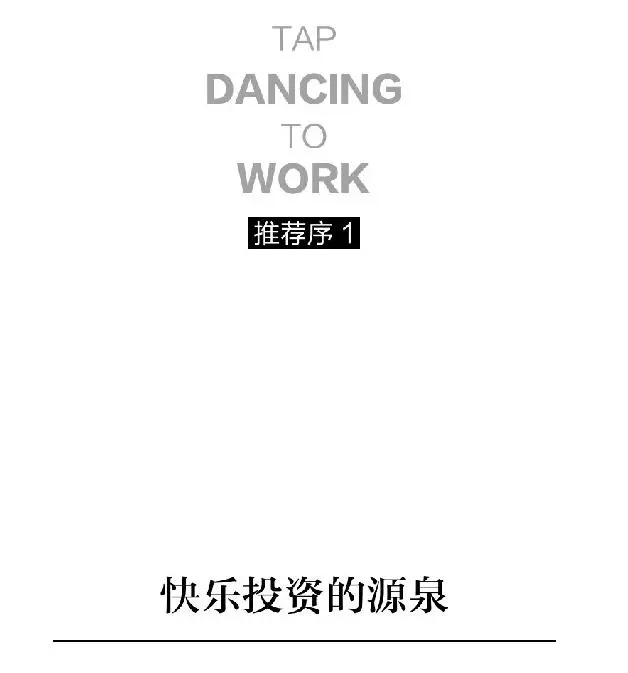

邱国鹭

高毅资产董事长

投资可以是很煎熬的一件事，也可以是很快乐的一件事。对于巴菲特而言，“跳着踢踏舞去上班”其实很好地描述了他每天的工作状态，因为他在生命中的每一天都只做自己喜欢的事，只和自己欣赏的人一起工作。不论资本市场如何千变万化，他只做自己擅长的事，投自己看得懂的企业。懂得取舍，是快乐投资的源泉。

投资中的每一个选择都是取舍。能力圈本身就是一种取舍，不熟不做是“舍”，在自己熟悉的领域中出重手则是“取”。避开瞬息万变的行业和复杂的商业模式是“舍”，选择有持续竞争力的简单生意是“取”。避开繁星满空、百舸争流的高度竞争性行业，在月朗星稀、胜负已分的行业里买赢家，“不数星星、数月亮”，又何尝不是一种取舍？

所谓取舍，先“舍”而后“取”，只有放得下才能拿得起，对于职业投资人而言，只有把短期排名压力放下，长期的优秀业绩才能拿得起；只有把短期的股价波动和当下的热点主题放下，企业的长期价值才能拿得起。

股市中获利的方式很多，但是，对于长期投资者而言，本质上投资的利润来源只有两种，一种是企业成长带来的内在价值增长，另一种是股价从低估回归到合理带来的估值提升。在喧嚣纷乱的股市中，能够静下心来关注投资的本质，平心静气地去挣企业低估的钱和企业成长的钱，而不受股市中各种噪音、各种诱惑的干扰，这也是一种取舍。

取舍有时是一种守拙，就如同曾国藩“结硬寨、打呆仗”那样，用一套稳定的打法，不急于求成，在自己的能力圈内用自己熟悉的打法打自己擅长的仗。即便巴菲特因此错过了一些高科技的投资机会，这也并不妨碍他在过去50年创造了令他人望尘莫及的可持续的高收益。

有取舍之后自然有聚焦，把资源和精力聚焦在自己擅长的领域里，少下注、下重注。古今中外的许多兵法书，如果非要找一个共同点，就是“集中优势兵力打歼灭战”。做投资，深度比广度重要，对少量的公司有很多了解的人，投资决策的准确性往往远胜于对很多公司有少量了解的人。毕竟，只有对所投公司基本面的深度研究和对其所在行业内在规律的切实把握，才有可能建立起自己的比较优势。“弱水三千，但取一瓢”，投资成败的关键是你对所取的那“一瓢”到底有多深的了解。

迄今为止，我只为三本书做过序，它们分别代表了价值投资的三种流派。第一本是《3G资本帝国》，3G资本擅长通过并购来控股品牌消费品企业，主动介入公司的经营管理，削减成本、提升效率来改善企业的盈利能力，这种积极行动主义的投资方式（Activist Investing），不局限于发现价值，而是直接参与到创造价值、释放价值的过程中去。第二本书是巴菲特的老师格雷厄姆的自传。格雷厄姆关于“市场先生”、“安全边际”和“买股票就是买企业”的基本思想一直是价值投资的基石，他的投资更注重低估值带来的安全边际，强调便宜是硬道理，赚企业价值被市场低估的钱。第三本即《跳着踢踏舞去上班》，收集了过去半个多世纪很多关于巴菲特的优秀文章。巴菲特早期的投资方式深受格雷厄姆的影响，以买便宜货为主。投资生涯中后期，巴菲特更注重企业的质地、生意的属性和管理层的能力和诚信，长期持有优秀的企业，做时间的朋友，赚企业内在价值增长的钱。

以上这三种投资方式，都是价值投资的康庄大道，都有集大成者。但是，第三种方式也许是最快乐的。之所以快乐，是因为你知道时间是你的朋友，你知道在等待的过程中，你所投资的公司的内在价值正在与日俱增。

快乐也来自于投资的社会意义。资本是稀缺的社会资源之一，把资本投给自己尊敬、欣赏和钦佩的企业家，让优秀的企业有更低的融资成本和更充足的资源，知道自己的投资优化了社会资源的配置，这也是快乐的源泉。

愿本书的每位读者都能够快乐地投资，快乐地生活。

## 推荐序2 一个聪明家伙的伟大故事

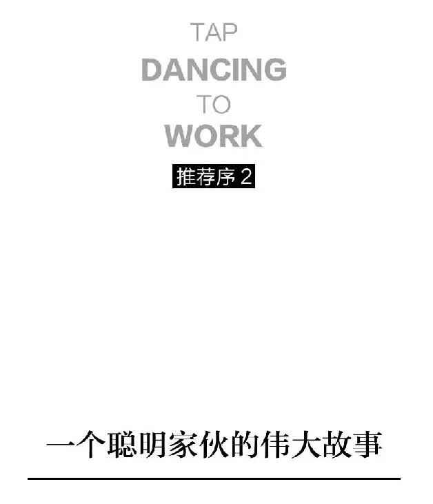

比尔·盖茨

微软创始人

在万众期待中，卡萝尔·卢米斯关于巴菲特的书终于问世了，我对此的兴奋之情绝对是不言而喻的。在漫长的40多年中，《财富》杂志一直不遗余力地关注巴菲特，并发表了多篇关于他的深度报道。《跳着踢踏舞去上班》一书异常巧妙地将这些很有价值的文章集结成册，而且这项工作由巴菲特最亲密的朋友卡萝尔·卢米斯亲自操刀。在这些文章中，有的是卢米斯写的，有的是《财富》杂志其他资深作家写的，有的是巴菲特自己写的，还有一篇是我写的。在追述我和巴菲特友谊的这篇文章中，我披露了不太为人所知的一点：对于结识巴菲特，起初我并不太情愿。当时，我父母邀请巴菲特、凯瑟琳·格雷厄姆、梅格·格林菲尔德一起来我家的度假屋过周末。和“这位擅长挑选股票的家伙”会面实在提不起我的兴趣，况且当时我还有很多正经的事要忙，于是我一再推脱。不过，我的母亲却不依不饶，非要我也出席。然而，聊了几句话，我立刻发现这是一位不同凡响的人，他的智慧和对商业的洞见绝对可以用石破天惊来形容。1991年7月的那个午后，我意识到自己遇见了一位罕见的天才，而且这种感觉一直持续到现在。从那以后，我开始不放过任何一个机会汲取其商业理念的精髓。在这个过程中，我才发现巴菲特对人生的认识同样能带给人无穷的启发。

《跳着踢踏舞去上班》以一种非常轻松的方式，将巴菲特对于企业和投资的思考淋漓尽致地展现了出来。书中的故事大致是以年代为线索而串联起来的。我相信，任何逐字逐句阅读完本书的人，都会有两种反应：第一，在漫长的职业生涯中，巴菲特难以置信地始终坚持着自己的洞察力和投资原则；第二，他对商业和企业的分析和思考直到如今都是无与伦比的。在1996年的那篇文章中，我写到，在自己认识的人当中，能将商业看得如此通透的人，除了巴菲特，绝无二人。直到今天，我仍然坚持这种看法。

显然，对于我们这些读者而言，卡萝尔·卢米斯为我们送上了一份丰厚的大礼。她不但在烟波浩淼的资料中将这些文章搜集起来，而且还对其中非常重要的文章添加了引人深思的说明文字。巴菲特商业生涯的各种言论，以卡萝尔·卢米斯本人为代表的极具天赋的观察家的言论，透过这些文字中闪烁的思维弧光，我们能够一览这位商界领袖和大慈善家的意识深处，这绝对是一件很有收获、值得花时间去做的事情。我希望所有人，包括那些自认为已经很了解巴菲特的人，都应该逐字逐句地阅读一下这本书。不论如何，我知道，我自己是一定会这么做的。

2026年3月14日

16:57

## 前言 我的老朋友，巴菲特

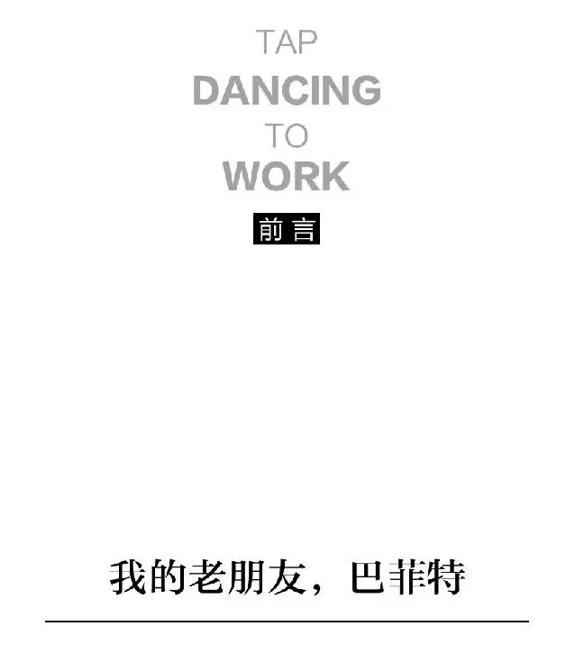

在《财富》杂志供职期间，我一直是“巴菲特”系列的主要撰稿人，这使得几十年来，相较于其他出版商，我对巴菲特有着更近距离的观察。很多人因此经常向我表达他们的意愿，希望我能写一部巴菲特的传记。我的答复总是“不”，因为我坚信对某一话题的熟稔并不一定能成就一部精彩的传记。事实上，我与巴菲特是超过40年的老朋友，而且刚认识他没多久，我就买入了伯克希尔哈撒韦公司的股票。这35年来，我每年还无偿地编订了巴菲特致股东的信。在为《财富》杂志撰写文章时，只要告诉读者这些事情，就能使我的文章受到欢迎。然而，以此为基础，去创作一部内容更为广泛的、关乎个人和专业领域的全新传记，我觉得并不妥。一般而言，传记的作者最好与当事人之间保持一定的距离。如果我和巴菲特没有这么熟，那么这个问题就不存在了。

想到这一点，我恍然大悟，过去在《财富》杂志发表的文章，本身就是货真价实的商业传记。只要稍加编辑，就能变成一本好书。您手中的这本《跳着踢踏舞去上班》，真实地展现了巴菲特多年来倾注满腔热忱经营伯克希尔哈撒韦公司的过程。本书大体上以时间为轴，辑录了一些关于巴菲特的重要文章。其中也包括一些短篇，比如《吉米·巴菲特和沃伦·巴菲特是亲戚吗》*（Are Jimmy and Warren Buffett Related）*。对于重要文章，我都做了介绍或是评注，总数大约40篇。评注的主要目的是解释，比如，故事中的哪个问题尤为重要，巴菲特所预见的是否成真，他本人如今对整件事有何看法等。总体来说，本书涵盖了相当长的一段历史，差不多有46年之久。这段时间不仅对巴菲特个人，对支撑巴菲特成功的美国经济来说也是相当重要的。“呣……46年，”巴菲特若有所思地说，“真是很久啊！差不多有美国历史的五分之一那么长。”

书中的文章和摘录大部分是由我和其他大约40位《财富》杂志的撰稿人完成的，其中约翰·休伊（John Huey）、瑞克·柯克兰（Rik Kirkland）和安迪·瑟沃（Andy Serwer）都先后升至主编，休伊后来还担任了《时代周刊》的总编。巴菲特自己也是作者之一，他曾特意为我们撰写了两篇重要文章。另外，巴菲特在伯克希尔哈撒韦公司年报的草稿中透露过许多内幕故事，我们在编辑时都删掉了，这次也会加入本书中单独成文。众所周知的商界写手比尔·盖茨也会在本书中出现。

本书的内容，如同作者的人数一样，也是极为丰富的。我们一直秉持的原则是，避免重复。整理成书的过程中，重复的内容基本都被剔除。事实上，做到这一点相当容易，因为巴菲特自己就一直走在创新的道路上。

读完此书，你将能够看到巴菲特在商业领域的人生轨迹。提及他的第一个故事发生于1966年，其实文中只有一句话提到了巴菲特，当时我的笔墨主要着力在另一个人身上，他就是阿尔弗雷德·温斯洛·琼斯（Alfred Winslow Jones）。不仅如此，我还把巴菲特的名字拼错了，少写了一个“t”。尽管有些徒劳，我还是试图宽恕自己的失误，自我安慰道：“1966年那会儿，在奥马哈，有很多投资人知道巴菲特，因为他使他们大富大贵，但在除此之外的地方，几乎无人知晓巴菲特是何方神圣。一晃到了20世纪80年代初。他也仍未站稳脚跟。”当《财富》杂志在1983年聘请自由作家安德鲁·托拜厄斯（Andrew Tobias）写一篇关于巴菲特致股东的信的文章时，托拜厄斯还没听说过这号人物。这也就意味着，托拜厄斯错过了一个大题材，巴菲特于1977年写给我们的有关通货膨胀的文章。巴菲特至今还会不断收到有关这个话题的邮件。

本书的中间部分，起始于1988年我写的一篇文章《巴菲特内幕》*（The Inside Story of Warren Buffett）*，主要讲述巴菲特成为投资家之后，是如何迈向企业家的新领域的。接下来，当然就是他如何将伯克希尔哈撒韦变成美国企业巨擘的故事。其实，现在几乎已经没人知道伯克希尔哈撒韦当初有多么微不足道。1965年，巴菲特接管该公司之时，它只是新英格兰地区的一家纺织厂，其距离《财富》世界500强榜单的门槛绝对是遥不可及的。然而，到2011年时，在500强榜单上它已经跃居第7位。这个排名是以公司总收入为根据的，这是世界500强排行榜最看重的一项数据。而按照巴菲特所最认可的一项数据，即市场价值，伯克希尔哈撒韦公司则排在第9位。

这一切居然都发生在一个人身上，而且他的传奇还远未结束。

本书最后的内容，也是巴菲特事业轨迹的完结部分。之所以这么说，是因为巴菲特已决定把他的投资和商业活动转向慈善事业。踏出这一步并不需要他发明某种理念。他从不相信继承遗产这回事，所有的钱几乎都被他投向了慈善事业。巴菲特曾一度觉得小他两岁的妻子苏珊·巴菲特（Susan Buffett）会比自己长寿，由她将所有的钱用于慈善事业是最好的选择。然而2004年的时候，苏珊却因突发脑卒中去世了。这使得慈善事业的重任又重新落到巴菲特的肩头，因此，他才在2006年声明将立即捐出自己的巨额财产。紧接着，他又在2010年，与盖茨夫妇共同发起了“捐赠承诺”（Giving Pledge）。《财富》杂志总是会率先报道这些事件，其实本书所有的封面故事都是如此。

你可以让一个人脱离投资行业，但是你不能剥夺他与生俱来的投资能力，这点毫无疑问。书中的最后一个故事，节选自巴菲特2011年致股东的信，他阐释了三种不同的投资类型以及他自己所偏爱的类型。他的选择并不出人意料，但是读完这本书，收获一些巴菲特的投资建议应该也不是坏事。

对于我来说，为了完成这本书，相当于重温了1954年至今，我在《财富》杂志的整个职业生涯，其间我总是不断提醒自己：“别忘了巴菲特名字里有两个t。”不过，这项工作更长远的意义，则在于我们能从巴菲特身上受益终身。巴菲特出色的投资和经商天赋、卓越的创造力以及同样重要的一点，永不停止的思考，都值得我们体会。

知名作家威廉·巴克利（William Buckley）的一位朋友曾这样评说过巴菲特和《财富》杂志之间的关系，我援引至此：“在沃伦·巴菲特成长为沃伦·巴菲特的过程中，《财富》杂志和我非常幸运地一直站在他身旁。”

## 01 没有人比得上琼斯

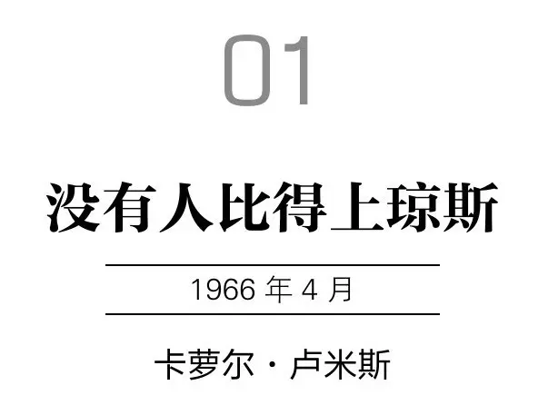

本是关于沃伦·巴菲特的一本书，却以阿尔弗雷德·温斯洛·琼斯作为开端，未免有点儿让人摸不着头脑。但事实上，将1966年有关琼斯的这段历史作为开篇，再合适不过了。这是巴菲特的名字第一次出现在《财富》杂志的版面上，不过令人羞愧的是，我们把巴菲特的名字拼错了，漏掉了一个“t”。这是我犯下的低级错误。当我和约翰·卢米斯（John Loomis，那时还是一位机构证券推销员，后来成为我先生）见过巴菲特本人后不久，他还致电小小嘲笑了我一番。不久，巴菲特和他的妻子苏珊，邀请我和约翰去纽约和他们共进午餐，也就是从那时起，我们之间建立起了朋友关系，也可以说，为本书的撰写埋下了种子。

另外值得一提的一点是，本文将琼斯以及其“对冲”的理念介绍给了全世界。琼斯并不是华尔街第一个创建私募基金的人：本杰明·格雷厄姆很早之前就成立了私募性质的合伙公司了。不过琼斯所取得的非凡成就激发起了大众对对冲的兴趣。对于那些急于践行“琼斯式”基金理念的人，这篇极为通俗易懂的文章可谓正当其时，因此也产生了巨大的影响。此后，人们总爱将本文视为对冲基金历史上一个重要的里程碑。

细心的读者往往会注意到，本文第一句话充满着难以掩饰的疑虑：“有理由使我们相信……”这实在不像是斩钉截铁的宣言。当然，我的疑虑不是空穴来风，尽管我查阅了琼斯公司的历史，几乎认定无人能出其右，但我的调查并未能穷尽其他所有投资者，所以我也不敢下十足的论断。

随后，我们拿到了奥马哈的巴菲特合伙公司（Buffett Partnership, Ltd\.）的成绩单，而之前我们已掌握了琼斯公司10年的业绩记录。对这两家公司的业绩进行对比固然是一件很有趣的事，但又很难得出什么结论。巴菲特合伙公司的会计年度主要是以自然年度为准的，其中只有9项财务数据滞后于自然年度。琼斯公司1965年的会计年度结束于5月，这期间，它的成绩是325%，而巴菲特合伙公司的会计年度结束于12月，成绩是334%。

这些都早已成了历史的烟云，二人的职业生涯也随之分道扬镳：正如下一篇文章所讨论的，巴菲特关闭了他的合伙公司，而琼斯仍然坚持战斗在不断成长的股市上。对对冲基金来说，当时可是一段相当艰难的时期。

——卡萝尔·卢米斯

有理由使我们相信，少言寡语，不喜曝光的阿尔弗雷德·温斯洛·琼斯是如今最专业的投资经理人。在商界可能很少有人听说过他，记性特别好的人或许还记得他曾为《财富》杂志写过文章。20世纪40年代初，他担任过《财富》杂志的特约撰稿人。然而，在股市中，他近些年的表现已经将他送上了神坛，荣膺华尔街的传奇人物。同时，他也让他的几位投资者成为百万富翁。1963年5月31日之前的5年中，琼斯持有的投资组合创下了325%的总回报率。相较之下，在共同基金领域中叱咤风云的富达趋势基金（Fidelity Trend Fund）也只有225%的总回报率。在这之前的10年中，琼斯创下了惊人的670%的总回报率，而作为过去10年表现最佳的德雷福斯基金（Dreyfus Fund），总回报率为358%。

实际上，琼斯经营的并非是共同基金公司，而是一个有限合伙公司。琼斯旗下有两家这样的合伙公司，它们有着不尽相同的投资目标。尽管如此，每家公司的基本投资策略还是一样的：使用杠杆并进行对冲。杠杆意味着它们总是尽可能将自有资金充作保证金，以扩大交易规模。对冲则与空头头寸密切相关，在这两家公司的投资组合中往往都会持有空头头寸。每家公司都大约有60位投资者，他们的平均投资额大约为46万美元。

琼斯的成就带动了“对冲基金”的大繁荣。在1965年之前的两年中，琼斯的两个得力助手先后离开了他，建立了自己的合伙公司；一家叫作城市联合合伙企业（City Associates），资本额约为1750万美元；另一家是费尔菲尔德合伙企业（Fairfield Partners），资本额约1400万美元。两家公司都取得了辉煌的业绩。

1965年4月，一家新的合伙公司弗莱世贝克联合公司（Fleschner Becker Associates）也加入了对冲基金的阵营。该公司的负责人都是华尔街的经纪人，而且在过去几年均与琼斯保持着生意上的往来。除此以外，还有为数不少的小型对冲基金如雨后春笋般涌现出来。

不止于此，曾与琼斯做过生意的哈布斯曼经纪行（L\.Hubshman&Co\.）竟绕过了合伙公司的形式，直接设立了开放式基金，也就是共同基金。哈布斯曼基金（Hubsh\-man Fund）的操作也将按照对冲基金的模式进行。当然，一家受到管控的投资公司能否像小型的私人合伙公司那样，充分有效运用琼斯的理念，还有待观察。不过，不论怎样，对大批有意在对冲领域分一杯羹的投资者，哈布斯曼基金的出现还是开辟了一条新路径。

琼斯已年逾65岁了，他人生的大半时间都贡献给了社会学以及对股市的研究。1938年，他前往哥伦比亚大学攻读社会学博士学位。在这期间，他同时担任了哥伦比亚应用社会研究所（Columbia’s Institute for Applied Social Analysis）的主任一职，承担着一项研究美国社会等级差别的重要课题。这个课题成了其博士论文《生命、自由和财产》*（Life, Liberty, and Property）*的基础。1964年，该作品由奥塔哥书局（Octagon Books）再版。1941年2月，《财富》杂志邀请琼斯将这部书浓缩成为一篇文章，并聘请他为撰稿人。在此后5年的时间里，他成为《财富》杂志的一员，撰写了不少非金融类的文章，比如大西洋船队、农场合作化以及男孩的学前教育等。1946年，他离开了《财富》杂志。1949年3月，他以自由撰稿人的身份为《财富》杂志撰写了一篇《预测的时尚》*（Fashions in Forecasting）*，在该文中，他从各个方面探讨了股市中的“技术”方法。

对这个问题的深入探讨，使他坚信自己可以在股市中站稳脚跟。1949年年初，他和4个朋友一起，以合伙的形式成立了琼斯公司。他们的初始资金只有10万美元，其中四成来自琼斯本人。公司成立的第一个年头，他们就以17\.3%的资本收益率一鸣惊人。然而，这不过是“小荷才露尖尖角”，如果初始资本全部留在公司的话，扣除合伙人各种税负之前，如今的资本额将高达492万多美元。

早前，琼斯对各种投资方式进行了尝试，包括几乎是由他首创的“对冲”技术。慢慢地，他开始专精于完善和实践这种新技术。

实际上，无论股票市场是上涨还是下跌，对冲理念都能保证琼斯拥有获利的空间。而且，即便他对股市的走向判断失误，对冲也能给予他一定的庇护。他认为精明的投资者总会想方设法保护其资本免受误判的风险。大多数投资者会持有现金或是债券来应对突发情况，但琼斯则通过卖空来保护自己。

很多投资者对卖空心怀疑虑，但琼斯告诉他们，他只是“用投机的技巧来达成保守的目标”。为了证明自己的观点，他将自己的方法与其他投资者进行了对比。通常，一个手持10万美元的投资者，会抽出8万美元购买股票，剩下的部分则选择“安全”的债券。而如果琼斯有10万美元，他会用其做抵押再借5万美元。以目前70%保证金的要求而言，他无法借到如此大笔的款项去购买上市的股票；但是，假如去购买可转换债券和未上市的股票，他就可以借到这笔钱。有了这笔总额达15万美元的巨款，他可以将11万美元投资到自己喜欢的股票上，卖空价值为4万美元的他认为被高估的股票。通过此操作，他最终锁定了4万美元的多头仓位，还剩下7万美元的多头敝口。

7万美元大约占了其初始资本的70%，因此琼斯把他的“风险值”定义为70。但实际操作要比这复杂得多：琼斯对这些数字进行了“调整”。他假定某些个股稳定性较差，因此比其他个股风险更高。琼斯会为其投资组合中的每只股票都进行“速度”评级，比如新聚思（Syntex）是6\.61，克尔\-麦吉公司（Kerr\-McGee）是1\.72。接着他将用投资金额乘以这些系数。“调整”后的数字就被用来衡量风险的高低。比较传统的投资者会将2万美元投入债券，既不借钱，也不卖空，利用琼斯的方式来衡量，其风险值就是80。如果股市下跌10%，这两类投资组合中的股票也跟随大势，表现不佳。不过，由于在琼斯的投资组合中对冲的部分会反方向获利，因此其损失就将少于那些未对冲的投资者：琼斯的亏损额将小于7000美元，而其他投资者的亏损额为8000美元。然而，如果股市大涨10%，琼斯的收益也会少于其他投资者。

因此，琼斯所面临的问题就是，购买那些涨势高于市场平均值的股票，卖空涨势乏力或下跌的股票。如果他的理论奏效，那么其回报也会是成倍的，因为他可不只是利用手头的金额，而是150%的资金。对冲概念的最大优势在于，投资者的空头头寸使得他能够集中火力最大化地操作多头。

琼斯对股市走向的预测能力和记录，恐怕只能算“成绩平平”。1962年初，他曾让自己的投资者担负着140的极高风险值。随着行情下行，他渐渐开始增加空头头寸，但是手脚略慢了一些。那年春季，他损失惨重，但当该财年结束的时候，他的投资者只受到了一点小小的打击，这是琼斯历史上唯一一个“亏损”年度。经过上述转变之后，他逐渐开始加大空头的操作，因此错过了随后的市场反弹。1965年，相同的情况再次发生了，当年五六月市场处于低潮时，琼斯保持着相当乐观的态度，而当行情大反弹到来的前夜，琼斯又转而看跌。在股价大涨的8月，琼斯的风险值实际上已经降至负18。换句话说，随着空头敝口已达到合伙公司资本额的18%，他的空头头寸超过了多头头寸。

抛开琼斯对股市走向的判断失误不谈，他在选择个股方面还是相当出色的。当他终于在1962年秋天转为看涨时，手头正持有许多“正确”的股票，比如，新聚思、国家影像公司（National Video）、仙童（Fairchild Camera）和航空股。到了2月底，他旗下的一家公司获得了高达38%的回报率，另一家也收获了不俗的31%的回报率，而同期道琼斯工业平均指数只有6%的回报率，包括股息。

“没有对冲，我连安稳觉都睡不成。”尽管很多对冲基金的操盘手会这样说，但他们仍认为自己成功的真正秘诀是，掌握有效的股票信息的能力及快速行动的决断力。合伙公司的形式对这两方面都很有裨益，因此对琼斯的安排进行一番细致的观察显然是非常有意义的。

1952年，琼斯把一家很普通的公司转型为有限合伙公司，因为他的很多朋友迫切希望琼斯能够帮他们打理资金。琼斯在吸纳资金的同时也告诫这些新合伙人，他们可以从合伙公司取走资金，亦可投入新资金，但这只能在每个财年即将结束的时候进行。这个协议至今有效。不仅如此，琼斯和其他负无限责任的普通合伙人要从负有限责任的合伙人赚取的净利润中，收取20%的提成。如今这已成为所有私募基金的常规做法。大名鼎鼎的本杰明·格雷厄姆就曾按照这种分配方案经营过有限合伙公司。现在，奥本海默基金（Oppenheimer Fund）、股权基金（Equity Fund）以及利昂·艾伦基金（Leon B\.Allen Fund）等共同基金的经理人都根据回报率来收取提成。当然，他们的所得可能比琼斯要差远了。哈布施曼基金也将采取这种分配方案。

鉴于琼斯为有限责任合伙人所带来的丰厚回报，他们似乎没有理由抱怨高额的佣金。那些鼓舞人心又在业界名列前茅的回报率数据，实际上已经扣除了普通合伙人拿走的那部分提成。换句话说，有限责任合伙人所获得的回报率数据远未能真正体现出琼斯的辉煌业绩。显然，与富达趋势和德雷福斯相比，他的业绩绝对算得上是硕果累累。

许多人由此会产生一些小疑问：这么多年过去了，应该有大批的投资者挤破头地涌入琼斯的合伙公司。不过，由于公司属于私募，并未注册，所以琼斯每年只是吸收为数不多的几位合伙人加入，而且常常是现任合伙人的亲人或密友。

尽管如此，发展至今，合伙人的组成仍可谓形形色色。路易斯·史蒂文斯（Louis E\.Stephens）大概是有限责任合伙人当中收益最高的一位。这位来自墨西哥城的商人，退休前，曾是大众用品化学公司（General Products S\.A\.）的总经理。在1966财年年初，他向琼斯旗下的一家合伙公司投入了226万美元。由医生改行做雕塑家的阿里·西奈可（A\.Arlie Sinaiko）分走了另一块大蛋糕，他以及其家族共向琼斯投资了200万美元，而整个投资组合如今增值了近一倍。理查德森家族的成员通过理查德森\-梅里尔（Richardson\-Merrell）的关系成了重要的合伙人，包括公司董事长史密斯·理查德森（Smith Richardson Jr\.）。《列宁的一生》*（The Life of Lenin）*等书的作者路易斯·费希尔（Louis Fischer），还有享誉世界的桥牌大师萨缪尔·斯泰曼（Samuel Stayman），也都是琼斯的合伙人。斯泰曼的财富积累主要来自羊毛生意。除了琼斯以外，他还投资给了另外两家著名的对冲基金公司，分别是城市联合基金和费尔菲尔德基金。奥马哈的巴菲特（此处少拼写一个“t”）合伙公司是一家具有私募性质的公司，它专精于长线投资，并且颇为成功。其资本额约为4500万美元，它也吸纳了斯泰曼的部分投资。在对冲基金领域中，其他比较知名的人物还有洛伊剧院（Loew’s Theatre）的董事长劳伦斯·蒂施（Laurence Tisch），凯勒伍德公司（Kellwood Company）的前董事长莫里斯·伯尔斯坦（Maurice Perlstein）。

到了1966年6月1日，琼斯的有限责任合伙人的投资总额达到了4489\.8万美元。其中500万美元来自10位普通合伙人的直系亲属。普通合伙人不仅同意将自己的投资一直保留在公司内，还增加了500万美元的新投资。其中，琼斯一个人就独占了200万美元。他的两个儿子，同时也是有限责任合伙人，也共同投资了250万美元。即便算上1966财年内已经获得的收益，琼斯一共也只管理着7000万美元的资金。就算再加上借的钱，这个数字也不会大于一家中等规模的共同基金。

不过，尽管琼斯掌管的资金规模不大，但他却在华尔街制造了轰动效应。如同所有对冲基金的经营者一样，琼斯极高的交易频率总能产生大量的手续费。由于短期卖空的得与失无足重轻，所以对冲者会频繁地进进出出。同样，当卖空造成损失的时候，他很容易从多头操作的短期回报中得到补偿。因此，从总体看来，对冲基金所掌握的资产组合会呈现出很高的换手率。

对冲基金之所以表现出大规模地在一只股票上进进出出的天性，有一个原因至关重要。相比于其他基金公司，它有一种独特的能力，能确保其可以从股票经纪人那里第一时间获得有效的消息。大多数共同基金只能无奈地将自己收到的大部分手续费（可能高达90%）支付给向大众兜售基金份额的经纪人。对于那些无助于共同基金的销售、但研究能力很强的公司，它能投入的资金就所剩无几了。与此正好相反，合伙人私募基金，不需出售股份，因此可以为调研提供充足资金。以琼斯为例，这笔支出形成了一个闭环。琼斯所有的交易指令均由经纪商纽博格巴曼（Neuberger Berman）负责，不过，后者通常只保留大约50%的手续费，剩下的一半儿将以“交易转移”（give\-up）的形式交给琼斯指定的经纪人。有一家琼斯非常倚重的经纪公司，每年因此能得到近5万美元的“交易转移”资金。超过1/3的资金将奖励给负责交易账户并提供有价值信息的业务员，于是这些业务员自然就非常乐意及时与琼斯共享信息。

琼斯的组织结构能保证他及时做出买卖的决策，而无须高层集体磋商。琼斯一共有5位投资组合经理，他们都是普通合伙人，而且每位都有动用一定比例合伙资金的权力。不止于此，由一位投资顾问和几位经纪公司分析师或业务员构成的外部“顾问”团，也有权操作大笔资金。不论是琼斯，还是二号人物唐纳德·伍德沃德（Donald Woodward），一般只是在指令执行前过目一下。只有当合伙人过量购买某只股票，比如，如果某些投资经理人同时在抛售该股票，或者其排兵布阵明显是把自己逼入“死地”时，他们才会出面干涉。

投资经理人会告诉你，鉴于市场正处于大牛市，他们最棘手的工作其实是发现优质的卖空机会。华尔街的分析师全都集中精力去发现那些涨势良好的企业，极少建议琼斯做空。这样一来，即便在短线投资组合仅仅达到盈亏平衡时，琼斯和其他对冲基金经理人就认为自己是幸运儿了。上个月初，琼斯做空了60只不同的股票，包括科尔维特（Korvette）、安德美（Admiral）、百时美施贵公司（Bristol\-Myers）和杜邦公司（Du Pont）等的股票。然而，当时所有大型的对冲基金都在做空控制数据（Control Data）。

最近，琼斯把大部分时间花在了旅行和慈善项目上，所用的资金主要来自他私有的志愿服务基金（Foundation for Voluntary Service）。他已经多次赞助美国和平工作队（Peace Corps）的实地考察工作。__有趣的是，即使在公益组织中，琼斯也坚持对冲的概念，他自己的基金目前还支持着由5位来自印度的年轻社会工作者成立的、号称“反和平工作队”（Reverse Peace Corps）的活动。__他还在考虑撰写另一本关于如何解决美国贫困问题的著作。

## 02 对冲基金遭遇艰难岁月（节选）

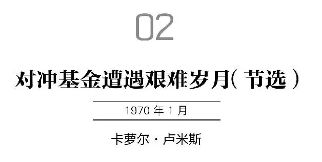

这一波大牛市持续了多年，并于1968年达到顶峰，很多人在疯狂投机的市场中赚得盆满钵盈。然而，1969年，对冲基金领域却被熊市狠狠地扇了一巴掌，本以为能够保护基金免受损失的对冲战略大都功亏一篑。大多数基金公司都报亏，很多公司面临合伙人撤资的窘境，有些甚至关门大吉。

与之形成鲜明对照的是，巴菲特合伙公司（本文并未着墨许多的话题）却在1969年大赚了一笔，保持了它不间断盈利的战绩；同时，该公司规模不断壮大，资产额达到1亿美元（琼斯经营的两只基金总额约1\.6亿美元）。

尽管如此，当时39岁的巴菲特还是对股市的现状充满了忧虑。他认为，1968年的过度投机是一种很疯狂的行为。“这是一个我不了解的市场。”他说。不仅如此，他还认为依靠投资股票来获取回报将会变得越来越难。因此，1969年，即创办该公司的15年之后，他宣布将在年底清算巴菲特合伙公司。

我们援引的文章将以此为起点，用了两段的篇幅来讨论巴菲特。从这两段摘录中，我们还了解到，巴菲特为他的有限责任合伙人带来了丰厚的回报：23\.8%的复合年回报率，并保持了13年。如果不扣除巴菲特的激励薪酬，该公司的复合年回报率更是达到了令人咋舌的29\.5%，而同期道琼斯工业平均指数的回报率只有7\.4%。巴菲特本人也因成功经营合伙公司而积累了2500万美元的资产。

巴菲特之所以关闭合伙公司，最主要的原因还是股市的回报率越来越低了。这是实情，因为随后股市就进入了一段很艰难的时期，尤其是在1973—1974年。尽管如此，在接下来的几十年，投资者还是从股市中获得了相当大的回报。巴菲特是幸运的，作为伯克希尔哈撒韦公司董事长兼首席执行官和巨额资金的掌舵人，他重新回到了充满惊涛骇浪的市场。当然，那些追随巴菲特的投资者也是最幸运的人。

巴菲特还谈到了关闭公司的其他原因，如停下积累资金的脚步，去开始一些新的事业，当然这并未成真。金钱，并不是驱使他前行的动力，他至今十分低调、朴实的生活就是证明。创造财富，对他而言更像是永不休止而无比刺激的游戏，关闭合伙公司只是一局游戏的结束，接手伯克希尔哈撒韦则使他重整旗鼓、卷土重来。

——卡萝尔·卢米斯

1970年注定是很不同寻常一年。正是在这一年中，很多经营不善的基金公司走向末路，另一些公司则在调整和挣扎。另外，美国持续时间最久、规模最大也是最成功的投资合伙公司，即巴菲特合伙公司，也宣布要清算了。将巴菲特的合伙公司称作私募基金，可能有点不精准。显然，只有当巴菲特分割有限合伙人的利润时，他的合伙公司被称为私募基金才显恰当。按照他不同寻常的分配方式，回报率低于6%时，有限合伙人保留全部年收益；回报率高于6%时，他对超过的部分抽成25%。除此之外，他的公司和一般的私募对冲基金还是有很大区别的：公司的资金几乎全部用于长线的“价值”投资。在这点上，巴菲特的业绩是卓越的。13年的经营（包括1969年）全部实现了盈利，复合年回报率接近24%。

然而，令他的有限合伙人无比遗憾的是，巴菲特现在要退出比赛。他这么做的原因有很多，包括他强烈地感觉到自己的时间和金钱（他的身家远不止百万）应该以其他的目标为导向，而不是一味机械地赚钱。而且，他对市场前景也持保留态度，股市的油水已经流干了，未来再想获得可观的回报恐怕很难。因此，他建议投资者应该采取“消极”的方式，与其投资股市，倒不如在市政债券方面动动脑筋。

2026年3月14日

16:57

## 03 通货膨胀如何欺诈股票投资者

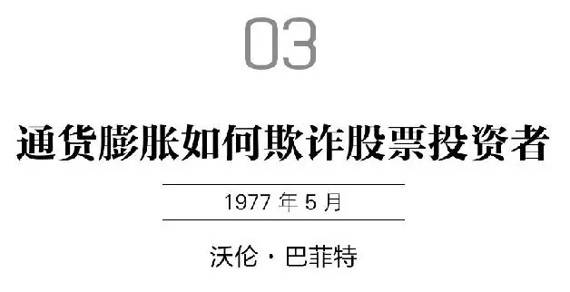

本书收录了巴菲特撰写的12篇文章，其中两篇是当初他给《财富》杂志的投稿，本文就是其中的一篇。在其他的篇目中，有两篇来自他的两次重要演讲，我们将其整理成文；一封是他写给国会议员的重要信件；另外还有他的《慈善承诺》以及6篇伯克希尔哈撒韦公司的年报摘要。

作为本书第一篇巴菲特亲笔撰写的文章，它的背后还藏有一段往事。丹尼尔·塞利格曼（Daniel Seligman）是《财富》杂志非常出色的高级编辑，他曾专门前往奥马哈与巴菲特沟通本文第一稿的修订问题。塞利格曼发现这位只收1美元稿费的作者基本拒绝删减，也不太同意做任何改动。塞利格曼一度非常沮丧，于是致电《财富》杂志的主编鲍勃·卢巴（Bob Lubar），建议不要刊登这篇文章。然而，卢巴认为，这篇文章很有价值，而且不需要修改。

于是，这篇文章最终面世了，当然还是看得出塞利格曼做了一些修改。早期巴菲特在思考复杂问题方面的超群才能，无疑在这篇文章中得到了完美展现。直至今日，文中的真知灼见仍然熠熠生辉。巴菲特和《财富》杂志都还保留着当时讨论问题时的来往信件。

尽管如此，本文仍有许多不够准确的地方。首先，巴菲特以及当时的整个商业界都认为，高通货膨胀率将会持续，而且会成为笼罩在投资者头上的挥之不去的阴影。然而，他没有预料到的是，天才保罗·沃尔克（Paul Volcker）在1979年就任美联储主席，一举击碎了猖獗的高通货膨胀率。

其次，巴菲特还错判了企业税率的走向，他认为其“不太可能”下降。不过事实上，自1979年起，随着一系列减税政策的出台，美国的边际税率从当时的48%降到如今的35%。

透过上述的前提，我们才能明白，为什么巴菲特坚信，如果购买大企业的股票，回报率必将徘徊在12%左右。1981年，我在《突破瓶颈的盈利》*（Profitability Breaks Through a Ceiling）*一文中指出，尽管过去的5年仍旧难以摆脱高通货膨胀率，但《财富》500强企业的净利润率的中位值已经提高到14\.8%。文章还提到，这一飞跃应归功于财务杠杆比率的提高，税率减免以及税前利润率的增长。

如今，巴菲特认为，如果资本主义制度持续完美地运行，竞争压力必将导致企业的利润率下滑。尽管如此，他还是补充道：“我的猜测被证明是错误的，尤其是关于税率的部分，这是无可争议的事实。”

然而，他仍然坚信，高通货膨胀率一定会榨取股票投资者的资金，而且他还用大量数据来佐证自己的观点。这些数据均来自那些有着惊人通货膨胀率的年份。巴菲特回忆说，1982年之前，也就是沃尔克还没将通货膨胀率降至8%以下的那些年，尤其是1977年，股票投资者的购买力损失惨烈。

——卡萝尔·卢米斯

在高通货膨胀率的环境中，股票和债券一样表现不佳，这已经不是什么秘密了。在过去10年的大部分年份里，我们就处于这样的市场环境中。对于股票投资而言，这的确是一段艰难岁月。然而，股市为什么会在这个阶段遭遇困境，其原因仍然没有被人们完全理解。

在通货膨胀时期，证券持有者所遇到的问题一点也不神秘。在美元逐月贬值的情况下，想依靠那些用美元结算收益和偿付本金的证券来获利，显然是非常困难的。你根本不需要读个经济学博士学位就能明白其中的道理。

然而，长期以来，人们一直假设，股票并不是普通的证券。很多年来，传统的观念坚持认为，股票是对通货膨胀的对冲。这种主张基于的理由是，股票并不像债券那样，与美元直接挂钩，它代表着对制造业企业所有权的享有。因此，股票投资者认为，无论政客们如何操纵印钞机，他们仍然能保持其投资的实际价值。

那么，为何事实却与此背道而驰呢？我认为最主要的原因是，经济实体中的股票和债券非常相似。

我知道这个观点对于很多投资者而言有些离经叛道。他们肯定会立刻反驳道，债券的回报率（息票）是固定的，而股票投资的回报率（企业净利润）则可能像过山车一般大起大落。看起来的确如此。不过，如果你认真研究过第二次世界大战后企业每年的净利润，就会发现很不寻常的情形：其实，净资产收益率的起伏并不大。

第二次世界大战结束之后的第一个10年，也就是到1955年之前，道琼斯30种工业股票的年均净资产收益率为12\.8%。在接下来的第二个10年，这项数据为10\.1%。在之后的第三个10年，这一数字为10\.9%。如果把视野拓宽至《财富》500强企业，通过追溯自20世纪50年代中期以来的数据，也会发现相似的结论：1965年前的10年内，它们的年均净资产收益率为11\.2%，此后10年为11\.8%。在某些特殊年份，这一数字则大幅提高，比如，在1974年，《财富》500强企业的净资产收益率达到了14\.1%，而在某些年份则比较低，比如1958年和1970年，这一项数据只有9\.5%。__不过，纵观这些年，总体来看，净资产收益率有回归至12%左右的趋势。在通货膨胀的年份里，没有迹象显示出，该数据会大幅超过这一水平，物价稳定的年份也是如此。__

说到这儿，让我们思考一下企业的本质：它们并不是交易所中的那些抽象的代码，而是具有生产性的企业。我们假设企业的股东是以企业账面净资产的价值获得了企业所有权。因此，他们自己的回报率也应该是在12%左右。又因回报是持续性的，所以我们有理由将其看作“股票息票”。

在现实情境中，投资者当然不会只是简单地买进和持有，很多人会研究对策，以保证能击败其他投资者，最大化自己所占有的企业盈利比例。事实上，这种折腾对大局并无补益，不仅对股票息票不会造成什么影响，还可能减少投资者的回报，因为在这个过程中难以避免地会滋生大量交易费用，比如咨询费和手续费等。引入一个活跃的期权市场，并不会提升美国企业的实际生产效率，相反，这个赌场需要配置数以千计的人手，这使得交易费用进一步增加。

另外，在真实世界中，投资者通常很难以企业净资产的账面价值购买到股票。有时，他们的运气不错，能以低于账面价值的价格买入。不过，更常见的情况是，他们必须溢价买入，而这对于12%的回报率来说又是一大压力。我会在稍后探讨这其中的关系。现在，让我们把注意力放在一个要点上：通货膨胀率上升了，净资产收益率却没有。从本质上来说，买入股票，就相当于获得了拥有固定收益的“有价证券”，这跟购买债券没有什么区别。

当然，从形式上看，债券和股票的区别还是很大的。首先，债券终将会到期，尽管这可能需要等待很长时间，但债券投资者终会等到重新谈判合约条款的那一天。如果当前和预期的通货膨胀率很高，从而使以前的债券票面利息显得过低，那么投资者就会拒绝再买。除非提高当前的票面利息，重新燃起他的兴趣。近几年，这种情况总是频繁出现。

然而，股票则是无期限的，它们天然地被盖上了“永久”的戳子。股市的投资者要听命于美国企业的利润。如果美国企业注定要赚12%，那么投资者就必须学会接受这个数字。作为一个庞大的群体，股市投资者既不能退出，也无权重新讨论条款。所以综合来看，他们承担的义务增加了。个别企业可能被出售、清算或者回购自己的股票，但总体而言，新股发行以及留存利润，可以确保锁定在企业系统里的权益资本不断增加。

综上所述，债券要略胜一筹。债券息票最后会被重新协定，而股票“息票”不会。当然，12%的回报率在很长的一段时期内似乎不需要大的修正。

拥有独特的12%的息票率，身着“股票”的华美外衣，“股票债券”（equity bond）翩然而至华尔街的化妆舞会。它与普通债券还有另一个显著的差别。

在一般情况下，债券投资者在兑现息票获得现金之后，会再次择优进行投资；而股票投资者的股票“息票”，会部分保留在企业手里。企业会根据自身的盈利情况进行再投资。换句话说，每年12%的利润中的一部分将被当作股息支付给投资者，而剩下的部分又滚入下一个12%的生产过程中。

__股票的这一特性，即部分回报用于再投资，既可算优点又可算缺点，这取决于12%的回报率到底有多诱人。__在整个20世纪50年代和60年代早期，这的确是个好消息。当债券的回报率只有3%～4%时，能够有权自动把股票收益的一部分，以12%的回报率进行再投资，这具有极大的价值。不过，需要提醒的是，投资者不可能在投入自有资金后就自动获得12%的回报，因为在那个时期，股票价格已大大地超过了它对应的净资产账面价值，所以，不论股票的回报率是多少，溢价使得投资者不可能完整地获得这个回报率。这就好比息票率为12%的债券，如果你以远远超过票面价值的价格购买，那么就无法获得12%的回报。

不过，股票投资者仍然可以享有留存利润所带来的12%的回报。事实上，留存利润意味着投资者可以按账面净资产的价格买下这家企业的一部分，而在当时的经济环境下，购买企业所要支付的价格会远高于企业账面净资产的价值。

在这种情况下，人们自然对现金股息敬而远之，而对留存利润趋之若鹜。实际上，想以12%的回报率进行再投资的资金越多，这种特性就会愈加珍贵，而投资者愿为此付出的价格也就越高。20世纪60年代早期，投资者就曾心甘情愿地为经济高速增长地区的电力公司股票支付高溢价。因为他们知道这些成长型公司有能力将大部分利润再投资以赚取更多回报。与此形成鲜明对照的是，那些受经营环境所迫，只能大量派发现金股息的公用事业企业的股票价格则相对较低。

如果在那一时期，存在一种高等级、不可赎回、息票率为12%的长期债券，它肯定会以远远高于其票面价值的价格出售。此外，假设这种债券还有另外一个不同寻常的特性，如该债券的大部分利息可以自动再投资于类似的债券，那这些债券必将享受更高的发行溢价。从本质上来说，成长股正是此类证券的代表，它们通常会保留大部分利润进行再投资。当新增的权益资本再投资的回报率是12%，而普通债券的票息率只有4%左右时，股票投资者必定是非常满意的。当然，他们也为此付出了过高的价格。

仔细回顾一下就会发现，1946—1966年期间，股票投资者实际上获得了三重好礼。__第一，企业的净资产收益率远远高于当时的基准利率；第二，企业的大部分利润都被留存起来，以很高的回报率进行再投资，而其他途径难以获得这么高的回报率；第三，随着人们普遍认识到前两个优势，除了最基本的约12%的净资产收益率外，股票投资者还获得了额外奖励。__道琼斯30种工业股票的市净率从1946年的133%涨到1966年的220%，在这个过程中，投资者确实在短期内获得了超过所投资企业内在盈利能力的回报率。

到了20世纪60年代中期，众多大型投资机构终于发现了这一“至宝”。然而，就在这些金融巨头开始争相买入股票时，高通货膨胀率、高利率时代到来了。很自然地，股票价格上涨的趋势开始逆转。利率的上涨无情地降低了所有固定收益类投资品种的价值。随着企业长期债券的回报率开始上升（最终升至10%左右），股票12%的回报率和再投资特性也开始被人们遗弃了。

投资者普遍认为股票的风险比债券大，这一点无可厚非。虽然股票回报率长期来看大致固定，但每年的确有波动。这种波动大大影响了投资者对未来的态度，尽管这种影响经常具有误导性。投资者认为股票风险大的另一个原因是到期日遥遥无期。由于这层额外风险，投资者自然期望股票的回报率“稳稳”高于债券的回报率。例如，如果债券的回报率为10%，而同一类型企业的股票的回报率为12%，那么这就不能算“稳稳”。随着回报率之间的差距缩小，股票投资者就开始另寻出路了。

当然，无论如何，股票投资者作为一个整体是不可能彻底退出的。他们所得到的只是更多的换手、大量的交易费用以及被不断创新低的估值。这反映出，在高通货膨胀的环境下，回报率为12%的股票，其吸引力在降低。过去的10年里，在经历了接二连三的打击之后，债券投资者认识到，再高的利息都不保险，无论是6%、8%还是10%，都无法阻止债券价格的崩溃。由于股票投资者还没有完全意识到自己持有的也是一种“债券”，所以他们还得继续接受市场的教育。

12%的净资产收益率注定是一成不变的吗？是否存在着某条法律，禁止企业提高其净资产收益率，以应对似乎永远在不断攀升的通货膨胀率呢？

事实上，并不存在这样的法律。美国企业并不能随心所欲或通过制定法律来提高企业利润。要提高净资产收益率，企业至少需要做到以下其中一点：

●提高周转率，即销售收入与总资产的比率

●更便宜的杠杆

●更高的杠杆率

●降低企业所得税

●更高的营业利润率

除此之外，没有其他途径能提高净资产收益率了。因此我们来谈谈自己对此可以做点儿什么。

__提高周转率__

先从周转率开始。关于这个问题，我们必须考虑三类主要的资产：应收账款、存货和固定资产，比如厂房和机器设备等。

不管是由销量增加引起的还是由通货膨胀引起的，只要以美元计的销售收入增加，应收账款也会成比例增加。这里没有改善应收账款周转率的空间。

至于存货，情况就没这么简单了。从长期来看，一般认为，单位存货的变动趋势会与单位成品的销售趋势吻合。不过，在短期内，存货实物的周转率会因特殊因素而变化无常，比如，成本预期或生产瓶颈问题等。

在通货膨胀时期，采用“后进先出法”（LIFO）的会计方法来计算存货的价值，将有助于提高报表上的存货周转率。当通货膨胀引起销售收入增加时，对于采用“后进先出法”的企业而言，如果销售单价没有上涨，存货的总价值将维持不变；而如果单位售价提高了，存货的总价值将随着销售收入的增加而增加。无论哪种情况，存货周转率都将增加。

20世纪70年代的早期，“后进先出法”为各企业所青睐，并逐渐成为一种显著的趋势，因为这样做会降低企业报表上的利润和税收。目前这种趋势有减缓的迹象，但仍有不少已经采用这个原则或有意实施这个原则的企业不愿放弃，以期进一步增加报表上的存货周转率。

在固定资产方面，假设通货膨胀对所有产品的影响都一样，那么，通货膨胀率的任何增长，将首先提高固定资产周转率。这是因为，销售收入会立即反映新的价格水平，而固定资产只能逐步地反映变化。比如，只有在现有设备被淘汰之后，才能以新价格购买新设备来取代它。因此，很明显，公司的设备更新过程越缓慢，固定资产周转率上涨得越多。只有当更新周期完成后，这个过程才会停止。假设通货膨胀率不变，销售收入和固定资产会以通货膨胀率的节奏增长。

总的来说，通货膨胀将会提升企业的总资产周转率。这种提升部分源自“后进先出法”的会计方法。如果通货膨胀加速，由于销售收入的上升快于固定资产的上升，这也会对周转率起到促进作用。不过，通货膨胀所带来的总资产周转率上升是有限的，其程度不足以使净资产收益率大幅上升。截止1975年的这10年间，尽管从总体上来说，通货膨胀在加速，企业广泛采用“后进先出法”，但500强企业的总资产周转率仅仅从1\.18/1上升到1\.29/1。

__更便宜的杠杆__

使用便宜的杠杆呢？不太可能。高通货膨胀率通常会导致借贷成本大幅上升，而不是下降。恶性的通货膨胀率会催生急性的资本需求，由于贷款人对长期合同的不信任感日渐加深，他们开始索要得更多。即使利率不再进一步上升，杠杆也会变得更贵，因为公司账面上的平均债务成本低于替代成本。现有债务到期后，就需要用成本更高的新债务来替代。整体而言，杠杆成本在未来的变化会对净资产收益率产生轻微的抑制作用。

__更高的杠杆率__

使用更高的杠杆率呢？美国企业早已消耗了太多（如果不是大多数的话）能使用的“杠杆型”子弹。证明这一论点的证据，可在500强企业的另外一组统计数据中找到：1956—1975年的20年里，500强企业的净资产占总资产的比例从63%降到了50%以下。换句话说，每一美元的净资产已经比过去利用了更多的杠杆。

通货膨胀引发的融资需求颇具讽刺意味。高盈利企业通常是那些信用等级最好的企业，它们对债务的需求也相对较少，而盈利较差的企业似乎永远欲壑难填。放贷者对这个问题的理解要比10年前深刻多了，所以，他们不愿意贷款给资金匮乏、盈利不佳的企业，让它们将杠杆抬高到天上去。

尽管如此，鉴于通货膨胀日益严重，许多企业似乎已下决心在未来通过提高杠杆率来提高净资产收益率。企业管理层做出此决策，是因为他们需要比往日更多的资金才能维持企业的业务规模。在不能减少股息以及无法增发新股（因为通货膨胀的关系，股票的吸引力大大减小）的情况下，要想得到额外的资金，一个自然而然的选择便是增加债务，而几乎无暇顾及债务的成本。它们往往会像那些公用事业企业一样，在20世纪60年代中期，为8%的利息争论不休；而到了1974年，为了能得到利息为12%的借款而感激涕零。

不过，在当前的利率下，新增债务对净资产收益率的贡献，要小于20世纪60年代早期成本为4%的债务。还有一个问题就是，负债率上升还会导致信用评级被下调，引发融资成本进一步上升。

这一点再加上前面讨论的几点可以说明，未来的杠杆成本必将上升。总的来看，杠杆成本的上升很可能抵消提高杠杆率所带来的好处。

除此之外，与传统的资产负债表相比，美国企业如今早已债台高筑。许多企业还承担着庞大的养老金债务，当现任员工退休时，企业必须根据当时的实际物价水平调整退休工资的数额。在通货膨胀率很低的1955—1965年，这种养老金计划所带来的债务还能得以合理预测。而今天，已经没有人能够真正搞清楚企业的最终债务是多少。如果未来通货膨胀率平均为7%，一名年薪为1\.2万美元的25岁的员工，仅仅为了满足生活成本的增长，当他65岁退休时，他每年就可以从企业获得18万美元。

当然，企业每年的报表上都有一项关于未履行的养老金债务的精确数字。如果这个数字是真实可信的，那么企业可以预先支付等同于这个数字的一笔资金，将其加入到现有的养老金资产，然后将这笔钱移交给某一家保险公司，让这家保险公司承担该公司的所有的养老金债务。不幸的是，在真实的世界里，恐怕根本找不到愿意听一听这笔交易的保险公司。

事实上，对于发行这种“生活成本”债券，即不可赎回的、利息与物价挂钩的债券，任何一家美国企业的财务主管都会打退堂鼓。然而，通过私人的养老金系统，美国企业实际上背负了大量相当于“生活成本”债券的债务。

对于杠杆的提高，不管是传统债务，还是账外的与物价挂钩的“养老金债务”，股东都应该持怀疑态度。企业在不负债的情况下获得12%的净资产收益率，要远远好于债台高筑的企业获得同样的净资产收益率。这也就意味着，如今企业12%的净资产收益率的价值要远低于20年前12%净资产收益率的价值。

__降低企业所得税__

降低企业所得税似乎不太可能。投资者所持有的美国企业股票只能算作D类。A、B和C三类股票分别由联邦、州和市政府所持有，分别代表着它们征收所得税的权利。没错，这些“投资人”对企业的资产并不拥有所有权，但他们可以在企业利润中分享一大份，对那些由D类股东的留存利润所创造出来的利润也不例外。

A、B、C三类股票的另一个诱人之处是，只要它们中任何一类“股东”进行单边投票，无须付款，就能立刻地、大幅地提高对企业利润的分成，例如对A类“股东”而言，只要美国国会采取行动即可。更有意思的是，任何一类“股东”都可以追溯式提高自己享有的企业利润的份额，比如1975年纽约的企业就经历了这种“出其不意”的追溯。每当A、B、C三类“股东”投票提高它们所占的份额时，剩下留给D类股东的部分，也就是普通股票投资者的部分，肯定就会减少。

在展望未来时，如果还认为那些控制着A、B、C三类股票的人会投票减少自己的份额，那似乎就太不明智了。D类股东必须致力于保留住自己的那一部分。

__更高的营业利润率__

在我们提高净资产收益率的5种方法中，最后一种是提高营业利润率。一些乐观主义者对此寄于了很大希望。没有证据表明他们是错误的。不过，每1美元的销售收入里面只有100美分，而在我们得到税前利润之前，这1美元中还要有多项支出被扣除。这其中主要包括人力成本、原材料、能源和各种各样的非所得税。这些成本的比重在通货膨胀时都不太可能会降低。

非但如此，近期的统计数据表明，在通货膨胀时营业利润率很难被大幅提高。1956—1965年，这是一段通货膨胀率相对较低的时期，美国联邦贸易委员会的季度报告显示，这一时期制造业企业的平均营业利润率为8\.6%。1975年之前的10年间，制造业企业的平均营业利润率为8%。换句话说，尽管通货膨胀率有了相当大的增加，营业利润率却下降了。

如果企业能够根据重置成本定价，那么在通货膨胀时期利润就会增加。然而，一个简单的事实是，尽管大多数大型企业的市场影响力很大，却依然无法转嫁成本。重置成本的会计方法显示，企业利润在过去10年中显著下降。如果石油、钢铁、铝业等行业的企业寡头确实有垄断市场的实力却无法提价，能够得出的结论就只有一个，它们的定价权受到了明显的限制。

这5种可以提高净资产收益率的方法，我们已经全部罗列出来了，但根据我的分析，没有哪一种方法能在高通货膨胀的环境下真正帮到我们。或许你可能会得出比我更乐观的结论。不过，请记住，12%左右的净资产回报率已经伴随我们很长时间了。

即便同意12%的净资产收益率或多或少是不可改变的，你肯定仍希望在未来能取得比这好的业绩。这是可以想见的。毕竟有很多投资者的长期业绩一直超过了12%。不过，你的未来业绩会受到三个变量的制约：它们是账面净资产与市值的关系、税率和通货膨胀率。

首先，我们花点时间来做些账面净资产和市值的计算。如果股票一直按企业账面净资产的价格出售，事情就变得非常简单。如果一只股票的账面净资产是100美元，其平均市值也是100美元，企业12%的利润就会转化为投资者12%的回报，当然要减去交易费用，不过我们暂时不去考虑它。如果派息率是50%，我们的投资者将会得到6美元的现金股息，又可以从账面净资产的增加中获得6美元。当然，股票增加的6美元账面净资产自然会在自身的市值中得到体现。

如果股票是按账面净资产的150%出售，情况就会有所改变。虽然投资者将收到相同的6美元现金分红，但是相对于150美元的购买成本，回报率只有4%。企业的账面净资产也会增加6%，达到106美元。如果还是按账面净资产的150%来定价，投资者所持有的股票市值也同样会增加6%，达到159美元。不过，投资者的总回报率，包括市价增值及现金分红，只有10%，比股票真正意义上12%的回报率要低。

如果投资者的买价低于账面价值，情况则恰好相反。比如，如果股票价格只有账面净资产的80%，在相同的利润和分配条件下，股息率将达到7\.5%，即6美元现金股息除以80美元股价，市价增值6%，总回报率为13\.5%。因此，要想业绩更漂亮，得以折扣价而非溢价买进，这是常识。

在第二次世界大战之后的那些年里，道琼斯30家工业股票的总市值曾低至它们账面净资产的84%（1974年），而最高则达到232%（1965年）。在大多数时间里，这个比例都超过100%，1977年早春，大约在110%。如果我们假设未来股票的市价与账面净资产的比例接近100%，就意味着股票投资者可以足额得到那12%的回报。至少，在扣除税收和通货膨胀之前，这个数字是可以保证的。

在这12%的回报中，税收会吞掉多大一口呢？对于个人投资者而言，如果将联邦、州和地方的税收相加，可以确信的是，税收会吞噬掉股息的50%以及资本收益的30%。多数投资者的边际税率可能会低于此税率，但那些大投资者将会承受比这高得多的税率。新税法颁布之后，在高税收的城市中，高收入者的资本收益的边际税率高达56%。

那么，我们就用50%的股息税和30%的资本利得税作为代表。根据近期的经验，我们假设，在公司12%的净资产收益中，以现金股息的形式派发5%（税后降为2\.5%），留存以使市值得到相应增长的部分为7%（30%的资本利得税后降为4\.9%）。这样，全部除税后回报率为7\.4%。如果考虑到交易费用，回报率则会下降到7%。如果再将我们“股票伪装成债券”的理论阐述得更准确一些，那么，对个人而言，股票可以被认为是票息率为7%的免税永久债券。

这就让我们回到关键性的问题：通货膨胀率。没有人知道这个问题的答案，包括那些政治家、经济学家以及权威学者。就在几年前，这些人还觉得，只要这里或那里稍作调节，失业率和通货膨胀率就会像受过训练的海豹一样听话。

然而，许多迹象显示，让物价达到稳定状态将面临着重重困难：目前的通货膨胀是全球性的；社会中大部分群体的倾向是，利用他们的选票转嫁经济方面的问题，而不是想办法解决；在重要问题上，政客们总是充耳不闻，即使是最重要的问题，比如能源、核扩散，他们也不尽心尽力地去解决；我们的政治制度鼓励那些为了赢得竞选胜利而追求短期利益的行为，尽管这最终会招致长期的痛苦。

不难想见，多数政客都强烈反对通货膨胀，但他们都坚定支持制造通货膨胀的政策。这种精神分裂并没有导致他们与现实隔离，因为政客们早已确保他们的养老金会与退休后的生活成本挂钩，而这完全不同于私营部门的养老金。

人们对于未来通货膨胀率的讨论，通常会着眼于货币政策和财政政策的细微之处。这两者都是决定通货膨胀率高低的重要变量。不过，从本源上来说，和平时期的通货膨胀是政治问题而不是经济问题。所以，人的行为而非货币行为才是问题的关键。一个政客选择下一次的连任，还是下一代的福利，其结果是不言自明的。

尽管这种泛泛而论并不能得出精确的数字，但我认为，在未来几年里，通货膨胀率非常有可能维持在7%左右。我希望这个预测是错的，事实上也可能如此。对未来的预测通常更多地反映的是有关预测者的信息，而不是关于未来的。你完全可以将自己认定的通货膨胀率替换到投资公式中去。但是，如果你预测的通货膨胀率是2%～3%，那咱们俩的视角肯定不同。

我的结论是：在扣除通货膨胀和税收之前，会获得12%的净资产收益率；扣除税收但不扣除通货膨胀，股票的回报率还有7%；扣除税收和通货膨胀率之后，股票的回报率为零。这个公式可一点也不像电视上宣称的那样让人激情澎湃。

作为一名普通的投资者，你能得到更多的钱，而购买力却没得到提升。这与本杰明·富兰克林的“省钱就是赚钱”的说法大相径庭，但与米尔顿·弗里德曼的“投资还不如消费”的说法非常一致。

这种计算清楚地表明，通货膨胀率是一种更具破坏力的税收，远超于我们立法机构制定的任何税种。“通货膨胀税”具有奇异的吞噬资金的能力。对于一个拥有利息为5%的银行存款的寡妇来说，零通货膨胀时100%的所得税和零所得税时5%的通货膨胀率是一样的。无论如何，这两种“征税”的方式，都使她没有了任何实际收入。她所花出去的每一分钱都来自本金。然而，她无疑会对120%的所得税感到气愤，却不会注意到，6%的通货膨胀率在经济上等价于120%的所得税。

如果我对通货膨胀率的假设接近正确，那么，不仅市场下跌时的结果会令人失望，市场上升时的结果也会如此。上月初，道琼斯工业平均指数是920点，比10年前上涨55点。然而，经过通货膨胀调整之后，道琼斯工业平均指数实际下跌了大约345点，即从865点跌到520点。而且，为了取得这样的结果，道琼斯工业平均指数成份股企业的大约一半利润都被留存起来，用于再投资。

在接下来的10年里，只要股价保持12%的增长率，40%的派息率和110%的市净率不变，道琼斯工业平均指数将翻倍。如果通货膨胀率是7%，即使投资者是在道琼斯工业平均指数到达1800点时卖出股票，在支付了资本利得税之后，其实际购买力还不如今天的水平。

对于我的悲观预测，现在我几乎已经听见投资者的批评声了。可以预料到的是，无论新投资时代面临着何种困难，他们都会想方设法为自己谋划一个超级回报。然而，他们是不可能成功的。而对于股票投资者这个整体来看，这更加不可能。如果你觉得你可以通过买卖股票来击败通货膨胀税，我很乐意做你的经纪人，而不是合伙人。

即使那些所谓的免税投资者，比如说养老基金和大学捐赠基金，也无法回避通货膨胀税。如果我假设的7%的通货膨胀率是正确的，那么每年7%的回报率仅仅只能弥补购买力的损失。在通货膨胀率为7%的水平下，如果回报率为8%，那么，那些自以为免税的机构实际上是被征收了87\.5%的“所得税”。

不幸的是，高通货膨胀率造成的问题不仅困扰着投资者，而且影响了整个社会。投资收入只占国民收入的一小部分。如果人均实际收入能以健康的速度增长，只是实际投资回报为零，那么，整个社会的公平也许会进一步地发展。

市场经济往往会给参与者不成比例的回报。凭借嗓音、身体构造、体力或智力等天赋，人们拥有了大量从未来的国民产出中得到巨额的财富的凭证，这些凭证和股票、债券以及其他形式的资本没有什么不同。投对了胎也能在一出生就拥有一生都享用不尽的财富。如果通货膨胀造成的投资零回报能劫富济贫，从这些有着巨额财富的幸运儿手中，把国民产出的更大一部转移给其他人，比如那些努力工作，只是没那么幸运的公民，那么，这对一个公平的世界不会有什么损害。

然而，以牺牲富裕股东的利益为代价来改善工作者福利，这种做法的效果却并不明显。工作者所得的报酬已经是股息的28倍，而很多股息会流向养老基金、非盈利组织，比如大学和并不富裕的个人投资者。在这种情况下，我们把所有富裕股东的股息都转移到工作者的报酬中，其实远比不过经济增长对提高实际工资所做的贡献；而且这种转移我们只能做一次，因为这无异于杀掉一头奶牛或者一头猪。

因此，对穷人来说，通过通货膨胀来减少贫富差距，甚至连短期的实际帮助都没有。穷人的经济状况会随通货膨胀对经济的总体影响而起伏，而通货膨胀对经济的影响不可能是好的。

要大幅改善普通人的经济状况，就需要足够的资本。只有大量新资本投入到现代的生产设施中，才能实现这个目的。如果产业缺乏资本来创新以及购买昂贵的新设备，即使拥有优质的人力资源、巨大的消费需求和政府的许诺，也将一无所获。无论是苏联人还是洛克菲勒都理解这个公式。这一公式在日本和西德（原德意志联邦共和国的简称）已经被应用，并且产生了惊人的成功。高资本积累率让这些国家的生活水平快速提高。即便美国相对于它们有着能源优势，但它们的生活水平提高的速度也远超于我们。

为了理解通货膨胀对资本积累的真实影响，需要一点数学计算。让我们回到12%的净资产收益率。该收益率是除去了折旧之后的，也就是说这是扣除了厂房和设备损耗的收益率。当然，这其中存在一个假设，就是厂房和设备可以在未来能以与当初相似的价格买到。

让我们假设利润的一半用来股息，剩下的6%用于为未来增长提供资金。假如通货膨胀率很低，比如2%左右，那么该利润的大部分将源自实际产出的增长。在这一条件下，必须额外投入2%在应收账款、库存和固定资产上，明年的实际产出才能保持今年的水平。剩下的4%将会用于购置新设备或修建新厂房，这将带来更多的实际产出。显然，2%的虚幻利润反映的是通货膨胀，而只有剩下的4%能带来实际增长。如果人口增长1%，那么这4%的实际新增利润会转化为3%的人均纯收入的真实增长。这看似非常粗略的估算，却一直是我们经济增长的方式。

现在，让我们算算在7%的通货膨胀下，还有多少能剩下支持真实的增长。答案是，如果分红政策不变和杠杆率保持不变，什么都没有。12%的净利润中的一半用于股息，剩下的6%即使全部投入，也很难保持明年的实际产出与今年持平。

许多企业在正常的派息之后，所剩的留存利润实际上已无法为自身业务的扩张提供资金。面对这种窘境，它们就会各出奇招。它们暗自发问，怎样才能在不触怒股东的情况下减少甚至停止支付股息？我给他们带来了一些好消息：现在已经有这样的方案了。

在最近几年，美国的公用电力企业几乎已经丧失了支付股息的能力。除非股东同意购买其增发的股票，否则它们就无法继续支付股息。1975年，电力企业支付了33亿美元的普通股股息，却要求投资者返还34亿美元。当然，电力企业这种拆东墙补西墙的做法并不是为了什么声誉。也许你还记得，1974年，爱迪生联合电气公司（Consolidated Edison Inc\.）直截了当地告诉股东，公司再也没有钱可用于支付股息了，而市场用灾难“回馈”了这种坦诚。

现在，更精明的公用事业类企业继续甚至还增加季度股息，但要求不论新的还是老的股东返还这些钱。换句话说，企业会增发新股。在这一过程中，有大量资本被转给了税务部门和股票承销商。然而，每个人似乎都兴致勃勃，特别是承销商。

受到这些成功案例的鼓舞，一些公用事业企业想出了更便捷的方法：企业宣布支付股息，股东来交税，然后再快速发行更多的股票。虽然没有现金转手，但美国国税局一如既往地“剥削”股东。

比如，在1973年，美国电话电报公司（AT&T）推出了一项股息再投资计划。据说这家公司是非常关心股东利益的，考虑到金融界的风气，这种计划的实施是完全可以理解的，但这个计划的本质无异于《爱丽丝梦游仙境》*（Alice in Wonderland）*。

1976年，美国电话电报公司向其290万名普通股股东发放了23亿美元的股息。该年年底，共有64\.8万名股东（前一年是60\.1万美元）在该公司增发的股票上再投资了4\.32亿美元（前一年为3\.27亿美元）。

举个有趣的例子，假设所有美国电话电报公司的股东都参与了这项计划，那么，股东将收不到一分钱的现金，这与爱迪生联合电气公司决定不发放股息如出一辙。非但如此，290万股东还被要求为他们的留存利润支付所得税，因为那一年留存利润被改名为“股息”。假设1976年的“股息”总额为23亿美元，股东按平均为30%的所得税税率缴税，那么，为了这份不可思议的计划，他们最终将向美国国税局支付约7\.3亿美元。此情此景，想象一下，如果董事会决定将股息加倍，股东们会有多高兴？

随着企业在积累真实资本的问题上的奋力挣扎，我们必将看到各种变着花样降低股息的做法。显然，从不同程度上克扣股东权益并不能完全解决问题。7%的通货膨胀率和12%的净资产回报率叠加在一起，会减少支持企业实际增长的资本。

因此，当传统的私人资本积累方式在通货膨胀条件下失效时，我们的政府就会更多地介入：以刺激资本流向工业部门。这样做可能像英格兰一样失败，也可能像日本一样成功。日本式的积极干预，需要政、商、劳工的热情结合，美国显然非常稀缺这种文化和历史基础。幸运的话，我们会避免重蹈英格兰的覆辙。在英格兰，所有部门争夺自己的那份蛋糕，而不是合力把蛋糕做大。

然而，总的来讲，在未来一段时间里，我们很有可能会听到更多有关投资不足、滞胀和私营部门无法满足市场需求的消息。

__TAP DANCING TO WORK__

__巴菲特花絮__

以下这个小花絮，或许让我们更能看清巴菲特究竟是谁。巴菲特在1977年还不为人所知。如今，他的很多故事已经家喻户晓，我们也不想再赘述。但我想强调的是，当时，巴菲特的伯克希尔哈撒韦公司市值为3500万美元，他的蓝筹印花公司（Blue Chip Stamps）的市值大约为1000万美元，而且两家公司都在投资领域异常活跃。所以，为什么一个对股市如此不乐观的人会购买那么多股票？“部分是因为习惯，”巴菲特回答说，“部分是因为股票意味着企业，经营企业远比拥有黄金或是大农场有意思多了。另外，在通货膨胀的时代，股票或许也是‘迫不得已’的最佳选择了，但前提要以比较合适的价格买进。”

——卡萝尔·卢米斯

2026年3月14日

16:57

## 04 小学院在投资游戏中取得大成功

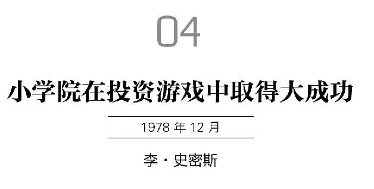

在巴菲特的帮助下，格林内尔学院（Grinnell College）捐赠资金的运作取得了巨大成功，然而，直至本文在《财富》杂志发表之前，这件事一直未被人所知。本文揭示了该事件的核心部分，1976年，格林内尔学院出人意料地花费1290万美元（其中只有200万现金，剩下的均为无追索权贷款）买下了代顿市的一家电视台，而巴菲特曾认为这或许是一项“实实在在的资产”。尽管电视媒体的价格持续看涨，但巴菲特没多久就准备让格林内尔学院撤出了。1980年，这家持有仅4年的电视台就被赫斯特集团（Hearst Corporation）以5000万美元的价格收购。

乔·罗森菲尔德（Joe Rosenfield）是说服巴菲特加入格林内尔学院董事会的关键人物。他为自己挚爱的这所学院奉献了终生，直至2000年去世。巴菲特将有经营权的信托人的身份保留至1987年，而作为终身信托人则持续到2011年。

在董事会任职期间，巴菲特也有过不少疑虑。最令他烦恼的是，他和罗森菲尔德为格林内尔基金会带来了60多倍的回报，但并未产生什么了不起的影响。巴菲特说：“当基金会拥有800万美元的时候，这个只有1200人的学校看起来挺好的；而当基金会拥有了5亿美元的时候，这个1200人的学校还是挺好。”

这里更新一下格林内尔学院的情况：在2011—2012年，学生总数为1600人，而基金会的资产额已达15亿美元左右。

——卡萝尔·卢米斯

格林内尔学院总让人感觉有点不太真实。36公顷的偌大校园坐落于爱达荷州中部一个典型的农业小镇的边缘，小镇里最高的建筑就是谷仓。按理说，这么一所学院理应以畜牧专业为主，而不该涉及人文学科。然而，与此恰恰相反的是，格林内尔学院的1200名学生所接受的是严格的传统式教育。美国殖民地历史、约翰·弥尔顿的诗歌、量子理论都是学院的基础课程，学校从而蜚声全美，被称作美国最优秀的文科学院之一。

最近，格林内尔学院因为另一件匪夷所思的事名声斐然。这所地处玉米带的小学校在捐赠资金的运营方面相当纯熟，取得了惊人的成绩。在过去5年内就将资金翻番，达到3750万美元，而且这还只是保守数字。如果将基金会的全部资产都按照市场价值折算的话，总额将接近6000万美元。与之相比，基金会收到的新捐赠仅有540万美元。基金会之所以成长如此之迅速，主要是由于其资产的大幅增值。即便是相对保守的评估，在过去5年中，其增值的速度（加上新收入）也达到了16\.2%的复合年增长率。

与此同时，其他学院和大学的基金会运转得都相当沉闷，乏善可陈。AG贝克公司（A\.G\.Becker）曾追踪了150家基金会过去5年的运营情况，结果显示它们的中位数回报率仅为可怜的1\.7%。

格林内尔学院取得如此佳绩并非偶然。它引进了投资战略，以企业化的方式来经营捐赠资金，而其他的教育机构对这种战略常常敬而远之。举个例子，一般的做法是：小心翼翼地把“鸡蛋”包好，然后放进传统的股票和债券市场的众多“篮子”里；而格林内尔学院却毫不迟疑地将全部“鸡蛋”放到一两个篮子，并且还参与了更具冒险性的投机活动。其最其代表性、最引人注目，也是最不寻常的举动就是花费1290万美元购买了一家商业化的电视机构。

格林内尔学院的基金托管人和其他学院的不同之处在于，他们并未将基金会日常的管理事务让渡给银行、外部的投资经理人、甚或专业的内部经理人，而是审慎地将其掌握在自己手里。更确切地说，他们将其托付给了自己的财务委员会，尤其是委员会中的两位核心成员。这两位成员曾成功地为自己赢得过巨额财富，也向委员会证明了自己正是该职位的不二人选。其中一位是来自得梅因的罗森菲尔德，他是一位退休律师和活跃的投资人，并曾担任扬克兄弟公司（Younkers Brothers Co\.）的董事长。这是一家遍布美国中西部的著名连锁百货公司。

另一位就是沃伦·巴菲特。这位声名显赫的奥马哈投资者，将一家由亲戚、朋友集资构成的“小作坊”发展为全国闻名的投资合伙公司，在存续的13年中其复合年回报率达29\.5%。1969年，他清算公司账目、分配红利时，公司的资产已达1亿美元。他还持有很多公司的股份，其中包括金融机构和报业公司。

当罗森菲尔德在1941年进入基金会董事会时，手中的资金大约只有100万美元，其中包括学校继承下来的几个农场以及25万美元的有价证券。20世纪50年代初，石油商弗雷德·达比（Fred Darby）向学校捐赠了大约500万美元的资金，这可算早期最意外的一大笔钱。第二次大笔进账是在随后的60年代初，当时福特基金会（Ford Foundation）承诺，如果格林内尔学院能够自己募集到400万美元资金，福特将再贡献200万美元。格林内尔学院办到了，其中罗森菲尔德从自己的口袋中拿出了40万美元。

罗森菲尔德继续不遗余力地为学校贡献力量，其绝大多数的捐赠进入了以他的名字命名的罗森菲尔德基金（J\.F\.Rosenfield Fund），成为学校基金会中的一个特殊部分。罗森菲尔德和巴菲特对这笔钱的运作可谓费尽了心思。他们动用不大的一笔资金，进行了有一定风险的投资。显然如果这笔资金投入传统的蓝筹股票或者债券，回报将很有限。最终两人取得了令人瞩目的成功。假使该基金里也有“股东”的话，那么在过去的15年里，他们将取得18倍的回报。

罗森菲尔德基金第一笔引起轰动的投资发生在1968年。罗伯特·诺伊斯（Robert N\.Noyce）是仙童半导体公司（Fairchild Semiconductor）的创始人之一，他也是格林内尔学院的校友。在学校期间，他一直是问题学生，曾因偷盗农户的猪去做烧烤而被停课。罗森菲尔德和另一位远见卓识的董事、芝加哥的律师塞缪尔·罗森塔尔（Samuel R\.Rosenthal）认为，诺伊斯很有天分，可以为学校带来福音。“我们告诉诺伊斯，当他自己创业时，学校也愿意加入其中。”罗森菲尔德回忆说。因此，当诺伊斯1968年离开仙童半导体公司去创建英特尔公司时，他给予了格林内尔学院校购买30万美元可转换债券的机会。为了抓住这个机会，罗森塔尔和罗森菲尔德两人每人拿出了10万美元，另外1/3的资金则来自罗森菲尔德基金。随着英特尔公司的蓬勃发展，这笔投资也收到了高达46倍的回报。捐赠基金会将债券转化成了股票，并在随后的日子里逐渐买出了自己拥有的英特尔公司的股份，获利接近1200万美元。它手中仍旧持有的37000股市值约为200万美元。

巴菲特不是格林内尔学院的毕业生。他本科就读于沃顿商学院（Wharton School）和内布拉斯加大学（University of Nebraska），随后在哥伦比亚大学商学院取得了经济学硕士学位。他之所以能成为格林内尔学院的董事，完全是因为罗森菲尔德，两人是通过共同的朋友得以结识的。尽管两人不属于同一代人，罗森菲尔德74岁，巴菲特只有48岁，但两人还是成了忘年好友。1968年，应罗森菲尔德的邀请，巴菲特加入了董事会。“有的人你很难对他说不，乔就是这样一种人，”巴菲特沉思地说，“答应他加入董事会，是因为他是我认识的唯一一个愿意将自己的资产贡献出来的人，而其他人往往是根据可减免税款的限额来捐赠。”两人常常交流意见，有时还会和财务委员会的其他成员交流，特别是38岁的董事长汤姆·哈奇森（Tom Hutchison）。哈奇森是得梅因一位非常富有的投资顾问。不过，巴菲特很少出席董事会全体会议，他不喜热闹。每年3次的董事会议，在格林内尔学院的图书馆一开就是一整天，让他焦躁不已。烦琐的会议进程，他也很难保持耐心。

巴菲特和罗森菲尔德在投资策略方面很有默契，但后者比前者更着迷于新观点。比如，在投资英特尔公司时，巴菲特就一直保持着冷眼旁观的态度。“我不是反对，”他解释说，“只是对半导体行业不太了解，我通常不会投入一个我不了解的行业，在这点上，我的姐妹很不理解。”

从本质上来说，巴菲特继承了其导师本杰明·格雷厄姆[\1]的衣钵。他坚信，应该寻找被低估的企业，然后投以重资。不过，事实上，巴菲特进一步发展了格雷厄姆的思想体系。格雷厄姆主张在股票已经涨到其真实价值时，应该沽清，而巴菲特则会购买他愿意无限期持有的股票。__最近，他的观点被总结为：“以100万美元的价格购买实际价值200万美元、而5年之后会升至400万美元的生意。”__当然，这种机遇并不容易碰到。“好生意不常有，”他说，“因此，我们也不要贸然出手。”

1976年，几乎是在不经意间，巴菲特为格林内尔学院寻求到了重要的机遇。托马斯·墨菲（Thomas S\.Murphy）是首府广播公司（Capital Cities Communications）的首席执行官，同时也是巴菲特的好友。在新奥尔良进行的一次有关报业经济的会议中，他和巴菲特一起吃了一顿早饭，并向后者提及阿弗科公司（Avco Corp\.）正打算出售旗下的辛辛那提电视台。按理说，要不是可能存在利益冲突，巴菲特本应有兴趣为自己或者伯克希尔哈撒韦公司收购这家电视台。伯克希尔哈撒韦公司拥有华盛顿邮报集团12%的股权。按照相关法律的规定，任何一个法人最多只能拥有5家电视台，或是7家，但其中至少要有2家受欢迎度不太高的超高频视电台。华盛顿邮报集团当时已经拥有4家甚高频电视台。显然即便伯克希尔哈撒韦公司所持有的并非是有表决权的股票，但监管机构还是会认为，不论是巴菲特还是伯克希尔哈撒韦公司，再收购一家电视台，都要被算在华盛顿邮报集团的账上。也就是说，这样一来，就把华盛顿邮报集团的“最后一发子弹”也用掉了。当他几乎快要忘记电视台收购案这件事的时候，罗森菲尔德的一通电话提醒了他，或许对于格林内尔学院这是一个千载难逢的机会。由于现金流的问题，阿弗科公司急于抛售旗下的电视台，所以这家电视台很可能就是巴菲特极力倡导的“被低估的可靠资产”。一所大学购买电视台，这几乎闻所未闻；当然也有例外，洛约拉大学（Loyola University）就拥有新奥尔良一家顶尖的商业电视台。然而，一所久居象牙塔的大学能够走向市场，参与经济活动，这无疑是一件鼓舞人心的事情。

格林内尔学院董事会通过了收购辛辛那提电视台的提议，但在商讨如何解决收购资金问题时耽搁了不少时间，以至于错失了第一次出手的机会。这家电视台被多媒体集团（Multimedia Inc\.）以1600万美元的价格买走了。为了缓解失望的情绪，格林内尔学院迅速买下多媒体集团价值31\.5万美元的股票，如今其市价已翻了三倍。阿弗科公司在代顿的电视台是第二个机会，这次巴菲特并未过多考虑资金问题，他毫不犹豫，全心投入，出价1290万美元买下美国全国广播公司的一个子台WLWD\-TV 2，这个价格大约是该电视台总收入的2\.5倍。对于至少3倍于总收入的报价惯例，这个数字并不算太吸引人，但是阿弗科公司还是接受了。

该电视台在当地的三家电视台中排名中游，它位于俄亥俄州代顿市区边缘的莫兰市（Moraine），那里原本是一个旱冰场。格林内尔学院接手后，将电视台的呼号改为WDTN，并组建了独立的格林内尔通信公司（Grinnell Communications）来运营它。公司利用自己的收入来支付各项税款，因此不管老板是教育机构还是别的组织，都没什么差别。格林内尔通信公司斥资130万美元进行设备改善，包括花费75万美元用于加高发射塔，以覆盖更广泛的受众。公司的运营相当顺利，基本没遇到什么问题出现。在电视台未被格林内尔学院收购之前，雷·科利（Ray W\.Colie）就担任电视台的总经理，收购之后，他仍然掌管着电视台的运营。尽管公司的6人董事会受控于格林内尔学院，但他们给科利和员工们保留了相当大的自主权。

电视台的资金问题最终也解决了。罗森菲尔德基金提供了价值200万美元的股份，而格林内尔学院筹措到1100万美元，其中半数来自外部贷款，半数来自基金会自身。这笔投资真正引人注意的地方在于其可观的回报。排名前50的电视台（代顿电视台排名46）最新的成交价格一般都在其总收入的4倍左右。1978年，WDTN的总收入大约为900万美元，这也就意味着其市值达到了3500万美元左右，是其收购价的2\.5倍。

在格林内尔学院的账目上，电视台的真正价值明显被低估了。初始的200万美元的股份是按成本计价法录入账目的，与此同时，该学院还欠着大约500万美元借债（有些贷款已被偿付）。如果以市场价格重新计算WDTN的价值，那么在减掉欠局外人的500万美元后，格林内尔学院的回报会猛增700万美元。而且，捐赠基金会的资产也将达到6000万美元而不是格林内尔学院评估的3750万美元。

巴菲特认为，那些拥有庞大捐赠基金会的大型学校可以借鉴格林内尔学院的投资战略，将投资组合限制在比较少的领域，这样就能产生一些巨大的可能性。要是哈佛捐赠基金会能在1978年初获得美国广播公司的控制权，结果会是怎样的呢？当时该股票的总市值只有大约7亿美元，哈佛捐赠基金会只用自己一半的资金就可以买下它。按这个思路延伸一下，对美国广播公司7亿美元的投资，将带给哈佛捐赠基金会一笔可观的回报，其回报率将与格林内尔如今的回报率相差无几。

然而，事实是，很少会有大型学校有格林内尔学院那样大胆的行事风格。实际上，格林内尔董事会也开始出现分歧，有人担心投资组合的不平衡性。更荒谬的是，WDTN越是升值，他们反倒越是心神不宁：但这种担忧是完全可以理解的。电视台的市值目前大约占据了整个捐赠基金会资产数额的一半，作为基金受托人还是会疑虑，资金如此集中是否足够稳健。“我甚至可以预料到，如果电视台持续贬值，”格林内尔学院的一位董事说，“学生恐怕会在课堂上和我们起冲突，他们会说如果早点变卖掉这个赔钱的电视台，他们的学费估计还能低点儿。”

巴菲特说，当然，如果董事会最终决定卖掉电视台，也是他们的权力。但毫无疑问，他是不愿投赞成票的，至少现在不愿意。“我总是不断地进行再评估，”他说着，然后停顿了一下，“但那是实实在在的资产。”巴菲特眼中的未来，不是纠缠于是否会陷入官司，而是在于新的可能性。他相信，如果一个学校投资了很多项目，总额超过年度预算的20倍，那么5%的年回报率就可以支撑学校毫无压力地运转下去。简而言之，学校根本不需要收学费。

2026年3月14日

16:57

## 伯克希尔哈撒韦公司股东的捐赠

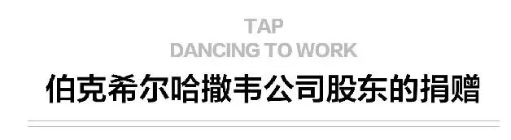

除了按照年代顺序编排的文章之外，本书还穿插了两篇相关文章。第一篇写于1981年，记叙了巴菲特的一个创举：伯克希尔哈撒韦公司的持股人可以指定公司捐赠的慈善机构；第二篇发表于22年之后，也就是2003年，讲的是巴菲特停止了这个项目，因其激怒了反对人工流产的慈善机构，它们认为伯克希尔哈撒韦公司支持了主张人工流产的合法性机构。

它们的愤怒当然不是基于接受捐赠的机构类型。以2002年为例，790所学校和437座教堂成为伯克希尔哈撒韦公司捐赠的受益方，这些数字都出现在巴菲特致股东的信中。此外，巴菲特也谈到了人工流产合法化的问题。他认为，伯克希尔哈撒韦公司股东内部也存在两个阵营，比例估计和美国本土人口的比例差不多。不过，巴菲特本人和他已故的妻子苏珊，以及伯克希尔哈撒韦公司副董事长、大股东查理·芒格都站在支持者一方。所以，反对人工流产合法化的组织就认为它们的反对者的力量壮大了，比如，美国计划生育协会（Planned Parenthood Federation of America）就获得了超出比例的捐赠。巴菲特指定给计划生育协会的捐赠直接流向了该组织，笔者是该组织的负责人。

反对人工流产的组织针对巴菲特和芒格两人的强烈反对并未动摇巴菲特的决心。然而，伯克希尔哈撒韦的子公司娇宠有限公司（The Pampered Chef）及其独立“顾问”们，也就是厨具产品的销售人员（多数是家庭主妇），也跟着遭殃。巴菲特认为，由于伯克希尔哈撒韦公司对人工流产问题的立场而导致这些家庭主妇们失去赖以生存的工作，这是不公平的，所以，他停止了这一项目。

在该项目运行的22年中，伯克希尔哈撒韦公司派发了1\.97亿美元的“慈善红利”，博得了许多股东的好感。随着这一项目的结束，很多伯克希尔哈撒韦公司的持股人毫无疑问地增加了向慈善机构的个人捐款。尽管这样，增加的这些部分似乎还是很难抵偿伯克希尔哈撒韦公司的捐赠，所以总的来说，捐款额还是下降了。

——卡萝尔·卢米斯

2026年3月14日

16:57

## 05 股东的慈善捐赠权利

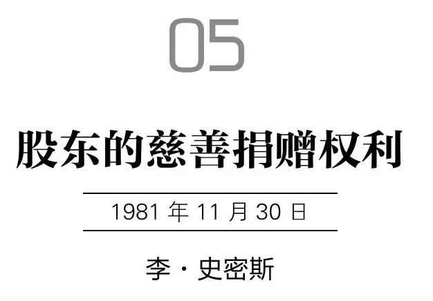

事实上，很多大型企业常常剥夺股东决定慈善款项去向的权力，而由管理层直接决定，即便这很不合理。虽然员工们通过配套捐赠政策得到了一些话语权，但大多数的管理者在这方面的表现还是比较专制。

股东受到的这种不公正待遇，一直困扰着伯克希尔哈撒韦公司董事长沃伦·巴菲特，他是一位享有盛名的投资家。因此，上个月，巴菲特就把机会留给了伯克希尔哈撒韦公司的股东，让他们决定如何向学校、教堂、博物馆、社会机构和其他非营利机构分配200万美元的捐款。

“我不希望股东从我的银行账户签支票，然后拿着支票按照他们的选择去做慈善，”他说，“同理，我们拿股东账户的钱按照自己的选择去做慈善，也是不合适的。”正如巴菲特所看到的，为了争取同侪的支持，大多数企业管理者都会条件反射般地做出让步。

现年51岁的巴菲特，是一位特立独行的管理者。他刚踏出校门，就和亲友共同募集到了10万美元，创建了一家合伙公司。通过在股市多年的摸打滚爬，加上后来不断增补的资金，巴菲特合伙公司的资本已增值到了1亿美元。1965年，他接管并重组了伯克希尔哈撒韦公司，旗下囊括了时思糖果公司（See’s Candies），蓝筹印花公司和十几家保险公司等，同时还握有通用食品公司（General Foods）5%和华盛顿邮报集团13%的股权。其利润也是相当可观，去年达到5300万美元，按每股计算是51\.72美元。目前伯克希尔哈撒韦的股票在场外交易中的成交价约为500美元。自1967年起，伯克希尔哈撒韦公司就未曾分红过，但是其每年的资本收益率都维持在20%左右。相比之下，公司的慈善捐款就显得微薄了很多，每年只有20万美元左右。这仅相当于20世纪80年代公司税前利润的0\.2%多一点，而同期其他美国企业的捐赠平均在1%左右。

巴菲特一度对于捐赠非常谨慎，因为他不知道如何改进其他大企业在选择受赠人方面的做法。他认为自己的新举措兼顾了公平性和可操作性。有些企业也允许股东投票选择他们青睐的慈善机构，巴菲特基本仿照了它们的做法，但有所不同的是，他号召了1500位股东来进行投票，而不是仅仅十几位。

投票通过邮件的方式进行。100万流通股，每一股的持有人都有权拨款2美元给慈善机构。也就是说，持有1000股的股东，可以命令公司捐赠2000美元给他指定的慈善机构。最重要的股东不一定必须进行投票。巴菲特和妻子占有公司47%的股份，于是有权分派93\.5万美元给他们偏爱的慈善机构。这笔钱将首先进入15年前成立的巴菲特基金会，然后转入推进支持人工流产的组织。

巴菲特的计划符合税收优惠政策。伯克希尔哈撒韦公司本可以先支付股东股息，再由股东自行捐赠给慈善机构。然而，在将股息支付给股东之前，他们已经被征税了。而由公司操作整个捐赠事宜，将被视作商业开支，是不用缴税的。因此，伯克希尔哈撒韦公司金库里的钱就最大化地进入了慈善机构而不是税务局。

乍听起来，如果要处理好捐赠事宜，可能会有大量的信件像雪花一样飞向巴菲特在奥马哈的办公室，堆满这个只有4个房间和5位工作人员的并不宽绰的地方。但事实上，巴菲特的股东只需要填写一个表格，署上名字和地址，列出有意捐赠的3家慈善机构就可以了。根据美国国内收入署（Internal Revenue Service）的政策，如果指定受益人的免税身份并不明显，那么，巴菲特的工作人员会要求出示证据。比如，对于温尼卡（Winnetka）小镇的寡妇来说“明显”的慈善机构，在巴菲特看来可能就要打个问号。

工作人员在核实投票人持有的股权后，填写支票并寄出，还要加注上这份捐赠是应持股人的要求。不过，持股人必须保证，这份赠予不能用作他途，否则国内收入署就会将这笔钱认定为股息，从而相应提高伯克希尔哈撒韦公司的税收。巴菲特说，除了这些，这些文书工作大致跟股东大会期间处理代理表决选票的事务差不多。“如果判断失误，”他说，“那我就只能周末来加班了。”

以股东名义进行的捐赠，会让伯克希尔哈撒韦公司的净收入减少100万美元或者更多。假设税率是46%，那么捐款200万美元的实际效果相当于税后利润减少了108万美元。但是，并非所有的慈善捐款都能按部就班地履行。由证券经纪公司代理的、以街道名命名的股票持有群体和其他机构不能参与投票，有些个体股东也不胜其烦，或者不想捐款给慈善机构。未分配的资金将会重新回到公司营收中来。

经过对即时反应的评估，巴菲特估计有85%的股东响应了这一项目。“人们对该项目满怀激情，”他说，“我认识一位老妇人，她是一位非常虔诚的信徒，因为收入不高，所以每月只能给教堂捐5块钱。如果按照她持有的我们的股票来计算的话，现在她每月可以捐款60美元甚至70美元了。”

巴菲特的计划与罗切斯特大学（University of Rochester）校长罗伯特·斯普劳尔（Robert A\.Sproull）的颇为相似，只不过遭受的质疑没那么多。斯普劳尔曾提议持股人向慈善机构进行的捐赠可以双倍于他应得的股息额，而且这对任何人来说都没有额外费用，除了美国财政部。股东只要告诉公司，他愿意放弃，比方说100美元，约占自己应得股息的3/4。当然，这一切的前提是，公司将这笔钱，加上本应扣除的收入税，捐献给美国红十字会、罗切斯特大学或其他慈善机构。斯普劳尔在计算之后认为，如果一家公司支付了46%的收入税，那么，它就应该不会在意究竟是税前捐赠了185美元给慈善机构，还是把这185美元拆解开来，100美元作为股息分给股东，85美元作为税金缴纳给政府。

斯普劳尔的策略虽然非常精明，但并不合法。参议员丹尼尔·帕特里克·莫伊尼汉（Daniel Patrick Moynihan）试图劝说国会通过这一提案，但鉴于目前的财政赤字，恐怕成功的概率不高。再加上众企业对这个提议也不温不火，没表现出什么积极性，其中的代表就是美国电话电报公司，它就很担心新提议可能会与原有体系相抵触，在原体系之下，公司股东可以自动将其股息再投入股票市场，仅仅1980年一年时间，母贝尔公司（Ma Bell）就通过股息再投资募集到了10亿美元。

巴菲特的举动是否会带动其他企业的效仿，这个还有待观察。很多企业的股东数远大于伯克希尔哈撒韦公司，所以它们也很担心处理这一繁杂工作的人手问题。《财富》杂志也跟不少企业谈及这个想法，虽然它们认为很有创意，但其态度还是有所保留。一位负责捐赠事务的管理者还担心股东会反对将钱投向宗教组织，因为按照巴菲特的计划，伯克希尔哈撒韦公司捐款的主要流向就是宗教组织（教堂获得了超过半数的个人捐赠）。为了避免公开论战之类的麻烦，大多数的企业只是把钱捐向了非宗教组织。

不过，无论如何，至少有一点值得我们注意，伯克希尔哈撒韦公司不是一家普通的企业，这主要归功于巴菲特相当妥当的计划。巴菲特说，如果在一家企业里，由管理层而不是股东决定200万美元捐款的流向，那么，再谈什么先进的企业目标也都没有什么意义了。然而，其他企业的目标就是如此。雇用工程师的企业偏爱将钱捐给工程类院校，旨在激发研究能力，吸引更多的优秀毕业生；石油企业把钱捐给公共电视机构，一部分是为了向大众，尤其是立法者，展示它们是有责任感而不是赚“黑钱”的企业。

不过，尽管如此，还是会有企业仿效伯克希尔哈撒韦公司的做法，尤其是那些收益丰厚、公共关系问题较少而且慈善动机比较强的企业。巴菲特也曾对慈善事业有过不少思考。很多年以前，他曾建议爱达荷州的格林内尔学院捐赠基金会收购一家电视台，这对教育机构来说实属罕见。格林内尔学院接纳了这个提议，以1290万美元的价格买下了代顿市的一家电视台。就在两个月前，该学院又以5000万美元的价格将电视台卖出去了。因此，如果你看到巴菲特偏离了正轨，那么最好盯紧点儿，看看他会去往何方。

## 06 伯克希尔哈撒韦公司搁置捐赠

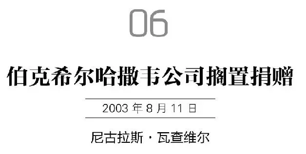

沃伦·巴菲特因支持人工流产的合法性，近来饱受争议，但这并未影响伯克希尔哈撒韦公司的慈善捐赠事宜，也就是说，直至亚利桑那州皮奥里亚市的辛迪·库格伦（Cindy Coughlon）改变了这一切，这是一位34岁、不爱出门的妈妈。由于她发动了反对向支持人工流产自由组织捐款的运动，巴菲特这位商界最有影响力的人物终止了伯克希尔哈撒韦公司的全部捐助计划。在过去20年里，该公司曾向人工流产问题论战双方的学校、团体等各种机构捐助近2亿美元。

这个不同寻常的项目，也叫作“慈善红利”，它是指伯克希尔哈撒韦公司的股东每年可以向他们指定的多达3家慈善机构每股捐助18美元。有些股东，包括巴菲特在内，通过其基金会利用这一机制向诸如致力于“计划生育”等事业的机构捐款。

2002年冬天，库格伦发起了反对向支持人工流产自由组织捐款的活动。库格伦是3个孩子的母亲，曾想成为娇宠有限公司（伯克希尔哈撒韦公司最近将其收购，该公司营业收入为7\.4亿美元）的销售员。公司有大约7万名兼职“咨询员”，进行特百惠式的上门推销厨房用品的活动。库格伦说，她被吸引到娇宠有限公司是因为她觉得公司跟她这种基督徒有着一样的传统生育的价值观。例如，公司陈述自己的使命时，就鼓励人们“发展上帝赋予他们的才能”。

然而，当库格伦惊愕地发现，伯克希尔哈撒韦公司收购娇宠有限公司，意味着公司赚来的部分利润将可能用来资助支持人工流产自由组织时，她非常沮丧。2003年1月，她通过电子邮件向100位朋友和他们的家庭发出呼吁，要求伯克希尔哈撒韦公司和巴菲特停止向这种组织捐款。“人命关天国际”（Life Decisions International）等反对人工流产的组织也开始大力宣传这份请愿书。

最初，在今年4月份的一份电子邮件中，娇宠有限公司公司董事长多丽丝·克里斯托弗（Doris Christopher）曾告诉她的顾问式销售员，尽管“我个人对某些问题的看法与巴菲特不同……但我没有立场要求什么，也无权评判”。然而，她传递的信息并没有压制住这场风波。库格伦说，在请愿书上签名的人“快到1000”了，销售员们纷纷辞职，客户不断投诉。到了6月底，公司压力大到不堪其重。于是，克里斯托弗“怀着沉重的心情去见了巴菲特”，她在写给销售员的一封电子邮件中这样说道：“伯克希尔哈撒韦公司的慈善捐款给你们造成的难题，令巴菲特很是困扰。”7月3日，伯克希尔哈撒韦公司宣布终止这项慈善计划。

不过，在今年之前，伯克希尔哈撒韦公司似乎不为这些压力所动。多年以来，反对人工流产自由组织的人士曾经常干扰和联合抵制伯克希尔哈撒韦公司的股东大会。去年，一份主张终止这项慈善计划的股东议案被彻底否决，因为97%的持股人投了反对票。在2001年股东大会上，巴菲特在伯克希尔哈撒韦也曾捍卫这项计划。他说，伯克希尔哈撒韦公司“除了股东指定的捐助之外，不做其他任何捐助项目”，股东“在人工流产问题上，支持者和反对者双方所占比例，可能大致与全美人口中的比例差不多”。

那么，为什么伯克希尔哈撒韦公司现在要放弃这项计划呢？公司宣布说，“它的所有权状况现在”不仅“损害到”一个附属公司，而且还“损害到”个人。对于董事会来说，愿意接受联合抵制造成的一些破坏，是因为一个巨型公司可以消化这种破坏。然而，如今，这种破坏波及了娇宠有限公司的销售员，而他们与伯克希尔哈撒韦公司的政策毫无关系，不应该受到这项政策的伤害。因此，终止项目势在必行。

库格伦“对这一决定兴奋不已”。不过她说，只有她尊称为“巴菲特先生”的这个人停止向支持人工流产的自由组织捐款，她才会感到安心。她说：“他才是关键人物。”

2026年3月14日

16:57

## 07 巴菲特的信

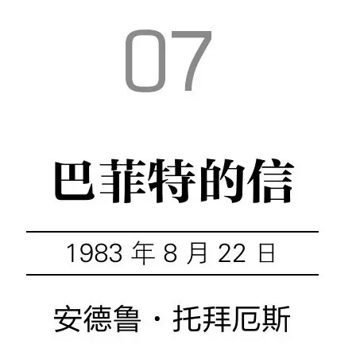

从1966年起，作为伯克希尔哈撒韦公司年报的一部分，巴菲特开始撰写致股东的信。10年之后，他参与了美国证券交易监督委员会的一个专门小组，并学习到了如何加强股东之间的交流。因此，在1977年的年报中，他进行了一定的革新。革新是以比较温和、渐进的方式进行的。到了20世纪80年代早期，这些集中了智慧、幽默与个性化的致股东的信引起了更广泛的注意。

于是，《财富》杂志决定将这些信做个整理，以类似书评的方式呈现出来。对于这项工作，我当时并没有多少时间来接手。当临近1977年年报发布期时，作为巴菲特10年的老友，我应他的邀请，与他商榷已基本完成的致股东的信。我唯一还记得的建议，就是将一个“the”改成“a”。也就是从那时起，我开始无偿地成为他的尽心尽责的编辑。而我也必须承认，从那时起，我的建议也逐年增加，但模式从未改变过：他写，我编辑。当然，有时候我也会在如何组织一个句子上屈服于他。

1983年，由于我无法承担撰写这篇文章的工作，《财富》杂志转而求助于一位自由作家安德鲁·托拜厄斯，早前他曾为《财富》杂志工作过数年（失去他是杂志的一大损失），后来转向写书，比如，他曾写过《你唯一需要的投资圣经》*（The Only Investment Guide You’ll Ever Need）*以及一些自由撰稿文章。托拜厄斯说，当《财富》杂志的编辑给他打电话商讨这篇文章的写作时，他还从未深入了解过巴菲特是何许人也，只听说过“他拥有一帮狂热的拥趸”。托拜厄斯欣然应约，着手写作，这篇文章展现了他自己的幽默感和个性特征，远超于一篇书评。

然而，写完这篇文章之后，他是不是接着就买了伯克希尔哈撒韦公司的股票，然后以每股1000美元（现价约为13万美元）的价格卖出呢？托拜厄斯回答说：“我不厌其烦地告诉人们，伯克希尔哈撒韦公司是我所做过的最糟糕的投资，因为我压根儿就没有买。如果当时我拿着《财富》杂志给我的1500美元稿费，再加些钱买两股，那么……”托拜厄斯回忆说。当时股价有点儿偏高，如果回落一点儿的话，他肯定就出手了。他说，同样的情况还发生在伯克希尔哈撒韦股价处于1万美元和3万美元的时候。

然而，让人宽慰的是，托拜厄斯和巴菲特成了好朋友，两人常常促膝聊天，这不光是为了文章，还因为两人都是民主党的支持者。

——卡萝尔·卢米斯

伯克希尔哈撒韦公司的股东对于年报有两大期待。一个是好消息，即账面净资产的增长，在过去的18年里其每股净资产从19美元升至737美元；另一个是来自他们的董事长致股东的信，从18年前开始，巴菲特每年都会给股东写一封信。事实上，每年巴菲特致股东的信几乎就等同于伯克希尔哈撒韦公司的年报。

股东收到的是没有照片、彩印、印花、柱状图、图表，甚至连个公司标志都没有的一份报告，看上去就像是一家泡沫最终破裂的公司在倾覆之前的惨淡年报。然而，伯克希尔哈撒韦公司并非是色彩斑斓的泡沫，这家涉足多个行业的商界巨擘，其股价从6年前的85美元已涨到了如今的955美元，并且没显示出任何要破裂的征兆。

一般来说，阅读年报最有效率的方式就是扫一眼审计员意见，然后查阅财务报告和脚注。那么，董事长致股东的信有什么意义呢？阅读信特别能节省你的时间。巴菲特致股东的信吸引了各方的关注和赞扬，甚至还收到了重印的邀约。该公司已经将过去5年的年信整理成册，以满足人们的需要。

“真是太棒了。”奥德赛合伙公司（Odyssey Partners）的利昂·利维（Leon Levy）说，他本人绝非华尔街的等闲之辈。他详细地引用上一封巴菲特致股东的信中几乎最让他忍俊不禁的一段：巴菲特谈及公司1982年的收购案时说，其中大部分都是不该进行的。__巴菲特写道：__

__对于很多收购案来说，经营智慧被“肾上腺素”给打败了。一种追逐的狂热蒙蔽了购买者的双眼，他们的脑袋里只有“捕获”。帕斯卡尔（Pascal）的观察一语中的：“人们遭受厄运，其实只有一个原因，他们不能安静地待在房间里。这一点对我的震动很大。”显然，你们的董事长去年离开房间的次数太多了，在1982年的收购闹剧中，他差点儿就成了主角。回顾上一年，我们最大的成就来自于收购计划都未得到执行。由于种种不可控的原因，我们没有完全拿下我们已经有很多股份的企业。如果该计划付诸实施了，那么为此消耗的时间和金钱将是巨量的，而其结果却是难以预料的。如果我们在报告中引入图表来展示去年公司热衷的商业发展方向，用两页空白纸来代表这些天花乱坠的交易是最合适的。__

“我喜欢他的幽默。”利维笑着说。

巴菲特自己说过，他试图像伴侣一样与股东交流。“我是这样试想的，我聪明智慧的伴侣离开我有一年了，所以，我要把一年来发生的事情都告诉她。”他甚至还设想和2000位股东转换角色。“与其每年重复同样的事情，”他说，“不如选取一些更有长远教育意义的话题。”这就是他非常享受的一项工作：撰写致股东的信，目前大约12页，说不定以后会越写越长。1982年，在撰写致股东的信方面，另一位“异端”人物恐怕要数马歇尔&埃斯利银行（Marshall&Ilsley）的首席执行官杰克·普韦利克（Jack Puelicher）。这位特立独行的威斯康星州银行家，简洁地写道：“1982年，你们公司的运转良好，部分靠运气，部分靠好的规划和管理。我们希望大家能为这些数据和图表感到欣喜。”

1976年，美国证券交易监督委员会成立了专门研究信息披露制度的小组，巴菲特也参与其中。这件事显然强化了他对年信的关注。当时，该小组发布了一份长达1200页的文件，其结论是信息披露系统基本上是健全的。美国证券交易监督委员会前任委员小萨默（A\.A\.Sommer Jr）担任该小组的负责人，同时，他本人也是伯克希尔哈撒韦公司的股东。他说，小组成员都认为这种信是非常重要的。他还补充道：“巴菲特写给股东的信是非常独特的。像巴菲特这样有智慧的董事长是极少的，期望所有董事长都能有这种水平的探讨，简直比登天还难。”

难道巴菲特就没在信里写过什么出格的话题吗？当然有过，他回应说，他讲述了巴菲特的错误。

“纺织业再次遭遇了惨淡的一年，”巴菲特在1977年致股东的信中说，“我们过分乐观地预估了过去两年的业绩。由于工业环境的不景气，我们经历了不小的困难，不过，有些困难是我们自身造成的。”在此需要申明一点的是，巴菲特在1965年接管伯克希尔哈撒韦公司时，该公司仅仅是马萨诸塞州新贝德福德市的一家小型纺织厂。

“我们一直在寻求拓展保险业务的途径，”他在1979年的致股东的信中写道，“但你对这件事的反应，不应该盲目乐观。因为我们的一些努力不是前景黯淡就是一败涂地，而大部分努力是由你们的董事长发起的。”

巴菲特不是好大喜功的人。他经常将自己的杰出贡献一笔带过，而像一位骄傲的教练一样，对自己队员的出色表现极力推崇。伯克希尔哈撒韦公司拥有政府雇员保险公司很大比重的股份，这是一家汽车保险公司。在该公司的纪念品上，他写道：“杰克·伯恩（Jack Byrne）和比尔·斯奈德（Bill Snyder）正向人类最难以企及的目标迈进，即保持事物的简单本性，并牢记所要达成的目标。”

吉尼·阿贝格（Gene Abegg）是伯克希尔哈撒韦的子公司大陆伊利诺伊国民银行（Continental Illinois National Bank）的总裁。__当他于81岁高龄去世后，巴菲特缅怀道：“根据我们的经验，一位习惯了高成本运作的管理者，总是想方设法增加管理支出，而资金不那么阔绰的管理者，常常致力于寻求缩减开支的新途径，即使他们的开销已经远远小于其竞争者。在后一点上，恐怕没人能比得上阿贝格。”__

人生总是散落着各种多愁善感。如果巴菲特要对华盛顿邮报集团和政府雇员保险公司说些肺腑之言，那么一定会有太多情绪可以宣泄了。他从13岁起就开始给前者当报童，从20岁起又对后者产生了浓厚的兴趣。需要记住的是，在短短10年之内，伯克希尔哈撒韦公司持有股份的这两家公司，一家市值从1100万美元升至1\.03亿美元，另一家则从4700万美元增长到3\.1亿美元。

巴菲特总是选择用他独有的幽默来表达自己的观点。他写道：“典型的冲动行为就是我们将世界总部扩大了28平方米（17%），而且又签署了下一个5年期的租约。”巴菲特口中的世界总部在奥马哈，除了巴菲特，还有5个人。__“一个紧凑型的结构可以让我们将所有的精力都投入到公司的经营中，而不是管理其他人上。”__

大多数董事长致股东的信都极力渲染一切进展得如何顺利，因此希望股东继续购买。而巴菲特则明知不可为而为之，着重强调消极方面的情况。

在最近的年报中，就在人们纷纷注意到，伯克希尔哈撒韦公司连续18年以22%的复合年增长率提升的账面净资产时，巴菲特却补充说：“可以确定的是，未来的增长率一定会下降。这种几何级的速度，不会永远无止境地持续下去。”他是对的。如果再将这种速率保持18年，那就意味着公司的账面净资产将达到220亿美元，每股价格接近100万美元。即便在陈述伯克希尔哈撒韦公司投资组合的账面回报时（1982年达到40%），他也首先非常谨慎地扣除了必须支付的税金。

当傻瓜都看得出你有多优秀的时候，表现得坦率一些，自谦一些，会让人感到舒服，这点毫无疑问。在致股东的信中，巴菲特不仅回顾了自己的表现和疏忽，还会论及美国国内的其他管理者，这让巴菲特的同侪有些恼火。__他写道：“有些迹象表明，一些大型的保险公司在1982年故意把自己的财务和储备金情况搞得很含糊，故意隐藏它们的业务正在明显下滑的事实。和其他行业一样，保险业毫无说服力的账目常常是管理失效、运营无力的最直接体现。”__他反复强调的一点是，股东的权益遭到了大批管理者的无情践踏和蹂躏。

我们常常见到的场景是，企业的管理者为了抵挡慷慨的收购，像史诗中的英雄一样英勇奋战。可是人们很少注意到的是，管理者急于通过收购来发展壮大，并为此付出了过多的代价。巴菲特略带讥讽意味地斥责说：“管理者拿着股东的钱来开疆拓土，恐怕政府的职位更适合他们。”

在他看来，如果收购是通过股票完成的，情况则更糟，因为收购方的股票的市价常常低于其真实价值。__“收购方不顾一切地使用估值偏低的货币，即他的股票，去支付一个被高估的财产……满含笑意的投资银行家们总是会一再给收购方吃定心丸。所以，永远不要问理发师你是否应该修剪头发了。”__

鉴于购买整家公司要支付的巨大溢价，巴菲特的策略一直是参股。如果另一家公司出价每股48美元来买下整家公司，而公司昨天的股价还只有25美元时，那么，巴菲特则满足于不动声色地以25美元将股票收入囊中。“能够真正使我们手舞足蹈的事情是，”他承认，“以令人心动的价格买下整家公司，但这是可遇不可求的事情。”到年终的时候，在众多伯克希尔哈撒韦公司持有股份的公司中，比较重要的有蓝筹印花公司（60%）、政府雇员保险公司（35%）、通用食品公司（4%）、贵金属制造商汉迪哈曼公司（Handy&Harman）（17%）、雷诺兹烟草公司（R\.J\.Reynolds Tobacco Co\.）（2\.7%）、埃培智集团（Interpublic Group）（15%）、奥美集团（Ogilvy&Mather）（9%）、《财富》杂志的发行商时代集团（2\.7%）以及华盛顿邮报集团（13%）。

伯克希尔哈撒韦公司公布的盈利中包括了，它已经取得控股权的蓝筹印花公司的部分利润，以及投资其他公司所获得的股息收入。所以，巴菲特每年都会提醒股东，公司所公布的盈利其实掩盖了自己大部分的真实收益。“这不是苛责会计程序，”他马上补充道，“事实上，我们不希望有这个职位来设计一个更好的系统，只是说管理者和投资者一样，都必须理解账面数字对于评价一家公司的经营来说只是起点，而远不是终点。”

__当被复杂的会计学搞得一头雾水时，他自我解嘲地说：“亚诺玛米（Yanomami）的印第安人一生中只认得三个数字：一、二和大于二。估计他们的时代快要来临了。”__

由于公司未合并报表的参股越来越多，其重要性日趋提升。鉴于最近收到的建议，巴菲特认为，如果股东再用报告期盈利与净资产的比率来衡量伯克希尔哈撒韦公司的表现，就有失妥当了。__他接着又补充说：“你肯定会对这种说法表示怀疑，当数字好看时，很少有人会将标准舍弃；但是当结果变糟时，管理者通常倾向将衡量标准而非自己给换掉。面对着不断恶化的业绩，管理者自然会搬出另一套标准来解释原因，这就像是射箭手先将箭射在空白的标靶上，然后再小心地将红心画在箭的周围。我们总是相信眼前所见的、长久的那个小靶心。”__

他认为相当乏味的一个“靶心”就是被广泛宣传的“报告期盈利”。他解释说：“毕竟，一个完全不动的存款账户，由于复利的作用，每年还能产生稳定的利息收入增长。”

现年52岁的巴菲特稳坐第一大股东的位置，他已经是一位久经沙场的专业级股东了，这是毫无争议的事实。他和妻子握有伯克希尔哈撒韦公司价值4\.6亿美元的股份，而伯克希尔哈撒韦公司自身也像持股人一样，掌控着很多其他公司的股权。

在《超级金钱》*（Supermoney）*一书中，作家杰里·古德曼（Jerry Goodman）给巴菲特贴上了这样的标签：“巴菲特很可能是这个时代最杰出的、最会运作金钱的人。”他了解到，巴菲特于1956年开办巴菲特合伙公司，并在1969年很有远见地清算了公司，在此期间，复合年增长率达31%。“更了不起的是，”古德曼写道，“他继承了上一辈的卓越智慧，成就了自己了不起的事业。从他的身上，我们仿佛又看到了本杰明·格雷厄姆的影子，他们的理念有着高度纯粹的一致性。”已故的本杰明·格雷厄姆是《聪明的投资者》*（The Intelligent Investor）*的作者，该书自1949年问世以来就一直不断被重印。巴菲特选择了格雷厄姆作为导师，而格雷厄姆也选择巴菲特帮助他审定自己的著作。

尽管格雷厄姆和巴菲特并非在所有问题上都保持一致，但他们共同的观念就是：如果以非常低的价格购进某种资产，假以时日，基本上都能获得回报。不过，在运用这一理念时，需要绝对冷静的头脑和勤奋的研究。__“市场，就像上天，”巴菲特写道，“天助自助者。不过，和上天不一样的是，市场不会给那些不知道自己做了什么的人任何机会。”__

当一家持续运转的公司的股价低于其真实价值时，巴菲特的参股战略是行得通的。不过，如果市场进入周期性的大牛市时，就另当别论了。1972年，当雅芳（AVON）的股价飙升到了60倍市盈率时，伯克希尔哈撒韦公司的投资组合中大约只有15%的股票，而到1982年底，这个比重已经上升到了80%。“1972年和1982年的情形差不多，有价值的商业投资项目为数不少，”他写道，“但是在1972年，这些股票的价格荒诞至极。”如果股市持续爬升，巴菲特警告说：“伯克希尔哈撒韦公司参股的项目将会减少或者停止。目前，我们已经看到了这种苗头。可恶，又是一轮牛市！”

巴菲特致股东的每封信必定都会提及财产和意外保险业，即公司核心业务的经营状况。他在信中写道：“事实上，在20世纪前期，这个行业中的大部分公司都是在保险监管机构行政定价的系统下经营的。尽管价格竞争确实存在，却还没有渗透到大型公司内。”然而，巴菲特说，那些礼敬有加的日子已经不在了。“尽管老制度还有一些留存，但是新生力量很乐意利用价格作为竞争利器；不仅如此，它们还会让这场价格战有声有色。在这个过程中，消费者终于明白，保险业不再是单一价格的行业了。他们会牢记住这点。”

简而言之，巴菲特的计策就是将仓位保持在极低的水平，等待市场出现暴跌的局面。只有在大熊市里股价才会接近或低于其真实价值。

一年又一年，一封信接一封信，我们可以看出，巴菲特对纺织行业这类资本密集型的日用品行业的信心逐渐动摇起来。由于彼时银根紧缩，因此产品的价格愈发变得不合理起来，合理价格持续的时间“弥足珍贵”。尽管如此，出于对员工的责任心，又或许是出于对伯克希尔哈撒韦公司昔日时光的怀恋，巴菲特始终坚守在这个行业，不愿放弃。这样的决定似乎忽视了公司股东的利益。然而，巴菲特拥有伯克希尔哈撒韦公司47%的股权，这使他可以轻而易举地利用自己的影响力使决策获得通过，或者更确切地说，基本就是他自己支撑着这个决策。即便如此，他还是向股东一再保证，未来，他不会再轻易踏入这类行业了。

巴菲特致股东的信的末尾是实际“最想得到的企业”的类别，主要讲述巴菲特如何经营他的企业。__他写道：“伯克希尔哈撒韦公司时时刻刻都在寻找规模大而简单的企业，这样的企业还必须有能力保持盈利，负债少；而且经营得比较得当；还要有一个报价，在报价还未知的情况下，我们不想跟卖家白费口舌，哪怕是最初阶段的交涉。如果过多涉及高科技成分，恐怕我们胜任不了……我们不会涉足恶意收购。我们许诺严格保守商业机密，而且会对有意向的项目做出最迅速的反馈，通常是在5分钟之内。”__

显然，如果你是一位脑子里充满着有趣观点的董事长，写出的“致股东的信”也会很有趣。巴菲特自己就像是吹入商界的一阵新风，就像散文一样清新。

## 08 你能跑赢股市吗（节选）

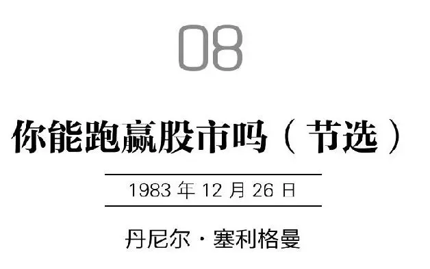

有效市场假说（Efficient Markets Hypothesis，简称EMH）一度被认为保证了“股市不会被渺小的人类吞噬”。因此，对于那些信服这套理论的人，巴菲特在选择股票方面所保持的优秀纪录显得极其有悖常理。巴菲特的成功，在他们眼里只不过是幸运而已，而且是一种离奇的、无以复加的幸运。

巴菲特的名气越来越大，而很多人把他的成功看作“反常现象”。一位投资者成绩斐然，业绩出众，却仅仅被解释成“意外”。尽管这种论断甚嚣尘上，却未打动《财富》杂志编辑丹尼尔·塞利格曼。作为我的导师和亲密朋友，塞利格曼从理性上也非常赞同有效市场假说，我们从他的文章中不难看出这种倾向，但他更倾向于相信被证实的理论。他的诚实和新闻敏感性告诉自己，巴菲特身上一定有非常耐人寻味却未被人所知的故事，这就是他写这篇文章的初衷。

我们没有转载整篇文章，只转载了开头、核心部分以及记叙巴菲特和他的三个长期伙伴查理·芒格、已故的比尔·鲁安（Bill Ruane）和沃尔特·施洛斯（Walter Schloss）的后续报道。

关于本文，还有个不得不提的重要补充：1984年5月2日，哥伦比亚大学上演了一场针对有效市场假说理论的辩论，将巴菲特推向了与著名学府罗切斯特大学商学院金融学教授迈克尔·詹森（Michael C\.Jensen）针锋相对的风口浪尖。首先发言的詹森，阐述了他对有效市场假说的坚定信念，给出的理由也极其有说服力，最后还特意援引《财富》杂志一篇关于有效市场假说的文章《精彩评论》*（Excellent Review）*作为完结。或许有失准确，但他还是认为巴菲特及其三个伙伴出色的投资业绩毫无疑问是出自技巧。他把他们比作“幸运的金币”，以掷金币的概率论来解释他们的成功；他还认为，如果运气好的话，很容易获得杰出的业绩。

然而巴菲特说，其实不然。他意识到这将是他绝地反击的最佳时机。除了他自己以及上文提及的其他3位投资者，巴菲特又加了5位“幸运金币”，而且还起了个名字“格雷厄姆\-多德都市的超级投资者”（The Superinvestors of Graham\-and\-Doddsville）”。他解释说，这9位拥有同一位“精神导师”，著名的投资家和作家本杰明·格雷厄姆，按照格雷厄姆的理论，当某投资品种的市场价格与其内在的商业价值之间发生了背离，投资者的机会就到来了。

巴菲特说，然而，这9位投资者是在不同领域缔造了自己的辉煌业绩，他们的投资组合中鲜有重复的股票。换句话说，他们虽然栖息在“同一个理念的国度”，却做着形形色色的生意。把这些人的成功都归结为“幸运”，实在荒谬。

作为这场著名论战的旁观者，我认为巴菲特打了一场漂亮仗，干脆利索地战胜了詹森。这个结论也成了大家的共识。巴菲特自己也觉得，在他自己写过的文章和做过的演讲中，这一次是逻辑最为缜密，理据最为充分，因而也是最好的一次。读者可以在网上找到“格雷厄姆\-多德都市的超级投资者”的全文。

——卡萝尔·卢米斯

大多数痴迷于股市的人，逃不开以下三类派别：（1）那些怀疑人们是否真正懂得如何打败市场的学院派；（2）对此观点愤愤不平并持反对态度的专业投资人；（3）股市上的业余选手，信奉自己可以战胜市场，但没意识到自己的这种假想还有待论证。我一直认为自己板上钉钉地属于第一派别，然而，直至去年前后，一切发生了改变。

对于所谓的“有效市场假说”，专家、教授们似乎已经建立起了势不可当的强大理论体系。如果你认为该假说就是真实市场的原版写照，那你就会认为股市不可能被微不足道的凡夫俗子打败。那么，问题来了：这个假说距离事实有多近呢？在重新考察商学院的基本案例以及最近出现的一些悖逆情况之后，我对有效市场假说的回答是：对于了解股市，有效市场假说非常有用，但是否如我以前想象的那样贴近现实，还存在很大疑问。然而很显然的是，已经有一些杰出的投资者以自己的行动证明了自己的能力，他们打败了市场，从而获得高于市场平均水平的回报。

作为有效市场假说的追随者，和其他人一样，我的观念也被不断出现的“异常情况”所动摇。对于那些能颠覆有效市场假说的市场新情况，教授们经常会用这个术语来争辩。

令人不安的事情在于，有几位极其引人注意的投资者创造了一系列惊人的业绩。这些投资者凝聚成了一股不容忽视的力量，其中以沃伦·巴菲特的名声最盛。巴菲特非常清楚，自己的投资成就对于有效市场假说的挑战非常大。他坚信，市场中包含可大量可以利用的“无效率”，他曾多次在斯坦福大学商学院（巴菲特服务于学院的咨询委员会）为自己的案例争辩。斯坦福大学的教授威廉·夏普（William F\.Sharpe）是有效市场假说的坚定支持者，同时也是该大学的明星人物，其作品是有效市场假说的权威教材。他曾把巴菲特案例比作“五西格玛”事件[\2]。用商学院的术语来解释，这么高的级别意味着你应该把他的投资表现看作高于平均值的5个标准误差；如果这基本属实，那么，巴菲特取得这种辉煌业绩的概率只有350万分之一。

__只在3和0时击球__

__丹尼尔·塞利格曼的补充报道__

有效市场假说认为，在理论上，没有人能够系统性地战胜股票市场。而将这套假说应用到沃伦·巴菲特、查理·芒格、比尔·鲁安、沃尔特·施洛斯这些人身上时，你会碰到三大疑问：（1）他们的长期表现优于市场；（2）不论牛市还是熊市，他们的表现一如既往，所以很难说他们的高回报只是他们承担了高风险的后果；（3）他们的战略都是遵循了本杰明·格雷厄姆的理念，所以很难将他们的表现定性为偶然事件。巴菲特、鲁安和施洛斯都曾是格雷厄姆的门生，而这4个人又都深受格雷厄姆与戴维·多德合著的《证券分析》一书的影响，格雷厄姆的核心观点是：寻找因某种原因而被市场低估的企业，然后耐心持有，等待市场最终认可其价值。显而易见，这种企业难以寻觅。巴菲特说：“你要等待最佳的击球时机。”下面这笔投资堪称等待最佳时机的范例：1974年，华盛顿邮报集团的市值为8000万美元，然而，仅其旗下的电视台就远不止这个价格。现在该集团的市值已达10亿美元，而巴菲特的伯克希尔哈撒韦公司拥有其13%的股份。

1969年，巴菲特清算了经营14年的巴菲特合伙公司。从那时起，他本人就没有正式参与过资金管理业务。解散公司的原因之一是巴菲特不再寻求价值被低估的证券。在经营巴菲特合伙公司期间，年回报率高达29\.5%，而同期标准普尔500指数的回报率只有8\.2%（和下面的数据一样，这些数据的前提都是股息用于再投资）。

1962—1975年，芒格经营着他的合伙公司惠勒·芒格合伙公司（Wheeler, Munger&Co\.）。公司的年回报率达19\.8%，而同期标准普尔500指数的回报率只有5\.3%。鲁安的红杉基金（Sequoia Fund）也取得了显赫的成功，自1970年7月对公众开放以来，相较于同期标准普尔500指数10\.6%的年回报率，红杉基金也达到了18\.6%。目前，该基金的规模已达3\.33亿美元，并且暂停对新投资者开放，“因为钱来得比我的新主意还快。”鲁安说。

施洛斯从1956年起经营的私人合伙公司，年回报率为21\.3%，远胜于标准普尔500指数的8\.7%。在最近一封致合伙人的信中，施洛斯饱含感情地向导师格雷厄姆及其著作《证券分析》致敬，他说；“正是有了他们，我们才能走过这段布满荆棘的道路。”

## 巴菲特和首府_美国广播公司

\(14\) 巴菲特和首府/美国广播公司

2026年3月14日

16:57

1985年，首府广播公司收购了美国广播公司。伯克希尔哈撒韦公司也参与其中，这种并购交易一直是巴菲特喜欢的类型，尤其还有机会和老朋友托马斯·墨菲一起合作。当时墨菲正担任首府广播公司的首席执行官。果然，这笔交易不负众望：首府/美国广播公司的发展势不可当，并于1996年被华特迪士尼公司（Walt Disney Co\.）收购，伯克希尔哈撒韦公司因此获得了4倍于投资额的回报。下面是摘自《财富》杂志的4段文章，向您描述了这笔交易的几个关键性的时刻。

——卡萝尔·卢米斯

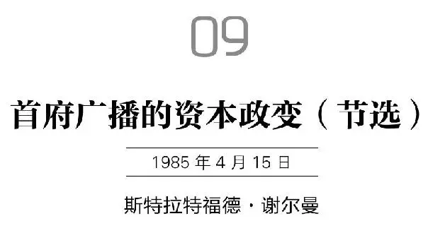

巴菲特这样评价墨菲：“我觉得他是美国最顶尖的管理者。”自认不能胜任管理者角色的巴菲特，真真切切地把自己的未来部分地交到了墨菲手里。巴菲特同意以5\.18亿美元购买合并后的首府/美国广播公司18%的股份，并促成了这笔交易在友好的氛围下实现……更超乎想象的是，巴菲特欣然同意连续11年向管理层投“赞成票”，条件是墨菲或者董事长丹尼尔·伯克掌管大局，并且接受了限制他本人买卖股票的严格要求。

## 10 改变决策的合并费用（节选）

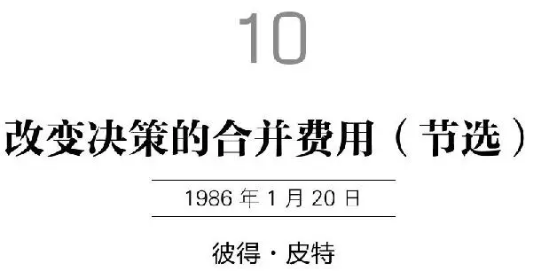

面对着不断剧增的交易费用，一些企业领袖开始自力更生，其中的成功者甚至打算凭借自身卓越的天赋转型成为金融家，去做并购评估。这些人中有一位甚至令两位享有盛名的华尔街“火枪手”都甘拜下风，他就是沃伦·巴菲特。巴菲特代表首府广播公司参与了美国广播公司的收购案，他在沃切尔·利普顿·罗森·卡茨律师事务所（Wachtell Lipton Rosen&Katz）合并案律师马丁·利普顿（Martin Lipton）的协助下坐到了谈判桌前。第一波士顿银行（First Boston）并购部门联合主管布鲁斯·沃瑟斯坦（Bruce Wasserstein）以及收购专家、世达律师事务所（Skadden, Arps, Slate, Meagher&Flom）的约瑟夫·弗洛姆（Joseph Flom），坐在了桌子对面。

随着谈判趋于尾声，专业的对手们为了获取更多利益而拒绝妥协。“巴菲特太聪明了，”沃瑟斯坦回忆说，“你要处处小心，以免被抓住小辫子。”正如这位并购专家所说的，他和弗洛姆坚持要求首府广播公司应该提高现金报价以换取美国广播公司的股权；但是巴菲特似乎并未受到多少牵制，只是抛出了一些小调整，即“虚伪”地承诺会把交易价格提高3%左右，并拒绝再度讨价还价。

2026年3月14日

16:57

## 11 时代华纳不为人知的故事（节选）

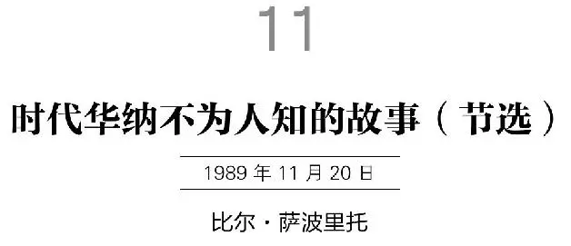

20世纪80年代中期，时代华纳公司首席执行官理查德·芒罗（J\.Richard Munro）找到了还击所有问题的方式：收购或者合并另一家媒体巨头，首府/美国广播公司。

1988年秋，扮演主要投资人的沃伦·巴菲特和首府/美国广播公司的首席执行官托马斯·墨菲及董事长丹尼尔·伯克一起到访时代华纳公司。芒罗和该公司董事长小尼古拉斯（Nicholas Jr\.）会见了巴菲特一行。这次会谈一直持续到12月。据小尼古拉斯和墨菲所述，焦点围绕在“无论如何，首府/美国广播公司的管理者人数必须比时代华纳公司的多出一到两个”。芒罗说，他告诉自己的好朋友墨菲：“非常感谢，但请记住，并不是时代华纳公司要被卖掉。”首府/美国广播公司有消息说，这两个人始终难分高下，谁来做老板，悬而未决。

巴菲特吃过时代华纳公司的闭门羹。1984年，他曾非正式地向芒罗提及购买时代华纳公司10%的股份，这是个十足惊人的提议。巴菲特的以往经验就是坚持大量持有股份几年甚至几十年，最终成为董事会信赖的成员和顾问。不过，当芒罗试探性地把巴菲特的提议转达给董事会后，令他非常遗憾的是，董事们极力劝他放弃这个念头。

2026年3月14日

16:57

## 12 巴菲特与迪士尼：竖起大拇指（节选）

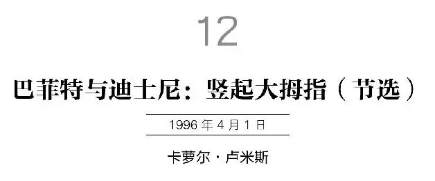

1996年3月5日，伯克希尔哈撒韦公司董事长沃伦·巴菲特刚在奥马哈做完演讲，他缓步走进曼哈顿中心区哈里斯信托储蓄银行（Harris Trust&Savings Bank）的办公室，将两个信封交给了工作人员。第一个信封装着伯克希尔哈撒韦公司掌有的2000万股首府/美国广播公司股票。这些价值25亿美元的股票将转交给公司买主迪士尼公司。

第二个信封被严实地封好，巴菲特在上面留言：“直至3月7日下午4点30分方可打开。”这里面装载着巴菲特的期待，即伯克希尔哈撒韦公司究竟能从第一个信封的内容中获益多少，他还提出，不要让任何迪士尼公司或者首府/美国广播公司的管理层知道。巴菲特期待着能像首府/美国广播公司普通持股人一样，可以遵照惯例选择“标准包”，即在迪士尼股票加现金、全部迪士尼股票或全部现金这3种获得回报的方式中，任意选择。

那么，信封是怎么回事？巴菲特非常赞赏迪士尼公司，为它竖起了大拇指，而他想要的只是该公司的股票。7日晚上，与迪士尼首席执行官迈克尔·埃斯纳（Michael Eisner）的谈话，让巴菲特对这家公司和它的老板大加赞赏，并许诺以伯克希尔哈撒韦公司的资金支持他。埃斯纳向巴菲特保证，他会努力工作，不负巴菲特的期望。

在即将出炉的伯克希尔哈撒韦公司1995年的年报中，巴菲特会宣告，他要重回“罪恶”的投资领域。1966年，迪士尼公司的电影资料库以及迅猛发展的主题公园项目吸引了巴菲特。当时，该公司的股价一直低得可怜，整个公司的市价还不到9000万美元。于是，巴菲特利用巴菲特合伙公司的资金，以每股31美分的价格大笔购进迪士尼公司的股票，而目前股价已达65美元。那么，巴菲特有没有坐享其成呢？答案是否定的。1967年，他以每股48美分的价格出售了这些股票。“哦，好吧，”巴菲特皱眉蹙额地说，“回来真好。”

__TAP DANCING TO WORK__

__巴菲特花絮__

巴菲特确实又再次购买了迪士尼公司的股票，但是并没有持续很久。曾经一度，巴菲特的确非常喜欢迪士尼公司，甚至当交易结束之后，他还将伯克希尔哈撒韦公司获得的收益追加到庞大的迪士尼公司股票之上。然而，当迪士尼公司经历了一系列管理危机之后，也就是在弗兰克·威尔斯（Frank Wells）离世、迈克尔·奥维茨（Michael Ovitz）管理失当之后，巴菲特转而将大拇指朝下，到1999年，伯克希尔哈撒韦公司与迪士尼公司完全脱离了关系。

2026年3月14日

16:57

## 13 通过回购股票来打败市场（节选）

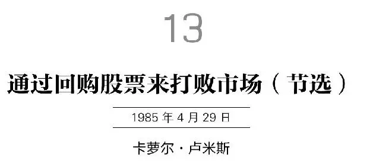

开创性的股票回购很值得深究。《财富》杂志发现，企业通过大宗回购自家股票可以获得巨大收益。

这篇文章同时揭示了很多正反面的观点。其中一些来自巴菲特，主要是关于回购的内容。彼时的巴菲特和如今一样，非常推崇那些能把握股票买卖时机的管理者，即在股票价值被低估时购入。同理，他非常鄙视另一些管理者，这些人购买股票只为支持自家股价或者为了抵消股票期权的相互影响。巴菲特常说：“只有在一种情况下，企业回购股票才是合理的，那就是自身价值被低估了。”

巴菲特关于回购的观点常常使人困惑，有时还会在伯克希尔哈撒韦公司的股东大会上招致责难、质询，因为他似乎并没有实践自己所宣扬的理念。持股人可能会问：“为什么伯克希尔哈撒韦公司从没有回购过自家被低估的股票？”事实上，2009年，一位质询者援引了文章中的观点提醒巴菲特，他曾经亲口说过，对于那些该回购股票而没这么做的企业，市场会给它们教训。

这些年以来，巴菲特对此曾以多种方式做出了回应。在互联网泡沫繁盛之时，当人们认为伯克希尔哈撒韦公司将被时代所抛弃，它的股票大跌至40000美元时，巴菲特承认，他做出过错误的决定，没有进行回购。他在1999年致股东的信中写道：“我对伯克希尔哈撒韦公司价值的评估一度太保守，抑或是太醉心于将资金用作他途。”随即，这封信成为他开启回购的大门。他说，股东如有机会读完他的心路历程，了解问题症结，伯克希尔哈撒韦公司将会重新赢回企图卖掉股票的投资者的信心。

接着又发生了什么呢？伯克希尔哈撒韦公司没能成功回购股票。巴菲特说，投资者并不太愿意出售伯克希尔哈撒韦公司的股票，仅有的几笔也因报价太高而遭到了自己的拒绝。

在这件令人扫兴的事情之后，巴菲特不止在一个场合表达过，伯克希尔哈撒韦公司的回购举动最终弄巧成拙。公司曾鲜见地发表声明：“回购股票”会使股价上升，从而使回购变得不划算了。这个声明是用我自己的话解释的，而非巴菲特的。如果巴菲特这个善于挖掘被低估股票的天才指出，伯克希尔哈撒韦公司的股价过低，值得购买，那么将立即导致股价大涨，不再便宜。

2011年9月26日，这一主张遭到了严峻考验。当时伯克希尔哈撒韦公司的A股账面净资产约为96900美元，而数日以来它的股价却持续低于10万美元。巴菲特宣布伯克希尔哈撒韦董事会已经授权公司以不高于账面净资产110%的价格回购A股或B股股票。一天之内，股价大涨，超出巴菲特的设限。显然，如果按照伯克希尔哈撒韦公司本设定的回购价格，它几乎在市场买不到任何股票。虽然如此，还是有一些股东愿意接受巴菲特所定的回购价区间。伯克希尔哈撒韦公司此次一共回购了98股A股和802000股B股，总价6700万美元。对于公司来说，这点股票微不足道，如果要通过回购来显著提升股东权益，很可能要花数十亿美元。

从这个小片段中我们可以得知：如果伯克希尔哈撒韦公司的股价下跌，逼近账面净资产（当然每天都在改变），毫无疑问，巴菲特还会再度认为价格过低。以下是摘自1985年这篇文章中关于巴菲特的部分。

——卡萝尔·卢米斯

那个痴迷回购的人就是来自奥马哈沃伦·巴菲特，举世闻名的投资大师。他掌控的伯克希尔哈撒韦公司将从美国广播公司收购案中获得首府/美国广播公司18%的股份，而这也将成为他最大的一笔投资。不过，目前该公司持有的最大的4家公司的普通股已经完成了大规模的回购。这4大公司分别是政府雇员保险公司、通用食品公司、埃克森公司以及华盛顿邮报集团。其中，埃克森公司是巴菲特新近投资的，就在1983年该公司开始回购股票之后。__巴菲特说：“投资这4家公司的一个重大原因是，它们已经认识到股票的真正价值，并站在持股人的立场上回购股票。”__另一方面，巴菲特也卖掉了一些公司的股份，因为它们不打算进行回购。

他对此深信不疑，事实上，有很多公司本应实施回购却没有这么做。很多公司经常把资金挥霍到那些远低于实际价值的项目上，对于这样的公司，市场必定会给予教训的。他说，回购产生的必然结果是，它会提升公司的市值。因为投资者认定，回购行为是公司运营持续性地倒向投资者利益的信号。__他发现：“所有的管理者都宣称他们是投资者利益的代表人。或许，你非常乐意把这些人纠集起来，拉到一台测谎仪前，测一下他们是否说了实话。其实没有测慌仪也不要紧，管理者以投资者为本位的最佳标志就是，当股价被低估时，实施回购。这能替代测慌仪，而且非此莫属。”__

2026年3月14日

16:57

## 14 猜猜是谁购买了“倒霉”债券

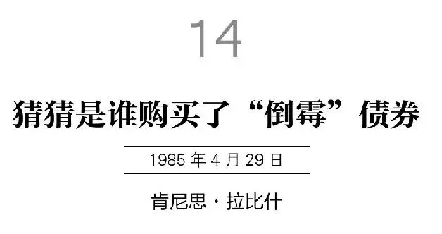

20世纪80年代中期，巴菲特的声誉已如日中天，他的每个投资举动都会成为轰动一时的新闻事件。然而，在1985年初，让媒体津津乐道的是，伯克希尔哈撒韦公司屡次成为投资界的笑柄，因为它购买了“倒霉”债券。

就在本文发表的几天前，在1985年致股东的信中，巴菲特煞费苦心地解释了他异乎寻常的投资举动和考量，比如通货膨胀。巴菲特强调，投资者们需要考虑债券的价格，更准确地说，是被低估的价值，这是所有投资者都梦寐以求的东西。他在信里说：“我和查理·芒格一起评估了所购买债券的风险，确保相对于未来可能获得的收益，伯克希尔哈撒韦公司支付的价格（远低于现行价格）是划算的。”

在信中，巴菲特也像往年一样阐明了自己关于收购问题的观点，包括完全收购一家企业，以及通过股票或债券部份地参与某企业。他写道：“许多企业的基本面还是不错的。我觉得如果我们能以低于其净资产的折扣价买入一些股份，那么往往会有一些好事儿发生。”

这在“倒霉”案例中得到了应验。在整件事中，伯克希尔哈撒韦公司购进2\.6亿美元债券，从1983年到20世纪90年代初期不断增持、减持。在持有期内，这桩投资给伯克希尔哈撒韦公司带来了2\.63亿美元的免税利息收入。当出售债券的时候，这笔投资还给巴菲特带来了6800万美元的资本收益。

——卡萝尔·罗米斯

在沃伦·巴菲特为自己赢得“全美最精明的投资人”这一声誉的过程中，他曾数次因大胆、出人意料的举动让华尔街瞠目结舌。最近一段时间，他总是每隔半个月就有一次突发奇想。刚在首府广播公司收购美国广播公司的交易中大秀了一把之后，伯克希尔哈撒韦公司54岁的董事长又有了惊人的举动。巴菲特在伯克希尔哈撒韦公司的年报中透露，他已经投资1\.39亿美元购买了由华盛顿公共能源供应系统（Washington Public Power Supply System，简称“WPPSS”）发行的债券，这是设在华盛顿的一家“臭名昭著”的核能建设机构，1983年曾因无力偿还22\.5亿美元的贷款，而被华尔街戏称为“倒霉”债券。

华盛顿公共能源供应系统是一家负责城镇设施以及公共设施的市政公司，从20世纪70年代起开始大规模兴建了5座大型核电站。巴菲特没有购买为四、五期电站募集资金的债券。由于投资超过预算，并且有证据显示该地区的能源供应大于需求，华盛顿公共能源供应系统在建设这两期电站的初期就搁置了该计划。巴菲特投资一、二、三期的债券不断为他赢回收益，因为和四、五两期债券不同的是，它们获得了该地区联邦能源机构的担保。

这一次，巴菲特似乎再一次取得了完胜。因为在华盛顿公共能源供应系统陷入危机。债券大幅跳水之后不久，他立刻买进，这为他锁定了诱人的16\.3%的当期收益，而且是免税的，这意味着每年2270万美元的投资回报。不仅如此，到1984年为止，他持有的一、二、三期债券已经增值13%。

华盛顿公共能源供应系统的这次冒险经历对于巴菲特来说只是个开端。尽管伯克希尔哈撒韦公司，这个跨保险、零售和出版业务的大型集团，握有巨额债券，巴菲特的专长还是在于购买那些被证券市场低估了的公司股票。购买华盛顿公共能源供应系统的债券是个冒险的提议，他自己很快也承认了这点。债券支持建设的三个核反应堆，只有一个投入使用，其他两个因为处于供大于求的状态，一直拖到20世纪90年代中期才得以运转。这种停滞引起了人们对华盛顿公共能源供应系统长期投资的质疑。投资者手握不能履约的债券，一些团体屡次将华盛顿公共能源供应系统告上法庭，使它官司缠身，利息的支付也中断了。巴菲特提醒投资者：“‘企业’在一两年之内遇到一点轻微风险算不了什么。”

巴菲特似乎无暇顾及结果如何。他认为，不论自我评价还是外界对他的评价，都不能就凭一次投资妄下定论，整体评判才具有客观性。巴菲特握有伯克希尔哈撒韦公司41%的股份，还掌握着超过17亿美元的公司投资。他的这种成就着实令人震惊。在10年之前，伯克希尔哈撒韦公司的股价约为40美元，如今已经飙升到超过1800美元。

当这位内布拉斯加天才疲惫地躺在简朴的办公室的沙发上时，他开始将对华盛顿公共能源供应系统的投资与这些年来其他不同寻常的投资做比较。他想起了1963年购买了美国运通公司股票的经历。彼时恰逢该公司被卷入提诺·德安吉利斯（Tino De Angelis）的诈骗案中。这就是广为人知的“色拉油丑闻”。美国运通公司的一个不为人知的子公司无中生有，虚增棉花籽和色拉油的存储量，向银行骗取贷款。尽管很多华尔街人士担忧美国运通公司会受到波及而面临倒闭的困境，巴菲特和他的伙伴还是趁机以超低价购进了公司5%的股份。结果，美国运通公司所承担的连带责任远低于先前预期，公司股价一飞冲天，巴菲特逆流而上，赚得盆满钵满。__“不受追捧的东西，就没有可取之处？”巴菲特咯咯地笑着说，“其实这才是钓大鱼的地方。在华尔街，让人非常愉快的市场共识，通常会让你付出巨大的代价。”__

华盛顿公共能源供应系统简直是“逆向投资者”的天堂。一、二、三期债券持有者刚从一场令人毛骨悚然的法律诉讼中侥幸存活。美国联邦政府的邦纳威尔电力管理局（Bonneville Power Administration）负责为西北部的城镇和公共设施机构提供水电，最终它同意从电费收入中拔出专款用于偿还一、二、三期债券，这使得债券持有者最终获得了利息。俄勒冈州的斯普林菲尔德市（Springfield）签订了从华盛顿公共能源供应系统采购核电的合同，但它又向法庭申请调查这笔交易，因为地方纳税人对合同的合法性提出了质疑。1985年2月，旧金山的一家美国地区法院裁定合同有效。

该系统很可能面临更多诉讼，以及许多其他的不利因素。为了支付利息，邦纳威尔电力管理局必须有可靠的现金流，而这部分取决于是否有丰沛的雨水供大坝发电。铝冶炼厂是本地区主要的工业能源消耗者，但它在与外国厂商的较量中受到了重创，邦纳威尔电力管理局不得不降低电价来保障该工厂的运转。另外，让一、二、三期债券持有者恐慌的是，法院裁定，四、五期债券持有者有权分享邦纳威尔电力管理局用于偿付给前者的专项资金。观察者打了个形象的比方，两类债券持有者之间筑起了坚不可摧的“长城”。对一、二、三期债券持有者来说，最危险的事莫过于，华盛顿公共能源供应系统随时可能宣布破产。美国此前从未有过如此规模的公共机构破产的先例，所以没人知道，如果真出现了破产的情况，这些债券的结局到底会怎样。

考虑到种种无法估量的因素，很多市政债券专家都建议自己的客户远离华盛顿公共能源供应系统。一位西海岸的专家甚至将其比做第二次世界大战时期穿越北大西洋的运兵船。“你很清楚，鱼雷已经瞄准了你，”他说，“但不确定的是，你是否会被击中。”穆迪（Moody’s Analytics）和标准普尔这两家华尔街最大的债券评级机构也双双拒绝为华盛顿公共能源供应系统的一、二、三期债券做出评级。

然而，也有一批债券专家站在巴菲特阵营，分享着华盛顿公共能源供应系统债券高回报的喜悦。雷曼兄弟公司（Shearson Lehman Brothers）市政债券投资部副总裁罗伯特·阿德勒（Robert Adler）说：“它不是投资级的优质债券，却可以为懂得其中风险的人带来高额利润。”很明显，雷曼兄弟公司的东家美国运通公司就没有那么乐观了。1984年，美国运通公司的保险子公司抛售了价值7600万美元的华盛顿公共能源供应系统一、二、三期的债券。尽管如此，汤姆森·麦金农证券公司（Thomson McKinnon Securities）的主管霍华德·希茨（Howard Sitzer）仍大力推荐华盛顿公共能源供应系统的一、二、三期债券。他指出，邦纳威尔电力管理局1984年的营业额高达27亿美元，在短期内这足以应付华盛顿公共能源供应系统的债务偿付。希茨还认为华盛顿公共能源供应系统破产的可能性微乎其微。

在对债券的价值做了冷静客观的评估之后，巴菲特还是像以往一样，坚持了他投资华盛顿公共能源供应系统的决定。他指出，如果投资在其他项目上，他需要用两倍的资金才能取得与投资该债券相同的收益。在推进这项计划之前，他做过周密的风险调查。__“我们不会根据评级来做决定，”他补充说道，“如果我们希望由穆迪或者标准普尔帮我们管理资金，那我们就直接把钱给他们了。”他还说：“令我们非常骄傲的是，奥马哈总部没有电脑，我们的分析不依赖于电子数据，而是靠阅读，仅此而已。”__

从1985年年底开始，巴菲特不再透露他是在增持还是减持了华盛顿公共能源供应系统的债券。他承诺投资5\.175亿美元给美国广播公司，但这并不意味着他必须靠出售华盛顿公共能源供应系统的债券来募集资金。他完全可以通过现金流和流动资产，或者求助于外部资金来实现。另外，伯克希尔哈撒韦公司还掌控着巨额的广播股股票，包括《财富》杂志发行商时代集团4%的股份，作为投资美国广播公司的条件，美国联邦通信委员会（Federal Communications Commission）可能会要求他卖掉部分时代集团的股份。

巴菲特说，未来购买债券的机遇可能会越来越少。他担心美国联邦政府的预算亏空会导致更高的通货膨胀率，从而推高利率，这对债券持有者来说将是一场灾难。__他说：“在物价飞涨、通货膨胀的时期，你买到的债券如同墙纸。”__

最近，巴菲特这边又有新闻发生了：他很少投资了。对此他的回应是：“我不可能每年都有50个好点子，能有一两个就很幸运了。”可是每当他决意投资的时候，总是下很大赌注。在最近一期年报中，巴菲特提醒投资者，投入重资去践行某些投资理念，偶尔会让这一整年都不好过，这是很有可能发生的。不过，伯克希尔哈撒韦公司现在已经有足够的资本去冒险赌一把了。

2026年3月14日

16:57

## 15 巴菲特语录

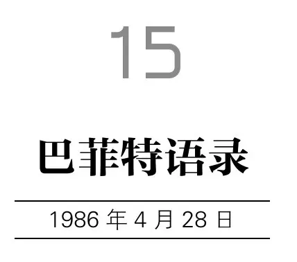

本年度，我们的净资产增加了6\.136亿美元，或者说是增长了48\.2%。这样的净资产收益率就像哈雷彗星来访一样弥足珍贵。在我的生命中不会再有第二回了。

——沃伦·巴菲特

55岁，伯克希尔哈撒韦公司董事长

1985年年报

__TAP DANCING TO WORK__

__巴菲特花絮__

事实上，巴菲特错了，13年后的1998年，伯克希尔哈撒韦的净资产收益率再创新高，达到48\.3%。显然出现这种情况的频率与哈雷慧星的来访并不匹配。在1998年年报中，巴菲特并不认为该成就有多辉煌。他说，增长的净资产的大部分来自伯克希尔哈撒韦公司发行的新股。发行新股的目的是进行收购活动，主要指收购利捷公务航空公司和通用再保险公司，而每次股票的发行价都是高出账面净资产的。

当然，这样的高价并不算意外。新股的价格总是以该股票的市价为基础。当巴菲特选择在该年度发新股时，伯克希尔哈撒韦的股价正好维持在高位。可以这么说，如果伯克希尔哈撒韦的股价很低，那么巴菲特绝不会往外送股票的。

## 16 一切都该留给子孙吗（节选）

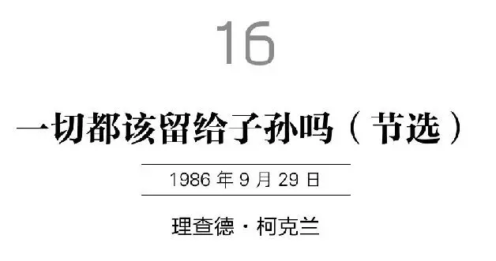

因为本文，沃伦·巴菲特的头像第一次出现在《财富》杂志的封面上。当然，这肯定不是最后一次。实际上，巴菲特只是这个长篇故事的一个主要演员。演员表上还有许多人，每个都是富商巨贾。因此，我们在此仅摘选关于巴菲特的段落，包括文章的开头。

巴菲特对于巨额遗产有着强烈的抵触情绪，据我所知，这也是本文的由来。后来成为《财富》杂志主编的作家理查德·柯克兰回忆说，当然也有很多富人持有不同意见。巴菲特在本文中的观念也在读者中引起了不小的震动。美联储主席保罗·沃尔克在华盛顿的一次聚会上认出了《财富》杂志的编辑，然后跟他说：“现在每个人都在谈论你的文章。”时至今日，在本文发表的25年之后，巴菲特还是会收到相关的问题，似乎读者们把这篇文章剪下来，做成了收藏品。

巴菲特有三个子女。他的女儿苏茜·巴菲特（Susie Buffett），是三个孩子中年纪最长的，其他两个是儿子，他们是霍华德·巴菲特（Howard Buffett）和彼得·巴菲特（Peter Buffett）。因为文中的一件趣闻，苏茜可能比巴菲特还忙于回答各种问题。苏茜说，至今仍有许多人问她很多不可思议的问题，比如：“他真的连修理厨房的钱都不给你吗？”

巴菲特曾认为，给孩子留“几十万美元”的遗产是比较合适的。即便现在，他还是保持着小气的作风。随着时间流逝，通货膨胀以及对自我的反思改变了他对子女继承遗产的一些观念，所以，他也将遗产的数字从原本“几十万美元”提高了不少。

多年以来，在遗产方面，他都不曾公开过自己的思考。直到2010年在纽约的一次晚宴上，巴菲特坐在一小群富豪中才首次公开谈及，自己的孩子已经得到了多少财产，并在他过世之后将继承多少遗产。巴菲特说，他第一任妻子苏珊在2004年去世时，在遗嘱中留给每个子女1000万美元，而巴菲特本人最近也修改了自己的遗嘱，每个子女将能够继承1500万美元。

因此，对于巴菲特的三个孩子来说，他们总共将获得7500万美元的遗产，也就是以“万”计。据巴菲特自己所说，相比之下，他自己的财富值已经接近500亿美元。显而易见，巴菲特仍然认为财富不应该全部留给孩子。

不仅如此，巴菲特也不希望把伯克希尔哈撒韦公司的管理权交给自己的子女，这个问题也是有些微妙的。不过，他也坚信，家庭成员能够最大限度地维系公司文化的延续，所以，他希望自己的长子霍华德在未来需要的时候能够胜任伯克希尔哈撒韦公司董事长一职，但公司的实际管理还是应由家族之外的人掌管。

随同遗产一起考量的还有慈善。1999年，就在巴菲特妻子苏珊去世之前，她和巴菲特为了鼓励子女积极参与慈善事业，给予每位子女1000万美元建立自己的慈善基金会。随后，为完成母亲的遗愿，巴菲特的每位子女都各自成立了超过1亿美元的基金会。他的小儿子。同时也是音乐家兼作家的彼得·巴菲特（详见本书《小巴菲特造访北京》）将其称作“大爆炸现象”。2006年时，巴菲特通过《财富》杂志发表了一则令众人哗然的声明，他打算逐步把自己绝大部分的财产捐献给5家基金会，其中3家是由他的孩子运营的。从那时起，这3家基金会已经收到巴菲特捐出的接近4亿美元的股票。

这块肥硕的牛排到2012年8月30号那天变得更大更诱人了，因为巴菲特在这一天，也就是在庆祝他82岁生日的时候宣布，为了更大力度地支持子女的慈善事业，今后他将加倍地捐赠自己持有的伯克希尔哈撒韦公司的股份。也就是说，今后股票的价格将直接决定巴菲特的捐款量。不难想象，来源于“大爆炸”式的总捐款额将是怎样一笔不菲的数字。经过2012年的大调整，每家基金会的捐款额将达到20亿美元或者更多。《财富》杂志专门撰文讲述巴菲特巨额捐赠的故事，详见本书《巴菲特捐出财产》。

——卡萝尔·卢米斯

__文章的开篇写道：__

沃伦·巴菲特，56岁，伯克希尔哈撒韦公司董事长，也是一位天才的领路人。他掌控的这家控股公司成就卓著，市值至少为15亿美元。不过，你千万别嫉妒他的儿女们。巴菲特并不认为把巨额财富传承给下一代是明智的选择。实际上，他打算将自己大部分的钱都捐给慈善基金会。在资助子女完成大学学业之后，这位吝啬的奥马哈投资家认为，在圣诞节给孩子几千美元就已经算是相当仁慈了。不仅如此，他的女儿，33岁的苏茜还说过：“如果我给爸爸签一张哪怕只有20美元的支票，他一定会先去银行兑成现金。”

巴菲特之所以将孩子们排挤在巨额的家庭财富之外，并不是因为他们一无是处，也不是因为他们挥霍无度或是拒绝为家族生意出力，而是出于传统的理念：富有的父母不应该将财产传承给子女。他说：“我的孩子们要在这个世界上寻求自己的一席之地，他们知道，无论他们想做什么，我都是坚定的支持者。”“就是因为子女们投对了胎就可以获得一个金饭碗，一辈子享用不尽的饭票”，巴菲特相信，这种观念是会“误人子弟”的，也很可能会“危害社会”。因此，给予子女最恰当的金额就是让他们觉得“足够做点儿什么，但又不至于躺在床上睡大觉，什么也不需要做”。巴菲特认为，对于大学毕业的人来说，“几十万美元”应该是个合理的数额。

应该留给孩子多少钱呢？这是美国人一直苦思冥想的问题。世界上绝大部分地方的习俗或是法律规定，子女们，除非犯了什么弥天大罪，否则都能在父母离世之后，自动获得其绝大部分的遗产。只有英国及其他英联邦国家有着不成文的规定，给予财产所有者权力按照自己的意愿分配财产的权力。

__文章中间部分又写道：__

有些富人争辩说，如果不将遗产留给子女，可能会影响与子女的关系。其中一位人士说：“如果你是孩子，看到你的父亲富可敌国，而你却没得到多少，心中会怎样想。我忍不住猜测，愤怒的种子会不会因此在他们心中萌芽。”在华盛顿《美国新闻与世界报道》*（U\.S\.News&World Report）*杂志任编辑的苏茜，承认自己的父亲有点难相处。“我父亲是我所认识的最好的人之一，最诚实、最有原则，”她说，“而且我基本上认同他的观点。不过，当你知道大多数的父母都愿意给孩子们买任何东西。而你只是想要点钱修缮一下厨房，并非是到海边度6个月的假，你的父母却以原则为由拒绝你的时候，心里还是觉得有点儿失落。我的这一生当中，父亲一直教导着我们。我觉得我已经吸取了教训，或许某个时候可以停一停了。”

__后面还有：__

巴菲特主张，大多数公司的所有人应该放弃将挚爱的公司留给家族内部经营的想法。他决定，即便在自己百年之后，公司也将坚持按照目前这种非家族化管理的模式继续运营下去。他也同意，在某些时候，子女可能是最适合经营公司的人选，但是概率并不高。__巴菲特说：“难道有人说过，组建能赢得奥运会冠军的队伍，其人员就得从那些20年前的冠军的子女中选择吗？给予某人一个个待遇优厚的职位，仅仅是因为他老爸的成就，如果真是这样，这对于一个社会的竞争环境无疑是种残酷的打击。”__

2026年3月14日

16:57

## 17 打电话给巴菲特谈合并（节选）

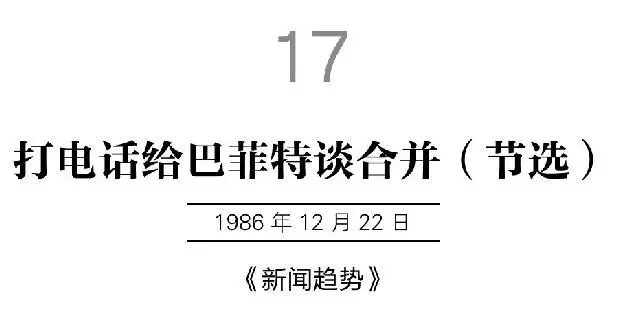

《华尔街日报》刊登过的最不寻常的一则需求广告来自巴菲特。这则广告占据整个版面、价值47000美元，它的内容是：我们正努力寻求并渴望购买价值超过1亿美元的企业，截止日期是1986年12月31日之前。我们有充裕的资金，而且我们会以超乎想象的速度做出反应……如果你有意向，请立即致电。

行动如此迅速的原因是，美国新税法将在1987年1月1日开始施行。联邦资本利得税从20%一跃而至28%，这已经够令人担忧了，但巴菲特甚至还警告说，如果企业的所有者打算在12月31日之后再出卖资产，可能要支付高达52\.5%的资本利得税。这个数据来自他的计算和考量：新税法规定，企业卖出业务将要支付34%的资本利得税以及股东应该缴纳的留存利润再投资收益的28%。巴菲特说：“很多企业都应该警觉起来了。”

然而，当你急匆匆地准备拿起话筒之时，还得注意一点，不是所有的潜在收购机会都能满足条件。根据广告，公司必须拥有“至少1000万美元的税后利润，当然越多越好”，必须自认有相当好的净资产收益率，很少或没有贷款，以及优良的管理水平。而且还得是一个“简单的生意”：“如果过多涉及高科技成分，恐怕我们理解不了。”

编者注：巴菲特没有得到任何回应。

2026年3月14日

16:57

## 18 对于指数期货的早期恐惧

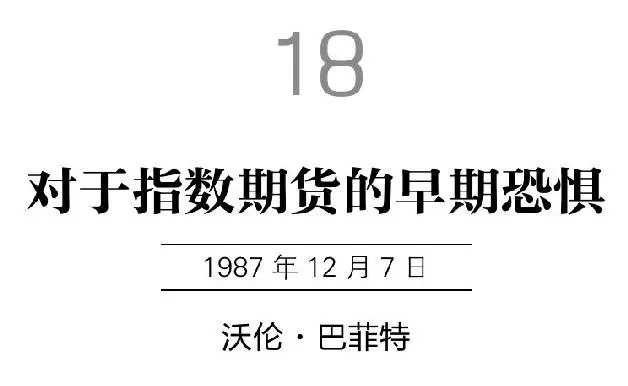

1987年10月中旬，持续了一周的“超卖”情绪终于在该年第19个周一达到了顶点，道琼斯工业平均指数下跌了22\.6%，人们把这一天称为“黑色星期一”。对市场崩盘原因的调查还在紧张地进行之中时，人们纷纷将注意力聚焦到了标准普尔500指数期货（S&P index futures）身上。很多人相信，在此次暴跌中，该指数期货扮演了重要“角色”。彼时，距标准普尔500指数期货获准交易的年头并不久。特别值得一提的是，根据“投资组合保险”策略，机构投资者不停做空标准普尔500指数期货，他们的行为带动了其他机构投资者的纷纷效仿，于是市场恐慌愈演愈烈。

很快，《财富》杂志得知，早在1982年，巴菲特给国会议员约翰·丁格尔（John Dingell，密歇根州民主党）写过一封信。对于《财富》杂志而言，这不仅是一个非常好的契机，更重要的是，这封信的内容能解释“黑色星期一”的成因。丁格尔当时正是调查委员会的主席。当年，美国国会曾就是否允许芝加哥商品交易所（Chicago Mercantile Exchange）开展股指期货交易展开讨论。丁格尔持反对意见，而且据他所知，巴菲特也一样。因为很多年前，两人的父亲都是国会议员，所以他们彼此之间有所了解。尽管老霍华德·巴菲特（内布拉斯加州共和党）是极端的保守派，而老约翰·丁格尔（密歇根州民主党）恰好相反，但这并未妨碍两人成为好友。鉴于这层关系，小丁格尔就邀请巴菲特写了这封信，详细阐述一下为什么他认为股指期货交易不是好事情。巴菲特欣然应邀，并在信的末尾写道：“我们不需要股指期货，它就是基于美国股市的一种赌博工具，证券经纪人也不该鼓励人们参与此类投资。”

当然，我们都知道，丁格尔和巴菲特在这场论战中失败了。1982年4月，标准普尔500指数期货开始在芝加哥商品交易所上市。尽管在1987年饱受人们的置疑，但股指期货还是以迅猛的速度发展着。然而，在25年之后，股指期货的交易量却开始大幅缩水，被“后辈”标准普尔500迷你电子盘（S&P E\-mini futures）抢尽了风头。投资者可以选择相对比较小的交易量，而这慢慢成为交易的主流。2010年5月“闪电崩盘”（Flash Crash）发生时，很多投资者被吓坏了，其中绝大部分是标准普尔500迷你电子盘的投资者。

下面就是巴菲特写给国会议员丁格尔的信。

——卡萝尔·卢米斯

我写这封信主要是为了，对任何可能刺激包括股指期货在内的期货市场的交易活动做一番评论。凭着30多年在各投资领域的历练，以及多年从事一线证券销售人员的经验，我写下这封信，谈谈自己的思考。在过去的25年中，我一直在做着金融分析方面的工作，目前我独自掌控着一个总价值超过6亿美元的股票投资组合。

要想准确预测投资或投机市场是如何变化的，几乎是不可能的事情，而且，面对任何声称“准确”的言论，你也要保持高度的警惕。不过我想下面谈到的还是比较合理的推断：

__第一，股指期货合约有助于减少投资者真正的风险。__一个投资者也许可以非常有逻辑性地识别出被市场低估的有价证券，但无论如何也没法预知短期内股市的走向。这也是我在投资中一直秉持的观点。投资者都希望能完全规避股市的“震荡”。持续性地做空某些有代表性的股指期货或许可以帮助他做到这点。假设某个投资者拥有1000万美元的价值遭到低估的股票，并持续持有1000万美元的股指空头头寸，那么其赢亏将完全取决于个人的选股能力，而不必担心其操作受到大盘波动的影响。然而，因为交易费用的问题以及大多数投资者相信，长期来看，股价总体还是会上涨的，所以我认为，坚持以对冲理念来经营的投资专家相对还是比较少的。不过，我相信这也是一种比较理智的做法，而且真正坚持“市场中性”理念并以此行动的专家们也确实会采取这一策略。

__第二，如前文所述，我认为降低风险比较理智的策略应该包括做空期货合约。__在做多方面，我没有看到任何相对应的投资或者对冲策略。因此，按照定义来说，期货交易只有一半的目的是降低风险的，而另一半的合约（做多头）增大了风险或具有赌博性质。

__第三，事实上，风险降低和风险增高之间的平衡跟理论上的“五五开”大相径庭。__由于门槛低，而回报又非常诱人，所以不论真正的结果会有多惨，输得有多难看，赌博的情绪还是会被激发出来。这也就是为什么拉斯维加斯的赌场会在广告中大肆宣扬你会赢得多么不菲的赌金，而国家彩票中心也会把头奖金额做成大标题。在证券市场上，那些笨脑袋就会被类似的伎俩吸引住，包括：

●“仙股”，即低价股票“penny stocks”，这些东西之所以被推出来，就是为了蒙骗那些容易上当而又梦想一夜暴富的人。最后，当然会以一场又一场灾难收尾。

●由于保证金的比例很低，很小的资金也可完成大额交易。

__第四，在投资过程中，我们曾经有过不少高承诺、低保证金的情况，结果都陷入了困局。__我们最熟悉的，莫过于刚刚过去二十多年的大牛市，而与之相伴的是10%的保证金。头脑理智的人们随后发现，这种低保证金的炒作活动并未帮到资本市场，反而从长期来看，还会伤害资本市场。于是，保证金的规范被引进了，并成为投资过程中不可或缺的部分。以10%的保证金从事股指期货投机的行为，只不过是一种绕过保证金规范的伎俩，而且会立即关注获得国内投机商人的关注。

__第五，证券经纪人会自然而然地钟情于新的交易工具。__他们的热情也随着交易越来越活跃而被点燃。交易活动越多，公众的开支就越大，而证券经纪业也就更加有利可图。每当一个合约结束时，结果都是输家付钱给赢家。然而，在由期货市场和在其中扮演重要角色的证券经纪人组成的“赌场”中，一旦有交易发生，经纪人都能从中收费，不论服务赢家还是输家，数量多多益善。不过，游乐其间的玩家们需要谨记“负和游戏”的属性。刨去开销之前，输和赢相互抵清，但是刨除开销之后的净损失是实打实的。事实上，这种损失非常大，不然赌场就会停业了，切记，因为玩家的净损失是赌场收益的唯一来源。用“负和游戏”来解释一般的股票投资是比较贴切的，近些年来之所以会出现“正和游戏”的情况，其实仅仅是因为从总体上来说，相关的公司赚得了比较丰厚的利润，最终让公司所有者，也就是股东有所回报。

__第六，根据我的判断，高达95%甚至有可能更高比例的交易活动是由这种合约派生出来的，而其在本质上完全等同于赌博。__很多人会根据股市的短期走势，以相当小的金额下一个相当大的赌注。投资者这么做，其实是受到股票经纪人的鼓动。经纪人希望客户资金能快速周转，这对他们来说恐怕是最喜闻乐见的事儿了，因为他们的收入与之密切相关。由这95%合约产生的大量资金就这样留在了股票经纪人的口袋里。这也难怪，“赌场”对每个交易都会啃噬一口。

__第七，从长期来看，与传统资本市场相关、带有赌博性质并伴有高亏损风险的市场活动，对于资本市场来说一定不是好事。__不过，即便参与赌博活动的人们不是投资者，其买到的也不是股票，他们还是会觉得在股市的际遇糟糕透顶。领教过资本市场最为阴暗的一面之后，他们不可免避会对资本市场保持消极的态度。在经历过的跌宕起伏的投机活动之后，这些都是必然会出现的。你可能会问，证券经纪行业有没有足够的智慧去考虑自身的发展和长久的利益。然而，历史证明了股票经纪人的短视，20世纪60年代就是最好的例证；他们常常在自己做了最愚蠢的决定时表现得最开心。相比于客户或者说是证券行业的长期前景，证券经纪人更关心自己的荷包鼓不鼓。

我们不需要股指期货，它就是基于美国股市的一种赌博工具，证券经纪人也不应该鼓励人们参与此类投资。我们需要的是能为企业和投资做长远考虑的投资者和咨询师。我们需要理性的保证金，而不是杠杆化的市场“赌注”。如果“赌场”理念太过活跃，那么，尽管是同样的领域。语言和工作量，理智、合乎常规的市场操作还是会被打压，而非加强。

除此之外，股票等价物方面的低保证金也会对公共政策规定的保证金产生冲击。尽管股指期货会给希望能从事“套期保值”的专业投资人士带来些许的好处，但总体上讲，高容量的股指期货市场很有可能对购买证券的公众产生不利影响。因此，从长远来看，股指期货交易对于整个资本市场来说也是有害的。

## 19 巴菲特内幕

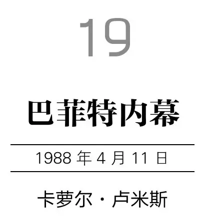

本文与个人经历的关系比其他文章都多些。我先是成了巴菲特好友，然后做了伯克希尔哈撒韦公司的股东，随即又在20年里一直免费编辑巴菲特致股东的信。在此期间我为《财富》杂志撰写的关于巴菲特的文章也仅限于一些零碎的段落。确实，随着巴菲特声名鹊起，我向大家推荐了一些关于巴菲特的故事，比如《小学院在投资游戏中取得大成功》和《猜猜是谁购买了“倒霉”债券》。当然，这些文章并不是我执笔的，而是由杂志的其他同仁撰写的，这也正暗合了我的心意。

1988年年初，《财富》杂志的总编马歇尔·洛布（Marshall Loeb）把我叫到他的办公室，让我做一个决断。他说，是时候把巴菲特全面生动地介绍给大众了。“你当时是首选，”他之所以这么说是因为他知道我和巴菲特私交甚笃，“当然，如果你不愿写，那我就指派别人来写。”

经过一天的左右思量，我决定从“我”的角度出发来讲述他的故事。我想这对于《财富》杂志的读者来说是最好的选择，由于我对巴菲特了解得较深，他们将能从我的文字里得到最真实的“内幕”故事。当然，他们需要知道，我是巴菲特的好友。伯克希尔哈撒韦公司的股东，还是巴菲特致股东的信的编辑。这些事实在文中都有交代，而且在我所写的关于巴菲特的其他文章中也都一直在提及。

洛布的提议的时机真是恰到好处。我在文中写到的故事在当时还未被人们所知，即巴菲特是怎样从一位卓越的投资人变身成为卓越的企业家的。在他身边的，是跟他同样出色的查理·芒格。后者不仅是巴菲特的好友，而且还扮演至关重要的顾问角色。正是这两位的协同合作，才使伯克希尔哈撒韦公司取得了如此卓越的成就，而外人往往不知道这点。

——卡萝尔·卢米斯

沃伦·巴菲特是伯克希尔哈撒韦公司的董事长，他把自己挚爱的公司称作“油画布”。过不了几天，当该公司的年报发布时，全世界就会知道，在风起云涌的1987年，巴菲特在这幅巨型画布上绘制了什么。先做个预告：在这一年，巴菲特再一次完成了一幅鸿篇巨制。伯克希尔哈撒韦公司的股东，我希望既简洁而又满怀欢欣地承认自己长久以来一直是其中的一员，又增加了4\.64亿美元的净资产，预计年净资产收益率将不低于19\.5%。这个数字可能略低于巴菲特接手公司23年以来所创造的23\.1%年净资产收益率。然而，这一年是很不同寻常的一年，很多专业投资者差点把命都搭上了。因此，巴菲特今年的成就无疑算得上又一幅“大师之作”。

公司年报是帮读者们梳理巴菲特过去一年间在证券市场所作所为的最佳依据，今年的年报会包含两条特殊新闻。第一，就在10月股市大崩盘之前，巴菲特为伯克希尔哈撒韦公司购买了价值7亿美元的所罗门兄弟公司的可赎回可转换优先股。他在董事长致信中明确表示自己坚定地支持该投资银行董事长约翰·古弗兰（John Gutfreund）的立场。这让关于两人分道扬镳的传闻不攻自破。第二，巴菲特透露，1987年，当德士古公司（Texaco）申请破产，大批股东纷纷抛售手中债券之时，伯克希尔哈撒韦公司开始收购该公司的短期债券。到了年末，伯克希尔哈撒韦手中的德士古公司债券已经出现了未实现利润。不过，不论是德士古公司的短期债券还是所罗门兄弟公司的优先股（巴菲特预计年底时的价值为6\.85亿美元左右），在账面上都是以成本来计算它们的价值，在1987年年报中，它们被标注为值得期待但未实现的业务。

事实上，年报背后的故事或者说是关于巴菲特的故事比我们通常所知的更为复杂和精彩。我们所读到的关于巴菲特的文章一般是从单一维度来描述的，这使得人们为巴菲特打上了各式各样的标签：他是一位投资家、“奥马哈的魔法师”、一位选择股票的天才、凭借送报攒下的9800美元摇身一变为净资产达16亿美元的超级富豪、一个一直秉持长期投资观念的人。其优异的投资表现还被“有效市场假说”阵营归功于“幸运”。

在他人眼中，1987年的巴菲特无疑是一个另类。在过去两年中，他一直声称找不到定价合理的股票作为伯克希尔哈撒韦公司的投资方向，而在1987年10月19日，巴菲特“身负重甲”凯旋而归。此时，在伯克希尔哈撒韦公司的投资组合中，除了“三只永恒持有的股票”之外，几乎没有普通股。这“三只永恒持有的股票”尽管也在大崩盘时期遭遇重创，但从整年来看，还是表现得相当优异：政府雇员保险公司，股价增长了12%；华盛顿邮报集团增长了20%；首府/美国广播公司则增长了29%。

对于投资家巴菲特来说，这样的业绩还算可以。不过，除了投资家的身份，巴菲特在伯克希尔哈撒韦公司还扮演着不为外人所知的其他角色，比如企业家，在并购和管理企业这块，巴菲特也拥有卓越的才能。企业家巴菲特在自己的领域埋头苦干时，投资家巴菲特却在对投资市场进行各式各样的炮轰。1987年，伯克希尔哈撒韦公司的支出和收益取得了完美的平衡：作为投资家的巴菲特，其已实现和未实现的回报共达2\.49亿美元（税后）；而作为企业家的巴菲特，通过经营伯克希尔哈撒韦公司已有的业务获得了2\.15亿美元的税后利润，并使公司总的税后利润达到4\.64亿美元。这比道琼斯公司、皮尔斯伯里公司（Pillsbury）以及康宁玻璃公司（Corning Glass Works）的净利润要高得多。

1965年，巴菲特接手伯克希尔哈撒韦时它的股价在12美元左右。经过巴菲特多年的经营，该公司的股价在1987年冲上了4200美元的高点，随后便稳定在了3100美元左右。巴菲特，这位年近花甲却又机智、直截了当的掌舵人，拥有公司42%的股权；他55岁的妻子苏姗拥有3%的股权。1987年，公司总收入超过20亿美元，在《财富》500强企业中排名30位左右，但不同于其他公司的是，这家公司的结构相当独特。

伯克希尔哈撒韦公司的核心业务是财产和意外伤害保险，由一等系例并不知名的小公司负责经营，比如国民保险公司（National Indemnity）。这些保险企业为巴菲特提供了大量的浮存金，从而使他有充裕的资金进行投资。除了保险业之外，伯克希尔哈撒韦公司还拥有一系列颇具规模的公司，巴菲特称它们为“七圣徒”。它们是：《水牛城新闻报》*（Buffalo News）*；费切海默兄弟公司（fechheimer brothers），辛辛那提的一家制服生产与批发商；内布拉斯加家具城（Nebraska Furniture Mart），奥马哈一家全美种类最全的家具零售商；时思糖果公司，加利福尼亚州著名的糖果生产和零售商；世界图书出版公司；柯比公司（Kirby Company），一家真空吸尘器和家居清洁配件制造商；此外，还有一家生产工业压缩机和燃烧器等产品的制造商。后三家企业是1986年伯克希尔哈撒韦在收购克利夫兰市斯科特费笨公司（Scott&Fetzer）时，顺带获得的子公司。

看起来是不是相当庞杂。在1987年年报中，巴菲特对这些公司和它们的管理层赞赏有加。他说，如果将“七圣徒”看作一个整体，1987年它们的净资产约1\.75亿美元，在扣除微不足道的200万美元利息支出后，税后利润高达1亿美元，也就是说净资本收益率达到了57%，这个成绩是相当出色的。正如巴菲特所说：“在任何地方，这么高的增长速度都是很少见的，更不用说一家几乎不用杠杆的多元化集团。”

很多年以前，一位著名的商学院教授试图调和有效市场假说与巴菲特所取得的成功，他把巴菲特的成就称作“五西格玛事件”。简单来说就是，根据统计学原理，出现巴菲特这样的人物的概率接近零。就其并购和经营整个公司的表现来看，企业家巴菲特同样异于常人。不论是作为企业家，还是投资家，巴菲特都有着同样的敏锐度和原则性。在企业经营方面，他不在意形式和惯例，总是坚持自己的原则，即他所谓的“简单、传统、无为”。

以伯克希尔哈撒韦公司为例，它从不忘记自己为之奋斗的目标。__巴菲特有言：“如果我们驶上了纽约到芝加哥的主干道，就不会在阿尔图纳拐上乡间小道。我们也对规律和逻辑保持着敬畏之心，不过，对超过我们每个人的能力的事，我们是决不会干的。经营和投资对我来说没什么差别，没有必要为了不同寻常的结果去做不同寻常的事。”__

在描述投资家巴菲特和企业家巴菲特时，我自认为自己有别人没有的独特优势。之所以这样，主要是因为除了在杂志工作了30多年的经历之外，我和巴菲特的私交也超过了20年之久。我经常会帮助他编辑年报，这也就是为什么我知道年报即将披露的内容的原因。同时，我也是巴菲特的忠实仰慕者。因此，在这篇出自巴菲特好友之手的文章里，有两点你必须注意：第一，本文是以内部人的角度讲述，巴菲特不为人知的内幕故事；第二，本文有的地方难免带着感情色彩。

巴菲特能赋予他所有的事业一种巨大的精神光辉，这是无可争辩的事实。41岁的迈克尔·戈德堡（Michael Goldberg）经营着伯克希尔哈撒韦公司的保险业务，其办公室与巴菲特的办公室只有一墙之隔。他说，在布朗士科学高中（Bronx High School of Science）自己见过许多聪明人，但他们都投身于数学和物理领域去了。巴菲特则将过人的才智全部集中在了商业领域，这恰恰也是他热爱和了解的行业。__戈德堡说：“巴菲特总是在检验着他所听到的东西。是不是合理的？是不是错了？整个世界的格局都在他的脑海里。那里似乎有台计算机，不停地对比着新鲜事物和他已有的经验和知识，并且还在不断地发问，这对于我们意味着什么？”__“我们”指的就是伯克希尔哈撒韦公司。巴菲特自己也买了一些股票，但是几乎无暇顾及。他说：“我的‘自我意识’已经和伯克希尔哈撒韦公司的命运裹挟在一起了。这点毫无疑问。”

所有见到巴菲特本尊的人都很难看到任何“自我意识”的影子。实际上，巴菲特是脚踏实地的人，平凡、有趣、值得信赖，看上去略带点美国中西部风格，穿衣打扮一点儿也不入时，轻易就能隐身于人群之中，就像是私家侦探。他喜欢麦当劳和樱桃口味的可乐，不喜欢大型派对和闲聊。不过，如果环境适合他，他也很合群，有时还特别欢快。在1987年冬天的首府/美国广播公司的管理层会议中，他身穿救世军的制服，吹着喇叭，为该公司首席执行官托马斯·墨菲唱起了恩友歌小夜曲，还填上了自己写的歌词：“何其幸哉，吾友墨菲。”

有时候，特别是在讨论理智的、有深度的话题时，巴菲特的表达往往铿锵有力，而且语速特别快，仿佛在试图追赶他脑海里飞速运转的点子。年轻时，他很怕在公众面前演说。为了锻炼自己，他强迫自己参加了卡内基的培训班，和“一群跟我一样可怜的人”一起完成了这个课程。现在，讲演对他来说已经易如反掌，他可以很轻松地把自己脑海中的思考和盘托出，而且不用讲稿就能妙语连珠、举一反三、滔滔不绝地表达自己的观点，恐怕专业写手也望尘莫及。

巴菲特的工作和思考总是很复杂，但这并未影响他对简单生活的追求。投资家和企业家，巴菲特之所以能够在两种身份之间随意转换，关键就在于他看待“所有权”的方式是唯一的。__作为一名投资家，巴菲特建议并坚持，通过股市购买部份企业的价格应该低于其内在价值，即低于理智的买家愿意买进该企业所有股票的价格。作为一名企业家，巴菲特最希望的是，能以不高于内在价值的价格买下整个生意。__

__巴菲特眼中的“好企业”要满足几个基本条件：具有较强的特许经营权；高于平均值的净资产收益率；相对较小的资金投入；释放现金流的能力。__这些条件听起来充满“母性”般的慈爱，像苹果派一样甜蜜诱人，但是想要找到这样的企业并不容易。巴菲特将这种苦苦寻觅形象地比作猎捕一只“稀有的且行动迅速的大象”。不过，他一直未改初衷，坚决不在严苛的条件上让步。“七圣徒”就是能满足以上所有条件的典范。巴菲特参股的公司也不例外，比如，政府雇员保险公司、华盛顿邮报集团和首府/美国广播公司。

在年报中，巴菲特总是会赞扬上述公司的管理层。这些人中的大多数可以与巴菲特相媲美，在他们的信念里，工作是一种乐趣。巴菲特衷心希望他们能够保持这种对事业的狂热。“出色的工作是由出色的人来完成的”，这是他最乐于见到的局面。

然而，他也相信，这些年来，在投资方面的最大失误就是，买了某些“好企业”，却没办法“消化”。“如果当时不完全买下来这些企业就好了。”他说。因此，有时他只会持有股份，而不是彻底收购。不过，这也使得某些时候，管理层的愚蠢常常让他有种“咬碎牙根往肚子咽”的难以容忍的感觉。很多年前，他持有的股票比现在要多。有一次他向朋友大吐苦水说，他刚刚读完一份荒谬至极的年报，其内容充斥着管理层的欺骗误导和自私自利，“足以让你恶心得想吐”。这位朋友说：“可你还持有他们的股票呢。”他回答说：“是的，我看中这家企业是因为它太好了，连笨蛋都能赚到钱。”

自然，好企业的价钱不会低，尤其是在当今，全世界都已经意识到了它们的价值。不过巴菲特的眼光保持了一如既往的敏锐性，即他不会多付钱，而且会以最大的耐心等待最佳时机。他的年报中照例都有一则“广告”，征寻他有兴趣购买的企业。“对于正确的选择和正确的人，我们会提供一个舒适的家。”他说。据说在1986年，赫尔德曼就是看到了这则广告，才带着自己的费切海默兄弟公司找到了巴菲特。当时公司的利润只有600万美元，规模上并未达到巴菲特的要求，但赫尔德曼是巴菲特苦苦寻找的那种优秀管理者，“友好、聪明、诚实和目标导向”是他对赫尔德曼的评价。最终，巴菲特收购了这家公司，事后他也非常庆幸自己做了这个决定。

仅仅从一桩收购案，也就是《布法罗新闻报》收购案中，我们就能够看出巴菲特的远见。1977年，《布法罗新闻报》寻求出售时，华盛顿邮报集团和芝加哥的论坛报业集团（Tribune Co\.）都拒绝了，或许因为这只不过是一家晚报，而且将来的势头也有点儿日薄西山。《布法罗新闻报》每周只发行6期，没有周日版，其主要竞争对手《Courier\-Express》则每周发行7期。不过，在除了周日的其他6天，《布法罗新闻报》优势更明显。于是巴菲特得出结论，如果这家报纸周日也发行，局面会大有改观。

在以3250万美元的价格收购了《布法罗新闻报》之后，巴菲特快马加鞭地策划周日版的事情。新开的版面给予订阅者和想要登广告的人特别的优惠，这激怒了《Courier\-Express》。后者发起了“反垄断”诉讼。当然，巴菲特最后赢得了这场官司。两家报社都经历了多年的亏损，到了1982年，《Courier\-Express》放弃了最后的挣扎，关门大吉。去年，《布法罗新闻报》作为一家蒸蒸日上的“垄断”媒体，赢得了3900万美元的税前利润，而这显然不是通过节省纸张实现的。该报纸的新闻版和广告版穿插排列，对于相同规模甚至更大规模的报纸来说，这个比例都是不相称的，这全归功于巴菲特对新闻业的热爱。他说，如果不做投资者，他很可能会成为一名记者。因此，《布法罗新闻报》很可能是他最热爱的公司。

巴菲特的“好企业”投资哲学其实是很晚才形成的。在这之前他经过多年的摸索，并赚了不少钱。在奥马哈长大的巴菲特，从小就表现出超乎常人的少年老成，而且对数字和金钱方面的知识充满了求知欲。他的父亲霍华德·巴菲特，是一位股票经纪人，也是他心中的偶像。父子之间的感情相当深厚，霍华德常常亲昵地称呼儿子为“火球”。巴菲特记得自己从图书馆借过一本书《赚到1000美元的1000种方式》*（One Thousand Ways to Make$1，000）*，并对其中称量便士的机器非常着迷。他曾梦想自己从一部小小的机器起家，逐渐积累财富，最终成为世界上最年轻的百万富翁。在基督教长老会，他计算赞美诗作曲家的寿命，调查他们的宗教信仰是否让他们活得更长，结论是，没有。在11岁时，他和朋友做起了比较“世俗化”的工作，开发了一个在赛马比赛中选拔冠军的识别系统，命名为“马童筛选器”。

然而，一路走来，巴菲特所想的都是股票。在8岁时，他就开始阅读关于市场方面的书籍，11岁时买了人生中第一只股票——城市服务公司的优先股，并实践各种交易方面的理论。十几岁的他还做过一阵“图表专家”，随后又成为市场时机方面的“专家”。从1943年起，因为父亲霍华德当选国会议员，他随家人搬到了华盛顿。由于太想念家乡奥马哈，年轻的巴菲特在学校表现不佳，甚至在他一向擅长的数学科目上，成绩也不是很理想。他还曾一度离家出走。只有当父亲迫使他放弃他热爱并为他带来收入的送报工作时，他的成绩才有所提高。16岁高中毕业之后，巴菲特在宾夕法尼亚大学度过了两年时光，然后转学到内布拉斯加大学。20世纪50年代初期，就是在那里，他读到了本杰明·格雷厄姆新出版的著作《聪明的投资者》。格雷厄姆在书中鼓励投资者多关注公司的真实价值，并根据“安全边际”进行投资，这些理念对于巴菲特来说，意义是无比巨大的。__时至今日，巴菲特的投资理念还带有格雷厄姆的印记：“第一条规则就是不要亏损，第二条规则就是不要忘记第一条规则。”__

1950年的夏天，巴菲特申请了哈佛大学商学院，他乘火车到了芝加哥，还接受了当地一位哈佛毕业生的面试。这位哈佛大学商学院的代表对巴菲特的印象是：“由于身材消瘦，19岁的他给人的感觉是，16岁的外貌，12岁少年的体重。”在两个人的会面结束之后，巴菲特进入哈佛大学的梦想也随之破灭了。哈佛大学的拒绝刺痛了巴菲特。然而，他现在再回想起当时的遭遇，却认为被拒绝是一件无比幸运的事，因为他回到奥马哈之后，偶然得知本杰明·格雷厄姆正在哥伦比亚大学商学院教书，于是他马上申请了哥伦比亚大学商学院，这次终于成功了。格雷厄姆的另一位高徒是威廉·鲁安，他也是巴菲特的密友，目前正运营着赫赫有名的红杉基金。鲁安说，格雷厄姆和巴菲特一进课堂，就开始不断擦出思想的火花，班上其他人几乎都成了观众。

在最后一学年，巴菲特希望为格雷厄姆的投资公司格雷厄姆\-纽曼公司（Graham\-Newman Corporation）工作，而且不图回报，巴菲特说：“然而，格雷厄姆按照自己的习惯进行了价值计算之后，对我说了不。”巴菲特一直希望能为格雷厄姆工作，但都未能如愿。直至1954年，他才以一个“杂工”的身份来到格雷厄姆·纽曼公司，跟随导师学习基于价值的机械式投资技巧。基本上，格雷厄姆都是在寻找“便宜货”，他对此有着严格定义：股价不应超过其每股净运营资本的2/3。他指出，很多公司至少可以按照它们的净运营资本被清算，所以，如果要购买股票，股价应该低于这个数额，他认为这是在构筑必要的安全边际。现在，鲜有股票能够满足格雷厄姆的要求了，但是在20世纪50年代初，情况则不一样。

1956年，25岁的巴菲特回到了奥马哈，承袭了导师格雷厄姆的理念，他准备在资本市场大显身手，在此奠定他将来的财富和名望。从家人和朋友那里募集了10\.5万美元之后，他成立了巴菲特合伙公司。巴菲特合伙公司的运营模式相对很简单：有限合伙人的资金可以先获得6%的回报，超过这部分的收益，他们还能再拿走75%，而作为普通合伙人的巴菲特，拿走剩下的25%。巴菲特合伙公司从一开始就获得了令人瞩目的收益，人们开始谈论这个了不起的年轻人，而且很多人开始加入巴菲特合伙公司，当然其中的更多人是为了赚钱才加入的。

1969年，当巴菲特决定清算巴菲特合伙公司时，他已经不再着迷于那个投机色彩越来越浓的市场。当时他手中握有1亿美元，其中的2500万美元属于他自己，大多数来自收益分成。在巴菲特合伙公司存在的13年中，其复合年回报率达到了29\.5%。这个数字也预示了他在伯克希尔哈撒韦公司将取得的成就：复合年回报率为23\.1%。更神奇的是，巴菲特在伯克希尔哈撒韦公司所取得的巨大成就完全基于公司的自有资本。另外，巴菲特还停止支付股息，从而把全部收益用于了再投资。这也意味着他需要为不断膨胀的资金寻找投资出路。今年年底，公司权益资本已经增加到28亿美元，如果要计算复合增长率的话，其数字一定非常惊人的。

尽管巴菲特合伙公司被经营得风生水起，巴菲特至今仍觉得他的某些决策不够理智。在1987年年报上，巴菲特非常感慨地说自己曾经浪费了20年，其中包括了经营巴菲特合伙公司的那段时间。他一直苦苦追求“便宜货”，“有些时候也误入歧途”。“农具生产商、位居第三的百货公司和新英格兰地区的纺织公司让我交了学费”，就是对他的一种惩罚。这家农具生产商是内布拉斯加州的登普斯特农具机械制造公司（Dempster Mill Manufacturing Company），百货公司是巴尔的摩市的霍柴德·孔恩百货公司（Hochschild Kohn），而他提到的纺织公司就是伯克希尔哈撒韦公司本身。

20世纪60年代，巴菲特合伙公司曾快速入手并出手登普斯特农具机械制造公司和霍柴德·孔恩百货公司。而伯克希尔哈撒韦公司的纺织业务，是巴菲特合伙公司花了大约1100万美元收购的，最后却成了难以解决的长期困扰。巴菲特用心经营20载，哀叹因自己的无知将它带入产业的泥沼而不能自拔，他经营的纺织公司和其他公司并无二致，然而却找不到丝毫的竞争优势。巴菲特偶尔会在年报中解释为什么他要继续经营这家处境不堪的公司。他说，因为这家公司是马萨诸塞州新贝德福德市的一家重要公司，员工为数众多；公司的管理层与其他那些成功企业的经营者同样优秀，对他坦诚相见。不过，巴菲特最终还是于1985年告别了纺织业务，因为他不愿再追加投资去勉强维持这桩让人沮丧的生意了。

__很多年前，巴菲特曾写过一段名言：“当一位声名卓著、才华横溢的经理人接管一家基本面出了名糟糕的公司时，最终纹丝不动的必将是公司糟糕的名声，这一点很少有例外。”__作为巴菲特纺织生意的挽歌，一些感慨总是难免的。在他看来，这绝不仅仅是一个小规模的失败案例。他算了一笔帐，如果伯克希尔哈撒韦公司把投入纺织业的资金放到其他行业，按照伯克希尔哈撒韦公司的年投资回报率计算，这笔钱如今将达到5亿美元之巨。

在他浪费掉的这些年份里，巴菲特偶尔也会碰到一些好企业。遇到这种情形，他就有点情不自禁，将非同寻常的重资投向这些企业。1951年，巴菲特迷上了政府雇员保险公司。它的销售成本很低，和其他保险公司相比，它还能为投保人提供更适合的保险套餐服务，这构成了该公司极具竞争力的优势，也像极了巴菲特利用自己的资金投资时尚服装公司（Timely Clothes）和德梅因铁路公司（Des Moines Railway）这两个“便宜货”时的情形。尽管政府雇员保险公司起初并没有通过本杰明·格雷厄姆的财务数据标准，巴菲特还是大胆投入10000美元买入该保险公司的股票，相当于他当时净资产的2/3。

一年之后，巴菲特以50%的回报率沽清了这家公司的股票，此后一直未曾问津，直至1976年。当时，政府雇员保险公司的规模已经相当大了，但是面临破产，因为公司错误地计算了索赔费用，将保单的价格定低了。不过，在巴菲特看来，公司的竞争优势毫发无损，而且新上任的首席执行官约翰·伯恩应该可以扭转局面。5年间，巴菲特向政府雇员保险公司投入了4500万美元。伯恩也完美地履行了自己的使命，还成了巴菲特的密友，常常征询他的意见。如今，该公司已成为业界翘楚，而伯克希尔哈撒韦公司持有的股份已价值8亿美元。

另一个机缘发生在1964年。巴菲特当时正在经营巴菲特合伙公司，他大举买进那时正陷入“色拉油丑闻”旋涡的美国运通公司的股票。美国运通公司的一家子公司被爆出虚报巨量色拉油库存以骗取银行抵押贷款。最坏的可能性是，这次危机也许会让美国运通公司葬送全部身家。该事件被爆出后，公司股价一落千丈。按照格雷厄姆的定义，这样的股票注定会遭受冷落，因为它提供不了任何安全边际。然而，在评估了该公司的信用卡和旅行支票业务后，巴菲特认为这些业务足以帮助美国运通公司抵御任何风雨。巴菲特一度有个不成文的规定，那就是不会将超过25%的巴菲特合伙公司的资金放在同一只证券上。然而，这次他为美国运通公司打破了这条戒律，投放了40%的资金，总额高达1300万美元。大约两年之后，当他卖出这些股票时，获得了2000万美元的回报。

巴菲特认为，64岁的伯克希尔哈撒韦公司副董事长查理·芒格一直而非间歇性在自己背后敲着、戳着，甚至推搡着，就是为了让自己去挖掘、评估有潜在价值的好企业。在美国的公司系统中，副董事长的位置常常被认定是无关紧要的。不过，伯克希尔哈撒韦公司的情况看起来却不是这样的。

芒格的思考能力估计不输巴菲特，两人的交流也是非常平等的。然而，不论两人的政治立场还是行为举止都有些差别。芒格是一位共和党支持者，而巴菲特则在财政政策上倾向于民主党保守派。尽管巴菲特也会在年报中批评别人，但他总是表现得很机智和圆滑。芒格在这方面可要直率得多。去年，在主持伯克希尔哈撒韦公司控股80%的加利福尼亚州房屋互助协会威斯科金融公司（Wesco）的股东大会时，芒格自我评价道：“在我的一生中，还没有人认为我是个谦逊的人。尽管谦逊是一种美德，我也非常佩服具有这种美德的人，但我还是很难做到这一点。”

和巴菲特一样，芒格也是地地道道的奥马哈人。不过，两人年少时并不相识。在美国空军服役并获得相当于专科的学历之后，芒格进入哈佛大学法学院，并以优异的成绩毕业。之后，他去了洛杉矶，在那里开始经营他的芒格、托尔与欧森律师事务所（Munger, Tolles&Olson）。1959年回故乡探亲时，芒格参加了一场晚宴，见到了巴菲特。此前，芒格已听说过了这个29岁的年轻人震惊奥马哈投资界的故事，但很不以为然。然而，与巴菲特真正交流过后，他被这位年轻的天才折服了。“必须得说，”芒格评价道，“我马上就意识到巴菲特是怎样一位了不起的人物。”

对于芒格的钦佩，巴菲特做出的反应则是，摇身变成“说客”。他确信以法律为职业通向财富的路是相当漫长的。于是，他开始劝说芒格放弃律师事务所的工作，转向开办自己的合伙公司。最终，1962年，尽管芒格并未完全放弃律师事业，但还是做出了转变。他开办了自己的合伙公司，虽然规模不如巴菲特的公司，但投资方向更为集中，稳定性也更高。1962—1975年，在公司存续的13年里，芒格取得了19\.8%的复合年回报率。他的个人财富也正如巴菲特所预期的那样：在众多的股东中，他拥有接近2%的伯克希尔哈撒韦公司的股份，根据目前行情价值约7000万美元。

见到巴菲特的时候，芒格对好企业和坏企业的观点已经成型了。他曾担任位于贝克斯菲尔德市的国际收割机公司（International Harvester Co\.）的董事，知道挽救一家处于颓势的企业有多么艰难。在洛杉矶期间，他见证了《洛杉矶时报》的辉煌。在他的脑海里，没有关于“便宜货”的教义，而且他认为这一点必须要抛弃。在这些年和巴菲特的探讨中，他都在不断地强调“好企业”的优点，而这后来也逐渐被巴菲特完全接受了。自被伯克希尔哈撒韦收购至1972年，蓝筹印花公司的帐面净资产已番了三倍，从而鼓舞了伯克希尔哈撒韦公司对时思糖果的收购，“好企业”的时代到来了。“芒格对我的影响非常非常大，”巴菲特说，“如果当初我只按照格雷厄姆的理论行事，那我现在估计没有这么富有。”

去年，在洛杉矶的一场晚宴上，坐在芒格身边的朋友突然转向他，神色严肃地问道：“告诉我，是那种特质让你获得了如此辉煌的成功？”__事后芒格回忆起这个美好的片段时说：“多么精彩的一个问题呀！我回过头，看着这个充满了好奇心的人，我整个晚宴都想陪在他身边，然后说，‘我是理智的人，这就是答案。我很理智。’”__这件趣事让我们看到了芒格和巴菲特之间的共性。巴菲特也认为伯克希尔哈撒韦公司之所以取得杰出的成就，也是因为他的理智，而这点在其他公司很难发现。

巴菲特认为自己之所以能够胜任这样的工作，从本质上来说，是因为自己有些特殊的能力，比如资本配置的能力、特定情况下的定价能力以及对经营数据的分析能力等。__“如果没有得到每月的数据，巴菲特就感到焦躁难耐。”芒格说。__只要数字在合理的范围内，巴菲特就不会干预运营事宜。并且让管理者按照自己的想法和智慧，在更自由的空间里去经营。当谈及自己有兴趣购买的公司时，巴菲特常常强调公司一定要管理得当，他说：“因为我们不能也不会提供管理方面帮助。”他求贤若渴，他的大多数高层管理者都相当富有，而且到了退休的年纪，经验相当丰富。巴菲特曾这样写过，也曾这样说过，他希望让他的同仁知道，他们不辞年迈地辛苦工作，是对巴菲特人生最大的褒奖。

巴菲特仅仅为公司最高层的管理者设定了收入方案，除此之外，他对公司的薪酬体系基本处于不管不问的状态。顶层管理者的收入方案有很强的激励性，巴菲特会根据公司需要为他们量身设定目标。比如，更高的利润率，减少耗费的运营资本，提升保险业务的承保效益，增加可供巴菲特投资所用的浮存金等。只要能完成巴菲特所定的目标，管理层的收入就是没有上限。迈克尔·戈德堡因为在保险业务方面表现出色，1986年拿到了260万美元，去年更是达到了310万美元。不过，在1983年和1984年保险业务遭遇萎缩时，戈德堡只拿到了大约10万美元的基本薪酬。戈德堡对保险生意的未来并不看好，他认为自己的收入很有可能会急剧下滑，到1990年时，他或许又要拿低薪了。巴菲特自己在伯克希尔哈撒韦公司一直拿得都是底薪：每年10万美元。

按照这个价格来看，巴菲特无疑是最划算的咨询顾问了。他的管理者可以在任何时间、就任何他们所关注的话题给他打电话。斯坦福·利普西（Stanford Lipsey）是《布法罗新闻报》的发行者，每周要与巴菲特商谈一到两次，而且经常是在夜里。斯科特费策公司的董事长拉尔夫·舒伊（Ralph Schey）曾说过，他总是将问题集中起来，然后每周或隔一周与巴菲特探讨一次。巴菲特还经常谈到“了不起的布卢金斯家族”（the amazing Blumkins）。该家族经营着内布拉斯加州的一家家具公司，他们借助“晚餐”的机会与巴菲特沟通，每隔几周就会在奥马哈的餐馆举行一次。布卢金斯家族出席的人员通常包括68岁的路易·布卢金斯（Louie Blumkins）和他的儿子们，包括39岁的罗恩·布卢金斯（Ron Blumkins）、35岁的伊夫·布卢金斯（Irv Blumkins）和33岁的史蒂夫·布卢金斯（Steve Blumkins）。

该家族中的家长是罗丝·布卢金斯（Rose Blumkin）女士，她同时也是公司的董事长。罗斯年轻时从俄罗斯移居到美国，开办了一家规模很小的家具商店。她的座右铭是“价格低廉，诚信销售”，因此商店里的商品价格都很低。去年，该公司的年销售额已达1\.4亿美元。94岁高龄的布卢金斯女士现在仍然坚持在地毯部门工作，而且每周工作7天。巴菲特在最新的年报中如此赞扬布卢金斯女士：她正全力以赴，“可能在未来5至10年左右释放她的全部潜力，因此，我敦促董事会废除我们的‘100岁强制退休’政策”。他还不忘开开自己的玩笑：“每一年匆匆而过时，我就会觉得这个政策对我来说也有点儿愚蠢。”

虽然是句玩笑话，但巴菲特确实并不把年龄当作衡量一名职业管理者的标准。或许这是因为他钟情于优秀的管理团队，并希望与他们牢牢地捆绑在一起。当时，他手下拥有众多年迈的管理者，而且巴菲特也非常欣赏他们的能力。“我的天哪，”他说，“好的管理者太罕见了，我实在舍不得让他们离开我。而且，如果离开的原因仅仅是他们的年龄又增加了一岁，那实在太可惜了。”路易斯·文森蒂（Louis Vincenti）直到去世前不久一直担任着威斯科金融公司董事长一职，那时他都79岁了。他曾不止一次质疑过为什么不培养接班人，而巴菲特总是微笑着岔开话题：“文森蒂，你妈妈最近情况如何？”

伯克希尔哈撒韦公司不需要强调团结。这里没有公司范围的管理会议，大多数的管理者互相都不认识，或者只是点头之交而已。巴菲特从未去过辛辛那提的费切海默兄弟公司。尽管伯克希尔哈撒韦公司控股时思糖果公司已有16年了，但其董事长查尔斯·查克·哈金斯（Charles“Chuck”Huggins）从未到访过奥马哈。

巴菲特从不用所谓的管理制度来约束公司的实际管理者，因此，他们拥有充分的空间按照自己的想法或紧或松地管理公司。斯科特费策公司（1987年营业额为7\.4亿美元）63岁的董事长拉尔夫·舒伊毕业于哈佛大学商学院，对各种专业的管理工具都了然于胸，比如详细预算、战略计划、高管年度秘密会议等。费切海默兄弟公司（1987年营业额为7500万美元）69岁的罗伯特·赫尔德曼（Robert Heldman）和他67岁的弟弟乔治·赫尔德曼（George Heldman）每天早上都会在一间乱糟糟的会议室碰面，查阅所有邮件。“当然，有人帮我们拆信。”罗伯特马上补充道，他可不想被人看作是独裁者。

作为伯克希尔哈撒韦公司最近收购的企业，斯科特费策公司和费切海默兄弟公司都已经习惯了奥马哈老板不同寻常的作风。很多年前，在还没成为伯克希尔哈撒韦公司旗下成员的时候，舒伊曾秘密地试图对斯科特费策公司进行管理层收购。不过，伊万·博斯基（Ivan Boesky）干预了这桩交易，公司前途未卜，而恰在此时，巴菲特给舒伊写了一封颇具试探性的信。在一个星期二，巴菲特和芒格会见了舒伊，给他报了一个价，并承诺不走常规性“尽职调查”等烦琐程序。一周之后，斯科特费泽公司的董事会通过了收购案。

通过观察巴菲特处理这件事的过程，舒伊看出了巴菲特的行事风格是“民主、平等、无官僚作风”。“如果我自己不能拥有斯科特费策公司，就只能退而求其次了。”他觉得比起公开上市，现在的情况更好。他曾碰到过众口难调的情况，大家各执己见，纷纷施压，董事会也对授权问题表现得过度谨慎。现在的情况则完全不同了，其中的典型案例就是他最近打算对世界图书出版公司进行结构重组，因为其在芝加哥商业中心的表现不太好。舒伊说，如果是在以前，董事会可能会抗拒重组的风险；而现在巴菲特挡在了自己的前面。舒伊笑着说，巴菲特还解决了很多不断卷土重来的老问题，比如，斯科特费策公司曾碰到一些很好的投资机遇，却遭遇了阻力。“现在，”舒伊说，“我只要把钱交给巴菲特就行了。”

费切海默兄弟公司的赫尔德曼家族在1981年听从了投资咨询师的建议，将80%的股份出售给了一家风险投资集团，然后用部分收入购买了伯克希尔哈撒韦公司的股票。1985年，风险投资集团准备撤出时，鲍勃·赫尔德曼回忆起了巴菲特在年报中的广告，就联系了巴菲特，商讨加入巴菲特大家族的方式。尽管此前与风险投资集团的关系还算融洽，但赫尔德曼家族还是对每年6次的纽约董事大会不太满意，他们认为那是一种巨大的浪费。鲍勃·赫尔德曼说：“巴菲特从不审查我们。不过也许他该多做些类似的工作。”巴菲特听到这番评价之后，大笑不止：“相信我，如果他们需要审查，早就被审查了，关键是他们根本不需要审查。”

事实上，巴菲特是个相当强硬的人。他经常会提到多年前发生在运营部门的一个故事。当时，该部门决定启用“节约人力”的新数据处理设备，可会计部门的总编制反而从16\.5上升到了22\.5。当获悉这一数字时，巴菲特一改往日“放任式”的管理模式，表示了强烈的反对。__他当然明白不论公司好坏，各部门都需要一定数量的员工，他只是难以容忍那种毫无必要的花销以及允许这种事情发生的管理者。他说：“无论什么时候，只要我从媒体报道中得知，某家公司正准备推行成本削减计划，我就会认为这家公司并不清楚成本的真实含义，这并不是一个可以进行百米冲刺的领域。没有人会一觉醒来后，才决定练习如何呼吸空气，真正优秀的管理者也不会一大早醒来，拍拍脑袋就说，‘今天我要削减开支。’。”__

有的管理者也会批评巴菲特的做法，当然是以非常温和的方式，他们总觉得巴菲特对于数字太过理智和苛刻。没人相信他会充当天使，投资种子期的企业。这些企业尽管未来充满了各种可能性，但眼前却看不到任何起色。巴菲特和芒格时刻保持着最高程度的理性，他们不愿多花一分冤枉钱，比如，花钱装修一间豪华气派的办公室。巴菲特说；“我们没有这种本事。当然，也可以说，我们对自己的能力边界有很清晰的认识。”

尽管如此，在生意场上，他们从不畏首畏尾。巴菲特每年都会与时思糖果和《布法罗新闻报》的高管商谈一次定价问题，而且他总是表现得主动进取。__他说，作为整个集团的首席执行官，他对定价的问题有自己独特的视角：“很多管理者只负责一家企业。他脑中的方程式告诉他，如果定价有点儿过低，这不是什么大问题；但是如果定价过高，他就会觉得自己可能在毁灭人生中唯一的东西。没有人知道涨价会带来什么。对于下属企业的管理者来说，这就像是一场俄罗斯轮盘赌局，而对于整个集团的首席执行官来说，由于其生活中还有很多重要的工作，就不会感觉是在孤注一掷。因此，我认为，最好由经验丰富且与具体业务有一定距离的人，来针对某种情况处理定价问题。”__

巴菲特还不忘拓展自己定价的领域，他凭借丰富的经验为高风险保单制定保险费率，比如，产品责任保险。这是一种涉及七或八位数的保费、概率以及“浮动金”的游戏。这场游戏似乎是为巴菲特量身订制的，因为他最擅长在脑中计算数据，然后得出价格。他从来不用计算器，也没有电脑或是算盘。他说，他也从不认为在数学方面需要任何的辅助。尽管这一点很难被直接证实，但他确实是当今唯一一个还自己计算收入税的亿万富翁。

事实上，在奥马哈的办公室里，他只做自己喜欢的事情，过着一种不紧不慢，处事不惊，而且没什么固定日程的舒适生活。算上他本人，总部也只有11个人。即使这样，巴菲特仍觉得公司的人手有些多了。在巴菲特的领导下，总部一直保持着很高的办事效率。59岁的格拉迪丝·凯泽（Gladys Kaiser）已经为巴菲特工作了20年，深得其信赖，巴菲特希望与她能一直共事下去。“如果凯泽认为某个计划不可行，”巴菲特说，“我也不会贸然行事。”

在办公室工作时，巴菲特或阅读、或打电话，几乎一刻都不停歇。从12月到次年3月期间，他主要忙于新年报的撰写。年报让巴菲特声名远播，这也是他人生中极其看重的一项工作，他也从中收获了很强的满足感。从巴菲特的身上，你看不到一丁点儿的忧郁，“我跟他说话时，”时思糖果的哈金斯说，“他总表现得精神饱满，态度非常积极向上。”然而，通常来说，他在办公室里更倾向于独处。与通过电话跟朋友或者管理者交流时的谈笑风声和和蔼可亲相比，巴菲特可能更喜欢静悄悄地一个人待着。芒格认为管理者与巴菲特同处在同一屋檐下，不是什么好事。“他太聪明，反应太快了。要想跟上他的节奏，和他一起工作的人总会感觉到一种无时无刻、无处不在的精神压力。想在总部生存，你得有过硬的心理素质。”戈德堡曾接受过这种考验，他直言不讳地说，实在不容易。“我曾有机会亲眼目睹过一个人是如何创造惊天业绩的。这一点有时会让人很沮丧，因为跟巴菲特共事过之后，你对自己的能力就没有太大把握了。”

当巴菲特购进股票时，他常常会中断其他打电话的人，用三条专线与经纪公司直接沟通。不过，在最新的年报中，他总是说股市最近很难有什么作为。“在10月份的调整期，”他写道，“不少股票的价格跌到了极具吸引力的程度，但是我们还没买多少，市场就开始大幅反弹了，这一点股票对提升业绩几乎没什么意义。”年末，除了“永恒”持有的公司，以及阿吉斯公司（Allegis）市值7800万美元的股票之外，在伯克希尔哈撒韦公司持有的股票中没有一只的仓位超过了5000万美元。阿吉斯公司当时正计划重组，巴菲特因此打算利用这个机会短线套利。

经常与巴菲特保持通话和见面的朋友中包括不少首席执行官，比如华盛顿邮报集团的凯瑟琳·格雷厄姆（Katharine Graham）和首府/美国广播公司的墨菲。格雷厄姆在很多年中一直仰仗巴菲特的咨询建议。正如她自己所说：“我现在正在巴菲特商学院攻读学位。”尽管巴菲特认为墨菲是美国最好的首席执行官，但墨菲还是会找他商讨对策。“我会跟他讨论生意中所有的重要问题，”墨菲说，“他从不懈怠，总是不遗余力地支持我。他脑袋里的信息难以穷尽，又能被他出色地筛选出来。你知道，我们算得上比较优秀的管理者了，但是他旗下的报纸却把我们远远地甩在了身后。”

巴菲特说，他在商界打拼所积累的经验对自己的投资能力很有帮助，反之亦然。__他说：“投资可以帮你开阔眼界，接触到很多与你没有直接关系的新事物。作为投资者，你必须去搞清楚事物背后的原因，例如，为什么零售企业只会越来越少。如果你想成为一名真正优秀的投资者，就必须扭回头，从过去50年的投资经验中汲取养份，还要学习资本配置的知识。与其把水都装在一个桶里，你应该学会多找几只桶。”__

__“另一方面，”他继续说，“能请你向一条鱼解释一下在陆地上生活的感觉吗？可能你用1000年的时间都很难讲清楚陆地上一天的生活。而经营一天企业的感受，也具有同样的价值。这会让你有种用自己的脚走路的感觉。”__最终结论就是：“脚踏两只船”的感觉真是好极了！

## 巴菲特和所罗门兄弟公司

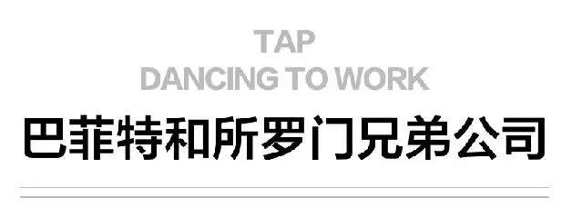

如果要将所罗门兄弟公司的故事拍部电影，那么巴菲特这个角色是无论如何也绕不开的。他们确实应该考虑拍一部，而且电影可以叫《大而不倒》*（Too Big to Fail）*。尽管在2011年上映过一部同名电影，但两者的结局却天差地别。

巴菲特在1997年伯克希尔哈撒韦公司年报中评论了所罗门兄弟公司被旅行者集团（Travelers Group）收购（不久后，旅行者集团与花旗集团合并）一事，最后他还不忘加上一小段他特有的幽默调侃：“回顾过去，我认为自己这段与所罗门兄弟公司有关的经历，既妙趣横生又让我受益良多。尽管在1991—1992年的这段时间内，我对某位戏剧评论家的话深有感触。他说，‘如果能换一个位置，说不定我就会喜欢这部剧了，我那该死的位置正好正对着舞台。’”

为了避免您在阅读本文和接下来的两篇关于所罗门兄弟公司的文章时忽视日期，我要提醒一下，两篇文章是时隔9年先后发表的。第一篇就是你即将读到的《巴菲特内幕》一文的补充报道《所罗门的智慧》*（The Wisdom of Salomon）*。这篇短小的文章描述了所罗门事件的开端部分：1987年，伯克希尔哈撒韦公司出人意料地向该公司投资7亿美元。

多年之前，特别是巴菲特在上文提到的1991—1992年，有两件突发事件震惊了商业界。第一，所罗门兄弟公司因违规竞标美国国债而遭到重罚，整个公司命悬一线；第二，巴菲特居然出手，他从天而降，拯救了危在旦夕的所罗门兄弟公司。这些事件被记录在《巴菲特在所罗门力挽狂澜》*（Warren Buffett’s Wild Ride at Salomon）*一文中，但是那篇文章，不知出于何种原因，直至多年之后才与读者见面，当时已事过境迁了。故事的开篇，就解释了为什么发表会延宕了如此之久。

今天，当我们再次读到这个在1997年才揭秘的故事时，会惊叹于所罗门兄弟公司在1991年有多么命悬一线、几近破产，至少在巴菲特看来是这样的，这让人不禁联想到多年之后轰然倒塌的雷曼兄弟公司。在这一系例关于所罗门兄弟公司的文章中，情绪激动的巴菲特曾警告华盛顿，如果公司倒闭，混乱局面将会接踵而至。原文是这样的：“他预言，所罗门兄弟公司的破产将是灾难性的，其‘多米诺骨牌效应’会波及全球。对依赖即时支付的金融系统来说，这将是一场浩劫。”

我们永远也不会知道，如果所罗门兄弟公司倒闭将会带来怎样的危害，因为巴菲特的恳求拯救了它，然而，这番描述几乎成了预言。它提前告诉了人们，2008年雷曼兄弟公司倒闭后，金融系统将会出现的灾难。

——卡萝尔·卢米斯

## 20 所罗门的智慧

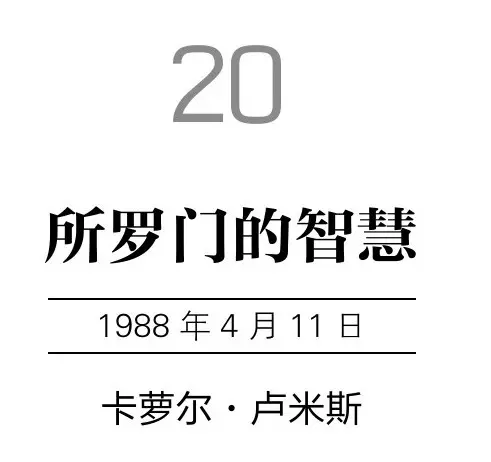

“对于投资银行未来的走向或者获利能力，我们没有什么特别的见解，”沃伦·巴菲特在1987年伯克希尔哈撒韦公司年报发布之前这样说道，“但我们对所罗门兄弟公司的首席执行官约翰·古弗兰的能力和刚正不阿充满敬佩。”这番言论粉碎了此前几个月盘旋在华尔街上空阴魂不散的谣言，人们传言巴菲特有意让古弗兰下台，让威廉·西蒙（William Simon）接替他的位置。

巴菲特一直秉持的一个原则是：对自己投资的公司，他决不会对管理层指手画脚或有敌意行为。因此，上面提到的谣言还处于可控的范围内。然而，去年，巴菲特对所罗门兄弟公司的大动作让这则谣言有了死灰复燃的可能性。1987年10月1日，伯克希尔哈撒韦公司花7亿美元购买了所罗门兄弟公司的可赎回可转换优先股，这是伯克希尔哈撒韦公司有史以来最大的一次投资。这些优先股的股息为9%，可以在3年以后以38美元的价格转换为所罗门兄弟公司普通股。如果巴菲特没有行使转换权，那么这些优先股将在2000年之后被所罗门兄弟公司赎回。然而，症结就在这38美元的行权价上。巴菲特投资时，所罗门兄弟公司的股价大约在33美元，而到了10月19日之后，股价狂降至16美元左右，最后则稳定在23美元左右。

股价的狂跌改变了华尔街对巴菲特的看法。人们本以为他买到了一只“梦寐以求”的证券，内在价值肯定要高于他支付的价格。有传言说，所罗门兄弟公司因为害怕“秃鹫”罗纳德·佩雷尔曼（Ronald Perelman）会趁火打劫，所以被迫同意了巴菲特自己的流氓条款。鉴于所罗门兄弟公司当时充斥着背叛和混乱，很多人认为巴菲特买到了烫手的山芋，而且他在投资圈的公信力也处于岌岌可危的境地。

巴菲特在年报中提到，投资银行的经济状况远不如他经营的其他业务那般稳健、可预见。他说，这正是他购买可转换优先股的一个原因。__不过，他对前景依然保持着很冷静的态度：“我们有理由相信，一家能提供高效融资和做市服务的第一梯队企业，其净资产收益率肯定会回升至行业平均水平。如果真是这样，那么，我们手里的可转换优先股的价值最终会得到证明。”__他顺便提到，他有意购买更多的所罗门兄弟公司可转换优先股。他说这话时的语气依旧那么沉静、稳健。

在所罗门兄弟公司的这笔投资中最有意思的是，巴菲特和很多华尔街人士建立起了同袍之谊。巴菲特对华尔街人士的贪婪早有领教。在1982年年报中，他曾嘲笑投资银行家们过分自私，只为了最大化自身的利益而向投资者提供建议。他告诫人们说：“这些投资银行家就如同理发师，所以，永远不要问理发师你是否应该修剪头发了。”不过，在今年的年报中，巴菲特似乎发现古弗兰有些与众不同。在与古弗兰交往的过程中，巴菲特说，他见过古弗兰建议顾客不要急于做出任何决定，哪怕这会让所罗门兄弟公司错失大笔生意。

我们注意到，巴菲特在描述所罗门兄弟公司的业务时，从不使用华尔街的那些时髦词儿，比如“商业银行业务”等。巴菲特认为，杠杆收购的盛行，很大程度是由过桥货款业务引发的，不过，这种业务对投资银行太危险了。在企业清算时，过桥货款的偿还顺序非常靠后，几乎等同于股票投资了。他和查理·芒格作为所罗门兄弟公司的董事，都主张公司应该避免发展过桥贷款业务。__不过，巴菲特也补充说：“如果古弗兰最终认为公司需要过桥货款业务，那么，我们也会坚定地支持他。我们的初衷并非深入公司的运营并进行大刀阔斧的改革，这就像结婚后强迫另一半改变一样，肯定不会有好结果的。”__

## 21 巴菲特在所罗门力挽狂澜

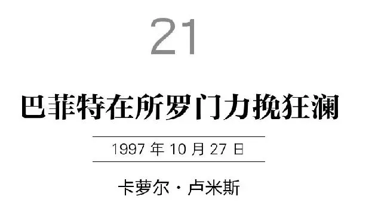

究竟是什么样的罪行和错误将所罗门兄弟公司推向了悬崖的边缘？巴菲特一生中“最重要的一天”到底发生了什么事情？这正是这个令人痛心而又离奇的故事所要讲诉的内容。

64岁的桑迪·威尔（Sanford I\.Weill）是旅行者集团的首席执行官，他发起了自己人生中最大规模的一次投资，即以90亿美元的价格收购了在华尔街叱诧一时的所罗门兄弟公司。与此同时，67岁的沃伦·巴菲特也借此机会撤出了所罗门兄弟公司。巴菲特与所罗门兄弟公司的缘分始于10年前的秋季。当时，伯克希尔哈撒韦公司成为所罗门兄弟公司最大的股东，而他自己也加入了后者的董事会。1991—1992年，所罗门兄弟公司的非法交易使自己处在了漩涡的中心，巴菲特也被深深地卷入其中。为了力挽狂澜，巴菲特不得不亲自在所罗门兄弟公司驻扎了9个月。这段时间对巴菲特言，无论精神上还是身体上的消耗都是空前的。一开始，巴菲特只是扮演着旁观者的角色，但随后发生的事，却使他不得在“钢丝上骑起了独轮车。”

虽然此前已经发表了不少关于巴菲特和所罗门兄弟公司的文章，但在本文中你还是会读到很多新的内容。笔者是巴菲特30多年的老朋友，也是伯克希尔哈撒韦公司的老股东（但没购买过所罗门兄弟公司的股票）。作为巴菲特的好友，我每年都为著名的巴菲特致股东的信当编辑，我们长久以来一直在讨论合著一本书关于巴菲特商业生涯的书。这层关系，使我能近距离地观察巴菲特是如何思考的。

通过《财富》杂志，特别是1988年4月11日我写的《巴菲特内幕》一文，以及紧随其后的《所罗门的智慧》一文，我将自己领悟到的巴菲特思想的精髓几乎都公布出来了。不过，关于巴菲特在所罗门兄弟公司中的经历，很多都属于机密，他不希望我向外界透露，因为当时所罗门兄弟公司一方面正想方设法保持稳定，另一方还必须处理巨大的法律方面的问题。尽管后来危机解除了，巴菲特的顾虑也烟消云散了，但大众对于这段内幕故事的兴趣也逐渐冷淡了下来，这篇文章也就没有必要发表了。如今，由于旅行者集团的收购，所罗门兄弟公司又重新成为了舆论的焦点，这也给这篇文章提供了一个非常好的发表理由。除了这个原因之外，还需要加上一条：1991年戏剧性一幕其实给每个人发出了一个警示，在日渐复杂的金融系统中其实一直潜藏着巨大的风险。

在这个故事开头，我们必须提前明白一件事：身陷“所罗门风暴”的10个月，对于巴菲特的生活节奏造成了剧烈的冲击。__作为首席执行官的巴菲特，通常每一年顶多做出一项重大的投资决策，但是在所罗门兄弟公司，他可能每天要决定25件关系到公司生死的大事。__1991年8月18号是整个“所罗门风暴”的转折点，也被巴菲特认为是自己人生中最重要的一天。在这一天里，美国财政部下达禁令，剥夺了所罗门兄弟公司竞标美国国债的资格，这几乎要将所罗门兄弟公司推入死地。随后，通过巴菲特的不懈努力，该禁令最终被取消了。在两次国债拍卖中间悬而未决的四个小时中，巴菲特充满激情地奋斗着，终于将整个金融系统从他预感到的大灾难中拯救了出来。在巴菲特看来，该禁令肯定会导致所罗门兄弟公司（如今它卖了90亿美元）立刻申请破产。更为重要的是，他相信，所罗门兄弟公司的破产将从根本上动摇当时的整个金融系统。即便到了现在，他还是对此坚信不疑。

1987年9月27日是一个周日，巴菲特和时任所罗门兄弟公司董事长和首席执行官的约翰·古弗兰达成协议，伯克希尔哈撒韦公司将购买价值7亿美元的所罗门兄弟公司的可转换优先股，占到后者总股份的8%。就商业性质而言，那个周日和1997年8月的周日有着天壤之别。约翰·古弗兰在签署该协议之后，终于可以从容地应对“大鳄”佩雷尔曼的恶意收购了。当时，南非投资者持有大笔所罗门兄弟公司的股票，他们正打算出售，而佩雷尔曼准备将这些股票都买下来。有了巴菲特的注资，所罗门兄弟公司自己就能够先于佩雷尔曼将这些股票买下，从而彻底挫败佩雷尔曼的企图。

约翰·古弗曼欢迎巴菲特的注资是可以理解的，因为巴菲特是“白衣骑士”。然而，巴菲特为何愿意入股所罗门兄弟公司却十足让人摸不着头脑。更让人难以理解的是他看起来信心满满，直接调动了7亿美元，在这之前，他没有在单一一家公司中，投入过如此巨额的资金。这么多年来，巴菲特对于投资银行一直极尽嘲弄之能事，说它们总是对于促成交易有着巨大的热情，因为这样能使它们获得巨额的佣金，而这对于它们的客户而言并不是好事。况且巴菲特一直都强调，他只愿意和自己喜欢的人一起工作。可是，涉足所罗门兄弟公司，就等于要将伯克希尔哈撒韦公司辛辛苦苦积攒下来的巨额资金，拱手送给一群“叼着雪茄、奢侈、爱走捷径”的人。随着《说谎者的扑克牌》这本书的流行，这些人不久之后就变得非常臭名昭著了。

市场观察人士普遍认为，有三个原因促使巴菲特走了这步棋。不过，以随后发生的事情来看，这三个原因都极为勉强。

第一个原因是，由于巴菲特这些年来一直找不到自己认为价格比较合适的股票，所以不得不转换思路，投资固定收益证券。

第二原因是，这笔交易是由约翰·古弗兰发起的，在巴菲特眼里，他是一位极有原则性、不贪婪的管理者，曾与政府雇员保险公司有过真诚友好的合作，而巴菲特是该保险公司的控股股东（现在更是由伯克希尔哈撒韦公司全资拥有）。巴菲特很喜欢古弗兰的为人，至今仍旧如此。

第三个原因很简单，巴菲特认为这笔交易的条款很划算。事实上，可转换优先股就像是在稳定回报上又捆绑了“彩票”。在这笔交易中，巴菲特每年可获得固定的9%的股息，三年以后他还可以按38美元的价格将优先股转换为所罗门兄弟公司普通股，而当时该股的市价已经达到30美元了。如果巴菲特不行使转换权，这些优先股则将在2000年之后被所罗门兄弟公司赎回。对于巴菲特来说这是相当好的方案。“你所希望的‘三倍收益’是‘不可能的’，”他在1987年对我说，“但这不能否定其价值。”

对于所罗门兄弟公司那些头脑聪明、精于计算的人士来说，这笔交易是全年中最“赔本”的交易了。从第一天起，他们就认为，巴菲特利用古弗兰对佩雷尔曼的惧怕，才锁定了“梦寐以求”的证券。这种债券具有非常高的股息，或者是非常低的转换价格，又或者是这两种优点兼顾。他们把这种看法透露给了媒体。在过去的这些年里，这种看法并未在所罗门兄弟公司绝迹，而且公司高管（当然绝不是古弗兰）曾不止一次地造访巴菲特，探讨收回优先股的办法。

我们可以这么说，如果巴菲特能预见到1991年8月使整个公司陷入巨大灾难、回报成为泡影的丑闻，他真可能会认真考虑那些高管的报价。这场灾难让所罗门兄弟公司和巴菲特本人遇到了天翻地覆的逆转。

在这儿补充一点当时的背景：在危机到来之前，一切似乎都预示着所罗门兄弟公司又将迎来一个大丰收的财年。唯一的问题可能就是美国财政部关于5月份短期国债拍卖的调查，因为所罗门兄弟公司被怀疑策划了一次美国国债的“逼空”事件。除了这件麻烦事儿之外，所罗门兄弟公司的股价已爬升至每股37美元了，已经非常接近巴菲特38美元的行使转换权的价格。

谈到这场危机的发生，我们不妨从当时身在里诺（Reno）的巴菲特说起。里诺是伯克希尔哈撒韦子公司的两位高管选定和巴菲特共度小假期的地方。1997年8月8日是周四，当天下午，巴菲特抵达里诺，随即便接到了办公室的通知，当时正从伦敦飞回纽约的古弗兰希望当晚和他会谈。古弗兰办公室的秘书说，晚上他们的首席执行官会在为所罗门兄弟公司提供法律服务的沃切尔·利普顿·罗森·卡茨律师事务所，巴菲特同意纽约时间晚上10点半给他打电话。

思虑再三，巴菲特觉得应该不会是坏消息，因为古弗兰人不在纽约，不可能遇到什么棘手的事情。他猜想，古弗兰可能谈成了一笔出售所罗门兄弟公司的交易，需要董事会的认可。和朋友们去塔霍湖（Lake Tahoe）吃晚餐的时候，巴菲特还告诉大家，估计今晚会有“好消息”降临。有迹象显示，从4年前开始，巴菲特就有意退出，这笔收获颇丰的交易已经让他心满意足了。

按照约定的时间，巴菲特离开餐桌，使用付费电话拨通了古弗兰办公室的电话。稍微等了一会儿之后，他的电话被直接转接给了所罗门兄弟公司的董事长汤姆·施特劳斯（Tom Strauss）和公司内部律师唐纳德·福伊尔施泰因（Donald Feuerstein）。由于古弗兰的飞机延误，所以由他们两位向巴菲特简短地汇报了正愈演愈烈的“一个严重问题”。二人以相当冷静的语气告诉巴菲特，公司委托沃切尔·利普顿·罗森·卡茨律师事务所进行的调查发现，他们的两位美国国债交易员，包括最优秀的部门主管保罗·莫泽（Paul Mozer，巴菲特不知道这个名字），在1990—1991年间，不止一次地破坏了美国财政部制定的国债投标规则。

施特劳斯和福伊尔施泰因告诉巴菲特，莫泽和他的同事已经被停职，公司即将通告监管方，并向媒体披露这件事。福伊尔施泰因接着给巴菲特读了一遍新闻稿草稿，还提及他当天早些时候与查理·芒格详细讨论了很多重要细节。

新闻稿只透露了一点点关于莫泽的违法行为。然而，接下来的几天内，有一份更详细的记录被爆光了，它详尽地讲述了莫泽与他所鄙夷的财政部投标规则相对抗的过程。为了防止像所罗门兄弟公司这样的巨头垄断国债市场，美国财政部1990年发布的新法规限定，每一家公司在任何一次竞标中，其竞购数额不得超过该批国债总额的35%。1990年12月和1991年2月，莫泽只通过几个简单步骤就僭越了美国财政部的法规：首先，他以所罗门兄弟公司的名义依法竞标35%的国债；然后在未被授权的情况下，私自用自己客户的名义再投标；最后，将以客户名义获得的国债再转到自己名下，而整个过程对客户只字未提。通过这一系列操作，所罗门兄弟公司最终获得了超过35%的拍卖国债，这样一来更有利于打压其他竞争对手。

在那个星期四的晚上，由于旁边还有很多人用公用电话聊天，巴菲特几乎没怎么听清楚细节，也没从施特劳斯和福伊尔施泰因平淡无奇的语气中洞察到什么特别值得引起关注的信息。因此他放下电话，径直走回了餐桌。

直到周六，当他联系上正在明尼苏达州北部岛屿度假的芒格时，巴菲特才意识到问题的严重性。芒格是一位训练有素的律师，两天前他打断了福伊尔施泰因的描述，希望对方清楚地说明，律师所草拟的“提要”中，“部分问题在4月底已经被察觉了”这一句的具体含义。按照语法来说，这句话使用了被动语态，那么被谁发现的呢？

芒格通过深入的调查发现，4月底时，莫泽相信自己的行为即将暴露，于是将2月份在国债竞标中的违规行为告诉了他的上司约翰·梅里威瑟（John Meriwether），梅里威瑟认为莫泽的劣迹“将终结其职业生涯”，并立即报告给了施特劳斯。几天后，他又和施特劳斯、古弗兰以及福伊尔施泰因一起商讨接下来的对策。

福伊尔施泰因提醒其他几位，莫泽的行为很可能是一种“犯罪”，必须将实情告知纽约联邦储备银行（New York Federal Reserve）。然而，没有一个人真正履行了“告知”的责任。4月份过去了，5、6、7月份过去了，这种懈怠和拖延，按照巴菲特后来的说法，“简直莫名其妙，不可原谅”，并让危机发展到了无法收拾的地步。

周六和巴菲特谈过之后，芒格认为管理层这种不可饶恕的错误就像婴儿“吸拇指”一样幼稚。尽管在巴菲特与施特劳斯和福伊尔施泰因谈话时，也一直听到他们不断重复着“吸拇指的幼稚行为”，但他并没听出这两个人在这场危机中尽到了任何高管应尽的责任。稍后，监管方也发出同样的声音，声称他们接到了一些关于公司高层玩忽职守的消息，但是这些消息的用词太含糊从而掩盖了问题的核心。

即便如此，他们知道得内情还是比公众要多。在8月9日的新闻发布会上，丝毫没有提及高管们知道什么，又是何时知道的，公众仍然被蒙在鼓里。在与福伊尔施泰因的电话交谈中，芒格尖锐地指出这种有意的忽略。不过，福伊尔施泰因辩解说，管理层和律师团一直认为公开太多信息会危及公司的“以长债换短债的能力”，公司必须发行长债以偿还每日到期的数十亿美元的短期债务。因此，所罗门兄弟公司的计划是告知董事和监管方，公司管理层早就知情莫泽的胡作非为，但要避开公众的视野。芒格不喜欢这样的举措，他认为这样做既不坦率也不够理智。不过，因为自己并非“以长债换短债”方面的专家，所以他选择了息事宁人。

然而，当周六和巴菲特讨论问题时，芒格发现所罗门兄弟公司的新闻在《纽约时报》头版占据了大幅版面，所以，他们下定决心立刻将整件事的全部事实公之于众。周一，芒格将他和巴菲特的强硬立场传达给了古弗兰的好友和谋士马丁·利普顿，并在周三下午的董事会电话会议中详细地讨论这件事。与此同时，巴菲特正与古弗兰谈话，后者同意了这个建议，因为他认为其影响无非就是“让所罗门兄弟公司的股价下降几个点”。

在周三的董事会议上，董事们听取了第二份新闻稿，其中用三页的篇幅陈述了整件事的细节，并坦承公司高层早在4月份就知晓了莫泽2月份的违法行为。然而，稿件中接下来的一句话让参与电话会议的董事们陷入一片哗然：由于“其他业务方面的压力”，所以管理层没能告知监管方。巴菲特在奥马哈听到这番言论时，直言这借口漏洞百出，简直“荒唐至极”。新闻稿的措辞随后增加了这样的说法，“因为缺乏足够的重视，所以决策没能被及时地贯彻”。又一个“被动语态”的表述，虽然听起来没那么荒唐了，但仍然坚定地拒绝承认一切指责。

显然，在周三董事会议中真正有杀伤力的不是某些措辞，而是明目张胆的蒙蔽事实：古弗兰没有告诉董事会，他在前一天收到了一封来自纽约联邦储备银行的信，信上透露出很多不祥的预兆。信是由该银行副行长签署的，但是，所有读过这封信的人都知道，其幕后的指使者肯定是行长杰拉德·科里根（Gerald Corrigan）。这位身高1米9的行长很有些爱尔兰式的脾气秉性。科里根得知在他的眼皮底下出现这种事情时，非常愤怒。信上说，所罗门兄弟公司在投标过程中的“不规范行为”让人们开始质疑其与纽约联邦储备银行的“持续性业务关系”，所罗门兄弟公司在获悉莫泽事件后没能适时公开，这一管理上的失败可能会牵连纽约联邦储备银行陷入“难以摆脱的麻烦”。信上要求所罗门兄弟公司就已知情况，在10天之内递交一份涵盖所有“不规范、违法以及渎职”细节的综合报告。

巴菲特后来得知，科里根希望这封信能第一时间抵达所罗门兄弟公司的董事会手中，他相信董事会在认识到事情的严重性之后会立刻考虑更换公司管理层。然而，董事会没有任何反应，这让科里根感觉自己被蔑视了。不过，事实上，董事会一直被蒙在鼓里。周末，巴菲特与科里根交谈时，他还以为纽约联邦储备银行只是发了一封询问详细信息的请求。直至一个多月之后，巴菲特在美国国会的听证会上听到科里根提及这封信，才明确地得知了信的内容。

在巴菲特看来，纽约联邦储备银行因为信件被忽视而大为动火，直接导致监管方几天后直接进驻所罗门兄弟公司。巴菲特说，在过去的几个月里，古弗兰、施特劳斯和福伊尔施泰因假装一切正常，从而向董事会隐瞒了许多重大事件。然而，与这些隐瞒相比，没把纽约联邦储备银行的信件转呈给董事会简直是引爆了“原子弹”。“或许，用接地气的说法，”巴菲特说，“纽约联邦储备银行认为，董事会与管理层穿一条裤子，一起朝他们吐口水。”

当整件事败露之后，所罗门兄弟公司的股价表现如何呢？唯一的答案是：急转直下，在不到一周的时间内，从每股36美元降到了不足27美元。然而，股市的表现只是表象，更深层次的问题已经让公司摇摇欲坠。到8月15日时，由于信任危机，公司的整个财务结构已经开始出现巨大裂缝。如果一个公司过于依赖“信用”，那么它将无力承受负面评价的打击，而所罗门兄弟公司对“信用”的依赖已到了无以复加的地步。巴菲特说，信用对于所罗门兄弟公司的意义，就如同空气之于人类：当必需的东西随处可见时，人们从不会注意到它；只有当失去了它，所有人才会真正理解它的重要性。

不幸的是，在公司已经成长为巨擘之后，信用却突然坍塌了。1991年8月，所罗门兄弟公司的总资产已经达到惊人的1500亿美元（当然还未包括资产负债表之外的项目），荣膺美国最大的五大金融机构之一。而在资产负债表右边，支撑这艘“航母”的是什么呢？仅仅40亿美元的净资产以及160亿美元的中期票据、银行债务和商业票据。就是这总额约为200亿美元的基础资本，支撑起了1300万美元的债务，其中大部分是1天到6个月到期的短期债务。

最严峻的事实莫过于，短期贷款机构随时都有可能弃逃。一旦它们察觉到自己的本金存在风险，它们就不会再有任何兴趣去赚取几个百分点的收益，只想尽早抽身。因此，在它们面前大谈特谈高收益只能起到反作用，只会让它们更加怀疑潜在危险的存在。此外，和其他商业银行不同的是：商业银行可以求救于联邦存款保险公司或者求助于“大而不倒”的惯例，而投资银行却没有过硬的靠山去阻止贷款机构的弃逃。

因此，8月15日，所罗门兄弟公司突然发现自己的债权人在大逃亡。投资者一窝蜂地下达了指令，期望卖掉这家超一流的交易商和做市商的债务证券，其中最突出的就是距离清偿遥遥无期的中期票据。所罗门兄弟公司一直都是这类票据的做市商，但由于人们一旦买入，就不会出售，所以这项业务基本无人问津。然而如今，卖家如潮水般涌入。所罗门兄弟公司的交易员只能降低报价，试图遏制这次风潮，这也是所罗门兄弟公司的唯一选择。事实上，所罗门兄弟公司每回购一笔这种票据，就意味着支撑自身财务结构的基础资产消融了一块。最终，在交易者购回了约7亿美元的票据之后，所罗门兄弟公司做了一件令人难以置信的事：停止交易自己公司的证券。华尔街其他交易商也同时叫停。如果所罗门兄弟公司自己都不愿交易自己发行的证券，当然没有任何一个人会信任他们。

当天晚上，各大报纸争相报道了所罗门兄弟公司白天所经历的超乎寻常的事件，当交易柜台的窗口猛然关闭的那一刻，就再也没有秘密可言了。古弗兰和施特劳斯通过电话和科里根进行了交谈。因为麻烦接踵而至，所以，在交谈的过程中，古弗兰和施特劳斯都表达了离职的意愿。

8月16日早上6：45，身处奥马哈的巴菲特被一阵急促的电话铃声吵醒。电话那头是古弗兰、施特劳斯和利普顿。古弗兰说，他和施特劳斯递交了辞呈，现在的问题是由谁来接手这个“烂摊子”。接着，古弗兰提议由巴菲特接管这项工作。巴菲特认为自己义不容辞。尽管如此，他还是没有在家就草草做出决定，而是先去到离家5分钟路程的办公室给《纽约客》打个电话，然后再决定。刚到办公室，他就看到了刚刚收到的一封传真，是当天《纽约时报》的头版新闻，上面赫然写着：华尔街目睹所罗门兄弟公司遭受严重威胁；高层引咎辞职，客户纷纷因恐惧而倒戈。奥马哈时间早上7：45，巴菲特召集了所罗门兄弟公司的高管团队，宣布他将临危受命，直至公司摆脱困境，步入正轨。

于是，这成了当天最轰动的新闻，媒体报道称巴菲特担当此职的主要目的是保护伯克希尔哈撒韦公司7亿美元的投资。这种观点实在太肤浅了。保护自身的投资安全是理所当然的，然而，除此之外，他还是这家深陷泥淖公司的董事。虽然鲜有董事如此行事，但他却认为对公司所有股东都负有责任。由于他还有另一个光辉的头衔，伯克希尔哈撒韦公司的首席执行官，所以他现在需要一只手掌控自己公司的运行，另一只手为所罗门兄弟公司的麻烦寻找出路。在所罗门兄弟公司，巴菲特的年薪只有1美元，根本无须费心起草什么雇用合同。好吧，他知道这是在改变自己的人生，而且不是往好的方向。“但是总得有人来承担这个责任，”他随后说，而且自此一直这样回应外界，“按道理来说，我就是那个人。”

8月16日早上，巴菲特决定立即飞往纽约。此前，所罗门兄弟公司的人员曾请他待在奥马哈的办公室，等待科里根的电话，但迟迟没有等到。当巴菲特正等待科里根的电话时，股市开盘了，然而所罗门兄弟公司的股票却处于停盘状态。此时，科里根的电话来了。两人通话的时间很短，寥寥数语就说完了，科里根在电话中透露，在巴菲特介入这件事之后，纽约联邦储备银行要求的“10天”期限将会延长。由于还没读过纽约联邦储备银行的来信，巴菲特还不清楚科里根说了什么，但是从当前的情况来看，纽约联邦储备银行肯定要求披露更多信息。两人谈话结束之后，巴菲特就匆匆飞往纽约，于下午4点抵达。此时，所罗门兄弟公司已经放出消息，巴菲特将担任临时董事长，纽约证券交易所已经开始交易所罗门兄弟公司的股票。尽管只有短暂的“曝光”，股票交易量还是相当大的，而且股价上涨了1美元，以接近28美元的价格报收。

巴菲特的“行程”包括了晚上和科里根在纽约联邦储备银行的办公室的会面，古弗兰和施特劳斯也一同前往。3人心情沉重地步入办公室，科里根对巴菲特的到来没有表现出丝毫的热情，和平日里欢迎巴菲特的场景大为不同。科里根严肃地说，他从未见过能够顺利开展工作的代理董事长，并警告巴菲特，不要试图动用“华盛顿友人”的关系来说服他。他还给巴菲特提了一条可怕而又神秘的建议，要为“任何结果”做好准备。

然后，当科里根与古弗兰和施特劳斯进行隐秘谈话时，他请求巴菲特回避。这两位曾是科里根多年的好友。他们走出办公室之后，古弗兰告诉巴菲特，科里根情绪激动地表达了对自己亲手结束好友职业生涯的愧疚之情。古弗兰向巴菲特讲述这件事时，语气生硬，愤怒地拒绝对方的歉意，他说自己不打算给予科里根“宽恕”。现在，每当巴菲特回忆起这段不同寻常的岁月时，总是会想起乔治·华盛顿在签署英国间谍安德雷上校（Major Andre）的死刑执行令时流下的泪水。

巴菲特在周五剩下的时间和整个周六都用在了制定重要决策上。其中一个重要决策就是决定约翰·梅里威瑟的去留。梅里威瑟在得知莫泽的违法行为之后，第一时间通知了他的上司，但另一方面，却又自愿或不自愿地加入了保密阵营。利普顿亲身经历了这些天来的深度危机，他认为梅里威瑟应该被解雇。许多管理者也抱有同样的看法，他们正在试图抓住一切可以挽救公司的救命稻草。

尽管如此，巴菲特还是不确定解雇梅里威瑟是否有失公平，他一直在试图更深入地了解4月份之后究竟发生了什么。8月17日，他终于得知了一些信息，沃切尔·利普顿·罗森·卡茨律师事务所的两位律师花了一个多小时向巴菲特和所罗门兄弟公司的管理层讲述了他们自7月初开始的调查的结果。然而，当天晚些时候，梅里威瑟的问题还是悬而未决，但他自己觉得最好的选择是辞职。

在失去了两位重量级人物古弗兰和施特劳斯之后，巴菲特面临着一个更大的问题，应该任用所罗门兄弟公司管理层中的哪一位来担任证券部门的负责人呢？因此，8月17日，在沃切尔·利普顿·罗森·卡茨律师事务所的办公室，巴菲特与所罗门管理层的10位成员先后进行了谈话。他问了他们同样一个问题：你认为公司里由谁来接管大任是最合适的？大多数人给出的答案是43岁的德里克·莫恩（Deryck Maughan），他最近刚从所罗门兄弟公司的东京办事处回到美国，并被任命为投资银行业务联席主管。莫恩自己的回答却很微妙：“我想，如果你去问其他人希望由谁来接管大任，你会发现答案往往是我。”巴菲特知道古弗兰的选择也会是莫恩。因此当天他就选定了莫恩。不过，他并没有急于告诉莫恩本人和全世界，因为所罗门兄弟公司的董事会需要对这一决定进行表决，他们已经准备好在8月18日上午10点召开紧急会议，当天是周日。届时，董事们会将通过该任命，并正式选举巴菲特为临时董事长。

如果整个监管机构在周末睡着了，那么董事会议就会成为“里程碑式”的事件。然而，事与愿违，周六，监管机构按下了“导弹发射的终止按钮”。在8月18日上午10点之前，美国财政部给公司打来电话说，几分钟之后将宣布，终止所罗门兄弟公司竞标美国国债的资格，不管是它自己购买，还是帮客户购买，都不行。这给了位于曼哈顿市中心的所罗门兄弟公司总部当头一棒。

在得知这个消息的时候，巴菲特正和古弗兰、施特劳斯等公司高管在一个小房间内开会。在会议上，古弗兰和施特劳斯正要提出自己的辞呈。得知消息的三人立刻意识到，这是在将所罗门兄弟公司推向死路。显然，财政部的禁令不但会给公司带来巨大的经济损失，还会让整个世界都将该禁令解读成：美国财政部对所罗门兄弟公司判了死刑。非但如此，新闻一出，会让已经处于信用危机中的公司更加风雨飘摇，难以为继，这是压垮骆驼的最后一根稻草。

留给他们调整的时间已经不多了。公司已放出消息，巴菲特将要出席在下午2：30召开的新闻发布会，到时候必定会有一大群记者进行“狂轰滥炸”式的提问。更糟糕的是，洪水猛兽般的全球市场将彻底击垮摇摇欲坠的所罗门兄弟公司。日本股市将在美国时间的下午开盘，接着是伦敦，然后是纽约。坏消息如同瘟疫一般，将从一个市场蔓延到另一个市场，其核心内容就是：所罗门兄弟公司的信用已经丧失殆尽。对于一个万分依赖信用的公司来说，恐怕再没有什么比这更具有打击力的了。单就这一条坏消息，就能让整个公司毁于一旦。

就在这个小房间里，在听闻这个消息之后，巴菲特和他的同僚们聚集在一起商量对策。他们认为眼下有三种选择。第一，劝说美国财政部撤销或者至少修改禁令。第二，佯装坚强，斗志昂扬地去游说，期望全世界能够买他们的账，或者换个词儿，谎言，用谎言换取别人的信任。第三，宣告破产，实施清算。死也要死得光荣，将损失降低到最低程度，尽量公平地偿还所罗门兄弟公司债权人的损失。

第二个策略还没成形就被大家否决了。另外两条则继续接受大家的讨论。这也就意味着公司需要请破产清算律师到场。于是，沃切尔·利普顿·罗森·卡茨律师事务所的律师团队被请到公司，研究如何执行一家庞大的国际化证券公司的破产程序。这些律师可能正在享受愉快的周日，可能正手捧爆米花观看棒球赛，却突然被拽来处理一堆棘手的事。这些律师从没有接触过如此大的破产案，他们一开始，还以为是打字员搞错了，多打了一个0，将150亿美元打成了1500亿美元。这些律师也从没听说过金融衍生品、回购或是交割失败等专业词汇。简而言之，如果事态真的演化到必须破产清算的程度，那么光文案工作就将是一场梦魇。

对于巴菲特个人来说，这就像一场梦魇一样困扰着他。按照职责要求，巴菲特没有理由卷入这场风暴，但他还是临危受命。他告诉自己：他是来拯救所罗门兄弟公司的，而不是帮助它完成破产清算的繁冗程序的，能做这项工作的人大有人在。

因此，8月19日一大早，巴菲特就决定，如果走上破产程序，他会拒绝当公司的掌舵人。尽管他知道自己的退出会被视为对漏水的巨轮的彻底放弃，甚至更糟的是，会被指责为致使巨轮最终沉入大海的重要原因。不过，无论如何，他都不能以自己的名誉为儿戏，让别人以为，自己依靠董事长的身份，在破产清算中偏袒伯克希尔哈撒韦。巴菲特一直告诫自己的三个子女，人们穷尽一生去维护的名声，却只需要5分钟就能让它彻底粉碎。整个周日下来，他感到自己正在无限接近这5分钟。

不过，上述决定并没有影响他在第三个选择上所做的努力：试图劝说美国财政部改变它的禁令。巴菲特分配给自己的任务是，致电美国财政部，并请求与美联储主席艾伦·格林斯潘（Alan Greenspan）谈一谈。古弗兰和施特劳斯的任务则是去游说难以接触的科里根。梅里威瑟也伸出援手，他要去找美国证券交易监督委员会主席理查德·布里登（Richard Breeden）谈谈。然而，他的好意却没有什么收获。梅里威瑟找到布里登时，布里登说自己同意美国财政部的决定，并认为所罗门兄弟公司已经“烂到了骨头里”，他们别指望从他那里得到任何帮助。

在美国财政部方面，他们行动得更早。巴菲特在听说坏消息之后，差不多第一时间就致电他们，但美国财政部的电话一直处于占线状态。电话公司同意切换线路给他接通，但还是出现混乱、错误、延迟等各种状况，总之是一团乱麻。然而，当巴菲特终于千辛万苦地和美国财政部的发言人通上话时，财政部的禁令已经人尽皆知，成为街头巷尾讨论的热点了。

巴菲特随后联系上了时任美国财政部部长的尼古拉斯·布雷迪（Nicholas Brady），后者当时正在纽约小镇萨拉托加（Saratoga Springs）观看赛马。巴菲特和布雷迪两人相熟多年，但从没料到会在这样一个周日的早上，在电话里为这个问题发生争辩。当巴菲特向他提及修改财政部的禁令时，布雷迪提高了声调，略显激动和愤怒。巴菲特则直抒己见，告诉布雷迪，所罗门兄弟公司不会配合美国财政部的禁令，而且公司已经请来了破产专家，正在准备破产程序的所需材料。巴菲特着重强调了所罗门兄弟公司结构的庞大及其遍及全世界的业务。他预言，所罗门兄弟公司的破产将是灾难性的，其“多米诺骨牌”效应会波及全球。对依赖即时支付的金融体系来说这将是一场浩劫。

“末日降临”的情节并不是特别容易理解。布雷迪对此表现得非常友好、动情，但他还是觉得关于破产和金融系统崩盘的言论有些危言耸听。他很难相信巴菲特会拒绝承担这一重任，或者所罗门兄弟公司破产。布雷迪也非常清楚眼下的形势：禁令已经被宣布，如果再收回的话将引发巨大的反作用。

让巴菲特倍感欣慰的是，布雷迪并没有终止对话。相反，他还打了不少电话，给了巴菲特不少反馈。当天，巴菲特留意到了一个奇怪的小细节，所罗门兄弟公司的电话都被设置了静音，来电的时候，只有一个小绿灯会亮起来。巴菲特一直守候在电话机旁，满心期望布雷迪的来电让小绿灯亮起来。

每通电话，巴菲特都试图让布雷迪意识到局势的严重性，他们必须合力让这列疾驰向深渊的列车赶快停下来。一旦人人都意识到这是个不应发生的惨剧，那情势就可能会被逆转。在和布雷迪对话的某个节点上，巴菲特的苦恼和无助凝结成了一句话：“尼克，这是我人生中最重要的一天。”

布雷迪说：“别担心，沃伦，我们会平安度过的。”不过，这丝毫不意味着他改变了自己的看法。

下午，科里根的电话让局势发生了一些变化。正是科里根告诉巴菲特要为“任何结果”做好准备，而又是他的态度致导了美国财政部对所罗门兄弟公司的禁令。不过，这次科里根听得很认真，似乎真的是在思考所罗门破产以及巴菲特辞职的影响。科里根在电话里头跟布雷迪以及另一位监管者说：“有些事情我们之间最好先商量一下。”

巴菲特回到会议室，和其他几位董事一起等待新闻发布会的开始。在六层的大厅里，超过100位记者和摄影师聚集在那里，笔者也在其中，等候即将于2：30开始的新闻发布会。在会议室外面，前一天与巴菲特会过面的一些部门高管正左右踱步，他们是被刚上任的所罗门兄弟公司临时董事长召集起来的。

就在两点半，财政部长的助理杰罗姆·鲍威尔（Jerome Powell）给巴菲特打来电话，宣读了一份财政部的最新决议。这项新决议就像是给了所罗门兄弟公司“半个面包”，也可以说是“2/3个面包”。所罗门兄弟公司自己申购国债的禁令被解除了，不过，它被禁止为客户申购国债。“这样满意了吗？”鲍威尔问道。“我想，是的。”巴菲特回答说。于是，董事会立刻选举巴菲特为所罗门兄弟公司的临时董事长，莫恩为首席执行官。巴菲特找来了莫恩，对他说：“你也被套牢了。”然后两人共同步入新闻发布会现场，此时是2：45。

开场白相当突然：“我是沃伦·巴菲特，今天下午被选举为所罗门兄弟公司的临时董事长。”几分钟之后，他拿出刚刚收到的美国财政部通知，大声宣读起来。读罢，听众席的后排响起了几声不太响亮的欢呼，这条救命新闻点燃了公司员工的希望，他们匆匆奔走相告。接下来，巴菲特接受了记者长达两个小时的“狂轰滥炸”式的提问。“你要频繁穿梭于纽约和奥马哈之间，您能应付得了吗？”他立刻幽默地回应道：“我妈妈把我的名字缝在了我的内衣上，所以我不会迷路的。”

到8月20日时，关于所罗门兄弟公司的报纸头条并没有刊出“死刑”这样的字眼，而且它们的口风还有了些逆转的迹象。公司的股票如期开盘，交易也正常进行，收盘时下跌了大约1\.5%。

如今巴菲特再说起与美国财政部的那段往事时认为，尽管它的政策的反复让人像坐着过山车，但它还是非常及时的。财政部的表态相当于给所罗门兄弟公司注了一剂强心针。局势的反转从当天下午的2：30开始，全能的监管机构、美国财政部向市场释放了信号，它认为所罗门兄弟公司没有太大的问题。要不是有这样的信任背书，那么周一的债务市场就被迫自行判断所罗门兄弟公司的商业信用问题，如此一来，它就必须依靠上天的启示来得出结论了。

正如世人所见，所罗门兄弟公司从那个周末复活了，并以超强的耐力步履蹒跚地挺过了接下来艰难的几个月。在此期间，它的临时董事长通过大幅缩减资产负债表来减少杠杆，与银行交涉所罗门兄弟公司急需的贷款。当然，在一切工作中，重中之重还是要设法使所罗门兄弟公司避免因莫泽的违法行为（莫泽承认了他对纽约联邦储备银行的欺诈行为之后，被判入狱近4个月）而遭受起讼。最后，公司向监管及司法机构支付了2\.9亿美元，终于彻底了结了这一纠纷。这个数字可是巴菲特尽一切努力与上述机构合作后的成果。

在平息这场风波的过程中，不得不提的一位重要人物是，常常为伯克希尔哈撒韦公司工作的加利福尼亚律师罗伯特·德纳姆（Robert Denham），巴菲特把他拉到所罗门兄弟公司担任全职工作。1992年5月，在所罗门兄弟公司面临的严峻局面得到缓解之后，巴菲特回到了奥马哈，德纳姆接替了他的位置，成为所罗门兄弟公司的新任董事长以及股东权益的新的监管者。在所罗门兄弟公司被旅行者集团以90亿美元的价格兼并之后，德纳姆的目光又瞄准了别处。

在这90亿美元之中，伯克希尔哈撒韦公司所占的比重有多少？大约17亿美元。不过伯克希尔哈撒韦公司收到的部分旅行者集团的股票，将会转给伯克希尔哈撒韦公司可转换债券持有者的名下。当然，你可能不想知道这其中复杂的细节，也不想深入分析巴菲特在所罗门兄弟公司股票上运用了什么技巧。不过，你需要记住这点：所罗门兄弟公司是以每股约为81美元的估价换成旅行者集团的股票的。稍微对比一下，1987年，伯克希尔哈撒韦公司以38美元的价格行使了转换权，随后又以稍高的价格加仓，两者平均成本为48美元每股。

简而言之，1987年巴菲特预言对所罗门兄弟公司的这笔投资不会成为“三垒安打”，事实也确实是这样的。另一方面，这笔投资也不能算是“三振出局”。“我得说我们获得了一个意外安打，”巴菲特说，“不过是在前两棒落空后击出的。”

要总结所罗门兄弟公司的得与失实在非一朝一夕能办到的，在此，巴菲特用自己最喜欢的一句话“一言以蔽之”：皆大欢喜。

## 22 巴菲特语录

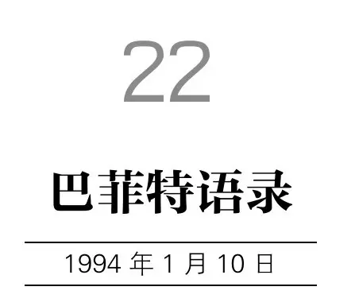

沃伦·巴菲特，现年63岁，伯克希尔哈撒韦公司董事长，所罗门兄弟公司大股东。在所罗门兄弟公司的国债舞弊丑闻爆光之后，案犯保罗·莫泽被判处罚款和监禁。__巴菲特就此调侃道：“莫泽支付了3万美元的罚款，并被判处4个月的监禁。所罗门兄弟公司的股东，包括我在内，却支付了2\.9亿美元的罚款，而且我本人还被判处担任临时董事长长达10个月之久！”__

## 23 内布拉斯加的特别待遇

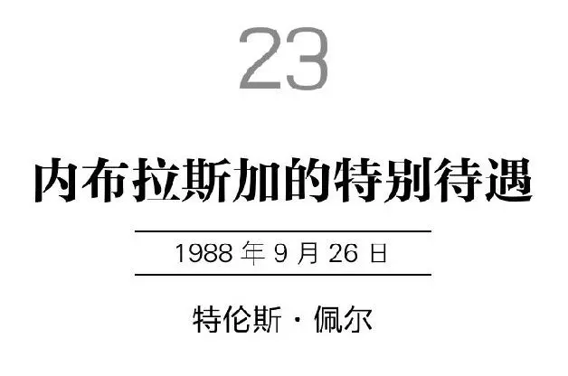

沃伦·巴菲特，奥马哈著名投资人，常常因为能在普通的事情上做出了不普通的成就而自豪不已。不过，最近他却为了平常的结果而干了一件不普通的事，在致股东的信中，58岁的巴菲特宣布，打算将伯克希尔哈撒韦公司股票的交易从场外市场移至纽约证券交易所。

这件事的不同寻常之处在于，申请在交易所挂牌的公司至少需要拥有2000位股东，且每位股东至少持有100股股票，这是每个交易指令必须包含的最小单位。伯克希尔哈撒韦公司显然满足不了这些条件，因为这家公司的股价为每股4300美元，并没有多少人能拥有100股，而且伯克希尔哈撒韦公司对外发行的股票数相对较少，还不到纽约证券交易所上市公司平均发行数的3%。为了在某种程度上抑制投机行为，巴菲特一向拒绝分拆股票，他宁愿等待纽约证券交易所改变规则。最近，纽约证券交易所终于有所行动，它将允许伯克希尔哈撒韦公司以每10股为一手进行交易。只要美国证券交易监督委员会批准该方案，巴菲特就会立刻申请上市。

这一举动并不是为了刺激股价上扬。事实上，巴菲特在致股东的信中写道：“在相似的经济环境下，伯克希尔哈撒韦公司在纽约证券交易所的交易价格，应该与场外交易市场上的股价差不多。这也是我们希望看到的。”他的目标并不那么令人兴奋。因为纽约证券交易所里做市商报出的买卖差价相对较小，如果在那里进行股票交易，其价格会便宜一些。

## 24 巴菲特温馨提示：是时候出手房地美了

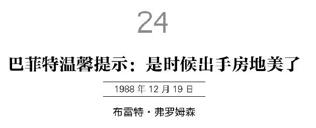

这篇文章绝对可谓罕见至极，因为巴菲特在其中给出了买股票的具体提示。通常，巴菲特几乎不会告诉你买哪只股票。然而，这次他破例了。由于伯克希尔哈撒韦公司旗下有一家储蓄信贷公司，所以它有权提前购买房地美公司的股票，不过，它现在所持有的数量已经达到了规定的上限。

那么，这条提示究竟有没有用呢？简直太有用了！1988年12日19日，当读者在《财富》杂志上读到这篇文章时，他可按照分拆调整之后每股4美元的价格购买房地美公司的股票。如果投资者坚持持有10年以上，直至1998年12月，那么，他将以60美元的价格出售。作为巴菲特的追随者，投资者所要做的就是坚守，长时间地坚守。伯克希尔哈撒韦公司手中大约6000万股房地美公司的股票几乎都持有了10年以上。

20世纪90年代末，巴菲特准备出售自己持有的房地美公司的股票。2000年，房地美的股票在37美元至70美元之间宽幅波动，伯克希尔哈撒韦公司减仓了95%的房地美公司股票，入账了令人惊叹的大约30亿美元的资本利得。不过，大众并没有意识到这笔交易，因为根据证券交易监督委员会的相关规定，这笔交易可以秘密地进行，也就是说，公司可以不在F\-13表格[\3]中提及房地美公司的头寸问题，直至交易完成。交易刚完成，伯克希尔哈撒韦公司就修改了F\-13表格，而且巴菲特在2000年年报中也公开提到减持了大部分房地美公司的股票。至于出售原因等细节问题，巴菲特并未阐述。

不过，这次减持的根本原因最终还是水落石出了，因为房地美公司一直在作假。2003年，房地美公司长期“谎报”利润的传言满天飞，最终使得它不得不进行利润重述。到了2007年，房地美公司的监管方，美国联邦住房供给机构监察办公室（OFHEO）试图迫使房地美公司已经卸任的首席执行官利兰·布伦德塞尔（Leland Brendsel）放弃他大部分补偿金。美国联邦住房供给机构监察办公室还要求巴菲特作为证人，证明他之所以在2000年出售股票，就是因为对房地美公司的管理层丧失了信心。

巴菲特对自己的减持行为做了详细的说明。他曾与布伦德塞尔多次会面，发现他只是一味追求“两位数”的利润率，比如，15%。对于金融公司来说，这样的利润率并不正常。因此，巴菲特说，管理层想要这样出色的业绩，只能“开始对数字造假”。房地美公司还曾有过很不合常理的投资行为，巴菲特甚为不解，他甚至怀疑房地美公司还做着其他什么他不知道的“坏事儿”。“如果你在厨房发现了蟑螂，那就意味着绝对不止一只。”巴菲特说。美国联邦住房供给机构监察办公室赢得了官司，布伦德塞尔被处以1600万美元的罚款。

根据后见之明，巴菲特卖掉房地美公司股票的时机有些偏早了。作为房地产泡沫的大赢家，熬过了伯克希尔哈撒韦公司的抛售、利润造假丑闻、管理层变动之后，房地美在股市一路高奏凯歌，直至2007年10月。随后，它的股价一落千丈，成为2008年金融危机中跌得最惨的企业之一。近期，房地美公司已经成为一只“分股”，股价约为25美分。

——卡萝尔·卢米斯

当优秀的公司因为极特殊的问题而导致股价被低估时，绝佳的投资机会也就到来了。

这是伯克希尔哈撒韦公司董事长巴菲特的金玉良言，这位卓越的股票投资专家，被尊崇为投资界的先知。在他看来，联邦住房贷款抵押公司（Federal Home Loan Mortgage Corp\.），也就是我们常说的房地美公司，就是这样一块肥肉。和它的“堂兄”房利美公司（Fannie Mae）一样，即联邦国家房屋贷款协会（Federal National Mortgage Association），作为一家准国营性质的公司，其年净资产收益率达到了惊人的23%，而市盈率却低于8倍。“房地美绝对算三重好礼，”巴菲特说，“这家公司业绩如此超群，市盈率极低，而且它还有广阔的成长空间。这只股票注定会成为受投资者追捧的明星股。”

伯克希尔哈撒韦公司的储蓄信贷子公司持有或者申购成功了约1\.08亿美元的房地美公司股票，已达到了规定的上限。巴菲特的很多朋友和合伙人也都进行了投资，包括政府雇员保险公司的副董事长路易斯·辛普森（Louis Simpson）以及红杉基金的董事长威廉·鲁安。那么普通投资者是不是应该考虑紧跟巴菲特的脚步呢？答案只有一个字：是！

在房地美公司的帮助下，很多美国人想拥有属于自己住房的梦想变成了现实。1970年，获得美国国会颁发的许可证之后，房地美公司就开始从贷方手中购买个人住房按揭贷款，对这些贷款进行违约担保，然后将其包装成证券，出售给包括很多储蓄信贷协会在内的投资者。1970—1987年，传统的住房贷款市场以超过13%的复合年增长率稳健成长，没有一年低于过5\.5%。这个成绩确实可用辉煌来形容，其根本原因还是竞争的缺乏。房利美公司是唯一的另一个主要参与者；两者的主要不同在于：房地美公司会将打包后的债券都转售出去，而房利美公司则会自己持有相当数量的债券。

房地美和房利美一共控制了90%的市场份额。巴菲特说：“这是仅次于垄断的美事儿。”房地美和房利美这两家寡头的未来看起来着实令人鼓舞。目前，只有大约33%的传统个人住房按揭贷款被转化成了证券，还有很大的空间有待挖掘。不仅如此，很快储蓄信贷协会购买抵押贷款证券的动机将变得更加强烈。到1990年时，如果储蓄银行和储蓄信贷协会持有太多的抵押贷款，它们就必须为此提取大量的损失准备金，如果它们的资产组合中有大量的住房抵押证券，就可以大幅降低准备金的占用。

两家公司相比，房地美公司似乎更胜一筹。在过去的几十年里，其年净资产收益率超过房利美公司的两倍。由于房地美公司的管理者只购买顶级的抵押贷款，所以公司的传统固定利息独栋抵押贷款断贷率很低，仅占2300亿美元贷款的0\.4%。相比之下，规模相当的房利美公司有着较高的1\.1%的断贷率。房地美公司首席执行官利兰·布伦德塞尔和其他管理者致力于减少自己暴露在利率上扬中的风险，因为利率上扬会提高资金成本，并压低次级市场上住房抵押证券的价格。布伦德塞尔在资产负债表上只保留价值150亿美元的抵押贷款，而房利美公司的数额是1020亿美元。

房地美公司应付利率上扬风险的做法，可能是伯克希尔哈撒韦公司不久前放弃房利美公司、转而购买更多房地美公司股票的原因之一。伯克希尔哈撒韦公司的副董事长查理·芒格说：“我找不到比最大限度购买某只股票更能体现对其喜爱和赞赏的方式了。”按照法律规定，任何一家机构都不能拥有超过4%的房地美公司已发行的股票。

房地美公司的股票有一些对投资者非常有利的特质。首先，其股票更恰当的叫法应该是“参与优先股”。通常而言，优先股持股人得到的是固定股息，然而房地美公司每年会先拿出1000万美元分配股息，并许诺将公司利润的90%用于进一步分配。对于想要入手该股票的投资者来说，还有第二重利好：该股票将先在场外市场进行“发行前交易”，直到1988年1月3日，才会转到纽约证券交易所挂牌。此前，美国联邦住房贷款银行理事会（Federal Home Loan Bank Board）规定，只允许其会员机构拥有参与优先股，因为是它们向房地美公司提供了种子基金。不过，理事会最后还是决定放宽该限制，因为这将导致该股的流动性极低，从而使得其股价远低于在自由市场中应该的价格。这一改变为那些亟需资金的储存信贷协会筹措到了大约20亿美元的资本。

房地美股票的“发行前市场”将在10月份开始。大多数的机构投资者还没有意识到其独特的“魅力”，或由于法规限制不能参与预发行的股票，比如共同基金和保险公司就很少持有该类股票。机构投资者一直以来似乎主导了整个证券市场，但对于房地美公司而言，天平倒向了个人投资者。此外还有额外的奖励。由于交易之后不能立刻收到预发行的股票，所以你可以先支付30%，剩下的部分在稍后支付。在房地美的例子里，直至1月10日，你都不用结清全款。

2026年3月14日

16:57

## 桥牌桌边发生了什么

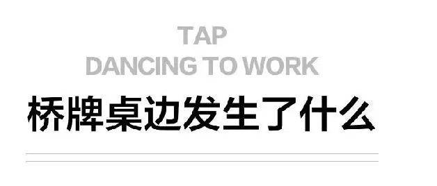

__25 一整副牌__

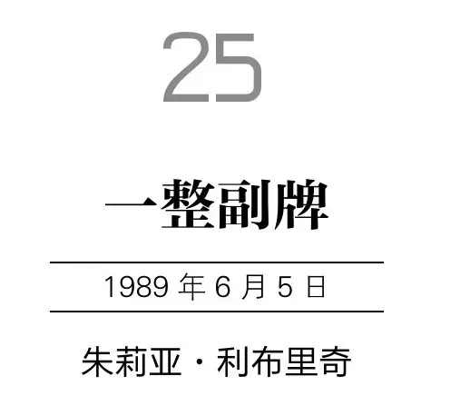

受《财富》杂志封面人物、充满传奇色彩的亿万富翁和桥牌手沃伦·巴菲特故事的启发，美国定约桥牌联盟（American Contract Bridge League）力邀巴菲特和另外5位著名的银行家组成一支桥牌联队，挑战另一支由政治人物组成的团队。比赛结果是：商界精英队54分，政治人物队39分。观众需要花费100美元购买在华盛顿的观赛席位。此次比赛的收入将投向教育基金以及“阅读为本”（Reading is Fundamental）项目。“每个人都表现得非常出色。”胜方队长、哥伦比亚广播公司首席执行官劳伦斯·蒂施（Laurence Tisch）说。他的队员，除了巴菲特，还有贝尔斯登公司董事长艾伦·格林伯格（Alan Greenberg）、总裁吉米·凯恩（Jimmy Cayne），《福布斯》杂志董事长马尔科姆·福布斯（Malcolm Forbes）以及华尔街王牌律师事务所克劳瓦斯、斯温和摩尔律师事务所（Cravath, Swaine&Moore）的合伙人乔治·吉莱斯皮三世（George Gillespie III）。立法委员会领袖、明尼苏达州共和党人、国会议员阿兰·施坦格兰（Arlan Stangeland）看到最终比分时感叹道：“糟糕透了！”

__26 提问凯恩__

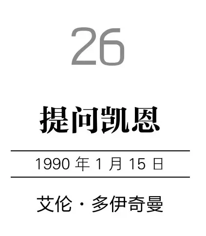

贝尔斯登公司总裁吉米·凯恩赢得了全国桥牌锦标赛，但当一家男性杂志《M》采访他，问及他对这项运动的看法时，这位“迟钝”的华尔街人竟不知如何作答。《M》杂志还让他评价一下他的队友，包括他的上司、号称“美国企业界六巨头”的业余魔术师格林伯格，蒂施，福布斯，吉莱斯皮三世和巴菲特。他不仅对这些人大肆调侃，说他们根本不知道好的桥牌选手是怎样的，还评论说女人缺乏理性和冷静，所以不可能成为顶级桥牌手或者股票交易员。52岁的凯恩说，当面对巨大的压力时，女性“很可能会跑去卫生间擦眼泪”。显然这些话对贝尔斯登公司涉及的两宗性别歧视索赔案毫无裨益，其中一宗的控告方就是一位女性交易员。

凯恩说，《M》杂志引用的话都是编造的、曲解的，甚至是无中生有。在给贝尔斯登公司员工的一封信中，他写道：“我向所有被这篇文章误导的人们真诚地道歉，但我向大家保证，我并不同意文中的内容。”不过，这篇文章的作者邓肯·克里斯蒂（Duncan Christy）则说，他的引文源自录音采访，丝毫无误，相当准确。

凯恩到底是怎样一个人呢？律师乔治·吉莱斯皮三世曾坦率地“招认”自己的牌技比不上这位队友。不过，凯恩至少认识一位顶级桥牌手，而且恰好是一位女性，即他的教练，39岁的桥牌大师朱迪·瑞丁（Judi Radin）。在瑞丁眼中：“或许凯恩对桥牌太过着迷了。他是个了不起的人，但有些太执着了。在文章发表之前，他就觉得我肯定不会喜欢。”瑞丁现在正在培训她的队伍，准备迎战来自英国议会的代表队，但遗憾的是，英国首相玛格丽特·撒切尔不会参加。

编者注：美国商界明星队打败了英国下议院代表队，但输给了英国上议院队。

## 27 如何与亿万富翁共处（节选）

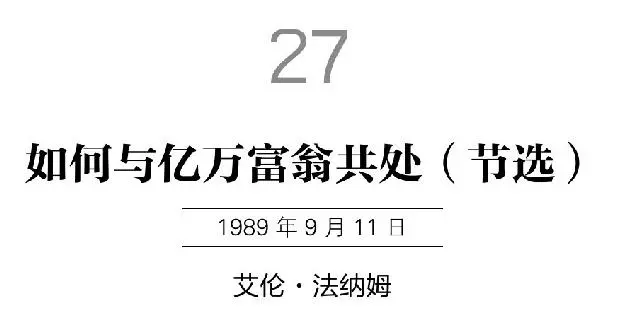

沃伦·巴菲特，这位资产达36亿美元却还坚持每天工作10小时的亿万富豪，曾说：“我只是在做这辈子自己最喜欢做的事情，这种状态从20岁起就开始了。”当被问及是什么让他坚定不移地坚持这份事业时，他回答说，是源于对商业伙伴的尊重和崇敬。“我对每一位共事的伙伴都有所选择。这也是我取得巨大成就的最重要的因素。我不会和自己不喜欢或者不欣赏的人打交道，就像选择婚姻伴侣一样。这就是关键。”

关于个人捐赠方面的问题，巴菲特感觉选择捐赠对象比选股更难。“__在股票方面，你寻求的东西都是很明显且很容易操作的。你努力去寻找只有‘一英尺’高的门槛，这样就能轻松地跨过去。然而，当我真正进入慈善领域时才发现，我所碰到的问题是有史以来最棘手、最难解决的。最关键的一点是，所有的门槛都是‘七英尺’高的。”__人口控制和防止核扩散是巴菲特基金会主要赞助的两个方向，“门槛如此之高，以至于我根本看不清其真实面貌，真的跟‘鬼魅’有得一比啊。”

巴菲特至今已经向他感兴趣的方向捐赠了1000万～1500万美元的巨款，在未来，他打算继续追加更多捐赠。著名基金专家、《大捐赠者传奇》*（The Golden Donors）*的作者沃尔德马·尼尔森（Waldemar Nielsen）认为，巴菲特甚至还没完成“热身运动”：“他这种人极其稀有，不仅是商界奇才，在慈善界也有所建树。我们已经好久没有遇见过这样的人了。”

巴菲特基金会将在巴菲特去世之后得到他的绝大部分的股份。__他认为用条条框框去限制基金受托人实在不是明智之举：“那就好比告诉他们，我过世10年之后要投资什么。我宁愿去选择一位聪明、善意、格调高的人，通过他开阔的视野去看待这个问题，而不需要受制于躺在棺材里的我。最有效、成果最佳的运营方式，往往是让高水平的人在不受约束的情况下工作。坚持下去，如果你足够年轻，你肯定能看到会产生什效果。”__

正如我们在《巴菲特捐出财产》*（Warren Buffett Gives It Away）*一文中所描述的那样，在巴菲特第一任妻子苏珊于2004年去世之后，他改变了要将大部分财产捐献给巴菲特基金会的主意，而是一步一步地将资金捐献给了5家基金会，其中的一家就是巴菲特基金会。苏珊去世后，巴菲特以她的名字重新命名了基金会，即苏珊·汤普森·巴菲特基金会。其他4家分别是比尔和梅琳达·盖茨基金会以及巴菲特的3个子女各自经营的3家基金会，其中比尔和梅琳达·盖茨基金会是受赠最多的一方。

2026年3月14日

16:57

## 28 巴菲特语录

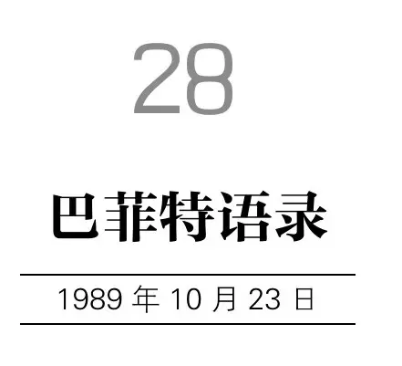

沃伦·巴菲特，现年59岁，坐拥亿万资产的专业投资家，伯克希尔哈撒韦公司董事长。__当被问及为什么要借4亿美元现金去购买美国国债时，他回答说：“资金最紧张的时候就是投资的最佳时刻。”__

## 巴菲特与新一代“巴菲特”

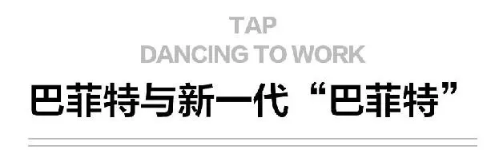

这样一个震撼的大标题，无疑会让读者难以抗拒。作为1989年系列文章的开篇，本文中收录了巴菲特和12位年轻投资者的智慧箴言。这12位年轻投资者，是本文作者布雷特·杜瓦尔·弗罗姆森甄选出来的，他认为他们是可与巴菲特相媲美的新晋投资天才。

事实证明了弗罗姆森敏锐的眼光。在文章发表的20多年之后，12位中的9位依然叱咤在投资界，他们分别是：吉姆·查诺斯（Jim Chanos）、吉姆·克拉默（Jim Cramer）和凯伦·克拉默（Karen Cramer，当时二人是夫妻，现已离婚）、格伦·格林伯格（Glenn Greenberg）以及他当时的配偶约翰·夏皮罗（John Shapiro，两人2009年分手）、塞思·卡拉曼（Seth Klarman）、埃迪·兰珀特（Eddie Lampert）、理查德·佩里（Richard Perry）以及迈克尔·普赖斯（Michael Price）。其他几位也取得了很大的成就。约翰·康斯特布尔（John Constable）在费城郊区经营着一家很成功的货币管理公司；兰迪·厄普代克（Randy Updyke），弗罗姆森当时对他倍加赞赏，并着力去写的一位“独行侠”，目前在太阳谷经营着一家投资合伙公司；还有一位是汤姆·斯威尼（Tom Sweeney），在文章发表时，他是富达基金的基金经理，目前他已经不再是职业投资人了。

本书是关于巴菲特的，所以我们只摘取了关于他的部分，而没有过多提及这12位年轻的投资者。但您可以在http：//fortune\.com上找到全文，也可以通过谷歌搜索到，以便帮助您了解每位投资者的故事。

在第二篇《现在，看看老巴菲特》一文的开头，弗罗姆森讲到一个妙趣横生的故事：物理学教授霍默·道奇（Homer Dodge）驱车前往奥马哈，企图劝说巴菲特帮他管理资金。我们不得不提的一个插曲是，这位道奇教授的儿子诺顿·道奇（Norton Dodge），在2011年11月去世，享年84岁。《纽约时报》刊载了一篇长长的讣告，其篇幅足以让这位名不见经传的经济学教授受宠若惊。讣告中的一个段落提到诺顿·道奇乃是巴菲特早期的提携者霍默·道奇之子，进而阐述了诺顿是如何使用自己的大笔遗产的。他广泛搜罗了苏联不同政见艺术家的作品，这些作品都是为了抗议苏联政府的压迫而秘密创作的。他生前将不少具有很高价值的收藏品捐献给了罗格斯大学（Rutgers University）。他的妹妹爱丽丝·道奇（Alice Dodge）也是一位终生为教育做贡献的慈善家。

基于这些故事，我想谈谈我的观点：尽管巴菲特本人从未对文化或者教育机构有过捐赠，但是伯克希尔哈撒韦公司的其他股东一直从事这方面的活动，而且相当慷慨。有几个例子：布鲁克林理工学院（Polytechnic Institute of Brooklyn，现已并入纽约大学）从教授、内布拉斯加人唐纳德·奥思默（Donald Othmer）和其妻子爱丽丝·奥思默（Donald Othmer）留给学校的7\.5亿美元资产中获益不菲；堪萨斯城的新表演艺术中心有一个赫尔兹伯格厅，是由巴尼特·赫尔兹伯格（Barnett Helzberg）和雪莉·赫尔兹伯格（Shirley Helzberg）捐赠的，他们夫妇将珠宝零售公司出售给了伯克希尔哈撒韦公司；在奥马哈也有一座霍兰表演艺术中心（Holland Performing Arts Center），是以理查德·霍兰（Richard Holland）和玛丽·霍兰（Mary Holland）夫妇命名的；比尔·斯科特（Bill Scott）和鲁思·斯科特（Ruth Scott）是内布拉斯加州立大学医学院索雷尔保健科学教育中心（Sorrell Center for Health Science Education）最重要的捐赠者。不论是霍兰夫妇还是斯科特夫妇，都是从巴菲特合伙公司时期就开始追随他的投资者，当时比尔·斯科特是为巴菲特工作的证券经纪人。

到2012年时，伯克希尔哈撒韦公司的市值已经达到2020亿美元，位列《财富》500强的第九位。作为该公司最大股东的巴菲特，其个人资产超过400亿美元，这其中还不包括已经捐赠出去的几十亿美元。巴菲特承诺要将所有资产全部奉献给社会。没有人会知道伯克希尔哈撒韦公司还会有多少这样慷慨的投资者，但看起来，巴菲特的确引领着捐赠潮流。

——卡萝尔·卢米斯

__29 谁将成为新的巴菲特（节选）__

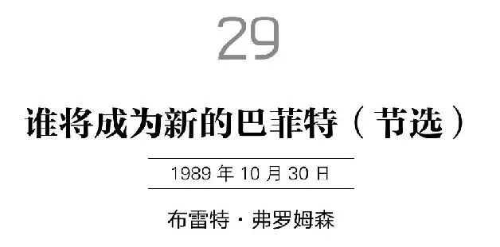

如果一个人可以每三四年就能帮助你把资产翻倍，而且永不停歇，难道你不渴望与这样的人合作吗？换句话说，难道你不希望投资给下一位“沃伦·巴菲特”吗？凡是能在早期就为自己的资产找到可靠管理者的投资者，总能顺利晋级富豪阶层。巴菲特就是业已被证明的最佳资金管理人。他的早期客户现在都已是身家千万的富豪。凭借持续、稳定、可靠的25%的复合年回报率，他成就了自己和客户。而在本文中，你将看到的年轻投资者也有着与巴菲特相似的投资天赋。假设他们每年可以达到20%的投资回报率，那么，今天投资1万美元给他们，到了2025年，您将会获得590万美元。事实上，多数人已经取得了这样的成绩。

我们何以看出他们的天赋？当然是他们出色的业绩。不过，这还不够令人信服，尤其是对于初出茅庐、投资经验还不足10年的年轻投资经理人而言。因此更重要的是要看某种性格特质。巴菲特自己曾把“很高的道德标准”放在首位。他说：“投资经理人无论做什么，都要把客户的利益放在首位。”最后，他认为投资经理人应该将自己的资产与客户统一，以避免潜在的利益冲突。这种策略使投资经理人的大部分资产和客户的捆绑在一起。__巴菲特说过，他只会投资给同时经营自己母亲资产的投资经理人。__事实上，他就是这样的投资经理人。

聪明的大脑是很重要的，但是达到某种水平之后，智商就不再是评判投资经理人好坏的关键指标了。__巴菲特说：“你不需要一个研究火箭的科学家，投资不是智商160打败智商130的游戏。”__投资者剥离个人情绪、理智做出决定的能力可比他脑容量的大小重要多了。__“当别人都出于短期的贪婪或恐惧而做出决定时，理性至关重要，”巴菲特说，“这就是赚钱的时候。”__

__30 现在，看看老巴菲特__

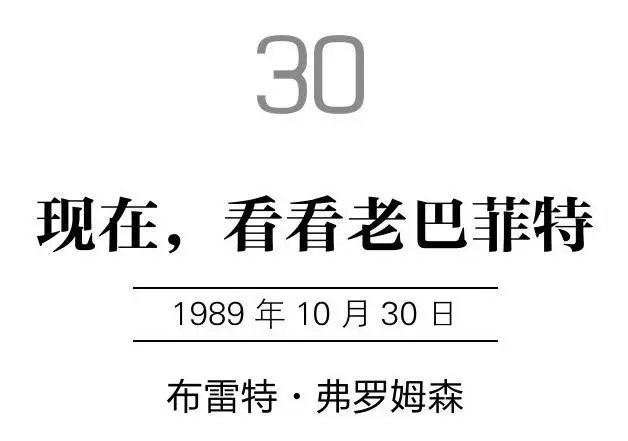

1956年的夏天异常闷热，一位来自佛蒙特州67岁的物理学教授把吉普车停在了奥马哈一条绿树成荫的街道上。霍默·道奇一个人驱车2414公里来到这座小城，只为寻找他认为会成为美国下一位最伟大投资家的人，他希望能够说服25岁的沃伦·巴菲特为他管理家庭储蓄资金。眼光独到的道奇一直是巴菲特的前老板、也就是“证券分析之父”本杰明·格雷厄姆的客户，但格雷厄姆最近打算关闭他的投资公司。

巴菲特回忆说：“道奇告诉我，‘我希望你来帮我打理我的资金。’我说，‘我现在的合伙人只有家人而已。’他说，‘好吧，算上我一个。’所以我就和道奇、他的妻子、孩子甚至孙子结下了不解之缘。”道奇于是投资10万美元给巴菲特，到1983年道奇去世时，这笔钱已经变成了几千万美元之巨。

道奇到底被巴菲特身上什么特质吸引，而这些特质恰恰被绝大数人给忽视掉了呢？他的儿子诺顿·道奇说：“我父亲敏锐地发现，巴菲特在金融分析方面具有无人企及的杰出天赋。但事实还不止如此。”慧眼识英才的老道奇看出了这位具有独特天赋的人才，他不仅热爱投资事业，而且已经具备了获得成功的所有条件。

道奇的家人把自己的想法分享给了朋友。到了20世纪60年代初期，巴菲特周围已经聚集起了一小批志同道合的合伙人。其中一位投资者甚至在没有见过巴菲特本人的情况下，就签了一张30万美元的支票给这位著名的投资“魔法师”，并给巴菲特留下一张卡片，上面写着：“我也入伙。”难道他天性如此，容易轻信别人？当然不是，这位投资者不是别人，正是未来的亿万富翁拉里·蒂施（Larry Tisch）。“巴菲特享有崇高的声望。我之所以投资给他是因为他是价值的信徒，而且正直诚实。”蒂施说：“我可不像看起来那么随意，当时的30万美元可不是一笔小数目，特别对于我来说。”

巴菲特总是时刻关注着证券投资，并随时做好出手的准备。他有自己的一套独特理念来使投资“落地”：不是以受欢迎度，而是以价值为基础来购买证券。他的家乡不大，却有着他需要的一切：家人、朋友、好吃的汉堡（巴菲特无比钟爱的食物）以及很少的纷扰，而且更为重要的是，巴菲特拥有超乎寻常的天赋。与他合作多年的老朋友、伯克希尔哈撒韦公司副董事长查理·芒格曾这样评价巴菲特：“在哈佛大学法学院我的那个班上有1000个人，我认识所有最顶尖的学生，但没有人能与巴菲特媲美。他的大脑就像一架超级理性、充满逻辑的机器，只要他一发声，你就能听见智慧在运转。”

巴菲特在组建自己的合伙公司时，有意识地将合伙人不必要的声音隔绝了。__他说：“我告诉他们，我要成立一家合伙公司，管理投资组合，并将我自己的钱和你们的一道投进去。我向你们保证6%的回报率，省下的我收取20%作为报酬。我不会告诉你们投资组合的构成，以免引起不必要的混乱。我所期望的，就像在离开高尔夫球场的时候一样，只是递交上我的记分卡。我可不愿意看到大家都跟在我身后追踪我，看着我挥球杆。”__他的合伙人都接受他的要求，因为他们知道巴菲特对投资事业的全神贯注。奥马哈投资银行家查尔斯·海德（Charles Heider）说：“我告诉家人，‘看，巴菲特一周7天都在思考帮我们赚钱的最佳方式。’”

巴菲特挖掘信息的深度是一般投资者难以企及的。以1963年美国运通公司色拉油丑闻为例，美国运通公司的一家子公司为根本不存在的色拉油申请损失赔偿，涉及数千万美元的金额，而这一骗局被戳穿之后，美国运通公司的股票一落千丈。巴菲特和他的团队在走访、调研了零售商之后认为，作为公司核心业务的信用卡和旅行支票业务仍然有利可图。这让他充满信心地大笔购进被市场疯狂抛售的股票。终于在5年之后，为他赢得了5倍的回报。

如同所有的工艺大师一样，巴菲特一直秉持着自己的原则。__格兰托尔经纪公司（Gruntal&Co\.）的马歇尔·温伯格（Marshall Weinberg）仍还记得他与巴菲特在曼哈顿共进晚餐的情景，他回忆道：“巴菲特点了一个很特别的火腿芝士三明治。很多天之后，我们又一起出去吃饭，他提议说，‘我们还是去那家吧。’我说，‘可我们不久刚去过了啊。’他说，‘没错。所以为什么要冒险去另一家你不了解的餐馆呢？我们都知道自己想吃什么。’而这也是巴菲特看待股票的方式。他只投资给胜算更大、不会令人失望的公司。”__

## 31 我是怎么搞砸的（节选）

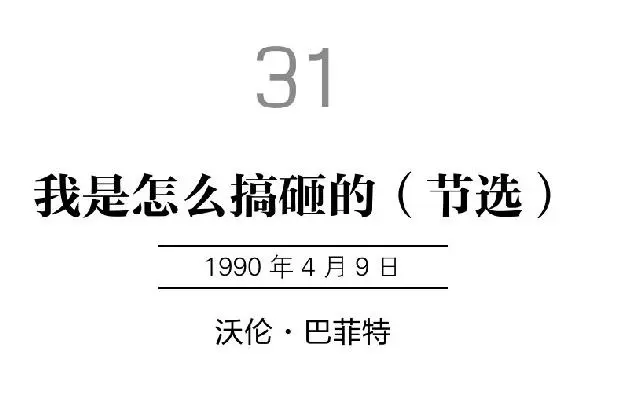

本文节选自巴菲特致伯克希尔哈撒韦公司股东的信。通常来说，巴菲特每年致股东的信中大约有80%的内容都是阐述伯克希尔哈撒韦公司自身的情况。余下的那20%，则是海阔天空的话题，颇具巴菲特风格。无论是哪部分的报告，稍做整理都会成为一篇绝佳的《财富》杂志的文章，这些年来，我们一共发表了6篇这样的摘要文章，本文是第一篇。细心的读者会注意到，摘要的文章与巴菲特致股东的信会有不同的标题。巴菲特掌舵伯克希尔哈撒韦公司已经有1/4个世纪了，原文作为一个“毫无保留”的总结，题为《头25年里所犯的错误（浓缩版）》*（Mistakes of the First 25 Years\[A Condensed Version\]）*。而我们在杂志中将它改成了将题目改为《我是怎么搞砸的》。

本文内容的特殊之处在于，巴菲特这位德高望重的首席执行官坦白地承认了自己的过失，并将其作为致股东的信的内容，这点更是令人匪夷所思。然而，当你经营的公司在过去25年里股价上涨了超过400倍，即从每股18美元上涨到7450美元，估计也没什么值得忏悔的。即便如此，巴菲特却说，如果他在某些问题上表现得不那么迟钝，这个成绩会更光辉一些。

本书出版时距离巴菲特从业50周年这个里程碑只差了3年时间，此刻他又打算再一次梳理自己曾经犯过的错误。“这方面的材料不胜枚举。”他前不久对我说。

——卡萝尔·卢米斯

引用美国作家罗伯特·本奇利（Robert Benchley）的一句话：“狗能教会男孩忠诚、坚贞，还有就是在休息之前，先环顾周围三次。”这是经验不足时应该采取的方法。然而，在犯新错误之前，回想一下曾经所犯的错误，也是一个不错的点子。所以，我们在这里来快速回顾一下过去的25年。

我的第一个错误就是买下了伯克希尔哈撒韦公司的控制权。尽管我知道公司主营的纺织业务前途黯淡，我仍然因为难以抵御的低价诱惑而说服自己买下它。在我的职业生涯早期，购买这类股票还是相当有利可图的，然而经过在伯克希尔哈撒韦公司的经营实践，1965年时我已开始意识到这个策略并不是很理想。

__如果你以足够低的价格购买了一只股票，通常这家公司的命运会有所起伏，然而，只要你能抓住合适的机会脱手就可以获得可观的收益。即使从长远来看，该公司业绩可能很糟糕也无所谓。我称这种投资理念为“烟屁股”法。__在街上发现的烟头可能只剩下最后一口，无法让你过足瘾，但“足够的廉价”却使得这一口满满都是利润。

然而，以这种方法购买企业并不是明智的行为，除非你是公司资产清理人。其主要原因有两点。首先，初始的“低廉”价格可能最终被证实并没有那么便宜。在一家四面楚歌的公司里，一个问题解决了，另一个问题又接踵而来，这就像厨房里从来不会只有一只蟑螂。其次，你最初的价格优势很快会被企业的低利润所削弱。举个例子，如果你花800万美元买了一家市场价格或清算价格为1000万美元的公司，而且迅速能再卖出去，那么高回报是有可能实现的；但是，如果这家公司在10年之后才以1000万美元出售，而在此期间每年的利润和股息仅有购买成本的几个百分点，那么，这就是一个令人失望的投资了。__时间是好公司的朋友，是平庸公司的敌人。__

虽然你可能认为这个道理很简单，但事实上，我是经过惨疼教训之后才领悟到得，而且为之付出了不小的代价。在购买伯克希尔哈撒韦公司之后不久，我通过后来与伯克希尔哈撒韦公司合并的多元化零售公司（Diversified Retailing Company），收购了一家巴尔的摩的百货公司霍克希尔德科恩百货公司（Hochschild Kohn&Co\.）。我以大大低于账面净资产的价格将其收入囊中。这家公司的员工素质一流，而且这笔交易还附加了一些额外好处：未登记的房地产价值和数量可观的“后进先出”式的存货。我怎么能错过这种千载难逢的机会呢？所以，三年之后，我很“幸运”地以最初的买入价出售了这家公司，结束了与霍克希尔德科恩百货公司的缘份，这让我想起了乡村音乐里那些丈夫所唱得歌词：“我的妻子和我的好朋友私奔了，可我仍然很想念她。”

我个人还有其他“廉价收购”的愚蠢案例，但我确信你们已经明白了我的意思：以一个合理的价格买入一家优质的公司，远比以颇具诱惑力的价格买入一家表现平平的公司要好得多。查理·芒格很早就明白了这个道理，而我有些后知后觉。现在在购买公司或普通股票时，我们总是会寻求那些业务一流、管理也一流的公司。

__过去这些年，我们获取的教训是：好骑师配好马才能出好成绩，一瘸一拐的老马恐怕会有些力不从心。__伯克希尔哈撒韦公司的纺织厂和霍克希尔德科恩百货公司都由一批精明强干而又诚实的管理者负责经营。这批优秀的管理者如果受雇于经济特性良好的公司，一定会取得优秀的业绩，而如果情况与之相反，那么再能跑的健将在流沙中恐怕也很难发挥实力。

这样的话我说过很多次，当一位声名卓著、才华横溢的经理人接管一家基本面出了名糟糕的公司时，最终纹丝不动的必将是公司糟糕的名声，这一点很少有例外。我真希望过去我在做蠢事方面没那么积极主动。我的做法就如同美国演员梅·韦斯特（Mae West）自己所承认的那样：“我曾如白雪公主般纯洁，但不幸的是，我走错了道。”

__另一个更深层次的教训是，越简单越好。虽然有25年收购、督导及管理各类型企业的经验，我和芒格仍未学会该怎样解决商业困难，而我们学到的是要避开它们。__在某种程度上，我们的成功就取决于，我们的注意力集中于可以轻松跨过的一英尺障碍，而不是非要寻求跨越七英尺障碍的能力。

__这一结论可能有失公平，但是对于收购和投资来说，仅仅坚持做简单明了的事情通常会比攻克复杂的难题要获益更多。__当然，在某些情况下，棘手的问题必须去解决，比如，我们增加《布法罗新闻报》周日版的案例。一般来说，千载难逢的投资机会往往具备这样的条件：一家超凡的企业遭遇一时的、棘手的而又能解决的困难。就像很多年前美国运通公司和政府雇员保险公司的情况。总的来说，我们是通过避开恶龙而不是同它厮杀而获得了成功的。

__我最意外的发现是：在企业中存在着一种极其强大却看不到的力量，我们可以把它称作“制度性强制力”（the institutional imperative）。__在读商学院的时候，我对这种强制力的存在毫不知情，甚至在进入商业领域后，我也没有任何直观感受。我那时认为，正直、聪明、有经验的管理者能够理所当然地做出理性的决策。然而随着时间的推移，我认识到事实并非如此。与当初的看法正相反，当制度性强制力开始起作用时，理性的花朵通常会枯萎。

以下这些例子能很好地证明制度性强制力的存在。__如同牛顿第一运动定律所描述的那样，一个组织会抵制与它目前方向不一致的任何变化；毫无意义的工作会不断膨胀以致填满人们的可用时间，企业的项目或者并购会不断发生并吸走可用资金；任何领导者的扩张欲望不管有多愚蠢，都会很快得到下属准备的详细的回报率和战略研究的支持；同行企业的行为，无论是扩张、收购、制定管理层的薪资标准还是其他方面的措施，都会被盲目模仿。__

因此，是制度性强制力而非腐败或者愚蠢让企业做出了最终误入歧途的决策。忽视了强制力的影响曾让我犯过一些昂贵的错误，在这之后，我试着用最小化这种影响的方式组织和管理伯克希尔哈撒韦公司。此外，我和芒格试图将我们的投资集中在那些看起来对这个问题保持警惕的企业。

在撞了很多次南墙之后，我学会了只与那些我喜欢、信任和赞赏的人共事。正如我之前提到的，这个原则本身不能保证成功，就好比一家二流的纺织公司或者百货公司不会仅仅因为它的管理者而成功，尽管他们是那种你想把女儿嫁给的人。然而，在拥有良好经济特性的公司中，如果公司所有者或者投资者能成功与理想的管理者协同合作，便可以创造奇迹。相反地，无论一家公司的前景看起来多么光明，我们也不愿与缺乏令人欣赏的特质的管理者合作。与坏人做生意，我们从未成功过。

在我所犯过的最糟糕的错误中，有很多并不为公众所知。那是一些我了解它们的优点，但最终没有做出购买决定的股票和公司。__这个世界上存在着大量绝佳投资机会，但它们处于你的个人能力范围之外，你错过它们并不是什么罪过。__不过，问题是，我错过了一些白送上门的，而且我完全有能力了解的好买卖。对于伯克希尔哈撒韦公司的股东，包括我在内，“吮拇指”的幼稚行为让我们付出了巨大代价。

我们一直信奉保守的财务政策，虽然在大家看来这可能并不怎么明智，但是在我看来恰恰相反。回顾过去，你可以发现一个很明显的事实，如果使用更高（尽管仍符合行业惯例）的杠杆比率，伯克希尔哈撒韦公司业绩可以更加靓丽，获得比我们实际平均23\.8%更高的净资产收益率。即使在1965年，或许我们也可以说，99%的可能性是，更高的杠杆只有好处没有坏处。相应地，我们应该看到，即便外部或内部变数的概率仅有1%，也会影响负债比率，而且会产生介于短暂困挠和违约之间的后果。

我们从不钟情于这99比1的概率，而且永远不会。在我们看来，不论危机或者羞耻的可能性有多小，也不论额外收益的可能性有多大，这两者都很难相互抵消。__如果你的做法是明智的，你必然会获得不错的结果；在大部分情况下，杠杆作用只会让事情演进得更快。我和芒格在这点上永远不会着急：相比于结果，我们更享受这个过程，尽管我们已经学会了承担结果。__

我们希望再过25年可以总结第一个50年里犯过的错误。如果2015年我们还健在，还有能力这么做，你可以数数忏悔过错的页数比现在多了多少。

## 32 富人和名人的子女（节选）

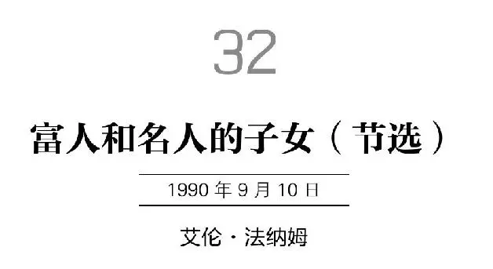

不奢侈、不买醉、不愚笨！这些亿万家产的继承者始终在努力地工作，即便他们不需要这么做。

他们是亿万富豪的子女，是人群中的“异类”；他们是一株株被金钱的旋风塑造出来的幼苗，有些甚至精神焦躁。

一些继承者善于使用他们的财富带来福祉，他们视金钱如工具。他们逃脱了枯燥的课堂，过上了充实而富有创造性的生活，完成了业已计划要做的事情。他们是如何成功的？什么激发了他们？原因不一而足，有的是个人荣誉感使然，有的则是追求刺激和冒险。这一切很大程度上取决于他们的成长环境。早一点儿直接坦率地告诉孩子，他们是否会继承遗产有利于他们做出正确的人生选择。

沃伦·巴菲特的儿子霍华德·巴菲特早就知道，他的父亲打算将伯克希尔哈撒韦公司赚到的钱捐献给有关控制人口增长和防止核扩散的基金会。尽管如此，35岁的霍华德并没有浪费时间跟父亲抱怨。他在奥马哈郊区种植玉米和大豆，1989年，被选举为内布拉斯加州道格拉斯市的政府官员。

拥有一个响当当的姓氏其实是件让人倍感压力的事儿。霍华德之所以从未在童年时摆过柠檬汁小摊儿，就是因为有个声名赫赫的老爸。“我总感觉自己的面前有一道屏障。似乎我无论做什么，都不可能跟他一样成功。而且我做的事情很可能对他造成不利的影响。”老巴菲特的成功对他年仅6岁的孙子都产生了影响。霍华德说：“小霍伊用自己省下的钱买了10股可口可乐公司的股票。一天我妻子跟儿子说，任何事情都有第一次时，他回答说，‘我并不这样认为，我这辈子可能都没能力去购买1股伯克希尔哈撒韦公司的股票。’”

所有的富家子弟都会被冠以“富家公子”的名号，而霍华德对此看得很淡：“有些人兜里很有钱，而有些人穷困潦倒。”公众常常认为凡是姓“巴菲特”的就一定很有钱。“一天晚上，在一个餐馆里，”他回忆说，“我拿出支票本准备埋单，就听到有些人冷嘲热讽地说，‘哎，我希望那个支票本是我的！’我没耐心去告诉这些人，‘不，伙计，你肯定并不希望。’”尽管他努力生活得像个平常人，就当父亲的财富并不存在，可是这么久以来，这种努力似乎很难奏效。“我猜今天下午回到办公室以后，会有9个电话留言，其中有8个是希望跟我父亲取得联系。”

霍华德说：“不论你是否有钱，有些事儿是要教给孩子的。我父母亲曾教导我什么是责任，比如，清理小渠沟和修剪草坪。而且做错事情的时候，要为结果埋单。”他在教导自己的儿子霍伊时说，在名誉的光环下生活并不是那么容易。当篮球明星迈克尔·乔丹到访奥马哈时，霍伊想和其他高层人士一起坐在头桌，霍华德告诉儿子，他没有这种与生俱来的特权。

几乎所有亿万富翁的子女都真的想要工作，因为他们明白，拥有自己的职业或者生意才能为自己赢得自尊和独立。然而，凡是父母以资金大力支持的，结局总是很难让人满意。

霍华德耕种着164公顷的土地，他热爱自己的工作：“我已经当了9年的农夫了。这是一种非常独立的工作，而且一切都取决于你。它会帮你树立起一套价值体系，并给予你达成目标的手段。”到目前为止，他对自己的生活很满意。

只有一件事例外。__“父亲是农场土地的所有者，所以我需要将总收入的一定比例作为租金交给他。或许我不该告诉你这个，这租金是根据我的体重计算的。我身高174厘米，大约181斤重。他觉得我太胖了，认为165\.5斤比较合适。如果我超过这个重量，租金就是总收入的26%；如果低于这个重量，租金就是22%。这就是巴菲特家族选择慧俪轻体公司（Weight Watchers）的初衷。这点我倒真的不介意，因为他关心的是我的健康。但我介意的是，即便是22%，他收的租金也比周围其他人高得多。不论如何，他总是设法控制所有局面。”__

2026年3月14日

16:57

## 33 “点金石”也打折了

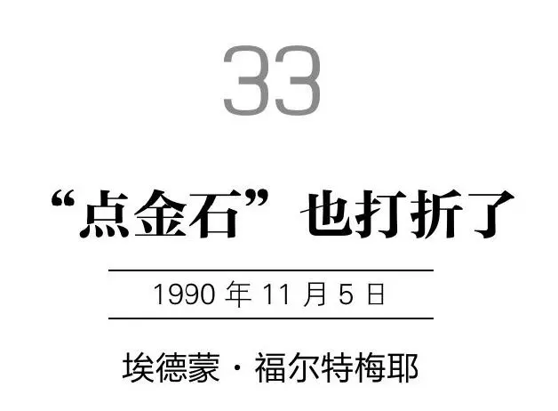

动荡和困境有时会带来好生意。拿伯克希尔哈撒韦公司来说，即便它就像一艘航空母舰一样，有时也会不明缘由地在风浪中搁浅。萨达姆·侯赛因和经济衰退让美国的市场受到重创，在这种背景下，本年度这家公司的股价已经下跌至每股5500美元，跌幅为36%，超过标准普尔500指数跌幅的两倍。60岁的首席执行官巴菲特，拥有着42%伯克希尔哈撒韦公司股份的商业奇才，账面损失已达15亿美元，换算下来就是每小时损失215450美元。然而，这对买家来说绝对是一个买入良机。

麦克尔·普里斯掌管着31亿美元的共同股份基金（Mutual Shares Fund），是位鲜有败绩的投资专家，他说：“这是防守成长型投资者投资股票的方式。”其他货币管理者也推荐这只股票，包括约翰·蒂尔森（John Tilson），他为罗杰恩格曼联营公司（Roger Engemann Associates）经营着6300万美元的帕萨迪纳增长基金（Pasadena Growth Fund），且业绩颇佳。

尽管如此，巴菲特本人的自信却毫发无损，他甚至对巨额的账面损失也不以为然。爱吃汉堡的他说：“我可没有穷到把双层汉堡减成单层汉堡的地步。”公司的商务飞机不是还好好的吗？“它肯定是最后离开公司的一员。”他打趣道。

巴菲特在1965年接手伯克希尔哈撒韦公司，到1989年年末，公司股价达到顶峰。在这段时间内，股价上涨了741倍，从每股的12美元增至8900美元。今年的颓势对巴菲特来说并不新鲜：伯克希尔哈撒韦公司的股票曾在1974年下跌了55%。伯克希尔哈撒韦就像是一驾坚实的马车，财产保险公司充当着巴菲特的领衔主角，此外还有制造业、出版业和零售业为左膀右臂。1989年，这些公司，包括世界出版社在内，平均净资产收益率达到令人震惊的57%。

伯克希尔哈撒韦公司今年股价下滑的最佳解释就是：公司控股的重头，比如广播、出版、保险以及工业方面，在近几个月内遭遇了严重打击。

“巴菲特”，这个名字曾推动公司股价远超每股账面净资产，如今多少也失去了些神秘色彩。对于他为所罗门兄弟公司、吉列公司、全美航空公司（US Air）和冠军国际公司（Champion International）充当“白衣骑士”（white squire）的决定，许多货币经理人开始指手画脚。为了帮助这些公司免受恶意收购，他购买了大笔可转换为普通股的优先股。先锋温莎基金公司（vanguard windsor fund）的投资经理人约翰·内夫（John Neff）说，他看到了“很多消极因素”，因为这会使每家公司的管理层更加自以为是。不过，巴菲特说，只有当这些公司的普通股表现良好时，伯克希尔哈撒韦公司才能在这些优先股上收获到满意的回报。

帕萨迪纳的蒂尔森说：“市场或许对巴菲特说，‘你已经输了，伙计。’可我不这么想。”蒂尔森的公司利用计算机模型计算出，近期伯克希尔哈撒韦公司的股价比实际价值低510美元。“正因为这个折扣，”蒂尔森解释说，“你几乎是不花酬劳地雇用沃伦·巴菲特为你服务。”对于投资者来说，这无疑是值得出手的价格。

## 34 巴菲特买进垃圾债券

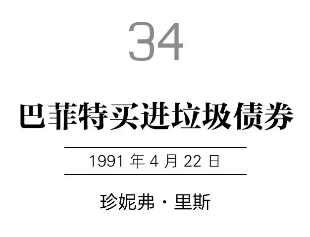

华尔街一直都有一个疑问，那些明星投资人是否有能力在混乱不堪的垃圾债券市场挖出宝来呢？现在，沃伦·巴菲特出手了。在伯克希尔哈撒韦公司1990年年报中，这位富可敌国的首席执行官公开承认，伯克希尔投资4\.4亿美元购买了纳贝斯克（RJR Nabisco）的高息债券。去年，巴菲特对垃圾债券市场做了一番深入的调研，并在随后的访谈中说道：“那里有着比我预想中更多的杀戮。”

他认为纳贝斯克的债券比同领域的其他债券更有价值，因为公司一直运转良好，信贷情况也比此前猜测的要好。巴菲特估计，目前纳贝斯克债券的市场价值约比他的出价高出1\.75亿美元。

他有没有想过多买些？__巴菲特说：“很多事情我都希望自己能有后见之明。但对于投资决定而言，我不认为后见之明有用，只有行动才有回报。”__

## 35 巴菲特语录

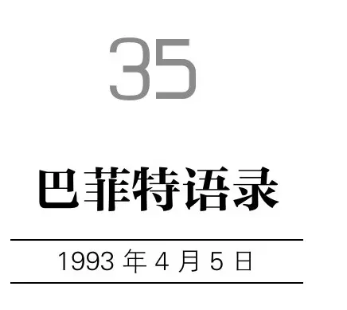

沃伦·巴菲特，现年62岁，亿万富豪，伯克希尔哈撒韦公司董事长。当被问及管理者的股票期权计划为什么要被记入公司的损益表时，他说：“如果期权不是一种薪酬，那是什么？如果薪酬不是一种花费，那是什么？如果计算利润时不考虑花费，那花费究竟要算到谁头上？”

## 巴菲特和可口可乐公司

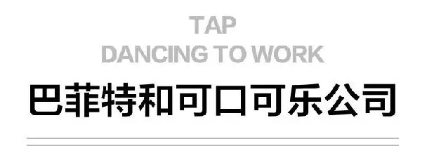

可口可乐公司董事长唐纳德·基奥（Donald Keough）与巴菲特是多年的好友，而且两人曾经在奥马哈是邻居。他们巴菲特询问了一件事：“沃伦，根据盘面的情况显示，有人正在大笔购买可口可乐的股票。那个人是不是你？”巴菲特说：“好吧，别让你和罗伯特以外的人知道这事儿。你说得对，这个人就是我。”基奥听后大感欢欣，挂了电话就告诉了自己的老板——首席执行官罗伯托·戈伊苏埃塔（Roberto Goizueta）。与此同时，巴菲特继续买入可口可乐公司的股票。

1987年发生的股票市场崩溃让可口可乐公司受到重创。在随后的1988年和1989年，巴菲特开始大笔购进可口可乐公司的股票，秉持着他一贯的著名理念：“在别人贪婪时恐惧，在别人恐惧时贪婪。”直至1994年他停止购进时，已经积累了4亿股（分拆调整后）之巨。1994年，伯克希尔哈撒韦公司手中的可口可乐股票已占其总股本的7\.8%，它一共耗资13亿美元，每股均价不到3\.25美元。

总的来说，这就是两家公司美好姻缘的起点。1989—2007年期间，巴菲特一直担任可口可乐公司的董事，他曾使用手中的权力罢免过一位首席执行官，还否决过他认为会对公司不利的管理决策。下面是三篇摘自《财富》杂志的文章，第一篇发表于巴菲特和可口可乐公司建立关系的和平初期，后两篇则发表于双方正处于论战的漩涡之时。

——卡萝尔·卢米斯

__36 世界上最好的品牌（节选）__

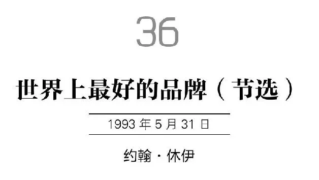

巴菲特说过：“如果在一生中能撞见一家好企业，你就很幸运了。可口可乐基本上可以说是全世界最好的企业了。它的产品价格极其公道，而且无人不爱，在每个国家，它的人均消费几乎每年都在攀升。没有任何产品能与之媲美。”

关于戈伊苏埃塔和基奥，巴菲特是这样评价的：“如果你拥有1927年的洋基队（Yankees），那么你唯一的愿望就是它能长生不老。只要我们的团队中有他俩这样专注的人在，我就不用担心公司的生意。即便你给我1000亿美元，让我抢占可口可乐公司在全世界软饮料市场的领军地位，我也会把钱还给你，并告诉你，我办不到。”

编者注：戈伊苏埃塔于1997年离世，基奥也退休了。新任首席执行官道格拉斯·艾夫斯特（Douglas Ivester）既不是洋基队的贝比·鲁斯（Babe Ruth），也不是卢·格里克（Lou Gehrig），他表现得更像是个球童。所以，在2000年初，《财富》杂志就此刊发了下文这篇独家报道。

__37 可口可乐公司到底发生了什么（节选）__

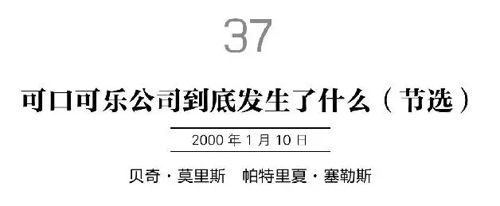

首先，我们来澄清一下关于道格拉斯·艾夫斯特的一些谜团：他52岁，担任首席执行官刚过两年，突然辞去了可口可乐公司董事长和首席执行官的职务。事实上，他是被迫的，而且当时的压力很大。

当然，在这短暂、不快乐的任期内，艾夫斯特一直饱受争议。与他每天共事的助手在得知他们固执的老板撂挑子不干的消息后，和其他人一样大吃一惊。这位助手还透露说，12月的第一天，一个普通的星期三，跟往日没什么不同，艾夫斯特甚至还从亚特兰大飞往芝加哥参加了与麦当劳高管的例会。

可当艾夫斯特回来之后，一切似乎都改变了。直至最近消息披露之后，我们才知道，艾夫斯特在芝加哥期间，还参加了一个非常秘密的、由可口可乐公司两位最重要的股东沃伦·巴菲特和赫伯特·艾伦（Herbert Allen）召集的会议。在这次会议中，两位股东告诉艾夫斯特，对于他的领导能力，他们已经失去了信心。

在过去一年的大部分时间里，巴菲特都隐居幕后，艾伦则与艾夫斯特就其晦涩的管理风格有过多次讨论。不过，这次却大为不同，据可靠消息称，巴菲特和艾伦，作为董事会两位重量级人物，告知艾夫斯特他们已经达成了一致意见：他不应该再继续掌舵可口可乐公司了。变革的时候到了。

这次会面没有一丝一毫的火药味儿，甚至充满了同情心，而且会面没有谈及公司下一步的计划，很快就结束了。可以想象，艾夫斯特本应该抗争、反击。同样，巴菲特和艾伦本也可以在两周后的股东大会上强制通过他们的决定。鉴于巴菲特的伯克希尔哈撒韦公司（巴菲特本人控股31%）握有可口可乐公司2亿股或者说是8\.1%的股份，艾伦握有900万股，这两位董事的地位可谓举足轻重。不论会议结束时每个人心里想些什么，艾夫斯特在回到亚特兰大后的那个周日，立即召集了董事会紧急会议，宣布了辞职的决定。他的声明震惊了管理层、董事会成员、公司职员乃至整个华尔街，甚至是即将接替他的人：道格·达夫特（Doug Daft）。这位56岁的澳大利亚人此前一直负责可口可乐公司在亚太地区的运营。

编者注：达夫特坚信，可口可乐公司应该致力于研发非可乐饮品。2000年初，在他接手之后，他开始推动157亿美元并购拥有佳得乐（Gatorade）品牌的桂格燕麦公司（Quaker Oats）的交易。按照约定，双方将运用可口可乐公司股票进行交易，而巴菲特坚信，运用股票进行并购会使收购方得不偿失。董事会就此问题展开了长达5个小时的激辩，巴菲特对该交易持反对态度。下文就是我对这场辩论的一段记述（选自2001年一篇的补充报道）。

## 38 价值机器（节选）

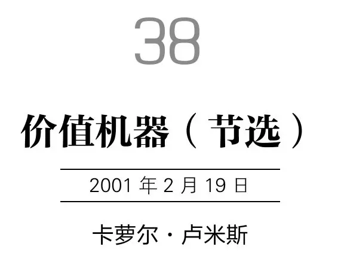

巴菲特果真是重量级的人物。尽管不止一位股东反对可口可乐公司收购桂格燕麦公司，但巴菲特的影响力显然要更大一些。如果董事会上的某个提议只是“小口啃咬”股东利益，巴菲特一般不会发表言论；可如果是狮子大开口，他就不会坐视不管了。在这个案例中，他认为可口可乐公司要用股票支付的价钱实在太高，它要付出自己超过10%的股份才能完成交易。即便从长期来看，强强联合有一定的互相促进的作用，但也没能打动巴菲特投赞成票。和巴菲特辩论，对大多数人来说是一场必输之仗，因为他太有逻辑性，也太聪明了。

__TAP DANCING TO WORK__

__巴菲特花絮__

内维尔·伊斯德尔（Neville Isdell）在达夫特之后接任了可口可乐公司首席执行官。在他掌舵期间，可口可乐公司的股价增长滞缓，遭受了市场的冷落。下一任首席执行官穆赫塔尔·肯特（Muhtar Kent）于2008年接手可口可乐公司，当时恰逢次贷危机爆发。不过，在他的带领下，可口可乐公司在过去的这几年里涨势良好，到了2012年中期，可口可乐公司的股票已经涨到了每股39美元（在1998年的大牛市中，股价曾达到历史最高值41美元）。

伯克希尔哈撒韦公司依然紧握着手中的4亿股股票。相比于当初他们花费的13亿美元，2012年中期，这些股票的市值已达到156亿美元。可口可乐公司回购股票的举措更是让伯克希尔哈撒韦公司持股比重上升到8\.9%。巴菲特（呃，暂时把伯克希尔哈撒韦公司放一边）仍然坚信这是全世界最好的企业。

——卡萝尔·卢米斯

## 39 巴菲特如何看待风险

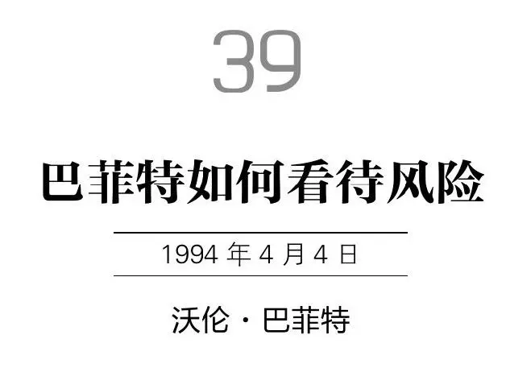

我们采取的策略排除了传统的“多样化分散风险”的教条。许多权威人士会言之凿凿地说，我们的这种策略风险巨大，这点我们不敢苟同。我们相信集中持股的做法同样可以大幅降低风险。__通常风险低的股票，是那些我们非常熟悉的企业，而且在购买时，我们内心不会存在强烈的不舒服的感觉。在这里我们按照字典里的解释给风险下个定义：系指受到损失或伤害的可能性。__

然而在学术界，却喜欢给投资风险下不同的定义，坚持把它当作是股票价格或投资组合相对波动的程度，也即个别股票相较于大盘的波动幅度。运用历史数据与统计的方法，这些学者就能计算出一只股票“精确”的Beta值，代表其过去的相对波动幅度，然后根据这项公式建立一套晦涩难解的投资与资金分配理论。__他们渴望找出可以衡量风险的单一统计值，却忘了一项最基本的原则：宁愿“可能对”，也不要“一定错”。__

对于企业的所有人来说，在我们眼中持股人就是公司所有者，学术界对于风险的定义实在是有点儿离谱，甚至有点儿荒谬。举例来说，根据Beta理论，若是有一只股票的价格相对于大盘下跌的幅度更高，就像我们在1973年买进华盛顿邮报集团的股票时一样，那么其风险远比原来高股价时还要“更高”，如此一来，要是哪天有人愿意以极低的价格把整家公司卖给你，你是否也会认为这样风险太高，而予以拒绝呢？

__事实上，真正的投资人喜欢波动都还来不及……这是因为市场波动的幅度越大，就更有机会出现一些好公司的价格低廉的情况。__很难想象这种低价的优惠会被睿智、精明、不放过任何机会的投资人视为“有害”。

## 40 巴菲特抵挡住2亿美元的“下冲气流”

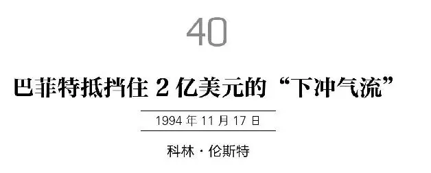

问：如何在航空业以最快的速度成为百万富翁？

答：首先，你得有10亿美元做家底。这当然只是句玩笑话，据《财富》杂志估计，巴菲特投资全美航空公司的3\.58亿美元已经遭遇了大约2亿美元的账面损失。

表象之外，巴菲特实则展现了自己强硬的一面。全美航空公司1994年的行为给人们敲响了警钟。如果公司不能让工会同意削减成本，他和查理·芒格（Charles Munger）将会辞去全美航空公司董事的职务。在所有经营国内航线的航空公司中，全美航空公司的成本是最高的，公司此次旨在削减10亿美元的经营费用，其中的半数来自工资的压缩。

和其他业内人士一样，巴菲特也不愿谈及全美航空公司未来将驶向何处。不过，1994年9月8日发生在匹兹堡附近的一场空难，造成132人死亡的惨剧，让公司的未来更加阴郁，甚至黯淡无光。观察者起初都希望这场灾难能够促使飞行员、机械师以及空乘人员同意削减开支的计划，但结果不遂人愿。航空公司飞行员协会（air line pilots association）的罗伯特·弗洛克（Robert Flocke）说：“每次公司陷入困境，都会首先拿飞行员开刀，然后把节省的钱乱花出去。”

运输集团的顾问约翰·平卡维奇（John Pincavage）指出，全美航空公司亏损严重，现金流枯竭，它对于如燃料方面的大笔开支捉襟见肘了。他说：“做错事之后的回旋余地并不大，全美航空公司正日薄西山。”

全美航空公司的发言人安德烈亚·巴特勒（Andrea Butler）坚持认为：“最后的补救办法是，管理层应该把重点放在制定出更有成效的劳资协议上。”公司必须在现有基础上增加利润分成的比重，提高董事会的代表性。美国西北航空公司（Northwest Airlines）和环球航空公司（Trans World Airlines）也是利用这些方法来解决它们与工会的矛盾和分歧的。

__TAP DANCING TO WORK__

__巴菲特花絮__

20世纪90年代初，巴菲特在全美航空公司上的巨额亏损引起了社会的极大关注，当然，也毫无疑问地遭到了很多人的嘲笑。至今很多人仍然认为，这对伯克希尔哈撒韦公司来说是一个巨大的、惨痛的教训。不过，1996年，新任首席执行官斯蒂芬·沃尔夫（Stephen Wolf）接手全美航空公司之后，就像巴菲特在1997年伯克希尔哈撒韦公司年报中提到的那样，为公司带来了“奇迹般”的“复苏”。全美航空公司的股价从可怜的每股4美元涨到了75美元，伯克希尔哈撒韦公司购买的该公司的可转换优先股的价值也因此扶摇直上。拖欠的优先股股息，再加上补偿支付的部分，巴菲特从这笔投资中获得了天文数字般的回报。随着1998年优先股被赎回，巴菲特在1997年伯克希尔哈撒韦公司年报中说：“现在几乎可以确定的是，我们在全美航空公司的股票上获得了不同凡响的回报，如果把我花在‘美乐事胃药’（Maalox）上的钱除外的话，这个回报甚至高得有些离谱。”至于获利的具体金额，伯克希尔哈撒韦从未被披露过。多年之后，在2007年年报中，巴菲特又提起此事，将其形容为“硕大无朋”。他还说在那些年里，全美航空公司“破产过，而且是两次”。

2026年3月14日

16:57

## 巴菲特与盖茨

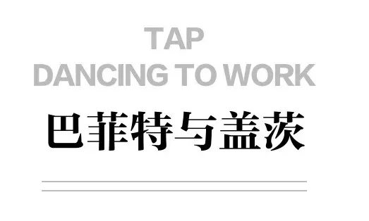

把这两篇文章放在一起，是因为它们有一定的连续性，并且读者可以从中看出这段友谊中两人共有的价值观。这段出人意料的友谊发生在巴菲特和比尔·盖茨早年交往的岁月。我们在这里所看到的，不止是25岁的年龄差距，更是横亘在两人兴趣间的巨大沟壑：为投资痴狂的巴菲特和为技术着迷的盖茨。

1991年，两人共同的朋友，也是盖茨母亲的多年老友、《华盛顿邮报》的编辑梅格·格林菲尔德（Meg Greenfield）安排他俩第一次会面。事实上，格林菲尔德也对自己当时的想法产生了好奇心：“我并没有意识到，这将是一次有趣的碰撞。”20世纪90年代中期她接受《财富》杂志访问时说道。

他们的会面地点在西雅图郊外、盖茨父母的乡间小屋。格林菲尔德在西雅图长大，在这里也有房产，于是带自己的房客巴菲特和华盛顿邮报集团的首席执行官凯瑟琳·格雷厄姆（Katharine Graham）来到这里。他们共同乘坐格林菲尔德那辆老旧、窄小的斯巴鲁一起前来。相比之下，和女朋友梅琳达·法兰奇（Melinda French，后来的妻子）一起乘坐私人直升机前来的盖茨就显得高端大气得多。盖茨甚至在落地时就在盘算早点儿逃离这个地方，他本不想来，但又不愿辜负母亲的期望，所以硬着头皮来了。

可开始与巴菲特交谈之后，他的想法立刻改变了。他们的思想交融在了一起，彼此都很快地意识到了这点，旗鼓相当的才华较量成了沟通二人智慧的桥梁。从此之后，便缔结了这段忘年之交。直至今日，特别值得一提的是，两人携手开辟了慈善事业的新历史。

我们再回头来说说这两篇文章的内容。第一篇涉及不少关于盖茨的内容。第二篇则是由盖茨自己所写，虽然看起来像是对罗杰·洛温斯坦（Roger Lowenstein）所写的巴菲特传记的书评，但事实上，大部分篇幅却是盖茨在洋洋洒洒地叙述自己对巴菲特的印象。

据我所知，第二篇文章在《财富》杂志的历史上也有特殊意义，因为它可能是我们杂志创刊80多年以来，首次转载别家商业刊物的文章。它最先发表在《哈佛商业评论》。一位亿万富翁谈论另一位亿万富翁，如此有趣的文章吸引了《财富》杂志编辑们的注意，于是我们征得了作者的同意，再次将其刊发在我们的杂志上。在此，再次向作者表示感谢。

——卡萝尔·卢米斯

__41 亿万富翁的伙伴__

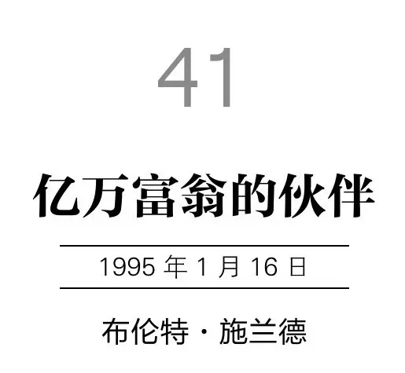

谁说不能给友情定价？当友情的两端连接的是比尔·盖茨和沃伦·巴菲特时，这段友谊的价值将高达190亿美元，那是多少个百万啊！

4年了，美国最富有的两个人（目前巴菲特排行富豪榜首位）的这场忘年深交让全世界都充满了好奇心，在世人眼里，两人最大的共同点或许就是他们的财富了。“我们俩是一对看起来有点儿奇怪的伙伴，是不是？”患有“高科技恐惧症”的伯克希尔哈撒韦公司董事长巴菲特如是说。现年64岁的巴菲特是工业时代最具典型意义的投资家，他的数十亿美元主要投资在最基本的制造业上，比如生产鞋、汽水和刮胡刀的企业。盖茨则恰恰相反，他是信息时代的杰出代表，凭借纯脑力工作积累了数以十亿美元计的财富。

两人通过共同的朋友、《华盛顿邮报》的编辑梅格·格林菲尔德相识，她也是盖茨的老乡。两位亿万富翁常常互相交流意见。曾经一度，盖茨试图劝说巴菲特至少考虑一下，购买一台个人电脑，但是无果。不过，巴菲特最终还是在另一位朋友的“命令”下购买了一台电脑，因为这样就可以在线打桥牌了。和他一起打桥牌的人就包括盖茨的父亲。盖茨总是乘坐他那架被称作“站不住脚号”的二手飞机飞来飞去，巴菲特也曾给盖茨很多关于企业形象方面的建议。巴菲特说：“我告诉他，直到55岁，我才购买了企业专机，他或许也把维护形象这事儿放在他年老之后了。”

在很多年以前，盖茨订婚的时候，巴菲特还帮他找到了一枚价格相当划算的钻戒。当时盖茨准备给未婚妻法兰奇来一个小惊喜，他专程前往奥马哈取钻戒。他购买钻石的地方恰是伯克希尔哈撒韦公司控股的著名珠宝商店波仙珠宝（Borsheim’s）。__盖茨谈起这段往事时不禁咯咯地笑了起来：“为了我，沃伦特地让珠宝商店周日也营业。他曾告诉我说，第一次订婚的时候，他花掉了自己全部资产的6%去购买钻戒，作为真诚爱情的见证，他觉得我也应该像他一样。”__

两人还偶尔会为谁更富有而互相开玩笑。巴菲特知道盖茨痴迷于打赌，就送他了一对儿很有意思的骰子。巴菲特说：“我想永远把他打压在第二的位置上，但比尔每次都是立刻迎头赶上。”巴菲特还开玩笑地说：“如果我之前知道参与竞拍达芬奇笔记本的人之中有比尔，就应该把价格再抬得更高一点儿。”

那么，盖茨究竟最欣赏巴菲特哪点呢？答案是，与巴菲特交流。他说：“沃伦非常谦逊，在描述复杂问题时总是表述得那么清晰。当泛泛而谈时，他的引用也很有趣，比如，当谈及他的投资策略时，他会拿梅·韦斯特打比方，可他一旦认真起来，就会相当有深度。他总是那样令人捉摸不定，所以，我总能在他身上发现新东西。”

__42 盖茨眼中的巴菲特__

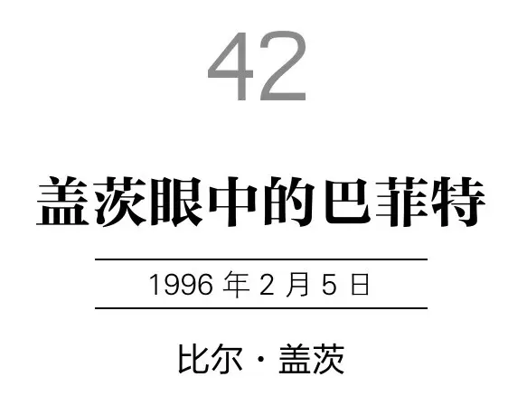

在罗杰·洛温斯坦所写的沃伦·巴菲特传记中，他一开篇就强调了自己的特殊身份。

他透露说，自己是伯克希尔哈撒韦公司长期的投资者，见证了该公司在巴菲特的领导下，股价从33年前的7\.6美元涨到现今大约3万美元的历程。

在评论洛温斯坦的传记前，我也必须表明一下我的身份。我不太可能以中立或者冷静客观的眼光来看待巴菲特，因为我们是非常亲密的朋友。最近我们还一起带着家人去中国度假了。他的每个笑话都让我乐不可支。我觉得他的饮食习惯，汉堡加可乐，是绝佳搭配。总而言之，我是他的铁杆粉丝。

人们很容易成为巴菲特的粉丝。毫无疑问，很多人读过《巴菲特传：一个美国资本家的成长》*（Buffett：The Making of an American Capitalist）*之后，就会成为他的追随者。洛温斯坦的书记录了巴菲特不平凡的一生。书中并没有把他描写成一个有趣、谦恭、颇有魅力的人，而是更侧重突出了他的与众不同。读完之后，恐怕没有人会感叹：“哦，我跟这家伙简直太像了。”

巴菲特的成就大家有目共睹，洛温斯坦的书中讲述了不少有趣的细节。作者从1930年巴菲特出生于奥马哈开始，讲到他11岁时买了第一只股票；又从他进入哥伦比亚大学、师从本杰明·格雷厄姆学习证券分析，讲到25岁时创立自己的巴菲特合伙公司。作者还描述了巴菲特在经营巴菲特合伙公司期间购买股票时的深藏不露，却又相当开明地介绍自己的指导原则，即在逢低时买入股票，然后耐心持有。__正如巴菲特曾在致股东的信中谈到的那样：“这是我们投资策略的基石：别指望靠卖得好赚钱，而是要让买入的价格足够有吸引力，以至于卖价一般也可以获得良好的收益。”__

洛温斯坦还讲述了巴菲特如何接管了伯克希尔哈撒韦公司，如何将濒临倒闭的纺织厂经营成摇钱树，从而有资金去购买其他公司的股票。书中追溯了伯克希尔哈撒韦公司转变成控股公司的历史，讲述了巴菲特的投资理念是怎样一步步演进到，能够透过财务数据看到企业独一无二的经济价值。如今，伯克希尔哈撒韦公司旗下的公司包括，时思糖果、《布法罗新闻报》、世界图书出版公司，以及持股比例很大的美国运通公司、首府/美国广播公司（即将被迪士尼收购）、可口可乐公司、报业巨头甘乃特（Gannett）、吉列公司以及华盛顿邮报集团等。

读罢此书，读者们似乎觉得上了一堂非常有意义的投资和商业课，但是这些伟大的投资理念能否真正转化为实际效益还是未知数。巴菲特的天赋就是能够先人一步地思考，所以，仅仅把他的格言牢记在心，恐怕是达不到他那样的成就的，当然巴菲特的精辟论断是值得铭记在心的。

举个例子，巴菲特喜欢说投资方面没有所谓“好球”。“好球”只会发生在你挥棒却没打中的时候。当你上场击球时，无须集中注意力对付每一个投球，也不需要为没有挥棒击打“好球”而懊恼。__换句话说，没有必要把每只股票或者每次投资机会都研究一遍，你买的股票表现不如人意时也不要过于自责。巴菲特说，人生只需挥棒数次，只要好好做准备，就能让你个个击中。__

他对长期投资的偏爱印证了他的另一句格言：“你应该投资一家连笨蛋都能经营的企业，因为说不定有一天真的会由笨蛋来经营。”如果企业的成功全赖于每一位员工的出色，那么这样的企业难以令他信任。当然他也不相信，如果一个企业的基本面很差，伟大的员工还能发挥出神奇的力量。他说，当一位声名卓著、才华横溢的经理人接管一家基本面出了名糟糕的公司时，最终纹丝不动的必将是公司糟糕的名声，这一点很少有例外。

巴菲特为伯克希尔哈撒韦公司控股的公司配备了有力的管理层，也愿意给予公司足够的自由权。他留给管理者的基本指令是，经营好手中的生意，努力创收，然后相信巴菲特，明智地进行投资。他不鼓励管理层进入新的商业领域。管理层只需要专注于自己了解的行业，这样巴菲特也就能集中他的注意力做他擅长的事情：投资。

对与巴菲特见面一事的反应，我自己也有点大吃一惊。每当有人对我说：“你一定要来见见我的朋友××，他真的是最最聪明的人。”马上就会激起我的抵触情绪。大多数人在见过某个出色的人之后，都会很快下结论说，此人是如何的非同凡响。这是人之常情。每个人都想结识出众的人物。然而，结果往往是，人们常常高估对方的优点和成就。因此，尽管人们把巴菲特称作天才，我也没怎么当回事儿。

事实上，1991年7月5日，在我母亲劝我从工作中抽身一天去见见巴菲特时，我心里打了几百个大问号。他是何方神圣？我们应该谈些什么，市盈率？我的意思是，跟一个只懂买股票的人待上一整天？特别是还有很多工作要做的时候，这不是在开玩笑吗？

我跟母亲说：“7月5日我还有工作，相当忙。对不起啦！”

她回答我：“凯瑟琳·格雷厄姆也在那儿。”

母亲的话一下子引起了我的兴趣。尽管我从未与格雷厄姆有过谋面，但她将《华盛顿邮报》经营得风生水起，并在政界享有一席之地，这让我印象很深刻。格雷厄姆和巴菲特是多年的好友，巴菲特最具眼光的投资案例就是入股华盛顿邮报集团。格雷厄姆、巴菲特和几位优秀的记者恰好同时都在西雅图。出于某些特殊原因，这几位大人物同时挤进一辆小车，一大早从老远的地方开到我父母位于市郊的度假屋。车里的某些人也和我一样满腹狐疑：“难道我们一整天都要待在那幢房子里？”逼仄的小车里有人问：“一整天的时间，我们该如何打发呢？”

母亲坚信我一定会来。“我只待几个小时，然后就要回去了。”我告诉她。

到达以后，我和巴菲特讨论起在零售商广告刊登量下降的情况下，报业将如何转变。接着他就开始问我关于IBM的问题：“如果你白手起家建立IBM，如何让这家公司独树一帜？IBM业务的成长点在哪儿？你又会做何种准备？”

他的问题颇有见地，还给我讲了几个很有教育意义的故事。我从未如此这般享受过学习，也从未遇见过商业思路如此清晰的人。第一次见面那天，他还给我推荐了他自己在做的分析力测试，非常有趣。首先，他会选择一个年份，比如1970年，查看当时10家总市值最高的公司。然后前进到1990年，看看20年后这些公司发展得如何。他对这个测试的热情感染了我。我食言了，在那儿待了一整天，在他上车和朋友离开之前，还答应他飞到内布拉斯加跟他一起看球赛。

和巴菲特在一起时，你能明显地感受到他对工作的热爱，这会在很多方面都能体现出来。他向你讲解问题时，从不会显出“嗨，我是这方面的行家，我一定让你刮目相看”的样子，而更像是“这是个很有趣的问题，事实上很简单。我这就解释给你听，你会意识到这简直就是个傻问题，而我却花了那么久才搞明白”。他的分享，充满了幽默，让整个问题如春风化雨般迎刃而解，好似问题看起来就是那么简单。

和巴菲特在一起最有趣的事就是，当我们和其他人接收一样的信息时，他总能迸发新意，这种新意在某种意义上是一种很卓著的创见。我们都会用新的观点来改造自己的公司。巴菲特和我都特别享受这个过程，而且还常常交流彼此的心得。

我们彼此相当坦诚，从未把对方当作竞争对手。我们的公司业务内容很少有重合，就算有，也恐怕就是他的《世界图书百科全书》*（World Book Encyclopedia）*和我的《微软百科全书》*（Microsoft Encarta）*有些竞争关系。巴菲特从不涉足科技行业，因为他只想投资那些他能做出前瞻的公司，在他不太了解的科技领域却几乎做不到这点。这对巴菲特是不利的，因为科技世界打破了知识的界限。过不了多久，大多数行业都会被科技的发展所影响，但吉列公司、可口可乐公司和时思糖果应该还是比较安全的。

我和巴菲特时不时地会在数学方面斗智。有一次，巴菲特递给我4个很不寻常的骰子，每个骰子的6个面上都有0～12数字的独特组合。他解释说：“我们每人选取一只骰子，舍弃剩下的两个，然后打赌谁掷出最大数字的次数最多。”他颇为慷慨地让我先选择。然后说：“好吧，既然你先选了，那你给我什么赔率？”

我知道这其中定有蹊跷，于是说：“我来看看那些骰子。”

研究了骰子各面的数字之后，我说：“这是个赔本买卖。你先选。”

有一次，他先选了一个骰子，然后我用了好长时间决定从剩下的三个中选择哪一个。每个骰子上的数字都要慎重选择，它们是非传递性的，四个骰子中的任何一个都可能被其他的打败：骰子A可能打败骰子B，骰子B可能打败骰子C，骰子C可能打败骰子D，骰子D可能打败骰子A。这意味着，第一个选择骰子的人没有胜算，只有第二个选择的才能赢。这跟我们的直觉是相反的，就像商业世界中的很多事情一样。

巴菲特对于数字的敏感性是极高的，而我也热爱数学。不过，数学好并不能保证你会成为一名优秀的投资者。__巴菲特并不是因为他更善于计算赔率而比其他投资者出色，完全不是这样的。他也绝不是通过计算小数点后的第二位数而取得今天的成绩的。他投资只有一种可能，那就是机会已经相当成熟，此时他才会挥起手中的棒球棒。__

巴菲特另一个让我钦佩的习惯是，他的日程表里总不见各种各样的会议。“拒绝”不是件容易的事，可是巴菲特却做得很好。他知道自己喜欢做什么；而且只要是他喜欢的，总是会做得难以置信地好。他喜欢坐在自己的办公室里，阅读，思考。除此之外，还有些事儿他也乐意去做，可是并不多。洛温斯坦在书中非常准确地总结说，巴菲特是一个按照习惯过活的生物。他在奥马哈长大，也愿意在奥马哈终老。他有自己固定的朋友圈子，而且他也更喜欢和他们待在一起。他不是个寻找刺激和新鲜事物的人。刚过65岁的巴菲特，还住在奥马哈那幢他25岁时买的房子里。他对常规的坚持也延伸到了他所做的投资决定中。他总是坚守着那些令他舒心的公司。他也很少去美国之外的国度投资。

有一些公司是他认定的长期投资伙伴。尽管相关数字明白无误地显示，股价已经吸收了所有未来的利好消息，处于阶段性的顶部，但他就是不愿出售手中的股票，不论价格几何。我想，他不愿出售的原因主要是出于哲学考量而不是利益最优化的驱使，但是我又有何德何能去揣测世界上最成功的投资者呢？巴菲特不情愿出售其实也契合了他在其他方面的习惯。

在某些价值观方面，巴菲特和我颇有共通之处。我们都为自己生在一个能将自己的技能转化为财富的时代而感到庆幸。如果生在别的时期，那我们的天赋可能毫无价值。我们都不打算把自己积累的财富挥霍一空，我们想用它为社会带来福祉。从某种意义上来说，我们现在都在为慈善事业而努力。无论如何，我们的下一代都只能继承一小部分的财产，因为我们都相信，把大笔财富都装进子女的口袋既无益于他们自己，也无益于社会。巴菲特常说，他希望留给子女足够的钱去做些事情，但不希望留给他们足够的钱而无所事事。在见到巴菲特之前，我就听过他这样的言论，亲耳听他讲述更加强化了我的想法。

洛温斯坦是一位善于搜集事实的作家，而《巴菲特传：一个美国资本家的成长》写得也恰到好处。巴菲特曾经告诉我，这本书绝大部分是相当准确的。他说自己有一天也会写本自传。不过，鉴于他自己对工作的专注和写书的难度（我自己深有感触），我想这一天还来日方长。然而一旦他写成，我敢保证这将是史上最有价值的商业类著作。

其实，在伯克希尔哈撒韦公司年报中，巴菲特写给股东的信已经可以跻身最佳商业文学的范畴。洛温斯坦的很多分析都来自那些信，这也是分析巴菲特的一种正确途径。读过《巴菲特传：一个美国资本家的成长》一书之后，你会对这个人和他的思想产生极大兴趣，所以，我强烈推荐你去读读他的年报，即便是10年或15年前的那些。这些资料图书馆里都能找得到。

关于巴菲特和他的投资战略的书可谓不少，但直至巴菲特自己动笔写自传之前，这本书还是值得一读的。

本文原题《我从巴菲特那里学到了什么》*（What I Learned from Warren Buffett）*，作者比尔·盖茨，作于1995年，版权归属微软公司。首刊于《哈佛商业评论》（1996年1/2月刊）。由微软公司许可转载。

## 43 解开衍生品的乱麻（节选）

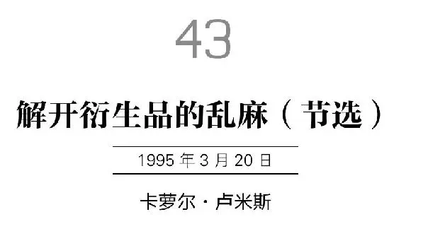

由于衍生品呈现出的复杂乱象，外部董事根本不可能近距离地知悉他们的公司手中攥着哪些合同。大多数首席执行官也无法掌控局面。结果，选择对冲什么风险，运用什么衍生品来实现，如何划出风险管理和投机之间的警戒线，很大程度上将依赖于华尔街的金融业人士，其中的一些人，尽管相当不靠谱，却自我感觉良好地认为自己创造着可观的利润。而电话的另一头，将会是衍生品的销售人员在极力推荐着他们最新的创意，所推荐的创意想必都充满蛊惑性。

这不是让人欣喜的局面，至少对于衍生品这样的大问题来说不是。因此，或许我们需要的是一些新观念、新途径，能够打开新局面的新建议。能够提供这些的人，这里就有一位：伯克希尔哈撒韦公司董事长沃伦·巴菲特。他认为，如果要与衍生品打交道，他会要求每位首席执行官在年报中确认自己了解公司参与的每项衍生品。“如果把这条写上，”巴菲特说，“我想你就能解决好存在的每一个问题。”在一个异常复杂和充满困惑的市场中，这样的解决方法是不会起作用的，因为它太简单了。不过，他是对的。

2026年3月14日

16:57

## 44 巴菲特语录

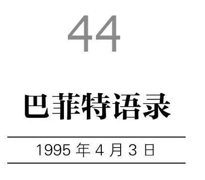

沃伦·巴菲特，现年64岁，亿万富豪，伯克希尔哈撒韦公司董事长。他在股东大会期间也不忘推销其公司生产的糖果、鞋和其他各种产品，他说：“虽然我们都期待股东大会带给大家的是更偏重精神层面的体验，但也务必记住，即便圣洁如宗教，也会将捐献盘作为仪式的一部分。”

1995年5月29日

查理·芒格，现年71岁，亿万富豪，伯克希尔哈撒韦公司副董事长。他在谈到公司涉及的官司时说：“他们传唤我们提交公司的人员编制材料。我们不仅没有这类材料，甚至连员工都没有。”

## 45 缘何沃伦·巴菲特对美国运通公司下大赌注（节选）

在不断购进某只股票时，巴菲特不希望该公司知情。当消息最终被爆料时——通常是因为证券交易监督委员会的留档，他还是会继续购进该只股票，但不愿过多透露自己为何对这只股票这么感兴趣。我们所说的就是1995年美国运通公司的案例。当时所有的商业媒体，包括《财富》杂志，都不断给巴菲特致电，但他就是讳莫如深。

因此，我们就写写自己所了解的故事，即便原来的封面标题比我们这里所用的更有“批判性”。封面上写着《缘何巴菲特对一个‘纸牌屋’下大赌注》*（Why Is Warren Buffett Betting Billions on This House of Cards）*。足见《财富》杂志的这位作者和编辑在创作这篇文章时认为，美国运通公司的前景相当不乐观，但令他们困惑和难以置信的是，巴菲特的态度似乎截然相反。

我们打算写一篇长文，以巴菲特开始，也以巴菲特结束的，再加上关于他的补充报道。不过，在探讨公司新任首席执行官哈维·戈卢布（Harvey Golub）的问题上，我们遇到了困难。戈卢布来自著名的咨询公司麦肯锡。《财富》杂志认为，一位咨询专家，特别是成本削减和销售方面的专家，在重建美国运通公司20世纪90年代初丧失殆尽的威望方面，可能不是理想人选。

下面这些章节就是《财富》对巴菲特的描写，其中还包括一些补充报道。结尾部分则是巴菲特自己对这个问题的看法。

——卡萝尔·卢米斯

__事件缘起：__

沃伦·巴菲特喜欢发表关于股市不合理之处的洞见。1963年，因牵涉进其子公司的色拉油丑闻，美国运通公司股价曾大跳水。情况到底有多糟呢？为了一探究竟，巴菲特一整个晚上都守候在奥马哈的罗斯牛排馆（Ross’s Steak House）的收银台旁，就是为了看看人们会不会停用手中的运通信用卡。这桩商业丑闻似乎并未让就餐的人“消化不良”，所以，巴菲特抓住机会以1300万美元的价格买进了5%的公司股份，最终这笔投资给他带来了2000万美元的纯收益。

现在，巴菲特似乎想要重温旧梦，而且出手更大。过去的这些年里，伯克希尔哈撒韦公司董事长已经购进了4900万股美国运通公司的股票，差不多占到该公司总股本的10\.1%。其价值约为22亿美元，美国运通公司和可口可乐公司、吉列公司、首府/美国广播公司一道，成为巴菲特的重仓股。再一次地，巴菲特认为美国运通公司的股价被低估了，而这是由于华尔街的非理性恐慌造成的。这次麻烦的导火线不是色拉油，而是一连串广为人知的纷争：由詹姆斯·罗宾逊三世（James Robinson III）领衔的管理团队几乎陷入“机能失调”的状态，在20世纪90年代初公司的品牌影响力急剧下降，而他建立金融超市的伟大战略，即收购莱曼兄弟控股公司（Lehman Brothers Holdings Inc\.）的举措，如同搭建纸牌屋一般不堪一击。莱曼兄弟控股公司耗尽了40亿美元的资金之后，终于在去年被出售。美国运通公司的状况江河日下，由于威望扫地，它逐渐失去了消费者的信任，市场份额拱手让给了维萨（Visa）和万事达（Master Card），自身也成为一块烫手山芋。据分析师说，美国运通公司国际市场方面的业务也显露出萧条之态。

作为一名一向充满耐心的投资者，身家142亿美元的巴菲特相信，最近的这些麻烦只不过是“打个喷嚏”而已。他喜爱的是强大品牌和健康的现金流，也正是这些造就了他无穷的财富。毕竟，根据伦敦的综合性品牌咨询公司英特品牌（Interbrand）的分析，美国运通公司至今仍是全球认可度最高的十大品牌之一。巴菲特相信，“美国运通公司依旧是全球范围内财务诚信和货币替代品的代名词”。正如他在1994年股东大会上向伯克希尔哈撒韦公司股东们解释的那样：“至今，对美国运通公司未来很多年的发展来说，至关重要的因素将是信用卡业务。我们认为，公司管理层针对这方面的考虑还是比较好的，比如，对‘如何保持信用卡的差异化’这个问题的考虑。”巴菲特似乎并不太在意该公司市场份额的缩水。相反，他更像在赌博，即便美国运通公司不会出现爆发式的成长，仅在信用卡业务方面就能获得一定的回报。

然而，尽管肩负着巴菲特的殷切期待，美国运通公司还是需要向自己的品牌注入新鲜的血液和活力。这可不是一项轻松的任务。

__下面是故事结尾：__

不论人们认为美国运通公司面临的挑战有多艰难，跟巴菲特对赌绝不是一项太明智的举措。别忘了，他之前对可口可乐公司和吉列公司的赌注也同样是大手笔，并且大赚了一笔。他对汽车保险公司的投资也颇为成功。与美国运通公司相似，这些企业都有着相当强劲的现金流。巴菲特手中的王牌就是他所支持的强有力的管理层：一群咨询顾问。令人迷惑不解的是，这群咨询顾问是如何在这场真正残酷的游戏中厘清事实、找出头绪的。

__巴菲特如何看待购买美国运通公司股票这一举措__

__1995年10月30日琳达·格兰特__

众所周知，沃伦·巴菲特是价值投资的忠实支持者。“价值投资”的观念是由华尔街传奇人物本杰明·格雷厄姆在20世纪三四十年代提出的。价值投资者相信市场并不总是理性的，它总是时不时地低估一家公司的真实价值，这正是他们购买股票的原因。

不过，即使明白这些道理，还是有很多人对巴菲特花20亿美元购买美国运通公司的股票感到大惑不解。由于美国运通公司一直在损失市场份额，再加上附属该公司的前经纪公司莱曼兄弟控股公司出现了不少问题，近年来，华尔街一直对其抱以躲避的姿态。也许起初，巴菲特正是被这一连串的坏消息所吸引的。毕竟，格雷厄姆的主要信条就是独立思考，理解价格和价值的区别。他也劝告追随者要在市场中寻找真正有价值的“便宜货”。

小罗伯特·海格士多姆（Robert G\.Hagstrom Jr\.）是《沃伦·巴菲特之路》*（The Warren Buffett Way）*一书的作者，同时也是费城福克斯基金会（Focus Trust）的投资经理，他自身也信奉价值投资的理念。他指出，想要了解巴菲特的投资行为，应该先从了解他在1989年致股东的信中所谈到的理念开始。__巴菲特在其中写到，现在所有企业的价值“都可通过计算企业未来的现金流来评估，包含流进与流出，并以现行的利率予以折现。不管是马鞭的制造者还是移动电话的经营者，都可以在同等的地位上，据此评估其经济价值”。__

换句话说，海格士多姆认为，巴菲特把股票当作债券来评估其价值。他首先提出“所有者权益净值（net owner earnings）”的概念，所有者权益净值是指报告期利润加上折旧及摊销再减去资本投资。对于美国运通公司来说，去年的这个数字是14亿美元，和公司的报告期利润持平，尽管这并不是常见的情况。在提出这个概念之后，他又提了一个问题：如果美国运通公司是一只债券，而且当年的票息达到14亿美元，那么10年之后，票息将会涨到多少？到时债券又将价值几何呢？

“判断一家公司的票息是很难的，”海格士多姆说，“因为你必须对增长率做出最准确的估测。”

这是非常基本的金融理论，但秘诀在于如何操作。虽然至今仍无人能破解巴菲特的价值密码，但至少，海格士多姆做了尝试。他的模型计算出美国运通公司每股股票的真正价值约为86\.77美元。而该公司近期的44美元股价与86\.77美元之间的差距代表了安全边际。“这是相当宽阔的一个缓冲地带，”海格士多姆说，“即使在行情不好的年份里，美国运通公司面临亏损，也可以保护投资者。”基于这一结论，海格士多姆自己打算购买8000股美国运通公司的股票。

__TAP DANCING TO WORK__

__巴菲特花絮__

以上就是1995年10月30日发表于《财富》杂志上的关于巴菲特和美国运通公司的文章。不过，巴菲特究竟有没有详细列出一整套支撑他购买美国运通公司股票的行为准则呢？直到1997年，他是否在致股东的信中回答了这个问题——完全没有。他说，这只是在打高尔夫球时灵机一动想到的。

这个“灵机一动”的背景是，在1991年，伯克希尔哈撒韦公司斥资3亿美元购买了美国运通公司俗称“Percs”的股票，它本质上是一种优先股，但在三年内可以转换。特别值得一提的是，伯克希尔哈撒韦公司在这三年里获取了一笔额外的股息，但也被限制了可能获得的价格增值。1994年8月，“Percs”股票到期，被转换为普通股，而在当年初夏的时候，巴菲特还在考虑是要保留美国运通公司的股票还是卖掉。

有两件事让他犹豫不决，巴菲特在1997年的信中写道：他觉得，美国运通公司的首席执行官哈维·戈卢布一定会明智地意识到公司蕴藏的巨大潜能。然而，对于美国运通公司面临的残酷竞争，特别是与维萨之间的对决，巴菲特仍旧忧心忡忡。“权衡利弊之后，”他说，“我倾向于出售。”

随后，1994年的某一天，在缅因州的普劳茨狭地（Prouts Neck）他与赫兹公司（Hertz）的首席执行官弗兰克·奥尔森（Frank Olson）一起打了几洞高尔夫球。巴菲特在信中写道：“弗兰克是一位才华横溢的经理人，精通信用卡业务。因此，从第一杆开球区起，我就不停地向他讨教有关信用卡行业的情况。到第二洞果岭时，弗兰克就已经使我相信，美国运通公司的公司卡是能带来惊人效益的经济特许权。因此，我决定继续持股。等第9洞时，我又转变成了买家。在后来几个月里，伯克希尔哈撒韦公司拥有了这家公司10%的股票。”

1994年年底是巴菲特购买美国运通公司股票的一个转折点。从那时开始直至2012年年终，伯克希尔哈撒韦公司已经取得了13%复合年回报率的卓越成绩。在2005年的配送日，美国运通公司拆分出的美国金融服务公司（Ameriprise）的价值与所有股息一样被计入总回报之中，这次配送被视为美国运通公司的特殊股息。到了2012年年中，伯克希尔哈撒韦公司持有的美国运通公司股票花去了公司13亿美元，而市值达88亿美元之巨。

这听起来的确振奋人心。不过，这并不意味着伯克希尔哈撒韦公司在持有美国运通公司股票期间就能一帆风顺。2007年7月到2009年3月期间，金融类股票一败涂地，美国运通公司的股价也从65美元跌到谷底——10美元。跟往常一样，巴菲特只是耐心地观察着这一变动。本书出版的时候，股价回归到了59美元。美国运通公司也回购了大量股票。如此一来，伯克希尔哈撒韦公司目前控制着该公司13%的股份。

——卡萝尔·卢米斯

## 46 给予的礼物，巴菲特点滴

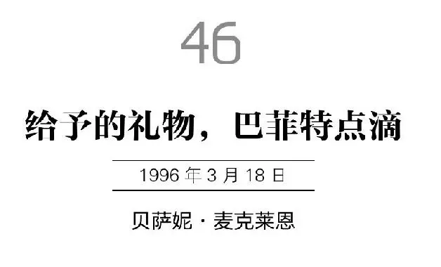

伯克希尔哈撒韦公司股价已达到了32800美元，这不但让持股人担心赠予时的赠予税（即使一股也会触发赠予税），也使资金有限的观望者只能远远垂涎巴菲特掌舵的大受欢迎的股票。5月6日，股东们将对巴菲特的提议进行投票表决，这项提议是，将至少发行1亿美元的B股（Class B Shares），每股的发行价为1000美元。而目前被重新命名为A股（Class A Shares）的股票，可以随时转换为B股。“我们只想吸引那些被我们吸引的投资者。”巴菲特说。为了避免出现大家抢着将A股转换成B股的情况，他提示投资者们，B股会稍微逊色于现有的A股：B股的投票权较小，也不能像A股持有者那样能利用企业的资金进行捐赠。不过，对于想赠予或者资金量较小的投资者，B股无疑给了他们投资伯克希尔哈撒韦公司的有效途径。

## 47 比尔·盖茨和沃伦·巴菲特秀

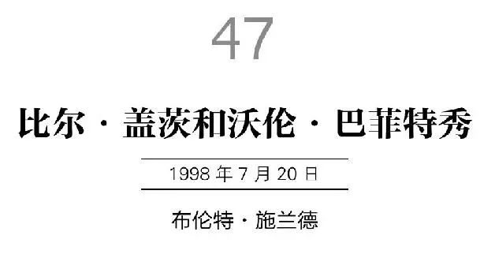

这是比尔·盖茨和沃伦·巴菲特在华盛顿大学的演讲记录。在他们演讲的过程中，绝大部分时间是在回答师生们的问题。《财富》杂志组织了这场颇具历史意义的尖峰对话，而我只是将布伦特·施兰德编纂的出色报道援引至此（做了稍许改动）。

——卡萝尔·卢米斯

5月末的一个温暖的周五下午，在华盛顿大学西雅图分校的赫斯基联合大楼（Husky Union Building）里，学生们排起了长队，从大厅一直延伸到大门外。从大家熨烫整齐的棉布裤和衬衫（而且没戴鼻环）的着装上，你就能分辨出，他们不是在排队购买费西乐队（Phish）的演唱会门票。相反地，这些衣冠楚楚的学生是在争相获得一场演讲的最佳坐席。这是场非常特别的演讲。学生们和一些比较幸运的嘉宾将会有幸聆听到全球最富有的两个人之间的公开对话：比尔·盖茨和沃伦·巴菲特。

在微软高管高峰会议刚刚结束的那个周末，巴菲特趁此机会造访了盖茨的家。其结果是，这对亿万富翁好友促成了这次讲演。超级投资家和计算机大亨邀请了350位商学院学生来参加会谈，美国公共广播系统（Public Broadcasting System）和《财富》杂志对演讲进行了全面报道。

当学生们在楼下骚动一团的时候，盖茨和巴菲特正与他们的妻子、华盛顿邮报前任首席执行官凯瑟琳·格雷厄姆、比尔·盖茨的父母和姐姐以及几位好朋友谈笑风生。他们在休息室吃了点新鲜水果，化妆师给盖茨的鼻子上了点粉，给巴菲特修了一下杂乱的眉毛，这让巴菲特的妻子苏珊喜不自禁。这位“奥马哈先知”（Oracle of Omaha）甚至还笨拙地模仿理查德·尼克松（Richard Nixon）摆出了“V”形胜利手指。

上台之前，两人摆出英勇的姿态合影，还像大学室友般互相“击掌”。亲友们关心的则是，两人不要太啰唆，这样大家就能按时回到盖茨家打桥牌了。整个过程给人的感觉就像是分散各地的一家人又其乐融融地团聚在一起了。当然，这是世界上最有影响力的“家族”之一。

作为休息室里的客人，给我留下最深印象的莫过于这两位最知名的亿万富翁之间跨越年龄界限的深厚友情（当时，42岁的盖茨净资产约为480亿美元，巴菲特则为360亿美元左右。多年之前，年长盖茨25岁的巴菲特，其财富曾远远领先于盖茨）。巴菲特的出席，似乎安抚了盖茨，所以他表现得相当轻松友善，尽管微软公司正面临着美国司法部的“反垄断诉讼”，而且，前两天召开高管高峰会议的巨大压力还未完全释放。尽管鱼尾纹已经开始爬上盖茨的眼角，他慢慢意识到自己的年纪渐长，已不再是曾经的那个瘦高个儿了，但巴菲特和格雷厄姆仍旧视他为天资聪慧的神童。正因为这样，盖茨一反他平日里辩论家的姿态，给予了他们最多的温情和尊重。

在华盛顿大学商学院主任比尔·布拉德福德（Bill Bradford）的介绍结束之后，在台侧等待的两人走上了讲台。不幸的是，主任的介绍，主旨在于赞扬微软公司雇用了很多华盛顿大学的毕业生，根本没说到点子上。

这场诙谐的、思辨的、出色的对话，远不止是一个雇用很多大学生的老板和他好友之间的互相打气。不信，你不妨自己看看。

——布伦特·施兰德

当亿万富翁面对350个学生时，大家又能从中获得什么启发呢？840亿美元的灵感。当两人无可比拟的智慧以及难以穷尽的财富碰撞时，会发生什么呢？实际上，他俩一起分享了如何承担风险、激励员工、面对挫折以及回馈社会。而这次分享的结果就是：我们离智慧越来越近了。

__1\.你们是如何走到现在这一步的 __

巴菲特和盖茨揭示自己如何成为比上帝还富有的人。

__ 巴菲特：__在开始之前，我想先声明一点，我和盖茨打了个小赌，看谁会获得最多的掌声。我提议将自己的房子作为赌注，但最后我们定下了一个小数目。不过，对盖茨来说显然不是那么小，因为就在我们走上台之前，他给了我一件内布拉斯加大学剥玉米人队（Nebraska Cornhuskers）的队服，然后他自己穿了一件华盛顿大学的紫色汗衫。

他们希望我们俩开场先来谈谈我们是如何走到今天的，然后再来回答你们的问题。就我而言，答案非常简单，成功与智商无关，我相信你们会很高兴听到这点，关键在于理智。__我一向将智商和天才看作汽车的马力，而最后输出功率的大小则取决于理智。许多人开着400马力的汽车却只发挥出100马力的功率。“最佳状态”应该是：200马力的车百分之百地发挥出200马力的功率。__

那么，为什么一些聪明人在做事情的时候却不能获得他们应得到的结果呢？这跟个人的习惯、性格及理智有关。首先，不要自己给自己设置障碍。可以说在座的诸位绝对有能力达到甚至超过我的业绩。然而，事实是，有些人能行，有些人还是不行。不行的人并非客观条件不允许，原因主要在于自身。__因此，在这儿我有一个小小的建议：先选择一个你最崇拜的人，并写出你崇拜的原因及他身上的优点；然后再选出你最厌恶的人，并写出使你厌恶的地方。只要经过一段实践，你所崇拜的对象的优点就会渐渐地成为你自己的，假以时日，就会全部成为你自己的了。__

很多时候，习惯的链条太过轻盈，以致人们往往感觉不到。如果它太重反而容易被截断。像我这个年纪，已经无法再改变任何习惯了，我已经定型了。然而，从现在开始起的20年里，只要你坚定地开始实践，便会养成某种习惯。所以，我建议你们从别人身上寻找你钦佩的行为举止，将之变为自己的习惯；同时从别人身上发现真正应该受到谴责的东西，并下决心不去做这些事情。如果坚持这么做，你将会发现你把自己所有的马力都转换成了输出功率。

__ 盖茨：__我非常赞同巴菲特刚才对于习惯的一番高论。幸运的是，我在很小的时候就接触到了计算机，这大概就是我成功的缘由及秘密所在。尽管当时计算机非常昂贵，功能开发也有限，但还是令人神往。一些朋友和我几经探讨之后，一致认定：这个神奇的芯片技术将会发展成为人人都能掌握的东西。我们认为，计算机的发展前途不可限量，编写程序将会成为一件非同寻常的大事。基于这点“先见之明”，我们就雇用了几个朋友编写软件，想看看计算机这个玩意儿到底有多神奇。结果表明，以计算机为主角的信息革命不仅节省了人们的体能，而且还大大拓展了人的智能。

计算机刚刚兴起时，我们就进入了这一领域，并倾注了大量心血，因此，我们创建的公司才在这场天翻地覆的巨大变革中得以成为中流砥柱。非常幸运的是，现在这场革命仍处于初始阶段。23年前，我们创建了这家公司，没人怀疑过我们是否形成并且保持了自己的习惯。接下来的23年，我们被赋予了更多的发展潜力，也许甚至让我们更接近最本真的愿望：“让每张桌上和每个家庭都能拥有电脑。”

Q：我很想知道，你们自己又是怎样定义成功的呢？

__ 巴菲特：__我个人的看法是，成功就是快乐，快乐是我安身立命之本。__我庆幸生命里的每一天都做着自己喜欢的事情，和自己欣赏的人一起工作，我也没必要和令我作呕的人合作。我跳着踢踏舞去上班，到了办公室以后，总觉得自己如同躺在沙发上绘制着天花板。__这简直太有趣了。工作中唯一不喜欢的事情就是，我偶尔必须解雇某个员工，这种事每三四年发生一次。

__有人说，成功是得到你想要的东西，而快乐是满足于自己拥有的东西。我不知道在这一句话中，哪一点更适用于我，但我的确知道自己不会去做任何别的事情。我想建议你们，当你们出去工作时，要与你钦佩的人共事，在他们的组织里工作，因为这将令你兴奋。__我一直为这些人担忧，他们总会这么说：“我准备先去干10年，尽管我真的不是很喜欢这份工作。然后我就去干这个……”这有点像储存你的性能力留待年老色衰之时，这实在不是什么好主意。

我曾经拒绝了一些本来可以接受的交易，原因就是我不喜欢那种不得不与某些人共事的感觉。我不愿见到任何装模作样的人，不愿与自己不喜欢的人纠缠不休，这就像纯粹为了钱而结婚一样。无论如何，这可能都是糟糕透顶的主意。不过，如果你已经非常富有，还要这样做，那绝对是神经有问题，是不是？

__ 盖茨：__我同意，关键在于你能否从自己每天的工作中得到乐趣。对于我来说，这种乐趣是与非常有魅力的人共事，致力于解决新问题。每当解决一个新问题，我们都会觉得：“嗨，我们又获得了一点点成功。”我们相当谨慎，不会过多地纠缠在已有的成就上，因为我们对自己的要求也越来越高。我们总是从用户那里得到反馈信息，他们告诉我们机器太复杂，用起来不太顺手。解决复杂性的问题、实现技术的突破和研究计算机产业，特别是软件开发，是最有趣的工作，我想我正从事着最称心如意的工作。

__ 巴菲特：__你不觉得“奶品皇后”（Dairy Queen）比这更重要吗？（去年伯克希尔哈撒韦公司斥资5\.85亿美元收购了奶品皇后公司）。

__ 盖茨：__沃伦，你可以经营奶品皇后公司，我去收购帝力棒（Dilly Bars）。

__ 巴菲特：__你收购我们就提价。

Q：创建一家新公司风险极大。你们是如何确定创建一家新公司的最佳时机的？

__ 盖茨：__当年创立微软时，我太兴奋了，以至于没有考虑任何相关的风险。这是事实，我有可能倒闭，但我具备一系列非常专业的技能，即便公司倒闭，我也会很容易找到工作。而我父母当时仍希望我回哈佛大学完成学业。

__ 巴菲特：__来我这儿，我们会永远给你留个位置，比尔。

__ 盖茨：__令我担忧的是，当我开始雇用朋友时，他们期望有所回报，但不久我们便有客户倒闭，那是我们赖以渡过难关的客户。因此，不久我便形成了一种保守得令人难以置信的观点：我希望银行账户上有足够的钱来支付员工一年的薪水，即便我们没有任何收入。这个习惯一直保持了下来，我们现在有100亿美元，对于来年的薪水来说绝对够用。

无论如何，如果准备创办一家公司，便需要有足够的精力，能使你有自信克服冒险所带来的后果。同时，我不认为你们有必要在创业阶段就开办自己的公司。为一家公司工作并学习它们如何做事，会令你受益匪浅。以我们自己为例，我和保罗·艾伦总是怕别人先我们一步，但结果往往是，我们延迟了一年又一年。事实上，很多事情就是因为有些滞后才未能早些启动，但在起跑线上多做准备似乎对我们也非常重要。

Q：怎样使人们支持你们？

__ 盖茨：__一开始，你会碰到一些怀疑你的人。如果你还年轻，要租一间办公室是很难的，不到25岁是无法租车的，所以，那时候我总是坐出租车去见客户。有时人们要我到酒吧去谈事情，但是当时我不能上酒吧（注：美国对饮用含酒精类饮料有年龄限制）。

非常有趣的是，开始时人们总是以怀疑的眼光观望着我们。他们会说：“噢，这个孩子什么也不懂。”但是当你确实做出了一种好的产品，也确实懂得了什么时，他们就会狂热地追随你。__因此，至少在这个国度，一旦我们迈过了某个门槛，年轻人将是一笔巨大的财富。__

__2\.全世界都是我们的地盘 __

巴菲特为什么那么肯定中国人也愿意喝可口可乐？

Q：作为商人，你们如何将企业推向世界？

__ 巴菲特：__站在伯克希尔哈撒韦公司的角度来看，我们并没有直接把触角伸到国际市场中去。我们最大的两笔投资是可口可乐和吉列剃须刀片。

可口可乐80%的利润来自国外，而吉列则有2/3的利润来自国外。因此，它们正参与着全球范围内改善生活质量的活动，我们是靠骑在它们的肩背上走向世界的。正因为如此，我才能安坐在奥马哈，让可口可乐公司首席执行官道格拉斯·艾夫斯特在世界各地飞来飞去。

__ 盖茨：__我们的业务确实是全球性的。个人计算机标准是全球性的。你在韩国或埃及所需的Excel，与你在美国所需的东西是大致相同的。不过，我们必须做某种变动，以适应当地的语言，而这也是我们业务中的一个很有趣的组成部分，即懂得双向语言，并在汉语、日语和韩国语方面积累大量的基础知识。

事实上，我们的市场份额在国外的比例要比国内高得多，因为相对说来，在当地建立分公司是很困难的，而且了解当地的条件、当地的销售渠道和关系也不是件轻而易举的事。由于我们大多数竞争对手来自美国，它们都不善于经营国际业务，所以，我们的业务在其他国家甚至更兴旺。

在未来，我们大部分的增长将来自国外。国内的市场即将发展到多半是一个替换市场的阶段。当然，这并不意味着，美国消费者不需要能看、能听和能学习的更好的软件。不过，在美国以外，我们仍能见到那种早期的业务大幅度增长的现象。

Q：是什么促使你俩于1995年一起前往中国的？那次旅行对你们此后的全球业务决策产生了什么影响？

__ 盖茨：__我们有许多理由前往中国，但部分是为了休息和娱乐。我们发现那儿有很多家麦当劳餐厅，因此，我们没觉得离家太遥远。去看看中国正在发生的各种变化，去领略这个国家不同地区的风情，去会晤一些组织的领导者，也是一件激动人心的事。

微软公司已经在投资中国的市场。自那时以来，我们增加了更多的投资，但是，就我们销售的比例来说，在中国的销售比例是微不足道的，还不到1%；而且，即使在今后5年内，中国的销售额翻上一番，情况也不会有大的改观。实际上，只有从未来10年的角度来衡量，我们才能说，我们对中国市场如此重视是值得的。

虽然每年在中国售出大约300万台计算机，可人们并不为软件付钱。不过，总有一天他们会为此买单的。__而且，如果他们想使用盗版软件，我们希望他们盗版我们的软件。在他们变得有点上瘾之后，在今后10年内的某个时候，我们将设法解决如何收钱的问题。__

__ 巴菲特：__我的家人对我前往中国感到很吃惊，因为我的旅行从来不越出内布拉斯加州奥马哈的边缘。在中国，我度过了一段非常美好的时光，而且还证实了我的一种预想，中国将是可口可乐的大市场。我对那儿的每一个人说，可口可乐的作用就像是一种催欲剂。

__3\.创新“改造”我们 __

巴菲特把因特网比作口香糖。

Q：你们两位都是各自行业的创新者。我很好奇，你们对创新的定义是什么？

__ 巴菲特：__实际上，在自己的工作中，我不怎么进行创新。我只有两项职责：一项是分配资金，我很喜欢做这件事；另一项是帮助15或20名高级管理者，使他们在没有任何经济顾虑的情况下，以极大的热情投入到工作当中。我们3/4的管理者算得上是富裕的，至少，在金钱方面的需要不会得不到满足。因此，我的职责是帮助我的高级员工，使他们早晨起床就能够点燃足够的工作兴趣，继续以钱包空空和初出茅庐时所抱有的那样的热情投入工作。如果说我做的是这两件事，那么，他们做的事就是创新。

__ 盖茨：__事实上，技术行业有许多曲折的变化。或许根本原因就在于，这是一个如此有趣的行业，所以没有一家公司会故步自封。IBM公司将永远在技术上比任何公司更占优势，但它错过了技术发展道路上的几个转折点。因此，你每天早晨醒来时就应该考虑：“嗯，我们一定要竭尽所能，不再错过今天技术发展道路上的重要转折。并仔细留意，在语言识别方面或在人工智能方面，正在发生着什么。我们要确保我们雇用的正是那种能齐心协力地做好这些事情的员工，而且我们要确定，在工作时没有感到措手不及。”

然而，有时我们确实感到措手不及。比如说因特网出现时，我们把它作为第五或第六件优先考虑的事。当有人跟我提到因特网时，我没有说我根本不知道因特网如何拼写，而是回答说：“我已把因特网列入我的议事日程，所以我觉得没什么问题。”__可是，紧接着我们就认识到，因特网比我们的战略规划发展得更迅速、更深刻。因此，作为领导者，我必须营造一种危机感。__我们花了好几个月的时间向各地征询看法，发送电子邮件，我们还放弃了一些计划。最终，新的战略产生了，这时我们会说：“好吧，这就是我们想做的事情，这就是我们内心衡量自己的方式，这就是世人评价我们所作所为的依据。”

这种危机每隔三四年就会发生一次。你必须认真倾听微软公司内部所有聪明人的意见。这就是像我们这样的公司必须吸引许多具有不同思维方式的员工的原因。我们必须容忍许多不同的意见，也必须识别正确的意见，并给予支持。

Q：信息时代的到来，使社会发生了革命性剧变。你们认为有哪些国家和公司为此做好了最充分的准备？

__ 巴菲特：__仔细想想，在15年以前，这个国家甚至对其在世界上的竞争力有一种自卑情结。

__ 盖茨：__当时每个人都在谈论日本人如何垄断了民用电子产品，接下来将是计算机产业。此外，他们勤奋工作的制度不明缘由地竟是那么优秀。我们必须彻底地重新思考我们正在做的事情。可现在，如果你观察一下个人计算机产业或者整个工商业正在发生的情况，或者观察一下我们如何分配资金，如何让劳动力流动，美国已处于非常领先的地位。因此，整个信息技术的第一受益人，首先就是美国人。

在诸如新加坡、中国香港和斯堪的纳维亚半岛这样的国家和地区，人们采用信息技术的速度大致与我们相同。而且，部分国家和地区相对于其收入水平而言，紧跟信息技术的速度甚至超过了我们，因为这些国家对教育深信不疑。在韩国以及中国的许多地区，我们看到计算机难以置信地进入了收入水平很低的家庭，因为那里的人们坚信，计算机是帮助他们的孩子获得成功的工具。

整个世界将大大地受益于计算机的普及。可以预见的变化是，你的收入水平将不是取决于你来自哪个国家，而是取决于所受教育的程度。今天，一位印度的哲学博士很难赚到与美国的哲学博士一样多的钱。如果我们能使因特网像船舶运输货物那样有效地传送服务和建议，那么，你将拥有一个本质上开放的市场，这个市场既争取印度工程师的加入，也争取美国当地工程师的加入。而且，这有益于每一个人，因为这能使任何人更好地利用资源。因此，发达国家将是最早从中受益的。然而从长期来看，发展中国家中有幸获得良好教育的人们，完全应该从这一切中获得最大的利益。

巴菲特：一开始我并没有领悟到这将是一次巨大的技术革命。这次技术革命将以激动人心的方式改变世界，而且速度飞快。然而，颇具讽刺意味的是，我们对待技术革命的态度与盖茨是截然相反的。我在技术革命中寻找商机。我想我能通过这些商机预测，在未来的10年、15年或20年之后，世界将会变成什么模样？或许那时的商机将或多或少与今天的商机一样，除了规模可能会更大，国际交易可能会更多。

__因此，我关注的中心是不变的东西。比如，我看待因特网的方式是，尽力确定一个行业或一个公司会受到因特网怎样的损害，或者如何被因特网改变。然后，我就要尽力避免这种情况发生。__但这并不意味着，我否认能从这种变化中赚取很多钱，我只是不认为我会是那个人。

以箭牌口香糖为例。我不认为因特网将改变人们咀嚼口香糖的方式，盖茨或许会这么认为。而且我认为，因特网不可能会改变这样一个事实，可口可乐将会是人们最偏爱的饮料之一，而世界各地的人均消费量都将上升。我不认为因特网将改变人们是否或者如何刮胡子的习惯。__因此，我们正在寻求的是可预测的东西，而在盖茨所做的事情中发现不了这种可预测的东西。作为社会的一员，我赞同他所做的事情；但作为一名投资者，我始终以警惕的眼光看待这些技术变革。__

__ 盖茨：__在这一领域，我与巴菲特的看法十分一致。我想，许多技术股票的价格应该略低于诸如可口可乐公司和吉列公司这样的股票，因为我们正在经历着规则的彻底变化。我非常清楚地知道，在未来10年内，即使微软公司仍是行业领头羊，我们也将不得不经受至少3次危机。

__4\.法庭上见 __

盖茨和巴菲特探讨垄断问题。

Q：反垄断法在美国商界应该扮演怎样的角色？

__ 巴菲特：__1977年我们曾遭遇《布法罗晚报》*（Buffalo Evening News）*的反垄断官司。不论你相信与否，1991年，在所罗门兄弟公司处境艰难的情况下，我们还与纽约联邦储备银行、美国证券监督委员会以及财政部之间有着很多麻烦事儿。不仅如此，司法部反托拉斯署也在后面紧盯着我们。我不知道印第安人事务局（Bureau of Indian Affairs）是怎么回事，不知出于什么原因，它也惦记起我们。这是仅有的两次与反垄断问题的交锋。而我认为，任何一次我们都没做过任何有违法律的事情。我也必须得补充一点，这两次我们也都没有遭受任何宣判。

我不是反垄断问题的专家。8年前认识盖茨的时候，他扮演了一回出色的老师。他花了六七个小时向我解释微软公司的情况。坐在那儿听讲的我，或许是全世界对科技领域最一无所知的人，可他却向我解释得那么清楚。讲完之后，我打算购买微软公司100股的股票，这样我就能真正地追踪公司的发展。这说明了两件事：一是我的智商恐怕也就50左右，另一件就是我不认为他有任何垄断的嫌疑。

__ 盖茨：__竞争法的核心作用在于保护消费者，确保新产品的顺利问世以及产品本身的创新质量。你可以看看不同的行业，并扪心自问一下：“哪个行业发展得最好？”不论你的评分标准如何，当之无愧成为最好的、首屈一指的就是个人计算机产业。我并不是指广义的计算机行业，因为你要谨记，在个人计算机横空出世之前，整个行业的构架是非常不同的，而且困难重重。不论你是从IBM、惠普或者其他厂商购买的计算机，你创造的软件只能依赖那台计算机运行。

微软的观点是，所有的计算机应该以同样的模式工作。原因在于，如果你想获得既多又好的软件，就得拥有很多台计算机，或许是成百万上千万的计算机。因此，必须使计算机的价格降下来，模式统一起来，这样你就不需要在不同的计算机上测试软件。个人计算机产业的目标，就是让每家计算机生产商参与竞争，去制造最轻便或是最快，抑或是最便宜的计算机。消费者无疑是最大的获益者，这同样也会带动软件市场的发展。

个人计算机出现之前，计算机的价格总是以一定速率下降，而自从个人计算机蓬勃兴起，其价格下滑的速度简直令人难以置信。软件的种类和质量也以显著的速度得到提升。今天，我们无疑是站在了历史的顶峰。新软件企业如雨后春笋般出现；新的就业岗位也涌现出来；投资的水平，上市公司的数量，呈现出一片繁荣的景象。现在的水平甚至远超过仅仅三年之前的水平。消费者方面也一直紧跟着时代的步伐。

与其让软件开发人员复制其他人的工作，不如让我们搜集所有应用中的典型特征，将其放到视窗操作系统中，这才是个人计算机源源不绝的发展动力所在。因此，像链接到因特网的性能一样，已经不必每个人自己都要做一遍，我们已经放到了视窗中。这是革命性的突破，用户图形界面出现了，硬盘支持、网络支持以及现在的因特网支持，甚至还包括浏览器也都应运而生。

我觉得反垄断法在原则上是非常好的。有些人会就它们是否应该被削弱而争辩，但那是学术界的兴趣所在。我进入商业领域时，总是很谨慎地和律师沟通，确保我们不越雷池半步。因此，当得知我们被牵涉进反垄断的官司中时，我还是有点儿吃惊。感谢司法的公正，让人们能够看清竞争是不是在保障消费者权益的大方向下进行。我们坚信在司法体系之下，一定会有公正的结果。

同时，我们周围也充斥着各种各样不同的声音，因为打官司可不是件小事。政府向我们提出了挑战，而且说了很多义正词严的话，但我们要保证自己不受干扰，继续执着于我们的事业。

__5\.一家公司的真正价值是什么 __

巴菲特解释，为什么伯克希尔哈撒韦公司的一股股票比一辆雷克萨斯轿车更值钱。

Q：巴菲特先生，我听说你有一项反对股票分拆的政策。你能否对微软公司分割股份的历史发表一点看法？

__ 巴菲特：__如果我走进一家餐厅，然后告诉服务员说：“我需要两个寄物牌，其中一个用来存放帽子。”我的心情也不可能会变得更好，同样的道理，股票分拆也不会让我变得更富裕。不过，我也不会与进行股票分拆的公司发生任何争执，我也不认为微软公司受到了股票分拆的损害。

我认为，我们的政策非常适合我们。在我的宗教教养中，没有任何东西使我对股票分拆持抵制态度。我是三家公司的董事会成员，其中两家公司在最近两三年里进行了股票分拆。我突然想到，不分拆伯克希尔哈撒韦公司的股票或许可以吸引一群更长期的投资者。正是我们的目标吸引了与我们非常相似的股东，他们具有与我们相同的投资时限和期待。我们不谈季度收益，不设投资者关系部门，不开让华尔街分析家参与的电话会议，因为我们不需要只着眼于下一个季度或者下一年业绩的人。我们需要的是这样的人：他加入我们队伍中来是希望与我们在一起工作，直到离开这个世界。

如果我大动干戈地分拆股票，是否会在很大程度上改变股东的构成？不会。不过，股东构成还是会发生些许变化。而且，请记住，股东席位都被占满，就像这所礼堂一样。如果我说了冒犯你们大家的话，你们全都离开了，但又进来了另外一群人，我的处境会变得更好还是更糟？好吧，这取决于他们是怎样的人，你们又是怎样的人。不过，我认为，我已经拥有了一群拥护公司政策的好股东。我还觉得，这种不分拆股票的政策增强了公司的吸引力。

__ 盖茨：__巴菲特做了一件非常值得钦佩的事，因为他向人们发出的信号表明，这是一种“与众不同的股票”，而他们应该予以考虑。伯克希尔哈撒韦公司与你们常见的典型公司略有不同。具有这种不寻常的股价或许是一件好事，只要媒体没把这事儿搞砸。由于股票版面上那些专栏的大幅报道，你们知道，他已经招致了很多非议。

Q：巴菲特先生，有一些人说，给一家公司估值的传统方法在目前的市场上已经过时，你对此有什么看法？

__ 巴菲特：__我想，根据我们的标准，很难在目前的市场上找到价值被低估的公司。不过，我不认为评价方法发生了变化。只是在某些市场上，一些公司的价值被低估了。比如在20世纪70年代中期的市场上，你所关注的每一种证券的价值实际上都被大大地低估了。我曾经营了大约13年的合伙公司，并于1969年将其关闭。关闭公司是因为我得不到任何东西。在当时，我并没有丧失评价公司的能力，只是因为不再有足够便宜的股票值得购买，而我又不从事空头交易。

我觉得不存在任何如何正确评价金融资产的魔法。根据定义，一种金融资产意味着你现在把钱投进去，为的是在将来把钱赚回来。如果每一种金融资产的价值都能得到恰当的评估，它们将全都能以合理的价格被出售，直至上帝最后审判日，并以同样的利率贴现归还给提供者。这样就不会有任何风险溢价，因为不论何时，你已经知道，这种“债券”上印着怎样的优惠。无论在1974年，还是在1998年，都应该以这种方法评估金融资产。如果不能这么评估，那么我就不买任何金融资产。于是，我只能等待机会出现。

Q：你目前寻求的市盈率是否比您在1969年时所寻求的更高？

__ 巴菲特：__这种比率会受到利率的影响。就估价而言，现在与1969年或其他任何时期之间的估价差别，可能会受其他任何事情的影响。如今，如果你纵观整个市场，净资产回报率远远高于1969年或1974年，或者历史上的其他任何时期。因此，如果你想说你打算评估整个市场，问题就变成：“你是否迷恋于整个美国企业目前20%的净资产回报率，并认为这是一个可保持到无穷未来的切实可行的数字？”依我看，这是一种相当鲁莽的假设，因为没有留下很大的安全边际。此外，我还想说，目前的市场水平只有打一个很大的折扣才能形成安全边际，因此，我变得更加谨慎。

Q：你是否感受到高科技的发展提升了商业领域的效率，你愿意加大对科技方面的投入吗？

__ 盖茨：__当你开始使用高科技时，一定会感受到效率的骤然提升，特别是美国的企业在这方面比美国之外的竞争对手做得更好的时候。高科技能使你们得到更好的沟通，很多原本不可能在全球范围拓展的生意，现在也因此蓬勃发展起来。

当仔细观察那些真正的大赢家时，比如，可口可乐公司、微软公司、波音公司或通用电气公司，你就会发现，这些能够获得20%净资产收益率且正迈向全球化的公司无一例外地都受益于科技的发展。不过，这也不能保证10年之后它们依然可以获得这样高的净利润。几乎可以确定的是，目前的情形应该不会持续很久。

__ 巴菲特：__我也坚信高科技在企业效率方面起到了非常大的推动作用，如果我不真心这么认为，当着盖茨的面，下这样的论断一定会心虚。不过，问题是，你要考虑到这一点：比如，我找到了一条复制杰克·韦尔奇的成功之路，并且拷贝了499个“韦尔奇”。韦尔奇继续经营他的通用电气公司，另外的499位占据了《财富》500强的其他席位。如此的《财富》500强在5年之后会不会带来更高的净资产收益率呢？

我认为答案没有那么简单。因为如果你制造了500个杰克·韦尔奇，他们之间会形成一种竞争关系，如此一来，可能会拉低整个美国商业界的利润率水平。然而，如果这些人并非那么精明，而只有一个杰克·韦尔奇和他们竞争，情况则会大不相同。如果管理水平迥异，那么获得超高利润率的概率也会大为提高。

因此，我必须要说的是，商业上的很多事情，包括高科技行业，就如同一场盛大的乐队沿街演出，如果你想观看演出，就不得不踮起脚尖，而30秒之后，其他人也都踮起了脚尖，尽管你的双腿累得几乎抽筋，却还是很难看到想看的盛况。

当创新取得进步时，资本主义似乎自行失效了。这简直是太棒了，因为这意味着一切都会变得更好。不过，真正的难题在于，如何在踮起脚尖的同时又不让别人注意到你？

Q：最近的并购浪潮真是匪夷所思。你二位能否谈谈，这样的并购该如何为股东创造价值？

__ 巴菲特：__事实上，我们俩希望发表一个小小的声明……（笑声）

并购是不会停止的，而且经过周全的考虑之后，并购的浪潮还会被激起。在许多并购案中，确实存在增效作用。可无论是否存在增效作用，兼并还会继续发生。如果你是一个意志薄弱的人，就不可能成为大公司的首席执行官，而要想成为首席执行官，你身上就不能缺少动物的猎食本能。而且，并购是会传染的。我曾多年担任19家不同上市公司的董事，我可以告诉你们，交谈很可能变成收购和兼并，特别是当其竞争对手也参与到这场游戏中的时候。只要我们的经济以目前的方式运转，而且我认为目前的经济运转得非常好，你们将会看到大量的并购。一般情况下，一个活跃的市场环境往往是鼓励并购的，因为在这种情况下，每个人的通货将会更有用。在几周之后，伯克希尔哈撒韦公司就同意以价值235亿美元的股票收购世界上第三大再保险公司：通用再保险公司。

__ 盖茨：__我想，对并购抱有正当的怀疑是件好事。通用汽车公司的创立是汽车工业重建的结果，这种调整的目的在于让本来做所有工作的公司进行专门化生产。而且，错过这次机会的人基本上都被淘汰了。

我们收购了很多小公司，我认为这对我们来说是至关重要的。这些小公司单凭自己的力量可能很难有所作为。不过，如果把这些小公司的能力与我们的能力结合起来，就能创造出更好的产品。

我想，在今天的银行业中，如果你是一家中等规模的银行，就可能必须得参与这种正在发生的所有改变。在美国，银行数量多并没有多大意义。因此，一些银行无疑将追求规模。然而不得不说的是，愚蠢的并购同样很多。

Q：那么，并购之后股东们的境况是不是更好了呢？

__ 巴菲特：__在大多数并购案中，收购对象比收购者的情况要好一些。收购者拿出自己的资金是基于这样一个事实，即他得以把被征服的动物的尸体拖入自己的洞穴。

不过，我还是对每周进行收购的人表示怀疑。如果你观察那些出类拔萃的公司，比如，微软公司、英特尔公司、沃尔玛公司，它们的增长完全是内部的。通常来说，如果某个公司正处于真正的收购狂热中，它们往往会觉得自己正在花的是不值钱的钞票，而且这种收购具有“连锁信”游戏的一些特征。

除此之外，我非常希望看到在一段时期内，被收购的公司在交易完成后由它们自己进行经营，而不是围绕结算折腾，并提出巨额的改组费用。对过于折腾的兼并，我一直持怀疑态度。我希望看到健康有机的增长。

__6\.哎呀，哪有这回事 __

巴菲特和盖茨对自己的错误、自己的合作伙伴以及管理方式的连续性进行认真思考。

Q：你们做出的最好的经营决策是什么？

__ 巴菲特：__最好的经营决策基本上就是参与合伙经营。与投资有关的一件令人愉快的事情是，你不需要很多交易就能取得成功。如果你们从这儿的商学院毕业时，每人获得一张有20个孔的穿孔卡片，每做出一项投资决定，就用掉一个孔，这个孔就是你们将获得的全部东西。如果你们能做出20项很好的投资决定，就能变得非常富裕，而且根本不需要50个好主意。

我希望昨天所做的投资决定是一项合适的决定。然而，这些投资决定对我来说始终是简单明了的。事实是，如果看到这些投资决定，你就会知道，这些投资是十分便宜的。当我从哥伦比亚大学毕业时，为了解某些情况，我逐页阅读了《穆迪工业及其他行业证券指南》，其中包括工业指南、运输业指南、银行和金融业指南。在其中，我发现了一些曾经盈利的股票。

其中之一是杰纳西谷燃气公司（Genessee Valley Gas）的股票。这是一家位于纽约州北部的小公司，一个曾经盈利的公用事业公司。这本书中没有关于这家公司的管理者的报告，什么东西也没有，似乎你所要做的只是翻过这一页。但即便如此，其中还是有许多有意义的东西，所以我又把这些指南读了一遍。盖茨当时正在阅读《世界百科全书》。后来，他为了做生意才放下这本书。

__ 盖茨：__在今天早晨用早餐时，我们还在讨论哪个投资决定是巴菲特所做过的最糟糕的。事实证明，这不是件容易的事情，因为他的投资记录好得简直令人难以置信。不过，我们最终还是根据一些衡量标准确定，买下伯克希尔哈撒韦的公司，可能是最不理想的一个。

__ 巴菲特：__的确如此。我们只是因为贪图便宜而卷入了一家可怕的企业。这就是我常说的“烟屁股”投资法。你看到地上的烟头，虽然脏兮兮的不堪入目，但它还有一息尚存，而且是免费的。这就是买下伯克希尔哈撒韦公司时的真实情况：其售价低于营运资本，但这是一个十分可怕的错误。

我犯过各种各样糟糕的错误，并为之付出了数亿美元的代价。这些错误是疏忽导致的，而不是故意犯下的。我从不遗憾没有收购微软公司，因为我不了解这家企业，我也不了解英特尔公司。可是，有一些企业我还是了解的，房利美就是其中之一。我虽然做出了投资这家公司的决定，但根本没有执行。我们原本能赚上数十上百亿美元，但我们没有赚到。传统的记账方式没有记录下我们本应赚到的钱。这样的事，确实发生过。

__ 盖茨：__就我的情况来说，不得不坦陈，我最好的经营决策势必与所选择的伙伴有关。决定与保罗·艾伦一起创业或许是我做出过的最好的经营决策，其次是聘用一个朋友——史蒂夫·鲍尔默（Steve Ballmer），他一直是我最主要的经营伙伴。__有一个你完全信任并忠诚于你的人，你们有着相似的眼光，而且他具有各种不同的技能，他还能对你有所制约，这是非常重要的。__当你做出某项决策时，他会说：“嗨，稍等片刻，你是否考虑过这个或那个？”与具有这种才华的人相处的好处是，这么做不仅使经营活动变得更有趣味，而且能获得更多的成功。

__ 巴菲特：__多年以来，我也有这样的合作伙伴，他就是查理·芒格，他为我所做的事，与盖茨所说的完全一样。不过，你必须得习惯芒格的表达方式。芒格经常说，我所做的每件事情都是愚蠢的。__然而，实际情况是，如果他说，这么做确实很愚蠢，我知道他说的是真的；但如果他只是说，这么做很愚蠢，我就当他投了赞成票。__

Q：这么看来，在你们的公司中，你们的成功是由你们自己和你们的领导技能推动的。然而如果一旦你们不在了，又会发生什么呢？

__ 巴菲特：__你的设想是错误的。我死后大约5年内，我都将一直工作。而且，我已经给了董事们一块“灵应牌”，因此，他们能与我保持联系。即使这块“灵应牌”不起作用，我们还拥有杰出的人才，他们能够做我所做的事情。因此，即使我在今夜死去，人们不会喝不到可口可乐，不会在今夜放弃刮胡子，不会少吃时思糖果或者帝力棒，或者不会出现任何诸如此类的情况。这些公司拥有非常好的产品，拥有杰出的管理人员，你所需要做的只是确保有人坐在伯克希尔哈撒韦公司的最高位置上，分配资金，并确保手下的各级管理者是合适的。我们已经确定了做这些事的人选，我们的董事会也知道他们是谁。

事实上，我已经发出了一封说明应该做什么的信，我还准备了另一封到时将发出的信，这封信以“昨天我死了”开头，接着会说明公司的计划。

__ 盖茨：__我对这个问题的看法与巴菲特非常相似。我希望在很长的一段时间内继续做我目前正在做的事。我想，或许从现在起再过10年左右，即使我将仍然完全参与微软公司的管理，我或许会挑选别人来担任首席执行官。

__ 巴菲特：__也许我就在今天的听众里发现了我的继任者。

__ 盖茨：__挑选首席执行官是很久以后的事。我们在公司内部提供了一种不断升迁提拔的机会，所以，高层管理者总是在空闲的时间谈论继承者的问题。我们从不想形成这种局面，即他们感到升迁之路被阻，不得不另谋高就。我们公司的蓬勃发展也提供了许多这样的机会。在挑选继任者这个问题上我想了很多，但在答案明确之前，大约还有5年的时间。

__7\.准备好的时候，就会启动慈善事业 __

巴菲特和盖茨解释为什么自己会在将来某一天捐出自己99%的财富。

Q：作为全世界最成功的商业人士，在回馈社会的问题上，你们如何看待自己的作用？如何运用自己的影响力来让更多的人投身这项事业？

__ 巴菲特：__我们俩在这个问题上的看法颇为相似。就我个人来说，99%以上的财富将会回馈给社会，因为我们从社会中得到的已经太多了。

我觉得自己很幸运。虽然我跑得不是很快，但是在资本主义经济的大环境下，我在自己擅长的领域努力工作，并且取得了骄人的成绩。我不适合做足球运动员，也没有音乐天赋去拉小提琴，但幸运的是，我所从事的工作恰好被这个社会给予丰厚的回报。盖茨说得没错，如果我出生在很久之前，命运可能会大相径庭，或许，成为猛兽的午餐也是有可能的。

我不相信天生好命这样的说法。坦白地说，我不觉得内布拉斯加球队明年的四分卫应该是22年前该球队同一位置球员的大儿子。我也不认为2000年我们出征奥运会的队伍应该从1976年那些队伍的家人中去挑选。

不论是竞技体育还是其他任何事情，我们信赖的只有精英。现在，当你凭借富有创造力的产品迈向全球市场时，为什么不让精英人士加入你的队伍呢？我认为应该让好的资源流向那些能够使它们发挥最大价值的人的手中。我也认为，当这些人有所成就之后，应该反哺于社会。

__ 盖茨：__这是一种很伟大的信条，况且把大笔财富都传承给子嗣对他们来说也未必有益。

__ 巴菲特：__你最好别拿这事儿来投票。

Q：您们如何运用自己的影响力去感染那些成功人士甚至还没那么成功的人去回馈社会呢？

__ 巴菲特：__我来提供另一条可供参考的思路。假设现在是你出生前的24小时，这时出现了一个基因，而且它告诉你：“你看起来像位成功者。我对你抱有充分的信心，我想让你自己制定你将出生的社会的生存法则。你可以制定经济法则、社会法则以及其他任何在你和你的子女人生中将要面临的法则。”

你可能会说：“好吧，这听起来很有意思，但是制定这些法则的前提条件是什么？”

基因回答说：“条件就是：你不知道将要出生在一个富有的还是贫穷的、非裔美国人还是白人的家庭里，你也不知道自己将是男性还是女性，体格健全还是羸弱，聪明还是愚钝。”你所知道的，就是你将是一大桶球中的一个，即58亿个中的一个。你要面对的是“子宫乐透”游戏。这对你来说，将是人生中最重要的一件事，你自己却无能为力。你的命运也远不是你的学习成绩或者人生中其他经历所能决定的。

那么，你想拥有怎样的法则呢？我不会告诉你法则究竟是怎样的，也没有人能够告诉你，但你必须要为自己制定一套法则。它们会影响你如何看待，你按照自己的意志所做的事以及诸如此类的事情。那么，你希望你的法则所形成的系统是什么样的呢？你想要的系统应该能带来更多的商品和服务。这个世界上有那么多人，你希望他们生活得好，你希望自己的孩子比自己生活得更好，而且还希望自己的孙辈超过他们的父辈。你想要的系统应该是让比尔·盖茨、安迪·格鲁夫和杰克·韦尔奇一直工作下去，甚至到他们不应该工作的年岁。你希望最有才能的人每天工作超过12小时。所以你得有一套系统源源不绝地刺激这些人工作，来提供商品和服务。

与此同时，你也希望你的系统可以照顾到那些不太完美、缺乏运气的“球”。如果你的系统可以提供足够多的商品和服务，你就有能力照顾这些人。你不希望人们在年迈时担忧自己生病了该怎么办，或者对晚上回家的路充满恐惧。你梦想中的系统是，在某种程度上，人们都不再恐惧。

因此，你就要尝试构想一些东西。假定你有一些商品和服务可以解决这些问题，就会渴望机会的均等，比如说完善的公立学校系统，确保每个人的天赋都能在社会上发挥应有的作用。税务系统也将据此运作。而你用自己赚的钱做什么将另当别论。在你完成这个流程的过程中，每个人都可以提供不同的意见。所以，我建议你们来玩玩这个小游戏。

Q：你们如何看待自己在人生阅历而不是商业方面的领导地位？

__ 盖茨：__你必须得小心，如果你在某个方面很优秀，也千万不要想当然地认为你在其他领域也有优越性。我每天在公司和一个卓越的团队共事，聆听反馈，进行调研，一起致力于研发更先进的软件。我在计算机方面具有代表性是因为我已经在这个方面做得非常成功，但人们总会认为我在自己不擅长的问题上也有同样的智慧。

实际上，我的确认为经营好一家公司是有一些方法的，比如招募优秀的员工、营建环境以及员工优先认购股权，这些方法对其他公司也很有借鉴意义。不过，我时刻警示自己，不要显得我们已经在所有问题上都找到了良好的对策。

__ 巴菲特：__从微软公司和盖茨身上，真的可以学到很多东西。而且从他年复一年的工作中，你可以学到和领悟得更多。然而，如果他只对这项事业倾注了5%或者10%的心血，然后把自己的注意力分散到很多其他事情上，在我看来，情况可能会很糟糕。

盖茨是对的，在某些事情上，比如竞选财务改革，他会坚持自己的立场。但这并不意味着整个世界都应该按照他的想法运转。然而，那些专精于一项技能的人，可能是优秀的运动员或是演员，企图向全世界宣扬自己是如何在各种领域叱咤风云的，我非常怀疑这种事。对我们来说也一样，不能因为我们赚了很多钱，就说明我们在一切问题上都能拿出最好的建议，如果真是这样，那就太狂妄了。

在巧妙地回答了最后一个问题之后，两位亿万富翁简短地对掌声表示了感谢，随后走下舞台。观众意犹未尽，挽留他们多谈两个小时，但他们没有停步，因为他们还要赶着打桥牌。

2026年3月14日

16:57

## 48 建在沙丘上的房子

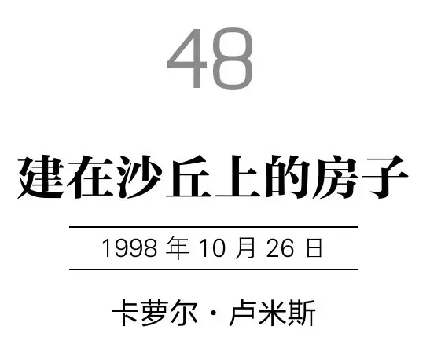

在比尔·盖茨的所有成就之中，不得不提的一项重大突破是，成功劝说沃伦·巴菲特抽时间去度假。巴菲特将自己在奥马哈的办公室看作全世界最舒服的地方，所以，不论去哪儿对他来说都缺乏吸引力。即便如此，盖茨夫妇还是说服了他和第一任妻子，已故的苏珊·巴菲特，在1996年时与他们共同在中国待了两个星期，然后又于1998年在阿拉斯加和美国西部的公园停留了约两周的时间。

不过，不巧的是，当年8月，在巴菲特正准备出发前往阿拉斯加前的几个小时，他决定尝试收购规模庞大且麻烦缠身、甚至面临倒闭的对冲基金长期资本管理公司（Long Term Capital Management）掌控的交易组合。这篇文章就讲述了长期资本管理公司是如何在约翰·梅里韦瑟的管理之下踉跄前行的，而巴菲特又是如何从阿拉斯加的海湾地区进行远程操控，以及最终整个交易又是如何告吹的。

当时的实际情况是，14家银行联合起来很不情愿地将36亿美元投给了长期资本管理公司，以让它苟延残喘，因为它们害怕公司的破产会导致它们的交易头寸承受损失。由银行组成的一个监督小组着手恢复长期资本管理公司巨大的60000个头寸。颇具讽刺意味的是，他们还与梅里韦瑟及其合作伙伴共事，坚持在将来为自己谋求一席之地。到了1999年年底，小组设法将36亿美元返还给了众银行，2000年，长期资本管理公司倒闭清算。

假使巴菲特成功收购了60000个头寸的投资组合，交易的结果又将是如何呢？答案是未知的，因为无从知道他的投标团队，其中包括高盛集团（Goldman Sachs），会如何推进对投资组合的拆解。在被问及长期资本管理公司的经历时，巴菲特说，至今令他难以置信的是，以才华出众闻名的公司管理者，却让自己陷入了可能丧失全部资产的境况。这种行为在伯克希尔哈撒韦公司中是不可能被认可的，因为伯克希尔哈撒韦公司秉持的信念是：“你只需要发一次财。”

显然梅里韦瑟并没有领悟这一点，自从长期资本管理公司“大厦将倾”那天起，他的努力就只是徒劳。在他尝试东山再起，第二次“发财”时，历史再度重演。1999年，他创办了对冲基金JWM合伙公司（JWM Partners），开始的几年赚了不少钱。资金规模一度达到20亿美元，但随后在次贷危机中遭受了巨额损失，2008年遭到清算。2009年，梅里韦瑟又开办了JM咨询公司（JM Advisors Management），其投资业绩还未公开。

——卡萝尔·卢米斯

对于许多读者而言，长期资本管理公司的轰然倒塌至今仍然是一个谜，虽然各大媒体连篇累牍、绞尽脑汁地解析过这件事。事实上，这件事的牵连面太广了，而且非常复杂，想厘清它的全貌几乎是不可能的。出于这个原因，《财富》杂志并没有将这篇文章定义为，告诉你所有你想知道的细节，或揭露那些从没人说过的内幕。著名投资家沃伦·巴菲特是笔者的多年老友，由于他在这件事上所起的作用，所以在某种程度上，没有出版商比我们更了解长期资本管理公司的故事了。巴菲特在整个事件中所扮演的角色非常重要，而且充满戏剧性，不无幽默感，在1998年9月的4天里更是达到了顶峰。不仅如此，他的演出可能远未结束。

9月份，长期资本管理公司事件的大致脉络是，整个故事中为数不多的较为清晰的元素。在这个月的大部分时间里，该公司都处于破产的边缘，不过最终它还是由14家银行和经纪公司共同注入36亿美元而挽救了回来。所有的债权人都担心这家背负着1000亿美元债务的基金倒闭，因为这将给他们的财务带来深重的打击。在这个过程中，纽约联邦储备银行起到了至关重要的作用，它希望阻止“多米诺骨牌效应”的发生，因为长期资本管理公司一旦遭到清算，很可能会给全球证券市场带来严重冲击。因此，纽约联邦储备银行在这次营救行动中扮演了“教父”的角色，把所有债权人组织了起来，并督促他们就联手进行更深入的沟通。

约翰·梅里韦瑟被推到了旋涡的中心，这位所罗门兄弟公司的前高管是这家对冲基金的创立者兼总裁。他的身边环绕着众多精英同僚，其中很多人拥有数学和金融学的博士学位。他们合力研发出一套基于计算机模型的交易战略，并坚信它“坚不可摧”。在长期资本管理公司位于康涅狄格州格林威治的总部，可以这么说，每平方英尺的智商点数比现存的任何其他机构都要高。同样，每平方英尺诺贝尔奖得主的数量估计可以堪称“举世无双”。这家公司拥有两位诺贝尔获奖者：迈伦·斯科尔斯（Myron Scholes）和罗伯特·默顿（Robert Merton）。1997年，他们俩刚兴冲冲地飞往瑞典，领取了象征全世界经济领域最高成就的诺贝尔经济学奖。

当灾难降临到这个以智慧头脑著称的公司时，不禁让人们回想起美国诗人艾伦·金斯伯格（Allen Ginsberg）的名句。在“披头士”式风格的《嚎叫》*（Howl）*中，这位诗人写道：“我看到这一代最杰出的头脑毁于疯狂……”在长期资本管理公司，最聪明的头脑被杠杆投资毁灭，这可算最古老、最臭名昭著的金融毒品了。如果不是在高风险的道路上“飙车”，这家公司很可能现如今依旧在投资领域独领风骚。然而，决策的错误让他们用桂冠换来了“末名奖”，其垮台和失败已成为业界的笑柄。

面对上述的情况，人们不禁会产生很大的疑惑。巴菲特真的要捡这些“路边的断臂残肢吗？”然而，他确实尝试这样做了。9月23日的星期三，他开始了行动。他的行动打断了，由纽约联邦储备银行组织的、长期资本管理公司的债权人（十几家银行和经纪公司）参与的持续数日的会议。在会议上，纽约联邦储备银行号召大家为了自身利益考虑，拿出一部分资金阻止长期资本管理公司的破产。与会的机构都派出了最有权力的代表，即它们的首席执行官或者其他高层首脑，会议气氛非常激烈，充满了唇枪舌剑。不过，没有一个机构愿意掏出这笔钱，可它们又不敢眼睁睁地看着这家公司倒闭。

债权人准备于周三上午再度商讨此事。这时，纽约联邦储备银行行长威廉·麦克多诺（William McDonough）听说高盛集团（高盛集团本身也是长期资本管理公司的债主）准备提出一个不同的融资方案。麦克多诺宣布暂时休会，了解了一下高盛集团的报价。该报价由巴菲特的伯克希尔哈撒韦公司牵头，并准备接管公司。其条款是相当复杂的，而且越讨论越复杂，但本质上就是巴菲特领衔的团队准备投入40亿美元，接管长期资本管理公司。在这40亿美元之中，伯克希尔哈撒韦公司愿意出30亿，美国国际集团（American International Group）出7亿，剩下的3亿来自高盛集团。

随后，该报价被报告给梅里韦瑟，这成了公司正式走向末路的起点。对于这个提议，与业界盛传的说法不同的是，巴菲特认为，交易最终流产，就是因为梅里韦瑟和长期资本管理公司的其他主要高管压根儿不想接受他提出的条款。因为按照巴菲特的要求，公司高层管理者将会被彻底扫地出门。梅里韦瑟和其他高层管理者告诉麦克多诺，从他们的角度来看，巴菲特的报价有着结构性的缺陷，因此不予采纳。

麦克多诺只能无奈地接受了这个观点，重新召集债权人坐下来商谈，并告诉大家，他们又再次成为了唯一的选择。其中一位首席执行官最近告诉《财富》杂志，麦克多诺向大家解释说其他方案都不可行，因为均存在“结构性问题”。极不情愿的债权人不得不再度商讨营救方案，找出拯救公司的方案。最终，每位债权人将分摊1亿～3\.5亿美元的救济款。

《财富》杂志追问这位首席执行官，假设麦克多诺说交易失败的原因是长期资本管理公司不喜欢那些条款，你会怎样做？“我想，”他回答说，“我很可能会对梅里韦瑟说，‘见你的鬼去吧！’”随后，他还补充说，如果那样的话，协商也许会转变成老鹰捉小鸡的游戏。梅里韦瑟很可能会反唇相讥，他宁愿破产也不会接受巴菲特的条款。然后，债权人将要面临的问题就是他们能否忍受长期资本管理公司的破产。在无休无止的讨论中，哪一方会先退缩呢？

长期资本管理公司，它的债权人以及纽约联邦储备银行如何将彼此捆绑在一起，成为拴在同一根绳上的蚂蚱？巴菲特又为什么心甘情愿地插手这个烂摊子？要想搞清楚这些问题，就必须先审视一下这家对冲基金的性质以及它的老板梅里韦瑟其人。现年51岁的梅里韦瑟曾是所罗门兄弟公司的副董事长，负责固定收益业务以及自营交易业务（也就是公司用自己的资金进行投资），他一直在所罗门公司待到1991年8月。梅里韦瑟曾为公司赚取了大笔利润，深受公司上下喜爱和尊崇。“让人们不禁联想到英属圭亚那，”所罗门兄弟公司一位前任高管最近说，“梅里韦瑟似乎拥有一种令人崇拜的力量。”

导致梅里韦瑟离开所罗门兄弟公司的原因是，他的下属保罗·莫泽在美国国债的竞标中舞弊。眼看着“纸包不住火了”，莫泽向梅里韦瑟承认了自己的作弊行为；梅里韦瑟立即向他的老板约翰·古弗兰和托马斯·斯特劳斯汇报了这件事情。众所周知，纽约联邦储备银行也应是被告知的对象，但是没有人这么做。当丑闻最终在8月份曝光之后，莫泽被解雇了，古弗兰和斯特劳斯也引咎辞职。巴菲特充当了白衣骑士的角色，作为所罗门兄弟公司的最大股东，他拯救了该公司。

就在巴菲特执掌所罗门兄弟公司之初，他就对如何处理梅里韦瑟拿不定主意。很多董事合伙人都认为他难辞其咎，希望他离开。不过，巴菲特却有些犹豫，这样做对梅里韦瑟显然并不公平，因为他恪守了自己的职责，在第一时间将莫泽的错误汇报给了自己的上司。最终，梅里韦瑟自己决定辞职，他告诉巴菲特，这对公司来说是最好的选择。

渐渐地，很多原本在梅里韦瑟手下工作的员工都离开了所罗门兄弟公司，加入了这位前任上司的团队。1993年，他们的宏图大志终于浮出水面，梅里韦瑟宣布，他将创办一家新的对冲基金，取名“长期资本”。事实上，长期资本是由许多投资主体构成，包括一些合伙公司和一些法人公司，它们有的在美国注册，有些在开曼群岛注册。为什么会在开曼群岛？因为这样一来那些境外投资者以及某些美国投资者就能规避美国的收入税。当回忆起纽约联邦储备银行为了该公司在9月份有多么焦头烂额时，所有人肯定会觉得，长期资本管理公司的这种做法真的很不厚道。这些投资主体会把钱都投入到主基金长期资产投资组合（Long\-Term Capital Portfolio L\.P\.）中，一家注册于开曼群岛的合伙公司。

长期资本管理公司的管理完全操控在梅里韦瑟和他的同僚手中。自从公司开张以来，它就显示出其与众不同之处：管理者奉行的交易策略，可能需要6—24个月或者更长时间能产生回报。基于这点，长期资本管理公司不允许投资者在季末或者年末赎回基金份额，这与其他对冲基金公司的惯常规定完全不同。长期资本管理公司对这一点非常坚持，投资人的钱要被锁定至1997年年底。

根据长期资本管理公司所奉行的策略，它基本不做会暴露在“方向性风险”中的交易，而是会通过锁单捕捉非常小的获利机会，经过持续不断的积累，这笔投资的回报就会变得十分可观。长期资本管理公司的主战场是固定收益业务。为了更清楚区分不同种类的风险，我们可以试举一例。由于圣达特集团（Cendant）是行业领头羊，所以有一位投资者决定买入它的股票。这就一笔方向性交易，并由此产生了“头寸风险”。假设他在购买股票时没有使用保证金，那么他所投资的每一块钱的涨跌幅都与圣达特股价的涨跌幅相同。

长期资本管理公司的主要策略则恰恰相反，它专注于对冲交易，这样就能保证，不管市场的大趋势如何，自己都能成功。该公司将金融科技和人类智慧相结合，去处理各式各样的问题，比如，将债券市场分块，把那些收益率密切相关的债券归入同一个板块。然后，它会买入一种债券，同时做空另一种。不论未来市场利率走高、走低又或是稳定不动，这种类型的交易都能带来稳定的回报。重要的是这两种债券的收益率之差最终会收窄。

在这种交易中，它不会冒风险去追求超高回报。长期资本管理公司的一位投资者回忆说，1996年，他跟公司高层通过一次电话，他正好问及每美元实现的年回报率是多少，答案是67个基点，也就是0\.67%。

除非资金的规模能够大幅增加，否则，这样的回报率肯定不能让投资人满意，这时杠杆的威力就突显出来了。基金引以为傲的头寸风险极低，于是承担起了巨量的所谓的“资产负债表风险”，将巨额债务夯在了相关零星资本上。1996年，在投资人得知答案为67个基点时，基金每一美元的资本已经负荷了30美元的资产负债表风险。当杠杆率提升至30倍，每一美元冒着风险赚得的67个基点却催生了高达20%的风险很低的资本收益率。

过高的杠杆率总是让你很恐惧，最终也确实应验了人们的感觉。不过，长期资本管理公司总是强调，先进的金融科技和精心设计的对冲组合能够使整个基金在低风险状态下运行。1994年10月，长期资本管理公司向投资者散发了针对这个问题的解释文件。文件上有一个表格，列出一系列公司在一年内所要达成的回报目标，每个目标还匹配了如果行情不好时的损失概率。比如，表上说，基金将努力达到25%的回报率（这是基金公司惯常的目标），如果行情与预期的相反，那么公司最终损失了20%的概率只有区区1%。表中甚至从未考虑会出更大损失的概率。

如果没有出现悲剧性情况，它所讲的无疑是很令人快乐的。1998年的前8个月，基金几乎输掉了半壁江山。到了9月，颓势加剧，整个基金的损失达到90%左右。__巴菲特说：“这告诉我们，在看似光鲜的数学模型之下，在各式各样惯常的风险之下，只有流沙。”__

长期资本管理公司至少有一位股东也因相同的观念而困扰不已。该投资者在得知每美元67个基点的回报率之后，给自己写了两条“注解”。最近他把这两条“注解”展示给了《财富》杂志。一条写着：“它是不是和所有的华尔街公司大同小异，比如贝尔斯登公司（Bear Stearns Cos\.）、所罗门兄弟公司或者高盛集团？这只是个自营部门而已，它没有人员、经营费用以及业务代理。”

另一条写着一个意第绪语单词“kishka”，这个词用比喻的方式形象地解释了“直觉”（gut instincts）的意义。注解上还写着：“整个投资组合并不是靠直觉，而是依赖于一个拥有诺贝尔奖头衔的计算机模型系统。它会不会在未来的某一天突然崩溃？如果它超越了人类，有了直觉，它还会甘心受控制吗？”

1994年冬到1998年春，长期资本管理公司看上去活力无穷，投资者似乎并不用为“直觉”担心。该公司的治理结构要求投资者支付高昂的管理费用：费用的第一部分是投资者每年投资总额的2%，第二部分是投资回报的25%。即使如此，投资者还是在开业之年1994年的前10个月，大赚了20%，1995年更是高达43%，1996年41%以及1997年17%。不仅如此，月度数据也显示该公司运行平稳，几乎没有太大的波动。

如同“塞王的歌声”一般，该公司吸引来了潮水般的资金。管理层对自己特殊的交易策略守口如瓶，基本不留下任何蛛丝马迹，让投资者可以搞清楚公司赚钱的方法。1997年秋天，新资金加上再投资的收益，使公司手中的资金总量达到了70亿美元左右。

接着，局面发生了意想不到的转折。长期资本管理公司断定，相对市场中存在的机会数量，自己拥的资金有点过多了。因此它开始强迫很多投资者撤资，比较晚加入的投资者成了被清理的重点。那些被公司“驱逐”的投资者义愤填膺，怨声载道，其中有一位投资者因其强烈的抗议，最终迫使长期资本管理公司保留了他的资金。投资者之所以如此群情激愤，很大程度上是因为长期资本管理公司的管理层和其他内部人士的资金全都纹丝不动。显然，这么看来，有吸引力的投资机会似乎并不稀缺。1997年年底，云雾终究被拨开之后，人们发现，在公司47亿美元的资金中，有15亿美元属于内部人员。

当时，该公司大约还有1250亿美元的贷款，也就意味着资产负债表中的杠杆率达到了25倍。不过，这一数字其实完全不能反映它承担的全部风险。因为它还广泛地涉足“表外”的衍生品交易，这等于变相地大幅提升了杠杆水平。在某种程度上，只有内部人士才可能知道真正的衍生品风险值究竟达到了多少。然而，可以肯定的是，如果在1997年年底，资产负债表中的杠杆率为25倍的话，那么其总体杠杆率比这还要高很多。

在某种意义上，长期资本管理公司之所以能借这么钱一定程度上是因为人们对梅里韦瑟的盲目崇拜。银行和经纪公司都对与他打交道趋之若鹜。债权人都喜欢有实力、有活力而且坚实稳固的客户，而这正是长期资本管理公司一直在塑造的形象。公司的大部分债权人似乎并不十分在意它的杠杆率。事实上，债权人还给了它很多的贷款优惠政策，比如抵押豁免等。一些债权人甚至还很愉快地加入了公司的衍生品合约中，从而使自己暴露在完全不理解的风险中，一点没有意识到这辆列车正在迅速地驶向悬崖边。

1998年年初，市场一片安静祥和。然而，到了5月，市场的变动让公司损失了6%，6月又损失了10%。这一次次“鞭笞”，在公司历史上闻所未闻，梅里韦瑟不得不给他的投资者发了一封特殊的信，解释了一番。信上说，长期资本管理公司“可以理解”，他们为什么对5月和6月的结果感到“失望”，尽管如此，公司还是坚信，“基于公司的投资策略，未来的预期回报还是非常乐观的”。7月份的表现基本持平。

接着，恐怖的8月来临了。俄罗斯突然宣布卢布贬值，全世界的投资者纷纷退出，转向质量较高的债券品种。不过，在长期资本管理公司各式各样的交易策略中这种交易类型并不包括在内。它更喜欢配对交易，比如，在某一时刻，长期资本管理公司会赌AA级企业债券的收益率与美国国债的收益率之间的差幅会逐渐缩小。这场赌局看起来很有胜算，因为从历史数据来看，当时两者之间的差幅已处在了极高水平。然而，当大批的投资者涌向高质量债券时，美国国债收益率快速下降，这使得企业债券的收益率和前者的差幅达到了令人乍舌的地步。这造成了灾难性的后果。仅仅在8月份，公司就失去了40%的资本，仅剩下25亿美元。更麻烦的是，这些资本上还扛着1000亿美元的外债。

在这段时期里，公司的主要负责人以及某些债权人提心吊胆起来。就当时的形势而言，他们不得不收起一直以来的傲慢态度。他们甚至已经开始想办法为自己的交易头存寻找买主了，别无它法，只有向公司注入新资金，才能使它的基础更稳健。公司的高层试图拉拢曾经在1997年年底被自己拒绝的部分投资者以及一些对冲基金巨头，如乔治·索罗斯（George Soros）和朱利安·罗伯逊（Julian Robertson），但均遭拒绝。

8月23日，一个星期天的晚上，长期资本管理公司敲响了伯克希尔哈撒韦公司的大门。被指派给巴菲特打电话的是埃里克·罗森菲尔德（Eric Rosenfeld），他曾是所罗门兄弟公司的交易员，现在则是长期资本管理公司的高管之一。1991年为了使所罗门兄弟公司爬出泥泞的旋涡，他几乎竭尽全力，这一点很受巴菲特的赏识。45岁的罗森菲尔德是深居幕后的人物，但是这一次，巴菲特说，罗森菲尔德亲自出面向他推销公司大额的套利头寸，让他感到了某种紧迫感。因此，巴菲特说了不。

星期三，梅里韦瑟和罗森菲尔德一起给巴菲特打了电话，请求巴菲特在奥马哈见一下长期资本管理公司的另一位高层管理者劳伦斯·希利布兰德（Lawrence Hilibrand）。最终，39岁的希利布兰德如愿见到了巴菲特，他也曾是所罗门兄弟公司的交易员，深受巴菲特器重。他有所保留地向巴菲特展示了长期资本管理公司投资组合的大概情况，劝说巴菲特向公司大笔注资。希利布兰德还重点强调了这笔交易的紧迫性：8月份过去了，公司马上就必须向投资者和债权人解释本月份究竟损失了多少。梅里韦瑟等人希望能同时告诉他们新资金已经安排就绪，公司的杠杆率正在下降。不过，巴菲特只是彬彬有礼地回答了一声抱歉，他就是没有兴趣。

这次会面结束后不久，巴菲特就与伯克希尔哈撒韦公司的副董事长查理·芒格探讨了这件事，尽管他承认长期基本管理公司的头寸是非常合理的，但他还是无意让伯克希尔哈撒韦公司成为对冲基金的投资人。他还指出：“这10个或15个平均智商超过170的家伙，拥有这样的头寸却让自己陷入了可能丧失全部资金的窘境中。”

除此之外，巴菲特就再也没考虑过长期资本管理公司的问题。直至9月18日，一个周五的下午，他从高盛集团的合伙人彼得·克劳斯（Peter Kraus）那里得知，长期资本管理公司的净资产已经跌到了15亿美元，而高盛集团正在四处为它寻找合适的大资金。没兴趣，巴菲特再度回应。不过，两人还是灵光乍现，围绕着长期资本管理公司想出了一些其他主意。最终，巴菲特的注意力集中到一个更具有全局性的想法上，那就是伯克希尔哈撒韦公司和高盛集团或许可以联合起来买下整家公司，换掉梅里韦瑟，由他们自己来掌控公司的运营。关于这一想法，巴菲特如今解释说，我们所要做的就是耐心守住长期资本管理公司的大部分头寸，并逐步清算巴菲特认为回报良好的部分。

这一理念的主旨比较适合伯克希尔哈撒韦公司握有的几十亿美元现金。对于这样的资金规模，该想法其实非常妥帖的。不过，不幸的是，它出现的时机非常糟糕。当时，巴菲特正想着早点下班，去参加孙女的生日聚会。当晚他还计划飞到西雅图和比尔·盖茨一起去阿拉斯加和西部公园，度过为期两周的长假。巴菲特的这一举动还是挺出人意料的，因为他通常对各式各样的风景区都毫无兴趣。这次主要是好朋友盖茨不断鼓动，他才同意和妻子苏珊一起参加这次行。

究竟要报一个什么价格？对于这个问题，巴菲特只能在野外和克劳斯通过电话协商。整个事情的经过就是这样，其中当然也有让人极度沮丧的时刻。显然，即使巴菲特是亿万富翁，他也没办法在阿拉斯加海湾的大峡谷中保证自己的电话畅通。

尽管如此，40亿美元的报价在经过4天的忙乱之后终于被敲定了。高盛集团只愿意拿出3亿美元，于是，在巴菲特的建议下美国国际集团加入了收购方。之所以邀请美国国际集团加入，是因为巴菲特和该集团董事长莫里斯·汉克·格林伯格（Maurice Hank Greenberg）有着很好的交情，通过这次合作，两方的关系将更加牢固。按照计划，一旦交易达成，长期资本管理公司将由收购方的团队接手，高盛集团将负责公司的管理。

我们要重点理解的是，竞价团队究竟希望以怎样的价格购买什么东西。他们希望拥有长期资本管理公司全部的投资组合，为了达成这个目标，他们希望购买主基金，即长期资本投资组合。9月18日的周五，这家公司的净资产为15亿美元。可是到了接下来的周三，当巴菲特的报价确定的时候，公司的净资产竟下降至了6亿美元左右。没人能够确认该消息是否属实。不过，巴菲特可不是一个会多付钱的人，他愿意以折扣价购买公司。他的报价是2\.5亿美元。如果这个报价被接受，那么这些钱将会付给公司的资深投资人，包括梅里韦瑟的管理团队。这些人或许会在心里默默流泪，因为在1998年初价值47亿美元的公司如今一败涂地到只有原来价值的1/20。只要2\.5亿美元交割完成，巴菲特一方还会马上追加37\.5亿美元，来解决公司的资金短缺的问题。

对于这2\.5亿美元，可以深入思考一下。只要摆到桌面上，它就成了本钱，假以时日，梅里韦瑟就可以用它来建立一支新基金，筹措到更多的资金。另外，当你坚持40亿美元的主张而市场环境却在急剧恶化时，将报价冷落一旁绝对是很不理智的行为。因此，巴菲特在他的报价上附加了一个相当紧急的时间期限：周三上午的11：40。梅里韦瑟收到了传真过来的报价，并且得知这个价格将在12：30过期，他必须在不到1个小时的时间里做出回应。

与此同时，多日以来，麦克多诺和债权人一直在讨论拯救该公司的方案。周三那天，他们又再度就此议题举行了会议。就在梅里韦瑟收到报价的前一天早上，高盛集团还向麦克多诺简要介绍了收购方案的概况。随后，麦克多诺拨通了巴菲特的电话进行确认，后者当时正在蒙大拿州的农场。巴菲特说，突然间出现的新计划让麦克多诺看起来非常欢欣鼓舞。随后，巴菲特拔通了梅里韦瑟的电话，告诉他报价正在酝酿之中。巴菲特极其清楚地阐明了自己的立场，他的团队希望和盘买下长期资本管理公司的整个投资组合。梅里韦瑟含含糊糊地未做表态。

然而，挂了电话之后，梅里韦瑟立即行动了起来，而且相当迅速。在和长期资本管理公司的律师进行了一番简短商谈之后，他接通了麦克多诺的电话，并告诉他，巴菲特的报价并不可行，因为他本人没有权力出售公司。公司还有其他合伙人，而他只是其中一位，他声称自己必须在公司合伙人投票同意之后才有权出售。而且他说，投票还得在12：30之前结束。戴维·马林斯（David Mullins）支持梅里韦瑟，他是该公司的高管，还曾是麦克多诺的同事。在1994年加入长期资本管理公司之前，他曾担任过美联储的副主席。

巴菲特一方原先并没有针对这笔交易征求法律方面的建议。通过研究长期资本管理公司可以查阅到的档案，虽然并不齐全，巴菲特一方的律师还是认为，从梅里韦瑟的角度来说，这次报价还是可行的。不仅如此，巴菲特一方的每个人都相信，如果梅里韦瑟真的对报价产生过一丝兴趣的话，他本可以先应承下来，然后再着手处理后续的复杂问题。

然而，在与麦克多诺通话时，梅里韦瑟丝毫未表现出任何兴趣。纽约联邦储备银行行长明白，他没办法驳回梅里韦瑟提出的法律借口，作为美联储的代表，他没有权力强迫梅里韦瑟出售公司。因此，无可奈何的麦克多诺回到了着急上火的债权人这边，重新跟他们商量起36亿美元的拯救计划。

在纽约联邦储备银行36亿美元的拯救计划中，梅里韦瑟一方的命运又会如何呢？对于这个问题，我们只能知道部分答案。9月底，他们仍拥有几近干瘪、总数约为4亿美元的净资产。这个数字可以拿出来和巴菲特提出的2\.5亿美元做个比较，值得一提的是，巴菲特提供的是现金，而这4亿美元还深深地处于被套牢的状态。

梅里韦瑟和长期资本管理公司的员工，还在苟延残喘地运营着公司，而债权人则豁免了近一半的各种费用。债权人还在公司内安插了6个人，他们的主要任务就是尽快合理变现。能够在一年之内完成是最好的，一位华尔街的高层人士这样说。

当然，还有另外一解决方案：尽快由债权人找到一个收购方，比如像巴菲特这样的人，能够迅速补位接管他们手中的烂摊子。巴菲特本人会不会这样做呢？谁知道，他的行动一向难以捉摸。不过，他很清楚，某些债权人肯定把他作为心中的理想的接棒人。

巴菲特休完假之后回到了“风暴中心”，他设法收听了美国有线电视频道C\-SPAN 10月1日有关长期资本管理公司的众议院听证会的报道。他最喜欢的一个故事是，众议员詹姆斯·利奇（James Leach）记得他的父亲曾告诉他，要避免同任何在开曼群岛注册的公司做生意。这让巴菲特回忆起了自己最喜欢的一句格言，恰好可以用来为长期资本管理公司做个总结：“只有在潮水退去时，你才会知道谁一直在裸泳。”

## 49 吉米·巴菲特和沃伦·巴菲特是亲戚吗

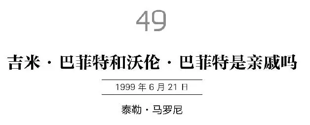

如果想要搞清楚“奥马哈先知”沃伦·巴菲特和“玛格丽塔酒镇吟游诗人”吉米·巴菲特之间的血缘关系，得从他俩的相似之处说起。两人都爱好弦乐器：吉米喜欢热带吉他，巴菲特爱玩尤克里里，而且很在行。“我的乐队里可能有比我还糟糕的乐手呢。”吉米开玩笑说。两人都靠不可思议的投资赚过大钱：巴菲特将赌注押在家具行、保险公司、吸尘器上，现在的市值已达350亿美元；而吉米在可乐果飘香的沙滩上挥洒自己的才情，打造了价值数百万美元的文化品牌，出版过30多张唱片、8部电影、3本畅销小说，拥有一条服装生产线和一家定制唱片的公司，以及成百上千家的礼品店。巴菲特善于积累资金；吉米拥有极富创意的音乐家头脑。

两人都在自己熟知的领域，脚踏实地地前进：巴菲特从不涉足高科技股票，吉米依旧润色着他几十年前录制的歌。两人都吸引着众多拥趸：“鹦鹉头（Parrothead）”（吉米粉丝的昵称）蜂拥而至吉米的夏日音乐会；投资者们疯狂地涌向巴菲特的伯克希尔哈撒韦公司的股东大会，巴菲特自己将其称为资本界的“伍德斯托克音乐节”。两人都不喜欢改变自己的行动坐标，也无意改变自己的处事态度。巴菲特是剥玉米人队的死忠球迷，吉米还坚守在神秘莫测的玛格丽塔酒镇。巴菲特将自己的风格特点戏称为“树懒天生懒散”。这是巴菲特投资时的风格，而不是吉米获得创作灵感时的状态。“天堂里的芝士汉堡啊，”吉米轻唱道，“还有美妙的洋葱丝。”恰巧，汉堡是巴菲特的最爱。

可这是真的吗？他们真的有血缘关系吗？《财富》杂志愿意相信，但很难找到切实的证据。巴菲特的姐姐多丽丝·巴菲特（Doris Buffett）是一位系谱学家，她是第一个提议寻找与巴菲特家族有血亲关系的人。在向全美125位“巴菲特”发出调查问卷的两年之后，她接到了满腹疑问的吉米的电话，他说：“我很想成为你们家族的亲戚，因为你们既有钱又有名。”然后她也这样答道：“真是太有意思了，我们和你想得一样，也想和你攀亲戚，因为你也既有钱又有名。”

多丽丝的研究发现了一些可能与巴菲特有亲缘关系的人：17世纪时居住在长岛的一位穷苦农民约翰·巴菲特（John Buffett）；一位来自纽芬兰岛的水手，也就是吉米在《水手的后裔》那首歌中赞颂的那个人；南太平洋诺福克岛居住的成百上千位姓“巴菲特”的人；还有为数不少赏金反叛者（mutineers of the Bounty）的后代。当多丽丝和吉米发现诺福克岛曾是流放地时，他们的希望破灭了，因为数个世纪以来的近亲通婚已经让家族谱系模糊不清了。

尽管缺乏确凿的证据证明他们的血缘关系（截至本文发表时，DNA检测还没有问世），却不能阻碍巴菲特和吉米成为好朋友。吉米说“沃伦叔叔”从不向他透露任何投资技巧，但两个人曾一起唱过歌。“我认为他想让他的名字写进我的遗嘱里，”亿万富翁巴菲特开玩笑说：“不过，以现在的发展情况来看，我宁愿他的遗嘱名单上有我的名字。”

__TAP DANCING TO WORK__

__巴菲特花絮__

那么，最终的结果是什么呢？

8年之后，随着科技的发展，吉米和巴菲特做了血缘关系的鉴定。他们将自己的唾液装进一个小容器里，提交给了一家DNA鉴定机构23andMe，该公司的共同创办者之一是安妮·沃西基（Anne Wojcicki），她恰好是谷歌联合创始人谢尔盖·布林（Sergey Brin）的妻子。鉴定结果让人不免有些失望，吉米和巴菲特没有血缘关系。如果要为两人找到共同的祖先，需要追溯到一万年前，那时姓氏体系还未建立。至此，这段“公案”终于了结。

——卡萝尔·卢米斯

2026年3月14日

16:57

## 50 大咬一口审计委员会

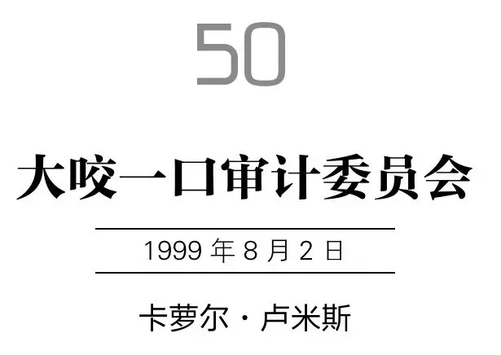

在《萨班斯\-奥克斯利法案》*（Sarbanes\-Oxley Act）*颁布之前，监管机构一直致力于扼制“做假账”的形势，巴菲特在此问题上也做过思考。

——卡萝尔·卢米斯

各家企业都希望审计委员会能够更好地为企业服务、真正发挥作用，为了呼应这个渴求，美国证券交易监督委员会主席阿瑟·莱维特（Arthur Levitt）成立了一个特别小组，专门为审计委员会的改进出谋划策，并希望得到采纳。然而，当纽约证券交易监督委员会要求名单上的公司对征求意见稿做出评价时，阿瑟却遭到了各方的指责。

各家公司尤其不喜欢这样一条提议：要求审计委员会在家多做做功课，在年报中证实自己的财务报告都符合公认会计准则（GAAP）。一些反对者提出，这样一条原则会导致针对审计委员会成员的诉讼。其他公司的观点则不太明确。其中一封信中说：“证实的工作是外聘审计员要干的活儿。”

巴菲特也发表了反对的声音。在将自己的反对票投出之前，他曾公开地、热情地为莱维特开展的反盈余管理运动喝彩。然而，对于“每年开几个小时的会议，审计委员会就能够证实任何对公司财务报告中有意义的东西”这一提议，巴菲特提出了质疑。他则认为，审计委员会需要了解一下外聘审计员所了解的事情，也就是那些“即便存在重大缺陷，通常也不会发生的事情”。

巴菲特说，审计委员会应该要求审计员在下列三个问题上提供详尽的答案：

●如果是由某个审计员单独负责公司财务报表的审核，不管是以物质或者非物质的形式，审计员呈现的财务报表与公司管理层呈现的会不会有所不同？如果“不同”，审计员应该解释管理层的不同意见和自己的见解。

●如果审计员是投资者的话，他所收到的报表信息，说得直白一点，是否足以让他了解报告期内公司的财务状况？

●如果审计员是公司首席执行官，会认为公司遵循了相同的内部审计程序吗？如果没有，区别在哪里，为什么？

巴菲特还认为，审计员的回答应该在会议的短短几分钟之内完成。他说，关键是要在审计人员头上悬起“货币性惩罚”的警示。这能够驱使他们真正完成自己的工作，而不是成为唯管理层是从的马屁精。

《财富》杂志询问了奥利维娅·柯特利（Olivia Kirtley）对于巴菲特这番建议的看法，她是美国注册公共会计师协会（American Institute of Certified Public Accountants）主席，同时也是维蒙特美国公司（Vermont American Corp）的财务官。她说，巴菲特把问题的“水分都蒸发掉了”，美国注册公共会计师协会自己的审计委员会对外聘审计员的要求与巴菲特的建议在“精神上”是一致的。

她的审计事务所客户会不会推崇这样的计划？即旨在要求审计员尽职尽责地完成工作或是接受工作失误时的“货币性惩罚”，答案难以确定。在过去的10年中，审计员总是能轻松化解自己的法律问题，因为他们试图创制的财务报表是管理层的责任，而且他们还能从新法规和友善的高等法院裁决中得到帮助。结果就是，审计员必须进行辩护的官司数量直线下降。

就目前的情况而言，管理层已经知悉了为满足各方“期待”的所有潜规则。这只是简单的巧合，还是“货币性惩罚”的减轻可以让审计员比一般情况下更宽松和顺从？这个问题不好回答。不过，巴菲特所提出的三个问题的答案都是否定的。

## 51 巴菲特先生谈股票市场

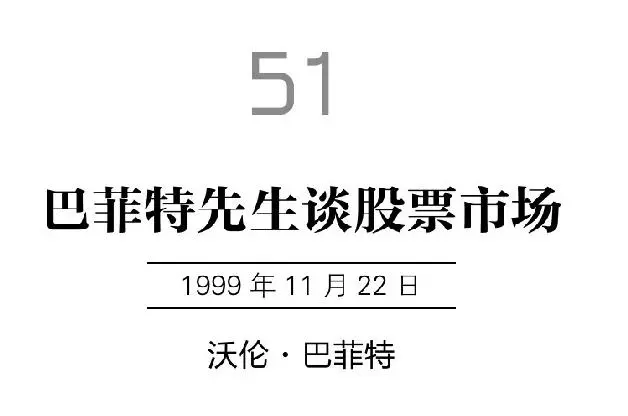

沃伦·巴菲特几乎从未在公众面前谈论过证券市场的整体价格水平，既没在他著名的致股东的信中提到过，也没在伯克希尔哈撒韦公司宏大的股东大会上谈过。在他为数不多的几次演讲中对这个问题似乎也没有涉及。不过，在1999年下半年的4个不同场合中，巴菲特逐渐开始探讨这个问题，并围绕着股票的未来走向发表了自己的观点——他的观点既是一种分析，也是一种创见。第四次演讲时，我就在现场，那是在9月份，巴菲特当时正和他的一群朋友在一起。我也看过他第一次演讲的录像，那是7月在爱达荷州艾伦公司（Allen&Co\.）的太阳谷峰会（Sun Valley）上，他严厉批评了一些企业家领袖的行径。从这些即席发言中（第一次发言时，道琼斯工业平均指数在11194点左右），我提炼了一些巴菲特的主要观点，把它们整合成一篇文章，巴菲特本人审阅过，也做了一些澄清。

在文章开头，笔者就点明了巴菲特的中心观点：“投资者最近对股市的期望值可能有点过高。”虽然近年来互联网迅速崛起，其前景让投资者的期望开始膨胀，但他以汽车业和航空业为例，解释了为什么没人能靠投资这两个行业而发财，它们同样深刻地改变了人们生活方式。

在演讲中，巴菲特当然没有预言到低利率会成为潮流，比如，短期国债的收益按“美分”计。事实证明，证券市场的回报率比巴菲特预想的还要冷酷无情。

不过，他对于市场整体将大幅下跌的看法，无疑是非常正确的。时至今日，他还说：“我对自己说过的话不会做任何更正。”在投资者已经习惯了12%市场年回报率的时候，他就曾做过这种判断。他还曾预估，在刨除通货膨胀率之前，7%的年回报率对投资者来说是比较合理的，而且，从1999年到2016股东大会一直维持这个水平，大约持续17年，在以下文章中会解释为什么他选择了这样两个看似奇怪的年份。不过，7%的年回报率只是个粗略的数字，还没有除去投资者所要承担的昂贵的交易费用：佣金、销售费用以及管理费用等。除去这些费用之后，巴菲特认为合理的预期年回报率约为6%。

令人惋惜的事实是，从1999年年底到2012年年中，道琼斯工业平均指数的复合年回报率仅为3\.2%左右。同期标准普尔500指数（分红力度不及道琼斯，而且在互联网泡沫破损之后遭受了比道琼斯更大的打击）的回报率更是让人大跌眼镜，只有1\.26%。

本文发表之际，距离2016年，也就是17年结束期，还有4年时间。如果投资者加速“收复失地”的话，就必须在所剩不多的时间里获得非常高的回报率，最终才有可能以6%的年回报率收官。

以下内容就是巴菲特提及的主要观点。

——卡萝尔·卢米斯

投资者最近对股市的期望值可能有点过高。我来解释一下原因，这不免又要触碰到股市这个敏感的话题了，而通常我对此都极力避而不谈。不过，我首先要清楚地声明一点，我并不是要预测它的下一步走势。在伯克希尔哈撒韦公司，我们通常只专注于分析个别公司的价值，很少去谈论整个股市的情况，至于预测股市下周、下个月或是明年的走势，那更是想都不敢想。实际上，股市通常会在相当长的一段时间内偏离其实际的价值，虽然总有一天一切还是会回归基本面。因此，接下来我要讲的，如果正确的话，将会与所有美国投资者未来所能实现的投资绩效密切相关。

首先，让我们来定义一下何谓投资。其实，它的定义很简单，却常为人们所遗忘，即现在先投入一笔钱，在未来某个时间再拿回一笔更多的钱，拿回的这笔钱要先扣除这个期间的通货膨胀。

我们从历史的角度分析一下股市的变化情况。假如回到34年前的股市，你会发现两个17年的萧条和繁荣呈现出完美对称的局面。我们可以从中分析一下股市的变化情况。先来看看前17年，也就是1964—1981年这段时间的股市状况：

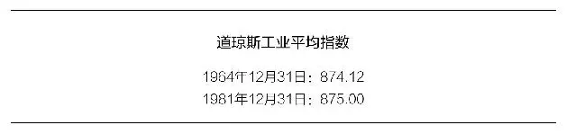

即使是像我这种很有耐心、注重长期投资的人也看得出，这17年间的道琼斯工业平均指数几乎没有变动。

然而，在同一期间，美国经济发生了巨大变化：GDP增长了370%，《财富》500强的销售额（当然公司组成有所变动）增长近6倍，但奇怪的是，道琼斯工业平均指数竟在原地踏步。

为了要搞清楚这到底是怎么一回事，我们必须先看看影响投资结果的两个重要变数之一，那就是的利率。__利率之于投资就好比地心引力之于物体：利率越高，向下牵引的力量也就越大。这是因为投资的回报率与能从国债赚得的无风险利率直接相关联。因此，如果无风险利率提高了，其他所有投资品种的价格都必须相应下调，只有提升回报率，才能保证投资者不会转而去投资国债。__相反地，如果无风险利率下跌，就会推动其他投资品种的价格上涨。因此，基本命题就是这样：投资者想在明天收获1美元，今天应该付出多少，只要先看看无风险利率水平就可以决定。

通常来说，每次当无风险利率波动1个基点时，也就是0\.01%，市场中所有投种品种的价格都会随之变化。这一点在国债上表现得最鲜明，其价格通常只受到利率的影响。至于其他的投资品种，比如股票、不动产、农场等，由于存在其他重要的影响价格的因素，所以其价格与利率的关系不会那么直接。无论如何，这样的影响就像看不见的地心引力，无所不在。

1964—1981年，美国长期国债的利率呈现大幅上扬的态势，从1964年年底的4%飙升到1981年年末的15%。这对各投资品的价格都造成了很不好的影响，其中最引人瞩目的便是股票价格，这间接解释了为何在这段经济腾飞的时期，道琼斯工业平均指数却原地踏步。

另外一个原因是美国企业的利润，图51\-1揭示了1929—1998年期间，美国企业税后利润占GDP的比重。从中可以看出，这个比重在1932年达到巅峰之后又大幅滑落，到了20世纪50年代开始在4%～6\.5%间盘整，紧接着在1982年滑落到3\.5%的低点。因此，当时的股市投资者同时承受着两项负面因素的煎熬，利润大幅衰减，而无风险利率一飞冲天。投资者总会将目前所面临的状况投射到对未来的看法上，这好比是开车不看前方却紧盯着后视镜看，人们以为企业获利将持续低迷，无风险利率也会一直维持在高位，这再次解释了为何即使GDP已增长了近4倍而股市却还在原地踏步。

不过，在20世纪80年代早期，情况发生了大逆转。大家或许还记得保罗·沃尔克在就任美联储主席时有多么不受欢迎。然而，看看他之后的英雄事迹吧：在经济领域推行紧缩政策，抑制通货膨胀，这使利率走势产生大逆转，并带来了辉煌的硕果。假设你在1981年11月16日拿出100万美元购买30年期、票息率为14%的美国国债，然后将利息进行再投资，即每次你拿到利息后，用这笔钱再去购买同样的债券。到了1998年年底，在长期国债的利率降为5%的情况下，你的投资将增值至8181219美元，相当于你获得了超过13%的复合年回报率。

别小瞧这13%的年回报率，它可比同时期内很多股票的表现抢眼多了，而且几乎胜过历史上任何一个17年的时间段。对于一只“貌不惊人”的国债来说，这样的回报可谓恢宏。

利率的下降对于股价的推升也有影响，当然，利率只是其中的一个因素，还有很多其他因素。我们来看看这17年内股市发生了什么：如果在这一期间，你以相同的100万美元投资道琼斯工业平均指数，到了1998年12月31日，你将会得到19720112美元，复合年回报率约为19%。

这在历史上是前所未有的成绩，甚至比在1932年股市大崩盘时的最低点购入股票（1932年7月8日，道琼斯工业平均指数收盘点数为41\.22），然后持有17年还要好。

在这17年内，对股价产生影响的第二个因素就是企业的税后利润。图51\-1向我们展示了企业的税后利润占GDP的比重的变化情况。通过这张图，我们能了解到，到了每年的年终，美国企业的股东们的所得究竟占GDP多大比重。

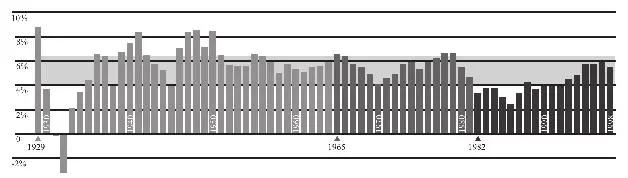

图51\-11929—1998年美国企业税后利润占GDP的比重

正如你们看到的，这张图的起始年份是1929年。我个人非常喜欢这个年份，因为对于我来说，这是“一切”的起点。当时我父亲是一位股票销售员，在大崩盘到来之时，跟任何人打电话都会让他感到恐惧，因为电话那边的人的状况几乎都“惨不忍睹”。每天下午他就待在家里，当时还没有电视，所以……1929年11月30日前后，就有了我（9个月之后的1930年8月30日出生）。因此，大崩盘时常让我感到一种莫名的温暖。

正如你所看到的，在1929年，企业税后利润在GDP中的比重达到顶峰，然后就一蹶不振了。事实上，图表的左半边并不具有典型性：不仅包含了萧条期，还囊括了一段温和复苏的时期（这段时期受到超额利润税的制衡），以及战后另一段复苏期。从1951年起，该比重就开始固定了下来，一直保持在4%～6\.5%的区间内。

然而，到了1981年，企业税后利润所占比重开始出现下滑的趋势，脱离了4%～6\.5%这个区间。1982年时，该比重缩水到3\.5%。因此，当时投资者正面临着两种失衡的状况：利润低于预期，而利率又堪比天高。

很典型的现象是，投资者往往会把自己现在看到的景象投射到未来。这是他们根深蒂固的习惯：总是朝后视镜里看风景，而不是从前挡风玻璃中。所以，在展望未来的前景时，他们对国家的未来充满忧虑和沮丧。他们预计利率会继续走高，而利润会持续走低。因此，他们认为，道琼斯工业平均指数会回归到17年前的水平，即使GDP翻了接近两番。

那么，17年前的1982年究竟发生了什么呢？在第二个17年内，GDP方面没有发生可观的大幅提振。GDP的增长不足两倍，但是利率开始下调。沃尔克的“紧缩效应”逐步淡去之后，企业的税后利润率开始爬升，虽然还不太稳定，但无论如何，还是迈出了坚实的步伐。你可以从图51\-1中看出税后利润的变化趋势，到了20世纪90年代后期，企业税后利润占GDP的比重已经接近6%，也可以说回归到了“常态”时的较高水平。1998年年底，美国长期国债的利率降至5%左右。

利率和企业税后利润，这两个投资者最在乎的要素的变化，虽然不是全部，但也部分解释了为何第二个17年美国股市的涨势超过10倍（道琼斯工业平均指数从875一路攀升到9181）。当然，大牛市也与市场心理因素有密切的关系。一旦牛市开始启动，人们会在某个时期发现，不管用什么方法都能赚大钱。因此，所有人蜂拥而至，不论利率如何，回报怎样，都不做考虑。他们认为，如果不投身股市，就会错失赚钱的良机，到时候追悔莫及。__“我可不能错过这个大狂欢”的心理已经超越所有基本因素，成为主导市场的重要动因。大家早已变成俄国著名心理学家伊万·巴甫洛夫（Ivan Pavlov）实验下的那条狗，只要听到纽约证券交易所早上9：30的钟响就知道有东西可以吃。__事实证明，他们的信心一天比一天强，甚至到最后还坚信，这一切都是老天爷所赐，是他老人家希望大家共同富裕。

此时通过回顾往昔，他们对未来更是充满了美好的期待。在1999年7月份，由佩因韦伯证券公司（Paine Webber）和盖洛普咨询公司（The Gallup Organization）公布的调查显示，投资经验不到5年的“菜鸟”投资者认为未来10年的复合年回报率竟高达22\.6%，而即使是有20年以上投资经验的“老鸟”，也认为应该是12\.9%。

现在，我要给大家泼一盆冷水，未来股市的复合年回报率可能连12\.9%的边都沾不上，我将通过梳理几个决定性因素来证明我说的话。如果投资者想在未来的10年、17年甚至20年获得丰厚的回报，我预计的三件事中至少将发生一件。三件事的最后一件我会在后面再谈，现在先说说前两条：

●__利率必定会继续下跌。__如果现阶段美国国债的利率为6%，那么在将来会降到3%左右，仅凭这一个因素，普通股的价格将会翻倍。如果你也这么认为或者认为国债的利率会降到1%，就像日本曾经经历的那样，你就应该在会大赚一笔的债券期权上豪赌一把。

●__企业利润所占GDP的比重必定会大幅增长。__有人曾告诉我，纽约的律师比普通人还要多。我想这和某些人认为的利润率的增幅会比GDP增长率还高是一个道理。当你期待某个组成部分的增长率永远会领先于整体时，那你最好先去研究一下数学问题。在我看来，如果你相信企业利润占GDP的比重能够，而且，无论如何都会持续地超过6%，那你一定是盲目乐观了。实际上，企业利润所占的比重是会下降的，而使其下降的一个原因就是竞争。现阶段，美国国内竞争很活跃，而且氛围很不错。除此之外，公共政策方面的因素也会导致企业利润率下降。如果投资企业的人一起分吃美国经济增长所带来的这块大蛋糕，而且胃口越来越大，其他团体不得不面对盘中越来越小的食物时，就会自然而然地产生政治问题。我认为，大规模地重新分配这块大蛋糕的局面只是还未发生。

那么，合理的推算又会带给我们什么结果呢？我们假设GDP的年增长率是5%（实际年增长率为3%），这已经是非常乐观的估计了，此外，还有2%的通货膨胀。如果GDP的年增长率达到5%，而利率又没什么变化，那么，股票的总体价格将不会上涨很多。当然，你还可假设股息率会高一点，但以目前的股价水准来看，股息所占的比重已大不如前，而通过大规模回购提高每股盈余的方法也没什么用，因为同时期也会有许多公司发行新股，一部分通过一级市场，另一部分通过股票期权。

因此，回到之前假设的5%的GDP年增长率，我要提醒大家，你们未来的回报存在一个限制性条件：如果美国企业的利润率顶多只能达到5%。你就不能预期年投资回报率一直维持在12%（当然远低于22%）。__实际上，不论何种资产，它的价格的增长速度不可能长期高于其利润的增长速度，这是不可逃避的现实。__

或许你有不同的见解，想和我辩论一番，这也情有可原，那就把你的假设说给我听听。如果你觉得美国公众每年能够在股市上赚到12%的回报，我想你就必须得这样回答：“那是因为我预期GDP的年增长率应该在10%左右，回报上还要再加2%的股息，而利率又保持在恒定的水平。”或者你通过其他的方式重新设置了这些关键变量。如果你相信的话，奇妙仙子小叮当的魔法或许帮得上你，你可以拍拍手，只不过得拼命拍，可别停下来。

此外，你还必须考虑到的一点是，未来的回报总是与当下股市估值水平有紧切的关系。让我们来看看现在投资美国股市到底能得到什么。以下是《财富》500强企业在1998年的两项重要数据。500强企业占据了美国股市总市值的75%，所以，它相当于美国企业的缩影。

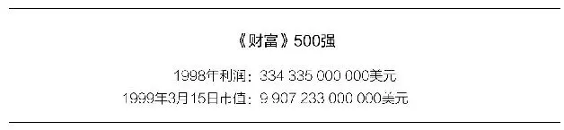

当你仔细研究这两项数据时，必须注意的是利润部分“事有蹊跷”。1998年的利润中包括了一些非同寻常的部分。福特汽车公司计入了分拆旗下第一联合资本（Associates First Capital）所获得的160亿美元；另外总利润中还包括了很多互助公司的收益，比如国家农场保险公司（State Farm Insurance Cos\.），但该类公司没有参考市值，这在《财富》500强企业中是常见的情况。此外，一项巨大的企业开销没有从利润中扣除，即股票期权的补偿成本。另一方面，一些不能反映经济现实的冲销，事实上是可以加回实际利润的。不过，抛开以上例外情形，按照1999年3月15日当日的行情来计算，美国股市的投资者等于每年花10万亿美元赚取了3000多亿美元的回报。

要特别注意的是，本质上除了企业真正的利润，股票投资者作为一个整体不可能从股市中多赚一分钱。我们或许可以低买高卖赚取差价。然而，如果假设《财富》500强企业合并成一家企业，而所有投资者都拥有一小部分股权，那么这样一来，我们就如同坐在同一间房子里，相互之间买进卖出，将股价越炒越高。__如果你比别人聪明，你确实可以逢低买入，逢高卖出，但事实上，你在游戏里拿走的钱都是另一个投资者投入的。与此同时，这种零和游戏对合并后的巨无霸“企业”的境遇并没有丝毫改变，因为它的命运完全取决于利润。无论是现在还是直至世界末日那一天，对于企业所有者来说，最重要的就是企业的实际利润，这是毫无疑问的。__

还有另一个非常重要的问题值得考虑。如果你我只是在这间小房子里相互交易，我们就可以规避交易费用，因为这里没有经纪人来收取每笔交易的佣金。然而，在真实世界里，投资者总是喜欢换“座位”，或者至少咨询一下是否应该换“座位”，无论如何，这都会是一笔开销，而且是一笔很大的开销。他们承担的这笔费用（我把它称为交易费用）涵盖的内容相当广泛，比如做市商的差价、佣金、认购/申购产生的销售费用、12b\-1费用、管理费、保管费和包装费，甚至还有订阅金融出版物的费用。千万别把这些开销当作无关痛痒的东西一笔抹去。如果你要投资一块房地产，难道在计算回报时你会将自己花费的评估费用忽略掉吗？当然不会。同样地，股票投资者在计算回报时，也必须扣除高昂的交易费用。

那么投资者到底为此花了多少钱呢？我的估测是：美国股票市场的投资者每年要支付超过1000亿美元，准确一点是1300亿美元，来改变自己的投资去向，或者向咨询机构购买建议。每年大约有1000亿美元都花在了《财富》500强企业身上。换句话说，1998年，《财富》500强企业辛辛苦苦为投资者赚了3340亿美元，投资者却拱手将其中的1/3送给了各种各样的咨询和“帮助”机构。在这之后，《财富》500强企业的股东们用他们10万亿美元的投资只获得了不到2500亿美元的回报。在我看来，油水已经太少了。

或许你心里并不赞同，想和我辩论一下1000亿美元是如何流向那些“帮手”的。我们来看看他们是如何收取费用的吧。先从传统的佣金说起，这其中包括手续费、做市商的抽成以及承销发行的差价。除去重复计算的部分，今年股市的交易量大约为3500亿股，如果按照每股每方（也就是买和卖都要支付）的佣金平均为6美分来计算的话，统计下来，这笔佣金也将达到420亿美元。

再看看其他开销：拥有包管账户的小户要面对巨额开支，大户则要支付管理费用，股票型共同基金的投资者还要支付一大笔骇人听闻的开销。这些基金目前拥有3\.5万亿美元资产，而它们的投资者每年所要支付的各种费用，如管理费用、认购/申购产生的销售费用、12b\-1费用以及运营成本等，总计至少将达到资产额的1%，也就是350亿。

而且，以上我所提及的那些费用还未包括期权和期货的佣金和差价，或者是各种年费以及“帮手”们想出的层出不穷的各种费用。简而言之，《财富》500强企业的股东们无辜花掉了1000亿美元（相当于《财富》500强企业市场价值的1%）。在我看来，这1000亿美元的费用不是说多了，而是非常保守的估计。

我觉得这是一笔可怕的开支。我曾听说过一部动画片，其中有一位新闻评论员说：“纽约证券交易所今天没有发生任何交易。每个人都满足于他们现在所拥有的。”好吧，如果这是事实，投资者每年就能为自己的口袋保住1300亿美元。

关于股市，我来总结一下自己的观点。我认为，实在很难找到一个具有说服力的证据来证明，在接下来的17年里，股市的回报率将会像它过去17年中的表现一样好。如果让我预测一个最有可能的回报率数字，包括增值和股息，在利率稳定、2%的通货膨胀率和居高不下的交易费用的基础上，投资者最后整体可能得到的结果是6%，我要强调一下，是整体。如果在这个基础上再刨除通货膨胀率（不论通货膨胀率涨跌情况如何，都要刨除这个部分），那就是4%。如果4%字有误，我相信正确的数字只可能更低。

回到我早先说过的话题上：投资者若想在未来的股市上获得丰厚的回报，有三件事不可或缺。第一，利率继续下跌；第二，企业利润所占GDP的比重大幅提升。现在我来谈谈第三点。或许你是一位乐观主义者并坚定地认为，尽管从整体上来说，股市投资者前景堪忧，但你自己总能成为股市中的佼佼者。在信息革命（我个人无比膜拜的时代）的初期，这种想法听起来颇具诱惑力。你的经纪人或许会告诉你，选择那些明显的大牛股，把握这波超级趋势！

回顾一下20世纪前半段改变我们生活的那些工业，比如汽车制造业和航空业，应该会对我们大有裨益。先来谈谈汽车制造业，美国汽车与卡车制造业者的名单能写满70页纸。其中两家制造商的名字很自然地引起我的注意，一家名叫伯克希尔，另一家叫奥马哈，当然还有许多其他汽车制造商。

正如你所听到的，汽车制造业是一个拥有超过2000家制造商的庞大工业，对人们的生活有着难以估量的影响。如果在当时你具有足够的见识，就一定会说“这是一条通往富裕的道路”。然而，情况发展到20世纪90年代又如何呢？这些公司经过多年的竞争厮杀之后，只剩下三家，这对投资者来说全然不是好事。因此，可以这样说，这是一个对美国影响深远的产业，但对投资者的影响未必是那般辉煌。

在汽车制造业的蓬勃发展这种革命性的事件中，有时我们反而比较容易断定输家。人们很容易体会到汽车产业的重要性，却很难挑选出能为自己赚钱的企业。__如果时光可以倒流，我相信你就可能会做出这样一个决定：有时候把事情颠倒过来看可能更好，做空那些受负面影响最大的事物，比如马匹。__坦白地说，我很惋惜为何巴菲特家族当初没有做空马匹。而且这实在很难说得过去：住在内布拉斯加州，本可以很容易借到马匹以避免被别人“逼空”。

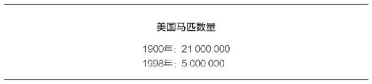

除了汽车产业之外，20世纪另外一个革命性产业就是航空业，这是一个让投资者想到美好未来便口水直流的新兴产业。我特地查阅了当初所有飞机制造商的资料，发现在1919—1939年，大约有300多家公司，但现今可能只剩下几家还在苟延残喘。当时生产的众多飞机中有两架名叫“内布拉斯加”和“奥马哈”号的飞机，现在即便是最忠诚的内布拉斯加人恐怕也不敢驾驶这样的飞机驶向蓝天吧。

接下来，我们来看看航空业是如何走向衰落的。最近20年宣告破产的航空公司有129家，大陆航空（Continental Air）甚是“明智”，名列该名单两次。截至1992年，尽管表面上看来情况有所好转，但事实上，自从航空业陷入不景气以来，所有航空公司加起来的净利润是零，也就是说连一毛钱也没赚过。

__我在想，如果当初莱特兄弟的小鹰号（Kitty Hawk）第一次起飞时，我在现场，我很可能会极具远见地、充满公益心地（这点是为了未来的资本家）设法将它打下来。我的意思是，莱特兄弟对投资者的伤害是非常严重的。__

对于其他深深地改变了美国人生活方式，但对投资者没什么好处的辉煌产业，比如收音机与电视等，我不再赘述。__不过我从中得出这样一个结论：投资的要旨不在于评估这个产业对社会能有多大的影响，或是它有多大的发展空间，而主要应该看某家公司有多大的竞争优势，还有更为重要的一点是，这种优势能维持多久。拥有广阔而持久的“护城河”的产品或服务才能真正为投资者带来甜美的果实。__

17年这样一个时间跨度不禁使我联想到17岁的“蝗虫”，虽然这么说有点儿突兀。这些计划飞进2016年的小生命，到时候又会有怎样的际遇呢？到那时对于股票的看法或许更冷静、理智，不像现在这般欢欣雀跃。自然，投资者对此可能会感到失望，不过，这只因为他们开始时期望得太多。

无论如何，他们那时一定比现在富裕得多，原因很简单，因为他们所拥有的美国企业将会继续发展，而且其利润以每年约3%的速度增长。最值得我们高兴的是，新生的财富将最终惠及美国大众，美国人整体的生活水平将比现在更上一个台阶。即便未来达不到在过去17年美国投资者业已习惯的那种大跨步式的发展，也注定不会是一个糟糕的世界。

## 52 巴菲特主义

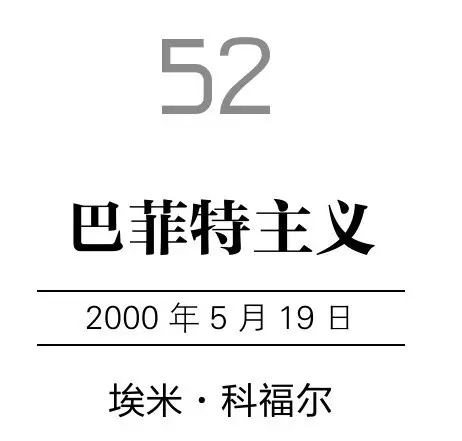

伯克希尔哈撒韦公司董事长沃伦·巴菲特把他们的年度股东大会称作资本主义的“伍德斯托克音乐节”，但是投资者迈克尔·克利夫兰（Michael Cleveland）有个更绝妙的比喻：“这是一场宗教布道会，而巴菲特就是我们的福音布道者！”多年以来，每到春季，股东们就涌向奥马哈，聆听巴菲特宣讲的真理：投资那些基本面优秀，且已很成熟的企业，然后坚持持有，鉴于伯克希尔哈撒韦公司为投资者带来了不可思议的财富，人们已经将巴菲特的言论奉为“巴菲特主义”。

然而，去年，巴菲特似乎失去了他的超能力。这一财年，伯克希尔哈撒韦公司每股净资产的增长率不及标准普尔500指数的涨幅，低了20\.5%，这是20年来该公司首次败给标准普尔500指数。造成这种局面的主要原因是：大部分巴菲特重仓持有的股票，包括可口可乐公司和吉列公司都遭遇了暴跌。与此同时，处于襁褓中的高科技股一飞冲天，造就了很多一夜暴富的百万富翁。然而，巴菲特拒绝进入这个领域，因为在他不确定的企业和领域上押赌注，会让他觉得很不舒服。到了2000年3月初，伯克希尔哈撒韦公司的股价下跌了50%，达到52周以来的最低点，股价为40800美元。即便是最忠实的追随者，其信念恐怕也开始动摇了。

如同所有优秀的布道者一样，巴菲特拥有最强有力的支持者：市场。奇迹出现2000年4月下旬，就在股东大会召开前夕，伯克希尔哈撒韦的股票上演了大逆转，涨幅达到47%，股价接近6万美元。不仅如此，高科技股遭遇了“滑铁卢”。“无论如何，我们都将长期坚守伯克希尔哈撒韦的股票，”亨廷顿海滩（Huntington Beach）的布莱恩·戈贝尔（Brian Goebel）说，“我们可不是日内交易者。”

他们当然不是日内交易者。与互联网新富豪不同的是，巴菲特的追随者看起来并不是那么光鲜亮丽，他们既没有身穿普拉达（Prada）华服，也没有脚踩马诺洛（Manolo Blahnik）。所有来参加股东大会的投资者只获得了一件绿色的伯克希尔哈撒韦T恤衫，上面印着一大叠现金，此外还有一顶相配套的棒球帽。他们排起长队领取免费的丹麦面包和咖啡，看起来真不像买得起A股的有钱人，该股票每股的市价已高达6万美元。当巴菲特宣布身着时思糖果50年代销售小姐制服的芭比娃娃已经上市时，人群沸腾起来，每个人都在争抢订单。该产品是伯克希尔哈撒韦公司旗下的时思糖果和美泰公司（Mattel）合作推出的。

当然，芭比娃娃不是这个周末的唯一主题。周六，在奥马哈市民大礼堂举行的、时长7小时的股东大会才是重头戏。作为开场，巴菲特播放了一段长约1小时的搞笑视频，视频中，他拨弄着尤克里里和里吉斯·菲尔宾（Regis Philbin）一起唱着《谁想成为亿万富翁》*（Who Wants to Be a Jillionaire）*。其间，巴菲特解释了在新千禧年，什么样的投资才是万无一失的，以及为何“价值投资近来已经不那么火了”。随后，他又拨通了比尔·盖茨的电话。热火朝天一番之后，投资者纷纷安坐下来讨论企业自身的问题。在接下来的近5个小时里，股东们频频向巴菲特和查理·芒格抛出问题，有些人甚至“出言不逊”，直指巴菲特去年领导不力，导致公司表现欠佳。一位15岁的投资者说：“为了上大学，我两年前买了伯克希尔哈撒韦公司的B股。但当股价跌至1500美元的时候，我已决定改修函授课程了。”巴菲特大笑了起来，那仿佛是在说：“你击中了我的要害。”

整个周末，奥马哈变成了伯克希尔哈撒韦公司旗下各家公司的内部产品展览会，参加展出的公司包括国际奶品皇后、时思糖果、德克斯特鞋业公司（Dexter Shoe）以及世界图书出版公司，流连于打折的刀具、床垫和钻石之中的股东们有如饥饿的捕猎者。周六晚上，巴菲特还会请他的信徒观看了一场乙级棒球联赛，但很多人为了排队等候巴菲特的亲笔签名错过了半场比赛。还有很多人参加了他们最喜欢的游戏：“交易”巴菲特的小故事。“你开车来的时候有没有路过他的住所？”一位女士问，“他的住所相当简朴！”另一位女士说，她曾与巴菲特上同一所高中，还有一张毕业聚餐时的合影。“第二天我就有了很多值得吹嘘的事情。”她大笑道。

还有一些人是带着十分恳切的心情踏上这次“朝圣之旅”的。邦·琼（Bong Jung）已经持有伯克希尔哈撒韦公司的股票长达10年时间了，他需要重新信奉巴菲特的价值观念。“抵制科技股的蛊惑是件很困难的事，”琼解释说，“在打高尔夫的时候，很多人总会谈论投资。我的朋友说，他在高科技股上已经赚了80%，而我的股票却下跌了30%。不羡慕是不可能的。因此，我要赶到这里来恢复我的信念。”“没错，”他妻子补充说，“恢复！”因此，“布道者”巴菲特再次给予他的追随者一些值得坚守的信念。

## 53 支持奥巴马和希拉里的“政治重婚犯”

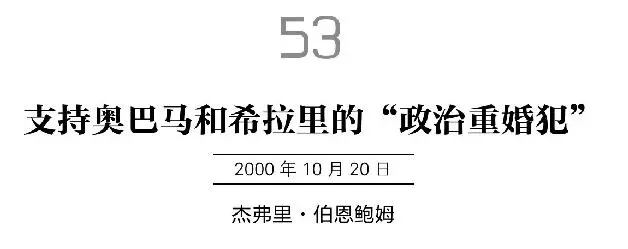

巴菲特，在他人生的大部分时间里都是一位民主党人，多年以来他一直在支持该党的候选人。2000年，在巴菲特等人的支持下，希拉里·克林顿成功当选纽约州的参议员，这成为当时的热点新闻。然而，到了2008年，事情就变得有点儿复杂了，参议员希拉里试图代表民主党角逐总统。这让巴菲特感到左右为难，因为他和另一位总统竞选人也关系甚笃，这个人就是奥巴马。

巴菲特通过一个朋友认识了奥巴马，当时这位芝加哥人正在准备竞选伊利诺伊州的参议员。随后奥巴马又来到了奥马哈和巴菲特共进午餐，彼此有了一段愉快的交流。巴菲特很喜欢这个年轻人和他的观点，临走时，两人握手言别。

那么在2008年，当希拉里和奥巴马都角逐民主党候选人时发生了什么呢？巴菲特又是怎么解决这个问题的呢？他自我解嘲说：“政治重婚犯。”也就是说，他告诉两位候选人：“我会支持你们两个。”而事实上他也是这么做的。

当然，我们现在已经知道谁是最后的胜者。

——卡萝尔·卢米斯

起初，沃伦·巴菲特是一位共和党人。这主要是受他父亲的影响，其父亲曾4次代表共和党当选内布拉斯加州国会议员。在宾夕法尼亚大学读书时，巴菲特非常热心政治，曾担任校青年共和党人俱乐部主席。1948年，他甚至打算骑着大象在费城大街上走一圈，以此来庆祝托马斯·杜威当选总统，直至哈里·杜鲁门在竞选中打败杜威，他才打消此念头。

时代的转换让人感叹。巴菲特现在已经成为一名坚定的民主党人。他甚至敢为人先地为希拉里募集资金和捐款。没错，“奥马哈先知”将赌注押在希拉里身上，支持她成为纽约州的参议员。此外，巴菲特曾代表这位第一夫人与前任财政部长罗伯特·鲁宾（Robert Rubin）一起出现在哥伦比亚大学，还在曼哈顿俄国茶室（The Russian Tea Room）以及Info USA公司首席执行官韦恩·格普塔（Vin Gupta）的家中，协同组织了为希拉里募捐的活动。

他失去了自己的信念吗？根本不是这样的。“我支持政治人物，无关乎他们的派别，只在乎他们在重大问题上的观点是否与我同步。”巴菲特这位在册的民主党人说。他同意希拉里支持人工流产合法化的主张，也赞同她对竞选财务改革的努力，这也是巴菲特竭力推动的一个改革主张。“我支持她的想法，就这么简单，”巴菲特说，“也是基于同样的原因，我也曾投票给她的丈夫。”和其他希拉里的支持者不同的是，他从未在白宫或戴维营过过夜，甚至是沙发上，他强调说。他还与纽约有着特殊的亲密关系，伯克希尔哈撒韦公司控股着《布法罗新闻报》。而且他还说，这个州发生的事情，其影响力会远远超出它的边界。

出人意料的是，巴菲特也给政治人物“捐款”了。近些年来，他努力推动并公开支持对竞选财务进行改革。让他感到最愤怒的是，财务系统滥用所谓的“软钱”，也就是不受联邦竞选财务法约束的无穷尽的竞选资金。为避免被贴上“伪善”的标签，巴菲特只给联邦候选人捐献“硬钱”，也就是法律允许的向每位竞选人每次竞选捐献1000美元。换句话说，他只为希拉里捐献过2000美元，第一次1000美元是初选阶段，第二次是在大选时。巴菲特也从未要求其他人为自己喜欢的候选人捐款。他说他只希望人们捐款是出于自愿，而不是被强迫。

当然，筹款时有巴菲特的名字在，肯定会引起其他人的注意。他对自己支持的候选人是非常慎重的。通常，他会支持民主党人，包括他的朋友内布拉斯加州参议员鲍勃·凯利（Bob Kerrey）以及曾竞选过总统的前新泽西州参议员比尔·布拉德利（Bill Bradley）。他还支持过威斯康星州民主党参议员拉斯·范戈尔德（Russ Feingold）以及康涅狄格州州代表、共和党人克里斯·谢伊斯（Chris Shays）捍卫竞选财务改革的活动。在过去这些年里，他还支持着地位崇高的堪萨斯州共和党参议员南希·卡斯鲍姆（Nancy Kassebaum）和丹尼尔·帕特里克·莫伊尼汉（Daniel Patrick Moynihan），而获得这些人的支持对于希拉里来说至关重要。“我认为她是非常有效率而且善于表达的人，”巴菲特这样评价希拉里，“如果她当选了，带来的绝对会不止一个100分。”这是不是意味着“第一夫人”是被低估的资产呢？

2026年3月14日

16:57

## 最受赞赏——一次又一次

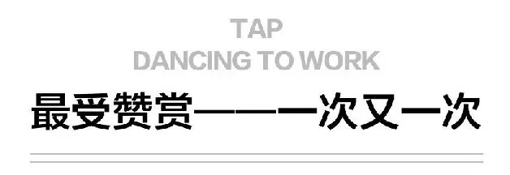

《财富》杂志每年都会公布“最受赞赏公司的名单”，而今年（2001年），我们的编辑对排名第七的伯克希尔哈撒韦公司以及巴菲特进行了深度报道，并成了杂志的封面故事。历史，或许还有展望，见证了这一点。伯克希尔哈撒韦公司曾连续5年荣膺“最受赞赏公司”前10名，然后它的位置就不曾动摇过。即便《财富》杂志在2008年把“全美”的头衔换成了“全球”之后，伯克希尔哈撒韦公司仍旧岿然不动。在过去15年里，即1997—2012年，伯克希尔哈撒韦公司是唯一一家始终停留在榜单前10名的公司。

巴菲特很钟情“最受赞赏公司”这个名号。伯克希尔哈撒韦公司因其收入在《财富》500强企业中排名很高（排进前10），但这对于巴菲特来说，似乎不算什么，远不如他对公司的好名声的看重。2010年，在接受《财富》杂志专访，提及一家公司如何获得信誉时，巴菲特说：“这不是只花一天、一月或一年时间就能做到的事，而是需要一点一滴的积累。毁掉信誉是转眼之间的事，但把它树立起来却需要长久的功夫。”

作为企业界倾慕的对象，并不意味着公司在运营或资产的利用效率方面不存在问题。《价值机器》一文向我们讲述了伯克希尔哈撒韦公司在缅因州的子公司德克斯特鞋业公司遭遇棘手困难的故事。巴菲特并没能事先预料到会有麻烦发生。事实上，他是一位狂热的收购者，1993年，伯克希尔哈撒韦公司用价值4\.19亿美元的股票收购了这家公司，不过巴菲特严重低估了德克斯特鞋业公司遭受的海外低价产品的冲击，于是在1999年年报中，他不得不坦承德克斯特鞋业公司前景堪忧。2000年，伯克希尔哈撒韦公司注销了账面上2\.19亿美元德克斯特鞋业公司的商誉。第二年，巴菲特“认输”。首先，他承认自己压根儿就不该收购这家公司；其次，特别不应该以股票的形式收购；最后，在解决问题方面也有拖延。

2001年，德克斯特鞋业公司的管理团队转战到了伯克希尔哈撒韦公司旗下的另一家制鞋公司，公司管理者弗兰克·鲁尼（Frank Rooney）和吉姆·艾斯勒（Jim Issler）则努力削减少了公司的业务，公司基本处于停工和裁员的状态，直至最后，只有所剩不多的生产线还在运营。到了2005年，“德克斯特”这个名字完全从伯克希尔哈撒韦公司年报中消失了。

时至今日，谈及“德克斯特”时，巴菲特还会说：“这无疑是迄今为止我做过的最差的一笔收购。”

当伯克希尔哈撒韦公司收购德克斯特鞋业公司时，哈罗德·阿方德（Harold Alfond）正好是后者的董事长和最大股东。他也是一位著名的慈善家，逝世于2007年。他把自己大部分的财产都捐献给了哈罗德·阿方德基金会。当他立完遗嘱之时，基金会的资产翻了5倍，达到5亿美元，其中80%是伯克希尔哈撒韦公司的股票。如今，该基金会主要的资助方向是缅因州的教育、医疗和青少年发展等项目。尽管有点儿不同寻常，但它还是提供了另外一个例子，证明伯克希尔哈撒韦公司的财富最终流向了慈善事业。

——卡萝尔·卢米斯

__54 价值机器__

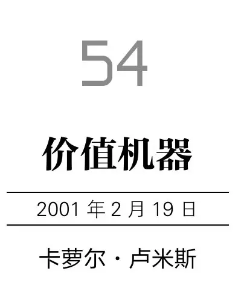

如果大家不介意的话，我们首先来做个小测试：请描述一下排在“最受赞赏公司”榜单前10名的企业各自在你心目中的样子。

大多数读者可能对前10名中8家公司都了若指掌。因为在日常生活中，我们总是会接触到它们，比如，大型超市沃尔玛，证券经纪商嘉信理财以及制造电脑芯片的英特尔公司等。通用电气公司有点儿不好描述：它既提供金融服务，还运营着电视网络和电气设备，甚至还涉及航空领域，而且很快就要收购霍尼韦尔（Honeywell）了。不过，最难以解释的还是排名第七的这家公司：来自奥马哈的伯克希尔哈撒韦公司。给你一支笔，你能否在500字之内将该公司的业务写明白、解释清楚呢？

如果你和其他人一样，或许这句话你一定不会漏掉：“那是沃伦·巴菲特的企业。”对于伯克希尔哈撒韦公司的铁杆粉丝来说，估计要几辆重型大卡车才能装载下对它的细节性描述：我们所讲述的是一家非比寻常的高收益综合性企业，其中保险业占据着核心，还包括很多其他行业。首席执行官是一位年届七旬的老人，正是他决定着公司的资金投向哪儿。一直以来，他在全球投资界都声名显赫，被誉为股神。

每股账面净资产是衡量保险公司成就的最佳指标。在巴菲特执掌公司的36年内，伯克希尔哈撒韦公司的每股账面净资产复合年增长率超过23%。当然这期间也有成绩不佳的年份，特别是1999年。不过，无论如何，36年中的32年，伯克希尔哈撒韦公司每股净资产收益率都战胜了标准普尔500指数，而且是大幅度的胜利。巴菲特一直不愿分拆公司的股票，在给某个朋友发去的生日祝福中，他说：“希望你活到伯克希尔哈撒韦公司股票分拆的那一天！”公司股价见证了公司这么多年的成长之路。在漫长的36年里，每股价格从12美元攀升到71000美元，平均每年的涨幅达到27%。

尽管伯克希尔哈撒韦公司成绩显赫，但是很多参与“最受赞赏公司”投票的商业人士并不理解主张价值投资的伯克希尔哈撒韦公司究竟是怎么运行的。尽管有些人甚至还不知道自己是在为一家保险公司投票，但是很显然，他们喜欢这家公司：伯克希尔哈撒韦公司连续5年位居“最受赞赏公司”前10名。

现在我们中断一下这个话题，说点儿别的。我也是巴菲特的崇拜者，更是他的老朋友，而且还一直为伯克希尔哈撒韦公司的年报当编辑，当然巴菲特是主要的作者。另外，我持有该公司股票已经有几十年了。巴菲特和我一直都在讨论合作出版一本关于他的商业传奇的书，但就实际写成的东西来看，实在有点打肿脸充胖子。不过，这个计划却给我带来了实实在在的好处，通过这种不同寻常的方式，我更近距离地接触到了他的思想。

据我目前所知，2000年对于伯克希尔哈撒韦公司来说注定是一个里程碑式的年份，尽管很多人还未意识到这点。我不是在谈论股票问题，虽然股票一直是该公司追随者关注的焦点。随着高科技股在今年年初“一飞冲天”，伯克希尔哈撒韦公司的股票却陷入了低谷。3月份更是跌到了40800美元，当时巴菲特说：“在做空者评出的‘最受赞赏公司’名单中，我们的名字赫然在列。”不久股票就反弹到71000美元，这比低谷时期的价格大涨了74%。2011年1月底，其股价为68000美元，也就说伯克希尔哈撒韦公司在2000年内爬升了26\.6%，而这一年对大多数企业，包括“最受赞赏公司”前10名中的7家来说，都是相当不景气的一年。

那又怎么样！我要讲述的是发生在伯克希尔哈撒韦公司的事情，而非股票。资本配置是最能体现巴菲特的天赋异禀的领域。在一次大手笔的操作中，巴菲特已拿下的或意图拿下的公司不下8家。因此，我们不在这儿讨论股票（虽然很多股票是公众持有的），而是着眼于整个公司。

宾夕法尼亚州韦恩市（Wayne）的美国责任保险集团（U\.S\.Liability Insurance Group）是最新被收购的企业之一，这次收购又为伯克希尔哈撒韦公司的保险帝国添砖加瓦。其他的收购案例也呈现出种类纷繁的局面，而且主要集中于传统的经济领域：位于沃思堡市（Fort Worth）生产砖块和靴子的贾斯丁工业（Justin Industries）、总部在西雅图的高级珠宝商本·布里吉连锁店（the Ben Bridge chain）以及佐治亚州道尔顿市（Dalton）的地毯生产商萧氏地毯（Shaw Industries）等。总收购价格为80亿美元。虽然，这个价格比1998年伯克希尔哈撒韦公司收购通用再保险公司时所支付的价值220亿美元的股票低了不少，但这80亿美元主要是以现金形式支付的。该公司史上最大的一笔现金投资投向了美国运通公司，而这次收购所涉及的金额是其投资额的五倍之多。不仅如此，这80亿美元完全出自伯克希尔哈撒韦公司的腰包，没有一分是借来的。巴菲特只是静静守候着出手的时机，然后递上一捆又一捆的钞票。

在所有的收购完成之后，伯克希尔哈撒韦公司的员工数量将翻倍，而且收入将增加130亿美元，虽然其中的50亿美元来自中美能源控股公司（MidAmerican Energy Holding Company），因为监管限制的问题，这些不能合并到伯克希尔哈撒韦公司的账目中。即便如此，伯克希尔哈撒韦公司2000年度的收入也将接近300亿美元。今年，该公司将首次跻身《财富》500强企业的前50名。其利润也将达到30亿美元左右，这包括了该公司在本年度内卖掉部分股票所实现的资本收益，但究竟卖掉了哪些股票，巴菲特并未透露。

巴菲特从未打算要爬上《财富》500强企业前列。“并不像你在电话中说得那样。”巴菲特说，2000年的一系列收购绝不是有计划的，他并没有什么宏大的收购计划。显然，在如何为股东创造价值的问题上，他与同侪产生了分歧。他不会关注公司的股价，甚至可能根本不知道公司某日的股票行情。他也不想寻求协同效率，他喜欢购买能够产生健康现金流的公司并保持它们的独立性。他还是一位“左右手都能胜任的击球员”：他总是表达出购买整宗生意的意愿，或者购买某公司一定比例的股票。唯有2000年，他掀起了一股收购热潮。

那么，他现在是不是正往股市中投入新资金呢？不。他一直在购买垃圾债券，比如菲诺瓦公司（FinovabGroup）发行的债券。虽然最近出版的某些刊物报道他购买了康赛克公司（Conseco Inc\.）的债券，但这并不符合事实。在2000年以及此前的4年里，他确实是一位净卖方。这一举动暗合了他那番著名的观点：未来股市的回报不可能再与20世纪80年代或者90年代相媲美。众所周知，在过去这些年中被他“砍掉”的股票中，包括麦当劳和迪士尼这种公司的股票。

事实上，作为驰名全球的股神，巴菲特一直不希望，伯克希尔哈撒韦公司像大多数人认为的那样，主要依靠购买有潜来的股票来取得增长，他更愿意将发展引擎构建在新企业的加入上。虽然引入新企业也会带来问题，而且他已经碰到了不少，但他还是矢志不渝。

这种偏好显然是带有感情色彩的，他更喜欢和伯克希尔哈撒韦公司旗下子公司的管理者沟通，并建立一种真实有效的业务关系。当然，这种偏好也是具有经济价值的，原因就在于税金。试想一下，如果伯克希尔哈撒韦公司的一家子公司，比如时思糖果，获得了1000万美元的税后利润，与此同时，可口可乐公司获得了1\.25亿美元的税后利润，这就意味着伯克希尔哈撒韦公司根据自己占有的股份（8%的可口可乐公司股份）将会分走1000万美元的利润。显然，思糖果赚得的1000万美元将全部属于伯克希尔哈撒韦公司，而可口可乐公司的1000万美元里却埋着一个“陷阱”。如果要获取可口可乐这笔收益，无论是可口可乐公司的股息还是通过售卖可口可乐公司股票获得的资本收益（当然还没出售过任何股份），伯克希尔哈撒韦公司都要支付额外的税金。如果可口可乐公司内部存在非常好的投资机会，将利润用于再投资就能获得更高的收益，那么，巴菲特会很乐意接受这样的税收制度。如果情况相反的话，他会毫不犹豫地倾向于从伯克希尔哈撒韦公司内部获得的那1000万美元收益。

巴菲特喜欢现金，在伯克希尔哈撒韦公司，他已经营建起了一架能生产大量现金的“机器”。机器的动力来自公司的保险业务。保险业务为公司带来美妙的“浮存金”，也就是说，保险公司可以利用这笔钱进行投资，而投资的增值又可以用来支付索赔。巴菲特用浮存金购买的诸多企业最终变成了“价值机器”的重要部件，为后续的投资带来源源不断的现金。

巴菲特喜欢价位合理的公司，这使他不用去参加投资银行家们举办的拍卖会，省去了很多麻烦，当他买到这样的公司时，就一掷千金，雇用一批能干、诚实、信得过的人来经营。他希望看到扎实可靠的利润，这是一定的，但他又毫不在意这种利润是否连贯，他说：“我宁愿利润率在起伏中达到15%，也不希望它稳定在12%。”他还偏爱自己能懂而且不会发生巨大变化的企业。__高科技领域的日新月异令他敬而远之。他感到自己不能确定10年之后一家高科技公司能够创造多少现金流，所以，他选择了“绕道而行”。__

为了能以好价格拿到好公司，拥有“好东家”的名声一定是大有助益的，而巴菲特就是这样优秀的“好东家”。他旗下有许多家具零售商，这或多或少是依靠口口相传获得的，第一家在奥马哈，然后是犹他州、得克萨斯州、马萨诸塞州，接着是爱达荷州。对于很多卖家来说，伯克希尔哈撒韦公司是一座“避难所”，是停泊的港湾。比如，家族企业中的某些家庭成员急需现金，而其他人却想继续经营公司。如果巴菲特想收购这样的公司，他会承诺保证公司的独立性，并将尊重继续经营公司的人的决定，除非出现了什么不可调和的问题，不然他就会直接拿出收购合约。巴菲特说：“我们周围没有任何MBA跑来跑去告诉人们应该怎么做，天地为证，我根本不知道要告诉他们些什么。”上市公司也可能存在因家庭纠纷而出售的情况，或者只是为了逃离冰冷可悲的股市，逃离不切实际的季度需求和心怀恶意的买家（suitor），而巴菲特的伯克希尔哈撒韦公司对这种寻求避护的公司来说堪称天堂。

通常情况下，那些影响收购的因素都保持在合理区间。然而，2000年，整个金融环境变得严酷起来，这使得伯克希尔哈撒韦公司在收购企业方面占据了巨大的优势。随着这一年的时间慢慢流逝，市场上可用于收购的钱越来越紧缺，垃圾债券很难出手，而有实力的股票投资者又如惊弓之鸟一般。事实上，一位纽约的投资银行家前来拜访巴菲特并告诉他，伯克希尔哈撒韦公司是美国唯一一家有能力拿出50亿美元进行收购的公司。

约翰斯·曼威尔公司（Johns Manville）是伯克希尔哈撒韦公司今年收购的第八家企业，对于伯克希尔哈撒韦公司的优势，这笔交易就是最好的证据。显然，巴菲特非常善于将这种优势发挥到极致。2000年，约翰斯·曼威尔公司的保温和屋顶产品的销售收入为20亿美元，利润超过2亿美元，这家公司的控股股东是一家信托基金。约翰斯·曼威尔公司在1982年申请破产时，专门成立了一支基金负责石棉索赔。在2000年年中，有财团提出以28亿美元收购该公司。然而，该公司的业务紧接着就出现了周期性的下滑，而财团也遇到了融资问题。于是在12月8日，一个星期五，该财团退出了收购。这笔交易的“搁浅”让该公司的首席执行官查尔斯·“杰里”·亨利（Charles“Jerry”Henry）严重受挫，他本身就是收购财团的一员，而且一直在努力使公司与信托基金脱钩。

巴菲特和查理·芒格一直通过wind关注着整个事件，观察着约翰斯·曼威尔公司的一举一动。三天之后的星期一，他们打电话给信托基金，提出以22亿美元的价格收购约翰斯·曼威尔公司，而且是以现金的形式。双方在短短的24小时内，通过电话达成交易，并于12月20日发表了声明。那天下午，亨利来到约翰斯·曼威尔公司丹佛分公司的员工面前，称颂道：“朋友们，圣诞老人来了！但不是北极的那位，他住在奥马哈。”

时年59岁的亨利与巴菲特在奥马哈长谈了6个小时。去开会的路上，亨利说，如果他发现有任何无法与巴菲特共事的苗头，一定会想办法退休，并为“我要走了”做好时刻的准备。不过，事实与他想的大相径庭。他说，这场会面令他大受鼓舞：“结果，我又充满了斗志。人们很容易看到巴菲特的公司正发生着什么。最后你只想说，你不想让这位好东家失望。”

为了写这篇文章，我和伯克希尔哈撒韦公司收购的这8家公司的高管都谈过话。我从未听到有人对他们的新东家说过任何抱怨的话，只有赞美。当然，人们不会公开对自己的老板说三道四，特别是在老板的朋友面前。不过，我也听卖家们谈到过，很多交易之所以失败并不只是钱的问题，唯有伯克希尔哈撒韦公司是一家值得托付的交易伙伴。

44岁的埃德·布里吉（Ed Bridge）是本·布里吉珠宝公司的第四代联合负责人。在多年之前他得过一次病，这期间，他曾考虑过出售自家珍爱的珠宝产业、上市、杠杆收购或者引入“战略性”买家。不过，堪萨斯城的巴内特·赫尔兹伯格（Barnett Helzberg Jr）一直劝他考虑一下伯克希尔哈撒韦公司，因为他自己就在1995年将自营的珠宝企业出售给了巴菲特。不过，本·布里吉珠宝公司只是在11个州拥有65家门店的小企业而已，布里吉不认为巴菲特会对自己的小企业感兴趣。虽然如此，布里吉还是在去年上半年和巴菲特通了电话，并给他发去了财务数据。巴菲特热情地回复了布里吉，据布里吉回忆，巴菲特在信中说：“你们太棒了，太棒了，太棒了！”

随后，事情开始进入实质性操作阶段。然而，“战略”买家在听说布里吉有出售公司的意向后，又提供了一份报价。布里吉说：“相比于伯克希尔哈撒韦公司，我们本可能从这位买家手里多收20%。不过，我觉得如果真的那么做，会毁掉自己的企业。”因此，2000年5月初，他和巴菲特就交易的细节达成了一致（包括未被公开的售价）。他们没有握手，因为当时两人根本没有见过面。这也符合巴菲特一向通过电话购买公司的风格，但是布里吉非常希望能见一见巴菲特本尊。五月末的时候，机会终于来了，巴菲特在去参加微软公司会议的途中，抽空见了布里吉。

据那天和巴菲特交流过的管理者和员工说：一旦从事自己喜爱的工作，他就会表现出非凡的耐力。当然他们也发现了一个非常普通的“巴菲特”：他是典型的中西部长相，戴着一副眼镜，顶着一头略显凌乱的花白头发，穿着一条背带裤和一件没系扣的外套，似乎还戴着一条近一个月未曾更换过的领带，语态平淡却暗藏玄机。__巴菲特当日所给的“指令”，他手下的所有公司都耳熟能详：“你们只要继续做你们正在从事的工作就可以了，我们永远不会让一位击中率四成的棒球手改变他的球风。”__

布里吉还回忆说，他和巴菲特开车经过时思糖果的一家门店时，巴菲特脱口说出了其销售额。巴菲特的记忆力令布里吉赞叹不已，而巴菲特回复说：“我只是很热爱数字而已。”这让布里吉想起伯克希尔哈撒韦公司的一家子公司的负责人曾经“警告”过他的一句话：“不要让他看到任何你不想让他看到的数字，因为他会记住的。”

巴菲特的收购热潮自然而然地引发了一个疑问：他以前收购的那些公司表现如何？总的来说，都是很成功的，但也不能说100%。比如，在1998年他用220亿美元股票收购通用再保险公司之后，遭遇了再保险市场的一个艰难期，直到2000年才恢复元气。然而，很多保险业专家还是分析说，巴菲特的这次收购其实搞砸了。他自己很不情愿用股票来进行收购，因为他非常舍不得出让伯克希尔哈撒韦公司的任何一份股权。不过，巴菲特也说了，他非常确信通用再保险公司会成为伯克希尔哈撒韦旗下珍贵的一分子。

巴菲特手中非保险类的公司，比如制造业、零售商和服务性企业，利润率总体看起来很好，特别是考虑到这些公司大多数都是传统产业。1999年，这些公司创造了7亿美元的税前利润和57亿美元的总收入。税后利润率约为7\.7%，大幅超过了《财富》500强企业平均5%的水平。

不仅如此，很多伯克希尔哈撒韦公司的子公司的管理层都依照激励协定来工作，这鼓励他们珍惜自己的资金，并将多余资金给奥马哈总部。巴菲特说：“这也就是我常常周六到办公室亲自打开邮件的原因。”顺便提一下，一旦资金到了总部，并不会进入巴菲特的腰包，他在伯克希尔哈撒韦公司的年收入是10万美元，而且不会涨。另一方面，他拥有伯克希尔哈撒韦公司31%的股份，近期价值是320亿美元。因此，我们不需要为他巨大的付出感到歉意。

在他的制造业大军中，令巴菲特最失望的是德克斯特鞋业公司，这家位于缅因州的公司，是他在20世纪90年代初以价值4\.4亿美元股票交换来的。在与国外公司展开的严酷竞争中，德克斯特鞋业公司一直设法坚持植根于美国本土，然而大幅锐减的利润和损失让公司痛苦不已。巴菲特本人也几乎没有经历过这种痛苦。他在公司年报中指出，支付给德克斯特鞋业公司的价钱无疑过高了，而用股票支付又加重了错误的后果。他还补充说，他不认为德克斯特鞋业公司的管理层有任何过失。

不过，管理层偶尔也会出现明显的过失，这时，他也不得不去“救火”，甚至还要解雇某些管理者。有些问题出现在他收购的那些家族企业中，原本负责经营的老一辈很有能力，但他们的后代没有同样的能力。巴菲特认为，这或许就是老一辈变卖家族产业的原因。这种问题他在费切海默兄弟公司身上就碰到过，这是辛辛那提一家生产制服的厂商，伯克希尔哈撒韦公司于1986年收购了它。当时，这家公司由60多岁的两兄弟经营着，兄弟中的一人退休了，另一位，也就是首席执行官生病了，首席执行官的儿子接手了公司，但是可惜他能力不足，被罢免了职务。多年以来，首席执行官的人选一直摇摆不定。最终，在1999年，巴菲特采用了少有的“异花授粉”的方式，从他旗下的保险公司中挑选了一位管理者布拉德·金斯勒（Brad Kinstler）来执掌费切海默兄弟公司。“他真的不负众望，”巴菲特宽慰地说，“或许我们应该经常试试这种方法。”

巴菲特在“修理”伯克希尔哈撒韦这架庞大机器或者做任何事情时所表现的巨大活力，与他70岁的高龄很不相符。他的年龄也是公司股东们常常思考和探讨的问题。鉴于伯克希尔哈撒韦公司的未来，他们的担忧不是没有道理的。首先，伯克希尔哈撒韦拥有一笔硕大无朋的资产，如果没有巴菲特的操持，资产价值能否延续？其次，将资产所得的现金流进行投资是他的才能，而这种才能或许是无可替代的。

去年夏天，年龄的话题受到了特别的重视，因为巴菲特做了一次手术，摘除了结肠中的息肉（都是良性的）。不过，他迅速恢复了健康，又开始在跑步机上晨跑了，又回归到了吃汉堡和炸薯条的生活，偶尔还去吃点儿冰雪皇后的圣代，日常生活在樱桃味可乐的气泡中彻底恢复了。

虽然如此，媒体还是挖掘出他在年报中提及的关于管理继承的问题。如果他于今天去世，他46岁的儿子霍华德·巴菲特将会成为伯克希尔哈撒韦公司的非执行董事长。霍华德现在是一位农用设备公司的董事长，同时也是一位亲身耕作的农民，“大老板”的工作将会分配给两个人。现年64岁的路易斯·辛普森（Louis Simpson）目前管理着伯克希尔哈撒韦公司的政府雇员保险公司，他很有可能接管公司的投资组合。而监管伯克希尔哈撒韦各家子公司运营情况的工作将会交给巴菲特挑选好的另一位内部人士，但究竟是谁，巴菲特还未公开。据《华尔街日报》10月份发表的一篇文章分析，伯克希尔哈撒韦公司子公司中的三位高管最具优势：时年49岁的伯克希尔哈撒韦再保险业务负责人阿吉特·贾因（Ajit Jain）；时年57岁的政府雇员保险公司负责人托尼·奈斯利（Tony Nicely）以及56岁的利捷公务航空公司的首席执行官理查德·圣图利（Richard Santulli）。

巴菲特说，他们中的任何一个人都比他更能胜任这份工作，“不过，不要把消息传播出去，”他有一个办法，“忘记分拆股票吧，我们只要‘分拆’我的年龄就行了。”

事实上，认真严肃地讨论继任者的问题是很难的，因为巴菲特和他的医生认为他的健康无虞，只要好好规划接下来的工作就可以了，不用考虑期限。而他也深深地爱着自己的工作，全心全意地爱着它！杰克·韦尔奇也是这样的人，但是通用电气公司有退休条例，幸好伯克希尔哈撒韦公司没有。__最近，“顽皮”的巴菲特就在韦尔奇刚刚度过自己65岁的生日之后，给他发了一封略带玩笑性的提示信。韦尔奇曾在《金融时报》上讨论过年龄的问题：“投资者最不想见到的情况，莫过于，一位年老体衰还流着口水的董事长坐在台上了。”巴菲特把这段话传真给了韦尔奇，还潦草地附加了注解。“杰克，我们不能允许此类言论在伯克希尔哈撒韦公司存在。我会让查理跟我一齐留在台上，”查理是指时年77岁的副董事长查理·芒格，“台上”指的是伯克希尔哈撒韦公司股东大会的舞台，“这样投资者就会看到更糟糕的情况，董事长和副董事长一起在台上流口水”。__

如果询问一位77岁的老人，他70岁的老朋友是不是依旧“犀利无比”，可能有点不合时宜，但我们真这样做了。在众人眼中，芒格可是一个聪颖机敏的人。我们问他，他是否发现巴菲特的智力或者创造性思维有任何下降？芒格的第一反应相当直截了当：“没有。”然后他详细解释说，今天的巴菲特或许还比以前的巴菲特“更棒一点儿”。“因为他的见识更广了，”芒格说，“随着年龄的增长，很多人身上的变化发生得相当快，这种事我见得太多了。比如，有的人能够以每小时145公里左右的时速前进，然后就会像一棵橘子树一样进入了快速衰退的阶段。然而，你很难在这件事上做出推断，对巴菲特的头脑而言，我没有看到一丁点儿退化的迹影。”芒格还补充说：“伯克希尔哈撒韦公司已经建立起了良好的声誉优势，这也给了我们捷径……收购约翰斯·曼威尔公司的过程很顺利，我们几乎没有会见过对方公司的任何人员。”

那些了解巴菲特的人，总觉得他经常能迸发出新点子。除了帮助时思糖果研发新口味的糖果之外，伯克希尔哈撒韦公司基本上并未在产品研发方面进行过创新。不过，该公司在创新性地处理股东关系方面取得了突破性进展，比如，将“股东手册”分发给大家，说明伯克希尔哈撒韦公司的经营原则；允许他们个人决定（基于个人持股的数量）公司的慈善捐款走向；甚至建立一套系统，在股东大会上给股东5个小时的时间，来问巴菲特和芒格任何与经营相关的问题。

每年在奥马哈举办的股东大会都相当特别。大约有1万名股东参加，其中有很多是董事会成员。大家整个周末都沉浸在节日的气氛中，其中的节目包括：一场由巴菲特开球的棒球赛，当然他球技往往不佳；去伯克希尔哈撒韦公司旗下的波仙珠宝商店的疯狂购物，“希望能如此”，巴菲特说；最后是每次股东大会的压轴好戏：聆听巴菲特和芒格的“教诲”。

总的来说，这是一家将股东权益放在首要位置的公司，尽管在某些事上巴菲特和他的部分同仁存在分歧。除了巴菲特，几乎任何一位首席执行官都会认为自己的股价被低估了。尽管如此，巴菲特还是经历了几个特殊时期。一次是在1998年，当时伯克希尔哈撒韦公司的股价升至8万美元，他觉得股价被高估了，并为此感到苦闷，因为他不希望公司的股东在买进或者卖出股票时超出他认为的合理范围。“我会这么说，”他最近谈道，“相对于股价被低估而言，当伯克希尔哈撒韦公司的股价过高时，我反而更加焦虑。”他的这番“异端邪说”会不会导致伯克希尔哈撒韦公司从“最受赞赏公司”的前10名中除名呢？

在伯克希尔哈撒韦公司的股东看来，最重要的新点子可能均出自该公司的核心，即国民保险公司（National Indemnity）。多年以来，国民保险公司已经建立起享誉全球的好名声，因为只要溢价令人满意，公司就原意承保各式各样的风险。计算赔付率是巴菲特和贾因的共同任务，两人都非常适合这种工作，而且他俩还常常合谋把伯克希尔哈撒韦公司领向旁人难以理解的奇特领域。如果要写出全部的细节，估计要好几页纸才能说清楚，但我们这里试举一例：去年他们制定了一份保单，旨在保护Grab\.com免于支付10亿美元的奖金，该网站的市值约为1\.7亿美元。Grab\.com曾经以巨额奖金来吸引数以百万计的人们登录网站，以此来搜集对于市场营销人员有用的信息。浏览网站的人们可以参与一个游戏，在1～77的数字中选取7个；公司告示上说，选出正确数字的概率是相当大的。可没人比巴菲特和贾因更明白其中的原委，事实上，几乎没有人能在游戏中胜出。不过，一旦有人在游戏中获胜，就有可能对伯克希尔哈撒韦公司的利润造成重创。巴菲特说：“假如我们要全部付清，恐怕就没有派对可开了。”“然而我们每次都能判断准确、抓住机会，这是因为我们做了其他任何人都不愿去做的事情。”

贾因的办公室位于辛辛那提，他真切地见证了巴菲特身上发生的改变。20世纪90年代初，两人每天直至奥马哈时间晚上9点左右都在谈论保险公司白天的运营情况。然而巴菲特现在几乎每天晚上9点钟都在网上玩桥牌，无一例外。贾因说这个改变还是挺好的：“我们现在的谈话基本是在他玩桥牌之前或之后。”

由于常常和巴菲特一起玩桥牌，作为他的牌友和对手，我观察到他的牌风在某些方面和他的商业投资风格很相似，尽管他对桥牌对手比对手下的管理者要强硬很多。在桥牌中，他不太使用大多数人当作标准的、某些比较流行的叫牌惯例。他懂得游戏的所有概率，不论是叫牌还是出牌都尽在他的掌握之中。尽管他并不是桥牌圈所谓的“专家”，但他善于分析而且全神贯注，所以水平一直在提高。当他犯了低级错误时，就会对自己毫不留情。“真不相信我竟然那么做了，”在最近一次失误之后，他对自己说，“简直令人难以置信。”他自责的话让我想起某次商业失败之后他对自己的评价：“别人知不知道对我来说无关紧要，关键是我自己知道。”

光辉的历史记录告诉我们，失误只是鲜见的情形。尽管年事已高，但巴菲特的身体依旧很硬朗，很有可能继续刷新他的卓越纪录。值得一提的是，现阶段伯克希尔哈撒韦公司最大的三家参股公司，即可口可乐公司、美国运通公司和吉列公司，都有了新的首席执行官，他们分别是：可口可乐公司的道格拉斯·达夫特；美国运通公司的肯尼斯·钱纳特（Kenneth Chenault）以及刚刚入职吉列公司的纳贝斯克公司前任总经理詹姆斯·基尔茨（James Kilts）。这又给了巴菲特待在一旁的机会。他兴致盎然地说：“这些企业实在太棒了，我只要待在一旁看着就足够了。”

他手中还握有巨额现金。“我们的情况让我想起《幻想曲》*（Fantasia）*中作为魔法师学徒的米老鼠，它的问题是泛滥的洪水，而我们的是源源不绝的现金流。”不过，灼热的现金并不会将巴菲特的口袋烧出破洞，因为耐心是他的强项。现在他又进入连续收购的时期，不过你应该不会想要打赌他会不会突然停止收购，除非你自己为此购买了伯克希尔哈撒韦公司的保单。

__55 《财富》杂志来信选摘__

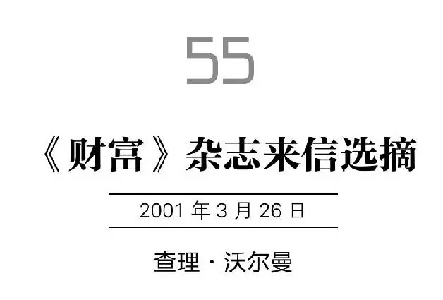

《价值机器》是一篇很棒的文章，但是我想就您谈到的一点，即“巴菲特并不寻求协同效应”，说说自己的意见。不论他是否追求协同效应，他创造的不可思议的新纪录都证明了协同效应的存在。我们不妨看看时思糖果、《布法罗新闻报》、斯科特费泽公司等，一次又一次令人满意的净资本收益率已经成为伯克希尔哈撒韦公司的重要标记之一。净资产收益率翻倍，意味着公司的内在价值上涨幅度将远超于此。

尽管协同效应的记录比较有趣，但搞清楚协同效应的来源或许更重要一些。巴菲特是我能够想到的唯一一位企业领袖，他从不因循守旧、古板生硬地控制如此规模的大企业。就这一点来说，他甚至可以说已经创造了新的管理模式。

巴菲特是历史上最伟大的管理者之一。在20世纪60年代的企业并购中，他是最成功的；在20世纪70年代对抗通货膨胀中，他也是最成功的；他的胃口一直以来都五花八门，这使他造就了一家涉及诸多领域的巨型企业。在职业管理者的领域之内，他应有自己的一席之地。

## 56 巴菲特谈股票市场

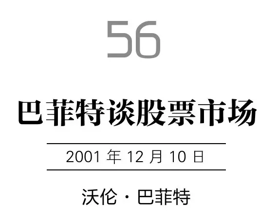

1999年，在爱达荷州艾伦公司的太阳谷峰会上，巴菲特在众多商业领袖面前所做的演讲备受推崇。因此，该公司董事长赫伯特·艾伦邀请巴菲特在两年之后故地重游。我和巴菲特再次合作将他2001年7月的一次演讲编辑成文章，发表在《财富》杂志之上。作为开篇，我们先抛砖引玉，提一个问题：“股市的回报看起来每况愈下，反恐战争的未来扑朔迷离，消费者信心指数持续低迷，在这种情况我们该何去何从？”

巴菲特的论述，是他创造性思维的集中体现，主要围绕着他深切关注的几个问题展开：美国经济的回弹恢复力度；不考虑后视镜效应，投资者的投资意愿，包括养老基金；估值水平。

他的两次演讲相隔了两年的时间，在这期间互联网泡沫破裂了，道琼斯工业平均指数已经从11194点下跌到9500点。正是基于这一点，巴菲特对股市长期回报的期望值因而再度提高。

提高的幅度并不大。在文中，我根据巴菲特提供的数据绘制了一幅图表。该图表表明，与国民生产总值（以下简称GNP）相关的价格仍然处于历史高位。这张图表随即也受到大家的热议：接下来的这几年，我总是频繁地接打电话或者发送电子邮件与《财富》杂志交涉，希望他们能够更新图表的数据。事实上，我们也的确这么做了。大家可以看到，2009年年初，有了一个新版本的图表，该图表表明短期内股价不可能触底。

——卡萝尔·卢米斯

我上一次谈及这个话题是在1999年。当时我把过去的34年分成两个时间段，各17年，这两个时间段惊人地对称，分别对应着股市的熊市与牛年。先看第一个时间段。从下面这组数据中可以看出，在第一个时间段，道琼斯工业平均指数刚好增长了0\.1%。

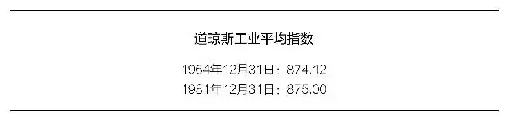

下面来看看第二个时间段，这一个时间段标志着一个不可思议的大牛市。这一牛市在我上次提出这一观点时已经接近尾声，虽然我当时并不知道。

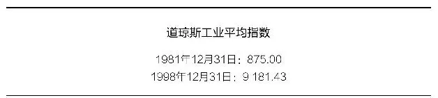

不过，你不能用GNP涨幅的不同来解释这两个周期里股市的巨大差异。在第一个周期里，股市的表现惨淡至极，但这一段时期GNP增速却是后一个周期的两倍。

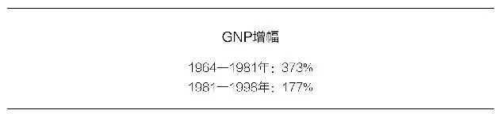

这种现象该如何解释呢？我认为，股市在两个时间段里截然相反的动向是由两个重要的经济变量引发的，这两个经济变量发生了巨大的改变；此外，人们的某种心理因素最终也对市场变化产生了影响。

在这里，我需要再次提醒你们“投资”的定义，这个定义虽然简单，但是常常被忽视。投资就是为了明天获得更多的钱，今天先投入一笔钱。

在这两个时间段里影响股价走势的第一个经济变量是利率。在经济学里，利率的作用就好比是物质世界的地心引力。任何时间，任何市场，世界上的任何地方，利率的微小变化都会改变所有金融资产的价值。这点你可以在证券价格的波动中清晰地看到。不过，这条规律也同样适用于农田、石油储备、股票和任何其他金融资产，而且对其价值的影响也是巨大的。比如，如果利率是13%，你的投资在未来所获得的1美元回报的折现值将比不上利率是4%时的折现值。

下面就是在这34年里的几个关键日期的利率。1964—1981年，利率急剧升高，这对投资者极为不利。而在1981—1998年，利率急剧下降，这对投资者而言可谓福音。

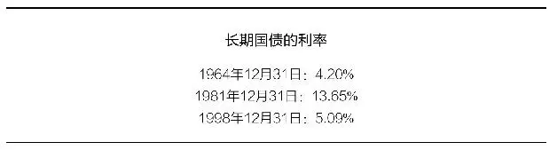

另外一个重要的经济变量就是，投资者的预期，即他们预期从投资的中获得多少回报。在第一个时间段内，由于公司盈利不佳，这个预期急剧下降。然而，到了20世纪80年代初，由于美联储主席保罗·沃尔克强有力的经济措施，实际上把企业的盈利能力推高到了20世纪30年代以来的前所未见的高度。

在第一个时间段内，投资者对美国经济丧失了信心，他们的未来被两大负面因素困扰。首先，他们在企业利润方面没看到多少利好；其次，高利率盛行又让可怜的企业利润打了折扣。这两个因素作用在一起，导致1964—1981年股市的停滞，即便在这个时期，GNP有了很大的增长。这个国家的实业在增长，但是投资者对这些实业的估值在萎缩。

然而，这些因素的逆转却创造了一个低GNP增长率而股市兴旺的时期。首先，盈利能力大大提高。其次，利率大降，使未来1美元的利润更加有价值。这两个现象都为大牛市的持续火爆提供了有效而强大的燃料。同时，我认为心理因素也起到了推波助澜的作用：投机交易爆炸性增长的原因很简单，就是因为人们看到了市场的行动。稍后我们会对股市这种危险的周期性疾病做病理分析。

两年前，我认为驱动股市大幅上涨的基本趋势已经大致走到了尽头。股市如果想从当时的位置接着大幅上升，长期利率就必须进一步下降，这是有可能的，或者企业盈利能力要有重大改善，这在当时看起来可能性不大。如果你看一下50年来企业税后利润占GDP的比重图，就会发现这个比重一直维持在4%～6\.5%之间。其中在1981年前后比较糟糕的日子，这一比例曾降至4%，而这个比例超过6\.5%的情况很少见。在利润非常好的1999年和2000年，这个比例低于6%，而今年可能会低于5%。

我已经对两个截然不同的17年时间段做出了解释。不过，问题是，股市的过去能在多大程度上告诉我们它的未来呢？

为了获得答案，我们先回顾一下20世纪。众所周知，在这个世纪，我们有了汽车，有了飞机，有了无线电、电视和计算机。这是一个不可思议的时期。确实，刨除通货膨胀的影响，按美元计，美国人均实际产出增长率达到了惊人的702%。

当然，这个世纪中也有一些艰难的年份，比如1923—1933年的大萧条时期。不过，如果我们以10年为一个阶段来看美国人均GNP时，就会发现一个令人吃惊的现象：作为一个国家，我们保持了一致的进步并且贯穿于整个世纪。因此，你可能会这样想，如果用证券市场来衡量美国的经济价值，它至少也会以相当一致的节奏增长。

不过，事实并不是这样的。从我们之前对1964—1981年这个时期的研究可以知道，在那段时期，经济与股市之间的对应关系完全被打破了，在整个世纪也基本上如此。在开始的时候，比如，在1900—1920年，这个国家突飞猛进，电力、汽车、电话的应用方面呈现出爆炸性发展。然而，股市在这段时间内几乎没动，仅仅表现出0\.4%的年增长率。这和1964—1981年间的停滞很相似。

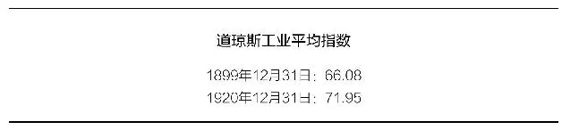

在接下来的一个阶段，我们经历了20世纪20年代的市场繁荣。道琼斯工业平均指数增长了430%，在1929年9月达到了381点。19年之后，整整19年之后，道琼斯工业平均指数为177点，只有开始时的一半。然而，真实的情况是，在整个20世纪40年代，美国人均GDP增长了50%，是20世纪增长最快的10年。接下来的17年，股市终于开始上涨，出现了20%的年增长率。然后就是我们讨论过的两个时间段：1964—1981年的滞胀以及1981年到20世纪末的大牛市。

从另一个方面来解析，我们经历了3个长期的巨大牛市，历时44年，这期间道琼斯工业平均指数增长了11000点。我们也有3个停滞期，历时56年。在这56年中，美国取得了巨大的经济进步，但道琼斯工业平均指数实际上下跌了292点。

怎么会发生这样的情况呢？在一个欣欣向荣的国度里，每个人都集中精力挣钱，怎么会有三个长期而痛苦的停滞期呢？在这期间，撇开股息不算，股市怎么会让你亏钱呢？答案就在于投资者反复犯的一个错误，也就是我在前面提到的一种心理因素：人们习惯性地被后视镜所误导，即在极大程度上，是被当下发生的事所误。

__美国从未停止前进的脚步__

在20世纪初，GNP缓慢爬升。不过，如果把整个美国看作一只股票，则呈现出大幅上涨的趋势。

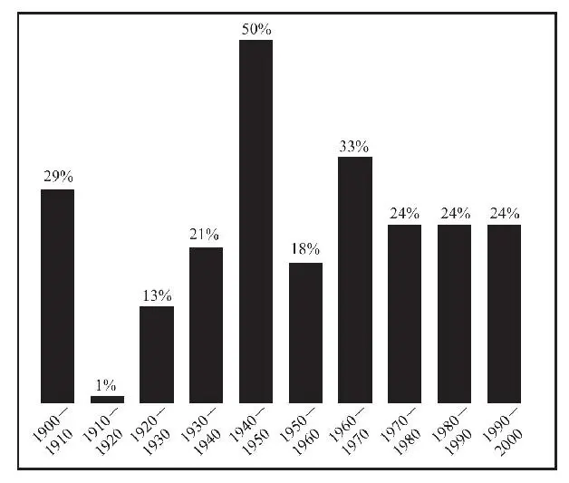

图56\-120世纪美国人均GNP增长率

20世纪的第一个阶段就是这种短视的鲜明体现。在这个世纪的头20年里，股票的回报率一般超过高等级债券的利息。这种关系现在看起来很奇怪，但在那时几乎就是公理。众所周知，购买股票风险更高，除非获得更高回报。不然为什么还要购买股票呢？

1924年，一本横空出世的书解答了这个问题。这本书虽然很薄，最初毫无征兆，却注定以前所未有的方式改变了股市。其书名是《用普通股进行长期投资》*（Common Stocks as Long Term Investments）*，作者是华尔街史上最伟大的投资专家埃德加·劳伦斯·史密斯（Edgar Lawrence Smith）。书中记录了截至1922年的56年间，史密斯对证券价格变化所做的研究。史密斯的研究始于一个假设：股票在通货膨胀时期表现得更好，而债券在通货紧缩时期表现得更佳。这是一个完全合理的假设。

首先，我们来琢磨一下这本书的第一句话：“这本书记录了一个失败案例，其失败在于事实无法支持一个预先想好的理论。”史密斯接着说：“尽管如此，我们搜集的事实看起来值得进一步研究。如果这些事实无法证明我们希望证实的东西，那么就给事实松绑，看看它们会带给我们什么。”

如今，这个聪明人做了世界上最难的事情。__达尔文曾经说过，无论何时，当他发现任何一件与他珍视的结论相反的事情时，就认为自己有义务在30分钟内写下新的发现。否则，他的头脑就会像身体排斥移植器官一样排斥不一致的信息。__人类的本能就是坚守自己所相信的东西，特别是又被最近的经历再次证明的东西，正是我们自身的这一缺陷造成了长久的牛市和长期的停滞。

为了说明史密斯的发现，我在此引用传奇的思想家约翰·梅纳德·凯恩斯（John Maynard Keynes）的一句原话，他在1925年评论了这本书，使这本书名声大噪。在评论中，凯恩斯写道：“或许，史密斯先生最重要的、也是最具创新性的观点就是：一般来说，管理有方的工业企业不会把所有利润都分发给股东。如果不是在所有年份，至少在那些较好的年景里，企业会保留一部分利润去扩大原来的业务。因此就有了复利的成分，它的运转支持着健康的产业投资。”

道理就这么简单，甚至算不上什么新颖。人们当然知道公司不会付出100%的利润。然而，人们从来没想过这一点意味着什么。然而史密斯先生说：“为什么股票的一般表现会超过债券的呢？一个主要原因就在于公司的留存利润，而留存利润将产生更多的利润和股息。”

这一发现点燃了一个前所未有的牛市。在史密斯的见解的激励之下，投资者纷纷投身股市，并期待双重回报：比债券要高的初始收益，不断的增值。对于美国公众来说，这一新领悟就像原始人发现火一样令人兴奋不已。

不过，不久之后，这些公众就被这“熊熊烈火”灼伤了。股价被推高，首先迫使股票的回报率降到债券的回报率的水平，直至最终使其远低于债券的回报率。下面发生的情境读者会很熟悉：股价上涨如此之快，以致股价上涨成了人们涌入股票市场的主要动力。__1925年，少数人出于正确的原因购买了股票，而在1929年，多数人由于错误的原因购买了股票。__

__在1925年的书评里，史密斯敏锐地预见到了股市的这种不正常现象。他写道：“用基于过去的经历来推断未来是一件十分危险的事，除非能够从过去的经历中找出核心原因。如果做不到，就有可能陷入预期的陷阱。”__在这种情况下，对未来的预期只有在各种条件与过去完全一样时才能实现。他脑海中的这种特殊条件，来自其对股市半个世纪的研究发现，即股票的回报率高于债券的回报率。

投资者在20世纪20年代做出了巨大误判，此后这种误判又以这样或那样的形式重复了很多次。正如我们所见，公众对20年代股市的疯狂一直心有余悸，直至1948年。当时，美国的内在价值已远超20年之前，股息率是债券收益率的2倍多；然而股价却不到1929年顶峰时的一半。毫无疑问，造成史密斯神奇结果的条件再次出现了。不过，投资者对40年代后期发生的一目了然的情形却视而不见，他们已经被30年代早期可怕的股市吓得呆若木鸡，对痛苦唯恐避之不及。

千万不要认为只有小投资者才是过多看“后视镜”的那批人。让我们看看专业的养老基金在近几十年的表现。1971年，也就是“漂亮50”[\4]时期，养老基金管理者对市场感觉良好，于是把90%的净现金流投入到股市，这在当时是创纪录的。不过，几年后市场坍塌，股价大幅下跌。养老基金管理者又做了什么呢？他们因为股票太便宜而停止购买股票！

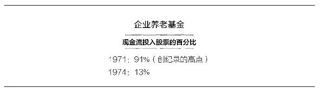

这是我永远都不可能理解的事情。按照自己的口味，恐怕生命里余下的时光我都要靠吃汉堡过活。如果汉堡降价，巴菲特一家一定会高唱《弥赛亚》*（Hallelujah Chorus）*，高兴得涕泗横流。对大多数人来说，如果在生活中买任何东西遇到降价，都会有这种感受，除了股票。当股价下跌时，同样的钱可以买更多股票，但人们却不喜欢这样做。

当养老基金的管理者也停止购买股票时，这种行为就尤其令人费解。客观地讲，他们比普通投资者有更多投资经验。他们的基金不可能明天就需要钱，明年或许也不需要钱，甚至下个10年也不需要钱，所以，他们完全可以有自由放松的心情。而且，由于他们不是在运作自己的钱，所以，“贪婪”也应该不会“扭曲”他们的决策。他们应该只想着什么是最合理的。然而他们的表现却像业余选手一样，可他们所拿的酬劳，却是高手级别的。

1979年，当我感觉股票非常值得一买时，曾写过一篇文章，其中提到：“养老基金的管理者仍把眼睛紧紧盯在后视镜上做投资决策。这种依靠经验主义带兵打仗式的投资方式在过去被证明其代价无比惨重，这次也将是同样的结果。”事实就是如此，因为“以股票现在的价位来说，应该产生远远超过债券的长期投资回报”。

考虑一下1972年的情况。当养老基金管理者还在重仓购买股票时，道琼斯工业平均指数在年底达到了1020点，成分股平均每股账面净资产为625美元，净资产收益率为11%。6年之后，道琼斯工业平均指数便宜了20%，而成分股平均每股账面净资产增长了将近40%，年净资产收益率为13%。当时我写道：“在1978年股票确实很便宜的时候，养老基金管理者不愿意买，而1972年股票很贵时，基金管理者却以创纪录的方式大笔购进。”

当我写这篇文章时，企业长期债券的票息率为9\.5%左右。因此，我问了一个不言自明的问题：“购买1999年到期、票息率为9\.5%的20年期领先级美国公司的债券，或是以账面净资产的价格购买回报率有可能达到13%的道琼斯成分股，两者相比，前者会不会获得更好的回报呢？”答案显而易见。

如果你读过我在1979年的文章，那么在大约3年时间里，你可能遭受过损失，现在就会明白你当时经历了些什么！当时我并不擅长预测股价的短期变化，现在也做得不怎么样。我从来不知道股市在未来6个月、1年或2年的走势如何。

不过，我认为预见到股票长期将会发生什么是很容易的事情。__本杰明·格雷厄姆告诉过我们为什么：股市的短期运作像是一个“投票机”，而股市从长期看就像是一个“称重机”。恐惧与贪婪在投票时起着重要作用，但在称重时毫无作用。__

依照我的思路，很容易预测出，在未来的20年里，一只票息率为9\.5%的债券显然比不过这种你可以以低于帐面净资产的价格购买的，被称作道琼斯工业平均指数的“伪装债券”，其年回报率可以达到13%。

我先解释一下自己所说的“伪装债券”的意思。众所周知，一般的债券有一定的到期时间和一系列的息票。比如，票息率为6%的债券每6个月要支付3%的息票。

相反，股票是对特定公司未来收益有要求权的金融工具，可能通过股息、股票回购、公司拍卖或者清算来实现。这些付款实际上就是“息票”。股东来来往往，收取息票的所有人也会改变。不过，作为一个整体，公司所有人的财务回报率决定于这些“息票”的规模和时机。投资分析就是对此进行预估。

现在，估计个股“息票”的规模是非常困难的。不过，预估几组股票的“息票”相对容易一些。回顾一下1978年，正如我前面提到的，道琼斯成份股的平均账面净资产为850美元，回报率为13%。这13%只能是基准，而不是很精确的数字。不过，如果你愿意投资一段时间股票，你实际上是在以891美元的本金买债券（购买价格在1979年几乎很少超过帐面净资产），并有可能会获得13%的票息率。

这怎么能不比票息率为9\.5%的债券好？从那个起始点，股票的长期业绩一定会超越债券。巧的是，我商业生涯的大部分时间都被证明是对的。不过，就像史密斯告诫我们的那样，股票的优势不是必然的。只有满足一定条件时，股票才拥有优势。

我再来给你展示一下养老基金从众心理的另外一面，这一点恐怕由于基金管理者的一点儿利己主义而得到了加强。表56\-1列举出的4家著名公司是我挑选的最具典型性的公司，另外还列出了这些企业的养老基金对自己的资产设定的预期回报率，显然，只有达到这个回报率，公司才有钱来支付养老金或有足够的储备以应对未来的养老金需求。

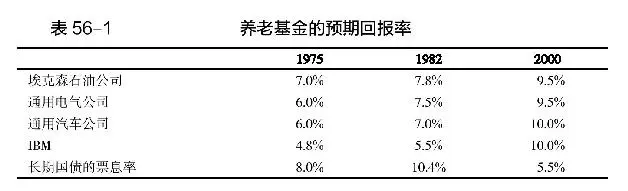

现在我们发现，公司设定的养金基金的预期回报率越高，公司的报告期利润也就越高。这就是养老金账户的运作方式。我希望为了相对简洁，大家可以先采纳我的观点。

如表56\-1所示，1975年养金基金的预期回报率是比较谨慎的：埃克森7%，通用电气公司和通用汽车公司都是6%，IBM低于5%。令人感到奇怪的是，投资者当时可以通过购买不可赎回的长期国债而获得8%的回报率，换句话说，这些公司可以把所有养老基金都用来购买票息率为8%的无风险债券，但它们仍然选择了低预期回报率。到了1982年，大家可以看到，它们把预期回报率调高了一点，达到了7%左右。而与此同时，它们可以通过购买长期国债而获得10\.4%的回报率。实际上，它们也可以通过购买被称为“迭期”（Strip）的金融工具，从而在未来几十年中锁定10\.4%的再投资回报率。这就相当于你的傻侄子也能管理这些养老基金，并获得高于公司假设的投资回报率。

究竟为什么在国债的回报率接近10\.5%的时候，公司却假设7\.5%的收益率呢？答案还出在后视镜上：投资者经历了20世纪70年代早期股市繁荣之后的崩盘，心有余悸，在考虑回报率时就沿用了过时的思维。他们没能做出必需的心态调整。

我们再迅速快进到2000年，当时长期国债的票息率为5\.4%。这4家公司的年报里有关养老基金的预期回报率是多少呢？它们的假设是9\.5%，甚至10%。

我喜欢打赌，也很愿意与这4家公司中任何一家的首席财务官、精算师抑或者审计师打个赌。我敢说在未来15年，它们的平均回报率达不到它们假设的水平。首先，我们来做道数学题。一个养老基金的投资组合非常有可能包含1/3的债券，保守起见，这些债券有着不同的到期日，按照当下的行情，其回报率不会超过5%。那么余下占基金总资产2/3的股票要有超过11%的回报率才能保证投资组合的整体回报率达到9\.5%。这是非常大胆的假设，特别是鉴于一般投资基金还要扣除大量的投资费用时。

然而，大胆的假设可以给公司的财务底线创造了奇迹。运用表56\-1最右边一列的预期回报率，公司报告了非常高的利润，而且远高于它们设定低预期回报率时的利润。当然这对设定预期回报率的人没什么损失。在这场游戏中，精算师对未来的投资回报并无特别的认识。不过，他们知道客户渴望看到高预期回报率，客户高兴了，就意味着他会成为长期客户。

我们是在这儿谈论大数字吗？看看通用电气公司，这个国家最有价值、最受尊敬的公司的情况吧。我自己就是一个通用电气公司的狂热崇拜者。几十年以来，通用电气公司一直把养老基金管理得非常好。它的预期回报率是比较有代表性的。举通用电气公司的例子，只不过是因为这家公司鼎鼎有名。

退回到1982年，通用电气公司确定承担的养老金责任约5\.7亿美元，大约占公司当年税前利润的20%。2000年，这个数字达到了17\.4亿美元，占公司税前利润的9%，是通用电气公司的家用电器部门6\.84亿美元利润的2\.5倍。17\.4亿美元是一大笔钱。如果将养老基金的预期回报率降低到一定程度，就必须用大笔的利润去填补养老金缺口。

和许多公司一样，根据美国财务会计准则委员会（Financial Accounting Standards Board）在1987年实施的一条规定，养老基金在会计上成了贷方中的独立科目。从那时起，公司可以根据合适的会计假设，将自己需要的养老基金贷方的收益录入公司损益表。2000年，根据高盛的估计，虽然养老基金的投资普遍缩水，标准普尔500成份股中的35家公司还是从养老基金贷方获得了10%以上的利润。

不幸的是，养老基金的预期回报率虽然重要，但是几乎从未成为公司董事会会议讨论的话题。我本人虽然跻身19个董事会，但从来没听过关于这一议题的严肃讨论。现如今，这个议题成为重中之重，因为人们基于20世纪90年代的辉煌业绩而设定的预期回报率达到了相当极端的程度。请你们去问问任意一家大大受益于养老基金的公司的首席财务官，如果养老基金的预期回报率降到6\.5%，会对公司的利润产生怎样的影响。如果你想更苛刻一点，可以问问这家公司1975年养老基金的预期回报率，在当时，不论股票还是债券都比今天有着高得多的预期回报率。

2001年年报即将出炉，你们留心看看各家公司是不是降低了养老基金的未来预期回报率，这会是件很有趣的事。考虑到最近可怜的回报率和未来需要支付的养老金，我想任何人，无论是首席执行官、审计师还是精算师，都不会选择降低自己的假设，尽管他们可能面临因误导投资者而被起诉的风险。作为董事会成员，如果不对这种盲目乐观的预期提出质疑，那就是他们的失职。

20世纪的经验证明，股市非理性现象的爆发是周期性的。因此，我强烈建议那些想要好业绩的投资者，最好学会应对股市下一轮的非理性。__投资者需要的是一剂解毒剂，在我看来这解毒剂就是量化分析。如果加以量化，你不一定做得极端出色，但也不会堕入疯狂的深渊。__

从宏观角度来说，定量分析根本不必那么复杂。图56\-2起始于80年前，图中所说的都是非常基本的东西。这张图揭示出所有上市公司股票的总市值占GNP的比重。尽管这个比重所传递的信息量有一定的局限性，但也可能是衡量任何时候估值水平的最佳单一手段。从图中你可以看出，近两年前，该比重升高到了前所未有的水平。这应该是一个很明显的预警信号。

如果投资者要以超越美国实体经济发展的速度来增加财富，该比重必须不断持续上升再上升。如果GNP每年增加5%，而你想要股市总市值增加10%，那么，这条曲线需要直线上升，直至超出图表的范围。这种情况是不会发生的。

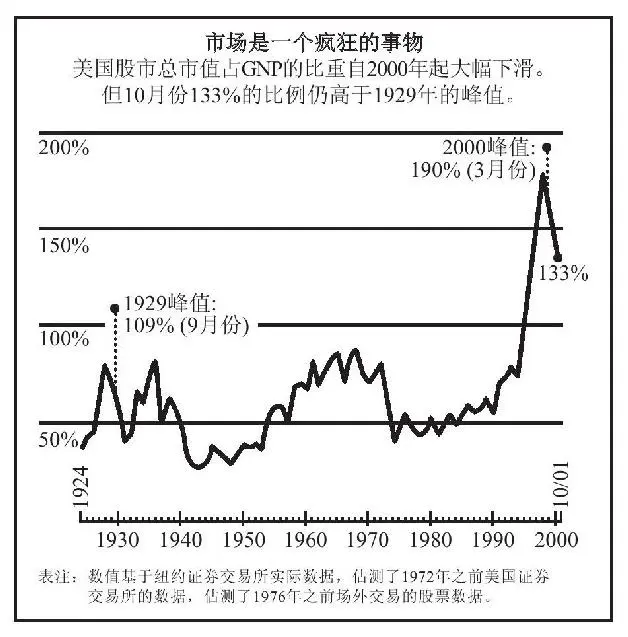

图56\-2所有上市公司股票总市值占GNP的比重

对我来说，图56\-2所传递的信息是：如果比重降至70%或80%附近，购买股票就会是很好的选择。如果这个数字接近200%，就像1999年和2000年部分时间段的情况那样，那你就是在玩火。可以看出，最近这个数字是133%。

即便如此，还是比1999年的高点下跌了很多。我曾大胆提出，美国的股票投资者在未来10～20年的预期回报率应该约为7%（包括股息和假定的2%通货膨胀率）。这只是一个粗略数字，还没算上交易费用，比如佣金和各种其他开支。我想，净回报应该可能在6%左右。

如此一来，如今股市的“汉堡”更便宜了。这个国家的经济在发展，但股票价格更低了，这意味着投资者将会用同样的钱获得更多的回报。我预计，除去成本，股市的长期回报率将为7%左右。这可是件好事啊，除非你还用20世纪90年代的思维来推演你对未来的预期。

## 57 每个人都渴望的情书（节选）

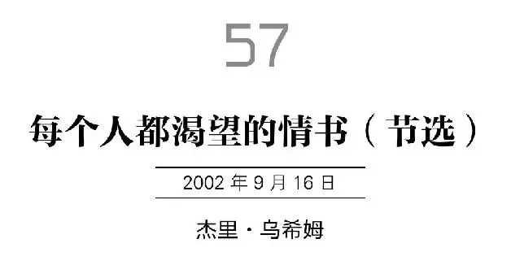

接下来这篇是后安然时代（post\-Enron）一篇文章的补充报道，描述了企业争相成为商界典范的情形。

如今美国企业界最渴求的词儿是什么？

很简单：“诚挚地，沃伦。”（信件的落款）

随着企业间争相整顿自己的行为，股神沃伦·巴菲特的表扬信已经成为企业界的“产品质量许可证”（Good Housekeeping Seal of Approval）。通用电气公司就因宣布将把股票期权作为费用处理而得到了巴菲特的表扬信。巴菲特写道：“一直以来，通用电气公司不断让我们的生活变得更美好。现如今，它又把这种美好带进会计领域，成为企业财务方面的好榜样。”

标准普尔公司因为其新型的“核心利润”（core earnings）举措，也获得了一封表扬信。巴菲特在信中写道：“你们的措施既具激励性又十分正确。将来，投资者会将你们的这次行动看作里程碑式的事件。”标准普尔公司甚至有意将全文发布在其网站上。其他收到表扬信的幸运者还包括美国第一银行（Bank One）和亚马逊公司。

“在所有人乃至万物之中，只有他拥有无瑕的声誉。”标准普尔公司的分析师罗伯特·弗里德曼（Robert Friedman）说。我们再听听其他的声音，比如领航集团（Vanguard Group）创始人约翰·博格（John Bogle）[\5]，他直言不讳地说：“巴菲特的演讲令我醍醐灌顶。”不过，博格又是怎么知道巴菲特关于企业责任的演讲大受欢迎的呢？原来他也读了巴菲特的演讲稿。

2026年3月14日

16:57

## 58 一切的神谕

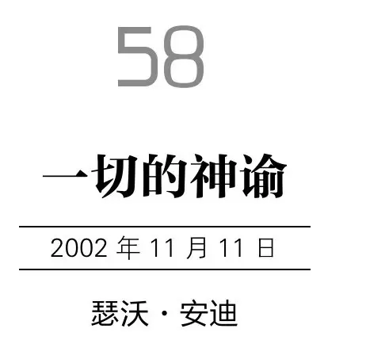

在沃伦·巴菲特执掌伯克希尔哈撒韦公司的47年间，公司股票曾在4个不同的时间段惨跌了40%～50%。我们先回顾一下前三个阶段：1973—1974年，1987—1988年以及2007—2008年，然后再延伸到第四个阶段，即互联网泡沫时期。当时泡沫破灭之后，伯克希尔哈撒韦公司A股价格已从2000年年初的4万美元回升至7万多美元。与此同时，越来越多的人意识到巴菲特绝不是老古董，尽管曾有许许多多的市场人士，在他们一头扎进市场泡沫当中的时候，曾坚决声称巴菲特是老古董无疑。

瑟沃·安迪，当时以“街头生活”（Street Life）的笔名为《财富》杂志写过大量文章，并于2006年成为杂志主编。他被委以撰写“幕后巴菲特”故事的任务，当时恰逢巴菲特和一众朋友前往加利福尼亚进行高尔夫球之旅。巴菲特因左肩旋转肌有伤，所以自己并不玩高尔夫球。不过，他的朋友们每隔一年都会聚到圆石海滩（Pebble Beach）、眺远山（Spyglass）以及柏树点（Cypress Point）等高尔夫球俱乐部一起玩玩，这个习惯已经持续了20多年，巴菲特不想放弃这样难得的社交机会。

因此，安迪也赶往圆石海滩。他一整天都围绕在巴菲特身旁：在两人房间都还没整理好时，他们挑了一处风景优美的景区谈话；巴菲特的房间准备好后，就去他的房间继续聊；晚上巴菲特和球手朋友们相聚时，安迪也来凑热闹。他的朋友中有查理·芒格、首府/美国广播公司的汤姆·墨菲、克劳瓦斯、斯温和摩尔律师事务所的乔治·吉莱斯皮、《华盛顿邮报》的唐·格拉汉姆、桑迪·戈特斯曼（Sandy Gottesman）以及第一曼哈顿公司的约翰·卢米斯（我的丈夫）。

安迪迅速意识到，如果能在圆石海滩完成他所有的报道内容，那就太好了。不出意料，从此杂志社再也没有派他去圆石海滩。

——卡萝尔·卢米斯

几十年以来，沃伦·巴菲特的名字一直和点石成金的投资家的形象密不可分，他人格可靠、坦白正直，拥有坚定的价值信仰，即坚信买“公司”而不是股票。他对美国股市的影响力堪比美联储主席和美国总统；上到华尔街下到小城镇，他的投资风格不断被其追随者学习和复制；他撰写的伯克希尔哈撒韦公司致股东的信被广泛地传阅、援引，好比投资界的圣经。

因此，当穿着一套睡衣的巴菲特本尊出现在你面前时，还是会让人略感奇怪的。一个美好的清晨，在圆石滩旅馆一楼，72岁的巴菲特先生和我相约在圆石海滩旅馆他租住的宽敞套间内。窗外，10月的阳光明媚无比。卡梅尔海湾（Carmel Bay）的风景真是美不胜收。右手边是第18洞的果岭，左边则矗立着一棵大柏树。这位“奥马哈先知”完全是一副放松的状态，身着白毛圈布浴衣和一件色调柔和的蓝色睡衣，端着客房服务生送来的煎蛋，悠然自得地逛来逛去。

在左海岸（Left Coast）的完美氛围中，我们开始探讨20世纪刚刚结束的科技泡沫。“那是集体性幻觉，”巴菲特说，“是我有生以来所遭遇的最大规模的经济泡沫。”在这场惊心动魄的“泡沫”过后，巴菲特看起来却丝毫未受扰动。他的脸上看不到一丝懊恼。这或许是因为他从未在泡沫膨胀抑或是破裂时说过任何一句大空话。

这也让我们看到巴菲特的另一个侧面。没错，多年以来，巴菲特不仅在各投资领域内保持着辉煌的战绩，而且还以其独特的冷静、谦恭，甚至愚钝的处事方式，在其他事情上也一贯无误：在企业管理、股票期权和会计改革、企业家道德操守以及对股市的看法方面，都保持了惊人的准确性。

事实上，巴菲特在这些问题上的正确观点已经保持很多年了。最近几个月，公司丑闻频发、经济低迷、熊市大行其道，世界似乎正在回归到巴菲特的世界观中。更贴切地来说，越来越多的人似乎正在企盼（至少希望）巴菲特能够降临，并将他们从过去的错误中拯救出来。因为他通过伯克希尔哈撒韦公司掌控着全球最具流动性的资金源之一。最近，巴菲特已经迈开收购的步伐，购进了大批美国公司，特别是濒临破产的行业，比如，电信业、公用事业以及能源产业。这些年，他一直从事着自己擅长的工作：在市场触底的时候收购，而不是其达到顶峰时。

如此功绩虽然听起来简单，可至今无人能及。对于我们这些凡夫俗子来说，注视他的一举一动至关重要。这也是《财富》杂志再度回归到这个话题的原因。当我们向巴菲特“索要”一点儿宝贵的时间来采访他时，却意外地得到与这位“奥马哈先知”48小时近距离接触的机会。于是，我们进行了一场马拉松式的会谈，话题从原子弹爆炸到垃圾债券，从巴里·邦兹到巴里·斯维泽再到艾略特·斯皮策[\6]。

然而，眼下我们正在讨论的这个时间段，人们一度以为巴菲特的判断出现了错误。简直令人难以想象，但这就是发生在不久前的事。当时，相当多的华尔街和硅谷人士认为这位传奇的投资者已经落伍了，被时代抛弃了。他们认为，巴菲特处理问题的方式似乎已经不合时宜了，游戏的规则有所改变，而他却没有跟上时代的步伐。“巴菲特应该说，‘对此我感到非常遗憾。’”《技术投资者杂志》*（Technology Investor Magazine）*的哈里·牛顿（Harry Newton）在2000年早期说，“他怎么能错过电子、无线电、网络、电缆以及生物技术的革命呢？”

当时，纳斯达克指数迅速上升而伯克希尔哈撒韦公司的股价遭受重挫，我们无需强调，这一切是因为在虚假繁荣期时市场深陷于非理性之中。巴菲特对于价值的注重和坚持，对长线而不是短线的关注，都被看作陈腐老旧的观点。那么，股票期权的培植、金融工程以及“境遇伦理学”（用巴菲特自己的话来说）究竟出了什么问题？它们曾经发挥过作用，难道不是吗？

“人们说，虽然你曾经盛极一时，但你的时代已经过去了，”我问他，“这些言论有没有困扰过你？”

__“从来没有，”他用平和而又沙哑的声音答道，“这些事情从来不会成为我的困扰。如果你不能独立思考，就不可能在投资上做得出色。事实不会因为人们赞成或者否定而发生改变。你被证明是对的，那是因为你能够看见客观事实并据此进行正确分析。只有这个才能决定最终结果。可是人们从未对事实是否客观或分析是否正确提出过疑问。”__

周日，我和巴菲特在奥马哈碰了头，然后和他共乘利捷公务航空公司的湾流飞机飞往蒙特利半岛（Monterey），在那儿，他的妹妹柏蒂·巴菲特（Bertie Buffett）接我们到了圆石海滩。由于左肩旋转肌的问题，他在圆石海滩的大部分时间都逗留在房间里，而不是像往常一样和两年一聚的朋友们出去玩。肌肉损伤对于巴菲特来说并不是大问题。一方面，疼痛感并不强，另一方面，他对高尔夫球也没那么狂热。“我已经获得了奥古斯塔最高的差点。”他夸口说。肩伤让他有更多时间来工作，即阅读、写作以及打电话，这都是他热衷的事情。

当全世界最伟大的金融大脑因“折翼”而安静地坐在房间里，或许此刻唯一有价值的事情就是向他询问关于股市的问题。问题是，巴菲特根本不喜欢谈论股价的问题，尽管1999年11月他在《财富》杂志上发表了一篇文章，文中强烈暗示股市的估值太高了。20世纪20年代伯纳德·巴鲁克（Bernard Baruch）也曾发出过著名警示，历史学家或许有兴趣对比研究一下两者之间的相似性。《财富》杂志去年曾针对他的观点做过补充报道，其中巴菲特说，很多公司可能将不得不降低他们对养老基金回报率的期望。事实证明他是对的。而且他还指出，当时美国股市总市值高出美国GNP的1/3，甚至超过1929年顶峰时的水平。其传递的信息再清楚不过了：股价会持续下跌。事实再次证明他是对的。

那么，巴菲特又如何看待如今的股市呢？他的回答言简意赅：“泡沫已经破裂，但股价依旧不便宜。”这点毫无疑问，尽管如此，他还是强调现在买股票也比1999年时强得多。巴菲特依旧坚守其投资理念：“投资者应该避免跟风购买，躲避劣质公司，还要把握出手的时机。购买长期的指数型证券投资基金是最合理的。”那么购买伯克希尔哈撒韦公司的股票如何呢？“这个我可不知道；现在股价有点儿高了，”他说，“尽管如此，我还是宁愿买它而不是标准普尔500指数。当我们曾经讨论回购股票的问题时（2000年股价跌至4万美元左右时），那就是一种真正的信号！”谈到自己的“独家秘籍”时，巴菲特哈哈大笑了起来，用脚扣动着咖啡桌。从那时起，伯克希尔哈撒韦公司的股票已经回升到7万多美元了。投资者应该做个笔记：下一次巴菲特再谈回购问题时，就是出手的时机！

巴菲特的生活重心并不在股市，而是他的公司伯克希尔哈撒韦，了解该公司的运作方式是了解巴菲特思维方式的关键。针对这一点，我首先与巴菲特的好伙伴查理·芒格探讨过，他和首府/美国广播公司的前任总裁汤姆·墨菲、《华盛顿邮报》的唐·格拉汉姆都是高尔夫球聚会的成员。__“伯克希尔哈撒韦公司是在一种极端方式下运营的，我想这点很多人并不能完全理解，”芒格告诉我说，“相比世界上其他和我们规模相当的公司，我们的管理费用更少，决策速度更快。”__

想说清楚伯克希尔哈撒韦公司与其他企业有什么不同不是一件容易事。准确地来说，这是一家规模巨大的企业集团，手中还掌控着诸如可口可乐公司、吉列公司和美国运通公司等企业巨头的大比例股份。同时，伯克希尔哈撒韦公司也握有重要的公用事业以及输气管道企业的股份。不但如此，伯克希尔哈撒韦公司旗下还有很多业绩出众的家用产业，比如，家具连锁店、珠宝商店以及制鞋厂等。

伯克希尔哈撒韦公司并未依照什么总体蓝图或是战略规划图来发展，然而公司的整体架构却让投资者可以很好地一窥巴菲特思想的脉络。举个例子：多年以来，伯克希尔哈撒韦公司一直被认为是一家持有许多其他企业股票的保险公司。不过，这其间发生了很多事情。首先，巴菲特逐渐停止大规模购买其他公司股票的步伐。比如，他购买华盛顿邮报集团的股票，已经是20世纪70年代的事儿了。他为什么停止呢？原因很简单：这些年来，股价一直居高不下。“我第一次购买股票已经是60年前的事了，”巴菲特说，“这60年以来，大约有50只普通股曾经吸引过我。而近10年以来，我几乎没有发现任何一只值得购买的股票。”他所说的这10年主要是指近几年。

相反地，巴菲特转而开始收购整个公司，通常是传统经济领域的非上市公司。在科技迅猛发展的时代，很多这类公司经常被以低价出售。伯克希尔哈撒韦的收购项目有许多是保险企业，当然还包括一些其他企业，比如上文提及的本杰明·摩尔公司、萧氏地毯、公用事业企业中美能源控股公司以及最近收购的娇宠有限公司。这一系例操作，使得伯克希尔哈撒韦公司逐渐成了一家控股集团，在保险业务不断发展的同时，伯克希尔哈撒韦旗下的制造业公司和服务业公司的比重已经较过去有了很大提高。保险业务仍旧占据伯克希尔哈撒韦公司的半壁江山，虽然相对而言，其比重有所下降。

通过收购这些种类繁多的企业（过去5年大约收购了20家公司），伯克希尔哈撒韦公司的雇员数量也相应增长。至今，全美国有超过14\.5万名民众可以挺直身板骄傲地说：“沃伦·巴菲特是我的老板。”这也使得伯克希尔哈撒韦公司成为全美第25大私营企业雇主。其员工人数已超过百事可乐公司或者万豪酒店（Marriott）。

巴菲特是如何找到新收购对象并将其纳入囊中的呢？确切地说，其实是各家公司竞相投奔他。巴菲特说，这些天来，卖家可以分为两种类型：“我们现在通常接到两种电话。有的人打来电话说，他们只是需要我们，希望自己的企业能成为伯克希尔哈撒韦公司的一部分；还有人打电话说他们只想要现金，而且要快。我们是那种能够在一个周末之内筹集到足够现金的买家。”

巴菲特最近的一笔收购就属于前一类，娇宠有限公司就非常希望成为伯克希尔哈撒韦一部分。如果你是男人，或者不喜欢做饭，那可能没听说过这家公司。然而，如果你是喜欢做饭的女性，那你很可能对它早有耳闻了。娇宠有限公司的“顾问”在她们自家的聚会上就可以销售厨房用具。这是一种升级版的特百惠模式。

22年前，娇宠有限公司创始人多丽丝·克里斯托弗利用人寿保险单借了3000美元，开始了她自己的创业之旅。如此一来，弹性的工作时间可以保证她照顾两个年幼的女儿。如今，她的公司营业收入已经超过7亿美元，共有大约7万名顾问式销售员，每周进行的室内演示超过19000场。至于利润，我们只能说娇宠有限公司是利润相当丰厚的企业，可谓令人垂涎。

尽管事业蒸蒸日上，克里斯托弗也清楚地知道要为将来早做打算，以免她自己猝然去世或是便于在年事已高之时决定隐退。很多年前她就听说过沃伦·巴菲特其人：“在内心深处，我觉得成为其公司的一员是很好的选择。不过，当时这个想法被驳回了。”尽管如此，9月中旬的时候，伯克希尔哈撒韦这个名字再次进入她的视野，克里斯托弗通过高盛集团的银行家联系了巴菲特，而巴菲特也立刻喜欢上了这家公司。

几天之内，克里斯托弗就和公司董事长希拉·奥康奈尔·库珀（Sheila O’Connell Cooper）一起从芝加哥飞往奥马哈，只为和这位“先知”促膝小谈。“短短几分钟我就感受到，克里斯托弗也是一样，我们是对方的最佳选择。”巴菲特说。当场巴菲特就提出了收购意向。当谈论娇宠有限公司时，他开始滔滔不绝起来：“两个月前，我还从未听说过这个名字，但我可以肯定的是，克里斯托弗和库珀非常热爱她们的事业。我要做的就是不要挡在她们前进的路上。她们的故事比我的精彩多了。”呃，这个也不尽然。

然而，对于巴菲特来说，这家企业符合所有的“收购条件”：娇宠有限公司属于专利产品，高利润，连锁经营模式处于成长上升阶段，作为一家刚刚起步的公司来说，规模已经够大了。事实上，规模对于巴菲特还是很重要的。伯克希尔哈撒韦公司成长得很快，比起10年前，已经庞大了很多。年收入已经从30亿美元上涨到接近380亿美元，其中大部分增幅来自收购的通用再保险公司和萧氏地毯。“很多人说伯克希尔哈撒韦公司已经太大了，不可能再产生规模效应了。”79岁的芒格嘲讽道，“哈哈，他们错了。”

当伯克希尔哈撒韦公司向世人证明自己能够成长而且将继续成长时，巴菲特开始放缓收购的步伐，其目标主要转向“大鱼”。一家公司必须具有5000万美元左右的税前利润，巴菲特才会考虑购买它，在这点上很少有例外。这也就是为什么他告诉我，他很可能会去其他国家去寻找这种优质企业。

这样做的原因很简单：收购公司的规模必须足够大，才能对伯克希尔哈撒韦公司的底线产生影响。我们应当指出，这条底线有时是“飘忽不定”的。部分原因在于，在某个特定年份，伯克希尔哈撒韦公司可能会获得巨大的资本收益，这会形成一个巨大的基数，使接下来公司在短期内的净利润显得可有可无。举例来说，由于9月11日的恐怖袭击事件，使得保险业损失惨重，2001年该公司的利润大幅跳水76%，跌至7\.95亿美元，和1995年时齐平。然而在2000年，该公司的利润却是2001年的数倍，达到33亿美元。

如果这类理不清的问题困扰着你的话，不妨看看别处。令巴菲特感兴趣的投资者通常都具有长远的眼光。

圆石海滩的一个晚上，巴菲特邀请我和他的朋友一起去他妹妹柏蒂家吃晚餐，她家位于卡梅尔附近。这是一次很轻松的非正式聚会：一些饮品和自助晚餐，超大的电视屏幕上播放着柏蒂最爱的旧金山巨人队（San Francisco Giants）的比赛。大家谈论的话题和其他聚会也大同小异。巴菲特最擅长体育方面的话题，尽管当我提示他内布拉斯加大学剥玉米人队已经跌出前25名数十年时，他的脸上掠过了痛苦的表情。整个晚上，巴菲特捧着樱桃口味可乐，近距离地和我交谈：“对于我来说，中美能源控股公司是从这里开始的，你知道，就在这座房子里。”他所指的是很可能成为伯克希尔哈撒韦公司另一个重要支柱的中美能源控股公司，一家总部在得梅因（Des Moines）、从事电力和输气管道业务的公用事业公司。不，我不知道，我对他说。他会解释吗？几乎就是在三年之前，柏蒂也举办了这样一场聚会，招待了她的哥哥和另一些朋友。客人中就有第三级通信公司（Level 3 Communications, Inc\.）董事长沃尔特·司各特（Walter Scott），他曾是奥马哈一家大型建筑企业彼得·基威特父子公司（Peter Kiewit Son）的首席执行官。

“沃尔特把我拉到一边，问我是否可以和他到另一个房间单独聊会儿。”巴菲特说，“他谈到了公用事业公司中美能源，他对这家公司非常入迷，但其他人对这家公司则一点都不感兴趣。他试图跟华尔街解释这家企业的价值，然而分析师们并不为所动，他们只是一心寻找进行很多交易的企业，比如，爱依斯电力公司（AES Corporation）或者卡尔派电业公司（Calpine）。司各特说，他正在考虑将中美能源控股公司私有化，所以问问我是否有兴趣。我说有。”

你要记住，当时的情况是，很多公用事业股票就像互联网孵化器或者B2B股票一样炙手可热，受到市场的追捧。比如，爱伊斯电力公司和卡尔派电业公司顶峰时的股价分别为56美元和70美元。如今，它们都跌到了可怜的2美元左右。公用事业股票的飙升起始于1992年《能源政策法案》*（Energy Policy Act）*的实施，新措施的出台使得各家企业蜂拥进入看似诱人、无管制的时代。无管制的公用事业企业可以基于投机性的目的发电，没有稳定的客户源，但可以根据市场价格出售电力，而有管制的公用事业企业则拥有稳定的客户和受管控的电价。随着越来越多的资金涌入无管制业务，中美能源控股公司的首席执行官戴维·索科尔（Daivd Sokol）看到了一个巨大商机：受管制的资产被忽视了。

到20世纪90年代中期，中美能源控股公司经营着加利福尼亚州、爱达荷州以及英国的受管制公用事业公司。当安然和其他同类公司股票市盈率达到30～50倍时，中美能源控股公司的市盈率只有6～8倍。“我们不知道其他公司是怎么做的，”索科尔说，“它们不断地建造新电厂，增加产能，我猜这是因为它们认为需求会永远上涨。它们的交易业务也是一个谜。它们的盈利能力对我们来说几乎不可能。”不仅如此，中美能源控股公司的股价还在持续下跌。因此，索科尔于1999年10月决定私有化，并将公司出售给巴菲特。最终伯克希尔哈撒韦公司以每股35\.05美元的价格收购了该公司80%的股票，总计花费达到33亿美元。

巴菲特出手的时机并非最佳，但也相当接近。到2001年夏季，无管制的能源业务因安然丑闻的爆发，震惊全世界，其股价开始崩溃。到2002年年初，情况愈演愈烈，包括威廉姆斯公司（Williams Cos）在内的各家公司突然发现自己急需大量现金。威廉姆斯公司所能做的只有忍痛抛售科恩河输气管线设施（Kern River Pipeline），这家子公司每天运输8\.5亿立方英尺的天然气，从落基山脉经过1489公里送抵赌城拉斯维加斯和加利福尼亚州。威廉姆斯公司开出的价格是9\.5亿美元，这比两年前的市价少了好几亿美元。

让巴菲特更加心花怒放的是，2002年7月中美能源控股公司买下了北方天然气管道公司（Northern Natural Gas Pipeline）的输气管线，该输气管线每天运输量为43亿立方英尺，总长度为26715公里。巴菲特靠在沙发背上，愉快地讲述着这个故事，志得意满，仿佛钓到一条大金枪鱼：“北方天然气管道公司曾是奥马哈的一家非常杰出的公司。1986年有个休斯敦人来到这里，他自己的公司规模比较小，所以提议与北方天然气管道公司合并，然后他就搬到奥马哈来。随后，奥马哈人都觉得自己上当了，因为这家公司在6或8个月之内就搬回休斯敦了。不用猜，这个休斯顿人就是肯·雷（Ken Lay），这家公司就是后来的安然公司。在一年之前安然公司出问题时，达力智公司（Dynegy）投入15亿美元买下了它，几乎相当于半买半送地获得了北方天然气管道公司，可是后来达力智公司又出了问题，某个周五他们打电话找我们，说他们在下周之前必须卖掉公司，而且要以现金的形式。于是我们派了一组人过去，周一早上就签好了合同。”

且来看看他是怎么做数学题的：1月份达力智公司花15亿美元买下安然公司，6个月后，巴菲特的中美能源控股公司买下达力智公司，却只花了9\.28亿美元。真是太划算了！

如今，中美能源控股公司的管道输送着全美国10%的天燃气。“我们可能再也没机会做成这样的交易了，很难有企业能达到如此的规模，”巴菲特说，“中美能源控股公司对伯克希尔哈撒韦公司非常有价值，因为其规模足够大。”鉴于该公司未来的发展空间，伯克希尔哈撒韦公司最终向公司投入了大约100亿～150亿美元，甚至更多。如果这个数字听起来大得超乎想象，那么你可以试想一下，伯克希尔哈撒韦公司目前每年从投资、保险业务以及旗下公司中收获约50亿美元的现金流。“我们每周的现金是1亿美元，而我要想办法把它花出去，”他说，“这虽然是一个让人快乐的麻烦，但始终还是个麻烦，特别是我做得不怎样时，而这一不小心就会发生。”

柏蒂家的晚宴过后，格拉汉姆、巴菲特和我钻进了格拉汉姆的福特车，准备回到圆石海滩去。赶夜路总是说起来容易做起来难。四处一片漆黑，我坐在后座拿着地图，担任起了导航员的角色。“我很庆幸是格拉汉姆在开车，”巴菲特说，因为一路上我们历尽了各种蜿蜒曲折，“我不喜欢在夜里开车，看不清楚。”

是的，这位先生也是凡人，而且还上了年纪。每周他能为1亿美元找到出路，却不能胜任在夜里开车。在专访刚开始的时候，巴菲特还说了些不雅的回文串，让我忍俊不禁。这还是那位在《纽约时报》专栏中对弄虚作假的股票期权会计处理方法口诛笔伐的公民代表吗？

另一个看起来矛盾的事实是：股东们正是依靠他一次又一次地战胜了“地心引力”，而他却告诉大家，“地心引力”通常才是最终获胜方。

鉴于伯克希尔哈撒韦公司的规模越来越庞大，巴菲特多年来一直提示伯克希尔哈撒韦公司的拥趸们，公司股票未来的表现不可能与过去同日而语。1999年当伯克希尔哈撒韦公司公布相对回报率时，他所说的“未来”到来了。巴菲特经常拿伯克希尔哈撒韦公司账面净资产的年增长率与标准普尔500指数的增长率做比较，以此来评估自己的表现。1999年，伯克希尔哈撒韦公司的账面净资产微涨了0\.5%，而标准普尔500指数则飙升了21%，低了20\.5%。然而，从那以后，公司的表现出现了逆转。不过，2001年公司的表现再次大幅下滑，这也是伯克希尔哈撒韦公司有史以来第一次出现账面净资产下降的情况，降幅为6\.2%。出现这种情况的主要是，公司的保险业务因“9·11”事件损失了20亿美元。

这既是坏消息，也是好消息。由于“9·11”事件，保险业务的价格更为坚挺，这意味着保费收入会大幅增加，从而对保险业务的财务状况有着潜在好处。近期市场上有传闻说，伯克希尔哈撒韦公司将要购买通用电气公司旗下的雇主再保险公司（Employers Re）。标准普尔500指数到本财年为止已经下降了大约20%，而伯克希尔哈撒韦公司的生意却一路高歌猛进，到了6月30日，伯克希尔哈撒韦公司的账面净资产上涨了7\.6%，这又是一个相对表现非常出众的年份。伯克希尔哈撒韦公司的股票也表现得相当稳健，这点毫无疑问。2000年3月10日，纳斯达克指数冲到历史最高点：5132点。同日，伯克希尔哈撒韦公司的股价却创下了多年来的新低：40800美元。随后，纳斯达克指数暴跌至1270点，同比下降75%，而伯克希尔哈撒韦公司的股价则飙升至74000美元，上涨幅度高达81%。当然，伯克希尔哈撒韦公司在过去1年、2年、5年、10年，甚至15年里都让标准普尔500指数成了手下败将。

在和巴菲特共同出游的那周之后，我采访了伯克希尔哈撒韦公司一些子公司的首席执行官。目前其子公司已经接近40家，巴菲特开心地指出，经营伯克希尔哈撒韦公司38年以来，旗下没有任何一家子公司选择脱离母公司自立门户。这一切显然与巴菲特一个很少为人们所注意到的管理技巧有关：他为人处事很有一套。利捷公务航空公司的生意是出租飞机的部分所有权，其首席执行官里奇·圣图利（Rich Santulli）说：“他对人才的判断最准确，大家都想为他工作。”

从巴菲特旗下这些公司所取得的成就来看，圣图利的话确实有道理。这是一个了不起的首席执行官团队，不仅仅是因为他们个个能力过人，更因为他们对自己的工作如痴如醉。这个团队里甚至有好几位耄耋老人，包括现年85岁的飞安国际公司（Flight Safety International）首席执行官艾伯特·尤斯基（Albert Ueltschi）、80岁的布朗鞋业公司（Brown Shoe Co\.，Inc\.）首席执行官弗兰克·鲁尼（Frank Rooney）等。

另一方面，作为伯克希尔哈撒韦公司最年轻的首席执行官之一，43岁的乔·布兰登（Joe Brandon）一年前坐上了通用再保险公司的头把交椅，这个位置堪称伯克希尔哈撒韦公司最热门的宝座。然而，即便没有遭受“9·11”事件的冲击，自1998年伯克希尔哈撒韦公司花了220亿美元将其收入囊中之后，公司就麻烦不断：保险接单凌乱失序，利润达不到预期水平。巴菲特甚至还因公司绩效不佳而向股东致歉。

那么，布兰登，老头子对你怎么样？“各个方面他都全力支持，”布兰登毫不迟疑地说，“是的，你在和全世界最聪明的人共事，所以一定要做好万全准备。不过，人们似乎并不清楚他是多么优秀的一位管理者。”布兰登说得对极了，然而他的优秀依旧未引起人们的注意。部分原因在于巴菲特自己。“我买下企业之后，就立马转身离开。”巴菲特再三表示。呃，其实也不尽然。

再往深处挖掘，你会发现巴菲特其实对每一家子公司都有不同程度的介入，这要视他的兴趣和某个企业能否引起他的关切而定。比如，布兰登说他每周都会和巴菲特谈上两次话，可是巴菲特和另一家再保险公司的负责人阿吉特·贾因却要天天通电话。这并不是因为贾因做得不够好，恰恰相反，贾因是他手下最得力的高层主管之一。他们之所以通话这么勤，是因为承保超高风险保单，比如奥运会，对伯克希尔哈撒韦公司来说涉及巨大的经费问题。另一方面，巴菲特个人最爱的工作刚好就是为这类投保金额庞大的保单定价。至于其他子公司，巴菲特是这么说的：“政府雇员保险公司每周二都会把数据传送给我，包括网络点击率、网络成交额、电话询价成交额。这都是我喜欢的东西。萧氏地毯每天都会通过传真把销售数字发给我。圣诞节前后，从前一个月开始，每当接到我们的珠宝店、糖果店的日销数字，我都无比开心。”

尽管巴菲特经手的资金多得惊人，尽管他不知疲倦地勤奋工作，但他并不属于A型性格的老板。已经替他工作9年的秘书德比尔·波萨涅克（Debbie Bosanek）说：“没错，我得穿溜冰鞋才赶得上他的速度，可我从没见过他大发雷霆。不过我觉得他不喜欢人家骗他，如果你犯了错，向他承认就没事了，千万不要企图掩饰。”首府/美国广播公司的创办人汤姆·墨菲补充说：“他每天早晨起床去上班，为的是找乐子。对于他而言，那不是工作。他只和自己喜欢的人共处，这样就没有压力。”巴菲特很可能是全美国少数几个把每天的大半时间都用于阅读的董事长，他不用电子邮件，伯克希尔哈撒韦公司总部也没有浪费时间的会议。“巴菲特只要坐在桌子旁边围满人的房间里，听很多人滔滔不绝地讲蠢话，就会感到头痛欲裂。”巴菲特的好伙伴查理·芒格如是说。巴菲特和芒格的交情超过40年，以前总是在一起聊天，现在次数比较少了。芒格说：“直到如今，沃伦对于我心里想什么还是一清二楚，偶尔我也会知道一些对他有用的东西。”

总的来说，巴菲特能游刃有余地在这么多公司之间分配时间和脑力，就如同他配置资金的能力一样。__巴菲特也是华盛顿邮报集团的董事，公司首席执行官唐·格拉汉姆说：“大部分聪明盖世的人喜欢把事情变得更复杂，可是巴菲特却与众不同，他总是能把事情说清楚，变简单。”__

不过，请先停止赞颂他。无论如何一定有人不喜欢这个家伙，是不是？据我所知，不喜欢他的人不但有，而且还很多。巴菲特一直努力游说立法机关，将股票期权列入公司账目中的费用项目，因此在硅谷，有一大群讨厌他的人。还有一些人牢骚满腹，抱怨巴菲特口口声声说重视公司管理，聘请的外部董事却少得可怜。此外，巴菲特还捐款给计划生育组织，因此反堕胎人士对他很有意见。许多投资银行也不喜欢巴菲特，因为忽悠不了他；华尔街分析师对他也不怎么友善，因为巴菲特不肯透露任何投资意向。作为一再打败市场的能人，唯一的能人，巴菲特简直快要把有效市场理论的信徒逼疯了。此外，证卷交易监督委员会主席哈维·皮特（Harvey Pitt）可能也对巴菲特有些不满，因为在他任内，巴菲特常常不买他的账。最后，还有2002年年初投票表决巴菲特是否继续担任伯克希尔哈撒韦公司董事长时的16712张反对票（赞成票有1140816张）。

不论怎样，在人们眼中，巴菲特从来不是个桀骜不驯的人，而他也利用自己的声望在重要的经济问题和政治问题上发挥着影响力。除了股票期权方面的斗争之外，他还一直为设立类似美国联邦存款保险公司（FDIC）的联邦恐怖主义保险基金大声疾呼。“核攻击会使保险产业破产，”他说，“联邦政府的使命是让国家摆脱困境，那么为什么不在事前就建立一个基金，而无需到事后才追悔莫及呢？”

在圆石海滩高尔夫球场的第六洞果岭上讨论原子弹的破坏力，听起来或许不太和谐，可是巴菲特却不以为意。__他说，“原子弹是最让人烦恼的事。并终将发生，避无可避。我看不出有任何办法能躲得过，但我们可以降低发生的概率。如果某年发生某事的可能性是10%，我不晓得这概率对不对，没人知道，那么这件事在50年内发生的概率将高达99\.5%。如果把可能性降到3%，那么50年内发生的概率就可以降到78%左右；如能将可能性调低到每年1%，概率就只剩下40%。由此可见，降低任何事情的年度发生概率，就能够明显大幅减少我们下一代生命中发生某事的概率。知识无法抹灭。你能控制原料，却不能打消人的意图。这是人类的终极问题。”__

日暮时分，巴菲特窗外的后九洞，在夕阳映照下仿佛镀上了金光，我还是不能免俗地开口问他接班人的事。说白了，就是他过世后公司会怎样。这问题巴菲特已经回答过不下一百万次，他也想出了一百万种答案：“我希望股价不要涨太凶。”这是他自己最满意的回答之一。不过这次他倒是很正经。“听着，我死了以后公司还会经营很久，”他说，“这些企业会继续经营50年。我们有一个很棒的经营团队，他们晓得伯克希尔哈撒韦公司该如何运作，这真的是很简单的事。”

真的吗？好吧，这次恐怕我不敢苟同。经营企业并不是个大问题。我们还可以假设公司高管们能够维持他们创造利润的方式，甚至忽略保险业务该死的复杂性。就巴菲特天才般的资金配置技巧而言，就绝对是后无来者的。即使他非常亲密的伙伴，也常常私下怀疑他是如何做到的。

至于巴菲特家族，他们已经同伯克希尔哈撒韦公司的前世今生紧密地联系起来了。巴菲特的妻子苏珊·巴菲特，是伯克希尔哈撒韦公司董事会成员，虽然居住在旧金山，但常常与巴菲特一起出行。20多年来，巴菲特在奥马哈一直和阿斯特丽德·门克斯（Astrid Menks）女士生活在一起。这个看似特殊的安排，却符合了各方利益。苏珊还是巴菲特基金会的首席执行官。巴菲特在伯克希尔哈撒韦公司的股份，目前价值约为340亿美元。如果他先离世的话，这些钱都将遗留给苏珊，而到苏珊去世的时候，她所有的资产将会进入巴菲特基金会，随后将会被分配。巴菲特的长子霍华德·巴菲特是一家农用设备公司的首席执行官，也是伯克希尔哈撒韦公司的董事会成员。父亲去世之后，他将会接任公司非执行董事长。巴菲特的另外两个孩子，苏茜·巴菲特是一位家庭主妇，彼得·巴菲特是一位音乐家，他们都是基金会的受托人。

巴菲特去世之后，巴菲特基金会将会成为全球规模最大的慈善组织之一。有趣的是，巴菲特并没有指定基金会的具体方向。基金会的受托人可全权酌情决定如何分配善款。现在，这可能是巴菲特光辉灿烂的一生中尚未清晰透彻的一部分。

## 59 《财富》杂志来信选登

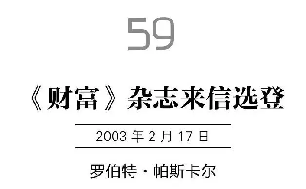

《玩转股息市场》*（Playing the Dividend Market，一本投资者指南）*的黑体字写着：“并非任何股息支付者都是很好的投资对象。看起来最诱人的，往往是相当危险的。”这句话的确为我们敲响了警钟。1956年1月，我购买了某纺织企业的股票，因为有迹象显示股息将达到8\.5%。然而，最终结果却是，不仅股息分文未见，净资产反而大幅减少。一年之后，我以亏损64%的代价出售了手中的股票。这几乎是我一生中犯过的最大的错误。这家公司就是后来的伯克希尔哈撒韦公司，多年之后，沃伦·巴菲特接手了公司。请不要告诉我，当年我割肉卖掉的股票现在价值几何。

## 60 大规模杀伤性金融武器

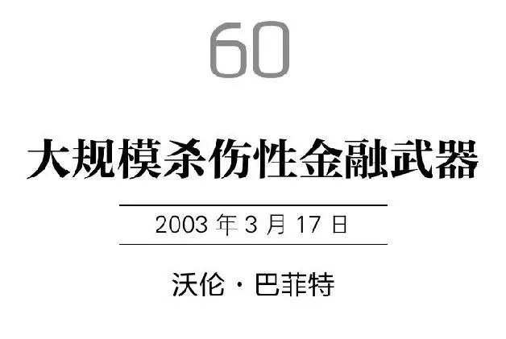

本文节选自2002年伯克希尔哈撒韦公司年报中巴菲特致股东的信。“大规模杀伤性金融武器”，这是巴菲特给衍生品起的绰号，并且瞬时在全球传开了。这个绰号首先出现在《财富》杂志中，因为在正式年报出台之前，我们已刊发了它的摘要。

然而，在2000年年中，也就是金融危机爆发之际，巴菲特为伯克希尔哈撒韦公司购买了一系列衍生工具合约，其中很多看似风险极高。查理·芒格的一番表态让事情变得更加复杂，如果他是金融界的老大，一定会消灭衍生品这种东西，因为他认为其社会价值远低于零。

这项举措可能令很多伯克希尔哈撒韦公司的股东大惑不解，甚至有人被股东大会上针锋相对的问题搞得有些愤怒。

首先要澄清的一点是，巴菲特本人是相信衍生品的，认为其就像其他有价证券一样，如果买家能够正确估量风险和价格，就可以安全购买。鉴于以往的辉煌经历，巴菲特展示出很强的自信，他认为自己能够平衡好这两方面的挑战。事实上，巴菲特一生都在试图寻找“价值被低估”的东西，不论何时何处，而且不论是股票、企业、债券、商品、外汇期货甚至电视台（详见《小学院在投资游戏中取得大成功》）。没人可以否认他高超的“探测”本领。因此，近些年来，他将目标投向衍生品领域，或许衍生品就是他慧眼识别的另一种被低估的价值。在他眼中，这又是一片值得开垦的肥沃土地。当然，如果你是巴菲特，发现了一些超棒的东西，你也会付诸行动的。我不相信巴菲特会放过价值被低估的证券。

迄今为止，巴菲特在2000年年中购买的颇受争议的衍生品合约增加了伯克希尔哈撒韦公司投资组合的不稳定性（巴菲特却毫不在意）。不过，这种不稳定性带来的都是有益的影响。实际上，巴菲特一再在致股东的信中提到，首先，伯克希尔哈撒韦公司的衍生品合约创造了几十亿美元的浮存金；其次，巴菲特预计，承保的利润将是非常丰厚的。由于某些合约将延伸到2028年，也就是他100周岁生日的前两年，他也希望自己能够长寿，看看最终结果将会如何。

——卡萝尔·卢米斯

在金融衍生品以及衍生品交易的问题上，芒格和我的看法一致：无论是对参与交易各方还是对整个经济系统而言，它们的危险性都不亚于定时炸弹！

稍后我会更详细地论证我的这一看法。我先要解释一下什么是金融衍生品，尽管可能会有点儿流于空泛，因为金融领域的许多合约都可以归到这一个概念之下。基本上来讲，这类工具会要求在未来一段时间进行资金交割，其金额决定于某一个或几个参照变量，比如利率、股价或汇率等。举例来说，不论你做多或做空标准普尔500指数，都是参与了一项非常简单的衍生品交易，是赚还是赔取决于指数的变化。衍生品合约时间长短不一，有时甚至可能达到20年以上，其价值决定于许多变量。

除非衍生品交易有抵押或担保，否则其最终的价值还会取决于交易双方的信誉。与此同时，虽然在交易正式结算之前，交易双方都会记录各自的盈亏，而且其金额通常都相当庞大，但在当前的损益表上没有一分钱易手。

衍生品合约是一种全凭人或者说是疯狂的人的想象而产生的东西。比如，当初在安然，就有新闻用纸和宽带的金融衍生品，虽然许多年后才会到期结算，但还是可以记入到公司的账面上。再比如说，你想要签一个契约，赌一赌内布拉斯加州2020年出生的双胞胎数量。没问题，如果价格合理的话，保证你一定能找到肯跟你对赌的人。

当我买下通用再保险公司时，旗下还有一个叫通用再保险证券（General Re Securities）的部门，进行着金融衍生品交易。芒格跟我都认为这个部门的危险性太高，所以不想保留它。我们试图将其出售，但并没有成功，只得进行清算程序。

然而，关闭一个衍生品交易部门，又谈何容易。虽然我们逐日减少它的曝光率，但想要彻底结束可能需要耗费许多个年头。事实上，再保险业与金融衍生品交易有点类似：都像地狱一样，进来容易出去难。一旦签了合同，通常就摆脱不了它了，几十年之后可能还需要你支付一大笔钱。虽然也有些法子可以让你将风险转嫁给他人，但在大多数情况下，你还是无法免除剩余赔偿责任。

再保险业与金融衍生品交易的另一个共同点是，两者的账面利润都常有过度高估的情况。这是实情，因为目前的利润主要基于预估，准确与否却要在很多年之后才能大白于天下。

如果你过于轻信别人的承诺，你就会犯错误。错误本身是不会对人遮遮掩掩的。不过，衍生品交易的双方却有着极大的动机在会计账目上做手脚。负责买卖衍生性品的人士总是依市值来计算他们的利润。然而，现实状况是，真实的市场（想想我们刚刚提到的双胞胎合约）根本就不存在，因此，取而代之的是“依模型定价”。这种替代性的做法会带来极大损害。按照惯例，牵涉多个变量且结算日期遥远的合约，会增加交易双方运用不实假设的机会。以我们刚刚提到的双胞胎案为例，立约双方可能会使用截然不同的模型，从而使交易双方的账面在多年中都显示为丰富的利润。在极端状况下，所谓的“按模型定价”甚至可能沦为“按神话定价”。

当然，不论是内部还是外部会计师都检查过这些数字，但这可不是一件容易事。举例来说，截至年底（在接手10个月之后）通用再保险证券部门仍有14384份未到期合约，672个交易对象遍布全世界。根据一项或几项参数，每一份合约都呈现出正或者负价值，其中一些复杂到让人难以置信。想要对这些交易组合进行评价，即便是专业会计师，也会很容易产生不同的意见与看法。

关于如何定价的问题早已超越学术范围。近年来，好几件大规模的舞弊案及疑似舞弊案件都缘自金融衍生品交易。比如，在许多能源和电力公司，它们利用衍生品交易来报告巨额“利润”，直至东窗事发，它们还试图将资产负债表上与衍生品交易相关的应收账款转换成为现金。结果“按模型定价”真正地沦为了“按神话定价”。

我敢向大家保证，金融衍生品交易中的错误，并不是对称发生的。几乎一成不变地，它们要么是瞄准数百万美元奖金的交易员造成的，要么是希望账面有“漂亮数字”的首席执行官造成的，或者是这些人共同造成的。最终交易员拿到了奖金，首席执行官也从自己的选择中获益匪浅。只有可怜的股东迟些时候才会发现报告期利润根本就是一场骗局。

金融衍生品交易的另一个问题是，它们可能因为毫无关联的原因，加重公司的困境。这种堆积效应之所以会发生，主要在于许多金融衍生品合约都要求，交易一方一旦遭到信用评级下降，就要立刻提供抵押担保给对方。试想一下，当公司面临困境而被降低信用评级时，衍生品交易却又横插一杠，雪上加霜，迫使公司提供事先完全没有准备且金额庞大的现金。为了满足这一要求，公司可能陷入清偿危机，进而导致公司的信用评级再度下降。由此形成的恶性循环将可能导致公司最终破产。

金融衍生品也有可能造成“雏菊链”式的风险，类似于许多保险业和再保险业企业将业务分担给其他保险公司所造成的风险。在这两种情形下，交易对象日渐复杂，巨额应收款项也因而积累成塔。距我们准备清算自己持有的衍生品合约已过了将近一年了，但通用再保险证券目前仍有高达65亿美元的应收款项。金融衍生品交易参与者或许认为自己考虑得相当周全，认为其信用风险已被分散，因而可以万事大吉。尽管如此，在某些特殊状况下，一个外部事件导致A公司的应收账款出问题，会影响到B公司，甚至如骨牌倒塌般一路影响到Z公司。历史告诉我们，危机造成的一连串相关问题，往往是我们在太平盛世时做梦也想不到的。

银行业对“连锁”问题的深刻认识，正是联邦储备银行制度（Federal Reserve System）形成的原因之一。在美联储成立以前，竞争力较差的银行倒闭，有时可能连带着造成一些原本业绩较好的银行陷入突然的、完全意料之外的流动性灾难之中，导致它们跟着出现问题。美联储目前已经将强健的公司与有问题的金融机构隔绝开。然而在保险业或是金融衍生品行业，却没有类似中央银行的机构来阻止多米诺骨牌效应的发生。在这些领域里，一家基础扎实的公司很有可能单单因为其他公司的困境而受到拖累。当这种“连锁反应”的风险存在于某个领域里时，就要尽量降低彼此间的关联。目前，我们在再保险业就采取了这种做法，这也是我们退出金融衍生品交易的原因之一。

许多人辩称金融衍生品交易可以降低系统性风险，藉此让无力承担特定风险的参与方得以将风险转嫁给更有力的一方。这些人相信在金融衍生品的作用下，经济将得以加固，贸易能得到促进，个体参与者的风险将会被消除。从微观层面来看，他们的说法常常是事实。没错，在伯克希尔哈撒韦公司，有时为促进某些投资战略，我也会参与一些大规模的金融衍生品交易。

然而芒格查理和我都相信，从宏观层面来看这是相当危险的，且有日益加重的趋势。大量的风险，尤其是信用风险，已经集中到相对较少的几家衍生品交易商身上，而且彼此间关系相当密切。一家公司的问题将会快速地传染到其他公司。除此之外，这些交易商还背负着非交易商的巨额欠款。有些交易对方，如我前文提到的，由于彼此的亲密关系，将会因一个单一事件而遭受牵连，比如，电信产业的崩溃或者商业电力项目价值的大幅下滑等。问题突发时，高关联度有可能会引发系统性的风险。

1998年，长期资本管理公司一直依靠高杠杆操作金融衍生品，最终它搞得美联储异常焦虑，以致最后不得不火速紧急救援。在随后的美国国会听证会中，美联储官员公开承认，当初若不是他们的介入，长期资本管理公司，这一家并不为大众所知且仅有数百名员工的公司，很有可能对美国市场的稳定造成极其严重的威胁。换句话说，美联储之所以出手干预，主要是害怕一旦长期资本管理公司垮台，其他金融机构也会因多米诺骨牌效应而发生类似的事件。尽管这次事件导致部分固定收益业务的市场瘫痪达数个星期之久，但这算不上是最坏的状况。

在所有的金融衍生品中，总收益互换是长期资本管理公司使用过的工具之一，该合约鼓励了该公司运用100%的杠杆在各种市场进行套利，包含股市。举例来说，合约交易方A，通常是一家银行，提供购买股票的全部资金，与此同时，合约另一方B，不必投入任何资金，却可以在未来的某个约定的日子，获得或补偿A银行所实现的利益或损失。

令人哭笑不得的是，总收益互换竟然连保证金都不需要。不但如此，其他类型的衍生品也严重抑制了监管机构对银行、保险公司及其他金融机构高杠杆及风险的管控能力。相类似地，即便是经验老到的投资者及分析师，在分析这类深度卷入金融衍生品交易的公司的财务状况时，也会面临巨大问题。当芒格和我阅读完几家大型银行的金融衍生品交易的冗长注解后，我们看明白的就是，我们根本看不出这些金融机构到底承担了多少风险。

金融衍生品这个魔鬼现在已经从潘多拉的盒子里窜了出来，而且还会继续以各种不同的形式进行繁殖，直至酿成震惊所有人的大祸。它们的危险程度近年来已被电力和天然气产业普遍认识到。在大规模的问题爆发之后，金融衍生品交易急速减少。然而在其他领域，金融衍生品交易却依旧毫无节制地急速扩张。美联储和美国政府至今依然没能找到控制或监管这类交易的有效策略。

我和芒格都相信，对所有股东、债权人、投保人及员工而言，伯克希尔哈撒韦公司依然是坚固的财务堡垒。我们对任何潜在的重大风险都时刻保持着警惕，这种情形也让我们对于迅速成长中的长期性金融衍生品以及巨额无抵押应收款项显得过于惶恐。在我们看来，金融衍生品就像是大规模杀伤性的金融武器，它所带来的潜在危险，很可能是致命的。

## 61 现在我们要把钱放到哪里去呢

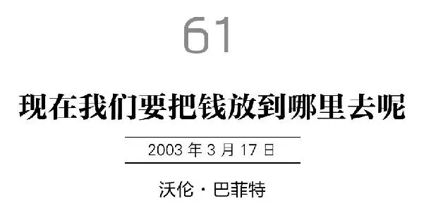

2002年巴菲特致股东的信摘要

在股票投资方面，我们还是延续以往的策略，很少买入。芒格和我都越来越满意于伯克希尔哈撒韦公司目前主要参股的企业。这些公司的市值下降了，但其利润在逐渐增加。不过我们并无意增持这些公司的股票。虽然这些公司的前景都相当不错，但我们仍然不认为它们的股价被低估了。

在我们看来，这种观点对于股票具有普适性。尽管股价遭遇了连续三年的下跌，投资股票的吸引力大大提升了，但我们还是很难找到哪怕能引起我们一点儿兴趣的投资目标。令人扫兴的事实是，这是泡沫时代价值混乱的又一铁证。不过，很不幸的是，狂欢作乐之后的宿醉尚未完全消退。

我和芒格现在对股票退避三舍的态度，其实远非我们的本意。我们非常热爱股票投资，当然这是在价格合理的情况下。在我61年的投资生涯中，大约有50个年头都遇上了这样的机会。我相信今后还会有这样的年份。尽管如此，除非我们发现有极大可能获得至少10%的税前利润（扣除企业所得税后约为6%～7%），否则我们宁可作壁上观。靠短线获到低于1%的回报率，那简直是毫无乐趣可言。有时成功的投资需要的恰恰就是冷静与耐心。

然而去年，我们合理地投资了一些“垃圾”债券及债权投资。总体来说，到2002年年底，我们在这方面的投资增加了5倍，达到83亿美元之巨。

投资垃圾债券与投资股票在某些方面非常类似：两者都需要评估价格/价值的比率，并从成千上万的品种中，挑选出少数回报/风险比率最佳者。当然，投资股票与投资垃圾债券也存在着很大的不同点。在股票方面，我们预期每一笔投资都会成功，因为我们的注意力主要集中在少数几家公司上，它们财务稳健、具备竞争力、由能干且诚信的管理者所经营。如果我们以合理的价格买进这类公司的股票，损失的概率比较低。在我们经营伯克希尔哈撒韦公司的38年当中，不包括通用再保险公司与政府雇员保险公司的投资，盈亏比例约为100比1。

然而，在垃圾债券方面，我们面对的企业入不敷出，还常常负债累累，而且它们所处产业的资本收益率都相当低。非但如此，其管理层的水平也存在问题。管理层的利益甚至可能与债权人有直接冲突。因此，我们预期在这类投资中会出现大幅亏损的情况。然而，到目前为止，我们在这个领域的表现还算不错。

2026年3月14日

16:57

## 62 7倍回报的中石油

\(63\) 627倍回报的中石油

2026年3月14日

16:57

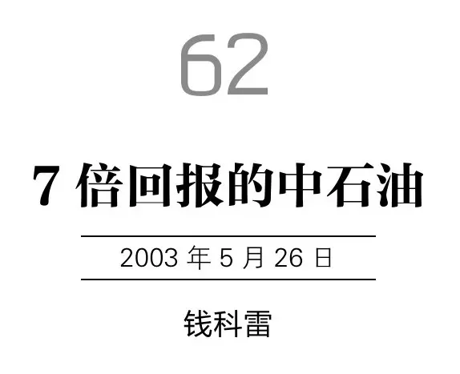

还记得沃伦·巴菲特曾经调侃说，如果让他给商学院的学生上一堂课，他会要求每一位学生都来计算一家互联网公司的价值，然后对于有答案的学生，他会给个大大的不及格。对于中国的股票市场，他的看法也是一样的。中国是世界上经济增长速度最快的经济体，但其上市公司的财务状况却如黄河一般浑浊不见底。

那么，这位奥马哈先知又为什么要对他购进中国石油天然气股份有限公司（以下简称“中石油”）的股票一事大肆宣扬呢？2003年4月，巴菲特的伯克希尔哈撒韦公司再度投资5000万美元购买中石油的股票，这次增持使巴菲特手中的中石油股票达到了其流通股的13%。花旗集团的托马斯·希尔伯特（Thomas Hilboldt）说，“巴菲特效应”带动中石油股价在一个星期内上涨了12%。该次收购使巴菲特对中石油的投资总额达到近5亿美元，也使他成为继英国石油公司之后的中石油第二大境外股东。

很难把购买中石油股份与“买你所熟悉的企业”这句联系起来，而正是这句话帮助巴菲特成为排名全球第二的有钱人。几十年以来，巴菲特的投资目光主要集中在“自家后院”。投资者试图在伯克希尔哈撒韦公司5月份的股东大会中找到答案，但最终未果。巴菲特说：“我们觉察到石油生意在中国发展得相当不错，但我们不会对中国本身下什么大结论。”

多年以来，不计其数的投资者一直揣测着巴菲特的一举一动。不但如此，一些中国分析人士也质疑他的举动。“肯定还有些别的原因。”瑞士信贷第一波士顿银行（Credit Suisse First Boston，简称CSFB）的彼得·贝斯特（Peter Best）说。

而在地球的另一端，中石油生产着中国2/3的石油和天然气，这家庞大的公司像一位常胜将军一样蒸蒸日上。中国每天消耗着超过500万桶的石油，涨势明显。2002年的汽车销量激增了将近60%。然而，中石油大约7倍的市盈率和埃克森美孚公司的15倍的市盈率相比，就显得便宜了。

不过，我们有理由担心，巴菲特对中石油寄予的厚望很可能会落空。该公司的三个主要油田已经彻底探明。管理层一直保持恒定产量，据观察家说，这种生产是难以为继的。还有人质疑中石油是否有能力支付多达40万名员工的工资。

成本问题也是中国海洋石油总公司（以下简称“中国海油”）的更受青睐的主要原因，投资者认为它是中国石油产业的生力军。投资者为中国海油的管理打出了更高的分数，与中石油的4%相比，其过去三年的年均收入增长了13%。不过要重申的是，巴菲特投资了中石油。

__TAP DANCING TO WORK__

__巴菲特花絮__

2007年，伯克希尔哈撒韦公司出售了手中的中石油股票。他在当年年报中分析了这笔投资：“在2002年和2003年，伯克希尔哈撒韦公司用4\.88亿美元买入中石油1\.3%的股权。按这个价格推算，中石油市值大约为370亿美元。芒格和我那时觉得公司的内在价值大约应该为1000亿美元。到了2007年，两个因素使得它的内在价值大幅提高：第一，油价显著攀升；第二，中石油管理层在石油和天然气储备上下了很大工夫。去年下半年，该公司市值增长至2750亿美元，大约相当于在与其他大型石油公司比较之后，我们认为其应具备的价值。因此，我们以40亿美元的价格出售了自己持有的中石油的股票。”

随后2007年年底，中石油的股票价格如高台跳水般跌至谷底，从此再也没能回到牛市时的水平，可见巴菲特抓住了最佳卖点。另一方面，2007—2008年，他把资金投向了另一家石油公司，即康菲石油公司（Conoco Phillips）。后来，在“恐怖的时机”下，事后巴菲特说，因为石油价格随即跳水，在2009年和2010年，伯克希尔哈撒韦公司出售了大约2/3的康菲石油公司的股票。而伯克希尔哈撒韦公司在此笔交易中遭受的损失和它在中石油赚到的钱大致持平。

## 影响力问题

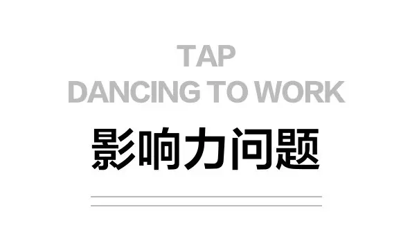

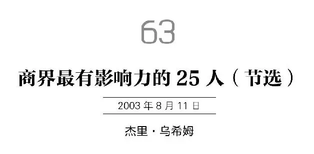

这篇文章以2003年7月在太阳谷举行的一场高尔夫球比赛作为开端，作者认为“其中的玩家所拥有的经济力量之和可能会创下新纪录”。“玩家中包括世界最大的公司的首席执行官、最成功的投资者和最富有的人。描绘一下坐在电瓶车上的这些人，你仿佛就能看到一幅‘影响力特刊’的封面。”

就影响力的排行榜问题，我们内部进行了为期几个月的争论。随后，有两点得以明确：第一，影响力确实是一个非常深奥的话题；第二，我们公布的任何排行榜都会引发大家的抗议和反驳。然而在某一个问题上，大家却都表现得谦和有礼。在决定谁是排行榜的顶尖人物时，大家几乎没有争议。事实上，我们前三名的竞争者，恰巧分别被安排在太阳谷高尔夫球赛的三支球队中，我可以对天发誓，我们事前并不知情。

我们已经抓到了最大的三条鱼。只剩下一个问题：哪条是王中王呢？

谁掌管着最具影响力的公司，大家对此并无异议。李·斯科特的沃尔玛重塑了大约20个行业。如果联合国安全理事会成员不限于“国家”的话，沃尔玛或许也有资格占据一席。然而，斯科特却可能是三人中最容易被取代的。比尔·盖茨作为一家靠智慧驱动的公司的“首脑”，是不可撼动的“微软先生”。但正如哈克贝利·费恩（Huckleberry Finn，马克·吐温《哈克贝利·费恩历险记》中的人物）所说的，很多赋予他影响力的东西会随着他智力的降低而丧失。公司460亿美元的“战争基金”只是镜中花、水中月，是没有实现的影响力，除非该公司找到改变人们行为的新方法用掉这笔巨款。最近，微软公司已经将它作为股息分给投资者。

接下来，我们把目光转向第三位高尔夫球手：沃伦·巴菲特。除了坐拥伯克希尔哈撒韦帝国之外，巴菲特还是许多著名企业的大股东，诸如可口可乐公司、吉列公司、华盛顿邮报集团等，其个人财富仅次于盖茨。关于巴菲特的趣事，最有意思的是来自杜克大学最近对MBA毕业生所做的一项调查，其主题是“谁是他们最崇拜的人”。结果显示：除去自己的父亲，这些毕业生最崇拜的人不是总统、教皇和甘地，而是巴菲特。这种“显赫”的地位赋予了他施加道德劝告的影响力，而他使用这一特权时又相当谨慎，因此使其影响力愈加强大。这是一种仅凭几句话，就能改变人们的行为的能力，即使这些人与他没有任何干系。这又使巴菲特具有了美国资本主义“护国公”的形象。

他既有石头、剪子，也有布。而现在，他又有了另外一样东西：影响力排行榜头把交椅的位置。

__64 最有影响力的商人：沃伦·巴菲特（节选）__

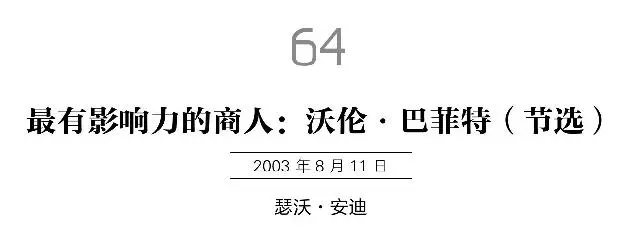

沃伦·巴菲特，这位美国最有影响力的商人以低调而著称。没错，他也享受着世界第二有钱人带来的某些“特殊待遇”，比如，乘坐他的利捷飞机环游，和好友比尔·盖茨（位列我们排行榜第二名）打桥牌等。不过，大多数时候，这位72岁的老人对所谓的“美国商界泰斗”（Atlas of American business）的头衔并不以为意。__“这只能说明，如果我做了什么蠢事，可能会造成大规模的影响，”他一边说一边标志性地咯咯笑起来，“意味着你可在能损失的数字后面加上好多个零。”__

当然这种情况发生得并不多。巴菲特的伯克希尔哈撒韦已经成为全美企业中的航母，每年利润额高达数十亿美元，其业务包括保险（这也是巴菲特领先全球的行业）、报刊、地毯乃至牛仔靴等。在过去的15年里，巴菲特用21%的复合年回报率证明他是全球最伟大的投资家。也正因为此，他在投资领域的影响力无人可及。巴菲特购买或者出售某只股票的消息将会像一颗重磅炸弹一样撼动市场，这也就解释了为什么巴菲特在谈到投资问题时总是格外小心谨慎。

巴菲特谈投资的场合并不多，这其中他致股东的信在全世界被广泛传阅。

不仅如此，巴菲特还是世界上其他首席执行官心目中的最佳导师。“首席执行官身边都是些等待拿酬劳的人，”巴菲特说，“而我一无所求，所以能给他们一些不偏颇的意见。”在过去的5年里，许许多多的首席执行官前往奥马哈向先知求教，包括通用电气公司的杰夫·伊梅尔特（Jeff Immelt，我们排行榜的第七名）。“我已经同他聊过两三次了，还一起吃了牛排，”伊梅尔特说，“他是全世界最敏锐的投资家，而我正试图求得他的真传。”

美国国会也在聆听巴菲特的言论。2003年5月20日，也就是国会议员就布什的减税法案投票的前几天，巴菲特在《华盛顿邮报》的专栏中指出，他认为减免股息税的做法是愚蠢的。巴菲特强调，减税将主要惠及富人。巴菲特言论的威力强大到足以说服某些国会议员最终削减了减税的幅度。

就是这么简单，巴菲特受尊崇的程度远超其他在世的商界人士，甚至不仅局限于商业领域，也包括了万千普罗大众。

## 65 不断增长的贸易赤字等于在出卖我们的国家。现在有一个方法可以解决这个问题——我们需要马上行动

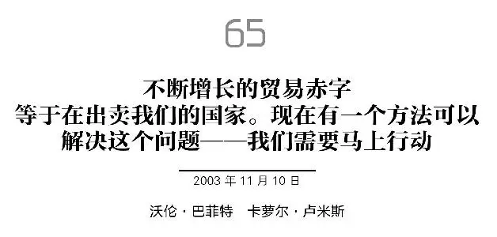

巴菲特撰写的这篇文章，其标题长度一定创下了《财富》杂志的新纪录。在本文中，巴菲特谴责了美国的贸易赤字问题并提出了自己的建议，即采用“进口许可证”（Import Certificates）的方法，以便促使进出口趋于平衡。由于这一想法既有创意又是经过深思熟虑的，因而引发了华盛顿方面的兴趣，也引起了一些人士的注意，比如特德·肯尼迪（Ted Kennedy）和乔·拜登（Joe Biden）两位参议员。时至今日，巴菲特的脑海中仍旧涌动着源源不绝的新点子，他偶尔还会收到粉丝的邮件，他们很赞赏巴菲特的想法，并想知道这些点子如何落实并向前推进。

不过，总的来说，巴菲特的点子并没有获得足够的响应，当然也没有获得经济学家的赞许。几乎所有自由贸易者都鄙视“配额”，以及任何可能干扰亚当·斯密所说的“市场之手”的观点。查理·芒格自己也是一位传统主义者，并不支持巴菲特的计划，他也是通过一个偶然机会得知巴菲特的这一点子的，我在加利福尼亚州采访他和他现在已故的妻子时，亲手交给他了一本崭新的《财富》杂志，当中就有巴菲特的这篇文章，他立即从头至尾读完，并说道：“沃伦是正确的，当然，我们都憎恶贸易赤字。尽管如此，我还是希望，他不要推进这样的理念。”

正如巴菲特所确信的那样，贸易赤字问题无可比避免地在2003年急剧恶化，达到5000亿美元。在接下来的5年中，赤字每年都会以1000亿～2500亿美元的幅度增长，只有在2009年时才降至5000亿美元以下，这是因为次贷危机使美国人惊恐万状，他们“暂时”减少了消费量并提高储蓄率。2009年以后，贸易赤字再度上演。如果按照7月份的水平计算的话，2012年的赤字将会达到5600亿美元左右。

如今，尽管只有被问及“进口许可证”的想法时，巴菲特才会开口谈一谈，但他仍然认为该想法有一定可取之处。他补充说：其他关于促进出口和进口之间平衡的想法或许也会有效。“但是，”他斩钉截铁地说，“在某种程度上，我们必须达到平衡。巨额赤字的现状是完全不堪一击的。”

文章开篇讲到巴菲特已经将外汇交易引入伯克希尔哈撒韦公司，这是他人生第一次进行兑换美元交易（trading against the dollar），这意味着在未来的几年里，他要定期报告交易的进展情况。2006年年初，他几乎结束了所有的外汇交易，并宣称伯克希尔哈撒韦公司赚取了22亿美元现金。这并不是因为他预计美元将走强，恰恰相反，他曾认为美元很可能继续走弱，而事实也印证了他的说法，而且幅度非常大。然而，由于国家之间的利率差发生了变化，直接投资货币的吸引力也就随之降低了。巴菲特说，把伯克希尔哈撒韦公司的资金投入到海外企业，将会使其海外收入大幅增长，这对于未来来说也不失为一个更好的策略。

接下来发生的，也就是短短几个月之后，伯克希尔哈撒韦公司宣布了第一桩海外公司收购案，即收购伊斯卡公司（Iscar），这是一家以色列的金属切削刀具及切削技术的供应商。这家公司几乎贡献了伯克希尔哈撒韦公司在美国境外的所有的利润。此次收购耗资40亿美元，伯克希尔哈撒韦公司获得了该了公司80%的股份，其余的20%则还掌握在卖家手中。

下面这篇关于贸易赤字的文章可视为补充报道。

——卡萝尔·卢米斯

在当前的经济环境下，我要就美国的贸易赤字问题发出警告，还要为解决这个问题献计献策。不过，我需要提前申明，你们可能会出于两个原因对我所说的内容表示怀疑。首先，对宏观经济走势，我的预测一向不怎么鼓舞人心。举例来说，在过去的20年中，在通货膨胀的问题上，我总是显得过度惶恐，草木皆兵。这方面的事例不胜枚举，早在1987年我就公开表示，日益扩大的贸易赤字令我忧心忡忡，然而，正如大家所了解的，我们不仅“活下来了”，而且“活得很好”。因此，在贸易赤字的问题上，我至少有过一次大喊“狼来了”的前科。尽管如此，我还是要喊“狼来了”，而且这一次我还有伯克希尔哈撒韦公司的资金支持。截至2002年春季之前，即在我72年的人生中，从未买过外汇。然而，自那以后，伯克希尔哈撒韦公司斥巨资购买了若干种外汇，而且现在仍然持有。在这方面，我不会透露具体细节；但事实上，我购买了哪些外汇并不重要，重要的是潜在的意义：持有其他货币就意味着我们认定美元将贬值。

不论是作为一名美国公民还是一名投资者，我都切切实实地希望我的这些预言被证明是错误的。公司从外汇交易中获得的任何收益都显得苍白无力，这就说明由于美元的贬值，伯克希尔哈撒韦公司和我们的股东在生活其他方面正在遭受损失。

然而，作为伯克希尔哈撒韦公司的领导者，我要负责地并以合理的方式运用公司的资金。之所以最终把钱投向我一直以来未曾涉及的领域，是因为我们的贸易赤字已经极度恶化，甚至可以说，我们国家的“净资产”正以惊人的速度向海外转移。

如果这种资产转移长时间地持续下去，必将酿成大祸。为了搞清楚原因，请大家跟我到“浪费村（Squanderville）”和“勤俭村（Thriftville）”上来一次狂想之旅，这是两座面积相同、比邻而居、与世隔绝的小岛。

这两座小岛，土地是唯一的固定资产，而小岛的社会结构也非常原始，居民们只需要食物，也只生产食物。岛上居民每天工作8个小时，事实上，他们能生产出足够维系自己生活的食物。在很长一段时间里，他们就一直这样生活着，每座小岛上的人都按规定每天工作8小时。这意味着每个社会成员都能自给自足。

然而，终于有一天，勤俭村里勤劳的居民决定要多储存一些食物并进行投资，于是他们开始每天工作16个小时。在这种模式下，勤俭村的居民继续依靠8小时工作生产出的食物维持生计，而把相同数量的食物出口到他们唯一可以出口的地方：浪费村。

浪费村的居民对这一变化欣喜若狂，因为他们从此以后可以不用再辛苦劳作，却仍可以大饱口福。当然，“补偿品”是必不可少的，但是对浪费村的居民来说，这看似无害：勤俭村居民想交换的只是浪费村的债券（自然是按照“浪费村币”计价发行的）。

时光流逝，勤俭村的居民积累了大量此类债券，而这意味着勤俭村居民可以凭该“提取证”索取浪费村未来的生产成果。浪费村的权威们嗅到了危机即将来临，他们预测，对浪费村的居民而言，既要维持生活所需又要偿还债务，或仅仅是偿还债息，最终会要求他们每天工作8小时以上。不过，浪费村的居民根本没心情听这些苦口婆心的唠叨。

与此同时，勤俭村居民开始变得紧张起来。他们问，一座懒惰小岛发放的“白条”能有多大的好处？于是勤俭村的居民改变了战略：尽管继续持有部分债券，他们还是将大部分债券出售给了浪费村的居民以换取浪费村币，然后再利用这笔收入去购买浪费村的土地。最终，勤俭村的居民完全拥有了浪费村。

从那一刻起，浪费村的居民不得不面对等价交换的惨剧：现在他们已经没有东西可交易了，他们不但每天必须工作8个小时以维持生计，而且还必须加班加点地工作来偿还债息，还要向勤俭村的居民支付当时因疏忽大意而卖掉的土地的租金。实际上，勤俭村的居民利用收购而不是征服的手段使浪费村沦为了自己的殖民地。

当然，有人会争辩说，浪费村的居民未来的生产成果必须无休止地运往勤俭村，这些生产成果的现值只相当于勤俭村居民最初放弃的产量，因此对双方来说都是一项公平交易。不过，由于浪费村某一代居民的不劳而获，致使未来若干代居民都得耗尽一生来还债，用经济学家的话来说，这种情形就是颇为戏剧性的“隔代不平等现象”。

让我们以家庭为单位来思考一下这个问题：假设我，沃伦·巴菲特，能够使用可偿付的巴菲特家族借据来购买我一生所需的所有消费品，而债务及利息将由我的子孙后代以货物和服务的形式偿还。这种情形可能会被看作巴菲特家族与债权人之间的平等交易。然而，我之后出生的巴菲特家族成员估计都不会赞同这项交易，甚至可能试图赖账，但愿不会如此。

再将思考放回到那两座小岛上：面对有史以来数额最庞大的债务负担，浪费村政府迟早会做出决定，实施高通货膨胀政策，即发行更多的浪费村币，以稀释原有货币价值。浪费村政府还会理直气壮地辩解，毕竟，那些烦人的浪费村债券只是索取特定数目的浪费村币而已，而非货币所对应的价值。简而言之，稀释原有货币的价值，将有助于缓解浪费村的财政危机。

这也就解释了为什么如果我是勤俭村的居民，会直接持有浪费村的土地，而非其政府发行的债券。一般政府都认为没收外国人的资产在道义上相当难以接受，而冲减外国人所持债券的购买力比较容易接受。毕竟强取豪夺不如暗渡陈仓。

岛国间的尔虞我诈又与美国有何干系呢？简单来说，第二次世界大战以后直到20世纪70年代初的这段时间里，我们一直处在类似勤俭村的勤勉状态，通常情况下，我们出口的产品远多于我们的进口量。同时还会将结余投资到海外，从而使得我们的净投资额，即美国人持有的海外资产减去外国人持有美国国内资产后的净额，持续增加，从1950年的370亿美元增长到了1970年的680亿美元，这是根据当时的计算方法得出的，政府后来又进行了修改。总的来看，当时我们国家的“净资产”总值既包括了美国国内的所有财富，也包括了我们在世界其他地区的一大笔财富。

另外，由于美国持有其他国家的大量资产，我们意识到贸易结余之上的净投资收入已经成为投资资金的第二大来源。我们国家的财政状况与个人的情况极为类似：作为个体，一方面会把自己的部分工资存起来，另一方面还会利用储蓄利息进行再投资。

20世纪70年代末，形势发生了逆转。贸易赤字约占GDP的1%。这种情况并不算糟，主要因为我们的净投资收入仍然是正值。实际上，由于复合回报率发挥着魔力，我们的净资产结余在1980年达到了3600亿美元的历史峰值。

然而，从那以后我们就开始走下坡路了，这种势头在过去5年中不断加速。现在我们的年均贸易赤字额已经超过了GDP的4%。更加令人不安的是，世界其他地区拥有的美国资产已经比我们拥有的其他国家的资产，多出了惊人的2\.5万亿美元。这2\.5万亿美元的资产中，有一部分投在了“借据”上，也就是美国债券上，既有国债也有私营企业债券，还有一部分资金则投在了不动产及股票上。

实际上，一直以来我们国家的做派就如同拥有巨大农场的富豪之家。为了能消费超过我们生产能力水平的这4%的商品，即贸易赤字，我们每天一边出售农场土地，一边拿现存的资产做抵押。

为了正确审视外国人拥有的这2\.5万亿美元净资产，我们不妨拿它与总市值12万亿美元美国股市，或是相同价值的美国住宅用房地产，又或是我所预计的总额50万亿美元的国家财富相比较。比较结果显示，已经被转移到海外的资产不容小觑，已经占据全国总财富的5%。

然而更为重要的是，按照目前贸易赤字的水平发展下去，外国人拥有的美国资产将以每年5000亿美元的速度继续增长，也就意味着每过一年，外国人控制的美国国家财富都会增加1%。随着这个比例的增加，我们的年均净投资收入也将不断流失到国外。最终我们得向全世界支付越来越多的股息和债券利息，而不是像以前那样做个获益者。我们已经深陷复利的深渊之中，再见，欢乐时光；你好，痛苦岁月。

《101经济学》*（Economics 101）*教科书告诉我们，任何国家都不可能长期背负不断增长的巨额贸易赤字。清算的一天终会到来，我们无节制的快乐消费将因汇率调整以及债权国拒绝接受挥霍无度者无限签发的“白条”而停止。这种情况实际上在其他地区已经发生过了，正如我们所见，许多肆意浪费的国家由于突然失去贷款来源，已经在痛苦挣扎了几十年。

然而，美国的情况却享有着特殊待遇。实际上，我们如今的为所欲为，是因为我们过去的财政状况堪为模范，再加上我们曾富甲天下。不论是我们的偿债能力，还是我们的还款意愿都未被债权人所怀疑，而且我们还有堆积如山的宝贵资产可以用来交换消费品。换言之，持有我们的超级“国家信用卡”，就可以享用无尽的商品。但任何信用卡都是有信用额度的。

这种以资产换消费品的交易现在就该停止，而且我还为此制定了一套方案。我的“疗法”听起来像是鬼把戏，其实就是换了名头的另一种“关税”。不过，这种关税大部分保留了自由市场的本质，既不保护特定行业，也不惩罚特定国家，更不会触发贸易战争。这套方案将扩大我们的出口，同时还可能增加全世界的贸易总量。我们可以在避免美元币值下滑的情况下平衡贸易赤字，否则我认定美元一定是要贬值的。

为了实现这种平衡，我们将向所有对美出口的贸易方发放一种我所说的“进口许可证”，数额与其出口额（按美元计）相等。接下来，每个出口商将把进口许可证卖给希望把货物运到美国境内的相关各方，不论是外国的出口商还是本地的进口商。打个比方，一个进口商要进口100万美元的商品，他必须找到等额出口所获得的100万美元进口许可证。如此必将产生的结果是：贸易平衡。

由于我们每月的出口总量约为800亿美元，因而可以发行800亿美元的进口许可证，而且这一定会造就一个流动性极佳的市场。市场竞争会最终决定，哪些希望把商品出口到我国的出口商将购买这些许可证，以及他们愿付怎样的价格。按照我的设想，许可证的使用期限应该要短，大概在半年左右，这样投机分子就不会蓄意囤积居奇了。

为了进一步说明这个问题，我们假定每张进口许可证售价为10美分，也就是说每出口1美元的东西，将附赠价值10美分的许可证。在其他条件不变的情况下，这个数字意味着，如果美国的生产商要出口商品，所获得的收入要比在国内市场上销售的多10%，这10%的盈利即来自出售进口许可证。

在我看来，许多出口商会把这笔收入看作是成本的削减，这样它们的产品在国际市场上的售价就会降低。日用类产品将尤其受益于这项举措。比方说，如果铝在美国国内市场上的售价是每磅66美分，而进口许可证的价格是铝价的10%，那么国内的铝生产商在国际市场上就能以每磅60美分的价格（加上运费）销售，并能获得正常利润。如此一来，美国产品的竞争力将大幅提升，出口也将扩大。长此以往，美国国内就业机会也将有所增加。

当然，外国人想要把东西卖给我们就变得更艰难。然而无论采取什么样的贸易“解决方案”，请别误会嘛，必将会有相应的解决方案出台，他们都得直面这一问题。正如美国经济顾问委员会前主席赫布·斯坦（Herb Stein）所言：“如果事情不能永久持续下去，那它终将停止。”进口许可证的措施可以给予那些向美国出口商品的国家极大的灵活性，因为这项计划并不会给某些特定行业或某种特定产品带来惩罚。最终，自由市场将决定哪些产品会销往美国以及谁会是卖家。进口许可证只决定了所售产品的美元累计总量。

进口方面会出现哪些情况呢？我们以进口商按2万美元价格进口的轿车为例。按照新方案且假设进口许可证的售价为车价的10%，那么进口商的成本将升至2\.2万美元。如果市场对这款车的需求特别旺盛，进口商则可以把这笔成本转嫁给美国的消费者。然而在通常情况下，市场竞争会要求外国制造商即便不承担进口许可证全部2000美元的费用，也要分担一部分。

天下没有免费的午餐，这个进口许可证计划也不例外：许可证制度对美国公民会产生部分负面影响。绝大部分进口商品的价格将会上涨，颇具竞争力的国产商品也是一样的。无论是从整体还是从局部来看，进口许可证的成本都会像税收一样最终落到消费者身上。

这是个严重的倒退。不过，不管是让美元不断贬值，还是对特定产品加征关税，又或是进行配额管制，在我看来，这一系列的措施取得成功的概率微乎其微，都无异于逆潮流而动。尤其重要的是，目前我们会因为进口产品的涨价而承受一定的痛苦，但如果我们听之任之，继续大规模地拿自己国家的净资产去做交易，将会遭受灭顶之灾。

我相信，很快，进口许可证制度就会让美国达到贸易平衡，而且出口水平会高于当前而非低于当前。进口许可证将会适度帮助美国的各个产业提高在全球市场中的竞争力，当然哪个行业最终能够通过“比较优势”的考验，还得由自由市场说了算。

纯出口国不会效仿这一举措，因为他们的进口许可证将毫无价值。那么主要出口国会在其他方面采取报复性措施吗？这个计划会引发另一场史慕德\-哈利[\7]关税大战吗？可能性不大。在“史慕德\-哈利法案”的时代，我们“享用”着不合理的贸易顺差，而且我们希望予以维持。如今，我们却遭受着严重的贸易逆差，而且世界各国都认为我们应该修正严重的贸易赤字。

几十年以来，世界各国一直在贸易领域与形式多样的措施做斗争，诸如惩罚性关税、出口补贴、配额和锁定美元汇率等。长期以来，出口大国都采取了许多抑制进口、鼓励出口的措施以积累外汇储备，即便如此，至今也没有大规模的贸易战爆发过。某个国家不会因为世界最大贸易逆差国的贸易平衡化措施而陷于经济崩溃。世界主要出口国在过去一直表现得相当理智，而且将来仍会如此。当然，与以往一样，出于自身利益的考虑，它们也会试图让美国相信自己会采取完全不同的行动。

进口许可证实施以后可能出现的结果是，出口国在初期做出一些反应之后，将把它们的聪明才智集中于鼓励从美国进口商品。比如，从中国的角度来看这个问题，目前中国每年向美国出口价值约1400亿美元的商品和服务，却仅仅从美国这里买走250亿美元的商品和服务。一旦进口许可证制度得以实施，中国可能采取的方针之一是每年购买价值1150亿美元的许可证，以弥补这个差额。当然，中国也有可能直接减少对美出口，或是增加对美国的采购，而后者可能是最符合中国利益的做法，也是美国希望中国能够做的。

如果美国的出口得以增加，进口许可证的供应量将因此扩大，那么进口许可证的市场价格也将被拉低。实际上，如果美国的出口能够显著增加，进口许可证就会变得毫无价值，整个计划也将因此而失去存在的意义。意识到这一举措的强大威力后，世界出口大国可能会立即取消正在实行的限制进口美国商品的措施。

如果美国引入进口许可证计划，也许要经历几年过渡期，从而渐进式地缩小贸易赤字，而世界其他国家和地区也要做出调整，直至美国抵达自己的目标彼岸。执行这项计划的同时，美国政府可以每月公开拍卖一些“奖励性”的进口许可证，抑或是直接将其赠与亟需扩大出口额的欠发达国家。我们可以把第二种选择看成一种对外援助，并可能会取得明显成效，而且会受到欢迎。

在结束之前，我想再次提醒诸位，我曾经喊过“狼来了”。一般来说，美国的灾难预言家的平均成功率很低。我们一向嘲笑那些对美国的经济潜力和我们的活力持怀疑态度的人。许多悲观的预言家完全低估了我们克服凶险困难的能力。美国依然非常强盛，经济也是。

不过，我也认为在贸易赤字的问题上，我们正面临着困难，我们解决问题的能力也面临着挑战。美元的逐步贬值并不是解决问题的答案。不错，美元贬值在某种程度上会减少贸易赤字，却不足以阻止美国净资产的外流，或是有效减少投资收入逆差。

也许还有其他解决办法比我的更具可行性。然而，一厢情愿的痴心妄想以及时常相伴左右的“吸拇指”的幼稚想法不在我们考虑之列。我坚定地认为，针对国家财富外流，我们应有所行动，而进口许可证似乎是带来痛苦最少、可行度最高的方案。请大家记住，这不是无关痛痒的小问题：举个例子，按照目前世界上其他国家和地区在美国进行净投资的速度，每年将会有4%以上的上市公司股票被它们吃掉。

伯克希尔哈撒韦公司内部在进行商业决策时，我的老伙计芒格常常建议我们重视一下他略显诙谐的期望：“我只想知道我将葬身何处，如果知道了答案，打死我都不会去那儿的。”美国的政策制定者应该引以为诫，切勿重蹈浪费村的覆辙。

__外国人为什么不能抛售他们的美元？__

__2003年11月10日沃伦·巴菲特卡萝尔·卢米斯的补充报道__

当你阅读有关美元问题的文章时，看到如下评论的频率有多高呢？“分析人士称，真正令他们感到担心的是，外国人将开始抛售美元。”

下一次再看到这样的内容，尽可无视。事实上，整体而言，外国人是不能抛售他们所持有的美元的。由于贸易赤字不断将新的美元送到外国人手中，他们也不得不持续增加对美国的投资。

当然没错，世界其他国家和地区的确可以选择持有何种美国资产。比如，他们可以决定出售美国债券以购买美国股票。或者他们也可以进军美国的不动产，就像日本人在20世纪80年代的做法。此外，任何行动，特别是那些急功近利的卖家或买家所采取的，都会影响到美元的价格。

但试想一下，如果日本人既要从美国的房地产业中抽身，又想彻底摆脱所有美元资产，那么光靠把不动产出售给美国人是无法达到目的的，因为他们收到的款项还会是美元。而如果他们把房地产卖给非美国人，比如法国人，然后就会得到欧元；那么，这些资产还是在外国人手里。无论以哪种方法出售，世界其他国家和地区所持有的美元资产都不会改变，除非美元价格同时发生变化。

底线在于，除非以整体来看，其他国家从美国购买的商品和服务远多于我们从他们那里购买的，否则他们是绝不会减少对美投资的。这种情形就叫作美国贸易顺差，我们目前的情况并非如此。

你可以设想出一些“戏剧化情节”以改变这种状况。比如，世界其他国家和地区为美国提供巨额援助，这些援助将抵销我们的贸易赤字。然而，从现实的角度来看，面对我们的巨额贸易赤字，世界其他国家和地区不仅一定会牢牢把持已有的美国资产，而且还会不断增持。当然，这也正是我们的国家净资产为什么逐渐远离我们海岸线的原因。

2026年3月14日

16:57

## 66 “巴菲特”周边产品

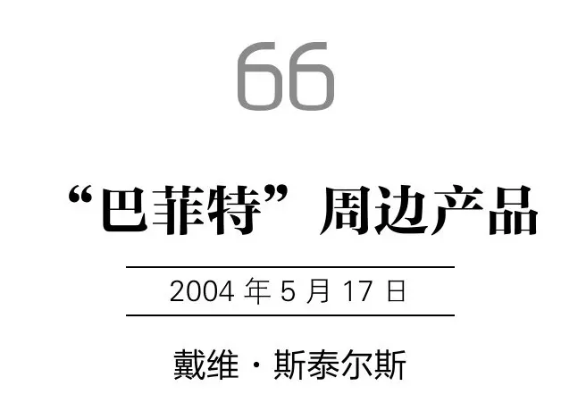

为了能靠近沃伦·巴菲特，你愿意支付多少费用？商界粉丝们肯定会在这方面不断创下新纪录。有些仰慕者甚至在eBay上以117美元的价格购买了一张伯克希尔哈撒韦公司2004年5月1日股东大会的门票。为了保证大家都有机会前来，巴菲特在网站上发售了1万张门票，价格2\.5美元，相较于该公司A股93500美元的股价来说，这的确是个白菜价。这并非是巴菲特头一遭掀起粉丝的狂热。接下来我们来一窥各种“巴菲特”周边产品的市场价。

__16\.95美元__

最畅销的巴菲特丛书

__210000美元__

1999年，在一次慈善拍卖会上巴菲特用了20年的旧钱包的成交价

__5美元__

两张伯克希尔哈撒韦公司股东大会的门票

__250100美元__

2003年，eBay上“与巴菲特共进午餐”的成交价

__100美元__

2004年，在一次教堂拍卖会上，有巴菲特签名的钞票的成交价

__20美元__

奥马哈皇家队（Omaha Royals）网站上售卖的巴菲特摇头玩偶的价格

__TAP DANCING TO WORK__

__巴菲特花絮__

在eBay上，与巴菲特共进午餐的机会一直是拍品，其拍卖所得将持续捐献给旧金山的格莱德基金会（Glide Foundation），而且每年的成交价节节攀升。2012年该价格，达到了3456789美元。

## 67 我得到过的最好建议

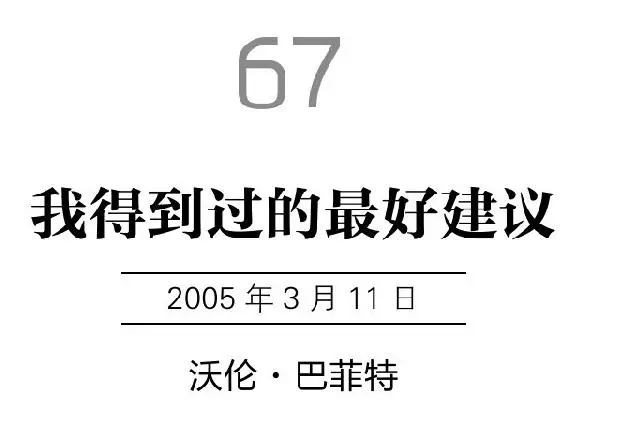

21世纪的第一个10年里，《财富》杂志曾3次以“你人生中所获得的最好建议”为题，采访了20位知名人士。巴菲特参与了其中的第一次。就在他欣然应允的一刹那，主编里奇·柯克兰德（Rik Kirkland）决定让巴菲特成为那一期的封面人物。

我得到了采访巴菲特的任务。在我打开笔记本准备记录他要说的话时，我真的非常好奇他会说些什么，因为我从没想过自己会听他谈论这方面的问题。于是我说：“说说看，你得到过的最好的建议是什么呢？”

我得到的答案既出人意料，又格外精彩。他没有谈及任何“最好的建议”。相反地，倒是滔滔不绝地讲起他得到过的“最差的建议”，而且来自他最敬佩的两个人。

我不记得自己是如何向柯克兰德讲述，萦绕在巴菲特脑海中的奇特想法的，也许我已经将全部场景从我的大脑中剥离出来了。然而，你知道吗？巴菲特还是出现在了当期的封面上。

——卡萝尔·卢米斯

我曾有过两位人生导师：我父亲霍华德·巴菲特和本杰明·格雷厄姆。这两位都是我敬畏的人，多年以来给过我数不清的金玉良言。然而，每当我想到他们对我说过的话时，首先进入我脑海的却是糟糕的建议。

那是在1951年，我还不满21岁，刚从哥伦比亚大学商学院毕业。在哥伦比亚大学，我师从格雷厄姆，而且我一定是你见过的最有学习兴趣的那类学生。当时我希望进入格雷厄姆\-纽曼公司为我的老师工作。然而，当我兴冲冲地提出免费为他工作时，他却拒绝了。

尽管如此，我还是意志坚定地要进入证券行业，这也是格雷厄姆和我父亲给我烂建议的地方。他们都认为起步的时机不好。他们一直介怀的是道琼斯工业平均指数整年都持续在200点以上，而它此前每年都出现过低于200点的情况。所以两人都说：“你肯定会很出色，只是现在的时机不够好。”

如今想想，也许有一件事影响了我的父亲或者格雷厄姆，让他们觉得我当时不适合进入证券行业。那就是我太幼稚了，我不仅长得稚嫩，行为更是不成熟。我当时看起来瘦巴巴的，头发也乱糟糟的。也许他们的建议只是委婉地告诫我，在踏入股市之前，最好让自己再成熟一些，否则我是不可能成功的。可是，他们并没对我说这些，而是说了些别的。无论如何，我都不以为意。我直接回到奥马哈，在我父亲的巴菲特·福克公司开始了股票销售员的工作。

我父亲是一位具有独立思想的人，他的这种性格在某种程度上影响了我在股票方面的投资。格雷厄姆也是这样。我父亲说：“你是对还是错，并不在于别人是否认同你。如果你是对的，只是因为你掌握的事实和缘由都是对的。”

我的老师格雷厄姆是一位很出色的投资专家，从在内布拉斯加大学读到他关于投资的著作开始，我就开始向他学习了。那时，我尝试过各种各样的投资，但他的言论，特别是在《聪明的投资者》中所提及的，极大地扩展了我的视野，比如“安全边际”以及如何利用“市场先生”而不是让它利用你等。接着，我去了哥伦比亚大学，成为他的门生，可后来当我申请为他工作时却被他拒绝了。即便回到奥马哈之后，我还是放不下这个念头。我一直尝试向格雷厄姆推荐股票，甚至有点纠缠不休的意思。终于在1954年的某一天，我收到了他的来信，说下一次我到纽约的时候，他想跟我谈谈。我简直是心花怒放啊！于是，我就立马筹划前往纽约。

1954年8月，我开始为格雷厄姆工作，也压根儿没问薪水几何。结果我领到了12000美元，下一年度我还拿到了2000美元的奖金。我同时为公司两个部门工作：格雷厄姆\-纽曼公司是一家投资公司，而纽曼&格雷厄姆有限公司（Newman&Graham Ltd\.）是我们现在称作私募基金的公司，但两家公司加起来也只经营着1200万美元。

沃尔特·施洛斯和我在一间小屋里共过事，不过他不久之后就离开公司，创办了一家对冲基金。我们在一起很开心，我们常常一起研读投资人手册，寻找便宜的股票。我们从未走访过任何一家公司，因为怀疑其真实性。每当我们发现不错的目标时，格雷厄姆就会投入5万美元。

到了1956年初，格雷厄姆打算离开公司去加利福尼亚。我也决定重返奥马哈。如何开口告诉他，真是让我犯了愁：我走进他的办公室又出来，然后再进去，结果还是张不开口，如此折腾了很长时间。不过，格雷厄姆的反应很像我的父亲，他说：“选择最适合你的道路。”

1950年年底，我有差不多9800美元，而到1956年，我已经有15万美元了。我想，有了这笔钱，我可以过上国王般的生活了。我不知道回奥马哈后究竟该做些什么，也许去念法学院，我毫无计划，当然也没想过要创建投资合伙公司。不过，几个月之后，有7个人找上门来，希望我帮他们管理资金，而且是通过合伙公司的方式。这就是后来一切的发端。

## 68 910亿美元的对话

\(68\) 68910亿美元的对话

2026年3月14日

16:57

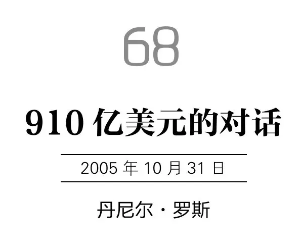

8年前，沃伦·巴菲特和比尔·盖茨曾在华盛顿大学进行过一次大讨论。为了公平起见，这次两人又来到内布拉斯加大学，于是我们又有了这样一次盛会。

此次对话的一大新闻是，经过长时间地慎重考虑之后，巴菲特决定在自己的有生之年将亿万家产捐献出去。这是他慈善计划的一个转折点，他的生命中发生了一件令他异常痛苦的事情：2004年的夏天，他的妻子苏珊突发去世。正如本书前面所提到的，巴菲特一直期望比他年轻两岁的苏珊会活得比他久，并运用自己的智慧和慈悲心为几十亿美元的财富找到合适的去处。苏珊离世后，慈善事业的走向成了他的心理负担。于是在2006年初，他制订好了自己辉煌的慈善计划，他将逐步把自己的伯克希尔哈撒韦公司股份捐献给5家基金会，其中最主要的一家就是此次对话的伙伴盖茨及其妻子梅琳达的基金会。

问答环节过后的“巴菲特有话说”部分进一步印证了这件事：对于超级富豪（当然包括巴菲特自己和盖茨）所缴付的所得税税率过低带来的不公平现象，巴菲特感到强烈的不满。在接下来的几年里，他曾不断重申这一问题，直至2011年，由于他频繁的呼吁或者至少类似的表态，奥巴马总统的阵营提出了一个所谓的“巴菲特法则”（Buffett Rule）。在本书出版之时，该提案还未进入投票环节。

——卡萝尔·卢米斯

这是内布拉斯加大学“十二大联盟”（Big 12 Conference）首场比赛开哨前的星期五，地点是在橄榄球盛行的林肯市。在这个时间点，独领风骚的不是内布拉斯加大学剥玉米人队的比赛门票的销售量。在9月末的一个美好下午，大约2000名学生提前一个小时就在学校里德中心（Lied Center）的礼堂外面排起了长队。19岁的瘦高个儿学生安德鲁·休梅舍（Andrew Schoemacher）来自化学工程专业二年级，他还没搞到票，但还是抱着一线希望。他怎么能错过观看这次演讲的机会呢？他说：“无论如何，这可是比尔·盖茨和沃伦·巴菲特啊！”

盖茨和巴菲特是多年的至交好友，恰好又是全球最富有的两个人，身家分别为510亿美元和400亿美元，他俩此次会聚一堂，目的是要进行一场自由问答式座谈会。他们以前也参加过这样的活动，但只有一次，那是在1998年，两人在盖茨的家乡西雅图与华盛顿大学的学生见面。当时两人都处于动荡时代的边缘：微软公司即将在反垄断裁决中与美国政府对簿公堂，而巴菲特即将在几周后收购通用再保险公司。由于该公司曾卷入美国国际集团的旋涡中，因此如今它也成为伯克希尔哈撒韦公司的棘手问题。《财富》杂志作为唯一一家受邀的杂志媒体，参加了他俩的第一次会谈。他们的对话总是“闪耀着智慧的光芒”，所以我们当时将其当作封面故事。因此，当两位亿万富翁决定再次见面的时候，我们也一同前往，先睹为快。更值得一提的是，他们还为我们特意留出了单独提问的时间。

与《财富》杂志的记者丹尼尔·罗斯共进午餐时，巴菲特点了樱桃味可乐、白面包配火鸡片；盖茨要的是白面包配芥末汁烤牛肉。在进餐的过程中，两位大人物都无拘无束地谈起他们之间的密切友谊、当天晚上的桥牌活动安排以及华尔街想把投资者领入歧途等话题。两人都在重塑自己的“体形”：2005年10月盖茨就满50岁了，他通过定期跑步，已经减掉了20磅体重；巴菲特75岁，每周上三次私人健身课，也减了12磅。不仅如此，他们也在重新“塑造”自己的计划：巴菲特改变了自己的很多观念，并第一次提及可能在生前就开始捐赠自己的财富。以下是《财富》杂志记者罗斯与巴菲特和盖茨对话的精彩片段。

Q：先问几个简单的问题。首先，二位推荐一下近来读过的最好的书吧。

__ 巴菲特：__凯瑟琳·格雷厄姆的自传《个人历史》*（Personal History）*是一本感人至深的著作，我认为每个人都该读一读。

__ 盖茨：__有本书叫《无底之井》*（The Bottomless Well）*，是关于能源方面的，我很喜欢。还有一本关于计算机科学的，书名叫作《奇点将至》*（Singularity Is Near）*，内容是讲人工智能的，作者是雷·库兹韦尔（Ray Kurzweil），我看的是预读本，所以不确定什么时候正式出版。汤姆·弗里德曼（Tom Friedman）的《世界是平的》*（The World Is Flat）*是一本超级好看的书。还有杰弗里·萨克斯（Jeffrey Sachs）写的《贫穷的终结》*（The End of Poverty）*，杰克·韦尔奇今年出版的《赢》*（Winning）*，这些书都很不错。另外，别忘了贾雷德·戴蒙德（Jared Diamond）的《崩溃》*（Collapse）*，这是堪称有史以来最佳读物《枪炮、病菌与钢铁》*（Guns, Germs, and Steel）*之后的又一力作。

Q：能谈谈您们最近一次大手笔的挥霍吗？

__ 巴菲特：__你指的是个人消费？

《财富》：是的。

__ 巴菲特：__一架利捷G4型飞机。这是拥有了财富之后唯一改变我生活方式的物品（注：伯克希尔哈撒韦公司拥有利捷公务航空公司）。我每年花在这方面的钱大约有二三十万美元吧，或许还多一点。

__ 盖茨：__挥霍……我想想，要是今晚打牌我输了，输个500美元就算是挥霍。

__ 巴菲特：__的确是挥霍。

__ 盖茨：__巴菲特和我的赌注从来都只限于1美元。

__ 巴菲特：__奥马哈有个伙计打电话告诉我一种得州扑克的玩法，听上去很有意思。不过，打得州扑克得动真格的，这种玩法的本质就是金钱游戏。我觉得还是桥牌更好些，但得州扑克的确很有意思。

__ 盖茨：__要是现在有4个牌手，我们就可以玩桥牌了。

Q：当您说您会带着好友盖茨一块儿来打桥牌时，您的朋友们会怎么想？

__ 巴菲特：__我们没告诉他们。只有召集打牌的伙伴知道，别人都不知道。

Q：让我们回到快速问答环节，谈谈股市的行情吧。两位觉得在7年之后，标准普尔500指数的年回报率会高于还是低于10%呢？

__ 巴菲特：__低于10%的可能性比较大。因为在GDP年增长率只有5%的情况下，每个人的年回报率高达10%的情况是不会出现的。

__ 盖茨：__我估计多半会低于10%。有观点认为，回报率会继续保持超高水平，但实际上还有很多不明朗的因素。

Q：巴菲特先生，上次您也谈到类似的问题，您认为人们对股市的回报抱有“相当不切实际的预期”。那么目前，对冲基金和私募股权基金是不是也这样呢？

__ 巴菲特：__20世纪90年代末，人们总是往后视镜里看，他们仿佛认为上帝保证了美国人每年15%的回报率。他们也如此看待养老基金，在某种程度上，对捐赠基金也是如此。现在，六七年已经过去了，人们还在往后视镜看，但最终发现传统的投资项目远没有带来预想中的高回报。因此，他们开始反思：“那我怎样才能挣到那么多钱呢？看来要选择其他的投资方式。”可以确定的是，华尔街的人会来钻这个空子，他们会说：“看后视镜是对的，你会发现常规投资不顶用。跟我们来，‘圣杯’就在我们手中。”不过，关于圣杯，你应该知道的问题是，你必须付出得更多。

__ 盖茨：__对于风险资本而言，小额投资往往能获得高回报；而大额投资的回报却少得可怜。对绝对高回报的渴望，比如，看到像哈佛大学在资产配置上表现得这么出色，自然就会导致人们产生这样的想法：“10%的高回报率肯定存在，只不过我还没有找到罢了。”于是期待高回报的想法超越了现实因素。至今仍是如此。

__ 巴菲特：__华尔街恰恰就靠这个吃饭。

__ 盖茨：__这是华尔街的工作啊（两人都笑了）。

Q：今年夏天，巴菲特在艾伦公司就他所担心的美国贸易赤字快速膨胀的问题发表了演讲。我很好奇，盖茨，您是否也和他一样担心这个问题？

__ 盖茨：__巴菲特令我很认真地思考了这个问题。他的演讲我看了两遍。每看一次，我就会更加关注这个问题。我相信一条基本原则，贸易是一件超级有益的好事，但令我非常担心的是贸易失衡之后所采取的措施，即利用贸易限制来拉低进口，进而导致其他国家纷纷效仿，而其中有些做法会减少自由贸易制度已经给人们带来的实惠，我认为这是最危险的。

Q：难道像您们这样把生产转移到海外的公司不是在加重贸易赤字吗？

__ 盖茨：__微软公司是纯出口公司，而且比其他任何公司出口得都多。在美国，我们在研发方面所做的比我们在销售中所获的要多。要是美国再有100家微软公司，赤字就会消失了。

__ 巴菲特：__高科技一直是我们的一个强项。你得在世界上寻找自己的强项，让别人去种香蕉好了，在美国，我们是绝对种不好香蕉的。但我不认为贸易赤字会一直持续下去。如果经济出了大乱子，人们就有种“看看现在都成什么样子了”的感觉，而且还会产生很不好的政治后果。这几乎是无法避免的事。

Q：这是您最担心会发生在美国的事情吗？

__ 巴菲特：__我们所面临的最大问题是：“无赖国家”（Rogue State）、恐怖主义、核武器、化学武器或生物武器。我认为经济方面正在好转。如果其他国家人均GDP的增长速度超过我们，也是理所当然的。

__ 盖茨：__然而，令人感觉非常糟糕的是，经济学常识并没有被普及，或者人们对其不感兴趣，因为你总能碰到一些人似乎在说“工作机会只有特定的那么多”。其实不然。比如，明天我们就能决定让每个印度人像我们一样富有。世界会因此变得更好吗？当然会。如果好的产品和工作都在那边完成的话，美国会更加繁荣吗？这是毋庸置疑的。全世界都能变得更富有，这是件大好事。这一向都是好事，以后也是如此。

__ 巴菲特：__这不是一场零和游戏。

__ 盖茨：__对，这就是关键所在。

Q：您们对慈善事业的想法似乎有所不同，如今，盖茨一直在大量捐献钱财，巴菲特则要等到去世之后才开始捐献。那么，您们又是如何说服对方，自己的做法是正确的呢？

__ 巴菲特：__嗯，我认为他的做法更好一些。他和妻子梅琳达奉献出了巨额资金，还有了不起的想法和无限爱心。那真是完美的结合。我在40多岁的时候就做不到这一点，也没有做出些有意义的事。

到了我这把年纪，你们或许会议论，我的钱已经挣得够多了，不需要再靠股票来控制伯克希尔哈撒韦公司了，所以也许应该在死之前做些有意义的事。

Q：这对您来说是一种转变吧？

__ 巴菲特：__准确地来说，是一种进步。

__ 盖茨：__我在1998年才开始慈善活动的，在那以前我可能会说：“瞧瞧，一边挣钱一边捐钱，太大费周章了，真让人搞不明白。”当时我认为自己也腾不出时间。在我父亲的鼓励和梅琳达的大力支持下，他们俩又都肯在这方面投入精力，而且我们恰好发现史蒂夫·鲍尔默这个在工作上的得力人选，其实我在微软早就认识他了，所以，开始慈善活动的各种因素都齐备了。此前，我一直认为要等到自己停止全职工作之后再开始慈善事业。

然而事实证明，两者兼顾的效果非常好。

__ 巴菲特：__在这方面，盖茨的脑子比我好用，他做的事情我办不到。我从中得不到任何乐趣，因为我知道自己做不到像他那么好。我希望看到钱能被合理地使用，我也不认为我死后才是做善事的最佳时机，不一定。

Q：您们两人也讨论过这个话题吗？

__ 巴菲特：__哦，当然。

__ 盖茨：__绝对会讨论啊。

Q：您正在试图说服巴菲特像您一样开始慈善活动，是吗？

__ 盖茨：__没有，但我跟他分享了我从中得到的乐趣和乐趣的来源，也就是哪些事行得通、哪些事行不通。这就像生意场一样，不是单单走进这个圈子就够了，还有很多特定的东西需要学习，如此一来，做生意的经验就能派上用场了。

__ 巴菲特：__伯克希尔哈撒韦公司已经成为我人生的一部分，我永远不会离开它。然而，我并不认为在未来的6～8年之内，我个人的财产会增加5倍。现在的财富足以让我做些有意义的事了，而且我和40多岁时的自己也有了很大的不同。我是说，假如我40多岁时就已经开始从事这样的事，可能只投入2000万美元左右，而现在的钱比那时多多了，足够做些了不起的大事了。况且我不需要用这些钱来掌控伯克希尔哈撒韦公司。以现在的规模，没人能接手伯克希尔哈撒韦，它已经不是20年前的样子了。

__ 盖茨：__在读《财富》杂志的一篇文章之前，我从不认为把财富留给孩子是件坏事……

__ 巴菲特：__是那篇《一切都该留给子孙吗》？

__ 盖茨：__是的。巴菲特的那篇文章令人振聋发聩。读完之后我才恍然大悟，哇哦，原来把全部财产都交给子孙后代会是个错误的决定。因此，在将财富全部回馈给社会这个理念上，巴菲特对我的影响非常大。

__ 巴菲特：__但他做得比我好（大笑）。一个非常有意思的现象是，有些人一边谈论着福利所带来的依赖性是恶性循环，一边却又打从孩子一出世就为他们准备好足以享用一生的“粮票”。然而，当面对一个才17岁就已经怀孕两次的穷苦女人时，人们却说，给她任何东西都没用。

Q：巴菲特，我知道您一般不投资高科技公司，但我想知道，微软公司对您有没有吸引力呢？

__ 巴菲特：__因为盖茨是我的董事会成员，所以人们就会以为，如果我赚了钱，那是因为我有内部消息；可如果我赚不了钱，那就是我投资失误（两人都大笑起来）。

__ 盖茨：__是啊，人们会觉得是我误导了你。

Q：可是盖茨，您似乎在持续购进伯克希尔哈撒韦公司的股票。

__ 盖茨：__没错，不过在董事会所有成员中，伯克希尔哈撒韦公司的股票在我的净资产当中所占的比例最小。

Q：因此，这算不上是您意图收购伯克希尔哈撒韦公司……

__ 盖茨：__（大笑）当然不是。

__ 巴菲特：__如果有谁要收购的话，我希望是盖茨。

__ 盖茨：__等我的股份达到1%的时候，我会告诉你的。

Q：说到伯克希尔哈撒韦公司，您们二位好像都喜欢它的子公司奶品皇后的产品，所以最后一个问题是：你们喜欢帝力棒还是暴风雪（两者都是冰激凌名称）？

__ 巴菲特：__实际上我喜欢一种我叫作“尘埃圣代”（Dusty Sundae）的东西。不过选项只有这两个的话，我选暴风雪。

__ 盖茨：__我选帝力棒。

随后，罗斯分别对两人进行了访问。以下是巴菲特部分。

__巴菲特谈及统一税率的问题__

在这个问题上，我不会支持。在我看来，我们的税率体制已经过于统一。以工资税为例，现在已经超过了12%，收入超过8万或9万美元就得付这个税，根据收入，盖茨和我都不用付这个税。然而，为我们干活的那些人，常常承担着和我一样高的税率，甚至更高，因为资本收益和股息的税率已经降到了15%。近些年以来，这个国家所发生的事情就是，巨富之人获得了巨大的好处，而平民百姓的疾苦却没能减轻多少。

坦白地说，我认为根据我和盖茨的收入，我们应缴纳更高的所得税。我现在所交的税率还不到25年前的一半，而那时我挣的钱比现在少得多。所以，税率真正关心的是富人。

__关于最糟糕的投资决策__

最大的错误莫过于不作为，而不是行为有误。我们确实未曾在任何一笔投资上损失过特别多的钱，但我们仍错过了许多我明知该做而没有做的事。我们错过了多达100亿美元的收益。早前我没有购买微软公司的股票，并不意味着我们与良机失之交臂，我当时还不十分了解这一行，因而难以做出决策。然而也有很多我很了解的投资机会，却因为这样或那样的原因根本没有进行投资或投资额很小。究其根本，就是每到我该开支票的时候，就犯起了低级错误。

不过，假设你是一位高尔夫球手，每洞都打出一杆入洞，那这游戏就没什么意思了。至少，这就是为什么我总在深草区击球的原因。

__关于把钱留给子女__

我们的孩子会很富有，属于世界上最富有的0\.5%的那部分人。不过，我的99%的财产会被用于慈善事业，盖茨的想法基本上也一样。我们并不想造就超级富有的孩子。他们会很富有，这毫无疑问，但是我拒绝积聚家族财富。如果你一边说这个国家人人机会均等，每个有才华的人都有均等的发展机会，一边却又认为社会中某些人命中注定就该接受巨大的财富，我觉得，这在本质上是非美国式的行为。

## 69 致命的“交易费用”

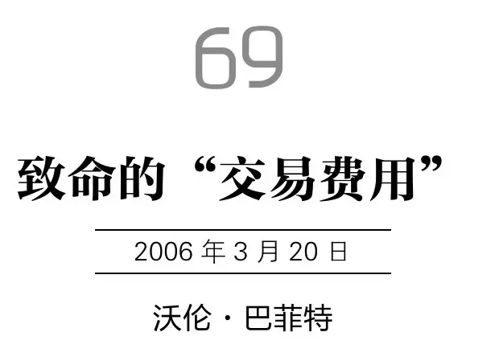

“他是一位真正的还原论者。”这是不久前沃伦·巴菲特的一位商业伙伴对他的评价，他用了一个生僻的词恰到好处地解释了巴菲特卓越的化繁为简的能力。在2005年致股东的信中，巴菲特就向我们展示了他这方面的天赋，证实了“就股票投资者这个群体而言，在审判日之前所能拿到的报酬，就是这些企业产生的盈余”。接下来，他在《致命的“交易费用”》一文中感叹，“交易费用”以及它们对“既得利益”（Gotrocks）集团有着巨大的影响。

“交易费用”是巴菲特从1956年开办合伙公司起就一直考虑的事情。按照如今的定义，该合伙公司就是一只私募基金。巴菲特将年回报中的6%先发放给他的有限合伙人，然后才考虑自己的回报部分，其他基金公司也纷纷效仿。后来，随着他的致股东的信逐渐为人们所知，他建议大部分个人投资者投资低成本的指数型基金，而不是只身投入险恶的股市。

再后来，他与门徒合伙基金公司（Protege Partners）对赌，在10年内，赌非托管且低成本的标准普尔500指数基金的表现可以击败精心挑选的5只对冲基金的表现。当然，在这些基金中，有限合伙人承担的是两部分交易费用：第一部分是对冲基金层面的，第二部分是组合型基金层面的。由于这本书出版于2012年，4年的赌局已经过去了，双方几乎打成平手。更多关于这场赌局的内容详见《巴菲特的豪赌》*（Buffett’s Big Bet）*。

下文选自2002年巴菲特致股东的信。

——卡萝尔·卢米斯

在这些年里，伯克希尔哈撒韦公司和其他美国股票投资者轻而易举地实现了富裕的梦想。举一个“长期”的例子，从1899年12月31日到1999年12月31日的100年间，道琼斯工业平均指数从66点上涨到11497点，猜猜达成这一成果需要多少的年增长率？令你吃惊的答案就在本文末尾。这么巨大的升幅，原因却很简单：整个世纪以来，美国企业都表现得非常出色，投资者也借此赚得盆满钵满。企业依旧持续着良好态势，然而，如今的投资者由于遭受了一系列的“自伤”，在相当大的程度上减少了他们本应从投资中实现的回报。

要解释这一切是怎么回事，我们得从一个最基本的事实开始：除了一些无足轻重的例外情况，比如企业破产时部分损失由债权人负担，“就股票投资者这个群体而言，在审判日之前所能拿到的报酬，就是这些企业产生的利润”。当然，不论是因为聪明还是幸运，投资者A确实有可能获得比投资者B实现更高的回报。股市上涨时，所有的投资者都会觉得自己更有钱了。然而，一个股东要退出的话，必须有新的股东递补他的位置。如果一个投资者高价卖出，另一个投资者必须高价买入。作为整体而言，没有什么奇妙可言，金钱不会从天而降，投资者根本不可能从公司那里得到比公司本身所创造的更多的财富。

实际上，由于“交易费用”的存在，股东获得的回报肯定少于公司所创造的利润。而这就是我要强调的：如今这些成本越来越高，这将会导致股票未来的回报率要远远低于历史水平。

为了弄清楚这些费用是如何逐步膨胀的，我们不妨这样设想：美国所有的公司为一个美国家庭所拥有，并将永远如此。我们称其为“既得利益家庭”。在缴纳红利税之后，这个家庭一代接一代地积累着这些公司所创造的利润，从而变得更加富有。目前的平均年利润约为7000亿美元。当然，这个家庭还得花费掉一些钱。不过，积蓄的财富将会稳定地以复利形式不断地累积。在这个“既得利益”家庭里，每个人的财富都以同样的速度持续增长，一切都十分和谐。

然而，现在让我们设想一下，几个伶牙俐齿的“帮手”来到了这个家庭，劝说每位家庭成员通过购买、卖出某些股票来取得比亲戚们更多的财富。这些“帮手”会十分热心地答应来负责处理这些交易，当然他们会收取一定的佣金。“既得利益”家庭仍然拥有美国所有的上市公司，这些交易只不过是重新安排哪些人持有哪些公司而已。总的来说，这个家庭每年的获得的回报在减少，因为要支付交易佣金。家庭成员交易的次数越多，他们从企业这块大饼中所分到的份额就越少，而那些作为经纪人的“帮手”分到的份额就变得越多。关于经纪人，我们需要牢记的事实是：“交易”是他们的朋友，因此，他们总是想方设法地提高客户的交易频率。

不久之后，大多数家庭成员意识到，在这种新型的“打败我兄弟”的游戏中，这些经纪人做得并不太好。于是又来了另一批“帮手”。这一批新人对每个家庭成员解释说，只靠一个人是不可能胜过其他家庭成员的。他们开出的药方是：“聘用管理者，没错，就是我们，我们会展现出专业人士的风范。”第二批“帮手”兼管理者继续使用第一批“帮手”兼经纪人进行交易；这些管理者甚至进一步提高了交易量从而使经纪人生意更加兴隆。总之，更大一块儿“大饼”成为了这两批帮助者的盘中美餐。

大家庭的失望情绪与日俱增。每个家庭成员都聘用了专业人士，然而全家整体的财务状况却每况愈下。这可如何是好？寻求更多的帮助，这是理所当然的反应。

随后到来的是理财规划师和机构顾问，他们则在“既得利益”家族选择管理者的问题上给予建议。已经晕头转向的家族成员自然非常欢迎他们的协助。事到如今，这些家庭成员终于明白自己既不能选择合适的股票，也不能选择合适的选股高手。为什么？有人会产生疑问，他们还应该寄希望于成功选择出合适的顾问吗？但“既得利益”家庭却没有产生类似的疑问，“顾问帮手”当然不会向他们提供这方面的建议。

“既得利益”家庭现在要向这三批帮助者支付昂贵的费用，但他们发现这样做的结果更加不妙，他们在绝望之中越陷越深。然而，就在希望即将破灭之时，第四批帮助者出现了，我们称其为“超级帮手”。他们十分友好地向这个家庭解释说，无法得到理想结果的原因在于现有的三批帮助者：经纪人、管理者、顾问，他们的积极性没有被充分激发起来，他们只是走走过场而已。第四批人说：“你们能指望这些行尸走肉做什么呢？”

新来的帮助者提出了一个简单得令人吃惊的解决之道：支付更多的报酬。“超级帮手”充满自信地断言，巨额的或有偿付款（contingent payment，固定佣金之外）是为了真正超越其他家庭成员而必须付出的代价。

该家庭中比较敏锐的成员发现，第四批超级帮助者中的某些人其实就是管理者穿上了新的制服，绣着更诱人的“对冲基金”或“私募股权投资公司”的标志而已。可是第四批帮手向这个家庭信誓旦旦地承诺，制服的变化是至关重要的，它会赐予穿着者一种魔力，就像性情温和的克拉克·肯特（Clark kent）换上超人衣服之后就变得威力无穷一样。家庭成员们听信了他们的解释，决定支付高额报酬。

这正是我们投资者今天的处境：如果他们只是老老实实地躺在摇椅上休息的话，公司的部分高额回报本应该全部落入他们的口袋。而如今这部分回报却被为数众多的“帮手”啃噬了。尤其是最近流行的盈利分配机制使这个家庭付出的代价更高了。根据这种分配机制，由“帮手”的聪明或运气所取得的盈利，大部分归“帮手”所有，而发生的损失则全部由家庭成员承担；当“帮手”反应迟钝或者运气欠佳（或者偶尔使用不正当手段）时，还得支付大笔的固定佣金。

大量的盈利分配都照此进行，即“帮手”拿大头，而由“既得利益”家庭承担损失，还要为此特权支付昂贵的费用，或许我们应该将家庭的名字改为“冤大头”更为恰当。事实上，现在这个家庭的所有交易费用大约要占到所有美国上市公司利润的20%。换句话说，由于承担支付“给帮手”的费用，美国股票投资者总体上只能得到他们应得回报的80%，可如果他们静静地坐在家里休息而不听任何人的建议的话，就能全部收入囊中。

很久以前，艾萨克·牛顿爵士发现了三大运动定律，这是天才的伟大功绩。但牛顿的天才并没有延伸到投资领域：他在南海泡沫事件[\8]中损失惨重，后来他解释说：“我能够计算星球的运动，却无法计算人类的疯狂。”__如果不是因为这次投资造成的巨大创伤，也许牛顿会发现第四大运动定律：对于投资者整体而言，运动的增加导致了回报的减少。__

现在回答一下开始时提出的那个问题：可以非常确切地说，20世纪之内道琼斯工业平均指数从65\.73点上涨到11497\.12点，相当于5\.3%的复合年增长率（当然投资者也会收到股息）。若想在21世纪得到相同的增长率，道琼斯工业平均指数必须在2099年12月31日之前上涨到2011011\.23点，而我定下的目标是2000000点。然而，事实上，在21世纪已经过去的6年里，道琼斯工业平均指数根本未见任何上涨。

## 70 身居幕后的查理·芒格

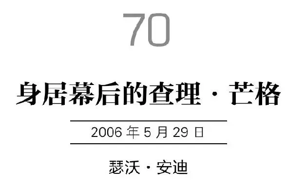

沃伦·巴菲特和查理·芒格两人常被认为是一对完美组合，如果两人未曾相识，事情将会是什么样子的呢？这简直难以想象。因此，有两个奥马哈人都声称是自己介绍了巴菲特和芒格相识。我们无意在此解决这一“公案”。然而，我们不妨回忆一下理查德·霍兰（Richard Holland）曾在他的著作《真理以及其他故事》*（Truth and Other Tall Tales）*中讲到，某个晚上，他主张要将这对好友一起带来：“我们起居室的角落里安排了两张椅子用于会谈，那里也正是巴菲特和芒格整晚‘驻扎’的地方。在我印象中，他们从未起身离开过座椅，也从未停止过谈话，直至离开……芒格有时还显得很亢奋。”

在接下来的这篇文章中，瑟沃·安迪向我们讲述了芒格是如何为伯克希尔哈撒韦公司的盛会带来独特看点的，他和巴菲特上演了股东大会上最佳的双人秀，但遗憾的是没能搬上百老汇的舞台。作为介绍，我想，让芒格回顾一下自己在巴菲特身边或者说在伯克希尔哈撒韦公司这些年的经历，并明确地用他独到的方式谈一下，他认为自己对伯克希尔哈撒韦公司最大的贡献在于何处，这应该是个很有意思的问题。

可他并不完全按照我的思路来。相反地，他用了一个代词“我们”，这也是伯克希尔哈撒韦公司文化中的精髓部分。芒格说：“我们选择了符合自己性情的经营方式，这就需要我们花费很多时间进行思考、学习、终生不断地自省，对所犯过的错误进行悔悟，并保持幽默感。这就自然导致投资者对我们非常信仰，而这正是我们愿意见到的局面。我们知道我们的举措能够为自己和那些信赖我们的人带来好的经济效益。不过，我们并未预料到会获得如此多、远超我们本应获得的关注和敬仰，这令我们倍感荣幸。事实上，我们继承了巴菲特的老师本杰明·格雷厄姆的衣钵。”

——卡萝尔·卢米斯

问问乡里乡亲对伯克希尔哈撒韦公司的印象，大多数人会告诉你，这是股神沃伦·巴菲特的公司。就现实情况来说，这种说法没错。不过，那些真正了解伯克希尔哈撒韦公司的人们知道，公司的成功实际上源于巴菲特和他的长期合作伙伴查理·芒格的共同努力。当然，巴菲特坐着头把交椅，是董事长兼首席执行官，是代表公司的公众性人物，而芒格只是副董事长，更多地负责幕后工作。然而，实际上，芒格在伯克希尔哈撒韦公司也一直扮演着共同掌舵者的角色，这可不是听起来那么简单。

今年5月初，我去奥马哈进行了一场“朝圣之旅”，即参加伯克希尔哈撒韦公司世界知名的股东大会，体验芒格称作“资本主义日”（festival capitalism）的气氛。我还有一项任务，就是近距离观察芒格，聆听他的智慧箴言。你可能已经读过很多有关伯克希尔哈撒韦公司股东大会的报道，我也是。人气爆棚的奥马哈奎斯特中心（Qwest Center）涌入了17000位股东，场馆内还另外安排了7000个座位，漫步在这样的环境中，仍是一种非同一般的体验。几乎每一个人（其中许多人是千万富翁）都正襟危坐，全神贯注地聆听75岁的巴菲特和82岁的芒格这两个老头长达5个小时的演讲。映入大家眼帘的场景就是：两位银发苍苍的老人正激情澎湃、鼓舞人心地高谈阔论。

过去这些年，“巴菲特和芒格秀”采用了一种近乎程式化的编排。两人在舞台中央落座，台下是黑压压的股东。一般先由巴菲特回答问题，之后他会按照自己独有的方式，通常是插入一两句俏皮话，闲扯5分钟左右。这时他会看一眼自己的搭档，问道：“查理？”然后可能会发生两种情形：芒格要么接下话茬，做一段犀利、简练、往往还很尖刻的评论，有时会引起人群中的惊叹声或者大笑声，要么就是简单地回答一句：“我没什么要说的。”特别是在巴菲特啰里啰唆的一通题外话之后，芒格的回答总会逗得大家大笑不止。然后，巴菲特会做两分钟的总结。上午的日程将持续两个半小时，中午有一段午餐休息时间，下午再进行几个小时的会议。“我们会坚守这种二人模式。”今年“马拉松”式的股东大会过后，芒格这样对我说道，“如果只有一个人，就没有这种效果。即便世界上最聪明、最睿智的人坐在那儿，你还是会发现很无聊。应付这样格外冗长的节日，需要不同个性的互动。”

伯克希尔哈撒韦公司的观察家们认为，脾气不太好、特别是忍受不了迟钝之人的芒格最近获得了很多关注。与打算只在生后捐赠个人财产的巴菲特不同，芒格一直在积极地捐助大笔资金，主要面向加利福尼亚州的教育和医疗事业。此外，还有一本关于他的价格不菲的精装书《穷查理宝典》，在2006年股东大会之前恰好推出了第二版。这本书的标题和构思，毋庸置疑是对本杰明·富兰克林的一次致敬，他是芒格倍加推崇的人。“这里面有大量属于富兰克林的智慧，”芒格脸上忽然闪现出短暂的纯真笑容，“还有富兰克林的才能。他能玩四种乐器。他是美国最顶级的科学家和发明家，同时还是最优秀的作家、政治家和慈善家。从未有人像他一样出色。”

对伯克希尔哈撒韦公司的股东们来说，芒格是一位相当杰出的人物。一位股东这样跟我说道：“巴菲特毫无疑问是非常优秀的，但我只喜欢听查理说的。”在某种程度上，巴菲特和芒格让我想起了滚石乐队。巴菲特就像米克·贾格尔（Mick Jagger），是当仁不让的耀眼主唱：然而很多人都觉得芒格像基斯·理查兹（Keith Richards），更是酷劲十足。当然我们希望芒格不要摊上椰子树事件。

那么，2006年芒格说过什么惊人的言论呢？有一次，巴菲特谈到股东的个人投资，他说其中许多人的收益大致说得过去。而到了芒格那里，他却直言不讳：“你们中的许多人很难再继续下去。”芒格对审计员也是“狂轰滥炸”，形容他们“卑劣，完全出卖了原则”；他认为贿赂外国政府是“盗窃统治”（kleptoc\-racies）；在评价一位广受好评的、撰写了多部商业书籍的作家时，他用了“精神错乱”一词。而谈及高管的薪酬，他说美国正在“向欧洲出口毒药”。他还说有朝一日，对冲基金和私募股权基金必将得到应有的惩罚，还有华尔街“交易泄密”泛滥等。不过，芒格不只会揭发冒充行家的骗子，“芒格主义”中还有充满谦卑和简单的智慧。__他告诉我：“在伯克希尔哈撒韦公司，巴菲特和我不会做别人可以做得更好的事儿，如果你不知道优势在哪儿，就称不上真正有实力。”__

在股东大会前夕，伯克希尔哈撒韦公司宣布以40亿美元的价格收购了以色列一家金属切割机床制造商伊斯卡公司80%的股份，这也是伯克希尔哈撒韦公司的首次海外收购行动。芒格说他和他的合伙人发现伊斯卡公司的管理层“具备出色的才干和品质”。我听说芒格在收购方面通常比巴菲特更加谨慎，但从伊斯卡公司收购案的一开始，他就怀有极高的热情，甚至比巴菲特还要急切。“谁能不为这种收购感到兴奋呢？”芒格说。

对于伯克希尔哈撒韦公司、巴菲特和芒格，有个问题始终困扰着我：他们究竟是如何使无比复杂、令人困惑的企业和投资技巧显得如此简单的呢？“伯克希尔哈撒韦公司只做那些能很容易预测的业务。”芒格解释道。如果一笔交易很难看清楚其未来走向，这对搭档就会将其搁置。在今年的股东大会上，在芒格说过的话中，我记得最清楚的是：“我们对保持理性负有极高的道德责任。”仔细推敲一下这句话，你是否听说过一位商业领导者如此形容自己的责任呢？我们有理由相信，伯克希尔哈撒韦公司和巴菲特都只有一个。同样，查理·芒格也是唯一的。

## 71 巴菲特支持通用汽车公司，并购买了一辆凯迪拉克

有些人总想拥有最炫目华丽的东西，但沃伦·巴菲特并不属于其中之一。毕竟他就是那个喜欢在奶品皇后公司就餐的亿万富翁，而且，他每天上下班也只需要5分钟的路程。不过，2006年4月初，在美国哥伦比亚广播公司“面向全国”（Face the Nation）的节目上，他见到了通用汽车公司的董事长兼首席执行官里克·瓦戈纳（Rick Wagoner），随后巴菲特决定奢侈一把，换辆新坐驾。巴菲特给瓦戈纳发了一封简短的传真，称赞他在讨论通用汽车公司所面临困难时，表现出的“坦率、沉稳和理性”，尽管这些困难并不是由他造成的。巴菲特还补充了一段附言：“我并不经常买车，但下一辆会是凯迪拉克。”瓦戈纳回信说，自己会给巴菲特提供购车方面的帮助。然而，这并没什么必要，因为巴菲特派女儿去附近的一家经销商挑选了一辆，就像他说的，算是“给这家伙投了一票”。他的女儿挑选了一辆DTS，这是一款辆专门为高龄驾车人士设计的轿车，起价41990美元。巴菲特说：“我想我会变成一个汽车推销员，因为我可以毫不费力地把车卖给任何人。”他还说：“我百分之百地支持通用汽车公司。”如果你还有所疑心的话，我再补充说一点，他付的是现金。

## 成为慈善家

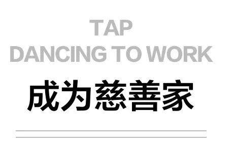

2006年5月初的某一天，我走进了主编埃里克·普利（Eric Pooley）的办公室，关上门，告诉他我们有机会报道一个大新闻。“你也知道，”我大概是这么说的，“沃伦·巴菲特一直说，他的大部分财产将在他离世之后再投入慈善事业，但他还没有为此制订任何计划。而如今，他打算在6月份宣布自己将立刻实施他的捐献。他的财富将逐渐捐入5家基金会，其中最大的一家将会是比尔和梅琳达·盖茨基金会。《财富》杂志可以对此进行报道，或许可以对他进行采访，他会公开相关信息的，如果他愿意的话。”

普利似乎吃了一惊，但旋即以百万分之一秒的速度回答说：“我们需要这个报道。”他毫不迟疑地想到了一个封面故事，然后说我们需要马上打电话给格雷格·庞德（Greg Pond），也就是我们摄影部门的主管。庞德来到的时候，普利让我把自己的构思再说一遍。我便又开始了讲述，当我讲到巴菲特善款的流向时，普利打断了我，用一种势必能够穿透紧闭的房门的声音说道：“他要把钱交给比尔·盖茨？”

巴菲特打算在2006年6月底宣布他的决定，而我们计划在6月23日前发表我们的文章。不过，这篇报道的各项准备工作还没被列上预备清单，这不同于以往的做法。相反地，我们只有一小撮人聚集在一起，密谋张罗着这件事：报告、撰写、编辑；一头雾水的摄影师安排了封面的拍摄；我们的艺术总监，也被拉进了这个秘密组织，设计了页面和封皮。

我们完全保密地进行这些事，甚至隐瞒了其他员工长达一个多月的时间，这堪称是一个小奇迹。直到发布会前几天的一次晨会上，才有几个特别机灵的同事问道：“这一期里是不是有些我们不知道的故事？”普利说，确实有，如果大家不再追问的话，他将不胜感激。当《财富》杂志的公共关系部门在6月25日召开了一场为时很长的新闻发布会，披露这条消息时，完全震惊了全世界以及杂志社的大部分员工。

2006年8月，巴菲特将他的第一份“厚礼”赠给5家基金会，接下来的每年夏天都延续了这项捐赠。2012年，他给5个受赠方一共捐赠了大约133亿美元。其中约110亿都去了比尔和梅林达·盖茨基金会；11亿美元进入了苏珊·汤普森·巴菲特基金会（Susan Thompson Buffett Foundation）；12亿美元投到了他的3个孩子运营的基金会，每个4亿美元。

由于给所有基金会的捐献是一组固定数额的伯克希尔哈撒韦公司的股份，所以，巴菲特每年捐赠的价值都随着伯克希尔哈撒韦公司的股价有所波动，近年来则有所下降。举个例子，给比尔和梅琳达·盖茨基金会的捐赠已经从2008年高峰期的180亿美元下降到2009年的125亿美元。

这里补充说明一点：本文及其后一篇中的伯克希尔哈撒韦公司B股数据并未根据2010年50比1的股票分拆做出调整。

——卡萝尔·卢米斯

__72 巴菲特捐出财产__

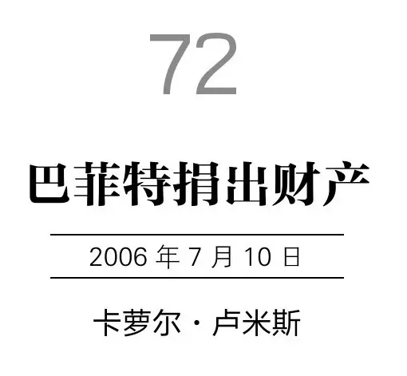

一个春日的下午，我们坐在曼哈顿的一间客厅里，沃伦·巴菲特像往常一样手握着樱桃可乐。不过，这看似平淡无奇的场景却孕育着惊人的转变。“打起精神来啊。”巴菲特笑着提醒我们。然后他讲述了自己的思想所发生的重大转变。他说，在未来的几个月内，他将开始捐赠自己在伯克希尔哈撒韦公司的财富，总价值超过400亿美元。这个消息的确令人震惊。几十年以来，75岁的巴菲特表示自己的财富将捐赠给慈善事业，但他坚称，这笔财产将在他过世后再转交出去。现在，他重新制订了时间表。他说：“我很清楚自己想做些什么，而且现在行动是有道理的。”在那个春日的下午，巴菲特计划中的部分细节还没有确定，而如今则已基本完成。这非常符合巴菲特的个性：理性而又富于创造性，打破了超级富豪捐赠财富的模式。

巴菲特许诺将逐步把自己持有的85%的伯克希尔哈撒韦公司股票赠予5家基金会。其中的5/6将进入世界上最大的慈善组织：资产达300亿美元的比尔和梅琳达·盖茨基金会。这对夫妇都是巴菲特的挚友，1991年，由一位共同的朋友引见，两人得以相识。盖茨说，盖茨一家对巴菲特感激不尽，是他“启发”了他们回报社会的想法。举世闻名的比尔和梅琳达·盖茨基金会主要致力于全球健康问题，与诸如疟疾、艾滋病和肺结核等疾病做斗争，而且它还在为美国图书馆和高中教育的改善而奋斗。到目前为止，盖茨夫妇是基金会的唯一受托人。不过，随着巴菲特捐赠计划的逐步实施，他也将参与其中。盖茨说，巴菲特的资金将加快基金会各项目的推进速度，并使它们开展得更加深入。当他和妻子知晓这一消息，感到“激动不已”。“巴菲特的慷慨以及对我们的信任，简直令人难以置信。”盖茨补充道。

从7月份开始，巴菲特每年将以逐年递减的方式赠送一定数量的伯克希尔哈撒韦公司B股股票给这5家基金会，2006年为602500股，然后每年递减5%。给予比尔和梅琳达·盖茨基金会的“礼物”会由巴菲特或将他的地产转赠给这家基金会，当然，这一切的前提是只要盖茨夫妇中有一人仍然在基金会工作。盖茨今年50岁，梅琳达今年41岁。赠送的善款具体价值几何，将由伯克希尔哈撒韦公司当日的股价来决定。比如，如果今年7月伯克希尔哈撒韦公司B股股价为3071美元，这是该股在6月23日收盘时的价格，那么，2006年巴菲特捐给基金会的500000股股票的价值大约就是15亿美元。

由于新增了如此多的资金，比尔和梅琳达·盖茨基金会将需要两年的时间来重新规划自己的活动。不过，按照巴菲特捐款时的要求，基金会除利用现有资产捐赠以外，还应从巴菲特的馈赠中进行捐赠。从目前来看，这15亿美元的新馈赠大体上可以使基金会每年的捐助金额扩大一倍。

不过，这15亿美元与巴菲特未来捐款的数额关联不大，因为未来捐赠的数额将取决于当时伯克希尔哈撒韦公司的股价。如果公司的股价每年递增，即便以比较平缓的速度，比如6%，那么即便每年捐赠的股票数减少5%，其实际金额仍然是增长的。巴菲特本人认为这是可能发生的。从更直观的角度来看：他相信伯克希尔哈撒韦公司的股价以及捐赠的实际金额将呈上升趋势，或许随着时间推移还会出现大幅增长。

巴菲特向其他基金会捐款的计划也将从7月开始，每年都会进行。按照伯克希尔哈撒韦公司目前的股价，2006年，巴菲特向这些基金会捐赠的总额将达3\.15亿美元。这笔善款将进入分别由巴菲特的3个子女苏茜·巴菲特、霍华德·巴菲特和彼得·巴菲特管理的基金会以及苏珊·汤普森·巴菲特基金会。最后一个基金会在过去40年里一直以“巴菲特基金会”而为人们所知，为了纪念故去的妻子苏珊，该基金会不久前更换了名字（苏珊于2004年病逝，享年72岁）。在她的遗嘱中，苏珊向该基金会捐赠了25亿美元，而她丈夫的捐款将成为进一步的补充。苏珊·汤普森·巴菲特基金会主要关注生殖健康、计划生育、支持人工流产合法化以及防止核武器扩散等领域。

由于对5家基金会的捐赠，巴菲特手中持有的伯克希尔哈撒韦公司的股票将大幅减少。目前，他大约拥有该公司将近31%的股份，今年6月底，总价值接近440亿美元，但这一比例最终将减至5%。巴菲特说，按照长远的构想，余下的这5%，价值大约为68亿美元，迟早也将捐献给慈善事业，这也许是在他有生之年，也有可能是在他过世之后。

因为巴菲特的捐赠与伯克希尔哈撒韦公司的未来股价相挂钩，所以，我们无法计算出这笔捐赠的总价值。即便如此，以现今的价格来计算的话，这部分股票的价值也令人瞠目结舌：370亿美元。仅此一点，就会成为有史以来最大的一笔慈善捐款。如果巴菲特的估计是正确的，伯克希尔哈撒韦公司的股价呈上升趋势，那么，巴菲特最终的捐款额还会远远超出这个数字。

巴菲特的慈善计划终于尘埃落定。在接下来的谈话里，巴菲特解释了自己为何改变了初衷，决定现在就开始捐赠。提问者是《财富》杂志的编辑卡萝尔·卢米斯，也就是笔者本人。我与巴菲特是多年的老友，也是伯克希尔哈撒韦公司的股东，还是苏珊·汤普森·巴菲特基金会的董事。

Q：你说计划出自您的构想，这真是太出人意料了，迄今为止，你还未曾因乐善好施而出名过。事实上，还因为没有捐款而遭受批评。因此，我很想知道：你是不是生病了？

没有，绝对没有。我感觉好极了，去年10月份体检时，医生还给我开了一张“健康证书”。

Q：那现在究竟是什么让你做出了改变？是不是因为苏珊的离世？

是，的确是这样。苏珊比我小两岁，女性的寿命通常比男性要长，我们一直以为，她会继承我在伯克希尔哈撒韦公司的股份，监督财富的分配，这是我们两人共同的设想，她珊也应该非常乐于参与这个过程。如果分配比例逐步提高，她也可能会对此有点儿担心，但还是乐意从事这件事的。我相信她会做得非常好，而且可能会加快分配的速度。

Q：你的意思是，她一直希望比你更多更快地捐赠出善款？

是的，她生前曾多次表达过这个意愿。对我而言，我一直认为，当下的慈善事业固然重要，但在1年后、10年后、20年后，乃至更远的将来，也同样重要。我认为，积累资金速度较快的人更适合20年后参与慈善事业，积累资金速度较慢的人有理由多尽心于当前的慈善事业。

Q：而这个理论也恰好符合你当时想要去做的事，对吗？

（他大笑起来）当然啦！这点毫无疑问。在自己喜欢做的事情上，以前我总是乐在其中，现在仍然乐此不疲。在曾经管理伯克希尔哈撒韦公司的某段时间，我也有同感。20世纪70年代初，在解散巴菲特合伙公司之后，我用得到的1500万美元买下了伯克希尔哈撒韦公司的实际控制权。当时除了伯克希尔哈撒韦公司以外，我几乎没什么钱，身上远不足100万美元，我当时的年薪是5万美元。因此，如果我在那时就投身慈善事业，那我得拿出伯克希尔哈撒韦公司的股份。在当时，我可不是为了立刻送出去而购买那些股份的。

Q：即便如你所说，你和苏珊在20世纪60年代就成立了巴菲特基金会，很明显，这意味着你希望在未来某个时刻捐出财产。能谈谈当时的想法吗？

1952年我们结婚的时候，我就告诉苏珊，我会成为富人。我这么说并非因为我有某种特殊的品质，甚至也不是因为辛勤的工作，仅仅是因为我的出生适逢其时，而且还掌握了恰如其分的技能。我天生就与资本配置有着不解之缘，而且足够幸运的是，我身边的人，如我的父母、老师和苏珊很早就帮助我充分利用这一特长。

无论何时，当我跟苏珊说我们会发财时，她从未表现得多么兴奋，要么毫不在意，要么就是不予采信。事实上，两者都有点儿。当我们真的积累了巨额财富时，在处置这笔财富的态度上我们相当默契，那就是将它们回馈给社会。在这一点上，我们非常同意安德鲁·卡内基的观点，他说，大部分源自社会的巨额财富应该返还到社会中去。就我自己而言，要不是我生活在一个人口众多的富裕国家，而且这个国家的市场上有着不可胜数的有价证券，不时还会出现荒谬的被低估的价值，我配置资本的能力本不太可能会有用武之地。不过，幸运的是，这正是美国20世纪后半叶的真实写照。

当然，我和苏珊从未觉得我们应该把这么多钱留给子女。我们的孩子都很出色。然而，我要申明的一点是，在成长经历以及得到的教育机会，包括家庭教育方面，他们已经占尽了优势；因此，再赋予他们无数金钱既不正确，也不理智。实际上，在崇尚精英的社会里，他们已经拥有了压倒性的领先优势。世代相承的巨额财富将会进一步加剧我们本应努力维护的社会公平。

Q：鉴于你之前给过孩子们成立基金会的钱，现在还计划给他们更多钱的事实，我们有理由推断，你并不认为给孩子大量金钱是错误的。

是的，我不那么认为。他们在各自基金会的工作是把钱返还给社会，这也正是我和苏珊认可的方式。他们不是简简单单地签支票而已，他们为整个过程付出了很多的心血和努力。我对他们的处理方式感到非常骄傲，而且他们还会继续沿着正确的道路前进，这点我毫不怀疑。

Q：苏珊·汤普森·巴菲特基金会的情况怎么样？这一切对它来说意味着什么？

身为基金会的董事，你应该很清楚。基金会主席艾伦·格林伯格在管理基金会方面付出了大量心血，成就斐然。他采用的结果\-成本比率，是我见过的最好的。现在他将一以贯之地走下去，他不仅要管理苏珊的钱，还有我的。事实上，如果我先苏珊而去，而她已经开始分配我们的财富，那么这家基金会的规模会比现在大，它也会成为她捐款的主要渠道。目前，它只有5名员工。这个基金会也稳固了我的计划，在我改变捐献财富的计划之前，它会也是我财富的归宿。

Q：那么，是什么改变了你的主意？

简单来说，是因为我意识到有一个出色的基金会规模已经壮大起来，它不必再像苏珊·汤普森·巴菲特基金会那样，历尽千辛万苦才达到空前的规模，而且现在就能卓有成效地运用我的资金：它就是比尔和梅琳达·盖茨基金会。这些年来，通过对盖茨夫妇的深入了解以及与他们共度的美好时光，我渐渐开始敬佩他们在其基金会所做的工作。我看过他们为基金会项目做的演讲，他们为工作倾注的热情、激情和精力总是让我惊讶不已。可以说，不论是智力上还是情感上，二人都已经全力以赴。盖茨每年阅读几千页的文章，跟踪了解医学进展以及提供救助的手段。梅琳达经常与盖茨一道周游世界，查看他们的善意是否结出了善果。命运的不公让全世界数十亿人口生活在水深火热之中，而盖茨和梅琳达一心一意、尽其所能地改善这种不平等的状况。

想想看，如果你的目标是把金钱返还给社会，以解决没有相应资金基础的重大问题，还能找到能比这对天资聪颖、理念正确、能力出众的年轻夫妇更好的答案吗？这样的机会千载难逢。我得到了两位在这个领域取得巨大成功的人，有机会看到了他们在这个领域所做的一切，而且我知道，他们会用自己的钱持之以恒地从事这项工作，而不是生活在幻想的世界中；

此外，我基本上同意他们的理念。如果我已经为自己的目标找到了合适的出路，那就没必要再等下去了。

拿我和他们一起做的事情与我在伯克希尔哈撒韦公司的工作做番比较：在伯克希尔哈撒韦公司，管理着公司的是那些有才华而且可靠的人，他们取得了远超于我的杰出成绩；而在比尔和梅琳达·盖茨基金会，由这对出色的年轻夫妇管理着我的善款。无论你希望做什么，还有什么比知人善任更合乎逻辑的呢？在高规格的高尔夫球比赛中，谁又不会选择泰格·伍兹（Tiger Woods，美国著名高尔夫球手）来替自己出征呢？这就是我处置自己财富时的想法。

Q：我想人们会对你的决定非常好奇，特别是选择在这个特别的时刻宣布你的慈善计划；盖茨在6月中旬宣布自己将逐渐退出微软公司的管理工作，并将开始把大部分精力投入他的基金会，你的决定与这件事有多大联系？这里面有什么故事吗？

我知道，这两项决定之间的时间如此接近，似乎暗示着它们之间有一定的联系，但这纯属巧合。无论他是否宣布自己的计划，我都会立刻公布自己的计划，甚至即使他永远保留微软公司的工作，我仍会做出这样的决定。另一方面，我很高兴他愿意投入更多的时间到基金会之中。我认为，当他和梅琳达得知有更多资源可以利用时，一定会非常高兴。

Q：你会不会觉得全世界第二大富翁向第一大富翁赠送数不尽的钱财略显讽刺？

如果按你这么说，听起来是挺滑稽的。但事实上，我是请他，更重要的是梅琳达，将这笔钱转送给社会，而不是给他。

Q：有些人说，比尔和梅琳达·盖茨基金会颇有“官僚作风”，而你最不喜欢的就是官僚主义。你如何回应这种指责？

在我看来，大多数大型组织都会多多少少存在一些官僚主义现象，伯克希尔哈撒韦公司是个杰出的例外。不管怎样，有些人在指责比尔和梅琳达·盖茨基金会的官僚作风时，他们实际想表达的意思是，这里的重大决策权只掌握在盖茨和梅琳达两个人手里，而这对我来说再好不过了。我希望重要的决策出自他们两人。

Q：你觉得自己成为比尔和梅琳达·盖茨基金会董事的意义何在？

我觉得意义不大。我这样做的最主要原因是预防他们俩人同乘飞机时失事。除此以外，我还希望时不时地能提供一些建设性的意见。不过，我不认为自己会像盖茨和梅琳达那样适合做慈善家。慈善事业的回馈非常慢，让我很不耐烦。此外，还不得不与很多我不想见的人频繁会面，听取许多我不愿意听的观点。做慈善时，肯定会犯一些大错误，虽然我深知这一点，但还是难以忍受自己犯错误，我更希望让那些我完全信任的人代为受过。总而言之，盖茨和梅琳达的平均成功率将远高于我。

Q：在你做出这一决定之前，有没有和其他人商量过？

当然，我和我的孩子、格林伯格以及包括芒格在内的4位伯克希尔哈撒韦公司的董事谈论过这件事。大家向我提出了许多问题，有些人起初对这个计划产生过疑虑，因为这对他们来说是一个360度的大转弯。不过，我要说的是，所有的人全都逐渐理解了我提出这项计划的初衷，其中包括格林伯格，他很清楚扩大苏珊·汤普森·巴菲特基金会将意味着什么。现在，所有关心这一决定的人都迫不及待地希望开始实施这项计划，尤其是我。

坦白地说，我个人的小愿望是，我的行动能鼓励其他富人也考虑投身慈善事业，而且并不一定要成立自己的基金会，只需要看看周围，选择那些已经成立而且能够处理好他们财富的基金会。人们在投资时就是采用这种方法的，他们把钱交给他们认为能够做得比自己更好的人。如果把这种想法运用到你的财富上，同样能得到一些切实的好处，而不是大费周章地亲自成立某个组织，并且在你过世后请一批熟识的商业伙伴或员工负责管理，最终由他们进行差遣。我的这个计划对于那20位身家至少有10亿美元而又步入垂暮之年的富翁来说，似乎也不是个坏主意。大部分富豪面临的难题是，他们年事已高，而那些没能和他们一起进入鼎盛期的同侪，所剩的时日也不多了。在这方面，我很幸运，可以向年轻人求助。

Q：好吧，那么现在这一切对伯克希尔哈撒韦公司来说又意味着什么呢？

基本没有什么影响。任何了解我的人都知道，我想让伯克希尔哈撒韦公司尽可能做到最好，这个目标依旧没有改变。我不会做出任何改变，因为我没有能力进行改变。股权凭证上的名字将会改变，但其他的不会。

我一再向伯克希尔哈撒韦公司的股东澄清，我从公司获得的财富将投向慈善事业。因此，我开始实施这一计划，对他们而言也没什么值得大惊小怪的。而且你也知道，尽管有些人会感到吃惊，但对我来说也无关紧要。我非常钦佩泰德·特纳（Ted Turne）的慈善行为，他曾告诉我，当他签下10亿美元的承诺时，他的手颤抖了。可我没这种感觉。于我而言，这个决定根本不会对我的情绪造成任何影响。

Q：基金会收到你赠送的股票后需要把它们卖掉吧？

是的，在某些情况下的确如此。苏珊·汤普森·巴菲特基金会和我的子女们的基金会在收到股票后，必须尽快脱手，因为这将是他们唯一的资产，他们需要把股票兑换成现金再赠送出去。比尔和梅琳达·盖茨基金会的选择余地要大得多，因为他们有许多其他资产，灵活性较高，可以自己选择该将哪一部分转变为现金。这个盖茨和梅琳达会做出决定。基金会做出的投资决定，我完全不会插手，这样他们就能放手做他们认为正确的事。也许他们会决定出售其他资产中的大部分，保留部分伯克希尔哈撒韦公司的股票。这是个绝佳的商业组合，是适合基金会的资产形态。不过，我不会以任何形态或形式来绑架基金会的活动。

Q：那么，你每年赠送出去的股票都有可能在市场上交易？

没错，这样的可能性很大。人们自然而然地会去关心这种抛售行为是否会压低伯克希尔哈撒韦公司的股价。我认为这是不可能的事，即使伯克希尔哈撒韦公司的年周转率只有15%也不会受到影响，当然这个数字对于一只拥有庞大市值的股票来说是极低的。假设这5家基金会把今年获得的股票全部抛出，如果交易量保持一般水平的话，那么它们的抛售行为最多会使周转率提高到17%。事实上，供应量的增加甚至有益于提高伯克希尔哈撒韦公司股票的流动性，而且更有希望让伯克希尔哈撒韦公司最终纳入标准普尔500指数。

我想告诉大家的是：如果我的捐赠行动有可能对伯克希尔哈撒韦公司的股东造成任何形式的伤害，那我就不可能做出这项决定，当然结果也不会伤害公司。

Q：从长远来看，这个计划似乎将决定所有你持有的伯克希尔哈撒韦公司股票的命运。这是否意味着你没有直接赠与家人任何财富？

不是这样的，我一直以来强调的是，家人不会从我的净财富中获得巨额馈赠，但这并不意味着他们什么也得不到。我的孩子已经从我和苏珊那里得到了一笔财富，而且他们还会得到更多。《财富》杂志在20年前就曾引用过我的这段话，我仍然坚持这个观点：富人留给孩子的财富应该足够他们做任何事情，而不是足够他们无所事事。

还记得我先前说过的在收购伯克希尔哈撒韦公司时，我在公司以外的现金还不到100万美元吗？而之后我就凭这些钱做了一些相当好的投资，建立了一些对伯克希尔哈撒韦公司来说微不足道的仓位，做了一些固定收益的套利交易，并且抛售了手中持有的从伯克希尔哈撒韦公司中拆分出去的一家银行的股份。因此，我可以很高兴地说，我现在手头有不少现金。总之我能够而且将要利用我在伯克希尔哈撒韦公司持有的全部股票从事慈善事业，还将留存大量财产，以便送给所有亲近的人。

__“商界传奇”们的捐献__

鉴于美国著名商业家所处时代的经济体量，他们所营建的慈善“航母”规模可谓相当巨大。不过，相较之下，巴菲特的贡献更是遥遥领先。

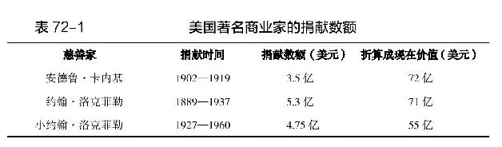

资料来源：《美国慈善》*（American Philanthropy）*罗伯特·布雷姆纳（Robert H\.Bremner）著。

__73 巴菲特的捐赠将如何分配__

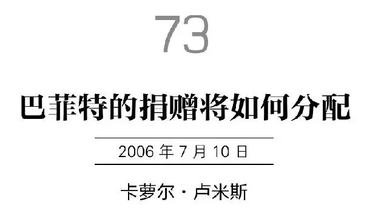

缔造了财富神话的大脑如今又策划出了一个如何分配财富的复杂方案。

沃伦·巴菲特只持有伯克希尔哈撒韦公司A股股票（共474998股），但他的捐赠却是以伯克希尔哈撒韦公司B股股票进行的。A股可向B股进行转换，兑换比例为30比1。因此，他要将手中的A股换成捐赠所需的B股。

巴菲特为他挑选出的5家基金会都划拨了固定数量的B股股票。2006年，他将把固定数量的5%捐送给每位受益人。第二年赠送额将是余下数量的5%，之后每年以此类推，直至巴菲特过世或者基金会不再满足特定的受赠条件。巴菲特过世后，他的遗嘱将分配余下指定用途的股票，至于以何种方式还尚不明确。

__以下便是所有受益人及其受赠的B股数量：__

__比尔和梅琳达·盖茨基金会__

1000万股

这家全世界最大的基金会目前拥有近300亿美元的资产，并且在成立的12年以来，捐赠数额已达80亿美元。其大部分资金（大多经由合作伙伴转送）进入了世界各地的健康项目以及美国的教育机构。只要盖茨或梅琳达中有一人在世，且致力于该基金会的工作，巴菲特的捐赠就会持续下去。

__苏珊·汤普森·巴菲特基金会__

100万股

这家基金会的前身是“巴菲特基金会”。2004年巴菲特妻子苏珊·巴菲特去世之后，该基金会被重新命名。基金会现拥有2\.7亿美元的资产，大部分来自苏珊的遗产，预计基金会还将从她那儿获得21亿美元的资产。基金会主要关注生殖健康、计划生育、支持人工流产合法化以及防止核武器扩散等。

__苏茜·巴菲特基金会（Susie A\.Buffett Foundation）__

35万股

这家慈善机构是以巴菲特52岁的女儿苏茜的名字命名的，她担任主席一职。她目前居住在奥马哈，自从母亲去世后，她也担任苏珊·汤普森·巴菲特基金会的主席。女儿的基金会目前拥有1\.18亿美元资产，主要为低收入家庭的儿童早期教育提供资助。有了父亲的新礼物，苏茜将继续拓展自己的事业，并将其扩大到公共教育以及寄养家庭领域。

__霍华德·巴菲特基金会（Howard G\.Buffett Foundation）__

35万股

这家由巴菲特51岁的长子创建的基金会目前拥有1\.29亿美元资产，他在伊利诺伊州迪凯特市市郊经营着一个340公顷的农场，还兼任多家公司的董事，包括伯克希尔哈撒韦公司。顺便说一句，他的中名是格雷厄姆，是为纪念著名投资家本杰明·格雷厄姆而起的。这家基金会的捐助对象非常国际化，遍及42个国家。捐赠的目标主要是需要保护的自然环境，比如，非洲野生动物栖息地的保护。不过，在获得新资金之后，基金会计划把更多精力转向清洁水计划、食品救济、非法移民儿童救助以及其他人道主义领域。

__诺和基金会（NoVo Foundation）__

35万股

这家基金会以拉丁语“novo”命名，意为“我能改变”，由48岁的彼得·巴菲特和妻子珍尼弗·巴菲特创建。彼得是位音乐家兼作曲家，夫妇二人居住在纽约市。该基金会目前拥有1\.2亿美元资产，主要资助那些致力于开放教育机会、改变环境退化现状、支持人权、增进不同文化和种族间理解和尊重的个人及组织。

## 74 20多年历史的110亿美元

\(73\) 7420多年历史的110亿美元

2026年3月14日

16:57

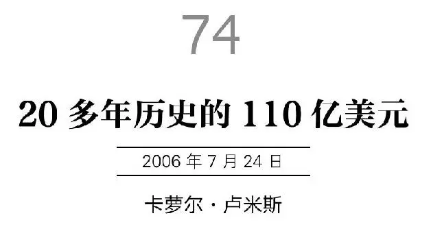

2006年7月3日，沃伦·巴菲特亲自开车进城，步入奥马哈一家被人遗忘在角落里的美国银行分行。走下一段台阶，他打开他的大保险箱，取出一张日期为1979年、数额为121737股伯克希尔哈撒韦公司A股的股权证书。如果按照当天股价计算的话，价值大约为110亿美元，大致相当于他总财富的1/4。在驱车返回的路上，他思考着下一步的方案：将这张证书连同其他几个股权证书（价值几千万美元）一起，送到明尼阿波利斯市的富国银行（Wells Fargo），按照30比1的比率兑换成375万股伯克希尔哈撒韦公司的B股股票。他本考虑用联邦快递寄送过去，但最终还是决定选派伯克希尔哈撒韦公司总部16名员工中的一位亲自送过去。

正如《财富》杂志上个月报道的那样，巴菲特已经开始将自己的财富回馈给慈善事业。兑换这张价值不菲的1979年的股权证书，是其迈向慈善事业的坚实的一步。兑换完成之后，巴菲特就有了足够的B股用以兑现他今年向比尔和梅琳达·盖茨基金会和其他4个较小的基金会承诺的602500股股票，而这也是他恢宏慈善计划的第一次行动。由于这张股权证书金额庞大，巴菲特也会紧密关注B股，而他所筹集到的B股已经足够满足他未来10年的捐赠需要了。他将把多余的股票存在一个经纪账户之中，以备不时之需。

巴菲特说，7月3日的整个兑换过程，使他想起了大约70年前的事情。当时，他还只有6岁，父亲霍华德·巴菲特把他带到同一家银行，开了一个20美元的储蓄账户。这笔钱是他收到的礼物，银行当时叫作奥马哈国家银行（Omaha National），他得到的小存折是酱紫色的。他回忆说，在那之后的5年时间里，他用收到的礼物、做家务以及赚到的钱，积攒到了120美元。11岁的时候，他用这笔“财富”购买了自己人生中的第一只股票：价值114美元的3股城市服务公司的优先股。

因此，如果你想要积累到440亿美元的财富，得有个好的起点才行。

## 75 巴菲特对盖茨说：把钱花掉

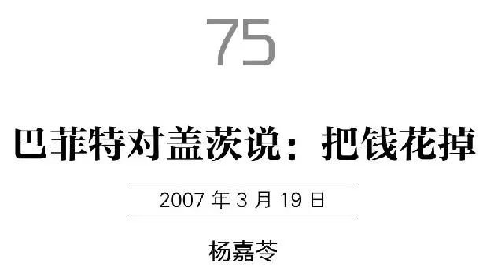

去年夏天，当沃伦·巴菲特告诉《财富》杂志，他要将自己在伯克希尔哈撒韦公司价值440亿美元股份中的大部分都捐献给慈善机构的时候，整个商业界都震惊不已。

现在又有新消息了。在最近一期伯克希尔哈撒韦公司的年报中，巴菲特针对自己去世后如何处理他仍保留的股份提出了严格要求，这对大部分慈善基金现有的运作模式提出了挑战。就像他以前所说的，这些股份将进入慈善机构，但新规则进一步提出了使用速度的要求。一旦他的遗产准备就绪（他本人预计要花费3年的时间），其中的每一块钱都必须在10年之内花掉。

巴菲特规定使用期限的举动，不免让自己陷入了一场旷日持久的争论之中：基金会究竟应该集中精力把钱用掉，还是让资金永远保存下去？无论是在声望上还是财产规模上，巴菲特都非一般人可企及，所以，他的这一表态，可谓慈善事业中的一个里程碑。

大多数大型基金会是按照永久持续运作的理念运营的，很少有基金会的支出比例会超过5%（按该机构上一年度的总资产价值计算），这也是他们保证免税资格的最低限额。根据巴菲特团队整理的数据，30家规模最大的基金会中，有28家在2005年拨出的资金不到资产的5%，加上运营成本才达到5%的下限。

但不论是过去还是现在，也有少数基金会决定采取“全部用光”的模式。为什么呢？因为很多人想对自己捐款的使用施加更强的控制。正如巴菲特在伯克希尔哈撒韦公司年报中所写的：“之所以设定使用期限，是因为我希望这些钱被我认为有能力、有精力、有内驱力的人更快地花出去。”巴菲特的钱捐给了比尔和梅琳达·盖茨基金会、子女管理的三家基金会以及以巴菲特已故的妻子命名的苏珊·汤普森·巴菲特基金会。盖茨夫妇也给自己的捐款规定了使用期限，规定其基金必须在两人去世后50年内全部用完。

“随着基金会的不断成长，出现官僚主义和使命偏离的风险也随之增加。”纽约大学全国慈善事业与法律研究中心（National Center on Philanthropy and the Law）主任哈维·戴尔（Harvey Dale）说。戴尔曾任大西洋慈善组织（Atlantic Philanthropies）董事长兼首席执行官，现在仍然担任董事，这家慈善组织最为人们所津津乐道的就是他们坚持“全部用光”模式。戴尔补充说：“全部用光是很耗费脑力的。”

但别指望福特基金会（Ford Foundation）也会这样大手笔地花钱，或者很快结束运营。“以永久存续为目的的基金，不会考虑这个问题，”印第安纳大学慈善组织研究中心（Center on Philanthropy）的执行主任吉恩·坦普尔（Gene Tempel）说，“较为年轻的捐资者正在设立一些新的基金，这种情况现在比较常见。”

也许，捐资者在心理上都比较年轻。巴菲特已经76岁了，他还在监管着规模不断增长、将要捐献给慈善事业的资产。去年6月，当巴菲特宣布他计划将自己在伯克希尔哈撒韦公司85%的股份捐献出来的时候，捐款的价值是370亿美元；而从那以后，公司的股价又上涨了15%左右。

2026年3月14日

16:57

## 76 按照“神话”定价

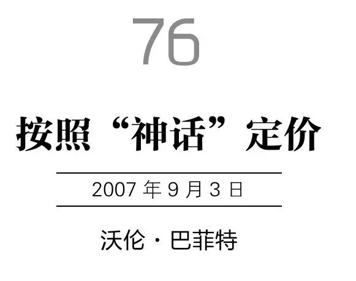

《财富》杂志向13位金融业界的思想家征集他们对于信贷紧缩危机的看法以及对未来的预见。以下是巴菲特的评论：

很多机构公开报告它们持有的担保债务凭证（CDO）和抵押担保债券（CMO）的准确市价，但事实上，那都是信口胡诌，因为它们都根据的是模型定价而不是市场定价。近期债券市场的垮台，更是把这种不良风气推向了按照“神话”定价的境地。

之所以这样是因为，很多机构都是高杠杆化的，“模型”定价和“市场”定价所产生的差异很可能会给股东们的资产带来巨大损失。事实上，对于一家新兴机构来说，定价方式的差异甚至就意味着未来的方向是茁壮成长还是破产倒闭。对于这些机构来说，“夯死”这些衍生品的市场价格并不是件难事：只要将它们重仓的衍生品的5%拿到市场出售就可以了。这种措施将发现一个更接近其真实价值的价格，尽管由此得出的这个价格，仍比完全抛售这些庞大而缺乏流动性的衍生品时的价格更高。

在某种程度上，我很同情那些不愿面对现实的机构。如果可以按照“模型”而非“市场”的标准来衡量一下我的体重，我倒愿意付出一些代价来尝试一下！

## 77 先知的信用危机

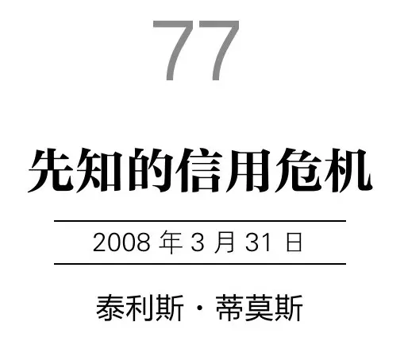

尽管沃伦·巴菲特或许是世界上最富有的人，但你的信用等级可能比他还高。这位伯克希尔哈撒韦公司的首席执行官最近在查阅自己的信用记录时发现，有一份报告显示他的费尔艾克信贷机构（Fair Isaac Credit Organization，简称FICO）信用评分仅为718分，略低于美国人的平均水平。“多年以来，我一直对自己的家人说我的信用记录不太好。”巴菲特强调说。当然，这只是在开玩笑，他暗指自己对孩子们的“吝啬”。事实上，这一得分很可能是冒名顶替者策划的骗局；该报告给出低分的依据是，巴菲特从汇丰银行（HSBC）内华达分行申请了一笔294美元的分期付款，但他有23期断供了，而巴菲特说自己从来没有在这家分行开立过账户。2004年的一项调查显示，25%的信用报告都存在严重错误，这也就是为什么监管机构告诫说，信用评分低不应该成为拒绝贷款的借口。不过，幸运的是，他上一次买凯迪拉克DTS时，还有能力用现金支付。

## 78 巴菲特是怎么想的

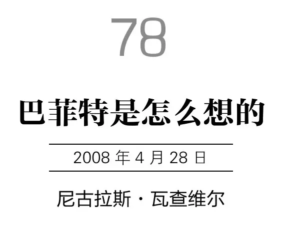

在故事开头的标语中，有这样一句话：“华尔街一片混乱，《财富》杂志自然要前往奥马哈求取真经。”2008年的金融危机连同一些曲折坎坷一起，可以看作本文的起源。贝尔斯登公司刚刚瘫倒在摩根大通集团（JPMorgan Chase&Co\.）和美国政府的怀抱中，整个经济就打起了寒颤。《财富》主编瑟沃·安迪提议由我去采访巴菲特，咨询其对市场和经济前景的看法。安迪和大家一样，都知道巴菲特比较抵触预测股票价格走向，通常他都回避关于宏观经济的问题，所以一开始，我相当怀疑这篇文章能否落实。

于是，我提议可以从另一个角度入手：巴菲特有个习惯，会邀请那些不远千里来到奥马哈和他进行问答互动的商学院学生共进午餐。此时正是向他求取真经的好时机。为什么不呢？我提出，以《财富》杂志的角度观察巴菲特告诉了学生些什么，然后撰写成文。而且我也认为我们会得知巴菲特是如何扮演一位导师角色的。巴菲特说过，这个形象是他最希望人们记住的。

最终呈现出的作品是我和安迪的灵感的融合。最后一刻，该任务才被分配给了《财富》杂志的撰稿人尼古拉斯·瓦查维尔，他立刻跑到奥马哈，参与了巴菲特与150位沃顿商学院学生长达4小时的对话。然后，巴菲特开车带着瓦查维尔和《财富》杂志的摄影师回到伯克希尔哈撒韦公司总部继续完成采访。在回顾那一天的印象时，瓦查维尔说，巴菲特与学生对话时的自由风度和巨大信息量让他吃惊不已，其直陈观点和表达意见的能力也给他留下了深刻的印象。

瓦查维尔也补充了作为报道者的观点：“以前我也曾花费数日采访过一位几乎和巴菲特同样睿智的商人，他从未对我本人的背景或者我在《财富》杂志的工作流露出一丁点儿的兴趣。巴菲特却不是这样，在我下车之前，他问了一个又一个关我于自己的问题。在我们采访的对象当中，这种情况并不常见。”

2008年4月那天，与巴菲特谈话的150名学生，只是2007—2008学年造访伯克希尔哈撒韦公司的31所不同学校的2400名学生中的一批。2011—2012年，巴菲特曾因时间问题痛下决心，将名额削减到1450。不过，每个月总有一个星期五，他会被一大群人团团包围：160名学生，来自8所学校，每所学校各20名额。有人指出，前来访问的学生绝大多数都是男性，所以怀疑有性别偏见的存在。因此，巴菲特再次追加了一条规则，每所学校的访问团中必须至少有1/3的女性。

他的一位助手同时还在追踪2012—2013年排队等候与他会面的学校，据说这个数字超过了200。

——卡萝尔·卢米斯

华尔街一片混乱，《财富》杂志自然要前往奥马哈求取真经。

如果2008年5月3日将要举行的伯克希尔哈撒韦公司股东大会被称为资本主义的“伍德斯托克音乐节”，那么，本文内容大致相当于鲍勃·迪伦在自己家中进行的私人演唱会：伯克希尔哈撒韦首席执行官沃伦·巴菲特会邀请一些商学院学生来进行为期一天的强化学习，这样的活动每年15次左右。这些学生首先会参观公司的一两个业务部门，然后前往奥马哈市中心的伯克希尔哈撒韦公司总部，在那里，巴菲特将与他们进行两个小时的问答。之后将前往巴菲特最钟爱的餐馆，他将请大家共进午餐，畅饮漂浮沙士（一种饮料）。最后，每位学生都可以摆造型与巴菲特合影。

2008年4月初，这位超级亿万富翁接待了来自宾夕法尼亚大学沃顿商学院（巴菲特曾就读于该学院）的150名学生，并主动提供给《财富》杂志一个千载难逢的机会，跻身其中听取他对各种问题的高见：从紧急援助贝尔斯登公司到他对经济前景的展望，再到他是否愿意担任通用电气公司的首席执行官，或者做个报童。下文选编自他与学生的问答环节、与沃顿商学院学生在皮克洛·皮特饭店（Piccolo Pete’s）享用芝士焗鸡胸时的谈话以及他在办公室接受《财富》采访时的谈话。

作为开场，巴菲特用可口可乐公司的系列产品欢迎学生们的到来。“伯克希尔哈撒韦公司拥有可口可乐公司超过8%的股份，所以每12罐中可口可乐中就有一罐的利润是属于我们的。你们喝不喝无所谓，只要打开它就行，如果你愿意的话。”接着，他开始进入更重要的话题：

开始提问前，我想跟大家谈谈目前正在发生的一件事情。如果学校还在教“有效市场理论”（这是25年前讲授的标准内容），这件事也许对你们还有点儿意义。不过美国最近发生的一个事例可以证明这一理论是错误的。在过去的七、八或九个星期内，伯克希尔哈撒韦公司建立了大约40亿美元拍卖利率债券[\9]的头寸。我们看到的情况真是相当异常。我们每天都会收到拍卖清单，但不可思议的是，在这些拍卖清单上，同一只债券常常不止一次地出现。

这是一张昨天的清单。我们参与竞拍的正是这样一支债券，发行方是居民保险公司（Citizens Insurance），这是佛罗里达州为承保飓风险专门设立的一家机构，其债券是用保险费做担保的，一旦遭遇重大飓风并导致资金不足，它就会提高保险费。这支债券并没有什么问题。因此，那天我们共参与了三只的居民保险公司的债券的竞标。其中一只我们以11\.33%的利率中标，没有买的那两只中标利率分别是9\.87%和6\.0%。同样一只债券，同样的时间，同样的交易商，这是个大问题。这一反常现象并非微不足道，就像学术界在遇到与自己理论相悖的情况时，总喜欢称之为异常现象。

所以，市场上时常会有疯狂的事情发生。这么多年来，市场并未变得更加理性，倒是变得越来越能顺应潮流了。当人们感到恐慌时，当恐惧占据上风时，或者当贪婪侵袭人们的头脑时，人们还是会跟过去一样做出不理智的反应。

Q：您是否认为美国金融市场正在丧失竞争优势？在信心和激励标准上如何取得平衡？

监管与狂野的西部（Wild West）之间的平衡？其实，我不认为我们的优势正在丧失。我的意思是，《萨班斯\-奥克斯利法案》确实会消耗一些成本，因为其中存在一些浪费，但这相对于20万亿美元的总市值来说也不算大。我想我们国家有极好的资本市场，而且因为经常出现各种麻烦，使其更具吸引力。如果你站在我的立场上看问题，就不会希望看到一个运行得完美无瑕的资本市场。无论监管力度有多大，人们还是会不断做蠢事儿，而且永远都会这样。监管所能做的工作存在很大局限。举一个震撼人心的例子，过去10年间发生了两起最重大的会计灾难，分别发生在两家提供住房抵押贷款的金融机构：房地美和房利美。两起事件中均涉及数十亿美元的错报。

这是两家令人难以置信的机构，几年前，它们大约占到40%多的抵押贷款份额；现在应该达到70%了。它们本质上是半官方的机构，所以政府设立了一个名叫OFHEO的机构来监管他们。我不太确定这些字母代表什么，不过，如果登录OFHEO的网站，就会发现其设立的目的就是监管这两家机构。联邦住房企业监督办公室拥有200名员工，他们的工作职责就是监督这两家机构，并检查“它们有没有照章行事”。然而就在这200名员工眼皮子底下，发生了历史上两起规模最大的会计错报案件。两家都发生这样的事，这简直太令人难以置信了！

监管人们的行为，是非常非常困难的事情。如果我被任命为新任监管者，给我配备你们能想象到的100名最聪明的人，并且每天都能得到最大型机构的头寸情况，即所有的衍生品头寸、股票头寸和货币头寸，即便这样，我也无法告诉你们它们运作得怎么样。当涉及数百家合约方的无比繁复的文件时，监管工作将是极度困难的。合约方的举措及其存在的风险，正是美国财政部和美联储认为它们必须在一个周末之内介入贝尔斯登事件的一个主要原因。顺便说一句，我认为它们的做法是非常正确的。如果你有几千个合约方（这是我在别的什么地方读到的数字），并且交易着名义上价值14万亿美元的合同，没人知道会出现什么结果。如果贝尔斯登公司破产，这些人将会设法解除所有合同。这将会给市场带来什么样的后果，又会给其他合约方带来什么样的影响？这是件极其复杂的事。因此，尽管监管是体系中非常重要的一部分，但它的效果是很难预料的。

巴菲特曾在皮克洛·皮特饭店与很多人一起过用餐，从微软公司的比尔·盖茨到纽约扬基棒球队的阿莱克斯·罗德里格斯（Alex Rodriguez）。那天，他与12名沃顿商学院的学生坐在一张餐桌前，就众多话题互相打趣起来。

Q：你对大选怎么看？

在希拉里和奥巴马宣布参加竞选前很久，我就对希拉里说，如果她参加竞选我会支持，我对奥巴马也说过同样的话。所以说，我是个“政治重婚犯”。不过我认为他们两个都很优秀。事实上，如果共和党胜出，我会更欣赏约翰·麦凯恩。我认为在本次竞选中，我们不同寻常地拥有三位非常优秀的参选人。

Q：他们都秉持着较温和的路线。

我们不太确定奥巴马是不是温和派。不过，从另一角度看，他有可能是改革力度最大的。

Q：我知道你曾卖过报纸，那是你的第一份工作吗？

我曾为祖父工作过，他经营着一家家族杂货店，工作相当繁重、辛苦。然而，如果你让我在通用电气公司、IBM或者通用汽车公司这些公司的首席执行官和报童之间做出选择，我宁愿去当报童。我喜欢送报的工作，在其间，我可以思考自己乐于思考的事情，而且不需要做任何我不想做的事。做通用电气公司的首席执行官，可能是件激动人心的事，杰夫·伊梅尔特是我的朋友，他非常了不起，但是，请想想那些无论情愿与否，他都必须得做的事情吧。

Q：你的主意都从哪儿来？

只靠阅读，我每天的工作就是阅读。我们曾向中国石油天然气股份有限公司投资5亿美元，而我获取相关信息的方式就是阅读年报。

Q：对于非职业投资者，你有什么建议？他们应该投资何种产品？

如果他们不打算成为主动投资者，这样的人应该占极少数，那么就应该坚守指数型基金。可以选择任何一类低成本的指数型基金，并且应该做长线投资。他们没有能力选择正确的价格和正确的时间，他们想要做的就是避免错误的价格和错误的股票。此外，他们还须确保他们只是分食了美国企业的一杯羹，而不是一下子买下全部。

巴菲特刚说完自己已经准备好，可以照相了，室外的150名学生立马蜂拥而至，站成了一长排。在接下来的半个小时，每个人依次与巴菲特合影，大多摆出夸张且搞笑的造型，抢夺他的钱包的造型是用得最多的。在巴菲特准备离开时，77岁真人版的《一夜狂欢》*（A Hard Day’s Night）*上演了，30名学生一路尾随他走到金色凯迪拉克跟前。“脱身”之后，他带《财富》杂志的记者回到办公室，继续接受采访。

Q：当前的混乱局面（指2008年金融危机）与以往的危机相比有何不同呢？

这很难说，每次危机都有很多不同之处。不过，毫无疑问的是，这次危机中存在极端的杠杆效应。不管房价本身还是收购房地产企业的价格都太高了。美国有20万亿美元的住宅房地产不动产以及11万亿美元的抵押贷款，其中有一些没问题，另一些则存在很多问题。2006年，通过抵押货款再融资，大约有3300亿美元的现金被释放到经济体系中。现在，美国的经济刺激计划是1500亿美元，而那时是3300亿美元，这绝可算是天文数字了。而且，这些钱还只来自优质抵押贷款而非次级抵押贷款。因此，当时不断抬升的杠杆对经济产生了极大的激励作用。

Q：如果这是一种刺激，那你认为政府1500亿美元的激励计划会产生什么影响？

哦，这比我们应得的又多出了1500亿美元，因此，它总是会产生一些影响，接下来，杠杆收购很可能会繁荣起来，滥用的情况将不断出现，并且其价格将变得愈加可怕。而与此同时，我们的银行正被这些问题套牢。我们的抵押贷款行业正在经历一个“去杠杆化”（deleveraging）的过程，而这这个过程毫无疑问将是非常痛苦的。

Q：从你描述的情况来看，我们离“转机”还很遥远？

我认为是这样的。每个人都说危机将会是短暂的、浅层次的，但事实似乎恰好相反。你知道，去杠杆化本身的性质决定了这将是一个需要耗费很长时间、忍受巨大痛苦的过程。并且其后果也会以不同的形式表现出来。现在，我不会根据宏观预测做出哪怕一丁点儿投资。因此，我不认为人们应该因此出售股票。我同样也不认为人们应该据此购买股票。

Q：你举的OFHEO的例子表明你对于监管的态度不是很乐观，对吗？

金融已经变得太复杂了，相互间的依赖性太强。我曾在华盛顿邮报集团董事长唐·格雷厄姆的饭局上与艾伦·格林斯潘争论过这一点。他说，你通过所有这些手段在全球散播风险，而现在你并没有将其全部集中在自己的银行中。然而，你所做的就是将不同机构的清偿能力如此密切地联系在一起，达到了可能任何人都不曾料想到的程度。评估工作非常困难。如果贝尔斯登公司没有从事衍生品交易，我想美联储不会勉为其难地做那些事儿。

Q：银行不断考察自己的投资，却不知道自己投资了些什么，你会不会觉得这很不可思议？

我阅读过几份住房抵押担保证券（MBS）的募集说明书。这些债券通常有数以千计的抵押贷款作为担保，而且这些抵押贷款会被划分成大约30个部分。将一只债券的风险最高的部分拿出来，将50只债券的相同部分组合起来，就形成了一份担保债务凭证，即CDO。现在，如果要理解这支CDO，你需要阅读50个300页，也就是15000页的募集说明书。如果拿出该CDO风险最高的部分，再将50只CDO的相同部分组合在一起，你就创设了一只双层CDO，你现在要阅读750000页说明书，才能理解该产品。这简直是天方夜谭！在你开始购买其他票据的分层时，没有人知道他们究竟在干什么。真是荒唐至极！当然，你购买住房抵押担保证券风险最高的分层时，你一共购买了100个这样的部分，你觉得自己分散了风险。不过，令人意想不到的是，它们的表现取决于相同的因素。我是说，它们唯一的不同之处可能就是地点，有的在加利福尼亚，有的在内布拉斯加。人们说它们是一种非相关风险，因此你可以买进这支CDO，并称其中50%的分层为超级优质，这样的观念完全是无稽之谈。这根本不是什么超级优质债券，而是一批捆绑在一起的次级债券，而所有的次级债券都是相关联的。

Q：如果大型金融机构都不理解其投资组合的内容，投资者又如何得知何时是安全的呢？

他们不可能知道。事实上，他们必须尝试去读读这些公司运营者的“基因图谱”。可以这么说，在任何大型金融机构，首席执行官必须是首席风险官。我就是伯克希尔哈撒韦公司的首席风险官。我想我知道自己在这方面的限度。最糟糕的事情就是模型和电子表单。比如，在所罗门兄弟公司，它就拥有所有这样的模型，但结果正如你所见，它最终分崩离析。

Q：如今，我们应该给投资者提点什么建议呢？

你必须让投资者知道，他们今天读到的所有关于投资策略方面的建议都是可有可无的。__他们的投资策略只应该考虑到以下两点：第一，即便他们知道整体经济的走向，却未必知道股市将要发生什么。第二，他们无法挑选到比平均水平优秀的股票。__股票是一种适合长期持有的投资品。一般情况下，他们可能在两件事上出错：买到错误的股票，或者是在错误的时机买进、卖出股票。正确的做法应该是，根本没有必须频繁换股。他们只要购买美国产业“横切面”中的一组股票，如果这个行不通，那各处搜寻优秀个股就更不会奏效。另外，他们必须对贪婪保持警惕。我经常跟大家说，应该在别人感到恐慌时变得贪婪，在别人贪婪时感到恐慌。然而，要做到这一点并不曾易。当然，你起码不应该在别人变得贪婪时变得贪婪，在别人感到恐慌时感到恐慌。至少，设法远离它。

Q：照你的法则，现在好像应该贪婪一点儿。然而，实际情况都是，人们都非常恐慌。

你说得对。人们都往恐慌的方向前进着。这正是股价下挫的原因。现在的股票比一年前或者三年前买起来更划算。

Q：对于美国的长远前景，你是否依然感到乐观？

美国经济将会有好的表现，但不可能每年、每个星期或者每个月都会表现得很好。我的建议是，如果你不看好经济形势，那就别买任何股票。我们的生产率每年都在提高，这是显而易见的事实。从长期来看，这是一个“正和游戏”（positive\-sum game）。投资者惨败的唯一可能就是，被高昂的手续费压垮或者因试图跑赢市场而精疲力竭。

## 79 巴菲特的豪赌

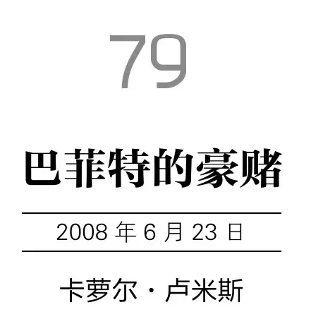

这场为期10年的投资业绩赌局要进行到2017年，在2011年年底，也就是本书出版之前，双方都几乎打成平手。赌局的一方是门徒合伙企业（Protégé Partners LLC），这是一家纽约的资产管理公司。如果他们精心挑选的5家对冲基金的平均业绩（扣除所有费用之后）胜过巴菲特所挑选的基金，即可赢得赌注。赌局的是另一方巴菲特，他认为一只低成本的标准普尔500指数基金，即领航集团的标普500 Admiral基金（S&P 500 Admiral fund），将会在业绩上胜出。

很明显，根本问题在于交易费用。这又回到了我们之前提到的问题，巴菲特相信各家组合型基金和对冲基金收取的管理费及提成，通常会使投资者的回报低于市场指数型基金的水平。而门徒合伙企业则认为，组合型基金将表现良好，足以为投资者提供优于市场的净回报（扣除费用后）。

然而，截至2011年，这两种情况都没发生。赌局开始于“地狱”一般的2008年，当时门徒基金平均下跌了23\.9%，而巴菲特的Admiral基金跌得更惨，大跌37%。后来，《财富》杂志援引了巴菲特的这句话作为评说：我只是希望《伊索寓言》是正确的，乌龟真的能够战胜兔子。

虽说是“寓言”，却很接近我们看到的情景。巴菲特这方，也就是“乌龟”，在接下来的三年中表现胜出，并在2011年年底处于领先的“爬行”位置。但在恐怖的开端过后，双方都仍面临着下跌的颓势。门徒基金的表现是\-5\.89%，而巴菲特的Admiral基金为\-6\.27%。

从某种意义上来说，此时赌局注中唯一的赢家就是组合型基金的管理者，因为他们已经将投资者，即承担损失的有限合伙人，所支付的管理费收入囊中。“唉！”门徒合伙企业的合伙人特德·塞德斯（Ted Seides）听闻作者的这一结论后大叹了一声。

不过，他也指出了一个可能的“合格者”：5只基金中的一家或者几家对于平均回报率还是做出了积极的贡献，尽管是负数。它们或许能回归正回报，带领其投资者脱离损失的泥潭。这或许也让支付了高昂管理费用的人们感到一丝安慰。

虽然这5家基金之间存在一定的关联，但以上观点并未被公开证实，因为打赌的关系，5家基金的名称从未被公开过。人们常常有各种猜测，只知道其中一家是由门徒合伙企业经营的基金公司。

与此相关的另一个事实是，早期巴菲特经营巴菲特合伙公司的时候，他的报酬是由有限合伙人支付的。不过，他并未遵循现在时兴的“2和20”标准，也就是说每年收资金额2%的管理费以及当年收益中的20%。相反，巴菲特一分钱的管理费也不收，资本收益的第一个“6%”也全部给予他的有限合伙人。之后，他才会从收益中拿25%的提成。

正如之前所提到的，在他决定关闭巴菲特合伙公司的之前13年里，公司一直保持连续盈利的状态，为其有限合伙人赢得的年回报率（在支付过巴菲特25%的提成之后）达23\.8%。

——卡萝尔·卢米斯

一组由专业人士精心挑选的对冲基金，会不会在接下来的10年里为投资者带来超过标准普尔500指数的回报率呢？目前，这个问题，就横亘在伯克希尔哈撒韦公司董事长沃伦·巴菲特以及门徒合伙企业之间。门徒合伙企业，纽约一家经营组合型对冲基金的资产管理公司，换句话说，这家企业的生存就依赖于它把客户的钱投入最好的对冲基金，以及避免经营不善的能力。你可以猜猜看，双方各持的观点是什么？门徒合伙企业将自己的赌注押在了由5家对冲基金构成的组合型基金上。具体来说，它们的平均回报指的是扣除所有交易费用之后的净额。赌局的另一方就是巴菲特先生。他一直认为，对冲基金和组合型基金收取的各项费用过于繁重，应该予以规避，并且打赌一家由领航集团发售的低成本的标准普尔500指数基金，将击败由门徒合伙企业挑选的5只对冲基金的成绩。

在这里，我们不谈理论。事实上，本文第一次报道这则消息的时候，这场赌局早在2008年1月1日就开始了。打赌的双方，是巴菲特（不是伯克希尔哈撒韦）和门徒合伙企业（是企业，而不是他们的基金）。这是场严肃的赌局，各方都拿出大约32万美元参与其中，总共64万美元被用于购买一只零息债券，到赌局结束时，债券的价值将达到100万美元左右，赌局结束之后这些钱会将其投入到慈善组织中。如果门徒合伙企业战胜巴菲特，这些钱将被送往无保留援助儿童基金会（Absolute Return for Kids；ARK），一家总部设在伦敦的国际化慈善机构。如果巴菲特赢了，受益者将会是奥马哈女童之家（Girls Inc\.of Omaha），巴菲特的女儿苏茜·巴菲特是该组织的董事之一。

那么，在这场赌局进行期间，这些零息债券保存在谁手中呢？答案是一家估计大多数读者从没听说过的“神秘”机构：旧金山的“恒今基金会”（The Long Now Foundation）。这家基金会致力于推动人们做长线思考，与一种困扰全世界的问题做斗争，该问题被基金会创始人之一的斯图尔特·布兰德（Stewart Brand）称作“病理性注意力短暂”。6年前，该基金会为长期赌局创立了一项机制：还有什么？他们将收到的赌金作为捐赠，监督赌注的全过程，直到最后结果，然后将资金送给赢家指定的慈善机构。对于这项工作，基金会通常会从每边收取50美元的费用，然后分享50%的资金收益。不过，在巴菲特与门徒合伙企业的这场赌局中，它不会分享资金收益，而是规定每一方拿出2万美元作为慈善礼物贡献给恒今基金会。

登录恒今基金会的网站www\.longbets\.org，您就可以看到目前长期赌局的列表，随着本文的发表，巴菲特\-门徒赌注的名字也将被添加到该表中。列表中的有些名字听起来像是在体育酒吧中达成的：红袜队（Red Sox）夺得世界冠军之时，演员特德·丹森（Ted Danson）为一家慈善机构赢得2000美元，这是发生在美国男子足球队入围世界杯之前的事。再往前就可以看到，莲花软件公司的创始人米切尔·卡普尔（Mitchell Kapor）和发明家及未来主义者雷·库兹威尔将20000美元押在了这样赌局上：到2029年没有电脑或“智能机器”能够通过图灵测试，这意味着没有电脑在彼时能够成功模拟人类。卡普尔做出这样的预测，然而库兹威尔不同意。网站上的每一方都要遵守长期赌局的投注规则，并在网站上公开发表关于各自观点的简短陈述。巴菲特和门徒合伙企业的表述也将出现在那里（详见后面的补充报道）。

2007年之前，卡普尔\-库兹威尔20000美元的赌局是长期赌局中最大的一笔。很显然，巴菲特和门徒合伙企业之间的赌注造成的影响更巨大。这其中还有一个故事，起始于伯克希尔哈撒韦公司2006年5月份的股东大会。在那个周末的会议中，在详细阐述了投资者所承担的交易成本和管理成本之后，巴菲特表示愿意接受10年期限、价值100万美元的条件，打赌除去所有费用后，标准普尔500指数基金的表现会打败任意选择的10家对冲基金的业绩。此后，他曾多次提议，并补充说，因为还没有人与其对赌，所以他更坚定地认为自己的想法是正确的。

2007年7月，门徒合伙企业总裁特德·塞德斯答应并致信给巴菲特，他愿意接下这场赌局，或者至少要挑战他的某些观点。在接下来的几个月，双方最终商定，塞德斯将赌注押在5家对冲基金，而不是10家对冲基金上。塞德斯打破了惯例，大大加重了他的筹码。就像赌下一顿饕餮大餐，他建议和巴菲特押下10万美元的赌注（他说，这是巴菲特的年薪）。巴菲特当时还不知道长期赌注的存在，于是说，考虑到他的年龄（现年77岁），一个10年期的赌局可能会增加他本已确定下来的遗产，能引起他兴趣的赌注至少要超过50万美元。尽管如此，他还是写信给塞德斯说：“我的房地产律师肯定会认为，我把事情搞得那么复杂一定是发疯了。”

如果50万美元对塞德斯来说压力有点儿大的话，巴菲特也完全支持塞德斯拉上几个同伴入伙。而事情也正是这么发展的，赌局的另一方变成了门徒合伙企业而不是塞德斯本人。然而，50万美元对巴菲特来说只是小事一桩。门徒合伙企业管理着35亿美元左右的资金，大部分属于37岁的塞德斯；另外两人分别是52岁的杰弗瑞·塔伦特（Jeffrey Tarrant）以及45岁的斯科特·本森特（Scott Bessent），这二人都拥有着非常资深的从业经历。这个“金三角”中的两人曾与著名的市场专家共事过：塞德斯曾在耶鲁大学师从戴维·史文森（David F\.Swensen）学习另类的投资理念；本森特则与乔治·索罗斯（George Soros）以及全球最大空头基金公司创始人吉姆·查诺斯（Jim Chanos）一起工作过。

2002年塔伦特与塞德斯创办了，门徒合伙企业，并着手建立起了一只组合型基金，接着就开始招募经验丰富的投资者，既包括机构也包括富有的个人，将其资金放到这样的基金中去。大家都很清楚美国证券交易监督委员会禁止对冲组合型基金的大范围推广，因此不论是塞德斯还是塔伦特，都不愿披露他们现在投资了哪些对冲基金，更不用说他们的表现记录了。伦敦出版机构投资对冲（Invest Hedge）向《财富》杂志提供了美国旗舰基金门徒合伙企业的投资回报率数据，自从2002年7月开始营业起一直到2007年底，门徒基金的总回报率达到95%（除去所有费用之后），以毫无争议的优势打败了领航500指数基金64%的总回报率。门徒合伙企业的出色表现绝大部分得益于2006年中期看空次级抵押贷款证券，包括CDO，它将资金分散在各对冲基金并从中牟利。最显著的例子是对保尔森公司（Paulson&Co）对冲基金的投资，2007年约翰·保尔森（John Paulson）通过做空与次级贷款相关的证券，进行了一场众所周知的“杀戮”。

当然刚才提及的都是些历史了，现在我们还是回归到赌局本身：巴菲特和塞德斯都同意定期公布赌局的进展情况。塞德斯希望每到市场下跌10%的时候就进行公布，因为他相信对冲基金的一个特质就是能够平稳度过困难时期。事实上，当年的第一个季度，市场相当低迷，但门徒合伙企业仅下跌了1\.9%，而领航500指数基金却大跌了9\.5%。然而巴菲特坚持认为公布的最佳场合应该是在每年5月定期举行的伯克希尔哈撒韦公司的股东大会上，这也是大家最终达成的共识。

然而，巴菲特每年的股东大会上能就赌局问题说些什么或许要局限于一个事实：门徒合伙企业精心挑选出的5家基金的名称是要严格保密的。当然，巴菲特知道这些基金的名称，因为门徒合伙企业每年都要将审计结果提供给他。除此之外，指定的基金也没看出宣布加入这场赌局有什么好处（至少到现在为止是这样），只要承诺保密，它们还是同意继续。门徒合伙企业试图说服加入的第一只基金，事实上并没有加入。

赛德斯和塔伦特两人可能会对这5家筛选出来的基金的大致情况做一些说明。它们都是股权导向的（偏爱股票而非债券），倾向于进行对冲而非短线交易，运营者主要是些经验丰富的投资老手，而非初出茅庐的新人。或许我们可以猜测门徒合伙企业自己旗下的基金是这5家之一，因为如果它们自己也被排除在外的话，就很难向投资人解释为什么公司不选择在自己对冲基金上投下筹码。

至于投资者在对冲基金方面支付的费用（这也是巴菲特的核心论点），它们既复杂又昂贵。一只组合型基金通常收取1%的管理年费。而它投资的对冲基金还要收取管理年费，对于组合型基金来说通常就是1\.5%的管理年费，该费用由投资者按季度缴纳，并根据其账户当时的价值来计算。这也就是说，无论一年所赚取的回报如何，投资者都要不断拿出资本额的2\.5%去支付这些费用。相比之下，去年500指数基金的开支比率为15个基点（0\.15%），而大投资者为Admiral分额支出的比率仅为7个基点。Admiral分额就是巴菲特在此赌局中所仰仗的工具。

管理费以外，对冲基金通常还要收取回报的20%，剩下80%分给投资者。组合型基金则要收取那80%中的5%或更多作为自己分得的一杯羹。其结果是，每年靠投资者资金赚来的回报就最多只留下76%给投资者，其余的部分全被形形色色的巴菲特口中的“帮手”们瓜分一空。与此同时，投资者还要雷打不动地支付资本额2\.5%的管理费。总数加起来，绝对是笔很可观的数字。如果门徒合伙企业要赢得这个赌局，那么5家对冲基金必须比标准普尔500指数基金要表现得好得多才行。

当然这个可能不是没有。巴菲特自己评估自己的胜算大概只有60%，这与他平日里稳操胜券的作风略显不同。门徒合伙企业则认为自己获胜的概率高达85%。当然很多人或许会说，通过这场赌局，门徒合伙企业已经获得了难以用金钱衡量的知名度。另一方面，门徒合伙企业明显很希望取得胜利，特别是当面对一位一生中几乎从未失手的高人时。塞德斯自己则更加笃定：“我们很幸运，竞争的对手是标准普尔500指数基金而不是巴菲特。”

__预测与辩论__

预测：从2008年1月1日起至2017年12月31日的10年间，扣除费用、成本及开支之后，标准普尔500指数基金的表现将超过对冲基金组合的表现。

__沃伦·巴菲特：同意__

很多非常聪明的人在证券市场上的作为超出了一般水平，我们称其为主动投资者。

与他们相反的就是被动投资者，根据定义来说，他们的表现应该在平均水平附近。总的来说，他们的位置会或多或少近似于指数基金。因此，与主动投资者平衡之后，肯定也是趋于平均状态。然而，这些主动投资者也可能带来更大的开支。因此，总的来说，除掉这些费用之后，它们最终的结果可能会不如那些被动的投资者。

当大量管理费、大笔业绩提成、交易佣金都加到主动投资者的方程式中时，成本定会骤然飙升。由对冲基金的构成的基金组合加剧了成本问题，因为各对冲资金收取的巨额费用还要叠加在他们的费用中。

很多聪明人都加入到对冲基金的操作中。然而，很大程度上，他们的努力是自我中和的，他们的智商再高也难以免除这些强加给投资者的费用。随着时间的推移，平均来说，投资者在低成本的指数基金上的表现会优于组合型基金。

__门徒合伙企业：反对__

巴菲特先生的主张是正确的，平均来看，狭义定义下的主动管理型基金，比如标准普尔500指数，其表现注定会弱于市场指数。不过，将这番理论移植到对冲基金上，就有些拿苹果和橘子相对比之嫌。

由于在投资多空双方上的灵活性，对冲基金不打算战胜市场。相反地，随着时间的推移，无论市场环境如何，它们都会试图创造正回报。对于对冲基金而言，成功意味着在不景气的时期比市场表现得更好，而在市场达到最佳行情时低于市场回报。不过，通过一个周期，扣除所有费用之后，顶级对冲基金管理者的表现已经超过扣除所有费用的市场净回报，同时承担的风险也较小。我们相信这样的结果将持续下去。

最好的对冲基金的回报率与一般水平之间的有很大的差距。这种差距使得成熟的机构投资者，其中不乏组合型基金，有机会采取和任用投资者认为会优于平均水平的战略和管理者。具备去芜存菁能力的组合型基金将能够获得足以充分补偿额外费用的高回报。

## 80 奥巴马的商业观（节选）

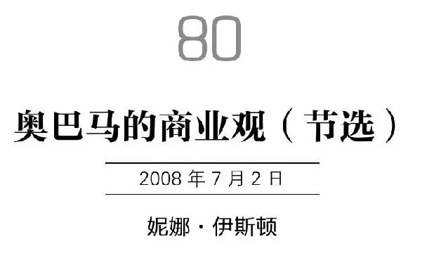

尽管奥巴马的顾问团已经从小规模的核心幕僚扩编到了民主党内部的资深资本家，但他还是经常与亿万富翁沃伦·巴菲特通电话。奥巴马说：“巴菲特是我最喜欢的人之一，他非常务实，而且精明。”因为他不仅大力批判金融行业和为富人减税的政策，而且还比任何人更了解资本市场。

## 81 “巴菲特的市场指标”显示：购买股票正逢其时

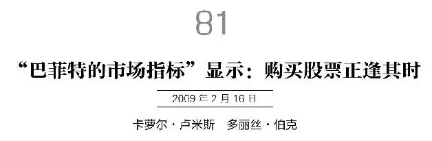

2009年最初的那几天，股市的气氛就像寒冷的空气一般萧瑟，不断地下跌再下跌。我们《财富》杂志的一帮同仁认为是时候更新一下巴菲特的“市场指标”了，也就是美国股市的总市值与GNP的关系。2001年年末，我们绘制过这样一张图（见图56\-2），当时传递的信息是“别买！”

不过，这次当我的合作者多丽丝·伯克拿到数据时，发现市场完全处于巴菲特可买的范围之内。因此，我们发表了这篇文章以及数据报表，预计是在2月1日到达读者手中的。

必须要承认的是，这次“买进”信号并不是完美无缺的：自从2月1日起，标准普尔500指数大幅下跌了18%，3月9日更是几近谷底。即便如此，如果你在2月1日购买了一只标准普尔500指数总回报交易所买卖基金（Total Return ETF），一直持有到2012年年中，你就会获得78%的总回报率，而且你会很高兴巴菲特当时分享了他的指标。

——卡萝尔·卢米斯

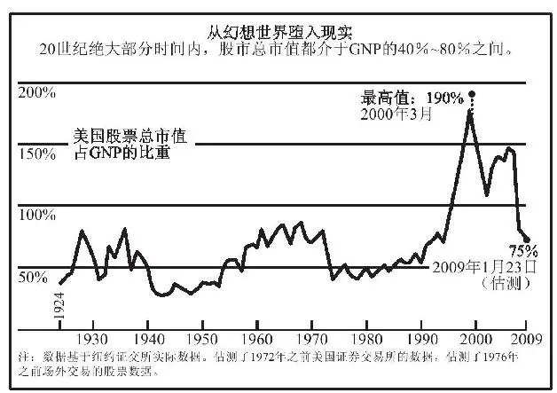

图81\-11924—2009年上市公司总市值所占GNP的比重

是时候购买股票了吗？根据这张跨度85年的图表以及沃伦·巴菲特的名望来看，购买股票的时机到了。这张图表反映出了美国股市总市值占美国GNP的比重。

《财富》杂志第一次看到这张图是在2001年年底。尽管当时股市已走出互联网泡沫，开始大幅回落，但股价都还处于比较高的水平。当时总市值相当于GNP的133%。这个水平对于巴菲特来说肯定还不是买股票的时候。

但他脑海中也浮现出可购买时的场景，他说：“如果该比率下降到70%～80%之间，购买股票就可能会带来很好的回报。”

其实，这就是股市在1月下旬的情形，当时的数字为75%。市场回归理智也并未让巴菲特感到惊喜，他告诉《财富》杂志，这一指标的变动让他想起投资者本杰明·格雷厄姆对股市的看法：“股市短期的运作像是一个投票机，而它长期的表现则像一个称重器。”

巴菲特不仅喜欢搜集图表上的理论信息，也习惯将自己的数据记录下来。在10月17日《纽约时报》一篇专栏文章中，巴菲特说自己在很长一段时间不持有美国股票（伯克希尔哈撒韦公司的股票除外），只持有美国国债，而在这之后再开始进购。他说，如果价格持续下跌，他预计很快就会动用他100%的净资产净买入美国股票。价格确实在不断下跌，自10月17日道琼斯工业平均指数已经下跌10%左右。因此，我们有理由推测，巴菲特一直在购入。对于好奇的投资者，他从未提及自己买了哪些股票。

2026年3月14日

16:57

## 82 暴风骑士（节选）

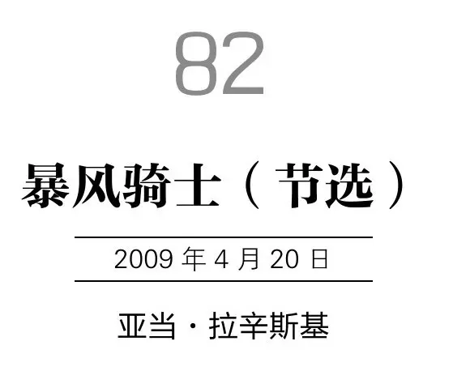

沃伦·巴菲特饶有兴致地讲述起伯克希尔哈撒韦公司与美国富国银行之间逸事。2001年，当伯克希尔哈撒韦公司与它的伙伴购买下一家破产的金融公司菲诺瓦（Finova）时，巴菲特希望拉几家银行组成贷款财团。“富国银行没有兴趣。”巴菲特说，而他正是富国银行最大的股东，拥有价值3\.15亿美元的股份，7\.4%的股权。其他人愿意以高出成本0\.2%的超低利率借钱给伯克希尔哈撒韦公司，它们做这样赔本的买卖是因为希望赢得伯克希尔哈撒韦公司后续的投资银行业务。但富国银行没有这样做。“它就应该这么想，这事让我激奋了好一阵子，”巴菲特爽朗地大笑起来，“你观察一位银行家的真正角度就是看他如何操作资金。他说了什么并不作数，观察他做了什么、没做什么才真正有意义。富国银行没有做的事情恰好证明了它的了不起。”

## 83 让巴菲特“出轨”的比亚迪

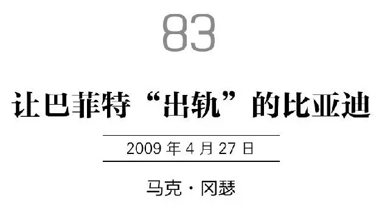

本篇的标题大有一语双关的意味，但也很难完全描绘出在伯克希尔哈撒韦公司股东大会上，当一位股东问及公司为何持有一家中国汽车和电池企业比亚迪股份有限公司（以下简称比亚迪）10%的股份时，巴菲特的反应。在这样的时刻，巴菲特总是把问题推给伯克希尔哈撒韦公司副董事长查理·芒格。“芒格是我们比亚迪投资案的专家。”巴菲特会说。反过来，芒格则将自己大部分功劳归于一位倡导民主的投资家兼对冲基金专家。

伯克希尔哈撒韦公司对比亚迪2\.3亿美元的投资发生于2008年年底，当时其正处于金融危机带来的水深火热之中，该公司的股价大约为1美元，也就是8港元。港币是比亚迪股票常用的计价货币。随着伯克希尔哈撒韦公司的入股，比亚迪的股价进入“过山车”模式，2010年3月上涨到了77港元，而2012年5月又降至11港元，这似乎预示着电动汽车行业前景堪忧以及比亚迪利润的下滑。到了9月，股价又升至16港元。这个价格还是让伯克希尔哈撒韦公司增加了一倍的投资，但很显然，比亚迪至今还没有发展到芒格认为其应该发展到的水平。

如今，芒格说，自己对比亚迪的创始人兼首席执行官王传福怀有极大的崇敬，并对公司寄予厚望，但对电动汽车行业销售收入的增幅比较悲观。芒格认为，比亚迪的长期前景非常好，因为“公司拥有大型且非常现代化的设施和优秀的员工，产品缺陷率很低，而且其运营的成本也很低”。

“产品缺陷率很低”是对很多人认为比亚迪汽车质量不佳的有力回击。然而芒格也说，对公司产品的投诉只是少数，这对比亚迪未来的发展来说只是一个小问题。

——卡萝尔·卢米斯

沃伦·巴菲特有一些关于投资的金科玉律：当一位声名卓著、才华横溢的经理人接管一家基本面出了名糟糕的公司时，最终纹丝不动的必将是公司糟糕的名声，这一点很少有例外。你应当投资一家连傻子都能经营的企业，因为总有一天会有个傻子来掌管它。也许其中最有名的一条是：决不投资一家自己搞不懂的企业。

因此，当巴菲特的老朋友、伯克希尔哈撒韦公司的长期合伙人查理·芒格，去年年初建议两人一起投资一家生产电池、手机和电动汽车的默默无闻的中国企业比亚迪时，人们也许早就料到巴菲特会援引上述第三条准则。毕竟在20世纪90年代的时候，他就一直对迅猛发展的美国高科技产业退避三舍。

然而，这次，现年78岁的巴菲特竟对芒格描述的那位比亚迪创始人充满了好奇心。这位企业家名叫王传福，芒格也是通过一位共同的朋友认识他的。芒格对《财富》杂志的记者说：“这家伙仿佛是托马斯·爱迪生和杰克·韦尔奇的合体，他解决技术问题时像爱迪生，而其强烈的目标感则像韦尔奇。我以前从未见过这种人。”

此话出自芒格之口，就显得非同小可了。这位85岁的老先生是伯克希尔哈撒韦公司的副董事长，脾气古怪，对大多数投资项目都瞧不上眼。巴菲特告诉我：“每当我有了主意给芒格打电话时，如果他说‘这真是个蠢主意’，意思是我们应当把100%的净资产都投进去。如果他说‘这是我听到过的最蠢的事’，你就应该把50%的净资产投进去。只有当他说‘这事儿由你全权负责’的时候，才表示他真的不喜欢这个主意。”这一回，巴菲特还邀请他信得过的另一位搭档戴维·索科尔，即伯克希尔哈撒韦公司旗下中美能源控股公司的董事长，专程去中国，对比亚迪进行更近距离的考察。

去年秋天，伯克希尔哈撒韦公司以2\.3亿美元的价格买下了比亚迪10%的股份。这笔交易目前还在等待中国政府的批准，所以成交过程并未引起太多的关注。消息是在9月末对外宣布的，当时正值全球金融市场步履蹒跚、挣扎于深渊之际。不过，巴菲特、芒格以及索科尔都一致认为，这是一宗非常大的买卖。他们认为，比亚迪除了正在成为发展异常迅速的太阳能产业的领袖之外，甚至还在努力依靠销售电动汽车而成为世界上最大的汽车制造商。

1995年，王传福在中国深圳创办了比亚迪。他以前是政府研究机构的一位化学家，从亲戚那里筹集了大约30万美元，租了一处2000平米左右的厂房之后，开始生产可充电电池，他的对手则是名声响当当的索尼和三洋等进口品牌。到2000年前后，比亚迪已经发展成为世界上最大的手机电池生产商，然后又开始为摩托罗拉、诺基亚、索尼爱立信和三星等公司设计和生产手机及配件。

2003年，王传福买下了一家几乎已经沦为废墟的国营汽车厂，作为他进入汽车制造业的第一步。他对生产汽车几乎一无所知，但学得很快。10月，一款名叫F3的比亚迪轿车成为中国最畅销的车型，超过了众所周知的大众捷达和丰田卡罗拉等品牌。该公司还开始销售一款备有汽油发动机的插入式电动汽车，此举使其走到了通用汽车、丰田汽车的前面。比亚迪的插入式电动汽车叫作F3DM（DM为“双重模式”之意），每次充电后的行驶里程均为100公里，超过了其他电动车，售价为22000美元，低于计划在2010年下半年上市的插电式“普锐斯”和混合动力的“雪佛兰沃蓝达”的预期售价。简单来说，就是这个默默无闻的后起之秀已经在生产廉价电动汽车的赛道上加速前进，超越了规模大它很多的对手。

如今，比亚迪11个工厂共雇用了13万员工，其中8处在中国，另外3处分别在印度、匈牙利和罗马尼亚。他们在美国的业务规模很小，大约只有20名员工在伊利诺伊州埃尔克格罗夫村的一个市场营销点工作，离摩托罗拉公司很近。另有20人左右在旧金山工作，距苹果公司总部不远。比亚迪为摩托罗拉公司代工生产了大约80%的锋芒（RAZR）系列手机，同时还生产苹果iPod和iPhone的电池，以及低成本笔记本电脑上使用的电池，包括由尼古拉斯·尼葛洛庞帝（Nicholas Negroponte）设在马萨诸塞州坎布里奇的非营利性电脑“每童一电脑”（One Laptop per Child）。在过去的5年里，公司营业收入的年均增长率为45%左右，2008年更是达到了40亿美元。

在购买比亚迪股份这件事上，巴菲特打破了他自定的好几条准则。他承认说：“我对手机或电池行业一无所知，汽车原理我也不懂。”他又说：“但芒格和索科尔都是聪明人，他们懂这些。况且毫无疑问的是，比亚迪自1995年成立以来取得了非凡的成绩。”

还有一件事令他倍感舒心。伯克希尔哈撒韦公司最初打算买下比亚迪25%的股份，但被王传福拒绝了。他虽然希望与巴菲特开展业务上的合作，借以提高品牌声誉，打开进军美国的大门，他说，但他也不希望出让比亚迪股份的比例超过10%。“那人不愿意卖掉自己的公司，这是个好迹象。”巴菲特说。

我们在深圳迷路了。我飞了12875公里去见王传福，但在去采访他的路上，司机把车停到一条尘土飞扬的公路旁，他用广东话朝电话怒吼着，还不停地在GPS导航仪触摸屏上写汉字。坐在我身旁的公关小姐满脸愁容，她说：“GPS不管用，新建的公路太多了。”

我不能埋怨司机或导航仪，因为我马上联想到，它们很可能就是在附近什么地方生产的，因为深圳是全球电子工业的制造中心。你用的手机、数码照相机和笔记本电脑很可能就是在这儿生产的。与香港隔河相望的深圳是世界上最大、发展最快的城市，而大多数美国人甚至无法在地图上找到它。它也是中国城市里边最像美国的城市，因为生活在这里的人们来自四面八方，追求更好的生活。

1980年，深圳成为中国的第一个“经济特区”，当时这里只是个小渔村。如今，它已经成为一个四通八达的特大城市，人口约为1200万～1400万，其中大部分是外来务工者，在像比亚迪这类的庞大厂房里辛苦工作，领取每月只有1300元左右的人民币，相当于190美元的薪水。

我们好不容易找到了比亚迪的新总部，这是一座银色办公楼，颇有硅谷气质。我被带去参观公司的“展览馆”，里面展示着公司的产品和其短暂历史中的每个重要里程碑。随后，有人把我领到会议室，桌上摆放着苹果、香蕉和圣女果。现年43岁，个头不高，头发乌黑，戴着副眼镜的王传福就坐在我对面，开始通过翻译讲述自己的故事。

刚创办比亚迪时，王传福的野心并不大：跻身日本人长期统治的电池业。他说：“从日本进口的电池很贵，还要付进口税，交货周期也很长。”他研究了索尼和三洋的专利产品，把它们的电池拆开，了解其制造原理。”他说。那段过程经历了大量试验并屡遭失败。后来，索尼和三洋公司起诉比亚迪侵犯其专利权，但没有成功。

当王传福决定雇用外来务工人员取代机器之后，比亚迪取得了突破性进展。原本用机械操作的、每台价值10万美元以上的日本进口组装线，被公司以成百乃至上千名工人取而代之，成本也随之大大降低。

“第一次参观比亚迪下属工厂时，我被震撼到了。”美林证券公司（Merrill Lynch）香港的一位高科技业分析师丹尼尔·金（Daniel Kim）如是说。金此前参观过日本和韩国的全自动生产线。“那是完全不同的商业模式。”为管控质量，比亚迪把每道工序分解成基本任务，并实行了严格的检验规程。根据哈佛大学商学院对该公司的一项案例研究，到2002年，比亚迪已经成为三大可充电电池（锂、镍和镍镉电池）技术领域中的全球四大制造商之一，在中国更是独领风骚。而且王传福强调，与索尼和三洋不同，比亚迪还从未面临过电池召回的情况。

负责调度公司大量劳动力的是一大批管理者以及负责发明和设计产品的工程师。如今，该公司雇用了大约1万名经过公司专门培训的工程师；参加培训项目的人中，大约有40%不是自行离开就是被解雇。同时还有7000名刚毕业的大学生正在接受培训。王传福说，这些工程师都来自中国最好的高校。他说：“他们是精英中的精英，工作非常努力，个个都战斗力十足。”比亚迪之所以雇得起这么多工程师，是因为他们的月薪只有600美元～700美元左右。此外，他们还能享受公司福利，住在公司补贴的公寓小区中，在公司餐厅里吃到便宜的饭菜。“他们基本上每周7天，全天24小时吃、住、工作都在公司，连喘气和思考都在公司。”一位研究过比亚迪的美国管理人员说。

王传福本人平时基本上也工作到深夜11点甚至午夜，每周工作5天或者6天。“在中国，我这一代人都是先工作、后生活。”这位首席执行官说。他的妻子则负责抚养两个孩子。

这一“人力资源优势”是比亚迪经营战略中“最重要的部分”，王传福说。他手下的工程师们调研各种各样的技术问题，从靠电池运转的汽车空调系统到太阳能街灯的设计，无所不包。与大部分汽车制造商不同的是，比亚迪汽车所有的配件几乎都是自给自足的，不仅包括发动机和车身，还包括空调、车灯、安全带、气囊和电子配件。“别人很难与我们相比，”王传福说，“假如把我们的员工放到日本或者美国，我们可付不起他们的薪水。”

王传福从小家境极度贫寒。他的父母都是农民，在他上高中之前就双双去世，他是靠哥哥姐姐带大的。火车把他从家乡带到了中南大学，在那里获得了化学学位。学校离旅游胜地衡山很近，但他从未去过。“我以前没去衡山，是因为我们都很穷，”他说，“现在也没去，因为我们没时间。”

那么，他是如何看待积累财富这件事的呢？“我对此并不感兴趣。”他宣称。的确，他生活得并不奢侈。2008年，他的年薪为26\.5万美元左右，并且和其他工程师一样住在公司所有的住宅小区里。唯独的放纵就是购买了一辆梅赛德斯和一辆雷克萨斯，而且这两辆车也有实用目的：他把车上的发动机拆开，看看它们是如何运转的。在某次访问美国期间，他曾经想把弗雷德·尼（Fred Ni）的丰田汽车座椅卸下来，而尼是开车带他到处参观的一位高层管理者。比亚迪挂牌上市后不久，王传福做了一件非同寻常的事：他把自己在公司大约15%的股份分给了20多位高管和工程师。他本人仍然拥有将近28%的公司股份，价值约10亿美元。

这家公司自身很注意节约。直到最近，高管出差一直坐经济舱。有位高管告诉我，他听说福特汽车公司去年亏损了几十亿，却在巴黎汽车展期间在乔治五世酒店大摆宴席。与此形成鲜明对比的是，比亚迪的高管上次去底特律参加汽车展期间，在郊外租了一幢房子以节省旅馆费用。

对成本问题的高度关注，是比亚迪持续盈利的原因之一，对于新拓展业务也不例外。比亚迪的每项业务，包括电池、手机配件以及汽车，在2008年都实现了盈利，尽管规模不大，净利润额为1\.87亿美元左右。已在香港证卷交易所上市交易的比亚迪当前市值约为38亿美元，低于福特公司（今年4月初市值为70亿美元），但已超过了通用汽车公司（13亿美元）。

采访即将结束之时，我向王传福问起公司名字的由来。有报道说，“比亚迪”（BYD）的意思是“成就梦想”（Build your dreams）。不过他说，他们是后来才把这句话当作公司口号喊出来的。还有人说，随着摩托罗拉、苹果和伯克希尔哈撒韦等外国公司纷纷来到深圳，这个名字又有了另一层意思：把你的美元带来（Bring your dollars）！

索科尔去年夏天参观比亚迪时，王传福带他去了一家电池厂，并解释说公司要生产100%的可再生电池。为达到这个目标，公司研制出了一种无毒电解液。王传福为了强调自己所言不虚，竟倒上一杯电解液喝了下去。“滋味不怎么样。”他皱着眉头说，还递给索科尔，请他也尝一口。

虽然索科尔婉言谢绝了，但他实际上已经心领神会。“他要传达的核心意思是，我们若是打算解决环境问题，就不能用新科技再制造出新的环境问题。”索科尔说。

索科尔写过一本关于管理原理的薄册子，书名叫《满意但不满足》*（Pleased but Not Satisfied）*。通过访问，索科尔对王传福有了一番评价。他认为，王传福是一位目标性超常的管理者。“许多优秀企业家可以白手起家，发展到几百万的营业收入和几百个员工的规模。而他手下却有10万多人，很少有人能做到这一点。”回到美国之后，索科尔对巴菲特说：“这家伙真了不起，你得见见他。”

访问比亚迪公司之前，索科尔就相信电动汽车前景广阔。由于面临气候变化的威胁，他的中美能源控股公司已经研究电池和风能等清洁能源好几年了。索科尔说，无论用哪种方法，能源公司必须在生产更多能源的同时减少二氧化碳的排放。

电动汽车就是一种解决之道。它们排放的温室气体比燃烧汽油的汽车要少，而且燃料成本也更低，即便油价低廉时也一样。这是因为电动引擎比内燃引擎效率更高，还因为大规模生产能源（如煤电或核电）的浪费程度也低于小规模的生产（在内燃引擎中燃烧汽油）。

用数字来说明的话大致是这样：假设你每年的行驶里程为12000英里，汽油价格为每加仑2美元，电费为每度12美分，美国大部分地区都是这个价格，那么一辆每加仑油约行驶20英里的汽油车型，比如雪佛兰黑斑羚（Impala）或者宝马X3，每年用油的成本为1200美元，排放二氧化碳6\.6吨。给这些车装上电动引擎后，每年燃料成本可降至400美元，废气排放量也会减少到1\.5吨左右。

不过，最大的问题在于，电动汽车的生产成本太高，其中尤为昂贵的就是电池。生产安全可靠、经久耐用、快速充电的汽车电池是一件复杂且成本高昂的事情。比亚迪宣称已经在磷酸亚铁锂离子技术方面取得了突破性进展，但是否真的能如他们许诺的那样切实可行，恐怕谁也不能打包票。

怀疑者认为，比亚迪不可能生产出性能上超出其竞争对手、成本又低廉的电池产品。美国能源部购买了一辆F3DM轿车，以便拆下车上的电池进行研究。希特拉·戈帕尔（Chitra Gopal）是一位密切关注该公司的野村控股证券公司（Nomura Securities，日本最大的证券公司）新加坡分部分析师，他说，比亚迪的命脉在于“全新的技术，但规模化和低成本生产这种电池方面的能力尚未被证实”。电动汽车网站“电动车世界”（EV World）创办人兼总编辑威廉·摩尔（William Moore）说：“他们必须让大家相信，他们销售的汽车可靠、耐用，质量一流。”

就连比亚迪的追捧者也说，公司生产的汽车从坚实度到外观都还有很多空间有待提高。索科尔承认：“他们的汽车远远赶不上丰田汽车，这是确凿无疑的。”比亚迪目前向非洲、南美和中东出口汽油驱动的汽车，但他们的竞争优势是售价而非质量。

比亚迪第一辆插电式混合动力车被称作“双模式”汽车，主要靠电力驱动，同时备有一台内燃式引擎。两款全电动汽车E3和E6型，也将在今年晚些时候问世。以上车型都会首先在中国销售，主要卖给团体用户：政府机关、邮政局、公用事业单位和出租汽车公司，这些用户都将建立快速充电中心。欧洲，因其高昂的油价，有望成为比亚迪电动汽车销路最好的地区。去年，王传福与一家荷兰汽车经销集团Autobinck签订了协议，在荷兰以及5个东欧国家分销比亚迪的汽车。

比亚迪尚未决定是否进军美国市场，因为在美国使用电动汽车的经济性不如欧洲。已经成为比亚迪董事的索科尔说，目前，比亚迪应该先成为全球汽车制造商的电池供应者。不过还是有一些美国人急于同比亚迪做生意。就在《财富》杂志记者造访比亚迪后的第二天，美国俄勒冈州州长泰德·库隆戈斯基（Ted Kulongoski）也来到该公司试开电动汽车，并且敦促公司通过波特兰港口进口。与此同时，比亚迪的研究人员正在酝酿下一个大项目，他们称之为“家庭清洁能源方案”（Home Clean Power Solution）。大体内容就是开发一组屋顶太阳能光伏板，内置储存电力的电池，以备没有太阳时使用，所有部件全由比亚迪设计并生产。“太阳能取之不尽，”王传福说，“技术改进之后，我们就能降低成本。”

同时，王传福还集中精力打造一支更强大的管理队伍，以推动公司发展。索科尔说：“好消息是，他今年才42岁；坏消息是，目前他显然是公司幕后的驱动力和掌舵者。他必须加快速度建立一支队伍，但我觉得他自己也很明白这一点。”去年冬天，轮到索科尔带王传福走遍美国了。他俩从底特律（比亚迪汽车在那里举办的北美汽车展上一鸣惊人）动身，到西海岸结束旅程，王传福在那里第一次见到了芒格。在途中，他俩还在奥马哈稍作停留。

“比亚迪为什么会发展得这么快？”巴菲特通过翻译问王传福。王传福回答说：“我们公司依靠的是专业的技术知识。”像往常一样，巴菲特对技术问题依旧秉持着小心谨慎的态度，他问起比亚迪将如何保持自己的领先地位。“我们从不停歇。”王传福答。

巴菲特或许不懂电池或汽车，更听不懂汉语，然而驾驶汽车是不需要翻译的。

2026年3月14日

16:57

## 84 最受赞赏的人们赞赏谁（节选）

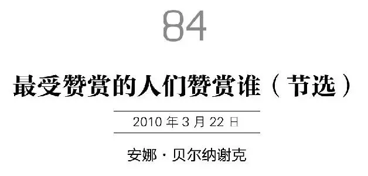

在一年一度的最受赞赏公司评比中，《财富》杂志邀请了6位最受赞赏公司的首席执行官来谈谈他们自己最赞赏哪一位首席执行官。美国运通公司的首席执行官肯·查劳尔特（Ken Chenault）选择了巴菲特，他说，他身上有一种令人难以置信的完美融合，即极高的智慧和商业头脑与情感互动能力之间的完美融合。

2026年3月14日

16:57

## 85 巴菲特的“修复”先生

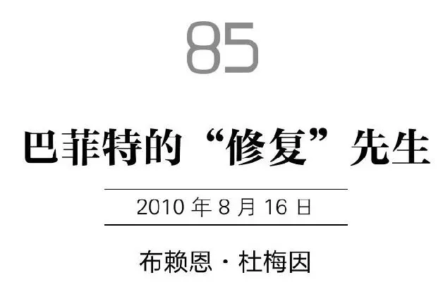

没有人会想到，2010年我们发表这篇赞美戴维·索科尔的文章不到一年之后，他会从伯克希尔哈撒韦公司辞职，而且许多媒体将他的离职视为“不耻”行径。事实上，本文作者笔下的索科尔是“最经常被视为巴菲特继任者”的人。其他5位同样具有竞争力的伯克希尔哈撒韦公司高管分别是：中美能源控股公司的格雷格·埃布尔（Greg Abel），伯克希尔哈撒韦公司再保险业务的阿吉特·贾因，通用再保险公司的泰德·蒙特罗斯（Tad Montross），政府雇员保险公司的托尼·奈斯利（Tony Nicely）以及BNSF铁路公司的马特·罗斯（Matt Rose）。

然而2011年3月，索科尔突然将自己作为有力竞争者的资格抹杀掉了。从伯克希尔哈撒韦公司辞职是他做出的选择。他告诉巴菲特，他打算离开一段时间，因为他想做一些自己的事情。不过，据巴菲特亲自撰写的关于他辞职的新闻稿以及索科尔对此的解释，索科尔几个星期前刚购买了路博润（Lubrizol）股票并告诉巴菲特，这是一家很好的公司，应该考虑收购。巴菲特措辞也比较谨慎，他指出，索科尔向他提出想法之前就购买了这些股票。也不知道巴菲特会如何反应。即便如此，索科尔购进股票的事实，加上路博润股票大涨以及巴菲特决定收购该公司的举措，都把他置于在外人看来仿佛是内幕交易的坏名声之中。

伯克希尔哈撒韦公司对整件事情的公布也给新闻稿作者巴菲特的声誉带来了影响。2011年3月30日，该新闻稿发布于伯克希尔哈撒韦公司网站。全球舆论普遍认为这个新闻的发布对索科尔太过仁慈，而且巴菲特对他的行为没表现出任何愤怒，因为他早先说过，如果任何人对伯克希尔哈撒韦公司的信誉有一丝一毫的损伤，他会毫不留情。巴菲特的批评者也质疑，为什么索科尔告诉他自己拥有路博润股票时，他没有追究。

索科尔的问题不仅成为舆论的热点，也成为4月30日举行的伯克希尔哈撒韦公司2011年股东大会上的头号话题。作为招募来接收股东问询邮件以及第一个在话筒前发言的三位记者之一，我宣读了一个苛责性的问题：“为什么巴菲特没在索科尔问题上表现得更强硬些？”我话音未落，一阵掌声随之而来。随后，巴菲特颇费了一番功夫予以解答。他说索科尔的行为的确“令人费解”，他也承认自己在这件事上本应该处理得更好些。巴菲特还特别说到，他本应该就索科尔购买路博润股票的问题进行追究。

股东大会之后，索科尔事件也渐渐偃旗息鼓。索科尔本人已经从奥马哈搬到了怀俄明州的杰克逊洞，并在那儿组建了一家投资管理公司。证券交易监督委员会被证实已经调查了索科尔的交易，但截至本文出版时，未出现任何关于诉讼的问题。

由于索科尔的事件发生在《财富》杂志截稿日之后不久，所以我们并未在杂志上刊登这件事。但是杜梅因，也就是后面这篇有关索科尔文章的作者，于巴菲特声明发表之后的第二天，就在《财富》的网站Fortune\.com上发布了一篇有关索科尔的文章。杜梅因并没有使用“令人费解”这样的字眼，但他也承认，索科尔的行为确实给人这种感觉。

——卡萝尔·卢米斯

2008年9月，雷曼兄弟公司破产的第二天，戴维·索科尔注意到，位于巴尔的摩的公用事业公司美国联合能源公司（Constellation Energy）的股价暴跌。于是他给自己的老板沃伦·巴菲特打电话说：“我在这家公司身上看到了机遇。”巴菲特也同样意识到了这一点，简短的商讨之后，他们决定：“我们买下它吧。”

联合能源公司持有大量有问题的能源期货合约，已经濒临破产边缘。伯克希尔哈撒韦公司旗下中美能源控股公司的董事长索科尔非常了解公用事业行业，他看到了廉价购入可靠资产的机遇。不过，这笔交易必须在48小时内完成，否则联合能源公司就得申请破产了。

索科尔给联合能源公司首席执行官梅奥·沙特克三世（Mayo Shattuck III）的办公室打电话，当时沙特克正在召开董事会紧急会议，他的助理接的电话，索科尔告诉她，他要跟沙特克通话。秘书说，如果她在这个时候打断会议，可能会丢掉自己的饭碗。索科尔告诉她：“如果你不打断会议，你的饭碗才可能不保。”

索科尔随即登上一架猎鹰50EX（Falcon 50EX）公务机，飞往巴尔的摩。他与沙特克会面的当晚就商定以47亿美元的价格买下联合能源公司，从而避免了该公司的破产。

在整个收购完成之前的几周之内，联合能源公司的董事会就收到了来自法国电力公司（Électricité de France）溢价大约为30%的报价。董事会和索科尔双方都对这个报价很满意，在为伯克希尔哈撒韦公司赚得了12亿美元的单方终止协议费之后，索科尔拂袖而去。

当投资者想到伯克希尔哈撒韦公司时，他们自然会想到沃伦·巴菲特，以及他作为首席执行官高度缜密却又大胆放权的作风。面对麾下这么多公司的高管，从政府雇员保险公司到奶品皇后，从本杰明·摩尔涂料公司到《布法罗新闻报》，再到飞机租赁公司利捷，巴菲特给了它们充分施展拳脚的空间。然而，在他的商业帝国里，有时也会有首席执行官把事情搞得一败涂地的情况，这时就需要有人收拾残局或者来完成需要完成的交易，并且要够快。每当遇到这种情况，巴菲特找的人就是戴维·索科尔。

在伯克希尔哈撒韦公司所有的将领中，53岁的索科尔最经常被认作巴菲特的接班人，但他本人对这种猜测总是不予理会。巴菲特对索科尔的作为颇为欣赏：他搞定了多笔交易，大幅提高利润，扭转业务的困难局面。在为索科尔《满意但不满足》一书所写的序言中，巴菲特写道：“他在商业管理方面取得的成就，相当于泰德·威廉姆斯（Ted Williams）0\.406的棒球打击率。”

巴菲特第一次见到索科尔，是在1999年伯克希尔哈撒韦公司收购爱达荷州的中美能源控股公司之时。1991年，索科尔和巴菲特的老朋友沃尔特·斯科特一起买下了一家每年收益2800万美元的地热公司，将其发展壮大成后来的中美能源控股公司。目前公司总部位于爱达荷州首府得梅因市，收入高达114亿美元，约占伯克希尔哈撒韦公司总收入的10%。索科尔现任公司董事长。2007年，巴菲特要求索科尔帮助境况不妙的佳斯迈威公司（Johns Manville，一家专门生产屋顶以及隔热建筑材料的公司）重回业务轨道。众所周知，索科尔出色地完成了任务，现在担任这家公司的董事长。2008年，巴菲特的副手查理·芒格让索科尔飞往中国，对电池及电动汽车生产商比亚迪进行一番严格考察。索科尔对考察结果非常满意，于是伯克希尔哈撒韦公司投资2\.3亿美元，买下该公司10%的股份，现在这笔投资的价值已经涨到15亿美元左右。今年4月，美国参议院金融监管法案中的一项条款令巴菲特倍感焦虑，该条款要求伯克希尔哈撒韦公司和其他公司为其现有的金融衍生产品提供数十亿美元的抵押。这一次，又是索科尔代表巴菲特与参议院商榷。最终巴菲特一方获胜。

去年夏天，索科尔接到了巴菲特交给他的或许是他职业生涯中最重要的一项任务：让私人飞机租赁公司利捷扭亏为盈。这家“产权共享”模式（fractional ownership）的飞机公司去年税前巨亏7\.11亿美元。这种表现显然温暖不了巴菲特的心窝。而今天，这家公司已经开始盈利，《财富》杂志独家获得了索科尔成功的秘籍，稍后会对其进行分析。

巴菲特为什么会喜欢这个奋发努力的中西部人，其实并不难理解，索科尔弥补了他技能上的不足。巴菲特给人的感觉像是你最喜欢的叔叔，随和，又不失幽默感，而索科尔却总是像一台高速运转的机器。专业工程师出身的他，是个态度强硬、直截了当的职业管理者。每天早上5点之前起床，然后坚持每周5天慢跑5英里，练习举重，锻炼的部分原因是控制体重，但同时也是为应付高强度的工作。一年中有半年他都出差在外，这还不包括他在奥马哈和哥伦布的两个家之间来回奔波的时间。他和妻子佩吉（Peggy）育有一女凯莉（Kelly），现已长大成人。在珍贵的业余时间里，他喜欢钓鱼和滑雪。巴菲特说：“他一天完成的工作，也许比我一周做的还多，我可不是在开玩笑。”

索科尔因其辛勤工作获得了丰厚回报。他、沃尔特·斯科特以及中美能源控股公司现任首席执行官格雷格·埃布尔共同拥有该公司19%的股权（股权并不是均分的），2000年，伯克希尔哈撒韦公司收购该公司时，这笔股权的市值约3亿美元。索科尔每天不是和他的员工在一起，就是与客户或者商业伙伴一起去中国、巴西、德国等地寻找新机遇。既然他把这么多时间花在办公室以外，又是如何同时管理三家大型企业的呢？索科尔有自己的一套模式，而且已经写在《满意却不满足》一书当中，他把这本自费出版的书赠给了他所有的高管。

这本只有129页的凝练的小册子详细阐述了索科尔的6条法则：出色运营、诚实守信、服务客户、服务员工、金融实力和尊重环境。没错，这些都是管理中的陈词滥调，但索科尔不遗余力、始终如一地贯彻到他经手的每一家公司，有需要时甚至表现得冷酷无情。正因为此，他才一次又一次获得连巴菲特也会之大为赞赏的业绩。

索科尔说，同时管理三家公司还有一种技巧，那就是聘请一流的行政助理并充分调动他们的积极性。他说：“许多人只让助理听听电话、打打字、给文件归归档而已，我的助理最多只花1/3的时间在这些事情上。”他有两位全职助理和一位兼职助理，他说他们“知道我的心思”。他们每周向他汇报一次，内容包括他为公司以及负责业务的高管设定的所有目标的进展情况。

他的助理还知道他开会从不迟到，他认为迟到是非常失礼的。他们总会安排充裕的时间，以免发生意想不到的事情，但他们还要确保如果他提前半个小时到达，也有工作可做而不致浪费时间。

索科尔的童年几乎没有什么征兆显示他有朝一日会取得如此巨大的成功。他在奥马哈长大，用他自己的话说：“错误地住在了小镇的另一端。”在内布拉斯加大学读书时，他希望成为一名医生，但当他第一次看到尸体时便晕了过去，头还撞在了大理石桌子的边缘。他父亲婉转地暗示，他可以追随哥哥的脚步，学习土木工程。

1982年，也就是索科尔大学毕业4年后，他受聘于纽约市的花旗集团，为客户提供投资大型废弃能源项目的建议。没过多久，他便忍不住诱惑，跳槽去经营一家名为奥格登·马丁（Ogden Martin）的废弃能源公司。在他的领导下，公司成为纽约证券交易所上市企业。之后他与沃尔特·斯科特开始了合作，共同创建了后来的中美能源控股公司。

索科尔的记录并非完美无瑕。正如有句话说：即便你有时能打出0\.406的平均打击率，也不能保证没有意外出现。在职业生涯中，他自认为至今最大的一次失败发生在20世纪世纪初，他决定投资一种新方法以清除中美能源控股公司在加利福尼亚州地热井里的锌。这种技术在实验中是奏效的，但在实地运用时彻底失败了，让公司损失2亿美元。索科尔反思此事时，认为当初应该再做一些指引性测试。__他说：“我犯的最大的错误就是当我批准这个项目时，却在内心深处感到这是个错误。从那以后，我一直用这个事例教导年轻的管理者：要注意倾听你的直觉，这非常重要，特别是当直觉告诉你千万不要做某些事的时候。”当他把这个坏消息报告给巴菲特时，老板只云淡风轻地说了句：“别养成习惯就行。”__

去年4月，索科尔再次受到冲击，因为奥马哈的一位法官对中美能源控股公司开出了3200万美元的罚款，因为他发现在20世纪90年代，该公司为了迫使菲律宾的一个水力发电项目中的少数股东退出，“蓄意”错误地计算未来的利润。索科尔坚决反对这项裁决，公司正在提起上诉。

尽管遭遇了如此挫折，但每当伯克希尔哈撒韦公司这架庞大机器的某个“部件”发生故障时，索科尔仍然是巴菲特派出的“修复”先生。那么，当索科尔空降之后会发生什么呢？让我们看看利捷公务航空公司的故事吧。

2009年8月中旬，利捷公务航空公司的资金和客户都不断流失。公司创始人兼首席执行官理查德·圣图利草拟了一封辞职信，巴菲特接受了他的辞呈。当时的情形对他们二人来说都是非常痛苦的。巴菲特把圣图利当朋友看待，还在伯克希尔哈撒韦公司2003年的年报里，将他描述为“卓越的首席执行官”。

曾在高盛集团做过银行家的圣图利，于1986年开创了飞机行业的产权共享模式；到2009年，利捷公务航空公司共有842架飞机，3500名飞行员，总收入达31亿美元。圣图利签署过《禁止诽谤公司协议》*（nondisparagement agreement）*，因此未对本文发表评论。

圣图利发现，大部分飞机所有人一年只使用飞机几百个小时，于是他想出了产权共享的概念。为什么不把获得所有权的昂贵成本拆分开来，这样做，还可以免去聘请飞行员和维护飞机的麻烦？如今，利捷公务航空公司的客户通常在例如5年内购买飞机1/8的所有权，如果使用飞机还要另外支付每小时5000美元的费用。由于利捷公务航空公司拥有庞大的机队，因此它能保证所有人，在提前4小时通知的情况下都能得到飞机；不一定是他自己的那架，但肯定是同一机型。

巴菲特和他的家人以及伯克希尔哈撒韦公司的许多高管一直都是对利捷公务航空公司非常满意的客户。巴菲特非常喜爱这家公司，他喜欢在股东大会上向伯克希尔哈撒韦公司的股东推销这项服务，有时还会在股东大会上展示这些喷气式飞机。巴菲特旗下还拥有内衣品牌鲜果生活（Fruit of the loom），他在2001年的一份报告中写道：“如果你购买了一架飞机的分时所有权，我们甚至有可能额外赠送一盒三条装的短内裤或平角内裤。”可是，自从巴菲特在1998年以7\.25亿美元的价格买下利捷公务航空公司之后，连赚回伯克希尔哈撒韦公司的投资本钱都困难。

共享产权业务就像管理航空公司一样，恐怕还要更为复杂。想象一下，短短4小时提前预约，就要把客户送往目的地。这就不仅要有可供使用的飞机，而且还要有可值飞的飞行员、机组乘务员、维修人员及餐饮服务，一切都要在合适的时间出现在合适的地点。每年利捷公务航空公司仅用于培训飞行员的费用就高达1亿美元。哥伦布总部还有自己的天气预报专家，追踪天气变化，预报可能的航班延误。

利捷公务航空公司那些富有的客户已经过惯了予取予求的生活。一位G\-5公务机的所有者只用白色的“舒泰龙”的杯子喝咖啡，机组人员不得不四处寻找这样的杯子，然后将其放在他的座位旁边。该公司一位飞行员回忆说，有位乘客从丹佛飞往洛杉矶只是为了理发，随后又返回了丹佛。这位乘客是只贵宾犬，其飞行花费了32000美元。

到2009年8月为止，金融危机对利捷公务航空公司的打击异常惨重。一些高管再也不希望被人看到登上价值5000万美元的湾流公务机。尽管底特律的那些首席执行官还是坐着私人飞机去参加美国国会有关救助计划的听证会，但也未见得对公司起到实际帮助。其他人则负担不起这样的费用了。利捷公务航空公司的合同保证以合理的市场价格回购所有人的股权。背负沉重压力的华尔街巨头苦于卖不掉自己的房子、艺术品或者马匹，但他们却紧紧握着伯克希尔哈撒韦公司回购他们飞机的合同保证。飞机所有人开始以前所未有的势头出售手中的飞机股权。当时的该公司某位利捷公司高管说：“我们如临深渊。图表上的曲线仿佛是六面旗主题公园里的超人过山车。”公司的账面上出现了巨额未售出的飞机价值，有些付款甚至还不到40%。

由于局势恶化，索科尔取代圣图利出任公司首席执行官。8月初，他飞赴哥伦布利捷公司总部视察时，发现公司存在两个主要问题。首先，新购买的飞机太多了，导致公司债台高筑。其次，据索科尔说，公司的组织形式太不规范，以致影响了工作效率。索科尔开始分发他的管理小册子。不久之后，他便意识到“修复”公司远比他想象得困难。

在20世纪的最后25年里，极富个人魅力的领导者圣图利在公司构建起了强大的公司文化。许多员工感觉公司就像他们的大家庭，他们愿意付出额外的劳动以保证这个庞大而繁复的企业每天正常运转。但凡有人需要帮助，就能得到帮助，员工互相代班的情况很常见。

索科尔面临的挑战就是，如何在不破坏独特的公司文化的前提下，彻底改变公司。但是，公司高层却希望一切保持原样。索科尔在会议上提议卖掉飞机或者削减成本，高管们却极力反对。不久，索科尔就变得很沮丧。当时管理运营部门的比尔·奥尔森（Bill Olsen）说：“索科尔拒绝采纳建议、批判性的辩论或建设性的批评意见，这点在公司内尽人皆知。如果你在会上挑战他，他就会狠狠地瞪着你，而且你很快就会被他遗弃。”奥尔森离开管理岗位后，又当起了公司的飞行员。索科尔的回应是：“这并不属实。我的管理风格是协同合作型的。”

尽管阻力重重，索科尔还是努力推进改革，他取消了新飞机的订单，出售旧飞机，将债务从19亿美元减少到13亿美元，他还削减了大约1亿美元的成本，这足以让公司运营实现盈利。他的改革从易处着手：取消免费使用飞机的措施为公司节约了近3000万美元的开支。旧的管理体制经常允许电影明星、歌星或公司的朋友免费搭乘飞机，或者出于宣传目的给他们升舱。索科尔说：“对于这样的推广活动，我们也许只能创造两三百万的价值，却要花费掉3000万美元的成本。”他还取消了公司每年为客户举办的且花费不菲的拉斯维加斯扑克牌锦标赛活动。

紧接着就是裁员。圣图利此前已经削减了约4%的工作岗位，现在又裁掉5%的员工，并且暂时解雇了近500名飞行员，员工总数因此降至6400人。他说，由于公司的飞机数量减少了，所以不再需要那么多员工。许多高层管理者极力反对这样大幅度的裁员，他们认为服务质量会因此大受影响。不久之后，公司批准了近一半高管的辞呈。其余人员要么被重新分配，要么自行离开。

索科尔坚决认为公司老早以前就该进行重组。他说：“管理紊乱的一大好处就是你很难衡量每个人的能力，因此高管们会互相拍着肩膀，吹捧说他们工作出色，而实际上根本没有办法衡量他们的工作。”公司一位高管管理的销售区域已经陷入亏损，可他还是得到了数百万美元的奖金。

整肃了高管团队之后，索科尔又从下层管理者中提拔了3名进入高管团队，还从外部聘请了3位。他说：“公司的情况就是头重脚轻，并且缺乏优良的组织结构。我们必须让员工有责任感，有清晰的、可实现的目标。我们必须保证每个人权责明确。”

在以往的旧体制下，服务和成本水平只能在一定范围内衡量，却无法在整个组织内实现。索科尔将为公司效力多年的比尔·诺埃（Bill Noe）提拔为公司北美地区总裁，诺埃解释说：“在旧的体制下，你可以把所有高层人员召集到一起并告诉他们我们的目标和工作。但是下一级员工是否了解究竟发生了什么，答案很可能是否定的。”

索科尔培养他的团队去衡量公司做的每一件事，从准时服务到票据托收，再到餐饮质量，无所不包。他说：“当我们出现失误时，我们就会分析犯错误的原因。如果有解决办法，那我们就建立一套体系，从而彻底解决它。”最近，公司的一位客户要在劳德代尔堡一个小型私人机场降落，却要在劳德代尔堡国际机场租辆车。这是他的疏失，但公司的客服代表并没有发现。从那以后，索科尔的团队调整了软件系统，这样一来，如果计算机系统没有指出汽车和机场位置不吻合，客服代表就预订不了汽车。他说：“在航班预订方面，我们的失误率不到0\.5%。但即便只有0\.5%，也还是太多了。”

索科尔还把客户服务、销售和市场营销集中到一个团队内，创建了综合功能团队，以便更熟悉每位飞机主人的需要。这批客服人员，常常与机主们见面，或许会发现诸如X先生喜欢鱼子酱和零度可口可乐这样的信息，然后把此类信息补充到公司为每位客户建立的主文件中。公司高级副总裁亚当·约翰逊（Adam Johnson）说：“知道飞机上所有乘客的姓名、纪念日和生日等，会对建立密切友好的关系大有裨益。”

索科尔说，公司原有的创业型企业文化，主要着眼于当前的成长，而不是长期规划。他制订了严密的5年期和10年期计划流程，关注点从未来对新飞机的需求到飞机燃料价格、通货膨胀再到中国等新市场的开发等，囊括了方方面面。公司的总顾问乔丹·汉塞尔（Jordan Hansell）说：“对经济形势、商业计划、监管规定做出一系列完整、明确的设想，这会督促你分析哪些是有可能让你改变决策的重要因素，从而有助于减少意外的发生。”

不过，令索科尔大吃一惊的是，公司某些心怀不满的前管理人员对他发动了一场言论攻击，甚至有一部分出现在了巴菲特的传记作者爱丽丝·施罗德（Alice Schroeder）的网站上。公司共同创始人吉姆·雅各布斯（Jim Jacobs）是最严厉的批评者之一。今年1月，雅各布斯辞去了公司副董事长的职务。他认为，索科尔削减成本的措施是以牺牲服务标准为代价的，而且飞机所有者牢骚不断，很多人还离开了公司。他还声称，取消新飞机的订单是个巨大的错误。他说：“我们过去一直在保护这种业务价值，确保‘金蛋鹅’持续为我们产下‘金蛋’。我们没有恐慌过，没有裁减过飞行员，想把他们再请回来还得花大价钱；我们也没有取消新飞机的订单，那样会导致现有机队老化，从而使运营成本进一步提高；我们没有关闭重要的关系网。如今的利捷公司，没有人知道该如何管理它。”

在批评裁员的措施时，雅各布斯指出，在2009年的7\.11亿美元亏损中，大部分都是非现金开支，即使不再出售新的部分所有权，公司还是有望在2010年实现大约7000万美元的现金流。他认为，这些裁员措施让公司成了“以往的一个渺小的缩影”。

“荒谬至极！”索科尔立刻反驳道，“在所有我经手过的收购交易和转型改革中，从未见过哪个高管在离职之后还跳出来散播谣言，给客户打电话，不顾一切地试图中伤公司。这简直令人无法容忍！他们这样做只会伤害他们自己以及公司的员工。”

当然在这个问题上，有一个人的看法至关重要，那就是巴菲特。对索科尔的管理成果，巴菲特既欣喜又满意。“公司现在的盈利状况很好，而且不是通过卖飞机获得的，”巴菲特说，“看起来公司今年的税前利润有望达到2亿美元。这是我所见过的一项伟大的管理成就。当航空业东山再起时，公司的年利润可能会达到5亿美元。”

索科尔认为，这次转型改革已经基本结束。他希望在今年年底之前，从新的6人管理团队中挑选一个人担任首席执行官。现在的问题是，当奥马哈打来的电话再度响起时，他又要飞往何处呢？

## 捐赠承诺

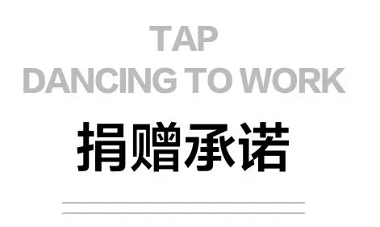

2010年6月，几乎就在沃伦·巴菲特宣布他对比尔和梅琳达·盖茨基金会及其他4个基金会巨额慈善捐赠的整整4年后，他和盖茨再次因为宣告自己的捐赠承诺而重新回归到公众视野，他们此行的目的就是激发亿万富翁思考自己对于慈善的贡献。《财富》杂志特地将这一重大新闻打造成封面文章，后面还附有巴菲特个人的慈善承诺，同时张贴在全新网站givingpledge\.org上。

在发布捐赠承诺的三个月前，当时还未完全确定发布的方式和时间，盖茨和巴菲特在奥马哈机场附近见面并共进了午餐，商讨发布的地点（当时连名号都还没有）。关于他们的计划，我知道一点儿，而且我认为让大众获悉这件事也非常重要。我把这件慈善事业中里程碑式的事件告诉了杂志总编瑟沃·安迪，他当即表示同意，因此就有了我们6月份刊发的封面故事，镜头瞄准了3月份在奥马哈郊外好莱坞餐厅（Hollywood Diner）共进午餐的巴菲特和盖茨。盖茨乘坐飞机跨越整个国家来与巴菲特相会，而巴菲特本人也是驱车从市中心的办公室风尘仆仆地前往约定地点。

自2012年9月起，共有92位捐赠承诺签署者（还不包括共同签名的配偶）。鉴于美国还有更大一批巨富族群，也就是“福布斯400”富豪榜单上的富豪，巴菲特和盖茨一直将他们视作可待挖掘的潜在捐赠者，所以前景还是相当乐观的。不过，巴菲特相信已经签署宣言的人已经让捐赠承诺达到了真正意义上的成功。他说：“即便这个数字小于92，我也会认为已经得偿所愿，而且我知道，我们已经改变了很多人关于捐赠数额的看法。某些人捐赠的数目是非常庞大的。”

非但如此，巴菲特和盖茨还组织并参与了印度和中国的慈善晚宴，将捐赠承诺的观念传播到那里，因为那里的富人更倾向于将巨大财产传承给下一代而非捐献给慈善事业。2011年3月印度的那场晚宴吸引了大批商界人士和政府官员。所以在此，我们也无法估量捐赠承诺能够走多久，走多远。

——卡萝尔·卢米斯

__866000亿美元的挑战__

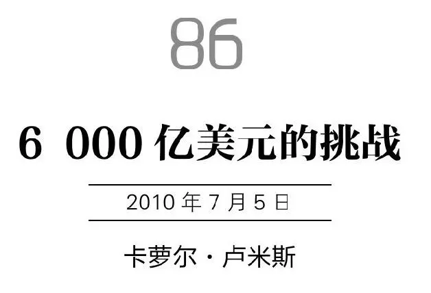

2009年5月，有人爆料给媒体说，美国最富有的两个人，比尔·盖茨和沃伦·巴菲特在纽约市秘密组织、主导了一次亿万富翁晚宴。据说晚宴由戴维·洛克菲勒主持，包括纽约市长迈克尔·布隆伯格（Michael Bloomberg）和奥普拉·温弗里（Oprah Winfrey）在内的重要人士都参与其中，晚宴的主题是慈善。

即便媒体一再追问，巴菲特和盖茨还是拒不回答。而这显然丝毫不能打消媒体对此事的关注，于是我们就看到了各种描述：《慈善纪事报》*（The Chronicle of Philanthropy）*称其为“前所未有”，美国广播公司新闻（ABC News）和《休斯敦纪事报》*（Houston Chronicle）*形容其“颇为神秘”，《纽约杂志》*（New York Magazine）*一篇滑稽的模仿文章还幻想乔治·索罗斯在奥普拉面前表现出粉丝追星的可笑模样。一家广播电台主持人所描绘的更是一幅黑暗场景：“女士们，先生们，一场恶作剧正在秘密进行，这对我们这些人来说不是什么好兆头。”“不，完全不是这样的。”与会的比尔和梅琳达·盖茨基金会前首席执行官帕蒂·斯通西弗（Patty Stonesifer）反驳道，她还极不情愿地站出来澄清谣言。她告诉《西雅图时报》*（Seattle Times）*，这仅仅是朋友和同事之间讨论慈善想法的一次聚会。

事实的确如此。不过，这次讨论却蕴藏着极大改变美国人慈善捐赠行为的可能，并引导他们提高捐赠数额。通过这次晚宴，盖茨和巴菲特开启了一场可谓史上最大规模的募捐活动。任何类型的捐款者他们都欢迎，但最直接的目标还是亿万富翁，他们希望这一群体大幅提升对慈善机构的捐赠数额。不过，在纽约晚宴上，这一愿景尚未成形。随着另外两次晚宴的举行（均未被披露），巴菲特和盖茨夫妇最终设定了一个目标：从“福布斯400”富豪榜单开始，带动超级富豪承诺（字面上的“承诺”）在他们有生之年或去世时至少捐出一半身家给慈善事业。

毫无疑问，该计划将大幅提升慈善捐款的数额，虽然具体的捐款规模还是个谜，但我们总会得知。我需要在此说明的是，本文是第一篇公开披露巴菲特、梅琳达和盖茨努力倡导的慈善承诺活动的文章。在过去几个月间，随着该项目的逐渐开展，《财富》杂志采访了三位发起人以及一些已经加入“盖茨\-巴菲特运动”的亿万富翁。

从某种意义上来说，本文也与《财富》杂志另外两篇关于巴菲特的封面报道相呼应。第一篇是发表于1986年的《一切都该留给子孙吗》。巴菲特回应，坚决不会。第二篇文章写于2006年，披露巴菲特有意将自己在伯克希尔哈撒韦公司持有的股票逐步捐赠给5家基金会，最大受益方是全球规模最大的比尔和梅琳达·盖茨基金会。

那以后的4年时间里，巴菲特共向比尔和梅琳达·盖茨基金会捐赠了64亿美元，这还不包括将于今年夏天进行的2010年度的捐赠。与此同时，基金会利用巴菲特的捐款和盖茨夫妇的巨额捐赠大幅提高了捐赠水平，达到每年30亿美元左右，其中大部分用于全球健康事业。举一个小例子：受到该基金会重金资助的抗疟疾药品事业会（Medicines for Malaria Venture）与诺华公司（Novartis）合作开发出口感较好的抗疟疾药片，分发给24个国家的数百万儿童服用，因为他们是该病的主要受害者。

2006年关于巴菲特的特别报道也是我本人撰写的，此时我的身份是《财富》杂志的资深自由编辑。此外，我还是巴菲特的多年好友，伯克希尔哈撒韦公司年报的编辑。通过他，我和丈夫约翰·卢米斯还结识了盖茨夫妇。卢米斯团队甚至偶尔还跟巴菲特和盖茨组成的队伍打桥牌。

话虽知此，但“盖茨\-巴菲特运动”将给慈善业带来什么好处，这个问题从一开始就取决于一个“秘密”：美国最富有的人现在的捐赠规模有多大。多数人都选择不公开自己的捐赠数额，局外人很难揭开这一面纱。因此，无论是捐赠人选还是就其净资产而言，“福布斯400”富豪榜也许都是最接近的估测。巴菲特说，他知道有两位伯克希尔哈撒韦公司的股东应该列入榜单，但被漏掉了。因此，盖茨一语中的：“这个榜单不准确。”

尽管准确性遭到了质疑，杂志称“福布斯400”富豪榜2009年的净资产合计大约为1\.2万亿美元。因此，如果这400人在有生之年或去世时捐出一半家产，那就是6000亿美元。至少，你可以把这一惊人数字视为巴菲特和盖茨夫妇期望中的捐赠额。

且不说“福布斯400”富豪榜，我们只要看看美国国税局（Internal Revenue Service）发布的年度捐赠和遗产税的数据，就能知道超级富豪的捐赠距离6000亿美元的目标还有多远。首先，总体而言，美国的情况令人敬仰：在做慈善的慷慨度方面远超其他任何国家，年捐款额在3000亿美元左右。

其中一部分被报道出来，是因为个人税收申报表中将慈善支出作为扣减项目。但是，低收入纳税人通常并不单列扣减项目，而是采用标准的扣减额。在较高收入水平的纳税人群体中，慈善捐赠数据开始显露出意义。以2007年为例（可获取的最新数据），调整后总收入为1000万美元或以上的18394名个体纳税人，申报的慈善捐赠额约为328亿美元，相当于其5620亿美元收入的5\.84%。

亿万富翁的情况如何呢？虽然存在某些缺陷，但这里最有力的证据是源自美国国税局发布的400名年度纳税最多的个人的统计数据。近20年以来，名单上的人不断发生明显的变化。政府要追踪这400名纳税最多的个人的原因，也许是受“福布斯400”富豪榜的激励，当然也许不是。无论如何，这两份400人榜单尽管存在重叠，但不可能一模一样，原因之一是国税局的数据统计的是收入，而非净资产。

美国国税局2007年的数据显示，400名纳税最多的个人调整后的总收入共计1380亿美元，而仅110多亿美元被列为慈善支出扣减，所占比例约为8%。在此必须补充的是，扣减掉的金额必须上调，因为某些捐赠中允许扣减的额度是有限的，其中包括金额非常巨大的款项，比如，当年巴菲特向比尔和梅琳达·盖茨基金会捐赠的18亿美元等。即便如此，无论如何，人们还是无法想象110亿美元上调到150亿美元以上的可能性。如果我们认可150亿美元是个合理的估测值，这就意味着这400名纳税最多的个人将其收入的11%捐给了慈善团体，这也只是略高于1/10。

年度捐赠数额会不会误导人们以偏概全呢？人们或许会猜测，巨富之人在有生之年一直积累财富，然后在遗嘱中安排了大笔慈善捐款。然而令人感到遗憾的是，遗产税数据破坏了这种猜想，正如我们所见的2008年的统计数据那样。当年有38000名纳税人递交了遗产税申报表，遗产总额为2290亿美元。这些人中有4/5去世时没有订立慈善遗赠。订立遗嘱的7214位纳税人共捐出280亿美元，仅占全部38000名申报人2290亿美元遗产总额的12%。

总的来看，该数据显示，极富有的美国人目前的捐款额与盖茨夫妇和巴菲特所倡导的适当水平（净资产的一半或更多）之间存在巨大差距。关键问题是，有多少富豪会赞同他们的倡议。

本次运动的标志性事件是2009年5月举行的那场亿万富翁晚宴，你也可以将其称为“首次晚宴”。盖茨夫妇将这一基本想法归功于巴菲特：一小撮乐于奉献的慈善家以某种形式聚在一起，讨论将行善的福音传播给更多人的战略。事实上，是盖茨夫妇亲自组织了这次会议。盖茨微笑着说：“如果你指望巴菲特组织这次晚宴，或许要等上一辈子了。”与此同时，巴菲特也给自己办公室里的一份新文件潦草地命了新名“伟大的捐赠者”。

第一份归档的文件是巴菲特和盖茨3月4日致慈善元老戴维·洛克菲勒的一封信，目的是邀请他主持这次晚宴。已95岁高龄的洛克菲勒告诉《财富》杂志，这份邀请“既令人吃惊又令人感到荣幸”。餐会地点选在纽约市的洛克菲勒大学（Rockefeller University）高雅且极其私密的校长办公楼，洛克菲勒担任该校董事会成员已有70年之久。他还要求68岁的儿子小戴维·洛克菲勒一同前往。

晚宴定于5月5日星期二下午3点举行，盖茨强烈要求定在这一天，因为彼时正值他和家人在欧洲3个月的度假期间，而这一天恰逢是他回美国作短暂停留期间。梅琳达选择跟3个孩子留在欧洲，因此没有参加首次餐会，但后续所有活动她都将参与。盖茨夫妇将此次运动视为个人事务，而非比尔和梅琳达·盖茨基金会的项目。

而且梅琳达从一开始就坚持认为应当邀请夫妇双方共同参加餐会，因为夫妇双方对任何决议来说都同等重要。她的理由是：“即便赚钱的是丈夫，但真正管钱的也是妻子。任何慈善计划都应该有妻子的参与，因为这会影响到她和孩子的利益。”

3月24日，邀请函被寄出。即便实际到会的人数少于寄出的邀请函，但5月5日出席餐会的主持人和宾客无疑已经具备了足够的经济影响力：他们的净资产合计可能高达1300亿美元，都有着向慈善团体捐献的良好传统。除了以观察员身份出席的帕蒂·斯通西弗和小戴维·洛克菲勒以外，共有14人出席，包括老洛克菲勒、巴菲特和盖茨。来自纽约市当地的宾客包括市长布隆伯格，3名华尔街投资人——皮特·彼得森（“Pete”Peterson）、朱利安·罗伯逊（Julian Robertson）和乔治·索罗斯；以及查里·“查尔斯”·菲尼（Charles“Chuck”Feeney）。菲尼是免税店DFS（Duty Free Shoppers）的大股东，迄今已通过自己的大西洋慈善总会（Atlantic Philanthropies）捐出50亿美元。1997年，当菲尼跌出“福布斯400”富豪榜单时，该杂志以少见的褒奖进行了评价：“他向慈善事业捐出了巨额财产。”

外地的宾客包括奥普拉、泰德·特纳以及来自加州的两对夫妇：洛杉矶慈善家伊莱·布罗德（Eli Broad）和艾迪丝·布罗德（Edythe Broad）夫妇，硅谷的约翰·莫格里奇（John Morgridge）和塔希娅·莫格里奇（Tashia Morgridge）夫妇。莫格里奇夫妇的财富主要来自思科系统（Cisco Systems）。这两对夫妇都一度因为行程不便，对是否接受邀约拿不定主意。不过，邀请函落款的几个签名实在是太有分量，从左到右依次为洛克菲勒、盖茨和巴菲特。“这几个签名令人印象非常深刻！”伊莱·布罗德说。

因此，在约定的日子，布罗德夫妇如期抵达，跟其他宾客一同围坐在一张大会议桌旁，猜测接下来会发生的事。解开谜团的是巴菲特，他俏皮幽默，据小戴维·洛克菲勒回忆说，巴菲特扮演起了“活跃气氛的角色”，他极力想让会议不至于“过分沉闷”和“过分自吹自擂”。作为开场，巴菲特先从慈善事业谈起，形容此次会议“是一次探索”，然后邀请大家依次说说自己的捐赠理念及发展过程。

餐会的结果可以总结为12个故事，每个15分钟左右，一共持续了近3个小时。但《财富》杂志采访的与会者大多都认为故事引人入胜、非常精彩，尽管有些大家并不陌生。老洛克菲勒说，膝下之年就学到父亲和祖父的慈善精神。特纳讲起了他的老故事：一时兴起地向联合国捐献10亿美元。一些与会者谈到了从小额捐赠向大额捐赠跨越时面临的心理困扰。还有一些人则担忧慈善捐赠的决心可能会离间他们与孩子的关系。后来在回忆此次餐会时，巴菲特笑称，当时他感觉自己就像是精神病医生。

这些故事中谈及的慈善动机涉及多个领域：被多次提及的教育；文化；医院和健康；环境；公共政策以及贫困问题。盖茨觉得整个餐会“无与伦比”，慈善涉及领域之广令人钦佩，他说：“美国人捐赠覆盖范围的多元化，正是这个国度迷人的原因之一。”

随后的用餐期间，大家的谈话主题更加具体化，转向如何提高富人的捐赠额。比较好的提议包括：国家对伟大慈善家的认可（例如颁发总统奖章）；拍摄关于慈善的电影；出版慈善指南或者召开富豪大会等。但当时大家并未想到承诺这种方式。参与餐会的小洛克菲勒说：“我和父亲从餐会中领会到的最重要的一点是，增加捐款要仰仗那个房间中的很多人有步骤的、有针对性的、长时间的付出。”

但这场餐会最终还是遭到了意想不到的结局：消息泄露。基本可以确定，泄密者就是菲尼，泄密对象是他的多年好友尼亚尔·奥唐德（Niall O’Dowd），纽约市一家几乎不为人知的网站IrishCentral\.com的创办者。《财富》杂志没能成功采访到菲尼；对于我们的猜测，奥唐德说：“我不能确定。”5月18日，也就是餐会召开两周之后，IrishCentral\.com发表了一篇只有14个小段落的文章，标题为《全球巨富在纽约的秘密聚首》。由于其他媒体竞相转载和追踪挖掘，IrishCentral\.com网站因此名声大振。

IrishCentral\. com网站的这篇文章没有搞清楚主持餐会或与会的是哪位洛克菲勒先生。除此之外，文章准确地提供了所有与会者的名字，最明显的例外就是唯独没有菲尼，显然他没有意识到这样只会令他比其他与会者更多了几分泄密嫌疑。非但如此，菲尼作为文章的“匿名”引述者两次出现在文中。第一次，作为“出席者”，他认为当天最令人印象深刻的发言者是盖茨，最直言不讳的人是特纳（他的发言令人惊讶），对改变自己的计划最坚定的人是巴菲特。第二次则是作为令人敬仰的“参与者”，对同座的宾客毫不吝惜地极尽褒扬之词：“那些伟大、善良的人，他们都来了。”

本次泄密事件的影响是，将“静锥区”（cone of silence，引自盖茨阵营的描述）转移到随后一年间捐赠运动的所有行动上。当然行动从未停止，包括在国外举办的几次小规模的餐会。盖茨和梅琳达在伦敦举办了一次餐会，盖茨还在印度和中国举办了几次餐会。提升别国的慈善捐助水平是一个很特别的挑战：在那里，家族财富的继承被视为理所当然，税法通常也不为捐助做扣减；由于缺少处理慈善事务的机构和组织，所以，捐款该给谁并不那么清楚。即便如此，如果盖茨夫妇和巴菲特发起的运动能在美国取得成功，就很有可能被推广到国外。

虽然经过了去年夏秋两季的推动，但巴菲特和盖茨夫妇还没能为这场慈善运动拿出一套组织方案来。在这种相对空白的情况下，捐赠承诺的想法开始形成并获得了支持。于是，他们决定再举办几次餐会。梅琳达说，他们三位发起人试图在这些餐会上“传播捐赠承诺的想法，看看能否得到大家的响应”。

于是就有了第二次和第三次的美国餐会。由于“静锥区”的缘故，这两次餐会的大部分与会者都未被曝光。比尔和梅琳达·盖茨基金会的一位发言人说，采取保密措施主要是为了对出席慈善宣讲会的富豪们表示尊重，如果他们决定不接受挑战，也要尽量避免他们可能遭受指责的尴尬。

不论如何，我们还是得知了几位与会者的名字。去年11月在纽约市公共图书馆举办的第二次餐会，出席的著名慈善家中，包括了纽约投资银行家肯尼思·兰格恩（Kenneth Langone）和妻子伊莱恩·兰格恩（Elaine Langone），以及来自费城的传媒大亨“格里”·伦费斯特（H\.F\.“Gerry”Lenfest）和妻子玛格丽特·伦费斯特（Marguerite Lenfest）。2000年，伦菲斯特把他位于宾夕法尼亚州的有线电视公司出售给了康卡斯特电信公司（Comcast），这为他和家人带来了12亿美元的收益，从而一举成为亿万富翁。他随即宣布，在自己的有生之年，他会把其中大部分捐给慈善事业。现年80岁高龄的伦费斯特迄今已捐献了8亿美元，绝大部分给了自己的母校：哥伦比亚大学法学院、华盛顿与李大学（Washington and Lee University）和摩尔西斯堡高中（Mercersburg Academy）。

在11月份的那次餐会上，巴菲特称赞玛格丽特·伦费斯特提出的意见是当晚最好的，这令伦费斯特倍感骄傲。玛格丽特说，富人们应该坐下来计算一下自己及其后代需要多少钱，然后商定如何处理剩余的那些财富。伦费斯特说：“巴菲特和盖茨夫妇的可贵之处在于，他们正努力让人们坐下来考虑这件事情。”

第三次餐会于去年12月在加州门洛帕克市的罗斯伍德桑德希尔酒店（Rosewood Sand Hill）举行，因而被很多人称作“湾区餐会”。但实际上，与会者来自加州各个地方及其周边的娱乐区。与会的是一些资深的慈善人士，包括风险投资公司克莱那·巴金斯（Kleiner Perkins）的风险投资家约翰·多尔（John Doerr）和妻子安·多尔（Ann Doerr）、莫格里奇夫妇。这次餐会的会议地点就是由莫格里奇夫妇选定的。梅琳达说，这次餐会与前两次不同因为有许多与会者刚刚跻身富豪行列，捐赠意识正在形成之中。交谈持续了好几个小时，以至于为晚餐准备的牛肉老是煮过了头。据说，这让罗斯伍德桑德希尔酒店的管理人员大感吃惊，他们也许注意到了道格伍德（Dogwood）包房内的这群人应该赢得支持。

在这次餐会上，还暴露出人们对慈善活动的一些担忧。如果公开巨额捐献，会对捐献者的平静生活产生什么样的影响？慈善机构会不会无休止地索要？如何处理国际捐助？因为人们常常感觉像是把钱投进了无底洞。盖茨夫妇说，这些担心是合理的，因为人们希望自己捐钱时不会犯糊涂，就像挣钱时一样精明。但是这些顾虑并没有打消慈善事业为盖茨夫妇带来的满足感。在这几次餐会上，盖茨说：“没有任何人对我说，‘我捐多了，我本不该捐那么多。’”

在这几次餐会上，慈善承诺的提议也没有遭到“枪决”。换句话说，大家的“反应”还不错。于是2010年伊始，承诺被落实为运动的战略之一。把承诺比例定为净资产的50%，是比较务实的做法，虽然低于三位发起人期待的水平，但也可能已经是上限了，至少初期如此。与此同时，这份承诺绝非是有法律约束力的合同，而只是形成书面，要求人们认真对待的道德义务。事实上，这些承诺将被公布在一个由梅琳达创建、监督的全新网站givingpledge\.org上。巴菲特的承诺99%可能会成为该网站的第一份，当然，如果他没被西雅图那对夫妇抢先的话。

盖茨夫妇和巴菲特热衷于领导一场发现“伟大捐献者”的运动，因此他们期待得到富人们的全力支持。已经承诺至少捐献50%家产的人有布罗德夫妇、多尔夫妇、伦费斯特夫妇和莫格里奇夫妇。另外，在线发布本文时，三位发起人将向他们认为可能做出承诺的其他一些亿万富翁寄发电子邮件并拨打电话。接着，所有承诺人或许也将加入他们的行列，向更大批的亿万富翁寄发邀请函，邀请他们加入这一活动。今年秋天，甚至还可能召开一次“伟大捐献者”大会。

这次冒险能否成功，也许要时间才能给予我们答案，不过三位发起人都有着自己的思考。巴菲特深知每一位富人都曾考虑过如何处置自己的财产：“也许他们还没有做出决定，但他们肯定都考虑过。我们邀请他们做出承诺，将会促使他们再次仔细考虑这一问题。”最最重要的是，他提醒富人，不要迟迟不做如何处置财富的决定：“如果他们一直要等到90多岁时才最终决定，那时他们的脑力和意志力肯定不可能胜过现在。”

盖茨认为50%是鼓励高参与度的“低门槛”。他认为，可能有的人会因为看到这个比例而被吸引进来，但结果却承诺了一个更高的比例。“这是另一个境界的事情。”他认为，把所有事情都解决是需要时间的。

短期效果和长期效果在梅琳达眼中是不同的。出于各种各样的原因，有些富人不愿意捐赠，她说：他们不愿意筹划自己的身后事；他们担心自己需要请人帮助处理此事；或者他们只是不愿花时间仔细考虑这件事。因此她认为，“承诺运动”的初期目标必定只能是打消他们的顾虑，引领他们进入捐赠的队伍。最终呢？“3～5年之后，我们将有数目可观的一大批亿万富豪加入。那时才算得上成功。”

毫无疑问，整个社会或多或少都将从中受益。不仅如此，不仅富有的人会认真思考此类承诺的含义，其他捐献数额不大的人也可能会突然间多了一个理由来思考他们所做的事的公正性。

__87 我的慈善承诺__

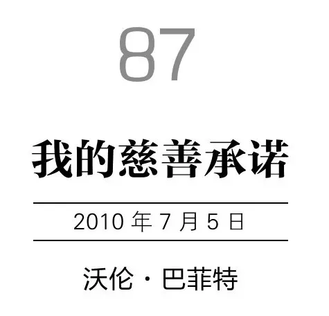

2006年，我承诺逐步将所持伯克希尔哈撒韦公司的股票全部捐献给慈善基金会。对此决定，我的愉快之情无与伦比。

现在，我、盖茨和梅琳达三人倡导数百位美国富豪承诺将自己至少一半财富捐给慈善事业。因此，我认为这是一个恰当的时机以重申我的意旨，并解释我做出决定时的考量。

首先，我承诺：在我有生之年或去世时，将向慈善机构捐出99%以上的个人财富。按美元计算，可谓“一诺千金”。不过，相对而言，每天都有很多人为他人贡献着更多的财富。

数以百万计的人经常捐助教堂、学校和其他机构，从而放弃用这些钱去满足自己和家人的需求。他们把钱投入募捐箱或捐给联合慈善基金会（United Way），意味着他们放弃了看电影、外出就餐或其他个人享受的机会。相比之下，即使兑现捐献99%财富的承诺，我和我的家人也不必舍弃任何个人需要。

非但如此，这一承诺并不需要我奉献最宝贵的财产——时间。很多人，我很骄傲地说，包括我的3个孩子，毫不吝惜地花费大量时间用他们自己的才华去帮助别人。这类奉献的价值往往远胜于金钱。对于一个身处困境的孩子而言，导师的友谊和关怀远非一张支票所能买到。我的姐姐多丽丝，每天都向别人提供面对面的帮助。而我在这方面几乎无所建树。

然而，我所能做的是拿出一大堆伯克希尔哈撒韦公司的股票，这些“提取凭证”兑换成现金之后可以买到很多资源，用以惠及那些由于命运的不公平而饱受生活不幸的人。迄今为止，我已经捐出了20%的股票（包括我已故的妻子苏珊·巴菲特的股份）。我将继续每年捐赠4%左右的股票。我全部的伯克希尔哈撒韦公司持股，最迟将在我的遗产清点完成后10年内被分布到慈善事业的各个方面。我的钱不会流向捐赠基金；我希望这些钱用于解决现实的需要。

这项承诺并不会对我的生活带来任何改变，也不会影响到我的孩子们。他们已经得到了大笔可供使用的财产，将来还会得到更多。他们生活得舒适而且充满创造性。而且在某种程度上，我也将继续过着予取予求的生活。

有些物质上的东西使我的生活更惬意，但也有很多东西不能。拥有一架昂贵的私人飞机挺不错的，但拥有半打豪宅却是一种负担。你占有的越多，反而往往被物质所占有。我所拥有的最珍贵的财富，除了健康以外，就是形形色色的有趣而恒久的朋友。

我的财富来源于多项因素的结合，比如生活在美国、幸运的基因以及复利。我和我的孩子们都曾中过我所谓的“卵巢彩票”。首先，20世纪30年代我出生在美国的概率至少为30比1。我是男性，而且是白种人，也使我避免了大多数美国人当时所面对的障碍。

我的好运愈发凸显是因为我生活在市场经济体制下，虽然它有时会造成扭曲的后果，但总体而言还是造福了美国人民。在我工作的经济环境中，国家用奖章奖励在战地拯救战友生命的人，学生父母以感谢信的形式感谢伟大的老师，而对那些发现低估定价证券的人却以数以亿计的美元奖励之。简单来说，命运垂青哪部分人实在是件难以捉摸的事。

我和我的家人对于我们不同寻常好运的反应不是愧疚，而是心存感恩。如果我们在自己身上使用超过1%的财产，也并不会让我们更快乐或是更健康。相反，其余99%的财产却能给其他人的健康和福利带来巨大影响。这一现实为我和我的家人指明了一条清晰的道路：保留足够我们享用的财产，其余的捐给社会，满足社会的需要。我的承诺就是我们坚实地迈向慈善事业的第一步。

## 88 小巴菲特造访北京

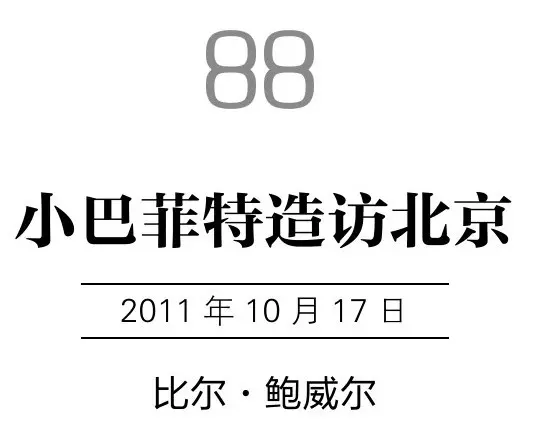

《孩子们都很好》*（The Kids Are All Right）*是2010年的一部电影。这句话同样适用于沃伦·巴菲特的3个“孩子”：59岁的苏茜·巴菲特，57岁的霍华德·巴菲特以及54岁的彼得·巴菲特。3人都毕业于奥马哈的公立学校，从小就深知父母鲜明的观点：不要全部都留给子女。他们早已成长为社会的中坚力量，有着自己的事业。没错，目前3人都经营着由父亲资金支持的基金会，这是专属于他们的就业机会。但是3人对待工作都保持着高度认真的态度，他们明白，把钱花到刀刃上是一件非常困难的事情。苏茜的基金会主要资助她所居住的奥马哈的早教事业；霍华德在伊利诺伊州迪凯郊外的一家农场工作，他的基金会主要关注改善非洲贫困的农村生活；家在纽约的彼得和妻子珍妮弗则致力于全球女性问题。

彼得·巴菲特之所以成为《财富》杂志这篇文章的主角，是因为他2010年出版的新书《做你自己》*（Life Is What You Make It：Fin Your Own Path to Fulfillment）*在中国取得了巨大反响。本文首次出版时，这本书的中译本在中国的销量已达32万余册，而到了2012年终，更是售出超过40万册。巴菲特在中国的名声肯定对这本书的销量有所助力。他是尽人皆知的“股神”，他的一举一动都牵引着人们的目光。但是彼得·巴菲特却显得离经叛道，他离开了声名赫赫的斯坦福大学，中断了学业，像个穷小子一样追逐起了看似毫不稳定的梦想，这点吸引了许许多多中国年轻人的目光，很多人不能想象为什么他会甘冒如此风险。

霍华德目前也在撰写一本书，预计将于2013年出版，内容主要关于他如何在农场中摸爬滚打，从而成为一名非洲农业问题的专家。苏茜目前没有写书，至少现在还没有。从她在奥马哈的地位来看，她是全家最善于与父亲沟通的人，尤其是在重要问题上，比如个人安全系统方面。只要苏茜出马，安全问题就能搞定。

——卡萝尔·卢米斯

委婉地来说，给一个有着13亿人口的大国做个概括有时候挺不容易的。中国人把巴菲特称为“股神”，每次他到访，中国媒体会全程追踪他的一举一动。至今已有超过40本关于巴菲特的书被翻译成中文。

鉴于这种情况，彼得·巴菲特，巴菲特53岁、为人低调谦逊的儿子最近凭借自己的能力成了中国一颗冉冉升起的新星，便显得相当有趣。

他的成名并不是因为从他伟大的父亲巴菲特那里遗传到了人们所认为的投资智慧。彼得是个成功的音乐家和作曲家，为很多电视剧和电影配过乐，《与狼共舞》*（Dances With Wolves）*的原声大碟是彼得的代表作品之一，还常在音乐会上演奏新世纪音乐（New Agey）。最近一次演出是今年8月份在北京探戈坞音乐谷的音乐会，那是长城脚下一家新兴的一流户外音乐场地。

可是，北京与马林县全然不同。当下的中国，新世纪音乐的前景并不甚乐观。彼得引起许多中国人，特别是学生和年轻专业人士的关注，主要是因为他会在演奏音乐的同时与听众分享人生经验。他传递的核心信息中，有一部分从本质上来说就是金钱不是万能的，这也正是他打动人心的原因。巴菲特在中国的巨星地位可以让我们窥见现在中国的面貌，而彼得的成功或许又预示出中国今后的走向。

今年早些时候，一家北京的出版公司翻译了彼得2010年撰写的一本书，名为《做你自己》。该书在美国的反响平平，3月份在中国出版，截至8月份，销量已达32万本，这是一个很了不起的数字，即使在一个13亿人口的大国也不例外。据该书中国出版商新世界出版社总编张海鸥透露，今年春夏，该书在网上平均每天可以售出约1000本。“虽然我们当初对这本书抱有很高的期望。但老实说，这样的业绩还是让我们大吃一惊。”张海鸥说。

今年春季，彼得在中国4个城市做了新书的巡回推广活动，就像在美国常常采用的方式一样，他把音乐与人生智慧结合了起来，这次活动被称为“音乐与对话”（Concert and Conversation）。他还接受了来自全国各地，包括传统媒体和网络媒体在内的25次采访，还在新浪微博上与网友互动，而微博已经成为学生和青年专业人士的主流传播工具。

这只是彼得第二次到访中国。尽管他对父亲在这个国家举足轻重的影响力略有耳闻，但还是没能充分估量到这份尊崇如此来势汹汹。今年8月，就在长城音乐会的前一天，彼得坐在北京一家酒店里，声称人们的热情接待使他受宠若惊。他笑着说：“和预想的情况真不一样，就像总统竞选或者重大活动似的，到处都是记者。”

你得记住，虽然彼得是股神和已故的苏珊·巴菲特的第二个儿子，但他并不习惯这种巨星待遇。事实上，还远非如此。他和妻子珍妮弗在纽约有宅住所，但大多数时候，他们都居住在纽约市以北90英里安静的阿尔斯特县（Ulster County）。夫妻俩没有孩子。除了追求音乐事业之外，他和哥哥及姐姐一样，都运营着父亲用伯克希尔哈撒韦公司股票全力支持的慈善基金会。彼得身上最重要的特点就是，他看起来完完全全与平常人无异。这听起来似乎不可能，但事实的确如此。他很接地气、平易近人，没有一点儿神经兮兮或者局促不安的样子。他说：“总会听人们说，你是沃伦·巴菲特的儿子，你太过正常了。”

各方听众都会不可避免地好奇，他究竟是如何形成现在的性格的？但是在中国，大家的好奇度远超一般听众。彼得喜欢向听众们提及的一件事就是，在他成长期间，父亲还没有成为美国经济的先知、总统顾问，以及安慰还有一线希望、低迷的国民的专栏作者。其实在那时，父亲已经非常成功，只是还没有广为人知。那时，他还只是个普通人，只有那些啃读格雷厄姆与戴维·多德著作的人知道并崇拜他。即便到了今天，他基本上也没有什么变化。

当得知彼得的父亲宣布将把巨额身家捐给由另一位超级富豪比尔·盖茨运营的基金会时，中国人的好奇心更是无以复加了。许多人听闻这个消息，脑子里只有一个念头：“为什么他会如此对待自己的子女呢？”很多中国人不知道，巴菲特一直以来秉持的观念是，留给孩子们“足够的钱，他们将来可以做自己喜欢的事，但不会给得太多，以免他们无所事事。”

然而，仅凭好奇心还不足催生32万本的销量。彼得传递的某些信息“肯定与很多中国年轻人产生了共鸣”，总编张海鸥说。这一信息与彼得的经历密不可分。他告诉听众，从记事的时候起，他就热爱音乐。“母亲说过，我还不会说话就会唱歌了。”去年春天接受中国中央电视台采访时，他如是说。大家都知道，他的父亲会弹尤克里里。彼得是个好学生，入读斯坦福大学。但他并不是特别职业导向的人，对格雷厄姆与多德也没什么兴趣。在大学头一年半里，他说：“我选修了一切以课程号101结尾或‘\*\*学’的课（表示基础课）。”

然后，接下来的这段是年轻的中国听众聆听得最认真的，甚至有点儿不敢相信自己的耳朵，他退学了。他决定追求音乐生涯。“我的整个人生就在我眼前。”他说。于是他拿着“祖父留下来的一点遗产，在旧金山买了套公寓，决定闯闯看”。而他的父母也欣然接受了这一点。听众常常听得目瞪口呆。“他们鼓励我，但也说得很清楚，如果你搞砸了的话，那就祝你好运吧。”彼得说。两年之内，他就很自信地认为自己做出了正确的选择：“到那时，我已经知道我能靠音乐为生。”

彼得在中国出现的多个场合一再重申，不论是从斯坦福大学辍学，还是尝试在音乐方面闯荡，本质上与父亲当年的做法殊途同归。“我的父亲很早就知道自己喜欢做什么，他也确实去做了，而且到现在还未停歇。”他说，“因此，我告诉（中国的）听众们，我父亲和我事实上都是谋生而已。我们都在做自己热爱的事。”

对于美国人听众来说，这似乎有些老生常谈。愤世嫉俗的人会说：“得了吧。沃伦·巴菲特是你老爸，你想干什么都会容易很多。”不过，中国听众的反应却并非如此，他们多数都大吃一惊，原因完全可以理解。外界将中国看成一个崛起中的经济大国，一个看似有着不可逆转的经济发展势头的国家。这或许相当正确。尽管各种数据让人眼花缭乱，但中国内部还是一个经济“压力锅”。希望考上大学的孩子们每天花14～18个小时学习，竭尽全力地希望进入优秀大学深造。进了大学就得早早地选定专业。他们仿佛身处一个上行的自动扶梯，有些骑虎难下，当然，这肯定比爬不上这扶梯要好。即便大学毕业后找到了一份不错的工作，因为很多都是计划生育政策下的独生子女，这意味着父母亲退休后，他们将独自承担赡养老人的责任。奥美广告公司（Ogilvy&Mather）上海的一位高管爱德华·贝尔（Edward Bell）曾对中国20多岁的年轻人做了深度调研，他总结道：“这代人必须全力冲刺，以保持自己的竞争力。我称他们为压力一代。”

彼得也心怀这种忧虑。这也正是为什么田力锋（音译）与其他许多年轻的中国专业人士一样，对他在中国取得的成功并不特别惊讶。他一年前毕业于北京一所大学，主修金融专业，目前在交通银行——一家大型国有银行工作。他是彼得父亲的忠实粉丝，“我想我读过所有关于他的书。”他说。今年春季，田力锋去听了彼得的演讲，事先并未料到他会讲些什么。“我深受触动，特别是当他讲到离开斯坦福大学，追求音乐的时候，”他摇着头，并补充说道，“那是一所声名赫赫的大学啊。”

彼得明白，他写到的经历以及推动他职业发展的动力，都是美国特有的文化。他为人非常谦逊，坦白地说，如果他姓史密斯或琼斯，或许没有一个中国人会对他感兴趣。他毕竟刚刚踏足中国，但是当他说起“这块土地似乎正在以光速向前狂奔，很多年轻人甚至没有片刻机会来思考”时，却是一语中的。

“我觉得我的父母不会让我像彼得那样去做，”银行职员田力锋说。“不过，或许有一天，”他轻轻地补充了一句，“我自己的孩子可以有这样的选择。”果真如此的话，彼得或许会像他的父亲一样留给中国一份可贵的精神财富。

__一个国家的慈善困境__

__2011年10月17日比尔·鲍威尔补充报道__

去年，沃伦·巴菲特和比尔·盖茨因为一个他们认为最没有争议的原因造访了北京。两人安排与一群富有且成功的中国商界人士共进私人餐会，探讨了一个看似无害的话题：慈善。中国博客圈听到了此次餐会的风声，一时间议论纷纷。“并非所有的评价都是正面的。”彼得·巴菲特承认说。

这还只是委婉的说法。富人向慈善事业捐款这一话题在美国或许没有什么争议性，可在中国情况却不同。巴菲特说，事实上，每次他到中国演讲，与学生和年轻的专业人士对话时，“‘富家子弟’这个话题总是会冒出来。他们总是抓着这个问题不放”。

慈善话题之所以会在中国引发公众不满，主要有两个原因。第一个原因是，中国有相当一部分富人认为，散财有违于中国传统的价值观，它强调家庭的首要位置。因此，有些中国人听说巴菲特和盖茨来中国，是为了劝说富人捐献出自己的财富时，会感到不舒服（这是误解）。很多中国年轻人得知巴菲特要把大部分个人财富捐给比尔和梅琳达·盖茨基金会时，都感到非常震惊。

但是第二个原因并不那么明显。中国的富裕阶层尚未形成争相向慈善捐款的势头，特别是今年。中国的慈善钱款管理费高达捐款总额的10%，而西方仅为3%左右。

2011年上半年，中国红十字会收到的捐款额锐减，而且据一些中国媒体报道，整个慈善行业收到的捐款也显著放缓。这一事件直指中国慈善行业的信用缺失问题。几位著名的中国商界人士和慈善家，以坐拥着中国最大的玻璃制造企业的曹德旺为首，目前公开表态，坚持要求接受他们捐款的国内慈善基金会必须提高透明度和成本效益。曹德旺说：“这跟西方还是中国的价值观无关，在中国发展慈善是一个信用问题。”

## 89 为何股票胜过黄金和债券

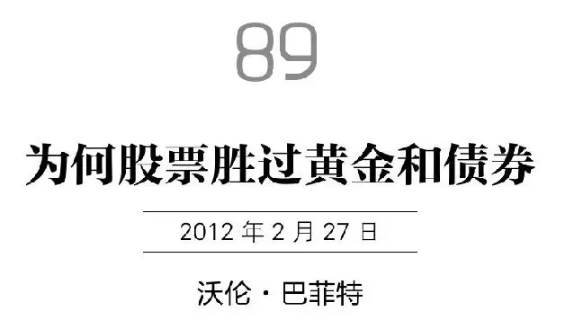

金子本身不会繁育出新的价值；债券也很少回馈投资者；而精挑细选出来的普通股票和土地则是具有生产性的资产，很有可能会为投资者带来丰厚回报。

上面这段话是您即将看到的这篇文章所传递的信息，本文是2011年沃伦·巴菲特致股东的信的节选（《财富》杂志为其命名了一个标题）。当然，巴菲特的投资生涯中还有其他指引他前进的准则。所以当您和我们一起探索完巴菲特46年的投资历程时，本文应该是一个完美的收尾。

不过，我们还是要在巴菲特46年的卓越成就上再添上一笔，无论是他投资者还是商人的角色。1966年，他创立了名不见经传的巴菲特合伙公司，还身兼新英格兰地区一家小型纺织企业伯克希尔哈撒韦公司的控股股东和事实上的掌舵人，为公司创造了4900万美元的年收入。到了2011年，伯克希尔哈撒韦公司已经成为《财富》500强企业中的第7名，年收入达到1440亿美元。这样的飞跃，虽然未被很多人知晓，即使巴菲特本人也惊诧于自己的出众表现，却是非凡得无以伦比的成就：在他有生之年，还没有其他任何一个人像他一样把一家默默无闻的小公司带到了世界500强的前10名。

巴菲特却不以为意，总收入对他来说没那么重要。市场价值才是他更注重的东西。2011年，伯克希尔哈撒韦公司位列500强的第九，总收入2020亿美元。排名在他前面的是另一家在近几十年崛起的商业巨擘，已故的史蒂夫·乔布斯创办的苹果公司，其同期市场价值达到了惊人的5690亿美元。巴菲特和乔布斯结识于几十年前，当时他们都是格林内尔学院董事会的成员。此后就甚少有交集了，但在不久之前，巴菲特回忆说，有一次乔布斯打电话过来向他咨询如何处置苹果公司过剩现金的事。虽然巴菲特给了他建议，但他并未采纳。

巴菲特的巴菲特合伙公司，早在1969年年底就关闭了，因为巴菲特不能容忍市场的投机行为。不过，当时公司的1亿美元为投资埋下了种子：收获了几个月前伯克希尔哈撒韦公司860亿美元的股权投资。巴菲特投资的重头横跨了整个美国经济界：彼时伯克希尔哈撒韦公司拥有价值156亿美元可口可乐公司的股票，137亿美元富国银行的股票，130亿美元IBM的股票以及88亿美元美国运通公司的股份。

2012年，伯克希尔哈撒韦公司所有功绩都被有关巴菲特的两条新闻夺去了光芒。第一条发生在比较早的2011年8月，《纽约时报》刊发了巴菲特的专栏文章《停止纵容富人》*（Stop Coddling the Rich）*。巴菲特将自己负担税率（17%）与他办公室内其他20位员工负担的（33%～41%）相比较，号召政府提高年收入超过100万美元人群的税率。在2012年大选年，奥巴马政府不仅接受了建议，还提高了这一比例，对“巴菲特规则”表示支持，当然这也立刻引起了轩然大波，因为对收入超过25万美元的人群都提高了税率。巴菲特开玩笑说，“我一直希望有一条税法以我的名字命名。”

第二条新闻发生于2012年4月17日，巴菲特通过媒体宣称，经诊断自己患有一期前列腺癌。9月中期，当我撰写这段文字时，巴菲特刚刚结束在奥马哈医院为期两个月的放射治疗。治疗期间，他也经受了很多痛苦，所以，不时抽出几天离家去工作，换换心情。巴菲特非常自信能够战胜这场疾病，再活很多年，因为大部分人也这样挺过来了，而且这恐怕也很难阻挡他跳着踢踏舞去上班的兴致。

——卡萝尔·卢米斯

投资，常常被形容为一种现在把钱投出去，并期待将来收获更多钱的过程。在伯克希尔哈撒韦公司，我们的标准更严苛，将投资定义为将现有购买力转移给他人，以期在未来合理地获取更强的购买力，当然是在名义收益的税款被扣除之后。简而言之，投资是放弃现阶段的消费以便在将来有能力消费更多。

我们对投资的定义还引出一个重要结论：投资的风险不是由贝塔系数[\10]而是由合理的概率来衡量的，即投资使其所有者在其预期的持有期间中丧失购买力的概率。资产价格有可能会大幅波动，但投资者只要合理地确保在持有期其购买力不断增强，资产投资就不会带来风险。我们会看到，某些价格无波动的资产投资却有可能充满风险。

投资机会不仅多，而且种类纷繁。尽管如此，我们还是可以总结成三大主要类别。了解每个类别的特性是非常重要的。因此，我们不妨来探索一番。

以给定货币标价的投资包括货币市场基金、债券、抵押贷款、银行存款和其他投资工具。大部分这些基于货币的投资都被认作是“安全”的。事实上，他们正是资产投资中最危险的部分。它们的贝塔系数可能是零，但其风险性却不容小视。

在过去的一个世纪里，这些金融工具已经摧毁了很多国家投资者的购买力，即便他们可以定时收到利息和本金。而且，这样糟糕的情况会永远重现。货币的最终价值是由政府决定的，系统性力量有时会引导政策走向通货膨胀，而且这些政策时不时地还会失控。

即使在美国，人们对货币稳定的渴望如此强烈的情况下，自从1965年我接管伯克希尔哈撒韦公司以来，美元贬值的幅度还是达到了令人难以置信的86%。当时1美元能买到的东西，今天要花不少于7美元。由此造成的后果是，一个免税的机构需要每年从债券投资中获得至少4\.3%的回报率才仅仅能维持原有购买力。如果投资管理者将回报中的任何一点儿看作“收入”的话，那真是滑天下之大稽。

对于纳税的投资者来说，比如你和我，情况就更糟了。同样47年间，美国国债的复合年回报率为5\.7%。听起来还挺让人欣慰的。然而，如果个人投资者缴纳了平均25%的个人所得税之后，这5\.7%的回报率能够带来的“真实收入”就会归零了。投资者可见的所得税会剥夺1\.4%的获益，而看不见的“通货膨胀税”则会将剩下的4\.3%吞噬殆尽。值得注意的是，隐性的“通货膨胀税”很可能是明确的所得税（我们投资者认定的主要负担）的3倍以上。我们的货币上印着“我们信仰上帝”，而操纵政府印刷机的“看不见的手”却过于人性化了。

当然，高利率能够抵偿人们所面临的以货币为基础投资的通货膨胀。然而，事实上，20世纪80年代初利率也完美地行使了这一使命。然而现阶段的利率却很难抵消投资者承担的购买力风险。现在，我们应给债券贴上高风险的警示标签。

因此，鉴于当下的情况，我不喜欢以货币为基础的投资。即便如此，伯克希尔哈撒韦公司仍持有大量此类投资，特别是短期类的投资。在伯克希尔哈撒韦公司，保持充足的流动性资金是重中之重，且永远不会有丝毫减少，不管利息有多低。为了适应这一需求，我们主要持有美国国债，这也是在经济环境最动荡之际，我们唯一能够指望的流动性投资。对我们来说，200亿美元是比较有效的流动性水平，而最低也至少要维持在100亿美元。

除了强加在我们身上的流动性要求及监管规定，只有存在非一般回报的可能时，我们才出手购买货币相关证券。发生这种可能的情况是，要么是信用被算错了，这有可能发生在周期性的垃圾债券崩盘之时；要么是债券票息率已上升至一定程度，能提供一种当利率一旦下降，高等级债券可能带来大量资本收益的机会。尽管我们在过去曾遇到过这两种机会，但将来也可能会再次遇到。如今，我们的预期已有了180度的大转变。华尔街的谢尔比·卡洛姆·戴维斯（Shelby Cullom Davis）在很久以前对债券的嘲弄，现在看来却是切中肯綮：“宣扬无风险回报的债券，现在的定价只能带来无报酬的风险。”

第二大投资类型囊括了那些不可再生的资产，但投资者购入的原因是希望其他人——那些也可能知道这一资产永不可再生的投资者，在未来以较高的价格再买入。这让我首先想到了17世纪时成为这类投资者宠儿的郁金香[\11]。

这种类型的投资仰仗投资者队伍的不断壮大，从而使更多投资者因相信队伍的继续扩张而被前赴后继地吸引进来。持有人并非被这些资产本身的产出所激励（这种资产永远不可再生），而是相信未来的其他人会更加热切地渴望这种东西。

这一类型中的代表性资产是黄金，目前大批对此感兴趣的投资者担心几乎所有的其他资产，特别是纸币的价值问题（如前所述，纸币日益贬值，投资者的担心不无道理）。然而，黄金天生具有两大显著缺陷：既没有多大用处，也没有生产新价值的能力。没错，黄金具有某些工业和装饰用途，但是对黄金的这两种需求不仅非常有限而且吸收不了新产品。与此同时，如果你一直持有一盎司黄金，到最终你也只能拥有这一盎司黄金。

激发大部分炒金客对黄金趋之若鹜的原因是，他们相信人们的恐惧心理会日益膨胀。过去的10年证明了这一观点的正确性。除此之外，黄金价格持续上扬本身也激发了人们更多的购买热情，将那些把黄金价格上升看成是验证他们投资理论正确的投资者吸引了过来。“弄潮儿”投资者不断加入，创造了自己的“真理”，但终将是韶华易逝。

在过去的15年里，互联网和房地产股票的崩盘已经证明，最初理性的投资题材与大肆炒作、股价飙升相结合，导致了大量的剩余。在这些泡沫中，一大批起初抱持怀疑态度的投资者，被市场传递的所谓“证据”征服了，而这批购买者的规模一度不断扩张到足以让“浪潮”不断地席卷开来。但是当泡沫被吹得足够大时，会不可避免地发生破裂。真是应了那句老话：“聪明人起头，傻瓜结尾。”

今天，全世界的黄金库存约为17万吨。所有这些黄金熔在一起，会形成一个边长为20\.7米的立方体。想象一下，差不多正好能够放入一个棒球场内场。以每盎司1750美元来计算（此文撰写时的黄金价格），这个立方体的市值约为9\.6万亿美元。我们姑且将这个立方体称为A组。

现在，我们用同样金额创建一个B组。我们可以买下美国所有的耕地（1\.6亿公顷，年产值约2000亿美元）以及16家埃克森美孚石油公司（全球最赚钱的公司，每年利润额超过400亿美元）。之后还剩下约1万亿美元可用作活动资金（这样大手笔的投资后，也丝毫不会感到手头紧张）。你认为一个坐拥9\.6万亿美元的投资者会选择A组，还是B组？

除了库存黄金令人难以置信的估值之外，当前居高不下的黄金价格也让如今黄金年产值达到了约1600亿美元。买家们，不管是珠宝制造商、工业用户，担惊受怕的个人，还是投机倒把者，必须不断地消化掉额外供应量，才能让现有黄金价格维持平衡。

从现在开始之后的100年内，1\.6亿公顷农田将产出无数的玉米、小麦、棉花和其他作物，不论我们采用什么货币，土地都会继续为我们创造丰富的物产。埃克森美孚石油公司可能也已向股东派发了几万亿美元的股息，且持有价值可能会超过数万亿美元的资产（而且记住，你手头拥有16家埃克森美孚石油公司）。在100年以内17万吨黄金立方体尺寸不会有丝毫变化，而且依然不会有任何产出。无论你怎样抚弄这个黄金立方体，它始终不会有任何反应。

不可否认，如果100年后的人们感到担忧，很多人可能还是会去抢购黄金。但我相信，A组当前9\.6万亿美元的市值在这100年内创造的复合回报将远逊于B组。

市场恐慌情绪达到顶点时，前面提到的那两种类别的投资会最受追捧：经济崩溃的担忧，会促使人们涌向基于货币的资产，尤其是美国债券；对货币体系崩盘的担忧会让人们购入黄金等无产出资产。2008年年底时，我们听到“现金为王”的呼喊，但事实上，当时人们本应该积极投资，而非持币观望。同样，20世纪80年代初时我们又听说“现金是垃圾”，而事实上，当时的固定美元投资处于我们记忆中最具吸引力的水平。在这些情况下，跟风的投资者为求自我安慰，都付出了沉重代价。

我们接下来要谈到的第三类投资就是我自己所偏好的，即对生产资产的投资，不管是企业、农场，还是房地产。在理想情况下，资产应该有能力在通货膨胀时期确保产出。只需最低水平的新增资本投入，便能够保持其企业购买力价值不变。农场、房地产和许多优秀企业，比如可口可乐公司、IBM以及我们拥有的时思糖果公司都通过了我们的双重考核。其他某些公司，比如受管制的公用事业公司，因为通货膨胀为其带来沉重的追加资本负担，因此不符合标准。为了获得更多盈利，股东必须投入更多的资本。尽管如此，这类对生产资产的投资还是优于非生产性投资和基于货币的投资。

不论100年以后的货币是黄金、贝壳、鲨鱼牙，还是一张纸（像现在一样），人们肯定还是会愿意用自己几分钟的日常劳动，来换取一瓶可口可乐或一些时思花生糖。未来，美国人肯定将运输更多的商品，消费更多的食品，要求更大的居住面积。人们将永不停歇地用自己生产的东西交换别人生产的东西。

我们的企业将会继续高效地为国人提供他们需要的商品和服务。换句话说，这些商业“奶牛”将会活上几百年，且源源不断地提供更多的“牛奶”以促进发展。决定这些商业“奶牛”价值高低的，不是商品交换的媒介，而是它们的产奶能力。对于奶牛的主人来说，来自销售牛奶的利润将会复合增长，就像20世纪的股票投资一样，在这100年间道琼斯工业平均指数从66点增长到了11497点，与此同时还派发了很多股息。

伯克希尔哈撒韦公司的目标是增持一流企业的股权。我们的首选是整体接手这些一流企业，全盘拥有，但是我们也可能通过持有大量流通股的方式成为拥有部分股权的股东。我相信假以时日，这类投资将被证明是我们前面分析的三类投资中遥遥领先的优胜者。更重要的是，到目前为止，这类投资也将被证明是最安全的。

本书由“行行”整理，如果你不知道读什么书或者想获得更多免费电子书请加小编微信或QQ：2338856113 小编也和结交一些喜欢读书的朋友 或者关注小编个人微信公众号名称：幸福的味道 id：d716\-716 为了方便书友朋友找书和看书，小编自己做了一个电子书下载网站，网站的名称为：周读 网址：http://www\.ireadweek\.com

## 火星崛起2_黄金之子（2015年美国Goodreads网站年度科幻小说！同名电影即将开拍，环球影业出品。） (全球顶级畅销小说文库 271)

\(88\) 火星崛起2:黄金之子（2015年美国Goodreads网站年度科幻小说！同名电影即将开拍，环球影业出品。） \(全球顶级畅销小说文库 271\)

如果你不知道读什么书，

就关注这个微信号。

微信公众号名称：幸福的味道

加小编微信一起读书

小编微信号：2338856113

【幸福的味道】已提供200个不同类型的书单

1、 历届茅盾文学奖获奖作品

2、 每年豆瓣，当当，亚马逊年度图书销售排行榜

3、 25岁前一定要读的25本书

4、 有生之年，你一定要看的25部外国纯文学名著

5、 有生之年，你一定要看的20部中国现当代名著

6、 美国亚马逊编辑推荐的一生必读书单100本

7、 30个领域30本不容错过的入门书

8、 这20本书，是各领域的巅峰之作

9、 这7本书，教你如何高效读书

10、 80万书虫力荐的“给五星都不够”的30本书

……

关注“幸福的味道”微信公众号，即可查看对应书单和得到电子书

也可以在我的网站（周读） [www\.ireadweek\.com](http://www.ireadweek.com) 这行下载

2026年3月14日

16:57

## 致谢 致敬巴菲特的精彩人生

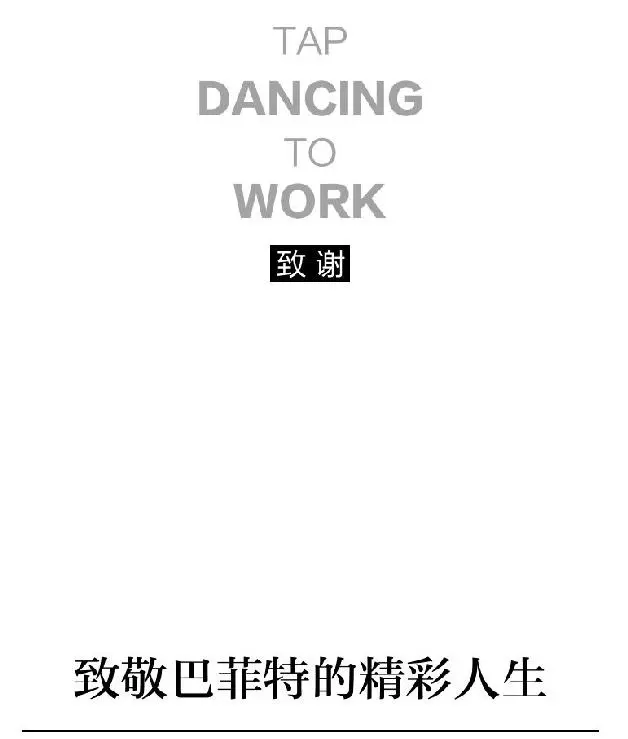

《财富》杂志第一次提及沃伦·巴菲特，是在1966年。当时伯克希尔哈撒韦公司股票（现在的A股）价格为22美元左右。而到了2012年9月中旬，这个价格已经达到了133000美元。

如果没有沃伦·巴菲特，这本书不可能完成。谢谢你，沃伦，谢谢你精彩的人生，让我能够有机会策划这样一本书，即使以前我从未预料至此。

如果没有多丽丝·伯克，这本书也不可能完成。伯克是《财富》杂志的一位同仁，尽管学的是图书馆专业，却成长为一名如此专业的商业作家（很多《财富》文章的作者）。每当编纂文章，甚至对整本书犯难时，她都会成为关键的助手。书中的一篇文章也出自她手。而在我心目中，书中很多地方都留下了她的印迹。

和伯克一道进行事实搜集的同事玛丽莲·阿达莫（Marilyn Adamo）也提供了莫大的帮助（这也就是为什么两人从未在同一时间放过假）。

我也不会忘记《财富》杂志诸多同事给我的帮助。我的上司，瑟沃·安迪和汉克·吉尔曼（Hank Gilman）以及他们的老板，时代集团（Time Inc）的总编约翰·休伊，对于我因为一些变故没能及时截稿而给予充分的宽容。没能在几年前完成这本书，却是一份意外的福气。因为如果我早就完成，就不会有巴菲特的《我的慈善承诺》，也不会有巴菲特与门徒合伙企业打赌的故事，甚至不会有关于戴维·索科尔的章节。然而，当我“火力全开”准备大干一场时，又遭遇了手部手术（无法打字）、在家养病，家人为了我付出了大量的时间。我对所发生的一切都深怀感恩。

除此之外，当安迪还只是一名作家、没有成为杂志主编时，就写下了书中收录的三篇文章，这也使他堪称本书第二作者。吉尔曼也在关注着本书的每一步进展，从最初的合同到最终签约，再到最后定稿，前前后后都留下了他的智慧印迹。安迪和吉尔曼，是他们，让我感觉与《财富》杂志的合作有种溢于言表的乐趣。在《财富》，我已经幸福地工作、生活了将近59年。

米娅·迪尔（Mia Diehl），《财富》杂志的摄影导演，梳理了我们珍贵的巴菲特照片库，用自己一贯独到精准的眼光，挑选出了生动而又特别的留影。查德·麦凯布（Chad McCabe）协助完成了设计工作。

全书中一共有90个独立“单元”，包括全文文献、节选、讲话稿（可以这么说）以及读者来信。《财富》杂志的资料尚未完全数字化（本书的这些部分还只是零头），或者说有些数字化的资料并没有多少帮助，所以将资料转化成易于处理的形式也是一个不小的挑战。卡伦·惠勒（Cullen Wheeler）、克里斯·特卡奇克（Chris Tkaczyk）和凯利·钱皮恩（Kelly Champion）为这项枯燥的工作付出了很多心血。最后，卡比·莱昂斯（Cappy Lyons）将一系列的文章转换成word文档，为我的工作带来了很多便利。谢谢大家的无私帮助！

卡萝尔·格温（Carol Gwinn）和阿尔菲·格雷厄姆（Alfie Graham）负责的《财富》杂志影印部门是我最喜欢的，也是最常去的地方。这两位帮助我校正文法，保持语言简洁，当然我希望如此。他们的同事安杰尔·麦斯（Angel Mass）总能够及时将各种表格发给我。

我还要感谢时代集团负责本书工作的律师埃米·格利克曼（Amy Glickman），在很多细节方面，他都考虑得相当周全。除此之外，格利克曼还将本书的电子稿带回家，利用周末仔细地阅读了一遍，告诉我她非常喜欢本书的中间和结尾部分，因为令她倍感兴趣的不仅是巴菲特的故事，还有书中对美国商业历史发展的概述。如果我们都能拥有这样的律师，那该多好！

至于我，从未想过要出版一本书，却十分幸运地获得了代理商特雷西·布朗（Tracy Brown）的支持，他对业务的熟稔总是让我在精神紧绷的时候得到舒缓。他不愧为作者的知心人，他看到本书初稿的第一秒就爱上了这本书，当然他也喜欢书的封面。我想我已不能要求更多。谢谢你，布朗，谢谢你毫无保留的支持。

我的感谢还要给予阿德里安·扎克海姆（Adrian Zackheim），Portfolio出版社的总裁，本书的出版商。他非常了解商业类书籍的市场，所以他对《跳着踢踏舞去上班》一书满怀信心投下的赞成票令我本人和《财富》杂志都非常振奋。他的同事威尔·韦泽（Will Weisser）、埃米莉·安杰尔（Emily Angell）以及布里亚·桑福德（Bria Sandford）将本书的出版日程规划得相当紧凑。是的，荣誉应属于所有人。

当我编纂本书时，在我的脑海里不停闪现的是为本书贡献了文章的许许多多编辑、作者、记者伙伴的名字和面庞。在我开始着手本书的时候，他们都是巴菲特问题的研究“专家”。按照《财富》杂志一贯的风格，文章编辑几乎都是匿名的。但是我要特别感谢三位编辑：蒂姆·史密斯（Tim Smith）、尼克·瓦切费（Nick Varchaver）以及布赖恩·奥基夫（Brian O’Keefe），正是因为他们的辛勤工作，我们才读到了巴菲特的精彩故事。是奥基夫，想到了我本人最喜欢的一个标题“20多年历史的110亿美元”。

那些虽不是以脑力形式，却也为本书的文章贡献一己之力的人们，我将按照他们姓氏的字母顺序罗列如下：玛丽亚·阿塔纳索夫（Maria Atanasov）、爱德华·贝格（Edward Baig）、凯特·巴伦（Kate Ballen）、苏珊娜·巴林（Suzanne Barlyn）、罗莎琳德·克莱恩·伯林（Rosalind Klein Berlin）、朱莉娅·布尔斯廷（Julia Boorstin）、多丽丝·伯克（再一次）、约翰·柯伦（John Curran）、埃里克·达什（Eric Dash）、帕蒂·德洛萨（Patty de Llosa）、达丽娜·丹尼斯（Darienne Dennis）、简·福洛普（Jane Folpe）、卡丽·戈特利布（Carrie Gottlieb）、戴维·柯克帕特里克（David Kirkpatrick）、克劳丁·奈特（Claudine Knight）、苏珊·库恩（Susan Kuhn）、迈克尔·麦克法登（Michael McFadden）、乔·麦高恩（Joe McGowan）、安东尼·米歇尔斯（Anthony J\.Michels）、露丝·莫斯（Ruth Moss）、帕特里夏·尼林（Patricia Neering）、卢·里奇曼（Lou Richman）、埃伦·舒尔茨（Ellen Schultz）、萨莉·谢弗（Sally Shaver）、比尔·希林（Bill Sheeline）、罗伯特·斯泰尔（Robert Steyer）、娜塔莎·塔普利（Natasha Tarpley）、卡萝尔·文赞特（Carol Vinzant）、梅拉妮·沃纳（Melanie Warner）和威尔顿·伍兹（Wilton Woods）。

从我着手准备这本书开始，我就知道自己有很多很多故事可以讲述。让我大感意外也非常惊喜的是，大约还有40位作者（目前多为杂志的同人）也贡献了他们的故事。不得不提的是已故的丹·塞利格曼，他也是我的导师。还有很多像他一样的人，都是我亲近的朋友。几乎所有我尊重的人都曾经或依然在该杂志社供职。长期以来，《财富》杂志一直都很幸运能拥有这批出色的作者以及编辑。他们中的大多数已经成为业界翘楚，是我们杂志高质量的标杆。

我很高兴能够有机会在此再次展现他们的才华。同样令我非常开心的是，我再一次认识到每篇文章的作者都真实地和巴菲特有过接触，他们用自己卓越的文笔将巴菲特伟大的观念诉诸文字，呈现给全世界一份出色的纪实作品。

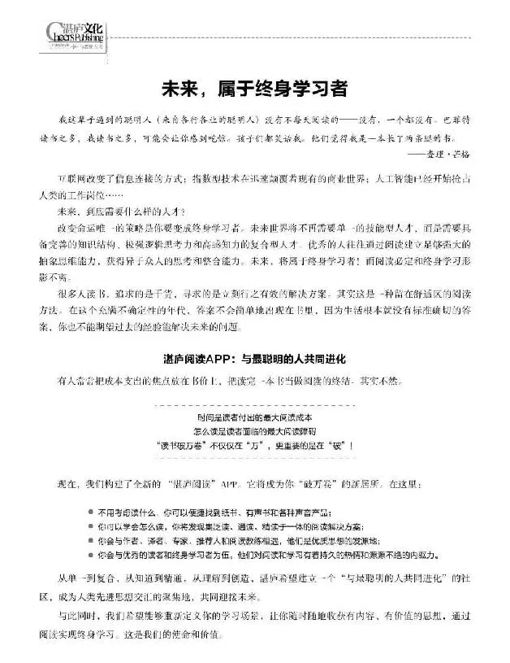

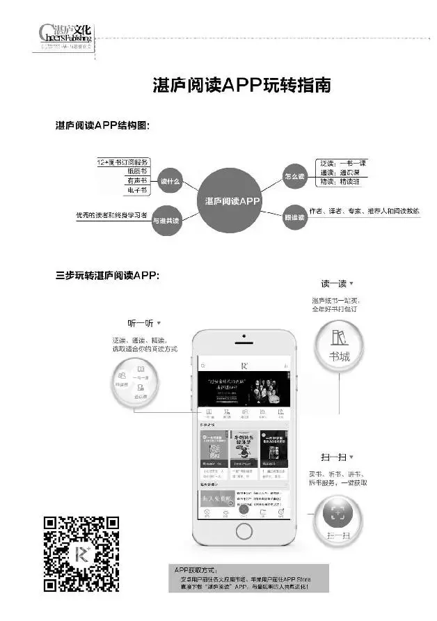

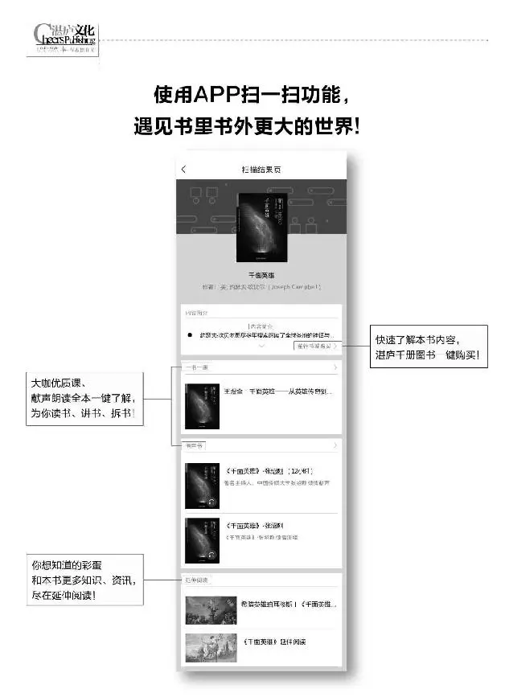

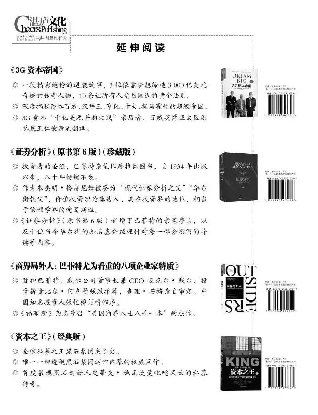

## 跳着踢踏舞去上班_巴菲特的快乐投资与人生智慧

\(90\) 跳着踢踏舞去上班:巴菲特的快乐投资与人生智慧

[\1]本杰明·格雷厄姆（Benjamin Graham），被誉为“现代证券分析之父”“华尔街教父”，价值投资理论奠基人，其在投资界的地位，相当于物理学界的爱因斯坦，生物学界的达尔文。其经典著作《证券分析》（原书第六版）由巴菲特亲笔作序推荐，该书已由湛庐文化策划，中国人民大学出版社出版。——编者注

[\2]西格玛是一种用来衡量一个总数里标准误差的统计单位。——编者注

[\3]美国证券交易监督委员会规定，美国机构投资者必须在每个季度后的45天内填写规定表格F\-13，向证券交易委员会报告自己投资组合的头寸和类别。——编者注

[\4]“漂亮50”（Nifty Fifty）是美国股票投资史上特定阶段出现的一个非正式术语，用来指20世纪60年代和70年代在纽约证券交易所交易的50只备受追捧的大盘股。——编者注

[\5]约翰·博格，指数基金教父。其《共同基金常识》一书堪称基金领域的“圣经”。该书10周年纪念版由湛庐文化策划，于2017年9月出版。——编者注

[\6]巴里·邦兹（Barry Bonds），美国著名职业棒球运动员；巴里·斯维泽（Barry Switzer），美国著名橄榄球运动员及教练；艾略特·斯皮策（Eliot Spitzer），美国纽约州第54任州长。——编者注

[\7]美国总统胡佛于1930年6月签署“史慕德\-哈利法案”（Smoot\-Hawley），触发了全球贸易报复行动，导致世界贸易迅速衰落。——编者注

[\8]南海泡沫事件（South Sea Bubble）是指英国在1720年春天到秋天之间发生的一次经济泡沫，它与密西西比泡沫事件及郁金香泡沫并称欧洲早期的三大经济泡沫。“经济泡沫”一词即源于南海泡沫事件。——编者注

[\9]拍卖利率债券，auction\-rate securities，一种定期通过拍卖重新设定利率的债券。——编者注

[\10]一种评估证券系统性风险的工具，用以度量一种证券或一个投资证券组合相对总体市场的波动性。——编者注

[\11]17世纪，荷兰的郁金香一度在鲜花交易市场上引发了一场异乎寻常的投资狂热，导致郁金香球茎供不应求、价格飞涨，郁金香市场成为投机者伸展拳脚、无序的赌池，然而当时人们购买郁金香不是为了其内在的价值或作观赏之用，而是期望其价格能无限上涨并因此获利。最终，这场疯狂举动导致了后来的“郁金香泡沫”事件，这是人类历史上第一次有记载的金融泡沫。——编者注

2026年3月14日

16:57
