# 《星公司解密巴菲特股市投资法则》全文合订版

> 共17个章节。原章节顺序、段落结构和图表均予以保留。

## 第1章 晨星公司从事股票研究的指导原则

__第1章 晨星公司从事股票研究的指导原则__

跑赢股票市场的关键在于三项要素：可持续竞争优势、估值以及安全边际。我们运用这三项要素去回答两个问题——

■我们如何才能识别出那些伟大的公司？

■何时才是投资伟大公司的最佳时机？

何为护城河？在大多数人的心目中，这个词语意味着为防御外来入侵而在城堡四周挖掘的环城河流。我们将这一概念借鉴过来，运用于投资领域，就形成了经济护城河的概念：它指的是一套可保护公司抗御竞争的结构化屏障。

在晨星公司，我们始终秉承投资的最基本含义来看待投资：我们想要长期持有伟大公司的股票。什么样的公司算得上是伟大的？本质上，我们认为，伟大的公司有能力抵御竞争，能在未来很长时期维持高的资本回报率——盈余不断提升，向股东回报现金，内在价值实现复合式增长。识别出这样的公司是我们进行经济护城河分析的目的，也是我们做出晨星经济护城河评级的目的，这些都是本书在接下来的章节将要详细探讨的话题。

能够发现伟大的公司固然重要，但更重要的是在这家公司的股票还处于绝佳价位时就发现它。股票市场提供了股票价格变化的动态信息，投资者可以不分昼夜、不分地域地买卖股票，交易机会貌似唾手可得。但纵观历史可发现，股票市场噪音重重，想要取得长期投资的成功，关键是要准确估算公司基本现金流的价值。当你集中于分析公司基本价值与股票价格的相对关系，而不是观察今天的股票价格是否不同于1个月前，1天前，甚至5分钟前的价位时，你就是在以一位所有者，而非交易者的身份思考问题了。以所有者的身份来思考会使你成为一名更好的投资者。

如果你正在寻找的是一本教你利用股票投机快速致富的书，恐怕不能在本书中得偿所愿。本书的目的是为你构建一个基本分析框架，帮你实现成功的长期投资，我们不得不承认，这一框架凝聚了我们在实践中积累的全部经验。本书将帮助你回答两个关键问题：如何识别伟大的公司，以及为实现收益最大化，何时才是投资伟大公司的最佳时机？如果在多数时候你都能正确地回答这两个问题，那么你就很好地掌握了投资的成功之道。

十多年前，当晨星公司刚开始分析股票时，我们就事先确立了一些核心指导原则，这些原则一直被沿用至今。从那时起，我们的分析工作就围绕以下3项要素：可持续竞争优势、估值以及安全边际。我们相信，这3项要素是公司股票得以持续跑赢股票市场的关键所在。那么，这3项要素是如何被明确界定的？它们又为何重要？本书会详尽地解答这些问题。在接下来的章节里，我们将对每一项原则逐一加以介绍，并集中讨论如何识别拥有可持续竞争优势，即经济护城河的公司。

__问题1：我们如何才能识别出那些伟大的公司__

这个问题的答案就是寻找那些拥有可持续竞争优势，即经济护城河的公司。恰如环绕在中世纪古堡周围，防止敌人入侵的护城河一样，经济护城河保护世界上那些伟大的公司维持高的资本回报率。

__护城河__

1999年《财富》杂志刊登了一篇著名的文章，作者是传奇的投资人沃伦·巴菲特，他写道：“投资的关键在于确定一家指定公司的竞争优势，尤为重要的是，确定这种优势的持续期。被宽阔的、长流不息的护城河所保护的产品或服务能为投资者带来丰厚的回报。”感谢巴菲特先生的启示，晨星公司将经济护城河理念向前推进了一步，开发出一套普遍适用于全球上市公司的综合分析体系。

当一种对企业有利可图的产品或服务被推出市场时，其他企业也会利用这一商机，迅速生产出相似品，或是原有样式下的改进品。根据微观经济学可知，在一个完全竞争的市场里，竞争产品最终必定让商品的超额利润丧失殆尽。诺基亚公司曾为自己在移动手机行业长期拥有巨大的市场份额而沾沾自喜，然而苹果公司于2007年推出的iPhone手机，以及随后纷繁涌现的智能手机让裹足不前的诺基亚最终折戟沉沙。同样的变革也发生在游戏产业。曾经的行业巨头任天堂公司也眼睁睁地看着自己标志性的、深受家庭喜爱的专利产品被其他功能强大的新型游戏机迅速赶超。这些新型产品，比如微软公司的Xbox以及索尼公司的PlayStation，以功能强大、有第三方软件支持的优势抢占了市场。与此同时，移动设备也不断地侵蚀任天堂在手动游戏市场的主导地位。由此可知，利润总能吸引来竞争者，而竞争使企业难以长期地维持强劲的增长和超额的利润。

但确实有一些公司能够长期地维持高资本回报率。这样的公司有能力在较长的时期内抵御无情的竞争攻击。它们如同一台台以复合方式创造财富的机器，它们就是我们想要发现和投资的公司。

有必要指出的是，经济护城河必定是由公司本身所拥有的结构化因素构成的。我们所要寻找的并非是那些只能在短期赢过竞争对手的公司，也不是那种资本回报率随商业周期得到改善的公司，而是能够凭借业务能力及所在行业的结构维护其高额利润的公司。换句话说，尽管管理确实能在经济护城河的加固或诋毁上发挥作用，但管理本身不能成为经济护城河的根基（详细内容请见第4章）。

__护城河与价值创造__

一家公司能为自己，为股东创造多少价值取决于两项因素：一是它在当前创造的价值量；二是它在未来很长时期内持续创造价值的能力。第一项因素已经被市场充分了解，投资者可以根据基本的财务报表轻松地计算得出。只有第二项因素，未来超额收益的大小及持续期，是很难确定的，但它对成功的长期投资更为重要。

换一种方式来说明这点的话，假设有三家公司，每一家都有着相似的投资资本回报率，或简称为ROIC。能将这种超额收益维持最长时期的那家公司将有能力为投资者创造最多的价值。见图1\-1，优势期限最长的公司拥有最宽阔的护城河，是最大的价值创造者（曲线下面的面积即代表公司创造的价值）。

图1\-1 用超额收益的持续期度量护城河

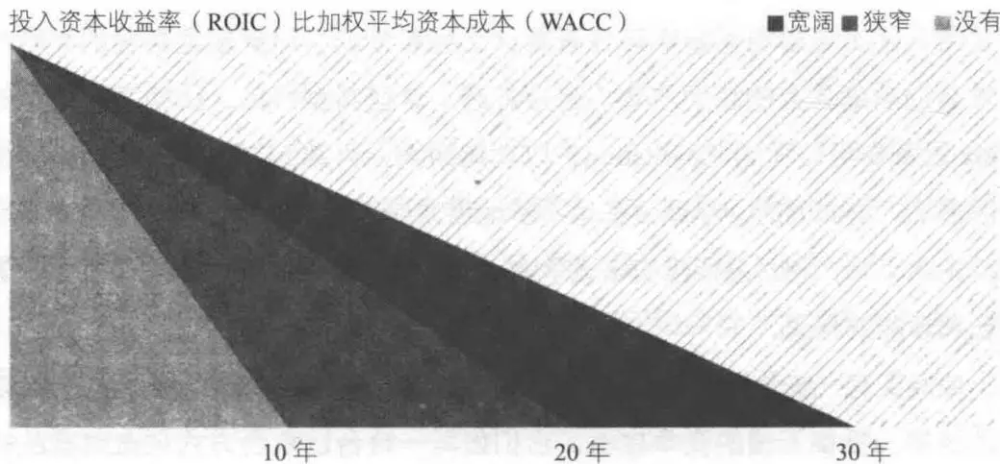

__护城河在行动__

在现实中，经济护城河对公司来说意味着什么？我们以电力行业中的ITC控股为例。电力传输绝对算不上是一个新潮的行业，但这家公司的投资者却享受到了两位数的收益增长，其稳健的资本回报率得益于该公司拥有的市场控制地位，以及长期有利的监管体制。这一“沉闷”的电力公司实际上拥有宽阔的护城河，在未来的岁月里，这种护城河优势能够保护公司的高收益率。它的竞争对手几乎没有什么动力想要建造竞争性的传输线路，因为ITC拥有的线路已经满足了市场的所有需求；并且，新建线路需要投入的资本成本非常之高，以至于边际利润非常之低，这个行业没有足够的利润空间容纳两家竞争性的传输企业。此外，ITC也受益于监管保护。联邦能源监管委员会只有在新电力需求出现时才会批准新建传输线路。虽然作为监管保护的交换条件，ITC不得随意收取电费，但其官方拟定的收费标准允许ITC涵盖其生产成本，获得合理的投资回报。我们认为，不同于多数公用事业公司（其费率一般由过后计算得出），该公司的费率具有透明性及可预测性，这使得ITC的资本成本比同行业对手更低，现金收入更稳定，因而更受投资者的喜爱，我们预计这些在未来也是可持续的。

相比之下，那些以乙醇为燃料的能源公司则不拥有护城河，比如太平洋乙醇（Pacific Ethanol）、维拉太阳能（Vera Sun Energy）、阿文丁再生能源（Aventine Renewable Energy），这些公司在过去十多年里快速兴起，又快速消失。受政府政策的刺激以及过热的IPO浪潮的冲击，乙醇的狂热在2006年中期达到了极度亢奋的状态。但两年后，市场对玉米燃料这类“神奇产品”的预期由亢奋转为失望，那些参与其中的投资者遭受了数以亿计的亏损。这一实例说明，想在一个不拥有护城河的行业中取得好的收益是不可能的。过低的进入门槛不断地将竞争者引入市场，既有厂家无法维持成本优势，最终行业会出现供给过剩的现象，因而参与各方很难甚至不可能获得盈利。

__护城河的来源__

依据多年来对公司的研究，我们已经识别出经济护城河的5大主要来源。在下一章，我们会对每一项来源逐一深入地讨论，在此，我们只对它们简单概述。

__1\.无形资产__

无形资产包括品牌、专利，或政府牌照，很明显这些能让竞争对手陷入困境。

__2成本优势__

如果公司有能力以更低的成本提供产品或服务，那么它就拥有了成本优势。公司能以更低的价格参与竞争来抢占市场份额，也能以与竞争对手相同的价格出售产品或服务，但获得更丰厚的利润。规模经济就是一种成本优势，我们将会在下一章详细地讨论这一想法。

__3\.转换成本__

在同类产品中进行转换，顾客会因此遭受不便或产生费用支出，我们将之称为转换成本。当顾客面临高昂的转换成本时，就不会轻易地尝试新的产品，

除非新产品在价格或功能上有很大的改善。在某些行业，即使存在这种大的改善，顾客还是会顾虑到变换产品可能带来的风险，从而放弃转换。

4\.网络效应

当某一特定产品或服务的价值随着越来越多新老用户的使用而增加时，网络效应便出现了。网络效应通常会导致循环强化，让强大的公司变得更加强大。

__5\. 有效规模__

有效规模描述的是一种动态机制，指的是一个规模有限的市场只能容纳一家或刚好几家公司有效率地提供服务。如果潜在的竞争者不愿意进入这一市场，那么所涉公司能够获得经济利润；如果新的竞争者进入市场，则会导致所有厂家都得不到足够的盈利。

__评定护城河等级__

在评定护城河等级时，我们会首先考虑上述5项定性因素，但同时也会寻求护城河的定量证据，比如，公司获取投资资本超额收益的能力。投资资本回报率（ROIC）与资本成本的差额有着重要的意义，但这一差额的重要性还远不及超额收益的预期持续时间。当我们相信一家公司很可能从竞争优势中获利，且其赚取超额收益的时间至少可达10年之久时，我们会为这家公司评定一个狭窄的护城河等级；当我们几乎可以肯定一家公司在接下来的10年获取超额收益，并且可能在接下来的20年里持续如此时，我们就会为这家公司评定一个宽阔的护城河等级。很明显，赢得宽阔的护城河等级有着很高的门槛，纵览全球所有的上市公司，我们只对不到200家公司给出了宽阔的护城河评级。

__问题2：何时才是投资伟大公司的最佳时机__

也许你会急于作出结论说，拥有宽阔护城河的公司如此稀少，如此伟大，以至于在任何时候发现了这样的公司，你都应该买入，并且只要该公司的竞争优势保持完好，就一直持有下去。然而，对公司的竞争优势的判断并不能完全决定投资的成败。我们的研究显示，虽然宽阔的护城河会为你的投资组合带来阿尔法值，但只有当你以低于公司内在价值的价格购入股票时，持有宽阔护城河的股票才会呈现出更加明晰、更加可持续的优势。

__估值的重要性__

估值在投资中极为重要，只要稍作思考，你就会明白这一点。举例来说，一栋只值50万美元的房子，你是不会愿意为它支付65万美元的，其原因在于，即使这栋房子是件伟大的杰作，可是要让市场将它的公允价值认定为65万美元，还需要若干年的时间，到那时，你的真实购买力可能早已由于通货膨胀而大幅缩水。但假设你按公平的市场价，即50万美元买到这栋房子，对你而言，这栋房子就是按照市场收益率来增值的；而理想情况下，你最好以更低的价格购入这栋房子，比如45万美元，这样，你的收益不仅来源于市场收益率，同时也来源于优惠价差。

尽管很多投资者会陷入每天的股价波动之中，但股票投资在本质上与实物投资一样。只有为股票评估出公允价值，并且在低价的时点买入，投资者才能在未来获得超额收益。

__估计公允价值__

要在公平市价的基础上折价购买一项资产，成功的关键在于准确地估计公司将来所能产生的现金流。这很不容易，但我们通常有很多不同的方法可以采用。有些分析师会观察当前的现金流及盈利，以此作为现金流的代理变量，他们会借助于某一盈利乘数近似地估测公司的预期现金流水平，及其增长率的持续时间。也有些分析师会假定一个永续的增长率，比如采用长期通货膨胀率的估计值，运用这一数值来计算公司直到无限远时期的预期现金流，然后将这些现金流贴现到现在时点。

在晨星公司，为了尽可能准确，我们采用一种基础方法来做估值分析，我们对所要研究的每家公司都构建一个贴现的现金流模型。这方面的细节内容我们会在第5章详述。不过，我们可以在此处简略地概述一下该模型的思路。在研究了公司及所在行业之后，我们会明确地估计出公司在未来若干年（5至10年，具体时间取决于不同的环境条件）的营业收入、盈利、资产负债表以及现金产出。基于微观经济学理论，由于竞争会让所有的超额收益化为乌有，我们假定所有企业在长期只赚取等额于其资本成本的收益——但我们假定拥有宽阔护城河的公司会比只有狭窄护城河的公司在更长时期内赚取超额收益，后者也会比没有护城河的公司在更长时期内赚取超额收益。然后，我们利用企业的资本成本估计值来对未来的现金流贴现，得到其现值。

这一过程中的很多环节存在着不确定性，因而，我们需要采用额外的步骤来加强我们的分析，根据潜在的未知（有时是不可知的）因素进行调整。首先，我们特别强调情境分析，即考察公司在不同情形下的价值。重要的是，投资者要认识到，任何公司的实际公允价值都不可以被确切地估算，因而，我们只能尽量地了解可能结果的范围，并尽力地缩小范围区间。其次，在投资之前，我们总是在不断地寻找安全边际，哪怕是在面对一家有着宽阔护城河的公司的时候。

__安全边际__

安全边际这一概念已问世几十年，传奇的价值投资者，如本杰明·格雷厄姆（Benjamin Graham）、沃伦·巴菲特以及塞思·克拉曼（Seth Klarman），都在自己的投资生涯中广泛地运用安全边际。它的基本思想是，由于无人确切知道证券的公允价值，只有以明显低于公允价值的价格购入证券才能提升投资的成功概率。这样，即使证券的内在价值实际低于你的估计值，但由于你是折价买入，还是有较高的概率取得正收益。

不同的公司要求不同的安全边际，既然如此，了解如何根据不同的情况提出不同的折价要求会提高你的胜算。据此，我们开发出晨星不确定性评级系统，在推荐买入（或卖出）某支股票之前，这一系统帮助我们明确地鉴别目标股票的折价率（或溢价率）。我们认为，不确定性可以被归结为目标公司未来现金流的预测难度。为了做好这一度量，我们通常考察销售收入、经营收益以及财务杠杆这些指标在经济周期各阶段的变动频率及幅度，也考察公司的特定风险。之所以如此，是因为那些销售收入大幅变化、固定成本高以及债务负担重的公司，如水泥制造商墨西哥水泥公司（Cemex），会比那些收入平稳、经营策略保守的公司，比如食品巨头雀巢公司（Nestle），在公司现金流预测上困难得多。

现在，我们大致总结一下我们的股票研究流程：寻找护城河，确定公允价值，留下犯错空间。这些说起来容易，做起来难。我们将会在接下来的章节对此逐一进行深入细致的探讨，并且教你运用晨星公司的实战技术来处理每一个问题。

在整部书中，我们会引用大量的具体公司实例，以说明我们在实际操作中是如何运用护城河理念以及估值方法的。在第2章，我们会详细地探讨经济护城河的5大来源。第3章将会集中于解析护城河趋势，对护城河随时间推移的发展提供趋势性前瞻——这一护城河趋势对公司竞争地位是如何演化的做出更加动态的评价。第4章、第5章将会详细阐述如何将管理层能力与管理工作整合到公司护城河的评价中去，其中特别关注的问题是资本配置及红利问题。

在接下来的一章，我们转到估值方法论上，向你展示我们采用的贴现现金流操作流程，让你看看我们是如何利用这一方法来为公司估值的。在这一部分，我们还会列举若干真实的投资组合实例，展示如何将护城河、估值及安全边际运用到实践当中。

本书的下半部分将引导大家思考如何分析具体行业的护城河。我们会指出各行业的具体特征，介绍公司竞争优势的评估如何与其所在行业相关联，列举各行业在护城河上存在的差异，为你深入透析公司护城河的实战分析方法。

在本书中，我们会与读者分享我们投资理念背后的细微之处，将确定公司护城河、公允价值以及安全边际的方法倾囊相授，让读者在自己的投资决策中能真正运用这些方法。

2026年2月13日

20:48

## 第2章 护城河的5项来源

__第2章 护城河的5项来源__

实际构筑起护城河的是5项可持续竞争优势——无形资产、成本优势、转换成本、网络效应以及有效规模。

相信你已经大体了解了经济护城河的含义及其对投资的重要意义，接下来让我们更详细地探讨如何界定及识别单个公司的护城河。

为了确定一家公司的经济护城河等级，我们先要问两个问题。

（1）在未来，公司的投资资本回报率，即ROIC，是否有可能超过其加权平均资本成本，即WACC？

（2）公司是否至少具备5项可持续竞争优势之一（这5项分别是无形资产、成本优势、转换成本、网络效应以及有效规模）？

我们的护城河方法论既考虑到定量与定性因素——ROIC与WACC之差（即经济利润），也考虑到护城河来源，两者兼顾。当一家企业的盈利既超过其会计成本，又超过投资者提出的机会成本时，这家企业就在创造经济利润。一家不创造经济利润的企业是不能为投资者赢得回报的。

想要清楚地估计企业未来的经济利润，考察其可持续竞争优势，在进行股票分析时就要仔细地研究公司及其所在的行业。在晨星公司，我们在分析流程中会考察目标公司的财务报表、访谈管理层、必要时访问企业的基层、阅读行业出版物。对这些基本资料的分析是前瞻公司未来盈利能力及竞争力的关键步骤。如果我们预计目标公司的ROIC会超过其WACC，并且至少拥有5大竞争优势之一，就很可能为这家公司授予狭窄的甚至宽阔的经济护城河评级。但调研不会停留于此。接下来，我们要评估公司在未来10到20年产生正经济利润的能力。在自由的市场经济里，竞争对手最终会侵蚀掉没有护城河保护的公司所赚取的超额利润——只要我们按较长的时间尺度来观察，就会发现，时间和资本需求都不是阻止新进入者入场的有效屏障。有些公司也许能在当前及未来几年产生正的ROIC与WACC之差，但如果它们的竞争优势不具备足够的持续性，随着时间的推移，竞争对手就会开始蚕食它们赚取的超额利润。

因而，如果我们确信一家公司至少拥有一项可持续竞争优势，且其经济利润至少能够持续10年，就会授予它狭窄的护城河评级；如果我们确信一家公司的经济利润至少能够持续20年，就会授予它宽阔的护城河评级。我们相信，经济利润的可持续性远比其数值重要得多。换句话说，一家能将中度经济利润持续20年之久的公司，相比于一家只在短期几年有着极高的投资资本回报率的公司，更值得享有宽阔的护城河评级。虽然10到20年的要求多少有些武断，但我们的用意是提醒投资者要关注公司长期的现金产出潜力，及其超额收益的持续时间。要特别强调的是，投资者要在正常状况下，或者说是在“周期中部”的环境下考察公司的经济利润。如果一家公司只是在行业高峰阶段产生了强劲的ROIC，我们是不会将它列为护城河评级候选对象的。另外，如果一家公司因为处于行业的最低谷阶段，或受到某些特殊的一次性因素的影响，现在不能赚取经济（甚至会计）利润，也不排除它获得护城河评级的可能。

请注意，我们的护城河评级标准是绝对而非相对的。我们要求考察一家公司是否具备：（1）可持续的竞争优势，（2）在未来10年甚至更长时期内产生正的经济利润的能力。在一些行业中不仅仅最佳公司能够获得狭窄或宽阔的护城河评级，但也有些行业中根本就不存在具有可持续竞争优势的公司。为了确保我们的评级方法在我们所涵盖的总体样本中得到一致的运用，确保晨星公司的股票研究始终围绕经济护城河这一中心，我们从晨星股票研究团队中选拔了15位高级经理组成一个专门委员会，由他们审查每家公司的评级。这个委员会的成员分别负责不同的行业，为每个行业内的公司评级都设定了一个行业参照。我们也会设法规避一些常见的陷阱，比如认为只有行业中的最佳公司才理应享有宽阔护城河的等级，或拥有“行业最佳”称号就自动等同于拥有可持续竞争优势。

现在，我们可以一项项地探究护城河的来源了。如果你阅读几份上市公司的10\-K年报，就会发现大多数公司都会在其中列出一系列的竞争优势，比如专利、品牌、成本优势或强大的客户关系，这些听起来挺具有护城河意味的，但公司却未必能真正地从中获益。另外，在多年阅读10\-K年报的过程中，我们发现极少有公司会明确地提及转换成本、网络效应及有效规模方面的优势，我们需要做额外的分析来挖掘这些护城河来源。因而，对每一项来源，我们都设计了一系列重要的问题，用以确认一家公司是否拥有狭窄或宽阔的经济护城河；对每一种来源，我们也都提供了几个实例，这样，你就能看出这些来源在真实世界里是如何发挥作用的。

__无形资产__

无形资产是一个大类，包括品牌、专利及监管牌照。

__品牌__

如果品牌促使顾客支付意愿上升及顾客忠诚度增加，这一品牌就在公司利润周围构筑起了一道经济护城河。拥有护城河价值的品牌能给企业带来定价能力，或可复制的商业模式，甚至能转化成为可持续的经济利润。

__关键问题：品牌__

-
1. 如何量化公司品牌的实力？公司品牌包含多少定价能力？相对于竞争对手，公司在产品定价上可收取多高的溢价？高的品牌认可度并不必然可以转化为定价能力，只要想一想航空公司，不管是联合航空还是美国航空，你就会明白这一道理——你可能对这样的品牌耳熟能详，但这并不意味着你会愿意为联合或美国航空公司支付更高的票价。不考虑座位等级、里程计分及行李费用，我们多数时候只会基于成本做出购买决定，因此航空公司的盈利能力并不是很强，大多数航空公司都缺乏可持续的竞争优势。
2. 高定价是否会被高成本抵消掉？相较于竞争对手，有些公司的确会 收取更高的费用，但这只是反映了公司更高的生产成本。一个真正具备护城河价值的品牌，必须享有定价能力，并且这一能力不会被高成本完全抵消掉。
3. 与那些不具强势品牌的对手相比，公司的利润率有怎样的不同？如果没有具体的价格和成本数据，你可以查看公司的利润率相对于竞争对手是否更高，这可以作为定价能力的信号。
4. 哪些方面会给你带来信心，让你相信公司的品牌实力、溢价能力及经营利润率在未来10到20年仍可持续？品牌时起时伏，在确定经济护城河时，可持续性是最为重要的因素。尤其重要的是，历史上充斥着各种实例，表明认同度高的品牌并不必然给公司带来可持续的收益，比如卡骆驰\(Crocs）、诺基亚、奔迈（Palm）。虽然品牌在未来十多年的发展势态难以预料，但那些持续在创新及营销上投资耕耘的公司更有可能在未来拥有强大的品牌。并且，有历史的品牌会比顾客群频繁变动的品牌具有更长久的生命力。在饮料食品行业，一旦在消费者中培养起一种口味偏好，这一偏好就可能长久地持续下去。比如，可口可乐相较于百事可乐，就能在几十年里倚靠一批忠诚的顾客；虽然年轻的父母会试图给新生儿品尝新的婴儿配方，培养出新的品牌偏好，但这种偏好通常只能在育儿期发挥作用。因而，开发婴儿配方的公司，诸如美赞臣（Mead Johnson），必须不停地讨好年轻的父母。

__沃特·迪士尼__

基于品牌这一无形资本公司是可以构筑起护城河的，迪士尼公司可以作为优秀的例子来说明这一点。事实上，在强大的品牌支撑下，沃特·迪士尼的核心业务持久地产生强劲的经济利润。它的核心业务既包括有线网络，也包括以迪士尼为品牌的主题公园、电影娱乐和消费产品。

在有线网络方面，强大的ESPN网络为公司赚取了大量的用户费，带来了丰厚的利润。这样的利润水平保证公司有财力与主要职业体育联盟和大学运动组织签订长期的转播权，从而进一步巩固了ESPN在行业中的领导地位。这样的品牌实力支撑着公司不断地扩展特许经营权的范围，培养其他几个姊妹频道，以及开发非常流行的专注于体育内容的网站。

在迪士尼品牌业务方面，公司横跨多个平台开发出鲜活的人物形象及其特许经营权。在过去的几十年里，迪士尼已经创建起高质量的家庭娱乐业，成为被孩子们追寻、受父母们信赖的品牌。迪士尼的主题公园和度假胜地都是竞争对手很难模仿的，该公司在各业务线上的相互搭售能力更是其他公司无法匹敌的。典型代表之一就是迪士尼的人物形象特许经营权，这些人物形象一开始从剧场被推出，后来通过DVD再次得到开发，接下来公司对此收取电视网络许可费，为其推出续集，并出售衍生商品，最终在主题公园上变成景点。每一项新开发的特许经营权都成为有价值的增值品，使得迪士尼庞大的内容库更加丰富，在未来几十年里都能如同印钞机一般为公司创造收益。

__星巴克__

星巴克在特色咖啡领域占据主导地位，它的品牌本身已经如同一种商品，成就了产品的高定价。咖啡本是一种全球互通的商品（换句话说，具有很高的可替代性），它在流动的市场里交易，价格是完全透明的。即使如此，星巴克的顾客还是愿意为一杯带有绿色美人鱼商标的咖啡额外多付一些钱，这主要得益于星巴克创造出的消费体验，它把这种体验转化成为星巴克品牌的组成部分。由此，我们预计星巴克在接下来的十多年里会继续产生可观的经济利润，长期来看，其ROIC会超过 20%

__宝马（BMW）__

我们为这家全称为巴伐利亚发动机厂股份公司的企业评定了狭窄护城河的评级，因为该公司拥有强大的品牌实力及广泛的全球认可度。宝马汽车不仅在动力总成技术上占据领导地位，而且因为消费者常常把宝马汽车评定为最想拥有的汽车之一，它有能力执行高定价。这些使得该公司有能力持续地赢得超额收益。尽管尊贵的劳斯莱斯与宝马汽车定价偏高，使得消费者容易转向其他品牌，比如宾利或奥迪，并且，纵观汽车业的历史，一些本来看起来坚不可摧的品牌也可能在弹指间败绩失据，但我们还是对宝马汽车抱有信心。理由在于，宝马公司有根深蒂固的迷恋细节的文化，这满足了顾客的需求，因此，我们相信宝马能继续成功地管理自己的品牌。从定价较高的宝马摩托车、库珀迷你客车到奢华的宝马客车、跨界车以及顶级奢华的劳斯莱斯轿车，这些都能为投资者创造出经济价值。在过去的11年里，该公司的收益超过其资本成本达10年之久，这在汽车制造业是个了不起的业绩，并且我们预计这种业绩能够持续下去。

__专利__

专利有时能够成为公司可持续竞争优势的一项来源，尽管不是所有的专利都能为公司带来狭窄或宽阔的经济护城河评级。如果公司的主要产品受到专利的保护，市场上也不存在真正的替代品，那么，专利会阻止行业中的其他厂家参与同质产品的竞争，这家公司就可以在一段持续的时期内拥有定价能力。

__关键问题：专利__

-
1. 公司拥有的专利组合什么时间到期？由于公司能否获得狭窄或宽阔的护城河评级取决于它有无能力在未来 10 年及以上的时期获得经济利润，那么在短期即会到期的专利必定不能成就护城河。
2. 公司的专利组合有怎样的多样性？一家公司的专利产品越具有多样化及广度，这家公司就越有可能拥有狭窄或宽阔的护城河，因为专利组合的多样化会提高公司在未来10年及以上的时期获取经济利润的概率。如果公司在专利研究及开发投资上有过成功的历史，这家公司就会比没有这样历史的公司更有可能保持与专利相关的竞争优势。
3. 专利产品推广出去的市场潜力有多大，成功的可能性有多少？要评估公司在未来10到20年的经济利润创造潜力，我们就需要分析有待进入市场的产品的盈利潜力。
4. 一旦产品专利到期，竞争对手进入这个市场的难度会有多大？有时，甚至在产品专利到期后，竞争对手也会对是否进入市场犹豫不决，因为仿制产品是有难度的。比如，生物制药公司在专利到期后面临的仿制压力要小于传统制药企业面临的压力，因为生物药的研制更加困难，临床试验及产品营销费用也更高。
5. 专利产品的潜在替代品有哪些？如果市面上已经出现有效的替代品，专利产品并不具备护城河价值，也不具备定价能力。如果产品处于更新换代迅速的市场，比如在技术或工业领域，专利成为护城河驱动因素的意义相对较弱。
6. 在相关市场，知识产权保护力度有多大？如果在特定市场中，知识产权得不到有力的保护，专利实际上起不到阻止竞争者进场的作用，公司的定价能力会遭到削弱，只靠专利不可能带来可持续的竞争优势。

__赛诺菲公司（Sanofi）__

作为一家极为成功的制药公司，赛诺菲受益于专利保护，这保证了公司在若干年内都让竞争者无计可施，也保证了它可以在较长的时期内收取溢价，赚取明显高于其资本成本的投资资本回报率。此外，赛诺菲在胰岛素及罕见病生物药市场拥有牢固的领导地位，这使它较少地受到仿制威胁和常规竞争带来的压力。这是因为公司在前期投入了高昂的开发成本，创造了规模经济效应，使其在后期生产中只需付出低廉的胰岛素生产成本。赛诺菲现有的生产线可以生产出好几种顶级药品，包括长效甘精胰岛素（该药能以全天发挥疗效的能力区别于其他胰岛素）。考虑到胰岛素在生产及营销过程中的复杂性，该药在专利到期后恐怕也不会被竞争者仿制出来。此外，赛诺菲已经积累了一大批进入后期开发阶段的产品，这会补充其现有产品线，帮助公司减少专利损失。

__智能机器人公司（iRobot）__

专利组合方面值得提及的公司当属智能机器人公司。这家公司生产全自动吸尘器（在机器人身上装有定时清扫的设置按钮），还生产用于军事及警察部门的机器人。这家公司有着明显的产品优势，并且其优势受到强大的专利保护。除了韩国的三星公司及LG公司在高端产品领域也取得实质性进展外，智能机器人公司还没有在家用机器人领域遇到过真正意义上的竞争，即使该公司在全世界已经出售了价值超过60亿美元的全自动吸尘器之后，也依旧如此。我们把该公司的成功归结于它拥有的强大的专利组合。市场上有限的竞争产品不是定价太高，就是质量低下，或是管理不善，这些竞争产品都远不能撼动智能机器人的竞争地位。

__孟山都（Montanto）__

在农业生物技术市场占据垄断地位的孟山都是一家竞争力极强的公司，拥有宽阔的护城河。这家公司的专利产品组合——可提升农场盈利能力的各类种子技术——构成了其护城河的根基，这与制药企业得益于专利药品有着异曲同工之妙。孟山都的专利种子使用了该公司开发的独特技术，但同时，它也许可其他公司使用这些技术。这一策略使公司在市场份额上占据了主导地位，孟山都由此享受到专利产品带来的溢价权。不仅如此，该公司从自己现有的产品线上获得大量的现金收入，用来投资下一代产品的研究开发——这家公司一贯地将每年销售收入的 10%用于研究开发。它还吸引其他缺乏足够的种子平台的农业生物公司一起开展合作。另外，公司拥有行业领先的胚质资源库（为传统方式及分子方式进行杂交育种而建起的种子银行）和全球性的育种操作体系，这些都是竞争对手很难复制的。孟山都在转基因，即GM种子领域拥有的控制地位也是显而易见的。按理说，竞争对手可以起诉孟山都从事不公平垄断，但事实上，这些竞争对手却选择从孟山都那里获得技术许可，而不是选择与孟山都对簿公堂。比如，为了第二代大豆作物，先正达（Syngenta）和杜邦两家公司没有选择花费大量的经费去开发自己的平台，而是选择从孟山都那里获得许可，使用它开发的新的抗草甘膦转基因品种——“Roundup Ready 2 yield”。我们认为，孟山都能够在相当长的时期内维持高于公司资本成本的投资回报率。

__监管__

如果政府的规章制度使竞争者很难甚至不可能进入市场，那么，政府的这些监管制度可以成为可持续竞争优势的另一项无形资产来源。如果公司的经营类似于一家垄断企业，但所受到的管制又不在价格方面，这样的监管环境就特别有利。

__关键问题：监管__

-
1. 有利的监管是否存在不利的抵消因素，比如价格控制或服务强制措施？如果监管带来价格控制或服务强制措施，损伤公司的盈利能力，这样的监管所带来的进入壁垒并不具备护城河价值。比如，尽管巴黎航空港公司凭借其区域垄断权拥有世界上首屈一指的客流量，但政府制定的收费标准使得巴黎航空港公司只能为其服务收取很低的价格，难以产生经济利润。
2. 如果监管带来的进入壁垒是目标公司的一项关键性优势，那接下来投资者需要考虑这家公司的产品是否会受到替代品的威胁。即使一家公司拥有某一特定国家的产品供应权，在这个国家范围内监管能够起到限制竞争者的作用，但它也要考虑潜在的客户是否会通过其他国家的公司购买同类产品或服务。
3. 未来的监管有怎样的发展趋势？即使现有的政府监管创造了扭曲的市场环境，而这与宽松的体制所创造的市场环境存在天壤之别，投资者还是要基于最可能出现的监管环境来对公司未来的盈利能力做出预期。
4. 发生不利于公司的监管政策变动的风险有多大？狭窄及宽阔的护城河评级要求公司未来的盈利能力具有高度的可信度。如果不利于公司盈利的监管政策变动很可能发生，我们便不会轻易授予公司狭窄或宽阔的护城河评级，具体情况要视监管政策变动发生的可能性及影响而定。

__墨西哥电视集团（Grupo Televisa）__

这家公司恰当地印证了有利的政府监管可以给公司带来宽阔的经济护城河。该公司从电视广播业务中获得了它一半的经营收入。凭借其持有的墨西哥政府牌照，这家公司在墨西哥拥有并经营着众多重要的电视网络。如果广告客户想让自己在墨西哥家喻户晓，墨西哥电视集团是他们唯一的选择。这家公司建立起了一个节目制作帝国，通过增加自己在有线及卫星电话传递上的持股，它已经控制了墨西哥一半以上的付费电视市场，由此形成了自己在电视领域的可持续竞争优势。

__拉斯维加斯金沙及永利娱乐集团（Las Vegas Sands and Wynn Resorts）__

在亚洲经营赌场的公司，比如拉斯维加斯金沙及永利娱乐集团，可享受监管带来的进入壁垒，它们比美国同行拥有更宽阔的经济护城河。中国市场是一个寡头垄断的市场，只发放了六张营运牌照，在法律上博彩业运营只被限制在澳门地区。在中国的内地省份，政府会对非法博彩采取严厉的打击措施。新加坡是一个双头垄断市场，只发放两张牌照。在博彩牌照发放政策上，亚洲一些地区也与美国存在差别。在中国的澳门地区，公司可以凭借其手中的牌照开设多家赌场，限制条件只是新开设的赌场需得到管理部门的批准，且公司必须为每家新开设的赌场向政府额外支付费用。在美国，牌照拥有者一般没有权利开设多家赌场，每家新的赌场都要求新的牌照。这样的监管政策给在亚洲经营赌场的公司带来极大的保护，使其有能力长期赚取超额利润。

__成本优势__

公司可通过降低生产成本来为自己的业务构筑经济护城河。有利的成本地位可以来源于工艺优势、上好的地理位置、规模效应或取得独特资产的便利性。如果我们要对在工艺方面有优势的公司授予经济护城河，必须要求公司的工艺流程在现在或将来不易被对手模仿。具有上好的地理位置也能为公司带来

成本优势，并且这种优势很难复制，因而具有可持续性。同时，相较于竞争对手，享受规模经济的公司也通常拥有更低的平均成本。

__关键问题：成本优势__

-
1. 公司是否受益于规模经济？特别是，哪些成本是固定的，并且能带来杠杆效应？有什么定量的证据表明，与产量较少的竞争对手相比，该公司受益于更低的单件成本？很多公司宣称自己拥有规模经济，但重要的是我们能找到证据证明，产量更大的公司确实比产量更小的竞争对手具备更低的单件成本。
2. 该公司是否受益于范围经济？公司成本是否会随产品种类的增加而得到降低？有什么定量的证据表明，相比于生产品类较少的同行，公司有着更低的单件成本？有些公司为满足不同用户对不同产品的需求，花费大量财力用于多品种的研发支出及流程改造。但要注意，关键是投资者要设法寻找可信的量化证据，以表明这样确实给公司带来了更低的单件成本。
3. 公司是否受益于低廉的运输成本？运输成本与总成本及产品价格有着怎样的关联？相比竞争对手，其运输成本有何不同？运输成本肯定会影响一家公司的竞争地位，特别是对于那些产品具有低的价值/重量之比的公司。比如，因为黄金具有高昂的单位价值，在运输黄金时，运输成本就显得微不足道。相比之下，某些建筑材料一吨可能只值10美元。在这样的情况下，靠近潜在客户的生产厂家就比远离客户的厂家具有明显的成本优势。
4. 公司是否拥有或控制着优质的地质储量？优质储量是否具有稀缺性？在能源及原材料行业，拥有优质的地质储量是抵御竞争的一项优势，因为即使那些极其富有的人也不可能复制出大自然花费上百万年才孕育出的自然资源。
5. 公司有无可带来成本优势的独特的生产工艺流程？是否可量化这种由生产工艺流程所创造的成本优势？这种工艺是否可复制？虽然基于工艺流程的成本优势最终是可复制的，但凭借其超常的生产工艺流程运营几十年的公司也是存在的。要维护这种成本优势，公司就要对潜在的新进入者保持警觉，因为它们是从零开始的，因而更容易采取先进的生产流程。
6. 公司在供应商那里是否拥有议价能力？这一议价能力可为公司的总成本带来多大比例的收益？这一议价能力会导致对方做出何种形式的折价出售？许多公司声称自己规模大，实力强，可从供应商那里获得折价，但我们需要看到定量的证据，表明这种议价能力真的为公司带来了实实在在的成本优势，才能为此授予该公司狭窄或宽阔的护城河评级。
7. 公司是否具有获取原材料的优势渠道？与行业中不具有原材料获取便利的竞争对手相比，这一成本优势对总成本的贡献有多大？为什么行业中的其他厂家不具有获取低成本原材料的便利条件？投资者可以对原材料的供应、需求及价格前景做什么样的展望？比如，有些公司受益于低成本能源。在基于此点评估其护城河等级之前，我们必须确定这一成本优势是可持续的。如果当地原材料供求关系及替代品发生变化，基于原材料的成本优势就会转瞬即逝。

__管理式医疗机构（Managed Care Organization）__

这类机构（简称为MCO）可以很好地说明规模经济能够成为成本优势的一项来源。这类企业向其会员（个人、团体或政府组织）提供健康保险服务。大量的会员基数使MCO在销售及行政管理成本上得到明显的改善。某些费用，比如公司的运营成本、IT基础投资支出、固定资产折旧、某些销售费用、支付处理费用、客户服务支出，这些基本上都是固定的，因而，会员越多，单位会员的平均成本就越低。我们认为，那些重要的MCO——包括联合健康集团（UnitedHealth）、维朋公司（WellPoint）、安泰集团（Aetna）——是拥有经济护城河的，这些公司在单位会员的销售及管理成本上都要低于那些不拥有护城河的小公司。

并且，数量庞大的会员基数能够帮助MCO在与医疗提供商（医院和医生）谈判时争取到优惠的价格，从而使其更好地控制总的医疗成本。为获得有利可图的价格，公司或者需要在全国范围布点提供服务，或者能在一个区域内集中控制该地区绝大部分的需求。原理上，MCO 控制的需求越多，医疗提供商给出的价格就会越优惠。这一定价机制产生的原因是多方面的。首先，随着执行次数的增加，医疗服务的边际执行成本也会降低。这样，对于拥有大量会员基数的公司，医疗服务提供商可以在削价的同时维持其原有的毛利率。其次，既然控制了大量用户的 MCO 潜在地控制了医疗提供商的大部分毛利，医疗提供商也会更愿意提供折扣定价。

__铁路公司__

北美地区的某些一级铁路公司——如CSX铁路公司、诺福克南方铁路公司（Norfolk Southern）、联合太平洋铁路公司（Union Pacific）、加拿大国家铁路公司（Canadian National）、加拿大太平洋铁路公司（Canadian Pacific）、堪萨斯市南部铁路公司（Kansas City Southern）——赢得了宽阔的护城河评级，这在一定程度上可以归功于它们可持续的低成本优势。

驳船、轮船、飞机及卡车都可运送货物，但在没有水路运输的条件下，铁路才是低成本选择，特别是对于那些有着低价值/重量之比的货物。并且，在每吨英里运量所花费的燃料效率上，火车是卡车的4倍。同时，尽管火车有更大的车厢承载量和更长的长度，这使得火车仓库需要更多的人手，但与卡车相比，火车仍然具有更高的人力资源使用效率。通常来说，对于可以用卡车运输的货物，用铁路来运输会比用卡车运输在同样的距离上节省 10%∼30%的费用。

我们之所以对这些铁路公司取得可持续的经济利润抱有信心，原因在于它们为取得成本优势，在前期做出了巨大的投资。它们不断地提高两种最昂贵的投入品的使用效率：一种是人力；另一种是燃料。对于前者，铁路公司现在比过去提高了每位雇员在吨英里上的产出率。这可以部分归因于更大的车厢容量、更快的行驶速度、更少的终点停留时间以及更有效率的工作规范和操作流程。对于后者，美国铁路协会的报告表明，在2012年，美国铁路每耗费1加仑燃料可将1吨的货物平均运输476英里，这一数值在2005年仅为414英里，甚至在1980年仅为235英里。这种高效率的实现主要依靠扩大的车厢容量、更高的动力机车燃油效率以及铁路公司所采用的一系列新技术，如空转压缩技术、可以优化油料及安全路径的油门位置选择引导软件；此外，通过分布式供电而减少的电力需求、更润滑的钢轨、动力工程师的培训及激励机制也发挥了作用。

__转换成本__

转换成本属于费用支出，表现形式可以是时间的代价、遇到的麻烦、付出的金钱或承担的风险。这些都是顾客从某一厂家或供应商转到另一厂家或供应商时可能遭遇的费用支出。即使竞争者提供更低的价格或更好性能的产品或服务，面临高转换成本，顾客也不一定愿意做出转换的行动，除非这种性能或价格上的改善大到足以弥补其转换成本。如果转换行为带来偏高的失败风险，或者顾客总的操作成本远远高于产品或服务的成本，那么，高转换成本就可以作为公司特别重要的护城河来源发挥作用。

__关键问题：转换成本__

-
1. 有哪些转换成本和转换收益？在可选产品间进行比较，看相互间的转换成本与价格差别谁大谁小，这是检验公司可否从转换成本中获益的最好方式。
2. 客户的现有资产与工艺流程是否与特定供应商的产品相关联？如果客户改换供应商，是否需要特别的培训？客户如果改换供应商，需要提前多长时间才能适应？如果客户改换供应商，它的业务受损会有多严重？回答这些问题有助于理清转换所带来的影响。有时，我们很难量化转换成本，但资产专用化程度越高，培训需求越大，转换适应时间越长，转换行为对客户公司业务的影响程度越大，客户的转换成本也就越高。
3. 公司的合同续约率有多高？高的顾客转换成本通常意味着公司能与现有客户保持高的合同续约率。

__苹果公司__

苹果公司是个典型的例子。苹果公司凭借其iOS平台，构造起各式各样的转换成本，从而让公司得以保留大部分的现有用户。该公司的iOS用户会从iTunes商店购买电影、电视节目和应用程序，但他们不能把这些内容传送到安卓系统或其他移动设备上（虽然音乐可以互相转换）使用。因此，这些用户不会单单因为价格因素就弃用苹果公司的产品，转用其他厂家的产品，否则他们就要付出高昂的转换成本。此外，苹果公司的云端服务（iCloud）又增加了另一层转换成本。它可以在所有的苹果设备上同步传送用户的媒体、图片、留言及其他内容。因为这个原因，拥有一台装载iOS系统的设备——比如一台苹果平板电脑——的用户不太可能会从使用苹果手机转换到使用安装安卓系统的手机，那会妨碍他同步传输数据。不仅如此，用户每新增一台苹果设备，比如电脑或苹果手表，转换成本还会进一步提高。

__黑石（BlackRock）__

资产管理公司，比如黑石公司，也能受益于转换成本。尽管投资者的转换成本本身不高，但从一家资产管理公司转换到另一家，通常这种转换给投资者带来的收益是不确定的，因而，多数投资者会选择留在原来的公司，以减少麻烦。于是，流进资产管理公司的资金有很强的滞留性——我们看到，对于为期5年、10年、15年、20年、25年的长期共同基金来说，年净值赎回率大约平均只有 30% ，还不包括货币市场基金的影响。“资产黏性”，或者说，资金长期留在某家资产管理公司的倾向，很大程度上决定了资产管理行业中的哪些公司能够拥有宽阔的经济护城河。

通过对黑石公司的细致观察，我们判断在资产管理行业，这是一家有着宽护城河的公司。它受益于分散的投资产品组合，平衡地采取积极型与被动型的投资策略，以有效地优化其资产的配置与投资策略的选择，减少市场变动给受管理资产带来的整体影响。由于黑石公司管理的资产大部分来源于机构客户，它们与散户相比有着更长期的投资取向，所以这家公司所管理的资产，与许多同行相比，更富有黏性。虽然黑石公司不为个人投资者所熟知，但它在机构投资者那里有着良好的知名度和崇高的地位，尤其是在固定收益证券领域，它与太平洋投资管理公司（PIMCO）及雷格梅森（Legg Mason）一道成就了这个领域的垄断局面。黑石还是一家全球领先的交易所交易基金，即ETF的提供商，拥有著名的安硕基金（iShares），这一基金受到机构投资者的喜爱。在私人理财顾问方面，该公司也拥有很高的品牌认同度——在我们看来，零售渠道是最具有黏性的资产。这些特点综合起来为黑石公司构筑起一道宽阔的经济护城河。

__罗克韦尔自动化公司（Rockwell Automation）__

该公司拥有宽阔的护城河，因为公司拥有的自动化控制平台给客户带来的高昂的转换成本。制造企业不能轻易地做出更换自动化供应商的决策，这样的更换会给生产带来严重的混乱，产生诸多额外的成本，因此他们会选择维持现状来减少摩擦成本。只要把自动化控制平台视作制造车间的大脑，你就能理解这一转换的难度——对它的任何改造都是繁复而精巧的，要求制造商倍加谨慎。因而，像罗克韦尔之类的自动化企业只要能成功构建起抵御竞争者进入市场的有效屏障，就能保持强大的在位者优势。

__网络效应__

随着越来越多的用户使用某种产品或服务，该产品或服务对新老用户的价值也随之增加，这便出现了网络效应。网络效应有一种循环强化的作用，会使强大的公司变得更加强大。

__关键问题：网络效应__

-
1. 请解释产品或服务的价值是如何随着越来越多的用户和供应商加入而增加的。尽量提供定量证据证明价值（实际的而非名义的）的增长速度快于用户或供应商的新增速度（可采用单位用户的销售额或单位分支的销售额指标）。真实受益于网络效应的公司，通常会讲得出一个清晰、有逻辑的故事，用以说明价值是如何随着新增用户及供应商而增长的。定量的证据可帮助印证这一结论。
2. 公司如何从自己的网络中获取收益？很多的互联网公司随着用户的增长其服务价值在增加，从这一点来看，这些公司拥有很强的网络效应。但不幸的是，有些公司始终不能从自己提供的服务中获取足够的收入。公司有能力通过订阅、广告、收费等方式获取足够的收入，这很重要，只有这样它们才可以为投资者带来收益，才能确保公司有资金对网络进行再投资。能够从网络效应中赚取足够的收益，这是公司构筑起狭窄或宽阔的护城河的必要条件。
3. 假设产品或服务的价值随网络发展而增长，但公司的供应商和用户是否具有强大的议价能力？公司必须与供应商及用户分享多少价值？有时，供应商及用户具备议价能力，因为公司需要它们来提升网络的价值。如果公司处于议价的弱势方，它可能没有能力从自己网络中获取足够的收入。

__Expedia 和 Priceline__

主要的在线旅游公司，或简称OTA，如Expedia公司和Priceline公司，是用网络效应保护其经济护城河的代表性企业。旅游产品供应商和旅游者双方都会被吸引到大的OTA平台上，因为这些平台能持续地展示最全面的旅游产品集合，并把这些产品有效地分销出去。每年以数十亿美元计的巨大交易量就是通过Expedia和Priceline旗下的预订网站来完成的。它们以平台的方式成为顾客高度关注的分销渠道，对那些急于想在线上销售产品的旅游公司充满了诱惑。这反过来进一步提高了预订网站对旅行者的吸引力，由此产生出循环强化的效果。

__腾讯公司__

这家公司是中国最有影响力和盈利能力的互联网企业，在即时通信、在线游戏及社交网络领域占据主导地位。通过提供高质量的在线体验，包括即时互通、交流及娱乐功能，腾讯已经在过去的十多年里赢得了几亿忠诚的网络用户。这家公司最早是提供即时通信服务的，经过十多年的成长，它已经成为拥有5亿互联网用户的内容庞大、富有黏性的在线平台。根据第三方研究机构艾瑞咨询（iResearch）的报告，腾讯公司提供的QQ即时通信服务在中国十分流行，占据的市场份额比例超过 80%。此外，该公司还建立起自己的社区网络和社交媒体平台，在过去几年里达到相当大的规模。腾讯声称在它的QQ空间及微博上有5亿多的注册账户（存在一名用户有多个账户的可能），仅仅在它几年前开发出的一款名叫微信的移动应用软件上，就拥有4亿多的注册量。虽然存在重复注册的可能，但即使排除掉这样的因素，注册人数仍然是很庞大的，令竞争对手难以企及。虽然互联网用户容易在竞争平台上开设账户，但我们认为，没有任何一个竞争对手能够接近腾讯的规模。基于其庞大的用户基数和网站流量，腾讯也已经有能力在在线游戏和品牌广告两个领域后来居上，占据最大的市场份额。

__Core Labs__

该公司提供的是深入研究油田储量的地质结构及流体动力所需要的分析技术和工具。公司的主要业务围绕着分析油井核心区域而展开，探讨碳氢化合物是如何穿行于油层的，从而提出改进方案使成熟油田的开采速度提高几百个基点。它的客户可从中实现数十亿美元计的增量利润，作为工作的回报，它以专业服务费的方式从给客户带来的价值中提取一定的比例。

这家公司区别于石油服务同行的地方就在于它所做的石油储量研究。石油公司为参加行业协作组织会支付一笔数目不大的费用——组织中有超过100家的公司——用来集中探讨如何最佳地开采某些石油储备。Core Labs在这方面有很好的研究，有效地加强了与关键客户的联系，同时也产生出相当大的网络效应。加入到这样的研究中去，石油公司能够相对快速、廉价地获得有价值的知识，同时，Core也能从中获得重要的资料，这些资料是石油及油气企业花费了数亿美元收集来的。随着越来越多的公司进入协作组织，网络效应就更加明显，Core可以向每家企业提供更多的信息，也能从中获得更大的价值。Core的资料分析为协作组织成员提供了供其合理配置开采资本的参考信息。随着储量的动态变化，这一协作组织需要对储量做进一步的分析，需要继续从Core那里购买相关的服务与设备。那些努力寻找最佳开采技术，希望尽可能获得高收益的石油及油气公司，就不得不利用Core这家知识领先企业的技术，不得不融入到Core的研究之中，不得不成为Core的长期服务用户。

__达梭公司（Dassault）__

达梭系统公司是3\-D计算机辅助设计（或简称CAD），以及产品周期管理（或简称PLM）软件的市场领导者。达梭的解决方案可以让客户以节省时间、节约成本的方式进行产品的设计、合作、制造及维护。公司的旗舰CAD产品SolidWorks，以及领先的PLM产品CATIA，是公司成功运营的驱动力（占集团收入的大约 60%），现有的一些重要客户，包括波音（Boeing）、宝马、诺基亚、雀巢、通用电气（General Electric），都很欣赏公司产品的质量。达梭有一个涵盖广泛的教育项目，培训对象包括了初级者、高中生和大学生，旨在将他们培养成为公司产品的使用能手和忠诚用户，同时也为公司创建了一个不断增长的偏爱达梭产品的雇员及雇主网络。学生想要获得公司软件方面的培训，接着这些学生又会成为潜在的雇员，而其他公司也希望使用被雇员广泛了解的软件，于是，不断增长的用户网络为公司提供源源不断的正向网络效应。

__有效规模__

有效规模描述的是一种动态机制。在这一机制的作用下，有效规模的市场由一家或少数几家公司提供有效的服务。市场中现有厂家能够获得经济利润，但潜在的竞争者得不到进入这个市场的激励，因为一旦他们进入市场，市场盈利就会下降到远低于资本成本的水平。

新进入者进入市场，是需要在前期投入大量的资本成本的。为了回收进入成本，这些新厂家会希望获得一个足够的市场份额；但如果市场机会有限，对市场份额的争夺就会导致价格下跌，伤害行业中所有厂家的利润。如果市场参与者是理智的，此时有限规模的市场就会建立起进入壁垒。为了有效利用这一进入壁垒，现有厂家通常设定的价格会是刚好足以获取满意的资本回报率，但又不足以吸引潜在的进入者的水平。

有效规模不同于成本优势。现有厂家的成本优势再强，也不能阻止潜在的对手进入市场，或复制其生产模式。但在有效规模效应下，即使潜在的厂家可以取得与现有厂家同样的成本优势，他们也没有进入市场的利益驱动。并且，在由单一企业服务的特殊或利基市场里，由于没有比较的基础，公司在成本上并无优势可言。

通常，一家有效规模的企业会拥有很强的短期或中期定价能力。然而，公司并不会最大程度地利用这一能力，尽管这样做可以实现当前的盈利最大化。公司会有所节制，因为它并不想吸引竞争者进入它的市场，否则双方的经济租金都会受损。明智地行使定价能力，让“经济馅饼”的规模既能使现有厂家获得足够的利润，又能阻止竞争者进入，这是有效规模企业的典型特征。

__关键问题：有效规模__

-
1. 定义好市场的边界。市场空间有限吗？市场界线模糊吗？市场的规模有多大，现有厂家的能力有多强，这个行业有多少家企业？能够实现有效规模的市场是界线清晰的，是由仅有的几家甚至一两家企业提供服务的市场。
2. 进入这个市场的成本有多高？新进入者要回收进入成本必须获得多少市场份额？这些问题有助于评估潜在进入者面对的经济问题。
3. 潜在竞争者是否正在试图进入市场，最终是否会成功？如果有证据表明进入者正走向失败，那就可以给那些以有效规模为基础的公司授予狭窄或宽阔的经济护城河评级。

__输油管线公司__

管线公司是说明有效规模效应的最佳例子，因为这些拥有宽阔护城河的公司很少受益于经济护城河的其他来源，但却能年复一年地展现出赢取经济利润的能力。假想A生产基地每天需要将250000桶原油通过管线运送到B冶炼厂，而现有的管线有每天运送275000桶的能力，那么现有的管线对这个市场就是有效规模的，此时竞争者就没有进入市场的动力。管线公司有增加利润的空间，但这并不需要倚靠潜在进入者的理性，而是因为出自环境、安全及控制权的考虑，管线行业是高度管制的。此外，除非有明显的经济需求，监管者会对新建管线进行限制。在让管线公司获取适当的资本回报率的前提下，监管者会控制费率，这反映出这个行业既是资本密集型的，也是收费监管型的。然而，请记住，在护城河框架中，重要的是超额经济利润的可持续性，而不是ROIC与WACC之差的大小。由于管线公司通常会与客户签订长期合同，并且极少存在技术颠覆的风险，它们拥有很强的经济利润可持续性。

__墨西哥机场__

该类公司也是受益于有效规模而拥有护城河的案例。这些公司在墨西哥境内拥有垄断经营机场的权力，因此他们能够从顾客手中获取很高的经济利润。这是由于墨西哥政府在1998年做出对该国主要机场实行私有化的决定。于是，太平洋机场集团（Grupo Aeroportuario del Pacifico）、东南部机场集团（Grupo Aeroportuario del Sureste）、中北机场集团（Grupo Aeroportuario del CentroNorte），还有一家私人所有的企业被授予50年的经营机场的特许权，这极大地限制了机场经营业的竞争。作为回报，这些公司要服从监管当局制定的对航空公司及运输公司的收费规定，并且要对基础建设做出必要的投资。为了与授予的特许权相一致，私人机场的运营方必须每5年向交通与运输部提交一份主要的开发计划（或叫MDP），供当局检收及批准。MDP包含在接下来的5年及10年内每个机场计划的资本支出。交通与运输部将会根据MDP和其他因素决定机场可以向起降飞机收取的最高费率。除了政府特许权这一无形资产之外，墨西哥机场还受益于有效规模这一因素，因为许多城市都只拥有一家主要的机场。

注释：在晨星公司，我们计算的ROIC采用的是利息前的盈利（EBI）除以投资资本，在这里，EBI是营业收入（扣除费用）加上摊销减去现金所得税，投资资本是经营资产减去经营负债。WACC等于（债务成本 债务权重）\+（权益成本 权益权重）

## 第3章 护城河趋势

__第3章 护城河趋势__

为何品牌强大的宝洁，正逐渐在消费者眼中失去魅力？股票市场瞬息万变，我们更要关注护城河的发展趋势。

本章由史蒂芬·埃利斯（Stephen Ellis）拟写。

史蒂芬·埃利斯是晨星公司金融服务行业的研究总监，负责审查金融服务行业的公司股票及信用研究，同时他还是晨星公司经济护城河委员会的成员。他曾经担任《晨星公司机会投资者》的编辑。

迄今为止，我们已经对经济护城河的操作性知识有了一个系统的了解。但另一个有关护城河的重要问题，我们还没有涉及，那就是护城河的趋势方向。护城河评级虽然具有前瞻性，但仍然是静态的，没有揭示出一家公司的竞争地位是在提升还是在下滑。这就是我们在2009年推出护城河趋势评级的理由，想以此来对经济护城河评级作出补充。趋势评级传递的是企业在竞争优势方面正在变化的方向。我们认为，这是非常重要的附加信息。护城河评级揭示了一家公司当前的护城河宽度，而趋势评级告诉我们的是护城河是否被维护得很好，是否得到了进一步的加固，或者是否正在遭受一帮狂暴分子的攻击。

目标公司在进化中、到达了成熟期、还是正在走向最后的死亡？趋势评级能为我们解答此惑。换句话说，经济护城河是有生命周期的。不论何时，我们不仅要为目标公司做出护城河评级，还要做出趋势分析。如果竞争优势在提高，趋势就是正面的；如果竞争优势在衰退，趋势就是负面的；如果看不出明显的方向性变化，趋势就是稳定的。直至2013年中期，在我们研究的公司样本中，大约有 16%的公司呈现出负面的趋势，只有 8% 的公司呈现出正面的趋势，而我们为样本中大约 13% 的公司授予了宽阔的护城河评级。这意味着，获得正面的趋势评级比获得宽阔的护城河评级更为艰难。

考虑到我们在评估护城河时通常采用10到20年的时间尺度，趋势评级要求我们对竞争环境的变化更加关注，是对护城河评估方法的补充，对护城河评级的整体效果多有裨益。在进行趋势评级时，我们会最大限度地忽略掉不具备竞争威胁特征的影响因素，只是关注公司在受到竞争者攻击时造成其护城河评级下调的结构化原因。作为分析师及投资者，我们有责任对公司的竞争优势在未来的预期变化做出明确的评估，分清楚哪些竞争威胁在性质上只是暂时的，而哪些经营环境的变化会对公司的竞争优势造成严重而持续的威胁。总之，我们认为，将护城河趋势添加到投资分析的工具栏中能帮助投资者对企业的竞争力做出更为全面的描摹。

图3\-1显示的是在晨星公司当前涵盖的行业样本中正面和负面护城河趋势评级的分布状况。

图3\-1各行业的护城河趋势分布（%）

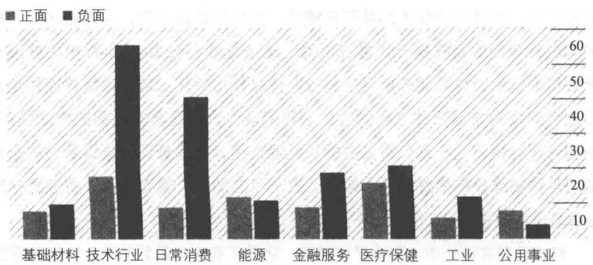

资料来源：晨星公司权益研究部。

在评估护城河趋势时，我们先要查看护城河评级的5大来源（无形资产、成本优势、转换成本、网络效应及有效规模）。比如，如果一家公司的护城河是基于制造工厂的低成本，及其产能扩张建立起来的，那我们就要查明它是否在继续扩大与竞争对手之间的成本差距。或者，现在拥有低成本优势的公司是否正在把它的网络效应发展成为一项新增的护城河来源。这些因素往往能对护城河的正面趋势评级起到强化作用。

__护城河趋势与基本业绩__

针对得到正面及负面趋势评级的公司，我们从晨星公司分析师所用的贴现现金流模型中获取相应的数据资料，将它们整理成表3\-1。我们从中发现，相比标准普尔500指数成分公司，获得正面趋势评级的企业通常拥有更快的增长，获得更多的盈利，产生更高的投资回报率。同时，相比获得正面趋势评级的企业及标准普尔500指数成分公司，获得负面趋势评级的企业通常表现出更差的业绩。这表明我们对竞争优势的关注是有意义的。竞争力弱的企业通常会丧失市场份额，压低产品价格，难以收回成本，否则就会被竞争对手甩在后面。相比之下，呈现正面趋势的企业倾向于取得更好的业绩，因为它们的竞争力在源源不断地提高——或许他们还会获得市场份额的提升或经济规模的增加——这会带来更高的成长速度和盈利能力。

表 3\-1 指标中位数：成长率、盈利能力及估值

标准普尔500 \(%\)

正面趋势 \(%\)

负面趋势 \(%\)

过去3年EPS

11\.9

14\.7

2\.1

年均复合增长率

预计未来5年EPS

9\.4

13\.6

7\.3

年均复合增长率

过去3年销售收入

7\.9

12\.8

4\.8

增长率

预计未来5年

5\.2

9\.2

3\.8

销售收入增长率

（续表）

标准普尔500 \(%\)

正面趋势 \(%\)

负面趋势 \(%\)

预计未来5年 EBIT增长率

7\.8

12\.7

6\.8

过去3年营业利润率

15\.7

15\.9

11\.9

预计未来5年 营业利润率

17\.4

19\.4

13\.2

过去3年 平均ROIC

13\.0

10\.9

11\.4

预计未来5年 平均ROIC

12\.6

12\.4

9\.8

动态债务/EBITDA

1\.72

1\.5

1\.45

动态EBITDA/利息 费用

11\.7

11\.8

8\.4

动态市盈率

16\.0

17\.8

13\.8

资料来源：晨星公司股票研究。

__事实上，既有可能出现宽阔的经济护城河与负面趋势的组合，也有可能出现无护城河与正面趋势的组合。__

一家公司没有护城河，趋势评级也是负面的，这并不必然意味着公司马上会陷入破产境地，但我们确实相信，这家公司的战略及竞争地位已经衰败，并且在未来会变得更差。我们也看到一些拥有宽阔的护城河，且趋势正面的公司能够持续地增强它的护城河。一家拥有宽阔护城河的公司已经拥有很强的竞争优势，如果它的优势还会变得更加强大，或者该公司正在扩展其他的护城河来源，我们就会授予这样的公司以正面的护城河趋势评级。

__护城河评级与趋势评级是独立的。__

我们独立地做出护城河与趋势两项评级。我们把趋势评级看成一项指标，用来指示公司的竞争优势在给定的护城河等级下正在发生怎样的演进。

比如，给一家拥有狭窄护城河的公司评定一个正面的趋势评级，这表明该公司的竞争优势正在提升，但这家企业的相关定性及定量指标还没有强大到足以获取宽阔的护城河评级的水平。即使当护城河评级变动时，我们仍然会做出独立的趋势评级。比如，如果我们认为某家公司拥有狭窄的护城河，且趋势是负面的，我们可以决定下调护城河等级至无护城河的级别，但趋势评级仍然保持负面。

正如图3\-2所示，虽然我们将经济护城河的等级分为3个级别，但在每一级别中可以有不同的梯度排列。在拥有宽阔护城河的公司中，有的具有更强、更持续的竞争优势，有的则具有弱一些，持续性差一些的竞争优势。你会从图中看到，那些拥有最宽阔护城河的公司位于宽阔类别中的最远端。在宽阔类别中的公司拥有的竞争优势越强，其位置就越靠近右边。然而，我们并不在图上标示趋势等级的位置。两家公司虽然都拥有宽阔的护城河，其中一家的竞争优势更强，拥有的护城河更宽阔，这家公司却可能得到一个负面的趋势评级；另一家竞争优势相较显弱，但却可能得到一个正面的趋势评级。每家公司开始时都拥有不同的实力地位，且其竞争优势会朝着不同的方向前行。

图3\-2 经济护城河评级独立于护城河趋势评级

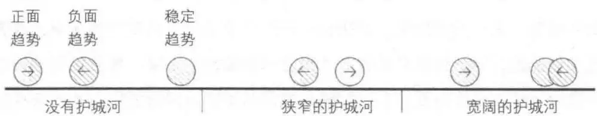

资料来源：晨星公司权益研究部

__ROIC的改变并不必然影响我们对护城河趋势的评定。__

虽然上升的ROIC通常对应着正面的护城河趋势，但这也不是必然的。ROIC的上升可能源于很多与护城河无关的因素。比如，产品周期或周期循环对ROIC具有重要的影响；不改变护城河的驱动因素，改变业务结构也会带来ROIC的变化。上升的ROIC甚至有可能对应负面的护城河趋势，至少在有限的时间内会有这种情况的出现。又比如，如果一家成长前景并不理想的公司停止或减少它的业务投资，它很有可能会在几年里实现投资回报率的上升，因为其投资资本的基数相对于盈利及资金周转出现了下降，但事实上，它的护城河优势却因投资的减少而受到了“收割”。

出自同样的理由，下降的ROIC并不必然地对应着负面的趋势评级。ROIC的下降可以由多种原因导致——有些原因实际上是积极的。当一家企业做出一项在长期会加强企业经济护城河的重大投资时，ROIC就可能会下跌。或许公司为加强无形资产在广告或研究开发上花费重金，或许公司为最终降低成本修建一家重要的新工厂，在这两种情形下，这样的项目在当前都不产生盈利，导致ROIC的下降，但企业正在做出正确的长期决策，这样的决策能够提升公司竞争优势的可持续性。这时，我们在进行护城河趋势评估时，就要暂时忽略ROIC。

__护城河趋势并非必然与业绩增长相关。__

销售收入的大幅成长或大幅下跌并不与正面或负面的趋势评级直接挂钩。或许，一家公司的销售收入增长，只是由于它所处的市场处于超高速成长阶段。但只要不存在市场进入壁垒，竞争就会不断加剧，公司持续成长的能力就会受到威胁。另一种情形是，如果公司所处行业正经历周期性的下滑，或客户推迟了新品的订货，公司的销售收入也会出现暂时的下降。想要恰当地评价公司的竞争地位，投资者要审视公司的护城河来源随着时间发展会发生怎样的变化，而非简单地观察销售收入成长率。

__业务结构转变不影响我们的趋势评级。__

在评定护城河趋势时，围绕公司业务结构转变的意义，有两派观点。一派坚持认为，如果一家公司正在将其业务结构转变到将来更有前景的领域，这家公司就理应受到正面的趋势评定；另一派则主张，业务结构并不影响趋势评级（虽然业务结构仍对确定经济护城河等级很重要），原因在于，业务结构的转变只是表明公司出现了更有成长性的、带有护城河成分的分支业务，并不意味着有了这些分支业务公司的竞争地位就真的能够得到提高或削弱。我们认为第二派观点更有道理，因为它更关注公司竞争优势的变化，而非简单地考察增长率。这与我们总的方法论相一致。在趋势评估中，我们要重点考察公司的竞争优势是在提升，抑或是在削弱，而非业务量是在增长或是在下滑。此外，如果我们观察到管理团队做出糟糕的资本配置决策——比如收购一家没有护城河的大公司，由此“多元恶化”了公司原先的拥有宽阔护城河的业务——我们会下调护城河等级至狭窄级别，或者是给予公司糟糕的管理评级（对管理评级的详细讨论请见下一章。我们发现，管理层做出的资本配置决策对公司的竞争地位及经济护城河潜力有着相当大的影响，以至于我们需要对领导团队管理股东资本的情况做出评估，这是我们研究流程中的重要组成部分）。

接下来，你可以观察到一些真实的例子，看我们在不同的情境中是如何做出分析，并确定护城河趋势的。我们认为，在评估护城河趋势时，投资者首先需要确定是哪些护城河来源受到影响、发生变化，因此，我们的案例研究就依照护城河来源的类别分组展开。

__护城河趋势的5项关键性考虑因素__

__无形资产__

无形资产包括专利、品牌、研究与开发能力、监管环境以及其他一些按定义难以量化的事项。卫生保健行业的护城河常常来源于无形资产，因为这个行业依赖于专利。当下，这个行业的护城河趋势出现了分裂。你能看到有些公司经历了特别的变化，比如制药巨头阿斯利康（AstraZeneca），该公司在20世纪80及90年代借行业创新的大潮发展迅速，然而，自21世纪初，它开始长时期地处在研发生产率下滑的僵局里。简单地说，阿斯利康目前正努力地开发新型、原创的药物来替代那些专利到期的药品。然而，美国食品及药物管理局（FDA）在药物审批上比过去更为严格，这意味着阿斯利康想用新药品取代衰退药品就变得更为困难。

在过去10年内，多数大型药企都在研发生产率上苦苦挣扎，但一些生物技术企业却在生产率方面获得了显著的提升，它们中的许多企业现在正享受着正面的护城河趋势。关键在于，这些生物技术企业，比如再生元制药公司（Regeneron）、西雅图遗传学公司（Seattle Genetics），通常拥有一个专业的专利研究与开发平台，这让它们有能力搜索及筛选出有较高成功可能性的分子及抗体。也就是说，通过运行知识共享平台，这些公司在研究与技术开发方面比同行做得更有效率，从而呈现出正面的护城河趋势。

这些生物技术公司能够各自发挥其研发平台的杠杆作用，提出多重的技术解决方案，并为每一个方案寻找到广泛的运用领域。这显然会不断地加强护城河在无形资产方面的实力。比如，西雅图遗传学公司已经开发出一种抗体\-药物共轭物（或简称ADC）技术平台。通过ADC，抗体会直接连接到有效的化学药物，使治疗更有针对性和有效性。抗体本身（比如适用于乳腺癌的赫赛汀）有巨大的杀伤力，它可以绑定癌细胞，有效地将抗癌化学药物输送到癌细胞中去，在那里释放威力。这样，药物的副作用被减到更小，因为抗体会黏住癌细胞，使得更多的抗癌药物被输送到病态细胞中去。这些ADC就像浮动的海洋水雷，或微型的药物炸弹。西雅图遗传学公司现在拥有的技术平台是全世界实力最强的平台之一，可以为它开发出的药物搜索筛选出最有效的浮动连接器（或水雷），通过与合作方的协作，它的连接器可以被广泛地应用于下一代的癌症药物开发。总之，随着自身平台经验的不断积累，西雅图遗传公司的连接器成为了更多药物的组成成分。公司的研发能力为此不断地得到提升，赢得了更多合作方的信任。考虑到这些因素，我们认为，西雅图遗传学公司基于无形资产的护城河呈正面趋势。图3\-3显示的是该公司在抗体\-药物共轭物领域相对于同行的地位。

图3\-3 前十大药企发起的抗体\-药物共轭物在研临床试验数

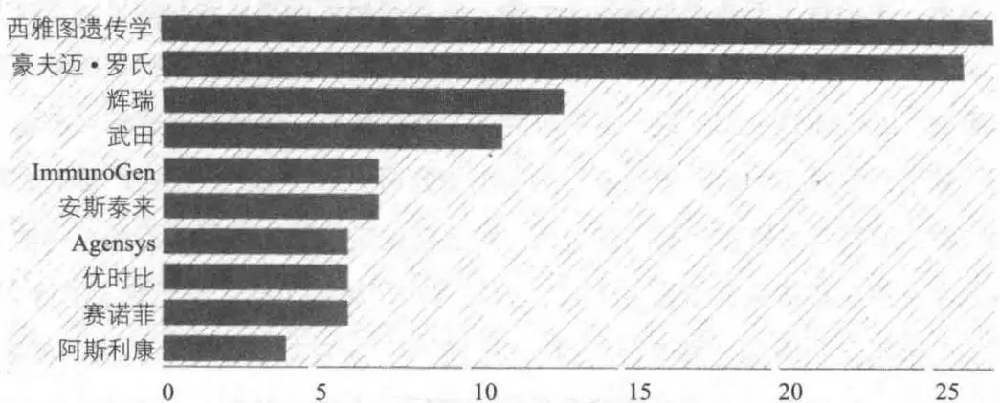

2012年10月资料。

资料来源：TrialTrove。

相比之下，宝洁公司（Procter & Gamble）作为一个全球性的强大品牌，正逐渐在消费者眼中失去魅力。在过去的10年间，宝洁的创新能力不断衰减，它的竞争对手正快速地与其缩小差距。在这个行业，一小份市场份额就已经象征着一个庞大的市场，而宝洁正在其中几个市场里挣扎。宝洁下属的吉列自2005年以来不断地在剃须刀片市场里败退，而潘婷和玉兰油这些美容护理品牌也在遭遇困境。不仅如此，宝洁面临的最大挑战是在洗涤领域。在2007年至2012年期间，在北美的液体洗涤剂市场，宝洁的价值份额失去了约70个基点，到2012年年底，宝洁在美国本土的市场份额下降到不足 56%。宝洁不得不采用降价策略来夺回市场份额。经过8年研究之后，公司于2012年年初及时推出了汰渍洗衣球（TidePods），帮助公司收复了一大块市场份额。在75亿美元的美国液体洗涤剂市场里，汰渍洗衣球在2015年的销售额为5亿美元。

尽管汰渍洗衣球取得了成功，但宝洁仍然面临着一个负面的趋势，其原因是多方面的。首先，按销售比例来看，公司的研究投资已不再高于同行。其结果是，汰渍洗衣球成为宝洁在过去十多年推出的第一款重大创新产品。其次，在公司首席执行官雷富礼（A\.G\.Lafley）于2000年掌管宝洁以来，宝洁不再将研究开发作为公司的核心工作，而是将工作导向短期利润目标。于是，自2000年以来，宝洁推出的新产品减少了一半。公司将研究的重点转移到了改进现有产品上面，而不是作为游戏规则的改变者开发新品。前任首席执行官鲍勃·麦克唐纳（Bob McDonald）曾一直将研究开发作为核心，但他在追逐新兴市场上过于激进，同时在北美市场的激烈竞争中使公司受到伤害（特别在严重的大萧条时期，消费者更看重产品的性价比，对宝洁的定价偏高的产品不那么钟情）。随着麦克唐纳被罢免，雷富礼上任，公司宣布了减少100亿美元开支的计划，研发支出也受到削减，最终影响到公司的创新，导致其长期竞争力遭到损害。最后，在过去10年，公司面临的竞争环境已经变得越发艰难，这种现象在未来还会进一步加剧。比如，联合利华公司已经轻易地将产品推销到60个国家，它曾一次性地在10个国家发布产品，这种能力曾经是只属于宝洁所有的。甚至，在洗涤剂领域，72颗包装的汰渍洗衣球在沃尔玛的标价比同规格包装的全效宝洗衣球（由德国汉高公司出品）高出 80% ，并且比普超波洗衣球（由太阳产品公司出品）的价格高出两倍。宝洁花费了8年时间研发出来洗衣球产品，但这两家主要的竞争者能如此快速地推出同类竞争产品，这一事实本身就令人担忧，正如图3\-4显示的，这表明宝洁曾经的研究与开发优势正在遭到削弱。由于这些理由，我们判断宝洁所拥有的溢价能力将会继续遭受侵蚀。

图3\-42003—2012年间宝洁与同行的研发支出（占销售收入的百分比）

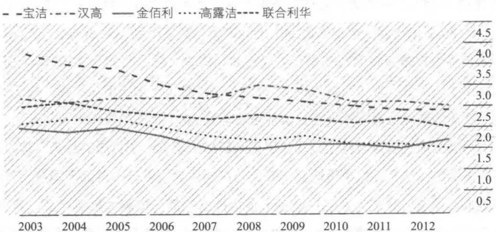

资料来源：各公司报告。

__成本优势__

UPS快递和联邦快递这两家包裹运输巨头尽人皆知。它们使用先进的技术建立起由飞机、卡车、分拣配送中心构成的运输网络，从而享受到庞大的规模优势，每天以低于同业水平的成本为全世界的商务活动及顾客及时投递数以百万计的包裹。在美国，这两家公司的销售收入占行业总收入的比例超过 75%。要与这样的巨头展开有效的竞争，一家公司需要付出以10亿美元计的高昂成本。在21世纪的头10年，敦豪快递（DHL）就曾努力地在美国市场与两大巨头展开竞争，结果它不但颗粒无收，反而亏损了近100亿美元，最终惨淡收场，退出美国快递市场。与此同时，如图3\-5所示，联邦快递在美国地面快递领域的市场份额超过UPS达十余年。该公司因此赢得了一个正面的护城河趋势评级。

图3\-5 联邦快递地面业务的市场份额

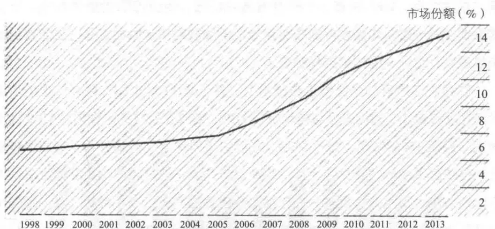

资料来源：联邦快递公司，晨星估计。

联邦快递成功的秘诀是什么？直到20世纪90年代末，联邦快递一直控制着空运市场，而UPS则控制着地面投递市场。事实上，直至90年代中期，联邦快递都对地面市场很不感冒，它甚至嘲笑“运货卡车”是四脚蛇。这种局面在90年代后期才发生变化。那时候的空运市场正处于长期转变的初期。在那之前的十多年里，一些强调成本的公司一直在减少空运业务，转向选择更便宜的地面投递业务，这引起了空运市场的萎缩。然而当时，UPS瞄准了联邦快递的空运市场，成为一些互联网巨头，比如易贝（eBay）和亚马逊，选择的运输渠道。联邦快递认识到自己要有效地反击UPS，要进攻美国的地面市场，所以联邦快递建立起自己的地面快递部门，将这一部门命名为路面包裹系统，即RPS。在1998年，联邦快递又收购了一家位于匹兹堡的快递公司扩大规模，于是，UPS最大的地面竞争对手问世了。

联邦快递开展竞争的主要优势始终在成本结构上。在联邦快递，负责分拣、投递以及驾驶长途卡车的是独立的合同工。这些合同工的报酬与包裹的投递量及投递的及时性直接相关。投递的报酬依据他们停靠的站点数量、处理的包裹数量以及投递区域的密度情况决定，客户抱怨和投递遗漏都会影响到他们的奖金。联邦快递的投递员受到这种报酬体系的激励，愿意像主人公一样行事。相比之下，UPS依赖于一群身着褐色制服、组织严明的雇员队伍，员工的组织性强一些，忠诚度好一些，但他们不像联邦快递的员工那样受到直接的销售激励，也没有同样高的积极性。

联邦快递的第二个优势是在技术上。直至2013年年初，联邦快递的地面投递速度在其1/3的投递区域内均快于UPS，在2/3的投递区域内与UPS保持同速，只在 3%的线路上慢于UPS。联邦快递的速度优势部分源于其高度自动化的分拣配送中心。人只在包裹从拖车上卸载下来以及经分拣后装载上车时才会接触包裹。实际分拣过程——包括丈量包裹的物理尺寸、称重、目的地邮编以及包裹在具体时点应该到达的地点——完全实现自动化，所花时间用毫秒来计量。联邦快递还强制要求它的分拣设备供应商使用依联邦快递定制的分拣及包装软件方案，而不是依赖于设备供应商提供的软件解决方案，这点与沃尔玛多有相似。联邦快递不断地加强对分拣过程的控制，它通常会在一年里对投递线路做两次重新规划，寻求缩短在超过8万个邮编区域内的投递时间。

联邦快递的人力结构及速度优势是很有盈利性的。相较于空运业务，它的地面业务可以带来更多的收益，因为相比于飞机，货运卡车的营运成本更低。

在2013年年初，联邦快递地面业务的营业利润率约为 20%，而空运业务只有 6% 。考虑到联邦快递的市场地位，以及仍在改善的成本及技术优势，我们认为联邦快递是一家基于成本优势的、有正面趋势的伟大公司。

想要看看负面护城河趋势的例子吗？一些大型的石油公司，比如埃克森美孚（Exxon Mobil）、雪佛龙（Chevron）以及道达尔（Total），就在经历竞争优势的衰退，原因在于其疲弱的成本结构。我们很久之前就说过，廉价的石油时代已经结束了。这一转变带来的最直接变化就是，在2008年，传统石油及天然气产量还占到这几家大市值石油生产商总产量的 77%；而预计到2016年，传统产量将只占石油及天然气总产量的 62%。谁将弥补中间的差距？是更贵的深海石油、液化天然气（或叫LNG），以及致密石油和天然气生产。同时，我们预计每桶石油当量的资本投入将从2008年的32美元提高 30% ，至每桶41美元。我们可以换一种方式来看待这个问题，如图3\-6所示，主要的石油企业在石油及天然气项目上的投入在2001年大约为400亿美元，在2012年为1200亿美元，然而，这些公司在2012年的总产量比2001年还要少，这对股东来说是个多么昂贵的命题！

图3\-6 主要油气公司的资本支出及生产量（2001—2012年）

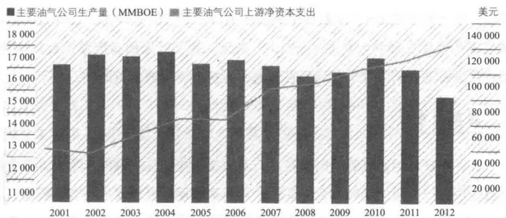

注释：10年产量的年复合增长率为 0\.5% ，10年资本支出的年复合增长率为 12%。

资料来源：晨星公司的估计，公司报告。

不考虑转换成本问题，现在这几家大型石油公司的优势已经大不如20世纪60年代了。当时，七姊妹控制了世界石油储量的 85%；今天，这几家石油巨头只控制了世界石油及天然气储量的 6% ，而OPEC以及一些国家的国有石油公司控制了大概 90%。在过去的低石油价格环境下，后起国家的石油公司在技术和资本上都十分匮乏，上述几家大型石油公司向这些后起国家的国有石油公司提供技术、设备和资本，在实质上掌握着当地的石油资源。

今天，情况已不再如此。储量所有权的转变，和过去10年间石油价格的上涨，使得石油属地的国有石油公司拥有的实质性议价能力不断地得到提高。石油卖到了每桶100美元，沙特阿拉伯拥有的外汇储备价值超过7000亿美元；在接下来的10年计划中，沙特阿美石油公司（该国的国有石油公司）将投入2000多亿美元用于石油及天然气项目以及油田开发技术，如纳米技术。迅速膨胀的财富让这些拥有石油储备的国有石油公司走出国门，开拓海外投资。它们已经有能力以优惠的合同条款与上述的大型石油公司展开竞争，也已经有能力向石油及天然气巨头们提出苛刻的要求，争取有利的合同条款，慢慢地，这些国家甚至将销售收入中的 99% 据为己有。西方石油巨头及国际石油公司只能转向这些国有石油公司不控制的区域，比如墨西哥湾的深水石油、澳大利亚的LNG以及加拿大的含油砂。但在这些地方，每桶石油的开采成本都要比在沙特阿拉伯高出10多美元。基于以上所有因素，我们认为，上述大型石油公司的竞争优势正在衰退，其护城河趋势是负面的。

__转换成本__

在评估护城河及其趋势时，技术行业是极具挑战性的领域。不过，这个行业也提供了一些极为清晰的公司实例，可用来说明转换成本所具有的能量。对客户公司来说，在不同的软件提供商之间进行转换，成本是极为昂贵的，假若软件在公司业务营运中发挥着关键性的作用，这一点就尤为明显。而且，客户的IT部门通常是抵制变革的，因为他们不想费力地去学习新软件，去调制新的定制产品，以及培训新的用户。从一种软件项目向另一种转换还会造成生产效率及安全方面的损失。如果进展达不到计划的要求，转换所带来的浪费及损失可高达数百万美元。得益于这些高昂的转换成本，业务优良的软件公司几乎等同于年金保险，它们有相对很小的技术风险，只要定期更新许可权，公司就可因此获得稳定的现金流。

我们欣赏的软件企业之一就是塞内公司（Cerner），该公司为医院、药房、独立医疗机构提供电子医务系统。塞内所提供的全套技术架构可以让医院、有牌照的医生、护士、试验室的技术人员、药剂师以及其他卫生保健专业人士更便利、更高效地开展工作，降低出错的概率。医生能从任何一台设备上查阅及更新病人的健康记录，由此便省去了病人到多个科室诊疗的麻烦，也让更新病历变得方便；医生也可以用它来提交处方，管理进度，预定检查，为病人转诊提供所需信息（否则这通常是错误多发领域），也能为病人及时提供检查结果的电子信息。账单由此变得一目了然，这就降低了资料输入发生错误的概率。这样的系统所带来的转换成本是巨大的。塞内系统通常涵盖了一个人从出生到死亡的全过程，改换软件系统会扰乱工作流程，这显然不是明智之选。所以，该公司宣称的 99%的合同续订率是可信的。

电子卫生系统业仍处于产业的初期，塞内的转换成本只会越发高昂。2009年出台的《卫生信息技术对经济及临床健康的作用法案（HITECH）》，不只为采纳电子保健记录（EHR）的医生提供了大量的经济激励（超过350亿美元），而且要求医生实质性地使用这样的系统，将这一系统切实有效地深度融合到医生每天的日常工作流程之中。2015年之后，不使用EHR的内科医生将处以医疗保险支付额 1%的罚款，并且这一罚款额度将会随时间推移逐步提高。监管规定简直是在保护塞内及其同行！

HITECH法案本身并不足以让我们确信塞内的竞争优势会不断提升，因为该法案服务于整个行业，可以让很多的公司搭上顺风车。然而，要满足实质性使用的相关规定，要赢得激励性的回报，对有些企业来说是有挑战性的。现在看来，要达到实质性使用，需要经历3个不同的阶段。头两个阶段包括大约50项要求。满足这些要求需要一个严密的集成系统，因为信息必须在药剂师、医生、护士、保险机构、公共卫生组织、预防接种机构以及其他参与方之间进行无缝传输。然而如今，医生、护士及其他人士通常使用不同的系统来管理信息，这些年来，塞内的竞争对手进来搅局，让问题变得更加严重。其竞争者，比如全诊断（Allscripts）、麦克森（McKesson）、医疗技术（MEDITECH）在过去几年里开发出各种各样的系统与技术，其结果是，它们的总系统只是集合了不同类型的软件，而不是一个从基层发展起来的可顺利实现集成的技术解决方案（相比之下，塞内使用的是它自己开发的临床程序语言，名叫Synapse）。靠并购实现增长，这种战略已经延误了它们把系统推广到医院的时间，让这些竞争对手错过了通过开发实质性使用系统从而获得激励性回报的时机。其结果是，塞内靠内部有机方式建起的系统更容易赶上实质性使用的最后期限，它会不断地从那些突然冒出来的软件供应商那里争取到市场份额。

我们看到，实质性使用指引对塞内特别重要，因为指引强制要求医务工作者形成新的基于塞内系统的工作习惯，一旦形成，习惯就很难改变。在电子处方、查检预约、账单处理上形成新习惯，这还只是对塞内成长中的转换成本做出的肤浅理解。塞内还提供人口管理工具，能让医生在一种特别条件下追踪了解病人全部情况，查看检验的结果，监测治疗进程。塞内的软件算法可分析病人的健康记录（想象一下，系统会在一两分钟内将大量的信息分类整理好），会在数秒钟内为专业人士识别出最重要的信息。这种类型的创新产品会鼓励医务人员将塞内系统视为一种分析工具，而不是简单的业务处理及记录系统，从而形成依赖。我们认为，这些因素会给塞内带来循环强化的效果，带来正面的护城河趋势。

然而，基于转换成本的护城河优势也可能随时间的推移而遭到侵蚀。一个典型的例子就是SAP公司。这家公司曾因其开发的企业资源规划软件，即ERP软件而实力猛增。这款软件可以帮助公司管理市场营销、销售与分销、生产计划、资产会计、供应链管理、成本控制、项目管理、设备维护以及人力资源，将所有这些都集合在一个软件包中。然而，除了每年向用户收取一笔不菲的许可费之外，SAP软件要消耗数百万美元的运营费用，要求大量的人工培训，并且需要有外方顾问监测软件的运营过程。此外，使用SAP软件的公司需要聘请专门的IT人士管理整个平台，包括相关的服务器和硬盘驱动器。即使如此，软件运营还是有可能出错，导致公司的核心流程瘫痪，这不仅会惹恼现有的顾客，更会让公司的销售业绩锐减，造成数千万美元的损失。但考虑到巨大的成本和投入的精力，SAP的用户仍然会表现出很高的黏性。

然而，随着云计算技术和软件即服务（即所谓的SaaS）这种软件应用模式的兴起，软件行业的转换成本正在衰减。被销售力量公司（Salesforce\.com）推广起来的SaaS为顾客提供与SAP差异很大的模型，这给SAP的商业模式造成了严重的破坏。在2004年至2012年间，销售力量公司的销售收入年均增长达到 48% 。SAP的软件属于预置型软件，关键性数据储存在顾客的服务器中，而SaaS则将预置放入它的大脑。销售力量公司的产品完全在网站上，在服务器里，只需要一个浏览器就可以使用——不需要专门的IT职业人士或顾问。如图3\-7所示，这一SaaS选择方案可为公司节省大量的成本。

图3\-75年内给公司带来的总成本节省（%）

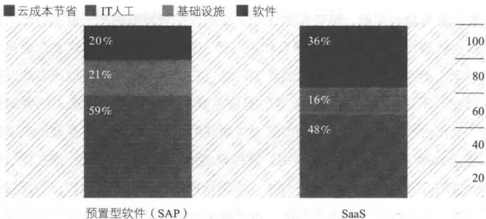

资料来源：销售力量公司，国际数据公司（IDC）。

SaaS将软件转变成一种可变成本模式，可以根据用途和公司需要来改变，无需支付固定的年许可费。近来，销售力量公司及其同行主要在客户关系管理（或称CRM）领域看到了成功的曙光，不过，新的SaaS模块也在人力资源、会计、供应链计划，以及其他领域找到运用市场。换句话说，未来，所有的企业资源规划软件都会搬到云端，有可能由一家单一的供应商提供。考虑到SaaS安装简便，又实现了从固定成本向可变成本的转变，以及无需IT职业人士操作，使得运营费用大幅减少，我们看到在企业中，SAP的ERP预置型软件逐渐被更为灵活的SaaS解决方案所取代。有待观察的是，SAP能否成功地自我更新，把它现有的预置型软件改造成SaaS版本式软件。

__网络效应__

在我们看来，网络效应是最强大的护城河来源之一。像美国电子商务巨头亚马逊（Amazon）和易贝，其经济护城河就主要来源于此。网络效应的基本特点是，随着规模的增加，市场会变得更有价值，因为市场服务的价值会随着用户基数的扩大而提高。例如，Facebook每个月新增用户数庞大，它也是网络效应发挥作用的一家伟大公司。

自由市场公司（MercadoLibre）是一家依托网络效应而拥有正面护城河趋势的最有趣的实例。该公司是在拉丁美洲占主导地位的电子商务公司，它提供在线集市，非常类似于易贝和亚马逊。自1999年以来，这家企业逐步扩张至南美洲。相比于同质化的美国市场，它所进入的市场呈现出彼此分割的状况，不同的地域存在着独立的运输系统、风俗习惯以及进入的管制壁垒，但该公司依然能在这样的市场里成功获得发展。在美国，互联网的渗透率接近 80%（并且在这些用户中，宽带网的渗透率接近 90%），而在拉丁美洲，总的互联网渗透率却不到 50%，宽带网的渗透率只有个位数。但正如你预计的，这些数值正在迅速膨胀，电子商务的销售额及互联网用户增加量都正在以两位数的速度增长；自由市场的9千万用户基数也必定会继续增长，预计在接下来的几年，新增互联网用户将达到1个亿。更重要的是，自由市场公司庞大的用户基数为新进入者设置了几乎无法逾越的进入障碍，新进入者很难复制其用户价值，这种网络效应甚至可能比在线新用户数增长为自由市场公司带来更大的价值。

自由市场公司有着特别有趣的战略，正是这一战略使得该公司的网络效应优势变得愈发令人信服和可持续。该公司毫不掩饰自己在很多方面都在照搬亚马逊、易贝（拥有自由市场公司 18% 的股份），以及贝宝（PayPal）的成功做法。你也许曾经听说过一句谚语，“好的艺术家复制作品，伟大的艺术家窃取灵魂”，此话正适合于此。举个例子来说，自由市场公司出售的商品基本上都是采用固定价格，而不采用“竞拍标售”，这样就避免重复易贝近年来经历的向固定价格模式的痛苦转变。自由市场公司还采用一种非常简单的费率结构模式，只一次性地收取最终价值约为 6\.5%的费率，而不是像易贝那样多重收费，因为那也是易贝卖家一直抱怨的问题。此外，与同行相比，该公司收取的费用相当之低，竞争者想要通过降费的方式发动攻击几乎没有空间。自由市场公司还从其他企业中借鉴灵感。它有一个克隆版本的贝宝在线支付，名叫自由付款（MercadoPago），每年的支付额大约为20万亿美元（贝宝的支付额超过1000万亿美元）；它吸取克雷格列表（craiglist）网站的经验，进入成长中的分类市场，又学习谷歌的做法，在网页上发布广告。图3\-8显示的是自由市场公司增长中的用户基数，以及自由付款的支付额增长数据。

图3\-8 自由市场公司的用户数及自由付款支付额的增长变化（百万单位）

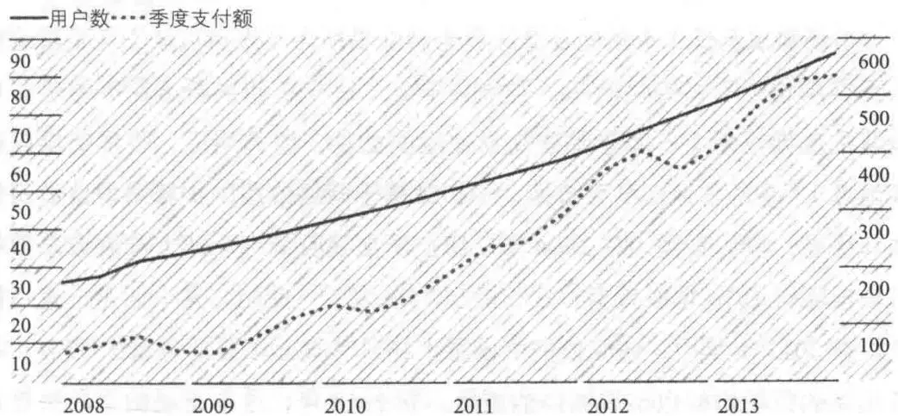

资料来源：自由市场公司。

想看网络效应的反面教材，我们可以观察一下纳斯达克交易所（Nasdaq）和纽约股票交易所（NYSE）。纳斯达克交易所兴起于20世纪70年代，曾高居世界证券市场之首，然而现在它却呈现负面的趋势评级；而在被美国洲际交易所（Intercontinental Exchange）于2013年末收购之前，纽交所也呈现负面的趋势评级。过去，纽交所所拥有的品牌威信对许多高质量的公司是极具吸引力的。在长达200多年的时期内，纽交所都曾代表一个伟大的商业模式。然而，在20世纪90年代末及21世纪初，不断变革的技术以及不断演进的监管持续地加剧着股票交易的竞争，使它风光不再。

回溯历史，我们会发现股票交易行业不断地强调速度、技术和低交易成本，这些都加速了交易所的衰落。电子化交易带来了高频交易商的兴起，为了获取每股不到1分钱的利润，他们可以在以毫秒为单位频繁交易。如今，这些交易公司的每日交易量可以占到任何一家交易所成交总量的 50%∼70%，它们根本不在乎纽交所或纳斯达克交易所的品牌威信。于是，纳斯达克和纽交所被一群技术精良的新进入者抢走了风头。新进入者，如直接优势（Direct Edge）、BATS，能够利用不断提升的计算能力来为客户提供更快、更好的交易操作。现在的交易操作时间的计量尺度都到毫秒级了。新进入者基本上都由华尔街银行，比如J\.P\.摩根所有，它们以此向客户提供私人的流动性池子。

市场需求及优先点的转变意味着老牌交易所为了维持流动性常常被迫地向顾客削价让利、支付回扣，但效果不彰。纽交所和纳斯达克不再是买卖股票的主要场所（不同于那些交易受限的品种，比如期货，股票交易可以换地点），而是沦为众多可选地之一，其基于网络效应的护城河价值遭到侵蚀。于是，我们看到，在2006年，纽交所交易股票占全部上市股票总数的市场份额自1976年以来第一次下滑至 75%以下。此后，这一衰落一直在持续。在2013年年中，纽交所的交易量大约只有其上市股票总量的 32% 。纳斯达克的市场份额也出现类似的衰落。在2013年，这个市场的交易量是其所有上市股票总量的 30%，而在2006年，这一数值曾是 52% ，具体数值见图3\-9。虽然最近交易所采取措施引进了更快的交易系统，市场份额的下跌速度有所放缓，但我们并不认为竞争环境因此得到了改善。为了获得更好的操作便利和更优惠的价格，交易者可能会将买卖指令转移到电子网络上（它们是公共或私人所有的暗池，向机构投资者提供无需交换的流动性，在那里进行交易，公众是看不见的），这会对交易所持续施压，想要维持足够的流动性，交易所只能削减价格。

图3\-92006—2013年间纳斯达克与纽约股票交易所的市场份额（%）

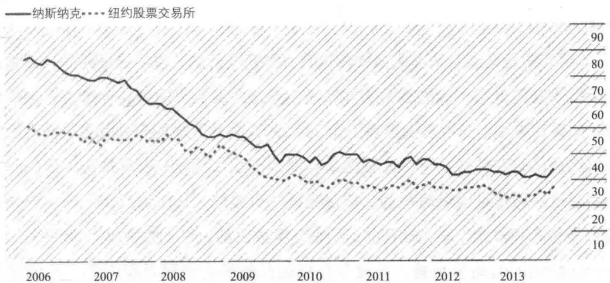

资料来源：纳斯达克公司，纽约股票交易所公司。

__有效规模__

有效规模是在2011年年末才被提出来的，是我们最新的护城河来源。有效规模指的是一个规模非常有限的市场由一家或少数几家公司提供有效的服务，潜在的竞争者几乎没有进入市场的动力，因为如果它们进入市场，行业收益率就会被拉低到资本成本以下的水平。我们已经识别出若干种情形，在这些情形下，有效规模优势能让一家企业的竞争优势发生有利或不利的变化。

比如，在生物技术企业之中有一类集中于罕见病药物的公司，这些公司能够依托有效规模建立护城河。以前，制药公司为响应早期的立法规定（比如20世纪60年代初颁布的《基福弗哈里斯修正案》），只集中于开发治疗常见病的药物。毕竟这对回收开发成本是最为有效的方式，因为要满足美国食品及药物管理局严格的安全及效果的要求，药企需承担昂贵的临床试验费用。并且，从全球来看，某些罕见病人数可能只有几百例或几千例，而相比之下，有些病（比如胆固醇过高）的病人数则高达百万。但到了20世纪80年代初期，很多罕见病出现了，却没有合适的药品可用，因为制药公司认定开发这类药品不经济。另外，病人数太少，他们也不可能承担得起足以弥补公司开发成本的高昂药价。为促进罕见病药物的开发，美国国会在1983年通过了《罕见病药品法》。

《罕见病药品法》从本质上就意味着，为鼓励药企开发罕见病药品，监管当局会给予制药公司一定的监管盈利，增加药企开发罕见病药品在经济上的可行性。如果在美国，一种病的患者少于20万人，为此开发的药品就可以被定性为罕见病药品。制药公司可由此获得7年期的市场专营权、税率优惠、药品开发补助以及快速审批通道等利益。该法是成功有效的，在过去几十年里，总共有1000多种药物被授予罕见病药品，而在法案通过前，这一数字仅为38种。

从护城河的角度来看，开发罕见病药品的药企是极具实力的，因为罕见病市场是一个典型的利基市场。晨星公司网罗到几家生产罕见病药品的药企，包括亚力兄制药（Alexion）和拜姆仁制药（BioMarin Pharmaceutical），这两家公司都有狭窄的护城河。亚力兄开发的药物Soliris是唯一受到批准，用以治疗阵发性夜间血红蛋白尿症的药物。阵发性夜间血红蛋白尿症是一种血液疾病，可能引起贫血症、疲劳及血栓，患者会有一半人将在15年内死亡。此外，亚力兄还花费了大量精力识别并确诊出800010000名患有此病的病人，传授医生治疗的方法。为此，亚力兄每年向使用Soliris的患者收取40万50万美元的药费。拜姆仁制药为治疗罕见疾病开发出一个药品组合，其中就有Aldurazyme，这种药治疗罕见的进行性遗传病粘多糖贮积病I（简称为MPS I）。MPS I是由酶缺乏引起的遗传病。酶的缺乏导致细胞溶酶体中的复合糖蓄积，使骨骼、器官和大脑出现功能障碍。同样，全球大约只有3000人患有此病，但拜姆仁每年从每位患者中收取的费用高达20万美元，这为公司每年带来2亿美元的收入。除了根据《罕见病药品法》享受到的专营权期限之外，这些药一般都很难制造，使得新进入者不想进入这些小众市场。

此外，这些企业还具有将罕见病药品推广到新市场的能力，由此给公司带来正面的护城河趋势。通常，一个有效规模的市场是能够由一家企业单独提供有效服务的，而一旦该公司将某一药品推广到新领域，用它来服务多种罕见病利基市场，这家公司就占据了若干个有效规模市场，也便顺理成章地赢得正面的趋势。亚力兄对Soliris就采用了这一策略。经过检验，这种药对其他几种病也证实有效，如严重的复发性视神经脊髓炎（它会造成眼痛、视力丧失、肢体无力和瘫痪、大小便失控）、志贺毒素产生的大肠杆菌溶血性尿毒综合征（它会导致器官受损）、重症及难治性重症肌无力（它会造成视力模糊、口齿不清、咀嚼下咽及呼吸困难）。由于Soliris在每一个细分市场都极少有竞争对手，该公司能在每一个新的细分市场扩展自己的竞争优势。同样，拜姆仁也会在接下来的几年，将它的罕见病药品组合扩展到新的细分领域，因而展现出正面的护城河趋势。对这些专注于罕见病药品开发的公司更加有利的是，相比于非罕见病药品，美国食品及药品管理局有可能以更快的速度审批罕见病药品的临床应用，这会大幅降低罕见病药品的生产成本，增加这类企业的经济收益，如图3\-10所示。

图3\-10罕见病药品与非罕见病药品的监管审批时间及成功概率

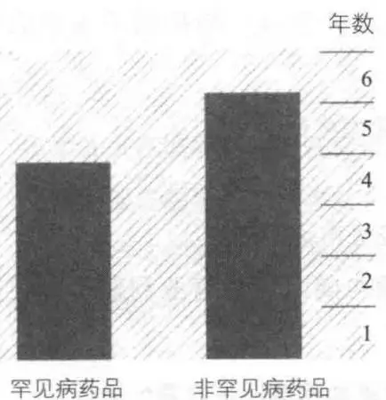

注释：审批时间指的是从Ⅱ期临床试验到开始药品商业化之间的年数。

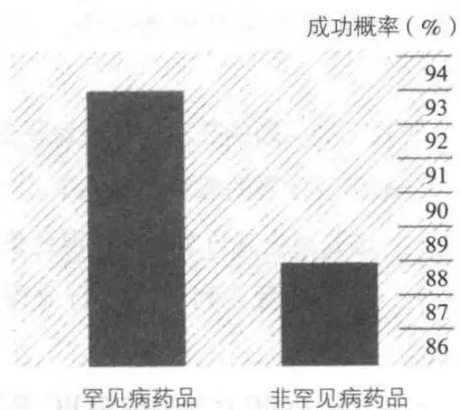

资料来源：《今日药品发现》（Drug Discovery Today）。

然而，基于有效规模而建立起的护城河优势是否会遭受侵蚀？对于那些曾经由一家公司提供有效服务的利基市场，一旦发现有多家公司进入市场，投资者就要警惕了。电信行业是个极好的例子。类似于美国电信业在20世纪80年代之前的运营情形，新西兰电信业原本是由当地公司（比如新西兰电信公司）垄断的，因为监管者认为，如果鼓励市场竞争，全国就会出现多套电线及电线杆，这样就造成了资源浪费。在21世纪初，新西兰政府逐渐放松了对该行业的管制，因为它意识到，与其他发达国家的民众相比，新西兰民众为低质的电信服务付费太多。其结果是新的竞争者被引入市场，比如泰克（TelstraClear，现在是沃达丰的子公司）、Orcon、2度（2 degrees）以及ihug，这使得新西兰电信公司的移动市场份额从1999年年末的 68%下跌到2012年中期的 32%。我们预计更多的竞争者会持续地进入这个市场，给市场份额及总的经济收益带来压力。总之，当监管者判定一个市场由多个竞争者，而不是由单一公司提供服务更加有效时，投资者就要考虑给原有的垄断公司负面的护城河趋势了。

__分析护城河趋势的最佳实践__

我们已经列举了许多具体实例，帮助你思考护城河趋势评估中的方方面面。下面是总结性的清单表，记述了关于每一种护城河来源的关键性问题。

寻找下列问题的答案，并能解释变化发生的原因。

一般涉及定量的趋势问题如下：

-
- 该公司在其行业正在获得还是丧失市场份额？
- 现在的营业利润率比行业周期中间时期的营业利润率是更高还是更低？
- 边际 ROIC 比当前的 ROIC 是显著地提高还是显著地降低？
- 该行业的利润占整个工业总利润的比例是在提高还是在下降？
价格趋势会如何变化？
- 公司面临的最大机会及威胁是什么？公司有无机会将现有优势扩展到新的产品类别或市场？相反，进入公司现有市场的壁垒是否在降低，公司是否处于被新进入者摧毁的风险之中？

按护城河来源划分的涉及定性的趋势问题如下：

1\.成本优势

-
- 供应商是否正在增强其议价能力？公司能否采取及时有效的方式应对供应商的祈求？
- 为什么公司的成本结构呈现出与同行及行业不同的趋势？这是一种独有的过程吗？
- 有无可改变成本及价值逻辑关系的替代品或互补品？
2\.网络效应
- 网络或集市上的每一位用户有着多高的参与度？参与度正在提高还是在降低？
- 顾客是否无需现有众多网站，只从部分网站中就可获得类似的利益，或者，市场是否已变成赢家通吃的市场？竞争者已开始建立自己的网络吗？
- 公司如何捕获加入到网络中的每一个新增节点的价值？用户可通过相互结伴复制网络，剔除中间人吗？
3\.转换成本
- 技术进步在破坏行业，在降低总的转换成本吗？
- 合同条款正在变多还是在变少？
- 公司为特定的应用场合如何定制产品或服务？行业内的客户定制水平是否在提升？
- 无形资本
- 顾客为公司品牌付费的意愿是在提高还是在降低？如果品牌是基于声誉、社会威信或其他某种情感联系，那么，影响品牌认知的因素是变得更为重要，还是变得更不重要？
- 如果公司基于无形资产的护城河趋势是围绕专利构筑起来的，那么，公司依靠专利获得护城河趋势是否容易？如果用年专利授予数量、所开发技术赢得的顾客许可数，或总体药物的批准率来衡量公司的研究与开发效率，那这一效率呈现出什么样的趋势？
- 行业可否从学习曲线中获得回报？
- 有效规模
- 公司与监管机构的关系如何？
- 是否有新的技术、市场及其他诱发因素会激励监管者重新考虑原先的监管假定？
- 审视市场的预期成长速度，新进入者将来想要跨入更大市场是更容易还是更难？

## 第4章 管理对经济护城河的影响

__第4章 管理对经济护城河的影响__

强有力的管理本身不可能成为经济护城河的来源，但管理层的资本配置决策会极大地影响护城河的创立、加固或侵蚀。

Note

托德·温宁是晨星公司的股票分析师，他研究的行业包括造纸与包装、工程与建筑以及化学公司。他主持晨星公司的管理方法论，并在晨星公司的网站上开设一个股票分析的每月专栏。

渐渐地人们会发现，公司管理者配置资本的能力对企业价值有重要影响。——伯克希尔·哈撒韦公司1994年致股东的信

在当今时代，审慎的资本配置变得比以往任何时候都更为重要。即使是对那些已经成功地站在了行业顶峰的企业来说，快速的技术进步、全球化趋势以及整个市场对经济利润的趋之若骛都会极大地缩短这些企业维持其行业地位的时间长度。根据咨询公司创见研究所（Innosight）的报告，标准普尔500成分股公司的生命周期已经从1958年的61年，缩短到1980年的25年，再缩短到2011的18年。在商业领域，达尔文主义的适者生存法则愈加明显。于是，一家公司的管理团队能否有效地将股东资本配置到拓展公司护城河的项目中去，以及能否通过股票回购及红利发放平衡好股东现金回报，便成为了极其关键的问题。

__我们的管理评估方法__

在晨星公司，居于管理评估方法论核心位置的是对目标公司管理团队的资本配置决策进行分析。我们很早就认识到，有效的管理本身不会自行转化成护城河，因为它无法从根本上改变公司的基本结构特点，并且按理说，一个伟大的管理团队可以用手走人，离开没有持续竞争优势的公司。即便如此，我们还是相信，护城河的创立、加固或侵蚀都会被管理层做出的资本配置决策所影响。换句话说，为了精准地为目标公司作出护城河分析，我们需要更好地理解管理与护城河之间的交汇作用。

先前，在进行管理评级时，我们习惯于关注管理团队能否按股东利益行事。但在2011年中期，我们对这种管理评级方法进行了改进。我们原本采用的是一种对公司治理实践进行“方格打分”的分级体系。然而，这种做法存在很多问题，它对公司的资本配置决策及其为股东创造的价值不具备可靠的预测作用。实际上，我们发现有很多治理不良的企业却在资本配置上做得不错，反之亦然。根据我们先前的评估方法，举例来说，福特公司（Ford），我们应授予它非常低的管理评级，因为它的公司治理实践做得很差（比如，它发行两种类别的股票）。但我们相信，自2006年公司首席执行官艾伦·穆拉利（Alan Mulally）接任以来，福特公司在股东资本配置上做得很好。并且，从全球范围来看，“好的”公司治理的判断标准千差万别，单从这一点上我们很难将世界上不同地区的公司管理模式进行比较。

改进过的新管理评估方法减少了方格打分的占比，更重视管理层的实践举措，如投资战略、投资时机与投资评估、财务杠杆的运用、红利和股票回购政策、执行力、薪酬、并联方交易和会计实践等。改进过的评估方法不仅在比较全球不同市场间的管理工作时更具有普遍的应用性，而且也更好地揭示出管理团队在股东资本配置、经济护城河的创建或加固方面做得如何。

在评估管理层的历史记录时，投资者要判断，公司的管理成果——特别是短期成果——是更多地决定于运气还是能力。我们知道，即使一名投资者在所有的股票评估环节都做出正确的判断，但倘若市场大跌，或出现其他意外事件，这位投资者还是可能在短期内蒙受损失；同样的，即使一支管理团队能够持续做出最优的决策，但公司仍然可能受制于一些不可抗力因素，产生糟糕的短期业绩。正如迈克尔·莫布森（Michael Mauboussin）在他那本名为《成功方程式：解码商业、体育及投资中的能力与运气》（The Success Equation: Untangling Skill and Luck in Business, Sports, and Investing）一书中所说“凡涉及一定运气的事情，只有在长期来看，好过程才会有好结果”。运气总是飘忽不定的。投资者在进行管理评估时，要设法全面了解管理层的投资评估过程，并核查公司近期的成败是否偏离了这一过程。这会让投资者更多地评估公司的常规资本配置决策，而非过多地关注短期结果。

在评估管理工作时，我们的目的是搞清楚管理团队是如何出牌的，手中一副牌是不是打得好。我们并不是想用后视镜来审视某一特定决策的效果，而是更想让自己尽量地站在管理层的位置来考量管理决策。管理层在做出收购一家公司、开办一家合资企业、做出资本支出投资或回购股票的决定时，我们想要知道他们是出自怎样的考虑。

-
- 管理层当时有什么其他可选项？
- 决策时机是否与产业周期相衔接？
- 在宣布收购或撤资的时候，行业主流估值水平有多高？

在全面审查一家公司的资本配置历史记录，及对公司新投资的流程做出评估之后，我们会以3种管理等级评定这家公司的管理层：合格、模范以及糟糕。见表4\-1。你会看到这些评级的现有分布情况，以及每一等级的简要解释。

表 4\-1 管理评级的分布及描述

等级

占全部评级的百分比 \(%\)

描述

合格

84

我们涵盖样本中的大多数公司都获得我们默认的合格级管理评级，原因或是因为缺乏证据表明管理层做出了特别优秀或糟糕的资本配置决策，或是因为决策的净结果对股东价值来说都近乎于中性

模范

9

模范的股东资本管理，通常依托于产生价值增值的收购、最优的财务杠杆、理想的红利发放以及股票回购政策以及增强企业竞争优势的投资。模范的管理层专注于长期的股东价值创造，甚至不惜以牺牲短期业绩为代价。对于管理者评级，立见分晓的检验问题是，“这是年度首席执行官或首席财务官的候选人吗？”

糟糕

7

对股东资本的糟糕管理可能表现为：从股权持有人角度来看，公司采用了极不恰当的财务杠杆；有记录表明公司进行了减损价值的投资（商誉受损是证据之一）；公司经常发生经营、战略以及执行上的失误

资料来源：晨星公司。

__深耕细作__

接下来，我们将以这些大的管理主题为框架，细致地考察常见的资本配置要素，将它们融入到我们的管理评估过程之中。

__投资战略与估值__

归纳起来，当公司决定运用资本的时候，它有3种基本的选择：再投资、储蓄起来、返还给权利拥有者。

再投资就是进行扩张性资本支出或者收购，这是多数公司使用股东资本的主要方式。通常在考虑再投资时，管理层最感兴趣的就是扩张公司规模，因为公司规模越大，管理层得到的薪酬待遇就会越多。我们当然不反对增长，但需要确定公司所呈现的是合乎时宜的增长，或者说，是提升公司价值、拓宽公司护城河的增长，而不是旨在提升短期业绩、有损长期价值的增长。

在分析一家公司时，一个关键问题是，“在追求增长的过程中，公司是否在偏离核心能力”。在其他条件相同的情况下，我们乐意看到公司追求它最擅长的业务，一家拥有模范管理评级的公司会持续地致力于创建或巩固其核心业务与竞争优势；类似地，我们也很看好能够抓住历史时机溢价出售其非核心项目及不良资产的管理团队。酿酒商布朗霍文公司（Brown\-Forman）就赢得了模范的管理评级，部分原因在于该公司做出了剥离其非核心业务线的关键性决定——它在2007年剥离了耐用消费品业务，2009年及2011年停用了多个酒类品牌——这使公司更专注于它的核心业务线，有助于公司持续地获得远高于其资本成本的收益率。

有些公司频繁地从事核心能力以外的项目或交易，其目的是“分散”经营活动，或降低业务的周期性。但这种交易会给投资者造成两方面的伤害。首先，投资者自己就可以利用其他证券分散自己的投资组合，且成本远比公司做分散投资低廉得多。其次，这样的交易增加了发生意外事件的概率，加剧了折损预期收益的协同风险，同时也容易引发被并购公司之间的文化冲突；有的公司为提升短期增长率而收购非核心业务，但他们对长期的价值创造欠缺考虑。包装公司希悦尔（Sealed Air）就是个例子。它在2011年以43亿美元的价格收购了清洁产品生产商泰华施（Diversey）。该交易的战略合理性是非常牵强的，因为包装与清洁服务之间缺乏协同性，更糟糕的是，希悦尔因此摊薄了股东收益，为收购做出有损公司资本结构的融资安排。几乎就在该交易被宣布的同时，几位管理高层——其中有两位来自泰华施，一位来自希悦尔——就提出辞职，并且，希悦尔的最大股东将手中曾经拥有的超出 30% 的股份大幅出售。仅在该交易完成后的一年，希悦尔就为收购泰华施提取了12亿美元的减值损失，同时，希悦尔在资产负债表上也呈现出高杠杆的状况。

最后，即使一家公司持续地投资于具有战略意义的领域，如果它在交易中总是支付过高的价格，我们仍将其视作一家不善配置股东资本的公司。正如沃伦·巴菲特和查理·芒格（Charlie Munger）在2011年写给伯克希尔·哈撒韦股东的信中所言，“资本配置的第一法则——不管是把钱用于并购项目还是用于股票回购——一定要以最低的价格进行交易”。即使是一项上好的投资或收购项目，也不值得我们为价值1美元的资产支付1\.2美元，那不会增加股东权益。配得上模范管理评级的公司会避免竞标战，相反，它们进行逆向或反周期投资，并坚定地抽离那些不具财务意义的交易。

__执行__

我们不会给那些因为遭受霉运打击而业绩不佳的公司冠以糟糕的管理评级。我们更感兴趣的是，在带来价值毁灭的事件中，管理层的作为在其中起到怎样的作用。一个经典的相关案例就是石油巨头英国石油公司（BP）在墨西哥原油泄漏事件中的表现。在安全事故频繁发生时，该公司的管理层不能采取措施及时止损，反而给公司带来了大量的法律纠纷和高昂的污染处理成本，给股东权益带来严重的伤害。

有些公司很喜欢在分析师集会或人数众多的会议上宣布激进的中期增长及盈利目标，这的确可以在短期内刺激投资者的情绪。如果管理层能实现这些目标，那了不起。但如果他们做出的承诺明显地不切实际，那只能表明他们很不了解公司情况。这样的管理层很快就会在投资者和分析师心目中失去信誉，下一次再发表这样的言论就不会再被人信服了。

__财务杠杆__

管理层所做的有关资本结构的决策对股东权益、经营风险以及股价波动率都有深远的影响。要小心那些杠杆率与其业务线不相符的企业。比如，如果一家公司处于资本密集型行业，且其经营具有明显的周期性，那么管理层理应避免使其承担过大的债务压力，因为这样会加剧业务的内在波动性，使股东权益资本承受风险。但如果一个处于稳定成熟行业中的公司既没有债务，也没有再投资的需求，这样的资本结构也不能为公司实现股东权益的最大化，因为这家公司本可以通过债务融资来降低其资本成本。模范管理评级的公司在资本结构上一般都能长期保持债务与股权融资间的适度平衡。

__红利与股票回购政策__

理论上讲，只要一项业务还能产生经济利润，公司就应该将利润用于该项业务的再投资，直到它不再产生经济利润为止。接下来，公司才会考虑将多余现金以现金股利或股票回购的方式返还给股东。模范管理评级的公司在红利及股票回购政策上遵循“最优”原则，不要太多，也不要太少，恰好合适。我们既不愿意看到公司通过借钱来维持不可持续的红利发放或回购政策，也不愿意看到公司在账上留存过多的闲置资金，或者毫无章法地扩大规模。

对不同的公司来说，理想的红利政策也各有不同，但他们的共同之处应该是具有一贯性、可承受性和透明性。

-
- 一贯性：公司董事会可能通过协定目标红利支付率或偿债保障比率来决定公司常规的或特别的红利支出，也可能选择采取与盈利变化相一致的红利支付方式，但不管怎样，理想的红利政策应该是稳定的，而不是随经营环境时常变化的。
- 可承受性：红利政策应与公司长远的业绩目标相关联，应为公司留存足够的现金以满足对价值增值项目的投资所需。在其他条件相同的情况下，相比于处在防御型行业的公司，处在周期型行业的公司应抽取更小比例的盈余用于红利发放。换句话说，公司的红利支付比率应与公司年度利润的可预测性同向浮动，以此保证更大的安全系数，反之亦然。
- 透明性：我们认为，打定了主意要将大部分年度盈余以红利方式发放出去的公司，应该在年报中明确披露其确定好的红利政策。

过去20年来，股票回购作为公司回报股东的一种方式已经愈发流行。理论上说，公司只应在股票的交易价格低于其内在价值时回购股票，但我们发现，有些公司也会基于一些不那么合理的理由回购股票——比如，为了控制每股收益，或为了抵消员工股票期权的稀释效应。这时的回购行为会较少地考虑到支付价格。惠普公司在2006年至2011年间的股票回购行为就充分地体现了错误的回购政策。它平均每年在回购上花费大约100亿美元，而从事后来看，它的回购价格明显地高于股票的内在价值。

虽然我们并不认同那些专门在股价低于内在价值时投机性回购股票的公司，但相比之下，我们更不看好那些采用“平均成本法”回购股票的公司。这样的公司每年都回购大量的股票，以使平均的回购价格接近股票的内在价值，导致其资本使用效率极低。

回购作为一种向股东返还现金的方式得到了日益广泛的运用，但我们发现，即使公司已经协定了回购政策，也极少会向股东明确告之回购事宜。相比之下，公司会相当频繁地向股东披露其红利政策以及常规的并购战略，即M&A战略。一个正面的例子就是英国当地的零售商Next，它在2012年的年报中用了整整两页的篇幅介绍自己的回购理念。我们希望更多的公司能够仿效Next的做法，更全面地解释自己的回购政策。

__薪酬__

我们的管理评级方法也会考虑到公司高管薪酬福利的相对规模。如果一家公司的高管薪酬会对它的资本配置决策产生正面或负面的影响，我们就会将该因素放入我们的评估体系。首席执行官的薪酬过高，可能意味着这位领导人对公司的内部决策有着非常强的管控力。正如传奇的投资人菲力普·费雪（Philip Fisher）在他那本名为《普通股与不普通的利润》的书中所言，“如果一号人物的工资比二号、三号人物的工资高出非常之多，那是值得警惕的信号。”我们对GAMCO投资公司（GAMCO Investors）就不看好，因为兼任公司主席、首席执行官、投资组合经理和首席投资官的马里奥·加贝利（Mario Gabelli）拿走的薪酬太多了，他在2012年的薪酬甚至达到了7090万美元，大约占公司全年营业收入的 20%。

相比之下，我们更愿意看到高管的现金薪酬体系能够激励领导团队投资于价值增值及拓宽护城河的项目。薪酬计划与长期业绩挂钩也很重要。毕竟，很多明智的战略投资，都需要在多年内不断地进行资本投入、研究与开发（即R&D投资）、耗费大量的营销费用，才能见到成效。如果经理们的薪酬与短期盈利和现金流紧密关联，他们在实际决策中会更倾向于放弃长期价值增值的项目，以减少短期的费用支出。

举例来说，波尔公司（Ball）的年度奖金标准就是依据年度经济附加值（或叫EVA）的增长率的，该指标的计算公式是税后净经营利润减去资本成本。波尔公司的长期现金奖励依据投资资本回报率是否高于董事会提出的目标“最低回报率”决定。换句话说，波尔的管理层不会单纯地因为扩张公司规模而获得报酬，他们想获得奖金，只能努力让公司产生经济利润。我们认为，像EVA及投资资本回报率这样的考评指标对公司十分有益，因为这些指标与公司的竞争优势密切相关，它们更有利于将管理层的经济利益与股东的长期利益捆绑在一起。

__关联方交易__

如果公司和与公司管理层或所有者存在外部关系的当事人发生商业往来，这便构成关联方交易。在我们为公司管理层确定管理等级时，这一因素通常不会发挥太大的作用。然而，对于那些频繁地牺牲股东利益，而一再地把公司利益转移给朋友或家族的公司，我们会给予糟糕的管理评级。

__会计行为__

有过会计欺诈历史的公司，我们几乎一定会授予其糟糕的管理评级，像安然（Enron）、世界通讯（Worldcom）、泰科（Tyco）这些发生过著名会计丑闻的公司更加令人不齿。不过，如此大规模的欺诈在大型上市公司中还是相对少见的；更为常见的是公司采用激进的会计行为，来为欠佳的资本配置结果披上华丽的外衣。而相对的，对股东资本做出优化配置的公司通常能在会计行为方面拥有透明及连贯的历史记录。同时，我们也期望公司能对退休费用、折旧及收入确认这些重要的会计变量做出合理的评估。

__管理层的背景__

我们会评价公司管理层的背景，看他们是否适合所在工作岗位。我们会考察管理层们的相关经历及阅历、他们以往的职业记录以及其他任何反映他们管理能力的因素。

__健康、安全及环境__

作为这个地球上的公民，我们是关心公司如何对待它的员工、所在社区及周围环境的。我们不会忘记自己作为股票分析师对管理层进行评级的职责，但同时也会秉持一定的公民意识。的确，我们的管理层评级度量也只度量一项内容：公司经理如何代表股东利益行事。并且，由于我们是站在股东的视角上——而不是站在利益相关者的视角上——来评估管理层的，我们默认，公司在健康、安全及环境（或简称为HSE）三方面的行为与主题关系并不明显。但是，作为地球上的公民，如果我们的管理评级对一些公司在HSE方面的丑陋行为视而不见，那会让我们良心不安。因此，虽然从评级的目的来看，我们必须将考虑的要素限定在股东权益的视角上。但如果一家公司的HSE记录对公司的经营业绩及股东权益造成了明显的影响，那么在评定管理等级时，我们就会将HES问题纳入考虑。

__所有权结构__

这家公司的所有者是谁？这是一个简单的问题，但该问题可以揭示出很多管理层和董事会决策的背后原因。在分析一家公司的所有权结构时，我们会考虑它是否属于家族（如果有的话）控股、内部人控股、政府控股或多数股票由其他公司持有，也会查看它的股票是否依类别拥有不同等级的投票权。我们并不站在少数股东的立场上去考虑因果得失，尽管实际上，控股股东的经济利益常常与少数股东的利益紧密相连。如果由于其不合理的所有权结构，公司做出损害少数股东权益，且折减企业价值的经济行为，我们就会将该公司的所有权结构视为糟糕管理的一种表现。

__对利益相关者的关注__

一些国家司法部门会要求公司按所有利益相关者的利益，而不只是股东的利益行事。比如，德国要求公司在董事会中安排雇员代表；在日本，很多企业在它们的供应商及经销商中持有所有权地位。有人认为，站在所有利益相关者的视角上思量管理决策会与股东权益发生冲突。然而，将关注利益相关者的规定写入公司章程，或将供应商与经销商放在与股东同等重要的位置，这对股东来说并不必然是一件坏事。在某些情况下，董事会中的雇员代表可以更好地协调公司内部一些复杂的事情，所以，德国模式会给公司带来一些优势；与供应商和经销商交叉持股可能会给公司带来降低交易成本的效果，因为这样会让上下游企业在价值链上实现纵向整合，也许正因为这点，日本模式有时会发挥作用。所以，我们在评估过程中要留意公司对利益相关者的关注程度，以及这样的关注给股东权益带来的有利或不利的影响。

__与股东的沟通__

那些能让自己站在公司顶层的高层管理者通常都是具有高超的沟通能力的人，他们很会美化自己以及公司的现状。由此，投资者在倾听管理层的言谈或阅读其书面语言时通常要留个心眼，理解在字里行间隐藏的信息，读出言外之意——特别是在公司遭遇困难的时候。如果高层坦白地承认自己犯了战略性错误，那我们要鉴别坦白的时机，评估公司是否即将面临大的挑战。一般来说，在公司情况糟糕的时候，管理层与股东沟通时所说的话会比公司情况好的时候更为可信。另外，我们不愿意看到公司时常发生修正公告信息的事件，因为这通常是业绩不好的公司在玩弄戏法，会让投资者对资本配置决策的评估有失公允。

__依护城河及行业类别划分的评级__

晨星公司的分析师对在全球范围内超过1100家公司做出管理评级。以这样丰富的经验为支撑，我们获取了一些有价值的信息，以此来领悟管理与经济护城河之间的关联。

首先，让我们先浏览一下图4\-1，该图显示出不同经济护城河等级下的管理评级分布状况。

图4\-1 不同经济护城河等级下的管理评级分布（%）

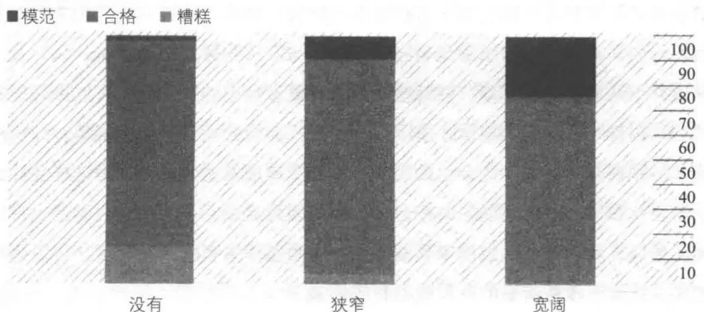

资料来源：晨星分析部。

正如图中所示，在那些拥有宽阔护城河的公司之中，接近 25%的公司获得了模范管理等级，比那些拥有狭窄护城河的公司占据了更高的比例。而后者也比没有护城河的公司得到了更多的模范管理等级。对于糟糕的管理等级，情形则正好相反。当然，这里面有可能存在“光环效应”在发挥作用，毕竟我们的分析师偏好于有竞争优势的公司，从而可能会高估这类公司的管理能力，反之亦然。但我们认为，至少有3方面的理由可以证明护城河等级与管理等级之间存在着正相关的关系。

-
- 管理能力：管理本身不能创造护城河，但通过巧妙的管理工作，资本能够被配置到拓宽护城河的项目之中，可使公司的护城河得到构建或加固；相对地，如果为了短期增长，管理层总是将股东资本投资于不具备竞争优势的项目上，如此对股东资本的糟糕管理就会损伤长期的股东权益，随着时间推移，甚至会侵蚀公司既有的护城河优势。
- 磁石效应：相比于没有经济护城河的公司，拥有可持续竞争优势的公司通常更能吸引及留住有才干的管理者。
- 追逐落后：尽管很努力，但受制于现有的行业格局，没有护城河的公司管理层常常缺乏拓宽护城河的投资机会（就像马鞭公司在汽车商业化后花费重金投资扩张马鞭新的产能一样，只是事倍功半，无力回天）。即使如此，这些公司的管理层也会尽力地采取行动以寻求突破。然而，这种动机常会诱使管理层热衷于收购一些不相关的公司，或廉价地出售仍有价值的资产。在某种程度上，这一现象解释了没有护城河的公司通常对应着高比例的糟糕管理等级的原因。

我们还可以按照行业分类来观察管理评级的分布，从中得到一些启示，见图4\-2。

图4\-2 管理评级的行业分布（%）

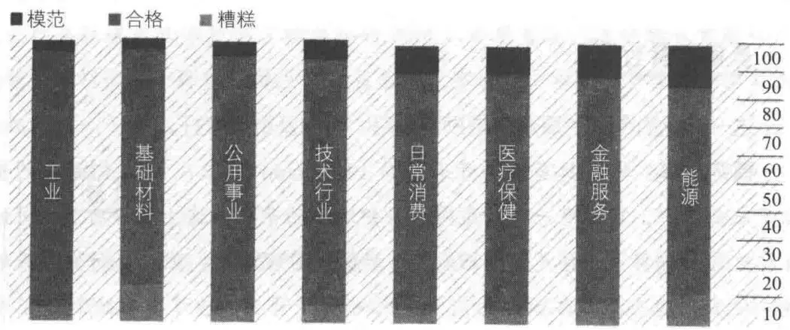

资料来源：晨星分析部。

按这种方式来观察管理评级，我们便领会到资本配置决策的重要性会随着行业的不同而发生变化。比如，非合格的管理评级出现比例最高的行业是能源及金融服务业。直观上看，这是可以理解的，因为能源和金融公司的管理者在公司运营中更为频繁地制定资本配置及战略决策。在能源公司，管理者们必须决定将从油井中得来的现金流投向何处，而投资组合的变动常对公司的整体竞争地位产生深远的影响。比如，像埃克森美孚、雪佛龙等公司就以持续追求高收益为策略为公司配置了高质量的能源资产组合。对于金融公司，资产负债策略及贷款发放标准会对公司成长、风险及盈利能力能够产生实质性的影响。比如，美国合众银行（U\.S\.Bancorp）依托其合理的公司文化，并没有通过放松贷款标准来追求快速增长，其结果是，该银行哪怕是在金融危机最严重的时候都没有遭受过损失。总之，由于能源和金融行业面临频繁的资本需求，因而拥有（或缺乏）管理能力对这两个行业都有着深远的意义。

各个行业的股东资本管理水平因不同的影响因素而参差不齐。比如，公用事业公司，能否成功驾驭监管规定是一种重要的差异化因素，但在消费品行业，品牌投资和执行是区分成功与不成功管理团队的主要考虑变量。

为进一步说明清楚，让我们更细致地观察各行业中有着模范和糟糕管理等级的案例公司。

__基础材料行业__

这一行业的考察主题通常是投资战略、估值及财务杠杆。

__模范样本__：埃尔拉多黄金开采公司（Eldorado Gold）。在我们涵盖的黄金开采公司中，它是唯一一家赢得经济护城河的企业，这主要归功于公司的首席执行官保罗·怀特（Paul Wright）和他的管理团队，他们只付出低廉的成本便积攒起一批成本低、生命周期长的矿业资产。除了低调地取得了中国、土耳其以及希腊等地的一些矿产管辖权之外，怀特达成此目标也极大地依靠了审慎的资本配置决策。事实上，埃尔拉多很少采用大规模的、会稀释股权的并购活动——在黄金开采行业，这种做法常常造成收益损失——相反，它更专注于使用自己拥有的地质勘探技术，在自己的矿区集中探测和开发黄金矿产资源。同时，这家公司致力于回馈股东，并在2011年10月发布了一项将红利与黄金价格直接挂钩的计划，即当黄金价格上升时，公司将增加红利支付。这一举措使该公司成为仅有的两家红利与黄金价格挂钩的企业之一。我们认为，这一计划极大地惠及股东，因为当黄金价格上升时，公司获得的收益也会增加，该政策限制了公司再投资的规模，从而增加了红利分发比例。

__糟糕样本__：斯道拉恩索公司（Stora Enso）。这家芬兰的纸浆造纸公司在不到两年的时间里两次变更其部门结构公告，这让我们深感不安。在2013年4月，该公司宣布它会将当时的4个部门合并成3个，即将它的住房与生活部门和它的印制与读物部门合并在一起——然而这两个部门极少有业务交叉。而仅在这一决定的15个月之前，公司就曾经全面重组过部门结构，把3个独立的纸张部门重组成印刷与读物部门。这一做法降低了纸张与读物这一重要业务线（占2012年销售收入的 40%）的透明度，在我们看来，这一举措极不利于股东权益。此外，在斯道拉恩索公司有两类股票——A类和R类——享受同样的红利发放，但拥有不同的投票权。在股东大会上，每一股A类股票拥有一份投票权，但每一股R类股票只拥有1/10份投票权，由此，最大的4位股东几乎控制了投票权的 70%。毋庸置疑，这样的双重股权结构非常不利于中小股东，因为R类股票的所有者对公司政策事务几乎没有话语权。

__消费品行业__

这一行业的考察主题通常是战略执行、品牌投资及平衡的增长战略。

__模范样本__：可口可乐公司。该公司在模范的管理层领导下获得了长久持续的发展。在过去几十年里，凭借强有力的领导力及娴熟老道的执行力，公司在困难的经营环境里执行着始终如一的战略部署。我们对管理层制订的公司“2020远景”计划印象深刻。该计划着眼于公司的长期发展，而不只是为下一季度的业务发展做出指引。得益于此，可口可乐公司和它的瓶装合作伙伴持续地投资于品牌资产，保持产品的高定价地位，同时，稳步提升其制造及分销能力，维护可口可乐在非酒精饮料市场的全球领先地位。

__糟糕样本__：迪安食品公司（Dean Foods）。我们认为，迪安食品对股东资本的管理很糟糕。为了在2007年向股东支付特别股利，公司管理层在错误的时间做出了债务融资的决定，结果进一步加剧了公司的业绩波动。降低债务，改善成本，这本就是近些年来乳品加工企业的头等大事；然而，这家公司的管理层似乎并没有从中吸取教训。近期，迪安将自己旗下高成长、高盈利的WhiteWave食品公司分拆上市，并卖掉了其下属的晨星食品公司（与晨星评级公司没有关系），期望利用这些所得降低财务杠杆。迪安公司目前的财务杠杆水平的确偏高，但这样的业务整合使公司失去了原来由WhiteWave食品分部提供的稳定的、高盈利的业务量，反而使迪安的财务平衡难以为继。

__能源行业__

这一行业的考察主题通常是资产组合的配置决策及执行。

__模范样本：__ 国民油井华高公司（National Oilwell Varco）。首席执行官小皮特·米勒\[Merrill（Pete）Miller Jr\.\]自2001年以来一直掌管该公司，他曾经被评为晨星2012年度CEO。在2012年末，米勒退休之前，他主导了一系列巧妙的并购，将设备市场整合到公司利润版图之中，这极大地增强了公司在若干重要成长领域的实力，他自己也从中收获了一笔丰厚的收益。不仅如此，近期得到提拔的首席运营官克莱·威廉姆斯（他现在负责的工作不仅是日常运营）也是非常优秀的资本配置决策者，他具有敏锐的价值判断能力。总之，我们将国民油井华高公司视为一家运营优良的公司，因为它有着一支深谋远虑的专注于创造股东价值的管理团队。

__糟糕样本：__ 韦瑟福德国际公司（Weatherford International）。该公司属于石油服务企业。尽管这个行业蕴藏着丰富的机遇，但该公司在过去几年里一直运转艰难，落后于同行。出自税务上的考虑，该公司近年来三次重启金融部门，却最终导致公司首席财务官的辞职；从2007年到2008年间，公司过度投资于国际基础设施市场，使得公司在2010年及2011年产生了大量的减值损失；同时，在中东及北美市场的主要项目上，它也在苦苦挣扎。不同于哈利佰顿公司（Halliburton）和斯伦贝谢公司（Schlumberger），韦瑟福德国际公司既不能持续地提供高质量的服务，又没有足够稳健的产品组合，很难成为一家优质的服务提供商。因此，它只能持续地以低于行业领先者的价格提供服务，难以为股东创造价值，管理团队在有效配置资本方面步履维艰。

__金融服务行业__

这一行业的考察主题通常是融资决定、承销标准以及成长战略。

__模范样本__：普信资产管理公司（T\. Rowe Price）。这家投资公司的管理委员会负责制定、执行及检查公司的主要政策及运营行为，多年来工作成就斐然。普信资产管理公司在资本配置上历来审慎，公司账面上只有极少债务，甚至没有债务，对收购活动也是慎之又慎。相比之下，它更倾向于以红利及股票回购的方式将现金返还给股东。这是因为在资产管理行业，债务可能变成一个黑洞。这一点我们在2008年金融危机期间就曾见证过。当时的几家背负巨额债务的金融企业，由于公司销售收入及利润大幅下跌，为应对市场衰退，不得不仓促地设法筹集资本（包括发行新的股票）。普信资产管理公司谨慎的资本配置态度，让我们相信它不会陷入这样的境地。

__糟糕样本__：野村控股公司（Nomura Holdings）。我们认为投资银行野村控股对股东资本的管理属于糟糕等级。在过去20年，公司管理层在资本配置方面的决策都乏善可陈。具体来说，公司的权益收益率在过去10年极少能够超过 10% ；在2009财政年度公司财务甚至出现了巨额亏损；随后，为弥补财务亏损而做出的资本筹集行为极大地稀释了股东权益。不仅如此，公司近年来更换了数位首席执行官。最近，掌管公司的CEO永井浩二接替了因内幕交易丑闻而下台的渡部贤一。

__医疗保健行业__

这一行业的考察主题通常是执行及并购纪律。

__模范样本__：赛诺菲公司（Sanofi）。该公司不断改善的资本配置决策促使我们将公司的管理评级评定为模范等别。自从2008年年底克里斯·范佩西（Chris Viehbacher）担任CEO以来，该公司的收购行为及资本配置决策都为公司创造了强劲的收益，提升了公司的竞争地位。从收购角度来看，对梅德利（Medley）、Chattem、梅里亚（Merial）、健赞（Genzyme）的收购在不超过4年的时间内为公司创造了高于其加权平均资本成本的资本回报率。在收购健赞公司时，为了避免过度支付（这是大型药企常犯的错误），赛诺菲使用了或有价值权（Contingent Value Right，简称CVR），用它来安抚健赞方的股东。另外，范佩西在他任职初期大幅地削减业绩不佳的药物供应途径，不仅为公司开发更强的供药途径创造了条件，也减少了资本的浪费。

__糟糕样本__：珀金埃尔默公司（PerkinElmer）。我们为该公司评定了一个糟糕的管理等级，因为公司的管理团队至今为止在价值创造及提升股东收益方面都乏善可陈。具体来说，公司将从经营中（以及增加的债务中）取得的全部自由现金流都用在了收购上，而那些收购至今都还没有产生像样的收益；我们一度看好公司抽离周期性产品线的战略转变，然而此转变却效果欠佳，特别是在与许多开发分析设备的同行相比时更是相形见绌；这家公司本可以在公司股价被低估时通过回购股票来改善公司业绩，但珀金埃尔默没有这样做；不仅如此，公司的红利数年来也都没有什么变化。诚然，最近的衰退性经济周期也对公司的战略成果有所影响，但我们很难将公司在10年间停滞不前的利润水平全部都归责于此。要知道，在这些年中，只有一半的年份公司收益（勉强）高于包括商誉、摊销在内的资本成本。所有这些因素，都促使我们为该公司评定糟糕的管理等级。

__制造业__

这一行业的考察主题通常是执行、雇员关系以及投资战略和估值。

__模范样本：__ 罗克韦尔自动化公司（Rockwell Automation）。在现任管理团队的领导下，罗克韦尔已经从一家集约型偏差的控制部件制造企业转变成为一家掌握多学科交叉控制技术的强大的行业竞争者。在此过程中，股东回报也得到了持续的提升。在21世纪的头几年，该公司做出了优秀的战略性投资决策。它所投资的技术领域不仅使公司有能力为现有客户提供更有价值的产品，更促使公司将触角延伸到新的市场中去。股东现在拥有的这家公司远比10年前更具有竞争优势。在我们看来，这主要得益于领导团队明智的决策，由此，我们为这家公司的管理评定出模范等级。

__糟糕样本：__ 西门子（Siemen）。虽然西门子有着强有力的产品组合及难以动摇的竞争地位，但数年以来，它都不能产生强劲的盈利或体面的投资资本回报率，这让我们感到沮丧。此外，在它的历史发展时期，该公司也出现过经营不善或停滞不前的状况，这些不仅损伤了公司的最终估值，也影响了我们对这家公司的预期。长久以来，西门子的管理团队在为股东创造长期价值方面都没有做得足够好，所以我们为其评定了糟糕的管理等级。假若未来出现运营改善，我们也许会为这家公司调整管理评级。

__技术行业__

这一行业的考察主题通常是创新成败、执行以及投资战略和估值。

__模范样本：__ IBM。该公司的管理团队娴熟地驾驭行业发展的长期趋势，通过不断开拓硬件平台和丰富软件产品组合，将公司创建成无可比拟的服务型组织。其结果是这些年来公司取得了稳健的长期财务绩效。自2002年以来，IBM的销售收入、营业利润及经营利润分别以年均 3%、 6%及 12% 的速度复合增长。同时，投资资本回报率稳定地保持在公司资本成本以上。虽然其他技术公司在过去10年间同样增长迅速，但极少有公司能像IBM公司一样，长久地取得稳定的业绩，持续地给股东带来优渥的回报。

__糟糕样本：__ 黑莓公司（BlackBerry）。在2015年，黑莓已经退化成为一家为生存挣扎的公司，它很难再成为从前那家有盈利能力的独立智能手机制造商。相反，它得想尽一切办法减少现金消耗，盘活资产，或干脆出售部分甚至整个公司。黑莓的失策始于几年前，当时它未能预测并合理应对来自网络智能手机的冲击。这些新兴的网络智能手机为用户提供强大的应用程序商店和程序开发者的支持，比如苹果公司开发的iOS平台及谷歌公司开发的安卓平台，这让黑莓手机落后于潮流，市场份额受到碾压。黑莓的首款全触摸屏设备，即黑莓风暴系列手机，并不成功，而公司随后也未能开发出一款创意出众的机型。黑莓10型机的上市时间几次延后，在2013年假日销售旺季过后才推向市场，这使很多潜在的顾客转向其他机型。虽然黑莓10型机有些有趣的特色，操作系统也非常成熟，但却成效有限，为时已晚。在新的首席执行官程守宗（John Chen）的领导下，黑莓也许只能转型成为一家软件或服务公司来求得生存，我们看不到该公司在智能手机领域恢复昔日辉煌的希望。

__公用事业行业__

这一行业的考察主题通常是与监管机构的关系和回报股东的政策。

__模范样本__：南方公司（Southern）。公司管理层在自己所在的公用事业服务领域努力打造卓越的监管关系——这是受监管的公用事业公司赢得护城河的基础驱动力量——这种努力使公司获得了比大多数受监管的同行高出一截的权益收益率和投资资本回报率。此外，公司管理层以非常保守的方式营运公司的非监管类业务，在这块业务上持续取得可以与受监管类资产相媲美的资本回报率。南方公司不怎么采用激进的会计政策，管理层的薪酬大致与其同行相一致。我们发现，公司有多名高层管理者管理过其他公用事业公司，他们把成功的经验带到了南方公司，并且塑造了公司积极向上的企业文化。

__糟糕样本__：埃奈尔西斯公司（Enersis）。这家拉丁美洲的公用事业公司有着复杂的所有权结构。意大利电力公司（Enel）持有西班牙恩德萨国家电力公司（Endesa） 92\.1% 的股权，而后者拥有埃奈尔西斯 60\.6%的股权。意大利电力公司已经部分私有化，意大利政府只保留有 31\.2%的股份，埃奈尔西斯公司的少数股东必然会遭受着公司股权结构所产生的利益冲突。在2013年，公司完成了60亿美元的增资，一下子就稀释了股东的权益。并且，在这一行动中，埃奈尔西斯公司的管理层及董事会对恩德萨公司投入到公司中的资产给出了虚高的估价，最后，在智利监管部门的强制要求下，埃奈尔西斯才同意聘请独立的评估机构。这一系列由复杂的所有权结构所引发的利益冲突与对股东权益的损害都将埃奈尔西斯公司的管理评级拉低至糟糕等级。

2026年2月13日

20:48

## 第5章 护城河在红利型投资中的应用

__第5章 护城河在红利型投资中的应用__

红利可以给投资者带来相对直截了当的投资回报，同时，也可以作为投资者选择投资对象的依据。当投资者遇到一家慷慨支付红利的公司时，要问三个问题：红利安全吗？会增长吗？未来的红利前景预示着多高的总收益水平？

本章由乔希·彼得斯（JoshPeters）拟写。

乔希·彼得斯，CFA，是晨星股票收益策略的总监，也是晨星公司时事通信月刊《红利投资者通信》的编辑。除了编辑工作之外，他还管理着《构建与收获投资组合》，其主要目的在于挑选可产生高于平均或异常总收益的单支股票。彼得斯还是《最后的红利账本：收入，洞察力与当今投资者的独立性》一书的作者。

迄今为止，我们只是在关注经济护城河及估值，并没有直接阐述公司会采用什么方式实现股东权益的回报——也就是说，我们对红利及资本利得这两块收益并没有区别对待，或厚此薄彼。对于投资者来说，不管他的战略目的或回报偏好是怎样的，资本利得加上红利构成他的总回报，至于总回报中有多少来自红利收入，多少来自股价上涨，这个问题并不重要。采取这种方式，会使我们在做任何评估时都思路清楚，目的明确。

但是，尽管我们谈论的是总回报，对于很多投资者来说，回答收益“如何得来”与回答收益“会有多少”，应该是同等重要的。

不言而喻，有些投资者并不喜欢红利。也许这事关纳税事宜，因为只要股东没有出售股票，资本利得税就可以延期，但如果股东收到的是红利（或者没有在税收递延账户，比如退休金账户上收到红利），就要为每一次进账承担纳税义务。当然，也有些投资者因自身因素只偏好股价上涨。投资如同饮食，各有所爱，没有可靠的方法可用来解释个人偏好。有几位市场人士永远对红利持公开敌视的态度，态度最为激烈者莫过于风险资本家和市场评论人士安迪·凯斯勒（Andy Kessler）：红利如同你得到的一笔贿赂，诱惑你对缓慢增长的公司感兴趣，而这些公司从不花心思思考如何把盈利再投资于有意义的项目。

“西格尔教授，我仍然讨厌红利”，《华尔街日报》，2008年1月7日。

我们必须对凯斯勒先生的观点表示异议，因为确实有大量的且越来越多的投资者开始将红利收入放在资本利得之上加以优先考虑。对于那些退休人士，或不久将会退休的人士，红利为他们提供了恒正的收入来源，支付红利的公司也通常（并非总是）有着成熟的业务和稳定的财务，在遇到不利的经济及金融市场条件时也有相当的防御能力。凯斯勒将红利比作贿赂，这种情况事实上极少发生；相反，我们发现在很多时候，红利能够对公司管理层施加的十分有效的约束。顺便，我们告诉大家一个事实，在历史上，支付红利的股票通常会跑赢不支付红利的股票，而高红利收益率的股票也通常会跑赢低红利收益率的股票。此外，值得注意的是，并非只有持有利空股票的投资者偏好红利，任何在乎总回报的投资者都对红利有兴趣。

尽管凯斯勒的观点在某些特殊条件下偶尔属实，但这就像谚语所说得，有毛病的钟偶尔也准。一家公司成长缓慢不意味着它在本质上一团糟，只要它定期支付可观的红利，同样可以为股东带来不错的总回报。不过，完全没有价值增长的公司确实可能存在问题。另外，我们也不主张公司支付过多的红利，以至于缺乏扩张所需的资本。如果真是这样，公司就可能在资本配置或管理上出了问题，这个问题甚至超出了红利本身的范畴。的确，具有贿赂特征的红利发放行为也是存在的，比如由抵押房地产信托基金支付的红利，以及由某些实业发展公司、能源生产合伙企业以及类似机构支付的现金。这类企业依靠支付大量的现金，来诱导缺乏鉴别能力的投资者误认为他们的投机业务很安全，收益很稳定。投资者要根据实际情况对以上提出的种种情形谨慎分辨。

我们提出的红利型投资方法努力地规避这类情况。从2005年1月开始，我们定期发布晨星《红利投资者通信》简报，在简报中构建出典型组合。我们为典型组合所挑选的股票，要么能向股东持续地发放大量的红利，要么能为股东提供丰厚的长期总回报。迄今为止，我们发现，实现这一目标的最佳工具就是专注于经济护城河概念。经济护城河优势为投资者的红利收入提供保护，保障红利收入随时间不断增长。

__红利为何重要__

正如我们先前提到过的，晨星公司的投资方法并不特别考虑红利收益相对于资本利得的重要性。确切地说，我们是透过长期竞争地位（又叫护城河架构）这一视角，利用我们对某一特定公司及其所在行业的洞见，预测其未来的自由现金流，并将它们贴现到现在时点，来得到该股票的估值的。随着时间的推移，有些公司会将这些未来的自由现金流简单地堆积于公司的资产负债表，虽然这样的方式并不多见，但这样做的效果常常都是差强人意的。

我们可以把这一做法叫做囤积，它是公司处理自由现金流的5种方式之一。其他方式分别是：支付债务或偿还其他义务、收购其他公司或资产、回购股票及支付红利。于是，核心问题便出来了，在这些方式中，哪一种是为股东创造财富或向股东转移价值的最有效方式？

自2008年至2009年金融危机以来，囤积现金已成为公司处理现金流的普遍方式。虽然留存充足的现金可以视为公司财务健康的一个标志，但这从不是明智的资本配置方式。许多公司，尤其一些周期性强的公司（如福特和通用汽车），需要持有一定量的现金以应对营运资本的波动，或者希望在经济景气的时候提高现金持有，以便在下一次衰退时可以降低陷入财务困境的可能性。然而，即使因为这些因素，公司有必要持有一定的闲置资金，但这样的现金流对提升股东的直接收益并不发挥作用，而如此的资本配置决定势必会降低公司的资本使用效率。此外，一些公司，特别是大型的跨国公司（苹果公司是一个典型的例子），可能将现金囤积在国外，以规避为在国外赚取的收入缴纳税率更高的美国所得税。但是，抛开公司税改方面的争议，只要现金不是以有利于股东的方式流回到国内，投资者就应该质疑离岸现金储备的价值，以及公司公告的税后盈利的质量。我们在几家公司的案例中看到，有些公司用从国内债券市场贷款的方式来获取股票回购或红利发放所需的现金，而不是把现金从国外调回国内。投资者要仔细研究这样的资本配置方式对股东权益的影响。

降低债务也是一种理智地使用自由现金流的方式，条件是公司的资产负债表上存在一些逾期未偿还的债务——比如，在利用大笔债务融资实现收购之后。但如果是因为不利的行业环境（比如现金流的长期衰退）而导致杠杆过高，比如，传统的电话服务业经历了持久的衰退，这提高了以地面电讯业务为主的公司的有效杠杆，这时候，用自由现金流来降低债务可能对股东没有什么好处。相对的，如果增加的财务压力有可能威胁到股东权益，那么为了公司长久稳定的发展，利用自由现金流降低债务比率就是必要的。

收购可以为股东创造价值，但具体效果很大程度上取决于管理层有效选择、整合及管理收购项目的能力、为收购所支付的价格和做出的融资安排。有些收购最终沦落为“帝国建造”，只是使高层经理（管理的企业规模越大，得到的薪酬就越多）、相关的各类银行、律师以及咨询机构从中获利，而让股东承担风险。但也有些企业因此树立起良好的声誉，成为系列收购者，比如工业联合企业丹纳赫集团（Danaher）和沃伦·巴菲特的伯克希尔·哈撒韦公司（Berkshire Hathaway）。我们不会武断地判定收购作为一种现金流配置方式的优劣，究竟是好是坏，投资者应该对具体的收购做出周密细致的分析。

股票回购作为一种将自由现金流返还公司股东的机制变得愈加常见。事实上，近年来，标准普尔500指数成分股公司回购股票的金额甚至已经超过了红利的发放总额。由于股票发行量减少，剩下的每一股股票代表着更大比例的公司价值索取权。然而，这并不意味着剩下的每一股就变得更有价值：是否如此取决于公司为回购支付的价格（只要看看那些发生过系列回购行为的公司就知道了，比如戴尔及惠普公司）。在回购股票时请牢记，为回购所支付的现金极其对应的价值都是来自于公司的。只有当公司以低于每股价值的价格回购股票时，这种股票回购行为才会增加剩下股份的价值。在现实中，价值判断取决于旁观者的眼力，而不难想象的是，首席执行官和首席财务官通常会过高地估计自家公司股票的价值。于是，通常只要一家公司持有多余的现金流——即使此时公司对应着高于平均的盈利水平和股价——管理层也会实施回购，而不会等到股价便宜的时候。显然，这时在股票回购行为就是损害股东权益的。

支付红利能够为股东提供直接可见的回报。在5种现金流配置方式中，它是唯一一个具有这种优势的。然而，即使公司在回购股票时总是自我吹嘘它在“向股东返还现金”，作为投资者，你也有必要问一句，“哪类股东会从中受益”？上述讨论过的其他4种方式对股权价值的影响是要看条件的，但红利发放则不同，它在多数情况下都不会损害股权价值（除非支付额非常之大且来源于借款，以至于导致公司在未来出现财务困境）。

人们也许会有争论，认为红利并不直接创造价值，它只是对已经在企业内部创造出来的价值起一个分配作用。不过，支付红利有几方面的正面效果都不容忽视：

首先，红利支付给投资者提供了有价值的信号，表明管理层有回报股东而不是满足自己利益的意愿。从现实意义来看，红利是公司成熟的标志，用一张邮寄支票就会让外界知道公司有持续的盈利能力和健康的财务状况。

其次，红利对公司经理施加约束。一旦公司确定要定期支付红利，市场就会预期红利将保持稳定或每年有所增长。首席执行官想要简单地取消红利，就变得没那么容易。支付红利，而不是将净利润 100%地留存下来，公司高层及董事必须：（1）更加用心地配置可用于扩张的剩余资源，将资本支出集中于更高收益的项目；（2）更多地考虑长期，而不只是下一季度的盈利，以满足市场对公司未来数年，甚至未来数十年持续发放红利的预期。

此外，一个有吸引力、可持续的红利政策可以产生“顾客效应”，吸引那些偏好于红利收益的股东。这些股东不大可能会根据盈利的短期波动而频繁买卖股票，这就有利于公司保持股价平稳。这又进一步促使管理层更加专注于长期目标，即使牺牲掉一些短期利润或现金流。

最后，持续发放高红利收益率的股票——只要投资者认为其红利可持续——一般会比市场承受更小的股价波动，从而带来经风险调整后的超常收益率。

最后一点已经在众多的学术研究中得到了论证。我们喜欢的一项研究出自沃顿商学院的杰里米·J\.西格尔（Jeremy J\. Siegel）教授，他在2005年出版的《投资者的未来》一书中就曾对此有所陈述。此外，我们也能通过观察几种专门跟踪高红利收益率股票的股票市场指数所取得的长期绩效来印证这项规律。图5\-1显示的是其中一种最古老的指数，即道琼斯美国精选红利指数（Dow Jones U\.S\. Selected Dividend Index）。从1991年至2012年，这个指数的月度贝塔系数为0\.78，复合年平均收益率（CAGR）比标准普尔500指数高出 3\.2%。乍看这张图你可能会把这一超常业绩归功于这段时期的利率下降。假若果真如此的话，我们是应该看到红利收益率随指数估值的上升而下降的。然而，滞后12个月的指数红利收益率在2012年12月的取值与在1991年12月的取值几乎完全一样，这表明，利率的下降不是红利指数跑赢大盘指数的原因。

图5\-1 高红利收益率股票跑赢大盘

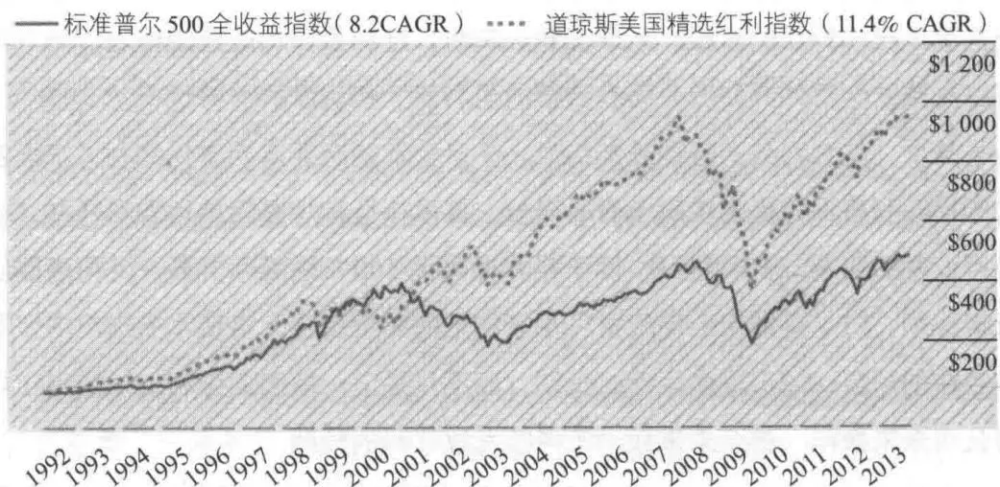

注释：假定在1991年12月31日投资1000美元得到的复合价值。

资料来源：晨星公司。

如果公司因为投资于其他有吸引力的项目而中断了红利，那么投资者应该密切关注市场对这个新项目的预期。随着投资者投资时间尺度的延长，红利会变得越发重要——红利收益率与红利增长率两者合起来可用来解释标准普尔500指数在过去10年总复合收益的 49%，过去20年的 83%，以及过去100年的 91% 。即使投资者并不热衷于百年投资蓝图，也要认真琢磨：我付出了现金购买到的股票，究竟用什么方式向我返还现金呢？现金并不会直接地来源于股票本身。股票不像债务，会有一个“期限”保证偿还本金，所以，股票投资者获得现金的基本方式就只有：（1）现金要约收购或清算，类似于债券；（2）现金红利。对一些公司来说，投资者的确可以通过在公开市场与主动型的私人/战略市场上对公司资产进行套利来赚取收益。但当一家公司足够大，大到没法收购的时候——比如谷歌，又怎么办呢？如果谷歌永远不支付红利，它又大到无法收购，投资者能将股票转化成现金的唯一方式就是在公开市场上将该公司的股票进行出售。然而，丰厚的红利却为投资者提供了看得见的收益，并且这种收益独立于股票价格或股票交易，它将股东从股票市场中解放出来，不再在那里随波逐流。

__何种红利__

红利给投资者带来相对直截了当的投资回报，同时，也可以作为投资者选择投资对象的判断依据。你可以直截了当地回避那些时常削减红利（在任何可预见的未来）的公司，专注于寻找红利增长的公司，并且依据红利判断股票的购买价格是否呈现合理性与吸引力。这种方式至少对那些慷慨或持续支付红利的公司是适用的，你可以从公司支付红利的情况来分析目标公司和股票。

当遇到一家慷慨支付红利的公司时，要问3个问题。红利是安全的吗？红利会增长吗？未来的红利前景预示着多高的总收益水平？虽然公司有无经济护城河与这3个问题并没有特别的对应关系，但在评估公司红利的安全性及其增长能力时，护城河起着实质性的作用。

__高乐氏公司（Clorox）__

让我们看看高乐氏公司（Clorox）。在晨星公司《红利投资者通信》构建的两个典型组合中，该公司在其中一个组合中长期占据一席。高乐氏所具备的经济护城河，让我们对它持续发放红利，实现长期增长的能力抱有信心。

自2013年1月至6月，高乐氏公司实现了5\.72亿美元的净利润。如表5\-1所示，采用常规现金红利的方式，公司向股东发放了3\.37亿美元（占比 59%）的红利。根据我们的计算，该公司当年赢得的投资资本回报率为 25% 。

表 5\-1 高乐氏：经济护城河带来红利支付\(单位：百万美元\)

2013年实际值按WACC计算值

净利润

572

117

税后净经营利润（NOPAT）

644

195

平均投资资本

2569

2569

投资资本回报率（%）

25\.0

7\.6

支付的红利额

337

337

红利/净利润（%）

59

288

注：税后净经营利润采用的所得税率为 34%

资料来源：公司报表，晨星公司。

假若高乐氏根本就没有经济护城河，则面对未来的竞争，公司也就不具备保持现有利润率水平的能力。在这种情况下，我们就会依据其资本成本来评估该公司的长期盈利能力，做出保守的判断。使用 8%的权益资本成本和 4\.6% 的长期债务资本成本，我们估计高乐氏的加权平均资本成本会是 7\.7%。假定高乐氏只赚取 7\.7% 的加权平均资本成本，反推其净利润为1\.17亿美元，这一数值比公司实际赚取的数值少了 80%，甚至比当年支付的红利总额都少了 65%。

幸运的是，确实有真凭实据表明高乐氏拥有经济护城河，我们可以找到它拥有的无形资产——众多历史悠久、广为人知的品牌，如 Hidden Valley（沙拉酱牌子）、KC Masterpiece（烧烤酱汁牌子）、Glad（垃圾袋牌子）、Kingsford（木炭牌子）、Brita（滤水器牌子）以及与公司同名的漂白剂和清洁剂。品牌知名度使高乐氏有能力向顾客索取高价，加之高效的生产设备，高乐氏的利润率明显高于同业竞争者。不过，高乐氏极少与行业巨头正面竞争，而是选择控制一个相对小的利基市场。

高乐氏的经济护城河在公司未来的红利增长中发挥着重要作用。公司常年将年销售收入的 2%投入到研究开发中， 4% 投入到资本支出中。如果高乐氏投入的项目是自己不具竞争优势的领域，我们便不能期望这些支出会产生丰厚的资本回报率，或驱动未来每股收益或红利的增长。但高乐氏并没有这样做，而是在受护城河保护的业务范围内投资开发新产品，提升制造效率。

虽然，不失公正地说，高乐氏未来发展的前景并非是突飞猛进的。它的年销售收入，由于受到几次收购及资产剥离的影响，在2003年至2013年间的年平均年增长只有 3% 。我们也没有什么理由相信消费者会在一夜之间将漂白剂的使用量翻番。但高乐氏会将自己的资源集中投入于受护城河保护的项目上，实现现有业务价值的最大化，并将大部分多余现金以红利的形式返还给股东，这在很大程度上保障了它的资本回报率，也增强了股东信心。得益于公司的盈利成长以及不断提高的红利支付率——这反映出公司不但没有财务压力，反倒有大量的现金并愿意支付出去——在2003年到2013年年间高乐氏的红利年增长率平均高达 11\.4%。

__必能宝公司（PitneyBowes）__

必能宝公司（Pitney Bowes）可以作为反面例子极好地说明这一规律。每一位曾经在收发室工作过的人都知道这个公司的名称。它在很长时期几乎垄断了美国邮政的邮戳机市场——这一垄断很大程度上来源于美国邮政当局的保护。这是因为美国邮政当局将邮戳机视作与印钞机同等性质，因而要保护它的唯一性。然而，随着邮件量的下跌，必能宝公司曾经拥有的宽阔护城河开始萎缩。这之后，管理层却花费数十亿美元收购虽然相近但几乎不受护城河保护的业务板块，随之而来的债务水平的大幅上升进一步恶化了公司正在衰退的核心业务，为它的困境雪上加霜。

至2012年，必能宝连续30年每年都发放红利。然而，随着盈利的下跌，红利增长的幅度越来越小——这是护城河遭到快速侵蚀的强烈信号。2012年年初，该公司的红利没有任何增长。到了2013年年初，红利削减了一半。而事实上，早在公司削减红利很久之前，公司股价就开始大幅下跌。在那之后，红利多少有点像是要贿赂当时进场的人，后来，连这样的贿赂都没有了。

公司要避免削减红利，这一点再怎么强调都不为过。自我们开始在《红利投资者通信》上构建典型组合到2013年中期，我们持有的削减红利的公司股票（即使是那些在红利削减信息刚在股价上有所反映我们就卖出的股票），在 81% 的持仓时间里都让我们遭受负的回报率。剩余的 19%是由于其中的3支股票在后期出现了红利的大幅增长。另一方面，我们持有的股息率不变的股票在 67% 的时间里获得了正的总回报（包括几只截至本文写作时新持仓且尚未提高红利的股票），而股息率增加的股票，则在 89% 的时间里跑赢了市场。

那么，我们如何才能预测出公司将会削减红利？红利支付率、资产负债表的稳健能力、盈利的短期前景这些都很重要，但缺乏经济护城河是造成红利风险的首要因素。表5\-2显示出经济护城河等级与红利削减率之间的关系，是我们在2011年凭借我们的美国公司样本研究得出的结论。没有护城河的公司在未来一年削减红利的概率高出有宽阔护城河的公司两倍多，而削减规模也相对高出一点。

表 5\-2 不同护城河等级下红利削减的频率与程度

护城河等级

削减频率 \(%\)

平均削减规模 \(%\)

没有

7\.4

69\.8

狭窄

5\.3

66\.8

宽阔

3\.0

66\.0

资料来源：晨星指数。

得益于我们对经济护城河的专注，以及对红利支付高于平均水平，且呈现出增长态势的要求，我们在《红利投资者通信》上构建的两个典型组合都随时间推移较为明显地跑赢了标准普尔500指数，见图5\-2。我们并不是每年都有优胜的业绩，也没有期待如此。然而，奇妙的是——或许也不难理解——这一胜出与我们持有的股票所拥有的较高红利水平密切相关。假如不考虑红利收益，单从股价变化来看，我们持有的组合是稍微跑输标准普尔500指数的。然而，我们从投资组合中每年获得的红利收益，比标准普尔500指数平均每年高出 2\.9% 。将红利收益计入在内，从2005年1月到2013年9月，这两个组合的总收益比标准普尔500指数平均每年高出 2\.2% 。如图5\-3所示，与标准普尔500指数相比，我们取得的业绩中很大比例都来自于红利。由此看来，我们的投资组合在策略上战胜了标准普尔500指数，而且这种胜出直接来源于其成份股票高于平均水平的红利收益率。同时，我们面临的价格波动也明显小于整体市场的波动。

《红利投资者通信》组合 标准普尔500

图5\-2 累积价格增值率（%）

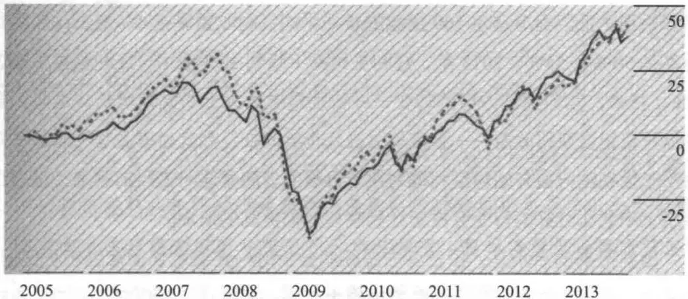

注：日期从 2005 年 1 月 7 日至 2013 年 9 月 30 日。

资料来源：晨星公司。

图5\-3 累积红利收益率（%）

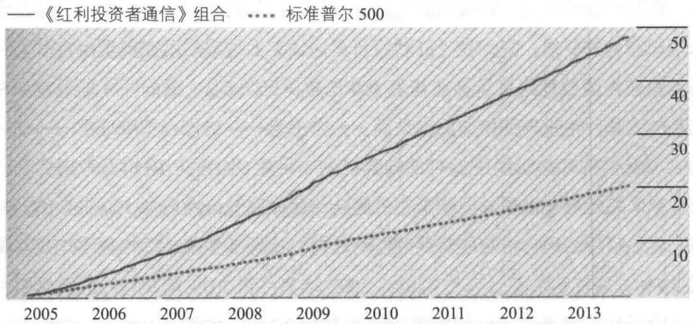

注：日期从 2005 年 1 月 7 日至 2013 年 9 月 30 日。

资料来源：晨星公司。

近年来，高出平均的红利收益率股票主要集中于包括消费品行业、公用事业、通信服务业和中游能源业在内的几个行业。这里面的许多公司拥有狭窄或宽阔的护城河。在这些行业之外，以历史标准来看，股票的红利收益率和支付率都相当之低。标准普尔500指数的长期平均红利收益率在 4% 左右，红利支付率在 50%∼55% 。2013年，红利支付率下降到 35% 上下，红利收益率接近 2% 。将来，我们预计人口的转变——特别是退休人士的大幅增长，这些人要依靠投资组合获得收益——会促使过去几十年间在红利支付率及红利收益率方面不予重视的行业开始将红利提到议事日程上。随着这一进程的到来，过去在传统上不怎么分红的行业会掀起红利收益大幅提高的浪潮。

由此得到的启示是，投资者在做股票分析时一定要密切留意经济护城河。护城河，而不是红利——不论公司规模大小——能够让一家业绩不良的企业转变成为一项好的长期投资。不过，红利能让一家受护城河保护的、财务健康的公司上升成为一家产生稳健收益及投资总回报的企业。

2026年2月13日

20:48

## 第6章 公允价值的评估

__第6章 公允价值的评估__

沃伦·巴菲特曾有教诲——“在别人贪婪时要恐惧，在别人恐惧时要贪婪”，这种投资理念的灵魂即在于股票价格终将回归公允价值。我们无法确切地判断一家公司的内在价值，但可以使用一些方法来缩小内在价值的可能空间，从而识别出最佳的投资机会。

Note

本章由乔尔·布卢默（Joel Bloomer）、马特·科莱纳（Matt Coffina）及加雷斯·詹姆斯（Gareth James）撰写，他们是晨星的护城河委员会成员，负责晨星公司的估值方法。

乔尔·布卢默，晨星公司亚太地区的股票及信用研究主管，晨星公司经济护城河委员会的成员之一。

马特·科菲纳，CFA，晨星公司旗舰性股票时事通信月刊《晨星股票投资者》编辑，实盘投资组合——乌龟与野兔组合的管理者。

加雷斯·詹姆斯，晨星公司亚太地区的培训与营运主管，审查亚太地区股票及信用研究团队的研究成果质量，晨星公司经济护城河、全球估值和澳大利亚投资委员会成员。

迄今为止，我们已经探讨了如何去识别高质量的公司，包括那些构筑起经济护城河以保护其超额收益的公司，那些竞争优势不断提升的公司，以及那些擅长于资本管理的公司。现在，我们探究如何对公司进行估值，以及如何辨别公司股票何时被高估，何时被低估。

当我们谈论股票价值时，我们是在特指公司的内在价值或公允价值，而不是股票价格。我们赞同沃伦·巴菲特的著名论断：“价格是你付出的，价值是你得到的。”长期来看，股票价格会回归公允价值，但在短期和中期，股票市场会对具体事件做出过度或不足的反应，这样就会创造出投资机会。在这种情况下，可靠地评估一家公司的公允价值对投资者制定合理的投资决策至关重要，这也是区分投资者与投机者的关键所在。

公司的内在价值可以被描述为它在未来生命期内产生的超额现金流的折现值。这就是众所周知的贴现现金流法，或叫DCF法，其中的贴现率反映了投资者对所投资本要求的必要报酬。当然，我们无法确切地判断一家公司的内在价值，但可以使用一些方法来缩小内在价值的可能区间，从而识别出最佳的投

资机会。在晨星公司，我们根据详细的公司、行业及宏观经济研究，结合我们一贯的分析框架，以及全面的同业互查评估，对公司内在价值或公允价值做出估计。

为了展示这一方法的威力，让我们先看看图6\-1，该图显示的是我们所涵盖的全体样本公司在过去10年的股价与公允价值之比，即P/FV的中位数。当股票价格上升到我们的公允价值估计值之上时，也就是P/FV大于1时，我们就判定该股票被高估；相反，当股票价格下跌到我们的公允价值估计值之下时，也就是P/FV小于1时，我们就判定股票被低估。该图显示，在2008年金融危机爆发之前，市场受乐观情绪的支配，股票市价高开，如果在此时盲目入场，投资者会损失惨重。是我们样本股票的公允价值告诫我们要遵循沃伦·巴菲特的教诲，“在别人贪婪的时候要恐惧，在别人恐惧的时候要贪婪”，避免在股市走高时盲目入场，或在股市走低时匆忙退场。由此可见，公允价值的估计对投资至关重要，因为随着时间推移，股票价格终归会回归公允价值。始终以公允价值为核心评估股票价格，让我们规避市场上常见的行为错误，是战胜市场的利器。

图6\-1 市场价格与公允价值之比的中位数

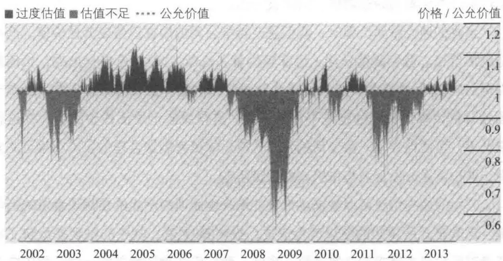

资料来源：晨星公司。

__估值概念__

在解释如何运用贴现现金流法确定股票公允价值之前，我们先谈谈估值的一般性问题。在股票市场，一种常用而简便的估值方法是倍数分析法。正如储蓄者存款时会追求高利率一样，股票投资者也常常以高收益率为标准投资股票。一种最为常用的指标是盈利收益率——或者更准确地说，是它的倒数，股价/每股盈利（即市盈率，或叫P/E比率）。其他倍数，比如股价/每股销售收入、股价/每股现金流、股价/每股账面值，也是我们常用的比率指标。P/E估值法能为一支股票识别出一个公允的P/E倍数值，指引投资者在其实际倍数低于公允倍数时买入，在其实际倍数高于公允倍数时卖出。这一指标计算起来相对容易，只需要当前的股价和下一年的每股盈利预测值，但这一指标以及其他倍数比率指标也存在很多的缺点。

如果公司的盈利在隔年的财政年度可能会发生显著的变化，投资者就很难依据倍数比率指标来进行估值。在评估盈利变动大的公司（包括那些周期性强的公司、高增长的公司以及包含矿产公司在内的资产寿命有限的公司）时，这种困难尤为显著。确定一个合适的倍数也不那么容易。投资者通常会观察相似公司的情况，对同类公司应用一致的比率值。然而事实上，寻找足够类似的公司已经很难，这样的做法还有可能使投资者陷入自我强化的过度估值循环，这种现象在20世纪90年代末的技术股泡沫中就出现过。在晨星公司，我们没有完全弃用倍数比率法，但我们估计公允价值时会以DCF为基础，把倍数比率作为交叉验证来使用，用以检验DCF得到的结论。虽然我们不会用倍数比率来确定一家公司的公允价值，但比率值可以为公允价值提供某些洞见，帮助我们理解当前市场是如何评估公司价值的。

与简单的倍数比率法不同，贴现现金流分析要求投资者对未来的自由现金流进行尽量精准的预测，并用一个贴现率将未来值贴现到现在时点。自由现金流是公司扣掉所有经营支出及必要投资之后剩下来的货币额。这部分现金是现成可用的，或“自由的”，是可以通过红利发放、股票回购、偿还债务本息等方式分配给投资人的（包括股东和债权人）。之所以必须贴现，是因为收到现金是在未来，而未来的1美元的价值少于今天的1美元的价值，其原因有两方面：（1）对当下就持有的现金，你可以用它来投资，赚取利息；（2）未来的现金存在违约风险。违约风险越大，贴现率就越高——或者说，你愿意放弃未来的1美元以换取的今天的金额就越少。

__资本成本与资本回报率__

投资的目的是获得经风险调整后的收益率，而投资者要求这个收益率超过投入资金的资本成本。在评估公司的收益时，我们偏好于扣除非经营损益，并剔除财务杠杆效应后的基本收益。因此，在计算投资收益率的“收益”项时，我们从经营利润中（息税前盈利，或叫EBIT）扣除非经营损益，再减去现金税款，以此得到息前盈利（或叫EBI），把它作为公式中的分子；为了排除财务杠杆带来的影响，我们将股东及债权人两者投入的资本都计入投入资本，即IC，把它作为公式中的分母。在计算资本成本时，我们扣除那些公司虽然持有但不直接产生利润的资产，只考虑产生盈利所需要的资本。由此，我们便得出投资收益率或投资资本回报率，即ROIC。当我们谈论回报率时，我们指的是：

正如我们先前讨论过的，我们经常把投资资本回报率以及增量投资资本回报率（即RONIC）超过公司的加权平均资本成本（即WACC）的部分，作为护城河的量化证据。

有时，我们在计算投资资本时也计入资产负债表中的其他科目，比如递延所得税资产、净负债、商誉或其他无形资产，以提高ROIC的可比性及有用性。比如，有些分析师为了得到更准确的投资资本数值，会将研究与开发支出或租赁支出资本化；有些分析师会采用只关注投资增量所带来的盈利增量的增量投资资本回报率（RONIC），因为一家公司有可能在现在资产上获得高的收益率，但在新投入的资本上缺乏获得高回报率的能力。将ROIC或RONIC与加权平均资本成本相比，我们就可确定该公司是否在产生超额收益。

所有企业都需要资本才能营运。所以在计算超额收益时，必须扣除掉资本成本。我们使用WACC来确定资本成本，因为它既考虑了债务的成本，也考虑了权益的成本，并且用各自相应的预期资本结构作为权数进行加权。在贴现现金流模型中，我们用WACC作为贴现率，它综合反映了股东（权益成本，即COE）及债权人（债务成本，即COD）两者要求的收益率。

__晨星的估值方法__

在晨星，我们使用一种标准的模板对每一家样本公司构建DCF模型。在实际操作中，大多数的DCF模型都要求分析师对未来5至10年的现金流做出详尽的预测，这段时期通常被定义为明确预测期。超过这个时期，预测的准确性越来越低，详尽的现金流预测就变得价值有限。此时，我们通常选取明确预测期最后一年的现金流预测值，将之作为根据求得总额值，又称为永续年金或终值。为了终值的合理性，投资者要确保明确预测期末所预测的现金流是处于周期中间的水平的。这样的模型被称为两阶段现金流贴现模型。

在晨星公司，我们使用传统DCF的改良版本，并将经济护城河研究方法有机地整合进去。其基本理论是，对于所有企业，超额收益或经济利润最终都会遭到竞争的侵蚀，但经济护城河会延缓侵蚀的过程。

从模型构建的角度来看，要将护城河方法整合进财务模型之中，传统的DCP模型就被扩展成3个阶段，如图6\-2所示。我们保留前面对现金流做出详尽分析的时期（或叫明确预测期）并将这段时期定义为阶段1；接着，我们划分出一个阶段2，在这段时期，我们假设超额收益遭到竞争的侵蚀；最后在阶段3，我们假设超额收益已经消失，即RONIC=WACC。对于没有经济护城河的公司，超额收益将会很快遭到侵蚀，阶段2会很短暂；对于拥有狭窄护城河的公司，我们预计其超额收益至少持续10年；对于具有宽阔护城河的公司来说，我们预计其超额收益至少持续20年。因而，阶段2的时长取决于公司拥有的竞争优势。

图6\-2 现金流变化举例图示

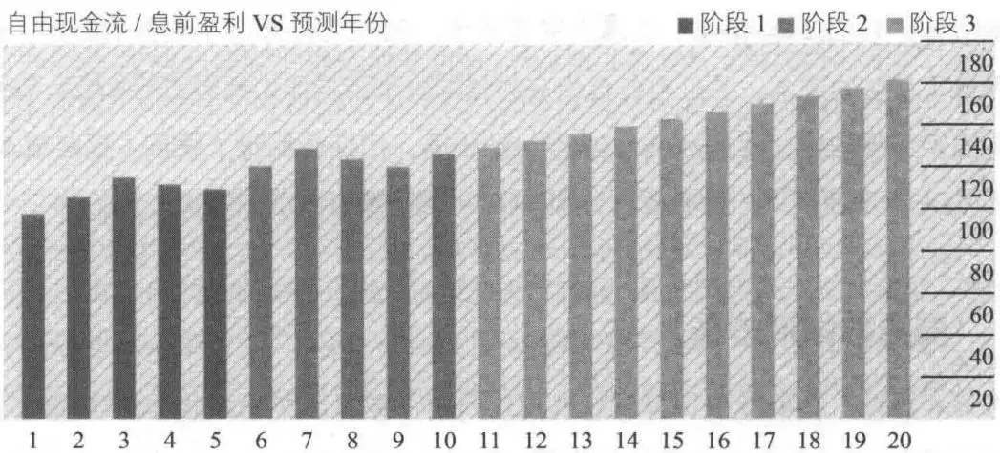

资料来源：晨星公司。

图6\-3 RONIC与WACC变化举例图示

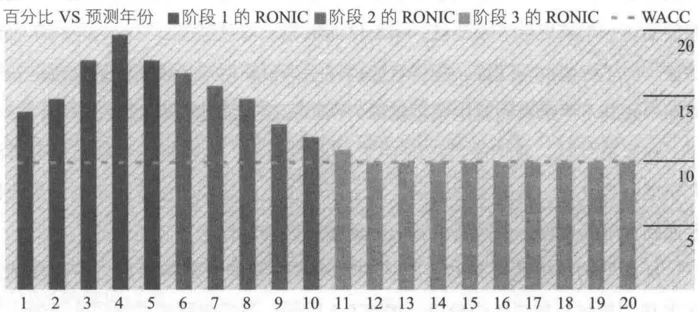

资料来源：晨星公司。

有了3个阶段的数值，我们要得到公允价值的估计值，只需要简单地汇总3个阶段的现值，减去净债务的价值，再除以股票的发行数量就行了。在阶段1，即明确预测期之后，我们假设EBI在阶段2按不变的速度增长，并且公司每年将 EBI 中的一部分拿来进行再投资。当然，正如前面讨论过的，假设情形不同，具体预测值也会随之不同。在阶段 3，我们按资本成本推算出 EBI 的取值，并以这一终值作为该阶段现金流的代理变量，直到永远。从收益率的角度来看，其变化通常与图 6\-3 所示的情形类似，在阶段 1，RONIC 超过 WACC；在阶段 2，RONIC 向 WACC 衰减；到阶段 3 之后，RONIC 等于 WACC。

__举例：计算ROIC__

为了阐明ROIC的计算，让我们以一家拥有宽阔经济护城河的公司举例。这家公司名叫帕特森公司（Patterson），是一家牙医、兽医医用材料分销商。帕特森依靠成本优势取得了宽阔的护城河——公司是美国仅有的几家全国性牙医及动物健康药品分销商之一，由于规模经济，它在仓储、物流网络、顾客及供应商关系上所做的投资产生了有效的杠杆效应。表6\-1显示出帕特森公司在2012及2013财政年度（公司的财政年度结束于4月底）的资产负债表。

表 6\-1 帕特森公司的资产负债表 \(单位：百万美元\)

2012年4月

2013年4月

现金及现金等价物

574

505

应收账款

465

448

存货

320

361

预付款及其他

45

47

流动资产合计

1404

1361

厂房与设备

196

192

长期应收账款

92

85

商誉

810

824

可确认的无形资产

213

197

其他

26

23

总资产

2740

2682

应付账款

208

250

（续表）

2012年4月

2013年4月

应付工资

66

71

其他应付款

130

128

一年内到期的长期债务

125

0

流动负债合计

530

449

长期债务

725

725

递延所得税

82

93

其他

28

21

负债合计

1364

1287

股东权益合计

1375

1395

注：如果公司资本结构中有优先股，那么，WACC公式中会多出一项。

资料来源：帕特森公司年报。

我们可以利用资产负债表来计算帕特森的投资资本。在这次例证中，我们做一个简化的假设，假设帕特森所有的现金及现金等价物都是公司经营必需的，公司的商誉、其他长期资产、其他长期负债以及递延所得税都不计入投资资本中，因为它们并不用于经营活动。在这样的假设下，帕特森在2012年及2013年末投资资本的计算见表6\-2。

表 6\-2 帕特森的投资资本 \(单位：百万美元\)

2012年4月

2013年4月

现金及现金等价物

574

505

应收账款

465

448

存货

320

361

预付款及其他

45

47

厂房与设备

196

192

长期应收账款

92

85

可确认的无形资产

213

197

经营资产

1904

1836

（续表）

2012年4月

2013年4月

应付账款

208

250

应付工资

66

71

其他应付款

130

128

经营负债

405

449

投资资本（经营资产\-经营负债）

1499

1387

资料来源：帕特森年报。

表6\-3显示帕特森公司在2011—2013年度的利润表，我们可以使用这张表计算出帕特森的息前盈利。

表 6\-3 帕特森公司的利润表 \(单位：百万美元\)

2011年4月

2012年4月

2013年4月

净销售收入

3416

3536

3637

销售成本

2271

2373

2446

毛利额

1144

1163

1191

毛利率（%）

33\.5

32\.9

32\.7

经营费用

768

805

836

经营利润

376

358

355

经营利润率 \(%\)

11\.0

10\.1

9\.7

其他净收益

6

2

3

利息费用

\-26

\-30

\-36

税前利润

356

330

321

所得税

131

117

111

有效税率 \(%\)

36\.7

35\.5

34\.5

净利润

226

213

210

摊薄后的发行股票数

119

111

104

摊薄后的每股收益

1\.89

1\.92

2\.03

资料来源：帕特森年报。

息后盈利 EBI 的最简单计算是用净利润加上所得税影响后的利息费用，对本例 2013 年即为，

对于投资资本成本的计算，我们一般使用上一年与本年的投资资本的平均值（对于帕特森公司在2012—2013年度来说为14\.43亿美元），由此，投资资本回报率为：

平均投资资本

接下来，让我们计算帕特森的加权平均资本成本。投资者通常应该使用债务及权益的市场价值来计算各自的权重，但在本例中，为简便起见，我们使用的是账面值。

帕特森在2013年末发行的总债务为7\.25亿美元。股东权益为13\.95亿美元。所以，总资本为7\.25亿美元 \+13\.95\+13\.95 亿美元 =21\.2= 21\.2 亿美元。这比我们估计的投资资本高，因为我们在进行估计时曾假设某些资产在性质上属于非经营性，尤其是数量庞大的商誉。

据此，我们计算出帕特森的权益资本在资本结构中的权重为 债务资本的权重为

我们还需要估计出帕特森的债务成本和权益成本。债务成本可以用利息费用来计算。帕特森在2013年支付了3600万美元的利息费用，而它的平均债务额为7\.875亿美元（对2012年及2013年末的债务合计求平均，里面包括2012年的1\.25亿美元的短期债务）。则帕特森的有效债务成本被估计为：

相比之下，权益成本的估计则更具挑战性，因为它难以被观察。权益成本反映的是投资者在股票公允定价下预期获得的收益。晨星公司使用资本资产定价模型（即CAPM模型）的改良版本来估计权益成本值。按照我们的方法，在最发达的市场，公司的这一取值介于 8%∼14%。对于帕特森公司，我们估计其权益成本为 10%，这是我们在样本公司中使用最多的数值，反映了平均的系统风险水平（也叫市场风险或通过多样化分散不了的风险）。

将上述得到的数值代入WACC公式之中，我们就估计出帕特森的资本成本，即：

所得税率

由于 的ROIC超过了 的WACC，帕特森获得了超额资本回报率。这意味着帕特森可能拥有经济护城河，当然，拥有超额收益率并不意味着它必然拥有经济护城河（我们还必须评估帕特森的定性特征才能确定公司是否拥有可持续的竞争优势）。

请注意，我们选择的调整方法对分析结果有重大的影响。比如，如果我们在帕特森的投资资本中计入平均8\.17亿美元的商誉，ROIC就会降低到 （仍然高于估计的资本成本）。

__预测未来的自由现金流__

在估计公司的公允价值时，最具挑战性的工作是预测未来的现金流。有经验的投资者都知道，投资的核心即在于比市场更好地预测出未来的现金流。抛开那些对贴现现金流法和终值法的拥护言论，要成功投资，最重要的是要比其他投资者具备更好的前瞻性，更好地预测出公司未来的利润和现金流。并且，由于明确预测期最后一年的数值在任何DCF模型中——不只是晨星公司采用的方法——都是确定终值的基础，因此，对明确预测期末公司盈利和现金流的估值最好是处于“正常状况”或“周期中间”情形下的预测值，这一点尤为重要。正因为如此，我们在这上面投入大量的时间。还有一点非常重要，那就是投资者要将注意力集中于长期竞争力的动态演变，这不仅有助于护城河及其趋势评级，也利于估值工作，如此我们就会优先考虑最核心的问题——确定公司产生长期盈利及现金流的能力。

接下来，将息前盈利转化成自由现金流时相对简单的。你只需减去净的新增投资——包括资本支出、营运资本上的净投资（存货、应收账款及应付款项）、收购，再减去折旧及资产剥离。我们要区分开企业的自由现金流（属于股东和债权人所有）和权益的自由现金流（向债权人支付了所有债务后留给股东所有）。由于我们估计的是整个企业的价值，而不只是留给股东的现金流价值，我们使用企业现金流。

尽管历史的自由现金流可根据财务报表快捷地计算得出，但预测未来从来都不是一件轻松的事。虽然历史数值提供了预测的基础资料，但谁也不能期望未来会复制过去。市场常常对近期的业绩做出外推预期。但如果想要洞悉到有价值的投资机会，你必须提前识别出处于转折点的公司，判断其业绩将会改善或恶化。

为了对未来做出好的预测，分析师经常会将财务报表中关键性的线上科目分解成若干组成部分。比如，销售增长率和利润率可根据地区分布、部门结构及产品线类别分开考虑，分析师针对这些组成部分进行预测。这样做比预测合并的财务报表更能加深分析师对业绩驱动因素的理解。在推测时我们需要考虑许多因素，比如：（1）公司的竞争地位；（2）行业动态变化及成长性；（3）管理战略及执行能力；（4）顾客及供应商的谈判能力；以及（5）外部因素，比如监管、经济状况、技术发展、人口及社会趋势。

经济护城河对现金流预测具备直接的影响。有强大竞争优势的公司通常会在盈利中取得更高的自由现金流（因为再投资的需求更低），或成长更快的现金流（因为再投资的资本带来高的增量盈利贡献），或两者兼而有之。另外，超常的增长及盈利能力会引发竞争格局的变化，那些缺乏经济护城河的企业也许会遭受市场份额的损失、价格压力、利润率萎缩或资本回报率下跌。

估值模型中一个最重要的假设是明确预测期最后一年的息前盈利。由于晨星公司的分析师只对前面5至10年（阶段1）的数值做出过专门的测算，阶段1的最后一年便成为后续年份的起始点。这一年的盈利数值必须是销售收入及利润率处于正常状况或周期中间条件下的取值。如果在阶段1结束时盈利处于周期顶部，或明显不可持续的环境条件，此时的公允价值估计肯定就会偏高。类似地，如果盈利在阶段1结束时处于周期底部，企业的内在价值就会不可避免地被低估。这一主张在图6\-4中有说明。

不正确：以盈利谷值作为阶段2~3的预测起点

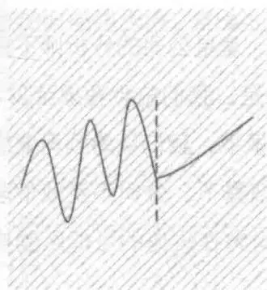

资料来源：晨星公司。

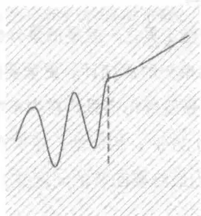

不正确：以盈利峰值作为阶段2~3的预测起点

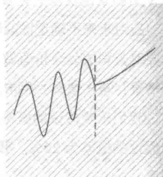

正确：以盈利周期中值作为阶段2~3的预测起点

图6\-4 阶段1最后一年的息前盈利预测情形

表 6\-4 贴现现金流分析的优缺点

优点

缺点

DCF估值法极其灵活；它可以解释几乎所有你能想象到的各种情形

未来在本质上不可预测；预测时间越长，出错的可能性就越大

DCF能让你将很多年的预测整合在一起，可用于近期亏损的或异常高速增长的公司

基于DCF模型的估值结果只取决于输入变量，会存在“垃圾输入，垃圾输出”的现象

最常见的一种替代做法是运用市盈率倍数得到某一年的盈利数值，但这种做法过于集中于短期，且要求选择合适的市盈率倍数，而选择通常很主观随意

自由现金流与红利不是一回事。管理层可以将现金浪费在不好的投资项目上，或让现金躺在资产负债表上，赚取次优的收益，最终毁灭股东价值

你用不着绝对准确，只要你的投资是有安全边际的（只在股票交易价低于你最保守的内在价值估值时才买入）

资料来源：晨星公司。

估计普通股的内在价值，更多的确实不是科学，而是艺术。在贴现现金流模型中涉及太多的假设。比如，在预测中，我们通常会对销售收入增长率、正常状况下的经营利润率、在营运资本及厂房设备上的新增投资做出假设。而未来在本质上又不可预测，不管你做了多少研究与分析，未预期的事情还是有可能会发生：技术进步、消费者偏好改变、监管或法律变化、新竞争者出现等，DCF分析法的优缺点见表6\-4。

应对未来不确定性的最佳工具之一就是情景分析。晨星公司的分析师不只是要对公司的公允价值做出单一时点估计。更重要的是，我们总会考虑至少3种情景：基本情景、牛市情景及熊市情景。在牛市情景下，我们认为公司业绩超过我们乐观假设的概率为 25% ；相似地，在熊市情景下，公司不及我们悲观假设的概率为 25%。我们最终要回答的问题是公司内在价值的可能区间在哪里。

如果一家公司面临的未来可能结果呈现出对称分布，或许，我们可以想象该公司的公允价值就如同钟形概率分布所表示的那样，见图6\-5。

图6\-5 情景分析

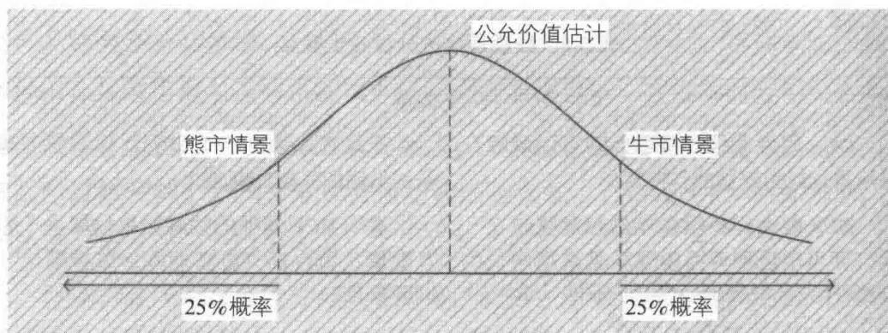

资料来源：晨星公司。

很多因素会影响一家公司的估值，但其中最为重要的是有无经济护城河。强大的竞争优势会让公司有能力获得诱人的投资收益率，由此带来的增长会转化为股东价值；没有护城河的公司则要承担超额收益遭受竞争侵蚀的风险。

__晨星的股票评级__

接下来，让我们将探讨的话题从如何进行公允价值估计转移到晨星是如何进行股票评级的，晨星的股票评级全面地汇总了以下3方面的内容：股票在当前股价下的投资吸引力，股票公允价值估计值，及其不确定性水平。根据这些内容，我们定义股票的等级，使用者就可以确切地理解我们的关注点，了解到该如何使用评级。图6\-6概括了我们的研究步骤。

图6\-6 晨星股票评级体系

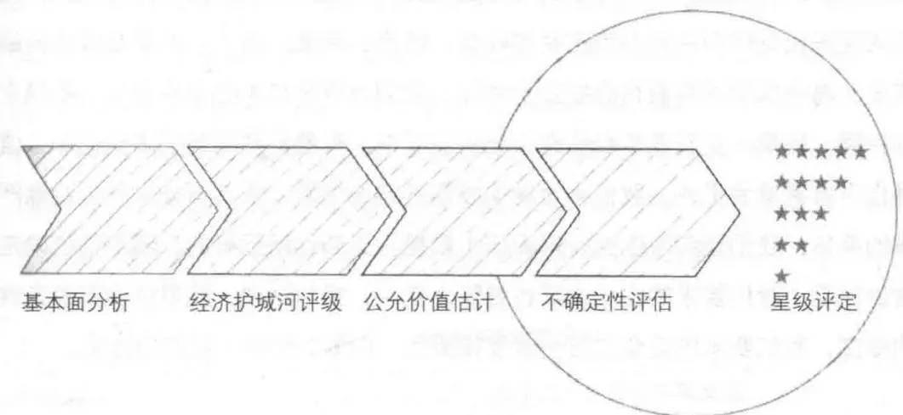

资料来源：晨星公司。

如果你以前应用过DCF模型，你就知道它对参数高度敏感，但参数取值也有主观性。即使是一位非常用心的分析师，有过几个月甚至几年的应用经验，不管他提出的假设看起来多么合理，他的估计都有可能偏离一家公司的内在价值。我们作为专业的评级机构，通常是能以高出平均的水平，采用更适合的方法，做出更好的质量控制，提出更合理的假设的。即使如此，我们也不能完全避免犯错，因为估值不是一门精确的科学。因此，我们对现有估值方法做出了补充——我们评估自己对公允价值估计所抱的信心，并将此转化成估值不确定性评级。对任何一家给定的公司，我们既要做出公允价值估计，也要做出不确定性评级，两者的结合共同构成晨星的股票评级系统。为了阐明不确定性评级及其在我们系统中所处的地位，让我们简要地定义一下星级评级体系：本质上这一体系是前瞻性的，经不确定性调整后的投资评级，预示一支股票未来收益的可能方向及大小。

__估值不确定性与权益成本__

不确定性的确切含义是什么？在评估不确定性时，我们想问的是：“我对股票做出的内在价值估计有多大可能是错的？”经过十多年的研究与开发，我们决定采用五档来评估不确定性的程度：低度、中度、高度、非常高度和极端高度，每一档次都有着相应的安全边际。我们为每家样本公司评定一个不确定性评级。如果一支股票的股价在公允估值以下，有着特别明确的安全边际，值得投资者花重金买入，我们会为这支股票评定5颗星。倘若市场对一支股票严重的高估，我们就会为这支股票评定1颗星。正如你所预料的，随着估值确定性的提高，我们要求的安全边际也就随之变小；换句话说，随着估值不确定性的提高，我们要求的安全边际也就变得更大。图6\-7说明了我们的体系。

图6\-7 不确定性评级

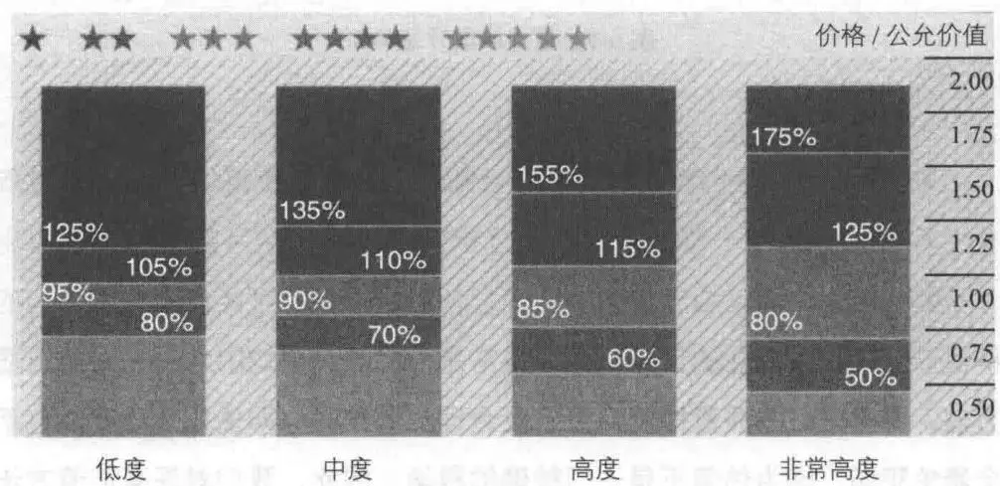

资料来源：晨星公司。

如果不确定性处于低度，意味着我们对预测结果抱有相当大的信心，当股价比公允价值低 20%的时候，我们就会为此股票授予5颗星；相反，如果不确定性属于非常高度，只有当股价低于公允价值 50%的时候，我们才会为此股票授予5颗星；相应的，如果不确定性处于中档，我们要求的折价率为 30%；如果不确定性处于高档，这一数值则为 40% 。举例来说，如果我们认为某支股票的合理估值为每股20美元，在低度不确定性评级下，我们考虑的买入价是16美元；在中度不确定性评级下，我们的预期买入价为14美元；在高度不确定性评级下，我们的预期买入价降至12美元；而在非常高度的不确定性评级下，我们愿意支付的买入价则只有10美元；在极端高度不确定性评级下，我们对安全边际的要求会进一步加大，在这种情况下，我们会确定一种“象征性的”公允价值，但由于此时的投资风险太高，我们通常不会买入。

在我们评定不确定性评级时，一般将风险划分成两种：系统的和非系统的（或叫公司特有的）。我们的不确定性评级要兼顾这两种风险，如表6\-5所示。原则上，我们应尽可能地将每种影响估值的因素都考虑进来。

表 6\-5 估值不确定性评级

系统风险

\+

非系统/公司特有风险本

权益成本

所有不包含在权益成模型假设中的因素

公司收益相对整体经济的贝塔系数

监管变动

经营杠杆

大的牌照、合同，或专利到期

财务杠杆

高度集中的顾客基础

竞争变化

遭受分裂或去中介化风险

动荡市场中的价格接受者

不可预知的管理

有问题的资本配置

资料来源：晨星分析。

在我们的分析框架里，我们度量系统风险的指标是公司的贝塔系数，或相对整体经济的敏感系数——给定GDP的变化，相关公司的内在价值怎样变化？有时，这也被称作不可分散风险。在此提醒各位一句，我们在权益成本假设中也要考虑不可分散的系统风险。

非系统的、公司特有的风险包含所有其他影响估值的因素，比如潜在的实质性监管变动，大的牌照、合同或专利到期，高度集中的顾客基础，快速变化的竞争，在动荡市场中作为价格接受者的定位，不可预知的管理因素（特别是不断变化的战略）以及一些很难预测、但对内在价值估计可产生实质性影响的其他公司特有因素。不确定性因素越具有实质性，我们给出的不确定性评级就越高。反过来，不可预知的力量越小，不确定性评级就越低。

总的来看，不确定性评级囊括了一切系统的及非系统的因素，只要它们有可能干扰我们的内在价值估计。所有这些事无巨细、计穷虑极的研究做完之后，我们回过头来问自己：“我们得到的公允价值估计有多近似于真值？”

用来解答不确定性疑问的另一种方法是进行广泛的情景分析，这一点我们在前面简要地提到过。如果下一年发生经济衰退，那怎么办？如果不只是衰退还出现债务危机又如何应对？如果开发的药物最终到了药房的货架上会有什么情形出现？战争会导致油价飙升吗？如果在线零售占到 50% 的市场份额会怎样？要考虑的可能性无穷无尽，但对每家公司及每一个行业，通常都有一些关键性的主题是值得从牛市和熊市两种视角加以思考的。比如对开办赌场的公司，我们需要知道牌照是否是独家的，到期后，每一张牌照有多重要，以及有多大可能性能换新；对于银行，我们需要知道它们的贷款标准是否宽松，资产负债中是否隐藏着定时炸弹，是否有足够的资本充足率可以防御不测；对于依靠自然资源的公司，我们需要知道它们作为价格的接受者承受价格下跌的能力有多大，如果出现未预期的供应压力，经营杠杆会有多大的上升。

我们的分析师需要考虑各种情景，但首先要弄清楚，对于某一家特定公司，公允估值的合理区间在哪里。一名好的分析师在被询问一家公司的估值时，他的回答通常是这样的，“也许在20美元上下，但几乎可以肯定介于16至25美元之间”。我们愿意将结果考虑得比基本情景假设下的取值更精确，但结果确实存在很多可能性，所以我们会先确定出置信区间，评定不确定性评级，然后再针对取值做出买入或卖出推荐。

在选定不确定性评级时，也可能存在一些常识性的比较要素。拿可口可乐、美国运通、亚马逊、第一太阳能（First Solar）和希腊国民银行（National Bank of Greece）为例。你可能也猜得到，这些公司的估值不确定性是按名单顺序递增的。可口可乐是否要像其他公司一样，在预测其产品需求时周密地考虑政治、石油价格、监管以及其他多种奇怪因素的影响？并不需要；美国运通是一家优秀的公司，但它比可口可乐更易受到资本市场及消费支出波动的影响；亚马逊是一家神奇的公司，但它面临着许多竞争，所以要不断地将大部分盈利用于再投资——有时是为了规模扩张，有时是为了提供全新的服务，这样的再投资并非必然成功，所以会带来不确定性；第一太阳能公司也相当不错，但它非常依赖于政府的补贴，并且，这个行业的产能一直在大幅提升，这无疑会导致供应激增，价格跳水，使得这家公司的未来充满了不确定性；相比之下，希腊国民银行则有着更高的不确定性，我们甚至不能确定在接下来的10年希腊是否还是一个完整的国家，更别说这样一家依靠财务杠杆生存的金融机构了。

既然我们已经接触到风险与不确定性，那就来想想，两者之间有什么差异？如果在词典里查阅“风险”词条，你就会发现其定义聚焦于损失的可能性，而忽略了意外的上涨行为（金融词典对风险的定义要稍为好些，既涉及潜在的下跌，也涉及潜在的上涨）。但我们查阅“不确定性”词条时，其定义就要平衡多了，既包括好的结果，也包括坏的结果，不会偏向某一方。所以，尽管风险与不确定性两者之间没有太多技术性的差异，但风险的内涵偏向于下跌，而不确定性包含了上涨与下跌两者。

不确定性考虑上下变动的主张很适用于我们的安全边际概念。你或许已经注意到，随着不确定性的提高，股价会更大幅度地偏离我们的公允估值。如果我们对一支股票的估值属于低度不确定性，触发1颗星评级的股价大概位于公允价值之上 25%的位置；在中度不确定性等级，触发股价高于公允价值 35% ；在高度不确定性等级，触发股价高于公允价值 55% ；在非常高度不确定性等级，触发股价则高于公允价值 75%。

假若我们对某支股票的基准公允估值为每股20美元，如果这是一家属于低度不确定性的公司，我们会在每股25美元时考虑卖出；如果它属于非常高度不确定性的公司，卖出价则为35美元。从“风险”视角来看，这种做法似乎是反直觉的；但从“不确定性”视角来看，非常高度不确定性意味着我们的公允估值处于高低值之间，买卖触发点在两边都符合逻辑。我们在估值上留有较大的误差范围，买卖触发点也会随之加宽。

换种方式思考，我们可以把5颗星的价格水平与公允估值之间的区域看成是下跌风险，这个下跌的意思是说，真实的内在价值可能低于我们的估值；但我们也可以把公允估值与1颗星价格之间的区域看成是上涨的可能性，意思是说，未来的真实价值可能会好于我们的预测。

综上所述，贴现现金流分析法是估计公司内在价值的一种重要工具，而寻求公司现金流及公允价值可能结果的范围会使我们的分析更加全面，有助于我们在投资之前估计出安全边际。当然，许多因素影响公司估值，但经济护城河是最重要的，因为强大的竞争优势会让企业有能力获得诱人的投资资本回报率。

## 第7章 护城河评级可用来预测股票收益率吗

__第7章 护城河评级可用来预测股票收益率吗__

以长达10年的数据进行分析，我们可以总结出，与拥有宽阔护城河的股票相比，没有护城河的股票涉及更大的风险和更低的累计收益率。

沃伦·米勒，CFA，是晨星公司全球量化研究的副主席，他领导着公司的量化研究团队，为投资者创建缜密的分析工具和方法。除此之外，他采用适用于机构投资者的股票投资策略，管理着晨星公司的长期投资组合。他曾经领导了晨星公司量化股票评级的开发。

沃伦·米勒，CFA，是晨星公司全球量化研究的副主席，他领导着公司的量化研究团队，为投资者创建缜密的分析工具和方法。除此之外，他采用适用于机构投资者的股票投资策略，管理着晨星公司的长期投资组合。他曾经领导了晨星公司量化股票评级的开发。

过竞争优势分析，一家公司的管理团队可以制定出更好的战略决策；那么，通过竞争优势分析，投资者能够制定出更好的投资决策吗？换句话说，投资者应该在复杂的护城河分析上面花费宝贵的时间吗？在这一章，我们将运用一些简单的数据分析来检验护城河评级对股票收益率预测的作用。晨星公司从2002年开始发布护城河评级，至今已有十多年的数据供我们进行分析。

通过研究我们发现，那些拥有宽阔护城河评级的公司股票的确显现出更小的下跌风险及上涨潜力。在股市恐慌或低迷时，拥有宽阔护城河的股票通常跑赢那些没有护城河的股票。尽管没有强有力的证据能够证明所有拥有宽阔护城河评级的股票都能获得经风险调整后的超额收益，但那些拥有宽阔护城河评级且市场估值偏低的股票的确如此。因此，我们可以大胆地说，护城河评级是一种有价值的风险管理和证券选择工具，尤其当我们把它与估值指标结合起来使用的时候。

考察护城河评级业绩最直接的方法就是，按照护城河评级对公司进行分组，之后检验各组股票的收益分布。

表7\-1显示的是各组的股票在为期一个月的时间范围内取得的业绩情况。当然，对于长期投资者来说，一个月的时间过短。但是，这一时间长度上的收益率研究同样富有意义。其一，短期收益与长期收益之间存在着直接的数学关系：长期收益是同期的短期收益的几何平均值。在此，我们就可以利用长达十多年的资料计算出月度平均收益率，与不同市场条件下的数据资料进行对比分析；其二，我们可以合理的假设，即使是一名长期投资者，也会依据预期收益在一个月期限内出现的波动调整其投资组合成分。

在表7\-1中，我们首先注意到，不同护城河评级分组的月平均收益率没有任何差异。这意味着，你从3组中随机选择一组股票并持有一个月，那么在一个月的期间内，这种随机性不会对你的收益率产生任何影响。

当然，平均值没有告诉我们做这3种投资所涉及的风险。标准差描述了收益率分布的离散程度，或者说收益偏离平均值的程度有多大。没有护城河的股票，其标准差几乎是拥有宽阔护城河的股票的两倍，这意味着前者的收益率有更大的可能性会偏离平均值。这一点也反映在四分位数间距上，相比拥有宽阔护城河的股票，没有护城河的股票有着更大的四分位数间距。

表 7\-1 描述性统计：护城河各等级下后续每月收益率的边际分布

宽阔

狭窄

没有

均值 \(%\)

1\.0

1\.0

1\.0

标准差 \(%\)

6\.9

8\.7

13\.2

四分位数间距 \(%\)

7\.3

8\.7

12\.3

百分之五分位数 \(%\)

\-9\.6

\-12\.5

\-18\.9

中位数 \(%\)

0\.7

0\.8

0\.5

百分之九十五分位数 \(%\)

11\.5

14\.3

20\.8

偏度

0\.0

0\.3

1\.2

峰度

5\.5

9\.1

16\.2

资料来源：晨星公司。

值得注意的是，数据并不是围绕均值对称分布的，而是通常呈现上涨潜力大于下跌可能的分布（即正向偏态）。我们发现，没有护城河的股票有着最大的偏度，也就是说，相比于有宽阔护城河的股票，它们的收益更有可能出现正偏。这在经济学的视角下也是讲得通的，拥有宽阔护城河的股票大多是那些极不可能出现爆发性增长、更加成熟的公司的股票，尽管我们从最近的金融危机中看到，几乎所有的公司，无论其规模和成熟度怎样，都极易受到大规模的经济衰退的影响。

最后，让我们来看看分布曲线的尾部。分布的“厚尾”，也叫做峰度，告诉我们的是极端正面或负面事件出现的可能性。从没有护城河的股票相对较高的峰度来看，这类股票发生极端事件的频率会比拥有宽阔护城河的股票更高。

由此，我们可以总结出，与拥有宽阔护城河的股票相比，没有护城河的股票有着更加偏离均值的分散程度，但并没有因此带来额外的预期回报。没有护城河的股票的确有些受益于正向偏度，因为这些股票有着更大的高成长可能性，但总体上来看，这类股票的风险/回报之比却并不诱人。

表7\-1并没有告诉我们全部的事实。它忽略了一个很重要的维度——时间。通过检验每个护城河评级组别中的股票跨时期的表现，我们可以考察表7\-1中的统计指标在一致性方面的表现，考察这些指标在不同经济形势下的变化。

图7\-1显示的是我们自开展评级以来各护城河等级投资组合的业绩情况。正如我们在表7\-1中看到过的情形，我们再一次注意到，与拥有狭窄护城河或者没有护城河的股票相比，拥有宽阔护城河的股票的波动性更小，下跌更温和，不过，其累计收益率更低。把这3个级别的风险特征指标同等化，我们就可以在一个更具可比性，或者说经风险调整后的基础上来判断各自的累积收益率了。

图7\-1 各护城河组合的累积总收益（按月再平衡，权重采用等权方式，%）

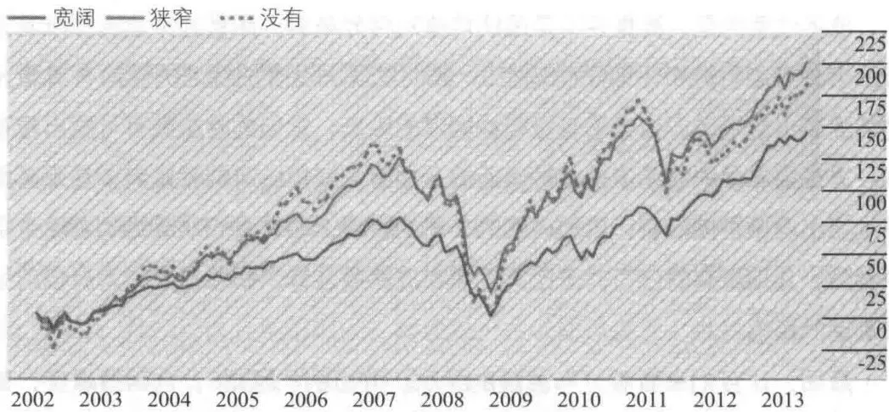

资料来源：晨星公司。

事实上，如果我们调整拥有狭窄护城河和没有护城河的投资组合的波动率，使之与拥有宽阔护城河的投资组合的波动率相匹配，正如图7\-2显示，我们就会看到，没有护城河的投资组合，其累积收益率明显低于拥有狭窄或宽阔护城河的投资组合的累积收益率。另外，拥有宽阔护城河的股票的收益表现并不是始终如一的；并且在整个时段，按风险调整后的业绩来看，拥有宽阔护城河的股票并不是表现得最好。如果我们观察拥有宽阔护城河的投资组合相对于没有护城河的投资组合两者在滚动期内的收益之差，即溢值，这一点就更为明显。

图7\-2 波动率匹配后的各护城河组合之累积总收益（按月再平衡，权重采用等权方式，%）

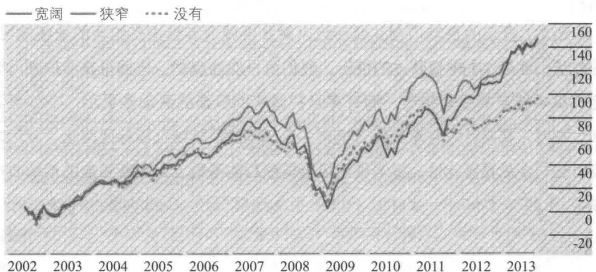

资料来源：晨星公司。

图7\-3显示，拥有宽阔护城河的投资组合相对于没有护城河的投资组合的溢值在正负区域间频繁变动。然而，在2008年金融危机期间，这种现象出现了变化。随着金融危机的不断恶化，拥有宽阔护城河的股票收益变得大幅高于没有护城河的股票收益。考虑到当时投资者的风险厌恶程度普遍上升，我们可以在直觉上理解这一现象的出现。相反地，随着危机减缓，投资者的风险厌恶程度下降，溢值则明显变负。这一溢值的水平和趋势可作为了解整个市场风险偏好的一个可靠指标。

图7\-3宽阔护城河的组合收益率一没有护城河的组合收益率（按90个交易日滚动计算， %）

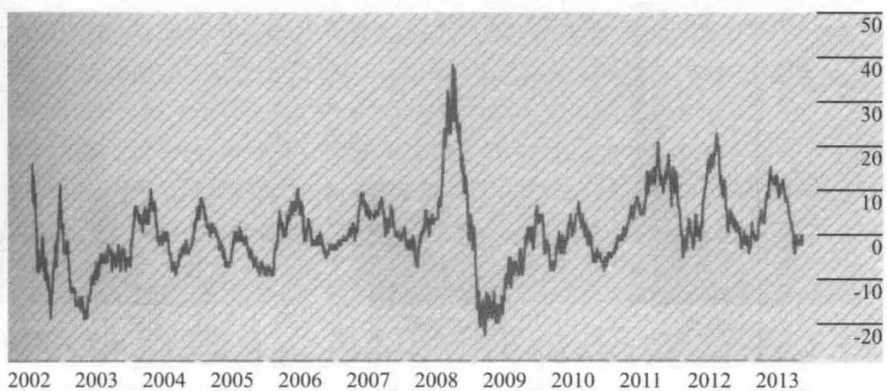

资料来源：晨星公司。

尽管有一定的证据支持，我们还是不能简单地认为具有宽阔护城河的股票一定能长期地带来经风险调整后的超额收益。一支股票的估值与股价的对比，也是重要的因素。

正如我们在第6章讨论过的，我们采用贴现现金流法来对样本股票的公允价值做出估计。将这一公允价值估计值与股票的当前价格相比较，你就能判定该股票在给定时点上是被高估还是被低估。被低估的股票预期会为你带来经风险调整后的正收益；相对的，被高估的股票预期会为你带来经风险调整后的负收益。

我们发现一个有趣的现象是，我们估值的准确性也会随着护城河评级的不同而变化。平均来说，当护城河更加宽阔的时候，我们的估值会更准确。在图7\-4中，你可以看到，与没有护城河的股票相比，拥有宽阔护城河和狭窄护城河的股票的估值十分位数与随后的平均收益之间表现出更加规则的对应关系。事实上，在拥有宽阔护城河的股票组合中，估值十分位数内的股票的估值与收益率之间的 为0\.84——大于没有护城河股票组的 两倍之多，这表明估值十分位数内的股票其估值与收益率之间存在者高度的相关性。

图7\-4后续日收益率的年化值（按护城河等级及估值十分位数分组， % ）

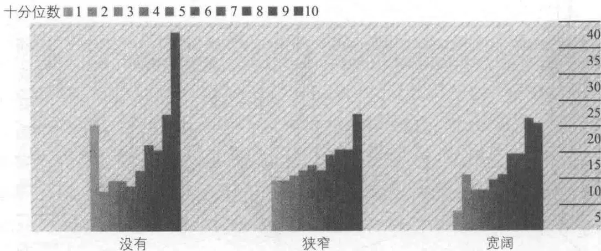

资料来源：晨星公司。

为什么会出现这种情况？正如我们之前讨论过的，拥有宽阔护城河的股票其价格通常会比没有护城河的股票价格表现出更小的波动性。如果用股票价格的波动率作为标的公司盈利及现金流波动率的代理变量，我们就会得出结论：与没有护城河的公司相比，拥有宽阔护城河的公司的现金流波动性更小。假定我们试图预测公司的现金流，结论便是：在贴现现金流的框架下，对拥有宽阔护城河的公司的预测比对那些波动更大的没有护城河的公司的预测更为可靠。

除了单支股票的收益与风险情况，作为投资者，我们对投资组合同样感兴趣。集合若干个体证券构建成投资组合，可以分散掉单支股票的特有风险。资本资产定价模型，或者说CAPM模型，可以帮助我们在投资组合情形下分析护城河评级。

在当今，CAPM模型可能是人们最为熟知的资产定价模型。与其他任何模型一样，它是对现实世界的简化，正因为如此，它的很多缺陷在学术文献中被详细地揭示。对CAPM模型的全面论述超出了本书的范围。我们只需要知道，CAPM模型公式描述的是一项资产在未来超过无风险利率的预期收益率与市场超额收益率之间呈比例关系，确切的比值就是股票的β值——一种对系统或不可分散风险的度量。CAPM的要义就是，不可分散风险是投资者应该获得补偿的唯一风险，因为根据定义，其他的所有风险都是能够在投资组合中被分散掉的。

当然，在现实中，资产收益不可能完美地匹配CAPM模型，所以，我们需要在等式中添加一个误差项，来代表资产收益率事后偏离模型预测结果的程度。这个误差项的均值就是阿尔法（ ），它代表了证券收益率中没有被市场超额收益率所解释的部分。于是，正的 值是一项不伴随系统风险的收益，也是投资者最想拥有的数值。

如果市场真的有效，我们是没有办法提前预测 值的（假定你使用正确的模型去度量系统风险）。尽管我们没有度量系统风险的精准模型，但可以把CAPM模型作为一面镜子，考量护城河评级所反映的有关 值的信息。

表7\-2跟表7\-1一样也是描述性统计，但有一处差异很关键：表7\-2统计的是根据护城河评级分组得出的 值分布，而不是收益率分布。据此，我们可以看到，如果投资者完全对冲掉所有的特有或非系统风险，他会得到什么。

表 7\-2 描述性统计：护城河各等级下后续每月α值的边际分布

宽阔

狭窄

没有

均值 \(%\)

0\.1

0\.0

\-0\.1

中位数 \(%\)

0\.0

0\.0

\-0\.4

标准差 \(%\)

6\.7

8\.0

12\.1

四分位数间距 \(%\)

7\.2

8\.3

11\.6

百分之五分位数 \(%\)

\-10\.1

\-12\.2

\-17\.9

（续表）

宽阔

狭窄

没有

百分之九十五分位数 \(%\)

10\.3

12\.4

18\.3

偏度

0\.1

0\.5

1\.3

峰度

6\.1

8\.1

15\.9

资料来源：晨星公司。

该表显示，拥有宽阔护城河的股票每个月都比没有护城河的股票多获取20个基点的 值。前者的 值的标准差更低，四分位数间距更小，下跌风险也更小。并且，与拥有狭窄护城河或没有护城河的公司 值相比，拥有宽阔护城河的股票的 值其偏度和峰度都更小。因此，除去在偏度上的劣势，在投资组合中持有拥有宽阔护城河的股票的确更加诱人。还有一点没有在表中指明，平均而言，拥有宽阔护城河的股票的 值（0\.8）要小于拥有狭窄护城河的股票的 值（0\.9）和没有护城河的股票的 值（1\.1），这也是拥有宽阔护城河的股票伴随的风险更低的一项证据。

所有投资者用于分析投资机会的时间都是有限的。是否值得在竞争优势的分析上花费宝贵的时间？我们认为答案绝对是肯定的。尽管没有任何一种业绩度量方法是真正全面而综合的（处理数据有太多种不同的方法了），但我们还是提供了一些最为直观的证据说明护城河评级的确有助于评估风险，与估值结合起来使用，可以让投资者获得经风险调整后的超额收益。

2026年2月13日

20:48

## 第8章 护城河与估值的结合运用：投资组合策略

__第8章 护城河与估值的结合运用：投资组合策略__

晨星公司将护城河理论和估值原理运用在它的宽阔护城河聚焦指数与乌龟和野兔型投资组合之中，这两只投资组合果然能持续地跑赢标准普尔500指数。

至此，我们已经知道了如何去评估一家公司的护城河等级及公允价值，在接下来的章节中，我们将与读者分享一些将这些原理付诸实践的真实案例。在此之前，我们先谈谈宽阔护城河聚焦指数，它系统地运用了本书谈论到的各种方法。

__宽阔护城河聚焦指数__

这个指数反映了迄今为止我们在本书中已经明确表述的思想，即公司的质量和估值两者对股票投资都至关重要。宽阔护城河聚焦指数是基于以下规则构建的指数，其成分股是20家最便宜的拥有宽阔护城河评级的股票，这些股票由晨星公司分析师做出的经济护城河评级及公允价值评估结果所确定。宽阔护城河聚焦指数只考虑护城河评级和估值，不考虑护城河趋势、公司的管理能力以及不确定性。为了构建这一指数，我们首先构建了一个股票池，它由所有在美国注册和交易的拥有宽阔护城河的股票构成（剔除美国存托凭证，美国存托股份和有限合伙企业）。然后，按照市场价格偏离公允价值估计值的程度，对这接近130家公司进行排序，选出相对于公允价值折价最多的20支股票，纳入我们的投资组合。各公司的权重采取等权重方式，同时，按季对该指数成分进行调整和再平衡。

从2002年9月30日到2013年9月30日，晨星公司的宽阔护城河聚焦指数获得的平均年收益率是 15\.9% ，而标准普尔500指数的年收益率则为 8\.8% （我们实际编制这个指数的时间是在2007年，但是我们从2002年就开始发布基于护城河评级和公允价值的评估报告，因此，我们能够利用模拟的方式将结果追溯到2002年9月份；从2007年到现在反映的是该指数的实际业绩）。你可以从表8\-1中看到，宽阔护城河聚焦指数在过去不平凡的10年取得了很好的业绩，这10年经历了大宗商品市场的繁荣，见证了一场规模庞大的金融危机，度过了一次深度的经济衰退，还有过房地产市场从繁荣到衰落的周期历程。宽阔护城河聚焦指数在这几次重大的市场波动中都有不俗的表现，这表明该指数具备适应市场、识别高质低估股票的稳健能力。

表 8\-1 宽阔护城河聚焦指数的每年业绩

02\*

03

04

05

06

07

08

09

10

11

12

YTD\*\*

晨星公司的宽阔护城河聚焦指数\(%\)

15\.0

36\.2

27\.8

4\.7

17\.7

\-1\.3

\-19\.6

49\.7

8\.6

6\.6

24\.5

22\.5

标准普尔500指数\(%\)

8\.4

28\.7

10\.9

4\.9

15\.8

5\.5

\-37\.0

28\.3

15\.1

2\.1

16\.0

19\.8

注：\*初期一年：始于2002年10月1日。

\*\*终期一年：止于2013年9月30日。

资料来源：晨星公司。

这个指数现已获得批准被设计成为两种可在交易所交易的金融产品：一个是代码为MOAT的交易所交易基金，另一个是代码为WMW的交易所交易票据。由于该投资组合的构建过程有其自身规则，所以该指数成份股的替换率相当之高——年均替换率在 。出现这一现象的原因在于，如果有一支股票以低于公允价值 的折价进行交易，后来冒出一支折价率为 的股票，前面一支就会被替换。这样的替换我们每个季度都会进行一次。我们设计了一套尽可能不用人工操作的指数构建流程，这样，我们在经济护城河和内在价值方面所做的自下而上的工作会自动地转化为投资组合，不会受到自上而下的干扰，避免受到来自管理层的压力。

事实上，几乎没有一位理性的投资组合管理者真的会用一只折价率为 的股票去替换另一支折价率为 的股票，因为交易成本会吞噬掉一部分潜在的阿尔法值（ ）。此外，价值估计毕竟只是估计而已。想要克服这个问题，可能你要在一个符合免税条件的交易账户中运用宽阔护城河聚焦策略才行。这个账户不能因短期资本利得税侵蚀收益，也不能修改投资组合的构建流程，要求新进入组合的股票在被添加之前满足某项具体要求（比如，要求一支新股票比它将替代的那支股票至少被低估 ）。我们进行了一些内部模拟，发现采用最低可接受率的方式，可以降低替换率。模拟研究表明，如果将替换率降低至接近 的水平，每年付出的业绩代价是150至200个基点。由此可见，替换率问题是可以被管理的，但肯定要付出代价。

有趣的是，高替换率的大部分原因都来自股票价格变化，而并非我们的护城河评级或公允价值估计的频繁变化。正如图8\-1所示，我们的护城河评级每年的更新率都不到 。

图8\-1 护城河等级调高及调低的公司数量占全部涵盖样本总数的比例

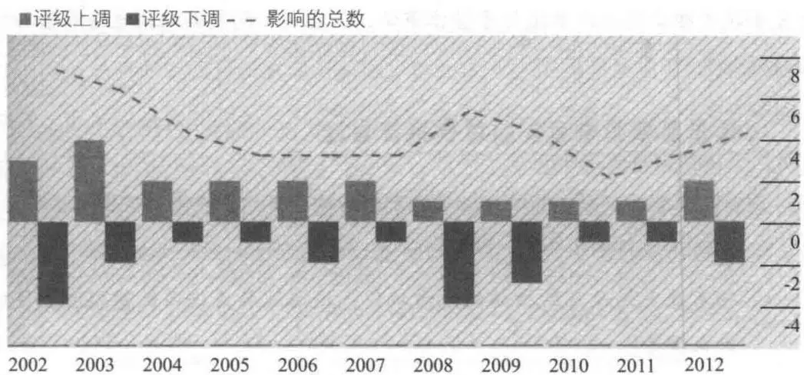

资料来源：晨星估计。

__乌龟和野兔3型投资组合__

晨星公司的《晨星股票投资者》时事通信也是将这些原理付诸实践的典型案例。作为这个通信中的一部分，我们运营了两个实盘交易的投资组合，分别是乌龟和野兔组合，从它们在2001年6月18日第一次交易开始，这两个投资组合的业绩就远超基准的标准普尔500指数。至于它们近期的表现情况，你可以查看网页http://msi\.morningstar\.com。

乌龟型投资组合包含着我们更为保守推荐的股票。组合中的股票来自于那些成熟的、增长速度相对缓慢、风险相对较低的公司。所有这些公司都拥有经济护城河，并且大多拥有宽阔的护城河。我们尽量选取那些竞争优势稳定或不断增强的公司（呈现稳定或有正面趋势评级）。乌龟型投资组合在强劲的牛市中反应有些滞后，但在熊市中的表现不仅能挽回先前的滞后，还能有所超越。

野兔型投资组合则包含着更为激进的股票。这些公司的成长更加快速，其风险与潜在收益都高于乌龟型投资组合中的公司。所有这些公司也都拥有经济护城河，但我们更愿意在野兔型投资组合中考虑那些拥有狭窄护城河，且护城河趋势为正面的公司（也就是那些正在为未来构建宽阔护城河的公司）。虽然野兔型投资组合的业绩要远优于整体市场，但它与市场整体之间也存在着非常紧密的相关性。

__《晨星股票投资者》的股票选择标准__

在为乌龟和野兔型投资组合挑选股票的时候，我们寻找的是下面一类公司。

-
- 具备持续的竞争优势，这通过晨星公司的经济护城河评级来衡量；
- 拥有稳定的或不断增强的竞争地位，这通过晨星公司的护城河趋势评级来衡量。
- 以低于内在价值的价格进行交易，这通过晨星公司的价格/公允价值比率来衡量。
- 在某种安全边际水平内进行交易，安全边际水平要相符于公允价值估

值所对应的不确定性程度，这通过晨星公司的星级评定来衡量。

拥有擅长于战略执行及资本配置的管理团队，这方面可以通过晨星公司的管理评级来衡量。

由此可见，在为乌龟和野兔型投资组合挑选股票的时候，我们考虑到了整本书所涉及的所有研究方法。

__投资组合管理策略__

挑选出好股票只是造就一名成功投资者的部分要求。投资组合管理策略也很重要，在晨星公司，我们遵循以下几个关键的原则。

__我们认为股票代表了一家公司的所有者股权。__

这听起来再基础不过了，但是有太多的人把股票当成是一张纸，把投资看成是某种形式的赌博。事实上，普通股代表了你在企业中的所有权权益。我们拥有的公司会赚取现金流，其中有一部分是归属于我们的，我们相信管理团队会明智地使用这些现金流。

以一名所有者的身份来思考问题，这会改变你进行股票投资的整体视角。如果一家公司因为投资于未来才能获得收益的项目而在最近一两个季度表现不佳，这非但不是坏事，反而是一件好事；如果一家公司在基本面没有任何变化的情况下遭遇股价下跌，这也是一件好事，因为这使你能以一个更优惠的价格提高所有者权益（或者通过股票购买主动地得到提高，或者靠公司股票回购被动地得到提高）。

__我们基于理性与分析，而非情绪做出决定。__

投资者最大的敌人就是他自己。当股票价格上升时，投资者很容易变得乐观；而当股价下跌时，他们又很容易陷入恐慌。要成为成功的投资者，我们就要学会战胜人的天性。正如沃伦·巴菲特反复告诫人们的，我们需要“在别人贪婪时恐惧，在别人恐惧时贪婪”。

没有任何一条法则能够告诉你，在股价上下波动的时候，是否应该买入、卖出抑或继续持有。孤立地观察股价变动，你根本不会知道接下来它会怎么变化。真正重要的是，股票价格与其内在价值相比呈现出怎样的关系。比如，假定我们评估出一家公司的内在价值是每股100美元，并且股票正以80美元的价格进行交易。有消息表明，这家公司的长期利润率可能比我们及其他投资者之前估计的还要高出很多，同时股价上涨了 20%，达到每股96美元。

是不是说这支现在96美元的股票比它之前80美元更贵呢？表面上看来似乎是这样的，但事实却是，我们缺乏足够的信息来回答这一问题。这就如同问你一支每股500美元的股票是不是比另一支50美元的股票更贵——我们需要参考内在价值才能让股价的比较变得有意义（500美元的那支股票经过1:10的分拆之后，明天就可以变成一支50美元一股的股票）。

假使例子中那家公司的公允价值估计值因更高的长期利润率预期获得了 30% 的提升，达到每股130美元，那会出现什么情况？在本例中，价格/公允价值的比率从0\.80下降到0\.74——该股票实际上在以相对于公允价值更大的折价进行交易，意味着此时的预期收益率比利润率没有提升时的预期收益率更高。类似地，该原理可运用于股票价格下跌的情况——基于当下所有可获得的信息，真正重要的是比较新的价格与内在价值。没有内在价值做基础，投资就会变成一场与碰运气无异的游戏。

对投资者来说，在决策中排除个人情绪的能力构成一项显著的优势，使得投资者的投资业绩能够超过个人投资者的平均水平。想让自己的情绪得到有效的控制，要秉持一种务实的时间尺度来看问题。市场识别一支股票的价值也许要花上3年甚至更长的时间。偶然发生的外部事件——比如2008—2009年席卷全球的金融危机——可以暂时使一支低估值的股票变得更加低廉，即使该公司的长期现金流前景并不因该事件受到实质性的影响。如果一笔资金资金需要

在未来3至5年内使用，那么这笔资金投入到现金或者短期债券可能会比投入到普通股股票更好。

__我们主张适度分散化，而非过度分散化。__

一家公司的股票价格取决于投资者当前对该公司在未来产生现金流的预期。当然，未来本质上是不可预测的。无论我们对自己的推测多么地自信，总会存在发生未预料事件的风险，使得股票价值会明显高于或低于我们的估值。即使我们能识别出所有的风险和机会，并且为它们赋予一定的概率值，究竟哪一种情景会在未来出现还是不可知的。

为了分散这种不确定性，我们从各个行业或部门为乌龟和野兔型投资组合挑选成份股票，尤为重要的是，我们要控制这两个投资组合可能存在的某些特定风险因素及趋势，比如商品价格、利率、监管变化、住房市场状况、不断上升的智能手机使用率，等等。如此，即使我们得预测出错——比如，石油价格比我们预测的更低，或者住房市场的恢复比预期更慢——这对我们整个投资组合内在价值的损害作用也是会有限的。

分散化有其优势，也有其劣势和局限性。随着更多的股票进入投资组合中来，分散化所带来的波动率下降会愈加明显。不过，一个由20支股票构成的投资组合的波动性不会比由40支股票构成的投资组合的波动性大多少。更为重要的是，好的投资机会很稀少。如果我们坚持持有很多种不同的股票，就会不可避免地挑选到平庸的对象，影响到最终业绩。所以，我们在乌龟和野兔型投资组合里都只挑选了大约20支股票。

__大多数时候，我们满仓投资。__

在我们看来，只有两个可靠的方式能够使投资者战胜市场：一是买入的价格低于公允价值，投资者一直持有股票到市场认识到它的价值为止。二是买入的是一家非同一般的公司所发行的股票，这家公司能比普通企业更快地实现内在价值的复合式增长，之所以能取得这样的增长，通常是因为该公司拥有强大而且在不断提升的竞争优势。理想情况是投资机会兼具这两方面的优势。

有些人为了战胜市场，不停地买进卖出，高抛低吸，择股时，这是相当困难的，也是事倍功半的。我们不知道是否有人一直坚持这种操作。显然，我们不可能预先知道在任何给定的一天、一周、一个月或者一年的时间里，市场是会上涨还是会下跌。但随着宏观经济向好或公司盈利增长，股票总体上会随时间推移而增值。在一个足够长的时间跨度里，不投资股票的机会成本会大大高于跨越牛熊市坚持长期投资所承担的风险。

当然，保持适当的现金头寸也是有好处的。手头持有一部分现金能让你抓住可能出现的机会，让你不必卖掉其他资产来筹集资金；此外，市场有时会出现过高估值的时候——比如互联网泡沫高峰时——此时你不可能找到质量及价位都合适的公司股票来构建投资组合。在这样的情况下，我们宁愿持有现金，宁愿等待更好的机会降临。除此之外，我们基本上都是满仓投资。

__我们不做频繁的交易。__

从历史数据来看，乌龟和野兔型投资组合的换手率非常之低——在2002至2012年年间，年平均换手率仅为 17% 。这意味着我们的平均持有期超过了5年。低换手率有许多的优势，最重要的就是为你在税务上节省资金——体现在你支付的是长期而非短期的资本利得税，并且是递延所得税，你甚至可以利用节省下来的资金赚取回报；低换手率也降低了交易成本，比如佣金和买卖价差。大盘股共同基金每年的平均换手率是 75%，它们的业绩远远比不上乌龟和野兔型投资组合。

低的换手率还带来另一个好处，那就是让我们无需在风险/收益特性相似的公司股票间频繁地换来换去。不过，这不应该成为借口，借故抓住一支明显被高估或者竞争地位恶化的股票不放。想想就会明白，归根到底，投资者真正

应该寻求的是实现自己纳税额的最大化——通过做出非常成功的投资决策。

__小结__

乌龟和野兔型投资组合将晨星公司的研究付诸实践。我们寻找的公司需拥有宽阔的护城河、稳定且持续改善的竞争优势、高水平的管理团队以及适当的安全边际。我们主张分散化的投资组合，主张以公司所有者的身份去思考，同时不做频繁的交易。这样做的价值体现在了我们的业绩记录中，在十多年的时间里，在没有承担额外风险的情况下，我们轻而易举地跑赢了标准普尔500指数。

2026年2月13日

20:48

## 第9章 基础材料业

__第9章 基础材料业__

基础材料业（包括基础材料生产企业、加工企业以及金属与采矿业）并非是盛产护城河的肥沃土壤，但成本优势通常能成为企业在这个行业中构建护城河的关键。

书从现在开始，将从一般理论转向对具体行业的分析，深入探讨不同行业、不同类型的公司是如何建造护城河的。以下章节可被视为参考手册，你可以在研究某家具体公司或某种行业时拿来参照。在每一章，我们会提供某一行业的护城河图景，讨论导致不同行业拥有不同宽度的护城河的因素，并分享一些具体实例，同时为你指明研究时值得牢记的某些关键点。我们所分析的各行业有着丰富可挖掘的内涵，我们现在也只是触及冰山一角，只是在每个领域挑选少数几个行业来说明这些关键点。我们的目标是给你提供足够的引导，好让你开始自己的研究。

让我们从基础材料业开始。看一眼元素周期表，你大概就能很快感受到基础材料公司销售的是什么产品。如果一家公司并不是直接生产表中列示的某一种元素的话，那么它生产的很可能是由不同元素组合而成的混合物或者合金。

依照定义，基础材料公司经营的一类产品并非建造护城河的最肥沃土壤。对于这类公司来说，其产品几乎不存在差异，并且价格由供求法则来决定。这些公司被看做价格接受者，几乎无法控制产品的价格。

有鉴于此，这类公司获得竞争优势以及构建护城河的关键就在于它们有无能力以低于竞争对手的成本生产出产品。拥有世界级的矿藏储量、便利地获取低成本原料（比如原油）以及运用高效的生产工艺是获得低成本优势的最常见方式。有些构建出护城河的公司采用的方式是建立强大的研发系统（R&D）、运输网络，或者将自己融入到客户的经营过程中来创造出高的转换成本。不过，略显可叹的是，这些优势在多数情况下，不是被地质地理因素所限制，就是最终被竞争者所模仿。因此，很多公司即便使出浑身解数也只能建造出狭

窄的经济护城河。在基础材料行业，拥有宽阔护城河的公司极少，如图9\-1所示。

图9\-1 基础材料业的经济护城河特征

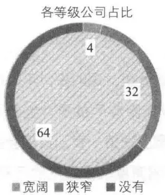

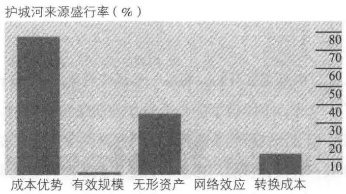

资源来源：晨星公司。

__基础材料生产企业__

基础材料生产企业（包括生产钢材、铝材和纸张的企业）制造中间品或成品作为最终产品的主要部件，这些最终产品包括基础设施、建筑物、汽车以及家居用品。企业对开采、采购以及回收来的原材料进行提炼加工、熔解提取，将批量生产出的主要部件卖给原始设备制造商（OEMs）、建筑商、生产商以及终端用户。

迄今为止，可持续的低成本优势对基础材料生产商来说是其经济护城河的主要来源。这些公司生产同质化产品，因此其他可能的护城河来源——品牌或专利、转换成本、网络效应和有效规模——极少发挥作用。而对于产品用户来说，价格为王，因此，持续地以大幅低于现价的成本进行生产，其实是公司赚取超额收益的唯一途径。为了控制经营成本，这些公司需有途径获取更廉价的原材料和能源，同时要在生产流程中运用高效的现代化技术。如果只是依靠原材料资产所有权获得可靠的原材料供应，尽管这能为公司带来更好的营运资本管理和质量控制，这还不足以构建起护城河。要成为护城河来源，这些资产本身必须是低成本的。

宽阔的经济护城河评级要求公司打造自身的竞争优势，使投资者对其抱有长期信心，这对基础材料生产商有些强人所难。从地质矿藏中开采的原材料终究会被耗尽，这就要求厂家不停地寻找新矿源。如果原材料是可再生资源，那么最终产品的商品本性很可能使得市场准入壁垒降低，无法阻止新的竞争者进入市场。纵然它们的超额收益率看起来可持续20多年，我们也很难给这样的公司授予宽阔的护城河评级。

其他的一些因素也不利于这些基础材料生产商享受到护城河优势。例如，一段时间之后，所有的生产设备及生产流程都要升级，这给竞争者进入市场、投资类似低成本设备提供了可乘之机；另外，有些基础材料生产企业属于国有体制，或进行高杠杆经营，这往往会造就一批高成本厂家，即使出厂价低于生产成本，这些企业也能照样生产。这样的企业是在最大化产出而非最大化资本回报，这将压低整个行业的经济利润，并阻碍低成本生产商构建宽阔的护城河。

尽管面临着这些内在的挑战，钢铁制造商纽柯公司（Nucor）却依然成功地建立起了明显的成本优势，同时获得了狭窄的护城河评级。纽柯的成本优势很大一部分来源于电弧炉（EAFs）的使用。与高炉相比，电弧炉的单位装机容量所需的投资更少，并且能够显著地降低能源及劳动力使用量。

纽柯同时也通过使用直接还原铁（DRI）和扩大产能等方式来管控成本。在钢铁生产中，使用直接还原铁为成本节约提供了多种便利。首先，由于直接还原铁不需要冶炼，因此与只含废弃金属的原材料相比，它可以在一个较低的温度下进行加工。这就降低了在纽柯公司的钢铁生产直接成本中占有很大比重的电力成本。同时，在较低的温度下进行直接还原铁加工，也可减少生产设备损耗，因此，维修和重置成本也得以降低。此外，直接还原铁生产过程中使用的天然气蒸汽比煤蒸汽含有的杂质更少，与使用生铁的竞争对手相比，纽柯可以生产出更高强度的优质钢铁。其结果是，其他电弧炉制造商只能供应有限的产品组合，而纽柯则能够制造多种多样的钢材产品。纽柯分散化的产品组合降低了销售收入的波动性，这让我们更有理由相信该公司能够在可预见的未来持续地获得经济利润。

纽柯实施的以直接还原铁为基础的生产流程转型仍处于初级阶段，在我们考虑对该公司授予宽阔护城河评级之前，我们还需要看到更具体的证据，以证明该公司的成本结构出现了实质性的改善。自金融危机以来，纽柯竭尽全力地赚取经济利润，虽然我们认为该公司在明确的预测期内有能力做到这一点，但是在20年内，竞争者很可能会复制纽柯基于直接还原铁的生产流程。因此，我们认为授予它狭窄的护城河评级才是适当的。

__评估基础材料生产商的关键因素如下。__

-
- 公司是否拥有较低的生产成本？公司有无较低的资本成本？单位新产能的建造成本、单位产品的折旧、损耗及摊销（DD&A）成本可作为衡量的代理变量。
- 公司是否受益于容易被复制的技术能力和地理位置？
- 公司是否存在会影响其资产负债表的重大遗留问题或麻烦事项？尽管这些事项通常不影响护城河，但它们会降低公司的财务柔性，削弱公司充分投资其核心业务的能力。留意公司的资本支出是否正在下滑，这可以与其自身的折旧费用相比，也可以与其同行相比。

__基础材料加工企业__

基础材料加工企业，例如化工公司和农产品公司，从自然资源开采商或其他产品供给商那里取得原料，将其转化成许多行业所需的基础产品或最终成品。在价值链上，这些企业更接近于自然资源开采商，通常生产通用的基础产品，有些也会按客户要求定制生产特定产品。

上游的基础材料加工商（在价值链中最靠近自然资源）通常生产无差异产品。例如，将乙烷分裂为乙烯的石油化工制造商就是一个销售无差异产品的上游企业。这种类型的加工企业就和基础产品生产商一样，成本优势是其主要的护城河来源。但是，由于基础材料加工商通常从公开市场购买原料，而非从地下直接开采自然资源，因此他们的成本优势从长期来看不太可能持续。即便如此，也有少量的加工商，比如巴斯夫公司（BASF），因为掌握了先进的生产流程而获得持续的成本优势（后面会详细讨论巴斯夫的竞争优势）。

这种情况和生产更加专业化产品的下游加工商有所不同。专业化产品通常能够带来更高的利润，尽管从长远来看这往往也是不可持续的。要当心那些听起来专业化的产品——或者被企业管理层贴上专业化标签的产品——它们其实很容易被竞争者仿冒。专利有助于防止仿冒，有些加工商拥有控制系列专利产品（无形资产）的优势，这使得它们能够在专利有效期内赚取高额的回报。

专业化的下游加工商同样能从顾客的转换成本中获益。一些基础材料加工商深度介入到客户的生产流程之中，使得客户转换到竞争产品上的成本十分高昂。有些公司甚至通过和顾客签订长期的商品合同来增加转换成本，这些合约会对购买者巨额的先期资本投入做出补偿，同时也帮助他们建立区域性垄断。此外，如果潜在竞争者无意进入相对较小的市场，加工商就能从有效规模中获益。

尽管有这些额外的潜在护城河来源，基础材料加工商仍然很难被评定为宽阔的护城河等级。那些在建立持久的护城河优势中占得先机的公司往往具备难以复制的生产流程或技术，拥有以强大的研发实力为后盾的专利，或掌握着可带来高转换成本的牢固的客户关系。

化工巨头巴斯夫就是在基础材料加工业构建起狭窄护城河的成功例子，其护城河有两个来源：成本优势和无形资产。首先，我们认为巴斯夫在化工产品的生产方面保有一定的成本优势。这个优势不是通过获取廉价的原材料获得的，而是来自于公司的生产规模和独特的一体化生产流程。巴斯夫在全球范围内给其品类繁多的化工产品群贴上了“一体化”的标签。该公司运营着6个一体化中心，在欧洲、南美洲和亚洲各有2个。

该公司在德国的一体化中心占地面积为10平方公里，拥有160家化工生产工厂，雇用了超过35000名员工，可想而知，其规模有多大。通过聚集众多不同的化工工厂，垂直整合生产过程，巴斯夫节省了运输成本，减少了能源消耗，获得了更高的产出率。例如，一家工厂的副产品可以作为另一家工厂的原材料。这种理念也可以扩展至能源使用上，一家工厂生产过程中产生的热量可以被用作毗邻工厂的能源。该公司估计，一体化的理念每年大约为其节省10亿欧元的成本——在2012年营业收入大概为67亿欧元的情况下，10亿欧元是个意义非凡的数字。尽管很多其他的化工企业经营着世界级的生产设备，能够在单个工厂层面获得规模经济，但也很少有企业能够与巴斯夫相匹敌，它的一体化理念可以让自己在一个地方串联起数目庞大的工厂。

除了成本优势，巴斯夫的另外一个护城河来源是无形资产。在过去大约10年的时间里，这家公司将其产品组合更多地转向专用化学品。与基础化学品相比，专用化学品与顾客议价的能力更强，所带来的利润率也就更高。同时，巴斯夫持续地把资金投入到研发中，大量开发出拥有议价能力的专利产品。

即使有着这些优势，我们还是对授予巴斯夫宽阔的护城河评级感到犹豫不决，因为我们认为，长期来看该公司的一体化规模优势会面临广泛的模仿。如果全球范围内最终建立起足够多的大型化工综合体，巴斯夫的成本优势将会被削弱。这种可能性在未来还是蛮大的，考虑于此，我们认为巴斯夫只能获得狭窄的护城河评级。

__评估基础材料加工企业的关键因素如下。__

-
- 公司能否持续获得低成本原材料？一家公司通过区域性价差也许能够从低成本的原材料中暂时获得优势，但是这种优势在长期来看很可能是不可持续的。
- 公司是否生产高度专业化的产品或者掌握专属的生产流程？了解其他竞争者是否在一段时期后具备仿制其产品或生产流程的能力。如果数十年之后，仍然没有竞争者发现其成功妙招，那么，这家公司很可能
- 拥有护城河。拥有专属的生产流程往往能够带来成本优势。
- 公司的研发工作是否开发出了系列的专利产品？对公司的产品组合及研发规划做出评估。
- 公司的专业化产品或者分销模式是否创造了转换成本？寻找证据证明公司具备与转换成本相关的持续议价能力，具备与顾客的良好相互关系，或潜在的地理位置优势。
- 公司内部具有护城河价值的业务组合是什么？通常来说，大型的基础材料加工商会有好多迥然不同的部门，其中一些具备持续的竞争优势，另一些则不具备。

__金属与采矿业__

在金属与采矿业，竞争优势通常被归结为地质优势。世界级的储量是稀缺的资产，而有利的地质条件往往可以使其在同行业中获得更有利的竞争地位。

当你评估地质条件时，以下3个经验法则通常是普适的：储量越大越好，等级越高利润率越高，工艺要求越复杂成本越高。首先，规模化的储量——表现为厚煤层和大型露天矿——带来规模经济。有些采矿企业可在厚达数百英尺的矿井上轻松地开采矿产，而有些采矿企业只能在不足一英尺厚的矿脉中费力地开凿矿产。在其他条件相同的情况下，前者显然更受欢迎。其次，矿石等级越高意味着单位金属需剔除的岩石量越少（矿石等级度量的是单位岩石中的金属含量）。最后，加工工艺要求决定了实际能从矿石中分离出的金属的多寡（这是冶金工艺中实际面临的问题）。以上这几个方面就决定了生产单位金属需要投入多少财力和物力，而在总投入除以总产出的等式中，分母的影响尤为重要。简而言之，我们要寻找规模化的资源，高等级矿产和简单的冶金工艺。最后一点，要留意收购成本。无论土地是矿主从政府那里收购来的，还是通过合并另外一家上市公司得来的，如果支付的价格过高，都会有损经济效益，不论地质条件多么地诱人。

在采矿企业中，加拿大萨斯喀彻温省钾肥公司（Potash Corporation of Saskatchewan）是少数几家拥有宽阔经济护城河的基础材料公司之一，该公司的成功得益于低成本的钾肥资产和高行业进入壁垒，其中，进入壁垒来自高不可攀的绿地投资成本。该钾肥公司处于钾肥成本曲线的低谷，即使未来钾肥价格接近边际生产成本，该公司照样能够盈利。这种低成本优势来源于该公司在加拿大的矿床拥有得天独厚的地质条件，以及高开采量带来的规模效应。

除了低于平均水平的开采成本，该钾肥集团还受益于钾肥市场的进入壁垒。经济上可行的矿床仅在全球少数几个地方被勘探到，其中加拿大、俄罗斯和白俄罗斯是主要的产区。这家加拿大的钾肥公司采用褐地投资的扩张方式，这与拟议的绿地投资方式相比，每吨产量节省了不少的资本成本。绿地新建项目可能需要7年多的时间才能完工且达到最大产能，这给新进入者带来极高的进入壁垒。

最后，我们认为这家加拿大钾肥公司在未来许多年里都有能力生产钾肥，因为其矿产储量在现有生产水平下足够供应65到85年。这么长的生产年限，配之以稳健的运营及资本成本特点，使我们很愿意给该公司授予宽阔的护城河评级。

__评估金属与采矿企业的关键因素如下。__

-
- 公司是否拥有或控制着具备优势的地质储量或其他自然资源？考虑的细节因素有矿产等级、采剥比或表土含量、开采方法、工艺要求以及回收率，高等级矿品或其他优质自然资源的稀缺性如何。
- 公司能否从规模经济中获益？哪些成本是固定的，会产生多大的杠杆效应？如果与行业中其他企业相比，公司的个别资产具备更高的生产能力，它就可以利用这一资产获得较高的产出，以此来分摊固定成本，其单件成本就会更低。如果公司在一个不大的地理区域拥有大量的产能，也能够带来规模经济，只是公司需要把单个的生产性资产有机地整合起来，如同单一工厂或矿区一样实现成本与资源的共享。
- 公司能否从低运输成本中获益？运输成本在总成本或者产品价格中的占比有多高？由于运输成本很难改变，那些靠近客户的厂家会比远离客户的竞争者更具备明显的成本优势。
- 公司面临的政治体制是有利还是不利？公司是否比行业中的其他厂家支付更多的特许费和税费？资产在未来被部分或全部没收的风险有多大？相反地，政府会否帮助企业维护持续的成本优势，比如设立进入壁垒？由得天独厚的自然资源产生的经济租金，最终是流向上公司的股东，还是流向政府？这些都得弄清楚。有些公司花费大量资本开发自然资源，结果发现，生产刚一开始，游戏规则就发生了变化，政府征收比开发之初商定好的费用更高的税费及特许费。这导致生产商承担更高的成本，甚至抵消了基于自然资源及交通的成本优势。有价值的资产甚至会被政府全部没收。如果这种风险很高，我们就会犹豫是否该授予公司狭窄或宽阔的护城河评级。

## 第10章 消费品业

__第10章 消费品业__

在丰富的消费品细分行业之中，包括饮料业、日用消费品行业、烟草业、餐饮业、仓储式及专业零售业、住宿业，品牌实力、成本优势及网络效应是它们构筑竞争优势的核心。

如果想知道消费者是否看重品牌，你只要向几位路人询问，他们是喝可口可乐还是百事可乐，是抽万宝路牌还是骆驼牌香烟，是用亨氏牌番茄酱还是亨特牌番茄酱，是用某些特定品牌的美容卫生品还是那些碰巧随便看见的普通产品，就能对开篇问题的答案了然于胸。品牌对于许多消费者来说实在是太重要了，当消费者为得到他们想要的品牌愿意支付溢价的时候，品牌就成为了竞争优势的一项重要来源。因此，对于许多消费者公司来说，品牌是经济护城河的最主要来源。

除了品牌实力这一无形资产之外，其他几种护城河来源也在消费品细分行业中发挥作用，如图10\-1所示。成本优势是一个相当常见的来源，比如那些大型的饮料公司。由于它们需要购买大量的食糖、果汁和包装材料，相较于那些小规模的同行，它们就会受益于规模经济和议价能力，从而付出更低的成本。网络效应同样能够帮助一些消费品公司，比如在线零售商，低价格和丰富多样的产品为它们吸引了数以百万计的消费者，反过来，这又会将第三方商家吸引到在线零售商的集市上来。此外，随着更多的消费者和产品汇集到平台上，顾客的点评及产品推介也会相应增加，这进一步加强了网络效应。

图10\-1 消费品业的经济护城河特征

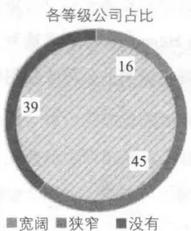

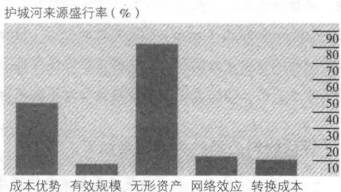

资料来源：晨星公司。

__饮料业__

在饮料业（包括软饮料、啤酒、葡萄酒和烈性酒制造商），想要获得持续的超额收益需要拥有广泛受到分销网络支持的强势品牌。大的饮料公司能从以下的良性循环中获益：品牌越响亮，它们越能够有效地投资于营销方案、罐装设备和供应链运作，这又进一步刺激了公司未来的增长和利润。这种良性循环使得软饮料巨头可口可乐、啤酒业主宰安海斯布希（Anheuser\-Busch）及烈性酒市场领导者帝亚吉欧（Diageo）能够利用有效的分销网络出售溢价饮品，占据主要的市场份额。这些大公司同样享有买方权力，以比小规模同行更低的价格购买到所需供应品。

对于许多饮料品种来说，品牌忠诚度也很高，因为忠诚度降低了顾客的搜寻成本。品牌忠诚度使得饮料公司有能力进行产品线扩张（比如无糖百事可乐、零度可乐和百威金樽），同时采用不同的包装规格来满足不同渠道和不同饮用场合下人们的需求。强大的饮料品牌享受着品牌溢价，有助于公司维持较高的投资资本回报率，即ROIC。

得益于这些竞争优势，许多大型的饮料公司凭借其宽阔的经济护城河傲视群雄，这种情况很可能在接下来的几十年里得到延续。对于二线饮料公司或新进入者来说，想要战胜如今占据市场领导地位的厂商是极其耗费金钱和时间的。建立品牌和分销系统要花费数十年的时间，而消费者的偏好改变起来很慢。更重要的是，一些拥有狭窄护城河的饮料公司，比如胡椒博士斯纳波集团（Dr Pepper Snapple Group）和怪物饮料公司（Monster Beverage），依靠拥有宽阔护城河的公司来分销产品。这种依赖性使得拥有宽阔护城河的公司收获到额外的收入，进一步拉大了与小规模竞争对手的差距。

__评估饮料公司的关键因素如下。__

-
- 相对于竞争者，公司品牌能否带来价格溢值？
- 分销系统被复制的难易程度如何？
- 未来几年，公司品牌是更有可能损害，还是能维持或提升市场份额？如果市场份额正在萎缩，这可能意味着竞争加剧或定价能力遭到削弱。
- 良好稳健的利润率和投资资本回报率可能预示着该公司具备成本优势，且其分销网络、罐装设备及供应链运营很有效率。

__日用消费品行业__

在各式各样的日用消费品行业（包括制造、销售和配送各种食品、家庭用品和个人护理产品的公司），强大的品牌组合以及低成本的运营平台是经济护城河的主要来源。日用消费品公司要实现规模经济，要占据市场主导地位，要给新进入者制造高的进入壁垒，需要长期的积累，需要投入大量的资源。一旦最终实现这样的规模，企业就能拥有相较于规模较小的同行更低的单位生产和分销成本。

在此行业，拥有宽阔护城河的公司必须展现出主导性的品牌组合、覆盖全球的经营范围以及在所在领域其他自有品牌无可比拟的竞争能力。拥有狭窄护城河的公司通常就会在上述几个方面残缺不齐。领先的日用消费品企业往往会大力投资于产品创新和核心品牌的市场推广，以确保其产品能让顾客耳熟能详，从而提升自己高于同行的竞争地位。经营某些特殊品类（这类商品周转快且易腐烂，比如肉类和奶制品）的公司通常不具备经济护城河，因为他们高度同质化，也是价格接受者。

金宝汤公司（Campbell Soup Company）是世界上最大的汤品制造商，是一家拥有宽阔护城河的日用消费品公司。其护城河源自该公司无可匹敌的规模经济，源自它在美国汤品市场占据的主导地位、极强的盈利能力、强大的品牌以及遍布全球的庞大分销网络。金宝汤控制了将近 60% 的美国国内湿汤（wetsoup）市场，更让人印象深刻的是其与这一主导地位相伴的高盈利能力。它在这一品种（代表了金宝汤三分之一的总销售收入以及超过一半的营业利润）上的经营利润率超过了 20% ——比包装食品行业的其他品种都高出很多。此外，金宝汤在过去10年平均的投资资本回报率（包括商誉在内）大约为 18%，比它 8\.1% 的资本成本估计值高出两倍有余，这是我们维持该公司的宽阔护城河评级的理由。

__评估日用消费品公司的关键因素如下。__

-
- 公司产品组合拥有什么样的品牌实力？通过观察产品销售量及销售价格随时间的变化，投资者可以识别出品牌的实力。想要在一个细分行业占据数一数二的市场份额地位，公司的品牌实力要非常强大。
- 公司是否具备足够的规模，是否有充足的能力将其生产及销售成本维持在同行水平之下？规模可以基于本国或国际市场来衡量，但重要的是要确定，其网络是否足够庞大以至于新的进入者想要复制需要付出高额的成本和长期的努力。
- 自有品牌厂家渗透进该品类的程度如何？即使自有品牌产品占据了足够的市场份额，这并非必然意味着公司原有的品牌优势正在丧失。然而，对品牌产品进行持续的创新则是必不可少的，必须要让消费者感受到价值增值。
- 在计算投资资本回报率时，我们倾向于将商誉包括在内，因为在过去，日用消费品公司收购事件频发，我们认为这种现象在未来也不会有太大变化。各企业正展现出国际化的倾向，以此抵消它们在成熟发达市场中的低速增长。考虑到商誉因素，企业的收购行为会变得更为理性，有利于公司赚取超过加权平均资本成本（WACC）的投资资本回报率（ROIC）。

__烟草业__

撇下社会责任不论，烟草公司享受着短期内不受侵蚀威胁的丰厚利润及宽阔的经济护城河（对于投资者有利的事并不总是对消费者有利）。

强大的品牌和成瘾性的产品是烟草公司构建牢固护城河的关键。烟民们常常对他们喜爱的品牌非常忠诚，再加上尼古丁的致瘾性质，使得烟民们即使面对稳定的价格提升和低成本的替代品，也会继续购买他们喜爱的品牌。例如，万宝路（Marlboro）\[在美国由奥驰亚（Altria）控制，在世界其他地方则由菲利普·莫里斯国际公司（Philip Morris International）控股\]的至尊品牌香烟在许多国家保持着领先的市场份额，尽管在有些国家廉价香烟非常普遍。虽然美国烟草的销量持续下滑，但得益于其稳健的定价能力，配之以有效的成本管控，烟草公司的营业利润近年来一直能够得到提升。

烟草公司同样也受益于规模效应。在大多数国家，仅有的几家烟草公司就控制了市场的绝大部分份额。因此，在与供应商（烟叶种植者、滤嘴供应商、烟纸和包装盒供应商）谈判时，以及与零售商协商货架位置时，它们就能联合起来向对方施加压力。在许多市场，现有的香烟生产商也受益于政府设立的进入壁垒。比如在美国，食品和药物管理局（即FDA）极大地放缓了审批新烟草产品的速度——这其实是一道将新竞争者拒之门外的监管屏障。

__评估烟草公司的关键因素如下。__

-
- 价格是否足以弥补香烟销量下滑带来的影响？尽管美国的香烟销量在下滑，烟草厂家还是具备强大的定价能力，以此来保证利润的稳定增长。然而，这种情况不会永远持续。
- 竞争者的表现是否理性？采取激进的降价策略以刺激销量的增长，这可能会对整个行业的投资资本回报率产生负面影响。烟草的替代品，比如电子香烟，是否会对烟草产业造成巨大的冲击？尽管我们认为香烟的替代品只会获得小部分的市场份额，可一旦电子香烟的市场份额迈过一定门槛（ 20% 以上），其份额就会大幅上升，甚至可能超越传统香烟的市场份额。
- 政府监管和税收方面的变化会加剧愈加激烈的价格竞争，甚至颠覆这个行业吗？通过大幅提高烟草消费税，或实施新的管制（比如简易包
- 装或禁用薄荷醇），政府会给该行业造成巨大的冲击。烟草业的未来很大程度上取决于政府采取的行动。

__餐饮业__

每年赚取将近两万亿美元收入的庞大餐饮业，可以被分成顾客在柜台上付款并取餐的快餐厅和顾客坐着向服务员点餐的休闲餐厅。

不存在转换成本、行业竞争激烈以及进入壁垒低，这些特性使餐饮企业很难建立起经济护城河。然而，也有少数餐饮企业可利用无形资产和成本优势构建起护城河。一些餐饮企业被打造成世界上最知名的品牌，这得益于一家家便捷餐厅所构成的庞大网络、一致的客户体验，以及兼顾地域特色的菜谱。大型的餐饮连锁企业还具备规模经济效应，能够对供应商施加相当的影响力，确保所进食物及其他原材料的价格具有可预测性且相对便宜。这些成本优势使得餐饮企业在定价上即使维持与小规模竞争者相同的价格——哪怕竞争者采取激进的促销策略——仍然能够获得更高的利润率。

为数有限的几家餐饮企业（目前就只有麦当劳和星巴克）拥有宽阔的护城河，因为它们的品牌几乎在全球每个角落都家喻户晓（这通常会让餐饮企业享受到产品溢价）。它们通常采用附有黏性的特许经营模式，灵活运用某些经营策略，比如，在几天之内或一天的几个时段更新菜谱，定期（每隔5至7年）重新规划餐厅选址。依靠采购议价能力以及广告规模效应，这几家拥有宽阔护城河的公司具备明显的成本优势，能够获得行业领先的利润率。有着狭窄护城河的公司通常具备广泛的品牌认知度和成本优势，但这些优势一般局限在一到两个关键的市场领域，不一定适用于全球范围。

敦肯布兰德公司（Dunkin’Brands），人们耳熟能详的敦肯甜甜圈店（Dunkin’Donuts）和31冰淇淋（Baskin\-Robbins）的主人，是拥有狭窄护城河的一家快餐企业。该公司的护城河主要归功于其高知名度的品牌和富有黏性的特许经营体系，其核心区域为美国东北部市场（美国的敦肯甜甜圈店大约有70% 坐落于此）。近年来，该公司一直在提高菜谱价格，并且将销售重点转至高价位及限时供应的品类上。此外，公司在美国的特许加盟商经营稳健，加盟商的破产率相对较低，现金收益率在快餐业中位居前列。

然而，这家公司在成本控制上的表现却乏善可陈。考虑到敦肯布兰德公司在美国东北部的出色表现以及在国际市场上的知名度，我们期望这家公司能够对供应商施加一定的影响，以优惠的价格获取食物和其他原材料。然而，从整个系统的销售量来衡量，该公司在美国的饮品及零食细分市场中排名第二，远在星巴克之后，在美国快餐市场中也只排名第七，这些都证明与同行相比该公司在与供应商议价时并无优势可言。另外，虽然特许经营餐厅的建设成本在几年前就已经商定，但这并不构成一项优势。因此，我们不认为成本优势是敦肯布兰德公司的护城河来源。

__评估餐饮企业的关键因素如下。__

-
- 品牌是否具备足够的定价能力，可以弥补食品及劳动力成本的上涨？如果餐饮企业在价格上涨后还能维持餐厅的业务量和营业利润，这个品牌本身可能就具备了足够的定价能力，可以支持经济护城河。
- 公司在过去的价格战中表现如何？由于不存在转换成本，餐饮业经历了长期的价格战。如果一家餐饮企业能够在激烈的行业打折期间维持营业利润率，该公司必然具备着成本优势，这预示着公司有希望获得经济护城河。
- 餐厅的经营理念是否已经在多个市场得到成功复制？如果餐饮企业在不断增加餐厅数量的同时还能够提高经营利润，这就表明公司拥有无形资产或与规模相关的成本优势。
- 餐厅的特许经营体系是否富有黏性？如果特许权授予者是根据加盟商的营业额收取特许费，那么，加盟商的整体盈利状况就对特许权授予者能否拥有以无形资产为来源的护城河影响重大。观察特许经营体系是否强大的指标包括：公司是否有意愿向加盟商提供资金支持用以开设
- 新餐厅及增添新设备，加盟商的破产率是否足够低，特许权授予者的现金流是否稳健。

__仓储式零售业__

仓储式零售商指那些主要通过零售商店网络进行采购、仓储、运输、库存、市场推广和销售各种各样的品牌及非品牌日用品（通常为非独家经营的消费品）的公司。它们中的有些公司生产自己的产品，有些还会提供附加的产品和服务，从汽油、药品到银行服务无所不包。

成本优势和无形资产（品牌）是仓储式零售业构建护城河的关键驱动力。在杂货店、折扣店和药品零售商中，这些来源通常相得益彰。有品牌驱动的护城河同时又受惠于成本优势，比如有着低成本领导者美誉的沃尔玛；真正实现差异化理念的商店有条件让自己索要较高的零售价格，也会实现足可创造成本优势的经营规模，比如全食公司（Whole Foods）。采购规模越大，零售商就能从供应商处获得更优惠的价格；采购价格越低，成本优势就越大；而成本优势越大，品牌影响力就越明显。零售商可将由此节省下来的部分成本让利给消费者。选择在某些大路货上只实现微利或不盈利（甚至在少数品种上亏损，如牛奶和面包），但在其他品种上赚取较高的利润，或通过收取会员费来弥补收入——这种模式在好市多公司（Costco Wholesale）那里得到了很好的运用。另一种经营模式是，在销售价格基本相同的情况下，利用低成本策略使自己获得更高的利润率。

大部分仓储式零售商都不拥有经济护城河。但是如果拥有明确及可持续的成本领先地位，大型的公司也是能够获得狭窄或宽阔的护城河评级的。这些公司规模之庞大，使其竞争者望尘莫及；并且顾客的品牌忠诚度很高，从而降低了潜在新进入者的威胁，增强了这些公司应对价格战的能力。拥有狭窄护城河的公司通常具备足够大的规模和品牌认知度，可以与行业领导者抗衡，但是缺少大型竞争对手所拥有的规模经济和成本优势。

沃尔玛是超大型零售商中的典型例子，巨大的规模给它带来超量的购买能力和宽阔的护城河。作为世界上最大的零售商，沃尔玛拥有巨大的杠杆力，凭一己之力可以撬动前端消费品供应商、厂家和生产商，从它们那里获得最优惠的条款；同时为了进入这个零售业中最大的销售渠道，供应商必须无缝对接沃尔玛的适时存货与物流系统。

__评估仓储式零售商公司的关键因素如下。__

-
- 公司是否拥有相对的成本优势？一家公司如果拥有可观的市场份额或零售分销渠道，又有能力优化供应链，它就能把单位成本降低到足以创造成本优势的程度。
- 公司的产品组合如何？其采购规模有多大？如果一家零售商的采购量占据某家特定供应商的大部分收入或利润，并且有足够数量的替代者，那么该零售商就拥有了谈判筹码。然而，一家零售商可能在某些品类上拥有相对较大的采购规模，在其他品类上则没有，导致其议价能力有限。
- 新进入者、新渠道以及新业态抢走市场份额的风险有多大？拥有多渠道的公司更容易应对由新的、更有效率的渠道带来的竞争威胁。缺乏在线渠道、不具品类控制力、没有低成本仓储优势的零售商往往处于不利地位。
- 公司的商店布局及客户群与竞争者有多大程度的重叠？与大型竞争对手的目标客户群高度重叠的公司将面临激烈的价格竞争。

__专业零售业__

专业零售业（囊括了广泛的零售品种，包括汽车配件、图书、家用电子产品、家具、家庭装修品、办公用品、网络用品、宠物用品和体育用品）是最难开拓护城河的日用消费品细分行业之一。专业零售商通常缺乏对供应商的影响力，与沃尔玛、好市多、亚马逊等大型零售商相比没有规模优势，价格上也难以与之抗衡，这就迫使它们独辟蹊径设法实现产品及购物体验上的差异化。由于专业零售领域几乎不存在转换成本，因此，商家建立护城河的唯一方法就是以差异化留住消费者。许多专业零售商把兜售专业技能和安装服务作为差异化的来源，但这并不足以刺激消费者支付更高的价格。虽然存在一些例外（比如宠物美容、寄养服务以及DIY部件的零售商），但总体上说大部分的专业零售商并不拥有可持续的竞争优势。

对于少数拥有护城河的专业零售商来说，竞争优势通常来源于无形资产（特色及高档的产品组合，或独特的服务）或者成本优势（物流效率或者在产品采购、广告和租金方面的议价能力）。我们认为，独特的服务赋予专业零售商定价能力。当然，也有一些拥有成本优势的专业零售商采用低价策略，把节省下来的部分成本让利给消费者，从而建立起顾客忠诚度。

PetSmart 公司是少数几家获得狭窄经济护城河的专业零售商之一。作为最大的专业宠物零售商，该公司拥有比其竞争对手更为显著的规模优势。其管理层评论道，公司的产品价格通常比其竞争对手低 8%∼10% ；此外，该公司提供的各种服务是规模较小的竞争者模仿不起的；其产品价格比折扣零售商的要高，但是我们认为这种溢价是可持续的。尽管总有一部分客户群会被低成本的商家吸引过去，但 PetSmart 瞄准的相对富裕的客户，它使自己在目标客户的眼里显得与众不同。这些顾客收入更高，愿意在与宠物相关的商品上花更多的钱，在购买产品时对价格并不敏感。于是，通过创造一个愉悦的、差异化的购物体验，PetSmart 能够持续地收取适当的溢价。该公司的专业经销店提供品类繁多的选择，有高端的消费品、独特的服务和定制化的顾客服务。公司已经与好几家优质供应商签订了协议，限制这些供应商为折扣店或杂货店提供特定的产品。所有这些因素都强化了 PetSmart 的品牌，也帮助该企业吸引到那些最能带来效益的宠物主人。另外，PetSmart 已经成功地利用其品牌和规模优势，推出高端的自主品牌产品，这给它带来了更高的利润率。

__评估专业零售商的关键要素如下。__

-
- 该零售商的产品组合或购物体验是否实现差异化？大部分的专业零售商提供同质的、大路货的产品组合，消费者在做出购物决策时（通常在大型卖场或者大型在线零售商那里）通常会首选有价格优势的产品，除非是产品组合、购物体验或提供的顾客服务真正实现了差异化。
- 该零售品类的行业集中度情况如何？对于那些拥有大型商场难以复制的专业化产品组合的零售商来说，市场份额数据和产业整合趋势可能隐含着无形资产及成本优势这类护城河来源的信息。相对于集中度低的品类零售商（如出售体育用品的零售商），集中度较高的品类零售商（如出售家居装修品、汽车配件的零售商）只要有一定规模，通常就会拥有较为明显的规模优势。
- 如果公司是一家在线零售商，那么，它是否具备网络效应？假若随着网络使用人数的不断增加，网络对零售商及第三方合作伙伴的价值也在提升，在线零售商就展现出网络效应。尽管不同地方的自身特点及监管情况各有不同，但我们倾向于认为，在线零售商的活跃用户数大约占总人口的 15%，甚至更多的时候，网络效应就出现了。

__住宿业__

在住宿业，有3种类型的公司，每一种都有各自不同的收入模式：（1）酒店特许经营授权商从其系统加盟商那里收取费用；（2）酒店管理公司从提供给酒店所有者的管理服务中收取费用；（3）自有酒店经营者直接从商务及休闲旅客那里收取费用。

住宿业在消费领域中是少数几个转换成本能够发挥作用的行业之一。那些酒店管理公司通常与酒店所有者签订期长为 10∼3010\\sim 30 年的长期管理和授权合同，这给酒店所有者带来了很高的转换成本。如果酒店所有者在合同到期前退出合作体系，就会破坏酒店的正常经营，带来巨额的合同终止费用，并且改造及重塑资产以满足新的品牌要求也需要付出大笔开支。历史经验表明，维持长期合同关系，保持酒店所有者、管理方及授权酒店几方面之间的低摩擦，会使各方都能赚取超额的收入。随着加盟商数量的不断增加，由此构成的网络给酒店经营者带来的价值也会随之提升，管理方及授权酒店也会分享到网络效应带来的好处。

这些护城河来源给若干酒店公司创造了狭窄的护城河优势，但由于行业竞争激烈，我们不会轻易为这个行业中的公司授予宽阔的护城河评级。在决定一家酒店的护城河是狭窄还是宽阔的时候，我们考虑的关键因素有：（1）公司合同的平均期限；（2）享受奖励的那些顾客有多高的活跃度；（3）酒店内豪华间与经济间的搭配。首先，酒店合同从 10∼3010\\sim 30 年不等，其中大部分少于20年，这意味着我们很难相信公司利润会持续到足可被授予宽阔护城河的时间长度。第二，有些酒店拥有庞大的享受奖励的顾客，名义会员数以百万计，但只有非常少的一部分是活跃顾客，这表明顾客参与度不高，行业竞争激烈。第三，有些经济型酒店虽然有大量的经济客房，活跃度也非常高，但该领域竞争激烈，顾客对价格非常敏感，品牌相对并不重要。

__评估住宿企业的关键因素如下。__

-
- 公司主要是管理酒店，为酒店提供授权，还是主要拥有自己的酒店？在评估一家酒店企业是否拥有经济护城河的时候，要确定好公司在所管理的、所授权的酒店（这会带来高的加盟商转换成本和网络效应），以及在自有酒店方面各自占有多高的客房比例和收入比例。
- 公司是否集中于一个特定的地域，抑或在各大洲进行酒店的全球化经营？一家拥有全球知名品牌的公司通常能够从网络效应和品牌忠诚度中获得比小区域经营者更高的利润。
- 公司通过剥离自有酒店，将其转让给管理层或开展授权经营，以实施“轻资产”战略，抑或在实行收购、投资自有酒店？
- 公司业务中有多大比例属自己所有、外方管理或特许经营？
- 公司的单位客房收入（也叫revPAR）指标有何取值？在公司所集中的细分市场上该指标为多少？公司的单位客房收入是否比它所集中的市场平均水平更高？

## 第11章 能源业

__第11章 能源业__

能源业受到商品价格和周期性的强烈影响，这个领域的企业常把成本优势和有效规模作为护城河优势的来源。然而，经济周期的高峰与低谷都不会持续很久——这是投资该行业时应该铭记的事情。

即使在这个对替代能源和可再生能源的兴趣与日俱增的时代，全球的能源业还是保持对化石燃料的高度依赖，同时也被那些致力于寻找、发现、加工和运输石油及天然气的公司所主宰。

不必惊讶，商品价格对于能源行业具有重大的影响。这个行业的周期性又很强，供给与需求上的一点点变动都会给商品价格和企业的短期利润带来巨大影响。然而，经济周期的高峰与低谷都不会持续很久——这是投资该行业时需要铭记的一点。

对于能源公司来说，想要在这样一个受到商品价格强烈影响的行业中创造出长期的护城河并不是一件简单的事情，但却是有可能的。事实上，确实有好些能源公司拥有护城河，只是护城河的情形千差万别，这取决于我们讨论的能源公司的类型。例如，在钻探企业中拥有护城河的公司就尤为罕有，因为在那里，价格是客户的首选因素。相当数量的开采与生产（E&P）公司以及炼油企业都有能力构建狭窄的护城河，它们主要依靠的是成本优势，这也是能源行业中最为常见的护城河来源，如图11\-1所示。如果能开发出有着长期储备的石油天然气资源，又有多年的开采经验，加上遇到相当不错的经济环境，开采生产企业就会建立起成本优势；利用获取的低成本原油，降低运营成本，提升成品油的生产能力，炼油企业也能在全球同行中获得成本优势。

能源行业的宽阔护城河通常出现在中游的石油及天然气管道运输公司中，它们一般利用有效规模建立起自己的护城河。监管和经济形势倾向于限制现有石油管道公司间的竞争，虽然争夺新管道项目的开发权可能会很激烈，但这一竞争比较理性，签署的长期合同会保证项目获取长期适中而稳定的资本回报。

图11\-1 能源业的经济护城河特征

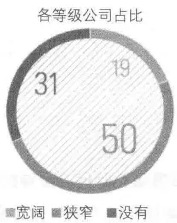

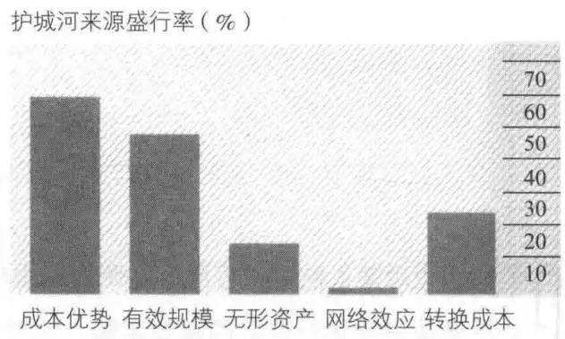

资料来源：晨星公司。

__石油及天然气钻探业__

油气钻探企业为油气公司提供钻探设备、技术人员及相关服务，按日计费，通常不拥有护城河。钻探企业面临的经营环境很艰难，因为客户选择哪一家钻探企业主要受价格因素的影响，尽管也会考虑诸如服务质量、运营及技术水平、设备适用性与可得性、信誉以及钻探安全记录等无形资产。是否需求钻塔，要看下游客户对近期商品价格的预期及项目的预计经济收益，而供给则取决于建造成本、从资本市场上融资的能力、员工招聘难易程度以及钻探设备企业的内部能力。由于供需间的驱动因素各不相同，供需间时常会发生错配，导致行业呈现高度的周期性，在一个周期内，日费率（开采合同总成本除以合同天数）上下波动可能超过 50% 。

尽管处于艰难的行业环境中，相比于那些规模较小的同行，最大型的近海钻探企业确实享有明显的竞争优势，但是，如果与规模相近的大型同行相比，由于规模相近、结构相似，比较优势就显得相当有限甚至不存在了。近海钻探企业拥有的优势并不普遍适用于陆上钻探企业，陆上领域的进入壁垒不高（钻塔更便宜，员工更容易招聘），行业集中度更低。较为大型的塔井钻探团队可为近海钻探企业带来若干无形资产，包括在长达数十年的项目周期内稳定的财务状况，富有经验的成员熟练使用新钻塔设备的能力，以及更好满足客户需求的钻塔选址，同时还有良好的声誉和出色的安全记录。复制此类专业技术是非常困难的，因为建造一个超深海钻塔需要数年的时间和高达7\.5亿美元的建造成本，而且有经验的工程师极其短缺。

不断老化的资产、激烈竞争的市场使得钻探企业想要拥有宽阔的护城河不太可能。一只富有经验的钻探队伍的全部价值只在与之相称的先进设备结合在一起才体现出来，并且深海技术更新迅速。因此，尽管一座钻塔的使用寿命为30年，但拥有领先优势的有效年限就短多了——这种情况给超额收益的持续期带来了不确定性问题。此外，高度整合的市场结构加剧了大型钻探企业间的激烈竞争，这使得我们很难有信心向钻探企业授予护城河评级。

Transocean公司是一家出人意料地成功赢得狭窄护城河评级的钻探企业，这得益于该公司在超深海领域钻探的专业能力，其钻塔可在海深达10000英尺及以上的深度上开展钻探工作。每天的运营成本超过100万美元，但公司能够控制计划外的停钻时间，这一能力对于客户来说很有价值。Transocean的深海钻塔数量是其最接近同行的两倍，同时它也是迄今为止最有经验的深海钻探企业。它在颇具挑战性的钻探市场拥有的专业能力使其能够收取更高的日费率。此外，由于建造新钻塔所需时间的及资金非常之多，因此，同行想要接近Transocean的规模，缩小能力差异是非常困难的。就算竞争对手想通过并购来挑战Transocean在深海钻探上的统治地位，Transocean仍然能够维持一定的竞争优势，因为它是行业中有口皆碑的最好的钻探企业，并且为自己许多的技术申请了专利。

__评估钻探企业的关键因素如下。__

-
- 优质资产——在这里主要是深海钻塔有多大规模？大量的专业化深海钻塔能够提供稳定的收入流，也意味着其钻探技术难以复制。
- 钻探企业的钻塔建造计划（如果有的话）其规模有多大，内部构成如何？仔细检查诸如钻塔建造成本、所用的设备堆场、交货日期、合同
- 执行情况及出现的新钻塔设备等因素，这对评估钻探商很有用。
- 资产负债状况如何，钻探商又是如何使用这些资产的？观察一家钻探企业负担的杠杆水平以及采取的不同寻常的融资选择，比如业主有限合伙制，可帮助我们深入了解未来的钻塔订购趋势，进而也会帮助我们评估钻探商构建优质资产的能力，有无潜力获得经济利润。

__石油及天然气开采与生产业__

开采与生产企业是那些拥有从地质储备中获取油气开采权利的公司。这些公司负责勘察储备，开采油气田，生产出相关产品以供销售。

对于开采与生产企业来说，成本优势是主要的潜在护城河来源。由于这些企业生产的都是具有高度可替代性的无差异产品，以大幅低于当前价格水平的成本进行生产的能力是它们赚取经济利润的唯一凭借。地质特征是开采成本最重要的决定因素。用最为简化的术语来说就是，单位岩石中资源含量越高，越靠近地表，矿藏越厚越广，开采与生产企业就越受益。

开采与生产企业很少拥有宽阔的护城河。这些企业依赖于地质储备——有限的资源最终总会耗尽。遑论实现增长，光是维持现有的生产水平，开采与生产企业就必须不断地寻找、获取并开发新的资源储备。有可能获得宽阔护城河评级的候选公司是那些拥有可供长期开采资源的低成本生产商，凭借现有储备或资源基础，公司可在接下来数十年内维持正常生产。对于拥有狭窄护城河的公司，我们必须预计它至少会在未来10年获得正的超额收益，同时还不存在对价值造成重大破坏的明显威胁。这一要求就将那些有着政治管辖风险的开采与生产企业排除在宽阔的护城河门外了，无论这些企业的储备多么吸引人，但它们的未来盈利有可能会流入权力机构。

兰格资源公司（Range Resources）是开采与生产行业中拥有狭窄护城河的一个例子。总部位于得克萨斯州沃思堡市的兰格公司，在资产质量的3个维度上都比同行更具优势：资源潜力（适合勘探的油田数量和各油田可再生碳氢化合物含量）、单位产量的生产成本（包括开采费、租赁费、钻井及完成成本、采油费用及税费）和实售价格（受到油气比例和区域差异的影响），这3个维度的质量对于开采与生产公司至关重要。兰格公司控制了宾夕法尼亚州的马塞勒斯页岩区超过20年的勘探权，那一区域富含干气和液态油，这有利于该公司保持低的运营与开发成本。加上相距美国东北部的用户不远，油田具有开发多油层的潜力，此外，该地域未来若干年计划扩建基础设施，这会大幅提升产品的运输能力，所有这些，都会为公司的价格差异化创造有利条件。作为这一地区的先行者和大型运营商，兰格公司还受益于较低的开采费率、周围不受干扰的环境以及与服务提供商及中游伙伴业已建立起的合作关系。

__评估开采与生产企业的关键因素如下。__

-
- 当你在开采与生产企业之间寻找成本优势的时候，尽量不要只是理解一家公司的现有成本状况，还要考虑其未来的成本。在预测未来成本时，重要的是综合所有相关费用，包括租赁和许可证成本，给服务及设备供应商的所有支付、开发支出、生产费用和开采特许费。你用的价格预测值最好能反映“正常的”经营环境，不要考虑因供需冲击而导致的商品价格暂时奇高或奇低水平。当我们谈到价格的时候，真正重要的是公司为产品制定的实售价格，不是某些全球基准价格。实售价格的变化取决于产品质量、加工需求、运输距离和基础设施的产能等因素。
- 公司是否拥有较低的资本成本？这方面的代理变量可以是单位储量的勘探与开发成本，或单位储量的折旧、损耗及摊销成本。在石油与天然气行业，要特别注意未开发储量是否被包括进了分母之中，因为未开发储量的价值相对较小，开发起来需要花费比探明的已开发储量更高的成本。
- 公司是否具备较低的生产成本？这些成本也可以叫做现付成本。
- 公司储量的寿命期是多少年？它也可以叫做R/P比率，该比率由年均
- 生产量除以总储量得到。这是一个度量可持续性的指标。
- 当我们考察投资资本回报率的时候，通常会把商誉纳入到分母之中。在确定一家公司拥有的为股东创造经济利润的能力时，资源获取成本必须考虑进来。

__石油与天然气中游行业__

中游的石油与天然气公司指的是涉足加工、运输和储存天然气、液化天然气、原油及成品油的企业。这些中游企业能利用多种途径构建护城河，但有效规模是最重要的来源。尽管中游企业相互间会为争夺新项目展开激烈的竞争，可一旦管线投入运行，企业就能享有超额收益。一条长距离管线就是一项内在含有护城河性质的资产，这得益于监管机制及市场机制，它们倾向于限制竞争性管道的建设，除非有证据表明新建管线可产生明确的经济效益。即便如此，现有管线还是会拥有优势，因为与竞争者竞得线路权并且建成一条新管线相比，一家公司可以借助已有线路权采用增加油泵、加压站或新建复线的方式来增加产能，这显然会更为经济。甚至在新项目破土动工之前，中游企业就已经利用与货主签订的长期合同锁定了项目经济效益，确保最低限度能够收回项目成本及资本成本，同时在未来较长时期拥有获得超额收益的潜力。

单独一条管线已经令人羡慕了，如果有一个管线网络——服务于多个终端市场并连接多个产区——那更是锦上添花。由产地及生产时间不同造成的价格差异或产品空缺，是影响中游企业盈利潜力的一个重要因素。这些企业能够利用其系统实现油气输送的最优化，以满足生产商和终端用户的需求，同时锁定不同地理区域的价格差异，或者利用管道网络中的贮存设备来锁定不同时间的价格差异。中游企业还受益于高端客户的转换成本，因为上游的石油与天然气生产商通常在管线使用上几乎没有什么选择。

我们涵盖的大部分中游管线公司事实上都拥有宽阔的经济护城河。规模小一点的公司比起拥有高度一体化资产的大型企业，一般没那么有竞争力，因为大企业在价格及服务竞争上更有效率。在中游价值链的多个环节都能提供服务的公司无疑更具实力。例如，一家公司同时经营采集系统、炼油厂、供应多个市场的天然气管道系统以及联结炼油厂与下游市场的液化天然气管道系统——比如EnterpriseProduct公司——将比只经营天然气采集处理的公司——比如Regency能源公司——拥有更多的赚取利润的机会。沿价值链提供整合服务也能确保管道网络获得更高的产能利用率。基于这些原因，我们通常授予大型的垂直整合的中游企业以宽阔的经济护城河评级。

__评估中游的石油与天然气企业的关键因素如下。__

-
- 中游企业目前是否实现了超额收益？公司是否拥有相互关联的跨地域或跨价值链的资产网络？
- 中游企业的各种资产是否相互间有很好的互补性？公司是否在整合中游各价值链，是否在其经营的每个环节都能获得经济租金？
- 增量资本支出都投入到哪些地方？公司能否将资本配置在可同时提高多项资产效能的项目上？公司的投资能否提升在其一特定地域的竞争地位，或者提供战略性进入新市场或新地域的可能？

__冶炼加工业__

冶炼加工企业将原油（按行业的说法叫“给料”）转化成诸如汽油、柴油和航空油等可用产品。这是一个具有高度竞争性的行业，产品间没有任何差异，对于投入成本与产出价格也几乎无法控制，就看能否获取到低价原油，通常也叫做取得成本领先的给料，这成为了炼油商能够拥有的最有价值的竞争优势。通常，这种优势表现为两种形式。一个是毗邻原油生产地，或从陷入困境的生产商那里获得原油，这使得炼油商能够相较于国际基准有一定的折价，从而增加利润。另一个是炼油商有能力采用高度复杂的技术加工低质油、重质油及含硫原油，这些原油相较于容易加工的轻质无硫原油价格更低。第一种来源更难获得，因为决定折价的因素很大程度上不受炼油商的控制。第二种来源比较容易获得，但通常要求炼油商在相关领域投入巨资。因此，第一种来源形成的优势更值得欣赏，在现有产能升级所需投资相对缺乏的情况下，更有潜力给企业带来更高回报率。

炼油商也能够拥有其他几项竞争性优势，虽然靠这些优势还不足以创造护城河，但是却能够加固已有的护城河。首先，炼油商可以实现比其他同行更低的运营成本。这大部分要靠较低的能源成本，通常这事关国内天然气，能源成本几乎占到一半的运营现付成本。其次，拥有出口能力的炼油商能够利用比国内市场更高的价格来改善利润，或者通过提高资源利用率来降低每桶油的固定成本。最后，炼油商可以利用手中拥有的推广与分销资源，例如零售加油站，这会确保生产出来的产品能够销售出去，有利于自己在市场需求不足或供给过度的时候提高资源利用率。

围绕原油折价是否持续的问题常常阻碍炼油商无法获得宽阔的护城河。在千变万化的国际石油市场，我们很难知道现有的原油折价是否会持续，也不知道未来是否会在别的地方出现折价。因此，要判断炼油商是否能够持续10~20年获得成本领先的给料和相对应的超额收益，也是相当困难的一件事。例如，在新油田开发的早期，由于交通不畅，产油商可能不得不以较低的价格出售原油。但在大多数情况下，交通网络通常很快就会铺开，导致价格向国际基准靠拢，折价幅度收缩。于是，除了交通因素，炼油企业还需具备一些更为持久、更可预测的条件来维持原油折价，获得护城河。举例来说，有些美国的炼油商就获取了狭窄的经济护城河，背后原因是政府禁止原油出口，实际上保护了这些公司，使得它们能够获得廉价的原油。另外，有效规模也在发挥作用，新建炼油厂需要的成本和监管审批程序实际上带来了进入壁垒，有助于所有的美国炼油商维持一定的优势。

瓦莱罗（Valero）公司是炼油商中利用给料优势构建起狭窄护城河的一个例子。瓦莱罗有14家炼油厂，其处理系统比竞争对手的要复杂得多，这使得该公司能够将劣质给料加工成高价值产品。依靠给料中约有三分之二使用的是成本较低的原油或残油，瓦莱罗公司享受到由此带来的折价好处。其结果是，瓦莱罗公司在过往实现了比竞争对手更高的利润率。瓦莱罗同时也是同行中最大的出口商，这进一步巩固了它的护城河。

__评估炼油商的关键问题如下。__

-
- 炼油商是否能够获得低成本的给料？这决定了该炼油商是否能够通过加工低成本原油获取更高的利润，获得的途径或者是毗邻原油生产，或者是从陷入困境的生产商那里获得原油，或者是有能力加工低品质原油。
- 获得上述优势是否需要大量的投资？如果所做投资是用来提高加工更廉价、更低品质原油的能力，那么，炼油商的回报率将会越来越多地取决于重质油、含硫原油的持续折价。如果低品质给料不能给利润带来显著的提升，该项投资可能就不能带来经济利润。于是，该炼油商也许不能获得超额收益以赢得护城河。
- 炼油商获取原油的便利条件或成本优势是否可持续？护城河依赖于获得可持续的超额收益的能力。如果炼油商的成本优势不可持续，那就谈不上护城河了。而且，市场力量会快速地瓦解任何一种优势，这意味着可持续性的获得也许需要借助于某股力量，比如政府监管，使市场力量不能有效地发挥作用。

__石油与天然气一体化行业__

对于主要融合了开采与生产、冶炼加工业务的一体化石油与天然气公司来说，护城河的主要来源是低成本的或有经济优势的（此处主要指公司业务的上游部分）的资源基础。相比之下，在程度上小得多的另一护城河来源，则是企业的冶炼及化工资产（公司业务的下游部分），这会受益于给料成本优势和有效规模。可见，一家一体化的企业可以基于其上游或下游（或者两者兼而有之）拥有护城河，并且，分析一体化企业各部分的护城河与评估单独从事开发与生产业务或炼油业务的企业没有什么不同。

如果工作得当，将开采与生产、冶炼加工融为一体的企业可带来资本收益率的提高和护城河的拓宽。价值增值型的融合可通过多种途径加以实现。例如，在为上游项目做计划时，一体化企业能够利用下游部门的智力和能力，确保生产获得最佳的市场需求，实现最优的价格水平。生产网点共享，尤其在炼油与化工品生产之间的共享，能够利用给料的灵活调度增加价值，确保在任何时间点都生产出最具价值的产品，并且可以方便地将一处操作得出的副产品用作另一处操作的原料。网点共享还能起到共享服务及降低成本的作用。

当一家企业的上下游资产紧密相连，一方所失去的经济租金会被另一方重新夺回，其整合效果就最好。最可能出现的情形是，上游企业生产的原油类型和数量完全符合下游炼油厂的生产。一旦成功实现整合，一体化将能降低上下游两个部门各自固有的部分波动。于是，资本收益率在整个行业周期中变得更具可预测性，这将增强我们对于一家一体化公司在未来能够持续获得超额收益的信心，这会使得一体化公司中拥有护城河的企业家数多于独立的炼油厂或开采与生产企业中拥有护城河的企业家数。然而，若是让我们考虑宽阔的护城河，我们需要看到上下游的资产质量特别优质，运转特别出色。通过一体化实现价值创造无疑会为公司的宽阔护城河增砖添瓦，但如果各基础业务不具有自身的竞争优势，那样的一体化只是徒有虚名，绝不会成为一项护城河来源。

埃克森美孚是一体化公司中获得宽阔护城河评级的一个例子，主要原因在于该公司一直以来有能力将管理实践制度化，使之持续创造出高于竞争对手的超额收益。节约成本、完善运营已深深植根于埃克森美孚的企业文化之中，成为其不懈的追求。由此，该公司能够确保遍布全球的业务衔接顺畅，运转有序。这得益于公司在全球范围内投资于一体化的上下游产业，以此降低成本。产业整合，尤其是与化工生产的整合，也给其炼油业务带来价值增值。与此同时，该公司发挥规模的杠杆作用，用规模经济实现成本的控制。

此外，埃克森美孚将资本配置作为管理的中心。为此，该公司从全球视野而非局部眼界出发评估项目，只选择那些回报率最具吸引力的项目进行投资。在这种严格标准下，该公司规避了商品周期峰值时的过度投资。由于其项目庞大，该公司必须采取长期的视角，防止将项目的经济效益建立在上涨的商品价格基础之上。取而代之的是，聚焦于项目交付日期，在预算范围内施工，确保初始估计的经济效益得以实现。该公司的护城河也部分归功于财务实力。充足的现金流、大量的现金余额和低负债水平使得该公司不必依赖资本市场就能维持较低的资本成本，并有能力进行持续的投资。

__评估一体化公司的关键因素如下。__

-
- 一体化企业的下游部门能否获取到自己上游部门实现不了的价值？例如，如果一家公司在某个价格差异非常明显的地域生产石油，其下游部门，如炼油及化工产品部门能否将价格折扣转化成更高的利润率？
- 碳氢化合物产量占炼制产能的比率是多少？是否达到了真正一体化公司的平衡点水平？
- 公司是否利用下游知识来优化上游生产，反之亦然？
- 炼油设备和化工设备是否彼此相邻？这样的布局会使企业优化供料配给以实现价值最大化。

__工程服务业__

工程服务企业提供从地质储量提炼成产品所需的服务和设备。这些公司供应专业技术、服务和必需的设备，以期以高效和成本节约的方式解决在变化多端的经营环境中遇到的复杂问题。

对于工程服务企业，我们需要超越成本优势这一很多类型的能源企业首要的护城河来源，寻找其他无形的护城河来源，例如可靠性方面拥有的声誉、以往优良的实施记录以及广泛的产品组合。技术精良的公司通常受邀解决世界上最难的工程问题，往往工作环境极度恶劣，客户非常不愿意聘用未经检验的供应商，因为一旦出错就可能要付出数千万美元的代价。因此，客户通常只与少数几家供应商合作，这些供应商能够满足各种不同环境及地质条件下客户提出的要求，这使得工程服务行业变得高度联合，由三到四家主要的供应商控制大部分特定的市场或产品线。由于经营环境通常非常危险（甚至可能在战区作业），安全记录也是考虑的因素之一。客户会将一个项目分成若干部分进行招标以促进竞争，但由于行业的寡头垄断结构，价格通常是理性的。

在工程服务行业，有可能出现宽阔的护城河，其可能性甚至比其他类型的能源企业还要高，这得益于护城河的来源多种多样：成本优势、无形资产和有效规模。这类企业通常具备较为广泛的产品组合，拥有全球化的制造与设计基地，客户定位精准，服务可靠、安全、高效，以往项目执行优良，这使它们更有可能赢得客户的信任。这些工程服务企业还拥有适当的规模，有能力比同行在研发方面投入更多的资金，开发出所需要的集成技术——通常会与客户合作进行——以改善未来的项目产出。宽阔的护城河还存在于在一个足够小的利基市场中经营的公司，进入这个市场，需要建造符合要求的实验设施，需要十多年的研究累积，需要雇用稀有的工程师，这都会给新进入者造成很大的障碍。

斯伦贝谢公司（Schlumberger）在工程服务行业中处于行业领导者地位，拥有许多的优势，赢得了宽阔的护城河。该公司的产品组合在石油服务行业中属于最为宽广之一了，其规模及声誉让它在高度复杂的油田技术领域几乎无出其右，使它能处理行业中最为困难的全球性挑战。此外，斯伦贝谢在全球范围内进行工程师的就地培训，这有助于改善其成本结构，使得该企业能够根据需要迅速配置生产线和技术工人，同时，公司加强与所在国的国家石油公司之间的关系，这些公司愈加成为斯伦贝谢最重要的客户。

斯伦贝谢公司拥有宽阔护城河的背后因素在于其庞大的研究与开发（R&D）预算，这为公司带来了持续的商业成功，此外，巧妙的并购策略、深厚的国际影响力和广泛的产品组合进一步支持了公司的竞争优势。该公司聚焦于小型的并购活动，这使得被并购对象的软实力可以轻而易举地整合到现有的生产线中，增强了研发上的竞争优势。此外，其深厚的国际影响力——过去40年一直在所经营的国家雇用工人——及稳健的产品组合意味着斯伦贝谢公司通常与国家石油公司拥有良好的关系，更容易赢得高显示度的项目。

__评估工程服务企业的关键因素如下。__

-
- 相较于同行，公司的规模大小和全球化程度如何？规模更大、全球化程度更高的企业更有可能赢得长期超额的投资资本回报率，增加人们对其竞争优势的信心。
- 公司可解决哪种类别的工程问题？如果公司所处的利基市场有着数量充足的熟练工程师供应，基本上采用标准化方式进行设计，主要满足常规项目的需求，这样的市场便会面临十分激烈的价格竞争。相反，更有吸引力的利基市场要求公司能在艰苦环境下经营，能满足客户的个性化需求，能提出完善的一体化解决方案，且拥有稀缺人才。
- 公司产品组合的一体化程度有多高？如果公司拥有比较广泛的产品组合，它就能为客户提供充分整合的一篮子解决方案，为客户带来成本及时间上的节省。相比之下，如果公司只能提供数量有限的产品，就要冒被对手淘汰的风险，很难脱颖而出，很难赢得未来。

## 第12章 金融服务业

__第12章 金融服务业__

无数金融公司及投资者在金融博弈中提枪跃马，龙争虎斗，然而由于产品和服务的高同质性，严格的政府监管及激烈的竞争，很少有竞争者能在此领域脱颖而出。想在金融行业里屹立不倒，企业就要在成本优势上狠下功夫。

整个金融服务行业都围绕货币来运行，但它并非总是最容易赚钱的地方。货币本身，以及大多数的金融产品，纯粹是一种商品。只不过，全世界多少最聪明的人物用他们的超级运算能力在不分昼夜，不知疲倦地竭力想在金钱博弈中脱颖而出。为了用高金融杠杆撬动财富，数不清的金融公司及投资者在金融博弈中提枪跃马，龙争虎斗。

然而，各家提供的产品和服务基本上都无差异，加上监管严格和竞争激烈，银行业和保险业是挑战性特别大的行业。想要说服顾客为一笔汽车贷款额外多付几个百分点，或是想让储户接受减半的存款利率，几乎是不可能的。况且，宏观经济因素，如利率及失业率，也会对金融服务业的盈利带来很大的波动。其结果是，由于市场中存在着大量的竞争者，这使得我们在银行和保险这两个行业极少看到有宽阔护城河的公司。一部分银行和保险公司有能力开掘出一个狭窄的护城河，只是，他们大部分都得依靠成本控制。

在这个行业的某些细分领域，会比较容易找到拥有经济护城河的公司。金融业的中介本质在总体上会有利于其建立起强大的网络效应。成功的信用卡公司和金融交易所就是凭借信用卡持卡人、商家和交易者组成的网络，构建起护城河的。在这些细分领域，我们识别出7家具有宽阔护城河的公司，正如图12\-1所示，成本优势是金融公司最普遍的护城河来源。

图12\-1 金融服务业的经济护城河特征

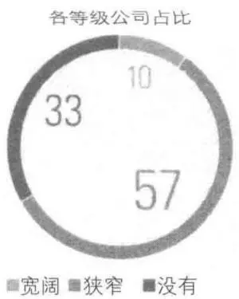

资料来源：晨星公司。

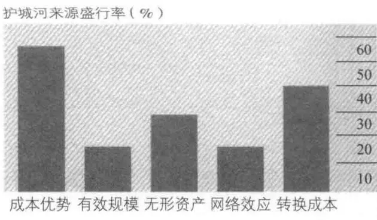

__银行业__

银行作为金融媒介，将存款和其他负债这些原材料转换为生产性资产，通常的如贷款和证券。银行从资产收益与负债成本之差中获利，且其大小取决于利率水平的高低及信用风险的大小。此外，银行还可以向客户提供多种产品和服务，收取相应的费用以赚取利润。

在高度竞争的环境里，银行很难拥有定价能力，无论是借入成本还是投资收益率通常都是由市场决定的，并没有留下多少空间让银行加以利用，使其区别于同行。更主要地，在像美国这类银行业高度拥挤的市场里，有众多银行可供顾客选择，银行更难拥有真正的议价能力。而在竞争者相对较少的市场，比如在加拿大和英国市场，银行有时在定价上还有一些机动性。另外，具备规模庞大、分支网络便利或客户关系深厚这些结构优势的银行，有时可以通过收取更高的费率或提供更低的存款利率来提升收益。

对银行业来说，成本优势是护城河的一项重要来源。由于其价格弹性相对有限，银行必须更多地依赖于有效的成本管控，以此作为建立竞争优势的手段。管理能力在银行实现和保持一个较低的成本结构中发挥着重要作用，因此，在对银行进行估价时，给予管理能力额外的关注非常重要。银行管理团队必须时刻关注以下3点：（1）比同行更有效地经营；（2）更有效地进行贷款管理；（3）降低借款成本以创造超额收益。即便如此，银行也很难在不承担额外风险的情况下获得超过其资本成本的回报。

对于银行业来说，顾客转换成本也是护城河的一项来源。虽然严格来说，顾客的转换成本通常不高，但转换账户所带来的麻烦常常会抵消掉顾客实施转换获得的好处，特别是考虑到激烈的价格竞争使得银行所能提供的激励措施十分有限，转换账户的真实意义实在不大。并且，有着深厚客户关系的银行通过发展多样化的产品线，通常能够产生出高于平均水平的转换成本。

很少有银行能在一段较长的时间内获得足够强大的竞争优势以保持其超额收益，所以，在银行业，宽阔的护城河很少见。但有些银行，如富国银行（Wells Fargo），会设法去开掘一个狭窄的护城河。富国银行的护城河主要来源于其低成本的存款基础。我们知道，银行能通过将顾客的资金投资于各种各样的贷款和证券来获利，他们为这些资金支付的费用越少，获利就越多。富国银行在这方面做得极好。它凭借广泛的分支机构，出色的客户服务以及多样化的产品供给能力，只付出很低的资金成本；而且，富国银行在为存款者提供便利选择的同时，也增加了他们的转换成本。不仅如此，这家管理优良的公司很擅长于控制利息费用，将承担风险贷款的压力降到最低，从而带来利润增长。通过严厉的经营费用控制，配之以严格的贷款标准，富国银行不断地巩固其低成本银行的地位。最后，这家公司在2008年金融危机期间的稳健表现，也使“富国银行”的品牌这一无形资产更具价值。

在一些市场，大量的合并及严格的监管减少了银行业的竞争激烈程度。例如在加拿大和澳大利亚，银行就可以获得宽阔的护城河。在这些市场，过度的风险承担行为已被监管者严格限制，减少了由不良资产造成的损失。在这样的监管环境下，新的市场进入者极少，并且现存的大公司也乐意维持它们既有的可持续市场份额。在这些国家，银行拥有很高的定价能力。

__评估银行的关键因素如下。__

-
- 该银行是在一个有着众多有效竞争者的市场里经营，还是在一个由少数几家银行主导的理性垄断市场里经营？
- 异常有效的经营是源自于规模经济或商业模式等结构化优势，还是源自于管理上的锁铢必较所带来的低经营成本？
- 低的信贷损失率是否来自特定的小范围贷款市场，或监管规定，抑或完全来自娴熟的贷款核准？
- 低的融资成本是来自于网点等结构优势，还是来自于深厚的客户关系所带来的高转换成本？
- 该银行的资产与负债状况如何？其对应的风险怎样？
- 该银行有哪些非利息收入来源？其规模有多大？该银行在这些业务线上的竞争优势如何？
- 该银行在怎样的监管制度下运营？
- 该银行期望产生的超额利差（权益资本收益率减去权益成本）有多少？

__资本市场业__

资本市场公司，例如投资银行和证券公司，主要是在发行和交易金融证券上提供帮助。它们可以作为经纪人向客户收取费用，也可以作为当事人去赚取利润。

资本市场公司的护城河建立在网络效应、无形资产和成本优势上。作为金融中介，投资银行和证券公司将渴望筹集资金的卖方与为资金寻求投资机会的买方联结起来。在众多业务上，网络效应都是竞争优势的重要来源。对证券承销业务而言，公司考虑要发行股票或债券，很可能会去物色一家拥有庞大分销网络的投资银行，其网络连接着大量的买方机构和财富管理客户，依靠他们，证券的竞价投标过程将会更具竞争性。并且，投资者（买方机构和财富管理客户）为了能得到热门发行的配额，也会乐意与承销商保持良好关系。对兼并与收购业务而言，公司愿意借助于一家具有广泛地域网络的财务咨询公司，利用这一网络上的众多顾问和客户来寻找并购伙伴。对二级市场交易业务而言，一家具有庞大的客户交易网络的证券公司会给买卖双方提供更多的可能性，可以把大额的或难以达成的指令分拆开后实现交易，还能为定价提供有价值的信息来源。

对于资本市场公司来说，良好的声誉可带来无形的竞争优势。例如，一家富有盛名的投资银行更有机会被选为发行的主承销商（该承销商负责管理账簿及分派部分发行量给其他承销商），它能在新发行的证券中获得更大的份额，收取更多的佣金。在进入新领域或开展其他业务时，一家享有声誉的公司可以以更快的速度立足，也更有可能获得盈利。例如，一家从事兼并及收购的咨询企业，如果获得了良好的声誉，就能拓展业务，从事私募股权基金的发行。

成本优势也为某些证券公司的商业模式锦上添花。如果某家证券公司自身拥有核心的电子交易基础设施，且规模够大，相比于规模小的证券公司，它会有着更低的交易成本。这可以在行业中形成进入壁垒，也可以为公司带来定价灵活性。

虽然我们认为强大的投资银行有能力在未来10年获得超额的资本收益，这值得狭窄的护城河评级。但是，资本市场在未来20年的发展实在存在着太多的不确定性，我们很难给其评定宽阔的护城河评级。由于在2008年金融危机时期对证券做出过错误的定价，投资银行的声誉遭到重创，这削弱了发行者和投资者对投行的需求，其源于成本优势的超额利润也受到价格竞争和监管的考验。除此之外，虽然与资本市场相关的公司如今看起来财务健康，但其长期杠杆化的商业模式也不免让人们担心该类公司的偿债能力及流动性，怀疑它们的长期生存能力，更别提它们在未来20年产生超额收益的能力了。

不是所有在资本市场领域的公司都是承受着如此的高风险，比如拉扎德公司（Lazard），该公司已创建150多年，作为一家独立的投资银行，它在同行中有着最广泛的地域分布，有着为大公司和政府提供高质量金融咨询的良好声誉。该公司为处于良好光景的企业提供兼并与收购建议，为处于衰落阶段的企业提供重组咨询，最大程度地减少企业承担的经济周期风险。并且，这家公司不愿意负担过多的杠杆，这进一步夯实了公司业绩的稳定性。这些综合因素都使我们相信该公司具有持续赢得经济利润的能力。

__评估资本市场公司的关键因素如下。__

-
- 公司是否有能力在更大的、更复杂的资本市场交易中展开竞争？公司在跨境交易中是否有竞争力？
- 公司的分销网络还有大幅提升的空间吗？
- 新的金融监管制度是会给当前的业务带来威胁还是创造机会？
- 公司有多少业务可以在电子化平台上执行？
公司在有利可图的市场是否占有大的市场份额？
公司是否依赖于金融杠杆去获取超过平均水平的资本收益？
- 公司的营业收入在多大程度上依赖于强劲的委托投资或自营交易？

__信用服务业__

作为网络效应的受益者，信用服务公司（比如万事达MasterCard或Visa）通常都拥有狭窄的或宽阔的经济护城河。这些公司的业务本质上就是将付款人和收款人连接起来，其网络效应依赖于其支付网络得到广泛的接受和使用。每一位新增用户都为其他用户创造价值——一个被付款人广泛接受的网络给使用它的收款人带来好处，同时，一个被收款人广泛接受的网络对于付款者来说也是一个富有吸引力的选择。

成本优势也对构建该行业公司的护城河有所裨益。如果新增交易所对应的边际成本微不足道，公司便能从规模经济中受益；无形资产也能让公司提升其定价能力，值得依赖的品牌对一家从事货币结算支付及转账的公司来说是求之不得的。

信用卡行业巨头 Visa 公司在全球的电子支付市场中占据统治地位。这家公司收取的费用主要来自名下实现的支付量以及通过其网络完成的交易额。在一个电子支付交易不断发展的世界里，这家具有宽阔护城河的公司将会得到更好的发展。

Visa公司的护城河源自于持卡人及商家构成的网络。事实上，这家公司是网络效应发挥作用的典范：每增加一名持卡者就会使Visa品牌对商家更有吸引力，每增加一家接受Visa卡的商家也会使Visa品牌对持卡人更有吸引力。作为全球最大的支付网络，接受及使用Visa卡的商家及持卡人无处不在，在未来若干年，Visa卡会成为顾客钱包——不论是实物钱包还是电子钱包——中的必备之物。凭借Visa公司长期建立起来的结构优势，新的竞争者很难达到Visa公司的网络规模。Visa也从其值得信赖的品牌中受益，过去数十年已在这一重要的无形资产上投入了数十亿美元。

__评估信用服务公司的关键因素如下。__

-
- 公司是否拥有规模庞大的客户基础？
- 公司网络的服务对象属于什么类别？是高度集中、规模庞大且很有议价能力的付款者及收款者，还是高度分散、规模偏小的使用者？
- 公司网络能否为顾客提供独特的产品及服务（客户资源、更低成本等）？
- 顾客面临怎样的转换成本？顾客的平均还款期限有多长？
- 支付系统在全球界范围都受到严格的监管，限制支付网络盈利的立法是一项持续存在的风险。
- 为产生新增交易量，公司需要做哪些投入（资本支出、营销、激励）？
- 支付系统是否向客户贷款或提供其他服务？

__金融交易所__

来自规模经济的成本优势、网络效应及无形资产三者是金融交易所获得竞争优势的重要来源。金融交易所是买卖诸如股票、期货、期权等金融产品的场所。起初，交易所需要投入大量的财务及人力资本，配置交易设备及技术，才能使交易得以开展。不过，这些投入一旦完成，交易系统新增一笔交易的成本就变得相对偏低。这也就解释了交易量的激增对交易所的盈亏平衡特别有利的原因，新增交易基本上都可以在交易所现有系统中完成，借此带来了高的边际收入增长。网络效应也很重要，因为在其他条件相同的情况下，市场参与者会倾向于偏好有深度、流动性好的交易系统，而不是因流动性问题使交易变得麻烦的狭浅系统。此外，无形资产，比如有条件提供竞争对手没有的交易产品，也可以给交易所带来宽阔的护城河。

我们认为经营着5家期货交易所的芝加哥金融交易所集团（CME Group）就是一家已经建立起宽阔护城河的公司。该集团的一个关键竞争优势就在于其清算所的运行。在芝加哥金融交易所开立的头寸必须要在该交易所的系统上平仓，这让该交易所可斩获所有的交易及清算业务量，相比之下，股票则可以在不同交易所之间自由买卖。然而，我们必须指出，虽然清算部门的成功是芝加哥金融交易所集团区别于其他交易所的关键因素，但这也给它带来潜在的威胁，比如，在清算/交易业务模式上的监管变动会对芝加哥金融交易所集团的战略地位、盈利能力及护城河带来潜在的打击。

__评估金融交易所的关键因素如下。__

-
- 有多大比例的公司产品可在其他交易所交易？
- 交易所的垂直整合业务能力如何？例如，它是否提供清算、结算和托管服务？
交易所是否垄断经营？如果不是，其未来在市场份额和定价能力上的发展趋势如何？
- 客户是否会支持交易所推出的新的举措？

__保险业__

保险公司帮助其客户将风险转换为已知的成本。理想情况下，利用风险聚合与分散的原理，保险公司可在一定的准确程度上预测未来的索赔金额，在不承担过度风险的情况下获得好的回报。虽然各家保险公司覆盖的风险类型可能有很大差异，从死亡风险到飓风风险，但这个行业的基本动态机制还是相当一致的。保险企业尽管多少有些复杂，但其核心不外乎商品经营范畴。

既然该行业具有商品属性，那么，保险公司如果能在承保业务上维持可持续的成本优势，它就可以建造起护城河，并且，保险公司实际上可采用多种途径实现这一目标。首先，保险公司赢得优势的途径之一就是聚焦于市场上竞争较少的领域。例如，与其他众多的保险品种相比，短缺和超赔保险业务更加专业化，受到的监管也更少，可以很好地提升公司的灵活性和定价能力。然而，除非公司核保时很专业，对保单做出适当的定价，并且公司有一套合适的激励措施，激励承销人员规避错误定价的保单，否则，这些业务并不能带来超额收益。

其次，保险公司也可以寻求更低的管理费用支出。最显而易见的方式就是发展业务规模，获得规模经济优势。但由于几方面的原因，这一策略在保险行业存在局限性。首先，美国的保险业受州一级部门的监管，这让全国性的保险公司跨州开展业务会加倍地增加费用。其次，也是更重要的，保险成本中只有相当小一部分属于固定成本。这意味着，只有部分公司能够有效地扩展其经营规模。相比之下，个人保险业务的可扩展性会更大，原因在于其需要的专业承销人员和人力资本相对较少。不过，我们需要敏感地分辨清楚公司是在某些业务线上高度集中，还是规模庞大高度分散。总体上，我们不认为多样化的大型保险公司会拥有护城河。

除了增加规模，降低成本还有其他方式。比如，公司开发出独特、有效的分销平台，把分销成本降到最低。承保人还可以通过增加顾客的黏性来降低费用，因为获取新保单的成本比更新现有保单的成本高得多。如果保险公司拥有一个垄断的代理网络，或交叉销售多种保单，也可创造黏性。不过，这些方法都会增加额外的成本，所以我们必须密切地观察这些方法在一段时间内的有效性。

到本书写作为止，还没有一家纯粹经营保险业务的保险公司拥有宽阔的护城河。虽然保险公司可以利用上述方法来发展可持续的竞争优势，但是，由于以下几点原因，保险公司的经济护城河多少有些不牢固。首先，保险公司持有庞大的投资组合，这使其暴露于大量的投资风险之下，投资损失可能会使保险公司的利润低于要求的水平。再者，管理上的错误决定（这可能体现为错误定价的风险，或不恰当的业务领域拓展），会轻而易举地削弱承保上的优势。最后，保险公司的商业模式以杠杆经营为基础，这一模式会放大各种错误或未预见的损失带来的负面效果。

__评估保险公司的关键因素如下。__

-
- 通常情况下，保险公司难以获得有利的竞争地位。顾客不会为容易复制的品牌和产品支付明显的溢价，这会使成本结构成为关键性的差异化因素。
- 许多保险公司并不知道它们的产品成本，导致定出的保单价格过低。保险公司有动机以牺牲长期盈利能力为代价追求成长，被迫为产品定出低价，并承担业务损失的风险。
- 保险公司利润的主要来源有承保收入（保费减去经营成本）和浮动收入。在我们看来，超众的承保收入是护城河的唯一真正来源，正如高收益常常对应着高风险，我们不认为保险公司能单独依靠投资获得可持续的优势。
- 成本的易变性是这个行业的内在特性，对保险公司进行评估需要跨越一段相当长的时期。
- 我们认为寿险与财险及意外伤害险相比，具有更少的护城河特性。由于死亡率相对变化不大，寿险公司很难在承保方面做到差异化，并且，这类保险公司也更多地受资本市场波动的影响。

## 第13章 医疗保健业

__第13章 医疗保健业__

尽管医疗保健行业在21世纪面临着很多的变革和挑战，但这个行业仍是盛产护城河的肥沃土壤。无形资产、成本优势及转换成本是市场参与者主要的护城河来源。

尽管医疗保健行业在21世纪面临着诸多的变革和挑战，但这个行业仍是一块相对肥沃的盛产经济护城河的土壤。在晨星公司涵盖的大约140家医疗保健公司中，超过 70% 的公司拥有护城河，并且其中1/4都有着宽阔的护城河评级。

无形资产在很大程度上解释了为什么这个行业中如此多的公司拥有护城河。制药和生物技术企业长期享受着专利的保护，并且对于新投入市场的产品有着定价能力。知识产权和专利也是医疗设备制造商获得经济护城河的重要来源。

如图13\-1所示，除了专利之外，医疗行业也存在其他几种护城河来源。成本优势在一些企业中的作用突出，例如有着复杂工艺流程的生物技术公司就依靠大规模生产，从规模效应中获利。转换成本对于某些企业也作用较大，特别是那些生产高端产品的公司，医务专业人士为学会使用这些产品已经投入了大量的时间和精力，弃而不用会心有不甘。

图13\-1 医疗保健业的经济护城河特征

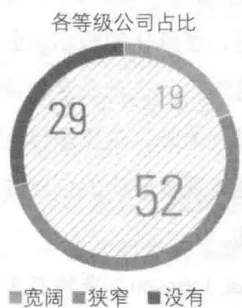

资源来源：晨星公司。

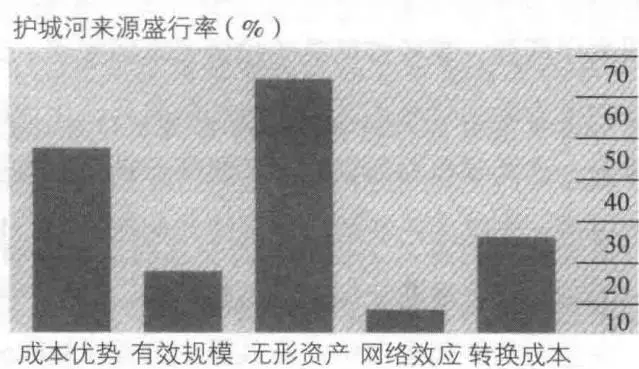

__制药业__

大型制药公司在全球范围从事着药品的研究开发、专利申请及市场推广。通常，凭借销售受专利保护的药品，公司会获得稳健的现金流，加上这些公司一般定位清晰，会将资本重新配置到新药开发上，投放到业已建立的经销网络里。其结果便是，我们涵盖的所有主要制药公司都具有护城河，大部分还拥有宽阔的护城河。

在制药行业，专利期一般能存续20年，毫无疑问这会成为公司护城河的最重要来源。虽然药品开发时期消耗了一些专利独占期，可一旦药品获得审批通过，药企便可收取垄断性的价格。在发达市场，专利到期后药品价格通常会下降 90%，为维持护城河，公司必须不断开发新的受专利保护的药品，以抵御仿制药的竞争。然而，在新兴市场，品牌比专利更重要，专利独占期结束后很长时期，品牌药品仍可维持其市场份额。

除了专利，一些多样化经营的大型制药企业还受益于其他护城河来源。品牌影响力不仅存在于新兴市场，也存在于发达市场之中，消费者总是愿意为值得信赖的品牌支付更高的价格。在罕见病药物方面，由于患者人数很少，新进入者的进场意愿不强，有效规模便成为了那些罕见病药企的强大优势。

对于制药企业来说，是获得宽阔的护城河还是狭窄的护城河，主要看公司的销售收入是否来自多样化的产品。公司在世界各地销售的药品越多，越有可能研发出新药，越能维持高的投资资本回报率。进而，多样化的药品让公司更有能力抵御新药带来的竞争威胁和既有药品出现的副作用，在药品专利保护期结束前，这两项负面因素最有可能降低药品的高回报。另外，高度多样化的药品能够进一步巩固已有的经销网络和制造能力，提高与规模较小的创新性企业合作的可能性，借助外部力量创新药品，并推向市场。

在主要的制药企业中，巨头强生公司（Johnson & Johnson）凭借其多样化的营收基础、稳健的研发渠道，以及异乎寻常的现金流产生能力，赢得了宽阔的护城河评级。事实上，我们认为，强生公司能持续保持医疗保健行业的领导地位，并且可能是整个行业中护城河最宽阔的企业。

强生公司的多样化经营支撑公司赢得宽阔的护城河。这家公司在很多领域都保持着领导者地位，例如医疗设备、非处方药以及若干处方药市场。强生公司并不会过度依赖于某一个特定的经营部门，并且在每个部门，都不会只有一种药品独占销售收入，不会像瑞辉公司（Pfizer’s）的降胆固醇药立普妥（Liptor）那样。除去个别部门的利润率较低之外，该公司在众多产品上都保持着强劲的定价能力，并且在过去5年产生接近 70% 的毛利率，这足以证明其强有力的竞争地位。

强生公司还有着很多其他的优势。凭借其强大的研发实力，未来5年强生公司将会适时推出多种新药，这使其免于受到重大专利到期的强烈冲击。它在医疗设备领域的努力，如开发陶瓷髋关节和微创侵入性手术工具，使该公司保持着行业领导者地位，并且拥有着强大的定价能力。强生公司强大的销售能力也使其持续成为小型医药公司开发新品时愿意选择的合作伙伴。并且，强生公司对其收购的公司并不会过多干预，因此有着创新产品的公司愿意成为其联合体之一，这使强生公司得以在全球医疗行业中保持着规模最大、盈利能力最强的地位。

__评估大型制药企业的关键因素如下。__

-
- 公司有多强的新药研发能力？将专利失效药带来的冲击与新药销售预测两者结合起来，可作为确定公司抵御仿制药竞争能力的代理变量。从定性角度来看，过去药品开发的成功率也会影响新药获得审批通过的概率。
- 考虑到监管机构在新药审批上的重要性，药企有必要关注政府部门对于新药创新的态度及支持力度。虽然政府采购很重要，但是大型团体采购和新兴市场的个人购买也同样重要。
销售收入中有多大比例来自生产工艺复杂的药品？生物制剂和疫苗不仅具有专利保护期，且其制造、销售及获得监管审批方面的难度也给竞争者带来额外的进入壁垒。
- 如果公司是在传统药领域之外进行经营，那么它在这些领域的竞争优势有多大？比如，动物健康药品市场、常用药品市场、疫苗市场、非专利药市场和新兴市场可能存在独特的进入壁垒，不允许人用药品的随便进入。

__生物技术业__

生物技术公司与大型制药公司相比规模更小, 但创新能力更强, 且风险更大。它们通常会研发用生物技术替代化学过程的新疗法。生物技术公司一般可以划分为三类: 成熟的、新兴的和投机的, 护城河主要产生于前两类。

我们认为，在这个行业，护城河有三种主要来源：无形资产、有效规模和成本优势。无形资产是最重要的，并且可以有多种表现形式。进入壁垒是其中最为重要的无形资产，进入壁垒主要来源于专利强度、专利保护期以及产品制造的复杂程度。如果公司在某个特定治疗领域积累起更多的动态竞争力，这通常会有益于公司获得持久、强劲的利润来源。例如，有些生物技术公司正把研发重点从初步保健治疗领域转移到重大疾病治疗领域，因为在这样的领域公司能够拥有更强的定价能力和更少的销售推广投入。公司产品组合的宽度也可以用来衡量无形资产的强度，如研发效率，或业务拓展的业绩。一般说来，宽广的产品组合能够使公司更有能力抵御竞争威胁。

最强大的护城河通常建立在有效规模之上，我们认为只有少数几家专注于罕见病药品研发的公司，如拜姆仁制药（Bio Marin）和亚力兄制药（Alexion）公司拥有这项竞争优势。这些公司所专注的市场最适宜由一家或极少数几家企业提供服务，高额的初始投入成本（需要辨别及定位清楚为数很少的患者群体）和较少的收益（全球只有为数不多的病人）都会打消竞争者入场的积极性。而拥有先发优势的公司能够享受到高额的利润，因为患者及监管者有极少的选择余地，竞争威胁也极其有限。

有些市场的产品需要借助于复杂的生物制造工艺，在这样的市场中公司只有达到一定的规模才能获得盈利，而一旦建立起规模效应，公司便会拥有成本优势。例如，血浆的采集、分馏和加工耗费巨大，如果公司只是生产一种可销售的产品，那就难以承受，想要成功，就必须能够有效地将血浆转化成几种可销售的产品。高昂的成本，加上复杂的制作要求将这个市场限定于在少数几家有经验的全球生产商，如巴克斯特公司（Baxter）和基立福公司（Grifols）。

对于生物技术公司来说，专利质量、产品组合的实力和研发战略决定了护城河的宽度。品牌药能够享有20年的专利保护期，可一旦药品得到确认，专利进入申报，保护期就开始计时了。不断的试验会占去好些年的专利保护期，因此，几乎没有几种药品能享够20年的垄断利润，很多药品自推向市场之后只能享有8到10年的专利保护期。因此在评估公司的护城河时，识别出药品的独家经营权期限非常重要。高度复杂的药品在专利到期后也很难模仿生产，这就会增加护城河的持续期。对于那些制造工艺非常复杂的药品，其进入壁垒对于竞争者来说也许是无法超越的。如果药品针对的是未经满足的需求，那更有可能拥有护城河。如果药品属于稀有药——为治疗罕见病而特别开发的药品——其使用年限将会明显延长。公司若能将强大的多样化战略与可持续的研发战略结合起来，会让公司的资本回报更上一层楼，这也使得一些生物技术公司，如安进公司（Amgen）、诺和诺德公司（Novo Nordisk）和罗氏控股（Roche Holding）拥有了宽阔的护城河优势。

__评估生物技术公司的关键因素如下。__

-
- 现有的专利能否在未来10年为公司的药品提供适当的保护？这些专利（属于工艺流程还是药品成分）的保护力度有多强？
- 公司药品组合是否容易受到仿制药的影响？药品生产的复杂程度有多大？仿制药企能否轻易地复制药品制造过程，以及（如有必要）模仿临床实验过程？
- 该治疗领域有多大的吸引力？为此，投资者需要评估市场规模、监管环境以及报销规定，评估出当前及未来的竞争者数量。基于这一治疗领域的各种特性，评定进入壁垒是高还是低。
- 公司的研发效率如何？研发的投入是否足以维持公司的竞争优势？为此，需要评估公司研发平台的效率和优势，评估其生产新药的能力。

__医用设备业__

医用设备公司制造出可暂时或永久性植入人体的硬件装置，例如起搏器和人造髋，我们认为经济护城河在这个行业里大量存在。如同其他医药保健公司一样，知识产权、监管要求、转换成本和医师关系都给这个行业的新进入者造成了障碍。如果新进入者对已形成的寡头垄断行业结构带来明显威胁，现有厂家就会动用它们充足的现金流予以清剿。

无形资产，包括知识产权和与医药行业专业人士的关系，是医用设备企业所具经济护城河的主要来源。得益于专利保护，这类公司通常会创造出具有差异化特点的产品，产品之间一般不可相互替换。这些公司通常会极力保护它们的知识产权，最极端的情况是，行业竞争对手之间旷日持久的诉讼战甚至会持续到一代产品早已过时多年之后。护城河也来源于公司与受过专业设备培训的执业医师和销售代表之间的紧密关系。公司的技术服务人员常常会在手术室里提供建议，这些建议特别受到经验不足的医师们的重视。在生产矫正设备的公司里，由于外科医生一般在几年里都不会更换植入物和工具的供应商，所以护城河也来源于高昂的转换成本。对于生产心脏起搏器的公司来说，有效规模是护城河的另一项来源。在这一行业，3家主要的公司占据了市场将近 90%的份额，形成了一个理性的寡头垄断市场。

如果公司生产的产品具有极大的差异性（并且几乎没有可替代品），而且绝大部分医师会因转换成本而锁定使用该项产品，那么生产该设备的公司就没有理由不拥有宽阔的护城河。有些产品本质上就比其他产品更具可替代性，比如波士顿科技（Boston Scientific）和雅培（Abbott）生产的冠脉支架。对于这类主要生产低转换成本产品的公司，我们通常会授予它们狭窄的护城河等级。产品范围较为窄小的公司同样也只配得上狭窄的护城河评级，因为任何颠覆性的技术创新都会让它遍体鳞伤。相比之下，具有宽阔护城河的公司，其产品组合的宽度非常宽广，且大部分产品的可替换性较低。美敦力公司（Medtronic）是典型的具有宽阔护城河的设备制造商，医师想要学会使用它生产的脊柱类产品，需要经历漫长且陡峭的学习曲线，从而转换成本非常高，相对来说，公司生产的心率管理设备较容易被替代，其转换成本就有限。

__评估医用设2备制造商的关键因素如下。__

-
- 公司在新兴技术领域是否拥有领先地位？投资者应利用各种途径查看新出现的前沿技术。另外，还要确定产品能否显著提高临床效果和治疗成功率。
- 在评估公司产品面临的竞争形势时，我们通常会一并考虑药物疗法，因为有些药物疗法的创新可能会使医用设备间的竞争失去意义，在心率设备制造领域，这种现象最常发生。
- 设备制造商经常借助于一系列并购行为来增强公司内部的创新动力。考虑到收购中存在过度支付的风险，我们需要考察公司的投资资本回报率，即ROIC（包含商誉），该指标更准确地反映了可持续基础上所有投资的回报。
- 保险赔付前景如何？对于有些设备制造商而言，现行的赔付机制对其产品成功至关重要。美国的医疗保险和医疗补助中心作为牵头者，通常会为私人采购商设立赔付基准。

__医疗器械与用品业__

医疗器械与用品公司的产品有医院治疗过程中所使用的仪器，也有医疗机构和个人消费者所使用的基础用品。对于医疗器械与用品行业来说，护城河最常见的来源是高昂的转换成本。执业医师在使用复杂的专业医疗器械之前都要经过一段时间的训练，所以在遇到产品更换决定时，他们通常会表现得犹豫不决。考虑到建立制造工厂和经销渠道需要的初始投资规模巨大，这个行业的进入壁垒通常也会较高。地位稳固的大公司享受着可观的规模与范围优势，有能力在较多的产品线上保持定价能力和市场份额，还会寻找有着有价值产品的创新成长型企业，将其纳入并购对象。另外，研发方面的专业技能也可以加固护城河，与竞争者相比，优秀的产品性能、经过验证的仪器效果会使公司维持其竞争地位，享受定价溢值。

想要在这个行业获得宽阔的护城河，公司需要致力于开发需求未经满足的市场，或者形成理性的寡头垄断市场结构。在当今的环境条件下，由于购买决策权从医师手中转移至管理者手中，转换成本的作用变得有些弱化，并且，由于医院预算在收紧，保险赔付的范围在缩小，器械制造商凌驾于客户之上的优势地位遭到削弱。产品的市场化也是产品间的竞争程度不断加剧，为了赢得宽阔的护城河，公司或者凭借高度差异化的产品占据需求尚未得到满足的市场（比如，拥有宽阔护城河的Intuitive Surgical公司就专长于机器人手臂手术设备），或者占领某一利基市场的垄断地位（例如，在微创侵入性手术器械领域，由于医师的使用惯性以及竞争者的理性行为，各公司的市场份额都比较稳定）。

__评估医疗器械与用品行业的关键因素如下。__

-
- 公司产品线的市场竞争程度有多高？如果公司主要在无差异化的市场中竞争，那么，它是否有成本优势或是其他来源使其产生较高的利润？
- 这一器械领域有多大的吸引力？我们需要评估市场的规模和技术革新的步伐，评价监管与赔付的相关规定，并判断当前与未来的竞争者数量，基于该领域特点来确定进入壁垒的高度。
- 技术优势本身几乎不可能成为可持续的护城河优势来源，但如果能结合其他因素，如经营模式创新或庞大的经销网络，就会使公司变得强大。定位于尚未满足需求的市场能使公司赚取更大的利润，因为相对的监管及赔付环境更有利，利润空间也更大。
- 器械制造商通常会利用兼并收购手段补充内部研发能力的不足，以此进入新的治疗领域，抵御新的竞争者。当比较行业内各公司的资本收益率时，投资者有必要对研发支出进行资本化处理，或对并购产生的商誉加以调整。

__诊断与研究业__

诊断与研究公司为药品开发或诊断流程提供辅助作用的产品与服务，这里面包括设备及耗材制造商、经销商、临床研究机构和诊断实验室。

在诊断与研究行业，转换成本是最重要的竞争优势，拥有宽阔护城河的公司基本上都受益于高转换成本，其背后来源是大量的前期投入，或是长时间的质量承诺。一些采取剃刀加刀片经营模式的公司，如沃特思公司（Waters）和安捷伦科技公司（Agilent），就是依靠前期的大量投入增加了客户的转换成本。这些公司一般还会聚焦于某类需要对终端用户投入昂贵培训的产品线。一旦客户经受了培训，有了产品体验，他们要转换其他产品，就会犹豫不决。为了改进药品制造流程，制药公司及生物科技公司常常需要不断验证临床试验数据，与之相关联的药品研究公司就会从中受益，并由此享受到额外的保护。

这个行业也从无形资产和成本优势中获利。产品一般都享有专利保护，但是产品的精细复杂程度不同，获得的保护范围也就不一样。对于大多数的产品线，技术本身在抵御新进入者方面作用很有限。在临床研究领域，顶级公司受益于专业技能、知识和强大的数据库，使自身区别于较弱的竞争者，确保获得定价上的溢值。成本优势，特别是在市场化程度高的低端产品上，可以起到微小的作用，但是在高端设备市场，价格已经不是决定购买的主要因素，客户愿意为更好更便利的产品支付较高的价格。至于实验室业务，规模则非常重要。实验室公司（LabCorp）和探索诊断公司（Quest）这两家行业内最大的公司基本上已经形成了两强垄断格局，与较小规模的竞争者相比，它们能以更大的规模、更低的成本开展更有效的实验。最后，在这个行业，有效规模也是护城河的来源之一，只不过这样的公司极少。

__评估诊断与研究类公司的关键因素如下。__

-
- 客户的黏性有多大？如果公司销售的仪器需要投入昂贵的培训费用，客户一般就会不愿意换用竞争者的产品，不愿意重新接受培训，其客户黏性就会更大。如果公司产品用于临床研究的全过程，那要考虑其产品对于研究过程的重要程度有多大，并且考虑如果研究者换用其他竞争者的产品，是否需要获得各类监管机构的许可。
- 当转换成本特别高时，公司能否从剃刀加刀片的经营模式中获利？公司总收入中有多少来自重复性的产品（耗材与服务），多少来自一次性的固定设备？
- 公司产品的精细复杂程度有多高？有着复杂产品的公司更有可能在长时期内抵御竞争者的入侵，更有可能将新技术知识运用于下一代产品。如果产品的技术含量低，公司只得靠低成本制造参与竞争，这势必会使公司陷入价格战。想从技术视角比较各家公司的产品，毛利率是一个关键的观察指标。

## 第14章 工业

__第14章 工业__

工业行业是一个大杂烩，包含铁路业、机场运营业、航空航天与防务工业、货车运输与水上运输业、废品管理业、重型装备业和多元化工业，可谓包罗万象，类别众多。它们潜在的护城河来源各不相同，将在本章中一一展开。

工业行业是一个大杂烩，里面包罗万象、类别众多，公司特征差异明显、跨度很大，潜在的护城河来源各不一样，因此，难以一致地概括其护城河的来源。我们只得从这个涵盖广泛的行业中选取若干细分领域加以细致分析。在本章，我们挑选了在护城河构建上具有代表性的几个领域，即使如此，每一领域也涵盖广泛，我们的讨论也不可能事无巨细。

就拿机场、海港或铁路运营商来说，由于这些公司拥有天然的地理垄断位置，而任何一个市场都只需要有限的运载能力，有效规模便成为重要的护城河来源。无形资产也是许多工业企业获得护城河的来源之一。比如对于机场运营商来说，无形资产主要体现为政府授予的许可经营权，这通常需要年复一年地与各级权力机构建立良好的关系才能获得。良好的关系在航空航天及防务工业的作用也相当重要，对于这些行业来说，最重要的无形资产就是通晓政府部门复杂的工作流程。考虑到精细复杂的技术以及严格昂贵的培训要求，转换成本也在航空航天及防务工业中发挥着重要作用。对于铁路公司来说，成本优势是关键的驱动力，它会使铁路运输比其他运输方式更为便宜。对于高度依赖于经销商网络的重型设备公司来说，网络效应会帮助公司在这一领域快速高效地提供产品服务。

在这个行业，最有可能拥有护城河的细分领域是多样化经营的工业企业——这样的股权公司利用跨越多个平台的核心能力来建造护城河。相比之下，货车运输业最难拥有护城河，它很难从成本优势、网络效应、转换成本以及无形资产中获得竞争优势。图14\-1显示了工业行业里护城河评级及来源的分布状况。

图14\-1 工业行业的经济护城河特征

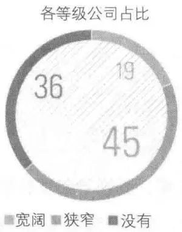

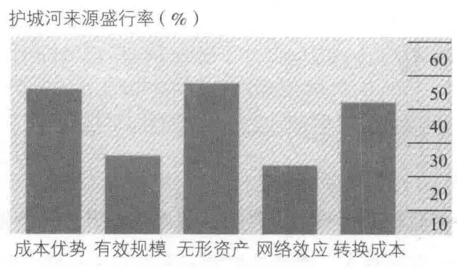

资料来源：晨星公司。

__铁路业__

煤炭、化学品、粮食、集装箱、汽车、木材、原油和其他商品都要通过铁路来运输。北美的铁路公司与许多其他区域的铁路公司大为不同，一般都拥有不动产、路权、轨道，还经营着火车站，以及机车、车厢。

铁路公司可从成本优势和有效规模中获得宽阔的经济护城河。在出发地与目的地没有水路连接的情况下，与驳船、飞机、货车等其他运输方式相比，火车是迄今为止成本最低廉的运输方式。火车的燃料效率是货车的4倍，并且长途货运火车能够更有效地利用人力，尽管在火车站也需要人手。即使是那些可以用货车运输的货物，在相同的距离里，通过铁路收取的价格会比货车收取的低 10%∼30%。

铁路公司还可以受益于有效规模。除了最为繁忙的运输线路（如在怀俄明洲盛产煤炭的粉河盆地），在所有其他线路，一般由一家铁路公司提供站点间的运输服务，并且在北美，每个区域仅有两家铁路公司。进入壁垒也为铁路公司提供了帮助。在北美，铁路公司必须要取得相邻的路权才可以铺设连续的钢轨，才可以跨越庞大的区域，才利于公司抵御潜在的进入者。铁路公司或许会建造新的支线，修复已经废弃的线路，但我们怀疑未来还会建造新的干线。

铁路公司拥有护城河的关键来源是定价能力，其定价要足以覆盖所有成本，包括所要求的再投资。在现代管理理念盛行的时代，过去那种“即使每节车厢都亏钱，也要抢占市场份额”的观念已经像恐龙一样销声匿迹了，如今的铁路公司行动比过去更为理性。行业的整合也促进了理性水平的提高。在1980年，北美有超过40家一级铁路公司，如今只剩下7家。然而，与货车和驳船不同，铁路公司必须维护其自有的铁路，这会带来高额的资本费用支出（每年占总收入的 16%∼20%），会减少自由现金流。在考虑北美以外的铁路公司时，我们同样会关注其定价能力，以及政府在保留可行的私有铁路运输系统上的利益。

__评估铁路运输业的关键因素如下。__

-
- 想要改善经营状况，公司需要更有效地利用劳动力和燃料，在这两方面大有文章可作。对此，公司做了怎样的持续努力，由此带来多大的利润率提升？
- 托运商不断游说相关部门，想要削减铁路公司的定价能力。立法及监管环境是否威胁到给铁路公司带来盈利的定价能力？
- 资本性投资会影响折旧。我们认为，由于上报给美国证券交易委员会报告中使用的折旧计算方法不同于税法上采用的方法，递延所得税负债会持续存在，由此，我们预计未来的现金所得税税率会与历史现金所得税税率保持一致，且会低于利润表中的税率。
- 没有得到资金支持的政府授权项目，如精确的列车控制系统，会耗费铁路公司数十亿美元，且不会带来经济利益。这些现金流如果用于其他地方则会给投资者带来好处。

__机场运营业__

虽然世界上大多数机场场地都是由政府当局所有的，但是私有运营商通常管理着机场的所有运行——从跑道维修到食品供应不一而足。其中大多数的私营公司都获得了为期几十年的经营许可权。

对于机场运营公司来说，无形资产和有效规模是构建护城河的关键来源。从政府那里获得机场经营与管理的许可权，这是护城河的最重要来源，这需要事先熟悉门道，与政府官员保持良好的关系。新进入者必须让管理当局相信，新建的基础设施会在某方面给国家或区域带来好处。管理当局会要求所有运营商规划并执行长期开发计划（未来5到10年），计划内容包括拟定的机场改造与升级构想，未来确定要投入的资金额度。另外，有效规模也会在这一领域发挥作用，因为，如果区域市场有太多的机场，就会降低所有公司的利润。

为了评定公司拥有的护城河宽度，我们需要关注公司经营权的存续期，以及监管当局对公司定价的影响。通常，大多数机场运营商被授予数十年期的经营与管理许可权。在墨西哥，自1999年起，运营商获得了慷慨的50年的许可权，因此，我们给一些墨西哥机场公司，比如东南部机场集团（Grupo Aeroportuario del Sureste）授予了宽阔的护城河评级。然而，有些政府把机场当作受管制的公用事业单位，而不是私营公司，不允许运营商获取过高的超额资本回报，例如巴黎的戴高乐机场（Aeroports de Paris），即使该公司拥有垄断地位，我们也将其评定为没有护城河。

__评估机场及航空服务业的关键因素如下。__

-
- 授予机场经营与管理许可权需要经历怎样的竞标过程？
- 经营合同的存续期有多长？
政府是否允许运营商赚取超过资本成本的回报？
- 机场的运输量处于什么水平？
- 需要多少的资本投入？运营商是否拥有提价能力，从而使价格足以覆盖上升的固定成本与可变成本？
- 运营商是否有机会在其他具有地理优势的区域实施兼并来实现成长？

__航空航天与防务工业__

航空航天与防务公司从事先进产品的设计、策划、制造、供应链管理以及销售，这些产品包括战斗机、运输机、陆上车辆、水上驱逐舰、潜艇，还有导弹和军需品等。客户通常包括全球范围的政府，也有商业客户。

对于防务企业来说，深谙复杂的政府客户运作机制是无形资产的最主要来源。成功的公司要经过数十年的交往互动及关系构建才拥有这方面的知识，新进入者很难跟上步伐。转换成本会带来另一种优势，因为设备的使用需要大量的前期培训，提供设备维修服务也给现有的供应商提供了优势。武装部队有成百上千的士兵需要装备去执行任务，新装备很容易找到用武之地。更重要的是，新装备的采购需要经过各级政府机构的审批与检查，这些机构既包括使用者，又涉及购买者。

得益于行业复杂性及非常高的转换成本，拥有狭窄护城河的公司相当普遍。但只有两家公司，洛克希德马丁公司（Lockheed Martin）和通用动力公司（General Dynamics）凭借其各自在军用飞机和海上军舰领域的统治地位及所在领域有限的竞争，赢得了宽阔的护城河。其他公司，比如波音公司，虽然有着高的进入壁垒，但由于市场份额争夺非常激烈，商用飞机领域的客户鲜有盈利（加上一些主要航空公司取消订单），其超额收益的确定性有限，护城河狭窄。

__评估航空航天与防务业的关键因素如下。__

-
- 新进入者能与美国五大占统治地位的防务供应商开展有效的竞争吗？公司是否拥有一个将会获得稳定资本回报的利基市场？自20世纪90年代以来，美国的防务行业已由50家公司合并到只有5家公司，每家公司都有着高度多样化的产品与平台。
- 防务项目的承包商是否了解招标机制并赢得业务？过去数十年政府制定了一整套晦涩难懂的相关规则，规定了招标流程，包括记账和专利保护，这起到了限制新进入者的作用。
- 现在的资本回报率是否较高？这是来自制造基础环节的低成本，还是由于政府意识到需要促进这个行业健康发展所带来的机遇？如果转换成本更低，投标更具竞争性，公司的高回报还能持续吗？
- 新的商用飞机制造商能否在不同的管辖区域获得相关机构的监管审批？它能否有效地管理好飞机建造过程中所涉及的大量供应商？由于客户是在飞机交付前付款，飞机制造公司的净营运资本可能会为负值，这会推高公司的资本回报率，分析师不应该仅凭这一点就认定公司拥有护城河。

__货车运输与水上运输业__

卡车货运公司会为单个的托运人运输满满一车的货物，但在零担货运，也称作LTL，公司会将众多客户的小件货物组合起来运输。在水上运输领域，内陆的油驳船公司在全美国的内陆航道系统上运输着大部分的液体货物，大型的轮船线路则专注于海上集装箱运输。

货车运输业务很难构造经济护城河。事实上，我们涵盖的所有专营卡车货运以及零担货运的公司都没有获得过护城河评级。我们认为货运公司几乎没有多大机会可通过网络效应、转换成本和品牌识别来建立护城河。起初，人们也许会认为货车运输公司由于有着高的固定成本（货车车队和司机工资），可以利用优秀的流程管理和规模经济来获得成本优势，但事实证明这是无法持久的。在货车运输业，转换成本很低，几乎没有进入壁垒——只需购买一辆货车就可以开展货物的运输。零担运输公司会比卡车货运公司具备更高的资本密集性，有着更高的行业集中度，原因在于联合各集散站需要广泛的网络，但零担运输公司的规模经济相对较弱。在严重的货运衰退时期，竞争者争相压价，为维持货运量可把价格压到不可持续的程度，即使国内最大的零担货运公司也会濒临破产。

由于资本高度密集和低的转换成本，全球范围内的海上运输公司通常也不拥有护城河。并且，这两方面因素还会带来高周期性和激烈的价格竞争，即使全球最大的远洋船队也只能是价格的接受者，并且由于长期的供给过剩，整个行业的利润率都会遭到侵蚀。

作为一个例外，美国最大的油驳船经营者可比集团（Kirby Corp）却拥有护城河。我们认为，效率及来自于规模经济的成本优势为可比集团提供了狭窄护城河的来源，这使该公司有能力抵御来自其他油驳船公司的竞争，从而保持长期的盈利能力。借助于兼并以及有机增长，可比集团建立起该行业内最大规模的内陆及近海船队，其规模是排名第2的竞争对手美国商业轮船公司（American Commercial Lines）的两倍。这种难以取代的规模使得公司能够比其竞争者更快地调整驳船的航程，更有效地利用结余的返航载货机会，这些都增加了货船的利用率。更进一步地，公司船队的足迹遍布世界各地，大大提高了为不同货物提供合适驳船的机会。公司不用频繁地为特定的驳船更换装载的货物，如果这样做，那会增加大量的船舶清洗费用，提高运输成本（特别是石化产品）。除此之外，《琼斯法案》规定美国的水上运输业务由国内航运公司控制，这保护了国内公司，使它们免遭国外竞争对手的打击，可比集团的驳船业务无疑会从中受益。

__评估货车运输与水上运输业的关键因素如下。__

-
- 货车运输和海上集装箱运输都有着高额的固定成本（设备非常昂贵），属于资本密集型业务，极少会有差异化的机会。因此，值得授予护城河的公司凤毛麟角。
- 对于货车运输和零担货运公司来说，在运输需求萧条期间，其定价能力会明显恶化，费率设定（通常按每英里费率来确定）也变得不理性，这些都是市场竞争激烈、资本密集及转换成本有限的行业所具有的典型特征。
- 在内陆航线上航行的轮船公司，可以利用庞大的网络规模来降低成本（减少空载里程），提供更好的服务（为特定的货物提供合适的货船），
- 从而赢得优良的经营效率。政府管制（例如《1920年商船法》，也被称作《琼斯法案》）保护了美国国内的水上运输企业，使它们免遭国外竞争者的威胁。
- 由于全球极少有地方会允许同时存在几家竞争性企业，经营海港的公司通常有能力利用有效规模建造护城河。

__废品管理业__

一体化的废品管理公司会围绕垃圾填埋场、焚化炉、回收中心等实物资产构成的网络来建立相应的回收线路。非危险品处理公司处理大部分由市政、工业和商业用户产生的垃圾，而危险品处理公司主要处理特定类型的垃圾，例如医疗垃圾和放射性物品，它们会受到更严格的监管。

在废品管理行业，垂直整合（一家公司控制了工艺流程中的多个环节）是一项重要的竞争优势，能带来定价能力和经营效率。监管当局通常会给予垃圾填埋场和焚化炉所有者10到20年独家经营权，允许它们为在特定区域倾倒垃圾设定价格，或叫收取“小费”。然而，由于该行业属于资本密集型，处置资产的所有者想要获利就需要有充足的处理量。兼具废品收集与处理的垂直整合公司可以把两项服务捆绑起来向用户收取费用，这会在不增加公司自有资产的情况下增加废物量。垂直整合也有利于形成有效规模，最终会阻止新进入者打消试图闯入既定废品市场的念头。

对于废品收集者而言，收集路线的密集程度是另一种竞争优势。在收集路线上每多设一个收集点，在付出边际成本的同时也会带来业务量的增加。总体来说，通过密集的收集网络产生出的超额自由现金流可以再投资于改善经营业绩，提高经营效率。

我们认为，在危险品处理行业，更换废品处理公司可能会给用户造成不便，服务质量可能变得不可靠，最终让废品产生方承担环境责任，这一风险会增加转换成本。因此，客户会更倾向于绑定那些被证实有良好处理记录的废品管理公司。垂直整合也会极大地减少供应商的数量，形成闭环系统，有利于降低负面环境事件发生的风险。

有不少垂直整合的废品经营企业凭借这些竞争优势赢得了狭窄的护城河，但是迄今为止，仅有专注于医疗废品处理的思特力赛克公司（Stericycle）拥有了宽阔的护城河。通过一系列的收购活动，该公司逐步在医疗废品管理行业实现他人无法企及的规模，凭借手中富有价值的医疗废品处理许可证，以及良好的客户关系，公司的成长速度明显快于有机成长所能达到的速度。在此基础上，公司建立起密集的、别人难以复制的收集线路网络和处理设施，并且这些都很好地满足了各地方、州及联邦环境保护当局的苛刻要求。成本高昂的许可证也会阻止新进入者，使得医疗保健机构只能在有限的废品管理公司中进行选择，没有真正有实力的其他医疗废品处理公司可以替代，医疗保健机构变得几乎没有议价能力。思特力赛克公司有能力高效可靠地处理医疗废品整个流程——从收集、杀菌到焚化——这帮助顾客极大地减少了风险。另外，公司也受益于这一利基市场的有效规模。总的来说，我们预计思特力赛克公司能在未来持续产生可观的收益。

__评估废品管理行业的关键因素如下。__

-
- 在有着严格的废品处置监管规定的国家，拥有垃圾填埋场和焚化炉的所有权会是一项竞争优势。公众的反对和政治压力会延长建设新处置点的许可过程，这使新进入者难以达到既有资产业已形成的网络规模，难以与之展开竞争。
- 在这一行业，拥有处置能力会带来定价能力，而定价能力会为公司在未来赢得类似年金的现金流提供预测基础。
- 收集线路的设计通常是为了使自有资产获得最大化的废品收集量，这一指标称为内部化率。我们认为有着高内部化率（大约 65%）的垂直整合企业比低效的同行更有能力抵抗经济低迷。
- 虽然高的经营杠杆意味着经营利润相对于经济周期更为敏感，但对废品处理公司来说还是有一定的必要性，因为在所有经济周期阶段都有废品处理的基本需求，这会为公司提供一些业务量的保障。
- 在人口密集区域，土地非常珍贵，采用循环利用方式来处理废品会是更好的选择。不过，如果没有政府某种形式的支持，填埋式的处理方法很难被大规模地采用。

__重型装备业__

重型装备企业为公路货运业、建筑业、农业和采矿终端市场制造具有附加价值的产成品。这些公司常常会把部分或全部的金属预制件和零部件（如轮胎和电子器件）外包出去，产品的销售或直接销给终端用户，或通过第三方经销。

在重型装备行业，牢靠的服务信誉对建造护城河非常重要：在路途、施工现场或是采矿过程中出现故障造成停工，这对用户来说就等同于收入损失。无论是利用独立的经销商网络或是直接服务于用户，这个行业里的公司都必须为其现场使用的产品提供零配件及售后服务。如果公司能提供最为广泛的售后支持，最为优秀的服务质量，它通常就能收取溢价，享受到更高的利润。

在载重货车制造领域，我们认为原始设备制造商，也称作OEMs——该企业承接其他企业的生产业务，为其他公司贴牌生产——会理性地经营，如果新的货车排放标准出台，货车价格也会同步上涨。如今，新竞争者很难进入这个市场，并且考虑到譬如用户偏好和产品信誉等无形资产，我们认为这种寡头垄断局面将会维持下去。这意味着，行业内的公司可以通过低成本经营和在譬如发动机技术等领域进行垂直整合，使自己区别于其他公司。

由于新产品开发可带来更好的收入增长、更高的定价溢值和更强的用户黏性，所以，稳健的研究开发支出也是重型装备企业取得成功的一项标志。有能力持续支持研发的公司在经济下滑时期也能占据市场份额。

具有宽阔护城河的卡特彼勒公司（Caterpillar）是全球最大的重型装备生产企业，并且在美国市场占据统治性的份额。公司的服务网络助推其市场份额的扩张，也为公司用户免遭停工影响起到了关键作用，遍布世界的经销商网络创造出一项可观的竞争优势。卡特彼勒公司还享受着规模经济的好处，它是行业内最大的装备制造商。公司遍布全球的网点、可靠声誉为用户提供了可感知的产品优势，久而久之，公司产品获得定价溢值，赢得更多的回头客，创造出更大的价值。由于公司在研发投入上明显高出竞争对手，因此，该公司不大可能会丧失其竞争优势。

__评估重型装备业的关键因素如下。__

-
- 经销网络能带来竞争优势。经销商的数量与质量同等重要。如果条件允许的话，有必要去分析经销商的营业额和财务健康状况。
- 零配件市场销售能给公司带来更稳定的业绩和更大的用户黏性，高比例的售后服务收入可以在整个经济周期产生更持续、更广泛的盈利。有些公司从这一块获得的收入甚至可以超过总收入的一半。
- 由于在这个行业研发投资有着核心地位，在计算投资资本回报率，即ROIC时，我们建议将研发支出进行资本化处理。另外，我们不愿意看到为成本节省的目的，研发支出的分摊时期过长。

__多元化工业__

多元化工业企业通常是在单一母公司下面控制着跨越不同行业、地域及用户市场的多种业务线的公司，这类公司想要建造可持续的护城河，关键的是要具备明显拔尖的、能发挥杠杆作用的、能产生较高利润率的核心能力。这种情况的出现，通常要求公司在不同业务间有着类似的技术基础，可以运用多个平台上的技术开发产品，发挥技术投资的杠杆效应，这就会使公司比业务单一的竞争者以更低的平均成本开发出新产品。通用电气公司（General Electric）在喷气发动机、燃气涡轮机和风力涡轮机这几个领域就做到了这一点；3M公司有一个内部研发专利池，公司可以将其中的专利用于不同的产品线。更重要的是，如果公司拥有若干整合于一体的业务线，公司就有条件与客户展开独到的多点对接，加强与客户的紧密联系，从而带来更高的转换成本。久而久之，随着自己对客户需求的了解更深入，外部竞争者就很难渗透进来，并且，自己由此可开发出一系列的一体化产品来满足客户的特定需求。因此，客户保留率以及客户持续购买带来的销售收入便成为衡量这类护城河强度的关键指标。

__评估多元化工业的关键因素如下。__

-
- 多元化企业中的业务线是否比独立的实体更有价值？各业务线对于公司整体能力有多大的贡献？
- 公司在剥离业务方面是否像并购一样活跃？
- 多元化企业的内在风险是收购估值风险，糟糕的收购吞噬的不仅有投资者的资本，还有管理能力。
- 公司是怎样选择它的收购目标的？被收购企业会给收购方，以及收购方会给目标企业带来怎样的价值？

## 第15章 技术行业

__第15章 技术行业__

在技术行业中，巨额财富可以在瞬间被创造，也可以在瞬间消失掉。你可还记得20世纪90年代后期的互联网泡沫和21世纪初这泡沫戏剧化消失的场景？技术行业更新迅速，变化无常，对投资者充满了诱惑，也充满了挑战。那么，它的护城河构造主要来源于哪儿？

欢迎步入技术行业。在这里，大量的财富可以在瞬间被创造出来，也可以在瞬间消失掉。在许多投资者的脑海里，可能还依稀记得20世纪90年代后期的互联网泡沫，还隐约记得2000年至2001年该泡沫戏剧化破灭的场景。在令人兴奋的业绩增长率、投机行为、过度自信和大量风险资本的猛烈推动下，短短几年间，技术类股票——哪怕与互联网只是稍稍沾一点边儿——其股价先是爆发式地上涨，随后便是一泻千里地下跌。自那之后，很多技术公司浴火重生，股价又飙升到新的高度。

实际上，技术行业更新迅速，变化无常，对投资者充满了诱惑。然而，正是这些特性使得人们想要可信地预测其长期超额收益变得极具挑战性。这就是为什么我们认为，在寻找科技行业的投资机会时，除了关注潜在增长之外，重要的还需关注可持续的竞争优势。在我们当前所涵盖的140家技术公司中，大约 15%的公司拥有宽阔的护城河——大多数来源于软件和半导体公司。除此之外的其他公司大约平均分布于没有护城河与狭窄护城河之间，狭窄的护城河主要来源于高的客户转换成本和无形资产，当然，其他来源多少也起一些作用，如图15\-1所示。

图15\-1 技术行业的经济护城河特征

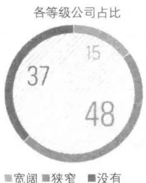

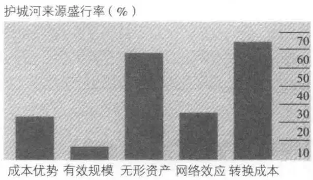

资料来源：晨星公司。

__消费品技术行业__

消费品技术行业出了一些世界知名公司，例如苹果、松下和三星等公司。这些公司的业务是向广大的终端消费用户提供软件、硬件、服务以及内容。

在这一行业，转换成本对于各等级的护城河都是至关重要的。考虑到产品生命周期很短，公司想要获取长期可持续的超额收益，只能想方设法将转换成本嵌入到产品之中，从而确保现有消费者未来还会继续购买公司的产品。硬件厂家最初可能靠出售某种小器件获利，但只有围绕硬件开发出相关的软件，提供相应的服务和内容才可能激发消费者在未来继续购买公司产品。我们认为消费电子硬件市场的竞争已经相当激烈了。例如，苹果公司iPhone手机的硬件性能近几年来已经差不多被其他众多品牌手机追赶上了，但我们认为，凭借iPhone手机用户从应用商店购买相应的软件、应用程序和媒体内容，苹果公司将来仍会维持庞大的用户基数。

游戏公司也靠知识产权这一无形资产来发展竞争优势。成功的游戏公司可以年复一年地推出系列产品，也可以将已经流行的游戏加以衍生化，从而让知识产权变现。虽然我们看到游戏行业的进入壁垒不高，但是领先的游戏内容商应该有能力在未来若干年凭借几款特别受欢迎的游戏版权获得丰厚的回报。

由于技术变革迅速，消费者喜好无常，消费品技术公司想要发展起宽阔的护城河极其艰难。如果公司能维持成本优势，能保持较高的消费者转换成本，或是像有些游戏公司那样长期获得某些有价值的知识产权的许可权，它就有可能拥有狭窄的护城河。例如，电子艺界公司（Electronic Arts）借助于某些游戏品牌，比如持续了25年之久的《劲爆橄榄球》，控制着体育视频游戏市场，它能从全美橄榄球联盟那里获得知识产权的许可权，利用这类方式建立起一套软件开发驱动体系，使公司得以快速、便利、低廉地制作出高质量游戏。然而，除去这些因素，我们真不确定还有哪家单一的消费品技术公司能在下一个10年获得数量可观的经济利润，除非这类公司进军到消费品市场之外的领域，进入到更稳定的工商企业市场。

__评估消费品技术公司的关键因素如下。__

-
- 公司产品的哪些因素能帮助留住忠诚的用户，能推动未来产品销售的增长？我们需要考虑现有用户基数的广度和深度，以及用户转换到竞争性产品或平台的意愿与能力。
- 公司在软件、服务及知识产权上有着怎样的竞争地位？其地位会随时间发生怎样的演变？
- 公司产品在市场上是否明显地优于竞争对手？我们可以观察产品价格是否出现了下跌或上涨的迹象，这可能预示着公司有无能力获得超额的经济利润。
- 想一想公司产品是否会被替代品所取代。用户使用不同的或是更复合的产品能否实现类似的功能，用户是否必须使用多个设备或平台才能实现所有必需的功能，或者获得类似的用户体验？
- 审视公司的投资资本回报率时，看看公司是否从制造外包或低的固定成本基数中获利？

__企业硬件系统行业__

企业硬件系统供应商销售的是应用于信息技术及企业经营之中的设备，例如计算机、打印机、电话系统、服务器、数据存储及网络设备。

由于硬件技术容易模仿，顾客相当精明，进入壁垒相对较低，所以，硬件供应商并不能依赖于无形资产和成本优势来建造护城河。然而，客户的转换成本可以成为这类公司获得竞争优势的主要来源，并且，供应商通常可以采取3种常见方式来增加客户对产品的黏性。第一，供应商可为自己的产品建立一套软件体系。用户界面、系统管理工具、分析方法和程序界面都能提高客户对公司产品的价值感知，使软件内容与客户所处环境结合得更紧密。第二，供应商可努力延长系统的生命周期。通过改善基本配置，使客户无需更换整个系统，只要采购额外的硬件模块，就可以增加或提升设备的性能。另外，供应商一般都会提供软件或系统的升级，相比于转去使用竞争对手的平台，升级会让客户最大程度地保持系统的平稳运行，会带来明显的成本节约。第三，供应商每年都会提供维修服务，其费用是系统初始价格的 10%∼20% ，借此，供应商可在产品生命周期内每年获得一笔高利润率的收入，也由此保持良好的客户关系。

如果产品与客户的生产高度集成，并支持关键核心流程，这样的产品可为公司带来更持久的竞争优势。支持一家企业业务活动的系统通常有多个，它们靠软硬件平台连接在一起，如果某供应商能够提供一体化的解决方案，那就会比只能提供单点解决方案的供应商更有地位，更能获得可持续的经济利润。比如，如果能将公司的数据库服务器、应用服务器及网络服务器一起连接起来，集成一个核心数据中心转换集群，那比起为公司分支机构供给路由器，支持其小规模远程销售团队，要重要得多，客户很难弃之不用。同样地，支持关键核心流程的产品更具有黏性，更换产品所带来的风险通常会大于预期的收益。最后，那些需要特殊专业技能和训练才能安装和管理的产品比那些即插即用的产品更具有黏性。

EMC公司是利用高转换成本开创经济护城河的好例子。第一，这家大型的网络存储公司已有庞大的客户基础。第二，没有特别的激励，公司首席信息官通常不愿意冒风险去使用新供应商的产品，所以，即使较小规模的竞争对手有好的技术，也难以从EMC公司的市场份额中分得一杯羹。第三，如果顾客想要扩展存储平台，它们通常会利用已有的软件，只需添加新的硬件就行了。最后，EMC公司丰富的产品线给客户提供了灵活性，客户先可以购买低端产品，随着数据需求的增加，再往价值链上端转移。

__评估企业硬件系统行业的关键因素如下。__

-
- 支持关键核心应用的高度整合产品最具有用户黏性。供应商的产品是支持关键核心应用还是单点解决方案？它们是深嵌进客户的平台之中，还是像普通商品一样很容易更换？转换成本有多高？
- 更快速的产品周期会给竞争对手提供更多的窃取客户的机会。在整个产品周期，供应商采取什么措施保护自己免遭对手的竞争？供应商的产品是否容易遭到竞争者的模仿？新产品能否给客户带来价值？或者，随着一次次产品周期的推进，产品是否正变得愈加市场化？
- 供应商的“客户名单”是否有实力让公司更强大？供应商是否与经销商建立起深厚的关系，是否有很强的直销队伍，是否与关键的决策者有长期合作关系？供应商是否赢得大企业的信赖？
- 大多数的企业硬件系统公司都是有着过多剩余现金余额的活跃收购方。因此，在计算投资资本回报率时，需要做出相应的调整，从投资资本中减去多余的现金，加上收购来的商誉。

__信息技术服务业__

尽管这是一个高度竞争和分散的市场，但仍有不少大型的信息技术服务公司凭借转换成本和无形资产建立起了经济护城河。信息技术服务提供商开展的工作，如技术咨询、系统集成及定制应用开发，具有与客户业务联系紧密、常常涉及关键核心工作的特性，客户一般不愿意更换供应商。除此之外，紧密的客户关系也会给信息技术服务提供商带来好处，它可以不断提高自己对客户经营情况的了解，利用新技术更好地为客户提供服务。我们看到，有些客户与服务提供商形成了长达十多年的互动合作关系，明显提升了解决方案的相关性与及时性。一家值得信赖的信息技术服务公司凭口碑就可以赢得新客户，当然，品牌在这方面发挥了重要作用。每多一次成功的服务记录，就会使现有客户多一次信任，就会增强一分客户关系黏性。

公司的国际化程度在很大程度上取决于公司的业务范围及提供服务的价值。只有少数几家全球性公司能为全球最大的跨国公司提供全面的、端对端的信息技术解决方案。如果公司有能力以快速、有效的方式处理全球不同地方的不同问题，公司就会受到高端客户的青睐，就会取得更好的财务业绩。信息技术服务公司还有另一种极端的选择，它可以采用业务流程外包，以及基础设施外包，这种方式更容易实施，但由于不具备实质性的转换成本，这种方式使公司更容易受到同行的竞争冲击。

信息技术服务公司很难拥有宽阔的护城河。虽然我们认为该行业的领先企业会长期存在，但是我们很难预料这些服务在未来十多年之后对公司的价值，这让我们对该行业公司的长期定价能力产生了怀疑。此外，这些服务性企业容易受到技术变革的影响，技术的破坏力量始终存在。

即便如此，我们最近将信息技术服务提供商埃森哲咨询公司（Accenture）的护城河评级上调至宽阔等级，依据在于其客户转换成本和无形资产。在这个高度竞争与分散的行业，该公司具备专博结合的行业技能、全球化的经营网络和令人满意的客户声誉，这为公司的成功打下了坚实基础。埃森哲咨询公司的全球化特性使其区别于较小的竞争者，使其能在广泛的范围吸取到合适的专家，采用相关的技术工具。埃森哲公司另一个关键的成功因素就是它有能力与客户建立紧密的长期商业关系。有事实可以证明这样的商业关系具有相当的黏性。在2013年中期，按销售收入计算，在公司最大的100家客户中，有99家与其保持了至少5年的业务关系，有92家与其保持了至少10年的业务关系。

这些数据很好地反映了埃森哲公司与客户之间的紧密关系，并且常常涉及客户的核心关键工作，使得客户不愿意转而使用其他服务商提供的服务。

__评估信息技术服务行业的关键问题如下。__

-
- 公司全球经营的广度与深度状况如何？公司能否提供其他竞争者无法提供的服务范围？能提供一站式的综合性产品组合会对公司发展有好处。
- 当对信息技术服务公司进行评估时，要关注现有客户关系的深度和时间长度。其中，深度可以用前5或前10名客户所带来的收入来衡量，时间长度可以用客户关系持续的时间来衡量。
- 公司业务处于价值链的什么位置？公司能否跟上技术革新的步伐，提供高价值的咨询和整合服务？低端的外包服务业务是否面临市场化带来的激烈竞争？为了解公司是否有能力收取价格溢值，投资者有必要分析公司的盈利能力及收益指标。
- 即使公司满足了经济护城河的定性标准，例如转换成本和无形资产，但重要的是投资者要有信心认为公司有能力产生正的经济利润。对于信息技术服务公司来说，能否为同一客户提供长期服务对公司产生正的经济利润至关重要。

__半导体行业__

这个行业包括了处于半导体供应链的所有公司，从制造设备与原材料供应商到芯片设计与制造企业。半导体行业的核心驱动力是其创新能力，在创新能力的推动下，计算能力不断提升，同时，元器件成本快速下降——这就是常说的摩尔定律。

在半导体行业，成本优势和无形资产是护城河的常见来源。通常，如果公司在某一细分市场占据主导的市场份额，它就会受益于规模经济，就会带来基于成本优势的护城河。利用自己在市场份额及规模上的优势地位，公司就会比竞争者更有效地降低单位产品上的成本，有能力加大研究开发上的投资，使自己拥有前沿技术，并创造出进入壁垒。

对于模拟芯片制造商，特别是在这方面创新能力突出、产品大获成功的厂家，比如凌特公司（Linear Technology）和美信集成产品公司（Maxim Integrated），优秀的芯片设计专长和知识产权等无形资产对构建护城河做出了重要的贡献。模拟集成电路是高度专利化的，所以它们缺少直接的替代品，并且设计这些产品的工程师面临着一系列特有的设计挑战。因此，有着多年研发和制造经验，并且能留住稀缺的集成电路技术工程师的公司更有可能在长期获得超额利润，成为护城河评级的候选对象。由于普遍采取交叉授权并存在行业标准，专利发挥的作用就比较有限，因此，技术专利很少能带来护城河。但仍然有一些例外，高通公司（Qualcomm’s）围绕CDMA无线技术获得的专利，在销售的每台3G及4G设备上都能收取特许权使用费。

由于这个行业不断的技术革新，评定这个行业内公司护城河的宽度并不容易。一方面，根据公司在某一特定细分市场拥有的动态竞争力来确定是授予狭窄还是宽阔的护城河评定。在半导体行业，某些产品，比如电脑处理器，更具专利特性，而记忆芯片在性质上则更像普通商品。在其他条件相同的情况下，产品更复杂的专业公司一般拥有宽阔的护城河，因为要复制这样的产品会遇到技术挑战，存在进入壁垒。另一方面，如果产品并不需要多么复杂的技术，公司一般只会拥有狭窄的护城河，甚至没有护城河。

半导体巨头英特尔公司凭借其巨大的规模，在微处理器市场长期占据领先优势，傲立于宽阔的护城河之列。由于大规模的、无可匹敌的研发投入，英特尔公司的微处理器在性能上表现卓越。另外，公司持续不断地投资在最前沿的半导体制造技术上。其技术比其他芯片制造商领先一到两年，在摩尔定律的作用下，英特尔公司有能力比其他任何厂家以更低廉的单位成本生产出运行速度更快、处理性能更强大的芯片。

__评估半导体行业的关键问题如下。__

-
- 公司在半导体行业的所在领域是否占据主导的市场份额？公司是否比竞争对手投入更多的研发支出使自己保持在技术曲线的前沿？
- 公司是否拥有优秀的工程师（特别是在数模集成电路方面），或是拥有技术专利可使公司在未来较长时间获得超额的资本回报？公司在技术及定价上具有竞争力的产品，竞争对手要复制出来会有多难？
- 公司近期是否从技术转变中赢得或丧失市场份额？这种赢得或丧失是暂时的还是永久的？
- 在分析公司的资本回报率及盈利能力时，投资者应该在整个商业周期时段内分析，这通常维持3到5年。半导体行业具有高度的周期性，因此，在商业周期上升阶段的超额回报并不必然意味着公司在整个周期都能产生超过平均水平的回报。
- 芯片制造商在现有研发及资本支出上的再投资需求怎样？特别是对于数模集成电路制造商来说，除非受益于稳定的定价，要不然，它们就需要在前沿制造技术上进行大规模的投资。

__软件业__

软件公司创造、销售和维修为主机、服务器、计算机和其他计算设备编写的程序，帮助运行设备，或协助用户完成任务。软件既可作为产品来出售（获得使用许可），也可以作为服务来销售（作为服务的软件，或称SaaS）。软件公司一般可分为两大类：基础类和应用类。

对于某些软件公司来说，网络效应是经济护城河的主要来源。由于用户安装了事实上已成为行业标准的软件，这类应用类软件的用户越多，网络效应就越大。想一想微软公司的办公软件和Adobe公司的图片处理软件就再清楚不过了。

基础软件公司也可以从高的转换成本中获得超额经济收益。涉及核心关键内容的基础软件往往需要按客户的要求定制，提供操作指导及培训，这会大大地增加客户的转换成本。把自己的基础软件嵌入到客户的核心关键工作流程中，软件公司就可树立起巨大的进入壁垒，劝止客户更换软件。借此，软件公司就可以赢得高的续订合同率，创造出类似年金的收入流。

对于提供SaaS的软件公司，规模经济是带来竞争优势的另一项重要因素。考虑到这些业务需要高额的资本支出，一般采取较低价位的订阅模式（相对于永久许可模式），规模经济对于公司获得资本回报很有必要。没有充足资本来源的公司难以在这个细分领域竞争成功。此外，软件公司的经济护城河还来源于无形资产，这其中包含有知识产权及政府规制。

拥有显著市场份额和网络效应的软件公司更可能获得长期的超额经济收益。获得狭窄护城河评级的公司一般会在产品上拥有较明显的市场份额和转换成本，但可能不是市场份额的领导者。另外，狭窄护城河的公司可能在单点解决方案或软件平台某个方面拥有强大的市场地位，但不太能够整合形成完整的软件基础体系。相反，宽阔护城河的公司有着近似垄断的市场地位，其某个产品（或若干产品）被认为是行业或领域标准。由于软件行业的变革步伐非常迅速，一旦新进入者和竞争对手奋力获得竞争优势，公司就会面临被淘汰的风险。虽然有些软件公司保护了自己的产品免遭竞争者的冲击，但却忽略了新的发展趋势，同样造成了自己经营失误。因此，现有公司必须持续地进行创新，或寻找并购机会，使自己保持与行业及市场变化同步。

直觉软件公司（Intuit）是一家构建起宽阔护城河的知名软件企业，高的转换成本和正面的网络效应为其打下了坚实基础。用户要学会使用其会计账户、税收及个人理财应用程序，需要花费一些时间和精力。因此，如果用户转去使用替代产品或竞争对手的应用程序时，不仅会带来额外的软件及培训成本，还会面临操作中断及财务信息转换出错的风险。为了增强产品的黏性，直觉公司巧妙地在多个产品之间建立功能联系，使用户在使用公司某一应用程序的时候还想要使用公司的其他产品，以满足更多的需求。比如，公司的QuickBooks财务软件用户一般会接受直觉公司的支付与薪资服务，Quicken用户也会更倾向于选择将一年的财务信息输入进TurboTax报税软件。更进一步地，由于直觉公司的产品占据主导的市场份额，会计师和终端用户有一种强烈的、自我强化的动力想要运用该公司的产品，这使得公司的应用软件无处不在，由此产生出正面的网络效应。

__评估软件行业的关键问题如下。__

-
- 软件嵌入客户的核心关键业务职能的程度越深，转换成本就越高。该款应用软件是通用性的还是根据客户要求定制的？更换现有软件所需要的成本或资源是否比继续支付维护费或订购费更高？
- 是否存在由软件用户或开发者组成的网络效应？用户选择某一具体的软件产品是否是为了确保获得最好的兼容性？因为某产品有着最多的用户，有着最大的潜在市场，所以，开发商才决定开发这一款应用程序或平台吗？
- 随着越来越多的软件公司开始把软件作为服务提供给客户，规模经济成为一项重要的考虑因素。基于云的计算、作为服务的基础设施、作为服务的平台，每一项都需要大量的初始投入和持续的资本支出，这样才建造及经营得起数据中心。高昂的成本会阻碍小规模竞争者的进入，它们缺乏足够大的客户基数来收回初始投入成本。
- 公司是否拥有能在市场上为产品带来优势的专利、知识产权和品牌？

__电信服务行业__

电信运营商提供无线通话、有线固定通话、短信服务和网络数据接入等服务，并且多数大公司都会给消费者提供全套服务。很多电信运营商都曾经是政府机构，或虽私人所有，但受州政府监管的垄断企业。快速成熟的市场，加上为留住消费者而展开的竞争，都显示出经济护城河在这个行业的重要性。

在电信行业，公司网络的质量和规模可以带来成本优势。例如，在美国，有线电视网络是目前唯一能够同时提供电话、电视和互联网接入的设施——这一品质上的优势使得有线网络公司可以稳定地获得一定的电信消费市场份额。除此之外，随着无线数据获取变得重要，为提供网络传输所需要的频谱变得愈加稀缺，成为独特的无形资产。规模——可用订户数和基础设施来表示——对于有效利用新的网络技术至关重要，它能使单位消费者的营销成本最小化，便于访问新设备，利于在尽可能大的消费者基数上分摊管理费用。同时，公司自有网络上的订户数越多，需要向其他营运商支付的网间互联费就越少。

当评估单个公司的护城河时，了解特定市场的竞争格局和监管背景非常重要。某一特定市场中的竞争家数可以作为评估竞争强度的有用指标。如果在无线网络市场有3家或以下公司参与竞争，在有线固定通话市场有两家或以下公司参与竞争，相比于有着更多竞争家数的市场，这样的竞争强度就更为理性，利于公司获得有效规模，赢得不错的投资资本回报率。我们还需要重点考虑监管环境，如果监管环境恶劣，就会阻碍稳健的公司获得可持续的成本优势。例如，英国就出台了一些全世界最为激进的监管规定，包括将现在的英国电信集团强行分拆为零售和批发两块。该改变准许大量的竞争者进入到有线固定通话市场。同时，墨西哥最近出台了反垄断改革方案，这威胁到美洲电信公司（America Movil）的成本优势，因为美洲电信公司可能不得不比同行支付更高的网间互联费。其他威胁电信行业盈利的监管行动包括价格限定，要求提供普遍服务，以及培育市政资助的竞争者。

考虑到这个行业快速发展的技术变革，来自政府干预的持续威胁，以及该行业所需的大量资本投入这些因素，我们没有为所涵盖的电信公司评定宽阔的护城河，但是，很多公司主要凭借成本优势获得了狭窄的护城河。

__评估电信服务行业的其他关键因素如下。__

-
- 公司在某一特定细分市场赢得并留住消费者的前景如何？
- 了解公司及其竞争对手的战略是更关注于市场份额，还是盈利，这一点很重要。
- 电信运营商巩固或扩张公司所在市场的现实机会有多大？在评估分析公司的长期竞争优势时，关键是判定这个行业更有可能是会扩展，还是会收缩。
- 考虑到智能手机市场份额的不断增长，在评估公司竞争优势时，无线运营商拥有的装备组合可成为区分优势大小一项指标。
- 在分析一家公司或一个行业时，可以计算每位用户的平均利润，或叫AMPU（用户数除以经营利润），考虑这一指标的变化趋势，据此就可以精确地判定由成本优势带来的护城河是在加固，还是在遭到侵蚀。

## 第16章 公用事业

__第16章 公用事业__

毫无疑问，经营公用事业的公司总是受到政府监管的严重影响。支持性的监管政策可以为公用事业公司带来有效规模这一强大的竞争优势，而消极激进的监管则可能给公用事业公司带来毁灭性的打击。在这样的情形下，公用事业公司只有深度发掘自身其他的结构化优势，才会得以基业长青。

受到何种程度的监管，或者面临何种程度的去监管，是造成公用事业公司拥有不同等级经济护城河的关键性因素。

受到监管的公用事业公司\[比如杜科能源公司（Duke Energy）和南方公司（Southern Company）\]一般都拥有难以复制的分销、传输及生产网络，可用来生产及输送比如电力、天然气、丙烷和水等能源或资源。为了控制消费者成本，同时也保证资本提供者能获得合理回报，州及联邦监管部门控制了定价权和公用事业公司的收益。因此，这些受监管的公用事业公司通常至少能在长期获得与资本成本相当的收益率。如果条件合适，它们甚至能产生正的超额收益，赢得狭窄的护城河。

面临去监管的独立电力生产商，或称作IPPs，则与受监管的公用事业公司大相径庭。IPPs拥有可使用浓缩铀、化石燃料和可再生能源来发电的独立发电厂，可以通过批发市场进行销售，或是与经销商签订双边协议。这类公司的盈利水平通常具有不稳定，周期性强，与能源品市场紧密相连的特性，这些因素的存在使得这类公司不大可能赢得持续的竞争优势和经济护城河。只有那些成本优势明显的公司——这通常集中于核能公司，而不是以生产化石燃料或可再生能源为主的公司——有构建护城河的机会。图16\-1说明了公用事业公司的护城河评级及来源情况。

图16\-1 公用事业的经济护城河特征

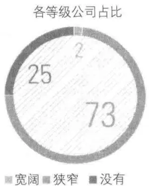

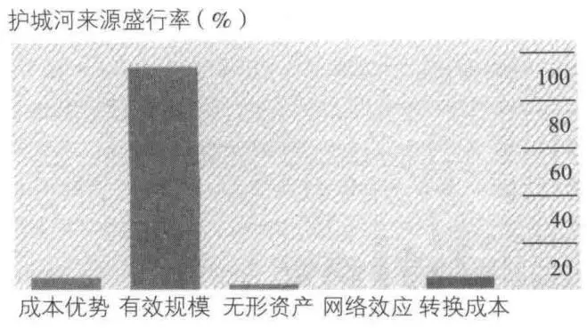

资料来源：晨星公司。

__受监管的和多样化的公用事业__

对于受监管的公用事业公司，有效规模显然是护城河的主要来源。州及联邦监管部门一般会将公用事业的独家经营权授予给有能力垄断区域服务的公司。作为获得经营权的交换条件，监管部门会将价格设定在某个水平，以实现消费者使用成本的最小化，但也会允许公用事业公司的资本提供者获得合理的回报。

通常来说，监管部门与资本提供者之间的这一默契会让受监管的公用事业公司至少在长期获得相当于资本成本的收益率。尽管短期的回报会因需求趋势、投资周期、经营成本和融资便利等因素存在变数。但从长期来看，这些公用事业公司大多能依靠有效规模赢得经济护城河。也有些激进的监管让公用事业公司的这一优势损灭，限制它们获得超额资本收益。受监管的公用事业公司会面临的这种不利的监管所带来的风险会阻止他们之中的大部分赢得宽阔的护城河。但是，在大多数情况下，监管完全损坏企业竞争优势的概率较低，正常情况下，它们都能获得高于资本成本的回报，因此，我们有理由认为，大多数受监管的公用事业公司拥有狭窄的护城河。

多样化的公用事业公司所拥有的资产部分受到监管，部分不受监管，如果不受监管的业务拥有可持续的成本优势，这类公司就有机会构建宽阔的护城河。在电力批发市场，我们认为核能发电是唯一能够维持长期成本优势的能源动力，并且它能借此产生宽阔的护城河。核能电站高额的资本成本能够阻止新的进入者，其较低的可变成本也使它获得高于化石燃料发电厂的盈利。

艾思能公司（Exelon）拥有多个具有不同护城河特征的业务线，凭借其在美国核电供应上的领导地位，成为唯一一家拥有宽阔护城河评级的公用事业公司。如前所述，像艾思能这样的核能经营商有两大主要的竞争优势。第一，核能发电厂需要花费数年时间去选址和建造，这一过程会花费数十亿美元，进程中还有可能要面临公众的反对之声。这些因素都构成了明显的进入壁垒，使得现有经营商能在特定区域获得以低成本有效经营的垄断地位。第二，在成本和规模方面，没有任何其他可靠的电力生产能够匹敌核电站。相比于煤炭及天然气等化石燃料发电，核电站有着更低的可变成本和更少的温室气体排放，因此降低了核电站的替代威胁。只要电力在美国仍然是主要的动力能源，核电站就应该能维持可持续的低成本优势，能够产生高的资本回报。

同时，我们认为艾思能公司受监管的公用配送业务值得狭窄的护城河评级，因为它在监管之下有稳定的回报。另一方面，艾思能的零售供应业务则不具有护城河优势。这是因为，在这个领域中根本不存在进入壁垒、转换成本及产品差异化，加上电力及煤气零售市场高度竞争，即使消费者具有黏性，零售商最终还是会陷入价格战。

__评估受监管的公用事业行业的关键因素如下。__

-
- 制定的服务价格 \- 成本比率可以给受监管的公用事业公司带来狭窄的护城河。监管部门会给予公用事业公司以合理的机会，使其通过调整用户费率来收回经营及资本成本，并获得狭窄的护城河。投资者进行分析时要将投资需求、成本提高及消费需求结合起来。
- 公用事业公司的盈利是否接近其监管允许的水平？监管部门会根据公用事业公司的成本状况设定消费者应承担的费率，如果公司经监管允许的盈利水平与其实际获得的盈利水平之间存在很大的差异，监管部门通常就会调整费率，使公用公司的实际盈利与允许盈利保持一致。
- 多样化的公用事业公司其不受监管的资产既可能拓宽，也可能缩小公司的护城河。对于不受监管的能源业务，我们主要考察成本优势和进入壁垒。公司在不受监管的资产上配置得越多，越需要创造更多的成本优势以获得经济利润。

__独立电力生产商__

独立电力生产商在市场化的能源市场环境下经营，其作为价格的接受者，它们一般需要经过一段艰难的时期才能建立起可持续的竞争优势。独立电力生产商的资本回报取决于商品燃料成本、市场竞争及区域能源需求这几方面的关系，所以它们构建长期经济护城河的机会十分有限。这也意味着，如果低成本的核能、煤炭及可再生能源生产商与生产成本普遍偏高的对手竞争，就比较容易获得竞争优势。即使如此，要获得低成本的电力来源一般需要大额的前期资本投入，并且要经过多年才能获得高回报，才能产生经济利润。考虑到要获得监管批准，要寻找到合适地址，要在新地址上完成建造，都需要耗费大量的时间及金钱，进入壁垒也可以成为竞争优势的一个短期来源。

奥马特科技公司（Ormat Technologies）是一家专注于地热发电的可再生能源公司，是少数几家能够赢得竞争优势，建立起狭窄护城河的独立电力生产商之一。首先，奥马特公司的地热发电比间歇性的风力和太阳能发电更具连续性，在所有的可再生能源中具有最高的可利用性。其次，奥马特拥有稳定的长期电力购买合约，保证所有的地热产出都能销售出去，并且生产中没有可变的燃料成本，这些因素都确保了公司在多年内持续获得稳定的资本回报。作为全球范围内地热生产及经营领域最有经验的地热发电厂，奥马特公司还在发电站设计方面比其他潜在竞争对手领先十多年，即使地热能源持续上涨的需求带动一些大型工业企业强势进入这一行业，该公司仍然会保持优势。

__评估独立电力生产商的关键问题如下。__

-
- 不像大多数其他能源资源，电力这种资源具有不可替代性。但某一特定区域需求是有限的。这种特性既可能增强电力生产商的竞争优势，也可能减弱它们的竞争优势。为此，投资者要考虑竞争者的发电成本和区域内的进入壁垒。
- 当心出现扭曲市场的公共政策。政府鼓励可再生能源的政策正在侵蚀核电站和化石能源生产商的竞争优势，针对化石燃料发电站的环境监管政策正在巩固清洁的核能及可再生能源的竞争优势。
- 新建项目的经济效益很大程度上取决于项目的资本投入与可变成本两者的关系。资本密集的核能和可再生能源有着较低的可变成本和较高的利润率；而化石燃料发电站通常建造成本较低，但可变成本较高，因而利润率也较低。

## 译者后记

__译者后记__

在这个既可赌博、投机，亦可投资、理财的股票市场里，想要透过现象看到本质，想要理解清楚上市公司与股票市场各自的特性以及之间的联系，可能还真得跳出三界外，静心修炼功力，才能拨云见日。为此，自然需要一个经得起推敲的分析框架，一套经过了检验的分析工具，以及大量的个案分析，标杆型的样本公司不仅能使方法落地，更能增加分析方法的可信度，指导人们的实际运用。通过这种有逻辑的、有实例的训练，投资者的分辨及分析能力可以得到提高，有这样一套工具作征战的护身符，投资者必能提高自己的战斗力；以这样一套方法作照妖镜，再会伪装的假猴王也会现出原形。

在笔者看来，本书无疑具备这样的特质，担当得起这一重任，能够让读者从中领悟到公司分析及股票投资的正道。本书理念发端于巴菲特，受到公司战略及金融理论研究的支撑，经过了大量样本及长时间的检验，由此形成的这样一套分析体系是值得信赖的。

本书译稿由三位合作者共同完成，张坚柯翻译了第7章至第11章，罗维

翻译了第12章至第16章，其余章节及所有内容的定稿由汤光华承担。本书的翻译工作得到了教育部本科教学工程专业综合改革试点项目、广东省高等学校专业综合改革试点及高等学校教学团队建设项目的支持。最后，还要感谢张振基、林兰、刘小红、罗卓光、汤泰萌、杨丹丹、刘坡、杨诗晴在本书翻译过程中给予的支持和帮助。

毫无疑问，本书对投资者来说能够起到拨云见日的作用。
