# 《费雪 超级强势股 如何投资小盘价值成长股》全文合订版

> 共109个章节。原章节顺序、段落结构和图表均予以保留。

## 前言

前言

本书汇集了有活力的新观点，也包括对一些旧观点的改进。多年以来，这些观点让我对自己的投资方式充满了信心。同样，这些观点也可能会使你们增强对自己投资方式的信心。信心具有极大的力量，因为在其他条件都失效的情况下，它能驱使人们行动。若想成功投资，信心是必要的。

多数与投资相关的书籍都是老调重弹。那么，与它们相比，本书有何不同之处呢？

## 本书提出了前所未有的新观点

本书提出了前所未有的新观点

在股票估值方面，这些新观点中包括了一些虽然复杂，却相当有效并且易于应用的新方法。它们将有助于人们避免投资错误和寻求投机盈利机会。不管对专业人士还是有兴趣（但可能相对缺乏经验）的业余爱好者来说，它们同样适用。在追逐“超级强势股”的实战应用中，这些方法将被一一呈现出来。一只超级强势股必须满足以下两个条件。

➤在3～5年的时间内，与期初相比，股价增长3～10倍。

➤以相当于次级公司的股价水平，买入超级公司的股票。

相当长的时间内，超级强势股能产生25%～100%的年收益率。没有多少股票可以长期保持这样优异的表现。此类股票确实具有一些共同特征。本书说明了这些特征以及识别它们的方法。为了能够成功投资超级强势股，我们必须明白以下四点。

➤一种我称之为“困境”的现象。

➤一些用于确定个股投资额的全新而有效（且易于应用）的方法。

➤以什么来区分超级公司和普通公司。

➤在日新月异的世界市场上，一个用以识别和应对各种投资机会的动态过程。

任何人都可以避开那些经常迷惑多数职业投资者的陷阱，但是避免错误仅仅只是一个开始，通过学习一些原则，我们就能知道如何实现成功的投资。这些原则提供了一些使我们超越多数专业人士的简单规则。这些原则同样也向专业人士提供了一种如何操作的严谨的基础方法。

这真能奏效吗？难吗？成功的运用并不需要超群的智力或内幕消息。任何人都至少可以在一定程度上成功地运用这些原则。这么做值得吗？

我们来看看以下结果：在1981年早期，我为客户和自己买进了Verbatim全部普通股大约1\.5%的股份，当时，几乎所有认识我的华尔街人士都认为我疯了。他们说，如果要投资磁盘行业，他们都会投资Dysan，因为它具备最好的技术和管理。

他们的观点是Verbatim管理糟糕，技术糟糕，产品也糟糕。舆论共同断定这家公司财务上不稳定，并且很难得到改善。一些人甚至暗示，它将难以继续生存。

两年后，Verbatim的股价上涨了15倍之多。尽管其股价处于较高水平，但其股票仍然受到从Value Line到主要经纪公司和银行的各类投资者的追捧。

什么使Verbatim在舆论如此不看好的情况下，能实现价值的增长（见第14章）？本书就旨在给出这一问题的答案——如何识别超级强势股。

2026年3月14日

9:51

## 为什么想要跟大家分享这些理念

为什么想要跟大家分享这些理念

写一本书需要花费很大的精力。在开始这项工程之前，我深思熟虑了很久。我重新翻阅了自己书架上的很多书，我的想法被一位比我更具智慧的作家完整地诠释出来了。这就是《普通股和其不普通的收益》（Common Stocks and Uncommon Profts, Harper＆Row，1958）一书的前言。

多年来，我一直向基金持有者详细介绍自己在决策中反复运用过的原则。因为他们对证券一无所知，所以只有这样才能使他们充分了解为什么我会给他们买入某些证券。这样他们才不会冲动地否决掉一些买入决策，而在一段时间后，市场定价才开始反映出这些决策的价值。

慢慢地我开始有了将这些投资理念编撰成书的想法，而且这样，我就能引用这种印刷出来的资料了。这个想法导致了策划此书的初步探索。接着，我想到了很多人。他们大多是较小型基金的持有者，而不是我所服务的较大型基金的众多持有者。多年以来，他们经常询问我，作为小投资者如何投资才能有一个好的开始。

我想起了无意间接触到的有着各种理念的众多小投资者的困境。许多年以后，这些投资理念可能被证实十分有效，因为它们没有接受过来自更基础的概念的挑战。最后，我想到了与另一些尽管出发点不同，但同样对此感兴趣的人士所进行的多次讨论。其中包括公司总裁、财务副总裁以及上市公司的财务主管，他们都对此表现出极大的兴趣。

于是我得出结论，有写这样一本书的必要。我决定采用非正式的表达方法，这样我就可以以第一人称与你们，也就是本书的读者对话。我可以使用与向我所经营的基金做展示时使用的相同的语言、大部分的例子以及类比。但愿我的坦白和有时的唐突不会对你们有所冒犯。我尤其希望你们觉得我所呈现的观点的价值大于我作为作者可能的失误。

我不能表达得比这更好了。

肯尼思L\.费雪

2026年3月14日

9:51

## 致谢

致谢

本书是如何写成的

本书的写作让我开始欣赏那些陈词滥调了。不过更准确地说，应该是“书不是写出来的，而是重写的”。个人电脑的发明成就了更多的重写，不然我的急躁脾气或许还真按捺不住。在初稿的写作过程中，许多人做出了很大贡献。

《福布斯》杂志的编辑Jim Michaels对第6章和第7章给出了很有价值的结论。我认为这两章的创作权属于他。我们在曼哈顿共进午餐时，Jim曾看过早前的稿子。他建议，如果能在更广泛的基础上增加定价理念的有效性，会更具说服力。Jim建议我赶紧回头增加一些不同的股票类型。“你能做到吗？”他问我。“我可以做到吗？”这确实是个问题。这在理论上简单——好主意，但是工程浩大。

幸运的是，亮点能够多倍地释放自己的力量。我的助手Jeff Silk很热心，将接下来三个月的大部分时间投入到这项工作上。我认为其努力的结果是本书的亮点之一。为此我十分感激Jim的想法和Jeff的努力。Jeff是个大有前途的年轻人。他是一个刚刚迈入社会的新人，我有幸获得他的帮助。但是，我确实也给了他一个锻炼的机会。

Tom Ulrich在统计助理方面提供了很大的帮助。Tom曾是费雪投资公司前雇员，现在从事一份更有意义的工作。他提供了第3章和第4章中大部分的数据资料。

早些时候，斯坦福大学商学院研究生院的Jack McDonald曾向我提出了一些意见，这使得写作更为顺畅。他让我看到了本书能在多大程度上成为一部严谨的书。Jack给我的启示主要体现在第8～11章。

Stanley Kroll用比较理性的结论，缓解了我对投资圈尖锐的评论。Train Smith咨询公司的John Train是位出色的作家和成功的投资专业人士。他给我提供了寻找出版商的方向，并且介绍了Strunk和White的《文体要素》一书，这相当于给我上了一堂写作基础课。我认为，对于每一个渴望成为作家的人，这本书都值得一读。

此外，尽管Harper＆Row公司的Harriet Rubin当初拒绝由她的公司出版本书，但也给出了结构和形式方面的一些有意义的评论。后来初稿中都融入了这些评论意见。但我很遗憾，这种获益只是单向的。Frank Bruni博士对第1章（后被弃用）的初稿进行了校对。在这一过程中，Frank让我明白我还有很长一段路要走。这样，我才开始第一次现实地对待这一写作工程。加利福尼亚银行的Tony Spare鼓励我根据目标读者，注重专业术语水平。

我的父亲Phil Fisher一直是我最严厉的批评者和最坚定的支持者。他与我相处的时间比任何人都长，而且他自己就是个杰出而且成功的投资者和写作者，所以他有批评我作品的特权。他以极大的耐心阅读了开始时构思拙劣、书写潦草的文稿，并且提出了大量宝贵的意见。他直言不讳地指出哪些地方需要改动及其原因。

从投资者的角度出发，Sam Aronson、Al Haft和Monte Stern，耐心地阅读了我的手稿。通过阅读每一章节，他们告诉我哪些地方能够引起读者共鸣，哪些地方会使他们晚上犯困。

包括Ronald Bean博士、Bill Gorman和Bob McAllen在内的其他人也为手稿的某些部分做了同样重要的贡献。Gorman和Harriet Rubin的意见有助于我对本书第一部分的修改。当得到对第3章和第4章的初步反应时，我感到灰心丧气，是McAllen鼓励我继续写作的。Ronald Bean建议我寻求编辑的帮助，他暗示说我需要发表一些言论——不过是更好的言论。这让我找到了Noble。

知道我需要帮助后，我的妻子Sherri开始寻找有编辑经验的人。她很快就帮我找到了Barbara Noble。Barbara不仅足够胜任特别编辑的角色，她还教我最大程度地发挥写作能力。起初她想检查和编辑我的全部稿子，因为她知道这是我所需要的。后来，她改造了我的整套写作班子，就像鸟妈妈将她的宝宝赶出鸟巢一样。当确信我能够自己处理文稿时，Barbara就聚精会神地搞自己的工作了。这种学习方式很好。本书之所以值得一读，跟她的努力是分不开的，她的热心和耐心永无止境。我很感谢她。

同样地，没有Janet Thurston，也不会有这本书。作为首席运营官，Janet是我在费雪投资公司的左右手。不管什么时候，什么事情，只要交给她做，就不用担心出错。她是我生活中少数几个可以完全放心的人。她会在第一时间做好。她负责进行校对，检查手稿，并且在我出错时帮我分担任务。

有些人可能以前阅读过我的初稿，在手稿即将完成时，我需要他们提出一些新的评论。就这点来说，这回他们都阅读了以前没有看到的部分。Annie Brody、Ken Koskella（他还通过Annie给我介绍了Roberta Sheldon）、Jack Euphrat、Wally Hagglund、Jim Palmer、Henry Roberts、Steve Walske和其他许多人也提出了全新的看法，提供了补充材料，以及在定稿前帮助进行了最终的调整。在这儿我不便一一列举他们的名字了。

其他人则以其他方式对本书的写作做出了各种贡献，比如Fred Krup。Fred和我从小就认识，现在在圣马特奥县拥有一家书店。这次，他花了大量时间教我一本书是如何进入零售书店的，如同教导一个小孩如何适应社会一样。Fred和Dick Newhouse给我介绍了一些书商，比如Bruce Degarmeaux、Jack O’eary和Tom Turbin。他们毫不吝啬他们的宝贵时间。尤其是Tom Faherty，他让我明白了如何使本书符合出版商的胃口。

在得到一个出版邀请后，Annie Brody作为我的代理人开始商议合同。虽然相隔遥远，她还是替我做了许多令人钦佩的工作。在确定出版商的过程中，我曾长期和Annie以及其他代理商保持着联系。但是Annie做得更多。参考了她的意见后，我删除了手稿中的某些部分，最好还是忘记吧。中心花园出版公司的Jeff Shurtleff允许我们使用他的资源来影印文本以决定封面的设计构思。

在此，特别感谢出版商在最后的时刻答应我增加附录F。其中大有深意，因为它跟书中其他部分一样具有重要意义。

时间和篇幅不允许我提及整个过程中所有提供过帮助的人。对此，由于篇幅所限或疏忽，我向未提及到的人表示歉意。我没有理由不对他们表达特别感谢之情。

许多作者都对家人表达对他们的谢意，但我有更充分的理由来感谢他们。我的妻子Sherri确实为这本书尽了很大的努力。她不仅帮助我找到了Barbara Noble，而且也花了大量时间和Janet Thurston一起帮助我。她把自己的艺术工作放到了一边，将全部的时间用到了像是送纸盒、打印机和影印初稿之类的事情上。同时，她也充当了勤杂员，确保了一切工作顺利进行。在1983年的大部分时间里，这也是她能见到我的唯一方法。同样，我欠了三个儿子Clayton、Nathan和Jess整整一年的时间。他们忍受了没有爸爸的每个晚上、周末和假期，而这时我正闭门将自己关在洗衣房里，整天面对着电脑。

在我发表自己观点的这一难以忘怀的过程中，我要感谢所有曾经帮助过我的人。

肯尼思L\.费雪

## 第一部分　剖析超级强势股

## 第1章　利用“困境”致富

第1章 利用“困境”致富

最赚钱的普通股票投资，往往是那些虽不受华尔街青睐，但却年轻的快速成长型公司。这类股票正变得越来越有价值，因为随着公司规模不断扩大，金融界终于意识到了它们的真正价值，随之股价也被抬高了。

年轻的快速成长型公司通常有一定的成长周期。这种周期与多种因素有关，其中最重要的是“产品生命周期”。由于年轻和缺乏经验，这类公司的管理层可能会犯严重错误，这将会造成损失，甚至可能危及公司的生存。好的年轻公司会从错误中吸取教训，并不断改进以做得更好。

与其说犯错代表缺点，不如说它代表发展。只有极少数公司会享受长年的快速成长而不陷入“困境”，这些困境往往导致收益的不如意甚至损失。每家被金融界推崇的公司，都会被人们生动地描绘成有着光明的前景，并且值得高定价。他们可能说它拥有“一流的管理层，会占有新的市场份额，会借助目前的技术实力进入新市场，会发展新技术来开拓新局面”。

在硅谷，此类公司每年的收益都不错。这些特定的名字会随着时间的改变而发生微妙的变化。有些公司会被人们认为是“成长型公司”，它们可大可小。这些企业传奇式发展的秘密被不断地揭示出来，但其发展过程中有些内幕是不为人知的。当“不谐音符”最终被发现，股票价格便大受影响。这些股票价格下跌的幅度非常大，以至于要好几个月，甚至是好几年才能恢复到下跌之前的水平。

但有一些股票的价格便再未真正恢复了。不谐音符一出现，并且（第一次）所赚取的收入减少，或无法如期实现，金融界便落井下石，打压该股票价格，这时股价会在短短数月下跌80%之多。继而所谓的“专家们”开始断定该公司的管理层水平低劣，误导了投资者。“专家们”还断言市场没有公司管理层预言的那么大的潜力，所用的技术也很差。

其实，该公司没他们想象得那么糟，也没他们之前预计得那么好。前者的可能性更大些。该公司很可能是一家很棒的公司。问题很简单，那就是对该公司的盈利预期和之前的股票价格都太高了。

我们知道，产品周期始于一个有创意的点子和初始的市场调查。随着大笔资金的支出和最开始低产出生产的启动，公司继续发展。随之而来的是巨额的营销费用。到这时为止，这个新的生产项目（可能是个工程）除了消耗资金，什么也没干。

随后来了几笔订单，这让人们深受鼓舞。初始的发货一般都会慎之又慎，甚至延迟，以确保质量，维护名声。货物发出，销售开始。最终产量要确保充足，以使获利充分（如图1\-1所示）。

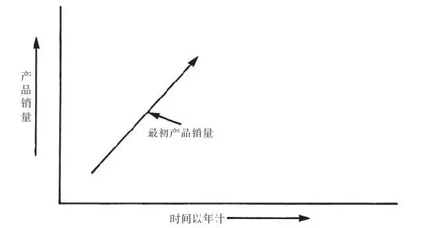

图 1\-1

然后生产开始成熟，也许新的竞争者出现，市场开始饱和，销量增长趋于平缓（如图1\-2所示）。

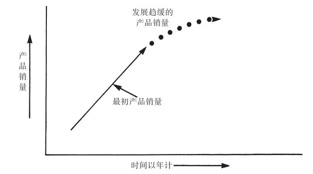

图 1\-2

几年后，销量开始下滑（如图1\-3所示），产品已经成熟，也许该产品会被新产品取代，利润减少甚至消失。总有一天该生产线将以较低的价格卖给他人继续生产该产品，或者被废弃。最终它几乎肯定要淡出历史舞台。这就是一个完整的产品生命周期，期间的整个产品销售曲线如图1\-4所示。

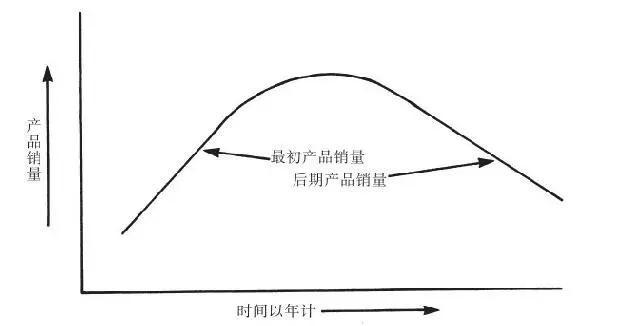

图 1\-3

从生产持续增长到销量逐年下降之前的过程被看做是产品生命的黄金时期，大部分的利润就是在这一时期产生的。这一段时间可比做是人的青壮年期。令人失望的事情在这段时期内极少会发生。早期（产品的这段时期被很自然地看做是投机）永远充满了激情、紧张和风险。

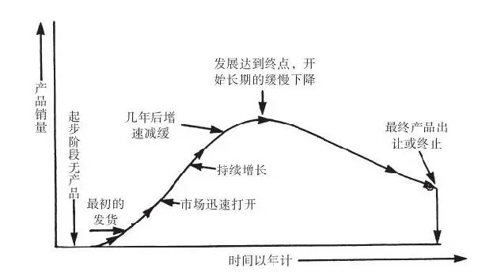

图 1\-4

衰退的日子总是让人不满，但往往又在预料之中。这就像是处于运动生涯暮年的运动员在他们最后几役中的拼力挣扎，只剩一副虚乏的躯壳和对往日荣光的追忆。

一般来说，早在达到鼎盛之前，管理层就已经料到产品终有一天要遭淘汰。他们往往会提前计划和发展新产品以保持增长。如果管理层做得好，增长就会持续（如图1\-5所示）。

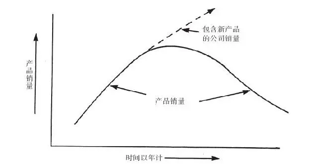

图 1\-5

年复一年，他们不停地推出新产品重复这一过程（如图1\-6所示）。

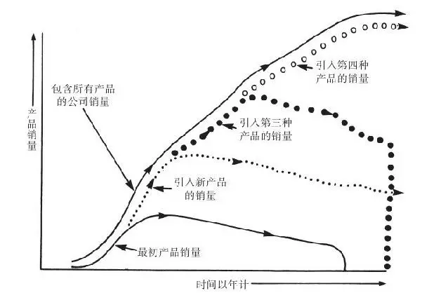

图 1\-6

管理层已经证明他们有能力去引进和管理单一的项目，现在他们面临的是一系列处于不同发展时期的项目。这些公司的管理者往往比较年轻，并在实践中不断学习——“工作培训”。在这一过程中，尤其在这一个阶段，他们难免会犯错误。通常他们没料到第一种产品会如此迅速地被淘汰，或许，他们推出新产品的时间会比预期的更长。也许产品一开始还有这样那样的瑕疵，市场接纳度也比预想的要低，等等诸多问题。无论哪种情况，结果都会是困境（如图1\-7所示）。

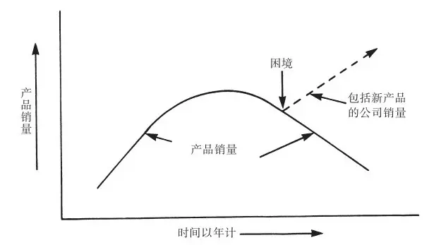

图 1\-7

让我们重温一下图1\-1，在生产周期的早期，公司快速增长——不仅是销量，而且还有利润。当公司赚回了启动运营所耗费的成本后，利润可能增长得比销量还快（如图1\-8所示）。

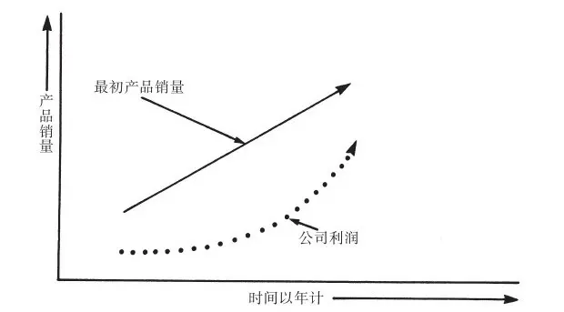

图 1\-8

当产品开始被淘汰时，利润便下降。如果公司适时地开发新产品，利润的增长趋势有望延续下去（如图1\-9所示）。但如果公司出现困境，结果将大为不同：利润下降，趋势瞬即由季度盈利转为亏损。为什么呢？

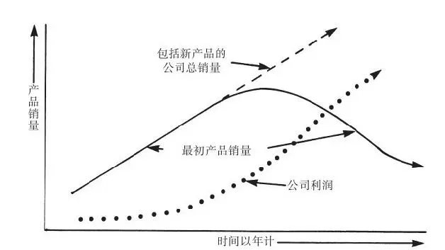

图 1\-9

当销量暂时走平时，利润下降，甚至出现亏损。销量没有出现大幅的下滑，利润却下降，原因在于以下方面。

➤成本逐月上升，人们本来预期用增加的销量来弥补这部分成本。公司根据对未来发展的预期来进行支出，它们预估日常开销、市场需求和产品产量，以便做到对相应人员和厂家有求必应。正如人们常说的，“你必须花钱去赚取更多的钱”。一旦短期内市场预期下降，管理层要花几个月的时间来调整成本，使之与预期相吻合。

➤为解决问题，又需要付出更多的预期之外的资金。不论是什么原因造成了这些问题，都必须加以解决，这些都得花钱。如果顾客想要接收货物，他们需要全方位的服务，这就得花更多的钱做市场工作，以防客户投向竞争对手的怀抱。

➤或许需要降低资产总值（或从公司账户中核销）。如果问题跟收益不佳的存货或设备投资有关，它们的账面价值将被调低，审计人员将要求对它们进行及时的调整。

利润将会迅速转化成亏损。过后，当问题被解决后，收入再次增加，亏损减少。短期内，盈利能力得以恢复，紧接着是持续的利润。整个过程如图1\-10所示。

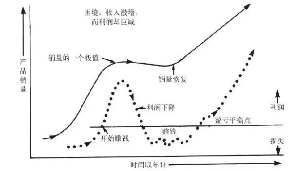

图 1\-10

年轻公司从困境中不断走向成熟，最好的年轻管理者在错误中不断成长。几年后，这些充满活力的小公司将变成大公司，其规模比开始处于麻烦时大得多。多年后再进行回顾时，我们将看到一个如图1\-11所示的循环。

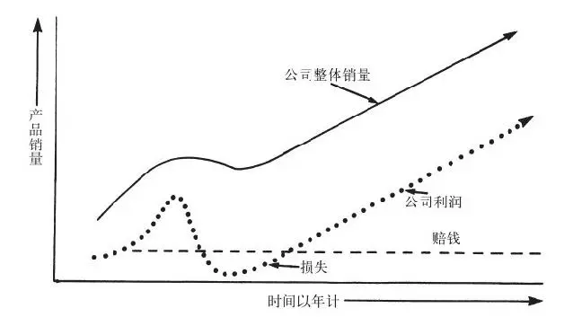

图 1\-11

有时，在公司发展过程中，由不同的因素造成的困境隔几年发生一次。第一类错误如上倾述，第二类错误可能是由于激烈的竞争，或头一次经历宏观经济的衰退（如1974～1975年或1981～1982年），还可能有很多其他原因。每个困境造成的严重程度各有不同，其中一例如图1\-12所示。

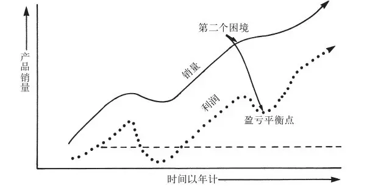

图 1\-12

在一个正常的成长周期内，股票价格将会怎样呢？股价往往会剧烈地波动，其剧烈程度甚至超过其利润的波动。在成长周期的早期，当销量和利润飙升时，原先的无名公司开始获得声誉，因为它们的产品很棒，技术很好，市场营销很有远见。股票价格涨得比销量和利润还好（如图1\-13所示）。

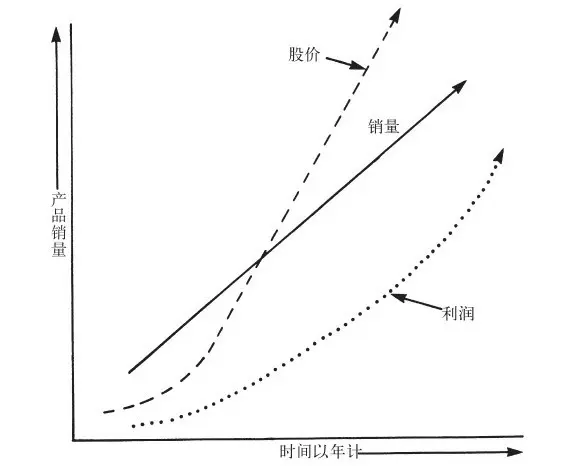

图 1\-13

如果公司能够及时成功地引入新产品，股价会持续数年以销量和利润的增长率增长。如果出现困境，一般的公司都会在同时期反映出来，其股价会直线下降。那些先前看好公司的人这时都如梦方醒，并纷纷指责公司管理层没有预见到困难，没能力解决问题。

许多投资者抱怨公司没能达到他们的预期，而不是把挫败看成是发展的必由之路。失望的金融界人士更易于抱怨公司管理者没有能力，而不是反省自己当初要求太多。当人们普遍对股价变动失望时，股价便会越跌越凶，30%的股票市值会在几天的时间内蒸发，80%的市值会在几个月的时间内消失。由于投资者过高的期望，股价被一再抬高到脱离实际的高度。而一旦公司出现困境，股价便一落千丈（如图1\-14所示）。

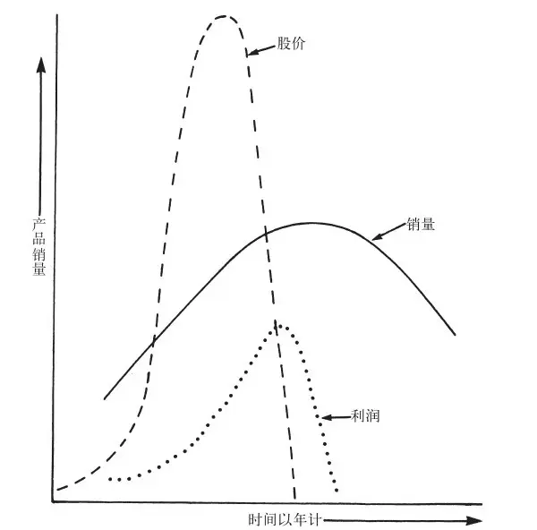

图 1\-14

在缺乏效益时，只有少数的投资者能在股票的成长过程中保持理智。股价缺乏支撑，总有一天会大幅下跌。最好的管理者会对此做出反应并克服它。然后是适度的销量上升，利润上升，股价回升（如图1\-15所示）。

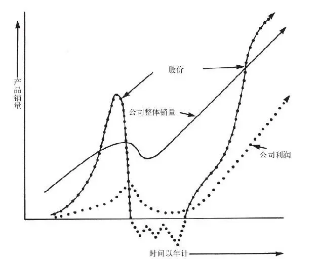

图 1\-15

几年后，公司销量和利润屡创新高，股价比在困境期间又高出很多。在整个股票存续期间持有，使得股东获得了巨大的收益，尽管期间也经历了一些惊心动魄的时刻。在公司出现困境时购买股票——在股价恢复之前，将获得可观的回报。

比一般股票涨得更快的股票是超级强势股，这些股票往往是在困境时被持有。困境会致使股价下降。这是个令人沮丧的价格，也是产生超级强势股的价格，这些超级强势股会给投资者带来非同寻常的高回报。

又过几年，公司发展成真正的巨人。当它越来越庞大时，它的增长率和毛利率会越来越小，市场对其估值可能不再那么高。股价还是上涨，只是与当初规模尚小时相比没有那么快了。30年后再回头看，困境可能在整个销售史上微不足道，但对股价造成的影响却很大，如图1\-16所示。

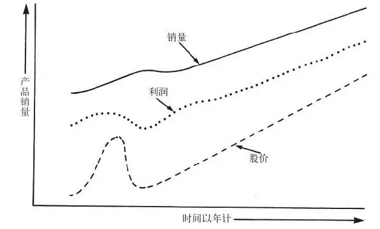

图 1\-16

我们已经了解了一种现象——困境，这种现象在年轻的快速成长型公司中普遍出现。困境造成股价剧烈波动的程度远远超过销量和利润的波动程度。通过学习利用这一现象，有可能从中获利——从股价波动中获利，而不是一定要等待上涨。正是这种困境的出现，才使得超级强势股从超级公司中诞生。如果你能学会如何对其进行正确定价，你就能看准超级强势股并从中获利。

## 第2章 什么使困境发生转变

第2章 什么使困境发生转变

困境可区分出男人和男孩

快速发展的年轻公司，在成长的过程中犯些错误是正常的。造成错误的原因是多方面的。有些原因使得华尔街人士在处理这些问题时左右为难。明白困境造成的痛苦，是我们从困境中获益的前提。我们需要从更多的细节方面来看待这些困境。循着超级公司的成长之路，我们看到它们早期投机式的成功，随后困境而造成的影响，并继而摆脱困境，走向更辉煌的成功。

2026年3月14日

9:51

## 警告在先

警告在先

记住，这一段描述只适用于超级公司（关于超级公司的具体描述，详见第8～11章）。一段时期内，很多公司都有惊人的记录，也许长达几年时间，后来遭受挫折，并一蹶不振。其中一些公司因此而走向破产；一些公司永远处于半死不活的境地；一些公司得到一定程度上的恢复，但却因此变得平庸。这些公司的管理层缺乏认识错误、改正错误进而向前发展的能力。在平庸的公司中，适时改正也许能有所获益，但投资者很难再得到额外的收益了。

快速发展隐藏着不稳定的因素。一个快速发展的公司会处于持续的变化状态。当它变化时，外在环境也在变化。如果一个人员流动尚属正常的公司以每年35%的速度增长，那么有一半的员工来到公司的时间不到一年。少数有经验的人领导着一大群缺乏公司认同感的新人，这将给公司的发展方向造成很大的影响。在他们的互动中，公司文化形成了。

在这个动荡的环境中，问题很容易滋生。刚开始时，它们总是被忽略，直到对经营产生很大的影响。它们的出现给人的感觉就像是在产品周期中，人们为以前老产品的发展和盈利付出的代价。

公司下一代的产品就不能建立在以前老产品预期的基础上了。管理层会高估产品的生命周期。他们可能没有更新设备和工艺去降低成本，这是短视的。短期内这可能换来现金流入，长期来看却可能造成产品性能的不稳定。人们有时称这种行为是：把产品变成“现金牛”——产品能够不断产生短期现金流。

没有适时引入新产品会给公司造成困境。“现金牛”的现象和新产品引进时机的不适宜就是两个普遍存在的问题。错误几乎会在任何时候任何地方出现，包括不良的质量管理和不良的存货管理，这会导致旧的存货需求随着产品规格的改变而消失。同样糟糕的还有因员工处理问题时欠缺经验而导致的低产出。通常，当我们发现这些问题时，严重的经济后果已不可避免。

我们可以看看超级公司在成长道路上第一次遇到的困境。多年来，公司运转一切良好，订单、出货、利润都持续增长。订单增长率的趋缓表明公司可能出现了问题，但管理层希望这只是暂时现象。然而订单越来越少，直到引起关注。

当发现问题后，超级公司的管理层开始忙于寻找并解决这些问题，经过一段忙碌的日子后，公司开始评估以前未被意识到的损失程度。这次，困难的性质和程度就不太好确定了。不尽如人意的收入，甚至净损失会被公之于众。管理层开始努力解决问题并与外界隔开，拒绝大部分采访。（当你自己都不清楚问题的性质和严重性时，是很难去面对外部世界的。）

他们取消了以前用于应对投资界的时间。短期内，投资者对公司产生了怀疑，这对股价的恢复有着不利影响。如果他们有个维护投资者公共关系的全职经理，他们会把他送出城，这样他就不用去面对那些习惯提问的人了。“某某先生这几个星期都不在城里，我可以为您留言吗？”

问题是到目前为止，公司没给出任何答复。管理层会取消所有的为机构投资者提供的信息发布会，部分原因是他们羞于见那些曾经那么信任他们的人。（就好像拳击手吃了败仗后不想见任何人，因为这时自尊心已受到了伤害。）

法律顾问经常提醒有关误导投资者的风险。“在把问题真正弄清楚并进行解释之前，免开尊口。”自我隔离的最大原因在于，管理层需要时间来搞清存在的问题，然后对症下药。这是一个真正显示实力的时刻，艰苦的时期能够区分出男人和男孩。

最高管理层继续审视谁做了什么，为什么做。订单为什么减少？成本为什么比预期的高？顾客为什么退货？是不是质量管理出了问题？他们比以前——前几个月，前几年，甚至以前任何时候，更认真地审视这些问题。人员会出现流动，一些经理会因为经验不足或能力不够造成问题。

最高管理层会继续对经理们解决问题的态度做出反应。有一些经理对高层的政策不甚支持，他们视之为高层的“政治迫害”。其他的一些则表现得颇为积极。那些不配合的经理将被革职。

在没有转机出现时，不管其他人员的位置变动与否，有一个位置是要变的——总裁的位置。如果他无所作为，董事会就会介入，将亲自调查分析为什么首席执行官不能有效地解决问题。当董事会对有关责任人施加压力时，该人员有可能：

➤有所作为。

➤辞职。

➤被解雇。

➤劝说董事会忽略他的这一职责（如果这样做，该公司将失去超级公司的地位）。

管理层也会观察有无可疑价值的资产。他们会重点观察发生问题的部门或区域。毕竟，在运营中出现问题的个人也有可能出现资产管理不善的问题。

当下定决心处理问题时，管理层往往会力求将问题彻底解决。他们会极目远眺，不光看到眼前的问题，还尽量找出所有可能出现问题的地方。他们会责备所有会出问题的可能之处以及相关个人。这对所有利益相关部门来说都意味着一种承诺：类似的问题不能再出现了。

如果出现问题的资产能被勾销，他们会这么做。“把问题抛到你的脑后”是管理者的口号。他们可不想出现新的难堪——更多的损失被公开。当然，短期内，这些东西对股价没有推动作用。到目前为止，金融界已经将股价打压了30%～50%。也许在接下来的几个月里还有20%要降。

公司开始进入缓慢的重建过程。迹象不是很明显。在接下来的几个月里，公司的日常开支减少了。它减少了本就不该涉足的项目，也会开始一些新项目，但整个生产量会减少。

不称职的员工将被辞退，新员工会被引入，一些员工得到内部的升迁。他们需要填充以下位置。

➤功能性的岗位。此前它是空缺的，因为在问题出现前，它的必要性没有被认识到。

➤先前的员工被辞退后留下的空位。他们被辞退或是因为能力不够，或是因为态度不佳。

除了少量的员工得到内部升迁之外，更多的员工还是从外部引入。因为公司成长的速度太快，导致很多员工经验不足，不适合岗位的需要。当你解雇了一个人后，你就需要相当高的技巧和自我分析能力去判断他的下属是否也是造成问题的原因或者解决问题的着手点。

高管们一般倾向于从外部招贤纳士，而不会冒失地去提拔内部员工到一个需要高度责任感的岗位。从外部招来的人往往年纪要大些，在相关领域的经验更充足。更重要的是，经过精心挑选，他们的性格高度符合高管们力图打造的公司文化要求。一个老的管理团队会被转化成一支新的力量。

## 他们会对困境抱怨不已

他们会对困境抱怨不已

到目前为止，金融界已经产生了对公司的不信任感，以至于他们忘记了该公司充满活力的历史。

95%以上的职业投资者都没有亲自参观考察过他们投资的公司，要么是完全没有进行过考察，要么是没有进行过持续的考察。他们主要依靠中介机构提供的信息做出是否投资的结论。

证券分析师得到了直接的回报，或从经纪人那里得到报酬，但最终这些回报或报酬是购买股票的决策人支付的。投资者与公司的分离使得投资者缺乏或者少有长期持有股票的意识。这时，那些一度想做长线投资的买家也会因此而担心股价的短期表现。

当一家公司受困境之苦时，很多分析师大肆描述公司的问题，而对自己此前的分析错误避而不谈。当然，这也是人之常情。他们把管理层描述成无能、虚伪、天真乐观的人。

不管金融界是怎么想的，怎么看的，公司还是一步一步在往前发展。其恢复是一个客观存在的事实。股价也下降到了最低点。在接下来的几个月里，订单开始增加，收入迅速回升。开始时，虽然利润回升缓慢，但是过了18～24个月，利润率有望超过5%甚至达到更高的水平。

一开始，股价从谷底成倍上升，其相关业务倒未显进步。这是因为金融界存在着过度的悲观情绪，股价被打压得很低，以致降无可降，只有反弹。这时经纪公司会提醒投资者远离这些股票直到公司出现“可观的收益”。

在初次翻倍以后，股价开始反映基本面的情况。当开始实现收益时，股价也会对此有所反映。几年后，公司取得了创记录的成功，并赢得了新的机构投资者（不是之前受损的投资者）的青睐。新投资者将产生新的过分乐观情绪，就像我们一开始讲的那样。

3～5年之后，股价将上涨3～10倍。上涨来自三部分：①金融界对其股价打压得太低，以至于跌无可跌，只有反弹；②基本面改善，公司越做越大，收入越来越多；③机构投资者对其过分乐观，对股价进行脱离基本面的炒作。

## 成功往往有一千个父亲，而失败却是一个孤儿

成功往往有一千个父亲，而失败却是一个孤儿

我们已经看到，即便是最好的管理者也会犯错。我们也已经看到，当他们犯错的时候将会发生什么事情。这是司空见惯的，甚至还是管理进步的必由之路。最基本的问题是，开始时投资者就对公司有着过高的期望。

发生公司管理者欺骗投资者的事情是很少见的，倒是投资者自欺欺人比较常见。我们可以想象得到，投资者购买了投资经理推荐的一只高价股票，进而被套受损，最后不得不卖出股票而遭受损失。此时，他们就会觉得管理者误导了他们，此后再也不会购买这只股票了。就算以后出现好的购买时机，他们也不会去购买这只股票。

当股价上涨的时候，投资者便开始夸耀自己的决策是多么明智，因为他们是在低位的时候买进的。一旦股价下降时，却很少有人会宣传自己的错误。这也是人之常情。

波士顿的一位老先生对此曾做过这样的评价：“成功往往有一千个父亲，而失败却是一个孤儿。”很少有人愿意揭示自己的错误。在投资股票上亏损的人，通常倾向于指责别人。

我们已经看到，投资者往往对一家公司抱以不切实际的期望，同样，公司一旦出现困境，就会形成对公司过低的估计。显而易见，这两种做法都是错误的。难道就不存在中间选择吗？难道金融界对公司乐观的判断就一定比他们的悲观估计更科学吗？这没有一个绝对的规则。这就是投资问题的核心所在。

我们现在讨论的是超级公司，如果它真的是一家超级公司，那么金融界最初的观点，即认为该公司是个超级公司，比之后的悲观观点还是要更科学的。因为，管理层已经从错误中吸取了教训，不会再犯同样的错误了。因此，公司今后会有持续多年的高速发展。

投资者最好的选择是，尽可能久地持有这些超级公司的股票。但前提是，我们必须在有利的时机买入，即在公司出现困境到从金融界的责难中逐渐恢复的这段时间。

2026年3月14日

9:51

## 一些公司成功了，另一些却没有

一些公司成功了，另一些却没有

我们再一次强调，在所有公司都能恢复的假设前提上购买股票，这显然是不明智的。有一些公司就永远无法恢复。这有些类似拳击手，商业、投资与拳击其实有很多共同点。很多拳击手前几局还能挺住，之后便一蹶不振，瘫倒在绳圈上。作为拳击手，要想生存，最关键的就是要对困难及时做出反应，有一些这样做了，有一些却没有。有一些拳击手在第三轮就被击倒。其他的一些拳击手虽然能恢复过来，并继续支撑下去，也许还能站立着，但已是气若游丝。虽然他们没被击倒，但也赢不了比赛。

少数拳击手做得很好，是冠军的材料。他们也许被击中过几次，毕竟他们也是在冒险。当他们遭受击打时，他们就会本能地护住自己，保持头脑清醒，并适时反击，他们的精神越来越饱满。冠军的资质源于头脑和心理，而不是源于强壮的身体。毕竟，身体只是依附在心理和灵魂上的。

像其他任何事情一样，投资的关键，就是预测哪些股票将下降十个点，哪些股票将走平，哪些股票有最后成为冠军的资质。我们要将关注的焦点集中在赢者身上。

早期晶体管时代，德州仪器公司和Transitron公司是华尔街的宠儿。两者都具有高价值，并受到人们的追捧。后来，两家公司都出现了困境。作为一家超级公司，德州仪器公司走出了困境，继续发展壮大，并延续了近十年的辉煌。

但是，Transitron公司再也没有恢复过来。二十多年来，这家公司一直在破产边缘挣扎着，出现了周期性的亏损，业绩不佳。由于公司管理层没能抓住二极管及其后续产品集成电路的发展机遇，公司遭受了损失。投资于德州仪器公司还能小赚一笔，投资于这家公司可就亏大了。

通过本书，你将看到大量这样的例子，金融界对公司给予预期，给投资者提供了机遇，有时也给他们造成了损失。这里有一个简单的例子——Measurex公司。

Measurex公司生产用于制造纸板、铁板和塑料板之类板材的程控设备。在1971年上市时，市价是每股20美元，并很快上扬到30多美元。华尔街对这家小公司的评估是相当令人兴奋的。这只股票长期以来是西部证券分析师协会的宠儿，人们预计它在每一年都会表现出色。Measurex公司的总裁戴夫·博森被认为是最好的经理之一。Measurex公司当时的年销售额接近900万美元。分析师普遍预计这家公司在5～10年内将达到2\.5亿～5亿美元的销售规模（见图2\-1）。

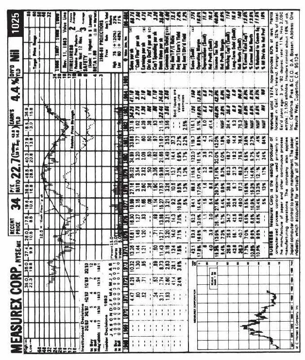

图 2\-1

资料来源：M\.C\.Horsey＆Company, Inc\.，P\.O\.Box H\.Salisbury, Md\.21801；Value Line Ratings＆Reports\.Reprint ed by permission of the publisher\.Copyright, Value Line Inc\.

很不幸，这只股票表现得并不好，事实上，它的价格下降了，并持续了好几年。在1974～1976年，股价在10～20美元之间徘徊。此时，分析师们失望了，越来越少的人有耐心去关注它。

但后来，这个公司又开始快速发展，不过没有人们预期的那么迅速。到1977年的时候，规模已达6亿美元，然而，却没有多少人愿意相信它的股价会上涨。但是，在随后的几年里股价很快翻了4倍，即从1977年的10\.5美元增至1979年的48\.5美元。

当股价凤凰涅槃式地上涨时，金融界对其兴趣也随之增加。在1977～1980年间，该公司的确赚了很多钱，收入增长到1\.2亿美元，平均利润率超过7%。

作为贵重设备的提供商，在1979～1983的衰退期，Measurex公司的处境相当艰难。股价跌破发行价，1982年，股价在13～15美元之间徘徊。这原来是一家拥有1\.2亿美元收入的公司，账面价值达到每股20美元，资产状况良好，管理层经验丰富，技术领先。但在1982～1983年，当你向金融界人士咨询该公司时，他们会告诉你这是一家管理很差的破公司。

为什么呢？他们可能会回忆起1973年以来的历史。不是因为公司没有成长，实在是因为公司的成长比不上金融界对它过高的预期。在1972～1982年，这家公司的收入从800万美元涨到1\.18亿美元，增长率达到31%，业绩表现并不差，但是与华尔街魔术般的要求相比，还是差远了。

到1982～1983年，人们的预期自然就低了。投资者已经习惯了抱怨戴夫·博森，抱怨他让人误以为公司的市场容量很大。“如果你不信公司的CEO，就不要买公司的股票。”我同意这一观点。博森当然应该是乐观的，他不得不乐观，因为这是他的使命。他发表了一些强有力的乐观预测，与那些还在受华尔街追捧的CEO所做的并无二致。

如果博森的声明误导了这些“专业”的投资者，那么我们就知道，这些投资者一定没做什么调查工作。（我知道有个人声称他可以让大家拥有很多资产——也许如布鲁克林大桥的一段。）

Measurex公司的股价从20美元升到30多美元，又跌到10美元以下，再升到超过45美元，又跌回15美元以下。现在已经恢复到30多美元。在这样一个过山车式的进程中，投资者最需要保持的是理性。如果你对公司的印象受以前抱怨所影响，那么你就不可能对公司进行客观分析。如果你高买低卖，并一直深受折磨，那你就是那个躺在绳圈上喘息的拳击手，这时你需要让自己的脑子清醒一下。

如果你受到那些一辈子都耗在绳圈上人的影响或者轻信了他们的话，那么你可能一辈子都在绳圈之外。让脑子清醒些，学会宽容那些管理者，尽管他们所做的也许不能满足你的期望。看看管理者的实质——一群做着实际工作的人们，他们一直在为你创造一些真正的机会。

在类似Measurex公司的案例里，关键是知道什么时候股价便宜，什么时候不是。是什么原因造成了便宜的价格？为什么会有跌有涨？

定价的关键（超级强势股的关键）是在金融界认为这只股票较差的时候买进这只股票。这意味着，需要在管理层出现严重错误，以至于大多数华尔街专家都对它失去兴趣的时候买入。这也意味着，要学会宽容管理者的错误（既是品德问题，也是睿智问题）。这还意味着需要客观地对那些失宠的股票进行定价。接下来的三章我们将讨论股票的定价以及其关键之处。

2026年3月14日

9:51

## 第二部分 定价分析

第二部分 定价分析

第3章 股票估值的传统方法 十倍的收益太高，千倍的收益却太低

问题：左也不行，右也不行，那就换地

人们面临的最大的问题是如何给股票定价。虽然看似简单，执行起来却难以做到尽善尽美。其实，即使达不到完美的程度，我们也可以将定价做得足够好。微妙之处在于，一个好的定价方法也可以很简单。很有讽刺意味的是，很少有人对定价有科学的理解。

最流行的一种传统方法是，用收益或资产价值作为标尺，这往往是错误的（事实上，金融界的大多数估值方法都有错误的倾向）。一些人用这种方法，另一些用那种方法。

其实收益和资产本身没什么错误，只不过它们也是其他因素的结果。利润是结果，不是原因。造成收益变动的因素同样也造成股价变动。影响股价的因素同样会影响收益和资产，重点是要了解这些因素。很多建议说投资者应该稍稍调整一下这些方法——在场内换个地方继续踢球，而实际上投资者应该换个完全不同的体育场。本章就为您分析这些传统方法以及它们存在的不足之处（第4～7章将描述激进的新估值方法）。

## 收益法

收益法

在20世纪50年代，以未来收入为基础估计股票价格很流行。在20世纪60年代到70年代早期，人们通过这种方式投资成长型股票赚取了很多钱。这样做之所以有效，是因为很少有人去这样做。因此，那些未来有着很大成长潜力的杰出公司的溢价很少。投资于这种所谓成长型股票，一时成为金融界的风尚。但事情的发展渐渐失去控制。在20世纪60年代至80年代，与每股收益相比，很多小的成长型股票被市场定价到40～100倍，甚至更高。

我们以一家经纪公司推荐的股票为例。有建议说一只股票价格要涨，因为它的市盈率（P/E）如何如何；或者收入要增加，因为如何如何；或市盈率太低，因为如何如何；也许市盈率相对于历史记录太低，因为如何如何；或者股票被以相对标准普尔500指数较低的价格抛出。

以每股收益作为预测手段成为一种普遍方法，但只有少数人用得很成功。为什么？因为特定的、精确的市盈率法不太管用，金融活动实在有太多假象。可以考虑以下两种基本方法。

“低定价，低市盈率”派

“低定价，低市盈率”派认为，现行的股票的低市盈率是由稳定的每股收益支撑的，每股收益不会出现大幅的下降。与每股收益相比，较低的股价似乎暗示着，华尔街认为每股收益会出现下降。这个低市盈率的派别相信，总有一天华尔街会认识到每股收益不会降。到那时，他们期望股价会上升。

这里有三重缺陷。第一，在任何时期，预测每股收益都是很难的。和普遍的观念相反，1929年很多股票以低市盈率被售出，但是随之每股收益就没有了。例如，Caterpillar Jractor这只股票在8倍的市盈率时被卖出，3年后，价格跌得还剩一点，市盈率则是无穷大，因为它没有每股收益了（见第7章关于20世纪二三十年代IBM和其他股票的分析）。

第二，很多因素包含在每股收益的计算中，其中有些只是随着时间的推移而做的会计记录改变。会计基础知识告诉我们，在会计账户中，只有现金是没有任何假设的会计科目，其余的会计科目都是有假设的，每个季度，会计人员或管理层都在变动着这些假设。

每一次会计准则改变的时候——这种改变很常见，管理层和审计员都要考虑如何运用这些变化。每一次公司状况改变时——这种改变更是每天都有，管理层和审计员都要考虑这些改变会在会计层面产生什么样的影响。

第三，即便你能精确地预测每股收益——没人能做到，这种方法只能让你赚一点小钱。用得好，你的资产可能翻倍，但绝不能使你的资产涨十倍，这种方法不会达到这种效果。市场也许不是很有效，但还没有失效到让股价与每股收益的预期值或每股收益的真实值完全偏离的程度。

## 成长型股票派

成长型股票派

成长型股票派认为，当一家公司成长时，其股价会对其增加的每股收益做出反应，增加的每股收益是伴随着公司的成长而出现的，尽管这种反应并非那么有规律性。在公司有足够发展的前提下，该派别认为，不管刚开始时的股价如何，预期股票价格会上涨。增加的每股收益使得市盈率越来越低，直到股价不得不对此做出反应，这就像被堵住的泉水突然被释放。最坏的情况出现在20世纪60年代和70年代的早期，这些派别的代表们持有大量成长型股票，当公司的成长不如预期迅速时，股价就开始下跌了。

该理论有两个缺陷。第一个和低市盈率派一样——预测每股收益是很难的，哪怕是提前一两个季度。分析家时常碰到令他们尴尬的情况，事情的发展和他们的预期并非一致。

第二个缺陷——不太好理解，即使你对每股收益的预期是正确的，股票有可能表现并不好。为什么？股票价格包含了对未来每股收益的折现，对未来每股收益的预期可能已经体现在当前的股价中。这应了一句老话：“市场包含一切信息。”如果股票是公认的成长型股票，那就更可能出现上面的情况了。

如果公司在未来一两年出现问题的话，正确的预期不一定会换来公司股票价格的上涨。市场包含一切信息，这就是市场的魔力。股价常常远在公司的收入达到顶峰之前就已经到顶了。考虑表3\-1中两家假想公司同一时期的股价。

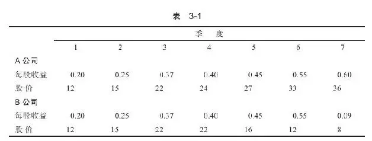

A公司的每股收益持续上涨，但是无任何规律性，并且其股价是每股收益的60倍。（当然，真实的世界不会如此精确，只要有利于我们的分析即可。）B公司除了最后一个月外，其他每个月有着一样的每股收益，但其股价在每股收益开始下降前就已经达到顶峰了。尽管我们不能合理地解释有效市场，但是它也能够预测未来的变化，虽然是以粗糙的形式。这一原则被学术界广泛接受，并形成了随机游走学派。 [\1]

不管是在低市盈率法中，还是在成长模型中，对每股收益正确的预测都能令使用者得到某种程度的成功。如果它们一无是处，早就被淘汰了。

但是残酷的现实使它们的表现不是很出色。几乎所有人都在用它，但极少有人得到额外收益。利用市盈率法不可能找出超级强势股。成为超级强势股的最低标准是在5年内获得至少3倍于成本的收益。 [\2] 这意味着每股收益至少以每年25%的增长率持续上涨，且在整个期间市盈率不会下降。虽然不可想象，但十有八九错不了。

作为超级强势股的极端情形，需要有这样的潜力：3年内每股收益上涨10倍。这意味着每年115%的增长率，并将持续3年，这太难以想象了。

如果去掉每股收益，你如何评估一家公司？如果拿走每股收益，大多数的金融机构将无法评价一家公司。问一问股票经纪人，如果不能得到每股收益数据作为基础，他会怎样评估一家公司，你将得到非常有趣的答案。

[\1] 随机游走学派好像已经建立一个完美的解释使我们放弃。如果你已经放弃，我建议你加入他们，合上书，关上灯。

[\2] 见前言中提及的超级股票的原始定义。

## 本·格雷厄姆方法——“出色但还不够”

本·格雷厄姆方法——“出色但还不够”

本·格雷厄姆在写作、教育、演讲等领域都有建树，常被人们称为证券分析之父。他的那本名为《证券分析》的书已经成为该领域近50年来的基础教材。 [\1] 另一本叫做《聪明的投资者》的书被广泛认为是初学者入门的经典教材。 [\2] 以下是约翰·特雷恩在《货币大师》一书中对他的评价： [\3] 本·格雷厄姆是本世纪以来，也许是有史以来，在投资组合领域最重要的思想家之一，他将其由一门讲究印象、内部信息、判断力的技艺变为一门严谨的科学，一个规范的学科门类。

对一代投资者来说，格雷厄姆的理念已经被认为是“投资的价值方法”。

格雷厄姆通过程式化地应用低市盈率法尤其是资产负债表标准来买股票。他购买有活力的资产，这些资产最终会带来收益。他以尽量低的价格购买股票，寻找有良好资产支持的高红利回报。他认准股价便宜的公司，购买它们并持有2年直到其上涨50%。这样做的效果很好，但是有获利上限。用这个方法可以赚钱，但不能帮投资者找到像早期IBM或施乐那样的好股票。它也倾向于获取短期高额回报，而不是获取税率从优的长期资本利得。

你曾尝试过以资产为基础对技术股票进行估价吗？大多数情况下，能让你的钱涨到5倍、10倍甚至20倍的超级强势股通常不能用这种方法找出。

沃伦·巴菲特积累了数亿美元的财富，用的是他自己改进过的格雷厄姆方法。很少有人做得像他那样出色。在《货币大师》一书所提到的九位传奇投资者中，他被称为投资者中的投资者。 [\4] 他独立而且自律，在别人避之不及的公司上建立了大量非流动性头寸，准确性非同寻常。在1956～1969年13年的时间里，他的资产以每年30%的增长率持续增长，从未下降。极少有人做得这么好，至今为止似乎也只有一个。巴菲特在为格雷厄姆工作时，有着非常好的学习能力。其他人也为格雷厄姆工作过，但少有人做得像他那么好。很多人说他们已经得到了很合理的结果。但是如果你想得到比合理结果更多的收益，该采取什么方法呢？

[\1] Benjamin Graham, Security Analysis（New York：McGraw\-Hill，1934）\.

[\2] Benjamin Graham, The Intelligent Investor（New York：Harper＆Row，1947）\.

[\3] John Train, The Money Masters（New York：Harper＆Row，1980），p\. 83\.

[\4] Ibid\.，p\. 1\.

2026年3月14日

9:51

## 解决之道

解决之道

如果以收益法来购买股票是左边半场，以资产法来买股票是右边半场，那么最好的方式是去一个新的体育场。不要再在购买股票的层面上思考——忘了买股票这档子事。更基本的是你要买下整个生意。如果要买下整个生意，你需要支付什么？如果投资者总是在买股票之前问自己这个问题，会节省很多钱。

很多投资者就是不停下来，去思考这家公司的生意究竟有多大。他们关注的是每股收益和每股净资产。投资方面的学术性书籍很少提到利润表的上半部分。他们很少问这样的问题：“这家公司生意到底有多大？”

一本权威的该领域用书用了整整一章来讲述这个问题。

➤市盈率。

➤每股收益增长率（1年或4年）。

➤本·格雷厄姆方法。

➤红利、红利变更和派息率。

➤总资产回报率。

➤产权比率。

➤总资本。

但是，销量、货物成本或毛利率却只字未提。 [\1] 我们想把注意力从每股收益和资产方法上转移。取而代之的是，我们应该注意以下事项。

➤公司经营有多大。

➤与经营有关的成本结构。

➤企业主考虑的公司经营方式。

这听起来也许有点荒谬，我喜欢乘法的概念（当我还是四年级的小学生时，11乘以8等于88。后来，无论是战争爆发、嬉皮士、计算机、新数学，还是苹果电脑的诞生，11乘以8还是88，所以我喜欢乘法）。但我不喜欢市价\-收益的乘法。我喜欢另一些乘法，尤其是市场销量的乘法。我选择以市销率（price sales ratios，股价营收比，PSR）、实际和潜在的利润率，还有市研率（price research ratios，股价研发比，PRR）来衡量股票。这些概念就是本书将要讲到的。

要获取超额收益，就要避免用传统方法去衡量股票。我买股票，都是在该公司赔钱或是钱赚很少，以至于市盈率无限大时购买的。我在那些千倍的市盈率股票上赚了很多钱，而在那些十倍或更少市盈率的股票上赚得很少。一个私人投资者怎样衡量所购买的一家公司的股票价值？这家公司要不就是亏损，要不就是收支平衡。当这个谜被破解时，买股票就成了一项低风险、高收益性的活动了。

[\1] Donald M\. Peterson, Financial Ratios and Investment Results（Lexington, Mass：Lexington Books，1974）\.

## 第4章 定价决定一切 运用市销率

第4章 定价决定一切 运用市销率

牛市、熊市和火鸡市

人们容易忘记。他们在对（股市）基本理论置若罔闻的同时，也忽视了长期价值的分析。然而，回到原处栖息的鸟却往往是火鸡。

每当心情愉快的时候，我都会在我的会议桌上放置一头庞大的塑料制作的公牛。无论从哪个角度看，这头公牛给人的印象都是深刻的。在公牛下面，我放了一只五颜六色的火鸡，不仔细看，这只火鸡很难被发现。

通常，人们不关注火鸡市。即便有时他们注意到了火鸡市，也不情愿去认识它。偶然有一次，有人问我火鸡市是什么，我解释说，大家都知道什么是牛市，但是，大部分人对此认识却不充分、不透彻——公牛正下面坐着一只真实的火鸡。

人们容易忘记。在（股票）市场达到高水平时，人们总是忘记，此时股价将会下跌。由于希望和梦想的驱动，他们付出的代价与私人买主收购整个企业付出的代价并无二致。在牛市上已经处于高价位的一只股票股价可能上升70%，但在熊市上，也会下跌70%，甚至跌幅更大（公牛正下面坐着一只真实的火鸡）。大部分人认为只有牛市和熊市，但是，也存在着火鸡市。超级强势股大多不存在火鸡市，严格意义上的超级强势股是这样一家公司的股票。

➤公司未来长期销售收入年均增长率大约在15%～20%之间。

➤公司长期平均税后利润率超过5%。

➤在市销率为0\.75或者更低的水平上买入。

2026年3月14日

9:51

## 理解市销率

理解市销率

市销率（PSR）是我所熟悉的、最有效的单只股票估价方法。这种方法并不广为人知，也不好理解，在华尔街也很少有人使用。与市盈率比较而言，市销率要有效得多。在本章中，我们将讨论如何以及为何使用市销率（在使用PSR之前，我们必须理解毛利率分析方法——见第10章和第11章）。

市销率与市盈率相似，只不过我们用公司销售收入代替公司每股收益。它是企业总的市场价值除以去年12个月的销售收入。我们用股票价格乘以总股票数得出市场价值。 [\1] 如果一只股票每股15美元，市场上流通的该公司股票共有4000000股，那么，市场价值为60000000美元（=15×4000000）。如果公司去年的销售收入为80000000美元，则市销率为0\.75（6000万/8000万）。如果公司的销售收入仅为20000000美元，则市销率为3\.0。

图4\-1是价值线综合指数关于Applied Magnetics公司的数据资料。第4行列出的是股票总数（图中的右边是行数），在图4\-1的顶端，第1行和第2行列出了每年股票的最高价和最低价（这里不要搞混了，慢慢看，不久就会越来越清晰）。第1行的数据乘以第4行得出每年股票的市场最高价值。第2行乘以第4行得出股票每年的市场最低价值。用市场价值除以第4行的数据，得出市销率。

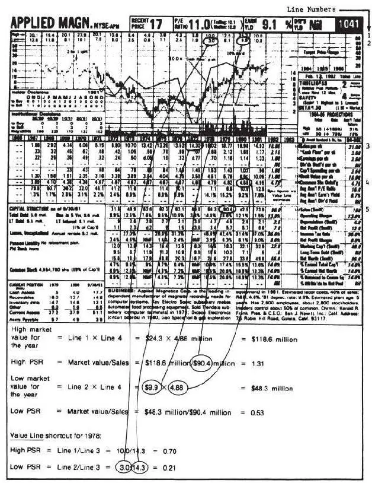

图 4\-1

资料来源：Value Line Ratings＆Reports\.Reprinted by permission of the publisher\.Copyright, Value Line Inc\.

Applied Magnetics公司1980年的市场价值最高时是118600000美元（=24\.3×4880000）。市场价值最低时是48300000美元（=9\.9×4880000）。这有点复杂。记住，在盯住股价的时候，我们仅仅只有历史数据可供利用。所以，我们不得不使用前一年的数据。第5行列出的Applied Magnetics公司1979年的销售收入是9040万美元。1980年该公司市销率最高时为1\.31（=11860万/9040万），最低时是0\.53（4830万/9040万=0\.53）。

当使用“价值线”综合指数数据时，有一个更便捷的方法。第3行列出的是每股销售收入，第1行或者第2行的数据除以第3行的数据将会直接得出市销率（第1行——最高的PSR；第2行——最低的PSR）。 [\2]

你可能会花费大量的时间和精力去研究股票的买价、卖价或者什么时候买卖。这些努力大部分都是在浪费时间，没有任何意义。同样，花费时间研究有多少流通股也是无用的，因为你得到的数据包含多少股票期权是个未知数。所以，不要把你的时间浪费在这些方面。

根据各种情况，市销率的数值大小变化不定，最低会低于0\.05，最高会高于20。与其他企业相比，一些企业的市销率具有显著性的差别。为什么我们应该考虑市销率？因为相对于不同规模的公司而言，它们具有普遍的适应性。

市销率是有价值的，因为在公司层面上，与其他大多数变量相比，销售收入本质上具有更大的稳定性。如果你做过企业经营基本原理的研究，你就有可能发现，当企业由巨大的盈利转向微小的（或者甚至大额的）损失时，销售收入却在经历多年的增长后趋于平稳。

很难发现，一家超级公司会出现销售收入的大幅下降。公司遭遇收益的严重逆转却是普遍的现象。（参考第1章和第2章描述的“困境”。）超级公司出现销售收入持续2年逆转的现象，将会是最坏的预期。与其他财务指标一起，增长相对稳定的销售收入指标，在证券估价的过程中为我们提供了一个风向标。

[\1] 最准确的股票数目是指“流通中被完全稀释的股份”，这指的是现有的股份减去流通中可运用的选择权。完全稀释的股份在公司的年度报告中列出来。一般的“初始流通股”，指的是在“完全稀释”之前股票的数目。

[\2] 根据“价值线”综合指数的数据计算PSR的简便方法，有时会产生一些微小的错误。这些错误可以忽略不计——当使用PSR的时候，这些微小的错误没有什么意义。

## 股价和销售收入之间的关系意味着什么

股价和销售收入之间的关系意味着什么

市销率表明，在股市上，投资者愿意为公司1美元的销售收入支付多少价格。对于一个私人购买者而言，一个公司的价值起着预测公司销售额和平均毛利率的作用——企业有多大的经营业绩以及能赚取多少钱。考虑一下这意味着什么。

一个公司，年均销售收入为1亿美元，市场价值为1亿美元时，其PSR值无疑为1\.0。假设，公司恰好取得了10%的利润率（1000万美元）。 [\1] 那么，随之我们将会得出，公司市盈率为10（=10000万/1000万）。如果公司取得了5%的利润率，那么它的市盈率为20\[=1亿/（1亿×5%）\]。

表4\-1列出了一些假设在未来盈利水平处于波动前提下的市盈率以及与之相对应的市销率。仔细研究这个表，理解它能够让你获得比想象中更大的收益。第5行和第2列的交点处描述了引用的第一个例子（10%的利润率）。第5行和第4列的交点处则描述了修整之后的例子（5%的利润率）。

表4\-1描述了利润率、市盈率和市销率三者之间的关系。充分理解之后，你就可以用它来研究盈利水平和财务价值波动不定的企业了。

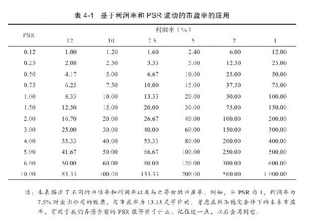

底线是什么？要想成功地购买股票，你就必须基于起因，而不是结果对股票进行定价。所谓起因，是指经营环境具有以销售为导向的成本结构的产品。结果来自三个方面：利润、利润率和每股收益。

注意，在每一股的基础上我们没做任何讨论。需要避免每股观念的存在，而是关注公司的整个经营，包括公司规模，这对我们运用PSR是至关重要的。

一个案例：Datapoint公司

举一个例子，这个例子会令使用PSR作为股价分析工具的作用更加清晰。专栏4\-1是一篇来自《华尔街日报》的文章（1983年2月15日）。读读开始两段，Datapoint公司的股价从51\.875美元迅速跌至10\.875美元，后来又反弹至25美元。在此过程中，许多人焦头烂额。但是到底发生了什么事情？文章中虽然说了许多，却没有给出一个好的答案。华尔街总是充满了神秘。

专栏4\-1

作者：Foster Winans

当被透露订单和收益吃紧之后，1982年前几个月，Datapoint的市场价值锐减30%至8亿美元。截至当年7月31日，当Datapoint的收益下降95%时，其股价从51\.875美元跌至可怜的10\.875美元。

这只股票奋力反弹，年终股价接近18美元。但是，两个星期之后，在最近的9个交易日里，股价上涨了22%，昨天，收盘价为25\.125美元。周五迎来了巨大的收益，Datapoint公司的股价上升12%。过去两天的时间里，公司共有流通股21000000股，其中5\.5%被易手。

据交易员说，疯狂的购买行为出自多家经纪商。这种行为表明了收购招标的谣言是缺乏事实基础的，这种谣言流行了近一年。相反，分析家们说，虽然有些技术性问题，但这只股票的行情正在迎头赶上。而且，购买者期望公司的收益出现好转，经济复苏的预期加强了这种期望。

最近，尽管一些投资者对公司的前途持怀疑态度，并且已经抛售了公司的股票，但至少有两位分析家对Datapoint公司持乐观态度。

Furman Seiz Mager Dietz＆Birney公司的一位技术分析师说，Datapoint公司的股票是特别值得购买的，这位分析师对Datapoint公司1983财年的收益预期在华尔街是最高的，每股收益达1美元。这使得该股票的市盈率高达25，甚至与这场技术游戏中一些最有吸引力的股票（例如IBM）相比仍是较高的。

该分析师之所以看好该公司，是“因为它的定性因素”，他说。这意味着，Datapoint公司的现金流状况得到了极大的改善，截至7月，收益从1983年年底的5000万美元增至1\.09亿美元。

他评价说，对于一个去年看似即将破产的公司来说，资产负债表出现了神奇的改善。该公司拥有稳定的老客户群，包括14家纽约商业银行中的13家以及在系统内占最大市场份额的客户。由于拥有强大的客户群，当经济开始出现明显好转的时候，公司的销售额和收益将会大幅上升。

来自Hambrecht＆Quist投资银行的一位分析师则对于今年Datapoint公司收益的恢复没有如此乐观。他预测1983年每股收益在30～50美分之间。但是他同意，如果经济情况好转，1984年公司有能力达到至少每股收益2美元。

1月20日，Trust公司向证券交易委员会备案，决定购买Datapoint公司5\.7%的流通股份。这项投资有助于抵消大型机构的抛售。比如，T\.Rowe Price和BEA Associates从它们的资产组合中剔除了200万股份。

一些分析家似乎也同意，这只股票将保持被脱手的势头。

“对于短期投资者来说，现在可能是脱手的好时机。”所罗门兄弟公司的一位分析师预测，对于1983年而言，也只不过是另外一个低收益的年份，大约每股收益50美分，1984年则会出现较大的复苏，每股收益达到1\.50美元。他说，这些数字是不稳定的，“当你陷入低水平的泥沼时，在我们的估计中，很难树立起信心，这些估计或许是较低的。”

他说，对于正要购买这些股票的长期投资者来说，“你必须相信，在高度竞争和变化莫测的市场上，该公司能够引入新的系统。我不能确定有人能做出这种评断。”

Datapoint公司或许正遇到麻烦。1981年4月，公司宣布研发出一种新型的称为ISX的电子转换装置，并认为“在接下来的两年及以后，对于公司业绩的增长和盈利水平的提高，这种装置将会做出巨大的贡献。”

现在，两年即将过去，Datapoint公司的一位发言人说，“关于ISX，我们遇到了麻烦，尤其在软件方面，对外也没有发过货，迄今为止，有些令人失望。”他还说ISX“几乎没有产生任何收益”。

关于华尔街对公司盈利的预测，没有做出任何评论，只说对公司从经济复苏中获益保持“乐观”。

资料来源：The Wall Street Journal, February 15，1983\.Reprinted by permission of The Wall Street Journal，©Dow Jones＆Company, Inc\.，1983\.All rights reserved\.

Datapoint 1981年的最高股价为67\.5美元。1981年4月1日为58美元，此时，公司的市场价值低于12\.5亿美元（1183000000美元）。之前12个月，公司的销售额大约为3\.63亿美元，PSR值为3\.25。正如《华尔街日报》指出的那样，公司的股票价格开始下跌，跌至10\.875美元，市场价值仅为2\.22亿美元，丧失了公司价值的80%以上。

公司的销售收入并没有出现下降，因此其PSR值从3\.25减少至0\.61。公司没有了收益。这是一个典型的增长突变性的不规则运转现象。Datapoint的销售额其实一直在迅速增长。在《华尔街日报》那篇文章出现的时候，Datapoint的年销售额已经攀开至5\.14亿美元的水平。公司开始出现盈利（如第1章描述的困境）。当然，到那时，公司的股价是最低位时的两倍。但是，到底发生了什么事情？

本来，华尔街对Datapoint公司的股票估价过高（PSR值为3\.25）。如果投资者想获取长期的投资收益，不应该对与Datapoint公司规模相同的任何企业在PSR值为3\.25时进行估价。后来，当Datapoint股票跌至最低点时（PSR值为0\.61），只要耐心持有PSR值低于0\.75的任何超级公司的股票，就会获得巨大的收益。

[\1] 在第10和11章，我们将会详细讨论利润率。现在倾说的利润率是指税后净利润除以销售额。如果销售额为1亿美元，利润为300万美元，利润率将会是3%（3/100=0\.03=3%）。

2026年3月14日

9:51

## 超级强势股是指相对于公司规模而言，在PSR值较低时买入的超级公司股票

超级强势股是指相对于公司规模而言，在PSR值较低时买入的超级公司股票

专栏4\-2是拥有超级强势股，在三五年的时间里可以赚到三四倍钱的PSR规则。

专栏4\-2

规则1：避免购买PSR值大于1\.5的公司股票。永远不要购买PSR值大于3的股票。PSR值相当高的股票可能会迅速增长，但仅仅建立在“炒作”的基础上。保持距离——除非你要以大的长期损失为代价，获取短期的微薄利润。

规则2：积极主动地寻找PSR值不大于0\.75的公司股票。周边总会有这样的股票。长期持有——会赚钱。

规则3：当PSR值上涨到3\.0～6\.0之间时，卖掉超级公司的任何股票。如果你不想冒太大的风险，就在3\.0时卖掉它。如果你想稍微冒更大的风险，寄希望于市场上过度的乐观持续推动股价的上升，将希望寄托在6\.0上。如果你喜欢赌博的话，可以更高一些。

在华尔街人看来，在PSR值较高时卖出公司的股票，这已经被寄予了很大的期望。那些在低PSR值就被卖出的股票，其财务状况不尽如人意，也颇受怀疑。

2026年3月14日

9:51

## 低PSR值是多少，高PSR值是多少，为什么会这样

低PSR值是多少，高PSR值是多少，为什么会这样

花一些时间，回顾一下Datapoint公司的例子。在PSR值为3\.25时购买该公司股票的投资者遭受了重大损失，而在PSR值为0\.6时购买该公司股票的投资者则获取了巨额的收益。PSR值为0\.6时，Datapoint公司股票交易的市场价值恰好等于1982年收益的6倍，相当于分析家后来预测的1984年收益的5倍（见专栏4\-1）。在市场价值为下一年收益的5倍时，对公司的收购应该会推动股价的上涨，你会对此感到奇怪吗？在这种情况下，PSR值为3\.25时太高，PSR值为0\.6时，相当有吸引力。情况总是这样的吗？

研究结论

毫无疑问，当公司规模越来越大时，PSR值将会下降。在费雪投资公司我们花了5年的时间，跟踪了总共62家科技公司的PSR值。在这段时间里，这些科技公司的PSR值迅速增加，尤其是小公司。通过整个研究，我们发现，有些东西是不变的。

➤与小公司相比，大公司的PSR值更低。

➤当公司的PSR值小于1时，该公司的股票能够给我们带来许多惊喜。

➤若购买PSR值最高公司的股票，在公司出现较差业绩之前，你就会感到失望的。

为了保证客观性，我们使用了数据样本——Hambrecht＆Quist投资银行洛杉矶分行的《月度数据记录》。多年来，Hambrecht＆Quist投资银行一直是技术投资和证券认购领域一家领导性的专业公司。该公司的《月度数据记录》涵盖其所跟踪公司的数据库，通过使用这些数据样本，我们需要挑选股票进行跟踪。他们已经为我们做了这一点。

基本上所有的公司都是技术公司。从1978 [\1] 年的记录开始，我们以季度为基础，对股票进行跟踪。有时，一些公司要么由于并购、破产，要么由于Hambrecht＆Quist投资银行对其丧失兴趣，其股票会从Hambrecht＆Quist投资银行的数据板块上消失。

若一家公司因为被另外一家公司收购而从板块上消失，我们就从当时的收购价格进行评估。若公司是因为Hambrecht＆Quist投资银行对其丧失兴趣而被剔除，我们就收集必要的信息对其继续研究（只要它没有破产）。另外一种情况，若公司因为破产而被剔除，我们对其进行研究，直到其股价滑落到反应破产的水平，然后再去掉它。根据公司规模的大小，我们将数据样本分成以下三组。

➤销售收入在1亿美元以下，38家公司。

➤销售收入在1亿～6亿美元之间，15家公司。

（此处有间隔，数据样本中，没有一家公司的销售在6亿～10亿美元之间。）

➤销售收入超过10亿美元，9家公司。 [\2]

我们感兴趣的第一点是，整个板块上小公司的PSR值有多低。如后文所述，1982年和1983年，众多这种规模的公司PSR值从3到10，一直到30。但是，在1978年前期，板块上最高的市销率值为2\.53，来自Waters Associates公司。38家公司平均的PSR值仅为0\.80。板块上最低的为Infomag公司，PSR值为0\.24。表4\-2列出了小公司板块上10只最高PSR值股票的名称和排序，它们其中有些是1978年世界上高价值的股票。

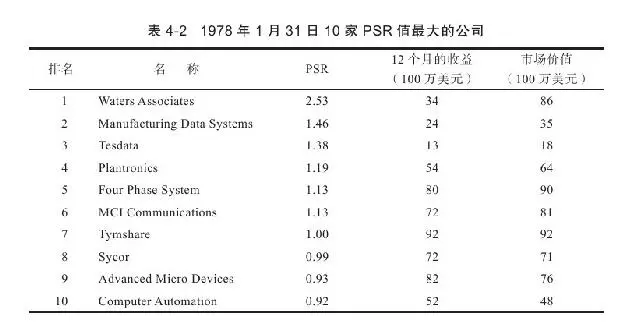

其中有三只股票是成功的：Manufacturing Data Systems公司，在板块上名列第二；MCI Communications公司，在板块上名列第六；Advanced Micro Devices公司，在板块上名列第九。持有这些股票的人都赚了许多钱。

Manufacturing Data Systems公司从35000000美元的市场价值起步，当1981年被Schlumberger公司收购的时候，被板块剔除，当时其市场价值为212000000美元，PSR值为3\.8。MCI Communications公司的股票表现不俗，市场价值从初始的81000000美元上涨到1983年早期我们结束研究时的4900000000美元。因此，MCI Communications公司终止时的PSR值为4\.9——与相同规模的任何其他企业相比，其市场价值要高得多。在整个市场上，相对于相同规模范畴的公司PSR值而言，MCI Communications公司的市场价值是最大的。最后，Advanced Micro Devices公司的市场价值从76000000美元增长至986000000美元，1983年早期的时候，其PSR值为2\.9。

相比之下，一些股票的记录令人失望。1978年的时候，Tesdata在板块上名列第三，市场价值为18000000美元。但是，到了1983年早期的时候，其市场价值下降到10000000美元。1982年的时候，还一度降至4000000美元。当我们开始研究Computer Automation公司的时候，其市场价值为48000000美元，而当我们终止研究的时候，其市场价值仅为29000000美元。PSR值最大的公司是Waters Associates，虽然其股票表现称不上灾难性的，却也相当令人失望。1978年，其市场价值为86000000美元，PSR值为2\.53——明显是受人青睐的宠儿。1980年第二季度被Millipore公司收购的时候，其股票从板块上消失，市场价值仅为91000000美元。

所谓前10名的其他公司股票表现也不过如此，例如，Sycor公司被收购时，其市场价值仅比初始价值的8%多一点。当我们开始研究Tymshare公司的时候，其市场价值为92000000美元，后来短暂上升到了622000000美元，此时的PSR值为2\.6。接下来，市场价值又降至240000000美元，PSR值为0\.67。

要想理解这10家市销率较高公司中的7家为什么表现较差，有必要知道，从整体上讲，科技股遭遇了不平凡的几年——一个史无前例的增长时期。在该时期内，科技股的Hambrecht＆Quist投资银行的指数价值增长了5倍以上，总平均增长率接近40%。考虑到这个背景条件，10家PSR值最大的企业中7家的低劣表现格外引人注意。

对低PSR值股票的检验，为我们提供了一种鲜明的对比。板块的最后一位为Infomag公司，PSR值为0\.24，市场价值仅为8000000美元。当我们结束研究的时候，公司改名为Computer＆Communications Technology，市场价值为150000000美元，PSR值超过2\.0。研究开始时，Granger Associates公司的市场价值仅为9000000美元，PSR值为0\.50。研究结束时，市场价值超过250000000美元，PSR值超过0\.50。

低PSR值的股票出现较小倍数的增长，但是，不管怎样，表现相当好。例如，Finnigan公司，开始研究的时候，PSR值为0\.43，市场价值仅为9000000美元。当我们结束研究时，其PSR值为1\.20，但是市场价值达66000000美元，是刚开始时的7倍多。California Microwave公司（其历史参考第15章），开始研究时，其市场价值为19000000美元，PSR值为0\.63，到1983年前期的时候，其市场价值超过150000000美元，PSR值为1\.50。Rolm公司（该段时期一只真正的超级强势股），开始时，其PSR值为群组的平均值，即0\.81，市场价值为29000000美元。该段时期结束时，其市场价值超过11亿美元，PSR值超过2\.5。

当科技股越来越受欢迎时，激发了强劲的牛市，这也是这些股票升值的一个重要原因（最近以来，科技股在比照PSR值的基础上定价过高，这是一个强劲的牛市）。到1982年11月份，Hambrecht＆Quist投资银行板块上27只股票的PSR值超过3\.0。其中8只股票的PSR值超过6\.0（记着，1978年早期，板块上最高的PSR值仅为2\.534）。

与1983年相比，可以知道，1978年的PSR值是多么低。通过比较过去半个世纪以来的PSR值，我们越来越清楚，科技股的PSR值在1978年是低的，而在1983年是高的（不要简单地以为PSR值较低时，就购买这些股票，也需要看质量）。 [\3]

毫不例外，开始研究时，板块上所有（市场价值）增长500%～1000%的股票的PSR值都低于1\.5，仅有两只超级强势股超过1\.0。这种相对表现为我们提供了一些视角。板块上PSR值第三低的股票比第三高的股票表现好（以季度为单位）。如果你将MCI Communications和Advanced Micro Devices从群组中剔除，比较将会变得更富有戏剧性（当然，就自身而言，两者是有价值的）。 [\4] 有趣的是，样本数据是我们客观挑选的，但是同性质的股票——以质量为标准进行挑选，与PSR值较高的股票相比，PSR值较低的股票为我们提供了更多的获利机会、更少的风险（以季度为单位，考察整个时期）。由此可见，要避免高PSR值的股票。

[\1] 在Hambrecht＆Quist的数据样本中，有一些非科技股，分两个小组将它们归在一起。我们包含科技公司（比如MSI Data和Amicon），而排除非科技公司（比如Mervyn’s）。我们有争议的唯一一只股票为Itel，开始时，其PSR值在平均值之上。我们最终决定不包含Itel公司，本质上将它看做一家财务公司，而不是一家科技公司。如果包含了Itel公司，我们的研究结论可能会得到加强。

[\2] 考察期初期，这些规模反映了销售额。但是5年之后的末期，大部分的公司规模更大。

[\3] 实际上，世界上非常糟糕的企业在其走向破产的过程中，都是在非常低的PSR水平上被收购的。

[\4] 从研究这些变化中得出的一个结论是，Hambrecht＆Quist在挑选盈利公司的股票方面做了非常出色的工作——亏损者相对较少，损失相对较小，平均收益较为可观。在5年的时间里，他们持续不断地增减公司，一般倾向于去除预期亏损公司的股票，而增加那些在中期内表现更好的股票。

2026年3月14日

9:51

## 得到有关股票的右斜线

得到有关股票的右斜线

表4\-3列出了1982年11月份Hambrecht＆Quist投资银行板块上不同销售规模和PSR值的公司数量。比如，第一列第二行表明销售规模在1亿～2亿美元之间、PSR值在0～1之间的公司有4家。同样，第四列第四行表明销售规模在3亿～4亿美元之间、PSR值在3\.0～4\.0之间的公司仅有1家。

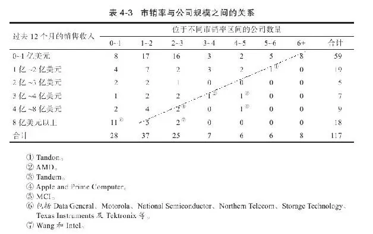

表4\-3中，从左边底部向右上方倾斜的一条虚线划分了我所称的理想之国。虚线的右边代表了PSR值和销售规模的组合，这样的组合要么没有任何公司能够获取，要么只能由华尔街少量的卓越企业获取。这少数几家公司的名称显示在表中，或者在线的右边得到暗示。这些少数公司都是参考PSR为基础的规模而进行了有效定价的公司。它们中的每一个在各自领域都是出类拔萃的，包括AMD、Apple Computer、Intel、MCI、Prime Computer、Tandem Computer、Tandon和Wang。1982年11月份板块上PSR值最高的是Intecom，其PSR值为18\.78，公司仅有18000000美元的收益（见表4\-4）。

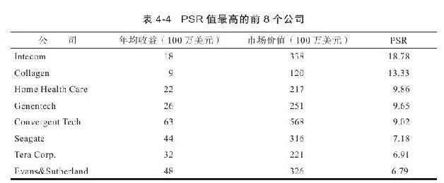

不是说这些股票不能增长，从1982年11月份到1983年5月份，在强劲的股市上，它们确实实现了增长。但是潜在的回报并不值得冒那样的风险。还记得Datapoint公司吧。实际上，该群组股票没有板块上低PSR值的股票表现好（从中长期方面来讲，高PSR值股票群的表现总是比低PSR值股票群的表现差）。

有几只股票的运行游离于这个规则之外，但是这几个特例的数目相当少，以至于没有什么投资意义。比如，当MCI成长为一个大公司的时候，其PSR值从一个已经较高的水平增长至一个相当高的水平。作为一个特殊的例外，其表现特别突出。再看看表4\-3，它自己滑到了虚线的右端。但是，这种例外没有几个（MCI的股票后来暴跌）。

## 成长的时候，力争上游

成长的时候，力争上游

通过研究发现的另外一个有趣的结果是，与相对较小的公司相比，大公司的市销率有持续降低的趋势。开始研究时，这种趋势没有终止研究时那么明显（但是，在这个研究过程中，这是一个真实存在的现象）。相当高的市销率总是存在于规模更小的公司中。1978年初期，板块上销售额超过10亿美元的9家公司，其市销率平均只有0\.63。HP和DEC公司虽小，但却在精英公司群组中，这个群的公司因为其规模的原因而极有价值。

当公司规模增长的时候，这时该研究一个最重要的结论（如何强调其重要性都不为过）。

表4\-3关于大公司的部分表明，随着公司规模的增长，其市销率下降的相对幅度。销售超过8亿美元、市销率值低于1的公司给人的印象并不坏，过去几十年，它们都遭遇了严重的挫折，包含德州仪器、Storage Technology、Data General，等等。 [\1]

5家销售额超过8亿美元、市销率值在1～2之间的公司比较有趣，因为其中3家的销售额刚好是10亿美元。实际上，板块上仅有两家销售额达几十亿美元的公司（HP和DEC）PSR值超过1。这两家公司因其与规模相关的高市销率值而闻名。通过对比，像在较高PSR值时卖出的小公司一样，它们都被进行了有效的定价（DEC后来出现了暴跌）。其余传奇式的科技公司，其市销率值都比1小，这些股票都被机构投资者作为资产组合而持有。

[\1] 在德州仪器个人电脑开始出现的前6个月，这个板块得到了更新。那时，德州仪器被认为是“安全”的个人电脑游戏。与大公司相比，其PSR值较高（仅比1\.0小一点），但是与小公司相比，PSR值较低。到写到此的时候，问题出现了变化。德州仪器失去了它的影响力，开始走下坡路，出现亏损。在1983年仲夏的时候，其PSR值对于它的公司规模来讲，不大也不小。为了说明低PSR值公司的业绩一度逆转到什么程度，你只需要看看过去的PSR。1973年，Date General公司的PSR值为12\.59，价格为每股49美元。1983年，股价为60美元多点，PSR值为1\.03。1973年，Storage Technology公司PSR值为4\.3，价格为每股7美元。在接近40\.75美元的高点之后，1983年，股票在16美元左右交易，其PSR值为0\.60。一直以来，Storage Technology公司的销售额从2600万美元上涨到10亿美元。1973年，德州仪器最高PSR值为3\.26。那时，它的规模比现在的1/4还小。

## 害怕深度

害怕深度

高PSR值可能是危险的，我们知道，当一个公司实现成长，变得庞大的时候，其PSR值会下降。当一个公司的销售规模大于10亿美元时，其PSR值有可能下降到1之下。没有几家公司能够逃脱这种命运，即使逃脱的几家公司也没有更高的PSR值。因为PSR值随着规模的增长而下降，如果一个公司的规模相对于其PSR值过大，则该公司是脆弱的，没有升值的潜力。

思考下面的案例。Verbatim公司在第14章中作为一个案例将被讨论。从1983年开始，那时看起来并不便宜。1983年仲夏，该只股票股价为50多美元，Verbatim公司的市场价值超过6\.1亿美元，年均销售额为1\.2亿美元，PSR值为0\.51。在我看来，Verbatim公司是一个伟大的公司，在不稳定的股市上应该会有一个光明的前途。这么大的规模，这么高的PSR值是很少见的。除非整个股市实现了增长（即所有公司都实现喜剧性的增长），否则，当公司的销售额接近10亿美元的时候，其市场价值达到10亿美元以上是不可能的事情。

## 理想之国的界限

理想之国的界限

如果Verbatim公司的股价想增长1倍，公司的销售额就必须增长10倍。 [\1]

在一个相当短的时期里，股价增长1倍，销售额增长10倍，有这种可能吗？不太可能（为了满足超级公司最低上市条件，在3年的时间里它必须做到这一点）。更为可能的是，为了实现迅速增长，它们将需要现金，并卖出更多的股票，增加流通中股票的数量——增加市场价值和PSR值而不增加现有股东的价值（随着公司的成长，其PSR值一直下降，这与为了筹资实现增长而稀释股票是同时发生的）。

我并不是说公司的价值不能实现增长。我说的是，为了实现股价的增长，公司要力争上游，就必须克服汹涌的水流。在1983年，公司前进的步伐越大，今后将会有越多的人受到伤害——或者至少相当的失望（Verbatim后来出现暴跌）。再一次回到表4\-3中，可以看到，在我最初购买Verbatim公司股票的时候，在1981年1月的板块上公司位于第一列第一行。到我1983年卖出公司股票的时候，它移动到了第六列第二行，那里是理想之国的临界值。

[\1] 假设Verbatim公司的销售额增长10倍，从1\.2亿美元上涨到12亿美元，如果那时其PSR值为1\.0——一个理想的有效假设，它的市场价值将会是12亿美元，这是当前6\.1亿美元市场价值的2倍。

## 从众经济学

从众经济学

1982年和1983年，一些早期公开上市的股票终止流通，此时，其PSR值处于仅能引起悲剧的水平。持有其中一些股票（如果不是大部分）的投资者容易遭受巨大的损失。对于获得10%税后利润的上市公司而言，销售额扩大10倍相当于收益扩大100倍（参考表4\-1）。没有几家公司能够长期获得10%的利润率。具有高PSR值的上市股票会导致长期的损失，而不是投资者预期的收益。

这些企业是否是出色的工业企业，投资者似乎并不关心。贪得无厌的“投资者”打电话给他们的经纪人，费尽口舌想购买300手新上市股票——XYZ。后来，当投资者被通知不是XYZ——而是ZXY时，他们也无所谓。毕竟，这是一次“新的交易”，在这些虚拟的市场上，人们相信股价将会上涨。他们不关注基本原理。

即便如此，在1982～1983年出现新问题的市场上，如果股票在极高的PSR值水平上定价，关注基本原理也相对没有什么意义。牛市结束的时候，遭受最大损失的投资者有一些是极高PSR值股票的购买者，后来，这些股票没有达到他们的预期。

另外一个较大的损失者群体是那些购买极少数高PSR值股票的人，这些股票确实达到了投资者的预期（同理，Verbatim公司PSR值也很高）。最好购买市政债券。当这种疯狂的市场行为开始的时候，接下来的时期将会是一些投资者不得不承受惩罚的时期。这次也没有什么区别。火鸡市使那些具有超强技术和经验的投资者赚取了金钱，也让那些具有超额金钱和贪欲的投资者获取了经验。

即使是在牛市的高峰期，一些股票也可能是便宜的。当一个公司不受公众欢迎的时候，股价将会迅速地大幅下跌，就像Datapoint公司的例子。在熊市和牛市上一样，这可能是真实的现象。例如，我对Verbatim公司成功的投资，就是在1981年牛市的高峰期购买的公司股票。当投资者一旦开始醒悟的时候，有可能走向一个极端。同样，当投资者过于乐观的时候，又有可能走向另外一个极端。购买PSR值不大于0\.75的超级公司的股票，不会遭受损失。为什么是这样呢？

这是一种不会遭受损失的情况，因为在非常低的市盈率的时候，股票不久就会被卖出，并且比值将会迅速增加。 [\1] PSR值为0\.75意味着市场价值和销售额之间的联系位于0\.75～1\.0之间。不久之后，其销售额将会增加20%～40%，所以以当前价格为基础的未来PSR值将会是0\.6或者更低（0\.75/1\.20=0\.62，0\.75/1\.40=0\.54）。对于一个将要取得5%税后利润的公司来讲，0\.6的PSR值理论上等于12倍的收益（可以从表4\-1中推断出）。对于一个将要取得7\.5%税后利润的公司来说，仅仅只是8倍的收益（同样可以从表4\-1中推断出）。

我们已经知道，超级强势股指的就是，购买的PSR值不大于0\.75的超级公司的股票。我们同样也可以知道，在估计的时候，与其他单一工具相比，投资者使用PSR，将具有一个更清晰和更稳定的优势。在盈利或者亏损的企业身上可以使用它，当企业的短期利润率极高或者极低时可以使用它，评估私人买主收购整个企业需要付出什么代价时可以使用它，在预期股价潜在的未来风险时可以将它作为一个预警标志。

就本身而言，PSR仍然是一个有局限性的单一工具。没有一个单一工具为了保证结果的可靠性而有反复检验的能力，生活不是那么容易。当我们研究科技股的时候，对PSR进行反复验证的有价值的工具是市研率（PRR），我们在第5章中将进行研究。

[\1] 某个比值表明，你不可能说出未来的股价\-收益比是多少。你不可能。正如第3章所言，特殊收益的预测并没有什么作用。PSR观念的作用在于帮助你在一定的价格水平下购买股票，你对未来收益的估计不需要非常精确。

## 第5章 市研率 胜人一筹的代价

第5章 市研率 胜人一筹的代价

问题：如何捕捉鲸鱼

如果你仅仅指望用一条绳子就抓条鲸鱼，未免显得有些愚蠢。你应该使用尽可能多的渔具，确保一定可以捉到想要的鲸鱼。如果你想要投资一只超级强势股，了解许多不同的股票定价方法或许会有些帮助。这能够确保你获得一只好股票，而不仅仅是让你以非常高的价格去获得一个业绩好的公司股票。使用市研率（PRR）来分析问题，能够弥补使用市销率分析问题的不足。

本章的内容仅仅与高科技企业相关。市研率提供了一种分析“企业研发投入价值”的方法。现在高科技企业已经占据超级公司相当大的比例，因此，市研率这种分析方法，在分析超级强势股时有着非常重要的作用。

市研率能够帮助避免投资失误，主要表现在以下两个方面：

第一，当按照市销率来分析，一些超级公司的股票价值被低估值得投资时，用市研率来分析却可以得到相反的结论。

第二，当某超级公司表面上拥有一个较高市销率时，市研率能够给投资者一种提示，说明该公司的股价实际上被低估，该公司股票值得投资。

市研率实际上没有市销率有影响力。尽管如此，企业的市研率仍然是市销率的一种补充，它能够在某些细节方面弥补运用市销率分析问题带来的缺陷，以免误导投资者。

2026年3月14日

9:51

## 什么是市研率

什么是市研率

市研率是指公司的市值除以公司最近12个月的研发支出的比率。 [\1] 市研率反映公司股价与公司研发预算的简单算术关系。需要注意，它并不反映公司股价与研发产出或者研发生产率之间的关系。

要理解市研率，就需要理解研发的功能以及公司为什么要研发。如今，关于研发的新闻报纸上随处可见。如果你听到诸如报纸、华尔街或是著名的高科技企业关于研发的说辞，你会觉得迷惑。“研究”、“研究和发展”、“商业发展”、“技术工程”，不管你怎么称呼这些术语，在大多数的企业中它们指的是一码事。研发实质上就是被用来满足客户需求的一种有用的工具，没有什么神秘之处。

[\1] 公司的市场价值指的就是完全稀释的流通在外的股票数量与股价的乘积。

## 研发只是一种商品

研发只是一种商品

在大部分企业，研发具有类似商品的特性，整个研发的过程中没用什么特别的东西。当然，也存在一些非同寻常的研发，但仅仅在少有的大型研究机构——诸如贝尔实验室、惠普、IBM、德州仪器公司、政府实验室和大学里，进行着这些重要的基础理论科学研究。而企业里的研发通常被定义为商业研发或者是应用型研发。比起基础理论科学研究来，企业的研发实用性很强。

有一种非主流的观点主张把企业的研发职能作为商品生产的职能。人们更愿意相信，企业研发中存在的复杂现象是独特的。企业的管理者为了迎合大众，经常宣称自己的公司具有独特的技术，具有特殊的高技术人才，从而使人们相信独特的技术，特殊的高技术人才正是该企业与同行竞争的资本，是该企业立于不败之地的法宝。许多具有较高价值的高科技企业就是一个很好的例子。

许多吹捧高科技企业的经纪公司也在夸大该企业具有的独特技术，尽管这并不真实。通常我们认为，具有独特技术的企业在短期领先市场其他竞争者更为合理。

研发是一种相对意义上的商品。有时候，企业研发操作起来比较困难。尽管企业之间产品的研发能力存在差距，但是这种差距很小。这些研发的差距看起来之所以不小，是因为进行相似研发的不同公司的产出结果，因公司的不同具有很大差异。

研发怎样才能具有商品性，研发的结果是独特的还是非商品化的？为什么某个公司具有产出效率很高的研发水准，而另外一个公司研发的产出效率却很低？如果说企业研发是一种相对意义上的商品，那么不同企业研发产出效率的巨大差异是如何产生的？不同企业的研发到底具有多么大的差异？这个答案能够用一个词来表达——营销。

## 市场调研影响技术研发

市场调研影响技术研发

总的来说，市场调研决定企业产品的特性和产品销售的成功。因此，从某种层面上来说，市场调研决定着企业研发的成功。一个企业在研发上始终领先另一个公司，这很可能是因为研发领先的公司抢先一步做好了产品的市场调研。市场调研往往知道需要什么样的技术来发掘新的市场机会（当然，也存在大量的例外。但是，一个并不注重市场调研的企业，能够生产出迎合大众需求的产品也只是该企业运气好而已）。

Osborne公司首先发现个人电脑市场上的商业机会。从设计、研发到面向客户，不到4个月的时间，Osborne公司就推出了自己的第一款个人电脑Osborne 1。该款电脑一经面世就给Osborne公司带来了丰厚的利润，很快个人电脑市场上就刮起了以Osborne 1为首的个人电脑风。Osborne 1没有经过更好的研发，它的面世只经过了短暂的4个月。Osborne公司只是具有对未来市场需求的准确把握，也正是这种对市场需求的敏锐洞察力使公司在最初的两年里得到了丰厚的市场回报。

随着个人电脑市场的进一步成熟，Osborne公司依然想依靠企业家的市场洞察力对产品的需求趋势进行分析。但这一次它没有想到个人电脑的下一个进步方向是个人电脑的兼容性，这首先被IBM所发现。Osborne公司对市场把握的偏离使得其对另外两个品牌Vixen和Executive 1的研发投入变得没有任何价值，也使得自己的公司没有任何价值。1983年9月，Osborne公司被迫缩小生产规模，公司员工的数量从最多时的1000人骤减到80人。Osborne公司面临倒闭的危险。Osborne公司的最后希望就是该公司能够尽快生产出像IBM一样能够兼容的机器，以适应快速变化的市场需求。由于对产品市场需求的准确把握，Osborne公司得以产生并发展壮大。但是，也正是由于之后对市场需求的错误理解毁掉了Osborne公司。正确把握高科技产品市场的需求趋势比生产高科技产品所需要的技术更重要。 [\1]

经常会有这样的公司，它们用好几年来研发某种产品，但随着相关新型产品的引进，它们不得不面临破产或者是被他人收购。这种损失相当严重，好几年的研发支出白白浪费了，研发的项目不存在任何价值。这是为什么呢？因为该公司没有准确地理解产品市场的需求。

1983年早期，我参观了Lynch Communications Systems。那时他们刚刚撤销了一个名叫ATLAS的新产品的研发，该产品是为代客接听电话服务所设计的第二代产品。年报称企业近期花费了大量的研发费用在ATLAS上，可是不得不以500万美元进行冲销抵账。他们没有从研发中得到相应的回报。

如有疑问，企业的管理者会说我们的产品科技含量很高，我们处理它仅仅是因为想要购买该通信系统的客户无力支付并且没有能力进行购买设备的融资，所以我们的设备现在卖不了。没有直接支付购买，也没有间接融资购买，Lynch Communications Systems的研发支出无异于把钱往水沟里扔。

Lynch Communications Systems的经理似乎并没有发现自己公司市场营销的缺陷，该公司甚至没有一个营销经理。Lynch Communications Systems的首席执行官迪克·德廷格（一个非常出色的旅行推销员）将自己一生的大部分时间花在推广海外业务上。但是谁应该对更广阔的市场营销领域负责呢？产品市场营销的失败往往使得产品的研发没有丝毫价值。

但是，那些不擅长市场营销的公司却从来没意识到自己的问题。它们一而再再而三地犯错。它们应该吸取教训，引进高级市场营销策划人员，把新产品推出的决策权交给他们。然而，这些公司还是继续在同一个地方跌倒。一个不擅长市场营销的公司，很难说是一个好公司。不擅长市场营销的高科技企业，自然不擅长技术的研发。一个超级公司有着丰富的营销经验（不一定完美）。

许多风险投资者更愿意投资这样的公司，尽管该公司的领导者不擅长技术研发，但他是一个卓越的市场营销专家；相反，尽管一个公司的领导者可能是某方面的技术专家，但他不擅长产品营销，这样的公司往往无人问津。当一个公司面临倒闭，企业的研发人员便没有想象中的独特价值。企业的管理者时常会认为某人对企业具有独特的价值，但这并不是事实。

假设我们经营一个年销售额50000000美元的小规模但非常重要的公司。为了开拓新的产品市场，我们需要建立一个产品研发机构。研发的任务由企业现任的副总工程师全权负责，负责招聘并且管理研发人员，这样事情往往就变得很简单。 [\2]

企业的研发是否存在很大的差异？其实这些差异不太大。研发的产出结果之所以不同，可以归结为企业以下几个环节的不同。

➤企业决定研发什么？

➤产品的外形设计。

➤产品的性能。

➤比起其他替代品，消费者选择该产品的原因是什么？

➤如何产生销售收入？

以上营销的众多因素，在80%以上的程度上决定了企业研发效率。

其他20%在于企业的管理能力不同。在这20%的差别里面，不同企业获得不同的长期研发结果。超级大型公司往往能够获得好的长期结果。但较好的结果不是很容易就能得到的，这需要以下方面。

➤良好的管理。

➤选择最优秀的人才的意愿。

➤具有鼓励每个雇员尽力工作的领袖魅力。

➤敏锐的时间管理意识。

➤执著的天才工程师的奉献精神。

➤具有坚定的眼光。

这些技巧比较罕见。正是这些技巧使得Vince Lombardi和Vinnie有所区别。

解决之道

以上的分析，与股票的定价究竟有什么关系？简单来说，就是不要为研发支出太多。如果你打算投资一只超级强势股，你需要低价投资一个超级公司的股票，尽量回避企业关于产品研发技术的吹嘘。影响企业研发产出的因素在于产品的市场营销。一旦你弄清了产品市场营销的能力，评估企业研发能力就变得相对简单（后文将进一步探索相关问题）。

[\1] The Wall Street Journal, September 12，1983，p\. 31\.

## 市研率运用原则

市研率运用原则

使用市研率分析方法能够使你摆脱困扰。投资超级明星股票应当考虑以下原则。

规则1：不要购买市研率超过15的超级公司股票，你可以在更低的价格买到许多这样的股票。

规则2：寻找市研率处于5～10的股票进行投资。个体投资者通常很难找到市研率低于5的股票进行投资（这些股票一般已经被其他公司购买）。

市研率能够显示市场是如何评价企业的研发水平的。虽然企业的研发并不一定意味着能够生产出新奇的产品，并且研发的成功在很大程度上依赖于有效的市场营销，仅仅为研发而花费大把钞票明显是个愚蠢的做法。20世纪80年代早期，大多数股票首次公开发行价是企业研发投入的15倍或更高，有的甚至达到企业研发投入的50～200倍。市研率与市销率成为彼此良好的映像指标。这些指标显示，当股票价格非常高时，也许可以投机股票赚钱。但是这些股票不属于好的股票，因为这些股票价格太高，投资者不可能在3～5年的时间里使自己的财富增长3～10倍。投资于高市研率的IPO，投资者更倾向于赔钱。

对于非首次公开发行的股票同样的原则仍然有用。在第3章，Verbatim具有高的市销率。1983年，Verbatim也具有很高的市研率，甚至超过了100，这是非常恐怖的事情。首先市场非常看中销售额。其次，如果企业产品研发投入与企业市场价值弱相关，那么促使销售额增长，进而推动企业股票增值的新产品是怎么生产出来的？尽可能避免投资于这些高价格的公司股票。

如果市研率是市销率的良好反映，为什么要为分析市研率的高低而烦恼？这是因为，这两者并非总能很好地反映彼此。当它们不能反映彼此的时候，我们在投资之前需要思考许多有趣的问题。一些公司的市研率与市销率会同方向变化，要么同时高要么同时低，这往往可以说明市研率与市销率是彼此良好的映像。可是，当一个公司的市研率比较高，同时市销率比较低，或者市研率比较低，同时市销率较高时，这又怎么解释？考虑一些这样的例子。

当一个超级公司的股票被高估的时候，市研率被用来分析这些公司的股票投资价值时，也许会对投资者决策有些帮助。如果一个超级公司的边际市销率为1\.0，市研率为5\.0，那么市场可以觉察得到，该公司是在暗示其现行的产品研发支出将会转化为一系列新的产品或新的生长线，以便推动企业销售额和利润的增加。看看历史的情况是不是这样。如果是，那么造成市研率非常低的因素，使得超级公司的边际市销率相对较高也无可厚非。如果情况并非如此，那么只能说明企业的市场营销环节比较糟糕，也就意味着企业的产品研发支出没有转化为相应的有效产出，那么这个公司就不配超级企业的称呼。

同时参考市研率和市销率两个指标来分析一只超级强势股的投资，可以免除仅仅依靠市销率分析问题所带来的许多漏洞。应用市研率能够帮助你重新找到之前错过的投资机会。

最近，我购买了Finnigan Corporation的股票。该公司是一家制造大型分光计（物理学领域应用的一种尖端的分析仪器）的企业，在同行业处于领先水平。该公司的边际市销率为1\.0，在我看来股票的定价有点高。但是从市研率来看，该公司的股票定价又不算高。因此，我做了进一步分析，我猜测甚至敢肯定，该企业一定在酝酿许多新产品的投放，这些新产品的研发一定会给企业带来可观的利润。时间会证明我今天的投资是否成功。但是如果没有使用市研率，我也许会因为该企业市销率有点高而错过这个很好的投资机会。

一只被众人吹捧为超级强势股的股票是否值得投资，这还得进一步分析。假设该公司的市销率仅为0\.75，这似乎满足了我们的投资需求，但是如果该企业的市研率为25，那么这就意味着该企业对于产品的研发投入不足，该企业未来不被看好。很明显，该公司的市场营销以及市场开拓没有跟上企业的发展，它们并没有觅得良好的投资机会。

虽然，企业的研发支出很可能转化为相应的产出，但是这并不意味着，在新产品投放的基础上，随后企业将会出现快速增长的销售额。因此，会出现较低的市销率。也许，因为找不到内在的投资机会，企业会邀约收购其他公司寻求发展。公司的管理层应该非常了解公司的市场境况，当企业产品的销售额没有增长的可能时，企业也许会降低相关产品的研发投入。

同时参考市研率和市销率两个指标，可以避免投资看似超级强势股实是垃圾股的股票。较低的市销率只是吸引投资者的诱饵，在这种情况下，运用市研率进行投资分析可能会避免损失。

## 市研率存在的问题

市研率存在的问题

我们应该把市研率作为投资的一种广泛指标，不能一味地追求准确的市研率。不要尝试微调PRR和PSR两个指标。在少数情况下，当市销率不能准确解释股票的价值时，我们应该应用市研率进行补充分析。在股票投资分析时，首先要考虑到市销率。如果仅仅因为一只股票的PRR是10\.4你就放弃了投资，或者因为另一只股票的PRR是11\.8你同样放弃了投资。这种一味的以PRR不超过10的投资策略，只能带来遗憾。也许还有其他许多更重要的不确定因素可以作为投资的参考。

市研率不像神枪手手中的武器那么重要。一个企业可能公布在外的研发投入支出比其他企业稍微多一点，但是它的研发机构的产出效率可能要比其企业高出20%。如果仅仅是因为某公司的市研率低，而选择投资该公司的股票，这将是个很大的投资错误。许多产品大量的前期研发投入到最后没有任何价值，在这些情况下，市研率可能诱使投资者做出错误的投资决策。因此，在投资决策时，应该把市研率作为市销率的有效补充，以便用来检查投资策略的效率。市研率最大的价值在于尽可能避免投资者做出错误的投资决策，而不是帮助投资者寻找廉价的超级强势股。

市研率是一种新的投资分析指标。许多投资者并不习惯运用该指标做投资分析。市研率没有被广泛地理解并且接受。任何新的东西的产生，开始都会遇到或多或少的抵制。针对市研率的批评已经显现。许多批评比较直接，更多的批评比较隐晦。通过探究关于市研率的不同观点，我们将会更好地理解哪些情况下市研率比较适用，哪些情况下它并不适用。

批评1

“不同的公司对相同指标的解释往往不同。一项投资在一个企业看来，也许是企业研发投入的一部分，但在另一个企业看来也许不能算是企业的研发投入。由于作为企业产品研发投入的投资范围并不明确，相关研发的投资额就没有可比性。因此，通过比较不同企业的市研率来进行投资决策是一种愚蠢的行为。”

这种观点可能在少数情况下成立。企业对研发投入的投资行为的认识越来越趋于一致。多数上市公司倾向夸大，或者至少完全报告它们的研发投入力度。企业的研发已经比较流行。如果一个企业没有产品研发投入，那么投资者会认为这样的企业没有前途。

当美国加利福尼亚州前州长埃德蒙多·布朗被选为美国最著名的科技倡导者时，也就是在20世纪70年代，研发这个概念首次被一些政客们提出。而现在，甚至是美国总统，也在强调研发。所有的政客都支持研发，没有反对的意见。议员们都在考虑如何促进风险资本投向高科技企业。

硅谷拥有它自己的拥护者，这些拥护者不乏国会议员这样的大人物。高科技企业面临的行业风险非常大，当一些高科技企业倒闭，企业的首席执行官沦落为扫大街的仆人时，这些提倡投资高科技企业的国会议员面临的压力可想而知。

政府支持高科技企业的热情主要表现在对企业研发费用的补贴，对企业的税收优惠上。接着企业的财务审计人员往往会宣传自己的企业拥有政府背景，从而吸引客户。他们告诉客户自己如何把一些边缘的项目当成研发的项目报给政府以获取政府的税收补贴，从来不管那些项目能不能算成研发项目。这样一来，该企业就能吸引广泛的客户。因此，企业的研发投入很可能经常被夸大。

批评2

“政府出资的理论性研究虽然不属于企业研发的范畴，但它仍可以给高科技企业带来正的外部性，它可以教导企业有用的技术，而这些技术可能适用于新商品的研发。”

虽然政府出资的研发不可能直接转化为商品，但是这些研究员可以获得相关技术。也许在别的时间，很快或者是几年之后，这些研究员会用他们曾经学的这些技术创造出新的商品。

实际上，市研率应该反映企业的市值与企业所有可能的研发投入的比率。这些研发不光包括企业自己的研发投入，还应当包括政府以及任何形式的第三方出资的研发投入额。有些企业，在年报中并未提及第三方对企业研发的出资额度，但是，这些细节信息还是可以在企业的SEC Form 10\-K中找到。

也许，第三方为研发投入的资金不仅仅直接用到产品的技术开发上，还可能间接用到产品的营销投入上。California Microwave公司的创建人、总裁兼首席执行官戴维·利森说：“如果我们不能说服我们的消费者，让他们支持我们对产品的研发进行投入。那么，这就意味着消费者不稀罕我们的新产品。如果是这样，我们将不得不考虑是不是放弃这块市场”。

因此，California Microwave公司得到了第三方的研发基金，这占他们的研发投入相当高的比重。研发人员大比例增加，市场营销人员比重下降。在某种意义上，工程师同时也在做市场营销。可能这种情况适合California Microwave公司，因为该公司经营的产品均价较高，合同金额比较大，1000000～15000000美元的合同非常普遍（卖果冻的公司往往更难获得第三方大金额的研发投资基金）。

如果在企业的SEC Form 10\-K中没有记载第三方研发投资基金的具体信息，那该怎么办？有关企业研发投入情况的基本情况还是能够找到的。调查直接从事研发的人数相对容易（直接从事研发的人数统计通常会记录在企业的SEC Form 10\-K中，但不一定）。从事研发的人数占企业职工总数多大的比例？通常这个比例的2/3，大概就是企业研发支出占产品总销售额的比重。

假设，一个企业中从事科研人员的数量（包括企业内部，以及暂时在该企业的其他企业研发人员）占企业劳工总数的12%，那么该公司的研发支出就占公司产品销售总额的8%。运用这个方法，即使企业没有企业外第三方的研发基金投入，我们同样可以估计企业研发的支出情况。

批评3

“企业进行产品的研发仅仅是为了保持自己已有的市场份额不被别的企业抢占，通常称这样的企业为‘防御型企业’；另一种企业进行产品的研发是为了扩张自己的产品市场，通常称这样的企业为‘进攻型企业’。一般，投资者都会认为后者比前者具有较低的投资价值。因此，市研率不具有可比性。”

这种观点没有充分的根据。以防御为主的企业应该具有较低的市研率，这个数值具有可比性。这也是主张将资金投向超级企业的最好论点之一。超级公司不会将资金过度投向一些防御型的项目，它们没必要这么做。

批评4

“一些公司的产品一直面临很强的市场需求，这些公司不必花费太多的资金进行产品的研发，以获得可观的收入增长。面对这样的公司，市研率同样不具可比性。”

我同意这样的观点。这种观点似乎更强调产品市场营销的重要性，它认为是卓越的市场营销技巧使企业得以生存。产品的营销领先于产品的研发。超级企业的市研率倾向于降低到5～15。企业不可能是因为在产品设计上花费很少，才具有高的市研率。企业的股票价格也不可能被压得很低，以至于股价时刻都有强力反弹的趋势。而且，通常人们都认为，如果企业生产花生之类的产品，那么，技术对这个企业来说并不重要。

批评5

“既然市场营销对产品研发的获利水平有着重要的影响，那么为什么还要强调市研率的重要性呢？”

虽然投资者很难接受市研率这个概念，但是市研率依然很有用。我们能够快速定量分析产品的研发投入力度。市研率是一个定量分析指标，能够帮助投资者确定公司股票的适当值。但产品的市场营销环节比较奇妙。市场营销决策不能准确地进行定量分析，而只能定性地分析好坏。对市场营销决策进行定性分析，可以确定一个超级公司。

批评6

“大型企业可以将自己的研发投入分摊到更多的项目，因此，较大型企业的PRR比较低。”

是的，较大的企业更可能拥有较低的PRR。由于PRR和PSR彼此是很好的映像，而且大公司一般拥有较低的PSR，因此大公司拥有较低的PRR。假设其他一些人的批评是针对PRR的概念，那么，还有许多人是因为研发不可思议的因素太多，才反对PRR。其实，研发没什么不可思议，研发的各个环节可以进行定量的分析。PRR仅仅是简单地衡量企业对研发人员付出了多少代价。一个聪明的投资者应该准确把握企业研发团队的价值。

## 第6章 市销率在非超级强势股上的应用

第6章 市销率在非超级强势股上的应用

市销率，一个广泛运用的指标

对非超级强势股而言，将会发生什么？你从叔叔那里继承过股票吗？也许你或你的邻居为某个公司工作。也许你喜欢大公司，或者讨厌它们。也许你偏好某个领域，你想对该领域的每个公司进行研究。大多数公司并不是超级公司，因此大多数股票也不是超级强势股。你如何将市销率应用到特别偏好的股票上呢？

市销率的运用历史可以追溯到20世纪20年代，历史显示它是一种有效的分析工具。市销率并非告诉你去买什么股票，而是去规避什么股票。在这里，我们认为对“高”市销率和“低”市销率的定义进行微小的变动是很有必要的。

这一章对理论运用的回顾很少，但回顾了很多的历史。本章主要考察以下方面。

➤市销率，一个广泛运用的指标。

➤历史教训——20世纪60年代和70年代早期牛市中的市销率。

➤市销率和美国的浓烟股。

➤利用市销率作为股市择机工具。

➤费雪的股市择机原则。

➤“垃圾股”的市销率。

下一章将从20世纪30年代历史的角度审视市销率。对大多数股票的分析，市销率都很有价值。其基本规则类似于超级大公司的运用。

➤避免购买任何高市销率的股票。

➤在低市销率的股票中寻求机遇。

历史证实了市销率分析方法的强大作用。购买任何高市销率的股票，只能导致两种情况。

➤巨大的损失。

➤相对较小的盈利。

购买低市销率的股票才会带来相对较高的利润。购买的非超级强势股的市销率应该比超级强势股更低，这点具有普遍意义。我们将分析其原因以及它是如何运作的。

购买大公司的股票必须在小于或等于0\.4的市销率水平上，这是个普遍的规则。即使在强劲的牛市中，也应该在小于或等于2的市销率时卖出。即使在强劲的市场中，也应在接近3时出货。所谓的浓烟股也应在市销率接近0\.8——如果不能更低的话，这一切取决于潜在的预期利润率。

对于那些历史上利润率较低的无名小公司的股票，可以在市销率低到0\.05时卖出。若要购买这些小公司的股票，我们就必须高度关注这些公司未来的利润率分析（见第10和11章）。当这些公司的市销率与其潜在的预期利润率相比较高的时候，我们就需要卖出公司的股票。

2026年3月14日

9:51

## 历史教训：20世纪60年代和70年代早期牛市中的市销率

历史教训：20世纪60年代和70年代早期牛市中的市销率

20世纪60年代到1973年，是一段前所未有的牛市时期，整个市场上极度乐观。新股上市的速度很快，而且股价都处在高位。许多大公司股价翻了30～60倍，小公司翻了100多倍。

小公司在20世纪60年代走到了尽头。20世纪70年代，大公司主导着市场，人们开始谈论“双层市场”。过度的乐观最终迎来了严厉的惩罚。1973年后的9年中，股票市场陷入萧条，股价直线下滑，而且没能再恢复新高（1974年和1982年的股价非常低，以至于几只代表性的股票价格远远低于清算价值）。

有些行业的股票要好些，科技股从1978年开始步入牛市，并持续了一段时期。石油股更是屡创新高。但大多数股票仍然低于1968年或1972年的价位。

20世纪六七十年代，运用市销率指标，我们其实可以发现许多机遇和存在的问题。20世纪60年代和70年代初期，应在不合理的PSR时卖出股票。这种简单的卖出股票的行为——因为市销率很高，将为投资者节省大量资金。

即使是大公司的超级大股，投资者也应该在PSR接近4\.0时卖出。看看以下的例子。

图6\-1是Control Data公司的股票走势图。在1968年的顶点，PSR达到4\.4。哪怕是相对一家在今天拥有十几亿美元资产（经调整通货膨胀后）的公司而言，这也是一个很大的数字。此时，股价上涨到了80美元。在1975年年末，它的股价跌到了6美元，下降幅度达90%。最低点时几乎只有0\.18美元。

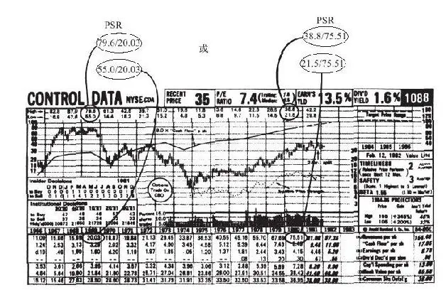

图 6\-1

资料来源：Value Line Ratings＆Reports\.Reprinted by permission of the publisher\.Copyright, Value Line Inc\.

1981年，Control Data公司的规模扩大了7倍，而股价却只有1968年的一半。如果在其PSR第一次突破0\.4时买进该只股票，亏损将被限制在不超过一年的时间里，在接下来的6年里，股价上涨了3倍。在较低市销率时购买公司的股票将会带来丰厚的回报。持有高市销率的Control Data公司的股票简直是一场灾难。

DEC是另一个失败的案例。它的股价一直在增长，但是相对它的业绩而言，股价还是很逊色的。它是一家业绩很好的公司，销售额从1970年的1\.35亿美元增长到1981年的3亿美元，复合年增长率超过了30%。但是，因为其PSR非常高，股票给投资者带来的回报却很少。不到1/3的增长推动了更高的股价。1970年年初，股价最高，为42美元。到了1981年却高达113美元，而此时的复合增长率仅为9\.1%。它的股价表现相对低增长业绩的公司而言是好的。1970年市销率达到顶峰时，为9\.0。

我们应该卖出处于高市销率时的公司股票。1981年，DEC的市销率最高时，也是低至1\.9的水平。公司不断增长的业绩，被公司持续下降的市销率所吸收，并没有带来股价的持续上涨。很少有公司的股票，在市销率一开始处于高位时，能给投资者带来回报，DEC就是这样的公司之一。从另一个角度来讲，从1970年年初到1975年，投资者若持有该只股票，尽管公司的业绩大幅增长，投资者却是亏损的。最严重时，缩水至原有股价的62%。到1975年，DEC的PSR降为1\.4。因为最初较高的市销率，即使公司的业绩出现最大的增长时，也无法提供较多的股票收益。到20世纪80年代初期，DEC已经成为一家大公司，在同等规模的公司里面，它的PSR仍然是最高的，这表明了股价糟糕的预期表现（1983年后期，DEC的股价暴跌）。

几十年以来，柯达公司一直是一家出色的公司。在20世纪60年代，投资者对它的信心越来越大。到1973年年末，它的股价到达峰值150美元，市销率为7\.0。灾难的结果是注定要出现的。投资者应该在市销率突破3\.0时，就卖出该只股票。10年后，尽管该公司规模扩大了，但股价从未恢复，价格还不到最高位的一半。20世纪60年代中期，它的市销率到达4\.0，只要你不持有柯达公司股票，做其他任何事情，你都会很容易地获得更大的回报率。在市销率到达3\.0时卖出这只股票，将不会得到最大收益，但至少会避免损失（见图6\-2）。

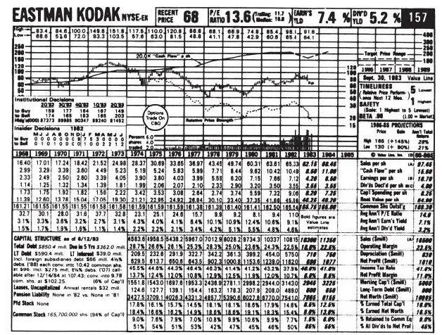

图 6\-2

资料来源：Value Line Ratings＆Reports\.Reprinted by permission of the publisher\.Copyright, Value Line Inc\.

强生公司是另外一个增长迅速的公司，尽管如此，公司的表现仍然没能够达到投资者的期望，因为投资者对它的期望实在太高了。公司的销售额1973年达到15亿美元，自然也就成为金融界关注的热点公司。那时它的市销率为5\.4。在接下来10年的大多数时间中，尽管强生公司的规模几乎扩大了5倍，但其股价却一直维持在1973年3/4的水平上（见图6\-3）。

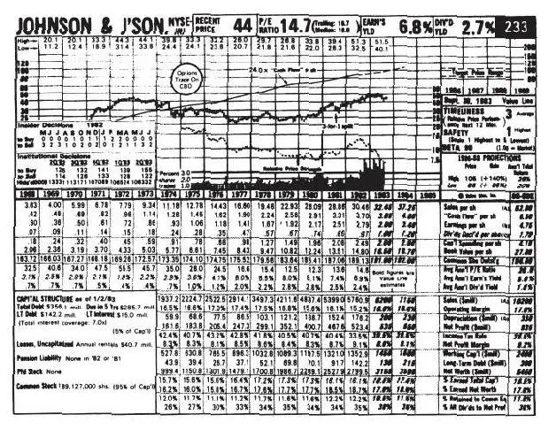

图 6\-3

资料来源：Value Line Ratings＆Reports\.Reprinted by permission of thepublisher\.Copyright, Value LineInc\.

为了对结果进行比较，我们一直关注摩托罗拉公司，该公司从未出现过非理性的PSR，公司业绩的适度增长推动了股价的持续上升。1968年，它的市销率仅为1\.1，1972～1973年仅为1\.5。1974年，市销率一度从1973年的峰值下滑了50%。到1976年，公司适度的业绩增长有力地支撑了高股价。到1981年，摩托罗拉再创新高。尽管不是很巨大，但它的稳固增长带来了比整个市场更好的收益。

1968年，宝丽莱公司的股价为140美元，PSR为8\.3。1973年，当市销率变为6\.7时，股价却没有任何变化。1974～1983年间，股价从未超过60美元，大部分时间还低于40美元。从峰值到底价，损失了超过87%的市场价值。只要卖出公司的股票，损失其实是可以避免的，因为市销率太高了。最好不要存有股价将升值多少、收益将会达到多少的预期，牢牢记住不要购买市销率太高的股票（见图6\-4）。

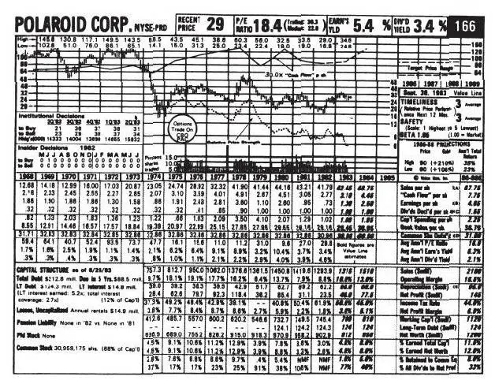

图 6\-4

资料来源：Value Line Ratings＆Reports\.Reprinted by permission of the publisher\.Copyright, Value Line Inc\.

类似地，业绩大幅增长的公司例子还很多：雅芳、博世、3M、Black＆Decker等。AMI和施乐是绝佳的例子。这些所谓的成长性公司的股票价格，不可能按照投资者预期的水平增长，因为投资者对股票的估值过高。公司的规模和市销率都高的话，购买公司的股票，带来的要么是巨大的失望，要么是灾难。

PSR指标的运用，对那些小公司同样适用。20世纪60年代，Lynch Communications Systems的股价迅速攀升，并有着较高的市销率。随后它的股价从每股40美元的峰值迅速跌至4美元以下，市销率值从4\.6降至0\.35。但若在底价位时买入公司股票，股价在接下来的4年中增长了5倍多——这对超级公司来说不算太坏（见图6\-5）。

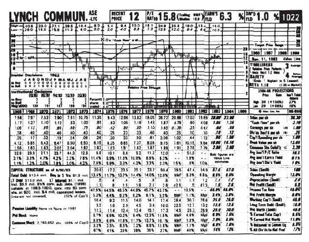

图 6\-5

资料来源：Value Line Ratings＆Reports\.Reprinted by permission of the publisher\.Copyright, Value LineInc\.

将PSR指标应用于小公司的例子还有很多，如Applied Magnetics、ADP、Computervision、High Voltage Engineering、International Rectifier、Measurex都是这样的例子。当然你也可以找到一些小公司，市销率较高时，公司股价增长得足够快，仍然能给投资者带来丰厚的回报。

英特尔公司就是其中一个。你可能在1974年股价最高16美元的时候，购买了公司的股票，此时，市销率为8\.5。在接下来的7年中股价增长了13倍，如果以16美元买进，在接下的6年半时间内，你的投资将会是原来的3倍。这并不是购买超级强势股的收益回报。英特尔是一家超级大公司，但是它的股价如此之高，以至于公司的股票并非超级强势股。如果你想投资英特尔公司的股票，最好在1974年年末或1975年年初，以少于4美元的价格买入，那时的市销率为11。在相同的时间段里，在这样的水平上，你的投资将会变成开始时的10倍。

设想一下，如果你以16美元的价格买入英特尔公司的股票，并持有7年，你将会有3倍的回报。如果你将市销率指标运用到巨大的多元的“浓烟”股的分析中，你也会得到同样的回报。

1974年，PPG公司是一家多元化的公司，资产有17亿美元（见图6\-6）。它在所涉及的四个领域——植被、氯\-碱化学制剂、染料衣料和纤维眼镜，都是数一数二的。如果你在市销率为0\.3时买入公司股票，在接下来的7年内，股价将会上涨3倍以上，但市销率不会超过0\.6。

类似的例子在知名公司中也有。美国钢铁是一只我不敢下注的股票。尽管基本面的业绩不好，但应用市销率指标，投资者可以在1972～1976年的时间内，将资金变为原来的3倍。在市销率仅为0\.35时，买入该只股票，在1974～1975年市场低迷的时候，该只股票的价格却稳步上扬，它几乎不受整体市场崩溃的影响。

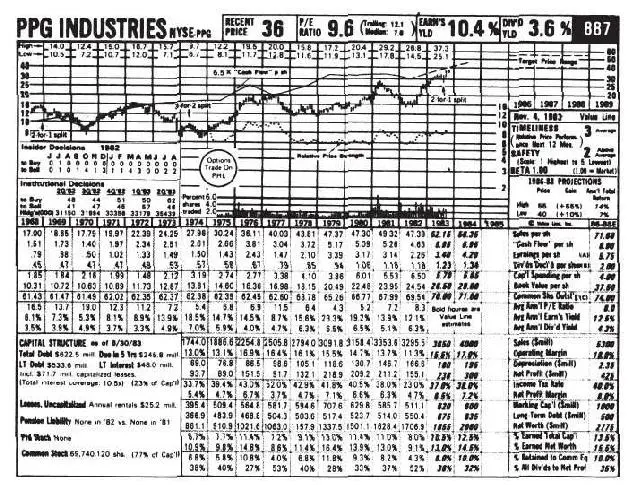

图 6\-6

资料来源：Value Line Ratings＆Reports\.Reprinted by permission of the publisher\.Copyright, Value Line Inc\.

看看非知名公司的例子。以烟草进出口商Universal Leaf为例。在1972～1981年间，它的股价以15\.5%的年增长率上升。在整个市场低迷时期，它依然强劲。当时它的销售额年均增长率也仅为7\.5%，平均利润率仅有3%。这仅仅来源于它开始时0\.18的低市销率（见图6\-7）。

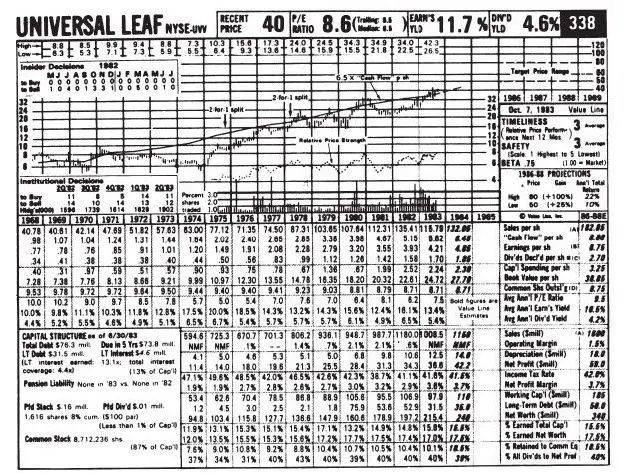

图 6\-7

资料来源：Value Line Ratings＆Reports\.Reprinted by permission of the publisher\.Copyright, Value Line Inc\.

再看看Northrop Corp\.，洛杉矶喷气式飞机制造商，它的销售额在1972～1981年增长了14%，平均利润率为3%，但是，当1972年市销率为0\.15时，股票价格以每年23%的速度向前跳跃（见图6\-8）。Raytheon是另一个相似的例子，其销售额以16%的速度增长，利润率稳步上升。它的市销率从1972年的0\.15增加到1981年的0\.81，与此同时，股价也以23%的年均增长率上升。

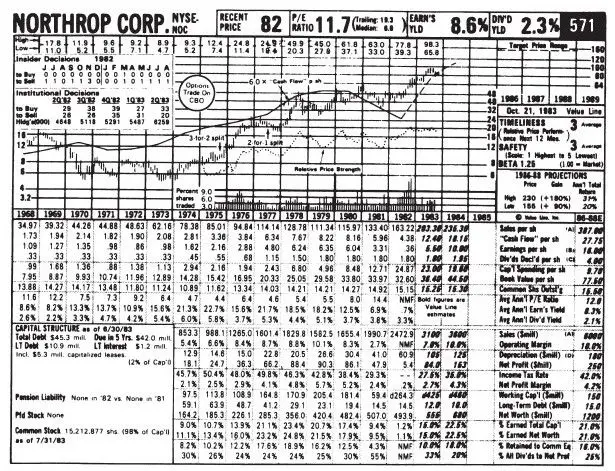

图 6\-8

资料来源：Value Line Ratings＆Reports\.Reprinted by permission of the publisher\.Copyright, Value Line Inc\.

纽约的Handy＆Harman公司的股票表现也非常棒。1972～1981年，其股价以29%的年均增长率上扬，而公司的销售收入增长仅为12%。期间，利润率增长幅度从1\.3%上升到3\.8%，一度回落到2\.2%，最后又上升到3\.8%。但是PSR开始时仅为0\.2。所以只要公司业绩良好，购买公司股票，必定成为一个赢家（见图6\-9）。

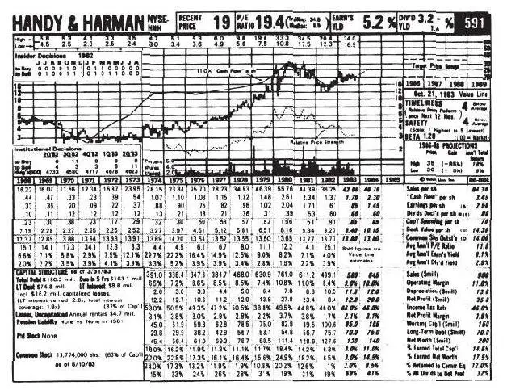

图 6\-9

资料来源：Value Line Ratings＆Reports\.Reprinted by permission of the publisher\.Copyright, Value Line Inc\.

日本的相机制造商佳能公司1972年的市销率为0\.58，在随后的9年中，其股价增长了9倍多。当然，公司的销售额增长也是可观的。但是，起点市销率很高的公司，即使销售额增长，其股票表现还是很差劲。

还有许多其他的例子。在20世纪60年代到70年代，应用PSR指标来分析股票是十分有效的。卖出或不买高市销率的股票可以让投资者避免那些长期灾难性的后果。无论是超级公司还是非超级公司的股票，投资的良机都来自于中低市销率的股票。一个投资者只要避免高市销率的股票，就可以取得高于平均回报率的收益。

难道就没有低市销率的股票价格走低的吗？当然有了。1974～1975年，大多数股票的价格下降，低市销率的股票也难以幸免。但平均而言，它们走低的幅度小些，并很快得到恢复并大幅上升。

运用该指标会有例外的情况出现吗？当然有，资源类股票似乎就是个例外。以Great Lakes Chemical公司为例，它是一家生产溴的公司。在其市销率超过我们设定的标准时，我们就把该只股票卖出。该股表现很好，1972～1981年，股价迅速上涨了7倍。石油和天然气类股票也是个例外（我认为这些例外大都是由于石油危机所导致）。

没有别的例外了吗？当然有，但必须去发掘。你没必要去发现每个投资机会，仅需要发现好的。找到非例外的十分容易。在20世纪60年代至70年代，市销率是独特的评估潜在投资机遇和避免损失的有效工具。

## 市销率和美国的浓烟股

市销率和美国的浓烟股

基础行业的股票——那些制造我们生活必需品的公司股票表现如何？制作轮胎、汽车、化工原料、纸张、矿产和机床行业的股票表现如何？那些非知名的中小型公司呢？我们如何运用市销率指标？

这些公司的市销率通常比较活跃的公司要低。大多数这类公司并没有很高的利润率，规模成长也并不迅速，因此，市销率会更低。

如果你想投资于这些股票，规则如下。

➤买入市销率低于0\.4的股票。

➤在市销率接近0\.8时卖出公司股票。

这些股票的市销率很少会达到0\.8，所以不需要急着卖出。如果该公司的未来预期利润不高，最好在市销率接近0\.6时，就卖出该公司的股票。对于任何股票而言，利润率分析法是核心的方法（见第10章和第11章）。一只浓烟股往往会在很低的价位上开始迅速攀升，大约在市销率为0\.5～0\.6时，股价增长停滞。（因为我仅推荐超级公司，我是风险规避者，因此我会快速卖出低质量公司的股票，而不是持有并期望其市销率会增长。）

图6\-10是复制的Value Line关于美铝公司的有关数据。该公司是一个不折不扣的浓烟股的例子。根据图6\-10，可以计算出市销率，如表6\-1所示。

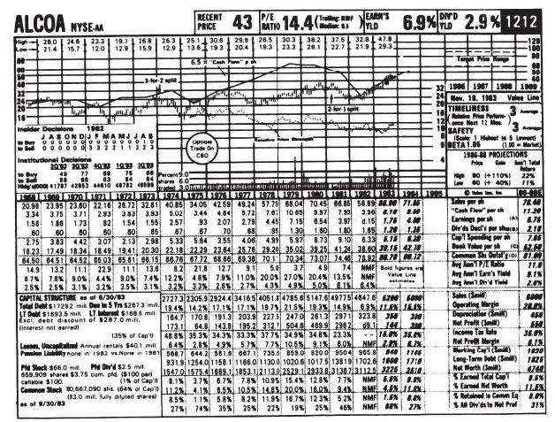

图 6\-10

资料来源：Value Line Ratings＆Reports\.Reprinted by permission of the publisher\.Copyright, Value Line Inc\.

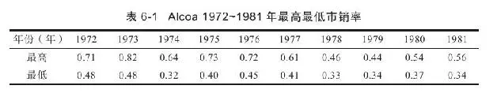

将市销率的高低与股价的高低进行对比，你就会知道我们应该如何将PSR指标运用到浓烟股中。做到以下几点，你就会盈利。

➤在市销率接近0\.8时卖出Alcoa股票，或者不持有该只股票。

➤当市销率低于0\.4时，买入公司股票。

做到这些，你就可以几乎完美地使短期利润最大化（风险投资我并不推荐，但市销率的确是其中有价值的工具）。

看看Standard Oil of California的例子。图6\-11是Value Line对该公司报告的复制。运用市销率指标，你就可以在1972和1973年的高位买入公司股票，从而避免亏损。在1974～1981年的任何时间买入，除了1980年和1981年间股价达到峰值的时候，你将会盈利很多。

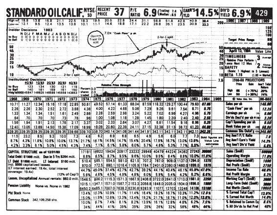

图 6\-11

资料来源：Value Line Ratings＆Reports\.Reprinted by permission of the publisher\.Copyright, Value Line Inc\.

International Minerals and Chemical是另外一个例子，它是西方国家最大的化肥制造商。图6\-12列出了Value Line的数据，应用我们的规则，除了1973年，你可以在1969～1974的任何时间买入该公司股票，而且都会获利。这只股票可以一直持有到1979年或1980年。在1974～1979年，其市销率在四个等级的中间部位有所下降——位于0\.4～0\.8之间。1979年，其市销率达到0\.8，1980年，明显地突破了这个水平。我们的规则要求我们此时卖出股票。随后，该只股票的价格出现了下挫，并且没有恢复到以前的高水平。

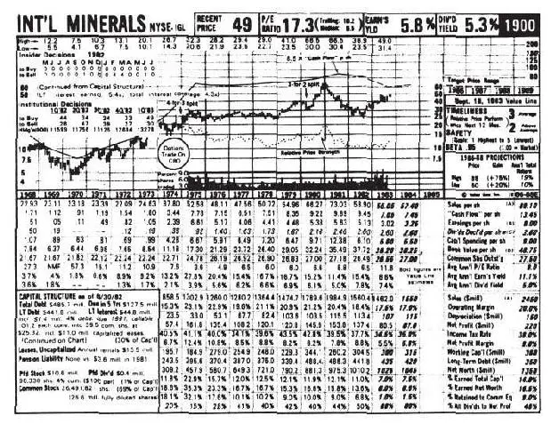

图 6\-12

资料来源：Value Line Ratings＆Reports\.Reprinted by permission of the publisher\.Copyright, Value Line Inc\.

Williams Companies是International Minerals and Chemical主要的竞争者（见图6\-13）。在此，我们的规则同样适用。该股票与整个股票市场的变动并不同步，当整个股市达到低谷的时候，该公司的股价反而达到峰值，当市场上升时其股价反而下降。市销率规则会让你在股价接近最高时出局，在接近最低时入场，所以你将获利。

到1983年，整个股市高涨，许多浓烟股股价过高，因此，不应该持有这些股票。

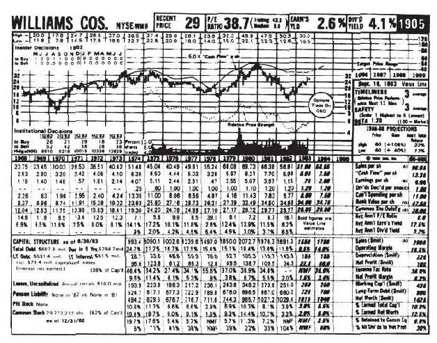

图 6\-13

资料来源：Value Line Ratings＆Reports\.Reprinted by permission of the publisher\.Copyright, Value Line Inc\.

## 使用市销率作为股市择机工具

使用市销率作为股市择机工具

市销率是一个有效的择机工具，第12章显示股市择机工具并不有效。市销率像许多择机工具一样有效，因为它具有个股性，而非系统性，大多市场择机工具描述的是整个股市状况的变化，为整个系统提供价值评估。本质上来讲，它们是系统分析工具，历史证明在分析个股方面，它们是无效的（见第12章）。

利用市销率时，我们是基于个股，而不是系统性。如果你想择机入市，要看个股表现。下面的内容可以告诉你如何去做。

2026年3月14日

9:51

## 费雪的股市择机原则

费雪的股市择机原则

➤当一个公司的股票在市销率足够低时被抛出，你就购买它。

➤如果你不能找到市销率足够低的股票，你最好不要去购买股票。

如果你知道了买卖股票的时机，你就知道了关于这个话题的所有内容。规则很简单，当能以便宜的价格买入时，买入的时机就到了。当股价太高时，不能发现合适的市销率的股票，说明市场过热，不要购买股票。

如果你无法找到在市销率处在合理水平的公司股票，说明市场过热或过于低迷。像1974年或1982年，相当多的公司股票都在不合理的低市销率水平上被卖出。从市销率完全可以看出，那时，整个股市是非常低迷的。在20世纪60年代后期，几乎没有公司的股票在很低的市销率水平被卖出，这显然说明市场过热。当你将市销率运用到特殊领域的公司时，你就会发现股市是否过热。你买的仅仅是股票，而非整个股票市场。

## “垃圾股”的市销率

“垃圾股”的市销率

我一般从公司公布的季度利润表中寻找投资机会（见第12章）。我青睐那些市销率为0\.2、0\.1、0\.06甚至更小的富有活力的小型公司。这意味着什么？意味着一家销售额为1亿美元的公司，其市场价值可能只有600万美元。一家销售额为0\.2亿美元的公司，其市场价值可能只有一两百万美元。

分析一下一只市销率为0\.05时被卖出的股票。如果几年后，在市销率为0\.5时，市场重新对其估价，该只股票的价格可能会增加10倍。若干年后，如果公司的规模扩大为原来的2倍，这就意味着20倍的增长。如果买入这样的股票，待其成为股市上炙手可热的股票，那么潜在利润将继续增加。如果谁能发现这种潜力股，那么利润将是巨大的。

或许你会说“但这是一些存在严重问题的公司”。我看不一定。有些可能有严重的不良记录，大部分的记录可能还会令人沮丧。几年以来，这些公司一直处于亏损状态，而且现在也是。业绩好的年代也许只有2%的利润率，只获取平均的总资产回报率和股东权益回报率。多年来，它们一直在发展，但是增速落后于整个经济的发展。随着1981～1982年经济萧条的出现，股价从本来已经很低的水平上继续下滑。

在第7章，我们将从大萧条时代中被抛售的垃圾股中，挑选一些股票进行分析。在随后的3～5年内，这些股票继续为它们的持有者带来丰厚的回报（2000%～5000%）失败后创造的巨大财富。

## 第7章 置之死地而后生 20世纪30年代的神话

第7章 置之死地而后生 20世纪30年代的神话

透过时间错位

长期经济周期趋势，需要几年甚至几十年才能得到逆转。强势股票市场靠丰厚的边际利润率和递增的收益来掩饰股票价格水平。在不景气的收益和边际利润率下，弱势股票市场只能降到低水平。长期的收益率也随之震荡。因为这些趋势的结束需要花费太长的时间，以至于我们没有注意到这期间的一些变化，就如同我们忽视了时钟上环绕的分针一样。现今的情形不论好坏，对于以后来说，只是一些模糊的记忆而已。时间越久远，记忆就越模糊。

透过时间错位，研究一下20世纪30年代的市销率。回忆起5年、10年、15年前受高度关注的公司是很容易的（其中一些仍然备受关注，而其他的截然不同。一些甚至已经破产了，像AM International、Equity Funding及Magnussen Computer都很容易被记起）。

很多人仍然记得20世纪50年代和60年代的Transitron。但并不是50年前的所有事情都会被人记起，多少人还记得20世纪30年代的AuburnAutomobile？我们记得的只有那些幸存者。同样能被记起的也只有500强中的大部分企业。

1933年，《Moody’s》在洛杉矶商业图书馆中被毁坏了，它汇集了许多橡胶品牌（为了寻找它们，我吃了不少苦头）。但结果是令人激动和鼓舞的。

费雪投资理论研究了1926～1939年间150多家公司的市场价值与资产价值、营业收入、销售额的比率。1957年被详细研究的公司有：Bethlehem steel、Caterpillar Tractor、陶氏化学公司、柯达公司、FMC（Food Machinery）、通用电气、IBM、J\.C\.Penney、Mead Corporation、SCM（Smith\-Corona）、Remington Rand、西尔斯公司。

20世纪30年代的神话表明：“1929～1933年股市的巨大震荡，使得一些大公司以很低廉的价格被收购。”其中一些像IBM、陶氏化学公司，与公司的资产相比，市盈率与市场价值是很低的。我们或许可以认为，几乎所有的股票都是这样的。如同其他神话一样，现实与想象是并存的。

许多股票连续几年处于低迷状态，而一些股票一直走高，这种神话使购买的人们欣喜若狂。很多股票不只停留在1933年市场上的最低价格，而是继续下跌。一些股票在纯技术分析上属于低价股，可能它们的市盈率很低或者相对于账面价值价格很低。

但是运用其他价值分析方法，它们的价格并不低。开始时，知名股票的市销率都是很低的。而相比较而言，撇开市盈率和其他因素，那些具有高市销率的股票并不被人们看好。

2026年3月14日

9:51

## IBM是不是成长股

IBM是不是成长股

以IBM为例。IBM是一个辉煌过很长时间的公司，它是规则的例外，虽然不是特别的例外。同样被看做例外的是20世纪70年代的英特尔，虽然作为超级强势股的份量不是很重。这种评论可能是耸人听闻的（我可以预想到华尔街的尖叫：“IBM不是只超级强势股？”）。来看一下事实情况吧。

IBM在1932年的最低价格是52\.5美元，自此以后一直高涨到117美元。1933年，从75\.75美元涨到153\.25美元。之后长期徘徊在这个价格左右，直到1936年涨到194美元。1939年，这只股票的价格突破了195\.75美元，但之后随即下跌。在此之后一直没有涨到195美元，直到1945年达到另一稳定价格250美元。随后在20世纪50年代，一直在这个价格水平之下徘徊。1956年，达到了这30年统计中的最高峰550美元。这意味着什么？

假设你有这样的好运气。你在1932年的最低点购买了IBM这只股票，还在1956年的最高点抛出了这只股票。情况如何？在1932年，投资于IBM中的1美元将会涨到10\.48美元。这当然是好消息。但是坏消息就是你将会花24年的时间去获得这些收益。在这24年里，你每年的总回报率仅仅只有10%，很难达到20世纪30年代神话中的预期值。你正好在最低价格的时候购得了这只所谓的超级强势股，并且持有了24年，你神机妙算，在最高点卖出，最终会得到每年10%的回报率。这可能吗？

更糟糕的是，如果你算的时间不准，将会是什么结果呢？很少有人那么幸运地在最低点买入，在最高点卖出。假设，1932年，你只是在中间价格上购买了这只股票。而在1956年以中间价格卖出了这只股票。你的回报率是多少呢？中间值如表7\-1所示。

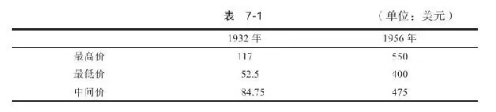

如果你以84\.75美元买进，以475美元卖出，1美元的投资将会变成5\.61美元。总结表明，在这24年里你的年回报率只有7\.5%。这就是所谓的持续增长的公司？怎么会是这样呢？难道IBM不是如人们所看到的那样辉煌？结果当然不是这样，它依然是引人注目的。在这段期间，它的销售额从不到2000万美元增加到10亿美元。问题的关键是IBM一直都是高价股，甚至在经济大萧条时期也属于高价股。与经济大萧条时期的最低价格相比，1932年后它的股价几乎翻了3倍。1936年高峰价格甚至高于1933年最高价格的30%。

如果考虑到这期间的特殊性，就会发现以上结果并不是特例。许多股票经历了最低点后，在随后的几年里股价翻了20～100倍。当它们的股价处于最低点时，IBM却没有经历这些（见表7\-2）。

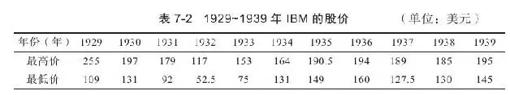

这只是表明IBM的股价可能较低的一种方法。表7\-3是IBM1926～1935年间的最高市盈率和最低市盈率。

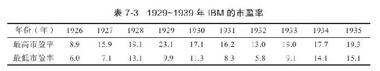

当股票具有较低的市盈率时，并不是因为它的股价较低。如果1932年IBM的股价足够低的话，它的股价将会增加得更多。事实上，由于IBM赚得太多了才导致市盈率很低（市盈率低表明利润很高）。在20世纪20年代至30年代期间，没有一家公司有IBM那样丰厚的利润。

20世纪30年代期间，IBM的税后净利润率高于23%。1935年，其税后净利润率竟然达到32\.4%。你可以想象一家公司税后的净利润率达到32%吗？事实是我们不可想象的。股东的资产回报率甚至能够达到12%。公司似乎丝毫不受经济大萧条的影响。

20世纪20年代，开盘价很高的股票，价格从来没有低过。如果你认为1932年IBM的股价很低的原因是它的市盈率很低的话，那么在1929年和1927年高股价的情况下也会被认为价格很低。很明显，市盈率并不能反映20世纪30年代IBM的准确价值。

那什么可以反映呢？让我们思考一下市销率。1932年IBM在最低估价时的市销率为2\.3，最高股价时的市销率为5\.1。表7\-4是1932～1939年间IBM的最低和最高市销率。

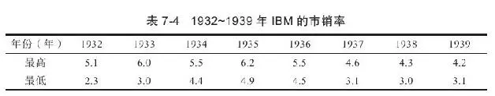

不难想象，IBM的原始高市销率的决定性作用，使得股价很难增长。股价随着销售额的增长而增长，但不是那么迅速。显然，它是不可能超过最高水平值5～6的。当它获得超额利润时（市盈率不是很高），市场就会表明收益不会持续很长时间了。相比市盈率来说，市场还是比较遵循市销率的。

事实是IBM在市销率很低时销售额是很高的。

这对于超额利润来说价值是矛盾的。已经很高的市销率阻止了股价的迅猛上涨，短期暴利又阻止了市销率的减少。当利润减少时，股价就会变得不堪一击。许多像IBM这样的公司，如果长期经营良好，它的股价也会跟着上涨，但涨幅不会很大。

IBM在20世纪五六十年代被看做是实力股，在这期间一直涨势良好。其中大部分是因为公司在40年代中晚期的双盈利。1946年，IBM的市销率达到50年里的低谷0\.51。1946～1955年间，IBM的市销率值一直低于1。在其中的4年里，市销率低于0\.75。在这以后的20年里，IBM的股价飙升，获得了更多的好评。当IBM正受人们追捧时，它的市销率又升高了。到了60年代中晚期，IBM的市销率又反弹到了4～6之间，这时IBM的股市行情又平稳了。在过去的50年里，IBM保持长期获利的关键就在于低市销率。

20世纪30年代，像IBM这样的公司还有不少，一些公司以高价售出，其中有些是有这个价值的，而有些是不值得的。可口可乐公司的情况和IBM公司的情况相似。它也是长期获利的公司，市盈率也很低，但是市销率很高，在经历了1932年的低谷以后，股价一直都没有大的起色。

许多价格很高的股票，其市销率并没有达到它应有的价值，它们最终被遗弃。Burroughs公司的股票开始也具有很高的价值，20世纪30年代末期，尽管处于牛市，价格仍然停留在30年代早期的水平。市场崩溃了，经济萧条了，但是Burroughs公司还存在着。

同样，吉列公司1938年与1939年的股价低于1932年与1933年的。主要的原因也是刚开始的价值很高，在1932年与1933年最高价格时，市销率为4\.4。到1939年，最高的市销率仅为1\.5。公司在成长，但人们对它已失去信心。此后，税后利润与收益一路从20世纪30年代中期下滑到50年代中期。比起以前，这是令人失望的。如今，人们都希望吉列公司的税后利润像经济大萧条时那么高。市场也是如此。

许多股票在经历了20世纪30年代的低谷后，发展得很好。其中有些尤为突出。自1932年或1933年开始涨幅超过10倍的股票并不少见，每年的回报率达到59%。而有些股票甚至更好，价值增长了20～40倍。这些股票在最低谷时，甚至都快撑不下去了。

## 市销率低的股票带来的丰厚回报

市销率低的股票带来的丰厚回报

举例来说，Revere Copper and Brass公司在低谷时，整个市场的价值仅为200000美元。3年之后，市场价值仅为600000美元。而这时的营业额超过15000000美元，这使得市销率仅为0\.04。在同时期的公司中它的业绩要比其他公司好得多。从低谷以后，股票价值是原来的45倍。如果你以最低价格的3倍购买了这只股票，那么从这以后你将获得15倍以上的利润。以后的5年里涨到了45倍以上，每年的回报率达到了115%。

其他具有低市销率的公司也表现出良好的势头。Deere＆Co\.公司的股价在3年里涨了近20倍。Remington与Cutler\-Hammer公司也是一样。BorgWarner公司也是一样，在4年里价格翻了近25倍。Caterpillar Tractor公司在4年里翻了20倍（111%的回报率）。Cooper\-Bessemer公司，即现在的Cooper\-Industries公司，在3年里股价涨了近30倍（回报率达到了210%）。L\.C Smith＆Corona Typewriters公司在4年里涨了近40倍（回报率达到了150%）。其他股票也大多如此，不幸的是很多人已经遗忘了这些公司。谁还听说过Gampbell、Wyant和Cannon Foundry？谁还能记得Houdaille\-Hershey、American Seating、Flintkote、McGraw Electric、Bullard Co\.、Fairbanks、Morse＆Co\.、General Cable？随着它们市销率的降低，它们的价值却上涨了20多倍。通过研究，我们证明市销率超过1\.5的股票，不存在这种涨幅。

再来看一下L\.C Smith＆Corona Typewriters公司。如它的名字一样，这是一家卖打印机的公司，经营和加工诸如计算器、复印机和复写纸之类的产品。如今，该公司在打印机和化工方面具有庞大的规模。1933年，这只是个有500万美元资产的小公司。当然那时的物价跟现在是不同的。但是，它仍是个具有很强实力的公司，在它经营最差时，净资产都超过股东权益的1/3。

到了1937年，这个比率进一步提高，超过了75%。如今，很少有公司有如此的流动性。就如同我们所看到的，这家公司在1932～1933年间的市场价值仅为500万美元。市销率只有0\.04。事实上，在这几年期间，它一直是亏损的，几乎亏掉了1931年净资产的10%。在稳健的资产负债表支撑下，公司的年均复合收益率达到150%，请问，还有谁会向它索求更多呢？（见图7\-1。）

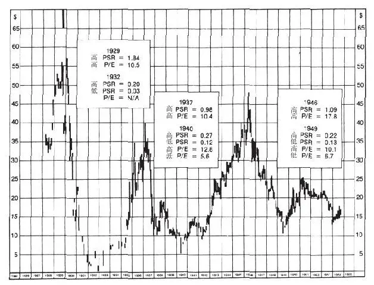

图 7\-1

资料来源：M\.C\.Horsey＆Company, Inc\.，P\.O\.Box H, Salisbury, Md\.21801\.

Cooper\-Bessemer公司是另外一个典型的例子。1932年它仅是一个资产只有200万美元的公司，总负债是可以忽略的，净现金资产只有净价值的一半。在最低点时，市场价值不到100万美元。它的市销率只有0\.02。到了1936年，股价超过了价值的30倍。如果你那时购买了公司50万美元的股票，那么如今你就会得到1500万美元。如今该公司的价值达到了30亿美元。

利润高的股票在20世纪30年代都具有较低的市销率。有许多事例可以证明这一点。很多市销率较低的公司，市场价值从1932年、1933年到1935年、1936年增加了10～20倍。它们每年的回报率达到了75%～140%，尽管这花了很长一段时间。

2026年3月14日

9:51

## 大公司的情况如何

大公司的情况如何

大公司的情况如何？当然在它们其间还有些特例，有些公司有足够的实力可以调整高市销率。IBM是仅有的一个我们发现的例子。其他的大公司伴随着很低的市销率。许多公司做得很好（像我们提到的SCM公司，Caterpillar和Remington）。其他的怎么样呢？Bethlehem Steel、FMC、Mead、Sears公司的市销率也都很低（分别为0\.15、0\.33、0\.20、0\.20），却在5年里增长了1000%～2000%。以Sears公司为例，1932年的最低市盈率是12。这只是1932年的绝对值，并不是市盈率值，因为它并没有盈利（见图7\-2）。

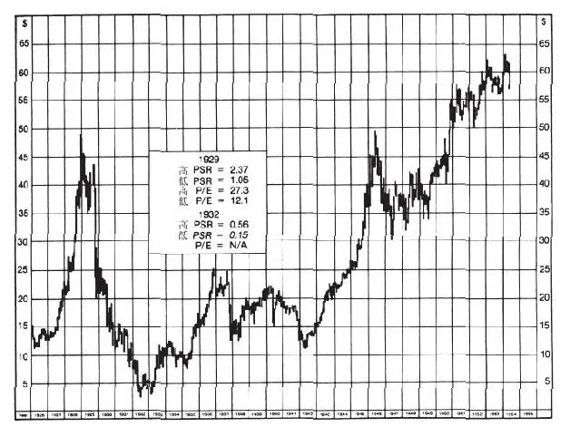

图 7\-2

资料来源：M\.C\.Horsey＆Company, Inc\.，P\.O\.Box H, Salisbury, Md\.21801\.

依据我们的标准，有3只股票的市销率是很高的。柯达公司就是其中之一。在其价格最低时，市销率仅为1\.4，在20世纪30年代期间增长了5\.6倍，这比IBM增长得要快。陶氏化学公司也是如此，开始时的市销率为1\.1，到1937年增长了7\.6倍，达到6\.6。通用电气公司比1932年增长了7\.6倍，当最高值为3\.8时，市销率是适宜的。

从1937年的最高值可以看出，许多公司的市销率还是很低的。这些在1937年具有很高市销率的公司经营状况都不是很理想。以陶氏化学公司为例，1937～1947年期间，公司营业额从22000000美元增长到130000000美元。利润从49万美元增加到1270万美元。Logic和成长型股票学派认为，这表明这只股票将会上涨。但是结果并不是这样。到了1947年价格比1937年还要低。在以后10年的迅猛增长下，它最终得到了双盈利。市销率下降了，而经营状况却很好。

20世纪20年代晚期的股价不是很高。高价股票的市盈率与利润都很高。许多公司在1929年的市盈率都很高。多年之后市盈率的增长是有限的。严格的市销率使得投资者很头疼。分析家用市销率表明，投资者在1929年的热情还很高，到了1932～1933年间热情就变成了失望。

许多有名的股票表明了20世纪30年代的经济循环。市销率很高的公司，经营状况不是很好。经营好的公司市销率很低。许多股票在30年代的价格很低。这是肯定的，这只是我们研究“30年代神话”的一部分。

神话的一部分并不是表明市场泡沫化。一些股票的价格并不便宜，它们具有很高的市销率。很难想象在经济萧条的时代还能创造出巨大的财富。失败后积累的财富是金融史上的一个循环主题。那个时代，股票的价值被忽视了，并且被看做是一堆废纸。不管是20世纪30年代还是其他任何年代，在失败后创造出财富，都是一个值得应用的观念。许多不被看好的低市销率的股票，如今看来还是有投资机会的。

## 第三部分 基本面分析

第三部分 基本面分析

第8章 超级公司 从商业角度追求卓越

基本商业特征

考察一下决定大型公司的商业因素是十分重要的。投资超级强势股的关键在于，我们应该买入那些以基本商业法则衡量表现突出的公司股票。真正的超级强势股，是那些以正确价格购入的超级公司股票。也许你可以买入一个较差公司的股票，并随后使之翻番或者上涨3倍。然而，除非该公司真的是一个大公司，否则它极不可能实现与超级强势股同等的价值增值。

一个超级公司之所以卓尔不凡，是因为它可以通过基本面支持来创造远高于平均水平的增长。随着通胀率的变化，大型公司通过内部获得的增长率也随之变化。一个大型公司应有能力至少以每年15%的“真实”（除去通货膨胀因素）平均速度增长。如果通胀率为每年6%，则一个大型公司至少应以每年21%的速度增长。如果通胀率变为15%，则大型公司的增长率相应地至少应为30%。

在任何一个给定的时间内，在成千上万的企业中，只有那么数百家可以称为超级公司。许多公司因其独特的性质而被人们记住，有些并不显著。华尔街是否认为某个公司很强大并有增长潜力，这点并不重要。真正重要的是，该公司确实强大且具有增长潜力。如果金融界买入一种股票时，认为该公司十分糟糕，这样就更好（见第2章）。从基本的商业观念来说，它肯定具有很强的未来增长潜力。其商业因素，使之超凡脱俗成为一个大型公司。

简单地说，一个大型公司的商业因素至少具有以下特征。

➤以成长为中心：（通过明确定位所渗透出来的）所有高管对于公司成长的极度渴望。这种需求不仅仅体现于成长性的市场中，更重要的是要贯穿于创造这些成长的员工的日常生活中。

➤优秀的市场营销：对市场的本质所发生的变化（至少在消费者已经开始觉察前）有大致的了解，并且有能力保持顾客满意度。

➤压倒性优势：拥有一个超越所有现有或潜在竞争对手的竞争优势（通常是作为生产成本最低的制造商），或者至少拥有其生产线的全部或大部分所有权。

➤创造性的人事关系：拥有这样一种公司“文化”，它使员工受到尊重，使他们已经得到或者将会获得平等的晋升机会。在他们生活的环境中，鼓励来自于下属的建设性意见，并会给予经济上的奖励。

➤完善的财务控制：这里指的是出现结果与预期不一致时的财务管理。它伴随着在财务控制与竞争中一直保持追求创造性、渐进的改善。一个大型公司绝不会仅仅满足于与其他公司相当的控制水平。

对于一个超级公司来说，还会有一大堆其他的需求——高利润、高市场占有率、更完善的管理、引领生产的方向、优质的形象及其他许多独特的品质。这些都是人们所向往的大型公司的品质。然而，一个大型公司之所以成为大型公司，正是由于以上这五个方面。例如，公司必须具有获得高毛利润、高税前利润和高净利润的潜力。但是利润是一个结果，它来自于同样的根源，是相关基础的结果。员工、管理层及其行动构成了这些基础和根源。

换句话说，公司必须将这些因素渗透到其员工力量中去，因为它们最终决定了公司能否迅速提高其销量，未来是否有强大的盈利潜力。至少，迅速提升销售的潜力，很大程度上依赖于以成长为中心的定位。

## 成长导向

成长导向

成长并不会自己发生。它首先在管理层的头脑中酝酿，是一种令人难以摆脱的情愫。我们在几十年前就已经了解到形成个体成长定位的思维特征，这是一种天生的积极的个人品质。对此进行描述的著作包括：Napoleon Hill and W\.Clement Stone, Success through a Positive Mental Attitude（Englewood Cliffs, N\.J\.：PrenticeHall，1960），以及Norman Vincent Peale, The Power of Positive Thinking（Englewood Cliffs, N\.J\.：Prentice\-Hall，1952）。

虽然每个个体都能发掘出这些品质特征，但不是人人都可以像他们一样成功。这就是真正的领导者的作用。不论好坏，在一群人中间总会有一个领导者。在一个动态的群体中，也会在一开始就自然而然地形成一种优先顺序。领导者可以将其追随者的力量团结起来进行对抗。许多人错误地认为，领导者善于争权夺利。这并非总是成立。相反，权力是由领导者所培养的部下给予他们的。追随者希望从领导者那里得到远见、信心、对他人及对追随者的尊重。

追随者通过与其领导者联合来吸收这些品质。我们会很容易发现，在一个大型公司，当一个核心员工谈及他的同事时，眼睛里都会放出火花。当他们描述上级时，往往讲成了神话般的故事。而在一个普通的公司，人们是不会这样谈论同事的。

我有一个朋友最近进入了Verbatim公司。他之前在一个大型电子公司做市场经理，他已经呈现出一副“被工作烧焦”的形态。他十分敬重之前的公司，但对上司和同事感到不满。他来到Verbatim的第一天，就被主席接见，而且主席对他的了解甚至超过了他对主席的了解，这使他惊讶不已。主席说他是少见的人才。这个曾被抛弃的疲惫不堪的可怜人重新振作精神。在前几周，他每天工作15小时，并乐在其中。他找到了一个他愿意跟随的人一起奋斗的工作。这就是所谓的在大型公司中，高管层的定位被其追随者的部下所吸收的表现。

一个大型公司，通常把各种问题视为潜在的机遇。发现制造过程中潜藏的成本也许应被视为一个问题。但同时这也为进一步削减成本提供了机会，因为这样可以降低生产价格，从而增加销售潜力。

竞争对手生产出新产品可能会成为一个问题。但同时，它也可以使我们通过新产品入市时顾客的反应了解到顾客的喜好。例如，IBM进入个人电脑市场使该市场的参与者感受到了威胁。但是，另外一些人将之视为对于未来市场的确认，并发现了出售互补产品的机遇。大型公司的管理层通常会从每个困难中找寻光明和慰藉。

一个大型公司领导者的非凡领导能力，即使在一个普通的会议中也显而易见。因为这种定位首先来自于领导者，从他身上体现。他的信心是无可置疑的。他追求不断进步，成为一个不断成长、更加强大的公司的领导者，同时也保持一定的谦虚。他在谈论下属时保持高度的尊重。他经常从下属中发掘那些能力超过自己的人——他信任的人。一旦找到这样的人，他会把握每个机会与他们“沟通”。而他们也会理解并感谢这种最基本意义上的晋升。然后，他们会将这种理念进一步传递给他们的下属。

这种渗透过程的最终结果将是大家都会一起寻找成长的机会。市场营销、技术和支持概念将会在公司的每个层面汇聚，并在整个组织内进行横向和纵向的交流。公司不会缺乏未来增长的点子，因为它们都产生于公司内部，我们只需要从中挑选出最好的方案。较低的管理层首先会因真实而自然地尊重上级接受这些意见。决策过程中的尊重与否是区分大型公司和普通公司的重要特征。这一点在市场营销中最清楚不过了。

## 优秀的市场营销

优秀的市场营销

市场营销绝对是成功的关键因素——也许是唯一最重要的因素。由于缺乏优秀的市场营销，许多公司倒闭，或者还在苟延残喘，这比其他方面的不足更加严重。上乘的市场营销如此重要，是因为它可以使唯一决定公司生存的因素——顾客得到满意。

卓越的市场营销非常少见。这是因为相比商业活动的其他方面，它更多地是一种艺术。这听起来有点俗气，却是事实：最简单而又最好的市场营销就是要帮助顾客。如果你不了解他们，就很难做好营销。这种理解顾客的能力使得优秀的市场营销无与伦比。

我们知道有些人会错误地相信市场营销无非就是一种空谈的天赋以某些雄辩的形式表现出来。这些人，说得好听一些，是将市场营销与推销的概念混淆了，推销本身也是一种艺术形式。除推销之外，市场营销还涵盖以下方面。

➤广告。

➤市场调研。

➤推销规划。

➤公共关系。

➤销售管理。

➤服务。

➤战略部署及产品规划。

最后一点也许是最重要的一点。公司经常会在战略上误入歧途。尽管在大多数的小公司中确实存在正式的市场营销副总裁，但通常首席执行官会主管市场营销。他也必须这么做，因为有关于市场战略方面的重要决策都由首席执行官掌管。

进行战略部署的关键在于，发现当前不存在的市场力量将如何发展的直觉。战略部署超越了理性，理性是受到逻辑约束的，逻辑性是必要条件，但不是充分条件。人生中许多最重要的决策都不能仅仅依靠逻辑来完成。而首席执行官的重要作用在这里体现出来。

如果不使用市场营销机构的强大力量，公司很有可能会频频作茧自缚，除非其首席执行官在市场营销方面极有天赋。由这样一个对其面对的市场情况十分了解的老板所经营的公司，当然会远远超过那些将其重点放在技术、生产或财务上，以惯性思维的老板经营的公司，因为这些其他的技巧是可以购买的。真正的市场营销是艺术。

然而，不论高管多么强大，也必须依靠他的这些善于营销的部下们，他们在各层次、在任何情况下都与高管合作融洽。让我们看一个例子。

Quanta\-Ray：“低调的承诺，卓越的表现”——顾客是最好的推销员

鲍勃·莫滕森拿到了哈佛的工商管理硕士学位。他是著名的激光公司Spectra\-Physics的副总裁，在产品管理和财务管理方面具有丰富的经验。现在，他成为了自己的激光公司的总裁，这意味着他选择了逆流而上，来迎接更激烈的挑战。

有人会认为他将仰仗自己强有力的市场营销背景来作所有的决策。但实际情况并非如此。他制定了基本的产品策略，因为这只能由首席执行官制定，在此之后，他就把所有的市场营销决策权都留给了优秀的营销副总裁吉恩·沃森。沃森的效率一部分源于自身也是一流营销专家的莫滕森，因为他知道一个营销经理需要什么，他会将自己与沃森联系起来，同时又不妨碍他决策。

沃森主宰各种决策，从产品的颜色到如何做广告，应该用哪家公司做广告，以及处理公共关系、聘用什么样的推销人员，都由他决定。这样，沃森所聘用的大多数推销人员都没有任何推销经验。他负责花时间来亲自培训他们。沃森在处理广告和公共关系的职能时十分完美。他的广告被证实达到了“经典”水准，所有顾客都迫不及待地想体验Quanta\-Ray的产品。他善于同知名的科学家进行互动，激发他们在写学术论文时将Quanta\-Ray激光的成功成果引用进去。这是一种最高境界的公共关系。

从沃森和莫滕森身上，我学到了广告和公共关系中一个最有用的法则——通常最好让别人认为你的产品具有低调的承诺和卓越的表现。当顾客发现他们每次实际得到的都大于所被承诺的，他们就会成为你的同盟，从而创造出更多的顾客。他们向其他人推荐，同时自己也会购买更多。与这些不过分夸大产品的公司交易，他们会得到一种心理的满足（大多数人都会在其一生中，在不同的时间和地点变得非常嬗变——有点惊弓之鸟的感觉）。人们很珍惜这种能与其信任的人交易的关系。

顾客都为Quanta\-Ray的产品出售竭尽全力。沃森通过保持其公开发布的产品特性总是低于设备的实际性能，实现了“低调的承诺，卓越的表现”这种名声。这样，顾客很快就知道他们可以相信该公司的任何宣传。同时，顾客认为他们购买的价格合理，因为这样免去了他们的“担心成本”。

作为一个总裁，莫滕森从不将自己与市场孤立开来，这点是肯定的。几乎每个小公司的总裁都会着实做出关键的销售决策。实际上，好几年来，沃森和莫滕森共用一个办公室，将他们的办公桌并排摆放，形成了一种便于交流的最好格局。这样，莫滕森就不可能会与市场分离开来。而沃森也自然而然地向这个办公室内的一切——包括产品、调研和财务灌输市场营销的观点。在这个过程中，Quanta\-Ray公司开发出了固态可调谐激光的广阔市场，这是被其他激光公司所忽视的。 [\1]

[\1] 那时，Quanta\-Ray被该行业的领头羊Spectra\-Physics收购，并成为Spectra\-Physics固态激光业务的核心部分。这是在我1976年进行投资之后的5年。它实现了超过我成本30倍的利润——这是对市场营销中的一种积极精神（在这里应该是两种精神）在造就大型公司上所做贡献的有形奖励。

## 管理层是否可以控制市场营销

管理层是否可以控制市场营销

在那些不太成功的公司中，市场营销副总裁通常顽固不化，深信没有人比他更加了解如何操控市场。他会嫉妒首席执行官或其他与市场营销无关的人员与顾客之间的接触，并为之感到不满。如果某些研发部门或财务部的员工不论有什么理由与顾客接触，市场营销副总裁就会大发一通脾气。给予市场营销副总裁完全的市场操控权无可厚非。但不幸的是，实际情况并非如此（如果他真的有这样的权力，他也就不会如此偏执）。到那时，市场营销副总裁和首席执行官都得换人——但在这之前，公司首先会损失其大部分价值。

我们再来看看另一个公司对于极其复杂的电子化控制设备的推销情况。

一个大跨国公司客户最近承诺要购买几套系统，每套价格几十万美元，由其在不同地区的公司购买。其购买决策是由各区域管理层分别签署的。由于其他的供应商也可以提供类似的设备，所以有竞争力的报价才会获得订单。但实际结果并非如此。各区域的买家唯独从这个相形见绌的小贩这里购买，而从未考虑其他的可替代选择。

“这怎么可能？”我问这个公司的管理人员，“难道你们不要求各区域的决策者比较一下哪个卖家的价格更有竞争力吗？”公司总部负责设备采购的人告诉我，他对此也感到十分不解。推销人员如此迅速地说服了区域决策人签署合约，以至于他们没有机会向总部汇报购买的事宜。由于合约附带了退款保证（如果在6个月后对产品不满意），所以买方觉得没有什么风险。就这样，买方既不用核实其他竞争者的出价，也不用向公司总部汇报，就被这个承诺承担风险的卖家说服了。

该设备的推销大获全胜，没有一件系统被退货。这整件事似乎听起来出自于戴尔·卡耐基的书。其后，我问这个小电子公司的管理层，他们最希望改善公司哪方面的职能。令我惊讶的是，三位高层官员都毫不犹豫地指出了市场营销是他们要提升的关键部分——而他们在这方面已经十分强大了。

如何处理销售与服务

在市场营销这样美妙嬗变的领域中，不可能建立起任何绝对的法则。但有些惯例也会派上用场。如果某个公司生产精密或昂贵的产品，发动强有力的场地直接销售通常是最好的选择。相反，通过分销网络打入市场的组织也值得考虑。

通过分销商进行营销的公司不易进行市场营销指挥。这些推销人员并非完全效力于雇主的生产线，以至于难以培训、激励、管理及重新定位。另外，有些分销商“推销员”会过分宣传公司产品，夸大承诺。当这些承诺不能兑现时，该产品或者该公司的声誉（低调的承诺，卓越的表现）就被损害了。

许多小公司一开始就采取分销的形式，是因为它们无力建立专门的销售部门。随着公司的成长，它们会转而建立自己的力量。这一般发生在生产精密产品的公司而非生产廉价产品的公司。

服务是那些漫不经心的公司通常容易忽视的领域。它可以成为一个有效的销售工具——也有可能成为一个致命伤。与一些顾客交谈可以让我们弄清一个公司服务的质量。对于聘请第三方作为其服务部门的公司，我们要持怀疑态度。因为同分销代理人一样，第三方服务代理人难以培训、激励及控制。许多公司竟然聘请其竞争对手作为自己的第三方服务代理部门，这使我十分惊讶。

最近，我拜访了一家备受关注的小型高科技公司，其股价不论用什么方法测算都很高。它的首要竞争者为DEC。令我吃惊的是，该公司在美国大陆的产品服务完全依靠DEC提供。DEC是一家不错的公司，但我们不难想象DEC在为其竞争者的产品提供服务时并不会完全尽力（你可以扪心自问，你是更愿意服务于他人的客户还是更愿意服务于自己的客户？）。

市场营销管理的关键在于，推销人员、营销经理、市场营销副总裁和首席执行官之间的相互作用。每个部分都很重要，每个人都是一个工匠。但从管理的角度来说，每个职位都可能很难应付。从表面上看，这些杰出的个体应该是精明、平和并充满魅力的。实质上，许多人通常被认为并不可靠。

推销人员难以管理的原因在于他们习惯了单独在外，什么事都为自己着想。很大程度上，他们将自己的生活视为一种独立。商学院的个案分析中有许多这种场地营销组织失控的故事。营销经理难以管理的原因在于他们中多数都是用“彼得原理”提升上来的推销人员。如果要使市场营销做到优秀，就必须使之在首席执行官和市场营销副总裁之间形成，并通过组织发展下去。如果你在高管层中看不到这种苗头，基本上就不会出现成功的营销。所以潜在投资者应该将重点放在对这两个营销高管的审视上。对于他们的正确判断是正确判断一个公司的先决条件。

2026年3月14日

9:51

## 找出压倒性优势

找出压倒性优势

一个超级公司必须有一个能与其现有或潜在竞争者抗衡的优势。这个优势通常是作为成本最低的制造商，或者至少在其生产线中占全部或大部分所有权。

我的书桌上方悬挂了一小幅标语，写着“我一生中真正想要的一切就是压倒性优势”。专有或独特的优势使一个公司可以获得可观的毛利率。 [\1] 这些毛利率使得公司内部可以产生足够的利润来为迅速的未来增长提供资金。这对于一个大型公司十分重要。

这种独一无二的优势可能有多种不同形式。这种优势在某些行业中也许会更加显著。比如说，在采矿业中，这种优势可能仅仅是土地的储藏量更大。对于消费品，商标或者专利就足以形成优势。而通过更好的生产技术以更低的成本进行生产是一种普遍且有时候十分必要的优势形式。一起进行产品开发的营销团队和调研团队，也许能通过保持领先竞争对手一步来提供优势。

调研的最终目的是为了检验该产品是否具有成本低廉以实现合理毛利的特质。当营销团队向高管层提交产品创意时，应在其提议中指出那些能迎合顾客需求的产品特性。营销团队同时也会对产品定价进行必要的估算。

有了这些产品特性和价格的设定，营销团队就可以进行一段时间的产量预测。相应地，实际操控要以此为约束来进行。产品的设计必须满足上述特性，以每单位足够低的成本，生产出合适的产量。

调研效率在从设计到成本的考虑中起到了创造性的作用。该职能在产品未来盈利性方面最为重要，且完全由实际操作方面所决定。我们可以从这个环节削减成本吗？我们可以从这里进行克扣吗？或者，我们应该格外小心不要削减这部分的成本？从设计到成本环节的职能常使许多公司在产品定位上误入歧途。这就是调研效率影响毛利的主要方面，进而会影响到净利润。

一旦产品设计出来时就具有高额的成本，这种不利就很难改变了，很有可能无法补救。一开始毛利就很低的产品似乎没有什么改善的余地。

IBM并不是我中意的超级强势股，但很多人相信IBM是一个超级公司。IBM当然是一个超级竞争者，且具有很多优势。IBM的推销员可以敲开别人敲不开的门。冲着IBM这个名字，顾客们会很高兴地回应。对于这种供应商的优势，顾客多半会欣然接受。

金融界很容易接受高科技公司这种垄断性优势的概念。由于投资者接受了高科技公司提供独特产品的理念，故总倾向于哄抬公司的股价。

我们很容易找出一系列具有独特优势的高科技公司，然而，那些不具技术含量公司的例子也屡见不鲜。传奇投资者沃伦·巴菲特偏好那些有“地方经销权”的报刊报社——这是商业优势的另一种表述方式。麦当劳和玩具反斗城通过令人喜爱的营销标语创造出自己的优势。

有些公司可以通过在相关领域的收购活动形成规模经济来创造优势（见第10章）。要想得到一支超级强势股，首先你得找出一个超级公司。一个超级公司通常会有一个压倒性的竞争优势，使它能够创造可观的利润，并以毛利率和净利率的形式表现出来。

Nucor在全世界钢铁产业中都具有竞争优势。他们开发出了一种低成本的生产工序来与国外钢铁公司竞争，同时创造出了丰厚的回报。很多年来，钢铁行业都知道连续铸造的好处。在20世纪60年代末，Nucor首创了用当地小型轧钢机以低廉的钢铁废料为原料进行联合连续铸造的方法。

到20世纪70年代中期，Nucor公司的轧钢机达到了非凡的效率，以至于从机器第一次开始使用到最后成为废品时可以不停歇地运作。Nucor所开创的这种工序的改进使能源需求量、资本成本和平均每吨钢铁生产所需要的人力都减少了。Nucor开创了一种利润丰厚的成本结构，并在经济萧条（1977年和1982年）时期，其他美国和外国钢铁工业都在亏损时保持了扩张的态势。

一个大型公司可以从其保持的这种优势中得到大量的好处。这为其夺取较多的市场份额创造了基础。公司并不需要在一开始投资时就要有一定的市场份额。例如，在我一开始投资Nucor时，它大多数生产线的市场份额都较低。如果这个大型公司确实存在超越其对手的优势，那么它应该有能力获得市场份额或至少得到其需要有的市场份额。为了找出中期乃至长期的目标，分析员的标准问题无疑是：“为了使将来的利润更大，现在应该做些什么？”这通常跟询问“为了增加未来市场份额，现在应该怎么办？”是一样的。

对于这些问题有很多错误的答案。管理层的答案可能是削减各种形式的销售和管理费用，甚至可能是削减调研经费。所有这些可能都行得通，但真正的解决方案必须由毛利率水平制约。所以我们应该问：“为了增加毛利率，现在应该做些什么？”一个公司为增加其毛利率所做的努力同时也会增加其市场份额。

盈利通常同市场份额紧密结合，许多情况下，如果长期投资最大市场份额以外的其他公司，就毫无利润可言。唯一最好的长线投资就是投资于一个目前市场份额较低的公司，该公司最终将会夺取最大的市场份额（见第10章和第11章）。

消费者是否得到了物有所值的产品

通常，消费者眼中的产品差异也会形成一种优势。公司通过设计一种在市场定位上略有不同的产品或使其产品具有较高的性价比，就可以形成溢价。优秀的营销使得公司可以确认产品的哪种特性对于消费者是最重要的。通过强调这些特性并削减其他方面的成本，我们就可能给消费者最“物有所值的产品”（个人电脑的引入是一个再好不过的例子）。这种方法总是屡试不爽。不同的市场会导致不同的战略，并且是避免很多麻烦的一个最有用的分析工具之一。（市场差异非常重要，以至于在第9章中会有很大的篇幅对之进行讲述。）

[\1] 毛利率是指毛利除以销售额。毛利等于销售额减去已销货物成本。已销货物成本是直接生产成本加上销售产品的费用。

## 劳工关系非常重要

劳工关系非常重要

劳工关系是大型公司的一个关键元素。商贸杂志经常会报道商业中的劳工难题——这是一件不幸的事，而且通常没有必要发生。

超级公司很少面对工会，更没有机会直面任何可见的劳工争端，因为它们拥有非常适宜的劳工关系。明智的管理层认为劳工对公司成功的贡献与管理层的贡献一样多。

在最近几年里，参与式管理（指员工可以参与提出创造性变革或产品创意）开始盛行，越来越多的美国公司都试图复制或修改这种日本模式来获得日本式的结果。其关键并不在于单个劳动力或员工关系的方法，而在于一种意愿和持续的欲望，在此驱动下改善雇佣环境，鼓励他们更有效率地工作。

在这里，Nucor又是一个绝好的例子。Nucor的年报上密密麻麻地打印着许多名字——公司每个员工的名字。但Nucor并非只是仅仅将员工的名字印在封面上。根据每个员工所属小组的贡献情况，每个人都有奖励。一个员工所能创造的价值没有理论上的界限。Nucor希望每个员工都能通过高效率钢铁生产赚得越多越好。每个小组的生产效率与每个员工的贡献直接成比例关系。所以，每个小组成员在工作时都要确保与其他成员很好地协作。拖后腿的人不是被解雇的，他们会被小组其他成员所公开排斥，然后及时地自行辞职。

一个典型的Nucor钢铁工人每年的收入超过30000美元，这对于少数文化程度不高的蓝领工人来说并不寒酸。他们如果在钢铁工人联盟工作，会少赚很多。 [\1]

但是Nucor并没有就此止步。为了鼓励其员工创造一个更好的未来，Nucor额外给员工的子女每人每年1400美元的大学教育补贴。如果一个员工有4个正在读大学的孩子，这就意味着Nucor每年要支付5600美元。这个政策其实是利己主义的，因为由此产生的员工的效率远比其实际成本更有价值。

最后，为了向员工和股东们显示高管愿意与公司共进退，Nucor高管工资的一半以上都直接与公司的净收入挂钩。如果公司经营得好，则高管收入就高。在诸如1982年这样的经济衰退时期，其收入会相对减少。

其他公司也采用了一大堆促进雇佣关系的办法——从举办公司派对到建立员工健身中心都有。有的公司为员工的子女设立了日常看护中心，或每周一次的五点钟鸡尾酒派对，有些公司的员工为自己拍摄了公司的电影。只要参与者愿意不断开动他们想象力，这样的活动还会层出不穷。

管理层有意愿并持续他们的想象力，对于一个大型公司来说是很有利的。其关键在于管理层不断地推陈出新来改善其员工的环境，以促进生产力发展，及员工创意开发。

[\1] 1980年，一个典型的钢铁联盟成员的平均工资为26450美元，而Nucor为31000美元。资料来源：Business Week, September 21，1981，pp\.42Z\-n16\.

## 财务控制

财务控制

财务控制也许看起来十分乏味。但这绝对是公司成功的必要条件。迅速成长的过程要求对其涉及的所有因素，也就是反映发展情况的大量细节数据。

一个超级公司的财务部会定期制作报表（在三个星期内或者不超过月末），报表至少应涵盖以下内容。

➤最近一个月、一季度及本年度具有可比性的财务报表。

➤由生产线和利润中心提供的最近一个月的实际运作的财务报表。

➤最近一个月的订单、积压货品、装箱货品及存货分析。

➤将利润表中属于毛利项下的各项费用进行分类，并与预算对比，按月和年度进行分析。

➤按照员工的类别和工作领域进行人口统计以记录人力资本函数。一个好的管理层会知道应在什么时候和什么地方增添或削减员工。

在分析公司绩效时，我们应该尽情发挥创造力。一个大型公司会不断寻找更新更好的方法来积累并分析其数据。大型公司从来不抗拒对其管理信息系统进行改革，而是会鼓励这种改变，鼓励各层次上的改革建议。

财务管理属于公司财务副总裁的职责范围之内。有时候，这项职能的承担者也有其他名称（诸如首席财务官等）。在一个小公司，这项职能有可能隶属于除营销、调研和生产部门以外行政部门的执行副总裁，还应该配备一个管理财务的部下和一个负责向他报告的主管。

财务人员通常天生就非常保守和传统。首席财务官的职责，就是要聘用或者改造这些财务管理人员和主管，使他们成为改进管理过程的主导者。

通过提出让那些财务执行官们豁然开朗的问题，我们可以找到他们思维方式的一些线索。问题必须尽量合理和细节化——是那种他们条件反射似的一开口就能回答的问题。

不要问敏感的问题，否则执行官的回答会不自由并带有犹豫。同时，如果由一个有技巧、经验丰富的人进行提问，回答的方式也会对公司的财务控制有重要的暗示。它们可以显示出哪些东西是公司可以轻易获取的，还能显示出公司对于那些过去没有考虑或者没有记录的因素是如何处理的。改变所持有的态度同可获取的信息同等重要。

一个大型公司的最高财务官对于大多数的问题通常都只采取一两种回答方式——要么就是熟记于心的，要么就是通过已准备好的报表或离他名义工作环境不远的电脑终端显示。要知道，这些人天天跟数字打交道，他们通常能够记住许多人记不住的大量数据。同样，由于数字是他们“一辈子的职员”，立马获得他们想要得到的一切非常重要。

以20世纪70年代中期Measurex Corporation的财务副总裁鲍勃·弗里克为例（他现在是美国银行的首席财务官），鲍勃能够记住大量的数字，所以他非常聪明这一点也是很明显的。当被问到某些他不知道的东西时，他就会在他办公桌上的那一套文件夹中翻阅。这里面有公司每一细节的时事资料。他的文件夹摆放井然有序，以至于他每次都不用花多大气力就能找到他想要的东西。当然，现在的电脑所具备的即时搜寻功能是鲍勃所不能达到的。

新的观点时不时地会以更好或与众不同的方式来解决问题。我们应该问问最高财务官对于这些观点的看法。其回答也许就显示出他们对于财务管理中思变与改进的重要性的看法。许多人也许根本没有考虑过这些就立即反对创新。其他人也许考虑到了，并能说出这并不适用于其公司的原因。

超级公司的财务管理人员易于接受新观点，也十分乐意倾听你所提出的任何建议。对于达到同一个目标的更好的解决方案，他们也许会不屑一顾。因为他们想得到的最核心的东西是寻求进步的欲望。

营销、财务控制、员工关系是一个大型公司较为突出的方面。另外还需要有一个其他公司不能轻易与之抗衡的主优势，这构成了该公司生存的基本目的，这些条件所处的环境必须是员工中渗透着一种以成长为中心的理念。明智的商人不会在回报很低的领域中浪费力气。打败竞争者固然是一件好事，如果可以避免竞争就更好了，避免直接竞争是非常明智的。下面，我们就来看看有关避免来自于其他公司和其他投资者的竞争方面的内容。

## 第9章 回避风险 回避竞争

第9章 回避风险 回避竞争

食蚁兽

人生苦短，世界上充斥着喜欢坐享别人劳动成果的人，我们要同他们保持距离。在商业活动中，这一点是毋庸置疑的。

我儿子经常在周六观看电视上“食蚁兽”的卡通片。食蚁兽吃蚂蚁，它们可以把蚂蚁踩在脚下，甚至可以坐在它们身上。不论你怎么描述，反正受到迫害的都是蚂蚁。食蚁兽并不是一种高贵的动物，也不期望得到尊敬。如果我是驾驶诺亚方舟的人，食蚁兽是我最不愿放上船的一种生物。它们使得可怜的蚂蚁生活在灾难之中。

## 避开食蚁兽出没的地方

避开食蚁兽出没的地方

大公司在大型市场中表现较好，小公司则在小型市场中占优，而大公司在小型市场中的表现同小公司在大型市场中的运作都欠佳。

大型市场通常会吸引大公司，尤其是那些存在巨大成长潜力的大型市场。资产过亿的公司会毫不犹豫地投入到巨型市场之中。但对于一个小型市场，即使它成长迅速，公司也会迟疑。

我们来看一下个人电脑市场的情况。仅仅经过几年的时间，该市场的资产达到了60亿美元，并继续高速增长。在苹果公司迈出尝试性的第一步前，像DEC、惠普、IBM和德州仪器这样的全部都看好个人电脑市场的潜力。

然而，当时它们没有一家进入了该市场。苹果公司、Kaypro、Osborne、Radio Shack公司和其他一些小公司在这个飞速成长的小市场中找到了自己的位置。而此时那些大公司还在考虑是否有利可图。

1982年，市场扩大了，于是更大的公司进入这个领域。比如，IBM在短时间内就在这个如今已经非常广阔的市场中占据了相当大的份额，而且其完成这一切所凭借的产品在很多人看来比不上其他替代公司的产品。那些小公司可以生产出更好的替代硬件，但却不及前者卖得好。这些公司在大型市场中不及IBM具有影响力。有些独立的软件公司开始为IBM的个人电脑公司进行编程，因为它们相信，不论IBM的硬件是否为最好的，它都会有不俗的表现。由于IBM个人电脑得到了如此多软件的支持，它的硬件也开始变得有吸引力。

到1983年和1984年，食蚁兽们开始出动了，许许多多的蚂蚁的道路不再平坦。看看德州仪器是如何为其个人电脑定价的。现在其价格是否使之有利可图已经不重要了。如果它们选择了去争取自己想要的市场份额，它们就准备好了长期亏损。之前TI在计算器和手表领域就是这么做的。Bowmar是计算机领域的早期领头羊。你一定还对Bowmar Brain这个名字有印象吧？德州仪器的计算器定价策略使得Bowmar的下场只能是我们第11章要讲的破产。

所以要避免进入那些要与巨型企业进行直接竞争的市场，那些巨型企业可以以自己不赚钱为代价来使你亏损。（我十分惧怕一只食蚁兽坐在那里把我吃掉。）一个公司应进入与自己规模相适应的市场，蚂蚁公司（小公司）就应该进入那些并不吸引食蚁兽的小型市场。而在小型市场中，大公司是会亏损的。

每个公司都只有那么几个为数不多的将军人物，而其他大多数人只是上校、少尉、上尉、中士和士兵等级的人。大多数的公司会将其智囊团的力量集中到最重要的市场上，如大公司就会把其智囊团集中到大市场中。想想DEC、惠普或德州仪器这些年销售额达40亿美元的公司。 [\1] 每个公司都试图以每年20%的速度增长，也就是说，必须使销量在1983年增加8亿美元，1984年增加10亿美元。所以如果你是这些公司的经营者，你会傻到在总资本只有几亿美元的市场中经营吗？何况这些市场已经被那些早期进入的更有竞争力的小公司占领。

[\1] 基于1983年的数据。

## 日本企业有时会攻破大型市场

日本企业有时会攻破大型市场

日本企业被美国商人认为是最大的威胁，他们备感压力，他们害怕日本人还会抢占其他的市场。“也许，像它们在汽车、钢铁和电视机产业的所作所为一样，它们也会用同样的方法对待我们。”

这种日本模式非常适用于大型市场。它们在需要进行大宗消费者营销和价格营销的领域非常有优势。而在那些需要直接向难缠的消费者销售或者要求战略性市场规划的市场中，表现相对平庸。

回到激光市场的例子。在20年后，其零部件市场的市值仅达几亿美元，而且是由许许多多基于不同技术来制造激光的小型公司组成的。主宰该市场的公司Spectra\-Physics和Coherent都是在其初生阶段就发现该市场的公司。1983年，Spectra\-Physics的资本仅为135000000美元。许多其他的小公司都更不值一提了。

尽管这些大公司不断努力，但始终无法获得较大的市场占有率。美国大量向日本出口激光。大型的日本公司在日本制造激光，但在日本的市场很小。它们的产品在美国销售情况也不佳，因为该产品销售要求强大的市场营销攻势。每一单激光销售都要求有高科技促销和服务的支持，非本土的企业是很难做到这一点的。由于日本公司甚至无法在美国市场上立足，故产量很低。它们无法获得规模经济，因此成本很高，也就无法像美国汽车行业的其他具有高产量、低成本的公司那样在日本占有一席之地。其他许多产业中，这种规律也可以适用。在小型市场中，日企的表现相对较弱。

下面是软盘的情况。磁盘完美地展现了个人电脑现象，它们是个人电脑产业中的“剃须刀片”。不论购买哪种系列的电脑，买主在购买电脑的一年之内都需要购买几百美元的磁盘，两者是相辅相成的。当我刚买入Verbatim公司的股票时，软盘的总市值不超过250000000美元。市场上主要是8英寸 [\1] 软盘及少数5\.25英寸软盘。后者的市场虽然相对较小，但其增长速度更快。IBM只生产8英寸软盘而不生产5\.25英寸软盘，3M和日立公司也进入这个市场。三者都生产很好的产品，但三者的销售情况都不佳。

该市场主要由小公司主宰。Verbatim以更完美的姿态占据了5\.25英寸软盘市场的35%。其他诸如Dysan和Xidex这样的小公司，也开拓出自己的市场。对于像3M这样的大公司来说，它们的市场微不足道。但的确，以日立和其他公司为代表的日资公司在软盘市场上的占有率十分有限。它们并未出色地完成工作。

日本企业和大型美国公司不管怎么努力，都从未在这个迅速发展的领域占据较大市场份额。随着市场进一步扩大，也许有些公司能做到这一点。而同时，Verbatim保持了其35%的市场份额，与这个小型市场一同成长。

[\1] 1英寸=0\.0254米。

2026年3月14日

9:51

## 小（而不同）会很出色

小（而不同）会很出色

就像要避免进入大型市场一样，避免运用主流技术也是一个合适的选择。这一道理适用于许多方面。尽量避免那些全国的大型研究实验室都强调的技术领域，IBM、德州仪器和贝尔实验室所做出的重大贡献很快就为自己和其他公司创造出巨大的商业价值。

再看看其他那些没有大公司大量投入研发经费的领域。通常大公司会向它们预见具有未来市场机遇的领域投资大量研究经费。一个小公司也许要花费几年的时间精心设计一个更好的捕鼠器，但一旦大型公司投入50000000美元获得研发突破，其进展就会受到阻挠。回避主流技术通常与回避大型市场有着异曲同工之妙。

小型公司最好选择那些迅速成长但又小得不足以吸引食蚁兽的市场。有些不懂这个道理的小公司执行官会去追寻大型市场，通常会落败而归。如果一个公司的年销售额达50000000美元，那么比起一个更大、更快速增长的市场，一个拥有150000000美元市值的市场是公司的更好选择。（这个结论的原因到第10章会十分清楚。）其中一部分原因在于，该公司并不希望扩张得太快（见第2章），而主要原因还是这样做可以避开食蚁兽。

## 轻声走路但得带着稳健的资产负债表

轻声走路但得带着稳健的资产负债表

一只蚂蚁每次可以从野餐中搬运跟自己一样大，或者甚至比自己更大的面包，但我们做不到。我们通过积少成多来达到目的，像松鼠准备过冬那样。

稳健的资产负债表相当于一剂有效的镇静止痛剂。参考它们进行投资，风险被大大地降低。如果这是一个有着明朗未来的公司，即使公司现在正在亏损，你不需要太过担心。但是，如果一个公司很大程度上因为后备资金不足而导致亏损，投资这种公司时要格外注意，因为这种公司可能毫无未来可言。资产负债表分析非常常见。对于大多数非会计专业的大学生来说，会计学课程的基础都简单易学。

作为一个通用的原则，最安全的方法就是估算一下公司在未来一段时间内可能会损失多少（见第10章），然后确保资产负债表足以弥补这些损失，或更多的损失。一个大型公司至少应持有足够的自由运营资本，可用于弥补至少5年内可想象的最严重亏损。我称之为未来损失保险金。这种未来损失保险金越多越好。

如果一个公司以债务融资部分的资产不到总资产的40%，这对于公司是有利的。因为一个公司负债越少，其风险越小。这是一个常识。在考虑总债务的时候，将潜在的负债纳入其中是非常必要的。 [\1]

现金流也十分重要。一些不精明的投资者没有意识到即使其生意有可能亏损，还会不断创造大量现金。利润表中“折旧”会计分录项下所提供的净现金流，即使在公司处于艰难时期也能维持一段时间的偿债能力。它提供了偿付账单的现金，避免了债权人上门催债。

暂时性的会计账面亏损是可以接受的，但千万要提防出现负现金流的情况。净自由营运资本要足以支付至少3年的负现金流。（如果现金不足，就很有可能破产。）如果一个大型公司可以通过折旧或者摊销来产生正现金流，则它完全可以减少其购买亏损公司股票的风险。

[\1] 这包括短期的养老金负债、诉讼风险或未来环境或管理缺陷的修正。

2026年3月14日

9:51

## 财务后面的支柱是什么

财务后面的支柱是什么

假设公司是由“八大” [\1] 会计师事务所之一进行审计的：Arthur Andersen＆Co\.；Arthur Young＆Co\.；Coopers＆Lybrand；Peat, Marwick Mitchell＆Co\.；Touche Ross＆Co\.；Deloitte Haskins＆Sells；Price Waterhouse＆Co\.；Ernst＆Whinney。所有大型公司中有95%都由这些会计师事务所中的一家进行审计。估计超过80%的公共事业公司也由这些事务所中的某一家进行审计。许多较小的公司在发展到一定程度后，也会向这八大靠拢。

八大的审计并非就是资产负债表精确性的完全保证，每个人都会犯错误。但八大会计师事务所都严格地遵循常规的程序。有它们在年报上的签名使我们有理由相信该年报资产负债表的实际数据与所呈现的大概一致。

小型的区域性事务所也许可以较好地完成工作，但它们通常并不定期提供审计。它们也许并不具备应付非常规事件及程序的能力。在选择一个区域性公司进行审计时，最好先问问它审计过多少家公共单位，是哪些单位。通常，它们在该领域缺乏实战经验。

[\1] 现在已变成“四大”了。——译者注

## 谁在控股

谁在控股

超级公司的最高管理层一般占有很大部分的公司所有权。管理层一般由公司的出资人担任。对于后来进入管理层的人员，公司会给予他们股权激励，使他们有动力来改善公司以增加公司的股票价值。

如果管理层拥有大量的公司股票，那么他们就是广大股东的合伙人。他们同样有提升股票价值的动力，会格外保护其资产负债表的状态。如果你买了该公司的股票，那么你就可以同该公司的高管共用一张资产负债表了。虽然并没有公司明文规定管理层应该持有多少股份，但这里有一些有用的结论。管理层应获得合理的工资——但相对于其所拥有的股票的价值，工资所占的比例要小。对于那些管理层股票并不比其工资高很多的公司要格外注意，也许这意味着他们对其工资的兴趣，远大于他们对其股东的公司价值的兴趣。最好的比例是管理层的股权至少为其综合年薪的10倍以上。

对于只有一两个人占有整个公司控制权的情况也要格外小心——这种情况的结果可能很好，也可能是悲剧性的。关键在于进行操作的人。

如果没有人拥有控制权，管理层绩效表现糟糕时，董事会就会罢免管理层而起用其他人。如果由一两个人控制，公司的未来就完全在他们的掌控中了。拥有控制权的人能够使公司获得巨大的成功，也能使之遭受巨大损失。在这种情况下，董事会不会也不能为保护小股东做任何事。

将股东视为享有公司未来财产索取权的观点是一种恰当的控制管理理念。将小股东视为眼中钉的观点是不恰当的。不称职的首席执行官在拥有控制权后就认为公司是他本人的了，把小股东视为二等公民。

不称职的首席执行官会因为傲慢与自我中心主义而继续错下去。他们有可能胡乱决策，让其朋友替他决策，或自认为很富有而放弃了强大其公司（及他自己的财富）的热切梦想。大量拥有控制权的首席执行官都会为自己和所有股东的成功而不懈奋斗，但大量CEO都失败了。在任何领域，失败者总是多于成功者。

如果公司是由一些紧密联系的人共同支配，那么关键在于搞清楚每个人的个体情况如何。如果你做不到这一点，为了安全起见，还是到别的地方投资吧。

## 第10章 利润率分析（1） 我真正想要的是压倒性竞争优势

第10章 利润率分析（1） 我真正想要的是压倒性竞争优势

问题

对未来利润率的分析是投资问题的核心。它将市值、销售额与盈利紧密联系在一起，它同样联系起了市销率和市盈率，并将基本分析与估值分析融合。但它不能被过分强调。

利润率分析是关于什么的？它用来评估一个公司应该在未来大概赚多少钱。就算这个公司现在看来盈利很少甚至不盈利，但未来能赚到钱，那么也是值得去投资的。许多人关注一个公司在下个季度或下一年会盈利多少，而我不是。（本章和下一章将把重点放在如何评估今后几年的利润率——最理想的是5年。）

当给定一个理性的企业评估标准，对一个遭遇危机的企业来说，利润率分析对超级强势股的分析至关重要。大多数投资者在危机发生时缺少一个理性的估值标准。你可以做到实实在在地超越其他投资者。你可以在一个公司遭遇麻烦并且股价下跌的时候评估一个公司。长期利润率分析的益处在于你可以以一定的精确度预测一个公司在几年内能盈利多少或者能否盈利。

你可能已经认定Amercican Widgetroncis是一个超级公司，也可能不是很确定。你已经做了一些核对工作，到目前为止的所有一切看上去都没有问题。现在你想下一个结论。利润率分析将是你判断它是否是超级公司的最后一步，也是决定判断它是否是超级强势股的第一步。

利润率分析为公司分析和股票估值搭建了一个联系的桥梁，它将调研期间搜集到的关于公司的散乱信息联系起来，是一个多方位看待未来的方法。

## 一些定义

一些定义

利润率等于税后收益除以销售收入总额。

税前利润率等于销售收入总额减去除税收外的所有费用，再除以销售收入总额。

毛利率等于销售收入总额减去销售成本，再除以销售收入总额。

销售收入总额即是由商品销售或服务提供产生的所有收入。

## 从历史寻求启示：谁唤醒了沉睡的雄狮

从历史寻求启示：谁唤醒了沉睡的雄狮

回顾一下公司利润率水平的历史，再据此判断未来的利润率应该是不变、高于还是低于历史利润水平。这些公司有着不同的历史。其中一些公司的利润率稳定在5%～7%，而另一些在有些年份利润率高达10%，有些年份则根本不盈利。有些则长期处于低利润率水平，有些在景气年份里赚一点点而在不景气年份大幅亏损。少数精英能够长期保持高利润率水平——10%左右。

通过定义，一个超级公司有着比它的竞争者以及行业内其他公司高的利润率。一个超级制造公司必须在长期内利润率高于5%。不论如何超级，也只有少数几家能使长期利润率高于10%。当公司处于高速发展期时这是可能的。新的竞争力量倾向于被吸引进入这些高利润率高增长的领域，就像被吸入真空一样。新进入者或许不会成功，但是很可能降低行业内其他公司的利润率水平，包括行业龙头——我们的超级公司。而非制造类的超级公司，利润率可能更低。

必须记住，一个公司或行业高的市销率可能意味着另一个公司或行业低的市销率。你应该关注市销率，因为市销率极大地影响着未来利润率水平（见表4\-1）。未来低的利润率意味着给定的一个市销率将转变为未来相对高的市盈率。未来高的利润率意味着给定的一个市销率将转变为未来相对低的市盈率。

公司的财务历史反映了公司发展至今的财务文化。假设一个制造类公司在过去5年里每一年的利润率水平都低于2%，你会怀疑这是否是一家超级公司。

低的利润率告诉你，当前的管理层认为差劲的业绩是可以接受的。（管理层变得习惯于不争取高的利润率）。董事会并没有感到过于不安，管理层也没有感到过于不安。或许一些不满的股份持有者把股份转让给了那些低期望、愿意接受无生机的业绩的人——以一个更低的价格。至此，没人引发出大混乱。

如果没有什么唤醒管理层，这家公司不太像一个超级公司，它更像是一只沉睡的雄狮。没有受到强烈的刺激，它更可能继续沉睡。如果它将是一个超级公司，你需要找出是什么唤醒了这只雄狮。当它醒来后将走向何方？就我的经验而言，我几乎没见过一只沉睡中的雄狮在不受刺激的情况下醒来，包括引入新的管理层。

它需要的不只是新的管理层，它同样需要强悍地去撼动企业文化。一个崭新的团队会带来荣耀，使得公司获得新生。没有这样的大改组，中层及下层的雇员不太会相信未来会更好。以一个不一样的公司文化方式激励他们就变得很难。他们将对任何一个提高利润率的演讲反应沉闷。这听上去像是一个演讲，仅此而已。缺少一个文化的重生，睡狮转变为一个超级公司是不可能的。因此，期待新管理层吧。

现在，考虑一个有着骄人的增长记录以及高利润率的公司。只要管理层在努力，董事会很可能会原谅管理层的失误。毕竟，他们曾经表现出色。难道不值得再给他们一次机会吗？这个管理层的过往史证明他们知道获得高利润率的重要性。高的利润率不是刚刚发生。消耗利润率比赚取利润率有更多的途径。高利润率之所以出现是因为人们促使它发生。这个管理层可能出现了问题但是仍在朝卓越努力。

有疑问就问

确信一点从来没有什么坏处。询问管理层他们的长期利润率目标是很容易的事情。我从未见过哪个公司没有指定利润率应该是多少的目标。即使某些公司没有完全确定的目标，也多少能提供一个大概的数字。问！接着聆听！这会是对话的开始，为我们提供公司是如何筹划的线索——这是利润率分析的重要组成部分之一。

公司的目标通常会比现有的利润率水平要高。通常，在睡狮引入了新管理层的情况下，预定的利润率目标往往高于历史利润率水平。为了达到这个新的水平，公司必须做一些与以往不同的工作。管理层是不是理解了它们如何与以往不同？很多人没有理解。他们理想化地低估了需要做的事情，这样的结果就是永远达不到他们制定的目标。超级公司则能够理解而且能够实现。避免引导管理层回答出你想要他们说的话，让管理层自己列举出改善利润率的策略。

2026年3月14日

9:51

## 从赤贫到暴富

从赤贫到暴富

回答可以被划为两个类型。

➤公司可能实施了改进计划并产生了更高的毛利率。这允许更多的利润来分摊过去同样金额的研发费用、行政及一般支出、销售费用（赤贫）。

➤公司也许计划用削减销售、研发费用或行政支出来提升利润水平（同样还是赤贫）。

提升盈利最恒久的方式是提高毛利率。这往往需要做些与以往本质上不同的东西。产品可以用更低的成本设计。相对于生产成本，产品可以设计得更富有特点从而能够支撑更高的价格。诸如缩减销售费用以及研发费用都不可能有持久的效果，因为竞争者很容易同样也这么做。如果不在营销和研发上花大力气，要想通过开发产品、生产流程和市场提升利润率，那是一件很困难的事情。

大多数公司需要花至少销售额20%的费用。如果一个公司打算赚得至少5%的利润率，给定50%的税率，那么它至少需要高于30%的毛利率。让我们来看看为什么会这样。

表10\-1中，A公司毛利率为30%，B公司毛利率为40%，它们各自支出了销售额的20%的费用。看看税后利润率的差别。A公司毛利率为30%，净利润率刚刚达到5%的目标线。B公司毛利率为40%，能够赚到两倍，净利润率达到了10%。

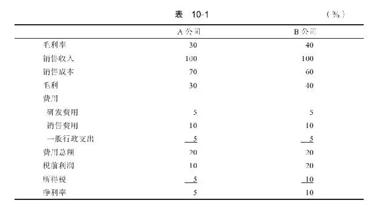

用于费用的百分比可能会增长，这是因为以下方面。

➤相对于固定费用支出，销售增长开始出现下滑。

➤公司选择花费更多的费用为未来开拓潜在市场。

假设一个公司需要在费用上支出更多，可能是想开发新的产品或是改进现有生产线，也可能是想构建财务控制系统。为什么无关紧要，占销售额一定比例的费用支出在增长。让我们看看此时会发生什么。表10\-2中，A公司和B公司赚得的毛利率与上例中同样多，但是现在它们的费用率为销售额的25%。

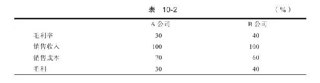

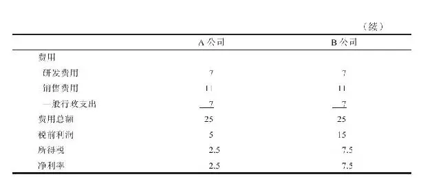

在这种情况下，A公司没有获取足够的毛利率来达到我们制定的目标线。有更高的毛利率水平的B公司，轻松地越过了目标线。这两个例子显示了高毛利率的价值。获得超过50%的毛利率是个不错的目标，这为利润和朝向未来发展产生的更多费用留下了更大的空间。一个相当好的利润表如表10\-3所示。

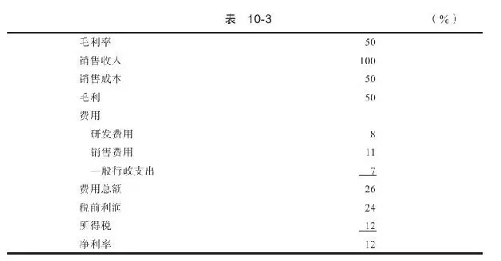

当用现有利润为未来融资的时候，这个利润表为未来提供了支出空间。只要是一个不错的目标，哪个数字是多少不必细究。

不幸的是，会计并不是完美的。在某个公司被认定为产品成本的支出，在另一个公司有可能被认定为营销费用或是一般行政支出。对于管理层来说决定某些费用如何记账是困难的。在很多公司，组装服务可以是一项非常有效的销售工具。这些服务的某些部分是否应该与服务收入相关，而计入产品销售成本，或者与试图劝说客户购买额外品质相关，而记入营销费用？

另外，需要技术安装的产品销售通常需要销售人员、技术人员和生产人员的交流。估计各人员完成自身职责所需时间将决定财务报表的组成，其中一些表现为销售成本、毛利率、销售费用、研发费用或是一般行政支出，这些是基于管理层的假定而分配的。

## 必须做一些特别的事情

必须做一些特别的事情

因为管理层做出了不同的假设，尝试着精确地估算公司利润表里的任何一个组成部分，这往往是一个错误。这是一门艺术而不是科学。不要为在营销上花费8%还是9%而喋喋不休。总体毛利率目标是39%还是41%并不重要。重要的是提高利润率的整体计划也有意义——这也是计划实现的必需条件。所有的组成部分都必须有意义。如果是为了实现一个高的毛利率，那么必须做出一些不一样的事情来。

高的毛利率来自于以下方面。

➤产品计划（营销计划），这个计划能准确估计未来消费者需求和竞争的实质。这个计划考虑到了未来有着重大意义的产品定价和产量估计。

➤与未来价格相关，采用更少的材料和生产过程成本的成本目标设计。这个设计必须能使公司以相当低的成本制造大量的产品，并仍旧能够满足顾客的需求。

➤持续关注每个生产流程细小的制造成本。

询问管理层他们打算如何实现利润率目标，而回答往往很有意思。区分出哪些行为确实是创新行为或者是管理层应该一直采取的行为。用租借的存货运转、提高生产率、缩短应收账款平均收账期、缩减广告费用，以及其他运营手法都是不错的，但是它们几乎不能成为压倒性竞争优势。它们是你的竞争对手也可以轻易做到的。它们都是必需的——但还不够充分。

当一个公司打算通过此类运营手法来达到利润率目标，也就承认了以前它没有很好地运营。如果该公司还是有着同样的管理层，那么在未来它也不可能运营得很好。他们为什么必须改变？睡狮管理层试图加强控制，但从没有令其变得有效。引入新管理层的睡狮有可能多少加强点控制。

在引入新管理层的情况下，找出他们以前的聘用经历并不难。他们以前在哪工作？他们以前工作的职位是什么？在以前的安排下，他们是否成功地加强了控制？

靠把以前做过的事做得更好而取得出众的回报，对这种方式要保持怀疑。单靠简单的教科书式的管理，将会产生高出平均水平的回报——但不足够出色。对从糟糕的毛利率很快变为高毛利率要保持怀疑。这种情况很少是真实的，除非发生在普遍衰退中。保持长期的高毛利率是公司发生彻底的实质性变化的结果。超级公司将会有超越竞争对手的压倒性竞争优势，使之能够获得丰厚的毛利率。

## 我真正想要的是压倒性竞争优势

我真正想要的是压倒性竞争优势

压倒性竞争优势有着不同的形式。优势往往可以被划为三个主要的类别——营销优势、生产优势和研发优势。在过去，研发仅仅是一件商品，专利技术常常被看做是压倒性竞争优势。现在，这种观念通常不再正确了。有时，专利技术仍旧可以提供一个压倒性竞争优势。

营销里的压倒性竞争优势来自不同的形式。其中一个更好的理解是如何激励消费者，这是很常见的。乔·布洛把他的前半生花在了存款和贷款行业里，后来他离开了存贷机构，开始卖产品和服务。然而，世上没有简单的事情，当他想要学点新的东西时，他开始接触“亲密”的网络。他把握住了市场的发展趋势，而其他的销售人员可能还停留在采购代理的层面上。其他人并不经常能把握住关键点，高水平的决策者让他们泄气。乔·布洛轻松地跨越了这个障碍。他不仅把握住了关键点，同时，从更大的程度上看，他按客户的行为来思考。

看一下Dataquest，它是最出名的信息服务公司，现在是A\.C\.Nielsen的一个子公司。Dataquest早年在半导体服务行业的成功，大部分原因是吉姆·赖利经营和管理着公司。赖利曾任职于Signetics、Intersil和Fairchild公司，在半导体行业上有着一长串成功的营销经验。当公司委任他把Dataquest的服务销售给半导体行业里的大腕时，他能够快速入门并吸引人们的注意，而其他人做不到。在很短的时间里，半导体服务成为了Dataquest运营项目中最大的部分。

让我们在这些所谓压倒性竞争优势上看得更远些。压倒性竞争优势的类型包括以下方面。

➤配送优势以及基于产品、成本、技术散发给不同市场的能力。

➤通过与产品密切联系的广告而拥有的规模经济。

➤商业秘密。

➤长时间的领先地位。

➤低成本制造技术。

➤消费者愿意为之付出溢价的高品质。

类别不胜枚举。将压倒性竞争优势作为核心要素来寻找的关键点在于，你的投资未来是否能赚到超过平均水平的利润率。当有充足的理由来相信公司能够获得超越竞争者的优势时，就可以下结论了。

拥有较大的市场份额称得上是压倒性竞争优势

长期以来拥有较大的市场份额被认为是压倒性竞争优势的一种形式。Boston Consulting Group将其作为决定潜在盈利能力的关键因素，并将其放大了，把这个观点引入到了现代利润率分析的领域。

这个观点十几年前开始被人们所理解。夸张点说，这个观点促成了谢尔曼和克莱顿反托拉斯法，政府当局将之视为垄断并使之不合法。在商学院的理性分析中，作为一个理解未来盈利能力的关键工具，市场份额永远倾向于保持它的地位。这也是为什么市场份额如此重要。

这有点类似于先有鸡还是先有蛋的问题。超级公司用时间构筑了大的市场份额并开始垄断行业。然后，通过较大的市场份额，它可以做到：①保持高的毛利率；②进一步发展融通资金以便于巩固其垄断地位。

2026年3月14日

9:51

## 相关市场份额仍然重要

相关市场份额仍然重要

想想看为什么。通常，30%的市场份额被看做是拥有了大的市场份额。这真的是值得考虑的市场份额吗？市场份额是重要的，但更重要的是相关公司的市场份额。表10\-4中有三家公司，分别来自不同的行业，每家公司都有30%的市场份额。

尽管这三个公司都有30%的市场份额，但它们的相对市场份额各不一样。因此，三家公司的潜在盈利能力也就有了不同。其中，C公司占据了最好的位置，在所在行业中最有优势。C公司很可能拥有最低的单位制造成本，因为其成本涵盖了一个更大的产出量。也因为这个较大的产出量，C公司可以负担得起一定的开发成本和市场研究费用，而这往往是竞争者不得不放弃的。在弱势经济中，C公司有能力采取比行业内落后者更大幅度的降价行为。

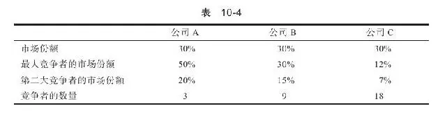

只有一种情况，C公司会倾向于失去其大的市场份额，也就是当生产技术发生巨大变革的时候。比如，在旧生产程序上进行巨大的固定资产投资，行业份额领先者有可能失去其份额。大的市场份额难以阻止20世纪六七十年代外国钢铁厂商和65家小钢铁厂对美国钢铁公司的侵袭。日本和其他外国钢铁制造商建造了新技术设备来对付美国钢铁厂，而许多美国钢铁厂仍旧用的是陈旧的平炉技术。

另外，如果消费者的偏好发生了改变，而C公司没有做出反应，它将会失去其市场份额。通用汽车和福特汽车公司因为忽视了美国人20世纪六七十年代偏好小型车的需求变化，导致它们失去了一些市场份额。理论上来讲，市场主导者应该能够在研究市场和理解消费者偏好转变上付出更多的努力。这些公司可能没有经常运用其潜在的优势，这些优势存在于它们大的市场份额带来的压倒性竞争优势。管理层可能在反映市场变化上有所失误或者仅仅是没有做到有效生产。然而，大市场份额的潜在力量仍旧是巨大的。

B公司的情况较糟。仍旧与行业状况高度相关，B公司拥有所有C公司在行业内享有的内在力量。对B公司而言不幸的是，它的主要竞争对手有着同样大的力量。它们同样拥有对另一方造成巨大伤害的天然潜力。这有点像穆罕默德·阿里和乔·弗雷泽——都是各自范围内的冠军，但是在十五回合的较量之后，双方都受到了对方的打击。为什么其中一个比另一个好，这没有什么特别的原因。造成这样的结果大部分归因于个人因素。

现在来看有着较高绝对份额但是相对份额较低的A公司。它的市场份额跟行业龙头相比要低一些。显然A公司不在强势的位置上——在更大规模更有力的竞争者面前显得比较脆弱。在这样一个行业里，竞争者很少并且各自有着相对较大的市场份额，所有人都可能在强势经济中获得高的毛利率，就像它们所期望的那样。在这种情况下，它们很可能为避免价格战而展开非正式的会议，就像20世纪70年代早期，陶氏化学公司所谓的“价格君子协定”。而在一个弱势的经济环境中，这些公司很可能在价格战上争个你死我活。那时A公司完全感受到了相对较大的竞争对手的力量，它比A公司的优势更大，正如C公司之于其他竞争对手一样。

另一个更远一点的因素——增长，使事情变得复杂。与遭遇萎缩的行业相比，有着强劲需求的行业里，每个公司都会发现自己的增长环境完全不一样了。对大多数草率的观测者来说这应该是很明显的。如果C公司处在一个被广泛预测有快速增长前景的行业里，它将会发现有很多新进入而且不断增加的竞争力量从更小的竞争者转变而来，此时，小的竞争者是能够获得额外的债权和股权融资的。

相反，如果一个行业正在萎缩，小一点的公司不太可能找到任何愿意为之提供融资的公司。看看这些差别。有不计其数的高科技公司，它们正在逐步发展，并获得风险投资支持，或以高的市销率在公开股票发行上获得了资金支持。接着，再看看它们的对立面，汽车市场以及相关产业，这些行业已经多年相对萎缩了。无论如何，增长没有消除市场份额的有效性。增长只是在某种程度上改变了市场份额。

## 第11章 利润率分析（2） 公式和法则

第11章 利润率分析（2） 公式和法则

利润率分析的预测公式

很多年前，我提出了一个预测利润的简单公式，它以定量的方式将利润率分析联系在一起。该公式被认为其所具有的引人深思的意义高于其实用性。没有任何公式能够解释影响利润的所有变量，当然，我提出的也不例外，它不能使你准确地预测利润。但是，它很有用，因为它提出了有关公司未来潜在利润的一些问题。

该公式简化的形式是：

该公式的实用性可能不是很明显。但是它的作用很强大，并且使用简单方便。它考虑了市场份额、相对市场份额以及增长率。乍一看，尽管使人摸不着脑，但它却是容易计算的。

知道市场份额及增长率之后，你可以使用计算器在数秒内计算出该公式的结果。该公式忽略了行业参与者的总数目，因为如果存在许多行业参与者，那么绝大多数参与者的规模将会很小。如果只有几个行业参与者，那么公司可以适用于该种经济情况。该公式假定税率为常数50%。

注意到该公式不允许任何一方占有100%的市场份额。100%的市场份额意味着没有竞争者。在现实世界里，除非政府创造或管制垄断，否则垄断将不会存在。如果它们这么做，如在受管制的公用事业或类似情况下，它们通常不会允许丰厚的利润率。

如果你的竞争对手有着100%的市场份额，将会发生什么呢？你将不会有任何业务，因此也就不能获得任何利润。如果你的公司拥有100%的市场份额，其垄断地位将会获得无限大的利润。这在逻辑上是可行的，经济学家却并不这么认为。 [\1]

该公式容许有不同的市场份额和极端快速的或负的增长率。系数0\.13是给定的，由过去人们的实证分析得出。一个主要的变量是一家公司竞争所处的市场和行业，但这却是很困难的。联邦快递存在于什么市场？它的市场份额是多少？在一个跨行业公司或联合企业中，人们会感到更加困惑。在单一行业中，通常只有几个不同的市场。例如，市场在地理上可以通过运费限制（例如水利行业）来定义，也可以是社会性的（最优先的消费者条例）。Kaypro Computer，该行业中的大众汽车，事实上和奔驰级别的Grid Systems Computer不存在竞争，因为后者的价格是前者的6倍，它们处于不同的市场。

一些例子

让我们用一些例子来检验该公式的理论有效性。假定一家公司有30%的市场份额，并且你认为该行业未来5年的增长率为40%，其最大的竞争对手的市场份额为12%。根据该公式，公司潜在利润率为13\.7%。

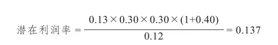

该公司刚好处于一个想象中最理想的位置。它在一个快速成长的市场上有着占主导地位的高市场份额，而其最大的竞争对手的规模小于它的一半。根据常识就知道它在未来有非常美好的前途。（幸运的是我提出的公式也这么认为。）如果该公司只能获得很少的利润，那么它肯定在某些方面存在着问题。可能是它未能制定出好的战略，或者不能很好地执行这些战略。该公式并不是说这家公司将获得13\.7%的利润，而是说如果它能正确地管理自身业务，那么它有获得高额利润的潜力。

以同样的例子研究B公司。它和其最大的竞争对手一样，都有着30%的市场份额。如果你预期增长率为5%，该公式表明其潜在利润率只有4\.1%。该公式对低成长或缓慢成长的公司有很强的偏见，即使该公司有一个相当高的市场份额。

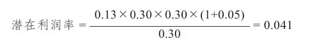

如果一家公司处于一个低成长或衰退的行业，并且想获得高于平均水平的利润，那么事情将变得更加复杂。它最好能有一些压倒性的竞争优势。最近几年，所有钢铁行业公司（甚至包括那些有很高市场份额的公司）的平均利润都很低。Nucor生产日用钢材：角钢、螺纹钢筋、平板纹理类、水管、工字钢和其他结构型钢材。这些日用产品的增长性很低或没有增长前景。Nucor于19世纪70年代早期开业，在当时的市场份额很低。尽管有这些劣势，但它通过几个压倒性竞争优势获得了超出平均水平的利润，并且得到了发展。

这就是该公式的要点：它使得投资者关注一家公司需要多少额外的压倒性竞争优势以达到其利润率目标。在Nucor的例子中，该公式认为在那种情况下低利润是可能的。但在考察Nucor时，它把所有的焦点都集中在那些压倒性竞争优势的数量和质量上，其他所有的事情都变得次要了。

注意该公式不会产生负值。不管市场份额、增长率或竞争对手如何，任何公司都有获利的潜力。潜力不同于实际。公司在长期亏损是因为它们未发挥潜力，而非它们没有潜力。

不管潜力如何，公司都应该在每个机会上寻找优势。竞争对手肯定会这么做。在利润率这个问题上，一定要考虑竞争对手。它们的利润率是多少，对你所考虑的公司有什么启示意义？竞争对手对你的公司而言是否拥有压倒性竞争优势？实际上没有企业会承认其竞争对手有着巨大的竞争优势。在面对顾客和供应商时它们是这么说的，但竞争对手却在攫取高额利润。《怎样选择成长股》（Common Stock and Uncommon Profits, New York：Harper＆Row，1958）中描述了了解相对竞争地位的必要步骤：

竞争对手获得什么类别的利润率？为什么获得？如果竞争对手有着非常高的利润率，那么你所考虑的那家公司是否同样也能获得很好的利润率？为什么？可能竞争对手有着“压倒性竞争优势”。

在估值过程中，这是很重要的。一旦考虑到这些，一些简单规则有助于粗略估计未来的利润。

[\1] 绝大多数的垄断生产商甚至都不能获得非凡的高利润。除非它们是那些拥有一个“极端无弹性的需求”的少数派中的一员，否则这将是不可能的。

2026年3月14日

9:51

## 利润率分析的规则

利润率分析的规则

下面是一些分析利润率的有用规则。

规则1

如果该预测公式显示你潜在的超级公司有着高的潜在利润率（并且似乎没有竞争对手有压倒性的竞争优势），那么实际利润将会因缺乏综合管理及营运能力而低于潜在水平。

通过关键人物的经历，特别是与首席执行官相对应的首席运营官，来判断管理层的营运能力是很重要的。如果首席运营官在运营过程中有着很辉煌的经历，那么该公司就没有理由达不到其潜在利润率水平。如果首席运营官有着相对糟糕的运营经历，那么这个公司将不是一个超级公司，并且应该被摒弃掉。运用对首席运营官的评估结果来度量公司的利润率。

规则2

如果该公式预测一家公司有着高的潜在利润率，并且竞争对手可能存在压倒性竞争优势，那么，该压倒性竞争优势等于降低了公式中增长率的估计值。

如果一个竞争对手有重大的压倒性竞争优势，那么你所考虑的公司就不是一个超级公司，因为不管以后的增长水平怎样，竞争对手首先胜出。从这种逻辑上说，除了有优势的公司，其他公司的行业增长率并不像其表面所显示的那么大。评估竞争的效应是为评估潜在利润率。经调整后，规则1同样适用。

规则3

如果该公式显示某公司有很低的潜在利润率，那就应该额外关注其压倒性竞争优势。如果相对于竞争对手而言，该公司并没有明显的压倒性竞争优势，那么它不可能获得高于其潜在利润率的利润率，因此也就不可能成为一个超级公司。

这是绝大多数工业公司所处的情形。它们有很低的潜在利润，相对于竞争对手没有压倒性竞争优势。竭尽所能它们都不可能获得引人注目的利润率。只有极端的运气才能使这类公司获得高额利润（可能一场地震消灭了竞争对手）。因为它们不是超级公司，对自身命运的掌控能力很弱。正如好运气可以帮助它们一样，坏运气也可以使它们受到严重伤害。

规则4

如果该公式显示某公司有很低的潜在利润率，就应该关注压倒性竞争优势。如果该公司相对于竞争对手有着明显的压倒性竞争优势，那么，该压倒性竞争优势等于增加行业增长率的估计值。

这是最难估计的情形。想很好地确定一个优势的重要性是很困难的。调查管理层的想法，以确定他们是否通过做与过去完全不同的事情来提高利润率。他们的逻辑是否有道理？评估管理层的基本营运能力及经营经历。如果他们的排名很高，在一番“吹毛求疵”后接受管理层的利润率目标是合理的。

“吹毛求疵”是必需的，因为管理层对他们所能达到的目标倾向于乐观，他们也不得不这样做。一些公司能够以优雅的方式丢掉这些。当我初次拜访Nucor的肯·艾弗森时，并没有取得足够好的财务结果。但很明显，他是一个能够为了长期的潜在利润而将自身竞争优势最大化的人。识别管理层的这种能力也是一门艺术。这就像当看到一位年轻的拳击手时，你得知道他是否是日后拳坛霸主的料子。

规则5

如果一家公司多年以来管理层没变，并获得很好的利润，而现在的获利性却较差，我们就应该检查一下，是否长期的行业环境发生了改变。是变得更好了还是变得列糟糕了？如果行业环境并不比以前差，那么，和以前一样好的利润可能及时地再现。应该用3年时间期待这种改变发生。

快速成长的年轻公司经常犯错误，最好的公司从错误中学习（见第1章和第2章）。如果长期的行业环境在利润好的期间并没有变坏，那么管理层（他们在以前已经展示了获得成功的决心与能力）能够再次获得好的利润。保守地进行利润率分析是很安全的。同样，在这里对先前的历史利润吹毛求疵是审慎的行为。优秀的管理层能及时地与困难作斗争并获得胜利。California Microwave 1979年在市场上犯了错误，从而导致了其在财务结果曲线上有一个显著的凹点（见第15章）。它的业务属性逐渐发生了改变，尽管利润率没有达到先前水平，但它却越来越符合超级公司的身份了。

## 金无足赤，人无完人：你也不必成为完人

金无足赤，人无完人：你也不必成为完人

尽管这五个规则并没有包括一切情况，但它们构成了评估未来利润的基础。没有一个人能够，也不必去获得完美的评估值。它是一门艺术而非科学。当与合适的估值技术结合时，它能够很好地发挥作用以使人们获得持续的利润。这并不是说你能预测XYZ公司在1987年的利润率为5\.7%，达到这样的精确性是不可能的。能够很确定地知道的是，一家给定公司在长期能否获得超过或低于平均水平的利润率。那些能够在长期内获得高于平均利润率回报的公司可能就是超级公司，其股票就可能成为超级强势股。

了解一家公司的未来利润率是更接近5%还是10%是很重要的。很可能它的利润率将更接近1%。这些认识将创造或毁灭财富。要专注于长期利润，你可以忽略短期利润。它使你像长期投资者一样思考并成为其中的一员。

没有精明的业主以一天、一周、一月、一个季度，甚至是一年的盈利为基础，而卖掉自己的企业。成功的投资者能够跨越年代来考察该企业在长期中能够获得什么。即使你很确定地知道明年的盈利性很糟糕，你也最好关注其在长期中的商业前景。财富就是在这里被创造或消灭的。（罗马非一日建成。）

你也不能过分强调利润率分析的重要性。（用整本书来讨论这个问题是很容易的。）利润率分析会因行业和公司的不同而出现细微的差别，但基本的要点是相似的。

利润率分析同样也是决定一个超级公司是否是超级强势股的估值过程的第一步。假定你已经认定某一特定公司是一个超级公司，研究其潜力后你感到十分满意，它满足了你的利润率要求，你愿意以怎样的价格购买？

知道了某公司是一个超级公司，并且它会获得高的长期平均利润率，却不知道该以怎样的价格购买，这是没有任何用处的。同样，知道你所拥有的公司在数年内是一家超级公司，却不知道在什么情况下合理卖出，这也是没有任何用处的。

接下来的一章建立了投资的方法论——将动态利润率分析和市销率与市研率的研究结合起来。

2026年3月14日

9:51

## 第四部分 动态过程

第四部分 动态过程

第12章 在实践中运用 存在变得疯狂的方法

魔法钥匙在哪里

现在我们来看看分析和定价超级强势股的过程。多数读者因为没有时间或没有意愿，都不可能亲历亲为保证投资成功的所有基础步骤。但为达到理想的整体效果，每一部分都有重要的子部分。

股市会上涨还是下跌？这可能没有那么重要。重要的是找到超级公司，然后以低价买入其股票——寻找超级强势股。一只超级强势股可以在严重的熊市后大涨（见第14章的Verbatim公司）。

要将许多投资时间用来识别股票市场的动向上。投资者综合各种因素来断定市场的发展方向，根据这些背景基础来形成自己的投资策略。如果人们认为市场强势且处于上升期，他们就会买入股票。这时他们重点关注的是在这种市场条件下，哪只股票表现得好。反之，如果他们认为市场弱势，那么他们就会卖掉甚至卖空它。但是，人们不会总能猜准市场，多数投资者在大多数时间都是错的。为什么要玩一场注定要输的游戏呢？你们有碰到过可以一贯预测到市场走向的人吗？我甚至从没听说有谁可以做到。但是，想象一下如果你可以做到将会如何呢。

试想，此刻你可以准确地对DJIA指数100点以上的任何变动做出预测。更进一步，在每次下跌时，你可以成功地进行卖空，而在每次100点以上的牛市上涨时，都可以买入股票。进行理想的假设，我们假定不存在交易费用和税赋。

你能赚多少呢？毫无疑问，肯定能得到很好的回报，但是不会好过超级强势股。表12\-1列出了截至1982年12月31日5年间股市的每一次大变动，并且给出每次变动可能获得的收益。

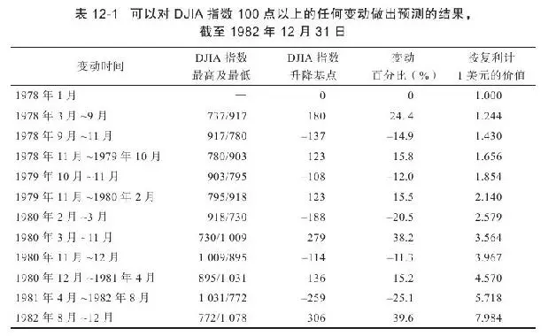

不错啊！5年间你的钱几乎上升了8倍——按复利计算收益率为51\.5%。尽管这是场很值钱的游戏，可是没有人哪怕是近似地猜准市场——多数人会在这样的游戏中输钱。现实中，在这11次市场变动中，每次你必须支付约1%～10%（根据交易何时发生，再将其折成现值）的经常性个人所得税（与有税收优惠的长期资本所得相对）和佣金。

许多人被赋予了股市预言家的美名。那些最敢于冒风险的人往往最后都会落得很难堪。人们总会孜孜不倦地寻求那把股市的魔法钥匙。人们已尝试过电脑、占星术、统计分析、太阳黑子、经济学、技术分析、茶叶、日落时落入风中的干蛤蚧的肤色、政治分析、任何你能想得出名字的东西，但没有一种起作用。

人们最多只能在半数时间里猜对股市的变动，而最糟糕的情况的是，每次都猜错。股市预言家几年里变得炙手可热，可此后绝大多数都自取其辱。

近来最富戏剧性的例子可能就是乔·格兰维尔了。由于精确地预期到了1979～1981年的市场拐点，乔·格兰维尔拥有了日益壮大的追随者，他的预测也变得愈加极端了。他肯定十分坚信自己预测的准确性，所以才会如此绝对地发表出来。当市场违背他的意志一意孤行时，乔·格兰维尔一定十分痛苦。（市场也是上帝用来使人们学会谦逊的工具之一。）不要玩那些注定会输的游戏，你的时间可以用来做更有意义的事情。如果你找到了那把打开所有市场谜题的魔法钥匙，仍然不能做得比拥有超级强势股更好。

人们购买股票，而不是整个股票市场。更好的选择是关注股票和公司，而不是股市。应该关注那些存在可能性的东西，而识别和购买超级强势股就是可能的事情。一旦拥有了超级强势股，就能获得仿佛拥有那把梦寐以求的市场魔法钥匙和资本所得的税收优惠般的收益。

把重点放在你能做到的事情上——而不是做不到的事情。我更应该利用市场实现它的初始目标——一个购买公司部分所有权的场所。要关注公司，以低价买入好公司的股票。然后，让我们忘掉市场上的其他东西。

## 机会是没有标签的

机会是没有标签的

机会是没有标签的。不管是对股票还是对生活的其他方面，这句话都是正确的。价格已经被抬高的东西就会变得不值钱了。有人想要你买什么东西的话，他就是想把它卖给你。人人都知道“真正赚钱的人通常都是赔钱的人”这种说法是肯定的。正如贝纳德·巴鲁克在他的自传中所说，“当乞丐、擦鞋童、理发师和美容师都能告诉你怎么致富时，你就该提醒自己再没有比不劳而获更危险的妄想了。” [\1]

所有零售商大肆宣传“这里省钱”的广告其实都是“在这花钱”的意思。人们常感叹别人能有好运气在其他人不屑时捡到一小颗“宝石”。别人不要它是因为他们当时并不认为它是宝石。机会是没有标签的。

华尔街的魅力之一就是确实存在一些标签。问题是在看标签时，必须避免被混淆。这些标签是不完美的，但是多数并不坏。寻找投资机会时，我倾向于关注三类标签。

➤我所了解的行业中的低市销率和低市研率。

➤我所不了解的赔钱的公司。

➤其他有前景的优秀公司所做的定性评估。

寻找低市销率

这相对比较容易。如今，你可以在互联网上查到每一家上市公司的各种财务信息及股价走势。通过计算，转眼间，你已经拥有一大批可以被认为潜在超级公司的低市销率的股票了。通过仔细审核这些股票，你可以挑出那些市销率还值得商榷的股票。比如，1983年夏天，我在审核出版商的列表时发现，除三家外，全部都存在市销率偏高的现象，因此需要进一步的考量。这种方法为我节省了不少时间。

把全部可能的超级公司低市销率的股票放到一起。很明显，它们中的大部分还不够格，你会发现只有极小一部分是超级强势股。重点是找出它们是否是超级强势股，而这是最难的一部分。

[\1] Bernard M\. Baruch, My Own Story（New York：Henry Holt＆Company，1957），p\.258\.

## 寻找赔钱的公司

寻找赔钱的公司

怎么会有人想要赔钱的公司呢？赔钱的公司也不容易得到金融界的支持。只有极少数华尔街的宠儿，如生物技术股，尽管经常赔钱，却仍能得到金融界的全民追捧，但它们只是例外。

大多数赔钱的公司，即使是短时期赔钱，都会失宠于金融界。我每天浏览《华尔街日报》的“收益报告摘要”，在里面寻找赔钱的公司。我对那些名字陌生的公司尤其感兴趣。有那么多的公司，要想全都认识几乎是不可能的。人人都熟悉大型资本化股票，许多人熟悉热门股票，但没有人熟悉所有股票。市场上有大量的上市公司，要想准确地计算它们的数量是十分困难的。多年来，我一直在研究收益报告摘要，但看到的还只是那些我从没听到过的公司。

我不熟悉的那些赔钱的公司，我会用蓝笔圈起来，然后把这些摘要交给一位同事。她会在标准普尔中查看每家公司的情况，并在一张纸上简要地归纳出某家公司在经营什么，以及一些简单的财务数据，包括市销率。如果市销率大于0\.75，那么她就会把这张纸扔掉；但如果市销率小于0\.75的话，她就会把它交给我。我可能丢弃掉，也可能将其纳入备选。我之所以会丢弃掉其中的一部分，是因为我没兴趣，或者我不认为自己对该行业有足够的了解。当然，我肯定为此错过了好些机会。（人生很短暂，我们不应该把大把的时间花费在那些自己不自在或不了解的地方。应该专注在能理解的事情上。）

## 寻找超级公司的定性评估

寻找超级公司的定性评估

与上面相比，本节可能更加有用。尽管它不会引出立马可用的想法，但是几年后，你可能灵机一动，这里的信息突然就发挥作用了。（它是我大部分投资决策的来源。）长期以来，通过阅读专业杂志，参与金融与技术会议，还有与行业间和华尔街人士的交谈，我开始了解“何人在何时，为何能把何事做好”。再重复一遍：何人在何时，为何能把何事做好？

举个例子：长期以来我听到许多，也读到了许多微波技术行业的大体情况，尤其是California Microwave公司（见第15章）。我是从相关会议上和金融界人士那里得到消息的。我相当确信这家公司值得深入分析，因为它有可能是家超级公司。但是，我当时还没有对其做详细的研究。之后，当这家公司在1980年遭遇困境而股票下跌时，对其进行近距离观察的时候终于到了。而由于这之前好几年，我已经做了对California Microwave公司定性评估方面的信息收集，当时我就可以直接使用了。

你可能听到过华尔街所钟爱的公司的美好前景。就如我们在第1、2章中学到的，其中绝大部分很可能是真的。我们同样也看到，金融界背弃遭遇困境的公司也是很正常的事情。所以通过这种定性分析过程，我们就可能弄清何人在何时，为何能把何事做好——（可能）多年以后，有机会以低价投资于这家公司。阅读专业杂志可以使我们与时事保持同步。通常广告和文章一样有意思，因为它们（应当）用一种通俗的方式描述了何人在做何事。文章则从短篇的新闻趣事到深度的特定生产线研究都有可能涉及。收集其中最令人感兴趣的部分。

除订阅杂志外，我还每月去一次图书馆，只翻阅专业杂志。旧金山有个很棒的商业图书馆。穿过市中心，我发现这个城市在主馆里的技术杂志比我想象中更多。这些杂志可以使投资者了解这方面的信息。谁生产高品质的产品？谁是别人所说的“领头羊”？谁获得了技术和商业奖励？

参加金融和技术会议不仅可以获知何人把何事做好，还可以弄清最重要的问题——何时为何能做好。金融会议是由经纪公司和工业集团赞助的。在会议上，公司会做投资和商业方面的展示。我们可以在这些会议上，以及参加会议的人们身上得到很多信息。参加会议时，别忘了带上一些“反向操作投资人的观点”——当人群中有很多一致意见时，你可以一刀将其截断。 [\1] 考虑一下此类会议，诸如美国电子协会的春季和秋季会议。传统上，这取决于会议规模和参与者的声誉。

参与者一般来自工业和投资领域。与这两类参与者都谈谈，跟着他们参加各种讨论。单个证券分析师可能是好的投资者，也可能不是好投资者，但是他很可能知道他所从事行业的大量信息。如果你需要某些特定信息，或者只想知道人们对于某个行业的看法，如哪个更好之类的问题，那么这些人就能帮助你搞清楚这些问题。记住，他们很多人可能没有对你的目标公司进行正确的投资，但是这并不否认他们确实拥有很多信息。

证券分析师引人注目是因为他们知道很多。我从他们那里获知了一些“何人在何时，为何能把何事做好”。但我并不寻求他们的投资结论，而是询问他们对X产品相对Y产品比较优势的看法。我会询问他们，哪家做的双密度器具最好，A公司是否在开发全新的固态器具。许多最好的分析师也更乐意回答这样的问题。

不幸的是，许多投资者没有接触分析师的机会——这些分析师的老板希望他们接手更多的经纪业务。但是即使没有足够的经纪业务，你也可以在适合的会议、商务展览或其他场合碰到他们。如果你能以恰当的方式联系他们，多数人都会很友善，也乐意与人交谈。重要的是必须选择适合的时机和方式，这样才不会对他们繁忙的日程造成影响。

其他的职业投资者也可能具有渊博的知识。事实上，其中有些人可能对某行业的特定领域了解得比证券分析师还要多。可以寻求他们帮助建立一个数据库以运用“反向操作投资人的观点”。根据前面的讨论，我们一定得记住：有必要（但不足够）背离大众。要背离大众，你就必须知道大众的想法。

从事这一行的人很有趣，因为他们日复一日地站在最前线。他们在这个行业生活、吃饭、睡觉、呼吸。再者，他们深知谁可能把事情做好。他们不像很多投资者和分析师那样，对华尔街对待某家公司的态度抱有偏见，因为他们更关注操作层面上的东西。在会议上，这些人通常很友善并且乐意交换想法、“战事”以及担忧。尽可能从这些人身上多学点东西。未来的某个时间，你会发现这是值得的。

[\1] “反向操作投资人的观点”可能源自密苏里移民“自我展示”态度的精神产物。反向操作投资人认为，如果多数人相信股票会上涨，则股票就会下跌，反之亦然。他们相信不管大众想什么都是错误的。尽管这种说法可能正确，但是要弄清大众的想法却是很难的。

## 最好的研究途径是免费的

最好的研究途径是免费的

开始慢慢汇集线索——有些来自对低市销率的搜索；而有些来自对《华尔街日报》“收益报告摘要”中那些不熟悉的赔钱公司的收集；其他则来自他人观点的定性分析。哪种观点值得进行深入研究，而哪些又是不值得花时间的？

现在是时候做点事来确定是否有必要进行下一步的工作了。这需要我们到图书馆去——图书馆是个好地方，因为里面有很多的信息，而只需花费使用者的一些时间。现在也是应用规则的时候了，要一以贯之，避免误入歧途。有些信息确实很有趣，但是没有价值，只会浪费时间。我曾经看到一则吸引眼球的报告，但它对我的财务研究没有任何作用。节约时间——你要用它来研究超级公司。

从标准普尔或穆迪开始。我出于习惯，选择标准普尔。每家公司的资料会很快查阅到。通常，你立马就可以断定花费额外时间进行研究是不值得的。一家公司可能不符合第8章或第9章的一条或者更多条超级公司判定规则。如果能更快地判定某家公司是不是目标公司的话，我就能更快地将时间转移到可能投资的目标公司上去。

## 要在关键时刻及时靠边站

要在关键时刻及时靠边站

在此，我想引入一个概念。尽管看起来可能有点离题，但确实给我帮了很多忙。时间是稀缺的。永远没有足够的时间来做所有想做的事情。我需要借助所有可能的一切来决定应该怎样支配有限的时间。

一天中有多长时间可以由我支配？一天有1440分钟。如果每天睡8小时，那你醒着的时间就有1000分钟。如果在某件事情上花费1小时的话，就等于花费了6%的时间。30分钟是你一天时间的3%。20分钟是2%，而2小时（120分钟）是12%。当有人叫我去吃午饭时，我就会考虑值不值得花12%的时间去见他们。可能值也可能不值。也许我们可以在电话里聊20分钟（2%的时间）而不是去吃午饭。如果是这样，我就可能节省10%的时间用于更有效率的工作。

如果工作只是为了一点小积蓄，那为什么不呢？我没有那么多的时间可以浪费。我会在图书馆里对那些感兴趣却不会深入研究的公司和观点花费2个小时的时间吗？如果这要花上我12%的时间，我就不干。我有2个小时花费在图书馆里那些有兴趣投资的公司上吗？当然有！我会在搜寻的过程中尽可能地节约时间。我需要决定的是，如果一只股票还需要等待时机，那我该怎么做。

## 深入挖掘信息

深入挖掘信息

如果到目前我仍然对一家公司感兴趣的话，我会做两件事。首先，我得弄到它的联系方式，向其索要最近的年度报告、后续季度报告、SEC Forms 10\-K及SEC Forms 10\-Q以及股东委托书。阅读过这些材料可能会让你对其失去兴趣，也可能会成为下一步研究的基础。如果我发觉它与第8、9、10、11章所述的基本原则相抵触的话，那么这家公司就不值得额外的时间和努力。这个过程可能将其排除出进一步考虑的名单。

我收集了公开可得的所有关于该公司的信息。还有一些经纪公司的报告和新闻报道可以挖掘。我通常会去浏览《华尔街实录》杂志，因为这里面有许多金融界人士各种不同的意见。其中展示了他们的结论，而且经常还有经纪公司的主要研究报告。这些报告可以提供关于公司的额外信息，以及保留华尔街对待某只股票的有益见解。我希望只能找到少数（甚至没有）经纪公司关于某家公司的报告，因为这意味着这只股票还没有受到华尔街的广泛推崇。

## 避免来自华尔街的竞争

避免来自华尔街的竞争

超级公司在其股票开始上涨之前，通常得不到华尔街的青睐（见第1章及第2章）。避免来自华尔街的竞争才能减少风险。

究竟有多少经纪公司编写的股票方面的研究评论和报告？如果一家公司拥有投资者关系网，那么你就可以打电话询问有多少分析师参观过这家公司或编写过该公司的报告，并且他们都是谁。有些投资者关系网已经被公开出来，因为这会使工作变得简单。但如果一家公司没有投资者关系网的话，你就可以直接联系总裁秘书（一个交朋友的好机会——也许今后需要他的帮助）。

如果有几个分析师编写过这家公司的报告，这就说明金融界对其有一定的兴趣。如果有6个以上的分析师编写过该公司的报告，则代表它已经引起了金融界极大的兴趣。如果有15个以上的投资专业人士访问过该公司，并且经常保持电话联系的话，那么它就已经获得金融界的巨大支持了。

表12\-2展示了在超级公司股票备受金融界关注前，跟踪各种规模超级公司的分析师的最多人数大体（并非绝对）标准的估计值。估计值这个词只是个引导词，它代表了金融界对各类不同规模公司的兴趣。最小型和最大型的经纪公司报告与专业人士参观量的比例都较高，有两个原因。小公司获得高比例，是因为少数专门寻求那些小型并不受追捧股票的人是激进型的。如果他们喜欢一家鲜为人知但令人兴奋的小公司，他们就会经常地访问这家公司。他们可能会坚信该公司并且坚决地支持它。

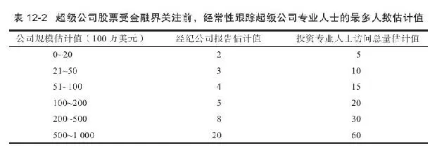

当公司规模扩大至5000万美元到2亿美元的规模时，它开始吸引非激进追随者的注意了。随着普通追随者的加入，报告开始减少。当超级公司扩大到2亿美元到10亿美元的规模时，就开始获得金融界的支持了。这样，它开始进入到越来越多的机构投资者的投资组合中。

你当然希望自己的目标公司极少或者根本没有受到华尔街的瞩目。请注意最大值这个概念。许多公司没有长期跟踪其业务的专业投资者（或者只有一两个）——从购买者的角度，当然是越少越好。

相反，一家成为金融界关注焦点的公司拥有大量的追随者。如果你所关注的是这样一家公司，那么就别再浪费时间了。生命是短暂的。（即使这家公司拥有上述投资者关系网也不是什么好事，它们大可不必拥有大量的投资者关系来证明它们的优势。）

## 访问公司

访问公司

消化了所有得到的信息，你应该已经知道关于这家公司的大量信息。但在知识和信息之间可能还存在一定的差距。列出一系列的问题，有些可能是实在的问题，例如营销组织中经理和销售人员的人数，其他问题可能与管理层的想法有关。做这样的列表是有必要的，它让你思考一些你还不知道的事情。“我知道什么，我又不知道什么？”当想到一个问题时，赶紧记下来。之后，再按使用顺序，对这些问题进行整理。

附录A列出了我最常问的问题——这些问题被反复地问到。一些问题是针对特定公司准备的。由于其时间宝贵，占用管理层的时间询问一些别处易得的信息是无礼的。（要是管理层回答说，“这些内容可以在SEC Forms 10\-K中找到”，我会感到很难堪，因为在与管理层谈话前，我就应该知道SEC Forms 10\-K的内容了。）准备好了一单子问题，现在我就可以联系这家公司了。

有时想要说服管理层接见你是困难的。不管什么时候，都可以通过一些与该公司高层管理人员关系密切的人，获得他们的个人信息。那么，我与董事会、公司审计人员、法律顾问、相关银行或投资银行有联系吗？通常没有。

多年来，我一直尝试通过电话联系，希望管理层可以接见我，但我经常都绕不过秘书。有些秘书将他们的工作视为帮老板避免外界干扰（可能一些老板也是这么想的）。秘书会问我需要什么，而我会解释原因，然后，她会告诉我与某某先生（他的老板）进行一下确认。

几个星期过后，我还是没有得到回复。我又打通了电话，终于联系上了上次那位秘书，但是她很可能不记得我了——她最后的答复是她很抱歉，但是老板和其他主要人员工作很忙，所以在几个月中都无法接见我。此时的坚持可能就会直接联系上管理层，并且说服他们见我。我会借此结交一些具有共同利益的朋友，找那些可能帮我建立联系的人。那么，我认识的哪些人熟悉这些管理层呢？是他们的客户吗？在同一区营业的现成的熟人吗？贸易和金融会议是建立这种联系的好地方。这一过程会经常发生并且持续着。我仍然还会参与其中——但不是经常。

## 迈入大门

迈入大门

尽管这样，我发现还是写信联系比较容易。如果我想见管理层，我就会写信给首席执行官。我会开门见山地说明我为什么想见他，我对其公司的潜在发展兴趣，并且我已经开始下工夫研究了。其中，我会详细解释我计划购买的股票量。接着，我会对自己和我的公司进行一下简单介绍，通常我会提一下自己投资的几家公司（以便证实我不是在自说自话）。另外，我会提供进一步的参考。我会主动说明，如果实在不行，我也可以与其他人见面。（用这种方式，他很难完全拒绝我。）

在最后，我会列出拜访他们公司总部的五个较为方便的日期，并建议他挑选一个他觉得方便的日期。如果所有这些时间都不适合他的话，那么我还会请他来选个时间，我会尽量加以配合。这种写法会让他明白，这对我来说是何等正式和重要。然后，我建议他可以通过他的秘书跟我商定日期和时间。最后，我会对他的抽空阅读表示感谢。

这样的信有95%的机会得到肯定的回复——对“突访”式的信函来说明显较高。在回复确认时，秘书会尽量表现得干脆、热情和乐于帮助。我强烈建议自我介绍式的信函。

在会面的当天，我会回顾一下问题和收集的有关信息。如果我可以把握好这些信息、问题和笔记，那么就可以去赴约了。第一次见面通常不会超过两个小时。我的问题大多能得到完全的答复，只有少数仍然模糊不清。在接下来的24小时里，那些我获得的信息又可能会产生新的问题。

## 联系客户、竞争者、供货商以及专业投资人士

联系客户、竞争者、供货商以及专业投资人士

目标是更多地了解这个公司，了解金融界对该公司的看法。最终目标是一家其客户、竞争者和供货商认为不错的，而华尔街却不感兴趣的公司。

从研究到与管理层会面的这一过程中，肯定会出现很多与该公司有业务往来的其他公司的人员。所以记录几个客户、竞争者和供货商是很容易的事。可以向他们询问该公司的情况。通常，那些人都可以通过电话联系到。同样，如果有困难的话，我还可以写信解释原因并寻求方便的通话时间。多数人都会出人意料地予以配合，因为人们都喜欢有人询问自己的意见。

问题自然地产生了。可以询问客户是只从该公司购买，还是会从其竞争对手那里购买。他为什么这样做？他目前对该公司的印象如何？公司提供的产品是否令人满意？他是否会继续购买该公司的产品？公司是如何应对竞争的？他认为该公司作为卖方的优势和不足是什么？长期以来，公司的经营变得更好还是更坏了？如果由他来管理该公司，会出现什么不同？他认为该公司的产品市场发生着什么变化？客户往往乐于谈论此类问题，因为被问到的是关于他自己生活的。做好记录以便参考。

虽然供货商有时会持有偏见，但也是信息的一个好来源。供货商可能有所担心，因为对公司的不利言论会影响其未来的生意。供货商之所以持有偏见，是因为多数人对其客户都会倾向于给出积极的评价。（“XYZ公司当然会不断发展。我估计它明年的购买量会是这个数字的两倍。”）但是，我们仍然可以从中获得有用信息。

供货商乐于比较不同的客户，他们可以得到不同的客户的购买量。如果他们最近没有得到该公司的订单（或者一笔订单被撤销），那么他们便会询问你发生了什么事——这是供货商与你谈话的重要原因，因为毕竟你正在研究他们的这个客户。由于他们只从某个有利的角度观察客户，所以他们可能对你询问的最广泛的话题也感兴趣。对供货商而言，对客户了解得越多，生意就越好做。

但是，想要顺利地让其竞争者开口就很困难了。他们为什么要跟你说呢？毕竟你正在考虑投资于他们的竞争对手！谁会愿意帮助其竞争对手得到投资呢？这个问题同样也可以通过参加会议得到解决。竞争者可能正在出席某个会议，并且希望有局外人提问业务上的问题。它希望在这种场合下展现自己。我们可以询问该竞争者的业务，然后，在讨论过程中，将话题转向正在研究的公司。通过询问竞争者公司的情况，可以得到我们想要的信息。

竞争者很可能会大谈特谈其相对于另一家公司的“优势”。必须认真地聆听。他所说的优势可能是正确的。记下笔记，比较和综合各个竞争者的说法——相互间的。不同的竞争者可以在多大程度上得出一致的看法？询问每一个竞争者它所认为的最强的竞争者是谁？哪两家或三家拥有最先进的技术？哪家拥有最佳营销组织？为什么？

如果客户、竞争者和供货商都使你确信这是一家超级公司，而金融界认为它很糟糕的话，那就太棒了。公司管理层会直言不讳地暗示哪些投资专业人士经常联系该公司。他们还会透露谁曾经对其感兴趣而现在却不感兴趣了。找出后者，比较他们的观点与那些现在还经常访问该公司的人以及你自己的观点有什么不同。

比较金融界与客户、竞争者和供货商提供的信息的不同。对手头投资人士的“旧”信息要特别敏感。它已不再正确了吗？

2026年3月14日

9:51

## 是得出结论的时候了

是得出结论的时候了

应重新快速地回顾一遍收集到的信息。我们运用利润率分析的方法来得出最后的结论。某家公司是否有一定的概率快速成长？这种成长可以不通过减少股东收益的外部融资实现吗？它可以在长期内可以实现哪种利润收益呢？以这种速度成长需要克服什么样的困难？三个会使所有这些黯然失色的最大风险是什么？

该公司的市销率和市研率必须是低的，否则我们也不必花这么多时间进行研究。但是，如果确信该公司有美好的前景，而有资格成为超级公司，我们还需要一个步骤，运用规则进行价格分析。为此，我使用一页纸的篇幅来总结最后结论所需的全部信息，如专栏12\-1所示。最上方列出的是股票市场价格、全面摊薄股票数。接下来，计算市销率和市研率后，下一步就能得出结论了。结论包括以下方面。

➤哪些因素可能会使股票下跌？

➤我预期未来5年销量会以怎样的速度增长？

➤公司可能达到的未来利润目标是什么？

➤未来几年中，市场对该公司的合理且保守的估值是多少？什么时候能实现这些利润？

➤在3～5年的时间内，将这种利润转换成市盈率，大致是多少？

➤按意愿数量购买全部股票，我需要多少资金？这一数量占该公司股票总量的比例是多少？

专栏12\-1 XYZ公司，购买前估值——预测

（1）市场价格为12美元，拥有490万股全面摊薄股票，市值为0\.59亿美元。

（2）过去12个月的收入为0\.84亿美元。

市销率=0\.70。

过去12个月的研发费用为500万美元。

市研率=11\.8。

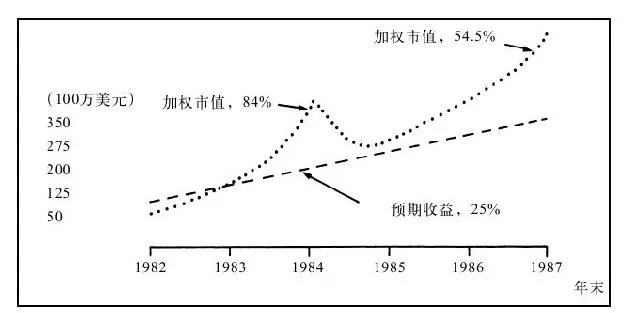

图 12\-1

结论

（1）除非该公司在未来12个月取得其他方面的利润，否则其股价可能会下跌。股市预期会出现拐点。

（2）未来5年，收益可以轻易地获得25%的平均增速。

（3）公司36个月后的纯利润率应为7%。

（4）在某一时刻，该股票应该可以以两倍于公司营业收入的价格卖出。可能是1983～1984年期间，也可能是1987年。

（5）如果取得7%的利润并且在市销率等于2时卖出，就能得到29的市盈率。

（6）如果我买入100万美元，在这过程中股价上涨到15美元，那么我的买入价平均为每股13\.5美元。这意味着我买入74000股，即公司股票总额的1\.5%\.

我还会制作一张图来说明我的购买预期和市场价值的波动趋势。市场价值预期假定未来销售价值成倍上涨，随后回落，接着又开始上涨。这里对潜在的多倍增长的收益与简单增长的收益进行了比较。为使它尽量保持通俗易懂，我们不考虑未来证券发行、新股期权等所带来的稀释作用的影响。

专栏12\-1只是一个模板。在图12\-1中，我对股票成本、当股价预期与未来卖出价以及市销率的预测值重合时的两个峰值进行了比较。在假定股市变动如图所示时（这只是猜测而已），存在几个可供参考的点，可用于计算收益率的预测值。

按定义，一只超级强势股的长期收益率必须超过25%——也许还能更高。我通常会留出较多的自由空间，所以我会要求收益率的预测值大于40%。如果在做完这些工作后，我能得到这样的结论，那么现在该是买入该只股票的时候了。理所当然，下一步需要考虑的就是什么时候卖出的问题，也就是第13章要讨论的内容。

## 第13章 趁好就收 何时出售

第13章 趁好就收 何时出售

玫瑰何时凋谢

应该在什么时候卖出超级强势股呢？最好永远不要。但如果以下两种情况出现一种，就该卖出股票了。

➤股票的市销率上涨得很高。

➤公司失去了成为超级公司的某些特征。

只有价值能以可观（如果不规律）的速度增加，持有一只股票才有意义。除非股价能长期增长，否则持有债券或其他更安全的资产更有利。如果某公司的内在特质发生了恶化，那么就应该明智地卖出。这点很少有人怀疑。

如果公司的基本面不再保证其内源性增长，这家公司的前景就不容乐观了。习惯于增长环境的管理层面对非增长环境时，可能没有足够的心理准备。以前由成长型股票组成的投资组合会慢慢地失去光彩。当一家好公司变坏时，它的股价就会快速下跌。

要全面地观察市场的动态，应该像对待第一次学习机会一样，经常关注公司的发展。仔细观测公司的发展——做一个反向操作的投资人。公司基本面发生了怎样的变化？管理层是否出现变动？他们是否因为成功变得有点自满和固执？市场是否发生变化？行业的其他竞争者或者其他行业生产的新产品是否替代了公司的旧产品？竞争形态产生了变化？本行业可能出现了大的新进入者。

很难客观地看待自己——这几乎是不可能的。对投资者来说，如果股票表现得不好，那么他可能会觉得悲惨。但如果公司长年来表现优异，投资者获得500%、1000%、2000%或更多的收益，获得好评的则是该公司的管理层。

由于管理层的优异表现，可能使得其在投资者心目中的形象会逐渐变得异常高大。这种依靠可信的成功建立的形象可能会随时间得到修正。随着这种形象得到加强和稳固，人们要想要像第一次一样，客观地看待管理层就变得越发困难了。当犯了错时，忘记是很容易的。（没有人是完美的。）

保持客观。但愿我可以说，在这方面我本来应该做得很好。但是我没有，这是整个投资过程中最困难的事情之一。如果经验告诉我管理层能力很强，那么我愿意相信。我并不认为自己是唯一这么想的。要想知道玫瑰何时凋谢是很困难的。

## 注意深浅

注意深浅

另一个卖出超级强势股的绝好机会是当其市销率非常高的时候。比较你的公司与其他同等规模公司的市销率，可以知道市销率已经上升得多高了。一只以营业收入5倍价钱卖出的股票就相当于一家利润率10%的公司以其收入的50倍卖出（见表4\-1）。一只以营业收入10倍价钱卖出的股票就相当于一家利润率10%的公司以其收入的100倍卖出。

竟然有这么多公司的股票以5倍、10倍、15倍、20倍甚至30（29\.67）倍于营业收入的价格卖出，这着实让人惊讶。一只以营业收入30倍价钱卖出的股票就相当于一家税后利润率10%的公司以其收入的300倍卖出。记得早在1978年，当时最高的市销率还只是2\.5。可见牛市所产生的影响是何等巨大。1982年11月，市销率超过6的只有8家公司。而到了1983年5月份，这个数字上升到了16家。

我认为，不管哪只股票，只要股价超过营业收入的3倍，就应该予以关注。而超过5倍的就更加罕见了。长期持有能以5～30倍于营业收入的价格卖出的股票简直难以想象。这种现象只会在牛市中出现。

不存在长时间美好的旅程

以适当的价格买入的一只超级强势股，如果始终保持高于平均水平的内部融资性增长所需的基本特质——市销率保持在低位，那么我会永远持有该股票。随着公司的发展，不断扩大的规模会对股价形成压力，从而会使得股票价值以与公司发展相同的速度增长。一只市销率为0\.6，年收益增长率为25%（或者更高）的超级强势股会产生令人欣喜的收益。如果它的市销率从未高过0\.6，那么这只股票的价值可能（也许不规律地）年均增长25%——达到超级强势股的最低标准。5年后它的价值可能是初始值的3倍（这是复利机制在起作用），10年后它的价值则会达到初始值的9倍，20年后则是初始值的85倍。

在另一方面，随着金融界越来越多地关注到它，超级强势股的价格会成倍地上涨。如果市销率在5年后上升到3，它的价值就会增加15倍。如果20年内上升到3——这不大可能，因为到那时公司规模已经很大，而大公司往往拥有较低的市销率，其价值会是初始值的400倍。

那么为什么还会有人想要卖掉超级强势股呢？只管买入，然后永久持有不是更好吗？如果市销率不上升的话，这当然是正确的选择。我们必须记住，随着公司规模的扩大，市销率会有下降的压力（见第4章）。只有少数大型公司（只有几个）营业收入上10亿美元而市销率又大于1。

大公司对于多数投资者来说不具投资吸引力，但对于乐于冒险的小额投资者却并非如此。人人都会预期从IBM获得好回报，但是只有极少数人想从这样的大公司身上获得巨额回报。

然而，人们可以在一些小公司身上发挥自由的想象。如果一家公司收入2亿美元而市销率为6，那么它的市场价值就等于12亿美元。当其收入达到10亿美元时，它的市场价值却不会有大的增长——肯定不会是较大的增长。当收入达到20亿美元时，它的市场价值仍然不会增长。高市销率可能抵消了大部分市值增长，如果不是全部的话，要实现增长也得等上几十年。这就是应该在市销率处于高位时卖出股票的原因。当营业收入是10亿美元时，我们的超级强势股的市销率很可能是0\.75——大致等于我们的买入价。

高的市销率只与公司规模和前景相关。对于一家营业收入为10亿美元的公司来说，市销率达到3就太高了。但对于营业收入为30亿美元且短期前景向好的公司来说，3可能算是低的市销率。对于大多数的超级强势股而言，市销率如果达到2～5的区间，就已经很高了。只有少数处于起步阶段的公司，较高的市销率会在长期内得到调整。那些选择坚持持有高市销率股票的人，到头来都会受到重大损失。

## 落袋为安

落袋为安

现在你已经掌握了超级强势股的解析方法。重点是对公司的基本面分析——发现是什么令某家公司与众不同，然后以低价买入。

其他的只是补充。超级强势股应当长期持有直至其市销率变得异常之高或者该公司失去了使之成为超级公司的基本特征时。不要过多地关注于股市行情和变动，而应更加留心公司的具体情况。来看下面两章的案例。

## 第14章 Verbatim公司 迪斯科的产物

第14章 Verbatim公司 迪斯科的产物

早期历史

Verbatim公司于1969年成立于加利福尼亚的桑尼维尔，当时的名称为Information Terminals Corporation。1978年11月，该公司名称改为Verbatim。由J\.里德·安德森建立的这家公司，主要为计算机行业生产和销售可移动存储设备。安德森在高科技企业方面经验丰富——是成功的电子终端制造商Anderson\-Jacobsen的创建者之一。 [\1]

Verbatim公司已经成为了当今世界主要的软盘制造商——软盘是用于个人电脑、小型计算机和文字处理系统的可永久使用且可移动的存储设备。8英寸磁盘的市场已趋于饱和且增长缓慢，而3\.5英寸微型磁盘却是一个新兴且快速增长的市场。

Verbatim公司成立之初，软盘技术还没得到很好的开发，其主要收入来自出售可移动数据磁带盘。所谓的可移动数据磁带盘就是一个塑料盘，内置有缠绕适用电脑的磁带的两个小卷轴（类似于消费者录音卡带系统）。数据磁带盘是用于少量数据存储的低速且廉价的设备，主要用于终端、销售点终端、小型计算机以及电信设备。1974年，数据磁带盘占Verbatim公司销售额的95%。 [\2]

1974年，IBM开发的软盘技术被引进Verbatim。1978年，截至6月30日，Verbatim的软盘销售超过其22000000多美元销售总额的一半。它们比数据磁带盘的增长率要快得多，在1978年6月份的销售额中占有2/3的份额。 [\3]

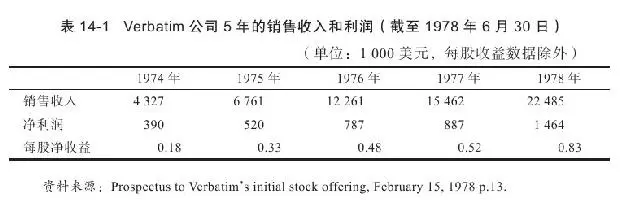

那时，Verbatim大约占有世界数据磁带盘市场的一半份额和软盘市场1/3的份额。这个记录使其即使是在衰退的股市中也不难上市。在1979年2月15日Verbatim发行的原始股价格为17\.75美元，随着股市波动一直涨到29美元。发行股票后，里德·安德森仍然拥有总公司超过30%的股份，但是他的参与逐年减少，他已经62岁了。总裁和执行董事彼得·麦丘恩接替他负责日常管理。

1979年的年报中揭示了一些潜在的问题。由于该公司8英寸规格的软盘产品生产率低下，使得第四季度利润受到了影响，但金融界对它的评估仍然保持乐观。例如，Verbatim股票发行的合作承销商Hambrecht＆Quist投资银行在1979年9月5日发布了14页的报告来推荐这只股票。从长远看，它的推荐可以使投资者获利的，但从短期来说却不是这样。

在经历连续7年盈利后，作为上市公司的Verbatim在第二个季度里遇到了麻烦。它失去了对包括制造磁盘在内的处理程序的控制权，磁盘的内部材料没有经过足够的测试就进行了更换。新的外层吸收了太多的滑润剂导致磁盘的失败，磁盘上的化学隔层的改变也导致了使用寿命的减少。

1979年，由于一部分磁盘因为质量差而被退回，使得质量问题第一次浮现出来。1979年12月，劣质产品的数量不断增加，但公司并没有意识到这一问题的严重性，在1980年春天，这个问题变得非常尖锐，1980年12月，这个问题最终得到了重视与修正。 [\4]

问题主要出现在8英寸软盘（其市场份额由45%跌至15%）的生产线。劣质产品的收回是必要的，这减少了销售收入。5\.25英寸光盘市场仍末形成，受到的影响较少。在1980年初期，Verbatim停止了在刚性磁盘发展领域里的研发。 [\5] 1980年第四份季报（结束于1980年6月30日），揭示了Verbatim公司上市以来的第一次亏损。

总裁离职

总裁彼得·麦丘恩被解聘， [\6] 失控的局面比1980年的年报中所描述的情况还要严重些。但管理部门并没看到问题的严重性，因为对这个问题的议论已经逐渐趋于缓和。股价从1979年的最高点29美元跌到20世纪80年代中期的10美元。

损失仍在持续。随着产量减少，单位商品的销售成本绝对量在增加。从1980年12月31日的财务季报中可以看出，销售收入为11316000美元，但同时出现了1203000美元的损失。损失包括了记录在案的，超过1500000美元的存货。雇员数量从1538名减少到1242名。 [\7] 图14\-1、图14\-2与表14\-2给出了Verbatim 1981年年报中的季度数据。损失、股价的下跌引起了我们的好奇。

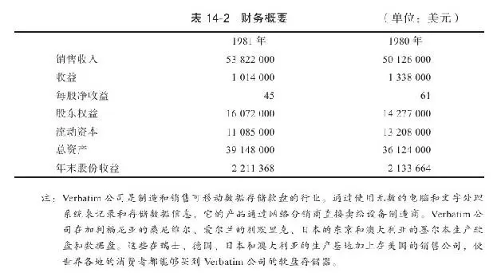

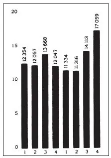

图 14\-11980～1981年各季度销售收入（单位：1000美元）

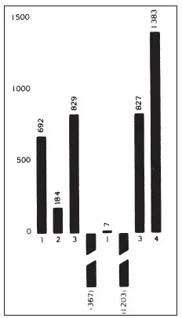

图 14\-21980～1981年各季度利润（单位：1000美元）

[\1] See Forbes, January 31，1983，Appendix 3\.

[\2] 资料来源：Prospectus to Verbaim’s initial public stock offering, February 15，1978，p\.13\.

[\3] 资料来源：Prospectus to Verbaim’s initial public stock offering, February 15，1978，p\.13\.

[\4] 1981年1月27日，与Verbatim公司财务副总裁威利·卡特的谈话。

[\5] Forbes, January 31，1983，p\. 47\.

[\6] The Wall Street Journal, January 13，1981，p\. 18\.

[\7] From Verbatim 2d quarter 1980 shareholder's report\.

2026年3月14日

9:51

## 竞争者情况

竞争者情况

在Verbatim出现问题的时候，Dysan公司抓住时机进入了软盘市场。Dysan将自身产品定位于高端市场，并得到了许多被Verbatim公司低质量软盘伤害的客户。它巧妙地处理好了公共关系，并将自己看做技术方面的领导者。它还通过取得风险投资方式，与华尔街紧密联系在一起，并制造传闻，声称作为技术领袖的Dysan将会超越Verbatim。

金融界的支持消失了。Verbatim的承销商Hambrecht＆Quist投资银行数月前还在支持这只股票，在股票下跌的几个星期后，该投资银行写道，“公司股价将有持续下跌的压力，除非出现的问题找到解决办法。”

Hambrecht＆Quist投资银行修改了它对Verbatim公司1980年和1981年销售和收益的预测。 [\1] 我发现没有一家其他投资银行发表过关于这家公司的评论，公司透露，在那段时间只有Gruntal＆Co\.对公司股票发表过评论。 [\2]

当被问到Verbatim公司的转型问题时，华尔街回应道，“那又怎样——即使它转型，从长期来看，也不敌Dysan。”Dysan怎么样？华尔街指出，Dysan拥有较好的技术、较好的管理和优质的产品。现在最大的问题是，“从长远来看，Dysan将会对Verbatim产生什么样的影响？”对此，我曾让一个中立的专家对Verbatim公司和Dysan公司的产品进行随机抽样，并对它们的产品进行了质量测试，其结果表明并没有明显的差异。

Dysan公司以每股售价17美元，融得了13600000美元权益资产。这使它拥有23100000美元的市场价值，但其销售收入仅为7100000美元，这意味着市盈率为3\.26（为Verbatim公司的7\.5倍）——这就是华尔街的宠儿。

Dysan公司虽然获得了金融界的大力支持，但我对其优势产生了怀疑。

许多的投资者相信了Dysan的优势——而没去了解事实的真相。

我先前在一家金融界的会议中遇到了Dysan的创始人兼总裁诺姆·戴恩。我以前也遇见过他很多次。在我和他不多的接触中，我对他的言行是持怀疑态度的。一个经理人应该是一个很好的倾听者，能够从他的下级听取建议。我很怀疑Dysan能够像金融界所吹嘘的那样表现优秀。

在1981年早期，没有任何看好Verbatim公司股票的评论出现。Hambrecht＆Quist投资银行随后称该公司“适合那些愿意承担不确定性的风险投资者”，并且预言其投资结果将会“低于我们的预期”。

还有一些非官方的言论对Verbatim公司进行了较差的评价。我偶尔与投资者交谈时，被告知以下几种不同的理由。 [\3]

➤Verbatim公司的管理层不够优秀。

➤诚信存在问题。

➤Dysan公司能从Verbatim公司手里抢占更多市场份额。

➤随着更多有能力的公司（Dysan、3M、IBM、Xidex）进入市场，Verbatim将会被驱逐出去。

关于诚信问题的评论很有意思。有些人认为，因为Verbatim公司的财务副总裁威利·卡特掩盖了问题，对他们的投资造成了误导。一位分析家很明显地将他对公司股票的失望情绪，发泄到了卡特的身上，并对他进行了人身攻击（包括对他的外貌和行为的讽刺），但是后来通过与卡特的接触，我发现这些攻击完全没有依据（参考第2章关于心理层面问题的探讨）。 [\4] 人们甚至开始怀疑在1979年首次公开发行股票时，公司就存在问题。他们认为公司管理层在一开始就隐瞒了问题，骗公众购买公司的股票。

我了解了超过二十多种关于Verbatim公司的投资评价，每次在了解情况时，我都装成对Verbatim公司一无所知。

我收集了Verbatim公司自1979年以来发布的所有财务报表和披露的信息。我并没有经常去考察该公司，我觉得没有什么特别的理由这样做。1981年1月电子新闻和华尔街期刊的文章披露了公司所有的重大改变（见专栏14\-2和专栏14\-3）。Verbatim引入了一位新的总裁兼首席执行官——马尔科姆·诺思拉普，他来自Rockwell国际公司的电子设备部门（EDD）。我不知道他的能力怎样——但这至少向外界传递了一个信号：Verbatim不再是一只沉睡中的雄狮（见第10章）。如果这个人能给金融界很深的印象，事情将会有所转机。我立即投入调查工作之中。在对磁盘的生产者和购买者进行过调查之后，我于1981年1月19日对Verbatim公司做了首次实地考察。我与市场营销部和研发部的主管进行了简短的谈话，大部分时间都是和Verbatim公司的财务副总裁威利·卡特度过的。

专栏14\-1 Verbatim公司选择Rockwell的马尔科姆担任执行总裁

Verbatim公司选择马尔科姆担任执行总裁，他曾在Rockwell国际公司的电子设备部门里担任副总裁。马尔科姆于1月21日开始上任。

马尔科姆先生，41岁，将会接替里德·安德森——这个生产数据存储软盘公司的创始人，现在依然担任总裁一职。去年7月，在公司经营出现问题后，彼得·麦丘恩被解雇，安德森先生暂代其位。在公司第一份财务季报里（截至9月30日），Verbatim公司的净收益为7000美元，而去年同期的净收益为692000美元或每股收益为31美分。

资料来源：The Wall Street Journal, January 13，1981\.Reprinted by permission of The Wall Street Journal，©Dow Jones＆Company, Inc\.，1981\.All rights reserved\.

专栏14\-2 因为Verbatim，马尔科姆退出Rockwell

马尔科姆，Rockwell国际公司电子设备部门（EDD）副总裁，从工作了18年的公司辞职，成为了加州北部软盘存储设备公司的总裁。

马尔科姆在加州桑尼维尔的Verbatim公司担任执行董事的职务，将在这个星期上任。

他离开了在Rockwell国际公司工作了14个月的岗位。在与霍华德·沃尔拉思共同担任公司总裁期间，使这个拥有4100多名员工的公司年销售获利超过2亿美元。

马尔科姆声称，制造微型处理器、相关电路、微型电脑系统以及嵌入式系统的Rockwell，从1978年就开始获利了。

马尔科姆的职责是，负责经营西海岸的EDD产品及与MPU相关的其他业务。决策机构和霍华德都在达拉斯。

“成为Verbatim公司执行总裁的机会并不常有，”马尔科姆说，“从表面上看，事情并不像我所预料的那样，我考虑了很长一段时间，Verbatim是一个非常好的公司……每一个职业经理人都想成为它的总裁。”

马尔科姆先生对Rockwell并没有什么不满，但他在报告中自嘲道，他在Rockwell的升迁之路被阻碍了。

“我在Rockwell从来没有这样的情况，我有机会去经营一家和我现在经营的公司一样大的上市公司，但是面临的挑战却不同，”他补充说道，“在Rockwell的工作是令人愉快的。”

马尔科姆称，至少是在现在，还没有人能够替代他的位置，霍华德先生将暂代其职。

马尔科姆在Rockwell公司经营的部门，使公司第二大客户——摩托罗拉公司同意订购68000台16位制的微型处理器。Rockwell本来计划是在去年夏天生产这批产品，但是错过了时机。最新的报告指出EDD希望这个季度能生产出这些微型处理器。

被问到这68000台产品的推迟上市是否与他的离职有一定的关系时，马尔科姆回答道，“绝对不是，短期内我们能生产出这些产品，这在我们的能力之内。”

马尔科姆先生是最近几个月里离职众多的EDD经理人中的一员。更早的时候，就有一些EDD销售经理辞职。当被问及他的离开是否与这些事有关时，马尔科姆回答说，“一点关系也没有。”

在最近几个月里，查尔斯·科瓦奇，EDD微电子设备部门前总经理，被任命为EDD销售部的副总经理。当被问到科瓦奇先生再次被任命为EDD关键部门的职位，是否与他决定离开有关联，马尔科姆回答说，“我与科瓦奇先生从来没有任何冲突，他是一个杰出的销售经理。我曾经是以销售为中心扩大产出的支持者。”

进入Verbatim后，马尔科姆先生将接替里德·安德森。里德·安德森是软盘数据存储产品公司的创始人，现在依然担任总裁一职。当被问及他的外围设备和半导体背景，马尔科姆先生说他在过去的5年里一直在研究半导体，特别是在通信和电脑领域里，包括设计软盘驱动。

资料来源：Electronics News, January 19，1981\.

我在Verbatim的新总裁上任之前，对为他工作、卖东西给他、买他东西甚至被他解雇的人进行了访谈，我形成的看法是如下。

➤这个新总裁有着良好的记录。并不是所有的人都喜欢他，但他很受人尊敬，即使是那些不喜欢他的人。

➤理性的投资者不能不理会他们有一个新总裁，但他们仍忙于舒缓以前的失望情绪。

➤Verbatim公司的财务可能仍将经历一段时间的损失，尽管管理层并没有出现任何过错。

➤Verbatim在5\.25英寸软盘市场上占有35%的份额（较高），在电子行业里有着高速发展的前景。其他的业务没有增长或者轻微增长。

➤Verbatim公司在很多年前就开始关注市场上的动向。

对于Dysan在他们产品质量出现问题时进入市场的好运气，Verbatim感到非常生气。卡特很骄傲地告诉我，Verbatim公司已经从Dysan手中抢回了重要客户——苹果电脑公司。

1981年，在5\.25英寸的小软盘的带领下，Verbatim公司在软盘市场的份额不断增加。 [\5] 个人和微型电脑开始在市场上崭露头角，这对Verbatim非常有利。同时，从截至1981年的Verbatim股价变化图和1981年第二份财务季报中，可以看出这些利好因素的影响（见图14\-3和专栏14\-3）。

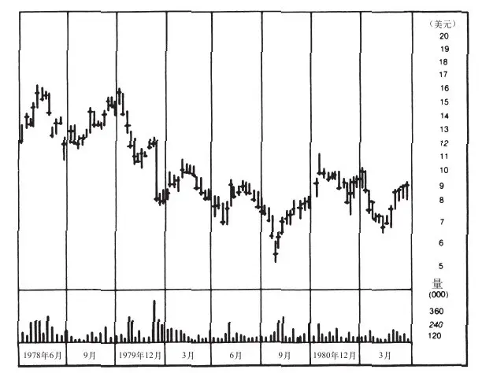

图 14\-3 Verbatim公司股价走势

专栏14\-3 财务季报摘要

Verbatim公司与惠普签订了为期一季度的高科技微型磁盘的生产合同，同时还收到了苹果公司、Lanier Business Products和Tandy Corporation关于微型驱动盘的订单。我非常高兴地指出在上一季度的财务报告中提到的，我们Datalife系列产品的引入已经获得了市场的高度好评，最近逐渐成为施乐复印机零售商店的热选。

去年7月，我们一直在寻找新的总裁和首席执行官。我们非常幸运地找到了马尔科姆，他将在1月21日正式加入我们。马尔科姆是一位经验丰富的专家，他将会对公司的将来、员工素质的增长、产品质量和对客户服务的改善做出重要的贡献。在上一季度里我们也邀请到了比尔·布罗克这样在软盘数据记录领域里有着20年工作经验的技术员的加入。

1月8日，公司在美国北卡罗来纳州夏洛特附近的大学工业园里购买了38英亩 [\6] 土地，来促进Verbatim公司的长远发展。我们预期在3年之内在此建立生产基地，使我们磁盘生产和包装基地移出加利福尼亚。

关于Verbatim和其员工的更多信息

我们的新总裁和首席执行官马尔科姆将带领Verbatim公司，重新认识这个市场。在过去的18年里，马尔科姆在Rockwell国际公司电子设备部门担任副总裁，这个部门主要涉及跨国商务领域。早期他还任职于电脑外围通信部门工程管理职位、半导体和磁性类商业部门综合管理职位。他在南方卫理公会大学物理学院获得理学学士学位，随后在Ampex Corporation担任软盘驱动设计师。

比尔·布罗克已加入Verbatim公司，担任高技术部门经理。比尔是伊利诺伊州大学机械应用专业的博士，他将指导我们的工程师和技术员，为Verbatim的产品完善和新产品开发提供技术支持。在加入Verbatim之前，他在IBM公司工作了20年，主要从事磁盘和软盘驱动的开发，并申请了17项专利。比尔的专业技术和能力将会带领我们公司走在技术的最前沿。

致公司股东

Verbatim第二季度的净销售额为11316000美元，比上年同期低6%。在美国和欧洲经济萧条的背景下，预期公司的销售增长将放缓，但公司微型软盘的销售与去年同期相比增加了，同时公司所有产品也接到了很多新订单。

低的销售水平，高的生产成本和存货减值导致了这个季度损失高达1203000美元。在对我们的存货重新估价后，我们得出结论：某种原料不适合高质量产品的需求。我们有超过1500000美元的存货来确保这些成本的变化不会影响将来的利润。在这个季度，我们要采取措施减少固定和可变成本，这将会使我们在下半年里获利。Verbatim员工数量到12月底为1242人，而1979年年末为1538人，从上一季度开始，就一直保持着较高的人均销售增长幅度。

11月，Verbatim澳大利亚分公司已经开始在墨尔本附近的生产基地生产产品。这刚好赶上了墨尔本召开的第八届电脑会议，在这次会议上，Verbatim展览了它的Datalife系列的磁盘产品。无论是Datalife产品的介绍还是Verbatim澳大利亚生产基地的介绍，都引起了澳大利亚分销商和顾客的浓厚兴趣。在众志成城之下，墨尔本基地之外的产品也被提上了议程。

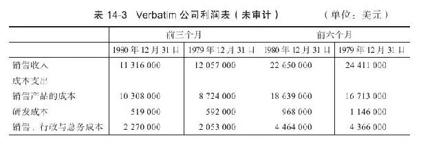

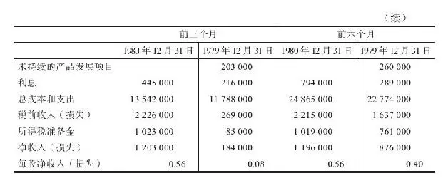

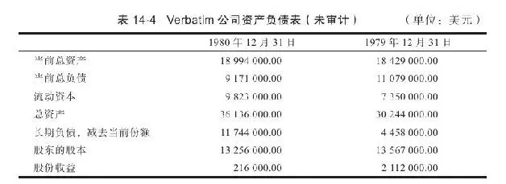

分析公司的财务状况很重要。Verbatim公司的流动比率 [\7] 为2\.1，这个季度的损失是120万美元。公司发行了13000000份股票，亏损将以250%的速度增长。现金流量是正的。较多的折旧费用为Verbatim公司提供了很大的现金流量。在1980年财务年度里，收益仅有1300000美元，加上折旧的现金流，总现金流入达到2000000美元，改善了资产负债表的流动性。 [\8]

市场份额非常重要。在5\.25英寸软盘市场中，没人能占有超过一半以上市场份额。在8英寸软盘市场中，由于产品出现了问题，Verbatim的市场份额在下降，但它仍然与IBM并列第一占有15%的市场份额， [\9] 拥有绝对或相对较高的市场份额。显而易见，如果问题没有被解决的话，这家公司更加容易被转让。但是既然占有如此高的市场份额，它就应该更能独立地解决问题（见第10章）。

因为如此明显的问题，Verbatim对产品质量的控制就更加谨慎。在产品装运之前每一张磁盘要求有100%的合格证。这增加了成本和损失，但质量的提高也使Verbatim公司产品低劣的形象得到改善。质量的改善同时伴随着订单的增加。

在我访问公司或者在马尔科姆任职之前，产品问题已经得到了解决，里德·安德森处理了这个问题。随着产品处理程序的改善和产量的增加，公司的经营业绩也在提高。

我的结论就是Verbatim曾经是一个超级公司。高层管理人员需要具备推动和控制增长的敏锐特质（见第8章），在快速增长的市场里，拥有绝对和相对较高的市场份额以及杰出的销售技能。但股票又该如何分析呢？

[\1] Hambrecht＆Quist interoffice memorandum, July，21，1980\.

[\2] Wiley Carer notes, January 27，1981\.

[\3] Hambrecht＆Quist report, October 23，1980\.在它的下一份报表中，用词几乎和这次的一样，详情参见1981年2月2日的报表。

[\4] 与证券分析师的私人谈话。在我与威利·卡特的多年交往中，我发觉他对出现的问题很坦诚。

[\5] Chemical Week, February 9，1983，p\. 38\.

[\6] 1英亩=4046\.856平方米。

[\7] 这个比率是由资产负债表里的流动负债除以流动资产得到的。投资者运用的标准规则是，流动比率应该超过2\.0。正如其他财务指标，该比率是预期值。

[\8] Verbatim's 2d quarter 1981 shareholder's report and 1980 annual report\.

[\9] 和Verbatim公司公布的一样——Wiley Carter notes, Januay 27，1981。

## 股票和市销率

股票和市销率

考虑市销率。在原始股票发行价格为17\.75美元时，Verbatim的市销率为1\.70。在1981年高峰时其股价为29美元，市销率为2\.71。在1980年盛夏低谷时，Verbatim的销售增加而股价下降，市销率为0\.43（2100000股乘以每股10美元除以1980年的销售额50100000美元）。1981年1月，它的市销率略高。在股价为10美元时，Verbatim的市研率为10\.4。

尝试冒险

如果Dysan没有采取特别的措施，它的市销率会从3\.25的高位下跌。而Verbatim公司，由于在后面进行了质量监控，使公司承受的风险并不是太大。专栏14\-4是我在1981年2月购买Verbatim公司股票前所做的预测估算，最后得出的结论是，可以购买该公司的股票。

在接下来的几个月里，我购买了超过22000股——大约超过Verbatim在外流通股的1%（不久后我以稍高的价格再次购买了12000股）。在我购买股票后股价上涨了——这是一个好的现象（卖方明显减少），我的每股成本从12美元增加到17美元。

后来，股票的表现更加令人兴奋。Verbatim的股票仅仅在两年内，其价值增长了10～15倍。仅在第一年，Verbatim的股价就上升了175%～290%，而这还是在股市受到较大打击的情况下实现的。表14\-5给出的是1981年刊登在《罗森电子刊物》（The Rosen Electronics Letter）上的100家电子类股票的行情。72家的股价下降，剩下28家的股价上涨，而Verbatim在名单上排名第一。

股票价格的上涨，向人们表明了公司经营状况转好。1981年第三和第四季度，Verbatim公司的收益在逐步反弹，订单稳步增加。 [\1] 1981年第四季度，每股盈利61美分，年率为2\.44美元。在股价为15美元时，年末每股盈利是1981年同期的6倍（15/2\.44=6\.2）。

专栏14\-4 Verbatim公司股票购买前价值估计

1\.Verbatim拥有2160000股，股票价格为13\.5美元，市场价值为29000000美元。

2\.去年12个月的销售收入为48000000美元。

销售率为0\.60，合格。

去年12个月的研发费用为2132000美元。

市研率为13\.6，勉强合格。

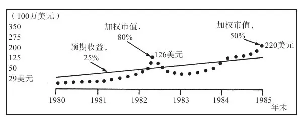

图 14\-4

结论

1\.如果有更多的注销，股价会下跌。如果下一季度的损失在现有水平的基础上继续增加，股价也可能会下跌。

2\.在未来5年里，收入能平均增加25%。

3\.在3年后，Verbatim的净收益平均增加7\.5%。

4\.某一天这只股票将以1\.5倍的价格销售。也许发生在1983～1984年，也许在1985年。

5\.如果他们赚了7\.5%的收益，以1\.5的市销率卖掉，他们将会有合理的20%的价格收益比率。

6\.如果买了500000美元的股票，在这个过程中，股票涨到18美元，平均价格会是15\.75美元，这意味着我将购买31700股，或总股份的1\.47%。

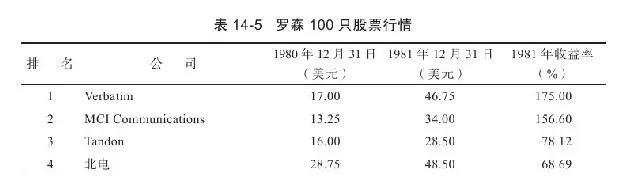

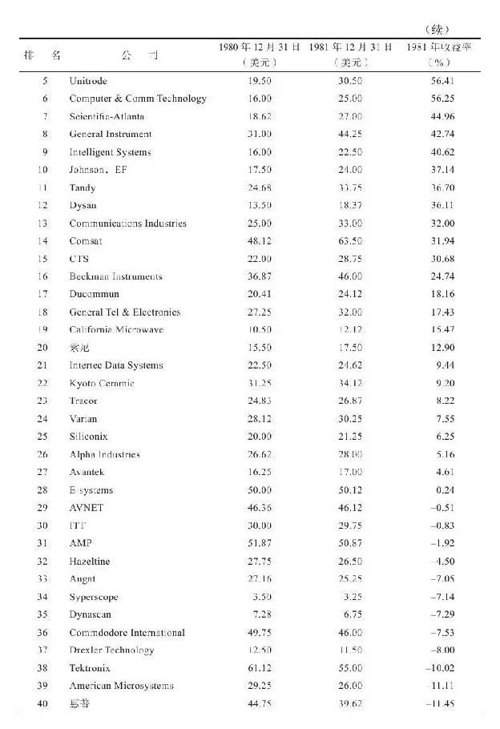

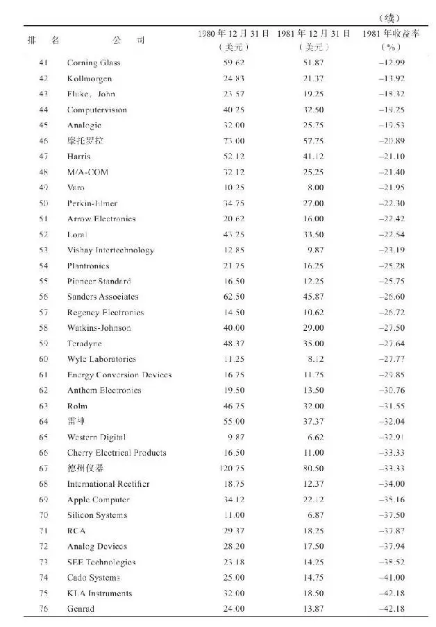

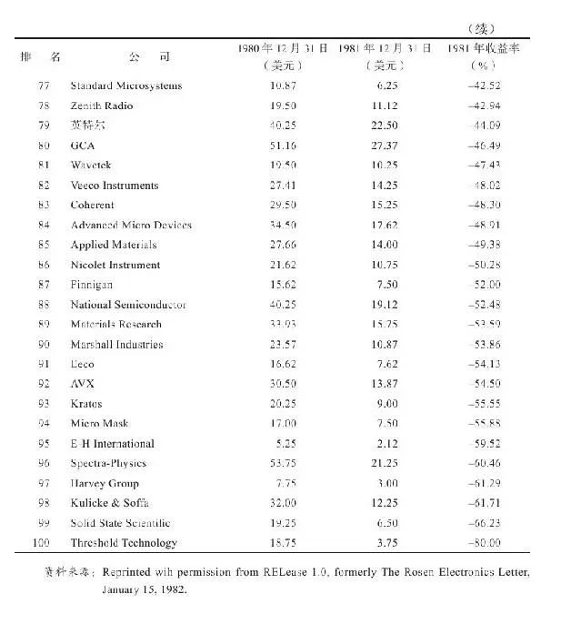

[\1] 1981 Verbatim annual report to shareholders, p\. 1\.

## 竞争对手醒来

竞争对手醒来

金融界现在完全沉默了。那些对Verbatim公司关注过的投资机构，例如H＆Q投资银行，现在对Verbatim的优秀表现非常惊讶：

第三季度财务报表的结果超出我们的预期。 [\1] 在财务报表出现的同时，Verbatim公司申请在美国股票交易所上市（1981年8月5日）。 [\2]

第一季度财务报表的结果超出我们的预期……我们正在调高我们对收益的估计值……因为有这么高的盈利……我们推荐长期投资者在现有水平买入（1981年10月21日，股价35美元）。 [\3]

这个季度新增的设备和研发费用，将会减少下一季度的盈利。然而，尽管1983年第二季度的计划开支比较大，但是未来预期收益将会大幅度增加（1982年1月19日）。 [\4]

H＆Q投资银行做得非常好，它提供了很好的投资建议，是第一个推荐购买该公司股票的投资银行。在H＆Q投资银行推荐Verbatim公司的股票时，其股价已经超过最低价的2倍以上（见图14\-5）。1980年下半年至1981年上半年，股票反弹非常迅速，因为它被压抑太久了，就像一个被压缩的弹簧一样（参见第7章）。1981年的销售额在1980年的基础上增加了7\.4%。第四季度的盈利为1383000美元，而去年同期则损失367000美元。 [\5] 销售比收益要稳定得多（因此在分析股票时PSR很有用）。

在Verbatim公司经营发生转机的同时，Verbatim宣布增发股票——为了融得更多资金（如果公司的经营出现了不确定的因素，那么现金将会起着重大作用）。由于公司没有得到金融界的信任，才造成了公司股价的下跌。当然这次公司增发股票，同样没有得到公众的支持。

在发行前的几个星期（可能出于对发行的恐慌和缺乏信心），公司股价下跌。1981年9月3日，Verbatim以23\.67美元的价格发行了350000份新股。

随着增发完成以及拥有的现金资产，其股价迅速恢复，并在以后每季度都逐步攀升。

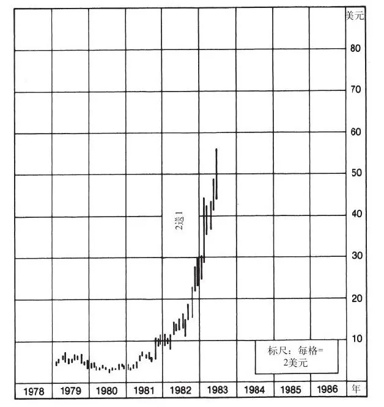

图 14\-5

图14\-6是Verbatim公司在1982年第一季度发布的条状图复印本，该图向股东说明了公司的财务状况。从图中可以看出，和Verbatim公司财务报表中的其他变量相比，销售收入和研发支出保持着比较稳定的联系。将之与Verbatim公司在1983年第二季度的财务报表（截至1982年12月31日）相比较（见图14\-7），后面的结论，已经足以劝导金融界放弃持有现金来购买公司股票。Verbatim的股票持续上涨。

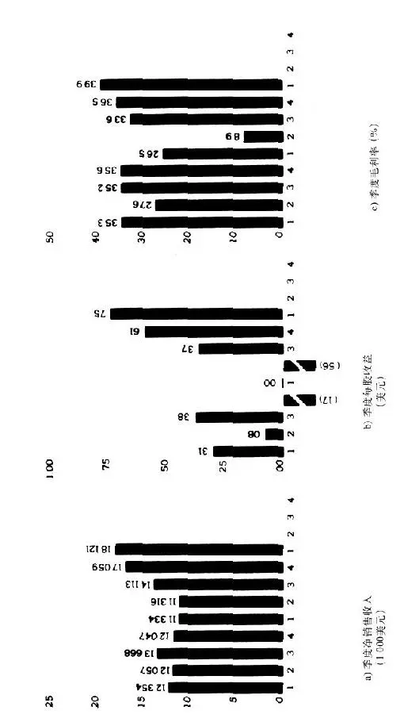

图 14\-6 Verbatim 1980、1981及1982年各季度表现

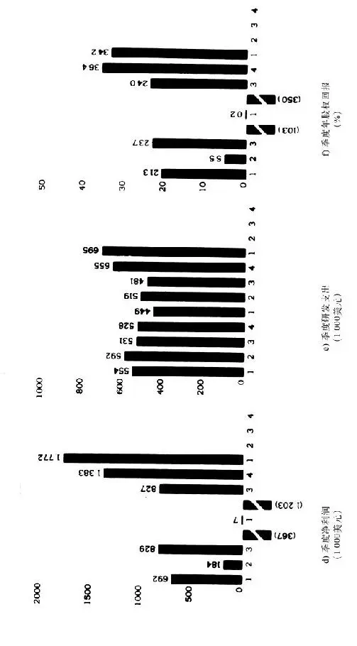

图 14\-6 （续）

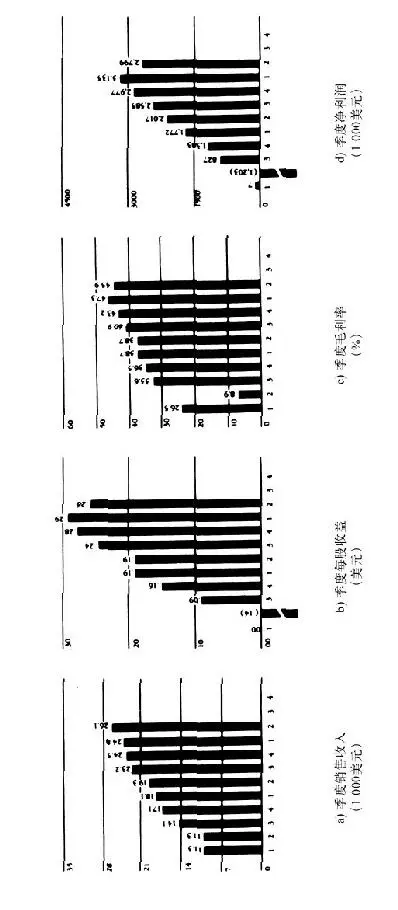

图 14\-7 Verbatim 1981、1982及1983年各季度表现

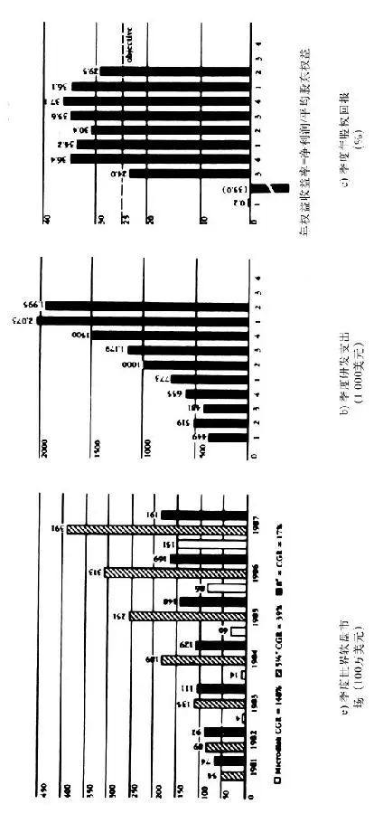

图 14\-7 （续）

[\1] Hambrecht＆Quist update on Verbatim, April 20，1981\.

[\2] Hambrecht＆Quist update on Verbatim, August 5，1981\.

[\3] Hambrecht＆Quist update on Verbatim, October 21，1981\.

[\4] Hambrecht＆Quist update on Verbatim, January 19，1982\.

[\5] Verbatim news release, August 5，1981\.

## 一路笑着去银行

一路笑着去银行

由于股票的分离和增发，到1983年春天，Verbatim公司流通在外的股票达到了12000000股。在接下来的几个季度，Verbatim都交出了完美的答卷，收益率超过了10%，销售突破了年度水平100000000美元。尽管有着较高的收益，但股票的市销率看起来仍有些高，此时股票的价格在35～55美元之间波动。市销率超过了6\.0（12000000股乘以每股55美元等于660000000美元的市场价值，再除100000000美元的销售额，得到市销率为6\.0）。

1983年，我卖掉了所有的股票。在1979年低迷的股市上，Verbatim公司的股票几乎经历了整个经济周期。它的市销率从2\.75降低到0\.5再恢复到6\.0，在这几年时间里，它的股价从高点跌至低点，然后再升到更高点。Verbatim公司以前就像是个“跳迪斯科的小孩”，现在已经成长为一个拥有100000000美元资产，并处于发展的黄金时期的超级大公司。

## 第15章 California Microwave公司 波浪式前进

第15章 California Microwave公司 波浪式前进

早期历史

1968年，戴维·利森博士在加利福尼亚桑尼维尔，创建了California Microwave公司，该公司设计制造的电子设备及其所涉及的市场都是基于微波技术的。 [\1]

California Microwave最开始主要是提供微波信号资源库，以服务于特殊的通信和对空雷达设备。后来它发展了服务于现代无线电系统的资源库，该资源库有这样的特征，当在某个地方安置一台设备后，该设备在其使用年限内，其维护费用是随着频道容量增加而递减的。随着California Microwave公司的新产品CM41的诞生，该公司迅速成为国家现代微波系统的最大供应者。

现在，该公司的产品不仅应用于无线电通信，而且还运用于防御系统，其涉及领域具体有：声音和电脑数据的陆地和卫星传播、电视和广播转播、雷达和军用电子防御系统。顾客群体包括：贝尔系统、其他公共组织、美国政府部门及其代理处、无线广播和通信社广播网、卫星承包商和外国政府。 [\2]

近些年，电子技术在微波领域得到了显著的发展，FCC决定在20世纪70年代拓展潜在的电子通讯市场。 [\3] 随着计算机技术的不断发展，带来了数据交流容量需求的不断增加，促进微波技术不断向前发展。

1972年，California Microware公司首次向市场公开发行股票，并从那时起就可以进行柜台交易。在20世纪70年代中期，该公司发展迅速并且其股票表现也非常优秀。表15\-1是截至1979年6月的5个财务年度的销售和盈利的情况。 [\4]

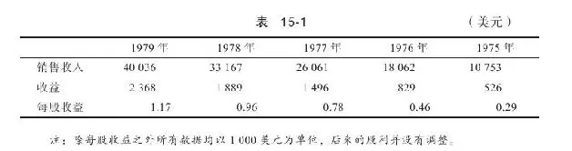

在20世纪70年代后期，一个被众多华尔街经济学家称为滞胀的时期，该公司的销售收入和盈利的增长幅度仍然分别达到30%和35%。在1979年全年，该公司的股价在15～18美元之间波动，其PSR值在0\.92～1\.10之间变化，这当然不是很高。它的市盈率在15\.6～18\.75之间变动——按照各类标准，它同样也不是特别高。因为股票的价值并没有被市场高估，并且该公司有着连续的增长记录，所以它得到了机构投资者和经纪公司的支持和推荐。专栏15\-1是一个典型的经纪公司的“总结表”报告的正文部分，该报告来源于L\.F\.Rothschild、Unterberg和Towbin公司股票的推荐。

专栏15\-1 California Microwave CMIC（报价17\.25美元）

California Microwave公司最近发布了第一份盈利季报，该季报截至9月30日。公司收入增长了24%，达到990万美元，净收入增长了25%，达到608000美元，每股收益从24美分增长到了29美分，增幅达到21%。

比这份报表更重要的事项是，FCC在10月决定扩大广播和闭路电视传播的卫星地面终端的比例，但其具体实施的时间还没确定。公司已经接到三份价值总和为960万美元的合同，将为Associated Press、Mutual Broadcasting Systems和Muzak提供专有的地面接收站。这些合同所包含的内容，能使订货增至3420万美元，这三大客户的附加合同，加上其他潜在的关于卫星节目传输的合同，预期将会超过下一年。

对于当前6月份的会计报表，每股收益估值在1\.17～1\.40美元之间，我们现在仍维持这一估计，但我们仍使用1981年1\.75美元的初始估值。我们相信公司在通信设备和卫星通信市场上仍占有相当的市场份额。

1979年11月，California Microwave公司在其公布的第二个财务季报中指出，其盈利要低于上年同期水平，整个会计年度的盈利水平也可能会减少。对于现代化的无线电产品CM41，为完成其未预期到的产量，需增加一定的成本。这样造成了实际成本超过了预期水平，从而导致盈利下降。 [\5]

股票“敞口”变低了，从18美元降到13美元。一只鞋已经落地了。随着销售额的增加，以及销售价格的下降，股票的PSR更低，为0\.64（206\.3万股乘以每股13美元等于2680万美元的市值：PSR等于2680万美元除以上个会计年度的销售额4190万美元，等于0\.64）。 [\6]

[\1] Prospectus to January 1981 stock offering, p\. 4\.

[\2] 1982 SEC Form 10\-K pp\. 1\-6\.

[\3] 同上。

[\4] 1979 annual report to shareholders, p\. 16\.每股收益数据都很准确，但是没有反映随后的变化。

[\5] Company announcement, second\-quarter shareholder's report, and 1980 annual report to shareholders, p\. 2\.

[\6] 根据向股东发布的季报和年报中的数据计算出来的。

2026年3月14日

9:51

## 该公司值得进一步投资

该公司值得进一步投资

这些年，California Microwave公司一直被金融市场和工程师看好。11月，我参考了手中的相关文件，且向这家公司索取了一些材料，然后开始了我常规的学术研究（参见第12章）。

我选择访问了四家以微波为主要业务的公司的经理人：Avantek、Frequenu Source、Omni Spectra和Ieta labs。 [\1] Omni Spectra是一家有着多种经营记录的公司，Frequency Source公司有意向在其PSR值为0\.76时，购买它的全部资产（124万股×每股16美元=1980万美元市值：PSR=1980万美元/2600万美元销售额=0\.76）。通过询问他们，我对戴维·利森有了这样的印象：California Microwave公司的创始人、董事长、首席执行官，一个有着野心的人——单身贵族、孩子气、对赛车有着浓厚的兴趣。我同样也和California Microwave公司的两家供货商谈过，他们注意到California Microwave公司从他们公司购买货物的量是不稳定的。总量并没有减少，但是购买货物的品种组合发生了重大的变化（CM41产品的产量逐渐减少，同时CA42和卫星类业务不断增加）。

从这些讨论中，我意识到，如果戴维·利森愿意，他将是一个非常有竞争力的人。大部分人认为，戴维·利森是一个安于现状的人，因为他已经非常富裕，不需要对California Microwave公司的事务那么关注。

1979年12月7日，珍珠港遇袭的纪念日，我与菲利普·奥托进行了会谈，它是California Microwave的执行副总裁兼首席财务官。奥托对我的解释是，公布的盈利的减少，可以归因于现代化无线电产品CM41订单的减少，以及与生产卫星地面终端产品相关的启动成本超过预算。公司预期将会有CM41的订单，但比去年同期要少。

戴维·利森对于他的生意较少关心，对此，我向奥托提出了我的担忧。奥托拒绝评论利森在过去是否尽职去关注他的生意。他特别强调，利森现在对他的生意很上心，并且他反复对我强调，这个担忧以后根本不是个问题。

我很愉快地离开了会谈，因为我已经知道了大致情况。市场上对公司的新产品CA42有很大需求，其卫星地面终端产品的生产线能比其他任何时候更加及时、大规模地组装起来。不考虑其他短期的情况，我已经深信他们的产品将有着美好的前景。但是我仍然想亲自拜访利森，来缓解对他的担忧。

1980年2月底，经理层将仍维持第三季度的财务报告（截至1980年3月31）的结果，盈利仍将低于上年同期水平，但是截至1980年6月30号的第四季度的财务报告揭示的盈利将会高于上年同期水平。 [\2] 在这种背景的支撑下，该公司的股票开始轻微反弹，1月的平均股价是16美元。

我开始有点担心股票继续上涨而丧失最佳购买时机（这是我第一个错误：不要鲁莽），1980年1月11日，我开始建仓。为了缓解我的紧张情绪，我在15\.75美元的价位时购买了一些股票。这是个错误，因为我还没有完全准备好，并且股票的PRS还不够低。我的紧张情绪冲破了我冷静的底线，1月底我又少量购进了一些股票。

专栏15\-2描述的是，我在1980年购买股票前，仓促间进行的估值过程。因为我已经持有了一定量的股票，所以我想我能够从容地进行我的调查工作。然而，我对该公司的信息了解得还不够充分，并且还不确定它是否是一只超级强势股，虽然我只持有少量的股票，但我还是觉得担心。

专栏15\-2 California Microwave公司股票购买前的价值评估

（1）California Microwave公司有206\.3万股股票，市价为15\.75美元。市场价值为3250万美元。

（2）去年12个月的收入为4180万美元。

PSR=0\.78——刚刚达标。

去年12个月的研发支出为260万美元。

PRR=12\. 5——刚刚达标。

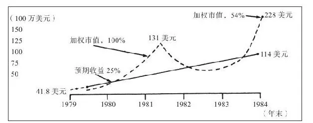

图 15\-1

结论

（1）如果在第四季度，卫星领域产品和CA42不能替代CM41，股票的价格将会下跌。如果第三季度的盈利低于预期水平，股票价格同样也会下降。

（2）在下一个5年里，收入将会以25%的平均水平进行增长吗？

（3）公司在36个月后将会有5%的净收益率吗？

（4）California Microwave公司的销售额，有一天会增长2倍，这一天可能发生在1981～1982年，或者是在1984年。

（5）如果它们有5%的收益率并在PSR为2\.0时销售，它们将有40倍的市盈率——冒进，但在牛市中还是可行的。

（6）只买一些，以后当价格合适时再继续买入。

通过进一步的研究，我了解到了更多关于微波技术应用的一些知识，包括其技术及商业运作成本等。我咨询了电子工业领域的专家，并在金融行业中寻找到了一些其他的信息。1980年2月15日，我终于见到了戴维·利森，那次见面给我的印象非常深刻。他非常坦诚地与我讨论了公司现存的问题，并且非常爽快而没有任何掩饰地承认他以前的确没有将精力完全投入到公司的运营管理中去。最近，他在进行一次自我反思：是否应该将毕生的精力投入到生意中去，他得到的答案是肯定的。

利森确实是个让人无法忘却的人——身材不高、壮实、一头长发、精力充沛。他在外形上的缺陷，在其精力、敏感、真诚方面得到了弥补。我很高兴，因为他是一个很好的听众，同时很受同事的尊敬。公司存在的问题，对于像他这样拥有某项核心技术的企业家来说，都是小菜一碟。用一个非常经典的范式（参见第2章），他将原因归类为：

（1）高估了CM41产品的生命周期。

（2）低估了下一代产品研发需要的时间（尤其是卫星地面终端和CA42——将和CM41有着相同市场的产品）。

尽管他高估了CM41产品的生命周期，但他还是没意识到高估了多少。当然，我也无法估计。结束交谈后，我对利森的感觉非常好，并且确信他将会克服遇到的所有问题。我相信下个季报的亏损将会让所有人感到失望（我也不知道情况会多糟）。在另一个反映亏损的报表的影响下，我估计公司的股价将会保持原位。毕竟，他已经在对股东的财务报告中得到了相关信息。我也不知道这是否意味着股票会崩溃。我在15美元的价位时，又适当补了点仓。我仍然不为股价变化所动，因为我坚信，我仍是非常了解这个公司的。

1980年3月13日，我有幸见到了劳伦斯·泰伦——Avantek公司的董事长兼首席执行官。Avantek是微波领域里非常受华尔街青睐的公司，是一个表现非常好的超级公司。其股票的PSR要高于2\.5，在当时也是很高的（参见第4章有关技术性公司当时的PSR水平）。

Avantek举行了一个关于计划发行股票的午宴信息发布会。我很幸运，除了公司职员外，其他人的座位并不是固定的。那有不少于六张餐桌——每张餐桌安排了八个座位。我鼓起勇气，快速向泰伦先生做了自我介绍，并且询问是否可以和他一起用餐。

午餐时，当他谈论他的生意和工厂时，我一直仔细听着。坐在同一张桌子旁的人向泰伦提各种问题，泰伦分别做出了回答。这使我对他印象非常深刻，他显然是一个很有竞争力的人。当被问及California Microwave公司时，他笑着指出，Avantek将会进入现代无线电微波市场。“如果戴维·利森再不用心打理他的生意，他将会失去这个市场”。桌子旁所有人都在窃笑，在这张桌子周围弥漫着Avantek无以比拟的自信以及对California Microwave公司无限的藐视。

[\1] Hambrecht＆Quist投资银行报告指出：“在某些情况下，Omin Spectra公司出现了不同的结果。”

[\2] Second\-quarter shareholder's report, February 1980\.

## 糟糕！另一只鞋掉了

糟糕！另一只鞋掉了

1980年3月19号，California Microwave公司宣布，它生产的CM41的存货，账面价值大约减少了100万美元，这导致了第三季度财务报告的亏损。他们指出，公司本年的盈利将会明显低于上一年度。他们还指出，上个月CM41的订单大幅度减少。从报告的措辞中可以感觉到，他们对账面价值的具体贬值幅度还很不明确。 [\1]

另外一只鞋子落地了。股票的“敞口”更加低了。股价从13美元跌到9美元，以后的一段时间里跌破了8\.5美元。在其后一段时间内，股票价格在8\.5～10\.5美元之间波动。当公司管理层指出，他们正在估计问题的重要性，并且还不知道贬值的具体数目时，大部分的利益相关者都似乎很紧张。（参见第2章，可以更详细地了解公司在这段时间的经历。）100万美元这个数据仅仅是个估计。

在这段时间里，管理层进行了改组。两位高级职员被辞，两位现任的副总裁被赋予了更多的职责（具体过程参见第2章）。吉尔伯特·约翰逊被委任为运营副总裁这一新的职位，霍华德·奥林杰被任命为通讯部门的新总裁。 [\2]

图15\-2给出的是截止到1980年3月底的若干年，股票价格的变动情况。这不是一张让人愉快的图片。

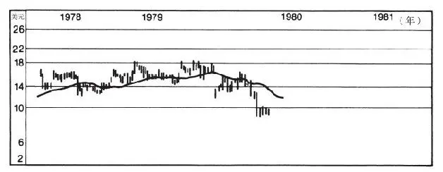

图 15\-2

资料来源：Mansfield Stock Chart Service, Jersey City, N\.J\.07306\.

我陷入了困境，我不愿意看到我所购买的股票的价格与我的购买价背道而驰——越来越低。这很容易把责任归结到California Microwave公司管理层身上。在我见到戴维·利森一个月后，公司公布了它存在的主要问题。很容易让人产生这样的看法，“如果他们不能察觉以前存在的问题，就是一个低水平的领导层，并且他们也就不可能察觉到现存的问题。”（参见第2章，可以详细了解这种不恰当的心理状态。）然而，应该原谅管理层的错误，尽管股价是下降的。

在接下来一个月的大部分时间里，我仔细地思索在过去几个月里我得到的有关公司的信息。我该怎么办——对于一个未来可能成为超级公司的公司，当其管理层自己都不知道在干些什么时，是在它遇到困境时买入更多的股票，还是卖出我所持有的头寸？

我所收集的大部分资料表明，California Microwave公司将是一个超级大公司。微波市场是由不同的小领域所组成，这些领域由不同的卖方支撑，每个领域的发展速度都非常快。在California Microwave公司所处的领域里，该公司占有相当高的市场份额。California Microwave公司将有着长期高于平均水平的发展速度，这是个重大利好消息。

高层管理人员都非常优秀。也许是受过去巨大成功的影响，利森曾在20世纪70年代后期没有用心经营其事业，但是现在，他们已经完全将注意力转回到了公司。尽管行业和金融领域的一些人对California Microwave公司仍不看好，但公司管理层通过对过去的反思，以及我对奥托和利森的了解，我已不再受这种消极情绪的影响了。

对于利润率这一重要的考察角度，公司有着长期良好的记录。公司以前就有着较高的利润率，这肯定不是一只在沉睡的雄狮。公司认为能够保持相同的利润率。根据已有的市场份额以及公司对市场的预期，没有任何理由能够阻止这一目标的实现。将公司预期的利润率与我的分析结合在一起，我认为将有5%的利润率。

California Microwave公司似乎已经通过了考验，即使它只是刚刚达到超级公司的标准。对于这样一个曾经有着快速发展历史，现在却遇到增长问题，但同时又有着良好发展势态和良好的领导层结构的超级公司，它的股价会怎么变动呢？

股价为9美元时，该股票的PSR仅为0\.44（206\.3万股乘以每股9美元等于市值1860万美元；PSR为1860万美元除以上年的总销售额4180万美元等于0\.44），PRR为7\.2（市值1860万美元除以由证券市场和第三方发起的研发费用260万美元等于7\.2）。 [\3] 把问题归因于股票本身似乎是恰当的，但这其是否存在时滞问题？

[\1] Electronic News, March 31，1980，and company news release, March 19，1980\.

[\2] Third\-quarter shareholder's report, May 1980\.

[\3] SEC Form 10\-K from fiscal 1979 and subsequent quarters'shareholder's quarterly reports\.

## 冒险尝试

冒险尝试

1980年4月29日，我参加了一个由旧金山经纪公司为投资者主办的，长达一个星期的技术会议。利森在会上做了一场关于California Microwave公司的演讲，但听众好像对他很不信任。利森面带微笑地走上了演讲席，但这并没有阻止一大半参会者的离场。在剩下的听众中，有些人目光呆滞地望着利森，而另一些人则低头看报纸。

在早些时候，我与一些人交流过。人们在过去6个月时间里得到了太多不好的消息。甚至还有一个工作人员取笑利森的身高，“他还没达到能胜任这个工作的年龄”。一旦找到具有良好治理结构的公司，投资者将会很快对California Microwave公司失去兴趣。

利森和我以前在桑尼维尔见到时一样，同样是那么忠实、诚恳与敏感。他评论道，他很高兴宣布“非稀释”兼并了Satellite Transmission Systems——土耳其卫星数据地面接收站的纽约供货人，一家已经拥有少量市场份额的公司。

当我听到“非稀释”这个字眼时，我知道我该怎么做了。我让录音机继续录音，起身走了出去。我穿过街道，通过一部公用电话发送了一个购买California Microwave股票的指令。在我的购买指令还在运行中时，我又重新回到了会议室。这次购买并不是完全不假思索的。上周，我已经修改了对California Microwave公司股票购买的评估方案（专栏15\-3）。

专栏15\-3 California Microwave公司股票购买前的价值评估

（1）California Microwave公司发行了206\.3万股，市价为9美元。市场价值为1860万美元。

（2）去年12月的收入为4180万美元。

PSR=0\. 44——很好。

去年12月的研发支出为260万美元。

PRR=7\.2——很好。

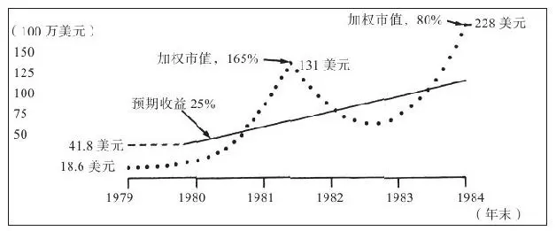

图 15\-3

结论

（1）如果在第四季度，卫星领域产品和CA42不能替代CM41，股票的价格将会下跌。如果1981年前两个季度继续亏损，股票价格将会下降。

（2）在下一个5年里，收入将会以25%的平均水平进行增长。

（3）公司在36个月后将会有5%的净收益率。

（4）California Microwave公司的销售额，有一天会增长2倍，这一天可能发生在1981～1982年，或者是在1984年。

（5）如果它们有5%的收益率并在PSR为2\.0时销售，它们将有40倍的市盈率——冒进，但在牛市中还是可行的。

（6）如果我用300000美元购买股票，股价将会因此涨到12美元，我将会有10\.5美元的平均成本。这意味着我将买入28500股，或者说是California Microwave公司1\.4%的股份。

在几周时间里，我连续买入了该公司股票。1980年5月8日，California Microwave公司在第三季度的财务报告中，宣布了958000美元的亏损，并且有210万美元的存货减值。该报告指出此报告期的订单同样也减少了。 [\1] 股价继续在9～10\.5美元之间波动。

截至5月31日，我为客户（也包括自己）所购买的股票超过了27000股，占California Microwave公司在外发行股票总数的1\.3%。购买这些股票的平均成本仅为295000美元——在低PSR的情况下，购买这些优质股票是花不了很多钱的。（在接下来的几年里，当股票价格下跌时，我都进行了适当的补仓。）

[\1] Company announcement, May 8，1980，and shareholder's quarterly report, May 1980\.

## 波浪式前进

波浪式前进

从1980年5月开始，California Microwave公司的股票价格越来越高，一季接着一季，这一势头保持了一年。公司运作逐步稳健提高。在我最近一次购买股票一年后，股票价格涨到了32美元，差不多是成本价的3倍。为什么股票会表现得这么好？首先，股价增长是因为它以前的价格太低了。California Microwave公司是一家超级公司。任何一家PSR值低于0\.75的超级公司，它的股价都是非常便宜的。曾经非常看好这只股票的华尔街人士，认为对这家公司的投资没有任何回报。但是现在，他们又重新意识到这家公司并没有想象中那么糟糕——他们看到了它的股票表现如此优秀，但所有这些考虑都将是耗时的。是什么促使了股价上涨呢？

California Microwave公司股价上涨的一个重要因素就是订单，图15\-4是截止到1980年6月30连续5个会计年度年末的订单情况。很明显，利森又开始把精力放在他的生意上了。订货率达到繁荣时期，在整个1981年，公司接到的订单总额逐季增长。华尔街对该公司进行投资的空间越来越小。

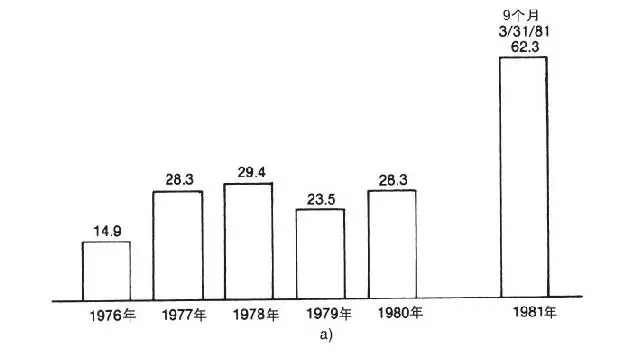

图 15\-4

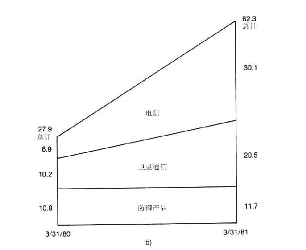

图 15\-4 （续）

其中增长比较显著的有这样几天，6月4日（490万美元）、8月29日（820万美元）、9月12日（310万美元）、10月15日（660万美元）、10月16日（150万美元）、10月20日（130万美元）、11月7日（690万美元）和12月16日（1550万美元）。在不超过6个月的时间里，订单额从2830万美元增长到6800万美元， [\1] 几乎增长了4000万美元，这样的增长率简直就是一次飞跃。

在这么多未预料到的利好消息的冲击下，股票的价格只能是飙升。销售的增长滞后于订单，而利润的增长最后才表现出来（具体解释见第1、2章）。图15\-5和图15\-6是公司的销售和利润情况。

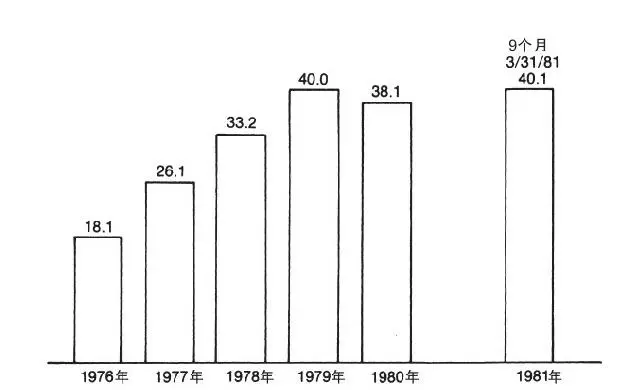

图 15\-5

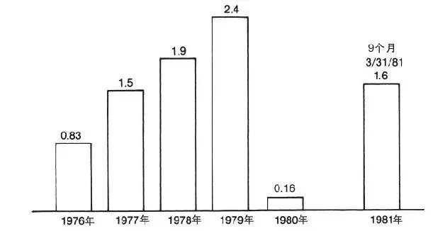

图 15\-6

[\1] Miscellaneous company news releases from June to December 1980\.

## 新生力量

新生力量

1980年秋，California Microwave公司新引入了两个高级经理人：弗雷德·斯托克，任副总工程师兼首席技术总监；乔治·斯普莱恩，任副财务总监兼首席财务官。 [\1] 将乔治安置到这个岗位，主要是这个职位以前的管理人员很让投资者失望，所以安排一个新人担任此职便于和投资者沟通。

在1981年早些时候，作为一个超级公司，California Microwave公司的利润率是低于正常水平的。但是它在其新产品上遭受了典型的低收益率——这与任何其他产品在其生命周期前期所遇到的情况一样（见第1、2章）。公司立刻在一些生产线上遭受到了低收益率。这种情况当然也显示在卫星地面站和CA42产品生产线上（CA42和CM41一样运用于无线电发射器TD\-2，它们在TD\-2上的功能也大致相同）。然而，股票的反映非常强烈，因为华尔街根本没预料到它会有这样好的盈利。

1981年1月19日，California Microwave公司以20\.25美元的发行价，对外公开发行了440000只股票，筹集到了820万美元的现金。 [\2] 对于一家超级公司，在其遇到困境后的较短时间里，发行股票是件很正常的事（第14章的Verbatim也是类似的情况）。筹集现金的机会，对于经理层来说，无疑是一鸟在手。他们知道，股票以后的价格可能会更高（那就是所谓的一鸟在林），但是他们还是偏好持有现金资产。他们仍然怀疑公司是否已经从以前的问题中解脱出来，他们不能说服自己确信公司在以后的日子里肯定不会出现同样的问题。

接下来的几年里，公司发展都比较平稳。表15\-2反映的是，截止到1983年6月30日，公司在连续4个会计年度的销售和利润情况。 [\3]

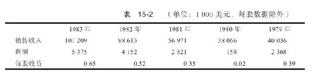

从1980年起，公司经营状况改变非常显著。结合1975～1979年的数据进行比较观察，在California Microwave公司从1000万美元的小公司发展成10000多万美元的大公司的进程中，1980年似乎是发展中的一个困难时期。

1979年12月至1980年9月之间，几乎没有经纪公司发表该公司的分析报告。随着公司利润的回升，公司股票越来越受华尔街的关注。经过适当的调整，公司股票在1982年间，价格的波动幅度很小，在整个熊市的影响下，可能还是会有一点下降。但是，公司会继续不断向前发展。

1982年夏天，公司的市值为6600万美元——比它在1980年春季的市值高3\.5倍，根据当时的销售额9000万美元，PSR值仍然只有0\.74。这意味着一个很好的购买机会。

在1982年的熊市开始时，California Microwave公司的股票涨势非常强劲。图15\-7是其股价从3美元涨到27美元的趋势图——在3年又一个季度的时间里，涨幅达到了8倍，每年的回报率达到了97%。

[\1] Second\-quarter shareholder's report, February 1981\.

[\2] Second\-quarter shareholder's report, February 1981 and the prospectus to the stock offering, January 19，1981\.

[\3] Company news release, August 16，1983，and 1982 annual report to shareholders\.

## 人人都喜欢美满的结局

人人都喜欢美满的结局

专栏15\-4给出了一篇载自《电子商务》（Electronic Business）的文章，该文章描述了California Microwave公司将有着光辉的前景。正如我们所看到的，California Microwave公司在其发展中是不可能一帆风顺的。每个在加州海岸长大的小孩都知道选择良好的时机冲浪。同理，我们也应该选择公司在拥有低的PSR的时机，去冲刺California Microwave之股浪。

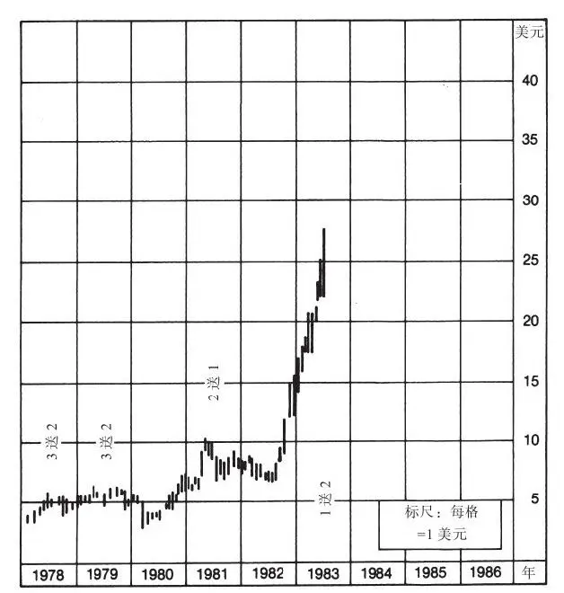

图 15\-7

资料来源：M\.C\.Horsey＆Company, Inc\.，P\.O\.Box H, Salisbury, Md\.21801\.

专栏15\-4 California Microwave公司的未来一片光明

快节奏的生活不可能是一帆风顺的。1968年，从California Microwave公司在桑尼维尔组建开始，就已经设定了快速发展的步伐，公司的销售额和利润率保持着25%的年增长率。公司似乎将保持这样的增长速度——直到1980年遇到了阻碍。

公司税前存货账面价值贬值了200万美元，卫星通信业务起始成本剧增，加上无线电微波产品CM41在遇到持续的竞争时销售额减少，这些因素融合在一起，造成了1980年的销售额和利润分别从上年度的4000万美元、240万美元缩减至3810万美元、158000美元。

这些数据促使公司管理层进行了自我反思。他们认为，问题来源于公司自身，但究竟该如何处理这个问题，却始终困扰着公司的管理和经营。California Microwave解决了问题之后，它的财务状况开始好转。销售额达到了近5700万美元，利润剧增至250万美元。

1981年，California Microwave公司收到的订单创造了新的记录，并且作为一个风险投资者，兼并了一家卫星供应商。通过对外公开发行股权筹集到了820万美元的资金，归还了600万美元的银行贷款，并且为公司的未来发展提供了流动资金。在第四季度，公司将全额发放股利。

从1982年中期财务报告中可以看出，公司已经完全恢复了正常：在第二季度，公司盈利增长了106%，占销售收入的83%；利润增长了92%，达到180万美元；每股收益增长了55%，达到34美分；销售总额增长了65%，达到4100万美元——比前几年任何一年都多。

对期望的警惕

戴维·利森作为California Microwave公司的创始者、公司董事长、首席执行官、总裁，自公司14年前开业之日起，就有权对自己的热情进行支配，但他在1980年的尝试中得到了惨痛的教训。他承认，“为所欲为的教训是如此惨痛”。

然而，尽管公司在1980年遇到了挫折，但是还远没有达到破产的境地。他认为“尽管当时心理上承受了巨大的压力，但公司的财务报表从未表现出过任何风险”，“第三季度亏损的财务报告绝不是让我们放弃的转折点，相反，它成为我们鼓起勇气扭转局势的关键时刻。”

因为California Microwave公司是向不同的公司提供同一种技术支持，所以它是以市场为导向的公司。利森认为“基于以上原因，我们每个部门没有我们想象中那么多利好消息的发布，因此我们必须努力要求自己去看积极的一面”，“如果这样，这又不可避免地让你们陷入麻烦，但这是我们自己做事的底线。”

他没有将原因归结于外界影响和其他因素。“是我们自己让自己陷入了困境，”他说道，“同时，我们自己摆脱了困境。”对挫折及其原因进行分析时，我们可以发现，“每个人都是非常忠实的，所以关于公司的所有好消息和坏消息都能够传达出来，这样我们才能对这些问题进行分析，了解公司现在真实的状况，为公司未来发展制定出规划。”

利森认为，对于经营权与公司财权分离缺陷的弥补，前者提供了关键的管理，而后者则为公司提供资金来源。“这些事如果由一个人来做将是非常困难的，所以我们将这些功能进行了分离，”他解释道。California Microwave公司通过机构管理来加强公司治理，在各个层面上加强财务控制。

公司管理层认为，在市场还没给他们提供能使公司保持原有发展速度的支撑时让公司自由发展，是利森的鲁莽所造成的错误。

然而，他们强调，“我们的基本策略非常好。我们仍然对生意非常重视。如果要将这策略付诸于实践，我们首先要使自己减少适当的压力，因为这可以使公司内部不利消息能像好消息那样容易公布，最终使这些问题能够不断减少，不让其成为公司发展的绊脚石。”

站在技术的前沿

尽管公司还很小，但它在6月30日预期达到1亿美元的销售额，使得California Microwave公司“跻身到微波技术的领先行列”，詹姆斯·麦凯布说道，他是纽约Dean Witter Reynolds Inc\.研发副总顾问。公司正在升级改造其最大客户贝尔系统的微波设备，同时也提供卫星地面终端，也是AT＆T的少数几家长期外部供应者之一。

在过去的5年里，AT＆T已经对它的微波系统进行了两项重大重建。对于第一项重建，California Microwave公司收到了90%的业务，剩下的业务是由AT＆T公司控股的Western Electric来承担的，詹姆斯·麦凯布提出，“这反映出AT＆T对California Microwave公司的依赖程度是多么的高。”

“下个阶段，AT＆T将采用单边带波段，我敢打赌California Microwave公司将会承担其绝大部分项目，”麦凯布继续谈论道，“这项工程将会持续六七年的时间，因此California Microwave公司部分业务将会有着美好的前景。”

至于它的防务类产品，California Microwave公司仍与美国政府部门，以及其他重要客户保持着良好的关系。麦凯布相信：“California Microwave公司在它所在的领域表现非常出色，它仍是一家有着巨大发展潜力的小公司。”“它通过这些渠道销售产品，并且借助原有的销售渠道出售新产品，并为新的渠道研发新的产品。”

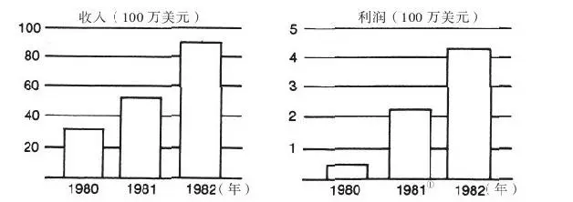

图 15\-8 California Microwave的收入和利润情况

注：图进行了更新，以反映全年的结果。

资料来源：California Microwave Inc\.

位于旧金山的Hambrecht＆Quist投资银行的分析师布鲁斯·塞尔策是这样看待California Microwave公司的，商业和防务微波通信设备的“一个重要的创新者”，公司成功地将核心技术产业的业务扩展到了新的微波产品领域，这包括类似的微波无限通信系统、商业和防务卫星通信、地面数字终端、数字通信设备、防务雷达装置以及电子智能设备。

California Microwave公司的销售策略着力于购买者的需求以及与其保持良好的合作关系，并以此为基础提供产品。California Microwave公司对三大产品领域（无线电通信、卫星通信、政府防务）所采取的策略，重点放在像AT＆T和美国政府的各个部门及代理处之类的销售渠道，而不是其他的小部门和小系统。

直到1980年，无线电通信一直是California Microwave公司主要的销售领域。1981年，这项业务的收入占总收入的33%，而1980年的比例为47%，1979年的比例为54%。塞尔策预测今年的无线电通信业务收入将占总销售收入的48%。

1981年，卫星通信超越无线电通信，成为California Microwave公司的主要收入来源。其业务收入在总收入中所占的比重，从1979年和1980年的15%，上升为1981年的43%。1980年，California Microwave公司兼并了仍在盈利的Satellite Transmission Systems, Inc\.，结果California Microwave公司的卫星地面接受站和双声道终端业务增加了。1981年，卫星通信业务的收入将有可能占California Microwave公司总收入的32%。

1981年，California Microwave公司的第三大业务（政府防务通信）在销售收入中所占的比例为24%，与1979年的31%和1980年的24%相比，预计今年这一比例将达到20%。在早些时候，California Microwave公司的政府业务所占的比例大约在60%～80%之间。利森认为这一比例会是35%。他说California Microwave公司从里根政府的美国防务计划中获得了巨大的利润，“我们所说的防务指的是通信和情报方面的，这些都不同于我们平常所见到的，例如，在武器系统中的应用。”

扩大客户基础

1980年10月，Satellite Transmission Systems Inc\.被花旗银行指定为其卫星传输网络的供应商，首批的四个银行地面接收站定于9月完成，通信设备包括声音、信息记录、数据和远程电话会议。

利森称，California Microwave公司将通过为类似于花旗银行和其他有能力安装其设备的公司，来扩展它在公共卫星网络上的生意。他同样也对AT＆T的竞争者（例如MCI）的销售额进行了预测，相信它们在有线网络电视卫星接收的业务将会增加。在过去的一年里，California Microwave公司在有线电视行业的销售额占总销售额的5%～10%。但是Associated Press是这种小卫星接收装置的大客户，利森预测到最后，“每份报纸上都有关于我们公司的消息。”

Dean Witter公司的麦凯布认为，California Microwave公司的销售额将由今年的9000万美元增长到11000万美元，其每股收益将由83美分增加为1\.10美元。利森既不对这些项目发表评论，也不进行预测。通信领域的前景是光明的，并且公司在经济衰退时仍保持着良好的发展，但是利森还是比较谨慎和沉稳。他不想再使梦想遥不可及。

[\1] 由于税前注销200万美元，1980年的利润受到相反的影响，并累积了一个新产品线的产品启动成本。

## 附录

附录

附录A 调研管理层时的35个典型问题

下面列出的清单并没有包含所有的内容。这些是在调研管理层时带有普遍性的问题，当然，针对具体的公司，还应该问些具体的问题。当你与调研对象见面时，那些当场想到的问题，也应该向你的调研对象提出来。

介绍性问题

1\.在金融界，谁在关注贵公司，你如何看待他们对贵公司的态度？

2\.为了表明公司是如何组织运转的，请画出基本的组织框架图以及每个关键管理者的职责报告。

## 营销问题

营销问题

3\.请按产品类型细分贵公司所在的市场。

4\.为什么客户购买贵公司的产品而不买竞争者的？

5\.贵公司产品技术水平如何——贵公司所运用的是哪种技术？

6\.贵公司在营销方面，做了怎样的努力——销售是如何实现的？

7\.从识别出客户最初的购买意愿到完成销售需要多少时间？

8\.还有没有未提及的有关贵公司市场的重要因素？

9\.按产品区域划分，贵公司的市场份额是多少？贵公司主要竞争者的市场份额又是多少？贵公司认为谁是最强有力的竞争者？

10\.与若干年前相比，贵公司现在的市场份额如何？

11\.近两年内，有新的进入者进入贵公司的市场吗？

12\.产品是如何定价的？与过去相比有显著的下调吗？

13\.除了利润表上列示的收益之外，还有没有因向客户提供服务而收取的可观收入？

14\.季度订单和未结订单历史状况如何（这些信息只在公司未向公共渠道提供时提问）？

15\.除了利润表上所反映的，公司的业务有没有季节性？

16\.请列出贵公司前五大出口国和前五大客户大致的销售水平？

17\.海外的营销策略有没有什么不同？

18\.描述一下贵公司从开始提出产品创意到第一批货装运的过程？

19\.贵公司专业销售人员的收入是多少？在多大程度上与销售收入挂钩？

20\.贵公司专业销售人员进公司多久？他在来之前是做什么的？贵公司是如何聘用这个人的？

## 概括_策略问题

\(096\) 概括/策略问题

2026年3月14日

9:51

概括/策略问题

21\.公司的长期目标是什么？

22\.贵公司长期利润率目标是多少？贵公司打算如何实现这些目标？

23\.在未来几年内，贵公司预期利润表的组成部分会发生哪些改变？

24\.我是否应该将贵公司主要的并购活动或者股权转移看做是未来若干年计划中的一部分？

25\.对于高级管理人员，你有没有想象做任何职能上的补充？

26\.请讨论高级管理层的每个成员，指出其强项和弱项。例如，董事会主席最擅长的是市场营销，他次强的领域是什么？哪些地方较弱？

27\.未来几年里，贵公司的资本支出计划是什么？贵公司计划重点发展的特殊产品领域是什么？

28\.如果在过去几年内，贵公司有高层离职，他们为什么离职？他们去了哪里？

29\.贵公司董事会中最活跃和最不活跃的成员是谁？（你可能会认为管理层回答这个问题时会犹豫不决，但我却几乎没有发现过这种事。）

30\.（该问题仅在公开信息没有披露的时候提出）请给出每个职能部门的员工数。

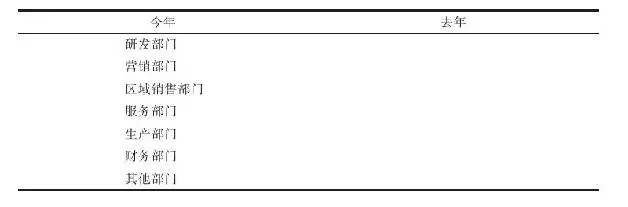

## 其他问题

其他问题

31\.与现在相比，未来若干季度和年份，研发费用占销售的比重是高还是低？

32\.在研发方面，贵公司的支出用在了哪些领域？

33\.购买完工货物的成本是多少？配件和组装物的成本是多少？

34\.如果有一两家供货方供给短缺时，会不会对公司的原材料产生显著的影响？

35\.有哪些我应该问，但却没有问的问题？（如果问题不是一个接一个地提出，那么这些问题要么就是不够明朗，要么不具有前瞻性。让所提的问题包含所有的信息，这一点我从来没有做到过。）

## 附录B 市销率与公司规模

附录B 市销率与公司规模

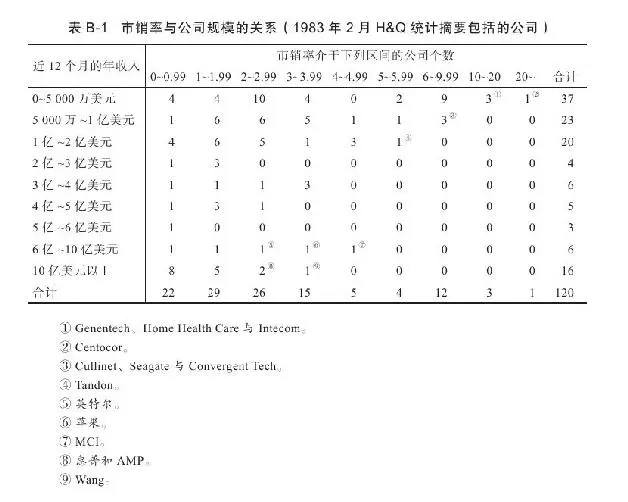

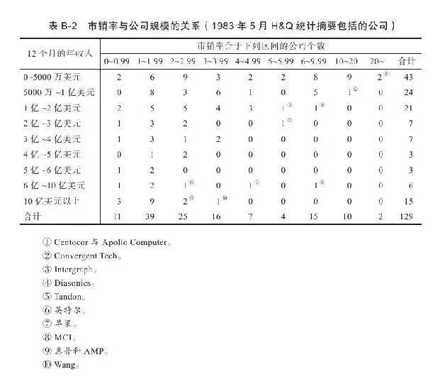

## 附录C 《福布斯》对Verbatim公司的报道

附录C 《福布斯》对Verbatim公司的报道

专栏C\-1 几乎破产的公司

Verbatim是一个经典的例子，它为我们回答了这样的问题：一个有希望的公司多快能够抛弃它的创建人。谨记：一个有思想的科学家很可能也同时是一个糟糕的公司主管。

让我们把时间回溯至1979年，里德·安德森的Verbatim公司完成了它令世人惊叹的变化，一个小的高科技公司变得异常具有魅力。5年间，其销售收入从430万美元增加到3600万美元，营业收入从26万美元增加到230万美元，净资产收益率超过30%，资产负债率小于6%。这也难怪当Verbatim进入公开市场，其股价由1\.7美元涨至29美元，涨了近23倍。

但是，很快，这个神话破灭了。到1981年，公司的净资产下降到100万美元，净资产收益率仅为6\.6%，资产负债率达到45%，股价仅为12美元。Verbatim到底出了什么问题？这是个很熟悉的话题，创建人安德森的解释是，成功使得他过于自满，迷失了方向。

Verbatim是一家制作计算机存储工具的公司。去年，大约价值5亿美元的软盘被销售，这个数值到1985很可能翻倍。购买软盘的消费者既有小的软件公司和个人计算机制造商（比如Apple和Tandy），也有大型主机制造商（比如IBM、Burroughs和Digital Equipment）。人们会为了复制朋友的游戏而购买软盘，因为这只要5美元，而一张游戏盘却需要30美元。生产计算机存储工具的公司大约有20家，包括3M、Memorex、Dysan和IBM，是最大的，市场占有率为23%。

安德森在他51岁的时候开始创办Verbatim公司，在这之前，他在其他公司的研究实验室工作了24年，其中17年在贝尔实验室，主要研究电力开关和存储设备。他同样花了2年时间在NCR，5年时间在斯坦福研究所开发新产品。他电力工程师的证书是货真价实的，但是，他显然不是称职的企业家。

在他46岁的时候，安德森当时还在SRI，就开始有建立自己的公司的意向。他说：“我们正在生产产品，主要是为各种各样的公司开始新的业务，因此，我决定自己干。当我在贝尔实验室然后再到NCR的时候，我就认为，人不应该活得很平凡，应该去冒险。”

就像一个业余的歌手弹奏竖笛，安德林在设计他的晶体管收音机。也许是受他在SRI工作的激励或是其他方面的原因，他决定为一些歌手生产收音机，大约3年后，他发现自己已经很熟悉这个市场了，此时，他找到了他的商业合作伙伴——雅各布森，一个制造声音数字配音机器的人。之后，安德森从银行贷了一些款，从亲友处也借了点，他开始制作数据磁带盘。

但这时，安德森发现他进入了一个错误的市场，数据磁带盘很快将会被IBM公司1973年生产的8英寸软盘所取代。4年后，安德森找到IBM公司，要求获得新软盘技术的生产许可。此时的IBM，比起仅仅5美元的软盘，它更热衷于销售上百万美元的大型主机，于是同意了安德森的要求。

到1979年，安德森62岁，身价1470万美元。

但是，Verbatim公司几乎迅速进入了死亡的边缘。1981年，安德森陷入困境。Verbatim所生产的软件产品在技术上出现了问题，解决问题的唯一方法就是大量购回。在1980～1981年间，公司不得不建立起一个150万美元的回收点。幸运的是，这种问题只出现在它的8英寸软盘上，5\.25英寸软盘没有出现类似问题，即便如此，也使得公司的市场占有率从45%下降到15%。

很明显，该公司还存在严重的问题，安德森并没有建立起充分的预警机制，新的设计在没有经过测试之前就大量投入生产。客户的订单也很混乱。

1980年（截至6月30日），公司拿出230万美元处理没用的磁盘，销售收入仅在当年就下降了43%。Verbatim的董事会做出决定，于1981年1月聘请马尔科姆为公司总裁。安德森虽然拥有20%的公司股权，但只在公司中担任董事会主席一职。马尔科姆说，公司需要新的领导人、新的内控机制以及管理机制。

为了解决公司的困境，马尔科姆从Verbatim的一个竞争对手那里引入了一个新的销售主管，Verbatim的销售和测试走向了自动化的道路，一个高质量的磁盘新品牌在5年内被生产出来。这个品牌一度被人们认为是低成本的。公司开始走出困境，重新赢得声誉。1982年，公司销售收入达到8500万美元，超过上一年度5400万美元，利润也有100万美元增长到900万美元。

公司的创建者已经离开，马尔科姆，一个42岁的精英，正在经营这家公司。

2026年3月14日

9:51

## 附录D 经营Material Progress Corporation

附录D 经营Material Progress Corporation

与研发相比，营销更加重要，我自身的经历强化了我对这一思想的认识。我曾经是Material Progress Corporation的一位重要投资者，在一次激烈争吵的董事会会议后，该公司走向了分崩离析的道路。该公司的职员中，没有适合经营管理企业的人。董事会（大部分不是当地人）决定通过正规的招聘渠道物色公司的董事长、主席和执行总裁。不幸的是，这个过程需要长达数月的时间。因此，在这段过渡期内，我应邀担任临时的主席和执行总裁。

我的第一个任务就是去寻找我的代替者。在这段寻找执行官的时期里，你根本无法确信是否能找到一位合适的候选人，也无法判断需要花费多长时间。所以我必须准备最坏的情况——在公司负责管理工作这个位置上待很长时间。我所做的第一件事情就是聘请了David Power公司（顶尖猎头公司）。然后我开始审视我必须为之工作的这个公司的情况。

Material Progress Corporation销售额有所下降，每月损失多达8万美元。公司也没有新产品来改善这种局面。公司完全没有正规的研发力量或是工程部门。Material Progress Corporation生产的电子材料很好，并希望扩大现有的生产工艺进入新的市场（有些已经确定了，有些还在设想中）。现有的生产线技术虽然还差强人意，但是不够先进。

自从出现了一个非常有能力的技术副总裁后，我的工作轻松了不少。通过为他设定明确的目标以及教会他必要的人际交往之道后，我们能够在两个月内共同创建一个正式的工程部门，这个部门有着三个发展项目。几年后，我们又增加了若干项目。但是，没有哪一个项目有足够大的发展潜能——因为我们的市场太小了。这个市场没有我们最初所设想的那么好，公司也需要更多的东西。

公司自认为是一家“水晶公司”，提供了很多精巧的水晶产品。公司生产了很多古怪的产品，比如“钆镓红”和“氧化钇铝红”。水晶是在高温炉中生产出来的，然后根据顾客要求制作成各种形式。公司开发的一种具有知识产权的制作工艺被命名为“双面抛光”——将非常小的器件抛光成平行的平面。它们有非常好的品质，意外公差的测度是以微米进行的。同时公司在水晶的增长方面做得非常好。我认为产品的声誉是源自制作工艺的品质。

在顾客眼中，一个通过优秀的工艺制作的普通水晶比一个通过普通工艺制作的水晶要受欢迎（这有点像机器的钢部件：碳的洁净度的要求没有这个部件的完美适用性的要求重要）。我看到了我们在制作过程中的出色工作。我们不能按照水晶市场和我们自己是水晶生产者的方式去思考。

相反，我们需要去寻找产品可以被抛光的市场。在公司中传播了这个信息后，我们迅速想到了一个点子，抛光5\.25英寸软盘。仅这一市场比公司其他市场的总和还要大。同时，我们还具有一些知识产权。我并没有为其构思创意，只是提出了如何把我们的努力联系到潜在市场的概念，由员工把剩下的做完。

自从我们形成这个观点后，只花了一年时间，我们的产品就进入了市场（技术进步不是太难）。在这一年的大部分时间里，我们都在确认能够完全理解市场。通过顾客的评价与直接反馈，我们确定我们的产品的确是独特的。也只有通过与潜在顾客的充分交流，才使得我们确信这个市场有我们所设想的那么大，当然我们也理解定价的重要性。

我们所聘请的猎头公司，最后为我们找到了一个思想活跃的董事长，我也终于减轻了我的任务。为5\.25英寸软盘抛光，是目前公司的主要业务。所有这些都是必需的，这源自当时我们对市场的正确理解。我们可以一直将开发资金放在我们现有的水晶市场上，但也不会走远。通过理解市场机会，我们能够使我们的研发资金成倍放大。市场，而不是技术，是其中的关键。

2026年3月14日

9:51

## 附录E 一个可能的案例

附录E 一个可能的案例

我总有一个想法——幻觉，甚至可能是恶梦，想象一种小型的高科技、高市销率的神奇股票，能以超过营业收入10倍以上的价格卖出。该公司可能从事融合技术，也可能是数字转换或者国际通信技术，并且其总部有一位对成功急不可待的首席执行官。

Big先生循规蹈矩地在研究生院里花了好几年时间，获得商业和电子工程的双学位。随后，他加入了Bogus公司，并先后在这家全球性公司的各个部门工作。在此过程中，他凭借自己的努力不断得到晋升。最后，他创办了自己的公司，取名Digicom Conswitchtronics。针对一些生物遗传学家希望将抗体克隆进网络以备未来开发仿真电脑智能的情况，公司决定生产相关电脑软件。尽管目前这个市场不大，但是《高科技》杂志预言这将是继切片面包之后的又一热销商品。

公司去年的销售额仅为5000万美元。但股市投资者可能阅读了《高科技》关于Digicom的市值达6亿美元（市销率=12\+）的报道。账面上，Big先生很富有。但事实上他很清楚不可能就这样轻易地将股票卖出。毕竟如果总裁都不持有公司股票的话，谁又会想持有呢？Big先生明白未来掌握在自己手中。Digicom未来会成为一家大企业，但是他为什么必须坐等这一天的到来呢？他渴望现在就拥有全世界。

当年在商学院的时候，他与Medium先生就是好朋友。目前Medium先生仍然在Bogus公司工作。事实上，他是一位高层纠纷调解专家。不管何时，只要出现问题，公司都会派Medium先生去解决。Big先生向来十分重视Medium先生。实际上，他十分希望Medium先生能过来帮Digicom做事。他渴望现在就拥有全世界。

Big先生制定了一个代号为闪电行动的计划。Big先生首先拜访了Medium先生，邀请他出任公司的副总裁，并提供了多种选择。在得到Medium先生的肯定后，Big先生立马开始了他的闪电行动计划。他雇用了西海岸一家小型的投资管理公司来审查本行业所有进行公开交易且满足以下条件的制造企业。

➤销售额为5000万～1\.5亿美元之间。

➤市销率位于0\.0～0\.15之间。

➤目前，单一股东控制的股权未过半。

Big先生在审查结果中挑选出10家目标企业。看起来，它们都挺糟糕的：一直在亏损且背负巨额债务。Big先生认为，这10家公司的问题应该进行打包处理。于是，他对公司律师Clean先生说，他想一并收购这10家公司。Clean先生的回答是“可以”。他问Big先生打算先买哪家，以及怎样为此次并购获得融资。（Big先生对Clean先生的话一直是很看重的。）Big先生语速缓慢却坚定地说，7天后他将利用股票交易，在一天内，按照账面列示的价值完成对这10家公司的并购。

Clean先生突发心脏病去世。在他的葬礼上，Big先生雇用了另一位律师。星期二，他继续自己的计划。太平洋标准时间早上9点整，Digicom公司宣布对这10家公司的联合收购——它们将组成Digicom公司产业部门的核心，而其领导者将是公司的新任副总裁——Medium先生（他刚刚宣布从Bogus公司辞职）。

这10家公司的收入加起来达到10亿美元，市场价值总计1亿美元。Digicom公司以高出市值50%的15亿美元（特为此发行的）新股竞购。10家公司的许多股东压根儿没想到他们还可以从困境中得到解脱。因此面对这次并购行动，股东们反应很积极——即使并购不受公司管理层欢迎。

一时间，Big先生成为了一家市值10亿美元的大公司的首席执行官；而证券交易委员会执行长官却突发心脏病，从此销声匿迹。Big先生如愿请到了老友Medium先生。而这位Medium先生的首要任务就是整顿这10家处于困境中的公司。Big先生卖掉了Digicom公司25%的股票，完成了此次行动。“一次不错的行动，”他暗自想。Digicom公司转眼间成了一家收入1050000000美元，市值达75亿美元的大公司。与多数其他10亿美元级公司一样，它的市销率为0\.75。Big先生相当满意。

2年后，Medium先生对产业部门整顿完毕。此后，这10家公司共为Digicom公司创造了5%的税后利润——大于它们被收购前的收入总和，Digicom公司保持了0\.75的市销率。每个人都变得更好而没人受到损害。人们都忘记了那个Digicom公司起初始克隆的“抗体”。6年后，Digicom Conswitchtronics公司改名为DC Industries。几十年后，Big先生在自己的退休晚宴上讲述了当初是如何按既定成长理论，带领DC公司迈向成功的。晚宴过后，人们伴着夕阳乘车离去，从此靠着股息幸福地生活着。

你会说，这是不可能发生的事情。几十年来，一直有类似的事情发生着。20世纪60年代，一次次雄心勃勃的并购都是对化腐朽为神奇的大规模尝试。股市垃圾堆里有许多潜在的金矿等待人们捡拾。它们可能被接管者捡到，也可能在价格上涨时，被认为它还不至于那么糟的金融界发现。不管怎样，明智的购买者会越来越觉得低市销率股票是块肥沃的土壤，有着巨大的潜在投资机会。

## 附录F 补充内容

附录F 补充内容

本书到目前为止的内容都是在1983年以前完成的。此后，科技股下跌。同时，费雪投资公司对市销率的研究取得了快速发展——尤其是对非科技股的研究。本附录对最近的一些研究成果做了更新以使读者保持同步。自本书初稿完成以来，我们发现了一些有意思的事情。它们肯定会让你进一步体会到市销率的价值。

受欢迎的指标

我们发现，有必要将市销率的下限标准在第6章建议值的基础上再降低一些。这与第7章的结论是一致的。这样就会产生一个有趣的问题。由于市销率是近乎完美的受欢迎的指标，在下面的表F\-1中，根据不同的市销率，我们就可以确定不同的受欢迎指数。在表里，股票被分为三类：一是小型的科技/成长型股票，如本书一直研究的超级强势股；二是那些大型的数10亿美元收益的公司以及不具成长潜质行业的较小型公司的股票——这两类股票的市销率将进行合并；三是是根据上述想法增加的超低利润公司的股票——这些公司的基本产品线是具有超低利润率的特征，如超市以及批发商。

表中的数据是根据经验得出的。有趣的是，不管哪种公司的市销率，都会随受欢迎程度的提升而翻倍。可见，市销率受欢迎程度的标准是一贯的——当股票由无名变得受重视时，市销率则会加倍。对此，我虽然不能解释，但还是认为这是一个有意思且值得深入研究的发现。

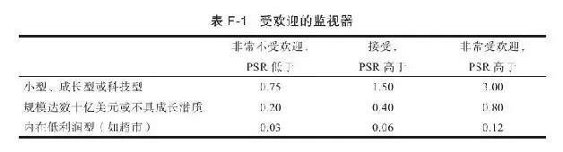

## 1983年第3季度十大赢家和输家

1983年第3季度十大赢家和输家

1983年10月4日，《华尔街日报》的“Heard on the Street”专栏报道了1983年第三季度十大赢家和输家。我们查看了它们在季度初（即1983年6月1日）的市销率，并根据每家公司前12月的报告收入、股价以及1983年6月1日流通股数，计算出了市销率，结果如图F\-2所示。

注意在起初的一段时间内，大部分公司都在赔钱，所以它们的市盈率都是毫无意义的。另一些公司有相当高的市盈率。同时，十大赢家的市销率从0\.16～1\.86不等，平均为0\.60。而十大输家的市销率则从0\.88～158\.01，平均为3\.61。

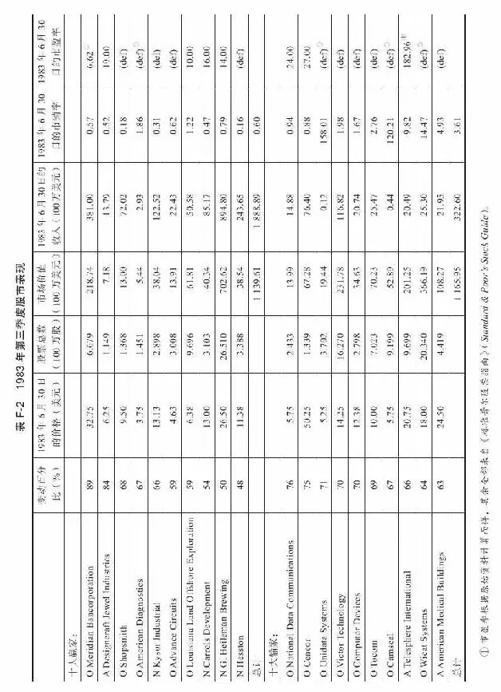

2026年3月14日

9:51

## 研究《福布斯》

研究《福布斯》

1984年1月，《福布斯》杂志的“Statistical Spotlight”专栏发表了一篇题为“是谁，它们在股市的什么地方”的文章，我们在这里面挑选了从1979～1983年的5年中表现最好的20只工业股。另外又重新计算了一下它们1979年1月的市销率。这些公司1978年的营业收入都超过5000万美元。不幸的是，我们未能获得大多数公司1979年的季度数据。这样的话，我们只好在假定年营业收入的增长或减少按季平均分布的基础上，对必需的季度营业收入进行推测。尽管这不可能完全正确，但却是很好的估计值，且比任何其他可得的数据都较准确。

例如，我们来考虑一家公司1月31日开始的财务年度。我们假定：1978年1月31日的营业收入是1亿美元，而1979年1月31日则为1\.2亿美元；1978年年底的最新信息是该公司于1978年10月31日结束的第三季度的信息。在没有确实数据的情况下，我们假定一年来2000万美元营业收入的增长在这一年间是平均分布的。由此，我们推定截至1978年12月31日的12个月的营业收入为1\.15亿美元。表F\-3给出了结果。

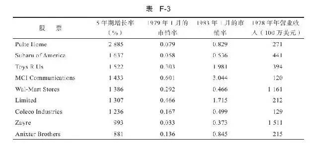

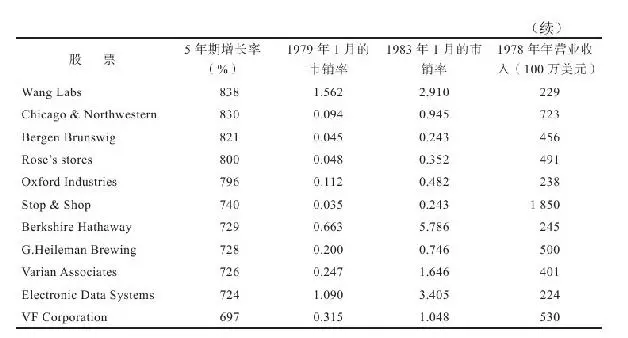

需要注意的是，1979年年初时，这20只表现最好的股票中有11只的市销率小于或等于0\.20；4只的市销率在0\.20～0\.35之间；只有2只的市销率大于0\.75；其余3只的市销率则在0\.35～0\.75的区间内。从1979年1月到1983年12月，包括表现最好的前2位在内的8只股票的市销率增长了700%之多。例如，Pulte Home的市销率增长了10倍多，从0\.079增长到了0\.829。另外，包括表现最好的前4只在内的12只股票的市销率增长了500%之多。其中一些，如Zayre，市销率的增长速度要快于其股价增长速度。出现这种情况是因为市销率反应的是市场资本化程度，对新股发行产生的稀释作用反应十分敏感。

很明显，如果一只股票市销率增长500%～1000%，那么它不是初始值很低，就是终值很高。除两只以外的其他股票的市销率都增长了300%或更多。这两只股票其中之一是Wang Labs，而它的市销率在期初是最高的。这反映出股价上涨意味着股票变得更受欢迎了。开始不受欢迎的股票似乎更容易变得受欢迎。

## 1983年的DJIA指数

1983年的DJIA指数

在1984年早期，人们开始对不受欢迎的股票感兴趣。将低市盈率看做受欢迎的同义词变得越来越普遍。我并不反对低市盈率学派，且我也认为，低市盈率确实是以低于平均水平风险寻求高于平均水平收益的可行方法。但是，低市盈率确实不是衡量受欢迎程度的有效方法，其弹性太高了。我们看一下由一些知名大公司组成的DJIA指数。

表F\-4列出了1983年DJIA每只个股的涨跌幅。也就是说，International Harvester在1983年1月1日到1983年12月31日间上涨了177%，而Goodyear Tire则下跌了14%。同时，我还根据《标准普尔股票指南》列出了1983年1月这30家公司的市盈率。用于计算1983年1月市销率的营业收入额来自《价值线》季度数据——同样对前12个月结果的采取后续报告法。由于对百分比进行了四舍五入，如U\.S\.Steel的表现其实稍好于DuPont。

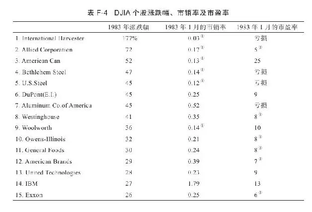

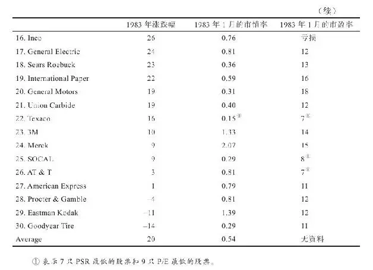

另见表F\-5。

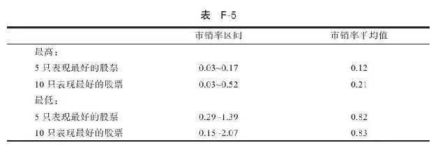

我们本想比较一下低市销率股票与低市盈率股票，但是不幸的是，市盈率为8的股票如此之多以致很难挑选出7只低市盈率股票。所以，我们只能对7只低市销率股票与9只低市盈率股票，或者9只市盈率最低的股票与9只市销率最低的股票进行比较。这两种方法，我们都进行了尝试。为便于查看，表F\-4中7只市销率最低的股票和9只市盈率最低的股票都用星号进行了标注。

➤7只市销率最低的股票平均增长63\.57%。

➤9只市销率最低的股票平均增长56\.11%。

➤9只市盈率最低的股票平均增长28\.67%。

➤DJIA指数平均增长20\.3%。

不论你怎么理解这一结果，低市销率股票的表现大大优于低市盈率股票，而低市盈率股票的表现则略好于DJIA指数。

## 《价值线》综合指数与市销率

《价值线》综合指数与市销率

正如我在文中说明的那样，我对尝试把握整个市场时机的努力表示怀疑。但是，人们仍多次试图将市销率应用到整个市场中。我们回顾15年的时间里，运用《价值线》数据以及由此得出的市销率对市场几次主要的高峰和低谷进行评估。市销率和其他的数据，都是在年度数据推测的基础上，以之前12个月的后续报告值为基准计算得来的（参见《福布斯》研究的相关案例）。表F\-6展示了《价值线》综合指数10次大的高峰和低谷，同时也列出了相关市销率。

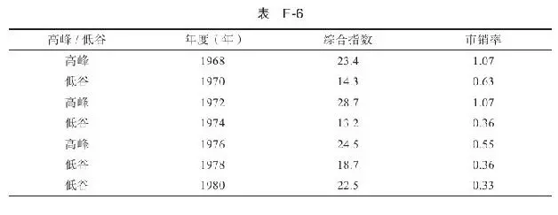

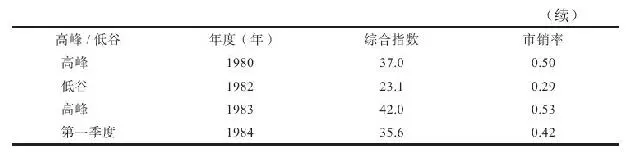

根据表中的数据，很明显可以看出1968～1972这段时间，发生了哪些特别的事情。从1974年开始的10年间，当综合指数处于高峰时，市销率位于0\.50～0\.55之间，而处于低谷时，市销率位于0\.29～0\.36之间。在1984年早期，针对3月份上旬的市场是否处于谷底，曾有过一场激烈的辩论。如果之前的10年能提供一点参考的话，那么市场还没有到达谷底。但是1974～1984这一时间段与1968～1972这一时间段的差异，却导致了对综合指数和市销率的进一步深入研究。

2026年3月14日

9:51

## 对H＆Q报表的更新

对H＆Q报表的更新

在前面的章节和附录中，我已经根据Hambrecht＆Quist投资银行统计摘要的数据，列表说明了市销率与公司规模之间的相互关系。表F\-7将数据更新到了1984年2月，以进一步说明这种关系。根据此表，股市在1983～1984年间出现了下跌，而此前1983年5月的版本显示市场此时却处于高峰。在市场对公司规模与市销率评价最高的公司中，Eagle Computer、Network Systems、Intecom、Micom System、AMD、Tandem、Wang、Intel以及Glaxo的股票表现尤其理想。但是1983年5月的版本却恰恰相反，类似股票的表现异常糟糕。

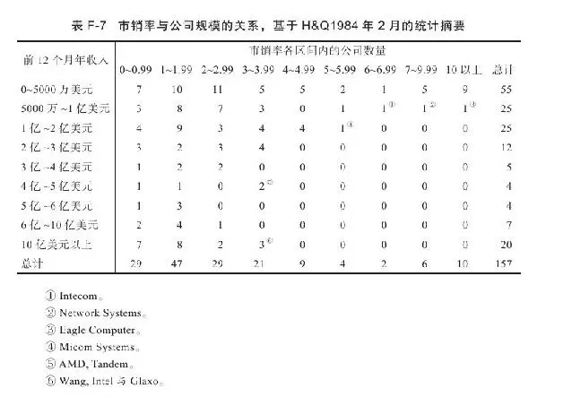

## 结论

结论

自从本书完成以来，费雪投资公司进行的所有工作都证明了以下结论。

1\.投资者应该避免高市销率的股票。

2\.投资者应该在不受欢迎的、市销率中等偏低的股票中寻找投资机会。

3\.对市销率需要而且必定会有更多的研究。

3\.本书由“行行”整理，如果你不知道读什么书或者想获得更多免费电子书请加小编微信或QQ：2338856113 小编也和结交一些喜欢读书的朋友 或者关注小编个人微信公众号名称：幸福的味道 id：d716\-716 为了方便书友朋友找书和看书，小编自己做了一个电子书下载网站，网站的名称为：周读 网址：http://www\.ireadweek\.com

## 译者后记

译者后记

朋友，在波谲云诡、跌宕起伏的股海中：

您是否因为迷信技术分析造成的损失惨重而懊悔不已呢？

您是否对晦涩难懂的主流价值投资理念而望洋兴叹呢？

您是否因为缺乏制胜的投资法宝而意志消沉呢？

您是否因为书市上鱼龙混杂的“投资宝典”而不知所措呢？

如果是，那就请静下心来，认真阅读这本《超级强势股》。

本书的作者跳出了主流价值投资理念的窠臼，为我们提供了一种全新的价值投资理念。也许，很多人对主流的价值投资理念并不陌生，它需要我们对公司的行业地位、财务状况、公司治理、管理者能力、产品、技术和市场等公司基本面进行分析研究。如股神巴菲特崇尚的投资理念，就是选择优质行业中的蓝筹股，长期持有并分享公司成长所带来的收益。与此不同，作者在本书中推出的价值投资理念，指的是从众多处于困境的公司中选择合适的潜力公司，持有其股票直至它走出困境，在公司发展的同时，投资者也取得超额收益。因此，本书作者提出的这种逆向式的价值投资理念别开生面，可操作性强，也为我们发掘了更多实现财富巨大增值的机会。

在具体介绍其价值投资理念时，作者以产品生命周期作为切入点。当公司陷入困境时，一般的投资者对公司的股票失去信心，股价将被低估。但是，作者却认为，公司的困境是考验公司管理层能力和智慧的时机，若管理层能够采取有效措施，“困境”往往为公司提供了一个凤凰涅槃、成为超级公司的机会。因此，公司“困境”是本书关注的重点。作者在书中介绍了市销率、市研率等一系列指标，以便从“困境”公司中甄别出潜在的“超级强势股”。作者在书中向我们提出了宝贵的投资原则，即在利用相关指标对公司进行分析的基础上，大胆买入“超级强势股”，一旦公司度过艰难的“困境”时期，投资者就可以在两三年的时间获得200%～900%的巨额回报。为了证明其投资理念的科学性，作者列举了其所投资公司股票的实例，这些都是作者多年的实战经验。

本书的作者无疑是一位出色的投资家，他运用自己独创的投资理念纵横股市多年，并取得了不菲的成就。在本书中，作者向我们展示的这套令人耳目一新的价值投资策略，是他多年来投资经验的总结。只要贯彻了这些策略，您就可以从千万只令人应接不暇的股票中找出理想的“超级强势股”，开启成功之门的钥匙，不必再为选择哪只股票而犹豫不决，也不再为错失机会而悔之不已！毫无疑问，这本书是专业投资者的良师益友，此外，它也是大众投资者的点金之石。本书写作手法高超，与其他晦涩难懂的投资类书籍不同，作者深入浅出，引人入胜，用通俗的语言表达了不通俗的道理，迎合了广大投资者的阅读需要。因此，如果你的专业知识匮乏，也不用懊恼，因为，费雪的这些投资策略正是为你驰骋股市而准备的强大武器。

想成为一个优秀的股海弄潮儿，那就请认真吸取本书中的知识营养。我们坚信，这本书的价值在于，它将会成为你登上成功巅峰的阶梯，因为它蕴含着巨大的投资机会。

本书由高小红、迟云、钟雄鹰负责翻译，代薇、戴仁杰、袁培、郑坚、陈伏豪、李大伟、瞿斌、艾潇潇、商素婷、吴艳艳对本书翻译工作的完成做出了贡献，编辑为本书的出版付出了辛勤劳动，在此一并致以谢意！由于译者水平有限，错误在所难免，敬请读者批评指正。

译者
