# 《段永平投资问答录》全文合订版

> 共41个章节。原章节顺序、段落结构和图表均予以保留。

## 内容概要

__内容概要__

段永平：著名企业家，小霸王品牌缔造者，步步高创始人，vivo和OPPO联合创始人，网易丁磊生命中的贵人，拼多多黄峥的人生导师。

段永平同时也是著名投资人，早期投资网易获100倍以上回报，目前重仓茅台、苹果等优质公司。

不管是作为管理者，还是作为投资人，段永平都是非常成功的，本期雪球专刊精选出段永平关于投资逻辑的问答录，阅读本文能领略段永平对于投资的深刻理解，希望各位通过这本书能读懂段永平的投资智慧，对各位的工作学习投资能有所帮助。

## 前言

__前言__

网友：我有一个观点想和阿段前辈讨论一下，我觉着帮助别人，做公益不一定只有捐钱的方式，比如在人生道路上指点一二，有时候比给钱更重要，就像从优秀的人身上学到一些优点，这会更加受益，您觉着呢？

__段永平：__是的（2010\-05\-15）

__哈，我也希望30年后发现全中国会投资的200只猴子里有50只曾经常来这个博客__

。（2010\-04\-02）

## 第一章　投资理念

__第一章 投资理念__

__段永平：__我理解的投资归纳起来就是：__买股票就是买公司，买公司就是买公司的未来现金流折现，句号！__

## 第一章　投资理念 - (1) 第1节　投资的信仰

\(1\) 第1节 投资的信仰

2025年5月18日

11:00

__第1节 投资的信仰__

这里说的信仰不是形而上的东西。

我理解的投资归纳起来就是：买股票就是买公司，买公司就是买公司的未来现金流折现，句号！

这就是我说的所谓的信仰的意思，或者说我是从骨子里相信，不会因为任何影响而动摇。

很多人一讲到投资就会马上冒出很多大家都似懂非懂的术语，大概原因就是因为没有这个信仰。

其实投资就是价值投资的意思，不然投资投的是啥？

公司价值是什么？就是公司未来现金流的折现啊。

未来是多久？就是直到永远的意思。

永远是多久？就是到公司结束为止。

公司结束是什么意思？就是包括卖掉在内的所有可能。

记得马克思说过：价格围绕价值上下波动。买股票花的是价格，买的是价值。

其实我对投资的理解就这些，其他都是这几句话衍生出来的。

简单不？对，简单但绝不容易！不懂企业的人绝对没办法看懂未来现金流。所谓懂的人往往也只能看懂自己能力圈内的很少很少企业的未来现金流折现，而且还一定是毛估估滴。

*学会简单其实就不简单\-\-微博里看到的一句话，和我的简单但绝不容易的意思差不多。*

未来现金流折现的公式？*未来现金流折现只是一种思维方式，只有在自己能力圈范围内的公司，投资人才能毛估估看明白。没人真用公式的，至少剩者都是不用公式的。（说自己有公式还有参数的都是不懂甚至可能是骗人的，别理他们）*

很难吗？还好吧。我自己从事企业经营只有10多年，之后开始投资到现在也差不多10年。在这10年里在有兴趣的企业里我大致看懂了不到10家企业（被排除的不算，投错的不算）重手投了5家，差不多两年一家，没想象的那么难吧？

什么，你投的企业比我多多了？那你要小心了，一般而言，超出一定量以后，投的企业越多赚的越少。

怎么才能看懂企业或者叫看懂企业的未来现金流？

有句话叫八仙过海，各显神通。不过我喜欢巴菲特说的那个办法，从来没看过别人的，也没有兴趣看。我觉得真看懂了老巴的东西的人大概是不会对别的人的投资办法感兴趣的，觉得我武断的人请先看懂巴菲特的东西哈。

说自己一半巴菲特一半索罗斯的意思实际上是说自己既不懂巴菲特也不懂索罗斯。（这句话和老巴说的多少费雪多少格拉汉姆的意思不同）

投钱（我觉得这里不叫投资的好）的办法有很多，一般而言，知道的越多，赚的越少。不然大学教这个的就应该赚的最多。

老巴童鞋说生意模式最重要。我自己大概对这句话想了好几年了，还在继续想，但确实越来越感觉到老巴这个说法有道理。和老巴吃顿饭没白吃，这句话就已经值个100顿饭了吧（其实远远不止哈）？

什么是生意模式？我也说不清楚，也许大学里的教授能给个文点的定义吧。但是，我觉得我大致知道那到底是什么意思。

如果你还不明白什么叫生意模式的话，那就看看老巴的那几篇在几个大学的演讲。

还没懂？那看看喜诗糖果，看看可口可乐、看看比亚迪、看看苹果、看看航空公司、看看那些做太阳能晶片的“光伏企业”\.\.\.\.\.\.

还没懂？那重头来，接着再看。10\-20年之内看不懂都可以用这个办法，就是“重头来，接着再看”。

20年以后还是看不懂怎么办？那20年以后再说了。（2012\-06\-24）

__问答：__

01．网友：段大哥自己是不是无神论者？

__段永平：__我不迷信但我有信仰。（2016\-12\-02）

网友：投资是否有信仰？

__段永平：__投资的信仰指的是：相信长期而言股市是称重机，对没有信仰的人而言，股市永远是投票器。（2013\-05\-17）

网友X：有时间能开一篇您对迷信和信仰的个人经验和故事？特别想听听您的这些小故事。

__段永平：__我说的信仰就是你骨子里真的相信的东西，是不会被某些事情动摇的。比如长期利润及净现金流好的公司股价早晚会跟上来等等。（2017\-02\-27）

02．网友：比尔盖茨说巴菲特有很强烈的宗教信仰感，这让我挺意外的，我记得有个访谈里，您说您对宗教的态度和巴菲特差不多，您了解的巴菲特对于宗教是怎样的呢？

__段永平：__我理解“宗教”大概就是信仰的意思，就是说心里有些“must believe”的东西。我的宗教态度确实和老巴一样，我们都信仰巴菲特对投资的理解\-\-\-“买股票就是买公司”。“买股票就是买公司”这句话会说的人非常多，但我几乎没见过真的骨子里真的理解并相信这句话的\-\-我知道的人里面大概不超过5个（包括巴菲特和芒格在内）\-\-当然，这是因为我知道的人很少的缘故。（2013\-04\-11）

__段永平：__其实每个人都有一颗投机的心，所以才需要信仰。我对信仰的理解就是“做对的事情”，或者说知道是“不对的事情”就别做了。人们热爱做“不对的事情”是因为这类事情往往有短期诱惑。（2013\-02\-01）

如果说宗教情怀指的是信仰，信仰指的是要“做对的事情”，“做对的事情”就是明知错的事情就不做的话，我同意这个说法。巴菲特之所以能够如此厉害，最重要的一点就是他能坚持不做他认为不对的事情。要坚持这点其实非常不容易，因为往往“不对的事情”往往是有短期诱惑的。（__2013\-02\-02__）

03．网友：我没有信仰，更糟糕的是我不在如何改变。

__段永平：__You must believe\. \-\-\-乌龟大师

要相信的是：做对的事情最后会有好结果，或者说做错的事情最后会有大麻烦。至于把事情做对则是个过程，有时候快有时候慢，需要投资者耐心等待。（__2012\-05\-20__）

04．网友：个人觉得说不定大哥的某些看法和观点也会慢慢有变化，就像十年前你也许还不怎么信巴菲特，现在就比较相信，不知将来会怎样？

__段永平：__我从看到“巴菲特”第一分钟就开始相信巴菲特了，从来没动摇过。心中没有“巴菲特”的人是很难相信“巴菲特”的，而且谁说都没用。（2010\-07\-04）

05．网友：当我第一次看到您讲的“买股票就是买公司”的话时，我的内心就有一种被震撼的感觉，真的是这样。当悟到这个道理后，内心的喜悦比得到多少钱还高兴。我曾经试着把这个理念讲给我的几个朋友，但是我发现很难，怎么讲他们都觉得这不可能，还给我讲了很多什么大资金怎么样了，散户又怎么样了，行情又怎么样了，这一波过去又怎么样了，\.\.\.\.\.\.等等之类的“炒”的概念。

我最近突然有个感悟：投资这个东西，可能是天生的，这个东西可能是学不会的，正如您说，懂的人一说就懂了，不懂的人怎么说都不懂。其实也没有什么要问，就是感觉我们是同类，不说一下不舒服。顺便感谢一下大道，各方面的受益都很好，非常感谢！

__段永平： __道的东西确实难教，必须要靠自己悟。心中无道的人你怎么说也是没用的。大多数人都是不容易open的，很难接受跟自己以前认识不同的东西。我有时候感觉很奇怪的是，如果是个已经很成功的人，不太接受新东西我也能理解，因为人家已经有了足够成功的经历和理解了。现实中我看到的情况刚好相反，那些不open的人常常就是那些不太成功的人。举个例子，炒了30年股票（也许10年，20年）都不赚钱的人，当我说老巴时，人家居然会说……布拉布拉的。（2019\-04\-11）

## 第一章　投资理念 - (2) 第2节　投资是什么？

\(2\) 第2节 投资是什么？

2025年5月18日

11:00

__第2节 投资是什么？__

__做对的事情，把事情做对！__

__基本版__：__《投资是什么》__

投资就是买未来现金流。

所谓能看懂公司就是能看懂其未来现金流。（__做对的事情__）

所有所谓有关投资的说法实际上都是在讨论如何看懂现金流的问题。（__如何把事情做对__）（2012\-04\-05）

__说明版：《投资是什么》__

做对的事情，把事情做对！

投资是什么？

__说明版：__

买股票就是买公司，买公司就是买其未来现金流。这里现金流指的是净现金流，未来指的是公司的整个生命周期。

折现率实际上是相对于投资人的机会成本而言的。最低的机会成本就是无风险回报率，比如美国国债的利率。

所谓能看懂公司就是能看懂其未来现金流。（__做对的事情__）

所有所谓有关投资的说法实际上都是在讨论如何看懂现金流的问题。（__如何把事情做对__），比如生意模式、护城河、能力圈、等等。（2012\-04\-05）

__啰嗦版：《投资是什么》__

做对的事情，把事情做对！

投资是什么？

__啰嗦版：__

买股票就是买公司，买公司就是买其未来现金流（的折现）。这里现金流指的是净现金流，未来指的是公司的整个生命周期，不是3年，也不是5年。

折现率实际上是相对于投资人的机会成本而言的。最低的机会成本就是无风险回报率，比如美国国债的利率。有些人把自己生意中有限的资金投到股市里实际上往往是不合算的，因为其自己的生意获利往往比股市里的平均回报高。当然，多余资金投入无可非议（听说国内某网络公司买了很多苹果的股票，这属于无可非议型的）。可我确实看到不少公司贷着款还要买股票，看不懂啊。

所谓能看懂公司就是能看懂其未来现金流（的折现）。（__做对的事情__）

所谓未来现金流（的折现）只是个思维方式，千万不要去套公式，因为没人可以真的确定公式中的变量，所有假设可能都是不靠谱的。

个人观点：其实区分所谓是不是‘价值投资’的最重要，也许是唯一的点就是在‘投资者’是不是在买未来现金流（的折现）。事实上我的确见到很多人买股票时的理由很多时候都和未来现金流无关，但却和别的东西有关，比如市场怎么看，比如打新股一定赚钱，比如重组的概念，比如呵呵，电视里那些个分析员天天在讲的那些东西。我有时会面带微笑看看cnbc的节目，那些主持人经常说着满嘴的专业名词，但不知道为什么说了这么多年也不知道他们自己在说啥。

所有所谓有关投资的说法实际上都是在讨论如何看懂现金流的问题。（__如何把事情做对__），比如生意模式、护城河、能力圈、等等。

在巴菲特这里我学到的最重要的东西就是生意模式。以前虽然也知道生意模式重要，但往往是和其他很多重要的东西混在一起看的。当年老巴特别提醒我，应该首先看生意模式，这几年下来慢慢觉得确实应该如此。

护城河实际上我觉得是生意模式中的一部分，好的生意模式往往具有很宽的护城河。

好的生意模式往往是好的未来现金流的保障。

知道自己的能力圈有多大往往比自己能力圈有多大要重要的多！

我觉得margin of safety实际上应该指的是能力圈而不仅仅是价格。

在自己能力圈内的生意自己往往容易懂的多，对别人的不确定性往往对自己是很确定的。比如当年我投网易时，市场不看好的原因是很多人觉得游戏这个市场不是很大。而我自己由于在这个行业里时间很长，所以很确定这个市场非常大（但也不知道到底有多大，事实上最后的结果比我看到的还要大）。

不要轻易去‘扩大’自己的能力圈。搞懂一个生意往往是需要很多年的，不要因为看到一两个概念就轻易跳进自己不熟悉的领域或地方，不然早晚会栽的。比如有的朋友跳进印度市场，有的朋友跳进日本市场。

我总是假设市场绝大多数情况下是非常聪明的，除非我发现市场确实错了。（这句话是针对‘逆向操作’说的。逆向思维很重要，但逆向操作和随波逐流都是不可取的。最重要的是理性的独立思考能力）

很多人说很难看懂未来现金流。其实绝大多数公司的未来现金流我也是看不懂的。看不懂的就不碰。一年两年或许更久的时间里总会有目标出现的。有些公司的生意模式很好，但股价有时候太贵，那就只能等了。好在这些年来一直如此，每隔些年就来个股灾，往往那时好公司也会跟着稀里哗啦的。

对于大多数不太了解生意的人而言，千万不要以为股市是个可以赚快钱的地方。长期来讲，股市上亏钱的人总是多过赚钱的人的。想赌运气的人还不如去买彩票，起码自己知道中的机会小，不会下重注。

也有人说股场就是赌场。事实上，对把股场当赌场的人们而言，股场确实就是赌场，常赌必输！

用我这个办法投资一生可能会失去无数机会，但犯大错的机会也很少（但依然没办法避免犯错）。

我经常听见有人在讲哪只哪只股票赚了几倍的故事，可他们就是不说总的成绩，你懂的。

顺便感谢一下自助餐先生。凡是觉得我写的这点东西有帮助的人都应该多看看他老人家的东西，我能讲的他都讲过好多次了。

想到哪写到哪，主要是为了能随时提醒自己。

有人问如何避免以为看懂实际又错了的问题，个人观点：错误是不可避免的，但呆在能力圈内以及专注和用功可以大幅度减少犯错的机会。（2012\-04\-06）

博文：《再更正》（2012\-04\-11）

__段永平：__上篇啰嗦版里忘了在未来现金流后面加折现了。折现是非常重要的概念，不懂不行。

有些公司拿着很多现金却无法有效利用的话，实际上这些现金是在贬值的。最好的状况是在不用分红的前提下可以维持资产回报率。

“另外上一篇我说的最小机会成本是无风险国债回报，后来想了想，觉得也有问题。实际的最小机会成本应该是通胀率。也就是说，如果手里的钱的回报率赶不上通胀率的话，实际上是在亏钱。”这一段改成下面的意思了：通胀率其实不是机会成本而应该是“基本回报率”，在投资时其实无法考虑通胀率，但可以比较利率。也就是说，最小机会成本还是无风险国债回报。

__问答：__

01．网友：看来，我要把啰嗦版多看看。

__段永平：啥时候当你觉得简单版就足够了的时候，你大概就可以了__。（2012\-04\-06）

02．网友：今天忽然明白了“做对的事情＋把事情做对”=复利，也理解了复利的伟大和艰难，其实这就是段兄说的投资或价值投资的意思，长期投资的含义也在里边了。

__段永平__：艰难的说法比较怪，其实这是最不艰难的办法。（2014\-04\-28）

03．网友：我认为大部分价值投资者，根本不具备任何行业的能力圈……

__段永平：__也许你没看我写的是什么。__我这里有一点很重要的就是认为大多数人其实不碰股票就是最好的投资，除非你认为自己确实有自己了解的好公司处在便宜的价钱。__（2012\-04\-09）

## 第一章　投资理念 - (3) 第3节　做对的事情，把事情做对

\(3\) 第3节 做对的事情，把事情做对

__第3节 做对的事情，把事情做对__

想起一个小故事。很多年前，我和华以刚下过一盘围棋，有一块我感觉非常不舒服，复盘的时候我问他为什么我怎么下都觉得不对，然后他告诉我其实你这里怎么下都一样的，因为你前面下错了。（2013\-04\-28）

__什么是“做对的事情”？__

难道还有人明知是错的事情还会做的吗？看看周边有多少人抽烟你就明白了。为什么人们会明知是错的事情还会去做呢？那是因为错的事情往往有短期的诱惑。

其实，人们往往知道什么是错的事情，只要把错的事情停止做了，就离“做对的事情”更近了一步。所以，“做对的事情”其实就是发现是错的事情的时候要马上停止，不管多大的代价都是最小的代价。

人们常说的“坚持到底”，指的是坚持“做对的事情”而不是坚持做错的事情！

很多人都希望知道把公司做好的秘诀是什么，其实“秘诀”不是做了什么而是不做什么。好的公司都一定是有一个长长的“Stop doing list”，就是“不做的事情”。

__什么是“把事情做对”？__

这个可能比较容易理解一点点，但其实也没有看上去那么容易。把事情做对是一个学习的过程，中间会犯很多的错误。如何坚持做对的事情，付出为了把事情做对的过程当中所需要付出的代价，其实是非常不容易的。在把事情做对的过程当中，其实是没有办法避免犯错误的，比如打高尔夫的人，是没有办法避免偶尔把球打下水的，能做的仅仅是如何能降低犯错误的概率。（2016\-10\-12）

从做对的事情和把事情做对的角度讲，__投资里做对的事情就是买股票就是买公司，就是买公司的生意，就是买公司未来的净现金流折现__，这点其实不用看书，懂了就懂了，不懂看啥书帮助都不会太大。

__从把事情做对的角度看，投资就是要看懂公司的生意，__有些书也许是可以帮助你看懂一些生意的。老巴的股东信是涵盖了两者的，如果反复看还是没帮助的话，别的书估计帮助也不大。我本人是没看过啥书的，但做过企业对理解企业有很大帮助。（2018\-10\-08）

__问答：__

__段永平：__什么是对的事情，这是个很容易困惑人的问题。我的理解是__对的事情一般来讲是指原则性的东西，而且往往是用什么是不对的事情来表述的。__比如，骗人是不对的等等。

所以说，__做对的事情在实际中往往就变成不对的事情不要做__。比如，不做自己不懂的东西等等。（__2010\-03\-16__）

01．网友：问题是开始怎么知道是对的事情呢？

__段永平：__但你肯定知道有些事情是错的。__做对的事情的意思是，如果错了就改，马上改的代价最小__。很多人是明知是错还要做的，但错的事情往往有眼前利益，有诱惑。比如：骗人的生意、抽烟、赌博（小赌不算，因为小赌怡情）等等。（2010\-05\-25）

02．网友：请问段老师，怎么才能知道什么事，是做对了还是做错了呢，有些事只能事后知道，

__段永平：__呵呵，非常好的问题。__我对做对的事情的看法是：发现错了马上改，不管多大的代价都是最小的代价。__其实这个世界上有很多人（包括我在内），经常会明知不对，但由于各种原因而不肯改，结果错误变得更大，呵呵，我肯定犯过这种错误。没人不犯错，但知道这个原则的人犯错概率低，改得快，最后哪个啥了\.\.\.\.\.\.。（2010\-03\-14）

网友X：什么是做对了还是做错了，比如说做股票，做短线就是错的事情（玩玩而已那可以理解），做真正的价值投资那就是对的事情。当然偶尔犯错也是可以理解的，但不要犯原则性错误。不知道是否这样认为？

__段永平：__恩，你的解释很对。（2010\-03\-14）

03．网友：段先生以下这段场景是否如实？

*段永平接着解释为什么“中国巴菲特”是可为的呢，他说，研究巴菲特其实就一件事：不懂不做，只要你这么做，就叫价值投资。*

我个人悟的也是这样：不懂不做，当懂一些特定的事物时其它东西自然云开雾散。

__段永平：__呵呵，__一般人学习理解是总是觉得做什么是最重要的，其实最重要的是不做什么。巴菲特能有今天最重要的是“不做什么”。__

网友：巴菲特能有今天最重要的是“不做什么”。段总的这个理解，确实是很深刻的！闭上眼睛冥思一下。

__段永平：__其实每个人都多少知道自己能做什么，但往往不知道自己不该做什么。如果每个人把自己干过的不应该干的事情不干的话，结果的差异会大大超出一般人的想象。可以看看芒格讲的如何赚20000亿美金的例子。（2010\-06\-07）

__段永平：学巴菲特最重要和人们能够学的东西其实是他不做什么！绝大多数人学的是相反的东西，就是他在做什么，那是没办法学的，因为每个人的能力圈不同。巴菲特说知道自己能力圈有多大比能力圈有多大要重要的多。当然，能力圈的大小也是可以学的，但那是每个人自己的经历包括学历等，巴菲特不教这个。__（2011\-10\-23）

__段永平：我是不教人做什么的，因为不可能教得会，所以我总是教人不要做什么。__所以凡是说照我说的去做的说法大概都是没看明白的吧。我不知道别人是不是可以模仿我的做法，比如我7\-8岁就上山砍过柴、养过猪，你怎么模仿？

更何况我自己都不知道我的“做法”是什么。

__我这里讲的最重要的就是什么不能做，至于什么能做是每个人自己的造化，别人帮不了忙的__。（2011\-06\-02）

04．网友：其实你怎么做对我来讲还是很重要的。因为你在我心目中第一次确立了一个形象，一个价值观：以前我觉得商业怎么都是欺诈（可能和受到的教育和接触的一些不那么本分的商人有关），从你那里我第一次知道本分、诚信这些是可行的。而顺着你的一些讲话和报道，接连看到了冯仑、王石、马云等这样一批本分、诚信和正直的商人或者说企业家，令我觉得所有这些都是最宝贵的东西。

__段永平：__所以说最重要的是我不做什么，巴菲特不做什么。你想学人怎么做是不可能的，因为每个人的能力圈不同，但什么不做才是成功的关键因素。比如说欺诈的事不能做，投资不能用margin等。（2011\-10\-04）

网友D：很多年后，才明白了这个道理。才体会到知道“不干啥”的重要意义。

__段永平：__我想大概所有人都是很多年以后才明白的，能真正明白就是福气或者叫造化。（2011\-06\-04）

05．网友：我的本意是，大家要学习你做事的方式和精髓，而不能完全从表面上模仿你来做投资。

__段永平：__我总是觉得很多时候人们太注意所谓成功人士都干了啥，但就是不注意他们不干啥，而往往不干什么是决定成功的最重要因素（当然是在也干点什么的前提下）。（2011\-06\-03）

06．__做对的事情和把事情做对__

__段永平：__以下这段引自博友，我觉得是个很好的问题，故说说自己的看法。

网友：《怎样看待犯错》今天重新看了一遍赢在中国，听到了马云的一句话很矛盾，他说如果不犯错将是最大的错，而巴菲特先生的原则却是不要犯错，这要怎么理解怎么把握呢？

网友L：段先生，我有一个问题搞不懂。巴菲特先生的原则是不要犯错误，而马云先生又强调不要怕犯错误，不犯错误将会是最大的错误。听起来都觉得很理解，可一到具体又晕了。究竟有可能会犯错的尝试要不要做呢？

__段永平：__我不知道这里所提巴菲特的原话是什么，我只记得巴菲特说过大概这样的话：第一，不要亏钱，第二，不要忘记第一条。我个人理解他老人家在这里讲的是投资安全的问题。如果一个人投资到他不懂的东西里就有可能亏钱，所以要避免。这里并不意味着巴菲特就不会亏钱，事实上他亏过的钱的总额比我们谁都多，因为他也有犯错误的时候。呵呵，光是他投在康菲石油上亏的钱就有几十个亿美金啊。我一直没看明白他为什么要投康菲石油，也许他也犯了以为看懂却实际没看懂的错误？但是，__巴菲特有今天，我个人觉得最重要的就是他很少犯“原则性错误”，也就是说，他认为他能力以外的事他坚决不碰。几十年下来，他犯的错远远少于同行，仅此而已。__

__巴菲特之所以是“巴菲特”，最重要的就是他能坚持做正确的事，也就是原则性错误的事不做。比如：他认为他“不懂的事就坚决不做”。我从巴菲特那里学到的“最重要的东西”也就是这个。__

__马云讲的是另外的一面，就是如何把事情做对的问题。无论是谁，在把事情做对的过程当中都是有可能犯错的，好像也没听说哪个所谓成功人士没犯过错。把事情做对的过程往往是一个学习的过程，犯错往往是不可避免的。不犯错的办法只有一个，那就是什么都不做。什么都不做有时可能就是最大的错。__

呵呵，不知道这么解释是否能明白？有时想想中文真是很有意思。一会儿说“慈不带兵”，一会儿说“爱兵如子”；一会说要“三思而后行”，一会又说要“当机立断”。呵呵，好像并不矛盾啊。他们说的都是事物的不同面而已吧？（2010\-03\-14）

07．网友：最早来段总这里，很急着想要学“术”，看他对具体实例的分析和点评。后来慢慢体会到，每个人的能力圈是不同的，很多东西他比我们理解得深，同样地，我们也会有一些东西比他了解得清楚。所以学“术”不如学“道”。

__段永平：道可学，术要练。道指的就是“做对的事情”或者说“不做不对的事情”或者说“发现错了马上改\-\-不管多大的代价都是最小的代价”。“术”指的是技术，对每个人来说都是需要学同时也需要练习的，非一朝一夕之功。__（2013\-03\-24）

网友：请教您个关于价值投资‘术’方面的经验，您对‘术’这个层面怎么看？

__段永平：__我个人以为价值投资的“术”就是如何研究企业未来现金流（折现）的问题。老巴的“护城河”、好的管理团队等都属于“术”的范畴。其实这个“术”是很难从书本上学到的，学校里一般也没人可以教，大概只能自己慢慢悟了。（2011\-01\-05）

__段永平：先有道然后术才有用哈，不然就是瞎忙。__（2015\-01\-16）

08．网友：最想学的就是您的把事情做对，并坚持下去，这句对我太重要了，我最害怕的事，就是自己做事做错，更怕自己知道错了，还不及时改正，甚至找借口，或者妄望有什么。愿智者段师，多多讲讲您是怎么样把事情做对，并坚持下去，以及发现错及时改的事例。

__段永平：__把事情做对是要靠学习的，在实践中学习，在犯错误中学习。不做永远都不犯错，但永远学不会。（2010\-03\-27）

09．网友：作为一个优秀的投资人很好奇你有没有犯过错？

__段永平：__我投资也犯过错，以后也还会犯。__以前犯错可能是因为做了错的事情，也可能是在做对的事情过程中犯的错__。__以后我犯的错的大概绝大多数会是把事情做对的能力上的问题__。（2019\-03\-14）

10．网友：你有一句话“做对的事情，把事情做对”，我体会很难。

__段永平：__做到这句话当然难，不然为什么所谓成功人士总是少数呢？（2010\-05\-24）

11．网友：我在2016年看到师兄的一句话“犯了错误立刻改正，再大的代价都是最小的代价”，于是我坚决的把一个明知是错但还犹豫的股票卖掉了，当时亏了20%，放到现在则是亏60%，借这个机会感谢一下师兄啊。经过前些天在师兄博客的讨论，关于便宜股票，我的理解是“再便宜也不能减少对公司的理解（想清楚10年以后的样子）和降低对公司的要求（所有的筛子还是要过）。”

网友l：做到这一点确实不容易。

__段永平：__不这么做会更不容易的！

网友d：不这么做不但损失惨重，而且还会错失好的机会，时间越长这一正一负的差额越大，损失越大。

__段永平：__对，就是机会成本的意思。（2018\-01\-23）

__段永平：__做正确的事情实际上是通过不做不正确的事情来实现的，也就是说，一旦发现是不正确的事情，就要马上停止，不管多大的代价往往都会是最小的代价。举个简单的投资里的例子，发现买错了股票或公司就应该赶紧离开，不然越到后面损失会越大，但大部分人往往会希望等到回本再说。

同时，正确的事情就要坚持，比如买了个好公司。举个我们自己的小例子，大概五六年前我们公司让我负责一笔人民币闲钱的投资，开始我们买的时候可能了解不够，没能完全看明白，后来觉得是买错了，最后亏了点小钱卖掉了，全部换成了茅台。如果当时不及时改正错误，可能到今天还亏着钱呢。亏钱卖股票不容易，但如果懂沉入成本以及机会成本的概念的话就会容易很多。

是否在用正确的方法做事情属于如何把事情做对的范畴，这个我不擅长，所以早早就退休了。不过，我知道一个很重要的东西，就是在把事情做对的过程当中是一定会犯很多错误的，所以在做对的事情过程当中所犯的错误和因为做错的事情而带来的结果要严格区分开来。（2018\-7）

12．引用：聪明和智慧的区别

【转载】天才抵不过天时：一群金融天才的两次灭顶之灾

本文复盘了世界顶尖金融学家黄奇辅等一群金融天才、两位诺贝尔奖获得者组成的梦幻团队（长期资本管理公司）在使用杠杆的情况下的两次失败经历。

__段永平：__一般来讲，__聪明人知道如何把事情做对，但有智慧指的是要做对的事情__。投机投的是零和游戏，投资投的是企业带来的利润。所以投资不需要那么聪明就可以了，而投机者就算很聪明早晚还是会掉坑里的。（2015\-08\-14）

网友：这样说来，聪明只能代表做事的能力了。如果把错事做完成了，便迟早会产生负面的效果，便应验了聪明反被聪明误。智慧则是先有个辨别是非对错的能力和品格为前提基础，再加上聪明的行动或不行动。

__段永平：__不然智慧和聪明有啥区别？（2015\-08\-17）

13．引用：点评芒格主义

36，我们长期努力保持不做傻事，所以我们的收获比那些努力做聪明事的人要多得多。

__段永平：__小聪明和大智慧的差别，也是坚持不做不对的事情的意思。（2012\-06\-26）

网友：记得您说过不要轻易扩大自己的能力圈，能力圈的培养是需要很多年的，这里面勤奋和天赋哪个更重要？

__段永平__：勤奋和天赋其实都没那么重要，做对的事情最重要。

网友：不太明白啊，如果勤奋和天赋都不够，那怎么搞明白什么是对的事

__段永平__：如果我说勤奋重要你会变得更勤奋吗？如果我说天赋重要你会变得更有天赋？但是，做对的事情是可以选择的。人们大概都知道骗人是不对的，也大概知道抽烟是不对的吧，也大概知道酗酒是不对的吧？看看周围有多少人在选择做对的事情你大概就明白了。（2019\-09\-10）

网友k：想起了李想的一句话，选择比努力重要。

__段永平__：这话很对。人其实是很难变得更努力的。我自己小时候就是个常立志的人，但无论怎么努力都没能变得更努力。（2019\-09\-10）

引用：点评芒格主义（2012\-06\-26）

22，聪明人也不免遭受过度自信带来的灾难。他们认为自己有更强的能力和更好的方法，所以往往他们就在更艰难的道路上疲于奔命。

__段永平：__最简单的例子就是一个很会开车的人开了一辆很好的车但上高速时上反了入口哈。

指的是聪明反被聪明误的那种？其实就是做对的事情（坚持不做错的事情），然后把事情做对。聪明往往指的是把事情做对的能力比较强，但知道坚持不做错的事情的人最后才会成大器，比如巴菲特。

大家一定要分清做错的事情和在把事情做对的过程中所犯的错误的本质区别。在把事情做对的过程当中任何人都是会犯错的，包括巴菲特，但由于其坚持不做错的事情，所以犯大错的概率低，很多年以后的结果就完全不一样了。如果还不明白的话，就请看看那些一直很聪明但老是不如意的人们这些年都在忙啥就明白了。（2012\-06\-26）

__段永平：__往回看个几十年，你会看到很多很“聪明”的“聪明人”成就很小，原因可能在他们大概没把聪明放在做对的事情上。（2015\-04\-06）

58，我经常见到一些并不聪明的人成功，他们甚至也并不十分勤奋。但是他们都是一些热爱学习的“学习机器”；他们每天晚上睡觉的时候都比那天早上起床的时候稍微多了那么一点点智慧。伙计，如果你前面有很长的路要走的话，这可是大有裨益的啊。

__段永平：__在坚持做对的事情的前提下，把事情做对的能力是可以学习的，只要每天进步一点就行。（2012\-06\-26）

14．网友：理解复利的强大和难于达成是理解很多事情的精髓。您对于芒格这句话是怎么理解的，跟我们大家伙说说。

__段永平：__不做不对的事情，从而少犯错。对于具有把事情做对的能力的人而言，时间长了就明白什么是复利了。（2013\-06\-04）

15．网友：如果让我们能保持自己只做对的事情，我们是不是有必要建设一个明晰的，正确的投資文化作为基础？

__段永平：__没人可以保证自己只做对的事情，所以需要建立stop doing list。（2015\-08\-12）

网友：大道，您好，记得在步步高十周年记的视频里，您曾说过一句话：“我们能走到今天，并不是因为我们有多优秀，我们有多了不起，而是我们犯的错误比我们的对手更少”。我想问问，在投资上是否也如此，想要在投资这条路上走的更远，做的更好，就需要尽可能的降低自己的犯错次数（犯错概率）

__段永平：__是的，__经营企业和投资一样，少犯错很重要。__但所谓少犯错不是通过什么都不敢做实现的，那叫裹足不前。少犯错是通过坚持做对的事情来实现。而所谓坚持做对的事情是通过发现是错的事情就马上停止，不管多大的代价都会是最小的代价。stop doing list也很重要。（2020\-10\-14）

16．网友：感觉“做对的事”比“把事做对”要更难。我理解“对的事”可以理解为“符合长期商业逻辑的事情”，希望听听您的意见，您如何判断什么是“对的事”？

__段永平：对的事情往往和能长久有关系__，投资上尤其如此。所谓不对的事情其实并不总是很容易判断的。有些事情相对比较容易判别，比如不骗人。有些不那么容易，比如是不是该早睡早起。有很多觉得不对的事情都是通过长期的思考和别人以及自己的经验教训得来的，比如我们公司不为别的公司代工。__所谓要做对的事情实际上是通过不做不对的事情来实现的，这就是为什么要有stop doing list，意思就是“不做不对的事情”或者是立刻停止做那些不对的事情。也许每个人或公司都应该要积累自己的stop doing list。如果能尽量不做不对的事情，同时又努力地把事情做对，长时间（10年20年）后的区别是巨大的__。（2019\-04\-02）

17．网友：最近两年到一个新公司里，做了很多扑腾，遇到了不少挫折，走到了感觉很困惑的地带，想听听学长的指点。

__段永平：__我觉得你也许应该再看看tim cook去年给毕业生的那个讲话，努力去找到你自己的北斗星？我还想起老巴说过的，明知是坑就别再往下挖了。千万别拿时间不当成本，我见过太多聪明人忙碌一辈子也忙不明白的，原因大概就是没有自己的北斗星，凡事决策时都是从眼前利益着想，30年后的差异是巨大的。（2016\-05\-31）

网友O：“我见过太多聪明人忙碌一辈子也忙不明白的”，段总的这句话，让我想起身边的一些人，特别能折腾，过程好像很隆重，结果是无声息。

网友G：寻找自己北斗星，也是对我的提醒\.

__段永平：__北斗星指的是价值观，就是要有stop doing list\. 30年后可以看到巨大的差异。（2016\-06\-31）

网友：段总的“北斗星”，应该是指“事物的本质”吧？

__段永平：__对的事情。（2019\-05\-31）

李开复：人生就是一串困难的选择，是一个不断选择的过程。当我们走过人生的路途，身后留下的就是我们选择的结果。

__段永平：__最重要的要选择做对的事情，也就是发现错了的事情要改，不管多大的代价可能都是最小的代价。（2013\-04\-15）

网友：感谢大道，让我看到一个普通人（其实不普通，普通指没有特殊的权贵家庭背景）也能有这样值得大家尊敬的成就（企业，投资，慈善），让我更有信心，其次默默反复读了大道的博客和雪球的问答式交流，让我很受启发（本分，有所为，有所不为，十年的时间维度，自我学习能力，对自己诚实知与不知，利益之上的追求，敢为天下后等等），修正了我的思维，和启示，特表示感谢。

__段永平：__

你说得非常对，__普通人坚持做对的事情的结果是可以很不普通的__！（2019\-05\-08）

网友：虽然这一年来创业失败，欠了一些债务。身体也很差，情绪经常很压抑。但是很幸运的就是能够遇到您的文字。未来的日子里会时时刻刻的思考什么是对的事情，什么是不对的事情。抱着本分和常识去面对生活，事业和投资。我相信十年后我不会太差。

“普通人通过坚持做对的事情可以变得很不普通。”这句话我希望能用一生去践行。想说的很多，总之谢谢大道！

__段永平__：

2019\-05\-24

18．网友：怎么发现对／不对的事情？

__段永平：__要有时间想。可能会想很久，有一天突然灵光一现，想明白是错的／对的。很多人一天到晚忙，根本没时间想，可能永远都不会明白。（2018\-9\-30）

19．网友：怎么理解“Stop Doing List”？

__段永平：__主要讲的是做对的事情。它不是一个skill（技巧）或者formula（公式），而是思维方式：如果发现错了，就立刻停止，因为这个时候成本是最小的。我不能告诉你对错，怎么判断对错，要自己积累。

“Stop Doing List”没有shortcut（捷径），要靠自己去积累，去攒，去体悟。stop doing就是发现错，就要停，时间长了就效果很明显。很多人放不下眼前的诱惑，30年后还在那儿。错了一定要停，要抵抗住短期的诱惑。（2018\-09\-30）

2025年5月18日

11:00

## 第一章　投资理念 - (4) 第4节　Stop doing list（不为清单）

\(4\) 第4节 Stop doing list（不为清单）

__第4节 Stop doing list（不为清单）__

网友：段总应该也有弱点吧，你是怎么解决的呢？

__段永平：__呵呵\-\-当我知道自己会死在哪里时，就永远不去那儿\-\-芒格（大意啊，原话不记得）。（2010\-10\-22）

查理·芒格原话：“我只想知道我将来会死在什么地方这样我就永远不去那儿了”

__1．不做空__

01．网友：“做空有无限风险，一次错误就可能致命”文章是这么写，其实没那么可怕。

__段永平__：呵呵，我以前也那么认为来着

（2010\-03\-31）

02．网友：阿段\.\.您真有做空过百度？

__段永平__：

你不相信我却在这里干什么？（2010\-10\-22）

03．网友：呵呵Mr段是否可以分享一下自己认为的最差的一次投资？也好让我这样的追随者有点信心。

__段永平__：呵呵，亏钱的投资有好几次了，多数都可以原谅，但有一次属于极度愚蠢，就是跑去short百度。之前投资表现非常好，有点飘飘然，真以为自己很厉害。开始还是想小玩玩，后来又不服输，最后被夹空而投降，所有账号加起来亏了很多钱，大概有1\.5\-2亿美金，其中有个账号到现在都翻不了身。

最可惜的是，这次错误把我们的现金储备全部消耗掉了，机会成本巨大，不然这次金融危机我就可以帮大家赚更多钱了。而且最遗憾的是，这个错误是发生在巴菲特叫我不要做空之后。现在知道什么叫不听老人言的后果了吧？值得欣慰的是，这3年总的表现还不错。真有点感谢金融危机给了我逆转的机会。

老巴的教导千万别忘了：不做空，不借钱，不做不懂的东西！

不过，这其实不算我最差的投资，因为这根本就是彻头彻尾的投机。以后不会再有这种例子了。

网友G：最可惜的是，这次错误把现金储备全部消耗掉了，机会成本巨大。是不是指现金用完了，真正好的投资标的来时，却没钱买了。

__段永平__：是的，机会成本大，亏点钱是小事。（2010\-05\-10）

04．网友：请问段总当时卖空百度的理由是什么？当时是怎么想的才做出这决定？从中我们应该学到什么？

__段永平：__首先，卖空行为是错的。当时确实看到了一些百度不对的东西，事实上百度后来也因为这个东西掉得很低（如果我能一直空到那时实际上可以赚大钱），但我也确实忽略了一些对百度有利的重要条件，比如政策环境等。总而言之，卖空行为是投机行为，吾不该为之。（2010\-09\-14）

网友B：大道当时为啥空百度呢

__段永平__：当时不知道哪根神经起了主导作用，属于失去平常心的愚蠢行为。（2012\-03\-14）

网友：大道，你是不是可以反思下当年short百度的最致命原因是哪个？

__段永平__：我早就不再做空了。（2012\-03\-26）

05．网友：对于优秀公司的多头操作，理解度就基本等同于安全边际，这个对我非常有启发，先谢谢大道．但我私下认为：对于劣质公司的空头操作，安全边际要包含更多的内容．

__段永平__：做空是愚蠢的！（2013\-03\-04）

06．网友：我手上空头COVERED

BOUGHT BACK SOME YHOO

__段永平__：长期而言，靠做空成功的人极少，这么难的路还是不走的好

。

网友：谢了！极少人做的东西才能赚钱，也是逆向思维。

__段永平__：

不是极少数人做，而是绝大多数做的人都中招了。（2010\-07\-04）

07．网友：如果腾讯涨到200港元以上，您经过调研又发现腾讯的游戏业务增长接近极限。您会考虑融券卖空腾讯的股份吗？巴菲特好像做空过美元吧？

__段永平__：__我以后不会做空任何股票__。我不觉得腾讯到200块就贵的离谱，做空要小心。为什么要找这种让自己睡不好觉的事干呢？巴菲特也许其实是想对冲他的美元资产。对他做空美金的事我没搞懂，总觉得他不应该做。他可能是好玩吧？（2010\-03\-29）

08．网友：雅虎要跌吗？感觉没人能挽救雅虎了．如果这些传说中的收购都是浮云的话，是不是可以空一把？

__段永平__：任何时候，只要你还想着要空一把谁，那就表示你还是个投机分子（以为自己比市场聪明）。早点收起做空头的念头吧，老老实实去找那些可以让你睡得好觉的deal！

不过，投机是件非常好玩的事情，就像偶尔去下赌场一样，如果你做好输钱的准备的话（赌点小钱？）

我们老中好像天生好赌，真有很多人是到赌场去赌身家的，让人难以理解。

顺便讲个赌场小故事：n年前，我们还处在VCD的年代的时候，有一年拉斯维加斯CES期间，酒店赌场里见到很多同行朋友在贵宾厅玩。经常看到小铲子一铲就是几万美金，一晚上下来怎么着都是几十万美金的出入了。我那时想，这帮哥们可真是喜欢刺激啊。过了两天，当我回中国时，在机场居然发现这帮哥们居然坐的是华航经停台北的经济舱。我那时就想，这帮哥们这是想不开啊。不过据说那次以后，这班哥们开始不那么亏待自己了，起码也搞个商务舱吧。（2011\-10\-29）

09．网友：我今天只是Covered一些空头，我手上只有空头&Cash，明天看看Market可能去买一些，不急慢慢来买，因为Margin Call的l还没出手\.\.\.

__段永平__：希望你有一天能理解老巴为什么讲不要做空时，你的投资就会再进一步。（2010\-05\-22）

__10．引用巴菲特、芒格谈做空__（__2015\-01\-18__）

巴菲特：“查理和我对做空都不陌生，我们两个都失败了。”芒格对做空则表示：“我们不喜欢以痛苦地交易来换金钱。”（2013年）

查理和我过去在上百只股票上有过做空的想法，如果我们实施了，我们可能已经变成了穷光蛋。泡沫的演化基于人性，没有人知道什么时候它会破裂，或在破裂之前它会膨胀到多大。（2002年）

这是个有趣的值得探讨的问题，许多人被做空毁灭，做空会让你破产。

你会看到许多股票的价格远远超过其内在价值，股价是内在价值5\-10倍的现象很普遍，但很少看到股价是内在价值10\-20%的情况。所以，你可能认为做空很容易，但实际上不是。

股票之所以常常价格高估，是因为背后有推动的力量。他们常常可以利用高估的股价来提升价值。例如，股票内在价值为10美元，但交易价格是100美元，他们可能会把内在价值提升到50美元，然后，华尔街会说：“看，我们创造了价值！”这个游戏会继续下去，在这个游戏终结之前，作为做空者，你可能已经把钱耗光了。

长期做多更容易赚钱，你不可能通过做空赚大钱，因为巨大损失的风险意味着你不能下重注。我们会永不做空，因为我们太大了。

芒格：做空并看着推动者把股价拉升是非常刺激的，但不值得去体验这种刺激。不做空、不融资，想死就变得较难了。（2001年）

11．引用：段永平：点评芒格主义

（49）“It’s dangerous to short stocks\.”

译文：（49）做空行为是很危险的。

__段永平__：确实是非常危险的。不该做空的理由：做空时不光要面对基本面，还要面对市场的疯狂。任何人都可能会犯错，但做空犯错可能会会对无限风险，看看前几年做空大众汽车的那个案例就明白了。（2012\-06\-26）

（50）“Being short and seeing a promoter take the stock up is very irritating\. It’s not worth it to have that much irritation in your life\.”

译文：（50）坐在空头位置，又看到股价遇到利好大涨，这是一件特别让人气愤的事情。人生苦短，遭受这种气愤太不值当了。

__段永平__：这大概是芒格年轻时的体会，很不幸我也体会过了。（2012\-06\-26）

（51）“It would be one of the most irritating experiences in the world to do a lot of work to uncover a fraud and then at have it go from X to 3X and and have the crooks happily partying with your money while you’re meeting margin calls\. Why would you want to go within hailing distance of that？”

译文：（51）世界上最郁闷的事情之一，就是你费尽力气发现了一个骗局（并且做空这个公司），但是眼睁睁地看着股价继续疯涨三倍，而且这些骗子们拿着你的钱弹冠相庆，而且你还要收到证券行的保证金追加通知。像这种郁闷的事情你哪能去碰呢？

12．网友：好像有个德国老头就是做空了大众而卧轨了去年我看到这“贵族老头”自杀的详细报道我都掉泪了。想起来了这个德国老头叫阿道夫·默克勒，还真是德国的富豪，做空大众就自杀了，一个成功的人以这样极端的方式了结生命，也是相当勇气。

__段永平__：他要是明白老巴讲什么就不会到这个地步。（2010\-04\-01）

13．网友：做空挺累，入市以来唯一挣钱的是苹果，老乔逝世后，从350涨到了560，涨了60%但我整个盘子现在只盈利8%，盈利都被做空侵蚀了。从A股过来的人，总是免不了要经历这一阶段，小孩玩火，越禁忌越玩。烧痛了手，也就罢手了。

__段永平__：老调重弹：不做空、不margin，不做不懂的东西。什么时候明白都不晚，不过真的明白恐怕都是在付出大代价之后。（2012\-03\-14）

14．__小案例：跟谁学（GSX）__

__段永平：__我有个邻居（没那么熟），是专门做做空生意的（我搞不懂怎么做哈），前段时间突然问我是否知道这家公司，因为好几个做空公司在做空这家公司，因为这家公司做假账，理由是因为他们的成长太快了。我真的让我们教育电子的同事去了解了一下，得出的结论是：这个成长在这个环境下看不出任何明显不符合逻辑的地方。于是我告诫邻居，中国很大，这点营业额的成长比例其实不是不可能的。那时候股价好像是30\-40之间。前两三个礼拜打球又碰到邻居，问起他是否还空着呢？他说是的，他们的成长太不可思议了，肯定是做假账。我看了一眼股价，那天大概80左右。

我完全不了解跟谁学这家公司，这里我想说的是：最好别做空哈！这个世界有很多你不懂的事情，为什么要跟自己过不去？

我其实就是想告诉那些和我的邻居有同样想法的人们，做空是很危险的，时间很可能不站在你这边。我看到这家公司从30多涨到130多的时候，我真的有点替邻居担心哈，我觉得他恐怕很难睡好觉，何苦呢？！

__不喜欢的公司避开就好了，千万不要去做空，因为看错一次会让你难受很久甚至一辈子的，__尤其是那些已经是有钱的人们。没人希望自己需要富两次的。（2020\-08\-11）

__2．不用margin（融资，保证金杠杆交易）__

钟达奇： @董宝珍先生的否极泰基金9月底净值已经公布了，净值0\.4704，8月30日至今的一个月下跌了34\.85%，而此期间贵州茅台股价下跌幅度为20\.57%，简单计算杠杆率约为1\.7，基本是券商融资限度的极致。耳旁响起那句话，不要借钱！

\-\-\-来自雪球

__段永平：__包括自己在内，人都有愚蠢的时候。看到别人的错误后会引以为戒的人们犯蠢的机会会大大降低！用margin就是件错事。做对的事情最重要，然后才是如何把事情做对。（2013\-09\-28）

01．网友：真是不吃亏记不牢，去年10月份时我融资买兴业银行时段总就教导过：“人们愿意做错的事情的原因是因为错的事情往往有诱惑。如果你这次赌对了，那将会更惨烈地倒在下一个错的事情上。”

__段永平__：估计他以前肯定在上面赚过便宜哈，这次只是还债而已。（2013\-09\-30）

网友：虽然裸奔的宝珍离李录最近，感觉他对用杠杆的理解还是有问题，芒格说有百分之百的确定性就可以用杠杆，结果他其他文章发表说茅台用杠杆对的，3倍PE的民生用杠杆对的。理性、平常心的修炼是不容易的！

__段永平__：都裸奔了还是不明白杠杆的坏处，这也真是执着的人哈。（2018\-08\-17）

网友：要拥有像芒格那样的心理素质，确实不容易，可能还是要在对于企业本身的关注上下功夫……

__段永平__：投资要心理素质干什么？又不是玩命。__芒格也许真的心理素质好，传说曾经因为用margin两年内亏掉大部分身价（大概70年代的时候）。所以有了只需要富一次的说法。芒格大概可以算富过一次半的人了__。（2010\-07\-09）

网友s：是不是真的？芒格的传记中没有这一段，也从没听他提到过这件事。

只知道芒格管理的合伙基金73年亏31\.9%，74年又31\.5%，两年亏损超过一半，把一个最大的投资人吓跑了。史玉柱是少有的富过两次的人，富了第一次后胆大包天，富了第二次之后变得胆小如鼠（他的原话）。

网友补充：__巴菲特：__（谈长期资金管理基金破产）__如果我要写本书的话，书名就是“为什么聪明人净干蠢事”。我的合伙人说那本书就是他的自传（笑）__（注：这里合伙人指的是芒格。芒格曾经因为用margin出过很大问题。他们现在还经常拿这个开玩笑。）这真的是一个完美的演示。（1998年佛罗里达大学演讲）

02．网友：段总，能否具体解释一下一生只富一次的含义，富了之后不再冒大的风险能理解，如果在没有富之前，是不是可以大胆一些，比如遇到好机会借钱投入。是否可以这样理解？

__段永平__：就是不应该冒冒不起的风险。和富没富起来前后没关系。如果没富起来前出问题了你打算赖账？（2011\-10\-18）

03．网友：给博主发一个芒格思维的东东“聪明的飞行员不会忘了使用他的检查清单，无论他拥有何等突出的天赋或者丰富的经历。”——芒格

__段永平：__呵呵，我想大多数人可能看不懂。在美国，美国飞行员起飞前都抱着一本大手册看啊看的，坐飞机的可能心里会发毛，觉得今天是不是碰上个新手了？

其实芒格自己在70年代就犯过很大错误，差点就出局了。他就是忘了看那本手册。

网友：芒格说那一段经历对他帮助非常大，这个怎么看？

__段永平：__当然。我也是从自己的错误中学到的东西最多。（2010\-03\-29）

04．网友：芒格说“只要知道自己会死在哪里，然后就永远不去那个地方”，这话的普世哲理可以理解，但是运用到投资中，您认为他所指的主要是什么？

__段永平__：比如：芒格知道做空会出大问题，所以就不做空。知道用margin会破产就不用margin。巴菲特说过，他有很多很厉害的朋友最后都破产了，原因就是因为用了margin，所以不能用margin等等。（2011\-01\-14）

05．网友：经常有些股票明显很贵，像巴菲特说的，股价是内在价值的5\-10倍，偶尔想是不是可以做空。想想巴菲特和段总的话，就放弃这个念头，但是借钱的想法经常都有，当然主要是想加快赚钱的速度，比如比较小比例的借贷如20%，（当然知道这是不对的，如段总说的，如果你懂投资，你不需要借钱，如果你不懂投资，你不应该借钱）巴菲特还说：“毫无疑问，有些人通过借钱投资成为巨富，但此类操作同样可能使你一贫如洗。杠杆操作成功的时候，你的收益成倍放大，配偶觉得你很聪明，邻居也艳羡不已。但它会使人上瘾，一旦你从中获益，就很难回到谨慎行事的老路上去。”知道这些道理，但做起来还是会有点纠结。

__段永平__：想办法吃个一两次大亏后大概就没机会再纠结了？（2015\-01\-19）

06．网友：A股发生了大动荡，现在多庆幸自己没融资，压力小多了。觉得上证50ETF够便宜了，卖了PUT，结果还是大跌，觉得价值值了，还是会跌很多，__真到了危机时刻，才会发现段总曾经说的东西是多么的珍贵__。

__段永平__：把事情做对的能力只有在做对的事情时才能让时间站在自己的一边，不然早晚会出事的。（2015\-08\-10）

07．网友：巴老文章里关于BETA的华盛顿邮报案例说，“我从来都不明白，为什么以4千万来购买一个价值4亿元的资产，风险会比用8千万购买来的高。”非常认同。困惑的是，当我遇到这样的机会时，万一它还跌到了2千万，此时我是否可以采用margin？

请教段老师，巴老的警言“No Margin”，是属于道德规范还是技术范畴的？

__段永平：__No margin是安全范畴。出来混总是要还的，用margin赚的钱大多最后都还回去了。要命的是很多人还得时候连本都没留住。（2010\-04\-03）

__段永平__：我有个朋友两万块起家赚到20亿美金但始终觉得自己像个穷人，因为总是用着200%的margin。据说现在好了，不再用margin了。不过margin有点像毒瘾，戒掉不容易。（2015\-02\-28）

网友：这个朋友就是最早提醒您不要用margin的吧？记得您之前有谈到过，印象非常深刻。感叹内心深处的力量。

网友d：您这位朋友也是投资股票的吗？

网友i：冒昧问句：您这朋友多大年纪，做投资多少年了？他这是一直用MARGIN就没断过吧，不然他怎么可能将2万块翻了10万倍，才能赚到20亿美金啊！这时间肯定不会短，居然一直没被清出场，做MARGIN到这步也算幸运了！

__段永平__：他做了30年，非常有天赋，非常看基本面，非常努力，绝不轻易出手，有过好多次经典的投资，也有过几次死里逃生的经历。08/09年那次在崩盘前一天汗流浃背地挥泪斩仓也是极端经典的，晚一天就彻底回到解放前了。即便如此，他已经富过超过一次了。人的行为有时候确实不容易理解。现在他的日子开心多了，颇有放下屠刀，立地成佛的感觉。（2015\-03\-05）

08．网友：段总不断的提醒！今天，A股暴跌8%，融资的应该损失不少！1月16日证监会规定不得向证券资产低于50万元的客户进行融资融券。

__段永平__：很多人是可以不管熊市还是牛市都让自己难受的。（2015\-01\-21）

09．网友：想问段总一个问题，就是关于借钱投资的问题，如果发现一个很好的投资标的的时候，是否应该去借钱投资？段总以前说过不要借钱去投资，我也觉得很有道理。但是如果不借钱投资，机会可能就会失去了，所谓的时光不等人。所以有的时候还是感觉在借不借钱投资上比较迷惘。

__段永平__：__反正你借不借钱一生当中都会失去无穷机会的，但借钱可能会让你再也没机会了__。（2010\-04\-09）

10．网友：假设这个借款期限可以拉长到8年或者10年，年利率还是6\.2%，您觉得这样的借款去投资是否可行。

__段永平：__［吃惊］从此开始睡不好觉，可能少活10%，而且是有经验的后面那10%，那得少赚好多钱哈。

如果你懂投资的话，你不需要借钱，因为你早晚会有钱的，着什么急？如果你不懂投资的话，你千万别借钱。那你到底是想懂还是不想懂啊？（2013\-01\-17）

11．网友：段总想问您个问题啊，巴菲特说过不要借钱买股票，可您曾经说过如果已经满仓的股票继续大跌，您就会再去借些钱再买入，您是不是跟巴菲特的做法不一样了呢？

__段永平__：我有这么说过，我一直的观点都是满仓的情况下就和我无关了。借钱是危险的，没人知道市场到底有多疯狂（向下或向上）。（2010\-03\-16）

网友N：在某次访谈中，你那时候说网易还掉的话，你就会再借点钱或融资去买，可惜他没有再掉下来了。呵呵。

__段永平__：呵呵，好像是说过一次类似的话。当时心里想的借钱大概是有抵押的借钱吧。巴菲特说的不借钱主要指的的是不用融券的方式借钱，否则市场一大掉就麻烦了。如果有人不太明白，那记住不借钱就对了。（2010\-03\-16）

网友：老巴教导，投资不用margin，不借款，而大道当时投资网易的时候，是有借款的。当时是怎么考虑的？是越跌越买，买到后来没有钱了，又借的？还是别的原因？

__段永平__：我当时的借款只是为了图方便，需要时可以马上调钱还的。（2011\-11\-16）

12．网友：老巴说：“不像大部分的公司，柏克夏并不会为了一些特定的短期资金需求而去融资，反而，我们借钱是认为在一定时期内（约略短于融资期限）将有许多好的投资机会出现。最佳的投资机会大多是出现在市场银根最紧的时候，那时候你一定希望拥有庞大的火力。”记得师兄说过是不借钱的，老巴会去借钱吗？特别是在有好机会的情况下，该不该借钱？

__段永平：__这个要特别小心，老巴借的钱借期可达15到20年，不用抵押，利息极低，中间不需要还。作为有能力的人，这种钱还是可以借一点的。（2013\-02\-19）

13．网友：前段时间也一直想用margin，后来想想连段哥这样能量的人都吃亏了就不敢用了。仔细琢磨琢磨觉得margin的风险的确很大。如果融资失败了，消耗本金的速度会很快，不容易翻身；如果融资成功了，会把胆子练肥，为下一次掉进更大的坑里埋下“习惯”的伏笔。

__段永平__：__如果你懂，你不该用margin，因为你不需要他也终究会赚钱，如果你不懂，更不应该用margin，因为早晚会因此亏大钱的。__

__不过，人们总是在吃了大亏以后才会真明白的__。（2013\-03\-22）

14．网友：请教大家，按揭买房（自住或非自住）算借钱投资？

网友l：房价下跌没人会逼你平仓。

__段永平__：这个是关键！（2013\-09\-29）

网友d：我觉得话应该分两头说。

首先银行一般不会在房价下跌的时候让你补差额（即所谓的平仓），因为如果银行这么做会引起更大的恐慌情绪，这样一来银行手头上的所有房贷都更加危险。

另一方面，由于这是个公开的秘密，大多数人都知道这个逻辑，因此这个逻辑所带来的实际好处被大大削弱，甚至消失。当房价涨的时候，人们很高兴的算计着自己由于杠杆化的缘故而账面上赚了不少钱，因此很容易增加日常消费或者增加其他类型的投资，当房价下跌的时候，人们选择相信银行不可能让自己补差额，当大家都这样做的时候也许始料不及的麻烦就出现了。麻烦不一定出现在银行让业主补差额这件事情上，麻烦可能出现在人们的其他投资项目上，也可能表现为人们失去工作等等。麻烦带来的直接结果就是减少人们的现金流（无论投资失利还是失业还是之前消费过度），当人们的现金流不足以还按揭款项以及利息时，银行就不得不逼人们平仓了。

所以，现金流就是一切的底线。

__段永平__：如果你有栋房子，每年租金纯收入为10万且没有其他任何任何支出，这个时候如果你借10万块，告诉别人一年以后还，这种类型的借钱我觉得可以接受。（2013\-10\-01）

网友w：如果用杠杆炒房，房价下跌房子出不了手（多数人是涨买跌不买的），时间长了就没有足够的资金去还贷款，银行还是会逼你平仓的！

__段永平__：__用杠杆炒房和用margin没有本质差别，但问题来的时候要更惨，因为房子的流通性一定会差些__。（2013\-10\-09）

15．网友：今天跟一个朋友聊天，他今年炒房亏了大半身家，我问他是不是很不爽呀，他说：我20多年前来深圳只有1000块钱，现在我有老婆儿子，还有个赚钱的企业，除了这1000以外的钱，我认为我赚了几千倍了。我没啥不满足的。这个心态确实好。其实相对几十年前，大多数人都应该满足。

__段永平__：希望这是他的真实心态。我见过一些人碰到同样的情况，说的是同样的话，但头发却突然白了许多。

不用margin，不碰不懂的东西也许就能真有这种心态了。（2011\-11\-19）

16．网友：段总好！借钱（银行贷款）买房与借钱买股票是不是一个道理？

__段永平__：不一样。多数人是在有未来支付能力的情况下买房的。不过，借钱炒房和炒股票是一样的，结局一般也相同。（2014\-09）

__段永平：我不做长期有息贷款。这样在经济危机中才有最大的生存机会，我买房子都不贷款。__（2018\-09\-30）

17．网友：留意到伯克希尔公司的资产负债率这几年在55%\-60%间，属于负债率不算高的企业。大部分实实在在的企业视行业性质也是有一定的负债率的。一个房地产公司或者一个人按揭买房子，也是天经地义的借钱，只要不要超过太高的杠杆。为什么常常听到“不要借钱炒股”这种说法？也留意到段老师上篇博客（购买GE）里忍住不采用margin工具。请问段老师，这和上述例子的一定杠杆的使用，在哲学上有什么原则性的不同？困惑ing。

__段永平__：借钱和margin是有区别的。用margin就是融券，如果碰上大跌随时可能会被平仓。（2010\-03\-30）

__段永平__：借钱做生意一般而言是有还款期的，而且借款人对要做的生意一般了解度高，但也还是有很多人因为借钱做生意而陷入一生的麻烦。

借钱（margin）做股票是用你的其他股票抵押的，完全由broker控制，但市场大跌时他们会随时要求你卖股票还钱。股票市场有时会疯狂到无法想象，用margin的人一生也许只需要碰上一次市场向下的疯狂就可能会被wiped out。芒格这么聪明的人就曾经（70年代）因为margin而陷入大麻烦。巴菲特厉害的地方是其投资一生中从来就没有过致命的大麻烦。巴菲特讲过，即使只有1%的机会破产的机会你也不应该干。懂投资的人不需要margin，不懂投资的人更不应该用margin。（2011\-09\-08）

18．网友：我非常认同不用margin．只是我到现在还是不太明白Soros的玩法。他一直是大尺寸的margin。就我的认识而言Soros一定是价值投资。更多的是价值观的层面上。

__段永平__：我没关心过Soros怎么做，但我可以肯定的是，用margin的人老的快，投资总年头短，整个投资生命周期里赚钱少很多。（2011\-09\-08）

__3．不做不懂的东西__

__段永平__：__不做自己不懂的东西！投资的基本原则就是不懂不投！__（2011\-03\-02）

__段永平__：__所谓懂投资的真正含义，我个人的理解其实是懂得不投不懂的东西。__（2012\-08\-22）

01．网友：您能谈谈亏损的经历吗？大家都很想知道您投资失败的案例。

__段永平__：我买过一只航空股，叫FRNT，亏了很多钱（之前有过一只航空股赚过很多钱）。这家公司现金流很好，就是有点太小，结果08年被信用卡公司突然要全额现金（因为有4家别的小航空公司突然破产）。当时如果CEO想办法给对方现金的话（当时可以卖些飞机和其他资产的），其实也能过关。结果这个CEO突然宣布进破产法庭，最后该给人的钱还是给了，把公司真搞破产了。当时买这家公司时，主要是觉得石油太贵了，一定会掉下了。石油一掉，航空公司最先受益。结果都对了，油也确实掉下来了，这家公司也确实后来赚了很多钱，但我们却亏掉了。

__我这里犯的还是做了自己其实不明白的事。__比较遗憾的是，之前巴菲特已经告诉我小心航空公司。这家公司破产后我真正想通了巴菲特是什么意思。所以以后不会再轻易碰航空公司了。（2010\-03\-27）

02．网友：请问在你的投资过程中，都犯过哪些错误呢？你是怎样发现，并纠正的呢？谢谢！

__段永平__：前面说过一些了，这里补充一个没说过的。去年买过一只etf，叫UNG，是和天然气挂钩的指数。我买的时候天然气的价格只有3块左右，而天然气的长期成本要大约6块以上。我认为没什么东西价格可以长期在成本价以下，就跑去买了一大堆UNG。后来经过认真研究，发现UNG并不能和天然气线性相关，而且时间损耗还很大，就觉得自己错了。但还有点不舍得卖，__因为已经亏钱了。再后来想起知错就改，不管多大的代价都是最小的代价的原则，最后还是下决心亏钱了结了__。

呵呵，这单我管的所有账号加起来亏了超过xx万，但如果当时没下决心卖的话，到目前为止要多亏大概接近4倍原来的亏损

。而天然气现在的价格比我买UNG时要高50%

。__这个错误主要是因为对投资标的的了解不够就下手了__（当时整体获利情况很好，手里有很多现金）

。以后一定不能大意啊。（2010\-03\-22）

网友：呵，还是没有做到像巴菲特说的非常了解，投资应该是宁愿不做也不能犯错，什么都不做才是最困难的事情呢！

__段永平__：说得很对，我的火候还很不够啊。（2010\-03\-23）

__03．引用：财经会客厅视频（博文时间：2010\-03\-22）__

旁白：段永平与巴菲特共进午餐面对面交流会有怎样的收获？他为何最关心巴菲特犯过哪些错误？段永平又有哪些失败的投资经历。

__段永平：__挺关心他是怎么犯错误的，因为他也犯很多错误，像我也犯很多错误对吧？我就想哪些错我们是可以避免的，就明知是错的，你不要去做。我们做企业也是一样，叫做对的事情，然后把事情做对。那么做对的事情指的是一些原则的东西，那么他会教给我一些，比方说：你不要做不懂的东西、不要做空、不要借钱，在如何把事情做对这种地方，永远都是会犯错误的。你比方说我看个股票，我觉得还不错，结果你可能看漏了一个东西，或者说他这个管理人员突然\.\.\.，举个例子，我买过一家公司，我觉得其实这家公司

主持人：是做快餐那家公司吗？

__段永平：__快餐那个还不算，因为那个我投的钱非常少，虽然大家有提那个，那个很少的，那个总共的投资才一百多万美金嘛，对于我这种投资规模来讲，一百多万美金，你说亏也好赚也好，根本就没有特别大的影响，包括我举这个例子也是比较典型的，当时我买的时候，这家公司每股一年的现金流都有一块钱，它股价才一块多钱，这样说的话，我怎么买它只要两年时间把本钱赚回来了。但是这家公司，第一，就想多扩张，就多开一些店，结果多开了店，花了钱又赚不到钱，也没有营业额；第二，它又给自己的食品涨价，最后一下就不行了。

教训也谈不上，就是看错了，对它了解不够深，就跳进去了。这里面给我的教训其实不算特别大，我当时也只是试一试，因为我主要是想去做他们的董事，看看美国的上市公司它是怎么运作的。我觉得每一家公司，你要真的把它彻底搞懂并不是件容易的事情。有时候经常看起来似是而非，你觉得懂了，实际上有些东西还没有搞懂。就是说我们叫做we do not know what we do not know，就是我们不知道我们不知道什么，以为自己知道了，其实呢还不知道，所以等到发现的时候已经有点晚了。（2010\-03\-22）

04．网友：你和巴菲特吃饭的初衷是什么？

__段永平：__投资时，每个人都要面临无穷选择。到底啥最重要？啥不该做？巴菲特说买公司首先看生意模式、不懂不碰。从见巴菲特以后，我犯错误的机会明显下降（不懂不做），决定重仓苹果也得益于巴菲特的教诲（生意模式强大）。巴菲特讲的这两个东西，我认为至少值20%的身价（对看懂的每个人的一生而言）。

如何“懂”是必须自己学的，比想象难。对于旁人来说，如何识别“不懂”，是一个学问。（2012\-07\-11）

__段永平__：即使是号称很有企业经验的本人也是在经受很多挫折之后才觉得自己对投资的理解比较好了。我问过巴菲特，在投资中不可以做的事情是什么，他告诉我说：不做空，不借钱，最重要的是不要做不懂的东西。

这些年，我在投资里亏掉的美金数以亿计，每一笔都是违背老巴教导的情况下亏的，而赚到的大钱也都是在自己真正懂的地方赚的。（2010\-02\-04）

05．网友：不到两周的时间，很多讲故事的公司已经跌去50%以上的幅度了……借钱做不懂的，就如同开车加速去撞墙……（2015\-06\-26）

__段永平：买自己不懂的东西是为什么85%的人可以在牛市熊市都亏钱的原因__。没有比因为股票涨了很多而买入更荒唐的理由了。（2015\-06\-26）

06．网友：前段时间那个东南融通，顶级投行做的ipo，四大审计的，居然资产表的现金都可能是假的。虽然自己没撞到，但心真是凉了，有点不敢出门了，有什么招法可以避开这种地雷啊？

__段永平__：__不做自己不懂的东西！如果你觉得自己到最后确实没有什么企业能搞懂，就什么都不碰，那你的投资表现就可以在全世界排在前10\-15%。不过如果你非要买自己不懂的东西，至少早晚可以得到些教训，也许对你人生是好事。__（2011\-09\-21）

07．网友：想请段总把您自己在投资中的stop doing list分享出来

__段永平：__我的投资中的stop doing list很简单，就是不懂不碰。主要集中在两个方面：商业模式和企业文化。投资中的stop（2020\-10\-10）

08．网友：谢谢段总指教，不做空，不借钱，不做不懂的东西，实际上就是不冒风险，小心驶得万年船。

__段永平：__我也这么理解的。（2010\-03\-16）

__4．不要走捷径（fast is slow快即是慢）__

__段永平__：__其实价值投资是所谓投资的唯一一条路，不然你投的是什么？__

不要走捷径，不要相信弯道超车。弯道超车是不开车和不坐车的人说的，总会被反超的。（2018\-09\-30）

01．网友：段总关于您的留言的回复让我想了好一会。“__条条道路都可能通罗马，这里是一条未必最好但肯定能到的。__”。（2013\-04\-03）

__段永平：其实这句话的意思和丘吉尔那句话差不多。可惜很多人都是非要试过别的路才会醒悟过来的，当然，大部分人会一直寻找捷径的。__

__段永平：__你能记住这句话说明你有悟性，有悟性不去悟就可惜了。其实那句话的意思是投资只有价值投资一条路。

网友：__个人理解：段总借丘吉尔的这句名言来释投资之道。投资就是价值投资，价值投资就是做正确的事情。这句话用在投资上也可以改说成“除了我们已经尝试过的其他投资方法之外，价值投资是最坏的了。”意思是说，价值投资是在试了各种其它投资办法之后不得不接受的最不差的一个，这和段总博客的标题“条条道路都可能通罗马，这里是一条未必最好但肯定能到的”的思想是一致的__。

__段永平：__

我想说的是：条条道路通罗马，这条未必是最好但是肯定能到的一条。未必是最好的说法借鉴了丘吉尔的说法。（2013\-02\-02）

网友：我怎么觉得就只有一条且是最好的路了。投资的本质或者说信仰：买股票就是买公司，买公司就是买其未来自由现金流折现。其他路没了。

__段永平：__我说这句话的潜台词就是我认为其他的路没人可以证明肯定能到，反过来看其实就只有这条路了。（2015\-09\-08）

03．网友：我们许多人（包括我自己）学价值投资的次序是错了，而又不自知，所以进步很慢，或者半途而废。差不多近两年来，慢慢地认识到价值投资的妙处，才逐步抛弃其他思路……事实上，我已经走了很多弯路。

__段永平：__呵呵，其实你没走弯路，因为那根本就不是路。（2012\-01\-31）

__段永平：__不存在什么捷径。不存在什么窍门。如果你想走轻松的路，我保证：它比艰难的路更长更痛苦。（2019\-07\-30）

__5．不盲目扩大自己的能力圈__

__段永平：不要轻易去“扩大”自己的能力圈。搞懂一个生意往往是需要很多年的，不要因为看到一两个概念就轻易跳进自己不熟悉的领域或地方，不然早晚会栽的。__（2012\-04\-06）

__段永平：__不要盲目地扩充自己的能力圈。人能做的事有限，人说啥、能说啥不重要，重要的是你做啥、能做啥。（2018\-9\-30）

__段永平：股市上那些长期亏钱的大多属于不知道自己能力圈有多大的人__。（2012\-07\-28）

01．网友D：请教：股票投资人，怎样才能逐渐增大自己的能力圈？

__段永平：__大小不重要，知道边界在哪儿才重要。

网友D：你说得挺有道理，巴菲特也说“能力范围的大小并不重要，要紧的是你要很清楚自己的能力范围”；而我想了解，投资人通过怎样才能逐渐稍增个人的能力圈？（烦请段总指点一下）

__段永平：你确定你明白老巴这句话？会打golf的人大概都知道，凡是想打远点儿的时候都是最容易犯错的时候__。（2013\-10\-20）

02．网友：两年来本人只买了一个A股股票。感觉不错。港股也投了一个，目前需要做的是多看书，多学习，不断扩大自己的能力圈。

__段永平：__其实能力圈很难扩大的，至少靠读书不行。不过，多读点书能告诉自己能力圈有多大。（2012\-07\-16）

03．网友：所有拓展投资者视野，增加投资者知识的书都可算作投资书籍，欢迎大家讨论所有能建立正确投资理念，拓展能力圈的书。

__段永平：__我只是表示我本人没兴趣而已。我只是个业余投资者，自己那3板斧够用就行了，不想跟自己过不去。__老巴也说过，知道自己能力圈多大比能力圈有多大要重要的多。扩大自己的能力圈未必是明智的（这话一般可能看不懂哈）__。不过老巴喜欢看书，我喜欢看点别的东西而已。（2011\-10\-13）

04．网友：段大哥，你好，你在回复网友提问时曾提到“扩大自己的能力圈未必是明智的”，这个能不能解释一下？是不是能力圈更多跟经历有关，而且是随着人生发展逐步积累的？努力去扩展不一定能扩大的意思？因为这句话比较难懂，想请你解释一下，谢谢了！

__段永平__：__扩大能力圈本身没什么不对，但确实很难，你试试就明白了__。（2012\-02\-05）

网友L：哈哈，大道太谦虚，看看跟贴里这些悲催的人们吧。当然我们都太初段。

__段永平：__不要以赚钱喜，不要为亏钱悲哈，关键在过程。要时刻记住的就那么几条：不要用margin，不要sell short，不要做自己不懂的东西。尤其是最后这条比较难，因为比较难界定自己的能力圈。__我经常看到有人跑到自己的能力圈以外去做事情，回头安慰自己的话就是“扩大能力圈”是要付学费的。其实，对大多数有能力投资的人而言，自己的能力圈里能做的事情实际上往往是足够多的，实在是没必要冒太大的风险跑到一个未知的地方去。__当然，如果是拿别人的钱或许可以试试？（玩笑哈）（2011\-12\-31）

网友L：不过难道人不需要拓展自己的能力圈吗？还是说不要刻意地去拓展，那又要在什么情况下才能拓展呢？人也在成长，20岁和40岁的认识应该会有很大的变化，能力圈总是会拓展的吧？

__段永平：__我大概回答不了这个问题，因为我老觉得没有一定的能力圈就不应该开始投资。芒格讲没见过40岁以下的价值投资者或许就是这个意思？（2011\-12\-31）

网友L：谢谢大道，部分解答了我对这个问题的疑问。对于能力圈再拓展的问题，大概是通过某种方式，这个还没想明白，比如在某个行业中摸爬滚打，或通过阅读积累了足够多的知识，或两者结合，达到真正了解它的程度，才算是能力圈有所拓展？

__段永平：__说一个肯定会有例外的看法：我觉得一个人的能力圈在40岁以前大概就定了，之后恐怕很难扩展。好像打golf也有点类似的东西。我有个球友，球一直打得不错（很稳定），个子还比我高大概7\-8cm，就是开球距离比较短（大概比我短50码），所以和我打球时总是要输5\-6杆给我。5年多以前在我的一再鼓励下，他下决心一定要把距离提上去。当时我跟他的教练聊过，我说一定要帮他把距离提高个20\-30码啊。教练说，这个很难。我说，10码也好啊。教练说，这个也很难。这么多年过去了，我一直不是很相信教练的话。我的球友也确实很勤学苦练。5年多过去了，现在一开球，我的距离一般还是要比他远50码。有时候觉得这个东西很神奇，有时候又觉得很离奇，但就是搞不懂为什么。（2011\-12\-31）

网友：有点困惑了。芒格说没见过40岁以下的价值投资。而你说40岁能力圈已经很确定了。感觉您说的能力圈不包含对行业和企业的了解，更侧重于对行业和企业的理解，对商业模式的理解。更强调思维模式。虽然没怎么打过golf，也不理解你朋友5年了开球没有提高，还是还和你差那么多？5年的提高也应该算是能力圈的提高啊？

__段永平：对行业和企业的了解（和理解有一点点不一样）总是可以提高的，但人的思维方式和世界观非常难改变。__比如说有人认为股市就是赌场，那他们就会一直这么认为下去，怎么说都是很难改的；又比如习惯了看图看线的人们，怎么说都会时不时看一下的。以我这10年投资的经历来看，我还真没有见过谁真的变了。（2011\-12\-31）

网友X：想问一下如何清醒客观的认识到自己的能力圈边界呢？没有能力圈确实是不该投资，不做不懂的事。可是有时候误认为自己懂了，难道都要亏钱后才确认自己其实没真懂么。40岁前基本定型，不过20几到40之间应该有一个逐渐清晰明朗的过程，或者不一定是边界扩展，而更像是圈内从混沌到清晰的过程？

您有实业经历，又善于聚焦。我们这种非实业经历甚至非企业经历，但是对某些领域感兴趣又长期跟踪的，总是处于知识学习过程，因此会有自己能力圈越来越大，或者越来越清晰的幻觉？

__段永平__：__大概是要亏钱以后才会明白吧。别人不知道，我自己一般是要亏钱以后才会真正明白的。多看看老巴的东西确实有些帮助。__无论如何，我们每个人都有个或大或小的能力圈，而且不管发生什么，一般最后大家都会回到自己的能力圈内的。我只是觉得主动在里面呆着比被打回来要好很多而已。

另外，你说的善于聚焦大概是源于习惯。凡事喜欢想明白所以然的习惯其实是可以学的，至少40岁以前可以学哈，也许养成坏习惯后就不容易改了。（2011\-12\-31）

05．网友：现在的感觉就是越学习越胆小，反而越不感出手，感觉真正理解一个行业和一个企业真的很难。

__段永平：__能够胆小就是进步。理解和搞懂一个企业确实是很难的。我做企业这么多年，开始投资以来觉得自己大致搞得蛮懂的企业不超过10家（排除的不算），下重手的不超过5家，大概平均两年一家而已。（2012\-06\-26）

06．任俊杰：买股票就是买生意对你来说也许很简单，但对大多数人来说（我个人观察）几乎就是一个传说（大多言行不一）。一个有趣的问题。对有些人，是不懂生意；对有些人，大概似乎好像也不尽然。

__段永平：我懂的生意非常少，和很多人的差别在于我承认我懂的少，所以就变简单了__。（2018\-08\-10）

07．网友：请问段老师，您对例如新基制药、百济神州、信达生物等创新药企业关注过吗？您对例如美国CVS等垄断的医药医药销售企业关注吗？在您看来，关注和不关注制药业的缘由是什么呢？

__段永平__：我从来没接触过制药行业，也不打算再花时间去搞懂了。我懂的东西虽然不多，但小日子应该能过了，有时间要干些自己喜欢的事情。（2019\-04\-10）

__6．不频繁决策（less is more少即是多）__

__段永平：__不要一年做20个决策。1年做20个决策，肯定会出错，那不是价值投资。一辈子做20个投资决策就够了。（2018\-09\-30）

01．网友：请教个问题。作为一个普通而不是专业的投资人，能力圈肯定是比较小的，能看懂的行业和企业肯定范围很小。能在低价买进的机会更少，对于我们来说价值投资就是等待，不知对不？

__段永平：__任何人都不是每天都有机会的。好像巴菲特说过，一个人一生当中能有4\-5次机会就很不错了。关键是，当机会出现时你是否能抓住。你说的等待也是很好的理解。每个人总是会懂点什么东西的，什么都不懂的人真的不多。（2010\-03\-27）

02．网友：段大哥：您说：有很多人，一辈子都不懂，所以一辈子都不碰股票，他们也是最好的价值投资者。这样的人很难找呀。我们有时候手里有好多现金的时候心里难受啊。您同意价值投资者的最高境界是非常有耐心？宁可不做，不要做错？

__段永平：__是啊，尽管我也很难做到。按巴菲特和芒格的意思，一年出手一次就算很多了。仔细想起来，我过去如果能做到这一点，可能会多赚很多钱。总的来讲，看准了出手就要狠。似懂非懂很难下手狠。耐心等待总是有机会的。（2010\-06\-02）

03．引用巴菲特语录

What we learn from history is that people don't learn from history\.

我在历史中学到的唯一东西就是：大众从未从历史中汲取教训。

__段永平：__所以投资总是有机会的。（2012\-07\-28）

04．网友：段总，比如无形资产很值钱的企业，你会不会给高点价格？像贵州茅台这种不可复制的企业，如果价格不出高点话即使在熊市也很难买到！

__段永平：__呵呵，市场有时挺明白的。便宜货不是随时都有，更不是看完巴菲特的书就能马上找到的。__茅台不是有过很便宜的时候吗？便宜的股票当然是很难买到的，但早晚都会出现在市场上。__（2010\-03\-19）

05．引用：段永平点评芒格主义

如果你把我们15个最好的决策剔除，我们的业绩将会非常平庸（游戏的重点）。你需要的不是大量的行动，而是极大的耐心。你必须坚持原则，等到机会来临，你就用力去抓住它们。

__段永平：__平均两年做一个大的投资决策的效果肯定比一年做两个更好。（2012\-06\-26）

__段永平__：我自己从事企业经营只有10多年，之后开始投资到现在也差不多10年。在这10年里在有兴趣的企业里我大致看懂了不到10家企业（被排除的不算，投错的不算）重手投了5家，差不多两年一家，没想象的那么难吧？

什么，你投的企业比我多多了？那你要小心了，一般而言，超出一定量以后，投的企业越多赚的越少。（2012\-06\-24）

__段永平：__大道这4年里只真正出手了一次，就是苹果，上一次出手是GE，大概这是其会成为极少数人的原因？__如果大道只敢平均两年出手一次，凭什么“散户”可以出手更多？__（2012\-07\-17）

网友：反思！

__段永平：__突然觉得自己像个无招的剑客。开始得意不是什么好事，突然又想起会飞的猪。（2012\-07\-17）

06．网友：段哥，大量买入网易和UHAL似乎都发生在2002、2003年左右，最近三五年有没有比较经典的大手笔投资的案例（除了苹果）？

__段永平：__最好把网易也除掉，我就快成笑话了。（芒格语）2012\-02\-02

网友补充：芒格说过“伯克希尔·哈撒韦除去10个投资就是个笑话”，伯克希尔·哈撒韦公司成立57年了。

__7．不做短期的投机__

__段永平：__不做短期的投机。有人说这件事我不指望赚钱，就当消费玩玩，一次一次这样就不聚焦了。常在河边走，难免会湿鞋，湿一回鞋子就会湿一辈子。（2018\-09\-30）

网友：判断高低涨跌这些东西太复杂了，这是自己能力圈之外的东西，也是害人的东西，它让我们只见树木不见森林，只拣芝麻不抱西瓜。

__段永平：变现容易，进出方便，是绝大多数人投资亏损的首因__。（2011\-12\-13）

__8．对有负债的公司不太愿意重仓__

__段永平：__更健康更长久我们已经提了很多年了。我们认为，要做到更健康更长久，除了应该知道我们该做什么外，更重要的是需要知道什么不该做。

我们是有个不短的stop doing list的，今天举个小例子：芒格说如果知道自己会死在哪里就坚决不去那里。__多数企业最后都是死在资金链断裂上（实际上绝大多数情况下这只是表象而不是原因）__。我们公司是基本没有贷款的，虽然很久以前银行就给了我们不少额度。投资也一样，不用margin！（2016\-11\-10）

__段永平__：__我个人一般对有负债的公司不太愿意重仓，另外就是无论多有把握也绝对不要用margin。__（2013\-02\-19）

01．网友：当然还要看看段老师提到的负债率，我个人偏爱低负债、零负债的公司。还要看看资本开支，有不少公司是资本黑洞，利润只是纸上富贵。有些公司多年以来全部利润再投入都不够，还要增发或举债，我会避开此类公司，哪怕利润表很漂亮：）

__段永平__：我也尽量避开。GE对我来讲是个例外，但GE的负债有点像银行的负债。（2010\-04\-04）

__段永平__：反正一般负债多的公司我也不买，ge例外了一次。（2010\-04\-23）

02．网友：想到一个问题：如果投了一个负债率很高的企业，对于投资者而言，这属于使用Margin吗？

__段永平__：似乎不属于直接用margin，不会导致你需要富两次。但是，我是不太喜欢买负债率高的企业的，除非我能特别懂。（2016\-11\-12）

03．网友：股市里常说不借钱投资。那在自己公司经营过程中，要不要借钱来经营呢？这个问题很蠢

__段永平：经营中借钱和买股票用margin没啥本质区别，常用最后大概率都会倒在上面的__。（2020\-10\-20）

04．引用：巴菲特1990年给伯克希尔·哈撒韦股东的信：

“我们被告知，大量的债务会让经营管理者比以往更加努力专注，就像在汽车的方向盘上装上一把匕首会让驾驶员异常小心的驾驶。我们承认，这种让人集中注意力的方式会造就一个非常警惕的驾驶员。但另外一个肯定的后果则是，一旦汽车碰上即使是最小的小坑或者一点冰，将导致一场致命而且不必要的事故。（2012\-01\-12）

__总结：__

01．网友：在10年投资中都犯过哪些错误？

__段永平__：这些年犯得错误就那几个：做了自己其实不懂的东西，借过钱，做过空。所有的错误都和这些有关。以后不会再做空和借钱，但可能还会有机会做以为自己懂了其实还是没搞懂的东西。所以犯错率大幅度下降了。（2010\-03\-06）

__段永平__：__其实我最大的财富就是我犯过的这些错误，巴菲特也是__。（2010\-05\-05）

02．引用：段永平点评芒格主义

如果想提高你的认知能力，忘记过去犯过的错误是坚决不行的。

__段永平__：想起小偷被抓以后，满脑子都是如何改进偷技的想法的那个故事。

所以这里的错误有两种性质的：1．做了错的事情\-\-\-以后不能再做\-\-\-放上stop doing list。2．在把事情做对上犯了错误\-\-这个不可避免，但可以通过学习改进。那个小偷犯的是第一个错，但用的是第二个的改进办法，会更糟的。（2012\-06\-26）

03．引用：段永平点评芒格主义

__最好是从别人的悲惨经历中学到深刻教训，而不是自己的。我们有些成功是早就预言的，有些是意外获得的。__

__段永平__：__不听老人言，吃苦在眼前和眼后。看了这句话以后，其实大多数人们还是不会听的。__

__能从自己的错误里吸取教训就已经很了不起了，能从别人的错误里吸取教训的那都是天才。__

坚持犯自己犯过的错误的人也不用太不高兴啊，至少股市上85%以上的人是这样的。有人陪总是一件不错的事情。（2012\-06\-26）

网友：大道老师，我昨晚思考成功路上有对的事，也有错的事在等着。不为清单，是把错的事标记起来。走的时候可以提醒自己，或者避开。这样前进的时候顺利一些，安全一些。不然经常掉下去，再爬起来，浪费了时间，还会损失后退。我这样理解不为清单行吗？请大道指导纠正。

__段永平：__我觉得可以这样理解。（2019\-09\-15）

2025年5月18日

11:00

## 第二章　投资理解

__第二章 投资理解__

__其实价值投资是所谓投资的唯一一条路，不存在什么捷径。不存在什么窍门。如果你想走轻松的路，我保证：它比艰难的路更长更痛苦__。（2019\-07\-30）

## 第二章　投资理解 - (1) 第1节　我对投资的基本理解

\(1\) 第1节 我对投资的基本理解

2025年5月18日

11:00

__第1节 我对投资的基本理解__

记得以前翻过一本书叫《穷爸爸和富爸爸》，初学投资的人如果觉得巴菲特的东西一时不好懂，可以看看这本书。我对投资的基本理解好像和这本书差不多。

假设我有10000块闲钱，也就是一时半会用不着的钱，应该怎么办呢？我可能有以下的一些选择：

1）在床底下挖个洞埋起来。\-\-\-\-20年后还是10000\.

2）存在银行或买国债。假设平均利息是6%\-\-\-20年后是大概是32000多。

3）投资在S&P500。近100年的平均年回报大约是9%\-\-\-20年后是56000左右。

所以只要能找到任何年回报大于等于9%的投资我就可以考虑投。

问题是，拿利息绝对无风险，而投资则有可能血本无归。

所以风险是决定是否投资的第一考量。

在自己懂的东西上投资最重要的就是能看到风险在哪。

不同的人由于懂的东西不一样而投资在不同的投资标的上是很正常的，没有孰优孰劣之分，但短期甚至长期回报有可能会不一样。如果对企业和投资都不了解的人，当S&P500低的时候买指数也是个很好的投资办法。A股情况我不了解。

其他如房地产的投资的道理也一样。房地产价格是否贵可以看看《穷爸爸和富爸爸》，我记得里面说的挺好。

无论如何，我觉得人生最重要的投资是投资在教育上。

父母的教育，小时候的经历和苦难，小学，中学，大学，研究生学到的东西对我经营企业和现在的投资都起到了很大的作用。（2010\-03\-25）

__再说对价值投资的一些基本理解__（2010\-05\-25）

我想再简单地把我目前对投资的基本理解写一下：

1．买股票就是买公司。所以同样价钱下买的公司是不是上市公司并没有区别，上市只是给出了个退出的方便而已。

2．公司未来现金流的折现就是公司的内在价值。

买股票应该在公司股价低于其内在价值时买。至于应该是40%还是50%（安全边际）还是其他数字则完全由投资人自己的机会成本情况来决定。

3．未来现金流的折现不是算法，是思维方式，不要企图拿计算器去算出来。当然，拿计算器算一下也没什么错。

4．不懂不做（能力圈）是一个人判断公司内在价值的必要前提（不是充分的）。

5．“护城河”是用来判断公司内在价值的一个重要手段（不是唯一的）。

6．企业文化是“护城河”的重要部分。很难想象一个没有很强企业文化的企业可以有个很宽的“护城河”。

“理性”地面对市场每天的波动，仔细地检查每一个自己的投资理由及其变化是非常重要的。

好像我对投资的理解就是这么简单。但这个“简单”其实并不是太简单，事实上这个简单实际上非常难。

在此再次推荐一下《穷查理宝典》，查理对“实际上非常难”的东西很有办法。

对刚刚开始了解价值投资的人来说，李路写的序非常值得认真读几遍。

希望不要觉得这本书贵，因为值。我是这个月初去LA参加查理的股东大会时买的。110美金一本买了两本（没有查理签名的是60美金一本），我觉得这可能是我一生中最好的一笔投资

。（其实我两年前就买过两本原文的，一直没看，所以真的有点贵

）（2010\-05\-25）

__问答：__

网友：有这么多人知道“奥马哈”和“价值投资”？那我们的日子岂不是越来越难过了。

__段永平：__不会的。真正懂的人永远是少数。（2010\-05\-27）

## 第二章　投资理解 - (2) 第2节　什么叫价值投资

\(2\) 第2节 什么叫价值投资

2025年5月18日

11:00

__第2节 什么叫价值投资__

网友：段总您好，我是投资小白，非常喜欢读您的言论，平实朴实，不能完全懂但是感觉很相应，经常摘抄下来仔细体会…请教您一个问题：想学习投资，却不知道从哪里开始？谢谢．

__段永平：__从看巴菲特的东西开始吧。

__段永平：__如果你觉得看我的东西有收获的话，你就可以好好看看老巴的东西了。建议你看多几遍，一遍是不够的。（2012\-09\-20）

博文：《THE SUPERINVESTORS OF》（2010\-04\-02）

__段永平__：__如果有谁还不太理解什么叫价值投资，看看巴菲特1984年写的这篇东西或许会很有帮助。哈哈，发现有人给翻译过来了，真是非常谢谢啊。__（2010\-04\-02）

网友黑色伤：我用了两天，把＜格雷厄姆——多德式的超级投资者＞翻译出来。

因为，我觉得这篇文章实在是太好了。它不但是对格雷厄姆最大的颂赞，还显示出了巴菲特的清晰思路和有条不紊的逻辑辩证。

P/S：

有些地方，为使文句通畅，我没有逐句翻译，而选择（在保留愿意的情况下）用自己的句子来表达。本人英文水准有限，如果有翻译错误，敬请见谅。

__编者按：__1984年，为了纪念由本杰明·格雷厄姆和戴维·多德所合著的《证券分析》出版五十周年，哥伦比亚大学邀请了巴菲特来主办一场演讲。这篇文章，“格雷厄姆——多德式的超级投资者”，乃是根据当时的讲稿改编而成。文中，巴菲特告诉我们，格雷厄姆的追随者们如何运用他的价值投资法，在股市中取得非凡的成功。（文中的第一人称“我”，指的是巴菲特。）

__价值投资过时了吗？__

也许有人会问：格雷厄姆和多德致力于“寻找价值相对于价格具有一个显著的安全边际”的证券分析法过时了吗？

今天，很多学术人员会回答说：是的。他们认为，市场是有效的，所以，一切有关经济状况和公司的前景的因素都会反映在股票的价格中。这是因为股市中有很多聪明的分析员，他们会尽量应用所有已知的资讯，使得股票不会偏离其合理的价格。支持此理论的人认为，股市中是没有所谓的“被低估”的股票的；而那些所谓“能够战胜市场”的投资者，也只不过是侥幸罢了。因为，根据其理论（价格已反映所有资讯），拥有“长期战胜市场”的能力，是不可能的。

无论如何，以下我将为大家介绍一批投资者。他们年复一年的，取得了比S&P500指数更好的投资成果。那么，他们的成功到底是不是纯粹的巧合或运气呢，这是值得我们来验证一下的。首先一点，所有以下列举的这些成功者都是我所认识的人，而且都是早在15年前或更久以前，就已经被认定为是优秀的投资者了，这一点非常重要。因为，如果说，我是在今天早上才从几千个名单中选出最成功的那几个来给你们，那以下的内容就没有什么意义了。第二点，所有的这些投资记录都是经过审查的（audited）。而且，我曾向有参与这些基金的人们求证，他们这些年来所取得的回酬，证实是与这些基金的财政报告相符的。

__“全美抛硬币猜正反面大赛”__

在我们开始这项验证之前，先说一个比喻。大家想象一下，现在我们举办一个全国性的“掷硬币”赌博游戏，让全体美国人（2\.25亿）一起参加，每个人都以1美元的赌注开始玩。第一天早上，所有的参与者将会开始押注。猜对了的人，可以赢得猜错的人的那1美元。每一天，输了的人会被淘汰出局。第二天，留下来的胜利者将继续游戏，但都必须把之前所赢来的钱全拿来做赌注。如此，（根据“掷硬币”50%的胜负几率）每过一天，就会有约一半的人出局，赌注也会翻一倍。过了十天，则会有大约22万的人可以连续猜中了十次，他们每个人也会赢得了约1000美元多一点。

这时候，这一班人，可能就会开始有点飘飘然了。他们也许会故作谦虚，同时也很可能会开始向异性们炫耀自己的本事，以及在“掷硬币”游戏中的超凡见识。

假设这一批胜利者们继续玩这个游戏。那么，再过十天，我们就会有215位优胜者。他们连续的猜中了20次的硬币，而且在整个过程中，从1美元的赌注翻倍到了1百万美元。这时，他们开始被胜利冲昏头脑了。他们也许会开始出书，书名叫《我如何在20天内，用1美元赚取1百万》，并开始做全国性巡回演讲，教导人们猜硬币的技巧。对于那些对他们的能力有所怀疑的学者，他们会挑战说：“如果不是因为我们懂得技巧，怎么会有这么多个（215）成功的例子？”

这时，有些学者可能就会不客气地说话了：“就算我们找2\.25亿只猴子来玩同样的游戏，也会得到一样的结果：将有215只猴子可以取得连续20次的胜利。”

无论如何，我接下来要介绍的成功例子呢，会和上述情况有所不同。想象一下，如果：（a）你根据与美国人口分布同样的比例，从全国各地找来了2\.25亿只猴子；（b）在经过了20天的游戏后，有215只胜利者；（c）你发现在这些胜利者当中，竟然有40只猴子是来自于同一个小镇的同一间动物园。这时，你可能就会开始到这动物园作采访了，问问管理员是喂什么食物给它们吃、它们有没有受过什么特别训练、读过什么书等等。也就是说，当你发现到有许多的成功者很不寻常的集中在一起时，你会开始寻找看有没有其他特征也集中在同一个地方，因为那可能就是导致成功的因素。

__格雷厄姆多德式投资部落__

科学上的研究，通常也是遵循着这种模式的。比如说，你想要分析某种罕见疾病的成因。如果你发现，全国仅有的1500宗病例中，有400宗是发生在同一个小镇的。那么你可能就会开始研究那里的水质、居民的工作性质、或其他的各种因素等等。因为你知道，有400宗病例集中在这么小的范围，一定不是纯粹的巧合。虽然你仍不知道疾病成因，但你知道应该到哪里去寻找。

我要说的是，这世界上的人，除了可以用地理发源地来进行划分以外，也可以用“知识来源”作为把他们分类。如果你在“投资世界”里做个统计，你就会发现，有极高比例的成功者，都是起源自一个叫做格雷厄姆多德式投资部落的知识小村庄。投资成功者在这个小村庄中的所显示出的高度集中趋势，并不能单纯的用巧合、运气来解释。

当然，在一些特别的情况下，这种集中趋势可能没有什么重要意义。例如，可能有个很有领袖魅力的人，拥有着100个死硬派的支持者。在“掷硬币”游戏中，每次这个领袖开始押注时，所有的这些支持者都会不假思索的跟着押同样的注。那么，如果刚巧这个领袖成为了最后的那215位胜利者之一，我们就会有看到很高的成功例子集中在这个100人集团的“知识小村”中。但它其实是没有什么意义的。因为，你只发现其中一例的情况，其余99例即可以此类推。

同样的，如果我们假设整个美国是由许许多多“酋长式”的家庭所组成的，每个家庭都有10个成员。当全国2\.25亿的人民开始玩这个“掷硬币”游戏时，每个家庭中的成员，都会毫不犹豫的跟着他们的父亲下押同样的注。那么，20天的游戏结束后，你会发现215个胜利者只集中在21\.5个家庭。有10位成功者来自同一家庭，难道这就表示说这些家庭成员真的拥有“猜硬币”的技能吗？当然不是。因为在这种情况下，我们有的不是215个胜利者，而是21\.5个随机的胜利家庭罢了。所以，这种集中趋势也是没有意义的。

对于我所要介绍的这一批投资者们，我觉得可以把他们看作是来自于同一个“知识家庭”，而他们的家长，就是格雷厄姆。但是，这些孩子们已经离开了这个家庭，并各自以不同的方式来“猜硬币”。他们分散到了不同的地方，各自买卖不同的股票；而他们共同达到的成功，是不能够单纯以随机的巧合来解释的。我们也不能够说，他们是因为追随着一个领袖的指令，而做出相同的押注的。他们的大家长只不过是制定了一套“猜硬币”的知识理论，这批学生们呢，则是按照各自的方式，应用那套理论去做出各自的判断的。

这些来自“格雷厄姆多德式”的投资者们所拥有的知识共同点是：他们都在寻找生意（公司）的价值和其价格之间的差异，并从中获利。当他们做出决定要买入某个股票时，他们是从不关心那一天是星期几，或是哪一个月份（这是那些“市场有效”的理论家们所关心的）。无独有偶，当一个生意人要买入一项生意时，他也是不太可能会去关心那项买卖到底是在星期几、或哪一个月份进行的。（格雷厄姆多德式的投资者们所做的事其实是与这些生意人一样的，只不过，他们是通过股票市场来买入一项生意罢了）。既然买入某个生意是不需要考虑到是星期几或哪个月份的，我真感到怀疑，为什么有那么多学者仍然花费大量时间和精力在这一方面的研究呢。我们的这批格雷厄姆多德式的投资者们，当然也不会去关心一些诸如贝塔、资本资产定价模型或证券回报的协方差等等的参数。事实上，他们中的大多数，可能连这些东西是什么都不知道。他们只关心两个数字：价格和价值。

我一直都感到奇怪，为什么会有那么多有关价格与成交量关系以及各种图表的研究。难道你会因为某个公司的价格刚刚于上一星期被调高了，就冒然的买入它吗？今天，之所以会有如此多有关价格与成交量等参数的研究，那是因为在这电脑时代，我们可以很容易取得这许多的资讯。这些研究不见得要有什么价值，只不过是因为我们有了那么多资料，而学者们也已花了相当多的努力在学习有关的数学知识。即使那些资料是没有应用价值的，但当人们具有了相关技能时，好像不去用它就是有罪似的。就如我一个朋友所说的：对于一个拿着锤子的人来说，所有东西看起来都像是钉子。

__九位格雷厄姆和多德部落的超级投资者__

我觉得，我所介绍的这一群来自同一知识家庭的投资者们，更值得大家去研究。奇怪的是，虽然这群价值型投资者身上已显示出那么高的成功比例，目前似乎仍没有学者有兴趣对他们的投资方法进行研究。

我先来回顾一下曾于1954\-1956年在格雷厄姆一纽曼公司工作过的四个人的经历，以此来开始关于这一结果的研究。那里只有四个人——他们并不是从几千人中挑选出来的。在修完格雷厄姆的课程后，我提出到格雷厄姆一纽曼公司做义工，但他却拒绝了我，在经过多次请求后，他终于雇用了我。那时公司有三名合伙人以及我们四个“菜鸟”级的职员。我们这四个人均在1955\-1957年离开了（公司于1957年停业）；现在我们可以得到其中三人的投资记录。

__表1\.__沃尔特·施洛斯（Walter Schloss）

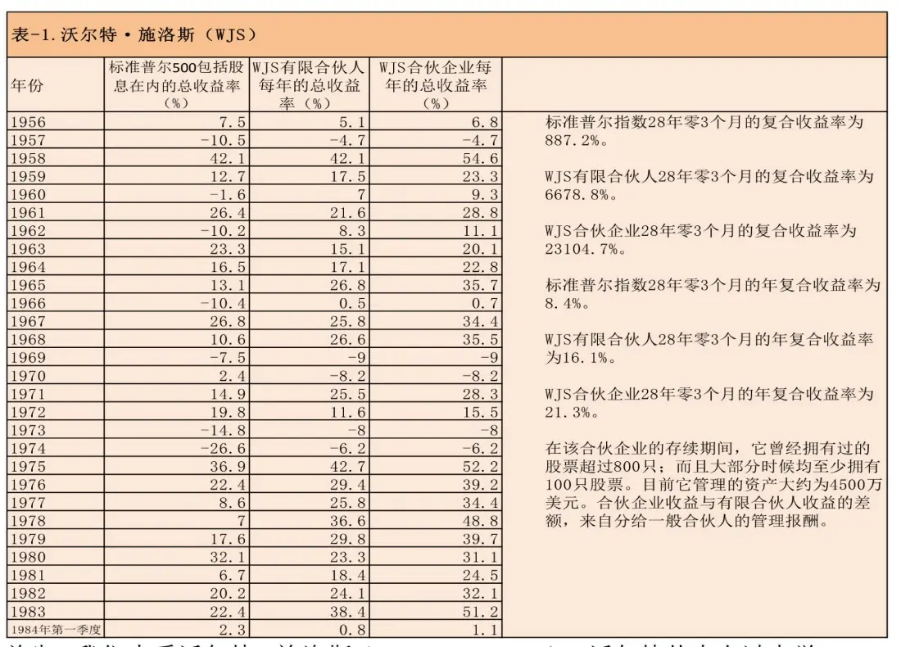

首先，我们来看沃尔特·施洛斯（Walter Schloss）。沃尔特从未上过大学，但参加格雷厄姆在纽约金融学院举办的夜校。沃尔特于1955年离开格雷厄姆——纽曼公司，并在28年间取得了表1所示的投资业绩。听了我所介绍的关于沃尔特的事迹后，“亚当·斯密”在1972年出版的《Supermoney》，写了一篇有关沃尔特的报道以下，是这篇文章中对沃尔特的评论：

他并没有什么特殊的消息来源。实际上，华尔街圈子里的人对他一无所知，也没有人告诉他任何想法。他只是查各种手册上的数据，并索取年报，这就是他的信息来源。

在介绍我认识他（施洛斯）时，沃伦自己也对他进行了和我一样的评价：“他从来没有忘记，他是在打理别人的钱财，这种意识使他厌恶亏损的心态更为强烈。”他是完全诚实的，对自己的认识也很清楚。金钱对他来说是一种严肃的东西，股票亦然，由此派生出他对“安全性”原则的坚持。

沃尔特采取完全的分散投资策略，目前持有着百多只股票。他知道如何去寻找那些以低于其价值的价格出售的股票。而这就是他所做的全部事情。他从来不担心那天是不是星期一，或者是不是一月份，又或者是不是大选的年份。他只是单纯的说，“如果我能够以40美分的价格买入一项价值为1美元的生意，肯定有好事情会发生”。他持有的股票数量比我多出许多，且他似乎没有兴趣知道所买入的公司是从事什么生意。也就是说，我本人对他全没有任何影响力。这就是他的优点，他几乎完全不受任何人的影响。

__表2__．汤姆·纳普（Tom Knapp）

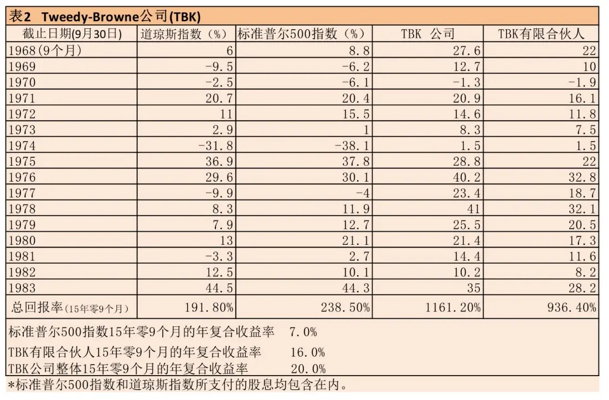

第二个例子是汤姆·纳普（Tom Knapp），是我在格雷厄姆——纽曼公司的工作伙伴。在二战前，他曾在普林斯顿主修化学系。参战回来后，他成了沙滩的无业游民。有一天，他得知多德在哥伦比亚开办一项有关投资的夜间课程。他报读了那项课程后，发现自己对投资产生了极大的兴趣。于是，他申请进入哥伦比亚商学院，并在那里取得MBA学位。其间，他有修读了多德和格雷厄姆开办的课程。35年后的今天，当我要向他求证以下的资料时，我又在海边见到了他。所不同的是，今天他已是沙滩的主人了。

在1968年，汤姆·纳普和埃德·安德森（另一个格雷厄姆的学生），和几个拥有相同投资信念的伙伴，一起开创了Tweedy，Browne合伙公司。表2中列出了他们这些年来的投资成绩。他们是通过非常分散的投资策略来达到的这些成果的。他们偶尔会买入一间公司的大量股份，以掌握公司的控制权。但在他们没有控制性股份的公司，他们所得到的投资回酬并不亚于他们所掌控的公司。

__表3__．沃伦·巴菲特（Warren Buffett）

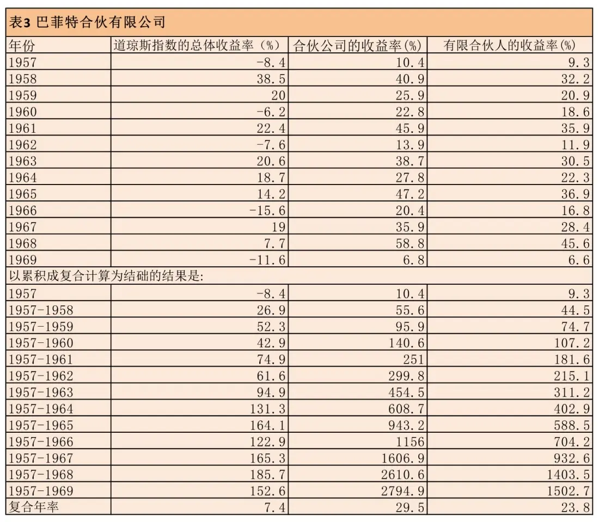

表3是第三个成员的投资成绩，他在1957年成立了巴菲特合伙企业。在1969年过后，他解散了公司。虽然从那以后，他仍通过伯克希尔——哈撒韦继续他的投资事业，但是我找不到一个很好的标准参数来表达伯克希尔的投资成果。不过我认为，不管从是从哪一方面来衡量，它的成绩都是相当令人满意的。

__表4__．红杉基金（Sequoia Fund）

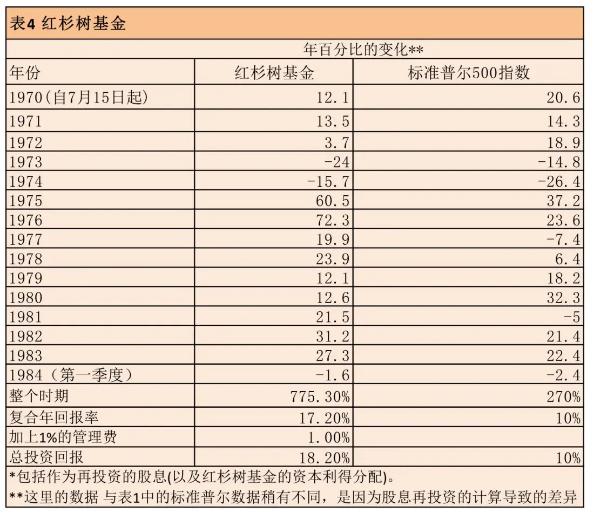

表4是红杉基金（Sequoia Fund）的投资记录。这个基金的管理者，比尔•鲁安（Bill Ruane）是我于1951年在格雷厄姆的投资课里认识的。毕业于哈佛商学院，到华尔街工作后，他觉得自己仍然需要多学习一些有关商业方面的知识，于是就在1951年到哥伦比亚大学选修了格雷厄姆的课程；我们就是在那时候认识的。在1951至1970年期间，他管理一个规模较小的基金，成果比起行业平均成绩远来得的好。当1969年我要结束巴菲特合伙企业时，我请他设立一个新的基金，来帮忙继续管理我的伙伴们的资金，这就是红杉基金的由来。这个基金并不是在一个很好的投资时机设立的，当时我正要抽离股市呢。接下来几年，股市的调整给他的投资表现带来的艰巨的挑战。值得高兴的是，我的伙伴们不但没有离弃他，还不断的增加投资额。结果，大家都得到了满意的回报。

这些，并不是“事后诸葛亮”的评论。比尔是我推荐给我的伙伴们的唯一人选。当时我说过，如果他能够取得比S&P500高4%的年回酬率，就已经是很好了。比尔的不只超越了预期的成绩，其基金的规模还一直在膨胀。毋庸置疑的，资金规模会成为投资表现的绊脚石。当资金不断成长时，并非说你不能取得比平均成绩更好的回酬，但它的难度会增加。当你管理着一个2万亿美元的基金，而这规模刚好就是整个经济体系里的资金数量，你就不再可能取得优于平均的回酬率了。

我必须强调的是，我举的例子中，它们的操作中从来没有出现过相同的投资组合。虽然他们都是在寻找证券的价格和价值的差异，他们各自的决策是很不一样的。沃尔特（Walter）所持有最多的股票，都是诸如Hudson Pulp & Paper，Jeddo Highland Coal，NewYork Trap Rock Company等等；都是些只要稍微有留意财经版的读者都不会感到陌生的名字。Tweedy，Browne所选的股票呢，大都是一些名不见经传的小公司，大家可能连它们的名称都没听过。Bill则钟情投资于一些大型公司。这些投资组合中，出现重叠的股票是非常非常之少的。这些投资记录，并不是一个人做了决策后，再让50个人来模仿他的。

__表5__．查理·芒格（Charles Munger）

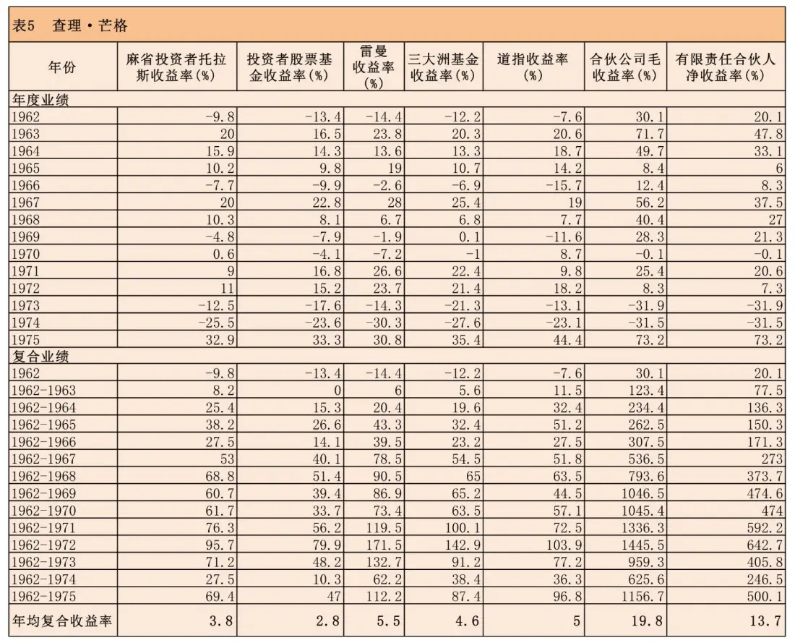

表5是我的一个朋友的投资纪录，他毕业于哈佛大学法学院，曾开过一家颇具规模的法律事务所。1960年前后，我与其相识并告诉他，法律是一种很好的业余爱好，但他还可以做得更好。他按照与沃尔特完全相反的做法，建立了一家合伙企业。他的投资组合主要集中于少数几种证券，因此业绩较为波动，但其同样来自价格低于价值的方法。他并不在意业绩的大起大落；正如其业绩记录所示，他也是那个投资成绩突出的智慧部落的一个成员。顺便提句，这成绩恰好属于查理·芒格，我在伯克希尔——哈撒韦的长期合伙人。然而，他在经营自己的合伙企业时，其投资组合与我和上述其他几人的股票品种几乎全然不同。

__表6\.__里克·格林（Rick Guerin）

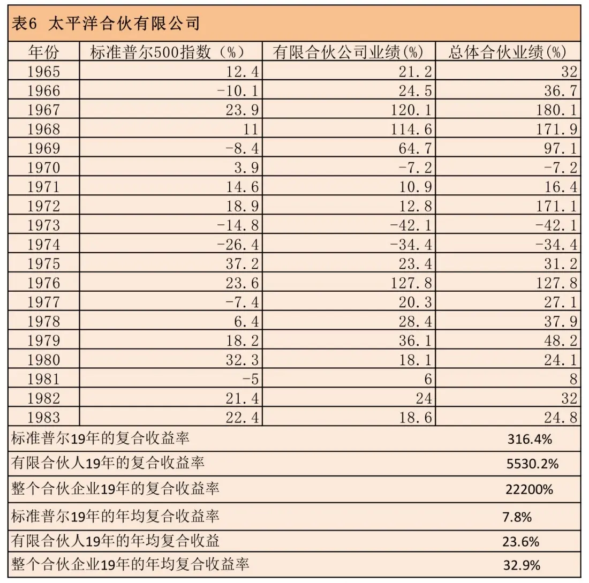

表6是里克·格林的投资记录。他是查理的一个朋友，毕业于USC数学系（又一个不是商学院出身的例子），曾进入IBM从事销售工作。在我劝说查理后，查理又劝说他。从1965到1983年，相对于S&P指数的316%回酬，他取得了约22，200%的总回酬。

这里要补充一点：说起来也奇怪，人们对于“以40美分购买价值1美元的资产”这个概念，不是一点就通，就是完全拒绝。如果一个人一开始就不接受这个概念，即使你跟谈论好几年，并拿出投资记录给他看，他的想法还是不会改变的。他们就是没有办法接受。像Rick Guerin的例子，他没有受过任何商学院的教育，却能够马上明白这个概念，并在5分钟内就开始运用它了。我从来没有看过有一个人是经过十年时间才慢慢转变成价值型投资者的。它与个人的IQ或教育背景没有关系。它要不然就是马上被领悟，不然就是永远都不明白。

__表7__．斯坦·帕尔米特（Stan Perlmeter）

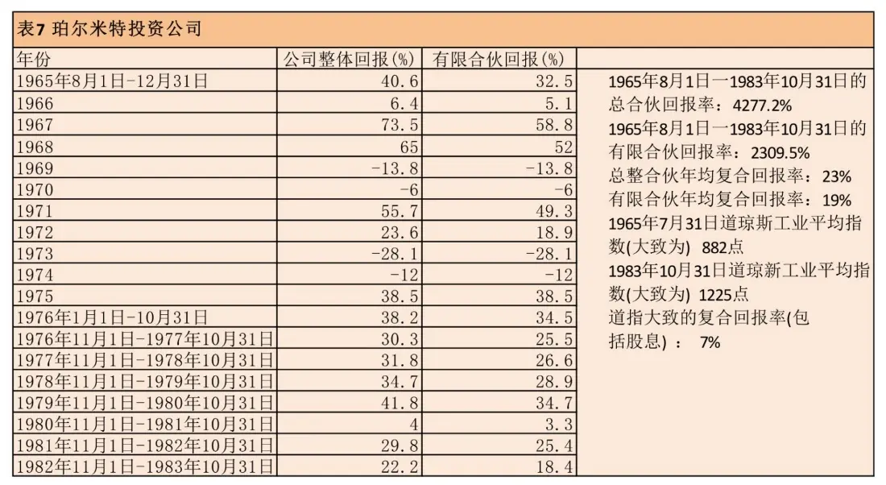

表7是斯坦·帕尔米特的记录。他是密之根大学的文科生，毕业后成了Bozell& Jacobs广告代理的一个事业伙伴。我们曾在Omaha的同一座公寓里居住。1965年，他发现我的生意比他的还赚钱，就离开了他的广告代理事业。同样的，斯坦只用了5分钟，就接受了价值投资法。

帕尔米特并没有持有的与沃尔特或比尔相同的股票。他的投资成果是靠他自己的独立判断来达到的。相同的是，每当帕尔米特决定要购买一个股票时，是因为他知道，他所得到的价值比他所付出的价格更高，这就是他唯一所关心的。他不去看公司的季度盈利预测，他也不看公司明年的盈利；他不管那一天是星期几，也不看任何人的研究报告；他对股票的价格动量、成交量、等等完全不感兴趣。他只问一个问题：这生意值多少钱？

__表8__．华盛顿邮报公司退休基金

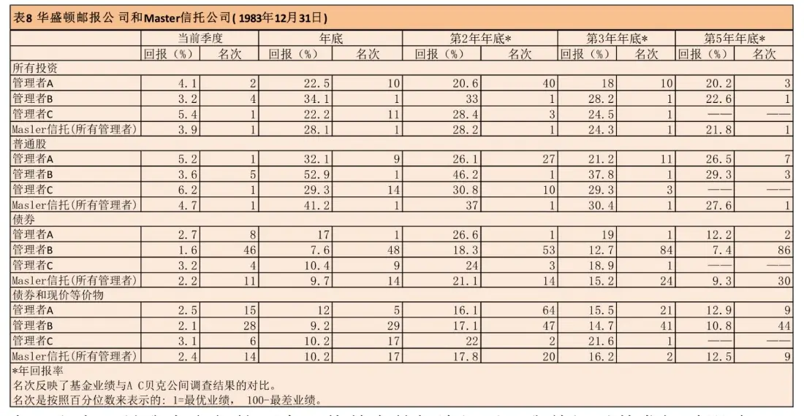

表8和表9是我有参与的两个退休基金的投资记录。我曾经对其发挥过影响力的，就仅仅只有这两个基金；它们并非是我从几十个基金中挑选出来的。在我的引导下，这两个基金都转向成了由价值型的经理来管理。其他的退休基金，很少有跟从价值型投资法的。表8是华盛顿邮报的退休基金。好几年前，它是由一家大银行来管理的。后来我建议说，如果他们挑选一些价值型的经理来管理基金，他们将可取得不错的成绩。

如你所见，他们的总体成绩一直以来都在同行中取得极高的排名。华盛顿邮报公司要求这些经理们至少保留25%的资金在债券投资中。我在表8中也列出了他们在债券投资方面的成绩，是为了让大家知道，他们在债券方面并不在行。他们本身也是这么认为的。即使受到了这25%（投资于他们所不熟悉的债券）的拖累，他们的投资成绩仍然在基金管理方面名列前茅。虽然这个基金的记录所涵盖的期限不是很长，但它代表了三个基金经理的许多投资决定。虽然这些人过去并不为人所知。

__表9__\.FMC公司退休基金

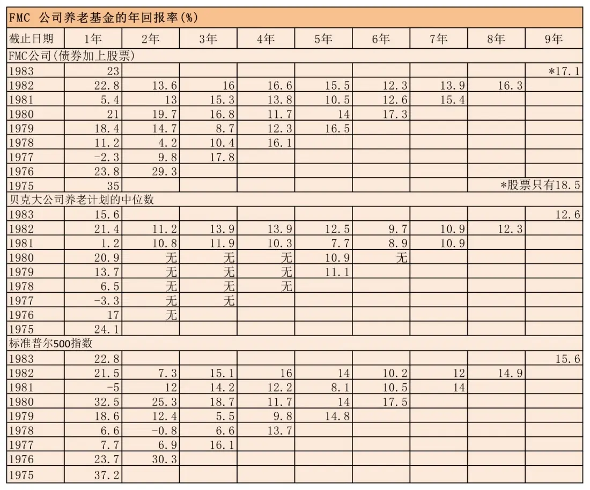

表9是FMC公司的退休基金。我从来没有亲自管理过这个基金，但曾在1974年影响了他们的决定，挑选价值型的基金经理来管理它。在那之前，他们挑选基金经理的方式与其他大公司没有什么不同。今天，由于那次“转型”，在贝克（Becker）一项关于退休基金的调查中，它已是规模最大的基金了。去年，他们共有8位基金经理；其中的7位的累计回酬比S&P的表现还好，全部8人在去年都取得了比S&P还好的回酬。在这段时间内，FMC基金的总回酬比其他基金的平均表现总共多出了2\.43亿美元。FMC把这项成就归功于他们在挑选基金经理时的信念。那些经理不一定都是我会挑选的，但他们都有个共同点：根据价值来选择所投资的股票。

好了，以上这些，就是来自格雷厄姆多德式的九个投资记录。我并不是在事后才从几千个人当中选出这九个人来的。这个情况有异于我以一些彩票中奖者名单（那些在他们中奖之前，我从来没听过的名字）来吸引你。我是在很久以前，就已经根据他们的投资原则，挑选出了他们。我除了知道他们曾经学习过什么，也对他们的智慧、人格和脾性有相当的了解。

还有很重要的一点是，他们的投资，风险都是比别人低得多的。只要看一看他们在大市下跌时的投资表现就可以知道这一点。虽然，他们每个人的投资风格很不一样，但在思想上有共通点：他们都是在购买生意，而不是买股票。他们当中有些人，有时候会买下整个生意，其他大多数情况下，他们只是买下某个生意的小部分；不论是哪一种情况，他们所持的态度是一样的。他们有的持有几十只股票，有的则集中投资在几家公司；任何情况下，他们都是根据一间公司的内在价值与其市价之间的差异来投资获利的。

__价值投资风险更小却收益更高__

我可以很肯定的说，市场中存在着许多非有效性。这些格雷厄姆多德式投资者们一直以来都是从价格与价值之间的差异谋利的。当一个股票的价格受到华尔街“羊群”影响，而被人们的情绪、贪念和恐惧把推向极端时，我们很难相信，它的价格变化是理性的。事实上，股票的市价往往是不合理的。

我还想说一个重点，是关于风险与回酬的关系的。有时候，风险与回酬是成正比的。如果有一个人对我说：“我这里有一枝可以装六发子弹的手枪，但我只装了一颗子弹在里面。你可以把它旋转一下，然后对着自己开一枪。如果你没死，我会给你1百万。”我会拒绝他，也许还跟他说，1百万不值得我这么做。然后呢，他可能给我另一个选择：“你对自己开两枪，如果不死，可得5百万。”这种情况，就是所谓的回酬越大、风险越大。

在进行“价值型”投资的时候，情况刚好相反。如果你以60美分买入某个价值为1美元的股票，比起你用40美分买入它，风险会更大。但是，后者的预期回酬却是比较大的。在价值投资中，潜在回酬越大，则风险越低。

举一个简单的例子。华盛顿邮报在1973年时，市价是8千万元。可当时，你可以轻易的以4亿元的价格把它的资产卖给任何买家。这家公司除了拥有Post、Newsweek等报纸业务，还控制了几家强大的电视台。这些资产现在至少值20亿元；可见，以2亿元买下它的人并不是笨蛋。

现在，如果它的股价继续下跌，使得它的市价只剩4千万，则它的贝塔值就会增加。对于那些认为贝塔值是衡量风险的重要指标的人来说，更便宜的价格会使得这项股票变得更具风险。这真是奇妙。我从来都不明白，为什么以4千万来购买一个价值4亿元的资产，风险会比用8千万购买来的高。当然，由于你并非亲自去管理这4亿元资产，你必须确保它的管理者是个诚实、有能力的人，这并不是一项很难办到的事。

你必须具有一些知识，才能让你有能力去评估某个生意的真实价值。但你也不能太过信任这个估值。这就是格雷厄姆所说的“安全边际”。例如，不要以8千万去购买一个价值8\.3千万的企业。但你必须留有余地。当你建造一座可以承受3万磅压力的桥梁时，你只会让自己驾驶一辆不超过1万磅的卡车过桥。进行投资时，也是同样的道理。

__价值投资将继续长期战胜市场__

最后，有些有商业头脑的人可能会怀疑，为什么我要写这篇文章。他们觉得，如果“价值型”的投资者人数增加，股票的价格与价值之间的差异将会减少。我要告诉你们的是，自从50年前，本杰明·格雷厄姆和戴维·多德所合著的《证券分析》出版后，价值型投资早已不是什么秘密了。可是，在我自己运用它的这35年期间，没有迹象显示人们正转向价值投资法。这也许是人类的本性吧，人们总喜欢把简单的事情复杂化。在过去的这30多年，学术界的各种研究正是与价值型投资背道而驰的。我相信这种趋势还会继续下去。已经有船环绕了地球一周，但相信“地球是平的”的人却会越来越多。因此，市场上仍会出现价格与价值的巨大差异，而学习格雷厄姆多德式投资的人们将会继续从中受惠。__（全文完）__

__备注：__建议能读原文的（英文）还就抽空读读原文，老巴的文笔很好

__问答__

网友：即某个人因为在抛硬币比赛中大获全胜而著书立说并在全国各地做巡回演讲，向人们讲授其在抛硬币大赛中获胜的秘诀！而媒体也会从各个超乎人们想象的貌似相关联的事物中寻找导致其获胜的蛛丝马迹。

__段永平__：你好像没看懂巴菲特讲的神马吧？老巴讲的是如果全美国的人都来参加一个抛硬币比赛，每一次淘汰50%的人，结果发现最后剩下的40个赢家里有20多个人来自于同一个村庄，那这个村庄的人一定是有点办法的或者说这个抛硬币其实不是随机的。

因为老有人说老巴投资做得好不过是因为运气好而已（现在好像还有人这么说），于是老巴就编了这个故事来说明一下：在这个市场里价值投资者只是占了很小的一个比例，但最后的赢家却占了大比例，这肯定不是因为运气。（2011\-04\-01）

01．网友：愿透过这篇文章，能明白点什么叫价值投资。

__段永平__：这篇文章讲的实际上是个概率事件，工科出身的人可能容易懂。我理解的大意就是，__长期来看价值投资者赚到钱其实不是运气！__（2010\-04\-03）

网友Y：以买下一单生意的想法去买股票，可以从整个公司余下生命周期所能创造的价值、所能产生的盈利来衡量现价购买值不值，相比于只盯着近年的市盈率、利润总额、利润增长幅度等指标的思维模式，来得更全面、更准确。这是我读后第一点体会。以后读指标可能没那么机械理解了，会有一个清晰的目标和教全面的视野，尽管很多东西是无法看清楚的，但是，起码减少了读指标的盲目性和机械性。感觉到文章其实涉及到价值投资的好几个方面，虽然有些只是三言两语提及。下来自己再慢慢学习和体会。自己还没入门，接下来还要好好学习。

第二个感悟是，价值投资并没有固定的模式和规定的做法，每个人都可以用自己独有的方式做价值投资。

__段永平__：其实我的理解也就是如此。我当年从巴菲特那儿学到的东西就是这些，而且我觉得就够了。剩下的必须自己去学，比如怎么了解一个企业等等，好像没有一个一句话能教会的办法。（2010\-04\-02）

02．网友：这篇文章我看了好几遍，发现有点矛盾．巴菲特说股票的市价是不合理的，和实际的价值是有偏差的．那么这里的不合理是短期还是长期的，如果是长期的话，无论它的价值是好还是坏，那么一个公司的实际价值不是永远没办法在股市上得到体现？那我们这些投资者怎么能从股市上获利呢？

__段永平__：我觉得巴菲特说的是时点问题。就是说在某个时点，股价总是不合理的，可能高了，也可能低了。有点像马克思说的“价格总是围绕价值上下波动”。我比较喜欢马克思说的这句话。

__你如果能想想一个非上市公司是否有价值（或价值是否能体现）可能就能明白你想问的问题。__（2010\-04\-03）

03．网友：投资一个公司，你会不会想别人为什么会低价卖给你．你又为什么可以高价卖出去这个问题？这是不是一种投机的心理啊？

__段永平__：呵呵，这个问题很有趣。实际上，__我买的时候是不考虑是不是有人从我手里买的。我要假设如果这不是个上市企业这个价钱我还买不买。你如果明白这点了，价值投资的最基本的概念就有了，反之亦然__。（2010\-04\-02）

04．网友：什么样的人是价值投资者？

__段永平：我从一开始就是个价值投资者。我买股票时总是假设如果我有足够多的钱的话我是否会把整个公司买下来。__（2010\-03\-27）

很重要的一点是你能把上市公司看成非上市公司，然后理性地去想应该怎么做。（2012\-11\-11）

05．网友：段总讲的有大道理！巴菲特的价值投资根本就是一种信仰：一种要实现价值投资信念（又称理念）的持久行动的过程！

__段永平：__价值投资根本就不是信仰的问题！当你想全部买下一个你想买的公司时，难道会是由信仰决定的？__买股票就是买公司__，不是信仰的问题。__这一关不过，千万别说自己是价值投资者__。（2011\-05\-09）

06．投资是什么？《啰嗦版》

__段永平：个人观点：其实区分所谓是不是“价值投资”的最重要，也许是唯一的点就是在“投资者”是不是在买未来现金流（的折现）。__事实上我的确见到很多人买股票时的理由很多时候都和未来现金流无关，但却和别的东西有关，比如市场怎么看，比如打新股一定赚钱，比如重组的概念，比如呵呵，电视里那些个分析员天天在讲的那些东西。我有时会面带微笑看看cnbc的节目，那些主持人经常说着满嘴的专业名词，但不知道为什么说了这么多年也不知道他们自己在说啥。（2012\-04\-06）

网友：一直以来，大家都感觉华尔街很神秘，以为这里是点石成金的地方，其实说穿了，我们和普通的作坊是一样的，也是通过采购产品，并增加其附加值来谋取利益的。托尼打开了话匣子。“从大的方面讲，我们分两块业务，我们有专人去收购被价值低估或者具有成长性的资产，然后通过重组，资产证券化等包装手段卖给投资人，并从中获取高额利润。”“当然这说的很简单，具体操作起来还有很多细分，比如有专门负责投资管理和资产管理的人去评估被价值低估或具有高增长潜力的业务。现在很流行的PE（Private Equity私人股权投资）就是属于这个范畴。PE通过投资有潜力的公司并最终通过公司上市、卖给其他投资者等手段实现退出，投资人也能从中获得非常高的收益。当然收益率取决于PE介入的阶段，越早介入，风险越大，收益也越高。”

__段永平__：个人观点：只有当你不再觉得“华尔街”神秘的时候，你才可能成为一个价值投资者

。（2010\-05\-15）

07．__不是真正理解__

引用：《对冲基金巨头：做空特斯拉是职业生涯最大失误之一》2014年06月12日

特斯拉堪称美股中最受争议的牛股之一，让无数投资者又爱又恨，对冲基金Kase Capital的创始人Whitney Tilson近日就表示，做空特斯拉是他整个职业生涯中最大的败笔……，Tilson还表示，他目前的投资组合中多空比是2：1，不过最近他更偏向空一些。他称“我并不是看空，我是谨慎。”

Tilson是Kase Capital的掌门人，是格雷厄姆与巴菲特倡导的价值投资的忠实信徒。

__段永平__：嘿嘿，这个忠实信徒很有趣哈，尤其是当他说2：1时。（2014\-06\-13）

网友X：他的网站整理了好多Buffett和Munger的资料，整理得挺不错的。而且他应该是很早就关注了Buffett，貌似也经常去股东会（去BRK的，貌似也去Daily Journal的）。他应该还是个Harvard MBA，高材生。但貌似巴菲特一直说不要做空。

网友W：这个人我在BRK的股东大会见过几次，管理1亿美元左右。他对BRK公司的业务分析挺不错的，对巴菲特和芒格的投资理念也如数家珍。他号称自己是opportunistic value investor\.几年前，他short Netflix，结果也是亏一塌糊涂。看样子，他还在吸取新的教训。不仅在Tesla，还有可能在2：1。

网友Y：《穷查理宝典》里面芒格语录那一章就是他记录整理的。

__段永平__：很意外居然这么多人知道这个人。不管他多关注巴菲特，从他所言所做来看，他还不真懂巴菲特。（2014\-06\-16）

08．网友：段总认为巴菲特的个人投资理念有什么独到之处，虽然价值投资的理念很简单，世界上也有很多人在做价值投资，但是能做到巴菲特这样的成就不多，巴菲特肯定有其过人之处吧？您是接触过他的，分享一下吧。

__段永平__：我觉得他就是坚持的好。（2010\-04\-06）

09．网友：James Simons、John Paulson这些是什么样的人？

__段永平：__他们两个都不是价值投资者。

John Paulson是个很厉害的价值投机者。当然拿别人的钱下注可能要容易些

。

James Simons是我的同行。我读烟酒生的时候也号称是学数量经济的，现在都忘得差不多了。他们的东西像我这样的普通人学不了，能学会的人也不会来这个博客

。（2010\-04\-06）

10．网友：价值投资能参考索罗斯么？

__段永平__：索罗斯的东西不好学，至少像我这样的一般人很难学会。老巴的东西好学，懂的马上就懂了，不懂的看看最上面那一句话。（2010\-04\-24）

网友：您认为索罗斯是不是投资？希望你不要回答，我只懂巴菲特，不知道索罗斯，他们玩的不是一个游戏没有可比性。

__段永平__：呵呵，其实我知道的东西少的可怜。我就知道巴菲特这条路很好，肯定可以到罗马，可老是有一堆朋友问我索罗斯那条怎么样，还不许我说我不知道。我是真的不知道。（2010\-03\-31）

11．网友：我不知道段大哥对林奇怎么看，我最喜欢的一本书就是彼得林奇的《彼得林奇的成功投资》，我觉得彼得林奇的书在细节上更适合我们普通的投资者，

__段永平：__林奇是个能同时买几百只股票的人，学他会累死你。（2012\-04\-28）

网友：林奇教了很多招如何看公司的基本面。可以说林奇属于“把事情如何做对”的大师。我个人的看法。

__段永平：__我翻过彼得林奇的书，只不过不记得他的名字而已。大家在这里说了以后我又看了一下，发现原来其实看过了。（翻过一本好像叫《战胜华尔街》）

他的东西可以看，但不要掉进去。感觉他像武侠小说里的剑术高手，但更高的高手是无招的。（2010\-12\-10）

__段永平__：我不是反对看彼得林奇的书，实际上他确实有好多东西讲得很好，《One Up on Wall Street》是非常值得读的一本书。不过，不知道为什么，我总是觉得林奇对股价说得太多了点，或许他只是为了让普通投资者更容易明白些？（2012\-04\-29）

网友：还有什么让您觉得林奇和巴老不太一样的地方？

__段永平__：林奇可以同时拥有1500只股票，巴菲特绝对不会。难道还需要别的区别？（2012\-04\-30）

Peter绝对是个精于投资的人，但可以同时买1500只股票确实是凡人做不到的。我不喜欢Peter是因为我看不懂他为什么要买那么多股票，确实没时间去看人家同时持有1500只股票理由。（2012\-05\-15）

网友：【Peter Lynch的投资策略比巴菲特更有效更容易操作】

巴菲特的投资策略基本上是看中了值得投资的股票，下大赌注，持有股票的数量很少。但是，Peter Lynch刚好相反，他持有的股票数量非常多，在他掌管麦哲伦富达基金的时候，他买过的股票有1400多种之多。他的道理相对简单：假设你平均持有10只股票，其中有6只股票赚了，你基本上能与大市持平，如果再有一只10倍股（Tenbagger）那你肯定大赚。因为一只股票最大的损失也就100%（即赔光，更何况这种概率很小），但是一只股票的上涨是没有限制的可以赚5倍，10倍，50倍。巴菲特策略的重点在于每只股票都看的非常准确，这是普通人很难达到的，但Peter Lynch的策略中只要你的多数股票赚钱就可以，可以容忍少数股票赔钱，这种策略比较适合普通投资者。当然，他们都有共同点，就是投资的时候非常谨慎，完全研究清楚了再投；另外还有一个共同点，就是耐心持有。

网友Y：我反倒觉得适当集中更适合普通投资者，他们精力有限，资讯没那么通达，很难关注那么多，投几个自己了解看得懂的，下重注，比分散好多少，生活质量也得以保障啊，关注那么多还不累死？

__段永平：Peter的做法实际上是属于短视，所以早早就白了少年头，投资也没法做了。80多的老巴依然威武啊，芒格87了还自己开车__。（2011\-09\-29）

__段永平：__呵呵，我学不了他。他是一个价值投机者，和老巴还是有挺大的差别的。再说，我也不想那么累。（2010\-03\-30）

网友Z：问题在于大部分投资着都没有老巴的那种法眼相对而言林奇的“只要大部分股票能赚钱，总体业绩还是不错的”这种方法相对容易点（相对而言）

__段永平：__呵呵，__大部分人如果学peter的话，会只学到白头发的那部分__，而且最后还要亏钱，何苦？不明白老巴的话还是不要碰股市的好。不过，要明白也确实不容易，虽然老巴的办法是最简单的赚钱法，当然亏钱的办法就多了去了。

这里说的最重要的不是peter厉害还是巴菲特厉害的问题，说得是我们这些业余投资者能学谁的问题。老巴的东西实际上和老巴没什么关系，也就是说“买股票就是买公司”和老巴没啥关系，老巴不过和我们一样这么理解和运用罢了。我没办法理解一个搞不懂5只股票（5个公司）的人如何可以靠投100只股票赚钱，历史的统计也很清楚地告诉我们实际上他们确实做不到，句号。（2011\-09\-29）

__12．引用：Omaha__

__段永平__：说一些和投资没那么直接相关的事：80岁的巴菲特和86岁的芒格在会上一讲（包括回答问题）就是近6个小时，好像身体好的很。第二天上午我见到他们时，依然觉得他们很精神，一点也没看出疲惫的样子。我突然觉得价值投资可能是个可以让人长寿的好办法

。5号去听芒格讲

，以前还没去过呢。

顺便说下，《穷查理宝典：查理·芒格的智慧箴言录》这本书不错，李路的序言写的也很好，我翻了一下，觉得自己该好好看看。（2010\-05\-04）

13．不明真相的群众：现在有一个比较好玩的说法是，“A股是不适合价值投资的”。

__段永平__：这个说法一直都有啊，a股是历史比较短的说法了。突然想起来其实美国很多很多年前也有很多特异功能的事。（2011\-09\-06）

网友：A股市场少有价值投资，一般喜欢炒作，其实就是博傻。所以一般认为转增股本和分红股等于摊低了股价，便于炒作。

__段永平：认为A股只是博傻的想法是大错特错的。其实在A股中真正最后真正赚到大钱的还是那些价值投资者，和别的任何市场一样。__

不要被表面的那些东西所迷惑，长期而言没价值的股票是不被“填权”的，填了也会回归本原。A股和美股的差别可能是系统风险大一些而已。（2011\-03\-03）

14．网友：巴菲特理论在A股最无用。

__段永平：__一直重仓拿着茅台的人们可不这么认为。（2019\-06\-16）

15．网友：股票市场是否遵循丛林法则？残酷的优胜劣败，请段总谈谈好吗？

__段永平：__

不懂。懂价值投资就会立于不败之地。（2010\-05\-13）

16．网友：记得你做客波士堂的时候曾经表示：中国没有巴菲特。而在最近的访谈中你谈到：中国已经有了一些价值投资者。哪些事情使你对中国的股民有了新的认识呢？

__段永平__：我还是认为现在的中国没有巴菲特。我一直认为中国有很多价值投资者的。其实大部分投资者或多或少都是价值投资者来着，至少很多人是这么说也是很想这么做的。（2010\-03\-30）

网友：我来说几个：但斌、林园、赵丹阳、李剑、李驰，他们都说自己是坚守价值投资，真的是不是？不知道。

__段永平： __一般而言，说自己是坚守价值投资的人多少都会很看重价值的。价值投资是理解而不是公式，所以每个人的结果可能有很大区别，因为每个人的能力圈子不同。（2010\-04\-15）

网友：华人里面做价值投资的真的不多，都是号称自己是价值投资者，我们还是学习巴菲特和老段吧！

__段永平__：

华人和其他人里面100%真正做价值投资的人本来就不多。但其实大多数投资人都或多或少都是价值投资者，经常能看到深一脚浅一脚的价值投资者，可能包括自己在内。（2013\-04\-07）

17．网友：段大哥：昨天在香港问钟兆民，华人里投资最厉害的人是谁？他说是段永平。跟我的想法一样。

__段永平：__所谓投资厉害不厉害实际上是很难定义的，这又不是比赛。

人们对投资“厉害”与否往往喜欢用某段时间的回报的比例来衡量，但这种衡量往往是不科学的，因为有很多因素会影响到短期的回报。下面举几个可能影响短期投资回报的例子：

1．能力圈：懂投资的人的回报未必能一直比市场好，尤其是有时候能力圈内没得可投时；

2．margin：有些用margin甚至是用很多margin的人是有可能在赌对的情况下在某个时段表现很好的\-\-\-\-但出来混是一定会还的；

3．把握性：巴菲特说，他的投资一般是在他认为有95%的把握时才出手（我觉得也许没那么高），但很多人实际上60%的把握就出手了（或许更低，所以会看到他们深一脚浅一脚的），可是10000个60%出手的人里面总能在某个时段找到运气好而回报特别好的，但未必就是因为这些人厉害。

4．用功程度：所谓懂投资的真正含义，我个人的理解其实是懂得不投不懂的东西。但投资回报的好坏其实是取决于投资人能找到自己懂的好的投资标的，这就需要很用功才能经常找到好的目标（巴菲特的标准是一年一个）。像我这种用等待苹果掉头上型的用功程度4年能找到一个就很不错的。

如果非要找个厉害的华人投资者，我个人觉得最厉害的是李嘉诚，不会有啥争议吧？（2012\-08\-27）

18．网友：这两天看又了一下巴菲特1984年为《证券分析》出版15年写的文章。__他说从来没见过一个人花10年的时间转到价值投资这条路上来。懂了就是立刻懂了。__我觉得真明白了的人无论有什么条件限制都会立刻开始动手做了。他后面给了9个例子非常好，但仔细读表里内容你会发现除了个退休基金时间较短，只有巴菲特自己在很长的时间里从来没亏过钱！这真的太厉害了！从他的文笔和他准备这个短文花的心思你就能感到巴菲特真的多么出色，多么值得好好向他学习。

__段永平：__呵呵，老巴的东西就是好

。（2010\-03\-27）

__段永平：其实老巴这么多年讲来讲去就是那一句话，买股票就是买公司。__（2014\-03\-03）

## 第二章　投资理解 - (3) 第3节　价值投资难吗？

\(3\) 第3节 价值投资难吗？

2025年5月18日

11:00

__第3节 价值投资难吗？__

很多年前俞斌（围棋大师）有一次问我什么叫“会投资”，我的回答就是这样：和“会下棋”一样

。我肯定会下棋，俞斌也就是会下棋而已

，但确实不是一回事

。（2010\-07\-08）

__段永平：老是听人说价值投资太难了，下面这篇文章大概是很有代表性的，__

引用：（豆豆龙：价值投资到底难在哪里？）via@fish

__原文：__价值投资，原理和技术其实说出来很简单，但是大道至简，知易行难。现实生活中，真正深得价值投资精髓的朋友，确实是少之又少。对于价值投资来说，其实最难的部分是那种人生态度和哲学。查理芒格曾说40岁以前没有真正的价值投资者。我想，也许他的意思是，心理年龄不到40岁的人，未曾经历真正的风雨和历练的人，是很难有这种超常的定力和淡泊的风骨的。

有的朋友开始笑了，哪有这么玄乎？说的像《笑傲江湖》一样。但是真正懂得价值投资真谛的人，一定能会心的微笑。经常有我的朋友向我咨询关于投资的问题。但当我开始向他们推荐一些书目和心得的时候，他们又总是迫不及待的问我关于个股的看法和持仓情况，最常见的问题是：哪只股有5倍10倍的潜力？我总是对他们说，告诉了你，你也挣不到的。有很多人对我的话嗤之以鼻，“我也可以做长线啊，为什么我做不到？”现在，就让我来说说，为什么推荐了正确的个股，很多人也无法获利。这也是想告诉大家，成为一个价值投资者，最难的部分是什么？

1 难在被怀疑被耻笑时候的坚持、自信与淡定

我能很确定的告诉你的一件事，就是作为一个价值投资者，是会经常被人怀疑和耻笑的。因为价值投资人常常在短期内“赶不上潮流”，遗憾的是，这个所谓的“短期”常常有可能甚至是几年的时间。如果不信的话，最简单的就是去访问一下李驰、但斌等中国最成功和知名的价值投资人的博客评论，看看有多少人仍在耻笑和怀疑他们。我曾经看过广东一个电视台录的一个采访林园的节目，那个人在节目中竭尽全力地冷嘲热讽林园已经完全失败。可笑的是，这个主持人连股票价格复权这样基本的常识都不懂，却敢去嘲讽一个每年股利就能分到几千万的智者。

这种事情总在世界各地发生，巴菲特也一直在被人质疑。有的“高人”说，巴菲特只是在前台表演的傀儡，背后也有“庄家”；在科技股疯狂的20世纪末，美国的报纸曾经在头版头条公开质疑巴菲特已经落伍了，被时代所淘汰了；巴菲特这次到中国拜访比亚迪后，比亚迪却正巧遭遇业绩下滑和股价下跌，于是又有很多人怀疑他在“借机出货”。

我本人也经常被人质疑。去年，我觉得房地产已经在最后的疯狂，因此把自己的一套房产出售，大家都说我又疯又傻。我自己觉得，一套住了9年的房子，卖的房价是当年的5倍多，租售比已经在600：1，虽然我永远都不知道也不奢望是否卖在了最高点，但我很清楚价格已经非常高估了，这种简单的道理大家为什么都不理解？可是大家都在告诉我另一个简单的“真理”：中国的房价一定会永远涨下去的。更要命的，直到现在，他们一直是对的，因为我卖出去的房子已经又涨价了至少20%。

现在，由于我这段时间坚定看好银行股等蓝筹，别人也经常耻笑我。有的人直接说我脑袋进水了，有的人洋洋得意地对我说，他持有的有色股在两周内翻番了，而我的银行股却很久不动，没有赶上大趋势。以前那些听我意见的朋友，两个月后再见面，也开始避免和我谈股票，因为他们已经不信任我的判断。他们甚至开始反过来教育我，要“认清形势，顺势而为；中国没有你那套东西的土壤”。我相信他们中的有些人已经开始恨我或骂我，后悔听我的建议。他们早已卖出了我推荐的那些股票，转换成市场里真正的“热点”。

最危险的是，一个功力不够的价值投资者，常常自己也会被其他人的行为所影响和动摇。一个月，我们可以坚守自己的信念；可是，半年后，一年后，甚至三五年后，当看到身边那些技术派、趋势派、甚至没有任何投资知识的老奶奶，他们的收益都比自己高的多的时候（遗憾的是，这真的有可能发生的），我们会不会仍然坚守自己的判断和信念？会不会想：是不是大部分人对了，其实错的是我呢？

李驰在他的博客中说道：投资未最后结帐之前，看起来和傻子一模一样。作为价值投资者，如果不能对以上的事情淡然一笑，如果不能在自己深入分析调研并正确判断的基础上坚持自己的投资纪律和原则，是无法坚守价值投资的。这也是为什么我告诉我的朋友，推荐了你正确的个股，你也不一定信；即使信了，你也不一定拿得住，更不一定能获得收益。一个别人推荐的，你并没有深入研究过的股票，你能坚守吗？

2 难在逆势而为的理性、清醒与忍耐

在大牛市中持有现金，正像在大熊市中满仓尖叫一样，是需要理性与勇气的。李驰和赵丹阳，能在07年的大牛市中果断清仓，现在说起来容易，可是实际操作起来，是需要极大的魄力和定力的。我的一个朋友，曾经豪言一辈子有2件事不做：一不赌博，二不炒股。可是在07年4000多点的时候，他也开始炒股了。那个时候，几乎所有的人都热情高涨，都认可股市到达10000点是指日可待的事情，连证券公司门口看车的老大爷，都开始把一辈子的存款拿出来炒股，生怕赶不上这个“千载难逢的好时候”。他们都相信，中国的经济要再高速发展30年，所以股票至少还会再涨30年。一开始，你可以不信这些话，但你看到不相信的结果是，说这个话的人的投资已经在3个月之内翻番了，这时候你也开始相信了。那时候最知名的歌曲是一首股民改编的“死了都不卖”的流行歌曲。让你这个时候清仓观望，持有现金或债券，看着股市每天在涨，心里计算着每天你少赚了多少钱，你真的觉得很容易吗？赵丹阳在07年上半年清仓后，那个时候也曾被很多人耻笑。

顺便说一句，我认为中国现在的房市，和当时的股市是完全一样的。有些成年人，就是不明白一些最简单的道理，比如：世界上没有只涨不跌的商品。人还没去世，不代表着人一辈子都不会死。

反过来，在股票市场极度低迷的时刻，在99%以上的人都深度套牢、心灰意冷的时刻，在所有人一提股票，就语重心长地劝你，千万不要掉入这个陷阱的时候，你开始建仓，你觉得容易吗？更经常发生的事情是，你开始建仓了，可是你的股票仍然跌跌不休，每天都在赔钱，连续几个月，你能不心灰意冷吗？你仍能高兴的尽情买入甚至满仓吗？很多好心人，开始说你是赌徒，开始用怜悯的目光看你，开始远离你；你的家人和朋友会担心你怀疑你，和你争论，开始想拯救你。他们不相信你的理论，只相信你现在在亏钱的现实。这个时候，你仍然能保持那份理性和清醒吗？

价值投资者也是理性和聪慧的人，但却把自己归入了逆势而为的小众（因为90%的股票投资者都亏钱，所以绝大部分人是错的），长期忍受别人的误解、忽视、嘲笑甚至谩骂，你觉得这很容易做到吗？

3 难在自省与分清对错

是的，作为价值投资者，很多时候，市场和大多数人会犯错误，而你是对的；这正是价值投资者的机会。但是，我们都不是圣人，因此有些时候（甚至是很多时候），价值投资者也会犯错误。要时刻分清对错，而不是偏执；要坚持对的，并及时承认和改正错误。这个度的把握和判断，着实不易。

价值投资者必须仔细分辨别人的理由和意见，并自行做出正确的分析和判断。举个例子，我现在看好银行行业，有的人会嗤之以鼻：银行股盘子太大，涨得慢；那么这种理由我就付之一笑好了。有的人说，银行股风险大，因为未来房地产前景很有风险；这种风险我也经过了最激进的测算；根据我的试算，我认为房地产价格在当前水平上一年内跌去50%也并不会对银行造成难以承受的危机（我一直认为北京上海的房地产价格会至少跌回到08年底的价格，甚至更低）。但如果有的人说，银行的最大风险是地方融资平台贷款，而据可靠消息，其中的坏账风险可能远远出乎大家的想象，那么我会仔细和他分析消息的来源和坏账的定量的影响，以及重新估算当前的价格是否具有充分的安全边际。如果证明我以前的风险估算不足，也许我应该重新审视自己的投资。

很多时候，自信与自大，坚持与偏执，只有一线之差；而这一线之差可能会让人破产。不自省的价值投资者的固执己见也许会导致致命的错误。我最佩服巴菲特的一点是，他总是敢于当众承认自己也会犯下愚蠢的错误，比如投资服装厂，比如康菲石油（尽管在当时，这明显看起来也像非常好的投资机会）；但同时，他坚定地遵循自己认为正确的决定，比如不涉足科技股，持有可口可乐和逆势加仓富国银行。他判断对错，并不是基于市场的反应和短时间的涨跌，而是真正从企业自身来判断，并基于自己铁的纪律。

4 难在目光长远而不急功近利

多数人是带着一夜暴富的梦想来到股市的。我曾经调查过不少人的预期平均年收益，有的人不好意思的告诉我50%，有的人信心满满地说100%，有的人甚至说，争取干3年就实现财务自由。他们没有算过的是，世界上最富有最传奇的职业投资人，他们十几年或者几十年的年平均投资收益率也就是20%多。然而就是这20几个点的收益，让他们的财富得到了几千倍的增长。巴菲特在他30岁的时候，资产只有100万美金，40岁的时候，资产只有2000万美金，可是在他80岁的时候，资产已经变成了400多亿美金。老戴维斯38岁才辞去公职开始以10万美元开始投资，可是在他70多岁的时候仍然有9个多亿的收益。换句话说，如果你在现在投资10万元，并保持25%的年收益率，10年后，你的资产会变成93万，40年后你的资产会变成7\.5亿。想一想，那些急功近利的投资人，有多少人能在40年能获得这个成绩？

我在10多年以前，也曾经以五万元的存款本金，在一个月内经过多次“完美”的技术操作，赚了1万多元。当初身边的朋友也有很多人对我顶礼膜拜。我甚至在美好的幻想，以后就靠这5万元作为起步资本，每月赚个5000元，比上班强多了（那时我的工资才3000多元）。后面的结果不多说了，总之在辞去工作，专职炒股5个月后，我又重新开始，老老实实的找了一份新的工作。

而对于真正的价值投资者，他的投资目标或纪律是什么？理智的价值投资者很少有人敢定下25%的年收益目标。通常，价值投资者的基本目标是保住本金，杜绝损失。更进一步的是，跑赢通胀。出乎很多人预料的是，这其实一点也不难。巴菲特以及无数的价值投资者在教育大家，只要买入低摩擦成本的指数基金，就能做到这一点。我也经常向不懂股票的朋友推荐指数基金，特别在这个阶段，推荐ETF50，可是从者寥寥。遗憾的是，大多数投资者不满足于这个收益，或认为自己比普通人运气更好、技术更高、更聪明。其实90%以上的投资者是无法跑赢指数的，而这也包括那些广大的基金从业者！所以更高级的价值投资目标就是跑赢指数！我从来不相信会有任何真正的价值投资者敢于挑战说，我追求的年化收益有30%，因为从长期来讲，这是基本不可能完成的认为（一些著名的投资机构，在长时间内保持了超过30%的年化收益；然而，在扣除了交易管理费用和普通合伙人分成后，很少有人能保持这么高的年化收益）。

看着身边追逐热点的幸运者在欢呼庆祝，我们真的能时刻保持一个平常心吗？当我们看到明显的所谓“机会”和“热点”，会不会也想做把波段或短差？要知道，做一天或一年的价值投资者容易，但难的是做一辈子不急功近利的投资人！

真正的成功价值投资者，三分术，七分心态。所有的术都好学，然而心态却需要经过人生的历练和感悟才能学到。就像今天，一个朋友拍着我的肩膀对我语重心长的说：“事实证明，你的房子卖了，就永远不能在以同样的价格买回来了；而你的股票，今天卖了，你随时都能用更低价格买回来。”呵呵，遇到这种情况，你会怎么想？

不要预测短期的形势。没有无风险的行业和无风险的投资。对于未来，一切都是不确定的。我曾经一再申明，没有人能预测短期的股市，没有人能预测短期的经济走势，没有人能预测道指一天跌1000点，没有人能预测经济危机（否则就不会发生经济危机了），因为这一切的变量太多了。没有人能预测911，没有人能预测朝鲜会不会往韩国扔个脏弹（连），没有人能预测天灾人祸，没有人能预测自然灾害，一只在西伯利亚的蝴蝶扇动翅膀，可能会引发一场龙卷风或海啸，这一切都是变量。说不定哪天外星人来了，小行星撞地球了，2012了，我们的经济环境和自然环境是如此的脆弱和复杂，因此一切预测都是不可靠和不负责任的。我敢说能准确预测未来的人，都是不小心走远说中一次的。

如果让我做一个最大胆的预测，我也只敢说，中国以及世界的经济，在长时间的轨迹中，应该是螺旋向上的；历史的车轮不可阻挡。在过去100年中的科技和经济发展，比过去10000年的贡献都要巨大。我可以很保守的说，在未来的50年、30年甚至10年之内，中国以及世界的经济发展会比现在要更好。然而连这个我都不敢和人打赌，因为一场天灾、一场战争或危机，也许会毁了文明的进程。但是话说回来，也许那个时候连人类和金钱都不存在了，也不存在投资和股票的问题了。 __（全文完）__

__博文：价值投资难吗？（2011\-09\-04）__

__段永平：老是听人说价值投资太难了，下面这篇文章大概是很有代表性的，__

__对此我说几句自己的看法。__

__首先，“难”是相对于“容易”的。本人觉得价值投资是最容易的投资办法，因为这是我会的唯一的投资办法。__

__说价值投资“难”的人一定是有更容易的办法“投资”？__

“难在被怀疑被耻笑时候的坚持、自信与淡定”\-\-\-\-__价值投资投的是你自己懂的企业，如果你真懂的话，又怎么会不坚持呢？__

__如果有不自信的感觉，那就说明你还没搞懂你投的企业或还不是价值投资者。__

__价值投资是你自己的事情，别人怎么看与你何干？__

“难在逆势而为的理性、清醒与忍耐”\-\-\-__“势”实际上就是别人现在怎么看的意思。当一个人在投资上还在想着是“逆势”__

__还是“顺势”时，就没办法专注在自己的标的上。__

__价值投资是你自己的事情，别人怎么看与你何干？__

“难在自省与分清对错”\-\-\-\-__难道非价值投资做到这点更容易？__

__价值投资里最重要的一点就是“理性”，能够理性地看待面临的一切就更有机会分清对错。__

“难在目光长远而不急功近利”\-\-\-__这是在说谁呢？__

__其实我倒是觉得最危险的是口里喊着价值投资，但实际上却老是在东张西望的“投资人”。__

我觉得文章作者一定是个读过不少价值投资书的人，价值投资的概念已经有了，但还没能融到骨子里。时间会帮忙的。（2011\-09\-04）

__博文：价值投资到底难在哪里？__（2011\-05\-08）

__段永平：__这是篇写得不错的东西，我只是调侃一下而已

。我经常听到人们说价值投资难，但老也搞不清到底难在哪里

。

我倒是觉得“看图看线”其实真的有点难，就像在赌场里看图看线一样。

1．难在被怀疑被耻笑时候的坚持、自信与淡定？

不是很明白为什么“被人怀疑和耻笑”与“坚持、自信与淡定”有何关系。

“坚持、自信与淡定”应该来自于你对公司的了解和理解，而不是来自于性格。

当一个人觉得“被人怀疑和耻笑”会影响到自己的时候，那说明他（她）还不是个彻底的价值投资者，

因为他（她）还会被价值以外的东西影响。

其他几点类似

。

从逻辑上讲，说价值投资难的意思似乎是还有别的办法更容易。

其实从亏钱的角度讲，价值投资确实有点难，别的亏钱的办法倒是容易得多

。

记得以前有记者问为什么当年我那么有勇气买网易，我说10块钱的东西有人一块钱哭着喊着要卖给你，

你要勇气干什么？

这句话放在这里也适用：10块钱的东西有人非要一块钱卖给你，你为什么会觉得难呢？为什么呢？

不过，当你也不知道你要买的东西到底是什么的时候，那可确实有点难了，那种时候就会东张西望地看别人的反应。

话说回来，价值投资确实有点难，不然满大街都是巴菲特岂不是有点乱？

长期来讲真正的价值投资确实有点难，是很难亏钱的难。（2011\-05\-08）

网友：此贴是否过于严苛了？连您自己都说过： simple but not easy

__段永平：__我的意思是其实没有更容易的方式去投资。尤其是初学者，老是想找捷径，次帖的意思就是没有捷径，就是没有更容易的办法的意思。（2011\-09\-06）

__问答__

__一、投资很简单但绝不容易__

01．网友：老段，问个问题，最近我再次翻看《富爸爸穷爸爸》系列图书，发现你走过的路和书上讲的如出一辙，是不是你当时也是看过这系列书，然后一步一步现实的？最初成为一个投资大师的？

__段永平：__我没看过系列，只翻了一下第一本，大概意思明白。就投资而言，到现在为止我还是个初学者。

投资有点像围棋，从20几级到超一流9段的所有人都叫会下棋，可差别太大了。如果说巴菲特算是顶尖超一流9段的话，我大概也就刚好一段（因为姓段

）。（2010\-07\-07）

网友：段大哥说得太对了，投资就跟一围棋一样从20几级到超一流9段的所有人都叫会下棋，可差别太大了。段大哥会投资，我也会投资。的确不是一回事呀。

02．网友：到了您目前的投资境界与阶段，您是否还存在着理念上的某些困惑或问题？您是否有会和巴菲特吃第三顿单独的午餐呢？

__段永平：__投资理念的东西非常简单，明白后就从来不曾动摇过。但具体怎么理解未来现金流折现还是不断有体会的。我开始投资到现在已经有8\-9年了，大概理解水平可能相对于巴菲特开始投资20年时的水平（巴菲特11岁开始投资的）。巴菲特的午餐拍卖每年我都会去捧场，因为每年那个基金会的人都会提醒我（我和他们挺熟的，还去那儿做过义工呢），这也是做好事嘛。说不定哪天不小心拍上了也是有可能的。（2010\-05\-23）

__1）简单指的是“原则”很简单__

网友：看到别人对自己懂的领域发表不一定正确的看法时，才对“不懂不做”有了鲜活的理解（才觉得“不懂不做”多么重要，有种醍醐灌顶的感觉）。反观自己现在可能也正在犯和别人一样的错误。越发觉得投资不简单了。

__段永平：投资很简单但绝不容易。简单指的是原则\-就是不懂不做，不容易指的是理解搞懂生意不容易。__（2013\-03\-26）

网友：巴菲特把投资说得很简单，而芒格却说投资需要很多知识，把投资说得很深奥。听他说看的书有一吨重。段大哥您怎么样认为呢？

__段永平：__他们说的都很对，角度不同。我有时也这么说：__投资很简单，不懂不做__。__但要能搞懂企业就算看一吨的书也不一定行__。__投资简单但不容易！__（2010\-05\-04）

__2）简单指的是“理念”很简单__

__段永平：__我理解的投资归纳起来就是：买股票就是买公司，买公司就是买公司的未来现金流折现，句号！（2012\-06\-24）

01．引用：资本人物——段永平（2007\-12\-03）

旁白：段永平在去美国之前从来没有投资过股票，而之后却成为高手，他是如何理解巴菲特的投资真经的呢？

__段永平：__沃伦巴菲特说，你买一只股票的时候，其实就是相当于你在买这个企业或者买它企业的一部分。那么这个企业所谓的价值其实就是它折现的这个价值，就是你把整个企业它的这个整个生命算下来他们总共能够值多少钱，你把它折现到今天，考虑到利息、复利，如果你现在买的价格是低过它的价值的，你就可以买，其实这个其实挺简单的，但是你要去找到它的价值是一件非常困难的事情，所以简单的东西不等于容易，我一说简单很多人就会有一个误解，说你是说他容易，我说我不，我告诉你这个东西非常难，但是它很简单，就这么一点点事情，你要搞懂他，大部分人在投资的时候呢，并不试图去了解企业，来看图看线对吧？容易受价格的影响，我觉得在这个地方，巴菲特给我的启示是非常大的，早期我也是一样，因为人都是凡人，那这个很容易受到这个外在的东西影响，那么看了他东西以后觉得有时候你就必须要坚持。（2007\-12\-03）

__段永平：__简单和容易完全不是一回事。比如一个好的golf运动员（其他的运动大概也差不多）一天大概要练8到10个小时的球，常年如此，简单而枯燥但绝对不容易。（2010\-11\-10）

__二、价值投资不容易在那？__

__1）．投资理念很简单，知道道理和真懂（付诸实施）是有很大差别的__

__段永平：__其实老巴这么多年讲来讲去就是那一句话，买股票就是买公司（2014\-03\-03）

__段永平：__我开始做投资时已经40岁了，而且经营企业很多年，所以瞬间就明白了买股票就是买公司的道理。you must believe指的就是这个道理。有趣的是，我认识的人里面，我觉得骨子里绝对认同这一点的人我就见过两个\-\-巴菲特和芒格。其他所有人（包括我本人在内）或多或少都受市场影响。（2012\-04\-27）

__段永平： “买股票就是买公司”这句话会说的人非常多，但我几乎没见过真的骨子里真的理解并相信这句话的\-\-我知道的人里面大概不超过5个（包括巴菲特和芒格在内）\-\-当然，这是因为我知道的人很少的缘故。__（2013\-04\-11）

01．网友：学习老巴好榜样：学从知道不能学开始。所谓的学老巴在这里指学习老巴现在的操作方式，即以合理的价格买入优秀公司的方法……

__段永平：__我不知道大家对“学习巴菲特”的定义是什么？

个人认为，所谓学老巴实际上就是一件事：__买股票就是买公司（做对的事情）__。

我发现，我认识的绝大多数人，不管他们这么说，骨子里都是拒绝“买股票就是买公司”的，理由是：那是巴菲特干的事，我们学不会。

至于__怎么才能找到好公司__，这本身和巴菲特关系就不大，因为每个人的能力圈不一样，受过的训练也不同（好的职业运动员没10年8年的训练是不可能的，好的投资人也一样！）每个人对自己能力圈的界限的认识也不同。__如何“把事情做对”是需要很多年的训练（理解）的__。（2012\-05\-03）

__段永平：__其实，我从来没有系统地看过巴菲特的东西。我非常认同买股票就是买公司这个逻辑。对我来说，这个逻辑其实不是来自老巴，而是来自我自己的内心，只是后来发现老巴也是如此，而且干得很不错，从而坚定了自己的信心而已。所以，我更认为我喜欢老巴，是因为老巴是我的“同道中人”。

老巴股东信里讲的东西无非就两个：__一个是“做对的事情”，就是去找好公司，关注公司长远的未来；另一个是“如何把事情做对”，就是如何找到好公司，如何看到公司的未来。__

__第一个问题其实就一句话，非常典型的“大道至简”，但非常难，绝大多数人在这点上过不去，所以才会过于关注市场。__

第二个问题，是每个人的能力圈问题，做投资，每个人都该找自己能搞懂的好企业。老巴懂的我经常不懂，我懂的老巴也可能不懂。（《穿过迷雾》序2016年8月30日）

02．网友：其实我觉得作为价值投资者，对于段总说的这些道理应该早就是很清楚的，但真正做得好的却极少，正所谓知易行难，我想问问段总如何能做到知行合一，有具体的可操作的方式没有？另外，我个人感觉，炒股如做人，做人不好，投资也一定成不了大气候，段总以为如何？

__段永平：__知道和从骨子里相信是完全不同的两回事。

__段永平：__知道道理和真正懂（付诸实施）是有很大差别的。投资的目的到不一定是为了成大气候，至少这是个很好玩的事情。炒股如做人这话也许有道理，我要想想。（2010\-03\-28）

03．网友：大家讨论价值投资都太强调“知”，其实“行”才更难做到，更别说“知行合一”了。

__段永平__：不知知不易，恐将行更难。（2012\-04\-07）

网友：谈一下自己肤浅的认识：总说价值投资是知易行难，其实是知难行易。知难是知道价值投资的边界，行易是投资者具有了将自己限定在能力圈里的能力。当然实际上，对具体投资标的的深入了解、掌握的程度决定了投资决心的大小。有时看似轻松的投资过程（比如巴爷对美银，段总对苹果、巨人），其实都是投资者多年努力付出的观察研究，知识储备，从业经历所得出的必然结果。

__段永平：__知难行易的说法也很有道理。（2011\-09\-06）

__段永平：__知难行易和知易行难其实不矛盾，一个说的是要做对的事情，一个说的是把事情做对。（2016\-07\-14）

04．网友：关于投资，巴菲特该说的都用大白话说了，我一开始看他的东西的时候，看的很高兴，以为看懂了，其实那只不过明白他在说什么而已，不是真正的“理解”，中间的那道槛，不用真金白银交点学费是很难跨过去的，他的东西实际上是很难“理解”的，也就是难以内化成自己的东西，

只能是自己犯了一次错，然后想起，啊，原来巴老不是早就说过这事不能干的吗，骂一下自己，然后不再犯同样的过错，这已经是最好的结果了，有实际的企业经营经验的人应该更容易理解点，不过我也见过企业经营很成功的人在股市里完全是把股票当筹码在赌博，就象我见过买几块钱东西都要讨价还价的人买起股票来完全不把钱当钱，

买股票就是买企业的一部分，

不懂的东西不要做，不要做超出自己能力范围的事，

只在相对于内在价值大幅打折的时候才买进，

投资要有耐心有纪律，

听起来多简单啊，小学生都知道是什么意思，但做起来多难啊，dimple but not easy，呵呵。

__段永平：__呵呵，你已经看得很懂了

笔误纠正一下：__simple but not easy！__

__小典故：这句话有可能是巴菲特跟我学的，__第一次和他吃饭的时候我说了一次，然后他微笑着重复了一次。以前我没见他这么说过，那以后我见他说过两次，其中一次是在CCTV采访中说的。

不管谁说的，听懂了就是很大的进步。（2010\-03\-09）

05．网友：“你如果不想拥有一家公司十年，你甚至不要拥有一分钟。”老巴有些话越想越不简单。

__段永平：__应该是越想越简单但确实不容易！（2013\-09\-03）

__2）．看懂公司很难（把事情做对）__

__段永平：__理解价值投资不等于就能在股市上赚到钱，就像知道要“做对的事情”的人不一定具备“把事情做对”的能力一样。

“把事情做对”需要有很多年的辛苦积累，不是看一两本书或者上几个“高手”的博客就能学会的。（2012\-04\-26）

01．网友：作为一个普通投资者，要真搞懂一个公司，其实难度真的很大，需要知识，经验，能力，心态，总之需要的东西很多，尤其是要确定好自己的能力圈，我现在觉得能搞懂一个比较简单行业的好公司就算实现自己的价值了。一点也不敢乱来！想来想去，能力圈这个东西真不简单！

__段永平：__如果简单的话，那各种巴菲特早就满地爬了。（2012\-04\-26）

网友：作为投资者，花费了非常多的时间去看一个行业，但最后可能也只能成为半个内行。对企业可能也不是真“懂”，这个情况下是不是就应该反省并做一些放弃，还是有一些方法可以优化？

__段永平：__个人认为，看懂一家公司不会比读一个本科更容易。（2019\-03\-13）

02．网友：芒格说四十岁以下的没有价值投资人，优秀的判断力需要一生培养，开会的时候帮忙留意一下是不是真的？

__段永平：__反正到Omaha的人当中，40岁以下的确实很少。不过，我还没有理解这句话是什么意思。（2010\-05\-04）

网友：“四十岁以下没有价值投资者”是巴菲特说的吗？我感觉不明白。

__段永平：__有人说是芒格说的。没有的意思大概是比较罕见的意思吧。（2010\-09\-06）

网友：我们这些人不都是在做价值投资吗，是不是到40以后才能对价值投资理解深刻？

__段永平：__他的意思是40岁以前很少有人能理解深刻，但没有说40岁以后就一定能理解深刻。（2010\-09\-03）

__段永平：__芒格讲没见过40岁以下的价值投资者的意思大概不是人到40岁就自动可以成为价值投资者的吧？或许只有从年轻时就开始学价值投资的那些人，积累很多年以后才有机会成为价值投资者。（2012\-05\-10）

__段永平：__要看懂一门生意确实非常艰难，需要长时间的专注。当然未必一定需要到40岁。我认识的一个投资“前辈”（年龄其实比我小7\-8岁）30出头时投资就很成功了。这位“前辈”15岁从中国台湾来美国读中学，然后上大学，然后研究生，然后去了美林，3年后离开美林去了家房地产公司。在房地产公司期间发现一家上市的房地产公司生意很好但股价很便宜。于是他就开始慢慢买，同时密切跟踪这家公司，在3年的时间里利用每个周末开车几乎跑遍了这家房地产公司的所有已建和在建工程，最后陆陆续续买了100多万股（在一块钱上下）。后来这家公司最多时一年赚20多块，109块时被私有化的。如果能够像他那么专注于一家公司的生意，任何人都有可能成功的。

有时候人们会以为做过生意的人会很容易看懂别的生意，个人认为这可能是个误解。__就我自己而言，要判断出一个好的生意模式是要花很多年的，而且经常是很多年以后依然是雾里看花（比如google）。但是，真正懂企业的人的最大优势实际上应该在对不好的生意模式的判断相对快一些，所以犯错的机会小一些__。（2012\-05\-21）

03．网友：老大，你在资本人物中曾经说过你投资是非常的集中。这样是否不符合风控要求，因为你认为你懂了的生意，但也未必看到了所有风险，况且企业是发展变化的！我想法是相对集中，关注弄懂10个左右，持有3\-5个，并不断换到性价比更低的组合，你觉得如何？换到性价比更好的组合。

__段永平：__呵呵，其实我也同意你的做法。我的问题是，有时觉得了解一只股票都非常难，十只几乎是“mission impossible”\.（2010\-03\-25）

04．网友：现在的感觉就是越学习越胆小，反而越不感出手，感觉真正理解一个行业和一个企业真的很难。

__段永平：__能够胆小就是进步。理解和搞懂一个企业确实是很难的。我做企业这么多年，开始投资以来觉得自己大致搞得蛮懂的企业不超过10家（排除的不算），下重手的不超过5家，大概平均两年一家而已。（2012\-06\-26）

05．网友：《奥马哈之雾》这七层塔都建立在识别企业（生意）能力的基石上，没有这个基石（识别能力），七层塔都是空的．却偏偏没有如何识别一个好生意和一个好公司\.

__段永平：要学会什么是好生意，最好的办法就是去做个生意，别的办法都要比这个慢而且不扎实__。（2012\-05\-11）

网友：黄峥的投资理念 1。像创业一样投资（Invest like an entrepreneur）投资是买公司的长期的份额。像创业一样，在找到好的生意模式的同时，你需要找到好的企业家/CEO作为合伙人。你需要长期愿意……

__段永平：最早黄峥还在Google时是有过打算想和我一起做投资的想法的。但后来他总是觉得自己没有经营过企业，老是觉得自己在某个地方差点啥，最后就坚决滴回去了。__当时给了我一个无懈可击的理由：美国的中餐不好吃。我当时觉得作为独子的他内心真实的理由可能是因为他其实就是个孝子，不想离爸爸妈妈太远而已。（2018\-09\-15）

网友S：我不赞同，老巴也没有自己创立过做实业的公司，限定自己投资的范围，用常识来判断，用思考来定义就可以了。

__段永平：__你不认为那是最好的办法的意思是什么？难道还有更好的办法？（2012\-05\-11）

网友X：有，跟着有实业和投资经验的走。

__段永平：__哦，我也喜欢看老虎打球。（2012\-05\-11）

网友：今年以来高球技术进步得快还是慢？呵呵\!

__段永平__：好像有一点点进步。总是很庆幸自己不是靠打高尔夫谋生的

。（2011\-05\-28）

06．网友：价值投资本身就没有什么好学的，重在悟。有些东西是学不会的！

__段永平：“价值投资”的原则没什么好学的这句话我同意。说来说去就一句话：买股票就是买公司，买公司就是买其未来（净）现金流（折现）。不过，理解公司长期的发展确实不是一件容易的事情。所以大部分人最后在股市上赚不到钱是非常合理的。（2014\-08\-18）__

网友R：不防看看佛教的书，或许对“悟”有不一样的诠释。可能对投资有帮助。

__段永平：__就投资而言，我觉得不需要。不懂企业的人其实看什么都没用，包括这个博客。

网友D：那什么叫自己懂企业了？真正的懂。

__段永平：__其实没人懂所有的企业，所以没有懂企业的说法，但可以有懂某个或某几个企业的说法。__不懂企业的人是很难懂企业的，不懂这句话的人也很难懂这句话。但要懂这句话可能需要很多年的理解，而且很多年也未必就一定懂。__不过，如果把企业看成一个在出租的房子或商铺也许能对理解有点帮助？（2012\-06\-23）

网友：我的理解就是：价值投资需要非常扎实的功底，对企业透彻了解的功底。

__段永平：__其实任何东西要做好了都需要有扎实的功底哈。所谓的“价值投资”就是买企业未来利润的意思，不懂企业就根本没办法做到这点。（2013\-06\-01）

07．网友：对我来说，价值投资难在3方面：

第一个是标的的选择。如何从众多的企业中找到适合投资的企业，很难。

第二个是理解企业。价值投资强调只投资自己懂的企业，要懂一个企业，尤其是要预测到这个企业未来5到10年的发展，很难。

第三个是安全边际的确定。市场绝大部分时候是有效的，价格跌到了价值以下，这本身就不常见，而且要跌到多少才算安全呢？这个似乎没有公式。这里面有两个难点，一个是耐心等待机会出现，一个是看准之后下决心，都不容易。

段总觉得不难，是可以理解的，因为上面这些问题，可能对于段总来说都不是问题，但对于像我这样的门外汉，却还有很长的路要走。

__段永平：我真的说过不难吗？我说的意思是其实没有更容易的办法。__（2011\-09\-06）

08．网友：看段大哥博客已久，总结说几点。1、买股票就是买公司。2、公司最重要的是商业模式，并且自己能够看懂这种商业模式的护城河和接下来几年带来的现金流。3、不懂不做。

看似简单的几条，但是一般人几乎做不到，难，甚难。

__段永平：__总结的很好。（2013\-02\-23）

09．网友：段总会经常逛逛雪球吗？感觉雪球有不少优秀的价值投资者，他们对自己感兴趣的投资标的的研究和理解还是很深刻的。

__段永平：__有时候会看看，还是觉得扔雪球的人比较多，滚雪球的人极少，但确实能见到一些扔雪球的高手。

网友G：我想知道怎么区分人家是在滚雪球还是扔雪球呢？

__段永平：__一般而言，手里抓着很多球的大概都是扔雪球的。具体表现就是那些什么公司都懂的大概多属于这类。（2013\-07\-30）

__三、知道“投资简单但绝不容易”该怎么办？__

__1．给85%投资者的建议__

01．网友：跟您学习了几年投资方面的知识，是有越来越简单的感觉，就像1\+1=2那样确定无疑。但是在实战成绩上，自己又平庸无奇。您认为“懂投资”需要多长的时间才必然见到“好成绩”？

__段永平：对85%以上的人而言，懂了简单而不容易的道理后，最好的实战业绩就是远离股市。似乎你好像没真懂吧？__（2013\-09\-09）

02．网友J：不断悟就能（不是说一定）到达吗？如果说投资是攀高峰（可能是没有顶的山峰），会不会有可能提高到一定程度就上不去了，也就是说其实也有机会是悟不会的？我觉得投资难的不是理念和智慧而是价值判断，很少有人能判断价值，简单但不容易的不容易在这里，虽然看起来不容易在前者。

__段永平__：个人认为悟明白了的人就可以，比如我有一个朋友，他非常明白地坚决不碰股票，只把钱投在自己懂的生意里，回报肯定比股市上85%以上的人好。（2012\-05\-01）

__段永平__：有些不碰股票的人，也可以是最好的价值投资者，因为他们懂价值投资最精髓的东西\-不懂不碰，而且长期而言，他们的投资回报比股市上85%的人都好，因为他们没在股票上赔钱。

03．网友：有个疑问，巴老和大道都说过适合做投资的人是很少的，如果没记错大致是百里挑一的意思？绝大部分人适合做指数基金。我的感觉也是如此。投资是一条很长的路，在做对的事情和把事情做对的路途上，不会知道是不是能到还是到达不了的绝大部分，正如大道说过价值投资其实是学不会的，但有悟性的人可以提高而已。“可以提高的”这部分人群比例是多少呢？这个可能没人知道，只是问问，是不是也很低？

__段永平__：可以提高的比例就是适合的比例。不适合的大概很难提高。从留言版的情况有时也能看出来，不明白的怎么说都是不明白的，回头还要怪老巴，呵呵。（2011\-10\-25）

__段永平：__我说的“任何人都可以从事投资”的意思是我认为并没有一个“只有‘某种人’才可以投资”的定义。但适合投资的人的比例应该是很小的。可能是因为投资的原则太简单，而简单的东西往往是最难的吧。

顺便说一句什么是“简单”的“投资”原则：当你在买一只股票时，你就是在买这家公司！简单吗？难吗？（2010\-02\-07）

__段永平：__能说的都说了，可“初学者”就是视而不见我有啥办法？能上道的早晚会的，但和我没关系。不过，__没人可以改变股市上85%以上的人会亏钱的现象。如果非要我指点一下的话，那就是最好远离股市，至少不亏钱，这句话可以帮到股市上85\-90%的人。不过，我知道其实不会有人听这句话的__。（2012\-09\-20）

04．网友：因此，正如段永平先生所说“事实上，我发现只有很少人会去真正认真地学（巴菲特）”，真正开始学的人就不多，加上估计企业的价值很需要一些无法量化的功夫，所以又有很多人学着学着跑了。这个领域的人其实并不多。bargain总是会出现，因为没有人可以用巴菲特的方法和洞察力分析整个市场的所有企业。

__段永平：__呵呵，我个人的理解是，如果有个公式可以赚大钱的话，那所有人都会用这个公式，然后赚大钱的就是卖公式的人。其实现实中就有很多人是靠教人看图看线赚钱的，但他们不靠看图看线投资赚钱。赌场里也有很多看图看线的人，他们好惨啊。价值投资不是个公式。__以我个人的经历而言，对价值投资的理解真的需要很多年，同时还真是需要有点悟性才行__。（2010\-03\-05）

05．网友：有个问题在我心中萦绕了很久。在这里我想让段大哥您帮我解答一下。为什么巴菲特的儿子和芒格的儿子都不懂价值投资，或者说投资不怎么厉害。难道价值投资真的是教不会的吗？如果真的这么难道，那像我们这样的小辈没什么人教，那不是更加学不会了。

__段永平：价值投资教不会的原因是因为大多数人在大多数情况下是封闭且没有逻辑的，如果不肯学的人又如何能学会呢？__

__口口声声说价值投资的人有很多其实骨子里并不是真的理解价值投资，一到关键时刻就不行了。学价值投资不会比学钢琴容易，不是看几本书，来这个博客晃一下就能学会了。__

__想象一下，当一个弹钢琴的人到可以靠弹钢琴赚钱的时候，要花多少工夫？要靠投资赚钱所花的工夫不应该少过弹钢琴吧？（2011\-05\-19）__

__段永平：其实是大多数人拒绝学。如果大多数人真知道的话，他们就应该远离市场。对85%以上的人而言，学习巴菲特最好的办法其实就是远离股市。问题是没人知道是哪85%__。（2012\-05\-04）

__2．给另外15%投资者的建议__

01．网友：价值投资真的难啊，买股票就是买公司，问题是怎样确定这家企业的竞争优势，而且更重要的是确定这种优势的持续性。

__段永平__：__如果你觉得价值投资难的话，意思大概就是你有更容易的赚钱办法？逻辑上（统计上）来讲，价值投资是最容易赚钱的办法，因为别的办法只会更难。__（2011\-05\-12）

02．网友y：一个投资者的心路历程——学习老巴好榜样。

1．焦躁的过山车，那两三年，自己很努力，尝试不同的方法，但还是注定失败。一是最终沉迷于市场，二是努力方向错误。还是盯着市场，研究“势”，为投机找借口。三是学习方向错误。那时也很谦虚的到处学习，身边有人吹得很神，为自己还是重点大学金融研究生不如他们而惭愧……，那两三年：悲催的大牛市与大熊市，这过山车摇得自己差点没命。

2、迷惘的再摔跤……最后，还是迷茫地再摔跤再坐过山车……

学习方面，由于持股少了，更多时间空出来看别的东西。系统地看了巴菲特，特别是段永平、对价值投资的概念有点登堂入室的理解。

3．近两年：开始做对的事情，但还没把事情做对。

__段永平：__呵呵，说几点：

1．说明学校里是很难学到投资的，哪怕是金融专业的研究生也可以是七窍只通了六窍。（备注：就是一窍不通的意思）

2．说明在吃了很多亏后，不断悟的人最后会悟到“道”的。

3．上道了不等于到了目的地，知道对的事情离能把事情做对可能还有相当长的时间。好消息是，只要上道了，快点慢点其实没啥关系，早晚你都会到罗马的，if you really believe that\.（2012\-05\-01）

网友y：非常感谢大道的分享，我的理解，这是个知行合一的过程：知道、悟道、信道、行道（即做到）。很高兴自己正在践行中。

__段永平：巴菲特自己说，在遇到格雷汉姆之前，他也和很多人一样，关注的是价钱、成交量等等。当我告诉他我从他那里学到的最重要的东西是“买股票就是买公司”时，他非常兴奋地说这正是我从我老师那学到的东西__（“That's exact what I learnt from Graham\.”）

。

网友l：觉得自己已经走在对的路上了，继续跟大道学怎么把事情做对。

__段永平：__怎么把事情做对大概必须要靠自己了。时间会帮你的。

网友y：那买公司就是买未来现金流折现是您补充说明的吗？

__段永平：__老巴应该也说过类似的话。买公司如果不是买未来现金流的话，那买的是什么呢？假设如果你买的不是上市公司的话就容易理解了。（2012\-05\-01）

03．网友：您觉得价值投资对于一个普通的散户（个人投资者）最难的地方在哪？是理念？信仰？坚韧？人性？耐心？学习？抑或是什么？

__段永平__：__呵呵，看他缺什么。我可是见过很懂巴菲特的散户的，不过后来都变大户了。__

（2010\-03\-28）

04．网友：像我这种情况，愿意将未来几个月以至几年时间花在这个上面，但我怎样利用我这些时间才更有效、有所进步呢？比如这些时间用来读更多书哪些书，这方面段老师能否给一些指导建议？

__段永平：__对了，关于怎么投资的书，我觉得最重要的书是巴菲特写给股东的信，其次是巴菲特平时的言论。如果你真看懂了，你就可以开始了。如果谁觉得巴菲特已经过时，谁在投资时就该小心了，不然过时的很快就会是自己。该讲的老巴都讲了，别人谁讲的都不重要，能不能理解完全看自己的悟性和造化。（2010\-02\-09）

05．网友：作为一个普通人，我们如何可以拥有这种洞察力？有哪些途径呢？

__段永平__：看且只看老巴的东西，先看10年再说。（2017\-04\-19）

__段永平__：大概是因为股东大会在即，最近听了很多巴菲特的讲话，每次听都觉得很有收获。我把能在网上找到的老巴的讲话都下载了，大部分是买的。youtube上有很多，是免费的，但看起来稍微有点不方便。主要内容：在几个大学的讲话，和charlie rose的对话以及电视采访等。如果能听懂的话，建议听听，感觉比看给股东的信更直接和有趣。我也经常有很多地方听不懂，但反复听后发现大部分都能听懂，不知道是不是听力有点进步。

直接听的好处是：听到的东西是原汁原味的，对真正理解可能有帮助。（2012\-04\-30）

__06．引用：CCTV《对话》：巴菲特和芒格（__2010\-10\-18）

__段永平__：本人觉得这节目做得很不错了，值得关注巴菲特的人反复看。

如果这个节目能做成《对话》特别版，分个上下集，让老巴和芒格多讲点当然会更好，但我觉得最重要的东西都在里面了。

还是那句老话，对看得懂的人来讲，这些也就够了。对看不懂的人，再多其实帮助也不大

。（2010\-10\-18）

07．引用：芒格主义

（47）”We get these questions a lot from the enterprising young\. It’s a very intelligent question： You look at some old

guy who’s rich and you ask，‘How can I become like you，except faster？”

47，我们经常从那些上进的孩子们那儿听到这些问题。这是个很“聪明”的问题，你对着一个有钱老头问：“我怎么才能成为你呢？怎么才能迅速地成为你呢？”

__段永平__：“except faster”就是如果不能更快的话。我觉得怎么才能迅速地成为你呢？翻得很好哈。

我也经常碰到类似的问题，而且潜台词往往是我比你还聪明，所以我应该可以更快，只要告诉我秘诀就行了。

其实秘诀很简单，把巴菲特说过的所有东西都看20遍（如果一遍看不懂的话），再悟20年，就知道自己有没有可能做好了，已经懂的例外。（2012\-06\-26）

08．网友：我想向大道请教的是：价值投資者除了看大道您的观点，还有老巴的股东信之外，还有必要学习什么东西吗？如果有必要，大概方向是怎样的；如果没必要，是不是剩下的就是领悟和实操了？

__段永平__：我主要讲投资是什么（什么是对的事情），很少讲怎么投资（如何把事情做对）。老巴得股东信应该两者都有了。在如何把事情做对上，也许有很多书可以看，但最重要是能够看懂企业，看懂商业模式。（2019\-04\-10）

__多关注长期__

01．网友：我想问整天看你的回答问题和巴菲特的视频能学好投资吗？或者你认为一个普通员工怎样可以学会投资？

__段永平：__光整天看也许是不够的，要想要实践。如果你一直在悟的话，早晚会明白的。投资开始的越早越好，不要想着马上赚大钱，一定要记得老巴那句话：“慢慢地变富”。

据说在2000年的一个早上，亚马逊创始人杰夫贝索斯给巴菲特打电话，问巴菲特：“你的投资体系这么简单，为什么你是全世界第二富有的人，别人不做和你一样的事情？”巴菲特回答说：“因为没人愿意慢慢的变富。”贝索斯突然明白，关注长期的人，比关注短期的人有巨大的竞争优势，因此更加坚定了关注长期，忽视短期的想法。（2019\-03\-19）

网友：为什么大多数人学不了巴菲特？是不是与好汉不吃眼前亏有关？

__段永平：__这个说法有道理。换句话说可能就是短视了。（2010\-11\-24）

网友：我也总是隔三差五的忍不住看看OPTIONS的情况，虽然知道做OPTIONS大体来讲是背离老巴的教诲，但总有那种冲动去做，钱少的时候，特别想快点致富，心态有问题啊\.\.呵呵．几个月前终于忍不住，买了2012年1月到期的WFC在40块钱执行的CALL OPTION，不知道会出现什么结果……

__段永平：__呵呵，曾经有人（不止一次）对我说过：价值投资看起来有道理，但我需要赚些快钱，好像巴菲特和本人都不喜欢快钱一样。（2010\-08\-12）

02．引用：2007年《南方人物周刊》采访手记

问：在别人眼中，你算是年少得志，无论做企业、还是做投资都很成功。你认为自己究竟强在哪里？

__段永平：__我是个很普通的人，做的事是每个人都能做得到，只是我和他们的心态不同，譬如想快速致富。__他们常常会跟我说，阿段你说得很有道理，但是我要尽快赚钱。我说，你看，我比你有经验有能力，我都只能尚且如此，凭什么你就能快点？__

03．网友：大道，多数人不愿意慢慢变富为何故？

__段永平：__其实我也不愿意慢慢的变富，我只是不知道怎么才能快速变富而已。（2019\-06\-03）

04．网友：至于yahoo，他自己财报里也都写了，机构这些人也不傻，咱能想到的人家也能想到。也就这样了。

__段永平：__呵呵，你要这么看机构的人的话你就应该再多看看巴菲特的东西以争取更大的进步了

。大多机构是很难做真正的价值投资者的，因为他们的考核体系是用一年来计算的。机构这些人的问题不是傻而是都太聪明了（好像是芒格讲的），他们是聪明的旅鼠（巴菲特语）。

这里没有丝毫挤对机构人的意思。事实上我认识非常多机构的人，里面很多人都很好很聪明。

你想想看，有多少比例的对冲基金可以有10年以上的寿命？你再看看去年都是谁在最便宜的时候狂卖来着？

我说的这些不是对Yahoo而言的（个股的看法可能会有很大差别，因为大家都在某种程度上盲人摸象来着），希望对大家有帮助。（2010\-03\-20）

补充：对冲基金的平均寿命好像只有7年，千万别学他们的做法。（2010\-03\-27）

__段永平：__我个人认为大多数基金都很难真正做到价值投资，主要是因为基金的结构造成的。由于基金往往是用年来衡量考核，投资人也往往是根据其上一年的业绩来决定是否投进去。所以我们经常看到的现象是往往在最应该买股票的时候，很多基金却会在市场上狂卖，因为股东们很恐慌，要赎回。而往往股价很高时却有很多基金在狂买，因为这个时候往往有很多股东愿意投钱进来。基金大部分是收年费的，有钱时总想干点啥，不然股东可能会有意见。

基金一般而言很难搞价值投资，因为一年（甚至一季度）一考核的机制是很难不做短线的。（2010\-06\-21）

05．博文：《巴菲特忠告：简单胜复杂》2010\-03\-24）

巴菲特在格雷厄姆的基础上形成了自己更简单的投资策略，只有一句话：“我们的投资理念非常简单，真正伟大的投资理念常常用简单的一句话就能概括。我们寻找的是一个具有持续竞争优势并且由一群既能干又全心全意为股东服务的人来管理的企业。当发现具备这些特征的企业而且我们又能以合理的价格购买时，我们几乎不可能出错。”

__段永平：__其实，他这一句概括的还是格雷厄姆的三点：好业务、好管理、好价格。就是用相对于内在价值来说相当便宜的价格买入业务一流而且管理一流的优秀上市公司的股票。

公司好坏，比较容易分析，好人往往是大家公认的，好公司也往往是大家公认的。但你买入时支付的股价是便宜还是太贵，分析起来就难多了。

这么简单，为什么大部分人不做价值投资呢？

__段永平：就像投资一样，一辈子悟不出来的多数都是由于自己拒绝去想长远的东西，短期的诱惑实在是太多了。__（2019\-01\-18）

## 第二章　投资理解 - (4) 第4节　什么人适合做股票投资？

\(4\) 第4节 什么人适合做股票投资？

__第4节 什么人适合做股票投资？__

__段永平：哈，突然觉得用这种方式回复也好。__

网友：段学长好！我是浙大电机系毕业的，现在在读工程科的PhD。课余我看了一些价值投资方面的书，Graham的《The Intelligent Investor》和《Security Analysis》之类的，也看了巴菲特的传记《Snow Ball》，对价值投资的兴趣越来越浓，很想以此为终身事业，您觉得直接投身到投资领域好吗？还是应该先有自己经营企业的经验才能真正理解企业？

__段永平：__老实讲，我不知道什么人适合做投资。但我知道统计上大概80\-90%进入股市的人都是赔钱的。如果算上利息的话，赔钱的比例还要高些。许多人很想做投资的原因可能是认为投资的钱比较好赚，或来的比较快。作为既有经营企业又有投资经验的人来讲，我个人认为经营企业还是要比投资容易些。虽然这两者其实没有什么本质差别，但经营企业总是会在自己熟悉的领域，犯错的机会小，而投资却总是需要面临很多新的东西和不确定性，而且投资人会非常容易变成投机者，从而去冒不该冒的风险，而投机者要转化为真正的投资者则可能要长得多的时间。

投资和投机其实是很不同的游戏，但看起来又非常像。就像在澳门，开赌场的就是投资者，而赌客就是投机者一样。赌场之所以总有源源不断的客源的原因，是因为总有赌客能赢钱，而赢钱的总是比较大声些。作为娱乐，赌点小钱无可非议，但赌身家就不对了。可我真是能见到好多在股场上赌身家的人啊。

以我个人的观点，其实什么人都可以做投资，只要你明白自己买的是什么，价值在哪里。投机需要的技巧可能要高很多，这是我不太懂的领域，也不打算学了，有空还是多陪陪家人或打几场高尔夫吧。

作为刚毕业的学生，马上投入投资领域也没啥不可，但对企业的理解自然会弱些。但只要你热爱你干的事情，又知道自己的弱点，慢慢学习总是会明白的。

即使是号称很有企业经验的本人也是在经受很多挫折之后才觉得自己对投资的理解比较好了。我问过巴菲特在投资中不可以做的事情是什么，他告诉我说：不做空，不借钱，最重要的是不要做不懂的东西。这些年，我在投资里亏掉的美金数以亿计，每一笔都是违背老巴教导的情况下亏的，而赚到的大钱也都是在自己真正懂的地方赚的。作为刚出道的学生，书上的东西可能知道的很多，但融到骨子里还需要吃很多亏后才行。所以，如果你马上投入投资行业，最重要的是要保守啊，别因为一个错误就再也爬不起来了。这里唯一我可以保证的是，你肯定会犯错误的。

无论如何，投资是个非常有趣的工作，如果你真准备好了，那就来吧。你真的准备好了吗？（2010\-02\-04）

__问答__

__01．引用：段永平做客新浪财经__

问：我们看到很多在资本市场做得非常好的操盘手，他们有时也会做实业，但是几乎都没有做成功。所以，很多人认为做资本赚钱太快，再去做实业的时候心态会很浮躁，他们更愿意在办公室里搞资本运作，而不愿意查看生产线。

__段永平：所谓资本市场赚钱不会比做企业更快__，__这是个很简单的统计__，你不能用某一个人在资本市场上赚到钱了去跟所有的实业平均比例来计算，这肯定是不对的。就像你去赌场，虽然看见一些人眉飞色舞出来了，一辆大巴上坐50个人，只有1个人赚钱，但是剩下的人都不吭声的，不吭声的只是赔钱，赚钱的人肯定比亏的平均的钱多。股市不是赌场，不会像赌场亏那么多，去赌场肯定是要亏的，不然就不会开赌场。我做投资和做实业不认为有什么本质的差别，本质是一样的。（2006\-07\-07）

02．网友：近日看价值投资的书，有个问题搞不清楚。书中说到了几个指标，净利润，现金流和自由现金流。想请教一下段大哥，哪个指标是我们应该重点关注的？

__段永平：如果你拥有一家公司的话，你就知道什么你应该重点关注了。如果你没有拥有一家公司的感觉，怎么说也都是没用的。__

网友：段大哥，对于我们大多数不曾拥有公司的投资者，是不是可以把公司理解成一个家庭？

__段永平：__清官难断家务事。最简单的办法也许是把投资理解成租房的生意。__不能理解公司行为的人最好不要碰股票。股市上大多数人最后都亏钱是有道理的，原因大概就是他们无法理解“拥有公司”到底是什么意思。这种理解好像是非常难教会的。知道自己属于哪一类人比很多东西都重要。当你还需要问怎么理解公司是什么的时候，最好别碰投资。__（2011\-05\-24）

03．网友：请问在投资中，是心态重要，还是专业知识重要。我学历可不高，但你说过任何人都可从事投资。

__段永平：__我怎么认为不重要。芒格认为理性最重要。我们认为平常心最重要。好像这俩是一个东西。（2010\-05\-30）

__段永平：__投资不需要学历的，但需要明白内在的道理并坚信之，找到好公司后要好好拿着，不要为短期的股价波动所影响。（2019\-09\-16）

04．网友：我是一名即将毕业大学生，很认同你的做事思路，看了巴老的《致股东的信》也能理解，但就是不知怎开始价值投资，请段总指导。

__段永平：__呵呵，拿点闲钱下水吧，不然永远是看客。投资是个很好玩的游戏，但不要太花精力。如果不小心赚到钱了，千万不要以为自己就可以靠此为生了。如果仅仅把投资作为生活的一部分（可能是一小部分），他会给很多人带来乐趣的，不然可能会有很多痛苦。（2010\-04\-06）

网友：我现在工作很闲不需要动脑，像我这种情况，愿意将未来几个月以至几年时间花在这个上面，我该怎样学习进步呢？能否给一些指导建议？

__段永平__：呵呵，拿点准备亏掉的钱出来下手就知道了。看书学游泳是学不会的，下水吧。不过别淹着了。（2010\-02\-09）

05．网友：最近我有一个疑惑，年轻、钱又不多的我们，也许不应该太早进入股票投资这个领域，在“现实世界”中找good deal好像比股市里更容易，好多生意的“市盈率”都极低，比如奶茶档、烤串儿摊、水果栏，都是零点几，只不过要多花力气，其他很多稍微大点的生意回本期也就几年，这些生意能成的概率小一些，但是勤奋可以提高概率，命运更多是掌握在自己手里。

不知道学长您是怎么看的？您自己也是实业致富的，您觉得资质普通的年轻人更应该投资股票还是自己落手落脚做点儿生意呢？

__段永平：__感觉你好像终于开窍了？至少任督二窍通了一窍了，另外一窍主要靠自己修行哈。投资投的就是未来现金流（净现金流折现），当然是哪里好资金就该去哪里。所谓哪里好只和自己的能力圈有关，老虎伍兹打球一年赚一个亿美金不是人人可以学的。（2013\-04\-03）

__1．小投资者__

01．网友：作为普通投资人，国内俗称散户，关于散户做价值投资想听听你有什么好建议？

__段永平：不知道有没有一个专门针对散户的价值投资法。反正我也很多东西不懂，不懂就不碰。有很多人，一辈子都不懂，所以一辈子都不碰股票，他们也是最好的价值投资者。__（2010\-06\-02）

02．网友：基于散户，段总能有什么好建议么？

__段永平__：我没有任何针对“散户”的特别建议，投资都是一样的，但是__如果你非要定义自己是“散户”，其实最好还是不要碰的好，因为买股票就是买公司，必须有“大户”心态（就是把整个公司买下来的假设），没有这种假设的“投资”长期而言是危险的。__（2010\-06\-02）

03．网友：作为一个小投资者，怎么样才是正确的心态呢？

__段永平：__投资心态和大小不应该有关系。如果你觉得自己是小投资者，那你很可能会一直是小投资者的。（2015\-04\-26）

网友s：如果你觉得自己是小投资者，那你很可能会一直是小投资者的。呵呵，段总有时说话好笑又有哲理。

__段永平__：“__小投资者”之所以很容易一直是“小投资者”的原因也许有很多，但个人认为最重要的是他们可能会因为自己小而想赚快钱，大钱，从而铤而走险而不追求真理。其实这个世界上没有投资人不想赚大钱，知道什么不可为比知道可为什么要重要的多。__（2015\-04\-28）

04．网友：假如您现在资金量很少，该如何投资呢？

__段永平__：如果不考虑手续费的话，投资什么和你有多少钱没关系。没关系！！！不过和精力有关系，也就是说如果钱太多时可能没有足够多时间找到足够多好股票。钱太少又没有足够开销去研究企业。__很多人觉得没法学巴菲特是因为巴菲特有太多的钱，可我基本肯定这么说的人是不懂巴菲特的__。（2010\-03\-11）

网友：“钱太少又没有足够开销去研究企业。”对这句话有点好奇，您研究企业的开销是说哪方面的呢？

__段永平__：比方说拜访公司，走访市场，了解产品（包括对手）等等。想长期拿得住一只股票必须全面了解所持公司。（2010\-03\-13）

05．网友：段总，我认为巴菲特玩的根本就不是股票，跟普通的散户投资模式是有区别的，他更注重的是企业更内层的东西，而散户们更关注的只是炒股价罢了。

__段永平：巴菲特也是从散户开始的__，我也是。他的东西不神秘，至少对我的帮助很大。我就是看了巴菲特的东西后开始投资的。

网友T：我总觉得没有大资本做不了价值投资，做散户更不容易了．只能做短的，还不一定有收成\!

__段永平：有100块就行。巴菲特就是100块开始的__。（2010\-03\-27）

网友S：__钱多钱少都不是问题，不坚持价值投资，是很难从股市中赚到钱的，在股市中您只能赚你看得懂的钱，你看不懂的钱，即使你赚了也会赔出去，您还没有读懂段总的话。__

__段永平：__

（2010\-03\-27）

网友T：我认为有巴菲特那种耐心境界可能没几个人，大多都是发财心切的，这也是投资的大忌，您说是不是\!

__段永平：__恩，所以能发财的少。（2010\-03\-27）

网友D：学生对您这句话的理解是：不在钱多少，重在自己有没有建立这个投资观念，操作能力，投资习惯，学生我现在拿少部分钱来进行价值投资训练，小资金若训练相对成功了，就能操作大的资金，因为投资道理是一样的，是吗？

__段永平：__是的（2010\-03\-27）

网友：巴菲特也是散户过来的，1950年的时候只有9800美元，相当于现在……？

__段永平__：大概相当于现在20\-50万美元。（2010\-03\-28）

__段永平__：大规模的资金都是从小规模发展过来的。（2017\-04\-28）

__06．引用：复利的故事__（2011\-11\-17）

__段永平：老有人说巴菲特我们学不来，因为他有很多钱。看看老巴怎么说吧。__

巴菲特讲述的3个神奇的滚雪球故事（来源：第一财经日报）

第一个故事：从3万美元到2万亿美元

我根据并非完全可靠的消息来源得知，伊萨贝拉女王当初资助哥伦布环球探险航行的投资资本大约是3万美元。大家普遍认为这笔投资至少来说是一项相当成功的风险投资了。但我认为，如果不考虑发现地球的另一半所带来的心理上的满足的话，我必须指出，尽管当时普遍盛行擅自占地者通过对不动产的占有达到一定期限而获得所有权的权利，这项交易的回报也肯定没有投资IBM更加赚钱。非常粗略地估算一下，如果当时把这3万美元投入年复合收益率为4%的项目，那些到1962年将会累计增值到2万亿美元（这2万亿是真金白银而不是政府统计的数据）。那些为卖掉曼哈顿岛的印第安土著进行辩护的历史学家们或许也可以从类似的计算中找到辩护的理由。这样的几何级财富增长过程表明，要想实现神话般的财富增值，要么让自己活得很长，要么让自己的钱以很高的收益率复合增长。关于如何让自己活得很长，我本人并没什么特别有益的经验可以提供给各位。

第二个故事：从2万美元到1000万亿美元

由于复利这件事情看起来十分无聊，这一次我将尝试转向艺术品世界，用小小的一堂课来解释复利的神奇。法国国王弗朗西斯一世在1540年支付了4000埃居，购买了达·芬奇画作《蒙娜丽莎》。只有万分之一的可能性，你们中少数人才不会注意到埃居的价格波动，当时的4000埃居约合20000美元左右。

如果法兰西一世能脚踏实地做些实实在在的投资，他（和他的受托人）能够找到一个每年税后复利收益率6%的投资项目，那么到现在的1963年这笔投资将会累计超值到1000万亿美元。这笔超级庞大的财产超过1000万亿美元，或者说超过现在法国全国负债的3000倍以上，全部来自于每年6%的复利增长。（译者注，用本金2万美元乘以1\.06%的423次方）。我想这个故事可以终结我们家里关于购买一幅油画严格来说是不是一笔投资的争论了。

第三个故事：从24美元到420亿美元

这是一个关于曼哈顿岛的印第安人把这座小岛卖给臭名昭著的挥霍浪费的荷属美洲新尼德兰省总督彼得·米纽伊特（Peter Minuit）的传奇故事，印第安人在交易中体现出来的精明将会永远铭刻在历史上。我了解到，印第安人从这笔交易中净落到手的钱约合24美元。付出金钱的Peter Minuit得到了曼哈顿岛上22\.3平方英里的所有土地，约合621688320平方英尺。按照可比土地销售的价格基础进行估算，我们不难做出一个相当准确的估计，现在每平方英尺土地价格估计为20美元，因此可以合理推算整个曼哈顿岛的土地现在总价值为12433766400美元，约125亿美元。对于那些投资新手来说，这个数据听起来会让人感觉米纽伊特总督做的这笔交易赚大了。但是，印第安人只需要能够取得每年6\.5%的投资收益率，就可以轻松笑到最后。按照6\.5%的年复利收益率，他们卖岛拿到的24美元经过338年到现在会累计增值到42109362790（约420亿）美元，而且只要他们努力争取每年多赚上半个百分点让年收益率达到7%，338年后的现在就能增值到2050亿美元。

__2．小额投资者的策略__

01．网友：巴菲特的方法是很好，我觉得他比较适合大资金操作，如果是一般人买个几万块钱的股票，应该很难等上几年时间，好像意义也不大。我想这就是大部分人虽然认同巴菲特的方法，但是却做不到的原因。

__段永平：__其实巴菲特的东西更适合小投资者。你先看看再下结论。大概先看一年，也许一天就够（2010\-03\-27）

02．博文：《引用巴菲特：格雷厄姆的投资理念非常量化更适合小规模投资》（2015\-01\-18）

巴菲特曾说过，他的投资理念85%来自格雷厄姆，15%来自费雪。巴菲特被问及现在是否如此，他表示：格雷厄姆的投资理念非常量化，教你如何寻找廉价股票，依然适用于当前市场，但是它更适合小规模投资。随着巴菲特掌管资金的增加，他越来越多地采用费雪的投资理念：寻找优质企业，而不是一味地追求廉价企业。比如投资伯灵顿北圣达菲铁路（Burlington Northern Santa Fe Railroad）。

网友：段大哥：我感觉每个企业都不太靠铺，又好像谁都有可能胜出。所以我现在基本上只找烟屁股头。这样好不好啊？

__段永平：__呵呵，价值投资的初级阶段都这样，老巴也有过。搞懂未来现金流（折现）的概念后就可以进入高级阶段，但似懂非懂的则会退回到0级阶段

。（2011\-03\-22）

网友D：请教段总，假如巴菲特一开始（小资金时）就买入优秀的企业而不是捡了不少烟蒂，现在会更富有还是可能不如现在？段总是否可以分享一下您的看法？

__段永平：__啥都有个过程，老巴也是慢慢进步的。

网友J：不是太理解小资金为何更适合格雷厄姆的投资方式，自己觉得无论资金太小，寻找优秀的企业是第一位的，其中的逻辑就是成长股是时间的好朋友，退一步说，即使买贵了，将来总会回来的，而平庸的企业却不是时间的好朋友。望段大哥能解惑。

__段永平：我理解的大概意思是，小资金的人对企业的理解一般也容易弱些，不容易看懂伟大、优秀、以及普通企业的区别，所以多数人都是容易从烟蒂开始的。只有很少的人最后会真正悟到投资的道理，并同时具备看懂伟大企业的能力。__（2015\-01\-18）

网友：我也想问段大哥：资金不大时我们是捡烟头还是选择优秀的公司？我一直对这个问题有点困惑。

__段永平：__对绝大多数人而言，其实资金大小一点关系都没有。（2013\-12\-28）

__是否需要投资小公司？__

01．网友：对小资金而言。不知道段哥是否可以分享一下您的看法。

__段永平__：小资金的人如果懂投资的话是可以找到更好的机会的，老巴好像叫翻石头，或者叫找石头下的金子。大资金这么做不合算而已。（2019\-03\-15）

02．网友：最近一直看关于巴菲特的东西，下面是一段巴菲特股东会的对话，我有些不明白：

QUESTION – AREA 9： New York

问及巴菲特如果要获得一个50%的回报该如何投资

巴菲特：如果管理的是一笔小资金，我行事会完全不同。

芒格：现在没道理再来想这个问题。

巴菲特上面说的“管理小资金，行事完全不同”具体指什么呢？

__段永平__：我猜他的意思是说，如果他没有这么多钱的话，他的回报比例会更高。那样的话，他就可以关注更多小公司，从而找到回报比例更高的公司。现在他钱太多，又没办法找到很多像他一样理解投资的人帮他管钱，所以很难有像以前钱少时那么高的回报了。（2010\-03\-30）

__段永平：__其实小额投资者有机会应该去找些看得懂的中小型公司，比较有机会回报高些。跟着大盘股很难有大收获的。（2013\-02\-01）

03．网友：请教段哥，巴菲特说：“如果我现在只有10\-100万美元，我会在石头下面找小公司的机会”。这句话有蕴含捡烟蒂股的意思么？（2013\-05\-28）

__段永平：__好的小公司成长机会高，但对于大资金而言没用，因为好不易找个好的小公司却放不了多少钱进去。我不鼓励小额投资人投苹果这类公司也是类似的道理。小额投资人或许更应该耐心地从生活中发现还很便宜的小的好公司。

网友T：为什么不赞成小额投资者投苹果，价值投资不分投资金额的大小呀？

__段永平__：首先，这种大公司会出来的消息比较多，小额投资者多数对投资的概念还没有建立，很容易被震几下就出局了；另外，像苹果这种公司在目前的状况下很难有10倍或更多的回报。我觉得小额投资者也许应该关心自己明白但没有那么多人关注的公司，如果能找到这种公司的话，应该比苹果这类公司的回报好。有时候有些小公司确实很便宜，比如前段时间美股里的一些地产公司，但没有成交量，不适合大额投资者投。（2013\-03\-02）

网友T：您指的小公司，是单指小市值公司吧？

__段永平：__这里小的意思应该是指市值。如果五年找到一个未来发展很好的小公司，对于小额投资人来说回报应该会比跟着市场投要好。对于那些大小公司都看不懂的人来说，反正也都是一样的。一般来讲，小公司比大公司要容易懂一些。公司大到一定程度后会容易受到非商业因素的影响，小公司则受到影响的概率要低很多。（2013\-05\-29）

04．网友：以段总的经验，投资一家公司，大公司和小公司选择哪一种相对更容易？做个假设，如果段总现在处在你四十岁的那个阶段，会怎么做投资？是不是和50岁的阶段有些不一样呢？

__段永平：__如果时间使用上没区别的话，公司大小就没啥区别。大公司往往相对容易了解些。（2017\-03\-21）

网友：为什么大公司会比小公司更容易了解些？一般大公司往往代表着复杂的业务，而小公司相对往往业务简单，不应该是更容易了解吗？

__段永平：__一般而言大公司公开资料多，历史长。‘大公司’就一定业务复杂吗？乔布斯笑了哈！苹果非常简单，茅台也是。小公司业务简单吗？贾布斯也笑了。（2017\-03\-21）

05．网友：老白干算不算一个不错的小公司呢？

__段永平__：我曾经关注过一下老白干，但总觉得在当时的价钱下用茅台换老白干不太合适。这是个典型的‘大公司’容易了解而‘小公司’相对难的例子。（2017\-03\-21）

06．网友：我看您大都投资的龙头型好企业，为什么很少去投资中小型类的企业呢？

__段永平：__我没太多时间。大公司容易了解很多。（2019\-03\-16）

07．网友：巴老说：如果我现在只有10\-100万美元，我会在石头下面找小公司的机会。您也在博客中这么说过：好的小公司成长机会高，但对于大资金而言没用，因为好不易找个好的小公司却放不了多少钱进去。我不鼓励小额投资人投苹果这类公司也是类似的道理。小额投资人或许更应该耐心地从生活中发现还很便宜的小的好公司。

我想问：那些小公司中没有生意模式比茅台苹果还好的。对于小额投资人来说就去选择生意模式不如茅台苹果但是也不错但是市值不大的企业吗？

我有点笨，这个问题想了好久也想的不太明白，迫不得已来打扰！

__段永平__：__投资的原理是一样的。找小公司也是要找那些商业模式好，企业文化好，但规模和市值都比较小，大家还没发现的那种。现在回过头来想，多数小额投资者投小公司有机会情况会更糟，因为小公司往往资料比较少，小额投资者更容易中招。但假如我自己作为一个小额投资者（依然比较懂企业），如果有时间的话，我会努力去找那些我认为大有前景的小公司__（这个做法就叫做风投）__，这样回报会高不少__。（2019\-04\-30）

__需要“耐心”__

01．网友：我是一个狂热的价值投资者，很想在父母有生之年做出点成绩给他们看，但是价值投资需要很长时间，我们散户资金又不大，段总有好的建议吗？感激不尽。

__段永平__：没办法。多数成功者都是慢慢来的。（2010\-05\-22）

02．网友：段大哥你说过做投资的两个重要方面：钱的问题和做正确的投资。对于我来说感觉自己做正确的投资这个问题可以过关。但钱的量的问题长期是一个问题。段大哥对于我这种形式的投资者有什么建议呢？

__段永平__：钱的量的问题短期可能会有点麻烦，长期就不应该是问题了。我的建议就是慢慢来。慢就是快。（2010\-04\-04）

03．网友：对于大多数小资金投资者，是否可以参与一些在认知范围内明显的泡沫，或者恐慌呢？比如08年金融危机，贸易战封杀的中兴通讯之类的，短时间抓住市场的错误定价。请您给小资金投资者一些建议。

__段永平：__如果你真的能抓住市场的错误定价，你就已经不是小资金了。我认为“慢慢的变富”其实是最快的办法。投资是个好玩的游戏。（2019\-03\-21）

04．网友：请教您个问题，为什么巴老几乎完全公开了其估值＋选股（公司）逻辑与方法、对市场看法、商业模式看法，而且还举了无数个生动的例子，但是却鲜有人可以达到他的长期业绩呢？

__段永平__：据说这是现任世界首富当年问老巴的问题，老巴的回答是：因为极少人像他那样愿意慢慢地变富。（2019\-10\-09）

网友：大道，怎么理解慢慢变富？

__段永平__：就是不要急功近利的意思？（2019\-09\-01）

__2．职业投资__

__段永平：__投资没什么规模限制，钱多多做些，钱少少做些，投资的原则是一样的。专门做“投资”是一件挺痛苦的事，因为你必须要有年度目标，然后你就不得不看市场的眼色去投机了。如果你真是刚刚入门的话，还是不要考虑专门投资的好。先拿些不会要命的闲钱去感觉一下，3年5年或10年8年后你自然会有结论的。（2010\-02\-08）

01．网友：请问段总：您觉得职业投资对一个35岁以上的人而言是一条路吗？

现在本金只有几十万人民币，很犹豫是否全职做投资？

__段永平__：好像刚刚说过我不建议专门做投资，不太好。如果专职做投资手里还没有很多钱，想不做短线都很难啊。（2010\-04\-07）

02．网友：我是个外行，请问做股票这个行业可以把他当成一种事业去做吗？

__段永平：__呵呵，有人可以。但一般而言，不把他当事业可能能做得好一些

。（2010\-05\-14）

03．网友：我不喜欢目前工作，我想做职业投资又担心辞职后没有稳定现金流（工资），很纠结，希望指点迷津，感谢！

__段永平__：我反正一直认为如果谁还在为这些问题纠结的时候，就最好不要做职业投资，不然很难保持平常心。我们公司不给我产生任何现金流，我早就不需要了。

我还是那个观点：如果你还在想需要多少稳定现金流的时候，最好还是不要做“职业投资者”，不然大风大浪来的时候很难保持平常心，当然超人除外。（2011\-03\-08）

04．网友：为什么不要当职业？

__段永平：__呵呵，不当职业的意思是：除非你是Tiger Woods这种水平的球手，不然当职业高尔夫球手太辛苦。这句话的潜在意思是，如果一个人还不是很了解投资的话，最好不要去做职业投资人。（2010\-04\-23）

05．网友：我是价值投资者，最信任我的朋友想委托我帮他们投资，请大道指点！

__段永平：__自己喜欢投资是爱好，帮人管投资则属于工作了。不过帮朋友管钱要有失去朋友的准备哈。（2019\-09\-03）

06．网友：请问段总您对一个3O多岁<还在上班>只有几十万市值的价值投资者有何忠告，谢谢？我是想做到了100W我每年能赚到20W不上班能行吗？<还有套房子将租出去>

__段永平：__我觉得还是上班的好。（2010\-05\-23）

网友补充：我觉得百万以内的资金根本不用进股票市场，直接投到自己的或者身边人熟悉的小生意上更安全可控。我最近在“现实世界”里的回报比股票里的高多了，虽然要出很多汗操很多心，但是也学到很多知识。自己run过一点小business也能对看报表有很大的帮助，将来资金大了以后再买股票可能可以眼光更准。

__段永平：__非常同意你的观点。__本来投上市公司的钱就应该是闲钱__，如果自己能找到生意，那当然应该投自己的生意。其实投上市公司的内在道理是一样的，差别是不用自己费力去经营而已，很多时候甚至还能请到比自己更能干的人去经营。记得很久以前在学校碰到一个老师问，说自己不懂投资但需要管理自己的小小财富怎么办，我说你就都交给巴菲特吧，全部买上巴菲特的股票，怎么着都会比自己管好的，还不用操心。（2013\-05\-29）

07．网友：段总：诚心向您请教一个关于职业投资的看法。我自己有个小公司，创业至今已经十年了，做PC代理的生意，因为行业的原因经营情况每况愈下（目前属于微利），从远期看行业会更加难过，所以萌生了放弃生意专职做股票的想法。我06年开始入市，2011年以前都吃了很多亏，之后开始遵循巴老和您的方法，坚持价值投资、长期投资并建立买股票就是买公司的观念。自己经营生意多年，也看了不少经营管理类的书籍，对于辨识好公司好生意模式和差公司坏生意还算有一些感觉。

想请教段总的是，个人专职投资能否作为赖以生存以及实现财富梦想的方式？有些迷茫，希望能得到段总的点拨。

__段永平__：话糙理不糙，我觉得你不行！当一个人需要问别人自己可不可以靠投资赚钱的时候，多半应该是不行的。投资最重要的是要有独立思考的能力，要能够理性地思考。（2013\-10\-29）

__08．引用：【访谈\-\-\-段永平谈巴菲特】__（2007年05月23日）

问：我们收集了一些网上的一些网友，提了一些问题，他说如果想全职去做投资，大概有多少钱合适？现金资产是年收入的十倍是否合适？

__段永平：__我确实不知道如何回答，全职投资是什么意思？就是你做一个所谓的专业炒股人，不管你有多少钱都还是劝你不做，炒来炒去很危险。还有一个说你花多少钱是吧？你的工资一年就花光了，你就十倍，你就花十倍，其实你多少钱都不够你花的。

我个人觉得其实如果作为一个薪水阶层，因为短期在股票上突然赚了很多钱，你把所有工作都辞掉跑来做投资，我认为是一个不太明智的选择，尤其是在这种市场状态下，因为现在太热了，所有的人都觉得自己对股票特别懂，买什么都涨。其实因为大家都涨，所以你买的股票正好涨了，他不一定是因为你有能力能够看得懂，看图看线肯定是早晚要出问题的，因为大家都看到一张图，看一条线，大家要看一张图一条线就能够赚大钱。你觉得你到底都赚谁的钱？所以早晚它会回来的。但如果说我专业投资，比方说一个基金的管理人，这个当然是无妨，因为他本身他有收入，不管你赚不赚钱，他都是赚钱的，因为他是收手续费的。但也有些基金你比方像对冲基金，它不收手续费，但他收盈利的一部分，亏钱他不负责，他说赚钱他负责，所以他只要赌得大，总有赚钱的那一天，赚到那一年，就可能养他一辈子了。所以他也没问题。

但是作为你说现在假设一年，我不知道所谓的薪水的十倍是什么概念，假如你一年的收入是10万块钱，你现在有100万你去做投资，那么你的投资是不是一年能够保证你有10万块钱的回报，我认为是不可以保证的，因为全社会的平均回报是不到这个数字，

中国目前的股票的PE太高，我看媒体上说平均50\-60倍。美国股市的平均PE像SMP这么多年的平均PE只有15倍左右。大家可以想象，如果从60倍回到15倍，那是什么概念？所以我说完你不要出汗，这是其一；其二，中国股市到目前为止，你比方它可能有其他的因素，比方说投资渠道不畅，比方说银行存款利息过低，比方说债券利息也过低，对吧？那么从这个角度PE它高一点，因为人民币本身还不流通吗？所以我觉得也正常，但是这个高到底该高多少，它是取决于资金的效率。如果我的钱能够在别的地方拿到20倍PE的回报，他长期待在60倍一定是不合理的，因为有人就会把所谓60倍PE的股票卖掉，去投资到20倍PE的生意里头。如果有15倍的PE，它会把20倍PE的生意拿到15倍的PE里头去，这样他不就多赚了25%了吗？所以只要市场足够长期，它一定会回归事物的本源。（2007\-05\-23）

__总结：__

01．网友：我1999年开始买美国股票，都买到很多间公司破产了（十多年赔了几十万USD）。1999年之前我不知道股票是什么样．

我经常在想买股票是不是比赌场还可怕，太多美国公司破产了．网络公司破产的ETYS，ATHM，IPIX……后来转去买金融股，这两年金融股也快破产的不少\.\.\.今年我不太敢拿股票了。1999年巴菲特的BRK\.A是$4万左右想买十几股，可是没经验没买到。

__段永平__：__你要是看看巴菲特和芒格的东西就不会中招。实在不行，看看我的也会少中招的__（2010\-05\-24）

02．*引用：Warren Buffett Quotes*

Indeed，if you aren’t certain that you understand and can value your business far better than Mr Market，you don’t belong in the game\.

__段永平__：__个人理解：大部分人确实不应该碰股票市场，问题是有多少肯承认自己就是那部分人呢？当然，不管承不承认，结果都是一样的__。（2012\-11\-17）

03．网友：请教投资指数基金有没有看法？因为弄懂一个公司太难了，自己也要上班，巴菲特也点评过指数基金最终会跑赢绝大多数股票投资者。

__段永平__：好像巴菲特早就讲过，对大多数投资人而言，在指数便宜的时候投资指数是最好的办法。我同意。

老巴指的是美国的指数。我想，85%以上的投资者买指数的结果会更好，问题是这85%指的都是谁呢？很少有人会认为自己属于85%的，你能这么想说明你有智慧哈。（2013\-04\-03）

网友：A股的投资者有希望吗？毕竟投不了美股，钱一直存银行也不是办法，今天下定决心投入50%仓位。

__段永平：__哪个股票市场里大部分“投资者”都是没希望的，牛市熊市都一样。好的“投资者”在哪个市场最后都能找到机会！（2011\-12\-15）

__段永平：其实什么股票都不买的人都是赢家，比85%的人要强__。

（2013\-12\-22）

2025年5月18日

11:00

## 第二章　投资理解 - (5) 第5节　封仓十年的选择

\(5\) 第5节 封仓十年的选择

2025年5月18日

11:00

__第5节 封仓十年的选择__

__“时间是优秀企业的朋友，平庸企业的敌人”。你可能认为这个原则平淡无奇，但我是通过深刻的教训才学习到的。__

__\-\-\-引用：巴菲特（2015\-03\-26）__

封仓10年是个很好的思路，选股时就该这么想。

我自己还没有过封仓10年的体验，毕竟开始投资才刚刚到第10个年头。

这位博主对苹果的看法和我类似，但我不知道我会不会持有苹果10年或以上。实际上我买股票时还真没有想过要拿多少年。

我一般会给我买的股票定个大概的价钱，比如买GE时我就认为GE至少值20块，但我确实没想过要多少年才会到20。

苹果所处的行业确实是个变化很快的行业。虽然我认为苹果在竞争中已经处于一个非常有利的位置，但我还是会很关切哪些变化有可能会改变苹果的地位。如果非要我给苹果定个价的话，我大概认为苹果也许某天会到600块。理由是：以我的理解，苹果的盈利在两到三年内大概就可以达到每股40\-50块／年（现在的盈利能力大概在每股25\-6块／年），也就是说苹果的盈利能力会在两三年内接近double一下，再加上那时每股现金100多块（现在大概每股60多），给他个600的价钱应该不算太过分吧？苹果会不会到1万亿市值？那要看那时市场有多疯狂，Jobs有多健康了。当然，苹果也是有可能掉回到100多块的，反正到时大家就知道了。（2011\-04\-29）

__问答：__

__1．封仓10年思路，是给企业定性（这是家好公司）__

01．网友：我认为段总投资公司不会看5年，5年太短了。段总的思维方式是买入一家公司时就有拿10年20年的打算，这俩种思维方式有本质的区别我觉得能理解这个很重要。很多人投资是没有购买一家公司整个生命周期的洞察力的。

网友S：确实是这样，个人感觉看5年和看10年是完全不同的，10年和20年则没多大区别。我现在是“不想持有10年的股票一天也不要持有；不想买进至少10%仓位的股票一股也不要买进”

__段永平__：这个理解不错。（2013\-10\-09）

网友K：自己觉得5年已经不短了，能看懂未来5年应该有很不错的成绩。

__段永平__：__其实看几年并不是个时间长短的问题，而是个定性的问题__。（2013\-10\-09）

__我在投资里用定性分析确实比较多，这也是我和华尔街分析家们的区别，不然我怎么有机会啊。__（2010\-03\-30）

__就投资而言，好公司最重要。（__何时卖不那么重要）。（2015\-11\-01）

网友A：我想是这样：真能看得懂3年5年。其实10年或更长心里也是有谱的。如果看不懂，别说10年，3年内你也没底。2）还有我想问一下各位大哥，你们的资金投一个项目几年后才回本你们愿意吗？反正我是不干。

网友K：__其实段总已经说了这不是时间的问题，而是定性的问题。我把它看作一种思维方式，这背后折射出深层次的投资哲学。__我发现投资一只股票能赚几十倍上百倍的投资者都具备这种思维方式。我觉得这很值得学习。

02．网友：段总什么叫定性分析？

__段永平：__那你要查查字典了。（2010\-04\-25）

网友S：定性分析就是对研究对象进行“质”的方面的分析。真正的价值投资者都具备这样的能力。简单的说就是做正确的事，举例来说就是用4角钱买价值1元的证券。

__段永平__：

（2010\-04\-27）

03．网友：先定性，再定量－－是说必须先选定企业的好坏也就是好股烂股的情况下，再决定投资的价格和规模吗？

__段永平：__完全同意先定性后定量的做法。（2012\-01\-09）

04．网友：‘定性分析赚得狠，定量分析赚得稳’～～巴菲特在早期给合伙人信中的一句话

__段永平：__也有道理

我总是认为大致的估值主要用于判断下行的空间__，定性的分析才是真正利润的来源，这也可能是价值投资里最难的东西。__

一般而言，赚到几十倍甚至更多的股票绝不是靠估值估出来的，不然没道理投资人一开始不全盘压上（当时我要知道网易会涨160倍，我还不把他全买下来？）。

正是由于定性分析有很多不确定性，所以多数情况下人们往往即使看好也不敢下大注，或就算下大注也不敢全力以赴。（2010\-04\-25）

05．引用：点评芒格主义

实际上，每个人都会把可以量化的东西看得过重，因为他们想“发扬”自己在学校里面学的统计技巧，于是忽略了那些虽然无法量化但是更加重要的东西。我一生都致力于避免这种错误，我觉得我这么干挺不错的。

__段永平：__我觉得我干得也不错。我把这个叫定性分析。（2012\-06\-26）

我觉得所谓__未来现金流的定性分析比定量分析要重要的多__，用公式的人往往会陷于细节而忽略整体。（2011\-03\-23）

06．引用：巴菲特语录“宁要模糊的正确。也不要精确的错误”。

__段永平：__我觉得模糊的正确指的就是定性的重要性，或者甚至也可以说是要先做对的事情。（__2018－05）__

07．网友：想请教一下，你的投资中有“时间感”吗？

__段永平：__说没有“时间感”是假的。但如果时间总是站在自己这边时，感觉还是挺好的。（2010\-05\-17）

08．网友：大道，请问如何预计公司未来10\-20年的复合回报？我们一般了解一家公司，是定性的了解，但你不一样，你能建立一种定量的底线（例如茅台8%以上），这种定量的估算我感觉很难，哪怕只是底线。不知能否请你指点一二，点我突破？

__段永平__：我从来没做过定量的分析，你记错人了？__我的所谓量的说法都是建立在定性分析上了。从十年或以上的角度看，定量分析很荒唐__。（2019\-08\-21）

网友：为什么“从十年或以上的角度看，定量分析很荒唐。”为什么？

__段永平__：因为定性分析要更准确。比如人们可能很容易知道茅台10年后大概能赚多少钱，但无法准确知道10年后的某一年能赚多少，也没必要知道。对苹果这类公司则更是如此。（2019\-08\-23）

__段永平：长期而言（10年20年或以上）坚持只投好的商业模式，好的企业文化的公司大概率上是会有比较好的回报的，而且这种投资方法让人很愉快，不需要整天瞎操心。简言之，投资人每次做投资决定时如果想的是10年20年的事情，最后的结果很难不好，不然就难说了。要找到自己能想清楚10年20年的公司是非常不容易的，一生有那么10个8个机会就非常非常好了。__（2015\-04\-11）

__2．拥有公司的心态__

01．网友：未来现金流折现我们到底该从哪下手学习这种思维方式？现在看到财务报表，还是觉得有点眼花。

__段永平：__大概只有一个办法，那就是拥有这家公司的心态。你要真有这种心态，其实不用学就会了，因为那都是真金白银啊。我发现虽然很多人说起来都是要用拥有公司的心态去买股票，但绝大多数实际上只是停留在口头上，一到关键时刻就会掉链子。（2012\-02\-11）

网友：投资中最简单的事是什么？

__段永平__：__对投资，我想来想去，总觉得只有一样东西最简单，就是当你买一个股票时，你一定是认为你在买这家公司，你可能拿在手里10年，20年，有这种想法后就容易判断很多。__（2010\-04\-27）

02．引用：巴菲特语录

如果你不愿意拥有一只股票十年，那就不要考虑拥有它十分钟。

__段永平：__这是所谓价值投资者决定买股票时要过的第一关。（2012\-07\-28）

03．网友：大道，茅台会不会是你永久不卖的股票。或者说你的股票池里有没有一个你认为不会卖掉的股票。

__段永平__：每个股票我买的时候都是打算不卖的，包括茅台。（2019\-08\-21）

__3．对长期投资的误解__

01．网友：请问价值投资是不是要长期持有？赵丹阳这么快把物美商业卖掉，是不是违背了价值投资？

__段永平__：__我总觉得价值投资就应该长期持有的说法是对价值投资的误解。误解最大的无过于“长期持有就是价值投资”了__。但是，买到了便宜的好股票最好不要轻易出手。（2010\-03\-25）

02．任俊杰：那些主流理念究竟给我们带来了什么？\.\.\.

__段永平__：__只想说一点：“长期投资”并不自动等于价值投资，但价值投资一般都是长期投资__。（2012\-03\-14）

网友：价值投资不是长期投资

__段永平__：__价值投资就是长期投资（从长期来看一个企业），但长期投资不一定是价值投资（死抱一只股票）。价值投资的长期持有是在买对股票的前提下才成立。（2010\-12\-02）__

03．网友：身为价值投资的一只菜鸟，最近我在学习价值投资时有这么一个想法：一般来说，投资盈亏具有不确定性（在盈亏方面），也就是所谓的投资风险，很多人强调这点，而对于价值投资来说，价值投资者在其买入和持有某公司股票的时候，其心中主要是对其价值判断的确定性，他主观上是很确认其价值的，非常确认其价值是远远低估的。您觉得我这么想对吗？

__段永平：价值投资的风险不该比开车出门大，投机的风险不会比去赌场小。最危险的可能是一知半解的那种：比如号称自己是价值投资者，也知道价值投资要拿长线的道理（知其然不知其所以然），结果买错股票又坚持长线持有的那种。（2011\-03\-01）__

__段永平__：__长线持有一定是在买对好股票的前提下。有很多人往往只是在“被套”的时候才想起“长线”来。__

__这里“被套”的意思是指有些人本来指打算拿10天的股票，结果因为“亏钱”了而决定改为拿10年，这种决定往往会让人亏更多。不打算拿10年的股票一定别去打算拿10天，不然就是“炒”了。（2011\-12\-13）__

04．网友：我炒股票13年了，去年才有缘认识价值投资，并将决定这辈子从投机改行，决定只做投资了。可改行的第一件事就是全部买了中国铁建，也就是现在垄断中国高铁建设的那家，结果1年来大盘涨了70%我却亏了20%，我是不会放弃的，只是心有不服，我认为我的这次买入并持有行动对我的人生将是一次伟大行动，难道真的是伟大行动开始遇到的往往是打呵欠，这呵欠也太大了，大盘涨70%我亏20%，平哥，对我的以上经历能给我几句您看法的话吗？

__段永平__：__价值投资者会用长期投资的办法，但长期抱着一个股票并不一定就是价值投资。价值投资最重要的是买对公司然后才可以长期持有。很多人把长期持有当成价值投资的唯一特性了，大错特错啊，千万别忘了前提。当然，你可能买的就是一个好公司，那就应该坚持下去（你自己要明白你为什么买）。所谓长期投资的意思就是短期有可能会亏钱的意思。__（2010\-04\-03）

__段永平__：__价值投资并不是盲目的买进并长期持有。如果是好公司才值得在好价格时买进并长期持有。当然，好价格并不一定是抄底的价格（如果是当然好），好价格指的是10年后回头看：哇塞，那真是好价格。__（2010\-04\-29）

__4．封仓10年的角度思考__

01．网友：请教下，遇到一个问题，你是从本质思考，还是从做对的事情思考，还是思考10年？还是怎么思考．

__段永平__：__思考本质，做对的事情和想10年都是一个意思__。（2019\-07\-14）

02．博文：《持有10年》

*Only buy something that you'd be perfectly happy to hold if the market shut down for 10 years\.*

__段永平__：个人理解：还有一种说法就是不打算拿10年的股票你为什么要拿10天呢？

__这句话不是说自己买的股票一定要拿10年，而是说如果自己觉得10年以后自己认为肯定不好的公司就不应该现在去买。__

经常看到有些人说，虽然知道过几年这公司会不行，但觉得短期股价还是有可能上行\.\.\.，那是啥意思？（2012\-11\-17）

03．网友：我现在还在日内交易到月内交易的状态，不过选股出了问题，亏损严重。

网友L：赶紧别走这条没钱途的路了，跟着@大道无形我有型走吧。

__段永平__：__记住老巴的那句话：不打算拿10年的股票为什么你愿意拿10天呢？我就是想通了这句话后把我手里管的UNG全部亏本卖了，如果当时不卖的话，到现在为止每股要多亏6\-7块钱，总数大概超过一亿了。当然还有一句话是我自己的，那就是：发现错误要尽快改，不管多大的代价都可能是最小的代价。__（2011\-10\-25）

网友：大道这句“发现错误要尽快改，不管多大的代价都可能是最小的代价。”，（看到的都赚到了。）

__段永平__：此话来源于：做对的事情和把事情做对。做对的事情的意思就是错的事情不做，发现是错的事情就马上改。老巴也说过类似的（大意），如果你发现自己已经在坑里了，至少不要再往下挖了。

这里特别强调一下，在把事情做对的过程当中是会犯很多错误的，因为把事情做对是个学习的过程。很多人会在这个地方搞混。

举几个例子：不诚信是错的事情，所以不要做；借margin做股票是错的事情，所以不做。也许有人会问，难道明知错的东西还会有人去做吗？这个世界很有意思，往往不对的事情是有很多短期诱惑的，连食品都这样，好吃的东西往往对身体不好。（2011\-10\-25）

04．网友：要看未来的10年或20年吗？能看准吗？

__段永平__：呵呵，我也看不准。但有些公司10年或20年以后肯定不大行是可以看出来的。

其实有很多公司是几乎可以看到10年以后的日子会不好过的，这就叫生意模式。投资中如果能总是避开10年后肯定不好的公司，基本上很难表现太差。

网友：能举几个例子吗？是怎样看出来的呢？

__段永平：__呵呵，国内的就不举了，不太好。记得很多年以前，有一次看资料，发现WMT的纯利大概只有5%左右，而Kmart的成本比Wmart大约高5%。我一想，这Kmart早晚要完蛋，只是不知道多久而已。结果3年后Kmart就倒了。有人说我是乌鸦嘴，说谁倒谁最后就倒了。其实，没那么邪乎，但确实我说要出大麻烦的公司好像大多数最后都出了。投资里很重要的一点就是要避免大麻烦。巴菲特讲的不想拿10年的企业你就不应该投。（2010\-05\-17）

网友B：十年也罢，永远也罢，是一种考虑问题的思路，如果还要考虑短期，就会把思路搞乱。

__段永平：__就是“不打算拿10年的股票就不应该拿10天的意思”。其实大多数人买股票都是希望拿10天就赚大钱的那种，所以只有很少人能在股市上赚大钱。

打算拿10年和真的拿了10年是不完全一样的概念，逻辑不同。举个例子：如果我认为某个公司按自己的理解未来日子会很难过，那我就不会碰，比如航空公司（这个理解也是在碰过航空公司后，在老巴的提醒下悟出来的）。（2013\-02\-24）

05．网友：记得巴菲特说过，不想持有十年的公司不要持有十分钟，我从骨子里赞同这个逻辑。呵呵我一直在持续买茅台，越跌越高兴，越跌买的越多。

__段永平__：呵呵，我刚刚听说我也在调集资金买茅台呢

。（2013\-04\-02）

06．网友：很奇怪，我自己精挑细选的股票远没有我给我儿子用他的压岁钱买的股票表现好。我给他买的初衷就是10几年后他读大学时有一笔资金可以用，给他买了一只当时我认为价格不算便宜、但是业务我很喜欢的股票，因为是老牌绩优上市公司，业务简单，产品又了解（医用日用品），就没有可以的去深入研究。结果出人意料，一年半翻了一倍多，远远超过了我的主力业绩，不知道这算是运气还是什么呢？

__段永平：__你给儿子的股票是打算拿10年的，自己买的是打算赚快钱的。大概意思就是知道怎么把事情做对但不知道什么是对的，这种情况下确实是运气。（2013\-09\-10）

07．网友：现在要捡大便宜的机会是越来越少了。不确定性的问题似乎提及的比较少。

__段永平__：如果你能用10年的眼光看，人们眼里的不确定性其实远没有想象的那么高。如果你不是用10年的眼光看，那你看的是什么？

你以前捡过很多大便宜？如果没有的话，越来越少是啥意思？（2013\-06\-04）

08．网友：最近才看到的，不同的公司给自己留的安全边际也不用也样。好的生意模式的企业，确定性高的，（价格上的）安全边际可以留小些。通常也没太多机会留很大的安全边际。可以理解为，生意模式和确定性高也是另一方面的安全边际。否则，不确定性相对高的，（价格上的）安全边际要留更大些。忘了是老巴说的不。

__段永平__：__可能是我说的。我认为老巴的“安全边际”实际上指的是理解度而不是价格。从10年的角度看，买的时候比最低价贵30%其实没多少__。（2013\-03\-01）

09．网友：请教大道兄一个持股策略的问题：有公司A，现金充沛，无债务，业务优秀且有高成长之状态，PE为5时本人入手，现价格初步涨升，目前市盈率已到8以上，但明显是要继续持仓的状态．此时，有公司B，现金好，无债务，业务同样优秀且高成长，市场价突然走低，PE已到达4以内．两公司皆是我可看得懂的公司，可是我只有一份银两，请教此时我该继续持仓A，还是从A换仓到B呢？

__段永平：__这种问题其实只有你自己能搞懂。假如现在已经是10年后，你回想起10年前做的这个决定时，你的想法如何？（2013\-02\-21）

10．网友：怎么考虑质地一般但很便宜的公司？

__段永平：__用拥有10年或20年的角度看，不要想市场。（2018\-01\-10）

11．网友：段大哥说投A股非常难，是指A股大大部分时间里都非常贵吗？

__段永平__：便宜或贵的说法取决于对公司10年后的状况的认识，很难在a股上找到能看明白10年或以上的公司。我喜欢茅台也是基于这点。（2013\-06\-21）

12．怎么判断股价便不便宜？

__段永平：这是关注短期关注市场的人才会问的问题。我不考虑这个问题。我关注长期，看不懂的不碰。任何想市场，想时机的做法，可能都是错误的，我不看市场，我看生意。你说某只股票贵，how do you know？站在现在看10年前，估计什么都是贵的。你站在10年后看现在，能看懂而且便宜的公司，买就行了。__（2018\-9\-30）

13．网友：请教一下：关于投资人如何弄明白某行业或企业，要通过什么途径或方式方法？渴望段总能赐教。

__段永平__：最简单的办法大概是在你认真思考企业10年20年后，你就会容易把握一些。只要一个人认为有捷径，他大概就会努力去寻找捷径，10年20年后估计他还在到处问人捷径在哪里。（2013\-09\-16）

14．网友：如果遇到一个不错的生意，但管理层不是那么理想该怎么抉择呢？

__段永平：__还是想10年的事情。（2013\-03\-01）

15．网友：投资我希望自己做到“好公司好价格好耐心”，我想问个关于价格的问题。拿茅台和格力举例，两个都是好公司，有护城河，每年大把现金流。茅台今天接近30倍的PE，格力是10倍PE。那么从效率上来讲是不是格力更有机会发生利润翻倍和估值翻倍的戴维斯双击（茅台估值翻倍就要60倍PE了）。但空调卖不掉就折旧，茅台卖不掉却会成为老酒。所以我面对这样的选择有点无所适从。我想知道在今天这样的PE下，您会怎么选择？

__段永平__：从10年或20年后往回看会更容易有结论。（2019\-03\-16）

网友：“从未来10年或二十年回到现在选择企业”，请问段总一般从哪些角度来做长期判断？

__段永平__：一般从三个方面：商业模式，企业文化，以及买入价钱。这里买入价钱其实没那么重要。（2019\-03\-14）

16．网友：段老师：1、当初买万科是因为想打新，也没想着万科能挣什么钱，就想着万科不怎么会赔钱，所以在去年的7月份前买的。2、现在还是对万科心里不踏实，已逐渐换成保利地产了，没有换成茅台主要是因为茅台没有保利地产便宜，当然这只是短期的看法，茅台万科真实年净利各200亿，现在市值各近4000亿、3000亿，而保利净利140亿，市值不到1000亿，且业绩因股权激励有约束条件，再有从历史上看保利不必万科差，ROE一直比万科要高。我相信，此时的保利也不会怎么赔钱。当然现价的茅台从长期看也不会赔钱了。

__段永平：__20年后往回看，你希望手里拿的是什么？（2016\-10\-26）

网友：“20年后往回看，你希望手里拿的是什么？”一语点醒梦中人。

17．网友：大道可以透露一下您是怎么给企业估值的吗？

__段永平__：我其实并不懂通常意义上的估值，就是所谓股价应该是多少的那种估值。我一般只是想象如果某个公司是个非上市企业，我用目前的市值去拥有这家公司和我其他的机会比较，哪个在未来10年或20年得到的可能回报更高（这里的回报其实是指公司的盈利而不是股价的涨幅）。所以，我能看懂的公司非常少，亏钱的机会也非常少，最后的结果自然是不错的。举个简单的例子，A股里我从若干年前就基本只拿着茅台，脑子里总是想着10年后茅台会怎么样，所以也容易拿得住，回报也不错。我并不在乎别人这一时期赚了多少钱，我只考虑自己的机会成本。（2019\-03\-13）

__看的越短，投资越难__

01．网友：我想华尔街的分析师算的肯定都挺精确。

__段永平：__不要迷信华尔街的分析师，好的分析师非常少。（2010\-04\-07）

网友：大行对淘宝的估价是100亿美元，是考量了未来两年的高速增长后的估值……

__段永平__：呵呵，大行的估价经常是没有太大意义的。他们也就顶多看两年，能看远点的都不愿意干这份工作

。（2010\-05\-17）

网友：呵呵，我绝对同意段大哥的观点。看两年的少之又少，通常也就几个月。所以我一般都不把大行估价当一回事。

引用：巨人网络（GA）摩根士丹利给予巨人增持评级

*摩根士丹利今日发布研究报告，给予巨人股票增持评级。以下为报告概要：我们认为巨人股价在未来60日内可能上涨，原因如下：1）我们认为巨人股价遭到低估，目前股价仅相当于2012年预期每股收益的6倍……*

__段永平__：这人好像已经n次说60天以内了，不过现在加了个80%的可能性。难道在这行混饭吃就一定要给时间表并学会说些别人看不懂的语言？（2012\-03\-07）

引用：高盛发表报告看空雅虎：指其长期误导投资者

由于高盛集团周三建议投资者抛售雅虎的股票，导致正在生死线上挣扎的雅虎股价再度大幅度下跌。股价下跌起因：高盛集团分析师西斯•泰瑞（Heath Terry）周三在一份报告中将\.\.\.

__段永平__：从来没了解过，但感觉投行经常需要写报告，对错没关系，但不写的话分析师就没法混了。至少当年高盛对网易的看法是完全不对的。刚开始看高盛的报告还有点郁闷，觉得他们怎么老是乱写呢，后来慢慢就习惯了，__因为发现分析师的报告大部分都是胡乱拼出来的。再后来就再也没兴趣看分析师的报告了，再后来突然明白为什么他们可以做一辈子分析师也退不了休的原因了。顺便向极少数不错的分析师道个歉哈，不是说你们__。（2011\-12\-15）

__段永平：我不太看分析师的报告的，我倒是觉得绝大多数分析师该看看我的东西，不然会多做好多年的分析师的__。（2012\-12\-07）

引用： *美国股息税，不论什么股票，对于国外投资人的征税比率如下：中国内地投资人是10% ；中国香港投资人是30%；中国台湾投资人是30\.\.\.*

网友：这个是永久性的吗？将来会不会变？

__段永平__：__我有个朋友说华尔街的长线就是明天下午__，从这个角度看，这个规定近似永久了。（2011\-12\-06）

02．网友：请教段总：关注公司未来3年的增长确实不容易，它确实受很多因素的影响，要想知道3年后的情况，很多时候也有些看天吃饭的意思。

__段永平__：如果你不能看到3年，那也是没办法的事。但是，有些公司你实际上是可以从很多方面看到3年以上的东西的。

比如，你大概会相信沃尔玛、麦当劳、耐克、宝洁甚至苹果3年以后活得不错吧？再比如，你可能会发现你心里会觉得很多公司能不能活到3年你是不确定的，所以，至少投资时要避开你无法确定的那些吧？（2011\-01\-09）

03．网友：我们用买股票就是买公司的的理念看3～5年，还没到您的段位可以看10年，但实践中在国内做私募基金会遇到净值回撤的问题，尤其今年的A股市场，渠道或客户会有压力反馈过来，很难做到越跌越买，因为仓位重了一跌可能会涉及平仓线，国内合同一般下跌20%平仓。好像李录早期也遇到这个问题芒格建议他改成有限合伙。请教段总有没什么好的建议。）

__段永平__：芒格的建议很好。另外，看三年五年是比看十年难的，基本上可以说，看得越短越难。

网友：为什么看10年比三年容易？

__段永平__：如果你觉得看10年比看三年难，那一定会觉得看三年会比看三天难，所以看三天更容易？所以很多人都是三天两天一天那么看的，因为容易？结果显然是不好的吧？简单举个例子吧，我们买茅台时（大概是12\-13年），那时是不知道两三年内茅台会怎么样的，但我可以大概率肯定，茅台10年后会不错。现在其实还不到十年呢，效果就已经不错了。

其实用老巴那句话来解释可能就容易理解些了：__知道什么会发生比知道什么时候会发生要容易的多。很多事情，不管是好事还是坏事，给他10年，大概率就会发生了，三年则未必，但三年会发生的概率显然会比三天高，所以能看三年也好啊，肯定好过看三天的。__（2018\-10\-23）

04．网友：请教段总一个买入习惯的问题。如果看好一个股票，到达了可以接受的价格，您习惯是一次性全仓买入，还是分批买入？我很纠结，一锤子买卖爽快，但可能看着买入后的股票继续下跌但无资金补仓，好处是满仓了就了无牵挂。分批买入的好处是跌下去了可以低位补摊低成本，坏处是万一股价一直朝上走，心态会坏不愿意继续买。

__段永平__：你纠结的东西不是关于价值的，10年后回头看没啥意义。除非你钱太多，不然见到好价钱只买一点点是件说不过去的事情。

网友：关键能看懂十年的人不多，拿住十年的更是凤毛麟角！

__段永平__：看不懂10年的人其实也看不懂一年的。看懂10年远容易过看懂短期的。（2019\-07\-22）

__总结：__

01．网友：__段大哥在两年前就说过要以拥有十年公司的心态对待股票。一直都停留在字面理解上。今天突然悟到假设今天就是你拥有公司十年后，公司会发展成什么样。这样对于选股就豁然开朗了。问题就都集中在好的生意模式，好管理，好价格上，尤其在生意模式的重要，可以大致猜测出这家公司十年后什么样子。想想自己身边最看好的同事十年后能发展成什么样子，想想自己在十年后最理想的生活状态是什么样子，那么现在自己该如何做就很清晰，想想很有意思。今天真的很开心，谢谢段大哥__。

__段永平__：

（2013\-03\-03）

02．网友：在段大哥这里学习了这么多年的投资，当遇到投资选择困难，越来越喜欢用“未来现金流折现”和“不想持有10年，为什么要持有10分钟呢”来看问题，它们能让我快速回到原点，以企业经营者或拥有者的角度去尽量看足够长的未来，能看得到看得懂才是自己的能力圈，从而帮助自己做出明确的判断和决定。

__段永平__：你可以毕业了哈。（2015\-10\-07）

03．守正出奇：今天有点明白了，投资的本质就是守正，没守正肯定出不了奇，出不出的了奇那是不确定的，

守不守正确实是确定的，啥事先想出奇就是没守正。看来我这个名字真是起的有点讽刺，现在改还来得及吧。大道难，就是这道坎。

__段永平：__呵呵，叫守正不出奇吧。投资做对了的话，其实很难不出奇的，也许3年两年，也许10年8年而已。（2012\-02\-14）

守正不出奇：谢谢段兄的无私分享。继续能从大道这里感受智慧和态度，非常幸运。

__段永平：__哈，我记得这个名字还是根据我的意见改的，以前叫守正出奇？（2018\-08\-27）

守正不出奇：一点儿没错，多了这个“不”字，少了很多困扰。讲真，改名之后日子好过不少，哈哈哈。多谢大道兄点拨。

__段永平：__哈，不整天想着出奇犯错机会会下降，不小心出个奇反而成为可能了。我们的智能手机就是个例子哈。（2018\-08\-30）

网友：段兄，这两天一直在琢磨你与守正不出奇的对话，感触很多，又一次感受到段兄的睿智与境界。

__段永平：__其实我说的不出奇并不是说结果不出奇，而是说心里不要老想着出奇（很多说“守正出奇”时脑子里想的都是“出奇制胜”，“弯道超车”啥的）。你如果老想着本质的东西，总有机会出奇的，我们公司就是不错的例子啊。（2018\-09\-07）

## 第三章　golf和投资

__第三章 golf和投资__

__打球和投资一样，最重要的是避免犯错，尤其是犯大错。只要少犯大错，成绩总是不错的。__（2011\-10\-28）

## 第三章　golf和投资 - (1) 第1节　golf和投资

\(1\) 第1节 golf和投资

2025年5月18日

11:00

__第1节 golf和投资__

讲个小故事，我有个球友，看上去水平和我差不多而且还特别想赢我钱，老是来挑战我。结果我们打了超过50场球了，他只赢过一次半，那半次是因为大雨只打了9洞。他最大的问题就是老冒不该冒的风险。18洞的游戏，他那么打怎么能不输？结果确实输的很惨啊。顺便说下，我早就告诉他那样打不对，人家不听啊。（2011\-10\-28）

一直想把自己的体会写下来，先写个标题，以后慢慢加。

golf是18洞的游戏，职业比赛一般打4场，就是72洞。好的职业选手一年一般打20多次比赛。

每次比赛的输赢是按总杆数计算的，所以只要打坏几个洞总成绩就不好了。

golf的成绩实际上和别的选手成绩无关，只管打自己的球，但很多人还是会受到别的选手的表现的影响。

再好的球手也会犯错误，但好的球手错误的概率低，很少连续犯错。

没有完美的golf，也没有完美的投资，人生也一样。

很好的球手和一般的球手大多数时候看不出有多大的区别，有时候好球手也有表现不好的时候，但时间长了后会发现其实两者区别巨大。

不管多好的球手，当失去平常心时，一样会打得很烂。

球是一杆一杆打的，是一个洞一个洞打的，是一场球一场球打的，每一杆都必须认真、专注，不然总成绩就会受到影响。（2012\-12\-20）

__问答：__

01．网友：很想玩玩高尔夫，相信我会打得不错。

__段永平：__呵呵，也许就像很多人觉得自己股票会做得不错一样。（2010\-07\-15）

02．高尔夫成绩： 0\+0\+1\+（\-1）\+（\-1）\+1\+0\+0\+0\+（\-1）\+（\-1）\+0\+1\+0\+1\+0\+0\+0=0

4\+3\+4\+4\+3\+4\+5\+4\+4\+4\+3\+5\+4\+4\+3\+4\+4\+5=71

Palo Alto Hills&Country Club，2011\-10\-26，下午。业余球员不容易啊，纪念一下

。（2011\-10\-27）

网友：这个水平确实太厉害了啊。狂赞！参加职业比赛应该都没问题了吧？

__段永平：__呵呵，你这说法有点像乱买了一只股票赚了钱，就觉得可以和老巴比试比试了。业余球员可以偶尔打一场好球，就像偶尔打一局高分的保龄球一样。职业水平是几乎每一场都必须打好，打不好的是很难混饭吃的。（2011\-10\-29）

03．网友：段总这篇文章越琢磨越有意思，如何做到少犯且不犯致命错误，这就是功夫吧。巴菲特和老虎伍兹都是追求不犯错的高手啊，虽然他们也犯错，但那个概率已经低低很多了。

网友X：老巴说：__don't lose money__

__段永平：__

（2011\-01\-14）

网友：刚刚看berkshire2002年的年报，老巴说：在投资股票时，我们预期每一笔投资都会成功，在我们经营伯克希尔的38年中，投资获利的个案和投资亏损的个案比例约为100：1。这才是老巴真正牛的地方啊！厉害在几乎不犯错。

__段永平：__呵呵，你说到关键了。__高手和其他选手的差别就在错误率低而不是能打出多少好球来__。（2011\-09\-07）

引用：网易财经专访段永平（2007\-06）

问：业界对段永平的评价是两个字：‘保守’，他的保守成就了他的事业”，您对这句话怎么看？

__段永平：__“保守”的定义是什么？我认为我这个人从来不保守，__做投资要承担很多风险的，不管花多少钱都要承担风险，但是我不冒险，我们追求更健康，更长久，这不是“保守”，而是更健康，是平常心的概念__。

__就像我讲的打高尔夫球，你追求的是整体成绩，是乐趣，而不是一竿进洞，进洞之后，虽然这杆很漂亮，但是整体上没多大改善。就像巴菲特讲的，你可以99件事情做对了，1件小的错误就可以造成你所有的成就落空，最重要的就是不要让小的错误发生。__

我经营企业差不多20多年，竞争对手已经换了很多，我们每次做的时候，别人都说这样不好，应该怎么做。我说冒风险几年后肯定会出问题的。几年后这个人找到我就说，你这个人真厉害。

企业也是一样，要看长远的发展，投资和做企业的想法都差不多：你是否真的20年之后，你还愿意拿着这个股票？（2007\-06）

网友S：价值投资的文章很多，但都是why，最关键的how，却鲜有文章书籍提及，仅仅是Pat Dorsey和老巴芒格谈到一些，真正困扰人的问题是如何分析识别企业的核心竞争力？

__段永平：__其实没人可以告诉别人怎么做投资，但巴菲特告诉别人的是投资中什么东西不该做。看看巴菲特这么多年的（低）错误率就不难理解为什么巴菲特的总投资回报高了。（2011\-09\-19）

04．网友：Bill Miller这次金融危机亏掉了老本，连续15年战胜指数，但一年的亏损就把15年的利润搞没有了，亏的比赚的多。我觉得他是不是太高估自己了？以前觉得他是个价值投资者，这次危机中露出原形了，以前他曾经在安然公司上栽跟头，这次又在房地美等企业上栽跟头。其实价值骗子还蛮多的。这里引出一个问题，你对多少次都无所谓，关键是错的时候千万不要损失太大，这涉及到安全边际。

__段永平：__我认为当一个人开始最近战胜指数的时候，他可能已经失去平常心了。__很多人在这次金融危机中都有一些再也回不来的重伤股，巴菲特一个也没有，这绝对不是偶然的，但好像很少人注意到这点。__（2010\-05\-23）

05．英国公开赛开打了！（2010\-07\-15）

__段永平：__希望最后一天的最后一组有老虎

。老虎又没戏了

。

__golf有很多地方特别像投资。__

__比如：1．挥杆原则非常简单。a\.就是学不会，但自己不知道；b\.打球时老是会忘掉原则；c\.很难保持平常心去坚持原则。__

__2．会打的可以来补充__

。

网友：投资和打高尔夫还有一点是相似的。那就是高尔夫的动作不能变形，投资的基本原则也不能变，动作和原则一变，成绩和投资的效果就没有了保证。在市场，诱惑太多，一不小心就忘了原有的价值投资的原则，这样，长期投资效果就不会好。

__段永平：__基本原则这一条非常像，还有些别的也很像。（2010\-04\-11）

网友：段大哥，请问您在打高尔夫球的过程中，会不会因为想到输赢而紧张从而导致技术动作变形？想听听段大哥对心态的看法。

__段永平：__平常心在这里指的就是只想每一杆怎么打，别想结果，能做到的赢面就大了。（2015\-06\-28）

__06．博文：__《__double free\-\-\-golf__》

__段永平：__昨天打了场球，虽然推杆很烂（37推

），成绩不算好（78），但没有double

。__现在我打球的最高追求就是double free，有点像投资，尽量少犯大错。只要能做到这一点，成绩总还是过得去。__过去的统计表明，我大概一年只有一场球能做到double free，连打70杆的那场球居然也是有一个double的

。__这也说明只要打球，不犯错是很难的，少犯且不致命最重要__。（2011\-01\-14）

网友L：段哥，我听说你也有好多赔钱的投资，是么？

__段永平：__我也听说了，但不知道是什么。当你把一块钱变成100块或更多以后，中间发生过什么其实都不会是坏事。

呵呵，就像打golf，只要打球的人，都有把球打下水的经历，但老打下水就问题大了。（2012\-02\-02）

07．巴菲特投资失误：20亿美元或血本无归

亿万富翁投资者、“股神”沃伦\-巴菲特（Warren Buffett）称，他麾下伯克希尔哈撒韦公司（BRK）所购买的大约20亿美元的电力公司Energy Future Holdings Corp。

__段永平__：

就是说相当于1%的市值可能没有了，如果气价继续跌的话。相对于这几年老巴投资能赚的钱而言，这个实在是不算什么。有点像一场golf里打了个坏球，但总成绩还是很好。只要下场打球，错误是不可避免的，赢家都是那些错误率低的人。（2012\-02\-28）

08．网友：30岁以后开始起步高尔夫晚吗？大道学长能分享一些学习高尔夫的经历吗？

__段永平：__我35岁开始打球。一开始就很喜欢，正好碰上那段时间有空，就基本上天天打球了。大概到第100天就第一次破了80。目前水平和那个时候没有本质提高，但稳定了不少，目前差点在6左右。打golf很像投资，需要排除干扰，集中，每一杆都和以前的任何一杆没关系……。你打到80杆以下就可能会明白很多的。（2019\-05\-06）

网友：我也是一个高球爱好者，记得大道以前写过投资与高尔夫的关系，不知道几年下来是否有新的感悟？顺便如果方便的话透露一下您的handicap

__段永平：__我的差点目前是5左右，就是20%的机会可以打到这个成绩的意思，作为一个不练球的爱好者而言，还算不错。我理解golf就是一杆一杆打的游戏，每一杆的处理和上一杆都没关系，最重要是避免犯大错，和投资有点像。（2019\-03\-15）

09．网友：如果人生是一场高尔夫球赛，那么你一生只能发出十次好球，错过一次就只有九次了。

__段永平：__这点上投资和golf有巨大的差别，因为打球经常是箭在弦上，到你了就必须打，不能等。投资里没有必须投的东西，不懂永远可以等。（2013\-02\-12）

网友：投资和打好高尔夫，哪个更难？

__段永平：__两个都是我最喜欢的游戏，他们都很难。也许golf更难些吧。我认为golf更难的原因是，golf你不能说这杆我还没想好，所以我现在不想打。投资你永远都可以说，我还没想好，我不想做什么。（2019\-03\-30）

网友：您觉得高尔夫难还是投资难？您认为打好高尔夫最大的核心是什么？你的投资是否也出现过拿不准核心或者一直在变的周期？

__段永平：__我个人觉得golf难很多。golf的业余和职业是有天壤之别的，投资确未必。我不知道golf的核心是什么，投资确很简单：买股票就是买公司，搞懂公司生意就好了，搞不懂就别碰。（2020\-10\-14）

10．网友：在投资和高尔夫领域都有可能是业余打败职业的地方。有意思的两个领域。

__段永平：__高尔夫业余没机会打败职业的，那水平不是差一点点，是难以想象的差距。__投资大概是唯一的能看到业余比职业表现好的地方，但整体而言，应该还是职业好。别忘了，巴菲特也算职业的__。（2013\-01\-31）

网友：段大哥您做企业时也是把利润当作副产品，作投资也是这样，不想改变您的生活方式。把投资当作爱好。可能您最后赚的钱远远多过职业做的。

__段永平：__投资是个很有趣的行业，有些业余的有机会比有些职业的做得好，别的行业很难见到这种情况，体育里基本不太可能，除了足球。（2010\-04\-27）

网友：如果段总和老虎打一场，什么结果？

__段永平：__2000年和老虎打过18洞，我们两个打一个，输了5杆。（2010\-07\-15）

11．网友：段总，随着你的投资经验的增加，你和以前比进步在那些方面？

__段永平：__呵呵，__心态好很多，不怕失去机会，最重要是不犯大错__。（2010\-03\-18）

__补充小常识：__

__段永平：__投资和当运动员最大的不同是受体力的影响小，80多岁还可以干。当然，有些运动80多岁也可以干的很幸福

。（2010\-11\-10）

（Omaha）80岁的巴菲特和86岁的芒格在会上一讲（包括回答问题）就是近6个小时，好像身体好的很。第二天上午我见到他们时，依然觉得他们很精神，一点也没看出疲惫的样子。我突然觉得价值投资可能是个可以让人长寿的好办法

。（2010\-05\-04）

## 第三章　golf和投资 - (2) 第2节　什么是看懂一个公司？

\(2\) 第2节 什么是看懂一个公司？

__第2节 什么是看懂一个公司？__

__我自己的所谓能看懂就是认为自己大概能看懂其商业模式及未来的现金流（折现）__。（2011\-03\-01）

__1．什么是看懂一个公司__？

01．网友：怎么才算搞懂了一家企业？

__段永平：__我个人理解：从投资的角度看就是你能对其未来现金流有个大致概念（至少能赚多少钱的意思）的时候。（2010\-05\-26）

02．网友：怎么样确认自己已经看懂了一家公司．有些公司我自己认为自己挺懂的，就是不敢确定．

__段永平：我自己的所谓能看懂就是认为自己大概能看懂其商业模式及未来的现金流（折现）__。（2011\-03\-01）

03．网友：怎样才能判断自己是否懂一家企业，您有什么标准吗？

__段永平：__简单讲就是企业生命周期赚的钱你能看懂。（2015\-03\-10）

__段永平：__“懂”的定义不要太理想化。“懂”并不是能看到未来一切的“水晶球”。能看到一些重要的东西就很不错了。长远而言，我觉得投资实际上是个概率事件，真正“懂”的人犯错误的概率低，最后的回报高。很多时候不能简单地用某人对某只股票的行为来判断他对投资的理解。（2010\-08\-30）

04．网友：未来自由现金流折现；未来就是永远，如果非要给“永远”加上一个期限，我希望是12年！段总说过，懂的意思并不是看到未来一切的“水晶球”，能看到一些重要的东西就不错了！

__段永平：__永远指的是企业的“生命周期”。在逻辑上不是很明白为什么很多人不明白“永远”的意思。从看企业的角度，其实没人可以看到一个好企业的“永远”，但看到一个不好的生意的“永远”要容易的多。另外，对一个好企业而言，如果你看不到企业的20年，但如果能毛估估看懂5年，觉得5年内就能赚回投资并且企业还会继续很好的话，这就是一个不错的投资了。我买苹果的时候看到的就是这种情况，对不对到时候就知道了。（2012\-06\-28）

05．网友：我看您在前面说过你现在看懂了巴老为什么买中石油。我也看过他的访谈，理由是他算了下中石油值1000亿，但市值只有300亿，所以就买了。段大哥能讲下你看懂的东西吗？

__段永平：所谓看懂了的意思就是认同其未来自由现金流折现远大于当时的市值__。不知道现在中石油的情况。（2011\-01\-19）

06．网友：请问大道：投资中的“平常心”是不是判断事物的时候，要客观理性，完全没有感性成分。只有对事物的透彻理解。理解了，心态自然就好了。（无论成败）不知这是否就是“平常心”？

__段永平：__差不多吧。“平常心”简单讲就是回到事物的本源，知道什么是“事物的本源”不是件容易的事。比如投资，买的就是公司未来的净现金流，别的都是没关系的。但要搞明白公司未来的净现金流是件非常困难的事情。在搞不清公司未来现金流的前提下的投资买的到底是什么呢？在搞不清公司未来净现金流的情况下的“投资”多数情况下会变成投机。所以投资是简单但很难的事情，因为每个人能搞懂的公司非常少，尤其是在这个变化很快的世界里。搞不懂的公司怎么办？别碰就是了。什么叫“懂了”？当你“懂了”的时候你就懂了。（2013\-03\-28）

__2．看懂的标准__

01．网友：最近有一个疑惑。“懂”公司，究竟怎么判断是真“懂”了，还是假“懂”？

__段永平：__其实很简单，当你还有疑惑时就表示你还不懂或懂得不够哈。（2018\-06\-17）

02．网友：怎么才算看懂一家公司呢，如果能想明白这家公司几年后大概率能轻松而稳定的赚多少钱这样就算看明白吗？好比某家公司今年利润是400多亿，应该在未来某年利润会达到1000亿，再结合现在的市值是否可以得出现在依然值得买入的结论呢？

__段永平__：看懂了一家公司的最简单的标准就是你不会想去问别人“我是不是看懂了这家公司”。（2019\-07\-24）

03．网友：请教一下段总：要看懂一个公司，所谓“懂”的标准是什么？用哪些依据判断自己“懂了”比较合适？

__段永平：对于上市公司而言，懂的标准是当他大掉的时候你非常想再买多些，而不是到处打听“发生什么事了”，或者老想着要卖掉。__（2011\-01\-09）

04．网友：如何知道自己看懂（或者没有看懂）某个企业／行业呢？比如茅台，记得你说过自己并不喝白酒，也没有听说过你曾开过酒厂。

__段永平：__没看懂的公司比较容易鉴别，就是股价一掉你就想卖，涨一点点你也想卖的那种。__看懂的那种大概就是怎么涨你都不想卖，大掉时你会全力再买进的那种。__我的意思是看懂并买进的那种公司最好的状态就是不想卖。比如茅台，比如苹果。（2019\-04\-06）

05．网友：段总的意思是，所谓的“懂”就是要打心眼里铁了心的认定它好，哪怕它下跌，反而更高兴，因为可以加大买进。不过这个是从唯心出发。

__段永平：__当你有“懂”的感觉时，这个“懂”绝对不是唯心的。比如，泰格伍兹很“懂”高尔夫，但如果有人问什么叫“懂”高尔夫时，想想他会如何回答？（2011\-01\-16）

__06．引用：股市幽默__

昨天问一炒股朋友：最近股市暴跌了，睡眠怎样？他说：像婴儿般睡眠。我说：不愧是高手！这都能睡得着！他沉默半响道：半夜经常醒来哭一会再睡。（从网易微薄上转帖）

__段永平__：如果是半夜起来笑一会会怎么样？

如果因为自己买的股票掉了而兴奋的话，对价值投资的理解就可能有进步了。

昨天看yahoo盘后掉我就很兴奋来着，一夜只睡了不到两小时，就为了早点起来买yahoo，然后去Augusta打球。结果在17\.5以下又买了200多万股，后面还可以再来些

。没睡好的原因其实是因为时差造成的

。（2010\-04\-23）

07．网友：我日志里面有一篇专门请教你的问题，很多困扰我很久的问题，望不惜宝贵时间赐教，非常感谢。

__段永平：__如果我没有理解错的话，你的问题其实就是对“不懂不做”时，什么情况能叫懂。

我认为“懂”不是个绝对的概念，大概就是“毛估估”懂的意思。懂不懂只有自己才知道，任何别人都很难评价。比如说我觉得我懂ge的文化的价值，但不懂得人就会在其很便宜的时候把股票卖给我。

从投资的角度而言，当你觉得你买的股票掉的时候你真的不受影响的时候，你大概就是懂了（不是讲的心理因素），不然就有可能是在投机（尤其是当你觉得害怕的时候）。

比如，yahoo最近从今年的高点掉下来不少，我也重新review过我为什么投yahoo的理由，发现好的理由并没有任何减少，负面的东西也没有任何增加，我也就没有任何事情需要担心的了。（2010\-05\-20）

08．网友：只要你投的公司是自己明白的生意，就不容易恐惧也不容易贪婪，还是会恐惧和贪婪的。

__段永平：__恐惧程度和了解程度成反比。

网友O：属于心理素质不行。

__段永平：__跟心理素质没关系，是因为你不明白所谓“价值”为何物。你根本就没明白上市公司和不上市公司的区别，所以你下次还会恐惧。（2011\-10\-25）

网友O：上市公司和不上市公司的区别怎么说？

__段永平：__去看看老巴怎么说。（2011\-10\-25）

网友T：公司上不上市本质上有区别吗？倒是不上市很难买到他的股份。

__段永平：__就是因为本没有区别，哪来的市场恐惧呢？比如欧洲金融危机和我住的房子是没关系的，当然如果你是借钱买的可能就有关系了。（2011\-10\-25）

09．网友：经常听您说无论是针对投资大公司，还是小公司，只投自己懂的标的。我也是经常想，从商业模式、企业文化、市场价格这三个维度去考察，这个懂的边界或标准是什么？说直接一点，考察到什么程度才算真正懂？否则就会出現您經常说的自认为知道，其实还不知道的状况，也会出现经常因考虑欠缺某个关键因子而出现投资失误的情况。我记得芒格先生有个什么类似筛选公司的「过滤清单」。

__段永平：__这里没有一个公式，但你真的懂的时候你会知道的。最重要的东西是你能真正忽略市场的波动，聚焦在生意上。__想象你打算买一家公司，拿着10年都不上市你依然能睡好觉，那你大概就懂了。__或者倒过来也一样，当你觉得一家公司10年内肯定会有大麻烦的时候，你大概不会想买的吧？（2019\-05\-04）

__3．看懂公司的逻辑与方法__

网友：我觉得看巴菲特和大道的东西，最重要的是让我树立了正确的投资逻辑，知道什么是对的，应该做的，什么是错的，不要去做。也说一下自己理解中的投资逻辑，有些理解会有错误，如果大道有时间希望帮我指出来。谢谢。

__首先买股票就是买公司，这是后面所有逻辑的前提，没有这一条，其他什么都不是。那么买什么股票或者说是公司呢？巴菲特告诉我们要买能力圈内的，也就是你能看懂它在干什么，你觉得以后它可能会怎么样的企业。原则上凡是你能力圈内你觉得好的企业都是可以投资的，所以并不是说什么行业就一定不能投资，而能力圈的大小要看你的经历你的知识等等甚至要看机缘，也许你看了10年都没看懂但是某一天突然通了也是有可能的。__

__那么能力圈内的公司要怎么去分析呢？巴菲特也说了好的生意模式，好的管理层，好的价格。可以看到好的价格是排在最后的，至于生意模式怎么理解，引用大道的话——赚钱模式；这3个条件各人有各人的理解，但是能同时满足这3条的很少见，所以大道也说过找到一个能理解的好的标的很难。__

__段永平：理解得很好啊，尤其是投资逻辑的理解很重要__。很多人会更多地注意我投什么，但那个真的不重要。（2013\-03\-06）

网友：想深入研究一家公司有什么好的办法吗？通常您是怎么实践的呢？

__段永平：__好像没有公式，我主要关注商业模式和企业文化。（2020\-10\-10）

网友：在如何弄懂一家公司上，怎么努力才算是把事情做对？

__段永平：__忽略市场影响，看懂商业模式和企业文化，尽量想明白10年后企业会是啥样子。如果你决定要买某只股票，先想象一下如果股市马上停止10年交易，你是否能接受。（2020\-10\-14）

__1）．先看商业模式__

__段永平：__投资遵循老巴的逻辑：先看商业模式，理解企业怎么挣钱。95%的人投资都是focus在市场上的，这就是不懂投资。一定要focus在生意上。公司是要挣钱的。（2018\-09\-30）

01．网友：有个问题想请教您。我们作为投资者，花费了非常多的时间去看一个行业，但最后可能也只能成为半个内行。对企业可能也不是真“懂”，这个情况下是不是就应该反省并做一些放弃，还是有一些方法可以优化？例如我自己的经验，比如汽车行业，看了两年，花了很多时间，但因为行业复杂度和主观因素可能也只能看懂非常少部分逻辑，而且不敢非常确定。

__段永平：__我自己能看懂的公司也是非常少的，看不懂当然只能放弃了。个人认为，看懂一家公司不会比读一个本科更容易。不过，花很多时间去看那些看不懂的公司是不合算的。__我在老巴那里学到的非常重要的一点就是先看商业模式，除非你喜欢这家公司的商业模式，不然就不再往下看了__，这样能省很多时间。你的汽车行业的例子我其实也不懂，虽然在特斯拉上赚过不少钱，但最后也因为看不懂而全部放弃了。（2019\-03\-13）

02．网友：你和巴菲特吃饭的学到的是什么？

__段永平：__投资时，每个人都要面临无穷选择。到底啥最重要？啥不该做？__巴菲特说买公司首先看生意模式、不懂不碰。__从见巴菲特以后，我犯错误的机会明显下降（不懂不做），决定重仓苹果也得益于巴菲特的教诲（生意模式强大）。__巴菲特讲的这两个东西，我认为至少值20%的身价（对看懂的每个人的一生而言）__。（2012\-07\-11）

03．网友：首先看生意模式！最亮的指路明灯。谢谢！

__段永平：看到这句话说明你有悟性哈。这句话可能值一辈子的午餐。__（2012\-04\-06）

04．网友：大道您好！好的生意模式有哪些方面的特征呢？

__段永平：好的商业模式的很简单，就是利润和净现金流一直都是杠杠的，而且竞争对手哪怕很长的时间里也很难抢。你可以自己想想谁的生意是很难抢的？然后再想想为什么？__（2020\-10\-11）

网友：段总，单纯从生意模式上讲，海天味业，片仔癀，农夫山泉这三家哪家的生意模式更强呢？有点想不清楚这个问题。

__段永平：__我也不了解这三家公司。一般来说，__商业模式经常要看的东西不外是护城河是否长期坚固（产品的差异化的持续性，包括企业文化），长期的毛利率是否合理（产品的可替代性），长期的净现金流（长期而言其实就是净利润）是否满意…__。（2020\-11\-06）

05．网友：大道，从今天回头看，如果时光回到当年，你还会花那么多钱和巴菲特吃那顿饭吗？

__段永平：和巴菲特聊一聊，给了我非常大的帮助，至少给我带来了几千倍午饭的价值。以前我对商业模式是没有那么重视的，只是众多考虑之一。认识老巴以后，我买的苹果，茅台，包括腾讯，都有老巴的影响在里面，尤其是一直拿着这点，和老巴绝对密不可分哈。__另外，从那以后，市场对我的影响逐年下降到几乎没有。如果能够从来的话，那我肯定会更早地去赢取那个机会。（2020\-10\-15）

__2）．再看企业文化__

01．网友：想请教您，您是否检验看到的报表？有朋友说报表是小姑娘的辫子，随意打扮。您会不会像格雷厄姆那样仔细地看报表，找到背后的“真故事”？还是只是作为一个参考，不会太较真？

__段永平：__1、对自己觉得真正了解的公司，很少细看报表，但了解以前会看（至少是应该看）。__我一般会先了解企业文化，如果觉得不信任这家公司，就连报表都不会看的。__（2010\-06\-04）

__段永平：__我不会只是基于企业文化买公司，但会把有好的企业文化作为想买的前提之一。（2015\-05\-25）

网友：“前提之一”说的好。由此，我会把有“不好”的企业文化的公司作为不买的全部理由。

__段永平：__确实如此，不好的公司文化时间长了一定会伤害到企业自己，而且不好的企业文化一旦建立就很难去掉了。（2015\-05\-28）

网友：我最想问段总的一个问题：您在做一个投资决定买入一只股票的时候，是由很多理由综合决定的，还是由一个二个关键理由决定的，这些理由是质化的，还是量化的？希望段总详细说一说。

__段永平：__买一只股票往往要很多理由。不买的理由往往就一两个就够了。（2010\-03\-30）

网友：您是否投资过护城河（含企业文化）不怎么好的企业？获利如何？

__段永平：__如果不喜欢一个公司的企业文化，我很难下手。（2011\-01\-22）

网友：“文化”二字真能解释所有的事情吗？

__段永平：基本上可以解释败事有余的“事情”__。（2012\-02\-14）

02．请问您是如何考察一家公司的企业文化，并且最看重企业文化的哪些方面。

__段永平：我看重那些让企业更健康更长久的因素__。（2019\-04\-09）

__企业文化作为过滤器非常有威力，为我避免了很多错误。怎么选对的公司是能力问题，不选错的公司是是非问题。__（2020\-06\-08）

03．网友：看了你的《波士堂》。对话相当精彩，很少看到这么实话实说的企业家了。但你在其中反问你的师弟说：步步高难道不是中国的三星，索尼？请问除了企业的健康程度、所在产品行业的品牌知名度、市场占有率，还有其它的依据吗？

__段永平：__波士堂是很久以前的事了，不记得都说了啥。__一般而言，我评价企业的主要标准就是其健康度，其他都相对次要。__步步高现在的健康度我认为可能相当于甚至好过当年的3星或Sony。50年或100年以后，如果企业都还在的话，还可以再比。最重要的是50年或100年后我们企业还在。（2010\-03\-01）

__段永平：__其实投资和我做企业是一样的，是不是买一家公司的股票，__我首先看它是否健康长久，这是看得见的。如果这个企业急功近利，那我就敬而远之，不管它短期内看起来有多红火。（__2007年《南方人物周刊》采访）

04．网友：请教一个问题：你也说在评估一家企业的价值时，企业的健康状况很重要，企业的健康状况从哪些因素考量？

__段永平：__企业什么东西不健康你肯定是明白的吧？（2010\-10\-15）

网友：您曾说过最关注企业的健康度，具体是指那些方面呢？

__段永平：__我们常说要更健康更长久，所以和不健康不长久相关的东西都是和健康度相关的东西。（2019\-04\-11）

05．网友：记得您曾经说过，您评价一个企业的好坏的主要标准就是考察其健康度。能否指点一下如何去考察企业的健康度？如利润是否持续增长，经营性现金流，应收账款比例和账龄，回款DSO，存货周转率，资产负债率，流动比率等等好多指标，什么指标是考察重点，应该包含在健康度考察范围内？

__段永平：__我一般更关注企业的不健康的东西。比如你说的这些东西里，有没有致命的问题等等。（2011\-01\-20）

网友：请问什么样的企业文化是好的，我目前只知道要以消费者为核心追求质量第一。还有别的吗？

__段永平：__穷举很难，大致可以说让企业不健康不长久的文化都不是好文化。（2019\-04\-26）

06．网友：如何判断企业文化好与坏，标准或者共性是什么？

__段永平：__这个问题很大。笼统地讲，就是企业行事是是利益还是以是非为标准。如果凡事是以利益为准绳的，我就不太喜欢。（2020\-10\-11）

07．网友：您提过用企业文化来筛选潜在投资标的，想问问最看重的会是哪些方面？

__段永平：__其实我也没有一个所谓的格式或公式去判别一个公司的企业文化，不过，我经常会用拟人化的角度去想一家公司。我不想打交道的人我也不想投资他们的公司。（2020\-10\-11）

08．网友：想请教您是如何评判一家公司企业文化的好坏的？

__段永平：__基本上就是听其言观其行。看这家公司过去都说过啥都怎么做的。比如，当年我对苹果开始有兴趣后，几乎看了苹果所有的发布会以及能找到的Tim Cook和乔布斯讲过的东西，也用了很多苹果的产品。（2020\-10\-19）

__3）采用排除法__

01．网友：请教大哥：怎样确定那个公司值得去关注，我是业余的，效率又低。（我知道是能力圈内的问题，大哥能不能有所点拨）。

__段永平__：一般我用排除法，就是除非有理由让我关注，不然就不关注。（2010\-04\-05）

02．网友：如何知道自己看懂（或者没有看懂）某个企业／行业呢？比如茅台，记得你说过自己并不喝白酒，也没有听说过你曾开过酒厂。

__段永平：__一般情况下我也是通过公开渠道了解的。现在网络这么发达，几乎所有东西都能找到，但自己需要会辨别。比如苹果，你可以看下苹果所有的产品发布会，你再对照一下同期别的同行的你就会知道区别。企业主页也是一个了解的途径。新闻要小心，因为作者往往带有观点，如果你不明白，很可能会把你带沟里去。功夫花到家了你就会明白的。

从另一个角度再回答一下你的这个问题：__我看公司主要看两个东西，生意模式和企业文化。这两样东西中任意一样我不喜欢我就不会再继续看下去，所以没有懂不懂的问题，我不需要懂我没兴趣的公司。如果生意模式我喜欢（当然至少要懂了的意思），企业文化也很好，那就老老实实等好点的价钱。__持有一个自己懂且喜欢的公司，最大的特征就是可以完全漠视市场的变化，就是可以拿着睡好觉。买个“票”然后天天睡不好觉，到处问别人怎么看，每天网上到处找各种相关消息的那种就是不懂。搞懂一家好公司其实是非常不容易的，多数情况下不是简单看下报表就可以的，但偶尔确实有那种简单看下报表就捡到宝的情况，比如老巴的某些公司，但那其实也是很多年碰上一个的概率，可遇不可求的。（2019\-04\-07）

03．网友：我的问题是如何筛选好公司的问题，经过学习和思考我是这样总结的。

1．好的商业模式（终极表现是长期净利润高）这样的公司一般都有独特的护城河

2．好的企业文化（终极表现是有利润之上的追求）一般的企业都做不到这个这样就可以轻松快速的淘汰95%的企业。避免了会掉坑的地方不就离成功不远了么？往往剩下的就是苹果，腾讯这些公司。

请问大道这逻辑对么？

__段永平__：

很棒。（2019\-08\-06）

04．网友：似乎做过实业的人更容易分辨一个企业是胖了还是廋了，像您和赵丹阳就都是做实业出身的，那没有这方面经验的人该如何去评估一个企业是胖了还是廋了呢？

__段永平：__我想你是对的，有过经验可能会有帮助。其实做过企业的人也未必就一定可以分辨。没做过的人也未必就一定不行。好像巴菲特开始投资的很多年里都是单纯投资的，后期才有一些介入。__我个人的经验基本是用“己所不欲”排除法来鉴别企业的，比如一家明知故犯地加三聚氰胺的公司我就会认为是一家不好的公司。又比如一家为500大而500大的公司我就会很小心。__（2010\-03\-19）

05．引用：段永平做客新浪财经

问：现在很多人都谈你投资方面的成就，但是很少人知道你以前是做实业的，而且做实业也是非常成功的。你早期做实业这种经验对你现在或将来的投资会带来什么样非常大的帮助呢？

__段永平：__我个人认为，你要投资跟做一个企业是一样的。对它的帮助非常巨大的地方是，因为我是做企业出身的，有很多做企业的经验，比较容易判断一个企业是不是一个不好的企业。如果有一个公司做一些违背企业常理的事情，如果这个企业不讲信用，这个公司就不是一个好公司，这种公司我就不会做长线，不会投资它。（2006\-07\-07）

06．网友：我想起了彼得林奇说过的话：你喜欢他的产品，就要想想要不要买他的股票。他本人写的书里是极端喜欢买消费者喜欢其产品的公司的股票的。

__段永平：我一般倒过来想，不喜欢的产品的公司的股票不碰，因为没办法了解（感觉）。__（2011\-03\-24）

07．雪球访谈：专访牵牛星李剑：相对美股港股A股更适合价值投资

我不太擅长研究公司的治理和策略。我主张研究公司最重要的是研究公司的产品，因为公司的其他一切都围绕着公司的产品和服务来进行和得到体现。

不明真相的群众：“我不太擅长研究公司的治理和策略。我主张研究公司最重要的是研究公司的产品，因为公司的其他一切都围绕着公司的产品和服务来进行和得到体现。”这个有点意思。

__段永平：__不研究产品难道还有别的办法？（2012\-02\-04）

网友：大道，您在了解公司的过程中除了关注公司的企业文化和商业模式之外，对于公司的产品您会下功夫去研究吗？

__段永平：关注企业应该只能从关注产品开始的吧？没想到例外__。（2020\-10\-27）

网友：那些商业模式很强大的公司，本质上是不是因为拥有个强大的产品（好的产品），所以才能形成强大的商业模式，比如茅台，苹果，腾讯，如果他们的产品没这么强大，没这么好，那他们还能形成今天这么强大的商业模式吗？

__段永平：__强大产品是必要条件。（2020\-10\-31）

网友：忽然开悟：受段大哥的启发以后多关注有独特生意的公司。不知对不对？

__段永平：__我投资只是为了好玩，所以__一般只关心有自己喜欢的产品的公司。从这类公司里找投资目标是件很享受的事情\-\-既享受产品又享受投资带来的回报。__（2019\-09\-20）

08．网友：当您发现感兴趣的目标后进行研究的时候是不是也很focus，花很多时间和精力在这个东西上，直到弄明白搞懂为止？

__段永平：__是的，除非目标被排除了。

09．网友：你平时是如何选股的？是不是持有的股票经常涨了之后，就会无意识的去寻找寻找有低估的？还是一切随缘？

__段永平：__我一般不太选股，除非某只股票因为某种原因跳到我眼里。一年有一次机会就很好了。当然，有主意以后执行起来还是很花时间的。（2011\-12\-16）

10．网友：你在这么多上市公司中是怎么去选股选公司的？大该的思维方向是怎样的？

__段永平：我采用的大概叫“守株待兔法__”，没有太系统的办法，也不每天去找，碰上一个是一个，反正赚钱也不需要有很多目标（巴菲特讲一年一个主意就够了）。有时候你感兴趣的目标会自己跳到眼前的。当然前提是我还是挺关心的，总是会经常看看各种东西，有时和朋友聊天也会有帮助，每天聊可能就有坏处了。（2010\-04\-25）

11．网友：您买入的企业都是通过什么方式／方法进行考察和调研？（或者是感兴趣的企业）

__段永平：__没有一个具体的办法。一般来讲，我不太会对一个自己完全不了解的公司有兴趣，除非有个什么理由吸引我。了解每个公司的办法可能都不太一样，__我一般用排除法，发现不喜欢的东西就离开了，所以最后能留下的目标很少。没办法了解的公司就不碰了__。（2010\-03\-01）

12．网友：您说过只投资熟悉的行业，那请教您比较熟悉和看好的行业是什么

__段永平：__没有看好的行业（但有不看好的行业），只有看好的企业。（2010\-03\-26）

网友：您认为一个真正的投资者．应不应该看行业．

__段永平：__行业还是要看的，尤其是自己了解的行业容易找到目标。（2010\-04\-24）

13．__段永平：__买自己一眼就看懂得生意的公司往往都不错”这句话很有悟性哦。老巴也讲过，伟大的生意一般只要一个paragraph就可以说得很清楚。（2013\-02\-01）

网友：智慧的方丈，能否分析一下，为什么化简为繁的人那么多，而化繁为简的人那么少呢？特别是在投资里。

不明真相的群众：因为化繁为简需要的能力更加稀缺，只有少数人能达到。

__段永平：__其实愿意化繁为简的人很少，大家往往觉得那样显得没水平，就像买茅台一样，没啥意思。（2019\-08\-14）

__其他方法__

__1）．看雪球__

01．网友：大道好。我问一个怎么找股票的问题。我的问题是大道你是怎么找到好股票的？

__段永平：__看雪球

，好公司出来时你会知道的。2\-3年找到一个就好。（2019\-08\-02）

网友：“好公司出来时你会知道的”怎么理解？

__段永平：__我的意思其实是，如果你一直关注的话，好公司出现时你就有可能会意识到了（需要真的看懂哈），价格其实没那么重要。（2019\-08\-03）

网友：我问一关于修炼本领的事。你说你平时关注雪球，好公司出现时能购够看出啦。那我们这些没啥水平的人，平时要怎么修炼，到好公司出现时才能看出来？谢谢。

__段永平：__我的意思其实是关注雪球才会机会多点，但不是说有办法一定能看出来。没水平的当然首先要提高水平。（2019\-08\-07）

网友：大道的信息一般从哪里来啊？

__段永平：__雪球，不是玩笑哈。我现在基本不看别的媒体。（2019\-09\-20）

__2）读年报__

01．网友：能否介绍一下您平时研究公司、行业都看哪些杂志、报纸、刊物呢？

__段永平：__看和想要研究的公司有关的资料。（2011\-02\-18）

02．网友：请教您，我记得巴菲特有次回答一名记者的提问：“您的投资秘诀是什么？”回答是“看年报”．如果说我们看不懂一个企业，是不是应该不断的重复的去读年报呢？

__段永平：__看年报是了解企业的一个必经的路径。（2010\-07\-10）

03．网友：我想问问段总：在这漫长的等待和寻找新目标的过程中，您会做些什么来打发时间？能举一两件和投资有关的，而且您认为比较重要的事情吗？比如您会一直看上市公司的财务报表吗？

__段永平：__如果是完全新的公司，我会花些时间看财报。对比较了解的公司，财报以外的变化我觉得可能更重要些。当然，财报一直都是要看的。（2010\-04\-06）

04．网友：上市公司财报在股票投资中有多重要？个人学了很久，始终还是云里雾里。但给企业定性相对容易一些，比如它的口碑、名誉、企业赚钱如何、产品如何、犯过哪些错误、企业领导人的形象等等。如果定性了，在财务上只是大致了解的情况下，需要不需要非常深入地分析财报（毕竟没多少人是财务出身的），还是大致了解主要指标即可？

__段永平：__本人很少看财报，严格讲基本就没看过。但我经常会让别人帮我看，然后我会问一些我关心的数据。我个人认为能看财报还是很重要的，虽然一般很少有看了财报就能决定投资的机会，但看财报毕竟是开始了解企业的第一步。如果你觉得自己没办法看懂财报的公司，最好还是不要碰的好。如果你所有公司的财报都看不懂，那最好还是不要做投资的好，不然时间长了一定会亏的。（2011\-01\-27）

05．网友：财务报表是很重要的噢，很多比较差劲的公司，作假什么的可以通过财报很快就的排掉了。2010年我读了几百份财报，比较合适投资的也就4个左右，真正投了3个。确实，光通过财报能找到的机会不会很多。但能有这么几个已经足够了。

__段永平：我觉得看财报最重要的就是剔除不想投的公司__，和你的思路是一样的。（2011\-01\-27）

__3）实地调研__

01．网友：了解一家公司看财务报表是最好的，除了这个，你还会去实地考察或者体验它的产品吗？

__段永平__：很多时候看财务报表是不够的，能了解的办法都要用吧。（2010\-03\-27）

02．网友：您买股票实地调研吗？如有调研，您主要看哪方面。

__段永平：__如果对有兴趣但又觉得还有不踏实的地方，有可能要进一步了解。什么不明白就想办法了解什么。实地了解只是办法之一。了解公司没有公式，也没有万灵药方。（2010\-04\-20）

03．网友：段先生做企业访问时，主要看那些方面？怎样才能看出价值呢？

__段永平：__这个我也不会，至少没办法通过参观企业看出好企业来，但有时可以看出来有些企业不太好。有很多企业你参观完了就不想投了。（2010\-10\-05）

04．网友：如果我有机会接触上市公司的老板，我可能很少问，但我会用心去看去听他们说的和做的。

__段永平：__想了解上市公司老板根本不需要面对面接触，现在internet这么发达，想听其言观其行实在是方便的很啊。（2011\-08\-25）

网友：我看企业文化的方法就是经常看领导人访谈。

__段永平：__看访谈确实是个很重要的方法，结合过去他们都说过啥，都是否做到了也可以看出来他们说的时候是真话还是套话。所以，看一个访谈是不够的，光看访谈也是不够的。（2010\-11\-09）

05．网友：请问看懂一家公司是否一定要到上市公司所在地考察。有些人说：为了了解上市公司，就专程到上市公司的所在地租房住了半年。

__段永平：__公司内部人也未必就懂自己公司，在当地住上半年怎么就能一定懂？__搞懂一个公司实际上是没有公式的__，不然就可以在学校开课教了。（2011\-01\-13）

06．网友：段总，你平常去参加股东大会吗？

__段永平：__很少，就去巴菲特的。（2010\-03\-27）

__段永平：__看看人家Peter林奇，每天要拜访3家公司，我平均一年都拜访不到3家公司。（2012\-08\-28）

网友：一天拜访几家公司，这是什么样的工作狂人啊。

__段永平：__过多拜访公司容易短视。我的意思是，很多人拜访公司是为了了解公司短期运营的状况，这种心态对长期投资的帮助不一定大。（2010\-04\-12）

__4）麦肯锡7S__

01．网友：请问你了解一个企业，是关注它的哪些方面呢？

__段永平：__你看看麦肯锡的7S，也许能有很大帮助。（2010\-03\-25）

02．网友：你觉得做企业最需要的是什么？

__段永平：__呵呵，缺啥要啥。麦肯锡7S就是这个意思。所以当一个公司里哪个部门强调自己部门是最重要的时候，往往这个部门就是公司最弱的部门。（2010\-03\-23）

03．网友：我的理解：犯错的时候卖出（因为巴菲特也会犯错，我记得博主说过以前投的时候有时你很紧张特别是犯错的时候，请教过巴老，巴老说过，投资就像打高尔夫，每次都一杆进洞，就不会有人玩了）

__段永平：__你是指企业犯错吗？如果是企业犯错我不一定卖，要看明白是什么类型的错（麦肯锡7S），说不定也可能是再买的机会。

网友：看到你介绍的麦肯锡7s，你是用它来分析企业的好坏吗？

__段永平：__恩。我可以用7S去分析公司的问题出在哪里了。有的问题可以解决，那就是机会。有的问题不好解决，那就先不碰。（2010\-03\-26）

网友：理解巴菲特和段总的投资思想，投资企业要看三个方面：一是看财务报表；二是看管理层；三是看对产品理解和把握。段总投资万科是对王石的信任，而投资创维又是为什么呢，而黄生却正是因为挪用上市公司的钱而\-\-\-\-\-\-再谈谈产品：我是做电子产品研发的，一直比较喜欢从分析产品质量的角度去分析公司的好坏。对中国电子行业的状况还算比较了解。对创维、TCL、康佳等等的产品质量确实不敢恭维。段总对电子产品和游戏的理解非常人所能及，能否指点一下您怎么看明白了创维，而敢于出手。学习中。

__段永平：__不知道你平时都恭维谁的产品质量。我们买创维时创维的市值只有十多个亿港币，他们那栋大楼都快有那个价了。创维在电视机行业里算是最健康的企业了，不太会乱来，长期而言，如果他们都无法生存，那这个行业就将不复存在了，句号。

我不同意你说的投资企业要看哪几个方面的说法。我一直认为这里没有公式。投资看的是资产（真实净资产），或者说折现到今天的资产（同上），所有的因素都可能会有影响，影响最大的往往是最坏的因素。

关于企业什么东西重要的说法你可以参考下麦肯锡的7S，我喜欢用这个工具去看企业。（2010\-03\-15）

__麦肯锡7S简介__

麦肯锡7S模型（Mckinsey 7S Model），简称7S模型，是麦肯锡顾问公司研究中心设计的企业组织七要素，指出了企业在发展过程中必须全面地考虑各方面的情况，包括：

硬件要素：战略（strategy）、结构（structure）、制度（system）

软件要素：风格（style）、员工（staff）、技能（skill）、

共同的价值观（sharedvision）。

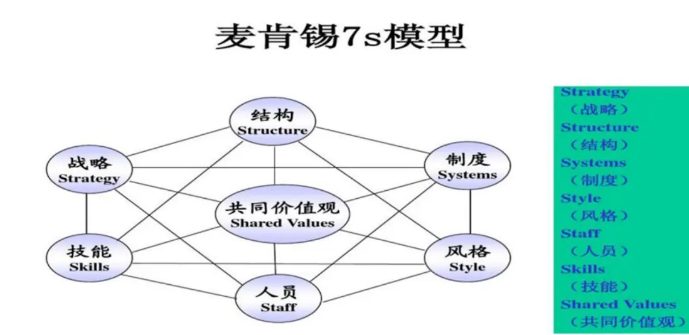

__5）好的书籍__

网友：最近看了一遍《从优秀到卓越》，促进了“做对的事情”的内涵的理解。十年前看过《基业长青》，没有留下什么印像，现正在看；这一年多在本博客中的浸染，使我似乎读懂了一些《基业长青》。感觉这两本书不仅对做企业有指导作用，对每个人的人生也同样具有指导作用。

__段永平：__从买股票就是买公司的角度看，这两本书确实值得看。（我都翻过一下，觉得蛮好的。）（2013\-04\-02）

__6）其他__

01．网友：一些感悟请段兄点拨：

1、股票的背后是企业。以做企业的立场和视角去投资。

2、企业家是灵魂。有诚信、有能力、有上进心的企业家是第一要素。

3、公开信息对价值投资来说就足够了。公告、报纸、投行报告、政府宣传等就可挖掘出税收、营业额、企业文化、企业家能力等有价值的信息。

4、估值与安全边际。成长性、确定性、市场情绪都会影响整体市场估值，更有效的是“毛估估”——如五六折买入。

5、知行合一。真知即所以为行，不行不足谓之知。

6、大道至简。别试图尝试所有方法，重复让自己成功过的即使是看上去有点乏味的方法。

__段永平__：总结得蛮好的。

（2011\-01\-04）

__4．投资没有充要条件（公式），只有概率思维__

博文：《再说苹果\-\-又见3字头》

__段永平__：其实也没啥可说的，买的理由一条也没变过，该说的也都说过了，目标价也没啥变化。

__right business \+ right people \+ right price \+ time = good result。虽然这个不是投资的充分公式，但好结果却是个比较大概率的事件。__（2013\-04\-20）

__1）充要条件__

01．引用：点评芒格主义（2012\-06\-26）

译文：你只有学会怎么学习你才会进步。

__段永平：__虽然投资不需要大学文凭，但上过大学往往还是有帮助的（不是充要条件），因为大学里学到的东西主要是学习方法。

充要条件是什么？那是初中学的吧？反正我是初中学平面几何时学的，但好像是很久以后才真的明白。

充要条件的概念，或者说什么是充分条件，什么是必要条件，什么是充要条件，什么是既不充分也不必要的这些概念对投资很重要。

之所以__我认为其很重要是因为我发现大多数人在逻辑上其实是不懂什么是充要条件的，我认为至少有85%的人在投资上不明白充要条件__。（2012\-06\-26）

02．网友：请教下段大哥，用郎咸平的话来说任何公司的成功必须把握人力、财力、技术同时还要把握行业的本质才是企业成功的充分条件，我想请教的是

（1）您认为企业成功的充分条件是什么？（2）您是怎么理解手机行业本质的？

（3）您认为目前步步高、OPPO都把握住行业本质了吗？

__段永平：__郎咸平根本就不懂企业，你让我怎么接？（2013\-02\-16）

居然有人会认为企业成功会有“充分条件”的，你确认你知道“充分条件”是什么意思么？（2010\-12\-29）

03．网友S：股票投资，投资逻辑很重要，最重要是想明白充要条件，不想明白买了也会拿不住的。

举几个例：如果投资万科，一定要想明白房地产行业调控对万科的影响，想不明白拿着是睡不好的。投资茅台，不想明白三公消费对茅台的影响，认为茅台是靠三公消费支撑的，相信是不敢买的。投资苹果，看不懂苹果的ios平台的未来，相信拿着也睡不好。

__段永平：__什么是充要条件？投资的充分条件是啥？（2013\-03\-26）

网友S：我上条的表达意思应该是：股票投资最重要的是充分条件（好的生意模式、好的企业文化、好的管理团队、好价钱）。碰到具备充分条件的公司出现好价钱，要想明白导致公司出现好价钱的关键点（列举了三个公司），想不明白买了也会拿不住，其实还是要懂这个公司。

__段永平：__我觉得搞懂什么是“充要条件”对投资特别重要。

记得第一次接触“充要条件”是在初中平面几何里，当时好像没懂。后来考大学前复习时才懂的。

我发现大多数“投资人”对“充要条件”到底是什么意思是没搞懂的，结果就是会有很多逻辑错误。

在逻辑学中：当命题「若A则B」为真时，A称为B的充分条件。当命题「若B则A」为真时，A称为B的必要条件。当命题「若A则B」與「若B则A」皆为真时，A是B的充分且必要条件，同时，B也是A的充分且必要条件。

充分且必要条件，亦可以简称为充要条件。

当命题「若A则B」为真，而「若B则A」为假时，我们称A是B的「充分但非必要条件」，B是A的「必要但非充分条件」；反之亦然。（2013\-03\-29）

__段永平：__你可能其实还不懂什么是充分条件。基本上可以讲投资里是无法找到充分条件的，你说的这个不是充分条件，甚至也不是必要的。投资里甚至必要条件都很难找到。

__举个例子：为什么说“好的生意模式、好的企业文化、好的管理团队、好价钱”也不是可以买的“充分条件”？因为这样的公司也可能犯致命的错误，只是具备这种条件的公司犯致命错误的概率比没有这种条件的公司低很多，康复能力强很多，所以投资这种公司成功的概率高很多而已。__

__投资里最难的地方就是找不到可以投的“充分条件”，如果有的话，那电脑就可以比人脑厉害了。__

__“投资界”总是有人试图找出一种不用懂企业就可以在股市上赚钱的办法，他们永远都不会找到的。如果能找到的话，这个办法应该早就找到了，那现在投资界赚钱最多的一定是数学家。__

在美国，__我确实见过很好的大学里有些教授依然在试图找到通过数学用电脑就可以赚钱的办法，他们的逻辑推理的前提里有些假设是不对的，所以后面的结论不管多“高级”都不可能得出正确的结果。__有意思的是，这些教授大多数都是我曾经的同行\-\-\-计量经济出身的（我曾经是人大计量经济学的“烟酒生”哈。）（2013\-03\-29）

网友：段大哥说的这一段很深奥，我没怎么看懂，假如企业的业绩持续上涨就会导致股价上涨，那么业绩不断上涨就是股价上涨的充分条件，但不是必要条件，是这么理解吗？

__段永平：__你好像还是没明白充分条件的意思哦。用平面几何里的东西比较容易看清楚。比如：等边三角形和等角三角形是互为充分条件，意思是等边三角形必为等角三角形，同时等角三角形必为等边三角形。企业业绩的持续上涨未必一定会导致股价上涨，所以他不是充分的。比如有一家公司现在一年每股赚一分钱，股价100块一股。在未来20年里这个公司每年的盈利都有20%的成长，20年后该股价一定会涨吗？（2013\-03\-29）

网友：多谢提醒！具有“天时地利人和”的条件，只是胜算的把握大些罢了。

我们要做赢的把握大的事情，但不是做百分之百可以赢的事情，世间没有百分之百可以赢的投资。人无完人嘛，公司也一样。估计理解这个道理的人，在今后的投资里就不会再有该不该借钱的疑问了。

__段永平：__是的，用margin是危险的，有机会富两次。（2013\-03\-29）

网友L：（借钱、做空、做不懂的）是投资失败的充分条件。其实，要做到不借钱和懂企业也是需要相当的时间（这是开始投资前的必要条件）。好消息是做自己能力圈里的喜欢的事，容易并乐在其中并往往有机会有闲钱，如果有闲钱的同时还喜欢投资（投资成功的必要条件），就有机会弄懂“好的生意模式、好的价格、好的管理人”，段大哥，我这样理解对吗？

__段永平：__借钱、做空、投机都是有诱惑的，未必一定会失败，所以也不是充分条件。看来充要条件的逻辑确实不好懂。（2013\-03\-30）

网友D：“举个例子：为什么说“好的生意模式、好的企业文化、好的管理团队、好价钱”也不是可以买的“充分条件”？”，“投资里最难的地方就是找不到可以投的“充分条件”，等等，既然找不到，那么投资的充要条件到底是什么呢？脑子被转晕了。

__段永平：投资里没有充要条件，就是没有数学公式可以用的意思__，所以不存在投资的充要条件是什么的问题。如果明白什么是充要条件，就会明白我什么意思。（2013\-04\-06）

__段永平：投资里最难的就是没有具有“充分条件”的投资，只能从概率的角度考虑。越了解的公司，决策的把握越大，但从来没有100%的赢面。__（2013\-03\-01）

04．网友：想100%的了解一个企业真的是太难了，追求完美的了解那样会不会束缚住自己的手脚？

__段永平：__安全边际应该指的就是你自己的了解度，投资里没有数学上100%的东西。

网友：“看懂”是指认同公司的MISSION，VISION，护城河\.\.\.等前提下，觉得有7，8成把握就可以动手吗？

__段永平：__投资没有充分条件。你的七八成把握指的是什么很重要。如果你指的是你对10年后公司的理解，那把握度就是你的安全边际。（2015\-01\-22）

__段永平：__把握性：巴菲特说，他的投资一般是在他认为有95%的把握时才出手（我觉得也许没那么高），但很多人实际上60%的把握就出手了（或许更低，所以会看到他们深一脚浅一脚的）（2012\-08\-27）

05．网友：芒格认为，我与巴菲特工作这么多年，他这个人的优点之一是他总是自觉地从决策树的角度思考问题，并从数学的排列与组合的角度思考问题。

__段永平：__我想他这里排列组合的意思大概是指概率的意思。总的来讲，这一段芒格的意思大概是认为巴菲特总是能理性地思考问题，这点对长期价值投资是非常重要的。

投资并不需要高深的数学，但基本的概率概念还是需要的。如果没学过概率，或者没学懂的话，简单跟随就行了。比如，没必要自己去试扔硬币正反面的实验。又比如，有博友说他去赌场下了10万次注还是赢的。有概率概念的人一看就知道这哥们的记忆有问题。（2010\-04\-18）

2025年5月18日

11:00

## 第三章　golf和投资 - (3) 第3节　谈能力圈与原则

\(3\) 第3节 谈能力圈与原则

2025年5月18日

11:00

__第3节 谈能力圈与原则__

股市上那些长期亏钱的大多属于不知道自己能力圈有多大的人（2012\-07\-28）

__一 能力圈__

__1．能力圈定义__

__段永平：“能力圈”的意思就是你能够判断未来现金流折现的范围。__知道自己的“能力圈”有多大比“能力圈”本身有多大要重要的多。（2011\-01\-04）

网友：您这句话对我来说价值连城。

__段永平：__“知道自己的“能力圈”有多大比“能力圈”本身有多大要重要的多。”这句话实际上是巴菲特说的。（2011\-01\-03）

01．网友：投资人需要熟悉自己的领域，也需要见多识广，才能有所鉴别？你的投资很有逆向投资的味道，当然是在价值的基础上，很注重买价，而不是中国大陆市场这种更多的是成长的收益？我这样理解，对么？譬如大陆有些大国企，譬如东方航空，过去是资不抵债的，无论你如何买卖，似乎在财务会计上看都不合算，可你又知道国家一定会让它渡过难关，这样能算是投资么，虽然也赚了不少，可总觉得有点发虚？望指教！

__段永平：巴菲特讲的能力圈子指的就是每个人都有自己有限的了解范围。每个人总是有些东西懂有些东西不懂。所以投自己懂的东西就容易知道价值，就知道什么叫便宜，就有机会赚钱，反之亦然。如果你觉得心虚的东西就是投机，投机当然也有赚钱的时候，但风险大，睡不好觉。__

（2010\-03\-25）

02．你来美国后，能力圈有什么提升？

__段永平：__能力圈不是拿金箍棒在地上画个圈，说待在里面不要出去，外面有妖怪。__能力圈是：诚实对自己，知之为知之，不知为不知。有这样的态度，然后如果能看懂一个东西，那它就是在我能力圈内，否则就不是。__（2018\-09\-30）

03．博文：《引用巴菲特语录》

巴菲特：我们之所以取得目前的成就，是因为我们关心的是寻找那些我们可以跨越的一英尺障碍，而不是去拥有什么能飞越七英尺的能力。

__段永平：__这个说的也是能力圈的问题。经常看到人们在讨论本身一头雾水的投资概念，让我常常想起这话。（2012\-07\-28）

__2．能力圈边界__

01．网友：我终于明白了自己的circle of competence在哪里了\-\- You don’t really have a competency if you don’t know the edge of it，终于有了自己的能力圈，哈哈，进步了一点点。

__段永平：知道自己的能力圈在哪远远比能力圈有多大重要，投资的人绝大多数都是倒在能力圈外的，虽然大多数最后都不明白为什么中的招。不过，因为看了这句话就认为自己有能力圈了也是蛮有趣的。__（2012\-07\-16）

02．网友：一年中最大的收获就是对“守在能力圈比知道自己的能力圈有多大重要”这句话加深了理解！

__段永平：__应该是知道自己能力圈有多大比能力圈有多大要重要得多。当然知道也未必一定守得住，但不知道自己能力圈有多大的伤害远比能力圈很小要大得多。其实__股市上那些长期亏钱的大多属于不知道自己能力圈有多大的人们__，而认为自己不懂股票而不买股票的人们是不会直接被伤害的。（2012\-07\-28）

03．段永平投资思想\-\-\-雪球小摘

__段永平：__知道自己能力圈有多大或者说知道自己能力圈的边界在哪里要远远重要过能力圈有多大，这也是人们能看到很多很“聪明”的人投资表现长期不好的原因。当然，这些“聪明”人会把别人的成功或自己的不成功归结于运气或“accidents”，而且他们总是能够很“聪明”地找到办法让自己认为确实如此。功夫熊猫1里说"there are no accidents"其实是蛮有道理的。（2013\-02\-01）

04．《引用巴菲特语录》

巴菲特：投资并非一个智商为160的人就一定能击败智商为130的人的游戏。

__段永平：__大概智商高的人未必知道自己的能力圈边界在哪里，但智商高的人可能往往容易越出自己的能力圈。（2012\-07\-28）

巴菲特：不同的人理解不同的行业。最重要的事情是知道你自己理解哪些行业，以及什么时候你的投资决策正好在你自己的能力圈内。

__段永平：__知道自己能力圈有多大比能力圈有多大要重要的多。或者说，即使能力圈很大的人，在能力圈外也是会很惨的。（2012\-07\-28）

巴菲特：对你的能力圈来说，最重要的不是能力圈的范围大小，而是你如何能够确定能力圈的边界所在。如果你知道了能力圈的边界所在，你将比那些能力圈虽然比你大5倍却不知道边界所在的人要富有得多。

__段永平：__还是能力圈。（2012\-07\-28）

__3．不同的能力圈__

01．网友：请问您觉得您和李路先生与巴菲特和芒格先生做价值投资最大的差距在哪？您和李路先生在哪方面还需要学习？也是我们该借鉴的．

__段永平：__最大的差距大概是他们的英语都比我好很多。当然，英语上李路和那两位比（我猜）也会有很大差距的（母语和非母语的差别），但他的差距对他的投资生涯影响不大，和我的差距有本质的差别。

从价值投资的角度看，也许你说的“差距”用“不同”来说或许更好些。

从对价值投资的理解上，我认为我们是完全一样的，因为价值投资的本质就一点：买股票就是买公司，买公司就是买公司未来现金流的折现。所有所有所有其他的关于价值投资的说法其实都是在讨论如何来确定这个未来的现金流折现到底大概会有多少的问题。

__我们的不同点主要会体现在“能力圈”的不同，每个人懂的东西都不同__。当然，“能力圈”的差距也是有的，比如他们做股票投资的时间都比我长很多。

“能力圈”的意思就是你能够判断未来现金流折现的范围。知道自己的“能力圈”有多大比“能力圈”本身有多大要重要的多。

不过，我现在管的钱的绝对值比老巴和芒格在我这个年龄时还要多呢，呵呵。不能和李路比，他比我年轻很多啊。

我和他们3个人的最大的不同确实有一点，那就是他们都是职业投资家，我是业余爱好者，对投资的时间安排比例会有点不同。

我们各方面需要学习的东西应该都很多，不过李路大概不需要像我一样还要花时间学英语了。（2011\-01\-04）

02．网友：您和巴菲特的区别是什么呢？

__段永平：__我觉得我和巴菲特不同的地方主要是能力圈子不一样，本质的东西没什么区别。我和巴菲特懂得东西不一样。每一个价值投资者懂的东西可能都不一样。每个人都是在投他们自己懂的企业。这就是巴菲特讲的每个人都有自己的能力圈子。（2010\-03\-21）

网友：能举个例子吗？

__段永平：__举个例子也许你就明白了。巴菲特有很多保险和金融的投资，我基本没有，因为我还不懂，总觉得不踏实。我投了一些和internet相关的公司，巴菲特没投过，因为他不懂。他认为可口可乐是人们必喝的，我认为游戏是人们必玩的。（2010\-04\-30）

03．网友：段先生的价值投资是在自己的能力圈里，和巴佬的价值投资的表象区别很大，巴佬自己也不是只靠价值投资，他做过很多的套利，不然也不能积累这么快财富，当然和他所处的时间段也有关。

__段永平：__巴菲特早年做过一些套利，现在很少做了。但是，有好机会我相信他还会做的。我对投资的理解真的和巴菲特的理解本质上是一样的，但和他的能力圈子（或者叫农民的局限性）不同，所以表象上不一样。当然，有些是我的水平还没到哪儿造成的。（2010\-04\-22）

04．网友：段总，我相信你是有一定的能力圈的，老巴的能力圈更是非常广。我看到大部分做价值投资而受了重伤的博友正正是跌进能力圈的圈套当中，常常出现以为自己正在以四毛买一元，但其实是以一元买四毛的情况。很多人因此认为价值投资失效。他们对于企业真实价值的错误判断，越是相信自己拥有了该行业的能力圈，越是受伤。能力圈的问题往往是一把双刃剑。一点点不同的观点。

__段永平：__也许你没看我写的是什么。我这里有一点很重要的就是认为大多数人其实不碰股票就是最好的投资，除非你认为自己确实有自己了解的好公司处在便宜的价钱。

谢谢你相信我有一定的能力圈哈。老巴的能力圈只是和我不一样而已，无所谓大小，最重要的是不要在自己的能力圈以外使劲。__能力圈不是双刃剑，是单刃的，只是内外有别而已。__（2012\-04\-08）

05．* *网友：为什么说巴菲特不是每个人都学得来的

当去年8月25号巴菲特宣布投资美国银行的时候，当巴菲特宣布购买他原来坚决不会投资的科技股IBM和英特尔的时候，不少人纷纷效仿，大举买入，以为和股神同行自己也就是股神了。为什么说巴菲特不是每个人都学得来的呢？\.\.\.

__段永平：学老巴最重要是学他的原则，毕竟每个人的能力圈不同。__就像我敢重仓苹果，老巴大概不会一样。我有个朋友在BYD上亏了很多钱，我问他为什么买BYD，他说老巴都买了，这种学法是会出事的。我没买过BYD，虽然一直有兴趣看，但一直没看出买的兴趣来，所以老巴买不买对我完全没影响。

总之，崇拜任何人都是不对的，最重要的是芒格讲的那个“理性”。（2012\-01\-09）

不明真相的群众：就是一定要买，也得看老巴是多少钱买的嘛。48块钱买中石油的，是连这点功夫都不愿意花的。

__段永平：__呵呵，一般而言，如果有可比性的前提下，买得比老巴便宜多数都是不错的deal。（2012\-01\-09）

06．网友：请教大道，如果以五年期来看，太阳能对煤炭股有多大的影响？问题有点不靠谱，比较难回答，

__段永平：__如果这是你能力圈里的事你不需要问我，如果不是，问谁都没用。（2011\-12\-27）

07．网友：段大哥能给我们讲讲你对一个跳入你视野的企业主要通过哪几个方式和途径来了解呢？

__段永平：__每个人都是从自己的能力圈内下手，别人其实帮不了你。（2012\-01\-12）

08．网友：为什么预测未来经济或股市大势是不靠谱的事情，而预测某几个企业的未来却是靠谱的事情？这个信仰的基础是什么？

__段永平__：这不是信仰问题，是能力圈问题。（2010\-09\-14）

09．网友：您对弘毅这家投资公司了解吗？

__段永平：__我不太了解其他投资人都在干嘛。我觉得真正的投资者之间的交流是很少的，大家都在自己的能力圈内干活，不太需要交流。（2011\-12\-18）

10．网友：有时真很怀疑“投资小学水平足以”这句话。

__段永平：__“投资小学水平足以”这句话没啥问题，是能力圈大小的问题。（2011\-07\-03）

__二，能力圈原则__

__1．待在能力圈内__

01．网友：怎样才能避免自以为看懂了，其实看错了的情况呢？

__段永平：__错误是不可避免的，但呆在能力圈内以及专注和用功可以大幅度减少犯错的机会。（2012\-04\-06）

__段永平：__每个人的能力都是有限的。巴菲特不投IT业也是因为他能力有限，无法了解。老巴讲的能力圈子就是这个意思：每个人在自己的能力圈子里投资，将来一定能有回报。（2010\-04\-12）

02．引用《巴菲特语录》（2012\-07\-28）

巴菲特：很多事情做起来都会有利可图，但是，你必须坚持只做那些自己能力范围内的事情，我们没有任何办法击倒泰森。

__段永平__：还是说要呆在能力圈内。呆在能力圈内说起来容易，但大多数人做不到。

巴菲特：对于大多数投资者而言，重要的不是他到底知道什么，而是他们是否真正明白自己到底不知道什么。

__段永平：__还是能力圈。we don't know what we don't know\.

巴菲特：如开始就成功，就不要另觅他途。

__段永平__：还是能力圈。

巴菲特：如果我们不能在自己有信心的范围内找到需要的，我们不会扩大范围。我们只会等待。

__段永平：__还是能力圈。要耐心等待自己能力圈内出现投资目标（包括在能力圈内积极寻找。）

巴菲特：投资必须是理性的。如果你不能理解它，就不要做。

__段永平：不懂不做，其实还是能力圈__。

03．网友：投资之道也是从这些平凡之处悟出来的，不怕挨砖的说更不关巴老的事。

__段永平：__老巴不可能教会我们投资，因为会否投资是关乎每个人自己的能力圈的事情。不过，__老巴教导我们要呆在自己的能力圈内，这样就会少犯错，时间长了以后投资就会有好的表现__。（2011\-12\-01）

04．网友：不知道您是否关注过广药集团和加多宝集团对于王老吉的商标使用权的报道，我想问段老师在今后的5年或10年里那家企业胜出的机会多点？

__段永平__：基本上我不太关注能力圈外的企业。（2012\-05\-24）

05．网友：学习价值投资（其实一直在投机）这几年，终于悟出自己的能力圈其实就是（没有能力圈），郁闷。

__段永平：__其实能悟到这点也很了不起！（2012\-07\-27）

网友：可是我很愚钝，从来没有弄懂过一家上市企业，我是不是就不能买股票了呢。但是我又怕钱存在银行被通胀杀手抢去，怎么办。

__段永平：__被通胀抢好过在股市亏。（2010\-10\-23）

__2．不做不懂的东西__

01网友：请教大道：一名入市（A股）没多久的小散投资国内市场应该做哪些功课呢？需要哪些基本功？投资思路？

__段永平：__不做不懂的东西（2012\-05\-18）

02．网友：给大家概括一下咱们自己的价值投资（组合）应该持循的“企业文化”要素好不？

__段永平：__不做空、不margin、不做不懂的东西。（2010\-04\-06）

03．网友：想请教你两个问题：第一个是：巴老做不做空，如果他能比较肯定，他还是不做空么？

第二个是：你有没有对未来不确定的时候，或者说恐惧的时候，如果有，是怎么克服的？

__段永平：__1．老巴教我的：不做空、不借钱不做自己不懂的东西。这个在这里讲过n次了。

2．只有不懂的东西才会恐惧，不懂不做就没什么可怕的了。这个好像也讲过n次了吧？（2011\-08\-24）

04．网友：Jin is an excellent ceo\.大道选将和选股一样厉害\! congrats\!

__段永平：我选股不厉害，是业余级的，花的功夫太少。但我犯错的机会的确是大师级的，不懂就是不碰。__真看得懂这两句话的日子长了一定会有不错的赚头哈。（2011\-11\-03）

05．网友：请教段总对刚上市的新股一些看法。听说巴菲特一般不买新股（这是不是巴菲特的原意我不知道），原因可能是新股没有多少历史业绩可以考察，或是刚上市的新股有部分做账好看，调节利润什么的。

您一般买新股吗，一般要有多久历史业绩，你才会买它的股票，还是等公司上市一年半载后，看看它经营的情况再做决定呢。

__段永平：投资的基本原则就是不懂不投！__投不投和是不是新股没关系，但新股往往没办法搞懂。（2011\-03\-02）

06．网友：我每次买股票都感觉自己是在做风险很大的事情，怎么才能做风险小的事情呢？

__段永平：__不懂不做风险就小（2010\-04\-14）

07．网友：刚才看了中国企业家的一篇文章，写去奥马哈的中国企业家在大会结束后凑在一起讨论巴菲特的场景，包括你和赵炳贤、赵丹阳等十几人，看文章的感觉有几个人对巴菲特的理解都很表面，可能都比不上你的英语老师，为什么做企业比较成功的人无法理解“不懂不做”的思想？

__段永平：其实做企业能长期成功的人应该都是懂“不懂不做”的，不然达尔文会有意见。__但是，懂的人不一定说的清楚。有时即使大家在说同样的东西，但是用不同语言，从不同角度，还会有一些争论。（2010\-05\-22）

08．网友：我是巴菲特的粉丝，我的领悟是巴老的胜算很高的；巴菲特说的和做的是不一样的，他只说他想说的和想让你听到的。

__段永平：__不懂不做，老巴一直如此。但懂有时候要有个过程，老巴也不例外，也会碰到以为懂了但后来发现其实不完全懂得东西。另外，老巴公司还有其他人管投资，老巴是放权给他们做的，但他们的理解有时候和老巴会不完全一样，所以大家看到的老巴的持股未必一定就是老巴的风格。其实BYD就不是老巴的风格，GM也不是。在石油公司上老巴也认为自己犯了一个几十亿美金的错误（把中石油上赚的钱亏进去很多）。（2012\-10\-09）

09．网友：比亚迪的利润09年确实不错，最主要是汽车好卖，完全靠巴菲特的名气在飙升是你说的，当时巴菲特入股比亚迪引起大家炒比亚迪是真实的！

__段永平：__我没买过中石油，也没买过比亚迪。但是，如果中石油回到当年巴菲特买的价钱，我会毫不犹豫跳进去，因为我后来看懂了。如果比亚迪回到当年巴菲特买的价钱，我还是不会买，因为还是不懂。（2010\-03\-26）

10．博文：《2011年05月11日》

__段永平：__人人怎么这么快就跌破发行价了？最近老有人问我人人，让我觉得有泡沫的感觉很强。还有人告诉我买了人人的股票，现在要开始做价值投资者了，希望他们能睡好觉。我不了解人人，也没机会用过人人。

我发现问我关于人人的人也都是完全不了解人人的人，难道不碰自己不懂的东西真有那么难？

11．网友：看看这个传闻“奇虎360今晚美国上市据传巴菲特参与认购”，可笑得很。老巴说过：十几年过去了，未见价值投资者增加。看来人性如此啊。

__段永平：__呵呵，__那条消息出来后有记者发email问我有没有可能，我认为100%不可能。巴菲特是非常有原则的人，不会投一个他不了解的公司的。__（2011\-03\-31）

12．网友：如果一个企业肯花不少的钱回购自己的股票，那么是否就可以认为这家公司便宜了。是否该跟进买入？

__段永平：__任何“跟进”都是错的，因为你早晚会错。

网友：如何理解这句话呀，段总能详细解释一下吗？

__段永平：__跟进的意思就是自己不明白瞎买的意思，所以早晚会跟错的。而且，跟进也很难赚钱，因为不是很明白，所以拿不住。如果你也明白就不一样了。（2010\-07\-23）

13．网友：请教您一下就是我自己本身不懂银行股，不过李驰一直推荐银行股，我很相信他，现在有个问题，就是如果我相信李驰的话，可不可以跟他一样买银行股呢？

__段永平：__那你到底是相信呢还是不相信？

网友G：段总的意思是不是相信就可以买（价格合理的时候）？社会经验比较少，段总见谅。

__段永平：__东问西问就是不相信的意思，你这种状态还是不要碰股票的好。（2011\-05\-14）

__段永平：__今天在网上看到有人说跟着我买阿里，说这话的人都是投机分子！自己不懂的东西千万别跟着别人投，拉人壮胆也是没用的哈，不管这人是谁。反过来也一样，自己懂的东西不怕别人不喜欢，哪怕那人是老巴或芒格也没关系。（2014\-09\-23）

14．网友：请教段总一个问题，如果一项投资，目前价格也可以，不买怕价格涨上去，失去机会。买了怕价格掉下来，失去更好的机会。是不是应先买一部分，再留一部分后备资金。

__段永平：__买了怕价格掉下来的投资最好离的远远的。如果你买啥都怕掉下来就远离股市。（2013\-06\-18）

15．网友：段总好：您认为推特的价值是否被低估了？

__段永平：__如果需要问别人的股票你最好别碰。（2014\-09\-24）

16．网友：段总好！理想和小鹏，全仓买，各买50%，您觉得这个策略可行吗？……还望您能指点一二。

__段永平：__当你需要别人指点你买的票的时候，你自己多数是在赌吧？（2020\-10\-13）

17．网友：对我来说炒股票最难的就是理解一个企业是如何赚钱的，我没做过企业，对财务也是一知半解，觉得什么企业都能赚钱，又觉得什么企业都可能会死翘翘，如何才能在股市里赚到钱呢？真是伤脑筋啊

__段永平：__不能理解的情况下最好不要买股票，不然很容易亏钱的。（2010\-05\-24）

18．网友：您说买股票就是买公司，但是了解一个公司挺难的，中信证券等大券商也会踩雷，这是否就涉及能力圈问题，只投资能搞清楚的，模式简单的生意？

__段永平：__对的，不懂不碰。（2019\-09\-20）

19．网友：好想买能安心睡觉的公司，a股这样的机会不多。

__段永平：__能不能安心睡觉在买以前就决定了。（2011\-03\-29）

网友：如何避免投资碰到黑天鹅事件？

__段永平：__黑天鹅事件在买的时候就应该避开了，不然你就不应该投资。价值投资者其实最喜欢看到黑天鹅事件的发生，这种时候往往会有机会。上一次金融危机无数人中招，但巴菲特那么大盘子，那些一掉到底不复回的股票他一个都没有就是一个例子，这可绝对不是运气哈。顺便说一句，那些股票我也一个都没有。要是你的“估值”会和公司的每一个产品的推出和定价联系在一起，你早晚会在不赚钱的前提下累趴下的。

补充一点：__买的时候避开的意思就是不懂不做，事前想清楚。__

去年有个朋友想投双汇，问我的看法。我说我不懂，你好像也不比我懂，但我觉得中国食品行业风险大，不知道啥时候就会出点啥问题，结果不幸而言中了。（2011\-03\-30）

20．网友：苹果蓝宝石供应商GTAT居然申请破产保护，一天股价暴跌10倍，估计很多人突然发现自己在裸泳了。安全第一，不懂不做。

__段永平：一觉醒来，“票还在，钱没了”！不懂不碰是铁律__。曾经在网上看到很多人在炒这个概念股，看过一眼，看不懂。（2014\-10\-07）

21．网友：不到两周的时间，很多讲故事的公司已经跌去50%以上的幅度了……借钱做不懂的，就如同开车加速去撞墙……（2015\-06\-26）

__段永平：买自己不懂的东西是为什么85%的人可以在牛市熊市都亏钱的原因__。没有比因为股票涨了很多而买入更荒唐的理由了。（2015\-06\-26）

22．巴菲特：（10）市场就像上帝一样，帮助那些自己帮助自己的人，但与上帝不一样的地方是，他不会原谅那些不知道自己在做什么的人。

__段永平：__所以不懂的东西不要碰。

23．网友：感觉投资最后的风险只有一个，就是：“以为自己懂了，但其实还没真正懂”。请问大道：如何避免这种风险？：

__段永平：__看看老巴怎么做的就会明白这种风险实际很小，关键在不懂就是不碰的原则。多数人错在一知半解时由于害怕失去机会而急急忙忙出手了。

补充一下：每个人看看自己犯错的比率，再看看老巴犯错的比率就明白差别在哪里了。（2011\-12\-01）

__1）不懂不做的回报__

__段永平：不做自己不懂的东西！如果你觉得自己到最后确实没有什么企业能搞懂，就什么都不碰，那你的投资表现就可以在全世界排在前10\-15%。__（2011\-09\-21）

01．网友：我目前的渠道只能投资A，B股和港股。07年开始做的，成绩还可以（小赚一把）。但是因为不懂行业，很难赚大钱。或者说水平很难提高。对技术天生不感兴趣，当然也不是一窍不通。目前好想进步，不知如何下手。你看我的情况，是不是能给我些建议？

__段永平：__不懂就不碰。我也有很多东西不懂，好像没什么办法，但好像也不妨碍出成绩。（2010\-04\-28）

02．网友：淘米曾一度受到热捧，股价在一个月内到过17\.9美元，曾经在17\.85逃顶的人想起来一身冷汗哈。

不明真相的群众：没有成功逃跑的人飘过。

__段永平：__没碰过的飘过

。（2012\-03\-21）

03．网友：格雷厄姆：以经营企业的态度做投资（读书笔记）

若以经营企业的态度看待投资，则投资是需要高度智慧的。许多精明的企业家在华尔街大显身手，完全漠视所谓的稳健投资原则，而这些却是使他们经营事业成功的原则，看到这种情形的确令人惊讶。然而，公司每一种有价证券最好先被视为特定企业的所有权或债权，如果有人试图通过证券的买卖获利，他便是\.\.\.

__段永平：__买股票就是买公司指的就是这个意思。做过企业家的人本来可以有一个优势，那就是更容易看懂公司，更容易知道自己的能力圈在哪里。但我发现我认识的很多企业家对股市并没有任何认识，和普通人无异，同时大多数人是不碰股市的（因为他们认为自己不懂）。__不懂不碰的就是好的投资者，哪怕一点都不碰也是。__（2011\-09\-07）

__3．不盲目扩大自己的能力圈__

__段永平：会打golf的人大概都知道，凡是想打远点儿的时候都是最容易犯错的时候__。（2013\-10\-20）

__不要轻易去“扩大”自己的能力圈。搞懂一个生意往往是需要很多年的，不要因为看到一两个概念就轻易跳进自己不熟悉的领域或地方，不然早晚会栽的。__（2012\-04\-06）

01．网友：今天看到陈一舟的这句话，觉得挺深刻的。

少即多，慢则快。

陈一舟表示，当年巴菲特给他上课时曾告诫他，每个人做事前都要画一个圈，圈内是自己了解的，圈外是不懂和似是而非的。做事情，一定要做圈内的，而且这个圈内的事情越少越好，最好是只有一个：“少即多”。

__段永平：__呵呵，好耳熟。2010\-10\-30

02．网友A：请教一下“多”和“少”的关系：less is more。老巴也说，尽可能出手次数少的投资。我的理解是，少是一个高度生化的结果。为了达到“少”的这个结果。人们可能要尽可能多的去了解一些行业公司和事物。尽管每个人的能力圈是有限的，但也需要学习尽可能多的知识，去扩大自己的能力圈。我非常赞同段总说的，要呆在自己的能力圈之内。但是，对于年轻人来说，积极的扩大自己的能力圈，也是很重要的。否则，很容易被这些所困惑，从而可能会导致止步不前。不知道对否？

__段永平：__你想问什么？你为什么会认为扩大自己的能力圈和呆在自己的能力圈内是矛盾的呢（很多人问这个问题，我不是很明白大家问这个问题的逻辑是什么）？老巴讲的非常好：知道自己能力圈的大小（边界）比能力圈有多大要重要得多。（2015\-04\-24）

网友：“扩大自己的能力圈未必是明智的”是否是说我们更应该专注自己，我感觉很多的东西要想真正融到自己骨子里还有很长的一段路要走。学习一个人，就应该持续不断地跟踪一个人，关注他的一举一动一言一语，不管它是精华还是糟粕。一个人就是一个整体，根本就不可能分出什么精华糟粕。

__段永平：__你这种学法大概真的会学到糟粕，因为你不可能拥有任何一个人的所有信息，而且能力圈和经历往往大不一样所以你还是在按你自己想像的东西学。__我觉得学别人最重要的不是人家干什么和怎么干，而是原则的问题，尤其是什么东西不能干的问题__。（2011\-10\-13）

__段永平：__不要盲目地扩充自己的能力圈。人能做的事有限，人说啥、能说啥不重要，重要的是你做啥、能做啥。（2018\-09\-30）

## 第三章　golf和投资 - (4) 第4节　你懂的才是你的好生意

\(4\) 第4节 你懂的才是你的好生意

__第4节 你懂的才是你的好生意__

__如果一个人一辈子能看懂一次就可能表现比95%的人好，如果一个都看不懂也可以表现比80%的人好。投资最重要的是投在你真正懂的东西上。__（2012\-04\-05）

__1．投资中什么最重要__

__段永平：__我个人的理解是缺什么什么重要。__投资最重要的是投在你真正懂的东西上。这句话的潜台词是投在你真正认为会赚钱的地方（公司）。__我对所谓赚钱的定义是：回报比长期无风险债券高。一个人是否了解一个公司能否赚钱，和他的学历并没有必然的关系。虽然学历高的人一般学习的能力会强些，但学校并不教如何投资，因为真正懂投资的都很难在学校任教，不然投资大师就该是些教授了。不过在学校里可以学到很多最基本的东西，比如如何做财务分析等等，这些对了解投资目标会很有帮助。

无论学历高低，一个人总会懂些什么，而你懂的东西可能有一天会让你发现机会。我自己抓住的机会也好像和学历没什么必然的联系。

比如我们能在网易上赚到100多倍是因为我在做小霸王时就有了很多对游戏的理解，这种理解学校是不会教的，书上也没有，财报里也看不出来。我也曾试图告诉别人我的理解，结果发现好难。又比如我当时敢重手买GE，是因为作为企业经营者，我们跟踪GE的企业文化很多年，我从心底认为GE是家伟大的公司。

我说的“任何人都可以从事投资”的意思是我认为并没有一个“只有‘某种人’才可以投资”的定义。但适合投资的人的比例应该是很小的。可能是因为投资的原则太简单，而简单的东西往往是最难的吧。

顺便说一句什么是“简单”的“投资”原则：当你在买一只股票时，你就是在买这家公司！简单吗？难吗？（博文：《投资中什么最重要》（2010\-02\-07）

__2．你懂的才是你的好生意__

01．网友：我总有一种预感：未来投资的不倒翁是看得懂互联网和高科技和新生行业的，巴的成功源于过去40多年对所投行业的深刻理解，功力深厚。但他已经没有未来的40年了。已介入互联网、高科技的段先生很有机会！40年后以不倒翁身份，做客cctv对话，气喘吁吁给年轻人讲故事

__段永平：__看得懂什么不重要。好像现在的中国首富是看懂人喝的饮料的人，也许下一个是个能看懂猪饲料的人。

另外，我从来不认为自己介入过互联网或高科技什么的。互联网或所谓的高科技都只是工具而已，就像当年的铁路、公路、高速公路、航空等等一样。

网友D：看得懂什么不重要。好像现在的中国首富是看懂人喝的饮料的人，也许下一个是个能看懂猪饲料的人。段总想告诉的是不是包含着什么意思？

__段永平：我的意思是你懂得所以才是你的好生意__。（2010\-10\-23）

02．网友：段大哥：您认为像我们这样的价值投资者该怎么聚焦？

__段永平：__找自己懂的好公司，别的不要太关心。希腊发生的事和大家有点八杆子打不着吧？（2010\-05\-25）

03．网友：最近正在向您的投资三原则靠拢。不借钱，不做空，不做不懂的东西。前两条已经做到了。在执行第三条时，发现自己之前投资的好多公司自己还没完全搞懂。真正最了解的就身边的格力与苏宁了。我卖了三年前买的中国平安（因为现在发现对它好多东西都不懂）加上自己省下的一些闲钱，放在银行有点难受。我打算跟您买点华侨城，再跟老巴买点比亚迪。我想了很久，觉得这也符合您“不懂不做”的投资原则。因为我对您和巴菲特的投资方法很懂。这样比较容易让自己坚信。

请问段总我的想法对吗？还有想问您，您在09年为什么跟老巴买富国银行（你说过不懂银行的）而不是容易了解的强生，宝洁，沃尔玛啊？

__段永平__：首先你一定要明白一个基本的逻辑关系，__那就是投资一定要投自己了解或明白的公司，但不是说自己了解或明白的公司就一定要投。你要连这个逻辑都搞不清楚，“投资”会让你吃大苦头的。__

老巴很懂银行，而且是WFC的董事，他说很便宜的时候那就是很便宜了。另外，我虽然不如老巴懂银行，但也不是一点也不懂，我看过他说的道理，非常认同。他们有的有些公司我就不太认同，所以不会跟。（2011\-05\-29）

网友：我还有一点不太明白，我一般找的是自己懂的便宜的公司，和您说的找自己懂的好公司有差别。在这点上我真有点弄不太明白？

__段永平：__好公司便宜的时候买。（2010\-05\-25）

04．网友：大家都知道巴老爷爷不做科技股，那不符合他的理念．但科技股反而又成就了您对投资理解的价值．都是价值投资者您怎样衡量这种现实的反差？

__段永平：__我只是做我认为我能懂的东西（以为自己懂也不一定就真懂了），有些可能也许正好是大家说的所谓科技股吧。我分不清什么是科技股。（2010\-05\-30）

网友：老巴不喜欢高科技行业有没有可能是因为变化太快？

__段永平：__老巴不喜欢高科技？老巴从来没说不喜欢，只说看不懂而已，但他一旦看懂也是一样会出手的，比如IBM。老巴还说过，如果你能看懂变化，你将能赚大钱。投资最重要的不是老巴能看懂什么，最重要的是你自己能看懂什么。（2013\-05\-26）

05．网友：段兄，请教两个问题：

1、投资股票，你最热衷什么行业？巴老的意思应该是自己懂的行业，不懂不碰！我想问的是，什么行业确定性最大？

2、关于巴老提出的：最好的企业就是那些不需要大量资本去更新从而达到维持优势，创造利润的企业！从这点，很多技术性企业就被踢出出去了，而您好像投资了不少技术企业，你怎么看这个问题？

__段永平：__呵呵，行业问题说不清，好像存在的大多行业里都有好公司。

巴菲特有几条东西：能力圈、护城河、margin of safety，没说哪个行业。巴菲特追求的是产品很难发生变化的公司，所以他买了后就可以长久持有。但他也说过，如果你能看懂变化，你将会赚到大钱。归根到底，买股票就是买公司。无论你看懂的是长久还是变化，只要是真懂，便宜时就是好机会。

如果一，两年能看到一个这样的好机会，你的回报一定会很好。（2010\-05\-07）

06．网友：高科技公司变化太快，很难评估未来现金流，你如何在不确定的未来，准确的估计现金流？

__段永平：其实很简单。如果一个人一辈子能看懂一次就可能表现比95%的人好，如果一个都看不懂也可以表现比80%的人好__。（2012\-04\-05）

07．网友：银行股的估值比他便宜多了，段总就是不相信银行股，银行分享了中国经济的高速增长。因美国次贷危机的阴影，人们远离银行股，造成银行股特别便宜，中国银行业有美国前车之鉴，加上政府监管在加严，中国银行业在五年内是不会有大问题的。呵呵，“危险的地方不危险”。跟老巴的“别人恐惧我贪婪”是相通的，银行股的低估值就是“别人恐惧”造成的。

__段永平：__呵呵，我对银行没恐惧感，但确实看不懂。

顺便说下，投资很有趣的地方就是，你能看懂的东西就已经能够让你足够忙和得到足够回报了。另外，要想搞懂自己不擅长的东西往往没有那么容易，同样的机会成本（时间）在自己明白的圈子里往往有大得多的回报。（2011\-03\-04）

08．网友：段总，能在详细阐述下小资金投资的方向吗？球友很多资金规模几十万的，选择什么样的标的，成长型公司吗？

__段永平：__选择你能搞懂的好公司，和资金大小其实无关的。（2019\-03\-15）

09．网友：段总能否说说460美金的苹果与160元人民币的茅台哪个更便宜？

__段永平：__取决于你懂哪个以及懂多少。（2013\-03\-23）

网友：茅台不断创新高，感谢段总！好久没聊新标的了，期待

__段永平：__我能力圈小，能看懂的东西太少了，这些年确实没发现什么能让我用苹果或茅台去换的公司。（2017\-03\-13）

10．网友：你怎么判断一只股票成长性很好？

__段永平：__我不知道如何判断一个公司的成长性，除非我很懂他们的生意。（2010\-03\-15）

11．网友：段总当年您创立步步高初时，花那么多钱做广告迅速开拓市场，我感觉有些冒险，但也觉得当时可能是最好的选择，您能讲讲当年成败得失吗？

__段永平：我们做自己懂的东西，为什么你说是冒险呢？__和我买网易或者苹果没区别，可不知道为什么老是有人追着问为什么要冒那个险。用一块钱去买两块钱的东西不叫冒险，叫理性，只要记得不用margin就行。（2012\-02\-02）

12．网友：段总的投资风格由过去买网易及UHAL的雪中送炭式投资变成现在买苹果和谷歌的锦上添花式投资，您的投资风格变了吗？

__段永平：__投资风格是什么意思

？难道是从只投看得懂的变成只投看不懂的了？哈，有人问过我都喜欢投什么公司，我总是说“看得懂”的。然后一般人家会问一般是哪类公司，我一般会回答不知道。网易和uhal其实是很好的例子，因为这两个公司所处的行业风马牛不相及。也许就是个运气。有时候能想明白一点啥也是运气，老巴好像也是这么说的，所以运气好的人应该多回馈社会。（2011\-09\-27）

13．网友：昨天向您请教怎么投资股票，您说要懂公司。请问“懂”字怎么理解呢？一个普通人的，很平凡的人，一个没有技巧的人从哪些方面去“懂”呢？

__段永平：__这有点像一个不会打球的人问老虎怎么打高尔夫？这其实是个非常好的问题，还真不知道怎么回答。也许没事看看老巴的股东信？如果看不懂就不要碰投资。如果不碰投资的话，至少你比大多数人的投资表现要好的，因为据说85%的人都是亏钱的，这还没算他们的时间成本和机会成本。（2019\-05\-19）

网友：（关于懂）就想找大家确认下“是不是把这个公司当作我马上要合伙的公司来考虑，这个生意人的能力和性格如何，这个公司的商业模式好不好，企业文化好不好，护城河大不大，有没有可以加价的能力，这几个方面去综合考虑，如果这几方面都好，成功的概率就会很大，反之风险就会很大”呢。不知道我这样想对不对，请大道和球友指点下。

__段永平：举个所谓懂的例子：__比如苹果，我在2011年买苹果的时候，苹果大概3000亿市值（当时股价310/7=44），手里有1000亿净现金，那时候利润大概不到200亿。以我对苹果的理解，我认为苹果未来5年左右赢利大概率会涨很多，所以我就猜个500亿（去年595亿）。所以当时想的东西非常简单，用2000亿左右市值买个目前赚接近200亿／年，未来5左右会赚到500亿／年或以上的公司（而且还会往后继续很好）。如果有这个结论，买苹果不过是个简单算术题，你只要根据你自己的机会成本就可以决定了。__但得到这个结论非常不容易，对我来说至少20年功夫吧。能得到这个结论，就叫懂了。__不懂则千万千万别碰，我有个球友320/7=46买了一些，结果一个回调，310/7就卖了（现在苹果加上分红可能早就超过200了），还跟我讲为什么要卖的道理，从此我不再跟他说投资了。（2019\-05\-20）

__3．安全边际__

__段永平：__这段时间老在出差，没什么时间上博客写，但看到大家在讨论安全边际。

我其实不完全明白老巴安全边际的意思。

__我自己对安全边际的理解实际上是自己对要投资的生意的了解度。__

__自己觉得风险越小的投入的比例就可以越大些。__

比如，在觉得苹果很有投资价值的同时，虽然觉得乔布斯如果离开对苹果一段时间里（比如3\-5年）影响很小，但没有绝对把握，所以就把投资上限设在30%。如果乔布斯现在35岁且身体很健康，其他条件不变的情况下，我可以投80\-90%进去。

总的来讲，我感觉中的安全边际指的不仅仅是价格。（2011\-06\-29）

网友：“安全边际”实际上指的是理解度而不是价格，这是我听到最好的理解，一语惊醒梦中人。

01．网友：理解一个公司未来的发展前景，能读懂公司的经营特征，毛估估公司的价值（DCF的思维方式），耐心等待有了足够的安全边际的时候出重拳，长期持有。

__段永平：我很少提安全边际，所谓安全边际指的应该是自己对公司的理解度而不是价钱。__（2014\-08\-21）

网友E：这个解释不太理解，老段能举个例子说明一下吗？

__段永平：__如果不理解的话，给个例子你也不会明白的。比如苹果\.\.\.（2014\-08\-21）

02．网友：最近才看到的，不同的公司给自己留的安全边际也不一样。好的生意模式，确定性高的（价格上的）安全边际可以留小些。通常也没太多机会留很大的安全边际。可以理解为，生意模式和确定性高也是另一方面的安全边际。否则，不确定性相对高的，（价格上的）安全边际要留更大些。忘了是老巴说的不。

__段永平__：可能是我说的。__我认为老巴的“安全边际”实际上指的是理解度而不是价格。从10年的角度看，买的时候比最低价贵30%其实没多少__。（2013\-03\-02）

03．网友：巴菲特语录“安全边际没有例外——

即使对于最好的企业也不能出价过高。”“架设桥梁时，你坚持载重量为3万磅，但你只准许1万磅的卡车穿梭期间。相同的原则也适用于投资领域。”“我们在买入价格上坚持留有一个安全边际。如果我们计算出一只普通股的价值仅仅略高于它的价格。那么我们不会对买入产生兴趣。我们相信这种‘安全边际’原则。“我们投资部分股权的做法唯有当我们可以用有吸引力的价格买到有吸引力的企业才行得通，同时也需要温和甚至低迷的股票市场来帮助我们实现。”

安全边际的要点在于在能力圈范围内对桥的了解，而不该围着卡车转来转去。

__段永平__：这句话我知道，但我依然认为安全边际指的其实不是眼前的价格，而是对投资标的风险的了解。这里的“风险”指的其实不是市场价格的波动，而是实际生意可能出现的变化。（2011\-06\-29）

04．网友：这样的话，能不能产生这样的逻辑，懂的越浅，需要的安全边际越大，然后投资了安全边际越大的企业之后有可能产生更大的收益。

__段永平__：懂的越浅，亏的机会越大，而且会赚的越少，因为涨一点就会卖掉的。（2013\-03\-06）

05．网友：“__所谓安全边际指的应该是自己对公司的理解度而不是价钱”，“什么价格买完全取决于你自己资金的机会成本”。您这两句话解开了我的很多困惑__，但自己理解还不够透彻，还需要多琢磨。

__段永平__：其实每个人都会有自己的答案的，就是：你还有更好的选择吗？（2015\-06\-08）

06．网友：请教段兄：安全边际是否是投资的必要前提？如果估计到某只消费垄断型企业，护城河足够宽，未来盈利稳定且持续增长；只是根据DCF模型测出的价值和目前的价格基本一致，既没有低估，也没有高估，请问你是否会投资？

__段永平__：不会（2010\-06\-04）

07．网友：问一个比较直接的问题：对于投资标的，你个人习惯性的安全边际是多大？如果以1元为例，你是4毛买入，还是3毛？或2毛！

我记得之前你在回复一名博友的时候好像说过：我一般认为5年或6年内能收回投资是比较合适的！是你的意思吗？

__段永平__：呵呵，一般是那样想来着。（2010\-05\-24）

08．引用：《关于民生银行未来收益率的假设和计算》（2012\-07\-17）

网友：银行最大的风险应该是政策风险吧……。先不谈风险，一个生意四年能回本了，能不能投？

__段永平__：先不谈风险的投资能叫投资么？（2012\-07\-19）

网友：（投资）难在对未来风险的不确定性

__段永平__：不确定性是用margin of safety去对付的。（2011\-05\-09）

网友：我认为价值投资中的margin of Safety是重中之重，您怎么看？

__段永平：__很重要的东西之一吧。（2010\-04\-04）

09．网友：能不能讲一讲安全边际，就是您投资网易时和投资苹果时的安全边际理念的相同处和不同处？

__段永平：我对安全边际的理解是对公司的理解度而不是股票短期的价格波动。对一个伟大公司而言，有时候一点点价格差别10年后看都不是事，但因为差那点价格而错过一个好公司就可能是大事了__。（2020\-10\-15）

网友S：这个，超越了巴菲特［鼓鼓掌］。

__段永平：其实这个问题我想了很多年__，一直没懂老巴说的安全边际是什么意思，但自己最后的体会就是这样，不了解的公司再便宜也可能不便宜哈。（2020\-10\-15）

4．__分散还是集中？__

01．网友：我一直都困惑于集中与分散投资的问题，在实际操作过程在也常常是困惑于一次买入还是分批建仓的问题，看了段总的回答，似乎明白了一些。关键还是自己对标的公司是否真正的了解，是否看懂了，如果真正看懂了就应该敢于下重手。

__段永平__：如果你没看懂的话，你下的是什么手？（2014\-07\-30）

02．网友：从投资理念的角度来说，其中有一小点我不是非常认同——“如果涉及太多个股的话，会被判断为非价值投资者的”。确实，绝大部分人如果随意探讨或推荐股票，确实就是股民而非股东，但是理论上，我觉得这句话本身不太正确，呵呵，不好意思我只是太理论地说事了。

价值投资与谈论个股的多少（在一定的范围内）可能关系不大吧？！我感觉很多美国的基金都是价值投资的思路，但是只是在采取分散还是集中策略上有所分歧，这个集中和分散是相对的。林奇同一时间的持股可能高达上百个，但是他是价值投资者。

从能力圈的范围来说，从集中精研公司的角度，绝对是应该少而精，不过有时不同细分行业中也确实都有各自的“皇冠上的明珠”，我也不太赞同“超过7个股票就不是价值投资者”的说法，这个数字的确定意义不大，我感觉围绕公司还是最重要的。

只是感觉并非一定要集中才是投资，可能功力还不够，希望段总指正。

__段永平：__呵呵，你聪明但不够智慧

。总而言之，投的越多、赚的越少、退休越早（累的，像皮特·林奇。）（2011\-02\-15）

网友：呵呵，集中当然是有好处的，但是我的看法是没有必要为了集中而集中，或许在一定的阶段后需要集中一次，这样比较好，当然太散了不妥当。

1．你的说法偏静态了，可以投的钱如果源源来，原来的好价格好公司不一定会在原地等你，让每一笔钱尽可能围绕优势机会才是围绕价值的核心。

2．巴老说的一生打卡打20个孔是一个比喻，他自己从小资金开始到现在，已经买了无数的股票了（当然总体上还是集中的，相比分散的基金他是集中的）。

3。我认为公司和价格同时要看，是同时，缺哪块都不行，在执行上当然还是先看公司为主。

每两年投一次，这个思想到是精益求精的意思，确实是需要长期追求的。能够在10个以上的股票里再选择抛弃一些，可能也是一种功力或是积极姿态了，不过有时稍显消极我感觉也许也可以。

__段永平：__集中是简单但非常难的事情，大多数人很难搞懂且没法做得到。

有点像苹果的iphone款式和诺基亚的手机品种一样，多好还是少好？哪个容易？

是啊，确实很难。赚大钱当然是件很难的事情，要唔懂确实不容易，尤其是“聪明人”往往更不容易。（2011\-02\-18）

03．网友：老大，你在资本人物中曾经说过你投资是非常的集中，这样是否不符合风控要求，因为你认为你懂了的生意，但也未必看到了所有风险，况且企业是发展变化的！我想法是相对集中，关注弄懂10个左右，持有3\-5个，并不断换到性价比更好的组合，你觉得如何？

__段永平：__呵呵，其实我也同意你的做法。我的问题是，有时觉得了解一只股票都非常难，十只几乎是“mission impossible”\.（2010\-03\-25）

04．网友：您曾经说过“安全边际不仅仅是价格”，我理解还包括公司优秀程度、自己了解程度，还有投资比例等等。

假如能看懂10年以上的优秀公司价格又足够低，我觉得我愿意拿出40%的投资比例。

但一个只能看到未来3、5年不算优秀的公司，但经营、资产、现金流和股息都比较稳定，其股价甚至只有净现金的不到8折，这样的公司值得拿出5%—10%的比例去投入吗？\.

我既觉得这是一个小的投资机会，又担心自己陷入了投机的思维，实在忍不住追问师兄：这可以列为一种小比例的投资类型吗？

__段永平：__如果你觉得好的投资机会为什么只拿出5\-10%呢？留钱干什么？要么就是你觉得这是投机，所以只放5\-10%？（2018\-01\-12）

05．网友：请问您有关于价值投资仓位配制或比例配置的讲究吗？其中是不是很有学问呢？怎样的一套模式才比较合理呢？好像没有人哪个价值投资者就拿1只股来做的，就连成长股大师费雪也不例外，很荣幸能得到您的答疑解惑，谢谢！

__段永平：__巴菲特早期有过，芒格有过，我也有过。钱少尤其要focus。好容易找到一个好价格的好股票，不集中是不明白的表现。（2010\-05\-30）

__段永平：__我从头到尾真正投资过的公司最多五六家，卖掉了一些，我持有的公司一般在三家左右。巴菲特的哈撒韦一千多亿美元市值，也才投十来家。我不怕集中，我不是一般的集中，我是绝对的集中。（《中国企业家》杂志报道）

网友：请教大道所谓重仓的比例是多少？我知道的当年重仓网易好像是100%，这次重仓苹果好像是30%。

__段永平：__每个管理的账号不一样，现在大概有60\-70%了吧。（2012\-07\-11）

06．网友：我的问题是您说的下‘重手’一般是多大比例？我自己一般是重仓30\-40%觉得很多了，一只股票很少有超过50%的时候。我觉得就算我非常了解一家公司，也仍然有可能犯错，所以不太敢重仓太多，宁愿找3\-4只平衡一下。也许是对公司的理解还不够深，我也只能承认不足，不敢买的比例太高。

__段永平__：一般的比例是0%\-100%，取决于你自己懂多少。举个最简单的例子，如果你只对一家放心，觉得这家肯定能给你自己觉得可以接受的回报，那你把所有钱放里面也是无可厚非的\-\-\-比如全部钱存在银行\-\-\-大家千万不要笑话采用这种做法的人，看见这条回复的人里有相当比例的回报是不如这种做法的人的，这还没算上这些年被心理折磨的损失。（2013\-02\-16）

07．网友：请教您个问题，您分配资金在不同股票上的逻辑是什么呢？

__段永平：__我通常比较集中于比较了解的公司，比如苹果，茅台。但也会买一些自己觉得不错但又觉得有些了解不那么透的公司，这种公司放的比例一般会很小。（2019\-05\-27）

网友：那这种比如茅台、苹果的资金分配，可以量化么？比如这个是3成，那个是5成？这个比例怎么确定呢？

__段永平：__从来没算过，也不觉得重要。（2019\-05\-27）

08．引用：《会见财经界》秦朔专访段永平（2006\-7\-18）

秦朔：巴菲特有一个特点，我们注意到它比较集中的去投资，他看中一个股票它会买很多很多，甚至成为他的大股东了。但是在中国的市场上，因为大家觉得持久发展的好公司并不是很多，所以大家比较喜欢不把鸡蛋放在同一个篮子里，很喜欢分散投资，你自己觉得呢？

__段永平：__你首先要搞清楚一个概念，大家是在讨论投资还是在讨论投机，分散那个叫理财，它根本既不是投资甚至也不算投机，他就是理财，理财就是希望大势涨我就跟着涨，所以你就撒胡椒面撒下去，拿个大黑猩猩往墙上扔飞镖，这是最典型的例子，对吧？可能比这个分析师赚的钱还多，这个我觉得它不叫投机也不叫投资。投资就是说你去找到一个好的公司，然后你把你的钱投到一个你认为最好的公司里头，既然你认为他最好你只投了一小部分，然后把剩下的钱投到你认为不够好的公司里头，这逻辑上就是错的。所以我投资也这样，你比方像我投网易的时候，就是把我当时能够动用的钱都投进去了。（2006\-7\-18）

09．引用：《浙商》杂志访问段永平

问：您如何看待投资多元化？

__段永平：__投资多元化是个伪命题。所谓投资多元化指的是理财，它和投资是两种不同的游戏。理财是鸡蛋太多，放进不同的篮子里，通过盈亏平衡达到保值的目的。而对于投资而言，一旦认准了好的篮子，就不存在鸡蛋太多的问题。

__5．懂了才能拿住__

01．网友：请教段总，怎样避免因担心市场大涨之后要大跌，害怕利润又没有了，我想段总都经历过市场的大幅波动，怎样才能保持稳定心态拿稳好股票呢？

__段永平：__如果你买了自己不明白的东西，你的担心是有道理的。有担心的时候就卖了吧，没人有什么办法让人能够拿住自己不懂的公司的。（2015\-04\-28）

网友：谢谢段总解答，拿不稳股票的根本原因是没有搞懂公司，不懂的公司股票一手都不要买。

02．网友：两年前，买了一只造纸企业股票，一路下跌，现在亏损50%，从一年前开始纠结该持有还是卖出。

__段永平：__一般而言，当自己的股票下跌时有很想卖的想法时，多数是你买了自己不了解的公司。（2013\-03\-26）

03．任俊杰：夹头就四个字，选对；拿住。目前看，大部分人还是觉得拿住比较难。我觉得大家是对的。选对和拿住。学会这两门课，在股市上赚钱那没有那么难了（还需要一点点小小的运气）不过，人性确实让第二条更难一些。因此我以为，你要拿出至少一半的精力去搞懂老巴讲的第二门课程。搞懂了，拿住，就不难了。能“拿住”的几个要素（个人体会）：1．没有过高的期望回报（本人是年均12%）；2．对股市运行规律有一定了解，这点非常重要（为啥你总能逆向思考？且大部分都对？）；3．盯住比赛，而不是记分牌。（绝大部分人不是如此）；4．尽量让自己远离市场（不要天天看K线）；5．将评估投资回报的时间调整为5年以上；6．并不觉得自己比别人更聪明。

__段永平：我觉得应该是看懂生意比较难，看不懂的拿住比较难。大部分人拿不住是因为看不懂。真看懂了不应该拿不住。__（2018\-08）

任俊杰：大道兄讲的不无道理，不过是否也存在另一种可能……几年来我常想一个问题，按滚动10年算，长期年均回报高于10%的股票还是蛮多的。长期持有这些股票，意味着你有很大概率战胜市场。如果不是“很懂”生意，寻几个简单要素（这需要做些功课），建立一个由数只股票组成的组合然后长期持有（定期检疫），其回报应当是不错的。为何很少有人这样做？我觉得背后的原因还是很多的，比如我前面说的几条。股市上勤劳甚至十分刻苦的人并不少，但为何他们总是把精力用错了地方？我觉得还是不懂市场，他们从没有认识到抱住几棵大树不松手（即有所为有所不为）的玄机究竟在哪，因此也就不会把主要精力放在“搞懂生意”上面了。对吗？望大道兄指正。

__段永平：__我其实也是属于完全不懂市场同时还很不刻苦的那种，你说得东西对我来说有点复杂。我自己的理解很简单，不懂的就不碰了，这么些年小日子也还过得去哈。不过，我要实在是找不到公司可以买的时候，我就买brka/b，让老巴帮我管钱怎么着也会不错的。

04．网友：低市盈率投资是价值投资的一种派别，可以说买卖任何股票都要考虑市盈率，它是一个重要的参考指标。但这种形式相对来说比较低级。价值投资的高级形式就是对公司进行估值，用4角钱价格买1元钱的价值。极少数一些公司的资产不是显而易见的，需要你对公司真正了解，才能很好的做出正确的价值评估。

__段永平：__个人认为投资没有形式上的高低，只有懂的程度的差异。如果我能预见到一个公司有高成长，我当然愿意投。我从来都很愿意投高成长的公司\-\-如果我能确认他会是高成长的。（2010\-04\-27）

05．网友：你怎么经常看错东西？投公司千万不要投错了！

__段永平：__呵呵，那时确实我也“跟进”买了一些我自己觉得大概懂，但不是很透的股票，而且也都赚到钱了，但大多也没办法长时间拿得住。那时候太多便宜东西了，就是不知道哪个是地雷。老巴中地雷的机会比平均低非常非常多，这次金融危机他一个都没中，这里面的道理会去想的人不多啊。（2010\-07\-27）

06．网友：看看段总2005年买的万科，成本2快多，大牛逼呀！万科有几个企业能摸仿呀！2快多涨到50多元不含权，我的30W这样早就700W了。段总不了解中国的房价，他在中国的话他不会15元跑了会在25元跑，牛呀！比我这菜鸟强多了！

__段永平：__那时买的人都牛A，可留住的人不多，重仓的就更少了吧？（2010\-08\-10）

网友x：你买万科的时候你说它至少值十块钱，到了你说的目标价位你卖出了，那么网易呢？你又是怎么能拿到那么高呢？

__段永平：__呵呵，你如果能够真正了解你的投资标的时才能拿得住啊。我对万科的了解就远远不如对网易的了解，所以赚的少点是合理的。（2010\-03\-18）

07．网友：最近两年，在119元买过茅台，在13元多买过中国神话，在7\.5港币买过民生银行H等几只股票，几乎都是在比较低的价格买的，也几乎有2\-3成的利润都走了，后来它们的价格都接近翻倍。

想来想去，还是觉得段总那句“好公司要拿住”很有道理，也对这句话理解得深了一些，好公司不要轻易卖了，除非出现很离谱的价格才考虑离场。

跟着段总博客学习了好几年，觉得在选公司时，谨慎了很多，严格了很多，能够懂的股票屈指可数，但是在“拿住”这个事上，需要好好反思。

__段永平：真懂了就拿得住，不需要什么技巧。再说一下关于“拿住”的观点：买股票（公司）和其曾经到过什么价没关，卖股票和买入价无关。不要老以为谁是“高手”，也不要老想着成为“高手”，老老实实找些自己能看懂的好公司，好价钱时买下拿着就好了。老巴讲过，最好的公司就是永远都不想卖的公司。一生找到几个这种公司，想不发达也难啊。__（2015\-01\-13）

__6．耐心等待好球的出现（less is more）__

01．网友：投资出手的规律是什么？

__段永平__：投资的一般规律是：出手越多，赚得越少或赔得越多。（2010\-04\-23）

不知道是芒格还是巴菲特说过，如果一个人的投资生涯中只出手20次（大致比喻），他的成绩单会比更多次出手要好得多。我看完这句话后反省自己的结果是确实如此。我想大概一年能有一次机会就很好了。（2010\-05\-08）

网友：你讲的是巴老曾说过的卡片打洞投资策略，假设人一生只有投资20次的机会！巴菲特只说了个结论，我们却不知道他为什么这么说。不知能否从理论上证明20次确实比200次好呢？

__段永平__：呵呵，就是那个打20次卡的说法。我觉得我的出手次数也太多了，以后要尽量少些。（2010\-05\-09）

网友：“卡片打洞”是啥意思？怎么也想不明白，

__段永平__：一张可以打20个孔的卡片，每一次动手（投资）就打一个孔，一生中只有20次机会。（2010\-06\-01）

引用：“当沃伦在商学院上课时，他说：我用一张考勤卡就能改善你最终的财务状况，这张卡片上有20格，所以你只能有20次打卡的机会——这代表你一生中所能拥有的投资次数。当你把卡打完之后，你就再也不能进行投资了。在这样的规则之下，你将会真正地慎重考虑你做的事情，你将不得不花大笔资金在你真正想投资的项目上。这样你的表现将会好的多。”1990

02．网友：您说：有很多人，一辈子都不懂，所以一辈子都不碰股票，他们也是最好的价值投资者。这样的人很难找呀。我们有时候手里有好多现金的时候心里难受啊。您同意价值投资者的最高境界是非常有耐心？宁可不做，不要做错？

__段永平：__是啊，尽管我也很难做到。按巴菲特和芒格的意思，一年出手一次就算很多了。仔细想起来，我过去如果能做到这一点，可能会多赚很多钱。总的来讲，看准了出手就要狠。似懂非懂很难下手狠。耐心等待总是有机会的。（2010\-06\-02）

03．引用：点评芒格主义

我们的经验往往会验证一个长久以来的观念：只要做好准备，在人生中抓住几个机会，迅速地采取适当的行动，去做简单而合乎逻辑的事情，这辈子的财富就会得到极大的增长。

上面提到的这种机会很少，它们通常会落在不断地寻找和等待、充满求知欲望而又热衷于对各种不同的可能性作出分析的人头上。

这样的机会来临之后，如果获胜的几率极高，那么动用过去的谨慎和耐心得来的资源，重重地压下赌注就可以了。

__段永平：__大道这4年里只真正出手了一次，就是苹果，上一次出手是GE，大概这是其会成为极少数人的原因？

__如果大道只敢平均两年出手一次，凭什么“散户”可以出手更多？__（2012\-07\-17）

网友：反思！

2025年5月18日

11:00

## 第四章　财务理解

__第四章 财务理解__

__我看财报主要用于排除公司，也就是说如果看完财报就不喜欢或看不懂的话，就不看了。__（2010\-02\-28）

## 第四章　财务理解 - (1) 第1节　财报的理解

\(1\) 第1节 财报的理解

2025年5月18日

11:00

__第1节 财报的理解__

__我觉得看财报最重要的就是剔除不想投的公司。（2011\-01\-27）__

__【一】读财报概述__

01．网友：段哥，您是否系统地学过会计啊？

__段永平：__没系统学过，有点基本概念。（2010\-04\-25）

网友：我看报表都有点晕晕的，不知道从哪里下手。

__段永平：__我看报表也是晕晕的（2010\-05\-05）

网友：您认为看资产负债表有用吗？准备学习看资产负债表。

__段永平：__不知道看有没有用，但不看有危险。（2010\-05\-12）

02．网友：投资要学财务，您对学习财务有什么建议？

__段永平：__我也没学过财务。懂财务肯定有帮助，完全不懂就投资有点危险。我自己懂一些基本常识，觉得大致够用。（2010\-04\-30）

03．网友：我不怎么懂看年报，更不知道看那几个是关键点，段大哥能说一下怎么样看吗？

__段永平：__关心什么看什么或者担心什么看什么。（2011\-04\-06）

04．网友：段总，上市公司财报在股票投资中有多重要？个人学了很久，始终还是云里雾里。但给企业定性相对容易一些，比如它的口碑、名誉、企业赚钱如何、产品如何、犯过哪些错误、企业领导人的形象等等。如果定性了，在财务上只是大致了解的情况下，需要不需要非常深入的分析财报（毕竟没多少人是财务出身的），还是大致了解主要指标即可？

__段永平：__本人很少看财报，严格讲基本就没看过。但我经常会让别人帮我看，然后我会问一些我关心的数据。我个人认为能看财报还是很重要的，虽然一般很少有看了财报就能决定投资的机会，但看财报毕竟是开始了解企业的第一步。如果你觉得自己没办法看懂财报的公司，最好还是不要碰的好。如果你所有公司的财报都看不懂，那最好还是不要做投资的好，不然时间长了一定会亏的。（2011\-01\-27）

05．网友：我也不是太懂财报。我也是学习段大哥用毛估估。碰到不太懂的地方还是要搞明白才敢下重手的啊。

__段永平：__我自己确实很少看财报，主要是觉得有点繁琐。但是，我关注的公司是一定至少会找一个或以上的我了解和信任的人看财报，然后回答我关心的一些数据。千万别被我说的不看财报误导了，财报还是一定要看的，不然就无从毛“姑姑”了。（2010\-12\-10）

06．网友：您会把财报看的很细吗（除了3大表外）？会经常的参加股东大会？

__段永平：__我不是很经常看财报（所以说没有巴菲特用功。）__比较在意的数字是几个：负债、净现金、现金流、开销合理性、真实利润、扣除商誉的净资产，__好像没了。

不知道3大表是什么。__我看财报主要用于排除公司，也就是说如果看完财报就不喜欢或看不懂的话，就不看了__。决定投进去的原因往往是其他的因素，uhal是个例外。

也有没看过财报就投的，比如BRKA。去年买了些BRKA并且做成了certificate，就为了让Buffett签个名，呵呵，结果到现在为止，已经赚了几顿饭钱了。很少参加股东大会，但基本每年都去Omaha（去年由于流感没去）。（2010\-03\-08）

07．网友：想问问段总：在漫长的等待和寻找新目标的过程中，您会做些什么来打发时间？比如您会一直看上市公司的财务报表吗？

__段永平：__如果是完全新的公司，我会花些时间看财报。对比较了解的公司，财报以外的变化我觉得可能更重要些。当然，财报一直都是要看的。（2010\-04\-06）

08．网友：我猜，大部分人还是会打印复印的年报，因为电子年报，看着很累。

__段永平：__对你了解的公司有必要逐字逐句地去看报表吗？看看关键点就行了吧？如果你不了解的公司，怎么又会有他们的股票呢。（2011\-04\-05）

09．博文：《复习一下》（2013\-09\-03）

__段永平：沃伦·巴菲特曾经向股东推荐了几本书，有一本书是《杰克·韦尔奇自传》，你去看那本书，你会发现韦尔奇对企业的文化问题是很在意的，所以你可以想象巴菲特对此也很在乎。__他不是像有的人说的只看财报。只看财报只会看到一个公司的历史。我看财报不读得那么细，但是我找专业人士看，别人看完以后给我一个结论，对我来讲就OK了。__但是我在乎利润、成本这些数据里面到底是由哪些东西组成的，你要知道它真实反映的东西是什么。而且你要把数据连续几个季度甚至几年来看，你跟踪一家公司久了，你就知道他是在说谎还是说真话。__

__好多公司看起来赚很多钱，现金流却一直在减少。那就有危险了。其实这些巴菲特早说过，人们都知道，但是投资的时候就会糊涂。很多人管他们自己叫投资，我却说他们只是for fun，他们很在乎别人满不满意（这家公司），真正的投资者绝对是“目中无人”的，脑子里盯的就是这个企业，他不看周围有没有人买，他最好希望别人都不买。同样，如果我做一个上市公司，我也不理（华尔街）他们，我该干吗干吗，股价高低跟我没有关系的。__

所以我买公司的时候，__我有一个很大的鉴别因素就是，这家公司的行为跟华尔街对他的影响有多大的关联度？如果关联度越大，我买他的机会就越低。华尔街没什么错，华尔街永远是对的，它永远代表不同人的想法。但是你要自己知道自己在干什么，你如果自己没了主见，你要听华尔街的，你就乱了。__（2013\-09\-03）

__【二】资产与负债__

__1．总资产__

01．网友：如果说某上市公司的市值只有总资产的50%时，问这家上市公司有价值投资的理由吗？

__段永平：__看看通用汽车就明白了。总资产是包括债务的，通用汽车公司破产前的市值好像只有总资产的几十分之一，后来就不说了，市值是0；AIG也是类似的情况，总资产巨高，市值极低。（2010\-04\-18）

02．网友：轻资产的公司是不是给高点溢价？特别是像贵州茅台这样，无形资产是很值钱的。

__段永平：__无形资产也是可以折现的，所以我不建议单独考虑无形资产，因为公司的获利能力里已经包含了。（2010\-03\-23）

__2．隐性资产__

__案例点评（Uhal）__

背景：UHAL是美国一家主做拖车租赁的公司，分店遍布全美各地乃至加拿大，占据相当市场份额。2000年前后，为了进一步扩大公司规模，该公司不惜代价举债多元化，成立保险子公司，进行高风险投资。结果，保险子公司给UHAL带来的是每年1亿多美元的损失。此外它还因扩张过度而负债急升，陷入财务危机。2003年6月，UHAL进入破产保护。巨大的风险使该公司股价从几十美元一度跌倒4美元以下，许多人唯恐避之不及。

通过一系列调研，段永平发现UHAL公司的核心业务运营良好，竞争优势突出，销售收入稳定，现金流也很充沛。只要该公司能断臂求生，退出高风险的投资领域，同时出售部分商业地产，它的财务数字马上就能得到改善。

01．网友：您有投资过有隐性资产没有在账面体现的上市公司吗？

__段永平：__有，yahoo就是，当年Uhal也是。（2010\-03\-26）

网友：你前面的博文提到当初对UHAL估值时发现了其隐藏的价值，是不是指没在年报的报表里披露的价值？请问你怎么发现的，一般应该往哪儿看才能找到这样的好事呢？

__段永平：__我是朋友告诉我的。我告诉过很多朋友，好像没人把这个当好事。（2010\-04\-25）

网友：我目前总搞不懂为什么报表会不把全部的资产计算在内，段总说还有部分没有在报表内反映的“净资产”也很值钱，这意思应该不是说利润或分红的问题，而是“有部分”根本没算，我就困惑，为什么会有这情况，那以后我们怎么分辨这种情况。

__段永平：__有时候会有，比如当年我买Uhal时就是这种情况。Uhal拥有的地产很值钱，但报表没法反映出来。巴菲特买的BNI我觉得也有这种资产，但比例好像没那么高。（2010\-05\-11）

网友：有机会您给讲讲当初Uhal怎么发现的，是安龙出事后，您自己找人核算了一遍Uhal的资产么？我想了解一下您的算法。

__段永平：__我的算法很简单，就是朋友告诉我uhal有50块以上的净资产，我不太相信，因为当时股价在5块左右，然后找不同的人查了一下，自己也看了看，确实是有50左右，就买了。这种机会就是巴菲特讲的天上掉馅饼的事吧？最关键的是这时候你的水桶要够大，不然也接不到啥。（2010\-03\-09）

网友：关于投资UHAL，您从朋友口中知道这么一家公司到最终投资整整花了半年时间，我想问学长，您在这半年中，除了请会计师、律师调查资产状况、破产保护状况，以及亲自体验UHAL的服务之外，还做了什么，整个投资决定的做出真的需要这么长时间吗？还是有别的什么原因？能详细谈一下吗？

__段永平：__也就是半年中的某几天花了些时间。当自己觉得确实是那么回事后就开始买了。这股票成交量太小，买了很久。卖起来也很困难，现在还有不少呢。（2010\-05\-11）

网友：您真找会计师看过报表？还是自己看的呢？

__段永平：__是真找人看了。不过最关键的是一个朋友告诉我有这么大个馅饼在那儿，我不太信，所以才找人看其报表，主要是看他的资产是不是真有那么多。看的结果和朋友告诉我的一样。后来再从侧面去了解了一下这个公司，也大致明白为什么市场不喜欢，就毛估估下手了。遗憾的是正好买在了底部，所以买的不够多。（2012\-02\-02）

网友：UHAL\-“许多人唯恐避之不及。也就是这时候，段永平请会计师审查财务报表，确定公司业绩没有造假”——光看财报无法确定公司业绩没有造假吧？而公司的原始凭证、业务往来之类如果它不配合也很难进行审计对吧？是不是大概判断、心里有数就ok啦？

__段永平：__找人看主要是看资产，不是看真假。美国这点好，假的概率小。Uhal的资产情况很复杂，花了很久（几个礼拜）才全面搞明白。uhal现在好像又快100了。（2012\-02\-02）

__后记：__

网友：大道您好，再次感谢您的分享。请问一下，香港现在有一些类似烟蒂资产，譬如国电科环，营收一百多亿，经营现金流为正五亿以上，利润这几年算正负零，接近有80亿的净资产，但市值才十个亿。类似这种公司您怎么看？您还会买这类公司吗？记得您买过uhal，这算是同样概念的机会吗？

__段永平：__我现在不再买这种生意了。（2020\-10\-23）

网友：大道，有球友问你是否还会买UHAL这种公司，你回答说：“我现在不会再买这种生意”。我估计，可能是因为你现在资金量大了，以及投资方向转变为买好生意模式、伟大公司。

我的问题是：你买UHAL是赚了大钱的，记得是几十倍收益，这种模式不合适“现在的你”，是因为你现在钱多了，还是因为你现在认知升级了，回头看发现这种投资模式有重大缺陷所以当初就不该买？

__段永平：我的过滤器里有商业模式和企业文化两项，过不去的我就大概看不到了。Uhal某种角度属于烟蒂__。（2020\-10\-25）

__3．净资产（股东权益）__

01．网友：请问段总平时说的净资产是指公司看得到的所有值钱的东西之和吗？例如：设备，厂房，办公大楼，现金，存货，原材料，等所有马上能换成现金的总和—负债，是这意思吗？

__段永平：__是的。（2010\-04\-15）

02．网友：我很想知道对于购买市值低于净资产，甚至是净现金的公司，特别要注意哪些问题？

__段永平：__我觉得你需要对公司特别了解才行。这种情况特别容易陷于所谓的“价值陷阱”，就是看着便宜但永远也不涨的那种。如果从未来现金流折现的角度看则会容易理解些。（2010\-10\-21）

03．【转载】芒格主义（2012\-06\-26）

译文：（6）我们买过一个纺织厂（Berkshire Hathaway）和一个加州的存贷行（Wesco），这俩后来都带来了灾难。但是我们买的时候，价格都比清算价值打折还低。

__段永平：__这个大概就是人们常说的价值陷阱，如果理解未来现金流折现的概念就容易理解芒格说的是啥了。所以未必市值低过净资产甚至现金的股票就值得投资，除非你能看懂你买的是什么。（2012\-06\-26）

网友：关于第六条价值陷阱，我以前也不是很理解，心想股价如果低于每股现金的话总是安全的吧。昨天我忽然觉得这和废车回收有点儿像。一般的废车都有一吨多钢材，一吨废钢的价格是三、四千元，但是废车回收的价格往往都低很多（即使废车里除了废钢还有很多可以回收的零部件，有些甚至可以转卖到好几千元），因为把废车里的值钱部分变成钱这件事情本身也是花钱花工夫的。

在现实世界里，想把每股股票里的现金榨出来，很有可能需要花费很大的工夫和本事，没准儿还得花很多钱。这样想就能理解价值陷阱的存在了。

__段永平：如果真的明白了“未来现金流折现”的思维方式，你对“价值陷阱”就自然明白了__。（2012\-06\-29）

04．网友：请教一个问题，你有没有碰到过一直价值低估的股票，经过三五年，仍然没有涨起来，这时该怎么办？

__段永平：__其实没有人知道市场应该花多少时间去反映公司的价值。有时很快，有时很慢。价值低估的股票股价3\-5年不涨确实很少见，尤其是一轮牛市后，但这也并不意味着价值低估的股票一定会涨。还有一种可能叫价值陷阱，就是账面看起来有价值而实际上有很多水分在里面。这种不涨就容易理解。（2010\-02\-26）

05．网友：经营稳健的公司跌破净资产了相当于贱卖资产，这么说吧，你自己新办一个公司需要100元，但是现在有同样的公司只要90元就卖给你了。这样的话你还要自己办公司吗？关键是这些资产在以后还会盈利的。不盈利的资产再便宜也要慎重，这是巴老说的。

__段永平：不赚钱的净资产有时候就是个累赘。比如在渺无人烟的地方建个酒店，花了一个亿，现在每年亏500w。重置成本还是一个亿，现在5000w想卖，这里谁要？__（2010\-04\-25）

网友：曾看一个公司，净资产高，现金也高，公积金也高，但收益低，股票一直不涨反跌，后来才知道，大片厂房陈旧，地方很偏，租不出去，空置很长时间，还要还银行利息款。

网友：唉，郁闷啊，给您现身说法一个净资产不值钱的例子：我搬家，新家有床，搬之前在IKEA新买的床放在论坛上打五折都卖不出去。最后我直接贴出送床的布告，一位仁兄打电话来咨询了一下，最后嫌太远不肯要……

__段永平：__

（2010\-04\-30）

06．博文：《复习一下》（2013\-09\-03）

__段永平：计算价值只和未来总的现金流折现有关。其实净资产只是产生未来现金流的因素之一，所以我编了个“有效净资产”的名词。也就是说，不能产生现金流的净资产其实没有价值（有时还可能是负价值）__。

网友：这有点吃不透了，请段总点拨一下：财务报表中的净资产一般指股东对这个企业的投入成本，也称为这个企业的账面价值，企业在运作过程中，有可能一些资产沉淀下来，起不到赢利的作用了，这部分资产是否可以理解为无效资产？如果可以这样理解，那么，企业一般都会或多或少存在一些无效资产，剔除这些无效资产，剩余的就是有效资产，这样理解对吗？

__段永平：财务上好像没有“有效净资产”这个名词。有效净资产可能是我编出来的吧__，以前没见过。__编这个名词的目的就是不想让自己被“净资产”的表面数字所迷惑。“有效净资产”指的其实就是公司的真实盈利能力__。有效净资产只是一个概念，并不是定义为净资产减无效资产的那个东西。（2010\-08\-20）

网友：在评估一家公司的有效净资产时，大量的无形资产该如何评估？

__段永平：__只有一个标准，未来现金流，看不懂的就不要碰。（2012\-02\-28）

07．网友：段大哥你说过：“可以确认的净资产当然有价值！尤其是评估其向下空间时很有用。yahoo其实就是个例子。”

我的问题是，可以确认的净资产是否就是股价的向下空间的一条底线，一旦低于这个底线，就应该大量买入？这种情况A股中好像只有2008年底（金融危机最恐慌）的时候出现过，在美股中，这种情况很多吗，一般不太可能出现吧？

__段永平：__我的回答还是不一定。比如100块的东西，如果98块卖给你，你不一定合算，除非你马上倒手一下。（2010\-04\-27）

__4．现金资产__

01．网友：在A股的财务报表中只有货币资金、经营活动现金净流量、现金净流量等这些，请教段总，您指的净现金指的就是货币资金吗？

__段永平：__应该也包括短期可以变现的一些东西，比如债券。（2010\-02\-13）

02．网友：段总您的净现金是大致怎样计算的，请不吝赐教。

__段永平：__大致就是账面现金（\+短期可变现的如股票）\-负债

网友：“负债”有很多含义，您指的是长期负债、短期负债、还是指的别的什么负债项？

__段永平：__都是。（2010\-04\-26）

03．网友：你买网易时说它“企业里面的现金就有2块钱，股价不到1块钱”。请问大哥：这里的“现金”指的是净资产还是现金流？当时网易亏损程度如何？

__段永平：__是账上现金。他们没有负债。不记得了，反正觉得他们能有机会赚钱。（2010\-04\-06）

__段永平：__市值低于现金的公司千万要小心，和投资别的公司一样小心就好！一眼看上去市值低于现金的公司确实经常是值得花时间去看的，但多数情况下这未必就是便宜货。（2018\-01\-12）

04．网友：如果一个企业手上的现金很少，是不是很危险和很被动？

__段永平：是的，因为人总会犯错。不要让一个错误就把你打倒。__（2010\-04\-03）

05．网友：来自股东大会：上个世纪我们看到了无数伟大的公司，包括沃尔玛、IBM、微软这些公司，那么21世纪，进入了信息时代，什么样的公司会最受欢迎？

__段永平：很多上个世纪的伟大公司今天依然是伟大公司。有很多公司的实力也是难以想象的。刚刚不小心看到csco居然有$390亿现金，可以单独去救欧洲了__。（2010\-05\-15）

06．【引用】巴菲特31年股东信精华（2012\-02\-17）

__除非是经历销售量的巨幅成长，否则一家好的企业定义上应该是指那些可以产生大量现金的公司__。（1984）

__5．负债__

01．网友：段总，为什么有些企业都挺不错，还喜欢负债啊？我个人感觉做企业尽量不要负债。

__段永平：我们也不负债。负债的好处是可以发展快些。不负债的好处是可以活得长些。再说，一般来讲，银行都是要确认你不需要钱时才借钱给你的。__（2010\-04\-21）

02．网友：您把小霸王和步步高从小做到大的过程中，资金的状况是怎么样的？大概在哪些阶段需要贷款和融资？还是说一直都是自己滚雪球？

__段永平：__基本上是靠滚雪球，钱多就多做些，没钱就不做。__我比较保守，老觉得借钱不太舒服__。再说，那时民营企业很难借到钱。（2011\-05\-12）

__03．案例点评（万科）__

网友：先来抛个砖：万科109亿股本，市值870亿，2009年报存货900亿，且账上有230亿的货币资金，超强的管理层，超强的企业文化，各位有什么看法，说来听听？

__段永平：__之前经营和负债情况如何？（2010\-04\-23）

网友：我也在8块多买了万科，我最担心的是负债，2012年长期＋短期的负债就达到了460亿，我也不知道他说的那个净负债率23\.5%是怎么算出来的？

__段永平：__你要算他们的有息负债。预收款也是负债，但意义差很多。（2013\-03\-05）

网友：Debt（债务）与Liability（负债）虽然都有一个“债”字，但在财务上却有不同的意义。Debt（债务）指一般需要支付利息的外部融资，而Liability（负债）则包括正常的商业往来中的应付账款以及应付工资等，一般不需支付利息。

__段永平：__我的理解Debt一般指显性的债务，一般是可以数字化的。Liability应该包括Debt，同时还包括隐性的责任，比如法律责任等。有兴趣的可以去查字典。（2012\-01\-13）

网友B：不只是万科有负债，每个公司都有负债呀，只要是负债不是很离谱就行了。一般来说负债不能超过公司资产的50%，但有些公司负债超过资产60%却是非常安全的。那你就要看它的负债结构了。所以说我们首先是一定要看懂它的公司，然而才看它的财报，如果你不了解这个公司是经营情况，专看财报是看不懂的。

__段永平：每个公司都有负债吗？每个“公司”都应该负债吗？每个房地产公司都应该负债吗？我记得美国有一家房地产公司，叫“NVR”，曾经因为太多负债而差一点破产，股票掉到过0\.2/股，后来侥幸活过来以后就再也不借钱了，几十年以后的现在的股价大概在$700/股上下。你再看看美国现在其他的房地产行业的公司。如果万科没负债，我会给他们加很多分，但他们不懂__

__，他们想快点发展嘛。__（2011\-09\-26）

网友B：请问段大哥：是不是关注有息金融负债就行了，其他负债就不用管了。我看到万科的有息负债只有二百多亿，而它却有四百多亿现金，我以为很安全。请段大哥点评一下。

__段永平：__还没认真看过财报。如果现金超过负债，那就应该很安全。__我对大多数公司的担心是很多公司为了发展快些而去负债，结果某一天因为负债而陷入麻烦。万科相对而言还是比较健康的，但似乎对营业额的增长也很有追求__。__我一般喜欢那些追求好产品，不太提营业额目标的公司，比如苹果。__

网友J：现金400多亿，搞不懂你的有息负债200多个亿怎么来的，这一切都不懂，看来还是不要碰了。

__段永平：__有息负债大概就是银行借贷或债券类的东西，到期要还的。我说的少借债指的就是这类债。会计上的债务还包括预收类的款项，这类债务一般不会给企业带来风险。

网友S：现金超过负债是不是有点怪啊。自己有钱放着不花，借别人的钱给别人利息。难道借别人的钱花着舒服？

__段永平：__很多很大的公司（比如跨国公司）由于周转等各种原因，有时候会有短期贷款的需求。（2011\-09\-26）

网友：“大多数优秀公司的负债水平相对于其利息支付能力来说极低，真正好的企业常常并不需要负债”

请问这里所说的好企业的负债是指所有负债还是单指有息负债呢？比如万科、格力公司的负债率非常高，但其负债主要是无息负债（应付款、预收款），如何看待这些无息负债占总资产非常高比例的公司的风险？

__段永平：__无息负债多数情况为预收或应付类的东西，一般没啥短期风险吧？（2013\-07\-01）

网友：经营状况很稳健，不冒进，踩着节奏前进。负债在合理水平，感觉A股很少公司不负债的，不知道美国怎么样？

__段永平：__没统计过。__反正一般负债多的公司我也不买__，GE例外了一次。（2010\-04\-24）

网友：当然还要看看段老师提到的负债率，我个人偏爱低负债、零负债的公司。还要看看资本开支，有不少公司是资本黑洞，利润只是纸上富贵。有些公司多年以来全部利润再投入都不够，还要增发或举债，我会避开此类公司，哪怕利润表很漂亮。

__段永平：我也尽量避开。__GE对我来讲是个例外，但GE的负债有点像银行的负债。（2010\-04\-04）

03．网友：您认为一线城市房地产（例如广州的房产）符合巴老所说的长坡厚雪吗？长坡指国家、城市的不断发展和人口的不断流入，厚雪指在限购背景下多了一层安全垫。

__段永平__：我不懂房地产，__对这个行业普遍高举债感到困惑__。（2019\-04\-22）

__【三】利润与现金流__

__1．销售额（营业额）__

01．网友：据了解，2010年京东商城营业额预计108亿元，现已完成超过80亿元。分析称开放平台可为其带来较高毛利率，为上市做准备。

__段永平：不赚钱的生意多少营业额都是没用的__。（2010\-09\-16）

02．网友：段总当初买创维我记得是说一年销售额也比市值大很多了，凭这点判断低估了，是不是还有别的因素呢？我看TCL今天的市值是114\.66亿，他去年销售额442亿，股东权利52\.9亿，去年营业利润大概65亿，现在如果从价值判断是不是低估了呢？低估了多少呢？巴菲特“烟蒂”要低估50%，我还是理解不了怎么判断。

__段永平：__我没说过。通用汽车破产前的销售额还是非常大。（2010\-06\-18）

03．网友：请教个问题：您老讲500大，那能否对您认可的世界500强举例讲讲为什么？

__段永平：__500强就是500大，因为这是每年根据营业额统计出来的东西。__我认为如果为了追求进入500大而盲目追求营业额是危险的，但自然达到则是健康的。自然成长而进入500强的公司往往能呆在里面的时间要长很多，而为进500大而跑进去的往往呆不长就又出来了。__（2010\-04\-30）

__2．应收账款__

网友：怎么看那些应收账款比较高的公司？而且公司的成长性不错，管理层，企业文化不错的公司！

__段永平：__需要对公司特别了解。（2018\-05\-01）

网友：想问一下段大哥，您当年是怎么控制库存的，我们现在是生产一些款式的衣服，开始每一个款式都不多，有些卖的好，有些卖的不好，卖的不好的就会有积压，最可恨的是有些款式开始卖的好，等大批量生产后，就卖的不好了。这个库存现在挺头痛，您当年是怎么控制这个库存的？

__段永平：安全第一的原则。小步快跑，宁愿少赚些，不要出大问题。__（2011\-12\-15）

02．网友：按照段总以前说的，那步步高的应收账款应该很少吧？在制造业来说能做到这点应该挺难的呀。

__段永平：__呵呵，真是很少。（2010\-03\-27）

业务员：我们现款或者预付款，不铺货的。

__段永平：__呵呵，开始卖手机后听说好像真是这样。（2010\-03\-28）

__3．现金流__

01．网友：请教您一下，李嘉诚说：任何发展中的业务，一定要让业绩达致正数的现金流。这句话是什么意思啊？

__段永平：长期来讲，没有正的现金流的业务是不可能有利润的。__没有利润的业务当然是不行的。你可以看看什么叫现金流就明白了。（2010\-04\-19）

02．网友：对现金流的认识我也在学习中，经营现金流为负值的情况应＝企业在这一期中花的钱大于收到的钱，但并不说明企业状况就差。

__段永平：__是的。有时有些在投资期，现金流会有很长一段时间是负的。（2010\-04\-19）

03．网友：这家公司过去10年销售收入平均增长42%营业利润平均增长28\.5%净利润平均增长29%而现金流量却增长了108%不明白，为什么经营现金流量会比净利润的平均增速要高3倍。还请段大哥点解啊。

__段永平：__某一年有可能，年年如此不太可能吧？你搞明白现金流是什么利润是什么就自然明白了。不懂基本概念怎么说你也还是不明白。（2012\-03\-01）

04．网友：最近学习过程中有个问题想不通，国内财报经营性现金流是加了折旧和摊销的，但折旧和摊销并不实际的产生现金流，怎么深入理解这点呢？

__段永平：__折旧和摊销是不能算为利润（或叫计入成本）的现金流（如果这个公司有现金流的话）。（2011\-03\-04）

05．网友：您一般认为，怎样的一种现金流状况是比较安全和良性的？比如说与营收相比吧。如果认为每个行业差异性是很大的，可以用您原来作CEO时的BBK，或现在的GA、yahoo来举例说明。

__段永平：很难说什么就一定安全，但不安全的很容易说。比如，一家公司营业额很大，但现金流只有营业额的1\-2%。我会觉得如果这种情况不是暂时的，这家公司就很危险，或者叫不安全。对没有债务的公司而言，短期的现金流多少好像不会对安全形成威胁。__ GA和Yahoo的现金流目前都还不错。（2010\-04\-04）

网友：段总，步步高是不是现金流很充足啊？这是衡量一个企业健康的一方面？

__段永平：我们这方面挺健康的__。（2010\-04\-06）

06．网友：段总，你觉得像万科等一些地产公司，他们的经营性现金流经常为负的，你觉得这样会不会危险？

__段永平：__对有些公司而言总有一天会的。如果整个行业都如此，则对有些公司而言后果很严重。（2010\-09\-03）

07．网友：请教现金流，应关注哪些方面，才能看出这个公司在作假呢？

__段永平：假的真不了，时间会告诉你，但好像没有公式，否则就没人能作假了。不过，了解其产品，市场，竞争对手以及熟悉财务报表可能都能帮你发现可能的作假。__（2010\-09\-21）

网友：总市值：263亿，净资产：160亿，净利润：12亿

按照购买一个公司来看溢价103亿，而每年可以赚到12个亿（不考虑每年增长和资产的增值），不用十年就可以收回成本。这只是商业地产股，段总这对你有吸引力吗？

__段永平：__如果你能保证里面没假账，净资产不贬值，利润不下降还不会用途不当，这个价格倒也不贵。呵呵，了解一家公司不容易的地方就是在这些地方。当然，有时了解也许没那么复杂。我记得当年我们买万科时就有人问过我，说万一万科假账怎么办。我说，以我认识的王石而言，他绝不是会关在房间里和财务商量个假账来蒙股东的人。其实那时和王石不熟，现在也不算熟，就是直觉而已。（2010\-03\-14）

08．网友：有没鉴别财务报表作假的化繁为简的招数？

__段永平：__这个我不懂，我投资是不太看财报的（早期看过一点点，不觉得有用）。一般来说，不了解的公司不要碰，了解的公司不太可能不知道他们是不是有意做假的。如果你连业务的作假都看不到，那财报做假就更难看到了。（2019\-09\-19）

__4．利润与现金流__

01．网友：报表中的净利润能看成是净现金流量吗？

__段永平：不能。但一般如果净利润大于现金流时一定要更小心，要看清楚利润到底是些什么（当然平时也要看）__。（2010\-05\-08）

02．网友：上次有人问您潍柴动力，我看了一下过去六七年的报表，现金流的总和是利润总和的一半左右。如果一个公司持续这样现金流是利润的一半，您会看它的利润还是现金流？

__段永平：如果现金流少于利润的话就要小心了，要看他的钱花在哪里，是否确实对未来的发展有好处，不然会不见的。长期现金流少于利润不是一件好事，要仔细看财报。现金流多于利润这往往是由于折旧或预收等原因。不管是什么原因，最好能明白__。

网友：我能看到的部分大概是存货和应收账款变多了，没有很仔细地看．以后看到现金流长期少于利润的我直接把它滤过去呗，不用小心了，直接省心，那您经常说的这个现金流的确是财务上的那个现金流吧？

__段永平：__还有别的意思吗？一般财务不理解的地方时，__时间足够长的情况下，现金流实际上就是利润（或叫基本等于），你想想看什么道理。我有时会把两个东西混一起说是因为我总是假设很长的时间。如果只看一年或几年，他的差别可以很大，有差别时往往要小心，尤其是现金流老是远小于利润时。__但是，有些公司在投放期的利润往往是大于现金流的，比如淘宝头几年，现金流有可能是负的（花的钱比进来的钱多，不算发行股票的话），现在情况怎么样不知道。（2010\-05\-27）

03．网友：向您请教两个问题；

1、您在谈及网易、yahoo时谈了市值与现金，没有谈负债，是否您认为负债与企业价值无关。

2、您认为ebit、净利润等等，从哪个方面考虑利润好些。

__段永平：__如果只讲现金的话，我指的就是净现金，就是减去负债后的。你的第2个问题我不太懂。__我一般看现金流和利润。有些公司的利润挺假的，从现金流能看出来。__有空你可以看看Buffett写给股东的信，里面都有，我不可能解释的比他好。（2010\-02\-14）

__段永平：好多公司看起来赚很多钱，现金流却一直在减少。那就有危险了。其实这些巴菲特早说过，人们都知道，但是投资的时候就会糊涂。很多人管他们自己叫投资，我却说他们只是for fun，他们很在乎别人满不满意（这家公司），真正的投资者绝对是“目中无人”的，脑子里盯的就是这个企业，他不看周围有没有人买，他最好希望别人都不买。同样，如果我做一个上市公司，我也不理（华尔街）他们，我该干吗干吗，股价高低跟我没有关系的__。（2013\-09\-03）

04．网友：贝索斯一直强调自己的自由现金流，这点大道怎么看？

__段永平：__自由现金流好一定会反映在利润上，不知道为什么看不到。我还没读财报，回头有空再慢慢看。觉得amzn的生意模式确实不错，但再好的东西也得有个好价钱才行。（2012\-04\-27）

05．网友：有些公司赚了钱还要追加投入才能保证再赚，有的公司可以把赚的钱大量分红，而公司赚钱能力不受影响。

__段永平：__未来现金流的意思是扣除了再投资以后的现金增加量。长期来讲未来现金流是最说明问题的。（2011\-09\-07）

06．【转载】芒格主义（2012\-06\-26）

译文：__有两种生意：第一种每年挣12%，年底可以把钱拿回来；第二种每年挣12%，但是利润必须重新投入运营\-\-\-永远也看不到现金。这让我想到了一个家伙，他看着自己所有（不能变现的）陈旧设备说：“这就是我的全部利润了。”我们可不喜欢这种生意。__

07．网友：请问段总：“增收不增利”是成长型公司的普遍特点吗？？

__段永平：__不是！（2018\-03\-21）

08．网友：请教学长一个关于EBITDA的问题。我们自己公司最近要融资，投行建议我们使用的估值依据是EV/EBITDA倍数。EV（Enterprise Value）好理解，就是市值加负债减现金。这个您在研究雅虎的时候就是这么考虑的。

但是EBITDA和EV的倍数关系有什么逻辑我就想不明白了。芒格很干脆说过EBI TDA就是狗屎。我自己感觉跟EV做除法的应该是现金流。税、利息、摊销、折旧扣掉以后的东西那么理论化，参考价值到底在哪儿呢？

__段永平：芒格都说ebitda是狗屎咯，狗屎的参考价值是什么？__（2015\-12\-02）

__5．开销与支出__

01．网友：段总，您怎么看资本支出，你觉得怎么样的资本开销才算是合理的开销？

__段永平：只要是理性的开支就可称为合理。如果是受股东压力或者说受“成长”的压力而花钱则有危险__。（2010\-11\-01）

网友：企业受股东压力、“成长”压力而花钱怎样理解？能具体说说吗？

__段永平：__自己想，不能什么都喂到你嘴里，那样说了反正你也不明白。（2010\-11\-01）

02．网友：我想问段总的是，步步高最近的生活电器产品的广告都是在央视播放的，代言人还都是韩国的一线明星，广告费和代言费都不是小数目，能不能保本呢？是不是会大副抬高步步高电器的价格呢？

__段永平：__广告费只可能占价格的很小一部分。消费者的眼睛是雪亮的，价格太贵他们会不知道？（2010\-03\-27）

03．网友：刚刚看到库克对于现金的一些评论，我必须说我爱上了库克了。舒普问及库克为什么在利用现金储备时依旧“十分谨慎”时，库克对此措辞表现地不以为然。库克表示：“的确，我们的现金储备很充足。但是我想表达的是，我们会明智地进行开销。我会把每一笔花出去的钱都当作是我们兜里的最后一分钱。我认为股东会希望我们这样做。我不认为他们希望我们挥霍摆阔。同时我们也从来没有觉得自己是阔佬。”他进一步指出：“我并不是死抱着这笔钱不放，我们会在董事会上对这些自己的使用展开积极的讨论，我们不会把这些钱拿来随便开个派对或者做些古怪的事情。大家也不必担心我们会感到钱多到烧包。”当舒普询问库克，如果有人认为现金储备“没有有效地发挥效能”怎么办。库克承认苹果现在的现金储备已经远远超过了运营业务所需的数量。但是他还是表示：“希望大家再多一点点耐心。”

__段永平：（微笑）__

（2012\-02\-14）

04．网友：巴菲特说过，喜诗是好生意，飞行安全公司是一般生意，航空公司是糟糕的生意。我理解的是资本支出大的行业不容易出现好企业。不知道对不对，请大道指点一下。

__段永平：__“__资本支出大的行业不容易出现好企业”，我同意这个观点。__（2019\-3\-16）

05．网友：每次我读到某家公司削减成本的计划书时，我都想到这并不是一家真正懂得成本为何物的公司，短期内毕其功于一役的做法在削减成本领域是不起作用的，一位真正出色的经理不会在早晨醒来之后说今天是我打算削减成本的日子，就像他不会在一觉醒来后决定进行呼吸一样。这句话我不是很明白。

__段永平：__你自己削减一下自己的开销试试？两年后你就明白了。（2016\-05\-28）

网友S：大家探讨，个人理解是：

1．真正懂得成本控制的企业或者组织，这个是渗透到骨子和企业文化中的。

类似于个人——基本上平时就该花的钱花，不该花的钱一分钱也不应该多花。当然什么该花什么不该花这不未必容易达成一致。好的企业文化会更容易达成默契。

2．在这种情况下，如果去硬砍开支，硬拧毛巾，可能就意味着在损毁自己的“肌肉”了，那实际短期表现出的成本减少损失的是长远利益，得不偿失；这样的“成本控制”，持续两年，企业的肌肉和竞争力会受到很大影响。

3．题外话：最大的成本，我有时候觉得是战略成本——战略失误带来的不可见的损失，可能更大。

网友L：的确啊，成本控制是日常基本功。

__段永平：__对的，控制成本和经济好坏无关，是个一直要做的事情。__最好笑的就是经常看到上市公司为了满足华尔街的预期去减成本，尤其是为了减成本而裁员。__（2016\-05\-30）

06．【引用】巴菲特31年股东信精华（2012\-02\-17）

__依我们过去的经验显示，一家高成本结构公司的经营者，永远找得到增加公司开支的理由；而相对的，一家低成本结构公司的经营者，永远找得到节省公司开支的方法，即使后者的成本早已远低于前者。__（1978）

## 第四章　财务理解 - (2) 第2节　回购与分红

\(2\) 第2节 回购与分红

2025年5月18日

11:00

__第2节 回购与分红__

__其实最理想的公司是能把利润继续投入到原来的生意模式里的公司，分红是其次的选择。有些公司，比如苹果，就是已经没办法把利润再投入，所以才开始回购和分红的。当然，分红比乱花钱好100倍。__（2013\-9\-28）

__1．对增持与回购的看法__

01．网友：我去开过几次股东大会，分别问过他们董事长，总经理，董秘，他们都说自己公司价格被低估了。

__段永平：__大概所有公司的人都会对外说自己的股票被低估了吧？问完之后你感觉好点儿了吗？（2012\-02\-13）

02．网友：公司回购和高管增持是否可作为股价被低估的重要信号，并作为买入价的参考依据之一。

__段永平__：我不看这种信号的。（2019\-07\-23）

03．网友：你如何看待大股东的回购？

__段永平：控股股东买自己的股票的原因大概有n种，常见的有：1．这个股东确实聪明，2，这个股东脑子坏了；结果一般也分为几种：1．确实买的便宜，2．其实买的不便宜，3．买的贵大发了。但不管谁买，其实都不会改变公司的内在价值，除非这种购买可以改变经营或文化等。__（2011\-10\-28）

网友：大股东的回购能被认为明显低估吗？

__段永平：__回购最多只能说明大股东认为其股票被低估了。很多时候公司的回购经常只是为了给市场一个姿态，实际上并不表示什么。大概只有一种情况能表示公司确实认为其股票真的被低估了，那就是完全私有化。即便如此，也不代表这个股票真的被低估了。（2012\-02\-11）

04．网友：巴菲特特别喜欢公司回购股票，回购会提升股票的内在价值吗？

__段永平：__回购其实也不提高整个公司的内在价值，但提高个股的内在价值，因为股票少了。（2011\-03\-02）

__2．（回购与分红）的正确做法__

__段永平：__别的公司回购的真实理由可能有无穷个，但老巴回购的理由大概就只有一个，那就是他现在暂时很难找到比BRK更便宜的股票，也就是说他认为BRK确实很便宜了。我理解的老巴对很便宜的定义大概是安全的年复合回报率在10%或以上的意思。（2011\-09\-27）

01．网友：“安全的年复合回报率在10%或以上”这个数据是怎么得来的，是你做生意的经验还是参考了美国30年国债的到期收益率（9%）？

__段永平：__这个数字是猜的。老巴一般安全回报8%或以上的可转换债券就愿意投了。（2011\-09\-29）

__案例分析（苹果回购）__

__段永平：其实最理想的公司是能把利润继续投入到原来的生意模式里的公司，分红是其次的选择。有些公司，比如苹果，就是已经没办法把利润再投入，所以才开始回购和分红的。当然，分红比乱花钱好100倍。__（2013\-09\-28）

01．网友：段哥说了，今天的苹果依然便宜。那么苹果的超额现金是否应该优先回购自家股票呢？当然确实没有以前便宜了。

__段永平：对于管理层而言，回购的问题是需要判断股价是否便宜，但派息则更简单__。我估计苹果在留够现金后会有个派息和回购的计划，回购只是在一定情况下实施。如果我是苹果的CEO，就简单宣布以后每年的获利拿40%出来回购，40%派息，20%留下。（2012\-02\-07）

网友：苹果手上持有越来越多的现金，是否存在无法有效利用的风险，跑不赢通胀呢？

__段永平：__所以他们分红和回购。我认为他们的分红会逐年提高的。（2012\-04\-11）

__02．关于苹果的几点猜想：（2013\.03\.04）__

__段永平：__苹果会开始加大回购量；苹果已经拥有远多于运营需要的现金，库克也多次提到过。那么处理这些现金的最好办法大概就是在便宜的时候回购。当然，派息也是一个办法，但派息的问题是收到股息的股东要付税。苹果目前有一个3年100亿的回购计划，估计应该已经花得差不多了，所以近期应该就可以出新的回购计划。对大的回购计划的最大障碍实际上是苹果海外现金如何回到美国的问题，这是个几乎所有有大量现金的美国公司都有的问题。有很多美国公司实际上是用发债的形式先借钱做想做的事情，等待政府的窗口把钱汇回来。由于债券的利息是如此之低，发债其实是个很好的低成本的办法。（2013\-03\-04）

03．网友：巴菲特谈苹果股价低迷：我若是库克就回购……

__段永平：__苹果其实一直在回购，在前面100个亿没回购完以前是不应该出新的回购计划的。另外，这么大的回购计划可能也需要时间去制定，不能有纰漏。长期来讲，股价低对苹果没任何坏处，回购到便宜的股票实际上对长期股东也非常好。举个极端的例子：假设苹果股价在这里不动3年，苹果每年赚450亿，3年后加上现在手里的现金资产近1400亿，手里留400亿周转，再去掉分红300亿，苹果可以投2000亿进去回购，那3年后苹果的市值就只有2000亿左右了。那个时候苹果可能一年可以赚500多亿或者600多亿（如果不是更多的话），很难再继续在2000亿市值上呆着吧？（2013\-03\-05）

04．网友：段总，假如苹果只宣布提高分红（每股多50美分或1美元），而不大量回购股票（一年至少200亿美元以上，去年宣布的三年回购100亿美元含金量较低因为它是用来neutralizing the impact of dilution），是否可以判断苹果对自己的前景不乐观？

__段永平：其实任何股票都只有一个真正的买家，那就是公司自己__。

苹果现在拥有远多于运营需要的现金，所以苹果一定会用他们认为合适的办法还给股东，这是人们在投资苹果时应该认定的，不然就是投机。之所以认为这是个好机会回购的理由，因为这个价位以上套住的人很多，股价很可能不会反弹得太快，所以苹果有机会买到好价钱。我如果是苹果，现阶段宁愿贷款也要回购，因为分红都比利息高了。等将来有窗口时再将海外的钱汇回来就行。（2013\-04\-18）

网友H：“其实任何股票都只有一个真正的买家，那就是公司自己。”突然想明白这句话了，如拨云见日，茅塞顿开！

__段永平：__未来净现金流就是这个意思啊。（2013\-04\-19）

网友S：段大哥，未来净现金流应该是公司的生命期里挣的纯利吧。任何股票都只有一个真正的买家，那就是公司自己，我还是不太明白含义，能再给说说吗？

__段永平：__想不明白以前最好别碰股票，慢慢想吧。（2013\-04\-19）

网友Z：请教一下，如何想明白这句话的？

__段永平：把这个博客从头看一遍，问答看三遍，还不明白就再来一次，直到明白了。__（2013\-04\-19）

网友I：“任何股票都只有一个真正的买家，那就是公司自己。”我觉得这句话绝不是说只有公司自己才是价值投资者。而是指公司以外的任何人购买都不会增加每股的价值，只不过是从张三转让给李四而已，和公司没啥关系；而公司回购并注销长期来看才会增加每股的含金量，这才是唯一真正的买家。

__段永平：其实只要把公司想象成非上市公司，而且只有一个股东，大概就能容易明白了？__（2013\-04\-20）

网友J：这里说到的东西值得反复琢磨，很精炼。我是用非上市公司来帮助理解这里说到的一些概念的，比如说是三个人共同持有一家非上市公司的情况，觉得理解起来有可能容易些。

__段永平：__用非上市公司的办法非常好，不然容易忽略本质的东西。__只要抽象到只有一个股东的时候就明白了。__（2013\-04\-20）

网友J：对啊，一个股东的理解才到位。市场消失了，股东也不存在，只有公司自身，以及公司的运营。这样才可能大致都通了。非常感谢！想了好一阵子才明白了一些。（2013\-04\-21）

05．网友：前些日子和一位朋友讨论到苹果，朋友提出了一个有趣的观点，部分观点与“seeking bargains”的比较接近。苹果业绩从高增长转向向低增长，在这个过程中难免会有不少对回报率要求比较高的对冲基金和科技股投资者离场。即使假设这批人会沽出的总量只有发行量的20%，这个也是一个巨大的绝对金额。

苹果股票面对的不是有没有投资价值的问题，而是最简单的“谁是买家？”这个老掉牙的问题。

以前苹果的主要投资者是对冲基金与科技股投资者，这些投资者看中的是高增长，对股息并不太在乎，现在苹果已经转为“价值股”了，没有既定的派息政策，确实会令对股息有一定要求，价值股的主要投资者退休基金却步。如果连老巴也不投资苹果，谁来接货是一个与价值无关但与价值回归所需要的时间有关的现实问题。

我个人也是认为苹果如果能够落实股息政策对股价有帮助。不知道段总怎么看这个问题呢？

__段永平：其实所有的股票都只有一个真正的买家会最终影响到股价，其他人对股价的影响都是浮云。这个真正的买家就是公司自己，买股票的钱来自于盈利。__苹果不存在“如果”落实股息政策的问题，只有“怎么”的问题。（2013\-03\-02）

06．网友：有个问题一直困扰着我，如果好公司主流资金不买它，它也不会涨。毕竟市场涨跌是由主流资金把控的，价值投资是赚企业自身盈利的钱。如果主流资金本身就是随大流，比如去年买蓝筹，今年买创业。相对应的去年蓝筹涨，今年创业涨。那价值投资这个逻辑还成立吗？或者说价值规律在股市中能体现吗？

__段永平：其实会买公司股票的人只有一个，那就是公司自己，别人都是过客__。想通了这个道理，别的都不是问题了。

再说一个简单的例子：好几年前，我在某个场合碰到Tim Cook。他问我你干嘛的，我说，投资。他问，投啥了？我说，苹果。他再问，还有呢？我说，没了，基本上都是苹果。然后他没接话，可能他觉得他见的投资人里没这样的。然后我说，如果苹果一直这个价钱，十来年后我可能就是苹果的唯一股东了哈，因为苹果的盈利会把除了我以外的所有股票都买回去的，他听了后微笑了一下，啥也没说。大家都知道，很可惜这个事情没能发生，尤其是有个叫巴菲特的人跑进来把我的如意算盘给搅和了

。（2020\-10\-18）

07．网友：如果每年把钱除掉税之后分给股东，那比较容易预算大概的回报率；但如果每年都回购，感觉回报率就不知道怎么算了，只是感觉有可能会很大很大。

__段永平：其实是否回购或分红都不是回报率的关键，但真正能赚到钱的好公司最后都一定会通过某个或某几个途径将利润给到股东的__，除非公司能像老巴那样用其多余的钱持续得到高于社会平均回报的投资……总有一天老巴的公司也会有用不完的钱的。（2015\-11\-16）

08．【引用】巴菲特31年股东信精华（2012\-02\-17）

今天先不管价格多少，最值得拥有的企业是那种在一段长的期间可以将大笔的资金运用在相当高报酬的投资上，最不值得拥有的企业是那种跟前面那个例子完全相反的，在一段长的期间将大笔的资金运用在相当低报酬的投资之上。不幸的是，第一类的企业可遇不可求，大部分拥有高报酬的企业都不需要太多的资金，这类企业的股东通常会因为公司发放大量的股利或是买回自家公司的股份而大大地受惠。（1992）

__段永平：__前面提到苹果的回购问题，最后苹果真的像我认为的那样举债回购了（由于境外的钱暂时回不来）。__好公司是知道怎么花钱的那些公司。这点上网易不算好公司，账上躺太多现金。账上的现金不用是会贬值的！茅台在这点上做得也不太好，虽然他们比下还有很多“余”。__（2014\-06\-06）

09．网友：IBM这些年巴菲特在电视上其实谈的也挺多的。今年3月初他又接受CNBC直播采访时说“喜欢IBM”，现在IBM的股价，除了价格比4年前还低，股票总数也已经减少了将近25%！

__段永平：股票减少的同时债务增加了多少？靠债务回购是件非常不舒服的事情__。（2015\-04\-08）

__3．分红__

__段永平：__国内经常有人把股东回报和分红混起来说，其实两者没有必然关系。（2010\-05\-23）

__案例分析（巨人网络）__

01．网友：段大哥：您说我个人观点，长期而言ga很难跑赢大市。那您还为什么要去买它。是不是您认为ga是烟屁股头，它是价值被低估但前景看不清。

__段永平：__呵呵，我不知道烟蒂的定义到底是什么，也没见过老巴具体说啥，但直觉有点像你给的这个定义。以GA的目前的现金以及现金流而言，我一直觉得有点便宜，但一直没办法看明白所谓10年以后的事。

前些天突然发现自己管的很多账号都多出来一笔现金，一查发现是GA的分红到了。__一直没太想明白为什么巨人在发行价以下选择分红而不是回购，有点像融了资以后拿融到的钱给新老股东分红一样（分红时还要被代管者扣掉5%），虽然自己是“新股东”，但也觉得不太舒服。一直觉得他们的“华尔街”的顾问的水平有问题，不然就是他们自己的信心不足。__

巨人的49%对51%的招还是很厉害的，算是把保健因子的某些方面做得很好了，对留住以及吸引人才有很大的好处，如果行业不出问题的话，长期会有很大的竞争力。（2011\-04\-14）

02．巨人网络（GA）*详讯：巨人网络Q4净利润3920万美元同比增6\.6%*……

不明真相的群众：市盈率高于10倍的话，分红意思就不大。5\-10倍之间分红比较理想。

网友T：A股也如此？

不明真相的群众：分不到多少钱，没意义；而且市盈率这么高，应该增发才对，分什么红呀（2012\-03\-06）

__段永平：__4块多的股票分3毛居然还有嫌少的？可能看惯了a股那种蒙人的（每10股）分红3毛的了？（2012\-03\-07）

网友G：这个分红比A股大方多了，很满意的分红。呵呵，算算分红年化收益比较高，还不说巨人的成长。

__段永平：__不过分不分红和股票价值无关。

网友Z：是挺高，但通胀也挺高的，扣除通胀率后，您还满意吗？

__段永平：__我根本就不关心分不分红，所以没有满不满意的问题。

网友Z：那差不多，我关心分红方案，但不为了分红。

__段永平：__我连分红方案都不关心。（2012\-03\-07）

网友Z：若果是在创业期，是可以不考虑。如果企业进入成熟期，分红方案不好的公司，就可能存在董事会侵占和业绩不真实的状况，怎么能够不关心。

__段永平：__这和分不分红无关。你要不相信他们就不该买他们股票。老巴从来没分过红。分不分红其实和公司价值无关。

网友G：有分红，企业又好，岂不是一举两得。对大道来说，分红也许是关注企业带来的附加收益。

__段永平：好公司当现金多于需要又不能有效利用时自然会分红的，不然就不算很好的公司。__有些公司抱着现金不放又不用是伤害股东利益的。你只要明白未来现金流折现的意思就明白我说啥了。（2012\-03\-07）

网友：说到这，茅台貌似也蛮多现金的，是否存在没有被有效利用而贬值的可能？

__段永平：__如果用不好贬得更快，不如分红。（2012\-04\-11）

__段永平：__茅台分了红了。居然只扣5%的税。不过持有短过一个月就卖的还要加缴15%，一个月到一年间的要加缴5%，所以持有满一年以上的只需要缴5%。这个办法很好，中国在进步啊。（2013\-06\-07）

03．网友：GA分红策略让人很踏实，最近又分红0\.42美元。有一个不成熟的思考，就是感觉股息折现模型比现金流折现模型更合适，尤其在通胀隐忧很大的时候。茅台、苹果这些公司，如果在现金处理方面能够做一些调整，企业内在价值可以提升。老巴买中石油、ibm，都提到俩公司在分红回购方面的计划是他决策的一个依据。想听听段叔的看法。

__段永平：__按这个逻辑老巴的股票就不值钱了。关键看账上的现金能不能带来未来的现金流，不能的就分掉或用于回购好。茅台的分红比例已经不低了，苹果会慢慢提高的。（2013\-02\-27）

__4．送股__

01．网友：送股的意义何在？

__段永平：__长期而言，送股除了能增加一点交易费用外是没有任何意义的！（2014\-03\-25）

02．网友：10转3送5的意思是：每10股转增3股再送5股，即原来的10股变成了18股，不用股东交钱的，转增完后，股价会自动除权的。所以转增只是个游戏，但A股市场喜欢这种“朝三暮四”式的游戏，10股再派0\.6元，1股得6分红利，扣除红利税后，以昨天的收盘价来计算，要低于银行的利息了，只有千分之4

__段永平：__ 10股派0\.6？晕，看起来像是每股派0\.6。__说利润时是每股获利，为什么派息时变成了每10股派息了？__如你所说，为什么不是10送8呢？非要说10转3送5，难道是为了考验大家的加法能力？（2011\-03\-02）

03．网友：问个弱智问题：国内股票分红很多都是送股转股，感觉增加了股份数量而没增加价值，而且要扣税，最终结果是亏的。国内股票基本没看到过回购的，这是怎么回事您知道吗？

__段永平：__

把送股转股称为分红确实有点弱智

。A股确实有点乱，但像茅台这种大股东增持大致可以视为回购了，只是用了比较笨的办法而已，不明白为什么这种情况不去回购，看起来比你那个问题还要弱智。不过，所有人都不做的事情大概是有原因的，投资A股的人大概是需要搞清楚才行。（2013\-04\-23）

__5．再融资与分红__

01．网友：刚才看到一篇报道，国内的几乎所有的上市银行都是一边分红一边发新股，如果一家银行分红100亿，同时发行100亿元的新股，股东作为一个总体手中没有多出一分钱还要交大笔的所得税和承销费用，银行这样做岂不是疯了？

__段永平：__这确实是比较怪异的现象。可能是由于规定不分红的公司不能配股，所以A股里这种情况很多。（2010\-05\-07）

02．网友：你是如何看待上市公司再融资和分红的呢？

__段永平：__我觉得为了融资而分红是件非常怪异的事，或者说分了红后又马上融资是件非常怪异的事。更怪异的是，居然连我买过的公司也干这种事。我水平低，看不懂，总有围棋里自紧一气的感觉。（2010\-05\-11）

03．网友：一直想请教一个企业盈利和分红的问题，万科不是很喜欢现金分红，而且a股有很多企业有类似的情况。不知段总如何看待这个问题？

__段永平：万科有贷款本来就不应该分红，不然就成了贷款分红了__。记得万科实际上还是分点红的，据说是为了满足配股或其它什么条件？有些监管条例怪怪的，不能怨万科。（2011\-10\-28）

04．网友：说下我的看法，跟着段总学了2年多，今年有点明白生意模式的事，万科这种生意模式不是很好，房地产行业属于资金密集型的，说白了就是要靠投钱来发展，你看国内的融资通道一关（融资成本太高，万科的借款年利率都到11点多了），房地产企业就要打通融资渠道（香港上市，发债），万科在房地产行业内绝对算财务稳健的，你比较下其他房地产公司的负债，跟好的生意模式贵州茅台对比一下，茅台现在是200亿在银行躺着，不需要每年去投入资金发展，每年分红应该是沪深上市公司最高的（其实还可以更高），去年万科股东大会有股东提出要万科大比例分红，我是唯一一个举手反对说（夸张下哈）：你每年借债的年息都11点多，怎不能拿付着11点多的年息的资金来分红吧，要不是证监会规定，就不应该分红。王石说，有反对意见是好事，但分红不能不分，还是要分一点的。（其实都是在段总这里学的，再感谢下）

__段永平：__国内上市公司的一个怪现象就是又借钱又分红，因为不分红就不能融资，这是很多年前我问王石时知道的。这种类型的分红是监管的问题，有点怪异。（2013\-03\-07）

05．网友：我想请教下，在美股市场，是否有很多金融企业不断增发、配股来融资？是常态还是个别现象。你怎么看待A股频繁的金融股再融资？

__段永平：感觉美股里需要融资的企业都是不得已而为之的__。（2010\-07\-08）

## 第四章　财务理解 - (3) 第3节　净资产收益率（ROE）

\(3\) 第3节 净资产收益率（ROE）

__第3节 净资产收益率（ROE）__

__“净资产收益率”是个很好的指标，可以用来排除那些你不喜欢的公司，但不能作为“核心指标”去决定你是否要投的公司。这个指标如果好的话，你首先要看的是债务；如果没有债务问题则马上要看文化，看这种获利是否可以持续。最后还是要回到“ right business，right people，right price”。__

__（2015\-02\-12）__

__1、净资产收益率ROE__

01．【引用】巴菲特31年股东信精华（2012\-02\-17）

我们判断一家公司经营的好坏，取决于其净资产收益率（排除不当的财务杠杆或会计做账），而非每股收益的成长与否，因为即使把钱固定存在银行不动，也能达到像后者一样的目的。（1979）

02．网友：段大哥：怎么理解巴菲特衡量一家公司的核心指标净资产收益率。最近忽然对这个熟悉的问题有点困惑。您看这个指标吗？

__段永平：__你确定你是突然困惑的吗？一般来说，拿着“核心指标”说事的人应该是一直困惑着的。你知道GM破产前的“净资产收益率”是多少吗？

03．网友：巴菲特老是在提净资产收益率。我想问一下段大哥，净资产收益率高是不是买入公司的一大因素吗？（排除它使用贷款作扛杆）。或者说净资产收益低的公司能不能买。

__段永平：在没有贷款的前提下，净资产收益率高的公司当然是不错的，说明公司的盈利能力强。净资产收益率低的公司一般都不太好，但成长型公司的初期可能净资产收益率会很低。关键还是看你能不能看懂公司的未来（现金流）__。（2011\-02\-13）

04．网友：举个例：

A公司净利润1元，净资产15元，ROE是6\.66%，价格是12元；

B公司净利润1元，净资产7元，ROE是14\.2%，价格12元。

都是同一行业，B比A的经营质量好，你会选择哪个？

__段永平：__roe的e是总资产还是净资产？我很少看这个指标，不太有概念。如果roe是return on净资产，或叫净资产收益率，没有负债情况怎么搞？再说，往往非数字的东西往往比眼前数字的东西重要，无法根据你给的东西判断。

网友S：都没提公司经营产品、经营管理者、企业文化，光数字。

__段永平：__这个提得好。（2010\-04\-24）

05．网友：你曾买过创维，但创维是一个ROE低于10%的股票，一般好企业要大于15%，我想问的是，你投资的企业你看它的ROE指标吗？

__段永平：__没看过roe。我就觉得只要彩电市场还有的话，创维就死不了。（2010\-04\-21）

06．网友：近期总看到文章或经济学专家，说巴老非常喜欢ROE这个指标，您对此有了解吗？在我的印象中，我只在巴老的致股东信中看到过有形资产回报率这个词，并且做了比较生动的解释，并没有哪次他提及过ROE，而且巴老也一再强调不会通过指标选股。

__段永平：__我也喜欢ROE这个指标。一般来说，ROE高的公司商业模式好。

__其实我想说的是ROA，因为ROE好像没包括债务？__（2019\-06\-01）

网友m：毛利率是不是比roe更直接反映商业模式的好坏？

__段永平：__显然不是，大把亏大钱的公司都可以有高毛利率，但没营业额。（2019\-05\-31）

07．网友：ROE不是一个筛选指标，和内在价值一样，ROE是一个思维方式。

__段永平：__Roe或Roa在了解一个公司的生意模式时是有帮助的，但不是充分条件。（2019\-06\-02）

2025年5月18日

11:00

## 第五章　估值逻辑

__第五章 估值逻辑__

__段永平：我永远只有一种投资模式，那就是估算未来现金流（的折现）。有点像高尔夫，只有一种挥杆模式。__（2011\-01\-07）

## 第五章　估值逻辑 - (1) 第1节　现金流（折现）角度思考

\(1\) 第1节 现金流（折现）角度思考

__第1节 现金流（折现）角度思考__

__我的投资其实就是一个思路：未来现金流的折现。这点很像打高尔夫，每支杆的挥杆动作都是一样的。__（2010\-05\-20）

__从“未来现金流折现”角度思考__

01．投资是什么？（2012\-04\-06）

__段永平：买股票就是买公司，买公司就是买其未来现金流（的折现）__。

02．网友：投资标的是所谓的成长股、价值股、烟屁股，都不重要；重要的是从未来净现金流折现的角度来看是否便宜。

__段永平__：对，这个是本质。（2013\-04\-03）

03．网友：巴菲特卖IBM，买入苹果，巴老到底是看到了什么本质？

__段永平：__现金流，现在的现金流和未来的现金流。（2018\-09）

04．网友：如何看待虚拟货币？

__段永平：__没有现金流的东西不知道怎么看。

网友：如果您有1块钱钢镚掉缝里了，需要您花一分钟时间才能捡出来，您会去捡吗？

__段永平__：钱会但币不会。（2019\-09\-10）

网友：怎么看比特币／区块链？

__段永平：我对不产生现金流的东西，不感兴趣。__区块链我不懂，不懂不看，不懂没法下重注。但是我看不懂，不代表你看不懂，你要投自己能看懂的。（2018\-09\-30）

网友：问段总几个问题：1．段总是否看好比特币，会购买嘛？2．能否用最简练的语言概括一下您多年来做事，做投资最朴素的底层逻辑是什么？

__段永平__：1．没有现金流的东西我不碰。2．做投资要基于未来现金流。（2019\-09\-18）

网友：李嘉诚说过；投资就是买未来的现金流，不谋而合。

__段永平__：不然买的是什么？（2019\-09\-18）

05．网友：看了您介绍曾经投过的企业，感觉您的投资模式至少有两种，当然前提都是投自己看懂的企业。一种是价值低估型，公司成熟稳定，有坚固的护城河，在市场恐慌价值低估时买入，比如，投通用电气就是这种类型；另一种是成长型，投入时价格便宜未来有很大成长空间的企业，比如，投网易就是典型代表，是吗？我的这些分析对吗？

__段永平__：__我永远只有一种投资模式，那就是估算未来现金流（的折现）。有点像高尔夫，只有一种挥杆模式。__不过，我要投机的话，那模式就多了

。（2011\-01\-07）

06．网友：段总对网易的投资应该是典型的这个思路；而对YAHOO的投资好像不是这个路数，寄希望于YAHOO隐形价值的释放，而不是YAHOO自身价值的提升。但并不违反“自己看得懂的价值投资”这个总原则。

__段永平__：__我的投资其实就是一个思路：未来现金流的折现。这点很像打高尔夫，每支杆的挥杆动作都是一样的。__（2010\-05\-20）

07．网友：自己的股票自己要懂，但这个懂有时候真是无法确定的一个标准。你怎么去判断？

__段永平：__

__我就一个判断标准：未来现金流折现。看不懂的就不碰__。（2012\-02\-02）

08网友：今天看到一个人讲：他讲到无论多好，超过20倍的市盈率不买。因为假设一个稳定成长的公司每年保持40%的增长（当然很难的），你才能用20倍的市盈率你买它。而原因是老巴说的50%的安全边际。同理，假如每年保持20%的增长，那么有10倍市盈率是去买。

我知道如果假设成立，买就是对的。但是我想不明白他的逻辑：怎么从50%的安全边际推导出以20倍的市盈率买需要每年增长40%增长的数学逻辑？我很想明白它的数学逻辑。求教！

__段永平：我不太关心别人的“数学逻辑”。我的“数学逻辑”就一条：未来现金流的折现__。（2011\-06\-01）

09．网友：请段总把巴菲特买卖中石油的逻辑讲解一下吧，好让大家明白明白？

__段永平：__现金流折现啊！！！（2010\-07\-21）

10．网友：巴老好像说过，在认识芒格之前，他特别喜欢在市场上捡便宜货，是芒老让他意识到花贵一点的价格买个好货回报甚至高过捡便宜货。我感觉巴老那时候之所以喜欢便宜货应该是阅历，对商业的深层次理解等等都还不够，对贵货很难下手。感觉价值投资需要对行业、公司、商业，甚至对社会有很深的理解。我不认为年轻人容易具备这种能力。相反，对真的便宜货会比较容易判断些。

__段永平：__呵呵，还是个未来现金流折现的问题。老巴发现“便宜货”的未来现金流的折现比有把握成长的公司的未来现金流折现来的还要小，这可能就是芒格提醒的作用吧。但是，看懂好的成长公司可是要比捡便宜要难得多哦。（2010\-05\-24）

11．网友：请教段兄，如果你是巴老，你会在98年可乐高估的情况下抛掉可乐么？如果网易也高估，你会卖出全部或大部分么？

__段永平：__大家如果能用未来现金流折现来看这个问题的话，可能就不会那么困惑了。（2010\-10\-21）

12．网友：请教您问题：向可口可乐这样的弱周期行业，在它永远停止增长的情况下是否值得长期投资？

__段永平：你问的问题都可以回到未来现金流（折现）上来，只要你能看懂就行__。假如可口可乐已经永远停止成长，一年的利润是50亿，市值30亿，你觉得可以买吗？你只要买下来然后把他下市你岂不是赚大钱？（2011\-02\-14）

__段永平：__增长是零也不是零和游戏。（2010\-07\-20）

网友：段大哥认为价值投资和增长（成长性）没必然关系，这点我有些保留。

巴老在评价芒格时毫不吝惜赞美之词，我认为芒格带给巴老的就是关于成长性的启迪……

__段永平：__这根本就不是个观点之争，这是个逻辑题啊。给你个反例你就明白了：不增长的公司不等于没价值！比如有家公司一年赚100亿，没负债，没增长，年年赚100亿，现在市值100亿，你投吗？投的算不算价值投资？

为快而快总是很危险的。

补充一下：有机会快时快一下倒也无妨。

大家要小心的东西是，一般经济学里讲的速度实际上是物理里的加速度的概念，物理里的速度在经济学里是总量的概念。所以成长速度等于0表示的是物理里的加速度对于0，但经济总量是维持不变的。

给个例子：一个有1000亿净资产的公司每年赚50亿，成长为0；另一个公司有100个亿净资产，今年赚5亿，成长8%/年，请问20年后两公司实力的差距是扩大了还是缩小了？问题是20年后，可能两个公司的成长都变成0了怎么办？

__段永平：__如果从投资的角度看，你觉得这两家公司谁的市值应该大些？

从算术题的角度看，两家企业20年后的差距肯定是拉大了。如果你是哪个小企业的话，难道你会觉得差距缩小了？现实中有意思的是，小企业里的人一般都觉得差距缩小了，感觉也好多了，有趣吗？（2010\-04\-21）

网友：请教两个问题，有博友说买股票就是买增长，另一位博友说价值投资和增长没什么关系，你回复说是啊，没有必然关系，我理解你可能的意思是如果一家公司被严重低估，即使没有利润增长，因为要价值回归，同样有投资价值。但我还是想问一下，以茅台为例，他的毛利率很高，确定性很强，如果我们假定未来10年，他的利润不再增长，保持现在的水平，而且假定他目前的股价合理，那现在的茅台有投资价值吗？第二个问题是，在巴菲特致股东的信中，多次声明他想要收购企业的标准第二条，显示出有持续稳定的盈利能力。我想问一下，巴菲特指的盈利能力是指持续稳定的利润增长能力还是指利润不增长，只保持稳定的利润。

__段永平：在你能看懂“确定性”的前提下，用未来现金流的折现对比你手里现金能去的地方的回报，你就会自己找到答案的。__（2010\-10\-10）

13．网友：您认为对于个人投资者的角度，投资烟蒂型股票和成长型股票，哪个更好，如果两个都确定懂的话？

__段永平：__根据未来现金流折现去决定是否该买和继续买（如果你还有钱的话）。（2010\-06\-02）

网友：老段。我还有个问题。如果我找到个公司。我确信其一块钱现在只是卖5毛的价钱，但增长缓慢，有一定壁垒。和一个公司我只能确信其1块钱现在卖的是9毛钱，但未来前景很好，壁垒很高，增长很快。那如果在我资金有限的情况下，我应该重点选择哪个公司呢？确定性还是成长性？困扰了我很久，老段指教下。

__段永平：__如果可能的话，你算个20年的总和（或者10年），也许你能有个结论？（2010\-04\-05）

14．网友：有一个周期性的企业，行业最好是年50亿利润，行业最差时去年为10亿利润。将来我可以定性肯定好的。而他的成长性有限，我该如何估值呢？像美国这种成熟的市场而言。

__段永平：__你试试做个未来现金流折现看看。如果你说你不会折的话，那你买的是什么呢？（2010\-05\-24）

15．网友：价值投资有了太多变种，变种了就变味道了。倒是觉得投资只有一种理性的办法，这种办法适合于企业、股票、房产等所有投资。

__段永平：价值投资就一种，其实就是未来现金流的折现__。其他的（如果是价值投资的话）说法其实都是为了实现找到（看明白）未来现金流的办法。（2011\-09\-05）

16．网友：请问段总，当我们投资过程中不知道市场是不是“过渡追捧”时（也就是往往股价长期在内在价值之上运行），是不是应该以关注公司的大发展为主，而不去关注股价高估的程度？往往高估的程度都是不同的，也无法预测出．但公司的发展心里有数．您在投资中是不是更注重公司的发展而不是自己的股票高估了呢？

__段永平：我就看未来现金流的概念。我认为所有东西都在里面了__。（2011\-03\-27）

17．网友：投资就是买公司未来现金流，是否还要考虑时间成本？

__段永平：__股票或公司是有时间价值的，这就是“折现”的魅力。

比如我觉得苹果早晚是1000块的股票，但可能需要3年，如果今天有人愿意800块买，我可能就愿意卖了。

但如果当年我觉得，网易在10年以内是个50块以上甚至100块的股票，如果有人出10块钱买，即便当时市值是5块，我也是不肯卖的。

未来现金流的“折现”，你把“折现”两字忽略掉那意思就完全不一样了。比如，我告诉你苹果有一天会到每股10万块，但要一万年，你买不？

再次强调：未来现金流折现指的是一种思维方式，想用公式的请到学校去用哈。（2014\-08\-21）

18．【转载】芒格主义（2012\-06\-26）

译文：（21）比起机构投资者，房产投资信托（REIT）更适合个人投资者。巴菲特还留着一些烟头性格（意指其早期偏重格雷厄姆式的投资价值低估企业的风格），这让他愿意在人们不喜欢房产投资信托并且市价跌出八折以内的时候，用自己的私房钱买点儿REIT。这种行为能让他回忆起当年捡烟头的快乐，所以他自己有点儿闲钱鼓捣这事儿也挺好的。

__段永平：其实房地产生意是最容易解释未来现金流折现的概念的，只要把租金想成未来现金流就明白了__。（2012\-06\-26）

__段永平：__如果你真的明白什么叫“现金流”的话，你是会明白投资家和画家的区别的。（2016\-12\-21）

19．网友：最近又看了穷查理宝典中芒格的演讲，其中关于股市本质，芒格喜欢用赌场的投注系统来比喻，当市场定错价时下重注。又提到最佳的投资方式是以公平的价格买入伟大公司并持有。对于伟大的公司是等待市场定错价时再买入呢，还是见到公平价格就可买入，这里公平价格怎样去定量，是不是只跟自己的机会成本相关？

__段永平：__你一旦真的明白了什么是未来现金流折现，你就可以解答你的问题。（2015\-06\-07）

20．网友：想通啦，确实想通啦。呵呵。当明白了投资的基本逻辑以后，我们要做的就是通过投资来表达自己原始的本意。在学习如何看懂未来现金流折现时了解自己。本着未来现金流折现的方法去投资，就不会死板。

现在感觉投资真的是超简单，就是未来现金流折现这么一点东西，但要看懂未来现金流折现却是很不容易的。不过又一想，其实也没那么不容易，投资又不是比赛，慢慢来呗。在您这儿获得的启发超赞！

__段永平：__慢慢来很重要，两年找到一个就非常非常好了。（2013\-12\-14）

__段永平__：__如果一个人要买一家公司却又不知道一家公司的未来现金流（折现）至少会是多少，那这个人买的是什么呢（假如是家非上市公司会更容易明白）__。这里不考虑其他因素并购，比如技术并购等。“至少”很重要，表示这是个思维方式。用公式的都是蒙人的，没有例外。（2012\-07\-13）

__21．附录：案例分析（达美航空）__

网友：你不看好航空业为什么买达美航空？

__段永平：__从买入＝持有或者持有＝买入的角度看，我当时买入航空公司，其实等于卖了苹果去买入航空公司，虽然我是用最近多出来的现金。从10年或更长的角度看，似乎不是一个好的决策。

但好奇使然，我还是认真看了看老巴买的原因，似乎也觉得蛮有道理，所以买了1%的Dal（达美航空），纯属好玩。可能疫情之下，有点时间看看。

和上次重组以前比，现在几大航空公司实际上已经是有点准垄断了，所以在可见的未来，商业模式也还是不错的。航空港的投资很大，新的竞争对手很难进入。

另外，买入也表达一下我对人类战胜病毒的信心。

__段永平：难得因为投资睡不好觉，拿着航空公司确实不踏实，总有想不透的东西。好吧，尊重老巴得想法，我也找机会撤了__。（2020\-05\-06）

网友：长期看比苹果贵多了。

__段永平：__是的，看来是自己内心的投机小心思躁动了一下。想着航空公司不会破产，两年回到正常运营以及正常股价，那就比苹果快了。可是仔细一想，就算是恢复正常运营了，代价也可能非常大，股价未必会回去哈。（2020\-05\-06）

网友：感觉老巴的疫情高参是盖茨，盖茨的观点比较悲观，认为病毒会长期存在。钟南山院士的观点似乎没那么悲观，国内目前的情况似乎也在趋于正常状态的过程中。投资果然是一个活到老学到老的行当。

__段永平：__我对找到办法对付疫情是乐观的，但无法知道什么时候以及最后会用什么方式来结束或共存。持有航空公司难受的地方是，不知道时间到底站在哪一边。持有苹果的感觉完全不一样，股价怎么掉都不会介意。还好我的大部位是苹果而不是航空公司。好吧，小赌怡情，愿赌服输！（2020\-05\-06）

__段永平：我就是看完这段后也决定跟卖了__。__我同意老巴的观点，这个生意变了。__不过，老巴动作快，我这次慢半拍，现在才卖了一半，估计还要一个多月才能卖完。（2020\-05\-30）

__引用：巴菲特割肉四大美国航空股，真的卖错了么？__

__（__ 2020年股东大会，巴菲特解释了卖出航空股原因）

__巴菲特：__我们卖出了，不是因为我们觉得股市要跌，不是因为有人调低了目标价，不是因为有人调低了年度利润预测，都不是。是我认错了，我的评估出现了错误。这个错误是可以理解的。当初，我们买的时候，是分析了各种概率，经过综合考虑，做出的决定。我们买入航空业的几家公司，按照当时的计算，我们买的很值。

四大航空公司，我们都买了10%左右。我们投了70、80亿美元，分别买入四大航空公司各10%左右的股份。不都是四月份买的，以前就开始买了。

__我们算过了，投入这70、80亿美元，每年可以获得10亿美元左右的利润。不是拿到10亿美元的股息，但是属于我们的那份利润应该有10亿美元左右，__而且我们觉得这个利润还能往上走。肯定是有周期的。__我们是当成把整个公司都买下来，虽然我们是在纽约股票交易所买的股票，而且四大航空公司都只能买10%左右的股份。在我们脑海里，完全是当成公司买的__。后来事情的发展证明，我对航空业的判断错了。是我的错，与四大航空公司的CEO毫无关系，他们都很优秀。

__巴菲特：__航空公司的CEO不是好当的。我们买的四大航空公司管理的都非常好，很多方面都很出色。航空公司做的是非常、非常难的生意。每天和几百万人打交道，哪怕100个人里有1个不满意，也够受的了。我可不想当航空公司的CEO，特别是现在这个时期，飞机已经不让坐了，航空公司的CEO很发愁。别人早就告诉我，不能坐飞机了。我很期待什么时候能恢复正常。我很想快点再飞，虽然我不飞民航。

我认为，航空公司的生意变了，已经发生了巨大的变化。我可能说错了，我也希望我说错了。__只说最主要的一点，四大航空公司每家都要去借100亿或120亿美元的钱。借这么一大笔钱，只能用将来的利润还，要从将来的利润中拿出100亿美元或120亿美元。有的航空公司走投无路，可能还要发行股票，发行购股权。因为这一切，未来的利润要被消耗光了。__我不知道需要多长时间，人们才能像去年一样正常飞行，也许两年，也许三年，我不知道。现在，在我眼里，航空公司的生意没之前那么清晰了。我不知道这个生意未来会怎样。这绝对不是航空公司自己的错。是小概率事件发生了。此次疫情，旅游、酒店、邮轮、主题公园都受到了冲击，但航空业遭受的冲击尤其严重。

__巴菲特：__航空业还有个问题：即使客流量恢复七八成，飞机一架不会少。飞机太多了。几个月前，疫情没爆发，航空公司还在订购新飞机。然而，航空公司面对的世界变了。我祝航空公司好运。航空公司的生意受到了影响，我们控股的生意

也会受到特别大的冲击。疫情会给伯克希尔造成损失。股票下跌，这不会对伯克希尔造成损失。举个例子，XYZ是我们持有的一个公司，在我们眼里，它是生意，是我们看好的生意。股价下跌20%、30%、40%，我们一点都不觉得遭受了什么损失。我们把持有XYZ股票当成拥有整个XYZ公司。只有XYZ公司像航空公司一样，生意真的恶化了，那我们才觉得遭受了损失。

为什么卖出航空公司，我解释完了。此项操作涉及的金额不算太多。我还想重申一下，卖出航空股不代表我对市场的任何预测。

网友：从买股票就是买公司来说，虽然有借款，但是借的钱远远低于市值下跌的钱。而且即使按老巴说的以后只恢复80%，也还是不贵。老巴卖出还是认为世界已经变了，航空业基本面彻底变了。航空业是刚需，特别是美国。也许老巴有点恐慌过度了？在达美跌到20元以下的时候，低估还是明显的吧。

__段永平：你要么没看老巴说了什么，要么确实看不懂？多看几遍老巴说啥了再说？__（2020\-06\-08）

__段永平：__终于在上个礼拜清空了达美。确实像老巴说的那样，这个生意可能已经变了。买股票就是买公司，航空公司的生意可能会在相当长的时间里很挣扎，不是我能搞明白的。（2020\-08\-07）

网友Q：记住了清盘完成后价格是28美元。时间成本才是最珍贵的成本。

__段永平：__是的，我们在达美上大概也赚了大几千万，比老巴的运气好。但我觉得老巴是对的，该出手时就要坚决出售。（2020\-08\-18）

2025年5月18日

11:00

## 第五章　估值逻辑 - (2) 第2节　估值的逻辑与方法

\(2\) 第2节 估值的逻辑与方法

2025年5月18日

11:00

__第2节 估值的逻辑与方法__

要学会“估值”是要花很长时间的，绝不是很多人以为的不知道哪里有一个神秘的公式，每当要估值时就用公式算一下就可以了。这个很长的时间大概不是用小时或天来计算的，大概用很多年作为单位比较合适。

……总而言之，“估值”是需要“功夫”的。（2011\-01\-08）

__【一】内在价值__

__1．内在价值定义__

01．网友：请教段总。我现在真不知道什么是价值了。价值是一个公认的概念还是一个自己认为的概念啊？

__段永平：__价值不是一个概念，是真实的东西。（2010\-08\-14）

02．网友：10块钱的东西1块钱买，难。现价是1块，可是实际价值是多少呢？怎么知道10块。有人算出10块，有人算出5块，有人算出2块，还有人算了1块不到。难是难在认识公司，从而得出大体正确的内在价值。

__段永平：__内在价值不是算出来的。（2011\-05\-09）

03．网友：有个问题一值不懂。巴菲特老是说内在价值。您能说一下大概怎么样才知道它的内在价值是多少吗？有公式计算的吗？或要彻底了解公司才能知道它的内在价值。

__段永平：__所谓__内在价值就是未来利润的折现。__

网友：未来利润的折现很难估算吧。估算第二年的利润都很难了。更不用说长久的事。

__段永平：__如果不能估算折现的话，你买的是什么呢？毛估估是一定要的，不然就是赌博了。（2010\-05\-11）

04．网友：段大哥您不是经常教我们企业的价值就等于其未来现金流折现吗？是不是企业基本上不存在价值这两个字。或者价值是根本估不出的？

__段永平：__你说的是价格，我觉得一般人们常说的“估值”多数指的也是估价格。

企业价值就是其未来现金流的折现不知道算不算我说的，也许别的人或书里也说过？老巴其实好像也有过类似的说法。我觉得__企业价值就是其未来现金流折现应该成为定义才行__，不然实在想不出如何定义企业价值。（2011\-09\-06）

网友：“内在价值”教课书上的定义：__公司价值等于公司存续期内每年创造的净现金流的贴现值之和__。

__段永平： __呵呵，其实教科书上可能就这句话最重要，但实际上看完教科书的人大部分在大多数时候是想不起这句话的。__我觉得最好的教科书可能这句话就够了__，可这书怎么卖钱呢？（2012\-04\-05）

05．《引用巴菲特名言语录》（2012\-07\-28）

内在价值是一个非常重要的概念，它为评估投资和企业的相对吸引力提供了唯一的逻辑手段。__内在价值的定义很简单：它是一家企业在其餘下的寿命史中可以产生的现金的折现值。__

__2．内在价值概述__

01．网友：请问你所指的价值是净值还是某个时期的市值？

__段永平：__价值应该是现在的净值加上未来利润总和的折现。（2010\-03\-23）

网友：股票的内在价值就是净值（年报上的总资产减去负债）加未来现金流折现？

__段永平：公司的内在价值就是其未来自由现金流的折现__，__所谓现在公司的净值应该是被包括在未来现金流里面的。未来现金流折现只是一个概念或思考方式。一般来讲，任何人只要试图用未来现金流的计算公式去计算公司的内在价值时，就说明其实他还不太懂他在干什么__。（2011\-01\-27）

__段永平：__公司价值实际上只和其未来（净）现金流折现有关，净资产只是产生现金流的工具而已。（2012\-01\-27）

02．不明真相的群众：象$人人（RENN）$这样的公司，股价的主要构成就是它的现金，应该如何给它估值？

__段永平：__公司的价值取决于其未来的净现金流（的折现）。账上的现金在“未来”不一定还在，所以不能简单用现金来衡量，除非马上清算。（2011\-12\-28）

03．网友：老段这个长期没有什么具体的期限吧，比如是一年三年，还是五年十年的．老是持有的不够长久！

__段永平：__未来现金流的折现其实是没有期限的，慢慢琢磨下。（2010\-12\-06）

网友：实际上评估一个公司如果能够用更长的时间去评估的话，可能会更清楚些。有些不太理解段总的清楚与更难

__段永平：__时间越长当然越难评估，但如果你能做到那就更清楚能否投资了。喜诗糖果是个很好的例子，巴菲特看到了很远，所以就投了。

网友Q：时间越长．越只能看到一些质化的东西，如文化，竟争优势，很难想象出很赚多少钱啊．

__段永平：__呵呵，你说的也对。角度有一点不同。在所有的假设条件中，时间越长，变数越多。如果能找到时间长也不变的公司，那就是最好的投资标的。巴菲特的公司里就有不少这类公司，他们的优势不会随时间和技术的变化而变化。（2010\-05\-27）

04．网友：投资人真正的工作和成败的关键就是发现寻找企业新局面，还没有出现但已经具备了新局面出现的条件的阶段，在这一阶段企业是根本没有利润的，用现金流判断企业价值是不可能的，所以，通过对现金流计算进行企业估值，永远是等而下之的方法。等企业出现了利润，可以计算其价值是，股价早就上去了，投资人已经挣不到大钱了。真正的有效方法是在企业利润没有出现前，判断企业有没有具有产生大量利润的条件和要素。

__段永平：__是未来现金流的折现，不是现金流。如果不能对未来现金流折现做出评估，其实没人做到自己买的是什么。任何评估的方法归根到底还是要回到现金流的折现上，这大概就是老巴说的现金流折现的意思。这个做法像VC。建议你还是再想想老巴的东西，有点不太一样。（2010\-07\-23）

05．网友：在您的博客里我从前看到的是安全边际，以5毛买一元的方法；现在，开始谈芒格了，转向费雪了，以合适的价格买入成长的股票。但是，成长股更难选择，当时以为是合适的价格后来看变成了贵的价格，怎么办呢？

__段永平：__我没有什么大变化，就是好像理解“烟蒂”的意思了。还是一样的东西：内在价值等于未来现金流的折现。你看得懂，觉得便宜时（相对于内在价值）再买。有成长性股有时更难找，但道理都是一样的。（2010\-05\-28）

__【二】内在价值与价格__

__问题描述__

01．【转载】芒格主义（2012\-06\-26）

有件事情很有意思：你可能拥有一家价值100亿美元的公司，而这家公司可能连1亿美元都借不到。但是，由于公司是上市公司，公司的大股东凭着手里的小纸片（股票）做担保却能借到好几十亿美元。但是如果公司不是上市的，它可能连那些大股东能借到的20分之一的钱都借不到。

__段永平：__这个很有趣。大概原因是人们会以为股票的市值总是可以值那么多的，但实际上往往不是，就像昨天SVU突然掉了一半一样。

02．网友：美国股市的投机投资者也挺疯狂的，对成长公司的能给出让人瞠目结舌的估值。兰亭集势LightInTheBox，2012年的销售额仅2亿美元，但市值却可以超过10亿美元。

__段永平：__路遥知马力，日久见人心！（2013\-08\-21）

03．网友：我有个问题不明白。不懂股票的人都知道一只股票贵得离谱了，为什么还有那个多人抢买这只股票。不明白？我看见有这样一只股票，它以前的十年净收益从来没有超过1\.5亿的，但它的市值有100亿。每个人都知道它的前景也是一般般罢了。为什么那么多人去抢它，真的不明白。难道每个人都不懂吗？

__段永平：__呵呵，这有啥不明白的，再不明白去趟澳门就什么都明白了。（2010\-05\-14）

网友：哦，明白了，就象赌博一样的道理。

04．网友：格雷厄姆的低价买入，回归价值就卖出，是我买入银行股的主要原因，可是没有最低，只有更低！银行股伤我不轻。耗去两年落得一生迷茫。巴菲特的生意模式论在中国内地赶不上不停变换的政策风云，快进快出的基金大佬更是蛊惑人心的肇事高手。

__段永平：__也许你需要分清低价格和低于价值的区别。（2013\-06\-27）

__1．市场是有效的吗？__

01．网友：我想知道股价具体是由谁决定的？还有决定股价的因素。比如每股10元，一小时后涨到每股10\.5元，那这个价格是谁决定的呢？呵呵，这问题困扰我很久了，网上都没找到合适答案，都是答非所问。您是这方面的权威，看到您的博客就好像看到了答案。

__段永平：__短期股价是由（买卖量）供求决定的，长期股价是由价值决定的。（2010\-03\-26）

网友：您认为股价和股民的行为有关还是和实际价值有关联？

__段永平：__短期和买卖有关，长期实际上无关。（2010\-04\-04）

02．网友：怎么定义市场的有效和无效？有人把市场最终一定会反应企业的价值也称为是市场的有效，如此，巴菲特说如果市场是有效的我们这些人都要做乞丐岂不矛盾？

__段永平__：市场短期看是投票器，长期看是称重机。——格雷厄姆（2011\-11\-15）

03．网友H：一个问题请教。市场上还真的有bargain可以很容易的找得到吗？价值投资已经被无数人研究过了。Benjamin和Buffett的方法也被无数的学者反复用大量的数据研究过了。

__段永平__：呵呵，好像和40\-50年前没区别。

网友H：Buffett写那篇文章的学术界没有人研究价值投资。现在呢，学术界关于价值投资的论文几百几千篇的。大把大把的。value stock outperform growth stock已经成为共识。这些商学院的学生毕业之后去各种机构做职业投资者。现在的情况和以前的完全不一样了吧。

__段永平__：呵呵，多数研究的人都是想找到公式，可这里没有公式。bargain从来都有，但从来就不是容易找到的。

网友X：插个话，一般提出这个问题并由这个问题出发去寻求答案就很容易走向著名学者尤金·法马（Eugene Fama）提出的“效率市场假说”，该假说认为股票的价格已经可以反映出一切已经发生了的好坏信息，所以通过任何已知信息都无法预测股价未来的去向（包括巴菲特所作的分析），而股票未来的去向只能由新出现的信息决定。这个假说的信奉者很多，尤其在学术界里这个假说很主流。巴菲特曾经写了一篇文章《格雷厄姆和多德村的超级投资人》来回应，宣扬该假说的另一位著名学者迈克尔·延森认为巴菲特投资成功的原因完全是运气。

__段永平：我是非常相信“市场有效论”的，但市场的有效不是及时的\-\-或者叫\-\-sooner or later__\. __这话的意思是市场早晚会反映价值，所以是有效的。__

__市场有效论是说市场会随时反映价值，我说的的早晚，这是一句调侃的话（意思就是不会随时反映但早晚会）__

。（2010\-03\-11）

04．引用巴菲特语录：如果市场总是有效的，我只会成为一个在大街上手拎马口铁罐的流浪汉。

__段永平：其实市场确实在很多时候是很有效的。但市场一定会有胡来的时候__。（2012\-07\-28）

05．网友：我现在有个感悟：好的投资、好的公司都不是可以量化的，不是从财务报表上看出来的。真正起到决定性的是公司使命感、企业文化、组织架构、战斗效率等等非量化指标。所以我有个大胆的看法：好的投资其实可以不看股价和财报，一个公司如果具有健康、拼搏、长寿、理性的基因，以当前的股价买入，不管PE多少，长远看来都不会是糟糕的投资。这里我们可以“偷懒”不看财务数据的原因是争议颇多的“市场有效理论”，那些“摸得着”、算得出的变量，市场上的聪明人、机构们已经帮你算过了。没有分析师敢在研报里说一家好公司因为它们强大的文化所以PE可以比同行业的普通公司高10倍，但事实上好公司的价值常常比普通公司高千百倍。

__段永平__：__“市场有效”指的是“市场”早晚会有效的，这里的市场其实指的不是市场而是企业本身！__比如，假如市场就是不喜欢网易，网易的股价一直在几千万市值，然后一年可以赚20亿美金，然后股价涨了，你觉得这和“市场”有多大关系？（2016\-12\-16）

网友X：感觉我之前的表述还是有点问题，我写“市场有效理论”打了双引号，其实意思是说市场在当下往往无法给一家优秀企业足够估值。

换句话说，真正足够优秀的公司，不太会有机会“买贵了”。巴菲特突破了格雷厄姆的一个观念，认为用合理的价格买优秀的公司也是对的，不必等优秀公司出现意外、闪出一个便宜价格。我的想法是：如果一家公司真正足够优秀，不管现在以什么价格买，都会是最合适的价格，哪怕看起来有点贵。

以网易为例，这是一家好公司，是因为公司的理念、价值观、和做产品的能力，它不是只有在即将除牌的时候才是一个好的投资机会。当网易后来涨起来了，其实还是一个很值得投资的公司。只要盯住那些真正重要的东西（而不是单纯看财务报表），知道那些没有变，它就会持续地带来惊喜。

__段永平__：是的，对一个一年能赚20亿美金的公司，你花2000万买下和花20亿买下都是合算的，前提是怎么才能知道他未来能赚到20亿。（2016\-12\-21）

06．网友：这里发表评论的人好像有一大部分是国外（好像大都是美国）的朋友。不知道国外的资本市场如何的发达，而国内的证券市场是一个畸形的政策市场，股市看政府的脸色，大部分股民都是赌徒。段总怎么看！

__段永平__：如果真是大多数投资金额都是在赌的话，那一定会有个时点可以赚大钱。

补充：我是说一定会有个时点（时间长了会有很多时点）价值投资者能赚大钱。

这里时点指的是一个时间区域。（2010\-04\-20）

07．网友：资产价格围绕价值波动。我一直在想是什么原因，造成资产价格围绕价值波动呢？

__段永平：__其实供求决定价格在每个时点都是对的，但用这个结论去投资却经常是错的。__价格围绕价值上下波动，所以价格是由价值决定的。所谓的资产的价值取决于其能够产生的未来（净）现金流。这一点就是所谓价值投资里的“you must believe”的唯一的一点，关键时刻往往很管用。不是骨子里信这点的人其实都还不是真的“价值”投资者。__（2013\-02\-01）

__2．内在价值与市场（波动）无关__

01．网友：在Warren眼里，企业的内在价值和其账面价值也有差别，他更相信其公司的内在价值是超过其账面的价值的。

__段永平：__所谓的价值指的就是其内在价值。马克思说得“价格围绕价值上下波动”里的价值指的也是内在价值。（2010\-03\-03）

02．网友：看了一篇文章《价值投资之谜的解答》，请老段回答一下这些问题。

__段永平：__作者没搞清什么是价格什么是价值。__价值是和市场无关的东西，但价值的实现确实可以通过价格（但也不一定是股票的市场价格，不然非上市企业岂不是没有价值了？）。__（2010\-11\-20）

03．网友：企业的价值和市场价格确实无关。但是你要买或者说是投资这个企业是和市场价格有关的。这就是投资者和经营者区别吧。段总您说可以这样理解吗？

__段永平：__不是很明白你说的是什么。企业价值当然和价格是有关的，价格是围绕价值上下波动的。投资者和经营者的区别只是在谁具体经营企业上。如果投资者不喜欢或不信任经营者就不会成为其投资者，不然就有点乱了。（2010\-11\-23）

04．网友：一则有趣的消息：阿里巴巴决定无限期推迟集团子公司上市。拥有很多未上市股权的企业其价值和其股权是否很快会上市没有多大差别。实际上看看伯克希尔股价的长期表现就知道了，巴菲特可是私有化了很多已上市的公司的。

__段永平：__

没听说他们有计划要上市，不知道为什么叫推迟

。我们公司到目前还没有上市，看来也可以被无限期推迟了

。__上不上市和内在价值本无关，但经常和价格有关系__。（2011\-01\-28）

网友：比如说像淘宝以后永远都不上市的话，这类公司的价值是否会打折？

__段永平：__价值不会有变化，价格体现出来可能有点滞后而已。如果你用20或30年来看，其实没区别。（2010\-03\-30）

05．网友：请问股价的大幅波动，对公司的经营或生产有什么影响吗？

__段永平：__好公司应该没影响！（2010\-04\-14）

__3．最终决定股价的是实质价值__

01．【引用】巴菲特31年股东信精华（2012\-02\-17）

追随格雷厄姆的教诲，查理跟我着眼的是投资组合本身的经营成果，以此来判断投资是否成功，而不是他们每天或是每年的股价变化，__短期间市场或许会忽略一家经营成功的企业，但最后这些公司终将获得市场的肯定，__就像格雷厄姆所说的：__“短期而言，股票市场是一个投票机，但长期来说，它却是一个称重器。”一家成功的公司是否很快地就被发现并不是重点，重要的是只要这家公司的内在价值能够以稳定地速度成长才是关键，__事实上越晚被发现有时好处更多，因为我们就有更多的机会以便宜的价格买进它的股份。（1987）

02．引用：【访谈\-\-\-段永平谈巴菲特】（2007年05月23日）

主持人：我们收集了网友提了一些问题，他说如果想全职去做投资，大概有多少钱合适？现金资产是年收入的十倍是是否合适？

__段永平：__我确实不知道如何回答，全职投资是什么意思？就是你做一个专业的炒股人，不管你有多少钱都还是劝你不做，炒来炒去是很危险的

……

中国目前股票的PE太高，我看媒体上说平均50\-60倍。美国股市的平均PE像SMP这么多年的平均PE只有15倍左右。大家可以想象，如果从60倍回到15倍，那是什么概念？所以我说完你不要出汗，这是其一；其二，中国股市到目前为止，你比方它可能有其他的因素，比方说投资渠道不畅，比方说银行存款利息过低，比方说债券利息也过低，那么从这个角度PE它高一点，因为人民币本身还不流通吗？所以我觉得也正常，但是这个高到底该高多少，它是取决于资金的效率。如果我的钱能够在别的地方拿到20倍PE的回报，他长期待在60倍一定是不合理的，因为有人就会把所谓60倍PE的股票卖掉，去投资到20倍PE的生意里头。如果有15倍的PE，它会把20倍PE的生意拿到15倍的PE里头去，这样他不就多赚了25%了吗？

__所以你只要市场足够长期，它一定会回归事物的本源。但是多长没有人知道。但是我的经验是，好像在我的经验当中没有超过三年。__我看过沃伦巴菲特，就是我没有看到他原文说，我这次也忘了问他。有人跟我讲说他曾经说过是四年，说四年什么意思？__我的理解是以他的投资经历，他没有见过超过四年。__不是说有一个理论数据，以我的投资经历我没有见过超过三年，对吧？那么就这样一个概念，它不等于说三年是一个合理的数字，其实只是一个自己的见闻的概念，就是__我任何一个投资，我认为它有价值的股票大概不到三年，它都反映出它的价值，或者倒过来也一样，我认为没有价值的股票或者有大问题的公司，我认为它超值（高估）了，大部分可能三年四年它也就回归它的本源了。（2007\-05\-23）__

__【三】估值方法（评估内在价值）：现金流折现只是个思路，不需要公式__

01．网友：在众多的估值方法中，我最接受您提的未来现金流折现法，我明白它的意思，但是，好像要了解公司的现金流好像不容易，

__段永平：__未来现金流的折现不是财务问题，其实可能是个哲学问题，反正我从来都没有算过，也没见哪个会计师会算过。

网友：确实不可能细算，但总该有个大概的数的，就是不知道现金流的大概数是怎样收集的。

__段永平：你如果能懂一家公司，你就有办法，不然谁都没概念__。（2010\-05\-25）

02．网友：看了您一直在说现金流折现，我也非常认同这个思路，但是不知道您说的现金流折现具体是怎么样一个算法，是按DCF的做法，还是其他方法？您前边讲过现金流折现是一个思路，但不知道这具体的算法是怎样的，是按多少年来折的。

__段永平__：现金流折现是个思维方式，我自己从来没算过。也许职业投资的人会算，但我这种业余投资者不需要那么细，多烦人啊。（2012\-02\-04）

03．网友：“毛估估”不是谁都可以估的，要把现金流公式搞懂学透了才能估。我们搞工科的总想把公式翻来覆去搞透了才放心。

__段永平__：我从来没看过现金流公式。__我一直在讲未来现金流折现是个思路，不需要公式。老巴也不用这个公式的__。希望以后不会再有人在这里提现金流折现的公式了，有点见到祥林嫂的感觉。（2010\-12\-14）

__段永平__：再次强调：__未来现金流折现指的是一种思维方式__，想用公式的请到学校去用哈。（2013\-02\-01）

04．博文：《引用巴菲特语录》

__没有一个能计算出内在价值的公式。你得懂这个企业（你得懂得打算购买的这家企业的业务__）。

__段永平：__哦，老巴也这么说！所以，告诉你有公式可以算出公司价值的人都是蒙人的。（2012\-07\-28）

05．网友：在伯克希尔·哈撒韦2009年年度股东大会上，__一位来自密苏里州圣路易市的股东问10年期现金流折现模型，我们看巴菲特和芒格是如何回答这个问题的：__

巴菲特：所有的投资都是现在付出现金，未来收回得更多。“一鸟在手”这个理念来自于大约公元前600年的伊索，他懂得很多东西，但他不知道当时自己生活在公元前600年，不可能知道一切（笑声）。问题是林子里有多少只鸟？折现率是多少？你对捕得这些鸟的信心有多大？等等。我们做的事情就是这些，如果你必须通过电脑或者计算器才能解决这些问题，就不应该介入这项投资。这样的投资属于“太难”的类型，我们应该买入那些显而易见的投资，这些投资的吸引力不使用电脑也能清楚地发现。

芒格：我有些最糟糕的商业决策就是因为详细的分析造成的，高深的数学是错误的精确。商学院就是这么做的，因为他们必须做些事情。

巴菲特：祭司必须得让自己看起来比懂得“一鸟在手”更多。错误的精确是疯狂的，1998年的长期资本管理公司危机让市场看到了这一点，这种事情只会发生在那些高智商的人身上。去年9月中旬的市场如此动荡，以至于你不能计算标准差。人们的行为不遵循数学法则，认为不需要理解的高深数学将带领你前进的想法是严重的错误，它可能会让你误入歧途。

这段问答对我们理解未来现金流折现值“不是计算的结果而是一种思维模式”应该很有帮助。

__段永平__：（憨笑）

（2010\-05\-26）

__段永平__：未来现金流折现不是个计算公式，他只是个思维方式。没见过谁真能算出来一家公司未来是有现金流折现的。芒格说过，他从来没见过巴菲特算这个东西。（2010\-05\-25）

06．网友：记得段总强过调评估现金流是一种思路，而不是一种公式。你说按公式去评估这个思路好像不是段总的思路？我觉得段总评估现金流应该是从各方面评估一个企业未来能赚多少钱，而不是靠某个公式来推导？所以最重要的是要搞懂这个企业到底是怎么赚钱，未来往哪个方面发展。不知道我这个思路对不对？

__段永平__：差不多。__我觉得所谓未来现金流的定性分析比定量分析要重要的多，用公式的人往往会陷于细节而忽略整体__。（2011\-03\-23）

__【四】估值需要“功夫”__

网友：关于估值这个问题，我想了很多，有的人说估值是门艺术，我觉得估值科学加艺术。挺难的东西，做投资的人都要解决这个课题。估值不是非黑即白，没有公式模型可套。我觉得估值，就是给一个企业打分，是很客观的东西。很多东西要考虑，各种内因，外因要考虑，内因应该是最重要的，这也就是核心文化，制度方面的东西。

__段永平：__我也不知道估值属于科学还是艺术，我还一直以为科学就是艺术，艺术也挺科学的呢。__我总觉得估值实际上是“功夫”__。“功夫熊猫”电影里最大的缺憾是“功夫”没有体现时间性。实际上中文里“功夫”的意思本身就是“时间”的意思。（2011\-01\-05）

网友：我说的艺术的是大概的，主观的，模糊的意思；说科学主要想说估值也要理性的。？段先生说估值就是时间，我不太明白，这可能段先生从功夫熊猫电影悟出的东西，我的水平还不太理解。我看功夫熊猫就2个体会：1，投资没有秘密，2，相信。我不太明白乌龟为什么要让“师傅”相信熊猫能行，我感觉电影告诉观众的是“相信”本身，是一种信念的意思，坚持的意思。作为投资，我就觉得我们应该相信复利的力量，相信常识的力量，相信价格总会回归价值的力量。

__段永平__：大家别把《功夫熊猫》太当回事了，那是娱乐产品。

我没说估值就是时间啊。我的言下之意是：

1、__要学会“估值”是要花很长时间的，绝不是很多人以为的不知道哪里有一个神秘的公式，每当要估值时就用公式算一下就可以了。这个很长的时间大概不是用小时或天来计算的，大概用很多年作为单位比较合适__。

2、对某个企业的“估值”经常也是要花很长的时间的。

__我对“估值”的定义基本上就是对企业的了解，只有当我觉得很了解很了解一个企业的时候，我才能对企业有一个大概的“估值”，这往往需要很长的时间。__

当然，过去对企业的了解的积累也是非常有用的，这就是有时候好的投资的决策看起来并没有花很多时间来决定，实际上却是很多年了解的积累的结果。比如，巴菲特决定投高盛可能只花了20分钟，但那其实是他50年理解的积累。我当年“敢”重仓网易也不是看起来那么容易的。我错失苹果也同样是因为积累不够，找不到很了解的感觉。

总而言之，“估值”是需要“功夫”的。（2011\-01\-08）

网友d：估值是科学也是艺术，一直觉得不是很妥当。估值是生意，生意就是生意。看到段先生提到估值是“功夫'，认为确实很妥当了。？

网友d：估值是功夫，言简意赅，还是这个来得贴切。

__段永平__：顺便说下我对“估值”的一点。

我发现大部分人说到“估值”时其实指的都是市场应该给股票一个什么”价“。

个人没对这个术语研究过，但自己现在“估值”时总是在试图搞明白自己付出什么“价”才能5年10年都不操心，或者说拥有的股权在5年10年以及未来带来的实际回报值不值我付出的价钱。这里最大的不同是，我不考虑市场因素，或者说，不管市场目前愿意给什么价。（2014\-08\-21）

网友：大道可以透露一下您是怎么给企业估值的吗？

__段永平__：我其实并不懂通常意义上的估值，就是所谓股价应该是多少的那种估值。我一般只是想象如果某个公司是个非上市企业，我用目前的市值去拥有这家公司和我其他的机会比较，哪个在未来10年或20年得到的可能回报更高（这里的回报其实是指公司的盈利而不是股价的涨幅）。（2019\-03\-13）

__【五】估值原则（评估内在价值）：毛估估__

__1．关于估值的一点想法__

在这里有很多问题是关于估值的，所以简单谈谈自己的想法。

我个人觉得如果需要计算器按半天才能算出来那么一点利润的投资还是不投的好。

我认为估值就是个毛估估的东西，如果要用到计算器才能算出来的便宜就不够便宜了。

好像芒格也说过，从来没见巴菲特按着计算器去估值一家企业，我好像也没真正用过计算器做估值

。

__我总是认为大致的估值主要用于判断下行的空间，定性的分析才是真正利润的来源，这也可能是价值投资里最难的东西。__

一般而言，赚到几十倍甚至更多的股票绝不是靠估值估出来的，不然没道理投资人一开始不全盘压上（当时我要知道网易会涨160倍，我还不把他全买下来？）。

正是由于定性分析有很多不确定性，所以多数情况下人们往往即使看好也不敢下大注，或就算下大注也不敢全力以赴。

当然，确实也有一些按按计算器就觉得很便宜的时候，比如巴菲特买的中石油，我买的万科。但这种情况往往是一些特例。

我觉得估值在决定卖股票时也是毛估估的，比如当万科涨到3500\-3600多亿时，我曾强烈建议我一个朋友应该卖掉，因为我觉得万科要持续赚300多亿是件很困难的事，你花3000多亿去赚不到100亿的年利润实在不是个好主意。如果你真的喜欢万科，可以等一等，将来可能会有机会用同样的钱买回更多的股份回来。说实话，我挺喜欢万科的，我想有一天我可能会再投万科的。下次投的时候争取多买些，拿得时间长一点。

巴菲特确实说过伟大的公司和生意是不需要卖的，可他老人家到现在为止没卖过的公司也是极少的。另外，我觉得巴菲特说这话的潜台词是其实伟大的公司市场往往不会给一个疯狂的价钱，如果你仅仅是因为有一点点高估就卖出的话，可能会失去买回来的机会。而且，在美国，投资交的是利得税，不卖不算获利，一卖就可能要交很高的税，不合算。以上纯属个人猜测。（2010\-04\-25）

网友：文章中“下行空间”是指公司大致的价值与公司总市值的差吗？可不可以认为，“下行空间”起到巴菲特所说的“安全边际”的作用？

__段永平：__差不多就是这个意思。（2010\-05\-09）

__2．估值原则：毛估估（宁要模糊的正确，也不要精确的错误）__

01．网友：老巴说的是“宁要模糊的正确，也不要精确的错误（Better Be Approximately Right Than Precisely Wrong）”呀！你们都是从市值的角度去算的，而我们经常会从市盈率的角度去估值。这就是差别呀！

__段永平__：__“宁要模糊的正确。也不要精确的错误”__

__呵呵，真是老巴说的？还是老巴说得清楚啊！我觉得这就是我说的毛估估的意思。很多人的估值就有点精确的错误的意思。__（2018\-05\-28）

02．网友：请问大道，巴菲特计算内在价值用的是股权自由现金流折现吗？折现率怎么把握？

__段永平__：__那只是个思维方式。芒格说他从来没见巴菲特算过。我其实也没认真算过，从来都是毛估估的。姚明往那里一站，谁都能看出来他比我重，难道还要用磅秤后才知道？__（2019\-3\-20）

03．网友：想请教您一下（所谓内在价值就是未来利润的折现），未来利润是怎么算的啊？

__段永平__：多数情况下我也不会。很少的时候，我觉得可以毛估估地算出来，这里面有时可以找到投资机会（有一部分可能还算错了）。（2010\-05\-11）

04．网友：请教一下：你毛估估时，考虑企业的成长性嘛？如果考虑，毛估估中的6折是否会根据企业成长性做调整？

__段永平__：毛估估当然要考虑成长性。折现就是考虑成长性以后的结果。（2010\-05\-09）

05．网友：你常用的估值方法是什么？

__段永平：__我也没有固定的方式。事实上，我就没怎么认真估过值，毛估估算下就行了。前面我提过几个我买的时候的想法的例子（网易、创维、ge和Yahoo），你有兴趣可以查查。（2010\-04\-07）

06．网友：想问你一个问题，你一般对毛毛估打几折？是不是40分钱买1元？

__段永平__：毛估估的意思就是其实我也不知道该打几折。反正肯定觉得很明显便宜就是了，就是那种不会睡不着觉的价钱。（2011\-01\-19）

07．【转载】段永平投资思想\-\-\-雪球小摘（2013\-02\-01）

毛估估不是这个意思！__毛估估的意思是当你认为至少值20块的时候我可以用12块买（当然13、14其实也可以）。__

__最重要的是：假设这家公司是非上市公司，市值这个价钱你买不？关于会被人收购的想法和“buy high，sell higher”的想法无异，早晚要吃苦头的。也许很多人已经吃过苦头了，只是不思悔改而已。__

08．引用：Charlie Munger：“Warren talks about these discounted cash flows \.\.\. I've never seen him do one\.“ Warren E\. Buffett： “It’s true\.If it doesn't scream out at you，it's too close\.” –（Munger/Buffett responding to a shareholder question at the 1996 Berkshire Hathaway Annual Meeting in Omaha，Nebraska）2011\-03\-08

网友：对于Munger的这句话，有没有可能是Buffett自己在脑海里面已经做了discounted cash flow的计算呢？当然，Buffett买的很多公司都是未来现金流很清晰，而且每年的增长都是稳定的，例如，这家公司今年自由现金流是1块，未来的增长估计和GDP同步（或者高一些），那么Buffett大概一看就知道了。是不是这样呢？

__段永平：__我的理解是不用计算器就很容易算清楚的那种。巴菲特举过一个例子，大意是：当他见到姚明走进来时，不需要拿尺子量就知道他很高了。芒格的意思大概是：从来没见过巴菲特用尺子量姚明的身高。（2011\-03\-08）

09．网友：我想请问当初买入网易时是以什么方式对网易估值的呢？是凭您做游戏的经验加上当时网易的用户数和现金流和对这个公司管理层的认可等么？假设当网易股价到达您最初认为的估值时，您从哪些角度发现可以继续持有呢？

__段永平：__好像巴菲特讲过：有一个300斤的胖子走进来，我不用秤就知道他很胖。我买网易时可真没认真“估值”过。（2010\-03\-06）

10．网友：巴菲特几十年来一直说DCF是唯一合乎逻辑的估值方法。这个方法用计算器也多半算不清楚，但不用计算器多半就更算不清楚了。有人问巴菲特为何5分钟就可以估值报价，答曰：为这5分钟我准备了50年！

__段永平__：dcf是什么？（2010\-04\-26）

网友F：未来自由现金流折现，段老师之前有很精辟的定义：

网友H：段总估值不用DCF，我想也确实用不着，因为不会准确。用最安全的方法毛估估就可以了，判断肯定低估，段总可以神秘地定义为“估感”，有点“球感”的意思，这就是艺术的成分，呵呵。

__段永平__：__其实DCF就是毛估估的，所以是一个东西。__（2010\-04\-26）

网友F：这个说法很到位。巴老说就算他和芒格，同样的公司同样的数据，结果也不尽相同。有意思的是，巴老有时会说BRK公司股价高过或低过内在值，但从来不直接明说BRK当时的内在值到底是多少。芒格相反，披露年报时会告知WESCO股东内在值是多少，当前股价是高估还是低估了。

__段永平__：反方是什么？我们这不是都是价值投资者吗？反方我根本就没加进来。我非常__同意DCF（生命周期的总现金流折现）是唯一合乎逻辑的估值方法的说法，其实这就是“买股票就是买公司”的意思，不过是量化了。__（2010\-04\-26）

11．网友：巴菲特说DCF是唯一合乎逻辑的估值方法。但他在收购广告中说，接到案子会快速报价，通常只需要5分钟左右；而5分钟是不可能用DCF估值的，可见还有其他合乎逻辑的估值方法。

__段永平__：那就是毛估估。意思就是5分钟就能算明白的东西，一定够便宜。（2010\-04\-28）

12．毛估估__小案例（万科）__：

网友：你买万科时是怎样估值的？万科04年每股收益0\.39元，你05年买时的股价应是5块左右吧！13倍的PE不是十分便宜吧！你是否把成长算进去了？

__段永平：__我买万科时万科的市值大约在150亿左右，具体时间不记得了（大概在股改前半年到一年的时候？）当时就觉得万科一年赚个几十个亿早晚能做到，不到200亿确实便宜。同时觉得我看到的万科的账肯定不会是假账，因为王石不是作假账的人。当时买的理由都在这儿了。那个价钱我还需要算吗？（2010\-04\-06）

__段永平：__我的所谓估值都是毛估估的。我买万科时万科市值才100多个亿，我认为这无论如何也不止，所以就随便给了个500亿。呵呵，当时唯一确定的就是100多个亿有点太便宜了，如果有人把万科100多个亿卖给我，我会很乐意买，所以买一部分也是很乐意的。（2010\-03\-01）

__【六】估值基准（评估内在价值）__

__1、长期国债__

01．博文：投资是什么？《啰嗦版》（2012\-04\-06）

__段永平__：买股票就是买公司，买公司就是买其未来现金流（的折现）。这里现金流指的是净现金流，未来指的是公司的整个生命周期，不是3年，也不是5年。

折现率实际上是相对于投资人的机会成本而言的。最低的机会成本就是无风险回报率，比如美国国债的利率。有些人把自己生意中有限的资金投到股市里实际上往往是不合算的，因为其自己的生意获利往往比股市里的平均回报高。

博文：《再更正》（2012\-04\-11）

__段永平__：“另外上一篇我说的最小机会成本是无风险国债回报，后来想了想，觉得也有问题。实际的最小机会成本应该是通胀率。也就是说，如果手里的钱的回报率赶不上通胀率的话，实际上是在亏钱。”这一段改成下面的意思了：通胀率其实不是机会成本而应该是“基本回报率”，在投资时其实无法考虑通胀率，但可以比较利率。也就是说，最小机会成本还是无风险国债回报。

网友M：我觉得机会成本还是无风险国债合适一点。因为无论你把钱投在哪个渠道，比如国债、股票还是其他，都要面对通胀对收益的侵蚀，既然通胀不可避免，因此就不能算是一个机会问题。而且如果某一年通货紧缩的话，就不太好解释了。

__段永平__：我想你是对的，通胀率其实不是机会成本而应该是“基本回报率”，在投资时其实无法考虑通胀率，但可以比较利率。（2012\-04\-13）

02．网友：请问大家未来现金流折现，折现率教科书上说是国债收益率。

假设现在银行存款利率是很低，那现在折现率是否相对较低，6%左右。

假设未来银行存款利率是很高，比方像中国过去有一段时间银行存款利息达到10%。那折现率是否就要取很高了。

那同一家公司它在利率不同的地方内在价值是不同的？那它的价值是否是相对的？

__段永平__：__我个人认为未来现金流折现率应该就是折现期（比如20年或30年）的平均最高无风险利率，通常情况下就是国债收益率。__

如果货币可以完全自由流通并且没有汇率风险的情况下，不应该有企业内在价值在不同的地方不一样的情况，反过来说就是在不同币种下看到同一企业不同价值的原因是因为货币不能自由流通以及汇率风险造成的。比如A股和B股的差异就是这两个原因造成的。（2010\-10\-26）

03．网友：请教一个计算公司价值的问题：一家公司在余下寿命中可以产生现金流的贴现值。如果一个公司判断是卓越公司，未来一直会有稳定利润，计算中不是就没有最后一天了吗？

举例：如果判断一个公司净资产为10亿，负债为0，未来每年有1亿的利润，该公司内在价值是多少？

网友C：如果一个公司能够正常盈利，一般按照净资产算（轻资产和重资产公司除外），价值就是10亿，不知道对不对。我觉得这样算，是因为我知道很多商铺盘给人家都是按照净资产卖给对方，所以觉得公司估计也是这样算。

__段永平__：假如这是个算术题：也就是每年都一定赚一个亿（净现金流），再假设银行利息永远不变，比如说是5%，那我认为这个公司的内在价值就是20亿。有趣的是，表面看上去和有多少净资产没关系。实际上，净资产是实现利润的条件之一。

假设真有这么个公司，我认为其内在价值是20个亿，如果市场价掉到10个亿的话，我会很乐意买点的。可惜这只是个算术题，现实投资要复杂很多。（2010\-05\-09）

网友O：为什么段总要联系到利息（5%）而得出价值20亿？

__段永平__：就是相当于你存20亿在银行一样。

网友A：应该与折现率有关，假如是10%，理论值应该是1/10%=10亿，如果折现率为5%，理论值应该是1/5%=20亿。

__段永平__：折现率就应该是长期利率吧。

网友O：您是说5年期的定期存款利率吗？

__段永平__：我了解是长期国债利率。（2010\-05\-05）

04．博文：《中国财政部在港发行的人民币债券认购踊跃（转）》（2010\-12\-01）

中银香港周二表示，中国财政部在中国香港发行的第二批人民币债券中，针对机构投资者的部分获得9倍超额认购，显示出国际市场对人民币计价资产的需求强劲。其中，3年期基准人民币债券票面利率定为1\.0%。

__段永平__：1%的3年期债券居然有人抢？这不和床底挖个洞埋起来差不多了吗？有点意思。看起来真有点钱没地方去的味道。__如果利率长期如此，好公司的长期pe是不可能在12\-13倍或以下待得住的__

。（2010\-12\-05）

网友：关于“估值”，自己一直比较迷茫。好一点的公司，市盈率都太高了，A股这种估值水平能持续么。在A股投资，只能挖掘高成长的，以抵消高估值？估值合理很少啊，低估的更不用说了，也更理解了为什么价值投资者喜欢熊市。段总如何面对估值难题的呢？

__段永平__：__对看得懂的公司估值其实不算太难。不过，很多人对估值的理解会停留在估价格上，而价值投资最本质的东西是去评估公司未来现金流（的折现）__。

我倒是觉得A股在相当上的时间里平均pe会比美股高，主要的原因是国内的资金是不能自由流通的，投资渠道又不是很充分，只要银行利息足够低的话，pe很难在低位上持久。这个也是从未来现金流折现的角度来看的。（2011\-01\-06）

网友K：没看懂，然后盯着这段想了15分钟，还是没懂。“主要的原因是国内的资金是不能自由流通的，投资渠道又不是很充分，只要银行利息足够低的话，pe很难在低位上持久。这个也是从未来现金流折现的角度来看的。不知道段大哥会不会解释？

__段永平__：如果你手里有很多钱（人民币）没地方去，你周围的人手里也有很多钱没地方去的时候，你就会容易明白些。这里说的自由流通指的是世界范围内的自由流通。（2011\-01\-06）

05．网友：您认为巴老收购的“柏林顿北方铁路”公司吸引力在哪？在投资A股或港股时，如何应对汇率变化带来的风险？

__段永平__：我认为Buffett花钱买BNI好过把钱放在长期国债上。BNI有很好的现金流及一定的成长和大片的地产，长期而言年回报应该能超过8%。

我从来不考虑汇率风险。如果我认为我的投资可能连汇率风险都cover不了的话，我会选择不投。（2010\-03\-08）

06．网友：你常用的折现率是多少？7%还是8%？现在的长期国偾利率不到5%，多少合理？

__段永平__：从来没真的用过。如果用，我觉得6%也许合理。这里没啥道理，就是毛估估而已。（2010\-04\-07）

07．网友：朋友问我投资门面的问题，门面出租给麦当劳和屈臣氏，按照麦当劳和屈臣氏的销售额来提取租金，前五年的每年租金一般是占房款的比例多少才有投资价值？

__段永平__：5\-10%（2010\-10\-23）

08．网友：但斌问老巴：伟大的企业不增长了，那是否还要继续持有还是要卖出？

__段永平：__巴菲特回答得很清楚嘛。

网友：巴菲特回答但斌关于可口可乐的问题回答得很清楚，也很对题。

__段永平：__同意。（2010\-10\-18）

网友T：长期来看，股票的收益率就是企业的利润增长率，可口可乐现在的收入主要来自分红，除非回购否则不会在股价上体现出现。但斌有这个疑问是很应该的。不过仔细想想答案倒也明白了。

__段永平__：如果现在可口可乐既不分红也不回购，以后股价会怎样？

网友T：是的，会进入到净资产，同样也会带来股价的升高。

网友A：如果KO不分红不回购，我觉得未来的KO10年可以涨2倍，或者20年可以涨8倍，大致等于年回报12%。换言之，KO仍然是一只非常伟大的股票。

网友S：同意art兄的分析。KO比长期国债爽多了，老巴连铁路都买，更不用说KO了。

__段永平__：__比长期国债爽是投资的最基本定义__。（2010\-10\-21）

__2．利率值__

01．博文：【引用】巴菲特31年股东信精华（2012\-02\-17）

然而真正重要的还是__实质价值——这个数字代表组合我们企业所有份子合理的价值，根据精准的远见，这个数字可由企业未来预计的现金流量（包含流进与流出），并以现行的利率予以折现，不管是马鞭的制造公司或是移动电话的业者都可以在同等的地位上，据以评估其经济价值。__（1989）

网友：能帮忙解释一下老巴说的“利率就像是投资上的地心引力一样。”这句话吗？一直没有想明白哦。

__段永平__：你如果明白“未来现金流的折现”就明白投资和利率的关系了。假设你有1w块，现在银行利息20%/年，你还想买啥股票？（2011\-07\-19）

02．网友：价值投资学习中．段总，比如一个公司有净资产100亿，每年能赚10亿，这个公司大概值多少钱？

__段永平：__大概就是你存X的钱能拿到10亿的利息（长期国债利息），再把x打6折。

网友B：段大哥的意思是值60亿？

__段永平：__我不知道利率是多少啊。

比如：如果我买200亿长期国债的收入有10个亿／年，我会花200亿去买个年利10亿的公司吗？国债是risk free（无风险）的，所以买公司就要打折。越觉得没谱的打折要越厉害，和我们平时的生意没区别。这大概就是巴菲特讲的margin of safety的来源吧。

网友X：好像比巴老的自由现金流折现法简单，你的计算方法里没折现吧？道理我大概明白，但还未能理解透您这条公式，这个“x”是指公司的净利润还是公司的价格？此例的计算是：10亿/3\.86%\*0\.6=166亿，（长期国债：3\.86%），这样正确吗？请指正。

__段永平__：长期利率会变得，我一般就固定用5%。（2010\-04\-23）

03．网友：段总，请教评估公司价值时对不同类型的公司应该采用不同的折现率吗？通常您采用多少？

网友T：不需要。折现率就是你的机会成本。如果你不投资公司，存长期国债是6%，就用6%。段总，是这个意思吧？当然如果你认为机会成本高的，用10%也可以。我见过最高用20%那就安全边际相当高了。

__段永平__：取决于你自己。（2010\-05\-25）

04．网友：无风险国债利率假定为8%，如果我每年无风险收益稳定在6%，我就非常满足了，

__段永平__：无风险6%勉强可以接受，长期而言有点偏低。我觉得还是8%比较适中。

补充一下，这里的比率指的是实际回报而不是名义回报。如果有过俄罗斯几年贬值到几万分之一的经历的人就明白这是什么意思。（2011\-07\-20）

05．网友：请问—价值应该是现在的净值加上未来利润总和的折现。那这个折现率应如何来估算呢？

__段永平__：__我的理解应该和长期利息相关。我对投资的理解就是比较无风险利息和企业利润回报，寻找较好且自己认为足够安全的__。（2010\-03\-23）

06．【转载】芒格主义

译文：长期而言，一个公司股票的盈利很难比这个公司的盈利多。如果公司每年赚6%持续40年，你最后的年化回报也就是6%左右，即使你买的时候股票有很大的折扣。但反过来如果公司每年资产收益率达18%并且持续二三十年，即使你买的时候看起来很贵，他还是会给你带来惊喜。

__段永平：__这就是未来现金流折现的意思\-\-\-不懂未来现金流折现的意思的人快来看这条\-\-\-如果你非要用公式，现在可以用一下。注：这里的6%和18%指的不是成长速度。（2012\-06\-26）

## 第五章　估值逻辑 - (3) 第3节　现金流折现案例（雅虎）

\(3\) 第3节 现金流折现案例（雅虎）

__第3节 现金流折现案例（雅虎）__

01．网友：对于我这种投资新兵而言，不但希望学到从宏观上判别一个公司的价值，还希望能够分享到如何用数学模型量化分析公司的价值的方法。段老师好像研究生班学的就是计量经济学的专业的，能否在这里分享一些你是如何用数学方法分析公司价值的心得？

__段永平__：会加减乘除，懂什么叫复利就够了。其余的我不知道对谁有用。老巴在前面我贴的博文里讲的很清楚，慢慢看看，会很有用的。（2010\-04\-15）

02．网友：未来自由现金流折现，很不好算啊，你有一个简单的方法吗？让小学毕业的也能听懂的那种？

__段永平__：折现就是反过来的复利。这个小学好像没学。

（2010\-04\-27）

03．网友l：大家好，复利怎么计算啊！看了书还不懂？

网友B回复：假如你借我100块钱，年复利是10%的话，那么1年以后，你应该还我100×（1\+10%）= 110块，2年后，你该还我100×（1\+10%）×（1\+10%）=121块……10年后，你该还我100×（1\+10%）的10次方=259元

这个10%就是复利。

反过来，如果假如你打算10年后还我1000元，那么年复利就是1000/100 =10，10开10次方\-1 = 0\.26，年复利约26%．我解释的是否正确？

__段永平__：（赞）

（2010\-04\-16）

网友：深入浅出，到位！

04．网友：我记得“未来现金流量折现”这个问题，两年来我从老巴那里都没能弄懂，但您讲了后，一下子就弄懂了。

__段永平__：这个该财务讲，巴菲特以为大家都知道。（2010\-05\-29）

__案例分析（雅虎）__

__一、我为什么买雅虎__

01．网友：您有投资过有隐性资产没有在账面体现的上市公司吗？

__段永平：__有。yahoo就是。当年Uhal也是。（2010\-03\-27）

网友：想和段总探讨一下，雅虎有什么优势么？

__段永平：__我想我从一开始就说的很清楚，我买yahoo是为了买淘宝和阿里巴巴集团。所以yahoo只要过得去就可以了。（2010\-06\-01）

__段永平：阿里巴巴的企业文化是我在中国企业里迄今见到的写的最好的企业文化。拥有这么好的企业文化再加上已经找到的这么好的生意模式，阿里巴巴想不成功都不容易啊。这也是我愿意买Yahoo的最重要的原因！__（2010\-04\-04）

__02．淘宝和阿里巴巴集团成长空间__

__段永平：500亿的猜想__（__2010\-02\-09 __）

网友：不过淘宝加支付宝的那个500亿是咋估计的呢？ebay也只卖300亿呢。

__段永平：__我这500亿完全没有科学依据，纯粹拍脑袋的。我只是觉得若干年后淘宝的盈利能力超过现在的ebay是非常有可能的。ebay早期是个非常不错的公司，但由于上市公司的压力，他们犯了一些很奇怪的错误，被amazon抢了不少生意。我对淘宝的担心主要是如果他们太强势的情况下会不会作恶的问题。现在淘宝的成长非常好，但对假冒伪劣产品的打击好像还不够认真。虽然“国情”是个不错的借口，但如果找不到长期有效的办法去限制和杜绝的话，淘宝有可能会成为一个假冒伪劣产品的集散地，这对在淘宝上认真做生意的大多数商家来讲会有很大伤害，同时也会摧毁淘宝的reputation。不过，以我对马云的认识，我觉得他绝对不是个短视的人，一定会找到办法解决的（或许他们已经找到办法，现在正在实施中？）。另外，我不认为淘宝会马上上市，因为我实在想不出有什么理由会让他们这么做。但如果现在他们上市的话，市场也许不会给到500亿这么多，如果让我猜的话，我会猜150亿以内。但如果淘宝的盈利模式清晰以后再上市的话，可能结果会完全不同。呵呵，太多如果了__。我猜若干年后阿里巴巴集团或腾讯会是中国最早到500亿，甚至1000亿美金市值的民营上市公司__。（2010\-02\-09）

网友S：段大哥，其实我现在心里最没底的地方在于虽然知道阿里巴巴集团很值钱，但是值钱到什么地步，没有数据可以估计。

__段永平：__用一用他们的产品，看一看他们的市场。（2010\-07\-25）

网友：通过这次团购和b2c的寒冬，会加大电子商务的集中度，获益者就是淘宝系，日均3万到4万的交易额，或许用不到十年。

__段永平：__日均3w到4w的营业额？__我说的可是一年3w到4w亿的营业额啊__。（2011\-10\-03）

（__2013\-03\-19__）

03．网友：阿里巴巴最近一轮融资后，有传言将其估值定为430亿美元，几个月之后大摩又给阿里定了660亿到1280亿这么个伸缩性极大的估值，之后却又矢口否认，称是福布斯单方面的理解，大摩对阿里的最终估值为500亿美元。而在雅虎提交SEC的财报透露了阿里上一财年的业绩之后，巴克莱又将阿里的估值定为550亿美元。据各处放出的风声来看，马云满意的估值是1000亿美元．

如果是你，你给阿里估值多少呢？（__2013\-03\-19__）

__段永平：你看我几年前地说法，我认为阿里会是1000亿美金的公司，当然包括支付宝在内。觉得阿里是1000亿的理由是因为我认为阿里早晚能赚100亿或以上的。（2013\-03\-19）__

网友B：阿里应该值1000亿美金，就淘宝一年就应该赚个上百亿Rmb，不过我觉得淘宝不应该是未来电子商务的主流，毕竟效率低，我了解很多做淘宝还是家庭作业经营，未来电商还是应该是苏宁，京东等btc主导。

__段永平：__只赚100亿rmb是不可能值1000亿美金的。__我的意思是阿里早晚能赚一年100亿美金以上，这个数字可能在5年左右就能看到了__。（2013\-03\-20）

__二、买雅虎的估值逻辑__

01．博文：《Yahoo》（2010\-02\-08）

__段永平： __昨天好像看到有人问这个，不知怎么搞的不见了，不好意思。

今天正好看超级杯，顺便写几句。

我已经买了不少Yahoo了，如果价位在这附近或更低，我应该还会再买些，就看其他资源调配的情况。我觉得Yahoo便宜的理由非常简单：

1）现有资产情况（美金）：现在Yahoo的市值是215亿左右，现金45亿左右，Yahoo日本和阿里巴巴香港上市公司属于Yahoo的部分大概有100亿左右。所以按市值算，现在买yahoo实际上只要花70亿左右。这里的不确定因素是yahoo日本和阿里巴巴上市部分的市值是有可能变化的。

2）70亿市值（价格）的yahoo值（价值）多少钱？现在yahoo的盈利能力不强，但也有5\-7亿／年，现金流还要多些。和微软的合作如果开始的话，还可以每年节省5\-6亿／年（10年以后不知道，但也不重要），这样的话，yahoo一年的盈利应该在10亿以上。这里的问题是，yahoo的盈利能力能持续吗？和微软的合作会被批吗？我个人的观点是：现在的CEO在管理和战略上比以前强，而且没有包袱，容易平常心去做正确的事。处在一个上升的市场里，yahoo现在的策略，我感觉他们的盈利能力没道理下降。至于和微软的合作，我想不出任何欧美政府会反对的理由。

综上所述，yahoo这个价（格）就不贵呀。我看美国很多机构投资者买yahoo的理由也差不多就上面这些。

对了，忘了说淘宝和支付宝。我说不清淘宝和支付宝值多少钱，但好像没那么重要，因为无论值多少都是白给的

。不过也不是那么不重要，因为这是我买yahoo的最大理由。

我个人认为淘宝加支付宝可能值500亿。在未来5\-10年里市场大概会反映出来的。呵呵，市场的反映永远都是不知道的，也许只要5\-10天啊，如果他们明天上市的话。

02．网友：我还在一篇报道里看到您说觉得雅虎“怎么看都值30块钱”，是您的原话吗？

__段永平：__是的。__我毛估估地认为美国Yahoo大概值15左右，其他投资价值也值15左右（包括Yahoo日本和阿里巴巴集团Yahoo所占部分__。）（2010\-03\-01）

网友N：段老大的意思是，即使没有ali集团，现在买入yahoo，也不算亏；这是安全边际所在，所以，是500亿还是200亿，也不那么重要了\.\.\.\.\.

__段永平：没有阿里巴巴集团的话，yahoo就不便宜了__。（2010\-03\-03）

网友：YHOO最近一直涨，我之前买的不多，想等它再到15以下的时候补一点儿，最近越来越担心看不到这种机会了，总在犹豫要不要赶紧调集力量把坑占上。学长您认为20块钱的YHOO还算不算便宜货呢？

__段永平：__你这是想买涨啊。其实是不是便宜货应该是由每个人根据自己的机会成本来定。我个人觉得20块的yahoo也算过得去，但我未必会买了。当然手里如果确实还有多余钱，又没有更好的目标时，还是可以考虑的。我手里yahoo已经够多的了，但如果还有机会更便宜的话，我还会再来一些的。（2010\-03\-11）

03．网友：段总：请教下如何分析yahoo，看看它的业绩实在不怎么样，它所拥有的股权除了阿里巴巴以外还有哪些？能否计算出价值？怎么得到30多美金／股的结论？

__段永平：__大概说下：

每股（都是大概数，没细算过）：现金3，yahoo以外上市部分属于yahoo的部分（包括yahoo Japan约30%和阿里巴巴B2B香港上市部分约30%）4\.6\+2\.1=6\.7。yahoo本身现在的现金流大概有每股1\.4/年，估计盈利大概在0\.8左右，在Internet这样一个成长的市场里，yahoo的广告总量还是有很大可能成长的，所以我给这部分12倍的pe（这里给多少都可以，看每个人对他们业务的理解），这就是9\.6。以上总和是3\+6\.7\+9\.6=19\.3。所以我认为yahoo现在的市场的fair price大概就在18\-20块之间，所以我认为yahoo不贵。

另外，yahoo拥有40%阿里巴巴集团的股份（所有没上市部分，包括淘宝，支付宝还有他们的妈妈等），我也不知道那一块到底值多少钱，反正是送的。如果整个阿里巴巴没上市这块值到500亿的话，yahoo就一定在30块以上了。如果值200亿的话，yahoo大概值25\-6块。

不管大家对淘宝的前景怎么看，我对美国大部分投资者的理解是他们根本还没开始看淘宝呢。也许这才是yahoo可以便宜的机会吧。等个几年之后，也许大家就慢慢注意到那一块了。（2010\-04\-03）

网友X：段总你好：请问——以上总和是3\+6\.7\+9\.6=19\.3你这里算的现金3，是去掉负债后的净现金吗？谢谢！

__段永平：__我说现金一般就是指净现金，不然就不知道什么意思了。（2010\-04\-06）

网友J：趁机问多些，因为我确实有困惑，请问段总好像说过净资产是产生利润的条件之一，不必重复计算在公司价值之内，而yahoo又挺重视净资产的，我就是不明白什么时候要把净资产计算在价值内，什么时候不计算在价值内，我这个笨学生老问重复的问题给您添麻烦了，谢谢！

__段永平：__呵呵，你提的问题是个非常好的问题。

我说的yahoo的这些资产的盈利（能力）并没有反映在报表里，所以要计算。

yahoo现在的盈利是没有包括yahoo日本，香港阿里巴巴和阿里巴巴集团现在的利润（和将来的成长）的。总而言之，尽量不要重复计算。（2010\-05\-11）

网友Y：有条件可以控股雅虎。“人”“财”兼备。

__段永平：__呵呵，现在我有200亿我就把Yahoo买下来。（2010\-03\-26）

__三、教学版：现金流折现法__

01．博文：《现金流量折现法》（2010\-05\-27）

__http：//wiki\.mbalib\.com/wiki/%E7%8E%B0%E9%87%91%E6%B5%81%E9%87%8F%E6%8A%98%E7%8E%B0%E6%B3%95__现金流量折现法

__段永平：__这个链接讲的比较详细，对非要用计算器来算公司价值的人来讲肯定会有帮助，我相信大家看完以后会头晕的。

在这里，我想举个极端的例子来说明一下用“未来现金流折现的思维方式”去毛估估公司内在价值的方法。

假设有家公司，比如叫“美国虎牙”。以下是所有的假设条件：

1．没有债务，以后也没有。（现在有净现金）

2．股票发行量永久不变。（其实由于option和回购的原因，一直在变）

3．每年有10亿美金现金流（正好＝净利润）入账，并且每年都把入账的现金流派给股东。（现在现金流大过10亿但利润没有到，不分红）

4．拥有“日本虎牙”公司30%的股份。2020年后市值500亿美金。（也许更高，谁知道呢？在日本，虎牙可是比狗牙要流行啊）

5．拥有香港“一路发发”公司的股份30%。2020年后市值1000亿美金

。（呵呵，CEO有这个信心，我也觉得有可能，但不确定）

6．拥有中国大陆未上市公司“阿拉奶奶”40%股份。该公司2015年上市，ipo价格是500亿美金，到2020年市值1500亿美金。（很可能）

7．2020年美国有家叫“相当硬”的公司以200亿美金的价格收购了“美国虎牙”的美国部分，同时把其他部分资产（3个上市公司）的股票直接分给所有“美国虎牙”的股东。（没人买也没关系，就为了计算方便。）

8．不考虑股东拿到分红及股票的税收问题。（怎么可能没税收？）

9．假设贴现率6%。（如果是4%或5%的话，差别还挺大的，谁没事算算？）

现在来算这颗“虎牙”可以值多少钱：

a。每年10亿的收入，共10年：10\+10/1\.06\+10/（1\.06的平方）\+。。。\+10/（1\.06的9次方）=10\+9\.43\+8\.90\+8\.40\+7\.92\+7\.47\+7\.05\+6\.65\+6\.27\+5\.91=78\.02亿美金．

b。“日本虎牙”的折现：500/（1\.06的10次方）\*30%=83\.76亿美金。

c。“一路发发”的折现：1000/（1\.06的10次方）\*30%=167\.52亿美金。

d。“阿拉奶奶”的折现：1500/（1\.06的10次方）\*40%=335\.04亿美金。

e。“相当硬”的折现：200/（1\.06的10次方）=111\.68亿美金。

a\+b\+c\+d\+e=776\.02亿美金。如果以上所有假设条件都成立的话，这就应该是这家公司的“内在价值”了。问题是事实上以上所有条件都是假设，任何一个条件的改变都会改变这家公司的内在价值。这里只是说了10年，实际上评估一个公司如果能够用更长的时间去评估的话，可能会更清楚些（但更难）。

对所有条件是否成立的理解或判断是很难的，按芒格的说法是不会比当一个“鸟类学家”（或者是“经济学家”）容易。

特别说明的一点：如果一家公司拥有大量现金在手却一直不能增值的话，长期来讲这个现金是会贬值的。问题是如果这个现金用的不好的话，贬值更快

。

这个例子的缺陷是b、c、d用的都是市值，这会和内在价值有偏差的。

__以上所有数据都是为了方便计算而假设的，和任何真实公司无关。__

__引申的结论：烟蒂型投资的回报可能要低于好的成长型公司。这号称是芒格对巴菲特的贡献。__

__另外：这个办法最好算的例子可能是房产。__

__用未来现金流折现来计算现在的价钱贵不贵。这里的未来现金流指的是（租金\-费用）。不明白的想想房子。再不明白就回去看看《穷爸爸》，明白的就可以有机会当《富爸爸》了。__

01．网友：跟风买YAHOO，把钱分成3份，每跌1块钱买1份。

__段永平：__ yahoo就是个例子，里面还有很多变数，自己好自为之。看了查理宝典之后，总觉得对我而言，yahoo并不是最理想的投资。（2010\-05\-16）

网友：请问“看了查理宝典之后，总觉得对我而言，yahoo并不是最理想的投资”这句话怎么理解？

__段永平：__呵呵，我也觉得这种产品市场的变化很多。买yahoo的假设前提是yahoo本身不能出太大的问题，比如不能亏钱（现在看起来一时半会好像确实不会，但10年以后就不知道了）。理想的目标是自己能觉得自己能清楚地看到10年或更长时间。对阿里巴巴，我觉得10年以上我不太担心，但yahoo本身却说不清，有一些问题。呵呵，最理想的就是可以长期持有，永远不想卖的股票（老巴讲的）。（2010\-05\-16）

02．网友J：我想大道用非常便宜的价格买了个一般的公司——yhoo。不知这么想对不？

__段永平： __

这个说法可以接受。从未来现金流折现的角度看，这公司的未来有点不太靠谱，最值钱的未来都会被不懂事会卖掉，所以最后不会成为特别好的投资。（2012\-02\-08）

03．网友：段总美国雅虎业务还能维持多少年啊？

__段永平：__这个价钱下这个问题其实没那么重要。雅虎的生意应该还可以维持很多年，但很难有成长。（2012\-02\-25）

__答疑解惑：__

01．网友：未来现金流折现我暂且理解为：未来利润折现，这样容易和我原来的毛估估思维接轨，有否大错？

__段永平__：没什么错，但利润必须是真实的利润。（2010\-05\-27）

02．网友：段哥你好！78\.02亿是“美国虎牙”每年10亿收入一共10年折现到今天的收入，这点比较明白，但就此为“美国虎牙”的“内在价值”有点不明白，不明白之处就在每年产生10亿收入的那些“资产”是什么呢“美国虎牙”的市值和每年产生10亿收入的“资产”没关系，段哥见笑了。

__段永平__：把这个例子改成“房子”，你可能就明白了。假设你收了10年租金，然后卖了这个房子。难道你会觉得租金和房子没关系？（2010\-05\-30）

网友：那是不是意味着估值＝净资产\+未来现金流的折现呢？

似乎有点明白了，但不知是否对；“美国虎牙”“内在价值”只算78\.02亿的道理，只有卖了房子，房子才是有效资产，在没卖房子前只能是10年租金的折现

__段永平__：房子不卖就不是资产了？不卖的房子继续产生现金流（收租）！未来现金流的时间变长。这个例子里是为了方便计算才卖的，不然就要一直算下去。（2010\-05\-30）

03．网友a：我这里有一个问题，是关于这个“虎牙”公司的价值的。按照这篇博文里的方法，大概是776\.02亿美金。我觉得这个是比较合理的。但如果按照段哥在博文《Omaha（2）》的评论中提到的算术题“假如这是个算术题：也就是每年都一定赚一个亿（净现金流），再假设银行利息永远不变，比如说是5%，那我认为这个公司的内在价值就是20亿。有趣的是，表面看上去和有多少净资产没关系。实际上，净资产是实现利润的条件之一。”的算法，这个“虎牙”公司的内在价值是10/5%=200亿美金。

我觉得200亿美金和这篇博文中的从净利润得出的价值78\.02亿美金差别比较大（“a。每年10亿的收入，共10年：10\+10/1\.06\+10 /（1\.06的平方）\+……\+10/（1\.06的9次=10\+9\.43\+8\.90\+8\.40\+7\.92\+7\.47\+7\.05\+6\.65\+6\.27\+5\.91=78\.02亿美金。”），不知道为什么有这样大的差别。是不是算术题中的方法太简单，不实用？

__段永平__：呵呵，我前面说过了，你慢慢看和净资产的关系。看完了再发言。（2010\-05\-27）

网友y回复网友a：我才看的时候也和你一样有这个疑问，但现在解决了。

一、10/5%=200亿美金。

二、1、10年收入折现=78\.02亿美金；

2、2020年卖200亿美金（假设没有其他股份）的折现是111\.68亿美金；

3、总计：78亿\+111亿=189亿美金了。

三、第一点和第二点不是一样吗？因为是假设数据，还有贴现率不同，使数据有所偏差。

04．网友：如果拿门面来打比方，买公司相当于买门面；赢利相当于租金；未来现金流量折现相当于把现在和未来收取的所有租金打折算到现在看值多少现金；

2020年把公司卖给“相当硬”公司，那公司以后的赢利折现就不要再算了，等于把门面出售，得到最后一笔现金，不要再收取租金了。不知这样对比有不对的地方吗？

__段永平__：差不多。我这个例子里卖掉公司是为了好计算，不然要算到无穷，太麻烦。（2010\-05\-29）

05．网友：段大哥，按你上面算法得出的内在价值还要打5折你才考虑是否投资，对吗？

__段永平__：可打可不打，取决于折现率高低。（2010\-05\-27）

06．网友：段老师我知道您是假设折现率，但是怎么样才能把折现率估计的准一些呢？不同的折现率计算出来会差很多的。

__段永平__：我认为应该是长期平均利率。因为人们是拿着钱去比较放在哪里最合适。（2010\-05\-27）

网友：虎牙按4%折现：

10\+9\.615\+9\.245\+8\.8899\+8\.5488\+8\.129\+7\.903\+7\.599\+7\.3069\+7\.0258=84\.35．比5%时又提高了3\.27亿美金。

__段永平__：长期而言，我认为折现率6%还是比较合理的。目前世界上主要货币利息都低，不会一直这样的。（2010\-05\-29）

07．网友：突然明白了，段老师这个就是心算。与正统的DCF比起来，虽然折现率用低了些，但是现金流只计算了10年时间，而且不考虑成长，已经具有了估值的安全边际。

网友y：对了，就是这样，其实只要能够进入到段老师眼里，段老师愿意给他估值的公司都是快速成长型的，利润增长速率一般都有5\-20%，加上6%就有安全边际了。

08．网友：巴菲特说如果只是照格雷厄姆的选择，选择烟蒂型投资，会比现在穷的多，段总有一句话不太明白，这里只是说了10年，实际上评估一个公司如果能够用更长的时间去评估的话，可能会更清楚些（但更难）。有些不太理解段总的清楚与更难。

__段永平__：时间越长当然越难评估，但如果你能做到那就更清楚能否投资了。喜诗糖果是个很好的例子，巴菲特看到了很远，所以就投了。（2010\-05\-27）

网友：烟蒂型投资不能和时间做朋友，但成长型公司可以和时间做朋友。

__段永平__：（赞）

（2010\-05\-27）

网友c：我想问的是，如果把问题简单化：假设一个永续存在的企业，产品是和人口有关的（这样假设时间越久增长越趋向于人口增长），一直有稳定现金流入的话，1000年赢利折现值可能在几十万亿，企业存活时间越久，它产生的利润折现下来可能越趋向于无穷大（如果不增长，因为无穷远的利润折到现在趋近于0，结果或许只是趋向于一个极值）（以上这样的企业全属假设）。

如果有这样的企业存在的话，按现价买未来现金流的这样思维，那么是不是现在的任意价格都属于低估了呢？如果按你这里算它10年的赢利折现下来100亿的话，无限大和100亿这两个计算出来的理论价值又怎么样去理解呢？（还是我计算方式理解方式有些问题），无意想反驳，只是想不通这个问题。

网友Y：我这样看，如果你打算持有10年，你可以按10年来算，如果你打算留给你的子孙万代，且你确信这个企业永续存在，又永远盈利的话，你当然现在任何价位买入都是不贵的。

__段永平：__怎么听起来像是IRS。如果人口下降怎么办？人口是不可能一直涨的。（2010\-05\-27）

网友C：你的问题出在，代数没有算好，只按算术的思维。DCF折现率中是两项：无风险利率和风险系数。

1000年的计算中，风险系数远大于利率，一般而言，如果折现率低于7%，这本身就不理性（假设了无风险）。另1000年的人类历史里，从来没有过7%以上价值上升达1000年的东西，可以相信将来的1000年，也没有这样的东西。

__段永平：__其实这个例子说的很清楚。未来的现金流折现，这个例子把所有未来的可能现金流都算了，这就是为什么我说2020年要卖掉的原因（卖掉是一次性把现金全部拿回来的办法），不然就要一直算下去。（2010\-05\-28）

09．网友：请问阿段，企业价值是未来现金流折现。这未来的玩意有点模糊。

通俗的讲，假设先不谈折现率。假设我确切的知道这个企业的未来。企业的价值＝股东权益＋未来20年净利润之和。然后再进行折现。请指教。

__段永平__：大概就是这个意思吧，毛估估算下就行。这种算法其实把成长性也算在内了，如果你能看出其成长性的话（这部分有点难）。（2010\-04\-24）

网友：未来现金流折现，如何把成长性算进去？

__段永平__：就把成长加进去就行了。（2010\-05\-27）

__后记：__

__阿里巴巴企业文化__（2019\-06\-11）

网友：有一家消费零售领域和云计算绝对龙头公司（并且还持有绝对龙头的互联网金融科技公司30%股份），消费行业本身就是一个长期稳定增长的公司，几乎不会受什么XX战影响，经济再怎么不行，消费行业必须行。这家公司在消费零售领域未来五年能保持20%左右增长，云计算也处于快速增长阶段，未来肯定也肯定能盈利的。但是，由于这家公司短期大力投入新零售、云计算、未来健康／快乐行业、创新等，导致短期利润率降低，结合子虚乌有的XX战担忧，华尔街短期用脚投票，股票大跌。拨云见雾，直面本质：公司虽然短期投入导致了利润率降低，但是，投入的一些优质业务未来还是会有很好的发展，能够慢慢释放利润（比如云计算、新零售等）。目前，这家公司核心消费零售领域利润实际上已经达到200亿美金左右，只是被很多亏损的业务拉低了净利润。看得长远，方能不被短期小问题干扰，如果你往后看五六年，随着投入的一些业务慢慢成熟、释放利润，这家公司年利润大概率接近500亿美金，那时，你愿意给多少估值。目前这家公司估值4000亿美金，你觉得是一笔确定的投资吗？

__段永平：__我看企业一般先看企业文化和商业模式。当我看到“二选一”这种“让自己的天下没有难做的生意”的企业文化时，我决定卖出了自己的股票。（2019\-06\-11）

网友：是不是投了拼多多的缘故？当年3Q大战，腾讯也是逼着大家二选一，后来你也投了腾讯。

__段永平：__不是！是因为失望。（2019\-06\-11）

2025年5月18日

11:00

## 第五章　估值逻辑 - (4) 第4节　对市盈率（PE）的看法

\(4\) 第4节 对市盈率（PE）的看法

__第4节 对市盈率（PE）的看法__

网友：你对所投资的公司股票市盈率看重吗？

__段永平__：__看但不看重。pe是历史数据，我们买的是未来的现金流。所以除非你能从历史中看到未来，否则没意义。相对于pe，我会更多用e/e来衡量一个企业。__（2010\-06\-01）

__1．市盈率（PE）__

01．网友：一直不明白为什么有的公司能给30、15倍的pe，但这有的公司5倍的pe都贵，是根据生意模式和未来现金流来做判断吗？

__段永平：__如果你明白pe到底是啥意思就能明白这个问题，如果不能明白就最好离股市远远的。（2013\-09\-01）

02．网友：要弄懂一家公司真的很难，想投资时还要考虑估值，请教段总：即使是好公司，一般市盈率超过多少倍不应该买入呢？

__段永平：__有这种想法就说明你还不懂公司。比如网易当年还在亏钱的时候\.\.\.。（2013\-03\-26）

03．网友：你买股票会参考市盈率吗？还是主要算一下整个公司值多少钱？

__段永平__：PE是公司的历史数据，有参考意义，但要了解整个公司靠pe是不够的。（2010\-03\-14）

04．网友：段总，用PE来衡量一家公司准不准确，我感觉还是看公司经营的总体水平比较好，毕竟股价是不能预测的，总是觉得PE不靠谱，您认为对价值投资者来说用PE来计算准确吗？

__段永平__：PE是历史数据。（2010\-04\-03）

网友S：段总一直强调PE是历史数据，只说了上半句，能否再深入解释一下，PE是估值时用的最重要的指标之一，段总轻描淡写的，不是太明白。

__段永平__：__PE是历史数据的意思是你不能单靠PE去推测公司未来的收益，不然会中招的__。举个例子，GM（通用汽车）的PE一直都很低（以前老在5倍左右），但债务很高，结果破产了。（2010\-04\-04）

__段永平：__市盈率是倒后镜，不能作为能不能投的标准。关键是未来的盈利能力，看不懂的再低也别碰。（2019\-09\-16）

05．网友：现在有一支股票仓位买到超过30%了。主要的困惑还在于，股票有一点便宜，又不是太便宜的时候，对自己估值结果没信心。也许要等到对企业和生意有更深的理解，才能提高估值的准确性。

我注意到段大哥对危机后GE给的是12\-15倍pe，对3年后苹果给的是10倍pe，对万科也给的是10倍pe。10倍pe是不是一个比较合理的保守数字？

__段永平__：千万不要被pe误导，因为pe是个历史数据，未必能说明未来。__我说的pe一般指的是相对于未来长期实际利润的pe，不是一般财报上的那个pe。__

你愿意给多少pe完全取决于你自己的能力或者说你自己的资金的机会成本，其实和市场无关。（2011\-10\-01）

网友：__今天复习才注意到你对PE的解释。突然就完全明白为什么不用看股市了__，“股市5年不开门也没有关系”也顺理成章了。

06．网友：关于估值这个问题，我想了很多，我个人觉得企业所处阶段对于企业的估值影响很大，比如高成长型估值水平和稳定成长的就不一样。

我特别观察老巴的一些估值，如下：1，see's糖果，老巴用2500w买的，当时see's挣200w一年。老巴当时只想花2000w，还差点因为500w差价没有成交。我想老巴给see's的估值时12pe（2500/200），他可能想要一些安全边际，所以想砍掉500w。2，中国石油，当时中油大概挣80亿美元（600多亿rmb）？老巴给他的估值是1000亿，也就是大概12pe，当时中油市值才300多亿美元。我猜想这里的安全边际有2方面，1是老巴估值和市值的差价，也就是700亿，2是老巴看到美元将会贬值，这无形中提供一个安全边际。

关于成熟的，稳定成长的公司，我感觉得12pe是一个很值得思考的参照线。关于高成长的公司，其现金流还不稳定，我感觉老巴很少做这方面投资（BYD是例外）？我觉得估值这样的公司挺难的，我尽量让自己诚实一些，不乱估，不乱投。想听听你的看法，

__段永平__：__多少倍pe和平均长期利息有关，12倍长期pe应该可以了，我一般大概也用这个数左右。__（2011\-01\-05）

07．网友：请问段总：如果你决定做一个实体投资时，会不会说预期要多少年回本，能真金白银收回投出去的钱才会觉得这个生意值得去做？投资雅虎这个案例符合这个原则吗？现在雅虎股价是16\.5元，那么到30元的时候，是不是会卖出？又或者到时再作一次评价？因为可能到那时雅虎的每股收益可能不会是0\.8，到时你仍会给它12倍PE吗？如果那时每股收益为1，你会再给它多少倍PE？

__段永平：__如果到12倍，我肯定会再评估的。其实，在到的过程中会一直跟踪，也算是评估吧。我给12倍pe只是为了好说明一点而已。我其实不知道该给多少pe。（2010\-04\-07）

08．网友：假若买的公司PE是10，那即使退市，每年有10%的利润（没有计算公司的增长）。利润拿来分红也好，投资也好，比国债也高多了。这样分析对不对？

__段永平__：__问题是PE是历史数据。你如果相信他未来一定有10%就可以。巴菲特买的高盛以及GE的可转换债券就是10%加option，非常好的deal。__（2010\-03\-31）

09．网友：按市盈率来说09年GAME有0\.8的EPS GA差不多0\.58，盛大PE不到10倍，不过对于一个90%利润来源的产业，怎么进行价值评估，我还是看不懂。不过就数字来说，应该还不错吧。

__段永平__：不能简单的单纯看数字，除非账面净现金多过股价了。pe=10意味着要10年才能赚回股价，如果你想买的话，你必须认为10年内的平均年利润要达到或超过现在的年利润。在我眼里看来，盛大游戏好像有点强弩之末的感觉。（2010\-03\-10）

10．网友：关于估值：有一高速板块公司，总资产40亿，基本没有负债，每年稳定净利润3亿左右，近五年保持现金10\-15亿，现市值60亿，请教：1、大致如何估值？2、如考虑若干年内车流增加，大致估值？

__段永平__：现在pe是20倍，就是20年回本。如果利润到6亿就是10年回本。能做到10年回本就还可以了，如果你相信10年内不会有其他变化的话，当然同时还要看你自己是否有更好的目标。（2010\-04\-18）

11．网友：有个问题想请教段总和各位网友，刚发现高盛每股收益21\.77，pe只有7倍，pb只有1倍多，犯不着这么便宜吧，这算不算严重低估。比起现在A股的银行股还有吸引力。

__段永平__：pe是历史数据。如果你能认为高盛未来的盈利能力不会下降的话，这个价钱就很有吸引力了。只有真正懂他们公司的人才可以有结论，不过还没空了解高盛呢。（2010\-04\-22）

12．网友：有点糊涂了。段总不计算企业未来的利润的折现来估值，只是靠感觉吗？

__段永平__：不是不算，而是知道无法精算。大致一算就觉得便宜才是便宜啊。给个例子，我买GE时是怎么算的：当GE掉到10块钱以下时（最低破6块了），我想GE好的时候能赚差不多两块钱，只要经济恢复正常，他怎么还不赚个一块多？由于ge的rating长期来讲还是会非常高的，假设他能赚1\.5，给他个15倍pe不就20多了吗？我当时的想法就是这样的，简单吗？其实背后有一个不太简单的东西就是我能够坚信GE是家好公司（Great company），好公司犯错后能回来的机会非常大。其实比我会算的人大把，但知道如何坚信确实不容易。（2010\-03\-23）

13．网友：中国股市的PE怎么都是这么高？新股发行都是五六十倍的PE。看了巴菲特买的股票PE一般都在15以下。

__段永平__：我不买新股的。五六十倍的pe的新股可真是需要勇气啊。很多人说打新股一定赚钱，呵呵，这个我真不懂啊。（2010\-03\-16）

网友：段总，为什么人们总喜欢买贵不买平？PB15倍，PE50倍还在抢买，好东西也应问问价值呀！就算不出事也透支了公司未来十几年的盈利。

__段永平__：“人们”这样你是高兴啊还是不高兴啊？

pe是个历史数据，能说明一点问题但不是全部。对高成长的企业来说，pe高些是可以接受的，只要你能确定他的高成长就行。如果你明白未来现金流折现的概念的话，就不会有这个问题。（2011\-04\-05）

14．网友：现在美国股市有不少市盈率极低（1\-3倍）的股票，其中有很多是中国概念股，现金或短期投资比股价还多，您是怎么看的？值得投资吗？

__段永平__：一般来讲，pe很低的公司很可能是有问题的公司，除非你了解，否则最好别碰。（2011\-06\-17）

15．网友：不太了解PE，但是PE里价值投资者应该占主流吧？这里可没有技术分析可用了。

__段永平__：有些pe也看市场喜欢什么概念。当然，pe一定比短线trader要长线的多，大多数都应该是价值投资者。（2010\-05\-15）

__2．Enterprise value（企业价值）__

__段永平__：__相对于pe，我会更多用e/e来衡量一个企业。这里有一个e是enterprise value__。（2010\-06\-07）

网友：段总好，能不能解释一下enterprise value和e/e？

__段永平__：企业价值（市值＋负债\-现金）（2010\-06\-07）

网友D：enterprise value是企业价值，e/e=收益／企业价值，是投资回报率对吗？

__段永平__：是相对于p/e的一个概念，能反映负债。（2010\-06\-07）

网友T：段大哥，你提出来的e/e法则我大概能明白了，就是在PE的基础上加回来负债部分的PE，减去现金部分的PE，呵呵，实在是高，这样负债的企业就大概有个算法了，只是你这里的负债是用长期负债还是短期负债，有些企业的长期负债几乎没有，但没有给供应商钱，或者工资什么的这些短期负债也要算进去吗？

__段永平__：细节没太大区别。__用enterprise value最大的好处是让投资者注意负债的影响，不然只看pe的人就很容易以为通用汽车的股票很便宜。通用汽车公司破产以前的pe非常低，但e/e非常高。__（2010\-06\-09）

网友：段大哥有个问题请教您，你的e/e法则里面的负债是短期负债还是长期负债，还是总负债呢？

有些企业长期负债很少，短期的如1年内要支付的员工工资，或者给供应商的货款这些短期负债很大，因此不知道算哪一部分，还是只算银行贷款这一种负债。

__段永平__：__enterprise value的本意是如果你要买下这个公司真正要花的钱。__

__enterprise value实际上和股价有关。就是你按市价买下一个公司时实际上你还要另外付钱买下公司的债务（如果是现金的话实际上你会少付钱）。__比如：yahoo现在的market capital是20\.91B而enterprise value是17\.67B（现在yahoo finance上的数据）。（2010\-06\-11）

__案例点评（万科）__（2011\-09\-23）

__段永平：__这几天在国内。今天打了一天球，白天打高尔夫晚上打羽毛球，不亦乐乎，回到家才发现今天是礼拜五，美股还开着呢。之前一直以为今天礼拜六。

最近各地股市掉得一塌糊涂，刚刚发现万科b股居然到6块多港币了。好久手里没万科了，这个价钱值得研究。（2011\-09\-23）

01．网友：1．万科总股本110亿，今日股价7\.31元，总市值804亿，每股净资产3\.55元，净资产总计390\.5亿，资产负债67%。

__段永平：__我确实认为万科是一家相对不错的公司，但我也不知道什么价该买。去年我曾经设了6块钱的买价，结果他掉到6块多就又跑回去了，呵呵。即使是5年10年以后，人们也还是要买房子的，他们会买谁造的房子呢？（2011\-03\-08）

网友：您设定的6块买万科价的依据大概都有什么呢？6块估价思维逻辑过程大概是怎样的？

__段永平__：依稀记得6块钱时市值大概800亿上下，加上贷款1000亿出头，100亿左右年利润，未来经营走下坡机会不大的公司，这个价钱我觉得不贵。（2011\-03\-08）

网友：市值为什么还要加上贷款呀，想不明白？段大哥解释一下好吗？

__段永平__：假设你按市值买下公司，贷款算谁的？这里“贷款”指的就是债权债务。（2011\-03\-09）

02．网友L：如果花800亿买下万科，并一次还清贷款1000亿，共花了1800亿，但是每年才赚100亿，要18年才回本，这个价格没有明显低估。

就算万科不要钱卖给我，一次还清贷款1000亿，要10年才回本，似乎也没有捡大便宜，想不通。

网友补充：假如买下，不能这么看，毛看一下。

一、万科负债1120亿的时候（半年报），负债表1120亿构成是三部分，1、453亿是预收款（卖房子收到的钱），这个不是实际负债。

2、贷款＋债券是264亿，这部分你买下万科要实际负担的，起码有巨额利息。

3、应付款255亿，暂时别人的钱自己先用着。

实际万科的负债是519亿，它把贷款和应付款“平衡”的很好，好像刚好抵消一样，水平很高（保利负债表搞的就没它好），另有450亿的预收自己先拿着用，所以万科的实际利息支出很少，2\.6亿吧。

二、你买下它，它还有现金及等价物180亿是你的。

假如800亿市值（7\.27元）买下，你实际付出的是800\+519\-180=1139亿，也就是EV。2010年实际赚了100多亿，价值是划算的，股价的事情是市场和政策的事。

三、半年报土地储备有3000万平，1139亿拿下，折合约3800元／平，它的销售均价在1万多／平，毛估一下不会吃什么亏的。

如果最新年报思路如上。

__3．PB指标__

网友：请问段总。在您的投资生涯中您用过15倍PB买过一只股票么？

__段永平：__不知道。从来不看这个指标。（2010\-10\-25）

__4．PEG指标__

网友：请教段老师，股市中有所谓价值型股票和增长型股票，我理解的价值型就是年增长率一般低于10%，市盈率10—15倍，每年有大约相当于银行年定期存款利率的股息率的股票。增长型的股票年平均增长率一般大于20%，市盈率大于25倍，分红很少的股票。增长型股票该如何进行估值？用所谓的PEG合适吗？我发现在牛市中用PEG对增长型股票进行估值，往往很容易制造泡沫。在段老师的投资经历中是价值型股票买的多还是增长型股票买得多。

__段永平__：我的理解和你差不多，觉得华尔街的定义大概是这个意思。__我投资的时候不太用这些指标，严格讲我其实根本就不会用这些指标__。所以我投的公司我也说不清是属于哪一类的。

【引用】段永平《中国企业家》杂志专题报道

__段永平：成长率对我来说没有任何意义__。投资的定义在我来讲就是拥有一家公司的部分或者全部，最简单的概念就是“拥有”。__假设某家公司去年每股赚一块，今年赚两块钱，成长率百分之百，有人说明年可能还会再涨。后年呢？后年不知道。你如果是你自己的钱，把这家公司买下来，你会买吗？__

2025年5月18日

11:00

## 第五章　估值逻辑 - (5) 第5节　什么时候买卖股票

\(5\) 第5节 什么时候买卖股票

2025年5月18日

11:00

__第5节 什么时候买卖股票__

股票是由每个买家自己“定价”的，到你“自己”觉得便宜的时候才可以买，实际上和市场（别人）无关。啥时你能看懂这句话，你的股票生涯基本上就很有机会持续赚钱了。如果看不懂其实也没关系，因为大概85%的人是永远看不懂这句话的，这也是这些人早晚会亏在股市上的根本原因。非常有趣的是，我发现其实大部分从事“投资”行业的“专业”人士其实也不是真的很明白这句话。（2012\-04\-14）

__1．什么时候卖股票__（2010\-03\-27）

这是很多人提的问题。

我其实也没有答案。

但是我有个理解，就是无论什么时候卖都不要和买的成本联系起来。

该卖的理由可能有很多，唯一不该用的理由就是“我已经赚钱了”。

不然的话，就很容易把好不容易找到的好公司在便宜的价钱就卖了（也会在亏钱时该卖的不卖）。

买的时候也一样。买的理由可以有很多，但这只股票曾经到过什么价位最好不要作为你买的理由。

我的判断标准就是价值。

这也是我能拿住网易8\-9年的道理。

我最早买网易大概平均价在1块左右（相当于现在0\.25），大部分卖的价钱大约在30\-35（现在价）左右。

在持有的这8年到9年当中，我可能每天都会被卖价所诱惑，我就是用这个道理抵抗住诱惑的（其实中间也买卖过一些，但是很小一部分。）

我卖的理由是需要换GE和Yahoo。所以为什么卖网易的问题已经回答过了

。

我会一直保留一些网易的股票的。（2010\-03\-27）

01．网友：段总卖网易方显英雄本色，一般等到升到二三十倍卖就很厉害了，升一百倍过程之中怎么顶住没卖的？是心中有个确定的价值吗不到那个位（100倍左右）坚决不卖？如果是，这个价值位怎么估出来的？

__段永平__：事实上，网易涨到20\-30倍时我们还追加了一些。__能够拿得住的最主要原因还是对公司及其业务的了解，还有就是平常心了，不要去想买入的成本，把焦点放在能理解的未来现金流上。__（2010\-05\-13）

网友：我想请问段总，在2001\-2009年的整个主要持有过程中，网易静态的PE和PB最高达到了多少？不问最低，因为我想了解段总一直不卖的原因是它始终没有高估还是有过高估而对这公司前途实在太看好而不卖的？（这8\-9年中网易是否出现过显著高估？）

__段永平__：__不知道当时的pe，也不知道什么是pb，想的就只有所谓未来现金流的概念（连折现都好像没算过）。只有能看懂公司和生意才能做到这一点。前面早就说过，卖股票和成本无关，__所以任何人想问为何能持有网易到100多倍的博友请参考这一条。（2010\-06\-10）

02．引用：笑评李剑投资语录，在你的投资字典里删掉那个卖字；同时在头脑里删掉“盈”和“亏”两字。

网友：这人很厉害，说话也实在，我发现我这段时间也有提高，好像眼光又能长那么1\-2年了，原来大概在1\-2年的眼光，现在似乎有3\-4年，呵呵。

__段永平__：这里说的就是“理性”问题，卖的时候不要考虑成本（盈亏），买的时候不要想过去到过什么价。不过，投资里还是有“买”有“卖”的，不要太绝对理解“不卖”的意思，尤其是发现买错了的时候。（2011\-12\-14）

__段永平__：__特别说明一下，我理解中“不卖”指的是“绝对”好股。长线持有一定是在买对好股票的前提下。有很多人往往只是在“被套”的时候才想起“长线”来。__

__这里“被套”的意思是指有些人本来指打算拿10天的股票，结果因为“亏钱”了而决定改为拿10年，这种决定往往会让人亏更多。不打算拿10年的股票一定别去打算拿10天，不然就是“炒”了。__（2011\-12\-13）

__段永平__：我理解的所谓投资其实和“市场”（短期）没关系，所以没有谁比谁聪明的问题，但有每个人了解的东西不一样的概念。我认为的投机就是认为自己可以比市场快一步。我认为的投资和市场没关系（意思就是别人短期怎么看没关系）。如果一个投机分子认为市场比自己聪明的话，从一开始他就不会介入（来小玩玩的不算哈），当然最后大部分人确实证明了市场确实更聪明。从长期的角度看，市场是绝顶聪明的！其实很多“购买并持有”的人们实际上就是投机分子，因为他们自己其实不知道自己买的是什么，所以买了以后需要整天问别人怎么看，在被套时就拿出“长期投资”来安慰自己。要知道，没什么比买错股票并长期持有伤害更大的了。

03．网友：按照文章说法，300多在苹果的历史最高位买入，且面临乔布斯离去的不确定；巴菲特在IBM历史最高位附近买入；这些都算不上价值投资，完全应该叫追高投机买……

__段永平：买股票和这只股票过去是多少钱没关系，就像卖股票和买入成本无关一样。搞不懂这点就是trader__，当然做个赚钱的trader也不错哈。（2012\-01\-28）

__博文：You Must Believe\! __（2012\-04\-26）

__段永平：__这里表达的东西其实和苹果无关

。昨天下午和一个朋友打球时，他告诉我他上午“又”买苹果了，大概$560/股。记得上一次他买苹果是当苹果$360的时候，结果买了以后就设了个$399的卖单。我劝他别卖，因为这价太便宜，可他最后还是卖了。今天，其实苹果还是那个苹果，但市场价到过600多以后，似乎在500多下买单就容易多了，呵呵。

其实，__卖股票和成本无关，买股票和其到过多少价也无关。最重要其实也是唯一重要的是公司本身。__

__什么时候确实可以完全忽略市场的影响的时候，对价值投资的理解就算是很到位了。__

__当然理解价值投资不等于就能在股市上赚到钱，就像知道要“做对的事情”的人不一定具备“把事情做对”的能力一样。__

__“把事情做对”需要有很多年的辛苦积累，不是看一两本书或者上几个“高手”的博客就能学会的。__

大概由于这些天苹果掉得很厉害，昨天上午有个朋友打电话问我苹果发生什么事了。我说我不知道，但我重复了《功夫熊猫》里Master XiFu（就是广东话里师傅的意思，好莱坞的人大概以为中国人讲的都是广东话）的那句话：‘You Must Believe\!’

很多人读过很多书，知道很多投资的教条，but they just don't believe\. Maybe，they don't believe because they don't really understand\. Who knows\.

这里的‘believe’千万不要理解成简单的自信，这个“believe”的建立是需要很多年的经验和理解的，但不是有很多年就一定可以理解的意思。我见过很多有很多年“经验”的人，其实从来就没有真正花时间去“理解”过。（2012\-04\-26）

__2．不是真正理解__

01．网友：yahoo还会再便宜些的。您去阿里巴巴有没有了解一下马云他们如果准备赎回股份的话大概报价了么？

__段永平__：__你认为yahoo还会更便宜的理由是因为你眼睛盯着市场，在琢磨别人会怎么看yahoo，但最重要的是你自己怎么看。你如果总是想着别人谁会来买，那就说明你还没有上道呢__。（2010\-07\-22）

02．网友：段老师，当一只股票已经出现安全边际，但考虑到市场情绪仍可能使股票价格再创新低，您怎么办？

__段永平__：我不知道怎么考虑市场情绪。（2010\-06\-21）

03．网友：保险资金入市最近报道的很多，以往伴随着这个消息的都有一波牛市，请教段先生怎么看待这个消息？

__段永平__：

（白眼表情）（2011\-06\-09）

网友T：投票机和称重机的比喻就是这个，你还在琢磨投票机的事，而应该多考虑称重机才对。

__段永平__：

（憨笑表情）（2011\-06\-09）

04．网友：价值投资的前提有三：了解你自己，了解你所买的东西，了解市场的内在逻辑。

__段永平__：你所了解的东西是客观的，不会因人而异。市场的内在逻辑指得是什么？投资最重要的一点实际上就是能够忽略市场。（2012\-02\-14）

__3．正确理念（买股票就是买公司）__

01．网友：那您是怎么判断出网易的价值的呢？是因为了解吗？

__段永平：__是的。就像自己经营的公司。（2010\-03\-27）

网友：“我的判断标准就是价值”。能谈一下，您是如何在8\-9年前就形成这个观念的吗？

__段永平：朦朦胧胧差不多吧，现在更坚定了而已。我从一开始就是个价值投资者。我买股票时总是假设如果我有足够多的钱的话我是否会把整个公司买下来。__（2010\-03\-27）

02．网友：那股票如何定价？假设当你全买下来的时候，你不去卖就不会有交易，没有交易股价怎么体现呢？所以证监法规要求上市公司必须是股份制是有道理的。交易就为了体现市场价格。

__段永平__：不上市的公司有价值吗？__应该回到投资的最基本定义，就是：买股票就是买公司，和上不上市无关。__（2010\-04\-26）

__段永平：你们只要把这公司想象成一家非上市公司，没有股价的变化就明白了。不过，绝大多数人大概做不到这点。客观讲，没办法将一家公司看成非上市公司来投资的话，最后多数是会亏钱的。__（__2012\-04\-13__）

03．网友：闲话投研之三：奥马哈杂感

1．孤独的价值伯克希尔股东会恐怕是奥马哈小城一年一度的狂欢节，大小股东们不远千里万里携家带口前来朝圣，泱泱数万众齐聚一堂聆听教诲……

__段永平：__说起孤独，让我想起当年买网易的时候。从开始买到网易跌破1块钱满3个月的那天总共两个多月的时间里（这句话绕不？），每天的买单可能有一半都是我的（每天只有几千股成交），当时确实感觉很孤独，尤其是最后一天，居然一下买了接近50万股（相对于现在的200万股）。__据说那天卖的人是害怕3个月满了会被摘牌。买的那个人的想法非常简单，认为买的是公司，上不上市无所谓。孤独有时候确实价值连城。__（2012\-05\-21）

网友：需要众人皆抛，你独买的勇气啊，难道您买网易和GE的时候没有感觉到您不同与常人的豪情和勇气。

__段永平__：当有人非要把金子按铜的价钱卖给你的时候，你是不需要勇气的，你只要确认那真的是金就行了（有可能其实是镀金的铁块或石头）。买网易时我觉得有点孤独，好像这个世界就我一个人再买。买GE时我很平淡，略微有点兴奋。我想可能是我有进步了。（2010\-03\-05）

04．网友：有两句话是这么说的：

1、股价低点由价值投资者决定，是他们买住了股价。高点由投机者决定，他们的疯狂连上帝都惊讶。

2、低点和高点其实都是由投机者决定，价值投资者的地位是中流砥柱。

觉得第二句说得更在理。

__段永平__：__第三句话可能更有道理，就是你说的这两句话和你一点关系都没有。__（2015\-04\-18）

网友S：段总的这第三句话入木三分，直达事物的本质，学习受教了，让我有一种豁然开朗的感觉。

__段永平__：__股票是由每个买家自己“定价”的，到你“自己”觉得便宜的时候才可以买，实际上和市场（别人）无关。啥时你能看懂这句话，你的股票生涯基本上就很有机会持续赚钱了。如果看不懂其实也没关系，因为大概85%的人是永远看不懂这句话的，这也是这些人早晚会亏在股市上的根本原因。非常有趣的是，我发现其实大部分从事“投资”行业的“专业”人士其实也不是真的很明白这句话。__（2012\-04\-14）

05．网友：投资的最高境界是不是买了一家公司，即使它退市也不怕，可以靠分红等手段收回投资？

__段永平：__差不多是这个意思。（2010\-03\-31）

06．网友：价值投资者应当着重关注所投资公司的经营业绩和分享它的经营成果吗？但公司的经营成果与别人对公司股价产生的泡沫相比，往往有很大的差距。应如何取舍？

__段永平：投资最简单的定义就是如果你有足够的钱你就想在这个价钱买下整个公司，然后把他下市。__但只有很少钱的话就只能买一小部分了。你先想想这是啥意思。（2010\-03\-26）

网友C：难怪BBK不急着上市了。每个人每个时期都有不同的需求。将上了市的公司下市的目的是什么？有这样的先例吗？

__段永平：__呵呵，倒不是真的要下市。意思是如果这不是一家上市公司，这个价你买吗？如果你说不买，那就不是价值投资。（2010\-03\-26）

网友：李开复的新浪微博里有建议大家买雅虎股票，坐等淘宝和支付宝上市的观点。下面还有不少博有互动，观点基本跟段总一致。英雄所见略同？？

__段永平：__如果淘宝不上市怎么办？（2010\-11\-02）

网友：段总应该说到点子上了，价值投资是不管未来是否上市。可能结论一样，但评估方法不一样。

07．网友：记得你说过买股票就是买公司，跟上不上市没有任何关系。在2017年底我极度看好拼多多（当时不知道您投了拼多多），认为其具有right business& right people，于是在其上市时投入了相当大比例的个人身家买了拼多多股票，在其股价剧烈波动时，一股没卖过。但让我不明白的是，我无法确定什么是不贵的价格。在这个投资案例上，我是不是不够本分？（因为投入了大部分身家）

__段永平：__平常心也许能帮上忙？无论你想买的时候还是想卖的时候，先回到原点，想下这是不是件正确的事情。买和其曾经到过的价钱无关，卖和你的成本无关。这样想，犯错的概率大概就低了？如果你认为你看到了这两点才投的，那和本分没有任何冲突啊。（2019\-03\-14）

08．网友：不知段大哥卖掉苹果股票沒有？这两个月苹果股票跌了20%了。

__段永平：__对投资而言，很重要的一点是你能把上市公司看成非上市公司，然后理性地去想应该怎么做。（2012\-11\-10）

__4．以内在价值为“核心”作判断__

01．网友：什么样的投资才是好的投资？你能用一句话概括你心目中的好投资对象吗？例如：__巴非特：市价低于未来收益折现值的好企业__；__格雷厄姆：市价远低于内在价值的企业。__

__段永平：__老巴说的你不满意吗？（2013\-08\-05）

02．【转载】芒格主义（2012\-06\-26）

（59）__不管是对于私有企业的企业主还是上市公司的股东，进行买卖时参考的标准应该是企业内在价值而不是过往成交的纪录，这是最基本的价值概念，而且我认为永远也不会过时。__

__段永平：买股票和成本无关，买股票和其以前到过什么价无关。有关的东西永远只有一个，就是企业的内在价值。（__公司未来现金流的折现就是公司的内在价值__）想想周围有多少人卖股票的理由和成本的关系，以及买股票时有多少人会说这只股票曾经到过多少钱吧。__（2012\-06\-26）

03．网友：在《查理·芒格传》这本书里看到芒格先生很喜欢把自己估值的伯克希尔价位说给粉丝股东。我想知道，您在网易内在价值大大低估时和有很高的成长性时买入（雏形和市场空间都看清楚了），那在中间的每个年份里您是如何模糊的确认网易股价内在价值区间的呢？比如公司增长的第2年或第3年或第5年的内在价值和第一年都不一样了，您的网易就是一路在提升内在价值。

__段永平：__我从来就没认真估过所谓“内在价值”的区间。__在卖出大部分网易之前，我一直理性考虑的问题主要是这家公司未来到底可以赚多少钱而不是想我的股票已经赚了多少钱的问题。要大致想明白这个问题，对公司、行业、产品等等的了解不深是做不到的。__（2011\-01\-11）

网友：太感谢您了，又深刻理解了买股票就是买公司，困扰我的难题解决了！

04．【转载】芒格主义（2012\-06\-26）

译文：__最重要的，是要把股票看作对于企业的一小片所有权，以企业的竞争优势来判断内在的价值。要寻找未来折现的现金利润比你支付的股价高的机会。这是很基础的，你得明白概率，只有当你赢的概率更大的时候才去下赌注。__

__段永平：__很稀饭这句。（2012\-06\-26）

05．请教一下，为什么你说“会卖是师傅这句话”有投机成分？

__段永平：所谓价值投资者的买卖都是和价值有关，比如卖的时候和成本是无关的。会卖是师傅的骨子里实际上考虑的是市场价和成本之间的关系，想这么做的人自然是非常关注市场对这个股票的态度而不是专注在企业的生意上。猜测而已。总而言之，真正理解的公司，买和卖的决定其实是差不多难度的__。

（2012\-07\-04）

__5．理性思考（平常心）__

01．网友：找到网易这样的公司很重要，拿住更重要，涨一百多倍无动于衷尤其重要，最最重要的是涨了一百多倍不掉下来，哈哈。期待段总下一次的发现。

__段永平：__大概很少有人在涨了100倍依然不动心的，所以最关键的还是平常心去看基本面，忘记成本，忽略市场。（2012\-03\-14）

02．网友：这个20买，80卖就是我们现在水平，我的理解就是因为没有做过实业，不可能抓到10年翻100倍的股票，就算运气好抓到了一个，也一定不是重仓。我们一般也就是10年4倍，运气好一点在PE上再赚一点，10年5，6倍也就顶天了。这就是我最大的问题，而且现在看来还看不到解决这个问题的办法。

__段永平：__其实卖的时候不看成本也许能解决这个问题。平常心去不看成本不容易做到，平常人一般难有平常心的。（2010\-07\-07）

03．网友：（关于苹果）很想现在的价钱继续买入，但之前330的时候已经买了，现在很想继续但前面买入的价格成为了一个障碍。怎么办呢大道？你之前说的抄底不是好事因为会买少了我现在有点体会了，不知道是不是说的就是这种感觉？

__段永平：__呵呵，前面买得低再买就容易有心理障碍了。最重要还是“理性”吧，__假设你今天刚刚结束冬眠，起来看看有啥股票可以买的，然后再决定。卖的时候也差不多这感觉__。（2012\-01\-30）

04．网友：1000美元的观点我也是完全不同意，苹果是否现在就进入跌势还是很难判断，不过正受到所有人关注，成为一只超级热门股了，价值投资者应该回避啊。

__段永平：__所谓价值投资者追求的是价值，与其是否热门无关。所有真正好公司都有热门的那一天。最关键是平常心去看一家公司到底价值何在，不要理市场的冷热。（2012\-04\-10）

05．网友：在我看来，国内几家家电公司都相差不大，长虹不诚实就不算了。段总，我想问的是如果现在TCL或海信也老总出事了，股价大跌八成，你一样抄底吗？

__段永平：__我没抄过底啊。我只有觉得便宜才买。大掉不等于便宜。（2010\-04\-16）

__段永平：__接飞刀容易中招的原因是：人们在接飞刀的时候往往想的是这个股票过去到过什么价，而不是想的这个公司值多少钱。__个人认为在买股票的任何时候，总是应该假设自己刚刚从外星来到地球，然后平常心地看这个股票该不该在这个价钱买，包括接飞刀的时候__。（2013\-02\-01）

06．网友：请问一下学长，巴菲特怎么判断自己是否买错了股票呢？如果跌10%不是正好可以再买吗？

__段永平：__我不知道老巴是怎么判断的，但我可以说说我一般是怎么判断的。一般来讲，当我买一只股票时，一定会有个买的理由，同时也要看到负面的东西。当买的理由消失了或重要的负面东西增加到我不能接受的时候，我就会离场。太贵了有时会成为离场的理由。

如果所有的理由不变而只有价格掉到10%的话，当然是个好机会。但如果理由发生巨变的时候，也许有可能是要离场的。（2012\-01\-16）

07．网友：请教您如果像TESLA这样试探性买之后股价涨了的是加仓呢？还是继续耐心等待市场给机会？

__段永平：平常心看，每一次买卖其实都是独立的。__如果你知道在等什么你当然可以等。像tesla这种公司如果你之前没买，再掉下去你也是不应该买的。（2013\-07\-04）

__6．什么是好价格__

__段永平：还是一个未来现金流折现的问题。我只买我认为未来现金流折现大于现价的公司，__并不在乎这是否是最好的投资。最好的投资总是可遇不可求的。（2010\-5\-24）

01．网友：便宜多少才算便宜呢？真是个模糊的区别，不过既然看好长期价值，就应该耐心的持有，越低越买。不知道对不对啊

__段永平：__价值不变的情况下，价格越低越买，当然对咯。（2010\-03\-03）

02．网友：您是否投资过护城河（含企业文化）不怎么好的企业？获利如何？比如一个企业价格很便宜或者虽价格一般但业务模式非常好那种。（当年的腾讯和Netflix应该算后一类吧）

__段永平：__价格一般是什么意思？当你认为苹果值5000亿时，1000亿的价格就还是好价格，虽然50亿时可以是更好的价格。（2011\-01\-22）

03．网友：最近我遇到的另外一个问题是，当股市整体已经不再便宜时，如果发现一只价格合理的股票，是应该买入还是耐心等待很长时间？

__段永平：__呵呵，价格合理的股票不一定非买不可。我的观点是只有价格不太合理的时候才是机会啊。

有时候可能会等得很难受，尤其是大牛市的时候。

Buffett说过，最难的事是什么都不做。呵呵，他都觉得难，我们觉得难也就很正常了。（2010\-03\-01）

网友：想了解一下反观08年的经济危机您觉得当时在哪些判断上您犯过错误？比如有没这种情况，当时持有的股票价格已经超出合理价值但因为没有估计到危机的严重性没有及时出售。

__段永平：__

我运气好

。__一个公司的价值不太会因为一个危机发生大的改变，但价格会。所以，危机时往往是加码的机会，因为有很多好公司的价格会掉到价值以下（很多）。__及时出售和抄底一样，其实是投机的概念。

网友：您很幸运没有遇到这种情况，但在假设的情况下您会允许本来盈利的但因为经济危机等突发事件一直跌倒价格大大低于价值，再用额外的资金加码么？是不是还是会及时出售？我想了解一下您的处理方法。

__段永平：__如果价格远远低于价值那为什么还要卖呢？除非你借钱被margin call了。如果有现金为什么不加码呢？有可能不加，因为可能会发现更便宜的。如果是短期要用的钱为什么会投资到股市里呢？投机就会。我做投资就是为了好玩，不然怎么打发时间？

（2010\-03\-17）

04．网友：价值投资的机会不是分析出来的，而是等出来的，当然和用合理的价格买优秀企业好像有矛盾，段大哥怎么看？

__段永平__：__我个人认为其实大部分情况下，优秀的企业都是处在合理的价格区间。合理的价格大概就是可买可不买的价钱。偶尔会有不合理的时候，那往往就是机会，如果你能识别的话。__（2010\-11\-01）

网友：一般来说优秀的企业没有合理的价格，所以也需要等，这样想对不对？

__段永平：__也要分析也要等。（2010\-11\-01）

__段永平__：我一般见到自己满意的机会就出手了，不太留钱，但会换股。比如，过去一年多的时间里，我把网易和GE等都基本卖了，不然也没钱买想买的股票。另外，我经常卖put，所以一到期就又有钱了。我对比例一般不太在意，但对自己认为有风险的则会严格控制比例，比如银行股不超过20%等。（2011\-12\-06）

05．网友：请问如何把握用2元或5元买入价值10元的股票？为什么6元时不买？

__段永平：__6元也可能买。我一般的目标是买我认为价值被低估50%或以上的股票。（2010\-03\-22）

网友：请教，您如何确定买入网易／通用电器的时间与节奏呢？或者说您是用什么心态等待这么低的价格，为什么没有提前大笔买入，是依靠什么条件做的判断？

__段永平：__我只有一个标准，就是自己觉得便宜才买。比方说我认为ge值20，我可能到15才开始买一点，但到10块以下就下手重很多了。重仓买到便宜股票是多少要些运气的。天天盯住股市时好像会比较难做到。（2010\-03\-01）

06．网友：假设有个公司现在股价20元／股，上年度每股收益1\.6元，估计15年内利润年增长率5%—8%。这样的公司算便宜吗？

__段永平：便不便宜是要根据你自己的能力来定的。如果你有足够钱按市值买下这个公司，你愿意吗？为什么？有没有更好的选择？买了以后能睡好觉吗？等你回答完这些问题之后你就知道便不便宜了__。（2010\-05\-15）

07．怎么判断股价便不便宜？

__段永平：这是关注短期关注市场的人才会问的问题。我不考虑这个问题。我关注长期，看不懂的不碰。任何想市场，想时机的做法，可能都是错误的，我不看市场，我看生意。你说某只股票贵，how do you know？站在现在看10年前，估计什么都是贵的。你站在10年后看现在，能看懂而且便宜的公司，买就行了。__（2018\-09\-30）

08．乐趣引用：笑评李剑投资语录1．好股、好价、长期持有、适当分散；

__段永平：__1，__好价和长期持有的关系是什么呢？其实是好股长期持有就是好价了，而不是买到了好价钱的意思。__（2019\-10\-14）

乐趣：段总这句话，我的理解：现在看10年前的好股，天天都是好价。10年后看现在好股的股价，无论怎么起伏，也都是好价。

09．博文：《引用巴菲特语录》

不必等到企业降至谷底才去购买它的股票。所选企业股票的售价要低于你所认为的它的价值并且企业要由诚实而有能力的人经营。但是，你若能以低于一家企业目前所值的钱买进它的股份，你对它的管理有信心，同时你又买进了一批类似于该企业的股份，那你赚钱就指日可待了。

__段永平__：__right business，right people，right price，长期经营！其实就是现金流折现的意思。好公司的未来好，未来现金流折现好，就算眼前价钱高一点点也是合算的__。（2012\-07\-28）

__7．找到好公司远比一点价差重要__

__段永平：就投资而言，好公司最重要。（__何时卖不那么重要）。（2015\-11\-01）

__段永平：__“让子弹飞一会儿”倒是价值投资者需要经常说的话。（2011\-01\-25）

01．网友：我的经历证明了，想买跌＝追涨。

__段永平__：当合适的价钱出现时，除非你知道等什么，不然你在等什么？__其实从长期的角度看，一点点价钱的差异远不如公司好坏来的重要。__（2014\-07\-26）

02．网友：一旦选中自己的目标后，好像无所事事了，觉得没什么事做，心里觉得很无聊，请问阿段您是怎么解决这种问题的？

__段永平__：你为什么会认为持有一个好公司是个问题？你要真觉得无聊，那就买几个烂公司吧，你会变得很忙的哈。（2015\-02\-02）

03．网友：在我们买入股票后，除了持续关注公司的产品与服务，关注公司管理以外，在财务指标方面，请问您关注哪些指标？在什么情况下您持有？在什么情况下您会卖出？

__段永平__：好的投资是不用卖的那种。（2015\-02\-11）

04．网友：您如何对待持有的公司出现阶段性的高估呢？

__段永平__：__真正的好公司非常非常难找，所以绝不要因为价格有点儿高就卖掉__，因为你非常可能会错失掉补回来的机会。而且拿着钱其实会增加犯错误的机会。从长期复利的角度看比较容易明白。（2014\-08\-30）

05．网友：我有时候能找到不错的股票，但是觉得价格太高，但是越等价却越高，段总对越等价越高怎么看？

__段永平__：__如果确实是好公司，价格越等越高有什么不正常吗？__（2013\-06\-17）

06．网友：有个问题一直无法理解：就是关于卖出的问题，比如持有伟大的公司股权在高估的时候，是该卖出还是继续持有？

__段永平：__这是一个很难的问题，没有总是对的答案。老巴的观点一点点高估不应该卖，几乎每次他卖了后都被证明是错的。我现在也慢慢理解老巴的观点了。__找到一个伟大公司非常难，不要为一点点差价就卖掉了__。（2019\-03\-20）

网友M：本韭禁不住谈谈：

1．伟大的公司，对于绝大多数人，事前是没有鉴定能力的。所以本韭倾向于除非是有强大的鉴识能力，像老巴大道的能力，对于大多数人还是卖更合适。因为错认为是伟大的概率更大些。顺便吐槽，即便是老巴的能力，看50年财报，一样在IBM等企业上看走眼。

2．老巴不卖，大道不卖，可以理解。资金量太大，卖出再找新标的困难。对于绝大多数人，无此困扰。

3．老巴说：如果是一百万美金，他有信心有把握能做到50%以上的回报率。肯定是高抛低收啦！没几家Roe在50%的企业长期存在。

总之，本韭认为具备鉴别伟大企业能力的人少之又少。低估值买入遇到高估值，是彩蛋，戴维斯单击有了；而且卖出时还是认为是伟大公司，意味着公司发展尚好，这代表着至少有50%的概率是双击。双击不卖，是不是比贪婪还过分？

网友z：认同。不能教条主义，散户还是遵行低估买入高估卖出比较合适。

__段永平：非常对，只有这样才能维持散户的地位__。（2019\-06\-22）

07．网友：有一个问题困惑我多年，当年您买入网易从一块钱拿到几十元，您怎么对网易估值的，而且涨到几十元的时候公司的市值也上去了，您心中当时毛估估网易值多少钱，在当时网易没有今天的这样盈利，网上有很多版本，您网易究竟是多少钱卖出的？

__段永平：__这是想知道八卦啊？我当年买的时候就是觉得他便宜，其实也不知道如何估值，但知道他们未来会有很好的盈利。__当时卖的时候大概赚了100多倍，如果没卖到现在可能有500倍了。所以不要轻易卖掉好公司哈__。（2019\-03\-20）

08．网友：大道说过卖股票时候两种原因：公司情况发生了变化，有更好的投资机会。如果遇到持有的股票价格高估，应该出掉么？我觉得即使价格高估也没有更好的投资机会的话，也应该留着吧，一旦卖了就买不回来了，税务上也合适。换句话说好公司不逃顶，能便宜卖就便宜买些，大道是这样么？

__段永平：我同意好公司不逃顶__。（2019\-03\-18）

__段永平：__现在的段永平认为即使是卖option也应该是不对的，因为好不容易找到的好公司很可能会因为卖option把机会错失了。最简单的办法其实就是找到好公司，在合适的价钱买下拿着。（__2018\-10\-02__）

09．网友：向您请教一个问题，比方腾讯和茅台，我也非常喜欢他们的公司和文化，但是从市盈率上来看，腾讯现在41倍，茅台30倍左右，如果要投资这两家公司的话，是否应该考虑买入时机问题？大道怎么看待市盈率这个指标？

__段永平：__假设有个公司现在市盈率是30但未来30年每年利润的平均增长率为10%，你怎么看待？（2019\-04\-25）

10．引用：好公司的价钱

“It's far better to buy a wonderful company at a fair price than a fair company at a wonderful price\.”

网友翻译：买入价格合适（公道）的伟大企业远比买入价格便宜的普通企业要好。（2012\-11\-17）

11．网友：如果有一天苹果的价格很贵了（比如像07年50\-60倍PE的茅台），而又没有更好的目标可买，您会怎么办，会卖出吗？

__段永平：__07年卖掉茅台的决定对不对？（2018\-11\-07）

网友：呵呵，裸奔的董宝珍在400元时就说高了，这两天还四处与人辩论，看来是考验大家功力的时候了。相信芒格的话：伟大的公司不必总想着卖出它。

__段永平：__如果理解了就不需要功力，不理解裸奔也沒用。当然，理解是需要功力的。（2017\-10\-24）

网友：苹果新高，再次佩服段总，我卖出苹果后有翻了一倍。能捂住大牛股，要真功夫。修心，悟道吧！差距还很大！

__段永平：老巴在回答什么时候卖出伟大公司的时候说“never”！这个never不容易懂，老巴自己花了几十年才大致明白了__。（2017\-08\-04）

12．【转载】芒格主义（2012\-06\-26）

译文：如果你买了一个价值低估的股票，你就要等到价格达到你算出来的内在价值时卖掉，这是很难算的。但是如果你买了一个伟大的公司，你就坐那儿呆着就行了。

__段永平__：所以，找到并确实伟大的公司最重要！（2018\-11\-17）

这条大概要花很多年才能真明白，大概就是未来现金流折现的意思。我觉得自己现在大概有点明白了。（2012\-06\-26）

13．网友：大道，您好，从网易博客到雪球，受益良多。不借钱、不做空，不做不懂的事。好生意、好领导、好价格，要挑三好生。未来现金流的折现就是企业内在价值。一家公司的企业文化是您最看重的。也是您对价值投资理论的重要贡献和发展吧。之前确实没人提出过。感谢感恩！

__段永平：其实我对好价钱已经不太提了，合适价钱就好__。（2019\-05\-20）

网友：你说过好公司价格不太重要，过的去就行，时间到啦什么都会有的。我想请问背后的逻辑是什么，本质上怎么理解？你能以苹果或者茅台为例子讲讲吗？

__段永平__：用10年看就明白了。今天你看茅台，你觉得120买的和180买的有多大区别？当然，你如果知道茅台会到120则不一样。很久以前我说过，苹果400块很便宜，500块也很便宜，到600时我依然说还是很便宜（在1/7之前），现在看是不是就容易明白了？

我们当年买茅台就是从大概180左右开始买的（塑化剂事件），买的时候还在和一堆人吃饭时聊起过，结果当时有人还说，现在买太早了，我说，现在就已经很便宜了，买了再说，继续掉的话，有现金就继续买，结果一直买到120。感觉好像就是不久前发生的一样。（2019\-09\-12）

14．网友：请教下大道：关于买入伟大公司择时的问题。您现在新进的资金，会找个市场犯错时相对便宜的买入，还是不择时的买入？（茅台、苹果、腾讯）

__段永平：__择时非常难，我非常不擅长。如果资金是在我喜欢的公司大掉的时候，我会非常舒服地把钱放进去。但如果刚好在公司近期涨了很多的时候或者是近期可能有些大事件的时候，我可能会选择稍微等一下。比如我刚好近期就有些钱还闲着（比例很低，5%以下），但想着大选在即，要不等到大选后再说？

__原则上，我觉得最好的办法可能是不择时，只想10年后的情况，总体回报也可能是最好的。__（2020\-10\-18）

__8．股价贵得离谱还是可以卖__

01．网友：请问：卖出股票的判断标准就是价值；那么你是在股价接近价值时就逐渐卖出，还是在价格高出价值很多再卖出呢？

__段永平__：好像都有。看有没有别的地方用钱了。（2010\-03\-30）

02．网友：我的理解：1、犯错的时候卖出（因为巴菲特也会犯错，我记得博主说过以前投的时候有时你很紧张特别是犯错的时候，请教过巴老，巴老说过，投资就像打高尔夫，每次都一杆进洞，就不会有人玩了）；2、高估或企业价值减少时；3、有更好的品种时（也算是套利吧，如博主卖网易换GE和Yahoo）。不知总结的对不对？

__段永平：__1．你是指企业犯错吗？如果是企业犯错我不一定卖，要看明白是什么类型的错（麦肯锡7S），说不定也可能是再买的机会。后面两条同意。（2010\-03\-27）

03．网友：请教一个卖股票的时机问题。比如你的股票已经到了你买的时候预想的目标价格，但是市场形势依然很好的话，你是安全第一，还是再等一等呢？记得你也表示过万科卖的早了一点，是不是后来有总结呢？

__段永平：__我一般觉得差不多，又正好需要用钱时就有可能卖。如果不需要钱时往往不会急着卖。__如果觉得贵得离谱时，我还是倾向于卖掉的__。一般来讲，“市场形势”很好时，大概就是卖股票的时候了。不过，如果真是特别好的公司，稍微贵一点未必应该卖，不然往往买不回来，机会成本大。（2010\-05\-23）

__段永平：__我觉得估值在决定卖股票时也是毛估估的，比如当万科涨到3500\-3600多亿时，我曾强烈建议我一个朋友应该卖掉，因为我觉得万科要持续赚300多亿是件很困难的事，你花3000多亿去赚不到100亿的年利润实在不是个好主意。如果你真的喜欢万科，可以等一等，将来可能会有机会用同样的钱买回更多的股份回来。说实话，我挺喜欢万科的，我想有一天我可能会再投万科的。下次投的时候争取多买些，拿得时间长一点。

巴菲特确实说过伟大的公司和生意是不需要卖的，可他老人家到现在为止没卖过的公司也是极少的。另外，我觉得巴菲特说这话的潜台词是其实伟大的公司市场往往不会给一个疯狂的价钱，如果你仅仅是因为有一点点高估就卖出的话，可能会失去买回来的机会。而且，在美国，投资交的是利得税，不卖不算获利，一卖就可能要交很高的税，不合算。以上纯属个人猜测。（2010\-04\-25）

04．【引用】巴菲特31年股东信精华（2012\-02\-17）

36、__当然有时市场也会高估一家企业的价值，在这种情况下，我们会考虑把股份出售，另外有时虽然公司股价合理或甚至略微低估，但若是我们发现有更被低估的投资标的或是我们觉得比较熟悉了解的公司时，我们也会考虑出售股份__。然而我们必须强调的是我们不会因为被投资公司的股价上涨或是因为我们已经持有一段时间，就把它们给卖掉，在华尔街名言中，最可笑的莫过于是“赚钱的人是不会破产的”，__我们很愿意无限期的持有一家公司的股份，只要这家公司所运用的资金可以产生令人满意的报酬、管理阶层优秀能干且正直，同时市场对于其股价没有过度的高估。__（1987）

__9．其他__

__01．逆向思维__

网友：目前环境下已很容易判别出：自己是不是一个「逆向投资者」。

__段永平：__逆向未必就是投资，也可能是接飞刀。（2012\-11\-21）

网友：逆向。别人恐惧我贪婪，别人疯狂我恐惧。

__段永平：__如果你不懂你要逆向的东西同样也是很危险的。乱逆向的人手里可能会买很多雷曼或aig或安然的股票。市场大部分时候是非常聪明的，错判的机会其实很少。（2011\-05\-09）

网友：顺向逆向并不重要，重要的是经过认真的研究分析后，能独立的做决策。

__段永平：__逆向思维确实很重要！（2010\-06\-07）

__段永平：__我总是假设市场绝大多数情况下是非常聪明的，除非我发现市场确实错了。__（这句话是针对‘逆向操作’说的。逆向思维很重要，但逆向操作和随波逐流都是不可取的。最重要的是理性的独立思考能力__）（2012\-04\-06）

网友：您说做价值投资逆向思维与随波逐流都是不可取的，唯有理性独立思考。那像投资标普500这样的指着基金可以逆向投资吗？

__段永平：__逆向指的是和别人反向做，投资和别人无关。你可以买你认为便宜的东西，但很难买你认为别人以后会怎么看的公司。股市大部分时候是很聪明的，公司股价的涨跌往往都有其道理，但股市偶尔（其实也很经常）会错。逆向顾名思义就是不管三七二十一，那样会很危险的。（2013\-02\-22）

网友：马克斯写的书《投资最重要的事》，霍华德在书中说：沃伦。巴菲特教给我耐心和逆向投资。好像段大哥一般很少说逆向投资。

__段永平：__好的投资大多都是逆向的，但逆向的未必就是好投资。这是初中平面几何里学的逻辑关系哈。（2013\-01\-23）

网友：一些人都说逆向思维，我怎么感觉您一直都是”顺“，难道有价值的东西还叫逆吗？

__段永平：__我个人理解逆向思维指的是从不同的角度看问题。在投资里，逆向思维大概就是能看到大家看不到的价值吧，不然大家也不会用很便宜的价钱卖给你。

02．网友：你曾经大手笔和股神午餐，据说为了一个问题。“发现机会后，没有现金怎么办？”今天，我也有很多问题想问您，可惜我没有午餐费，希望赐教！

您的一个评论回复如下：“如果我买的公司是我很想买的公司，掉的时候我不会觉得心情不好。如果手里还有钱或还能从别的地方找到钱，我可能反而会觉得兴奋，因为可以买得更便宜。比如我在10块左右开始买GE，后来一直掉到6块，我就一直很高兴地多买了很多（比前面买的还要多很多）。”

我想问，1、既然10元开始看好GE，为什么你没有一次性重仓？不敢一次性重仓的原因是对自己股值没信心，还是对市场走势没信心？

2、后续加仓资金是哪里来的？凭您的建树，融资很容易，但是大多数人都很难。

3、如果您10元买入之后，手头已无任何资金来源，如何面对腰斩困境。因为这时候股票越来越便宜，对于您没有任何利用价值。就像巴佬的面包理论，如果我昨天全部买了面包，今天面包跌了，我还能因为能更便宜的买入面包而高兴吗？

4、如果前面三个问题都是因为资金分配的错误，请问段大哥，您是如何思考并做好资金分配的呢？

5、好企业很多，但是能用合适的价格买到的好企业不多，如果不做定量分析，怎么判断合理的价格？

6、巴老之所以重仓长期持有某些公司，是不是因为这些公司能给他带来持续的现金流，然后找到好公司，等待合理的价位建立头寸，即使下跌，现金流可以不断“补仓”平抑成本，然后自下一个趋势中占据一个好的位置。这是巴老成功的秘诀吗？

盼段大哥能不吝拨冗赐教。

__段永平：__我当时后续的资金主要是来源于卖了其他的股票。我做投资不用融资的。如果没钱了以后股票掉了就不管了。这种事情经常发生，买了想买的股票后，有一半的机会他还会掉一会。如果为这种事情着急得话，那要着急一辈子。我记得巴菲特讲过，希望刚刚买的股票大涨是一种愚蠢的想法。我很少考虑所谓的资金分配的问题，有合适的股票就买，没有就闲着。

买股票当然要做定量分析，不然怎么搞？

老巴成功的秘诀是他知道自己买的是什么。

有人问过芒格，如果只能用一个词来形容他们的成功，那会是什么？他的回答是：“rationality”，呵呵，有点像我们说的平常心。（2010\-05\-09）

03．网友：我认为价值投资的核心是买好公司，可是国内A股的上市公司既没有淘汰退出机制，也没有透明的监督制约，怎样价值投资呢？问问段总的看法。

__段永平__：A股里也有好公司，美股里也有大把烂公司。同股同权的情况下不知道用什么道理可以保证小股民的权利，美国也不行。你如果在好价格买好公司，哪里都一样，什么时候都一样。如果你觉得暂时没有好公司就先休息。（2010\-03\-30）

## 第五章　估值逻辑 - (6) 第6节　机会成本

\(6\) 第6节 机会成本

2025年5月18日

11:00

__第6节 机会成本__

__小故事（停车场的投币器）__

一次有个朋友飞来旧金山，我去机场接。由于早到，我在停车场投币器里投了一个小时的钱。结果他也早到了，所以我们回到车上时，投币器里还剩半个多小时的时间没用完。于是我们决定为了不浪费已经投进投币器里的钱，我们在停车场里的车上又呆了半个多小时。

现实当中也许没人会真的在停车场等，但据说有个调查显示，500强CEO里有85%的人承认他们干过类似的事情。本人属于85%这类人。（2010\-03\-30）

__问答：__

网友：这个故事说明什么，钱一定要用得物有所值吗？

__段永平__：这个故事说明投币器里的钱已经拿不回来了，再搭上时间就愚蠢了。（2010\-03\-30）

网友C：那就请段总说明白一点啊，理解不了。

__段永平：__呵呵，这个故事讲得是沉入成本（好像也叫沉淀成本或沉没成本）。沉入成本是指由于过去的决策已经发生了的，而不能由现在或将来的任何决策改变的成本。故事讲的就是为了去救已经沉没的钱又花了新的投资，结果是白花了。你可以想想自己有没有干过类似的事就明白了。（2010\-03\-30）

网友F：引申到投资上，多数人被‘套住’的时候都会守在那里，直到‘解套’，而不是比较‘解套’和其他标的哪一个机会更大。其实每天的收盘价就是我们的机会成本，没有卖就等于买了，否则可以买其他。所以非常认同段老师的卖和买入成本无关的说法，可惜能过这一关的人太少了，我自己也是挣扎了几年才爬过这一关的。

__段永平：__

（点赞表情）（2010\-03\-31）

__段永平：__$中国忠旺（01333）$

讲个真实的小故事吧：大概差不多快10年前了，公司的同事或者说朋友们告诉我，弟兄们买了很多这家公司的股票，麻烦让我看下这家公司。于是我确实飞过去看了这家公司，还和刘忠田以及路长青晚饭了（路好像只是在等我们，没有加入晚饭）。回来后我告诉弟兄们：我觉得这家公司商业模式一般，企业文化一般，大家卖了吧，无论亏赚，换茅台或者苹果或者腾讯都应该更好啊。当时忠旺股价在3块左右。大部分人很快就换了，但确实有人不舍得换，总是说会有机会的会有机会的。一转眼这么多年过去了……，机会成本刚刚的。（2020\-04\-26）（备注：中国忠旺现价1\.46块）

__1．机会成本__

__01．引用：糟糕的理由__

网友：我们不会仅仅因为企业处于困境就卖掉它，这是我们的品格。（芒格）当我发现自己处在一个洞穴之中时，最重要的事情就是停止挖掘（巴老），

请教段先生这两句话会适用在同一个公司吗？我还在过去的沉没成本中矛盾着。

__段永平：__如果是对的企业，就不应该在便宜的时候卖掉。如果是错的公司，至少不要再买了。如果你觉得自己现在持有的公司在看得到的未来某一天会完蛋，你觉得是应该：

1．加码，因为前面买的亏了，要摊低成本等他反弹时卖掉补回成本？

2．不买但也不卖，希望能有个反弹的机会卖掉？

3．忘掉自己什么价买的，平常心去想这个公司值多少钱？

4．你说什么呢，我只是个打工族，虽然手里有票，但不持有任何公司。

这个问题有点像到底是该“当机立断”还是“三思而后行”呢？或者是“慈不带兵”还是“爱兵如子”呢？（2013\-04\-08）

网友P：显然应该忘掉自己是什么价位买的，平常心去想这个公司值多少钱。

__段永平：__呵呵，这个最难。（2013\-04\-24）

02．引用：芒格主义

人们破产的常见原因是不能控制心理上的纠结。你花了这么多心血、这么多金钱，花的越多，就越容易这么想：“估计快成了，再多花一点儿，就能成了……”人们就是这么破产的\-\-\-\-因为他们不肯停下来想想：“之前投入的就算没了呗，我承受得起，我还可以重新振作。我不需要为这件事情沉迷不误，这可能会毁了我的。”

__段永平：__“想起沉入成本。还想起老巴说的，如果是个坑就别再往下挖了。看看有多少人在给自己挖坑就明白了。（2012\-06\-26）

03．网友：请教一下，有关机会成本是不是可以这样理解：A和B两个投资标的市场价格为都为1元，而价值都为2元，A在一年时间内价格回到了2元，而B第一年内价格甚至到了0\.8元，经过三年才回到了2元，这种价格回到价值的时间差异就是机会成本。

__段永平：__机会成本（Opportunity Cost）（又称为择一成本、替代性成本）是指做一个选择后所丧失的不做该选择而可能获得的最大利益。简单的讲，可以理解为把一定资源投入某一用途后所放弃的在其他用途中所能获得的利益。任何决策，必须作出一定的选择，被舍弃掉的选项中的最高价值者即是这次决策的机会成本。机会成本对商业公司来说，可以是利用一定的时间或资源生产一种商品时，而失去的利用这些资源生产其他最佳替代品的机会就是机会成本。（2013\-03\-22）

04．网友：请教一个问题。如果您原来持有一个好股票，同时出现了另一个好股票（在能力圈内），假设是这两个股票您都认为很好，你觉得一般您会如何选择？

__段永平：__这是一个机会成本的问题（芒格是这么说的，我非常同意）。（2010\-06\-09）

网友：请教大道一个问题，如果我持有的一家公司，目前利润是10亿，我预计10年内到50亿应该没有问题，但是现在市场先生就突然给了他500亿的市值。而我又没有其他的标的，我是该继续持有还是卖掉？

__段永平：__如果你认为这家公司10年后依然还有很好的成长，那你也许应该留着。这种决策不容易，是个机会成本问题。（2013\-03\-13）

05．网友：周末逛书店，看到了88元的穷查理宝典，也是李路作序的那个版本，只不过是简装版，可惜已经买了300块钱的精装，这次购买精装版的兄弟们，是否从价值投资的角度来说，做了错误的决策？不够耐心？

__段永平：__早看几个月还赚不会这几百块（平均而言），那投资还是不干为好。要知道什么是机会成本啊。（2010\-11\-29）

网友Y：回复网友J：其实拿起一本书，大概几个小时，就把能学的学完了。因为那是你真想知道，想弄懂的东西。它带来的价值何止几百元钱。例如，我最近在机场，买了一本关于马云的书，大概50元。看了几个小时，对于马云基本思维和行为的理解增进不少。这对于是否投资Yahoo的帮助，价值肯定不止50元。

网友J：呵呵，我倒是不同意您的这种说法，价值投资原理是简单，但并不容易。如果读一本书在短期见效的话真如巴菲特所说，世界首富会是图书管理员了。简单应该是长期努力的结果，而不是起点。如果这么容易受外界（书也好，电视专访也好）影响，那投资是危险的了……读书也是一样，拿您的书举例，首先要看是不是马云写的，别人写的未必对，即使是马云自己说的、媒体人写的，也可能如巴菲特所说，媒体往往会断章取义、曲解本意。这方面王石等公众人物都深有体会，也深受其害了。

__段永平：__呵呵，至少对我而言是如此啊。__你可能还不明白机会成本的意思。我如果能更早明白巴菲特，可能更早就可以在投资上有所作为了。当然，对看不懂的人而言，早看晚看是一样的。__（2010\-11\-29）

06．网友：老巴说买好公司，价格合适。价格合适是多少？市盈率是多少合适？还是有什么模糊的标准？谢谢。

__段永平：价格合适主要指的是你自己的机会成本（也可以扩展到社会的机会成本）。比如你喜欢一个公司，你觉得未来20年的回报能有8%/年，但同时你又是一个很会赚钱的人，平时总能赚到10%/年，那你当然就可以考虑等等，看看有没有更好的机会。如果你只是把钱放在银行吃1%/年利息的话，年回报8%就很好了，千万别听隔壁小马赚了很多钱的那些故事，哪怕那故事是真的。举个极端的例子：有个公司你觉得回报能有10%/年，但银行利息是15%，你该怎么办？（实际情况往往是股价会掉的很厉害。）__（2019\-05\-17）

07．网友：有一个困惑请教您：一个公司的生意模式我喜欢（当然至少要懂了的意思），企业文化也很好，但是，我不能确定什么价位买入才算是好点的价钱。我也知道别人替代不了，需要自己去搞懂它什么价位买入才是好点的价钱，但是问题是，如何去搞懂，具体的方法和路径是什么。例如，站在10年以后看现在的价钱，如何看就知道它是不是好点的价钱？

__段永平：__举个例子吧：比如目前的苹果，市值扣掉净现金后，大约8000亿左右，年利润500亿左右。如果你认为苹果未来20年以上的年利润只多不少，而你又没别的办法赚到6%以上的年利润，那你就可以买苹果了。但是，如果你认为乔布斯不在了，苹果很快就破产了，或者你就是简单的认为苹果开始走下坡路了，你当然不应该买苹果。同时，你有大把机会长期赚到10%以上的年利润，你就应该把钱投到那里去，投苹果就不是一个对的决策。这也是为什么说投资投什么其实是基于机会成本的。（2019\-04\-07）

08．网友：请教段老师．您是怎么定义够便宜？，我迷茫中。

__段永平：__够便宜是由你自己去定义的。比如，你把100块钱给我，我保证一年以后还你102，你觉得合算吗？你肯定会有几个方案可以考虑的，主要是取决于你是否还有其他同样保险并有更高回报的地方可以去。（2010\-03\-26）

09．网友：请教段哥一个关于换股或称资产配置的问题。如果持有2个股票，同样估值1元钱，一个现在是4毛，另一个现在是9毛，换还是不换？是不是资产到一定程度了，就不去考虑这个事情了，为了那几个点的提高弄得思维混乱，不划算？

__段永平：__如果你能确认是4毛对9毛，那为什么不换？现实中不换往往是因为不能确认吧？（2010\-04\-27）

10．网友：同时投了两个公司，什么情况下调仓好？

__段永平：__这是个机会成本问题，只有自己可以回答。当然，为调仓而调大概率会是错的。（2018\-10\-09）

11．网友：yhoo涨得有点快啊，能理解段大哥的指教了。正好炒到底部是有点不好。

__段永平：__小资金买到底部就是运气好，但不要去追求底部。大资金有调配问题，有时买到底部会有点心理障碍。我现在有进步，主要是万科给的教训。（2010\-04\-14）

网友X：我看到老巴买可乐，用了七八年时间，除了首次股灾后买入，之后的买入也会选股价回调时吧？

__段永平__：大资金买某个公司有时候需要比较长的时间，有时候是因为成交量，有时候是因为机会成本\-\-\-\-当你有新增加的资金时，你会比较所有标的，当没有现金增加时你甚至可以比较手头持有的公司的差异。如果自己觉得任何两家差异显著时（比如用10年或更长的眼光看），为什么不换到更合适的公司呢？我当年买网易就花了很久，而且在很长的时间里我都找不到对我而言比网易更好的公司。这几年的苹果也是。记得有次有人问到我能接受一家公司的仓位的最高比例时，我说我能接受50%，但我目前喜欢的两家公司正好都叫苹果。A股的茅台也是如此。（2014\-07\-27）

12．网友：找到了更好的投资标的，却没闲钱买。如果要换的话，需把已经持有两年的标的给换掉。请教大道：会不会像猴子掰玉米一样，掰一个丢一个。最终一个都没有？

__段永平：__你这个想法应该会的。（2015\-11\-22）

网友N：段总的意思应该是：你没真正弄懂这两个标的。如果真懂了，不会问这个问题的。

__段永平：__当一个人“投资”时老想着市场，早晚会出问题的。（2015\-11\-24）

13．网友：价值是持有的标准，低估是买入的标准，那么低估多少的时候是出手买入的好时机呢…？

__段永平：__想10年后，相对于你自己的机会成本。（2020\-11\-02）

__3．“持有”是否等于“买入”？__

01．网友：段兄，该文的第55条的“持有是否等于买入”，是否在讲buy to sell和buy to keep的区别呢？

__段永平：__这个东西没有标准答案，但我认为用“buy to keep”和“buy to sell”来区别是个非常好的说法。事实上，“持有”在每个时点确实是等于“买入”的，机会成本就是这个意思！However，如果一个投资者真的那么想的话，就很容易掉到每时每刻都在想“是不是高估了”“是不是高估了”“是不是高估了”，然后过多地注意市场而不是focus在生意本身上。投资的本质在于生意本身，对市场的关注越高，投机的成分越高。所谓的“价值投资者”是应该可以完全不在乎某公司现在及未来是不是上市公司的因素而决定买卖该公司的。（2014\-08\-30）

__02．段永平：__至少在我自己能懂的公司范围内目前还没有哪家公司可以吸引我用苹果去换的。从持有等于买入的角度看，实际上我每天都在买入苹果。2015\-04\-29

网友：“实际上我每天都在买入苹果”。谢谢段总，您这句话对我太重要了。在A股坚持了六年的价值投资者正面这种困惑。

__段永平：__如果你还有“坚持”的感觉你就还不是一个“价值”投资者。（2015\-04\-30）

网友p：价值低估时，会买入并持有，价值合理时会持有，但未必会买入。理解不了持有＝买入？

__段永平：理论上讲持有＝买入其实不是一个观点而是一个事实，所以如果人们没有持有一家非上市公司的心态的话，每时每刻都会有卖出的冲动的__。（2015\-04\-30）

网友：“持有等于买入”段大哥的话，总是给人醍醐灌顶的感受，我这么说显然是修炼还没到那一步。感谢段大哥的指点，经常来博客看看，心平气和不少。

03．网友：持有和买入一样吗？为什么？看了你的博客，理解的还不是特别清晰。想请教一下。

__段永平：不管大家怎么看，事实上持有和买入没区别。比如你可以把股票卖掉，手里拿着现金，再决定是否买入。__（2019\-05\-31）

网友f：回复@大道无形我有型：2015\-04\-29段永平：理论上讲，持有＝买入，其实不是一个观点而是一个事实，所以如果人们没有持有一家非上市公司的心态的话，每时每刻都会有卖出的冲动的。

至少在我自己能懂的公司范围内目前还没有哪家公司可以吸引我用苹果去换的。从持有等于买入的角度看，实际上我每天都在买入苹果。

__段永平：__其实我以前也有点困惑，后来碰上老巴时专门问了一下他。这其实是老巴的观点，我也想通了，非常认同他的观点。（2019\-05\-31）

网友s：好像大道十年前说有区别，原话我记不清了。

__段永平：__10年前我可能确实觉得不是一回事，后来想通了。（2019\-05\-31）

网友：记得以前您准备问巴菲特一个问题，买入和持有一个公司是否一样？好像您当时和巴菲特聊着聊着自己就明白了答案。可我一直不太确定这个答案，我觉得买入和持有差在一个机会成本上，所以买入需要安全边际，持有的话，条件要稍微宽松一些，这样理解对吗？

__段永平__：__持有等于买入是个事实，不是观点。买入＝持有。__（2019\-06\-16）

__段永平__：持有＝买入是个fact，看不看得明白是你的造化。（2020\-06\-24）

网友：请问大道是什么时候开始悟道持有＝买入？我一直在尝试理解，麻烦您能讲一讲您是怎么样理解持有＝买入吗？我也是重仓苹果和茅台，但对企业理解程度肯定没您高，总是会害怕国际宏观环境（中美关系，战争等）。身边的人也总是提醒要控制仓位后面跌了可以买更多，很希望能够有您这种持股不动的心态！

__段永平：__理论上（忽略所有交易成本的前提下），持有＝买入或者买入＝持有其实不是一种观点，而是一个事实。我以前也为这个“观点”困惑过很长时间，直到有次跟老巴聊天时我问他，持有＝买入吗？他说当然啊，这是一个fact啊！那之后我就突然觉得自己明白了。不过，明不明白这点，和投资好坏似乎也没太大关系。对你的苹果或茅台而言，不管你想买进卖出或不动，和你已经持有多少，成本多少实际上都是无关的，是个独立的投资决策。（2020\-10\-12）

04．网友：这些天体会到“价格不是那么重要了”

__段永平__：嗯，八成赌茅台上了？持有就等于买入。说“赌在茅台上”是个玩笑哈，我的意思是买了茅台的人会更容易容易理解这句话。（2019\-08\-23）

05．网友：我想请教的问题是：不买入＝不持有吗？（或者不买入＝卖出吗？）谢谢

__段永平__：这是玩文字游戏吗？__持有＝买入，买入＝持有，等号两边可以互换是定义__。别的大家自己想吧，不在我的兴趣范围内。（2019\-09\-02）

网友：不是玩游戏，只是以为这个是仓位管理或者机会成本的问题，没有想明白，有些迷茫，希望能得到指导。

__段永平__：你的问题其实有点复杂的。持有确实等于买入，但未必就等于要加仓，因为往往你还想看看是不是还有别的机会？不过，我自己经常就是有钱的时候就加仓了。网易从不到一块钱一直加到几十块（后来一分四了），苹果从300多（1\-7之前）一直加到170\-180，茅台前段时间500多的那次还加了不少，都是因为刚好有现金流了。

其实从10年后看回来，这个问题没那么复杂。你迷惘的原因其实是因为害怕股价短期的变化。（2019\-09\-04）

__4．机会成本大的反思__

01．网友：广大投资者对您的成功投资比较了解。但对您错过的一些机会，您以前曾在回复中简单说过比如苹果、腾讯等。您能否做个专题详细地说说您错失的一些大机会，这样可能从另外一个角度对大家有帮助。

__段永平：__我说我错过的意思是：这本是我能力圈子内可以搞懂的事，但由于各种原因，我没去搞懂他们，所以错过了。以后有机会也许会说几句。（2010\-04\-15）

网友：您能把您最失败的几笔投资介绍给大家吗？然后您从中学到了什么？

__段永平：__呵呵，最失败的还要有几笔？那还能剩下啥？

从投资的角度看，往往失去的机会损失最大。

我没有投腾讯。在腾讯8块钱左右还专门去拜访过马化腾，对公司感觉也还不错，结果拖来拖去一直都没投。如果腾讯是在美国上市的话，我很可能会投的。

我没有投苹果。苹果12块多时我可是非常有兴趣的，但有些东西没搞懂，当时好像不知道要忙些啥事，就放下了，现在可是600多块啊。

这两个其实还不算太坏，毕竟我还没动手。

我损失最大的投资其实是在NFLX。多年前当nflx在9块钱左右的时候，我买了200多万股，当时我觉得看得挺明白的，觉得那个价钱实在是太便宜。结果没多久就涨到20块左右，我一高兴就卖了，到现在也没想起来当时为啥卖的。上个礼拜nflx190多，按这个价钱，我等于让我们少赚了接近4个亿美金。

那个时候刚刚开始投资没多久，有点稀里糊涂的，呵呵。（2011\-01\-05）

02．网友：想请教您一下，当您意识到由于一时疏忽若干年都上错了车，蒙受巨大损失也错过了人生很多快乐时，您是以一个什么心态面对它？我个人的问题就是会一段时间变得很消沉，既耽误时间又更不快乐了，而且在这个过程中还很容易犯新的错误。我是觉得该平常心，但好像光靠这三个字很难做得到，所以特别想请教您，您是怎么想这个事情的？

__段永平：__财务上有个名词叫沉入成本，也有叫沉没成本的，如果你真懂了，你就能解答你的问题。我认为95%以上的人大多数情况下会想不开的（2013\-12\-28）

03．网友：请问大道，除了网易这一次极其成功的逆向投资外，您后续为何更多地“求稳”于茅台、苹果等等呢？是因为网易这样的机会千载难逢吗？

__段永平：__我从来没认为我投网易是逆向投资，我投苹果或茅台也不是为求稳。__我投资的标准非常简单，就是在我自己能理解的范围内找长期回报较高的公司去持有。__（2019\-03\-16）

## 第六章　投资方法论

__第六章 投资方法论__

__想起前面有篇博文里不知谁说过的，“最糟糕的投资方式”就是嘴上讲的是价值投资，干的却是投机的事。（2011\-01\-22）__

## 第六章　投资方法论 - (1) 第1节　如何看待宏观

\(1\) 第1节 如何看待宏观

2025年5月18日

11:00

__第1节 如何看待宏观__

__我好像印象中没见过经济学家最后成为投资大家的，似乎经济学家都不太会投资。不知道是不是他们都太过于关注宏观了？__（2011\-10\-24）

01．网友：价值投资者是否要重视宏观经济呢？

__段永平：__了解总是要的，但不是每天看消息的那种。长期而言，对宏观经济还是要理解的好。（2010\-05\-23）

02．网友：阿段看宏观经济是怎么个方法呢？怎么过滤宏观资讯的？

__段永平：__除非你懂，不然这些东西只能让你糊涂。不过，作为投资人，我认为对宏观经济还是要了解的好，至少要懂一般的经济现象。（2010\-05\-23）

03．网友：请问一下段大哥您研究宏观经济吗？还是把全部的精力放在研究微观经济上。

__段永平__：对宏观经济完全没概念也是很难了解微观经济的。所谓对宏观经济的了解应该是对经济现象的理解而不是花很多工夫去根据宏观经济的短期数据来不断调整自己的“投资”。我本身本来就学过些宏观经济，主要是马克思以及其他西方经济学的东西，所以对宏观经济知道一点。（2011\-01\-05）

04．网友：想请教您对全球宏观策略的看法，您觉得这种方法有效么？

__段永平：__虽然我研究生学的是计量经济（也叫数量经济，不过我不算好学生），但不认为那对投资能有什么大帮助，不然投资做得好的就都是那些经济学家了。（2012\-05\-25）

网友：经济学家这个职业不会比风水大师或者算命大师高明多少吧，都是靠忽悠，不过之前听说过蒙对的人还获得过诺贝尔奖的，呵呵！

__段永平：__有很多很好的经济学家。但经济学家大多比较宏观，而投资往往非常微观，不是一回事。（2012\-05\-25）

__一、简单了解__

__1．了解宏观__

01．网友：段总，要想把国家大趋势和股市前景区分开来，对我来说好难啊，做长期投资不得不老是想到这些问题。在这种性格中，能成为价值投资者吗？

__段永平__：能看懂国家大趋势也是很了不起的事情哈，能帮你赚很多钱的。不过，如果其实看不懂的话，还不如不看？

网友C：无论怎样，你都要相信国家的大趋势的方向永远是向前的，这是投资的前提，哪怕经济等各方面最终崩溃。

__段永平__：国家的说法有点复杂，比如很难想象北韩可以烂这么久。（2013\-07\-12）

02．网友：想请教段总两点：

1、很多人很看好中国大陆的未来，我想问段总，在当前制度体系不做大的变更前提下，中国的未来真的会那么美好吗？很想听听在国内实体经济领域打拼多年的您能够发表点宝贵意见。

2、我看了看巴老09年初的就对公开上市公司部分的投资组合，消费类占比超过40%，其次为金融（20%），其中很多是跨国大企业。假如说制度、文化等都不是问题，不知道我们面对美国这些占据了先发优势的企业的竞争中，我们是否同样能够在很多领域成长出同样多的、甚至更伟大的企业？

__段永平__：1、我相信中国的未来一定是美好的，只是不知道你说的未来指的是多少年的未来？体制我也相信早晚一定会改的，因为不改进是会走不下去的。我们只是不知道这种改变需要多少年。太快肯定是不好的，fast is slow就是这个道理。太慢的机会成本又太高。这个大老板不好当啊。

2、不知道你指的是哪些企业，也不知道你的更伟大的定义是什么。客观讲，我个人的感觉总体上中国的企业水平目前还有点像我们的篮球，要更伟大好像不太可能啊。体制很可能是制约的重要因素之一，文化是另一个重要因素。这两个东西变过来，尤其是文化要改变非常不容易，没有个一两百年恐怕不行。（2011\-01\-08）

03．网友：长期来说（30年），你看好还是看空中国经济呢？

__段永平__：和谁比？

网友：和过去30年比呢？

__段永平__：和今天比，我赌30年后会更好些。（2012\-05\-14）

网友：替全国人民谢谢您！其实我也看好包括看好我自己

__段永平__：

（流汗表情）（2012\-05\-14）

网友Z：和美国比。

__段永平__：美国的系统使得美国犯大错的机会低，时间越长效果越明显。（2012\-05\-14）

04．网友：我查了一下人口普查的数据，0\-14岁年轻人的数量从82年开始减少得还是比较快的，占总人口比例是33\.6%（1982年）、27\.7%（1990年）、22\.9%（2000年），绝对数量分别是3\.39亿、3\.13亿、2\.91亿。我看过报道说各地的中小学都在经历一个数量、规模减小的过程，但没有深入求证……

__段永平：__从我们卖学习工具的生意里好像也能体会到人口年龄层的变化。算起来房地产泡沫（如果有的话）大概到这些人需要买房子的时候就该差不多了。（2011\-01\-10）

网友：突然发现有个关于中国人口结构的问题，似乎有点触目惊心。请教大道，90后、00后人口数量锐减，是不是会对目前很多最终客户是年轻人，根基又不扎实的生意模式逐渐产生致命影响？

__段永平：__会有影响，这个影响面会比大多数人想象的宽。（2015\-05\-23）

网友：知道您在04年买过万科，对于今天的万科您怎么看，最重要的是十年后的万科您怎么看？

__段永平：__我本身对房地产不熟，很久没看过万科和房地产这个行业了。目前中国人口老龄化问题似乎在加重中，不知道对房地产未来有什么影响。（2019\-03\-14）

05．征集：雪球2012投资策略报告会演讲嘉宾

各位网友：大家好。雪球将于2月下旬举办“雪球2012投资策略报告会”，届时将会有超过200位投资人云集北京，探讨2012中国人的全球投资策略……

__段永平：__开个玩笑，我发现这类活动里，讲的多是不为自己买股票的（比如分析师或基金啥的），听的多是不知道该买啥的

。听到一个好的演讲和找到一只好股票差不多一样难度，当然有时间去一下也没啥直接损失

。（2012\-02\-08）

__2．了解通胀__

01．【转载】芒格主义（2012\-06\-26）

译文：我以前那个年代，汉堡包5美分一个、最低时薪是40美分，所以我算是见证了巨大的通胀了。但它摧毁了投资环境吗？我不这么认为。

__段永平：__投资是抵抗通胀的最好办法，不是最好办法之一。所以没有闲钱投资是件痛苦的事情。

02．网友：我是很担心的是现在通货膨胀，电子类产品少有涨价的（内存除外），最近连我吃的馒头都涨价了。未来还有什么不涨价的？

__段永平：__要什么都不涨价你才该哭呢，40年前不就是这样吗？恶性通胀是很讨厌的东西，但价值投资做得好就能对付。（2011\-04\-02）

03．网友：通货膨胀是投资者的最大敌人。这句怎么理解？

__段永平：__通胀的情况下货币会贬值。如果你赚钱的速度没有贬值快的话，实际上你是亏钱的。大多数人把每年赚的大部分钱花完了，就没有这个问题。（2010\-05\-28）

04．网友：我等“巴菲特”出来说可以买股票了再买进还不迟。

__段永平：__巴菲特每次说的时间都不太对，但最后都是对的。这一次他已经说过了，包括股东大会他也说了：拿着现金是最危险的。记得有一次他说“我只是早了3年而已”。

网友：为什么“拿着现金是最危险的”？

__段永平：__由于未来通胀一定会来，钱将不如以前值钱。比如，我记得90年代初一万块还算挺多钱的，现在在很多地方还不够买个放凳子的面积。（2010\-05\-08）

05．网友：我很愚钝，从来没有弄懂过一家上市企业，我是不是就不能买股票了呢。但是我又怕钱存在银行被通胀杀手抢去，怎么办。

__段永平：__被通胀抢好过在股市亏。（2010\-10\-22）

06．网友：您会把您手中的资产做资产配置分成股票和固定收益两类吗？

__段永平：__我绝对不会去做固定收益的东西。固定收益的东西长期肯定是输给通胀的，所以长期来说是件错的事情。（2019\-04\-21）

__3．了解大盘（估值）__

01．网友：我记得原来股市涨到点位很高，好像是5000点吧，段大哥就在一次访谈中就明确说了我看是有点高了，玩玩可以，赌身家是万万不能了。我看没有哪个“技术”专家明确说过这样的话。

__段永平：__我对大盘的判断很简单。如果你有足够的钱把所有股票买下来，然后赚所有上市公司赚的钱，如果你觉得合适，那这个大盘就不贵，不然就贵了。（这里还没算交易费呢）（2010\-05\-08）

02．网友：段总，房价一直涨，会不会有泡沫？而今天A股已经到了2491点，如果以价值投资来分析，我们如何分析目前A股股票的价值。

__段永平：__不知道你能否有数据了解这个A股市场。如果你用整个A股的企业价值（市值＋负债\-现金）去买下所有A股企业的价钱便宜吗？如果便宜则A股就便宜了，如果贵就还是贵。我没有数据，没分析过。

对于房价，如果你自己需要房子住，比较一下是租便宜还是买便宜就知道房价贵不贵了。短期而言价格和价值是有可能背离的，长期不会。

网友T：如果A股整个市值超过整个GDP那么我就认为牛市已经接近到顶了。如果A股整个市值低于GDP的1/3或者还要低，那么接近熊底了，看好的股票可以买了，也差不多了。

__段永平：__这就是把大市当一只股票，对判断大市会很有帮助。

网友T：是的，我在判断大概买点的时候，就把整个A股的市值跟过GDP比，要是在GDP的1/2以上，我就不再买股。

网友K：这就是所谓“证券化率”。不过TOPCP兄弟你能说出“要是在GDP的1/2以上，我就不再买股”这话，如果严格执行的话，真是一条不错的规则。

__段永平：__他这话对大盘而言是有道理的，对个股没道理。真这样就说明他非常棒，还有很大的进步空间

，是成长股

。（2010\-06\-07）

03．网友：我不得不说，虽然任何时候都有投资的机会，现在一定是最好的时机。我的问题是缺钱，房贷，小孩子等各项开支。真希望现在的行情能持续一年，这样我还能存点钱投资。现在是下大注的时候。投自己懂的企业。

__段永平：__投资是一辈子的乐趣，现在也未必就是最好的机会。只有你了解的好公司特别便宜的时候才是最好的机会，和大盘其实不一定有关。（2011\-09\-20）

04．网友：美国股指已经达到17个月高点了，这个时候你的策略是什么？加仓减仓？

__段永平：__我买卖股票不是基于大盘的，所以和他是否高点无关。

如果我投资指数的话，我肯定不会加仓，因为便宜的时候肯定早就进去了。当然，如果有新的钱出来的话，还是要考虑一下是否加仓的问题。我发现我回答不了是否要因为大盘而加仓的问题，没什么概念。（2010\-03\-18）

05．网友：预测大盘和个股是同一回事。长远来说，大盘也就是经济的反映。

__段永平：__预测一般指的是短期的东西，我不做预测。评估一个公司的价值是另一回事。那不是预测，是在描述一个现象，和预测无关。（2011\-08\-14）

网友M：我说的不确定性只针对A股市场，不包括美股。

__段永平：__和哪个市场无关。越不懂的东西越多不确定性。（2011\-08\-14）

06．网友：A股今天4121点，以后如果过高了，请段总给大家一下预警！

2007年7月，段总在波士堂说：“我也不能说这股市高了低了，说它高了，大家确实会不高兴，虽然我确实是那样认为的”，诚实而委婉的提出预警！

2007年10月巴菲特全部卖出中石油！

李嘉诚2007年5月提出A股预警，“内地股市的PE达50倍至60倍，是惊人的市盈率，所以希望市民量力而为”品质、能力同样一流的人才啊！2015\-04\-15

__段永平：__算大市是不是贵其实有个简单的办法：假设自己拥有指数的相关公司，20年不许卖，你马上就能感觉到是不是贵了。（2015\-04\-15）

07．网友：最近很多国内的亲戚开始热烈讨论股票，街头巷尾都在流传着炒股致富的故事，甚至官方媒体上都在报道老人炒股多少多少年，为孙子买房子的新闻。我回家跟亲戚们聊天，觉得大家都像着了魔，全在聊K线图、国家政策一定会保股市什么的，我有一种随时会出大事的不安感觉。（2015\-04\-18）

__段永平__：

可能是泡沫的初期，也可能是中期或者末期

。（2015\-04\-18）

__段永平__：金融客平台：您如何看待现在实体经济疲弱、股市猛涨的状况？吴敬琏：在农村，农忙的时候大家没空都埋头干活，农闲的时候大家有空就赌博。加尔布雷斯有一本书讲美国的股市（小编注：《1929年大崩盘》），他说美国人健忘，25年就忘了。现在看来，中国人更健忘。现在的情况不太正常，如果继续放钱，问题会更严重。但现在市场是一片狂热。泡沫迟早是要破的，但什么时候破没有人知道，美国那次大危机之前就有7年的繁荣，很多人觉得这个时候如果袖手旁观会错过发财的良机。所以我只能提醒大家谨慎。（2015\-04\-18）

网友：在交易所网站看了一下上证指数市盈率21倍，深市主板市盈率34倍，创业板92，中小企业板60\.29，觉得看懂自己能懂的公司贵还是不贵比较容易些。

__段永平__：该说的都说过了，你要么再看看历史，看看每次那些非常激动的人们的结局？（2015\-04\-20）

__二、正确做法__

01网友：现在你对与经济周期随之而来的股市周期怎么看？是不是可以在周期性股灾后的平稳期买一些有价值的股票（平时买经不起吓），然后放几年到牛市疯狂时候卖掉？你怎么看？

__段永平：__我对市场的七窍已经通了六窍，但目前对周期这一窍还完全不通，回答不了你这个问题。（2019\-4\-02）

网友：今天看到您说回复说市场有七窍，您已通6窍。大道方便说说市场有哪7窍吗？其中6窍您是怎么理解的？谢谢！

__段永平：__

就是我对市场一窍不通的意思。（2019\-04\-03）

02．网友：请教一个关于周期的问题，我记得你曾说过，所谓周期就是马后炮的说法，你认为周期是无法事先预测的，我的问题是你是认为单纯股市的周期无法预测，还是你认为整个宏观经济或某个行业的所谓周期也根本无法事先预测？

__段永平：__我不研究这些问题（周期的问题），不光不知道如何预测周期，连定义是什么都搞不清。（2018\-01\-07）

网友：投资股票是不是只应当关注公司，不要关注宏观短时间的变化，

__段永平：__我不懂宏观经济，虽然我研究生是学宏观经济的（计量经济）。（2019\-08\-02）

03．引用：点评芒格主义

巴菲特和我不是因为成功预测了宏观经济并且依此下注才获得今天的成功的。

__段永平：__我也不是。（2012\-06\-26）

04．网友：学长会不会考虑等到中国房产泡沫扎破以后再买万科？我看谢国忠一直在宣称这个泡沫即将来临。

__段永平：__我只管公司便宜不便宜。其他的都是是否让公司便宜不便宜的外部条件。（2010\-04\-24）

05．引用巴菲特语录

我对总体经济一窍不通，汇率与利率根本无法预测，好在我在做分析与选择投资标时根本不去理会它。

__段永平：__好多人以为自己看看新闻就能比老巴明白，可笑不？

从预言中你可以得知许多预言者的信息，但对未来却所获无几。

__段永平：__哈哈，这个说法很妙。（2012\-07\-28）

06．网友：为什么老巴说买卖股票，你都不应基于宏观经济的预测。这个问题困扰我很久了。

__段永平：__你如果能用10年的眼光看企业你就明白了。（2014\-3\-22）

其他的东西对公司短期盈利有影响，但如果你从5年10年的角度看，你会发现宏观的东西对公司的影响要比想象的小得多。（2010\-02\-08）

07．网友：中美贸易战，今后的投资是否也要考虑这种政局变动的风险？怎么考虑？

__段永平：__对贸易战我没啥看法，或者说有也不说反正说了也没用。从投资的角度讲，找到好公司比啥都重要。在大家有“危机”的时候，好公司往往能将“危机”简化为“机”的。

专注在公司生意上，忽略短期的波动很重要。眼前这些事10年后都不是事。（2018\-09\-10）

网友：老总，您怎么看现在的贸易战呢？

__段永平：__从投资的角度看，会多出一些投资机会，因为好企业笑到最后的概率要大很多。（2019\-06\-26）

08．网友：（实体企业的寒冬）读完感到冬天真的来了！

__段永平：__谁的冬天？关于冬天的说法，茅台肯定是不同意的，我们也不太同意，类似观点的应该还有很多家企业，比如苹果，Google……（2016\-02\-23）

## 第六章　投资方法论 - (2) 第2节　牛市以及熊市的投资策略

\(2\) 第2节 牛市以及熊市的投资策略

__第2节 牛市以及熊市的投资策略__

__“最糟糕的投资方式”就是嘴上讲的是价值投资，干的却是投机的事。（2011\-01\-22）__

__1．牛市以及熊市的投资策略__

__段永平__：难道不应该是一样的吗？！任何时候，做对的事情都应该摆在第一位，就投资而言，想不明白5年10年的公司最好不要碰哈。（2015\-06\-27）

01．网友：讲“牛市以及熊市的投资策略”的人不多不少都有一些投机的心态吧。

__段永平__：应该叫“或多或少”不过，这里用或多或少可能也不太合适。想着牛熊市本身就是投机，不是或多或少的问题。（2015\-06\-28）

网友：我没见过经营企业还分牛市卖掉，熊市买回的！

__段永平__：这个例子不错。（2015\-06\-28）

网友：知道什么时候是牛市．什么时候是熊市．你还看公司干嘛？

__段永平__：呵呵，很对啊。

（2010\-05\-17）

02．网友：价值投资会考量牛市与熊市吗？牛熊市是可知的吗？能判断吗？

__段永平__：看看牛市熊市的定义就知道了。

所谓“牛市”，也称多头市场，指市场行情普遍看涨，延续时间较长的大升市。

所谓“熊市”，也称空头市场，指行情普遍看淡，延续时间相对较长的大跌市。

牛熊市的说法都是马后炮的说法，没人可以预测，或者说只有一半的人可以预测，但事先没人知道是哪一半对。

__价值投资只管便宜与否，不管别人的想法，所以应该不考量__。（2010\-05\-23）

网友：其实牛市来不来真的无所谓，牛市来了所有的股票都涨的差不多。好的股票是在熊市也在慢慢涨，而且熊市中的涨幅甚至超过牛市。

__段永平：我个人认为牛熊市的叫法不是价值投资的。事实上也没有人真的知道什么时候是牛市什么时候是熊市（事后知道的挺多），而且大多数人在牛熊市都亏钱__。（2010\-12\-06）

03．引用：新浪财经：但斌预测几年后A股涨到1万点新一轮牛市已来临

但斌：整整20年的投资经验告诉我硬撑的底，无论铁底、铜底还是钻石底都会破的！救也没有用！可破了又何妨？舞照跳马照跑，股市很快还会长回来。只要人类存在，中国人进取的精神不变，8年、10年后长到10000点也正常。［偷笑］没有什么担心的！股市最大的规律，就是长期看螺旋上升，直至人类灭亡！

__段永平：__呵呵，多预测几次，总有对的时候哈。牛市熊市都是市场的看法，投资最重要其实也是唯一重要的是看懂公司的未来。看不懂就歇着，赌牛市或熊市是危险滴。

如果买的是非上市公司，股市多少点有啥关系？（2012\-07\-23）

04．网友：刚看了林园的博客。典型熊市第三期

目前股市据我们的观察和研究，就是典型的熊市第三期，它具备熊市第三期的所有要素。6月27号我在广州同广州证券和谢百三教授以及炒股的十几人吃晚饭，大约吃了接近两小时，大家谈股市的话题却占了不到整个话题的百分之十，业内人士都不谈论股市，说的都是和股市不相干的事。第二个现象就是管理层不断的出利好措施或者不断的喊话提振股市信心，但市场却一跌再跌，毫无反应，继续下跌，这就正好印证了熊市三期对任何利好都不会有反应。第三，目前，绝大部分投资者都是严重套牢，几乎没人愿意炒股，市场极度恐慌，一买就套。第四，从财务指标看，很多股票已跌破净资产，现在买银行股就等于开银行（包括一些垄断的行业），这就相当于，我们现在买这些股票就相当于自己在开这些公司。第五点，还有一个现象就是，一些公司的可转债都在面值以下。第六点，普通投资者和舆论都在给投资者算账，说投资中国股市十年都不盈利的言论。第七点，近期又有很多股票加速下跌，杀伤力很大。以上现象都具备熊市第三期的所有要素。第八点，人们都在骂股市和基金。

我对熊市第三期的看法，最终的结果是管理层对股市的利好最终都要体现，几年后，人们发现今天不炒股不买基金，会自己打自己的耳光，同时还要说“笨”，很多人又对我说“你都是那时候买的便宜，今天都高了”我的股票又都成了高在天上的欣赏品。十年不赚钱这个结论是熊市第三期得出来的结论，是不准确的。我们对个股或者股指的看法应该是在一个长时间的平均值，而不是取某一个点来说这个问题，我们对个股或者资产的价格应该取这么多年的平均值，这样才合理。熊市第三期买股要赚钱是小概率事件，亏钱是大概率事件，从这点来看投资者亏钱也是很正常的事情，我们要有平常心。我的方法是熊市第三期满仓持有，牛市第三期资产上大台阶。

__段永平：__

__牛市熊市的说法是眼睛看着别人（或叫市场）的表现。用这种办法投资有时候会对，因为“熊市”时往往股价都便宜，买到便宜股票的概率高。__

__在自己了解并喜欢的公司便宜的时候满仓往往都是对的，和熊市牛市无关，虽然看起来好像有点相关度。__

__right business、right people、right price和牛市熊市没有必然关系，但“熊市”时right price出现的概率确实会比“牛市”高很多，但当right price出现时买的人并不需要知道现在是“牛”还是“熊”。__（2012\-07\-08）

05．网友：不知道在a股市场里有谁是价值投资的成功者，那个最牛的王亚伟是专业的重组垃圾股的投资者。朋友们能介绍几个a股的价值投资的成功者吗？好好的学学！

__段永平：__林园算一个。（2013\-07\-07）

网友：但斌的水平真的不怎么样！他学习价值投资比较照搬，没有真正领悟。

__段永平：__但斌的水平比绝大多数人还是要高很多的。（2010\-10\-30）

网友b：华人里面做价值投资的真的不多，都是号称自己是价值投资者，我们还是学习巴菲特和老段吧！

__段永平__：

华人和其他人里面100%真正做价值投资的人本来就不多。但其实大多数投资人都或多或少都是价值投资者，经常能看到深一脚浅一脚的价值投资者，可能包括自己在内。（2013\-04\-07）

__2．投资与投机__

01．网友：段大哥谈了很多投资，可否谈一点点投机呢？

__段永平__：投资像种田，投机像打猎？（2013\-04\-18）

网友G：太经典了！

投资和投资在目的上面是一致的，都是赚到钱。但是心态完全不一样。投机更多的使用了预测，直觉。而投资更多基于经验和实事。所以（价值）投资者对市场波动不太在意。

__段永平__：但投机这种打猎有时候会被猎物干掉。

网友D：打猎若是不知道目标为何物是很危险的。

__段永平__：投机是零和游戏，大家互为猎物。（2013\-04\-18）

网友：大概是因为不少人没有真正的拥有过公司，中国股市的参与者，也比较少地享受股东的待遇，所以还不习惯站在股东的立场上看问题。换句话说，还没有进入，“买股票就是买公司，就是买未来现金流”的思维。

__段永平：__非常有趣的是，如果人们不是买“未来现金流”的话，那他们到底买的是什么呢？不是买“未来现金流”的实际上很可能是在加入一个零和游戏中，大家互为猎手和猎物，比的就是“技术”了，而且“高手”也可能随时被“菜鸟”从后面干掉的。

把投资看成“种田”的人心态会好很多，因为他们大致知道自己在干嘛，虽然也有天气不太好的时候。互为猎物的游戏好像就有点紧张了。我看到很多人在玩这种游戏时有时候会想起电影里王城从一个弹坑跳到另一个弹坑的情景，有时候也会想起电影里看到的那些互相寻找对方的狙击手们。（2013\-04\-20）

__段永平：__投资非常像种田，是个结硬寨，打呆仗的过程，所以投资者就像农夫。投机则像狩猎，是个零和游戏，投机者之间互为猎物，非常刺激。（2020\-11\-20）

02．网友：我日志里面有一篇专门请教你的问题，望不惜宝贵时间赐教，很多困扰我很久的问题。

__段永平__：如果我没有理解错的话，你的问题其实就是对“不懂不做”时，什么情况能叫懂。

我认为“懂”不是个绝对的概念，大概就是“毛估估”懂的意思。懂不懂只有自己才知道，任何别人都很难评价。比如说我觉得我懂ge的文化的价值，但不懂得人就会在其很便宜的时候把股票卖给我。

从投资的角度而言，当你觉得你买的股票掉的时候你真的不受影响的时候，你大概就是懂了（不是讲的心理因素），不然就有可能是在投机（尤其是当你觉得害怕的时候）。

比如，yahoo最近从今年的高点掉下来不少，我也重新review过我为什么投yahoo的理由，发现好的理由并没有任何减少，负面的东西也没有任何增加，我也就没有任何事情需要担心的了。

__投资和投机的很大差别其实就在这里。投机的很多理由是和市场上其他人的观点有很大关系的，而其他人的观点（市场的观点）可以变化的很快，所以投机人可能需要每天根据他自己投机的理由的变化做出调整。厉害的投机者（比如索罗斯）确实也有机会赚（亏）大钱，但是很累且不好学。比如前段时间我看到有报道说索罗斯开始大举投入黄金，理由是他已经看到了黄金的泡沫正在形成，现在还是泡沫的初级阶段，所以现在进去，等到泡沫破灭前出来就可以赚到大钱。呵呵，我想我大致明白他的意思，但我自己绝对没有能力去搞清楚现在泡沫到底处在哪个阶段。我可不想让自己的生活处在索罗斯们的阴影下，最后还要在泡沫破灭前做他的买家。__

__投机是个刺激的游戏，建议喜欢玩的人一定要量力而行。__

__投资是个快乐的事情，投资人可以慢慢享受其过程。__（2010\-05\-20）

网友：“投机是刺激的游戏，投资是快乐的事情”概括得最好了，再没有哪个投资老师能像您一样用如此简单的话说明这个复杂的道理了。

03．网友：虽然目前我很喜欢投机而非投资，但不妨碍将来转向投资。

__段永平__：呵呵，投机是会上瘾的，不好改。这个是芒格说的。（2010\-03\-27）

04．网友：我集中精力学习研究在2，3个行业上面，资金也都放在2，3个票上……。

__段永平__：__非常讨厌有人把公司股票叫“票”，对自己投资的公司没有一点尊重或喜欢的感觉。__

网友T：还有不少人说起哪个公司的股票，都是提代码。有时候我在想，又不是囚犯，干嘛不直接说名字，难道代码更容易记？

__段永平__：__一般而言，一说就是“票”或代码的都是在trade，我还没见过例外。__（2014\-09\-23）

网友：从前景上看10年20年后有很多的票都很有前景，为什么您能做到只持有茅台不动心过其它的？……

__段永平：__把公司叫票的人大概内心深处都是炒家，你不会真的在乎10年20年的，说了也没啥用哈。（2019\-05\-21）

05．网友：会买是徒弟，会卖是师傅．\-\-\-\-\-我这为这是投机。

__段永平：__同意你的说法。（2012\-06\-24）

网友：行家一出手，就知有没有。会卖是重要的，会买是非常重要的。对价值投资者来说买入已经决定成功与否了。

__段永平：__其实会不会买和会不会卖对价值投资是一件事，看成两件事就表示有投机成分在里面了。（2012\-06\-26）

06．网友：A股有时像赌场甚至不如赌场有规则，吴敬琏老师几年前也这样认为，不知道现在是不是？

__段永平：__在投机的人的眼里，哪个市场都是赌场，美国也一样。吴敬琏老师的意思可能是认为A股的投机比例特别高些。我认为是正常的，美国投机的人也很多，不然我们怎么赚钱？

网友：那么请问我们应该赚投机人的钱还是被投机人的钱？

__段永平：__如果你也是投机人的话，这两种情况会交替出现。价值投资者眼里只看投资标的，不应该看别人。（2010\-03\-26）

07．引用：雪球访谈：与张可兴交流2012年投资策略

雪球有幸邀请……曾在接受采访时表示：“我们……

__段永平：__很好奇人们为什么会有2012年的投资策略和选股思路，难道年年不一样吗？或者说是看别人的反应不一样？（2012\-01\-10）

08．网友：我95年开始投资中国香港股市，至今个人账户市值升值数千倍，2011年成立投资公司投资港股，公司市值至今却几乎无增长，个人觉得成功投资不可复制，段大哥如何看法？

__段永平__：很久以前，有人对我说，股市就是个赌场，我说不是，他坚持说是。我突然悟到：对那些说股市是赌场的人来说，那就是赌场！（2019\-09\-16）

09．网友：想问一个问题，对于投资是不是有人天生就是可以做的很好，而有些人必须通过不断修炼才能做到，或者在投资这个事情上只适合有天赋的人，

__段永平__：没见过天生会做投资的人，但见过很多喜欢投机的人。（2019\-09\-19）

__1）投资者和投机者的区别__

01．引用：巴菲特语录

"If you're an investor，you're looking on what the asset is going to do，if you're a speculator，you're commonly focusing on what the price of the object is going to do，and that's not our game\. "

网友："如果你是个投资者，你会关注资产怎么增值；如果你是个投机者，你会常常关心市场价格将会怎么波动。这不是我们的游戏。"

__段永平：__应该是这个意思。（2016\-12\-22）

02．段永平《中国企业家》杂志专题报道

__段永平：__投资的定义在我来讲就是拥有一家公司的部分或者全部，最简单的概念就是“拥有”。假设某家公司去年每股赚一块，今年赚两块钱，成长率百分之百，有人说明年可能还会再涨。后年呢？后年不知道。你如果是你自己的钱，把这家公司买下来，你会买吗？你说只要后面有人买我的股票，你就会买。这就叫投机。

__对于投资和投机的区别，我有一个最简单的衡量办法，就是以现在这样的价格，这家公司如果不是一个上市公司你还买不买？如果你决定还买，这就叫投资；如果非上市公司你就不买了，这就叫投机。__就像我当时买网易我为什么能够在那个价格买到（那么多量），因为NASDAQ有个规定，一块钱以下的股票超过多少时间就会下市，所以很多人害怕下市，就把股票卖出来。在一块钱以下就卖了。因为他们怕下市。你知道我为什么不怕呢？这就是我投资的道理。我买它跟它上不上市无关，它价格低于价值我就会买。步步高就没有上过市，但我因此就把公司卖了，这没道理啊，很荒唐，你说我创立公司后只是因为它不上市就卖了，那我开公司干嘛？这些确实是我骨子里的东西。

网友：行为上该怎么区别投资和投机呢？

__段永平：__其一，你是在动用大笔钱还是小笔钱。在我看来，投机有点像在赌场玩，不能下重注，也不可能赢大钱。投资的概念就是可以下重手，没有很高的把握，比如90%左右，就不应该出手。

其二，当股价下跌时，投机和投资的态度正好相反。投资者看到股价下跌，往往很开心，因为有机会买到更便宜的东西，而投机者想的是，公司肯定是出什么事情了，赶紧走人。

投资和投机是很不同的游戏，看起来又非常像。就像在中国澳门，开赌场的是投资者，赌客是投机者。赌场总有源源不断的客源，是因为总有赌客能赢钱，而赌客总是赢钱的比较大声些。

作为娱乐，赌点小钱无可非议，但赌身家就不对了。可我真是能见到好多在股场上赌身家的人。不懂不碰，至少85%的人不适合投资。

__3．常见的投机方式__

__1）\.看图看线__

01．网友：我刚开始也看图，不过三个月之后就放弃了，是不是投资人刚开始都要经过这一步啊？

__段永平__：呵呵，我也看过几天，就是不明白所有人看一张图，为什么可以得出相反的结论。（2010\-05\-24）

02．网友：你投资股票关注K线趋势图，成交量这些吗？经常看盘吗？

__段永平：__我不看图不看线不看盘。（2010\-06\-02）

03．网友：我有个感叹，要是很多投资人能像段总那样，一进投资的世界把路就走对就好了，不用走很多弯路，我相信很多投资人都是从看图看线，浮躁的情绪中走过来的，是付出代价的。投资要是刚开始就做对的事情，走从企业出发的投资之路，肯定都会很出色。

__段永平：__呵呵，__我从来没用k线图决定过投资。到目前为止，我发现用过看图看线的人就很少有真正放弃的。其实，什么时候明白都一样，如果真的明白的话。__（2010\-07\-09）

04．网友：段总我觉得做价值投资的人，首先接触时骨子里都有那种顿悟感，其次就是心里有不断新的认知的过程，这过程中间就像是把一知半解的认识连接成了融会贯通的体系。

我在没看您博之前就没有认识到买股票就是买公司的意义，还有忘记买入成本，卖出股票和赚了多少亏了多少没关系，没有考虑赚了多少而是考虑公司以后还能赚多少等等。就是这些小的点拨使我的内心真正的理解了该融会贯通的东西。我想说的是做投资有时还真得需要这种点拨，要不是您和朋友们的教导真不知道何时能这么明白“投资”太感谢了！

__段永平：__呵呵，我的这些感悟也是看了巴菲特的东西以后才有的。一开始接触投资时也看过几天（真的是几天啊）图和线。作为工科出身的人，居然发现这些图线其实和公司本身没太大关系，后来看了巴菲特的东西后就明白了，从此再也不看图看线了（偶尔查历史数据时还会看一下，不过是用工科的眼光看的）。

05．网友：见有一些文章提到，比如芒格继子说芒格以前每天晚上研究一番标普500指数，芒格看不看K线图这事儿得问段总，反正我没见过芒格，说啥都是个猜。

__段永平__：标普500指数可不是k线图啊。我就有标普500（SPR）的puts。这么无聊的问题。难道下次我见到芒格时先问他：你用k线图吗？k线图只能代表别人现在怎么看（买卖）这只股票，和你的观点本不应有关系的。如果谁还有问题，请先回到事物的原点。（2010\-07\-09）

06．网友：但斌在其8月2日的博客中说：“我曾研究过十年的技术分析，从上证指数月线图给出的综合信息看，大底近在咫尺，如不是大底，距稍大幅度的反弹时间也不远了。而一年内，市场反转，走大牛市的概率极大！”

\-\-\-\-请教段总，但斌这种头脑中还有技术分析思路的人士，眼睛还盯着市场先生的表现，他算是真正的价值投资者吗？（因但斌可一直标榜已经从技术分析过渡到真正的价值投资者了）

__段永平__：他应该还在过渡吧？过渡有时候需要很长时间的。（2012\-08\-03）

网友T：首先我声明一点，我不认识但斌，也从来没见过他，但看到大家说但斌不是价值投资者还是感觉有点不爽。

但斌在08年之前主要的投资思想是“长期持有好企业”，经过08年之后，投资思想变成“长期持有非周期性好企业”，我08年之后也隐约的感觉到为什么有些好企业经过深跌确不涨，有些企业下跌后很快就涨起来了，但斌系统的总结了，就是周期性的好企业也无法长期持有，这个在当时打消了我的很多疑虑，印证了我的一些想法。

因此在这里说说我对他的看法。但斌的最大贡献就是把非周期行业的投资理论化了，至少对我是这样，让我把隐约的感觉变成有理论依据了，巴菲特的书里面没有具体写周期性的企业，费雪也没有太具体的非周期性的东西。（2012\-08\-11）

网友H6688：你说“巴菲特的书里面没有具体写周期性的企业”，\-\-\-\-看来对巴菲特的了解还是不够。巴菲特致股东信里曾详细回顾和反思了对纺织行业，航空公司投资失败的心路历程。并且，巴菲特·还由此总结出来“雪茄烟蒂型”投资的缺陷，从而总结并推崇竞争优势理论和护城河理论。

__段永平__：我认识但斌，但还在想他怎么又过渡回看图看线了，说明这哥们骨子里还是有图有线的。（2012\-08\-11）

网友G：段大哥，是不是身为基金经理的他想告诉客户点啥，但也顾忌被请喝咖啡，所以拿图线说事，俺小聪明一下。但斌能把一个不错的公司拿快十年，这定力，俺就服！

H6688说到的航空公司与纺织公司，我想的确与周期性没啥关系。只是老巴举的最典型的两个例子。

航空公司：是说整个行业发展迅速，需求巨大，但行业内的企业受伤累累。航空公司无法给客户做出独特体验度，客户不关心是哪家公司为自己提供服务。所以航线重叠的情况下，只有血拼价格来争取客户，所以行业兴旺，行业内企业却很是受伤。就像段总提到的做硅片的公司。

纺织公司：芒格说了，是因为产品无特性。好像水泥，无论设备如何投入，它还是水泥能说自己水泥好，比别家水泥贵一倍吗？（2012\-08\-12）

__段永平__：所谓周期性的说法是不太靠谱的，因为没人知道每次周期有多长，有点像牛熊市的说法，都是马后炮。

网友：但斌还是把企业分析放在第一位的。

__段永平__：

那你认为看图看线应该放在第几位？（2012\-08\-13）

__段永平__：你这话给我的感觉像是说某人并不总是坏人，所以是好人的感觉。这话和但斌无关哈。

__很多人不明白看图看线的地方是：看图看线实际上是有50%的准确率的，唯一的问题是人们事先无法肯定哪次是对的。__

__看图看线实际上就是看目前（这个时刻或时段）别人对股票的看法。所谓的价值投资者的心中是无图无线的！__（2012\-08\-14）

07．网友：老段，价值投资的东西在这里学习了太多，再次谢过！但是我有一个毛病，帮我诊断一下。就是我还是经常看行情（就是看图看线），虽然看图看线不作为决策依据。要不要戒掉？

__段永平：__不用谢哈，反正你啥也没学会。（2015\-12\-06）

网友：那我要是想经常关注公司市值，不经常看的话那怎么知道呢？

__段永平：__关注生意而不是股价。（2015\-12\-08）

网友：您说的我理解，我的意思是我们要不要需要经常看公司的市值（股价），主要目的是和我们心中公司内在价值比较。以免不错过投资机会。

__段永平：__看个股价不需要看图看线的，偶尔看下就可以了，常看容易短视。（2015\-12\-10）

08．网友：That kind of drop will have some folks rubbing their hands together at the prospect of buying into Yahoo while it’s down，but they should be careful \-\- while the stock looks cheap，it’s hard to think why the shares should return higher\.

__段永平：__

你看图看线？（2010\-07\-04）

网友X：学长对“看图看线”好像特别敏感啊，记得您已经质问过三四位朋友了，__段永平：__呵呵，这几天陪朋友去赌场玩，也看图看线来着

。（2010\-07\-04）

网友Y：阿段前辈是不是也懂看图看线呢？只是不用？是不是应该两手都要硬（价值投资和看图看线）？

__段永平：__我的水平已经到了知道不应该看图看线的地方

。（2010\-07\-05）

09．网友：99年开始我就做证券经纪，做了4年多，在这个行业里做得好的都是理想主义者，或者近乎痴狂的人。99年我毕业就做这个行业，当时公司给我分配到一个中等的银行营业厅里面拉客户，大部分同事都是不断地向用户推销给用户打电话，我在银行里弄了一个白板，每天有时间就给大家讲技术指标什么的，讲股票操作，现在看来讲的东西都是垃圾，但每天都有很多人来围观，我认为是我的热情感染了大家……，一直到我不信这些理论开始，不管做什么行业得的好都是有些偏执的人，理想主义者。

__段永平：__呵呵，看图看线看到巴菲特这条路上来不容易啊

。我看过很多人在这一行干了几十年，从来就没有明白过为什么看图看线赚不了大钱。你要当了看图看线的理想主义者就麻烦了

。（2011\-03\-07）

网友：是呀，好在醒悟得早，归根到底我也不是学者，不是搞理论研究的，目标还是赚钱，看图看线不赚钱呢，现在找到老巴的理论，实在幸甚。

__段永平：__其实老巴并没有教我们什么。我们如果本来不懂的话，是没有人可以教会的。（2011\-03\-07）

10．网友：由人机围棋大站突然想到如果由AlphaGo来做投资决策会出现什么样的结果呢？大到国家经济决策、金融政策，小到公司估值。

就以苹果公司为例，现在市值5000多亿，我们假设AlphaGo通过各种大数据精密运算，得出苹果合理价值最大概率为10000亿，然后据此投资，苹果市值迅速达到10000亿，这样的话作为个人投资者，是否很难会有价值投资的机会或者说市场投资将平均化？世界经济是否将运行的更加平稳？

__段永平：__说明你确实是相信看图看线的，不过决定电脑会看得更好些。按你的逻辑，以后开公司的也是电脑，投钱的也是，你也就没啥好操心的了，也许唯一需要操心的就是要融资买台电脑，而有钱的电脑还不肯给你。（2016\-03\-21）

网友：一不小心就走火入魔了，谢谢段总的及时提醒及批评，投资某种意义上讲是很简单的事情，不需要要复杂的运算。

11．网友：我相信段总的决策是完全基于对美股主观的估值。看图看线本质上也是基于历史客观数据，而抛弃主观估值。所以我认为本质上B\-S公式和看图看线是一个道理。当然这不能否定B\-S公式学术上的完美。拥有主观估值，是巴菲特理论和其他江湖理论的根本区别。

呵呵，B\-S公式可是拿过诺贝尔奖的，我把它与看图看线当作一路货色。是不是太鄙视它了？

__段永平：__看企业经营历史很重要，不然无法了解企业。__看图看线看的股价的历史，也就是以前别人怎么评价公司的__，两者完全不是一回事。（2010\-08\-14）

网友S：我和art讨论的是那个B\-S公式波幅标准差σ如何确定的问题。

__段永平__：哦。我不知道什么是B\-S公式，但我可能会bs任何公式的。（2010\-08\-15）

12．网友：因此，正如段永平先生所说“事实上，我发现只有很少人会去真正认真地学（巴菲特）”，真正开始学的人就不多，加上估计企业的价值很需要一些无法量化的功夫，所以又有很多人学着学着跑了。这个领域的人其实并不多。bargain总是会出现，因为没有人可以用巴菲特的方法和洞察力分析整个市场的所有企业。

__段永平：__呵呵，我个人的理解是，如果有个公式可以赚大钱的话，那所有人都会用这个公式，然后赚大钱的就是卖公式的人。其实现实中就有很多人是靠教人看图看线赚钱的，但他们不靠看图看线投资赚钱。__赌场里也有很多看图看线的人，他们好惨啊__。（2010\-03\-05）

__段永平__：__我也确实见过一些懂看图看线的人长期也能赚钱，那就是（写书）教人怎么看图看线__。（2010\-05\-22）

13．网友：芒格说的应该是对的。专注根本的东西就是要排除不必要的信息，把精力放在最重要的事情上。

__段永平：__今天开车听广播时突然想起投资的不必要信息是非常多的，比如什么20天线、50天线啊，什么超买超卖啊等等等等。凡是过几年回头看觉得很无聊的信息都是应该被排除的。（2012\-05\-23）

__2）波段操作__

01．网友：做波段是投机的特征之一。很难把握吧？

__段永平：__做波段当然是投机啊，而且是典型的投机。投资的眼睛是看着投资标的，投机的眼睛是看着别人的。呵呵，总有些人在某些波段能赚到钱，而另一波人在同一个波段亏钱。（2010\-03\-26）

02．网友：我是从技术分析转向价值投资的，但一直以来一个问题始终比较困惑，在坚定的持有一支股票的过程中，出现了许多技术共振指标，明知道要下跌，却因坚定的持有而没有卖，坐了几次的过山车。所以我想请教您，如果执行波段操作，是否违背了价值投资？深为困惑，望您指点津。

__段永平__：波段操作没有违背价值投资。我觉得波段操作根本就不是价值投资

。（2010\-05\-08）

03．网友：今天看到金岩石的文章，让我又想起了索罗斯的价值投资之外，泡沫投资方式，记得索罗斯说过，我看到泡沫开始时建仓，等泡沫成熟时撤出。

金岩石的说法是这样的：当人们一讲到泡沫时都以下假设，我觉得这是个错误的观念，只要是泡沫就会破，而且只要泡沫生成必然马上要破，当年我们对资产泡沫缺乏理论认识，最近研究逐渐开始让人们认识泡沫是可能长期存在的，而且泡沫实际上是现代社会一种财富形态，它可能会在未来的某一个时点破，这就意味着风险在上升，但是我们有可能需要接受泡沫资产化和泡沫会长期存在的事实。

__段永平__：呵呵，这就是有水平的投机？（2010\-04\-04）

04．网友：看以前的文章，有朋友谈到价值与价格，好像他们认为价值投资者就不应该过多的谈论价格。我说一下我对价值与价格的认识，欢迎大家指正。

比如我对一家公司的估值是10元，而市场先生的估值是6元，市场先生以6元卖给我，那么6元在形式上就叫价格。而且我认为市场先生是非常情绪化的，他现在是在情绪低落的阶段，但长远来说，市场先生又是最理性的，他一定会意识到他低估了这家公司，会修正它的估值，但在修正的过程中，市场先生又是非常情绪化的，他可能会把估值修正到15元，我把股票卖给市场先生，15元在形式上就是一个价格。这样反反复复，我就成富翁了，当然也有可能是反方向的反反复复，我就成负翁了。我的这个认识是否正确，请段总指点一下。

__段永平：__我说的不看价格指的是不要老盯着盘看，不是买的时候不在乎价格。你说的那个反反复复的游戏我不会，老巴也说他也不太会。所谓会的人经过很多年后大多也不会了。（2010\-11\-28）

05．网友：请教一下您对价值投资和趋势的看法，现在很多人提出两者结合的问题，不知您怎么看。谢谢！

__段永平__：呵呵，__我见过做趋势很厉害的人，做了几十年，但依然还是“小资金”__。

__用芒格的“逆向思维”想一下，你也许就对“趋势”没那么感兴趣了__。（2010\-06\-05）

06．假如长期看好一只股票并持有，也想长期持有，但是短期内价格增长太快，超过了我自己对它的估值不少（业务本身近期并没有明显变化来支撑价值的变化），我应该先卖出等以后再买入吗？

__段永平：__我也想过这么做来着，谁不想赚差价啊，但这么做的结果基本上都是瞎忙半天还少赚了，所以以后就不再想干这种事情了。知其不可为也很重要啊。（2019\-05\-20）

07．【引用】巴菲特语录：想要在股市从事波段操作是神做的事，不是人做的事。

__段永平：__有时是神有时是鬼。（2012\-11\-17）

__3）抄底__

01．网友：有人出个对联：追题材割蓝筹股股亏损，拆东墙补西墙墙墙有洞！

横批：钱越玩越少。

网友S：我回个。是借段先生一个幽默写的。

先抄底再割肉刀刀痛心，睡半夜哭醒后哭哭再睡。横批：底越抄越低。

__段永平__：很正常，抄底本来就是投机的概念。

__段永平__：呵呵，再说一遍，我认为抄底是投机的概念。

买股票时参考过去到过的价钱是危险的。抄底主要是看过去到过什么价，然后掉到一定程度跳进去，有可能真的会跳进去出不来的，如果不知道买的是什么的话。（2010\-05\-09）

02．网友：一直没弄懂，GE您咋就能买在最低价了呢？是运气好？还是知道底在哪里呢？

__段永平__：买到底部的就是运气！如果再掉多些我会买得更多。这世界没人知道底在哪，抄底就是投机。（2010\-03\-05）

__段永平：__顺便讲一句，我个人认为抄底是投机的概念（没有褒贬的意思），价值投资者不应该寻求抄底。抄底是在看别人，而价值投资者只管在足够便宜的时候出手（不管别人怎么看）。

对我而言，如果一只股我抄底了，往往利润反而少，因为反弹时往往下不了手，所以容易失去机会。最典型的例子就是当年买万科时我们就正好抄到底了，郁闷啊（其实没那么郁闷，总比亏钱好），买的量远远少于我们的原计划。（2010\-02\-23）

03．网友：底没人能知道，短期是涨还是跌也是无法预测哦，但是便宜和贵我们还是能够知道的。模糊的正确胜过精确的错误。

__段永平__：呵呵，是不是底其实不重要。__抄底是投机的概念，眼睛是盯着别人的__。（2010\-04\-24）

04．网友：话虽如此，但段总是在已经连续大跌的美股市场抄底明显折价的美股，而信奉价值投资的各位博友，热衷的却是于现在就参与到全球表现一枝独秀的A股抄底，担心诸位在国内房地产泡沫破灭，地方债风险充分暴露，经济短期大调整的时候，会遭遇不小的损伤。段总虽常说不太了解A股，在此关键时刻，难道没有一两句关于A股市场的话要提点给大家？

__段永平：总觉得抄底是投机者的做法。我眼里没什么a股，美股市场，我只关心公司。__（2011\-08\-18）

05．引用：邱国鹭：价值投资的局限性

很多人认为价值投资是放之四海而皆准的投资方法，应该在任何情况下都无条件地坚持。事实上，价值投资有其特定的适用范围和条件，清楚地认识到价值投资的局限性是成功投资的必由之道。

……

如果严格地遵循价值投资的话，往往容易错过牛市下半场。熊市中场也往往是价值投资的陷阱，价值投资者容易抄底抄在半山腰，花旗银行的股价从60美元跌至1美元的过程中就套牢了一大批试图抄底的价值投资者。

……

__段永平：__“价值投资者容易抄底抄在半山腰，花旗银行的股价从60美元跌至1美元的过程中就套牢了一大批试图抄底的价值投资者。”？？

__段永平：__抄底就是投机，为什么被套牢后就成了价值投资了？老巴被套citi了吗？为什么没有？所谓的价值投资者不是口里喊几句价值投资就会成为价值投资的。真正的价值投资者是骨子里相信价值的。（2012\-01\-28）

__4）对冲（量化）投机思路__

01．网友：随便说一个方法开发一点思路。如果你发现有两个或以上的股票／ETF比较接近，考察一下内在关联机理，打个比方，SOHU／CYOU，SPY／EEM。建立模型，以模型为基础，建立一个对冲仓位，对对冲仓位进行历史数据分析，比如说你有一个对冲仓位的图表。那你就有点牛皮了，如果这个仓位的确有内涵的道理存……

__段永平__：这种工夫花得越多赚得越少。对冲的好处是该赚时不多赚，该赔时不少赔

。（2012\-03\-14）

02．网友：如果市场恐惧和疯狂的程度可以大致评估的话，恐惧到什么程度可买进？疯狂到什么程度应抛出？是否有1个可量化的指标？或曰1个可量化的参照物？段总在“可买进”的时候初始仓位一般控制在多少呵呵？然后若股价递减多少时增仓多少？呵呵。

__段永平：__炒股票啊？你这样炒股怎么可能天天开心呢？这种想法的结果一定是天天操心。（2011\-01\-05）

03．网友：只根据数据和计算就投资，赚钱的人确实有，就是数学家James Simons，他是一个很厉害的几何学家，和陈省身起名，他们的很玄很玄的几何理论是很玄很玄的弦理论的基础，智力应该和我们凡人处在完全不同的位置上。他赚钱的基金Medellion，主要交易利率、外汇有关的衍生品，历史表现比索罗斯还强。但他也有两个投资于股票市场的基金，Nova Fund和Renaissance Institutional Equities Fund，都跑输标普……？连这么聪明的人都没办法在股票市场上找出纯数据的策略，我们普通人更应该专心沿着巴菲特的朴素路线找投资机会了。

__段永平：__你知道有多少搞数学的人在搞投资吗？也许同样多猩猩去做同样的事情，从中也能找出一个能够在某段时期打败索罗斯的。我想我在过去10年的投资业绩（比例）肯定超过索罗斯，你觉得这个说明了以下的哪个？

1．计量经济毕业的学生战胜了索罗斯；

2．人大经济系毕业的烟酒生战胜了索罗斯；

3．浙大信电系毕业的学生战胜了索罗斯；

4．江西人战胜了索罗斯；

5．姓段的战胜了索罗斯；

6．高尔夫让他战胜了索罗斯；

7．其实他没战胜索罗斯；\.\.\.\.\.\.

我估计能一直说下去，然后需要的人都可以找到自己喜欢的那条。（2013\-04\-02）

网友J：西蒙斯和Edward Thorp估计是极其少数可以在20\-30年的交易历史里从事量化投资稳定盈利的（从这个角度，他们激励着一些人去寻找圣杯）。但是相比价值投资来说，估计难了很多，不然，华尔街那么多从事量化投资的基金早就扬名立万了，他们都是顶尖学府毕业的高材生。2008年，美国、加拿大、欧洲等倒了很多的量化基金，巴菲特却在那个时刻拥有充足资金，公开发表了买入的言论。量化交易的魅力可能是看起来“短平快”\+“融资便利”，我曾经花了不少时间去研究，也知道有人花了10年光阴去研究这个，结果白忙一场，如果当初他静心走价值投资的路，可能结果会好很多。段总关于您的留言的回复让我想了好一会。“条条道路都可能通罗马，这里是一条未必最好但肯定能到的。”

__段永平：__其实这句话的意思和丘吉尔那句话差不多。可惜很多人都是非要试过别的路才会醒悟过来的，当然，大部分人会一直寻找捷径的。

你能记住这句话说明你有悟性，有悟性不去悟就可惜了。其实那句话的意思是投资只有价值投资一条路。__量化投资就像赌场里的看图看线，有时候真准啊，就是没办法事先知道到底哪次会是准的。我烟酒生时学的是计量经济学，如果量化投资真管用的话，那现在世界上最有钱的一定都是我以前的那些老师和同学们或其他数学家们__，__啥时候能轮到那些数学其实不那么好的人们？这个悖论真得那么难懂吗？__（2013\-04\-03）

__5）短线操作__

01．网友：我每天在看市场目标赚$100，今天来回交易8次佣金去了$80，赚到$555还不错吧

__段永平：__你这种做法，时间长了一定没钱赚，搞不好连利息都赔掉啊（也许你已经知道了，但就是改不了）。为什么放着阳关道不走呢？看起来你也不笨，应该找个地方去面壁10天，也许能有所悟。（2010\-07\-07）

网友S：现在我大部分钱都买YHOO@$14左右；放着走阳光道！剩下两万多现金，用来day trading目标每天赚$100，来维持日常开销……

__段永平：__呵呵，day trading is good for fun。（2010\-07\-07）

网友S：day trading能稳定赚钱是比较fun\!

网友B：都像您这样day trading，股市就成慈善机构了。

__段永平：__股市里很多人这样，不然那些行怎么活？（2010\-07\-08）

网友S：可是赌场不是每个人都会赢；不然赌场就成了取款机\!

网友P：他还是亏的钱少，亏到心里痛痛的，就发誓要改变了。

__段永平：__绝大多数人是不会改的。再说，这个做法也不一定就亏钱，亏的是机会成本，所以不容易明白。（2010\-07\-10）

02．网友：刚报名了高校炒股大赛，4个交易周，应该很刺激。

__段永平：__那你白来这里了。（2010\-11\-10）

网友：误会啊，我的账户是做价值特投资的。我也知道炒股大赛都是短线投机（制度缺陷），但是很好玩啊，巴老和您不也觉得短线好玩吗？

没有白来。一直在看您的博客，今晚突然有个灵感：段总是教不会我投资的，唯一的办法是靠我自己去悟。一直都搞错了。

__段永平：__所谓有关投资的比赛其实都是比投机的，所以报名的都是投机的，所以你还没有基本的价值投资的概念。（2010\-11\-11）

03．网友：林劲峰首次向《投资者报》记者透露，那次买进后不久又卖出了，“当时主要是想给茅台一些鼓励，节前关于茅台非议太多。”不过林劲峰表示那次短线也挣了些钱，175元买进，185时卖出。“上礼拜165点位我又买进一些，而后169卖出。”林劲峰认为白酒行业将有3到5年调整。

__段永平__：一般短线赚钱了的意思和去赌场赚了钱的意思一样，人们喜欢把自己赢的那把告诉别人，而不是整个故事。他大概是为了显示自己短线也很厉害吧，看起来有点滑稽。（2013\-04\-06）

04．引用：《浙商》杂志访问段永平

__问__：我们注意到刚才列举的股票都是您长期持有的，请问您如何看待短线投资？

__段永平：__我也曾做过一些短线，但仅仅是为了好玩。短线在我看来不是投资，而是投机。投机和去澳门赌博并没有本质区别。不可否认有人通过这个赚到大钱，但那和中彩票一样，是旁人学不来的。但这也无可厚非，这是“for fun or for money”的区别。（__2009__）

05．网友：我是一名操盘手，目前做的不是很好，做了五年了。对股票很热爱，平时工作不是很忙，周围很多朋友建议我转行当老师，薪资待遇会更好一些。由于投资并不需要盯盘，我想问一下我应该继续现在的工作多看看各类报告还是多转行看看设身处地了解各行各业。我的经济压力并不是很大。很多人说隔行如隔山，但证券行业确实不是太景气。我想工作投资两不误是不是贪心了。

__段永平__：我不了解证券行业，但投资一直很好啊。确实隔行如隔山，我回答不了你的问题。（2019\-09\-10）

__6）做空__

01．网友：雅虎要跌吗？感觉没人能挽救雅虎了，是不是可以空一把？

__段永平：__任何时候，只要你还想着要空一把谁，那就表示你还是个投机分子（以为自己比市场聪明）。早点收起做空头的念头吧，老老实实去找那些可以让你睡得好觉的deal！不过，投机是件非常好玩的事情，就像偶尔去下赌场一样，如果你做好输钱的准备的话（赌点小钱？）（2011\-10\-29）

02．网友：我今天只是Covered一些空头，我手上只有空头&Cash，明天看看Market可能去买一些，不急慢慢来买，因为Margin Call的l还没出手……

__段永平：__希望你有一天能理解老巴为什么讲不要做空时，你的投资就会再进一步。（2010\-05\-22）

03．网友：巴菲特说：“查理和我对做空都不陌生，我们两个都失败了。”芒格谈做空则表示：“我们不喜欢以痛苦地交易来换金钱。”我想问段大哥的是：做空为什么会失败和做空为什么会痛苦？

__段永平__：__我不想解释，反正说了也没用。人们不吃点亏是没法明白的哈。__

（2013\-11\-07）

04．网友：基于对价值的估计，在价格过高时做空算不算价值投资？

__段永平：__做空不是价值投资，因为你经常需要面对市场的疯狂，最糟糕的是，你不知道市场到底有多疯狂，所以做空会睡不好觉的。总而言之，价值投资就是那种能睡好觉的投资。（2011\-05\-22）

05．网友：做空挺累，入市以来唯一挣钱的是苹果，老乔逝世后，从350涨到了560，涨了60%但我整个盘子现在只盈利8%，盈利都被做空侵蚀了。从A股过来的人，总是免不了要经历这一阶段，小孩玩火，越禁忌越玩。烧痛了手，也就罢手了。

__段永平__：老调重弹：不做空、不margin，不做不懂的东西。什么时候明白都不晚，不过真的明白恐怕都是在付出大代价之后。（2012\-03\-14）

网友：说来说去就那几句话，说了N遍大道嘴巴都磨破了，为网友真是煞费苦心啊。（2011\-12\-06）

__7）．用margin（融资，保证金杠杆交易）__

01．网友：做了个很大的决定，申请融资融券账户了！段大哥一直说不要借钱，还是忍不住啊！

__段永平：__从此你会有个激动人心的生活！（2012\-08\-10）

02．网友：请教段总，芒格说“只要知道自己会死在哪里，然后就永远不去那个地方”，这话的普世哲理可以理解，但是运用到投资中，您认为他所指的主要是什么？

__段永平__：比如：芒格知道做空会出大问题，所以就不做空。知道用margin会破产就不用margin。巴菲特说过，他有很多很厉害的朋友最后都破产了，原因就是因为用了margin，所以不能用margin等等。（2011\-01\-14）

03．引用：段永平做客新浪财经

问：您认为融资风险非常大，在资本市场用融资这个手段，在可持续发展上会遇到很大问题？

__段永平：__对，因为__你从事的是很长期的事业，但是用到融资就变成短期的投机了，__一旦价格影响，就会导致你出现巨大的亏损，这样就不合算了。本来找对了目标却用了错误的方法，最后可能赔钱。（2006\-07\-07）

04．网友：我是一个职业投资者，我很喜欢老巴的投资理念，也知道老巴说过的三不原则，请问我长期低杠杠投资比方说0\.3倍以内，融资成本六个点，在股指偏低位建仓，国内融资盘大概要跌七成才会爆仓，再假设每年我平均投资收益20%，这种低杠杠长线价值投资策略可以吗？

__段永平：勿以恶小而为之__。（2019\-05\-20）

05．【索罗斯：想成功，不要猜测正确，先认错】索罗斯成功哲学，认为人都有“易错性”，而成功是“反身性”修炼：1．不断犯错，不断承认，不断修正，错误是绊脚石，却也是成功之源。2．当我一觉得犯错，马上改正，这对我的事业十分有帮助。我的成功，不是来自于猜测正确，而是来自于承认错误。

李驰：市场中的认错，基本等同于不用麻药，自己给自己做个外科手术。

__段永平：__想想不认错的后果可能就没那么疼了。

李驰：是啊。如用杠杆、方向错后尤其需要无麻药一刀了断，壮士断臂后依然是壮士。

__段永平：最好的办法是不用杠杆，不然早晚会成无臂壮士了__。（2012\-09\-02）

__8）．博弈__

01．网友：股票市场严格来说是一个以各种人性主体参与，以利益为核心的博弈文化。少而精确更容易取得博弈的主动权！

__段永平：__博弈是投机的概念（2010\-05\-20）

02．网友：段总玩不玩德州扑克？我感觉德州扑克和投资有很大的相似性，打打德州扑克可以磨磨人的性格，在这个游戏里面，赢的多的人不是最聪明的，而是最有理性的人。

__段永平：__不太像投资，倒有点像投机。（2013\-07\-01）

网友L：坐在桌上打牌的时候，我会不自禁的去观察每个人的表情和动作，给他建立一套打牌风格。

__段永平：__我也很喜欢打德州扑克，但不觉得这个游戏和投资的关系很大。投资的时候我是可以完全忽略别人的，但打牌的时候却必须时刻关注别人的反应，所以觉得打牌确实像博弈。

__段永平：__呵呵，我确实有过体验，发现和厉害的人打牌的时候，每次我有牌他总能fold，确实有意思。（2011\-12\-31）

网友L：我发现在牌桌上有一种人，只按着自己的套路打牌，长期算下来总账是赢不少的。因为总有人在他已经成牌的情况下仍然愿意花大钱去买牌。

__段永平：__那是因为对手的水平不高吧？

网友L：对，主要是fish多。我同意你德州和投资是不同游戏的观点，尽管看起来有点像。

__段永平：__呵呵，投资和投机本来就是双胞胎一样，但实际上是两个人。（2011\-12\-31）

__4．投机需知__

__1）投机很难学__

01．网友：投机很难学到的。我还是先做：好业务、好管理、好价格的“三好学生”！

__段永平：__呵呵，你这话很精辟。其实投机比投资难学多了，但投机刺激，好玩，所以大多数人还是喜欢投机。（2010\-03\-27）

网友F：感觉段总把投机和赌博搞混了。相信您一定没看过jesse livermore的How to Trade in Stocks（杰西·利弗摩尔<股票大作手操盘术>）。他开篇的一段话就说明了投机不是赌博：“投机，天下最彻头彻尾充满魔力的游戏。但是，这个游戏愚蠢的人不能玩，懒得动脑子的人不能玩，心理不健全的人不能玩，企图一夜暴富的冒险家不能玩。这些人如果贸然卷入，到头来终究是一贫如洗。”

投机其实很简单，只是因为人性都喜欢复杂，把它也搞复杂了。

__段永平：__你说的有道理。我其实从来不认为投机是贬义，有朋友说投机就是“投资在机会上”，呵呵。我只是认为投资和投机不是一种游戏。从投资的角度看，投机确实有点像赌博。也许从赌博的角度看，投机有点像投资？（2010\-03\-28）

网友K：不好意思，个人的理解是：赌场只有资产的转移，没有资产的增值。A股至少到目前为止现状类此。然后赌场算是规矩清晰，而A股规矩缺失，并且也违规没有强硬彻底的追究。所以吴老说A股不如赌场。说到投机，个人认为理智的投机者也是极其讲究和依赖逻辑的，不过可能他们不苛求逻辑链条的全部的清晰严谨，而允许有部分环节的灵活弹性哈。请段总交流一下。

呵呵如果引入逻辑这个概念，那么从投资的角度来看，投机确实不够严谨清晰，而因为风险无处不在，所以：不清晰＋风险无处不在＝收益不可靠，赌博的收益也不可靠，所以它们像。不过在赌博角度，赌博纯运气主宰，非条理、不靠谱、无需专业训练，而无论投资投机，总是靠谱的，有想法并按想法下手，所以它们像哈。

__段永平：__呵呵，有道理。像我这种普通老百姓还是觉得学投机太难了，还很难赚钱，何苦呢？

（2010\-03\-28）

网友S：投资也好，投机也罢，都是博弈。今年最大的收获是临近年底，才能将价值，趋势和交易融合在一起。也是临近年底，才开始体会理解了一些如何识别好的生意模式。

__段永平：__其实投机是博弈，非常需要水平，也很难学，反正我学不会，觉得太累。投资像打golf，只管自己打好就行了，其实和别人干什么没有直接关系，虽然结果看起来是有关的。（2012\-12\-31）

02．网友：请问段老师，你对美国的威廉·欧奈尔（William J\. O’Neil）（国内有他的译著‘ How To Make Money In Stocks’ by William J\. O'Neil（1988），中译本名为《笑傲股市》。‘24 Essential Lessons For Investment Suc cess’ by William J\. O'Neil（1999），中译本名为《股票投资的24堂必修课》。‘The Successful Investor’ by William J\. O'Neil（2003），中译本名为《股票买卖原则》。‘How to Make Money Selling Stocks Short’，co\-author w ith Gil Morales，Wiley（December 24，2004），ISBN 0471710490，中译本名为《如何在卖空中获利》。）以及维克多·斯波朗迪（著有《专业投机原理》）他们的技术分析有什么看法？你在投资过程中会参考技术分析吗？

__段永平：__投资看这些书很容易亏钱的。

（2010\-03\-30）

03．网友：【十大投资书籍】1、《超越金融——索罗斯的哲学》；2、《曹仁超创富智慧书》；3、《一个证券分析师的醒悟》；4、《恐慌与机会》；5、《投机教父尼德霍夫回忆录》；6、《彼得·林奇教你理财》；7、《小心！这是投资圈套》；8、《邓普顿教你逆向投资》；9、《趋势跟踪》；10、《华尔街幽灵》

__段永平：__一本都没看过［汗］，惭愧。不过也顺便说明不看这些书也是可以做好投资的。这种书看多了对投资一定是帮倒忙的。芒格讲要过滤掉不必要的信息大概就是这个意思吧。

网友X：读书是学习的一个的途径，但毕竟每个人学习的方法都一些不同。在这里交流也算是一种学习吧。

__段永平：__学习除了看外，最重要的是悟。那么多人读着看图看线的书，如何才能学会投资呢？（2015\-01\-15）

04．网友：我在想为什么我一开始就接触巴菲特和彼得林奇的价值投资，而中途又转向各种技术分析，后又思考价值投资．也许价值投资太过博大，易学难精，技术分析让人觉得有章可循，但却更容易陷入贪婪与恐惧中追涨杀跌。作为一个学投资的硕士生，我发现中国的证券投资教育好像也从没有向价值投资考拢的趋势．呵呵，希望老师能推荐几本经典给我们

__段永平：__看巴菲特的东西就够了。（2010\-03\-30）

__2）投机需要胆量__

01．网友：投资这东西除了智慧还需要胆量吧。

__段永平：__需要胆量的是投机，投资不需要勇气，也就是说当你需要勇气时你就危险了。（2010\-03\-16）

02．网友：我认为bargain很容易看出来找到，只是人们到那时候反而不敢下手去买了，而且bargain也是需要无限的耐心去等待的。耐心加勇气加理性加常识呵呵

__段永平：__不敢下手是人们不认为那是bargain。价值投资不需要勇气，需要的是对投资标的的了解。投机却需要很大的勇气。（2010\-03\-05）

03．引用：《浙商》杂志访问段永平

问：长线持有、非多元化，这样的投资理念是否需要极大的勇气？

__段永平__：投资不需要任何勇气。投资做的是“两块钱的东西，一块钱卖给你”的生意，这不需要任何勇气，只需要你确信它是值两块钱的。反之，一个投资者，如果需要借助勇气，那么说明他正在恐慌。之所以恐慌，是因为他对投资产品的不了解，而这恰恰是与巴菲特“不做空，不借钱炒股，不做不懂的东西”的投资戒律相抵触的。需要勇气的都是投机。区别投资和投机这两种类似行为的一个有效办法就是，当股票价格下跌的时候，投资者不会感到恐慌和害怕，而投机者会。

__3）投机需做“风控”__

01．网友：这次事件（2015年7月股市暴跌），让我体会到，无论是市场监管者和市场参与者，做好风险控制都是至关重要的，可以说是首要职责和投资的前提。而作为个人投资参与者，巴菲特讲的不做空、不借钱做保证金交易、不做不懂的东西、留足安全边际，这些讲的就是关于风险控制的事，对吗？

__段永平__：我从来不做风控。银行需要风控是因为银行需要借钱进来还要借钱出去。投资的风控是什么意思我不太知道，但投机是绝对需要风控的。（2015\-07\-08）

__段永平__：__用margin就必须要“风控”，希望短期炒一把赚点快钱也必须要“风控”。老老实实买自己看得懂的好企业，想着10年都不卖的人是没道理用margin的，不然赚的钱都变成利息给人了。__（2015\-07\-09）

02．网友：钱少的时候更要投机！不然更没有希望了。

__段永平：__也可能是因为投机而钱少啊。谁不是从钱少过来的呢？（2010\-03\-18）

__4）投机不快乐__

01．网友：一直有几个问题：炒股时的感觉到底是不是快乐的。我很多时候就不快乐，困惑，焦虑。不快乐为什么炒股呢？为了赚钱炒股，还是应该是因为有了钱再投资股票。我觉得很多人都是为了赚钱，这是不是有问题呢？他们能快乐吗？怎么样才能快乐投资呢？

__段永平：__这个问题你可能需要去问炒股的人们吧？我其实也很好奇炒股的人们到底是在干什么。（2013\-05\-24）

02．网友：不太懂……我已经上了船，但总是提心吊胆的，公司不是确实为股东而存在。

__段永平：__如果你提心吊胆就表示你不知道自己买了什么，或者叫在投机。当然，我知道有人喜欢提心吊胆的感觉，所以澳门的生意才那么好。有至少85%的人是不适合投资的，突然发现自己不适合也不是什么不好意思的事情，只要现在“回头是岸”，你的“不投资”表现至少可以比85%的人好哈。（2013\-04\-24）

03．网友：如何能快速入睡是一个大大的课题。如能解决失眠的问题，是对人类的一大贡献啊。

__段永平__：对有些人而言，不用margin会容易入睡很多哈。（2015\-07\-04）

网友：老巴从小就喝碳酸饮料，吃垃圾食品，健康状况为何会如此良好，仅仅是因为喜欢还是掌握什么长寿的秘诀？比如只做喜欢的事，只吃喜欢的东西，只要心情愉悦就能长寿？

__段永平：__这种问题应该有很多砖家啊。巴菲特身体好是因为不做短线，心情好。（2010\-07\-22）

04．网友：我是07年5200点入市，10多年来在股市收益己远超我的其他所有收入之和。到现在我仍会追高杀跌，仍会关注持仓每日的价格并受困扰。我的投资主要是精选个股中短期持有（几天\-24个月）．对于过去的投资结果，我自己总结是运气和选股。我的问题是：这几个月，我常常有减少交易频次，精选企业并长期投资的想法，常常有一种站在某个门槛之外，跨过去就更上一层楼的感觉，请问，我是否需要改变交易方式，这种感觉是否是长期盈利之后的某种自我膨胀？

__段永平__：你真的想改变吗？我认识一个球友，非常好赌，输了很多钱（过10亿人民币了），怎么劝都是没用。他本来做生意赚了不少钱，但赚得越多就赌得越大。对有些人来说，赌的快感是非常有吸引力的，理性有时候难以抗衡哈。（2019\-09\-16）

网友：是，我希望改变！我相信盈亏同源，也相信将军难免阵上亡。我7岁开始赌，28岁戒赌至今超过十年。入市至今，除了换仓期间，基本上都是一只股票满仓极少有分散持仓。我对持仓企业的财务、控股股东的品质有极高要求。但近期，可能人到中年，希望能建立稳定、以企业发展而增长的投资（组合），更希望降低交易的频次。以往的交易频繁曾让我崩溃过但幸好自控力尚可没造成损失。近期常有跨过某一道坎就更上一层楼的感觉，是我向你请教的主要原因。

__段永平__：改变不容易，但任何时候可能都是好时机。客观讲，我确实见过戒赌成功的人，也确实见过有人从热衷于投机变成投资者。我有个球友，搞了二三十年投机，心力交瘁，早早就满头白发，不过运气还不错，赚了不少钱。前些年突然幡然醒悟，满仓了几个好公司后就开始好好打球了，目前球技大涨同时投资回报也很好，人也放松了很多哈。希望这个能鼓励到你。（2019\-09\-17）

__5）投机很难长期生存下来__

01．网友：请教段大哥一个问题：股票价值投资者对社会整体创造财富有帮助吗？或者说，对比投机者，股票投资者对社会的贡献更大一些？

__段永平：__如果没有股市，很多好企业就根本无法开始。没有价值投资者，就根本没有股市。（2010\-08\-14）

网友C：没有投机者也没有股市，看来投资和投机都是要并存的。

__段永平：__其实没区别，差异在谁会生存下来。

__同意，但从长远的角度看，投机者很难长期生存下来。难道大家没看到总是有很多人会告诫你说不要炒股或者说自己已经不炒股了？当然，当大家都认为该炒股时，价值投资者就该狂逃了__。（2010\-08\-15）

02．网友：我最佩服的两种trader是：第一种是纯以forex为生的，因为炒forex比stock难。第二种是在中国大陆纯以A股为生的，因为没有dt，没有option，炒期指门槛高。这种人能长期存活并赚钱的是真正的\*\*牛，如果让他们操美股，那将是飞龙在天，游刃有余。各位都佩服什么样的人呢？

__段永平__：

我佩服那些一直坚持不懈亏钱的人们。（2011\-09\-24）

03．网友：大道对于看涨期权特别是长期看涨期权这个工具怎么看？因为有时间限制，似乎是speculation，但长期期权在低价买入赔率是很高的。想听听大道的看法。

__段永平：__统计上来看，买期权的大概率是赔的。（2019\-03\-21）

04．网友：你怎么看美国这个事件（贸易战）对中国电子产业和科技的影响。作为投资人，面对当前的情形从中长期来看应该怎么做？

__段永平：__长期来说，该干嘛干嘛！（2019\-05\-23）

网友n：这一切都会过去的：98年亚洲金融危机，2000年科技网络股泡沫破裂，08年美国次贷危机，15年股灾，当前的贸易战……

__段永平：__炒股最危险的日子是礼拜一，其次分别是礼拜五，礼拜四，礼拜二，礼拜三。类似的话好像是海明威说的？（2019\-05\-24）

__总结：投机者的醒悟__

01．刘志超：在接触价值投资之前，我是一个交易员，以技术做指标进行交易。经过金融危机后，我对交易员信奉的“不需要思考，跟着市场做”格言产生了根本性的怀疑。在看了《聪明的投资者》后，有种顿悟的感觉，这才是投资股票的逻辑！现在我认为，所谓“价值投资”不仅是投资股票的方式，更是可借鉴的人生智慧！

__段永平：__交易员出身转到价值投资确实不容易，因为你的障碍会比别人多。你现在还偶尔看图看线吗？（2011\-10\-21）

刘志超：去年常看，今年看得少了，但偶尔也会看。现在看K线，不会像之前产生价格高或低的看法，也不会据此形成对未来走势的判断。炒股软件自买股后基本没打开过，看价格只在i美股看关注公司市值的变化。

__段永平：__呵呵，有进步哈。我发现价值投资对很多人来讲就像对面那座大山，看起来很近，实际上可能还很远。（2011\-10\-21）

刘志超：感谢大道的点拨。价值投资这条路对于我来说未来还很艰难，我会做好准备，踏实的走下去。

__段永平：__呵呵，在这么有乐趣有钱途的大道上干嘛那么一副苦大仇深的样子啊？（2011\-10\-21）

02．云小纾：榕树投资翟敬勇：一个技术分析师的醒悟

雪球投资人访谈系列：初识翟敬勇先生是在2010年7月，我们一起去一家江苏的医疗器械上市公司调研。在去程的飞机上我们几乎聊了一路，从阿胶的驴皮到马应龙的肛肠医院，把中药老字号企业聊了个遍。我发现翟先生是数据派，每说到一家企业时，他几乎都能很清楚的列举出一堆数据来，这让我以为他有理……

__段永平：__小翟能到今天确实不容易，也很了不起。感觉小翟对投资的理解还有些教条主义，还没有到骨子里，或许时间可以弥补，多关心些投资以外的东西或许也能有帮助？（2012\-04\-04）

2025年5月18日

11:00

## 第六章　投资方法论 - (3) 第3节　金融衍生品（套利）

\(3\) 第3节 金融衍生品（套利）

2025年5月18日

11:00

__第3节 金融衍生品（套利）__

以下内容不要轻易看，确实不容易懂，尤其是不要以为自己懂了就去做，尤其尤其不要用option去做投机！

金融衍生品有很多种，option是其中的一种。可以基于各种目的使用金融衍生品。比如：保险、对冲、投机、投资etc……

巴菲特卖的S&P的put option实际上就是一种（长线）投资，由于他用的是信誉担保，而且只有到期日才可以被执行，我不认为他是在用Margin。

同样的交易我们一般人做不了，我们一定要有抵押品，而且随时可以被执行。当我们的抵押品不是现金时，实际上就等于用了Margin。

我也卖（一定要看清楚，是卖啊，好多人看完都会去买，很晕）了些SPY的put。列出来给有兴趣的人看一眼，看是否有帮助。

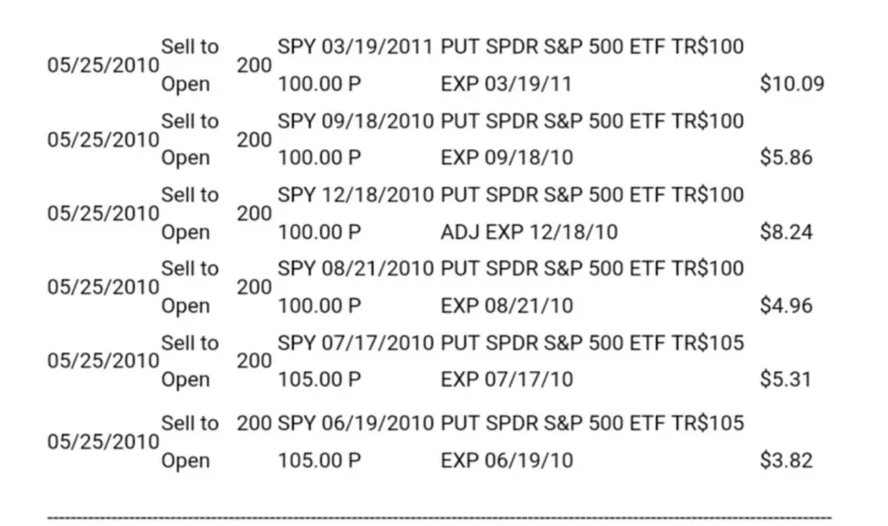

以上是我5月25号那天卖的S&P的etf的put，总共1200个合同，相当于12万股。（我把手续费那一栏去掉了）

有的已经过期，有的这个月到期，有的还有很长时间才到期。总共收了76万多，没过期的还不知道亏赚。

利润不高但风险也很小。

我自己认为我卖put时有点像巴菲特的套利，就是在没有明显好目标时，用手里的钱去赚些利息钱。

不做美股的请跳过这篇博文。（2010\-08\-10）

__1．套利概述__

01．网友：我想之所以大家对套利这么感兴趣，主要是因为套利是巴菲特的重要短期投资之一（有风险，无风险的他都做）。巴菲特的老师套利30年，平均年回报率大约20%，巴菲特套利了大约50年，尤其是职业生涯早期进行了大量的套利活动，据他自己讲回报率远远高于20%。近十几年来巴菲特套利活动不多，可能与他资金量变大了，进行大资金套利目标有限，而且资金大进出活动不方便有关．而且套利需要密切关注市场，比较费精力。

我记得他在股东信中专门讲过套利，要点是比较套利成功的收益和套利失败的损失，外加上资金被绑住的时间和更好的事情发生的可能性等，综合分析，计算潜在收益（损失），在综合概率，损益，时间之后，是相当理想的正回报的时候，就可以出手，不指望每一笔都赚钱，但只要一笔一笔不停的这样玩下去，就像赌场里的庄家一样，长期来看就赚钱了。

巴菲特几年前接受提问，问现在的他，如果手里只有100万会怎么投资，他的回答是投资小公司和套利。

不过套利讲起来很容易，做起来就需要功力了，世界上专门从事套利的投资者有很多，但成为套利大师的也没听说有多少个……

__段永平：__没太认真看过老巴的这些东西，也不知道他说的套利居然也分为有风险和无风险两种，如果这么说的话，套利就是短期投资（投机）行为了。

我不知道我做option算不算这种所谓的“套利”，但我投资的利润在普通年景里有很大一部分就是来自于options（卖covered calls和puts）。

option的交易中绝大部分初学者都是想买option的，因为他们都想赚快钱，当然结果都是被人把钱很快地赚走了。（2011\-01\-21）

__段永平：__老巴的“衍生品投机”实际上就是卖了个指数的长期的put，还不用交押金的。我认为那是投资，相对于卖保险。买put的人才是投机，也可以说是买保险。老巴的这个“亏损”是不会影响到现金流的。

我没看老巴具体卖的是什么put。大致看到过报道，说是用信誉卖的是s&p500的15到20年的put，按当时大概是1300点左右的价格卖的，收了几十亿美金的现金（可能后来掉下来后又做了不少，我猜）。代价是如果15或20以后如果掉到1300点（后来补得可能更低）以下，老巴要付钱，如果那时s&p500掉到0的话，老巴要赔300多个亿。第一，很难想象s&p500到那个时候还会在这个价钱，第二，就算在这个价钱（不涨不跌）老巴也已经赚了几十个亿了，第三，老巴白拿着几十个亿用20年，就算8%一年的复合增长，老巴也要赚个4\-5倍了。但是，虽然老巴不用给现金，但可能需要按mark to the market去记账，所以每个季度都会有“金融衍生品”的盈亏显示，让那些老想等着看老巴笑话的人乱激动一把。老巴卖的这些put买家只能在到期的时候行使，这是一个非常大的区别，和平时大家在市场上卖的普通不一样。所以说老巴这几十个亿白用20年不是没有理由的。老巴这个deal实际上就是长期不看坏美国。如果谁给我这么个deal，我也愿意啊。和借margin是完全两码事。margin由于抵押的是账上的其他股票，任何是个市场短期的大波动就可能将你的钱wipe out掉，但老巴的这个put是不受市场波动影响的，有兴趣想了解的可以去看老巴的年报哈，没看的就别乱讲了。（2011\-11\-09）

__无风险套利__

01．网友：我想问一个问题，你对套利是怎么看的？

__段永平：__我理解套利的意思一般而言就是无风险地赚点“小钱”，做空可是无限风险的事啊。先把基本定义搞清楚，不然要出大问题的。（2011\-01\-18）

网友：能请教一下对套利有过研究跟经历吗？例如最近几个中概股被揪出财务造假，导致很多中概股股价低迷，有中概股CEO酝酿私有化退市．我觉得是个套利的好机会呢？我经验有限，能不能讲讲您套利的体会？

__段永平__：前面刚讲过，我个人认为“套利”应该指的是无风险（或风险极低）的行为。你现在想做的事实际上是投资或投机行为。如果你真正了解你想干什么，那一般可以叫投资行为。但看起来你现在想干的事很像投机行为，因为有很多假设和想象的东西在里面。（2011\-01\-19）

02．网友：我想问一下“无风险套利”大概是怎么一回事，了解一下？

__段永平__：存银行就是典型的“无风险套利”，很多“无风险套利”其实是有风险的，只是大家不容易看到而已。举个例子，巴菲特100块收购了BNI，但要6个月以后成交，现在bni市价99块。这时如果你99买入，6个月以后就能卖100块。如果你的资金成本低且规模大的话，就可以从中赚一笔。（2010\-05\-04）

网友：请问段总：暂时没有好的机会，怎么解决空闲资金呢？

__段永平__：可以做些“无风险套利”，比如放银行了拿利息。（2010\-09\-20）

__2．关于option__

__段永平：__option是双面刃，既可以是投资的辅助工具，也可以是投机工具。

我见过不少号称有“照”的人，实际上并不真明白option的所以然。

10年前一个香港的朋友告诉我有put这个东西，从那时开始做投资到今天，没看过任何option的书，也没听说过你说的这个人。我认为其实option是个很好的工具，因为这个市场上有太多的源源不断的投机的钱，卖option大概可以算最好的赚投机或对冲的钱的好办法。我自己从来就没有一个所谓的option策略，都是跟着基本面走的。不过，作为辅助工具，卖option用好了还是蛮有效地，我管的钱在利用option上产生的利润好像可以赶上很多赚钱的上市公司了。

我见过的大多数人其实都把option复杂化了，其实option和价值投资的概念一样，不了解的公司的option是绝对不应该碰的。

只要有想用option赚快钱的想法，最后的结果一般都会很糟。

顺便说下，理解不了价值投资的人更难理解option，做option的技巧越高，最后吃的亏会越大。（2011\-12\-18）

我做股票的第一个交易就是卖put。一直不是很不明白为什么大多数人搞不懂卖put和卖covered call的道理。照说如果明白买股票就是买公司的道理后，应该很容易明白卖put无非就是让你更便宜买你原来想买的股票的办法而已。（只要用到杠杆就改变了游戏的性质。）

网友F：这不就是您说的毛估估吗？你已经很想买正股了，当然不会介意以更便宜的价格买。

__段永平：__对，卖put的根本道理就这一条，不知道为什么会被人说得那么复杂。

网友F：大道说的这个有点意思。前面有个朋友说得对，put options本质上就是卖保险。当你对投资对象很有信心的时候，这真是一个好工具。

__段永平：__我也一直用卖保险来比喻。但两者其实最本质的差别是保险的费率大概是可以算出来的，put实际上不能。卖put实际上就是为自己不拥有的东西投保。我只为自己想拥有的股票投保。

网友M：option可以作为价值投资的辅助工具？

__段永平：__是啊，老巴也用啊。不过，老巴规模太大，只能卖点s&p的put。我自己也觉得越来越难用了，规模大了以后市场没容量，卖不出好价钱就没意思了。

__段永平：__不明白最好就别碰option。使用option时最重要的就是不要为option而option，只有对基本面非常明白时才有可能有时用一下。还有就是不要用margin做option。（2011\-10\-04）

__段永平：__我说的卖call一定指的是covered的call，和市场无关但和了解有很大的关系，不了解的公司绝对不能碰任何option。卖put也不需要“大量”的资金，钱多多做些，没钱就不做，和别的一样。（2011\-07\-16）

__3．卖option与买option的区别__

__开赌场和赌博__

__段永平：__买option是投机，长期这么做早晚要亏钱。我不太愿意提option的原因就是，大多数人只能理解到买option，就像很多人想去赌场赚钱一样。对某些特定条件下的自己懂的股票卖option（puts或covered calls）实际上相当于开赌场。（2011\-04\-11）

__段永平：__卖权证的心态是长线（从长远的眼光看企业或权证），买权证的是短线。就像开赌场的是“长线”，赌客是短线的意思一样。（2011\-04\-15）

__段永平：__从本质上来讲，卖option就是在赚投机者的钱，实际上是在和投机者对赌。投机者想来赌场的赌客，卖covered call和有些股票的put的则有点像赌场。（2011\-07\-17）

网友S：之前一直没搞明白Option是怎么回事，看了这么多留言感觉知道一点点了，谢谢段大哥。刚刚有点明白段大哥说__买option和卖option是赌博和开赌场的区别了，__因为option是有时间期限的，买的人也就是在堵市场的波动，这已经是价值投资者能力之外的事情了。还是听段大哥的话，像我们这种小股民，还是不碰option的好。

__段永平：__是的。__买option就是投机。__我一般不太敢讲option就是因为讲完后多数人都想成我的客户，来买我的option，然后过段时间就发现亏得比赚的多。怎么讲都没用，多数人都是想赚快钱的。（2010\-05\-17）

__段永平__：我不买option的。买option的逻辑有点问题。比如，如果你觉得GE会跌，你干嘛要买呢？买option长期而言一定会亏钱的，因为时间是你的敌人。投资最好的地方就是，时间是我的朋友。买option的人里90%最后都是亏钱的。卖option的则基本上是赚钱的。（2010\-05\-09）

__段永平：__买option是投机行为！我如果买option就是愚蠢！最郁闷的是每次跟别人讲卖option时别人都说我在买，买和卖真的那么难区分吗？有一个简单的区别，卖是收钱的哈。（2011\-10\-04）

网友：想问下您如果用期权的方式买长期看好的公司，买了10年不会卖的这种。用快到期了卖掉再买入的这种方法是否可行？

__段永平：__你如果坚持用买call的办法去买你想买的公司（其实你只是想赌个大涨而已）最后的结果大概率是亏光光的。我自己是不买option的，不管是Call还是put。（2020\-11\-13）

__4．卖option的前提__

__段永平：__我认为其实都可以。如果你想多持有的话，就不着急卖covered calls。现在卖calls就放弃了上涨的空间，但更安全些，股票不涨你也有钱赚。

__卖option的前提和价值投资一样，你一定要对投资标的足够了解并打算长期持有（或者可以考虑卖）。在打算长期持有的前提下做一些短期套利可以让投资没那么无聊__。对你认为上涨空间大的股票，最好还是不要卖call的好，或者只卖一点点（为了好玩）。（2010\-08\-12）

__段永平：当然卖put的前提和买股票是一样的，你一定要很了解你的投资标的（和卖保险一样）__。卖put的最大坏处是可能会失去大涨所带来的利润。最大的好处是卖put比直接买股票的风险小。

我卖option没有任何秘密，就是未来现金流折现的一个做法而已。（2010\-08\-14）

__段永平：option一定是建立在对基本面的理解上。__非价值投资的人做option多数都会反着做，最后大多都会很难看。（2011\-04\-09）

__段永平：__卖put的前提是你总是要准备好现金在那儿，不然就等于在用margin。

__段永平：__心态的意思是，卖option其实不会有短期赚大钱的机会，但是实实在在产生净现金流的办法，在懂的基本面的前提下长期而言是有机会获得高于平均市场回报的回报的。买option则是投机，常做铁亏。（2011\-07\-16）

__5．卖option（puts或covered calls）适用范围__

__段永平：__看了查理宝典之后，总觉得对我而言，yahoo并不是最理想的投资。

网友：这句话怎么理解？

__段永平：__呵呵，我也觉得这种产品市场的变化很多。买yahoo的假设前提是yahoo本身不能出太大的问题，比如不能亏钱（现在看起来一时半会好像确实不会，但10年以后就不知道了）。理想的目标是自己能觉得自己能清楚地看到10年或更长时间。对阿里巴巴，我觉得10年以上我不太担心，但yahoo本身却说不清，有一些问题。呵呵，最理想的就是可以长期持有，永远不想卖的股票（老巴讲的）。（2010\-05\-16）

__段永平：yahoo换了新的CEO后其实风险增加了__，我自己的策略还是继续卖option，但不会增加投入，实际上是慢慢在减少YHOO

网友：大道，这次卖YHOO的16元的CALL，通过您以前的发言，我感觉与以前的逻辑有一点区别，您认为yhoo不仅仅值16，但是由于美国业务的下滑，马云说淘宝近几年不会上市，因此YHOO近期不会上涨，所以卖CALL，是这样的吗？

__段永平：__卖option最重要的不是预测，是不怕。__比如在某些价位我不怕yhoo掉，就可以卖put了，不怕他涨以后就卖call了__。__yhoo董事会很烂，我只能靠卖点call赚钱了。__

__段永平：__你要没有现金在就等于在用margin，等于用你的港股在抵押。不是很推荐你卖puts。我卖puts（有时也卖些covered calls）的原因主要是资金量有点大，我把这个当套利。由于我能评估自己的风险，也很清楚自己在干什么，一年10\-15%的回报还是可以接受的，__尤其是没有发现非常理想的目标时__。（2010\-05\-16）

__段永平：我一般想卖的股票会倾向于卖call__，__除非是着急用钱或想跑的时候。我的网易就是用卖call的办法慢慢卖掉的__，现在也还没卖完呢，手里还有一些被卖了45的call，明年一月到期。这个价位的网易我不会卖put，但以前在20块左右的时候可是买过很多put，有一次一下就被put进来很多万股，呵呵。

__段永平：我觉得卖call最好是在所谓股价差不多时，既不怕股票大跌，又不舍得在眼前价钱全部卖掉，__卖cavered calls是个很有意思的做法。其实我的网易就是这么卖的。当网易到接近30时我就开始卖30的calls，后来一路涨我就一路卖，从30一直卖到了50\.现在剩下的股票都是没有被call走的。由于前段时间长的快，绝大部分都被call走了。好像最高的是40多被call走的。（2010\-08\-12）

__卖call的风险__

__段永平：__卖covered call的风险有两个方面，一是突然大涨而失去潜在利润，二是大掉而亏掉本钱。对yhoo而言，大涨我不怕，只是少赚而已。大跌我也不怕，因为我觉得我了解yhoo的价值，知道掉下来迟早也会涨回来。

网友：没整明白，“二是大掉而亏掉本钱”请求解释？

__段永平：__补充个例子：比如你13块买了yhoo，今天卖个15块的call收1\.5刀／股，结果到期前yhoo掉到5块，你就亏到本钱了。

网友l：卖了call，未到期不能卖手里的正股。

__段永平：__可以卖，但卖掉后就成naked的call了，违背原则。卖naked call和做short都是属于不对的事情。（2011\-10\-04）

__6．不适合卖option（puts或calls）的情况__

__段永平：在股票价钱很低的时候建议最好不要卖put__，机会成本大，会失去好价钱买到好公司的机会。

__段永平：恐慌时往往有便宜的股票，不是很适合卖put__。option还是不学为好，会的到时自然会的，学来学去学到的都是投机的东西。（2010\-08\-12）

__段永平：严重低估的股票千万不要卖call__，不然就亏大了。我觉得yhoo不属于严重低估的，尤其是这个董事会下。

__段永平：对你认为上涨空间大的股票，最好还是不要卖call__的好，或者只卖一点点（为了好玩）。（2010\-08\-12）

__段永平：好公司很可能会因为卖option把机会错失__了。（__2018\-10\-02__）

__段永平：__卖put的缺点是，往往好不容易找到的好公司，因为卖了put而错过买进的机会。这里需要强调的是：卖put和买股票卖covered call是一样的，数学上没区别。

__7．Yahoo案例__

__段永平：__这两年我在yahoo上赚了不少钱，但yahoo的股票并没有大涨，你猜猜是什么原因？

当然，如果股票马上就大涨我就要少赚很多。手里资金大时就很想求稳，觉得一年能有十几%的回报就可以接受了。但是，在去年3月份这种机会出现时最好就不要卖put，那种时候一定要贪心，过于保守会浪费机会。

网友：Covered Put算起来好像赢了一点概率成本（引申波幅的某个部位），但是承受了应召女郎的待遇是否合算？（被人随Call随到）

__段永平：__这个想法有点怪。我认为卖put是价值投资的一个形式。比如现在假如你愿意16块多买yahoo，且觉得一年赚10%就很满意了，如果这时一个人出来说他愿意明年一月15块卖给你（如果价钱低于15的话），而且先付你1\.5做定金（相当于他花10%买个保险），难道你不觉得这是个很好的生意吗？（如果到时他卖给你的话，你的成本就是13\.5，如果他到时不卖给你的话，你就赚了1\.5/13\.5=11%，半年多一点的时间）。\-\-这是yahoo现在的实例。

我投资的第一个交易就是卖了一个put，觉得很舒服。当然卖put的前提和买股票是一样的，你一定要很了解你的投资标的（和卖保险一样）。卖put的最大坏处是可能会失去大涨所带来的利润。最大的好处是卖put比直接买股票的风险小。巴菲特有时也用卖put的方式，比如他就卖了bni和s&p的puts。（2010\-05\-15）

网友X：Yahoo赚不少的原因：卖Covered Call，卖Puts。

__段永平：__不过价低时不要轻易卖covered call。对yahoo毕竟还有一些心理没底的东西，卖点coverd calls起码可以降低风险。其实我最怕的就是yahoo突然神经兮兮地绝尘而去，现在这种状态我最高兴。呵呵，这种做法可能应该叫做价值投机？

网友A：我尝试猜测一下段老师这两年在Yahoo赚不少的原因：

1．以2009年1月1日的收市价12\.2元起算，今天收市价16\.39，正股账面部分利润应为34%。

2．因为采用short call（put）工具（假设不孖展操作），可以满仓进行，根据2009年元旦至今的历史价格推算，历史波幅为62\.8%/年化，又假设段老师的option操作平均周转期为2个月，可得出权证收益为：

3．还得假设平均option是两个月10%的部位，即可推算出每两个月的期权金为6\.5%，至今16个月，复利后果为利润65%。

4．即总利润正好是34%\+65%=99%，太奇妙了，怎么结果正好是翻倍呢？

__段永平：__呵呵，差不多吧。最便宜的确实有10块以下的，但量很少。那时主要买ge了。平均买进价可能在15块多，但有很多是put进来的，加上已经过期的put，估计实际成本可能在13\-14左右。不算是很好，但还过得去。

网友J：买option属于投机，卖option属于投资。卖15的put，意思是可以以14的价格买入。卖16的call，即认为到了16，就可以卖了。

再试着说几句。正如你所说，不看好买put，看多买call（大道说了，这是投机）。大道是长期看多yhoo的，卖是买的对手盘，所以卖put应该好理解了吧。那既然看多，为何还卖call呢？原因是大道认为在短期内yhoo不会涨的太快（也就是yhoo被收购不会这么快），卖call可以摊低成本。举例来说，比如这次，假设大道有20000股yhoo。他卖了10000股15的put和10000股16的call。最后yhoo收在14\.95。这样大道等于赚了大概每股0\.95\+0\.75=1\.7。也就是成本摊薄了大概1\.7（指的是10000股的成本）。时间才一个月，收益相当不错了。假设yhoo这次跌到了14，大道就以14的价格买入10000股，大道认为挺好。假设这期间yhoo被25收购了，那大道的10000股yhoo就被call走了。投机者认为亏了，大道觉得也能接受，还有10000股yhoo。如果yhoo涨到15\.99，那大道又多赚了大概0\.75。股票还是20000股。

__段永平：__呵呵，解释得很好哈。我其实觉得目前这个董事会下，雅虎且有一阵折腾呢，来回put\+call或许是个不错的策略，反正我也不怕多买些便宜的雅虎，也不怕被call走少赚一点。况且，被call走的情况下，还可以再卖个同一价位的put，往往又会被put进来，好玩吧？只是我雅虎比较多，做起来好辛苦。

__段永平：__我极少买回我卖出去的任何options（再次强调一下，我只对很特别的目标卖covered calls和covered puts，顺便解释一下，covered puts的意思是如果被put进来有足够的现金接）。道理上来讲，你卖call的时候是打算被call走的，不然就是投机了。不过，我16或以下的call很少（有也都是被put进来后卖的），主要都是17\.5或以上的，很早就卖了。我的绝大部分雅虎的option都会在1月21日到期。最近我也没再卖call了，尽管前段时间有很多已经expire掉了，但如果价格再好点说不定我还会继续卖的。

我不知道这次的收购是不是真的，但我知道就算这次没有，将来还会有的，因为雅虎亚洲资产实实在在在那里摆着，总是会有人有兴趣的，当然最有兴趣的应该是亚洲资产本身。

网友B：段总只卖出期权，并且限定在他明白的公司。我的理解段总实际是在利用期权做价值投资。因为我没有从事过期权买卖，所以非常可能理解有误。

举例说明。比如现在巨人网络的股价现在$7。有个机构以$7买入了巨人网络的股票，但又希望有一种方法来对冲股票价格下跌的风险。此时，段总就卖出了一年期行权价格为$6的期权。这个公司认为段总的期权适合他们的要求，就会付出权利金，买入段总卖出的期权。因为，在一年后，一旦巨人网络的股价下跌到$6以下，他们可以按$6的价格把股票卖给段总。这样他们就锁定了风险。

而段总得到该公司的了权利金，责任是在一年到期时，如果股票价格到$6以下，该公司如果卖出他们的股票，段总必须以$6价格接下他们的股票。

但实际上，段总认为巨人网络在$6以下是很好的价值投资范围，是段总乐于买入的价格范围。这样，如果巨人网络的价格涨了，或高于$6，段总就得了该公司的权利金。如果股价到$6以下，就买入做了价值投资。

段总卖出期权的前提是，他只限于他愿意做价值投资的公司。所以他说：“简单讲，我就是在卖保险，但我只保我明白的公司”。

__段永平：__你说的是puts，大致意思是对的。（2011\-02\-05）

网友A：您short的put一般是多长时间的，是一个月的吗？

__段永平：__可长可短，最短可到一个礼拜，最长的可到一两年。另外，short put的说法骨子里是不对的，因为卖put其实是long。不懂不要乱用术语哈。（2011\-04\-11）

__后记：__

网友：您说以前会卖大量的跨年put，而卖put肯定要预留到期买入的资金，这样就相当于空了一部分仓。如果在这个期间这个股票涨很多就不划算了，这个是不是你现在不再卖大量put或者call的原因？

__段永平：__卖put最大的好处其实是，当有想买的公司却一时下不了决心买入时，卖put要容易决定一些。事实上，我的很多股票也是卖put后被put进来的。由于卖put时本来就打算买，所以更低一些的价钱自然更好。我不再卖大量put的最重要原因其实是我已经买了股票了，只有当有多余现金时才会考虑买入，等待或卖put这三个选项，其中等待最难。我现在很少卖call，因为好公司难找，不想一个不小心把好公司卖掉了。不过有意思的是，卖covered call和卖put在数学上是等值的。（2020\-11\-26）

网友M：卖covered call和卖put数学上等值的意思是？没琢磨透

__段永平：__就是没区别的意思。（2020\-11\-26）

__段永平：现在的段永平认为即使是卖option也应该是不对的，因为好不容易找到的好公司很可能会因为卖option把机会错失了。最简单的办法其实就是找到好公司，在合适的价钱买下拿着。__（2018\-10\-02）

__段永平：__我不建议卖option！找个好公司不容易。不要为了那一点点premium失去拥有好公司的机会。（2019\-11\-18）

## 第六章　投资方法论 - (4) 第4节　投资心态（平常心）

\(4\) 第4节 投资心态（平常心）

2025年5月18日

11:00

__第4节 投资心态（平常心）__

__呵呵，可以放心睡觉的就是价值投资了__。__投资用的是闲钱，不然就是投机了。__（2010\-04\-24）

__1．关于回报预期__

01．任俊杰：我们应当有一个怎样的回报预期？

__段永平：__讲点自己对回报预期的看法；

__首先说明，本人从来不预设回报预期，因为对本人而言投资回报本来就和自己的预期无关。我对投资的认识是过程比结果重要，或者说是谋事在人成事在天，只要过程对了，结果自然会好；__

__第二，长期而言，跑过银行存款应该是最基本的要求，不然就是啥忙了；__

__第三，从保值的角度看，长期而言投资回报至少要做到能保住购买力不变才叫不亏，也许用黄金来衡量会有点意思？__（2012\-08\-14）

__段永平：__我个人认为，投资最重要的动机是保值，保持购买力不下降。其他都是附带的。多数人可能没有意识到保值不是件容易的事情。看下M2的数字也许能明白点？（2020\-10\-26）

02．网友：一个投资人，除了不想亏大钱外，他对投资的理想收益应该是多少，譬如20\-30%，就可以接受，还是一定起码得100%以上？你的通用电气目前也是大致100%吧。

__段永平：__我对投资没有理想收益的想法。我关注过程是否正确多于关注结果是否马上显现。经营企业时结果的显现一般要快很多（至少对我们这种中小规模的企业而言，）而投资却很难讲。

__我对投资的长期回报基本希望是能略好于长期国债，比如8%。__

到目前为止，我管的钱的回报要比长期国债高不少，可能是运气好，也可能是因为投机者太多而给了我机会。（2010\-03\-24）

03．网友：请教一下，如果投资年化收益只有8%的话，一些国外家族信托也能做到7%，这样投资除了兴趣，经济效益并不高呀？

__段永平：__我的观点是8%就可以了，就是不要为了高回报去乱冒风险的意思。实际上我投资这些年的回报一直都比8%高不少呢。（2019\-09\-19）

04．网友：作为普通人，我想在未来30年内大概率持续获得10\-15%的年化收益，最佳的策略是什么？

__段永平：__好像没有一个绝对把握能有10%以上年回报的办法，不然全世界的钱都会去那里的。（2019\-03\-16）

__段永平：__在真的理解的生意里一个人会选多少回报的？很多人错在选了自己不了解的别人说回报高的，结果是85%的人亏钱。如果问这85%的“投资者”选8%每年收益还是选择10%还是20%的，那就有点像某记者问人“你幸福吗？”

在真的自己理解的生意里，没道理选回报低的，但前提是真正理解！

每个人都能理解的生意其实就是把钱存银行了。

投资是只有很少人能理解的，所以大多数人还是别碰为好。（2013\-02\-01）

__段永平：__经常看到人们对平均每年15%\+的回报灰常不屑，不是很理解，似乎他们一出手就应该是5倍10倍啥的。平常年景的说法很有趣，因为对我而言每年都是平常年景。（2014\-08\-21）

05．网友：发现身边很多人都喜欢暴富的神话，我说平均年收益30%巴菲特也只是前十几年能做到，身边好多人觉得50%以上才算正常。

__段永平：__去赌场门口看看，暴富的故事多了去了。（2010\-10\-23）

__段永平：__人们很喜欢用一年的回报率来衡量，但大资金的年回报率是没机会特别高的，比如巴菲特的BRK，但小资金却往往有机会有高比例的回报，比如周围的朋友中总会经常总会有某个人当年回报据说有40%、50%甚至更高的（就像一起去赌场的朋友中，第一天出来时总有个别人是兴高采烈的一样）千万别以为这些人已经比巴菲特厉害了。

偶尔会听到有人说某只股票至少会涨10倍，所以计划放10%进去等等。如果他真相信这只股票会涨10倍，什么理由他让只放10%呢？（2013\-02\-01）

06．网友：今困惑卡拉曼所说投资衡量重要标准不是投资回报率，而是所承担风险的回报率。不知如何较好理解。

__段永平：__长期看只有投资回报率。__短期看，有人会为了提高投资回报率而铤而走险，比如用margin。很多对冲基金是会用很高的margin的，所以摊上事儿的时候都是大事，所以大家对那些说今年回报有多高多高的基金的数字别太当真__。（2013\-05\-29）

07．博文：Charlie Munger’s Quotes《2012年6月18日》

译文：（135）假设一个场景，你知道有一个铁板钉钉没跑儿的机会可以带来12%的复合年回报。现在，假如这个机会放在你面前，但是要求你从此不再接受别的赚快钱的机会，你们中大部分人是不愿意干的。但你们中很多人也会说：“别人赚钱快为什么我要在意呢？”这世界总有些人会赚钱比你快、跑得比你快、或者别的什么比你快。但是，从理智的角度来思考，一旦你自己找到了一件运行良好的机制能致富，还非要在意别人赚钱比你快，这在我来看就是疯了。

__段永平：__这里我看到两点：1、平常心地呆在自己能力圈内；

2、12%是个可接受的年复合回报率。

08．网友T：您当年购买网易的时候，当他下跌到1美元的时候，您是如何判断这个企业一定会没有问题的？希望您能把当时的心理状态给我们分享一下。我一直认为应该跟您学如何去寻找1块钱10年可能涨到100块钱的本事，而不是找到1块钱10年涨到3块钱的本事，这个难题一直困扰着我，特别想听听您在当时网易一块钱大量购买的原因。

__段永平：__10年100倍的东西多少有点可遇不可求。能有10年3倍的我就满意了。

网友K：段大哥：您什么时候开始有10年3倍我就满意了．这个想法的？是现在资金量大了之后才有这个想法？还是当年买网易时就是这样想的呀？

__段永平：__我一直这么想。10年3倍是个心态，不贪心。（2010\-05\-28）

09．博文：巴菲特与马里兰大学MBA学生的交流发言

问：随着规模越来越大，伯克希尔·哈萨维已经降低了它的预期投资回报率吗？

巴菲特：伯克希尔没有1个预期投资回报率。更多的资本会使取得优秀的投资收益率变得更困难。如果我管理1百万美元，相对于目前管理2100亿美元（伯克希尔的净资产），将会取得更高的投资收益率。规模是投资表现的敌人，但我仍然更喜欢管理2100亿美元相较于管理1百万美元。

__段永平：__没有投资回报率目标的意思就是“谋事在人，成事在天”的意思。给自己设定短期投资回报率实际上有点滑稽，相当于猜测市场的短期反应。炫耀短期回报率高也是危险的，因为想要高回报率会让人铤而走险。（2013\-12\-18）

10．网友：已知投资大师长年的年复合投资收益率

巴菲特：22%，卡拉曼：16\.5%，约翰·涅夫：13\.8%，沃尔特·施洛斯：20%，约翰·邓普顿：14\.5%，斯尔必·戴维斯：23%。

网友：1、巴菲特取得20%收益率50年，这很牛，但投资界牛人还有可能做到（比如段总）。

2、巴菲特源源不断取得低息、或无息资金那才牛，这可能是区域性投资家与洛克菲勒式大资本家区别。不知道看法对不对？

__段永平：__我肯定做不到巴菲特的回报率，因为我开始的太晚而且没那么用功，最重要的是我不认为我真的想做到。我做投资就是一业余爱好，好玩而已。（2010\-03\-01）

网友：如以年复利25%计算，3年195%，10年931%，20年8674%，40年752316%；事实上，没有哪个投资人做到了连续40年年回报25%；即使巴菲特，他的公司从1965年开始的40年复利是21\.5%，总回报305134%；期望能获得长期25%复利是不切实际的

__段永平：__作为业余投资者，我觉得12%的复合增长就不错了，好像芒格也认为12%是个过得去的回报，这样比较平常心些。12%的回报：10年3\.1倍，15年5\.47倍，20年9\.65倍，30年30倍，40年93倍。有这个心态，加上漫长的过程中可能会碰到的大机会，实际超过15%或更多也是可能的。

__段永平：__40年复利15%=268倍，就已经很了不起了。40年20%=1469倍。有些对冲基金有些年头回报好的原因往往和他们用margin有关，所以不能单纯比业绩的。当然连着比40年自然合理。不过，我是业余投资者，没那么多时间去看企业，所以不参加任何比赛哈，just for fun\.（2012\-06\-24）

__2．投资是用闲钱__

01．网友：段大哥，钱都投到一个股票里还是太危险吧，总有考虑不到的因素。万一失手，翻身就太难了吧。（当然闲钱除外了）

__段永平__：好像分散更危险啊。再说，__投资用的就应该是闲钱，不然很难有平常心。__（2010\-04\-23）

02．网友：你当时买网易的时候也全部是用闲钱买的吗？一般的老百姓如果只用闲钱来投资，赚的钱对生活改善不大，老巴年轻的时候应该还是拿基本上全部的钱来投资的吧。

__段永平__：问题是不用闲钱对生活会造成负面影响啊。__我从来都是用闲钱的。老巴其实也是。至少你要有用闲钱的态度才可能有平常心的，不然真会睡不着觉__。（2010\-04\-23）

03．网友：您投资账户中平时也是必留一部分现金吗？好像看老巴讲的东西，说随时都有能用的现金！

__段永平：__除非我找不到目标，不然我不能理解留现金干什么。需要现金时可以卖股票啊！（2014\-07\-18）

网友：日常家庭开支的现金，还是需要预留一些吧，或者是应急的。

__段永平：投资用的是闲钱，不然就是投机了__。（2014\-07\-20）

__段永平：有人问过芒格，如果只能用一个词来形容他们的成功？他的回答是：“rationality”（理性），呵呵，有点像我们说的平常心。问题是不用闲钱对生活会造成负面影响啊。我从来都是用闲钱的。老巴其实也是。至少你要有用闲钱的态度才可能有平常心的，不然真会睡不着觉。__（2013\-09\-03）

__3．投资心态（平常心）__

01．网友：请教一个问题当我买人股票后，股价还是持续下跌，会引起心绪不稳定，大家可能都碰到过这个情况．虽然我可以控制不看大盘，心里总是会想到这点，如果价格长期超跌，请问这段时间如何调节心绪，让自己不受影响呢？

__段永平：__我一般碰到这种情况（尤其是大跌时），会再全面认真地看一下是不是自己哪里看的不对，如果确认没问题我就不管了。

心情的事情说不清，一开始我也紧张。回想起来，紧张一般都来源于不了解。当你真的很了解你的投资标的时，下跌往往会让我觉得高兴或无动于衷。（2010\-03\-22）

网友S：今晚道琼斯跌了接近10%，9百多点，疯了。段大哥又有机会进yahoo了。想问问段大哥，此时的心态怎么控制。

__段永平：__如果你不是用margin，心态就不应该有问题啊。呵呵，头几年也会不太舒服，现在基本上无所谓。（2010\-05\-07）

网友：请教段总，我心里也会不太舒服，总觉得没有更多的钱再买了，这样的心态该如何调整啊？每次遇上大跌的时候总是觉得为什么没有更多的钱来买啊，郁闷中。

__段永平__：呵呵，千万别为这种事郁闷。投资时最常见的状态就是有钱没目标和有目标时没钱了，可能这两种情况各占一半。如果你两种情况都郁闷的话，那可真有点哪个啥了

。如果你能理性想想就好了。有空多看看老巴或者芒格的东西会更好。（2010\-05\-08）

02．网友：我发现自己的心态不好，心跳总是跟随股市上下起伏，经常想，如果这样会怎样，如果那样会如何。段大哥有机会讲讲自己心态方面的修炼经验。比如说你亏了一大笔钱的时候，心情肯定也不好吧？这个时候如何该调整心态呢？

__段永平__：如果我买的公司是我很想买的公司，掉的时候我不会觉得心情不好。如果手里还有钱或还能从别的地方找到钱，我可能反而会觉得兴奋，因为可以买得更便宜。比如我在10块左右开始买GE，后来一直掉到6块，我就一直很高兴地多买了很多（比前面买的还要多很多）。

__我觉得这不是心态而是理解的问题。如果你是从5年10年的角度看，你就不会每天跟着股市着急__。（2010\-04\-13）

网友：这个兴不兴奋应该还是与我们的仓位有关吧，老段如果已经满仓，遇到暴跌难道还可以兴奋吗？巴菲特也是有源源不断的现金流才希望公司下跌嘛。

__段永平__：如果你只有一只股票，而且还是满仓的，如果你真正了解你投资的东西的话，那下跌就和你无关了。（2010\-04\-23）

03．网友：再请教段大哥，我们平时手中是否要一直留有一些现金呢？记得老巴好像提到过手上要有现金，他说过，现金对企业来说，就像氧气对于一个人的作用。

__段永平：__仅就投资而言，如果有好公司好价钱，你为什么要留现金？（2018\-09\-30）

__段永平：__我其实从来没空仓过，多数情况下都是接近满仓的，所以见到好股票就必须从别的地方倒腾现金过来。所以说，当我见到便宜东西还能有钱买，有时确实是运气好。我真不是什么大师。（2010\-03\-06）

04．网友：段大哥说的很对，stay with好公司永远是王道，而且越低越应该买入．但我一直有一个疑惑是，我看老巴传记<<snow ball>>，里面提到1969年，巴菲特认为市场估值太高，宣布解散公司“退休”，这一休息就是5年．那未来一两年我们可能回面临一个相似的市场：美联储加息，缩表，和史上最高的市值。那我们也该学当年的老巴，减少一些手中的仓位为下一次危机准备弹药吗？

__段永平：__如果你认为该减少一些的话，为什么不是全部呢？如果你觉得你拥有的公司太贵了你就该都卖了，除非留点做纪念，不然留一部分赌市场再涨一点吗？老巴当年是看着自己手里的东西而不是看着市场吧？老巴当年不干了是因为实在找不到自己敢买的公司，拿着大家的钱不舒服，所以就干脆解散了。（2018\-09\-12）

05．网友：请问在投资中，是心态重要，还是专业知识重要。我学历可不高，但你说过任何人都可从事投资。

网友X：我现在的感觉是理性重要，不知道段总是不是也这么认为。心态和专业知识都是依据理性才有需求的。

__段永平__：我怎么认为不重要。芒格认为理性最重要。我们认为平常心最重要。好像这俩是一个东西。（2010\-05\-30）

__段永平：__要补充的一点是，老有人说投资改变了我的一生，这个说法其实完全不着边际，因为投资没有改变我任何东西，但我确实找到了一件很有趣的事情做而已，就像学会打高尔夫球一样。

投资并没有让我觉得自己更有钱，不然很难拿得住一只涨了100多倍的股票。

要想拿得住一只涨了很多的股票必须要有很好的平常心（芒格叫理性），平常人是很难有平常心的。不过，平常心大概是可以修炼出来的，和年纪可能也有点关系。（2011\-09\-27）

06．网友：最近也经常半夜起来看看您的博客和纳斯达克的行情~有个小问题想问学长，您会每天看自己手里股票的quote吗？我一有空就老想看……巴菲特说他的股票就算一两年没有quote他也很comfortable，但是不知道在有quote的情况下他会不会也没事儿刷刷看呢？

__段永平__：我肯定他不会半夜起来看

。我猜他也会关心但不会着急，我现在大概也属于关心但不着急的状态。开始头几年有时会着急。（2010\-03\-17）

07．网友：段总：以您对苹果的了解程度，您会每天会跟踪各种苹果的新闻吗？我在想离一只股票太近了，不但很花时间，而且容易忽略最重要的。反之，智能手机这个行业变化较快，不经常看好像也不行。有点纠结。望指教！

__段永平__：你觉得跟踪每天的新闻会对你有帮助吗？如果没有的话，那你为什么要这么做？如果你投资了一家企业后还会为每天的新闻改变你对企业的看法，那大概就说明你对这家企业其实不了解。当然，traders是需要根据每天的新闻去做事情的，基本上，那样做应该会很累而且不太赚钱。另外，关心和跟踪是有点不太一样的。关心是一个享受的过程。（2014\-02\-05）

08．网友：老师，我有一个关于投资的心态和操作方面的问题。

我花了好几年很长时间研究一个公司和他们的股票，在01年重重仓了这只股票（也是我买的唯一的一只），当时的股价为1\.2元左右，到07年时高点曾到过40多元，因为经济危机，08年末曾跌到6元，我当时很后悔没有卖掉。

经过去年的09年复苏，在股价涨回到16元时，我就全仓卖掉了，但是股价现在上涨到了30多元，尤其是看到有人写文章分析说股价很快会回到40元并且将来会到100元以上时（当然也有人说股价已经很高很难再大涨），我感觉后悔极了。

几个月来，虽然空着仓，我一直继续关注着这个公司，我知道这是个优秀的并且将来还会有长足发展的公司，以前很少研究别的公司，即使研究同行业公司，也是为了对比了解一些情况。

但是现在，却好像有心理障碍用上次卖价的一倍再买回这个股票，我一直在懊悔中，几个月来，我不知道该怎么办才好，因为寻找和研究一个优秀的公司需要花很多时间和精力，请老师和这里的各位同学给我一些建议，哪怕安慰也好，让我能从懊悔中走出来，把心态好好调整一下。

__段永平：__呵呵，有时我也有同样的问题。我的处理方式是尽量用平常心去考虑这个问题，买卖的时候多想想自己标的的价值定义，尽量忽略市场价格的影响，尤其是要少考虑他的历史价格。呵呵，有点难。能够安慰你的地方是我基本可以保证所有人都或多或少有这个问题，所以请不要为此懊恼。

网友：Barton Biggs说了，与调整现有组合相比，手头拥有现金，重新开始一次新投资往往会表现比较好；因为没有心理负担。

__段永平__：有时候有同感！可能是这样做比较容易平常心一些，没有包袱。包袱往往就是沉入成本。

09．网友：段大哥：您能不能举几个你认为错过的大的机会？你当时是个什么心态？

__段永平：__呵呵，我的心态很好。无论你多么努力，你都还是会错过无穷多机会，所以错过机会是正常的。比如，你查查每年股票升幅第一的股票，你看看有多少次能抓住就明白了（大多数情况下都抓不到）。（2010\-04\-02）

10．网友：请教你一个问题：当价格较大低于价值时，该股票肯定是要继续持有的，但如何才能做到淡然处之不看行情？本人老是克服不了这种一有时间就想看该股行情的冲动。

__段永平：__想看就看一下嘛，看一下又没啥坏处。我也会看的。（2010\-04\-04）

11．网友：我知道我买的苹果股票5年之内是不会卖的，但是还是忍不住每天看看股价，心情多多少少还是稍微受些影响，不知道您做投资初期也是经常看股价么，有什么好办法让自己少看股价么？

__段永平：我现在也会每天看下股价啊，但心情不会受不好的影响。掉很多我会想着有没有机会加仓，涨很多我也可以开心一下嘛，所以涨跌都是好事。不过，我不是守在电脑前盯着屏幕看的那种__。（2019\-05\-20）

12．网友：阿段你曾经有个问题要问问巴菲特有钱没项目怎么办，或者是没钱有项目又该怎么办，这个答案应该是等待吧。

__段永平：没说过项目的事，主要是指股票投资。没钱当然好办（其实也未必，m argin就危险）；有钱没标的怎么办？巴菲特说：这事最难的事。呵呵，他也有这个问题。__（2010\-03\-30）

__段永平：__我问巴菲特一些其他问题时，他间接回答了这个问题。

我问巴菲特，在投资中不可以做的事情是什么，他告诉我说：不做空，不借钱，最重要的是不要做不懂的东西。

他说，__他只希望富一次，__如果借钱，可能会变成两次、三次富有了，然后又穷回去了。他这话的意思是要少犯错。

网友：你在投资时觉得困难的是什么时候？

__段永平：__满仓的时候我知道怎么办，但是我不知道空仓的时候该怎么办。我后来研究巴菲特，发现巴菲特也说过，最难的时候，是手上有很多钱，但是没有可投的项目。实际上巴菲特长期都处于这样的状态，没有发现可投的项目，就等待。这是做投资最困难的时候。

__段永平：__最难的就是什么都不做。当手里有很多现金的时候就很容易理解为什么这么说。Buffett说他最容易犯错的时候就是手里有很多现金的时候，me2\.（2010\-03\-08）

网友：我想问您一个问题：如果手上全是钱发现的机会不太满意，这个时候该不该出手？出手怕有风险。不出手又怕手里的钱在贬值。这个问题时不时困惑我。

__段永平：__没目标时钱在手里好过乱投亏钱亏钱。如果一有钱就乱投的话，早晚都会碰上个亏大钱的目标的。（2010\-04\-11）

13．网友：要做到平常心好难啊，是不是在怎么努力也无法完全做到？有什么方法吗？

__段永平：__股市掉这么点儿就这样了？平常人是很难有平常心的，所以平常心又叫不平常心。如果你关心的不是事物的本质，没有平常心是正常的。倒过来也一样，如果你关注的只是事物的本质，平常心自然就在那里了。（2015\-05\-29）

网友L：段大哥，是不是也可以这样理解：在没有平常心的地方是找不到平常心的。我亲身经历平常心不是求来的，而是“做对的事，把事情做对”后自然而然就有的一种心态。以前曾经有过的急躁其实也是在没弄懂或者没计划然后把事情搞砸后的一种自然反应。

__段永平：__在错的道路上是没办法有平常心的，比如用着margin的人们，昨天那种情况下，你懂的。（2015\-05\-29）

14．投资中心理学有用吗？

__段永平：__在投资里心理学大概最有用的就是当别人恐惧时和当别人贪婪时你不要跟别人一样就行了。说到头还是回归本源，就是回到价值上。只要你投的公司是自己明白的生意，就不容易恐惧也不容易贪婪，心理学其实也就没啥用了。（2011\-10\-24）

15．网友：请教一个问题，为了能在0\.6元价格买到1元价值的机会出现时，可以迅速下手，必须时常性保持现金，极度耐心地等待吗？这个阶段，是最考验人的贪欲本性的时段吗？

__段永平：__我觉得对所谓价值投资者而言，其实没有那么考验。他们也就是没有合适的东西就不买了，有合适的再买，就和一般人逛商场一样。我想每个人逛商场时一定不会把花光身上所有钱作为目标吧。（2010\-04\-03）

__4．投资要有耐心__

01．网友：您前面的文章说投资最重要的是投你懂的企业，我觉得您最重要的还有一点是对安全边际的严格把握，如果没有这一点您就不会在网易和GE上赚这么多了，但是这样的机会很少的，我很想知道如果没有这样大机会下的安全边际，您是不是就一直在空仓等待呢？

__段永平__：呵呵，机会很多的话就无所谓机会了。空仓是件非常难的事。巴菲特的经验是当有钱没东西买的时候就很容易犯错误。空仓总比犯错好。（2010\-03\-01）

02．网友：我有钱在手但一时找不到合适的目标，我也知道这个时候要有耐心等待好的机会。但有时比较着急，想多赚点钱。您有过这种感受吗？是怎么克服的？

__段永平__：呵呵，等你年纪大点可能就有多些耐心了。只要你能理性思考，耐心自然就有了，或者说，__没耐心是理性不够的表现__。（2010\-04\-12）

网友H：我感觉自己有个毛病，一有现金便忍不住地以当前的“市场价格”买进自己所认为的好企业股票，等不到其“便宜”的时候，所以老是被套或是漫长的等待。这个毛病怎么克服？

__段永平__：多亏几次就好了。呵呵，这不是玩笑，大多数人只有这个办法才能改。（2010\-04\-16）

03．网友：现在有两只我一直研究的股票比较便宜，但是还没到不用计算器都能看出来很便宜的时候。现在因为怕踏空，经常有想买入的冲动。但又担心现在买了，如果股价到了很便宜的时候又没有子弹了。不知道段大哥对这种情况是如何处理的？记得你说过你以前很少看股价，所以能等到很便宜的时候。

__段永平：__我很少考虑踏空的问题，也不太担心没子弹。实在觉得便宜就买，没钱了就打球去，没啥可着急的，不然永远都没法解决你那个问题。最重要的是你是不是真得懂你想投的那个公司，如果还不是的话，那就再等等，多看看想想。（2011\-09\-29）

04．网友：绝大部分人是不会有耐心滚大雪球的，太辛苦太枯燥，不如搓个小雪球打雪仗过瘾\!

__段永平：__打雪仗这个说法经典。（2011\-11\-19）

__5．投资不是比赛__

01．网友：这是我前几天在博客上写的2010年的投资总结：请段总帮忙指点一下。

__段永平__：投资是一个谋事在人成事在天的事情，当你有一个类似于“年复合增长率20%”或whatever的目标时，你可能就要开始犯错误了。个人认为投资的决策过程比短期结果重要。只要你过程出错少，最后的结果应该就会很好。比来比去很容易失去平常心，从而导致犯错误。设定投资目标其实就是比来比去的一个表现。（2010\-01\-14）

02．雪球活动：【征集令】年末最后一天，来雪球晒业绩

今天是2011年最后一个交易日，欢迎各位投资者在年终岁末，这个特殊的日子，与大家分享你2011年的总体业绩，以及买过的股票，持有的仓位……

__段永平__：晒一年的业绩实际上蛮投机的，虽然我理解作为一个网站或许希望用这个办法来增加人们的参与度。

投资实际上过程比结果重要，只要过程没问题，结果自然不会坏。但从成事在天的角度看，一年恐怕不够长。如果有个5年或10年的晒业绩倒是可以说得过去。

顺便说下，这不是说我自己今年业绩不好哈。实际上我今年还行，今天应该收在新高或附近了。（2011\-12\-31）

03．网友：安东尼波顿的成绩是28年147倍，这个比例段总8\-9年就实现了，当然可能管理方式不同，一个分散，一个集中，也许没有可比性。

__段永平：__投资不是竞赛，比来比去很无聊。（2010\-05\-12）

04．网友：我就想不明白不少人喜欢战胜指数，我只关心我长期赚到多少。

__段永平__：更正一下：我认为一个人认为自己可以战胜指数的时候，他可能已经失去平常心了。我觉得好的价值投资者心中是不去比的。但结果往往是好的价值投资者会最后战胜指数。（2010\-05\-24）

05．不明真相的群众：2011，业绩尚可，伟大的公司还没有找到

回报：60%左右。没有精确地算，也不打算去算。这是一个以中概股为主要投资方向的组合，在中概指数大幅下挫的情况下取得这个投资回报，略感欣慰。不过更欣慰的是自己对估值的理解也略有提升。操作；卖出新浪。新浪是我去年的第一重仓股（买入理由：网页链接）。但新……

不明真相的群众：所以，卖出了无法估值的，并且决心不再赌博。

__段永平：__呵呵，那是很大的进步。不过真要做到不容易哈。

好球

！希望下个球也好运气哈。卖股票时最重要的不是是否赚钱了，要平常心去想多少钱该卖，不然很难在真正碰到好公司时拿得住。新浪根本就是投机嘛，你不光卖的时候对估值迷茫，其实买的时候也是迷茫的。淘米卖的很理性！对苹果和google的说法也有点怪，因为你说卖的时候无法估值，可是你买的时候是怎么“估值”的呢？那个不小心赚3倍的股票你放了多少百分比？__简而言之，太enjoy百分比有时候是危险的，有一天你有可能会去因为追求这个百分比而失去平常心。另外，很多对冲基金的短期百分比（10年以内）也是不真实的，因为他们往往会用margin。__

顺便给大家讲个用margin的小故事：我有个朋友，对投资很在行，15岁来到美国，几万块钱起家，20多年里在股市上最高时赚到过20多亿美金，但2008年那次亏掉了大概90%，09、10年大逆转，11年大概又亏掉70%。所有大起大落的最大的罪魁祸首实际上就是margin！有意思的是，我所有对不能用margin的道理最早都是他告诉我的，比如巴菲特怎么说margin，芒格怎么说margin等等。我个人觉得他之所以老是忍不住用margin的原因实际上是内心对百分比追求造成的。投资实际上是谋事在人成事在天，看重短期百分比是危险的。（2011\-12\-02）

网友：说来说去就那几句话，说了N遍大道嘴巴都磨破了，为网友真是煞费苦心啊。（2011\-12\-06）

__6．波动是朋友__

01．网友：我记得学长您是习惯用市价盘买卖股票的，不知道您会不会受到任何短期波动的影响，但是买了以后马上跌5%肯定也会觉得惋惜吧？

__段永平：你要是真的拥有这家公司，你不会在意的，不然因为股价永远在波动，你每时每刻都会“觉得惋惜”__。（2016\-01\-14）

02．网友：好的公司股价应该不会有这么大的波动

__段永平：__好的公司和股价是否波动无关。（2015\-12\-10）

03．网友：呵呵，美国股市波动也真大。yahoo开盘涨幅好大。

__段永平：__呵呵，波动是朋友（2010\-05\-10）

04．【引用】巴菲特31年股东信精华（2012\-02\-17）

56、事实上，真正的投资人喜欢波动都还来不及，本杰明·格雷厄姆《聪明的投资人》一书的第八章便有所解释，他引用了“市场先生”理论，__“市场先生”每天都会出现在你面前，只要你愿意都可以从他那里买进或卖出你的投资，只要他老兄越沮丧，投资人拥有的机会也就越多。__这是由于只要市场波动的幅度越大，一些超低的价格就更有机会出现在一些好公司身上，很难想象这种低价的优惠会被投资人视为对其有害，对于投资人来说，你完全可以无视于他的存在或是好好地利用这种愚蠢的行为。（1993）

__7．下跌是机会__

01．网友：不知不觉苹果成了重仓股，这次下跌的时候心里有一点点不爽（个人认为是正常的，还做不到老巴跌了很爽的境界），跟以前痛苦的程度不可同日而语哈，稀饭这种感觉。

__段永平：如果还想再多买且还有能力多买的话，下跌就应该爽，不然就应该尽量忽略__。（2013\-02\-12）

02．网友：这几天日本大地震，今天又恐慌性下跌10%以上，要是您的主要投资在日本，您会有什么应对？

__段永平__：掉的时候你怎么会想到要卖呢（典型的投机者！）？这种情况下应该多想想有没有机会，比如一直想买的哪个有点贵的股票现在便宜了等等。不过，投资的原则是一样的，不懂不碰。（2011\-03\-16）

__03．Warren Buffett（2012\-10\-07）__

如果你希望在未来5年内成为一个净储蓄者，你是否应该希望在这段时间内股票市场会上涨或下跌？很多投资者都错了。尽管他们将在未来的许多年里成为股票的净买家，但当股价上涨时，他们会兴高采烈；当股价下跌时，他们会沮丧。这种反应毫无意义。只有那些在不远的将来会成为股票卖家的人，才会乐于看到股票上涨。潜在买家应该更喜欢下跌的价格。\- __Warren Buffett__

事实上，我们通常都是利用某些历史事件发生，__悲观气氛到达顶点时，找到最好的进场机会，恐惧虽然是盲从者的敌人，但却是基本面信徒的好朋友。__（1994）

网友：每次重温宝典、巴老经典语录，都会有新的收获。A股市场弥漫着悲伤的气氛、大部分人带着恐慌的情绪。贪婪的时刻，果断且深信不疑地采取行动。

__段永平：__当所有人都悲伤的时候，机会就应该快出现了。（2011\-12\-16）

04．网友：我说的天气不好是泛指，也就是找不到可投资的标的时候，尤其是雨雪天，很多因素是我们无法控制也无从判断的，那时最好就停下来歇歇；回看2008年，我觉得再来一遍，我也判断不出来次贷危机会有如此严重的后果，也判断不出政府的刺激政策有这么快速的反应，相对比较可行的是判断几家长期跟踪公司的股价是否在合理区间。

__段永平__：任何时候，你不懂的公司你都不应该买。所以你是对的！不过，我觉得你说的雨雪天好像还是和大市有关吧？危机大概5\-8年来一次，希望下一次来的时候你记得来这里看一眼，然后擦擦冷汗，然后把能投进去的钱全投进去。千万别借钱哦，因为没人知道市场疯狂起来到底有多疯狂。（2010\-03\-05）

05．网友：2007年底有几天晚上没睡好，是怕第二天股市再跌；最近又有几天没睡好，是因为没有多余资金可以加仓，按段老师的说法，我应该是有些进步了，我好高兴哦。

__段永平__：呵呵，是有进步了（2010\-04\-24）

06．网友：感觉国内股市地产股机会快来了……因为恐慌快来了，自己猜的。

__段永平：__任何时候别人的恐慌都可能是你的机会。（2010\-04\-23）

## 第六章　投资方法论 - (5) 第5节　投资书籍及其它

\(5\) 第5节 投资书籍及其它

2025年5月18日

11:00

__第5节 投资书籍及其它__

__1．投资书籍__

__段永平：__对了，关于怎么投资的书，我觉得最重要的书是巴菲特写给股东的信，其次是巴菲特平时的言论。如果你真看懂了，你就可以开始了。如果谁觉得巴菲特已经过时，谁在投资时就该小心了，不然过时的很快就会是自己。该讲的老巴都讲了，别人谁讲的都不重要，能不能理解完全看自己的悟性和造化。（2010\-02\-09）

01．网友：请教您一个问题，很多人说人要多看书、而且量要大，但是我发现如果有几本好书、反复的看、加深理解，效果更好些，比如你介绍的｛基业长青｝｛从优秀到卓越｝如果坚持的按照书里的正确理念去做，自己会进步得快些扎实些。

__段永平__：那看你要干什么。投资需要的书特别少，会投资的一般都不写书。我个人认为好书反复看会容易学到东西。不过，我确实见到有些厉害的人可以看很多书并且看得很快而且能记得都看过啥。（2012\-03\-27）

网友：这个我稍微有点疑问，巴菲特和芒格都是大量的阅读。不过我也赞成好书反复看。

__段永平__：就投资而言，我真没见过几个至少看懂一本书的，多了就更不好了吧？（2012\-04\-01）

02．网友：想问一下，关于读书的问题，巴菲特、芒格提倡多读书，芒格说自己是长了两条腿的书，芒格推荐的20多本书，我基本读完了。我感觉每次读《穷查了宝典》都有新的收获，如果走量，不深入研读，可能效果也不好，如果选择了不好的书，也是浪费时间。读完之后如何再选择阅读书目，还是反复研读这些书？谢谢！

__段永平：__如果你喜欢读书就读吧，读书多和投资好坏其实没啥关系，芒格在这点上说的未必适合所有人。（2016\-09\-27）

网友：读书多能帮助你知道自己的能力圈有多大，不能帮助你扩大能力圈，投资是在能力圈内的事情，当然把事情做对需要学习。

__段永平：__凡事分两个方面：做对的事情和把事情做对。读书也一样。就投资而言，书上说的基本上都是投资技巧，就是把事情做对的方式，这些东西很难靠读书学会，不过有空读点也许是会有启发的。（2016\-09\-29）

网友：我猜想段总看书主要是验证自己的思路了。高人学以致用的能力比较强。

__段永平：__实际上我也看过不少东西，但不一定要和投资有关。有关投资的书看得特别少，主要是觉得会投资的人一般都懒得写书，连老巴都没写书，而市面上的书好书少，大部分翻一下就行了。这一段时间在ipad上买了不少中文书，现在在看梁羽生全集。（2011\-11\-10）

04．网友：平时您都是用什么学习方法来补充知识。

__段永平：__大概是聊天和上网？有时也看点书，很少有看完的书。

网友：段前辈能不能推荐几本投资方面的书？巴菲特和本杰明的书是不是都应该精读几遍啊？

__段永平__：本人唯一看过书就是巴菲特给股东的信，好像还没看完。道理讲来讲去都一样，明白了就行了。其他的书我翻过一些。我认为，如果你能明白巴菲特，别的书不看也没关系；如果你不明白巴菲特，别的书不看也没关系

。（2010\-02\-11）

05．网友：能推荐一些您认为企业管理者有必要看的书吗？

__段永平__：没什么书是必须看的。有空的话可以看看基业长青和优秀到卓越。（2010\-11\-02）

网友：建议老段也开一些投资书籍的栏目，然后老段根据自己阅读过的书籍，建议大家去读哪一本，请老段给我们解答一些问题，大家讨论关于这本书的内容和投资理念等等。

__段永平__：排名不分先后：巴菲特给股东的信、巴菲特名言录、基业长青、韦尔奇自传。有空还可以看：查理宝典、穷爸爸富爸爸。（2010\-07\-08）

网友：您说的是韦尔奇的《Winning》吗？

__段永平__：自传和winning。（2010\-05\-10）

网友：去年参加一个读书会，马云来当嘉宾，真是大格局家啊。读书会有一个环节是嘉宾推荐五本书，我想他会不会推荐《基业长青》啊？后来果然推荐了，段大哥也推荐过哦。不过，马云说，书不能读太多，读太多了做的就少了，《基业长青》他就看了一半，嘿嘿。

__段永平__：他比我看得多了，我只是大致翻了一遍，但很同意里面的很多观点。印象最深的是stop doing list，我觉得这是对“做对的事情”就是不做不对的事情，发现错了就改的最好的例子。（2013\-04\-04）

网友：很惊讶！您这么推荐《基业长青》这本书，竟然没有看过这一章。您说过您看书时主要是翻阅，但听您这么一说，还是很好奇。能分享下您看书或学习知识时的方法么？

__段永平__：我同意这本书的观点，所以不需要看。（2015\-01\-22）

06．网友：请问段大哥以前看过芒格的书吗？投资这么厉害。

__段永平__：没有，但知道很多芒格的故事。（2010\-05\-05）

网友：我看了芒格的书《穷查理年鉴》，国内目前出版的，翻译质量非常差，可能和翻译者的态度有关系。想请教段先生，对华尔街的杰出华人投资者李路怎么看？

__段永平__：我觉得他的序写得非常非常好，我很认真地看了两遍，对他也算有点了解了吧。查理的东西翻译起来有点难，而且他讲话引经据典的，有时候不懂是没法翻出来的。我现在看这本书时有时会去查查原文，经常是看原文时更不懂。对翻译质量不要要求太高，认真读还是一样有大收获的。再说，这种书很难找到特别专业的翻译吧？从我看的过程中，没觉得翻译有什么大问题。也许我关注的是观点，对细节不是太在意？也许当你不觉得翻译是问题的时候，你就开始懂芒格了

。（2010\-05\-23）

网友：我感觉那本书确实太贵了。

网友L：其中我早就想拥有这本书了，即使价格300多，我都找了三年了。段总，现在国内的物价上涨，起码预期很厉害，这本书的价值确实很高，因为都是芒格的人生精华，翻译过来是否是想让更多人接受先进思想的教育，难道是为了赚钱？李路似乎是做投资做得不错的，版权费对他不算什么吧。

__段永平__：我觉得价格不是问题。了解其价值的人可能会觉得这是本一个人一生当中能买到的最便宜的书。不懂得人也许有人送给他也是一本最贵的书，因为这本书好重，不明白就是个累赘。芒格出书肯定不是为了赚钱，但不意味着他应该把书送人。（2010\-05\-05）

网友：我觉得巴菲特的书是最通俗易懂的啦，如果巴老的书都觉得困惑的话，那芒格的书你就更弄不懂了，芒格说的倒是比较深奥的，所以我也没打算看了。把巴菲特的思想学懂了，就足够了。

__段永平__：我非常赞成你的态度，好书一本就够，有空多看看也无妨。其实芒格的东西挺有趣的，和老巴的语言风格有点不一样，但东西没啥本质差别。有空看看很好玩。（2010\-05\-05）

网友：刚才打电话到书店，没有货，网上查了一下，还缺现货。

__段永平__：可能是太贵了，所以缺货

，估计盗版的要出来的。

（2010\-05\-04）

网友：周末逛书店，看到了88元的穷查理宝典，也是李路作序的那个版本，只不过是简装版，可惜已经买了300块钱的精装，这次购买精装版的兄弟们，是否从价值投资的角度来说，做了错误的决策？不够耐心？

__段永平__：

早看几个月还赚不回这几百块（平均而言），那投资还是不干为好。要知道什么是机会成本啊。（2010\-11\-29）

网友：同意，对自己有启发的好书，基本都属于价格（书价＋时间成本）远低于价值的好投资。但是一本烂书，却属于价格（书价＋时间成本）远大于价值（是0或复数）的烂投资。我觉得成本主要是时间成本，书价在成本中占比很低，不属于重点关注对象。

__段永平__：

（2010\-05\-05）

网友：王石说国内的书算便宜了，几十块的算是低估吧。

__段永平__：恩。几十块美金的书在美国很正常，不知道为什么人们认为翻译过来以后就应该买到几十块人民币。（2010\-05\-05）

网友：这本书全部的收益都是用于慈善事业的。查理将版税的一半捐给了培养出王传福这样的未来领袖人物的大学，以感激这样的学校对世界的贡献，而另一半则捐赠给他一直资助的一所大学。包括译者在内所有人都没有一分收益。

网友：价格太高了，我见过的国内最贵的书，不符合国情呀。

__段永平__：我要能写出这么一本书，我就卖999一本，肯花这种钱的人才更有悟性。（2010\-05\-04）

网友C：我要能写出这么一本书，我就卖999一本，肯花这种钱的人才更有悟性。\-\-\-照段老师的思路，还可加上一条件：一次最少要购买十本。

__段永平__：最关键的是我知道我肯定不会写书。

网友Z：段总要是出要关于价值投资方面的书，我订十本。

__段永平__：已经有这么多好书了，我干嘛要添乱。（2010\-05\-05）

网友：最关键的是我知道我肯定不会写书。\-\-\-那就太可惜了现在的名作家都是纸上谈兵多经得起长时间实践考验的理论才值得发扬光大。

__段永平__：如果不看老巴的书，我的书有什么用？如果看老巴的书，我的书又有什么用？

网友S：如果您真的出了价值投资方面的教材，您对盗版怎么看？

__段永平：__1．我不会出书，至少我现在这么认为。2．盗版是个道德问题，长远来讲我们所有人付出的代价远远大于我们从中得到的那点眼前好处。我现在坚决反对盗版！（2010\-05\-05）

网友Y：段先生不出书。那我退而求次之。请推荐几本价值投资者应该读的书吧。

网友：__段先生的博客和答疑，比任何书都强，一个个翻翻看就知道了。__（2010\-06\-04）

07．网友：新年第一本书，是向《中国股神学炒股”\-段永平的80条炒股妙招》开始还不错，后面好像就是乱拼凑出来，比较失望。

__段永平__：前面讲过了，这本书和我无关。这本书连作者的名字都是山寨的，书名也是山寨的，来这个博客的人确实不应该上当，你应该从一开始就比较失望才对，不然就轮到别人比较失望了。我没写过书（主要是因为不会写），也没有授权过任何人写（和我有关的）书（大概以后也不会的）。

我倒是可以给价值投资者初学者推荐一本书《巴菲特忠告中国股民》，作者严行方。（我在ipad上买了个“巴菲特全集”，上面的资料如此）

这书的书名起的不好（my 2cents），咋看像是大部分赚股民钱的书，但无意中看了之后我发现这其实是一本可以帮有些股民赚钱的书。

我认为这本书的作者对巴菲特的理解非常好，解释的也很通俗易懂，确实花了工夫，值得一看。（2011\-01\-04）

08．网友：段大哥看过《聪明的投资者》这本书吗？

__段永平：__我没看过但我知道里面说啥。这本书其实就是一句话：买股票就是买公司。（2012\-05\-08）

网友：您看过《证券分析》吗？关于股票的书除了您推荐的巴菲特的信，严行方那本外，您还看过那些？

__段永平__：我没看过《证券分析》，其实也只是翻过一下我推荐的这几本书。当年我跟老巴讲我向他学到的关于投资的东西就是“买股票就是买公司”，然后他说，这正是他从他老师那里学到的。我能够投资不是因为我看过哪些书，而是因为我自己确实能理解企业。（2011\-01\-27）

09．网友：滚雪球这本书你看了吗？有什么感悟啊？

__段永平__：看了几页，看不下去

。这书我觉得写得不太好，琐碎。不过，不太了解巴菲特的人还是可以看看，比从这了解巴菲特要强。我不太喜欢看这本书还有一个很重要的原因，我发现巴菲特不喜欢这本书

。（2010\-03\-19）

10．网友：我给大家搜索了《200本巴菲特、芒格及段永平推荐书籍下载》的链接，方便大家下载阅读。适合自己的请购买正版书籍。

__段永平__：200本那么多？害人的吧？（2011\-06\-29）

网友：呵呵，对段总的评价我可担不起、我是如芒刺背呀！我只是为节省大家的时间和精力、为网友找出链接地址来，其中的一部分是巴菲特、芒格或段先生您本人推荐的……至于什么书是适合自己的，需要网友们自己甄别。

__段永平__：我还是认为对于投资关键在悟，看书太多没太大意思，反而浪费时间。（2011\-06\-30）

__段永平__：悟应该就是思考本质的意思吧？（2019\-09\-29）

__段永平：“道”的东西需要悟，“术”的东西可以学。2018\-09\-24__

11．网友：段大哥：您上次说要聚焦，要不然很累。我觉得这句话让人回味的东西很多，我现在其他人的书也不怎么看了，主要就看巴菲特的为主。我想这也是您说的聚焦法则。

__段永平：__有进步

。（2010\-06\-07）

__总结：如何看待投资书籍？__

__段永平：__我不看关于投资的书的。__投资的书要慎重，因为大部分跟投资有关的书可能都是把你往沟里带的。当然，我没有太多发言权，因为我毕竟都没看过。__（2020\-10\-23）

__2．关于上市__

01．网友：请教学长一个问题：美国有一些很大的Private company，一年几十上百亿美元的营业额，但是不上市，这能不能算是一种生意模式健康的标志呢？是什么让他们一直不上市呢？反过来说，又是什么让大部分的大公司走上上市的道路呢？

__段永平：__国内也有不上市的很不错的公司，同时也有很多上了市却很烂的公司。米国也一样。有些公司因为各种原因需要上市，有些则不。（2013\-08\-01）

网友X：我有个感觉不知道对不对：不借助任何外来资本能把公司做大的才是真正的顶级高手。创业者其实都应该尽量谋求这条自给自足的路线图。

很多创业者以拿风投为荣，再高一级就是以能够到纽交所纳斯达克敲钟按灯为人生顶点。我总觉得这是中了金融界的忽悠，如果同样的规模，不上市明显应该更光荣才对啊。

前段时间《中国合伙人》上映引发了徐小平和俞敏洪的争论，俞敏洪后悔上市，徐小平说俞是“思想反动”，我觉得俞敏洪更有道理一些。

__段永平：__各有利弊而已。（2013\-08\-01）

网友C：能够自给自足是最好的，可是有些公司确实需要很大资金才能够发展和竞争，很有把握的前提下，不得不依靠外来资金。

__段永平：__上市的往往不是那么有把握的，所以要分散一些风险。简单讲就是利益共享、风险共担。（2013\-08\-02）

网友G：觉得上市的理由各有不同。段总的风险说应该是其中一种。还有确实需要钱加速发展抢占先机的。像facebook就是不得不上市的，因为投资人数超过了规定。还有因为合伙人想退出，想短期拿到更多收益的。

__段永平：__Facebook也不是必须上市的，但需要想上市公司一样披露信息。美国上市是报备制，不像a股是报批制。（2013\-08\-02）

02．网友：大道我有一个问题有点不明白：一个能持续产生现金流的好公司需要上市吗？

__段永平：__很多公司是在上市后才成为好公司的。如果没上市，可能开始阶段没足够的资金起来，这也是为什么会有上市的原因。当然，也有很多公司是成为好公司后才上市的（比如google），因为上市同时也是退出机制，早期的投资者可以通过上市选择部分或全部退出。不同的投资者经常会对投资目标有不同的期许。（2013\-04\-09）

03．网友：盛大要退市了，这是否是这个企业走向衰退的开始？我看像。

__段永平：__下市和上市和企业是否走向好或坏应该是没有直接关系的。（2011\-11\-25）

04．网友：说起网上的各种段子，学长有没有关注最近很火爆的当当网上市以后CEO李国庆飙脏话骂投行的热闹剧？DANG现价是IPO价格的一倍，于是李总愤怒了，写了一首摇滚歌词，把投行的娘也给骂进去了……

IPO以后股价大涨这种事情有必要这么愤怒吗？既然都拍了板定了稿了，IPO就算是妥了啊，IPO之后又回头怒骂，好像不是特别厚道啊。如果是您的步步高上市遇到这种情况，您会怎么想呢？

__段永平：__我觉得投行有该被骂的时候，但作为IPO公司，既然接受了人家的价钱，就不应该再骂人家，不然就太没有“契约精神”了。

再说，上市价未必就是越高越好。当年GA的IPO价可能就有点定高了，老史估计到现在还有点不舒服呢。

如果我们公司上市以后碰到这种情况我会怎么样？我还真没想过。和我们有什么关系吗？股价的短期变化和企业本身不一定有关系的。（2011\-01\-18）

05．网友：前一阵那个阿里巴巴和雅虎股权纠纷您怎么看啊，遇到这种问题您希望怎么解决矛盾最好？

__段永平：__你问的是站在谁的角度？我的还是马云还是巴茨？再说有些矛盾是不需要解决的，一解决就错了，会产生更大的矛盾。（2010\-10\-08）

网友：我也想知道您站在投资者的角度怎么看这个事情？

__段永平：__呵呵，我觉得在拿了别人投资的钱以后再说不需要别人的钱总是不够厚道吧？（2010\-10\-08）

06．网友：请教个问题：股票价值投资者对社会整体创造财富有帮助吗？或者说，对比投机者，股票投资者对社会的贡献更大一些？

__段永平：__如果没有股市，很多好企业就根本无法开始。没有价值投资者，就根本没有股市。（2010\-08\-14）

07．网友：问一个可能别人问过的问题：公司上市是否是对的事情？从什么角度评价公司上市是对的事情，什么又是不对的事情？看基业长青的里面提到的企业好像都是上市公司。那步步高的董事是如何看待上市的？

__段永平：__公司是否上市没有对错之分，只有合适与否的问题。不是每个公司上市都好，但确实有些公司需要上市才能继续下去。我们公司好像没有3\-5年内上市的计划，但不排除未来的各种可能性。只要是对公司的长期发展有帮助，上市也是可以考虑的。（2010\-03\-17）

08．引用：段永平：点评芒格主义

上市的代价已经变得非常高了。一个小公司谋求上市是没有什么道理的。很多小公司正在走私有化的路子以此摆脱上市公司的繁冗负担。

__段永平：__小公司上市确实没啥道理。在美股，大概上市公司最基本的费用也得接近$200万／年？如果是一家赚不到$1000万／年的公司，上市干嘛呢？想起看到不少国内来美股上市的公司还不断把已经上市的公司拆成更多的上市公司就觉得费解。（2012\-06\-26）

09．引用：艾美谷 2010年以来共50家中国概念股赴美上市，大多已经跌破发行价，目前仅剩的四家未破发行价的目前危险：优酷跌14\.19%报13\.91美元，发行价12\.8美元；奇虎跌4\.5%报17\.19美元，发行价14\.5美元；搜房跌16\.01%报12\.28美元（复权后49\.12美元），发行价42\.5；高德跌7\.17%报13\.33，发行价12\.5美元。

__段永平__：这个有意思。没注意过有这么多公司跑美国圈钱来了，难道美国的钱好拿些？（2011\-09\-23）

10．引用：（段永平波士堂访谈2007\-07\-07）

胡海平：步步高假如在现在目前这样的形势下（2007年），实际上是一个非常好的上市机会，几年前如果筹划上市的话，应该说我们认为至少它的市值是上百亿的，对吧？我就想请教一下师兄，你在这个方面前几年是打算了还是没打算？那么最近现在有什么打算或者是不是有后悔过？

__段永平：__很有意思呢，我这次其实跟巴菲特聊到这个问题，他问我公司的情况，最后有一句话，我说我们公司反正一直以来都不决定，或者叫决定不上市了，我们认为都一样，巴菲特没有正面说什么，他跟我说了一个例子，他说他认识一个人，我不想说是谁，但是你们肯定都知道，说宁愿放弃他一半的身价，让公司回到私有状态。他就是从侧面说，认为你这样做其实是对的。你做企业是很boring很脏的，就是你可能很累、很脏、很郁闷的事情，有可能很多重复的东西。我是不愿意用上市这种压力来改变这个公司的轨道，因为上市有时候会导致有些公司会出现一些短视的行为。当然上市它又会帮助很多公司，就是比方说你确实需要这些资金，你如果有一个很好的主意，你根本就没有钱的话，你不上市你根本就没有机会，所以我觉得跟每一个人的实际的情况是有很大的关系，我觉得像我们这样就挺好。（2007\-07\-07）

__3． AH溢价__

01．网友：同样的公司同样的股份同样的长期持有，A股明明比H股高30%，只用1%的交易成本就能多持有这个公司额外30%的股份数量，为何不做呢？而且，价格总是围绕价值上下波动的，很有可能哪天H股比A股又高30%，又能多30%的股份。从价值投资的角度看，为什么咱们要花多30%的钱去买同样数量的公司股份呢？

__段永平：__原因很简单，就是投机，另一种说法就是脑袋坏了。

网友：你的意思是，持有同一个公司贵30%的A股股份，而不去买他较便宜的H股是投机行为，还是说想把A股换成比较便宜的H股的想法是投机行为？

__段永平：__回到原点想吧，如果是家非上市公司你该怎么办。

网友：抱歉段总，我也想追问一下，我们想知道的是换股是不是稍微有点不同了？如果直接现金买入的话那肯定是买便宜的，但是AH换股来说好像又有点不一样的感觉啊，20%，50%各种溢价，怎么办？

__段永平：__对于投资者而言，AH互换是最容易想明白的事情，只要执行没问题就可以了。凡是为这个事情纠结的都是在投机。（2014\-06）

02．网友：最近A股涨的很好，然后就有很多AH溢价越来越大了，我纠结的是要不要把手中的A股换到H股里去呢？有些差了20、30%，有些甚至差了一倍，从价值来说我觉得手中A股还是低估的，但是H股更低估，但是现在A股涨的快，是不是应该让子弹再飞一会儿呢，还是坚决坚持价值投资的原理换成更低估的呢？

__段永平：__咬牙切齿地坚持价值投资的原理是件很怪的事情。本来找到好公司应该是件愉快的事情哈。

03．网友：常见H股一般会比A股便宜一些，这个主要原因是什么呢？

__段永平：__个人认为是货币不能自由兑换造成的。如果货币能自由兑换，应该不会有这个情况（2010\-10\-26）

04．网友：同一家公司，你买A股还是B股？从估值的角度看，肯定是B股更有吸引力。同家公司B股股价相对A股股价一般有40%\-70%的折让。那么是该买B股无疑了么？

__段永平：__在同股同权的前提下，中国AB股的差异是由外币不自由流通造成的。BRK的ab股是可以单向自由兑换的，就是A股可以无条件换成B股，但不可以逆向。从投资的角度看，如果你真打算买一只股票（公司）拿10年，你绝不会去多付30\-40%，除非脑袋坏了。但是，中国AB股的情况有点复杂，主要是外汇兑换不能自由流通造成的，尤其是现阶段很多人能看到rmb有对外升值压力的大背景下。无论如何，不要以AB股的差价多少来判断是否买，因为有可能AB股都高估了，只是某一边高估的少点而已。（2011\-11\-05）

__4． 可转债__

01．网友：好像林园说过，他在熊市末期喜欢买入可转债，现在有些可转债到期收益率达到5%左右，风险应该不大！

__段永平：__知道到了熊市末期居然还会买债券？居然还有人信？（2014\-02\-21）

02．网友：关于可转债的，假如A公司发行可转债，可转债票面利率远低于一年期存款利率，初始转股价格比当时股价高10%多点，我是这么考虑这个问题的，我觉得如果对该公司有信心应该买股票，每年股息远高于可转债利率，买入股价又比可转债转股便宜，如果没信心就连可转债也不要碰。

__段永平：__可转债利于保本，也许帮人理财的机构喜欢？（2014\-02\-19）

__5．指数投资__

01．网友：想问下段总，怎么才能确定指数便宜不便宜？或者采用怎样的投资方式去投资指数？

__段永平__：我也不知道怎么才叫便宜。大体上，还是应该了解这个指数是由什么组成的，然后把整体看成一个企业，然后就会有是否便宜的感觉了。我发现指数有无穷多种，而且可以随时增加很多种，所以买指数其实未必就比买股票容易。不过，某些已经很长时间的指数是相对容易理解的，比如S&P500的指数等。（2011\-03\-26）

02．网友：我这几年的投资，基本上都是指数基金一半，股票一半，但是也一直对这一比一的投资比例有点纠结，不知段总能否帮忙给点建议？

__段永平__：投指数就是投国家。（2013\-05\-20）

03．网友：就我的理解来讲，给指数估值不是采用类似分析公司的估值方法，而是采用最直接简单的方法：在大多数人恐慌的时候买进，在大多数人贪婪的时候卖出。

__段永平__：我也是这么理解的。我理解的巴菲特讲的买美国其实就是买指数。（2010\-04\-13）

04．网友：我们常说买股票就是买企业，但对于一个没做过企业甚至都没在企业呆过压根不懂企业的人而言要买家企业的难度可想而知。

__段永平__：很多人其实多少都懂某个或某些企业。如果一个都不懂，最好的办法还是自己少碰。如果能找到好的指数和好的价钱就最好，但我不了解国内是否有指数卖？（2010\-05\-16）

网友：国内现在有指数基金了，沪深50、沪深300、中小企业500……基本上每个基金公司都有。我有定投，长期来看收益比较安全吧。

__段永平__：对多数没太多时间分析公司的人来说，也许股市暴跌的时候买合适的指数是个挺好的办法，比较安全，能睡好觉。（2010\-05\-16）

05．网友：段总您认为．买指数和分散投各种公司有么区别啊？

__段永平__：指数分散的更均匀些。我觉得要么买公司，因为你比较了解。要么就在指数低时买指数，风险相对小。买指数前还是最好能大致看懂是什么指数。（2010\-05\-17）

06．网友：您能否开个关于指数基金的新贴，让大家讨论讨论，对于我们这些资金、精力、时间、知识和判断能力都很有限的投资者来说，指数基金也许是我们很好的选择。

__段永平：__国内的指数不清楚，美股的倒是可以考虑。（2011\-07\-08）

07．网友：想请教您一个问题，背景如下：

我在香港买了一个追踪沪指A50的ETF（不算投资，就算理财吧，虽然看了一下主要权重银行股的市净市盈率感觉值得拥有），这个ETF的价格对比资产净值有17%的折价，费率比较高，每年1\.39%。

另一个A50的ETF费率1\.15%、相对资产净值折价6%。对比起来，我感觉费率高、折价狠的那个是划算的。巴菲特对“散户”的建议是把钱投到一个管理费低的指数基金里，您觉得这个选择题里我有没有做错？

__段永平：__第一，你用30年后的结果算一下？第二，有折价未必就是便宜。老巴的建议是有非常重要的潜台词的：首先他说的应该是他知道的指数\-我猜他指的是美股的某些指数，更重要的是，他推荐指数的原因是因为指数的费率非常低。你说的这些指数的费率都超过1%了，那应该是非常高的费率了吧？你也许该看看S&P500的指数基金的收费。（2015\-09\-08）

网友：您说的没错，他指的是标普500指数基金，标普500指数基金etf服务费是0\.05%，确实好低。比起来，我买的那个几乎有点儿坑人。

我买的时候主要觉得这个折价率有点夸张，以前从来没接触过基金，但觉得价格总是要围绕价值上下波动才对，（同样水平的服务费，有些etf还有溢价的），17%的折扣，可以弥补12年的管理费了。您说到用30年的结果计算，我确实感到惭愧，没想到那么远。

__段永平：__不打算拿10年的股票为什么会打算拿10天呢？如果你打算拿30年的话，你就会觉得1%以上的年费率有点疯狂了。谢谢你把老巴的东西找出来哈，我没注意过，只是从逻辑上猜的。（2015\-09\-10）

08．网友：要么投资你所在的行业中你认为好的优秀的企业，因为这是你的能力圈。要么在你认为股市悲观的时候，定期的买入指数基金；或者你买入一些在指数中的你认为好的伟大企业，就那么几只，组建自己的指数基金，长期投资，减少换手率。我是这样认为的，各位怎么看。

__段永平：__我自己不投指数基金，觉得那个太无趣。不过，不太懂投资的人最好别碰股票市场，非投不可的时候，指数基金是个很好的选择，还有一个更好的选择就是买老巴的股票。以上观点仅就美股而言，国内的我没了解过。（2014\-06\-14）

09．引用：段永平：点评芒格主义

对门外汉投资者们，我们的一贯标准建议都是购买免佣金的指数基金。我认为这要比你的股票经纪的建议更好。那些建议你购买其他金融产品的人往往都是借以收取佣金和费用的。其结果就是越来越多的资金投放在指数基金上，而这里大部分都是机构，而不是个人。

__段永平：__意即他们拿了你的钱去买指数基金，还收你手续费和佣金。（2012\-06\-26）

## 第七章　案例分析

__第七章 案例分析__

__段永平：好的商业模式，好的企业文化是我喜欢的投资目标，如果再有好的价钱就完美了。长期而言（10年20年或以上）坚持只投好的商业模式，好的企业文化的公司大概率上是会有比较好的回报的，而且这种投资方法让人很愉快，不需要整天瞎操心。简言之，投资人每次做投资决定时如果想的是10年20年的事情，最后的结果很难不好，不然就难说了。要找到自己能想清楚10年20年的公司是非常不容易的，一生有那么10个8个机会就非常非常好了。__（2015\-04\-11）

网友：大道，您好，从网易博客到雪球，受益良多。不借钱、不做空，不做不懂的事。好生意、好领导、好价格，要挑三好生。未来现金流的折现就是企业内在价值。一家公司的企业文化是您最看重的。也是您对价值投资理论的重要贡献和发展吧。之前确实没人提出过。感谢感恩

__段永平：其实我对好价钱已经不太提了，合适价钱就好__。（2019\-05\-20）

## 第七章　案例分析 - (1) 案例1：贵州茅台

\(1\) 案例1：贵州茅台

2025年5月18日

11:01

__案例1：贵州茅台__

__right business \+ right people \+ right price \+ time = good result。虽然这个不是投资的充分公式，但好结果却是个比较大概率的事件。__（2013\-04\-20）

__一般来讲我要投资一个公司时，主要考虑两个重要的点：__

__1、这家公司能长期获利（足够的利润）吗？__

__2、公司获得的利润如何给到股东？（2013\.04\.24）__

__茅台__（2010\-07\-03）

谁能在评论里简单描述一下茅台的投资价值及其SWOT分析？我将挑一些转贴在此。转的帖不代表我的观点。

加忠对我的日志《茅台》评论道

投资价值：

1、茅台酒生产周期5年，现在库存酒价值：75000吨约1000亿元。

2、企业现金流100多亿（减负债）

3、未来现金流折现在：未来20年每年产能23000吨。约300亿，净利润120亿，按6%折现1350亿。

茅台的价值=1000\+100\+1350=2450亿，现在市值是1200亿。

SWOT分析：

优势：茅台生产环境不可复制，国宴用酒、历代领导摧宠形成国酒地位，1915年巴拿马金奖，酒品质是最好的，有定价权，企业文化好。

劣势：产能受地理环境限制，公司有啤酒、葡萄酒产业，未来可能搞房地产，我不看好。

机会：未来可能保持增长，现在茅台镇改造增加产能。

威胁：现在五粮液、郎酒、洋河、1573等酒崛起，竞争激烈。未来人们可以更加关注健康，少量饮酒。

__定性分析：__

__一、商业模式（right business）__

01．网友：酒这个东西对人体好像只有诸多坏的影响甚至造成损害，没多少有益因素，不像可口可乐能补充人体所需要的水份。造酒是否是在做正确的事？

__段永平：__呵呵，难道你觉得所有人都应该出家？酒给人们带来快乐，如果你的字典里有“快乐”，你会明白的。（2013\-03\-19）

网友：快乐！一直在思考，为啥酒在人类几千年的历史中经久不衰，喝酒是为了什么？现在突然有了答案。

02．网友：不同白酒口感不一样，有用户黏性。喜欢喝茅台的，不会因为茅台涨价而买五粮液。另外高端白酒的跟风涨价，也许因为他是高端消费品，价格越高，请客送礼时越显气派。

家电是大众消费品，而且以功能取胜，用户黏性要差一下，谁价格便宜，就买谁的。同样是家电行业，彩电行业就比冰箱更喜欢打价格战。90年代彩电行业老大长虹就率先进行价格战，挑起恶性竞争，而空调老大格力却没有这么做。

__段永平：__价格战一般在产品差异化很小时容易发生。酒是有很大差异化的东西，至少感觉如此。See‘s candy也是有很大差异化的产品。

电子消费品，尤其是成熟的电子消费品的趋势往往是差异化越来越小，尤其在专利保护比较弱的国家里会更明显。（2011\-01\-14）

03．网友：【贵州茅台：2013年第一季度净利润同比增21\.01%】

网友：利润是算出来的，净利润是增长了只是预收款从50\.9亿同比下降到28\.6亿呵呵。

__段永平：投资最重要的还是要看生意模式，不然的话大家就很容易只见树木不见森林，全部盯着眼前这一个月一个季度的波动来决定买卖的行为，这样是很难做投资的。__（2013\-04\-18）

04．网友，由于我也重仓茅台，特别是昨天跌停的过程中毫不犹豫的冲进去了。

反三公把年份酒给反没了，我很认同。很多调研的人把自己的调研结果写出来，与你判断一致（你是不是也看了这些信息并认可？），市场上还有一个大疑问：茅台的预收款下降很厉害！我认为，预收是之前就确认完的收入，虽然下降厉害，（也就是现在经销商打款不强烈），但销售依然能实现稳定，尤其是在年份酒滞销的情况下完成的。销售稳定才是基础。其次，公司开放经销权，有利于经销的竞争，更有利于消费者买到实惠，货真的好酒！所以，从今后10年开，基本上还是可以安心睡觉的！至于收益能到多少，那是天知道的事情！

__段永平：__如果人们明白大部分生意实际上是没啥预收款的时候，人们会很喜欢茅台的。下降表示还有，只是过去太难拿到货，所以很多人愿意付预收款，现在不太需要了。

网友：茅台2012年有1787万应收账款，这对茅台应该没有影响吧！不都说茅台是先付款在发货，而且去了要排队。

__段永平：__一千多万的应收可能是某种特殊情况，但相对总的营业额而言可以忽略。（2013\-04\-02）

05．网友2013\-12\-12日茅台召开了媒体见面会，会上茅台董事长袁仁国透露了一个数据，说“茅台酒应该说前几年一直非常紧张，但是茅台的库房现在有120多栋，每栋库存有6层楼，我们储存了接近14万吨基酒。”14吨酒按500算就是1400亿，现在的价怎么算也不亏。

__段永平：__茅台这个生意和我们的消费电子比较起来，最大的差别可能就在库存上。我们这个行业的库存几乎就是垃圾，茅台几乎就是个宝。（2013\-12\-12）

网友：茅台的存货每年都增值（13万吨呀），没有长期负债，而预收账款却不少，这样的生意模式确实少有。

06．网友：高度酒没有保质期，可以长期存放，茅台这个生意模式还有个极大的好处是不需要售后服务。

__段永平：__酒都如此。

07．网友：您曾经说过国家如果认真反腐，茅台会怎么样？现今从各种方面看这次反腐应该是动真格的。您怎么看？

__段永平：__难道你认为我们以前的都不是动真格的？茅台和腐败没有直接关系，但减少公款消费确实会减少很多浪费，短期内应该也会影响到茅台以及很多东西的销量。但公款消费应该不是茅台的大头。茅台之被很多人喜欢是因为茅台是很特别的好酒，喜欢喝的人依然会喜欢喝的，只是以后用公款喝的机会少了而已。茅台如果短期销量下降些，那年份酒的产量就可以提高了？还真是很少见不怕有库存的生意模式。（2013\-02\-13）

08．网友：正好有关于白酒想请教下，就是大概5年前也看过茅台，当时感觉就是单价上涨有限制，只能从销量上看，但销量又受制于产量，看了几篇文章都说是很难复制生产环境，这样就把它放入低增长的类别了。现在往前看，16年之前产量和销量都还平稳，不知怎么到了16年产量大幅增长，看组成估计是其他系列酒的大幅增长（没有15年对比），17年上半年产量增长更为迅猛。

想请教段总的就是飞天茅台每年产量现在能大幅增长呢？如果是的话，飞天茅台可以复制环境呢？如果不是，那茅台销售额的增长中，除了其他系列酒销售额增长外，那飞天茅台的销量增长主要是多销售了五年前的存货呢？因为只喝过一次茅台，也没去过茅台镇，确实感觉看不懂。

__段永平：__茅台的生意模式好，别的你自己慢慢看吧。（2017\-11\-24）

网友：是的，就凭存货还能越久越值钱来说，这世上就没几个产品比的了，况且还有非自身原因的限价、飞天产量有可能因为技术进步或者其他方面原因增加，而飞天销量只要产量能配合的话翻个几倍很容易，这样的公司确属凤毛麟角。个人体验是虽然平均几年才喝一次白酒，而唯一喝过的一次茅台前面还喝了二锅头，那反差就是天上地下。还有就是白酒品牌值钱很重要的原因就是白酒的消费群体忠诚度很高，在自身能长期消费的价位内，对某品牌的忠诚度超过了很多行业，这个很大程度应该是口味、口感甚至是酒文化等一系列差异化造成的。

网友：茅台的优点太多了：不怕库存、追加固定资产较少、好产品、国内的面子送礼文化，当我们普通人有能力消费时，肯定会首选茅台，如同现在的中华烟。（2013\-02\-18）

__段永平：__酒这个行业确实不错，毛利高但新牌子少（其实很久没见过新牌子了，哪怕有些很有实力想建新品牌的公司好像也没啥办法）。（2019\-04\-11）

__1．成长空间__

01．网友：不明白白酒市场还能再大多少。

__段永平：__对茅台而言，不需要更大。对别的白酒而言，我不知道。（2013\-02\-01）

02．网友：现在喝白酒的人应该是在递减的，原来我也能喝二三两白酒，现在一年最多也就喝个一两次，基本都是朋友小聚或者应酬的时候喝一点，好像身边会喝白酒的朋友也差不多是这种情况，现在喝的量是之前的十分之一。不知道白酒以后会不会成为小众化的商品？段总怎么看？

__段永平：__多年前我就以为喝白酒的人会递减的，结果好像和我想象的不太一样。即使递减，喝茅台的人也很难减，因为人们会倾向少喝酒和喝好酒。（2013\-04\-05）

03．网友：如何估算出茅台未来的销量？

__段永平：__我认为从长期来看，茅台销量出现大幅度下滑的可能性很小。（2013\-03\-13）

04．网友：说现在年轻人白酒喝的少，您怎么看对白酒产业和茅台的影响呢？

__段永平：__听说吗？知道到底是啥意思不？在加州这种产红酒的地方还到处都是卖烈酒的店呢。茅台在中国白酒里的份额极小。对一个份额只有千分之一的好酒你到底着得是哪门子急？（2013\-10\-28）

网友：【网易财经1月18日讯茅台集团董事长袁仁国今日在贵阳透露，2013年茅台集团实现销售收入402亿元，同比增长13\.77%；实现利润总额222亿元，同比增长12\.75%；上交税金140亿元，同比增长21\.59%。“2014年茅台集团增长率定为12\.5%，销售收入目标将突破450个亿”。

__段永平：__茅台的市场占有率不止千分之一吧？但记得好像是千分之二或三的样子？（2014\-02\-17）

网友：2005年茅台酒产量12400吨，2010年茅台酒及系列产品32611\.75吨，茅台酒产量26000吨，总营收116\.3亿，茅台高度酒98\.4亿（出厂价563元），低度酒10\.1亿，其他7\.8亿，茅台高度酒销售量约为0\.87万吨，2010年全国白酒产量890\.8万千升（850万吨），市场占比千分之一。

2006年茅台酒产量14900吨，2011年茅台酒及系列酒39532\.62吨，茅台酒产量30026吨，总营收184亿，茅台高度酒营收157\.3亿（出厂价619元），低度酒12\.2亿，其他系列14\.5亿，茅台高度酒销售量约为1\.27万吨，2011年全国白酒产量1025\.6万千升（978万吨），占比千分之一点三。

__段永平：__一、茅台酒酿制技艺需五年后包装出厂，即2003年生产的茅台酒要到2008年卖。二、茅台年报没有公布高度酒的销售量，下面茅台高度酒销售量为大概（含有年份酒）。三、茅台酒的市场占比是指茅台高度酒（53度）按当年全国白酒产量计算，会有误差。四、茅台酒每年都有提价，今年会不会例外呢？五、以下是2008年到2012年五年的一些数据：2003年茅台酒产量10000吨，2008年生产茅台酒及系列产品25077\.96吨，茅台酒产量20400吨，总营收82\.4亿，茅台高度酒66\.9亿（出厂价439元），低度酒10\.7亿，其他系列酒4\.7亿，茅台高度酒销售量约为0\.76吨，2008年全国白酒产量为569\.3（2014\-02\-17）

__1）供不应求__

01．网友：我在贵州出差，一位当地四大国有商业银行的分行行长告诉我，现在，即使你盯着从茅台酒厂出来的车卖货，都有可能买到假的。为什么？是因为有的人收买了门卫，说我把车从你厂里过一圈，给你什么好处。他现在买茅台的办法，就是找茅台的领导（据说一把手）批条，直接派人盯着从车间进货。他说，这样才能保证进的茅台是真的。

__段永平：__买通门卫的故事已经说了好久了，大概现在行不通了吧？我听到的故事是这样的：有人跑去对夜班门卫说：我们车上有贵重物品，正好开到这里，晚上停在外面不安全，能不能在你们里面停一下，明天早上6点钟就走，另外付你2000块停车费？门卫想，帮人一下还有钱收，当然可以啊。于是第二天早上六点钟车就从茅台厂里开出来了，买货的人就在门口等着，后面你懂的\.\.\.\.\.\.。其实这就是个故事，实际情况或许要复杂很多。茅台要防假打假是件非常不容易的事情，我也相信茅台当局这么多年来也多少花了些精力在上面。不过，由于茅台一直供不应求，也许茅台当局从来就没有真的拼命去做这件事情（没有把这个当成头等大事来抓）。或许目前的情况会让大家更重视点儿？（2013\-04\-24）

02．网友：今天茅台集团在北京人民大会堂举行“贵州茅台酒RFID溯源体系上线新闻发布会”，标志着国酒茅台RFID系统开始启动，届时人们可以通过消费者携带的具有NFC模块的手机终端，就可以随时随地查验带有RFID芯片标签的每一瓶茅台酒品的相关信息，标志着我国酒类溯源查询从小众走向大众。

网友：个人认为这个东东如果真做的很到位，对业绩的促进会很恐怖。

__段永平：__主要是那些本来偶尔想喝一点茅台庆祝一下某件事的人们的采购机会大幅度提高了。以前人们多数是不敢买的，因为不知道真假。

__段永平：__顺便说下，以前不知道茅台可以团购，所以平时大家也不知道去哪里买真酒。这次这么一闹，我听说我们公司的各方面军也凑钱买了几千瓶哈。（2013\-09\-09）

__段永平：__我们那么多人买了茅台酒，居然没一瓶年份酒，说明年份酒确实不是老百姓喝的。不过，如果茅台能学会加州或法国酒庄推红酒的办法，以后酒出来全部打上年份，50年后就会有很多人喜欢年份酒了。现在大家基本都知道所谓年份酒是勾兑出来的，自己掏钱喝的都不太想花这个钱。（2013\-08\-31）

网友：请问段大哥：你们公司的同事在哪团购的茅台酒？有机会我也想团购。

__段永平：__我们直接派车去茅台酒厂运的，有人跟进，从仓库封装开始全程微信直播，到公司后再发往各地。我们有运自己货的车，贴好封条就行了。（2013\-10\-31）

网友Y：今天在深圳SAM。整箱拿是11760．平均单价是980/瓶。看了有15分钟。买了6箱。不知道其他渠道买的怎么样。SAM我是每周都调研的（离家比较近）。感觉销量比较理性。昨天看的50箱酒有20箱是8月/31日。有30箱是9月3日。全国就8家SAM。没有代表性。有其他渠道了解信息的博友吗。

__段永平：__我们公司的人建了个微信群，我在群里问大家团购价的茅台要不？结果大家要了不到3吨。我们自己派车去茅台拉的，一路直播，就为了是真货。（2013\-09\-29）

网友B：威武，以吨为单位扫货。段总，您不喝白酒的人也开始投资白酒实物。

__段永平：__我买了一箱两斤装的，已经送人了。（2013\-09\-30）

03．网友J：*广州杨超贸易数据：茅台飞天53度500ml销量为例，2013年6月较2012年6月同比增长：336%；2013年7月较2012年7月同比增长：474%；2013年8月较2012年8月同比增长：436%；2013年9月24日较2012年9月全月同比增长：98%。（只评估团购客户）。*

__段永平：__这是什么数据？哪里来的？团购增加是可以理解的。以前想团购无门而入，现在门开了。我们公司刚刚团购了一批，明年这个时候就知道消耗的速度如何了。这些酒可绝对不是三公消费哈，居然一瓶年份酒都没有。（2013\-09\-25）

04．网友：段总，冒昧问一下：今年你们公司团购茅台吗？去年团购的茅台消耗得怎样？有沒有团购茅台年份酒？

__段永平：__消耗得差不多了。今年好像依然没人买年份酒，但很多人买了两升装的。不过，几年前我在美国买了一些30年的年份酒，前几天朋友来开了一瓶，味道确实好啊。其实相对于好的红酒而言，年份酒茅台根本就不贵。

网友：最近我去贵州的机会比较多，发现茅台还真是好喝（以前说过我们这代人都渐渐不喝白酒改喝红酒了，看来还是图森破了）。开户买了些茅台的股票（第一次买A股股票），看着去年的价格，心里真是五味杂陈。

__段永平：__前几年我们每年都按出厂价买几吨茅台酒，今年已经不行了，量不够，我们只拿到了两吨。变化的似乎很快啊。（2016\-07\-30）

网友：段总，今年你们有没有人买茅台年份酒呢？

__段永平：__好像没有。我前几年买了些03年出的30年的茅台，前些天开过一瓶，和去年出的50年的茅台比较了一下，大家都认为十来年前出的30年茅台明显比今年出的50年的要好喝。所以，买普茅放购年头后会比年份酒好。（2016\-07\-31）

网友：我老家在遵义，有几个高中和大学同学的父母在里面任职。茅台产量就那么多，永远是供不应求。

__2）量价齐升__

01．网友：近1\-2年不可能再提价了，再说茅台现在量价齐升。

__段永平：__量价齐升，所以不可能提价了？什么逻辑？如果茅台能真正解决假茅台的问题，茅台这个价绝对还可以提。很多人不太买茅台的原因绝对不是因为贵，而是不知道在哪里可以肯定买到真的。买到假的时候人们是没太多办法解决的，总不能每次买的时候先打开喝一口吧？总不能把一整箱酒全部打开各喝一口吧？有些卖假茅台的甚至用的办法是一箱真酒里混几瓶假的，利润率立刻就大幅度上去了。我现在甚至怀疑我上次在美国送检的茅台酒里都有可能有假的。（2013\-04\-23）

02．网友：找到一个让自己放心的算法，中国15岁以上人口约11\.5亿，2011年人均消费酒精6升位于世界中下水平。假设11\.5人口中只5%有能力消费茅台约6000万人，再假设这些人酒精消费量只有人均值的一半3L，其中50%是白酒1\.5升，其中茅台占0\.5升，则这群人一年消费纯酒精3万吨，换算成白酒约6万吨，现在茅台年产量不到4万吨，则至少可以增长50%，每年通胀2%，则10年为20%茅台有提价能力。所以10年业绩至少可以翻一倍吧，10%\+。（2013\-03\-19）

__段永平：__我没算过，但认为茅台只要能解决假酒问题，销量还会上升，而且价钱也会至少赶上通胀。（2013\-03\-19）

03．网友：53°茅台出厂价上涨时间表：

1986年，零售价为8元加120张侨汇券

1987年，零售价120元

1988年，零售价140元

2001年8月，出厂价提高至218元

2003年10月，出厂价提高至268元

2006年2月10日，出厂价提高至308元

2007年3月1日，出厂价提高至358元

2008年1月11日，出厂价提高至439元

2010年1月1日，出厂价提高至499元

2010年12月16日，出厂价提高至619元

2012年9月1日，出厂价提高至819元

__段永平：__看上去这个提价速度有点赶不上通胀率啊。茅台的提价似乎不太有章法，其实每年小幅提两到三次价钱可能会好很多吧？每个季度涨1\-2%大家都没啥感觉，存酒的人也觉得很舒服，管理上解决起来似乎也没那么难的，一方之言而已，不知道公司具体情况。（2014\-04\-19）

04．网友：最近商场的茅台降价了，华润都是999元。一个月前是1250元，迎接中秋节降价销售，市场环境依然严峻。

__段永平：__819的出厂价，卖999应该算合理了吧？喜欢茅台的人或许该买点儿回家存起来。最重要是真的就行。（2013\-08\-27）

网友：刚才去茅台网上商城看了一下，53度新飞天1159，53度飞天1149，看来原来的价格卖不动了（1519）。感觉茅台这一降价，经销商想涨价也涨不上去了。

__段永平：__这个价格好，更多人可以消费的起。（2013\-07\-25）

网友：茅台不但有好的生意模式，而且还有好的企业文。茅台有好的生意模式是一看懂的，但是否有好的企业文化，我是最近才看懂的。茅台这不是降价销售，而是好的产品买个合理的价钱。长期来看对于消费者、茅台自己、经销商，都是件好事。茅台若能很好的利用网上销售，使自己和消费者零距离接触就更好了。

__段永平：__原来的零售价确实高了些，现在降价也算是顺势而为。（2013\-07\-26）

网友：阿段能说说高了些的基本判断原则吗？比如抽烟的话我观察周围同事一般都在可支配收入的10%左右，一千多块钱的茅台酒的话很多人碰到高兴的事基本买一瓶不是太困难。

__段永平：__1000块以下的出厂价，1500多的零售价的酒，感觉上确实贵了点，尤其是量还很大的时候。现在这个价合适。（2013\-07\-26）

05．网友：现在茅台零售价混乱，厂家指导价是1299，市场都超过1500元，还断货，存在炒作存货问题，如果蔓延下去，过去的酒价断崖下跌将会重演，请教一下您有什么好的处理方法？

__段永平：__你希望怎么样？为什么？（2017\-08\-14）

网友：1、我希望股份公司对终端销售价格能够有效合理的控制在1299元，减少中间销售环节存货炒作。2、前几年茅台一路上涨到2000前多元，后来又回落到800元左右，市场销量严重萎缩，公司只能下达指标任务给经销商，这些问题都是由于市场炒作带来的后果，不能代表真正市场的需求，如果公司不能采取对终端销售价格得到有效合理的控制，茅台的价格可能会炒的更高，这一幕将会重演。

__段永平：价格会被炒高的内在原因是真实的需求，__作为股东没啥好担心的，就算价格掉下来也是会再回去的。万一这一幕重演那一天真来了，请翻到这一页，想想内在原因，然后再多买点股票以及53度飞天，就像上次那样哈。（2017\-08\-17）

网友：大道，茅台提价的本质是什么？

__段永平__：需求。（2019\-08\-21）

__2．好产品__

__段永平：__最近有机会品尝（抿了抿）了几次茅台，有30年的和50年的。由于自己不喝白酒，所以还是体会不深，但能体会喜欢茅台的人对茅台的感觉，确实不一样

。（2010\-07\-05）

01．网友：我个人感觉一家白酒企业能不能成功，长远的来看在于“好不好喝”，其他的都不重要。至于贵不贵，假设一切都风平浪静了。能有多大的销量，多少利润。然后倒推。中性的看待未来，耐心等待。

__段永平：__是啊，好不好喝是关键。茅台已经“好喝”这么多年了。居然有人非说人们买茅台是因为茅台贵，有趣，有点像说iPhone的用户都是为了显摆一样。消费者的眼睛是雪亮雪亮的，只要时间足够长，啥事都能明白。（2013\-04\-02）

__段永平：我发现真茅台确实非常好喝，连我这种不喝白酒的人都会想喝哈__。（2013\-04\-23）

02．网友：段总，看到您的回答\-\-\-\-美股市场您最喜欢的是苹果，A股市场您最喜欢的是茅台，您也重仓了这两个公司，我想问您的问题是：苹果是一家不断创造出更适应这个时代的产品，而茅台的产品却以品质稳定著称，网上也有报道说现在年轻人不太喝白酒，您觉得茅台需要在未来逐步地调整酒的口味来适应未来的年轻人吗？

__段永平：__你是说让茅台改成红酒的口味么？__跟不喝茅台的人说茅台就像跟鱼说岸上行走的感觉一样，或者跟不会打golf的人说打golf的乐趣一样。茅台之所以是茅台就因为它是茅台，__改了就玩完了！茅台酒的销量在酒的总销量里比例非常小，没啥好担心的。

03．网友：段总怎么看五粮液，茅台，五粮液很多地方都可以互补，也不见得都是一个定位的。关注茅台的人，一般也关注五粮液。

__段永平：__我只关注茅台，不关注其他的。我现在偶尔喝点茅台，不喝别的白酒。（2013\-05\-11）

04．网友：阿段，看到一个说法：喝过其他品牌白酒的人，都有可能转去喝茅台，但是，喝了茅台后就很难转去喝其他品牌的酒。您认可这句话吗？要是认可能不能说下为什么会这样。

__段永平：__确实见到有些人会这样。你自己试试吧，我自己试过后好像觉得有点道理，但不是特别确认，毕竟我不喝白酒。（2013\-07\-24）

05．网友：经常喝一种酒会不会喝腻？我不喝酒，身边朋友有的说会腻，有的说不仅不会反而会形成依赖。

__段永平：__有些酒是有可能喝腻的，比如假酒。喝惯了茅台大概会有一点点依赖。（2013\-07\-24）

06．网友：喝茅台酒是不是真的对肝有好处？段总有没有做过测验？

__段永平：__那是老季说的，大概意思是喝茅台对肝的坏处比别的酒要少得多，所以就是有好处了？我不太相信喝酒会对肝有好处，喝多了肯定不太好吧？也许适量的情况下没啥大坏处？另外，茅台的制作（酿制）工艺去掉了很多不好的元素，所以才会“不上头”，在喝多的情况下对身体的伤害会相对小很多。但无论如何，什么东西多了都可能不好的。（2013\-04\-24）

网友：现在每天喝点茅台有没有感觉身体越来越好。

__段永平：__偶尔喝点儿而已，哪能天天喝呀？酒喝多了总觉得不那么好吧？虽然老季那么说，但有些人茅台喝多了一样不好的，比如许世友。（2013\-11\-03）

07．网友：以前我周围的朋友喝酒都很喜欢五粮液，不太喜欢茅台，说是浓香和酱香的区别．但现在茅台酒在市场上的势头明显更高一些，且大部分基金投资人在谈的时候也是谈茅台酒多一些．请教大道兄，除却价格因素和阶段财务报表的差异，这两个企业有什么差异呢？或者说为什么某一个比另一个要卓越一点点？

__段永平：__多认识些喜欢喝茅台的人也许会对你有帮助的

（2013\-02\-23）

08．网友：今年第一次喝到茅台对酒有了一点新认识，打开盖子和别的酒香味不同，是“酱”香，不俗的那种。入口竟然是甘甜，我特意去查“甘”是什么意思。感觉很醇厚入喉热气升腾但不烧，口齿留香，过后也不臭。整个过程很醇，特意喝了别的酒对比。老爸不觉比平常喝多了一倍哈。我想度数高的要保持口感应该更加不容易。其实之前我是一直排斥白酒的，因为碰到要喝的时候都是拼酒的时候，也吃过亏。喝一点感觉很好！

__段永平：__如果你真的能从10年的角度看茅台，你的感觉会很不一样的。（2014\-02\-02）

__3．营销__

01．网友：有个问题想了很久也没搞清楚，只好请教段总，像茅台对经销商限制最低和最高零售价这种行为对企业会有什么好处呢？一般会产生什么影响？

__段永平：__假设你想做个百年老店，你也许能想明白。（2013\-02\-23）

02．网友：自2012年下半年起，茅台酒的标签上都有了很明显的年份标识（如2012年，2013年字样，都是单行字），另外封口处还有黑体字的批号和具体生产日期时间的标识。对判断年份已经很明确了。

__段永平：__那个东西早就有，但感觉好像有点不太一样。（2013\-09\-05）

03．网友：一项证明茅台管理层管理营销水平高明的举措：成立贵州茅台酒个性化定制营销有限公司，实施“茅台酒个性化定制营销”战略，是对茅台“八个营销”创新模式的充实和发展。上述个性化定制公司针对全球名人、中小企业主、个人与家庭客户、渠道客户、政府或集团客户提供各种品质的茅台酒及系列酒定制服务，例如：区域性地理和历史文化定制、企事业专属定制、特殊纪念日定制、大型事件定制、个性时尚定制等。

这种定制必然对企业团队客户的纪念性酒的定制市场是个很好的激活，这不就证明茅台管理层的管理其实很高明的。

__段永平：__其实就是把以前只给小众的产品开放了。（2013\-11\-18）

04．网友：茅台经常在央视做新闻联播前的报时广告，不知道效果怎么样，或许改为苹果这种广告效果会更好，把产品融入到家庭节日聚餐或其他喜庆动人的生活场景，融入到亲情、欢乐的气氛中，这样更能传递产品的价值。

__段永平：__个人感觉报时广告对茅台似乎不太合适，但想不出合适的是什么。不过，对茅台而言，做点广告比一点不做好。只要茅台持续做，他们会找到更合适的广告的。（2014\-09\-05）

05．网友：发现一个对产品型号命名的有趣现象：做得比较好的，名字都非常好记而且不会弄乱；3：假设茅台按您说把年份标示清楚的思路想想，未来的茅台叫：飞天5、飞天10、飞天15、飞天30，很好记忆啊！

__段永平：__取名字确实很重要，大概相当于锦上添花，最重要的还是产品。（2015\-04\-05）

网友：好的名字，是营销成功的关键啊\!

__段永平：__关键是产品！营销远没有你想的那么重要。比如茅台的营销不算非常好，不然会更厉害的。（2015\-04\-05）

__二、企业文化（right people）__

网友：茅台企业文化理念

使命：酿造高品位的生活

愿景：健康永远 国酒永恒

企业精神：爱我茅台为国争光

核心竞争力：品质 品牌 工艺 环境 文化

领导理念：务本兴业 正德树人

人才理念：以才兴企 人企共进

经营理念：稳健经营 持续成长 光大民族品牌

质量理念：崇本守道 坚守工艺 贮足陈酿 不卖新酒

营销理念：坚持八个营销 追求和谐共赢

服务理念：行动换取心动 超值体现价值

核心价值观：以人为本 以质求存 恪守诚信 继承创新（2013\-02\-21）

01．网友：段总：请教你看懂了的“茅台的企业文化”。如要正确企业文化应从哪些方面着眼？

__段永平：__茅台酒质量铁律“四服从原则”已经广为人知，即产量服从质量、速度服从质量、成本服从质量、效益服从质量。无论是过去还是现在，国酒茅台始终不渝地把产品质量视同为与生命一样重要。在市场旺需的情况下，茅台从不为绩效显著的利益诱惑而产生短见和浮躁，当产量与质量、效益与质量、速度与质量、成本与质量这四对矛盾尖锐对立的时候，茅台始终坚定不移地严守“四个服从”，把保持和发扬国酒茅台的质量摆在首位，而产量、效益、速度、成本始终都摆在以质量第一为前提之下的从属地位，一切服从于质量。

“不挖老窖，不卖新酒”、“出厂酒品酒龄至少在5年以上”，都显示着茅台人对茅台酒品质的苛刻追求。

__段永平：__这段话是网上的，忘了注明了。

作为国企，茅台确实是有点东西不是很完美，但做好酒的文化是茅台之所以是茅台的原因。有着这种文化的酒也就茅台了吧？！（2014\-01\-23）

02．网友：袁仁国坚信「茅台酒目前在国内市场没有挑战者」，在他看来，中国人消费白酒的传统风俗习惯，并未因洋酒大举来华而有所改变；相反，白酒仍然是中国人偏爱的消费品。尽管中国白酒市场的白热化竞争已经持续多年，茅台在市场上的销量也时有起落，一方面受产能局限，另一方面，袁仁国认为，是他们始终恪守一个民族酿酒品牌的底线，「崇本守道，坚守工艺，储足陈酿，不卖新酒」。

据介绍，茅台的生产工艺分制曲、制酒、储存、勾兑、检验及包装六个环节。袁仁国表示，整个生产周期为一年，「端午踩曲，重阳投料，酿造期间九次蒸煮，八次发酵，七次取酒，分型储存，勾兑窖藏，五年后包装出厂」。换言之，茅台从生产到消费者手上，至少需要5年。

他透露，几年前茅台供应很紧张，市场出现短缺，价格被炒高，一瓶普通茅台酒市场零售价被炒到2000至3000元，当时库存有十多万吨，但为了确保质量，坚决「不到时间、决不出厂」。

__段永平：__茅台应该学学法国红酒的做法，让每一瓶酒都成为年份酒\-\-每一瓶酒上都写明出厂年份。以后大家喝53度茅台前会说今天喝的是哪年哪年的茅台，而不仅仅是茅台哈。现在的年份在酒瓶上实在是不起眼。（2015\-01\-28）

03．网友：请教段先生，您对那些生意模式和企业文化能力二缺一的企业怎么看呢。一是比如茅台这样的，生意模式让人叫好，企业文化和能力实在是太蹩脚了；二是像步步高这样的，文化和能力一流，生存的行业竞争激烈。从长期来看，缺失文化和能力的生意模式护城河会逐渐变窄。企业文化和能力应该是最核心最坚固的护城河吧。

__段永平：虽然我不是很了解茅台，但不是很同意你说的茅台企业文化和能力很蹩脚的说法，但可能不是你想象的那种文化或完美吧。很难想象一个没能力和没企业文化的公司能够建立一个好的生意模式。如果茅台没有企业文化，茅台的产量早就上去了，用不了等这么多年。__（2011\-05\-09）

04．网友：如果遇到一个不错的生意，但管理层不是那么理想该怎么抉择呢？

__段永平：__补充一下，老有人认为maotai生意不错但管理层不理想。关键是对maotai的理想管理层是什么样的呢？maotai这么多年走过来，越走越好，然后非说人家管理层不好是不是有点不厚道哈。（2013\-03\-01）

05．网友：如果茅台管理层有阿段十分之一的经营理念与管理水平，就算我不懂酒的价值，也愿意重仓它慢慢发酵。如果有一天茅台董事会为了长期的价值，请段总去运营几年，麻烦阿段第一时间给段粉们打个招呼哈。肯定能成中国喜诗。

网友S：不赞同你的意见。我认为茅台的核心管理层应该是中国最优秀的管理团队之一，茅台在大的战略方面几乎没有犯过错，他们一直很专注于企业品牌建设和核心产品的品质保证，虽然管理层默默无闻，但茅台却无人不知。他们心中是没有对手的（不像汾酒），这样的企业是无敌的！对于有些批评茅台不断扩产的论调，我觉得肯定是不了解茅台和中国白酒业现状的。请不要一棒子打死国企的管理者，体制虽有问题，但精英并不少。

__段永平：__人家这么多年下来，做了这么好的酒，然后我们说人家如果水平高点就好了，听着很不合适哈。（2013\-11\-01）

网友Y：很好的商业模式。来个给力管理层多好啊。就担心七大姑，八大姨的做加法。

__段永平：__说茅台管理层不给力其实未必公道。（2014\-03\-26）

06．网友：我觉得许多事情弊和利是相互的。比如茅台治理结构不完善，管理人员都要政府部门任命，本来是坏事。但由于茅台类似贡酒的这种定位，导致任何人来做公司领导，为了乌纱帽也不敢不搞好质量，反而有利茅台好企业文化的形成。

还有，由于茅台股份的“外部董事不过半”，导致“不能实施股权激励措施”，可能应对市场不够灵活，但是管理层因此追求利益至上的动力也不足，也有利于继续保持好的企业文化。

有一阵担心茅台是否会为了适应新形势追求产能，放松质量，但是看到“未来5－10年，公司将坚持‘质量兴企’、‘环境立企’的战略规划，牢牢把握发展酱香酒这一主导产业地位不动摇，继续稳步提升高端，快速发展中端，保持高端白酒优势地位，进一步坚定茅台酒高品质、高品位、高品牌的路线。”就比较放心。茅台的管理层其实还是不错的。

__段永平：__你本末倒置了吧？茅台的文化中好的那部分不是来自国企，但不好的那部分确实好像有关系。多数企业一旦有了某年要冲多少亿的目标后，或多或少就可能会对质量产生影响。有时候感觉他们好像自认为手里同时有着什么都可以刺穿的矛和什么都刺不穿的盾。（2014\-01\-26）

07．网友：茅台也是一家有利润之外追求的公司。茅台他会创市值之新高的。

__段永平：__茅台目前还不太像一家有利润之上追求的公司，不然集团不会有那么多种酒，也不会有某某年要多少营业额的目标。茅台顶多算是取之有道吧，但作为国有企业，相对而言，茅台算是很不错的公司了。当然，由于属性所致，茅台管理层是有可能有利润之外的追求的，这里不是指目前的管理层，只是泛指。（2014\-08\-07）

08．网友：茅台在筹划股权激励，段大哥会不会担心茅台管理层为追求快而大而让严苛质量的企业文化有所变化。

__段永平：__不担心！茅台的品质文化已经形成，相当长时间里大概没人敢动的。（2015\-04\-21）

09．网友：酒的质量对于公司的重要性，觉得管理层有着清晰的认识。其他的都好，就是觉得“注重做大做强”这个策略还是怪怪的，而且把大放在强的前面，自己觉得留了点小遗憾。

__段永平：__“做大做强”是果不是因，这话像说给领导听的？（2015\-04\-21）

10．网友：“要迎接“入关”的挑战，要参与激烈的国际竞争，力争在10年之内，进入世界500强，如果不把规模做大，经济实力单薄，是肯定做不到的。所以，必须迅速做强做大主业，开拓其他产业，培育新的经济支柱，加速新的扩张步伐，逐步发展成为多领域的跨国大公司。”在五粮液网站上发现，现在市盈率10倍左右，看了看网站后感觉没想一心做酒，愿景是进世界500强，反而茅台一心想酿制高品质的酒。还是放弃卖五粮液。

网友y：其实如果长期跟踪五粮液，管理层前后言行不一。买这样的公司很难放心。晚上睡不好觉！而茅台就可以放心睡懒觉！这就是我不买五粮液买茅台的最大原因！

__段永平：__要明白自己说啥也不容易。让我想起一家做网络游戏的公司的愿景就是要做别的。（2012\-12\-18）

11．网友：__怎样才能改变茅台在中国人心中的地位啊？__

__段永平：多推一些便宜的非53度酒，包括茅台啤酒和红酒，甚至茅台米酒啥的，以及茅台矿泉水，茅台酒店，茅台手机，茅台空调，加快推出的速度，五年出厂的规矩也不要了，假酒也不管……。十年后，茅台的地位就应该彻底不一样了。__（2015\-02\-16）

网友：段总水平高，除了茅台手机，茅台空调，其他都会有的。茅台机场，茅台文化中心，茅台生态园区，茅台旅游园区也会有的。茅台留了很多钱，总要发展嘛，不然钱有什么用？管理层能力怎么体现？

__段永平：__地方的东西可能是不得已而为之的，冠名的东西有时候也说得过去。最怕茅台扩展产品线，不过似乎目前还比较清醒，在减掉一些不太合适的东西。（2015\-02\-16）

12．网友：刚从浙江喝喜酒回来，浙东南特好客，连喝三天。发现一个有趣现象：上茅台的时候，大家都喝茅台，一点儿不剩。上五粮液的时候，大家都说不胜酒力改喝红酒或啤酒。喝完茅台睡觉不难受，第二天头不疼，都是真实体验。以前我跟博客的朋友们说过，同龄人已经多数喝红酒不喝白酒了，现在看来并非如此。

现在茅台的消费群体已经不是政府接待类了，终端消费者很清晰，酒的价格断崖式下跌，估计是要出现质量丑闻、环境事故才会发生。这也是我最大的担忧（最大也没多大）。

__段永平：__好红酒上来的时候，喜欢喝红酒的人往往会先喝红酒。不过，好的红酒实在太贵（单位酒精量的单价），远不如茅台来的实惠。__茅台的质量文化不错，这也是茅台能走到今天的原因，季克良功不可没。__（2017\-08\-19）

13．网友：茅台酒换了董事长，说是要大干快上了，企业文化或会变化？

__段永平：__茅台就是那个53度飞天，谁改谁下台哈。（2018\-05\-20）

14．网友：有一个关于茅台的问题，关于合格性和合适性的问题，相比前任袁仁国，茅台新任董事长李保芳，15年才进入茅台集团，之前一直是政府官员，暂时不论其能力如何，单从合适性和企业文化传承来看，应该是个不稳定因素，大道怎么看？或者，是不是可以夸张来说，茅台已经到了一个即是傻瓜也能经营好的层次？

__段永平：__个人觉得茅台的产品文化已经定型了，那么多人盯着，不会有人敢改变的。国营企业的优势在茅台上发挥的淋漓尽致，民营企业可能反而会因为个人的因素而有所变化。（2019\-03\-15）

__1．风险因素__

__1）．多元化__

01．网友：我认为“茅台拓展多个子品牌和建五星酒店”不妥。请问我的思路不对？

__段永平：__建酒店显得有点愚蠢，希望不会继续。多个品牌看起来也不太明智，但不了解具体情况。（2013\-02\-24）

网友：建酒店是集团公司的事情，跟股份制公司（上市公司）无关。至于多个子品牌，也有很多是集团公司的。不过：低端的茅台王子酒和茅台迎宾酒（售价在100元左右）的这两个子品牌貌似销量不佳。

__段永平：__哦，是集团的，那会有点不同。不过集团搞多个子品牌也不是很明智。我觉得茅台最重要的事情可能是打假和防假。茅台实际上是很有条件基本杜绝假货的，不太理解为什么会有那么多假货。现在IT技术这么发达，茅台飞天绝对有条件可以让每一瓶真酒都有自己的身份证的。（2013\-02\-24）

02．网友：一直不明白为什么要避免多元化，另外，可口可乐不也有多个子品牌么？

__段永平：__很少有公司能够做好“多元化”的，尤其是那些为了多元化而多元化的公司。子品牌是不同的概念，一般是在其能力圈内。茅台出53度飞天以外的白酒或许有一定的道理，毕竟还是在白酒的行业里，但如果做别的酒，比如葡萄酒或啤酒就有点怪了。（2013\-02\-25）

网友D：段总说的“茅台啤酒”问题，其实国内这样干的企业太多了，我也觉得太荒谬了，一个稍微理解品牌的公司都不会这么干。五粮液也雷同，上他们的官网去看几十个品牌的酒，把五粮液三个字翻来覆去变化了好几个品牌出来，不过最雷人的还是霸王洗发水推出的“霸王凉茶”。第一次看到它的电视广告简直被震惊了。

03．网友：段总，茅台集团推出四个子品牌，赖茅、王茅、华茅、贵州大曲，这是不是正在削弱自己的护城河？

__段永平：__这个不太懂，似乎影响不会太大？没有最好。（2015\-03\-25）

04．网友：不知道茅台会不会趁行业低迷做一些收购？如果想收购，但似乎收购全国性的知名品牌难度很大，而收购地方小品牌是不是又会影响茅台品牌形象？段总如果是您会考虑并购吗？

__段永平：__我认为茅台应该做减法而不是加法。好像茅台正在做的也有点这个意思，慢慢地把非53度飞天的酒分出上市公司。（2014\-03\-25）

05．网友：对于茅台的金融布局段总如何评价？

__段永平：__增加股东风险的有效办法。希望只是有限的很小的风险。（2017\-08\-14）

__2）．假酒__

01．网友：还得喝真茅台：这一年开始买飞天给自己家人喝（以前从没买过），才发现想买到合适价格的真茅台还挺难的；1：京东自营899的时候买过几瓶；2、各超市、商场、烟酒店价格太乱不敢买（1200\-1999的价格都有）；3：去了北三环的直营店，1519买的，货放心，价格也能接受，就是这地方太难找。在买酒的过程就有一个疑问，飞天这样高品质的产品，为什么要采用跟普通商品似的层层转卖，最终到消费者这个环节的时候，价格又乱又不知道真假？

__段永平：__茅台的销售体系有点乱，可能是跟他是国营企业有关系。茅台的销售的背后有着巨大的利益，领导同志们可能会接到很多各种各样的条子，关系很难处理。另外，假冒的茅台也有着更巨大的利益，如果用现在这套体系来对付，看起来似乎有点力不从心。（2013\-04\-25）

02．网友：我在华致酒行买了两箱茅台24支，价格到了1000元。我对现在茅台的渠道管理有点担心，专营店卖1500，其他经销商卖1200\-1300，网上卖900多元，这样假酒有了新渠道，打假难度大了。不知道有什么好的解决之道？

__段永平：__希望你别买到假酒啊。最近我在美国的华人超市居然买到了假茅台。我严重怀疑现在拼命降价的大多是假茅台（我后来找到真茅台的买法了）。

除了喝以外我没有别的办法，所以找到一个只卖真酒的人就行。国内也许到公司直营店买比较靠谱？不要去贪便宜，外面传的那些便宜的非常可能就是假酒。（2013\-04\-24）

网友X：请教一下学长真茅台的买法，在机场免税店买到的应该都是真的吧？

__段永平：__这个不好说。取决于他们和谁进的货。前段时间看到酒店员工从库房领真酒但换成假的给顾客的事情，很恐怖。（2013\-04\-23）

网友H：段总找到的真茅台的买法是从茅台公司的直营店系统买吗？

__段永平：__固定找可以信任的地方和人，买一箱开一瓶试试。（2013\-04\-27）

03．网友：贵州茅台官方微博上说：“为了更好地为消费者负责，我公司加大投入，采用RFID技术建立起茅台酒溯源体系，目前已完成芯片、终端选型以及运行环境搭建工作。其中采用的RFID芯片技术伴随NFC技术在移动支付领域不断普及，消费者能够随时轻松地通过店面终端、手机识别等方式验证单瓶茅台酒真伪。”

“目前，公司RFID溯源体系建设项目已进入收官阶段，在茅台成品酒出入库、包装、市场终端机以及个人手机终端已成功运用RFID射频技术，并已在北京、贵州开始推广，预计于今年三月开始在全国推广。因此，伴随该项目的完成公司必能更好地进行市场管理、物流管理，消费者也能凭借该技术放心享用茅台酒。”

__段永平：__加大投入的说法很有趣。不过这个做好了的话，几年后假茅台会更便宜的。（2013\-02\-25）

04．网友：最近茅台有两个好消息：1、茅台真酒的身份证有了，消费者可以放心买了；2、茅台销售的转型开始了，从重视机构到重视个人消费者，而且去库存的过程也结束了。

__段永平：__如果普通消费者能够轻易鉴别真假茅台的话，首次消费茅台的用户应该会显著增加的。（2013\-06\-11）

网友S：我就是这种典型，以前总是觉得要买到真货太费劲，直接不予考虑。长期看，感觉这种增量与存量的比例不低。

__段永平：__几乎所有用户都有类似问题，所以能解决是非常大的变化，长期来讲对销售的影响可以是数以倍记的。（2013\-06\-12）

05．网友：我身边买过茅台的朋友，都有一个感觉：除了到厂家拉货，其他渠道都不敢100%保证是真货，即使是人民大会堂供应的茅台，都有人觉得不对。每个人都到茅台镇拉酒不太现实，我个人的推荐是：永辉超市茅台专柜，看上去是挺靠谱。段总，问您个问题，你们每年从厂家拉的几吨酒，都是内部消化喝掉了？

__段永平：__别人喝没喝我不知道，我买的好像大部分还在。以后缺钱时就拿瓶酒去换钱去。（2016\-08\-12）

06．网友：淘宝开始做“天猫超市”了，各类生鲜食品是亮点，过节期间正好试试，要能做到宣传那么厉害，得省我多少时间啊！！看到飞天53度799元一瓶，昨天中午下单，今天中午送到，生产日期已经是2014年12月12号的。在天猫自营超市买，放心多了。（茅台的NFC验证真心难用，不仅ios设备不行，Andriod也只有支持NFC技术的才能用）

网友：NFC技术在推广使用前通过各种系统进行定性定量的测试，体验；修正，改良，升级，革新并达到让消费者能够方便快捷的使用．然后再推广就比较好。

网友：技术这方面可以通过向其他软件公司发掘，引进，参照或直接招软件人才来开发完成．我觉得不难，至于成本嘛设置一个坐标范围内的：比如100万开发费用。前期先找腾讯等这些公司了解先，看如何做然后再作决定。

__段永平：__茅台如果能够做到让消费者放心地买到绝对的真酒，投个十个八个亿都是极为合算的。（2015\-01\-28）

网友：段总：把你这个认识及“茅台如果能够做到让消费者放心地买到绝对的真酒，投个十个八个亿都是极为合算的”的见解已通过茅台台柱粉丝团反映了，但愿能够反映到公司高层。

07．网友：段老师：1、好像几年前季老爷子也承认普茅放够年数比茅台年份酒好喝的观点，这与段老师实践所得是相符的；2、现在茅台不但有些地方卖断货了，且单价也普遍涨到1000元以上了；3、两个月前我买了两瓶，单价是900元，且是2015年出厂的；两月前当年出厂的普茅不到900元的还能够买到。4、段大哥及我们股东最担心的假酒问题已得到有效的解决，段总的每瓶茅台（除小瓶的外）都应有身份的想法得到完全实现，“国酒茅台防伪溯源系统”这两年已全部上线，下载即可，且打开手机的NFC功能扫一下每瓶的酒盖即出现此瓶酒的全部信息，这种保健因子值得点赞。5、我的万科正愁着呢，本来准备拿长点的，但有人“入侵”后万科的经营及文化有可能发生变化，虽然现价也仅10倍多点的PE（未除去账上的600亿的货币资金），不贵，再涨的话卖不？我拿不住了。请老师及众同学予以解答。

__段永平：__如果这个“国酒茅台防伪溯源系统”已经成熟了的话，茅台最大的威胁就没了。对于万科，我没观点，但如果你心里不踏实的话为何不换茅台？（2016\-08\-07）

__3）．赤水河环境污染__

网友：有个问题来了，赤水河环境污染问题是不是一个令我们头痛的事呢。真想亲自去看看那个地方的环境情况。最近会抽时间去看看，是报纸炒作还是确有其事，影响是否大，是否已经从长远考虑在整改。

__段永平：__我看到报纸上的那个照片了，看上去像是记者带着观点找地方拍的。在国内，哪条河回水的地方不会浮点东西？（2013\-03\-04）

网友：赤水河沿岸的工业不多，主要还是生活垃圾，这个季节的赤水河流量很小，等到雨季的时候，就会变成一条红色的咆哮的河。

__三、时机？（time）__

01．网友：段总好像在good kind of business，good people，good price．基础上又加了一个good time，想问一下这里是指好的买入时机呢，还是指长久地持有，还是指其他，还请段总有空聊一下。

__段永平：__好时机可遇不可求，不要太在意。（2013\-09\-21）

02．网友：似乎做过实业的人更容易分辨一个企业是胖了还是廋了，像您和赵丹阳就都是做实业出身的，那没有这方面经验的人该如何去评估一个企业是胖了还是瘦了呢？

__段永平：__我想你是对的，有过经验可能会有帮助。其实做过企业的人也未必就一定可以分辨。没做过的人也未必就一定不行。好像巴菲特开始投资的很多年里都是单纯投资的，后期才有一些介入。__我个人的经验基本是用“己所不欲”排除法来鉴别企业的，比如一家明知故犯地加三聚氰胺的公司我就会认为是一家不好的公司。又比如一家为500大而500大的公司我就会很小心__。（2010\-03\-19）

03．网友：如果看好一个公司，某一年增长缓慢一点或者负增长（正常情况下）你会担心吗？是不是长期看好就可以了？

__段永平：__我是这样看的。如果我能看懂一家公司，认为其长期很有前途，短期的问题往往是买入的机会。（2010\-04\-12）

网友：看段哥投资的股票，网易和UHAL，都是遇到短期困难的情况，是不是段哥偏好于这类公司？对于那些高成长价格也不菲的公司，段哥如何看？是否有投过？

__段永平：__对这种公司我可能有点优势。相对于大多数人而言，我可以比较冷静地去分析这类公司的问题到底是什么，是否可以解决。如果我觉得问题不是要命的，但价格已经是要命的情况下，我可能就会买。买这种公司要小心掉入价值陷阱。高成长的公司比较难买，必须要了解更多。我错过了腾讯和苹果，但买了些Google。说错过的原因是我当时曾经非常想买，但最后没动手。（2010\-04\-13）

04．网友：段大哥：最近白酒含塑化剂事件累及整个板块大跌，茅台跌到13\.5倍PE（动态）以下，五粮液跌到9倍以下，您对此“黑天鹅”事件如何看？是否存在巨大的投资机会？

__段永平：__虽然我不喝白酒，但觉得喝酒的人不会因为这个就不喝白酒了。（2012\-12\-06）

05．网友：新浪有新闻直接说段总疑似做空茅台！结果后面的评论好几个在骂段总！怨不怨啊，段总目前应该是从不做空吧。

__段永平：__很对呀，我不做空，当然不可能做空茅台。其实我是茅台多头哈，已经开始持有茅台了。（2013\-01\-29）

06．网友：茅台塑化剂美国送检情况

$贵州茅台（SH600519）$ @地面静风@大道无形我有型 一、送检始末去年11月以来白酒行业塑化剂事件使得茅台被推上了风头浪尖，一时间媒体上披露了数份不同机构出具的检测报告，但报告结果各异，大家众说纷纭。由此，一位朋友请我安排在美对从美国市场购买的53度飞天茅台进行检测，希望借助美国的两个……

__段永平：__好像当年我们就是根据这份送检报告确信茅台没问题然后开始大规模买入茅台的。（2013\-01\-28）

__段永平：__确实是我委托朋友去送检的，那瓶30年的茅台因为检测的指标多，时间确实有点长。报告上能有的都有了，大家只要不带预设观点去看，或许能有个理性的结论？如果茅台会为了改善口感加点啥的话，那30年的茅台肯定是最有动机加的，检测结果很能说明问题。

3、个人观点一直认为茅台不可能故意加塑化剂，这次的检验结果也从侧面间接证明了这一点。我绝不可能做空任何一只股票的，当然也绝不会做空茅台，看了这次检验结果后想多买点倒是真的。这个价钱拿个5年或更长的时间的回报应该会不错。

4、大致重复一下自己的观点：1．茅台不可能主动加塑化剂，但由于之前工艺或环境等问题可能真的多少有点；这次的检验结果间接证明了这点。2．在1的前提下，该喝茅台的还是会喝的，因为酒精的伤害要大得多；按报告结果的分析也大致可以说明这点。3．禁酒令对茅台销量的影响应该不会太大，这个纯属个人看法；4．茅台这个价从长期来看不贵。这里不贵的意思是现在这个价买茅台，5年以后怎么看都应该比存银行要合算得多。（2013\-02\-07）

07．网友：段总，文章报道都是写你可能不怀好意，是要做空的！应该不会影响你打球的心情吧！他们都是用这种心理去读别人，所以他们永远都读不懂价值投资，我想能懂的人，真就是那种一说就通的人，而不是很多但是、这样、那样的人！你送检茅台，其实就是要搞明白公司是否在酒中加入塑化剂，看看企业讲的是否真实，仅此而已！

__段永平：__我想有些媒体是故意的吧，也许背后真是有空头在和他们一起搞？对于想买的真正的投资者而言，空头越多越好，因为最后只有空头才会不惜代价地跳进来的。（2013\-01\-31）

__定量分析__

__四、估值（right price）__

__1．（现金流折现）毛估估思维__

01．网友：段总：200元的茅台你认为大概是几折的内在价值？

__段永平：__假设茅台是一家非上市公司，现在手里有200块钱，要么放银行里，要么放茅台上，要么放别的投资，看看10年后的差异就知道折头了。所以多少折和自己的能力圈有关，如果自己能力圈内有比茅台更好的，那你买茅台在机会成本上就不合算，谈不上折头。（2013\-02\-01）

网友n：段总短短数语道出了投资股票的真谛：__1、买股就是仿若买没有上市交易的企业，2、投资要用闲钱，（不是闲钱的就不能用），3、不看到十年就不投，（4、不懂的谈不上看到十年后，所以不懂的不会投），5、投资不等于长期持有，若有更好的标的，要换股。因为投资有机会成本，失去了不知何时再有。__也不知我理解的对不对？你这个博客的分享实在太好了，真的受益匪浅。

02．网友：茅台半年报出来了，按这个半年报分析上半年销量减少了不少吧。按我以前预测的安全边际，最差情况下茅台保持0\.8\-1元的业绩。长期看180元买入不亏。现在就面临这个最坏的可能了。

__段永平：__出报表了？长期看，在人民币不能流通的前提下，茅台这种商业模式我愿意给20倍的pe。未来10年茅台如果可以做到平均每年利润100亿，今天这个价钱就不贵了。如果能高些就有利润了。不要太在意季报或半年报或年报啥的吧？（2013\-08\-31）

网友：平均年利润100亿，现在的市值为1800亿，那不是要18年以后才收回投资，和银行的利息差不多，价值还不贵，想了一天还是不明白，请教段大哥一下。

__段永平：__如果只有100亿，那买茅台就只能保本或微利了。愿意买茅台的人不会认为茅台长期只能赚100亿的。（2013\-09\-01）

__03．段永平__：进入九月份了。（注：2013\-09\-01）

突然想起一个武侠小说的场景：静静在一旁看着大家乱斗了一年的那个……

该出手了？我说得是苹果该出东西了，和茅台没啥关系。茅台过去一年招还出得少么？不过，能有个跌停确实不错。市场有时候是可以跌到很难相信的地步的，这也是不能用margin的原因。

网友J：茅台的基酒14万吨，其中飞天的基酒10万吨，按照819的出厂价格，价值1600亿左右，毛估估三折后为480亿，加上它的现金180亿，现在年净利润在100亿多点，现在市值1400亿，是不是比较便宜了？段总方便点评下吗？

__段永平：__难道每下降一块钱你都希望有人出来点评一下心里才觉得舒服么？（2013\-09\-28）

04．网友：今天，茅台合作电商酒仙网淘宝官方店53°飞天茅台停售了，也不知道是不是卖断了！茅台目前仅1400亿市值，长城汽车市值也1490亿！这两个企业应该不是一个级别的，买入茅台睡大觉不是没有道理的。

__段永平：__两个企业比价是没有逻辑的。（2013\-09\-27）

网友H：请问为什么两个企业比价是没有逻辑呢？如果是考虑两个企业的净现金流贴现，比价的逻辑是否成立呢？

__段永平：__这里我说的是不能因为某个公司股价虚高就认为另一个公司低估的。（2013\-09\-30）

网友：8月28日晚间发布2014年半年度报告，上半年，公司实现营业收入143\.22亿元，同比增长1\.37%；实现营业利润102\.51亿元，同比下降1\.41%；实现净利润72\.30亿元，同比下降0\.25%。基本每股收益6\.33元。上半年，贵州茅台共生产茅台酒及系列产品基酒35819\.73吨。

网友S：对茅台这份半年报说几点看法：

一、年份酒和系列酒销量下降，53度飞天销量增长（53度飞天市场占有率提升，年份酒和系列酒以后能增长那是锦上添花）

二、预收款5\.4亿，去年是30\.4亿，少了25亿。（其实看预收款那是以前供不应求时的茅台，可还是有人盯着不放）

三、销售商品、提供劳务收到的现金140\.58亿，去年是119\.59亿，增长了百分之17。

四、国外收入3\.13亿，减少百分之17\.92。（离袁老板的三到五年国际上销量达到30%左右又远了点）

五、茅台现金210亿，存货130亿，今年利润150亿，现在市值1800亿．（这个价钱还是很便宜）

__段永平：__还没看财报呢，不过以前的也没看过。你说的这几点很好哈，简单明了，很能说明茅台依然不贵。（2014\-08\-29）

05．网友：一直不明白为什么有的公司能给30、15倍的pe，但这有的公司5倍的pe都贵，是根据生意模式和未来现金流来做判断吗？

__段永平：__如果你明白pe到底是啥意思就能明白这个问题，如果不能明白就最好离股市远远的。（2013\-09\-01）

网友d：老巴说过“如果你在错误的路上，奔跑也没有用”，看来我在奔跑。“如果能从历史推测未来，那么最富有的人都是图书管理员”。pe是过去和未来没有关系，而投资就是要搞懂未来。如果给茅台给20pe也就是说我看懂了20年的盈利模式，那就要做好持有20的准备，20年才能回本好漫长的路。老巴说“经验表明，经营盈利能力最好的企业，经常是那些现在的经营方式与5年前甚至10年前几乎完全相同的企业”，有点像茅台。

__段永平__：千万不要被pe误导，因为pe是个历史数据，未必能说明未来。__我说的pe一般指的是相对于未来长期实际利润的pe，不是一般财报上的那个pe。__

你愿意给多少pe完全取决于你自己的能力或者说你自己的资金的机会成本，其实和市场无关。（2011\-10\-01）

网友：今天复习才注意到你对PE的解释。突然就完全明白为什么不用看股市了，“股市5年不开门也没有关系”也顺理成章了。

06．网友：大道您好！非常感谢您的分享，我受益颇多。请问您一个估值问题，您是怎么考量给予茅台20倍pe的估值？感觉拿捏得很到位。

__段永平：__长期来说，存银行很难有5%的利息，所以茅台长期的回报能到20pe或更好的，茅台就不贵了。（2019\-03\-15）

__2．买股票就是买公司（封仓十年的思维）__

01．网友：贵州茅台（600519）周四盘后发布年报，公司2012年实现净利润133\.08亿元，同比增长51\.86%。拟采取每10股派发现金股利64\.19元的利润分配预案。

期内公司实现营业收入264\.55亿元，同比增长43\.76%；实现每股收益12\.82元，同比增长51\.86%。

2012年公司生产茅台酒及系列产品基酒42824\.38吨，同比增长8\.33%。

公司在年报中表示，预计2013年度公司实现营业收入同比增长20%左右。（2013\-03\-29）

网友：可惜买早了。（2013\-04\-01）

__段永平：__贵不贵要用用五年十年的眼光看，没办法绝对知道市场短期到底会怎么样的。如果没办法看懂五年十年就不应该碰，不要因为过去到过的价钱做决定。（2013\-04\-01）

02．网友：段大哥说投A股非常难，是指A股大部分时间里都非常贵吗？

__段永平：便宜或贵的说法取决于对公司10年后的状况的认识，很难在a股上找到能看明白10年或以上的公司。我喜欢茅台也是基于这点__。（2013\-06\-21）

03．网友：1、我对目前价格的茅台很感兴趣，但至今从未持有茅台，所以基本上不存在需要人肯定，更不会存在有了肯定这个股票，我心里就舒服的概念。

2、是想请教您下，我对茅台的估值是否合理。在请教您之前，您所有关于茅台的言论，我基本上都找来看了，也转摘了部分到自己新浪的博客上了。只是在茅台这个股票上，没有看到你有类似“雅虎、苹果、特斯拉电动等”那么详细的估值，您更多是从生意模式去回答大家，所以才有“段总方便点评下吗？”一问。当然，生意模式是最重要的。

3、看到您两个“难道”的回答，我知道了，您对这个票，不方便多说或者不想多说。

4、跟踪、学习您的博客3年以上了，受益匪浅！

__段永平：__嗯嗯，我可能没太认真看你问的是啥或者觉得自己以前说过了。__我觉得茅台的生意模式很难得，价钱合适就可以买，未必要等到很便宜。从10年以上的角度看，130或160或200差别其实没那么大__。（2013\-09\-30）

04．网友：记得巴菲特说过，不想持有十年的公司不要持有十分钟，我从骨子里赞同这个逻辑。呵呵我一直在持续买茅台，越跌越高兴，越跌买的越多。

__段永平：__呵呵，我刚刚听说我也在调集资金买茅台呢

。（2013\-04\-02）

网友：让暴风雨来的更猛烈些吧！茅台140了。

__段永平：__茅茅雨哈。用五年十年的眼光看，中间的起跌都不是事儿。（2013\-09\-17）

05．网友：今天满仓了茅台，用持有十年来买公司，只有茅台让人放心。最坏来看茅台现在1300亿市值，今年赚140亿，明年降百分之二十，110亿，后年降百分之十，也就是100亿，十三倍市盈率，十年利润到300亿，市盈率给13倍，也就是3900亿，加上每年分红百分之五到六，每年有百分之三十八的回报，也许我的预期还不够悲观，那就把每年回报率再下降百分之十八，也有百分之二十，很知足了！

__段永平：__如果茅台10年内能有300亿的年利润，今天这个价当然就很便宜。

网友K：我的毛估估是10年量一倍，价一倍，今年150亿净利润，10年后600亿净利润，茅台市值可能能上万亿。

__段永平：只买生意，不预测股价__。（2014\-01\-16）

网友K：多谢段大哥的提点！我会好好思考下这句话。

__段永平：这是投资的本质，你懂不懂他都在那里__。（2014\-01\-17）

06．网友：茅台今年出招很少，说明最困难时期已经过去了吧。广州一个经销商说卖茅台能够有10%利润应该感到满意。消费者可以在大商场买，也可以在当地经销商处买，还可以在茅台网上商城买，价格理顺了，假酒的问题也慢慢在解决。

__段永平：__茅台有过困难时期？你是指股价？稳稳当当赚那么多钱的时期我们不应该叫其困难时期吧？（2014\-10\-17）

网友：段兄的这句话，我琢磨了一天，大家都在说茅台现在处于困难时期，我也这样认为，但经段兄这么一说，我才认真考虑茅台现在困难吗？茅台现在只是没有了加速度，但速度并没有变慢，仍在大把的赚钱而且手里有大把地现金，护城河没有变窄，这算困难吗？世界上没有如何一个事物可以一直有加速度。老巴与段兄多次说过要站在企业所有人和现金流的角度考虑问题，我完全认可，但能否完全融到骨髓里，则不一定，当我笼统的认为茅台困难的时候，实际上我潜意识里还是用投机的思维惯性考虑这个问题。

__段永平：从企业所有人的角度考虑是关键！__（2014\-10\-20）

07．私募网友：我们用买股票就是买公司的理念看3～5年，还没到您的段位可以看10年，但实践中在国内做私募基金会遇到净值回撤的问题，尤其今年的A股市场，渠道或客户会有压力反馈过来，很难做到越跌越买，因为仓位重了一跌可能会涉及平仓线，国内合同一般下跌20%平仓。好像李录早期也遇到这个问题芒格建议他改成有限合伙。请教段总有没什么好的建议）。

__段永平：__芒格的建议很好。另外，看三年五年是比看十年难的，基本上可以说，看得越短越难。（2018\-10\-09）

网友：为什么看10年比三年容易？

__段永平：__如果你觉得看10年比看三年难，那一定会觉得看三年会比看三天难，所以看三天更容易？所以很多人都是三天两天一天那么看的，因为容易？结果显然是不好的吧？简单举个例子吧，我们买茅台时（大概是12\-13年），那时是不知道两三年内茅台会怎么样的，但我可以大概率肯定，茅台10年后会不错。现在其实还不到十年呢，效果就已经不错了。

其实用老巴那句话来解释可能就容易理解些了：知道什么会发生比知道什么时候会发生要容易的多。很多事情，不管是好事还是坏事，给他10年，大概率就会发生了，三年则未必，但三年会发生的概率显然会比三天高，所以能看三年也好啊，肯定好过看三天的。（2018\-10\-23）

__3．分红与回购__

01．网友：茅台貌似也蛮多现金的，是否存在没有被有效利用而贬值的可能？

__段永平：__如果用不好贬得更快，不如分红。（2012\-04\-11）

02．网友：有个问题想问问你，茅台有这么多现金，想问问茅台公司为什么不提高派息率？

__段永平：__那你应该问茅台才对。不过，似乎茅台在a股已经算是最好的了，如果因为这个不喜欢茅台，大概a股就不知道能投啥。（2013\-05\-14）

网友H：如果你对茅台公司的扩产计划有所了解，也许你就可以对茅台目前的现金留存比例有所理解了：

1．茅台刚刚公布了原产地扩大到15平方公里的认证，将周围的中华村等地也纳入到茅台酒原产地，这在以前，只有茅台镇地面上的产酒才算茅台酒，以后中华村的产酒也算了；

2．那中华村在政府的支持下，原住民整体搬迁出去，腾出地方建设茅台酒车间和酒库，这需要花一大笔钱补偿原住民，以及花一大笔钱建设新酒窖和新酒库，这都是几年前就酝酿和计划的，茅台公司需要留钱为这个项目的建设；

3．即使中华村已经建设好了，投产了，这个地方的产酒也需要库存5年才可以出厂销售，建设期加上库存期需要8年以上的时间周期，5年期的每年生产都需要购买原材料，这也需要钱，茅台公司需要留足这个8年期周转的足够钱；

4．退一步讲，当中华村生产的新酒8年后上市了，这个对茅台公司来说新增量的酒8年以后好卖不好卖谁也说不准，好卖当然就会赚回现金流了，如果不好卖呢？茅台公司多留点钱预备最坏的情况也不算不明智；

5．当茅台公司现有可以认证为原产地的地盘都开发完了，又都步入到正常的销售循环期了，那时茅台公司再留过多的现金已经没用了，才应该加大分红比例，不过我觉得应该10年以后的事了。

仅供参考。

__段永平：__合乎情理。（2013\-05\-15）

03．网友：贵州茅台3月24日晚间发布年报。与行业整体低迷形成反差，贵州茅台2013年实现总营收309\.22亿元，同比增长16\.88%；净利润151\.37亿元，同比增长13\.74%，扣非后的净利润达到154\.52亿元，同比增15\.30%。公司拟每10股派送红股1股、派发现金红利43\.74元（含税），共分配利润46\.45亿元。

__段永平：__分红好像比去年少了？（2014\-03\-25）

网友L：去年120亿净利润，分6\.4元一股，今年150亿净利润，分4\.37元一股和10股送一股。在去年这么严峻形势下，有这样的利润相当不错了，唯一不理解留310亿现金在手里，既没有大的支出项目，又不回购。

__段永平：__嗯，有点费解，可能是打算要用点钱？不然应该多分红，然后集团增持是正道。不过，这个分红也比利息好了。（2014\-03\-25）

网友Z：送股的意义何在？

__段永平：__长期而言，送股除了能增加一点交易费用外是没有任何意义的！（2014\-03\-25）

__段永平：__利润增加的同时减少分红又没有特别的理由是件很奇怪的事情。3%的增长倒是容易理解：就是不会下降的意思！反正谁都搞不清到底会怎么样，__茅台这个3%的预测其实是个蛮聪明的做法，这个数字可以让茅台慢慢做自己该做的事情，领导们也就不着急加任务了。__（2014\-03\-28）

04．网友：假设苹果和茅台都是打五杆洞职业高手：1：苹果每一杆都打得又远又到位，导致经常打出：PAR、BIRDIE、EAGLE……（这样的选手就算偶尔不到位，也知道接下来会发生什么；比如在推出大屏的时间上，您坚信苹果一定会推出大屏）；2：茅台三杆打得远落点也不差，在产品这杆上是超牛，而在某些杆上却没有苹果那么到位，结果就是…（这样的选手能不能每杆到位有点说不好？更别说什么时候到位了？）3：对于职业赛来说，一场18个洞的结果下来，差距还是不小的；这样的情况持续的时间越久（5年、10年……）差距越大；（好像有点复利的意思？）没有打过高尔夫的人在一个经验丰富的高手面前说了这么多，感觉自己是个认真的纸上谈兵的家伙；家边上有一个不错的练习场，周末先去感受一下；没有自己打拼过企业而投资，不踏实的地方就在这里，纸上得来终觉浅。

__段永平：__茅台的生意模式不错，但对赚到的钱的处理方式不尽如人意，苹果在这方面则是完美的。从这两年两个公司出现回购机会时两家公司完全不同的表现就可以看出这点。茅台甚至有些滑稽的地方是分红居然还因为股价掉了而下降了。苹果对分红和回购的策略的阐述是非常清晰的，作为股东基本可预期，而茅台则会受到非股东因素影响。（2015\-04\-09）

__段永平：__前面提到苹果的回购问题，最后苹果真的像我认为的那样举债回购了（由于境外的钱暂时回不来）。__好公司是知道怎么花钱的那些公司。这点上网易不算好公司，账上躺太多现金。账上的现金不用是会贬值的！茅台在这点上做得也不太好，虽然他们比下还有很多“余”。__（2014\-06\-06）

05．网友：段总，想到一个关于估值的问题：是任何企业都应该有个合理的估值，还是某些企业根本就无法估值？

__段永平：__大部分人说的估值都是指市场应该给什么价，这个概念的估值不说也罢。如果你不是这个意义上的估值，你自然会明白的。（2014\-11\-14）

网友X：段总对投资、对“价值”的这个思维总是这么清晰，没半点含糊，又受启发了。可不可以这样理解：估值即是自己要买入或卖出就出个价，是自己愿意真金白银买入持有或出让股票时出的价，也是根据自己能力看明白了之后才能给出的一个价，至于万万千千自己出不了价的公司、万万千千的其他人出的价，对自己而言并没啥估值不估值的意义，对吗？我觉得当你真看懂一家公司，就能做好段总的这种思维清晰，决策明确，行为确切。

__段永平：__卖出可能会多一个因素，就是没人出价怎么办，尤其是想卖掉自己认为买错了的东西时。买入可以等，等不到没关系。其实对自己懂的公司估值没人们说的那么难，难是难在不容易找到自己想买的公司。我对苹果的“估值”就是个例子，只有两个方面，简单起来就几句话（大概）：

1．3000多亿市值，1000多亿净现金，一年净利润400亿，未来会到500亿或更多（看不懂这个的为什么要对苹果感兴趣？）；

2．苹果会将利润以合适的方式还给股东。

第二条在A股比较难解，这也是当时博友问我会选苹果还是茅台时，我毫不犹豫选苹果的原因。记得两年前有个朋友在球场碰到我，很沮丧地说他600多买了苹果，那时苹果一路在往下掉。我当时只说了一句：也许两年后你会觉得600块很便宜哈。（2014\-11\-15）

网友：既然A股在第二条比较难解，那请问段总为什么还会买茅台？

__段永平：__博客里说过了，人民币投资里我能理解的最好标的就是茅台了。（2014\-11\-15）

06．网友：如果每年把钱除掉税之后分给股东，那比较容易预算大概的回报率；但如果每年都回购，感觉回报率就不知道怎么算了，只是感觉有可能会很大很大。

__段永平：其实是否回购或分红都不是回报率的关键，但真正能赚到钱的好公司最后都一定会通过某个或某几个途径将利润给到股东的__，除非公司能像老巴那样用其多余的钱持续得到高于社会平均回报的投资……总有一天老巴的公司也会有用不完的钱的。（2015\-11\-16）

__段永平：其实所有的股票都只有一个真正的买家会最终影响到股价，其他人对股价的影响都是浮云。这个真正的买家就是公司自己，买股票的钱来自于盈利。__（2013\-03\-02）

__后记：__

01．网友：请教段总现在方便评价茅台吗？（2017\-12\-12）

__段永平：__茅台还是茅台，生意模式刚刚的，10年后人们还是会说10年前那个价格真不贵。（2017\-12\-14）

__段永平：__A股我们主要是持有茅台，用10年的眼光看，茅台依然不贵啊，上个礼拜绿一下或者上个季度绿一下不是什么了不起的事情。（2018\-09\-08）

02．网友：请教段总对茅台现在不断的推生肖、定制和扩产系列酒怎么看？

__段永平：__生肖和定制应该是不错的主意，扩大系列酒就不懂了。（2018\-10\-06）

03．网友：现在买入茅台是比较好的选择吗？（2018\-10\-29）

__段永平：__比较好的意思是跟你自己的机会成本比，所以只有你自己才可能知道现在是不是比较好。个人观点，现在买入过10年看显然大概率会比存银行好。（2018\-10\-29）

04．网友：请问您对现在万亿市值的茅台怎么看，它市值已经很大了，它的天花板在哪里，它还有多少增长空间？现价买入长期持有可否？

__段永平：__茅台的生意模式很好。哪怕你以目前的价格买入，10年后看也至少应该比你把钱放银行好。当然，你也许能发现更好的机会，所以这是个机会成本的问题。（2019\-03\-15）

05．网友：段总，您好！一般有三个卖出理由：企业经营发生恶化，高估，有更好的标的。请教一下，这三个信号没有出现的时候您是否满仓穿越牛熊？还是会根据市场状况（比如经济下行、中美摩擦等）进行部分股票部分现金的配置？

__段永平：__我一般都是满仓的。好不容易碰上的好公司不要轻易因为价钱可能高了一点点就卖掉了。比如，很多人问我，茅台700多了你怎么还不卖呢？这些人大多可能300多就已经卖掉了，其实一直后悔中呢。（2019\-03\-15）

06．网友：大道，未来10年20年，你觉得茅台增长的瓶颈是什么？

__段永平：__我觉得在相对于通胀而言，茅台增长没有瓶颈，应该可以轻松打败通胀。

07．网友：用大道这个毛估估的算法，茅台也是未来20年以上的年利润比现在只多不少的。

__段永平：__茅台未来利润大概率上是会比现在高的，而且大概率是越来越高……。（2019\-04\-07）

网友w：我是最近关注你的，依据你雪球对茅台的相关回复，我大概估算出茅台未来10年平均年盈利大概1000亿，这个数值是否和你的预估差不多呢？想验证一下，谢谢。

__段永平__：没认真算过。毛估估想，大概未来10年的某一年赚到1000亿是有可能的，平均1000亿恐怕不容易。（2019\-09\-03）

网友b：大道，你以前对茅台一年的利润估计好像是300多亿，现在是1000亿。我的问题是利润估计是因为什么变化的？是根据茅台的发展还是什么？以前听你投资网易好像有类似的过程。麻烦分享下。

__段永平__：时间点不同吧，而且我的意思总是“至少”…，所以至少300和至少1000并没有本质差别？总的来说，对好的生意模式而言，时间到了就都会有了。烂公司则相反，比如那个谁谁谁啥的。（2019\-09\-04）

## 第七章　案例分析 - (2) 案例2：网易

\(2\) 案例2：网易

2025年5月18日

11:01

__案例2：网易__

网友：段哥，大量买入网易和UHAL似乎都发生在2002、2003年左右，最近三五年有没有比较经典的大手笔投资的案例（除了苹果）？

__段永平：__最好把网易也除掉，我就快成笑话了。（芒格语）（2012\-02\-02）

__问答：__

__1．你懂的才是你的好生意__

博文：《投资中什么最重要》

__段永平：我个人的理解是缺什么什么重要。投资最重要的是投在你真正懂的东西上。这句话的潜台词是投在你真正认为会赚钱的地方（公司）……__

比如__我们能在网易上赚到100多倍是因为我在做小霸王时就有了很多对游戏的理解，__这种理解学校是不会教的，书上也没有，财报里也看不出来。我也曾试图告诉别人我的理解，结果发现好难。（2010\-02\-07）

__01．引用：段永平与浙大学生对话__（2008\-01\-08）

同学：你现在还在做游戏吗？我也是在做网游戏这方面东西的，

__段永平：__你别忘了中国做网游，这个__做游戏最早的鼻祖就是我。我对游戏的理解非常深，这个不是说简单的赚点钱，我不知道这里有多少人玩过小霸王游戏机，__我记得我在网上玩游戏的时候，我说我们现在也在考虑做网游，他（玩家）说你现在才做，我说其实我们很多年前就做了，最早我就做过游戏，而且做得还不错，他说难道是小霸王其乐无穷，呦，我说你（玩家）还能想起这句话来，这广告词就是我出的，他说你不会是段永平吧？唉，我说这个人我觉得厉害，就一个玩家啊！我们两个发对话就直接在这个游戏里头说。就说游戏这个东西影响还是挺深刻的，我本人很喜欢玩游戏，我觉得玩游戏没有什么不好，但是凡事你过度了都不好。

02．网友：如何去寻找您投资网易那样的投资机会呢？

__段永平：__网易这种投资机会是可遇不可求的，再说就算买了也很难拿得住，如果不能很好地了解和理解的话。（2010\-03\-15）

网友：你买万科的时候你说它至少值十块钱，到了你说的目标价位你卖出了，那么网易呢？你又是怎么能拿到那么高呢？

__段永平：__呵呵，你如果能够真正了解你的投资标的时才能拿得住啊。我对万科的了解就远远不如对网易的了解，所以赚的少点是合理的。（2010\-03\-18）

03．网友：那网易，段总是从多少块买到多少块再买到多少块的呢？

__段永平：__最早的大部位是从大概0\.8\-1块左右。后来又陆陆续续有进有出一些。（2010\-03\-26）

网友：希望您能谈谈当初对网易的理解，为何能坚持到80多元？

__段永平：__你要了解一个公司才能坚持啊。我能坚持就是因为我了解。顺便说一下，其实当时70\-80我也没卖，不知道为什么大家都说我卖了？（2010\-03\-26）

网友：虽然你是成功投资人，不过我认为你当年投资网易时，真那么确定他能有今天的成功？

__段永平：__我投资成功其实主要是靠运气，对吧？当年确实不知道网易会有今天这么成功，不然我会买更多的。不过，我当时确实把自己手头的活钱都放进去了。作为刚刚开始投资的第二年能这么做回想起来确实不容易，我觉得首先应该感谢……

。事后很多人包括有媒体问过我当时为什么那么勇敢，我才知道原来我不光运气，还勇敢，呵呵。（2012\-01\-10）

04．网友：您买了股票后，一般花多少时间和精力在该公司上？

__段永平：__呵呵，说不清楚。有时之前花得多，有时买后还要花很多时间，尤其是当标的已经达到基本目标价以后，对其价值的判断还是挺重要的。比如，我对网易后来的发展就花了很多时间，不然没可能大部分拿到120\-140倍才卖。（2010\-05\-05）

网友A：价值投资是个知易行难的事。__记得段先生在分享他将网易坚持到80多块时谈到，网易在几毛钱的时候他见谁同谁说，也有人买了百股，在几块钱的时候就卖了，他将200多万股坚持到了80多块基于两个原因：一是早年做小霸王游戏机的成功让他深知网络游戏的巨大市场；二是不断地对网易跟踪了解，甚至买了服务器专人玩网易及国内的游戏。“在几毛钱到80多块钱的过程中，每天都面临上涨的诱惑和下跌的考验，你每天都想着会卖，但如果你了解它，你就不会去卖，而只有去坚持”。__

05．网友：你投资网易取得了成功，故在此请教一些相关的问题。我感觉互联网和媒体公司的点击率（或收视率），盈利能力，市场空间等等要素似乎是很难判断的。你当时是如何调研，分析，追踪网易公司的？

__段永平：__我就玩他们的游戏来着。（2010\-04\-01）

06．网友：看其他关于段大哥您的报道，听说您经常上网玩游戏，您对您儿子说：“爸爸上网玩游戏是在工作。”投资真的很难，比我想象的难多了。有些人以为懂得一两条简单的公式就会投资了。

__段永平：__呵呵，我儿子前些天跟一朋友讲：其实我爸爸就是喜欢玩游戏，根本不是工作

。（2010\-07\-10）

网友h：哈哈，太爽了。

__段永平：__卖了网易后已经不太玩游戏了。（2010\-07\-10）

网友：2001\-2003年时，我读过很多次网易的报表（那时不是想买股票）。请教段老师一个无厘头的问题：即价值主体来源于信仰？

__段永平：__主要取决于对其生意的理解。也可以说是信仰自己对生意的理解。（2010\-07\-07）

__2．买股票就是买公司__

网友：那您是怎么判断出网易的价值的呢？是因为了解吗？

__段永平：__是的。就像自己经营的公司。（2010\-03\-27）

网友：闲话投研之三：奥马哈杂感

1．孤独的价值 伯克希尔股东会恐怕是奥马哈小城一年一度的狂欢节，大小股东们不远千里万里携家带口前来朝圣，泱泱数万众齐聚一堂聆听教诲……

__段永平：__说起孤独，让我想起当年买网易的时候。从开始买到网易跌破1块钱满3个月的那天总共两个多月的时间里（这句话绕不？），每天的买单可能有一半都是我的（每天只有几千股成交），当时确实感觉很孤独，尤其是最后一天，居然一下买了接近50万股（相对于现在的200万股）。据说那天卖的人是害怕3个月满了会被摘牌。__买的那个人的想法非常简单，认为买的是公司，上不上市无所谓。孤独有时候确实价值连城。（__2012\-05\-21）

网友：需要众人皆抛，你独买的勇气啊，难道您买网易和GE的时候没有感觉到您不同与常人的豪情和勇气。

__段永平：__当有人非要把金子按铜的价钱卖给你的时候，你是不需要勇气的，你只要确认那真的是金就行了（有可能其实是镀金的铁块或石头）。买网易时我觉得有点孤独，好像这个世界就我一个人再买。买GE时我很平淡，略微有点兴奋。我想可能是我有进步了。（2010\-03\-05）

__3．对游戏的理解__

01．网友：段总和史玉柱是我最佩服的两个人，你俩是营销天才，你们的成功代表了个人奋斗或者“中国梦”的成功。当同样是成功之后，你俩却选择了不同的道路，你转向了投资，并获得了巨大的成功，毫不夸张的说，你更像中国的巴菲特，你开始心灵的伟大蜕变，开始反思，“行善”，开始走向“简单”，走向人生的“天堂”。

而史玉柱却令人失望，他开始走向了“作恶”的道路，网游，使多少青少年人走向了“毁灭”，不知道他何时能够顿悟。否则，他的心灵将走向“痛苦”“折磨”，甚至走向“地狱”。

__段永平：__呵呵，又来一位骂我是“营销天才”的。史玉柱也不是什么“营销天才”啊。看来误解是最容易传播的。

我是非常支持游戏之人，谁因为这个骂史玉柱就是骂我。我喜欢玩游戏有啥错？给人们带来快乐的行业有什么错？我一直不太明白在国内为什么那么多人跑出来说游戏这个行业不好，包括马云在内。美国，日本游戏行业比我们发达很多，而且很多年了，也没见有人出来说三道四啊。难道玩物就一定丧志？呵呵。其实，史玉柱的投资好像收获也很大。不知道佛祖对游戏怎么看（2010\-03\-30）

网友：对游戏企业的社会良知不知博主怎样看？我买了一点SOHU和金山软件，都有游戏，感觉有点不踏实。

__段永平：__我就很喜欢玩游戏，要不写博客的话，平时我会花时间玩游戏的。

我认为游戏公司给消费者提供好游戏和别的公司提供好产品没有任何差别，不存在良知的问题。我们不认为有人沉醉于麻将是麻将的错吧？我们也不会认为有人喝醉酒是酒的错吧？我们也不认为有人在赌场倾家荡产是赌场的错吧？那为什么我们会认为有人沉迷游戏是游戏的错呢？（2010\-03\-28）

__段永平：__人们对游戏有许多误解，其中最大的误解就是认为游戏都是小孩在玩。其实，游戏的主要玩家是大人！沉迷于任何东西都是有害的，包括游戏，包括权利、金钱、烟酒等等很多很多东西。

人们其实都是喜欢玩游戏的，只不过游戏的形式不同。比如权利的游戏、赚钱的游戏（投资或投机）、各种体育竞技等等。

__游戏最根本的东西实际上是消费时间同时获得快乐__。网络游戏对大多数人来说，是性价比最高的获取简单快乐的办法。

__本人已经玩了很多年的游戏，现在有空时依然会玩。当年就是因为喜欢玩游戏才有了小霸王游戏机。__

相信尚游公司会是个出好玩的游戏的公司。祝福这对小年轻。（2011\-11\-27）

网友：网游是给人消遣，KILL TIME。

__段永平__：你的理解很特别。（2010\-07\-19）

网友M：只偶尔玩德州扑克好久没玩大游戏了，如果一款游戏打打杀杀、单纯耗时练级的的场面少一些，玩的过程中能导人向善、益智等等，并且还能让粘住玩家那就真是一款好游戏啦

__段永平：__德州扑克导人向善了？不要说得象个伪君子嘛。游戏就是游戏，就像打麻将，打完了都无聊，但过程很快乐。其实人生也如此，结局都一样，过程最重要。（2011\-12\-06）

网友：愿开发游戏的人多开发一些善业的游戏来，引人向善，也不失为一种方便方法。

__段永平：__其实一般而言，绝大部分游戏都是善的。如果不明白这句话，可以假设把所有游戏都关掉会怎么样。那会增加很多社会不和谐因素的。

网友X：学长这个想法很有个性啊！

__段永平__：这是事实啊！我猜出版署的同志们比谁都明白，不然早就一声令下那个什么什么了。（2010\-07\-10）

02．网友：游戏是门好生意吗？游戏公司的护城河是什么？

__段永平：好的游戏绝对是好生意，但一般的游戏未必是。好的游戏公司绝对是那些有护城河的公司，但大部分游戏公司是没有护城河的__。（2018\-09\-02）

网友：也想听听段大哥对游戏的理解。

__段永平：游戏是永恒的，形式可以变化__。（2016\-07\-16）

03．网友：段总，一款网易游戏有没有价值是谁定的啊？

__段永平：__玩家。（2010\-04\-16）

04．网友：怎么看待中国网游业的发展！

__段永平：__中国网游业可以和广告业相提并论。（2010\-03\-28）

05．网友：中国最靠谱的企业就是网游企业，那是真来钱！

__段永平：__和任何行业一样，网游企业里有大把亏钱的。一般来讲，越热门的行业最后亏钱的企业会越多（绝对数量）。（2011\-11\-03）

06．网友：有的游戏，有的人喜欢，有的人不喜欢，那游戏产品势必要有个很好的定位，否则就可能失败。就这点上，游戏和其他产品类似。这样说对吗？

您觉的哪些游戏的定位做的比较好呢？

__段永平：__大凡有很多人玩的游戏都是在某些地方定位比较好的，尤其是能够比较长时间有很多人玩的游戏。__梦幻西游绝对是我目前见到过的最成功的游戏__。当然，游戏好坏其实不是“定位”那么简单，“定位”其实有点像在说电影。游戏不是电影，这也是太多人不懂游戏的地方。（2010\-09\-06）

网友O：游戏较长时间都有人玩，但电影只会看一次，最多看2次。就是这区别？

__段永平：__电影上映完了就完了，不可能有变化（当然推广会有作用），游戏“上映”只是开始而已，后面的变数非常大。（2010\-09\-06）

07．网友：相关网游的股票，不到大师级还是少碰为好。拿网易来说事，产品“大话西游”“梦幻西游”运营好多年了，严重老化！升级产品“大话3”玩家不买账！“天下贰”玩家还在观望！好不容易请来“魔兽世界”倒可以稳定几年，可是几年后呢？想想这些年自己的客户被“征途”“农场”“地下城”“问道”“天龙”。抢走许多？要是未来几年再抢下去。

__段永平：__梦幻西游严重老化？什么意思？我可是玩了很多年的玩家啊。不要想当然啊。好像梦幻西游刚刚有个新高，260万人同时在线，比新加坡人口多。（2010\-07\-09）

网友G：那我冒昧问了，梦幻还会不会再有新高了？280万。320万。有颠覆它应该有低谷了。

__段永平：__只要有人好好经营，这种社区游戏掉下去的机会很小。会不会创新高并不重要。我说的新高，没说是巅峰。

网友G：那明天腾讯发布一款“梦幻东游”，场景更华丽，互动性可玩性更好的游戏呢？有多少玩家会继续“西游”？

__段永平：__呵呵，梦幻西游快8\-9年了，至少有5\-6年以来国内无数人都在想干这事啊。（2010\-07\-09）

网友M：林奇在他的书中说过，不愿购买生产玩具的公司股票。网络游戏也一样，大家想想看以前的热门游戏，现在多少孩子在玩呢？所以不建议买网络游戏股票。

__段永平：__呵呵，你大概没玩过什么游戏，而且居然不知道游戏主要是给大人玩的。（2010\-07\-09）

网友Q：段总您认为怎样的游戏才能引吸大多数玩家？

__段永平：__没有这种游戏。（2010\-07\-10）

08．网友：刚刚看了完美时空跌了百分之二十几。

__段永平：__可以好好看看。游戏是个好市场，但好游戏公司不多。（2010\-05\-18）

09．网友：网游行业盈利多，但是不被看好，也是因为网游行业的不稳定性，没有办法进行长线的估值决定的，九城就是个典型的例子。什么时候市场开始关注到这块洼地的时候，网游股票就会一飞冲天的。

__段永平：__网游行业不稳定了吗？你看看前3名这些年的获利，你再试试找个比这更稳定的行业试试。NCTY其实也不容易了，踢了那么久球公司还在。（2011\-11\-02）

10．网友：段总如何看待高ARPU值和好游戏之间的关系？比如征途曾经ARPU值很高，虽然很多人玩，也用了许多引导的手段去让玩家投入，这样的游戏算好游戏吗？毕竟道具收费模式的游戏，道具是让玩家之间体现差异，才能让玩家有购买欲望，但是如果差异化太大，玩家之间的能力或感受上差距就会大，花钱的玩家毕竟少数，业内有个数据，付费用户比例占所有玩家的8%\-10%之间，且付费用户之间的差异呈矮金字塔型。结果是：少部份玩家体验好了，大部分玩家体验可能就不好了。虽然这不是游戏体验好坏与否的决定性因素，但我觉得这个矛盾比较难解决。不知道段总如何看待这个问题？

__段永平：__arpu值太高的游戏一定不太长寿。付费用户的体验比非付费用户的体验好是正常的。（2010\-10\-23）

网友Q：我觉得游戏收费模式转换一下好些。要是总是花钱买装备这种游戏确实长久不了。因为给玩家明显的感觉就是不公平。有钱就是老大。没钱的就装孙子。像魔兽就很好。把收费定在游戏时间上。起码玩的人在游戏里是公平的。但有一点可以改进一下就是限制上游戏的时间。也许这款游会更长久。多数游戏开发商不喜欢在一款游戏上升级。而去开发一些完全不同游戏。多元化。没一款精品。我认为巨人做的很好。能在征途上不断完善。这是我的一些想法，不知对否。想听听段总的看法？

__段永平：__其实游戏和现实一样，没有绝对的公平，比如时间也是一种优势，有人时间多，同样是不公平。

网友Q：段大哥还在玩征途2吗？最近网上有几篇研究征途2这种第三代交易模式的文章，您对这种模式有什么看法，会不会想征途当年才出来时那样，对行业产业巨大影响呢？

__段永平：__没时间玩了。当时玩了一下，觉得所谓第三代交易模式其实就是一噱头，没有什么特别影响。补充一下，其实绿色征途用的就是这个模式。__游戏成不成功主要取决其好不好玩，__怎么收费没那么重要。最好的收费模式其实还应该是时间收费模式。目前国内最好的两个mmorpg游戏实际上还是时间收费的，他们是“梦幻西游”和“魔兽”，都是网易的。（2010\-10\-24）

11．网友：@纪学锋：很多人问我征途2目标是多少，我历来不做大目标，都是10万10万的往上做，现在我的目标是40万，因为现在同时在线是30多万；还有很多同行想用公平模式，但是担心亏本，征途2收入已在公司占了相当比重，当然不会亏本。其实最让我开心的是征途2人数收入持续上升的同时征途免费很稳定，这个对我们很重要。还可以哎。

__段永平：__个人觉得其实最理想的做法大概是心中没有人数目标，只管闷头关心玩家体验，人数是否上升只是验证玩家体验的一个工具。（具体运作是要对玩家数量做预测的，不然没法满足需求。）

如果有想提高玩家数量的想法，就有可能会落实在行动上，犯错的概率就有可能增加。

看起来纪学峰还是非常关心玩家体验的，但如果把关心人数的那一点点想法也去掉的话，可能他们将来将会更好。（2011\-04\-26）

引用：巨人《征途2》公测最高在线人数突破43\.5万

中国上海2011年9月26日电／美通社亚洲/ \-\-中国领先的网络游戏开发及运营商之一，巨人网络集团（纽交所上市代码： GA；以下简称“巨人”或“公司”），今天宣布公司旗舰……

网友C：征途2开20个号五星级神机啊？不是那么回事的，你们多虑了，征途2还是不错的。

__段永平：__当年征途为了创最高在线纪录时可是干过类似事情的，逼得梦幻也干了一回。可是，由于梦幻是时间收费的，偶尔来一下倒也不会伤筋动骨，但征途就白干了。不过，老史说过以后不会再干这种事了，因为没有意义，所以我也相信这一次他们主要不是靠的这种方法让人数上去的。（2011\-09\-26）

网友F：您说当年网易也做过和巨人一样的事，不知道当时，这些我目前听来也不太厚道（和巨人比数据，似乎也没有必要啊）的行为是否影响了您对于公司文化的判断。您说过，看企业，首先看他是否“健康”。您说的巨人，网易比人数的故事，我乍一听感觉都不太健康。这个尺度，需要长期和近距离观察来把握吧。

__段永平：__很久很久以前的当年征途可能是为了做成在线人数最高而搞了个促销，结果超过了梦幻当时的最高在线人数。梦幻大概是为了捍卫最高在线人数游戏随后也搞了个大活动，夺回了在线人数第一的“头衔”。不过，由于梦幻是时间收费游戏，那个在线人数是收费的，而征途当时应该有点赔本赚吆喝的意思。两家公司都还比较理性，后来没见再发生这类事情了。

很多人玩游戏时是有小号的，如果集中在某个时段给某种有吸引力的奖励时，玩家就会在这个时段集中上线，从而提高同时最高在线人数，但实际上一般而言真实玩家不会因为这个原因增加或增加玩的时间。

我知道的网易的游戏的头们是非常厚道和极为小心的，不是逼急了他们不会干这事。当然，逼急了是不是就该干则有点复杂，不在讨论范围内。

以上均为我们从看到的现象在外围推测出来的结论，我自己从来没有问过双方当事人，尽管双方我都认识，但不知道怎么开口问。（2011\-09\-28）

12．网友：有个问题想向您请教：OL我玩过不少，但我觉得目前能让我废寝忘食的不超过三款，WOW算一个，以前的VALVE STEAM平台算一个；但中国的网络游戏我还真是一款也看不上。画面和动作流畅性上的差距不说了，无论是在内容上还是在服务上都基本上没有能跟欧美比肩的作品。游戏公司的功利性都很强，也没有说哪家公司有魄力去做中国的第一。（完美世界和网易？）

至于段先生所说的巨人网络，以我愚见差距甚大。这个行业不是保健品，营销本身只能让一个游戏红个个半月，游戏素质本身，研发团队，管理视野和投入，以及服务本身才是关键。不知道段先生投资GA是出于他便宜吗？还是对史玉柱这个人有着不为我们知道的了解？除此之外，您觉得网络游戏业是红海吗？中国有有希望的企业吗？问题甚多，还望不吝解惑。

__段永平：__你大概只是玩家的一种，还有很多别的种类玩家。比如我就觉得梦幻西游比WOW要好玩很多，俄罗斯方块也比很多大制作好玩。另外，我什么时候认真说过我投资GA了？我有一点GA表示我关注这家公司，觉得6块以下确实不算贵，但公司的有些问题（比如功利性）也确实需要解决。中国的网游业很有前途啊。（2010\-09\-06）

网友：玩过征途。感觉他们的国战系统做得很不错。但是游戏也要比较啊。我玩过别的欧美网游，感觉两者不在一个档次上。

__段永平：__呵呵，你玩过梦幻西游吗？你要能明白为什么梦幻西游有这么多人喜欢玩大概你就不会简单地说欧美网游档次高了。（2010\-10\-21）

网友：段总也说过不一定玩的人多就是好游戏。欧美游戏确实大外景。3D效果。硬件上做得好些。我玩过。当年的传奇应该火吧。现在也不是不行了。

__段永平：__我说过这话？不太像我说的。我倒是认为没人喜欢玩的游戏一定不算好游戏。那个偷菜的游戏是几D的？好游戏不一定复杂，但一定比较耐玩。俄罗斯方块也算是难得一见的好游戏了。（2010\-10\-22）

13．网友：昨天和同学聊天，听说他一朋友去了深圳的一个刚起步做网游的小公司，同学跟我说：“那个公司的幕后老板是步步高的一个股东，阔气的不得了，经常跟他们说钱有的是，资金不是问题。”看来学长您成就了不少阔人呐～很好奇地想请教您个问题：在您创业初期就加入步步高的员工，如果一直留在步步高，是不是都成为股东发达了？您怎么安排资历老但是能力有限的早期员工呢？

__段永平：__马云安排的好，叫心软刀子快。你说的这家网游公司是不是就是我们的尚游啊？__我们一直告诉员工的是好游戏不追求（眼前）利益，只管好玩__。不同的人会听到不同的东西吧？自己很久没空看我们的游戏了，叫诺亚传说，据说还不错。（2011\-11\-03）

14．丁磊的大话西游：雷音寺藏在时光最深处

那年夏天，灰尘蒙面的中关村建成全亚洲最大电脑卖场；摩托罗拉卖出了1\.7亿部翻盖手机；北京13号地铁刚开通数月，回龙观开始聚拢巨大的人流。而在广州，丁磊……

__段永平：梦幻西游顶级玩家路过__，对手机梦幻不需要跟别人组队，完全没了以前那种感觉表示一下不满。（2018\-10\-05）

15．引用：畅游周一放量大涨7\.05%盘中创52周新高

__段永平：__一直觉得国内网游公司里网易和cyou这两家公司不错，价格便宜时可以考虑。以前有些cyou，前段时间被call走了，当时就想如果cyou再回到25\-26就再考虑买回来。现在真的到了，开始考虑了。（2011\-09\-29）

网友A：网游股估值没道理都这么低

__段永平：__其实仔细想想也不是那么没道理，网游确实受到了移动设备，尤其是ipad的影响。（2012\-03\-03）

网友A：我觉得这两样东西没啥关系啊，基本两拨人。

__段永平：__还在玩的也许没差别，但网游的新玩家会慢慢减少，因为很多人一开始就玩的是移动的。（2012\-03\-03）

16．网友：任天堂新推出一款手机游戏《Pokemon Go》，看了宣传片，游戏的又一个全新玩儿法，感觉好神奇；目前只在Google Play以及澳大利亚和新西兰区的苹果App Store上架，段大哥有体验这个游戏吗？

__段永平：__体验过，不是我喜欢的游戏。梦幻西游属于简单的弱智游戏，这个游戏属于复杂的弱智游戏。我喜欢那种简单的弱智游戏这个有点太复杂了。

这几天继续了解了一下这个游戏，这是个可怕的游戏，会改变很多东西，值得关注！（2016\-07\-17）

17．网友：看到当年讨论巨人游戏时你的看法。8年过去了，社会上对游戏公司的批判还是没变，只是现在主要目标是腾讯。

对于这类无妄风险，投资的时候如何避开，要先扣除么，可是腾讯很大一部分价值就是游戏了。国内政策就是会这么抽风不讲道理啊。

__段永平：整体看法也许再过几十年也不会变的，但马云的观点变了。马云以前是特别反对游戏的，后来突然变得支持了。原因是他发现玩游戏的长辈比不玩游戏的长辈要开心很多__。沉迷游戏的小孩比例应该是不高的，主要都是那些家长和孩子相处时间不够的孩子，成人（18岁或以上）沉迷游戏的比例应该高得多。大家怎么看游戏是不会影响游戏的发展的，政府也不会长期禁止，但对未成年人的限制一定要有，只是技术上不容易解决。（2018\-10\-14）

18．网友：大道，再请教一个当年投资网易的问题。是你当年看好中国的网络游戏发展才特别注意到了网易，还是恰好机缘巧合先认识丁磊，从而了解到网易的好生意？换句话问，你认为投资方法应该从看好行业自上往下，还是自下往上，case by case？如果自上往下选，当年的盛大、九城是否考虑过并划掉？

__段永平：__是偶然机会了解网易的，多少有点运气。没看过其他游戏公司除了腾讯，一直很想投腾讯但直到去年才投了一些。（2019\-03\-16）

__4．企业文化__

01．网友：网易丁磊：活一千年的“不”哲学

http：//www\.ceconline\.com/leadership/ma/8800053023/01/

反复看了几遍，真正的企业家，更看到段总思想的影子，喜欢这样的企业家，拥有这样的企业的股票也是最放心的。基业长青，成就百年老店。

__段永平：丁磊是个很有悟性的人__。（2010\-03\-18）

02．网友：最近看中国互联网历史的《沸腾15年》里说关于丁磊向段总请教出售网易的问题：段永平反问他：“卖了公司之后干吗？”丁磊说：“我卖了公司有钱后再开一家公司。”段永平笑了：“你现在不就在做一家公司，为何不做好呢？”听了这番话，丁磊如梦初醒，决定放弃门户模式。想和段总求证下，大概的情形是这样吗？

__段永平：__所以说媒体有时候很可怕。在我的记忆当中，这段对话是有的，但对话后的“如梦初醒”则完全是别人不知道如何杜撰出来的。

客观讲，个人记忆当中，如果我对网易或丁磊有过帮助的话，那可能就只有当年的这段对话，那就是劝他不要在$2块（相当于现在的$0\.5）一股的时候把网易卖给新浪。

至于如果没有这个对话是否丁磊就一定会把网易卖给新浪，我们大概永远都无法知道了。我个人的猜测是即使没有我们的对话，丁磊也是不大可能会卖的，因为他就是因为不想卖才会和我聊起这事的。也许我们的对话只是把他的想法从80%肯定到了100%而已。（2011\-01\-11）

网友X：我猜测一下，您二位的对话既然媒体会知道，那应该是丁磊先生对他们讲的，所以这个“如梦初醒”呢，有可能是丁磊先生的原话，呵呵．以前他在浙大讲到您提议不收三毛收四毛的时候就用过类似的语气，表示了推崇备至的态度

__段永平：__我想了一下，也不太可能是丁磊讲的，因为网易根本就没有放弃过门户。（2011\-01\-12）

03．关于网易诉讼

网友J：这文章来源不明，好像有的地方说得不准确。“100多倍的利润，他居然无动于衷”，我记得@大道无形我有型不是全部都hold住到100多。另外，关于网易诉讼那个，好像判断是风险很小（即使败诉）因为不是故意造假，是收入确认的问题，而且是公司自己主动披露的，不是败诉的可能性很小。或许我记错了。

__段永平：__你记得也没错。不过我100倍时我确实绝大部分都没卖，只是人家问的时候刚好是哪个价格而已。今天我也依然是网易的股东，只是股票很少了而已。留下的这些网易光卖call都累计收了快20块／股了，也不知道是谁的钱。（2011\-09\-27）

网友J：属于有合同，就直接确认了收入了。在国内合同没有用的，关键在于收款。国外人确很看重合同。网易是合同签订了，但是执行可能会有一点问题，结果丁磊主动发现了问题。这种东西还需要找律师咨询，老段在中国拼打了这么多年，中美差异了然于胸。这就是由于中美的信息不对称导致的估值差异。

__段永平：__是那么回事。当时最重要的是判断是否是有意作假以及以后是否还会做，官司的影响实际很小。（2011\-09\-27）

04．网友R：弱弱地求教下，大道当时是从什么地方怎么看懂他们不会这么干的？主要倒不是会计数据方面，这方面还可以猜猜，但道德水准就完全不懂了。

__段永平：__这个问题不容易回答，因为没有简单的解。不过，__你可以想象一下你认识的所有熟悉的人（或者公司），你会发现实际上很多情况下你是可以判断谁你能信得过谁你绝对信不过的。这种判断不是充分的，但概率上很重要__。（2012\-05\-22）

网友：看段哥投资的股票，网易和UHAL，都是遇到短期困难的情况，是不是段哥偏好于这类公司？对于那些高成长价格也不菲的公司，段哥如何看？是否有投过？

__段永平：__对这种公司我可能有点优势。相对于大多数人而言，我可以比较冷静地去分析这类公司的问题到底是什么，是否可以解决。如果我觉得问题不是要命的，但价格已经是要命的情况下，我可能就会买。买这种公司要小心掉入价值陷阱。高成长的公司比较难买，必须要了解更多。我错过了腾讯和苹果，但买了些Google。说错过的原因是我当时曾经非常想买，但最后没动手。（2010\-04\-13）

05．网友：自己不太玩游戏，有一个问题，像游戏的研发团队这种的话段总会怎么去了解啊？

__段永平：__看产品其实就知道，不过花的时间多。有机会能接触最好，可以了解到他们的心态。我印象中网易游戏部门的几个头的心态真不错，不然我猜网易游戏很难有今天。（2010\-07\-09）

06．SIG：盛大私有化或吸引网易完美世界跟风

盛大网络CEO陈天桥新浪科技讯美国投资银行SIG今天发布研究报告称，陈天桥家族私有化盛大网络（Nasdaq：SNDA）的举动表明他们对公司的长期前景……

__段永平：__丁磊不会干这种傻事的。

不明真相的群众：不过，他也一直不是很享受上市这个事情。

__段永平：__你能得出这个结论来说明你真不一般。（2011\-10\-19）

__5．估值：毛估估__

网友：我想请问当初买入网易时是以什么方式对网易估值的呢？是凭您做游戏的经验加上当时网易的用户数和现金流和对这个公司管理层的认可等么？假设当网易股价到达您最初认为的估值时，您从哪些角度发现可以继续持有呢？

__段永平：__好像巴菲特讲过：有一个300斤的胖子走进来，我不用秤就知道他很胖。我买网易时可真没认真“估值”过。（2010\-03\-06）

网友X：我记得以前媒体报道说当时网易的现金比市值还高是你买他的触发点之一，不知是否是这样？还有我想知道当时网易的资产负债率是多少？PB多少？从这里触发，除了定性的因素外，在定量上要多注意哪些东西？请不吝赐教\!

__段永平：__网易一直没有负债。（2010\-07\-07）

网友K：请教段总你这里有没有当年（2001年）网易的财报？请教2001年买进网易时它的市值和PB大约是多少？

__段永平：__我买的时候市值大概在2000多万（不到3000万）。其他不记得了。（2010\-05\-28）

网友：大哥：你买网易时说它“企业里面的现金就有2块钱，股价不到1块钱”。请问大哥：这里的“现金”指的是净资产还是现金流？当时网易亏损程度如何？

__段永平：__是账上现金。他们没有负债。不记得了，反正觉得他们能有机会赚钱。（2010\-04\-06）

网友：您怎么能等到1美元以下才下手呢，如果说低估十美元以下也可以算低估了，您恰恰又买在了最低价！这样也可能会错过一些不会这样大幅度低估的股票吧！

__段永平：__因为我发现ntes的时候他就是在1美元以下，所以是运气。我有一个朋友就是在掉到2块多时开始买的，后来也等到30\-40块才卖的。（2010\-03\-06）

__6．什么时候卖股票__

__段永平：__这是很多人提的问题。

我其实也没有答案。

但是我有个理解，就是无论什么时候卖都不要和买的成本联系起来。

该卖的理由可能有很多，唯一不该用的理由就是“我已经赚钱了”。

不然的话，就很容易把好不容易找到的好公司在便宜的价钱就卖了（也会在亏钱时该卖的不卖）。

买的时候也一样。买的理由可以有很多，但这只股票曾经到过什么价位最好不要作为你买的理由。

我的判断标准就是价值。

这也是我能拿住网易8\-9年的道理。

我最早买网易大概平均价在1块左右（相当于现在0\.25），大部分卖的价钱大约在30\-35（现在价）左右。

在持有的这8年到9年当中，我可能每天都会被卖价所诱惑，我就是用这个道理抵抗住诱惑的（其实中间也买卖过一些，但是很小一部分）。

我卖的理由是需要换GE和Yahoo。所以为什么卖网易的问题已经回答过了

。

我会一直保留一些网易的股票的。（2010\-03\-27）

__段永平：__网易分过一次股，1分4。就是如果你原来有一股现在变成4股。所以现在的40块相当于最早的160块。（2010\-03\-27）

01．网友：段总卖网易方显英雄本色，一般等到升到二三十倍卖就很厉害了，升一百倍过程之中怎么顶住没卖的？是心中有个确定的价值吗不到那个位（100倍左右）坚决不卖？如果是，这个价值位怎么估出来的？

__段永平：__事实上，网易涨到20\-30倍时我们还追加了一些。能够拿得住的最主要原因还是对公司及其业务的了解，还有就是平常心了，不要去想买入的成本，把焦点放在能理解的未来现金流上。（2010\-05\-13）

02．网友：我想请问段总，在2001\-2009年的整个主要持有过程中，网易静态的PE和PB最高达到了多少？不问最低，因为我想了解段总一直不卖的原因是它始终没有高估还是有过高估而对这公司前途实在太看好而不卖的？（这8\-9年中网易是否出现过显著高估？）

__段永平：__不知道当时的pe，也不知道什么是pb，想的就只有所谓未来现金流的概念（连折现都好像没算过）。只有能看懂公司和生意才能做到这一点。前面早就说过，卖股票和成本无关，所以任何人想问为何能持有网易到100多倍的博友请参考这一条。（2010\-06\-10）

03．网友：您坚守网易股票9年之久，利润也赚上百倍，我想请教的是：我听您说过卖了一部分网易而买YAHOO和GE，为什么是卖部分而不是全部呢？

__段永平__：没卖全部的意思是留了一些作纪念。网易对我还是很特别的，所以不想都卖了。（2010\-03\-28）

04．网友：段总您好！在《查理·芒格传》这本书里看到芒格先生很喜欢把自己估值的伯克希尔价位说给粉丝股东，我想知道，您在网易内在价值大大低估时和有很高的成长性时买入（雏形和市场空间都看清楚了），那在中间的每个年份里您是如何模糊地确认网易股价内在价值区间的呢？比如公司增长的第2年或第3年或第5年的内在价值和第一年都不一样了。您的网易就是一路在提升内在价值。

__段永平：__我从来就没认真估过所谓“内在价值”的区间。在卖出大部分网易之前，我一直理性考虑的问题主要是这家公司未来到底可以赚多少钱而不是想我的股票已经赚了多少钱的问题。要大致想明白这个问题，对公司、行业、产品等等的了解不深是做不到的。（2011\-01\-11）

05．网友：找到网易这样的公司很重要，拿住更重要，涨一百多倍无动于衷尤其重要，最最重要的是涨了一百多倍不掉下来，

__段永平：__大概很少有人在涨了100倍依然不动心的，所以最关键的还是平常心去看基本面，忘记成本，忽略市场。（2012\-03\-14）

06．博文：《回答博友提问》

网友：这时一般最好理性地重新评估一下，不一定要急着卖。

您的这句话是否可以这样理解：我之前设置的卖点，应该不断地总结和调整，甚至说每一次想卖出的时候，可以反过来假设当成买点来思考一下，如果认为在这个地方买似乎也说得过去那就可以延迟卖掉，如果是这样的话，您的这句话给我一个新的启发了，所有的卖点和买点都要动态的看，或者我要卖出的时候要重新算一下赔率，如果不卖赚的概率大还是亏的概率大，我大概有点明白你的意思了。

__段永平：__我一般买股票时会有个基本判断，就是最少值多少钱（有点像巴菲特评中石油），到了以后应该看看到底应该是多少钱。

这些年有经验也有教训。以前网易每一次到目标后我都认真重新评估一次，不然不会拿了8年多，正好一个抗战。万科到了基本价以后就没有重新评估就卖了，少赚了很多。

股票掉的时候也是一个动力区重新评估自己持有的股票，看看买的理由是不是有变化（比如买过UNG，认真看过后发现买错了，就斩仓了，不然的话，留到今天要多亏几千万。）

理性地讲，评估一个公司的投资价值不应该和股价起跌有关，但往往人是需要有些压力的。（2010\-09\-21）

__7．好公司轻易不要卖__

01．网友：有一个问题困惑我多年，当年您买入网易从一块钱拿到几十元，您怎么对网易估值的，而且涨到几十元的时候公司的市值也上去了，您心中当时毛估估网易值多少钱，在当时网易没有今天的这样盈利，网上有很多版本，您网易究竟是多少钱卖出的。

__段永平：__这是想知道八卦啊？我当年买的时候就是觉得他便宜，其实也不知道如何估值，但知道他们未来会有很好的盈利。__当时卖的时候大概赚了100多倍，如果没卖到现在可能有500倍了。所以不要轻易卖掉好公司哈__。（2019\-03\-20）

02．为什么卖网易？

__段永平：__因为丁磊就是个大孩子，那么多钱放他手里不放心，虽然股价证明我可能卖错了。（2018\-09\-30）

说丁磊是个大孩子绝对不是贬义啊！__大孩子的意思是虽然是大人，但非常单纯，不会算计人，做朋友很好啊__。至于卖掉大部分网易股票，事实证明也是不对的哈，虽然当时卖是为了换Yahoo，后来又都换了苹果，但要都留到今天似乎收益好像还要好点。（2018\-10\-05）

__8．回购__

网易董事会批准股票回购计划价值5000万美元（2011\-12\-01）

网易今天宣布，公司董事会已经批准了一项新的股票回购计划，此次回购规模高达5000万美元。根据此新的股票回购计划，网易将在不超过三个月的时间内回购完价值5000万美元流通在外的美国存托股票……

网友：网易的这个回购太难令人理解了：1，难道自己觉得现在股价很低吗？整个网易历史上，现在45块也算高价位了；而按网游股来估值，网易也不便宜啊；2，如果真的觉得自己被严重低估的话，为什么只回购5000万啊，那18亿现金，等着贬值？

网友L：怎么看网易这个回购？

__段永平：__记得很久以前我就跟丁老大说网易的最大问题可能是现金太多。现在的现金显然已经比那个时候要多多了，但丁磊似乎没有因为有这么多现金而犯什么大错，这是非常不容易的事情。连老巴都说以前他现金一多就容易犯错。如果网易对自己公司的未来有信心的话，回购永远是最好的消耗现金的办法（在价格过得去的情况下）。目前网易的市值扣掉现金大概只有8\-9倍的pe了吧？如果网易相信未来依然能赚这个利润，这个价钱回购应该还是相当有道理的，因为现金放在银行里实在是没啥回报，去投在自己不熟悉的地方会更糟，还要占用精力。所谓的5000万股只不过是阶段性的吧？如果网易觉得合适，还可以有第二个或更多个的。（2011\-12\-02）

__段永平：__前面提到苹果的回购问题，最后苹果真的像我认为的那样举债回购了（由于境外的钱暂时回不来）。__好公司是知道怎么花钱的那些公司。这点上网易不算好公司，账上躺太多现金。账上的现金不用是会贬值的！茅台在这点上做得也不太好，虽然他们比下还有很多“余”。__（2014\-06\-06）

__9．投资的乐趣__

网友：巴老50岁时约等于现在的名义资产20亿（市值约40亿）。我估段老师的资产约20亿弱。段老师才49岁，属于成熟青年，是否跑赢巴老就是PK今年啦。段老师加油！

__段永平：__呵呵，谋事在人，成事在天啊

。有PK的想法对投资可不是什么好事

。其实我不太清楚我自己的身价（好像光网易我就赚了有20亿rmb了

），钱够用就行了，多出来的都是责任和乐趣，千万别成了负担。（2010\-05\-05）

网友：最想问段总的一个问题：投资是为了赚钱吗？

__段永平：__呵呵，这个问题有意思。我想，对大多数人而言，投资当然是为了赚钱吧。投资的过程也是很有乐趣的。所以对我个人而言，享受过程可能更重要，因为结果已经不那么重要了。__不过，好的结果还能帮到别人，也算是个不错的副产品__。（2010\-04\-24）

网友：阿段，去年我们家的那个放弃上海去了深圳和阿魏一起干，多少受了一点你的影响，不只是在做企业和做投资上。（选择对的事情做）这个月惊讶地发现你坚持写博客了，以你每个小时至少几十万的身价，却甘愿花时间和精力为大家答疑解惑，分享着你的经验和教训，让我们感受到你的善良、平和与宽容。现在趁着你最近还有兴趣写博客时借这个平台说声谢谢。像你们这些睿智的大师分享着一些精神层面的东西，其实就是在推动社会进步。

__段永平：__呵呵，又接了顶“大师”的帽子，好重。能和大家在这分享经验和教训，对我也是一种帮助，同时也是一个反省的好办法。至于每小时几十万的身价，呵呵，谁封的啊，不要搞得我以后有压力啊。以后打场球就花几百万，这日子有点不会过了。__反正我赚钱早晚也都是拿去捐的，如果在这能帮到人也一样__。向你家的那个问个好。（2010\-03\-23）

网友：段总在2010年度慈善家捐赠排行榜前十啊，向段总您致敬！

__段永平：__

慈善不是比赛，出这种榜的人缺德。（2011\-04\-28）

网友：段总，能说说你的慈善心路吗？

__段永平：__喜欢投资，不会花钱，不想留太多钱给小孩，所以必须找到办法把钱有意义地花出去。花这种钱比赚钱难多了

。（2011\-04\-25）

## 第七章　案例分析 - (3) 案例3：苹果

\(3\) 案例3：苹果

2025年5月18日

11:01

__案例3：苹果__

__一般来讲我要投资一个公司时，主要考虑两个重要的点：__

__1．这家公司能长期获利（足够的利润）吗？__

__2．公司获得的利润如何给到股东？（2013\.04\.24）__

__前言__

__你懂的才是你的好生意__

网友：想了解下段总关于买苹果的思路，回头看了好多博文和评论都没找到。小心翼翼问一下：不知道是我错过了，还是段总没说过，主要是学习为主，没有跟风的意思。因为我是一直通过琢磨段总的以前选股案例来学习和提高的。

__段永平：__因为我认为苹果依然是低pe同时高增长的公司。差别在有多少人会认为苹果还会在相当长的时间增长呢？显然巴菲特不会这么认为，就像我老是觉得人们就快要不喝可乐一样（但可口可乐的营销是绝对强的，几乎任何地方都能找到可口可乐）。（2011\-04\-07）

网友：OPPO目标客户非常明确。

__段永平：__OPPO和APPLE其实有很多相同的基因，这也是我最后能看懂APPLE的原因之一。（2011\-08\-07）

网友：当年的小霸王学习机也差不多是单一产品模式，记得当时单一款486B卖得很好，而且在旺季来临前就备足（生产）了货源。

__段永平：__呵呵，这是我能看懂苹果的重要原因之一，没有那段经历，不一定会知道苹果有多厉害。（2012\-02\-01）

__段永平__：__本人喜欢苹果生意模式的很重要的一点来自于自己在消费电子20多年的体验__，__苹果是我一直梦寐以求但似乎难以达到的生意模式__。（2013\-01\-22）

网友：昨天向您请教怎么投资股票，您说要懂公司。请问“懂”字怎么理解呢？一个普通人的，很平凡的人，一个没有技巧的人从哪些方面去“懂”呢？

__段永平：__举个所谓懂的例子：比如苹果，我在2011年买苹果的时候，苹果大概3000亿市值（当时股价310/7=44），手里有1000亿净现金，那时候利润大概不到200亿。以我对苹果的理解，我认为苹果未来5年左右赢利大概率会涨很多，所以我就猜个500亿（去年595亿）。所以当时想的东西非常简单，用2000亿左右市值买个目前赚接近200亿／年，未来5左右会赚到500亿／年或以上的公司（而且还会往后继续很好）。如果有这个结论，买苹果不过是个简单算术题，你只要根据你自己的机会成本就可以决定了。__但得到这个结论非常不容易，对我来说至少20年功夫吧。能得到这个结论，就叫懂了。__不懂则千万千万别碰，我有个球友320/7=46买了一些，结果一个回调，310/7就卖了（现在苹果加上分红可能早就超过200了），还跟我讲为什么要卖的道理，从此我不再跟他说投资了。（2019\-05\-20）

__正文：__

__1．好产品（体验产品）__

01．雪球访谈：专访牵牛星李剑

我不太擅长研究公司的治理和策略。我主张研究公司最重要的是研究公司的产品，因为公司的其他一切都围绕着公司的产品和服务来进行和得到体现……

不明真相的群众：这个有点意思。

__段永平：__不研究产品难道还有别的办法？（2012\-02\-04）

__段永平：__今天去了一趟verizon，想买个cdma的iphone，结果说要每天一大早去排队才有机会，只好在网上买了一个（不知道什么时候可以寄来）。32g的非合同价799美金，两年合同价299美金。我买了个两年合同价的，结果是每个月的月费要165美金。本来还想买个gphone的，在店里看了半个多小时，htc、3星和moto的都试了一下，实在是不习惯用，最后决定暂时还是不买了，等我们自己的出来再说吧。（2011\-02\-10）

__段永平：__我可是下决心去花时间用了一会儿android的东西，觉得确实不如苹果的好用，而且差距还不小。我以前其实很抵触苹果的，不然不会到上个月才想起来要买苹果。用了一段iphone和iphone后（前面还用过ipod），确实很服气。（2011\-02\-12）

__Macbook__

__段永平：__我也觉得苹果把开放和封闭的好处都做到极致了。我刚刚买了一台Mac book，去上了一个小时的一对一的课，突然发现原来苹果的电脑也很好用。如果10年前我想起来去上个这个课的话，我就发达了

。这是我用电脑以来消费感受最好的一次。（2011\-03\-01）

博文：当了一回销售员（2011\-03\-23）

__段永平：__今天去了一趟苹果专卖店，在玩ipad2时旁边有一对同胞母子想买ipad2带回中国去，于是自告奋勇地当了一回销售员，从功能介绍到如何付款介绍了一遍，直到他们点了最后的成交键才算完事

。似乎卖个苹果的产品还挺容易的。

我的ipad2还没消息呢，3月11号网上订的，说要2\-3礼拜才到

。现在订要4\-5个礼拜了

。

昨天在网上又买了一台ipad2，准备带给妈妈用。以后视频就方便了，还可以存很多照片在里面

。（2011\-03\-23）

__facetime__（2011\-04\-27）

__段永平：__给妈妈带了个ipad2回去，现在终于可以facetime，也就是可以视频通话了

。以前尝试用过电脑上的视频通话，怎么都搞不掂。ipad2确实方便啊。

__iphone 4s__

__段永平：__iphone 4s发售第一天就跑去排队买了一台，出来时碰上国内某著名公司的一个朋友，然后去他们公司看了一眼，回车上时居然把iphone的面给摔裂了。今天有空去苹果店换了一台，本来还想给太太也买一台的，发现iphone4s已经卖空了。现在要买的人必须晚上9点上网订，第二天去拿，稍微晚点恐怕就要等第二天了。有意思的是，我先说要买一台，苹果店的人告诉我今天没了，然后我说换一台行不，结果换一台有货。iphone4s这个卖法，这个季度的财报要创纪录了。

结果今天晚上去网上买，9点pm准时开始登陆，选palo alto的苹果店，9：15才进去。白的64G的AT&T的已经没了，到大概9：40pm，所有的都卖光，还想买的只能等明天晚上上网订了。真猛啊！苹果的销售系统一直在改进中，现在至少不用去排队了。（2011\-10\-23）

网友：这个有点儿不明白，为什么要买的需要等一天，要换的却有货呢？是因为要优先保证退换的人可以及时拿到吗？看来我是被“教育”得很“好”的消费者，如果我要去换，人家告诉我和买的人享受同等待遇而不是要等货源宽松再给我，我就谢天谢地了，如果说我还有优先权，那真是惊喜啊！

__段永平：你不明白没关系，反正大多数人或公司也不明白，说明你很正常哦。__（2011\-10\-23）

网友m：意思是：段先生是先买iphone的客户，现在出了问题，自然要优先服务，那就是可以换的意思。但是如果你要买，肯定是排在很后边等待，今天的货就轮不到你啦。

网友q：想明白了。他们是真正把消费者放在第一位的了。苹果这种强大，是一种持续性的竞争能力吗？

__段永平：难道不是吗？__（2011\-10\-21）

__2．体验感受__

博文：说说iphone（4）和ipad（2）（2011\-04\-01）

__段永平：__我不是所谓的“果粉”，像我这个年纪和这么理性的人，不大会是任何人或东西的fans，我甚至不是巴菲特的fans。实际上我以前其实一直多少有点不太喜欢苹果，毕竟用了pc和诺基亚这么多年，但iphone和ipad的出现确实彻底改变了我对苹果的认识。作为一个普通人，我没能力从技术上去说这些产品，所以只说说我都用iphone和ipad干什么。

1．首先，iphone和ipad都非常容易上手。早年用摩托罗拉的时候，心里那个烦啊，用户界面太难用了。后来用诺基亚的智能手机时又找到了当年用moto的感觉。以我个人的水平而言，android的界面水平还远远比不上iphone（也许我们自己的出来后会改变一点这个局面？期待中）。上个月我曾经想买个android phone试试的，在商店里转了半个多小时，店员给我介绍了10来分钟，在3个牌子（htc、3星、moto）间挑来挑去，晕晕乎乎中最后还是决定不想给自己添麻烦了。

iphone？呵呵，我几乎拿到手里时就会用了。店员只是告诉我开关在哪里，那些图标是什么，前后花了大概15秒钟。当苹果的销售员可真容易啊，我自己前段时间在苹果店里只花了几分钟就推销了一台ipad2。

2．我用iphone干什么？我的iphone上下载的软件其实比大多数人都少，毕竟不太花时间玩这个东西。电话、短信、email、上网、世界时间、天气、图片、gps（地图）、记事本、youtube、相机、录音、录像、字典、相册、图书馆、ipod、facetime（视频通话）、电影、电视、股票查询及交易、报纸、指南针、日历（记事本）、游戏、等等等等，不太注意但特别常用的是手电筒。这些功能可能只是iphone的沧海一粟。其实我想说的不是iphone有多少功能，最重要的所有这些功能都非常容易上手。一学就会、无师自通！

__3．ipad2__

很多人说ipad其实就是个大号的iphone。在用ipad之前我同意这个说法，但用了一段时间后觉得这个“大”确实大得非常有道理。我现在基本上已经不太用我的手提电脑了，旅行的时候带上ipad就绝对够了，但iphone有时候还是觉得有点小。对我而言，ipad2最强大的地方就是网络功能很强大，上网非常快，又没有手提电脑开机的麻烦，用起来真是很爽，携带起来又轻便。还有一个特别强大的功能就是图片，包括上网看图片。我的ipad2里有大概1万张照片，记录着我们生活中的很多瞬间，没事看看真的觉得生活很美好，这个玩意儿该值多少钱呢？facetime（视频）也是一个很好的功能，在有wifi的前提下用起来那个叫方便，比打电话还容易。

我给我妈妈也买了个ipad2，最近能让人带回去。里面也装上我们的照片。以后视频通话就非常方便了（以前曾经想过用电脑视频，实在是有点麻烦），没事老人家还可以翻翻照片，真是好啊。

别的就不说了，有机会大家自己体会吧。总的来讲，如果经济上不是个太大的负担的话，iphone和ipad2是绝对值得拥有的产品，生活确实因此变得不同了。（2011\-04\-01）

__4．find my iphone（查找iphone）__

__段永平：__不知道大家有没有丢电话的经历？丢了以后怎么办？

前段时间我在旅行中丢了一件行李（ipad在里面），当时以为是丢在机场了，后来突然想起苹果的“find my iphone”的功能，结果用iphone一查（可以用任何别的ios设备），发现我的ipad还在酒店里（值钱吧？）。马上打电话给酒店告诉了他们，结果几天后酒店就把行李寄回来了。还有一次把iphone掉在沙发的缝里了，一时半会找不到，结果还是靠find my iphone找到的（这个功能你愿意付多少？）。

当然，就算找到在哪里，万一捡到的人不肯归还怎么办？find my iphone上还有一个功能，那就是可以立刻消除你丢失的iphone或ipad上的所有资料。另外就是，在补一个新的iphone或ipad时，只要用自己的APPLE ID，几乎所有的资料就又都回来了（这个功能值多少钱？）。

有个朋友前几天说丢了电话所以丢了所有电话号码，对于iphone使用者来说，这个事情不会再发生了（这个值钱不？）。

好像只要记得自己的apple id就可以用这个办法找到自己的iphone或ipad，只要开始用的时候把id开通了就行（这个其实也很有价值，因为人们往往是丢了以后才知道这个功能的）。

都说iphone贵，想想丢电话时自己愿意付多少钱把丢掉的资料找回来并且不失密吧。如果觉得这个重要的话，那就……

icloud确实强大，不然三星的人不会回家后用iphone和ipad的。（2012\-12\-14）

__iPad3__

__段永平：__我用新ipad的感觉：和ipad2比较 1．确实快了很多，下载居然比在pc上还快不少，很爽。2\.录像清晰度很震撼，没事录点小朋友的活动真好，看起来也方便。3．看电影和看照片非常好。别的还没时间玩，这几点就很值了。其实ipad2就很好用了，要想省钱的话，买个ipad2也不错。（2012\-03\-30）

__段永平：__iOS6实在是强大啊，现在iPad也可以用Siri（语音录入）了。iPhone 5的试用体验非常好，还没有iPhone的可以试试吧。（2012\-09\-23）

__史上最安全手机iPhone 5S__

__段永平：__配上指纹识别的iPhone5s以后连小偷都没兴趣了，也不会有专业抢劫的抢了。

居然很少有人注意这点，非常惊讶。

特别强调一下：说5s安全不是说指纹识别，而是说iOS7！指纹识别只是保证了这点而已。

看来知道iOS7的还不够多，需要安全的最好看看iOS7。

想像一下三年后，当iPhone6，iPhone7出来的时候（也许iPhone6就有大屏了），iPhone5c，5s的威力就彻底显现出来了。

接下来的iwatch，itv，iPad，iPad mini都是值得期盼的产品。

不过，美国以外的发布会确实有点匪夷所思，没看懂。（2013\-09\-11）

__苹果手表__

__段永平：__表到了！就一个字：苹果又颠覆了一个行业！用了三天，觉得以后离不开苹果表了。

个人观点：运动型表的表带设计的不够好，戴上的时候不够方便。（2015\-04\-24）

__段永平：__瑞士手表业确实躺枪了。fitbit这类产品估计也难过了。我的意思是以后人们大概不太会再买瑞士的那种表了，冲击很大啊。（2014\-09\-10）

__段永平：__apple watch我最常用的是督促自己运动，到目前为止连续完成每天运动任务的天数已经超过10天。第二常用的功能是imessage，主要是收到时可以看一眼，需要时也可以用siri回。接下来用的比较多的就是每天的行程的提醒，天气，偶尔接个电话或打个电话。从来没有过想用手表回Email的想法。偶尔用来测下心跳。当然，手表的功能就不说了。总而言之，有戴表习惯的有足够理由买一个（其实我想说的是没理由不买一个），不戴表的只能自己去衡量了。（215\-05\-14）

__段永平：__已经用了苹果表2几天了，感觉非常好。现在每天戴着游泳，轻松知道多少个来回，平均速度，平均心跳，消耗了多少卡路里。（2016\-09\-29）

__体验竞争对手产品（三星，HTC）__

__段永平：__今天有事去costco，顺便（下决心）买了个htc的android phone。回家花了一个小时鼓捣这玩意儿。用过iphone以后觉得android phone用起来真是觉得有点痛苦，不过有些功能还可以。（2011\-04\-18）

__段永平：__我前几天去买了个3星的最大屏的手机，认真用了几天，实在是不习惯。虽然也有些东西还不错，但整体体验和iphone还是有相当差距滴。很难想象用惯iphone的人会转到android。所以库克讲的“蚕食”还是很有道理的。（2012\-03\-06）

__问答：__

01．网友：GALAXY NOTE吧，屏幕很大啊。的确，iphone是领先很多年的产品，做得很极致，男女都适合用。唯一的问题是，苹果还能不能继续给我们惊喜？

__段永平：__是的，大得有点恐怖，但用段时间后就觉得大得不是那么有必要。（2012\-03\-03）

02．网友B：我想问一下段大哥Iphone4手机和其他品牌手机的差异化在哪里？我感觉它们的功能都差不多，没有什么差别．人们喜欢Iphone4最主要是因为它的质量好和高档次的品位？

__段永平：__我不是产品专家，不知道怎么说，你只有用过才知道。我经常见到用过别的手机的人换到iphone的，还没见过用iphone的换到其他手机的。（2011\-01\-23）

03．网友：我先是入Iphone，然后2010用IPAD，后来看着DELL的台式机越看越烦，怎么PC工业发展这么多年，机器还是这么难看：电线缠绕，风扇嘈杂，怒了！于是PC也改成IMAC了，现在觉得MACOS还真是不错，流畅简洁，美观大方。

__段永平：__是啊，越来越多的PC的支持者开始倒向苹果，这在PC年代是不可思议的事情。（2011\-01\-23）

网友：大道有用过macbook吗？能评论一下这款产品的优势吗？

__段永平：__刚刚买了台27吋的iMac，官价1999，左加右加居然加到5000多了（苹果产品对价格敏感度低的人很有办法哈）。以前用过macbook，用ipad以后基本不用手提电脑了。（2013\-02\-17）

04．网友：去年一年换了3个安卓手机，包括华为两个、oppo finder，最终，选择了iphone5。最近越来越体会到阿段所说的苹果系统的黏性和强大。苹果的东西，很方便。如：imessage，用qq通讯录可以实现同样的功能。苹果的照片流，用网易云相册也可以实现同样的功能。但苹果的厉害之处就在于，它总会做得更好一点，简单一点，更方便一点。如：imessage直接在短信里面输入即可，照片流跟照片在同一个图标里面。而在安卓上实现这些功能，需要再点击一下app应用才行。最惊喜的是照片流在不同设备上的同步。当打开ipad，突然看见在iphone上拍摄的照片自动能在ipad上看到的时候，一下子觉得特别惊喜。而这种跨设备的整合，是其他对手所欠缺的。用了苹果，觉得更简洁、方便。

__段永平：__

（微笑表情）（2013\-02\-17）

05．网友：我是果粉，家里用苹果和其他品牌的产品。现在，苹果的竞争对手们在产品本身上都向苹果学习，无论从有形的技术和无形的苹果灵魂，就产品而言，无论技术、外观、感觉和吸引的手段，苹果打100分，其他品牌如安卓、WP7打85分。但是，苹果公司在品牌上有很强的优势，很高的忠诚度，这些是其他品牌难以追赶的。

__段永平：__对于价格不那么敏感的用户而言，谁愿意买85分的东西而不是100分的东西，尤其是每天都要拿在手上用的手机呢？（2012\-02\-03）

网友L：ipad、iphone、minipad是我拥有的最超值的产品，喜欢用的功能都做到了让我非常满足的程度：（照相、听网易公开课、看电影、摄像、存储旅行照片、facetime、iMessage、玩儿游戏……），要是没有苹果，我会花更多的钱和时间也达不到它们带来的效果。这两年很轻松的就推荐出去十几部，还没有一个抱怨买亏了的。

__段永平：__是哦，看起来免费的东西往往最贵、看起来便宜的东西往往不便宜。买东西如此，投资也常常如此。我也觉得i系列是最便宜的东西，一个是消费体验好（这个值很多钱哈），换机的钱也省了。（2013\-02\-28）

网友W：您说贵与便宜的问题让我悟到不少东西，比如，免费的东西往往不便宜，贵的东西有时其实很便宜。各人对钱的理解不同，所以钱有时候不能用来衡量价值。比如，买本好书才几十块钱，收获可能远超几百倍书的价钱。买只好牙刷十几块钱，可能收获的是一口好牙，这些东西算钱就没法算了。再比如您请巴菲特吃饭，巴菲特说最重要的是生意模式，您说收获远超饭局的价钱，我现在也更看得懂了，既是很好的投资，又顺带做了慈善。

__段永平：__能明白贵与便宜的关系非常不容易啊，绝大部分人大概一辈子都很难明白的。（2013\-03\-29）

网友：照我的观察，买苹果的人大部分不是因为性价比高。人们用苹果主要是因为好用、放心用、有面子。性价比其次。当然，有很多人因为售价高而不舍得买的。但这部分人也不是因为性价比不够高而不买的。总的来说，苹果因品质高而受欢迎，因价格高而不可能太普及了。

__段永平：__我同意苹果产品是高性价比的。高性价比的东西不等于便宜，该知道的人最后都会知道的。好的车往往也是性价比高的车，而且这些车往往比较贵，想通这个就明白苹果的性价比问题了。当然，对于那些整天换手机，最后换到iPhone的人们而言，这个问题就不是问题。（2014\-08\-28）

06．网友：我理解的苹果就是一家高度聚焦的公司：用科技和艺术的结合为世界提供完美产品！不管是ios系统、iPhone、iPad，还是未来的iWatch、iCar……，都在这一焦点指导下。用了几年的苹果产品，说三点最深的体会：

1：__安全、好用、实用、耐用__：在ios足够安全，简洁的系统里，再也不用浪费时间去升级了（简直就是一个解脱）；不用再担心父母使用困难（又一个解脱）；把iWork、iLife统统存iCloud上，用任意同样流畅的终端调用……

2：__爱不释手__：一个好的设计既要简约又要有内涵，同时还要有质感，这或许就是艺术的部分吧（我也表达不完全）；就是不管拿在手里，还是使用各种app，怎么用都不觉得腻。

3：__性价比超高__：其他衣、食、住、行，如果要达到苹果这样的高度和水准，基本上都贵得让一般人承受不起。我使用过的产品不外乎或好用、或迷人、或不好还不迷人、也有好用又迷人同时非常贵的……直到苹果的出现，它同时实现了好用又迷人还不贵。

IWacth推出会让我们重新使用手表，传统手表除了装饰和收藏外，已经没有使用价值了。

每次写苹果，都觉得生活美好，有盼头！

__段永平：__你确实是明白的果粉。只有真正的果粉才能明白苹果产品的性价比多数情况下是比别人高很多的。（2015\-02\-16）

__定性分析__

__一、商业模式__

网友：你说你在2011年一月想明白了苹果，最重要的是想通了没有乔布斯的苹果到底是什么。能分享一下吗？因为我想了很长时间都没想通。苹果难道不是“冲浪型”企业吗？他们如何能保证时刻停留在浪尖上？

__段永平：__苹果已经有了很好的生意模式！为什么是很好的生意模式这行里的人都知道。（2012\-01\-20）

网友：大道可以简单说说苹果的模式吗？

__段永平：__有空在我博客上再写几句吧。

想了想又不想费这个事了。能写的我绝大部分都已经写了，明白的早就明白了，不明白的依然不明白，说不定还有一堆人会跳出来说‘我不同意你的观点’。呵呵，我佛只度有缘人，就这样吧。（2012\-03\-05）

01．博文：one apple a day keeps the doctor away\.（2011\-01\-22）

__段永平：__说说我喜欢苹果的一些理由。这不是论文，想到就说，没有重点和先后次序。

1．苹果的产品确实把用户体验或消费者导向做到极致了，对手在相当长的时间里难以超越甚至接近（对喜欢苹果的用户而言）。

2．苹果的平台建立起来了，或者说生意模式或者说护城河已经形成了（光软件一年都几十亿的收入了）。

3．苹果单一产品的模式实际上是我们这个行业里的最高境界，以前我大概只见到任天堂做到过（sony的游戏产品类似）。

单一产品的模式有非常多的好处：

a\.可以集中人力物力将产品做得更好。比较一下iphone系列和诺基亚系列（今年要推出40个品种）。苹果产品的单位开发成本是非常低的，但单个产品的开发费却是最高的。

b\.材料成本低且质量好，大规模带来的效益。苹果的成本控制也是做到极致的，同样功能的硬件恐怕没人能达到苹果的成本。

c\.渠道成本低。呵呵，不是同行的不一定能明白这话到底有什么分量（同行也未必明白），我是20年前从任天堂那里学会的。那时很多做游戏机的都喜欢做很多品种，最后下场都不太好。

4．苹果的营销也是做到极致了，连广告费都比同行低很多，卖的价钱却往往很好。

5．苹果的产品处在一个巨大并还有巨大成长的市场里。

a\.智能手机市场有多大？你懂的！

b\. pad市场有多大？你也会懂的。

总而言之，我认为苹果现在其实还处在其成长的早期，应该还有很大的空间。

扣掉现金的话，苹果的今年的未来pe只有12\-13倍啊，明年可能要到10以下了。

当然，以上我说的这些点中的任何一点的改变都可能或多或少地改变苹果，如果有苹果的股票的话，就要留心这些变化了。

我认为Jobs如果真请长假的话，在相当长的时间里对苹果的业务不会有大影响。（2011\-01\-22）

网友：段总对苹果的顿悟，说明了经历在对公司理解上会变成财富，哈哈。段总无论是早年的小霸王时期，还是步步高时期，或者最近的OPPO手机时期，其实从事的工作和苹果公司没有本质的区别，都是消费类电子，都是了解消费者需求做精品，对产品的追求和理解是一致的，所以段总很快就能看到苹果的“厉害”之处，这个和大部分投资人通过财报、预测所理解的公司前景是不太一样的。所以段总说的买股票就是买公司，对于公司理解的“度”上，把自己放到经营者的位置去思考，有些时候不得不说是需要一些“机缘”的。看段总苹果的仓位貌似提高不少，是因为最近一段时间看苹果看得更加明白的原因？看《乔布斯传》最大的体会，乔布斯是一个非常厉害的产品经理，除了做出优秀的产品，还搭建了优秀的平台，失去乔布斯的苹果，在单品的设计能力和惊艳程度上是否会衰退，我不是很能理解？段总对于苹果的判断，是因为乔布斯所搭建产品平台优异的巨大惯性延续，还是其他？

__段永平：__绝大多数是去年初和中间有个时期买的，一月21号option到期后出来不少钱（主要是put过期了），本来想买bac的，结果近期bac涨了很多，就都放aapl了。在没有其他目标的前提下，今天的苹果依然便宜，但没以前便宜了。

有些东西进步到一定程度后其实后面的变化就不大了，比如汽车发动机30\-40年代和现在其实没本质差别。有些国家（虽然我们很多人很看不上）40年代就能造航空母舰，我们现在依然不行，说明由于某些原因，时间有时候帮不上大忙。

苹果最厉害的是现在这个平台以及生意模式，以我的水平我看不出谁能打破他。当然有很多以为水平比我高的人非说别人可以，当然也有自己说自己可以打败苹果的，你看看他们像吗？

也许，能打败苹果的人快出生了，也许正在某个地方徘徊，但怎么看都不是现在大家知道的这些，这是个大家可以看很多年的故事。（2012\-01\-29）

02．网友：android手机会是苹果的一个比较大的威胁，现在的android的手机已经不比苹果的差多少了。苹果的强大在于有一个统一的平台，这是android所没有的。

__段永平：__说明你还是不明白谁是谁的威胁。（2012\-01\-25）

网友A：这一点不太明白，我对于苹果最担心的就是安卓的竞争。虽然进入IOS系统的用户不太关心安卓的变化。但是安卓的进步对于新进入IOS的用户数量有很大影响，并且安卓进步很快，那么口碑会好，而口碑对于新用户甚至老用户，影响会很大，是这样吗？

__段永平：__再过几年你就明白了。

网友H：谷歌的安卓和苹果IPHONE的竞争关系就像大众和宝马奔驰的竞争一样，虽然都是做手机，用户群不一样。用了苹果的东西，再用安卓的，感觉就是糙，细节很粗糙。GOOGLE发布了Chrome浏览器的移动版本，竟然率先在IPAD和IPHONE上发布，安卓平台上竟然没有。这事挺有意思的，难道GOOGLE的人也知道哪个平台的用户价值更大。

__段永平：__苹果倒是像卖车的，一年出一款。3星像诺基亚，结局可能也像，不信过10\-15年再看。

网友X：1、三星、HTC一直搞机海战术，其实大部分厂商都是这招，苹果出来后，这招不灵了。htc今年出one系，说不玩换壳了，真能转性么。

2、苹果真是独步江湖了。安卓阵营跟苹果的差距，不是简单的机子外表问题，是整个商业模式和生态系统的问题。如果专注研发rom，把消费者体验提升的有戏么？魅族小米都是刷rom起家，oppo的rom和ui也有独到之处，一些细节让人觉得很贴心，当然rom毕竟要受制于google的进展。无解？

3、我发现国内很多用iphone的只是觉得很漂亮很炫或者纯粹是炫耀性消费，iphone的威力他们恐怕一小半都没用到。特别是女孩子，没几个用同步功能、装备好的应用，好多只是玩玩别人帮忙装上的游戏。这类“傻瓜式”很多人在抢吧，像当年网络爆发增长时的装机系统导航网页等。

__段永平：__1．人大概是不会变的。

2．苹果以外的市场依然很大，而且上升空间也很大。专注于用户体验的企业总是会走得远一些的。

3．我也发现很多人还没有发现iphone的很多好处就已经很喜欢iphone了，所以觉得iphone的潜力还很大。

网友C：这么久了看了你的评论才有一点明白苹果；“即使其他公司生产出了在技术上比苹果产品还要先进一些的产品，在惯性思维上人们也未必认可，再说了，苹果产品目前达到的技术高度也使其他公司很难造出比苹果产品有显著性先进差异的产品了。”

__段永平：__苹果厉害的不仅仅是硬件，这是所有其他竞争对手没辙的地方。三星顶多不过是新的诺基亚而已，对苹果没有威胁。苹果的business model实在是强大，其他的“对手”已经难以撼动苹果了。（2012\-02\-05）

03．网友：段总怎么看GOOGLE呢？安卓4\.1也在进步，系统一直在完善啊，假以时日，能逼近ios吗？

__段永平：__我一直喜欢google，觉得google是好公司，但只是明白其部分的生意模式而已。所以前段时间把手里的一部分google换成苹果了，当时差90几块哈。也许哪天我还会换回来，看谁涨（或掉哈）得快了。至于会不会逼近ios的问题，作为苹果的用户，我其实根本就不知道也不关心，除非哪天我自己觉得苹果的用户体验不好了。一旦进入苹果的生态系统的用户实际上不太关心安卓的变化，所以我其实一直不认为安卓是在和苹果竞争。（2012\-06\-28）

04．网友：请教一下为什么安卓的体验总是差强人意，苹果都出来这么久了还是差距蛮大的，这是为什么？按道理来说有个样板在那里学应该很快能学到的，而且那么多人去研究。

__段永平：__安卓本身占用资源大，比如如果都是两核或4核的表现就要差不少，加上大家看到的苹果的东西是几十年积累下来的，安卓要全面达到恐怕不太可能。但是，安卓的表现其实已经很不错了，已经比当年用诺基亚的智能机的感觉强了许多倍，某些使用方面和苹果各有特色也是一定会有的，而且价钱还可以便宜很多。未来安卓phone之间的差异化会越来越小，三星的价钱要挺住不容易。苹果的生态系统会保住特别喜欢或习惯的用户，所以受安卓的影响不会像想象那么大。不过，有苹果和三星在上面顶着价格，其他卖安卓智能机的企业应该还有一段不错的小日子。（2013\-01\-23）

05．网友：段总在10年初的时候提到过会谈一谈如何错过腾讯的，现在怎么看？我觉得他的模式比苹果还牛，只是估值似乎永远也下不来。

__段永平：__让腾讯上6000亿美金试试？腾讯确实是不错的公司，但要成为苹果还需要很多东西，包括大环境的变化。

顺便说一下什么叫生意模式：生意模式就是赚钱的模式，最后赚得越多的模式就应该越好。苹果现在一年的利润比中国所有互联网公司（包括腾讯）从开办以来赚得利润的总和都要多，你说腾讯的模式更好的逻辑是啥？（2013\-03\-04）

06．网友：这是我自己想到的问题，提出来讨论而已，并无冒犯或挑战的意思。您的意思是不是说这些问题的确存在，但不构成影响

__段永平：__其实我不知道你想问什么。你的问题是为什么iphone的用户忠诚度不是100%么？或者因为iphone的忠诚度只有不到90%，所以iphone就不行了么？或者身边有人把原来的iphone换成了三星或别的大屏，所以以后还有没有人会再买iphone么？如果你不在乎我对苹果的看法，为什么要问我关于苹果的问题呢？顺便说一下，这个回答其实不是只给你的。__另外提醒一下，我们是卖安卓（大屏）手机的，我知道这个市场有多大。建议有些人们想一下苹果的生意模式，如果觉得三星的模式更好的话，这个博客其实不适合你们。__（2013\-02\-16）

07．网友：用习惯iphone的人，一般改用安卓系统会不习惯的，因为苹果只要ID一输，程序，音乐，通讯录等等都会回来，通过apple tv，把其他设备上的图像、视频、音乐随时就可以在电视上显示出来。通过查找iphong随时可以知道在外地的亲人在哪，然后通过face time不花钱视频。当imac电脑的图像一键显示到投影上，当随时在中国用iPhone打开在美国家的电脑操作并打开摄像头看自己的宠物捣乱了没，你就会感觉科技的力量，苹果是世界第一大公司是理所当然的。还有苹果绝对是消费者导向，你想要的功能它基本都已经实现了。安卓系统这些功能可能借助其他应用也可以实现，但感觉一切都乱，设备互联性太差。苹果是个大系统，音乐、视频、游戏、软件、相机、电脑……的钱它全赚了，关键你买的音乐，视频，程序等一辈子都是你的，但必须在他的设备上才可以用，谁还会轻易换设备。比如我都买了一万多的软件和音乐了，换其他的设备还须再买，谁还换设备，除了它太差了。apple tv一定要买，它可以把所有苹果的设备都联起来。

__段永平：__呵呵，你说得很清楚，这个就叫生态系统。安卓的问题是现在卖得越多，将来可能就越乱，慢慢跑到苹果生态系统里的人就会越多。

还有一个重要的东西，就是苹果的安全性。那么多企业要用iphone和ipad是有道理的。美国500强里95%开始用iphone和ipad系统，国际500强85%开始用\-\-\-\-库克在股东大会上讲的。

听说目前好像只有iphone不能被装窃听器，其他的手机绝大部分好像都可以，怕被人窃听的要小心了。（2013\-03\-04）

08．网友：偶有种感觉：苹果企业目前正在从爆发性增长阶段，逐步进入到稳健性高收益阶段。请教大道兄，从企业发展角度看，这个看法是否合理呢？

__段永平：__苹果这种商业模式是可能会在某段时间里不那么稳健的，尤其是在产品过渡期。但从10年一阶段来看，苹果应该是满稳健的。（2013\-07\-01）

09．网友：最近一直在想苹果这个生意，如果某次发布的新产品失败了（市场反响不好），这对苹果的影响应该很大，这种生意还是好生意吗？虽然苹果现在的客户黏性很大，但是我想也经不起连续2年的新产品失败吧，而且谷歌这个对手也不是吃素的。

__段永平：不知道你一直在想什么。你见过在别的同行不停推新品的同时能够按兵不动一年营业额依然不掉的公司么？而且这还是在上个产品不那么轰动的前提下。如果这还不叫模式好，那什么叫模式好？__现在轮到苹果出招了。顺便补充一下，凡是认为iPhone5是失败产品的人都应该问一下在人类历史上有过几个单一产品比iPhone5成功的？（2013\-09\-04）

10．网友：苹果能够做到垃圾中的不是那么垃圾，还有人要，真的是个奇迹。

__段永平：__苹果产品的残值高也说明苹果的东西确实好。（2013\-12\-13）

网友：今天看到苹果官方出售二手iPhone的消息，包括各型号的回收价与售价对比，段总怎么看？

__段永平__：我的看法是，只有苹果能够做这件事情，别人其实做不了。（2015\-04\-14）

11．网友：苹果的威力——“十年生死两茫茫，安卓兴，联发亡。低端市场，处处话凄凉。纵使相逢应不识，诺记死，苹果王。摩托三星忽还乡，拼低端，实在忙。中兴亲，华为新，魅族创新强。HTC出机皇，日日换大梁。手机业，已无常，全都忙转行，山寨泪千行…… ”将来会怎样呢？

__段永平：__呵呵，受到苹果影响的远远不止你提到的这些手机公司。比如所有卖电脑尤其是手提电脑的公司受到的影响巨大。甚至连网游公司都间接受到很大影响。仔细想想会觉得很有趣的。（2012\-02\-25）

网友：段总，您让为手机和平板会代替台式电脑和笔记本吗？

__段永平：__完全取代大概不会，至少在相当长时间里不会，但使用的频率会发生很大的变化，尤其是笔记本电脑。由于有了ipad，人们用笔记本电脑的机会大幅度下降，更换的时间也会大幅度的增加，所以做笔记本电脑生意为主的公司的日子会很难过，而且可能会越来越难过。（2012\-01\-30）

引用：【平板真的打倒游戏机？2月美国零售电玩销额年减20%】

__段永平：__ipad对游戏的影响是慢慢但巨大的。想通这个道理后，我把我原来有的game stop都卖了。（2012\-03\-10）

网友：挺明显的，之前地铁很多人拿着psp玩，现在还能见到几个？

__段永平：__我本来就不多，一年前就卖了换了苹果。原来觉得gme的生意模式还不错，但未来aapl的影响把gme的成长降低了（客气的说法哈）。想想苹果影响的行业吧，真是有趣。

不明真相的群众：Stock？

__段永平：__gme。（2012\-03\-10）

引用：【RIM CEO称考虑出售公司但并非主要方向】

RIM CEO托斯滕·海因斯周五表示，RIM将重新专注于企业智能手机市场，而RIM曾是这一市场的绝对领先者。他同时表示，他将考虑出售公司，不过目前这还不是RIM的“主要……

__段永平：__听一个认识黑莓原ceo的朋友讲，那个ceo是个非常骄傲的人。黑莓有今天大概和他的性格有很大关系。突然想到前段时间新闻里看到任天堂ceo讲的坚决不做手机游戏的说法，感觉任天堂也快了（小朋友好像对ds已经没啥兴趣了）。智能手机给这个世界带来的变化实在是太大，原来的很多产品都将不复存在。我们自己碰到的就不少，比如电子词典就彻底没了。（2012\-04\-01）

引用：【第一季度Xbox 360游戏机同比下降48%】

新浪科技讯，微软（Xbox 360游戏机上一季度销量仅为140万台，同比骤降48%，导致整个Xbox业务收入下滑33%，降至5\.84亿美元……

__段永平：果然如此！__（2012\-04\-22）

12．网友：苹果表现为一个摇滚巨星，在外在光环的背后，其实有一个强大的实力，这是容易被人忽视的地方。1）它在专业领域中关于价格、物料成本控制具有强有力的优势，在产品上足可以发动一个价格战争。貌似高端的形象之上，IPAD 3的产品价格其实是相当便宜的，与对手的产品价格相当，苹果有能力真正打一个价格战。2）苹果产品除外表时尚，而且功能吸引人，品牌卓越这些优势下，容易被人忽视的是设计、制造和供应链管理。举例说，一般让山寨厂商把iphone零件全买下来，它的成本就和iphone成品价格相当，iPad成本比这低得多，仍然能保证获得巨额利润。iphone一代到四代价格不变，却能越来越大规模的零件升级这一点极具优势，那么相信iPad3有一个光明的前景。只要iPad 3不出现重大纰漏，类似当年的iphone4死亡易握，它的销售前景极好。苹果公司继续保持领先优势。

__段永平：__其实苹果的强大实力是不容易也不应该被忽视的，除非你有意去忽视，但鸵鸟的办法不会有任何帮助__。任何一个被苹果直接或间接、现在或未来影响到的行业里的企业大概早晚都要面对苹果的强大实力的__。__随便举几个已经受到影响的行业或产品吧：手机、电脑、手提电脑、游戏（包括网游）、游戏机、中低端相机和录像机、音乐、电影、书、电视、网络、运营商、所有相关产品的零售、几乎所有的电子消费品……欢迎补充__。找到在苹果生态系统里生存的方式也许比挑战苹果要来的更现实一些。能够避开苹果也许是另一个办法。（2012\-03\-12）

13．引用：众强围攻，iPad3遭遇下马威

正因于此，iPad才能成为平板电脑行业的神话。当iPad成为一个神话后，引来了不少围剿者，三星、摩托罗拉、华为和联想等纷纷推出平板电脑，而联想更是喊出将iPad拉下神坛的豪言壮语。在MWC上，三星发布了又一款10\.1英寸平板电脑……

__段永平：__我怎么看着像是一群小孩在某个地方互殴，老大则在另一个地方忙着自己的事。（2012\-03\-01）

网友A：段总：关于手机行业向您请教。“对于一群互殴的小孩”（您的原话），应是指应用安卓系统或微软系统的绝大多数手机厂商吧。他们已经沦为装配厂商，拼拼硬件配置和渠道。问题是这种没有太大差异化的产品（包括外观），最终厂家能生存下来靠什么呢？

__段永平：__除苹果以外的卖智能手机的最后的结局可能会有点卖pc的，多数大概都生存不下来。（2012\-03\-08）

网友C：大道，看到你在博客中说“除苹果以外的卖智能手机的最后的结局可能会有点卖pc的，多数大概都生存不下来”，那你对你自己的公司怎么定位？

__段永平：__有一天我们也有可能在这个行业生存不下去的，gphone的差异化未来会越来越难。当然，我们也有可能会成为生存下来的不多的几家之一。（2012\-03\-10）

网友L：现在华为也大举推广智能机了，是不是会挤压其他厂商？

__段永平：__彼此挤压吧。这也是导致最后大多数人都没钱赚的原因之一。（2012\-03\-10）

__段永平：你可以想象一下，如果你是苹果的同行，你能用什么办法像苹果一样让用户拥有如此高的黏度，盈利能力还如此好。靠卖低价的都不是一个级别的哈，__苹果产品的实际成本比任何同行都低不少，主要低在除材料成本以外的地方。__如果你觉得你能找到一个办法，那就说明苹果其实不厉害。__（2012\-02\-06）

14．博文：__苹果40年（2016\-04\-02）__

__段永平：__40年前的4月1号苹果成立，40年的坚持成就了今天的苹果。

__行业空间__

01．博文：__苹果第二季度净利润59\.9亿美元创历史新高__

__段永平：__这样的利润、这样的成长、这个business model，苹果会成为世界上市值最高的公司吗？苹果会成为第一个市值到一万亿美金的公司吗？

答案将会在若干年后揭晓

。

居然ipod还能卖这么多，有趣。（2011\-04\-21）

02．引用：苹果iPad 2今日国内上市起售价3688元

__段永平：__这个价让其他的pad怎么混啊。手提电脑的销量也会受到冲击的，我估计至少是30%左右的影响。

我估计ipad2（或以后版本）在中国一年至少会卖到500万台以上，如果有人告诉我这个数字是一千万台我也不会惊奇。

估计光礼品市场一年就得几百万台，至少是百万量级的。

A lot of times，people don't know what they want until you show it to them\.\-\-大多数人还没用过苹果的东西呢。

__iphone到目前为止的“市场占有率”只有5%，这就是为什么我认为苹果的产品还有很大上升空间的一个很重要的佐证。__

__另外，5%也从另一个侧面说明苹果的用户群在哪里，这些用户群别人是很难抢到的。__（2011\-05\-07）

03．网友：想请教您10年或者5年后的苹果除了卖手机、ipad、笔记本和台式机以及相应的苹果商店及服务，也就是目前所有的这些其份额的提升，还能不能在移动互联网上分一杯羹有其他营利模式的出现，比如广告收入或者其他？

__段永平：__现在apple id大概两个多亿，去年的软收入已经有好像120亿了。估计10年后apple id怎么着都有15到20亿了，10年后光这块一年也得300\-500亿吧？这里面不知道有没有包括广告收入，但看过一个资料，说苹果产品的广告流量的有效性是移动设备里最高的，大概是安卓的3倍左右，但没看到进一步的详细东西。估计10年后apple id怎么着都有15到20亿了。苹果未来会推什么不是我能想出来的，但itv是个很靠谱的产品，只是不知道还要多久。iwatch看起来也有点意思，不像是空穴来风。

网友：我还有一个问题，就是记得去年您提到苹果iphone的市场占有率，我想在估值的时候一定要一个大概能达到多大的市场份额吧？那要怎么样来评估呢？

__段永平：__我认为苹果最后至少会有20%\+的市场份额，但超过40%可能就有点不正常了。（2012\-02\-03）

04．网友：大道觉得苹果除了目前的动量，下一次有可能的爆发点会在哪？

__段永平：__应该是礼拜一到礼拜五中的某一天。所谓“动能”不过是基本面的反映而已，该来的早晚会来的，而且也是在礼拜一到礼拜五中的某一天。（2012\-03\-09）

05．【苹果财报电话会议实录：不会融合Mac和iPad】

北京时间4月25日早间消息，苹果周二公布2012财年第二季度业绩。苹果CEO蒂姆·库克（Tim Cook）和CFO皮特·奥本海默（Peter Oppenheimer）随后召开了财报电话会议……

__段永平：__“在全球范围内，新iPad的供应都非常紧张。新iPad的销售速度几乎与生产速度处于同一水平。”（2012\-04\-28）

网友：MAC的销售也会在中国爆发。

__段永平：__那要看怎么定义爆发。也许用成长会更贴切。ipad或许可以用爆发，但ipad可能会爆发很久滴。（2012\-04\-28）

06．引用：2013款凯迪拉克XTS借助iPad帮车主熟悉CUE系统

2013凯迪拉克XTS将于5月末抵达展厅销售，它将是凯迪拉克首款装备电容触摸屏车载信息娱乐系统的车型。购买的顾客能免费获赠一台凯迪拉克定制版iPad，让用户除了可以在车内使用CUE系统外，还能通过手持的iPad和智能手机……

__段永平：__越来越多的公司会开始用ipad干这类事，mini ipad更适合这类市场。也许以后家里的各种遥控用的也都是mini ipad。（2012\-05\-12）

__段永平：__如果真有的话，那就不是蚕食了。（2012\-05\-13）

07．引用：__苹果第二季度净利润59\.9亿美元创历史新高__

*这样的利润、这样的成长、这个business model，苹果会成为世界上市值最高的公司吗？苹果会成为第一个市值到一万亿美金的公司吗？*

*答案将会在若干年后揭晓。*

*居然ipod还能卖这么多，有趣。（2011\-04\-21）*

（__2013．04\.24__）

__段永平：两年过去了，这个季度苹果的净利润是95\.47亿，年均成长率超过26%。如果当初是“buy to keep”的人们会觉得很不满意吗？__

__一般来讲我要投资一个公司时，主要考虑两个重要的点：__

__1．这家公司能长期获利（足够的利润）吗？__

__2．公司获得的利润如何给到股东？__

__这次苹果终于启动了真正的回购计划，第二点已经不需要担心了。希望股价能够在这个价位或以下维持一段时间，越长回购的股票__

__就会越多，每股内在价值也会相应提高。__

__至于第一点，苹果能长期获利吗？如果一开始不是这么认为的人就不应该投资苹果（投机不在此范围）。__

__苹果暂时不肯推大屏的理由库克已经说得很清楚了，喜欢的股东自然会留下，不喜欢的可以赶紧把股票卖回给公司，不然以后就可能没这个价钱了哈（可能会更低或更高的）。__

__苹果目前应该依然是现在世界上获利最高的企业，但扣掉净现金以后的市值其实已经比google扣掉净现金以后的市值要低了。__

__以我理解的苹果而言，早晚苹果还会有惊世之作的。在调整期间苹果的利润尚且可以如此，怎么想苹果都不贵哈。__

注意到“来自iTunes、软件及服务的营收为41\.14亿美元”，__比去年增长30%。__

__很好奇10年后这一块会有多大。__

__如果年均成长15%，10年就是4倍。__

__如果年均20%，就是6\.2倍。__

__如果年均30%的话，那就是13\.8倍哈。__

__在苹果的生态圈里，似乎15%不难做到。__

__上个季度icould的用户是2\.5亿，这个季度已经达到3亿。2012年2月时库克宣布icould用户超过一亿（就是说icould用户在一年多一点点时间里涨了200%）。__

__备注一下：一般而言一个用户一般只有一个apple id，所以也就只有一个icould账户，不管你有多少个ios设备。ios设备越多，icould用起来就越舒服。那些拿着iphone但不知道icoud的用户要赶紧花点时间搞一个哈。__（2013\-04\-24）

08．网友：在雪球网看到您说过“顺便说下，我们公司是卖andriod手机的，我想我真的能理解andriod的生命力在哪里。”可否详细说说您对安卓生命力的理解？

__段永平：__移动市场这么大，没买苹果的怎么着先的买个安卓吧？长期来讲，苹果产品很难超过30%的，余下70%基本上就是安卓。未来10年移动设备至少能卖个50亿（我觉得能到100亿以上）以上吧。（2013\-03\-03）

__段永平：关于移动市场（智能手机加平板，也许手提电脑也加上）到底有多大我没有数据，但从自己从业的经验看似乎非常非常大，19年100亿台的估计可能都是过于保守的。很多人实际上每年至少都会买一个的。世界人口已经过70亿了，至少70%以上是潜在消费者吧？苹果的东西老少咸宜，有支付能力后很多人早晚都是会至少买一个的。__

__所以我觉得苹果如果有一天达到一年赚1000亿美金也不是太惊奇的事情。也许3\-5年就见到了__。__10年100亿台的估计可能都是过于保守的。__（2013\-03\-04）

网友：您曾经说过苹果的市场份额会到40%，是因为快消品超过40%都很罕见吗？这几年下来苹果确实还没到40%（日本、美国到了），我发现两个因素有没有可能让苹果最终会超过这个比例？一、由于ios和Android不同的理念和出发点，随着时间越久，ios的优点会越来越明显，Android的缺点越来越明显；6和6\+推出后，身边又有几个换iphone的人；二、ios系统下的产品越来越多；从开始的Ipod\+Imac\+iphone，现在是Imac\+iphone\+ipad\+APPLEwatch，未来会有更多产品进到这个系统里；

__段永平：__ 40%只是毛估估的想法，理由是iPhone虽好，但Android系统要便宜很多，而且现在的Android比当年诺基亚的智能机已经好用太多了。这是个多元的世界，总有人会因为各种原因选择不同产品的。我的40%的意思是，如果苹果能有40%的份额的话，这个投资就是极好极好的投资了，而且40%是有可能达到的，因为在很多发达国家或地区目前已经达到40%或以上了。实际上，苹果只要有25%以上的份额就足够好了。（2015\-04\-26）

__二、企业文化__

__伟大企业\-\-\-“利润之上的追求”__

__段永平：__这是《乔布斯传》最后一章“遗产：无比辉煌的创新天堂”中的一段自述，我反复读了很多遍，字里行间跃然纸上的是一个虽有阴暗面却始终闪亮的灵魂。

吉姆．柯林斯在《基业长青》中曾经总结过__伟大企业的其中一项特质是“利润之上的追求”，乔布斯和他的苹果给予了这项特质以最完美的诠释__。（2014\-02\-01）

原文：

我的激情所在是打造一家可以传世的公司，这家公司里的人动力十足地创造伟大的产品。其他一切都是第二位的。当然，能赚钱很棒，因为那样你才能够制造伟大的产品。但是动力来自产品，而不是利润。斯卡利本末倒置，把赚钱当成了目标。这种差别很微妙，但它却会影响每一件事：你聘用谁，提拔谁，会议上讨论什么事情。

有些人说：“消费者想要什么就给他们什么。”但那不是我的方式。我们的责任是提前一步搞清楚他们将来想要什么。我记得亨利·福特曾说过，“如果我最初问消费者他们想要什么，他们应该是会告诉我，‘要一匹更快的马！’”人们不知道想要什么，直到你把它摆在他们面前。正因如此，我从不依靠市场研究。我们的任务是读懂还没落到纸面上的东西。

宝丽来的埃德温·兰德曾谈过人文与科学的交集。我喜欢那个交集。那里有种魔力。有很多人在创新，但创新并不是我事业最主要的与众不同之处。苹果之所以能与人们产生共鸣，是因为在我们的创新中深藏着一种人文精神。我认为伟大的艺术家和伟大的工程师是相似的，他们都有自我表达的欲望。事实上最早做Mac的最优秀的人里，有些人同时也是诗人和音乐家。在20世纪70年代，计算机成为人们表现创造力的一种方式。一些伟大的艺术家，像列奥纳多·达·芬奇和米开朗基罗，同时也是精通科学的人。米开朗基罗懂很多关于采石的知识，他不是只知道如何雕塑。

人们付钱让我们为他们整合东西，因为他们不能7天24小时地去想这些。如果你对生产伟大的产品有极大的激情，它会推着你去追求一体化，去把你的硬件、软件以及内容管理都整合在一起。你想开辟新的领域，就必须自己来做。如果你想让产品对其他硬件或软件开放，你就只能放弃一些愿景。

过去，不同阶段有不同的公司成为了硅谷的典范。很长一段时间里，是惠普。后来，在半导体时代，是仙童和英特尔。我觉得，有一段时间是苹果，后来没落了。而今天，我认为是苹果和谷歌——苹果更多一些。我想苹果已经经受住了时间的检验。它曾有过起起伏伏，但如今仍然走在时代的前沿。

要指出微软的不足很容易。他们显然已经丧失了统治地位，已经变得基本上无关紧要。但是我欣赏他们所做的，也了解那有多么困难。他们很擅长商业方面的事务。他们在产品方面从未有过应有的野心。比尔喜欢把自己说成是做产品的人，但他真的不是。他是个商人。赢得业务比做出伟大的产品更重要。他最后成了最富有的人，如果这就是他的目标，那么他实现了。但那从来都不是我的目标，而且我怀疑，那最终是否是他的目标。我欣赏他，欣赏他创建的公司，很出色，我也喜欢跟他合作。他很聪明，实际上也很有幽默感。但是微软的基因里从来都没有人文精神和艺术气质。即使在看到Mac以后，他们都模仿不好。他们完全没搞懂它是怎么回事儿。

像IBM或微软这样的公司为什么会衰落，我有我自己的见解。这样的公司干得很好，它们进行创新，成为或接近成为某个领域的垄断者，然后产品的质量就变得不那么重要了。这些公司开始重视优秀的销售人员，因为是他们在推动销售、改写了收入数字，而不是产品的工程师和设计师。因此销售人员最后成为公司的经营者。IBM的约翰·埃克斯是聪明、善辩、非常棒的销售人员，但是对产品一无所知。同样的事情也发生在施乐。做销售的人经营公司，做产品的人就不再那么重要，其中很多人就失去了创造的激情。斯卡利加入后，苹果就发生了这样的事情，那是我的失误；鲍尔默接管微软后也是这样。苹果很幸运，能够东山再起，但我认为只要鲍尔默还在掌舵，微软就不会有什么起色。

我讨厌一种人，他们把自己称为“企业家”，实际上真正想做的却是创建一家企业，然后把它卖掉或上市，他们就可以变现，一走了之。他们不愿意费力气打造一家真正的公司，而这正是商业领域里最艰难的工作。只有做到这一点你才能真正有所贡献，为前人留下的遗产添砖加瓦。你要打造一家再过一两代人仍然屹立不倒的公司。那就是沃尔特·迪士尼，还有休利特和帕卡德，还有创建英特尔的人所做的。他们创造了传世的公司，而不仅仅是赚了钱。这正是我对苹果的期望。

我不认为我对别人很苛刻，但如果谁把什么事搞砸了，我会当面跟他说。诚实是我的责任。我知道我在说什么，而且事实证明通常我是对的。那是我试图创建的文化。我们相互间诚实到残酷的地步，任何人都可以跟我说，他们认为我就是一堆狗屎，我也可以这样说他们。我们有过一些激烈的争吵，互相吼叫，那可以说是我最美好的一段时光。我在别人面前说“罗恩，那个商店看起来像坨屎”的时候没什么不良感觉。或者我会说“天啊，我们真他妈把这个工艺搞砸了”，就当着负责人的面。这就是我们的规矩：你就得超级诚实。也许有更好的方式，像个绅士俱乐部一样，大家都戴着领带，说着上等人的敬语，满嘴华丽委婉的词汇，但是我对此不太在行，因为我是来自加利福尼亚的中产阶级。

我有时候对别人很严厉，可能没有必要那么严厉。我还记得里德6岁时，他回到家，而我那天刚解雇了一个人，我当时就在想，一个人要怎样告诉他的家人和幼子他失业了。很不好受。但是必须有人去做这样的事。我认为确保团队的优秀始终是我的责任，如果我不去做这件事，没有人会去做。

你必须不断地去推动创新。迪伦本来可以一直唱抗议歌曲，可能会赚很多钱，但是他没有那么做。他必须向前走，1965年在民谣中融入电子音乐元素时，他疏远了很多人。1966年的欧洲巡演是他的巅峰。他会先上台演奏原声吉他，观众非常喜欢。然后他会带出The Band乐队，他们都演奏电子乐器，观众有时候就会喝倒彩。有一次他正要唱《像一块滚石》，观众中有人高喊“叛徒！”迪伦说：“搞他妈个震耳欲聋！”他们真那样做了。披头士乐队也一样。他们一直演变、前行、改进他们的艺术。那就是我一直试图做的事情——不断前进。否则，就如迪伦所说，如果你不忙着求生，你就在忙着求死。

我的动力是什么？我觉得，大多数创造者都想为我们能够得益于前人取得的成就而表达感激。我并没有发明我用的语言或数学。我的食物基本都不是我自己做的，衣服更是一件都没做过。我所做的每一件事都有赖于我们人类的其他成员，以及他们的贡献和成就。我们很多人都想回馈社会，在历史的长河中再添上一笔。我们只能用这种大多数人都掌握的方式去表达——因为我们不会写鲍勃·迪伦的歌或汤姆·斯托帕德（Tom Stoppard）的戏剧。我们试图用我们仅有的天分去表达我们深层的感受，去表达我们对前人所有贡献的感激，去为历史长河加上一点儿什么。那就是推动我的力量。（2014\-02\-01）

01．网友：这段话的意思可不可以理解成，再好的公司如果没有优秀的管理人，迟早会衰落的，就像苹果。可是优秀的管理人员迟早会离开公司，那这个公司是不是就不值得投资了？您是否也有过因为管理人员变更，而抛售之前买的股票？

__段永平：__苹果衰落了吗？苹果其实从没有像现在这么强大过！这段话的意思是，__没有强大的文化，就不会有伟大的公司。乔布斯就是想建立强大的企业文化并且确实做到了！只有强大的企业文化才能不断吸引到好的人才并留住他们。不能理解这点的人们大概就只能炒一辈子股票了__。（2014\-02\-02）

02．网友：库克：我们每天都在变化。他在的时候我们每天都在变化，他不在的时候我们也在变化。但是核心，核心中的价值观和98年、05年、10年的时候是一样的。我觉得价值观是不应该改变的，但是其他任何东西都可以改。

看了很多CEO的访谈，发现优秀公司的CEO都会讲到一个重要的东西：企业文化。

__段永平：__所谓企业文化讲的就是什么是对的事情（或者说哪些是不对的事情），以及如何把对的事情做对。苹果的企业文化堪称好的企业文化的经典，多看看苹果的发布会或许能有所悟。（2015\-03\-21）

03．网友：请问段总，看好苹果的公司文化，还是看好其CEO？我个人感觉你看好的是前者。

__段永平：__我曾经一直认为jobs是个造钟人，最近突然觉得只有jobs的苹果是不可能成为今天这个样子的。今天的苹果，jobs的作用已经不是那么大了。就算jobs不打算再回来，今天的苹果也会靠惯性向前的。还有就是，当年的苹果董事会为什么会在赶走jobs后又能请他回来呢？这可不是容易做到的事。（2011\-01\-23）

04．网友：这几天看了乔布斯传，终于明白苹果公司为什么伟大了。无论从战略到细节，乔布斯都100%全力掌控，战略＋执行都到位。

__段永平：__小说的东西不可全信。对多数人来讲，看这本书只是看了个热闹，很多人会得出很片面的结论，比如没有乔布斯的苹果会不行等等。有趣的是微软得出的结论和我一样，就是没有乔布斯的苹果更厉害。（2012\-01\-25）

网友S：想问下，没有乔布斯的苹果可能更厉害，微软也得出了这个结论。是不是乔布斯把苹果架子搭好后，现在的苹果更加民主更理性。更会充分发挥团队力量呢，发挥每个人的力量？

__段永平：__我只是觉得现在犯大错误的机会更低。生意模式不会发生变化。（2012\-02\-28）

05．引用：【金岩石：没有乔布斯的苹果更伟大】

没有了乔布斯的苹果依然在突飞掹进。乔布斯在世之时，无疑是苹果公司的核心价值，既代表个人，亦代表团队。苹果公司的案例说明，现代企业没有不可或缺之人。标准程序是不会因人而异的，创新型企业会建立新的程序，企业家的作用在这个阶段是不……

__段永平：__我能收点版权费吗？（2012\-03\-06）

06．网友X：__Last question： What is Apple’s mission？（最后一个问题：苹果的使命）__

Tim Cook： To make the very best products in the world that really deeply enrich people’s lives\. That’s what we’re about\. And now it’s not to make the most\. It’s not to have the highest market cap，but that’s the result of doing the first one well\. That’s what we’re about\. And hopefully you can see that in our products and，more importantly，feel that in the experience you have using them\. That’s what we’re about\.

And everybody here knows that\. That’s the beauty of this place\. We don’t have to put posters on the wall to remind people of that\. Everybody knows it\.（蒂姆·库克：做世界上最好的产品，真实强烈的丰富人们的生活。这关乎我们的使命。不是做最多的产品，不是拥有最高的市值，市值只是做世界最好产品的结果，这关乎我们的使命。希望人们能从我们的产品中看到这些，更重要的是在使用产品过程中体验到这些，这关乎我们的使命。这里的每个人都明白这些，这是我们公司的魅力所在。我们不必在墙上贴海报提醒大家，每个人都明白公司的使命。）

__段永平：__深有同感！苹果的产品给我的生活带来了无穷多的快乐和满足。真的非常同情那些其实应该但却不了解苹果的人们。（2013\-09\-21）

07．网友：常常提到好的公司的企业文化一般是“以消费者为导向”，但是又常说我们不能太在意市场，太在意华尔街和别人的看法。别人和市场的看法也算消费者的看法吧？我总觉得之间的界限好像有点模糊，不太清晰。比如假设苹果以后出大屏手机算是符合消费者导向呢？还是太在意市场的看法了？希望段总能指点。

__段永平：__说不在意的是指应该不在意短期行为或期望。比如不在意华尔街的看法指的是不在意华尔街短期的看法。短期的看法是投票器，长期才是称重器。比如华尔街希望苹果出低价机多占领市场份额，而苹果想的是做最好的产品，所以短期就让华尔街失望了。（2013\-03\-07）

网友：企业以消费者为导向是做消费者喜欢的产品，以市场为导向是做市场喜欢的产品，市场是谁？是批发商么？段总能否说说市场导向与消费者导向的区别是什么？

__段永平：__从字面上理解，“消费者导向”指的是企业在做产品决策的时候是基于考虑产品最后的消费者的体验的。“市场导向”看上去是基于现在是否好卖的。

很多时候这两者区别不是那么明显，因为好卖的东西往往就是消费者喜欢的。但消费者往往只是根据现有的产品来决定自己的喜好，所以经常会显得短视，如果企业总是“市场导向”的话，则陷于短视状况的概率就会相对大些。而总是注重消费者体验的公司则往往会眼光放得长远些，出“伟大产品”的概率就会大很多。

过去的国营企业往往基于计划经济，所以连“市场导向”都做不到。绝大部分企业最后大概只能到达“市场导向”的地步，因为大部分企业都是“利润导向”的，而要做到“消费者导向”需要有“利润之上”的追求，或者说需要能够放弃一些短期利益去做出最好的产品去满足消费者真实的需求。其实有些企业或多或少也是有“利润之上”的追求的，但能力上还没有达到做出伟大产品的地步，所以这类企业看起来可能没有那么强大，但生命力却往往会比人们想象的强很多。

__只有极少数的企业是真的在骨子里具有“消费者导向”同时又具备实现“消费者导向”的能力的，这些公司最后往往会被人们称为“伟大的公司”。没有“利润之上”的追求的公司不大会真的有“消费者导向”的文化，最后也不大可能成为“伟大的公司”。具有“利润之上”的追求的公司往往多少具有了“消费者导向”的文化或叫基因，在某些条件下就有可能会慢慢变成“伟大的公司”。公司是由人来经营的，所以“伟大的公司”也不是一成不变的，时间有可能会改变一些东西，让一些“伟大的公司”变回到不那么伟大。__（2013\-04\-07）

08．引用：鲁宾斯坦：当你发布季度财报时，分析师总是说“苹果没有像我们想象的那样卖出那么多产品”，这是否会让你感到困扰呢？

__库克：__曾经是这样，但现在不会了。我们需要长期经营苹果。我总是觉得奇怪的是，人们非常关注我们在90天内卖出了多少部手机。我们所做的决定是影响今后多年的决定。我们曾明确表示，我们不想为那些想快速赚钱的人管理公司。我们需要长期经营这家公司。（2018\-06\-14）

09．网友：如何才能让苹果的企业文化变得不好？

__段永平：__苹果现在的企业文化20年内大概都不太会变。如果Tim之后的CEO和董事会出问题了是有可能变的。对苹果而言，这个文化已经在骨子里了，相当长的时间里是不大可能变的。（2014\-08\-21）

10．网友：Tim Cook被财富杂志评选为\#1 The World's 50 Greatest Leaders的文章。其中描写了Tim Cook当上CEO以后的成长以及遇见的困难。

__段永平：__实至名归。

__让我2011年1月下旬决定买苹果时最重要的一点就是发现Tim Cook会是个更好的CEO，启用他绝对是Jobs的最大“发明”，不是之一哈。有了Tim Cook，苹果的文化至少可以向前延伸50年__。（2015\-04\-10）

网友：在2011年时，您对COOK了解的过程中，除了看他公开的一些言论資料和JOBS对他的评价，还有没有其他的途径，比如，有认识苹果内部的同事，再比如去见过他本人或者其他？

__段永平：__都是公开资料。（2015\-04\-10）

__段永平：__“严格意义上来说，库克与自己的前任、已故苹果创始人史蒂夫\-乔布斯（Steve Jobs）相比，并不是那种具有远见卓识的首席执行官。”

其实，库克是个比乔布斯更好的CEO。库克更理性，同时骨子里对乔布斯的追求非常理解。前段时间我见到一个投资界的老前辈时，我说我认为库克其实是个更好的CEO时，他老人家说其实我也这么认为

。基业长青里说乔布斯是个“报时人”，其实乔布斯同时还是个非常好的“造钟人”，库克其实就是乔布斯最伟大的发明（发现）之一。（2018\-08\-07）

11．网友：有个关于聚焦与多元化问题比较困惑，像GE这样成功多元化公司非常稀少，我能理解苹果在比如手机领域产品是高度聚焦的（诺基亚很糟糕），但是如何理解苹果从手机，到平板，到手表，甚至有可能将来的电视和汽车领域，这样的“多元化”和其他公司的“多元化”有什么不同？望段大哥能解惑。

__段永平：__关于苹果的东西，你可以查Tim Cook都说过啥。该说的他都说过了。你把所有的苹果发布会都看几遍大概就明白苹果是这么回事了。如果还看不明白，我相信也没有谁能让你明白。

补充一点，理解苹果确实不容易，我似乎从来就没让不明白的任何人明白过，所以也不可能在这里几句话说明白。我的建议就是把Tim Cook说过的东西都拿出来看一下，包括每一次发布会都认真看一下，哪怕不是为了投资苹果，至少也可以看到一家好公司应该是啥样子。如果看完这些还是看不明白的话，我确实也是没办法让人明白的。（2015\-02\-14）

__引用：苹果CEO库克高盛大会实录__（2013\-02\-13）

http：//tech\.sina\.com\.cn/it/2013\-02\-13/06378060174\.shtml

苹果CEO库克高盛大会实录：2013年02月13日

苹果CEO蒂姆·库克（Tim Cook）周二在高盛集团科技和互联网大会上发表讲话，谈及苹果的现金状况等问题……

__段永平：说一点我特别喜欢苹果的地方：苹果是非常难见到的能够长期focus在“做对的事情”的企业。__

多数人在投资时很习惯去看有没有“把事情做对”这点，从而会很容易掉进短期表现当中。即使是伟大的企业在“做对的事情”的过程当中也是可能会犯错的，因为“把事情做对”往往需要一个过程。所谓“长期投资”从某种角度上说，就是要能够相信坚持“做对的事情”的有能力的公司最后会“把事情做对”。

__段永平：__能以扣掉现金后五六倍的pe的价钱拥有这样的公司，我也感到骄傲！（2013\-02\-13）

__三、对苹果的一些理解（思考）__

01．博文：说说苹果（2013\-02\-24）

__段永平：__有空慢慢把我对苹果的一些理解零零星星写下来，供自己思考。

顺便说下，今天想起一个从大面上了解都有谁在用苹果产品的办法：新浪微博会把每天的top100的微博单列出来，没事可以数一下用iOS和用android的比例。能够上top100的大概都算意见领袖了，应该有相当的代表性。

绿光iPrefs详解：降低资本成本，最大化企业价值\_苹果（AAPL）\_i美股http：//news\.imeigu\.com/a/1361608898048\.html

这个东西有点意思，好像不像一眼看过去那么无聊。虽然我不认为这个方案会增加苹果的价值，但好像用这个办法可以避免公司少乱花钱。

“绿光资本称iPrefs当然不会增加学术意义上的内在价值，因为内在价值已经假设企业现金流是按最优资本结构进行融资，即最小化公司资本成本，也就是假设公司可以接触所有的融资方式\-股权、债务或其他。总之最小化资本成本，从而最大化企业现金流价值。现实中大多数公众公司市场价值与内在价值相差不大，这种iPrefs方式对他们的作用有限。但苹果不同，苹果并没有采用合适的资本结构，也就是讲苹果没有最小化资本成本，这也就是为什么苹果远远低于其内在价值。苹果现在已经建立起现象级企业形象，巨大的持续性盈利现金流，固定收益市场融资对于苹果来说非常容易接触。”这段话个人理解其实就是把未来现金流折现的损失减小，或者说让股东自己决定现金的用途。

不过，苹果不像会乱花钱的公司，只是当现金使用效率低的时候，确实应该将一部分现金用于回购或返还股东。我期望苹果能将多余现金多用于回购，因为分红要交税。无论如何，现金太多的问题总比现金不够要好。

本人虽然工科出身，但其实不懂技术，也从来没从事过技术工作，所以自己不想对技术细节发表看法。其实我也从来没从事过管理，所以也不懂管理。

关于市场份额：好像很多人太在意市场份额这个其实没太多意义的指标。其实要提高市场份额不难，但保持有意义的份额不容易。诺基亚当年就是太在意市场份额才把自己推到绝境的。

李开复：多年前，当苹果饱受质疑时，记者问乔布斯：你如何看待苹果电脑只有5%的市场份额？乔布斯：“我们的市场份额比宝马或奔驰在汽车行业内份额还要高。然而，没有人会因为宝马或奔驰的份额而质疑他们。事实上，它们都是非常令人向往的产品和品牌。”

昨天去苹果的股东大会，听到库克讲了类似的话，大意是：虽然我们可以有个按钮，可以随时做最多的产品，但我们的文化是做最好的产品而不是最多的。不过，他也顺便提了一下，认为要建立一个强大的生态系统，必须要有一定的量。所以苹果是会兼顾最好的产品和足够的份额的关系的。

另外，库克也提到量的概念其实不仅仅是卖了多少，而是人们买了以后用多少。有兴趣的可以查下新浪上微博的活跃用户都在用啥，也许大家会发现用苹果的人的比例其实远远超过印象中的“市场占有率”。

参考的统计办法：可以看热门微博top100里发帖人是用什么发的帖，还可以看评论人用什么写的评论，也可以看微话题下面评论人是用什么评论的。

有人说ipad的“市场份额”在平板电脑中一直在下降，这其实是个很有趣的说法：

首先，ipad包括ipad mini的销量其实一直在高增长中；

第二，平板电脑的定义实际上根本就没有。安卓平板6吋的成本现在应该可以到$50上下了，很多人买这种平板其实就是相当于给孩子买个游戏机，和ipad的用途根本就不是一类。

记得库克还说：我们最重要的是聚焦在做最好的产品上，利润会随之而来的。关于大屏手机的猜想：还不是很理解为什么苹果还没有推大屏手机，但知道苹果已经认真考虑过了。猜想是：苹果可能有一个更好的方案，或者苹果推的时候再说？也许苹果还没有找到大屏是伟大产品的感觉？当然，只要苹果能出个大屏或比大屏更好的产品，早点晚点都不会影响苹果的价值的。

关于苹果产品的细节讨论，在雪球上有很多，我自己实在是懒得写。自己对苹果的认识实际上归纳起来很简单：it is the right kind of business，with the right people\.就是好公司好团队的意思。这种公司拿在手里可以睡好觉，可以慢慢等，长期来讲也应该有过得去的回报。

__关于苹果的几点猜想：（2013\.03\.04）__

今天苹果股价掉到一年新低了，在苹果没有“任何”好消息之前再多掉些也非常可能。虽然理性上自己不觉得有啥，但居然也会觉得多少有点不舒服。我不认为苹果会为了股价而做些什么，而且苹果股价掉这么多百分比也不是第一次，大概也不会是最后一次。

我相信苹果会一如既往地聚焦在做最好的产品上，其他的早晚会随之而来的。我相信有些事情在未来早晚会发生的，只是不知道什么时候。要知道什么时候会发生比知道什么会发生要难太多了。

1．苹果会开始加大回购量；苹果已经拥有远多于运营需要的现金，库克也多次提到过。那么处理这些现金的最好办法大概就是在便宜的时候回购。当然，派息也是一个办法，但派息的问题是收到股息的股东要付税。苹果目前有一个3年100亿的回购计划，估计应该已经花得差不多了，所以近期应该就可以出新的回购计划。对大的回购计划的最大障碍实际上是苹果海外现金如何回到美国的问题，这是个几乎所有有大量现金的美国公司都有的问题。有很多美国公司实际上是用发债的形式先借钱做想做的事情，等待政府的窗口把钱汇回来。由于债券的利息是如此之低，发债其实是个很好的低成本的办法。

2．热销的iphone再现；其实目前iphone卖得依然很好，但大家升级的欲望似乎没有原来想象的那么强，虽然升级的用户满意度其实非常高。由于iphone用户的粘度以及苹果产品的生态环境，只要新的iphone能给出足够的理由，升级的比例应该会比5高不少的。

这个热销iphone可能是iphone5s，或者是iphone6，也可能再晚一点？反正早晚会来的。这其实就是“you must believe”的东西，不然就不应该投资苹果。

3．ipad会继续很久很久；ipad mini实际上已经把ipad的需求推上了一个新的台阶，一切都只是刚刚开始而已。只要看看有多少人在等待ipad mini的新版就知道mini会有多厉害了。至于其他的平板电脑对ipad的影响，我认为无论多大的影响其实都是未必是负面的，因为越多的人开始用平板电脑，未来ipad的市场就会越大。

4．其他的产品；mac部分就不说了，显然mac现在的日子比没有ipod以前要好过多了。随着ipod、iphone、ipad的出现，选择mac的比例明显提高了很多，包括我这种习惯用pc的人也开始用mac了。

关于苹果的其他产品的传说很多，我觉得iwatch和itv是真的会来的。个人觉得自己确实需要有个itv，但不知道什么时候苹果可以像itunes那样搞好itv。和内容供应商的谈判可能确实需要很久很久。iwatch到底是个什么东西还不太清楚，但传说的东西似乎很靠谱。也许iwatch同时也是解决大屏手机的方案之一也说不定\-\-\-\-在出大屏手机的同时出iwatch以解决大屏可能带来的不方便？

近期可能出现的变化可能是中国移动和日本的docomo的协议的签订，可能会随着iphone5s或iphone6的上市而开始。（2013\-03\-04）

__03．__博文：《再说苹果\-\-又见3字头》

__段永平__：其实也没啥可说的，买的理由一条也没变过，该说的也都说过了，目标价也没啥变化。

__right business \+ right people \+ right price \+ time = good result。虽然这个不是投资的充分公式，但好结果却是个比较大概率的事件。__（2013\-04\-20）

__小结：__

__段永平：再次强调买股票就是买公司的概念，每个人应该坚持不懂不碰的原则，不然早晚会掉进去的。__

__同时再次建议不要跟随任何别人买个股，除非自己能真的懂自己在干什么。__

__自己偶尔会提到个股的原因只是想找个例子说明一下自己对投资的理解而已。__

__两年前写下面这篇博文时，__

__博文：__ one apple a day keeps the doctor away（2011\-01\-22）

今天是option到期日，呵呵，又是一年

。我有很多长option到期

。在每天用着iphone和ipad的这些日子里，突然开始喜欢苹果了

。也许看完《阿甘正传》就应该认真关注一下这家水果公司的，实在是有点太懒

。看起来似乎现在也还不太晚

。

说说我喜欢苹果的一些理由。这不是论文，想到就说，没有重点和先后次序。

1．苹果的产品确实把用户体验或消费者导向做到极致了，对手在相当长的时间里难以超越甚至接近（对喜欢苹果的用户而言）。

2．苹果的平台建立起来了，或者说生意模式或者说护城河已经形成了（光软件一年都几十亿的收入了）。

3．苹果单一产品的模式实际上是我们这个行业里的最高境界，以前我大概只见到任天堂做到过（sony的游戏产品类似）。

单一产品的模式有非常多的好处：

a\.可以集中人力物力将产品做得更好。比较一下iphone系列和诺基亚系列（今年要推出40个品种）。苹果产品的单位开发成本是非常低的，但单个产品的开发费却是最高的。

b\.材料成本低且质量好，大规模带来的效益。苹果的成本控制也是做到极致的，同样功能的硬件恐怕没人能达到苹果的成本。

c\.渠道成本低。呵呵，不是同行的不一定能明白这话到底有什么分量（同行也未必明白），我是20年前从任天堂那里学会的。那时很多做游戏机的都喜欢做很多品种，最后下场都不太好。

4．苹果的营销也是做到极致了，连广告费都比同行低很多，卖的价钱却往往很好。

5．苹果的产品处在一个巨大并还有巨大成长的市场里。

a\.智能手机市场有多大？你懂的！

b\. pad市场有多大？你也会懂的。

总而言之，我认为苹果现在其实还处在其成长的早期，应该还有很大的空间。

扣掉现金的话，苹果的今年的未来pe只有12\-13倍啊，明年可能要到10以下了。

当然，以上我说的这些点中的任何一点的改变都可能或多或少地改变苹果，如果有苹果的股票的话，就要留心这些变化了。

我认为Jobs如果真请长假的话，在相当长的时间里对苹果的业务不会有大影响。

__乔布斯刚刚再次请病假没多久，记得当时苹果刚刚发布完earning report，自己突然悟到实际上没有乔布斯的苹果会依然继续强大。我就是这个时候开始大量买入苹果的。__

__两年过去，没有发现当初买的理由有任何变化，所以没有过任何卖的想法。__

__在雪球上我说过自己的观点：300多的苹果很便宜，400多的苹果也很便宜，500多的苹果依然不贵，今天再次重申一下。__

__个人观点，巴菲特说的the right kind of business，with right people，at right price这三点在苹果上体现的非常充分，拿着能睡好觉。the right kind of business指的就是好的生意模式，好的生意模式建立在强大的企业文化上。__

__本人喜欢苹果生意模式的很重要的一点来自于自己在消费电子20多年的体验，苹果是我一直梦寐以求但似乎难以达到的生意模式，现在居然可以就这么实现了，why not？__

__有一个小小的发现：我发现多数关心苹果的投资者（无论多空）都有点太在意苹果眼前的东西了，其实一两个季度的表现没那么重要。__（2013\-01\-22）

__四、风险因素__

01．网友：当年做PC时，封闭的苹果输给开放的微软\+IBM，今天的苹果一样封闭，难道它一定能赢谷歌＋三星（等等）吗？

__段永平：__我觉得不一样。你用一用产品就明白了，不是一回事。（2011\-01\-23）

02．网友：如果乔布斯真的癌症复发去世怎么办？段总看重的是这家公司的团队还是乔布斯个人？

__段永平：__长期而言，没有jobs的苹果可能会慢慢变成和别的同行一样的公司。但苹果的平台已经搭好，就像当年3大战役已经打完一样，jobs在不在影响都不大了。（2011\-02\-18）

03．网友N：【乔布斯卸任苹果CEO】

Steve Jobs’s Resignation Letter to Apple：I have always said if there ever came a day when I could no longer meet my duties and expectations as Apple’s CEO，I would be the first to let you know\. Unfortunately，that day has come

译文：史蒂夫·乔布斯致苹果的辞职信：我一直说，如果有一天我不能再履行作为苹果CEO的职责和期望，我会第一个让你知道。很不幸，那一天来了。（2011\-08\-25）

__段永平：__We knew that long time ago\. Sooner or later it will come，it comes today（kind of）\.

It's not a surpise to me at all and it could be a chance to buy some more

aapl if it can drop to lower than the price which I bought\.

译文：我们早就知道，它迟早会来的，今天就来了。这对我来说根本就不是挑战，这可能是一个购买更多股票的机会，如果它能降到我之前买的价格。（2011\-08\-25）

网友S：乔布斯辞去苹果CEO职务，转任公司董事长，阿段怎么看这条新闻？对苹果的影响？

__段永平：__苹果的文化和生意模式已建立，其中短期的影响可以忽略。10年以后的事就不知道了，但由于其文化在，应该还是比平均要强。（2011\-08\-25）

04．网友：您觉得苹果公司沦为普通公司的可能性有多大？如果会沦为普通公司，第一个判断的标致是什么？

__段永平：__这届CEO任内似乎不太可能。苹果董事会似乎不错，所以以后应该也会不错。如果苹果产品对多数现有用户不再有黏性的时候，苹果就是普通公司了，那时的苹果可能就像Sony，松下等等。（2012\-05\-08）

05．网友：库克应该做的是坚持乔布斯对的部分，应该有一些自己的理念，把事情做对，引领苹果继续发展。持有苹果股票的人此刻最担心的还是库克的能力。

__段永平：__担心库克的能力就不应该买苹果，干嘛和自己过不去？（2012\-02\-03）

06．网友：关于苹果，我也算是这个行业的人士吧，我对苹果未来利润和自由现金流有疑问，想请教段老师：

1．利润率是否会下滑？随着智能机市场的市场扩大，且预期iPhone的份额还会提高。销量的增长，我认为概率很大。但是价格和利润率呢？从市场占有率角度iPhone大约是全部手机市场的5%，但是利润占比应该在50%上下了。

iPhone 50%毛利水平，200美金的单台利润，能否持续？华为这样的选手，推出的1700元左右的U8800，我觉得也是不错了。Android手机确实体验不是太好。不过我觉得确实对于大多数人，是可以满足的。

2．iPad是很有潜力的产品，但是在这个价位，毛利率不高。我个人估计在30%上下。因为要替代上网本，笔记本市场，这个中等定价是必要的。Apple应该是瞄准了市场培育后的电子出版平台等市场。

3．即使未来Apple在App Store，iBook，iTunes上形成了对于应用软件，电子书，音乐的50%占有率的垄断局面，我认为3年内，这部分的营收和利润比硬件的利润还是差很多。所以商店本身不是估值重心所在。而且Android必然会形成类似的平台。

所以，能否到500亿美金／年利润，我觉得自己还是没有能力推理出来。我已经买入了部分Apple，主要是觉得3年内确实没有对手能威胁他，年200\-300亿美金利润基本有保证，市场价格下降的可能很小，这部分思想坦白说比较投机了。

__段永平：以我理解的苹果，毛利率很难下降很多，但市场占有率也不会提高的很快。什么时候我看到苹果开始通过降低毛利率来提高市场占有率的时候，我就该考虑离场了。__（2011\-05\-22）

网友：在什么情况下，你会考虑卖出苹果？

__段永平：__如果苹果开始为了生意而不是用户体验时，就该考虑离开了。

07．引用：【new iPad成本提高，Apple毛率恐大幅下滑】

在新iPad内部零件确认后，iSuppli根据每个零件的市场成本进行分析，售价不变的第三代iPad，每个机型成本比iPad 2多出约30%，代表未来Apple的毛利率势必会向下修正……

__段永平：__如果按这篇文章的说法，ipad的单台成本同比提高了大约60多块，但有些可能因为量上来后的成本减低不含在内。ipad的平均售价大概在550到600的样子，新ipad出来后ipad的销量提升可以很轻易消化单台成本的提高。不过，别的pad确实就不好搞了。（2012\-03\-19）

网友F：2011年第二财季iPhone销售额占总销售额的比例约为50%，而2012年第二财季占比约为58%。

因此，我觉得毛利率提高6%的主要因素不是来自成本的下降，而是高毛利率产品的销售占比提高带来的？\!

__段永平：__“苹果第二财季毛利率为47\.4%，高于去年同期的41\.4%”．说明成本下降了很多。（2012\-04\-28）

08．网友：大道会不会变成拿锤子的人？什么消息都能解读成苹果的利好

__段永平：__我比较客观。我说的这个东西是我们在这行多年的体会，以后你就明白了。（2012\-03\-19）

09．网友：苹果是否会盛极而衰？几乎苹果每次发布新产品，整个iPhone产线的季度销量就会翻倍，这说明随着这些年iPhone的热销，用户的热情不是渐渐消退，而是越来越热情，越来越疯狂。这次负面非常多的The new iPad，实际上销量非常惊人……

网友K：：get close，maybe it is now\.（更近了，可能就是现在）

__段永平：__people have kept saying that for years，they just don't get it\.（2012\-03\-29）

10．网友：换个角度看苹果，为啥很多公司市值超过5000亿美元之后就会增长缓慢或走向衰落，苹果是不是也是一样，长大到一定规模，食物就会匮乏，内部和外部的攻击就会累计更多，管理机构庞大后公司文化就会变异，最后走向死亡。苹果已经是地球最大公司，还能再扩大一倍还是十倍。不论他现在的基因多么优秀，最终会因庞大而死亡。如果我从生物学来估值，这个公司已经没有增长空间了，除非地球经济飞速增长，否则无法支持这样的市值了。

__段永平：__科技类活不长指的是微软吗？即使今天来看，如果从某一时点用同样代价让你就可以拥有1%的微软或可乐的股份，哪个会让你觉得更开心呢？

__现在很多“科技类”的公司走下坡路实际上都是同一个原因，你懂的。__

还有就是，消费类的公司就一定活得长吗？只要看看可口可乐这么多年的同行还有多少活下来就明白了。（2012\-04\-29）

11．网友：在您评估苹果的时候，有没有担心过这种可能性：有一天会有新的完全颠覆性的技术出现，取代现有的东西？

__段永平：__没有天上掉下来的技术。如果真的有重大的技术变革，我相信我是能够看得见的，而且我认为这种变化会大概率的来自于苹果。（2014\-02\-06）

网友：段老师你说以后会不会有什么新技术代替手机的？

__段永平：__一定会的，但不会很快。你需要想明白的是谁，什么时候等等。（2015\-11\-10）

网友W：有可能是苹果也不出奇。

__段永平：__以前我们做VCD时，有人向我挑战说DVD将来会取代VCD，我说你觉得将来卖DVD的会是谁？（2015\-11\-11）

__定量分析__

__五、估值逻辑（毛估估）__

__段永平：__今年的第一个投资的大决策就是在一月二十一号买进了苹果，把去年赚的钱都放进去了。

从很久以前就开始或多或少地关心苹果，但就是没认真分析过，大概是因为自己老是满仓的缘故。1\.21由于股权到期日，要释放了不少资金出来，在压力下突然想明白了

。

__买苹果的灵感其实是来自博友的提问。记得前段时间我在这用苹果举过一个什么股价叫便宜的例子：如果你觉得苹果值5000亿的话，那3000亿就是便宜，虽然他曾经只有50亿的市值。__

__其实我个人认为，苹果有可能会是地球上第一家年利润过500亿美金利润的公司（过多少不敢说）。也许苹果会是第一家市值过万亿美金的公司（这个取决于市场会有多疯狂）__

。（2011\-02\-08）

01．网友：现在还买入苹果，对一般投资者来说是追高，但对段老师来说，也许是达到了跳出市场，忘记市场的境界了。

__段永平：__一个公司价值多少和他曾经价值多少没有必然联系。其实苹果是比较容易看明白的（如果你能平常心认真看一看的话），只要你看看他现在的盈利、账上的现金以及未来可能的盈利就好了。话说回来，之所以像大多数人一样我一直没买苹果的理由，也是因为他已经涨了许多了，所以没认真看过。真的有点像当年的网易啊。（2011\-02\-09）

网友X：市值过万亿美金！很想知道段总是怎么算出来的，能不能简单说几个依据？不管怎么样，现在追高苹果都有点趋势投资的感觉。

__段永平：__苹果现在手里有600亿现金，去年4季度的盈利已经过60亿了。如果苹果达到500亿以上的年利润，5000亿以上的市值是非常合理的。一万亿只是一个说法，要看苹果后续的发展情况。

我决定买苹果以前主要想的是他们是不是还有可能成长，有多大的空间可以成长，威胁都可能来自什么地方，等等。

我不去想他现在的股价和过去的股价，尽量用平常心去看这家企业。以我的观点看，苹果年利润有一天达到800亿或更多都是有可能的，所以觉得我买的价钱还很便宜。我不懂你说的所谓趋势投资是什么意思

。

总而言之，我想的只有一个东西，就是未来自由现金流（的折现）。不过，要认为苹果能做到这一点并不容易，我自己也很遗憾为什么以前一直没花功夫去想一想。过去没想的主要原因则和你现在的想法差不多。（2011\-02\-14）

网友C：段总一定是用了苹果的产品才对苹果的未来这么有信心吧。还有没有去苹果公司做实地调研？我想这么大的市值的公司成大空间相对总是不如当年小市值的网易的。原来大家一致担心的乔布斯的健康算不算是一个很大的威胁？苹果的产品离开乔布斯一定做不到这么好吧？在一个公司风头最劲的时候买他的股票，我总觉得有点趋势投资的感觉，当然段总用平常心看苹果价钱还很便宜那一定是笔好买卖了，段总对苹果的理解程度我是一定望尘莫及的，见笑了。

__段永平：__苹果的上升空间当然远不如当年的网易，可当年的网易是可遇不可求的，而且现在就算碰上了，对我的帮助也不大。苹果这样的公司难道还要去公司看？那能看到什么？我只是somehow突然想起来要认真看看苹果，以前老觉得Jobs个人太厉害了，是个报时人，后来突然想明白其实现在他已经没有那么重要了，至少在未来几年里。

毕竟我们是同行，虽然差距还比较大，但有些东西容易搞懂一些。（2011\-02\-15）

02．网友：前天，我和同事讲，我把苹果想明白了。春节后听您分析完，我好好的用了一段时间IPAD，也比较了IPHONE和HTC。还是要有消费体验。买了一点点苹果。呵呵。小翟。

__段永平：__最近也许是个买苹果的好机会，由于日本地震可能影响到苹果，加上etf的调整也可能会影响到。我自己最近也在慢慢加一点苹果，争取在5月2号以前用option的办法（可以降低点成本）调到20\-25%。（2011\-04\-09）

__封仓十年的选择（2011\-04\-29）__

__段永平：__封仓10年是个很好的思路，选股时就该这么想。

我自己还没有过封仓10年的体验，毕竟开始投资才刚刚到第10个年头。

这位博主对苹果的看法和我类似，但我不知道我会不会持有苹果10年或以上。

实际上我买股票时还真没有想过要拿多少年。

我一般会给我买的股票定个大概的价钱，比如买GE时我就认为GE至少值20块，但我确实没想过要多少年才会到20。

苹果所处的行业确实是个变化很快的行业。

虽然我认为苹果在竞争中已经处于一个非常有利的位置，但我还是会很关切哪些变化有可能会改变苹果的地位。

__如果非要我给苹果定个价的话，我大概认为苹果也许某天会到600块。理由是：以我的理解，苹果的盈利在两到三年内大概就可以__

__达到每股40\-50块／年（现在的盈利能力大概在每股25\-6块/年），也就是说苹果的盈利能力会在两三年内接近double一下，再加上那时每股现金100多块（现在大概每股60多），给他个600的价钱应该不算太过分吧？__

__苹果会不会到1万亿市值？那要看那时市场有多疯狂，Jobs有多健康了。__

__当然，苹果也是有可能掉回到100多块的，反正到时大家就知道了__

。（2011\-04\-29）

网友N：Typical段氏毛估估大法，几句话，几个数字容易，背后滴东东就不好学咯，危险动作，小朋友们不要模仿。

__段永平：__背后的东西就是凭什么认为苹果还会增长，有这个认识确实不容易，我也没有绝对把握，所以只放了25%在里面。（2011\-04\-30）

网友：知道段总一直都喜欢满仓，斗胆问一下：段总在1月份左右买的苹果，25%的仓位动用的是未投资现金？还是卖了其他股票再买的？

__段永平：__卖了很多ge。买的时候认为ge会到20以上，现在还会到多少就不知道了。其实我也不光卖ge，别的想卖的不好卖。我的uhal卖了这么多年还卖不完，挂个5000股的卖单经常一个月都没人理。不过，5块钱买的东西，能卖100块已经是很高兴的事情了。除非你是大资金，如果是小资金的话也许还有别的可以有更好的回报。（2011\-05\-03）

__博文：安全边际__

__段永平：__这段时间老在出差，没什么时间上博客写，但看到大家在讨论安全边际。

我其实不完全明白老巴安全边际的意思。

__我自己对安全边际的理解实际上是自己对要投资的生意的了解度。__

__自己觉得风险越小的投入的比例就可以越大些。__

比如，在觉得苹果很有投资价值的同时，虽然觉得乔布斯如果离开对苹果一段时间里（比如3\-5年）影响很小，但没有绝对把握，所以就把投资上限设在30%。如果乔布斯现在35岁且身体很健康，其他条件不变的情况下，我可以投80\-90%进去。

__总的来讲，我感觉中的安全边际指的不仅仅是价格__。（__2011\-06\-29__）

__段永平：__1月21号那天在股权到期日将释放很多buying power的压力下突然想明白苹果，做了今年的第一个大决定，到目前为止也是今年的唯一的大决定，就是重仓买进苹果。这个礼拜五苹果真的站上400了。老巴的打卡原则好像还蛮好用的。（2011\-09\-18）

__段永平：又是对苹果的毛估估思维：苹果现在市值4200亿，现金1000亿，今年估计赚400亿\+，明年应该能赚500亿\+，产品如日中天，生意模式相当强大，现在就卖有点早吧？这么高的成长和这么低的pe，找个好股票不容易啊。苹果怎么看都应该是6000亿以上的公司，也许会更多的。卖股票和持股成本无关，要理性思考。__（2012\-01\-26）

引用：苹果股价再创新高，巴菲特索罗斯双双减持苹果股票

网友：我当时就纳闷怎么老巴买了苹果，虽然老巴否认了，不过就算苹果现在是250，老巴还是不会买的。

__段永平：__老巴说他希望他买过。索罗斯可能正在揪自己头发呢。__如果老巴给我30分钟时间，我也许能把苹果的生意模式给老巴讲清楚__。（2012\-03\-03）

网友：请教大道所谓重仓的比例是多少？我知道的当年重仓网易好像是100%，这次重仓苹果好像是30%。

__段永平：每个管理的账号不一样，现在大概有60\-70%了吧__。（2012\-07\-11）

网友：想向您请教一下仓位的问题。像现在的苹果，440多了，您还有没有留钱继续投呢？到多少的时候您会毅然all\-in呢？还是说永远留出几成的钱等待比股灾还股灾的情况出现？

我联想到德州扑克，有时候手里拿两个A别人又all\-in，如果你带着轻蔑和坏笑跟他all\-in，常常输光，但是不all\-in又觉得好亏。

__段永平：__记得在桌面9个人的情况下，两个A就all in的赢面好像只有40%左右。

__投资里最难的就是没有具有“充分条件”的投资，只能从概率的角度考虑。越了解的公司，决策的把握越大，但从来没有100%的赢面。所以仓位只能根据自己的理解来决定。__我个人一般对有负债的公司不太愿意重仓，另外就是无论多有把握也绝对不要用margin。

__我个人很喜欢苹果，觉得这是我目前能找到的最好的公司了，这个价位我放到90\-95%也是愿意的__。当然也许和我前面买的价钱比较便宜也有点关系，但这个只是心理影响而已。理性讲，__4000亿的苹果其实只有2700亿（扣掉现金）左右的市值，大概5\-6年就赚回来了__。只要苹果能把现金回馈这块再处理的好一点（我非常信任库克会这么做）。投资苹果对我来讲是个能睡得安稳的投资。如果我错了怎么办？呵呵，那大概就是该轮到我也亏点钱了？看个3\-5年吧，我觉得我的赢面在90%以上，而且就算亏也不会亏光的，而且省了几年到处找股票的时间，多好？\!

不过，如果不了解苹果的人最好还是不要碰苹果，我一直就不太赞成小额投资者投苹果，尤其是那些希望今天买明天就涨很多的人们，会睡不好的。（2013\-03\-01）

网友：为什么不赞成小额投资者投苹果，价值投资不分投资金额的大小呀？

__段永平：__首先，这种大公司会出来的消息比较多，小额投资者多数对投资的概念还没有建立，很容易被震几下就出局了；另外，像苹果这种公司在目前的状况下很难有10倍或更多的回报。我觉得小额投资者也许应该关心自己明白但没有那么多人关注的公司，如果能找到这种公司的话，应该比苹果这类公司的回报好。有时候有些小公司确实很便宜，比如前段时间美股里的一些地产公司，但没有成交量，不适合大额投资者投。（2013\-03\-02）

__段永平：__说苹果：其实，最简单的办法是看懂这个生意，然后决定一个可以接受的价钱，然后buy to keep。比如苹果，我个人观点，这个生意是可以到每股80\-100的每股年盈利，然后还可以至少维持或继续增长相当长的时间（比如5到10或更长），然后的结论就是300块很便宜，400块很便宜，其实500块也很便宜。现在600块便宜不？好像依然便宜。但是，如果没办法得出苹果未来的盈利能力，什么价买起来都晕。（2013\-01\-22）

__段永平：苹果的估值很简单：好的生意模式、好的团队、好的价钱，现在只是需要时间而已。今天刚刚去开过股东大会，这个体会尤其深。其实乔布斯最大的贡献之一就是找到了库克__。（2013\-02\-28）

网友：段总能否把去开苹果股东大会的体会感想写出来分享一下啊？

__段永平：__体会就是我写的这几句话：好的生意模式，好的团队，好的价钱。（2013\-03\-01）

【转载】段永平投资思想\-\-\-雪球小摘

43：又是对苹果的毛估估思维：苹果现在市值4200亿，现金1000亿，今年估计赚400亿\+，明年应该能赚500亿\+，产品如日中天，生意模式相当强大，现在就卖有点早吧？这么高的成长和这么低的pe，找个好股票不容易啊。苹果怎么看都应该是6000亿以上的公司，也许会更多的。卖股票和持股成本无关，要理性思考。（2012\-01\-26）

__段永平：__第43条：这个对苹果的评价可能是两三年前说的？现在苹果已经6000亿了，但盈利还没达到我当时的预期，估计大屏手机出来后明年就应该可以赚到500亿以上了。（2014\-08\-22）

$533\.94亿！

2015财年全财年总营收2337\.15亿美元，去年同期为1827\.95亿美元；净利润533\.94亿美元，去年同期为395\.10亿美元。

对此，苹果CEO蒂姆·库克表示：“……2015财年是苹果最为成功的一年，总营收近2340亿美元，整体增长28%……

__段永平：__苹果已经达到我几年前说的$500亿年利润的目标，本人预计五年内会到1000亿！（2015\-10\-28）

网友：苹果第一财季的iPhone销量很不错啊，服务营收也如期继续大幅增长。

__段永平：__看来似乎五年内到1000亿年利润的想法乐观了些，那就改10年吧。美金升值的影响比想象大。（2016\-01\-28）

__六、分红回购__

01．网友：如果管理层能用好现金最好是少分红不分红，和收购无关，和收购是否遵循商业基本原理相关，分红还要交税的，如果管理层无法应用好现金，那就应该分红。

__段永平：__苹果的文化不会乱用现金的，就这么简单。（2012\-01\-27）

02．网友：上面段哥说了，今天的苹果依然便宜。那么苹果的超额现金是否应该优先回购自家股票呢？当然确实没有以前便宜了。

__段永平：__对于管理层而言，回购的问题是需要判断股价是否便宜，但派息则更简单。我估计苹果在留够现金后会有个派息和回购的计划，回购只是在一定情况下实施。如果我是苹果的CEO，就简单宣布以后每年的获利拿40%出来回购，40%派息，20%留下

。（2012\-02\-07）

网友：大道觉得回购股票好还是分红好？

__段永平__：我觉得分红简单且透明。回购则总是和价格有关，公司需要花时间去判断股价是否够便宜，有点难。（2012\-02\-24）

03．苹果每股派息2\.65美元回购100亿美元股票

苹果今日宣布，将利用手中的巨额现金向股东派息。苹果称，将在截至9月底的2012财年第四季度进行季度派息，每股派息2\.65美元。此外，在始于下一财年的未来三年内，苹果将回购价值100亿美元的股票……

__段永平：__这个花钱法只会越花越多嘛。分红也许该再多些才好，不过由于海外钱回美国要打很多税，这样可能也有道理。总的来讲，开始下毛毛雨了。（2012\-03\-19）

__不明真相的群众：__苹果有可能成为高分红低估值的公司，完全是猜测。乔布斯离职后，大家都知道神话不可持续，那么估值会低下来。

但苹果的产品线，还能够运行不短的时间，所以将持续产生巨额的利润。加上现在存储的现金，这笔钱将多到完全没有办法花掉。所以管理层和投资者会达成一致的意见，就是高额分红。所以以后苹果股价上涨空间有限，但分红回报会很高。所以会成为养老基金的首选。硅谷公司一旦进入分红阶段，差不多就到头了。微软就是前例。投资高科技公司，ceo的年龄和健康状况，将是不能不考虑的因素。

__段永平：__分红和增长其实没有必然联系，把这两种联系在一起的逻辑不通。现在的苹果更理性，现金太多没用很可能会用于派息，但回购要麻烦些，因为需要判断股价高低。（2012\-03\-19）

04．网友：前些日子和一位朋友讨论到苹果，朋友提出了一个有趣的观点，部分观点与“seeking bargains”的比较接近。苹果业绩从高增长转向向低增长，在这个过程中难免会有不少对回报率要求比较高的对冲基金和科技股投资者离场。即使假设这批人会沽出的总量只有发行量的20%，这个也是一个巨大的绝对金额。

苹果股票面对的不是有没有投资价值的问题，而是最简单的“谁是买家？”这个老掉牙的问题。

以前苹果的主要投资者是对冲基金与科技股投资者，这些投资者看中的是高增长，对股息并不太在乎，现在苹果已经转为“价值股”了，没有既定的派息政策，确实会令对股息有一定要求，价值股的主要投资者退休基金却步。如果连老巴也不投资苹果，谁来接货是一个与价值无关但与价值回归所需要的时间有关的现实问题。

我个人也是认为苹果如果能够落实股息政策对股价有帮助。不知道段总怎么看这个问题呢？

__段永平：其实所有的股票都只有一个真正的买家会最终影响到股价，其他人对股价的影响都是浮云。这个真正的买家就是公司自己，买股票的钱来自于盈利。__苹果不存在“如果”落实股息政策的问题，只有“怎么”的问题。（2013\-03\-02）

__05．关于苹果的几点猜想：（2013\.03\.04）__

__段永平：__苹果会开始加大回购量；苹果已经拥有远多于运营需要的现金，库克也多次提到过。那么处理这些现金的最好办法大概就是在便宜的时候回购。当然，派息也是一个办法，但派息的问题是收到股息的股东要付税。苹果目前有一个3年100亿的回购计划，估计应该已经花得差不多了，所以近期应该就可以出新的回购计划。对大的回购计划的最大障碍实际上是苹果海外现金如何回到美国的问题，这是个几乎所有有大量现金的美国公司都有的问题。有很多美国公司实际上是用发债的形式先借钱做想做的事情，等待政府的窗口把钱汇回来。由于债券的利息是如此之低，发债其实是个很好的低成本的办法。__（2013\.03\.04）__

网友：巴菲特谈苹果股价低迷：我若是库克就回购。

__段永平：__苹果其实一直在回购，在前面100个亿没回购完以前是不应该出新的回购计划的。另外，这么大的回购计划可能也需要时间去制定，不能有纰漏。长期来讲，股价低对苹果没任何坏处，回购到便宜的股票实际上对长期股东也非常好。举个极端的例子：假设苹果股价在这里不动3年，苹果每年赚450亿，3年后加上现在手里的现金资产近1400亿，手里留400亿周转，再去掉分红300亿，苹果可以投2000亿进去回购，那3年后苹果的市值就只有2000亿左右了。那个时候苹果可能一年可以赚500多亿或者600多亿（如果不是更多的话），很难再继续在2000亿市值上呆着吧？（2013\-03\-05）

06．网友：假如苹果只宣布提高分红（每股多50美分或1美元），而不大量回购股票（一年至少200亿美元以上，去年宣布的三年回购100亿美元含金量较低因为它是用来neutralizing the impact of dilution），是否可以判断苹果对自己的前景不乐观？

另外，最为iphone的忠实用户，虽然我不会把我的iphone 5换成三星的，但是我觉得iphone的竞争优势相对于不在是四五年前那么强大了，它的innovation速度慢了，护城河变窄了。

__段永平：__感觉像是你相信人们会把自己的欧洲车换成韩国车？虽然你自己不想换。__其实任何股票都只有一个真正的买家，那就是公司自己__。

苹果现在拥有远多于运营需要的现金，所以苹果一定会用他们认为合适的办法还给股东，这是人们在投资苹果时应该认定的，不然就是投机。之所以认为这是个好机会回购的理由，因为这个价位以上套住的人很多，股价很可能不会反弹得太快，所以苹果有机会买到好价钱。我如果是苹果，现阶段宁愿贷款也要回购，因为分红都比利息高了。等将来有窗口时再将海外的钱汇回来就行。（2013\-04\-19）

网友H：“其实任何股票都只有一个真正的买家，那就是公司自己。”突然想明白这句话了，如拨云见日，茅塞顿开！

__段永平：__未来净现金流就是这个意思啊。（2013\-04\-19）

网友S：任何股票都只有一个真正的买家，那就是公司自己，我还是不太明白含义，能再给说说吗？

__段永平：__想不明白以前最好别碰股票，慢慢想吧。（2013\-04\-19）

网友B：谈谈对于段总这段话的理解：

1）这段话的实质，是注释了“买股票，就是买公司。买公司，就是买公司的未来现金流折现。”

2）任何一个公司，都是由拥有股票的群体拥有的。而这个群体，是公司的拥有者。所以苹果账上的现金，就是这个群体的。如果不是认为自己就是公司的拥有者之一，还去买股票，就是投机了。

3）对于苹果账上的现金，如果超过了今后业务发展的需要，在现在公司股价低估的情况下，分红不如公司股票回购。因为分红要上税，而回购不用。公司回购的股票，注销了。意味着股东手里的股票内含价值提高了，即未来的现金流提高了。

4）因为现在美国的银行利率很低，低于苹果的分红率。所以在这种情况下，即使从银行贷款，回购股票，对于苹果的股东也是合算的。等以后，时机合适的时候，再归还银行贷款。

5）大概是因为不少人没有真正的拥有过公司，中国股市的参与者，也比较少地享受股东的待遇，所以还不习惯站在股东的立场上看问题。换句话说，还没有进入，“买股票就是买公司，就是买未来现金流”的思维。

__段永平__：4）是的，现在苹果的贷款利率肯定是低于分红率的，而且远低于获利率。但苹果需要借钱的原因是因为苹果（很多美国大公司都有这个问题）这种跨国大公司在美国以外的获利如果汇回美国的话，公司需要再纳一笔税，而这些盈利都是在海外纳过一次税的了，所以这些美国大公司和政府都对这事很是纠结。一般，共和党好像是主张应该允许这些公司把钱汇回来时课以轻税的（比如5\-10%），民主党似乎认为不应该。我自己没认真研究过，但知道布什当政时开过一次窗口，在一定时期内允许美国公司把海外盈利在5%\-10%（具体多少没查过）的税率下汇回美国。很多美国大公司发债其实可能都是这个原因（google也有）。现在应该轮到苹果做这事了。如果乔布斯在这事也许要难办些，库克应该会做的，只是不知道什么时候和什么速度（阶段规模）。（2013\-04\-20）

__段永平：__非常有趣的是，如果人们不是买“未来现金流”的话，那他们到底买的是什么呢？不是买“未来现金流”的实际上很可能是在加入一个零和游戏中，大家互为猎手和猎物，比的就是“技术”了，而且“高手”也可能随时被“菜鸟”从后面干掉的。

把投资看成“种田”的人心态会好很多，因为他们大致知道自己在干嘛，虽然也有天气不太好的时候。互为猎物的游戏好像就有点紧张了。我看到很多人在玩这种游戏时有时候会想起电影里王城从一个弹坑跳到另一个弹坑的情景，有时候也会想起电影里看到的那些互相寻找对方的狙击手们。（2013\-04\-20）

网友I：“任何股票都只有一个真正的买家，那就是公司自己。”我觉得这句话绝不是说只有公司自己才是价值投资者。而是指公司以外的任何人购买都不会增加每股的价值，只不过是从张三转让给李四而已，和公司没啥关系；而公司回购并注销长期来看才会增加每股的含金量，这才是唯一真正的买家。

__段永平：其实只要把公司想象成非上市公司，而且只有一个股东，大概就能容易明白了。__（2013\-04\-20）

网友J：这里说到的东西值得反复琢磨，很精炼。我是用非上市公司来帮助理解这里说到的一些概念的，比如说是三个人共同持有一家非上市公司的情况，觉得理解起来有可能容易些。看这个博客，一个慢字，对我来说越慢好像常常越快。有时候就停止不动了，静静地想，会有帮助。

__段永平：__用非上市公司的办法非常好，不然容易忽略本质的东西。__只要抽象到只有一个股东的时候就明白了。__（2013\-04\-20）

网友J：对啊，一个股东的理解才到位。市场消失了，股东也不存在，只有公司自身，以及公司的运营。这样才可能大致都通了。非常感谢！想了好一阵子才明白了一些。

07．网友：段总觉得苹果的下一个“惊世之作”会是什么啊？手表？电视？还是其他什么东西？蛮期待的。苹果那么多现金，您要是库克您会怎么花啊？记得段总原来说过开始了解新能源方面的东西，有没有什么体会啊？现在国外的技术达到商业化程度没啊？

__段永平：__“惊世之作”五年能有一个就灰常好啦，到时你就会知道的。如果我是库克，用现金的办法和他一样，就是留够需要的尽量用来回购。这次的回购在15年底以前结束，相信后面还会有很多类似的回购的。最好股价别动，然后别人都把股票卖给苹果了，按这个速度，10年内我就是苹果唯一股东啦，然后我会决定下市的。（2013\-04\-26）

网友D：我身边的人都因拥有1部iphone而自豪，当珍贵礼物买送人，这么好的公司，也许巴老公司正在买入苹果股票，很快会到500的。

__段永平：__我不希望苹果股票涨。最好是几年都不涨，这样回购价钱就可以低一些。（2013\-04\-28）

网友X：段总这一解释，让我一下子明白了什么叫回购，同时对库克有了更深理解；坚定看好苹果，到时候我们跟着段总一起下市。（2013\-05\-03）

__段永平：__去年这时总股数是59\.648亿，现在是56\.735亿，少了2\.9亿多股。这样下去20年后苹果公司就是我的了。（2015\-10\-29）

网友：再回购下去，段总想要低调就很难了，要进各种财富排行榜了。？

__段永平：__20年就可以了。（2015\-10\-29）

网友：以后可不能把它给私有化了啊！相信有很多博友跟我同样的想法。

__段永平：__如果目前这个价格能够持续10年的话，想不私有化也难啊。（2015\-10\-29）

网友H：目前的总市值不到7000亿，年盈利530亿（以上），10年期至少盈利5300亿，如果维持这个价格的话，7000亿的市值被至少5300亿的盈利买走，估计剩余股份不多了，没几个股东了，当然会被私有化了。（2015\-10\-31）

网友：苹果刚宣布增大回购，市场就提供低价机会，感觉特配合。

__段永平：__反正每年苹果都是要宣布回购的。和有些企业宣布的不一样的地方是，苹果是来真的。希望苹果的股价继续掉，现金流继续强悍，回购当然也是会继续的，10年8年后我可能就真是苹果大股东了哈？。（2016\-04\-28）

__补充：（买股票就是买公司）__网友：有个问题一直困扰着我，如果好公司主流资金不买它，它也不会涨。毕竟市场涨跌是由主流资金把控的，价值投资是赚企业自身盈利的钱。如果主流资金本身就是随大流，那价值投资这个逻辑还成立吗？或者说价值规律在股市中能体现吗？

__段永平：其实会买公司股票的人只有一个，那就是公司自己，别人都是过客__。想通了这个道理，别的都不是问题了。

再说一个简单的例子：好几年前，我在某个场合碰到Tim Cook。他问我你干嘛的，我说，投资。他问，投啥了？我说，苹果。他再问，还有呢？我说，没了，基本上都是苹果。然后他没接话，可能他觉得他见的投资人里没这样的。然后我说，如果苹果一直这个价钱，十来年后我可能就是苹果的唯一股东了哈，因为苹果的盈利会把除了我以外的所有股票都买回去的，他听了后微笑了一下，啥也没说。大家都知道，很可惜这个事情没能发生，尤其是有个叫巴菲特的人跑进来把我的如意算盘给搅和了

。（2020\-10\-18）

网友S：19个月过去了，现在还有52\.5亿股，又回购了7\.46%，换算一下，真是每年回购5%的节奏啊。（2017\-05\-05）

网友S：__查了下资料：苹果公司目前已完成回购1000亿美元计划的30%，从2012年到2018年，苹果已通过股票回购和派息，向股东返现了2750亿美元，其中股票回购就达到了2000亿美元。再加上这1000亿，回购高达3000亿！我觉得这传递了两个信号：1苹果认为自己股价不贵。2苹果想更多的回馈股东。__

__段永平：没完全看出你说的信号，但至少可以看到一个事实，就是如果加上已经返还和回购的部分，现在的苹果的市值确实早就到了一万亿了__。（2018\-11\-20）

__后记：__

01．网友：段大哥，苹果跌的时候一直买，现在价值回归了，估值您认为现在算是合理了吗？以前400\-500美金的时候，我是能看出便宜，现在近1000美金了，有点含糊了。

__段永平：__现在其实也不算贵，只是没有以前便宜了。__就我自己而言，拿着苹果的选择如下：1．继续持有，享受苹果的成长和成就。现在拿着苹果，在可预见的未来的复合回报应该还可以有8%或以上的（这里指的是企业获利）2，找到比苹果更好回报的投资。我目前还没有任何目标，主要是自己能搞懂的生意太少。3．卖了拿着现金吃利息？这个显然不是太靠谱。当然，有人会说现在卖了等回调再买回来，这么说的人如果有过苹果的话应该早就等得胡子都白了吧？__（2015\-02\-27）

网友：在苹果身上赚到了投资以来最大的一笔钱。

__段永平：__苹果也是我自己投资上赚钱最多的公司（不算实业的情况下）。（2015\-02\-28）

02．网友：在这个时候再来回顾段总买苹果的过程，真是绝妙的一课。一年前段总在3000亿美金市值的时候，重手建仓苹果，给我深刻印象，和很多人讨论过，基本说法都是，不能迷信段永平。呵呵，和不能迷信巴菲特一个意思。刚才看了一下这个帖子里面的讨论，也是差不多这个意思。

现在来看，真正理解和懂一个公司才能有这种心态和行动，所谓看得懂变化可以赚大钱就是这个意思了。（2012\-01\-26）

这个案例真的是活生生的展示在我们的面前，有多少心得和体会就看各自造化了。

__段永平：__我没细算，毛估估想来其实苹果市值按当时的股数计算已经过万亿了（加上分红因素）。开始买苹果时觉得苹果怎么看都应该是1000块钱的股票，现在算上分红则已经超过1100了。（2017\-05\-23）

网友：2018年8月3日，苹果市值突破1万亿。段大哥的苹果案例，值得反复学习。

03．网友：老巴现在大谈苹果，比段大哥晚了好几年啊。幸运2010年开始在这个平台结识了前辈，无私地给大家分享价值投资。从茅台和苹果，期间股市的涨涨跌跌，尤其茅台遭遇限制三公消费和塑化剂大幅下挫，同期A股2013到2014年的中小创满天飞，股灾后茅台走出独立行情一骑绝尘，很多小票打回原形。结合自己这些年做股票的犯过的错误，当初没有把段大哥的话认真领悟，现在终于对价值投资有那么一点体会了。感恩，感谢，谢谢段大哥这些年的无私奉献，谢谢这个交流的平台。路漫漫其修远兮，吾将上下而求索。

__段永平__：你这一说，投资变得好像是件很痛苦的事情啊？还是好好看看老巴吧，跳着踢踏舞去上班，一点上下而求索的感觉都没有。老巴绝对是能够找到事物本质的人，苹果这事是个非常好的例子。革命不分先后哈。（2018\-02\-28）

04．引用：（OPPO）（2018\-08\-14）

三星手机平均售价跌至全球第五被中国品牌超越

市场研究机构Counterpoint Research周二发布的数据显示，今年二季度全球手机品牌平均零售价（ASP）排名三星跌至第5，被华为、OPPO等中国品牌赶超……

__段永平：__想起今年五月底偶遇老巴，听他讲起他小时候曾经喝百事可乐的故事。老巴说以前百事可乐卖的价钱只有可口可乐的一半，所以当然选百事可乐啊

。我接着说，那苹果的moat可比可口可乐宽啊，android卖iPhone一半以下的价钱，但该买iPhone的人还是会照买的。老巴似乎很同意我的说法哈。

这条新闻里android主流品牌的平均价目前只有iPhone的1/3左右了。

我本人是两种手机都用的，全中文环境下，我们手机有不少地方似乎确实好用一些，看来iPhone目前中国的本土化工作应该还是有蛮大的改善空间的。（2018\-08\-14）

05．网友：段大哥对苹果的投资确实是一个经典的价值投资战例．好奇的想问一下，段大哥如果遇到像08年那样的系统性风险，会卖掉一部分苹果吗？

__段永平：__不懂什么叫系统风险，好公司便宜的时候应该尽量多买点，岂有卖掉之理呢？（2018\-09\-11）

__段永平：__其实大概没多少人比我更高兴看到苹果股价掉下来了，因为这样苹果的回购价就会更低，回购的数量就会更多，未来我们持有的比例就会自然上升。最关键的是，苹果未来的净现金流是不是还会这么厉害？我个人理解苹果的好日子还远远没有到头呢，现在一年净利润已经接近$600亿了，未来$800亿或者$1000亿／年都是有可能的，只要10年内能到$1000亿，目前这个价钱就是很便宜的价钱！（2018\-11\-15）

__段永平：__苹果似乎又到了不贵的价钱了

。（2018\-12\-08）

06．这么多手机公司，为什么苹果最成功？

__段永平：__苹果很难得，focus（聚焦）在自己做的事情上。苹果有利润之上的追求，就是做最好的产品。苹果文化的强度很强，有严格的“Stop Doing List”，一定要满足用户，一定做最好的产品。我们不和苹果比，因为1000个功能里面，有一些比苹果强，说明不了什么。就像CBA篮球打不过NBA，说我们会功夫，不是扯嘛。（2018\-09\-30）

07．网友：引用：__段永平之水果公司__（2011\-01\-23）

我曾经一直认为jobs是个造钟人，最近突然觉得只有jobs的苹果是不可能成为今天这个样子的。今天的苹果，jobs的作用已经不是那么大了。就算jobs不打算再回来，今天的苹果也会靠惯性向前的。还有就是，当年的苹果董事会为什么会在赶走jobs后又能请他回来呢？这可不是容易做到的事。

__段永平：__我就是这个时候（2011\.01）开始买苹果的，记得那个时候大概310\-320的样子？开始时决定投10%，后来越看越明白，慢慢就几乎都变成苹果了。（2018\-09\-09）

__段永平：__2011年的今天突然想明白并开始买苹果，那时苹果股价大概是310/7=44\.3加上这些年的分红。回想起来，我还是非常满意当时这个决定的。这些年大概认真买了不少苹果和茅台以及最近增加了一些腾讯和fb以及不太多的goog，如果pdd不算的话。今天又买了苹果，纪念一下8年前的决定。不管怎么说，我觉得我这八年虽然没太用功，但投资的功夫似乎涨了一点\!（2019\-01\-19）

08．大道好，大概10年前就有网友问您苹果这么大的市值应该没有什么成长空间，但现在回头看看市值更大了。

我记得您曾经说过要忘掉市值关注生意本身，那怎么确定一家伟大的公司在生意模式企业文化不变的情况下，确实是有了天花板了？谢谢！

__段永平：__如果你关注生意本身，你到时就会知道的，没有一个公式可以借用。我开始买苹果时苹果市值大概310/7/4=11块左右（分了两次股，1：7，1：4），这些年还有不少分红。那个时候就不停地有人跟我说难道树还能长到天上去？连芒格当时也说过他们不会买苹果。我本来曾经想跟老巴聊苹果的（那时苹果大概15块左右），但看了芒格说的话之后就犹豫了。这事我其实一直有点后悔，如果当时老巴要买了苹果20%的话，我会非常开心的。多年后当老巴已经买了很多苹果后，我确实曾经跟老巴当面聊过苹果。我说我其实很久以前就想跟你聊苹果的，他说，哎呀，你当时应该说的，下不为例哈。所以独立思考，关注生意本身最重要哈。（2020\-10\-13）

09．网友：大道您好，您觉得苹果最核心的竞争力是什么？是他的系统么？谢谢

__段永平：苹果最厉害的就是在苹果的企业文化下建立的生态系统，这是个非常强大得商业模式，非常难以撼动__。（2020\-11\-16）

## 结尾

__结尾__

__其实任何股票都只有一个真正的买家，那就是公司自己__。（2013\-04\-19）

__——段永平__

网友H：“其实任何股票都只有一个真正的买家，那就是公司自己。”突然想明白这句话了，如拨云见日，茅塞顿开！

网友S：段大哥，任何股票都只有一个真正的买家，那就是公司自己，我还是不太明白含义，能再给说说吗？

__段永平：__想不明白以前最好别碰股票，慢慢想吧。（2013\-04\-19）

网友Z：请教一下，如何想明白这句话的？

__段永平：把这个博客从头看一遍，问答看三遍，还不明白就再来一次，直到明白了。__（2013\-04\-19）

## 感谢

__感谢__

__感谢网友提问，排名不分先后：__乐趣、任俊杰、徐志、小翟（翟敬勇）、岁寒知松柏、刘志超、不明真相的群众、但斌、茶水铺、白云之乡、xlli777、江涛、唐朝、群兽中的一只猫、VALUE、管我财、福力、李驰、价值投资奉行者、Ricky、畅歌、方胜、梁剑、许志宏、沙其勇、糊涂是福、守正不出奇、恰恰恰、粗茶淡饭、NEWMAN、呼啸、金牛贺岁、牛健成、李妍、八次方、木买蚂蚁、香飘两岸、余祥平、思考爱好者、“懂”、何超、明天的圆周率、达人reachman、sharon、本手不笨、汉钦、李炼明、等你、风中海、刘浩、danding52、厦门阿超、阿强、中青旅新洲、巴克星、佘孝金、贯中、厦门愚人、oppovn、喔喔叉叉叉、芒格主义者、kyybb、谦和屋、投资价值、gjpymzh、wangmeng75、iami、yunhong\_leo、李历、po666、韩会君、莫贪胜、王晓转、中国政子、liangzichen66、snowball、自由行DR、小象有形、瓦力、谢锐、老歌、粽子、hanshan、洪七公、往事如风、、Thomas Lau、pytangjun、guobiaol、郭辉军、八段迷、志强、能、东明、l\.s\.king、xiaojbs、古董无言、nextcpa、圆兔工具箱、victorhu、曾鸿辉、mike、偷笑、纸墨香、思享、tonggang2001、Frank、ooqqoo、gaofeng168168、arthor、hyi130、swhua10000、追寻、zwsksy、leewalter、Logan、swanseas、nanlaifeng、想得到的、qi\_840116、潮·慢·ing、龙行天下、一万颗星星、筑道、winkle、Zhong Jie Ming、dlczm55、苏昊霖、achun、基本面、小小投资人、sun4102、快乐人生、海上明月、weiheguang2008、快乐的投资生活、hothawk@yeah、旷怡投资、随喜、安全理性与耐心、dongtao1026、明镜台、yc1234567121、lzg54、化生、柏拉图、liuyu\_share、fischerwang、tgod、雄鹰、guozhendl、刘春、想飞、聆听、carolynee、透明才有公信力、刘加忠、吴赔、雨燕、angeloinsunshine、糊涂是福、fgq、阿三、枇杷之乡、寸而、vladimir、思考爱好者、heenmei、henry6688、如画似歌、shenhonggang123、徐雪平、旅行者、爬过上下九的懒虫、snoopy10126、小虎子、steper、小胡@Duanism、zjueehy、bbkzxg、winstonopt、高山流水、独立候鱼、智勇双全、月光宝盒、阿文、bnfan、张阳、润政、酷耐、ymhddddd、恶水、roger、0811、大海、Jessica、wanxiaofei65、Zhong Jie Ming、yuyao\_11、history023、Focus1986、烟酒茶胡、耐心最重要、小沈、king、龙常青、鹏扬\-森林、大刀王五、邵元富、Hongee、liuzuchang、阿德、击鼓不传花、理性投资、鼓浪屿、foolgenius、jianxiongzb、李自强、董强、心如止水、陈辉、平常心、cuiran、小强、陈展、伍兴、investvalue、知三品四、ann8717、学习巴菲特、静洮、陈建冲、海子、躲在树上的男爵、ycl76、kevin、Li Gale、ly1973、科学探索、阿緯、huaxuesuoxiao、滴水石、winstonopt、四十不惑、freetype、陈中梁、oppohjw、zcch06、e\_fisher、Joy、黑天鹅、赵士君、雷子、李军、云淡风清、从牛到爱、一颗小草、向往自由、diy225、太阳花、衡山行侠、duanmi\_ok、不动鱼、Furry Walls、自由行111、不繁、凡客、wilsonj01、lanlanpei、一年级小学生、newricher、平凡、朗朗乾坤、江边钓翁、make\_it\_simple、云舟、algor、廖寒星、投资很简单、bigfigure、dujianping\_ok、张圣斌、志强、狮子、正确方向＋坚持、星光、云游、seeking bargains、阿蒙、tcbhj、书剑、支点教育、千里牛、绿色茶农、第八大奇迹、Mr\. Market、简即美、艾小葳、han、行\-知\-行、更健康更长久、neng、笨笨的本分之旅、babygirl、思弦君……
