# 《冉伟 股票投资沉思录》全文合订版

> 共21个章节。原章节顺序、段落结构和图表均予以保留。

## 序

__序 __

我是一个自由职业投资者，一个追求匠心的证券市场“民间艺人”。这几年，我一直想写一本关于股票投资的书籍，这本书既不会是空谈大道理的心灵鸡汤，也不会是个股图表的堆砌拼凑，而是具有独一无二的稀缺价值。

这几年是无数人折戟沉沙的几年，大多数人缺乏哲学思维和专业理念及技术的风险暴露无遗。2018年5月21日，我再次选择了长达几个月的空仓休息。出于职业兴趣的召唤和帮助更多人完善投资思维方式的使命感，并不喜欢写作的我，觉得应该把自己一直想做而未做的事情付诸行动了。

2018年6月中旬，我开始搜集整理这几年同几位挚友的聊天记录，并以此为原始素材，按照哲学、理念、技术三个层面进行梳理。也许得益于自己多年的沉淀，也许是自我强迫的结果，我只花了不到两个月就写完了这本书。然后，我和身边的朋友都觉得，这是我今年甚至是这几年以来做的最有意义的一件事情。借用一位编辑的话，他说他每周都会收到关于证券投资的书稿，但几乎只看一眼就拒绝了，而我的书却一下子就吸引了他。

的确，各种证券投资类书籍浩如烟海，良莠不齐，有的过于务虚，有的过于浅薄。在目前悲观氛围浓厚的市场环境下，能让编辑“一见钟情”也不容易！鉴于这本书是我多年沉下心来学习和独立思考的结晶，我将这本书命名为《股票投资沉思录》。在市场上和各种媒体上有不少零散的谈论投资哲学、理念和技术的真知灼见，但从来没有一本书把三者融合到一个系统化的整体之中。本书应该是市场上唯一站在交易者的角度讲述二级市场投资者应当如何以哲学的思维、专业的理念、实战的技术去应对股市的书，更重要的是本书为读者呈现了一种思维方式。本书对股票交易在哲学层面的框架搭建，对证券四大要素和两大投资流派的系统分析，对交易技术的极度简化和提炼，对宏观经济的展望，很多都是我的原创思想或灵感荟萃。独立思考是我一直坚持的理念，为此，我几乎不看一切财经评论。

我把关于投资的三个层面分为三个部分讲述。第一部分是股票投资哲学，主要讲述大道、格局和技术的关系，帮助大家游刃有余地驾驭和处理各种看似矛盾的理念和技术，建立道术同一、法无定法、顺势而为和权衡取舍的哲学思想。第二部分是股票投资理念，主要从证券四大要素入手，对技术分析和价值投资两种理念进行耳目一新的剖析，指出价值投资是财务理念，而技术分析是经济学理念和哲学思维，两种流派对证券四大要素的观察角度和重视程度有所区别。另外，投资理念部分还系统性地阐述了更具实战价值的盈利变量权衡，对操作层面影响盈利的所有要素进行了细致、全面和逻辑清晰的剖析。在投资理念部分，我无处不在地穿插渗透了第一部分所阐述的哲学思想。本书的第三部分是在投资理念的基础上，自然而然地过渡到具有更多细节的股票投资技术。在股票投资技术部分，我对量价关系的投资技术进行了归纳简化和创新阐释，使得读者既可以拂去千变万化的表面形态去体会量价关系的核心真谛，也可以学习到洞察盘口语言的各种技巧。

总之，阅读并深刻理解本书所蕴含的思维方式和实战技术，投资者可以超越投资层面去看投资，不再局限于某个或几个角度的投资理论，也不再困惑于忽对忽错的经验之谈。阅读并深刻理解本书，投资者既可以在思维上达到哲学的高度，也可以在技术上具备一眼看穿实际走势的本事。

俗话说，你若盛开，蝴蝶自来。也许正是因为我这种追求卓越和突破常规的匠人精神，这本书才得到了好几家国家一级出版社的青睐。也许读者朋友们觉得这里的内容带有一点儿宣传色彩，算是吧！我的初衷本来就包含了帮助更多人完善投资思维方式的使命感，这样一件于人于己都有意义的事情，宣传一下又有何不可呢？

冉 伟

## 前言

__前 言 __

股票投资也许是你的理财选项，也许是你的兴趣爱好，也许是你的职业道路，也许是你寻真悟道的精神寄托。但无论是哪一种，只要你选择了股票投资，就注定只能在荆棘中采拾鲜花。本书算是对我自己四年来投资生涯的一个纪念，同时也是对给予我无悔支持的家人的回馈，是我送给女儿最珍贵的礼物。这四年可能是中国证券史上最残酷的四年，市场却并没有对我太过无情，我很感激这暴风骤雨的四年给我的磨砺。

股票投资是一条众人向往的财务自由之路，钱多事少离家近，没有觥筹交错，没有舟车劳顿，没有刚性支出，也没有应收应付。指尖滑过键盘的刹那即收到一笔不知谁人支付的盈利，一年之中不适合交易的数月还可出去风花雪月、饱览河山，体验这个职业特有的孤独和自由。

股票投资更是一条艰难之路，不是你坚持价值投资或者仅仅会技术分析就可以取得成功的。在财务知识方面，你至少要达到能看懂财务报表的水平；在技术分析方面，则要非常深刻地理解量价均线；在金融和宏观经济方面，也要有扎实的基础知识。另外，你还不能是一个思想机械、行为教条的人。就算你把所有的价值分析和技术分析的要领都烂熟于胸，并且能灵活应用，也不一定能成功，运气有时也很重要，就像战场上最后存活的可能只是运气最好的人，而不一定是战斗经验最丰富的人。如果不信，你可以去问一问那些专业机构的人士，他们有的精通基本面分析，有的精通技术分析，他们的投资收益怎么样，就算是长期收益，他们也不一定会超过一个智商正常的非专业人士。

我自中学开始就喜欢哲学，一直在股票交易中秉持以哲学为灯塔，拨开笼罩在价格表面的层层迷雾的理念。我一直认为，一个学金融、搞金融的人，如果不懂哲学，不思考哲学，那么他拥有的那些专业知识都将是无根之木，刻舟之剑。哲学家不一定是某个具体领域的大师，但任何具体领域的大师都一定是一个优秀的哲学家。索罗斯、李小龙大学时代学的可都是哲学专业。本书开篇即直切投资哲学，就是要让读者培养一种哲学的思维模式，股票交易的理念、技术不过是投资哲学外化之形色。哲学思维可以帮助读者游刃有余地驾驭和处理各种看似矛盾的理念和技术。各种投资交易类书籍浩如烟海、良莠不齐，我的观点就是多读历史、哲学、传记，专业书籍须读透基础知识和少量经典，然后多想，而后忘记。先积累赚钱的能力，价值的和技术的，性情的和能力的，小细节的和大格局的，再赚钱，君子忧道而不忧贫。

本书是一本完全站在交易者角度看股市的书，不是专业类书籍，而是从交易哲学到交易理念，再到交易技术，层层递进，勾连密合，通过我思索的逻辑搭建一个完整的交易体系，同时也为读者呈现一种思维方式。至于专业类的知识，其重要性非本书可替代，一律请读者自行找专业书学习，本书基本不予讨论。

本书书名之所以叫作“股票投资沉思录”，是因为书中的哲学思想、交易理念和实战技术都是我自己在学习前辈大师的基础上，沉下心来独立思考多年的结晶，并在与几位挚友的网络聊天和辩论中由电脑记录下来。如果没有这些聊天记录，我恐怕也不相信自己在不知不觉中说了这么多，而这些正是我的交易思想和技术不断完善的过程。与此同时，虽然我已经尽力按照我的逻辑框架对这么多零散的内容进行了梳理，但全部写出来后仍然有一些凌乱和随性的感觉。有些相似的内容会在不同的地方出现，或者有些相似的意思会以不同的表述呈现，这一是因为这些内容既体现了这一部分的道理，也体现了那一部分的道理，二是因为我在整理过程中可能存在疏忽。请读者谅解！

冉 伟

## 股票投资哲学

__第一篇 __

__股票投资哲学 __

对于初入股市的人来说，投资哲学既不能帮助你看懂公司的财务报表和业务信息，也不能帮助你识别量价关系的盘口语言，似乎没有什么用。当你具备了一定的交易经验以后，你可能会迷失在各种各样的理论之中。这些理论分别从不同领域、不同层次、不同角度出发，给你提供了一套富有逻辑的工具和方法。然而，在实际交易中，你会觉得问题远远没有这么简单。尤其是技术分析理论，相互矛盾的结论比比皆是，你需要不断地在各种结论中寻找平衡。本书的投资哲学部分不去探讨具体的方法论孰优孰劣，而是力图把交易视为一个整体，并由虚入实地搭建起系统性的交易哲学。当你理解了这些哲学思想，再回头去看各种方法论时，就会浮现出一种“见山仍是山，见水仍是水”的感觉了。

## 股票投资哲学 - (1) 道不外求，无术者何以论道

\(1\) 道不外求，无术者何以论道

2026年2月27日

21:46

__道不外求，无术者何以论道 __

在很多投资类书籍或文章中，我们都看到过“大道至简”这句话。这句话本身没什么错，可是我真的非常希望看到这句话的每个人能够低下头来问一问自己有没有资格说这句话，并给自己一个诚实的答案。如果你连基本的财务报表知识和量价关系都一知半解，一上来就谈大道至简，真的恰当吗？

那么，道是什么？投资之道究竟又是什么？股票交易中的专业财经知识、技术分析等技术性的东西究竟重不重要？

这里先讲一个故事。一位哲学家乘船出海，他与船夫聊了起来。哲学家问道：“你懂哲学吗？”船夫说：“我不懂。”哲学家用很惋惜的口吻说：“那你失去了一半的生命。”随即，哲学家又问道：“那你懂数学吗？”船夫说：“也不懂。”哲学家遗憾地说：“那你又失去了另一半的生命。”船夫不再说话了。忽然海面上刮起了大风，小船在海浪中剧烈地颠簸。一个巨浪把船打翻了，哲学家和船夫同时掉到了水里。看着哲学家在水中胡乱挣扎，船夫想到他肯定不会游泳，于是便问道：“你会游泳吗？”哲学家恐慌地喊道：“不会啊！”船夫说：“那你就失去了全部的生命。”

股票交易其实是一个竞技项目，和竞技体育项目是一样的。作为交易者的你是在与跳动的K线背后成千上万的人们在较量。想一想，如果你是一个运动员，你学再多大道，悟再多大道，打拳也打不过泰森，踢球也踢不过梅西。任何一个顶尖运动员都需要不断提升技术。悟道是更多地修炼以放弃我执，但并非可以代替技术。一个人在不会武功招式的情况下，就算读的都是《易筋经》这个级别的书，也战胜不了一个只会三脚猫功夫的小兵。

同样的道理，在股票交易过程中，你如果不懂股票交易之术，你也赚不了钱。术不是低于道的存在，道寓于术。把道视为高于术或独立于术是危险的，道只是忽略一些差异性的术，是抽象出来的但并不虚无缥缈。心态好但技术不行也没用，没有以术为基础，就算有好心态，投资也会是一场灾难。反而，技术好了，心态问题可能会随之得到解决。

道与术其实就是同一个东西，只是术更加具体生动，道更加玄虚单一。人们将它们写成两个不同的词，给它们起不同的名字，是为了从两个不同的层面去理解世间万物，但这并不意味着道与术是两个完全不同的东西。道与术有区别吗？从高一个层面来说，它们是同一个东西，从低一个层面来说，它们是两个东西。区别，有，也没有。投资之道和投资之术有区别吗？有，也没有。处世之道和处世之术有区别吗？有，也没有。投资之道和投机之道，经营之道和处世之道，交易之道和婚姻之道，交易之术与治国之道，治国之道与烹饪之术，有区别吗？有，也没有。道之思想，阴阳合二为一，不要把对立面放在对立面来看，而应该把它包容进来，因为本来就没有对立面，只是我们的思维造就了对立面。道法自然，《道德经》里的这句哲学经典可能再隔千年也无法超越，任何其他具体的描述都是多余、苍白、远离真理的。哲学是深刻的，但同时也是简单苍白的，在解决具体问题时便会陷入无用的困境。

道不能解决具体问题，术不能解决所有具体问题。无术而论道是夸夸其谈，恋术而忘道是刻舟求剑。给你一份报表，或者一段量价均线，你什么都看不懂，或者一知半解，犹如不会游泳的哲学家，请问你的道有什么用？真正的道，无论是价值投资还是技术分析，都安安静静地躺在专业书籍之中，当然也可以通过在实战中摸爬滚打和头破血流得到。道不外求，说的正是此意。你可以去清净处修身养性，可以去艰险处历练胆识，也可以找大师感悟哲理。但是，交易之道和交易之术，请你去专业书籍中，去实际交易中寻求。道教把只有几千字的《道德经》奉为经典，体现的正是道不外求的精神。因为求道不在于读这样的经、那样的经，具体的凡尘俗务皆蕴含道的真谛，皆可悟道，道法自然。佛家说的“一花一世界，一叶一菩提”，其实也是道法自然、道不外求的意思。

著名的足球教练穆里尼奥性格狂傲不羁，但对工作细节一丝不苟，达到了恐怖的境地。穆里尼奥年轻时是一个失败的体育老师和职业球员，37岁时任职巴塞罗那队的助教和翻译，后来他下决心要当主教练，所以辞了职，结果半年失业在家。他38岁时到葡萄牙超级联赛（简称葡超）二流球队和B级球队执教，业绩斐然，迅速被葡超豪门关注，并在40岁时帮助波尔图夺得欧足联欧洲联赛和欧洲冠军联赛的胜利，随后就是切尔西、国际米兰、皇马，仅用三年时间就开启了执教豪门的历程。他取得成功靠的是他的专业技能，比如对足球攻防的具体阵形、每个球员的能力风格、对手的特征以及更衣室关系都了然于胸，针对不同对手制定出不同的攻防策略，并且在场上出现预期之外的情况时及时有效地调整。记住，是穆里尼奥注重细节的专业技能，而不是足球攻防的大道理，帮助他取得了成功。

我很喜欢看彼得·林奇的三本经典之作，里面写了很多价值投资之术。林奇的书充满了术，有很多价值投资的思想和技术，例如6种公司股票的分类、13条选股准则等，内容非常丰富，崇尚价值投资的投资者确实有必要好好研读。林奇不知花了多少时间才练就了十分钟就能大致把握企业财务状况的能力，这甚至比他的投资理念更加重要。他在当基金经理的职业生涯里，花费在调研上面的时间也不是一般人所能比拟的。这也折射出他的天赋和兴趣，他做这些事情充满快乐，跟巴菲特说自己每天都是跳着踢踏舞去上班是一样的。林奇有多勤奋，多么爱思考各种技巧，可不是大道至简那么简单。大道至简在思想高度上没错，具体执行胜在细节，大道和细节缺一不可。林奇的成功靠的是一点一滴的术，当然你可以说是价值投资之道，但我觉得其实两种说法没有区别。

依术而悟道，以道而驭术。任何行业都有某个具体的边界，故而皆有术存之。股票交易需要不同层面、不同领域的术。技术分析外化于概率性走势，难以捉摸，却很实用；财务则是企业信息交流工具，钩稽严谨；金融学和经济学则主要是一种宏观的思维方式，需要对几个主要变量进行简单又深刻的思考。宏观、财务、量价均线、盘口语言，这些术真的很重要，道就在其中。在交易时如果能够把宏观、微观、财务、心理等方面都分析到位，然后依据技术分析把均线、量价、盘口也看清楚，那么长期说来，投资收益才可能超越平均水平，并且躲开重大的系统性风险。然而，怎么理解、驾驭和运用各种看似矛盾又变化无常的投资理念和方法，不至于被迷惑、走极端、机械化或无所适从，却不仅仅是投资层面的问题。如果没有投资哲学的指导，关于投资的任何一项技术，价值分析或技术分析，都会致人重伤。

在如何做好交易方面，如果要问我什么书是比较好的，我认为《道德经》、《股票大作手回忆录》、林奇的三本经典书，以及一本简单的技术分析入门书足以享用一生，剩下的则是一些专业知识，主要是财务、投资、金融学和经济学等方面的知识，这样就够了。大至宇宙万物，须舍弃一切表象，玄览静观，直至于无；中至宏观政经，须把握大局主线，高瞻远瞩；小至板块个股，须洞见青

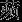

之末，盘口机巧，财报真伪。只有同时做到以上三个层面，才可能化险为夷，臻于化境。在大的层面，你如果总是去关心这样那样的具体事件、具体影响，你会无所适从。在小的层面，如果具体的某个财经事件或报表的盘口语言你都看不懂，那也是菜鸟。在细节技术上没有提高，只执着于满口的投资界的金科玉律和大道理，往往最后要面对的是亏得怀疑人生的情况。技不厌细，技巧方面越细越好，当然这有时会对自己的格局造成负面影响，这是技巧的应有成本。既要能看懂小细节，又要懂得哪些时候该忽略。把大看小，把小看无，把无看有。把所有不同视为相同，然后用相同去演绎万千不同，同而不同。无术之道不如无道，无道之术终究困死于术。

站在术的层次，作为一个操盘手，需要能达到基本上看K线或均线一眼就知行情性质的水平，虽然只是概率性判断。要做到这一点，你就必须啃硬骨头，不要避实就虚，避难就易，没练好基本功就先谈投资大道和投资理念是不可靠的。达·芬奇十几岁的时候去大师那里学画画，结果先画了几年的鸡蛋。最近，我还看到一篇关于达·芬奇画一棵树的故事。画中是一棵看起来普普通通的树，惊人的是达·芬奇为了画这棵树所做的笔记有几十页。笔记里极其详细地记载了这棵树的树干与树枝、树枝与树叶之间的大小比例关系，朝阳和背阴的两面，树皮的颜色深浅差异，树叶的茂密程度，以及风吹树叶时不同位置的树叶及枝条的变形程度，还有树干的高度与第一个枝干应该长出的位置之间的关系，等等。为了画好一幅普通的画，你需要掌握那些细致的生物学知识吗？这取决于你想成为哪一个级别的画家。作为一个操盘手，你还会告诉我大道至简吗？

有些投资者喜欢看那些媒体和网络上所谓的专家和高手的盘面分析，他们说得头头是道，怎么看都是正确的。这是因为如果自己水平不够，根本做不到独立思考，做不到不从众。这样的话，你没有自己的观点，也不具备自己生产观点的能力。我逃过了四年来一轮又一轮的股市大跌，是因为扎实的经济学知识可以帮助我分析大势，而技术分析又可以帮助我看清实际走势，找到关键时间点，同时验证我对基本面的判断。

还有一些投资者一味地不看盘面，也不交易，美其名曰佛性、长期投资或价值投资。他们最大的成本就是不学技术，浪费时间，有术而耐心等待与无术而耐心等待之间有着天壤之别，好比有钱而选择节约和无钱而只有节约一样，一个是主动无为，另一个则是无所作为。

另外，我也不敢苟同个人品行高于专业技能的观点。专业技能真正过关了，才谈得上执行中的品行，知行合一的前提是知，是真正地知，而不是一知半解地知。就我自己而言，我不停地在琢磨财务基本面的各种细节、量价均线、筹码分布、流动性、交易活跃程度、锁筹程度等。我认为把这些搞清楚，再加上一定的风控和良好的心态，才可能基本上稳定盈利。

## 股票投资哲学 - (2) 法无定法，我们都不过是在盲人摸象

\(2\) 法无定法，我们都不过是在盲人摸象

__法无定法，我们都不过是在盲人摸象 __

有些人总能口吐金句，是因为他们从不轻易认同那些别人都认为正确的东西，他们总会反复思考，多维度看问题，不迷恋任何人的结论。学习不是堆积知识和接受观点，自己的大脑不要成为装别人思想的容器。不独立思考的大脑，好比一个点钞员，满手是钱，却没有属于自己的钱。一个人成年以后绝不应该以学习和仰视的态度来看书，而应以包容和过滤的态度来审视书，应该自己书写自己的观点。一个人若到三十岁或四十岁还执着于多看书而不多思考，我认为这个思路本身就有问题。书本知识只是输入自己工厂的原材料，只有自己创造了“增加值”，才能计入自己的“GDP”。

巴菲特和芒格都是喜欢读书的人，但他们与别人的主要区别不在于比别人看书多，而在于懂得如何看书，会独立思考，形成自己的思想。没有哪一个伟人会因为看书多而伟大，他们的伟大之处在于他们自己的思想很伟大。看同样一本书，你比别人看得少，却要想得更多。把一本书从头看到尾不是正确的看书方法。一本书，一位大师，真正重要的不是其具体观点和具体方法。对于任何一个观点，我首先就会想，这是不是一个具体的观点或者结论。如果是，那么我就会进一步想，它在什么情况下才会是正确的，在什么情况下又会变成错误的。我记得有大师说过，如果一开始判断错了，就不要加仓了，摊薄成本是交易员犯的最愚蠢的错误之一。我们要不要相信这个观点呢？在我看来，这是一个具体的结论。在进一步思考并且确认自己真的错了以后，的确不应该加仓，应该立即止损出局。而在另外一些情况下，我们看到价格正处在下跌过程中，量价关系并没有恶化，并且明显地开始有资金介入，最小阻力线的方向发生了变化。那么这个时候，我们要做的就是增加仓位，降低成本，而不是去恪守什么大师的教条。能独立思考又有大格局的人会以全新的角度诊断问题，以非凡的勇气来预见未来，有时候给人的感觉就像他们在吹牛。吹牛好比借债，能实现的人就能借更多的债。吹大牛又能实现等于是增加了自己借大债的信用。

其实除了道家，佛陀也不主张靠经典获得证悟，佛教经典都是后世高人所著，虽博大精深，却从某种意义上违背了佛陀的本意。佛陀要求弟子不要教条化理解自己的任何观点，正所谓若见诸相非相，即见如来。科学技术发展到今天，各行各业的技术都在日新月异。有些古老的理念仍然灿若日月，但绝大部分古老的技术消失得无影无踪，被更好、更新的技术所替代。以前生产某种产品的方法，现在早已经不适用了。

利弗莫尔是一代宗师，号称百年美股第一人，相信他的《股票大作手回忆录》应该是每一个操盘手的案头必备读物。这本书我看过很多遍，深有共鸣，但该书的操盘术部分，我只看过一遍，我也不会把这一部分放在心上，因为具体的方法在博弈的市场会失效。即使是《孙子兵法》这样的千年瑰宝，也只需要记住两句话：一是“兵者，诡道也”；二是“兵无常势，水无常形，能因敌变化而取胜者，谓之神”。后来的三十六计都是具体的，实际上都会被别人用策略来破解。交易和打仗一样，没有一个百战百胜的方法。对于《道德经》，我觉得也只需要记住不超过五句话。一百多年前马列主义传入中国的时候，俄国革命取得成功的时候，一些青年去欧洲留学，学习国外的革命思想。而毛泽东在临行前决定留下来，走到农村去，走到工人中去。去国外的青年收获了先进的理念，而在国内的毛泽东却探索到了更适合中国国情的革命道路，意识到了城市革命的道路在中国行不通。国外的成功经验只是具体条件下的产物，并非放之四海而皆准的绝对真理。

有的真理都只不过是有待证伪的谬误。人类的认知有局限性，人类不可能完全正确地认知世界。作为人，我们不可能做到没有先入之见。我们的一切知识和信仰实际上都是在不断修正先入之见。换句话说，不管是凡夫俗子，还是贤哲巨擘，做的其实都是盲人摸象的事情。区别只是有的只摸到一条腿，有的却摸到了四条腿和身体，这在本质上没有什么区别。承认这一点并不好笑，也不可耻。承认这一点就等于承认法无定法。既然是法无定法，那么我们就不要执迷于大师，不要崇拜。要善于忘记，才能做到无招胜有招。实际上手有万招，见招拆招，变幻无穷。无形融于有形，无形可以理解为无固定模式的执行，万物因势而变，因变而变。无招胜有招不是不出招，而是不拘泥于形式地出招。每种招式都有限制条件，尺有所短，寸有所长，关键是不要颠倒利弊。本书的所有观点也不过是我的井蛙之见，深深地烙上了A股特殊交易环境的印记。随着时空的变迁，我的观点特别是具体层面的观点将不可避免地变得不合时宜。巴菲特的价值投资没有错，利弗莫尔的依最小阻力线顺势而行也没有错，你和我也没有错，错的是在具体情况下选择了错误的具体方法。生态系统里有不同种类的动物，不能说哺乳动物是动物，毛毛虫就不是动物，股票的世界也是一样的，多样化的生态无优劣之分。你不能说巴菲特的方法是投资，而利弗莫尔的方法就是投机，而且轻蔑地说一声投机不可取。

在金庸先生的小说里，独孤求败20岁时使用世俗宝剑，到40岁时则草木竹石皆可为剑，正是不滞于物，法无定法的境界。这当然是小说给我们虚构的一个意境，而在现实世界里，化繁为简的独孤九剑

的境界在各行各业都有。只有顶级的人才可能悟出独孤九剑的境界。譬如梅西就是足球界的风清扬，会各种假动作却从不卖弄花哨，他只会用最符合场上时机的简单动作解决问题，舍弃那些华而不实的假动作。譬如无印良品传递给我们回归自然、闲适、质朴的生活理念，因此它深深地印在了消费者的心中。有些品牌走平民路线，有些品牌走高端路线，两种思路都有赚有亏。在股票交易的世界里，其实没有好股、烂股之分，只有好的操盘手和坏的操盘手之分。有些人在跌破净资产时买入，股价便立即展开反弹，有些人却因此而被深深套牢。有些人在上升通道里亏钱，有些人却在下降通道里赚钱。放量突破有时候是一轮涨势的起点，有时候却是诱多的杀戮。

物理学为了描述微观世界而发明了分子运动速度和分子动能的概念，从微观角度解释了宏观现象。股票交易里的概念也是一样。对于一个操盘手而言，如果仓位、止损、量价、估值等概念牢固地盘踞在你的心里，那就不是“无剑”的状态，“无剑”是眼中看到它们，心中却没有它们。这些概念只是帮助你在战场上拼杀的有形之剑，你心中唯一感受到的除了势以外，应别无一物。《天龙八部》把最厉害的人写成一个扫地的老人，大家对他视而不见，这衬托出了那些名气响当当的人物的无知与可笑。扫地僧不仅用武功震慑了萧远山、慕容博和鸠摩智，更用无边佛法洗去了三个人的执念：他们三个人一个执着于家庭仇恨，一个执着于复国理想，一个执着于武功秘籍，却都走火入魔。

有些人在外人眼里很固执，听不进去别人的意见。其实，开放包容与固执己见应是二律背反，并不矛盾。开放包容就是要容得下各种观点，固执己见就是要过滤各种观点。如果你的观点大概率是正确的，那么为什么不固执一点呢？特别是当你告诉我大师如何做的时候，我怎么会不加分辨地接受呢？在证券交易的世界里，不是你只要做到那些大师反复提倡的价值投资、长期持有、克服人性弱点、逆向思维等人人易懂的大道理就可以做好的。讲大道理的门槛太低了。要做好交易，须兼具数学和哲学的思维，数学可以统计出规律，而哲学可以忘记规律而变异，这同样是二律背反。

要学的是术，要忘掉的也是术，二者一点儿也不矛盾，这就是“为学日益，为道日损”的道理。

2026年2月27日

21:46

## 股票投资哲学 - (3) 顺势而为，须将大钱变成小钱

\(3\) 顺势而为，须将大钱变成小钱

2026年2月27日

21:46

__顺势而为，须将大钱变成小钱 __

前面我们讲了道不外求，也讲了法无定法，一件事是否能成功，落实到更具体的层面，关键是要看是否顺势。几年前，马云曾经说阿里巴巴还是一个创业公司。当时阿里巴巴都已经是在美国上市，市值达几千亿美元的大公司了，为什么还是一个创业公司呢？阿里巴巴联系着千千万万的大中小企业和数十亿消费者，其每天成千上万张订单的资金流、信息流、物流通过淘宝、支付宝、云计算、菜鸟物流来完成。阿里巴巴的使命是什么？是让天下没有难做的生意。当每个国家的政府都在为就业和经济增长绞尽脑汁的时候，当每个生产者和消费者都在享受全球化贸易带来的福利的时候，阿里巴巴就是在顺势而为，顺应时代的呼唤，顺应全球贸易一体化的时代趋势。千亿元级别的资金也只是小资金，千亿美元市值的公司也只是在创业的路上。从这个意义上来讲，阿里巴巴仍是一个创业公司，一点儿也不假。

无论什么事情，顺势才可事半功倍。比如美国废奴运动、欧洲启蒙运动、拉美独立战争，表面上是英雄造时势，实际上是时势造英雄。在物理上，就连小小的电子从一端移动到另一端也要依靠电势差。对于个人而言，顺应自己的天赋和兴趣也是一种顺势。任何级别的资金都要顺势而为。关于顺势有一句非常形象的话：把猪放在风口上，猪也能飞上天。千万元级别的资金，隔几天就在一个小盘股票上进进出出，那是其投资者自己在炒作造势，风险很大。而将千亿元级别的资金投入有数亿人需求的市场中，则要想盈利一点儿也不困难。所谓造势，只不过是在借更大的势，其实质仍是顺势。

要顺势，首先得看懂各个级别的势。顺势的级别和时机很重要。级别不对，资金量可能就不匹配。时机不对，也可能遭遇失败。仅仅是不会识势，看不懂实际走势，就足以令过半的人都陷入亏损。

有些重大的事情，细节却显得粗糙无比，如美国的制宪会议，从形式上来看是有些散乱的会议，有人来来去去，有人迟到早退，也有人吵吵闹闹，他们为了区域利益不停折腾，但这些最终没有掩盖该会议的巨大作用和重大意义。

在诸葛亮与司马懿的较量过程中，诸葛亮除了用人失察导致丢街亭以外，其在每一场具体战役中似乎都胜司马懿一筹。但司马懿审时度势，选择了正确的战略——尽量避而不战，釆用“拖”字诀，无论诸葛亮怎么采用激将法，司马懿就是不应战，在战略上坚守不出战，这才是大智慧。最终，司马懿硬生生地拖垮了劳师远征的诸葛亮。顺势而为的司马懿最终战胜了逆势而为的诸葛亮，可见势多么重要。成都武侯祠里最居中的位置有一副对联：“能攻心则反侧自消，从古知兵非好战；不审势即宽严皆误，后来治蜀要深思。”这算是对诸葛亮逆势用兵打了一个差评。

在单边大势的情况下，面对一波主跌行情，我们不要去做逆势而为的诸葛亮，不要去幻想均线的支撑和若有若无的价值低估，而是要学司马懿重大势而忘小巧。倾泻而出的技术盘、止损盘、强平盘、风控盘、量化自动交易盘，甚至价值盘，都会砸到你手上，为什么不能等一等？在大盘熊市时没有强势股，弱市反弹就好像希腊神话中海妖的歌声，动听得令人沉醉却十分致命。就算你真的买到了强势股，那也更多靠的是运气而不是技术，只是小概率的事情被你撞到了。空仓是弱市里赚钱最快的方法，大止损和小止损都是错误的，甚至止盈而出都是错误的，为以后的亏损埋下祸根。在市场由强转弱时，你没有赚到钱也千万不要不甘心，否则可能面临更严重的损失。这时不是挑战持股耐心的时候，而是挑战空仓耐心的时候。不要在该耐心空仓的时候却选择了耐心持股，耐心要分时机。反过来说，待到时机成熟时，会有一大批好的股票放低姿态，准备与你同行，以各种速度向高处走，或缓行，或奔腾。你就最好多持股，少乱动。在行情震荡时，要敢于高抛低吸。市场像一个随时变化形状的容器，你如果一成不变，那就没法适应所有市场。我们要努力的不是去对抗趋势，而是要不断学习，提高分析市场形状的方法和水平。由于人性的障碍，一个人真的很难在各种市场类型里都做得很出色。

有两种貌似正确，却以自我为中心，不敬畏市场的观点：

守住自己的能力圈是一个比较流行的偏见。即使是股神巴菲特，也因为固守自己的能力圈而错失了互联网时代的一个又一个大牛股。他自己都在访谈中承认他十分后悔。所以，守住能力圈也是需要反思的。为什么不信赖年轻人的创新？为什么不扩大能力圈呢？自己的能力圈重要，还是顺应时代大势重要？

有些人在进行交易时喜欢定一个目标价，不到目标价就一直坚守。这是另一个比较流行的偏见。且不管他是根据基本面分析还是技术分析确定了这个目标价，如果目标价都能实现，那么股票交易还有什么难度？股票价格凭什么要扑向你的目标价？和守住自己的能力圈一样，这也是典型的以自我为中心的交易思想。

还有一种观点貌似尊重市场，实际上其逻辑有问题，那就是预测比顺应市场实际走势更重要。

中国有句古话：“凡事预则立，不预则废。”但是，谁敢说他能预测股市的走向？当然没人能预测股市的走向，牛顿能计算出天体运行的轨迹，却在股市里输得一塌糊涂。毕竟在万有引力公式中，变量只有四个，而且变量之间互不影响。而影响股市的变量有无数个，而且变量之间还相互影响。你怎么去预测？所以，有种说法是行情是走出来的，不能去预测。但是在任何一个时间点，你的买卖永远是在行情走出来之前，是要与后面的行情对赌，已经走出来的行情关你什么事呢？你对后面行情的推理能力和风险控制能力决定了你的长期投资收益。我们是在做推理，推理是一个理智的人该做的事情。其实，我们没必要去纠结预测、分析、推理这三个词之间的文字意义的差别，我们不是搞文字游戏的。如果预测真的是无意义或行不通的，那么大到国家战略，小到项目企划，岂不是都没有意义，因为它们都充满了不可预测性。忽略字面差异，那么在事实发生之前，就是要去推理、去预测，并且用技术分析手段去证伪，而技术分析的核心理念是顺势。预测和计划都属于自我意识的范畴，要做一个有预测又没有预测，有计划又没有计划的交易者。死板地执行计划实质上意味着你处于不知的状态，不知盘面已经发生了意料之外的变化。股市的预测以概率的形式来表示，百分之百正确的预测是不可能的，毕竟它不像数学、物理那样是以确定的公式来推算的。如果把推理和预测看作同义词，那么哪里还有不做预测的投资行为。需要做的只是检验和修正而已。当实际走势偏离自己的预测时就要修正，做忠实于盘面的仆人。这既可以说是预测，也可以说不是，但不是不可知论的观点。谁会在不预测的情况下做决策呢，没有任何人会这样做。只不过每个人做预测的依据不一样，有些是基本面依据，叫作价值投资，有些是技术面依据，叫作技术分析。预测可以是实际走势或实际基本面在时空上的延伸，这不同于随便的、固执的预测，二者之间的连接就是分析和调整。所以把预测和跟随实际走势对立起来是片面的，只选一边站的观点实际只是强调了其中一面，忽略了另一面，因此就走向了错误。很多言论都有类似的错误。推理错了就重新推理！不要去和实际走势争辩。股市走势符合或强于你的预期，你就可以选择持有，否则赶紧放弃。你的分析也许是对的，但实际走势可能恰恰相反，而且在一段时间内会相差很远，就更不用说你的分析可能是错的。实际走势只取决于持有更多筹码或现金的人的实际操作。价值投资和技术分析皆如此，走势取决于那些人的进出。顺从实际走势的前提是你看得懂量价的变化方向。如水一样不争，如水一样善变，以天下之至柔，攻天下之至坚。难不在顺势，难在识势，难在撇去自己的偏见和观点，难在区分每次结果的唯一性和长期结果的概率性之间的差别和抵抗其诱惑。水流会始终沿着最小阻力线前进，而我们却要靠学习和思考才能在黑暗中寻找光明。要随时怀疑自己，怀疑自己的推理出错，怀疑自己已经掉进了市场精心布局的陷阱。当证伪信号到来时，正确的做法是立即放弃自己的观点。如果预测的人不懂得放弃自己的观点，那就真还不如不预测。

势一旦形成，就不可能轻易逆转。大盘走势不容易因为贸易战、货币政策的些许调整和官方的表态等而改变趋势，特别是大级别的趋势。趋势过程中的正反馈或负反馈会一直持续下去。涨跌本身互为因果，相反相成，相生相克，上涨积蓄着下跌的动能，下跌也积蓄着上涨的动能，物极必反。而其他试图解释涨跌的宏观经济、货币政策、制度缺陷、羊群效应、技术趋势等，相对于涨跌本身的因果关系而言，通通都是现象级层面的原因。这些被热议的下跌原因一直存在，市场却未因此而在上涨途中转跌。反之亦然，等到市场下跌，能量充分释放时，这些依然存在的下跌原因也无法阻止市场回升。势分级别，有中级反弹回落之势，有大牛、大熊之势，级别越大的势，越不可逆转。你若是有千亿元级别的资金，当然要选择追随时代大势，不管是在实业方面还是在二级市场上。在交易中，因为知识和信息的不完善，我们不可能每次都及时、准确地知道势形成的原因，我们也根本不需要知道背后的原因，顺势即可。找一个合适的时间播下一粒种子，剩下的就是等待它按照自身规律去生长、去发展，然后到时间就收获，你的一切都是势给予你的恩赐。我们要做的就是选择时机和等待，在等待的过程中什么也不需要做。依势的不同风格和级别，选择等待的时间长度。

顺势而为其实还有一层不太引人注意的含义。顺势包括表面的顺势和表面的逆势两种。当大众都往一个方向投资时，你需要顺势，该从众时就要从众，要借众人之势，同时提防这可能已是旧势之强弩之末，新势即将启程。这时逆势才是真正的顺势。好比大家在一个桌子上吃饭，吃着吃着有人开枪，打死了几个人以后，接着说：他是开玩笑的，请大家继续高高兴兴吃饭。你觉得这饭大家还能一起好好吃下去吗？赶紧跑吧！这只是打一个比方，现实中没有这么多火爆的形势急转，更多的是风起微末。但有几人能一叶落而知秋，又有几人能知行合一？你如果在技术上无法辨认势的方向，仅仅说大多数人的方向就是错的，那么这就是一句废话而已。你怎么知道大多数人就一定是错的？

## 股票投资哲学 - (4) 进退有据，玩的就是权衡和分寸

\(4\) 进退有据，玩的就是权衡和分寸

__进退有据，玩的就是权衡和分寸 __

鱼与熊掌有时候不可兼得，有时候可以兼得，有时候一项也得不到。有时候你可以自己选择，有时候你别无选择。有些选择有对错之分，有些选择无对错之分。

除了加杠杆操作的，股票交易市场上基本不会有别无选择的时候。一切都是你自己的选择，输赢都归于你，你不能以任何理由去怪别人。

通俗地说，交易中的权衡无非是在某个价格买与不买，卖与不卖，如何报价，买卖什么，以及买卖多少。简简单单20个字，学问可就太深了，自然就引申到开仓价、止损盈、盈亏比、交易次数、仓位、持仓时间等基本概念。这也关系到你的投资理念：价值投资还是技术分析，长线还是短线，偏好风险还是厌恶风险，等等。在每一个决策之后，紧接着就是下一个决策。考虑买入后持有多久，在什么价格可以卖出，卖出后等待多久，在什么价格又可以再次买入，如此循环往复。大多数决策也不是做与不做那么简单，而是在做的过程中考虑如何平衡风险与收益、平衡胜率与盈亏比、平衡长线与短线、平衡审慎与激进、平衡坚守与放弃。大多数决策也不能简单地以对错来判定，每一个决策都有相应的财务成本和机会成本，天下没有免费的午餐。不同的交易者在同一时间以相同价位买入相同仓位的股票，不同的卖出决策所导致的结果又不一样。有的可能止盈出局，有的可能赚钱的时候没走，最后止损出局，也有的可能赚了很多钱以后仍然继续持有。有些人知道自己在做权衡，有些人不知道，以为自己在判断对错。某一种级别的买卖决策，在另一个级别看来，对的可能也是错的，错的可能也是对的。离开级别谈对错，就会陷入双重标准和不知对错的尴尬。比如，你依据日内分时而卖出，是正确的，但是依据日线级别看，股价没有涨破或跌破重要位置，也没有需要卖出的量价信号。这时应怎么衡量呢？那就是日内分时卖出是对的，而大一级别的日线却可能是错的。你不太可能同时在两个不同级别找到很好的买卖点。另外，你也不必为另一级别的错误来埋怨自己，因为这是双重标准。至于如何选择一个最适合自己的风格和资金标准，要看自己的具体情况。每一种决策都对应着不同的级别、风险与成本，而且还可能有意外事件，你自己心里要清楚自己在做什么样的选择。

权衡是一种理念，投资更多时候是在多项成本和多项收益之间寻找平衡点，而且是动态平衡，是不断调整的平衡。投资不是简单的选择题，更不是判断题。你全仓买入一只股票，赢了当然很爽，输了难免觉得还是该分散投资；你在大涨时卖出，日后股价下跌后你会觉得自己真是英明，但如果股价继续上涨又会觉得自己太缺乏耐心。如果你知道自己所有的行为都只是在做权衡，明白每一个决策背后可能的对与错、舍与得都不过是在寻找一个稳定的盈利模式，那么就不会有那么多喜怒哀乐了。

我们明白，很多决策其实都是在做权衡。人生的幸福是什么，就是和喜欢的人在一起，包括爱人、朋友和家人等。然而为了能更有质量地在一起，必须牺牲一些时间来学习和工作，否则不能高质量地在一起，这是每个人都要面对的权衡。在生活中我们还要权衡收入与支出，权衡现实与理想，权衡健康与快乐，权衡事业与家庭。为什么一到了股票投资，我们就不知道自己是在做权衡了呢？总是计较单笔交易的盈亏，总是重结果而不重方法和过程，总是在赚少了的时候说应该让利润奔跑，总是在亏多了以后说应该截断亏损。

你在投资股票时，首先不要想你要得到什么，而要想你愿意放弃什么。价值投资的真谛不在于内在价值被低估，而在于放弃。其他方法也一样，只要你懂得权衡和分寸，什么方法都不重要。当面对一个大盘中的反弹时，你愿不愿意放弃？当面对一个一两周级别的反弹时，你愿不愿意放弃？当面对一个概率不大的机会时，你愿不愿意放弃？当面对很大的大盘风险时，针对个股的机会，你愿不愿意放弃？当面对技术风险时，对于业绩还行的股票，你愿不愿意放弃？当面对大级别的回落时，你愿不愿意放弃，是选择守在电脑前做交易，还是选择趁机陪家人一起出去旅游？

2015年8月初，我不看好救市后的行情，又担心在家管不住自己的双手，刚好我的妻子也辞去了前一份工作，希望能放松一下心情，并且孩子正值暑假。于是，我决定和老婆孩子一起自驾去西藏，那一个月的长途旅行真是一段终生难忘的美好回忆。8 月17日，我在自己的微信朋友圈写了这么一段长文：“一觉醒来，还不到五点钟。虽然身在美丽神秘的雅鲁藏布，子弹也没在股市、期市，思绪却习惯性地萦绕在证券市场，可能正是所谓的‘人在市内，心在市外，人在市外，心在市内’。所以我忍不住想发两句。自在“7·27”大跌盘中再次清仓至今，我一直空仓。到8月14日，虽然指数并未收复“7·27”之前的阵地，但其实相当多个股甚至已经超越了4200点的价位，恭喜那些在3600点勇敢抄底的朋友们，你们的勇气获得了回报，而我自己选择了放弃和休息一段时间，我也不觉错误和遗憾，毕竟收获了一次难得的长途旅行。我对救市一直深有忧虑。但在6月底7月初的股市历史性急跌中，广大散户和机构的利益同样被‘血洗’，而且有股市流动性危机演变为信用危机甚至金融危机的可能，所以政府的坚决出手无可指责，救市的弊端可暂时撇在一旁。经过一个半月真金白银的托市和不一定充分的换手，市场站上了20日、30日均线，却还未站上60日、120日均线，而且120日均线逐渐向下拐头和60日均线下穿120日均线都是几个月内的事情，这意味着中线趋势仍然看淡。从短线来看，5日、10日、20日均线逐渐黏合却又黏合不充分，也需要进一步选择方向，而正是此时，政府宣布退出救市，之后市场会怎么发展呢？我想这才是大家最关心的。我个人有些观点，说出来大家可以一起探讨。一直以来，我都认为实体经济和人民币市场才是政府的主要关切点，而股市只是这二者的相关利益点。发展实体经济最重要的是制度创新和改革，落脚到股市，就是扩大股权融资比例，所以推动股市上涨从这个角度来说确实也符合国家战略，但别忘了IPO、再融资等资本市场固有的功能，它们不应该因为救市而长期被耽搁或废止，注册制、做空机制等制度的改革也不会停下。在危机时刻控制一下节奏不意味着要走回头路。实体经济的走弱和利润下降对估值意味着什么我就不多说了。在人民币市场上，贬值对实体经济有利，在这样的局势下，国家的意志我想大家都看到了。我想补充的是，不要相信一次性贬值到位，这样宣传是为了正确引导和管理投资者预期。长期、稳定、缓慢地贬值是大趋势，不是一两年的事情。等贬到实体经济有所恢复为止，人民币国际化和特别提款权（SDR）等最终都要服从和服务于实体经济。决策层已经表明了这一点，并且用实际行动表达了态度。不多说了，还是直白一点，这对于股市在中线不是好事，短线、长线变数太多，都不好说。再回到现实，出于某些弊端和外部压力的考虑，国家在退出救市后，我大胆猜测国家力量可能还会扶持A股一程。从技术分析上看，股市有可能会冲破120日均线至60日均线，这样有利于后市更充分地换手以巩固救市成果，更稳健地回归市场常态，可在120日均线和250日均线之间来回震荡一两个月后再选择方向。但这只是一种可能的猜测，股市也可能向上继续走，但这种可能性非常小，也可能上涨行情立即结束，向下延续未完成的调整之路。”

这就是当时我的权衡，既收获了一次长假，又避开了市场风险。我实际上也推测了国家层面关于股市、汇市、银行和实体经济之间关系的权衡，关于救市利弊的权衡，关于短期目标和长期目标的权衡。几年过去了，实体经济没有多大好转，贬值的压力在更加严峻的现实面前逐渐变成共识。在外汇储备减少上万亿美元以后，贬值不再符合国家利益，汇率的稳定重新成为国家各方利益均衡的诉求。

投资最重要的筹码是时间，时间是创造复利的魔法棒，40岁实现财务自由和50岁实现财务自由的意义并不一样，所以输了时间是最可惜的。即使这样，我们也必须腾出一部分时间成本来做空仓等待，而不是试图抓住每一个波动的机会，大成若缺。

追涨意味着将会面临高位接盘的风险，控制回撤意味着可能失去后面更大的涨幅带来的盈利，硬扛不止损意味着可能面临巨高的风险。强者恒强还是回归平均，上涨加仓还是减仓，在短线买套而中线大概率盈利和短线小概率盈利而中线大概率被套之间如何选择，这些统统没有一个标准答案。

在进退权衡中到底有没有一个量化的依据或者说分寸呢？我个人的体会是依据有两个：一是概率；二是空间。（或者说是胜率和盈亏比，又或者说是概率和赔率。）概率的估算既是一门技术，也是一门艺术，需要日积月累地学习和感悟。估算的准确性取决于你的水平，就像天气预报一样，你预测明天的天气就是凭经验和感觉，而气象台凭的却是更复杂、更科学的气象模型，正确的概率当然比你大。概率还需要你不断地预判、不断地调整，并且要有预判和调整的系统和标准。追不追涨取决于后面涨或跌的概率，止不止损也取决于后面涨或跌的概率，要不要多空反手取决于转势的概率。要一直把自己置于胜算的大概率之中，不到关键位置不出手，到了关键位置要果断，然后用风险控制防止大概率胜算下的小概率意外，只允许发生由小概率事件引起的亏损。在仓位重且大环境也不好的时候，最好偏向于做安全性更高的品种，得之我幸，不能失之在己。没有概率的观念，那么就不知道自己行为的性质，最后只能徒呼一声股市无常。当然股市中的概率是模糊的概率，并且有一些缺陷，在这里我们就不多说了。和概率一样，涨跌空间也取决于估值的横向和纵向比较、宏观因素、大盘环境、均线位置、支撑压力、盘口信号等基本面和技术面的因素。涨跌空间本身也是一个概率分布，不是绝对的。在后面两篇介绍交易理念和交易技术时，我们会很细致地探讨概率和空间，并最终将其落地为一个简单可行的操作系统。以自己的技术、精力、资金、理念、知识而放弃某些机会是最重要的。短线必然不适合大多数人，把自己困在日复一日的波动之中，企图完全利用各种级别的机会，是超出任何人能力的事情。一年之内，在盘整市中抓住三五次次级机会，在上升市中抓住一两次换股或波段机会，足矣。即使长期做短线，一个月的机会一般也只有几次。

在实际操作中，我常常会被一些小级别的信息所欺骗，如盘口、分时、小级别均线的量价。但只要是我认为应该对小级别信息敏感的时候，我仍然会继续这么做。技术性标准细一点好还是粗一点好，应该视位置和股性而异。任何一种策略都要包容一定概率的错误。这是盈亏同源的事情，无法避免。风控就好比交了一笔期权费用，实际上是把犯错的成本锁定。有些股票基本面没什么问题，但缺点是无资金炒作，无板块效应，几个月内甚至一个4%的日涨幅都没有，一个1%的日换手率都没有。买还是不买？买，因为基本面还好；不买，因为不活跃，时间成本太高。所以做与不做无对错，只是一个选择。选择短期可能的机会还是长期可能的机会，都有风险和成本。

因善于放弃而获得，因参透权衡而坦然，交易中便不再有那么多浮躁和迷茫。

2026年2月27日

21:46

## 股票投资哲学 - (5) 众妙之门，同出而异名

\(5\) 众妙之门，同出而异名

2026年2月27日

21:46

__众妙之门，同出而异名 __

本书第一章论述了道与术的关系，强调了道术同源、不可偏废。第二章主要讲了术之法无定法，不要机械盲从成功之术，第三章则定性地阐述了要顺势而为的思想，逐渐把术落到操作层面的理念。第四章进一步接近于量化的分析权衡，至此方引申出股票交易的一系列基本概念。在投资哲学部分的最后一章，我将再次回到第一章论述过的道，结合我对《道德经》的开篇即天地之始的长期思索，再谈如何看待不同的交易理念和技术。我并不希望把本书仅仅定义为投资类书籍，本书也是一本解读道家哲学的通俗读本，就像庖丁解牛一样，讲的是股票交易的故事，蕴含的却是道家思想的哲理。

“道可道，非常道；名可名，非常名。无，名天地之始；有，名万物之母。故常无，欲以观其妙；常有，欲以观其徼。此两者，同出而异名，同谓之玄，玄之又玄，众妙之门。”

此乃《道德经》的道经开篇内容。“道”和“名”、“无”和“有”、“妙”和“徼”，三组不同的词语，实际上表达的是差不多的意思，说的都是词不达意和盲人摸象的两难困局。从认知自定义和概念开始，就已经把万物的统一性破坏了，取而代之的是有边界的具象。

“无”，需要抽象事物的差异性；“有”，则需要保留事物的差异性。观察的目的就是从无到有，从无差异到有差异，没有主观的参与，差异性也就没有意义。站在观察者的角度，如果不能区分苹果和梨的差异，那么确实观察就是无意义的。“徼”的本意就是边界，在应用层面，“徼”的意义甚至大于“妙”，因为我们所接触的、总结的、应用的实际上都是“徼”，而终极意义的“道”则只可意会而不可言传。经总结和归纳出来的“名”“有”“徼”都存在局限性。它们虽然有局限性，然而在具体运用中是有用的。如果没有“名”，没有具体概念，就无从适宜。其实，区分“名”“有”“徼”的概念意在提醒认识和实践的局限性。即使抛开人的认知和实践，任何具体存在的事物本身也都是有缺陷的，否则就不会是一个具体的存在了。领悟可以让人达到“无”的境界，而做却只能达到“有”的境界，这是没有办法的办法。“无”和“有”本身并不是对立的，二者只是同出而异名。没有完美的具体事物，也没有完美的认知和实践。实际上我们能做到的就是妥协和放弃一些东西，放弃对具体事物层面所有真理和规律追求完美的幻想，因为具体事物有边界也有瑕疵，观察本身也是有边界也有瑕疵的行为，我们最多只能无限接近于“无”的境界，无限接近于全部真相，却永远也达不到这个境界。大成若缺和上善若水的思想就源自《道德经》开篇的论述，我的理解就是这样，面面俱到在操作层面是不可行的。

市场的具体特征，不同的风格流派，好比在“徼”的层面，价值分析和技术分析都是盲人摸象摸到的一部分，如果不能包容并蓄，就无法观其妙。当一种规律被总结出来的时候，当一种事物被命名以后，其真理性就已经被局限了，不是普遍适用的了。换句话说，任何归纳都有适用的范围。当我们用“有”和“名”的观念去观察事物时，就已经人为地界定了事物的边界，只能达到表象和有限的层面。要真正领悟“道”，就要在观其“徼”的同时也观其“妙”，一旦形成自己的观念和规律，就已经错了，总结的概念和规律都是具体层面的，需要不断变化才能真正把握真理。在股票交易中，当我们把巴菲特、利弗莫尔、价值投资、技术分析等区分开来的时候，实际上我们就已经处于只观其“徼”的层面，而不是既观其“徼”又观其“妙”的层面。这是不对的，因为万物本身是整体性的，没有边界的，各个部分自然而然就是相互联系的。投资既要把握不同市场、不同股票、不同形态的具体性，如水一样善变，又要领悟它们的统一性。万物既有边界，又无边界，如果投资者都是持股不动的价值投资者，股票也就失去了流动性，二级市场就没有了，股市的生态系统也就不存在了。

当股票投资被划分为价值投资和技术分析时，被划分为投资和投机时，美妙的交易行为就已经被庸俗化了，这个划分真是一个莫大的败笔。你以为你赚的是价值投资的钱，其实你只不过是赚了市场波动的钱而已，相反，你以为你赚的是市场波动的钱，实际上你可能赚的只是价值回归的钱而已。其实，我们根本就无法准确地区分你的盈亏有多少源于价值回归，又有多少源于市场波动。财务报表不过是价值投资者的技术信号，而量价关系不过是技术分析者的技术信号。一切有为法，如梦幻泡影，如露亦如电，应作如是观。

我突然觉得哲学像是一团引诱飞蛾的火。那些聪明绝顶的人认为自己不懂的东西有很多，他们追求真知的欲望超乎常人。他们一旦被哲学博大精深的理论所吸引，就越觉得哲学有意义，可以解脱心灵。而作为普通人，真的需要这些艰深晦涩的东西吗？所有的理论最终似乎不可避免地要归于实用主义，实用主义恐怕是自然竞争和进化的必然选择。那些满足感官的快乐不真实吗？不充实吗？它们也许并不长久，但并不虚无。无须贬低这些快乐，无须区分游客之乐和醉翁之乐。诗画田园，美酒佳肴，亦是快乐之本。我们也无须非要把一个交易行为硬生生地割裂成止损、分仓、金字塔式买入、量价背离等一个个准则、一个个方法，甚至还要划分等级。你只要用心去感知价格，就可以获得交易的真谛和乐趣。仅就交易层面本身而言，跌了不买，跌得无意义，涨了不卖，涨得无意义。

## 股票投资理念

__股票投资理念 __

在第一篇的股票投资哲学部分，我阐明了如何超越投资层面去看投资，避免一叶障目，不见泰山。股票投资哲学蕴藏的道理不仅适用于投资，也适用于生活中的其他事情。在股票投资理念这一篇，我们将讨论股票投资领域里特有的一些理念，主要包括证券四大要素、风险和风控、投资流派、投资变量的权衡和概率等内容。

## 股票投资理念 - (1) 证券四大要素

\(1\) 证券四大要素

2026年2月27日

21:46

__证券四大要素 __

证券的实质是一种收益凭证，包含收益、风险、筹码分布、流动性四大要素。股票的收益和风险不仅源于其所代表企业的经营盈亏，也源于筹码换手和流动过程中的价格波动和供求失衡。任何只看到股票的某个或几个特征的观点都是片面的和危险的，我对证券四大要素的阐述正是为了在盲人摸象过程中摸到大象的更多部位。

__第一节 收益和风险 __

证券的收益有些源于定期定量的现金流，有些源于不确定的现金流，有些是一次性的，有些是永续性的。收益是证券最本质的特征，也是其他三大要素的基础。如果不是为了获得收益，谁会这么操心地去持有这些远远没有现金那么可靠的证券。在没有特别说明时，本书中的证券指的都是股票。股票的魅力就在于不确定的收益。

股票是股份公司所有权的凭证，收益有分红和股价波动两种。分红是没有风险的，大不了不分红，A股上市公司的超低的分红不是本书分析讨论的范围。股价波动产生的收益和风险，伴随着过程中快乐、痛苦、疲惫、兴奋的情绪转化，会让你觉得做其他任何事情都索然无味。

本书的风险划分并不采用传统的风险划分方法，我不准备把风险划分为市场风险、汇率风险、经营者风险、政治风险等类型。我力图站在交易者的角度，按风险源头把风险归为四类，即源于系统和整体的系统性风险、源于对手的博弈风险、源于专业技能的技术风险和源于自己的人性风险，这种划分方法可以让交易者更加清晰地剖析自己和对手的行为。规避系统性风险靠的是认知格局和水平，规避博弈风险需要灵活的思维方式，规避技术风险靠的是专业能力，规避人性风险需要纪律和心性。不同的投资者，面临不同的风险和规避风险的难度。有些人是缺乏专业知识，有些人赌性太重，有些人思维太机械和教条，非专业人士则几乎面临所有的风险。对于还没有在股票市场经历长期洗礼和历练过的人，他不知道系统性风险，也不懂技术风险，人性风险他也没有体会，博弈风险他可能听都没听说过。

系统性风险是只要你身在其中就得承担的风险，而不论是哪种股票投资组合。系统性风险通常是由国际与国内局势、宏观经济、财政和货币政策等方面的重大事件所引发的。系统性风险的主要特征有两个：一是很难通过投资策略来规避；二是发生的频率比较低。就我自身的风格而言，只要我判定大概率地存在系统性风险，我就既不看基本面，也不看技术面，而是选择躲开。看基本面和技术面都是无效的，可以等到风险释放完毕再说。在系统性风险下，技术性卖盘与半价值半技术性卖盘一起涌出，在比价效应的影响下，与流动性的萎缩叠加，绝大部分股票都会同时出现下跌。关于系统性风险的论述在其他地方有很多，在此不再赘述。

博弈风险来自参与股市的各方，特别是你的对手盘针对你的投资行为采取针对性策略来降低你的收益的风险。博弈的参与者形形色色，包括机构投资者、股东、上市公司、游资、散户，甚至还包括监管方。来自监管方的博弈风险有时也被归结为系统性风险。博弈的表现形式包括诱多、洗盘、假突破、做K线图形、对倒、讲故事、题材炒作、选择性信息披露、信息披露时间差、专家分析、媒体宣传等。博弈的本质就是误导、迷惑、麻痹或震慑对手，使对手产生误判。《孙子兵法》就是一部经典的博弈论著作。如果要给股票投资风险的复杂性和多变性来排名，博弈风险绝对当之无愧排第一。索罗斯有句名言：“经济史是一部充满谎言的连续剧，但它铺平了通往巨额财富的道路，你要做的是投入其中，并在真相被公众认知之前退出游戏。”我认为这句话深刻地揭示了投资游戏的本质，不管你在意的是基本面还是技术面，实质上你参与的都只是博弈游戏。一切业绩和题材都只是故事，驱动故事进展的就是人性和利益。鉴于博弈风险的普遍性和多样性，我觉得在这里有必要多费一些笔墨。

这里先讲一个经典的期货故事吧。

维奥莱塔买了五六种报纸，然后挨个儿查找金融培训方面的广告。她把这些广告的地址和电话记下来，挨个儿打过去。维奥莱塔在把所有的电话都打完后很迷惑，因为几乎每家培训中心对她的问询都异常热情，介绍得都很详尽，并且都信誓旦旦地说它完全能让学员在最短的时间里获得进入这个领域并且制胜的法宝，似乎赚钱就是指日可待的事情，如探囊取物一般容易。但只有一家培训中心除外，它的广告在报纸的一个很小的角落，它似乎是某个个人张贴的招生广告。维奥莱塔打电话过去，对方是一个声音粗重的老年男人，从他不是很连贯的语句中可以听出他似乎才睡醒。

“你是想成为期货专家，还是想成为赢家？”对方开口就问维奥莱塔。

维奥莱塔没明白对方的意思，于是问：“这两者有区别吗？”

“当然有！区别就在于前一个是羊，而后一个是狼。”

“不懂！我还是不明白。”

“假如你是想在这个行当混口饭吃，成为一名年薪20万美元的专业人士，那么就做前者。而如果你不是为了找工作，不想挣踢不倒的钱，那么就做后者。”

“什么叫踢不倒的钱？”

“就是那种不稳定的钱，今天可能有，明天或许就没有。也就是说，这种钱不是薪水或者佣金，而完全是靠冒险和赌博得来的钱。”

“哦！是这个意思。”维奥莱塔这次明白了对方话中的含义。她想了想，感觉这个人的语气是另类的，完全不同于其他培训中心的人。她喜欢这种语气，“蓝点”教会她一种能力，就是对异类的嗅觉。

“你现在有多少学生？”维奥莱塔问。

“一个也没有！”

维奥莱塔听了对方这句话吸了一口凉气，她惊讶于对方的坦诚相告。

“你真的一个学生也没有吗？”

“是的！”

“那你能介绍某个你曾培训过的学生，让我了解一下你的能力吗？”

“没有，我从未招到过一个学生。”

“哦！这样啊。”维奥莱塔对这个人的能力打了一个大大的问号，她问道：“冒昧地问一句，你在期货市场做得成功吗？”

“我是一个失败者！”

“既然如此，你如何能让我信服你能让我学到真本领呢？”

“这个我不保证！”

“哦！这样啊，那我还是再考虑一下吧！”

“好吧！你考虑吧，拜拜！”说完对方就挂断了电话。

维奥莱塔放下电话后继续给其他培训中心拨电话，但哪一家都没有这个人那么让她心神不宁。“他太直白了，”维奥莱塔心想，“他完全不是以一个生意人的样子来诱惑我让我去他那里学习。”维奥莱塔在这个人的电话上画了一个圈，然后又开始在房间里踱步。

“我应该如何选择？”维奥莱塔问自己，“是按照常规去那些大的培训中心去学习呢，还是冒险去一个从来不曾带过学生，而且是一个失败者的人那里去学习，这真是一个很难决定的事情。”

整个晚上维奥莱塔都在思索。最后她决定先去大的培训中心看一看，了解情况后再做决定。第二天，维奥莱塔按照地址去了三家大的培训中心。她在每家培训中心那里都受到了热情的接待，它们给了她很多宣传小册子。维奥莱塔回到家后把这些小册子研究了一番，她选定了一家，然后心满意足。她认为自己已经把问题解决了，于是开始动手做晚餐。她吃完饭后看了一会儿电视。可是慢慢地，她的思绪被另一个声音呼唤，那个声音在她脑子里不断萦绕，好像总是在督促她去回忆昨天那个与她通电话的人所说的话。

“难道我的选择是错的吗？”维奥莱塔问自己，“我是否应该用一种非常规的方式来看待事物？”维奥莱塔很烦恼，她一方面被那人捉摸不定的回答所吸引，另一方面又被强大的世俗的惯性所拉扯。她犹豫了很久后决定再打个电话给那个人。

“又是你！”对方听到她的电话后懒洋洋地说。

“是！我说实话吧，我现在拿不定主意是应该跟你学习，还是应该按照正常人的逻辑去听那些正规培训中心的课。”维奥莱塔说。

“如果我是你的话，我就去听正规培训中心的课。”

“为什么？难道你就一点儿也不想给我信心，让我成为你的学生吗？”

“我相信命运，我不会刻意去做别人本不愿意或者不心甘情愿做的事情。”

“假如，”维奥莱塔喘口气说，“假如我做你的学生，你将如何安排对我的授课呢？”

“这我没想好！”

“哦！你难道就没有一个授课大纲或者讲稿什么的？”

“坦诚地说，我没有。”

“那么你将以什么方式给我讲课呢？”

“这个我说不清。”

维奥莱塔的眉头越皱越紧，她甚至怀疑这个人在报纸上刊登广告的目的不是为了招学生挣钱。

“你的授课费是多少？”

“我不知道，你随便给吧。”

“这样！我坦白地说，我现在只有700美元，我必须用这些钱在纽约坚持三个星期。”

“哦！看来你是一个交不起学费的学生。”

“你的意思是说即便我要去也无法付得起你的授课费？”

“我想是这样。”

“假如我帮你做家务呢，你能答应用这种方式交换吗？”

“做家务？”对方沉默了片刻，“我似乎还没有奢侈到请钟点工的地步，但也不是不能接受。你能做什么？”

“我可以为你打扫房间，为你做午餐或者晚餐。”

“我冒昧地问一句，你有工作吗？”对方突然向维奥莱塔提出了一个令她意外的问题。

“没有！”维奥莱塔迅速回答。

“你的收入从哪儿来？你如何支付在纽约的开支？”

“父母每月给我1000美元。”

“哦！是这样——，好吧！反正看样子我也招不到其他学生了。与其就此作罢，还不如收你这个免费的学生。但我每星期只有三天时间给你讲课，而且只能是晚上。”

“为什么？白天不行吗？”

“白天我有其他事情要做。”

“这样！”维奥莱塔想了想，然后用咨询的口气问：“你真如你所说的那样在期货这行当很失败吗？”

“是的，千真万确。”

“如果是这样的话，我就很怀疑你是否能让我有所收获。”

“这个你请自便，我不强求你来听我讲课。”

“你叫什么？”

“杰西·克罗尔。”

“我叫维奥莱塔·蒙蒂利亚。”

“哦！你好，蒙蒂利亚小姐。如果你不介意的话我要睡觉了。”对方打着呵欠用冷淡的口气说。

“哦！那好吧！再见！”维奥莱塔放下电话，凝神静气地想了一阵。她的逆反心理越来越重，尤其是对方对她的这种冷淡态度，更加加重了她的逆反心理。假如对方很热情，这也许会让维奥莱塔立刻打消去拜师学艺的念头，可就因为对方这么冷淡傲慢，维奥莱塔反而有一种拜师的冲动。她又把电话拿起来打了过去。

“请问你明天晚上在家吗？”维奥莱塔问。

“在！”

“我如何找你呢？你的地址是哪里？”

“皇后区某街某号。”

维奥莱塔用笔把地址记了下来。她放下电话后看着地址想了想，然后摇摇头。她心想：“皇后区，这个人一定住在贫民窟里。”维奥莱塔越来越觉得自己热衷于拜这个人为师有点荒唐。

第二天早晨，维奥莱塔又去了另外几家培训中心。之后她在街上早早吃了晚饭，坐地铁前往皇后区。皇后区是纽约穷人住的地方，黑人和有色人种很多，而且治安非常不好。

维奥莱塔在找这个人的住宅上费了些力气，终于在天黑之前找到了那栋公寓楼。这是一栋只有五层的老公寓楼，墙壁都已经残破斑驳。门前大街上到处是垃圾和被偷掉轮子的汽车残骸。维奥莱塔推开公寓楼门，上了三楼。她巡视了一遍，找到了要找的房间，然后按动门铃。之后，她听到里面有人缓慢走动的声音，接着门被打开。在门口出现了一个头发蓬乱且花白，脸上到处都是皱纹的老头。

“是克罗尔先生吗？”维奥莱塔问。

老头上下打量了一下维奥莱塔，然后点点头，他把门开大，让维奥莱塔进去。

“你随便坐吧！”克罗尔先生此时还穿着睡袍，似乎刚起来。

维奥莱塔在客厅一个破旧的沙发上坐下来，环顾四周。她此时有点后悔了，她对自己做出这种鲁莽的决定后悔了。

“东西都在冰箱里，晚饭按照你的心思去做吧！我还要去躺一会儿。你做好了叫我。”克罗尔先生吩咐完立刻进了卧室。

维奥莱塔先是听到克罗尔先生上床的声音，之后没多久就是老头的呼噜声了。

“不可思议。”维奥莱塔心想，“这是一个什么人？连最起码的对客人的礼貌都没有，而且还不怕她是一个贼。唉——，也许他根本就没有把我当学生，而是把我当做他不花钱雇来的用人。”维奥莱塔无可奈何。她把包放在沙发上，走到厨房，打开冰箱。冰箱里被塞得满满的，看来老头很少出门，一次的采购就足以应付两个星期的生活了。维奥莱塔卷起袖子，以最快的速度、最简单的方式做了一顿晚餐。她耐着性子干完，她觉得既然来了，若不见识一下克罗尔先生的本事就离开就太失败了。

晚餐做好后，维奥莱塔敲卧室的门喊克罗尔先生起来。过了一阵，老头揉着惺忪的眼睛出来了。这次他不是穿睡衣，而是换了裤子和衬衣。老头坐到餐桌前，示意维奥莱塔和他一起享用。维奥莱塔摇摇头说：“我来之前吃过晚饭了。”

“哦！”克罗尔先生点点头，然后一个人吃了起来。他一直默默地吃着，并不理会一旁坐着的维奥莱塔，似乎维奥莱塔不存在一样。老头对维奥莱塔的晚餐做得如此简单并不在意。他似乎对生活的要求并不高。克罗尔先生花了半个小时结束了用餐。之后餐具被维奥莱塔收到厨房里。维奥莱塔懒得去再理会那些餐具，她洗完手走了出来。此时克罗尔先生已经回到客厅。他点了支雪茄，呛人的烟雾在客厅里飘散开来。

“坐吧！”克罗尔先生见维奥莱塔来到客厅，于是示意维奥莱塔坐在沙发上。

维奥莱塔坐下来，然后盯着克罗尔先生，她在等对面这个老头给她上第一堂课。

老头望着天花板，嘴里的雪茄抽个不停。两个人谁都不说话，环境十分安静。过了五六分钟，克罗尔先生终于开口了。

“在我开始教授你这种魔鬼的技能以前，你必须了解以下一些事情。”克罗尔先生缓慢地说，“在整个人类历史中，最复杂、最不可预测的就是期货趋势。任何一个职业都比不上这个行当疯狂……”克罗尔先生盯着一面墙，思绪似乎延伸到了无穷远处。

“我在这里不会给你讲期货到底是什么、它有什么用、它是如何产生和发展的这些没用的东西。我要告诉你的是你应该永远不会从其他人嘴里听到的事，也许是你一辈子都不可能领悟到的东西。”克罗尔先生抽了一口烟，停顿了片刻，继续说，“期货，就像一种有生命形态，像孢子生物一样细微而又有活力的东西。人和它的关系就如同你用显微镜看载玻片上的溶剂，你是在用一个高级的世界的目光来看待低级世界。那种低级世界的生命在你眼里就像是一个与外界隔离的花园，你似乎能看清它的一切活动。”克罗尔先生此时像是在自言自语，就当不远处沙发上的维奥莱塔不存在一样。

维奥莱塔静静地听着，在克罗尔先生开始专注于自己的独白后，维奥莱塔就被对方类似神话般的叙述所吸引，她不再去想其他事情，来时的烦躁情绪也消失了。

“这个世界上只有一种东西是永恒不变的，那就是死亡。”克罗尔先生说，“任何一个生命都逃脱不了，而那些有魔力的孢子也一样逃脱不了。观察者一定要清醒地知道那些孢子是另一个世界的生命，是脱离观察者生命的自由存在。所以观察者只能去认识和发现它们，却无法干预和左右它们。也就是说，人永远不能左右那些孢子的活动。当我刚开始步入这个领域的时候，当我最开始作为观察者认识这些孢子的时候，我自信地认为自己能左右大局。但经过与这些孢子40年的交锋，我才明白我左右不了它们。我永远只能是一个观察者，而不是一个控制者。”

克罗尔先生喘了口气，低下头冥想了一阵。然后继续说：“你可能对我的这种叙述感到费解，从而理不出头绪。实际上我的叙述是一种自我意识的表露，很多时候需要你去把握我思想中的火花，那些真知灼见。有些东西我是叙述不准确的，需要你用智慧去破解它。现在我们继续谈孢子吧。”

“一个观察者必须了解自己和孢子之间的相互地位，绝不要试图去做控制者，要永远把自己当做观察者。在这个过程中有三个原则需要注意：第一，孢子是有生命的，是活的。它是能够趋利避害并随着环境的改变和时间的推移而改变形态的，也就是说，孢子不具有稳定的形态，对孢子过去的认识不能预测将来。当观察者了解到孢子的新形态后，孢子同样也了解到它被观察者所认识，于是变异就发生了。孢子一定会趋向于向观察者未知的方向去变异。它具有足够的智慧防止观察者捕捉到它改变形态的规律。所以，对孢子的第一个认识就是它的永恒变异性。第二，孢子具有不可捕捉性。这是什么意思呢？通俗地讲就是不可掌控性。观察者不能单独把一个孢子从众多孢子中分离出来。当你把一个孢子从群体中分离出来后，你会发现其他所有的孢子也都消失了。也就是说，孢子的群体和个体是统一的。孢子无所谓单个，也无所谓多个，孢子是一种既存在又虚无的生命。第三，孢子具有单纯性。孢子就是孢子，它不代表任何事物，任何事物也不代表它。孢子单纯到只遵循一个规律，除这个规律外任何的表象都是虚假的镜像。也就是说孢子反映的是整个世界的本原。不要用复杂的理论去表述孢子，越精细的表述越背离孢子的本质。”

克罗尔先生不管维奥莱塔这个虽然天资聪颖，但知识量并不多的女孩是否能听懂，他继续用几乎魔怪般的语言讲课。这种场景假如被一个不了解真相的人看到，他会以为这是在做某种宗教传道。

“能告诉我孢子遵循的规律是什么吗？”维奥莱塔轻声问。

克罗尔先生转过脸，定定地看着维奥莱塔。片刻后，他问道：“你知道期货市场有名的汉克·卡费罗、贝托·斯坦、迈克·豪斯吗？”

维奥莱塔摇摇头。

“汉克·卡费罗是美国证券史上有名的资深分析师，曾创下连续22个月盈利不亏损的纪录；贝托·斯坦曾是在华尔街创下一单赚取10亿美元纪录的人；而迈克·豪斯则7年雄居华尔街富豪榜第一。”

“哦！”维奥莱塔点点头。

“但你知道他们的结局吗？”

维奥莱塔又摇摇头。

“汉克·卡费罗死时身上只有5美元，贝托·斯坦被几百名愤怒的客户控告诈骗而入狱十年，出狱后一文不名，而迈克·豪斯更惨，他在45岁就破产自杀了。”

“为什么会这样？”

“原因很简单，他们都有一个共同的特点，虽然他们操作成功的概率远远高于众人，但奇怪的是他们99次成功积累的金钱没能经受住一次失败造成的损失。”

“为什么会这样？”

“你要问为什么？道理很简单，因为他们试图去控制孢子。他们都认为自己找到了一个一劳永逸的预测孢子变异的方案。有时间的话你可以去看看汉克·卡费罗曾经写过的一本有关期货理论的书籍，叫作《期货市场黄金技术分析》，这本书很有名，至今都是期货界人士的必读书。到现在为止很多期货精英依然推崇那种最终只能失败而绝不会成功的东西。”

“你的意思是说，他们这些人的失败是源于他们的理论，是这样吗？”

“对！当他们把经验上升到理论的时候，就注定失败了。我曾说过，孢子是一种智能生命，它具有向观察者未知的方向变异的趋势，而且它总是向观察者未知的方向变异。当它意识到观察者看透了它的真相后，它一定会发生变异，从而让观察者总结的理论失效。”

“你的意思是说，如果观察者不把经验上升到理论，那么孢子就不会发生变异，对吗？”

“你说的对！当观察者不试图用规律去解释孢子的时候，那么孢子同样也无法预知自己被观察者认识。也就是说，道在不长高的同时，魔也不会长高；但是在道试图要超过魔的时候，魔必然要长高。”

“那么该如何应对这种状况呢？如果道不能战胜魔，那么如何在这个游戏中成为赢家呢？”

“是啊！如果道不能战胜魔，如何成为赢家呢？你问了一个很好的问题，本质的问题。要我说任何一个从事这个职业的人都有一个特点是一致的。你知道是什么吗？”

“什么？”

“贪婪！”

“贪婪？我想这是人的本性。”

“对！是人的本性。就是因为这是人的本性，所以人总是试图用战胜魔的方式来成为赢家。但实际上成为赢家的简单、有效和唯一的方式只有一种。”

“是什么？”

“失败！”

“不明白！”

“道理很简单，魔不可被战胜，但可以与魔战而失败。要想成为赢家，就要从失败中找规律，而不是从胜利中找规律。”

“我还是不明白。”

“你读过历史吗？”

“读过，很少！”

“你应该知道，历史中很多例证都能证明胜利者往往会很快丧命，而失败者却最终成为赢家。”

“这是为什么？”

“因为失败者会选择变异，而胜利者却仰仗胜利而拒绝改变。这就是本质原因。”

“变异因失败而产生，而非因胜利而产生。是这个意思吗？”维奥莱塔问。

“是！就是这个意思。大到民族、国家，小到单细胞的生命，都是如此。”

“有因失败而最终成不了赢家的吗？”

“当然有，但从概率上来说，赢家一般从失败者中诞生而非胜利者。”

“那么如何将这种观点运用到期货上呢？”

“你只要用最简单的方式去运作就行了。”

“最简单的运作是什么呢？”

“就是用众多小的失败来赢得大的胜利。”

“不明白！”

“我来告诉你吧！这个道理就是用小损失积攒大胜利。用99次损失100美元的方式来换取一次盈利10000美元的机会。”

“这样啊，那我操作100次才可以赚100美元！”

“是啊！看起来100美元很少，但你要知道当你用99次失败来换取一次成功的时候，你几乎是不可超越的。这种方式可以永远持续，直到你成为最终的赢家。当然100次仅仅是一个比喻，在实际中这个数字是不定的，不要拘泥于我的表述形式。”

“我能问个问题吗？”维奥莱塔问。

“问吧！随便问。”

“你说过你不是一个赢家。既然你知道成为赢家的秘诀，为什么你不是赢家呢？”

“对！我为什么不是呢？原因就在于我总想走捷径，不愿意用那么多次失败来换取最后的胜利。我曾坚持过两年，一直是小赔积攒大胜，可当我每一次大胜后，我总是想快速地度过小赔难熬的阶段。后来在我赚了很多钱后，我就天真地以为不通过这种笨拙的方式，而用那些眼花缭乱的分析图表也可以达到目的，其结果是我把以前所有的辛劳全部葬送掉了。”

“我想问你一个问题，假如你现在有100万美元，你会成为赢家吗？”

“我想我已经不可能了，我老了。我不想再去做这种无聊的游戏了。”

“那么假如我有100万美元，你可以指导我如何做吗？”

“我想我也不能。”

“为什么？”

“因为贪婪和欲望，这两个东西会让我送命。”

“哦！明白了。但你作为我的老师是可以的，对吗？”

“是！”

维奥莱塔把克罗尔先生的话重新思考了一遍，感觉克罗尔先生的话的确值得她回去好好研究一番。另外，一个令她疑惑的问题浮现在她脑海里，她问：“克罗尔先生，你为什么在电话里回答我的咨询的时候并不热情，似乎并不在乎我做不做你的学生？”

“我并不缺钱，其实我还有一点存款，足够我养老。我招学生仅仅是想知道世界上是否还有人愿意忍受我这个老头的偏执和傲慢。”

“哦！这样，我就是那个能忍受你偏执和傲慢的学生，对吗？”

“是啊！能选择我而不去选择那些有名的培训中心的人一定在思维方式上与众不同，这是做我学生的首要条件。”

在我看来，这个故事虽然讲的是期货，但同样适用于股票。故事的精华之处有两点：一是市场是存在博弈和变异的；二是止损一定要小。关于第二点是比较考究的，留待以后讨论止损时再来细说。这里暂时只谈谈博弈和变异。

在股票市场，大约每半年到一年，你总结的经验就会失效一次，你的经验就会变成毒药。这就是博弈风险，跟故事里的孢子一样，你的对手会变异。一段时间以来你绞尽脑汁总结的经验现在又变成错误的了，许多非专业和专业的投资者就是这样不断地被自己总结的经验所欺骗的。股市并不是一个纯概率型交易市场，它是一个以博弈为内涵、概率为表象的市场。决定你在这个市场能否赚取收益的不只是你的专业技能，还有你的变异的思维方式。在博弈的世界中唯一不变的就是变，而博弈的本质又从未改变。每一种具体的策略都有被针对的风险，价值投资的针对性策略主要是利用时间和信息披露的猫腻，只要你守得住寂寞，只要对价值本身的判断没错，价值投资可能是博弈风险最小的投资策略。

阴在阳之内，不在阳之对。独立变异辩证的思维是做股票交易最重要的品质，博弈风险无处不在，你要永远怀疑自己是否正处于别人精心布局的陷阱中。接下来，我们来回顾一下世界金融史和中国证券史上的一些经典的博弈风险案例。

讲故事。货币最基本的职能是支付手段，其次是流通手段，这要求充当货币的东西一是本身的币值要稳定，二是数量要足够，不满足这些条件的，统统被历史所淘汰。升值太快意味着可以不劳而获，贬值太快意味着无法储藏价值，更无法流通。比特币的币值极不稳定，而且数量有限，奇怪的是这种稀缺性还被当做优于现有货币的优点来宣传。比特币如果只是作为一个投机品种涨涨跌跌也就罢了，一旦打扮成货币的模样，那就无疑是骗人了。当然，骗人的游戏也可以玩，但千万别当真。

政策博弈导致囚徒困境。2016年元旦后的第一个交易日，A股开始实行熔断制度。原本是控制风险的熔断机制却成了引爆风险的杀器。由于当时无论是估值风险还是流动性风险都远未解除，本来按照市场正常的节奏应该是逐步换手，慢慢下跌。但大家都担心被熔断停盘，就拼命在熔断前抛售，整个市场陷入囚徒困境，你不快点跑的话，别人就跑在前面了。于是市场在4天之内两次熔断，在第二次熔断之前甚至只交易了7分钟，类似于2015年七八月的流动性危机。不同于涨跌停板，跌停的还可以继续交易，而熔断后连成交的机会都没有了。那些未跌停的股票也得被动停盘，甚至红盘的也一样，谁还敢进股市，筹码激增遭遇流动性枯竭。日内做 *T *＋0的和抢反弹的人胆子都越变越小，他们只有一丁点成交量，大盘就暴跌7%而被迫熔断。

媒体宣传。恐怕2007年买入中石油股票的股民对此有切肤之痛。顶着亚洲最赚钱的公司的光环，中石油股票在上市前被媒体宣传得天花乱坠。据统计，2007年至少有174万散户追进了中石油股票，几乎全部被套牢。中石油股票在最高46元时，其市盈率近100倍，市值超过8．4万亿元人民币，按照当时的汇率折合成美元也超过1万亿美元。这是什么概念，即使在2018年，苹果公司的市值尚不足1万亿美元。我们经常惊叹于某些化妆品、皮具等奢侈品品牌的广告有多么精巧、有创意，但与证券市场花样繁多的营销策划和套路相比，只不过是小巫见大巫。毕竟还有什么比证券更有资格号称奢侈品呢！

信息披露。有时候利空利好真的就是利空利好，有时候又是利空出尽是利好、利好出尽是利空。换句话说，在一个信息被披露出来后，股价到底是上涨还是下跌取决于三个因素：一是价格信号是否已经被提前消化；二是大盘环境如何；三是大资金方或持仓者怎么看待这个信息及其具体操作。利空利好和价格涨跌没有一一对应关系。有些靓丽的业绩或者明显的利好事件在被公布出来时，相关股票的股价已经涨了一大波，远远跑赢大盘，这时你还幻想大涨吗？反过来，有些糟糕透顶的业绩或者重大利空事件在被公布出来时，相关股票的股价已经跌无可跌了，这时你还需要恐慌吗？在大盘不是很糟糕，利好或利空信息已出来但又已被消化的情况下，甚至还会出现最后一波拉升和杀跌的动作，以迷惑那些经验欠缺的投资者。当然，也有可能在你还在幻想是不是在洗盘时，市场直接利用利好大幅杀跌出货。如2018年4月，在海南将建成自贸区和自由贸易港的消息出来后，海南板块连续大幅杀跌，与2017年4月雄安新区的题材炒作走出了完全相反的走势。

诱多。在2018年年初，白马蓝筹股迎来了中国证券史上可能是绝无仅有的一次日线级别的疯狂诱多。上证指数在出现11连阳后仅小幅调整一天又迎来了一个7连阳。白马股的投资核心是估值，在这个位置白马股的成长性很难支撑其股价。市场已经用实际走势教育大家要价值投资一年了，该收网了，或者说至少一部分大资金不愿再抱团取暖，三十六计走为上计，抱团取暖瞬间就会演变成互相踩踏。当然，要以很长远的眼光来看，个别的白马股永远稀缺，但可能你的时间更稀缺。

多数谬误和多数正确。博弈的一大特征就是博弈者的行为本身会改变结果。例如多数谬误，当所有司机都认为某一条路不堵车而选择那条路时，就会遭遇堵车。本来正确的个体决策一旦被群体采用，就变成了错误的集体决策。另外也有多数正确的情形，比如单只牛羚过河，河里的鳄鱼一定会杀死这只牛羚。而当成千上万只牛羚一起过河时，错误的个体决策又会变成集体正确的了，个体被捕杀的概率被降到接近于零。金融市场有时的确是博傻游戏和击鼓传花，不一定能说清楚参与者和旁观者到底孰对孰错。早期参与比特币炒作和妖股头两个涨停板的人的确是赚翻了，你能说他们一定是错误和鲁莽的吗？这不好下一个简单的结论。这只能归结为权衡与风格的问题。参与人数的多少决定了逻辑的正反，势在哪一边，哪一边就是正确的，教条式的理论经常遭遇市场失败皆源于此。

政策博弈、多空博弈、多杀多和空杀空，各种博弈风险案例不胜枚举，投资者应在实战中慢慢品味。鉴于篇幅的限制，此处不再多说。

系统性风险和博弈风险都来自交易者外部，而技术风险和人性风险则都来自交易者自身。

技术风险泛指由专业技能缺失导致的风险，如缺乏财务、投资、金融、经济学知识，缺乏技术分析知识等。股票交易最大的风险其实不在于外部，而在于交易者自己，在于交易者自己水平不足、错判行情所造成的技术风险。盈亏同源，源于自己，也源于操作手法，而不源于市场。对于价值投资者来说，看得懂主要是指要看懂内在价值，看懂财务报表和业务模式；对于技术投资者来说，看得懂主要是指要看懂资金进出的信号。仅仅是看得懂这一点，就足以将大多数的投资者挡在盈利的大门之外。无论长、中、短线，重仓还是轻仓，价值还是技术，顺势还是逆势，坚持还是放弃，看得懂是一切行为、一切风格决策的前提。有些人看不懂盘面或企业基本面在发生什么，然后就说要不看或少看，难免有点掩耳盗铃。那些所谓的顺势而为、耐心等待、果断出击、让利润奔跑、截断亏损，其前提条件都是从均线看懂走势，从盘口看懂细微转机，否则永远是说得到、做不到。看得懂只是增加了盈利的可能性，还要看会不会发生小概率的意外事件，该事件会不会是极端情况。

人性风险。看得懂与做得到之间隔着一层人性风险，这层风险有的人花三五年就可突破，有的人花十几年终可突破，而有的人则被困在人性风险中一生。

卡耐基写了一本著名的书，即《人性的弱点》，这本激动人心的励志书自1937年问世以来，总销量达9000万册。可惜，今天我要告诉你的是一个完全相反的冰冷事实，这是我在拥有多年交易经历之后才深刻体会到的道理。那就是在证券市场上，人性没有优点和缺点之分，人性都是缺点。坚定、自信、乐观、耐心、希望、恐惧、贪婪、迟缓，不管是正面的还是负面的，在证券市场只要是你有心理活动，就有一种失败方式送给你。感情这种东西，只适用于人与人之间，不适用于人与股票之间。人性的缺点和优点都可能给你的账户造成深深的伤害。正确的做法只有一个，像机器一样分析，像机器一样执行买进卖出指令。若能做到，就是反人性，就是晴天。如果悟不到这一层，股票买卖就像在抽奖，技术好的只是抽奖的水平高一些，最终不会战胜市场。而悟到了这一层你才会发现，原来反人性的含义是如此残酷、冰冷和具体，不是那么抽象和空洞的含义。从我过往的很多次操作来看，我也从未真正理解反人性在股市中的具体含义，所以当时亏损也不足为怪。思想上和方法论上没有透彻理解反人性，就无法非常具体地将反人性贯彻到一举一动的操作层面。

人天生喜欢往好的方面想，在做错时可能会选择性忽略实际走势，结果浪费的是一去不复返的时间。好多股票交易者喜欢心灵无痛苦的行为，能对亏钱的事实假装视而不见。他们对菜市场的小小决策都要考虑半天，而在股市输赢很大且无把握的情况下却轻率冲动，这就是人性。另一些巨亏的原因，不是其他，而是在错误的价格和错误的仓位上，错误地选择了乐观、坚持和耐心。

一些投资者在2015年上半年会抗拒强势的中小板和创业板股票，2017年又抗拒白马股，他们不一定是从技术上看不出来，而是有心理障碍。前者涨得让人害怕，而后者在普跌行情下的结构性行情难以把握。要在两种市场风格之间自如切换需要一颗机器一样冰冷的心，正常的人几乎都做不到。

谈到风险，人们往往只看到外部的系统性风险和自身的技术风险，却不知道外部还有博弈风险，自身还有人性风险。人性的弱点大家都有所感悟，却不一定能正确认识，人性风险不等同于人性弱点，而博弈风险给人的感觉则是股市充满欺诈。在规避系统性风险的基础上才谈得上规避技术风险，在规避技术风险和博弈风险的基础上，才谈得上规避人性风险。系统性风险实质上是一种特殊的宏观的技术风险，而人性风险实际上是在认知其他风险的基础上能否做到知行合一的风险。技术风险和人性风险的根源在自己，系统性风险和博弈风险的根源在外部，所以要做到知己知彼，就是要同时认知和克服这四大风险。

__第二节 筹码分布 __

筹码（在没有特别说明的情况下，本书中的筹码指的是股票）的本质是获取收益的载体。持有筹码的动机就是通过承担一定的风险而获取收益，其均衡策略就是不断寻找最佳的收益风险比。这种动机和策略会导致筹码不稳定，从而发生换手，换手的过程就是筹码的流动，这又涉及证券的另一要素——流动性。股票交易者最为关心的筹码特征应该是筹码的锁定性，因为这直接决定了筹码供求关系平衡与否，而供求关系又决定着筹码的价格。因此，筹码的锁定性是研究筹码分布的核心。影响筹码锁定性的因素包括：投资动机、预期收益、时间、趋势、突发事件等。

根据持有筹码的投资动机，筹码可划分为价值型筹码和技术型筹码。价值型筹码的投资动机是分享企业成长的红利或等待价值的重估，极端的价值型筹码越多，流通在外的筹码就会越稀缺。如果确定是有强大“护城河”的公司，筹码会不断被价值投资者买入并持有，技术类卖盘可能会越来越少，筹码锁定性在相当大的价格幅度内都很好。例如，贵州茅台股票在股灾期间巨量换手，在150～500元的上涨区间内，卖出的筹码全部被吸纳并保持良好的筹码锁定。对极端的价值型筹码而言，只要没发现公司内在价值变化，股价再跌也选择承受，甚至加仓买入，这些股票的筹码锁定性比较好。而技术型筹码则是为了赚取价格波动中的差价，锁定性差，同时为活跃交易提供了流动性。极端的技术型筹码则把股票当成投机的工具，完全不看基本面，估值高得离谱也视而不见。大部分筹码不是单纯的价值型或技术型，而是兼而有之。每到一个价位，特别是关键价位，总有一些技术性资金进出。在没有明显的技术风险时，价值型筹码一般处于锁定状态，但一旦出现较大级别的趋势逆转或系统性风险，资金很容易大量涌出。总之，价值类买盘与技术类买盘之和，对比价值类卖盘与技术类卖盘之和，谁更厉害，行情就往谁的方向走。

游资的博弈对象包括机构和散户。游资与机构的博弈标的通常是价值型股票，游资和散户的博弈标的通常是题材型股票。游资通常选择拉升题材型股票，是因为机构投资者不会像散户一样去追涨，游资大幅拉升价值型股票只会给自己挖坑。

以价值型筹码为主的股票应该以价值为主要考量，以技术型筹码为主的股票应该以筹码流动为主要考量。在一波下跌过程中，价值盘的下跌通常源于其中的技术型筹码抛售，而在抛售过程中接盘的也必然有一部分是价值型投资者，且接盘后不会在短期内卖出，这就有利于后续筹码的稳定。这表现在走势上，就是价值型股票的长期上行。而技术盘的上涨和下跌通常都是资金推动，在上涨过程中，资金可能在短期内疯狂扫货，一两个星期就可以完成价值型股票一年的涨幅目标。但是在下跌时，这些技术型筹码就可能砸盘或慢慢出货，且接盘的都是投机型资金，这就不利于后续筹码的稳定。这表现在走势上，就是技术型股票的大起大落，或者在一波强劲上涨之后的长期阴跌。在实战中，这给我们两点启示。偏向于价值型的筹码在下跌到估值合理或大盘企稳时，买入并持有即可。偏向于技术型的筹码，筹码就没有那么稳定，不要指望它长期走牛。无论哪种级别的涨幅，技术型筹码都要最终有落袋为安的打算，并且要有更为严格的止损设置。当然，针对少数高度控盘的股票，策略应略有不同，但那也是一把大涨大跌的“双刃剑”。

根据筹码的盈亏，筹码又可划分为获利盘和套牢盘。获利盘或套牢盘的锁定性的大小是股票年化收益率与整体市场平均收益率之比（也可以用无风险收益率替代）的函数，年化收益率偏离平均收益率太多的话会趋向于回归。说通俗点，价格若上涨较快，筹码年化收益率飙升，这时筹码就会趋向于松散，导致筹码供过于求，引起涨速放缓，而涨速放缓又进一步导致筹码松散，二者互相加强，直至年化收益率降至整个市场的平均水平，筹码又重新稳定。如果价格快速下降，则会迅速堆积大量套牢盘，由于回归平均收益率的需求，筹码会趋向于锁定而不是趋向于松散，表现在成交量方面就是缩量，同时卖盘减少。更细致地说，当筹码陷入5%～10%的亏损并且没有回升时，筹码锁定性最差，因为这是大部分技术型筹码的止损点位。如果继续向下，则筹码会趋于锁定。所以，其实上涨放量和下跌缩量本身就是筹码年化收益率回归平均的体现，不一定是什么力量在刻意为之。放量究竟好不好，要看两种买卖力量的对比，实际上是看放量后锁定性的变化，在大多数情况下温和放量最健康。通常，当筹码处于市场整体平均收益率水平时，筹码锁定性最好。当然，我们只是单独考虑了年化收益率对价格的影响，暗含的假设是其他情况比如上市公司的业绩、题材、大盘、价格趋势没有发生预期之外的变化。所以，实际盘面所表现出的筹码锁定性要更加复杂一些。另外，股票市场整体的平均收益率也有回归全球资本市场平均收益率或区域内整体金融市场平均收益率的需求。

筹码持有时间也是影响筹码锁定性的因素。撇开持有动机和盈亏不谈，大部分人都不是极端型持仓者。他们通常的持仓时间就是几个星期到几个月，太长或太短的持仓都会让他们感到不安或难受。这个现象应当是行为或心理现象，几周到几个月也只是我观察到的一个经验值，仅供思考，并没有严谨的统计数据。但筹码锁定性的确与持仓时间有明显的相关性。对于太长或太短的时间，筹码锁定性都会更好。需要注意的是，时间是不断推移的，在任何一个时间点，就总体筹码而言，筹码的持仓时间结构仍然是稳定的。比如在7月1日，有10%的筹码的持仓时间为一周，那么到8月1日，仍然是有10%的筹码持仓时间为一周。所以，持仓时间只是对个体有影响。对某只股票的整体持仓或大盘而言，单个投资者的持仓时间对筹码锁定性的影响就被对冲了，或者说至少没有持仓动机和持仓盈亏的影响那么明显。

筹码持有人数对筹码锁定性的影响也是显而易见的。持有人数越少，户均持股越多，可以简单地看做行为特征一致的人越多，意味着市场结构更接近于垄断，锁筹时锁定性更好，而要抛出筹码时，也会更一致。所以持仓人数对于筹码的锁定性是一把“双刃剑”。筹码过度集中有时会导致囚徒困境，抱团取暖变成争先恐后地逃跑，筹码蜂拥而出，股票因此丧失流动性。就我的经验而言，对于一个流通盘有1亿股的股票来说，如果户均持股为1万股的话，就算是筹码非常集中了，流通盘更大的话则依此类推。

故而，我们可以用筹码的价格结构、动机结构来定性或定量描述及推理股票的锁定性。筹码的锁定性很好的股票，在量价关系上就直接表现为上涨时缩量、平量或很温和地放量。一般来说，大家一致认为成长性好或者明显被低估的价值投资类股票的投资者结构稳定，锁筹性好，甚至价值型筹码越来越多，筹码被进一步锁定。在筹码比较集中的区域，也就是密集成交区，相当比例的筹码具有相似的成本和收益，所以当上涨或下跌到以前的成交密集区时，持仓者或持币者就会发生很多相似的买卖行为，结合趋势的方向就自然形成了支撑和阻力。我再次强调，这里只考虑单纯的筹码因素，不考虑其他如业绩和题材等个体因素。一般而言，筹码分布的结构，无论是动机结构还是价格结构，呈正常的正态分布是最有利于股价稳定的，否则就会出现供求不均衡，价格往某个方向单边波动的概率就会变大。筹码的聚散犹如弦函数或钟摆，聚和散到了一定程度就会反向变化。

以上单纯分析了筹码的结构。在实际操作中，我们应该把这些当做一个整体来考虑，而不是割裂地看问题，价值投资者也有技术性买卖，只是可能不会依据短期均线操作，而是依据长期均线或业绩而做出技术性买卖动作。

在某个价位待的时间越长，越不利于多头。为什么久盘必跌，背后的逻辑就是持股者是有时间成本和机会成本的，而空头可以在货币市场获得无风险收益。时间可以打败多头，而不是空头打败多头。只要慢慢等待，增量资金不入场，多头最终会溃败。比如股指在3000点的位置箱体震荡了近3年，实际上空方没有什么子弹继续打压，但由于显然还不具备大量资金进场的条件，沪指最终于2018年6月中下旬在多杀多的局面下快速跌破了3000点。

__第三节 流动性 __

流动性描述了在单位时间内股票承受一定的成交额所需要变动的价格幅度，更直观一点说，就是描述了买卖盘口每一个价位的挂单所能吸纳的金额。筹码分布从一种价格状态到另一种价格状态的变迁难易程度就是流动性。

比如，同样在10元的价位，买一个有1000手的挂单和一个只有100手的挂单，其筹码的厚度显然是不一样的。价格变动一个价位，前者可吸纳100万元资金，而后者只能吸纳10万元资金。单位时间的限定很重要，如果给予足够长的时间，理论上一定幅度的价格变动可以吸纳无限大的交易额。

不同于筹码分布主要考虑筹码供给方的锁定性，流动性侧重于考虑买方的需求因素，即买方的厚度。虽然流动性的定义是买卖两个方向的筹码厚度，但实际上站在交易者的角度，主要是考虑买盘厚度。毕竟，股票与现金相比，大家仍然会偏好现金，现金才是流动性之王，现金没有流动性的问题，获得现金也是股票交易的最终动机。当风险厌恶增多时，就会出现流动性丧失。筹码锁定性可以被视为股票的供给弹性，而流动性则是股票的需求弹性，它们的自变量都是价格。

影响流动性的第一个因素显然是流通盘的大小，流通盘的大小好比水池的大小，水池越大，流进流出一定数量的水引起的水面高度的变化就越小。不同级别的资金在建仓时都会考虑相应流通盘的规模，除非你能判定股票有足够的上升空间，可以让你忽略平仓对价格的冲击。

影响流动性的第二个因素是投资动机，这一点跟影响筹码分布的因素是一样的。价值投资者不会投资没有业绩也没有成长空间的股票。因此，纯讲故事的股票流动性一般比较差。不过任何事物都有两面性，有些业绩好但是盘子太大或者没有故事，也就缺少了技术投资者，其流动性也不一定很好。而另一些股票，虽然基本面不好，但是有可炒作性，炒作资金也足够维持其流动性。只是经过一番炒作之后，这类股票可能连技术投资者都没有了，就会陷入长期的成交量极小、缓慢阴跌的状态。

影响流动性的第三个因素是预期收益。在现金被置换成股票以前，不存在套牢或盈利的问题，但存在预期收益的问题，预期收益为正可以增加流动性，预期收益为负会降低流动性。同筹码锁定性一样，流动性也受预期收益的影响。预期收益主要取决于三个因素：业绩增长、趋势和涨跌速度。这三个因素刚好也会对筹码锁定性产生影响，换句话说，这三个因素影响了股票的供求双方，从而对价格产生影响。具体如表6\-1所示：

表6\-1 影响筹码锁定性和流动性的因素分析

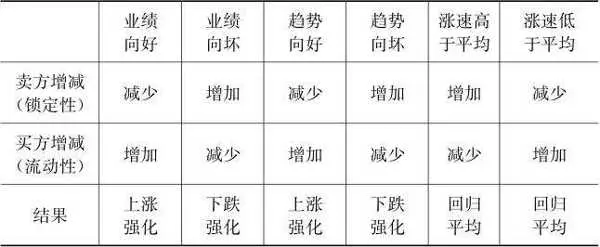

需要说明的是，表6\-1的对应关系只是大概率事件，不是绝对事件。趋势和涨速也没有严格的区分，趋势更强调中长期的走势，而涨速则倾向于强调短线的强弱。从表6\-1我们可以看出，交易中流动性的丧失主要源于业绩恶化、趋势恶化和涨速过快，另外还有就是前面提到的技术性投机者比重过大。

股票正常的流动速度意味着风险和收益在筹码之间接近于平均分配，或者至少有一个健康的分配结构。现金和股票都有足够的时间以合理的代价互换，否则会迅速积累获利盘或套牢盘。获利盘快速增加带来潜在的风险，而套牢盘快速增加则带来现实的风险。

假设有100个股东，每人持有1个筹码，筹码价格为10元，市值共计1000元。在流动性丧失的情况下，假如在一天时间内有10个股东直接砸出了10个筹码，筹码价格从10元变为1元，简单假设成交价全部是1元，则没有卖出筹码的90个股东承担了全部810元市值的损失，平均亏损9元，而卖出的10个股东亏损90元，平均亏损也是9元，所有股东平均亏损9元，共损失900元。另一种没有丧失流动性的情况是，筹码价格每天下跌1元，每天换手5个，用9天的时间价格同样跌至1元，则提供了45个筹码的流动性。以最简单的模型阐述，全部按当天最低价卖出，那么第1天卖出的5个股东损失5元，第2天卖出的5个股东损失10元，第9天卖出的5个股东损失45元，那么他们损失的市值也就是225元，而倒霉的第1天的5个接盘侠损失40元，第2天的接盘侠损失35元，第9天的接盘侠损失5元，接盘侠共计损失市值180元。一直扛到1元的还有55个股东，他们共损失市值495元。15个股东相加损失的市值仍然是900元。但是在第2种情况下，卖出的股东平均损失5元，接盘侠平均损失4元，而硬扛到底没有换手的55个股东平均损失9元，总体平均损失是6．2元。所以，跌得越快，越没有流动性，就越集中了风险，反之则分摊了风险，接盘侠分摊了平均损失。往更深一层思考的话，如果有质押贷款的股东由于丧失流动性而被套牢，那么质押贷款就会出现风险，风险就从股市传递到了银行，而银行是金融系统的核心。至此，我们就不难理解在2015年的股灾中政府所处的两难困境了，救市无非就是增加流动性，缓解当时的流动性枯竭，延缓股市下跌的速度。而救市的结果无疑是政府来充当接盘侠，分摊市值损失。从社会公平层面看，收益和损失被两部分极端的人群占据，赚的赚很多跑了，亏的亏很多被深深套牢，既不利于宏观经济福利的帕累托改进，也不利于扩大消费基数，更不利于社会稳定和谐。

当时这个救市的策略就是现货托盘，期货套保，高抛低吸，引导充分换手，以时间换空间，逐渐由市场接手，市场自动出清。从实际走势看，股指在2015年7月中旬到8月中旬以3700点为核心震荡了一个月，一波急跌后又以3300点为核心震荡了2个月，随后又是一波急跌，以3000点为核心震荡了超过两年的时间。根据前面的分析，流动性主要取决于流通盘大小、投资者动机、业绩、趋势和涨速，当然在我国还有一些特殊的国情。救市时增持的主要是一些盘子大小合理、相对或绝对有投资价值、业绩稳定，以及股灾前涨幅落后的股票，特别是国有企业的筹码，几乎没有增持那些投机性技术盘占了大部分筹码的股票。只要控制下跌的速度，让筹码在某一个相对狭窄的区间和较长的时间内完成尽可能多的换手，救市的使命其实就算完成了。

在股指以3000点为核心震荡的三年时间里，抄底资金、救市资金、做T资金，还有杠杆盘和上市公司的自救资金，都为维持流动性，保持筹码正常的流动速度贡献了一分力量，但终究属于抵抗趋势的性质，在各个板块之间来回迅速切换而不敢恋战。2017年7月和2018年3月，周期类股票和科技类股票有较明显的增量资金介入，但一两个月后便又湮灭在下跌趋势之中。其他板块似乎连短暂的资金入场的迹象都没有。

需要补充的是，技术性的买盘和卖盘对维护正常的流动性是不可或缺的，只有价值型投资者的市场将如死水一般寂静。有的交易所或市场还专门引入了做市商制度，就是为了保持流动性。做市商制度的实质就是庄家制度，是做市商自己对倒，自己买入又自己卖出。简单地将技术型筹码视为是邪恶的有失偏颇，正是它们的不断买卖为市场注入了交易的活力。

收益、风险、筹码分布、流动性一起构成了证券的四大要素。收益和风险如同硬币的两面，如影随形。筹码分布和流动性则刻画了证券在二级市场换手的轨迹以及换手时的供求关系，而换手过程中筹码的价格和交易量则构成了技术分析的基础信号。这些基础信号消化并反映了证券供求关系背后的一切信息，交易者可以利用价格和成交量的信号来追踪和预测股价的变动趋势，从而获取收益。根据证券所有者获取收益的动机不同，股票投资被划分为价值投资和技术分析两大流派，价值投资侧重于关注股票的内在价值，技术分析则侧重于关注由股价波动性带来的盈利机会。

## 股票投资理念 - (2) 价值投资和技术分析

\(2\) 价值投资和技术分析

2026年2月27日

21:46

__价值投资和技术分析 __

价值投资的理论依据是股票是企业股权凭证，股票价值代表的是企业的价值，股票价格应当围绕价值波动。根据经典的财务理论，企业是一个通过整合生产要素来创造产出的经济组织。企业价值等于未来预期现金流的贴现值，股票价值只是被切割成份额的企业价值而已。在股票的现金流贴现估值模型中，股票的内在价值取决于三个因素：各年份的净现金流、必要收益率和净现金流增长率。根据不同的严谨程度和视角，净现金流又可替换为经营性净现金流、自由现金流、股利、净利润，再根据增长率的假设分为一般模型、零增长模型、不变增长模型和可变增长模型。不管怎么替换，股票估值的实质都并未改变。

（1）一般模型：

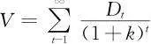

其中， *V *为股票内在价值， *D t *为当期股利， *k *为投资者要求的必要收益率或资本成本， *t *为时间。这个公式是股票内在价值的一般公式，它将每一期的股利都按照一定的贴现率贴现成现值，然后全部加总。

（2）零增长模型（即股利增长率为0，未来各期股利按固定数额发放）：

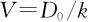

其中， *D *0 为基期股利， *k *为投资者要求的必要收益率。

（3）不变增长模型（即股利按照固定的增长率 *g *增长）：

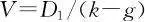

其中， *D *1 为基期后一期的股利， *k *为投资者要求的必要收益率， *g *为股利增长率。

（4）可变增长模型：二段增长模型、三段增长模型和多段增长模型。

二段增长模型假设在第一时间段内红利按照增长率 *g *1 增长，在第一时间段以后按照增长率 *g *2 增长。

三段增长模型也是类似的，不过多假设一个时间段，增加一个增长率 *g *3 。

多段增长模型依此类推。

对股票内在价值的理论值与市场价格进行对比，就可以判断股价被高估还是低估，从而做出买入、卖出或持有的决策。在估值模型中，必要收益率一般可以用无风险收益率＋风险收益率得出，甚至直接以无风险收益率或资金成本替代，不管怎样都还算有比较客观的参照基准或是事实上的成本。基期或基期后一期的股利也是比较清晰的。所有变量中股利增长率是最不可确定的变量，股利增长率越高，分子就越小，内在价值就越大，股利增长率主要取决于企业的成长能力，股利无增长的股票价格理论上应该待在原地不动，等价于永续债券。

V＝ *D *1 ／（ *k *－ *g *）可以变形为 *V *＝ *D *1 ×［1／（ *k *－ *g *）］，其中［1／（ *k *－ *g *）］可被视为 *D *1 的倍数，把 *D *1 替代为净利润，则该方法就变成我们最常用的市盈率估值法了。毕竟，股利取决于公司的财务政策和现金情况，最终来源于净利润。市盈率倍数实际上也取决于净利润增长率，增长率越高，根据公式可以赋予更高的市盈率倍数。

与价值投资逻辑不同，技术分析以股票市场过去和现在的市场行为为研究对象，其理论基于三个基本假设：市场价格涵盖一切信息；价格按趋势移动；历史会重演。第一个假设是整个技术分析理论的逻辑基础。其主要思想是任何一个影响股票价格的因素，不管是内在价值还是外部因素，心理情绪还是政策引导，都会影响股票的供求关系，进而影响价格。第二个假设是技术分析最核心和最具实践意义的假设，如果价格不按趋势移动，那么它消化一切信息也指导不了实际操作。对第三个假设的争议是最大的，特别是如果机械地理解历史会重演更会谬以千里，股市最大的历史重演是人性的逻辑，不管市场怎么改变，人性一直在重演，不管历史事件怎么不同，历史的逻辑从未改变。历史只不过是把明天要发生的事情放在昨天彩排了一遍，在金融市场上，每隔几年、十几年，就会换一批演员重新翻拍差不多一样的剧情。

作为股票交易者，不要纠结价值投资和技术分析究竟谁对谁错，而应考虑如何各取所长。我们以下的分析力图依靠回答两个问题来逼近真相：价值和价格究竟谁更加难以确定？二者的假设依据在逻辑上究竟谁更加严密？在回答这两个问题的基础上，厘清两种理念的差异和各自面临的风险，权衡其在实操中的利弊。

__第一节 价值和价格究竟谁更加难以确定 __

价值决定于公司盈利的增长能力，确定价值的难度等同于确定公司增长能力的难度。不仅如此，对交易者而言，确定价值的难度还取决于你的信息处理能力。影响公司盈利增长的因素太多，影响交易者对公司盈利能力判断的因素也太多。不同的投资者，确定价值的难度不一样。

对周期类公司而言，宏观经济周期处于扩张期还是收缩期基本可以决定企业未来十年的盈利能力，在以投资拉动经济增长的国内宏观环境下尤其如此。周期类公司的产品通常是工业品，下游客户以企业居多。周期类公司包括以下领域的企业：钢铁、煤炭、有色金属、化工、电力、物流和金融等。房地产公司虽然是周期类公司，但住宅需求大部分是个人的需求，算是一个例外。周期类公司的产品结构往往很单一，各公司产品的同质性强，规模效应和地理位置带来的成本优势非常关键。周期类产品的需求基本上没有什么价格弹性，消费者在需要时即使价格飙升也不会减少需求，在不需要时即使价格跌到白菜价也不会增加需求。确定周期类公司价值的难度在于投资者对经济周期要有先见之明，对某些具体行业的供求状况还要经常保持关注。

就消费品公司而言，公司的市场定位和品牌形象对于毛利率至关重要。大多数消费品的市场结构是垄断竞争型，几个领导品牌占据大部分市场份额，数量众多的其他地方品牌或不知名的品牌陪跑。消费品公司的核心资产和护城河不是生产线，也不是记录在资产负债表上的显性资产，而是品牌资产，是根植于消费者大脑中的正面情感，包括快乐、健康、美丽、安全、高档和耐用等。谁不愿意为这些愉悦的情感支付溢价呢？当然，某些消费品还有一定的科技含量，不同于科技公司，消费品公司的科技含量主要用于维护和稳固品牌形象，通常并非真正的高科技。确定消费品公司的品牌价值没有什么难度，茅台、格力的品牌资产价值不需要任何专业知识和市场调研就知道，这也是消费品白马股成为长期价值投资者和防守型投资的首选品种的原因，中外投资者皆如此。比如巴菲特最喜欢那些业务简单、清晰的公司的股票，例如可口可乐、吉利和迪士尼等。

就科技类公司而言，持续的研发投入和技术领先优势就是其生命线，技术壁垒建立起来的垄断优势可以为公司赚取高达80%～90%的毛利。然而，更好的技术替代品一旦出现，则该类公司可能在一夜之间被推向绝境，消费者对科技类产品可谈不上什么忠诚度。机构投资者对于科技类公司价值的研究有绝对的优势。而普通个人投资者中恐怕没有几个人对上市公司产品的科技含量有专业的分辨能力，更多的是凭感觉，严谨一些的个人投资者最多也只能做到多看几篇分析报告。科技类公司的这种行业特征决定了其大起大落的生命周期和大起大落的股价，其中的少数公司可以成为创造百倍、千倍涨幅的大牛股。在A股的特殊投资环境下，科技类股票和并购重组类股票是并列的两大炒作题材，这两类股票是贩卖梦想的最佳剧本，也是最昂贵的剧本。个别医药类公司可以同时归属于消费品公司和科技类公司，这是由产品的消费品特征和科技含量决定的。因此，个别医药类公司兼具长期投资、防守和科技几重炒作题材，比如恒瑞医药这种15年涨幅达数百倍的大牛股。

以上仅仅简明扼要地勾勒了几大主要类别的上市公司，其他如商业、环保、农林牧渔、传媒娱乐等行业，此处不再一一罗列。因为即使专门写一本书，也难以细致完整地尽情表达。我们的主要结论在于，公司的盈利能力，尤其是盈利的增长潜力，是很难被准确预测的。经济周期、市场竞争、技术革新、意外事件、管理团队，任何一项都能给公司价值造成难以捉摸的影响。股神巴菲特对此的体会恐怕极为深刻，不然他怎么会如此强调守住自己的能力圈。巴菲特经典的投资成功就是投资消费品公司和躲过2001年的纳斯达克泡沫破灭，而其最大的遗憾当属错过了互联网时代的大牛股。这是多么生动的盈亏同源和价值无常的故事啊！

除了站在行业分类的角度看公司盈利的增长，我们还可以换一个角度来观察。既然公司价值决定于公司的成长性，那么哪些公司具有成长的可能，实现成长的模式是什么，这是价值投资者最应该思考的问题。成长可分为总需求成长型、产品替代成长型和模式复制成长型。而且，我认为从成长原因的角度来寻找成长型公司，可以部分绕开缺乏专业知识的障碍，是更适合普通投资者的思路。

总需求成长型指的是蛋糕本身在不断长大，公司只需要分一杯羹即能随之成长。比如最近20年伴随着中国浩浩荡荡的城市化进程的房地产，从作为身份和地位的象征到进入寻常百姓家的汽车，伴随着不可逆转的老龄化社会发展的老年医疗保健类产品，以及已经纳入官员考核指标体系的环境保护，这些都可以制造一批大牛股。

产品替代成长型是指随着收入的增长或者技术的革新诞生了新的消费需求。比如消费升级的品牌食品、旅行和娱乐，比如技术替代的新能源和新材料。产品替代成长型可被视为总需求成长型的特例。

模式复制成长型是指公司的销售通路以复制的形式突破区域限制而迅速扩张，典型的如连锁经营、品牌和管理输出、互联网时代的新零售。连锁经营的典范当属国美、苏宁、爱尔眼科、永辉超市等，品牌和管理输出的典型如酒店管理公司、阿迪达斯和耐克等。新零售目前还没有经典案例可循，但我相信具有扩张基因的新零售将来一定会诞生超级明星。

除了这三种内生式增长以外，还有一种外延式的靠并购来增长的情形，这种增长大多数时候并不被价值投资者看好，但这无法阻止其成为疯狂炒作股价的由头，不只是A股，成熟市场也一样。

我们已经考察了准确判断企业价值的客观障碍和投资者自身能力的主观障碍，或者说考察了股票价值投资的技术风险。价值投资者从不提倡把系统性风险和人性风险纳入考量范围。依据前面的论述，价值投资者需要面对博弈风险，它会严重干扰投资者的价值判断。当你看到高高在上的股价还算配得上十分耀眼的业绩数据，拿着放大镜也找不出所谓的高估值时，你可能已经掉入了博弈的陷阱。当你以为高盈利还会继续时，明年甚至下一季的财报就会让你大跌眼镜，更不要说连专业人士也难以发现的关联交易、虚假交易和灵活合规的财务政策安排。一大盘获利筹码夹杂在利好消息中等着高价卖给你。我必须指出，拉长时间看，价值投资是最能规避博弈风险的方法，博弈风险甚至也可能是价格上下波动的原因，所以价值投资者可以选择忽略或承受。随着A股投资者结构的机构化，价值投资的比例增大是大势所趋，所以价格和价值的相关性显著增强也是大势所趋。

技术分析通过分析隐藏在价格和成交量之中的资金进出信息来推理下一步价格变动的方向。价格变动的方向无非有趋势延伸和趋势转换两种，而不论其级别。依据技术分析确定价格走势的难度有两个：一是价格走势有两种方向，要么延伸，要么转换，就像在猜谜语；二是以不同的级别来观察，得出的价格趋势结论可能不一致。这不同于内在价值和价格那种长期而言的强相关性甚至是确定的关系。

技术分析的逻辑假设基础是价格消化一切信息，这无疑是一个天才的假设。比如某天某持股者花了一天的时间来慢慢卖出，导致该股票当天下跌3%。股价的确及时准确地反映了这个信息。由于下跌3%刚好是你的止损位，于是你止损了。不幸的是，当天下跌3%只是一个偶然事件，并非一个持续事件或大事件。这正是技术分析的弊端，它反映的信息可能是暂时的、次要的信息，但它确实反映了。我无法判断市场下跌消化的究竟是什么信息，是一次性信息还是持续性信息，波动是不是由随机因素造成的。价格消化一切信息并不等于交易者可以理解和把握一切信息。像这种情况，你只能继续观察，如果发现企稳了，说明卖盘力量消失了，如果没企稳，说明卖压还没有释放完毕。但是观察等待总得有一个限度。如果要忽略那些次要信息，需要看更大级别的均线，但更大级别的均线需要极大耐心，以及付出可能反转的代价。于是你就这样陷入了困境：是反复止损呢，还是以更大级别的均线来防守？价值投资刚好回避了这个问题，它把财务价值以外的因素都视为偶然和随机的因素，而关注股票是否具备资金持续流入的逻辑。它认为只要财务价值被低估，就会有持续、稳定且长期的资金流入，直至财务价值被高估。

有些人喜欢在股价上涨后去寻找上涨的理由来解释为什么上涨，第二天或等一段时间股价下跌了又去寻找下跌的理由来解释为什么下跌。我认为，如果你的职业是证券分析师，那么即使是寻找牵强的理由，那也是你应该做的，你得对得起这份薪水！但如果你不是证券分析师，那就最好不要每天操这个心了。技术分析认为不必追究股价涨跌背后的原因，你只管追随趋势即可。但问题是不同级别的趋势可能是同向的，也可能是反向的。这时候你就得根据股票的价位和成交量做更细致的分析。技术面所呈现的量价信息，不仅包含了基本面的微观和宏观信息，还包含了投资者的情绪甚至刻意的误导。市场上有各种偶然和随机事件，大部分的偶然的和随机的资金流动也都可以互相对冲，特别是大盘，随机因素相对较少。所以，虽然技术分析有其固有的缺陷，但这不应当成为你拒绝它的理由。中短线的强势股不可能靠基本面分析来寻找，持续10年的大牛股同样不能靠技术分析来寻找。

不管怎样，通过技术分析来推理股票价格的后期变动方向，正确率达到60%～70%就已经是非常好的结果了。技术分析需要一定的交易频率来体现概率优势，而价值投资只需要紧盯内在价值这个唯一的标杆。我们无法量化确定企业内在价值和股票价格的难度，但可以肯定的是，如果价值投资者出现判断错误，其支付的代价将远远超过技术分析者的止损操作。而技术分析者如果不把正确的概率提高到60%以上的话，不断地止损也会慢慢消耗掉你的本金。

价值的影响因素很多，价格的影响因素更多，单纯就确定价值和价格的难度来说，无疑是确定价格更难。但技术分析为我们另辟蹊径，就是不去分析影响价格的原因，只需要顺应价格变动的趋势。识别主要趋势并在关键时刻发现趋势反转的信号是一门可以提高的技术，而非猴子扔飞镖。说实话，基本面分析中的财务分析和一些具体行业的业务分析不是普通个人投资者有能力做好的，而通过学习、思考，个人投资者可以掌握技术分析的精髓。

虽然价值投资往往选择蓝筹股并长期持有，但请不要把蓝筹和长期当做价值投资的标配。价值是未来现金流的贴现，而未来是靠眼光的。没有成长性的股票等于没有未来，某些风险投资将资金投到充满想象力的科技公司，正是看重未来。不能将之简单粗暴地归类于题材炒作，否则你无法理解早期的风投和创投。只是从风险和概率的角度看，需要十分谨慎。传统行业的蓝筹始终不是未来，业绩和真正的成长才更有吸引力，把握成长股与题材股的区别很关键。题材股不能被简单排除在价值投资之外，因为它是可变现金流增长模型的代表。长期投资也并非必须持股三五年或以上，除了管理基金的职业投资者，其他类型的中小投资者一般不会只做长线投资。

__第二节 价值投资和技术分析的逻辑假设基础之比较 __

价值投资的逻辑是价值决定价格，价格围绕价值波动，价值等于未来预期现金流的贴现值，这里的价值其实仅仅指的是股票的内在价值或者叫作财务价值。技术分析的逻辑是供求关系决定价格，一切影响供求关系的因素已经反映到价格之中，包括企业内在价值因素。价值投资是站在财务的角度，以股东的立场来看待企业能为股东创造多少利润。而技术分析是站在经济学的角度，以交易的立场，视股票为通过价格来调节供求的稀缺筹码，在收集和派发的循环中套取价差，而不去区分价值和价格。价格究竟是由价值决定的还是由供求关系决定的，我倾向于后者。供求关系包括财务价值对价格的影响，也包括筹码价值对价格的影响，甚至包括情绪等人们根本无从得知的因素对价格的影响。价值投资为财务报表使用者和企业所有者的投资决策服务，而经济学的价格理论服务于更多动机类型投资者的选择行为。在整个经济学理论框架中都没有出现过价值这个概念，有的只是价格、成本（当然经济学的成本与财会学的成本不完全一样）和收益概念，最接近于价值而又比价值含义更广泛的概念可能就是效用。

技术分析的第一个假设是价格消化一切信息，这个假设不仅涵盖了股票所代表企业资产的收益性，还考虑了资本利得的收益性，考虑了股票的四大风险，以及刻画股票供求关系的筹码分布和流动性。价值投资理念不关注股票的系统性风险、博弈风险和人性风险，也不关注股票的筹码分布和流动性，但这并不代表这些因素不存在，不会影响股票的价格。可见，技术分析并不排斥股票的财务价值或者说不排斥价值投资，反而价值投资会排斥技术分析。价值投资者是按照已知的一部分信息在交易，而技术分析者是按照所有的信息在交易。在我看来，技术分析的基础逻辑全面涵盖了股票的四大要素，对市场理解的广度和深度都远远超过价值投资所立足的财务视角，颇有“诸因及与缘，从此生世间”和“存在即合理”的哲学高度。有些人可能会说，决定因素和影响因素是有区别的，价值是决定因素，是长期的高度正相关因素。这个说法其实不一定站得住脚，是不是决定因素其实是没有什么严密的逻辑的，只能说是长期而言高度正相关。统计学意义上没有决定这个说法，要么是百分之百的确定函数，要么是统计概率。当一个市场的大部分投资者认同财务价值是影响价格的权重最大的自变量时，这个市场或者说这只股票才会真的向财务价值靠拢。如果在三五年或者更长时间之内，大部分投资者都不认同财务价值对价格的高权重影响，那么价格将会长时间由其他因素左右。毕竟，价格是由供求关系直接决定的，供求关系里面包含财务价值、预期、情绪、资金等所有因素。所以任何有价格的东西都是量价反映了一切信息。经常有人批判技术分析中的均线只是价格和成交量的记录仪，而记录仪本身是无法解释其背后的原因和逻辑的。其实这只是技术分析给人造成的流于表面的错觉。不去关注或解释背后的原因恰恰是技术分析的精髓和魅力所在，量价记录才是最真实、最忠实的信号，分析和解释则容易被欺，也容易自欺。很多时候，你所寻找的解释只是为了安抚心里的不安。况且，看多的因素和看空的因素往往同时存在，到底价格会偏向哪一边，取决于是谁在看多、看空，行情的走势在有些时候不取决于真理在哪一边，而取决于钱和筹码在哪一边。技术分析不关注涨跌的原因，坦承交易者信息和知识的不充分和不完备，体现了对博弈风险和情绪化人性风险的尊重。

财务价值决定价格，价格围绕价值波动，这隐含了一个假设，即价值低估或高估要么终将被市场发现，要么市场上的大部分投资者或者大资金的投资者都认为股票价格应当由财务价值决定。如果不是这样，在供求法则下，价格将长久或永久不会回归财务价值这个中枢。从筹码的角度看，价值投资者实际上是在赌如果我先买入，后知后觉者或认同价值投资的大资金总有一天会发现价值被低估，而被先入者锁定筹码后股票会变得更稀缺，股价就会向正常估值回归。从更长时间来看，价值投资者最终下注的是公司经营者的能力和客户对公司的持续认同，以及在此基础上财务数据会继续沿原来的方向延伸，实质上仍然是趋势延伸的假设，与技术分析没有区别。好公司难道不会因为各种原因变差，坏公司难道不会因为各种原因变好吗？价值投资者一定会先于技术投资者发现这些变化，而技术投资者一定会拒绝和忽视这些基本面的变化吗？其实，这些都难以证明谁比谁更高明。等待价值被低估的股票被资金雄厚的金主发现的时间，就是价值投资者需要付出的时间成本。在等待发现的过程中，先入者最好祈祷不要发生基本面的逆转。3～5年时间足以改变一个公司的基本面，足以重塑行业格局。除了管理别人的钱的基金经理，有几个扛得住3～5年，而且保证是对的？价值投资是一种专业的技术活，拼的是对公司价值的分析水平。2018年4月26日，格力电器罕见地以跌停价开盘，最终收跌－8．97%。如果我是一个拿工资的分析师，我会说当天格力下跌的原因是它宣布不分红，或者说投资者不看好格力用账上现金去搞多元化战略。但真实的原因究竟是什么，其实没有人能证明。估值方法有时难免存在情绪化和风险偏好的随意性。做价值投资的人总是说，当价格远低于内在价值时，就是买点，当价格远高于内在价值时，就是卖点。这句话有点像当股价见底时就买进，当股价见顶时就卖出。逻辑上没问题。当价格远低于价值时，不是应当见底了吗？什么是远低于呢，5倍市盈率、10倍市盈率还是15倍市盈率？中间相差好几倍呢！另外，价值投资者看到业绩增长而买进，看到业绩下滑而卖出，这何尝不是另外一种形式的追涨杀跌呢？毕竟预先准确判断业绩的增长也是一件很困难的事情。

技术分析的第二个假设是价格按趋势移动。这个假设的逻辑也没有什么问题，其实是第一个假设的延伸。因为影响价格的因素通常不是瞬间就消失了，而是会持续一段时间。越是深层的因素，持续时间就越长，越是偶然单一的因素，持续时间就越短。时间的长短体现在走势上就形成趋势。但在实际操作中，由于某些影响价格的短期因素实在太过混乱和单一，所以价格变动的趋势可能只是分钟、小时或日线级别的，很难持续到具有操作价值的级别。单边移动的因素一旦减弱或消失，价格就会反向波动。这种级别的趋势在一般情况下都需要被过滤掉。但具体哪种级别的趋势可以被过滤，哪种级别又该引起重视，取决于股价的位置、股价与财务价值的对比、成交量、股性和你的资金量等因素，具体内容本书在后面再详谈。技术投资者博取的是某一级别趋势的延伸或反转，是如水随形、无根无极，不去追寻价格波动的任何依据，只是随波逐流，抛却一切主观的判定和分析，感知最小阻力线的方向。股市里多的是平庸的公司和机会，波动大多是技术性的资金进出，那些一直能缩量上涨的是真正的稀缺筹码，这一点在技术上会体现得很明显。技术分析消化一切信息和价格按趋势移动是非常深刻的论断，包容和舍弃哪个级别的波动取决于自己的选择偏好和把握能力，而没有对错之分。另外，趋势显然不是一成不变的，不论什么级别，当某个引发趋势的因素突然消失或弱化时，趋势就会逐渐或瞬间反转。这一点足以给人造成技术分析不可靠的印象，因为没人能全面掌握和理解一切信息。作为一个交易者，如果因此而轻易否定技术分析，个人觉得是因小失大，毕竟趋势的反转或新趋势的形成也是价格消化一切信息的表现。无论你秉持哪种投资理念，你都不可能及时掌握和理解一切信息，既然如此，你有什么理由去不假思索地否定瑕不掩瑜的技术分析呢？

技术分析不追问涨跌原因，是因为很多时候你的确无法及时知道真实的原因，或者知道原因需要太多时间成本，你只需要按照实际走势行事。公司价值的大小仅仅是依靠有限的知识、方法和信息做出的判断，每个人的判断都不一样。而量价即使作假，也是客观的、可测量的。如果技术分析是不可靠的，那么为什么价值分析是可靠的？价值分析所涉及的变量和信息披露也都充满了不确定性。

资金的进出是影响股票价格的直接原因，大资金的进出本身会影响K线均线的形态，你不可能追着自己的影子去寻找身体运动的方向。资金量越大，就越不应该去关注小级别的技术图形，这是顺势而为的思想。另外，像那些数10亿元级别的资金量，它们实际上做的并非一般投资者的证券二级市场投资，它们做的是股权投资。既然是股权投资，那就无所谓筹码分布和流动性，股权并不具备证券四大要素的显著特征。股权投资者会寻找更大级别的技术机会，或者干脆不关心技术面，而只考虑影响长期价格权重最大的那一部分因素，即股票的价值。这不是有对错之分，而是取舍不同。资金量越大，越难以通过技术性手法去长期跑赢指数。

技术分析的第三个假设是历史会重演，这个假设意味着过去的走势是可以借鉴的。虽然任何一个事件都不可能原封不动地重复，但某些走势或事件的确会在新的条件下重现。这样的新和那样的旧再次组合时，重演就不会是绝对的。那些影响股价的主要因素，比如股价的位置、估值、筹码分布、盘子大小、宏观环境等，在相似程度比较大时，或者说当在相似走势下其他因素也比较相似时，历史重演的可能性当然就更大。所以，只要你在观察相似走势时再考虑一下其他具体条件的异同，那么犯刻舟求剑错误的概率当然就会小一些。

__第三节 在实战中如何平衡价值投资和技术分析 __

在实战中应当尽量从财务和筹码两种动机出发去理解和参与市场，单纯而固执的偏见得到的结果只能是多一分风险、少一分收益。

价值投资者多掌握一些技术分析的要领，对于判定异常的大中级别的反转至少是非常有用的。你可以问一问那些崇尚价值投资的机构投资者的交易员是怎么做的，在他们买入和卖出的下单过程中充满了技术性的手法。价值投资的理念是资产没有好坏，价格有好坏。技术投资的理念是价格没有好坏，操盘手有好坏。价值投资者所能达到的最高境界是“重剑无锋，大巧不工”。而技术投资者所能达到的最高境界是“草木竹石，皆可为剑”，无剑胜有剑。优秀的技术型操盘手会将影响价格的一切风险和收益因素统统纳入自己的操作系统，就像自由搏击一样，能因敌变化而制胜。我无意贬低价值投资，但它确实不是能赚钱的唯一方法，也不是最好的、最赚钱的方法，价值投资者也不应当否定其他方法。当然我再次重申，价值投资是唯一难以被策略性手段针对的方法。有人说，只有价值投资才能真正穿越牛熊市。其实真相是没有人能穿越牛熊市，下跌幅度是否小于平均跌幅取决于筹码的锁定程度。深谙技术投资的人可以在应对熊市方面比价值投资者做得更好，虽然多数价值投资者不承认这一点。

中国的投资者结构不太适合价值投资，至少过去是这样，以后肯定会好一些。我可以这么说，优秀的技术投资者在任何类型的市场（有做空机制或对冲机制更好）中都可以挣钱，价值投资者则不一定。正如我们前面所说，技术分析并不排斥价值投资。碰到估值偏高的市场，价值投资者只能不做，而技术投资高手则可能坚持到最好的时候出来。市场的走势取决于大多数资金的态度和风格。如果某只股票甚至整个市场的参与者大多是技术投资者，价值投资者恐怕也只能顺应。不然在这样的市场环境里，你就不做了吗？价值投资者最大的问题是不会变形。如果没有价值低估或相对低估，价值投资者只能休息等待。这种等待可能长达数年，甚至需要等待的是股灾级别的机会，这样才有足够的理由去建立仓位。但是，客观地说，今后的资金结构、监管风向、做空机制会越来越不适合某些炒作的方法，倒是会越来越适合价值投资。投资者应当逐渐侧重于做价值投资，因为要顺势而为，不能凭主观偏好。成熟市场也有炒作，但是市场是博弈的，以机构为主的资金结构有各种各样的投资限制，价值投资增加或者说价值投资的比例增大是各方博弈的均衡结果，价值投资方法也是唯一没有长期博弈风险的策略。可以预见，以后那些无厘头的炒作会逐渐减少，但绝不会消失。

如果只看基本面，或者说在某些基本面信息被披露出来之前，你无法理解或无法提前理解永安药业、安洁科技、广汽集团从2017年下半年到2018年6月期间的深幅下跌，但是如果看技术面，它们就有太明显的弱势了。它们的基本面可能有什么重大隐患或者增长不持续，这些我们根本无从得知。50%以上的下跌恐怕不是常人能承受的。如果价值投资者连续碰到两次这样的下跌，不知会做何感想？这种幅度的下跌可能源于企业自身的原因，也可能是系统性风险压力下的补跌。但无论是什么原因，大跌都已经发生。价值分析不考虑大盘趋势，不考虑系统性风险，唯一关注的就是公司的微观基本面，这样真的好吗？技术面恶化的信号只要几天时间就会显现，而基本面恶化的信号可能要几个月甚至超过一年才能显现。经济和金融分析用于发现宏观基本面的拐点，财务分析用于发现微观基本面的拐点，而技术分析用于及早发现供求关系的拐点，并在后期印证基本面的拐点信息。等真跌到只剩一半股价的时候，你再说基本面的确恶化了，或者两三年后还会涨回去，还有何意义？价值投资者面临一个显而易见的艰难选择，如果在高位获利甚多，又发现业绩会转差，当然可以卖出，在低位发现业绩转好，也容易决策，难的是在低位发现业绩转差，在高位发现业绩转好。

我虽然偏好技术分析，却也不会被它迷住双眼，技术分析只是用来发现资金的流向，而对于资金为什么流向那里，需要寻找更加宏观和微观的原因，倘若你有能力分析出资金流向的驱动因素，就会先于技术分析预测到接下来可能的实际走势。技术分析为什么一定要拒绝基本面分析呢？比起消化一切因素，你如果能够通过自己的信息处理能力先于实际走势来推理，岂不是锦上添花？若非我有比较扎实的宏观经济学功底，而且总是从大局的高度和博弈的角度看问题，恐怕也会被一次又一次见底的声音所忽悠，所以分析基本面的专业能力也非常重要，可以提前推理未发生的和背后发生的事情，而K线只是去证实或证伪基本面分析。股票的实际走势取决于掌握大资金的一方的逻辑。如果刚好你也在这一方，那么你的分析就不会有什么风险，但是当你的逻辑是在弱势的一方时，你的分析就会与实际走势相反。这个时候技术分析就可以帮助我们尽量规避这种风险，按照实际走势去决策。

不要把自己框定为价值派或技术派，以技术手法做一些有价值或者至少价值不离谱的股票，鱼与熊掌兼得，岂不美哉！基本面和技术面共同指向买入是最好的结果。价值分析控制基本面的大风险，技术分析追踪中短线的技术性收益和风险。毕竟除了内在价值以外，影响价格和风险的还有技术性资金的进出。即使是夏天也有暴雨倾盆、气温陡降的时候，即使是冬天也有温暖的时候。如果你能磨炼出识别无常天气的火眼金睛，为什么不躲避暴雨和享受冬日暖阳呢，为什么非要去承受不好的结果？努力学习技术的逻辑依据是技术面比基本面更丰富，技术面已经包含了基本面。

K线、均线、量价记录了资金博弈的轨迹，凡是巨量迅速上涨的，几乎都是题材股，由技术性买盘推动，这种买盘本来就是炒作，一旦不强了，资金就会立即走，这类股票没有价值类买盘参与，而且一旦不强了，技术类和原有的价值类卖盘都会涌出。价值投资者用基本面的理由来驳斥技术面机会，根本分歧就在于立场和逻辑不同，技术投资者根本没把自己当股东，只是赚取价差波动所带来的收益而已。我们为什么不可以用技术面的手法来做风控、来等待，同时也用基本面的手法来规避或者淘汰一些技术面还可以的股票？多懂一些基本面的知识，就会帮你多建一层基本面的防火墙，多懂一些技术面的知识，就会帮你多建一层技术面的防火墙。技术分析的长处是快，短处是结论会因级别而不一致。价值投资是拼时间、等待价值重估，无论胜率还是盈亏比都容易出现极端情况。用基本面的逻辑推理，用技术面的实际走势证伪，才是中小资金的正确投资思路。

价值投资舍弃一切技术上的技巧，直指内在价值与价格的强相关性，也是一种大智慧。价值投资尽量不让自己惶恐于各种风险，承受的最大风险是错误估计了公司价值所带来的风险。但风险是否真的减小了，实在难以给出定论。经常有价值投资者在大牛市没有走在非常好的位置。当然他们已经属于顶尖级别的高手，追求的是吃鱼的中段。技术投资者坚持到最好的时候卖出也不是毫无代价，很多时候甚至看起来很愚蠢。而我不会简单地认为谁更聪明。如果你以为价值投资除了具有价值误判的风险，唯一考验的就是耐心，那就大错特错了。巴菲特和林奇这两个最优秀的价值投资者都是美国人，已经说明了价值投资的局限性。他们识别价值被低估的能力最专业吗？他们的人性优点最突出吗？其他国家没有坚守价值投资理念的伟大投资者吗？都不是，他们成功的一个很大原因是最好的价值投资土壤在美国，最好的时间段是第二次世界大战之后。虽然我很尊敬两位价值投资大师，但是我还是要不好意思地指出，若他们生在其他国家，处于第二次世界大战之前，他们可能不会有这样的成就。就像鲸鱼对河里的鱼谈论为什么它可以长这么大，它吃的是什么食物一样，其实它是顺势和环境的产物。

根据市盈率15倍或者10倍以下就算价值低估的标准买进，然后一直持有，等待上涨。股票投资就这么简单？是的，有人靠这个挣钱，但是也有人因此亏得一塌糊涂。价值投资的风险之一是戴维斯双击，如果一只股票的估值是20倍的市盈率，在某些情况下，就算涨到30～40倍，它也是低于平均估值的，有估值优势，但是在某些市场情况下，它也会跌到10倍市盈率的估值。如果你不幸在40倍的时候买入，你确定能够持有到10倍市盈率的时候吗？戴维斯双击能把股价从高于理论估值1倍压低到理论估值的一半，你觉得你能做到在这个过程中不怀疑自己的判断吗？不顾股市的牛熊周期而买入股票，巨亏的不只是芸芸散户和普通机构，就连格雷厄姆和费雪这样的价值投资大师也都曾在股灾中品尝了破产的滋味。

价值投资理念只不过是有关价值投资最肤浅的层面，你所需支付的代价就是花几十元钱买一本没有专业难度的鸡汤类书籍。这种事情一般是菜鸟级别的人干的，这种人人都能支付的代价真是太小了，怎么可能是价值投资的精华，偏偏大家却把它错当成最深的层面。价值投资的中间层面或者说核心层面是价值投资的专业知识和技巧，包括宏观经济、金融与财务等知识，以及某一行业的专业知识，你所需的代价是花5～10年时间去学习和钻研。这种事情一般是基金经理等专业人士干的，很多专业人士的分析功力不一定比股神差。这些人是价值投资生态里的骨干力量，能做好已经是万里挑一了。价值投资的最高层面是在第一层面和第二层面的基础上，坚定从容，舍弃浮华，大巧不工地放弃和包容很多东西，这一点是反人性的，能做到的人万中无一。你所需的代价是用一生去坚守价值投资理念，如此方可成为价值投资的领袖，但是能否成功还得依赖于大环境的保佑。和技术分析所强调的顺势一样，放弃人性，才是最高境界。

## 股票投资理念 - (3) 风险控制

\(3\) 风险控制

2026年2月27日

21:46

__风险控制 __

__第一节 系统性风险控制——当所有人都恐惧时，你真的该贪婪吗 __

控制系统性风险的办法只有减少或清空仓位，或者通过股指期货来对冲，否则就只能承受。对于大部分体量的资金而言，不与大盘对抗，不与次级及以上的趋势对抗，等于承认自己的能力有限，顺势而为，这很重要。当所有人都恐惧时，你凭什么贪婪呢？据说有一种所谓的聪明的资金称为北上资金，它们很善于在遍地哀号中寻找宝贝。其实，我们只需要关心资金的进出以及进出的级别，至于是聪明的资金还是碌碌无为的资金并不重要，市场本身比任何投资者都要聪明。承认甚至羡慕聪明的资金的存在，只是失败的心理阴影而已。事实证明，北上资金也未能阻止大盘跌破3000点继续寻底。

系统性风险无处不在、无时不在，真正“杀人”的时候很少，但一“杀”就是一大片。造成系统性风险的原因有很多，但归根结底还是要到证券的四大要素中去寻找答案。风险与收益对应的主要是估值高低和获利盘多少，筹码锁定性对应的是投资者的动机和交易趋势，而流动性对应的是货币政策和累计成交额。

2015年6月29日，在历经半个月沪指暴跌1100点的过程后，A股全体股票中位数市盈率是142倍，其中上证A股是104倍，深圳主板是169倍，中小板是136倍，创业板是191倍。就我自己观察的结果，创业板的小股票在2013—2015年两年间涨幅高达10倍的比比皆是。获利盘太多、太丰厚就是最大的利空，涨跌互为因果。从筹码锁定性来看，5月发生过几次盘中放量、巨幅震荡，并且在6月上旬时，已经有1／5～1／4的股票开始步入下行通道。这些都表明在估值泡沫、获利盘的打击下筹码已经开始松动，趋势逐渐有逆转的迹象。最后，从流动性来看，从2014年7月大盘正式开启本轮牛市至2015年6月，沪市的累计成交额已经达到当年货币供应量M2的80%。这个比值是我从以往几轮牛市中观察统计出的一个经验值，基本反映了是否还有增量资金可以杀入股市。一旦达到80%，就意味着整体而言，市场后续流动性已达极限，没有足够的资金再来推动股价上涨。君不见，股神遍地飞，人人省吃俭用入股市时，就是后续资金枯竭时。巧合的是，打击配资的强行去杠杆政策进一步把流动性推向了绝境。筹码松动遭遇流动性枯竭的结果就是杠杆盘不计后果地轮番强平。

股票市场是资本市场和金融市场的子系统，更是国民经济和全球市场的子系统。我们仅仅从股市的整体估值来评估股市的四大风险，实际上类似于价值投资者仅仅从财务价值角度来评价股票的所有风险。股市的估值风险仅仅取决于股价和公司业绩的对比，而股市整体的筹码锁定性和流动性则深受美国的货币政策和人民币汇率的影响。如果你坚定地看好一个公司的长期价值，是否规避你能预见的系统性风险取决于你自己的权衡，无所谓对错。一旦大势已定，资金越大越不可能改变计划，趋势会不断加强，而改变趋势需要极大量能或者很长时间，而极大量能意味着需要有更大资金去勇敢吸纳，这几乎是不可能完成的任务。所以，当别人恐惧时，你应该贪婪，这实际上是一个需要极高研判水平的超高难度动作，你的能力配得上把这句话挂在嘴边吗？

__第二节 博弈风险控制——要永远在自信和怀疑之间摇摆 __

博弈风险的根源在于思维和行为的定势被对手利用，规避博弈风险的方法是多站在对手的立场反复揣摩。市场的方向取决于手握重金的人的逻辑，而不是你的逻辑。

由于博弈风险的存在，股市里没有哪条具体经验之谈的正确率超过60%。如果有超过60%正确率的方法，就意味着只用一招就稳定盈利了，显然这是不可能的。博弈的特征之一就是即使自己站在正确的方向上，也总会不断地冒出干扰性走势。我们平时有切实体会的一买就跌、一卖就涨，就是博弈风险的典型写照。除非小概率的特别行情，资金稍微大一点儿的都不要一次性买入，至少要分若干次买入，就算不考虑判断错误的风险，也要考虑博弈风险，资金越大，你的对手盘就越多，那么博弈风险也就越大。市场是很聪明的，你吃进的单子越大，以后就越不容易拉升，反而会砸盘，反之亦然，这就是市场的变异性。

诱多、洗盘、假突破、做K线图形、对倒、讲故事、题材炒作、选择性信息披露、信息披露时间差、专家分析、媒体宣传，任何博弈手法都有一个共同点，那就是兵不厌诈、以假乱真。你做出判断所依据的信息可能是被精心设计的，先入为主地相信自己的分析有多么精明是非常危险的。近一年来，每次上证50股指的标的股有大量买入，我们都习惯性认为是国家队在护盘，真的是这样吗？难道就不可能是空方在为打穿3000点、打到底部收集最重要的炮弹吗？在2015年的救市期间，国家队的确买入了大量上证50股指的标的股，2017年股指全年几乎每次跌到3000点这个关键点位时都会止跌。反反复复的剧情重演使投资者形成了思维定式，误以为3000点牢不可破。我思考的结果是在3000点时仍然不具备吸引大资金建仓的条件。既然这样，那么对最有话语权的那一部分人而言，最大的利益不是股市上涨，而是下跌到更便宜的位置。是不是感觉很不合常理却又很合乎逻辑？这就是打破常规的思维方式。

独立思考，双向思维，保持怀疑，保持敬畏，在自信和怀疑之间摇摆，定期重审自己的观点，时时提防市场里的诱导性言辞，这些都是控制博弈风险的重要原则。其中，独立思考和双向思维不仅是一种思维方式和习惯，也是一项技术能力。我买过一本书——《僧侣与哲学家》。在看这本书的时候我才发现如果才智不足，很难做到真正独立思考，思路总被书中二人牵着走。佛法在与各路哲学的碰撞争辩中丝毫不落下风，里面的辩论真是太精彩了，脑洞大开。股票市场充满了欺诈，各种题材、故事甚至价值都会成为被人利用的工具，价值投资者沦为炮灰的案例以往年年有，今年特别多。你要做的就是分清楚哪些时候相信这些故事，跟着一起吃香喝辣，哪些时候不相信这些故事，要赶紧跑。要做好下苦功夫的准备，否则永远只能是看别人的分析，跟着别人的尾灯走，结果就会被带到坑里。为什么长期而言，能够超越指数表现的投资业绩少之又少？一个重要的原因就是投资者需要为应对博弈风险和其他风险支付一定的成本，比如止损和仓位管理，而我们在计算指数的涨幅时却会忽略这些，只是看它从头到尾涨了多少。

2017年是白马股、蓝筹股扬眉吐气的一年，我并不认为这是价值投资长期跑赢其他投资风格的证据。这一年的各种情况太特殊了，几乎没有可复制性，在今后比较长的一段时间内不大可能再现这种抱团取暖的情况。不过即使如此，普通投资者的正道应该还是价值投资，因为从长期来看，博弈风险很小，系统性风险可以选择性承受。只要选择自己了解的行业的股票或业务模式简单易懂的股票，估值合理，就可以较好地规避技术风险和博弈风险。

针对对手盘进行洗脑，讲一整套逻辑和理论，使其形成某些定型思维，比如牛市、熊市、资产重组、高送转等，可在管理好别人的大脑后再展开“杀戮”。在A股市场，个人投资者要比机构投资者更精明才不会被宰割。这几年的股市是20年来最复杂的博弈，股市成了多空博弈、存量博弈、内外博弈、虚实博弈、政治博弈、大国博弈的棋盘之一。股市只是金融系统的一部分，你把股市当做你的全部，而国家层面的决策者还需要考虑更多领域的博弈。在救市期间，一些投机资金跟随国家队做多，获得了丰厚的利润，随后在关键压力位又反手做空，把筹码抛给了无法不护盘的国家队。这些投机资金只和国家队博弈，而国家队却要和股市内外的所有对手博弈，难度可想而知。2016年年初的熔断机制被无限期暂停后，市场又开始了相对市场化的博弈。我的感觉是10亿元以上级别的资金的总体策略仍然是坐山观虎斗，等那些存量资金自相残杀，只要无增量资金进场，那些急于进场的多头到时候就全部是帮忙做空的，在多杀多的局面下根本不用政府出手，时间久了股价就会自动跌下来。

市场上经常有假突破和假放量，这些都是博弈的特征。留待后面的投资技术部分再做操作层面的具体分析。

__第三节 技术风险控制——鸡汤类书籍给不了你专业知识 __

任何行业、任何方法都无速成之路，如果有，那一定是一个充分竞争、无利可图的市场。

有些事情完全靠执行力，无须技巧层面的东西，而股票交易并非依靠执行力那么简单，没有专业的知识和正确的方法，你都不知道该怎么执行。大到宏观局势，小到盘口、量价，都要洞察剔透，差任何一个环节，你就可能化为“韭菜”，股票交易要像斯诺克高手那样面对再复杂的球面都知道该怎么走位。

做股票有两种简单的真理，一是技术派依靠简单的均线，二是价值派依靠简单的估值与成长性的对比，但都需要不断学习具体技巧和参与实战磨炼，鸡汤文的道理读多了没什么意思。厚厚的专业书让人望而生畏，这就是很多人喜欢读价值投资鸡汤文的原因，因为鸡汤文里只有价值投资的大道理，大道理好懂，一看就懂，一懂就会，然而一会就错。价值投资大师的思想能落地靠的是他能读透财报的能力，你能想象一个只有思想和大道理而看不懂财报的价值投资者吗？

巴菲特有句名言：“风险来自你不知道自己在做什么。”这句话我深深赞同。风险其实不是来自市场，而是来自自己对市场的认知出现偏差，而且出现偏差还不自知。这句话绝好地诠释了技术风险。市场就在那里，你不参与就不会有风险，就跟矗立的雪山一样，只有登山者才会遭遇风险。登山者最好的风控是学习登山，投资者最好的风控也是学习投资类专业知识。应该在此基础上再来谈知行合一。如果技术层面的东西还不够，不知道是该执行买入，还是该执行持有或卖出，还谈什么知行合一呢？就算你有交易计划，也有交易纪律，但阅读报表和阅读盘面的能力不够，就算执行成功也是瞎猫碰死老鼠。

在宏观经济方面，你需要掌握的内容应当以经济增长和货币政策为核心，包括经济周期、新的经济增长点、新旧行业的替代、产业政策、进出口替代、技术创新、制度改革、金融监管、货币供应量、利率、汇率以及全球范围内一切影响国内经济的重大因素。宏观经济的影响一般是深层次、长时间、全局性的。站在国家竞争的层面运用经济学和金融专业知识可以让自己在观察资本市场时更富有远见和高度。

在财务分析方面，你需要掌握的内容应当以财报为核心，熟悉一些评价财务安全和业务增长的基本指标：资产负债率、流动比率、有息债务／权益、经营活动净现金流／短期债务、经营活动净现金流／利息支出、收入增长率、利润增长率、毛利率、权益收益率、资产周转率、经营性净现金流增长率。如果更细致一点，基本指标还应该包括：应收账款／销售收入、关联交易收入／销售收入、非经常损益／净利润、商誉／权益、收入增长率／费用增长率、收入结构、利润结构、折旧政策、减值计提、资产处置等。还有一些行业特殊业务分析方法：渠道渗透率、预收货款、不良拨备、资本充足率、资本支出、单位能耗等。

技术分析方面你需要掌握的内容应当以量价关系为核心，包括均线、分时、支撑压力、量比、托单、压单、买盘、卖盘、对倒、板块热点、涨跌速度等。与财务指标有明显的优劣评判标准不同，技术指标很多都似是而非，真假难辨，这就更需要你真正深刻地把握指标的含义，以博弈的思想灵活应用。

__第四节 人性风险控制——人性在市场上没有优缺点之分 __

对于大部分人来说，股市风险来自系统性风险、博弈风险和技术风险，这三类风险归根结底是不知的层面，是广义的技术风险。对于少部分人来说，股市的风险在于在人性层面能否做到知行合一。人性风险就是交易行为受到感情和心态的羁绊，做出的知行不一的行为，包括心态失衡的报复性交易和毫无道理的平静如水。大多数人都把这视为一种修行和心性，很少将之归结为一类风险。我们把这个风险单独提出来分析，意在提醒大家不仅要防别人，还要防自己的情感。

市场上的投资者大致分为四类：蜜獾型、狍子型、海龟型、鳄鱼型。蜜獾型（蜜獾外号“平头哥”）自恃有打斗技能，谁都敢去惹，什么行情都敢做，永远在打斗或在寻找打斗的路上，永不休息，永不空仓。狍子型是没什么打斗技能，危险来了不仅不知道跑，还要迎面跑上去四处张望，看看发生了什么。海龟型是选一个地方下一堆蛋，然后就游回海里去了，什么事都不管，小海龟被孵出来后能否存活并长大全凭运气和概率。鳄鱼型是平时一动不动地趴在一个地方养精蓄锐，一旦有猎物进入自己的捕杀范围，就快、准、狠地扑向猎物，就算不吞下整个猎物，也要撕下一块肥肉。狍子型和海龟型投资者还谈不上人性风险，对他们来说连识别技术风险的能力都没有，甚至还把技术风险和人性风险混为一谈。他们今天反思没有坚定持股，明天反思没有及时躲避；今天反思该做业绩好的股票，明天反思其实业绩好的股票也有风险或者太不活跃；今天反思没有果断出击，明天又反思还是应该少动多看。蜜獾型和鳄鱼型的最大区别是对待时机和高风险的态度不一样。蜜獾闲不住，体能消耗快，甚至连狮子都敢去招惹，运气不好时难免葬身狮腹。鳄鱼除了耐心好，善于保存体力，还不会狂妄地去和河马叫嚣。现在，你明白为什么股市里的大亨称为“大鳄”了吧！

股市对技术和自控力的要求都很高，任何一次决策都是在与系统性风险、博弈风险、技术风险和人性风险对抗。有些人看行情的能力并不差，但就是到了该卖出的时候舍不得，该买入的时候瞻前顾后，做不到反人性，所以最终进阶不到稳定盈利之列。有些人也能嗅到明显的风险，但就是管不住自己，明知把握不大却又忍不住，结果不断小刀割肉，一刀一刀割下来也成重伤了。“忍”字不能被狭义地理解为持仓时忍，应当是空仓忍、持仓忍、买进忍、卖出忍，实际上就是依据实际信号坚定执行。司马懿之所以能一直忍，首先是因为看得懂行情。人性也可能在一些具体案例中带给投资者好处，比如恐惧本身是一种风控，但这可能会导致损失利润，而贪婪本身是利润的源泉，但它可能导致失掉风控。然而对长期和大概率而言，放纵自己的纪律和心态是一个高风险的事情。

兵法要诀在于虚虚实实，奇正相倚。这似乎是说我们的判断无论如何都可能是被人误导的，不知道当前是实还是虚，所以不要过于深信自己的判断。没有什么比善于发现并承认错误更重要。承认错误是股票市场中最重要的品质，懂这个道理的人很多，但做起来很多人总会选择有利的信息来麻痹自己，结果是“粮草被劫”。自信与坚持在市场上非常危险，虽然因此受益的人说这很重要。不知错是技术风险，知错不只是人性风险。有些价值投资者喜欢死扛，并欺骗自己说要长期投资。他们大多数人并不真正了解公司的价值，却以价值投资者自居。判断上的错误是一个概率和水平问题，但不要犯执行层面的错误。技术之道只是起点，心性之道没有终点，否则有技术也难以驾驭。要知道任何盈利都源自市场的恩赐，个人的作用只是顺势而已。

对投资者而言，纪律是人性风险的护城河，任何时候都不能丢掉护城河。投资者一定要遵守自己的纪律，否则连家庭幸福都被摧毁就得不偿失了。这需要不断提醒自己，特别是对于自律一向做得差的人来说。孔子那句“吾日三省吾身”非常适合股市，你必须每天提醒自己按大概率操作。只要你有一段时间甚至几次没有如机器一般冰冷地执行，就可能遭遇重大回撤，前功尽弃。人一不小心就会恢复到有各种心理活动的状态，那种状态是人的本性，也是亏损的重要原因。我们的目标应该是考核纪律遵守情况，利润只是一个结果。

做到知行合一唯一的方法就是训练，让理念融入习惯。瑞克·瑞思考勒曾是美国大兵，退役后他在位于纽约世贸中心的公司添惠公司（Dean Witter）找到了一份保安工作。1997年添惠公司和摩根士丹利合并。摩根士丹利占据了世贸中心南塔的47～74楼，有近2700名员工在那里办公。由于表现突出，瑞克很快就做到了安全副总裁。1988年，恐怖分子劫持飞机造成洛克比空难，1993年，恐怖分子曾用汽车炸弹袭击世贸中心地下车库。这让瑞克敏感地意识到下一次恐怖分子可能会用飞机袭击世贸中心的双塔。在向高层建议搬离世贸中心无果后，瑞克顶着巨大的压力每年要求公司举行两次逃生演习。不管是管理层还是普通员工，不管是在交易时间还是在进行商务谈判，演习一开始就必须放下手里的工作立刻逃生。历经军旅生涯的瑞克相信，在极端状态下，冷静思考几乎不可能，只有反复练习，人们才能在恐惧中做出近乎本能的反应。2001年9月11日8点46分，一架波音767飞机撞上世贸中心北塔。瑞克不顾管理局官员让大家待在办公室的安抚语言，坚决要求员工按照平常的演习快速下楼逃生，并告诉大家没有自己的通知不允许回来。9点03分，另一架波音767飞机撞上了摩根士丹利所在的南塔。在两次撞击间隔的16分钟时间里，摩根士丹利的近2700名员工，连同正在摩根士丹利谈业务的250多名股票经纪人安全地撤到了44层，并随后全部迅速撤离了大楼。瑞克就这样挽救了近3000人的性命，他被誉为预言了“9·11”的人。

股市里的错与对如同家常便饭，要学会平静友好地与市场相处，不要伸手向它要钱，而是要等“脾气古怪”的它发出邀请函。一旦犯错，内心不要有所挣扎，要心平气和地离开，以小败换大捷，不要试图逆天改命。有些时候并非你的技术不到位，而是市场没有给你赚钱的机会，此时就不要强行交易了。交易者不缺机会，缺的是技术、心态，以及机会来时可以战斗的弹药。慢慢训练自己吧，训练成习惯就好了。一个月做到知行合一并不难，难的是一辈子，尤其是在转势的关键时刻必须做到。唯有训练可以使知行合一达到本能的境界，把忍耐和冷静溶入交易的血液之中，使之变成习惯，变成自然。只有这样，在机会来临时，你才不会害怕，在机会不在时，你才不会贪婪。把亏损控制在计算错误的范围内，而不是亏在执行上。卖出行为的执行尤其重要，错过买入大不了没有收益，但也没有实际损失。不要因为某段时间正确率高而违反纪律，否则你很快就会把盈利还回去。以投机心态去做投机之事必定会惨败。投机需要的是严格的自律，永远保持怀疑的精神，千万不要迷信所谓的金牌分析师，他们只是为了获得工资而必须去为涨跌寻找解释而已，真假对错与他们何干？

随时随地观察自己的行为是否偏离了目标是十分困难的事情，冰冷地自律，疯子般地执行，拥有求生般强烈的成功欲望，是个正常人都做不到，所以不只是在证券市场，在任何行业，一个正常人要想成功都很难，成功都是反人性的。有人说股市是人性层面的竞争，我觉得这句话还不够残酷，应该是放弃人性，市场与人性不兼容。

__第五节 风险控制综述 __

像伯克希尔·哈撒韦这种千亿元资金级别的投资公司所进行的投资其实更接近于股权投资，而非我们平常所说的股票投资。这种级别的投资对于系统性风险只有选择承受，而不是去自作聪明地预测适合千亿元资金进出的机会。系统性风险本身也是盈亏同源，选择承受而不是去计算回避是可以理解的。对于博弈风险，它的对策也是不去考虑，只要把市场调研搞透彻，公司的基本面信息不出现人为的漏损和虚假，就可以最大限度地杜绝在内在价值判断方面的失误，然后和公司一起成长。至于技术风险，对于全是专业选手的团队根本不是问题。大资金只考虑价值层面的博弈而选择承受或忽略技术性波动，这是完全符合自身体量的策略。

与庞然大物的投资者不同，普通投资者投资股票面临的风险太多了，跟系统性风险斗，跟别人斗，跟自己斗，要长期做反人性的事情，把交易变为机械的操作，他们采取与大型机构相同的策略大多是不合适的。虽然我把风险分为四类，但归根结底只有两类，系统性风险和博弈风险最终是技术风险。任何博弈都一样，一类风险靠技术去规避，另一类风险靠心态和纪律去规避，能在数个轮回中同时过关者，方能笑傲江湖。

对于技术上的错误，善于总结的人可能只会犯几次，而对于与人性的斗争，可能失败上百次或失败若干年都不会修得正果。“非知之难，行之为难；非行之难，终之斯难。”

无欲无惧，无爱无幻，去执忘我，随物赋形。化林为木，积木成林，弱水一瓢，大成若缺。这八句话算是我总结的交易心法，可进一步归纳为去执、顺势、权衡、舍弃八个字。投资者应当一直要求自己去努力做到，并将之渗透融合到操盘的各个环节和细节中。

## 股票投资理念 - (4) 盈利变量的权衡

\(4\) 盈利变量的权衡

2026年2月27日

21:46

__第九章 __

__盈利变量的权衡 __

抛开股票价格的决定因素，无论是内在价值论，还是筹码供求论，股票价格都充分反映了博弈的均衡点。在没有新的信息或者重大事项的时候，震荡走势应是股票的常态。事实上的统计研究也证明了一点，股票价格有80%的时间在震荡，只有20%的时间有单边走势。我不知道这个统计中定义的震荡是多大幅度的震荡，但二八开的走势类型基本上是符合投资者的经验值的。

一年之中最集中和最具影响力的信息发布显然是年度财务报表的预告和披露，所以理论上年度最大级别的单边走势最可能发生在当年12月至次年2月。每个季初是上一个季报的预告和披露期，加上季末到季初的货币资金市场也有一个供需波动，所以季末和季初是每一季中最容易发生单边走势的。每个周一需要消化周末的信息和预期，每个周五又需要消化对周末的预期，所以一周之内的单边走势最容易发生在周一和周五，更具体一点是周一的上午和周五的下午。就日内而言，在每天4个小时的交易时间内，开盘半小时需要消化前一晚上积累的信息和情绪，而收盘半小时又需要消化整个白天交易时段的信息和对第二天的预期，所以首尾总计的一个小时是日内最容易发生单边走势的。可见，从各个时间级别来看，二八开的单边和震荡概率分布是符合逻辑的。我们可以由此推理，在任何一个级别的走势中，单边和震荡的概率都是二八开。由于博弈和信息不对称的缘故，我们对单边走势的时间段的分析也只是一个概率，不是一成不变的，股票走势没有一成不变的规律。但是总体来说，每一年都会有一个2～3个月级别的单边行情，每一个季度都会有一个1～2周级别的单边行情，每一周都会有一个1天左右级别的单边行情，每5～8年都会有一个1年级别的单边行情。无论在成熟市场还是在新兴市场，无论是上涨市还是下跌市，二八开的定律基本都适用，大部分的涨跌幅都是在能量积蓄之后的短时间内完成的。

据我自己的抽样观察统计，以一个月为时间范围，当大盘振幅在5%～20%的时候，个股的振幅如表9\-1所示：

表9\-1 大盘与个股的振幅相关性统计

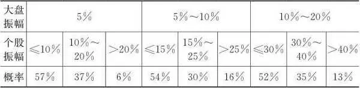

可见，大盘与个股的走势具有极大的正相关性，在大盘大幅震荡的时候，个股走出独立行情的概率很小。当然，由于水平和精力有限，我对其他级别时间段和其他级别振幅未做统计。但我相信，整体方向性结论不会与此相悖。

有一个著名的证券投资盈利计算公式：

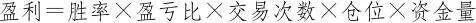

其中，为了让胜率与盈亏比之积便于与1进行对比，我们把胜率定义为盈利次数／亏损次数，盈亏比定义为平均盈利金额／平均亏损金额。在任意一个时间段内，只要胜率与盈亏比之积大于1，那么这段时间就处于盈利状态。本章的所有理念要义均围绕该公式展开。

__第一节 多数时候重胜率，少数时候重盈亏比 __

一切单边趋势都可以看做更大级别的震荡，一切震荡都可以看做更小级别的单边趋势。无论什么级别的资金，都应当把所有的震荡都当做适合自己资金量的单边趋势来做。在扣除了适合自己的单边趋势后，剩下的都是没有价值的震荡。任何一段走势的量价信号，从不同级别来看，可能给出的是不同的买卖信号，你要选择自己愿意承受和适合自己资金量的级别。一个好的周线级别的买卖点可能不是好的日线级别的买卖点，一个好的日线级别的买卖点可能不是好的分时级别的买卖点。倒回到2015年，你会觉得在4000点卖出是多么幸运的事，但当时你一定会痛苦地认为自己应该在5000点卖出。股价所处的任何一个位置都同时处于各种级别的趋势中，当小级别和大级别的趋势不一致时，就会给我们的策略选择带来困扰，特别是大级别下跌中的中小级别上涨，会导致无数人“埋骨沙场”。在这种大小级别不一致的走势中，对走势级别与自己资金量的匹配程度保持清晰的判断是一切策略的前提，也是正确权衡胜率和盈亏比的前提，剩下的就是严格的自律，否则你肯定会亏损。

根据顺势而为的思想，在震荡或弱市行情下，胜率是首要目标，在单边行情下则更注重盈亏比。在震荡或弱市行情下不太可能获得好的盈亏比机会，胜率与盈亏比的乘积难以大于1，所以要么空仓休息，要么把握稀缺的短线机会且胜率为先。一段时间内的走势不可能既是震荡走势又是单边走势，故胜率和盈亏比是不可兼得的。不要在该选择盈亏比目标的时候选择胜率，也不要在该选择胜率目标的时候选择盈亏比。

在理想的状态下，在一波震荡行情中，就算你的开仓价为最高价，理论上都能解套，而在开仓价不是最高价时，止损是没有必要的，只要你有盈利就止盈的话，可以保持百分之百的胜率。既然任何单边走势都是更大级别的震荡，那么只要一直持有亏损的头寸，都应该有解套的机会。这个道理不是人人都懂，但有的海龟型投资者就是这么做的，在大概率上也确实行之有效。只要不交易，胜率就是一个没有意义的概念。

我们参与的都是自认为属于某个级别的单边走势，否则也不会参与。比如，你认为有一个日线级别的单边走势，结果一开仓就发现自己陷入亏损。但这个反向走势可能也不过是一个周线级别的震荡。因为在任何一个时间段，某一级别的震荡概率都高达80%，所以当你陷入日线级别20%概率的错误开仓以后，只能选择等待在周线级别的波动中解套。毫无疑问，这需要增加你的时间成本——数周的等待，如果你不愿意付出这个成本，你就只能选择止损。还有一个更悲剧的结局是，也许你以为的日线级别单边走势甚至连周线级别的震荡都不是，而是周线级别的反向单边走势或者更大级别的震荡，你需要付出的时间成本可能是数月甚至更长的时间，你要忍受更大级别单边走势或震荡所带来的巨大浮亏。如果该上市公司的业务被新技术、新产品替代，那么你的投资本金将永远没有机会收回。毕竟震荡与单边走势的关系和概率只是统计意义上的，对于个体样本还有一个方差的问题。至于大盘，只要经济在增长，指数样本在更新，大盘指数长期说来都是向上的。但你选择的个股变成无人问津的僵尸股或者退市，都是有可能的。

既然在1个月之中只有1周左右的单边走势，那么在其他3周时间里，就算有机会，也只能是1～2个交易日的机会。你的策略是1个月只需要抓住1周的机会执行开仓和止盈。在其他时间内，要么快进快出，保持较好的胜率，要么空仓休息。至于如何鉴别1个月中的那1个星期的机会，我们在后面的量价关系和股票交易技术里再讨论。在震荡中强人所难地追求盈亏比有违顺势而为的思想。在其他任何时间级别的走势里，注重胜率的策略都是大概率有效的。其实，好的盈亏比主要是控制亏损，盈利取决于市场，亏损可以较大程度地取决于自己。当不是重大位置和大级别单边机会时，及时止盈是上策，以保证胜率为主；当是重大位置和大级别单边机会时，可以适当放大止损来追求盈亏比。如果你永远把所有的机会当成震荡机会里的单边走势，以追求胜率为第一目标，小止盈就可以提高胜率，相当于可以为下一次的止损预提损失储备。这样的话，就必须放弃盈亏比。即使是大牛市，也要放弃盈亏比。长期来说，任何级别的单边走势的概率都只有20%。好比一场足球比赛，就算进五个球，高潮也就是五分钟时间，其他时间都是在传球，都是在寻觅和创造机会。你完全可以把盈亏比这个目标只设定为控制亏损。在一定交易频率的前提下，胜率和盈亏比才有意义，如果你一年只交易2～3次，甚至不交易，那么66%～100%的胜率也就没有意义，盈亏比远远偏离正常值也没有意义。反之，如果无法保证胜率，则交易次数越多就输得越多。好的胜率基本上只取决于水平和把握机会的能力，好的盈亏比更需要纪律去控制亏损，盈利多少则由市场说了算。困境在于，控制亏损的结果是降低胜率，而提高盈亏比的代价可能是低胜率。胜率和盈亏比的矛盾不只是概率问题，还是一个风控与收益平衡的问题。在大部分情况下，止损的损失最后其实都可以回来，但是若不控制亏损，那么只要你犯一次大错，过往积累的盈利就会遭受重大损失。有些交易者的选择是不考虑盈亏比，比如价值投资者，他们认为自己的股票不会亏到哪里去，而涨则会涨很多，翻几倍都不在话下。这种策略典型的结局就是让利润奔跑或让亏损奔跑，在价值投资理念的支撑下押上时间的赌注。

胜率始终有一个天花板，市场总比个人聪明，胜率如果稳定高于65%，就可以短线交易了。无论是技术派还是价值派，都不容易，耐心等待和精准出击是关键。表9\-2是随机开仓时四种平仓类型的策略组合，可以看出各种策略目标的相互制约关系：

表9\-2 随机开仓时的止盈止损策略组合

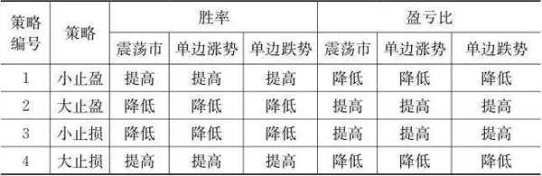

结论1：策略1和策略2，以及策略3和策略4本身是不能搭配的。为了提高胜率，只有策略1和策略4可以搭配；为了提高盈亏比，只有策略2和策略3可以搭配。然而策略1和策略4的搭配无法提高盈亏比，策略2和策略3的搭配无法提高胜率，无论其处于什么类型的市场。

结论2：策略1和策略3的搭配，以及策略2和策略4的搭配，只是稳健和彪悍两种不同的风格而已，对胜率和盈亏比的影响刚好相互抵消。

结论3：胜率和盈亏比是两个互相消长的目标，任何单一策略或策略组合都不可能同时提高胜率和盈亏比。

__第二节 开仓价定成败，善兵者不好战 __

是否盈利无非就是看开仓价与平仓价之间的差价，故风控自开仓而始。一个相对保守的开仓价自故事的开头就大概率地避免了亏损的结局，从而最好不止损，止损始终是次于开仓价的第二次保护，是为了防止那三四成小概率的错误造成巨大损失。无论是震荡还是单边，走势的起点始终源于你的开仓价。如果你总是能在保守的价位开仓，你的胜率首先就有了保证。盈亏比则取决于某价位相同概率的涨幅空间与跌幅空间之比。例如，在10元开仓，涨跌的概率分布是：50%的概率涨1元，而跌1元的概率是40%，持平的概率是10%，则10元开仓处的盈亏比预期值是1．25，所以盈亏比也有了保证。根据公式：盈利＝胜率×盈亏比×交易次数×仓位×资金量，如果胜率和盈亏比分别提高10%，那么二者的积能够提高21%，等价于你没有融资成本地增加了21%的仓位，多么美妙。所以开仓价的重要性应该占整个策略成功贡献份额的百分之七八十，剩下的是止盈，再剩下的才是止损。开仓价、止盈和止损，每一步都是风控，如果只把止损和仓位管理看成全部风控或风控的大部分，是极其片面的。没有什么比一个好的开仓价更重要。开仓价定成败，只有开仓价足够好，你才可能忍受风控范围内的价格波动，或者说价格波动才大概率地落在你的风控范围之内。

保守的开仓价是怎么来的？答案是等待。如果你判断目前处于震荡走势，则你必须等待股价跌到震荡区间的支撑位。如果你判断目前是一个单边向上的行情，那么不要犹豫，赶紧开仓，但是你可能在小级别的反向走势中失去仓位，也可能看错方向，毕竟单边向上的概率不超过20%，把震荡当做单边走势而看错的概率是80%。谁都希望在保证胜率的前提下增加交易次数，从而增加利润。可惜，胜率不仅和盈亏比互为消长，也和交易次数互为消长。交易次数越多，意味着开仓价保守的时候越少，想要每次都赢，市场不可能给你提供那么多可以盈利的开仓机会。过于频繁的交易的最大问题不在于手续费，而在于开仓机会的稀缺性。频繁操作是对短线的错误理解。如果一开仓就亏损，则立马要重新思考，这很可能是一个错误的仓位，就算是正确的也容易怀疑自己。所以，进入的时机一定要保守才行，否则后面的操作容易失控或左右为难。

能够使自己不滞于物的关键就是开仓价，开仓价的正确性提高了，大部分股票都可以做，根本无须刻意选股。机构的买入手法通常是定价买入、定时买入、定量买入。其中定价是首要条件，在一个价格区间内定时、定量地收集筹码。在开仓的时候要知道自己的开仓性质，即要知己，要看得懂量价走势，即要知彼。彼者，市场也。任何级别的左侧开仓都是在赌见底的概率，任何级别的右侧开仓都是在顺势，属于依据实际走势的性质赌至少该级别趋势的延续。其实，股票的秘诀就是等待、开仓价、止盈三点，要在胜率和盈亏比之间找到平衡，平衡的关键是等待确定性大一点儿的机会。斯诺克高手不打无把握的进攻球，止损只是防止意外。上升或盘整趋势跌到20日或30日均线或重要位置，缩量，近期的中低价位曾有放量或两根以上大阳线，无大盘日线级别以上风险，基本面不离谱，在以上活动下交易，其余时间等待，其实就这么简单，不简单的是执行。价值投资者要更善于等待，特别是等待灾难级的价值低估机会。当然，我不厌其烦地再次强调：前提是从量价关系看透走势概率。

表9\-3和表9\-4清晰地揭示了随机开仓和保守开仓之间盈利效果的区别。

表9\-3 随机开仓下的胜率×盈亏比（假设止盈止损幅度相同）

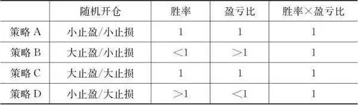

结论1：在策略A和策略C下，止盈和止损的概率相等，所以胜率＝1，同时，因为止损和止盈的幅度相同，所以盈亏比＝1，从而胜率×盈亏比＝1。

结论2：在策略B和策略D下，胜率和盈亏比互为消长，所以胜率×盈亏比＝1。

表9\-4 保守开仓下的胜率×盈亏比（假设止盈止损幅度相同）

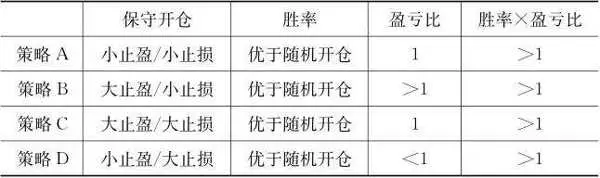

结论：在止盈和止损幅度设置相同的情况下，保守开仓提高了胜率。

保守开仓的意义正是让你放弃一些因途中逆向走势过大被迫止损或错误止损的机会，从而优化胜率。尽量在低位弱转强时或重大支撑位开仓，或者在尾盘进去，可以提高胜率。随机或激进的开仓经常会被迫止损，或者以承受较大回撤为代价，而这两种情况都最终各有各的失败方法。

保守的开仓价可以提高胜率的原因有：（1）更好地避免了对手盘的博弈风险，因为在低位对手盘舍不得再拿出筹码来砸盘或诱空，反而害怕有别人来抢筹码，所以只有拉高吸筹才能够得到筹码。（2）对价值投资者和技术投资者更有吸引力，从而更容易形成向上的合力。只要有点耐心和系统性风险不大，一般都能止盈而出。我经常看到在大势并不好的情况下，身边有朋友靠这种方法在一只股票中收获百分之几到百分之十几的利润。

“胜者先胜而求战，败者先战而求胜”，我加一句“亡者先败而求战”。长期而言，保守开仓保证了安全边际，安全边际大的股票后市大涨的概率不会小于那些已经呈现强势特征但安全边际小的股票，盘子太大且业绩又没有长期增长潜力的除外。

__第三节 平仓的技术，善败者不亡 __

平仓是一个故事的结局，可能是喜剧，也可能是悲剧。

让我们回到第六章第一节的那个期货故事吧！

克罗尔先生对维奥莱塔说：“我来告诉你吧！这个道理就是用小损失积攒大胜利。用99次损失100美元的方式来换取一次盈利10000美元的机会。”

“这样啊，那我操作100次才可以赚100美元！”

“是啊！看起来100美元很少，但你要知道当你用99次失败来换取一次成功的时候，你几乎是不可超越的。这种方式可以永远持续，直到你成为最终的赢家。当然100次仅仅是一个比喻，在实际中这个数字是不定的，不要拘泥于我的表述形式。”

是的，不要拘泥于真的要错误100次才换回一次大胜利，那样的话没人会受得了。克罗尔先生的真实意思是止损一定要小，那些跌破你止损位的机会不是你真正的机会，这是整个故事的灵魂。控制回撤和放宽止损是在盈亏比和胜率之间做权衡，控制回撤不可避免地会降低胜率，但同时也优化了盈亏比。放宽止损提高了胜率，却牺牲了盈亏比，而且增加了盈亏比的波动性，即增加了风险和不可把控因素，且并不改善预期收益。以统计的观点来看，稳定盈利源于技术和市场的恩赐，而不是源于放大止损。以好的开仓价和小止损来做交易可能会损失一些机会，但只要用浮动止盈逮到几次奔跑的利润，一年的利润也就可观了。孢子理论以多次小错换一次大胜，表面上是要控制亏损，等价的意思应该是少开仓和保守开仓。那些一止损就开始上涨的故事情节是不是大家都不陌生？放弃小级别的机会，放弃概率不大的机会，学会放弃，寻找平衡。

等待和放弃在数学上很难实现胜率和盈亏比的同时优化，但至少可以在得到一个的同时不至于以另一个的巨大牺牲为代价，从而改善二者的乘积。

从表9\-3和表9\-4来看，不管是随机开仓还是保守开仓，任一策略组合都没有在胜率×盈亏比这个最终效果上显示出独特的优势。那么为什么宁可要小止损来保证盈亏比，也不要大止损来保证胜率呢？或者说为什么不论你的止盈策略是大止盈还是小止盈，止损策略都应该是小止损呢？那是因为我们只考虑了收益的预期值，而没有考虑获得该预期收益所承担的方差，即统计学意义上的投资风险。方差描述的就是收益的波动性。在不同的策略组合下，同样的预期收益需承受不同的方差，意思就是就收益风险比而言，小止损优于大止损。再说直白点，如果你运气不好，连续错三次，而且三次都是大止损，你的本金损失远远超过三次小止损的损失。如果飞机失事的概率是1%，看起来很小，你还会坐飞机吗？这就是克罗尔先生要饱含痛苦和无奈地说要用99次失败来换取一次成功的原因。依据这个逻辑，当发生连续亏损或者说系统性风险时，小止损更大概率地保住了本金，从而可以为以后的交易增加交易次数和交易金额。

至此，我们可以得出结论，要优化胜率就要保守开仓，要优化收益风险比就要小止损。提高止损的容忍度会提高获得大收益的概率，但也提高了大幅亏损的概率，并不能增加收益的期望值。当然这仅仅是统计学意义上的结论，大鳄在关键时刻总是会下重注，且适当地放大止损。所以等待有十足把握的机会很重要，不能乱用兵。经常豪赌的行为绝非大鳄风采。

既然只能用小止损来搭配止盈策略，那么平仓的策略组合就从四种变成两种，见表9\-5。

表9\-5 保守开仓和小止损时的止盈策略效果比较

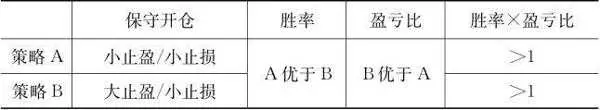

结论：在保守开仓时，选择策略A，胜率高而盈亏比低；选择策略B，则胜率低而盈亏比高。但总体效果都是胜率×盈亏比＞1。

接下来，我们用更加具体的数字来量化这两种策略的盈利效果，见表9\-6。

表9\-6 量化比较

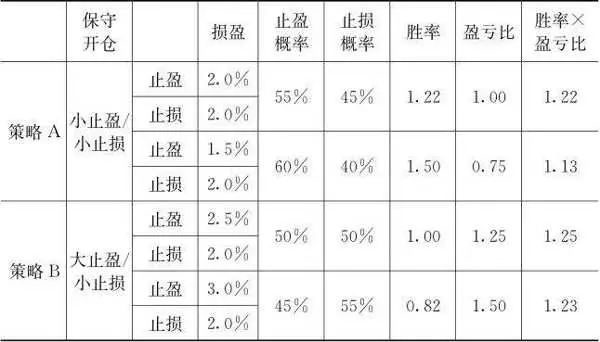

假设1：在保守开仓的情况下，止盈的概率大于止损的概率。

假设2：止盈设置股价每上升0．5%，止盈的概率就下降5%。

结论1：在保守开仓时，无论策略A还是策略B，胜率×盈亏比＞1。即使具体数值可能不合实际，但结论的方向性是合乎逻辑的。即使是随机开仓，结论的方向性仍不会改变，只是胜率×盈亏比的值会差一些。

结论2：在策略B的第二种情况下，止盈目标调整至3．0%时，止盈的概率下降幅度可能会超过5%，这样的话策略B的效果不一定比策略A好，毕竟5%只是一个估计假设。

结论3：止盈的大小如何才算合适，要看市场给你什么机会，顺势而为，不可强求。

在实际操作过程中，我们不一定要设置固定的损盈的百分比，而是要根据盘面的实际走势而定。假设股价上涨了8%，此时量价关系仍然配合良好，盘口也无异常，就应该继续持仓观望，而不是机械地到了8%就止盈。同理，当股价上涨5%以后，发现上涨无力，盘口疲弱，就不要等到8%再止盈了，因为那样的话最终的结果可能是止损平仓。当股价跌到1%甚至跌幅更小时，如果发现走势出乎预料且信号疲弱，也不要等到下跌2%再止损，早点止损可以大概率地减少损失。好多人对设置盈亏比有一个误解，那就是设置一个固定的盈亏比，比如上涨5%时止盈，下跌2%时止损。但那只是你的一厢情愿，因为市场可能不会给你那样的机会。到达目标价位的概率与开仓价紧密关联。如果随机开仓，结果只能是经常止损，无助于胜率与盈亏比乘积的整体改善。总之，止盈和止损可以有计划，但更要灵活，根据股价的位置、股性的活跃度、实际走势强弱而区别对待。只要走势在转弱且有持续的迹象，就可以考虑平仓，结果是止盈或止损平仓是市场说了算，不应刻意区分。毕竟，止盈和止损只是一个概念而已，若把任一时刻的资产都视为自己此刻的本金，则没有止盈和止损的区别，只有持仓或平仓的区别，只要出现某级别的量价背离就可以平仓。记住，平仓的最高境界是一旦发现你所不愿意承担的某个级别的转势信号即可平仓，这种级别主要取决于市场的性质和你的资金量。根据股票的股性，可以将止盈设在某个级别的压力位，如果盈利到了一定程度，可以再提高止盈位，并随时观察量价关系。就个人体会而言，因为止损的底线必须机械（有时在小范围内可有一定的灵活性）执行，所以开仓价和止盈就是交易层面的大部分秘密和艺术所在，浓缩了从策略到盘感、从技术到纪律、从胆识到修养的所有要素。有没有长期不需要止盈的股票呢？当然有，即那些兼具垄断优势和成长性的股票，二者缺一不可。这个价值投资者所信奉的法则，技术投资者也不一定要绝对排斥。

被错误止损的仓位支付了风控成本，在费用上该成本表现为交易费用和损失的利润，在盈利公式中体现为胜率的下降。虽然理论上对错的概率各是50%，去除错误的止损后，胜率其实难以超过50%。止损、控制回撤、止盈本质上都是同一性质的行为，那就是平仓。平仓放弃的是可能更多的利润，但也回避了风险，弱市和震荡市尤为重要。

价值投资者一般认为只有公司业绩下滑了才要止损，其实这不是我们技术分析意义上的止损。因为那样的话，代价就太高了。机构或内幕交易者可能利用信息披露的时间差来完成绞杀。这也是一种博弈，等你知道业绩下滑时已经太迟了，并且说不定反而该建仓了。

总之，一是从开仓价这个源头控制风险，二是放量拉升后量价背离（这种背离可能是分时、日线或更大级别的背离）就止盈，三是重仓参与，四是在有系统性风险或压力迹象时休息。这几点看似简单，实则是稳定盈利之保障。其实，我感觉止损并不是最难的，在技术上，止盈更难，要有大小取舍的判断，是将利润收入囊中还是继续奔跑，选择难度更大，很多小的盈利不落袋，最后却被止损，毕竟让利润奔跑不是你想让它跑就能跑。多数时候，宁愿错过奔跑的利润，也要保住本金和已有盈利。只有一开始就有利润，才可能获得后面奔跑的利润。保住本金这句名言，人人都知道，但说起来简单做起来难。买在低估值或者支撑位的投资者，如果股价跌破该怎么办？是坚定持有，还是先止损保本？对于这个问题，本节已经给出了答案，以后就不要再纠结了。

__第四节 长中短线的实质是交易次数与机会性质、资金量的权衡 __

对于长中短线，技术分析和内在价值不是格局的问题，也不是谁对谁错的问题，两种方法就像两个不同行业的人，都要有思想深度和执行力才能赚钱，行行出状元。有些人认为技术派没有格局，技术分析不可靠，走势不可测，他们认为公司价值的逻辑很明显更正确。我觉得更多的人是用价值投资来安慰自己。如果都知道企业的成长性，那么投资还有风险吗？当然，如果股票清晰地被低估或者有清晰的成长性以及护城河，长线自然是很好的选择。

买卖股票都要考虑对手盘的承受力，不同的资金量对流动性造成的冲击程度不一样。资金量越大，建仓和平仓所需的时间越长，或者平仓要求的上涨空间越大。借鉴利弗莫尔对市场走势的分类，我们把市场走势分成六类：升市中的主升市、次级上升和自然回调，以及跌市中的主跌市、次级下跌和自然回升。以我自己的经验，我把自然回调和自然回升定义为日线级别且涨跌幅不超过20%；次级上升或次级下跌定义为周线或月线级别且涨幅不超过50%，跌幅不超过30%；主升市和主跌市定义为季线及以上级别且涨幅超过50%，跌幅超过30%。一般说来，不同资金量的买卖策略与市场机会的匹配如表9\-7所示。

表9\-7 不同量级资金在不同市场机会下的买卖策略

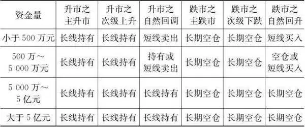

结论1：在升市的主升市和次级上升阶段，无论资金大小，持有就是最佳策略；在跌市的主跌市和次级下跌阶段，无论资金大小，空仓就是最佳策略。

结论2：在升市的自然回调阶段，小资金可以短线卖出。在跌市的自然回升阶段，小资金可以短线买入，但最好及时止损或止盈。

结论3：对于5000万元以上级别的资金，升市持有，跌市空仓。

以上结论只是在理想状态下，从技术分析的视角得出的大概率正确的结论。你能否正确判断市场走势的性质，与这个结论的逻辑正确与否是两码事，也不要固执地认为无人能判断市场走势的性质。

除了买卖策略，不同资金量与交易机会的次数匹配也不一样，根据本章第一节关于震荡和单边走势概率分布的阐述，我们可以得出资金量和机会次数的匹配结果如表9\-8所示。

表9\-8 不同量级资金对应的机会频率

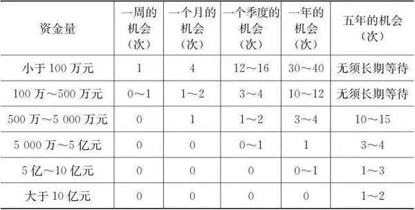

结论1：无论多大的资金量，过于频繁的交易都不可能有足够的交易机会来匹配。

结论2：机会与风险都有级别，资金量越大，越要善于持仓等待和空仓等待。

结论3：根据结论1和结论2，资金量越大，技术风险和博弈风险越大，对操盘手的水平要求也越高，因为你建仓和平仓的机会更加稀缺。一旦错过机会，就会比小资金更加被动。

同样，以上结论也是在理想状态下，从技术分析的视角得出的大概率正确的结论。

投资的本质是赚时间，慢即是快，即使是小资金也不能频繁出击。如果你有能力在各个板块和个股之间切换，投资机会会多一些，但这么操作的难度非常大。价值投资的逻辑与这个匹配无关，资金量越大就越应该增加股票内在价值的考虑权重。至于百亿元级别的价值投资者，他们不考虑技术风险、博弈风险和系统性风险，他们更接近于进行股权投资，以长期持有分享企业成长的价值。这种级别的资金思考的应该是如何在各产业间配置资产以及产业需求的体量，这种需求与宏观经济和时代大势紧密联系。百亿元的资金如果还在分析K线、均线、大盘的话，就是本末倒置了。

如果资金量级在5000万元以下，长期投资可能适合一部分人，但收益最好的一定是做短线或波段投资。做长线投资一般适合价值投资者，但考虑到系统性风险，价值投资者不一定做长线投资，应当回避重大系统性风险。

投资的难度在于，趋势的走好是从小级别开始的，但小级别并不一定带来大一级别的走好，这需要进一步观察。当观察到大一级别甚至更大一级别开始走好时再进去，又可能碰到小一级别调整的开始，这种调整是否又会扩展到大一级别也不好确定，建仓和平仓皆如此。因此，无论你何时建仓或平仓，都是在赌概率，心中一定要有概率概念，不能一根筋。无论如何，长期的走势通过中期走势来实现，中期的走势通过短期走势来实现。如果长期走势不看好，则最多有极少的中线机会；如果中线不看好，则最多有极少的短线机会。长中短线本身相互关联，这几年做短线的难度自然不小。等大势见底，持长线又是最好的。顶级高手都是在大势上高抛低吸，持有数月或数年做大波段交易。小资金在震荡或跌市做点短线并无不可，只是确实对技术和人性的要求很高。有些人并没有识别行情性质的能力，只是一味地要求自己做中长线，还有一些人不能克服人性风险，本来想做短线，结果一被套牢就硬生生地做成了中长线。一切形式和手法都不是最重要的，最重要的是顺势，势可以是不同级别，而心灵应该空澈明净，无欲则胜。

就算你身边的人都没能做好高抛低吸，也不要得出结论说没有人能做好高抛低吸。短线胜过长线的前提是顺势而为，在升市当然不要做短线，但在震荡市或跌市呢？如果识别和推理市场类型的水平和经验不够，又如何能做好长线呢？当然，因为博弈风险，以及技术上的流动性风险，资金量大了就不适合一般级别的高抛低吸了，而是要选择级别大点的波动。在此强调，高抛低吸不是要抓住所有波动，而是要抓住一定级别的波动，而且允许犯错。不崇尚波段操作的价值投资者在价值被低估时买入，在价值被高估时卖出，说到底也是在做波动，只是换了一个更动听的说法而已。

长中短线到底哪个最好，绝不仅是持有时间的差异那么简单，最适合自己和市场的就是最好的，其中包含的细腻技法需要不断感悟和总结。盘口不行，分时难走好；分时不行，日线难走好；日线未走好，就难有持有几天的机会；以此可类推至各个级别。反之，如果一周之内看跌，何必非要去做一两天的机会呢？如果一个月之内看跌，何必非要去做一两周的机会呢？

再短线的思维也要有放弃的标准，反之，再长线的思维也要有空仓休息的标准。不然巴菲特持有千亿美元现金干吗？在长线有风险时，最多只能做中线，行情不超过3个月；在中线有风险时，最多只能做短线，行情不超过5天；在短线有风险时，最好持仓不要超过2天，甚至收盘进去，第二天不强势就立即出来。任何级别最好都做右侧交易的顺势，否则就是在赌该级别见底，风险和收益都被放大了，从长期来说不可取。右侧交易就是在走势开始企稳向上时开仓。如果分时都没有企稳，就没有必要开仓，这已经是小资金有操作价值的最小级别了，否则就耐心等待。那么如何判断某级别的企稳不是该级别的短暂反弹呢？我们在量价关系中再来讨论。总之，长线和短线孰优孰劣是由你的资金量、行情性质、操盘水平决定的。价值投资者不要动不动就不假思索地批评一些小资金的技术投资者没有耐心，每个人的资金量及交易水平和手法都不一样，法无定法。在保证胜率和盈亏比的前提下，交易次数与利润成正比。

现在，我们再回过头来总结一下本章开头那个神奇的盈利公式：

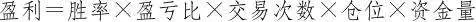

结论是：（1）胜率和盈亏比互为消长，保守的开仓价可以尽可能地提高胜率与盈亏比的乘积。（2）交易次数和仓位受到机会性质和资金量匹配度的约束，也是互为消长的，资金量越大，交易次数和仓位越小。（3）另外，由于心理因素的干扰，仓位和资金量太大可能也会影响胜率和盈亏比。（4）五个影响盈利的因变量之间存在深刻的互相制约关系，这要求我们在坚守策略和调整策略之间不断地权衡。

__第五节 量化投资 __

在阿尔法狗以绝对的优势战胜李世石和柯洁后，将人工智能应用于证券市场一度被热议。我不懂人工智能，也无法评估将人工智能应用到证券交易中到底有多大的威力，但这并不妨碍我来琢磨一下其中的逻辑。

虽然围棋每一步棋路的选择都是天文数字，但双方的武器是对等的，变量系统也是封闭的，只是在比拼运算能力，当然机器取胜。下棋时人的情绪不会影响棋面，而股市上人的情绪则会影响盘面，机器难以区分和造就情绪性行情。围棋没有诱杀，只有计算错误，而股市很容易制造骗局和诱杀。对手故意做出量价配合良好的局，或者放出什么消息，然后突然反手，你能怎么做？这是一个因变而变的缠斗过程。其实，早在人机围棋大战之前，由强大计算机运算能力支持的量化投资就已经在广泛应用了。在机械的基本面分析和技术分析领域，计算机技术一直都在驱动可量化的东西计算机化。凭借强大的运算处理能力，均线、各种指标、自动选股等功能都逐渐被计算机替代。股市不断地有新的扰动因素，而且信息有真有假，在直觉和分辨真假方面，我还是相信人的优势。试想投资者都用人工智能结果会如何？人工智能仍然是人与人之间的博弈工具，就像战争中的武器一样。在都用同样的武器时，人的策略决定胜负。何况，交易还需要对手盘和流动性，在股票交易中有资金和信息优势比计算速度更重要。

在量化投资中，有两种常见的投资策略：一是对冲系统性风险的阿尔法策略；二是承受系统性风险的贝塔策略。在阿尔法策略中，无论你是如何选择具有阿尔法值的股票组合的，其原理都是通过某种变量来挑选那些在胜率×盈亏比上表现更好的股票。由于阿尔法策略通过建立期指空头对冲了系统性风险，所以无须胜率×盈亏比＞1，或者说无须股票组合上涨，只需要跌幅小于指数，就能获得正收益。阿尔法值可能源于基础资产的优越性，也可能源自政策或事件的驱动。从2015年下半年至2018年，选择阿尔法策略的对冲基金可能获得了非常优秀的收益。因为这几年刚好是小市值股票挤泡沫和失去流动性，大市值蓝筹股有各种政策和资金护盘的空头市场。在此期间的阿尔法值源自政策或者说事件驱动，也源自流动性优势。显然，阿尔法策略在弱势和震荡市中容易有良好的表现。而在贝塔策略中，因为没有风险对冲，所以必须有胜率×盈亏比＞1，贝塔策略对于择时和判断大势方向有极高的要求。依据表9\-5，我们可以窥探到最简单的贝塔策略量化投资原理：如果设置好某种级别的量价背离计算公式，量化投资可以在策略A或策略B之间固定或切换。策略A：通过一定的技术信号筛选出胜率较高的形态或量价信号，把止盈和止损都固定为2%。那么在胜率优势下，策略的预期收益为正。策略B：通过一定的技术信号筛选出盈亏比较高的形态或量价信号，把止盈固定为3%，止损都固定为2%。盈亏比增加的利益在对冲掉胜率的损失后仍有剩余利益，策略的预期收益为正。策略的预期收益为正的意思是胜率×盈亏比＞1。无论是策略A还是策略B，都大概率地保证了胜率×盈亏比＞1，在自动捕捉交易机会的机制下，通过增加交易次数来增加盈利。但是，单边市场最好不要采用贝塔策略，还是人为操作更好。因为单边市场的胜率对结果的影响比不上盈亏比对结果的影响。单边上涨无须任何计算和交易，只需一直持有，单边下跌无须任何计算和交易，只需一直休息。

除了单纯的阿尔法策略和贝塔策略，我认为还可以构建一种通过指数期货对冲系统性风险，同时利用上一段所说的策略A或策略B来提升胜率与盈亏比的乘积的组合策略。在这种组合策略中，虽然不能保证胜率与盈亏比的乘积一定大于1，但是可以大概率保证其乘积大于指数的胜率与盈亏比的乘积。这样的话，与单纯的阿尔法策略一样，只要股票组合以技术分析和大势判断来捕捉一些横盘或反弹中的胜率和盈亏比，就能保证正收益。

## 股票投资理念 - (5) 概率

\(5\) 概率

2026年2月27日

21:46

__概率 __

__第一节 不确定性中也有模糊的概率 __

有些关系是确定性的关系，比如给某个物体施加一个外力，物体的运动速度就会改变，而且改变的量与力的大小成正比，与受力物的质量成反比。有些关系是完全随机的，比如布朗运动，描述的是悬浮在液体或气体中的微粒所做的永不停息的无规则的随机运动。有些关系介于随机和确定性之间，是概率性关系。概率分布用于描述某事件的每个可能的结果发生的概率，各结果发生的概率越分散，则越接近于随机性，各结果发生的概率越集中，则越接近于确定性。比如，某事件可能有5个结果，5个结果发生的可能性都是20%，那么它就是随机事件。如果某结果发生的可能性超过20%，比如35%，或者某两个结果发生的概率超过40%，比如60%，那么该事件就是概率事件。确定性和随机性是概率的两个极端。

概率分析的意义就在于帮助我们把事件的结果从不确定性的一端尽量推向确定性的一端。如果事件的结果只决定于单一因素，那么结果基本是确定性的；如果事件的结果决定于多种因素，多种因素本身又决定于其他因素，并且有的因素之间还相互影响，那么以有限的信息和知识，我们无法推导出该事件的结果。于是我们发明了概率这个概念，风险也伴随着概率，毕竟，单次事件的结果是唯一的，而不管有多少种因素导致了这个结果。

假设事件 *Y *＝ *f *（ *u *， *v *， *w *， *x *）＝ *au *＋ *bv *＋ *cw *＋ *dx *，即事件的结果由 *u *、 *v *、 *w *、 *x *四个变量决定，每个变量的影响权重分别为 *a *、 *b *、 *c *、 *d *。如果 *a *最大，那么 *u *就是我们要最重点考虑的因素。股票价格的复杂性在于：第一，自变量肯定不止四个，而是无数个。第二，每个自变量的权重不是一成不变的，也就是说不同时期有不同的权重， *a *、 *b *、 *c *、 *d *本身也在变化。比如，影响股票价格的权重最大的变量有时候是系统性风险，有时候又是业绩，有时候是题材，有时候又是流动性或筹码分布。换句话说，股票价格就是一个不仅有无数个内生变量（如 *u *、 *v *、 *w *、 *x *），还有无数个外生变量（如 *a *、 *b *、 *c *、 *d *）的函数，并且 *a *、 *b *、 *c *、 *d *的取值也不是固定的。这就是研究股票价格的理论那么多，却没有一种能保证稳定盈利的理论的原因。这也是连随机游走这种理论居然都会有市场的原因。

那些外生变量固定的事件，通过大数统计，通常都能找出 *a *、 *b *、 *c *、 *d *，并建立统计模型。至于股票价格，我们甚至连统计模型都难以建立起来。我们可以通过理论和经验做出一些合乎逻辑的推理。对于技术分析者来说，影响股票价格的因素主要有：内在价值、成交量、量比、均线、大盘和涨幅。对于价值投资者来说，其实就是两个变量：内在价值和大盘，甚至只有内在价值。

以下据一个实际例子予以说明。假设某投资者已经按照内在价值过滤掉了存在基本面风险或者估值过高的股票，建立了一个股票池。他打算用技术分析手法来适当地参与一些波段操作。于是，他根据大盘、成交量、均线、量比、涨幅、筹码轻重（我们在第十三章讨论筹码轻重）六大变量设置了一个概率计算表，并且根据自己的经验给六个变量分别赋予一个权重值，如表10\-1所示。

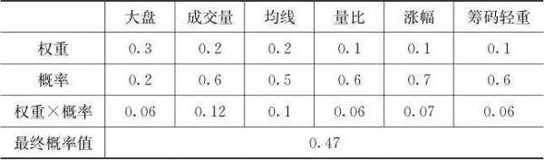

表10\-1 影响个股走势概率的六大变量

结论：在大盘权重为0．3，大盘上涨概率只有0．2时，即使纯个股的技术面上涨概率超过50%，考虑大盘因素后，个股上涨概率只有47%，正确的决策是应该场外观望或卖出。

需要说明的是：（1）大盘本身既受到宏观基本面的影响，也受到大盘自身技术面的影响，所以大盘上涨的概率又是一个多因素作用的概率结果。（2）表格中的权重不是一成不变的，在某些时候，需要加大或减小某因素的权重，特别是在系统性风险很大时，要增加大盘权重。（3）因此，对股票上涨的概率的估算既是一门技术，也是一门艺术。特别是变量因子的选择和权重的赋值很大程度上取决于经验和职业嗅觉。毕竟技术性的细节千变万化，如何随时依据实际走势来调整变量因子的概率在此无法尽述。

表10\-2为以现阶段为例来推理大盘一年内的上涨概率。

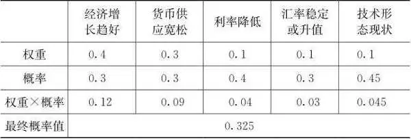

表10\-2 以现阶段为例来推理大盘一年内的上涨概率

结论：现阶段影响大盘的主要因素之中，好转的概率超过50%的一个都没有，所以大盘一年内看好的概率最终是32．5%。

同样，前四个内生变量（经济增长、货币供应、利率、汇率）之间还有相互影响的关系。每一个变量因子又受到许多外生变量的影响，比如要确定经济增长的概率又需要再次以相同的思路建立推理。至于大盘的中短期走势，就需要调高技术形态的权重。

当事件的结果不止一个时，每一个结果对应一个概率，所有的结果对应的就是一个概率分布。比如从纯粹技术形态看，大盘一年之内的走势概率分布如表10\-3所示。

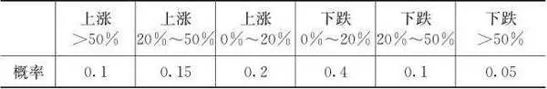

表10\-3 表10\-2中技术形态现状的概率的推导

根据表10\-3，大盘只有45%的上涨概率，所以表10\-2中依据技术形态判断的大盘好转的概率是0．45。

在实际操作中，重要的不是表格的形式，而是化繁为简，化理性判断为感觉。最后在你思想中的一定不是这些概率表。除非你有一个做量化投资的团队。股票的概率更多是建立在自己的专业知识和盘口判断能力之上，常常没有严格的数据统计，也不需要严格的数据统计。每一个变量因子，不管是内生变量还是外生变量，都要不断依据实际情况调整概率及权重。这可能也算是一个缺陷吧，概率是一个模糊而又有实战价值的观念。

概率与级别又是相互关联的，某个级别的大概率可能又是另一个级别的小概率，这时候你要权衡选择。单次结果的盈亏和长期结果的对错也不是一回事，不要总停留在以单次盈亏论对错的思维模式里。错误逻辑行为下的侥幸成功必然导致今后更大的损失。有时候我们会说，就算对了也是错的，或者就算错了也是对的，就是这个意思。在初级阶段或者条件允许的情况下，最好有一套表格来计算概率，然后依据概率来制定操作系统。

股票是一种博弈游戏，也是一种概率游戏。博弈就是你做与不做以及怎么做本身会影响结果，概率就是正确的行为不一定带来有利的结果。只考虑个股的内在价值，是把个股脱离于大盘来看待，而考虑系统性风险，则是把个股视为大盘这棵树上的枝叶。枝叶有好有坏，却难以完全特立独行。无论是短期还是长期，当然都存在例外，某些个股太特殊了，好比再厉害的疾病都有人能免疫一样。你确定你是那个幸运的人吗？所以，当绝大部分股票都在下跌时，你凭什么认为你是那个能抓住10%的机会的聪明人，你所谓的分析难道别人就不懂？另外一个回避系统性风险的理由是：你必须分散投资，就算是小资金，分仓到3～4只股票也是有必要的，不然碰到中兴通讯或者长生生物这种完全出乎意料的黑天鹅怎么办？既然是分散投资，你买到了抗跌的某只股票并不能改善你的投资组合。

有一部电影名叫《心理罪》，男主角是一个心理画像师。他的职业就是根据犯罪现场留下的蛛丝马迹，去刻画和描摹罪犯的心理状态和外表特征。这个职业与股票分析多么相似，股票市场也需要我们去努力画出K线背后的众生相，是所有的它们共同构造了一根根简单而深刻的K线。案情侦破是在拨开层层迷雾和假象后，发现早已存在的真相，而股票走势的判断比推理犯罪更复杂，即使穷尽你的知识和信息，最多也只能得到一个大概率正确的结果，其真相只在事后呈现，而不像案件一样真相早已存在。在各种结果之间不断预测、判断并修正其概率，随着实际走势可把其中一种可能性变成现实性。大概率不是一个抽象而遥远的数学概念，而是对你勤奋的奖励，天道酬勤。乔丹投篮命中的概率就是比你高，你不能简单地说能不能投中只是靠随机概率。勤奋可以提高你判断概率的水平，纪律上则必须严格恪守一直按大概率办事的习惯。

__第二节 股市中几种典型的概率分布 __

股市里有一些颇具迷惑性的口诀或者论点。其错误在于把小概率当成大概率，或者把大概率当成必然。

第一个说法是高风险、高收益。假如用收益风险比来描述收益和风险的匹配程度，则在大部分正常情况下收益风险比等于或接近于1，表明收益与风险成正比，高风险匹配高收益或低风险匹配低收益。收益风险比大于1表明收益高、风险低，是小概率事件，收益风险比小于1表明收益低、风险高，也是小概率事件，如图10\-1所示。

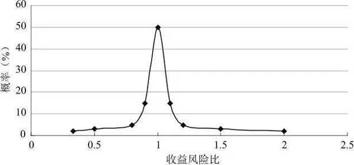

图10\-1 收益风险比的概率分布

收益风险比是一个正态概率分布，高风险、高收益只是一个大概率正确的结论。投资就是要尽量寻找曲线右半段的投资机会，远离左半段的投资机会。那么哪些类型或者怎么操作才是处于右半段呢？首先是尽量回避高风险的股票，高风险至少已经决定了分母，那些高高在上的题材股最好不碰。其次是要寻找有收益来源的，比如在上升趋势中缩量回调的，底部放量的，价值低估或业绩成长性好又财务保守的。在技术上如何识别机会和风险我们在第三篇再详细讨论。

第二个说法是强者恒强。强者恒强明显是和回归平均截然相反的结论。从中期来看，纯粹题材炒作的股票几乎都会下跌，强势的时间与题材的大小相关，小部分在1周之后就回落，大部分在1周到1个月之内开始回落，极少数能反复炒作几轮达到3个月左右的时间。强者恒强意味着收益远远超过平均收益，一旦涨速放缓，筹码松动的欲望就变得非常强烈。所谓的强者恒强，其实由强变弱可能只在一瞬间。

表10\-4和图10\-2是两种类型的强势股随着时间的推移继续保持强势的概率。

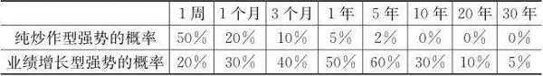

表10\-4 不同时间段内强势股保持强势的概率

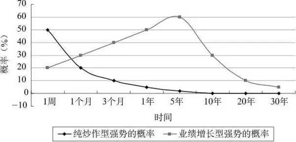

图10\-2 两种类型的强势股的强势时间和概率的关系

可见，强者恒强始终是小概率，回归平均才是大概率，如果都保持强势，大盘也就上去了，那还是等于平均。题材类强势股保持强势的时间都不长，它们只是活跃气氛的促销品，买到了当捡到，不能以此为主要目标。而全场促销的情况在中国股市大概每5～7年才出现一次。做短线强势股操作的技术含量很高，对进出的时机和自我纪律约束的要求极为苛刻。判断不对，马上走，不要有任何幻想，幻想的话很可能会被深套。当然做对了短线操作回报也很大。从长期的时间考量，内在价值的增长在5～10年内大概率地与价格上涨匹配。但是放到更长的周期，比如三四十年或100年，几乎所有企业都逃不过回归平均的命运。看看中外经济史上的那些大公司，有几个还排在全球市值前100位？

第三个说法是放量突破。突破通常需要放量或堆量（即将长时间的相似成交量堆积），而不论其级别。放量或堆量一般是突破的必要条件，而非充分条件。因为放量对能量损耗过快，所以放量后的立即突破是小概率事件。这需要充足的“弹药”、凶猛的风格和题材的配合。

我个人并不喜欢做放量突破，特别是突破重要高点，我认为那是小概率事件，需要各种条件配合才可能突破，而且一般不会一次性突破。就算真能突破，多半也会有一两次回踩动作。在即将突破或刚突破时，可以参与，但得知道参与的是小概率事件。当然，大牛市除外，在牛市中任何阻力位都会被踩到脚下。

## 股票投资技术

__股票投资技术 __

自本篇开始，就进入了本书最接地气、最实用，同时也是最庸俗和错误概率最大的部分。本篇基本上都是概率性结论，不要迷信。技术分析部分更不适合坚定的价值投资者，因为这些东西与企业内在价值毫无关系。我深深明白，一个论点或一种思想，越到具体的运用，就越会面临远离真理的风险，就越容易犯刻舟求剑的错误，也越容易陷入博弈风险之中。

## 股票投资技术 - (1) 我对今后几年宏观基本面的分析

\(1\) 我对今后几年宏观基本面的分析

__我对今后几年宏观基本面的分析 __

本来我想以微观基本面分析技术来切入本篇，斟酌一番后觉得那些都属于细节的专业知识，秉承本书避谈专业类知识的宗旨，还请读者自行去学习相关内容。不过，我觉得仍然有必要把自己关于宏观基本面的思考分享给大家。这也是本书股票投资技术篇唯一的基本面分析内容。

我认为经济增长从根本上来说不是由投资、消费和出口所驱动。经济学之所以把投资、消费和出口称为经济增长的“三驾马车”，只是出于统计目的采用的一种部门分类方法。我认为，从古至今，经济增长的根本驱动因素都是技术进步、制度创新和增加要素投入。技术进步可以提高有形要素（包括土地、设备、原材料、人力等）的利用效率，制度创新可以刺激资本和劳动的积极性，增加要素投入则是增加用于经济增长的要素数量。技术进步驱动经济增长的逻辑是降低单位产出的要素消耗，制度创新驱动经济增长的逻辑是改善福利分配规则，增加要素投入驱动经济增长的逻辑是投入越大，产出越大。经济竞争还可以利用要素（包括资本、劳动、土地、矿产、环境）的价格优势来获得优势。显然，要素的价格优势只是降低消耗要素的价格，是一种价格层面的优势。技术、制度、要素投入量、要素价格这四个变量共同构成一个经济体的竞争优势，其中技术是最具颠覆性的因素。铁器的发明瓦解了奴隶制，蒸汽机的发明推动了资本主义制度的建立。科技只是在近代以来出现的包含科学理论和技术应用的词语，在经济生产领域，我们仍然称之为技术，在本书后面的论述中不再区分科技和技术的区别。本书以此为逻辑起点，衍生出一系列对中国未来经济的展望。

不考虑制度设计的差异甚至无须制度设计，历史上任何一个经济体只要实行与民休养的政策，从零到繁荣，都只需要30～40年时间，比如秦末汉初时期、日本明治维新时期、美国南北战争后时期、中国改革开放时期等。在不受政治制度干扰的情况下，经济会自发地在当时的技术条件下实现均衡和充分就业。虽然现在没有哪个政府不参与对经济的干涉，专业词汇叫作宏观调控，但调控的效果和目的主要是熨平经济波动的幅度，而不是代替技术、制度和要素投入对经济的驱动。

2018年3月发生了两件事，一件事是以人民币计价的原油期货交易上线，除了业内人士外几乎无人关注，另一件事则是全民热议的中美贸易战。众所周知，美元以军事和经济为基石，以石油结算为纽带。石油是每个国家的必需品，你要购买石油就必须储备美元，储备美元就必须向美国出口商品，储备美元成为刚需，只有美国的美元是用不完的，这就是大一点的经济体无法割舍美国市场的根本原因。于是，美联储就俨然成了向全世界发行货币的中央银行，并通过美元贬值来获取长期利益。现在，中国要以人民币结算石油贸易，岂不是与虎谋皮，动了美国的核心利益。人民币国际化的重要途径也是绑定原油交易，目标是逐渐摆脱对美元的依赖。如果石油国家和其他国家愿意储备人民币，那么中国对美国市场和美元的依赖就会减少很多，这对中国企业开拓其他国家市场和维护金融安全具有深远的战略意义。我们要清楚，美元捆绑石油只是一种游戏规则，没有军事和经济为后盾，要玩这个游戏是玩不动的。军事和经济的背后是什么？对，还是科技。这不就回到经济增长的驱动力上了吗？几乎是在上海国际能源交易中心推出原油期货的同时，中美之间的贸易战爆发了。美国剑指中兴通讯。我们总认为中美贸易是互补的，这只说对了一半。从产业结构上来说，的确是互补的。中国以低廉的成本和完整的工业体系为全世界生产各种消费品，但从国际分工和价值链的角度看，中国出口到美国的产品可替代性很强，因为出口拼的是成本，而从美国进口的产品可替代性差。这种可替代性的差异正是美国敢于强硬的本钱。

无须回避，中国改革开放后的经济奇迹和竞争优势是建立在巨大的要素投入和低廉的要素价格之上的。伴随着宽松的货币政策的收缩，还有健康和环保意识的提升，中国经济过去的竞争优势正在消退。低成本的时代再也回不去了。要素消耗型增长模式总有尽头，看看金砖四国，包括中东产油国，只要以要素为竞争优势，终究是不可持续的。我们再回头看看导致经济增长的另外两大变量：科技和制度（制度的因素我们后面再说）。中美之间科技对经济增长的贡献的对比不好量化，也没有准确的数据可供分析。这并不妨碍我们用直观的定性感受来对比，不只是芯片这种顶尖的高科技，就是汽车和家电这些耐用消费品的核心技术，我们都还需要依靠进口。我不是搞科研、懂技术的理工男，无力在此长篇大论，所以只能点到即止。中国今后的经济增长只可能通过科技追赶和制度改革来保持活力，别无选择。科技追赶和制度改革的难度很大，恐怕不是几句话和制定几个政策就能达到目的的。分析到这里，我们可以清晰地捋一捋贸易战的逻辑，即打击人民币国际化和遏制科技追赶。其中，遏制中国科技追赶的步伐是最核心的，人民币要国际化，背后依靠的仍然是科技的强大，而不是绑定一个大宗商品。美国总是以国家安全为理由，阻止华为等科技类企业进入美国市场，以及管制美国科技企业与中国企业进行技术转让或合作，这并不是因为目前中国真的威胁到了美国的科技霸主地位，而是因为美国要把中国经济逼入一个死胡同。中国经济要实现跨越，不是只靠货币政策、财政政策就能够解决的，最大的顶层设计是解放生产力、刺激科技发展。从国际竞争的层面看，美国能够对中国实施影响和压制的就是科技，制度方面它想干涉也难以着力。贸易顺差和实体经济的竞争力一直是维持本币坚挺的必要条件，因为货币无非就是一张内含信用的白纸。如果你不具备实体产业的优势，我拿着你的货币能买到什么呢？所以，美国压制中国的科技发展，打击中国的出口，不仅试图从根本上扼住实体经济转型的咽喉，而且试图打击人民币国际化，让人民币国际化变成纸上谈兵。不仅如此，实体经济受到冲击让中国政府在降息和维持汇率的选择上处于两难的境地，政府必须对外汇储备和汇率进行调整，以稳定经济。

改革开放以来，中国解决了十几亿人的温饱问题，社会的基本矛盾也被重新定义了，放眼古今中外这都是一个伟大的成就。然而，我们不能掉以轻心，经济转型的难度可能更甚于从零开始，特别是一个巨大经济体的转型。中国经济高速增长了40年，40年是现代经济史上除美国以外任何一个经济体持续增长的最长期限，在40年的增长后都会面临一系列的结构性问题。从2008年开始至今的发展情况只是进一步证明了转型的必要性，深层次的矛盾才刚刚或者还没有真正触及。那些转型未成功的经济体其实也都经历过要素成本型的竞争优势，现在却大多数陷入了长达几十年的中等收入陷阱。为什么？大概是因为科技和制度的驱动力未能接力上消失的成本竞争优势。从现在开始，至少10年间，我们的经济都会处于防守的阶段，金融系统处于艰难的守住底线风险的阶段。

目前，在经济制度层面，在现实的困难面前，我们必须进行一些改革。休养生息可以自发增进社会福利。在改革开放后，政府把微观决策的权力释放出来后就解决了十几亿人的温饱问题。在企业微观层面，显然企业掌握着更多、更及时的市场信息，而且更具有积极性。这个层面的决策一般不需要国家干预，企业自己的决策更有效率。而在国家宏观经济和国际竞争的层面，显然微观企业不具备充分的知识和信息来审时度势，此时需要国家最顶尖的智囊团来运筹帷幄。目前，民营资本缺乏投资机会，在国内传统行业的投资机会上处于尴尬的地位。几十年积累下来的民营资本逗留在各项资产和金融空转之中，包括房地产和资本市场，实业投资锐减。从财务的角度我们很容易理解，资产的本质属性和真正价值在于其创造现金流的功能，不创造现金流的资产本质上不应该被归类为资产。那么，当太多货币都凝固在钢筋水泥中，而不是在能创造现金流的资产中时，这些资产将最终只有账面价值而没有内在价值。当整个金融系统的货币都沉淀在房地产行业中时，如何通过生产和销售消费品来实现资金的周转呢？主要依靠基础设施投资和房地产投资来驱动的GDP增长不能带来贸易福利，从经济学角度来说是不能通过贸易获得相对于其他国家的比较优势，从金融角度来说是不能增加外汇储备。因为一个国家的基础设施不可能被拿到国际市场上去直接交换，所以这种增长享受不到尽可能多的国际贸易福利。但是，基础设施投资对国内各区域之间的贸易所起的积极促进作用是无法否定的，对于我们这样一个人口众多、幅员辽阔的国家尤其如此。

现有的金融制度与现有的财政制度和所有权制度相匹配。银行等金融企业本来是为实体企业提供融资服务的，结果在现有制度下国有企业和国有银行却像是一个公司的两个部门，而各级财政则充当了第三方担保的角色。银行为民营企业提供融资只有压力没有动力。如果不向民营资本放开更多的金融资源和市场资源，指望科技从国企突破是一种把鸡蛋放在一个篮子里的高风险行为。科技创新的两大主体，一是高校，二是企业。美国的高科技大多被私人经济体掌握，不管是航天、军工科技，还是民用科技。中国虽然涌现了一批像阿里巴巴、腾讯、华为这样的新经济企业的代表，但除了华为以外，腾讯和阿里巴巴本质上只是科技应用型企业，而非以研发为导向的科技原创型企业（也许阿里巴巴和腾讯也在逐渐转型为科技型企业）。新经济的标杆企业基本是由资本和技术推动的，我相信民企一旦从经济制度层面获得更多支持，科技创新的浪潮不会比其他任何国家差。科技创新能力本身也是经济制度的因变量，科技和制度二者互为变量。国企获得金融部门的偏爱并非其还款来源或者说创造现金流的能力超过民企，而是有政府的增信。放开投资限制就等于让民营资本休养生息。正如前面我们论述的市场经济和计划经济的效率和激励机制一样，在同等资源条件下，就微观层面的科技创新而言，民企有信息优势和创新动力。

我们已经讲过，宏观调控只可能起到熨平经济波动的作用，既不是驱动经济的动力，也无法从根本上守住不发生风险的底线，因为所有的宏观调控都只是以技术性的手法来防控风险，并不能改善基础资产本身的质量。我们回到2008年美国次贷危机引发的金融海啸前，美国政府因为没有救助贝尔斯登和雷曼兄弟而备受指责，后来美国政府参与救助了高盛和摩根。然而，不救助贝尔斯登和雷曼兄弟真的有错吗？如果不去考虑背后有什么样的政治和权力博弈，从纯粹经济道德的角度看，雷曼兄弟自己投资次级债务引火烧身且给整个金融系统带来了伤害，不救助它有什么错？美国不救助号称华尔街五虎的美林、雷曼兄弟和贝尔斯登，算是很有勇气地恪守了政府行为的边界。释放风险的根本办法只有两个，一是引爆一部分炸弹释放能量，二是经济转型成功消化能量，比如在2000年前后我国四大资产管理公司对口接收四大银行的不良资产。引爆一部分能量的事情似乎在我国改革开放后还未曾有案例可循，而次贷危机时的美国就是活生生的案例，如果不牺牲一些唯利是图的金融机构，你以为美国政府的量化宽松真的就能起死回生地挽救金融系统吗？不可能！带领美国创造十年牛市的不是美联储，而是苹果、亚马逊、谷歌、微软等的创新能力。国有四大资产管理公司消化不良资产的故事已经不再适合了，20年前的成功经验不是源自手法的高明，而是经济增长消化了当时看似巨大的不良资产。现在这还能重演吗？我们希望可以，但是冰冷的现实告诉我们这是不可能的。因为中国的旧竞争优势正在丧失，新的经济驱动因素尚在寻找之中。二者恐怕很难等到时间上的有效衔接。只能说，一部分引爆和一部分制度改革同时进行给社会带来的震荡较小。

说了这么多困难，难道中国就没有除了要素价格以外的独特优势了吗？当然有，中国有两大无可比拟的优势：一是政治上有坚定的领导核心，这在应对危机时是最有效率的；二是中国人口多，有一个统一的无障碍的庞大的国内市场，工业体系也很健全，仅仅是内部的供需都有极强的韧性。这两大优势应该说在全世界可能都是绝无仅有的。这两大优势可以给我们提供一个最有价值的东西，那就是时间。我们比其他任何经济体都有时间优势去解决问题。

如图11\-1所示，一个国家面临的风险包括：股市暴跌、信用危机、金融危机、经济危机、政治危机、军事危机。一个国家的金融系统包括：股票市场，债券市场，外汇市场，银行系统，保险、信托、券商系统，房地产市场。

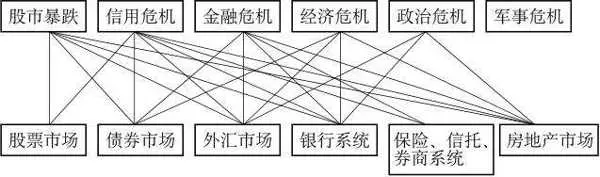

图11\-1 金融系统各子系统与风险后果的关联图

图11\-1的上半部分是按照对社会造成的动荡程度排序的风险，下半部分是金融系统的相关子系统。每一个连线意在表明该子系统出现重大风险所能引发的动荡事件，当然不管是上半部分，还是下半部分，其本身也是可以互相传递的，我在此没有描述。图中的连线关系只是大概率的，不是绝对的，比如股市不是不可能引发金融危机和经济危机，只是没有其他子系统那么强的正相关性。全球其他经济体的股市暴跌也并未每次都引发金融危机和经济危机。当然，金融子系统真正引发政治危机是小概率事件。

从图11\-1可以看出，在各个金融子系统中，能够牵一发而动全身的有债券市场、外汇市场、银行系统和房地产市场。保险、信托、券商系统作为金融系统的一小部分，其地位和影响力不可能与银行系统相提并论，所以基本上能控制在金融危机的范围之内，不大可能引发经济危机。股票市场投资者本身是权益性资本的所有者，首当其冲地承受风险是天经地义的。股价下跌在一般情况下关上市公司什么事呢？只要不危及控制权转移和质押贷款的安全性，股市的涨跌对整个金融系统和社会没有影响。这也就给股市的下跌划定了一条底线，那就是较大范围地发生控制权转移和质押强平或违约的这条线。据我估算，沪指在2700点和创业板在1500点会引发零星的风险事件，这个位置应当是股市整体的预警线的位置，也是必须进行新一轮防守的位置，最坏的结果是至少给充分换手留下一定的时间，不然到了2200～2400点，可能引发10%～20%的违约事件，那就麻烦大了。政府在3000点设置的安全垫保卫了股市三年时间，已经算是对得起广大股民了，在目前时局艰难的情况下，还能怎样呢？难道股市涨到四五千点把套牢盘全部解放出来？这有可能吗？有时候我真觉得中国的股民太天真，当然我还是得为那些被欺骗的股民鸣个不平。如果股票质押贷款发生大面积违约的话，相当于诱发了信用危机。在发生信用危机时银行收缩流动性就会给整个金融系统带来巨大的不良预期，而且违约事件对银行资本的冲击可能导致银行的破产，从而引发金融危机。银行出于风险考虑而收缩流动性会重创银行系统的货币创造机制，到时候货币刺激政策就不管用了，因为货币创造机制被破坏了。危机自然而然就蔓延到实体经济中，进而引发大量企业倒闭和工人失业。这些存在于国外的现象难道就不可能在中国上演吗？完全有可能。

不管是交易所还是银行间市场，债券市场的投资者都是清一色的机构，债券发行人也是具备一定的信用评级的机构。如果债券都违约了，那么股权价值就不言而喻了。鉴于债券市场的发行人和投资人的特殊性，债券违约直接就可以挂钩股价暴跌和信用危机了。至于银行系统与股市暴跌、信用危机、金融危机的关系也太明显了，我不再赘述。我想在房地产市场和外汇市场上多花一点笔墨。

先说说房地产市场，我试图回答两个核心问题：房地产市场到底有没有泡沫？房地产市场与现行的货币和财政政策的关系如何？

2017年，中国家庭杠杆率（家庭贷款／GDP）达到了54．4%，其中的贷款包括住户贷款和公积金贷款，这还未考虑到民间借贷和亲友借贷。可比较的数据是：2006年中国家庭杠杆率不到20%，目前日本是62%，美国是79%，新兴市场国家平均是37%。美国不具有可比性，因为它可以发行美元，也可以向全世界借钱。2006—2017年，城镇人口的人均住宅面积从27平方米提高到了37平方米。换句话说，家庭杠杆率从20%增长到了54．4%，一部分原因是人均面积增加了。但无论如何，家庭杠杆率按照这个增长速度，几年之后就可能接近美国家庭的杠杆率。考虑到中国与美国的差距，这个杠杆率现在已经逼近或已经处于危险的境地了。但是，如果我们换一个角度看，人均住房面积才37平方米，绝对还在刚需和改善型刚需的范围内。所以，我的结论是从价格和收入之比来看，中国的房地产行业很危险，但从需求来看，这么低的人均住房面积根本就是刚需，二手房不可能大量涌入流通市场来压垮房价。价格泡沫有，需求泡沫没有。

中国的基础设施建设投资主体是政府平台公司，不断进行卖地—融资—建设—卖地—融资—建设的循环。而房地产公司则是进行买地—卖房—买地—卖房的循环。可见，整个基础设施建设和房地产能够实现现金回流的关键的最后一环就是卖房。房子如果卖不出去，房地产公司就不会买地，平台公司就无法搞基础设施建设。到时候不仅是房地产市场和金融系统出现问题，由房地产和基础设施建设投资拉动GDP的增长模式也会走到终点。土地财政和土地金融裹挟着货币超发和资产、要素价格上涨，挤压了制造业的生存空间。如果不是房地产市场过快上涨带来了巨大的无效的成本增长，中国的经济转型可能还有可以腾挪10年的空间。不过，如果不是这样一种体制，中国的基础设施建设不可能在20年的时间里取得这么举世瞩目的成就，基础设施为降低物流成本、促进市场的统一融合以及物联网的发展所创造的价值将在未来几十年的时间里逐渐彰显出来。当前对我们来说就是不要让地价再涨，放宽民营资本的投资范围，实施减税，使法制环境更加透明。只有这样，实体经济才有重新燃烧的希望，依附于土地财政和固定资产投资的土地金融也才可能真正找到新的资产配置方向。经济增长方式和投融资体制都没变，你要谈金融脱虚向实，那不现实。

我将外汇储备简单地等同于美元储备，再从外汇储备和人民币汇率两个角度看外汇市场。我们出口商品或劳务到其他国家后收到的美元在指定银行结汇后换成人民币，于是外汇就存入指定银行了。外汇储备有什么作用呢？其实就和你的家庭存款的作用是一样的，包括买东西（进口支付）、增信用（提高国际信用和融资能力）、应付不时之需（抵抗突发风险），这三个作用和家庭持有货币的动机几乎一模一样，就是交易动机、投资动机和预防动机。外汇储备还有一个特别的功能，就是维护本币的汇率。稳定的汇率是外向型企业的成本或收益稳定的保证。外向型企业面临的风险已经够多了，如果还要增加变幻莫测的汇率风险的话，长期而言必然会增加风控成本。稳定的汇率也是境外购买力与境内购买力对等的基础，如果本币贬值，意味着国外付出同样的代价可以购买我们更多的商品和劳务，我们自然是吃亏了。外汇储备可以用于稳定汇率，但汇率是否稳得住，或者说稳定、升值、贬值的预期可不是由外汇储备决定的，就像我们的存款的多少决定不了物价涨跌一样。本币汇率取决于本币的供需，而本币的供需取决于该经济体的经济实力和预期。如果一个国家的经济体量足够大、足够健康，那么该国的汇率一般都很坚挺，因为持币者对该国货币购买力的数量和质量有信心。所以政府应尽可能管理好人民币的贬值预期，控制好外汇储备的水平。

至此，我们可以得出几个关于中国实体经济和金融系统的宏观结论：

（1）2017年才是中国经济最困难时期的开始。实体经济转型要依靠科技驱动，也要依靠制度的改革，否则不可能重新建立竞争优势。

（2）贸易战的最深层次的动机是把中国经济的成功转型逼入死胡同，同时让人民币国际化战略化为乌有。

（3）任何宏观经济的调控都代替不了科技追赶和制度改革的作用。制度改革可以让资本找到新的投资机会，同时解决金融系统脱实向虚的问题。

（4）在整个金融系统的各个子系统中，股市有一个不发生系统性金融风险的防守底线。

（5）外汇市场、房地产市场和银行系统都是牵一发而动全身的核弹。

（6）守住外汇储备比守住汇率更加重要，在经济建立新的竞争优势以前，人民币汇率的贬值是不可避免的，而且这种贬值不是由中国或美国的意志所能决定的，正如当初的升值一样。

（7）银行系统的风险可以直接引发金融危机和经济危机，它的波及面很大，必须加强防范银行系统风险。

（8）虽然房地产市场还有刚需，但是继续放任其发展必然会更加积重难返，对金融系统的冲击和对经济转型的阻碍是经济所不能承受的，应该加强对房地产市场的监管。

对于股市，我们也可以有如下结论：

（1）中国经济正在发生30年来的最大质变，特别是传统的技术含量低的消耗型制造业处境艰难，在经济转型完成之前，大盘整体维持较长时间的弱势。

（2）2700点一带是需要防守的预警线，再往下几百点可能会引发实质性的信用风险和信用危机。在2700点，鉴于中国经济的质变，股市整体估值的压力还是很大。往上有泡沫风险，往下有质押风险。

（3）中国是世界上体量最大的制造业国家，无论中国的经济转型完成与否，即便是考虑产业转移，至少10年之内不可能再产生一个对周期类产业需求如此庞大、如此集中的市场。所以，周期类股票整体长期看淡。

（4）降杠杆不大可能半途而废，首次公开募股和增发，特别是银行的增发是不会停止脚步的。

（5）中国经济的未来不是制药、白酒业，也不是银行、保险业，而是科技类企业，投资科技类企业不等于题材炒作，成百上千倍成长的牛股只能是科技类股票。中国传统的核心资产更多的是分红型、防守型投资机会，而非成长型投资机会。

（6）创业板指数跌破5年线可能是一个标志性的事件，标志着投资风格和投资者结构的深刻变化，但能否持续下去还有待进一步观察。

（7）纳斯达克指数用了15年的时间才涨回2001年的高点，我想创业板指数在10年内也不可能涨回4000点了。

中国经济高速增长了40年，新与旧的制度和市场资源都需要重新整固和配置，而这个过程不是在几年内就能完成的。我们对中国的未来充满信心，是因为全世界没有哪一个民族像中华民族这样，有着几千年来从未丢失的勤奋和坚韧的品格。然而，我们也必须清醒地认识到，这个未来可不是指的今后的三五年。再往大了看，除了美中关系，美欧、美俄以及美国与中东的关系都会在特朗普执政期间充满不和谐的变数，这给全球实体经济和国际贸易都增加了悬念。至于数年以后，我坚信，科技创新、制度创新以及全球贸易一体化的进程不可能因为某个领导人或某个国家而停滞不前。这些绊脚石终究会被历史的车轮所碾碎。

2026年2月27日

21:46

## 股票投资技术 - (2) 量价关系

\(2\) 量价关系

2026年2月27日

21:46

__量价关系 __

在前面多个章节里，我曾经一再提及看得懂实际走势是这样或那样的前提条件，能否看懂实际走势决定了你是否能做到顺势而为，能否做到保守地开仓以及适时地平仓，能否尽量准确地分析概率，那么实际走势的玄妙在哪里呢？就在量价关系里。所有的筹码交换和流动都表现为量价的互动。量价关系描述了一定的量引起了多大的价格变化，或者一定的价格变化需要多大的成交量来支撑。简简单单两句话，却是量价关系中最核心的精髓。当你读完并深刻理解了本章的内容，那些错落起伏的K线和均线在你眼里再也不会显得那么杂乱无章，而会像一幅幅藏宝图一样清晰地标明宝藏和炸弹的埋藏地点。

我在量价关系这一章不会讲一些基本的概念和入门知识，不会非常系统全面地讲述那么多K线、均线和各种图形。因为这些东西千变万化，讲得再多也不如把其中的逻辑和规律阐述清楚。

__第一节 简单而深刻至极的量价关系 __

任一时间点的价格都是当时多空双方斗争的均衡点，与前一时间点相比，价格上涨说明多方获得了这一时段战役的胜利，价格下跌说明空方获得了这一时段战役的胜利。价格好比胜负结局，成交量则描述了战役的伤亡程度。

在理想状态下，一只股票的卖价均匀地分布在现价以上的所有价位，一只股票的买价均匀地分布在现价以下的所有价位，并且每隔一段时间，比如5分钟，就会有新的买卖单均匀地分布在5分钟后的价格的上下。举个例子，假设一只股票的现价是10元，每一个价位的挂单都是100手，即10．01～11元这100个价位的挂单总共是10000手，9．99元下降至9元这100个价位的挂单总共也是10000手。假设5分钟之内没有新的挂单出现，则只需要1050万元就可以把价格推升至涨停价11元，或者需要10000手卖单就可以将价格打至跌停价。仅仅看成交量的话，无论是涨停还是跌停，所需成交量都是10000手。但是，实际情况是，不可能有5分钟的时间不出现新的买卖挂单，所以实际到涨跌停价所需的成交量都会超过10000手。单位时间内新涌出的卖单越多，说明筹码越松散，涨停需要消耗的能量就越大；跌停同理，单位时间内新涌出的买单越多，打到跌停价需要消耗的筹码就越多。反之，单位时间内新涌出的卖单越少，说明筹码越锁定，涨停需要消耗的能量就越小，跌停同理。这就是放量涨跌停和缩量涨跌停的区别，越是缩量，说明涨跌动能越强烈。以上是以涨跌停来说明涨跌的动能强弱，如果我们把涨跌的幅度调整为2%或者5%，其对应的成交量仍然是越小越说明涨跌的动能越强。放量上涨说明多方耗费了巨量的现金，也缴获了巨量的筹码，虽然取得了战役的胜利，但是杀敌一千，自损八百，后期筹码的锁定性和增量资金的持续性的对比决定了放量上涨之后的走势。放量下跌说明空方以巨量的筹码为代价，将价格推低到新的均衡点，同样后期筹码的锁定性和增量资金的对比决定了放量下跌之后的走势。放量上涨和下跌的阳线和阴线越短，说明多方或空方的胜利果实越小，虽耗费巨大能量却战果不丰，后续走势翻转的概率开始增加。反之，阴线或阳线越长，则后市延续趋势的概率增加，但也需要随时关注随后的成交量能否带来趋势延续。

那到底是放量上涨有利于后市还是缩量上涨有利于后市呢？这个问题得分以下几个方面来看，如表12\-1所示。

表12\-1 放量上涨与缩量上涨的利弊比较

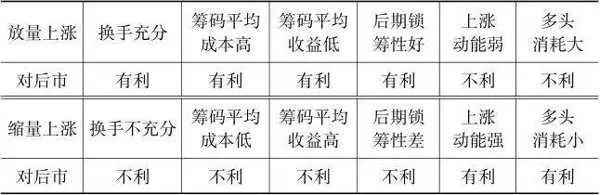

结论1：就筹码锁定而言，放量上涨的基础更牢固，新进资金多，更有利于后市上涨，但从能量消耗的角度看，放量上涨消耗的多头能量太大，不利于后市，而不论其级别。后市一旦多头资金不济，筹码仍会趋向松动，从而导致价格下跌。

结论2：就筹码锁定而言，缩量上涨没有带来充分换手，新进资金少，筹码平均收益更是超过放量上涨，筹码锁定性不如放量上涨，所以不利于后市上涨，但从能量消耗的角度看，缩量并未消耗多头能量，又有利于后市。

结论3：假设上涨前多头的可用资金是一定的，那么放量上涨后松动的筹码少，但后续可进入的资金也少；缩量上涨后松动的筹码多，但后续可进入的资金也多。所以，单纯看放量还是缩量一个因素无法判定哪种情况更有利于后市上涨，而是要结合上涨后的筹码锁定性和后续增量资金对比来看。

后续行情取决于筹码锁定性和跟进资金的对比，而这个对比并不好预测，只能依靠均线去度量和证明。这句话的含义是什么呢？就是在一波持续上涨或下跌的大行情下，这个对比结果会在一段时间内一直不变，要么资金持续流入，要么持续流出。任何短线甚至中长线的图形和压力都是暂时的，因为它背后的驱动力量可能一直没有弱化。所以，牛市中的所有图形都是上涨的图形，而熊市则相反。

既然要结合上涨后的筹码锁定性来看，我们就可以有一个清晰的思路了。依据第二篇的筹码理论，筹码的锁定性主要取决于投资者结构和收益对比。低位放量和绩优股放量后，筹码的松动程度会小于高位放量和绩差股放量。在相对高价的位置，放量上涨的危险性大于缩量上涨的危险性。所以就仅仅观察筹码的锁定性即股票的供给而言，结论就是：在低位上，放量上涨更好；在高位上，缩量上涨更好。但是，价格是由需求和供给的对比决定的。从需求而言，如果放量上涨后，成交量一直不缩小，价格也没有疲软，则说明后续资金充沛，无须担心放量后的能量不足。而缩量上涨后，如果价格仍然坚挺，则说明筹码并未如预期的那样松动，也无须担心缩量上涨后的筹码基础不牢。可见，不论是放量上涨还是缩量上涨，只要上涨后的价格仍然坚挺，都可以继续持有。价格是比成交量更为直观的指标，它直接显示了战役的结果，成交量只是过程的写照。

简而言之，放量上涨时买入，只要继续量增价升，就可以继续持有，一旦量能缩小，价格涨速放慢，就要格外小心。放量上涨后再缩量下跌至前期的量，则说明因上涨而松动的筹码已换手完毕，只要稍微有增量资金介入就可以开启新一轮上涨。缩量上涨则只看价格能否维持强势，因为没有成交量可供参考。静态、孤立地看，上涨的放量和缩量与后市的好坏并没有一一对应关系，各有优劣。

如果动态地、前后对比地看，就可以看到哪种上涨或下跌更健康。情况一：如果经过一段时间的上涨，然后缩量下跌到比前期低点更高的位置企稳，或者下跌到与前期低点齐平的位置时放出了比之前上涨更大的量，则是良性的量价关系，而不论其级别。情况二：如果经过一段时间的下跌，然后再次涨回到下跌前的高点，发生的成交量小于上一轮上涨到该高点时发生的成交量，或者发生的成交量小于这一段下跌的成交量，则是良性的量价关系。或者同样的成交量涨幅却超过了上一轮的高点或下跌的起点，则也是良性的量价关系，而不论其级别。举例来说，情况一：如果一只股票从9元上涨到10元，成交量为10万手，那么若回调时回调到9．2元就企稳，成交量小于9．2元涨至10元时的成交量，或者回调到9元时，成交量超过10万手，则这一波回调是健康的回调。情况二：如果一只股票从10元下跌到9元，成交量为10万手，那么若只用少于10万手的成交量就涨回至10元，或者用10万手成交量股价就已超过10元，则这就是健康的上涨。用数学的语言来描述的话，就是单位成交量导致的上涨或下跌幅度越大，说明上涨或下跌的动能越足，就越有可能延续之前的趋势，而不论之前的趋势如何。这个道理有点像微积分、加速度或者边际效应。这两种情况都说明场内筹码的锁定性在增加或者场外资金进场的欲望在增加。再次强调量价关系的最终结论：单纯的一段单边的涨跌，无论是放量还是缩量，都无法判定其涨跌健康与否，只有在一涨一跌或一跌一涨的对比中，或者在两段连续上涨或下跌的对比中，才能判定股价是否处于良性的变化中。需要强调的是，以不同的级别来观察，比如日线、周线或月线，得出的趋势在延续还是反转的结论就会有所不同。比如以日线级别来看，可能会延续上涨，但以周线级别来看，却还在下跌延续之中。总而言之，请投资者务必纠正放量上涨和缩量下跌即健康的片面观点，也忘掉量在价先这种没有指向意义的结论。价格本身是比成交量更重要的指标，没有价格作为坐标，没有以一个来回或者两段连续同向运动作为对比，是无法判定涨跌是否良性的。

均线是经过时间平滑处理后的平均线，包括价格均线和成交量均线。均线过滤和忽略了一些小级别的波动，既有好处也有坏处。毕竟大级别的趋势延续和转势都是由小级别开始，也是由小级别实现的，那些被过滤掉的信息可能是极为关键的。观察价格或成交量的涨跌除了直接看买卖盘口成交以外，看均线是一种更简单和等价的方法，上述有关量价关系的结论也都适用于均线所替代的实时量价。盘口和均线以外的其他任何技术指标，包括异同移动平均线（MACD）、随机指标（KDJ），还有波浪理论，都不如均线所反映的量价关系来得直接，其他绝大多数技术指标都是对均线进行一定处理，以期发现均线的变化趋势。这跟直接观察某一根均线或某几根均线之间的位置变化是一样的效果。所以，我认为除了量价和量价均线本身以外，其他一切技术指标都无须再观察和分析。我自己也从来不看量价均线以外的任何技术指标。

最后，再举一些比较极端的例子来补充说明量价关系理论。极度缩量一字板，代表整个过程获胜方不战而屈人之兵，涨跌动能极强，这种一般都是基本面发生质变或者有巨大的题材效应，导致多空其中一方直接放弃抵抗。持续放量上涨表示虽然筹码锁定性不强，但是足够多的增量资金足以消化大量的松动筹码并且持续推进股价上行。自2017年6月中旬起，方大炭素从10元起步，日均换手10%以上，日均成交额达50亿元，在约30个交易日内一路逼空式上涨至35元。之后成交量逐渐递减，价格也随之失去龙头风采。方大炭素是典型的放量后有资金持续跟进的情况，得以继续维持量增价升的良性状态。持续放巨量需要多头一方极具实力和勇气，要冒着巨大的抬轿风险，若非方大炭素产品大幅涨价和业绩极大改善，恐怕没有这么多敢于接力的资金。

__第二节 均线的聚散是一切技术性机会和风险的源泉 __

随便打开一只股票的K线图你都会发现，任何相邻级别的一组均线组合都只有两种走势，从发散到黏合或者从黏合到发散，黏合后选择方向，方向取决于更大级别的趋势，但趋势在几次强化后会发生反转。均线发散的性质是趋势延续，均线黏合的性质是趋势抵抗，趋势延续总有一次会失败，趋势抵抗总有一次会成功。均线的发散和黏合是一切技术性机会和风险的源泉。

均线发散和黏合的内在动力源自筹码（股票和现金）的稀缺性和回归平均收益的约束。当一只股票供不应求的时候，股票呈现单边上涨，但是不会有无限的现金去追逐一只股票，价格上涨积累的获利筹码有了兑现的需求，此时股票供给悄然增加，价格开始震荡横盘，并逐渐因多空力量对比的改变而扭转涨势，小级别的均线会逐渐主动或被动地向大级别的均线靠拢形成黏合。当一只股票供大于求的时候，股票呈现单边下跌，但是不会有无限的股票卖出，价格下跌所释放的空方能量和累积的多方能量促使资金在某个价位产生入场需求，于是价格开始震荡横盘，并逐渐因多空力量对比的改变而扭转跌势，小级别的均线就会逐渐主动或被动地向大级别的均线靠拢形成黏合。

相邻级别的均线黏合至一定程度，就意味着股票的供求均衡保持了一段时间，在这段时间内所有筹码的平均收益都是零，而且持仓的成本结构也逐渐趋同。在回归到与其他股票或者其他市场具有相同的收益率的要求下，叠加股票或现金稀缺的因素，股票会选择一个方向进行突破，而且黏合之后的突破阻力很小，只需要星星之火就可形成燎原之势。一旦形成方向性趋势，股票又会回到保持趋势延伸的惯性道路上，形成自小而大级别的发散，直至重新黏合的需求占据上风。级别越大的一组均线从黏合到发散需要的时间越长，因为形成新的或维持原有级别的趋势需要累积的能量越大，累积能量需要时间。

均线的黏合意味着相同成本筹码的累积，有近似的平均收益，所以有相对一致的行为动机，由此形成股价的压力或支撑。黏合的时间越长，均线的级别越大，说明该价位累积的成交量越大，其支撑和压制的力度也越大。

无论是什么级别的均线组合，黏合都有主动型黏合和被动型黏合两种。

图12\-1最上面的白线是年线，最下面的深色线是半年线。大级别的年线趋势向下，小级别的其他均线逐级向上靠拢年线，这种大级别与小级别走势相反的就是主动型黏合。

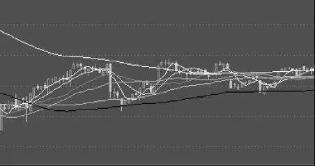

图12\-1 主动型黏合

图12\-2中的1线是30日线，2、3、4线分别是5日、10日、20日线。这种小级别均线走势方向与大级别均线走势方向一致，只是通过减缓小级别均线原有方向上的运动速度来等待向大级别均线靠拢的情况，就是被动型黏合。

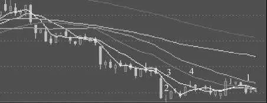

图12\-2 被动型黏合

上涨过程中的主动型黏合相当于某种级别的回调，伴随的通常是缩量，下跌过程中的主动型黏合相当于某种级别的反弹，伴随的通常是放量。上涨过程中的被动型黏合相当于某种级别的横盘，伴随的通常是平量，下跌过程中的被动型黏合相当于某种级别的横盘或更小幅度的阴跌，伴随的通常是缩量。在强势上涨和下跌过程中，一般是被动型黏合的情况居多。在被动型黏合的时候，短期均线甚至可能沿着趋势的方向剧烈运动，然后返回。一连几天甚至一二十个交易日反复如此，目的就是尽可能快速地拉动长期均线向短期均线靠拢并形成黏合。

如图12\-3所示，1线是5日均线，2、3、4线分别是10日、20日、30日均线。为了让5日、10日、20日、30日均线尽快下行，盘面不惜反复打压日线走势，形成数根跳空却又不创新低的日K阴线。下跌过程中的这种被动型黏合很容易带动盘中的恐慌情绪，如果是上涨过程中的被动型黏合，则容易带动狂热的抢筹情绪。均线黏合后，大概率地要沿着更大级别的均线的方向继续延伸。比如5日均线在挨着10日均线后，趋向于沿着10日均线的方向延伸，日K线在挨着5日均线以后，趋向于沿着5日均线的方向延伸。要注意的是，这只是一个概率性结论，而且均线级别越大，越大概率地沿着大级别方向延伸。

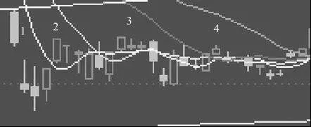

图12\-3 被动型黏合中的短线剧烈波动

如图12\-4所示，除了主动型黏合和被动型黏合以外，还有一种就是主动加被动或者被动加主动，表现为小级别均线在靠拢并穿过大级别均线后又回头第二次向其靠拢，如果反复多次主动加被动地黏合，就是均线的缠绕。缠绕可能是单个小级别均线或数个相邻小级别均线围绕一个大级别均线反复震荡。下跌趋势中的黏合无论主动、被动还是兼而有之，走势就是横盘、极速向上回抽或持续阴跌三种，这三种走势都不好把握建仓和平仓时机。反之亦然。所以在趋势性行情下，最好的策略就是持股或持币不动。在弱市如果要做操作，一定要追求胜率，不要追求盈亏比，要严格控制损失。

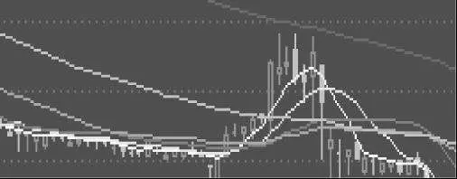

图12\-4 均线缠绕

均线的黏合一般直接就可以被观察到，而发散程度则可用乖离率来量化描述，当然在实战之中一般也无须那么准确地量化。两个连续级别的均线在黏合之后，也可能向临近的第三个更大级别的均线黏合。

均线的聚散对于实战的意义在于，合久必分和分久必合给我们创造了买卖的机会。均线缠绕到一定程度意味着均衡即将被打破，均线发散到一定程度意味着不均衡的状态被过度放大，需要重新建立均衡，股价运动的过程就是二者互为反向又互相接力的过程。无论多大或多小的级别，均线的聚散结合量价关系所释放的多空力量的变化信息，几乎都可以做到大概率准确地判断后续走势。

大级别均线虽然有更强的支撑或压制作用，但在转势的关键时候要从小级别着手，逐步推理并调整转势的概率，任何大级别均线的拐头都晚于更小级别均线的拐头。不要等到大级别的均线拐头了才确认转势。那时候可能你已经深陷两难之中了。特别是在熊市之中，等半年线拐头时，你的股票早已被腰斩了。自2015 年6月沪深300指数见顶到半年线拐头，历时3个月时间，指数从最高点打了六折，大部分股票都已跌幅过半。上涨时的情况会好一些，指数半年线拐头向上时，有接近一半的股票还未真正开启趋势性上涨行情，而且踏空并没有真正的损失。

一般来说，均线从黏合到发散的机会比从发散到黏合的机会更容易把握，因为黏合后再次发散一般都会指向更大级别均线的方向，属于顺势而为的投资行为，不论其级别。所以，对于喜欢做中短线的小资金而言，最好做60日均线保持上升趋势的股票，并且以更小级别均线的黏合作为切入时机。在利用均线从发散到黏合的机会时，赌博的成分更重一些，比如在跌到关键支撑位时去赌该股票有一个小级别的反转行情，在没有走坏的情况下，去继续赌它有更大一个级别的行情，直至实际走坏。但无论怎么赌，走好还是走坏，是多大级别的反转，反转都是由分时级别开始的，然后逐级展开。极个别的股票可能在一天或几天之内就完成大一个甚至大两三个级别的反转，这种股票的5日日均换手量至少需要超过10%，才有足够的资金去完成价格运动的急转。这里再次强调，均线的聚散只是预示着机会可能到来，必须结合量价关系的实际信号进行判断，才能够增加成功的概率。

__第三节 均线本身的位置以及各级均线位置关系的重要性超过股价 __

由于均线是经过平滑过滤的价格轨迹，所以单根均线本身的走势，以及均线组合之间的位置关系，比实时价格的走势以及价格与均线的位置关系更为重要，也更具有指向意义。

比如在价格尚未创出新高或新低时，5日均线已经创出新高或新低，这就表明价格仍然处于强势或弱势之中，价格随后创出新高和新低就是大概率事件。

图12\-5中的最后一个交易日是一根跌幅超过8%的大阴线，当日开盘时5日均线即创出5日均线的新低，此时离价格创出新低还有6个点的差距，结果当日在大盘下跌1．8%的情况下，该股暴跌8．38%，创出股价新低。

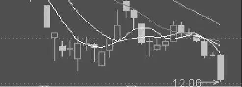

图12\-5 均线先于价格创新低

在图12\-6正中间，在一根带下影线的小阴线的第二天，价格还未创新高，但5日均线（1线）率先于价格创出5日均线的新高，在接下来的几天，股价一路上行，跟随5日均线的指引创出了新高。

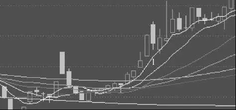

图12\-6 均线先于价格创新高

同样的逻辑，5日均线上穿或下穿10日均线，比股价上穿和下穿10日均线更具有指向意义，30日均线上穿或下穿60日均线，比5日均线或10日均线上穿或下穿60日均线更具有指向意义。但是任何事物皆有两面性，相比股价，均线的灵敏性要差一些，所以把股价、均线、均线组合、成交量等众多信息结合起来分析，将会带来令人兴奋的收益。

各级均线的位置关系就是均线之间的聚散程度。我们已经讲过，均线从黏合到发散是顺应趋势，而且黏合后的突破所需的能量相对小一些。这就告诉我们，即使价格还是位于与前一段时间相同的位置，但是由于各级均线的位置关系发生了变化，由离散变得黏合，变盘的概率会大大增加。

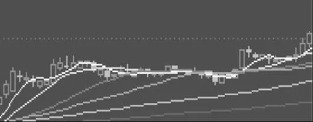

图12\-7 均线黏合后向上发散

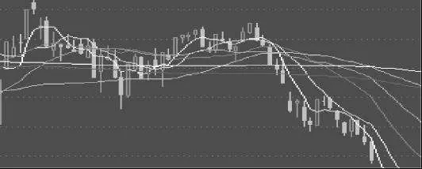

图12\-8 均线黏合后向下发散

图12\-7和图12\-8分别是在价格横盘整理了一个多月之后的向上突破和向下突破，而且突破的方向与更大级别的均线方向一致。所以，一定不要觉得到了某个价位获得了数次支撑或压制，这个价位就是不可突破的。反复几次以后，均线的位置关系发生了变化，这意味着筹码的成本、收益和行为特征都具备了一致性，变盘就可能一触即发。基于这个特征，你可以依据均线的位置和角度去延伸并预测各级均线可能黏合的时间点和后面的突破方向，并确定自己的策略。这对精确掌控突破时机有非常重要的实战价值。

__第四节 时间也是一种能量和成本 __

时间是描述成交量和价格的刻度。用一天、一周、一个月的量价对比前一天、前一周、前一个月的量价，就可以挖掘出量价现象背后的信息价值。本章第一节已经说过，通过一段单纯的放量或缩量涨跌无法判断后市涨跌的概率，对比同样的价格变化所需要的成交量方可确认。严格地说，此处还忽略了一个变量，那就是时间。

我们以本章第一节提到的情况二来举例说明。情况二：如果一只股票从10元下跌到9元，成交量为10万手，那么若只用少于10万手的成交量股价就涨回10元，或者用10万手成交量股价已超过10元，则这就是健康的上涨。这里我们其实假设了几个来回所花费的时间差不多，在时间差不多的情况下主要考察成交量的对比。在加入时间变量的时候，有两个时间可以作为比较的基准，一是从9元涨到10元所花费的时间，二是从10元跌到9元所花费的时间。假设第一轮从9元涨到10元花费了20个小时，再从10元跌回9元花费了20个小时，然后再涨回10元花费了15个小时，在时间的维度上这就是健康的。总之，在相同的涨幅下，如果第二轮上涨比第一轮花费的时间更少，或者在相同的跌幅下，下跌花费的时间更长或者至少差不多，那就是健康的涨跌。

在某条均线的上方停留的时间超过上一次，就证明市场在走强，在某条均线的下方停留的时间超过上一次，就证明市场在走弱，无论是分时、日线、周线还是月线级别，都是如此。进一步推理，某条小级别均线在某条大级别均线的上方停留的时间超过上一次，就证明市场在走强，某条小级别均线在某条大级别均线的下方停留的时间超过上一次，就证明市场在走弱。

对于成交量、价格和时间三个变量，我们需要同时从其中任意两个变量的维度去观察另一个变量，才可以得到走势所包含的正确信息。

以时间为单位，我们可以观察到价格和成交量的变化速度。速度是力度和能量的体现，速度越快，说明动能越足，节约的时间也越多。但是，任何事情都有两面性，越有速度的上涨，其持续性和基础牢固性就越差，这其实与成交量和放量、缩量差不多。从财务的角度看，每一分钱的资金都有时间价值，将资金的终值贴现为现值是要打折的。所以，时间的耗费等于付出了一项成本，而时间的节约则是收获了一笔回报，投资的本质就是赚时间。借用成交量的放量和缩量的说法，时间也有放量和缩量，时间的缩量表现为快速上涨或下跌，而时间的放量表现为缓慢上涨或下跌。时间维度的涨时缩量、跌时放量表现为快涨慢跌，这就是良性的价格时间关系。相邻两段相同幅度的涨跌，如果涨得快、跌得慢，说明需要耗费更多的时间成本才会导致相同幅度的下跌，当然这样就是健康的涨跌。既然时间也是一种能量和成本，那么时间的放量和缩量对于后市的意义跟成交量的放量和缩量是一样的。时间的缩量比放量更为强势，对多头的时间消耗少，但是上涨的基础不如慢涨来得牢固。而在时间放量的情况下，上涨的基础虽然牢固，但是对获胜方的时间成本消耗更大，比如堆量就是典型的时间维度的放量，在较长时间范围内完成充分的换手。

通常我们都习惯于在时间的框架内观察成交量，比如一天、一周或一个月的成交量及其变化，所以在一定程度上，观察时间的效果和观察成交量的效果是重合的。毕竟在大多数情况下，放量上涨和下跌都伴随着较快的速度，缩量上涨和下跌都伴随着较慢的速度（极度快速缩量是例外）。其原因在于：在一段时间区间和价格区间内，筹码的分布量通常不会突发巨变，所以只要成交量放大，价格变化速度就会加剧，只要成交量缩小，价格变化速度就会缓和。加入时间的考量后，假设价格上涨或下跌同样的幅度，则价格与成交量、时间之间的关系具体如表12\-2所示。

表12\-2 价格涨跌时消耗的成交量和时间

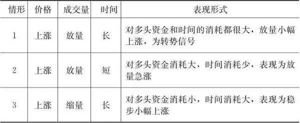

续前表

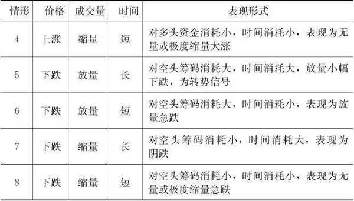

结论1：情形1和情形5表明在上涨和下跌一定幅度时，需要消耗更大的筹码和时间，属于放量滞涨和放量止跌，意味着某个级别的趋势很可能暂时结束，其中情形1的转势概率更大。

结论2：情形2和情形7是最常见的情形，情形3和情形6次之，总体而言，这四类情形都是常见状态。

结论3：情形4和情形8是最极端的情形，意味着多头或空头不战而胜。

虽然观察时间的效果和观察成交量的效果有些重合，但是把时间这个变量单独提出来分析仍然有其现实意义。它与单纯的量价关系的差别在于：一个描述的是在一定成交量的影响下价格的涨跌幅度，另一个描述的是在一定成交量的影响下价格的涨跌速度，好比一个是路程，一个是速度。其实某些技术指标，比如MACD，就是通过追踪价格变动速度的变化来反映多空双方的力量对比转化，从而推理后续价格趋势。所以，在筹码流动和交换的过程中，时间具有双重意义，它既是成交量和价格的标尺，本身又是一种能量和成本。如同量价关系一样，价格本身的重要性超过时间，不管涨速快慢，只要价格还在涨，就说明整体还处于强势之中，只要价格没再上涨，就说明在上涨中转势的概率增加。

__第五节 市场会自动寻找成交量、成交价和涨跌理由 __

假设总共有10个人，分别是A、B、C、D、E、F、G、H、I、J。其中A、B、C、D四个人在做股票投资，他们手里除了股票之外，每人都有1万元现金，而在市场上没有股票资产的另外6个人每人都有2万元现金。假设在市场上只有1只股票，股票价格是10元，股票总量是4000股，A、B、C、D每人1000股，总市值为4万元。10人之中的I和J永远不会涉足股市。

在初始状态下，每个人的现金和股票资产如表12\-3所示。

表12\-3 初始状态的现金和股票

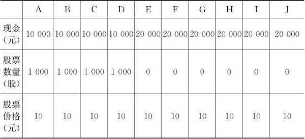

续前表

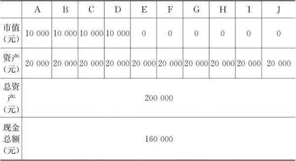

结论：市场的现金总额为16万元，总市值为4万元，总资产为20万元。每个人的资产都是2万元。

某一天，当E认为股票应该价值15元时，发生了第一轮换手。A把股票全部以15元的价格卖给E，成交量为1000手，成交价格为15元，换手后每个人的现金和股票资产如表12\-4所示。

表12\-4 第一轮换手后的现金和股票

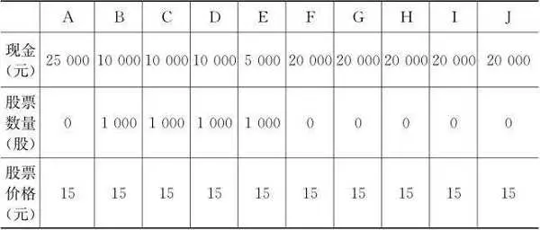

续前表

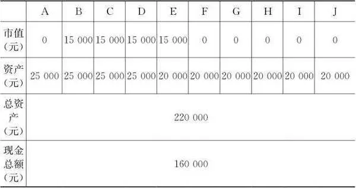

结论1：市场的现金总额仍是16万元，总市值为6万元，总资产为22万元，总市值和总资产分别增加了2万元。总市值和总资产的增加源于股票价格的上涨。

结论2：个人资产不再是每人2万元，初始持股人A、B、C、D的资产都是2．5万元，各增加了5000元，新买入股票的E的资产结构变成了5000元现金和市值为1．5万元的股票。

某一天，当F认为股票应该价值20元时，发生了第二轮换手。B把股票全部以20元的价格卖给F，成交量为1000手，成交价格为20元，换手后每个人的现金和股票资产如表12\-5所示。

表12\-5 第二轮换手后的现金和股票

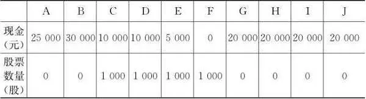

续前表

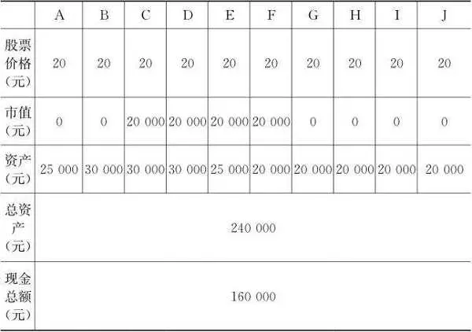

结论1：市场的现金总额仍是16万元，总市值为8万元，总资产为24万元，总市值和总资产比初始状态分别增加了4万元。总市值和总资产的增加源于股票价格的上涨。

结论2：初始持股人B、C、D的资产都是3万元，分别比第一轮换手后又增加了5000元，新买入股票的F的资产结构变成了0元现金和市值为2万元的股票。

某一天，当G认为股票应该价值25元时，发生了第三轮换手。C把800股股票以25元的价格卖给G，成交量为800手，成交价格为25元，换手后每个人的现金和股票资产如表12\-6所示。

结论1：市场的现金总额仍是16万元，总市值为10万元，总资产为26万元，总市值和总资产比初始状态分别增加了6万元。总市值和总资产的增加源于股票价格的上涨。

表12\-6 第三轮换手后的现金和股票

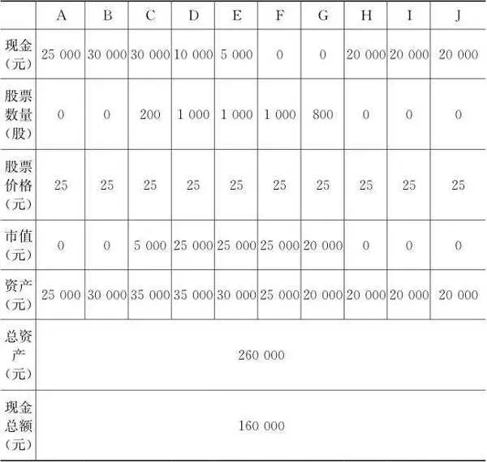

结论2：初始持股人C、D的资产都是3．5万元，分别比第二轮换手后又增加了5000元，新买入股票的G的资产结构变成了0元现金和市值为2万元的股票。

结论3：因为股票价格上涨和G的现金有限，C只能卖出800股股票，而G也只有800股股票资产，市值是2万元，等于他之前持有的现金额。

结论4：当股价上涨到25元时，在现金量的约束下，市场只能寻找到可以接收800股的买家，成交量开始出现萎缩。

某一天，当H疯狂地认为股票应该价值40元时，发生了第四轮换手。D把500股股票以40元的价格卖给H，成交量为500手，成交价格为40元，换手后每个人的现金和股票资产如表12\-7所示。

表12\-7 第四轮换手后的现金和股票

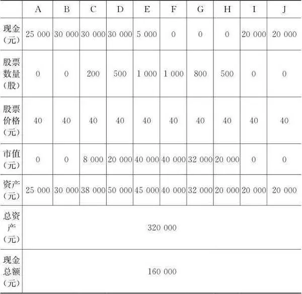

结论1：市场的现金总额仍是16万元，总市值为16万元，总资产为32万元，总市值和总资产比初始状态分别增加了12万元。总市值和总资产的增加源于股票价格的上涨。

结论2：初始持股人D的资产是5万元，高于所有人，比第三轮换手后又增加了1．5万元，新买入股票的H的资产结构变成了0元现金和市值2万元的股票。

结论3：因为股票价格上涨和H的现金有限，D只能卖出500股，而H也只有500股股票资产，市值是2万元，等于他之前持有的现金额。

结论4：当股价上涨到40元时，在现金量的约束下，市场只能寻找到可以接收500股的买家，成交量进一步萎缩。

再极端一点，到最后如果股价上涨到200元，即使把市面上除了I和J以外的8个人全部的12万元交到一个人手里，也只能成交600股。所以要保持以前的成交量，就必须降低价格，否则市场上所有的钱都不够支撑股票的价格。要么价格下滑，要么成交量下滑，市场会在二者中选其一，或者二者同时下降。所以，任何资产市场与货币供应量都有密切的正相关关系，一旦流动性收紧，或者迟迟没有增量资金入场，量缩价跌的状态就会一直持续。无论股价怎么变化，市场的现金总量都没有变化，变的是股票市值、现金在每个人之间的分配。

市场不仅会自动寻找成交量和价格，还会自动寻找上涨和下跌的理由，当涨到一定程度的时候，就算还有一百个理由可以继续涨，只有一个理由可以下跌，这时市场也会选择那一个理由跌下去，反之亦然。当时美国制裁中兴通讯的消息一出来，市场上就横空出世一个国产芯片替代概念来爆炒。就像商场的促销活动一样，商家总会找出各种理由，一会儿是店庆，一会儿是国庆，一会儿是中国情人节，一会儿是外国情人节。当大盘或者某个板块某个股到了技术形态或者基本面本身都有需求的时候，要维持市场的氛围和吸引力，市场会自动寻找炒作的概念。大多数都是炒几天或几轮而已，你当然可以热情奔放地参与，但记住要及时静悄悄地离开。

在一个典型的投机周期中，当市场疯狂的时候，就意味着差不多所有人都已经把钱投入游戏之中了，这些钱已经变成了大股东、上市公司和及时离场的二级市场投资人的钱，难不成他们还会把钱还给大众，真的让大众去发财？执迷不悟的大众和某些机构投资人该去其他地方干活挣钱了，挣了钱下一轮再来玩。游戏结束后，就看谁跑得快，不要去捡地上的钱，逃命要紧。

## 股票投资技术 - (3) 技术分析的一些理念

\(3\) 技术分析的一些理念

2026年2月27日

21:46

__技术分析的一些理念 __

技巧之多，任何书都难以尽述，而且尽述也无多大意义。技术分析中的悟和想比看书重要，很多细节的技巧你是很难在书本上找到的，或者说你只需要看懂最简单的技术分析知识就行，想通背后的逻辑更重要，难的其实还是灵活运用。

__第一节 如何判断盘子轻重 __

盘子轻重是指筹码的锁定性的大小，或者说筹码挂单的多少。盘子轻重直接表现为卖一到卖五的挂单量的多少。

依据我的经验，一只流通盘为10亿股的股票，如果卖一到卖五的平均挂单不超过100手，就算是盘子很轻，筹码锁定性很好；平均挂单为100～400手，就算是筹码锁定性一般，不轻也不重；平均挂单为400～1000手，就算是锁定性不好，盘子沉重；平均挂单在1000手以上的，就算盘子非常沉重了，等待卖出的筹码有很多。考虑到资金可以在低价股的买卖价格挂单之间不停地套利，所以低价股的每一档价格挂单一般比价格高的股票挂单要更多。盘子越沉重，上涨所需要的资金量就越大，难度当然也就越大。盘子轻重只考虑了卖单的大小，却没有考虑买方的强弱，所以要全面考量盘子轻重，还需要考虑成交量或者换手率。仍然以一只10亿股流通盘的股票为例，同样是平均100手的挂单，但是日换手1%和5%显然对价格的影响不在同一个层面，对卖出者而言的流动性也不在同一个层面。所以我们可以同时观察盘子的绝对轻重（五档卖单挂单平均数）和相对轻重（五档卖单挂单平均数／换手率），并赋予绝对轻重和相对轻重以不同的权重，以此判定盘子轻重。

五档卖单挂单平均数是一个不断变化的数值，多数情况下不必太在意挂单卖单平均数的些许变化，经过一段时间的涨跌和换手，挂单卖单平均数的持续与前段时间有较大的区别，这才是你需要注意的时候。

__第二节 对倒时无须损失筹码 __

对倒的目的是人为地制造成交量，释放迷惑性的放量涨跌信号，客观上起到活跃流动性的作用。

对倒有两种实际操作，一是直接以买单吃掉卖单或卖单出货给买单。在上涨过程中，比如卖一挂单是2000手，其中有1500手实际上都是同一个或者一致行动的账户所挂出的卖单，在买入全部2000手的过程中，实际买入的只有500手，在跟风盘众多的时候，可能根本没有净买入甚至是净卖出的状况，就吃掉了上方的2000手卖单。这是卖单卖出和买单买入同时进行的情况，还有一种情况是先买入随后卖出。随后指的可能是几秒、几分、几小时甚至几天。总之不以持有为目的的买入都可以视为对倒。不管是哪一种，对倒者都没有实际增加现金投入，或者实际投入远远小于表面现象，而是利用买入时对价格和成交量的带动吸引了跟风盘，制造一种吃货的假象，很大程度上真正推动上涨的力量来自跟风盘，对倒者只是在盘面上对公众做了一个量价配合的广告而已。

在下跌过程中，为了达到不丢失已有筹码而又把价格进一步打到低位的目的，对倒者同样也会使用该手法。比如对倒者在买一的位置挂出2000手买单，为了制造恐慌气氛，对倒者会自己把这2000手砸穿，实际上自己并没有真正抛出筹码。跟风盘发现有放量杀跌迹象后也忍不住交出筹码。对倒者就这样在没有损失自己仓位的情况下把价格杀到了更低的位置，以达到收集更便宜筹码的目的。

有时候，对倒者会故意抢进一些筹码再砸出来，以保留自己前期筹码不变，下跌时把恐慌盘砸出来，或者上涨时把跟风盘吓退，这也是对倒的性质。面对放量上涨或下跌，要想忍住不操作其实是很不容易的，而且你也无法判断这究竟是不是对倒。成交量放大，一般是资金主动入场或出场，但是是不是对倒，要看个股和大盘位置，以及随后的量价走势。

__第三节 洗盘有时是一个伪概念 __

理论上，洗盘是指主力资金拿出一部分筹码来打压股价，以达到清洗浮筹的目的。但在实战中，你根本无法判断股价被打压的真实原因，在大多数情况下也没有资金能控制一只股票的走势。如果你总认为有某些主力资金在洗盘，结果就是迟早会被深套。

市场上有多种资金在博弈，根本分不清各自的归属和目的。价格一旦触及某些位置，就可能引发某些资金的买入或卖出，买入可能是部分或全部建仓，卖出可能是部分或全部止损盈，可能是暂时的波段操作，也可能是长期的进场、出场，可能是试探，也可能是真的下注。所以不要去区分和判断什么是出货，什么是洗盘，洗盘大多数时候是一个伪概念。判断是不是洗盘，跟判断别人是不是在撒谎一样，没有必要，应该只看资金在怎么行动，怎么下注。依据实际走势中的量价信号去判定价格变化的趋势和级别，而不是主观地猜测其动机。洗盘是一个很容易误导人的概念，我认为应该抛弃，只看涨跌、量价、概率、止损盈，是不是洗盘无须去分辩。

__第四节 多大成交额才配得上你的资金 __

成交额越大，就意味着流动性越好，流动性越好就意味着你进出的冲击成本越低。那么多大的成交额才适合你的资金量呢？

如果你是100万元以下的小资金，那么，你得选择日成交额是你投入该股票金额的500倍以上的股票。例如，你如果用50万元买入一只股票，那么这只股票最近一个月至少要有两个交易日的成交额不低于2．5亿元。这种成交额的股票可以让你在很短的时间内完成建仓和平仓。

当你的资金成倍增长时，比如500万元，5000万元，你就不要指望能找到日成交额有25亿元或者250亿元的股票了，因为迅速完成建仓和平仓对股价的冲击太大了。这时，你需要通过延长时间来完成建仓，比如小资金在5分钟或10分钟完成建仓，而大资金需要用一小时、一天、一周或者一个月甚至更长时间来建仓和平仓。这就需要你对行情的判断和等待更加准确并且有耐心。否则，船大难掉头，一旦失误就非常被动。学会判断和放弃那些小级别的机会是大资金必备的最重要的能力。

__第五节 有哪些重要支撑位和压力位 __

按照支撑位和压力位的类型，一般分为均线、通道、价格比例、颈线、整数位五种类型。一只股票每相距一定价位，都会出现某种或某几种类型的不同级别的支撑或压力。支撑背后的逻辑则是我在第二篇的筹码分布中所阐述的内容，在此不再重复。投资者如果熟悉这些支撑位和压力位，会避开很多风险，也会抓住很多机会。在支撑位介入实际上是认为跌破支撑位是小概率事件，承担的风险就是破位的小概率。一般而言，多头或空头都会在这些重要的支撑位和压力位采取防守策略，否则就会一溃千里，在此之前可以佯装败退。不管是多头排列还是空头排列，支撑位总会带来较好的买盘，有一定的顺势效果，多头排列的支撑位最好等到上一次调整时得到支撑的那根均线。

均线支撑是最常见的。对于强势股，5日均线和10日均线就是介入机会。对于温和但是持续上升的股票，20日或30日均线是比较理想的介入位置。当股价处于下跌趋势时，5日均线和10日均线就会成为压力位，其他级别的均线也一样。级别越大的均线，支撑力度越大，但是通常在均线附近停留的时间也越长。

通道支撑是指在一个上升通道的下轨，股价通常会获得支撑，通道压力位则是通道的上轨。需要注意的是，和均线一样，通道也是有级别之分的。小时级别和日线级别的通道通常是小资金需要关注的。而周线级别和月线级别的通道通常是千万元或数亿元级别的资金所关注的。通道和均线有时候是重叠的，区别仅在于通道的上下轨一般是直线的趋势线。另外，横向整理的通道就是我们所谓的箱体。

价格比例是指当价格上涨或下跌至初始价格的一定比例时，股价一般会获得支撑或压力。常见的价格比例支撑位是初始价格的0．85、0．66、0．5、0．33、0．25倍的位置，而常见的价格比例压力位是初始价格的1．2、1．5、2、3倍等位置。

颈线是指在前期成交量密集的窄幅价格区域内，股价会遇到支撑和压力，成交量越密集，或者前期在此价格区域停留的时间越长，支撑和压力的力度就越大。

整数位是指某些价格的绝对位置会给股价造成支撑和压力。常见的整数位是5元、10元、20～100元的每一个10元位置、120元、150元、200元等。

不管是什么支撑位和压力位，结合股价本身的绝对位置、估值、大盘以及股票近期的量价变化等对支撑压力做适当的修正，以及放弃某些进出的机会，才是其中的精妙之所在。当碰到支撑位时，如果量价信号并没有实际好转的话，就尽量多观察，直至量价信号好转才入场。当碰到压力位时，如果量价信号并没有实际恶化，也尽量多观察，直至量价信号恶化方出场。当然，因为在支撑位和压力位获得支撑和压力本身是大概率事件，所以如果到了这些位置就立即行动，从概率的角度来说，并非错误的选择。在实际操作中，是等到实际量价信号，还是直接按概率行动，是一个权衡问题，基本上没有对错之分。

股价如果想要去某个价位，在相应的位置就会有支撑或阻力，否则证明它是不想去那个价位，至少在相当长一段时间内不想。这就好比如果你从重庆出发去成都，怎么也不会绕道到昆明，除非你的目的地不是成都。有时候市场也会利用支撑和压力来博弈，在上升趋势结束之前，把股价抬到阻力位后下杀，目的是收获更多筹码，而杀到支撑位后只需轻微力量便可借势重新上涨。下降趋势同理。

__第六节 分时图的几种类型及含义 __

日内分时图有八种典型走势。每一种走势都代表了某种类型的多空力量对比，只要熟悉了这八种走势，再辅助以成交量的配合，基本上就能达到一眼看穿当日股价趋势的功力。

第一种：稳步上升。

如图13\-1所示，分时均线稳步上升，股价呈脉冲式上涨，且每一次回调的低点距离分时均线的距离都更远。如果股价是从下方上穿均线，那么每一次上穿后在均线上方停留的时间都比上一次停留的时间要长一些。

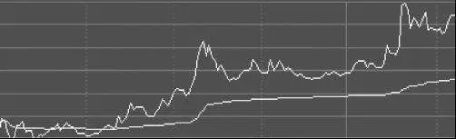

图13\-1 稳步上升型分时图

第二种：稳步下跌。

如图13\-2所示，分时均线稳步下滑，股价呈脉冲式下跌，且每一次反弹的高点距离分时均线的距离都更远。如果股价是从上方下穿均线，那么每一次下穿后在均线下方停留的时间都比上一次停留的时间要长一些。

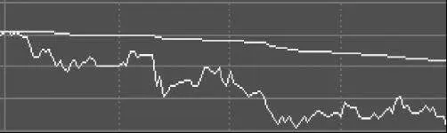

图13\-2 稳步下跌型分时图

第一种和第二种是最基本的两种走势，其他走势严格地说都是这两种走势的变形或中途变异。至于如何配合成交量看分时走势，具体请参照第十二章中有关量价关系的内容。一天之中，如果发现股价一开始或者中途开始呈现第一、二种走势，这就是短线建仓和平仓的信号。

第三种：上下震荡。

如图13\-3所示，分时均线基本上横盘，股价围绕分时均线上下波动，显示多空力量处于短线均势，需要进一步明确方向，结合前段时间的分时走势，这可能是转势的先兆，也可能继续蓄势。

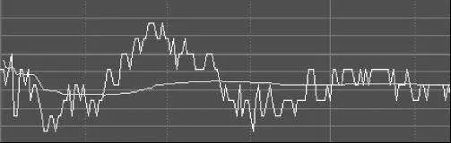

图13\-3 上下震荡型分时图

第四种：迅速上行后回落。

如图13\-4所示，股价在某个时刻突然以陡峭的角度放量上行，然后迅速回落至分时均线附近横盘。这种走势要么是强行冲高至某阻力位，然后开始一波下行行情，要么是直接先扫货吃掉上方筹码，再顺势抛出，一进一出后，垫高了短线的平均成本，有利于后市继续上涨。从概率的角度看，第一种可能性较大，第二种一般只出现在沿均线稳步上涨的股票中，而且最好在日线级别不要过度放量。

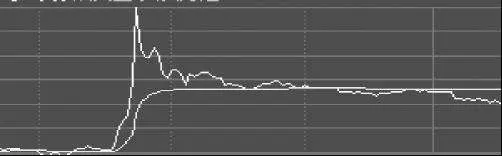

图13\-4 冲高回落型分时图

第五种：上涨后横盘。

如图13\-5所示，早盘股价迅速上行，然后在某个位置开始横盘，但横盘一直在分时均线的上方，分时均线在上行一段时间后随着股价横盘也开始变得无明显波动。比起第一种走势，这种走势中的多头显得略微有些保守和犹豫，但仍然处于优势地位。一旦股价跌穿分时均线，就要格外小心。

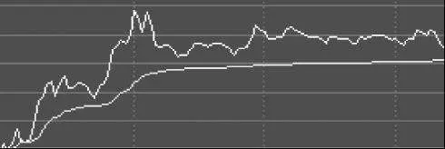

图13\-5 上涨后横盘型分时图

第六种：下跌后横盘。

如图13\-6所示，早盘股价迅速下行，然后在某个位置开始横盘，但横盘一直在分时均线的下方，分时均线在下行一段时间后随着股价横盘也开始变得无明显波动。比起第二种走势，这种走势中的空头杀跌动能似乎有所减缓，但仍然处于优势地位。一旦股价上穿，分时均线就要考虑短线建仓或加仓。

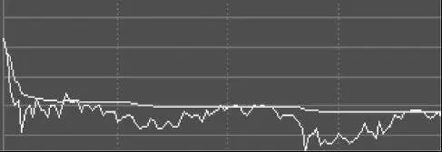

图13\-6 下跌后横盘型分时图

第七种：稳步下行中突然大幅单边上扬。

如图13\-7所示，股价本来处于第二种走势，然而股价突然上穿分时均线并且快速上行。这种走势一般是由于受到某种特殊原因刺激，或者股价本身处于底部或支撑区域，之前的走势属于诱空性质。这种突然的转势是一种小概率，在实际操作中多数情况应该放弃。如果股价本身在底部或支撑位，要特别注意图中间急跌后的量价信号，及时判断是否有诱空的可能，对于不知道原因的突发性拉升，就不要去追涨。

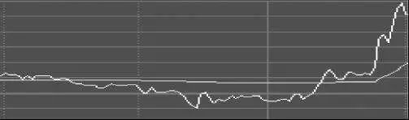

图13\-7 下行中逆转型分时图

第八种：稳步上行中突然大幅单边杀跌。

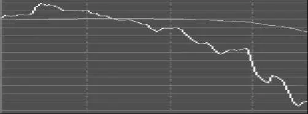

图13\-8 上行中逆转型分时图

如图13\-8所示，股价本来处于第一种走势，然而股价突然下穿分时均线并且快速下行。这种走势一般是由于受到某种特殊原因刺激，或者股价本身处于顶部或压力区域，之前的走势属于诱多性质。这种突然的转势是一种小概率，在实际操作中在跌破某价位时就该及时平仓。如果股价本身在顶部或压力位，则要特别注意图左边的急涨后的量价信号，及时判断是否有诱多的可能，至于不知道原因的突发性下跌，则应在跌破某价位后平仓。

以上八种走势可以基本上涵盖分时走势的大多数类型，其中前两种是最具实际操作价值的类型。其他某些特别的走势属于这八种类型的极端化案例。最后两种走势是小概率，一般只发生于比较特别的位置或大盘系统性转势的情形中。虽然这八种走势只是分时级别，但股价与分时均线的聚散特征和原理也同样适用于更大级别的走势。较大的资金虽然基本上无须理会分时级别的走势，但是大级别均线的八种走势类型是必须引起注意的。

__第七节 熊市很可怕的技术机制 __

熊市之所以可怕，是因为有五种机制会导致股价一轮又一轮下跌。

第一种是数学死循环。假设你用100万元买入了10万股价格为10元的一只股票，然后将它以平均9．5元卖出，收回95万元现金。你的卖压打击带动了这只股票的其他卖盘涌出，这时你可以以低于9．5元的价格全部买回10万股，然后又以9元的价格卖出去，收回90万元现金。只要没有增量资金入场，没有资金敢于在下跌趋势中买入并持有，理论上只需要用这100万元便可以把股价一直往下打压。一直到股票估值有绝对的吸引力或者增量资金入场，下跌才会结束。从最近两三年每次反弹的量、时间、空间看，应该就是这种死循环状态。增量资金不傻，不会来当救世主，何况现在的市盈率中位数还在30倍以上，并没有绝对的吸引力。

第二种是囚徒困境，一部分人看空的结果可能是所有人轮番看空。每当有足够影响力的资金看空时，其他资金就会设想如果自己不看空，就会沦为站岗的人。与其这样，不如自己也跟着卖出甚至率先卖出。

第三种是时间成本。持币观望的投资者是没有时间成本的，他们可以通过货币市场获得大约年化3%的无风险收益率。所以当市场处于下跌趋势时，他们不仅没有成本，而且还有无风险收益，并且股价下跌后，相当于在场外持有了更多数量的股票。而持股的多头就不一样了，他们不仅要支付无风险收益这一项机会成本，有些资金还需要支付财务成本，而且还要承担继续下跌的现实风险。如果增量资金久久不入场，在时间成本和财务成本的压力下，最终大概率地会出现多杀多的局面。中间去抢反弹的资金也出于同样的原因而成为股价杀跌的帮凶。

第四种是比价效应。在很大程度上，不同股票之间是可以相互替代的，替代品价格的下跌会推动被替代品的价格下跌。当中国国航的股价下跌20%后，差不多同质的南方航空也很难支撑原有的股价。即使你持有的股票的确与众不同，比价效应也会在一定程度上推动价格朝着替代品价格的方向移动。

第五种是风控本身会导致风险。按照风控的严格程度，可以把风控者划分为三种类型：普通投资者、分级和带杠杆的投资者、股票质押权人。股票质押权人持有的股票数量多，而且持有人就直接是债权人，以风控为第一要义，一旦质押人不追加保证，质押权人处置起质押股票来就迅猛而心无杂念。杠杆投资者在采取风控措施时也是快刀斩乱麻，不同之处在于，杠杆投资者持股的数量和集中度可能不如质押权人，所以威力可能略微小一些。普通的个人和机构投资者，风控措施相对就没有那么激进了，他们可能有更多的时间来周旋和定时定量地挂出卖单，很多时候只是造成盘面的沉重和阴跌，并不会如暴风骤雨般打压股价。

以上五种机制会不间断地、单个或者混合地发挥作用，一轮又一轮地扼杀反弹。顺便说一下，当股价处于上涨趋势时，推动股价继续上涨需要额外资金，而不是一笔资金就可以把股价一直推高；在时间成本方面，场外观望者无须支付财务成本而只是踏空而已；在风控方面，主要是落袋为安，而不会因为要保护债权或本金而不计成本地杀跌。至于囚徒困境和比价效应，上涨趋势中的机制和下跌是一样的。

## 股票投资技术 - (4) 盯盘技巧

\(4\) 盯盘技巧

2026年2月27日

21:46

__盯盘技巧 __

无论你是不是以股票投资为职业，观察盘口的细节技巧都是越细越好，格局上的大气和技巧上的精细大多数时候并不冲突。盯盘的某些内容其实我已经在第二章和第三章有详细阐述，本章我将在此再作补充。本章所谓的盯盘是指盯住日内级别的走势，但是原理也适合更大级别。

（1）盯分时和量价。盯盘当然是盯住小级别的细枝末节。稍微大一点的资金大多数情况下都无须盯住分时级别的走势，甚至连日线级别都不需要盯住。盯分时走势的主要任务就是迅速分辨分时走势的类型，结合前后两次同等幅度价格变化时的成交量和耗费时间的对比，根据已经走出的走势和量价信号不断推理和调整后面各种走势的概率。一般而言，不管是分时还是日线级别，最大成交量通常都有限制，这是资金的风控纪律所要求的。如果在分时走势中出现的单根量柱的最大值与前期大幅上涨时（涨停除外，涨停的成交量不具备参考意义，对倒嫌疑很大）的量柱最大值相差无几，就需要警惕见到日内高点了。对于平庸公司和一般大势，天量见天价正确率很大，这不仅大概率地适用于日线级别，也适用于日内级别，不仅适用于个股，也适用于板块和大盘。

如图14\-1所示，某只股票的日内分时成交量最大值达到1．1万手，而1．1万手是前期该股票大涨7%时的最大分时成交量，所以很可能这一波放量拉升的高点就是这个交易日的高点。同样出于风控和大资金操作风格的限制，从价格涨幅来看，前期最大的单日涨幅，也是通常情况下后面一段时间内的单日最大涨幅，一旦某日涨幅与前期最大涨幅相差无几，也要考虑是否当日涨势已尽，并密切注意接下来的量价变化。

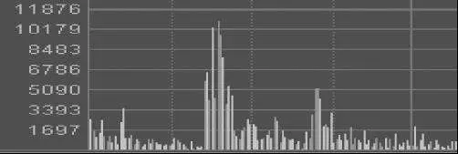

图14\-1 日内级别的分时成交量峰值

（2）盯龙头板块和龙头个股。无论什么时候，资金总是稀缺的，所以资金集中攻击某些板块和板块中的个股是很常见的现象。一个板块中的龙头股肯定不是估值最低的，因为已经有资金把它做高了，估值高是因为资金进去了，而估值低正表明没有资金去炒作。只要估值不太离谱，龙一龙二要大胆做，当然在日线级别尽量不追高，最好在回调时做。做龙头股应该以5日线和收盘跌幅3%且第二天上午不收回为标准来确定离场时机，当然成交量也需要密切关注，最好不要缩量。一旦量能不济，且股价也停滞不前，不创新高，就大概率地意味着后续上涨无力了。龙头股对大盘或板块有着重要的示范意义，龙头板块和龙头个股一旦疲软，就意味着连集中攻击的动能都没有了。某只股票如果完全不跟随板块或龙头而上涨，说明这只股票很弱，或者如果某只股票不跟随龙头股下跌，就说明这只股票开始转强了。

（3）盯支撑位和压力位。支撑位和压力位就是通道上下轨、颈线、比例位、整数位和均线。不同走势风格的股票所需盯住的支撑位和压力位也不同。需要强调的是，盯均线时一定要多观察几个级别，因为某个价位不是这一级别的支撑位或压力位，却可能是另一级别的支撑位或压力位，多算胜过少算，何况无算乎？无论是支撑位还是压力位，突破支撑位或压力位通常都会伴随一定程度的成交量放大和回抽确认。

（4）盯压单和托单的真假。大单压盘而不下行，说明并没有多少真正想主动卖出的单子，压盘只是为了吓退其他多头的参与，大单托盘而不上涨，说明并没有多少真正想主动买入的单子，托盘只是为了稳住其他空头不要恐慌卖出。大单压盘和托盘有时候就是金蝉脱壳之计。毕竟在同一价位的挂单，成交顺序是挂单时间的先后。某些资金可以不断撤单挂单来操纵调整自己的挂单顺序，以达到自己延后成交的目的。总之，不要仅仅看挂单的大小，而要看挂大单的方向是否与股价的实际走势一致，而不是背离，这就是判断挂单真假的最直接有效的方法。另外，挂出的大单被一笔笔小单成交所消化，也意味着大单大概率地有虚张声势的嫌疑，毕竟不成交就无成本和风险，成交了就有成本和风险，既然敢于消化大单，就说明有资金敢于去承受做多和做空的风险。

（5）盯对倒。对倒无非就是边拉边出或者边打压边吸货。只有既有钱又有筹码的投资者才能做出放量上涨或放量下跌的对倒动作。在期货交易中，这一现象更为明显，那些同时持有多头和空头仓位的投资者，相当于持有多头、空头和现金三种筹码，可以通过双平、多换、空换来达到影响价格和成交量的目的，而无须到处寻找对手盘。股票交易中的对倒也一样，只不过对手盘一边是现金，一边是股票，所以需要对倒者同时持有股票和现金。在行情低迷的时候，有些投资者就通过对倒来吸引跟风盘，他们每天的实际净流入或流出或许只有几十万元而已，挣个盒饭钱即可，许多交易都是人为对倒制造的成交量。

当然，某些对倒属于自救和日内做T的性质，其目的不完全是制造成交量。判断对倒的关键仍然是价格本身的涨跌，前面我们已经讲过，价格是战斗的结果，也是均衡点。在分时级别中，如果放量上涨后迅速回落至涨势起点，或者放量下跌后迅速缩量回升至下跌起点，多半就是诱多或诱空性质的对倒，故意击穿大单制造狂热或恐慌的效果。当然，更大级别的价格或均线涨跌的道理是一样的。

（6）盯个股与大盘或板块的对比。个股走势与板块和大盘走势具有十分明显的关联性。如果个股明显强于板块或大盘，且小级别的走势无转坏迹象，一般说来短线就该买入或继续持有；如果个股明显弱于板块或大盘，且小级别的走势无转好迹象，一般说来短线就该卖出或继续在场外观望。一天之中的走势大概率地不会有明显的反转。对于某些股票而言，虽然大盘跌时抗跌，但在板块或大盘由弱转强时，该股票并没有跟随着展开强势特征，那么多半前面的抗跌是勉强而为之，接下来可能就真正开始疲软了。总之，不管个股是否曾经抗跌，只要在板块和大盘上涨时该股票不随涨，就是隐患，就需要做好卖出的准备。

（7）盯几种典型的中短线顶底标志。关于顶底的形态，大多数书籍都描述得太多，几十上百种形态，其实根本没有必要列举那么多。归根结底其实就有那么几种，其余的都是更加极端一点的异化形态而已。依我看来，创新低或不创新低的日K阳线（收盘价高于开盘价），或者不创新低的日K阴线（收盘价低于开盘价），就是短线底部；反过来，不创新高的日K阳线或阴线，以及创新高的阴线，就是短期顶部。把日K线换成更大级别的周K线或月K线也是同样的效果。为了更为保险地判断顶底，实战的话还需要加入其他一些参考因素，以保证判断正确的概率更大。比如，在下跌过程中，如果还没有跌到比较重要的支撑位，见底的概率就要打折；如果均线先于价格创出新低，见底的概率也要打折；如果各条均线的黏合程度大于以往，见底的概率也要打折；如果下跌的速度明显加快，见底的概率也要打折；如果量价信号不是第十二章描述的良性关系，见底的概率也要打折；如果大盘不强或很弱，见底的概率也要打折。总之，保守的开仓价可以规避更多的风险，虽然也可能失去一些机会。在二者之间如何权衡，是你自己的选择。如果你忽视某些需要打折的因素，也不是错误的行为，但你心里一定得明白自己所冒的风险，不能陷于不知其可为也不知其不可为的状态。在上涨过程中也同样要考虑更多的其他因素，可以选择保守地提高胜率而及时止盈，也可以选择激进地提高盈亏比而继续持有。总之，要做到心里有数，有权衡和参考概率的理念。

## 股票投资技术 - (5) 操作系统

\(5\) 操作系统

2026年2月27日

21:46

__操作系统 __

首先声明，操作系统是以投资哲学为指导，以投资理念为内涵，以投资技术为基础的一个行动计划。制定一个操作系统并不困难，有一两年投资经验的人都可以做到，但是形式上的操作系统并不能说明任何问题。就算是把全世界最优秀的操盘手的操作系统毫无保留地放在你的电脑上，那也是白搭。离开了哲学思想和投资理念的操作系统，犹如一架没有灵魂的钢琴，怎么也不可能演奏出美妙的乐章。任何一个操作系统仅仅适合一部分风格和体量的资金，不可能有适合所有投资者的操作系统。而且就算是同一个投资者，在不同的市场环境下也应该有相应的调整。所以，再完美的操作系统也是机械的，操作系统的优点和缺点都源于其机械性。

建立操作系统的第一步是建立一个股票池，筛选和建立股票池的标准主要有基本面和技术面。我一般是同时用换手率和市净率（不超过5～8倍，具体看行业特征）两种最基本的指标筛选出成交比较活跃且估值不离谱的股票，再剔除可能会因为业绩而被ST和收入明显或连续下滑的股票。如果要做攻击性强的品种，就要放弃那些换手率不足5%或者最近5日日均换手率不超过2%的股票。要么休息，要么做有攻击性的操作，控制好买点不追高，要做强势股也只选择回调时，绝不直接在高位收盘或高位分时去追涨。做没有资金炒作的股票和盲目追高都有极大的输掉时间和金钱的风险，尽量做那些有换手、基本面尚可而又不追高的股票，放弃任何主观臆断和幻想。

建立操作系统的第二步是建立一个风险因素和收益因素的简单评估表，如表15\-1所示。

表15\-1 风险和收益的简单评估

在风险因素中，考虑到系统性风险和保守开仓的要求，大盘和股价具有一票否决的作用，其余的指标依据具体情况灵活掌握，没有什么绝对的标准。买入股票时要清晰地知道股票的风险点在哪里，走势属于什么个性风格，能判定的风险点和特征越多越好。买入后给自己价格、成交量、时间三个标准，不如预期就要重新考虑自己的错误概率和风险。

建立操作系统的第三步是在充分考虑风险的前提下，进一步量化量比、挂单、实际走势（5254原则和量价信号）、位置以及与大盘和板块对比这五大因素，并给每个因素赋值，使其更具有简单的可操作性。例如表15\-2是随机抽选的五只股票，对其赋值，说明表格的含义。为简化起见，任何因素的赋值只有0和1两个值。

表15\-2 风险和收益因素的量化赋值

结论1：中国国航、华胜天成、永安药业得分分别为2分、2分、1分，不要买入，需要卖出。

结论2：初灵信息和天富能源得分分别是4分、3分，需要买入，不要卖出。

需要再次强调的是，上述对两张表格的判定是建立在正确的理念和扎实的技术之上的，背后所需要付出的努力不是两张表格就可以概括的。而且，不同资金量的投资者，其评估周期、级别和变量因子不尽相同，大资金更强调大一点的周期、基本面和宏观因素。

每次决策时都通过填表来进行量化的自我管理，在慢慢形成一种习惯后，就可以不再机械地使用操作系统了。以上操作系统针对买入决策时更加机械和保守，而针对卖出决策时更具有艺术性，考虑的因素要复杂一些，这时表格的实用性就会打一些折扣，具体可以参照本书对盈利变量的权衡、量价关系和盯盘技巧的介绍来相机决策。

概括地说，建立操作系统包括建立股票池、大盘判断、风险和收益判断、具体操作四个步骤。总之，一个操作系统应当是以博弈为思想核心，以心灵驾驭为行为规矩，以概率为量化指标的系统工程。因为是博弈，所以自然不可能是机械系统，法无定法，道非常道。

在实际交易中，计划、随机应变、执行力互为制约，且都不可或缺，能够把三种能力融会贯通才是顶尖的交易者。

## 结束语

__结 束 语 __

我想以一则现实故事和一段武侠小说的情节来作为本书的结束语。

多年以前，马云曾问克林顿美国已经是世界一流，没有榜样可循，是什么力量在引导美国前进的方向。克林顿回答是使命感。我想这正是阿里巴巴一直遵循的理念，正因如此，它才一直没有迷失自己的方向。这一问一答，看似平淡无奇，实则惊天动地。

张三丰道：“都记得了没有？”张无忌道：“已忘记了一小半。”张三丰道：“好，那也难为了你。你自己去想想罢。”张无忌低头默想。过了一会儿，张三丰问道：“现下怎样了？”张无忌道：“已忘记了一大半。”张三丰微笑道：“好，我再使一遍。”提剑出招，演将起来。众人只看了数招，心下大奇，原来第二次所使和第一次使的竟然没有一招相同。张三丰画剑成圈，问道：“孩儿，怎样啦？”张无忌道：“还有三招没忘记。”张三丰点点头，放剑归座。张无忌在殿上缓缓踱了一个圈子，沉思半晌，又缓缓踱了半个圈子，抬起头来，满脸喜色，叫道：“这我可全忘了，忘得干干净净了。”张三丰道：“不坏，不坏！忘得真快，你这就请八臂神剑指教罢！”说着将手中木剑递给了他。

每个时代都有自己的使命，即使你身为芸芸草根，也不妨多多思考这个时代的使命是什么，时代的使命就是时代的机遇，看清时代的机遇即是最大的顺势而为。

__当身处实战之中时，最高的境界就是忘掉计划，忘掉纪律，忘掉仓位和损盈，忘掉本书一切具体的理念和招数，直至如水无形，了无羁绊。__
