# 《张化桥 避开股市的地雷》全文合订版

> 共92个章节。原章节顺序、段落结构和图表均予以保留。

## 作者简介

__作者简介__

张化桥，前瑞银中国投资银行部副主管，现任慢牛投资公司董事长。1963年出生于湖北荆门县，中国湖北财经学院经济学学士、中国人民银行研究生部硕士，后加入中国人民银行总行工作；并于1991\-1994年间于澳大利亚堪培拉大学任金融讲师。

1994年，张化桥移居香港，先后于惠嘉、里昂及汇丰等多家外资银行担任经济师和股票分析师。1999\-2006年，在他担任瑞银中国研究部主管、联席主管期间，他的团队连续五年被《机构投资者》杂志评选为“最佳中国研究团队”，他本人也连续四年被《亚洲货币》杂志评选为“最佳中国分析师”。

2000\-2003年，他在瑞银大力推荐小型民营企业，并创立民企指数，被冠以“民企之父”之称；2003年，协助推进中国QFII（合资格境外投资者）机制；2006\-2008年，担任上市公司深圳控股的首席营运官；2008年底，重回瑞银当投资银行家；2011年离开瑞银，转而从事小额贷款业务。著作有《一个证券分析师的醒悟》。

本书第一期稿费已经捐给广东省扶贫基金会。

本书由华安基金·投资悦读活动全力支持。

## 避开股市的地雷

__打开天窗说亮话__

__财智__

__WEALTH__

## 避开股市的地雷

__避开股市的地雷__

__张化桥 着__

__中国人民大学出版社__

·北京·

## 避开股市的地雷

图书在版编目（CIP）数据

避开股市的地雷／张化桥着．—北京：中国人民大学出版社，2012\.9

ISBN 978\-7\-300\-16262\-1

Ⅰ．①避… Ⅱ．①张… Ⅲ．①股票投资－基本知识 Ⅳ．①F830\.91

中国版本图书馆CIP数据核字\(2012\)第199750号

避开股市的地雷

张化桥 着

出版发行 中国人民大学出版社

社 址 北京中关村大街31号

邮政编码 100080

电 话 010\-62511242（总编室）

010\-62511398（质管部）

010\-82501766（邮购部）

010\-62514148（门市部）

010\-62515195（发行公司）

010\-62515275（盗版举报）

网 址 [http://www\.crup\.com\.cn](http://www.crup.com.cn)

[http://www\.ttrnet\.com（人大教研网）](http://www.ttrnet.com（人大教研网）)

经 销 新华书店

印 刷 北京华联印刷有限公司

规 格 140mm×205mm 32开本

印 张 9\.875 插页2

字 数 200000

版 次 2012年9月第1版

印 次 2012年9月第1次印刷

定 价 36\.00元

版权所有 侵权必究 印装差错 负责调换

## 推荐序：“悦”读投资 智诚相伴

__推荐序__

__“悦”读投资 智诚相伴__

年轻的中国资产管理行业正处在新一轮的变革之中。作为机构投资的先行者之一，华安基金公司在实践专业投资管理的同时，也乐于将不同视角的投资理念和思想介绍给读者。

继2004年和2006年先后推出“华安基金——现代基金管理与投资译丛”和“华安基金——世界资本经典译丛”20本书之后，华安基金启动了新版的“华安基金·投资悦读”丛书活动，试图以专业的眼光、轻松的形式，为投资福斯提供实务的案例和经验，让大家享受阅读乐趣之余，开拓视野，完善投资理念。

公司是经济社会的基石，股票市场的主角。伟大的企业对于推动社会进步的作用无可替代。福特、苹果等公司的出现，不仅演绎了财富的神话，更重要的是，为人类缔造了全新的高品质生活。提早找出这样的好公司，永远是投资的最高目标。遗憾的是，好公司总是异常稀缺，坏公司却常常能蛊惑人心。即便通过系统的分析研究，投资也始终无法回避反复试错的过程。因此，如何在这个过程中错得少、错得小，就显得异常重要。

张化桥先生经过了二十多年激情四溢的投资生活，在国际顶尖投资银行工作时享有“最佳分析师”、“民企之父”等赞誉，成绩斐然。令人讶异且尊敬的是，近年他开始批判性地反省曾经耀眼的投资人生，现在呈现的最新力作《避开股市的地雷》，以专业的视角、简单的语言、鲜活的案例，提供了如何发现优秀企业，规避股市地雷的独特思考，不仅值得专业投资人员研习，也值得普通投资者品读，可谓雅俗共赏。因此，华安基金管理公司欣然以本书作为“投资悦读”丛书的开篇之作，推荐给广大读者。

开券有益，“华安基金·投资悦读”活动，旨在让尽可能多的投资者分享读书的愉悦，打开投资的睿智，传播公司智诚相伴的文化。

华安基金管理有限公司

2026年3月14日

15:45

## 避开股市的地雷

照片摄于沈阳欧亚农业的兰花大棚。（编按：内地民企欧亚农业于2001年在香港上市，后涉嫌做假账，该公司现已除牌；作者任职分析师时，曾撰写报告质疑欧亚农业的前景。）

## 自序：股市有三种地雷

__自序：__

__股市有三种地雷__

我在香港住了18年，其中15年在投资银行工作。我两次离开投资银行，都是因为我觉得我没有用处，我帮不了客户的忙，因此那份工作越来越不能让我满足。在全球，投资银行这个行业的产能过剩很严重，竞争过于激烈，同质化的重复劳动很多。我多少有些厌倦了。

2011年6月，我离开瑞士银行，到了广州市万穗小额贷款公司工作，尝试一种新的生活。工作条件的变化暂且不说，把每个月的收入砍掉95％以上可不是一件容易接受的事情。我为什么要这样折腾呢？

本书的主题虽然是如何识别股票市场的地雷和避开地雷，但是，我花了大量的笔墨讲述我为什么离开投资银行，以及患得患失的历程。

依我18年的股市经验，我认为股票市场有三种地雷。这三种地雷分别由上市公司（大股东和高管）、政府和股民们埋下。当然，受伤的都是股民。

1．上市公司埋下的地雷一般由假账、豪言壮语和报喜不报忧混合而成。有些地雷可以持续20年甚至30年不为人知。我们常见的丑闻曝光只是地雷爆炸的极少数情况。比如，企业由于某个偶然的事件，纸终于包不住火了。但是，在绝大多数情况下，股民受了重伤却永远不知道受了伤，更不知道为什么受伤。因为这种地雷没有明显的爆炸，爆炸的形式不是通过丑闻曝光的形式，而是表现为企业的利润奇怪地下滑（或者增长率比预期的低），行业莫名其妙地走下坡路，或者企业突然撇账或者重组，等等。

股票分析不是一门科学，完全是常识。但是，如果公司做假账，你如何分析和给它们估值？

很多公司的大股东从公司偷钱。他们是怎样偷的？在本书中，我做了一些研究。

2．政府埋下的地雷一般由两个元素组成：怂恿、纵容和帮助上市公司（和拟上市公司）夸大销售额、利润和历史上的缴税额；或者给这些公司吃小灶，在土地、税收、环保和资金方面给予优惠。用低价向上市的国企注资，或者用高价把上市国企的不良资产剥离出来都属于此类。但是，由于这些补贴本身都是一次性的，不可能持续，更不能持续增长，而股民买的是企业未来几十年的收益，因此，这种政府干预都具有欺诈性质，如同地雷。它给股民一次次诱惑，而股民一次次受伤。

3．股民自己经常种下地雷：投机行为，过度自信，侥幸心理，不做真正的调研，等等。行业周期性的变化对股民的伤害也都是由于股民不愿意承认自己的能力有限。股民当然还有另外的问题，其中，不留“安全边际”就是最大的错误。

本书专门用实例讲解这三种地雷的危害。第一种和第三种地雷，全球都不少见，但是第二种地雷是中国特产。假账的严重性中国可能全球第一。我经常讲，中国的贪污腐败和地沟油有多么严重，上市公司的假账就有多么严重，因为它们都是龙的传人所为，是同一个文化背景的产物。

我很高兴，Raymond Jook（祝振驹，13年前我在瑞士银行研究部的旧同事和朋友）允许我用他的三篇关于识别股市地雷的文章（见附录），我非常感激。他现在是翱腾投资管理（香港）有限公司（Avant Capital Management \(HK\) Limited）董事总经理，专注于大中华区的价值投资。

一眨眼，我在广州郊区做了一年的小额贷款。我学到了什么？获得了什么？我坦白，这是非常艰苦的活儿。我虽然在贫寒的湖北农村长大，但是20年来的养尊处优带给了我一些娇气和傲气。过去这一年，我的娇气和傲气被打掉了一些。太好了！另外，我有三点感受：赚钱太难了，说服政府部门太难了，管理企业太难了。

在本书的末尾，我提供了一个新的书单，供读者参考。

张化桥

## 第一章 投资银行的大茶饭

__第一章__

__投资银行的大茶饭__

## 避开股市的地雷

“我的梦在哪里呢？投资银行确实依然是一个很有挑战性的地方。很多聪明能干的人在这里聚集。可是，如果越来越多的生意都要碰到这样的竞争局面，我能开心吗？”

## 1.01 为何离开投行这么难？

\(10\) 1\.01 为何离开投行这么难？

2026年3月14日

15:45

__1\.01__

__为何离开投行这么难？__

在全球投行界，有一个有趣的现象：很多人长年累月地说，真想早点退休，或者换个轻松点的工作。虽然另外的人不在嘴上念叨这件事，不过，他们也经常幻想退休。但是，要做到这一点，要真正退休，可不容易。而且很多人退休了，或者转行了，又再回头。

1994年，我从澳大利亚来香港投行工作时，有两个来往较多的香港同事。一个是中国研究部主管，一个是股票销售部主管。前者跟我同龄，当时31岁。后者32岁。虽然我很“高龄”才进入投行，但是他们俩从大学本科毕业（22～23岁）就一直在投行干。这10年下来，他们已经是老油条了，也有了不少的积蓄。当我对投行还一无所知，浮想联翩的时候，经常听到他们的唠叨，要退休，要转行。可是，前者在10年后才终于去了一家汽车公司当董事，后者则在10多年后才创办了一家对冲基金。要是讲压力，对冲基金的压力比投行更大了。

为什么投行的人们想离开投行这么难呢？

巨大的报酬差距是主要原因。比如，一个在香港投行工作了10年的人，可能年薪已经达到300万～800万港元，而他的大学同学如果进了一家商业银行，年薪可能只有50万～70万港元。如果进了其他工商企业，年薪可能更低。这还不算医疗保险、会所、出差时的飞机舱位和酒店等待遇、头衔、社会上的虚名、在豪华的中环办公室办公，等等。不要说这都是虚的，人是社会动物，实在的东西和虚的东西都要。

另外一个原因就是，投行员工虽然抱怨压力大，但是如果突然让他们放慢节奏，做政府的工作或者普通工商企业的工作，他们多少有些不习惯，也许没有足够的刺激，没有“翻云覆雨”的满足感，没有做成事的成就感。

__我的薪酬太高__

我在香港住了18年，其中15年在投资银行工作，这其中11年在瑞士银行。2006年，我离开瑞士银行分析师的职位，到深圳市政府下属的上市公司深圳控股（0604\.HK）当首席运营官。2008年，我应召回到瑞士银行做投行业务。可是3年不到，我又离开了。这次是到广州做小额贷款。如果说，去深圳控股时，我受到了股票期权（stock options）和企业管理的诱惑，那么，到广州做小额贷款可完全把赚钱的念头暂时放到了一边。

那我为什么两次离开投行呢？我两次离开投行，都是因为我觉得我没有用处，我帮不了客户，同时那份工作也越来越不能让我满足。我是个小小的既得利益者，毕竟拿了那么多年的高薪。用福斯的收入标准来衡量，我的薪酬算是比较高的。我不止一次坦白承认，相对于我对社会，对雇主，对客户的贡献来讲，我的薪酬太高了。我在2004年初被提拔为董事总经理。那时候，投行界的头衔膨胀还远远没有今天严重。我也获得了一些荣誉。瑞士银行对我来讲，多少有点像个家。我在瑞银工作三次一共11年：1994—1995年，1999—2006年和2008—2011年。另外，我妻子也在瑞士银行私人银行部工作两次一共7年。

我当投行分析师的时间一共11年，其中4年做宏观经济师（在里昂证券和法国东方汇理证券），7年做股票分析师（瑞士银行）。由于我在大学9年所学均为宏观经济学，而没有学习企业管理和会计，所以主动转到股票研究部门不是一件容易的事，这明显是自找苦吃。不过，我实在是不愿意继续做宏观经济研究了。我没有办法逼迫自己。我知道自己那时驾轻就熟，薪酬也不错，但是我实在开始怀疑宏观经济研究对投资的用处。最终让我做出这个决定的是，我在里昂证券公司时，跟老板的一次争论。

## 1.02 投资的信仰危机

\(11\) 1\.02 投资的信仰危机

2026年3月14日

15:45

__1\.02__

__投资的信仰危机__

吉姆·沃克（Jim Walker），人称Dr\. Jim是我在里昂证券的顶头上司。他是亚洲首席经济学家，我负责大中华的宏观经济学研究。他多年被基金经理们评选为最佳经济师。我也很欣赏他的勤勉和水平。10多年来，跟竞争者一样，他坚持每个季度写一本亚洲地区的宏观经济报告。其中对每个国家每个月的汇率和消费者物价指数（consumer price index，以下简称CPI）也要做出预测。我对这种预测毫无兴趣，也确实不知道怎么做预测。不过，所有投行都做这样一件自欺欺人的事，并且堂而皇之地出版和推介。我真的不明白买方的投资者们为什么愿意花时间听这种预测。

今天回头看，我当时的那种看法也许对，也许错。谁知道呢？不过，我铁了心要转行做股票研究。

__捅马蜂窝被辞职__

1998年底，我在汇丰银行做中国研究部主管才半年，突然被开除了（其实，准确地说是被辞职）。在那前面的几年，我一直有一个理论，并且写过很多报告。我认为，中国当时的外汇储备已经太多（不是太少），人民币被低估，而不是高估。我认为当时的亚洲金融危机对人民币没有什么影响。1998年，中国财政部宣佈发行20亿美元的扬基债券（Yankee Bonds）。我认为当时的官方借口完全没有道理。他们说，中国需要一个利率曲线，以便日后中国政府和企业到国外市场发行债券时作为基础利率的参照系。其实，当时的真实原因是，外国投行不断游说中国财政部发债（毕竟外国投行需要佣金收入）。有人说，我们的财政部官员也想乘机出国旅行（美其名曰“路演”）。是否就这么简单？我不得而知。

不过，这让我联想到这几年国内大量的省政府和市政府在香港的大型招商活动。领导们带领几百人，甚至上千人到香港住在昂贵的酒店，吹一通大话，然后大吃一通。领导们和喽啰们就去采购LV手提包、化妆品、西装和其他奢侈品。有时参加这种会，我碰到一些莫名其妙的人。他们对招商的内容一点兴趣也没有。他们来香港只是为领导们的奢侈消费埋单的。但是你别可怜他们。领导让他们埋单是瞧得起他们，是给他们面子。成百上千的人想来埋单，但是没有机会。

比起近些年招商活动的奢侈，1998年的国债发行的环球路演简直可以算是“艰苦朴素”。1994年，我刚到瑞士银行工作时，曾经陪同几个部委的处长、司长和部级领导们到欧洲考察“金融市场”。坦白说，当时只是美酒佳肴、豪华酒店和工作内容不清晰而已，没有任何可以炫耀的额外花絮。官员们为老百姓当公仆，辛辛苦苦，改善一下待遇，也无可挑剔。

1998年12月15日，我反对中国政府发行“美国扬基债券”的报告被香港《南华早报》摘要报道了。该报引用我的话说，中国财政部发行扬基债，是个“双输的行为”。毕竟，这些债券融到的钱又会用来买美国国债，利息只有3％左右。在利率上，中国的老百姓净亏两个百分点以上。我可捅了马蜂窝了。我当天就被辞职。在失业四个月之后，我又被我以前的雇主法国东方汇理银行下属的惠嘉证券聘回，当股票研究部主管。两个月后，我又被另外一个老东家瑞士银行挖角过来，也是担任中国股票研究部主管。

__预测股价如掷硬币__

这次回到瑞士银行，我老老实实工作了7年。从完全不懂股票，到稍微有点明白。虽然我5次被《机构投资者》杂志评为中国分析师第一名，但是，我知道我实际上知之甚少。我获奖靠的是嗓门大，而不是专业知识。很快，更大的问题又来了。我开始发现，我根本不能为客户增值。虽然我对个股、行业和股市的评论（报告）很多，但是，我明显感到，基金客户对分析师应接不暇。投行界有个说法，基金客户至多只看了他们收到的分析师的研究报告的10％。在很多情况下，他们接待来访的分析师只是出于应付，或者礼貌，或者维护良好关系。我假想，如果我两个月或者三个月不写研究报告，不拜访基金，不打电话，会不会有客户觉得缺少了什么？当然不会。我觉得，这份工作不能做了。

与此同时，我对股票研究的看法也开始转变。我看到我自己对公司利润的预测，对股价的预测，完全没有任何准确性可言。我的买入和卖出建议一半对一半错，甚至更差。这样的工作不是像掷硬币一样吗？如果是那样，我们何必装模作样写几十页（甚至上百页）的报告呢？那些报告花里胡哨，多少有点煞有介事。比如，我们经常看到分析师把企业明年的利润预测上调5％，或者股票的目标价格上调5％之类。我开始感觉那是有点滑稽的。我后来到企业工作，确信了一点，企业利润在10％以内的变动实在是会计上的一个小误差，可股票分析师竟然把它当一回事。股价变动呢？影响的因素就更多了。5％的股价变动几乎是天天都可能发生的事情。

那时，我的信仰发生了危机。一方面，我开始读有关巴菲特的书，开始相信认真选择好公司，长期持有。另一方面，我开始分析《漫步华尔街》（A Random Walk Down Wall Street）。我同时开始理解指数基金为什么比绝大多数投资更优越。我在这两个宗教中挣扎。很显然，我已经抛弃了第三个宗教：频繁交易，试图跑赢大市。但是这是多数人的信仰。

我知道，证券公司的生命在于客户频繁交易，虽然证券公司好像并没有积极地怂恿客户频繁买卖，但是这里潜在的利害冲突是明显的。

## 1.03 第三次回到投行

\(12\) 1\.03 第三次回到投行

2026年3月14日

15:45

__1\.03__

__第三次回到投行__

2006年初，正当我开始怀疑自己在股市有无任何价值的时候，深圳市政府在香港的上市公司，深圳控股有限公司，希望改善资本市场的工作和投资者关系。有几个基金经理建议他们来聘我。虽然我犹豫过，但我还是很兴奋地接受了这项挑战。深圳控股额外给了我企业管理方面的责任，任命我担任执行董事和首席运营官。

我究竟是否给深圳控股有限公司带来了任何增值，坦率地说，我不知道。确实，自从2006年3月我去深圳控股有限公司之后，它的股价曾经在两年内上涨6倍，但是，那在很大程度上是由于它的股价以前估值太低，而且2006年和2007年是香港股市发疯的年代，猪也能飞起来，特别是中国的地产股。在业务发展方面，我协助董事长和总裁出售了很多非核心资产，购入了很多土地，突出了主业，但是，有些资产的购入是聪明的，有些是愚蠢的。而且，在改善企业管理方面，我几乎毫无贡献。当然，我可以很容易地找到一个借口：这是大国企，我怎么能有任何作为呢？但是，我认为，我不能说这样的话。大量的国企领导在非常艰难的政府管制条件下，依然对企业治理作出了贡献。他们是英雄，而我自己只是过客，赚了点钱，跑掉了，没有留下长期的价值。

__与投行旧爱重燃__

2008年9月下旬，全球银行危机正在爆发。投资银行一个个被超级的负债率所困。贝尔斯登（Bear Stearns）已经倒闭在摩根大通（JPMorgan Chase）的怀抱，雷曼兄弟公司（Lehman Brothers）正在瓦解。我收到老东家瑞士银行的电话。当时的中国区主席蔡洪平我以前没有见过。我只听说他是个工作狂。瑞士银行当时的亚洲区投资银行主席洛永勤（Bob Rankin），也约见了我。我在瑞士银行当分析师时就认识他。

在投行界阴云漫天的时候，他们约我第三次加盟。我真正不知道如何是好：惊喜交加。这次，他们没有让我到研究部工作，而是让我到投行部，帮助企业上市、发债和并购。虽然在此之前的14年（即1994年），我做过一年的投行业务，帮助两家公司发行了B股，模模煳煳理解投行部（IBD）是怎么一回事，但是，1994年的经济和社会环境跟2008年哪里可以同日而语？

这时候，我在深圳控股有限公司的三年合同也差不多快到期了。更重要的是，我发现我的工作主要还是局限于表面功夫。我对深圳控股有限公司有点失望，但是我对自己更加失望！在深圳控股有限公司，我究竟还能做点什么？那时，它的股价也随着全球危机开始下跌，房子也开始难卖。我不能弃船而逃！那是不仗义的。我必须在最困难的时候坚守岗位。我回绝了瑞士银行。

接踵而来的是更多的瑞士银行老同事跟我见面，表达邀请之意。被人追求，每个人都会感到很有面子，很高兴。我也一样。毕竟，人家还愿意付很高的薪酬。其实，我知道我根本值不了那么高的薪酬。当然没有太多人主动要求减薪。

这时候，我对投行部旧爱重燃，又决定加入瑞士银行。蔡洪平比我大九岁，但是精力充沛，对国内企业和政府非常熟悉。我很佩服他。他天天出差也不说累，对业务的专注十分惊人。他如果批评我，我是不会有意见的，因为他比任何人更卖力。他确实有点脾气，不过，对我一直很客气，可能因为我的岁数比团队其他人都要大很多。其他人一般在25～35岁，而我那时46～48岁。

__互抢生意 疲于奔命__

我在瑞银做投行业务几乎三年。我承认我的热情在两年后就开始下降。我发现这个行业现在的产能过剩让人不敢相信。1994─1995年，我做投行业务时，基本上是一个上市IPO（initial public offering，首次公开招股），只有一两家投行参与，虽然那时投行的家数比现在更多。现在，投行家数少多了，因为很多老投行被兼并或者倒闭了，或者关门了。不幸的是，现在一项不怎么样的中型IPO都有3～5家甚至6～8家投行参与，出现严重的重复劳动。一本招股书需要30个人参加讨论吗？现在的情况使得每家投行团队都疲倦不堪。与其花时间把投行工作做好，大家都更注意在客户（上市公司或者拟上市公司）那里做小动作，表现自己。

已经被任命为保荐人或主承销商的银行并没有安全感，因为他们随时可以被挤掉。我也被挤掉过几回。我责怪客户吗？当然不。客户也有各种压力。有时压力来自非常高层的官员，有时来自客户的亲友，或者当地税务局或者放款银行或者供应商。我开始学习善解人意。公司老总是多年的朋友，这没错。但是，他可能有压力，也可能有问题需要解决。当官也不容易。在投行，抢不到生意，着急。抢到了，如果卖不掉，更着急。每个季度的收入指标也很让人头疼。最终让我想离开投行的事件是某大型企业在2010年底的可转换债券（Convertible Bond）发行。我代表瑞银负责这家客户的关系。所有投行都知道这家公司将发行4亿美元可转换债券的事情。大家各显神通，拉关系和游说，争取获得这单承销的生意。我在这方面很笨，消息不灵通，也不知道内幕，有时连关于我自己的小道消息和谣言，我都是最后一个听说。

## 1.04 这就是投资银行吗？

\(13\) 1\.04 这就是投资银行吗？

2026年3月14日

15:45

__1\.04__

__这就是投资银行吗？__

不过，瑞银毕竟是国际一流的投行，我们跟大多数主要客户都保持了良好的关系。我的工作也算相对容易一点。2010年12月3日下午2点，瑞银和其他三家最受该公司宠爱的投行得到风声，来到了该公司在香港中环的办公室。但是，高管们从董事长到总经理和财务总监都不肯接见我们，虽然我们平时都很熟悉。我们每家投行大约有2～3个代表坐在大会议室等待。高管们正在审阅我们四家银行的报价资料。我们等到晚上5点多，公司高管们才出面。这时候，公司要求投行硬包销，并且股票的转换价格不能低于12港元，在其他若干指标上，公司也有明确的要求（比如企业分红的处理和转换价格的调整，等等）。投行必须答应这些条件，否则不能入局。于是乎，每个投行的代表开始紧急地往香港总部通过黑莓送电邮，打电话，请求支持。这时另外三家投资银行得到风声，加入了角逐，他们的代表也携报价书来到了客户的中环办公室。整个大会议室开始挤得水泄不通了。

市场竞争真有效：所有七家投行都答应了公司的条件。晚上9点，公司宣佈，摩根大通和瑞信（Credit Suisse）两家银行入选。这时，又有三家投行加入战斗，其中两家的报价更具有吸引力。会议室的拥挤蔓延到了走廊和电梯甚至楼下的大堂。公司决定，那天的时间太晚了，亚洲的交易员和基金经理们都回家了，无法宣佈交易。更有趣的是，公司说，现在不缺钱，公司暂时中止这笔交易！

老道的投行人当然不相信中止交易的话。宁可信其有，不可信其无。第二天，前一天的原班人马从早上开始就驻扎到了公司的大会议室。我也带队在中午之前去了那里。我们等到下午3点，公司还是那句话：这笔交易已经中止了，请大家回去吧。可是，我们都不相信。下午5点钟，公司果然开始跟在场的投行讨论价格和其他条款。又有三家投行加入了角逐。乱套了！每家投行都开始到董事长、总经理和四个副总经理的办公室里寻找各自最好的朋友，作最后的游说！但是他们的电话都关机了，办公室要么锁上了，要么他们不在里面。

我们激烈的游说从来就没有停止。有好几间办公室开始出现激烈推门、关门和撞门的乱象。那吵闹，那烟雾，那紧张的气氛，让我非常吃惊！我的压力也上来了：我也可以强推门啊！但是，晚上8点多，公司明确提出，这个交易确实中止了！

晚上回到家，我感觉坏极了。我问自己，这就是投行业务吗？第三天，当其他投行都聚集到那家公司的中环办公室时，我已经没有热情再去了。而且，我开始相信公司也许真的想把这单交易延后。不管怎样，我一直拖到下午3点多才在同事们的压力下来到其他投行的代表驻扎的地方。等了大约3个小时，公司宣佈，另外3家投行获得了这项交易。我很失望，很累，很有点……愤怒！可是，老油条们提醒我，如今投行的生意就是这样，适者生存！

这时，瑞银的亚洲区主管开始打电话问我，究竟是怎样失去这单生意的？虽然他们说，没有责怪我的意思，但是言语间，我当然能够感到责任和压力。我表示，我应该承担责任，不过我真地不敢保证这家客户的下一单生意属于我们。

__离开投行 继续寻梦__

我明白了，这种投行业务也许不是我之所爱。即使我幸运地得到了这笔生意，我的增值或者贡献在哪里呢？我愿意重复这种角逐吗？

如果你的工作让你在养家煳口的同时，能够让你得到满足，那你就是最幸运的。可是，我的梦在哪里呢？投行确实依然是一个很有挑战性的地方。很多聪明能干的人在这里聚集。可是，如果越来越多的生意都要碰到这样的竞争局面，我能开心吗？也许，我是一个难以满足的家伙？另外，我根本就没有资格挑挑拣拣！

不管怎样，我开始继续寻找我的梦工作。也许，我应该开一个对冲基金？我害怕融资的苦处，害怕市场波动的压力，害怕业绩的烦恼。成立私募股权投资（private equity，PE）基金？这好像是个好主意，不过，也得先融到一大笔钱。显然这不是一件容易的事。投资之后还有抢投资机会的问题（希望不要动武），和把公司带到股票市场的问题。

这时，小额贷款进入了我的视线。这的确不是一个赚大钱的行业，但是它比起多数其他行业来讲还算不错。虽然它的可复制性很差，但是它毕竟有利润。在虚幻的投行工作了18年，我也该做点实在的事吧！我在湖北农村长大，对农民有感情，看到小商小贩，就很亲切。我本来应该是其中一员。他们对社会贡献很大，但是一想到中国几十年的户籍制度和其他很多制度（比如教育和医疗）我就很不满。

我访问过几乎20家小额贷款公司，终于决定换换生活方式。对于我的决定，我妻子当然很有保留，毕竟香港是一个生活费用很高的地方。工作条件和社会地位的变化暂且不说，每个月的工资要砍掉95％以上可不是一件容易的事。不过，我还是说服了她。2006年初，她帮我把办公室用品从香港中环的国际金融中心（瑞银的办公室）搬到位于九龙、比较朴素的深圳控股的办公室之后，我看到了她眼中的泪水：“你为什么要这样折腾呢？”

这一次，她问了我同样的问题。我说：“给我三年时间试试身手吧！就算我回到大学当老师，如何？我寻梦的努力也许完全失败，但是，我们还是衣食无忧。”2011年6月20日，我第三次离开瑞银在中环的办公室，搭乘当天的火车到了广州，住进了花都区朴素的新东豪酒店。

## 1.05 投资银行的人势利吗？

\(14\) 1\.05 投资银行的人势利吗？

2026年3月14日

15:45

__1\.05__

__投资银行的人势利吗？__

我有时听到别人批评投行的人们很势利。我本人在投行工作了15年，深感批评的不公平。难道你没有生意可做的时候，还指望投行的人天天围着你转吗？

当然，生意就是生意。如果不是赤裸裸的，至少也是冷冰冰的。跟任何生意一样，对于投资银行来讲，营销是首要任务。因为投行赚钱多，所以投行的人们更专注，花样也更多。有些花样是公开的，有些很隐蔽。

当你拿到某项生意时，你大概知道为什么你拿到了。但是，当你没有拿到或者失去了某项生意时，你经常不知道原因。投行在每次营销受挫时，都习惯性地做“解剖分析”（post\-mortem）。有时，这种活动变成了互相指责或者推卸责任。有那么几回，我干脆主动把失去生意的责任揽到身上，免得大家费劲儿。其实，即使你这样做，同事们也未必真地相信你或者怪罪你。不过，我觉得我这样做节省时间。我认为，也许我们永远不可能知道失去生意的真正原因。有时候，竞争对手想出来的奇怪招数和动用的上层关系我们根本不知道。

在深圳控股工作的那三年，我很“强势”，经常固执己见，说话不饶人和尖刻，伤害了不少同事。我真地很惭愧，很后悔。人往往认为自己有道理，别人理亏，其实不然。

2008年9月，我重回瑞士银行时，曾经发誓做个好好先生，善待所有同事和客户。后来的3年里，虽然我对客户一般还不错，不过也跟同事大发脾气至少两次，让我很后悔。这两件事确实证明我不是什么好人。第一次生气，是跟另一位董事总经理讨论谁负责哪些企业客户。其实那就是抢地盘，争功劳。回想起来，很没有意思。看来，我一点也没有超脱。第二次我大发脾气，是因为给一家公司配售新股。我通过努力，获得了那家公司的授权，但是，很遗憾，那家公司的股票流通量太小，交投不活跃，我们的股票市场部（ECM）说没有办法把1亿美元的股票卖掉。正巧，那个傍晚我在正从香港到北京的飞机上，ECM部门跟客户的沟通也断了线。我到了北京之后已经是晚上10点多钟，这单生意已经被客户取消了。第二天，另外两家银行成功配售了这批新股。我写了几个非常刁钻和尖刻的电邮，抄送全世界，大骂ECM无能和不努力。我感觉出了口气，但是我得罪了很多同事，也伤害了我们之间本来十分良好的合作关系。我只能怪罪自己。其实，瑞士银行的ECM已经是业内最优秀的。但不管怎样，没有人能够保证每单生意都做得漂漂亮亮。

有人说，亚洲的投行业务以关系为主，欧美的投行业务以水平为主。我不同意这个说法。在投行的那么多年，我看到的是欧美的同事们同样仰仗关系学。关系学甚至变成了严肃的科学被认真研究。不然他们怎么会在校友圈子里做那么多文章呢？谁是耶鲁大学毕业的，谁是哈佛大学毕业的，你跟谁踢足球，打网球，等等。另外，你怎么解释社交网站的成功和社交活动的被人追捧？不然LinkedIn和脸书（Facebook）为什么会那么成功？

当然，欧美的投行不像亚洲的投行那样过分。在亚洲，规矩被打破的概率要大一些，贿赂和利害冲突更容易被容忍甚至崇拜！

我们每个人都有一些朋友，朋友的朋友，校友，校友的邻居和亲属，等等。这些人当然在投行里被人们很当真。我去澳大利亚读书和教书长达五年（1989─1994年），而那正是中国突飞勐进的五年。我到香港投行工作的前面10多年，又主要在研究部工作。这很适合我不善交际的性格。同时，那十多年的经历也助长了我淡于交际的习惯。我能做到80％的时间在自己家里吃晚饭，有的朋友说，这在投行圈子里很少见。

长期做研究工作也为我后来转做投行业务（IPO、发债和并购等）增添了困难。不过，做研究的那些年，我也结识了不少政府官员和企业高管。

__人生不只是营销__

投行里的高层员工（比如董事总经理和副总裁们）都有营销和拉生意的责任。2008年9月，我重新加入瑞银时，蔡洪平用半开玩笑的口气问我：“求人没有问题吧？”我耸耸肩说：“没事儿！”其实，我是有事儿！

第一个月，我在瑞银的一位同事就给了我很好的忠告：“脸皮要厚。永远不要有受挫折的感觉。永不言败！不错，每个人都有很多朋友是企业高管，但是，这些朋友跟另外的投行也很密切。朋友归朋友。他能接你的电话，就算不错了。”这种平和和豁达的态度对我帮助很大。

我一直没有学会坚韧不拔的营销，也没有学会把生意从竞争对手的手中夺过来的本领。很多时候，我去北京或者上海出差，我会尽量事先用电邮或者短信跟我想见的官员、企业高管甚至老校友们联系，而不是打电话联系。一是我不想打搅别人。二是我想给别人一个机会不理我，或者一个机会说，“没有收到电邮”，“没有收到短信”，或者“收到电邮时见面已经太晚了”。你站在对方的位置想一想，他们也实在不容易：追他们的人当然很多，除了投行的，还有做私人理财的，还有卖保险单的和卖私人飞机的，等等。

我当然明白，每个行业都涉及营销。有一本英文书，书名就叫《人生就是营销》（Life's A Pitch）。当我无法劝阻自己八岁的孩子在黑暗中读书，于是狠狠地打了他几巴掌之后，我很难过，很挫败：我的营销能力和谈判技巧为什么这么差呢？

后来，我慢慢想通了。虽然我不介意做营销，但我不想长期做营销。让更适合营销的人去营销吧。我还是找个不太需要营销的事情做。这时，快速发展的小额贷款行业吸引了我的眼球。

## 1.06 股票分析师可能成为帮凶

\(15\) 1\.06 股票分析师可能成为帮凶

__1\.06__

__股票分析师可能成为帮凶__

我在香港的外国投资银行工作长达15年，其中当宏观经济师4年，股票分析师7年，做投行业务（帮助企业上市、发债和并购等）4年。另外，我在一家上市公司（深圳控股）工作了3年。总地来讲，我觉得上市公司的多数大股东和管理层还是本分的，遵纪守法的。但是也有不少的一小撮想尽办法利用股票分析师大发不义之财。

我先讲讲我的几次悲惨遭遇。

__1．香港上市的某民营的制药公司。__2001年，它的业务零零碎碎，市值大约只有7亿港元。当时我特别喜欢中小企业，特别是民营企业。香港媒体给了我一个外号──“民营企业之父”。这家公司的董事长刚刚买壳入主。他曾在中央某部工作，好像跟石油进口有点关系。5月某日，他托人约我吃饭，我不知中计。饭毕，董事长说，正好上周是我的生日，他想送股票给我做礼物。我吓了一大跳！我马上说，你的话算没有讲，我也算没有听见。当然，由于你说出这话，你的股票我永远不会研究！后来，我把这事完全忘了。他的公司也早就倒闭了，不知道伤害了多少股民。

__2．香港上市的华东某玻璃厂。__这家公司2004年到香港上市，好不隆重！三家投资银行抬轿子。参加它的IPO午餐讲解会的分析师和投资者大约有300人，连门口都站满了人。我到得略晚了一些，没能进去，只好折回。当然，公司成功上市了。在后来的一年里，我和秘书几十次联系公司，想去拜访，也许可以写研究报告。但是，公司总是找借口推托。为什么？因为我在2001─2002年跟两家坏公司（格林柯尔和欧亚农业）挣扎打斗，所以，有香港媒体叫我为“打假英雄”。

有些有问题的公司都害怕我去拜访。直到今日，我也没有见到公司管理层。当然，我也不需要见了：两年前，它出了大问题，正在清盘。我没有感到奇怪！

__3．香港上市的华南某民营铝制品公司。__总裁是我的熟人，还在投资银行跟我做过同事。2005年1月，神州大地经济腾飞，金银铜铁锡铝以及制品的需求大振，这家公司的业绩当然也不错。我和助手跟管理层见过几次面。他们的故事也已经广为人知：购买铝材，进行加工，毛利率为一个固定的比例，然后“顺价销售”。虽然故事不算令人兴奋，但是也还算过得去。2003年，我还为公司管理层组织过几次午餐会（跟基金经理见面）。我根据这些资料做出了2004年利润预测，写成了报告。我的推荐意见当然是“买入”。过了一个多月，公司公布业绩，业绩大跌！我跌破眼镜！为什么？他们的毛利率完全没有什么稳定性！管理层一直在撒谎。也许他们做铝的期货亏了很多钱，只好用产品加工的毛利率的大幅下降来掩盖？我感觉受了骗，除了在分析师大会上大骂管理层骗人，还专门写信谴责他们整个团队。一周后，我宣佈停止对该股票的研究。三年后，这家公司债务缠身，进入了破产程序。

__4．香港上市的华东某食品配送公司。__2004年，它被几家投资银行隆重推到香港上市。这只黑马的股价一直扶摇直上。2006年，它的市值曾经接近300亿港币。公司又配售了新股，发行了可转换债券。2004─2005年，我多次陪同基金经理到公司拜访管理层，参观他们的餐馆和超级食堂。他们声称为上百万工人提供盒饭。客户包括TCL的工厂、海尔的工厂、鸿海在中国的工厂和大量的写字楼白领。

这个故事不难理解，也不难相信。我的疑点有三。为几百万人烧饭的食堂该有多大啊！虽然公司说他们的食堂分佈各地，但是，上海松江的工厂据说也为50万人烧饭啊！我看不到忙碌的厨师们，也看不到川流不息的卡车（或者餐车）。我很奇怪。公司说，我去的时间是上午9点钟，太早了。那么，几点钟最忙？11点钟？OK！我11点钟再去。还是冷冷清清的。我打电话给鸿海公司，他们说，他们不用这家公司的送餐服务。我质问公司的CFO，他回答：“哦！我们以前为鸿海送餐。现在忙不过来，就不再为他们服务了。”我不悦，再问鸿海公司，以前是否用这家公司的送餐服务。回答是否定的。我更气愤了。再质问公司的CFO。他说：“抱歉，我记错了。”另外，他们的大米仓库小得可怜。CFO指着仓库中间的一堆大米说：“那就是我们的大米。”我琢磨，他们在上海松江的仓库每天起码需要400吨大米。我在农村长大，种过田，卖过稻子，大概知道400吨是什么概念。CFO完全是睁着眼睛说瞎话。

__5．香港上市的福建某药厂。__2003年，我上世纪80年代在北京五道口读书时的某校友跟这家药厂管理层联手欺诈。他“师兄前，师兄后”叫得很甜。我不疑有诈，耐心听他们讲解多次。由于我只是中国研究部主管，不是医药分析师，也不懂医药，所以一直推托不写报告。后来，我安排这家公司和另外几家医药公司到新加坡做了一趟路演。不知为什么，我的脑袋里出现了一种莫名其妙的悲凉感：我真地了解这些公司吗？我究竟在干什么？帮助坏人还是帮助诚实的企业？几个月后，我听说这家公司连工厂都没有。我打电话大骂五道口师弟不诚实。他极力辩解。某日，这家公司的股票暴跌90％以上，然后，那只妖火就熄灭了。和蔼可亲的董事长再也见不到了，我的师弟也消失了。

__6．香港上市的中国中药公司。__2010年，我还在瑞士银行做投资银行业务时，带几个同事拜访过华东地区一家上市的中药和饮料公司。这家公司的股票市值高达260亿元，可不是好玩的。我们希望跟他们创建关系，日后配售他们的股份或者做其他生意。董事长兴致勃勃地讲解产品和展示给大家留下了深刻的印象。突然，董事长小心翼翼地从保险柜里拿出一个三层丝绸包着的发黄了的线装书。那本书的外面页码都破了，烂了，卷起来了。一眼看去就知道是老书，很老的书。

虽然基本上没有文化，董事长也不知道从哪里弄了一个医学博士的文凭。听说他的公司还在申请博士后流动站。他本人也是几家大学的博导。这几年，我对国内的博导头衔产生了莫名其妙的鄙视，就跟鄙视我自己的董事总经理头衔一样。我知道这种心理状况很不健康，但是我没办法。好在我掩盖得不错。

董事长眉飞色舞地讲起他祖先在明朝元年开始师从中医吴天禹学习草药和香熏技术的光荣历史。那一页一页竖排版的、密密麻麻的文字，都是闪光的智慧。当然，董事长只是在我们眼前晃一晃，不会让我等认真地看。不过，我生性多疑，不然，哪里来的“香港打假英雄”的称号呢？我一眼就看到书的中间有“东风吹战鼓擂，现在世界上究竟谁怕谁？”之类的句子。我差点叫出声来：这不是“文化大革命”时期的句子吗？

我稍微给董事长施加了一点压力。我问他为什么把“文革”的那几页纸“夹杂”在如此贵重的传世之宝里面。董事长似乎明白我的讽刺，招呼大家到隔壁的书房吃午饭。虽然我已经完全知道这家公司是彻头彻尾的骗子，我永远也不会跟他做生意，不过，午餐还是在轻松愉快的基调中进行的。

一年后，该公司的产品的有用性和宣传的欺骗性开始被多家媒体怀疑。它主要依靠几个美女和少俊乱舞乱叫来支撑的局面已经难以维持了。现在股价从顶峰跌了80％以上。

2026年3月14日

15:45

## 1.07 闭上眼睛给股票估值

\(16\) 1\.07 闭上眼睛给股票估值

2026年3月14日

15:45

__1\.07__

__闭上眼睛给股票估值__

如果我们都不知道一组个股的股价甚至也不知道指数，让分析师们给一组股票定价。你猜猜他们会如何定？

他们会手足无措！我们经常见到分析师给一个股票定价在现价的上面20％～30％，或者下面20％～30％，甚至就是现价！这说明什么道理？其实，大家都是以过去和现在为参照系。这是一种依赖和没有信心的表现。实际上大家是不知道怎样定价。另一方面，这也说明，估值可以是一个很大的区间。它取决于太多因素，有些我们知道，有些我们不知道。

__买股票留“安全边际”__

市场的市盈率（price earning ratio，P/E ratio）可以是20倍，或者15倍，也可以是5倍。美国在经历了15年熊市之后（1968—1982年）之后，就是5～6倍市盈率。英国在20世纪70年代中期就是5倍市盈率。大家永远不要说：“中国有社会主义特色。政府绝不会让市场跌到那种程度。”说那种话是自欺欺人。

由于市场的市盈率（整体估值水平）只有老天爷知道，大家唯一的保护是，在买股票时多留“安全边际”（margin of safety）。不要说：“真便宜，才15倍市盈率！”在中国目前的利率水平下，一个健康的优秀的公司，如果在15倍市盈率，那是很合理的估值。但是，你我为什么要投资一个“估值合理”的公司呢？我们靠什么赚钱呢？我们的安全边际在哪里呢？

## 1.08 分析师不能影响市场

\(17\) 1\.08 分析师不能影响市场

2026年3月14日

15:45

__1\.08__

__分析师不能影响市场__

投资分析师的定位越来越难了，本来他们的作用是向基金客户们提供独立意见，以换取交易佣金。可是，由于投行多，所以同质化的研究成了一个大问题。而且大的基金公司越来越掌握着比投行分析师更好的信息和研究管道，他们往往可以经常见到大公司的首脑，而分析师经常是跟负责投资者关系的官员或财务总监接触。

另外，大的基金经理有全球的同事们支持，也越来越拥有自己的分析师队伍，比如富达、希洛德、Templeton和Alliance等都有很多分析师遍佈全球各地。

投行分析师遇到的第三个问题是，随着电子电脑技术的发展，交易佣金已经和正在快速下降。所以靠交易佣金就很难再过舒服的日子了。很多交易通过商业银行或E\-trade来做更便宜，小的当地投行和证券公司也越来越多。香港有近500家券商，大陆也有几百号。好在股市的交易量是稳步上升的，抵消了一部分影响。

第四，分析师与投行部（做IPO和并购之类的）的“中国墙”就使得分析师及证券部与投行分账方面稍微不像过去那么直接了。如果股市不好，IPO大大减少，二级市场交易量萎缩，裁员也就在所难免。我从1994年起经历了四个裁员潮。

__分析师随波逐流__

分析师遇到的最后一个问题就是“无密可保”，在互联网繁荣之前，投行往往把分析师的报告邮寄给基金客户，外人是看不到的，而晨会的内容提要是传真给客户的，或者由销售经纪在电话上跟客户讲的。所以其他投行以及非客户一般是不知道分析师的报告内容的，这就为投行分析师的存在提供了一个屏障或者一个个的小安乐窝。每个分析师都有自己的小天地，或者存在的价值。但现在不同，互联网和媒体随时把任何一个分析师的报告传播全世界。虽然非客户是不能直接获取投行分析师的报告，但开个户之后做很少的交易就可以随时在网上获取全投行所有分析师的所有报告，大小客户平等。而且现在分析师都在手上拿着另外的分析师的报告，也就是说，相互的竞争成了同台、同时演出，过去的安乐窝和屏障不见了。任何一份研究报告都可以被任何人用电邮转送来转过去。

分析师的这种同台、同时演出，理论上讲，本应该逼迫分析师千方百计提供差异化的研究和服务，但我个人的感觉是正好相反。首先，差异化的东西谈何容易；其次，人都是可以影响和受影响的。所以最后的结果是研究同质化，而分析师心情紧张，压力加大，以稳妥和随大流来保全自己。在某种意义上，做分析师成了一个“叫卖”的行当，看谁的嗓门儿高、亮，而实际上篮子里卖的东西也许是大同小异。

投行的分析师和经纪们大都喜欢说，“我们在这档股票上的观点是contrarian，即与主流观点不同的”。为什么这样说？一来是因为大家都知道主流观点或每个其他的分析师在讲什么，二来也说明反潮流的观点成了稀缺之物。

以前，西方投行的销售经纪可以跟本行的分析师的观点不一致。后来2001—2002年，美国纽约州的总检察长因为分析师缺乏独立性而对十大投资银行罚款200亿美元之后，多家大投行都开始谨慎起来，不准销售经纪与本行分析师明显唱反调。

后来，大家发现这样做似乎太离谱，所以又修改了规则：销售经纪必须先讲分析师的观点，然后可以接着说：“不过，我个人不同意我们本行的分析师的观点。”而且，销售经纪人在所有电邮的后面都必须自动加上一段“免责声明”：“这是销售经纪人的电邮，不是研究报告或研究观点。”

此外，在本投行的分析师尚未正式研究的大量股票中，销售经纪们也有直接跟踪分析的，有些销售经纪人的工作非常出色，他们的好处是涉猎比较广，关注的不是一个行业或一个国家，而且与基金客户接触更密切，所以在视野的宽阔度及对市场走势的灵敏度方面大大超过分析师。而分析师最常犯的错误是“只见树木，不见森林”。我本人就常犯这个错误。把这五档股票（或五棵树）盯得太紧，而忘记了别的行业在发生什么事对这五档股票可能产生的影响。

__分析师的角色混淆__

在一个成熟的市场上，分析师的好坏是指他或她的判断能力和预见力，而不是对市场的影响力，原因很简单，一个分析师只有看对了，他才有影响力；如果看错了，他是没有影响力的，即使他很有名气，也曾经被认为有市场影响力。

在市场上我们常看到一个分析师对某个中小股票发表初步报告之后，股价有很大的波动，这只能说明这位大行的分析师猜中了市场的运动，而不是影响了市场，靠名气只能影响股票几天，而很快它又会回到它的基本面所决定的股价。

很多分析师在写报告或与基金客户沟通时，有一个角色上的混淆。比如，很多分析师讲某某公司应该怎样，如何重组，如何把利润搞上去，如何与资本市场沟通，等等。你究竟是独立的分析师，还是这家上市公司的顾问，想帮助公司做提升呢？我认为，毫无疑问，分析师的角色是前者，而不是后者。这也就是为什么我反复在公开场合说，“我这个分析师，就是投资者的走狗”，这不仅是个法律上的问题，也是事实和常识。分析师的报告印刷千份万份，电邮发到全球，是写给谁看的？当然不是写给公司几个高管们看的，而是写给基金经理们看的，基金经理们对这家公司“应该怎样”毫无兴趣，他们只关心这家公司“会怎样”。“应该怎样”是个价值判断的问题，而“会怎样”是个不带感情的预测。任何基金经理所能投资的股票都是很多的，甚至成百上千，他们不是必须在一棵树上吊死，所以他们对某个公司“应该怎样”兴趣不大。即使他们犯错误投了一家不争气的公司，他们一般也不想花太多精力来关心这家公司“应该怎样”，大不了卖了走人。

“应该怎样”是投行部的事。他们向上市和非上市公司提供意见，以换取为这家公司发行股票、债券和做其他生意的机会。简言之，分析师是基金经理的顾问，投行部是上市公司的顾问。分析师跟基金经理讲某某公司“会怎样”。反过来，投行部的银行家们会告诉上市公司“应该怎样”，否则基金经理们“会怎样”（即买或卖你的股票）。我认为，这正是“中国墙”存在的理由。

不少分析师在同一份研究报告里出现角色混淆：一会儿说基金经理“应该怎样”（即买或卖这档股票），一会儿说上市公司“应该怎样”（比如减成本、抓市场份额、抓利润之类）。

有些分析师和基金经理（当然也包括销售经纪）由于对自己的角色理解不清楚，所以在行为上难免显得很荒唐。比如，他们中有些在访问公司管理层的时候，指点江山、激扬文字，随便给建议，以为这样才显得他们有见识，或者以为这样便可以改变一个公司的行为，殊不知“江山易改，本性难移”。你在批评上市公司时，负责接待的官员（董秘甚至总裁和董事长）可能客客气气，但他们一年要接待几百号或者更多的访客，你的建议有多少影响？有的人建议公司向东走，你建议他们向西走，还有人建议公司原地踏步。你以为你对公司高层有特别的影响吗？“三岁看老”，这话很实在，想改变任何公司都很不容易，我在深圳控股三年，对公司的行为方式有了些许影响，仅仅是因为我日复一日地在公司上班，把自己融入公司里来。我怀疑任何外人［包括投行、麦肯锡（Mckinsey & Company，管理顾问公司）、政协委员］对公司的运营产生了任何实质的影响，在我加入深圳控股之前，公司请麦肯锡做过一个运营方面的系统报告。坦白地讲，它被放在我的书柜里，可我从来没有打开。一年以后，麦肯锡回访，我也找借口没有参加。这不是因为我不尊敬专家，而是因为我感到外部力量之渺小。

还是回到基金经理和分析师与上市公司的关系。有些基金公司和分析师对上市公司居高临下，有时过分地施加压力，或者因为错误地买了人家的股票（或者错误地推荐了人家的股票）。但这种做法往往徒劳。

2005年，一位英国的基金经理在拜访比亚迪时，对比亚迪的新款汽车很有兴趣，一定要试开一下展车。当接待人员说，这车只供展览，不供试开时，这位基金经理大为不悦：“什么？我做股东，不能试开我自己的车？”这位基金经理是真的股东，还是假的股东，先不管，但用这种态度对待一家公司实在是不专业。

瑞银的销售经纪古丁（Nial Gooding）在这个问题上很有见地。他说：“我访问公司时，既不赞扬，也不批评。我去的目的是了解情况。如果你认为公司有一个十分愚蠢的商业计划，那只是你的观点，你不可以评论，也不能强加给上市公司。你应该谢谢人家花时间见你。对这档股票是买还是卖，那是你的决定。”

## 1.09 新股上市，投行搅局

\(18\) 1\.09 新股上市，投行搅局

2026年3月14日

15:45

__1\.09__

__新股上市，投行搅局__

即使我在投资银行工作的那15年，我也一直觉得买IPO是不够明智的。我自己没有买过IPO，我最反对的是散户买IPO。我举两个有代表性的例子。

2009年，本人在瑞士银行投行部工作，有幸参与了一家红筹公司的IPO。当时市场气氛很好。全世界人民刚刚从金融海啸中爬出来，感到无比幸运。这家公司的董事长说，过去两年的上市努力都失败了，原因在于市场气氛不好，被迫延到现在，必须打一场漂亮仗。他还说，定价必须非常激进，“以充分反映公司的优点”。在确定价格区间的那个星期六，我很着急。我听说董事长想把价格区间定在明年预测利润的13倍到16倍，而且明年预测利润在今年的乐观预测的基础上又高出了40％！我知道这个价格很贵，但是哪家投资银行反对，就很可能被迫出局（也就是不能参加IPO路演和这项交易）。对投资银行来讲，这可不行。过去两年，我们的IPO团队千辛万苦，好不容易熬到现在，到嘴的肥肉可不能让它飞了。

到了周六下午开会的时候，董事长带着他的管理团队，跟四家投资银行的代表，几家律师事务所的代表和公关公司主管坐满了大会议室。董事长很兴奋，先祝贺各家中介机构取得了阶段性胜利，然后，他讲了很多给大家打气的话。最后轮到四家投资银行的代表发言。谁敢说负面的话？二级市场的风险哪里有？某投行的一位董事总经理开始发言。他先说了几句好听的（无非是拟上市公司的优秀品质），然后他建议：“我们还是希望留点碎银在桌子上给投资者（leave some change on the table）”。也就是说，不要把价格定到太高，留点空间给二级市场。当时我在场，看到他的“大佬”脸色通红，屋子里的气氛非常紧张。董事长干笑了两下。大佬用脚踢了他的董事总经理一下，开始发言。他说：“这样吧，我们把定价区间弄得宽一点。优秀的东西就应该有优秀的价格，让路演团队的精彩表现来决定最终IPO价格。我建议13倍到17倍。行吗？”董事长当然高兴。他环顾四周。谁也不敢反对。一片赞成的声音。我听到自己也咕哝了一个：“好！”后来，我怕大家没听见，就清了清嗓子，又大声说了一遍：“好！”这样，不到一刻钟，会议结束了，价格区间就定下来了。上限定在了8港元。我坦白，我提心吊胆：这样高的价格怎么卖呢！

__投行放大IPO价格__

我的新担忧来了。各家投资银行必须挣表现。也就是说，我们必须卖力气安排高品质的基金公司跟公司管理层见面。更重要的是，我们要把大单子拿回来。大订单。买股票的大订单。基金经理们虽然也跟散户一样盲从和跟风，但是他们特别讨厌！他们喜欢分析来分析去。说服他们不是一件很容易的事。在有些IPO上亏了大钱，他们会怪罪投资银行推荐的公司太烂，或者IPO定价太高，或者后市没有扶持（研究报告和推广不利之类）。所以，这里有点约束机制。投资银行如果想持续地把IPO卖给基金经理们，必须掌握一个平衡点。不能不兼顾投资者的利益。但是，投资银行毕竟是投资银行。一单生意就是一单生意。做了这单生意再说。于是，短期行为和一锤子买卖的心态还是占上风的。

你可以想象，这家公司的IPO后来就定在了上限每股8港元。从IPO以来它就一直往下跌。四年后的今天，它的价格2港元不到。投资者们欲哭无泪。在股票跌到5港元左右时，董事长虽然也回购了一些股份，但那是螳臂当车。

这种情况非常普遍。另外一个例子。某公司2009年上市。公司不大，但是贪欲不小。它的IPO定价定到云端之上去了。由于公司董事长跟某美国投资银行的主管有几十年的交情，而且该投资银行还为该企业做过IPO之前的融资，立了汗马功劳，所以，这家美国投资银行主持这家民营企业的IPO工作。当时，几家没有入局的投资银行都想挤进承销团（当然也包括敝人供职的投行），分一点承销费，另外，在计算各家投资银行的市场份额时好看。所以，各大银行所承诺的IPO包销价格比那家美国投行定的本来已经很高的IPO价格高出几乎三分之一！那就意味着10亿港币的差距啊！

那家美国投行坚决反对把IPO价格提高三分之一。不过，交情的力量毕竟是有限的，那位董事长坚持要那家美国投行用我们几家“搅局者”的报价，否则，董事长绝对不会让友情影响他的商业决定。他明明确确地，斩钉截铁地说，谁的价格高，谁就做账簿管理人（主承销商）。最后，这家美国投行只好屈服。IPO价格提高了三分之一。四年后的今天，这档股票还比IPO价格低55％！

多数IPO交易（或者债券发行）都有大量投资银行充当“搅局者”，因为搅局的代价很低。A银行花了半年甚至几年的时间做尽职调查，设计交易结构，梳理拟上市公司的资料，获取证监会和交易所批准，但是，到了临门一脚的时候，其他银行来了。如果运气好，搅局者可以加入承销团，甚至把“原配”投行挤掉，独家揽这单生意。如果运气不好，搅局反正没有成本。所以，股票市场好的时候，IPO的价格容易放大。市场不好的时候，大多数IPO都卖不掉。在这两种情况下，股民都是弱势群体。

## 1.10 Facebook的官司，股民的教训

\(19\) 1\.10 Facebook的官司，股民的教训

__1\.10__

__Facebook的官司，股民的教训__

2012年5月，脸书（Facebook）的上市是全球股民和观察家们最关注的事情。由于它的股价在第一个星期便跌到发行价以下16％，有些投资者开始追究公司和投行的责任，几桩官司开始了。个体投资者们抱怨的理由之一是，投行在IPO的前几天把调低了的利润预测告诉给了大的机构投资者，但是没有告诉散户投资者。这很不公平。

投行承销团的主打是摩根士丹利（Morgan Stanley）。它回应说，这次IPO所遵循的程序跟任何其他IPO的程序是一样的，因此无可厚非。那么，投行一般遵循什么样的程序呢？

__散户与基金公司的不平等待遇__

在美国，以及其他股市，投行在承销一单IPO之前，一般要获得研究部的同意。也就是说，他们的行业分析师（准确地说，是即将写研究报告的那位分析师）和研究委员会必须对这项IPO持正面积极的态度。当然，这个态度在IPO之前和之后可以有微调，甚至可以有很大的变化。不管这种态度是否变化，如何变化，分析师都会积极主动地跟大基金保持沟通。另外，投行的股票销售部和股票资本市场部也会主动用电话、电邮和口头的方式，跟大基金公司保持联系。监管当局规定，研究员要想公开发表研究报告，必须等到上市40个工作日之后。但是，基金公司可以合法地收到分析师的IPO研究报告（不公开的），并且在IPO之前跟分析师面谈，这叫预路演（pre\-marketing）。这种厚此薄彼的不公平行为天天发生，大家习以为常。

以香港为例。对于一个IPO，投行的各个部门都会把各种有关信息传达给基金公司。拟上市公司的管理层也会不遗余力地面见大基金公司，详细阐述公司的业务前景和风险。投行的分析师也会拜会大基金公司，详细讲解拟上市公司的情况和行业的情况。当然，散户没有这种待遇。他们最多只有一个大型的午餐会，或者只能读招股书。我觉得散户最好的保护是，不买IPO，等到公司上市一年之后再做分析。有些聪明的基金管理公司规定，只能投资上市三年以上的股票。我觉得这条规则很适合于散户。

2026年3月14日

15:45

## 1.11 可爱的分析师和审计师

\(20\) 1\.11 可爱的分析师和审计师

2026年3月14日

15:45

__1\.11__

__可爱的分析师和审计师__

“拿人钱财，为人消灾”。这是个朴素的道理。投资银行的投行部和审计师吃的都是上市公司的饭，所以，多多少少会站在公司这一边。在不违法不违规的情况下，只要能过得去的事，投行和审计师都会让它过去。毕竟他们都不是警察。显然，这里似乎有点利害冲突。但是，当今世界还没有找到一个两全其美的办法。投资银行的投行部门受雇于上市公司，他们理所当然要为企业设计交易结构，挖掘亮点，寻求上市的最好时机和最高定价。这样的时机和定价不见得对投资者也是最有利的。

我记得1994年我刚刚加入投资银行时，参加一个中国B股公司的IPO。那家公司实在有点破烂（我指的是很多方面）。我们帮它把账目梳理了几个月，编写了业务战略和公司理念，又做了一个幻灯片、PPT档和招股书。在IPO路演的时候，坐在五星级酒店里看幻灯片和PPT档，连我自己都觉得大吃一惊：这公司还挺像一回事的！这就是包装和忽悠的神奇魅力。基金经理和其他投资者看看幻灯片、PPT档和招股书，再看看公关公司的推介材料、媒体报道和分析师的报告，有点心动是不奇怪的。

不少公司的高管们在私下里都承认，不管是IPO路演还是上市后的普通路演，他们如果不小心，就很容易把自己营销进去，把自己忽悠进去。他们很多人买了不该买的（自己公司的）股票，或者该卖的时候没有卖（自己公司的股票）。

__分析师和审计师“乐于助人”__

2002年，美国政府逼迫全球投资银行采取了很多实实在在的措施，把投行业务与证券研究分开。我本人在这两边（几家外国投行）都工作了很长时间，我敢说，外国投行现在已经基本解决了与研究有关的利害冲突问题。但是，有几件事情还是值得一提：

__1．尽管外国投资银行的股票研究部门基本解决了与投行业务的利害冲突，但是，分析师也可以是“可爱的”和“善解人意”的一群人。__他们有些人在基本公正的情况下，也略微“给公司帮点忙”。大家不要忘记，投行部和ECM部门（股票资本市场部）虽然不可以对分析师施加压力，更不是研究部的上级单位（各个部门都是垂直领导），他们在合法的情况下对分析师施加影响和游说还是可能的。而且，拟上市公司的高管也是可以对分析师施加影响的，不管这种影响是多么微妙。

__2．国内投资银行的分析师在独立性方面比外国投行的分析师差很多。__国内的同行们（更不要提公众或者官员们）甚至完全不理解为什么“分析师不听证券公司总经理或者副总经理的话”。国内强调统一领导，一元化领导。但是，外国投行的分析师（至少从2002年开始）完全是垂直线领导。

__3．偶尔也有分析师跟拟上市公司勾结作案。__

__4．在市场气氛好的时候，IPO价格一般都很高；而当市场气氛不好的时候，多数公司会选择等待时机。这就意味着投资者几乎总是付高价。__

审计师的问题也很明显：

__1．他们是由拟上市的公司在有竞争的情况下聘请的。__即使是四大审计师公司也是有激烈竞争的。拟上市的公司需要付报酬给审计师，而且也决定上市之后是否继续聘用这家审计师公司。

__2．审计是依靠抽样调查的。__把100％的单据全部拿出来核查是没有可能的。另外，如果上市公司存心要欺诈，审计师很难查出来。审计师依靠的原始材料当然是由上市公司提供的。如果上市公司把业务夸张5倍，审计师可能很容易发现，但20％～30％的夸张是不容易查出来的。另外，同样一个支出，究竟是作为当年的费用开支，还是作为资本支出，还是有弹性的。一项存货究竟如何估值？一栋楼如何估值或减值？坏账如何处理？弹性很大。你我基本上可以假定，审计师在合理合法的情况下是“能过去则过去”。

把企业或者企业集团的一部分业务（比较好的业务）包装上市，而把比较差的业务留在上市公司的外面，这也有欺诈嫌疑。为什么？因为在过去、现在和未来，比较好的业务与比较差的业务并不是真正的独立。它们至少在员工待遇、采购、销售和设施共享方面还保持着千丝万缕的联系。有些公司的欺诈更加过分：他们在上市之前，由比较差的业务补贴比较好的业务，上市融资之后，再反向操作。这样的欺诈行为在国企和民企中都有。

## 第二章 股民的眼泪

__第二章__

__股民的眼泪__

## 避开股市的地雷

“我们每个人都以为自己比大多数人聪明；而实际上，我们就是大多数人。”

## 2.01 自设地雷，股民垂泪

\(23\) 2\.01 自设地雷，股民垂泪

2026年3月14日

15:45

__2\.01__

__自设地雷，股民垂泪__

2011年，全球股市动荡，但是，美国道琼斯指数上升了5％，欧洲股市的下跌也很有限。奇怪的事情就在咱们家门口：香港和大陆市场均大跌20％左右。在香港，财经演员们捶胸顿足：“太便宜了，不得了啦。”但是并没有太多上市公司大手笔回购自己的股票，也没有太多的控股股东大手笔增持自己的公司的股票。全面收购而退市的就更加屈指可数！而且，长长的IPO的队伍也不见疏散。大家知道，IPO就是把公司的一部分股权卖给福斯。当然，卖新股和卖老股在本质上是一样的。

在A股市场上，评论员、官员和股民们不断惊呼：“超跌了，见底了！”可是股票继续下跌。上市公司的高管和大股东们除了偷偷地感谢股民的执迷不悟和财经演员的热情奔放以外，只顾埋头不断地减持、增发、配股、私募、辞职和套现。回购和增持非常少见，更不要提全面收购和私有化了。同时，成百上千的公司排着长队，想上市募集资金。显然，他们认为，现在的股价在大跌以后，对他们大股东来讲，依然非常有吸引力！

左边是热情的股民和评论员，右边是大股东、上市公司和想上市的公司。这两边的人们对股票估值的看法大相径庭。究竟谁聪明，谁愚蠢。只有老天爷知道！

有些上市公司的控股股东们可能会说俏皮话：“如果我们手上有钱，如果银行愿意提供贷款，我们肯定会增持和回购股票。”真的吗？况且，2011年并不是什么黑天鹅事件。在一个非常正常的年份，我们的企业的流动性管理就成了这个模样。难道我们股民不应该担忧吗？

对于中国股市2011年的表现，人们有这样和那样的评论。但是，很少有人说到点子上。虽然中国的经济增长快过其他很多国家，但是，你只要愿意保持一点冷静，就会发现我们的股票太贵了。虽然很贵的东西可以变得更贵，但是，下跌的概率毕竟大一些。我不明白大家为什么对2011年中国股市的大跌表示惊诧。

__先问自己该不该买股票__

2009年10月，为了推介我的新书，我到北京青年报做了一场慈善义演。书中有一节专门讲股民千万不要参与IPO。我在演讲中也特别强调了这个观点。虽然当时我还是瑞士银行投资银行部的董事总经理，我的观点严重有违我的职业利益，但是听众不领情。几个听者反驳说：“我在股市赚的钱全靠打新股。你讲的不符合中国的国情。”

股民的眼泪究竟是怎样流的？我看最大的祸害是股民在毫无调研的情况下，首先定下了“要买股”的基调，然后不断说服自己这个股票好，那个股票便宜。我觉得，股民的第一个问题应该是：“我该不该买股票？”我认为国内的股民还是不应该。即使现在，我在A股也看不到太多价值。当然，我也许错了，也许错得离谱。但是，我觉得每个人都应该先问自己该不该买股票。

过去18年，我从来没有买过A股。2011年初，我持有20只港股和美股。一年下来，我的多数股票跌了30％～50％。但是，在我的资产组合中，我奇迹般地撞上了四个全面收购（部分收购）和退市的案子。不是一个，也不是两个，而是四个！它们分别是：

（1）上海复地（2337\.HK）；

（2）郑州燃气（3928\.HK）；

（3）中国燃气（0384\.HK）；

（4）金威啤酒（0124\.HK）。

前面三个算是成功的并购案子：我卖掉了。谢天谢地，收获颇丰。金威啤酒是一个被华润啤酒部分收购的案子，由于后来部分并购失败，股价又跌到更低的位置。几年前，我买入该股就是个错误，而后来没有在并购争执期间乘机卖掉又是第二个错误。

多亏前面三家公司的全面收购和我的卖出，我在2011年的投资只是微亏。否则，我的资产组合可能会亏损30％左右。有朋友说，可能是因为我从2011年6月份开始做小额贷款，做了点好事，所以老天爷决定照顾我一下。也许如此吧。

2011年3月—4月，我投资了两家在香港上市的小额贷款公司，中国金融国际（0721\.HK）和中国金融投资管理（0605\. HK）。它们俩非常争气，竟然让我有微利！多年来，我一直持有两个爱股，新奥能源（2688\.HK）和粤海投资（0270\. HK），它们也很给力。

__投资三大教训__

这几年，我投资的教训主要可以归纳为如下三点：

__1．资产的估值应该是一个很宽的区间。__比如，一个股票的合理估值可能是3～10元。在这个区间任何价格都很正常，而且，有时它还可以超出这个区间。我们投资者应该尽量留足安全边际，尽量在低端购买，不要在7～10元时追买。否则，我们可能会血本无归。我们经常看到分析师在股票突然跌了一半时调低目标价格，就是这个原因。在买股票之前，我们要问自己一个问题：“它可能跌一半吗？”

__2．周期性股票的估值必须打很大的折扣。__也许，多大的折扣也不过分。过去3～4年，股市慢慢教会了我什么叫周期性股票，什么叫真正的公用事业股票（注意，中国的发电企业是制造企业和周期性企业，不是公用事业）。如果大家想做些比较，看看金风科技、钢铁股、汽车股、化学股这几年的表现，就明白我的意思了。我投资的有几个重仓股（新奥能源、中国燃气和粤海投资）可以算得上公用事业或者说它们的周期性不强，去年它们帮了我的大忙。我很感谢它们。

__3．选公司很重要，选行业好像更重要。__比如，我过去几年一直持有几个地产股：宝业（2355\.HK）、建业地产（0832\. HK）、中渝置地（1224\.HK）和天安（0028\.HK）。它们的管理层的敬业让我很放心，但是，我照样大亏其钱。巴菲特曾经说过，在选股时，骑师不如马本身重要。可是在实战中我往往忘记这一点。

__价值陷阱深不见底__

什么叫“价值陷阱”？一个下跌了80％的股票还可以再下跌80％。我本来以为我早就明白这个道理的。但是，我开始怀疑自己了。

几年前，我买了很多三林环球（3938\.HK）的股票，因为它在马来西亚、新西兰和圭亚那的森林很值钱，它的估值低得让人难以置信！我苦苦等了3年，一直亏钱。去年，日本地震之后，股民们开始大谈日本重建。而三林环球正好把木材出口到中国和日本，所以，分析师强烈推荐，股价突然大涨，我终于把解放军盼到了！我卖光了，发誓以后永远不再看它。一阵热风过后，它的股价又创下了历史新低……和更低！在股市，投机是坏事，不过，别人的投机对我们是好事。

未来几年，我会采取何种战略？

1．我想把持股个数从20只减少到10只左右。如果持有太多公司，我会跟踪不过来。不熟不做。套话。过去一年，我把好公司卖掉了，留下了一堆不争气的阿斗。这是典型的错误。彼得·林奇（Peter Lynch）把这种愚蠢叫做：在花园里，把花剪掉，却给杂草浇水。我准备择机把好公司再买回来，把杂草拔掉。不争气的阿斗可以害你到永远。

2．还是多持有一些公用事业和跟经济周期关系比较弱的公司。在行业选择上，继续强调未来3～5年的健康发展，少看短期（比如1～2年）的情况。少看新闻，少看研究报告，少做交易。

3．继续和坚决地忽略公司重组的炒作，忽略财政政策、货币政策、通胀率和汇率政策。

4．逼迫自己少看利润增长率，多看利润率。

## 2.02 坏公司上市，赚了股民的钱

\(24\) 2\.02 坏公司上市，赚了股民的钱

__2\.02__

__坏公司上市，赚了股民的钱__

我在投资银行最后3年的工作是帮企业上市和发债。我见过一些有趣的人。

1．王董事长经常说自己是某某宗教的信仰者，对钱不在乎，他所在乎的是社会责任和事业感。我跟他见过几次面，很佩服他的商业眼光和为人。他每次讲起社会责任，我都倾听，敬仰。有一次，他跟我说，他下周想在公开市场配售一些老股，让我找些人把股价炒高一点，帮助他一下。我简直不敢相信我的耳朵！

2．不知道从哪天起，资本市场开始对地产公司的估值用市盈率，而淡化净资产折扣。2009年，我们几家投行帮一家地产公司上市。老板决定把凡是能在当年卖掉的房地产专案以及投资物业全部卖掉，要把利润“做得像个样子”。几家投行都同意用2009年预测的净利润的11倍来定价，即融资前的估值（pre\-money）为11倍。它的利润曲线很有意思。2007年，公司只实现了1亿元净利润，2008年4亿元利润，2009年预测22亿元利润。当然，我们投行都为这家公司捏了一把汗。幸好这个IPO没有做成功。如果成功了，这家公司的市值可能会从IPO时的300亿元一直跌到了现在谁知道多少呢？

2009年，这家公司把凡是能卖的东西都卖了。可是，它的后续开发能力没有跟上，留下来的专案基本上都太偏僻，根本不能开工和销售。最近，我听说，它在2010年和2011年的销售额基本上都低于10亿元，利润小于2亿元。你想想，这档股票如果成功上市了的话，股民们可能已经亏了250亿元甚至更多钱。现在，这一类公司在香港的市值不过也就是30亿～40亿元而已。好笑的是，当时如果董事长愿意把IPO的价格稍微降一点点（比如5％），那单IPO就成功了！

现在，中国房地产公司（大大小小，形形色色）在香港上了市的大约有45家。2007年上市的中国奥园（3883\.HK）和众安房产（0672\.HK）分别融资5亿～6亿多美元，卖出25％的新股。可是，现在它们的总市值均低于3亿美元。也就是说，它们的股价都跌了70％以上。

当然，大量的其他公司也没有好到哪里去。恒盛地产（0845\.HK）在2009年IPO时，融资14亿美元，IPO的股价4\.4港元。2012年6月，它的股价在1港元附近徘徊。

__好公司的股票永远贱卖__

3．2008年底，我们开始为一家公司做并购。刘董事长很开明，说，钱不是问题，他只想做事业。但是，每一轮谈判都是因为价格差一点点而不欢而散。他每到关键时刻，就提出新的要求。几年里，我们跟很多上市公司谈配售股票。有一位老板很有趣。如果配售之后，股票下跌，他就夸奖投行抓住了高点。如果股价上升，他就很不开心（“贱卖了”）。此外，大量公司的股票配售活动都是因为老板坚持那额外的几分钱而流产。有时，老板坚持每股5元才配股，但是，市价只有4\.8元。怎么办？等等。结果，股价很快跌到3元，甚至2元。

后来，我找到了一个理论：好公司的股票永远是贱卖的。它从IPO开始就是贱卖，因为股价一路上升。后来的增发也是如此。只有昙花一现的公司是“赚”的。它用最高价把股票卖给了公众。遗憾的是，在大陆和香港两地，大多数公司是赚的，赚了股民的钱。

2026年3月14日

15:45

## 2.03 股民要从愤怒中走出來

\(25\) 2\.03 股民要从愤怒中走出來

2026年3月14日

15:45

__2\.03__

__股民要从愤怒中走出来__

过去10多年，全球股民都亏了钱，这还不包括通胀对购买力的侵蚀。未来10年看起来也不妙，大家很愤怒，于是怪政府，怪投行，怪贪婪和欺诈的企业家，还有怪自己。

这很不健康。我们退一步，看看应该从中学点什么。我觉得有两点特别重要：一是股民的独立性，二是政府的政策调整。简言之，我们要从愤怒和指责中走出来。

__1．股民的独立思考__

• 分析师要独立于投行业务。

• 分析师要独立于上市公司。

• 分析师要独立于昨天的自己：你昨天看错了，你不需要死撑。你只需要说一声：“我变卦了！”或者“我以前看错了”。能做到无包袱，自然一身轻。

• 基金经理的独立。不要因为你满仓就不肯认错。不要因为你持有某只股票就害怕别人唱淡。好的说不坏，坏的说不好。

• 股民的独立：不要一相情愿。你希望股市怎样走，跟预测股市怎样走是两回事。

__2．我给政府的三点建议__

• 大幅提高股市交易的佣金和印花税，鼓励大家减少交易，因为频繁交易有害身体健康、回报率和投资心态，只是有利于券商（而已）。你想想，如果商品房也可以按一下电脑的按钮就可以买卖，大家在过去10年就不会赚那么多钱，只有税务局会赚钱。拉弗曲线就是这样。

• 实行T＋3交割模式（当天买入，3日后才可以卖出）或者T＋5。让大家慢下来，欲速则不达。

• 买了股票以后强制实行1个月禁售期。大家买之前多想想，卖之前全家商量，加上街道委员会，或者市政府金融办公室（金融局）批准，等等。这是好事，虽然听起来很坏。上市公司的董事们被迫赚钱，就是因为限制很多。私募股权基金的人们为什么赚钱？因为他们赢在了起跑线上。二级市场的人们漤用随时可以撒腿就跑这个权利（和便利），反而不赚钱。

__3．各种资产的横向比较__

股票只是许多资产中的一种。这些资产包括债券、存款、实业投资、理财产品、房地产、古董、农产品、石油、矿产等。各种类型资产中的回报率有相关性，但是这些相关性不稳定。各种股票之间的相关性也不稳定。不仅中国人抱怨投资管道太少，美国人同样抱怨。家乡偏好到处有：韩国人喜欢买韩国股票，德国人偏好德国股票，算不上奇怪。

__4．股民究竟获得了什么？__

长期来看，一定是分红决定股票的估值。巴菲特指出，股票也是债券，只是比债券更危险，更波动，更不确定。全球股民都在问同一个问题：“我折腾多年，终究得到了什么？”

经济放缓引人思考究竟什么叫回报。经济结构的大变化增加了“长期投资”的不确定性。如果一个公司今年赚10亿元，但是明年要投资15亿元（做研发和资本支出），明年赚20亿元，但是后年要再投资25亿元……这样的公司全球比比皆是。它们没有“自由现金流”，等于一文不值。股民们受够了！

__5．全球范围内，庞式骗局的大量存在__

很多公司都是这样的：今年融资10亿元，明年分红3亿元，股民高兴，股价不错，2年后，再配售新股融资10亿元，再提高分红回报率，股价再涨。3年后，再配售新股融资15亿元，如此下去。它们一边分红，一边融资。其实，它们分红的钱完全来自融资，而不是真实的业务。这是海内外无数公司的庞式骗局。2006年，美国联合资本公司（Allied Capital）的游戏完全被市场识破，它终于倒闭。

__6．利率对股票的决定性作用__

1968—1982年的美国大熊市是利率的关键作用的最好例子：当时，通胀严重，利率高涨，股市市盈率落到7～9倍。一个市场的市盈率应该大概相当于市场利率的倒数。

当年全球股民为什么那么关注格林斯潘的一举一动？利率对资产价格太重要了。为什么现在的伯南克不如当年的格林斯潘有影响力？很简单，现在其他因素占了上风：衰退和债务危机。中国的2000─2004年经济旺盛，但是熊市持续5年之谜：由于通胀，市场利率高企。2010─2012年股市大跌：我们同样应该怪通胀和利率！（大家不要拿统计局的数字来跟我辩论）。

__7．现在中国的利率究竟是多少？__

现在，与股民攸关的利率是多少？我觉得在5％左右，因为银行理财产品的收益率和3年期的定期存款收益大约在5％。利率自由化是什么意思？虽然人民银行减息，但是我觉得市场实际利率会上升，因为银行会“善待国企”。金融脱媒（理财产品的增长）会导致居民选择的多样化，利率会趋升，这不利于股市。真实的通胀会压抑股市。别太看官方的统计数字。

__8．A股还是太贵__

我说这些话，如果得罪了大家，请原谅。但是，如果我不说真心话，那就更错。股市击鼓传花不能持续；英文有句调侃的话，“不能持续的事情，早晚会停下来”（If it is not sustainable, it will stop）。

股市的估值方法一：股民面对的市场利率5％，风险溢价3％，共计8％。留下安全边际1/3。所以，股票市场要提供11％左右的年回报率才行。也就是说，股票市场的市盈率不能高于9倍左右。

估值方法二：最终的估值基础是分红。中国公司的分红息率在1％左右。如果3％的股息回报率被认为是“合理”，而这样的公司值20倍市盈率，那么，息率在1％左右的公司只能获得7倍左右的市盈率。这是科学吗？不，这是常识。

## 2.04 博人民币升值买汇贤产业信托？

\(26\) 2\.04 博人民币升值买汇贤产业信托？

__2\.04__

__博人民币升值买汇贤产业信托？__

说起概念股，我想到李嘉诚先生控制的北京东方广场。这家企业业务不错。2011年3月，它以汇贤产业信托（87001\. HK）的形式到香港上市。股民趋之若鹜，因为汇贤的股票开了先河，用人民币计价。大家都说，如果人民币升值，股民就可以直接收益。可是，IPO以来（到2012年5月20日），汇贤的股价跌去了22\.3％。

为什么？虽然这家公司业务不错，但是香港的基金和股民为了买汇贤，就必须把港元换成人民币，并非每个香港基金和香港人都有大量的人民币存款。所以，汇贤用人民币标价是“搬起石头砸自己的脚”，给股民增添了麻烦。香港股票多又多，大家不是非要买汇贤不可。

其次，即使人民币真的可以长期升值，你也完全不用买汇贤。为什么？香港股民只需要买任何有大量人民币收入的公司就行。虽然它们的股票是用港币标价的，但是当它们的收入和利润折合成港币，升值的效应也是一样的。

最后一点，谁说人民币只能升值，不能贬值呢？

2026年3月14日

15:45

## 2.05 中国股民需要大实话

\(27\) 2\.05 中国股民需要大实话

2026年3月14日

15:45

__2\.05__

__中国股民需要大实话__

中国股市虽然只有20年的历史，但是，股民的信心危机已经非常严重。如果不扭转这种状况，它会危及整个资本市场的前途。

究竟政府该做什么，股民该做什么？这是一个巨大的话题。我觉得，最重要的一点是，中国股民需要大实话。我们真的不需要政府官员给股民打气。过去，官方媒体的社论，领导人对股民的鼓励，企业界精英们的豪言壮语和券商的煽动实际上是害死了一批又一批的股民。这些人起初并不见得都有恶意（当然少数人确实有恶意），但是结果是，他们屠杀了大量无知的股民。现在，我们需要大实话。

什么是大实话？我觉得起码有如下几个方面。

__1．做生意赚钱是很难的。持续赚钱更难。赚钱越来越多是难上加难。__但是，这正好就是股票市场对利润增长的基本要求。所以，要想股票有持续的表现，起码条件之一是，公司持续赚钱，并且越赚越多。问题在于，这是必要条件，但不是充分条件。即使满足了这一条，别的很多因素照样可以摧毁股票价格，摧毁股票市场。

__2．宏观经济学不是科学。它的结论都是不确定的。__正确地预测宏观经济很难。预测对了，也不见得对投资有任何指导意义。宏观经济指标与股市的联系是不可靠的，不是一对一的。

__3．人类对经济和股票市场知之甚少，巴菲特承认这一点，很多其他伟人承认这一点。__谁真地预测到了1997—1998年的亚洲金融危机和2007—2008年的全球金融危机？以及目前的欧洲债务危机？巴菲特最近连续4年跑输了标准普尔500（S&P 500）指数。全球知名的基金经理，美盛（Legg Mason）公司的比尔·米勒（Bill Miller）虽然连续15年跑赢了标准普尔500指数，但是最近5年输给了标准普尔500指数。不仅如此，他这5年输得太惨：他跑输的金额比他过去15年跑赢的金额大得多。中国有个王亚伟。他同样是凡人。如果他多抛几次硬币，他的概率就只是一半一半。

__4．政府对股票的交易减税是毒害股民的。__相反，我认为政府应该大幅增加印花税，鼓励长期投资，惩罚短炒行为。为什么老百姓在房地产市场上赚钱，而在股市亏钱？交易越容易，投资者越随心所欲，越不严肃，结果亏钱越多。如果房产交易就像股票一样容易，那么，我们可以想想，结果是，税务局赚了大钱，老百姓无法赚钱，或者赚钱的比例要小很多。

__5．政府对欺诈和内幕交易的软弱就是对股民的残忍。__这跟容忍音乐和书籍的盗版是一样的。中国作为一个国家是最终的受害者。

__6．股民需要对自己的投资负责。要明白，股票估值是一个非常不确定的东西。估值区间可以大到完全失去意义。__比如，同一只股票，50倍市盈率不算高，但是5倍也不算低。过分自信就是骗自己，害自己。

__7．在短期、中期和长期，多数股民和多数基金必然跑输大市。__这并不是说他们一定会亏钱。我只是说他们必然比大市赚得更少，或者亏得更多。这是一个定律。绝大多数股民不应该自己买股票，应该把钱存在银行，投资于生意，买房子，或者买指数基金。

__8．股民如果有资金想买股票，必须满足三个条件：一是有时间做认真的调研，二是有能力（包括有钱买机票做实地考察）做调研，三是有能力做判断。__当然，即使满足了这些条件，不等于你一定跑赢大市。

## 2.06 股民沒来由的自信

\(28\) 2\.06 股民沒来由的自信

2026年3月14日

15:45

__2\.06__

__股民没来由的自信__

过去10年，对于全球股市来讲，基本上是一个“丢失了的10年”。这种状况还将持续多久？谁也不知道。目前股民的麻木可以持续10年甚至20年。当然，它也可以随着某个突发事件而逆转。我知道，试图做这样的预测是愚蠢的。我们不要说“这不可能，那不可能”。什么都是可能的。上个世纪30年代和70年代，美英股市都出现过股市平均4～5倍市盈率的时候。那种情况还可以重演，当然，它也可以在中国出现。

最近，我跟一位澳大利亚资深基金经理、Ed Benton基金公司的彼得·麦肯锡（Peter Macksey）聊天。他说：“我做基金管理的时间越长，越是觉得，对于宏观经济，汇率以及消费者行为，我们知道的太少了。对于上市公司，我们知道的也非常有限。不要夸口说你对某个公司或者行业有多么懂。说这话只是证明一个人浅薄。”在场的一位PE投资者（深圳云宏资本的黄小杰）表示完全赞同。2010年，云宏资本在认真做完尽职调查之后，投资8000万元占了某科技公司（实际上是制造业）15％的股份。黄小杰也被派到该公司担任副总兼CFO。直到半年多以后，他才发现这家公司存在逃税和做假账的问题。虽然问题不至于把公司打垮，但是，黄小云很失望。他微笑着问我们：“你们二级市场的投资者满怀信心地买这只股票那只股票，哪里来的信心？事实上，很多公司的董事长和总裁都不知道公司的问题所在，虽然有时候他们是主谋。”

__我们对上市公司知道太少__

彼得·麦肯锡的投资选择很简单。他承认他对90％以上的上市公司完全不了解，只是在极少数公司里战战兢兢寻找投资机会。行业必须简单，业务必须很清楚，负债很低，现金流强劲（成熟的公司），分红也不错。他不会买脸书（Facebook）甚至谷歌或者苹果（Apple）。他在整个亚洲公司里，买了3只股票：领汇房产基金（0823\.HK）、怡和控股和华润燃气（1193\.HK）。

他说，这3家公司在他的眼里都是属于能够平均每年增值20％～30％的股票。这已经非常超群，非常杰出了。投资者老是贪心，希望自己买的股票每年翻一番或者翻几番，结果当然是频繁进出，或者选择概念股和高风险的股票。那是害自己的。

彼得·麦肯锡特别强调不犯错误，至少不犯大错误。他说，只有这样才能赚钱。如果踩一个地雷，你就需要在其他股票上额外赚取很多钱才能弥补这个损失，如果你想跑赢其他基金，简直就不可能了！

__不沾手太复杂的企业__

那天在场的有一个股票分析师推荐雅居乐地产（3383\. HK）和味千（中国）（0538\.HK）。彼得·麦肯锡说这2家公司一直在很多投行分析师的推荐单子上，但是，对他来讲，这些公司太复杂了。你看过雅居乐的几十个项目吗？你对他们的土地合同都有十足把握吗？成本、售价和税收很容易计算吗？同城市的其他楼盘你了解吗？需求可以预测吗？说起味千拉面，他说餐饮业的竞争太激烈了。你对它们的成本控制有把握吗？每个人都有自己的能力圈（comfort zone）。别去追逐别人的梦想（Do not chase other people's dreams）。这两个公司也许是你的梦想，但是我对它们没有梦想。

谈起行业周期的变化、竞争格局的变化，新技术的出现，或者消费者口味的变化，董事长和总裁们不见得比外人更明白。他们离得太近，太自信，太不愿意听负面的话。这也就是为什么很多公司往往在股价顶峰回购自己的股票，或者在对方股价达到顶峰时收购对方。这些高管们也是常人，他们不具备优越的判断力。

我跟香港另外一个基金经理聊天，他说，他在反复踩地雷之后，得出了一个悲观的结论：股票都不可信。公司都不可信。他看待企业，特别是复杂的企业比如上海实业（0363\. HK）、华润创业（0291\.HK）、和记黄埔（0013\.HK）这样的综合性企业的办法是，只看现金分红。太看重现金分红率当然也有缺陷，但是，他说这样比较安全。

澳大利亚的First State Fund Management在香港的基金经理叫刘国杰（Martin Lau）。这10年来他的基金表现很不错。但是，如果你看看他的持股，你就会发现，他非常保守。保守就少犯错误，少受损失。他的几个重仓股包括长江（0001\.HK）、和记黄埔（0013\.HK）、领汇（0823\.HK）、港华燃气（1083\.HK）、友邦保险（1299\.HK）和招商银行（3968\.HK）。

## 2.07 亏钱容易赚钱难

\(29\) 2\.07 亏钱容易赚钱难

2026年3月14日

15:45

__2\.07__

__亏钱容易赚钱难__

不是我过分悲观。其实，我对生活的态度非常积极。但是，两个残酷的事实摆在我们的面前：

__1．在生意场上（我指的是实体生意），亏钱的可能性总是大于赚钱的可能性。__我们经常听到或者在媒体上看到胜者，但是亏钱的人数更多。只是他们比较安静或者低调而已。

__2．上市公司也同样在生意场上混。上市这件事并没有改变什么。__一个千亿市值的公司可以很容易变成百亿或者500亿。有人说，大公司和上市公司比较容易活下来。这话也许对，也许不对。我们先不去管它对错。一个千亿市值的公司变成了百亿，当然也算活下来了，但是遍体鳞伤。你我作为小股东可能亏了90％的钱。如果千亿市值变成500亿，你我作为小股东，也亏了一半。

__未经深思 生意越做越穷__

下面是我跟外甥的对话。他在湖北某电厂人事科工作了10多年。这段对话投射出来的道理完全也适合上市公司，因此，同样适用于股票投资。

外甥：“舅舅，我想辞职，到武汉开一间商店，卖婴幼儿服装和用品，需要你做天使投资者。”

我：“可以。需要多少钱？你做过市场调研吗？”

外甥：“我观察了很久。你想想，现在的小孩都是独生子女，父母舍得花钱。我估计需要80万元租商铺、装修和进货。”

我：“你的商店有什么竞争力呢？顾客多走几步路，到大商场购买不是更好吗？那里，品种多，价格也低，因为它们进货量大。而且，电子商务公司还可以免费送货。更便宜！”

外甥：“既然别人能开小商店，我也能开。为什么那么多人还在开商店呢？”

我：“事实是，很多人开商店，勉强为生，甚至亏钱。他们用100万开始做生意，5年之后，发现他们的银行现金余额是60万而已。他们做生意越做越穷了。”

外甥：“我的月薪不到4000元，机会成本低。”

我：“你穷，不等于要把自己弄得更穷。”

外甥：“每次我提出一个生意上的主意，你都反对。但是，不做商店，做什么呢？”

我：“说这话，证明你的思想太懒。你并没有认真思考。无可奈何做生意，只能亏钱。你堂弟做的计程车生意也一样。几年下来，赚的钱只够买新的车，完全没有多出来的钱（没有自由现金流）。也就是说，他没有赚到钱。”

__认真创业 还是失败居多__

我的朋友徐一雷在江苏省做各种小生意。他最近投资200万元，当上了一家餐饮和服装业积分奖励公司的第二大股东。这家公司还处在创业阶段，尚无销售。最近，公司烧钱加速，需要融资给大量的餐馆和服装店安装POS机，“只需要1亿元左右”，他怂恿我入股。

我认真听了他的讲解，也飞到江苏跟创业者做了畅谈。但是，我没有把握。于是不敢投资。

下面是我跟他的对话：

我：“对不起，我决定不投资。”

徐一雷：“为什么？”

我：“我没有信心。风险太大。”

徐一雷：“风险何在？”

我：“这个生意需要很多方面的运气：1．资金随时能够获得；2．团队持续卖力；3．银联继续支持；4．竞争者不进来搅局；5．企业IT管理和物流管理成功。”

徐一雷：“这5个方面我们都跟你一一解释过了啊！”

我：“但是我没有完全信服。而且，还有我们没有想到的风险。也就是美国前国防部长拉姆斯菲尔德（Donald Rumsfeld）所说的人“未知的未知”（the unknown unknowns）。这家企业要想成功，必须在这5个重大环节上有运气，环环成功。这是一个小概率事件。但是只要有一个环节出问题，这个公司就失败了。这个概率要大很多。”

徐一雷：“可是这个团队很认真，很有信心。”

我：“是啊。我相信。每一个创业者都一样。每个创业者都看好自己的生意，没有一个创业者是为了故意把企业搞垮。搞垮只是后来的结果。”

## 2.08 对沖基金不太坏

\(30\) 2\.08 对沖基金不太坏

2026年3月14日

15:45

__2\.08__

__对冲基金不太坏__

神州大地，春寒料峭。某日，我眉飞色舞地跟某个政府部门的领导解释了中国某项经济政策的不合理性，并且提出了改革建议。听完后，他皱起了眉头：“你说了半天，不就是想多赚钱吗？”我哑口无言。

在世界上多数地方，对冲基金的形象都不好。当他们揭露上市公司的欺诈时，人们对上市公司的欺诈行为不感兴趣，而是质问对冲基金的意图。其实，他们没有阴谋，他们只有阳谋。他们的逐利行为客观上帮助社会减少欺诈。

__对冲基金大战上市公司__

最近，我读了对冲基金经理大卫·安鸿（David Einhorn）的一本书，《永远蒙骗部分人》（Fooling Some of The People All of The Time）。此书如泣如诉，让我难以放下。2008年，作者因为跟雷曼兄弟公司打擂台战而威名远扬。但是，他的书所讲的是他在长达6年的时间里（2002─2008年）跟一家上市公司肉搏的惊险和心酸。

虽然我10多年前在香港跟几家内地的骗子公司干过几仗，但是，我的挣扎只持续了1年左右。我真的怀疑我有无毅力坚持6年，特别是当你处处遇到障碍的时候。

2001年，大卫·安鸿发现一家上市的小企业投资公司联合资本，实际上是个“庞式骗局”。这家上市公司的两大业务之一是根据联邦政府小企业局（SBA）的扶持政策对小企业发放贷款。小企业局对这种贷款的坏账的最初70％提供担保，而且小贷公司通常很容易把这种小企业贷款全部打包卖给银行，从而加速资金周转。

大卫·安鸿发现，联合资本的各个分支机构在发放贷款时存在大量的偷懒、不尽责和明明白白的欺诈，导致联邦政府（纳税人）亏了数亿美元。与此同时，上市公司瞒天过海，系统性地做假账。但是，这家上市公司的业务很复杂，而且，活动能力很强。

2002年，大卫·安鸿在一次大型研讨会上揭露了这家公司的骗局。后来，他还把详细的调研报告放到了互联网上。他资源丰富，胆大心细，侦探技巧堪称一流。他不断向美国证监会（SEC）、小企业局、中央情报局、司法部、国会议员以及若干主要报社的记者讲解联合资本公司的丑恶伎俩。但是，兵来将挡，水来土掩。联合资本通过给国会议员捐助选举经费、聘请高明的律师、游说官府和颠倒是非等办法，屡屡成功地化解了危险。

联合资本的股民大多是散户，因为它的市值不到30亿美元。上市公司欺骗股市本来就非难事，欺骗散户就更容易了。在那6年的时间里，公司管理层通过偷换概念，账目微调，遮遮掩掩等手段，成功地掩盖了业务上的黑洞，应付了监管部门的很不情愿的、三心二意的、走过场式的调查。

在那6年里，虽然每次爆出丑闻时，联合资本的股价会在短期内下跌，但是它一直在20～30美元之间波动。而且，它一直处于微微向上的态势。虽然证据确凿，联合资本确实有很多欺诈行为，但是对冲基金还是亏了不少钱。为什么？

__拆东墙补西墙的骗局__

联合资本有几个杀手锏：

1．它的业务太复杂。除了贷款业务之外，它还有很大的股权投资业务。公司架构也奇怪：它不合并那家小额贷款的全资附属公司的报表，不提供详细的业务披露（SPV）。连股票分析师都没有能力弄懂公司内部的风云变幻。

2．它每个季度分红。按照法规，投资公司（BDC）必须基本上把利润分光。虽然联合资本的贷款业务亏损严重，但是它总是通过把有利可图的股权投资项目卖掉，把烂苹果留在仓库里（并且不做减值处理）。只有到了万不得已的时候，它才减值。谁不喜欢现金分红呢？很多人认为，如果一个公司派息率很高，那证明它没有假账。他们错了！高额的现金分红很容易麻醉大家。其实分红也许本来就是高价配售新股圈来的钱的一部分。公司只不过是拿出其中小小的部分来分给大家。大家不明真相，继续追捧这档股票。公司继续配售新股，再拿出一小部分还给大家。如此继续。绝大部分圈来的钱需要用来填补以前的黑洞（假账）以及分给大股东和高管们。

3．在那6年里，它配售新股16次，融资20多亿美元。通过配售活动，他们给分析师的投资银行雇主施加了微妙的影响：尽量少写负面的研究报告。

4．这20多亿美元的新资金远远大于联合资本6年内的分红，而且在很大程度上还填补了贷款的坏账和假账。（窃以为，一边分红，一边发行新股融资是很不正常、很不经济的行为，只是增加了大量的税收和费用。）

5．各个监管当局基本上都带着“多一事不如少一事”的心态。特别是，如果案子比较复杂，或者有人游说，那么这种案子可以拖很多年。

6年里，这家管理60亿美元的大基金公司经历了无数折磨：大卫·安鸿的太太被一家报社辞退，他的电话被窃听，他和同事经常受到联合资本的威胁和污蔑。大卫·安鸿还为此案件受到美国证监会长达3年的关于内幕交易的调查。美国证监会对坏人（联合资本）手软，对好人强硬。几乎所有报纸的报道都是对大卫·安鸿不利的（都站在联合资本那边）。大卫·安鸿的侦探工作耗费巨大，再加上他们在股票抛空中也损失不小，一直到2008年。

与此同时，联合资本的高管们不仅高薪厚禄，而且每个人从股票中套现几千万美元。

2008年，正义终于得以伸张。联合资本的主要贷款实体的拆东墙补西墙的游戏终于难以为继，被迫宣告破产，它的股票从30美元跌到了1美元。这时，大卫·安鸿开始把精力转向了雷曼兄弟公司。

跟很多中国股民一样，联合资本的美国股民在那6年里要么对公司高管的欺诈漠不关心，要么责骂对冲基金“别有用心”。最后，顽固不化的股民只好见财化水。

听完这个故事，你可能会义愤填膺，高呼：“打倒……！”

## 2.09 作为股民，我究竟想赚谁的錢？

\(31\) 2\.09 作为股民，我究竟想赚谁的錢？

__2\.09__

__作为股民，我究竟想赚谁的钱？__

我最近老是在想一个问题：作为股民，我究竟想赚谁的钱？如果我想赚上市公司的钱，那么我就必须选择那些从长远来看有成长潜力的好公司，耐心等待它们成长（毕竟，草长出来也是要花时间的）。如果我想赚其他股民的钱，那么，我就必须学点心理学，或者学会打听消息，试图先人一步，着重分析短期的经济资料，和公司的财务资料，以及猜测其他人对这些短期资料的反应。

从短期来看，股市基本上是个零和游戏。如果你做短期，那就只能依靠比别人聪明或者幸运，赚其他股民的钱，因为公司的业务不能在短期有明显变化。但是，股市在中长期并非零和游戏。

有几个道理，我们也许可以串起来（它们实际上是同一个道理的几种说法）：

1．短期投资就是想赚其他股民的钱；长期投资就是想分享上市公司在生意中赚的钱。

2．短期投资只需要研究股民，研究股票；而长期投资者才需要研究上市公司。

3．我们每个人都以为自己比大多数人聪明；而实际上，我们就是大多数人。

4．短期投资者需要关注价值洼地；而长期投资者关注几年甚至几十年以后的结果，不需要太看中间的过程。

5．上市公司的董事们经常被迫赚钱，因为他们的买卖受到限制。

6．IPO是一场热闹，亏钱容易赚钱难。

7．总的来说，做PE股权投资的人们比做二级市场的人们好像聪明一些。对不起，我说这句话，会得罪太多人。请允许我收回这句话。做PE股权投资的人们跟做二级市场的人们相比，赢在了起跑线上。他们投资的企业也许能够上市，也许终究不能，所以他们一般被迫留足了空间，而二级市场的人们总是指望“见势不妙，撒腿便跑”，可是我们总是在还没有来得及跑掉之前，资金就不见了一大半。这时候，于心不甘，继续持有，于是我们就亏了更多。

8．最好不要做预测；如果你一定要做预测，那就只做长期的、模煳的和方向性的预测。预测几个月以后的物价、金价、铜价、汇价或者股价，实在是不明智的。

2026年3月14日

15:45

## 2.10 股民总是坐立不安

\(32\) 2\.10 股民总是坐立不安

2026年3月14日

15:45

__2\.10__

__股民总是坐立不安__

在海内外股市，我们可以看到如下3种有趣的现象：

__第一是绝大多数人都急于聆听别人的意见（不管是专家还是杂家）。__而且，大家也都很容易接受别人的意见。看空的人有道理，看多的人也不错。于是，专家们就经常收到演讲的邀请，生意兴旺。股民们见了庙就拜，见了菩萨就烧香。这可不限于普罗福斯，也适用于一些养尊处优的投资经理们。

__第二是绝大多数股民很容易在极短的时间内抛弃上星期刚刚从演讲中听到的专家意见，因为今天的演讲嘉宾好像听起来更有道理。__当然，这意味着股票要换，资产配置要调整。

__第三是绝大多数股评人士和证券分析师对股价的预测都是在目前价格上再加上15％，或者减去15％（小心的人们只是加减10％而已）。__你有没有听过如下的专家意见？“这档股票8块钱买入，7元止损，9元卖出！”对宏观经济指标比如GDP（国内生产总值）、通胀、汇率等的预测，也是如此。可是，大家都知道，市场不是这样走的：股票一年内翻几番，或减值大半，都是司空见惯的事情。在预测股票指数的点位方面，可笑的故事就更多了。

__没做足功课 股民胆怯__

为什么股民们包括一些所谓的专业人士如此胆怯？为什么他们的信仰如此脆弱？我和同事们有时笑谈这种现象，但大家都没有答案。我猜想，可能有这样几个原因：

大家没有做足功课，对1000档股票都知道一些大概，而对每一档股票和它们背后的公司的精髓都不太了解。在电脑面前一坐就是一整天，但是并没有花时间弄通一件事。我们听了许多专家的看法，但都是别人用勺子喂给自己吃的。所以，我们所持的股票一旦下跌10％，我们便怀疑别人知道的多过自己，我们也许中了埋伏，于是“斩仓止损”。反过来，如果我们所持的股票突然涨了15％，我们就不知道还是否应该继续持有。电视上和收音机里，专家们对股票的点评也很可笑：他们可以解答任何人关于任何股票的疑惑，其渊博和自信实在让人佩服。

理论上，每个专业的股票分析师都应该对他们自己所负责研究的那十几档股票和它们背后公司的业务相当熟悉，应该敢于拍着桌子做出更大胆的预测，但是，他们很少这样做。

原因有三：一是他们的工作相当艰难，几乎无法去做。你想想，预测短期（几个月或者一年内的股价和汇价）谈何容易。即使你的基本面分析百分之百正确，市场不见得肯配合。分析师们也许都明白这个道理，所以一般都很谨慎，不愿意太大胆，他们的工作不允许他们看得太远。英文里有句话很恰当：“谁也不想把脖子伸出来让别人砍。”二是股票分析师们经常忙于事务性的工作，比如为基金经理们安排访问公司、组织会议、内部管理等。三是忙于销售自己和销售自己的观点，没有太多时间做研究。这听起来很有讽刺意味：没有时间做研究，但必须花大量的时间销售自己的研究成果。别笑，这是生意经。2002年，本人在跟某基金经理推介一档股票时，没想到他是真正的专家，我被他的几个基本问题问得浑身冒汗，因为我回答不上来。他穷追不舍，直到我差点昏过去为止。从他的办公室出来，我浑身就像散了架一样。从此，我发誓不再做路演，除非万不得已。

股市里，坏人太多了（要提防坏人），不确定性太多了（要提防不测风云），诱惑太多了（生怕错过机会）！这三种需要让大家坐卧不安；哪里有信心！？

__不熟不买 只看长期__

股票投资的事儿，只能洁身自爱。那我们究竟如何解决缺乏信心的问题？我觉得，两个办法可能很有效。

一是逼迫自己只投资完全弄懂了的股票。很多国人近年来开始谈论到海外买股票，我不敢苟同。如果你的资金在1亿元以下，你投资海外股票所遇到的研究成本和交易成本会抵消你可能创造的回报。投资身边最熟悉的资产永远是最好的策略，全球如此。不要害怕跑输了别人。自己过自己的日子，你生怕错过了机会，你就不能坚持长期的态度。

二是逼迫自己看长期（5年以上）。这说到容易做到难。2011年底，本人自以为在美国发掘了一个“十倍股”（tenbaggar），买了很多，但是它连续半年来一直下跌。起初，我记住巴菲特的教导，追加了很多，不亦乐乎。但后来，它的股价继续下跌。我的底气越来越不足了：我是不是看错了？这时，它已经占到我的资产组合的20％了，好在它的董事长最近提出把公司私有化才让我挽回了信心。

## 2.11 惹不起，躲得起

\(33\) 2\.11 惹不起，躲得起

2026年3月14日

15:45

__2\.11__

__惹不起，躲得起__

有一个周末，我和同行业的几个朋友去张家口滑雪。我们听高瓴投资公司的张磊讲了几个有意思的观点。大家最赞同的，是他说投资者要切记：惹不起，躲得起。在餐桌上，他反复用英文唠叨：“You do not have to do anything\!”（“你不是必须要做点什么！”）

张磊用很多实例来解释，对于绝大多数股票，即使他花了大量的时间进行研究，但既没有强烈的欲望做多，也没有强烈的欲望做空。所以，他就天天研究问题，思考问题，既不买，也不做空。也就是说，他一直等着把钱用在刀刃上的机会。美国投资界把这种情况叫只做high\-conviction ideas。说这句话的人不少，但是由于各种现实的原因，长期坚持做到的人并不多见。张磊有资格反复唠叨这句话，因为这些年他做到了，而且业绩骄人。

__十拿九稳才投资__

正巧，那几天我在读大卫·安鸿的书《永远蒙骗部分人》。他反复讲，他开始创办对冲基金时，资金非常少，只能集中火力。而集中火力就意味着承担高风险。怎么办？他降低风险的办法是，三思而后行。不对：百思而后行。只做十拿九稳的项目。

当然，大多数投资者（包括敝人）均为性情中人。我们经常看到这个股票也好，那个也可爱。看到每份研究报告（不管是看多，还是看空），都觉得颇有道理。听每个讲座（不管是哪路神圣），都觉得热血沸腾。见每个上市公司的高管，都觉得想写支票（买股票）。

作为投资者，我们每天都要做很多决定：这个新股要不要申购？那个股票要不要换马？我是否错过了什么大趋势？张磊的说法是，只做那些把握非常大的决定；惹不起，躲得起；不做决定好过勉强做个决定。同行的陈一舟举了一个恰当的例子，某股票5元以下必买，60元以上必卖（甚至做空），但是在5～60元之间，看不明白，所以惹不起，躲得起。

__性情中人的投资法__

在性格上弱点比较明显的股民（特别是性情中人）可能无法按照张磊和陈一舟的理念行事，因为那需要很大的自我控制能力和忍耐力。怎么办？我觉得大家可以考虑敝人在拙作《投行分析师的叛逆宣言》中所建议的方法，即排除法和分散法。我们要么投资覆盖面很广的基金，或者指数基金，要么自建一个范围很广的资产组合，程序如下：去掉最大的20％的公司（难增长），去掉最小的20％的公司（风险高），再去掉行业不熟悉的公司，概念多过内容的公司，和明显在走下坡路的公司，内部管理有问题的公司（出过丑闻），在媒体频繁曝光的公司，需要政府扶持的公司，最后再去掉热门的公司，去掉一眼看去就很贵的公司……然后撒胡椒粉，多投资一些公司。当然，这种方法是次优。

张磊的方法也许是最优。在餐桌上，同行的朋友们都拿他开玩笑，You do not have to do anything！我觉得，这实在是一个非常强劲有力的口号。不信？你多说几遍，体验那份畅快！

## 2.12 如何避开股市的地雷

\(34\) 2\.12 如何避开股市的地雷

2026年3月14日

15:45

__2\.12__

__如何避开股市的地雷__

公司因为做假账而出问题。常见的地雷包括如下几种：

1．企业的大股东暗中“补贴”上市公司，推高企业的销售、利润率和净利润，从而推高股价，并从股价中获益（倍数效应）。

2．在结账日（比如，6月30日和12月31日），通过跟银行和关联公司的巧妙安排，降低实际的负债率数字。过了结账日，再反向操作。

3．在结账日，把企业的产品推到销售信道里，以降低库存数码。

4．隐瞒负面消息和“或有风险”。

5．偷窃企业资产，比如通过资本支出（基建、维修、扩建工程）把钱从公司偷走。

6．直截了当地做假账。

有朋友问我，如何从企业的报表中发现问题。我回答，那是不可能的。报表都是专业人士做的，怎么会有问题呢？为了发现问题，你必须到企业去，跟上下游谈，跟竞争者谈，跟监管部门谈，用点常识和坚持怀疑的态度（宁可信其坏，不可信其好）。

中国企业做假账的比例非常高。所以上述地雷我们谁都可能碰到。而且，你信不信：绝大多数假账永远不会曝光。也就是说，我们股民长期被骗，还在夸奖公司管理层。他们听了夸奖都悄悄地脸红。那么，假账最终如何被消化呢？我发现，它们中有些企业是通过对未来业绩的人为降低来消化的（比如撇账、减值、重组、重列、出售、并购）。有些年份，生意本来很好（利润增长了40％），但是，企业报告出很一般的业绩（利润增长只是10％而已），让股民惊诧。不少受人尊敬的公司也曾经在某个阶段做过假账。不敢相信？但是千真万确。做假账的公司有民企，也有国企。

如何避开地雷？长期以来，我太相信公司报出来的数字，现在我的笨办法是先把官方数字砍一半，再分析。如果企业说，去年的利润比前年增加30％，我把它当成是差不多没增长。也许去年还不如前年。

__负债太多的危险__

我们学经济学或财务的人一般有个信仰：负债比较便宜，股本太贵，要把生意做大，就必须提高杠杆率。在“正常情况下”，这是对的，因为负债利率大大低于股本应有的回报率。而且，财务成本可以在税前抵扣。不过，当你的贷款利率或者发债的利率超过10％甚至15％的时候，传统的理论就开始有点问题了。

你想想，你的负债减少了你的企业的很多自由（借债的条款限制）。在借款和发债时还有费用。融来的钱并不见得马上能用上（闲置），海外筹集的钱还有汇入境内的麻烦，还款之前半年，你又必须想办法筹集新钱归还旧债。如果你把这些费用、焦虑和自由度的丧失加以量化，借款和发债实在不值得。

我做个事后诸葛亮：我们国内地产公司的负债率都太高。国内信托资金的成本（15％以上）太高。到海外发债的成本也太高（普遍10％以上）。如果地价房价不能大涨，这种负债很伤害企业的内涵价值。虽然它不至于把公司弄垮，但是，它很容易把千亿市值的公司变成百亿市值的公司。

基于这种想法，我这几年一直持有一家净现金的地产公司（手持现金多于银行负债）：宝业（2355\.HK）。它是绍兴的一家地产和建筑公司，我一直仰慕它们，自从2003年上市以来，它的股价上升了210％，加上分红，股东的回报率大约高达3倍。现在的息率还有5\.5％左右，市盈率3\.5倍。有另外两家在香港上市的中国地产公司虽然也是3倍左右的市盈率，但是它们的负债很多：不仅危险，而且，当你把净负债加上市值以后，你发现它们的“企业价值”（Enterprise Value，EV）很大。也就是说，它们的股票很贵：10倍以上。

虽然地产行业形势不好，但是，如果宝业地产现在突然决定用目前的股价退市，我依然很乐意做小股东。我信任管理层的人品和能力。如果一家公司突然决定用目前的股价退市，我依然很乐意做小股东，那才是真正的、没有焦虑的投资。

__增持垅断行业的股票__

2012年元旦时，我说过要增持新奥能源（2688\.HK）。我做了。我还买入了华润燃气（1193\.HK）。直到它公布2011年的业绩，我一直不相信华润燃气，原因是它们做燃气业务的时间较短，二是它们收购城市燃气的特许经营权时，付出的价格较高。三是我认为国企不宜做细活。现在，我变卦了。我感觉到它有些成本在母公司孵化期间，被消化掉了。而且，这种垅断行业如果有30％甚至50％的年增长时，你只好乖乖地投降：天底下哪里去找这样的好生意？！

基于类似的推理，我增持了中油燃气（0603\.HK）。垅断行业加上高增长。如果又碰上很不错的管理层，你还期待什么呢？

民生银行（1988\.HK）是我的至爱！这几个月，股价没怎么大涨，不过，它2011年的业绩实在太好了。我明白，这样的高增长（59％）难以持续，但是这样的低估值也同样难以持续。否则，再过几年，它的市盈率就到了1倍上下。息率也还可以。配股集资我不怕：只要集资款能够派上用场，那不是挺好吗？我有耐心等待。

茂业百货（0848\.HK）：现在的股价比四年前的IPO价格还要低30％。当然，这并不能说明什么问题。也许当初的IPO价格太贵？也许它现在的前景堪忧？但是我对这两个问题的回答都是否定的。4年来，它的业务改善了很多，壮大了很多。虽然它也许不是行业中最好的公司，但是也相当不错。它花钱买地盖商场，这种重资产型的商业模式肯定牺牲了短期利润，但是我是个长期投资者。茂业像一个地产公司，区别是，普通的地产公司的房子最怕卖不掉，而茂业的房子有一个肯定的买家（或者用户）。另外，茂业的地皮一般都在不错的位置。茂业收购的很多小股份终究会很有价值。如果你用“穿透计算”的办法来评估茂业，你会发现它超值。

## 第三章 我从股票得到的深刻教训

__第三章__

__我从股票得到的深刻教训__

2026年3月14日

15:45

## 避开股市的地雷

“没有护城河的生意，就是坏生意，不管短期它做得怎样好。”

## 3.01 公司壮大不等于股民赚钱

\(37\) 3\.01 公司壮大不等于股民赚钱

__3\.01__

__公司壮大不等于股民赚钱__

每个人都有几个有趣的股票故事。我想通过这几个故事来说明我的想法。我未来的投资方式会受到它们的巨大影响。

__零售企业：国美电器__

我认为，国美电器（0493\.HK）是一家成功的公司，但是它的兴衰史反映的是大多数中国企业的共同问题：快速扩张，大量消耗资本，快速摊薄股份，现金流不如利润，负债率上升，很少分红。但是当行业走下坡路时，它们面临一个抉择：做减法，直到关闭，还是继续扩张直到弹尽粮绝？

国美电器于2004年通过走后门（back\-door）到香港上市。下面是自从它上市以来的业绩表现。

大家可以看到，它的各项指标都很好，非常好，复合增长率很高。但是，除了2007年，它每股分红17分以外，它在其他年份分红很少，而且2009年完全没有分红。

重要的是，今天它的处境不好。大股东黄光裕在公司持股已经从100％被摊薄到33％。当然，小股民也被相应地摊薄了。你可以说，大股东被摊薄关系不大，因为只要不失去控制权，33％跟100％几乎是一样的。但是，小股东的处境却很悲哀。他们既没有得到像样的分红，股份又被摊薄了，而且股价也从4港元以上的高峰跌到了2012年7月的0\.80港元。

表3─1 国美电器的业绩表现

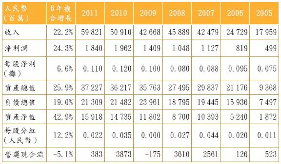

资料来源：国美电器年报。

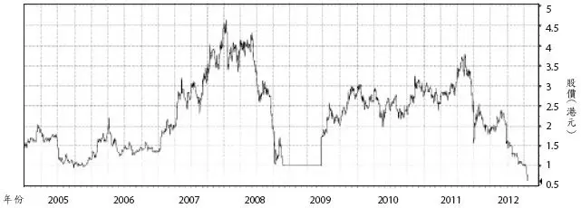

图3–1 国美电器股价图（2005─2012年）

资料来源：彭博社。

更为严重的是，现在的股价也许还不便宜！为什么？

1．分析师们对它今明两年的利润预测差距很大。但是，它的市盈率可能还在10倍以上。对于一个利润下滑而且行业前景不明朗的公司，这太贵了。比较一下香港市场的其他股票，大家会发现，市盈率10倍以下甚至5倍以下的股票随处可见。

2．美国的人均收入虽然比中国高7倍，但是，两国的消费周期有点相似。在美国出现了家用电器和3C产品销量下滑时，中国也走到了差不多的阶段。美国的百思买（Best Buy）现在面临的问题跟国美一样。要么做减法，大量分红，甚至准备清盘，或者快速转型。当然，转型能否成功，谁也不知道。如果不成功，那就有烧掉手上的现金，甚至资不抵债的可能性。

2012年第一季度末，国美电器上市公司共有门店1101间，其中34间为自有物业的门店，其余均为租赁性质的门店。由于实体店铺的销售放慢，国美遇到一个实在的问题：如果公司停止支付租金，它就什么也没有了。而且有些长租还不能停止。如果继续运营，有很多店铺可能一直亏损。

你可能说，现在国美的市值低于公司的账面净值（price to book ratio＝0\.7或者0\.8），所以很便宜。但是，它的账面净资产由什么组成的呢？无非是业务所需的店铺、卡车和现金。它有自由现金用来分红吗？好像没有。它的资金并不充裕。如果国美现在清盘，你可以说，它的清盘价值大大高于股票市值（扣除净负债）。但是，国美不会清盘。它还会继续在实体店和电子商务方面艰难曲折地前行。

百思买在2011年出现微亏（国美在2012年或者2013年也有可能亏损），若用过去几年的每股净利润来计算，这个股票的现价18\.23美元（2012年7月20日收盘价）等于大约5倍市盈率。但是，2011年它的每股派息为0\.62美元，相当于息率3\.4％。这是多数中国公司包括国美所不及的。

2011年底，国美电器基本上没有银行负债（除了几年前发行的可转换债券21亿元人民币以外）。它的账上有大量银行存款（2011年底，它的抵押存款加上现金高达103亿元人民币），同时，它的应付账款及应付票据高达171亿元人民币，主要是欠供应商的钱，显示出了它对供应商的控制能力。

由于手持现金巨大，国美电器在2011年底有36亿元委托贷款余额。这可能是它2011年的4亿多元人民币的利息收入的主要来源之一。显然，国美的市场地位还是非常稳固。

2011年底，国美电器有39亿元人民币的物业和设备，加上9亿元的投资物业。这些都是巨大的资产。在没有银行负债的情况下，它的110亿元人民币的股票市值显得非常便宜。这是我们分析时的难点。但是如果国美电器未来几年利润不振甚至亏损，电子商务投入太大，现金分红太少，股票价格有可能长期不振。

__我的教训：__

1．零售和餐饮行业没有“护城河”。它们只能在行业快速成长时看起来不错。客户叛逃的成本太低，没有黏性。

2．国美电器所犯的错误，和目前面临的困难在中国企业中很具有代表性。从避险的角度来看，股民在任何时候都应该多看“自由现金流”，而不光是运营现金流。国美每年不断赚钱，不断获得运营现金流，但是不断要投入更多的钱（资本支出很大）。公司越做越大，但是股民们所获不多。

很多科技企业实际上是工业企业或者制造企业。它们最容易跌到这个陷阱里面。它们的资本支出和研发开支太大。今年赚10亿元，明年要投资15亿元。如此循环。但是，没有这些开支，它们很快就失去了生命，诺基亚和摩托罗拉都属此类。另外，其他行业的企业也容易掉到同样的陷阱。国美就是其中之一。

2026年3月14日

15:45

## 3.02 激励机制决胜

\(38\) 3\.02 激励机制决胜

2026年3月14日

15:45

__3\.02__

__激励机制决胜__

__葡萄酒：张裕、长城和王朝__

大约在2010─2013年，这3家公司本来差不多大小。王朝酒业（0828\.HK）在香港上市，后续融资管道畅通。烟台张裕（200869\.SZ）在B股市场上市，受到的限制更多。长城没有上市。10年前，中国人喝葡萄酒的习惯刚刚开始，葡萄酒还被认为是很贵的饮料。2003年，我写了一份洋洋洒洒的行业研究报告，大谈行业的美好前景。坦白地说，当时3家公司看着都不错。但是，张裕的股价太贵，王朝很便宜。半年后，张裕的股价大涨，王朝原地踏步。我隐隐约约知道我错了，但是，张裕已经变得更贵了，我无法修改自己的错误，无法转过来推荐张裕。面子攸关。

现在，事情当然非常清楚：张裕是过去10年整个中国股市的大牛股之一，而王朝呢？它的业绩（和股价）一直是前进两步，再后退两步。长城葡萄酒的业绩介于上述两家公司之间。为什么？制度使然。张裕的MBO（management buyout，管理层收购）十分成功，管理层十分进取、卖力。就这么简单。我可以写一本厚厚的书，用事后诸葛亮的眼光解释这3家公司的历史。但是，简单的道理就是最好的道理。

同样的道理，你看看联想的成功和方正电脑的失败。十年前，它们的差距不大，15年前，它们不相上下。今天呢？天壤之别。再看神州数码，这家公司在实行MBO之前一直不景气，但是最近5年来的成功让人羡慕。管理层的激励机制决定一切。

__我的教训：__

1．其他条件不变，管理层的激励机制决定一切。

2．不要看股票的估值。贵有贵的道理。投资的技巧就在于找到那些不够贵的好公司。

3．茅台酒和青岛啤酒公司的激励机制也并没有很好地解决，但是，它们得益于它们的品牌。多数所谓的品牌其实不堪一击，但是这两个品牌还是有它的力量。当然青岛啤酒的品牌比茅台酒要差很多。

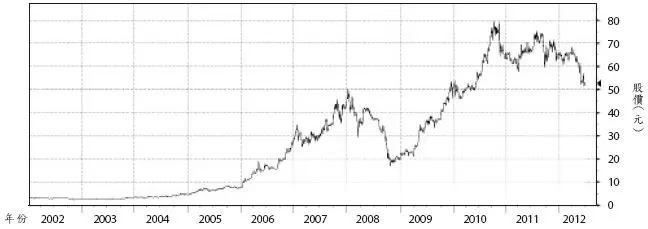

图3─2 烟台张裕股价图（2002─2012年）

资料来源：彭博社。

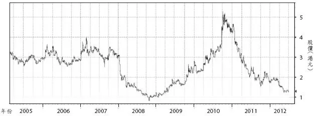

图3─3 王朝酒业股价图（2005─2012年）

资料来源：彭博社。

## 3.03 尽量往坏处想

\(39\) 3\.03 尽量往坏处想

2026年3月14日

15:45

__3\.03__

__尽量往坏处想__

__科技公司：金蝶国际__

这几十年，全球投资者都钟爱IT和科技股。金蝶国际（0268\.HK）也是受益者之一。这当然有些道理。但是，大量的IT和科技公司让人失望。10多年前，我就开始关注金蝶。虽然我多次陪同基金经理拜访管理层，也数次邀请管理层参加瑞银的研讨会，但是，我一直没有正式启动对它的研究。一是我不懂科技，二是我觉得这家公司的生意太困难。对它的前途，我有很大的怀疑。

我经常跟投资者说，如果你卖烧饼，你不须跟客户解释烧饼的好处。你只需跟客户讲为什么要买你的烧饼就行了。但是，金蝶在过去20年一直在同时做两件事。一是教育客户为什么软件或者ERP（Enterprise Resource Planning，企业资源计划）是必需的，有用的。二是要买金蝶的软件。同时做两件事是很累、很昂贵的过程。结果是，它的业务量一直没有做起来。当然，更不要提外国大企业的竞争。金蝶在商业模式上也有缺陷：在某种程度上它是个系统集成商，而不是软件开发商。它的放大功能有限。我在这只股票上的朴素看法被证明是对的。也算是蒙对了一回。

__我的教训：__

1．如果没有把握，就尽量往坏处想。

2．对于股民来讲，没有护城河的生意，就是坏生意，不管短期它做得怎样好。

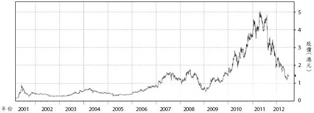

图3─4 金蝶国际股价图（2001─2012年）

资料来源：彭博社。

## 3.04 好行业也有坏公司

\(40\) 3\.04 好行业也有坏公司

2026年3月14日

15:45

__3\.04__

__好行业也有坏公司__

__燃气公司：新奥能源、中油燃气和华润燃气__

燃气公司的业务基本上可以分为两大块：一是建筑安装（即铺设和安装管道），二是供气（居家、企业和汽车）。后面这项业务看起来不起眼。居家买的燃气量不大，价格还受到政府管制。但是，政府并不管制企业和汽车用气的价格，或者管制得不严格。这是细水长流的好生意，还不用竞争。

燃气公司的第一项业务本来是很差的业务，不过由于垅断性，它实在太诱人了。你想想，只有你能在这个城市铺设和安装管道，别人不可以。虽然在获取一个城市的特许经营权之前，你需要参与竞争，但是一旦你获得这个权力，你就成了垅断者。想想这个生意！

中国的商界也许是世界上竞争最激烈的，但是，还是有些企业不需要竞争。这种避风港实在太难得了。

2001年，新奥能源（2688\.HK）到香港上市。一周以后，我到河北省廊坊市访问。我兴奋不已，本来是两个小时的访问，我跟管理层谈了三个小时，并多住了一个晚上。当时，我只是感到这个生意太好了！当时这家公司的业务还很小：它是香港的一个创业板公司，市值只有10亿港元左右，业务只有一个地级市（廊坊）和两个县级市（葫芦岛和密云）。而且当时的股价只有1\.2港元左右，10年后的今天，它的股价涨到了30多港元。由于当时它的生意还处于初创阶段，坦率地说，它的业务和治理还有很多不实在和浮夸的地方。我只是几年以后才感受到这一点。

回到香港，我发表了一份热情洋溢的报告，指出这家公司可以值13\.50港元，如果用香港中华煤气服务的人口为标准。顺便说一句，绝大多数股民（当然包括我）都太急躁，看不上中华煤气这种公司的股票。但是，年复一年，这家公司（以及这类公司）给投资者的回报率是最可靠和最高的之一。另外一个这类股票就是我经常提到的领汇房产基金（0823\. HK）。公司什么也不做，只是每年收商场的租金，对商场做些简单的维护和修整。它把90％以上的现金流分掉，它的股票表现（综合回报率）也是最好的之一。

这类成功的燃气公司也包括华润燃气（1193\.HK）和中油燃气（0603\.HK）。但是，我的热情也蒙蔽了我的眼睛。有两家燃气公司很失败。一是天津的华燊燃气（8035\.HK，已改名）。这家公司由于违反外汇管制和其他问题而被迫停牌5年之久。那些年，它的业务几乎停顿，现在依然没有回到2004年的繁荣。现在，它的规模不如新奥的10％。

第二个倒霉的燃气公司，洁美能源，发源于新疆和甘肃。我也曾经推介过这只股票。但是，不知何种原因（债务过大，还是账务问题？），两年后，这家公司人间蒸发了。我记得它的董事长和总裁曾经一天到晚在香港路演和推介。

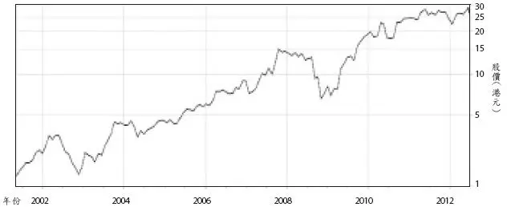

图3─5 新奥能源股价图（2002─2012年）

资料来源：雅虎。

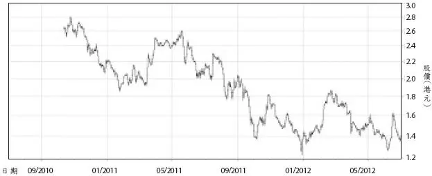

图3─6 新天绿色能源股价图（2010─2012年）

资料来源：雅虎。

还有那么五六家燃气公司虽然行业条件很好，也到海外上市融资了，但是业务发展很不顺意，股价长期疲软。

__我的教训：__

1．好的行业是成功的必要条件，但不是充分条件。

2．好公司总是极少数。

在中国的燃气板块，有一只黑马，完全被市场所忽略。它就是河北省的H股公司，新天绿色能源（0956\.HK）。背景介绍：

新天绿色能源是河北省国企，由河北建投与河北建投水务所控制。它是该省最大的天然气分销商，现拥有2条天然气长输管道、4条高压分支管道、14个城市天然气项目、以及2座压缩天然气加气母站，管道输气能力达到15亿立方米，2011年本集团销售天然气量为12\.13亿立方米。

另外，新天运营风电场20个，控股装机容量1201兆瓦，权益装机容量1048兆瓦。以控股装机容量计算，该公司在中国居第10位，是河北省最大的风电运营商。截至2011年12月31日，公司的2条长输管道为：涿州市至邯郸市，高邑县至清河县。

__它有如下优点：__

__1．安全性。__它是河北省国企。而且在垅断性行业。它在河北省占有统治地位。对于这个行业的企业来说，它的负债率也很低，净负债相当于股本的54％。

__2．高成长性。__销售收入从2008年的10亿元人民币，增长到2011年的31亿元。同一时期，每股盈利也从4\.3分增长到13\.9分。这两项指标的复合增长率分别为45\.8％和47\.8％。我认为，每股盈利还可以持续高增长若干年，因为它上市融资尚未发挥效益。

__3．高回报率。__2011年，EPS每股盈利0\.17元人民币（即0\.204港元）。2011年该公司的股本收益率（return on equity，ROE）只有8\.5％。这当然不好，但是，这有两个原因，一是IPO资金的流入，大大地提高了分母（即股东权益），而分子（净利润）还没有马上显现出来。注意：这是个公用事业公司，上市才一年多。在IPO之前，它的股东权益只有15亿元。它的ROE在2009年和2010年分别高达12\.4％和18\.6％。

__4．股票的估值非常有吸引力。__它的IPO在2010年10月22日，价格为2\.64港元，但是2012年6月1日，它的股价跌到了1\.39港元，下跌了47％。当然，这不说明问题，也许IPO的价格太高？我们换个角度来看。它的2011年市盈率不到7倍（用2012年6月1日的股价1\.39港元）。

__5．息率高达5％。__2011年，新天公司每股分红高达0\.058元人民币（即6\.96港分）。息率高达5％（用2012年6月1日的股价1\.39港元）。这种高派息率会持续吗？我们不知道。（2011年，它的派息比例为1/3。）

__投资风险：__

这项投资的最大风险在于它是国企。对于国企的高管究竟有无动力继续把企业做好，把股东价值最大化放在首位，我们完全没有把握。未来，它的高管将如何更迭，我们不知道。

我注意到，该公司的业务全部在河北省。这本身不是问题，因为河北省足够大。但是，这是不是意味着它的运营更强调政治因素和社会因素？我们不知道。

这个公司的第二个风险就是，它的风电业务目前占用资金太多，而且回报率太差。这种状况何时能够改善？比如，2011年，燃气和风电这两个业务板块的“分部利润”分别为3\.5亿元和3\.1亿元，不相上下，但是风电板块占用的资金远远大于燃气板块。它们的资产额分别为114亿元和17亿元。当然，它们的负债额也大不相同，分别为70亿元和10亿元。反对我的人可能会说，风电板块是重资产型的业务，所以，2011年它的折旧就高达3\.2亿元，而天然气板块的同期折旧只有5000万元而已。

它的第三个风险是，它的下属单位河北省天然气公司未来几年将继续跟中国石油、北控集团（三家的股比分别为20％、51％和29％）合作打造唐山市曹妃店的LNG接收、存储和加工设施。这个专案的总投资66亿元，其中资本金26亿元。首期注资10亿元已经完成。第二期注资将于2012年完成。

我认为，从中国石油的其他管道业务来看，这个LNG项目很可能将是一项有利可图的项目。但是，建造风险犹存。而且，它会不会超过预算的成本？我们无法事先判断。

## 3.05 周期性股票难以捕捉

\(41\) 3\.05 周期性股票难以捕捉

2026年3月14日

15:45

__3\.05__

__周期性股票难以捕捉__

__钢铁公司：中国东方集团__

我从来没有买过钢铁企业的股票，主要是不懂这个行业。2003─2004年，中国经济腾飞，这个板块大涨。当然，我完全没有预见到，所以错过了机会。7年后的2011年初，我参加一个投资者年会，听了中国东方集团（0581\.HK）的演讲。这家香港上市的钢铁企业地处河北省。几年前，它的单一大股东变成了印度的米塔尔。由于中国的政策不允许外国公司控股中国的钢厂，所以，米塔尔除了自己相对控股中国东方以外，还请德意志银行和荷兰银行代持了一部分股权。这些股份加起来，实际上米塔尔是绝对控股。（顺便插一句，我真不明白中国为什么要实行这种帮助外国人而伤害自己人的政策。名为防止外国人控制中国的经济命脉，实际上伤害中国的经济开放和繁荣。）

米塔尔跟那两家银行的协议是，不管市场股价如何变动，米塔尔都将在未来中国政府开恩，即允许它绝对控股的时候，从德意志银行和荷兰银行用每股5港元买下那些股份。研讨会的那天，听了中国东方集团的演讲，我简直不相信我的运气！中国东方的股价才3港元，大股东承诺随时用5港元增持20％的股份（从那两家银行买入）。这家公司又是响当当的跨国企业。当时，它的市盈率只有5倍！而且，它基本上没有银行负债，处于净现金状态！作为股民，你还想要什么？

在那个研讨会上，不仅仅是我热血沸腾。很多人热血沸腾！难怪股价那几天很强劲。我正准备打电话给我的香港经纪人下单买股票，可是……我突然想到，我还是回香港以后，再读读公司的年报再说。回到香港，我就因为别的事忙起来了。后来，我想起来再看看中国东方的股价。你猜对了：它比我热血沸腾时又跌了1/3以上。

__我的教训：__

1．研究周期性的公司，你必须先人一步，找到经济周期的上行拐点。如果你没有这个能力，那么你也就没有能力在经济下行之前撤退。

2．这好像是老掉牙的套话：周期性的股票，怎样便宜都不过分。

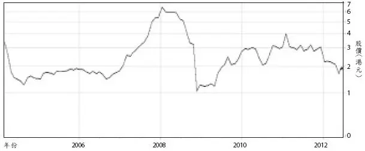

图3─7 中国东方集团股价图（2006─2012年）

资料来源：雅虎。

## 3.06 赚钱是小概率事件

\(42\) 3\.06 赚钱是小概率事件

2026年3月14日

15:45

__3\.06__

__赚钱是小概率事件__

__林业公司：三林环球__

2007年，中国经济迅勐发展。马来西亚的林业公司三林环球（3938\.HK），乘势杀入香港股市。在三家外国大投资银行（汇丰、瑞信和嘉诚）的簇拥之下，隆重上市。那可是一个热闹非凡的IPO，万人争购。IPO价格最后定在每股价格2\.5港元。我因为在投资银行里有朋友，差点获得大量认购。但是，最后一刻，我那故意避开热闹的坏习惯起了点作用。我决定抽单。IPO之后，它的股价一路下滑。我躲过了一颗子弹。

可是，我一直怀有这样一个情结：中国人需要进口很多木材。三林环球除了在马来西亚有林场以外，还在新西兰和南美洲的圭亚那有林场。那美丽的森林给了我无穷的想象空间。虽然我没有去过南美洲，但是网站上的照片太美了！我必须投资这样的公司。等到股价跌了一半（即1\.25港元）的时候，我出手了。可是，股票继续下行到0\.8港元，甚至0\.5港元的时候，我不知道该怎么办了。既然我看好，我应该在股票更便宜时加仓啊！可是，我没有这个底气。我虽然见过公司的管理层，可是，我有信心吗？没有。

我一直焦急地等待。终于有一天（2011年6月），我在报纸上读到香港股民们炒日本地震后重建家园的故事。重建家园需要进口大量木材。于是，某投资银行的分析师发表了一份热情洋溢的报告。三林环球的股价大涨。我痛苦了2年，终于得见天日。我毫不犹豫，斩仓大吉。一个星期以后，这朵昙花也死亡了。虽然2012年，大股东把这家公司私有化了，但是，我已经完全不想再纠缠了。过去5年来股民除了辛酸的眼泪以外，什么也没有获得。当一个企业业绩长期不振，又不分红，只是每年都讲自己的资产如何优秀，对股民来讲有何意义呢？

最近几年，香港和大陆有几十家（不，上百家）上市公司在世界各地收购矿山和冶炼企业。但是，最后转化成利润的成功者寥寥无几。失败者包括大公司，小公司，包括中国的国有企业，也有民营企业。

在中国和印度对矿产需要如此巨大的情况下，为什么上百家企业（而且是受到股票交易所监管的上市公司）在这个大浪中失败呢？我想有如下原因：

__一是骗子。__买家和卖家中都有大量的骗子。2007年华北某铜矿被大股东用天价卖给了一家香港上市公司，但是，买家急于买，卖家吊起来卖。账目的夸张让人们事后惊诧不已。可惜买家只能打掉牙往肚里吞。为什么？难道把自己的愚蠢暴露在法庭上吗？况且在急匆匆的成交过程中，买方难免留下了几个把柄给卖方。

2007年，某中国公司收购了某印尼金矿。半年后，这个金矿神奇般地出现了“泥石流”。开采工作被延后了4年。中国公司的股东们（大小股东们）欲哭无泪。在有些矿业并购中，除了黑手党一类的活动以外，还出现过游击队的骚扰。有些游击队跟中国企业在国内外修路、开矿和建厂时遇到的土豪劣绅的袭击类似。有些时候甚至是地方政府的干预。这都是股民噩梦的起源。很多事情并没有通过上市公司在交易所披露。股民只是知道结果而已。那些惊险的细节大家只能在电影中看到。

__二是经营矿业的难处。__经营矿业跟经营任何生意一样困难，远不像人们想象的那样简单：挖泥巴。从探测，到技术论证，到各种各样的批文的获取，再到码头和公路的修建……任何一个环节出了错，都可能带来巨大损失，甚至让整个项目垮掉。所以，它们的成功是小概率事件，不成功是大概率事件。

__三是当大家一窝蜂收购矿产的时候，价格最可能太高。__这跟买股票一样。不管多么好的公司，如果你收购时付出的价格太高，你就等于支付了它未来40年，甚至50年或者60年的好处。那怎么赚钱呢？

__我的教训：__

1．南美的渔业、非洲的矿山、和南洋的渔业都不是我等散户的投资对象。留给别人吧。留给机构投资者吧。

2．赚钱是小概率事件。亏钱是大概率事件。开矿如此，买股票可能也是如此。

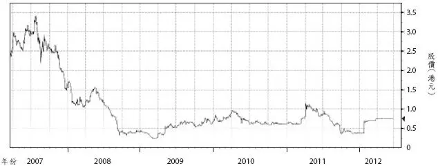

图3─8 三林环球股价图（2007─2012年）

资料来源：彭博社。

## 3.07 餐饮业没有护城河

\(43\) 3\.07 餐饮业没有护城河

2026年3月14日

15:45

__3\.07__

__餐饮业没有护城河__

__餐饮企业：味千（中国）、乡村基__

2007年，味千（中国）（0538\.HK）到香港上市。大家都知道它的面条好吃。我本人也经常光顾它们的店子。当时亚洲股市达到了顶峰，在IPO的那个星期里，香港基金经理和散户对味千的热爱达到了如痴如醉的程度。有一位基金经理对我说：“化桥，这是一个买了，永远持有，给孙子交学费的股票。”但是，我还是不想凑热闹。不过，这位基金经理是一个高人，可见高人也会失去冷静，至少是偶然失去冷静。

我为什么不凑热闹呢？三个原因。我知道我如果抽那么热捧的IPO，一定分不到几百股，没意思。第二，我想起了巴菲特的话，餐饮和商场没有护城河。从一家店子走到另外一家店子，太容易了。第三，我在香港中环上班18年，记得交易广场的餐馆每两年就换一次牌子。为什么？这个生意太难了。大家都说麦当劳的成功和肯德基的成功，但是，那是偶然，不是必然。凭什么我就有这么好的运气，碰到一个偶然呢？既然大家都如此喜欢，我还是避开为好。

后来的故事，大家都知道。潘董事长卖了她的很多股份，公司在汤料的宣传方面有些夸张和水分，等等。5年下来，这只股票走了过山车，股民们除了焦虑之外，还亏了15％。考虑到它所处的行业的艰难，它的股价的这个表现还算很不错的！

也是在2011年初，那个投资者研讨会，我听了潘董事长精彩的演讲后，很想买入这只股票。但是另外一个基金经理的热情让我望而却步。她说：“下个季度，下个中期的业绩公告一定好得不得了。我们调查了它们的很多店子的经营状况。”

从那时候的高峰，到现在（2012年中），这只股票跌了60％以上。

重庆的乡村基（CCSC\.US）是另外一个成功的餐饮连锁店。2010年，它在众星捧月之下到美国上市。但是，不到两年时间，公司的股价跌去了73％！当然，你可以找这个原因，找那个原因，但是，真正的原因是，巴菲特说的那句话：餐饮企业和商店没有护城河。就这么简单。

有些人说，餐饮企业的收入里面有现金问题，成本也容易造假，等等。但是，在我看来，这都是不重要的事情。这个行业的公司要么是昙花一现，要么根本就没戏！当然，你永远可以说，瞧瞧麦当劳和肯德基！投资是关于概率，为什么要追逐小概率事件呢？

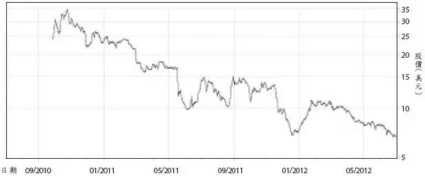

图3─9 乡村基（CSCC\.US）股价图（2010─2012年）

资料来源：雅虎。

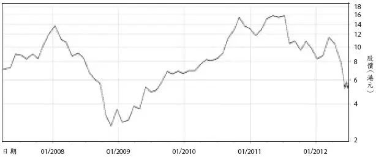

图3─10 味千（中国）股价图（2008─2012年）

资料来源：雅虎。

__我的教训：__

1．不要凑热闹。特别是不能在IPO的时候凑热闹。

2．饮食行业经常被授予一个好听的名字：消费类企业。其实，它们没有护城河。绝大多数企业至多只是昙花一现。

## 3.08 便宜貨是“价值陷阱”

\(44\) 3\.08 便宜貨是“价值陷阱”

2026年3月14日

15:45

__3\.08__

__便宜货是“价值陷阱”__

__机械及汽车制造业：庆铃汽车__

1997年以前，我们中国股票分析师的日子可真难过。特别是在香港的中国分析师更是如此。原因是，红筹股和H股的数量少，品质一个比一个差。1996─1998年，我在里昂证券工作。我记得有一个同事运气不好，被安排研究洛阳的第一拖拉机（0038\.HK）。在晨会上，他反复讲“中国政府扶持农业”，“这家龙头企业”，“净现金”。后来，股价反复下跌，公司炒掉他。我觉得他很冤枉：有些公司太烂，管理层根本不想把公司做好，我们分析师有什么办法呢？

几年后，我到了瑞士银行当中国研究部主管。我的一个同事在庆铃汽车（1122\.HK）上栽了同样的跟头。他的理论是：“庆铃有净现金，股票太便宜了。而且，中国人的内需正在升级。”他反复推介这只股票，可是不断出错，直到基金客户屡屡抱怨。我的上司几次要我炒掉这个分析师，我一直顶着不办。我出差的某天，我的上司终于让他走了。

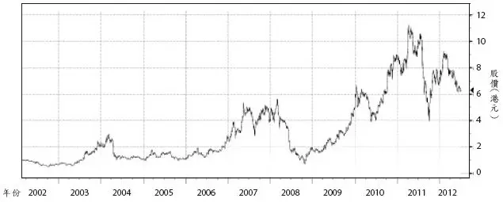

图3─11 第一拖拉机股价图（2002─2012年）

资料来源：彭博社。

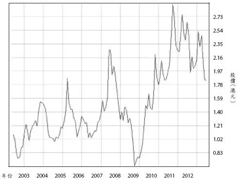

图3─12 庆铃汽车股价图（2003─2012年）

资料来源：AASTOCKS。

__我的教训：__

1．有些国有企业的高管并不希望把公司的生意做好。或者，他们不知道怎样做好。或者，他们的手脚被捆得太紧，能力施展不开。

2．净现金不能说明任何问题。便宜货很可能是个价值陷阱。

## 3.09 小心竞争太多的行业

\(45\) 3\.09 小心竞争太多的行业

2026年3月14日

15:45

__3\.09__

__小心竞争太多的行业__

__食品加工企业：大成生化__

2002年，我注意到红筹公司大成生化（0809\.HK）的股价很好。几个基金经理也开始问我如何看待这匹黑马。我坦白，我当时完全不懂这个行业以及它的国际性。但是，我们分析师岂能说不懂？我用最快的速度囫囵吞枣，了解了几个专业术语，比如高果糖浆、山梨醇、磷酸酯淀粉，等等。两周内，我的研究报告就出笼了，虽然关于国际市场和这个行业的运转规律，我依然是“一问三不知”。“我们分析师把问题弄得太懂，也没有必要”，我经常自嘲地说。

我发现多数基金经理跟我一样，一知半解。所以，像我这样的南郭先生也可以蒙混过关，竟然还获奖无数。2003年，终于有一天，我在东京推介时，遇到了一个真专家。他对我的“忽悠”很不满意。他一直追问我复杂的问题，然后是简单的问题，直到我差点瘫痪。从他的办公室出来，我决定多做研究，少做推介。可是，我们分析师哪里有时间做分析？我们一天到晚在营销。至少我是那样。

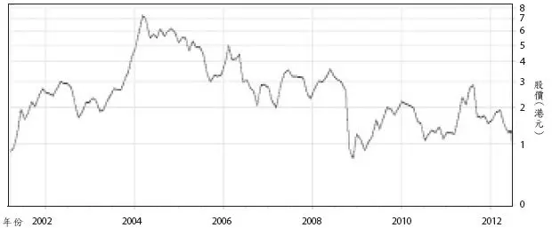

图3─13 大成生化股价图（2002─2012年）

资料来源：雅虎。

上图很清楚，大成生化的股价在过去10多年是个过山车。虽然公司越做越大，但那是以增发新股，股数增加来实现的。公司的负债率也不断提高。除了第一年（2001年），它的股价健康成长，以及2003年末和2004年初大涨以外，它基本上是一路下滑。现在的股价跟2002年相似。

__我的教训：__

1．消费类的公司千奇百怪。但是，很多公司实际上就是工业企业，简单的制造业，或者周期性的制造业。大成生化就是如此。这类企业的竞争力就是低成本。可是，永远要小心：更新的竞争者还可以加入。

2．这类企业当然有科技的成分。但是，这类科技不构成太大的进入障碍。管理层要么不懂这一点，要么撒谎说：别人无法竞争。

3．这不是一个好行业，因为没有护城河。我太笨：我几乎10年后才明白这一点。

## 3.10 中国房地产公司基本不行

\(46\) 3\.10 中国房地产公司基本不行

__3\.10__

__中国房地产公司基本不行__

表3─2显示的是32家内房股自从IPO以来的回报率（以2012年6月11日为止）。首先，有几点需要说明：

1．我们只选择了过去十几年来到香港上市的一部分中国房地产公司。其他有些公司我没有选择，原因是，它们要么太小，要么它们是通过后门上市的（当然也就无所谓IPO价格），或者中途转型为地产公司的。但是，那些没有入选的公司在股价方面更加糟糕：原因是它们的规模一般都比较小。小有小的道理。生意上不够成功才小。比如，香港建设（HKC）（0190\.HK）曾经在2006─2008年数次发行股票融资50亿～60亿港元，但是现在它的全部市值还不到30多亿元。另外，中新（0563\.HK，已改名）也在高峰时期融资50亿港元以上，但是五六年后的今天，它的市值大大小于那个数。

2．从IPO以来的股票回报率包含了每年的现金分红。

表3─2 中国房地产公司上市至今的股价升跌

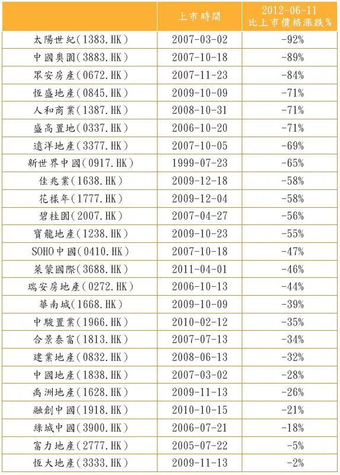

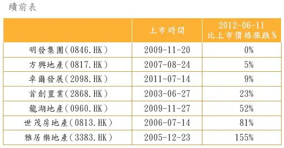

资料来源：谷歌。

上表告诉我们什么呢？我觉得至少有如下结论：

1．除了少数几个在2005─2006年上市的地产公司以外，也就是说，在公众还没有对房地产板块疯狂追捧之前上市的地产公司以外，其他几乎都是股民的噩梦。股民在这些高峰期上市和配股的公司里亏损了好几千亿港元。这个数字用任何标准来看都是惊人的！

2．短期内，我们很难判断一个公司的成败。不过，如果我们用事后诸葛亮的眼光来看，我们可以发现，成功的地产公司基本上是资金周转比较快的公司。其他有些公司死守着几块土地和楼房，基本上不行。

3．有些公司在高峰时期购买了太多土地，太多昂贵的土地，都是摧毁价值的。在地产市场兴旺时，大多数公司都在不同程度上犯过过于乐观的错误。这类公司包括绿城中国、远洋地产、盛高置地、合景泰富、深圳控股，等等。

4．跟大家一样，在高峰时期，我对地产行业也曾经过度热情，失去了理智。现在用事后诸葛亮的态度来看，负债是一把双刃剑。在资产价格快速增长时，它带给企业成倍的好处。但是，在资产价格下降或者缓慢变动时，它可以毁灭一个负债率太高的企业。

现在，在香港上市的40多家中国地产公司的股票大都很便宜，但是不像有些人所说的那么便宜，而且也有一些股票是价值陷阱（即看起来便宜但可能变得更加便宜）。如果你能避开价值陷阱，分散持有多个地产股票长达4～5年，你的回报率会很不错的。

分析地产股的三种方法各有优缺点，投资者要多看几个指标，多用几种方法。另外，大家不要死板和固执。除了定量的指标之外，也要看定性的指标（比如管理层的激励机制，土地储备的位置和价格，以及项目品质的好坏）。

__1．净资产值（net asset value，NAV）估算方法。__这种方法历史悠久，也最广为接受。把所有的专案按合理的销售价格、建造成本和税收做一个估算。然后把未来的现金收入用一个贴现率折回到今天，减掉净的债务，算出来一个总数。这个数就是公司的净资产值。这个方法在我看来是最被漤用的一个方法。我感到多数人算出来的净资产值都太高，不切实际，原因是多方面的。第一，他们假定的售价太高，或者成本太低（包括利息和营销）。当然，人们低估了监管部门折腾企业的能力和花招，以及企业公关费用的巨大。第二，人们一般高估企业管理层控制专案进度的能力。今年的1亿元销售收入与明年的1亿元含金量不同。这会直接影响净资产值。第三，有些地块在可预见的未来根本不能动工，因为没有需求。

__2．市盈率（price earning ratio，P/E ratio）。__我以前一直很反对用这种方法，但近来我开始悟出了它的道理。如果一家公司的管理层是进取的，它就应该经常有利润和现金流，如果它老是告诉股民，他有5栋非常值钱的楼，10块待开发的土地，你想股东们会耐心地等它多久？资金周转慢是5种疾病的表现：要么管理层是懒汉，或者无能，或者没有动力，或者很优秀但是犯了一些决策错误，或者行业出了大问题。市盈率的方法就逼着管理层不断在高速公路上加油。

__3．市账率（price/book ratio）。__股票价格除以公司的每股账面价值。问题在于，有的公司的账面价值作了很大的调整（物业重估），而有些没有，或者重估的程度不一样。有些评估师十分慷慨，有些比较保守。有些地产公司有收租物业，评估得很频繁，有些公司反之。而土地和在建专案不能重估，这就影响了跨公司之间的比较。

市账率的最大缺陷是，它只能反映静态，不能反映动态。它只能反映地产公司今天的贵贱，但不能反映它未来的贵贱。如果这家公司未来5年一直坐在那几块地上晒太阳，那么5年以后它的股票会更加便宜。另外，我们不要假定土地价格永远往上涨，不要认为政府不会用税收和行政的办法改变游戏规则。如果一家公司长期无所作为，它的土地增值和物业增值跟小股东有何关系呢？相比较，净资产值和市盈率的方法就可以抓住动态。

我们还要考虑一个非常重要的事情。资金快速周转的公司永远处于战争状态，内部系统运转有序，员工勤奋且训练有素，大量土地和住屋常年处于正在出售和即将出售的状态，这样的公司在风险控制方面好过慢腾腾的公司。我们经常听到某地产公司的老板说，最近资金紧张，要借高利贷，或者要发盈利警告，或者要改变业务策略，或者要低价出售心爱的办公楼，原因是某个大专案本来准备5月份开盘销售的，结果形势突然变了（比如，银行加息了，政府政策变了，附近的楼盘打折，附近修高速公路，或者老天爷下连阴雨，等等）。你就知道这不是一个好公司。它们今天有这个借口，明天还会有一个你完全想不到的另外的借口。我认为，最好的防御是进攻，最好的风险防范是高速的资金周转。

另外，我想谈谈两个有意思的观点：__一是投资物业在地产公司的估值里面要大打折扣，二是所有开发型的地产公司也都应该有很大的估值折扣。__

我们经常看到某些地产公司的市值严重低于它们所拥有的几幢办公楼或者购物中心的价值。除了它们在专案层面有负债以外，它们已经把很多营业面积用很低的租金长期租给了大客户（沃尔玛或者微软），所以未来的租金收益率成问题。有些物业虽然没有这样的暗伤，但是租金回报率也不高。在正常情况下，这些物业的账面价值（重估过的价值）只是自我安慰而已，别人不会用那个价格购买它的（当然，除了少数不理性的国有企业以外）。你也许会说，物业在未来可以升值啊！但是，它也可能贬值。而且很多物业实际上是不能出售的：首先是要交高昂的土地增值税，然后是营业税，还有企业所得税。对于在香港上市的公司来说，分红的汇出还要再交5％的预提税。所以，这些物业看着好，闻着香，但是不好吃。当然，它们的净资产值要有折扣。

我们再看看开发型的地产公司吧，人们计算NAV时，一般假定所有的建筑面积都会出售，但是公用面积（会所、车库，等等）并非都可以出售，另外，如果有20％的房子卖不掉（包括楼层、朝向、设计或者品质有问题或者需求不足），而这家地产公司的净利润率也是20％（这个数字已经不低），那么这个公司的全部利润就是无人要的存货！也难怪它们总是缺钱。

说完了坏话，再说点好话。我认为，现在多数中国地产公司的股票很便宜，充分反映了我讲的几个风险。很多中型的地产公司的成长性也很不错。如果未来4～5年，股票市场对这个行业依然如此看淡，也就是说，估值的折扣依然如此大，而它们的利润（或者净资产值）可能翻一番以上，那么，这样的回报是相当不错的。当然，股市气氛的好转就是你的额外利润。如何选取投资对象？我建议大家特别关注资金周转快、销售额有成长的公司。窃以为几十个中型公司都符合这个标准。未来几年，这个板块很可能跑赢其他板块。

__地产公司成为“价值陷阱”的故事__

2001年，有一个化妆品公司在香港上市。当然，不论IPO发行定价，还是后市的表现，都取决于公司的利润（和现金流），而与公司究竟有多少固定资产或者物业没有太大关系（当然，扣除那一点小小的租金收入）。但董事长不明白这个道理，为了让初次上市的资产价值大一些，好看一些，他就把价值10亿元的办公楼也放在上市公司里面。显然，他的投资银行没跟他讲清楚这个道理，或者他拒绝弄懂。

上市一年以后，当他明白了股市奥妙时，他问我他可不可以把那个办公楼拿出上市公司。我告诉他，当然可以，但是相当麻烦：这是一项关联交易，上市公司必须聘请独立的财务顾问做估值，报请小股东批准，而且他还要拿出真金白银从上市公司买回这项资产。所以，这个办公楼在上市公司里，其实几乎是沉淀的资产，在上市公司的整个估值中是零蛋，也就是免费的。有没有这项资产，几乎不影响股票的价格或估值。有些股民甚至基金经理会说，你看，这个股票好便宜，它的市值低于这栋楼的价值，而它的化妆品业务是免费的。他们正好搞颠倒了：资本市场给化妆品业务有正确的估值，但那栋楼是免费的。

还有一个故事。韩国有一个上市的百货公司有大量的超值物业（大多是30年前或者20年前用非常低的价钱购置的）。公司的股票的估值当然是有一个市盈率（大约13倍），或者企业价值除以现金流的一个倍数（enterprise value/EBITDA），大约7～9倍。虽然它的市净率很低，但大多数人不太重视这个指标，因为大家认为物业重估的水分太多，没有太多意义。另外，如果你长期持有这些物业，又不变卖，对于小股东来讲，它的实际意义就只是租金收入。自用物业就是租给自己，也可以算出回报率。如果回报率低，如果公司总的利润近些年没有明显增长，未来的前景一般，那就很可能出现一种情况，公司的估值很可能低于物业处置的净收入。或者它的物业价值被市场完全忘掉。这好像很不公平，但这样的例子比比皆是。

小股东很自然地问，你的物业即使很值钱，跟我有何相干？某基金经理谈起这家韩国公司时，抱怨股票分析师水平太差：“某某大银行负责研究这个股票的分析师甚至不知道这家百货公司拥有大片值钱的物业，包括那些百货商场和购物中心。”我安慰她：“你的牢骚有一点点道理，但是，这个分析师知道不知道这家百货公司的持有物业，对于他的分析和评估没有太多的影响。”这家公司用很低的租金把物业租给自己用，这已经转化成了他自己的商场的毛利，它的物业又不想变现和分红，反复强调公司和家族的“五代人的眼光”，股民为什么要陪你玩呢？在我的眼里，这家韩国公司是一个典型的“价值陷阱”。

在美国，这样的公司比较少，因为在那里，家族公司越来越少，而专业化管理（外人）、股权分散的公司一定会尽量把价值挖掘出来。如何挖？很简单：把物业快速变现，加大分红，借债来做生意以提高净资产回报率。这已经成了标准动作，所以一旦有公司的业务往西边走（夕阳，或者现金流强壮但增长有限），市场马上就明白管理层大概会如何做。

除了极少数情况，中国人几乎都不愿意把公司的物业卖掉，把现金分掉，把公司解散。这是中国企业文化的一个缺陷，也是上市太难的产物。这也是我等股民必须严防价值陷阱的最重要原因。

2026年3月14日

15:45

## 第四章 十倍股，往何处寻？

__第四章__

__十倍股，往何处寻？__

## 避开股市的地雷

“如果你做足了功课，你坚信你选的都是十倍股，你的股票大跌的概率就很小，而且，即使跌了很多，你也知道怎么办。怎么办？加仓！”

## 4.01 如果利润不再增长……

\(49\) 4\.01 如果利润不再增长……

2026年3月14日

15:45

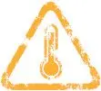

__4\.01__

__如果利润不再增长……__

当今世界绝大多数股票投资者都是同一个老师教出来的：股票投资的要诀之一是寻找企业的利润增长。第二次世界大战（以下简称二战）以来，欧美国家除了1968─1982年长达15年的熊市以外，基本上是一个经济高增长所推动的牛市。近10年，虽然全球股市基本上白干，但也是在一个高位横行，而且经济高增长依然是主题，依然是主流的期望。

中国人就更不要提了：我们投资股市的历史才20年，但是，过去30多年中国经济只有高增长和很高增长。

现在，越来越多的人开始明白了增长的极限。世界经济的增长在放缓，中国经济也一样。其实，即使在高增长的年代，任何国家都有大量不增长甚至长期走下坡路的行业和公司。只是大家没有注意而已。

我们应当如何适应一个新的环境？如果这个环境下大多数公司要么长期不增长，要么负增长，我们怎样对待股票估值？

你说：“不可能没有增长！”但是，你看看，2011年，很多公司的每股净利润甚至低于2005─2006年，每股的现金流就更差了。2012年如何？未来几年如何？如果你假定一家公司每年有10％的每股利润增长，这听起来好像很实在，但是，现在看起来，这还是太乐观。如果它的利润在过去5年内没有增长（只是上下波动而已），那么为了保证10年的复合增长率在10％左右，它在未来5年就必须有每年20％以上的复合增长率才行。这谈何容易！

如果一家公司的利润长期下滑或者横行，那么是否意味着股票市场的终结？也许是，也许不是。但是，已有的股票依然有它们的价值。我们如何给它们估值？我们如何选股？

__有护城河的企业何必瞎忙__

其实，一家企业如果有一个可持续的生意，这个生意有一点“护城河”（要么竞争不激烈，要么不需要竞争），那么，这家企业就很幸运，它什么都不用做。少做少错，多做多错。没增长没关系。它的长期回报率依然可以相当好！这种公司在西方国家很多，在香港也很多。其实，在中国大陆也不少。只是我们不那样思考问题而已。

一个10年前购入的商铺，就是这个道理。你什么也不需要做，它有“护城河”，它的租金每年上涨一点（有时甚至狠狠地涨）。即使我们完全不谈商铺本身资本价值的上升，光是租金已经很好了。这个道理跟股票一样。

过去10年，中国经济腾飞，理论上讲，上市公司应该大赚其钱，但是事实并非如此。太多的公司忙忙碌碌，确实利润总额增长很快，公司越做越大，但是它们是摧毁价值的，原因是，它们的股票越发越多，摊薄原有股东利益。而且它们的负债越来越多，也分走了公司的利益。很多公司通过负债赚取的额外收益非常小，甚至为负数，白白给银行打工。

表4\-1是15家在香港上市的公司在过去10年的股票回报率（含现金分红）。我想说明的问题是，一家公司越是忙碌，它的股价表现越差。比如，粤海投资（0270\.HK）过去10年几乎什么也没有做。太懒。公司守着东江水，把水送往香港。这就是最好的生意。幸好管理层没有穷折腾。10年里，它的股票回报率最高。恒隆集团（0010\.HK）地产专案不多，靠收租，但也赚得很美满。股票回报率排在第二名。

表4─115家上市公司过去10年的股票回报率\*（含现金分红）

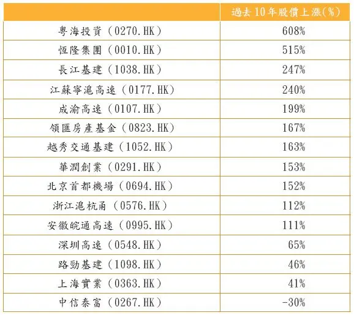

注：\*2002年6月22日至2012年6月22日（领汇房产基金：2005年上市日至2012年6月22日）

资料来源：谷歌。

领汇房产基金（0823\.HK）上市不到10年（2005年上市）。这家公司是真正意义上的“无所作为”，只是维修现有的商铺，收租，然后把几乎所有的现金流都分掉。但是，这家公司的回报率远远高于绝大多数勤奋和增长的公司。你不禁会问，为什么要增长？

再往下面看就是几家高速公路公司和北京首都国际机场。有趣的是，越是不勤快的高速公路公司，它的股票回报率越高：多年来，深圳高速（0548\.HK）大兴土木，收购兼并，它的股票回报率在高速公路公司里面最差。

路劲基建（1098\.HK）本来在全国经营18条高速公路，日子美满幸福。但是，它在2005─2006年忍不住诱惑，进入了地产行业，导致公司的总体回报率下降。2006─2008年，我曾经代表我的雇主（深圳控股）在路劲基建公司兼职，我可以证明，它的管理层非常敬业，但是越是辛苦，回报率越差。

华润创业（0291\.HK）的两个主要业务（啤酒和零售）并非很有吸引力，竞争相当激烈。但是，除了在2001─2003年，这家公司做过一些大型并购以外，迄今为止没有大的举措，这是福气！做少错少。另外，它还有一些收租业务帮了大忙。10年里，它的股东们赚了153％的股票回报率。这听起来不刺激，每年只有9\.72％的复合回报率，但是已经非常不容易了。

上海实业（0363\.HK）靠着它的老业务（收费公路、南阳烟草、光明乳业和上海家化等），本来可以给投资者很好的长期回报率，但是，它也忍不住在2008─2009年大举进入房地产业务，大伤元气。资金配置失当是最大的失误。

回报率最差的是中信泰富（0267\.HK）。这家公司在内地及香港地区长期拥有很多特权。它的业务也曾经有很好的“护城河”，比如，香港的海底隧道，世界上最优秀的航空公司（国泰航空）的股权，还有收租物业，等等。但是，它的不安分导致它十分频繁地买卖资产，后来进入澳大利亚矿业和湖北的大冶特种钢，以及大量的房地产业务。后来，它在澳元上的赌博差点把公司带向死亡。这家公司的股票即使有政府支持，今天依然大大低于15年前的水平。

究竟怎样才能找到长期的好公司？我的初步理解是：

__1．企业最好有高增长。但是一定不要那种耗费太多资本的高增长。__如何找这样的公司？我想应该考虑两点：一是公司的股本收益率（Return on Equity，ROE）要高，公司扩大业务所需要的投资必须保证ROE不下降，或者不下降太多。二是最好不需要发行太多新的股票，或者不需要负债太多。这样的标准不容易掌握，但是，基本原则是少费钱，多办事。

__2．降格求其次：如果公司的业务完全没有增长，或者增长很慢，也没有关系。这样的公司依然可以有很高的股票回报率。前提是ROE很高，现金分红率高。__

__有赏必有罚__

很多人就此话题写过很多本书。我不想参加辩论。我只想讲一件事：公司授予高管的认股权证没有用处！

除了在深圳控股当过两年半首席运营官，我还在6家上市公司担任过董事。我的观察是，企业高管的激励机制没用！不管你的设计如何美妙，认股权证只能让经理们有一个美好的愿望，但是不能调动任何人拼命工作。三个和尚没水喝，这是最大的问题。公司必须有惩罚的办法。必须有一套制度评判每个人的工作，可以开除那些不努力的经理们。

## 4.02 寻找美丽动人的中国股票

\(50\) 4\.02 寻找美丽动人的中国股票

__4\.02__

__寻找美丽动人的中国股票__

1974年，《福布斯》杂志的记者问巴菲特：“你觉得目前的股市如何？”巴菲特笑答：“我的感觉就像一个性欲强烈的男人到了妓院一样！”他还说，便宜的好公司太多了，他只恨自己资金不够。当然，一直到8年以后，即1982年，美国股市才大振雄威。1968─1982年，美国经历了15年的大熊市，股票市场的市盈率曾经低达6～8倍。小型的成长型公司不仅特别便宜，而且还派发高额的红利。当时，诱人的公司比比皆是。

本人不才，永远不敢产生我们教宗的那种感觉。不过最近我也开始留意到很多中国公司的股票特别诱人。遗憾的是，它们的上市地点主要还是在海外（香港和美国），不在沪深。在这一小节，我想跟大家分享我对以下8只股票的看法：民生银行H股、宝业、河南建业、中裕燃气、中油燃气、深圳国际、茂业国际和中集安瑞科。

我们预测一家企业未来几年的利润时，应该尽量粗略和简单，不要追求准确。越是追求准确，越是错误。同样，在预测企业估值时，我们应该力求模煳。当然，估值永远应该在对企业的品质和公司治理很满意的前提下进行。

__（1）民生银行H股（1988\.HK）__

• 中小银行未来几年还有比较高的增长。

• 民生银行是中小银行中最优秀的。

• 招商银行H股（3968\.HK）也是同样优秀，只是比民生银行略微贵一点。

• 银行业确有很多问题。但是，我找不到没有问题的行业或公司。如果银行业出大问题，那其他行业不知道会烂成什么样子。银行业特别适合小投资者，不需要太多研究，具有综合性特点。

• 估值如此低，我愿意等。

• 在它的H股和A股之间，我当然选择H股。虽然同股同权，但是两个市场的投资者所面临的利率环境不同，机会成本也不同。这对于估值有巨大的影响。

• 不过，我也留意到民生银行曾经一边配售新股，一边分红，浪费钱财，很不理性。

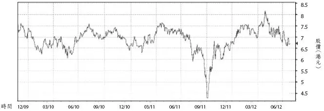

图4─1 民生银行股价图（2009─2012年）

资料来源：彭博社。

__（2）宝业地产（2355\. HK）__

• 拥有诚实和稳健的团队，建筑与地产开发并重。

• 自从2003年上市以来，风格一贯，业绩和股价表现不俗。

• 经常处于净现金状态，属业内罕见。

• 股价对账面净资产的折让超过50％。每股账面净资产为7\.9港元，股价3\.8港元。

• 分红高，息率高达6％。

• 虽深得基金喜爱，但是，交投淡静，故适合投资者长期持有。

• 没有开发和套现压力，没有外债，内债10亿元左右。

• 符合巴菲特的持股标准。

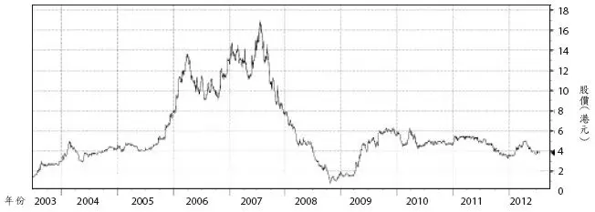

图4─2 宝业地产股价图（2003─2012年）

资料来源：彭博社。

__（3）河南建业（0832\. HK）__

• 具有宝业地产所有的优点，只是负债率稍高：50％左右。

• 每股账面净资产为2港元，跟股票价格相若。

• 全部地产专案集中在河南省各地市。管理层精耕细作能力强，善于在极低的屋价里挖掘利润。

• 资金周转速度快，去化率高。

• 只有一两个地块成本过高。

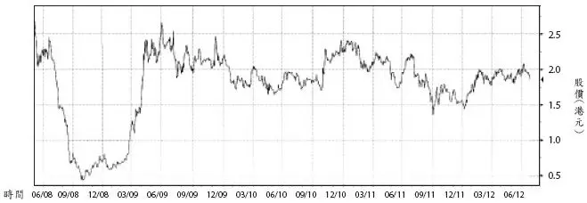

图4─3 河南建业股价图（2008─2012年）

资料来源：彭博社。

__（4）中裕燃气（3633\.HK）__

• 长期以来利润没有显现，主要原因是燃气供应不足。但是，这个问题正在得到解决。

• 2012年和2013年的利润均有可能增长40％左右。2013年市盈率大约为7～9倍。

• 在已发展业务的20多个城市里，它都具有垅断地位。它运营的城市多在主乾道沿线。由于资金实力所限，多年来在新城市的拓展太慢。坏事也许是好事：正好避免了某些企业的消化不良的问题。

• 大股东中国燃气是行业领袖，两者未来合作可期。

• 新奥能源，中国燃气和华润燃气也同样优秀。对股票交投比较在意的投资者，可以买这三家公司的股票。我本人持有华润燃气。

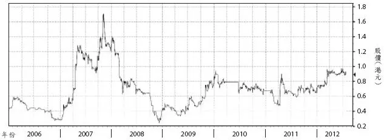

图4─4 中裕燃气股价图（2006─2012年）

资料来源：彭博社。

__（5）中油燃气（0603\. HK）__

• 直接控制和通过与中国石油的合资企业（中油中泰）控制全国30个城市的天然气供应。中油燃气在合资企业中的股份为51％。具有国企的安全性和市场化运作的高效率。

• 与其他类似公司的区别是它的业务重点在于传输管道，而不是城市管道气体的供应。

• 与中裕燃气相似，这家公司也将因为未来几年燃气销量的巨大增长（每年复合增长可能超过30％）而获益。

• 与大型燃气公司（比如中国燃气和新奥能源）的区别在于，它的增长率会更高。

• 2013年的市盈率大约在10倍以下，这跟高成长的垅断性公司完全不符。

• 对股票交投要求比较高的投资者可以考虑投资中国燃气和新奥能源。

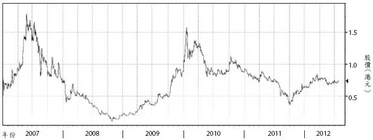

图4─5 中油燃气股价图（2007─2012年）

资料来源：彭博社。

__（6）深圳国际（0152\. HK）__

• 控制深圳高速公路51％的股份。深圳高速公路虽然不是高速成长的企业，但相对稳健，无须在激烈竞争中挣扎。

• 若干高速公路中最失败和昂贵的清连公路已经在股价中得到反映。

• 在南京和深圳的若干物流项目的回报率长期太低，不过正在改善。

• 持有中国最佳航空公司深圳航空的49％股权。

• 利润前景可期，虽然行业前景黯淡。

• 缺点之一是作为国有企业，不可能完全避免政府支配，管理层激励不够。

• 在出售非核心业务（比如南玻的股份）方面速度太慢。

• 资金周转不够快，有改进潜力。

• 2011年的高分红难以重复，但是未来分红依然会不错。

• 总体ROE不够高，但是在全球资金回报率下降的环境下，它显得不差。

• 市盈率5倍左右，让人垂涎。

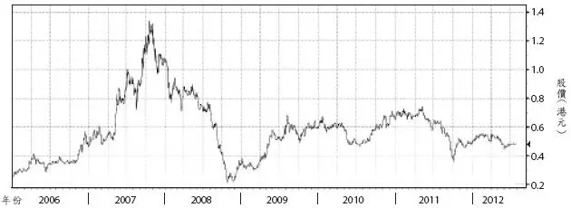

图4─6 深圳国际股价图（2006─2012年）

资料来源：彭博社。

__（7）茂业国际（0848\. HK）__

• 2008年5月到香港上市，价格3\.1港元（也许略高）。2012年7月的股价跌到了1\.2港元。

• 业务发展速度快，而且稳健。

• 大股东持有股份78％左右，有利于避免大股东对小股东的剥削（即利益冲突）。

• 不同于大多数百货公司，茂业自有物业比重高。物业开发所得的利润都沉淀在茂业。不同于大多数地产商，茂业的物业开发量体裁衣，非常适用。每个专案的规模不大，容易消化。茂业的项目至少可以自用，不愁用家。在全国商业物业整体过剩的新情况下，这一条很重要。

• 2012年利润增长放缓，但是依然有增长（上半年的预报有增长）。

• 茂业持有的若干少数股权，增值潜力巨大。

• 这样的公司在10倍市盈率左右，绝对有吸引力。在国内A股市场，这不敢想象。

• 茂业百货避免了两个错误：一是大手笔花钱在电子商务；二是从2011年起，茂业开新店的速度放慢了。这有利于短期成本的节省。

• 茂业百货自有物业比重大的好处在于，近几年当租金上升的时候，茂业的成本可以得到较好的控制。

• 城市综合体特别不容易管理，因为太大，需要很长的时间才能达到运营的最佳状态。而茂业的项目见效快。

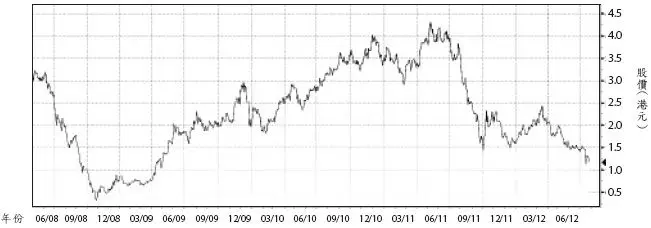

图4─7 茂业国际股价图（2008─2012年）

资料来源：彭博社。

__（8）中集安瑞科（3899\.HK）__

• 这是一家制造燃气储运设备和化工储运设备的国企。前者为主要业务（在行业内有领袖地位），后者为次要业务（在业内没有明显优势）。主要工厂在石家庄、蚌埠、荆门、南通和欧洲。

• “国企”和“制造业”，这两个特点通常都不是我之所爱，不过这家公司是例外。它是燃气储运设备制造行业的领袖，而且它的团队确有少见的工作激情。

• 近几年燃气行业增长前景不错。这也许比管理团队的素质更重要。

• 中集集团在2007年收购这家原本由新奥集团控制的公司之后，注入了若干工厂（南通、欧洲等）。由于母公司收购欧洲工厂时支付的价格过高，而它也许不愿意承认错误，于是母公司把沉重的负担转嫁到了上市公司。2007─2008年把工厂卖给上市公司时，价格定得过高，严重伤害了小股东的利益。股价大跌。管理层也学到了教训。

• 2008年和2009年业绩大跌，证明公司业务有周期性。

• 估计2012年和2013年两年的利润增长率高于30％。2013年的市盈率可能在8倍以下。

• 风险有三：

1．母公司还会再犯过去的错误，伤害小股东利益吗？

2．毕竟是制造业，是国企。

3．化工储运设备的制造业务在业内不具备领袖地位，而且行业竞争格局恶劣。

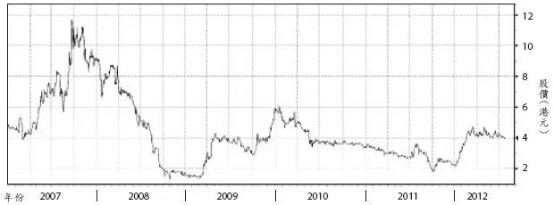

图4─8 中集安瑞科股价图（2007─2012年）

资料来源：彭博社。

2026年3月14日

15:45

## 4.03 体育用品公司前途堪忧

\(51\) 4\.03 体育用品公司前途堪忧

2026年3月14日

15:45

__4\.03__

__体育用品公司前途堪忧__

在世界各地挂牌上市的中国体育用品公司和没有上市的竞争者很多。现在，这个行业出现了严重下滑。这是暂时的，还是永久性的？

如果是暂时的，那么，这些公司目前的痛苦挣扎就是值得的。如果这个行业的春天已经过去了，那么，这些公司的努力就是不明智的。

企业战略转型（继续辉煌）说起来容易，做起来难。对于大量已经发达了的企业家来说，如果他不再斗志昂扬，如果他不愿意交出管理权，如果他尚未找到新的增长点，最明智的选择是停止公司的业务发展，开始收割以往的劳动成果，加大分红，逐步结业。对于很多企业来讲，这就是最体面的“退休”。企业家本人也应该为此感到荣幸。

__体面的退路__

我知道一家体育用品公司。它曾经很风光。直到3年前，它的生意很好，股价也好，账面上留着50亿元现金，基本上没有银行负债。但是，那是顶峰。激烈的竞争很快把它的生意和股价打了下来。这家公司不断并购品牌，开设新的店面，大打广告。但是，这可能已经来不及了。它越南战争越勇，但是屡战屡败。50亿的现金很快变成了30亿元，20亿元。我最近想劝董事长收手，但是无果。我担心它的净现金很快会变成净负债，然后，某一天壮烈献身。

除了战略转型，继续做伟大的公司以外，柯达和大量消亡了的好企业都曾经有一个体面的退路。那就是退休。为什么企业不可以像人一样退休呢？为什么一定要死在战场上呢？

美国的家电零售企业百思买现在还处在健康状态，还是大企业，利润也还不错，负债很轻，只是老态龙钟，斗不过电子商务。据我的观察，它很有可能明智而且体面地收十行李，退休。最终的结果可能是一个大大瘦身以后的小企业。

## 4.04 別碰需要营销的公司

\(52\) 4\.04 別碰需要营销的公司

2026年3月14日

15:45

__4\.04__

__别碰需要营销的公司__

我经常到全国各地出差。每次上飞机前，我都要买几本财经方面的杂志。我最喜欢的杂志是《新营销》、《商界》和《环球企业家》。其中我最喜欢的文章是关于营销的，特别是关于消费品营销或者电子商务的故事。

但是，在投资股票时，我尽量不碰那些需要营销的公司的股票。我喜欢基本上不需要营销就能卖产品的公司，比如港交所（0388\.HK）、燃气公司、领汇房产基金（0823\.HK）、收费公路和中小银行（虽然它们需要竞争，但是高成长性还是比较有把握的）。

投资银行抢生意很累，原因是每个投行在太多方面都一样。发新股做IPO、并购咨询、发可转换债券等，每家银行都会做。这种同质的竞争就只有靠关系，靠运气，声嘶力竭的叫喊或者一些十分偶然的不重要的因素（比如某个投行的PPT做得比较好，某些投行的人来公司不太勤，或者说对了或说错了几句话，分析师可能在名气上稍微响一点，等等）。对于今天世界上的10大投行来讲，好在它们的家数只有10家（感谢几十年的整合），很难看到一个IPO有某家投行能做而另外的投行做不了，或做得比较差一些。甲投行的研究团队今年排得靠前明年则靠后；甲投行在可转换债券方面做得比较多，而IPO做得比较少。在配新股方面，乙投行在全球做得比较多，而在亚洲做得比较少，或者这两年倒楣，做了几单不太成功的生意。

每个投行在送给公司客户的宣传小册子或PPT上面，都有独立的权威机构所做的“本投行在某某方面的排名第几”。有不少公司的高管十分混淆。为什么10个投行都有如此互相抵触的声称？究竟谁第一、第二，谁第九、第十？事实上，每个投行讲的也许都是实话，但是“你讲的是最近两年第一，我讲的是过去五年我总分第一，你讲的是在美国IPO主承销总量第一，我讲的可能是在亚洲的股债发行量第一”。如此等等。

__最高境界是避开竞争__

在激烈的竞争中脱颖而出，当然是很风光，但这不是最高境界。最高境界是尽量避开直接竞争。

从花旗银行、瑞银到美林和贝尔斯登，几乎都把银行的老本全部亏空了。为什么？我想主要是正面交锋和直接竞争的结果。问题的起源从发放按揭的商业银行开始，商业银行钱太多，无处可贷，所以连根本无力还款的人也获得了大量住房贷款，而且投行还把这种垃圾贷款几千亿美元、几万亿美元买过来，打造成一个组合，再以此为抵押，发行多种花里胡哨的债券，还煞有其事地分级、评级、做保险。想想看，这些是不是激烈竞争的结果？

这跟买股票有什么两样？因为别人都看好这个项目，所以你也就看好；因为别人都追捧某只股票，所以你也就高看一线。

在生意场上，你可以因为赢得一个项目而全军覆没，也可以因为输掉一个项目而躲过一颗子弹。所以，还是避开竞争最好。

美国人喜欢竞争，所以他们常说的一句话就是要改变游戏规则。我觉得最高境界是改变游戏。

中国目前在很多领域的竞争之激烈，可能已经超过世界任何地方。两年前，福建省的体育鞋公司匹克（1968\.HK）认识到这一点，并开始到美国和俄罗斯寻求发展。虽然基金经理和分析师反对公司这样做，但是我却很赞成。我觉得，避开国内的激烈竞争，匹克很可能开创一片全新的天地。这个利益会是长期的。

## 4.05 港爱股大势已去？

\(53\) 4\.05 港爱股大势已去？

2026年3月14日

15:45

__4\.05__

__港人爱股大势已去？__

过去几十年，汇丰控股（0005\.HK）和思捷环球（0330\.HK）都是香港股民的爱股，确实为很多人赚了很多钱（股价上升和分红）。它们足够大，足够可靠，一直到它们突然变得不可靠。

长期以来，投资界有这样一个辩论：究竟长期持有（buy and hold）好公司的策略还行不行？我是个实用主义者，不想卷入理论探讨。不过买了股票以后何时卖，跟何时买和买什么同等重要。但是，全球股民最大的问题从来就不是“何时卖”，而是大家持有时间太短，太短。

既然如此，我们还是把“何时卖”的问题转化成如下问题：现在该不该投资汇丰银行和思捷环球？当一颗巨星陨落时，我们应该怎么办？应该留念，还是寻找下一个巨星？显然，这个问题不能一概而论。不过，我们常人没有能力在巨星陨落之前有先见之明。但是，当巨星陨落之后，我们应该认真检讨。我的看法是，在多数情况下，我们是不应该留念的。

先谈汇丰控股。也许它的新管理层可以恢复这家银行的某些光辉，但是论投资，行业永远比公司重要。我们要问自己一个问题，在全球，银行业还是一个高成长的行业吗？汇丰有什么特别之处吗？它的估值特别有吸引力吗？回答都是未必。也就是说，对于个人投资者来说，现在的汇丰只是一个马马虎虎的投资机会。它并没有留下特别多的空间给我们。

再谈思捷环球。直到6～8年前，这是一个高品质、高品味的消费品公司，主要服务年轻和中年女性，有欧洲气质和精细化的管理。但是，三个因素共同发挥作用，消灭了思捷环球：__1．随着中国消费者购买力的增加，中国本土品牌有了实力展开竞争；2．欧美市场增长放慢，迫使欧美的高档品牌加大在中国市场的投入；3．思捷环球的管理层开始感到很疲倦和失去斗志。__赚了那么多钱，谁还有斗志和意愿像饥渴的创业者那样拼搏？公司主席邢李原不断卖股票，就是明证。当然，公司可以依靠新的团队，使公司更上一层楼，但是，成功的团队是偶然，多数团队是注定要失败的。这是全世界的规律。今天的微软，今天的苹果，今天的长江都面临同样的挑战。从概率上讲，新的团队失败的可能性大于成功的可能性。

我的上述看法并不是说，这两家公司不能给投资者赚很多钱。也许它们会，也许不会。分析师们可以花很多时间研究这些行业和企业，基金经理们可以花更多时间挣扎，但是这种公司的空间没有大到足够个人投资者应该投资的程度。它们成功的概率对投资者是不利的。

我们常人没有能力在一个行业或者商业模式走下坡路之前得出正确的判断。但是，在下坡路已经很明显时，我们有能力判断“大势已去”（the game is over）。不留恋过去的明星，可以避免很多错误。

## 4.06 我的投资难题

\(54\) 4\.06 我的投资难题

2026年3月14日

15:45

__4\.06__

__我的投资难题__

今年我49岁。5月5日，我老婆和孩子们给我的礼物是让我回湖北农村看看父母亲。我还是像30多年前从大学放寒暑假一样充满了喜悦和期待。

我妈问我，做了一年信用社（其实是小额贷款公司），感觉累不累。我回答，很累，赚钱很难，肯定比做投资银行要难。我坦白说，我以前从来没有读过一本励志的书，但是现在，我有时要靠励志的书支撑，才能在单位里保持热情洋溢。官员们口头上很支持我们的行业和公司，但是，我要做点事情可不容易。规则多而且离奇，合规成本太高，而我天生就胆子特小，不敢违规，当然什么事也做不成。我知道有些好人被迫违规。

我妈摸着我的秃顶说：“你的头发好像又少了一些。”我说，我最近经常急躁。急躁的时候，我会不自然地揪头发。我得改改这毛病。

我跟父母亲谈起邻居小伙子二狗头到镇上开汽车修理店的事情。我准备入点股，让我爸偶尔去店子里看看，也算监督二狗头。

过去18年，我一直在香港打工，买香港股票成了习惯。尽管神州大地的经济持续高增长，但是看到A股的那种高估值和管理层对小股民的不诚实和居高临下的态度，我从来没有买过一张A股。

在香港我也踩过几个做假账的公司的地雷，躲过了若干地雷，还排过几个地雷。但是，我还是喜欢香港股票市场。我做了一年小额贷款，突然发现手上有了一点人民币积蓄。我苦大仇深，所以理财是个习惯动作。

于是，我开始寻找机会。先看存款。3年期5％的年回报。很不错。把存单当成股票，那么它的市盈率是20倍（就是20年收回成本），不操心，不承担任何风险。不错。虽然我心里明白，这个利率明显低于物价上涨，但是我没有办法。

再看债券市场。普通企业债券6％～7％的年回报率完全没有吸引力。我觉得它们起码要高于8％，我才愿意看一看。

__买股票非因好玩儿__

买国内的股票？不行。总的来看，A股还是太贵。两个原因。一是太多的坏公司还是特别高的估值：20倍、30倍甚至40倍市盈率。有些大公司看起来便宜（比如说，银行、保险、地产、建筑、石油和化工），但是它们其实不便宜。为什么？经济增长在放缓。企业利润的增长在放慢，而且未来几年现金流会更难看。很多股民击鼓传花，或者炒波段，但是我有自知之明：我没那本事。

内地的利率水平比香港高很多，所以如果你用折现法来看，同一家公司（既有A又有H股的公司），A股应该比H股的价格便宜三分之一或者一半才算合理，因为机会成本不同，资金成本不同。比如，我持有民生银行H股，但是它的A股必须比H股便宜一半我才会买。

最后一点，A股现在的价格没有给投资者留下“安全边际”。我没有道理要买A股。必须知道，小股民不能买合理估值的股票。我买股票不是为了好玩儿，我的唯一目的是要赚钱，而且要在很安全的情况下赚钱。现在的A股到了这个程度吗？差得太远了。

另外，我必须知道，一家公司的估值对于控股股东和小股民来说，是很不一样的。控股股东可以长期等待（两代人甚至三代人），而小股东可以吗？另外，他们有控制权，我没有。信息也不对称。我必须在折扣很大的时候才能持股。否则，我把钱拿去发放小额贷款更踏实，更满足。

保险公司：增长太慢。股本收益率也太低。

地产公司：还是买香港上市的内房股吧。折扣更大。

建筑公司：增长何在？

石油和化工：增长何在？我还不如买它们的H股。

买黄金或者古董？No。不熟不做。我会错过好机会吗？没关系。我天天都错过大把机会。

## 4.07 我的投资布局

\(55\) 4\.07 我的投资布局

2026年3月14日

15:45

__4\.07__

__我的投资佈局__

下面，我想谈谈我现在的投资佈局。首先，让我申明，投资是非常个人化的追求。你必须说服自己，必须很有信心。我的看法主要适合我本人的投资，不适合别人。我愿意等待很多年。我的看法反映了我的偏见和孤陋寡闻。我对任何人的投资胜利或者亏损不负任何责任。绝对！

__1．我依然不会投资A股。__

__2．我依然处于满仓状态。__

__3．我继续忽视宏观指标、经济政策、FX、CPI和噪音。__

__4．我的选股三步骤：先选行业（竞争状况、利润率和监管），再选企业，最后看估值（看估值时，马虎一点即可）。__

2012年1月时我的资产组合大致如下：

（1）新奥能源（2688\.HK）的股票：占我资产组合的6％；

（2）新奥能源（2688\.HK）的债券：12％；

（3）中油燃气（0603\.HK）：6％；

（注：2011年有人宣佈全面收购中国燃气和郑州燃气。我卖掉了。我也卖掉了粤海投资和上海复地。）

（4）民生银行（1988\.HK）：5％，准备继续加仓；

（5）重庆农商银行（3618\.HK）：3％，准备加仓；

（6）中国信贷（8207\.HK）：6％；

（7）金榜（0172\.HK）：8％；

（8）天安（0028\.HK）：5％；

（9）建业地产（0832\.HK）：5％；

（10）华南城（1668\.HK）：4％；

（11）金威啤酒（0124\.HK）：3％；

（12）天津中新药业（新加坡上市股）：3％；

（13）中集安瑞科（3899\.HK）：6％；

（14）若干不争气的阿斗（待解决的历史遗留问题）及现金。

__股票压力测试__

有个基金经理说，2011年，他买发电公司的H股股票赚了钱，使他业绩不错。我祝贺他。但是这是侥幸的成功。我永远不赞成投机：下个月电价可能上调，煤价可能下跌，董事长可能换人，等等。让我们永远不要谈论那一类事情。从根本上讲，电力行业的商业模式就是不幸的。它常被人们说成是公用事业。这是个错误。国外的公用事业企业在产品定价和资本回报率方面受到严格的公式监管和保证，但我们的发电企业不同。我觉得它们很像制造业：它们从公开市场买煤（价格不再受到太多保护），再发电卖给电网（价格又受到限制）。要预测它们的利润非常不容易。它们的固定资产很大，前期投入多。我感到，这个行业不太适合我们小股民。

同样的道理，我绝不会碰炼油厂、化工厂、钢铁厂、造船厂和航空公司。不是它们不好。只是我完全没有能力判断它们的产品价格和周期。现在，请大家跟我一起说：“我们没有判断能力！”2010年底，西安的西部水泥把上市地点从英国搬到香港来之前，我看它便宜得难以相信，就买了不少，很有斩获。但是，我知道那是投机，不是投资。这种错误我保证以后不会再犯了。

煤价是大宗商品中波动最小的，而且跟经济和生活十分密切。我可以考虑买些煤炭股票。不过现在没有找到合适的目标。

我主张在分析大宗商品价格时，如果我们假定商品价格下降80％～90％之后公司估值还不错的话，那么股票就可以考虑买入。如果经不起这种压力测试，我就主张避开为宜。

新奥能源跟中国石化联手试图收购中国燃气后，股价跌了不少，因为市场担心它会因此负债累累，也担心它没有能力扭转中国燃气。但基于10年的观察，我很有信心。首先，燃气行业负债率高一些没关系。新奥的债券目前还是投资级的，而且可能是投资级债券中最便宜的之一。它的股票当然也很有吸引力。

__小股民应买金融股__

我为什么喜欢金融业？在我看来，金融业是最好的股票投资行业，特别适合那些不能够也不愿意玩高难度动作的小股民。__第一，金融业是经济中所有行业的高度概括和抽象，投资金融业就等于投资所有行业。__这样一来，投资者可以避免过度集中的行业风险。__另外，你很难找到一个比金融业更具有杠杆效应即放大效应的行业。__所以在经济增长很正常的年代，金融业会跑赢其他大多数行业。当然，在经济滑向衰退时，坏账增加，可能让金融企业巨亏甚至倒闭。但是，由于金融业的特殊地位，政府又不敢让金融机构倒闭，在困难时必须伸出援手。这就出现了一种不对称。赢了的时候所有股东有份，亏了由政府埋单。虽然经济周期难免，但中国经济的基本方向在未来5～10年还是向上的。这就决定了金融业投资的可行性。另外，这些企业一般比较大，安全性比较高。从“投资者的护城河”的角度，金融机构的客户从金融机构“叛逃”到另外的金融机构的成本很高。投资金融业的另外一个好处就是，政府对营业执照的控制使得金融业的竞争远不如其他行业激烈。

我为什么买入民生银行和重庆农商银行？因为它们的增长不错，改善潜力也相当大。这几年，很多人看不懂这个板块为什么变成了“价值陷阱”。我也看不懂。不过，我比绝大多数投资者有一个优越性：我可以等很久很久。而且这个价位让我比较踏实。当公司利润每年有不错的增长并且资本回报率很好的时候，别人等不起，我有耐心。

当然，我更喜欢民营的典当（中国信贷）和小额贷款公司（金榜）。它们的增长和步步谨慎让我很放心。

__制造业苍白无力__

多年来，我对制造业一直有偏见。2011年的股市危机验证了我的话：从船舶，到推土机、汽车、服装和体育鞋。我参观过一家工程机械厂。吓坏了。那库存！那退货！还有厂商提供的便宜的卖方信贷！

我跟大家抬杠的一个地方就是所谓“品牌产品”。在我的小书《投行分析师的叛逆宣言》中，我反复强调品牌不值钱。产品稀缺时，阿斗也口口声声说“悠久历史”，“品牌价值”，“历史积淀”。但是，当大家一哄而起做同样产品时，你就看到所有企业都打价格战，玩低级游戏，狼狈不堪。

当然，这也包括地产开发商。房地产市场火爆的2005─2009年，连最烂的地产企业也鼓吹“百年老店”。最近两年，我没有听到吹这种牛的了。开发商变得实在多了。我们现在听到的多是：卖房子，抓现金流，过冬，活命。

由此，我想到牛奶企业、食品、饮品、童装公司和童车制造商。当然啤酒企业也是制造业。它们的品牌没有太大内涵（也许青岛啤酒有点例外）。根本问题还是生产成本、运输成本和营销成本的控制。仅此而已。请几个明星演员扭扭捏捏就叫品牌？那样的品牌在成本面前会显得苍白无力，在供求关系面前也一塌煳涂。

这几年，我们国内股民推崇白酒到了离谱的地步。没关系。凡事总有个过程。大家多亏点钱就明白了概念股的危害。白酒企业就是制造企业。我们对那些自称发源于秦朝或者明朝的白酒品牌尤其要小心。如果有人再声称某某评级机构给他的品牌估值300亿之类，你扭头就走。哦！对了。还有服装、鞋帽和茶叶公司也是如此。从根本上讲，这些企业并没有修建像样的“护城河”。只要它们放松警惕，它们就会被竞争者甩在后面。而且，行业的进入门槛太低。即使它们把所有的竞争者都消灭了，它们也不敢明显提高产品价格，以免邀请新的加入者。

在制造业我持有两只股票：一是中集安瑞科。这是个国企（通常我不太喜欢国企），二是金威啤酒（国企）。前者是行业领袖，而且它处于一个快速成长的行业（燃气运输和储存）。金威啤酒这几年落后了，但是管理层不错，而且在努力想办法。我承认，这个行业很差，我持有它也许是个错误。好在仓位不重。

__零售餐饮 叛逃太易__

再谈零售业。以前，我一直喜欢零售企业的股票，但最近学习“护城河”的理论，我开始对零售和餐饮业抱有戒心。它们的问题是，客户在“叛逃”时太容易，成本太低。这些行业最近5年运气不错，赚了很多钱，于是，该行业正在经历一个前所未有的产能扩张。如果经济突然疲软或者销售放慢，它们的房租和其他固定费用可能成为一个大问题。另外，超市我一直看好。但是持续赚钱不易。而且，电子商务也不可小看。有人说，“绝大多数人还是要到商店逛逛的”。这没错。但是，当有一股势力正在削弱你的增长率的时候，你要小心。况且，电子商务对实体商店的价格有很大的影响。

我说过，以后我要多看利润率，少看利润增长率。我是有教训的。但是，利润率高的时候，资本市场会害怕未来利润率会下降。利润率低的时候，资本市场会说：“瞧你利润率那么低！”结果：你左也不是，右也不是。怎么办？我觉得只要我们冷静一点，眼光往三年以后看，就能对得多，错得少。

我以前谈过我们应该只买“十倍股”。很遗憾，我不敢肯定我的资产组合中哪些是十倍股，哪些不是。不过，新奥能源从2001年IPO以来上涨了16倍。中油燃气表现也不俗。中集安瑞科未来可能是。泛华和金榜也很可能是。最后，重庆农商行也不要小看。

## 4.08 中国银行股的黄金岁月

\(56\) 4\.08 中国银行股的黄金岁月

2026年3月14日

15:45

__4\.08__

__中国银行股的黄金岁月__

有好几个读者来电询问我为什么竟然看好中国的金融股。他们的反驳论据有二。第一，中国的银行坏账太多，所以账面净值被大大高估。第二，全球的银行（从花旗银行到雷曼，到苏格兰皇家银行，再到日本的许多银行）给投资者带来的只是心酸的泪水。中国的银行怎能例外？

我明白这两个道理。但是，大家要看趋势和阶段。__第一，中国的银行坏账也许比报告出来的要高出很多。但是，这些银行制度的改进和员工水平的提高也是很明显的。__我认为，这个趋势还将持续很多年。

__第二，在业务上，中国的银行还有很多最基本的潜力没有挖掘。__这些潜力包括的范围很广：信用卡、放款的审查、结算体系、人员管理，等等。这些都是劳动生产率的提高。而且这都是不需要跳起来就可以摘到的果子。这还不包括金融创新（新产品）。

__第三，过去10年，欧美日银行的日子确实艰难。但是，大家千万不要忘记在此之前的三四十年，它们也曾经有过金色年华。__很多银行股的股价涨了几倍、几十倍。那些没有上市的银行也都赚得爽极了。这说明了什么问题呢？银行就是经济的综合体和放大镜。在经济往上走的时候，银行的日子好过，而且有放大效应。相反的，如果经济往下走的时候，银行受伤更重。虽然银行股的股东们会因为经济衰退而亏很多钱，但是，相比其他行业，银行业不知道好了多少倍。你看看那些被抛弃的工厂和烟消云散的品牌就知道了。

美国的银行业者基本上都是聪明人。他们当然知道次贷（贷款给低收入者、失业者和无家可归人士）是有风险的。但是由于有产者的资金需求都早已得到了满足，而银行为了“业务增长”，只好往金字塔的下端走，一直走到荒唐的地步。

__中国的银行还有10年好日子__

当然，中国的银行最终也会走上那条路，但是，从现在到那里，还有很遥远的距离。只要你眯缝着眼睛看看大势，你就知道我们的银行至少还有10年的好日子过。

也许你会反驳，我们的银行完全靠利率管制而发财。只要政府取消利率管制，它们的好日子就完了。我同意。但是，让我告诉你，在中国，好事不见得能做，不见得马上有人做。1983─1986年，我在人民银行读研究生时的论文就是《中国利率自由化的途径》。26年后的今天，大家还在空谈利率自由化。不过，对于五千年的中华文明来说，26年算不了什么。大家别急。

大家问我为什么选择民生银行和重庆农商银行。我考虑了它们的规模（增长潜力）、市场定位和管理层的水平。

多数中国银行既有A股，又有H股。但是，即使A股的股价跟H股的股价相若，我也不会选择A股。原因很简单。只要你眯缝着眼睛看未来5～10年，你就会理解国内的利率水平会继续大大高于香港（和美国）的利率水平。而股市的合理市盈率无非就是市场利率的倒数。也就是说，同样是民生银行的股票，H股应该比A股贵很多（也许贵一半以上）才对。对于一个长期投资者来说，你只需要知道这么多。那些复杂的细节，让专家们去辩论。这里有两点需要说明。第一，我说的利率是市场利率（取决于通胀），不是官方利率。第二，对于同一家公司来说，由于其他变量相同，所以利率是估值的唯一因素。

## 4.09 不买“带工厂的股票”

\(57\) 4\.09 不买“带工厂的股票”

2026年3月14日

15:45

__4\.09__

__不买“带工厂的股票”__

2005年，我在《财经》杂志发表了一篇杂文，中心思想是“聪明的股民不要买带工厂的股票”。7年来，这篇文章被不少人引用或者批评。我也一直在检讨。现在，我把这些思考和观察做一个回顾。

首先，我的基本观点还是没有变化：工厂需要研发和资本投入，但是由于科技的进步，替代品的出现或者消费者口味的变化，工厂的前期投入有可能会泡汤。而且，研发是一个永无止境的过程。为了赚取3亿元，先要投入2亿元。今年赚了3亿元，明年要再投4亿元。明年赚5亿元，后年再要投6亿元。不然，你就落后了。有大量固定资产的企业在遇到市场变化时，掉头转向很困难。这样的公司越做越大，但股东们最终所获不多。从长远来看，毕竟是现金流决定企业价值。这些公司的现金流往往不怎么好看。由于经常增发新股（集资），股东难免被摊薄得很快。另外，品质管制、成本控制和营销都是让人头疼的事。相比较而言，“轻资产”的企业和服务性企业似乎有很大的优越性。

其次，我原来的观点确实也太极端了，至少有以偏概全的问题。长期以来，海内外有大量工业企业给投资者带来了巨额的财富。工厂，特别是需要巨额投资的工厂，本身就是一个进入门槛。世界上有钱的企业毕竟是少数。而且，投资额越大，门槛就越高。加上，有钱的人们也未必都有胆量或者意愿或者科技来跟你竞争。这就让你在很高的固定资产的壁垒后面大赚特赚。不过，在资金越来越便宜的今天，这种优势很难持续。资本市场的功能之一就是帮助钱虽然不多，但是胆量够大并且好像有点组织能力的人们挑战那些高投资额的门槛。所以，你的投入越大，风险也就越大。

__工厂拖制造业后腿__

如果你认真分析一下大量制造企业的利润的真正来源，你会发现，它们的工厂实际上在拖它们的后腿。如果它们没有工厂的话，它们的利润率会更高。也就是说，它们的工厂虽然帮倒忙，但是足以被另外方面（研发、营销、特许经营权、地理位置或者矿藏）的优势所抵消和掩盖。有人可能会说，它们的工厂是使它们其他诸多方面的优势得以体现的载体。这种情况当然是有的，但是，在绝大多数情况下，生产是可以外包的（比如，可口可乐、耐克、苹果电脑、LV手袋，等等）。真正在生产流程（即制造）方面有独到之处的企业当然很多（这些年我也观察到了不少），它们可以赚到很多钱，但是这毕竟只是“好工匠”的钱，不是超额利润。我去年有幸参与一家PVC塑胶管的生产商在香港的上市工作，很受教育。

顺便说一句，我从来不明白中国企业到海外买矿产资源跟中国的能源安全和保证原材料的供应之间有什么必然的联系。中国企业在开采这个环节有什么优势吗？没有。如果没有，那么你对资源价格的长期走势有独特的判断力吗？也没有。如果发生战争，海外的那个矿山究竟谁是股东，其实毫无意义。它能够因为中国人是股东而保证中国的能源和资源供应吗？当然不能。即使在和平时期，这些矿山究竟是中国人拥有还是外国人拥有，丝毫都不能改善中国人的“定价权”或话语权，也丝毫不能改善中国的供应条件。如果你觉得矿产品会长期涨价，到海外购买矿山，并没什么不可以，只是不要把政治话题扯到一起，牵强附会找理由。

最后一点，在制造业确实有很多好的投资机会，但是投资本来就是一项个性化的活动；你自己必须感到十分自信和舒服才行。也就是说，你应该有自己的偏好和风格。如果你错过了制造业的大量投资机会，这没什么了不起。关键的是，你投资的企业必须让你睡得香，感到踏实。如果带工厂的企业让你心里踏实，那当然也很好。

在投资方面，我自己比较有保留的重资产型的行业包括钢厂、船厂、发电厂、化肥厂、炼油厂、汽车厂和航空公司，等等。虽然机场、公路和港口的前期投入也很巨大，但是它们有两个好处：没有竞争（或者竞争很小），而且对管理层的能力要求没有那么高。

## 4.10 光有利润高增长还不够

\(58\) 4\.10 光有利润高增长还不够

2026年3月14日

15:45

__4\.10__

__光有利润高增长还不够__

我最近读了麦肯锡（Mckinsey & Company）的一本新书，《价值：企业财务的四根支柱》（Value: The Four Cornerstones of Corporate Finance），大有温故而知新之妙。这本书是作者10年前的杰作的更新版。这次我体会最深的是如何看待企业的利润增长率。作者很严谨地证明了企业利润的快速增长难以持续；其次，即使可以持续，也未必能给企业带来真正的价值，原因在于资本回报率（return on invested capital，ROIC）可能太低（低于资金成本）。资本回报率太低可能有多种原因，比如商业模式上的缺陷。而这种缺陷是无法用高增长来解决的。

股票本身没有什么好研究的，值得研究的是企业。我觉得有一个常识性的结论应该在此一提。一个企业究竟是否上了市，对于它的内含价值是没有任何影响的。只有当上市集资时企业的估值超过企业的内含价值（让新股东做冤大头），这个IPO行为才有增值。当然，上市有助于企业的后续融资，但是对于大多数大中型企业来讲，上市地位对于融资的影响是不大的。最重要的一点，新筹集的资金是否能够增加企业的每股内含价值，还是个大问号。对于大量的企业来讲，上市集资只是为它们摧毁股东价值提供了一个更好的平台。

在谈到为什么美国股票长期比亚洲股票昂贵的原因时，麦肯锡的人说，虽然亚洲企业的利润增长率比较高，但是它们的资本回报率却远远低于美国公司。比如，2007年，美国上市公司的平均运营资本回报率为17％，而亚洲公司的为10％。很多亚洲公司把股票的上市地搬到美国，想沾点光，不料变成了孤儿股。从中长期来看，股市是不傻的：股票的估值终究取决于企业的价值。而企业价值的核心是贴现现金流（discounted cash flow，DCF）。美国公司的利润增长率虽然不高，但是它们的毛利率很高，从而资本回报率很高。

__资本支出影响估值__

而且，由于美国企业的资本支出一般不大，所以，它们的很多企业成了名副其实的收割机或者印钞机。股票市场特别钟爱那些印钞机的公司。凡是做过企业估值模型的人们都知道，资本支出巨大的企业往往估值很低，它们的前期投入阶段有四个问题：一是建造风险，二是未来回报的不确定性，三是掉头难，四是回报率低。

大量的亚洲公司由于利润率低，所以要么降低分红率，要么不断筹集新的资金，应付资本支出。当然，这直接影响到企业的DCF价值。这几年来，我研究过一家东南亚的水务公司。公司管理层的正派、勤奋和水平都让我很仰慕。但是，它们的资本支出很大。根据我的估值模型，这家公司股价上涨的空间不大：虽然它的生意会很快做得很大，但是它会需要不断地融资和摊薄；所以，它每股的利润增长会很慢，每股现金流的增长会更慢。

除了资本支出，有些行业和企业对流动资金的需求也非常大，而且难以控制。这同样也会影响企业价值。

麦肯锡的人花了大量的笔墨，用实例解释为什么上市公司把利润在各个年份推来拉去，谋求一条平滑的利润增长曲线，完全是徒劳和愚蠢；同样的，在折旧、费用摊销、税收和认股权证的计价方面所耍的各种小把戏，对于股票价格都是没有意义的。这些，我当然都赞同。

作者把企业的增长归纳为好、中、坏三类。好的包括用新产品打开新市场和增加现有顾客的购买量。中级的包括在快速成长的市场中扩大市场份额和收购中小规模的竞争者。坏的增长包括促销，进行很大的并购，或者进行技术革新。

此书技术性较强，读起来不如福尔摩斯探案集有趣；有些理念也未必完全能让人接受。不过，它推理严谨，案例颇多，实乃必读之经典。

## 4.11 只买能赚十倍的股票

\(59\) 4\.11 只买能赚十倍的股票

2026年3月14日

15:45

__4\.11__

__只买能赚十倍的股票__

有一次，我从山东出差回来，在飞机上做了一个梦。梦见了投资专家彼得·林奇。在梦中，我刚创办了一个投资基金，找他募集资金。他问我：“中国这20年出现过很多涨10倍以上的股票。你买过几个？”我的额头上开始冒汗，因为我一个也没有买。他挖苦我说：“这就奇怪了。你并不很笨。理论还一套又一套的。这么多年，你怎么就没有投过一个十倍股呢？”我开始冒更多的汗，“因为……因为我运气不好，工作也太忙……”

彼得说：“每个人每天都有24小时。你花一个小时研究普通公司，就少了一个小时挖掘和研究十倍股。当然，关键的问题还不是时间，而是注意力和态度。正如你们中国人所说，种瓜得瓜，种豆得豆。”我好像有点明白：“你的意思是说，人有多大胆，地有多大产？”

“是的。听起来好笑，但真的就是那么回事。你想炒波段，波段就炒你。如果你用严酷的高标准对待选股，即使你得不到10倍，也可能得到4倍、5倍的回报。当然，你选的有些股票还是可能最终亏钱。但那是最终结果，而不是你的出发点。如果你的出发点就是10％、15％的回报率，那你就会不经意地降低标准，实际回报5％或者7％，甚至亏钱。”

“你是说严师出高徒？”“别开玩笑。你明白我的意思就行了。如果你不用正确的态度去投资，持有一大把马马虎虎的股票，如果你的某个股票又突然跌了20％或者50％，你就会恐慌，马上止损，因为你没有钢铁般的信心，没有留足空间。相反的，如果你做足了功课，你坚信你选的都是十倍股，你的股票大跌的概率就很小，而且，即使跌了很多，你也知道怎么办。怎么办？加仓！这就是区别。我建议你把你的基金的名字改为‘十倍资本公司’（The Ten Baggar Capital）。”

我联想到张磊和陈一舟所讲的“惹不起，躲得起”的概念（You do not have to do anything\!）。某个股票在5元以下必买，60元以上必然做空，但是，在5～60元之间，啥也不做。大概也是这个意思吧。

下了飞机，我一直在琢磨刚才的怪梦，头疼极了。到了家，我突然发现我托运的行李还在机场，忘了领取。

## 第五章 价值的陷阱，通胀的牺牲品

__第五章__

__价值的陷阱，通胀的牺牲品__

2026年3月14日

15:45

## 避开股市的地雷

“我现在正在把投资理念从寻找便宜过头的烂公司，转为寻找贵得不够的好公司。”

## 5.01 价值陷阱的诱惑

\(62\) 5\.01 价值陷阱的诱惑

2026年3月14日

15:45

__5\.01__

__价值陷阱的诱惑__

什么叫“价值陷阱”？看起来便宜而实际上不便宜的股票是也！它们有一个共同特点，就是让你亏了钱以后还不知道怎么亏的。更不可思议的是，多数受害者事后还振振有词地为这类公司辩护，原因是这类公司一般都有致命的诱惑力。

表面上看，它们好得几乎无可挑剔，市盈率不高（10倍以下，甚至5倍以下），负债率可能也不高（甚至处于净现金状况），拥有的工厂和持有的物业或者其他非主营业务的投资都在升值或者已经升值，重置成本远远高于公司现在的账面价值或者股票市值，等等。

本人经常掉进“价值陷阱”，受害不轻，现在略有醒悟。__我把“价值陷阱”归纳为两类：一是夕阳行业的公司，二是不思进取的公司。__不思进取的公司又分为几种情况，包含民营企业家缺乏接班人，老一代惰性渐长或者正在经历人生迷茫（比如枯燥、激情丧失、中年危机或者第二次中年危机，等等），国有企业的制度不允许管理层进取（束手束脚），或者管理层自己不愿意卖力、没有动力，而且能力也受到局限，等等。

我觉得有一个小小的指标可以用来辨别一个公司是否懒惰（不思进取）：看看它的销售额在最近几年的变化（我不是指利润额）。也请看看毛利额的变化（而不光是净利润额）。进取的公司热火朝天，不思进取的公司一潭死水。

__寻找贵得有道理的股票__

为什么我们一次又一次地掉进“价值陷阱”？我猜想可能有这么几个原因。一是“静态思维”在作怪。便宜股票的便宜是无须争议的。8倍的市盈率低于另外某公司的20倍的市盈率，这不需要辩论。股票价格比净资产值（NAV）低30％总是好过溢价30％。但是，我们忘记了用动态思维来看问题。如果一家公司能够实现未来3年利润翻一番，而另外一家公司的利润原地踏步（甚至下跌），3年以后的估值状况会如何？

此外，我们也许还有几个问题要回答：利润中是否有一次性的特殊专案（退税收入、物业重估、折旧减少、削减广告费用和资产处置等）？窃以为，少上当的办法是看公司过去3年的平均市盈率，而不是只看当年的数字。我太极端？可能是。不过这样安全一点。

坦白说，我不断掉到“价值陷阱”的另外一个原因是懒惰。我老以工作忙为借口不肯花力气去理解某些公司为什么看起来那么贵。也许贵有贵的道理。当然，有些公司的贵是因为投资者愚蠢，但是在另外的很多情况下，它们的贵透露出一种信号：它们的管理层进取，它们有健康的高成长。也许它们还贵得不够呢！而要能够正确地做出这种判断，就要做很多功课。相反的，懒惰的人只需要比较各个公司的估值水平就行了。那多简单！一张可比公司的估值水平的比较表每个人都会看。这件事很简单，所以没有价值。

所以，巴菲特说，这样按图索骥买股票不需要技巧，而只有买那些看起来贵而实际上不贵的股票才考验水平。国内流行的“价值洼地”是一个非常危险的名词！它意味着主要是（或者完全是）估值水平的比较。近来，每当听到这个词的时候，我就皱眉头。其实，公司之间是不可比的，至少不可以简单地用数字来比较。

__企业不分红 于股民何益__

有一个道理，我直到最近才开始有点明白：有净现金的公司如果不分红，跟你股民何干？重置成本很高的公司，或者资产升值了的公司如果不处置资产并最终分红，跟你股民何干？当然，这些道理适用于任何种类的企业，但是，作为股民（或者小股东），我们要自卫。如果我们看不到大股东的衷心、激情和改变现状的愿望，我们有什么必要跟着他耗费时光呢？在有些“价值陷阱”的公司，管理层在老的游戏玩完了之后，无法找到新的游戏。这本来很正常（公司的使命终结了）。只是他们应该把公司清盘，卖掉，把钱分给股东。但是谁愿意放弃控制权呢？难道你想要他们的命吗？他们中有些人把公司变成了私家企业：全家老小吃喝玩乐都在公司报销（这不光是中国独有的问题）。股民们干着急，一点办法都没有。你坚信他们应该（或者必然会）把控制权交给他人，新的东道主能够让企业有一个新生，但是你只能无限期地等待。如果股票价格跌得厉害，那正好：他们便用超低的价格把公司私有化。

在国内市场上，股民们追捧小股票。这并非完全没有道理，因为大公司增长太有限。而且大国企的社会负担太重，难以前行。只是小股票被追捧得太过分。在海外市场上，很多特大的和特小的股票都成了“价值陷阱”。本人多年来热衷小公司和小股票，但最近有一个新的想法：有些小公司完全被遗忘也许有它的道理。如果一家公司在打拼了十几年甚至二十几年以后还不能长大，也许行业有问题，商业模式有问题，或者管理层有问题。这三个可能性都不好，当然也就只能有一个结论：你不应该买它的股票。

在我的小书《投行分析师的叛逆宣言》里，我详细分析了价值陷阱的若干指标和防范技巧，大家可以参考。

## 5.02 提防永不长大的上市公司

\(63\) 5\.02 提防永不长大的上市公司

__5\.02__

__提防永不长大的上市公司__

全世界有大量中小型上市公司。它们中间，有些已经上市多年，甚至几十年，但是业务不见起色，甚至江河日下。

投资者和分析师们（包括本人）经常问一个问题，这种公司既然永远做不大，好像也没有野心做大，为什么大股东不把公司卖掉，或者另请高明呢？

日复一日，年复一年，总有投资者觉得这种公司的估值便宜，认为可能业务会有转机，或者可能会“卖盘”（即转移控制权）。于是，我们投机去买这种股票，结果被越套越牢。2011年，我开始明白它们大多数是“价值陷阱”，但是并不知道为什么。

最近，有高人指点，我略有开窍。

__上市公司主席花钱买享受__

我和这位高人冯先生都是香港深湾游艇会（AMC）的会员，而且都是自己花钱买的会籍。这个会籍让我们任何时候带着家人来吃饭，或者使用体育设施，或者会朋友。

冯先生说，在绝大多数情况下，让这些上市公司的大股东让位或者“卖盘”实际上是观察家们的胡思乱想。为什么？他们都有几亿元甚至几十亿元的身家。如果卖盘，他们可能富裕了一点点。但是这又怎样呢？他们很欠缺这额外的钱吗？当然不。

但是，卖盘会使他们的社会地位大大下降。他们也会因此失去支配小股东资金的能力。

现在，他们是上市公司的主席，有面子，有社会地位，有个不错的平台玩玩，家人和朋友的开销都有地方开支，额外也有剩余存款。这种状况非常好。当然，把企业不断做大做强更好，但是，大家也都知道，那是相当不容易的。成功毕竟是一个小概率事件。

他说：“保留对上市公司的控制权好像不理性，好像牺牲了几亿元的经济利益，但是这跟我们花几百万元买AMC的会籍是同一个道理。看起来都不理性。但是花点钱，买个享受，何错之有？”

__积习难改 10年依旧__

冯先生的这段话，我并非完全同意，但是它似乎可以解释很多现象。

关于小企业，首先让我声明，我喜欢它们。小公司的成长性比大公司强，也比较容易管理。但是，通过在小公司圈子里混了很久，我总结出一个道理。如果一个公司做了10年、20年，还是小公司，那也许说明三个问题。要么商业模式有问题，要么管理层有问题，要么两者都有问题。

十几年前，某小型化妆品公司上市。我误以为公司的前程似锦，于是写了不少报告推荐这只股票。后来我开始明白，公司的管理是有缺陷的：他们需要减少家族色彩，更加开放和现代化，所以，我直言不讳提了一些建议。管理层爽快地表示接受。几个月过去了，什么也没有发生。我又重提我的建议。董事长甚至流出眼泪，对改革太慢表示道歉。她的真诚让我很感动。又过了半年，我再去公司参观，发现公司一点改革都没有，我又提起改革的事情，她又一次哭了。不过，这一次，我不再感动。我明白了，旧习惯、旧理念要改起来多么困难！

江山易改，本性难移！我以后再也不试图给公司提建议了。有智者曾经说过，“最需要建议的人们，也是最不会听取建议的”。

这家公司上市10多年来，利润和市值基本上没有增加，尽管过去10年，中国化妆品市场实现了数倍的增长！现在蛋糕的扩大速度已经放慢，这家公司失去了一个辉煌增长的十几年。

2026年3月14日

15:45

## 5.03 一个股票分析师的真正醒悟

\(64\) 5\.03 一个股票分析师的真正醒悟

__5\.03__

__一个股票分析师的真正醒悟__

当了十几年的证券分析师，我究竟有什么样的体会和醒悟，胆敢让读者为我花钱和花时间呢？

醒悟是一个过程。我现在正处于半梦半醒的状态。我把我迄今为止的醒悟做了如下的归纳：

__第一，古今中外，做生意而发达的大有人在，而炒股票而发达的只是极少数。__而且，在炒股票而发达的这极少数人中，绝大多数是依靠赚取管理费和利润分成而发达的。也就是说，他们的发达靠的是别人的钱，他们是卖铲子的基金经理和基金公司老板。单单依靠掘金而发达是罕见的。

__第二，股民如果想发达，就必须把自己当成生意人，把自己当成真正的股东。__这就决定了持股的长期性和选股方法上要坚持基本面。这是第一个结论的自然延伸。生意人（餐馆老板、百货店主、汽车修理厂的老板，等等）如果没有把企业上市，并不知道他的身价每天的涨跌。他们只管埋头干活，日复一日，年复一年，在很多情况下，一不小心就发达了。他们发达的概率远远高于股民发达的概率。试想，如果他们每天把他们的餐馆或者商店买来卖去，他们能发达吗？除了注意力的分散以外，他们得交多少税啊！他们还得支付多少费用啊！

这10年，中国人在房子上赚钱的不少，但是在股票上赚钱的不多（除了生意人和原始股东以外）。你会说，那是因为房价的直线上升。但是，如果房子也像股票一样，只要打个电话或者按一下电脑键盘就可以成交的话，我们会耐得住寂寞吗？我们频繁的交易只会肥了税务局和经纪人，而房主的最终净回报会大打折扣。上市公司的董事们，因为股票的锁定，或者不好意思卖股票（形象方面的考虑），而被迫发达。这样的例子很多。

__第三，股市里到处是专家（有时，敝人也被某些人误以为是专家）。但是，你问问自己，专家们为什么都有那么好的心肠主动把真谛传给你呢？他们为什么不悄悄地自肥呢？__

__第四，宏观经济的故事一般都挺有趣，而且学术流派很多（创造大量就业机会），但是它们与投资的关系不稳定，不可靠，不中用。__

__第五，我们应该认真研究问题，研究企业。但是，不要做预测。__如果一定要做预测，那就只做长期的、模煳的和方向性的预测。做预测而犯错误的概率正好是一半。每每听到别人预测年底的，甚至下个季度的股票指数、汇价、铜价、金价、股价或者物价指数，我就想哈哈大笑。人们真勇敢！（声明：我多年以预测股价为生，屡败屡战，屡战屡败，直到醒悟。）

__第六，股市到处是陷阱，怎么提防都不过分。__留足空间是关键。我最近还发现了自己给自己设下的“价值陷阱”：因为偷懒，我和很多股市的同行一次又一次受害于夕阳行业的诱惑，或者不思进取的企业的诱惑，亏了钱还慷慨激昂地为那些公司辩护。

2026年3月14日

15:45

## 5.04 寻找不够贵的股票

\(65\) 5\.04 寻找不够贵的股票

2026年3月14日

15:45

__5\.04__

__寻找不够贵的股票__

好几个读者看过我的小书《投行分析师的叛逆宣言》之后问我，你为什么完全不谈股票的估值方法或者技巧？难道估值不重要吗？

我最直接的回答是，股票的估值不重要，而且是很不重要。我在全书中不谈企业估值，是刻意如此。请容我解释。

首先，时间可以熨平估值的多数皱纹。投资的定义是，在一个较长的时期内（比如5～10年或者20年）获得尽可能高的预期回报。如果你接受这个定义，你就会慢慢明白，你的买入价格究竟是高30％还是低30％，其实不重要。而更重要的是，你选的公司能否存活那么长的时间，会不会繁荣，用什么样的速度增长。这个判断很考你的水平，对投资回报至关重要，但是与短期内股票的估值没有多少关系，因为时间会把估值水平的高低消化有余。况且，股票估值本身就是一个模煳数字，需要的是一个很宽的区间，而不是一个具体的数字。

__不问估值 行业为先__

其次，我说估值不重要，不是说我们应该完全不看估值，只是为了矫枉过正，我逼迫自己转换思维。我认为，估值必须是选择投资机会的最后一道程序，而不是第一道程序。投资的出发点不能是先看谁便宜，然后再从一大堆便宜的“价值洼地”中找最便宜的，或者基本面略微好一点的，在矮子里面挑将军（寻求the less bad）。我以前一直都是那样做的。我近年来的醒悟是，那种方法往往是抓住一大堆“烟屁股”和品质马马虎虎的公司。

我主张大家倒过来，把公司的品质放在前面，首先选5～10年内有前途的行业，好的商业模式和公司，再从中选出管理层品质高的公司，最后再看估值。如果估值不是特别离谱，我就会买它。在高品质和低估值这两个标准上，经常会有冲突。巴菲特说，我们应该在估值方面稍微将就一点，而在企业品质和前途方面尽量提高标准。他的原话是：It is far better to buy a good company at a fair price than a fair company at a good price\.

换句话说，我现在正在把投资理念从寻找便宜过头的烂公司转为寻找贵得不够的好公司。听起来，我似乎在玩弄文字游戏。但是，业内人士知道我不是。这两种策略的目标公司群（股票池子）是不同的。

不少人（包括敝人）声称自己是价值投资者。2006年，我到一个价值投资者的办公室开会。他把他的资产组合（30多只股票）拿给我看。我大吃一惊：我的天哪！他持有的全是让人瞧不起的公司的股票！有各种严重缺陷公司的股票！我直言不讳，想法和他很有抵触。然后，他问我的持股名单，我也如实相告。他认为我所持有的公司也大都是缺胳膊少腿的低品质公司。我虽然不能够接受他的批评，但是，我确实开始怀疑我多年以来的投资方法。我的顺序错了。我一直躲开好公司，因为它们乍看起来很贵，所以，我一直沦落为在“烟屁股”中寻宝。

__年年分红 何必上市__

谈起投资观念的转变，最近，本人很容易地就发现了几个私募股权投资机会，完全没有别人来竞争。我就问自己，听说神州大地最大的泡沫是PE投资，为什么大家好心肠把这个机会留给我？我也很快找到了原因：这些目标在3～5年内不可能上市（由于监管规则或者公司的规模等等原因）。对我来讲，这太好了。我并不在意它们何时上市，或者是否终究上市。一个公司是否上市是不影响其基本面的。在很多人看来，上市和不上市的主要区别是有无机会让新股东做冤大头。我首先假定投资对象永远不能上市，这种心态就能避免有些私募投资人付高价的做法。你可能问我，如果不上市，那你怎么退出呢？答案是，不用退出，企业生意红火，每年分红，而且分红增加，回报率很高，我还不知足吗？这与上了市有何区别呢？哦，还是有区别的：这家企业的高管不会因为上市而去求爷爷告奶奶，会节省时间和金钱。

如果一家汽车修理厂（或者餐馆或者补习社）每年给我比较稳定的现金分红20万元，那么即使它永远不扩大规模，永远不到股票市场上市，我的投资的内含价值并不受到任何影响。你只要用每年的分红额除以市场利息率就大概知道了。作为一个长期投资者，我何必知道它准确的价值究竟是200万还是380万呢？

你也许觉得我很可怜：你不能从股市退出，那怎样才能“实现你的投资价值”呢？可是，别人想进来尚且不能，我为什么要从一个好的企业中退出呢？退出之后，我能够找到一个更好的投资机会吗？

__短炒也不必理会估值__

既然对于长期投资者来讲，企业的估值不很重要，那么短期投资者是否特别应该关注估值呢？我的答案也是否定的。在短期内，便宜的股票可以变得更便宜，贵的股票可以变得更贵。不理性的股市可以持续很多年。所以，即使短炒的人们也不应该过分关注估值。当然，我已经完全不关心短期（2～3年以内）的投资表现，所以其实也无权在这个问题上多言。

多数“价值投资者”都认为，在“价值洼地”里寻宝比在贵的公司中寻求贵得不够的公司更能让人睡得踏实，因为毕竟他们所持有的股票估值“便宜”。我以前也这样认为。但是，2008─2009年的经验显示，一旦出现危机，三线股和四线股跌得更加厉害。原因是它们的股票更容易被边缘化，它们的业务更容易出问题，在经济复苏或者资本市场复苏时，它们又往往被遗忘。

股票的估值是雕虫小技，无须太费周折。挖掘长期持续发展的好公司才是最高境界。

深圳某著名企业家看了我的文章后，送来电邮如下：

关 于It is far better to buy a good company at a fair price than a fair company at a good price，我非常认同。但什么是可持续的好公司，前瞻地判断起来却不容易。我去年开了一个香港投资移民账户，因为考虑到要持有7年股票，所以，我选择了腾讯、中海油服和中国石化。选的出发点基本只有一个：就是这些公司不会倒闭。当然，我也看到中石化和中海油服的便宜。到今年，刚好一年，这个650万元的股票账户的回报最高。所以，我会经常跟大家分享一个观点：你把眼光放得很长，结果短期可能就有惊喜。

## 5.05 中国地产股成了二手汽车

\(66\) 5\.05 中国地产股成了二手汽车

__5\.05__

__中国地产股成了二手汽车__

崭新的汽车，只要开出了车行，立刻大幅贬值。全世界如此。二手汽车为什么很便宜？因为买者随时可以买到新车。更重要的是信息不对称：谁知道上一手的车主在什么地方撞过车，甚至偷换过什么零部件？

股票市场也一样。让虚假的利润预测飞吧！让坑蒙拐骗的管理层偷笑吧！他们的公信力会集体下降，估值水平也会集体下降。反复受伤的股民首先会把上市公司当成骗子，除非你证明你不是。以前的状况是，股民先假定你是诚实的，直到他们发现你不是的。

__花样百出 股民厌倦了__

过去5年，大约30家中国地产公司在海外成功发行股票，加上该行业原来的老上市公司（和改头换面的地产公司）大约有20家。此外，大约有40家地产公司尝试过或者正在尝试海外的IPO。每次有公司上市、发债或者做私募融资，故事都很动听，直到近一年，投资者完全不想听为止。在已经上市了的40多家地产公司中，只有大约40％让股民赚了钱。但如果你考虑到通货膨胀因素，以及港币对人民币的贬值，这个比例还会更低。

5年前，股民们说，中国地产公司的估值不应该低于“重估的净资产”，甚至应该有溢价。很快地，中国公司把“重估的净资产”越估越高。于是，股民们开始要求有20％，甚至30％的折扣。道高一尺，魔高一丈！上市公司把重估的净资产进一步提高，股民要求的折扣也更高。地产公司认为，别的公司都玩花样，我如果不玩，不就吃亏了吗？帽子三尺高，任你砍一刀。现在，这种估值折扣听说已经达到了60％甚至70％！谁知道以后会不会涨到90％？

劣币可以驱逐良币，至少在某些阶段可以。现在，市场环境被搞坏了，很多好好的地产公司也开始遇到上市和融资的困难。这太可惜了。

这个故事其实也像污染的防治：别人都往空中排污，为什么我要控制？别人都浪费水，为什么我要节水？但是，大家最后都没有水了。

2026年3月14日

15:45

## 5.06 巴菲特说，通胀伤害股市

\(67\) 5\.06 巴菲特说，通胀伤害股市

__5\.06__

__巴菲特说，通胀伤害股市__

1968─1982年，美国股市经历了长达15年的大熊市。元凶是通胀。“滞胀”一词虽然是1965年诞生的，但是等到70年代末期，它才成为一个家喻户晓的词。那15年，道琼斯指数名义上跌了一半，但是考虑到通胀因素，股民的损失高达80％以上。1977年5月，巴菲特在《财富》杂志发表了一篇超长的文章“How Inflation Swindles the Equity Investor”，精辟论述了通胀如何打击股市和债市。

本人孤陋寡闻，不知道别人是否已经把它翻译成了中文，但我不在乎。朗读，再朗读，并且翻译（和评论）这篇文章，我乐在其中。我也建议大学生用它作为英文精读的文章，并做翻译练习。现容我把它归纳如下。

__股票就是永续的债券__

通胀打击债市，大家似乎都明白：未来每年的利息收入是固定的，但是利息收入因为通胀而贬值。市场上的名义利率会上升，而债券的票息不会增加。但是关于通胀下的股市，大家都有一个错误的幻觉，总以为股票所代表的是“产能”，其真实的价值会随着通胀而水涨船高。

大错特错！巴菲特说，股票其实也是债券，只是它的期限为永远而已。在二战以后的30多年，尽管美国的经济变化很大，但所有公司的平均股本收益率相当稳定：10％～13％之间（平均大约12％）。实际上，这就好比“股息”：当然一小部分股息用现金分掉了，大部分留到了公司继续赚取那12％。虽然股民的换手进行了利益再分配，但作为一个整体，他们的回报率就是超级的稳定，并不因为通胀而改善。

其实，股民作为一个整体甚至连债券投资者还不如。债券到期时，投资者会购买新的、票息更高的债券，而“股息”却还是12％，未分配的“股息”留在公司也只能赚取每年12％。

在没有通胀或者通胀很温和的年代，比如美国20世纪50年代和60年代早期，名义利率很低，所以，大部分“股息”能够留在公司继续赚取那可爱的12％，太美了！大家都知道那是很美的，所以为了获得这种享受，大家纷纷投资股票，直到把股价抬高到账面净资产的2倍甚至3～4倍。那时的老股民得到了三个好处：一是那可爱的12％（超过当时的市场利率），二是把“股息”的大部分留到公司继续按12％的回报率投资，三是股票市盈率的上升，一直抬到几倍的市账率。（今天大量的中国公司在揭不开锅的时候也有3～5倍的市账率，这连巴菲特当时也没预料到。毕竟，中国特色就是不一样。）

巴菲特说，股票跟债券一样，不过是市场利率的倒数而已，或者说，它们的变动方向相反。股票就是一个“永续的债券”。它的“票息”为12％，不过，持票人每年只能获得其中的一小部分，而大部分的票息会被自动再投资于这种“永续的债券”。

__通胀增加企业负债__

在美国，20世纪50年代和60年代早期的低利率的“人间天堂”终于被通胀搅局。60年代中期，当通胀上升时，企业长期债券发行时的票面利率涨到了6％、8％和10％以上，可是照样跌破票面价格。而股票呢？那原本可爱的12％的“股息”也不再显得可爱了。

当市账率为1倍的时候，股民获得的回报率就是股本的回报率（比如12％）。当市账率涨到2倍甚至3倍时，股民的回报率就分别降到了6％或者4％。简单的算术，大家不愿意去弄懂。

虽然通胀时有些行业（或者企业）可能是赢家，有些是输家，但总的来说，整个企业界不可能获得明显的好处。一个企业要增加股本收益率，无非五个办法：1．增加资金周转，2．获得更便宜的负债，3．增加负债，4．降低税负，5．增加利润率。

巴菲特说，2、3、4对于企业界作为一个整体，根本没可能。而1和5的上升空间也不大。固定资产重置成本会因为通胀而上升；企业在短期内显得资金周转加快了（如资产周转天数改善），但它们很快发现自己要因为重置成本上升而增加资本支出。

增加负债总有个极限。“财富500强”的大企业的总资产负债率已经从1955年的37％涨到了1975年的50％，再怎么涨呢？（在这一点上，我们中国的企业确实可以批评巴菲特没见过世面！）如果两个类似的公司的股本收益率均为12％，但是一个低负债，另外一个高负债。前者就明显好多了。

巴菲特说，其实，利润率高的公司并不需要太多的负债，而利润率差的公司永远缺钱。这句话马上让我想到麦肯锡在2010年出版的书中的一个观点：亚洲企业用了太多的债务，利润增长率虽然很不错，但并没有解决另外一个大问题：利润率太差，资本消耗太大，回报率太低。那本书名为：《价值：企业财务的四根支柱》。

表面上看，高负债增加股东的回报，但是过了某一个程度，就开始伤害股东。我们都见过大量高息借款的公司，天天在危险中度日。管理层整天在融资，无暇管理企业。负债太高，公司就丧失了回旋余地。高负债的公司的股票往往看起来便宜，实际上不便宜。买股票就跟收购企业一样，是承债收购。公司的负债也按你的股权比例成了你的负债。

__通胀如征税__

巴菲特专门强调，通胀使大量企业受暗伤，而股民不知道。比如，1977年一个25岁的年轻员工的年薪为1\.2万美元，如果按照每年7％的通胀增加工资，等他65岁退休时，它的工资会涨到18万美元。这还不算：他的退休金和医疗费会飞涨。退休金是企业最隐蔽的炸弹。（这使我想到近10年美国几家大型汽车公司被这项负担压垮的例子。本人最近研究一家上海国企的股票，表面上看，便宜得不得了。但是，你想想那5000员工，工资只能涨，不能降，人员只能增，不能减，以及社会和谐的压力，我吓坏了。这家公司和其他很多类似的中国公司一样，实际上早已经被蛀虫掏空了，只是埋单的时间还没有到罢了。把那些甩不掉的未来负债折现到今天，这些公司不仅自己已经是负资产，还可能毒害财政，迫使税收增加或者印钞票来把负担分摊给别人。）

巴菲特幽默地说，美国的国会议员们都非常反对通胀，不过他们也都极力支持产生通胀的那些经济政策。有一件事他们从不含煳，他们把自己的退休金理所当然地按照通胀来进行调整。其实，何止美国如此。

巴菲特说，和平时期的通胀完全是人为造成的。当政客们在下一轮选举与下一代人们的福利之间权衡时，他们的选择都是没有悬念的。“我看未来每年的平均通胀率更像大约7％。表面上企业界的股本收益率为12％，但扣除各种税收之后，实际上只有7％左右。在扣除通胀以后，股本收益率大约是零。”

别装煳涂了：通胀就是一种税。增加税收，股市当然好不了！巴菲特说，一个寡妇的存款账户年息5％。如果政府征收120％的利息税，她会很生气。但是如果政府不收税，却把通胀搞到6％。虽然对于那位寡妇来讲，两种情况的结果是一样的，但她不会对后种情况生气。如果股民或者基民们的投资年回报率是11％，而通胀率大约7％，那么他们的实际回报率只有大约4％。这是大白话。但是，太多人被货币幻觉所蒙蔽。

既然巴菲特对通胀以及通胀下的股市如此悲观，那么他为什么一直持有股票并且几乎满仓呢？他说，原因之一是多年养成的投资习惯，原因之二是因为长期持有股票就是拥有企业。而拥有企业即使在通胀下也比其他的可能性要好得多。呜呼哀哉！

2026年3月14日

15:45

## 5.07 股市是通胀的牺牲品

\(68\) 5\.07 股市是通胀的牺牲品

2026年3月14日

15:45

__5\.07__

__股市是通胀的牺牲品__

最近我到澳大利亚度假时，按照老习惯，买了两份报纸：《金融评论》（AFR）和《澳大利亚人》（The Australian）。一看价格，我大吃一惊：分别3澳元和2\.60澳元（澳元比美元略贵）。1991─1994年，我在堪培拉大学当金融学讲师时在那里“爬过格子”。这两份报纸我太熟悉了，当时都不过70～80澳分。我当时的年薪大约4\.2万澳元，现在同样职位的人赚8\.4万澳元。但今天的讲师可比20年前的讲师穷多了。他们的相对经济地位也下降了不少。

国人对通胀相当熟悉，每个人都会讲几个有趣的故事。通胀也是全球现象。当然，中国过去30多年的通胀超过世界上绝大多数国家。可笑的是，我们一直到上世纪80年代末甚至90年代初还在坚守“社会主义国家不会出现通胀”的旧棺材。

我们的通胀究竟会有何等结局呢？在我斗胆做几个长期的、模煳的和方向性的猜测之前，我想先回顾一下过去30多年中国的通胀。

__通胀是信贷扩张的结果__

在一个理想的世界，通胀是没有利或弊的：把1元的钞票变成1\.7元或者5\.3元，就好像上市公司最爱玩的游戏一样，把股票拆细，1拆5，甚至1拆10。这都不影响任何人的利益（正面负面影响都没有）。当然，送红股也是完全一样，把公司的资本储备转变为股本之类的小把戏也属此类。以后，股数太多了，大家的算术不够好，还可以再把股数缩小，比如每7股合成1股，等等。

对于政府来说，通胀就是把纸币拆细。等到通胀太严重时，大家买一斤大葱要支付几百万元时，对大家的算术水平要求太高了，我们还可以删掉后面几个零，美其名曰“货币改革”。旧中国和世界上很多国家都干过这类事。不过，遗憾的是，通胀和“货币改革”不像股票数量的增减那样中性，可能会导致利益转送、剧痛、恐惧、社会不公平，乃至动乱。为什么？

过去30多年，中国的通胀是信贷高速扩张的直接结果。银行业作为一个系统（特别是包括中央银行）在没有钱的情况下也是可以贷款的，当然也可以在钱少的时候贷很多的款。在背后的支撑是公众对政府和银行的信任。还是让我们看看结果。过去30多年，中国的广义货币供应量每年的复合增长率超过20％。货币供应量是什么？它就是所有中国企业和家庭的存款总和加上流通中的现金。这也就是购买力。这些钱是怎么来的呢？

首先，中央银行可以无钱放款（印钞票）。贷款会直接转成受贷人的存款，他如果使用这笔款项，另外的人就有了存款，银行又可以以此存款为基础发放下一笔贷款（当然要先扣除一点存款准备金）。然后，某些人又有了存款，银行又可以再放更多的贷款。如此循环。

这么多年，政府在扶持经济发展的名义下，把银行利率人为地压低，低于通胀水平，所以真实利率为负数，也就创造了对受款人的一种补贴。同时人为地刺激了对贷款的需求。三种人获得的补贴最多：企业主、负债投资者、负债投机者。谁吃亏了呢？存款人，老老实实拿固定工资的人们，没有资格或者没有关系获取贷款的人们。当然，社会的公平公正成了牺牲品。

__通胀导致市盈率下降__

很多人凭直觉认为，通胀期间企业的名义利润被夸大，所以股票市场应该走好。我认为这是错误的。错误的根源在于它有一个隐含的假定：市盈率会保持不变。但是市盈率可以再跌一半或者更多。为什么？在通胀期间，即使中央银行不做货币紧缩，资金也会更加短缺：工厂和商店为了完成同样多的经济活动，需要更多的铺底资金，地产商需要更多资金做土地储备。居民腰包里也需要更多的周转金。在资金紧张时，资本市场首当其冲。当然，不管中央银行是否紧缩，名义利率也会上升。而股市的市盈率不过是利率的倒数而已。1968─1982年，美国的通胀很高，道琼斯指数几乎跌了一半，如果考虑到通胀因素，它实际下跌了80％。虽然公司整体上的名义利润还算可以，但是市盈率从18倍跌到6倍。这15年让美国股民痛苦万分，虽然1982年以后股市又经历了17年的大牛市。

再来看中国。2000─2004年，股市不听政府的话，连跌了5年。虽然官方的通胀资料不是很高，但是你想想吧，煤炭、矿石、铜、铝、钢铁、粮食和土地价格在那5年涨得空前剧烈。虽然货币供应量每年增长20％以上，但是资金还是很紧张，股市奄奄一息。即使每一个股民都是傻瓜，他们合起来一定是不傻的。

大家想想中国从1992年以来市盈率下降的趋势吧。中间虽然有几次短暂的牛市，但估值水平的下降趋势是很明显的。你也许会说，这种下移主要是因为股票供应量的增加，但我敢预言未来10年市盈率下移的推动力会是过去10年创建起来的货币供应量的高台阶、通胀，以及中央银行未来的信贷控制。

__寻找金融以外的投资机会__

如果未来通胀确实难免，那么我们如何自保呢？很多人似乎直到最近两年才发现过去30年来的严重通胀，所以，急不可耐乱抓机会，以规避通胀。这是不理智的。我认为，股市很可能成为通胀的牺牲品。债券市场更是如此。债券价格与名义利率成反比。房地产市场也许好一些，但是未来几年内情势不妙，投资者必须有长远的眼光才行。

通胀是国难，也是人祸。控制通胀须付出很大的代价：紧缩信贷、提高利率、放慢经济增长、牺牲大量的就业机会。政府会犹豫和徘徊，政策会随着失业压力和银行坏账的增加而反复。

如果说过去的通胀年代里，中国人寅吃卯粮，那么可以预见未来几年的紧缩可能需要把虚假的“财富”还给未来。金融市场的减肥会很痛苦，更多的投资机会可能在金融市场之外，即在实体经济。

我给我弟弟的投资建议如下：

1．买一块农地，种蔬菜和瓜果。

2．参股隔壁阿三大叔的汽车修理站，并且晚上和周末多去帮忙。

3．支持他失业多年的老婆办一个幼童上学和放学的接送服务社。再请几个帮手。工商局肯定会刁难，但是，多忍耐吧。我也没办法。

4．投资他老同学的棉花采购站。

5．如果有余钱，买点银行的股票，准备持有10年以上。

通胀是国难。国难当头，大家只图保值和日子过得去，不要妄想有很大的利润。

## 5.08 股神的遗憾

\(69\) 5\.08 股神的遗憾

2026年3月14日

15:45

__5\.08__

__股神的遗憾__

大家一般认为，巴菲特的超级成功起源于他1964年收购一家纺织厂，并用它作为平台不断投资和增值。

可是2010年巴菲特对CNBC电视台的记者说，他1964年收购那家纺织厂是个巨大的错误，使他46年来起码少赚了2000亿美元。显然，这是个天文数字。他是在瞎吹，或者讲俏皮话吗？巴菲特解释说，在收购那家纺织厂之后，他花了很多钱和很多年的时间做善后工作。如果当时他收购的就是一家好的保险公司的话，他的资产净值的增长就会快很多，收十烂摊子所费的时间和努力就可以省下来，投入到资产增值的工作中。

__长期投资不能贪便宜__

我们无法核实或者验证巴菲特的计算，但他讲的道理是很清楚的：从短期来看，投资高增长的公司不见得比投资低增长的公司有明显的优越性，但从长期来看，区别太大了。复合增长率是一个十分可怕的东西。20年或者30年下来，即使复合增长率的小小差距都可能带来财富的巨大差异。这也就要求投资者尽量看得远一些，不取巧，多关注可持续增长。巴菲特的遗憾也说明，投资不能贪便宜而牺牲了行业的选择和可持续增长的前景。一个低增长或者不增长的项目即使很便宜，都可能最终害你不浅，因为它阻碍你发达。

在我的前作《投行分析师的叛逆宣言》里，我详细介绍了美国教授普雷姆·杰恩（Prem Jain）多年来对巴菲特投资哲学的研究。我也反思了自己过去16年研究和投资大陆和香港股票的经历。我把大师们长期投资的成功归纳为三个要素：所投资的企业必须是一盘好生意（在行业的选择上要注意，世界从来就是不公平的，你的护城河有多宽，多深），管理层渴求利润增长并有能力实现利润增长（勤快并且聪明）。

__股神也是企业家__

巴菲特与众多基金经理的区别表现在几个方面。比如，他的公司实际上相当于一个永续的封闭式基金，在投资方面，他可以（和敢于）看得更远，而这对于长期来的投资回报率很有好处。在熊市时，普通基金的赎回压力很大，会被迫斩仓。但巴菲特的公司可以不斩仓，而且可以加仓。在投资标的的选择上，他的眼光可以更长远，因此他成功的概率比较大一些。

另外，巴菲特的投资不是在大量的公司中占小股份，炒炒股票，而是把绝大多数资金投资在几个百分之百控股的企业上，而股票资产组合只是他整个公司的小部分。换言之，与其说巴菲特是个基金经理，不如说他是个企业家。当他发现一个好生意和好公司时，他的出发点是把整个企业用合适的价钱买下来，长期持有和增值，而不是炒炒它的股票而已。

与多数企业家所不同的是，巴菲特本人不去创办保险公司、家具连锁店或者航空公司，等等。他是在无数已经上市的和未上市的公司中挑选有发展前景的公司，然后用合适的价格买入。他所投资的企业是否已经上市，或者最终是否上市，对他来说都不重要。

__股神不抽烟屁股__

巴菲特与其他企业家的另一个区别是，他不介入企业管理，包括对他全资拥有的企业的管理。在这方面，他更像普通的基金经理。他与PE私募基金的区别在于他所投资的企业从不分拆上市，也不需要通过上市来实现价值。

请不要小看这个区别。私募基金在所投资的企业中一般来讲只占小股，目的是几年以后出售，或者等上市后退出。巴菲特在股票以外的公司均为控股性质。这种做法对于投资目标的选择很重要。

严格地讲，一家企业或者一门生意究竟是挂牌上市还是不上市并不影响公司的内含价值。国人把上市看得很重只是因为挂牌上市提供了套现和“逃脱”的机会，以及公司可以用高价（高于基本面所决定的内含价值）来圈钱。这种奢侈会鼓励私募基金在投资时抱有机会主义和侥幸心理。同样的道理，股民在买了股票之后，也因为随时可以撒腿就跑，所以在选股时就没有长远打算，轻视了可持续的复合增长率。

另一个股神彼得·林奇在20年前发明了“烟屁股”的概念，指的是前景一般甚至黯淡的公司，临时出现了“价值洼地”，就像别人丢掉了的烟屁股一样，你可以捡起来抽它最后两口。我听了林奇的话，试过几次烟屁股，结果把我的手指头和嘴唇都烫着了。后来，我发现这个概念不适合我，还是巴菲特的方法比较适合我。

## 5.09 想法子逃离价值的陷阱

\(70\) 5\.09 想法子逃离价值的陷阱

2026年3月14日

15:45

__5\.09__

__想法子逃离价值的陷阱__

股市专家往往太武断，太肯定。说某个股票好，那就好到完美。说某个股票坏，它就一无是处。其实，真正的好公司永远只占少数（甚至极少数），而且几乎所有的好公司都有这样那样的问题，而坏公司也有三分钱的价值。

这5年来，我一直关注一个资产品质极高的公司，上海锦江酒店（2006\.HK）。它从2006年底到香港以H股的形式上市，最近6年来的业绩不好但也不差。股数从2006年底上市时的45\.66亿股增加到了现在的55\.66亿股；2010年底，它发行10亿新股收购了母公司的资产。它的分红不差，但是6年来股价却下跌了55％。

__上海锦江酒店是价值陷阱吗？__

究竟出现了什么问题？究竟如何判断这样的公司？它究竟是“价值”，还是“价值陷阱”？我挣扎了很久，终于买了这只股票。本节的目的主要是为了给读者演示我的分析思路。对大量其他公司的分析也可循此思路。

首先，我们看看这家公司的基本情况：

• 它拥有并管理26家国内的星级酒店（客房9200间），207家经济型酒店（近29000间客房）。地点主要在江、浙、沪、京和鲁等地；

• 它拥有另外4家酒店权益（1870间客房），但交由他人管理；

• 它代别人管理85家酒店（24000间房）；

• 它有536家加盟酒店（60400间客房）。

这家H股公司还是3家国内上市公司的实际控制人。它们分别是：

（1）锦江股份（600754\.SH，900934\.SH），控股50\.32％；

（2）锦江投资（600650\.SH），控股40\.91％；

（3）锦旅B股（900929\.SH），控股50\.21％。

过去5年，它的业绩不好，也不坏（见表5\-1）。

2011年底，它的手持现金为28亿元人民币，而银行贷款为24亿元，所以，它处于净现金状态——虽然它有高达31亿元的应付账款和其他应付款。2011年利润中包含了一笔酒店重估收益。

以2011年的利润为基础，它的市盈率低至9倍。2011年分红为每股4分人民币（折合为4\.8分港币），跟1港元的股价所对应的息率为4\.8％，很不错。

它的市值为46亿元人民币，但是账面净资产高达120亿元人民币，折扣高达62％。这种折让也许是过分的，也许是应该的，因为该公司的净资产回报率太低：2011年也只有7\.5％。

表5─1 锦江酒店的业绩表现（2007─2011年）

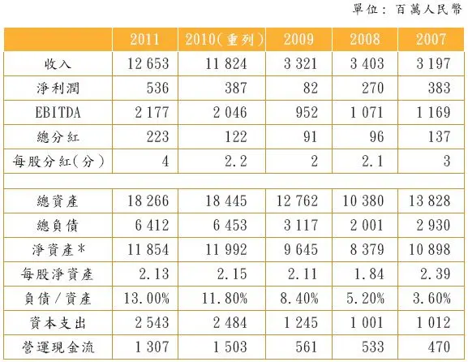

注：\*文中列示的净资产是全部股东权益，归属于母公司的净资产要低很多，在年报中未列示在前面摘要中。

资料来源：锦江酒店年报。

学者们发明了一个估值公式来评估公司的价值：

Return on equity / cost of equity＝price to book

翻译如下：

股本的回报率／股本的成本＝市净率

如果市净率低于左边，这个股票叫低估。如果市净率高于左边，这个股票叫高估。当然这只是理论。

我把它解释如下：假定我们按照它的过低的回报率把它的账面净资产打折，它的净资产需要撇账。撇账的幅度取决于股本的回报率和股本的成本。我们已经知道它的股本的回报率（不高）。我们虽不知道它的股本的成本，但是，我们可以估计。这里，我们不用复杂的公式，只告诉结果。我估计结果可能在9％上下。

锦江酒店的管理层可能会抗议：“我们的酒店资产很优秀，怎么能够打折？如果我们到二级市场出售，卖出去的价钱一定高于账面数字！”这也许是对的。但是，由于这些酒店是“国有资产”，在很长时期内不会被出售，因此，现实的估值方法只能是根据它产生的效益。这跟很多商场和办公楼的处境一样。

运用上述的公式（股本的回报率／股本的成本＝市净率），如果我们用2011年的数字，答案会是：7\.5％/9％＝0\.83。

所以，它的股价相对于账面净资产，折扣高达62％，是过分的，或者处于合理估值的区间。当然，我不想投资一个合理估值的股票，我只想投资非常便宜的东西，而安全边际是必需的。

即使我们假设2012年的利润有20％的增长，这种状况也不会有太大改善。它的股本收益率低于股本的成本，也就是说，这家公司在摧毁其经济价值。因此，股价低于账面净资产有一定的道理。问题是，多大的折扣为宜？随着经济增长的放缓，我们中国投资者都要学会对这种公司估值，因为我们很快就会发现这种公司比比皆是。

问题是，我为什么选择购买这只股票呢？

1．它的优秀资产让我安心。

2．负债率低也让我安心。

3．团队素质高，虽然国有企业的制度限制了他们的能力的发挥。3年前，我还在瑞士银行工作时，我的团队为这家公司当顾问，收购了一家美国上市的全球酒店管理公司IHR的一半股权。此项收购持续时间长，过程复杂。我对管理层的印象非常好：他们视野开阔，吃苦耐劳，还愿意经常在半夜开电话会。

4．这档股票的下跌空间有限。巴菲特曾经调侃说，当一档股票无法下跌时，所有的其他可能性都是好的可能性（When its downside is limited, every other possibility is good\.）。

5．该公司虽然回报率较低，但是，在全球回报率普遍下降的大环境下，这也许不显得特别差。另外，它的现金流远远好过利润。也就是说，这个公司的企业价值（市值加上净负债）除以现金流EBITDA只有4倍。看起来还不错。不过，请注意，巴菲特曾经讽刺大家用EBITDA（税前、息前和折旧前的利润）这个概念。他说，难道牙仙（tooth fairy）会帮你支付税务、财务费用和折旧吗？

6．我相信上海市政府和公司管理层会找到改善资金回报率的办法。况且，息率还不错，我等得起。我知道，我买了一个很便宜的认股权证（option）。当然，我可能要有很多耐心。

如果我是上海市政府的领导或者上海锦江的董事长，我会怎样改善这家公司的回报率呢？

1．私募股权基金的通常办法是加大分红，大幅增加负债率。这当然很有必要。但是，管理层有一个更重要的任务。相当于该企业的资金回报率5％来讲，债务的成本（6％～7％）太高。所以，这家企业的首要任务是提高利润率。

2．裁员很难，但是停止招聘比较容易，而且很多业务是可以外包的，包括某些酒店的管理。

3．就像我的老雇主，香港上市的深圳控股（0604\. HK）一样，上海锦江国际酒店公司有大量的资产可以剥离，或者提升价值。在做减法的同时，做加法。我相信，时间会说服市政府和管理层采取措施。

## 第六章 提防官商同诈，重建股市文化

__第六章__

__提防官商同诈，重建股市文化__

2026年3月14日

15:45

## 避开股市的地雷

“股票市场有高有低，完全要任之。不要干扰它。自私自利的股民会自己相互搞定。政府既然不懂，也就不要干预。”

## 6.01 股民的钱流进董事长的口袋

\(73\) 6\.01 股民的钱流进董事长的口袋

__6\.01__

__股民的钱流进董事长的口袋__

我研究过两家看起来很迷人的民营上市公司，结果都发现了同样的问题。它们公司的钱（即股东的钱）在哗啦啦地往外流。我不知道董事长有没有从公司里偷钱，但是，其他人有能力如此大量和大胆地偷窃吗？

我拿出其中一个公司来举例，因为另外一家问题公司的行业独特，我即使不点名，你也会猜出它的名字来。我不想天天官司缠身。

这家中国的消费品公司有四家工厂。几年前它到香港上市，股民欢呼，两年内股价翻番。当时，它的两个老厂本来就很宽敞，如果董事长是一个诚实的企业家，他应该在那两个老厂增加生产线，或者连生产线都不用增加，增加一个班次就可以了。从一班增加到偶尔的两班倒。这是很理性的解决方案，何况，它当时连一班也没有开足马力。

但是，董事长显然有另外的小算盘。他想占领地盘、圈地，而且享受市（县）政府给予的各种优惠。或者，用招股书上的冠冕堂皇的话，“扩大再生产，占领制高点，创建百年老店”。这都没什么问题。

__资本支出夸大失实__

问题在于，圈地的好处和地方政府招商引资的好处并没有流到股东那里去，而是流到了董事长的口袋。更大的问题还在后面。这家公司不大，三年来的资本支出8亿元人民币。大家一般不习惯把几年的资本支出加总考虑，其实这很重要。我以前跟大多数分析师和基金经理一样，参观工厂时一般不留心建一家工厂究竟要花多少钱。我到深圳控股做了两年半的地产业务之后，稍微对有些细节开始感兴趣。

比如，这家公司花8亿元建的两个工厂，我看最多只需要3亿元。怎么讲？这两个工厂都建在二线城市的郊区和郊区的郊区，占地面积分别为200亩和150亩。这是两个不小的工厂。土地成本要么是政府低价卖给企业的，要么是免费送的。我们还是大方一点吧。算它20万元一亩。这350亩地的土地成本只不过是7000万元。简单的工厂厂房和简单的生产设备，再花2亿元。仅此而已。

中国有个词语叫“跑冒滴漏”（跑蒸汽、冒黑烟、滴柴油、漏自来水，意即企业因设备老化和缺乏管理，导致浪费资源）。在这两家公司里，我看到的不是“跑冒滴漏”，而是董事长用大卡车把股民的钱往自己家里搬运。“跑冒滴漏”太小意思了。

对这家公司，我感到非常恶心，虽然它的其他各项指标好得难以让人相信：

1．销售额的5年复合增长率25％左右。

2．股东应占利润的复合增长率27％左右，股本收益率超过20％。

3．市盈率只有5～7倍。

4．现金派息虽然低，但也有2％的息率。

5．市账率（市净率）不到70％。

6．投资者关系也还不错。

在股市混得时间长了，人容易对企业家甚至对社会产生很负面的感觉。为什么有那么多坏人？

另外有一家知名的公司在香港上市已经十几年。从IPO到现在，它在股市配股融资的总额高达220亿元，除了支付股民的红利6亿元以外，其他全部用在了“资本支出”，买地和建造各种设施。这些土地和设施有没有用处，暂且不说。它们的真实成本究竟有多大？重置成本究竟有多大？是否值得重置？年复一年，它的利润一直保持高速增长。某一年，“黑天鹅”出现，公司就把前些年的虚高利润（假账）全部冲掉。然后，公司又从一个较低的利润水平高速成长若干年。然后……如此重复。

2026年3月14日

15:45

## 6.02 政府欺诈毒害股市

\(74\) 6\.02 政府欺诈毒害股市

2026年3月14日

15:45

__6\.02__

__政府欺诈毒害股市__

政府的欺诈有多种形式，对社会道德和股市文化产生了致命的打击，比企业家的欺诈具有更大的杀伤力。如果我们想重建中国的商业道德和股市文化，必须从政府开刀。我举四个例子。

__1．某地政府为了扶持几个本地的公司到证券交易所上市，不惜在税收、环保、资金和土地等方面给这些公司开小灶。__它们甚至帮企业设计如何做假账，比如伪造前几年的销售额、利润和实际缴税额。这种做法有很多恶果：破坏公平竞争、浪费纳税人的钱财、鼓励官商勾结、欺骗股民、毒害股市。

政府的扶持当然不能让一个阿斗公司强壮起来。可是，股民买的是公司未来很多年的利润。这也就是20倍或者35倍市盈率的含义。政府扶持不能持续35年，更不能持续增长35年。从长远来看，这种公司的股价必然会跌，股民必然受害。

__2．当一家公司变成了ST（按规定，连续亏损3年的公司，中国的交易所会在该公司名字前加上ST字样，提示股民小心）或者将变成ST时，政府部门通过人为地输血使上市公司苟延残喘。__但阿斗毕竟是阿斗，不可能因为一两次输血而强壮起来。当然，股民不懂（或者不愿意懂）。他们长期追捧这些僵尸。虽然有人说他们亏钱是活该，但是，我不这样认为。我的看法是，他们毕竟是弱势群体，多数人不明真相。中国证监会应该在教育他们的同时，严厉打击繁殖僵尸的各级政府，帮助弱势群体戒毒。

__3．把企业或者企业集团的一部分业务（比较好的业务）包装上市，而把比较差的业务留在上市公司的外面，这也许有欺诈嫌疑。__为什么？因为在过去、现在和未来，比较好的业务与比较差的业务并不是真正的独立。它们至少在员工待遇、采购、销售和设施共享方面还保持着千丝万缕的联系。有些公司的欺诈更加过分：它们在上市之前，由比较差的业务补贴比较好的业务，上市融资之后，再反向操作。这样的欺诈行为在国企和民企中都有。

__4．政府或者政府部门给它们所控制的上市公司注资。__这是一个臭名昭著的中国现象。在香港的H股公司和红筹公司也很多对此如痴如醉。有些注资的价格完全是国有资产流失。我们老百姓啊：几乎没有人代表我们的利益！官员们为了从他们的认股权证中赚钱，不惜用超低的价格把纯国有资产卖给上市公司。我在投资银行工作时，经常见到上市公司高管吹嘘他们用多么低的价格从政府“拿到”优秀资产。作为一个中国人，我就是笑不起来。偷了我的东西，还到我的面前炫耀！等到某项业务搞砸了以后（或者变得不时髦之后），他们再用高价把它卖回给政府。这叫“剥离”。

有些官员和国企高管说，他们低价注资和高价剥离是为了“保护小股民”。非也！他们保护的是他们的面子和认股权证。为什么我这样说？因为，他们并没有花力气改善企业的能力和治理，所以即使好资产装进上市公司以后，也会慢慢变坏，两三年后又需要“剥离”。这种循环会给小股民创造一个个诱惑和一个个陷阱。10年之后，小股民一无所得。

__给企业估值 别忘剔除补贴__

在民营企业中，我们看到另外两种现象。但是，杀伤力不如政府的恶行。

1．王老板慷慨地（公开地或者偷偷地）补贴他控制的一家上市企业。让这家公司显示出漂亮的历史曲线（销售额、利润、现金流、用户数的增长，等等），然后择机卖股票，赚很多倍的钱（注意：市盈率往往是几十倍）。

2．刘老板把他的企业卖给一家上市公司。价格呢？价格只是今年的预测利润的15倍。多便宜啊！而且，刘老板爽快地担保，如果今年的实际利润最终低于某一个水平，他会掏腰包补足差额，甚至补贴更多。但是，你有没有发觉问题所在？刘老板补贴了一点点钱，却用15倍的高售价把企业卖掉了。他的企业的盈利能力并没有他说的那么强。

另外，我们还见过很多更离谱的情况：到明年三月份公布今年的业绩之后，刘老板拒绝兑现诺言。为什么？今年下半年的天气比预想的差很多，或者，新的管理层没有尽职，或者出现了另外的“黑天鹅”事件。有时他还直接耍赖。

上当的企业有的是运气不好，有的是交易结构设计不好，有的是买家过于热情，还有的是……国企。

在企业估值时，我们要剔除税收补贴和其他非持续性的收入（比如资产处置收入）。这是常识。但是，大家经常忘记。

## 6.03 上市公司的庞氏骗局

\(75\) 6\.03 上市公司的庞氏骗局

2026年3月14日

15:45

__6\.03__

__上市公司的庞式骗局__

国内经常出现的非法集资案和“庞式骗局”有什么共同点？我觉得它们有两个共同点：__1．它们都许诺高回报率，并且在一段时间内做到；2．它们都是用张三的钱去付给李四。__

一个“庞式骗局”可以持续很多很多年。当然，并非所有的“庞式骗局”最后都曝光。美国前纳斯达克（NASDAQ）证交所主席麦道夫（Bernard Madoff）骗了30多年之后，终于因为2007年和2008年全球金融危机导致股市下降才曝光（水落石出）。日本的大公司奥林巴斯（Olympus）的“骗局”也持续了20年。

你再想想，如果一个上市公司想玩这种“庞式骗局”，不是很容易吗？其实，很多上市公司玩的就是这个游戏。只是很少有人知道而已。骗的程度越浅，持续性越有保障。

上市公司大股东或者管理层花一点钱，就骗到了大量股东。其实，上市公司想骗人太容易了：它并不需要所有的人都相信，只要有足够多的人受骗就可以了。在中国，不相信的人们要做空也没有可能。即使在美国，要想做空一只股票，也不容易。原因是做空者需要在一定的时间内把股票买回来，还给原主。如果，在这段时间里（比如3个月），股票不跌反升，做空者会亏很多钱。

__回购与增持的陷阱__

另外，即使上市公司完全没有假账，公司回购和大股东增持也不是小股民跟风的理由。为什么？大股东看自己的公司越看越爱。这种自爱有心理学的基础：这家公司是他们一手做起来的，有过酸甜苦辣，而且给他们很大的满足和控制。这种心理可能蒙蔽他们的眼睛，妨碍他们冷静和客观地看待自己的公司。

美国学者所做的大量研究表明，大股东增持和公司回购股票往往发生在股价的顶峰。上市公司回购股票和大股东增持股票不能说明什么问题。这是雕虫小技。上市公司首先通过做假账从股民手上圈20亿元。如果股票下跌10％，那么拿出1亿元来回购股票。于是，我等股民就感动了。如果股票再跌10％，大股东或者高管就爽快地拿出20万元增持。我等股民又感动了。如果股票再跌30％，公司就不回购了，大股东和高管们也不增持了。这部“电影”在全世界不断重放。

## 6.04 企业假账多如地沟油

\(76\) 6\.04 企业假账多如地沟油

2026年3月14日

15:45

__6\.04__

__企业假账多如地沟油__

10多年前，我在瑞士银行当中国研究部主管。格林柯尔和它的董事长顾雏军正在香港高等法院起诉我和瑞士银行，理由是我诽谤他和他的公司。另外一个中国的红筹公司，欧亚农业（在沈阳市荷兰村种植兰花的骗子公司）的董事长杨斌也正在对记者喊话，要告我。我有过很多不眠之夜，全靠家人和雇主支持。香港的媒体非常好：它们公正的报道给了我鼓舞。香港的企业界领袖蔡东豪还在《信报》撰文“我挺张化桥”。瑞士银行高层对我的大力支持也让我终生难忘。奇怪的是，当时，国内的数家大媒体反而骂我“黑嘴”、“别有用心”。

某日，我跟一位医生朋友吃午饭。谈及香港电讯时，他竟然失禁而泣。原来，他刚刚妻离子散，主要是因为全部家当都亏在这档股票上。2000年，香港电讯被互联网空壳公司盈科数码动力收购。很快，泡沫破灭，这只股票大跌90％以上，毁掉了无数的香港家庭。汇丰银行和香港电讯曾经是香港几十年来最大和最可靠的上市公司。

又有一次，我在北京碰到30多年前的同学。他的弟弟曾经是一位中学校长。校长说，他读过我的书，一定要跟我聊聊。校长的遭遇跟那位香港医生类似。不同的是，残害校长的不是互联网泡沫，而是中国土制的地雷：企业假账。

__政府应打击股市通胀__

校长问我，我国企业的假账究竟有多么严重？我回答：中国的假酒和地沟油有多少，贪污腐败有多普遍，企业的假账就有多严重，因为它们都是龙的传人所为，是同一个文化下的产物。作为股民，作为分析师，我也多次受骗。

投资股票的终极目的是为了分享企业的业务增长。如果某家上市公司的市盈率是30倍，而实际利润又被财务技巧夸大了1倍，那么，股民买的就是未来60年的业绩。虽然企业未来利润会有增长，但是大家很容易忘掉经济周期和利润也有下降的年份。如果大米的价格涨到每斤50元，政府绝对不允许。如果上市公司的市盈率涨到60倍（当然表面上可能是20倍），政府是否应该检讨呢？一个只值5元的东西卖到20元，难道不是敲诈投资者吗？

我申明，我反对政府干预股市的价格。但是，当我们看到假账横行，股票货不对板，或者股票价格离谱时，政府应该看看货币政策和股票发行制度是否合理，以及企业账目是否基本真实。中国证监会在打击欺诈和检讨新股发行方面的新政给了我很大的信心。而太多的股民执迷不悟，助长了欺诈。

我敦促企业的高管和大股东（和中介机构的帮凶们）在欺诈成功、弹冠相庆之余，也请为无数的受害者们默哀一分钟。

## 6.05 中国式畸形股权文化

\(77\) 6\.05 中国式畸形股权文化

2026年3月14日

15:45

__6\.05__

__中国式畸形股权文化__

我们中国的股权文化非常畸形。这表现在几个方面。第一，我们的官员和福斯把股票大涨当好事，把股价下降当坏事，把支撑股市当己任。这不是可笑吗？你想想，一个只值5元的东西卖到20元，难道不是敲诈和剥削那个投资者吗？他如果不能用20元以上的价格卖给下家，那不是让他做了冤大头吗？如果他能够用28元卖出，那不是让别人做冤大头了吗？击鼓传花，总有停下来的时候。一档股票有人买，必然有人卖；对卖主好，必然对买主不好。从静态来看，这只是一个零和游戏；如果考虑到税收和交易成本，它是个负和游戏。

我们全国人民都只喜欢听唱多的故事（自我陶醉），不愿意听唱空的理由（外国间谍，别有用心）。17年来，本人很少到股票投资研讨会做演讲。2010年11月，某券商花钱请我做主题发言，听众都是基金客户。我去的时候，券商们很高兴。董事长请我吃早饭。可是，我讲完后，老兄们可能有点失望，都不想送我出门。你可能猜到原因了，我的演讲题目是“未来几年全球大牛市，中国除外”。英文有句话：“不要朝信使开枪！”股市不可能因为几个人唱空就跌，也不会因为几个人唱多就涨。

__政府硬撑股市 老百姓买烂货__

在股市，永远是看多者众，看空者寡，中国尤甚。同时，政府部门常常做一些蠢事，硬撑股市，美其名曰“保护小投资者”。难道诱使老百姓花大钱、买贵货和买烂货不是错误吗？你可能会说，“股市大跌容易引发社会动荡和金融危机”。那么，股票大涨会不会引发更危险的泡沫呢？你诡辩说，那么股市总要有一个合理的估值水平啊！可是，什么叫合理的水平？你知道吗？难道你指望专家或者我们的政府知道吗？大家不要忘记，有人编制国民经济计划和搞物价管制的那几十年，他们差点把中国带到了深渊！

股票市场有高有低，完全要任之。不要干扰它。自私自利的股民会自己相互搞定。政府既然不懂，也就不要干预。对于股民来说，股票便宜一点难道不是好事吗？你可以不断地用越来越便宜的价格买同样的货。股票可跟化妆品不同，并不是越贵越好。你准备买某一档股票，你是希望它贵，还是便宜？当然是便宜的好！

__分析，但不要预测__

我们腐朽的股权文化的第二个表现是，短期行为太多：炒来炒去的散户还是太多，比例太高；机构也太短线。每个人都认为自己的智商和心理素质高于大多数人。这在数学上是不成立的。过去10年，香港这个弹丸之地竟然是世界上最大的股票窝轮市场（也就是认股和认沽的权证市场）。权证的期限一般是几个月甚至几个星期。过期作废。买这种产品就是短炒和做短期预测（敝人很后悔，也干过那蠢事）。当然，还有更极端的短炒。比如，美国上世纪90年代出现过一个庞大的“当日炒”（day\-trading）队伍。随着互联网泡沫的破灭，他们都死光了。

经过很多这样的事情以及本次全球经济危机，我开始相信某智者曾经给我的劝导：“分析，但不要预测。”我把它翻译为，丢掉你的预测吧！如果你一定要预测，那就只做长期的、模煳的和方向性的预测。而且不要太肯定，太武断。

在国内，我们有一个庞大的打新股的队伍。他们同样危险和可笑。2010年我在北京演讲时，大家取笑我：“我的钱都是打新股赚来的！”我不明白，像打新股这样一个明显而且很容易复制的商业模式竟然持续了那么多年。水位为什么没有被推平呢？也许人们天生就爱凑热闹？作为曾经的投行人士，我也许不应该讲下面这句话：一个IPO就是一场热闹。经过一班投行人士数个月的辛勤劳动，挖掘投资亮点，大力推销，众星捧月，还剩下多少可以被王大妈和刘二叔来发现的呢？肯定有，但不会比比皆是。每个IPO都有个截止日期，好像逼着你做出决定。过了这个村，就没有那个店。大量的股票上市后就被人冷落，好像不再新鲜的瓜果一样。

美国有学者对过去15年来几千家IPO公司做过实证研究，发现绝大多数在上市之后的前两年严重跑输了大市。我不觉得奇怪。

__官商勾结 股民受伤__

我们股权文化的第三个问题是大量的欺诈。公司的高管们串通一气，没有多少人会主持正义。还有，审计师、估值师、分析师、券商们乃至地方政府同流合污。惊人！谁是受害者？除了股民外，还有他们自己。本书第五章5\.05“中国地产股成了二手汽车”，讲的就是这个道理。大家都往市场上丢垃圾，最后的结果是估值水平越来越低。最近，中国在美国上市的公司遭到怀疑和调查，大家不要责怪对冲基金，睁开眼睛看看我们的很多公司是些什么货色！对冲基金没有什么阴谋，只有赚钱的阳谋。当然，它们也不是什么“反华势力”。

10年前，当我作为股票分析师跟做假账的上市公司在法庭内外交锋的时候，我基本上没有得到外部支持，除了家人和我亲爱的投行雇主。大量浅薄而自私的媒体和股民骂我从他们投资的股票里面挑毛病，“黑嘴”。难怪大家看见流氓欺负无辜百姓的时候都装作没有看见。

__中国股市几年内难有作为__

讲完了难听的话，下面请允许我讲一点更难听的：我们的股市在近几年很可能没戏。这跟大家的愿望可能不一致。我看我们眼下的熊市可能持续好几年，会考验投资者的耐心。唯一可能出现的短期兴奋是，如果政府顶不住福斯和企业的压力，突然开闸放水，推翻过去一年来的宏观调控。可能吗？当然可能，但是可能性不大。而且时间难以把握。等待这种短暂的爆发不是投资，是投机。我讲个故事。6年前，我发掘了一个很便宜的股票，我认定了董事长会把它私有化。我买了很多，耐心等待。2010年，我终于如愿以偿。董事长给了50％的溢价收回所有股票。但对我来说，这是好事吗？当然不是。我4年内在账面上先亏了70％，然后才等到了解放军。算下来，我等了4年，还净亏55％。

现在大家在股市里苦苦煎熬，我认为违背了一个最起码的投资原则，叫“留足余地”或“安全边际”。这样的高通胀、高利率，股市能有什么作为？而且，大家好像混淆了两个东西：预测和希望。预测是冷静的判断，而希望是另一个东西。

日本地震后，东京股市大跌。不少人惊呼，“投资的机会来了”。这是一种短炒的思维。地震之前，如果东京市场不吸引人，那它并不会因为下跌了10％或者20％而变为有吸引力。反过来说，好的公司的股票不会因为它已经涨了30％、50％而变成坏股票。

我近几年的醒悟之一就是，股票的估值是选股的最后一步，一个不太重要的步骤，一个可以将就的步骤。而选择优秀的、可持续成长的、不骗人的公司是关键。广州有一家好公司2010年底在香港上市。它很贵（大约40倍市盈率）。我花了些时间研究它，2011年初买入，想长期持有，半年后竟然涨了40％。你看长线，结果短期就有好的回报。反过来，一条船下沉了50％与下沉了80％，其实没什么区别。你把注意力太密切地投在估值水平上，就会忽略更重要的事情：公司的商业模式、前途和诚信。我跟大家一样，曾经长期在烟屁股中寻求“价值洼地”，很压抑，很亏钱。更重要的是，我们错过了“沉舟侧畔千帆过，病树前头万木春”！

一个股票一年如果涨30％，那就算很不错了。可是你如果把这30％分解为每天的复合增长，那是多少？千分之一？我没有算过，反正它小到可以忽略不计。所以，我们做投资的人不要每天都把眼睛盯在电脑上。

我到宁波出差时，某君问我：“我的高利贷生意不错，年回报率在25％左右。但我听说A股市场很便宜。我应该转一部分钱投资股市吗？”我笑答：“如果你能比较稳定地赚25％的年息，巴菲特都应该把钱分给你管。那25％的回报不光是可以，是超级可以。你换个角度想想：如果你能取得那样的回报，说明全国资金很紧，那么，资产的价格（包括股价）一定会向下走。你为什么要飞蛾扑火呢？”

__打击通胀是首要任务__

宏观经济资料很多，极少数有用，大多数没用。数码的采集不准确，处理不恰当，发佈时再加酱油，消费时再误读。这是全球性的问题。本人花了很多年的时间专门研究宏观资料，但是我最终觉得它们与投资的关系不密切、不稳定、不中用。如果你是长期投资者，你只需要眯缝着眼睛，从遥远的地方看看宏观大趋势即可，万万不可钻进去，万万不可追求准确，不可研读过分。如果你是短炒的人士，这些资料更没用：它们相互矛盾，作用互相抵消，与股市的关系不密切。应付这些资料，我曾经疲于奔命（说得好听一点，叫努力工作）。现在，我主张大家少看互联网，少看报纸，少看研究报告。

今天，我们的通货膨胀很严重，失业也很严重。政府的宏观经济政策会不断在打击通胀和治理失业之间摇摆。我的判断是，未来几年的重中之重是打击通胀，因为民怨太甚。美国1968─1982年的14年间，道琼斯指数跌了一半，如果考虑到通胀因素，股民们亏了80％以上。1977年的美国通胀跟今天中国的通胀在根源上有相似之处：经济高增长所带来的成本推动。巴菲特说，通胀就是一种额外的税收，股市怎么好得起来呢？

今天，很多人看好中国通胀下的股市，因为有些公司的利润可能会因此不错。但是，他们完全忽略了另外两个因素：一是成本的上升（领导们喝红酒、游欧美，以及资金成本的大涨）。二是市盈率是可以变化的。60倍的市盈率我们大家见过，而6倍也没什么了不起。可这是多么大的一个区间啊！说到底，市盈率大概就是市场利率的倒数。当然，如何定义市场利率是一个技巧性的问题。

__利率环境影响A股市场__

这一年来，中国人民银行一直避免大幅度加息，而一直在用存款准备金率的调整和信贷额度的控制来给经济降温。原因无非是害怕利率上升而吸引海外的热钱流入，加剧人民币升值。可是我们未免太天真了！货币政策的各种手段在效果上是完全相通的。虽然官方的基准利率没有调整，但是市场利率早就调整了！不仅千千万万的典当行、租赁公司、担保公司、小贷公司和民间贷款机构立竿见影，就连国有银行也去掉了利率优惠，抬高了利息上浮，添加了“贷款咨询费”，而且信贷员的寻租行为也已经有所抬头。对企业来讲，实际贷款的成本增加了很多。在这种情况下，你叫股市如何有作为呢？

大家想知道资金有多么紧缺，不妨看看上海银行间同业拆借利率（SHIBOR）在各个时段的变化，这是很准确的温度计。当然，你也可以问问几千家典当行、小贷公司、租赁公司和担保公司中的任何一家的利率情况。这还不包括那活跃的民间借贷。

在通胀时期，即使人民银行不紧缩信贷，资金也会很缺的，主要是因为完成同样规模的经济活动需要更多的资金（做润滑剂）。工厂和商店以及家庭都需要更多的铺底资金和周转资金。钱显得很不够。利率上升。资产价格下降。

二战以来，全球经济经历了60多年的高速增长，尽管中途遇到过数次衰退和萧条。主要的原因可以归纳为三点：人口增长，工业进步（电脑、互联网和矿产开采技术）和世界和平所带来的风险折扣的降低（从而利率的降低）。

但是现在，这三大因素似乎都被用尽了，或者开始成为负面影响。比如，人口增长已经把大自然和环境压得喘不过气来。工业进步意味着几乎每个行业的产能过剩。利率降到不能再降了，也许可能慢慢上升。革命性的技术进步好像也没有了。

如果我要对目前和未来几年的世界经济做一个总结，那就是“不死不活”。发达国家有三个共同特点：通货膨胀基本上很温和，失业问题很严重，加上财政赤字巨大。也就是说，它们的利率还会持续走低。即使加息，空间也很有限，而且，即使利率翻番，绝对水平也不高。同时，低利率也反映出市场对投资回报率的要求很低。你想想这是什么意思？这就是说，市盈率会很高。

在这样的背景下，发达国家的大多数企业都在朝“现金牛”的方向转化：资本支出缩小，分红派息上升，利润增长平平，但是企业利润率很可观，现金流很不错。如果利率继续走低，这些公司的估值可以大涨，至少具备大涨的前提条件。

我的结论是：A股这几年可能没戏。如果政府屈于压力而放松信贷，那也只能给股市带来短期的抗旱之水，不能解决根本问题。香港股市（和国际股市）未来几年看起来很不错。利率环境与内地不同使然。我1994年来香港做股票分析师时，中国股票的市盈率大都在10倍以下，而A股都在40～50倍，这17年来的大趋势大家是知道的：A股的倍数一直在跌，香港的倍数一直在涨。今天，大量的A＋H股票是倒挂的：A股更便宜。问问为什么！A股市场大多数烂股票贵过好公司的股票，再问问为什么！

在国内，最好的投资行业可能在股市之外，特别是金融业（比如，大量的非银行金融机构）、矿产、食品和地产。其他行业好像意思不大。最近我研究了私募股权的市场，发现机会很多，比我以前想象的好多了。特别是在那长期饱受歧视的中小企业群，投资机会很多。如果你不介意它们还没有上市，而且很久甚至可能永远无法上市，你的选择空间就更大。

__为什么一定要买股票？__

以前，每遇到A股股市下跌，必有官员和媒体的社论给股民打气和壮胆，害了一批又一批股民。现在，这种现象少了，因为大家终于发现那是多么可笑。这是进步。

请允许我讲讲怎样的估值才可以让人接受。股票估值不是科学。它靠常识，经验判断，再加运气。我认为，市盈率基本上应该是社会利率水平的倒数。虽然对个股，我们不能用这个尺子来衡量，但是，对于一个股票市场，这是一个正确的尺子。那么，未来3～5年，中国的平均利率水平会是多少？虽然利率千万种，但是我觉得，一个安全的办法是用普通中型企业从自由市场获取贷款的利率。现在，这个利率可能是10％～13％，它反映了资金的松紧。在这种情况下，我认为，股票市场的市盈率应该在7～10倍之间。当然，个股情况有别。但是，当我们一脚就可以踢到好多个市盈率高达20倍甚至40倍，而且品质马马虎虎的公司时，我们应该知道，这个市场的水位还太高，温度还太高。我们应该静等。10年并不太久。很多股市跌了10年甚至20年，才找到自己正确的位置，我们为什么要鲁莽而入？20倍和40倍的市盈率意味着20年或者40年后，股民可以收回成本。但是，那些公司能存活那么久吗？

换一个角度：理财产品的收益率是6％～7％，你额外加上三分之一的安全边际，大约9％～10％。所以，股票市场的合理的市盈率应该在10～11倍。

投资者不能满足于投资一个“公平的”股票，而必须留足安全边际。即使这个股票真的值5元，我为什么要买一个“合理估值”的东西呢？我们必须占便宜。这是硬道理。那么，我们需要多大的安全边际？我看起码30％～40％的安全边际。如果你认为某个股票值4～5元，那你只能在2～3元时才下手。

我们股市中人，都有一个大毛病：我们首先就决定了要买股票。我们的苦恼只是买哪些股票和买多少。我们根本不愿意花时间研究一个更基本的问题：该不该买股票和为什么一定要买股票。

其次，我们要明白，一个公司对于不同的人有不同的估值。这话听起来可笑，但是千真万确。比如，公司的大股东觉得公司的股票价格值5元，但是，这家公司对于散户来讲，可能只值3元或者更少。公司的管理层吃香的，喝辣的，所有的开支都在公司里报销，所以，这家公司对他们的意义更大，更值钱。但是，普通股民既没有发言权和知情权，也没有分红，当然不能用同样的标准看待这家公司。在地产公司里有太多价值陷阱：这栋楼值5亿元，那块地又值8亿元。算下来，每股的净资产8元，但是股票只有3元。那8元也许可以叫“清盘价格”，但是，这家公司何时会清盘呢？它们永不清盘，它们的大股东永远有一个玩物。而我等股民呢？

用上述标准来看A股市场，我觉得基本上没有多少长期价值。也谈不上安全边际。而且，各个行业和板块都是相互关联的。大市下跌的时候，大家都不能幸免。不要做过于精准的分析。

你可能会反驳我：“用你的标准，你一个股票也不能买！”我的回答是，那有什么了不起！你为什么一定要买股票呢？基金经理由于工作的原因没办法不买股票，但是其他人完全不要勉强自己，不要说服自己买股票。当然，如果你买股票的目的只是乐趣（而不为赚钱），那就另当别论。

__提高利润率与现金流__

跟股市密切相关的两个问题是：1．未来5～10年的中国经济增长是加速还是减速？2．我们的企业在利润率，特别是现金流方面会不会有改进？

过去10年，中国的经济高速增长与两样东西有关：政府消费（或者叫政府投资），以及出口高增长。现在，这两个因素都在发生变化。政府消费是以高税收和高信贷为前提的。高税收加剧了国进民退，窒息了民营经济，牺牲了效率和公平。高信贷呢？加剧了通胀。这种状况已经无法再持续了。我们政府的财政扩张和信贷扩张也快走到尽头了。至于出口的增长，咱们就不讲了。大家有共识。

所以，我们大概可以同意这个观点：未来几年的经济活动会比过去十年慢一些。这就要考验企业营商的水平了。显然，粗放式赚钱的难度加大了。这对很多行业都有影响：船运、建筑、建材、矿产和相关的服务。其实，整个经济都是密切相关的。

瑞信的陈昌华是业内高人。他写过一篇文章，题为“没有现金的增长”，他讲过去多年来中国公司的利润虽然有不错的增长，但是现金流很差。他说，2011年上半年，中国非金融类的A股上市公司（共2132家）的总体销售收入和利润同比分别上升了26％和20％。可喜。但同是这批企业，它们在营运中产生的现金流则比同期下降6％。这个问题在过去几年有恶化的迹象。

它跟我们的经济发展阶段有关，也跟我们的管理能力有关。未来10年，如果经济增长放慢，我们的企业会被迫学习一样新技术：降低成本，提高利润率，提高现金流。也就是学习多“榨汁”。

我想起麦肯锡的三位研究员的《价值：企业财务的四根支柱》。这本书讲到一个道理：利润率（或者资本回报率）比利润增长率对于股票估值来说更重要。这个道理在中国还比较新鲜。他们说，亚洲公司为什么不如美国公司的估值高？大家一般认为，这是美国资本市场的偏见。不对！根本原因是亚洲公司回报率（利润率）太低。利润增长快，但是它们消耗太多的资本（股和债）。他们说，高负债率不仅不能增加股东的回报率，反而降低他们的回报率，经常导致财务危机和抗风险能力的下降。

我认为，宏观指标与股票市场的关系不稳定、不可靠、不单一。不过，股民应该看看银行承兑汇票市场。这个市场很大，很活跃，它的利率完全由供求关系决定。在正常情况下，这个利率一般略低于银行基准利率，但是几个月前这个利率涨到了11％～12％，虽然基准利率还是维持在7％以下。在这种情况下，如果你指望股市有什么作为，实在是一相情愿。

最近，这个利率降到了10％以下，所以股市有点回暖。不过，我个人认为，最近的资金市场松动属于抗旱救灾性质，不属于基本面的改善。那些中短期炒作股票的人们，除了密切关注银行同业拆借利率之外，应该多看看银行承兑汇票的利率变化。当然，我建议大家完全忽略中短期，从遥远的地方眯缝着眼睛看看宏观指标就可以了。

现在，我想回答朋友们很关心的一个问题：银行的存款额最近为什么下降？很多人说，因为钱都跑去放高利贷去了，或者买银行和信托公司的理财产品去了，或者买股票和房子去了。这全是没有常识的话。你从银行取款买东西（任何东西），虽然你的存款下降了，但是别人的销售收入，从而存款，相应地增加了。所以，买卖行为根本不影响全银行系统的存款余额。那么，如何解释我们存款的下降呢？答案很简单：人民银行多次提高存款准备金率，还用贷款额度来限制信用扩张，贷款和存款当然都会同时下降。存款到哪里去了？烟消云散了。

另外一种情况，如果经济前景黯淡，商界不愿意贷款，纷纷降低负债率，那么即使货币政策宽松，也可能出现贷款和存款同时下降的情况。现在美欧和日本遇到的就是这种情况。

## 6.06 分红无限好，只是別強迫

\(78\) 6\.06 分红无限好，只是別強迫

__6\.06__

__分红无限好，只是别强迫__

最近，听说有人建议中国证监会强迫上市公司的现金分红要达到某个水平。我觉得这个主意千万使不得，当中有五个原因：

__强制上市公司分红非常危险__

1．每个公司处于不同的发展阶段，是否分红和分红多少的条件各有不同，政府很难制定统一的政策来约束它们。分红未必就好，不分红未必就坏。

2．现金究竟在上市公司里面还是在股东手上，本质上应该是一样的。中国的公司有这样那样的恶行，并不能通过强制分派现金来解决。

庞式骗局可以从股民手上骗来10亿元，分红6亿元，内部人落得4亿元。股民在那里傻乐，但终于有一天骗局爆煲。其实，股民如果真的要分红，还不如卖掉一些股票更简单。如果你怀疑某公司其实是个庞式骗局，你应该远离。

3．是否分红和分红多少是企业的权力，不是政府的权力。我们不能乱来。

企业分红当然好。我做股民也喜欢分红，赞成分红。但是这跟政府无关，不能强迫。中国政企不分问题已经很严重了。

4．现在的A股估值还是太贵。一元的现金支撑着好几元的股票市值。也就是说，它们的“市净率”在3～4倍。如果强制分红，我估计很多股票的价格会因为失去现金支撑而倒塌。分掉一元现金，市值便要缩水3～4元。

失去现金支持，股价会大跌的。特别是大量中小型的股票会很悲惨。股民必须理解这一点。英文里有一句话，用在这里很恰当，Be careful what you wish for。意思是，你究竟想要什么，你可想清楚！你如果真的得到了你所要的东西，你可别哭鼻子！

5．现金分掉以后，很多公司就留下来一堆没人要的存货、应收款、生锈的设备和漏雨的厂房。它们的财务费用就会上升（如果还有人愿意借钱给它们的话）。

A股市场的泡沫是多年形成的，不可能短期解决。

2026年3月14日

15:45

## 6.07 股市好坏的七大标准

\(79\) 6\.07 股市好坏的七大标准

2026年3月14日

15:45

__6\.07__

__股市好坏的七大标准__

如果中国邮政只发行30张伦敦奥运会的纪念邮票，那么这套邮票的二级市场的交易价格肯定很高。但是，如果它未来不断增发，那么这套邮票的价格就会下跌，甚至大跌。

也许邮票的例子太抽象，因为纪念邮票几乎没有使用价值，而虚拟价值和收藏价值才是估值的主要内容。我们还是来看看计程车的例子吧。如果政府紧紧地卡住发行牌照的数量，但对未来即将发行的新牌照数量含煳其辞，那么，起初的牌照价格会很高（由于供不应求），而随着新牌照的不断面世，牌照的价格会下降。

沪深股市如果长期只有几十只小股票，那么股价肯定一直很高。但是，20年来，我们中国人发现，股价竟然也受供求关系的影响。这20年来的市盈率虽然波动很大，但是大趋势十分清楚：向下，再向下。当然，股市里出现的欺诈和伪劣产品的横行也不断摧残着股民。

全球的股民都有一个共性：又贪婪，又害怕（失去机会）。现在，他们受够了，在撤退。但是，他们的贪婪的一面永远不会消亡。政府必须保护这种贪婪，否则，股市的持续发展就会受到影响。

如果我们可以吃后悔药，我认为，20年来政府对IPO发行信道，增发以及配股的控制和发行节奏的“调节”是中国股市长期寻底和探底的主要原因之一。为什么不从一开始就把门打开，让市场供求关系决定股价呢？股民现在依然在为我们几十年的计划经济思想和控制欲付出沉重的代价。

__股价高低并非股市健康的标准__

现在的股市好吗？对于亏损累累的股民来说，它糟糕透顶。但是，对于以前没有参与，现在正准备进入的人们，这个股市也许没有那么坏。有些人成功地完成了高价集资（和超高价集资），甚至实现了胜利大逃亡，他们也许正在弹冠相庆呢！

对于一个社会来讲，难道股市的估值越高越好吗？当然不是。虽然高估值对于卖出者是好事，但是对于买入者却是亏钱的风险。如果全国人民都参加击鼓传花，越传越高，那么，谁来最终接棒？当音乐停下来时，总会有人成为冤大头。

一个公司（一只股票）总有一个合理的价值。一个公司可以10年，甚至30年不分红，但是，它的价值归根结底在于长期的分红。所以，分红的能力，分红的意愿和分红的现实可行性是决定股票基本价值的基础。而且，分红水平可以与其他金融资产和实物资产相比较，从而得出股票的估值。即使每个股民都傻，但是，市场作为一个整体是不傻的，至少长期来看不会傻。

我们的官员和福斯把股票上涨当好事，把股价下降当坏事，把支撑股市当作任务。这非常可笑。你想想，一个价值10元的东西被卖到20元，难道不是敲诈和剥削投资者吗？他如果不能用20元以上的价格卖给下家，那不是让他做了冤大头吗？如果他能够用28元卖出，那不是让他的下家做了冤大头吗？一档股票有人买，必然有人卖；对卖主好，必然对买主不好。从静态来看，这只是一个零和游戏；如果考虑到税收和交易成本，它是个负和游戏。

股市并不创造任何价值。实际上，它摧毁价值（因为它有交易成本）。股民作为一个集体，如果想赚钱，必须靠股票背后的公司。所以，股民和监管机构不应该在股票价格上（或者指数上）做文章，而应该在企业层面做文章。

对股市进行估值从来就很困难。究竟1000点合理还是3000点合理？也许，合理的估值是一个区间（一个很宽的区间），而不是一个数值。而且，这种区间不断随着利率和其他因素的变化而波动。另外，股市变得超级便宜或者超级昂贵都有可能（over\-shooting）。长期来看，政府不应该也没有能力改变市场。这些年，我们的官员有很大的进步，不再怂恿股民去股市当炮灰。有些报纸也不再通过社论给股民灌迷魂汤。这是大家醒悟的表现，可喜可贺。

股市好坏有如下7大标准：

1．任何一家想上市的企业（包括前景黯淡和江河日下的企业）随时可以上市，完全不受额度限制。在上市和增发过程中，公开的成本和隐性的成本极低。

2．不管一家企业前景多么黯淡，管理层如何无能，只要它们如实披露，并且有人愿意买它们的股票，那么，政府没有道理阻碍它们上市。上市跟获取银行贷款和非上市企业的股权融资没有任何区别，愿打愿挨。

3．我坚决反对强制退市制度。不管企业多么糜烂，它都有翻身的可能。况且，即使糜烂到烟消云散也没有关系。这是成年人之间的事情，跟政府无关。愿打愿挨。大家请不要说，“你看！美国也有退市制度……”。美国也有很多愚蠢的政策。当然，如果企业主动退市，政府要任其自由，不要干预。强制退市所伤害的正是小股民。他们炒作垃圾股是他们的自由，招谁惹谁了？

4．我认为，从长期来看，分红的能力、意愿和现实可行性是股票估值的基础，但是我坚决反对政府强制企业分红。这是企业的权力，不是政府的权力。

5．虚假披露、虚假交易、操纵股市和其他欺诈行为得到尽可能严厉的打击。

6．股票交易所跟农贸市场、期货市场、产权交易中心和大豆交易所并无实质区别。只要信息披露恰当，欺诈行为得到合理的镇压，每个省、市甚至每个县都可以有一个股票交易所。条件是，交易所也是企业，不浪费纳税人的钱。那些没有规模和品质的交易所必然会自生自灭。

7．股价、期货价、蔬菜价格和大豆价格的高低都不是衡量交易所好坏的标准。而交易的公正，方便和交易成本低才是实在的标准。

我认为，中国的股市正在向健康的方向发展。股价高低或者指数的高低不是它健康与否的标准。目前中国股市仅有的两个缺点：

__1．政府对新股发行、增发和金融创新的限制还太多，因此，市场的交易成本还太高，还不够方便和不够公正，__

__2．政府对欺诈行为的打击还有改善的空间。但是，我认为政府的努力很显然。对此，我充满信心。__

## 第七章 未来的大牛股与大牛市

__第七章__

__未来的大牛股与大牛市__

2026年3月14日

15:45

## 避开股市的地雷

“还是我最实在。我认为，最明智的事情是丢掉任何预测，专注好公司，坚持长远投资。”

## 7.01 全球股民为何撤退

\(82\) 7\.01 全球股民为何撤退

2026年3月14日

15:45

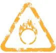

__7\.01__

__全球股民为何撤退__

股市好的时候评论家们大多看好。股市不好的时候评论家们大多看淡。当然，股民也是如此。

但是，2012年5月23日，英国《金融时报》的一篇文章：“股票失宠”（Out of Stock）不属此类随风飘的性质，值得一读。我先归纳，然后结合中国的情况做点评论。

德国的安联保险公司管理客户资金17000亿英镑。它只有6％的投资在股票上，而90％在债券上。10年前，股票投资的比例高达20％。它的资产配置主管尼克尔·斯瑞尼凡桑（Nikhil Srinivasan）说：“我们完全是听从保单持有人的意愿。我们没必要在股票投资上过分激进。”

世界上很多机构都跟安联保险一样，一直在降低股票的比重。这种现象正在对企业界产生巨大的影响。很多企业加大了对债券市场的依赖，或者回购股票甚至退市。

另外一个深远的影响是，长期储蓄的益处正在减少，节约存钱的人和国家越来越要补贴花钱大手大脚的人和国家。总有一天，存钱的人们会觉醒。

过去，股票的息率（现金分红回报率）一般低于债券的息率，因为大家认为，股票会随着经济发展而上涨。但是，现在大家不相信这个教条了。结果是，股票的息率已经高于债券息率。耶鲁大学教授罗伯特·希勒（Robert Shiller）估算，现在美国股市的息率为1\.97％，而美国10年期国债的息率仅为1\.72％。

很多人因此捶胸顿足，“世界股票的牛市要来了，债券市场该大跌了！”但是，股票的牛市会来吗？何时来？

伦敦商学院的学者估算，过去110年来（即1900─2010年），股票大大跑赢债券。股票的平均年回报率超过通胀6\.6个百分点，而债券呢，仅仅跑赢通胀1\.8％。这是个巨大的差距。但是股民还是在继续撤退：10年前，英美两国的养老基金大约有70％的资产在股市，今天，英国的比例降到了40％，美国52％。

撤退有两个原因：一是2000年以来全球有了两次大熊市，二是监管政策迫使银行和其他机构减少股票投资，增加债券投资。监管方面的对股票投资不利的变化很多，包括银行资产的风险权重的调整，会计规则关于投资品估值的规则的变化，养老金从“固定受益额”的模式向“固定出资额”模式的转变等等。因此，欧美有些国家的主权债券的利率已经跌到了不能再跌，也就是说，它们的价格太高。投资者逃离股票，进入了债市。可是天底下有那么多债券可买吗？

既然有这么多不利因素的存在，股票为什么没有跌更多呢？答案在于，股票的供应也减少了。根据花旗银行一项估算，2003─2007年，股票的净发行额为负数（发行量减去回购和退市）。在美国，2011年的股票净发行量也变成了负数。过去10年，发达国家的股票发行量一直大大低于上世纪90年代。

__我的评论：__

1．这篇文章的分析有点意思，但是，我不相信任何预测，特别是不愿意用自己的钱去相信预测。有哪些伟人成功地预测到了亚洲金融危机、欧洲债务危机和美国房地产崩溃？现在，股票相对于债券来讲确实便宜，但是股市何时会大涨？明年，还是10年以后？我们都不知道。

2．中国市场一直在悄悄地受到海外市场的影响，只是我们不承认而已。比如，中国的基金甚至散户很关注海外企业的估值水平。中外人员的交流会影响投资观念。各国政府的监管理念和条例也是相互影响的。虽然中国政府有管制，但是资金还是跨国流动的。

3．目前，发达国家股民的撤退跟10年来股票回报率差（打平）有关，也跟股市的欺诈曝光有关。中国的股市虽然年轻，但是地方政府和企业的欺诈之普遍和严重已经打击了股民的信心。中国政府应该把恢复股民信心当作头等大事。温总理曾说，“信心比黄金更重要”。这很精辟。

4．股票估值是一个非常大的区间：市盈率30倍不算太贵，5倍也没有什么了不起。欧美都曾经出现过5倍。谁规定中国不可能？股民要自保。股市不相信眼泪，也不相信社论。

5．我既不看淡，也不看好，我只是不相信预测。

## 7.02 噪音中觅经济方向

\(83\) 7\.02 噪音中觅经济方向

2026年3月14日

15:45

__7\.02__

__噪音中觅经济方向__

各个经济变量的关系是不稳定的，不可靠的。把经济学转化成投资决策还要跨越一道鸿沟。所以，经济学对于绝大多数投资者来讲，也许只是累赘而已。

经济学不是科学，不能用对待物理反应或者化学反应的态度来对待它。虽然近五六十年来，海外学者费尽心机，试图把数学的精准引入经济学，但是，他们的努力还只是点缀而已。对于投资者来讲，经济学天天受到检验和挑战。分析经济现象和资本市场时，理性的态度是谈论概率：如果这件事发生，另外一件事情有可能发生。当然，别的力量随时可能冒出来抵消或放大这件事的影响，而且时滞有长有短。

__投资者未必需要经济学__

在研究中，我们经常犯如下的错误：

__1．试图做精准或者短期的预测，比如下个季度的金价、股价、铜价、物价。__又比如，我们把6％跟8％的差别当太大一回事。实际上，6％可能大于8％。

__2．我们的很多研究报告很牵强，不光是研究报告的消费者认为牵强，甚至连分析师本人都知道牵强。__我承认，我也没少写那样的报告。比如，两件一前一后发生的事情经常被无端说成有因果关系。有些经济现象发生过两三次，就被认为是规律；人们划一张图，把坐标扭曲一下（比如，求增长率、求对数、平移坐标，等等），就说，“你看，这两个变量多么相关啊！”人们全然不顾样本太少和逻辑不通这一类的麻烦。还有：如果8年的历史数字不支持他的某个偏见，那么他就把时间定在7年或6年。

__3．在信息污染中挣扎。__上世纪90年代，前美联储主席格林斯潘被大家吹捧成了神明。我当时在外国投资银行做经济师，听说他老人家每天关注120个经济变量。我佩服得不得了。后来，我转为个股分析师，又听说巴菲特做企业的贴现现金流（DCF）做30年长。我同样佩服得五体投地。我连明年的现金流都无法预测，更别提30年以后的现金流。

这里有个食物链。如果消费者（基金经理们）每天询问下个月的物价、汇价、金价，或者工业生产总值，就必然有分析师们做这样的预测，尽管大家都知道那是瞎蒙。如果消费者不断问明天的股票指数是多少，是涨还是跌，就会有分析师随着音乐而跳舞。有需求就必然有供给。

我认为，券商每天的研究报告都太多，分析师们对每件事都立刻有评论，不免失去了真正想问题的时间和必要的距离。比如，每个券商每天都有“每日智慧”、“每日快报”一类的出版物。我把这种现象叫“踩噪音”。在这方面，我本人以前犯了很多可笑的错误而不知道。在一个高度竞争的行业，这种状况可以理解，分析师都怕被人遗忘。但是消费者必须保持清醒。而他们的清醒可以引导卖方行为。如果消费者忽略每个月的统计数字、官员们的豪言、海内外千千万万的事件，那么，卖方的分析师们也就不再穷于应付。也就是说，现在，卖方的问题全部是消费者导致的。

世界各国政府部门多、统计资料多、官员多、研究报告多。投资者即使一天到晚什么都不做，也无法跟踪所有这些。况且，这些噪音跟投资真的有关系吗？

巴菲特说，股民的频繁买卖不叫投资，一夜情的加总不能叫作浪漫。在经济学领域，我们可以说，对新闻垃圾和统计数字的评论不能叫经济学。美国经济学家保罗·克鲁格曼（Paul Krugman）说，那最多只能叫“上上下下的经济学”。

如何把经济学里面的一些基本原理引申到投资决策？我看小心为妙。利率下降是否一定刺激资产价格？汇率下调是否一定刺激出口？刺激了出口难道就是好事？股民应该为之高兴吗？GDP增长加快对于股市是利好吗（想想2000─2005年）？放慢是坏事吗？通胀率下降一定有利于股市吗？退市好吗？国际板坏吗？

我认为，所有这些问题的答案都是“不见得”。这也就决定了，大家应该抱怀疑的态度。用这种心态，我现在讲讲我对未来经济的几点模煳的、方向性的和长期的看法。

__全球投资回报率下降__

我认为全球所面临的共同问题是回报率的下降（也就是，赚钱的机会在减少，增长的速度在放慢）；由于这个问题，所以，厂商所能承受以及愿意支付的贷款利率在下降。从而，存款的利率也在下降。

其实，这种平行下移的过程也许已经持续了几十年。但为什么偏偏在今天显得十分突出呢？原因就在于厂商在过去几十年内用增加负债率的办法缓解了产品过剩的危机，推迟了增长的极限的逼近。厂商在股本收益率本来不够吸引人的情况下，用增加负债率的办法提高了股本收益率。现在，欧美的工商企业负债率不高，但是金融系统在撇掉坏账后的真实负债率还是很高的。降低负债率的过程会很漫长而痛苦。

中国过去的10年也经历了同样的过程：企业、政府和家庭三个板块的负债率都有很大程度的提高。这无疑刺激了经济，但是负债率的提高毕竟有极限。中国离极限也许还有很大距离，但是，负债率的提高对未来经济的刺激很可能会放慢。

欧美日的大趋势意味着什么？中长期资金回报率的下降，意味着投资回本所需的时间在拉长。这也就是市盈率的概念。在中长期，全球股市的市盈率会出现攀升的趋势，也许中国除外。

有人问，如果预期的中长期利率水平对于股市估值是好事，而日本过去15年利率水平极低，为什么股市不死不活呢？我觉得，日本的股市（还有台湾地区的股市）虽然多年来不死不活，但它们的市盈率却一直很高。它们曾经贵得离谱，直到现在还处在一个漫长而痛苦的消化过程中；中国股市迄今的市盈率也高于世界大多数股市，主要是因为股票发行受到限制，所以股票长期严重短缺。现在，我们股票的估值也许同样面临一个漫长而痛苦的消化过程。

很多人喜欢唠叨“中国股市或者中国楼市的中国特色”，我看那是自欺欺人。股市就是股市。楼市就是楼市。特色只能是短期的，不可能是长期的。短期内由于文化或者制度的原因，可能会有特殊性。但是，本来只值3元的东西被推高到8元，它迟早要回归。这个规律是没有国界的。我经常听到的“中国特色”包括：“在中国，租金回报率跟房价没有关系”、“中国的丈母娘特别看重置业”、“中国人投资的选择很少，所以只能买股票或者房子”、“政府绝不可能让价格大跌”，等等。我都不以为然。

股市里还有两种似是而非的论调。一是：“今年股市特别难做”，好像别的年份曾经好做！第二个论调是：“现在钱多氾漤，实体经济难做，所以股市一定涨。”我在2004年就犯过类似的错误。当时我写了一篇报告《中国B股的春天还远吗？》，我的论据是惊人的简单！你看中国人手持的外汇越来越多，B股的市值和估值越来越低，总有一天……结果呢？7年过去了。我真希望我没写过那份报告。

我的几个判断：

1．虽然未来几年的通货膨胀率可能由于今年的基数高而显得缓和，但是实体经济的成本压力是照样的；加上老百姓对生活费用的抱怨，我看货币政策还会相对偏紧。

2．因为税收增长，财政政策确实有刺激经济的能力，但是我看政府不太可能有激烈的刺激措施，特别是因为2009年4万亿的后遗症已经十分明显。也因为地方融资平台的形象太差。

3．在经济增长放慢时，企业利润增长幅度会明显下降，甚至出现大滑坡。今天20倍市盈率的股票，明年会变成26倍，如果股价不变。

4．未来几年中国股市如何？一年多来，我写过几篇悲观的文章，受到了几个朋友的赞扬。其实，关于股市的走向，我坦白，我完全不知道。准确地说，我的看法是，相对于公司的品质和市场利率来说，我们的股票都还比较贵，没有给投资者留下太多安全边际，所以今天看起来大势依然不妙。但是，贵的东西可以更贵，便宜的东西可以更便宜。不理性的市场可以持续很多年。未来股市的走向，谁知道呢？

## 7.03 企业少做少错的道理

\(84\) 7\.03 企业少做少错的道理

2026年3月14日

15:45

__7\.03__

__企业少做少错的道理__

有人说，A＋H的两类股票应该有相同的公允价值，因为它们毕竟是同一个企业，同股同权。我想谈点不同看法。不过，首先，我想谈谈百货企业的估值。

__领汇跑赢中国百货公司的启示__

中国的百货公司（金鹰、银泰、百盛和茂业等）与超级市场（上海联华和物美等）不同。前者主要靠出租柜台，收取佣金，后者主要依靠自己采购和销售。前者就是收租公司。由此，我想到香港的领汇房产基金（0823\.HK）（业务模式基本相同，都是收租婆。房产基金必须把绝大多数现金流拿来分红）。从2005年上市以来，它的股价上升了142％，加上6年多的分红（假定年息率为5％），投资者的综合回报率高达200％。

2年后（2007年），股市兴旺，银泰百货（1833\.HK）到香港上市。迄今为止，股民的综合回报率大约55％。也很不错。特别是考虑到期间的全球金融危机和国内的两轮房地产打压。

又过了一年（2008年），茂业国际（0848\.HK）到香港上市。迄今为止，股民的综合回报率大约是负的32％。

都是收租婆，为什么领汇跑赢银泰和茂业那么多？几个原因：

__1．现金分红很重要。__苏格兰有句谚语，“手上一只鸟，胜过林中两只鸟”。两个美国学者发表了一篇学术文章：“真奇怪！高派息导致利润的高增长”。（“Surprise\! Higher Dividends＝Higher Earnings Growth”by Robert Arnott and Clifford S\. Asness）。这篇文章用计量经济学的实证方法，研究几千家上市公司的资料，得到的结论令人思考：公司的钱多了，浪费也就多，资本支出就多，很多项目是摧毁（抵消）企业价值的；分红率一旦确定，管理层就有压力和动力维持分红率不至于下降。另外，高分红表达了管理层对未来利润增长的信心。

__2．领汇在香港有稀缺性。__

__3．股民担心电子商务的侵略，也害怕国内商场供过于求。__

__4．香港之鉴。__过去30年来，香港的零售市场不可谓不好，但是香港的老牌百货企业都没有经得起时间的考验：它们包括综合性的百货公司，如永安、先施，也包括服装店，如Theme、佐丹奴、Joyce，等等。也许唯一的例外是SOGO。

__5．但我认为最重要的因素：领汇基本上不再投资新项目，而是用很少的钱维护现有的商场，不断收割利润和现金流。__它的商场就是摇钱树。这样的公司当然没有增发新股之类的事。而银泰和茂业（以及国内绝大多数商场）不断开发新专案，耗资巨大。从很长期的角度来看，这种业务拓展可能是英明的，但也有可能是错误的。从中短期来看，国内很多百货商场（特别是新商场）的利用效率还不高，租金回报率还太低。

回头看，银泰和茂业在业务开拓中，有些交易是摧毁价值的，有些是高明之举。当然，谁都不是神仙，都会犯点错。总的来讲，我觉得银泰和茂业的管理层没犯过大错，为企业增值很多。不过，它们大大落后于香港领汇这件事，非常值得长期投资者思考。也许它们现在的股票超值，因为它们的商场还没有显现价值？也许……也许……我悟出一个小小的道理：股价表现时，乃企业放慢投资时？！

2005年，我买过领汇的IPO。后来，我觉得它“没有增长空间”，“会跑得很慢”，就把它卖掉了，买了国内的百货公司的股票。但是，四五六年下来，结果表明，投资欲速则不达。增长率很重要，但是现金流、资本的节省，以及负债的降低更加重要。

如果你想多考虑这个问题，可以品味一下麦肯锡的结论：亚洲公司的估值多半是被资本支出所摧毁的。请参考《价值：企业财务的四根支柱》。

有人反驳我说，房产基金（REITs）相当于债券，所以不能跟股票相比。错！很多房产基金有极高的成长性（通过并购）。而且，任何资产都可以相比。另外，股票本来也是债券，只是它的期限为永远。巴菲特对此有极为精辟的解释。

__A股H股价值大不同__

我的结论如下：

1．从长期来看，市场利率是股票估值最重要的变量之一。对于同一个公司来讲〔比如A＋H股公司，青岛啤酒（上交所：600600\.SS，港交所：0168\.HK）、兖州煤业（上交所：600188\.SS，港交所：1171\.HK）、海螺水泥（上交所：600585\.SS，港交所：0914\.HK）和中国平安（上交所：601318\.SS、港交所：2318\.HK）等〕，两个市场的估值差距只取决于一个因素：长期的市场利率。

2．虽然美国大印钞票，迟早会导致通胀和加息，但是，我感觉在未来5～10年内，中国的名义利率也许还会大大高于美国利率（＝香港的利率）。

3．H股的投资者基本上是海外人士，他们所面对的市场利率明显低于国内的利率，所以，H股的股价应该（大大）高于A股的价格。虽然青岛啤酒的公司内含价值只有一个，但是A股投资者与香港投资者的资金成本不同，机会成本不同，所以，他们所要求的回报率不同。回报率的倒数就是市盈率。

在这个问题上，汇率预期完全不重要，因为买H股和买A股在汇率上的好处是一样的。外国投资者如果想获取人民币升值的好处，完全不需要买A股，只要买H股和红筹股即可。这也是为什么汇贤（87001\.HK，北京东方广场）在香港上市后在概念上完全失败的原因。汇贤用人民币币种在香港上市，只是给股民增添了换汇的麻烦而已。

“同股同权”没错。作为股东（不管A股还是H股），每年收到的分红相同，投票权相同，但是每股分红两角钱的权力对不同的人有不同的价值。

1994年，我开始做股票分析师时，A股市场到处是50倍和60倍的市盈率。18年下来，虽然中间有过波动，但是，市盈率的下行趋势是明确的，不以长官意志为转移。相反，香港的市盈率一直在往上走，虽然中间有波动。

你问我为什么？利率使然！美联储宣佈，低利率会持续到2014年。之后，虽然加息难免，但是利率的绝对水平还会很低。毕竟，通胀只是决定名义利率的因素之一。同时，利率高低也取决于企业盈利率和经济增长率。

## 7.04 寻找十倍大牛股

\(85\) 7\.04 寻找十倍大牛股

2026年3月14日

15:45

__7\.04__

__寻找十倍大牛股__

希腊有句古训：“能者干，不能者教，傻瓜评。”由于我傻，所以我想评论2012年《理财周刊》登出的30个大牛股。前10大牛股在过去10年涨了10倍以上，后面20个亚军也涨了6倍以上。

过去10年，A股市场的10个大牛股份别是茅台（600519\. SS）、张裕（200869\.SZ）、泸州（000568\.SZ）、中联重科（000157\.SZ）、双汇（000895\.SZ）、格力（000651\.SZ）、包钢稀土（600111\.SS）、恒瑞医药（600276\.SS）、云南白药（000538\.SZ）、山西汾酒（600809\.SS）。另外20个亚军基本上是品牌很强的食品和医药类股票和矿业类。比如西山煤电（000983\.SZ）、宇通（600066\.SS）、东阿（000423\.SZ）、古井（000596\.SZ）、盐湖（000792\.SZ）、五粮液（000858\.SZ）、兰花科创（600123\.SS）。

在中短期内，不理性的股票市场可能扭曲股价，但是从长期来看，任何不理性的市场行为都会让位于基本面。好公司的股票就是好股票，坏公司的股票就是坏股票。但是，这种结论太空泛。后来我有点新思考。

__四大类大牛股__

这30个大牛股基本上可以归纳为四大类。

__第一类是重组类：比如海通证券（600837\.SS）。__这是可遇不可求的东西，所以不须讨论。

__第二类属于制造业中的特殊情况，比如格力和中联重科。__这个行业只能在非常时期（即它们的产品需求正旺，并且撞上了杰出的管理者）才能胜出。在香港上市的联想电脑在某一个阶段也给了投资者非凡的回报。但那是历史。

__第三类是医药和保健品。__虽然这些产品遇到进口商品的竞争，但是毕竟中国的医药产品和服务还是有文化特征的。这就是竞争中的障碍，相当于巴菲特所说的“护城河”。

__最后一类是好几个白酒公司。__很多人的评论是：“中国人太爱喝酒，所以把白酒公司变成了大牛股。”可我觉得这也许没有说到问题的根子上。我们中国人在白酒上花的钱比在房子、衣服、教育、交通、通讯、食品和蔬菜上花的钱少多了。为什么偏偏白酒公司在股票市场胜出呢？另外，全国的白酒销售额比推土机、卡车、发电厂、石油、家电、化工、钢铁、造船和建材方面的销售额相比简直太小了！为什么在另外的众多行业基本上没有产生10年大牛股呢？

我有几个假说。首先，白酒是一个本国文化影响很重的行业，不存在外国竞争。而这正是护城河的概念。当然，在这个行业内有上千家公司（多数还没有上市），为什么有些胜出，有些原地踏步呢？那就跟管理层、当地政府、股东结构和其他偶然因素有关系。但是，在所有行业中，白酒是护城河最宽最深的行业。白酒行业是一个古老的行业，管理相对简单。而诸多其他的行业对中国人来讲还太新，我们还没有达到熟练的程度。

__投资要诀是以小博大__

有人稍加夸张地说，如果你发现了一个企业或者行业，它不需要营销，那一定是个美妙的投资物件。电讯行业、银行业、高速公路、机场、港口和发电厂好像都是。但是，它们为什么没有产生10年大牛股呢？我觉得有这么几个可能性。

__1．国有企业的性质决定了它们有多少收入，就会有多少支出。__不管多么困难，大家一定会想出办法把多出来的钱用掉。结果是股东回报率永远高不起来。

__2．这些行业的资本支出太大。__相比较而言，虽然白酒企业也基本上都是国有企业，但是，它们不需要太多的资本支出，至少不需要持续的巨额资本支出。这让我们回想到麦肯锡的一个观点：亚洲的公司虽然增长很快，但是它们的股票估值基本上被它们的资本支出给摧毁了。这也是全球的工业企业和科技企业的通病。1996年，巴菲特在写给投资者的信中曾经这样说，科技是社会进步的基石，但也可以是出资人的噩梦。他还说：“月球之旅虽然让人兴奋，但是我更愿意把兴奋让给别人。”我把他的话翻译如下：“投资的要诀是用小钱赚大钱，而不是用大钱赚大钱。”

我曾经很怀疑白酒企业的投资价值。现在，我还在琢磨。

__3．中国的银行业在过去10年的经营环境很好，不论增长率还是利差，都好到了难以持续。__但是，它们的股票表现受到它们不断增资扩股的压力，这跟电讯企业和机场的无穷无尽的资本支出是一回事。另外，绝大多数银行上市的历史还不足10年。现在，银行股正处在一个估值特别低迷的阶段。毕竟10年还是一个比较短的时间，还不足以说明问题。

__4．矿业类企业一般也不需要持续的巨额资本支出。__

## 7.05 全球大牛市来了？！

\(86\) 7\.05 全球大牛市来了？！

2026年3月14日

15:45

__7\.05__

__全球大牛市来了？！__

某记者问索罗斯（George Soros）：“股市里各种说法都有，你如何把握大市？”索罗斯耸耸肩说：“如果一份研究报告跟我的观点相似，我唯读一遍。如果跟我的观点不同，我就读两遍。”

2012年2月21日，英国《金融时报》刊登的一篇文章，我读了三遍。作者蒂姆·邦德（Tim Bond）认为全球大牛市就要来了。我先归纳，再做评论。

文章标题：“Get set for an equity bull run powered by low valuations”。蒂姆·邦德说，英美股市过去12年回到了原地，但是债券年均回报率6％左右。很不错。这使得很多投资者开始怀疑股票投资的长期价值。上世纪90年代，英国养老基金总资产的70％是股票。现在呢？只有22％。过去12年，标准普尔500个大股票的每股收益增加了75％，但是股价没有任何增长。市盈率从2000年的25～26倍跌到现在的8～12倍。

蒂姆·邦德承认，股市已经跌了很长时间（或跌了很多或便宜），这件事本身并不能说明大牛市即将到来。今天，英国市场的市盈率虽然只有9\.5倍，但是那又怎样？1974年它曾经跌到过3倍。

蒂姆·邦德不同意市盈率取决于长期利率或者通胀率的说法。他认为，那个理论说不通，而且过去12年的事实也证明市盈率不取决于长期利率。你看，过去12年，利率下降，结果市盈率不仅不升，反而一直往下跌。

那么市盈率究竟由什么决定呢？蒂姆·邦德说，它由两个因素决定：人口结构和市场对未来企业利润的预期（而这又取决于宏观经济的风险）。

英美两国的“婴儿潮”（baby boomers）指二战后人口出生高峰期出生的人们，一般认为包括1946─1964年出生的人们。蒂姆·邦德指出，1980─2000年，婴儿潮纷纷进入成年，进入收入顶峰。于是，他们购买股票的需求旺盛，推高了市盈率。从2000年左右开始，他们开始退休，减少股票购买，并且靠出售股票来养老，导致了股票市盈率下降。

他预测，人口结构的这种变化在2013年左右开始缓和，从而减少对股市的压力。而且，婴儿潮的下一代开始进入成年，获得高收入，从而会增加股票的购买。

过去几年，股市遇到了多面夹击，包括债务危机和原材料涨价（跟中国崛起有关）。但这两个宏观因素都前所未有。而且未来几年，这两个因素可能会变弱。现在，世界上尚未爆发的风险也许是工资大涨。虽然它可能压低公司的利润率，但是也可能会降低系统性风险：那些苦苦挣扎的房奴们确实也需要工资的上升来舒缓压力。

__预测大牛市不如专注好公司__

蒂姆·邦德的分析有些道理。我们通常认为，长期利率（或者通胀率）决定市盈率。但是，过去12年的情况显然不支持这种观点。不过，从来没有人说利率是决定市盈率的唯一因素。也许12年前英美股市估值太高，过度反映了利润的增长前景，从而导致了12年的股市不振。

他用人口结构的变化和宏观风险来解释过去12年英美股市的不振，并预测未来的大牛市。他有可能是对的，但显得牵强附会。未来会不会出现新的、目前未知的宏观风险？也就是美国前国防部长拉姆斯菲尔德所说的“未知的未知”？当然可能。什么都可能。我觉得最有力的理由是现在英美市场债券回报率与股票回报率（即市盈率的倒数）的差距太大了。但是，那又怎样？大的可以更大，小的可以更小。均值回归（reversion to the mean）当然没错，但是何时回归谁也不知道。

所以，我觉得让人信服的说法是：现在英美的股票已经足够便宜了，牛市的可能性大于熊市的可能性。但是，还是我最实在。我认为，最明智的事情是丢掉任何预测，专注好公司，坚持长远投资。股市的走向究竟如何？摩根（J\. P\. Morgan）先生说，唯一正确的回答是：“我不知道。”

## 7.06 A股的未來十年

\(87\) 7\.06 A股的未來十年

2026年3月14日

15:45

__7\.06__

__A股的未来十年__

2005年底，我还在瑞士银行当股票分析师时，到美国拜会基金经理们，讲宏观经济如何、买什么股票、卖什么股票。某基金经理一坐下来，就说：“Tell me something I do not know\.”意思是：“说点我不知道的东西吧。”

我一愣。如果我要讲他所不知道的东西，我就必须首先知道他知道什么。后来，我越想越不对劲儿。如果我每次都要讲别人所不知道的东西，分析师这活儿怎么干呀？于是，我开始想办法离开我混了10多年的分析师岗位。

我没办法讲读者都不知道的东西。不过，我想讲点让大家可能觉得不安的话。我自己琢磨了很长时间。确实有点不安。

关于A股的估值，我想问两个问题：1．A股为什么还是这么贵？2．过去10年大家白干，未来10年会不会还是白干？我只有假说，没有结论。

我的思路如下：

__1．多数A股股票现在的市盈率在20倍左右。__（如果利润有夸张成分，那么真实的市盈率可能高一些。我们暂且假定它们的假账很少。）

__2．一个市场的市盈率应该相当于市场利息率的倒数。__现在中国的市场利率是多少？我选择了普通企业的正常资金成本，大约10％上下。也就是说，A股的合理市盈率大概在10倍上下，比现在的实际情况再低一半！

__3．存在的必然有其道理。__虽然A股的市盈率已经从上世纪90年代初的50～60倍跌到了现在的20倍上下，但是，它为什么没有一直跌到我们所推断的10倍上下呢？是什么因素在支撑A股的估值？过去市盈率的惯性是一个因素，但是仅仅这个因素还不够。一定还有别的因素。

__4．也许我们选择的市场利息率不对。__虽然大多数企业的资金成本为10％左右，但是A股是一个以散户为主的市场。对于多数股民来讲，他们虽然可以购买理财产品，参加民间借贷，但是对于绝大多数股民，他们的机会成本仅仅是存款利息而已。现在3年定期存款的利息可以高达5％，多数理财产品的收益率也只是6％～8％而已。也就是说，也许，股市的合理市盈率不止10倍？！

__5．未来，两种情况可能把A股的市盈率拖下来：一是未来的通胀，从而利率上升，或者资金紧张。__这有可能跟2000─2004年的情况相似：经济活跃但是股市连跌5年。也可能更混乱。

__二是利率市场化，从而老百姓可以减少对银行存款的过度依赖。__民间借贷、理财产品、货币市场基金、债权投资基金、私募基金和另类金融机构等都像西方国家上世纪80年代出现过的“脱媒”。脱媒的结果是，居民慢慢开始摆脱银行的剥削。即使市场利率水平不变，他们投资股票的机会成本也会提高，从而导致整个股市的市盈率的下滑。

由于利率市场化会很缓慢，所以，我们的股市也许不会大跌，而是横行10年甚至15年。与此同时，企业利润继续增长，但是报出来的增长率不会很高。因为很多企业需要洗刷掉过去多年的夸张了的利润。10年之后，我们回头看，股票市盈率跌到了10倍上下，但是我们的股票指数基本上原地踏步：我们又白干了10年。不过，大家不要沮丧：有危就有机……况且，我只是理论推导，可能全错。

我重复我最爱说的话：贵的可以更贵，便宜的可以更加便宜。股票的走势，谁知道呢？

## 附录：识別股市的地雷

__附录：识别股市的地雷__

作者：祝振驹

翱腾投资管理（香港）有限公司董事总经理

__一、剩股等人买__

__剩股有三低特色__

香港有剩女，股市有剩股。截至2011年底，香港的上市公司达1496家，其中主机板占88\.6％，创业板占余下的11\.4％。根据彭博（彭博社）数据，有证券分析师追踪及作投资建议的上市公司约540多家（它们大部分市值都高于3亿美元），换句话说超过六成多的上市公司都是不被机构投资者为意的剩股！

剩股的特色是有三低：1．市值低（通常低于1亿美元）；2．成交低（通常接近零或最多平均不到数十万港元一天）；3．人气低──少人拜访，少人建议。基金嫌弃它们没有流通量，所以没兴趣拜访。因为缺乏成交量，投行分析师没诱因去追踪及撰写报告，而销售部同事也不会容许他们去做无利可图的投资建议。成交低所以没有人留意，没有人留意即是没有人买卖，所以就越加没有成交。

__冷落剩股三大原因__

20年的投资及研究生涯中，笔者拜访过大小不下一二百家这类缺乏成交及不为市场留意的剩股，有的可能因业绩增长而有幸短暂脱离剩股行业（通常都是只可维持一两年，业绩一倒退又打回原形），但大部分包括很多基本因素不俗的公司始终都无人垂青。笔者归纳有以下数点原因：1．管理被动缺乏公关活动或不愿投放资源在投资者关系。笔者认识过最主动的管理层（某公司首席财务官）在高峰时花差不多一半的工作时间做路演推广。一个电话或电邮查询，他就不辞劳苦立刻由老远的九龙工业区跑到中环登门拜访，对大小基金和证券商都一视同仁；2．业绩缺乏稳定性或派息欠奉。剩股业绩通常都很飘忽，行业周期上扬时就赚钱，反之不是盈利大幅倒退就是亏损。长线基金一般都不喜欢这类缺乏增长持续性的公司，所以就算它们某年赚大钱，但市盈率仍旧可能非常低迷。另外有一类资产估值有大折让的公司（通常是三四线的香港地产股），它们经常以保留现金作发展为理由不愿派息，就算愿意派息，派息比率都偏低（通常15％都不到）。这类股票估值一般对资产值都有平均60％～80％的折让；三、金玉其外，败絮其中。很多估值便宜吸引的剩股继续廉宜，因为基金投资者知道公司有管治问题或者质疑其财务真确性，所以敬而远之。前者一般是大股东有欺骗或误导投资者的往绩，最常见的是管理把前景夸大，吸引基金投资。财技了得的屡屡在股市高峰或业绩见顶时趁高位减持或配股，之后业绩立刻走样无以为继，然后在股市低潮或股价低残时作大折让供股增持甚至私有化。

假若大股东素有榨取小股东利益或其他不良声誉（大花筒例如报销公司开支作私人享乐，娱乐版新闻多多，不务正业，高价收购资产，关联交易等等），这些剩股基金通常都会避之则吉，所以估值很难作大翻身。现在坊间很多所谓股神和专家都喜欢在媒体上推介这类表面超值但内里有管治问题或财务有水分的小型股。单凭年报上的表面数字去判断估值便宜而作出投资建议是一个危险的决定。

__基金拣股有如选美求爱__

股票和男女关系最相似的地方是大多数上市公司都希望被基金追求及持有，但只有少数的蓝筹股，高增长股和高管理质素公司会被长线基金挑选中。有很多由小型股成长为中大型的基金爱股其实也经历和基金约会恋爱一段长时间，创建互信关系后才能成为其投资组合中的一部分。

__基金选股有四高要求__

10个上市公司老板9个都认为自己的股票价值被市场低估，但大部分都是孤芳自赏，不明白市场的四高要求（高流通量，高持续性，高增长和高派息）。市场上有接近1500只股票，基金组合一般只持有20～60只，所以三四线上市公司一定要懂得打扮包装推广才会突围而出获得基金青睐，否则很难脱离剩股一族身份。

__二、好股，坏股，烂股，便股__

民企造假，谈股色变。由民企主导的中小型股板块从2011年中开始就坏消息一个紧接一个，令投资者焦头烂额，身边不少的基金朋友也决定短期不碰这类股票，就算估值再便宜也不作考虑。而事实上，假若公司决意造假账，任何有经验的审计和分析师也没可能在短期内察觉出来。笔者一直认为要确认一家上市公司的真实性与业绩基础，一定需要观察管理层一段较长时间，最好是经历起码1～2个行业和股市低潮。稳定和较高的现金派息率永远是上市公司货真价实的最佳保证。但也不一定！笔者以前在瑞士银行研究部旧同事张化桥最近在他的博客中就指出公司分红和回购股份并不代表公司账目一定真实，因为管理层可能只不过利用配股集资的一小部分资金回馈小股东。用小股东的一小部分钱换取更高估值和市值，然后又可在更高位配股集资，除笨有精。

__公司上市为抽水__

一家日本股神长期建议的中国消费概念股票就是采用这种模式在资本市场操作：公司上市10年有5年派息（平均派息率为14\.9％），但每年配股或供股接近一次（过去10年8次在二级市场集资合共17\.8亿港币，另IPO集资5000万元），每年的资本开支都十分巨大（10年合共约24\.1亿港元），纯利虽然有增长，但每股盈利经摊薄后一定原地踏步或倒退（2011年的每股盈利比10年前倒退了近17％），同期股本收益率由32\.7％下滑至只有4\.4％。这表示公司的投资愈多回报就愈低。今天的股价只比10年前的招股价略升不到17％，现在市值只有港币11亿，比在市场集资的总金额还要少！基本上这是一家不停摧毁股东价值的公司，所以基金早已敬而远之（笔者认识曾长线持有的基金大部分都最后止蚀离场）。从更坏的角度看，公司根本是透过不停的集资再投资，然后把股东的钱消耗掉和转移到管理层自己的口袋（透过昂贵的收购、扩产或开支），一旦集资游戏中止，业绩和现金流能否维持将会是一个疑问。

__长线投资在稳健的管理层__

长线投资股票最重要的是押注在有质素及稳健的管理上。香港的小型股当中有好些是上市经年，业绩和派息稳定而又估值便宜的公司。其中一家是同样上市差不多达10年的香港公司信佳国际（0912\.HK），股价10年升值128％，派息从不间断（派息率平均约为40％），上市以来只在9年前在二级市场集资过一次共港币2800万，2011年股本收益率达24\.5％。2011年9月的中期营业额增长达7％，盈利上升18\.5％，现时市盈率只有6倍多，股息率高于6％，净现金达港币1\.09亿（每股0\.18港元）。虽然本业以电子代工及欧美日（占营收的76％）市场为主，但业务集中在毛利较高和少批量生产的产品（互动教学、专业音响、自动收费系统、通讯产品、宠物培训器材），所以业绩仍然维持稳定增长。信佳管理比一般香港工业股优胜之处是不断求变及开拓能增值毛利的业务，不求货量，以稳定增长为目标。公司在5年前曾失掉一个占营收达30％的中国的通讯产品大客户（因客户被其他公司兼并），但管理层随即开拓了一个新欧洲客户生产互动教学产品，现今业务已增长至占营收达25％。

__香港工业股有内含资产价值__

随着广东省的经济发展，很多原来在深圳市区设厂的公司都逐渐移迁到较为便宜的地区生产。有些坐落在优质地点的厂址可能被卖走或与当地发展商合作发展地产项目。笔者相信这个趋势会越趋明显，让很多估值便宜的工业股有机会借此套现，假若大股东愿意分派所得利润作特别股息派发，股价便有机会作大翻身。信佳在未来一年正计划迁离深圳布吉的厂址，该址土地面积达3万平方米，徦设每平方米升值1万元，该址已升值3亿元（或每股0\.48港元）。

__三、低管治，低估值__

有一家上市11年的小型石化公司和上面谈及的消费股可说是难兄难弟，两者都是香港人作大股东及高级管理，两者都是中国概念股，后者数年前兼且曾一度持有前者超过13％的股份。两者最雷同的地方就是在市场集资次数很频密。

__持股至今蚀96％__

石化公司在过去11年里配股或供股共10次，加上IPO的集资金额达港币18\.6亿，它今天的市值只有不到1\.2亿。在11年里，资本开支和投资总额达31亿元，它的股本收益率由上市初的33\.5％下降到2011年只有3\.1％，每股盈利同期倒退78\.5％，更甚的是它过去9年从未派息，现今市账率只有0\.04倍！换句话说，市场认为它现在96％的资产值都可以作废。如果按IPO价买入这只股票并持有至现在，账面上亏损达91\.3％！在以往8次（最近一次供股仍在进行中）集资认购而持有至现在者都要亏蚀，最小的亏85\.5％，最多的亏达96\.4％，亦即是接近全部报销。

这些公司管理最常见的伎俩通常是把公司包装成价值股，将前景描绘得非常秀丽，例如未来市盈率只有5～6倍而盈利增长有30％以上，但需要扩展产能或作新投资，所以有必要集资。它们的借贷比例很多时都偏低甚至没有，表面上看来非常健康，但实际上可能根本没有银行愿意贷款，更可能的是它们一心只是为了在市场集资，然后透过资本开支把资金消耗掉。因为对很多上市大股东而言，资本市场集到的资金是公司的钱，而公司的钱亦即是等于自己口袋里的钱。而向银行借贷的钱，就算利率怎样的低，有一天终归要偿还，所以最好是集街外钱作投资。

__今次和上次不一样？__

奇怪的是为何一家不停摧毁股东价值的公司，仍然能够在市场集资？理由颇多，第一，市场上不断有新进场的投资新手，可能是刚学投资的散户，也可能是刚投资中国的基金经理和分析师，他们对公司以往的历史不熟悉，没有太大的包袱去抗拒。第二，市场上永远有一些价值投资者被低迷的估值吸引，向高难度进发，总认为自己的目光比人强，眼光比人准，这次的投资论点和以前的不一样。第三，每次牛市重临，鸡犬皆升之际，必定有财经媒体推介一些落后股或超值股，贪婪的投资者往往因股价突然大升而跟风追入，而烂股就把握时机在高位配股。第四，公司在每次高位配股前必定有新的故事告诉投资者，可能是业务转亏为盈，可能是物色到新的投资项目，可能是收购合并，总之要令投资者觉得今次和上次不一样，今次是进入收成期，以往都是投资期。第五，每次配股总是有一些中小型的本地投行为了赚取较高的包销费用而愿意协助推介给新的投资者。

__烂股有如爱情骗子__

烂股就有如爱情骗子一样，经常甜言蜜语，编出各种动听故事使投资者入市，每次投资者都失望而回，最后分手离场，而愈迟退出者则伤痕愈深，痛苦愈大。分手后，爱情骗子又会寻觅下一个对象，按股市周期，循环不息。这些个案告诉投资者买进一只小型股时，要清楚知道股东及管理者的背景，艺高人胆大者如果硬是要和爱情骗子一类交往，最多也只可发展极短线的爱情，绝不能交心。

## 参考文献

__参考文献__

\[1\] John Bogle\. The Little Book of Common Sense Investing\. New Jersey: John Wiley & Sons, 2007\.

\[2\] John Bogle\. Enough\. New Jersey: John Wiley & Sons, 2008\.

\[3\] Christopher H\. Browne\. The Little Book of Value Investing\. New Jersey: John Wiley & Sons, 2006\.

\[4\] Lawrence A\. Cunningham\. The Essays of Warren Buffett, Lessons for Investors and Managers\. New Jersey: John Wiley & Sons, 2009\.

\[5\] Pat Dorsey\. The Little Book That Builds Wealth\. New Jersey: John Wiley & Sons, 2008\.

\[6\] David Einhorn\. Fooling Some of the People All of the Time\. New Jersey: John Wiley & Sons, 2011\.

\[7\] Charles D\. Ellis\. Winning the Loser's Game\. New York: McGraw\-Hill, 2009\.

\[8\] Benjamin Graham\. The Intelligent Investor\. New York: Collins, 2003\.

\[9\] Joel Greenblatt\. The Little Book That Beats The Market\. New Jersey: John Wiley & Sons, 2006\.

\[10\] Prem C\. Jain\. Buffett Beyond Value\. New Jersey: John Wiley & Sons, 2010\.

\[11\] Tim Koller, Richard Dobbs, Bill Huyett\. Value: The Four Cornerstones of Corporate Finance\. New Jersey: John Wiley & Sons, 2010\.

\[12\] Burton G\. Malkiel\. Random Walk Down Wall Street\. New York: W\. W\. Norton, 2007\.

\[13\] Burton G\. Malkiel, Charles D\. Ellis\. The Elements of Investing\. New Jersey: John Wiley & Sons, 2009\.

\[14\] Jeremy Sigel\. Stocks for the Long Run\. New York: McGraw\-Hill, 2007\.

\[15\] Jason Zweig\. Your Money & Your Brian\. New York: Simon & Schuster, 2008\.

## 避开股市的地雷

__避开股市的地雷__

__张化桥 着__

Copyright 2012 by ENRICH CULTURE GROUP \(CHINA\) LIMITED All Rights Reserved

__本书中文简体字版本由天窗文化集团（中国）有限公司授权中国人民大学出版社在中国（香港、澳门和台湾地区除外）独家出版和发行。任何在该区域之外的转载、使用和售卖，均为侵权行为，天窗文化集团（中国）有限公司和中国人民大学出版社将保留追踪和控告以上侵权行为的权利。__

Original Chinese edition licensed by ENRICH CULTURE GROUP \(CHINA\) LIMITED Simplified Chinese Copyright 2012 by CRUP

## 內容简介

__有态度地出版，出有态度的书。__

__内容简介__

曾多次被选为“最佳中国分析师”的张化桥，在本书中大胆揭示各类投资陷阱。股市遍布地雷：上市公司做假账，报喜不报忧；政府或纵容，或给予企业单次的补贴优惠等等。

股民过分自信、不做足功课、投机取巧，也无异于自设陷阱，最后必误踩地雷，暗自垂泪。作者凭借十多年在股市的经验，在本书中详细分析如何识别及避开这三种地雷。

策 划：天窗文化

出版统筹：陈颖怡

责任编辑：田驰

装裱概念：Pollux Kwok

设计执行：Pollux Kwok

营销中心：tianchuang@enrichculture\.com

投稿联系：info\.ecc@enrichculture\.com

咨询电话：010\-82509830

[http://site\.douban\.com/107555/](http://site.douban.com/107555/)

[http://weibo\.com/tianchuangwenhua](http://weibo.com/tianchuangwenhua)

## 避开股市的地雷

__Table of Contents__

作者简介

推荐序：“悦”读投资 智诚相伴

自序：股市有三种地雷

第一章 投资银行的大茶饭

1\.01 为何离开投行这么难？

1\.02 投资的信仰危机

1\.03 第三次回到投行

1\.04 这就是投资银行吗？

1\.05 投资银行的人势利吗？

1\.06 股票分析师可能成为帮凶

1\.07 闭上眼睛给股票估值

1\.08 分析师不能影响市场

1\.09 新股上市，投行搅局

1\.10 Facebook的官司，股民的教训

1\.11 可爱的分析师和审计师

第二章 股民的眼泪

2\.01 自设地雷，股民垂泪

2\.02 坏公司上市，赚了股民的钱

2\.03 股民要从愤怒中走出來

2\.04 博人民币升值买汇贤产业信托？

2\.05 中国股民需要大实话

2\.06 股民沒来由的自信

2\.07 亏钱容易赚钱难

2\.08 对沖基金不太坏

2\.09 作为股民，我究竟想赚谁的錢？

2\.10 股民总是坐立不安

2\.11 惹不起，躲得起

2\.12 如何避开股市的地雷

第三章 我从股票得到的深刻教训

3\.01 公司壮大不等于股民赚钱

3\.02 激励机制决胜

3\.03 尽量往坏处想

3\.04 好行业也有坏公司

3\.05 周期性股票难以捕捉

3\.06 赚钱是小概率事件

3\.07 餐饮业没有护城河

3\.08 便宜貨是“价值陷阱”

3\.09 小心竞争太多的行业

3\.10 中国房地产公司基本不行

第四章 十倍股，往何处寻？

4\.01 如果利润不再增长……

4\.02 寻找美丽动人的中国股票

4\.03 体育用品公司前途堪忧

4\.04 別碰需要营销的公司

4\.05 港爱股大势已去？

4\.06 我的投资难题

4\.07 我的投资布局

4\.08 中国银行股的黄金岁月

4\.09 不买“带工厂的股票”

4\.10 光有利润高增长还不够

4\.11 只买能赚十倍的股票

第五章 价值的陷阱，通胀的牺牲品

5\.01 价值陷阱的诱惑

5\.02 提防永不长大的上市公司

5\.03 一个股票分析师的真正醒悟

5\.04 寻找不够贵的股票

5\.05 中国地产股成了二手汽车

5\.06 巴菲特说，通胀伤害股市

5\.07 股市是通胀的牺牲品

5\.08 股神的遗憾

5\.09 想法子逃离价值的陷阱

第六章 提防官商同诈，重建股市文化

6\.01 股民的钱流进董事长的口袋

6\.02 政府欺诈毒害股市

6\.03 上市公司的庞氏骗局

6\.04 企业假账多如地沟油

6\.05 中国式畸形股权文化

6\.06 分红无限好，只是別強迫

6\.07 股市好坏的七大标准

第七章 未来的大牛股与大牛市

7\.01 全球股民为何撤退

7\.02 噪音中觅经济方向

7\.03 企业少做少错的道理

7\.04 寻找十倍大牛股

7\.05 全球大牛市来了？！

7\.06 A股的未來十年

附录：识別股市的地雷

一、剩股等人买

二、好股，坏股，烂股，便股

三、低管治，低估值

参考文献

內容简介
