# 《卜建业 逆向致胜 如何成为一个聪明的投资者》全文合订版

> 共14个章节。原章节顺序、段落结构和图表均予以保留。

## 作者简介

__作者简介__

正奇（本名卜建业），拥有十二年的投资经验，自2007年起专注逆向投资。他坚持“奇正相生”的投资理念，从中国传统文化视角研究世界投资大师的投资真谛，探索本土化的成功投资之道。长期寻求低估、低价、冷门的股票，在重组、并购套利上有一定的研究，先后挖掘并收割了ST生化、ST成城、长航5等收益数倍的重组股票，同时在攀钢钢钒、新城B等股票上成功套利。

## 作者序

__作者序__

年至不惑，愈加明白人多的地方不能去的道理。生活中，我经常会警醒自己，大众和传统认同的主流思想哪些是错误的，哪些是应当进行完善的，并据此不断地挑战和主动地修正自己“最爱的观念”。如果我们不能从这些世俗的、惯性的错误思维中走出来，将会浪费大把的青春。在投资中更要保持头脑清醒，不能随波逐流，要逆向思考。司马迁在《史记·货殖列传》中提到“乐观时变，故人弃我取，人取我与”，体现了古人逆向投资的经商智慧。进一步从国学视角来研究投资规律，我总结提出了资金管理的太极图模式，阐述了世界投资大师“禅修”投资心理的奥秘。散户如果能逆向投资，可以选择机构不愿意做、看不起的事。我的网名“正奇”的寓意在于，投资讲究“守正出奇”，同时也要“奇正相生”，以基础分析为根本，但也要顺势而为，随机应变，不断创新，思路宽广，于冷门领域寻找机会。“以正治国，以奇用兵，以无事取天下。”把“正”“奇”和“无事”三个方面合起来，才能实现投资的和谐。

在中国做逆向投资很难，只能结合实际进行修正，如近年来重组股的行情就独具中国特色。机遇总是存在于人迹罕至之处，在A市场上，最典型的逆向投资莫过于买入退市的股票，等待重组。\*ST低廉的价格、重组后的巨大利润极具诱惑力，但是潜在着血本无归的风险和长期等待的心理折磨并不是常人能够忍受的。2007年4月20日，在对ST生化进行深入分析后我决定重仓买入，当天根本睡不着，上班之前在办公室写了3篇文章，应者寥寥无几，开盘后在买入数量后加了若干个零，然而在明天就要暂停上市的巨大心理压力下，手指好像僵住了，买入键怎么也按不下去，最终还是按下去了，此时我女儿尚未出生，随后是漫长的等待，2013年2月18日ST生化终于恢复上市，上涨8倍，我的资金量也跃上一个台阶。2014年，一看到长油进入退市整理版的消息，直觉告诉我，这就是我一生中等待的机会，完全符合我的标准，在退市整理版以三分之一的仓位买入。媒体关于股票归零的宣传误导，让散户对其的恐惧达到顶点，在大盘最低迷的时候买入最低迷行业中最衰的股票，这就是我认为最理想的逆向投资。其实老三板股票哪里是归零，当时他们在没有任何经营的时候，业绩都在1元以上，加上国企重组等因素，表面上看极度风险实际上几乎无风险。当时我发表的《（600087）\*ST长油——退市第一股》，跟帖一片反对之声，但我并没有放弃，因为每个人的阅历与禀赋不同，能够深入领会和掌握的投资点也不同，我在别的方面知之甚少，但是我的阅历恰巧让我对这个股票极度自信，并实现了超过3倍的收益。如果说投资\*ST是高风险，那我们来看一下低风险套利机会，历史上封闭基金、可转债和分级基金等都是在无人关注的时候出现较大折价空间，而在2016年6月暴跌后的套利市场则散落着遍地黄金，同样体现了逆向制胜的道理。

在进入股市十多年中，得益于逆向思维的警醒，我没有犯方向性的大错，特别是在2007年和2015年两轮牛市中较为顺利地撤退。牛市努力挣钱，熊市总结经验，在漫长等待时期，2007年后我写了一系列文章，自认为大体形成一个体系后就基本不再开新篇。2015年这轮牛市后，又到了总结经验的时候，我花费了无数的时间和精力，经常工作到深夜，在此期间自己得到了无穷的乐趣和提升，感谢中信出版集团的支持，终成一书，与有缘人共勉。[\[1\]](file:///C:/Users/yanfu/AppData/Roaming/OneNoteGem/OneNoteBatch/Tmp/OEBPS/Text/#note1n)

__（友情提示：本文中所提到的股票，仅供参考，风险自负。投资有风险，买卖须谨慎。）__

[\[1\]](file:///C:/Users/yanfu/AppData/Roaming/OneNoteGem/OneNoteBatch/Tmp/OEBPS/Text/#note1) ST/\*ST/ST长油为中国长江航运集团南京油运股份有限公司。

## 第一章 逆向投资策略

__第一章 逆向投资策略__

逆向投资是逆向思维在投资中的应用。按行为金融学的观点，如果要想在社会经济生活中获得最大的价值，投资者就得避开大众关注的热点，即避开博弈中的矛盾和焦点，寻找并赢得低估行业投资的先机。逆向思维又称求异思维，它是对司空见惯的，甚至已成定论的事物或观点进行反向思考的一种思维方式。逆向是与正向相对的，正向是指常规的、常识的、公认的习惯的想法或做法；逆向思维恰恰相反，是对传统、惯例、常识的反叛，是对常规的挑战。它能够克服思维定势，破除由经验和习惯造成的僵化认识模式。逆向不是简单的、表面的逆向，而是深刻地认识事物的本质，真正从逆向中做出独到的、科学的、令人耳目一新的、超出正向效果的成果。敢于逆向而为者往往并非不识时务，恰恰相反，他们洞悉事物发展，这背后蕴藏着大智慧。投资上的成功者大多数都具有超强的逆向思维能力，尽管他们对此的表述各不相同。

“现代证券之父”格雷厄姆认为：“股票市场上绝大部分理论收益并不是那些处于连续繁荣的公司所创造的，而是那些经历大起大落的公司所创造的，是通过在股票低价时购进、高价时出售创造出来的。购买机会产生的原因是整个市场的低迷及公众对个人股票的极端厌恶。能够确定的是，目前令人失望的结果只是暂时的。”其经典著作《聪明的投资人》开篇就引用古罗马诗人贺拉斯的名言：“许多现在衰落的将会复兴，许多现在荣耀的将会衰落。”

巴菲特堪称是逆向投资的大师，他那句几乎人尽皆知的名言：“在别人贪婪时恐惧，在别人恐惧时贪婪”，早已成为逆向投资的经典阐释。他的伙伴芒格说，“Invert,always invert”（“倒过来想，一定要倒过来想”）。巴菲特认为：“当人们对一些大环境事件的忧虑上升到最高点时，事实上也就是我们做成交易的时机。”在所罗门债券危机事件中力挽狂澜，在美国运通卡发生危机时继续买入股票，以及次贷危机暴跌后买入金融资产等等，这都是巴菲特对逆向投资的成功实践。

罗杰斯是这样讲述自己对逆向投资的理解：被人嘲笑是成功的关键。假如周遭的人都劝你不要做某件事，甚至嘲笑你根本不该去做，就可以把这件事当作可能成功的指标。与众人反向而行是需要勇气的。靠自己的研究，尽可能学习面对挑战的本事，自行判断信息的真伪，并自己做决定。

巴鲁克是一位白手起家的成功投资人，也是善于把握先机的股票交易商。““群众永远是错的””是巴鲁克投资哲学的基本原理，他很多关于投资的深刻认识都是从这一基本原理衍生而来的。比如巴鲁克主张，当股票便宜到没人想要的时候，你应该敢于买进。

戴维·德雷曼，美国知名价值型基金经理人，出版过《反向投资策略：市场胜利的心理学》和《反向投资策略：下一代，背离大众以跑赢大市》两本逆向投资著作，是一位传奇的逆向投资者。他曾这样说过：“我的头号投资选择是股票。人们现在所畏缩不敢投资的领域，作为反向投资者，我是很喜欢对其进行投资的。”

塞思·卡拉曼认为，价值投资从本质上看，就是逆向投资。

一、逆向投资与利空

逆向投资的要义在于：在一个投资标的价格低迷时期的安全边际内介入，而一旦影响这个投资标的的相关因素发生变化，这时候就会带来超额回报。但是投资标的特别是优秀公司很难有便宜的价格，坏消息才是安全边际出现的诱因，那些经过几十年证明是好公司、行业龙头的公司出事才是最好的买入时机！利空消息和低迷的情绪引发市场参与者抛空躲避风险，导致过度下跌，为下一步价格回升创造了条件，利空消息与安全边际相伴相随、同时出现、同步放大。尽管我们很努力，但是还是有很多东西远超过我们的认知能力，如果我们只是寄希望于充分论证掌握基本面，就很容易受到伤害。对于经历利空暴跌的股票，看其历史高点时的研究报告往往是成长逻辑完整，即便在已经知道了它的结局后再代入进去发现依旧会被打动。所以我喜欢看跌了很久的股票，因为长时间的下跌使得负面方向的思考和演化足够充分，跌到了锅底的股票，任何一个方向都是向上。要喜欢并善于分析、把握重大利空消息和事件，在负面消息中保持清醒头脑，坚持逆向投资，才能把握艺术的估值，找到安全边际。原因无它，只是因为这些企业已经便宜得不能再便宜了。极低的投入成本和极低的下跌空间限制了亏损的可能性；而一旦市场回暖，向上的空间却是不可限量的。莫尼什·帕伯莱采用这种“低风险、高收益”的投资方法，“好了，赚得可观；糟了，赔得不多”，如收购低迷行业的低迷企业股票，或者购买低风险、不确定性的企业股票，他一手执掌的帕伯莱投资基金自1999年成立以来，贡献给投资者的年净收益率超过28%，十年时间增值了11\.8倍！他本人也得到财经杂志《福布斯》和《巴伦周刊》的一致褒奖。美国著名的逆向投资者戴维德瑞曼在《反向投资策略》一书中指出，二战以来，美国市场经历11次危机，如果在危机发生1年后投资，投资者将有10次赚钱，只有一次亏本，且只亏3\.3%，平均收益为25\.8%，其中收益最高可达43%（1969年到1970年崩盘后的）。危机后将股票持有两年的获利是惊人的，买家在11次的危机中都将赚钱，两年的平均收益约为38%。而在1973年至1974年的下跌后，买入股票收益将高达66\.5%。因此他认为在恐慌中买入并持有做逆向投资是投资制胜的策略。

市场利空和低迷是无法预测和假设的，我们需要根据局势的发展不断地调整、寻求低价股，而不是把投资仅仅局限于某些特定的行业或标的。要通过自己独立思考和实践得来的知识、经验、能力、直觉和判断，以自己的方式来不断改进和丰富价值投资的内涵和意义，没有必要完完全全依靠某一投资大师的言行来指导自己的投资分析与决策。经典价值投资的安全边际就是看股票的“价格”是否低于其“内在价值”的空间和幅度，也就是巴菲特常说的“以5毛钱的价格买入价值1块钱的东西”。但是，各投资大师的具体操作策略都不尽相同，格雷厄姆投资烟蒂股，约翰·聂夫寻找低市盈率股票，还有的大师投资垃圾债。小市值、ST重组股是我国证券市场特定发展阶段的产物，蕴藏着很多投资机会，事实上我的大部分收益都来自ST甚至是退市股的重组收益。据统计，如果A股市场从2006年到2015年每年年初时买入最小市值股票，投资者初始投入资金10万元，然后每年调仓一次；如果第二年初无法卖出股票（停牌、跌停或者该股仍是最低市值的股票），则顺延至第三年初再操作。最后的结果是10万元已经变成4231万元，10年投资的总收益为422倍，平均年化收益率可达83%。但是以前若干年机构都是不屑于这种小市值和ST重组的投资，很多“价值投资者”认为只要买了ST股的就不是价值投资。尽管王亚伟近期投资不顺，我对他在特定时期对重组股的看法还是赞同的，如果经过仔细研究，发现一只ST股的未来预期价值远高于当前价格，那么在低位买入的行为也是价值投资，投资重组股和价值投资并不冲突。随着市场、时间的推移投资也发生了转变，比如香港市场总市值几百万的仙股很多，但却是交投冷淡无人问津，美国纳斯达克市场每年都有上千家企业因为股票价格过低而退市。总体上看，夕饮冰列举的股票被低估的十个原因都可能是我们寻求低价股，从而进行逆向投资的途径。

__股票被低估的十个原因：__

__1\.市场低迷__

这通常是股票被低估的最明显的原因，经常发生在宏观经济预测不好的时期。这就需要投资者具备几个基本工具来评价（而不是预测）总体的市场情况，为市场的低估做好准备。

__2\.某些行业总体状况不佳__

经典的例子就是发生在90年代的Hillarycare（希拉里医改）造成的医疗保健板块股票的下跌。

__3\.某些地区的宏观状况欠佳__

在1990—1991年的衰退期，加利福尼亚的经济受房地产市场的影响而极其萧条。巴菲特利用了这次极佳的机会买入了富国银行。

__4\.严重的短期问题但不影响长期的生意__

经典案例是巴菲特在1963年美国运通发生财政丑闻时买入大量股票，还有在20世纪70年代末Geico由于保险事故而定价极低时的介入。在这两个例子中，问题最终都被解决了，而且这些问题没有伤害到美国运通品牌的竞争优势和Geico的低成本结构。

__5\.公司由核心高回报业务转为多元化__

20世纪80年代，可口可乐开展多元化、无核心、低回报的业务，如养虾、拍电影等，这掩盖了它饮料这个核心业务的大金矿。1988年，巴菲特以15倍的市盈率开始收集，基于传统的估值方法，可口可乐的股票价格并非极度便宜。然而，不明智的多元化使市场没有发现这是一棵摇钱树。

__6\.公司不付红利或者减少红利__

巴菲特曾提到，公司不付红利或者减少红利，这就是他1958年购买Commonwealth Trust Co\.的理由。

__7\.没有人关注的公司__

如果一家小公司没有分析师关注就可能被低估。

__8\.刚经过拆分的公司__

这也是一个经典的机会区域。这个新公司可能具有极佳的经济前景，但因为从前作为母公司的一部分而不为人知。Joel Greenblatt的著作——《你可以成为股市天才》——对拆分获利有深刻的论述。

__9\.公司因破产而产生__

市场没有认识到新组建公司的价值，其已免于债务负担和其他遗留问题。

__10\.公司业务过于复杂__

这是著名的价值投资者Seth Klarman最喜欢的区域。如果多数投资者不理解详细的情形或者不愿花工夫去做大量的工作，就为精明的投资者提供了用低价参与的机会。

——夕饮冰《一只股票被低估的十个原因》

二、逆向投资与勇气

逆向投资需要有敢于逆市的勇气，能品尝到胜利果实的投资者注定是少数。人性是造成利空股安全边际的首要原因，安全边际产生的过程其实是恐慌气氛产生、暴发、消退，以及完全消失的市场整体的心理变化过程。从这个意义上讲，逆向投资是一种心理博弈的过程，是比谁的心理更稳定、更理性、更能战胜自己。现在是眼球经济时代，群体性恐慌时情绪最容易被放大，越是极端的言论越容易吸引注意力，学者们才不管这是否正确，因为很难被证伪，赚到眼球就是赚到了钱。杞人忧天的例子太多了，很多擅长写煽情文章的学者很会煽动人们的悲观情绪，更加深了这种预期。在所有人都卖出、所有的媒体都看跌的气氛下，跟自己的心理做斗争，会面临着巨大的心理压力的挑战，虽然你有理性的逻辑和理由支持你的买入行为是正确的，但是，你的内心深处不可避免地打鼓，不断迫使你产生一种“是不是我错了”的担心。逆向投资是最不容易学习的投资方式，因为它不是一种技能，而是一种直觉；直觉是无法学习的，只能在实践中磨炼出来，通过平常的努力与身心的磨炼，加上无数次战斗所累积的经验，在利空来临时形成一种把握机遇的直觉。马云感叹说：“很奇怪，这几年可能有点心理变态，每次碰上危机时，我就会莫名其妙地激动，感觉机会就要来了。大家都觉得很好的时候，我总感觉到灾难要来了。我一直相信机会永远在危险之中，关键是你敢不敢去抓。”然而，即使你形成这种直觉，在操作中仍无法摆脱恐慌的困扰，即使你成功操作过100次，但是在第101次的操作中仍然不能排除干扰，当身家性命都寄托在一个按键上的时候，选择是极为艰难的。

这些年我碰过的股票其实也不少了，有亏有赚，就是没有一只股票是我从一开始就100%觉得自己一定能赚大钱的。不管买哪个，都觉得多少心里有些不踏实。

——段永平

价值投资就是买入后承受阵痛，那种认为价值投资就是买入后等待成功的想法是何等幼稚。投资者可能很难成为逆向投资者，因为他们永远也无法肯定自己是否正确，以及何时能证实自己是正确的。

——卡拉曼

战胜利空中的恐惧，并不能简单地以乐观的态度来应对。2007年美国次贷危机中，在价值投资者聚会中，比尔米勒说“我们都是乐观主义者”，巴菲特说“不，我是客观主义者”。“内在价值”是具有个性的东西，对它的评估一半取决于其本身，另一半则取决于评估它的投资者，只有保持客观才能理性面对股价下跌与恐慌心理。股价下跌时利空谣言四起，不可证伪的利空看起来真实但却具有十足的杀伤力，而符合逻辑的利空更令人恐慌，在熊市中利空消息与基本面的恶化存在自我反馈的现象，仅仅乐观无法支撑你买入的信念，也不利于你发现真正的价值股。菲尔·罗森维先生发现，在商业世界，经常出现这样的一种现象：如果企业的结果一旦很好时，就往往倾向于找积极的因素作为原因；如果企业的结果一旦不好时，就往往倾向于找消极的因素作为解释。其实，我们也许不懂业绩变化的原因是什么，所以我们就找了一些简单的词句，以解释其所发生的一切。这貌似合情合理，但实则深陷于假象之中。在股市中，股票越跌，坏消息越多；是因为坏消息股票下跌，还是跌多了吓出许多坏消息？股票越涨，好消息越多；是因为好消息股票上升，还是涨多了编出许多好消息？消息本身是无所谓好与坏的，即一个硬币有不同图案的两面，关键是在什么时候去翻看哪一面，每一天我们都有很多看好的理由，也有更多看空的理由，甚至有时候同一件事既可以看成利好也可以看成利空，就看你的心在哪里，很多人眼中下跌时会放大利空，上涨时会选择利好。此外，上市公司也往往会根据市场情况来调解利润，在熊市中多出利空消息，在牛市中多出许多利好消息，加上两个市场情绪不同，推升市场暴涨暴跌。所以，在利空中，逆向投资并不是简单地和大众反着做——保持乐观、保持客观，才能花时间去发掘真相，找到真正低估的股票。

三、逆向投资与理性

逆向投资需要理性、极大的耐心和自律性。我喜欢在底部、大家都不喜欢且券商分析员也不看好时买入。这类公司有较高的安全边际与较大的获利空间，当然，更考验投资者的眼光与耐心，大家的信息都差不多，关键看你怎么去分析、推断最后的结果。逆向思维成功的关键，并不是逆着大众思考，也不在于其他人是否赞同你的观点，而是在于你推理是否正确，推理所依据的事实是否真实，你发现了别人没发现的情况才是挣钱的前提。

市场大部分的时候是非常聪明的，错判的机会其实很少，越是超跌的股票就越危险，越是要辨清利空的实质，如果你不懂，那么你要逆向的东西同样也是很危险的。利空、市场下跌以及“恐惧程度”只是逆向投资的切入点，是否投资取决于对利空性质和“绝对估值”的判断。只有不影响机体成长，且没有后遗症的假利空才值得介入。这种利空是暂时性的重大问题，尽管非常严重，但属于暂时性（或一次性计提），对公司的长期竞争优势和赢利能力没有根本影响。我们买所谓的“倒霉”公司，是由于市场原因或是企业软伤害等非企业本质原因的“倒霉公司”，这种“倒霉”给你提供了一个可以打折买进企业的机会。但是逆向投资须避免掉入价值陷阱，即目前的便宜只是表象，基本面进一步恶化后就不便宜了。差企业的净资产会随时间的增加而减少，变得昂贵，而真利空的企业会让投资者血本无归，特别是一些股价下跌对基本面产生直接影响的企业更须当心。

美国投资大师比尔·米勒，60岁，曾连续11年投资，年复合增长率达20%，超越彼得·林奇连续七年的记录。但在受托管理马萨诸塞州雇员退休基金6\.8亿美元的投资时，不慎完败。在“两房”被政府托管前，比尔·米勒错误判断“两房”会翻盘，因此在2008年6月底大举买进“两房”股票，高达8000万股，占房地美股本的12\.4%。结果，房地美股的股价自6月30日每股16\.4美元大跌到9月8日的0\.88美元，他所管理的6\.8亿美元血本无归。所以排除了投资陷阱后，要独立地思考，只有下跌到安全边际的范围之内才值得介入。

价值投资最需要的是坚守，但最害怕的是坚守了不该坚守的东西，关键是要避开以下几类的价值陷阱。

第一类是被技术进步所淘汰的。这类股票未来利润很可能逐年走低甚至消失，即使PE再低也要警惕。第二类是赢家通吃行业里的小公司。第三类是分散的、重资产的夕阳产业。第四类是景气顶点的周期股。在经济扩张晚期，低PE的周期股也常是价值陷阱，因为此时的顶峰利润是不可持续的。

——邱国鹭

逆向投资要把握节奏控制好仓位，所谓的在别人恐惧时应当贪婪，从逻辑细节上看，“别人恐惧”并非“我贪婪”的充分条件；“安全边际”的确出现在“市场恐惧”时的概率较高，但“市场恐惧”特别是在初期并不一定出现安全边际；“别人恐惧”，我不一定会选择反向的“贪婪”；但是一旦股价进入安全边际范围内就要及时出手，不要有抄底的思维——在最低点时全仓的想法是可遇而不可求的。事实上股票的估值没有人能精确地计算出来，恐惧等心理因素会影响自己的价值判断，人在熊市（悲观）时总会给股票更低的估值，个股比B股市场、H市场、新加坡市场略高都可能成为静坐不动的借口。虽然知道下跌后会反弹，但是你不知道拐点在哪里，在巨大的看空气氛的压力下，人们总是希望它再跌一点后再买，总觉得离合理估值还远。切记：你不知道最低点在哪里，不能因为下个季度还亏损就继续等待，股价往往在利空之声还没有结束、人们还处于恐惧之中的时候就开始上升，此时要更多一点果断，以严格的资金管理来克服恐惧心理。格雷厄姆认为，投资者不应仅仅在等到市场价值跃到极低时才购入股票，因为这意味着可能要等较长的时间，从而损失大笔股息收入及大量投资机会。因此只有在下跌过程中逐步买入，才能有效地控制风险。

逆向投资经常受到时间的考验和折磨，即使你能在大跌时的安全边际内买入股票，并不代表它会立即上涨。温莎投资花旗忽上忽下的经验说明了这一点：投资要成功，不须靠光彩夺目的股票和多头市场，正确判断和坚持信念是我们获胜的先决条件。利用判断力，可以找到好机会；坚持信念，可以坚守且毫不动摇。格雷厄姆的记录表明，一个被充分低估价值的股票得到修正，平均需要的时间在半年到两年半之间；波顿平均持有股票的时间为18个月。安东尼·波顿忠告投资者买入并持有3年以上的时间最好。富兰克林·邓普顿基金集团旗下的基金经理们最擅长在熊市中买，然后在牛市中卖。因此他们对手中的股票持有的年限绝不会少于4年。

我无法预计股市的短期波动，对于股票在1个月或1年内的涨跌我不敢妄言。但有一种可能，即在市场恢复信心或经济复苏前，股市会上涨，而且可能是大涨。因此，如果你想等到知更鸟报春，那春天就快结束了。

——巴菲特

四、逆向投资与技术

技术交易遵循的只是价格上涨的时机，很难避免主观预测时机的陷阱。就像格雷厄姆所说：“一个人从华尔街得到的越多，他就越应对预测和时机持怀疑态度。如果他在预测的基础上，把重点放在时机上，他最后会成为一个投机者，从而得到投机者的结果。趋势交易大师范K·撒普也在《通向财务自由之路》中承认：“趋势交易是个试错的过程，成功率不超过50%。”在熊市里，绝大部分右侧往往成为左侧反弹高点，反而套得更多了。回顾2002年到2005年，股市常年在1300点到1700点之间交易，那个时候没有人提右侧交易。为什么？很简单，因为当你看到股指从低点起来上涨20%右侧确定时买入，到从高点下跌20%右侧确定时卖出，你这样操作的话要不了多久你就“立正”了。还有的市场参与者在下跌过程中可能因为恐惧而由价值投资转变为趋势投资，想做右侧交易，结果右侧来了又因为价格比低点高了不买导致踏空。因此，很多价值派对技术派并不认同，对此我遵循奇正相生的原则，按照常规、运用一般原则的为正，按照特殊情况、灵活应变的为奇。总体上看，“趋势交易的难点在于：并不是每个时候的趋势都很明确，明显的趋势只占15%～25%”。我认为在坚持价值投资的“正”同时，也可以运用少数明显趋势投资中的“奇”，即在某些特定的时间和特定的点位，群众的心理预期会达到某个极值，在这样的情况下容易产生大型的顶部和底部，如胡立阳所说的下跌75%处，可以做出一些心理上的准备和产生出判断的依据。

逆向投资应当建立在估值理性分析的基础上，在安全边际内买入，而不是简单地抢反弹。简单地抢反弹只会看K线，一旦遇到基本面恶化的股票就是死路一条。但是在具体方法上也不排斥简单的技术指标，比如经常看K线图是否处于低位，再好的股票凡是处于高位，我基本不碰，相反对处于低位的股票则十分感兴趣。投资大师施洛斯经常翻看价格创52周新低的股票名单，并从中寻找投资线索，邓普顿寻找极度悲观点下打二折的便宜货。我看胡立阳的系列讲座后，认为只有“二分之一测底法”具有参考意义，当商品价格或大盘指数由最高点开始出现暴跌，通常会先拦腰一截地跌到半价，回到“合理价位”。这时，一旦遇上持续性的恐慌性卖压，经常又会产生再一波的下跌，出现半价再半价的状况。经过了连续两个“二分之一”的折腾之后，当初的“严重超涨”现在已转变成“严重超跌”，价位只剩下由原来最高点起算的四分之一时，这绝对就是“超级大底部”了。但是，我们要清楚，非实质利空下跌才是本，而K线图和绝对价格的的坑只是表现出来的现象，在选股的时候不能本末倒置。最好的买入方法是：以合理的价格买优秀的企业，做好资金管理，越跌越买。如果硬要用趋势理论来套的话，价值投资是左侧交易者。左侧交易遵循有价值的东西应越便宜越买的朴素原理，从巴菲特具体操作来看，买入后短期内大多是亏损而后再翻多倍，如果知道1974年继续下跌的话，在1973年就不会买入。但是为什么巴菲特的“左侧交易”能成功，是因为他通过对企业价值的估计知道底在哪里，打四折买入，如果再跌，资本家就不会开办企业，而是直接进行股市并购。

## 第二章 学习估值

__第二章 学习估值__

价值投资，简单地说就是买便宜货，四毛钱买入一元钱的东西。但是如何知道价格是否便宜呢，这就涉及估值。内在价值是价值投资的“终极问题”，但是这个问题无法通过直接的精确计算而得到答案。我们只能不断提升估值工具模型的科学性，追求模糊的正确。

一、估值工具

学院派已经开发出DCF、EVA等很多估值模型，但是据此进行绝对估值十分艰难，如果估值模型中要用到10个参数，即使你每个参数的准确率都达到了90%，最终的准确率也只有35%。因此在实践中，一般采用以下几种相对简单的估值方法。

1\. EPS：每股收益（Earnings Per Share），是指本年净收益与普通股份总数的比值，即每股收益＝利润/总股数。

2\. ROE：净资产收益率（Rate of Return on Common Stockholders’Equity），又称股东权益收益率，是净利润与平均股东权益的百分比。该指标反映股东权益的收益水平，指标值越高，说明投资带来的收益越高。

3\. 股息率：股息率是一种非常可靠简单的估值方法，是一年的总派息额与当时市价的比例（Dividend Yield Ratio）。股息率可以有两种理解。

一是股息值/盈利值。除了处于高速连续复合增长期需要大量资本投入的企业外，绝大部分正常的企业都应该合理地派发股息，股息过少或不派发股息的公司，其现金流或大股东的诚信往往是存在问题的。

二是股息值/市值。将股票看作债券性的投资，但是除了在熊市之外，一般高股息值/市值大于5%的股票常常是陷阱，只有弄清楚调整/衰退的程度，以及是否能够恢复等情况，才能知道未来真正可能的股息率，而不被眼前虚高的股息率所迷惑。

4\. PE：市盈率（Price earnings ratio）是公司股票的每股市价与每股盈利的比率。其计算公式如下：市盈率=每股市价/每股盈利。对于因送红股、公积金转增股本、配股造成股本总数比上一年年末数增加的公司，其每股税后利润按变动后的股本总数予以相应的摊薄。

5\. PB：市净率（Price/Book value），平均市净率=股价/每股净资产。

市盈率和市净率指标是估值的基础，但彼得·林奇的实践经验却告诫投资者，可能是因为这些指标太容易获得，账面价值经常会出现高估或者低估公司真实价值的情况。例如，巴菲特投资旗舰伯克希尔·哈撒韦公司最初源自收购新贝德福德纺织厂，借壳重组多年后，巴菲特决定彻底剥离纺织产业。此时问题出现了，织布机的账面价值高达86\.6万美元，但最终拍卖时这些账面计价每台5000美元的织布机仅能售价每台26美元，此价格甚至比拖走这些织布机的运费还要低。

6\. PEG：市盈率相对盈利增长比率，是用公司的市盈率除以公司的盈利增长速度。比如一只股票当前的市盈率为20倍，其未来5年的预期每股收益复合增长率为20%，那么这只股票的PEG就是1。当PEG等于1时，表明市场赋予这只股票的估值可以充分反映其未来业绩的成长性。如果PEG大于1，则这只股票的价值就可能被高估，或市场认为这家公司的业绩成长性会高于市场的预期。

二、个股估值：模糊的正确

对股票的估值从来就没有一个客观的衡器，因为内在价值本身就包含投资人的主观判断。巴菲特有句名言：“价值的一半是基本面，另一半是投资人的想象。”巴菲特这句话是极其深刻的，他揭示了内在价值从来就不是一个绝对的客观量。它是客观基础上的大众的主观反应和评价。

__1\. 估值应依据公开信息__

说到底，估值就是一堆数据信息，经过一个评估模型，得出另一堆数据信息，这里涉及数据信息来源的问题，在数据信息爆炸的今天，我们应如何选择。按照标准的价值投资（格雷厄姆）来分析企业，最有价值、最可贵的是投资信息分析其实就是公开信息，因为只有公开的信息才能为大众所熟知，这样才能增加大众对于此企业的信心，这也是最可信和较为稳定的。同时依据公开信息就能判断出投资的企业一定是最透明、最有诚信的稳定企业，而那些只靠内幕或独家或必须亲自调研得到与众不同渠道信息的投资决定的企业一定不是最能经得起时间考验的，你所调查的有可能就是企业放的陷阱或是企业只能短期维持的瞬间爆发。国外对造假的公司处罚特别重，造假公司可能会一蹶不振，造假的公司无法保证源数据的真实性，糟糕的可能性就无限大。

__2\. 估值应当保守__

据科学研究，人类有高估自己能力的倾向，有过成功投资经历的投资人在一段时间的顺风顺水之后，很容易信心爆棚，对自己喜爱的股票做出过高的估值。巴菲特认为，投资者对上市公司内在价值估测时，千万不要陶醉于美好的幻想。要知道一个简单的道理：估值越保守，投资就越可靠。由于公司未来的业务发展前景不稳定，因而从长远来看，现金流量的数量和时间都难以确定。这时候唯一正确的办法是“就低不就高”。许多投资者的投资失败，原因就在于原来的过高的估计偏离了现实。巴菲特引用《伊索寓言》中的一句名言说：“一鸟在手胜过二鸟在林。”意思是说：一鸟在手，尽管只有一只鸟，可它已经牢牢掌握在你手中，是看得见的“现实”。树林里虽然有两只鸟，但这两只鸟究竟能不能被你抓住，能抓住几只还不知道，有可能是两只，也可能是一只，也许连一只也抓不住。在估计战绩时，你千万不能做过于乐观的估计，否则希望越大，失望也就会越大。如果把这些小鸟理解为投资，那么投资者在买入股票时就有必要回答以下3个问题：①你有多大的把握确定树林里有小鸟？②什么时候、会有多少只小鸟出现？③无风险利率是多少（通常以美国长期国债利率为参考）？巴菲特说，在这3个问题中，前面两个问题并没有具体数值，因为要确定具体数值是非常困难的，甚至是愚蠢的。所以最好的办法是，要在对公司经营情况有大致了解的基础上，发挥自己独立思考的能力，得出一个虽然有误差、但仍然可信的区间范围。正因为要增强这种确定性，所以才专门选择那些经营方式、业绩比较稳定的公司作为自己的投资对象。因为这些股票，无论是评估内在价值还是确定投资回报，都会有更大的把握。巴菲特，过去曾是“两房”的大股东（房利美和房地美），并且挣了很多钱，一直持有8\.5%的股份。到2001年，他在年报中发现，高管们的投资策略令他不安，便抛尽“两房”的股票。在“两房”出事前，这两只股票，一直都是投资者心中的大蓝筹股，20世纪80年代让投资大师彼得·林奇也挣了很多钱，然而“两房”出事后，股票价从近百美元，爆跌到几美元，跌幅达90%，所以，再好的股票一旦发现不确定因素就要迅速脱手。

__3\. 估值是一个范围__

由于内在价值中包含着大众的主观评价，大众的主观从来没有完全相同的，所以内在价值不可能是个绝对值。这也能够解释为什么股价总能处于不断地波动之中，因为人的主观判断和主观感受是随时变化的。虽然有时候企业根本就没有变化，但人的情绪和心理会瞬间逆转，所以它总是波动的。实际上任何股票的内在价值都是一个范围，这个范围在30%的波动空间中都是正常的，某个公司我们说它值10元，其实它真正的内在价值可能是8\.5～11\.5元，这中间任何一个价格都是正常的。

__4\. 克服评估过程中来自内心的贪婪与恐惧__

估值的主观影响太大。内心的贪婪与恐惧导致牛市的“估值”盲目乐观与熊市中盲目悲观！曾经一位知名分析员经过“估值”看高中国平安的股价，认为其在200元以上，但仅仅不到一年的时间，那位知名分析员经过“估值”却看低中国平安，认为其股价已经到50元以下，这是“估值”吗？如果不提券商分析报告常有的道德风险，那只能说如此的“估值”附加了太多的主观色彩，来自内心的贪婪与恐惧导致如此的“估值”。估值中最难的是面对股价变动对内心的折磨，巴菲特1972年开始买华盛顿邮报，一路补仓，到1974年末投资额由1062万美元缩水为800万，1978年才解套。持有富国银行后巴菲特前两年并没赚钱，美国运通买入后持有4年股价横盘，差点处理掉；可乐40美元买入跌到20元见底，重仓股IBM已套四年。施洛斯、段永平等大师都面临买入几年被套的问题，客观、理性、坚守在此时显得尤为重要。

__5\. 估值是模糊的正确__

估值变量包括市场情绪、行业前景、公司当期利润和未来展望等诸多因素，但是，即使算尽所有因素，也不可能对一家公司的未来做出准确估值。芒格说：“沃伦是用现金流折现估值，但是我从没有看到他算过现金流折现。”意思是，现金流折现是一种思维方式，而不是一种具体方法。如果无法用心算出现金流进而得出高估或低估的结论，那就是还处于模糊地带，应该继续跟踪公司价格与价值的变化，而不能为了得出结论去做太多假设，这样会得出一个精确但往往错误的结论。估值能做到模糊的正确已经很好，最精确的估值，往往导致了最精确的错误。次贷危机的时候，贝尔斯登告诉我们，再精确的估值模型，也有不能覆盖的盲点，因为估值不仅仅是股价、收益、盈利、折现、负债……市场的变量太多太多！由于著名的次贷危机，摩根大通曾经欲以每股2美元的超低价格收购贝尔斯登。而在一年半以前，贝尔斯登每股价格还高达170美元，最终美联储同意摩根大通以大约2\.4亿美元收购贝尔斯登，这一价格较贝尔斯登前一天每股30美元的收盘价缩水93%。可以看见：贝尔斯登从170美元至30美元再至2美元，这是“估值”吗？贝尔斯登曾经专门“估值”别人，到头来，连自己的“估值”究竟是多少也成了一个谜！有时候，需要我们抛开数据，抛开所谓的模型，抛开所谓的估值，到市场上去，用手、用眼、用耳去感受我们的企业，或许，这远远地好过在电脑前的估值。

__6\. 不做“估值”的俘虏__

企业分析如果陷入过度研究，很可能怀疑一切，看不清大方向，得不到有实际意义的结论。一旦大方向错误，无论细节做得如何精致，都徒劳无功，而且陷入细节越深，越看不清事物的本质。只有以战略的眼光审视企业，才能真正看清真相。纸上谈兵，符合逻辑但不等于必然会发生。比如，无论你说房价要涨还是要跌，只要你先得出结论，再去找论据，都能找到100个以上的论据来满足条件，加以归纳总结，写出来，就是一篇洋洋洒洒的文章了。一些财经名嘴根据具体的数值，推出一些很符合逻辑的结论，一般人没法证伪。所以说如果不认真看书思考，以历史大局观来审视，我们很难得出正确的结论，特别是在与自己期望观点一致的时候更容易被误导，甚至是我自己对一些个股“估值”如此努力，进行深入研究，但是结局往往差强人意。

估值能力是上帝赠予人类最大的礼物。

——华尔街名言

三、低估值组合——轻松跑赢上证指数

《证券分析第六版导读》第15页：1992年，以奉行价值投资而闻名的崔蒂·布朗公司出版了一本研究报告汇编，名为《以往什么投资方法是有效的》。研究发现有效的投资方法非常简单：便宜股票（根据市盈率、市账率或股息率衡量）的表现让人信服地超越了昂贵的股票。低市盈率投资法以约翰·聂夫为代表。聂夫执掌温莎基金31年，投资增长55倍。市盈率低的公司，一般是市场认为这家公司增长缓慢，所以给予很低的估值水平。但聂夫认为这正是一种机会。格雷厄姆说：“现在已然衰朽者，将来可能重放异彩。现在备受青睐者，将来可能日渐衰朽。”一个缓慢增长的公司，只要价格足够便宜，甚至低廉到就算清算也能大致捞回老本，那么，一旦这家公司增长加速，枯木逢春，势必会超出投资者的预期，股价自然会超预期增长。所以，这种投资方法，退可守，进可攻。利用这种方法时要注意，很多时候一个公司便宜自然有其便宜的道理。如果一味地图便宜买进低市盈率公司的股票，就显得过于幼稚，投资必然会失败。为此，聂夫提出了七个要点：①低市盈率；②基本增长率超过7%；③收益有保障；④总回报率相对支付的市盈率两者关系绝佳；⑤除非从低市盈率的得到补偿，否则不买周期性股票；⑥成长行业中的稳健公司；⑦基本面好。如果在采用低市盈率指标的同时，兼顾了聂夫的这七个要点，投资成功的可能性就相对有了保障。只要符合他的衡量式参与要求，就算最后选出来的股票相对集中在个别行业，他也会坚持执行，事实上他经常如此。

这种方法需要很强的耐心以及很强的判断力。枯木逢春的时机有时候需要耐心等待几年甚至更长时间。如果判断力不强，很可能在周期性行业业绩顶峰的时候误入歧途。另外，对于收益的持续性要考察清楚，过低的市盈率是否是因为一次性收益的计入？反之，如果市盈率过高是不是因为一次性亏损的计入？另外，公司是否保持适当的增长？行业是否保持增长？是否是夕阳行业？

低估值组合在中国A股市场同样适用，根据申万研究所的统计，A股投资回报率最高的组合是低价股组合，其次是低PE组合，再其次是低PB组合。申万风格指数过去15年的统计说明了价值投资在中国依然适用，如表1所示，年化收益超过10%的指数，全部是传统意义上的价值投资策略——低价股、低市净率、低市盈率和绩优股；而垃圾股则是高估值，最后的回报低得惊人。最可怕的是题材概念和成交量大的活跃指数，每年亏损19\.26%，最终15年亏损97%以上。

__表11999—2014申万风格指数__

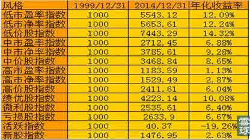

孙旭东在《聂夫之道中国行》中，参照约翰·聂夫的低市盈率投资法定量选股构建投资组合，年复合超额收益率为10\.38%，实验的结果相当不错。如果投资者使用格雷厄姆的方法建立一个符合财务标准的低PB组合，也能超过大盘和大部分投资者的收益。如果在低PE、低PB的基础上，对资产负债表的质量提出更高的要求，并且结合行业整体状况、公司行业地位、盈利状况、现金流等因素综合考虑，也许收益率会更高。打败大盘的方法很简单，七十年前格雷厄姆就已经写在书里了，而且这本书很多人都看过，根本就不是什么秘密，难就难在克服人性的弱点。因为无论在任何时候，人们总是能找出各种担心的理由，所以，虽然跑赢大盘的方法很简单，但是没有多少人会去使用，如果很多人都能轻易使用这个方法，那么这个方法也就无效了。雪球知名网友老股民于2014年11月1日建立“傻瓜组合”，将进一步对这一方法进行验证。

四、市盈率——判断大势的有效指标

人们通常关心的是指数的涨跌，其实指数只是一个表象，指数的涨跌从指数本身是找不出原因的。指数涨跌的原因在于其内在的价值发生的变化，没有内在价值变化为基础的涨跌在市场中也存在，但那不是主流，也不可能持久。那么内在价值是什么呢？用什么标准来衡量呢？内在价值就是上市公司可供股东长期分享的利润。衡量的标准有很多，最常用的就是市盈率。

市盈率通常有一个参照标准和范围，而指数则没有范围，所以要搞清楚指数是高还是低就必须看估值指标的高低。根据国际股市上的百年经验，熊市见底时的指数市盈率标准是10倍，牛市见顶时的指数市盈率标准在30倍以上，甚至可以触及40倍。A股市场有一条规律一直保持到现在，就是沪市整体市盈率总在20倍至60倍波动。从历史来看，不管上证指数如何涨跌，整体市盈率总是在20倍至60倍之间呈波动态势，沪指会呈现波浪式上升不断创新高，而市盈率不会，当市盈率回到20倍时，股市见底，一轮牛市即将展开；而市盈率涨至60倍，特别是冲到60倍之上，股市见顶，调整即将开始。因此，依据市场的平均静态市盈率，参考平均市净率，可以有效判断大波段、大周期、大趋势。（不用动态市盈率，因为是对未来数年的成长性在今日的一种透支且受盈利预期的影响十分大）。如果市场平均静态PE高于45，50时就高度警惕并着手减仓；若达到60则坚决清仓，哪怕以后PE再涨到80也不用考虑，因为这种做法风险小，顶多是少赚点钱。若市场平均静态PE低于20，可考虑少量建仓试探，低于15中级建仓，低于10大胆建仓。这个做法的问题是若遇到经济萧条，市场则常常会把平均静态PE打到你不敢想象的低位，就像牛市会涨到你不敢想象的高位一样，市场总是在矫枉过正中循环；另一个风险就是由于某种因素如预期好转、盈利好转，市场平均静态PE跌到20左右就不再向下，而是开始另一轮飙升，从而让你踏空。

当然，大盘的市盈率指标只能作为参考判断，而不能预测。泡沫的持续时间也无人可以预测到，譬如，当纳斯达克指数超过3000点时巴菲特公开呼吁“即将见顶回落”，而稍后纳斯达克越过4000点，让巴菲特大跌眼镜，巴菲特继续唱空；当纳斯达克超过4000点时，索罗斯公开呼吁“即将见顶回落”，而纳斯达克稍后越过5000点，这也让索罗斯十分吃惊……这时，主流舆论认定伟大的纳斯达克已经来到，这是一个令巴菲特、索罗斯过时的时代，一个勇往直前的时代。理性投资人除了认为估值太高，还看到在2000年3月美国“科网泡沫”破灭之前，已经不断出现的负面信号。诸如1999年至2000年间，美联储的多次加息，科技企业盈利下滑，大盘股震荡下行，微软陷入反垄断危机等。不过，假如见到负面信号就卖出股票的话，将会错失丰厚的利润，如纳斯达克指数在不到五个月时间里从2700点涨到了5000点。正如前美联储主席格林斯潘所说：“只有在泡沫破灭之后才发现是泡沫。”广发证券认为，“泡沫”的可怕之处在于，再多的负面信号也无法阻止其上涨的步伐，从而导致投资者的常规投资信念被摧毁，并对所有负面信息产生“免疫力”，以至于最终泡沫破裂的时候，根本没有防御能力。根据2000年初统计报道，美国公民信贷买股的比例达到了历史最高点，然而，一年之后，纳斯达克指数滑落至1500附近。

五、市场估值参考指标

衡量整体市场估值的指标，与市盈率同步的还有市净率、股息率、PEG等。如熊市底部市净率在2倍以下，历史上这6次底部均值为15\.31倍，平均为1\.76倍，破净股超过100只，具体估值过程中还可以参考以下几项指标。

__1\. 上市公司股票总市值占国民生产总值（GNP）的比率__

2001年巴菲特在美国《财富》杂志发表了一篇文章，提出一个非常简单的股市定量分析指标，即上市公司股票总市值占国民生产总值（GNP，中国GDP与GNP差距很小）的比率。“如果所有上市公司总市值占GNP的比率在70%～80%，则买入股票长期而言可能会让投资者有相当不错的报酬。”刘建位计算了1992年到2008年中国所有上市公司总市值占GDP的比率，结果发现，这个指标与上证指数几乎完全同步。2000年底股票总市值与GDP的比率创9年新高，达到48\.47%，上证指数年底收盘为2073点，也创9年新高。2005年股票总市值与GDP的比率创9年新低，仅有17\.7%，上证指数年底收盘于1161点，也创7年新低。2007年底股票总市值与GDP的比率创16年最高，达到127%，上证指数年底收盘于5262点，也创16年以来最高。2015年6月12日，A股总市值突破71万亿人民币，与GDP总值之比约为105%。从全球范围来看，虽然欧美成熟股市证券化率一般在100%上，而日韩等国一般在70%，每次股市证券化率超过100%之后都引发了泡沫破灭。A股2007年、美国2000年、日本1989年、中国台湾1990年、中国香港1997年股市高峰期市值与GDP之比分别为121%，172%，146%，176%，281%，核心区域是150%～200%。

__2\.产业资本增持__

历史上出现大规模增持时一般都是出现在大盘底部或阶段性低点。大规模减持时一般都是出现在大盘顶部或阶段性高点。在新浪财经、搜狐财经，都可以全部查到以前的和当天的指数，股票软件只能查到上季度的大股东增持股票的相关信息以及上市公司员工增持股票名单。从2005年和2008年的两次大规模的增持情况看，都是在市净率的低点发生的，大概3个月之后股市的估值都有一个回升的过程。

__3\.股票的绝对价格__

股票的绝对价格受两方面影响。一是股票价格，历史上6次底部大量股票创新低，一元股超过10只，牛市中大量股票创新高，百元以上的股票大幅增加；二是加权平均股价。上证历史上三次大底时加权平均股价统计（按当天各股收盘价计算），1994年07月29日，上证325点，沪深两市股票共有243只股票，加权平均股价3\.61元；2005年06月06日，上证998点，沪深两市股票共有1300只股票，加权平均股价4\.91元；2008年10月28日，上证1664点，沪深两市股票共有1583只股票，加权平均股价5\.43元；2013年06月25日，上证1849点，沪深两市股票共有2108只股票，加权平均股价5\.78元（不含创业板502支股票）。此外还有中位数、熊市出现明显无风险套利股票、可转债跌破面值等指标。

__4、\.参与市场交易的户数占比__

从中登公司的历史数据看，空仓数据并不能预示顶部底部，但交投活跃的程度却与顶部、底部高度相关。参与市场交易的户数占比越高，市场越活跃，股市见顶的概率也就越大，在市场底部区域，参与市场交易的户数占比非常低，市场极度不活跃的时候，也就是股市见底的时候。周参与交易的账户10%以下为低点，20%以上为高点。如同其他指标一样，这个指标只能是参照，并不能机械地运用。A股交易账户占比持续维持底部的现象并不常见，但是这并不意味市场可以立刻反转，2008年的大熊市中，当时该数据在10%以下维持了17周。

__5\.居民投资股票意愿__

作为国内最权威的经济意愿调查数据，央行每季度的调查报告往往与股市的涨跌形成某种对应。牛市中参与人数倍增，市场出现反技术的单边上涨，轧空专家，新投资者无往不胜，震撼人心的新理论与某重大事件结合，成为无人不知、无人不晓的全社会共识。投资者开户情绪高涨，新基金规模不断膨胀，2007年三季度有股票和基金意愿的居民占比为44\.3%，是有史以来的最高记录。2007年10月初，有意愿投资股市的人降至35\.8%。随后，股市在10月16日见顶6124点。此后，随着股市的下跌，居民投资股票、基金的意愿也在持续下降。2008年一季度为27\.6%，二季度为16\.8%，三季度降至历史最低点8\.2%。

__6\.新股发行情况__

牛市顶部都有超大规模的股票发行，熊市新股破发。牛市时，国家发行新股密集，新上市股票的市盈率升高。不管是2007年11月初计划募资377亿元的中国石油，还是2009年7月底计划募资405亿元的中国建筑，这些IPO历史大单都对当时沪、深两市的走势产生了深远影响。中国石油完成IPO之后，恰好成为上证指数2007年的历史顶部，中国建筑也凑巧成为上证指数2009年反弹行情结束的标志性事件。

## 第三章 投资利润是耐心的回报

__第三章 投资利润是耐心的回报__

成功投资的秘诀在于在安全边际内买入股票，高估后卖出。如果安全边际迟迟不来怎么办呢？那么只有两个字：等待，“伟大都是熬出来的”。由于市场交易群体的无理性，在不确定的时间段内，比如3至5年的周期里，总会等到一个比较完美的高安全边际，这就是你出手的时候。如果你的投资组合里累计了很多次这样的投资成果，从长期看，你一定会取得远远超出市场的回报。

钱在这里从活跃的投资者流向有耐心的投资者。许多精力旺盛的、有进取心的投资人的财富渐渐消失。如果你没有持有一只股票10年的准备，那么连10分钟都不要持有。拥有一只股票，期待它下个星期就上涨，这种想法是十分愚蠢的。

——巴菲特

一、投资就是一个不断等待的过程

买入靠耐心、持有靠信心、卖出靠决心。只有学会耐心地等待，才能在投资市场中获得丰厚的回报。

__1\.等待买入时机__

低价买入是成功的关键，股票高估时唯一能做的就是——等待。由于非常有利的时机很稀缺，所以发现这样的机会，既害怕接近，又担心其持续上涨而错失机会；既不能违反安全边际的原则，又需要准确把握企业的估值，也需要稳定的心理素质。这种等待可以说是一种煎熬、矛盾的心情比持股等待更艰难。然而正是这种等待才能保证我们做到“永远不亏损”。无论对企业多么了解，无论企业的基本面多么好，投资者都可能判断失误，也可能出现不可预料的突变因素。在安全边际下买入可以为我们的失误、不可预料的突变留有余地，从而避免亏损的发生。

__2\.持至高估卖出__

估值、买入、坐以待“币”！如果一开始做对了，后面就无事可做了。根据彭博的测试数据，买入并持有是23种交易策略中表现最好的，取得了142%的测试收益率。其他基于布林线和移动均线等指标的技术分析仅有14%的收益率。买入的不一定涨，很可能还会被套，但价值的成长与回归是确定的，人性的疯狂贪婪也会必然再次到来，虽然到来的时间是不确定的。如果选择了正确的公司，并在合理或者折价很多的情况下买入，那么大盘的涨跌或者个股的涨落根本就不必在意。《你为什么不能成为巴菲特》里提到，成功投资人最后、最重要、最少见的一项特质：在投资过程中，大起大落之中却丝毫不改投资思路的能力。大多数人不喜欢承受暂时性的痛苦，即便从长远来看会有更好的收益。

__3\.选择正确方向__

正确的耐心应当建立在正确方向的基础上，大势决定系统性风险。新手常犯的错误是，牛市中一路追涨杀跌，最后追到天花板，熊市中一直挨套捂股，最后杀到地板，过去的A股的经验是牛市中被套后死扛，这表面上看是熊市中“耐心”持股，但是大方向不对。这是因为缺乏对大势的基本认识或者被迷惑其中。除了牛、熊之外，绝大部分时间是方向不明的震荡市，此时需要等待，放弃小行情。

__4\.坚守能力范围__

深入的分析可以建立你的信心从而带来耐心，如果一个人没有主见，对事物不清楚就会不由自主地依赖外界的信息，胡乱操作，这是人的基本心理特征之一，由此可见对企业价值的把握是耐心的基础。巴菲特的高明之处在于，他深知自己的学识\\阅历有限，所以总是小心翼翼地在自己的能力范围内投资，不敢越雷池半步。最典型的例子是，作为比尔·盖茨的至交好友，巴菲特却没有投资微软公司，也从未投资其他IT类高科技公司，不管市场前景多好、机会多诱人，仅仅是因为他无法理解这个行业的经营范围与商业模式。学识、阅历、智慧高深如巴菲特，都坚守自己的能力范围，我辈又岂敢越雷池半步？为此，时刻提醒自己，要静静地守候，要坚持有所不为，放弃那些自己不能把握的，不属于自己的机会，市场的机会永远比现金多！

__5\.懂得放弃机会__

一般人急于把握机会，但高手则是学习放弃机会。一般人对于利润和风险，都是先评估利润，再评估风险，可是真正的高手是先评估风险，再评估利润。当对风险无把握时，“宁可错过，不可过错”。要懂得放弃一些机会，才能拥有更多的机会，放弃机会看似无为，其实无不为。孙子的先胜后战，先为不可胜，以待敌之可胜；曾国公安营扎寨打呆仗；巴老安全边际思想，无一不彰显了一种稳健、耐心、以守待攻、注重概率赔率权衡的战略思想。一个害怕失去机会的人，就会错过机会！人性往往这样，太害怕失去机会，就会忽略或不清楚自己需要怎样的机会，因为这时他处于期待状态中，而不是思考状态，所以忘记了自己等待的是什么，没有使自己处于一种局外观状态。知止而后能静，静而后能安，安而后能虑，虑而后能得。巴菲特印象最深刻的一次投资失败是用股权置换收购Dexter，后来巴菲特承认这次投资由于过于谨慎而导致失败。芒格提到应该使用杠杆收购，而不是股权置换，但巴菲特强调，过于谨慎导致再多的失败，也不愿意1%的不谨慎导致失败。

二、克服人性的弱点

长远看来，股票市场是对人性的最大的奖惩，正确的耐心不是来自于过去股票交易的简单总结，也不是建立在别人判断的结果上，而应当来自于对人性、自我的深刻认识。

__1\.市场是空的__

长期看股价是由内在价值决定的，但是流动性造成的供求变化和市场情绪导致短期内股价剧烈波动，用佛家理论讲这种短期市场波动是空的。作为价值投资者应专注内在价值，利用短期波动而不是迷失其中。其实我们真正需要努力的就是保持自己安定的心态，“心随境转则不自在，心能转境则无处不自在”。如果不能控制情绪，心随物转，心随“境”动，追涨杀跌，只能是随着幻化事物的最终消失而以失败告终，因为你追踪的始终只是物体的表象，而其内在的实质并未领悟。按照马斯洛的“自我实现理论”，一个人的成功是认真做人，专注于事件过程的副产品。投资所要关注的不是利润，而是必然会带来利润的投资标准和投资哲学，过于关注利润必然关注价格波动，于是带来情绪波动。巴菲特能战胜市场，是因为他“忘记”了市场，专注于企业。

__2\.市场愚弄人性__

市场是对人性的愚弄和折磨，牛市中往往面临过早卖出的痛苦，熊市中却面临过早买入的种种煎熬。市场总会培养你形成一种行为惯性，可等你改变的时候，市场也开始变了。熊市中学会操作短线，可刚刚熟练，牛来了；牛市明白应该捂股，可惜终于下定决心练起中长线来，熊市来了，这就是重复亏损的原因。“信心随价格波动”是投资界的经典理论，成功的投资方法，通常都要压抑人的心理需要和利益预期，而且需要较长的时间才会产生投资回报。

__3\.努力战胜自我__

交易最大的障碍是交易者自己。对于投资而言，首先，是认识自我；第二，认识真正的价值；第三才是认识二级市场的趋势。杰西·利维摩尔就是一位在技术层面已经达到极致的“高手”“匠人”，但与巴菲特这样的大师相比，却有着“道”的差距。心灵之道不仅比技术更重要，而且技术的正常发挥依赖于心灵。不能够“以道御术”，技术再高，终难免有朝一日会碰壁。

__4\.坚持信念原则__

做任何事，最重要的是要有坚定的信念，其次是在此信念下的策略，然后才是更具体的东西。首先，是有中国繁荣稳定的信念，才会有长期价值投资的策略；其次，投资股票就是投资企业，有了这样的信念，才会有不断逢低吸纳优质企业，长期持股的策略。

要坚持原则，坚决抵制诱惑，放弃看似“机会”的机会。长时间地经受市场的剧烈波动，会使得系统交易者产生各种各样的情绪波动，这需要交易者运用超强的意志去压抑自己的强烈的平仓获利了结的冲动。尤其是对目标品种盯盘时间久了不交易，会不自觉地降低标准、迁就市场、放弃原则，进行一场“先战后求胜”的劣质交易。如果以放弃原则为代价而赚取利润，不是说这次赚不了钱，但长期看来原则会发挥强大的作用，放弃原则而赚取的利润并不能长久。很多失败与能力无关，而是浮躁前忽略隐忍、困境中缺少韧性，只要挺住了、挨过了，成功迟早会现出真容。

只有偏执狂才能生存。

——英特尔总裁安迪·格鲁夫

谨慎选择时机是绝对必要的，操之过急则代价惨重，要有足够的耐心，不要总怕失去机会。每当我失去耐心，不是等待关键点的到来，而是胡乱交易企图快快获利的时候，就总是赔钱。

——利弗莫尔

三、控制自己的情绪

未介入股市的人往往会说：“低买高卖怎么会输钱呢？”主要原因是没能理智地控制自己的情绪。人是理性和情绪的混合物，在情绪的影响下人们往往形成转瞬即逝的看法来评估股票的价值，形成低买高卖的结果。

__1\.情绪的产生是必然的__

人类的贪婪、恐惧、焦虑都有生存价值，是无法控制、消灭、克服的。那是人性的一部分，正因为有贪、嗔、痴、慢、疑，人类才一代一代地繁衍。即使所谓的股市高手也会产生与正常人一般的恐惧、贪婪、不安、犹豫等情绪，希冀把自己培养成不产生“不良”情绪的“超人”，或者以为高手应该不产生不良情绪，这是天真但普遍的误区。小弗雷德·施维德在《客户的游艇在哪里》讲述的1929年股市崩盘前后的一个故事，成为经典写照。一个投资者在1929年初的财产有750万美元，最初他还保持着理智，用其中的150万购买了自由国债，然后把它交给了自己的妻子，并且告诉她，那将是他们以后所需的一切花销，如果万一有一天他再向她要回这些债券，一定不可以给他，因为那时候他已经丧失理智了。而在1929年底，那一天就来了。他就向妻子开口了，说需要追加保证金来保护他投到股市上的另外600万美元。他妻子刚开始拒绝了，但最终还是被他说服了。故事的结局可想而知，我自己在这方面也犯了不少错误。

__2\.强化意识避免情绪的不良影响__

市场从来不给人压力，压力来自于一个人对市场的情绪反应；市场也从来不强迫人操作，操作来自于一个人的信念系统。我们的灵魂里有两股力量：一阴一阳，或者一负一正，你的心是往哪边偏，这股力量就伴随着你往哪个方向偏。行为是由意识控制的，我们可以通过训练强化自己的正确意识来控制行为，避免情绪过分且直接地左右行为。我们无法拒绝人的本性，但我们总可以修炼另一种意识（理念、理性、原则、纪律等等）来遏制恐惧、贪婪、不安、后悔、犹豫等等不良情绪；在同样的情绪中不同的人有不同的操作思路与策略，我们不可能把自己训练成铁板一块来排斥情绪，而是把自己训练成在这类情绪之下依然有保证正确或相对正确的决策能力。打个粗鲁的比方，一位身心健康的男子汉面对一群漂亮脱衣舞女的挑逗，要不产生情绪是不可能的，但是，保持绅士风度，尤其不可像强奸犯般失去理智，才是你能够做到的。所以，必须做的是强化控制意识，克制情绪，从而控制行为。

在股票市场，强大的神经系统比聪明的头脑更重要。

——费雪

长年进行成功的投资并不需要极高的智商、罕见的商业洞见或内部消息。真正必要的是做决策所需的合理的知识框架，以及避免情绪化侵蚀智识的能力。

——巴菲特

__3\.避免情绪的不良影响，最好方法是远离市场__

这位绅士（如果他想成为真正的绅士）也许绝对不会给脱衣舞女挑逗自己的机会，就像我们也可以选择远离市场，不给市场让我们恐惧和贪婪的机会一样。巴菲特的高明之处在于，他从一开始就选择奥马哈，远离华尔街，远离市场。巴菲特初学投资的时候，也曾逐利撕杀、驰骋畋猎，他深知市场的情绪对投资者的影响。面对疯涨的市场、似乎无限的机会，人的贪欲难免膨胀；面对暴跌的市场、恐慌的人群，人的理性难免丧失。巴菲特坦然接受人性的恐惧与贪婪，理性地选择远离市场、远离人群。他深居简出、行为低调，很少与他人商讨自己的投资决策，是一个真正的独行侠。远离市场的投资者往往怕踏空，然而，巴菲特也没有踏空反而把握得更好。

__4\.学会接纳情绪__

真正的高手学会了如何与这些情绪和平相处，发现它们的存在、发现它们开始活动时，就接纳它们，在心灵中，给予它们适当的位置，这样，才能最大限度地避免它们对理性思考的干扰。

做投资快17年，如果问我面临的最大挑战是什么，我感觉是：停止总是想做一些动作的想法是最难的。又比如，我以前在怕的时候也想卖掉股票，涨的时候也想贪赚快钱而追高，但做投资最重要的是戒贪、戒怕。换言之，战胜人性中根深蒂固的弱点是最难的事。

——李驰口述

__5\.学会利用情绪__

这种情绪可以使高手体验正常人应有的情绪，并据此帮助其体验且理解市场。在别人贪婪、恐惧的时候利用市场，一切投资方法的本质，都应围绕人性的恐惧和贪婪所提供的市场机会而采取行动。

日本近代有两位一流的剑客，一位是宫本武藏，另一位是柳生又寿郎。

当年，柳生拜师宫本。学艺时，向宫本说：“师傅，根据我的资质，要练多久才能成为一流的剑客？”宫本答道：“最少也要十年吧！”柳生说：“哇，十年太久了，假如我加倍苦练，多久可以成为一流的剑客呢？”宫本答道：“那就要二十年了。”柳生一脸狐疑，又问：“假如我晚上不睡觉，夜以继日地苦练呢？”宫本答道：“那你必死无疑，根本不可能成为一流的剑客。”柳生非常吃惊：“为什么”？宫本答道：“要当一流剑客的先决条件，就是必须永远保留一只眼睛注视自己，不断反省自己。现在，你两只眼睛都只盯着剑客的招牌，哪里还有眼睛注视自己呢？”柳生听了，满头大汗，当场开悟，终成一代名剑客。

股道如剑道，希望成为一流的剑客，却将所有的精力关注赢利目标时，受市场的刺激和诱惑，情绪常常会随着市场跌宕起伏，心态会逐渐丧失宁静平和，最终，反而事与愿违。永远要保留一只眼睛审视自己，透视自己的投资心态，检点自己的趋势判断是否客观，操作策略是否偏颇，总结反省自己的经验教训，提醒自己不要忘记胜利后所隐藏的凶险；当投资失败时，提醒自己从大局出发，选择摆脱困境的正确道路。

四、避免噪音影响

投资简单但不容易，在这个长期的过程中你要异乎寻常地遵守纪律、耐心等待，克服各种因素的干扰。

__1\.信息影响__

炒股的心态与你和人群和市场的距离成反比。投资者应当少看盘，甚至不看盘；慎交友，远离只关心股价涨跌的股友；慎上网，远离人气超旺的投资博客圈。身处整个市场当中，每天受到太多噪音的影响。基本上很少有人不受这些信息的干扰，层出不穷的数据、众说纷纭的评价，资讯越是发达，负面影响就会越大。这是个信息爆炸的时代，很多人可以通过网络很快就产生自己在各行各业都是专家的感觉，其实是我们在海量的信息里找到的以为是真相的内容很多都是广告。比如江恩的成名就是商业策划的结果，一位财经编辑曾披露过当年他们和江恩一起策划“股神”事件的经过，包括如何炮制“惊人的成功预测”案例，如何宣传等等。最有说服力的是来自江恩儿子的话：如果我老爸的方法果真这样神奇，为什么到现在我还只能靠做股票经纪人，领取微薄的佣金生活？大凡图文并茂，看后让人热血沸腾或者惊魂未定的作品，基本都是专业写手的作品，然而很多时候我们是身处其中而不得知，甚至是有点扬扬得意。我们太过于关注短期的一些数据，并臆想其对未来经济可能产生的影响，进而可能会影响到股市，再进而会影响到自己手中的个股，再进而来决定自己的买进或者卖出，就这样在市场中疲于奔命。

__2\.个股影响__

在漫长的熊市和牛市中，总会有一小部分股票逆势而行，它在熊市中起着暗示的作用：你亏本不是市场的问题，而是你选股票有问题！在牛市中它起着警示的作用：股票市场随时有风险！这些逆势上扬的股票在做着一个示范效应：你手中的股票在赔钱的时候，别的股票在盈利，赶快换股吧！先动摇你，再诱惑你，让你发狂，最后，终于接棒了。当你最后认为自己死抱着一只股票不放是非常愚蠢的时候，经过反复思想斗争决定换成市场上上升的股票时，你就已经落入了庄家为你准备的另外一个圈套：你割肉的股票开始飙升了！还有的纯属噪音类型的、浮浅的波动，比如，李天一被抓，天一股份跌6个点；放开独生子女二胎，人福医药跌停！2月14日情人节，东方宾馆涨停，海南橡胶大涨；奥巴马连任美国总统，澳柯玛涨停！！！

不要追赶机会，他就像公共汽车，错过了一班，还有下一班，交通安全最重要。

——彼得林奇

__3\.情绪影响__

人性讨厌风险，所以小赚就跑，小亏则不忍割肉；发财心太急，所以下注就大，所以赔光也就很快；好自以为是，执着自己的分析，忽略了股票的真实走势；好跟风，常常丢掉自己的原则；好报复，所以犹如赌徒一般，输了一手，下一手下注就加倍，再输，再加倍，于是剃光头的时间又加快了。在动荡中，保护好心灵的简单，牢记“慢就是快”，因为要走得更远。一般人追求“快”，那是因为内心的浮躁。当思想水平达到较高境界的时候，就会追求一种“慢”，那是因为内心的淡定。其实，追求“慢”并不是懈怠，而是追求“天人合一”状态下的舒缓，是主体与客体在节奏和“频率”上的协调，是千里之行始于足下的踏实和稳健，所以，慢是一种有节奏感的实现过程。

五、建立长期投资理念

炒股像泡妞，真正高手不是天天追着女孩子，而是让女孩子天天追着你。把事情做好，利润便水到渠成，这个过程只是长一点或短一点而已。从心理学上看，短线操作大多源自希望自己的欲望马上获得满足（instant gratification）的天性：如果有收获的话，那最好要马上有收获；如果没有收获的话，那最好要马上有结果。生活中酗酒无度的、嫖娼乐此不疲的、吸毒不顾死活的、玩电游没完没了的，都是这种“希望自己的欲望马上获得满足的天性”使然。只有极少数人通过艰苦的学习和训练，最终掌握了“推迟满足感”的能力，形成长期耐心投资的理念，可以平静地承受下跌的打击和上涨的诱惑；更有甚者，可能会因为耐心而感觉不到打击和诱惑的存在。投资者应该学会努力克服人性中追求暴富的弱点，从一个短线投机客尽力转变为坚定的长线投资者。

股票投资要成功，“快”不如“慢”，“狠”不如稳，准”不如“忍”。治本之道，就是反向\+成长\+时间=价值。

——冷眼

短线的坏处，第一，在于心理上滋生浮躁的心态，一个最容易满足同时又最不容易满足的混乱心态，一个如此没有内定的人，会过于敏感地对待赚钱活动中的一切细节，过于紧张地计算，过于匆忙地反应，过于强烈地行动。结果，从思维方式到行为层面选择的全面“过度”，“理性”就变成了“不理性”。第二，短线培养的是鼠目寸光。做股票没有大视野是不行的，你站得太近，前面是金山你看不见，只见一地的碎银子；或者下面是万丈深渊你也不见，还是专注于那一亩三分地，就算捡了一筐碎银子，也小有成就感，但是错一次就连筐带人一起砸了。第三，短线伴随着赚钱的热情。人们容易忽视市场的客观规律，更愿意相信，通过努力，通过投入，通过精巧地设计和安排，或是通过一些不合道理或不合规则的方式，就一定能够赚到钱，特别是赚到大钱。第四，账户交易过多，增加交易成本；交易数量的上升必然导致交易质量的下降。第五，确实有短线高人，但那是经历无数次磨砺而其个性又很特别的人，这是极少数的个例，绝不是一般人可以仿效的，而且，他们的大限是资金量不能过大，否则也不好做。

长期持有理念并不是说硬性的持有股票不做变动，而是选股买进或持有的依据是长期条件，以比较极端的安全边际内的长期情况作为买卖重要依据！《佐罗投资札记》认为这样做好处有五。好处一：不被市场短期波动、短期信息扰乱神经，避免了做出一时冲动之举。当别人手忙脚乱的时候，你却非常从容。好处二：长期持有理念，讲究安全边际的介入，因此长期来看大部分时间是获利时间，可以有充分时间在关键时候做仓位的调配或优质股的研究取舍工作。好处三：因为长期持有理念迫使你选股选时更加精细，考虑问题更加长远，风险控制更加容易落实。好处四：长期持有理念要远离喧嚣投资人群，比较容易清醒地认识市场，孤独的投资获胜概率会更大一些，会更充分享受一轮大的牛市带来的巨大收益。好处五：长期持有理念一般选择是长期成长的优秀股票和企业，因此保证你有充分的睡眠休息娱乐时间，保证你精力充沛地更好研究企业，是财富与健康双修的最好选择！如果你坚持保守投资三年以上，你会发现除了账户收益外，你赚得更多的是那种从容不迫、运筹帷幄的快乐，是数年来不断累积的持续快乐。

六、约翰·聂夫成功的投资经历

约翰·聂夫几十年如一日，不管身处牛市还是熊市，不管是科技股升入云霄还是消费类股坠入深渊，不追逐时尚，咬定青山不放松，只坚持低市盈率选股标准买入股票，在别人欢呼时冷静，在别人恐惧时镇定。这种做法显得很呆板，似乎显现不出大智慧，很难得到大众的追捧和掌声，所以注定是孤独的事业。但成功的投资就是这样的呆板和简单。“华尔街的喧嚣无法扰乱我们的节奏，低市盈率投资虽然沉闷乏味，但始终是我们坚守的阵地。我们没有什么了不起，不过是有一些眼光，能够坚持己见而已。市场的流行观点只能充当我们的参照，但绝不可动摇我们的投资决定。”看起来如此简单的投资方法，实行起来并不容易，不仅长期坚持很难，还要面对心理上的艰难挑战。聂夫说：“我喜欢购买被冷落的股票，这种方法对我来说自然而然，但仅此还不足以战胜市场，成功还需要足够的恒心。当流行的观点说你错了的时候，你需要不为所动、坚持己见，这可不是本能或天性，相反，这是和人的天性相抵触的。”从心理学角度来说，与大众一致是心理上最轻松的选择，与大众相反则要遭遇心理煎熬。

低市盈率选股方法能够成功，在某种意义上说，应该感谢的是那些频繁的每日交易者。他们盯着电脑屏幕，不去设法了解公司的主营业务，对公司基本面毫无认识，对于市场上的大量信息无从取舍，没有耐心加工整理这些信息并做简单的逻辑推理，只是凭借交易提示和肤浅认识进行买卖，他们不能对公司、行业、经济趋势做基本的分析，成为盲目的投机者，故而他们哄抢的股票常常是别人的残羹剩饭，而恰恰把那些值得投资的好公司股票以低市盈率的价格奉送给了像聂夫这样的投资者。令人忧心的是，这样的局面随着电子化交易的便捷，不是减少了而是加重了。正如聂夫说的：“天真的投资者总梦想着一夜暴富，但那永远是可望而不可即的事情，对于这部分投资者，我们是最富感激之情的。我们这个国家过去是，现在是，而且很可能以后一直会是一片投机者的乐土。”投资和投机的区别不是哪个国家哪个市场的区别，而是一部分人理性，一部分人不理性的区别，或者说理性控制情绪还是情绪控制理性的区别。

七、佛教故事：做空再做空

佛教讲：四大皆空。佛下山游说佛法，在一家店铺里看到一尊释迦牟尼像，青铜所铸，形体逼真，神态安然，佛大悦。若能带回寺里，开启其佛光，记世供奉，真乃一件幸事，可店铺老板要价5000元，分文不能少，加上见佛如此钟爱它，更加咬定原价不放。佛回到寺里对众僧谈起此事，众僧很着急，问佛打算以多少钱买下它。佛说：“500元足矣。”众僧唏嘘不止：“那怎么可能？”

佛说：“天理犹存，当有办法，万丈红尘，芸芸众生，欲壑难填，得不偿失啊，我佛慈悲，普度众生，当让他仅仅赚到这500元！”“怎样普度他呢？”众僧不解地问。“让他忏悔。”佛笑答，众僧更不解了。佛说：“只管按我的吩咐去做就行了。”

第一个弟子下山去店铺里和老板砍价，弟子咬定4500元，未果回山。

第二天，第二个弟子下山去和老板砍价，咬定4000元不放，亦未果回山。

就这样，直到最后一个弟子在第九天下山时所给的价已经低到了200元。眼见着一个个买主一天天下去、一个比一个价给得低，老板很着急，每一天他都后悔不如以前一天的价格卖给前一个人了，他深深地怨责自己太贪。到第十天时，他在心里说，今天若再有人来，无论给多少钱我也要立即出手。

第十天，佛亲自下山，说要出500元买下它，老板高兴得不得了———竟然反弹到了500元！当即出手，高兴之余另赠佛龛台一具。佛得到了那尊铜像，谢绝了龛台，单掌作揖笑曰：“欲望无边，凡事有度，一切适可而止啊！善哉，善哉……”

2026年2月13日

20:49

## 第四章 中线操作原则

__第四章 中线操作原则__

世上万事万物都有兴衰枯荣，我们不能预测市场和个股具体什么时候涨与跌、涨到什么价位与跌到什么价位，但是““市场十分高时和十分低时，我是知道的，其他大部分时间我也不知道市场会如何演变。””也就是说，我们判断大的周期进行中线操作还是可以的。

一、中线操作符合市场钟摆规律

__1\.市场就是重复的钟摆__

被誉为“投机之王”的利弗莫尔直言：“股市今天发生的事以前发生过，以后也会发生，华尔街没有新鲜事。”股票市场就是简单重复的钟摆，大跌之后的上升趋势最具确定性，大涨之后的下降趋势也最具确定性，除市场极度疯狂和极度恐慌阶段，其他时间无法知道市场的走向。但是贪婪与恐惧就是这钟摆对称的左右两边，在左边时市场高估，在右边时市场低估，所以取得最终胜利的关键在于克服人性的弱点，进行逆向投资。霍华德·马克斯在《投资最重要的事》中说：“极端市场行为会发生逆转。相信钟摆将朝着一个方向永远摆动——或永远停留在端点的人，最终将损失惨重；了解钟摆行为的人则将受益无穷。这种摆动是投资世界最可靠的特征之一。”

__2\.市场钟摆需要时间酝酿__

到达钟摆两端需要很长一段时期，在在这段时期内要学会忍耐和等待。投资过程中大多数工作不是由投资者自己完成的，而是由时间来完成的——发酵有个过程，这是自然规律。任何压榨时间，试图在短期内获取暴利的行为都是把自己暴露在风险中，都是对时间的亵渎，因此最终必然受到时间的惩罚。而那些敢于忽视时间，敢于追求长期平均利润的人才是真正聪明的人。科斯托兰尼说，买入要浪漫，卖出要现实，两者之间要睡觉。在利空满天飞的枪炮隆隆声中入市，没有大无畏的浪漫主义情怀做不到；在“黄金十年”的喜庆气氛中离场，没有现实主义精神控制情绪做不到；在比赛谁涨得更快的疯狂市场中持股不动，不离开市场去睡觉也做不到。只要大的方向是正确的，无论市场怎么走、别人怎么说，什么都不要做，睡觉去。投资虽方法简单但不容易，难就难在如何找到去睡觉的时机，更难得是找到睡觉的时机却不相信自己的判断而整天失眠。最难的是找到了简单的方法，坚持下去，比如空仓就像端着一个空碗，很简单，一分钟、一小时都很简单，要是一个月、一年会怎么样，所以只有非凡的毅力才能最终取得胜利。“糖果实验”中面对别人吃糖时候的诱惑、其他小朋友的取笑，最终可以抵制诱惑、坚持原则与信念是很难的。成功的秘诀就是忍无可忍的时候，再忍一忍，才能“百忍成金”。

__3\.只把握大的投资机会__

做投资要看大势，不赢小利，在市场有大机会的时候再介入；赚了大钱后，应该选择休息和学习，以寻找新的市场机会。一日画画、一年卖画，不如一年画画、一日卖画。每天预测涨跌的准确性与两年预测一次趋势的准确性不可同日而语。用足够的耐心来等待机会，学习足够的知识来把握机会，尽管判断很难，但是一旦决定了就要执行到底。只要“中长周期”力量向上运行，则可以不管“短周期”的调整，可以持续持股，获得更高的收益。而在“中长周期”力量向下运行时，则可以不管“短周期”的反弹，可以持续空仓。很多投资者的失败，就是在“中长周期”力量向上的时候怕跌，没有持股，早早获利了结；在“中长周期”力量向下的时候，没有空仓观望，试图抄底，则往往抄在了新一轮下跌的开始，造成被套。机会每天都有，但绝大多数这样的机会是小机会，甚至不叫机会，只有值得重仓买进的机会才叫机会，大机会不常有，我们应终生等待这样的市场机会。每次的金融危机都将消灭一批人，但同样也有人抓住机会让自己的财富呈几倍甚至几十倍的增长。巴菲特一生的操作次数是可以数得过来的，每个人的一生中，都会碰到几次钟摆到极端的大好机会，能否及时把握这千载难逢的良机，就得靠平常的努力与身心的磨炼。理论与实践的结合，再加上持久的思考训练，可以增加成功的概率。

世界经济史是一部基于假象和谎言的连续剧。要获得财富，做法就是认清假象，投入其中，然后在假象被公众认识之前退出游戏。凡事总有盛极而衰的时候，大好之后便是大坏，重要的是认清趋势转变不可避免，要点在于找出转折点。

——乔治·索罗斯（George Soros）

二、中线操作适合投资能力范围

中线操作的大波段是对生命、兴衰更替、人性的透彻了解之后的一种有效的投资方法。长线、中线、短线都有成功的案例，但是从一般投资者的能力范围来看，中线操作成功的概率较大。

__1\.短线的操作可以获得暴利但是并不适合每个人__

大多数人并不具备短线操作的天赋，短线操作试图抓住每个机会，会影响自己的心态，账户交易过多，增加交易成本。格雷厄姆时代的成功，是因为别人都很愚蠢；巴菲特时代的成功，却是别人都太聪明了。投资圈内、社会上大多数是猴性十足的“聪明人”，对短线操作乐此不疲，熊市喜欢抄底在底部反而看空，真正的底部是割肉割出来的；牛市热衷于逃顶在顶部反而看多，真正的顶部是踏空踏出来的。而且抄底逃顶，牛顶看多、熊底看空的往往是一类人，只要时间足够长，这号人肯定亏钱。而我自认为生性愚钝，选择一辈子当“巴菲特时代的一头猪”，只是老老实实地做个普通人，发现牛市来临，买入并持有，直到市场出现明显的泡沫离场；对自己资金负责的高度责任感，对小概率事件、小机会等高难度动作拒之千里，漫漫熊市无聊地守着一堆钱，无尽的牛市无聊地守着一堆股票，除了极偶然的时候需要买卖一下，更多的时候就像没有终点的长途汽车上的乘客，看着窗外众生抄底和逃顶的表演。然而令我欣慰的是有很多成功的投资人看上去也都呆呆傻傻的，不那么聪明。

__2\.长期持有股票须深刻认识股票价值__

一般投资者缺乏寻找“皇冠上明珠”的能力，寻找永久持有的企业并不比波段操作容易。巴菲特非常喜欢引用他的导师格雷厄姆的一句名言：“市场短期是一台投票机，但长期是一台称重机。”市场长期是一台称重机，这需要明确两个关键点：第一，巴菲特所说的长期是十年。他认为，如果不想持有一只股票十年，就不要持有十分钟。第二，称重机给公司称的是公司经营业绩，也就是盈利。我是心悦诚服地欣赏价值投资：优秀企业\+4毛钱的价格，可是这要操作起来难度极大，更不敢持有十年，或者说我只能以持有十年的态度来选股票，但是不敢真正跨越市场周期来长期持有。什么是优秀企业？护城河、研发能力、优秀经理人、持续竞争力等等方面看起来很美好，可是好多都是企业最终成为优秀企业，才被总结出优秀企业的特点，到那时已经稳定了、成熟了，却不具有太大的成长性了。估值有很多方法，而且既是科学也是艺术，也与人生阅历及判断力有关。你怎么知道当其在市场上的交易价格为4毛钱时其真正的价值为1元？而且这是动态估值还是静态估值？判断大波段比判断优秀企业还要容易些、概率还要大些。当然，估值很难并不意味着要放弃价值投资，相反，我们要以价值为基准判断趋势和波段，在大盘的低估期间买股票。我们可以大致感知市场，正如“价值投资之父”本杰明·格雷厄姆（Benjamin Graham）所言：你无须知道一个人的确切体重，就可以判断这个人是否肥胖。如果大盘处于调整期，那么坚决不要买股票，清仓是最好的选择。像巴菲特2003年4月开始买中石油，过了4年又全卖了，他是做波段吗？是的，但他做的是价值的波段，而不是价格的波段。就A股而言，市场平均市盈率超过50，60时，就退出，低于20最好是低于15时就进入，然后就不管，保准赚大钱。就个股而言，低谷进，高峰出。

__3\.中线操作的大波段不是投机__

这与一般意义上所讲的抄底、逃顶不同，中线操作是通过价值判断等待买入和卖出的临界点。在物理学中，临界点指由一种状态变成另一种状态前，应具备的最基本条件。而在投资理财中，由于需要遵循经济周期，每个经济周期发生反转的时期会有类似“临界点”的现象出现。市场是变幻无常的，这个临界点可能在很长一段时期都达不到，也可能过了临界点之后钟摆继续摆向两端，对此我们无法预测，能做的就是在地板和天花板的临界点建仓或卖出，至于地狱是否还有十八层，天外是否有天，都不是我们能把握的事。1999年7月，巴菲特在太阳谷年会公开演讲看空科网股，然而，最后纳斯达克又涨了70%多，直到2000年3月才见顶。2008年10月他公开在报纸上发表文章，买入美国，但美股实际在2009年3月才见底，又跌了27%。没人真能猜到顶和底，有时你真猜到美股的底了，也没用，比如美股在2009年3月才见底，但港股实际很多股票在2008年10月就见底了，何必为自己不能把握的东西烦恼，只能通过资金管理、分步建仓来应对，谋事在人成事在天，一切坦然面对。

三、股市周期的实证研究

__1\.十年一轮回__

中国的“大政治周期”（主要是指党与政府领导人的更换）大约是每10年一次，这决定了中国股市可能存在10年一个轮回的规律。凡是领导人一更迭，股市就会先探底，然后发生一段牛市行情，因为，国务院总理和证监会主席需要深入基层考察后，才可能对经济、股市问题发表有关看法，制定有关政策，股市则根据新的经济、股市政策，产生一轮新牛市。之后钟摆效应发生作用，股市就偃旗息鼓，陷入漫长的熊市。

__2\.四年一周期__

股市的波动之源来自于宏观经济运行和政策影响：“4到5年，经济紧缩必来一次”。宏观调控每隔四到五年就会呈现类似的“过冬景象”，这些年份分别是1984年、1989年、1993年、1998年、2004年、2008年、2014—2015年。中国股市如果剔除人为因素的人造行情，基本4年一个周期，其中1\.5年牛市，2\.5年熊市。程国有教授认为，股市运行的“规律”，还不如说是我国宏观调控的规律。这个“规律”的存在还说明，政策之手对股市的干预太深了，我们的股市还远远没有摆脱“政策市”的窠臼。中国股市已经经历了五轮完整周期，正在进行第六轮周期。

第一轮周期是1992年初至1995年底。1992年初启动牛市一直持续到1993年２月结束，然后，尽管中国经历了３年的严重通货膨胀，但股市总体上处于漫漫熊市，一直持续到1995年底。

第二轮周期是1996年初至1999年底，1996年启动新一轮大牛市一直持续到1997年5月，然后，伴随着中国经济进入通货紧缩，中国股市总体上处于熊市状态，一直持续到1999年底。

第三轮周期是2000年初至2005年底。2000年初启动新一轮牛市一直持续到2001年５月，然后，伴随着中国股市有关全流通改革政策的讨论和即将实施，中国股市进入了持续约４年半的熊市，直到2005年底。

前两轮中国股市周期是四年，牛市时间一般持续约1\.5年，牛市结束时间分别在1993年2月、1997年5月和2001年５月，在四年一轮的大牛市中，本来2004－2005年是新一轮大牛市，但是由于股权分置改革问题，继续探底此轮牛市被推延到2006年初才开始启动。

第四轮周期是2006年初至2008年底。2006年初启动一轮大牛市，虽然上证指数于2007年10月见顶，但是看个股基本都是5月见顶，后期是蓝筹股的行情上涨周期仍然是1\.5年。2008年10月启动因为4万亿投资，下跌只有1年，打断了持续2\.5年的下跌周期。

第五轮周期是2009年初至2012年底。4万亿投资彻底打乱了牛熊周期，上涨只有10个月左右，但是带来漫长的下跌期，典型的牛短熊长。2012年本轮正常周期结束后，一些传统行业继续踌躇不前，但是作为新兴产业的创业板从2012年底踏上了漫长的上涨之路。

2013年初至2014年中是传统产业下跌与新兴产业上升的过渡期。

第六轮周期始于2014年中。2014年中三大板块终于实现共振，开启大牛市，但是在杠杆的作用下，以及诸多的政策干预，牛市只维持了1年，新形势下的周期于何时结束，让我们拭目以待。

__3\.一年半一行情__

从四年一周期的思路出发，已经可以得出上升1\.5年的结论。参照网友灵机道人对上证指数的长期周期分析的具体思路，我对A股的周期进行了进一步梳理。

__第一阶段：__1990年12月95\.79点始——最高1429\.01点——1994年7月325\.89点止，上升18个月，下跌26个月，合计44个月，接近5年，为第一个循环。

1994年7月325\.89点始——1996年1月512\.83点，是一个过渡期，18个月，是一个超跌后修正时期。

__第二阶段：__1996年1月512\.89点始——最高2245\.44点——止于2005年10月1067\.42点，上升65个月，下跌52个月，合计117个月。

中间有几个子周期。

1996年1月512\.83点始——最高1510\.18点——止于1999年5月1047\.83点，上升17个月，下跌25个月，合计41个月。

1999年5月1047\.83点——2001年6月最高2245\.44点，上升26个月。

2001年6月2245\.44点——2003年1月1311\.68点，下跌18个月。

2003年1月1311\.68点——2004年4月1783\.01点，上升15个月。

2004年4月1783\.01点——2005年10月1067\.42点，下跌期19个月，因为有底部过程，（没有确认2005年6月998\.23点为节点），就像前面不取1339点和1307点而取1311点一样。

__第三阶段：__2005年10月1067\.42点——2014年7月。

2005年10月1067\.42点——2007年10月6124\.04点，上升24个月。这里有个问题，就是6124点是指数的最高点，却不是个股的普遍最高点，个股的最高点普遍是2007年5月底，这就出现一个更合理的分法。

2005年10月1067\.42点——2007年5月4335\.96点，上升19个月。

2007年5月4335\.96点——2008年10月28日1664点，下跌17个月。

2008年10月28日1664点——2009年8月4日3478点——2010年7月5日2363点，上升10个月，下降12个月。

2010年7月5日2363点——2011年4月18日3057点——2012年12月4日1949建国底，上升10个月，下降20个月。

2012年12月4日1949点——2014年7月21日2054点，过渡期19个月。

__第四阶段：__2014年7月21日2054点至今。

2014年7月21日2054点——2015年6月12日5178点，上升11个月。

2015年6月12日5178点至今，已经下跌9个月。

总结几个规律：①18个月（一年半）周期。看到周期里面很多数据接近18个月，可见18个月是非常重要的周期，13个月和26个月是另外两个重要的周期。总地来说，一年、一年半、两年是三个重要的周期。②形状左右对称，快速的上涨后对应快速的下跌，缓慢的上涨后对应缓慢的下跌。快慢交替，快速周期和慢速周期交替进行。快速周期与慢速周期中间有过渡阶段。③大行情的结束一般在年中，如2015年6月12日5178点、2007年5月4335\.96点、2001年6月2245\.44点。④下跌周期长于上升周期。

四、巴菲特中线操作故事

巴菲特一生遇到过四次股市暴跌，其中三次S&P500[\[1\]](file:///C:/Users/yanfu/AppData/Roaming/OneNoteGem/OneNoteBatch/Tmp/OEBPS/Text/#note2n)指数跌幅过半。巴菲特的经验教训可以归纳为三个字：要淡定。

__第一次，1973年1月到1974年10月暴跌50%。__

1973年1月11日，S&P500指数最高121点，1974年10月4日，S&P500指数最低60点。股市暴跌，就像发生火灾一样，所有人都想赶快逃离，纷纷不计成本，低价抛售。巴菲特却非常淡定，从从容容出手，大胆买入。他早在1969年9月就退出股市，然后一直抱着现金，等待估值过高的股市暴跌。连他自己也没有想到，虽然一年之后的1970年5月26日股市最低跌到68点，但又迅速反弹，连续上涨两年多，1973年1月11日，S&P500指数最高121点，之后才开始下跌，直到1974年10月4日，S&P500指数最低60点。巴菲特等待暴跌，一等就是5年。等了那么久，终于到了出手的时机。巴菲特在接受《福布斯》的记者访问时说：“我觉得我就像一个非常好色的小伙子来到了女儿国。投资的时候到了。”

这次巴菲特面对暴跌的启示是：不要低估市场的疯狂，高估值持续的时间可能很漫长，等待市场恢复理性的过程不会一帆风顺，其间要淡定，有耐心，因为可能要等上几年。

__第二次，1987年8月到1987年10月暴跌36%。__

这一次股市跌得快，反弹也快，结果巴菲特只能遗憾没有时间“让子弹飞”。面对暴跌匆匆而来又匆匆而去的投资机会，巴菲特仍然非常淡定，因为他相信下一次机会还会来，只要耐心等待。在1987年度致股东的信中，巴菲特回顾大跌：“对于伯克希尔公司来说，过去几年股票市场上实在没有发现什么投资机会。1987年10月，确实有几只股票跌到了让我们感兴趣的价位，不过还没有买到对组合具有影响意义的数量，它们就大幅反弹了。”“到1987年底，除了作为永久性的持股与短期套利的持股之外，我们没有其他任何大规模的股票投资（5000万美元以上）。不过你们可以放心，市场先生将来一定会提供投资机会，而且一旦机会来临，我们十分愿意也有能力好好把握住机会。”

这次巴菲特得到的启示是：有时暴跌来也匆匆去也匆匆，让你无法抓住抄底良机，对此同样要淡定，不要因为试图把握住每一次机会而自责甚至投资行为失控。

暴跌后的第二年机会来了，巴菲特开始大量买入可口可乐，到1989年，两年内买入可口可乐10亿美元，1994年继续增持后总投资达到13亿美元。1997年底巴菲特持有可口可乐股票市值上涨到133亿美元，10年赚了10倍。

__第三次，2000年3月到2002年10月暴跌50%。__

巴菲特早就预言，科技网络股推动的这波股市大涨后泡沫必然破裂。尽管股市三年跌了一半，巴菲特却并不急于抄底，因为他想买的很多股票还不便宜。2002年度致股东的信中，在暴跌之后，巴菲特依然非常淡定：在股票投资方面，我们仍然没有什么行动。查理跟我对于伯克希尔公司目前主要的持股感到越来越满意，因为这些公司的收益在增长，而与此同时市场对其估值却进一步降低。不过现在还无意增持这些股票。虽然这些公司的前景良好，但我们并不认为其内在价值被市场低估。同样的结论也适用于大多数的股票。尽管股市连续3年下跌，从而大大增加了股票的吸引力，但只有很少的股票能让我们稍有兴趣而已。这一令人不快的事实正好表明了在大泡沫时期股市对于股票的疯狂高估。不幸的是，狂饮的酒越多，宿醉的夜越长。“查理跟我现在对于股票退避三舍的态度，并非与生俱来的。我们热爱拥有股票，如果是以具有吸引力的价格买入的话。”“在我61年的投资生涯中，其中约有50年中都有这样的机会出现。今后也一定会有很多类似的好年份。但是，除非发现至少可以获得10%的税前收益率（缴纳企业所得税后6\.5%～7%的收益率）的概率非常高时，否则我们宁可闲坐在一边观望。”2003年巴菲特终于开始出手，买入中石油，2005年大量买入，投入股市资金规模从2002年底的90亿猛增到160亿。

巴菲特第三次面对暴跌的启示是：暴跌后有些股票未必便宜，抄底也要淡定。因为即使是股市大跌一半，并不代表你想买的股票也大跌，而且有些股票即使大跌也未必便宜。

__第四次，2007年10月到2009年3月暴跌58%。__

在市场恐惧气氛最大的时候，2008年10月17日，巴菲特在《纽约时报》上发表文章，公开宣布：我正在买入美国股票。在文章中他再次重申他的投资格言：在别人贪婪时恐惧，在别人恐惧时贪婪。他在2009年度致股东的信中说暴跌时要贪婪到用大桶接：“如此巨大的机会非常少见。当天上下金子的时候，应该用大桶去接，而不是用小小的指环。”巴菲特过去两年接金子的大桶有多大呢？““008年初，我们拥有443亿美元的现金资产，之后我们还留存了2007年度170亿美元的营业利润。然而，到2009年底，我们的现金资产减少到了306亿美元（其中80亿指定用于收购伯灵顿铁路公司）。巴菲特之所以能够在金融危机的暴跌中如此淡定地大规模投资，关键在于他对于价值投资的坚定信仰：“过去两年对真正的投资者来说是最理想的投资时期，恐惧气氛反而是投资者的好朋友。那些只在根据市场分析人士做出乐观分析评价时才买入的投资者，为了毫无意义的保证付出了严重过高的价格。最终在投资中起决定作用的是你支付的价格和这个公司在未来十年或者二十年的盈利之间的差额，不管你是整体收购，还是只在股市上买入这家公司的一小部分股份。”

巴菲特第四次面对暴跌的启示是：暴跌越狠抄底越狠。

巴菲特说，投资最重要的是理性。但股票投资中，最困难的就是保持理性，尤其是在暴涨和暴跌中保持理性。

来源：凤凰财经综合《巴菲特面对四次暴跌都干了啥？》

[\[1\]](file:///C:/Users/yanfu/AppData/Roaming/OneNoteGem/OneNoteBatch/Tmp/OEBPS/Text/#note2) Standard&Poor's 500 index标准普尔500指数的简称。

## 第五章 资金管理

__第五章 资金管理__

资金管理是指资金的配置策略，以合理的风险控制来赢得持续获取利润的空间。资金管理是一种放弃的艺术，有舍才会有得。资金管理的首要目标是确保生存，其次是获取稳定的收益，最后才是获取高额回报，总而言之，生存优先。

资金管理首先是资产配置。战略性资产配置反映投资者的长期投资目标和策略，主要确定各大类资产，如现金、股票、债券、房产、商品等的投资比例，建立最佳长期资产组合结构。不同的资产属性可以有效地分散风险。大众投资首先面临是否要买房的资产配置问题，彼得·林奇强调买股票之前要先买房，因为房产的属性决定你购买的时候要非常小心，同时房产具有易涨难跌的特征，泰国、韩国、中国台湾在股市泡沫破裂后，最多的也就下跌20%，相比之前的涨幅微不足道。还有一种相对灵活的方法是熊市尽量配高息股，满仓到高位时把一些股票换成房产，低位再抵押贷款抄底，房子不卖，越囤越多，账户退一进二。作为一般投资者，涉及更多的是股票和现金之间的战术性资产配置，根据市场的变化来管理短期的投资收益和风险，主要包括现金管理和仓位管理。

一、现金管理

现金管理指投资者对所管理的投资资产对现金占比的考虑及安排，这里的现金既指货币现金，也指现金等价物，如短期国债等。资金管理的逻辑基础是市场走势不可预测、投资者往往过度自信，如果市场是可知的，则上涨满仓下跌空仓，但是无人能准确预测市场特别是短期市场。为了应对上述两个不稳定因素，可以采取固定比例投资法。投资者不预测市场，既不乐观也不悲观、既不恐慌也不贪婪，保持适度的节奏调整股票和资金的比例。像哈佛与耶鲁等大学基金是将多元化投资作为风险管理工具，它们先设定资产配置，然后不断调整投资组合，如原来的资产配置是50%的股票和50%的债券，现在股票下跌20%，投资人必须卖债券买股票，进行再平衡。

积极投资者可以采用变动比例的投资方法。格雷厄姆经历过九死一生的大危机后，在资金管理方面提出了“75\-25”法则，即持有普通股的资金比例控制在25%至75%的范围，现金及债券则控制在75%至25%的互补区间之中，当股票资产占比超过75%时，卖出一定数量的股票，增加现金或债券的比例，当股票资产占比低于25%时，则卖出一定的债权，增加股票的比例。格雷厄姆说，这样的做法有两个好处：克服人性的弱点；让投资者总是有点事情可做，不至于太单调。具体的投资比例可以根据投资者的自控能力和对市场热度把握的程度在50\-50至100\-0之间来确定，随着差值越大风险收益的比例越大，对投资者的能力要求越高。100\-0动态平衡策略与50\-50相比，对了收益可能更大，错了则损失更多。巴菲特之所以牛，是因为他对了。巴菲特在早期牛市顶端几次空仓算0，而底部满仓则算100；在行情两端对心理影响变大，空仓的时点是很难把握的（短线的追涨杀跌更差），一旦空仓后被连续逼空容易引起情绪失控，在高位追进去，有了一定仓位则心理会平衡很多，帮助投资人保持耐心，直至熊市建仓。

如图2所示，从左到右对能力的要求逐步加强，三种方案我倾向于采取0\-100的模式，操作下来可能得到25\-75的效果，因为变动的参照系数大多数达不到极值。比如PE65时仓位100，15时0，但是实际PE基本在20至50之间变动，所以只能得到25\-75的结果。具体操作根据个人性格，可以有以下几种方式（图3）。

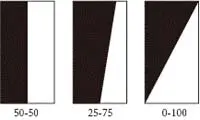

图2

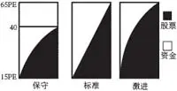

图3

保守型投资人可以在40倍PE的时候就清仓，如赵丹阳在2007年的操作，从长期看这是稳健的操作方法，也可以采取在40倍以下的合理与低估的区间重仓，40倍以上的高估区域迅速减仓的激进操作方法。资金管理模型的核心是在低位时要重仓，高位时轻仓，只要把握住这个原则就不会犯大的错误。相反就会犯以下几种错误（图4）。

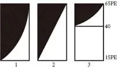

图4

一般情况下，投资人在贪婪恐惧的驱使下，会犯第1种在低位轻仓、高位满仓的错误，在每轮牛市高端的时候，在盲目的投资热情下，都有一批“韭菜”在图4中的位置高位进场，很快就被收割，只能到下一轮牛市中才能再长起来。

激进型投资人在图5的AC处15倍PE时满仓股票，随着市盈率上升至D点65倍PE时股票空仓，转换成DE附近的全额现金，随着市盈率下降，40倍PE之上现金仓位保持基本不动，在40～30倍的合理区间内平缓过渡，30倍以下开始大幅度建仓股票减少现金，直至CF处的15倍时再次满仓股票现金为零。ADEC图形随着股市涨跌形成一个轮回阴阳鱼。

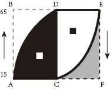

图5

积极型投资人确定了投资比例之后，可以应用凯利公式来解决如何调整比例的问题。凯利公式的一般性陈述为：借由寻找能最大化结果对数期望值的资本比例X，即可获得长期增长率的最大化。对于只有两种结果（输去所有注金，或者获得资金乘以特定赔率的彩金）的简单赌局而言，可由一般性陈述导出以下式子：

X=（bp\-q）/b

其中，X为现有资金应进行下次投注的比例；b为投注可得的赔率；p为获胜率；q为落败率，即1\-p。

例如，若一赌博有40%的获胜率（p=0\.4，q=0\.6），而赌客在赢得赌局时，可获得二对一的赔率（b=2），则赌客应在每次机会中下注现有资金的10%（X=0\.1），以最大化资金的长期增长率。网友奥马哈小镇将凯利优化模型给出了X＝2P－1的公式，P是赢利的概率。公式的关键是赢利概率的设定，应尽量避免主观依据客观的判断标准。纵观中国股市十几年的发展历程，整体市盈率在15至65倍之间，我们可以这样认为，15倍时盈利概率100%，65倍时盈利概率为0。图3中保守型的操作模式可以将区间内的盈利概率取线性，（将100%=a×15\+b;0%=a×65\+b联立，得出a=\-0\.02，b=1\.3）得出盈利概率P＝1\.3－0\.02PE。盈利概率的公式我想适合中长期的概率，至少1年以上。由此仓位比率X＝1\.6－0\.04PE，模型很简单也很好心算。由此仓位公式可得：PE＝40倍时，仓位为0；这和林奇说得市盈率达到40倍都是有风险的很一致。PE＝30倍时，仓位为40%；PE＝20倍时，仓位为80%；PE＝15倍时，仓位100%。

为了避免PE单一指标的局限性，资深投资人可采用市场估值、政策、资金面等多个指标，但是一般投资人建议用市场整体PE\\PB、GDP与整体市值比三个指标就可以了。市场是难以预测的，过多的指标反而会引发混乱。客观的数值设定后，心中就有了明确的目标，而不会患得患失。比如在牛市高位，虽然股票价格已高，但是有一百种理由牛市还将持续，且加速上涨，感觉卖出就是在扔钱，但是冷冰冰的数值会告诉你这是贪婪的热情，泡沫随时有破灭的可能。

资金管理的关键在于执行，贵在坚持、严守纪律。执行的关键在于心理控制，最大的障碍还是人性，特别是对高估值的贪婪，只有处理好两者的关系，才能使投资形成良性循环。资金管理与心理控制两者在投资中的重要性为3:6，在实际操作中两者相互依赖和促进。比如房产较差的流动性，投资的固定比例，选时波段操作中对时间、空间和市场整体PE\\PB、GDP与整体市值比的硬性要求都有助于心理控制。而良好的心理控制又能促使投资人遵守这些约束规范。在诱惑面前坚持“任凭弱水三千，我只取一瓢”，屏蔽市场波动，构筑自己的均衡配置体系，在熊市入市，牛市末期不断卖出。但是如果没有良好的心理控制，还不如一直满仓，免得熊市中积累的资金到牛顶再追进去，在熊市末期卖出，怕股价继续跌，在牛市末期全仓入市，股价（PE大）再高也敢追。

二、仓位管理

仓位管理主要指对单只证券或同类证券在投资组合中的控制比例及额度管理等。

__1\.个股仓位__

分散和集中不是本质问题，本质问题是投资选择的能力，资产的风险特征，以及对资产的选择，本质上风险并不是由重仓和轻仓引起的。一般情况下投资者应当分散投资，避免判断失误或发生的小概率事件带来致命的损失，并考虑到其他机会成本。格雷厄姆和卡拉曼的投资组合比较分散，单只证券投资比例不高。分散投资的最大特点是把业绩波动的可能性压缩到非常小，使得收益水平日益平滑，这种平滑当然可以带来稳定性，但是也确实压低了可能的回报率。所以我们也不是一味地坚持分散投资，每个人在特定的历史条件下都会碰到自己能把握的大机会，我们知道重仓有风险，然而还要在一定条件下重仓持有，是因为重仓行为本身不是风险的来源，投资选择才是风险的根基，我的账户就是通过几次重仓得以提升。但是切记，重仓持股在正确判断的前提下是能够超越指数获得大幅回报的，可是，一旦判断失误，也会造成较大的损失。刘易斯是英国超级富豪，曾经有多次成功投资的经验，其在介入贝尔斯登时，贝尔斯登的股价已经下跌30%，刘易斯的基本判断是金融危机很快会过去，在金融危机过去之后贝尔斯登股价将会大幅反弹。但事与愿违，贝尔斯登在其买入后半年便破产了，当时刘易斯的年龄是70岁，半年的时间贝尔斯登赔掉了刘易斯一半的财产。

个股仓位的具体比例也可以套用凯利公式，主要考虑两个重要因素：第一是正确率，你对看错股票的概率有没有基本的认识；第二是回报率，自上而上梳理权益类投资的整体预期回报。每个股的涨跌不可能完全同步，当某一只涨幅较大时可以换另一只，约翰·邓普顿的经验是差价超过50%时换股。当然市场高位时股价都不便宜，你买的不是安全边际，更多的是市场流动性，此时一定要克服自己的贪婪，坚持自下而上选股的结果，坚决空出整体资金仓位。

__2\.分步建仓与卖出__

个股投资的步骤是：找到好股票——等到好价格——敢不敢重仓买入——敢不敢放弃不切实际的幻想，在高估时候卖出做空。做到其中一步也许不是特别难，但要把全套做下来很难。好股票价格一般都较高，林奇说：如果你喜欢这家企业，但价格偏高，最好的方法就是先买一点，进行跟踪，等回调时再买一点。成熟投资人首先要对高位买入的错误认识深刻，坚持“宁肯错过、不能过错”。其次，到了安全边际内的好价格，投资者避免犯买入过于谨慎的错误，留足现金等待进一步下跌后买入，这带来投资效率的低下，不投资、少投资固然没有风险，但是也减少了收入。因头寸太少而减少收益也是一种风险，只不过这种风险比较隐蔽，更容易引起思想的麻痹，而且会带来心态上的波动，会产生“为什么当初不多买点呢”这种后悔的心态，更大的风险在于随着股价的上涨将手中的资金追买被套。底部是难以预测的，只要有足够的安全边际就应当大头寸买入，巴菲特叫集中投资，索罗斯说盈利不是最重要的，关键是你盈利时的头寸是多少，他有很多时候也是亏损的。在低迷的市场氛围中，应当克服人性的恐惧，在安全边际内主动买套，具体过程如图6。

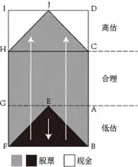

图6

以低廉的价格买入一般的公司，AC为合理区间，ＡＢ低估区间，CD为高估区间，从Ｅ点达到合理区间的底部时开始建仓，越跌越买直至ＢＦ满仓，此时市场反身向上，满仓不动渡过低估的ＡＢ区和合理的AC区，在ＨＣ合理区的上线开始减仓，越长越卖直至高估上线Ｊ点空仓。我一般从B点向上设立翻番卖出的目标，有助于我长期拿得住股票，当然这是个人经验。

J点空仓后，市场再反身向下使全额现金空仓渡过高估和合理区，在合理区的下线开始建仓，整个过程将图7资金与股票反过来看就可以了。

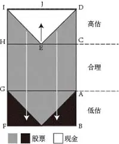

图7

巴菲特和芒格的观点是：合适的价格买入好的公司要比低廉的价格买入一般的公司好（图8）。

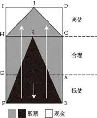

图8 合适的价格买入好的公司

__3\.资金管理与止损__

应当根据风险程度来决定是否持有，而不是根据自己现在是否亏损。轻言止损的观点是错误的，甚至是有害的，买入的前提就是要正确，要低于企业的价值，巴菲特也认为那种认为价格越便宜越要卖出的观点很奇怪。但是如果介入的时机错误（处于牛市顶峰），对企业价值判断错误则另作一论。此时市场不会按照我们的预期去发展，做错方向的时候一味指望股价回头只能导致更大的亏损。实践证明在资本市场中，错误是难免的，操作之前应当非常谨慎，但是一旦认识到操作错误，一定要能克服沉没成本效应，有认错止损的决心——这可是索罗斯的成功诀窍。因此，在市场中亏损也是交易的组成部分，关键是明天有能力继续交易。但是，那种将止损指令设置在一个点位，把风险控制在自己总资本的10%的纯粹技术止损传统观念并不适合我。

三、远离杠杆

目前，A股市场投机氛围浓厚，杠杆率按流通盘计算达8\.2%。根据麦格理银行按流通市值的统计，中国台湾股市的杠杆率是1\.4%、美国为2\.5%，日本为0\.8%。即使在过去30年的时间范围中，最高也只有中国台湾创下过6%的杠杆率。身处这样一个投机氛围浓厚的市场中，要更加警醒自己远离杠杆，绝大多数成功投资人特别是价值投资者都忠告：远离杠杆和衍生品（表2）。

__表2 成功投资人的忠告__

巴菲特

如果你不了解投资的话，你不应该借钱。如果你了解投资的话，你不需要借钱。反正你早晚都会有钱的。

别迷恋杠杆收益。毫无疑问，有些人通过借钱投资成为巨富，但此类操作同样可能使你一贫如洗。杠杆操作成功的时候，你的收益成倍放大，配偶觉得你很聪明，邻居也艳羡不已。但它会使人上瘾，一旦你从中获益，就很难回到谨慎行事的老路上去。而我们在三年级（有些人在2008年金融危机中）都学到，不管多大的数字一旦乘以0都会化为乌有。历史表明，无论操作者多么聪明，金融杠杆都很可能带来“0”。由于我们对利用金融杠杆持谨慎态度，我们的回报率略受影响，但拥有大量现金使我们得以安枕无忧。在偶尔爆发的经济危机中，其他公司都为生存而挣扎，而我们拥有充沛资金和精神准备去发动攻势。

林森池

任何时候都不要买衍生工具，也不要用杠杆投资。相信散户在这波动市中，可以采用平均成本法，例如以月供形式做长期投资。

是川银藏

不可太过于乐观，不要以为股市会永远涨个不停，而且要以自有资金操作股票。

段永平

不做空，不借钱，不做不懂的东西！负债的好处是可以发展快些。不负债的好处是可以活得长些。反正你借不借钱一生当中都会失去无穷机会的，但借钱可能会让你再也没机会了。千万别借钱哦，因为没人知道市场疯狂起来到底有多疯狂。

大部分价值投资者反对融资炒股，一般的投资者连一般的风险都控制不住，更别谈融资炒股。但是仔细阅读传记后会发现一些特殊情形下的融资炒股：一是巴菲特的浮存金杠杆。聪明的巴菲特一直以更有利于自己的方式在操作杠杆，巴菲特有低成本的保险浮存金，是理想的杠杆。巴菲特的第一个合伙公司成立于1956年，共7位合伙人，其中六位分别投资2\.5万美元、1万美元、3\.5万美元、0\.5万美元、2\.5万美元和0\.5万美元，而巴菲特作为第七位合伙人，仅投资了象征性的100美元。根据巴菲特设计的收益分配机制，4%以上的收益一半归巴菲特，4%以下的收益则四分之一归巴菲特。相比如今对冲基金惯有的2%管理费\+20%表现费的收费模式，巴菲特的合伙人公司无疑收费更为昂贵，表现费最高可达50%。当然，在获得高费率的同时，巴菲特还对亏损承担无限责任，而不仅限于100美元的投资额——这也就意味着巴菲特实际上以自有财产向其他六位合伙人提供了保本的承诺。而一旦巴菲特收到费用，则会全部投入合伙公司，以提高其在合伙公司的股份比例。承诺保本不就是相当于贷款炒股吗？由此看来，巴菲特也用杠杆。之所以劝别人别用杠杆是因为自控和水平较低的原因，除此之外，他还推荐指数基金呢！二是创业初期由于缺少资本金融资。约翰·邓普顿在第一次世界大战期间，当美国股市因为对战争的恐慌而大幅下跌时，邓普顿却看到战争极有可能刺激经济。为了抓住机会，邓普顿决定借钱买股票——向其前任老板借10000美元。后来成立基金。为了奋起直追，芒格比巴菲特更愿意借钱投资，也进而承受着更大的风险。但是其波动太大，主动并入巴菲特的基金。斯尔必·戴维斯刚起家时在净资产仅为10万元（还有5万是交易席位费用）的情况下，贷款29万，在大势不好的情况下，一年后资产23万，上涨1\.3倍。1947年以6倍杠杆买入0\.5PB的保险股，第二年净资产收益率480%。但是后来下降，晚年保持着1\.5倍杠杆。从其整个投资生涯来看，大致的杠杆水平在2倍左右。三是对冲基金杠杆。索罗斯是用杠杆实现19年平均34%的复合增长率。但是我认为绝大多数人达不到乔治·索罗斯的功力。索罗斯已经达到哲学层次，建立了反身性理论，我只能明白大概意思，却无法掌握运用。其以前的同事斯科特·巴萨特近来接受采访时说：“乔治拥有糟糕的平均击球率——低于50%，甚至低于30%——但是当他赢的时候就是大满贯。”此外，日本股神是川银藏的能力极高，买水泥股的时候大幅度投资杠杆。这更是一个神人，做什么都成为一流专家。

由此可见如果长期价值投资追求绝对安全，应放弃任何杠杆，除非你觉得能有索罗斯的功力和强大的心脏。即使使用少量杠杆也应当建立在极其保守的基础上。这种保守首先体现在对买入标的的严格要求上，比如巴菲特喜爱的富国银行和USB利润缓慢的增长背后，是这两家银行对高盈利高风险项目的敬而远之，因此在危机中，这两家银行全身而退，富国更趁机吞下美国联合银行。当然，买入优秀企业并不足以保证杠杆使用的安全，所以巴菲特对持有股票的价格区间股限定在“低估”与“合理”之间。

关于衍生品，在巴菲特的投资生涯中，几次运用权证的实质都是为了套利。次贷危机时，巴菲特出手入股高盛，当时采取的是买入10%股息额优先股，同时免费获赠大批高盛的认购权证。巴菲特其实是以更接近债券投资的方式入股高盛，仅在将认购权证执行转换为普通股后，才是真正意义的入股。这为巴菲特提供了进可攻退可守的有利条件。这和一般的认购权证相差太远了。这多了三层安全保证：一是可以不选择认购，丝毫不影响他的本金；二是收利息百分之十已经很高了；三是时间有几年，在权证中时间是有价值的。巴菲特在可口可乐上买过认沽权证。1993年4月，巴菲特以1\.5美元的期权金卖出300万份1993年12月17日为到期日、执行价为35美元的认沽期权，当时可口可乐的市价是40美元左右。此后巴菲特又加卖了200万份。对巴菲特而言，若1993年12月17日可口可乐的价格在35美元以上，那么这份期权就是废纸一张，巴菲特可以白拿这1\.5美元×500万份=750万美元的期权金；但若届时股价低于35美元，巴菲特就必须按照35美元买入500万股可口可乐，当然因为之前收取了1\.58美元期权金的原因，所以必须当可口可乐跌破33\.5美元时巴菲特才真正亏损。对巴菲特而言，本来就有不断增持可口可乐的机会。若可口可乐不跌，那么白赚点期权金也是好的；但是若大跌，那么期权金等于市场补贴你1\.5美元去买入可口可乐，同样也是好的。对于一个长期投资者而言，这就成为上涨下跌两相宜的投资方法了。巴菲特签订的跟踪S&P500指数等股指合约为其15～20年的保险合同——这个上面第三点已经讲了，长期看股市总是上涨的。巴菲特多次表达，他对股市短期内的波动毫无把握，买入股票不能指望它一月、一年内上涨，而应当以长期持有的观点买入。其实这个策略与卖出认沽期权大体相同，只不过是与特定对手在交易所之外签订合约，且大多不需要保证金支持，更像是一个保险合同。其他价值投资大师没有看到主动买入认购权证的例子，相反有在股票高估时买入认沽权证对冲这样的情况：约翰·邓普顿在股市高位时，非常确定其买入过认沽权证。施洛斯也有许多判断是非常准确的，他做空雅虎和亚马逊，在2000年市场崩盘时清仓获利。此后，由于找不到便宜的股票了，他和埃德温清算退出，将1\.3亿美元的资金还给了投资者。在这个世界上，技术永远不是最终的保障，规避风险的理智才是前提。

四、现金的意义

现金管理是投资管理的一个重要组成部分。持有一定比例的现金对扩大投资成果和降低投资成本具有重要的意义。保留一定的现金的内在逻辑：市场的未来难以预测，对市场总是保持敬畏，担心会发生更为极端的情况，并对此有所准备，在意所管理资产表现的稳定性等；追求绝对回报，坚持严格的投资标准，当没有满足符合条件的投资机会时，宁愿保留现金等；担心自己的判断有错误的可能，并为此留有余地等。在实际操作中，现金的主要职能是在市场遭受意外风险或系统性风险时摊薄买入成本，防止在市场低迷、遍地黄金时却手无寸钱的情况发生，不至于眼睁睁看机会流失（表3）。而总是满仓的投资者，对自己的判断具有绝对的信心，希望资金总是处于高效使用状态并且担心错过现在的投资机会，他们在意的是跑赢市场，而不是追求绝对回报等。

__表3__

巴菲特

喜欢总是保留一定数额的现金，按照巴菲特所讲，仓位不超过80%。在30%～70%之内调整仓位。在近10年以来，巴菲特总是保持至少200亿美元的现金，他对于保持大量现金的理由是：不希望命运掌握他人手中，而是掌握在自己的手中，大量的现金可以让人睡得踏实等。事实上，正是由于总是喜欢持有一定的现金，巴菲特才可以安然渡过多次经济危机及金融危机，并能够在危机中优秀公司出现非常低估的价格时，还有能力买入（也有承受保险偿付的因素）。

54年只有两个年份出现小幅亏损：2001年\-6\.2%，2008年\-9\.6%。

塞思·卡拉曼

经常保持40%的现金，卡拉曼在《晚上睡得着比什么都重要》的演讲说到：“在过去的25年中，我们试图每天为客户做正确的事情，从不使用融资杠杆，且有时会持有大量现金”，他有时候会持有40%多的现金（如1999年4月30日投资组合现金比例为42\.1%）。

1982年到2009年的27年间仅1999年亏损\-18\.3%。

格雷厄姆

经历过九死一生的大危机后，在资金管理方面提出了“75\-25”法则。

巴鲁克

在投资美国酿酒公司却折戟沉沙后，为自己立下一条“清规”：永远持有一部分现金，不要将钱全部投入股市。这样做一方面是为了避免孤注一掷，另一方面是为了在市场反转时抓住行情。对于长期投资者来说，未来的某一天，股市将会有一次大跌，也会有一次反转上升的机会。持有现金是十分必要的。

约翰·聂夫

一般来说，我们会将售股所得转投于前景更为光明的股票。但在价格过高的市场中，温莎总会定期性地持有多达20%的现金（依我之见，对任何股票型基金来说，比例高于这个数字都属不智）。市场狂飙以及我们找不到可以合理买进的股票时，我们会大量持有现金。在狂风巨浪中，现金是最好的支柱。

施洛斯

五十年投资生涯中，前半段一直满仓，后半段一直持有部分现金。哪一种更好？从收益率看，前半段与后半段几乎差距不大，但是考虑到经验的累积与美股后期的大长牛股，似乎前者更牛一些。但是这里面又有两个问题，前期施老管理的资金量还是非常小的，而且当时美股的纯烟蒂还是比较多的。到了中期，管理的资金量已经上升到一亿美元以上，加上美股的中值上移，可供选择的标的减少，被动持有现金的时间越来越多。投资者是否应该持有现金，主要还是看市场估值。

在市场高峰，因再也找不到便宜的股票而退出。在被问到他认为自己是否是超级投资者时，施洛斯不以为然，他只是说：“我不想亏钱。”

1956—1984年亏损5次均不超10%。

现金管理要求投资人长期保持“清零”的意识，不管以前业绩多优秀，特别是在持仓上涨“爱上股票”之后，都要考虑如果现在股票换成现金，按照投资标准是否会买入。只有正常保持“清零”意识并严格执行纪律才能有效控制资金回撤。长期持有现金及其等价物是资金管理的结果，能否持有现金也是资金管理是否有效的一个重要衡量标准。卡拉曼深入剖析了人们对现金的困惑。

__1\.不符合积极进取的态度__

没有完全动用所有的现金，似乎就赚不到钱，因此应该将现金充分利用，使之最大化。低风险最开始不是让我学习如何收益更高，而是学习如何能忍耐能住较低的收益，稳定地耐心持有现金等价物。当许多人因为投机而大赚特赚的时候，你很难无动于衷。卡拉曼发现推动一个人投机的不是投机的诱惑，而是一个人想做什么的愿望。但是，什么都不做也是一种策略：什么都不做意味着寻找潜在的投资并排除掉那些不能满足你的投资标准。但是从情感角度来说，什么都不做看起来就像无事可做，这会让人觉得不舒服、没有作为、没有想象力、没有激情。每一个投资都要和现金进行比较。如果一笔投资优于现金的程度足够高——该投资提供的回报高于适当的风险，那么这笔投资可以做。没有极富吸引力的投资选择，投资者就应该持有现金，这不是因为他们做了一个由上而下的资产配置决策而决定持有现金，而是基于从下而上寻找廉价投资得出的结果。

__2\.过于看重相对表现__

过于看重相对表现也就是回报与市场相比如何，这也是不能保持现金的重要原因。现金会贬值，尤其在通胀压力骤升的情况下。持有现金可能在一段时间内的投资落后于大市，如果说许多投资者认为在市场下跌时持有现金是难以容忍的，那么在市场上涨时持有现金更是不会考虑的策略——从这一点似乎可以折射出投资者讨厌现金的心态。卡拉曼指出，许多投资者总是将现金可怜的当前收益率与股票收益率进行比较，而在比较中现金总是落败。因此，他们不管这些投资选择的绝对估值可能处于多么离谱的水平。如此看来，对于许多投资者而言，最紧迫的问题是他们的投资视距太短。关于投资，一个最大的问题是今天可以获得的投资机会并不是你应该考虑的投资机会的全部。仅仅根据今天的机会来选择投资对象，如同在你高中的班级选择配偶一样的狭隘。他还说，准确预测未来投资机会的数量和吸引力很难，或许是不可能的，但是忽略它们不存在就愚蠢了。永远不要仅仅根据今天的机会来选择投资对象。卡拉曼最初十多年的资产管理业绩持续输给市场，2009金融海啸那一年获得最高57%的收益，20年平均复利20%，追求绝对回报，仅有一个亏损年度。

__3\.不确定性__

相信未来将出现比目前更好的投资机会并不能保证未来真的出现更好的机会。谁知道明天的投资者会愿不愿意为证券付出更高的价格呢？与为今天的证券支付更高的价格相比，等待未来出现廉价的投资，这一策略可能更好。不过，明天的估值水平可能会更高。另外，脱离满仓的大众很长一段时间是一个紧张、羞辱和消沉的体验，这几乎就是心理层面的东西。但是有时候现金就是最好的投资，好于任何类现金投资方式。它提供了虽然很有限但是正的收益率、本金的彻底安全以及完全即时的流动性。以日本市场为例，由于日本隔夜储蓄市场的利率几乎为零，因此许多投资者从该市场退出并在其他地方寻找投资。2003年6月，他们接受了年收益率仅为0\.44%的10年期债券。到了10月，这一债券价格从高于面值跌至面值的90%以下——使得收益率超过1\.5%。于是投资者在这4个月中赔的钱比他们持有这一债券整整10年获得的总回报的两倍还多。

__五、综述__

资金管理的理念不是投资者能简单接受的，即使是投资大师也是随着阅历增长，甚至是九死一生的痛苦经历才走向资金管理。巴菲特从早年绝对集中投资GECIO保险公司到最高不超过40%，在９年的合伙基金历史中，只有５到６次超过25%持股的情形。芒格则关闭自己的基金转向巴菲特。格雷厄姆经历过九死一生的大危机后，在资金管理方面提出了“75\-25”法则，巴鲁克在投资美国酿酒公司折戟沉沙后，为自己立下一条“清规”：永远持有一部分现金，不要将钱全部投入股市。施洛斯五十年投资生涯中，前半段一直满仓，后半段一直持有部分现金。历史实践告诉我们，资产配置可以帮助降低资产价格波动对组合的影响，适应投资者的风险偏好并实现其长期投资目标。

巴菲特经营合伙企业时的投资按特性可分为三类：Control（控制类投资），Generals（低估类投资），Workouts（套利类投资），其中后两类投资的收益比较稳定，并且在很大程度上，与道琼斯指数的表现无关。因此，很明显，如果持有的这类投资比重较大，那么熊市的表现将会非常好，但牛市中将会非常糟糕。如果剔除借款所带来的好处，这类投资的年化收益率一般在10%～20%。“Control”这类投资的表现也与道琼斯指数没什么关系。“Control”和“Workouts”这两类投资，将会大大降低投资组合所面临的市场风险。巴菲特希望合伙人在此基础上对他进行评价，应该是基于人类厌恶损失的天性。行为金融理论认为，人们面对同样数量的收益和损失时，感到损失的数量更让他们难以接受，同样数量的收益带来的幸福感的程度小于损失带来的痛苦感的程度。从1957年跟踪巴菲特合伙基金，到2010年共计53年，我们可以看到，在巴菲特53年的投资经历中，仅有2001年和2008年收益率为负，剩余51年都是正收益率，并且仅有1976年收益率超过50%——这也警示我们，一旦收益率超过50%，我们不应因超越巴菲特而沾沾自喜，而要考虑是否已经是市场高位，要收手防止大幅回撤。刘祖悦比较了1962—1968年巴菲特和芒格早期的投资成绩，年均回报率分别为33\.9%，36\.7%，这段时间两个人都经营合伙企业。芒格的业绩虽然比巴菲特好，但业绩波动幅度更大一些，7年中芒格的年收益率标准差为23\.1%，而巴菲特为15\.5%。从1969到1975年的总体情况来看，巴菲特的成绩要大大好于芒格，年均分别为13\.9%，5\.0%。如果要比较从1962年到1975年的投资业绩，当然也是巴菲特领先。

__表4 巴菲特与芒格的投资模式及业绩比较__

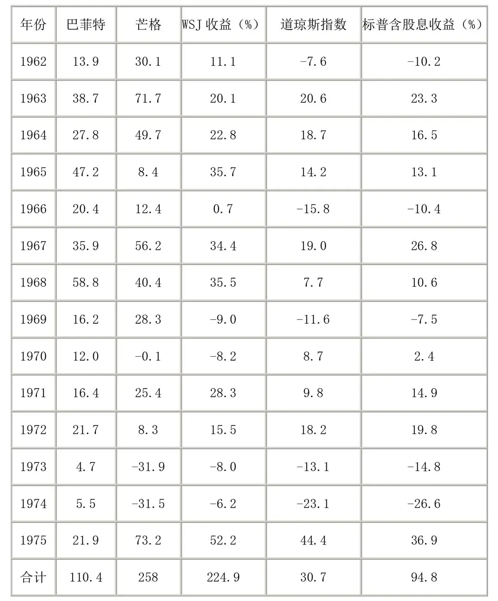

备注：表中1969—1975年巴菲特的业绩为伯克希尔公司账面价值的变动情况。

洛尔认为：“造成惠勒和芒格公司（1973—1974年）相对不佳表现的主要原因是他们持有大量新美国基金和蓝筹印花的普通股。”按此数据，美国基金和蓝筹印花在这两年分别下跌了59\.33%和65\.84%，远远超过了道琼斯指数33\.17%的跌幅。1974年末，整个惠勒和芒格公司的净资产只有700万美元，而其中61%是蓝筹印花的股票，23%是新美国基金的股票，仅在这两只股票上的仓位就高达84%，如果考虑到这还是它们市价大幅下跌后的结果，那么当初它们占整个投资组合的比例会更高。从理论上讲，新美国基金和蓝筹印花的内在价值比其当时的市价要高得多，投资它们并没有错，但投资如果过于集中，难免会极大程度地受到“市场先生”多变情绪的影响。芒格自身不因为投资损失烦恼，但他的合伙人们不是全都能做到这一点。

再来看一下最近才被关注的沃尔特·施洛斯有限合伙公司（简称WJS），1956—1984年只亏损5次且均不超10%，标普指数28年零3个月收益率为887\.2%，WJS有限合伙人28年零3个月收益率为6678\.8%。

__表5 WJS历年收益情况__

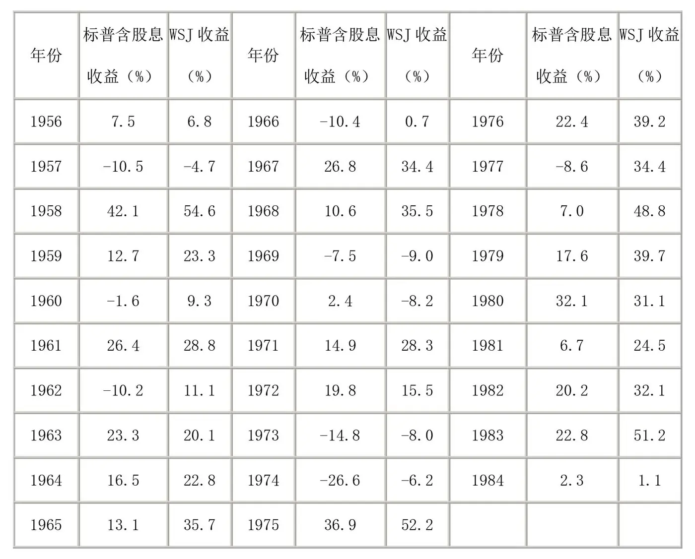

## 第六章 心理控制

__第六章 心理控制__

“在资本主义时期，人类已经翻越了智力的屏障继续前进，但还没有推倒心理学和情感的高墙，巴菲特却因做到了这一点而出人头地。”股市是人生“加速器”，一个人在市场里的输赢结果，实际上是对他人性优劣立竿见影的奖惩。股市是人性修炼的场所，只有系统解剖并有效防范埋藏在灵魂的深处的人性弱点，才能投资成功。

一、大脑神经与投资境界

神经经济学揭示了投资者的大脑被神经细胞控制，股票市场对投资者的刺激不仅产生情绪也产生生理反应，人的生物学特性往往促使我们做出错误的投资决定。虽然我们深刻地认识到这一缺陷，但是我们无法停止这一切，这些弱点也将会伴随终生，就像心脏要跳动、肺部要张合一样，只要我们活着就无法彻底改变生理上的事实。只有接受自己的弱点并加以理性控制，才会让你更加灵活机变，有效地降低犯错误的成本。根据投资者对自身弱点的认识和控制，可以分为三个层次。

__1\.新手受直觉控制。__

直觉是人类在长期进化中基因优化的结果，是人类反应及处理问题时的心理捷径。比如，投资结果对大脑的扁桃体区有很强的影响，使得你还没搞清楚究竟发生了什么，就已经汗流浃背、呼吸急促、心跳加剧。作为早期的预警系统，扁桃体区促使思维产生“无论如何跑了再说”的机制，亏钱越多的时候扁桃体区就越活跃，我们的大脑在刺激下要逃跑，或者说是它迫使我们逃跑。但是这种机制可能因为错误预警而激发错误对策。股市中恐惧、贪婪、乐观、悲观等情绪均是无意识的直觉反映，是人类的本性。直觉存在敏感性、即时性、既定模式反应等特征，直觉判断一方面节省了人类的心智资源，另一方面投资人被“巴甫洛夫联想”的“条件反射”式直觉影响，反复被特定人士或市场气氛给操控、制约，在进行判断与决策时有着明显的局限性。60%～70%的人在此阶段被淘汰出局，炒股多年而没有什么长进，还是四处打听消息、追涨杀跌，没有自已的主见，过于依赖别人，往往形成在权威人物的过度影响下所造成的偏见。芒格在阐述偏见时举了个例子，有两个飞机驾驶员，副驾驶员在模拟状态下被训练了很长一段时间，他知道他的职责就是防止坠机。实验过程中，那个正驾驶员做了一些连傻瓜都能看出来足以导致坠机的操作。但副驾驶员只是安静地坐在那儿，因为正驾驶是权威角色。25%的情况下，飞机都会坠毁。人类天生具有服从权威的倾向，即使这服从是错误的。进入第二层次之前必须经过岁月和股市的磨砺，所以查理芒格曾经说“40岁以下没有真正的价值投资”。

男人要临近不惑，才会发现，绝大多数远远看着以为是女神的女人，只要你能接近，并把她当女人对待，那么她就只是女人，不是女神。女神，多数只是男人在年轻时，对女人的一种幻觉。而且男人越年轻就越容易有那种幻觉。实际上，在股票的世界，也充满了相似的幻觉。越是缺乏长期历练，越容易把心仪的股票、权威人士或交易模式当作女神追捧，这样反而失去了客观之心，容易反受其害。男人的成熟，说到底需要历练，只有当你经历多了，疼痛多了，你才能拿得起、放得下，而股民的成熟，其实也同样如此。

——雷立刚《万物枯荣：一个普通股民的艰难挣扎》

__2\.老手建立模式__

通过进化，人类寻找模式来解释现象、理解抽象或者复杂问题，这些模式构成我们信念系统的基础。只要连续出现两次同样刺激，就开始相信还会出现第三次，大脑形成预测和惯性思维的模式。人类通过模式认识世界，同时又通过认识世界对模式不断修正。简单重复的模式经常意外中断，大脑的岛叶、尾状核、壳核的神经细胞就会受到刺激，而这些区域和扁桃体区一样，可以激发恐惧和焦虑情绪。一个模式持续时间越长，一旦中断，大脑的反应就越激烈。通过直觉、预测、惯性思维模式的一次次中断和反思，又形成了反向思维、周期性思维、概率思维等系统性思维，努力摆脱直觉和偏见的制约，学会了基本面分析、趋势分析、技术分析等模式。但是对市场仍然没有本质认识，成为会使用工具的高级小狗，需要经常聆听市场和权威人士的铃声。经过长期的进化，我们还是对不确定的事情感到不舒服和焦虑，这使我们愿意听那些能减轻焦虑的话。尽管我们头脑中的理性思想告诉我们：市场预测者不能预测明天或者下周将发生什么，我们还是愿意相信他们的预测，因为如果不这样就会很不舒服。这一阶段又淘汰一部分通过反思走入误区的人。我们不信任混乱和无序，可以科学解释的现象就加以解释，不能科学解释的就留给奇幻的思维去解答。资本市场是宏观有序、微观无序的，一旦追求精确操作就会走火入魔，学习研究与投资形成恶性回报的过程，结果有时甚至比不懂输得更惨。

__3\.高手的寡欲境界__

虽然资本天生具有逐利性，但有极少数人通过长期磨炼从内心深处彻底升华自己，达到清心寡欲的佛家境界。投资的最高境界是心如止水，坦普顿是个虔诚的基督教徒，妻子早世后自己把几个孩子拉扯大；费雪一生只有几个朋友，当发现一个朋友晚年沉迷于美色就与其绝交；惠理基金谢海清是佛教徒等等，这对我们都有所启示。理解无欲的境界，我最喜欢的就是南普陀寺院内两条廊道的牌匾“无我”“随缘”。“无”，可以说是不执着、不在意、不上心、不为其所困，而并不是“没有”的意思。“随缘”，是指做投资要顺应机缘，顺其自然，《道德经》中道法自然也这个意思。“随缘”和“随便”是不同的，“随缘”并不是不用努力，前者是指因缘和合，做一件事情经过多方努力后创造出结果，不管是好还是不好都坦然面对，金钱只是作为投资游戏的副产品。我们看到巴菲特富可敌国但生活简朴，绝大部分财富捐出做慈善，当金钱与人欲割裂时，就摆脱了“看到大盘急涨就心动”的条件反射，保持独立的思考，成为“巴普洛夫”，理性地投资。想达到无欲要有强大的自制力，但更需思想境界的修行。

股票市场上这一修行的起点是正视、承认人性的局限性和市场不可预测性的客观存在。

__（1）建立大局观和长期观来应对市场的不可预测性__

萧普谢尔博士说，由于市场过于混乱无序，无法找到一般规律，过度分析和勉强预测无异于缘木求鱼，因此，接受市场是无法预测的这一事实是建立心理优势的第一步。近处看大海波涛汹涌，山顶上看则平静温和。我们要建立战略思维，站得高想的远，才能有足够的时间、空间来应对市场波动，坦然面对在投资中出现的一切挑战，建立起对未来的强烈信心，对其他非核心因素的干扰应视而不见。同时这种对市场噪音和波动的不听、不看，也是一种物理隔离，有利于进一步强化信心。

__（2）通过反思来应对人性的局限性__

芒格总是反着思考，我们也要经常询问自己：反过来看是否有道理？我现在的行为理性吗？是否受到心理效应的误导？社会心理学家戴维·迈尔斯认为：“科学同样包括直觉和严格检验的相互影响。”在投资活动中要保持“批判而不愤世嫉俗，好奇而不受蒙蔽，开放而不被操纵。”只有保持好奇与开放的心态，对事情发生的背后原因有很高的兴趣，才能最大限度地获取信息，发现规律和变化，抓住机会；只有以批判的态度对待信息，不要先入为主与过分自信，尤其重视反对者的意见，注重反思与多重思考，才能不被蒙蔽与操纵，提高投资决策的质量。

__（3）降低预期和决策敏感度__

人们在事情刚刚发生之时，会造成思维偏见与决策失误。决策时间上，在可能的情况下延迟投资决策的时间，避免一切因冲动情形下的决策行动，随着时间的推移，感性往往由强变弱，而理性却由弱变强。决策过程中，尽量保守，多往坏处想，获得安全边际。人们面临困难时采取防御性的态度，为自己设下比较低的期望，有助于全面、系统、客观地看待问题，掌握主动，准确定位，提高抵御困难的承受力和处理问题的应变力。决策结果上，要保持概率化思维，考虑到多种可能性，避免单一决策。

__（4）远离市场__

“不识庐山真面目，只缘身在此山中。”只有远离市场，才能战胜市场。远离市场让投资者避免市场波动对情绪影响的行为，而真正的按照市场本质规律去管理自己的投资。我们预测的准确性、投资的收益与你和股市之间的距离成反比。许多投资者每天紧盯行情表，不放过每一个可以看到的市场分析、评论文章，那里仿佛有着永恒的魔力，深深地牵扯着你的整个思想以及生命，这无形中会增加投资者的思想压力，做出非理性的判断。股票投资知易行难，历史上有很多匪夷所思的案例，查尔斯·麦凯案例就是其中之一。

1844年，英国铁路股票出现了明显的泡沫，它距离查尔斯·麦凯发表的《非同寻常的大众幻想与群众性癫狂》相隔三年。当时，即使对各种市场疯狂的历史事件如数家珍的查尔斯·麦凯也竟然对铁路股票的价格已经高得离谱，而且对未来增长的预期完全脱离现实的情况视而不见，依然鼓励英国投资者大量买入铁路股票。而查尔斯·麦凯本人面对铁路股票的陷阱，则“眼睛眨都不眨地就像傻瓜一样掉了进去”。1845年10月2日，他竟然还写了这样的一段话：“那些提醒铁路股票存在危机的人，似乎有些言过其实。”面对市场的泡沫，查尔斯·麦凯的表现令人吃惊。有些人指出，“当下的铁路股票热潮”与他在书中描述的灾难性泡沫很相似，但查尔斯·麦凯却对他们的言论嗤之以鼻，并说：“根本没必要担心崩盘。”这一次查尔斯·麦凯真是大错特错了，泡沫终于破裂了，英国的铁路股票从1845年开始下跌，到1850年跌至谷底，价格缩水了三分之二。但是，查尔斯·麦凯却从未承认自己所犯下的惊人错误。按查尔斯·麦凯的说法，判断市场有没有泡沫似乎很简单，只要仔细观察市场情绪过于乐观的各种迹象，就能在其变得疯狂时避开即将来临的大灾难。而实际上发现泡沫并不像查尔斯·麦凯所说得那么简单，因为连他自己也没能在市场泡沫中独善其身。

——一只花蛤《真正的元凶是人的大脑》

二、贪婪、恐惧和期望

__1\.贪婪__

贪婪的意思是渴望而不知满足。对利润无歇止的追求，使投资者总希望抓住一切机会。连续的成功会使得投资者开始贪婪，总想自己能赚多少钱从而忽视下跌风险，失去理性判断的能力。贪婪有以下几个害处。

一是冲动陷阱。受价格波动、市场传言、市场躁动氛围等因素的影响，认为价位已经够低、跌不下去、马上要大涨等感觉，加上机不可失的潜意识的推动，便鬼使神差地下单买入，不知不觉就加重了交易的仓位，甚至不惜借钱勉强入市。

二是急功近利。股票买入后一两个月没有涨就忐忑不安。看着别的股票不停地上涨，而自己的股票原地踏步，心里十分着急，于是即使亏损也马上换股，可是刚抛出后它却又涨了，而买进的股票又陷入亏损。这样的错误一次次不断地重复，最后竹篮打水一场空。

三是侥幸心理。许多投机性的股票连续大涨，投资者经受不住暴利的诱惑，总希望最后接棒的不是自己，而命运却常常捉弄他们，使他们一败涂地、血本无归。

四是后视偏见。基于安全的反思是灯塔，基于盈利的反思是暗礁。人们往往会忽视事后理解的天然优势，而进一步贬低事前决策的复杂性与难度，对于“错过”看似能挣到的钱而后悔不已，导致下一次冒险求利。

人们愿意做错的事情是因为错的事情往往有诱惑。如果你这次赌对了，那将会更惨烈地倒在下一个错的事情上。

——段永平

__2\.恐惧__

恐惧是指人们在面临某种危险情境，企图摆脱而又无能为力时所产生的担惊受怕的一种强烈压抑情绪体验。恐惧产生时，常伴随着一系列的生理变化，恐惧会使人的知觉、记忆和思维过程发生障碍，失去对当前情景分析、判断的能力，并使行为失调。厌恶损失效应会加剧投资恐惧。损失所带来的痛苦远比同样强度的获利所得到的快乐要多。这种心理在投资活动中表现出来就是对损失的强烈厌恶，只要亏损一点点，心里就不能忍受，从而产生非理性的杀跌行为。往往是经历了连续失败的交易之后，恐惧心理开始蔓延，甚至是在市场底部时卖个地板价。当系统给出新的介入信号时，内心就开始挣扎，开始怀疑该系统是否出现问题，然后开始考虑其他随机变量对行情的影响，试图说服自己不要介入。纠结之中，错过了一大波行情，然后后悔、懊恼、生气、失望、挫败等负面情绪接踵而来。对损失的恐惧也会带来很多有趣的事情，比如德国政府曾以负利率发行国债，刚开始德国金融局职员大感意外，以为出现了技术错误，把负号抹掉，后来才发现就是如此，于是更正后恢复负号。即使这样德国国债拍卖当天遭遇强劲需求，大约有70亿欧元资金竞购39亿欧元债券。2016年7月9日，经历连续暴跌的市场究竟有多恐慌呢？新城B无量跌停，跌破换股价，直冲现金选择权价格；阳晨B跌破现金选择权价格，早上开盘折价13%；低折分级A，投资者担心两天的净值波动，拱出了两天12%的预期低折收益；其他分级A，在市场出现一半股票停牌的奇葩现象时，对风险敏感性极强的这个群体开始担心基金违约、拒赎，甚至直接跌停砸货，砸出了低折成功的20%多的预期收益；大量分级母基出现大幅折价，个别基金这几天的净值预估仓位并不高，中性预期未来两天行业指数跌幅5%，其净值跌幅也在\-5%左右，但却被砸出了两天超过10%的预期折价收益。

__3\.希望__

希望是投资者内心的一种主观期待。除了众多周知的“恐惧”和“贪婪”这两个人性的弱点，还有一个也不能忽视——“希望”，它的危害性丝毫不亚于恐惧和贪婪，总是对大盘和自己的持股怀有不切实际的希望和幻想，希望大盘马上见底反弹，希望自己的股票出现奇迹，用盲目的自信作为自己持股的信心，但是股票的运动决不会以你个人的希望为转移，股市会走它自己的轨迹。《交易中的心智优势》（Mental Edge in Trading）指出，希望和自信是交易中两个最大的敌人。作者跟踪访问了50位世界顶级的交易大师后发现他们有一个共同点，就是对市场不抱任何希望，同时对自己的位置（Position）不抱希望，甚至信心不足。沉没成本效应在投资者“希望”中体现，在实际交易当中，人们总是将获利良好的品种卖出，而保留那些亏损的基金或股票，更有甚者，还会对这些不断亏损的基金股票加仓，反复买入想要“挽回损失”，完全不顾大势、基本面已经逆转的事实。索罗斯对沉没成本的看法值得我们借鉴：他说“我不认为这种办法可以挽回损失。”而避免这种陷阱最好的方法是自问：如果手中没有这只股票或者基金，或者另外给你一笔钱，你会做出什么样的投资决策？如果答案是否定的，那么最好卖了它。不要让期待占据你的头脑，而要让思考来做决定。市场不可预测，不会按照你的希望发展；你能做的是认真分析各种情况，做好应对方案。不能仅仅因为已经被套住了，为了心理账户上所谓的“摊低成本”，就进而做出一个“错上加错”的决定。即使是投资多年的股民也常常受到“希望”的侵扰，错误的希望会使股民要么踏空，要么被套牢。2008年金融危机的时候，米勒对巴菲特说我们都是乐观主义者，巴菲特说不，我是现实主义者。成熟的投资者要处理好斯托克代尔悖论，即坚持你一定会成功的信念，同时，要面对现实中最残忍的事实，不能以主观代替客观。海军上将吉姆·斯托克代尔是越战“河内希尔顿”战俘营关押的美方最高军事指挥官。他经历无数折磨，最终等到获释。“我从不怀疑我可以出去，而且会最终成功”。但“那些乐观主义者会说：‘圣诞节之前我们一定能出去’。圣诞节过了，又会说：‘复活节之前，我们一定能出去’复活节也来了，也过了，然后是感恩节，然后又是圣诞节。最后，他们没能出来，郁郁而终”“这是一个非常重要的教训，你不能把信念与原则搞混。信念是你一定会成功——这点你可千万别失去了——而原则是你一定要面对现状中最残忍的事实”，“我们不会在圣诞节出去，面对现实吧”。投资是通往财务自由彼岸自囚的炼狱，但是很多乐观主义者一次次地期望这是最后一跌或者马上大涨，陷入“彼岸花”的幻觉无法自拔，最终身陷炼狱。

三、过度自信、近因效应与羊群心理

__1\.过度自信与认同偏好__

过度自信是指人们在对过去知识进行判断中存在智力自负的现象，这种现象会影响对目前知识的评价和未来行为的预测。绝大多数的股票投资人都坚信自己是能够战胜市场的少数人。当投资人做出投资决策时，他会认为自己对未来的事情有足够大的把握，似乎自己可以掌握未来的变化。而实际上我们对未来发生的事情没有任何的控制能力，只是因为自己参与其中，便认为自己有了控制力，这是一种过分自信而导致的控制幻觉。实际投资中，过分自信与控制幻觉往往会导致频繁交易、过于集中投资、轻易决策风险集中等问题。自负和自信是相对的，过分自信的人遇到挫折后便会缺乏自信，从而陷入“布里丹选择”的陷阱。有些决策者总希望可以得到最优方案而犹豫不决，最终导致决策迟缓、错失良机，或是反复地追涨杀跌。股市瞬息万变，在信息不全的状态下做出决策是常态，避免犹豫的最好方法是对各种方案进行优先排序，既要善于选择，还要学会放弃。当我们选择了51%的价值，就要毫不犹豫地放弃那49%的机会成本，全力把51%变成100%。过分自信和控制幻觉会导致“认同偏好”，对于信息选择性地过滤，不自觉地“喜欢”或者只愿意接受支持自己判断的信息，而过滤掉不支持自己的判断的信息，从而导致更加相信自己的判断。市场每天都存在多空争夺，看空、看多各有理由，资本市场随时如此，但是坚决看多的人往往忽视掉看空的理由，即便这些理由非常明显。一旦发现自己的想法与大众趋同，就要十分警惕。对于那些我们不喜欢，甚至反感的观点，我们越要认真、理性的对待，因为这些不同的看法才更有可能对照出我们自己已有观点的问题，毕竟每个人都不能保证自己的看法是绝对正确的，尤其是在投资方面。看别人的文章是为了吸取他人的经验与智慧，来完善自己的观点。

__2\.近因效应与定势症__

近因效应是指当人们识记一系列事物时对末尾部分项目的记忆效果优于中间部分项目的现象。信息前后间隔时间越长，近因效应越明显。原因是：前面的信息在记忆中逐渐模糊，从而使近期信息在短时记忆中更清晰。近因效应在投资中的典型表现就是涨后看涨、跌后看跌，形成了心理定势，失去对宏观形势的正确判断和在新的环境条件下的应变能力。心理定势是指由一定的心理活动所形成的准备状态，使人们按照一种固定了的倾向去感受现实。定势症是指一个人陷在强烈的定势心态中，以至无法灵活地适应现实的变化。如果近因效应长期重复，往往会带来“大行情后遗症”，例如，人在多次感知两个大小不同的球后，对两个大小相等的球也会感觉为不相等。持续日久的大熊市会使投资人心态变坏，认定前景暗淡，沉浸在悲观气氛之中；同样大牛市也会获得投资人的心理认同，使投资人心态向好，充满乐观情绪。一旦行情反转，定势倾向严重的人就会表现出强烈的惰性、刻板化的归因表现（用种种理由来说明行情的变动只是暂时的振荡而非趋势转变）和消极的态度，从而无法适应变化的环境和条件，使自己陷入被动的境地，继而引发其他病态心理。做投资不能为一时一段的行情所左右，不为股票短期的得失所蒙蔽，要确立战略性思维，才能赢取最终的胜利。从操作上看，人是依赖路径的，前期成功或失败的操作经验，会对下一次操作形成定势思维，但是实际上并无直接联系。在股市操作中沿用以往的经验，并不一定能得到满意的结果，尽管你可能是对的。正确认识对错，要关注方法本身是否正确，而不要以结果论英雄。正确认识宏观形势与短期操作的关系，一条简单的操作经验一旦被僵化后就容易犯错误，盈亏同源。特别要注意成功后遗症，成功的喜悦是赌徒的麻醉剂，你赢得越多，自我感觉越好，自负感愈发膨胀，这种自满情绪会将真实的情况蒙蔽，亏损就会随之而来。罗杰斯总是告诫投资者要有耐心。他说，很多人在股票市场买了某种股票，看到它往上涨，就自以为聪明能干，于是他们觉得买卖股票容易得很。他们刚赚进了很多钱，就立即开始寻找其他可买的东西，结果可想而知——又把先前赚的全赔回去了。自信心会导致骄傲，最终导狂妄自大，此时你真的应该把钱存进银行，到海滩去玩上一段时间，直到自己冷静下来，因为好机会本来就不多，更不会接踵而来。一生中你并不需要很多好机会，只要不犯太多的错误就行了，抓住几次好机会你将会变得相当富有。偶然性中包含必然性，碰运气是获胜的最大敌人。

在熊市初期高位成功逃顶的，多半会对后市持悲观态度，容易忽视正在发生的积极变化，从而踏空。正如在牛市中享受丰厚收益的，也同样会放大乐观情绪，忽略重大的风险。世事两难全。市场就是这样一个巨大的羞辱者，时刻在左右打我们耳光。我们以为自己很聪明了，学会了一套策略或套路，能从中渔利，市场多半会以铁的事实教育说，这条路行不通。我们吃一堑，妄图长一智，但结果更可能是邯郸学步，东施效颦。有一颗客观而冷静的心，情绪稳定，对周遭事物有足够的敏感并有很好的判断力，这样的情商要求，其实是很高的。具备这样性格和心态的人，做投资才有较大的成功概率。（这只是必要条件，还不是充分条件呢。）

——王晓路《下一个坑，在哪里等着我们？》

__3\.羊群心理与反身性__

羊群心理指追随大众的想法及行为，缺乏自己的个性和主见的投资状态。投资者莫名其妙地随波逐流、追涨杀跌的心理特征，在经济过热、市场充满泡沫时表现更加突出。羊群心理源自人类的模仿和群聚本能，模仿现成的例子成本最低，不合群融入社会很难发展得好。少数服从多数，一般是不错的。但缺乏分析，不做独立思考随大流走，则是不可取的，是消极的“盲目从众心理”。长期在证券市场赚钱的诀窍可能就是：独立思考、坚守常识。普通常识并不普通，这是投资大师吉米·罗杰斯先生给他女儿的忠告。想当年大众大都坚信大炼钢铁，我国几年内就将赶美超英，也带来“文革”的狂热。其实，在今天看来，这些都是一些常识性的问题，但是我的长辈们却几十年迷失其中。当成千上百万的人都犯判断失误的错误时，这种集体的力量将会把市场推向毁灭的边缘。此时跟风而动的诱惑力是如此强大，以至于错误的判断累计起来成倍地增长，作为投资人，我们要时刻注意并利用这种全民性癫狂带来的机会。反身性源于虚拟经济对实体经济的能动作用，也源于众多跟风者的羊群效应对市场本身的能动作用。理性的人们看到反身性很不适应，因为他们不能容忍反身性下的非理性，他们断言非理性的状态会很快结束，但这种状态偏偏不结束，时间久了理性的人们自己都觉得没意思，不再理会；有的人在错误被放大到极致时被逼成了非理性并加入其中；只有最聪明的人，如索罗斯在利用反身性的发展过程的趋势获取暴利，而巴菲特则利用反身性造成的极端逆着趋势去买进被严重低估的价值，卖出被严重高估的泡沫。人是群体性很强的动物，能承受这种孤独，耐得住寂寞的投资者，才能获得最后的成功。

一个石油商死后上了天堂，结果圣彼得说：“实在抱歉，我知道您在世时行为正派，做了很多善事，但是天堂里已经饱和，实在住不下人了。”这个石油商说：“不要紧，我有办法。”他对天堂的大门大喊一声，“地狱里发现石油啦！”马上从大门里跑出一大堆人，要赶到地狱去。圣彼得吃惊地看着这一切，说：“现在你可以进天堂了。”不料石油商说：“不，我想去地狱，说不定这个消息是真的呢！”

四、比较、嫉妒与压力

巴菲特不止一次说过：“不是贪婪，而是嫉妒推动着世界前进。”每一个不理解它的人都呈现出一些他们不应该有的缺点。2015年5月19日本轮股市泡沫顶峰，吴晓波的一位相识多年的资深投资人决定向市场投降。在过去半年里，他一直矜持旁观，而现在他停止所有的美元投资，转身全数投入于人民币市场。“对于所有的投资人来说，非理性地拥抱泡沫，也许真的是眼下最理性的经济行动。””位资深人士无疑比大众更为理性，但是结局却更惨，前面就跟随泡沫的大众至少还挣了一点，而他前面涨的时候没挣到，却在顶部被套。这是什么样的心态让一个智商、阅历本来高于大众的人却犯了更加严重的错误呢？是嫉妒，与别人比、与大盘比，会觉得别人挣钱比自己亏还难受，实际上你没有损失，也没有得到什么，但是因为嫉妒别人挣到了钱，这种情绪会不断地积累压迫自己，直到突破自己的承受能力而冲进市场接棒。作为聪明人自然知道要买便宜的股票，只可惜在整体高估之下，陷入了比较而带来的反差，致使感知被扭曲。如果一个乡下人到城里来找你买房，你首先要做的就是带他去两套你见过的最贵的房子，然后，再带他去看一些中等昂贵的房子，最后你就能搞定他了。投资者的类似错误是在牛市中换相对便宜的股票。1929年8月，费雪向银行高级主管提交了一份“25年来最严重的大空头市场将展开”。这可以说是他这一生中最令人赞叹的股市预测，可惜费雪看空做多。他说：“我免不了被股市的魅力所惑。于是我到处寻找一些还算便宜的股票，以及值得投资的对象，因为它们还没涨到位。”他投入几千美元到3只股票中，这3只股票均是低P／E股，一家是火车头公司，一家是广告看板公司，另一家是出租汽车公司。股市崩溃后，尽管费雪预测无线电股将暴跌，但是他持有的3只股票也好不了多少，到1932年，他损失惨重。

嫉妒是指人们为竞争一定的权益，对相应的幸运者或潜在的幸运者怀有的一种冷漠、贬低、排斥、或是敌视的心理状态。它会让人感受到难受的滋味，严重的会产生恨的情感。我们身处一个竞争激烈的时代，老一辈的饥饿、困苦的经历带来的危机感直接传递给我们，要不停地努力，国家与国家之间要比较，个人与邻居、同事还要比较，从上小学起我们就知道要努力考第一。这种动力带来了整个国家30多年的高速增长，当这种高速难以为继时，我们要学会面对。同样，当牛市结束时要学会接受低增长，但是很多人难以适应，犯这种错误的不是哪一个人，而是一类人。生活中嫉妒的危害也是显而易见的，如竞选干部时因嫉妒、后悔而彻夜不眠，因嫉妒别人的欢聚而不能控制自己的情绪，更有甚者因为小事而杀人，实际上这些外在的东西能有多少实质的影响呢？资本市场的比较、业绩排名，带来的不仅仅是嫉妒还有实实在在的排名压力以及背后的收入、就业，这对内心的冲击力也特别大。职业投资必须面对压力的变化，心理学上的三个实验有借鉴意义。

__1\.由压力导致的精神变化__

巴甫洛夫把一些狗养在笼子里，这些狗在经过训练后行为都发生了变化。有一次列宁格勒发了大水，水一直上涨，而这些狗仍在笼子里，它们遭受到了非常巨大的压力。洪水退去后，巴甫洛夫注意到这些狗曾经被训练出的个性发生了完全的逆转。职业投资者一定要有充分的思想准备，具备一颗强大的心灵，特别是在连续下跌之后，身心处于严重的烦躁状态，有的人宁肯赔钱卖出也不愿意再受心理折磨，于是卖股出局。

__2\.习得性无助效应__

如果狗以前受到不可预期（不知道什么时候到来）且不可控制的电击（如电击的中断与否不依赖于狗的行为），当狗后来有机会逃离电击时，他们也变得无力逃离。而且，狗还表现出其他方面的缺陷，如感到沮丧和压抑，主动性降低等等。狗之所以表现出这种状况，是由于在实验的早期学到了一种无助感。在熊市之中，投资者怎么做都是亏钱，很容易产生这种习得性无助感。人如果产生了习得性无助，就会陷入一种深深的绝望和悲哀。所以每次熊市末期都会出现轻生的现象，职业投资要慎重。

__3\.霍桑效应__

参加试验的工人被置于专门的实验室并由研究人员领导，其社会状况发生了变化，受到各方面的关注，从而形成了参与试验的感觉，觉得自己是公司中重要的一部分，从而使工人从社会的角度被激励，促进产量上升。这个效应告诉我们，当同学或自己受到公众的关注或注视时，学习和交往的效率就会大大增加。职业投资由于业绩被实证，虽然压力加大，但是对提升学习和工作效率还是有好处的。要尽可能合理化地减小外在压力的副作用，充实内心、拓宽视野、忽略外部的东西。“滚滚长江东逝水，浪花淘尽英雄。是非成败转头空。青山依旧在，几度夕阳红。白发渔樵江渚上，惯看秋月春风。一壶浊酒喜相逢。古今多少事，都付笑谈中。”明代才子杨慎三试第一，三朝首辅，在最辉煌的时候贬戍云南荒蛮。他戴着枷锁，被军士押解到湖北江陵时。正好，一个渔夫和一个柴夫在江边煮鱼喝酒，谈笑风生。杨慎突然很感慨，于是请军士找来纸笔，写下了这首《临江仙》。投资者应当学习这种经历了极致辉煌与贬谪的起落后对生命与时间的淡然态度。落魄之时，坚持不和过去的高收益相比、不与短线高手相比，如果要比的话就和现金比，只有提供回报的概率安全性高于现金时才可以买入。

试图在短期内跑赢市场的尝试都将徒劳无功，这种努力只会让投资人偏离稳健的长期投资机会，因为他将资源都用在了实际上无法获胜的比赛上。他试图猜测他人下一步做什么，然后抢先一步做，而不是理性判断哪些股票和债券有吸引力。

——塞思卡拉曼《安全边际》

五、静心投资

世界上最优秀的投资者首先是一个好的心理学家，其次才是金融专家。投资就是对人性的考验，在股市的两极，人性如同弹簧一样被拉伸或挤压到极致，其感受用一切语言来表述都是苍白的，更要命的是挤拉的时间长短与幅度大小都不知道，“刑不可知则威不可测”，而人类的潜意识只按近因效应在运行，连涨之后看涨，连跌之后看跌，而下跌往往超预期，带来的恐惧深入骨髓。市场从来不给人压力，压力来自于一个人对市场的情绪，所以说要存天理，灭人欲，强化心性修养，严格操作纪律。

__1\.静心__

__静能生慧，智者无忧，计较必错过，比较是痛，淡定持股。__不看盘,不预测,耐心收藏企业，不比大盘,不与别人相比,坚持操作原则。查理·芒格曾说过：大部分人都太浮躁、担心得太多。成功需要投资者非常平静且具有耐心，但是机会来临的时候也要足够进取。资本市场，由于太多的事情可能影响着最终的结果，于是我们变得像墙头草一样，风吹草动，这正犯了市场的大忌，面对市场先生，唯有心如止水，才能不被这个“疯子”影响。投资者要将更多的时间和精力放在自己能掌控的事情上，坦然面对一切，好好生活！

__2\.定心__

__不以涨喜，不以跌悲。__能力之外，更重要的是情绪稳定性，高时不喜,跌时不忧。巴菲特说：“马力强劲之外，还要功率输出的稳定性。”好心情是一时的，好心态是一辈子的。没有定力的人只能在上涨时有好心情，有好心态的人一生都会有幸福感。很多人一旦开始炒股，就从此和幸福绝缘了。股票跌了他郁闷，股票不涨不跌他纠结，股票涨了他又担心什么时候要跌，什么时候要卖。炒股之后心里就从来没有踏实过。更倒霉的是，在承受了这么多心理压力之后，发现竟然没赚到钱，大牛市里还赔了。

__3\.安心__

__尽人事而顺天意，随遇而安。__战略上高瞻远瞩、运筹帷幄；战术上催眠自己、按兵不动。做自己认为对的事情，剩下的交给市场。宠辱不惊，看庭前花开花落；去留无意，望天空云卷云舒。这才是真正的解脱，内心安适，活得踏实，感受安详。市场先生大部分时间是个疯子，如果你每时每刻都在看盘，相当于你在和一个疯子吵架，吵到最后你也会成为疯子，然后市场先生这个疯子用他丰富的疯子经验战胜你。不少顶级投机客在长年市值的巨幅波动下，经常遭受由喜极到悲极的强刺激，经常是分分秒秒不断地考验人类所承受的极限压力，长此以往精神疲劳过度，会出现消极厌世或日见抑郁情况。

__4\.信心__

__对投资要有宗教一般的信仰，股市意志不坚钱难赚。__乔布斯说过：你的时间有限，所以不要为别人而活。不要被教条所限，不要活在别人的观念里。不要让别人的意见左右自己内心的声音。把别人的意见和看法看得太过重要是人们常犯的错误。这一错误给那些要统治人或者驾驭人的人提供了一个便利手段。所以，在各种训练人的手法当中，加强和培养荣誉感的做法占据了首位。

__5\.宽心__

__心有多大，世界就有多大。__德国优才计划发现，在商界，人的层次越高，越是对商业话题、企业管理中技巧层面的问题不敏感，越是要从历史、诗歌、哲学、宗教当中去汲取营养。逍遥刘强对投资的大局观需要前瞻、臣服和耐心的认识已经非常深刻，“作为一名职业投资者，最重要的素质是大局观。”“高手的风控就是经常会‘踏空’，遇到模棱两可的机会就不做，等、忍，做一些确定性较高的行情，而失败者就是希望抓住大部分机会，但结果往往是大部分机会都抓住了，一次错误就打回原形”。但是他长于期货操作，大局观还是停留在技术层面，如果他生活中再增添一些但斌玫瑰的浪漫、李驰旅游的乐趣，虽然业绩差但还能够体面地活着。然而有如此深刻认识的优秀投资人却在这次股灾中倒下了，再次说明大局观知不易，行更难。

如果一个人喜欢历史和哲学，心就会变得强大无比。因为历史讲永恒，时间上的永恒；而哲学讲无限，范围的无限。有了永恒和无限，别人无奈时，你就会释然；别人恐慌时，你就会勇敢；别人无知时，你就会清醒。

——冯仑

__6\.平心__

__淡泊以明志，宁静以致远，事当两可要平心。__“钱是海里的水，越喝就会越渴！”在贫富这个事情上，影响大家认知的不是常识和感性，而是视角，即大家眼睛里都只有比自己富裕的人，而看不见比自己贫穷的人。所以对金钱不必看得太重，人生处处需减法，股市中的有些钱不要想着去赚，有舍才有得。坚守初心，用好减法，必然成功。“手把青秧插满田，低头便见水中天。六根清静方为道，退步原来是向前。”股票投资人最重要的是出世的态度，是潇洒闲散。财务自由的关键是心态的知止，心境的拓宽，能享受不同各段时光，接受涨跌各种考验，顺其自然，没有过喜和过悲的淡定，清心、淡欲、明志、乐行。

## 第七章 佛眼看投资

__第七章 佛眼看投资__

佛说，人生有八苦:生、老、病、死、爱别离、恨长久、求不得、放不下。投资是人生的一部分，自然离不开这八苦，特别是其对于灵魂的折磨。其实，爱别离——因贪生爱、别离生惧；恨长久——因比较生恨、嫉妒而长久；求不得——因心理效应而偏向不得；放不下——因情绪内化于生理而无法放下。心解须修行，修行即修心，只有清除贪、嗔、痴、慢、疑五毒心，修行得道才能脱离苦海。佛教修行基本要理在于“戒定慧”三学，修戒就是明确什么不能做，培养自我的良好品行；修定就是训练自己的定力，致力于内心的平静与祥和；修慧就是博爱宇宙苍生，升华内在的智慧。

一、持戒

戒，也叫作“学处”，即学习规范、训练规则，防止行为、语言、思想三方面的过失。与佛教众多明确的戒律相比，投资持戒的难处在于要弄清楚自己的戒律是什么，然后才是坚守的问题。

__1\.寻找适合自己的投资戒律__

寻找适合自己的投资戒律最快的学习途径是研读经典，如果不读书，行万里路也不过是个邮差。巴菲特说过：“你崇拜的人的特质就是你要追求的，通过模仿和实践，你会把这些特质变成你的行为习惯”。众多投资大师一致总结的经验戒律，是值得你学习与贯彻的。所有的宗教里都有一个精神领袖，巴菲特就是投资领域的精神领袖，巴菲特的成功之处在于他年轻的时候就知道应该怎么做，并一直坚持。我们的幸运在于，和巴菲特处于同一个时代，他为我们树立了一个标杆，我们只要认真学习，研究巴菲特并严格执行，就可以一生富足。他为我们提供的不仅是标杆、理念，甚至包括很多具体的操作。如2003年买入中石油；2007年15元卖出套取现金，成功躲过次级债带来的下跌；2008年初持有巨额现金但是认为股市没有到底，不会入市。

__2\.确立自己的投资戒律__

对于一个经验还很少的初学者来说，形成一个坚定的操作理念太难了。有的人一进入投资界就能看到一本好书，好的理念并执行，就能少走弯路并且可以迅速入门，但是大部分人是没有这样的缘分的。选择投资方法要根据个性而定，投资戒律也因人而异，摸索到正确的方法和戒律是很难的，即使是正确的方法、戒律放到市场中也真假难辨。因短期亏损不知道这种理念、操作是否正确，于是操作理念在不停地摇摆，甚至会犯短线频繁操作的低级错误。在这种情况下，要结合投资实践，反复检验投资方法，直至确认为止。

__3\.相信自己的投资戒律__

在佛教五力中，信力发挥着重要作用，信则有不信则无，但是随着市场的不确定性和反复，经常挑战我们的信仰。学习价值投资是个没有成就感的职业，长远的投资收益是以牺牲操作的刺激和对短期损失的耐心为代价的。正确的戒律是适合长周期、大概率的方法，短期内即使是公认的投资大师也不能保证卖的太早或买入后被套，有人研究巴菲特80%的股票一买就套，关键是我们怎么面对亏损，持续不断地改善自我、认识自己，认清运气的因素，信仰自己的投资戒律，才是股市长期生存之道。

__4\.坚持正确的操作__

克制，指克服、节制，适用于不好的或不应有的情感、思想，虽有条件去做而强制自己不去做。坚持价值投资的理念无比重要，损失厌恶和逃避亏损会让人承受巨大的心理压力，但就是在这时才是考验一个人心理素质的时候。你所要做的就是检讨自己的出发点有无失误，没有错误就坚持标准和系统的恒一性，千万不能心随境转。短线频繁操作总能捉住几支大牛股，但是由于舱位太少、短视等原因，对自己的收益并不大，除了向别人谈起时带来的快感外，这些从长期来讲都是毒药。资本市场大浪淘沙，做出短期内的出色业绩可能是容易的，但长期活下来的才是最难的。“基金的优势首先不体现在一段时间、某只股票赚钱的多少，而是体现在持续控制风险的能力上。风险的量化程度是衡量基金经理专业化程度的标志。在投资界，‘活下来’永远是第一位的。”赵丹阳的这段话发人深省。

著名油画家凡·高去矿井下参观时，要乘坐升降机。这种升降机，会使人感到非常恐惧。铁索会作响，木板会大幅度摇晃，而且又是在深不见底的黑洞里，用凡·高的话形容：“仿佛进了地狱。”在这种情况下，那些老工人们依然神色自若，任凭升降机摇摆，仿佛像没事一样。事后凡·高问那些老工人是不是他们不害怕、习惯了。老工人们却回答，自己永远不会习惯，永远会害怕，只是自己学会了克制，不让这种情绪发作出来。有些让你不习惯的事还得去做，所以就需要自我克制，克制情绪才能做好。

二、禅定

定就是内心处于平静、安宁、专一的状态。持戒阶段的修正行为只是停留在技术层次上，通过压制念头努力做到正确操作，但无法摆脱情绪的控制甚至更甚。有许多持戒高手技术很高，但是没有修定，虽获利颇丰但是时刻被犹豫、反复、后悔、庆幸、高兴、自满等情绪折磨，未成正果甚至走上不归路。培育“定”的方法叫作“止”，即止息烦恼、致力于内心平静的意思。修定的方法有一个共同的特点，即通过心专注于单一的目标来达到内心的平静。在经典中，通常将培育到某种高度的定力称为“禅定”，即心处于高度专注的状态。禅定不是佛教的专利，释迦牟尼未成佛之前，曾经跟外道修定，一直修到第八定。但是做投资修定不宜太高，最高到四禅即可。由于在四禅八定里后面的四个定的定力太深，只能修定，很难修观；前面的四个定是初禅到四禅，能够修定，也能修观。大家知道的修定的方法是打坐修行，实际上这只是形式，关键在于心专注于单一的目标。优波离尊者在给佛剃头的时候入了定，他当时站着拿着剃刀，眼睛集中在佛的头发，心里细心地盘算着如何剃好它，耳朵还能听到佛的开示，就这样入着定。优波离尊者当时并没有盘腿，没有闭眼，还有念想，还听声音。可是，他是一心一意地专注在佛的头发，这就是入定的关键所在，他达到了心一境性。价值投资大师专注基本面的研究，达到的境界可以与禅定类比。普通的投资者可以先学习打坐修行来帮助自己定心辅助对投资的专注。

__1\.破执__

佛法里的核心思想即破执放下。那么这个“执”究竟如何解释，又如何破执呢？其实佛法中说的不执着并非真不执着，而是指执而不着，着而不执。巴菲特说：“必须有工作的激情但又没有贪念，并且只有对投资的过程入迷的人才适合做这个工作，利欲熏心只会毁了自己。当然，漠视金钱或者淡泊财富的人也不适合玩这种‘游戏’，因为没有激情。”这段话包括三层意思。

第一阶段，执投资本源、初心而不着于显现的金钱、荣誉等表面相状，对游戏的过程入迷，但是对结果不执着，自然也不会市场波动所伤害。

第二阶段，当取得金钱、荣誉之后，不执迷于这些表面的相状和境界——巴菲特大部分财产都捐出去了；邓普顿一度是世界上最富有的人，早在盖茨和巴菲特前，他就把大部分财富都捐赠了出去。“付出即拥有”，这是约翰·邓普顿爵士的座右铭，他把自己的工作看作是投资者对他“神圣的信任”。

第三个阶段，将投资本源也保持似执非执，似守非守，似有心非有心，心不系道总在道，放下远离又能随时随地可出可入其中的状态。这一阶段佛家修行的人连成佛的念头都没有，就如同投资者也没有成为大师的想法。25岁的巴菲特有机会成为自己的偶像格雷厄姆的代替者，但是他主动放弃了。

__2\.禅那__

禅那是巴利语jhàna的音译，其意译为“思维修”或“静虑”。佛家一般讲的参禅，即虚灵宁静，把外缘（外在事物）都摒弃掉，不受其影响，销落诸念，收摄身心，专注思维，返观自心的过程。巴菲特淡泊以明志，宁静以致远，离开纽约躲到了奥马哈小城，25岁就想退休，创办投资公司纯属偶然。他在那里平静地生活着，把大部分时间用在思考和阅读上。他很少参加社交聚会，也极力回避去高档饭店，平日里就在奥马哈一家普通的牛排屋就餐。巴菲特从不阅读华尔街的所谓权威证券分析，也不热衷到处收集影响股市的小道消息，只相信自己的投资理念和判断。由于不用天天紧张地盯着盘面的变化，这使他的投资工作非常轻松，经常在家中一边享受天伦之乐，一边工作，美国股市20世纪80年代末崩盘的那一天他甚至无暇关注股市。邓普顿也是如此，1968年，为了避税以及远离华尔街的噪音，邓普顿宣布放弃美国国籍，长居巴哈马。他认为，如果一直待在曼哈顿，所见的人、所谈的事和其他人一模一样，要想进行逆向操作就变得无比困难。

__3\.简单__

巴菲特的财富和快乐来自于他简单的思考和生活方式，做自己能够完全理解的投资，按本性去做有意义的事情，并不关心别的富翁在做什么。娱乐上，一般一周会玩大约12个小时的在线桥牌游戏，而投资也被看作是娱乐的一部分。邓普顿的一生，生动地刻画了一个典型的清教徒投资者的形象，勤奋、节俭、谨慎不贪婪。在20世纪50—60年代，即使在丧偶鳏居、独力抚养三个孩子的那八年里，他也是每星期工作80个小时。他自己估计，除去宗教节目，一辈子总共花了84小时看电视。芒格的表现则为情商很低，很多时候他的表现属于典型的目中无人。芒格自我评价道：“在放肆无礼方面是黑带水平。”一次查理·芒格笔直地走进电梯，但却没有跟已经在电梯内的朋友打招呼，这个朋友后来问他们一个共同的朋友，芒格是不是不喜欢他。那位朋友回答说：“不是，他当时根本不知道你在那儿。”简单是专注单一目标的内容和结果，巴菲特说：“我从来没把工作和个人生活分开，我每天跳着踢踏舞去上班，在工作中，我总是会发现太多的乐趣。”但是另外两位大师级人物格雷厄姆和索罗斯，戒智修为都很高，但是修定缺乏目标的单一性，私生活混乱，所以也就无法享受到禅定的快乐与宁静，格雷厄姆62岁退休，索罗斯经常背痛，多次退休后复出，放不下过去的生活。

__4\.节约__

节约是简单的一种表现，同时也是投资方式在生活中的内化。王永庆说，“勤劳朴实，不是小气，是一种精神，是一种警觉，是一种良好的习惯”。抠门儿已经融化在巴菲特的血液里，他的汽车车牌是THRIFTY，翻成中文是抠门儿。施洛斯、戴维斯也都有自己的抠门事迹。《华尔街回忆录》里面写到年薪几十万美金、几百万美金的交易员们，常常为了几美元免费午餐，费劲心思。投资已经内化为生活习惯，不管与它们巨额财富相比看起来多么可笑。中国的杨百万2001年虽然西装革履，但是用着700元买来的一款老旧的爱立信手机，据说住在上海闸北一栋外观陈旧的单位住宅里。自从1996年在上海车牌炒作热中他以20万元的高价将自己的夏利车卖掉后，一直打车，而且表示不准备买车。

三、智慧

想要根除内心的烦恼，就应该修慧、培育智慧。这里所说的智慧，并不是指脑瓜转得快，而是能够彻知人生真相、洞察世间本质的智慧。培育定力的方法叫“修止”，培育智慧的方法叫“修观”，即如实观照名色法，观照世间无常、苦、无我的意思。

__1\.道智__

当禅修者的透彻观照达到观智成熟时，即是超越世间的智慧——道智。道智能彻底地断除相应的烦恼，解脱一切苦。成功的投资人意味着一种大智慧，邓普顿终生陶醉于科学、灵性领域及其对于生命意义的共同联系，他认为信仰和商业上的成功应该是交相呼应的。无论金融投资还是慈善事业，邓普顿一生的精力都用在开阔心胸、开放思想上，出版了十几本灵性方面的书。格雷厄姆发表了划时代巨著《证券分析》和《聪明的投资者》，而巴菲特每年致投资者的信就是其道智的充分展现，索罗斯既是投资家也是哲学家。

__2\.放下__

一切欲念与烦恼只须放下而已，放下，勘破，自在。做投资要能够舍得、放下、忘记！可以改变的便去改变，不能改变的便去改善，不能改善的就宽容，不能宽容的就放弃。做正确的事，其他放手交给市场，彻底斩破烦恼、业、果报之间的循环链条。在修定阶段的放下以“破”各种妄念为主，修智阶段的放下以“立”大智慧为主，道智之人善于抓住主要矛盾和矛盾的主要方面，战略性思维带来宽阔的胸怀和前瞻性的观点，自然不会计较短期得失，苛求自己的股票走势一定如自己所期待的那样一路高歌向前方，不会关注行情的日常波动，他们注重的是基本面的变化和最终的结果。不希求抓住每一次机会只把握属于自己的机会，股神巴菲特说：“一个人一生中不需要做对很多次。”在他40年的投资生涯中，12次正确的判断决定了一切。

__3\.快乐__

快乐投资是成功投资的最高境界，如果谁能把投资的整个过程修成一个快乐的旅程并充分享受这个过程，才能真正称得上成功的投资人。对人生、宇宙的真理越明了，看待一切问题便一目了然，直抵根本，自身烦恼就会越来越少而且不再茫然。“戒定慧福”融为一体，良性循环。有了修定的清净心，修定自然达到“禅定”的境界，心能够持续地维持在喜悦、宁静和殊胜的状态很长一段时间，对戒律的尊重也成为内在动机。邓普顿搬迁到巴哈马后，一直到他80多岁时，仍然每个星期工作60个小时。全球首富只是巴菲特成功的一部分，更重要的是他豁达乐观的投资和人生态度，“如果你正在做你热爱的事儿，你就最有可能把你的所有都投入进去，这就相当于为你积累财富。”快乐大大提升了巴菲特工作的积极性，延长了投资青春期，80多岁，他思维仍然敏捷，“巴菲特65岁以后的投资技巧突飞猛进。”每天跳着踢踏舞去上班，捐出大部分财产，给自己也给别人带来很多快乐。相比之下，格雷厄姆和彼得·林奇厌倦枯燥的投资，早早就退休；老费雪和戴维斯年老时投资大不如以前。他们只是阶段性成功的投资人，但是不具有完整且快乐的投资人生。

四、苦练

困难和痛苦像雷电，它可以把人击倒，也可以照亮思想。如果把痛苦和挫折作为一种动力与警戒，那我们一定能克服困难，超越痛苦，取得成功。

__1\.是苦与戒__

未曾长夜痛哭不足以语人生，不经几次牛熊不足以立股市。从来没有什么天才股神，只有被市场反复蹂躏，才能痛定思痛，长夜忏悔，方可改变一丝人性的弱点。但人性善忘，经常好了伤疤忘了痛，痛的多了，至少会培养出一种自然反应，敢于手起刀落……

一个苦者对一个老和尚说：“我放不下一些人，也放不下一些事。”

老和尚说：“没有什么东西是放不下的。”

苦者说：“可这些人和事我偏偏放不下。”

“你不是喜欢喝茶吗？”老和尚递给他一个茶杯，让他攥住。接着老和尚往里面倒热水，一直倒到水溢出来。苦者被热水烫到，马上松开了手。老和尚说：“这个世界上没有什么放不下的，痛了，你自然会放下。”

痛苦是磨炼意志增强戒律执行力最有效的药方。

__2\.苦与定__

股市的教训和磨炼会使得感觉钝化。股市满仓下跌时，最初觉得很痛，后来这种痛感会淡化，再到后面就基本无感。用北师大舒华的场独立性与场依存性的观点来解释，钝化就是从场依从状态向场独立状态的过渡。面对难以承受的创伤事件，受害者可能选择钝化自己对创伤的反应。首先因为受到环境刺激，个体不能适应环境，所以产生了场依从状态。接下来由于个体适应了环境，并且在环境当中游刃有余，所以过渡到了场独立状态。这个过渡状态也体现了个体适应的过程，有助于保持内心平静。

__3\.苦与智__

痛苦让人思考，让人顿悟，苦练促使智慧升华。格雷厄姆经历破产之痛后大彻大悟发表了价值投资的开山之作，芒格命运多舛——29岁时，妻子和他离婚；第二年，年仅9岁的大儿子身患白血病不幸夭折；1978年，成为哈撒韦公司副主席但正欲大展宏图之时，发现自己患上眼疾，不久后不得已摘除左眼。然而，种种磨难并没有让芒格放弃，反而在精神世界得到升华。

__4\.苦与练__

叔本华说：“人生即痛苦”，股市作为人生的浓缩，进入股市就是自囚的“炼狱”，所谓修行也就是修“炼”。与其被动修行，不如主动修炼。伊斯兰教苏非派通过节食、苦行、禁欲等肉体修行来磨炼自己的意志，《青蛇》中法海让小青来修炼自己。在我为数不多的几次困难经历中，如果我事先考虑到在情感上经历的痛苦，等待困难真正来临的时候反而不痛苦，能专心于自己要做的事，类似于“禅定”的境界，所以主动苦修是应对未来困难的有益准备。心态修炼说起来容易但做起来难，说是蜕变一点也不为过，为了蜕变，我曾经穿上平时最讨厌的衣服和鞋子，计划远离人群保持冷静，但是第一天到单位以后很习惯地想和大家一起早餐，当我意识到并强制自己走到一边的时候感到特别别扭，要好的朋友对我的“缺席”也感到了奇怪。记得一次遇到的时候，我们甚至露出很吃惊的表情，几天之后又开始放松，心想只要佛在心中，也许外在不要这么严吧，也许生活中的事应当与投资分开吧！于是又与朋友一起欢聚……可见，投资之路还很长，且行且珍惜。

我做了一个梦。梦见我在街上问人：“请问您可不可以给我一些困难、一些挫折，一些痛苦？”所有的人都拒绝我，我着急地恳求别人：“那么，我雇用您，每小时五百元，请您给我一些折磨！”那些陌生人摇摇头，沉默地离开，我因找不到愿意折磨我的人而惊醒。我坐在床上发呆，是呀！困难，折磨，痛苦是多么珍贵！如果一切平顺，谁会静下来沉思，谁会生起智慧，谁又能在平凡安逸的日子中超越自我、登上高峰呢？如果没有困难，谁又会谦卑地跪下来祈祷？谁又能相信有无边的宇宙？谁又能寄情于来生呢？我深深地感谢着困难、挫折与痛苦。也深深地感恩那些曾经折磨过我的人，他们是多么慈悲呀！我并未花钱聘雇他们，他们却以宝贵的时间来考验我、提升我，为了增长我的智慧。

——林清玄《感谢困难》

## 第八章 道眼看投资

__第八章 道眼看投资__

股票投资七分靠心态，二分靠资金管理、一分才是靠技巧，当投资进入较高层次之后，成败取决于心态。中国传统文化，儒家提倡积极进取，道家提倡淡然无为。生活学习固然需要勤奋，然而在投资中仅有勤奋并不能取得相应回报，适当休息甚至是更好的选择。如果从投资的心态来解读道家经典《道德经》，将发现其奥妙无穷。

一、投资之道

__1\.大道无名__

老子认为宇宙万物有一个总根源，这个根源是万物诞生的根基。投资之“道”开始于元始的统一整体，这一整体又分裂为对立存在的阴阳涨跌二元，涨跌相交激荡产生新的第三者，新生的第三者产生出千差万别的股市形态。

道生一，一生二，二生三，三生万物。

——《道德经》

各种形态都内涵着阴阳两个对立面，阴阳两气在互相冲突过程中形成了新的和谐统一。投资之中只有掌握了总根基，才可能进一步了解各种股市形态。

万物负阴而抱阳，冲气以为和。

——《道德经》

道并不是真实的存在，它无形、无声、无色、无明，看不见、听不到、摸不到，甚至无法用语言来描述。投资背后更深层次的原因是无法表达出来的，大道无名。1929年，美国参议院银行业委员会主席问格雷厄姆，你有什么办法能够使一种廉价的股票最终发现自己的价值呢？格雷厄姆回答说：“这个问题正是我们这个行业的神秘之处。但经验告诉我们，市场最终会使股价达到它的价值。也就是说，目前这只价格很低的股票，将来总有一天会实现它的价值。”

道可道，非常道；名可名，非常名。

——《道德经》

__2\.深入领悟__

道虽然不可言传，但可以领悟。投资者要善于运用“第二层思维”，从深层次考虑投资的本质问题。市场的内在元始规律“无”具体形象，各种市场价格表现的根源是“有”具体形象的。所以要经常从抽象的角度来体会，认识投资之道的微妙性质；从具体的方面来观察市场具体运行时外在表现的极限属性。“无”和“有”这两者，来源相同但是名称有别，它们都可以说是玄妙深奥、不可捉摸，是一切微妙变化的根本门径。这便是《道德经》中提到的：“无，名天地之始；有，名万物之母。故常无，欲以观其妙；常有，欲以观其徼。此两者同出而异名，同谓之玄，玄之又玄，万物众妙之门。”

__3\.利用波动。__

老子曾在《道德经》中提过自己的三宝：“我有三宝，持而保之。一曰慈，二曰俭，三曰不敢为天。”这也适用于股市，投资之道非常广大，不像任何具体事物，但是从道出发，应当持守三个宝贵的做法——慈爱、节俭、不出人头地。对待波动，只要宽容，忍受失败和短期亏损的波动，可以压倒一切；利用波动，尽量在安全边际范围内以低估价格买入，本着节俭、吝啬少耗费的原则，能够养精蓄锐；看待波动，不以出人头地为目的去追求短期收益排名，只求绝对收益，做到退让谦和，反而能得到爱戴并且获得长期的成功，从而能成为众人的领袖。这便与老子谈到的：“慈故能勇；俭故能广；不敢为天下先，故能成器长。”及“祸莫大于轻敌，轻敌几丧吾宝”相通，这也就是为什么两兵相对，保守者胜的原因了。

__4\.大道若缺__

道空虚无形，用道来指导投资或许一次、两次不能盈利，但它的作用却是永远不会竭尽的。“道冲，而用之或不盈。”卖弄小聪明，是愚蠢的表现，因为此举不仅违背了自然之道，而且使自己离大智慧相去甚远。最完美的东西似有缺陷可是它的作用永远不会败坏；最充实的东西好像显得空虚，可是它的作用始终不会穷竭。任何事物都是现象与本质的统一，不要追求暂时、表层的成功，而要完善内在生命的含藏内敛。大智若愚才是真正的大智，卖弄聪明却是真正的大愚。

大成若缺，其用不弊。大盈若冲，其用不穷。

——《道德经》

__5\.奇正相生__

投资讲究守正出奇，基础分析是根本，但也别忘了顺势而为，随机应变，不断创新，思路宽广。把“正”“奇”和“无事”三个方面合起来，才能实现投资和谐。在中国做价值投资不能生搬硬套，应结合国情，比如巴菲特说不投资航空股，但是在中国航空股也有大幅跑赢市场的时候；再如近年来重组股行情就是中国特色。

以正治国，以奇用兵，以无事取天下。

——《道德经》

二、投资修炼

__1\.修炼路径__

通过投资之“道”可以了解股市运行，通过对股市运行的长期深入地观察了解，又可以持守大道，避免遭到危险。老子将得道修炼的路径层次，归纳为致虚极——守静笃——归根——复命——常——容——公——王——天——道——久。达到心灵虚空（无功利）的极致，始终保持清静（冷静沉着），观察股价纷纭变化，但最后都回归其本源（复命），这就是永恒的规律（常）。认识永恒的规律是明智的，不理解永恒的规律而轻举妄动，便是肆意胡为，那么必然导致灾难。了解认识永恒的规律才能包容一切，才能坦荡无私，使天下依附归从，这才算是顺乎自然，合乎大道，能避免危险。正所谓：“致虚极，守静笃，万物并作，吾以观复。夫物芸芸，各归其根。归根曰静，静曰复命。复命曰常，知常曰明，不知常，妄作，凶。知常容，容乃公，公乃王，王乃天，天乃道，道乃久。没身不殆。”

既得其母，以知其子，复守其母，没身不殆。

——《道德经》

__2\.抵御诱惑__

短期暴利的诱惑是有害的，投资之中加入杠杆的短期暴利更是让人心智迷失，如同“五色令人目盲，五音令人耳聋，五味令人口爽，难得之货令人行妨”。短期追涨杀跌让人情绪失控，如同“驰骋田猎令人心发狂”。所以，做好自己的事情取得适当收益，不为多欲而生活。“是以圣人为腹不为目，故去彼取此”。投资的忧患与困惑，在于人们存在各种私心杂念而不免妄作。如果能关闭情绪欲念的大门，则终身无忧，否则就要徒劳一生。“塞其兑，闭其门，终身不勤。开其兑，济其事，终身不救。”要努力实现身心一致，持之以恒地遵循自然规律，不偏离方向；将能力集合在一起，内部和谐协调，从而达到柔和的状态，达到婴儿般专气；排除一切杂念苦心专研，没有纰漏、瑕疵。

__3\.战胜自我__

了解他人的人，只能算是聪明。能够了解自己的人，才算是真正的有智慧。能够战胜别人只能算是有力，能够战胜自己的弱点才能算是真正的强者。能够知足而淡泊财物的人才能算是真正的富有。能够自强不息的人才能算是有志气。顺其自然的人才能够长久，而能够真正死而不亡者才算是真正的长寿。

知人者智，自知者明。胜人者有力，自胜者强。知足者富。强行者有志。不失其所者久。死而不亡者寿。

——《道德经》

__4\.知不易行更难__

价值投资的逻辑本身很清晰，但是世人易被名利私欲所蒙蔽，有智慧的人听了大道以后，会躬身力行；普通人听了大道以后，好像有所理解，又好像什么都没听到一样；庸俗的人听了大道以后，对道嗤之以鼻，大声嘲笑。如果不是被庸俗的人嘲笑，那它就不能称为“道”了。于是便有了“不笑不足以为道”。

三、反者道之动

对立面的存在，并各自向相反的方向循环转化，这是“道”运动变化的规律特点。“反”，第一个意思是返回、反复，同“返”，循环往复、周而复始；第二个意思是反对、相反。这两个意思，是同时具备的。

__1\.对立统一__

要善于辩证地长远看待投资。投资之中普遍存在着对立统一的辩证关系，存或消、难或易、高或低、前或后，都是通过相互对立、相互比较而得以体现，彼此之间相互依存、互为前提并无绝对标准，并在一定条件下相互转化。正所谓：“祸兮福之所倚，福兮祸之所伏”，可见事物的发展都有两面性，要把利害作为一个共同体来对待，追求单纯的利和单纯的害是没有的，要始终注意不走极端，保持节度与平衡。

故有无相生，难易相成，长短相形，高下相倾，音声相和，前后相随。

——《道德经》

__2\.淡然无为__

投资者常常无事可做，按“道”的规律自然运行而不渗入主观意志，也不加入自己的倾向。不纠结于一时得失，不让自己处于犹豫与后悔之中，就不会因比较而扰乱心态从而胡乱作为。坚持这样，通过复利会比那些起伏不定的投资者挣得多，做到难变易、慢变快、低变高、后变前。正如罗杰斯所说：“投资者最好什么也别干，直到他看到钱躺在街头，等着他去捡。”投资者最爱犯的一个错误是相信他们要做点什么，把闲散的资金投放到什么地方去。特别是在某一笔投资上赚到了大钱的时候，这是最糟糕的，此时的成功也是最脆弱——他们欣喜若狂，得意非凡，忘记了理性和克制，急不可待地又投了出去，希望复制下一个成功，实际上，此时应当耐心地等待下一个拿得准的机会。

__3\.以退为进__

上善若水，投资的最高境界像水一样。水润万物而不争，它总是停留在普通人所不喜欢的地方，所以最接近于“道”。价值投资者最喜欢的恰恰是大多数人最讨厌的熊市，在这里与世无争，从别人抛出的股票中寻求心爱的品种，从一个个利空中寻找机会，所以说价值投资往往也是逆向投资。

__4\.知止不殆__

投资者要高度自控，见好就收，知足常乐。正所谓：“祸莫大于不知足；咎莫大于欲得。故知足之足，常足矣。”达到目的后绝不骄傲自大，达到目的很好，达到目的绝对不要逞强好胜。物极必反，所以争强好胜不合乎于“道”，那么终将消失。每当收益率较高的时候，此时往往处于牛市顶端，不应沾沾自喜，而应高度警惕，获利了结。老子高明之处在于他洞察成败转化的关键，提醒人们应避免犯低级错误，走出物极必反、乐极生悲的怪圈。知止可以不殆，然而能做到的人寥寥无几，经常看到高手市值反复坐电梯，而散户的财富直接在高处被毁灭，牛市就是散户的绞肉机。只有“功成而弗居”，才能保持长期功绩不会被磨灭。

四、柔者道之用

柔弱无力，是“道”的作用的发挥和表现。投资者面对强大的市场，客观运行的自然之道，要通过以退为进、以屈为伸、以柔克刚的方式，去应对，于被动之中争取主动。

__1\.柔弱胜刚强__

世界上水是最柔弱的，但是它无坚不摧，没有什么能够胜过它，替代它。“天下之至柔，驰骋天下之至坚”，好比水滴石穿。水的这种柔，并不是一味的柔弱无能，而是建立在顺应自然的基础上，形式上虽是柔顺的，但本质上却含有至大至刚的积极因素。从道学演变出来的“武学”来看，没有哪一种是进攻的，全部是防守。在防守中寻找对方的弱点，再借攻击者的力量来攻击其弱点，以守为攻才是其奥妙所在。

天下莫柔弱于水，而攻坚强者莫之能胜，以其无以易之。

——《道德经》

__2\.无有相生__

老子通过车毂、器皿、房屋等物品来阐述“有”给人们提供的便利，而这又与“无”相比较，体现其作用。投资之道，“无”是本质，有是道之用，有的功能和作用，完全依赖于无而得以存在和发挥。《股市大作手》的主人公的操作技术非常高超，因缺乏无形的心理控制，落得自杀的下场。纵使你有诸多有形的资金管理纪律，离开无形的意志也难逃破产，《客户的游艇在哪里》讲的就是这样的故事，熊市和牛市都是催眠师，摧垮你的意志，然后让你变傻，做傻事；再如风险控制的因素在没有发生的时候是看不到的，但长期来看总会起决定性的作用。“无之以为用”也要求我们不管干什么的时候都要把自己倒空，不要眼里、心里都是自己。更好是好的敌人，凡是处处要求圆满，不如适可而止，做事要留有余地，即“持而盈之，不如其已。”

有之以为利，无之以为用。

——《道德经》

__3\.持重少动__

投资者往往存在预测与控制的幻想，有强烈的操作欲望，追涨杀跌，频繁操作。他们应当认识到，稳重可以主宰轻浮，因为它是根本。宁静可以主宰急躁，因为它是君主。轻浮会失去根本，急躁会失去控制。情绪上看涨与看跌可能瞬间转换。股市运行就好像一个风箱。虽然空虚但是不会穷竭；越是运动，产生的风量也越大，还不如保持虚静，顺其自然。要辨清价值和趋势，多看少动，不要频繁操作。

重为轻根，静为躁君，是以君子终日行不离辎重；虽有荣观，燕处超然。奈何以万乘之主，而身轻天下？轻则失臣，躁则失君。

——《道德经》

__4\.欲速不达__

买股票要在“安全边际”范围内，操之过急则适得其反。抬起脚尖想提高自己的高度，反而会站不稳。把正常的两步并作一步走，反而不会走快。如果从“道”的方面来说，许多行为都是多余的，百害而无一利。所以修道的人一定要避免它，不要让这样的事情发生在自己的身上。

企者不立，跨者不行。

——《道德经》

__5\.为大于细__

投资者要善于积蓄力量，这样才能保证遇事从容，早做准备。平时资金不回撤，遇到机会下重注，资金便可获得大幅增长。在机会没有出现的时候，把无所作为当作最大的有为，把无所事事作为最大的有事，把恬淡无味当作最大的味道。但并不是什么都不干，看似未动，实际上一直在做准备，寻找机会。并且，要善于以“小”为“大”，以“少”为“多”，以“德”为“怨”。处理难事的时候一定要从简易、简单的方面入手，处理大的事情一定要从细微的地方做起。

莫若啬，夫为啬，是谓早服。

——《道德经》

__6\.慎终如始__

“为之于未有，治之于未乱”是指事情要在尚未萌芽之时，就预先处理好。乱事在尚未形成的时候就要预防以免发生之时难以处理。而“民之从事，常于几成而败之，不慎终也，慎终如始，则无败事”则是揭示了一个现象：人们经常做一些事情，眼看就要成功了，可是却在最后失败了。这是由于没有把握好最后，如果在最后也能像开始那样谨慎小心，就不会失败了。

## 第九章 巴氏套利投资

__第九章 巴氏套利投资__

深入研究巴菲特的投资历程，并非完全是买入后一路持有。除了准确把握人性，能够低买高卖做大波段地操作之外，他一直在做套利的交易。他保持持续增长复利的秘诀也是在熊市之中做套利交易。“在巴菲特合伙公司的早期，每一年大约有近40%的公司合伙资金投资于套利或转机获利。在1962年这样黑暗的日子里，整个市场都在下跌，就是靠套利方式度过了这个黑暗时期，当道指惨跌7\.6%时，套利使巴菲特合伙公司获利增长13\.9%（然而，实际上，巴菲特合伙公司1962年在正常操作上的投资也是亏损，就是靠套利取得的利润而扭转乾坤并成为传奇）。”后来，巴菲特经常运用旗下保险公司的浮存金进行短期的股票套利交易，他曾在致股东信中解释说，这些短期套利交易收益颇丰，此外，在套利交易期间，经常需要短期锁定资本金，这样就可以抑制住手握大量现金时经常会出现的投资冲动。由此可见，套利的核心思想是不让自己的情绪失控，特别是逆向投资中越跌越买，面对大幅波动，普通人很容易在煎熬中出局。做私募如果超出客户的心理承受能力便会被迫清盘，所以需要采取一定比例的资金做套利或债券等策略来应对熊市。巴菲特认为，套利最重要的作用是：套利交易使他免于松动他自行设定的严厉的长期债券投资标准。也就是说，在长期价值投资无法找到机会的时候，进行短期套利，可以打发寂寞的等待时光，顺便赚点小钱，避免犯错误。事实上，套利获得的利润比巴菲特自己预期的往往要好得多。

所谓套利，就是利用两种价格之间的差价进行获利的一种手段。套利可谓是价值投资者手中的贴身利刃，很多投资大师都是套利的公开支持者。最传统的套利交易是指对于同一个有价证券或者外汇在两个市场同时进行买和卖的操作，来赚取两个市场里的价差。自从第一次世界大战以后，这个法语词arbitrage的意思有所扩展，在股市中则包括了公司的兼并收购、资本重组、清算等。在大多数情况下，这样的事件所驱动的套利交易不会受到股市涨跌的影响，主要的影响因素为该事件是不是会发生。通过套利交易，可以低风险，甚至无风险地获取确定性的投资回报。从巴菲特的投资经历看，其套利交易主要包括股票套利、债券套利，当然也离不开现金管理。此外，有投资人通过吃股指期货贴水、封基的到期清算等相对套利的方式取得了较好收益，但是我认为这不是巴式套利，因为这依赖于股票市场的涨跌，而巴式套利赚的是与股票市场涨跌无关的价格与企业实质价值之间的差价，所以本质是不一样的。

授人以鱼，享用一天；教他套利，终生受益。

——华尔街谚语

一、股票套利

在改革开放初期，由于信息、交通不发达等因素，国库券不同区域产生差价，给杨百万带来了第一桶金，成本只是火车票等出行费用。美国的巴菲特在24岁时，操作了一次收获颇丰的可可豆换股份的套利交易，而他完成这些交易的成本就只有去交易行的地铁票。但是在信息资讯高度发达的当今社会，很难有这样的机会了。近些年，大部分套利交易会涉及收购事件，随着收购事件的频频发生，收购相关的套利也在升温。巴式套利是以公开的价钱买入价值低估的证券，在该证券被购并、清算、股票收购或改组时获得买价与实质价值之间的差价。利用这个被低估价值的证券要面临购并及清算等价值再次评估的机会，套利者的期望价值将很快因为这种价值再评估而得以实现。

__1\.股票套利品类__

__（1）私有化套利__

巴菲特在1981年进行了阿卡塔公司套利投资。当时官司缠身的阿卡塔公司在美国拥有超过1万英亩的红杉树森林，美国政府将以分期付款、单利6%的方式购入该地土块，用于扩大红杉国家公园。老牌杠杆收购天王KKR公司将出手接过这块“肥肉”，承诺在次年1月支付每股37美元的价格收购阿卡塔公司。巴菲特于当年9月底以33\.5美元的价格初次建仓，预期年化回报为40%——不包括红杉树的所有权。不过，到了12月底，KKR宣布推迟收购。出于对事态的持续关注以及对KKR、阿卡塔公司的了解，巴菲特继续以每股38美元的价格买入。然而，在次年2月底，股东大会再次宣布推迟收购项目。3月中旬，KKR彻底放弃了这笔交易。但是幸运的是，新的买家出现了，收购推迟至6月进行，报价为每股37\.5美元。化险为夷后，额外的价值——红杉树所有权为巴菲特带来了一笔预期外的收益，相较之前5\.19亿美元的评估价，法庭认为该所有权价值应为6亿美元。芒格曾经在他的投资历程中全仓一只股票，并且他又借钱买入这只股票。在1965年，大不列颠哥伦比亚电力公司股价为18美元，加拿大政府以22美元的收购价进行收购，查理·芒格将所有合伙人的资金全部投入此股，并向银行进行大量贷款（房子也抵押给了银行），几个月后获利600多万。查理·芒格这次借钱买股的理由只有一个，这件交易几乎没有失败的可能性！也就是这笔交易是无风险交易！没有风险，你为什么要防范风险哪？（见《滚雪球》191页）加拿大政府要以22美元的价格回购，当时股价为18美元，几个月之后就要执行，除了加拿大政府破产倒台，或者违约，那么这次交易一定会赚钱，纵观加拿大政府的百年历史，还没有类似破产、倒台或违约的状况发生。

2015年5月起，随着暴风科技、分众传媒的暴涨，中概股们对A股相思成潮。另一方面，政策也频频出招，国务院至少两度提战略新兴板”概念，业内一致认为这是在向中概股回归。在美国、中国香港上市的公司出现私有化的浪潮，虽然有不少中概股因多种原因出现雪崩，但是以奇虎360（QIHU）、宝信汽车（01293）、万达商业（03699）等相对优质的股票出现固定盈利空间的套利（表6）。

__表6 中概股私有化套利__

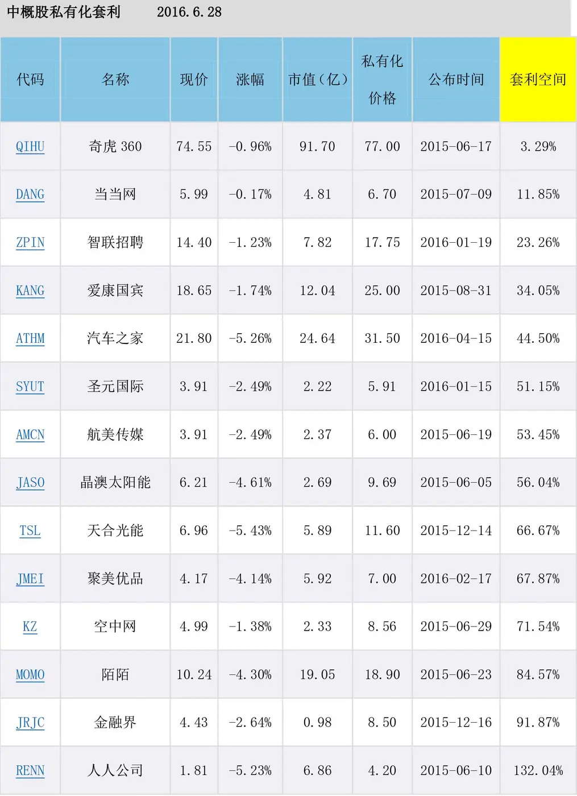

__（2）吸收合并套利__

在A股市场上吸收合并换股也是套利的重要方式。吸收合并换股是公司合并的一种形式，是指一个公司吸收其他公司，为了使得换股吸收合并的决议能得到通过，通常在吸收合并换股的方案中包含现金选择权。2008年以前，盛行无异议现金选择权，在吸收合并换股方案d的实施过程中，无论投资者在股东大会上投赞成票还是反对票，都有资格在换股上市前实施现金选择权。但是2008年以后，吸收合并方案一般实施对大股东更有利的异议现金选择权，在吸收合并换股方案的投票中，只有投反对票才能获得现金选择权。由于很多套利投资者为了获得现金选择权，必须在吸收合并换股方案中投反对票，就会出现一个问题，如果投的人多了，可能会导致方案不通过。为了增强吸引力，大股东实施二次现金选择权，上市公司承诺，在新股上市的当天，如果新股破发，换股上市的投资者可以按照发行价将股份卖给上市公司或者第三方；或者承诺当开盘价低于发行价时，上市公司将大比例增持公司股份，这相当于隐含了二次现金选择权。一旦股价低于上述三个价格将是买入套利的绝好机会，如笔者重仓参与的攀钢钒钛和东电B换股浙能电力，即使小幅高于套利价格，也多了一层保证；由于大股东要保证承诺价格，这将大大推升股价，带来套利之外的溢价空间。

吸收合并换股上市分为两种类型，一种是换股后首发上市，另一种是换股后增发上市。

在股票套利中，收益率最高的是吸收合并首发上市，基本能做到牛市和熊市都超越大盘指数，而且风险并不大，这是因为中国A股市场有炒新股的传统。吸收合并换股增发上市，主要原则是吃相对收益的折价，如果换股前的折价较大，则很值得参与，但建议控制仓位，因为从严格意义上来说，合并换股之后的价格并无保证，不属于真正意义上的套利，或者说是相对折价套利。原来换股方案出台后，新股没有IPO时，股价是普遍折价的。折价幅度可能是在5%～10%。（折价太多IPO时就是暴利了），底部常常是现金选择权额110%。

__表7 吸收合并换股__

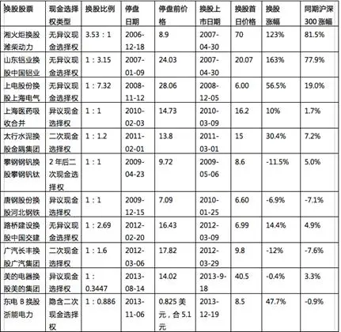

__（3）要约收购套利__

要约收购是指收购人通过向目标公司的股东发出购买其所持该公司股份的书面意见表示，并按照依法公告的收购要约中所规定的收购条件、价格、期限以及其他规定事项，收购目标公司股份的收购方式。收购人为了达到收购目的，一般会提高收购价格，在宣布收购至收购停牌前有一定折价形成的套利空间。风险有两点：一是要约失败，历史上成功的有苏泊尔、金马集团、重庆啤酒、贝因美等，而全柴动力，则是由于收购方熔盛重工所处行业的严重不景气，导致其中止要约收购，结果导致全柴动力的股价雪崩，差不多跌到要约收购价格的50%；二是部分要约收购中，要约结束后股价往往复牌即跌，如果未被收购的股份过高可能会亏损，因此要对收购比例、复牌后的股价下跌空间进行有效的评估。

__（4）认沽权证套利__

认沽权证，就是看跌的权利，是指在行权的日子里，持有认沽权证的投资者可以按照约定的价格卖出相应的股票给上市公司。当股价低于认沽权证约定价格的时候，套利空间出现。而上市公司为了避免大量收购流通股，也会想一切办法出利托住股价，这就是认沽权证套利的原理，这样的例子在中国并不少见，如上海机场、华菱管线和攀钢钒钛都发行认沽权证。

__（二）股票套利评估__

随着A股持续低迷，借壳政策收紧，监管层对中概股回归态度也有所变化。2016年3月，“设立战略性新兴产业板”这一项，被“两会”从“十三五”规划《纲要草案》中正式删除。这无疑是给以欢聚时代为代表的中概股当头一棒。于是在2016年5月，市场上“中概股回归”将叫停的传闻四起。5月6日证监会称，市场上对在国外上市中资公司通过并购重组在A股上市提出质疑，对境内外市场的明显价差、壳资源炒作应该受到高度关注，并称将对这类企业IPO、并购重组回归A股市场的影响进行深入分析和研究。目前IPO堰塞湖越来越高，借壳审核方面力度加大，中概股回归A股根本没有出口。5月5日晚，“中概股回归”将叫停的传闻一出，欢聚时代、陌陌、奇虎360、世纪互联等公司股价受到重创。6月15日，欢聚时代退出私有化，是中概股回归热降温倒下的第一张多米诺骨牌。此后，搜狐、天鸽互动、博纳影业均传出消息，或私有化可能性降低，或表态回归A股有困难。中概股回归热潮面临“迅速”降温的局面，只有奇虎360这样的优质股才出现以黑天鹅的价格买入白天鹅的套利机会，而因为取消私有化大跌的股票则比比皆是，所以必须对风险进行评估，以最大限度地降低风险。此时我们很有必要学习一下巴菲特在1988年写给股东的信，巴菲特在信中汇报了当年公司进行套利获得的“异常巨大的利润”——当年获得了超过50%的收益，而公司每年仅参与少量的但是规模很大的交易。但是，即便如此，他仍表示，即使有大量的现金，公司亦不会在次年进行套利交易。而随着市场对套利的追逐，概念和范围也变得越来越泛滥，风险也随之增大——这与现在风起云涌的中概股私有化十分相像。套利面临的主要风险是宣布的事件并没有出现。巴菲特规避风险的方法之一，就是只专注少数几个案子，只有当出售的消息已经公布后，他才会进行投资。在经历了数百次套利/转机获利后，巴菲特发现，25%的年收益率常常比100%的年收益率更有利可图，也就是说，具有更多的可能性。华尔街的金融人士会利用谣言的力量，而巴菲特只会在出售或者并购宣布后才进行投资。

我们再来看当下市场，巴菲特解释，为了要评估套利可能的风险，你必须回答四个基本问题。

1）已公布的事件发生的概率有多大？在这点上，巴菲特保护自己免于风险的方法，就是只投资已经发出事件公告的公司。而且巴菲特只寻找一些重大的财务交易事项，限制自己只参与公开且较友善的套利交易，拒绝利用股票从事可能会发生或接收到绿票讹诈（指溢价收买威胁吞并目标公司的股票）的恶意并购投机交易。

2）你的资金总计要投入多久？投资时间的长短自然影响年化收益率，因为套利有较明确的盈利预期及资金使用时间，巴菲特也利用财务杠杆，即短期融资来进行套利操作，所以时间问题关乎资金的成本，所以要明确自己可以承受的资金成本幅度。

3）有多少可能更好的结果会发生，例如并购竞价提高？期望的是一种额外报酬，即未到具体清算事件的发生，竞争性报价提前超额实现了预期中的价值，套利者得以提前获利了结。

4）因为反托拉斯法的限制，或筹措资金的技术问题等，当预期事件未发生时，要如何处理？这种事件的发生，意味着套利机会消失。也就是说，当已买入股票，又不能套利以后，应急方案要预先想好。

鉴于套利的复杂性以及游戏中可能产生的各种变数，格雷厄姆设计出一套通用的公式来计算套利个案的潜在利润，巴菲特在实际操作中就是用这套公式进行评估的。这套公式如下：

年度报酬＝［CG一L（100%一C）］/YP

其中，C＝可预期的成功机会，以百分比表示；G＝事件成功时可预期的利益；L＝事件失败时可预期的损失；Y＝该期握有股票的时间，以年为单位表示；P＝该证券目前的价格。

使用示例：1982年2月13日，贝尤克雪茄公司宣布公司已经获得美国司法部批准，将雪茄业务出售给美国玉米生产公司，每股价格7\.87美元。当时市场价格为每股5\.44美元。消息发布不久后，巴菲特以572907美元，购买了该公司5\.71%的股票，价格为5\.44美元，这样巴菲特就可以从两者之间的差价中实现套利。

用格雷厄姆方程来分析贝尤克雪茄公司的情形如下：

G=2\.43美元（7\.87\-5\.44），这是如果交易成功的潜在收益；

L= 0\.94美元（5\.44\-4\.50），这是如果交易失败的潜在损失；

巴菲特还必须计算如果交易失败他会损失多少。如果取消出售，那么股票价格就会退回到宣布出售之前的水平，贝尤克雪茄公司原先的股票价格为4\.50美元。这意味着，如果巴菲特以每股5\.44美元的价格购买贝尤克雪茄公司的股票，而公司股票的价格跌回到每股4\.50美元，那么巴菲特每股将损失0\.94美元。

C=90%，预期成功概率，用百分比表示。因为已经公布并且获得美国司法部批准，因此，几乎不可能再出现什么障碍。估计成功率在90%以上。

Y=1年，预期持有时间。巴菲特要计算交易的时间长度。公司在资产清算后，会在该财政年度内将收入分配给股东，否则就要缴纳资本利得税。因此，巴菲特可以预计，公司将在年内支付这笔收入，根据出售及清算时间，确定持有期应不超过1年。

P=5\.44美元，股票的当前价格。

年收益率=\[90%\*2\.43\-0\.94\*（100%\-90%）\]/（1\*5\.44）=\[2\.18\-0\.09\]/5\.44=38%。如果贝尤克雪茄公司出售及清算如期进行，巴菲特就可以计算出他的收益率为38%。对短期套利投资来说，这算得上是一个不错的收益率。

这种推理的套利操作应当和基本面的分析紧密结合。在选择投资品种时，不能仅仅看到折价，因为没有红利的折价是无意义的，仅仅基于折价的买入是一种对赌，赌折价会缩小，而市场可能往相反的方向去。关于巴菲特减持中国石油的评论我最认同的是：巴菲特减持中国石油的真正原因是资产价格上升后的红利率已经不再吸引他了，至于市场的价格变动，则很少在他的考虑范围内（尤其是中石油的企业特征还仅仅是基于垄断，而不是“伟大”），为什么说巴式套利是价值投资的一种形式而不是投机呢，其关键一点就是在买入证券时，按照价值投资法来估值已属低估，就是说，即使事件终于没有发生，对该证券进行价值再评估的机会没有出现，由于该证券本身具有的内在价值，其短期内大幅下挫的概率不大，这无形中给巴式套利模式提供了最后的安全边际。巴式套利机会往往出现于漫漫熊途中。套利交易的关键除了分析能力之外，还需要耐心和信心。套利交易的存在一般都不引人注意，即使有一些人注意，其缓慢的走势也会将没有耐心的大多数人赶走，如2006年的长电、华凌。从以往的经验来看，这种低估可以存在很长时间，但是大众由于担心其下跌的更多，或者不相信市场会出现这样愚蠢的机会，迟迟不敢介入。其实当套利机会出现的时候反而可以看作是大盘极度低迷，即将反转的一个指标，这时套利又为我们提供安全空间，何乐而不为呢！

__（三）上市首日股价有承诺的走势__

套利交易是事件驱动型的博弈投资，需要综合考虑价值、政策、心理、流动性等因素。套利的卖出很重要，看以往套利股票的走势绝大部分是L型，再好的股票也要首日卖出。股票套利中理想的方式是提供上市保底价格，这类股票即使在熊市中也没有跌破发行价，（只有招商蛇口打破了这一规律），上市首日股价走势表明最好在开盘后半小时内卖出。

（1）金隅股份A股承诺上市首日的交易均价不低于金隅股份换股价格（9\.00元/股），否则便由大股东回购。2011年3月1日金隅股份挂牌上市，首日即以15元/股的价格高开，之后一路保持平稳走势，收盘时较9元/股的发行价大涨67\.22%，报15\.05元/股，全天成交15\.64亿元（图9）。

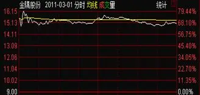

图9 金隅股份上市首日股票走势

（2）广汽集团承诺A股上市首个交易日的股票交易均价低于广汽集团A股发行价9\.09元/股，否则由大股东回购。29日，广汽集团以9\.80元/股开盘，之后震荡走低，最低触及9\.11元/股，最终报收于9\.20元/股。3月29日，公司控股股东广州汽车工业集团有限公司通过上海证券交易所交易系统增持广汽集团股份6210万股，花费约6亿元（图10）。

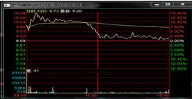

图10 广汽集团上市首日股票走势

（3）浙能集团承诺，上市后3日内若股价低于5\.53元/股，集团将投入不超过15亿元进行增持；上市后向董事会提议进行资本公积金转增股本（10转3）方案。2013年12月19日，浙能电力上市股价开盘报8\.50元，涨幅53\.71%。开盘后股价快速拉高，报9\.30元，涨幅68\.17%，盘中一度遭遇上交所临时停牌。复牌后，该股逐步回落，全天股价高位运行，收盘报8\.88元，涨幅60\.58%，换手率达45\.62%（图11）。

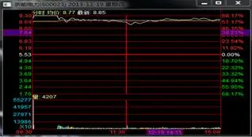

图11 浙能集团上市首日股票走势

（4）招商蛇口换股上市首日（图12），盘面惊心动魄，先是以低5\.53%开盘，把最后一天冲进去逾10%的投机盘一网打尽，随即下探，略微反弹后迅速被一些敏锐的资金在短时间内打到跌停价位，导致临时停牌1小时。继续交易后，巨大恐慌盘涌出，好在大股东及时出手避免了二次临时停牌，否则后果很严重。随着抛盘有所减少和大股东的力挺总算收复了部分跌幅，虽然大股东多次想拉起突破发行价，包括最后十几分钟的猛攻，无奈抛压太重，消耗了25\.35亿元保破发，最终还是无力回天，下跌8\.38%，收在23\.18元，低于发行价23\.6元。今天大股东已消耗了84\.5%的护盘资金，明天谁来接盘呢？也许接下去只有让市场慢慢发现招商蛇口的公司价值。理想很丰满，现实很骨感，在股市里一厢情愿的事很多，当理想破灭时，要有坦然接受的勇气。

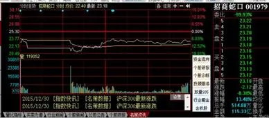

图12 招商蛇口上市首日股票走势

二、债券投资

债券投资可以获取固定的利息收入，也可以在市场买卖中赚差价。巴菲特除了持有常规债券外，还善于从可转债、垃圾债中套利。

__1\.可转债与优先股__

可转换债券（Convertible Bond）是债券的一种，在发行公司债券的基础上，附加了一份期权，允许购买人在规定的时间范围内将其购买的债券转换成指定公司的股票。可转换债券具有双重选择权的特征：一方面，投资者可自行选择是否转股，并为此承担转债利率较低的成本；另一方面，转债发行人拥有是否实施赎回条款的选择权，并为此要支付比没有赎回条款的转债更高的利率。可转债是适合中长期持有的最好投资品种，具有“下有保底，上不封顶”的特征。投资者还能利用诸多条款——向下修正转股价条款、回售保护条款和强制赎回条款，通过买卖正股进行间接套利。

（1）向下修正转股价套利。假设某可转债的转股价为10元，其向下修正转股价触发条件为：“本公司股票在任意连续20个交易日中有10个交易日的收盘价低于当期转股价格的90%时”，便可触发向下修正转股价条款。那么当正股股价有几个交易日低于9元时，公司为了不触发向下修正转股价条款，有可能适当释放利好，或者出资拉抬股价，让股价重新站上转股价的90%——9元。

（2）回售保护条款套利。假设某可转债的转股价为10元，其回售保护触发条件为：“如果公司股票收盘价连续30个交易日低于当期转股价格的70%时，可转债持有人有权按面值的103%（含当期计息年度利息）回售给本公司……”，那么当股价即将触发该条件时，公司为了避免回售的发生，可能会采取种种措施提振股价。这样，套利的机会就出现了。

（3）强制赎回条款套利。假设某可转债的转股价为10元，其回售保护触发条件为：“如果本公司股票在任何连续30个交易日中至少20个交易日的收盘价不低于当期转股价格的130%，本公司有权按照债券面值的103%赎回全部或部分未转股的可转债。”那么当股价即将触发该条件时，公司为了促成强制赎回的发生，可能会采取种种措施拉抬股价。

双重选择权是可转换公司债券最主要的金融特征，优先股套利与可转债有极大的相似之处，即如果上市公司经营不善，普通股价格大跌，可转债投资者可以拿到固定利息，相反，如果股市大涨则可以按照约定的时间与价格转换成股票，分享股票上涨的收益。尽管美国的可转债远远没有中国的条件优厚，巴菲特先生还是喜欢在股市低迷的时期大举购入可转债和优先股，而且是越跌越买。正是由于优先股和可转债投资，巴菲特才做到了无论牛、熊市均可以进可攻、退可守。巴菲特早期案例包括1989年投资吉列、所罗门兄弟、冠军国际三只优先股，最近的案例是2008年购买了箭牌口香糖公司、高盛和通用电器三家公司发行的总计145亿美元的固定收益证券，也即每年10%股息率的永久性优先股。1989年，当有恶意收购者企图狙击吉列公司的时候，巴菲特被吉列公司邀请作为“英雄救美”的白衣骑士。于是，巴菲特以6亿美元的价格购买了吉列公司定向发行的年利率为8\.75%的可转换特别优先股。这些优先股可以在两年以后以50美元/股的价格转换为1\.2亿股普通股，而当时普通股的市场价格为41美元/股左右。如果这些可转换优先股不转换为普通股的话，10年内可以由吉列公司赎回。到了2008年美国次债危机的最高潮，贝尔斯登被摩根大通收购、雷曼兄弟破产倒闭、美林归于美国银行旗下、在摩根士丹利岌岌可危之时，巴菲特再次出手认购高盛公司的可转换优先股票。具体条款是每年固定红利10%，同时获得认股权证，5年内可以以每股115美元的价格认购50亿美元额度之内的高盛股票。跟前面认购吉列的所谓优先股一样，该产品本质上就是可转换债券。不久，巴菲特再次出手，以同样的条件收购通用电气50亿美元可转换优先股。2011年3月19日，高盛集团宣布将向股神巴菲特的旗舰哈撒韦公司支付56\.5亿美元，以购回50亿美元的优先股。同时，高盛也会支付一次性的16\.4亿美元利息。伯克希尔哈撒韦仍持有高盛发出的认股权，账面获利19亿美元，因此这次投资合共获利37亿美元，其投资两年半的利润率达74%。从以上案例可以看出，巴菲特几次出手购买上市公司可转换债券，都是在这些公司遇到某些困难之时，最后的结果是巴菲特既做了人情，还赚得盆满钵满。之所以称可转换债券为可转换优先股票，目的是给现有债权人吃一颗定心丸，因为巴菲特的清偿权在现有债权人之后。

熊市才是买入可转债的好时机，牛市发的可转债，条款不会太好，而且牛市时很多可转债会被转股，相应地，存续可转债的数量减少。因此，大批可转债被转股、存量可转债数量大幅减少。如图13所示。

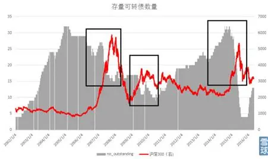

图13 可转债数量变化趋势图

此外，在熊市中受到股市低迷的影响，可转债价格往往会比较低，有的甚至会低于面值。因此，低于面值的可转债大面积出现，往往预示着熊市的底部。如图14所示。

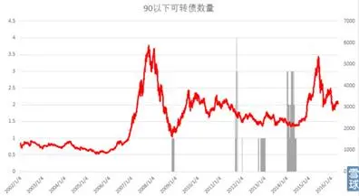

图1490元以下可转债数量变化趋势图

__2\.垃圾债__

垃圾债券一词译自英文Junk Bond。Junk意指旧货、假货、废品、哄骗等，之所以将其作为债券的一项形容词，是因为这种投资利息高（一般较国债高4个百分点）、风险大，对投资人本金保障较弱。垃圾债券又称劣等债券，指信用评级甚低的企业所发行的债券。一般而言，BB级或以下的信用评级属于低。信用评级低的企业所发行的债券的投资风险较高，因此，需要以较高的利息率吸引投资者认购。以标准普尔的信用评级估计，投资于BB级、B级、CCC级、CC级或C级的债项或发行人，具有一定的投机性，而在不稳定的情况下，即使发行人或公司为投资者提供了一些保障，这些保障的作用也会被抵消。质素最低的债券，即被标准普尔评级BBB及以下的债券，所获评级一般较低及不能履行偿还本金，风险较高。在BAA或BBB以下的债券，是属于违约风险较高的投机级债券。1974年，美国的通货膨胀率和失业率攀升，信用严重紧缩，刹那间，许多基金公司的投资组合中的高回报债券都被债券评级机构降低了信用等级，沦为了“垃圾债券”，在投资者眼中，它们成了不能带来任何回报的垃圾。许多基金公司都急于将手中的低等级债券出手，以免影响基金的质量形象。但米尔肯却敏锐地发现：“由于美国在二战后逐步完善了许多监管措施，旨在保护投资者不会因为企业的破产或拖欠债务而遭到损失，如克莱斯勒汽车公司这类大公司是不准许破产的，它的股票并不会停止交易。因而债券的信用等级越低，其违约后投资者得到的回报越高。”他把这些垃圾债券形象地定义成值得拥有的“所有权债券”，并且认为，这些债券在利率风险很大的时期反倒能保持稳定，因为其回报是与公司的发展前景相连，而不是同利率挂钩的。当时，拥有大量“垃圾债券”的“第一投资者基金”接受了米尔肯的意见，坚定地持有了这些“垃圾债券”，结果1974年至1976年，“第一投资者基金”连续3年成为全美业绩最佳的基金，基金的销售量大增。

即使是垃圾债，下跌过多、呈现良好性价的时候也可以成为好的投资。2009年巴菲特所有的投资公司——Berkshire Hathaway Inc\.，利润增长到11\.8亿，主要是由于其在垃圾债券中获得高盈利。这是其公司从1998年第二季度以来最高的利润收益。巴菲特说：“购买垃圾债券证明是利润很高的一项业务。虽然普通股在跌了3年以后价格已经很吸引人，但是我们还是觉得很少有股票能够吸引我们。”当然，投资垃圾债的高收益是建立在价格猛跌的基础上的，当2010年价格上升后，巴菲特发出警告，至今的美股形式不适宜买垃圾债券，想要投资回报率上两位数的人纯属做梦。巴菲特投资可转债的一个经典案例是2001年前后的Level 3公司长期债券和可转债。Level 3公司股价在2000年最高峰达到130美元，市值460亿美元。因为大量扩张，欠债约60亿美元，随着华尔街股市泡沫的崩溃，到了2002年时，股价居然比高位暴跌97%，一时间市场传闻纷纷，猜测该公司可能倒闭。Level 3公司40多亿元的无担保债券价格居然下跌到18～50美分的价格（面值1美元），即使不考虑转股的问题，当成普通债券持有到期的年化收益率也已经高达25%～45%！这对于一个还没有破产的企业来说，是不可思议的！要知道，公司毕竟还拥有15亿美元的现金和6\.5亿美元的银行借款，同时公司还在正常营业，拥有大量的客户，每年还在源源不断地产生现金流。这就等于，以18～50美分的价格买一个每年6%利息\+到期后1美元本金的债券！巴菲特不但在市场上高调宣布买入Level 3公司的债券，还进一步接受了公司的私人可转换债券的发售。到了2003年，Level 3债券的价格已经涨到73美分。2006年时，公司已经确定不会申请破产，仅仅从巴菲特的公开债券操作来看，短短一两年，其年化收益率高达180%。现如今，在中国投资垃圾债门槛并不低，个人投资者名下各类证券账户、资金账户、资产管理账户中金融资产价值合计不低于500万元人民币，方可开通风险警示债券买入权限。《关于对公司债券实施风险警示相关事项的通知》（上证发〔2014〕39号）规定，通过集中竞价交易系统上市交易的公司债券出现以下情形之一的，上交所可以对其实施风险警示。

（1）债券最近一次资信评级为AA\-级以下（含）。

（2）发行人最近一个会计年度的前一年度经审计的财务报告显示为亏损，且最近一个会计年度业绩预告或更正业绩预告显示为亏损。

（3）发行人发生严重违反法律、行政法规、部门规章或者合同约定的行为，或者被证券监管部门立案调查，严重影响其偿债能力。

（4）发行人生产经营情况发生重大变化，严重影响其偿债能力。

影响垃圾债券投资收益的因素：一是安全性原则。投资垃圾债券时要从各个角度高度关注安全性问题。例如，就政府债券和企业债券而言，企业债券的安全性不如政府债券。二是债券投资债券的利率。债券利率越高，债券收益也越高，反之，收益下降。形成利率差别的主要原因是：利率、残存期限、发行者的信用度和市场性等。三是债券投资债券价格与面值的差额。当债券价格高于其面值时，债券收益率低于票面利息率，反之，则高于票面利息率。四是债券投资债券的还本期限。还本期限越长，票面利息率越高。

三、现金管理

现金的收益率通常不高，但这是套利投资所必备的武器，因为拥有了现金，就拥有在市场极端恶劣情况下买入的权利。巴菲特的公司经常保持大量现金，虽然他没有讲如何进行现金管理，结合中国国情，主要包括活期存款、通知存款、货币基金、短期理财产品、逆回购。综合流动性与安全等因素，可采取以下几种策略。

__1\.银行T\+0理财产品__

银行T\+0理财产品（表8）是工作日认购和赎回都能实时确认的银行开放式理财产品。申购起点5万元，首次购买需要自己去银行网点做风险评测和签约。选择标准：一是理财产品规模大，流动性好。尽量选择全国性商业银行和全国性股份制商业银行的T\+0理财产品。某些城商行的T\+0理财产品收益高，但是关键时候也许会被拒绝赎回，导致错过投资机会。二是收益率。虽然流动性是第一位，但是收益也是必须考虑的因素。一般小银行为了增加对资金的吸引力会提升资金的收益率，需要投资者在安全性、流动性和收益率之间进行平衡。三是申赎时间和门槛。申赎时间一般对我们投资者来说申赎时间越长越好，非交易日也开放最好，起点五万这种最好。

__表8 银行T\+0理财产品__

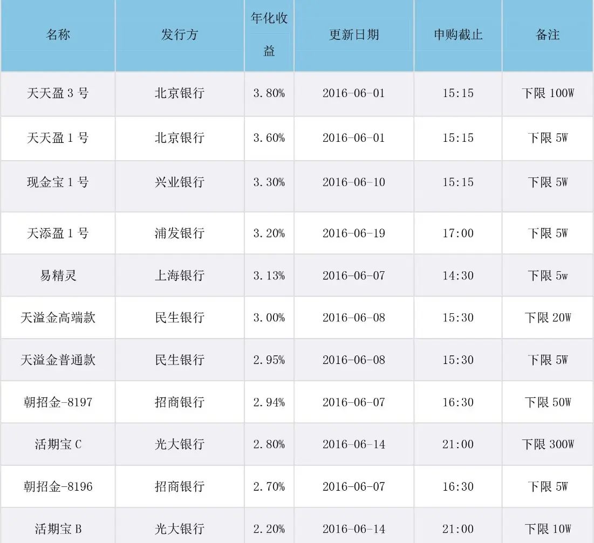

__2\.货币基金__

货币基金是聚集社会闲散资金，由基金管理人运作，基金托管人保管资金的一种开放式基金，专门投向无风险的货币市场工具，投资对象包括国库券、央行票据、同业存款等信用级别高的短期有价证券，区别于其他类型的开放式基金，具有稳定收益性、高安全性、高流动性，具有“准储蓄”的特征（表9）。在通常情况下既能获得高于银行存款利息的收益，又保障了本金的安全。

__表9 交易所T\+0交易货基__

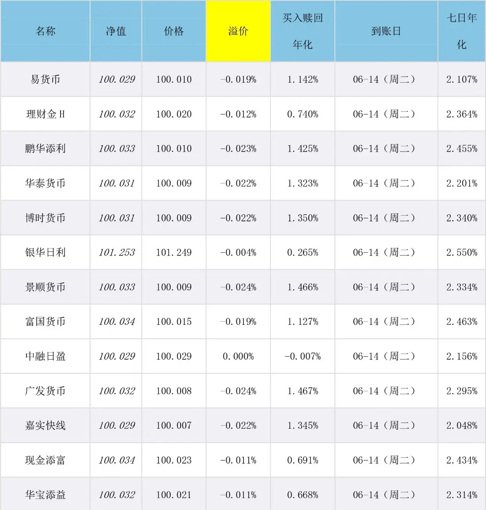

__3\.逆回购__

逆回购为中国人民银行向一级交易商购买的有价证券，并约定在未来特定日期将有价证券卖给一级交易商的交易行为。简单解释就是主动借出资金，获取债券质押的交易就称为逆回购交易，此时央行扮演投资者，是接受债券质押、借出资金的融出方。逆回购使资金借出方，由于有债券质押，所以没有任何风险，是很好的现金管理工具。目前，上海证券交易所和深圳证券交易所均提供逆回购交易，包含有1，2，3，4，7，14，28，91，182天9个品种（表10）。逆回购的操作非常简单，在股票交易软件中选择“卖出”，然后输入逆回购代码（比如204001），融资价格就是年化利率。上海证券交易所逆回购数量最低是1000（张），代表10万元，每10万元递增；深圳证券交易所逆回购数量最低是10（张），代表1000元，每1000元递增。交易成功后，账户内的资金被冻结，如果是1天逆回购，则T\+1日资金可用但不可取（可以购买任何证券品种，但无法银证转账），T\+2日资金可用可取（可以银证转账）。通常逆回购的收益率在3%左右，但是资金紧缺的时间（例如年底），收益率甚至可以超过30%。季末（3月底、6月底、9月底、12月底）的时候，通常逆回购的收益率会较好，建议参与。

__表10 上海回购逆回购FAQ__

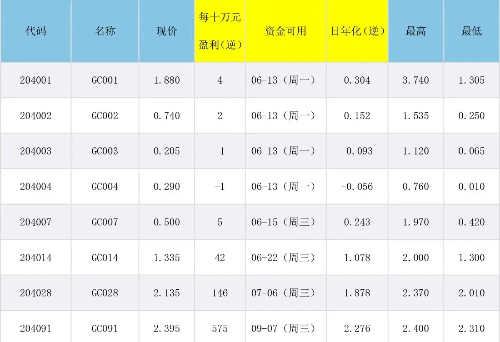

## 第十章 熊市中危险的抢反弹

__第十章 熊市中危险的抢反弹__

股票是一个进入门槛非常低的行业，但是出来的门槛很高，死法很多，小结一下，大致有三种：新手死于山顶的最后一棒，高手死于加杠杆，老手死于抄底，老手中的高手死在腰斩再腰斩后抄底。有幸没有被套在山顶的投资老手最危险的就是一次次在“底部”抢反弹，于是一次次被套或割肉。熊市抢反弹讲究的是运气，即使你曾经成功过，也不能保证你每次运气都好，只要有一次运气差就可以致命。这样的失败不仅赔钱，还打击信心，屡次抢反弹割肉之后，会有一种死了的感觉。

一、熊市陷阱

在熊市中一定要保证有生还的可能，看巴菲特的历年业绩，你会发现牛市中他的收益并没有超越大盘很多，但是他的投资组合特别安全，在熊市中的跌幅远低于大盘。索罗斯说：“逃脱者可获生机，再次参战。”芒格说：“我就想知道会死在哪里，然后永远不去那里。”切记不能把牛市或者震荡市中的成功经验带到熊市中去，以下就是熊市之中易犯错的地方。

__1\.使用杠杆__

熊市中风险本来就很大，用权证借贷等杠杆将使风险放大数倍，而且当你运用权证时，就说明心态已经变坏，有赌博的心态在里面，这已经远远超过了投资者的承受能力。当你买入权证的第一天起就意味着死亡，因为人的本性已经将你牢牢束缚。在《权证一周年祭》中你才能体会到那种被杀死的感觉。巴菲特等名家都强调不要使用杠杆，只有索罗斯在对的时候加大杠杆全力出击，并不是所有人都是索罗斯。

__2\.盲目寻底__

期待底部的到来是人性的弱点，不怕套牢，就怕踏空，这句话道出了贪婪的本质，同时也不要寄希望于技术支撑，因最终都是无效的。我们经常犯的错误是“已经跌这么多了，该到底了”；4000点和6000点比认为差不多到底了；3000点和6000点比认为差不多到底了；2000点和6000点比认为是铁底了；可事实是底在底下！底不是每个人都能抄到的，而是回头才能看到的。从技术面来说，大盘仍处于下降通道时，大跌之后的阳线往往都是下跌中继，所以切忌追涨，更别相信是什么反转了。此外在熊市中久盘必跌，与牛市中相反，横有多长，跌有多深。

__3\.相信政策利好__

熊市有利好是不足为奇的事情，甚至出台阶段性的救市政策也属正常，因此也会有政策底的说法，这反映的是被套的人的期待和幻想。政策底很少与市场底重合，往往是多个政策底之后才巧遇市场底，而多数人牺牲在政策底上。熊市里最常见的也是这种突发利好引起的井喷行情，害人不浅。当年台湾当局组织国安基金进场，也只不过短期内有所反弹，长期趋势依旧大跌。不管汇金还是央企，逆着趋势操作结果不会很妙。2005年股改，宝钢40亿人民币进场，也不过两天工夫就被市场砸得片甲不留。仅2008年单日涨幅在100点以上的心动行情就超过16次，而在此之前的十五次全部是把你最后捆得结结实实的套人行情。

__4\.错用相反理论__

相反理论是有用的，但前提条件是在拐点附近；相反理论也会害人的，原因是很多人出于对拐点到来的期盼而错误地运用了它。下跌是伴随恐怖和绝望的一个很长的过程，因此，如果你盲目相信“别人恐惧我贪婪”的话，套牢是你必然的选择。

__5\.倒金字塔补仓__

几乎所有的教科书都教你补仓以降低成本，事实上熊市下跌过程中倒金字塔补仓是错误的行为，成本下降是可能的事情，但你的成本一般还在山腰上，一次次地补仓事实上是在自己脖子上一次次地增加枷锁。在熊市中提出“洗盘”的看法是极其错误的，盘中跳水是恐慌盘的涌出，后市的走势往往是破位。如果你认为这是洗盘、清洗浮筹，从而去接盘，那么你就大错特错了，在熊市中保留现金是你唯一的选择。

__6\.抢反弹__

在熊市中每次反弹均是逃命的机会，每次抢反弹都是继续扩大亏损的痛苦途径。为了回本，很多人在努力地寻找反弹的机会，以用小的差价减少损失，由于熊市的反弹总是昙花一现或是为下跌积蓄能量，所以抢反弹的结果往往是再度套牢和再次割肉，所以，有死在反弹中的说法。正确的做法是在反弹中减少仓位，以规避新的下跌。其实今天即使赌对了，扳回20%又能如何呢？做反弹需要恰到好处，假使提前了2天，先套10%也很容易，你真的能顶住心理压力吗？有的投资者在第一次的抢反弹中尝到了甜头，总认为每次都能成功地及时获利离场，所以在其后的操作中就不断地加大仓位，这是非常危险的，如果不幸在最后一次抢反弹中，无法出逃，连续几个跌停板，那么不仅要吐出此前的利润，而且还要搭上老本。

__7\.追买强势股票__

逆势的股票是存在的，但最终总是追随大盘的步伐下跌，强在一时，补跌总是难免的，追涨杀跌最终将死无葬身之地。而多数人喜欢看到红色的东西，喜欢看到强势可能带来的机会，于是，连续观察之后去追买，OK，在买完之后就是补跌，你高于大盘的亏损因此而产生。

__8\.相信套不死__

被套之后很多人会说等它几年就回来了，甚至会拿出一些以前套了几年发财的故事欺骗或安慰自己，且不说时间成本很高，套牢也给你带来很大的实际风险：摘牌或者退市的事情也许就发生在你身上。熊市中相关龙头股普遍跌幅超过八成，逾九成的也不罕见。只要你有足够的耐心，那么你一般总能等到你曾经期望和曾经以为想象不到的低位和廉价筹码。在最高位乃至次高位的时候，如果梦想着招行到10元、平安到20，那好像是不可想象的，因为等于要跌去70%，80%，但是这就是现实。2000年美国网络股泡沫中，纳指从5132点，最多跌至1108点，亚马逊跌幅95%，雅虎跌幅是97%，爱立信跌幅是99%；通用电气跌幅是65%，英特尔跌幅是89%；麦当劳跌幅是75%。记住，这些都是生还者。

__9\.调仓换股__

调仓换股的论点是错误的。在市场已产生系统性的危险时，谁能保证你所换的股就一定是好股？暂时不要去谈什么价值投资，那只是自我安慰与自欺欺人的口号。也许越换越死，死得更快。

二、熊市投资者有四大心理阶段

当股指处于回落的周期中，投资者有四大心理阶段。

__1\.坚定期__

牛末熊初股市每次盘中调整，投资者就果断买入。牛市末期，投资者情绪高涨，认为每次回调都是买入机会。高手有一定经验，能判断市场处于高位，虽说被套的一般是新手，但是也有高手在调整过程中怕市场一直处于高位，或跌多了贪图一点利润而买入股票的情况发生。

__牛末熊初的最佳策略是绝对空仓、休息。__大盘何时见顶，不得而知，但是现在是顶部区域，下跌的概率大于上涨的概率，宁愿错过不可出错。

__误区：__

（1）A股将会走出一波独立行情。

（2）牛市根基还在，快牛变慢牛或者10年牛市不变，回调到位后仍将继续上行。

（3）抛开指数专心做个股。

（4）绩优股抗跌，持有绩优股不要轻易出手。

__2\.迷惑期__

股指下跌20%～30%时，难辨趋势。以前在这里都能涨起来，这次回调的时间好像比较长，但是有的股票创了新高，牛市还在吗？

__在安全边际到来之前一定要有敢于踏空的勇气、忍受寂寞的毅力和耐力。__至于踏空者的命运，我不知道股市中有多少人有资格嘲笑他们，他们最多没发财而己。前面牛市已经带来了足够的利润，人不可能一直好运，所以一定要谨慎。

__误区：__

（1）中期趋势向上，坚决执行越跌越买的策略。

（2）机会是跌出来的，风险是涨出来的。

（3）某某点的压力位置是一个纸老虎。

（4）正在酝酿做多行情，反攻行情一触即发。

（5）调整接近尾声，再次下跌的空间已经不大了。

（6）地量见地价，单日反转可期。

__3\.明朗期__

熊市已经确认，此时新手已经动弹不得。由于亏损严重，股民心态较不平衡，处于愤怒期，习惯找一个“替罪羊”安抚受伤的心。此外，目前众人期待救市，则是这一阶段突出的外在表现。很多人认为估值已经合理，可以进场进行价值投资。定势思维带来的牛市综合征，加上价格下跌的强烈对比，虽让大部分能在高位套现的高手志得意满，然而很多高手都是这样死的，这不是在山顶上，而是在下跌途中。熊市里想着抄底，一忍再忍，最后还是抄早了。顶是尖的，底是平的，耐心等，如果你未来犯错误，90%的可能是抄早了而不是抄晚了。

__短期暴跌不是做多的理由，暴跌意味着恐慌。__要在别人恐慌时入场，那么短暂的暴跌是不是要考虑进场呢？暴跌不意味着熊市的结束，更不意味着各种基本面的根本转变。通胀会因为暴跌而出现转机吗？不会！企业的盈利前景会因为短暂的暴跌而出现转机吗？也不会！既然如此，基于暴跌而做出的入场决定，在价值投资者看来，显然就是一种投机。

__误区：__

（1）指数将先破后立，不破不立。

（2）相信中国经济，西边不亮东边亮，不会对股市撒手不管。

（3）管理层正在应战做空的砸盘者，政策利好随后将到。

（4）某某点位将有强支撑，某某点位必是铁底，牢不可破，某某点位是政策底线，空头肆意做空必将遭到政策大棒惩罚。

（5）某点下方是大空头陷阱，挖坑行情不足为惧！

__4\.恐慌期__

恐慌期的表现为整个经济处于回落周期，人们对上市公司的业绩进一步担忧，大量人加入抛售股票行列中，开始大量赎回基金。此外，人们开始对券商从业者的惨淡状态表示同情。对许多人而言，如今除了盼着“救市”他们实际上已经无事可做。因为账户上除了股票便是基金，已经无钱可用了。而对另一些人来说，因为在相对高点出逃成功，其账户上尚有一定数量的资金，所以活动余地便大得多。于是，在市场下跌过程中，他们一次次在“底部”抢反弹，也一次次被套或割肉，直至账户上也只剩下股票和基金。只有那些在高点一线从容出局，并且能在一路下跌中“动心忍性”，才能做到神定气闲，并最终成为能迎来下一次机会的胜者。

__估值合理不是大幅做多的理由__，巴菲特在次债危机后，认为股市没有泡沫，但是也不便宜，并不是进场的好时机，因为股市经常会跑过头，而中国的股市更疯狂。估值合理只是建仓的起点，要做好资金管理应对进一步下跌。

__误区：__

（1）泡沫已挤净，或者估值压力已完全释放，估值已合理，初具投资价值了。

（2）二次探底已成功，或说头肩底雏形已现。

（3）现在底部已经明朗，跑步进场，千点行情来了或中期趋势向上，将达到某某点（高点）。

（4）此时不买，更待何时！满仓杀进，或逼空行情即将展开，让踏空者肠子都悔青，或过了这一村，就没有下一寨了。

（5）当别人都恐慌的时候，就是我们该贪婪的时候了。

三、熊市中的操作策略

牛市里比的是谁疯狂、谁敢想，熊市里比的是谁保守。根据我的经验，绝大多数人（尤其是追求价值投资的）在熊市下跌过程中，在牛市估值的对比下，都难以抵御觉得估值合理提前入场的诱惑。熊市一定要学会休息，千万不要抢反弹，一定不要怕错过牛市。

__1\.偏执看空__

在熊市之中怕踏空的思想是极其有害的，如果你不能保持这种坚定，去跟随大众，只有死路一条。SOSME老师认为，真正的空头要有不怕踏空的强化心态,要有错失牛市甚至主动踏空的心理准备，要坦然面对为此而错过的所有机会。面对每次上涨后错失机会，应当庆幸自己的坚持抵御了危险的诱惑（尽管这个诱惑看起来唾手可得，而且确实有多次是可以得到的。巴菲特时代，人们亏损是因为太聪明），而不是后悔机会的丧失。如果实在忍不住，请坚守一个原则，在熊市之中最后一个进场，一定要比所有人看的都低的点位进场。只有确立这样的原则，才能抵御抢反弹、抄底的强烈诱惑。

__2\.向市场示弱__

要想战胜市场，首先要承认自己能力的不足，不要相信自己具有足够战胜市场的能力。在条件没有达到一定的满意度时，要在熊市里认怂且一直空仓。我相信这个证券市场肯定存在能在牛市大赚，在熊市也一样大赚的天才，但我不是，也不会去嫉妒他们。作为一个普通人，在熊市里想着怎么去赚钱是一种罪过，因为赚钱意味着你曾不顾大气候做过一些危险的动作。若干在股市遭到亏损的人会说“赔了一笔，我一定要设法把它赚回来”，越是遭遇这种情况，就越应该平心静气，等到市场有新状况发生时才采取行动。

__3\.学会适当“偷懒”__

在不确定的市场中，机会的背面就是风险，必须要学会适当的“偷懒”，尽量少做判断、少做动作。那种不顾市场大环境，对每一个可能的机会都锱铢必较的“勤奋”行为，与其说是投资，不如说是一种代价昂贵的娱乐。大部分的投资人总喜欢进进出出，找些事情做。他们可能会说“看看我有多高明，又赚了”，然后又去做别的事情，就是没有办法坐下来等待大势的自然发展。特别是在下跌的诱惑之下，有人认为可以一试，罗杰斯对“试试手气”的说法不以为然。“这实际上是导致投资者倾家荡产的绝路。我总是靠等待，最后你会发现钱就在脚边。”

__4\.远离股市__

市场情况千变万化，只要你还关心市场，就有可能被诱骗进去，如果想保持安全，最好远离市场。做投资属于知不易行更难，只有头脑清醒的才能生存！可以说每个人都在追求，但是又有几个人能做到？在漫长的等待中影响因素有很多，取上才能得中，只有坚决看空才能基本保持空仓状态。人的思想是动态的、活跃的，甚至有时1秒前后的决定都截然不同，放弃长期坚持的原则会铸成大错。也许从事投资实业，卖出的手续比较烦琐，但是股票操作只要有一念之差就可以把你毁灭。所以在头脑清晰、空闲的时候，应当多琢磨怎样让自己卖出或买入不方便，设置几道程序，购买国债、货币基金等，远离股市不失为很好的方法。

__5\.在你手中持有现金的情况下，应该抵制住购买股票的诱惑__

拿着钱买股票是最容易的事，能拿着钱不买则需要相当的定力与经验。不是因为手里有现金而是因为价格降到非常有吸引力的时候才会考虑到购买股票。

__6\.预设苛刻的前提条件__

要从足够的安全边际来为自己的投资行为设定量化指标。根据价值投资者对投资行为预设的前提条件，它的满足也应当出现在市场极度低迷与萧条之中，或者说它只可能出现在暴跌之后而不可能出现在上升的市道之中。按照不要亏损的原则，在绝大多数情况下休息，只在自己的能力圈内行动。

__7\.按照投资概率和企业价值分批建仓__

市场有相当一部分是我们不可知的，尊重大概率事件是唯一能做的事情。在内外宏观经济状况仍不乐观的情况下，只能按照投资概率和企业价值分批建仓，而不是等待在最底部满仓。以前每次抄底，总觉得很便宜，但是便宜之后有更便宜的等着，所以要考虑一下概率分布图，假设各种可能性。

__8\.慎入境外投资市场__

境外市场是价值投资者的天堂，也是价值投资者的地狱，天堂和地狱好似一步之遥，但要跨过这一步，需要多年的潜心修炼。功力不深，抄底价值股很容易死掉，一旦做错，将是无底深渊，在A股市场轻易获胜的低限度要求，在境外注定遭受折磨。2008年抄底，中信抄底贝尔斯登·雷曼，平安抄底Fortis，2011年抄底欧盟，都失败了。前车之鉴，后车之师！

2014年上半年，美国好多财经媒体大谈俄罗斯市场是世界上估值最低的市场，PE不到10，可以投资，结果铩羽而归。接着在大概10月到11月的时候，媒体又称俄罗斯可以抄底了，然后满盘皆输。

从2014年开始，东南亚就是欧美媒体强烈推荐的投资目的地，相关ETF也异常火热，柬埔寨和越南的年轻人口比例更高，而且还更勤奋。但是早在2005—2006年，有一批华人，冲过去，买股、买房、买艺术品。当时有说法称，越南是1992年后的中国，然后都失败了。

在香港，网络大V管财主的一个好朋友，绝顶聪明，在2000—2001年按揭加私贷全副身家抄底香港楼市，当时楼价已经下跌了45%，并且香港已经没有新增私楼供应，租金回报率达到了4%。谁会想到跌了45%后还能再跌45%，于是自杀于2003年。如果当年没有“非典”，毫不意外，他肯定是朋友中最富有的一位。可惜没有如果。

商品市场状况也同样惨淡，铁矿石，2013年10月1000多元一吨，现在300元一吨，打3折甩卖；焦炭2012年年底2200元一吨，现在600元一吨，打2\.7折；橡胶2011年最高峰时价格是4\.2万一吨，现在的价格是9000多一吨，打2\.1折甩卖；金属镍，在2007年最高峰时的价格为48万元一吨，现在是6万多一吨，已经是1\.25折甩卖。

20世纪90年代初，上海股票市场出现了“三杨”，都是从小资金做到上千万的风云人物，其中两个带着股票市场的自信进入了期货市场，在那次闻名的国债期货中，短短的一个小时，两人彻底崩溃，一人神经崩溃、一人跳楼，自此，只剩下杨百万存活至今。

对于积极型投资人，跨领域投资一定要慎重，把一个市场的成功经验带到另一个市场往往是失败。至于网友的操作教训，各著名财经论坛上也比比皆是，简直是“亏到不能自理”。

四、关注的高手过于错判的实例

尽管道理都懂，但是熊市常态往往是，抄一次套一次，套一次亏一次，亏一次割一次，割一回忘一回。如果还是记不住教训的话，再看一下这些血淋淋的例子。

（1）经过多年的打拼，到1929年，格雷厄姆联合账户的资金已达250万，但大危机接踵而来，尽管格雷厄姆小心谨慎，但在1930年损失了20%以后，以为最糟糕的时候已经过去，于是他又贷款来投资股票，一跌再跌。那次大危机的唯一特点是：“一个噩耗接着一个噩耗，糟的越来越糟”，到了1932年联合账户跌掉了70%多，格雷厄姆也濒临破产。

（2）费雪已经预见1929年股市泡沫破灭，但是还是买入自认为是便宜的股票，结果几天之中损失了几百万美元。

（3）索罗斯在1987年前认为日本股市泡沫巨大，于是放空日本股票，结果惨败。索罗斯在《华尔街评论》上鼓吹美国股市会坚挺，日本股市将会崩盘，而结果正好相反：美国股市崩盘了，日本股市却依然坚挺。索罗斯旗下的量子基金当年损失了32%，与他唱反调的孔逸夫却让科尔基金赢利了70%，这是一个令人惊奇的数字，因为当年几乎所有的对冲基金都亏损了。

（4）美国20世纪最伟大的投机者，索罗斯与20年代的利文摩尔。利文摩尔逃脱了1929年的大崩盘，大赚一笔。可是，在后来的抢反弹中，他加入了做多队伍，从1929年的340点跌至1932年的43点，全球股市上最大的空头利文摩尔，竟然死于做多。

（5）台湾地区加权指数从12682\.41点到7000点时，很多人开始抢反弹，越跌越买进，自己的钱用完就开始借款，利率高达30%，结果如何？肯定成为负资产者。上海一家基金管理公司的总经理当初是从中国台湾地区股市1000多点开始进入的，一直做到10000点，入市50万的资金滚到了8000万。其实在10000点的时候，她就把股票全部抛了，手上握有的全是现金。因为担心股市过于疯狂，她还相对比较谨慎，最后台湾股市上冲到12000点之上，三年多时间增值了160倍。在台湾股市由12000点跌到7000点时，她又进入，然后股市并未反弹，继续下跌5000点，最后，她不得不全部认赔清仓，8个月时间跌去80%，8000万成为\-80万！

（6）香港知名股评人曹仁超，1972年香港股灾前1200点看空，差点被公司解雇。1973年港股达到1773点后大幅下跌，到1974年跌至400点，曹仁超躲过了大熊市，信心百倍。1974年7月港股跌至290点后他认为可以捞底，于是拿全部积蓄50万港币抄底和记洋行，该蓝筹股从1973年股市泡沫的43元一直跌到5\.8元，老曹全仓买入。结果后来5个月，港股再度跌至150点，和记洋行跌至1\.1元。老曹最后斩仓，亏损80%以上。

曹仁超：作为投资者，千万不要在下跌的股票市场，去估计底部在哪里，而应该持有现金，等待底部的出现，例如持续两周不再下跌，这就是所谓“宁买当头起”的策略。事实上，股票市场大部分的成功投资者都是靠守纪律成功，而不是靠所谓的眼光。现在我们猜测底部实际上说的是一种“眼光”。对于在A股这次调整中已经被套牢的投资者，现在的问题是不要再把Good Money（好钱）变成Bad Money（坏钱），不要让已经被套牢这件事情影响你遵守纪律。套牢的钱已经是坏的了，但手中的现金还是好的，不能再猜想底部在哪，凭眼光随便冲进场去，一定要在市场回升10%～15%之后再进去。如果不守纪律，再把好钱转为坏钱，结果便是All Bad（全部一团糟），连翻身的机会都没有。

（7）徐兴博年近半百，是南京市一家药材公司的普通职工。1992年，我国证券交易市场还刚刚起步，许多单位和个人在这片领域里淘得第一桶金。徐兴博的确在这里面淘得了第一桶金，凭着丰富的投资经验，不管股市如何涨跌，他总是能及时嗅出大盘行情，事先做出调整，让自己的投资稳定增长。2001年10月，形势急转，而他仍认为能像以前那样安然度过低谷，接受委托资金超过100万元。2005年6月，沪指跌破1000点大关，一夜间回到了13年前，徐兴博的财产和朋友委托给他炒股的财产，都在这次大跌中损失殆尽。

## 第十一章 谈失败

__第十一章 谈失败__

投资是个没有成就感的职业，亏损是投资过程的一部分，只要你还在场内，你就有出错的可能。失败是成功之母，正确面对亏损带来的极度痛苦是每一位严肃投资者的责任，持续不断地改善自我，才是股市长期生存之道。

一、股市进化与超越

股市就像生物有机体一样进化，没有一种投资方法是长期且最好的，但是大部分投资者没能适应环境的变化而调整策略，最终导致失败。一段时期成功的策略将会吸引更多的资本，人们争先恐后地去发现这些明显的模型，从而形成主导策略。大众认同，资金流入，效率下降，这些方法被普遍采用之时，正是其失去效力之时，总有一天会崩溃。在A股市场上，2007年对价值股买入的持有策略被追捧到了顶峰，诞生了一批股神，但是在2008年便受到了惩罚，目前收益率已经非常平庸。市场上成功的、流行的投资策略都将被股市的竞争力所抵消，投资者最佳的长期投资策略就是在黑暗中寻找钥匙。要围绕“股息\-贴现模型”为核心，与众不同的思考创新思维，积极地寻找新知识。学习以多学科的思维方式进行思考，把学到的东西与投资界联系起来，构建新的思维模式，寻找新的组建模块。当我们的模型能稳定地获利时，我们当然应该集中力量探索股市的无效率，有效率地使用已知的知识，同时积极地学习新知识，在开采和探索中找到平衡点。善于从上一轮模型中表现“失败”的股票中发现机会才是成功之道。

股市进化也体现在索罗斯的反身性理论中，金融市场参与者在了解到市场的形态后，参与到他所理解的市场并进行交易，但是市场会趋向于向观察者未知的方向去变异、进化，我们容易发现市场的反身性运动形成了一个时序（理解的过去的市场情景、预测未来，当下做出的交易决断、交易行为对市场未来的塑造）上的“缠结”，即对市场未来的贴现会影响被贴现的市场未来。与之相对应，想形成长期战胜市场的策略是很难的，正所谓“道高一尺，魔高一丈”。要想成为赢家就要从失败中找，而不是从胜利中找。很多获得巨大成功的人往往是那些最先观察到环境变化，并很快去学会适应新环境的人，这种进化需要不断突破自己的界限，经历失败和痛苦是必然的，痛苦是自然给我们的信号，告诉我们正在接近或超越界限，超越它，便是自身的进化。但是很多人不愿反思自身的不足，讨厌别人告诉自己的缺点，是因为这样做有让他们受攻击的感觉，从而本能地产生情绪反应。很多人一辈子都无法了解自己，无法适应环境去实现目标，这是因为无法克服自我，太过在意别人的看法。这是人类最大的问题，也是大多数人痛苦的根源。所以著名的桥水公司的创始人雷·达里奥要求所有员工互相批评指责，软化他们的自尊，让他们学会理性、保持清醒。这种消解自我的处世方法，多少反射着禅宗“无我”的智慧。“无我”即要破除我相，不被别人对自己的看法所束缚。在桥水，员工当众互相批评是家常便饭，脸皮薄的人在这样的文化下难以生存，达里奥想改变的就是以自我为中心的状态。他认为，个人发展中最大的障碍就是脆弱的自尊心，人若想获得真相、完善自身，就必须克服“面子”。所以，他鼓励员工之间不断相互批评，直到他们能冷静客观、不带情绪地去反思这些指责。

价值投资是最为持久而经得起考验的投资方法，但不是唯一的方法。长期来看没有一种投资方法永远是最好的。所有的投资方法总是在最为流行的时候失去效果。所以为了走在其他投资者前面，我们每时每刻都要开发新的投资方法。现在我们有14种方法，希望成为运用新的投资理念的领导者，获取非凡的投资业绩……但是纵观50年的历史，没有比“按基本价值买入”这种方法更为持久——购买那些相对于真实价值，价格被低估的公司。

——坦普顿

二、不确定性和概率化生存

股票价格的起伏要比商业价值的起伏剧烈得多，股市的随机性决定短期亏损必然产生。宏观经济是不可预测的，宏观因素对股市的影响更是难以预测。2008年美国次贷危机刚出来的时候，大家还处在亢奋之中，认为对股市没有影响。我在高位卖出股票后，转战期货市场买入一手玉米，作为初次操作，考虑的因素相当周全，包含通货膨胀、油价上涨、提高农民收入。但是来了一个次级债、国家调控，结果从赢利1倍到亏损。个股的涨幅大部分时候都难以判断，在我以往的经历中很多次非常看好的股票反而涨幅小，当时认为次之的股票却涨幅巨大。大牛股并不是在一开始就能发现，企业的发展别说那些研究员无法预测，恐怕企业掌舵人自己也没底，最典型的就是网易，当初丁磊开价不足一亿寻找卖家，遍寻全球，好不容易8000万能出手，一场财务风暴就此黄了此事，没想两年后因祸得福，无聊中做的短信和网游又把丁磊送上首富的神坛。如今被誉为价值投资典范的持股者刘元生，据说到市政府申诉——为何不让我卖出万科。曹仁超在一只股票跌到90%的时候抄底，再损失80%，他抄底的股票当时巨额派息，估值非常低，他看了这家公司过去10年的财务记录，没有什么漏洞，最后发现问题出在它的一个子公司，因为子公司出现了巨额亏空，以至于将整个集团拖到破产边缘。面对股票市场的不确定性，我们所能做的就是忽略大量的噪音及随机性对短期结果的影响，不管短期的业绩波动如何，坚持概率化生存。投资其实就是一种概率游戏，投资者每天都应当把投资机会转化成概率，按照凯利公式来做好资金管理，追求的是大概率的确定性。在交易中，严格的概率思维使你的自负无容身之处。因为任何决策都建立在一定的概率基础之上，无论你输赢与否，都不是最重要的。你将注意力放在研究概率之上，你就会更多地考虑市场的情况，而不是自身的喜好。一旦你从自身的角度审视市场，就会产生各种各样的曲解和错误判断，输于小概率的损耗。

投资者面对不确定性却要把它转化成现实中可度量的概率和预期回报额，并依此选股，这无疑是重大的挑战，要不断强化逻辑寻求未来的确定性。2003年前的茅台有几个人能够确定它是好公司？明确了它是好公司后有几天好的价格？如果不能有先于别人找到机会的能力，就失去了生存的基础。概率化生存要求我们不断强化追求未来确定性的逻辑能力，自己的投资逻辑形成后，该做什么不做什么，会成为常态。我们的认知能力有限，每个人进行逻辑推理都有自己的能力圈，做投资要确定自己的优势，巴菲特没有买进微软，是他在这方面没有优势。任何跳出能力圈追求更好的冲动都是陷阱，是很危险的，要谨慎，再谨慎，特别是要预防黑天鹅。投资考验的是在信息不完整的情况下的决策能力，其间逻辑推导的严密性非常重要，但是也不排除黑天鹅事件。小概率炸毁性事件在冒险活动和投资过程中是值得重点关注的，因为小概率事件一旦发生就足以致命，生存是第一位的！当然，物极必反，当事物的不确定性大规模爆发后，特别是小概率的炸毁性事件发生后，确定性就会大幅度提升，捡钱的机会就来了。

马克·墨比尔斯法则十五：一旦当不确定成为确定，任何人皆可预测事件的后果时，先前的风险溢价（risk premium）便会如轻烟一般立刻消失。

三、可错性与应对策略

“可错性”观念是索罗斯思想的核心，人们思维与客观现实之间永远存在着扭曲，世界上不可能有人掌握了终极真理。市场会犯错误，人会犯错误，一切貌似正确的投资理论也只不过是等待接受检验的错误而已。索罗斯的思想来自波普尔的“试错机制”：把预测当作是一个“假设”，在我们进行了预测（假设）后，不断地寻找各种证据，去证明预测（假设）是错误的。如果，找到的证据不足以证明我们的预测（假设）是错误的，就可以认为它暂时成立；如果，找到的证据证明我们的预测（假设）是错误的，那就可以确定失效了。我们可以从以下三个方面来学习借鉴可错性和试错机制的思想。

__1\.经常检验自己的观点__

可错性要求我们不能形成上涨的单向思维，事先要制订好各种情况的应对策略，李嘉诚57年不败秘诀在于用90%的时间先想失败。投资要基于目前局势做出一个“假设”，据此做出投资决策，并根据市场的变化，随时去修正自己最初的判断，如果确定错误了，就立刻改变预测（假设），重新站在市场的另一方。根据普林斯顿大学教授丹尼尔·卡内曼的研究，验证方法包括以下几种。

是否有理由怀疑该提案存在动机性错误，因持有仓位而犯屁股指挥脑袋的错误？

建议者是否感情用事？

提案团队内部是否存在不同意见？

提案团队对情况的分析，是否过多地受到类似显著事例的影响？

其他可靠方案是否都考虑过了？

如果要求你一年之后再就此事做决定，你会需要哪些信息，你现在能搜集到更多这方面的信息吗？

你知道提案中的数据是怎么来的吗？

你是否看到了光环效应？

建议者是否深受以往决定的羁绊？

对基本情况的估计是否过于乐观？

假设的最糟情况是否足够糟糕？

提案团队是否过于谨慎？

芒格极为推崇检查清单：“我是一个极度信奉运用检查清单来解决困难问题的人。你需要运用检查清单把所有可能的答案和不可能的答案全部列示出来，否则的话，你很容易错过一些重要的东西。”芒格的投资决策检查清单十分详尽，有40多项，具体请参见他的《穷查理宝典》第二章。

__2\.控制亏损幅度__

在复杂的、不可预测的环境中，有些失败是不可避免的。但可以通过管理，避免灾难性的后果。重要的不是失败了多少次，而是失败时，是否能控制住后果。财富的变化不仅取决于你做对事情的频率，而是在于当你做对事情时赚了多少钱与做错事情时赔了多少钱的幅度。但是我们大多数人将成败限制在价格的框架里，例如，你在30美元时购买了一只股票，任何高于此水平的价格从心理上就会被视作成功；任何低于此的价格在内心里就会被视作失败。亏损时需要的不是频繁自责，而是通过有效的机制，管理和控制好失败的损失。

__3\.克服亏损厌恶的负面影响__

在承认错误和改正错误的过程中，必须正确认识近期的偏见以及对亏损厌恶的负面影响，它们会让你怀疑、拒绝带来正收益的财务价值主张，在交易盈利之前放弃对的事情。而且同样糟糕的是，许多投资者对于短期随机性产生的情感反应会降低他们的决策质量。尽快脱离损失成为其首要选择，可以看到很多人在大跌小反弹之后割肉。损失厌恶和逃避亏损会让人承受巨大的心理压力，但就是这时才是考验一个人心理素质的时候，必须在交易中克服对账户资产总额的过度关注或个人贪婪与恐惧的主观情绪，避免造成战术混乱，战略走样，最终将本该能做好的事搞得彻底失败。无论是价值投资的短期内落后于市场，还是海龟投资法的小赔积攒大胜都是反人性的，人性中的贪婪导致很少人能够坚持逆向投资，不愿意用失败来换取最后的胜利。你所要做的就是检讨自己的出发点有无失误，没有就坚持，坚持一下也许就是胜利。

四、冠军魔咒与复原力

“风水轮流转”历来是私募冠军不破的魔咒，在市场面前，无论你过往多么优秀，只要你停止前进的脚步，都面临淘汰的命运。越是在成功的时候越要警惕失败，如果不幸从高峰跌下，跌得越惨越要坚定信心，从失败中汲取教训，才能更加茁壮的成长。

__1\.不要追求完美__

股市的不确定性决定了谁都不能达到完美，也许在某一个时段可能达到完美，但是不断追求完美，从长远看必然会因小失大。“冠军魔咒”的症结在于提高预期、追求完美，越来越倾向于冒进，犯错的概率越来越大，自我认知的膨胀，不愿意认错。任何想完全、彻底、精确地把握事物的想法，都是狂妄、无知和愚蠢的表现，追求完美就是其表现形式之一。2008年保尔森的传奇故事确实引人入胜，但超级胜利和超级失败一样，往往是某种极端基因所铸就的。投资的过程是一个不断犯错误的过程，有些错误也许早晚会犯，今天不犯，可能明天还会补上，重要的是不能犯致命的大错误。连小错误都不想犯的人，说不定就会犯大错误。大对小错，已经是投资的最好结果了。要大对小错，就不能追求完美。如果一个人在投资时，充满了想象，编织着美梦，并为实现这个美梦而坚持不懈地努力，那么，他离失败已经不远了。

索罗斯谈到他为什么和罗杰斯分道扬镳时说：“罗杰斯极为自信，从来不承认自己也可能犯错”，而“我却时刻相信自己也会犯错误”。

__2\.保持“归零”意识__

以前的我鼓励自己，失败是成功之母；现在我警醒自己，成功是失败之父。做任何事情都要尽最大的努力，做最坏的打算，在阶段性成功后心理预期上必须做到“归零”。每一个阳光私募的基金经理，在过往5～10年基本上都有公开透明的可查的辉煌成就，这个成就足以让99%的人仰望！但经常有大量阳光私募被逼止损清盘，从概率上来讲，确实有到最后血本无归的可能，希望越大失望越大，爱有多深，就有多伤人——你必须在自己心灵最深处问自己，如果有一天亏到一分钱也没有了，自己的心理能否承受得了。承受不了就老老实实地从事其他工作；如果能承受得了，你就将自己心理预期为一个穷光蛋，把自己放到山的最低谷，任何一个方向都是往上。关键是能否应对心理落差和周围人的看法，真能做到超脱的精神境界，正如巴顿将军说：“衡量一个人的成功标志，不是看他登到顶峰的高度，而是看他跌到低谷的反弹力！”

__3\.从失败中复原__

万物枯荣，股市轮回，能不能最终成功，关键就看能不能做好心理准备，挺过郁闷的几年熊市。“怎么做都是错，信心极度低迷”，投资十年以上都会有这样的经历，挺过“冠军魔咒”复活的关键在于复原力。参考塞利格曼教授的复原力培训方法，可以从以下几个方面提高精神承受力。

__首先，要理解失败后的反应。__短期内对自我，对他人，对未来的信念出现动摇，都是正常现象，没有必要大惊小怪。即使是投资大师索罗斯也满腹牢骚：“我头脑也不冷静，我也恐慌。面对这些事情，我和其他人的反应一样，也会狂喜或是失望。我要说的是，我基本上是因为认识到了自己的错误才撑过来的。我过去常常因为自己犯错而感到背痛。你犯错的时候，要么勇敢面对，要么逃之夭夭。当我做出决定的时候，背痛就消失了。我的决定也不总是正确的。我有时也会不合时宜地斩仓。”

__其次，建立控制感。__市场反复无常，每个人面对市场时都会有失控感。你显然无法通过操纵市场来获得控制感，只能强化对自己的控制，制订交易计划，然后对计划一丝不苟地执行，这个过程能够帮助你在无序的市场中建立自己的秩序。还可以掌握一些简单的技巧，比如控制思想与画面，以降低焦虑感。强化自己的优点，放大自身的正能量，在暂时的黑暗中看到前面的光明。

__再次，排解自己的情绪。__建立健康的人际关系化解情绪，进行建设性的自我倾诉来排解负面情绪。牛市中留出部分资金专门用于熊市时期旅游、消费，牛市中每天都是快乐的，所以不需要旅游，而熊市中每天都觉得缺钱，所以一定要事先理性安排。还可以多收集成功人士低谷期的想法与做法，精神上的不愉快要适当用精神胜利法来克服。

__最后，从失败中学习成长。__投资是一场没有终点的赛跑，只要你还在场内，一切都有可能发生，无数的人之所以在错误里越陷越深，就是因为他们都以为自己是在正确的方向上坚持着。所以，永远要保持胜不骄、败不馁，永远要保持虚心学习的精神。1929年大崩溃让格雷厄姆和费雪损失惨重。但是他们的聪明之处在于吃一堑长一智，费雪说：“有必要相当仔细地查看自己犯过的错误，不能再重复它们。”而且他还指出：“我的投资方法通过我从1929年犯的错误中吸取教训而得以扩展。”看起来“被困在漆黑的森林里”还是非常值得的。于是格雷厄姆与费雪将他们的毕生心血凝聚在两部巨著中，分别是《证券分析》与《怎样选择成长股》，这两本书为所有的投资者点亮了前进路上的明灯。巴菲特除了分享企业的成长，还善于分享别人的错误，虽然从未经历过大崩溃，但是他能够将大崩溃的所有剪报贴满墙壁，借以时刻警醒自己。对错误的反思和学习一定要客观，轻易地否定之前花费大量时间做出的研究，给亏损找个借口很容易，面对现实不容易。每个人对自己进行评估时，一定要做到ruthless，否则会以一个错误来承接上一个错误，左右挨打。赵丹阳重仓印度蓝筹股United Spirits Limited时几乎单边下跌，但割肉后该股在2012年创出新高。

同时，学习还要与时俱进，德曼说过，市场是行为和对行为反应的竞技场，是关于正论、反论和综合两者观点的辩证法。人们从过去的错误中学习，然后继续犯下新的错误。在一种情况下正确的东西，在下一种情况时可能就是错误的。他说在物理中，你是在同上帝下棋，上帝并不经常改变他的规则，当你将住他时，他就会认输，而在金融里面，你是在同上帝创造出的人类下棋，这些行动着的人们基于他们转瞬即逝的看法给资产估价，他们不知道什么时候已经输了，只知道持续不断地下棋。

成功的投资者一定是个终生学习者，而且一定是从失败的经历中，而绝不是辉煌的战绩中，学到更多。每一次失败一定有其背后深层次的模式（pattern），不要只是捶胸顿足，更不要将责任推给他人，因为这是你自己的决定。这样对投资决策的总结，持续几十年，你会发现自己有了很大的进步。要把过去失败的教训应用到新的机会中去，这才是最为关键的步骤。

——史蒂夫·施瓦茨曼（Stephen Schwarzman）（Blackstone CEO）

五、投资大师的“滑铁卢”与坚守

人非圣贤，即便是股神也难免有几个惨痛的教训。巴菲特在纳斯达克5000点的时候受不住压力而买进科技股；卖出中国石油，转身买进自家石油公司的时候，石油价格更高。查理·芒格投资的18个年头中，有34%的时间比市场成绩差，其中最差的一年还落后市场37个百分点。彼得·林奇列出了一长串的失败的投资记录，并借此提醒读者所谓的聪明投资者大约在40%的时间里都表现得非常愚蠢。乔治·索罗斯拥有糟糕的平均击球率——低于50%，甚至也许低于30%——但是当他赢的时候就是大满贯。奇葩的A市，更是令各路股神灰头土脸：安东尼·波顿败走中国；谢清海在A股市场大幅跑输同期行业平均收益；美国股神保尔森持有3500万股嘉汉林业，涉嫌“庞氏骗局”，基金损失超过5亿美元；投资大师罗吉斯曾经在中石油40元时认为巴菲特卖错了，还表示“将一直持有中国股票留给女儿”；香港股神曹仁超从2009年开始认定A股将有“持续7年的牛市”，之后不断预测，不断落空，可谓“屡败屡战”；台湾地区股神胡立阳在2008年1月沪指5000多点时表示，“奥运前出逃A股肯定后悔”，2013年他还认为A股会力争上游，“应该会”超过欧美的股市；2008年10月，林森池将24元中国人寿作为逆向投资的典范，如今8年过去了，中国人寿还停在18元。

纵观这些投资大师几十年的投资生涯优于市场的表现，说明其投资能力不是巧合或者运气。但不能避免其中由于市场波动或者判断失误造成的几笔投资亏损。一个深思熟虑的投资者会仔细考虑过程，并辨别出相应的长期结果，只要操作理念没有错，就一定要坚守，这样才能保证投资的长期成功率。“谋事在人，成事在天”，按计划、制度和纪律的规定去做，仅就单笔和局部而言，正确的方法不一定会有最好的结果，错误的方法也会有偶然的胜利甚至辉煌。长期而言，不守原则纪律，赚的钱也肯定会亏回去；坚守纪律，亏的钱肯定会赚回来。

与上述投资大师们的阶段性回撤不同，2008年金融危机之后比尔·米勒总体表现一直较差，与巴菲特相比，经验教训如下：

__1\.拒绝炸毁__

再长的一串让人动心的数额乘上一个零，结果只能是零。有送命或者亏光老本的风险，再赚钱也不干。当时比尔·米勒压注花旗和雷曼，巴菲特压注富国和高盛，前者倒闭了而后者赚了大钱。比尔·米勒是做垃圾股发家的，人会有路径依赖，他过去屡次都赌赢了，但最终没想到美国政府真敢放弃雷曼。而花旗过去那些年分分合合，并没有形成强大的企业文化，逆着大势去赌这种公司的风险很大，遇到了一次百年不遇的小概率毁灭性打击，也许就再也爬不起来了。

__2\.懂得放弃__

这个市场没有常胜将军，总有一次失败在等着，败的少的是因为放弃了很多。金融危机时，当比尔说我们都是乐观主义者时，巴菲特说：不，我是客观主义者。这里的乐观有几分“赌”的意思，而不是放弃。比尔投资垃圾股大多是因为下跌较大、价格便宜，然而长期稳定盈利比短期冒险暴利重要。在A股市场上也这样，好股票价格不便宜。巴菲特曾经表示:“以合理价格买入好公司的股票，比以很好的价格买入普通公司股票更有意义。”做逆向投资，性价比是我们真正要去关注的，低的价格并不是最重要的。

__3\.坚守能力圈__

同样是金融股，怎么才能知道哪个会被炸毁，哪个能重生呢？比尔·米勒以实用主义哲学，将价值投资扩展至科技股而闻名，2014年居然看好比特币，太前卫了。然而让他出事的不是在科技股方面而是在金融股方面。在过去15年中，米勒基本上坚持做熟悉的事，在亚马逊、美国在线、戴尔和e\-Bay等科技股上大赚特赚。但是一年多前，当住房市场危机开始影响金融市场的时候，米勒似乎放弃了自己的原则，贝尔斯登之后，他已经意识到问题的严重性，买入更加安全的股票，遗憾的是买的并不安全。与巴菲特相比，巴菲特的过人之处就在于能够坚守永恒的原则，深知超越自己能力圈的危害性。因为缺乏分析高科技企业的能力，即使在科技股如花似锦的时期，也坚决避开。巴菲特投资的那两家公司，富国是他很久前就持有的，而高盛的文化巴老也是非常了解的，他关注了40年，一旦有机会，就下重注。

__4\.经验主义__

比尔认为通过这一次学到的最大教训是：一定找到事件差异性的本质，才能赢得宝贵的战机。每一次危机到来时，或者大事件发生时，要尽快找到其根源，并分析其与此前类似事件的差别，而不能盲目地以过往思路去解决问题。以贝尔斯登为例，此前也的确有过金融机构倒闭的现象，但是都会首先出现法律纠纷或者个别交易员爆出内幕交易的丑闻，很少因为流动性问题而直接倒闭的情况，况且当时贝尔斯登的资本充足率处于历史最高水平。贝尔斯登事发后吸取教训，紧急卖出了华盛顿相互银行（Washington Mutual）和美联银行（Wachovia），并买入当时看起来“质地”更好，而且不大可能发生流动性危机的AIG和“两房”。但是这一次，没有想到政府会直接入主两家公司，将所有投资者踢出局。关于雷曼的事情，比尔按照政府处理贝尔斯登的方式，本来也预计政府不会袖手旁观，但又错了。

__5\.容错机制__

比尔买的是股票，而巴菲特买的是高盛的优先股可转债，危机之下的卡拉曼买的也是债权，固定的到期价格可以弥补认知的不足，增加了错误边际。比尔在金融股上买错了也买早了，忽略了资金管理的重要性。没有最差的股票，只有最差的价格，加仓的时候一定要放慢节奏，盲目重仓对资金和心态的损害都很大。同样是花旗银行，大卫·泰铂在其沦为垃圾股后买入获利10多亿美元。逆向投资需要极大的耐心，如卡拉曼、巴菲特每次在危机的时候都留有现金，这部分钱坚决为极度低估的股票准备。从持仓情况看，比尔这么大的基金持股40只，而一般要100只，施洛斯更是多达200只。在对个股确定性不足的情况下，一定要分散，否则遇上几个炸毁就真的毁了。对此，比尔·米勒反思后，整个投资决策过程已经进行了改变，即如果经过测算有的板块已经处于历史估值的绝对底部（正如能源股2003年情形），无论认为其盈利前景如何，都会进行一定比例配置，也就是大家常说的分散投资。

## 第十二章 你可以职业投资吗

__第十二章 你可以职业投资吗__

职业投资在股票论坛上始终是热门话题，但是大多是谈感慨、感受，能否进行职业投资需要理性系统分析。职业投资人广义上是指以投资为职业的人，不仅需要资金支持，还要有专业的操作知识和操作经验以及良好的心理素质。

一、资金门槛

对于投资来说，本金当然是多多益善，但是如果条件成熟，不能集中精力职业投资，也是一种时间、精力成本的浪费，一般富翁起步都很早，所以设定资金门槛要适当。

（1）财务自由的最低门槛是500万，相对应的自由投资门槛也是500万，国家关于新三板、ST债券的门槛也是这个数额，从另一个角度证实了这一数据；而职业投资根据地区各有不同，个人认为不宜低于200万元，大中城市不低于300万元。请注意自由投资与职业投资是不同的两个概念，职业投资虽然不自由但是能养活自己。2013年全国城镇居民人均可支配收入为26955元，大体相当于50万元的银行存款，所以融资融券、沪股通等门槛是50万；但是考虑到投资者大多住在大中城市，有自己的家庭，如南京市社会平均工资61841元/年，按1\.5倍的抚养系数计算（一般老人都有养老金，需要抚养一个小孩），全国和南京分别为40432元、92762元，分别需要100万元、200万元的银行存款基本可以满足。另外100万可以用来投资，至于这个100万元的来源下面会提到。

（2）500万只是条件之一，如果是买彩票中了大奖呢，当然不行。除了以前工作积累等收入之外，在股市投资中至少挣到100万。李嘉诚说过，赚第二个100万时要比赚第一个100万简单容易得多。

（3）问题又来了，如果是老爸给了1000万，挣到100万很容易，所以说这100万必须是白手起家积累挣到的。但是又存在工作收入不同的问题，年收入30万和10万积累的速度肯定不一样，所以，个人认为按照巴菲特的目标，至少需要10年复利15%以上的历史记录。据中国证券登记结算公司2012年数据，全国A股自然人持仓账户持有流通市值在100万以上的比重还不到1%。而这部分人当中能符合全部几个条件的大概只有1/10。（市值100万～500万元的账户49万个，占比0\.89%；市值500万～1000万元的账户35564个，占比0\.06%；1000万元以上的账户17987个，1亿元以上的826个。）

二、投资系统

__1\.懂——做——坚持——做好——系统（哲学）__

这是任何一个领域的基本过程，这个过程不是单向过程，而是正负反馈、不断证伪、不断优化的动态过程。成功的投资不仅需要掌握投资的基本规律，具备牢固的基础知识，还要在此基础上结合操作经验，总结出一套系统的方法。当你以投资为生的时候，必须功力达到七段以上，建立起完整的投资规则体系，包括确定进场点、退场点、再进场点、再退场点等明确而具体的一系列决策规则，并且在每一次交易中做好和不断修正交易计划，以及交易做完以后的后备的方案，系统的投资方法的重要作用就在于它可以帮助你发现、把握、控制人性的弱点对投资的消极影响，保持客观和良好的心态。

__2\.操作系统具有稳定性__

虽然都是盈利，但是背后隐藏的风险不同，以投资为生应当选择较为稳定的投资系统。投资而不投机，不融资融券，每十年中负收益的年度不超过两个。强化容错机制，风险控制应该通过仓位控制（权益类资产、加仓速度、比例控制）、投资组合（单个行业、企业上限设置）、标的选择（安全性、收益性、流动性）三个方面来完成。风险控制水平只有在极端事件发生的时候才能看到，多数时候，风控都只是隐藏着的。风险的累积是个渐进的过程，跟地震一样，在地底下不断地积蓄能量，然后等到某一天集中爆发，从地上爬上巴黎铁塔需要1个小时，而从巴黎铁塔纵身一跳，只需10秒就回到地面。风险控制看似牺牲了超额的收益，但面对未知的未来时，却能保证在多数极端情况下存活。而正是这种存活，使得我们在面对极端市场的极端投资机会时，能够做到从容应对。也正是这种均衡配置的意识，使得我们在各个大类的资产购买行为上，更容易捕捉到“超越市场”的机会，提高长期收益。

真正能赚钱的人通常都是能容忍不确定性的风险，而不是知识渊博的人。在投资者花了大量时间去钻研公司细节时，他们或许已经错过了低价买入这些股票的最佳时机。

——Seth Klarman

__3\.如果自己的投资体系与工作并不冲突，可以两者并行__

如果自己的投资体系与工作并不冲突，可以两者并行。比如从事体力劳动，正好与投资劳逸结合；如有冲突，特别是工作的质量较差的情况下可以辞职炒股。一是如果工作太忙影响了投资的操作和心境，特别是本职工作有大量文字的，长期两项并举必然带来眼睛、腰颈椎等身体部位的不适应，则可以职业投资；二是工资收入仅能达到当地社会平均工资甚至以下的，可以考虑辞职，因为以后如有需要，可以轻易再找这样一份工作；三是工资收入占年总收入不超过1/3，辞职对自己的生活影响不大；四是如果自己投资之外计划成立自己的私募等，可以职业投资。辞职之前一定要想清楚，其实人生有时候就是在不停地摇摆，从一种活腻的方式摆到另一种方式，然后再摆回来。正如钱钟书先生所说：“围在城里的人想逃出来，站在城外的人想冲进去，婚姻也罢、事业也罢，人生的欲望大都如此。”如果发自内心的热爱投资事业，可以专职从事。

三、名誉声望

投资俗称炒股，不入社会主流，网友们基本上将其贬低至社会最底层人物，有点像欧洲中世纪时期的资本家，有钱但没有地位，因为经常风尘仆仆被称为“泥腿子”。实际上，在网络上无病呻吟的往往本身就是loser，因为工作能力差或者吃不了苦才转入专业投资，而其不知投资的要求更高，盈利者只能有十分之一。能达到上面所讲的资金门槛并形成完善投资体系的，大多在其他工作上也是佼佼者，巴菲特很小的时候就挣了很多钱，芒格是个知名的律师，戴维斯从公务员辞职……所以说达到这个层次的人面临的核心是社会地位与财富的选择问题。2012年夏天，昏暗的光线下，在别人都睡午觉的时候，我带着一颗痛苦的心灵，在躺椅上阅读叔本华的《人生的智慧》寻找答案。叔本华认为，决定人命运外在内容包括两个方面：一是人所拥有的身外之物，亦即财产和其他占有物；二是向其他人所显示的样子，即人们对他的看法，又可分为名誉、地位和名声。每个人都可以争取到名誉，亦即清白的名声；至于显赫的名望只有少数人才能得到。人拥有的财富、物品和名誉、声望是互为影响、促进的关系。“一个人所拥有的财产决定了这个人在他人眼中的价值”，直白地说有钱了自然就有名誉和声望，虽然实质内容如此，换一种表述大家更容易接受，如果说你看我挣钱了，所以是价值投资，就会被人笑话；如果说我是价值投资，所以挣钱了，就会被人尊重。

叔本华还提到了公务员这一特殊群体，“社会地位，则只有服务于国家政府的人才能染指”，那么社会地位与财富之间如何取舍呢，“只有傻瓜才会把社会地位放置在财产之前”。亚洲国家与欧美不同，在美国，3%的大学生愿意考公务员；在法国，是5\.3%；在新加坡，只有2%；在日本，公务员排在第53位；在英国，公务员进入20大厌恶职业榜；而在中国，76\.5%的大学生愿意考公务员！亚洲其他国家也有考公务员的热潮，这应当与内敛、稳重的中华文化有关。中西方对待自由的态度不同，对“老赖”的刑罚就可以看出来，西方崇尚自由，一听说要被关失去自由，马上把钱交出来；而中国人则要算一下，关三个月可以赖掉100万，这个事可以干。当然也有病急乱投医的毕业生会抱着不妨一试的态度报考公务员，只是当作练手尝试。“八项规定”之前，部分地区的公务员是可以兼得地位与财富，但是现在如果保留公务员地位，财富将大大缩水，工资只是比社会平均工资略高一点，从发达国家的历程看，也看不到增加的可能性。个别国家如新加坡只有高官才是“高薪养廉”，普通公务员工资低于筑路工才是真相。即使是现在尚存的社会地位，也面临着逐年下降的危险，除了因为收入缩水，日本亚太问题学者仲村澄世对《环球时报》说，战后20多年中，日本人一直觉得公务员是在“管理国家”，其地位被提升得很高。后来随着日本国家各项建设逐步完善，日本人的这种意识也发生了改变。国家通过很多法律规范政府工作人员的行为，很多特权现象消逝，特权人群失去特权，逐步回归服务纳税人本质。即使是这种正在逐步弱化的社会地位也存在随着退休而消失的问题，如果你现在对这种社会地位这么执着，退休时怎么办，但是你挣到的财富和声望可以伴随一生；大多数人也许到退休的那一刻才意识到这个问题，即使有人意识到了，也是一边觉得郁闷一边又觉得舒服，最终让你逐渐麻木。一个人的魅力不在于有稳定的工作岗位，而在于有驾驭风险的能力，被动不如主动，放下执着，及早适应才是正道，换个角度——这不就是提前退休吗？《伟大的悲剧》中，斯科特在完成世界历史上最崇高的业绩之一，最后竟作了这样的自白：“你是知道的，我不得不强迫自己有所追求──因为我总是喜欢懒散。在他行将死去的时刻，他仍然为自己的这次决定感到光荣而非遗憾。

四、心理素质

心理因素本来就是影响投资的主要因素，投资=7分心理\+2分技术\+1分运气，而职业投资必将加剧投资中的情绪，特别是市值回撤时心理压力巨大。职业投资需要一颗强大的心脏，克服面临的巨大精神压力、心理波动以及所导致的亚健康状态。

__1\.如何看待自己__

心理健康首先需要自己与自己的和谐，选择与个性相配的职业和生活方式。投资本身任何时候都引诱你爆发、展现人性的弱点，包括贪、怕、从众心理、私心、面子、不稳定情绪化等等。“保守的投资者夜夜安枕”，价值投资不是每个人通过努力可以做到的，能否入门首先取决于其自身性格。价值投资有两条著名的““原则”：原则一，永远不要赔钱；原则二，永远不要忘记第一条。可见，价值投资的取向也是消极保守的，它最关注的不是赚取多少，而是如何避免损失。这也产生了价值投资一个鲜明特点：审慎。如果你不是谨慎、保守、诚实的人，职业投资请三思，大投机家也有，但是对人的禀赋要求极高。

__2\.如何看待社会与家人的不理解__

叔本华认为，把别人的意见和看法看得太过重要是人们常犯的错误。这一错误对我们的行为和事业都产生了超乎寻常的影响并损害了我们的幸福。我们所经历过的担忧和害怕，半数以上来自这方面的忧虑。一旦不再担心和指望别人的看法，忧虑就马上销声匿迹了。人们把自然的秩序本末倒置，别人的看法好像就是他们存在的现实似的，而自己意识中的内容反倒成了自己存在的理念部分；他们把派生和次要的东西看成了首要的东西。他们在别人头脑中的形象比起自己的本质存在更令他们牵肠挂肚。这种非直接为我们所存在的东西作为直接的存在来加以看重的愚蠢做法，人们称之为虚荣。这种虚荣是为了手段而忘记了目的，它和贪婪同属一类性质。当我们终于成功地摒弃了这一普遍的愚蠢做法，那我们内心的安宁和愉快就会增加。同样，我们的举止和态度会变得更加自信、踏实，更加真实和自然。

__3\.如何应对熊市时期的巨大心理压力__

“穷则独善其身，达则兼济天下”，如果能在熊市之中既能保障自己的基本生活，又有看淡金钱的态度，熊市就不算什么了。

__（1）投资系统要考虑并做好熊市自己的家庭保障__

真正的价值投资者在牛市中跟随大势，熊市中跑赢大势，长期保持现金。但是投资者在职业之初，可以通过一些技术操作减少压力，比如拿出部分资金存入银行，另开一个账户做最保守的操作等以保障日常开支，也可以投资成熟的熊市基金——投资风格极为保守适合熊市。以前，我把所有资金100%投入股市（觉得有闲余资金是一种浪费，也是对金钱的不尊重），总是觉得手头很紧，对资金数额较为敏感，自从生活费用分开存在银行后我觉得自己突然富有了很多，其实这只是心理作用而已，熊市中这种感觉很重要。

__（2）要形成稳定成熟的个性__

1）阅历

成熟的投资者须经历过时间和市场的磨炼，至少从业10年，经历过一次完整的牛熊周期的心态磨砺，否则一次熊市就可能让你很长时间陷入苦闷翻不过身来。职业投资者选择辞职的时机最好在熊市，这是最好的心理压力测试，如果能在熊市中敢于辞职，以后也就不怕熊市了。做投资的，不管是人是神，都会有低谷的时候。其实每个人也和K线一样，不可能一直向上，总是有起有落，只要趋势向上就可以了。但是作为老股民有时虽然知道股市下跌只是一个小插曲，在情绪上却无法避免产生不愉快的心理反应，索罗斯在错误的时候总是背痛，可能也是由这个原因引起。这个时候理性与感性是分离的，骗自己是没有用的，尽管你对自己说没事，这只是短暂的，但是低落的情绪慢慢地将你笼罩，眼见每天下跌的痛苦、绝望的想法压倒了理性，往往在最后一刻倒下了。从某种意义上来说心理准备更重要，股市五年一轮回，能不能成功，关键就看能不能挺过几年郁闷的熊市——怎么做都是错，信心极度低迷。在牛市要做好资金管理，把握节奏，留出部分资金专门用于熊市时期旅游、消费，还要多收集成功人士低谷期的想法做法，从失意的人身上吸取能量，精神上的不愉快要适当用精神胜利法来克服。

2）年龄

查理·芒格曾说他“不见40岁以下的年轻人。”意思是，他不相信一个不到40岁的人，能成为真正的价值投资者。从性格来说，四十不惑，只有这个年龄的人才能看清世界，明白自己；从社交来说，该交的朋友也都遇到了，这个时候还没有自己的社交圈，再多活20年也很难形成自己的社交圈。但是好多人心态很着急，觉得40岁太迟，遇上两年牛市就觉得自己可以开私募了，对于天资聪颖的少数投资人在条件具备情况下当然可以，巴菲特就是这样，但是大部分人是没有这样的资质的，如果条件不成熟千万不要勉强。我们来看一下另一位投资大师：施洛斯1946年近30岁（29岁）才进入格雷厄姆的公司，做一名分析师，且薪水并不高。在此之前，他只是另一家华尔街公司的跑单员。1956年，39岁（近40岁）的施洛斯离开格雷尔姆的公司，终于开始创业。创业资金只有10万元，还是他找了19个合伙人凑的份子钱，这一切都可以慢慢来。

3）淡然

一个人能否成功最重要的不是金钱和人脉，而是良好的心态。要淡化对金钱的贪欲，生活与投资才能充满幸福感。向往的事情并不一定像自己想象的那么美好，平平淡淡才是真，从平凡中发现美，从平凡的小事中创造伟大，从擅长的事情中找到成就感。《富爸爸·穷爸爸》的作者罗伯特·清崎告诉我们，只有对得失淡然处之，才能做到在考虑问题时，不会让贪婪和恐惧来支配自己的行动，获得幸福感和财富的稳健增长。“更好是好的敌人”，刻意求财、追求短期收益率只会适得其反。调查表明，投资期间多在半年以下很少达到3年以上的短线投资者，大多数都自我感觉不幸福；而把投资期限拉长到3～5年乃至5年以上的长期投资者，幸福感都较为明显。

4）升华

建立自己的幸福基金用来做慈善。尽管金额可能很小，但是从态度上，当你从一心挣钱到无偿地把钱给别人的时候，你对金钱的认识将有所升华。我对花荣“修身、齐家、赚钱、玩天下”的说法很欣赏，并将其改为“修心、齐家、投资、济天下”，而且作为自己的座右铭。没时间、没钱的时候觉得“玩天下”就是自己的目标，后来发现旅游也不是自己想象的那么有意思，连续1周之后激情就差不多了，整天旅游只能变得枯燥无味。投资大家往往也是慈善家（虽然对自己很抠门），“玩天下”的格局还是太小，只有“济天下”的胸怀才能真正地对金钱释然。

__4\.如何对待职业投资后的空虚__

专业的投资是很花费时间的，投资家们都忙得很，更不存在空虚的问题，如邓普顿八十多岁时每天还要工作十多个小时。但是很多人投资开市看看Ｋ线，平时到论坛、群里灌灌水，一旦收市，就会觉得无所事事特别空虚，特别是在熊市周末的深夜空虚还伴随着巨大的恐惧。如果投资只停留在这个层次，辞职炒股没有必要甚至是有害的，因为无所事事，心态比上班时更差。职业投资后感到空虚只能说投资还比较肤浅，只是一个交易者而不是投资者。指望从互联网上寻到直接的答案是一种肤浅的、偷懒的思想。我也有网络搜集信息一天产生空虚的感觉，如果职业投资长期这样是很可怕的。相反，如果我思考总结前一阶段的经验教训，则越深入研究越发现自己不懂的东西太多，觉得有太多的工作要做。“学而不思则罔，思而不学则殆”，搜集信息学习只是一种手段，更重要的是要多思考分析深层次的东西，巴菲特、芒格很少用网，但是生活也很快乐。充实生活有如下几种方法。

__（1）读书__

读书主要是从前人的经验中吸取教训，结合实践不断地自我反省，不断写总结。不仅仅是投资方面的书，还要学习历史、哲学、宗教。如果一个人喜欢历史和哲学，心就会变得强大无比。因为历史讲永恒，时间上的永恒；而哲学讲无限，范围的无限。有了永恒和无限，别人无奈时，你就会释然；别人恐慌时，你就会勇敢；别人无知时，你就会清醒。宗教是人类追寻终极或探索无限，揣摩永恒的本能活动的进程与成果，宗教信仰可以在一定程度上满足人类精神世界的需要，是一项重要的精神力量。坦普顿是个虔诚的基督教徒，惠理基金谢海清是佛教徒。

__（2）总结__

以前我写了一系列文章，自认为大体形成一个体系后就基本不再开新篇，最近觉得要像一个专业投资者一样完善自己，想写本书，结果刚写第一章就觉得以前的文章很不严谨，完善起来很费时间和精力，经常工作到深夜，更不会有空虚的感觉。投资与生活的共性，就是都需要开阔的视野，良好的“修养”。所学知识要内化为正确的观念，坚韧不拔的精神，恒毅的耐心，平稳的心智等等，才能保持内心平静而“夜夜安枕”，健康长寿。

__（3）做自己喜欢的事情__

生活有多美好，取决于你有多热爱。在人生的大格局里，只要选对了与自己天赋、兴趣相对应的领域就是最好的投资。成功的投资者大多长寿，菲利普·费雪、罗伊·纽伯格、约翰·邓普顿、沃尔特·施洛斯、欧文·卡恩、菲利普·凯睿、沃尔特·摩根，巴菲特等，都是在八九十岁甚至百岁时仍然活跃在投资一线。法定年龄60岁就退休了，辞职投资既然已经没有生活资金的后顾之忧，就当提前退休，退休后怎么做现在就怎么做。事实上，随着年龄增长活得倒是越来越任性了，根据自己的内心感受而不是社会期待来说话做事，人轻松不少，也没发现有什么不合适的。但是要记住财务自由只是自由的基础，自由不是为所欲为，而是可以不做自己所不想做的。

__（4）投资向左，生活向右__

长期投资之后，容易把经验转移到生活中，把简单问题复杂化，切记要及时换挡，生活向左，投资向右。有许多在现实生活中的优良品质在交易中却是不良品质，如坚韧顽强、满怀信心、勇敢勤奋等等。在实体公司中一般要求人有气魄、有气场、能压住场子，同时要求底下人必须听从自己的安排，而且去管理别人或谈判的时候，都需要自己占据主动。生活要自信、乐观、热情，但是投资要谨慎、客观、淡然。投资意味着你要对目标股反复思量，但是在生活中对事情反复思量则显得优柔寡断，深受其痛。投资之外的时间，可以通过体力劳动使自己的大脑放松下来，至于世俗之事大多顺其自然，“没心没肺，活着不累”。

厌倦源于过度求新。满足来自用心重复，从常见事物的细微变化中发现无穷无尽的丰富内涵。

——乔治·伦纳德（George Leonard）
