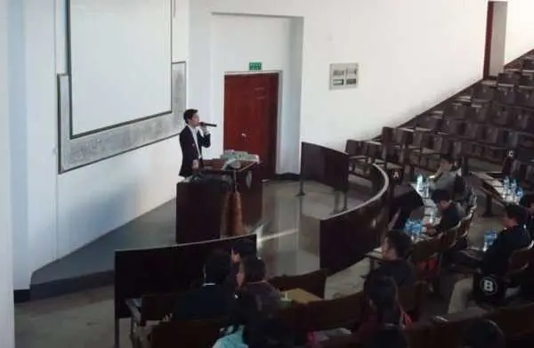
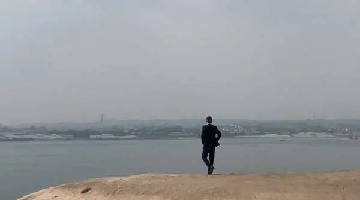
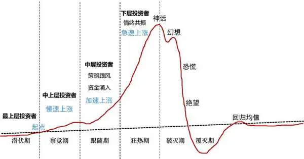
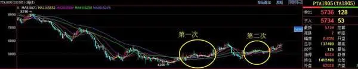
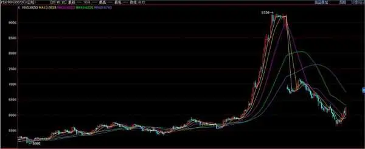
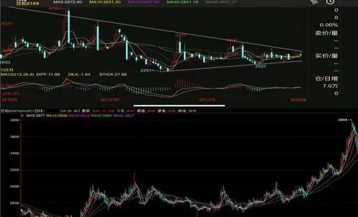
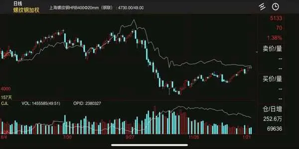
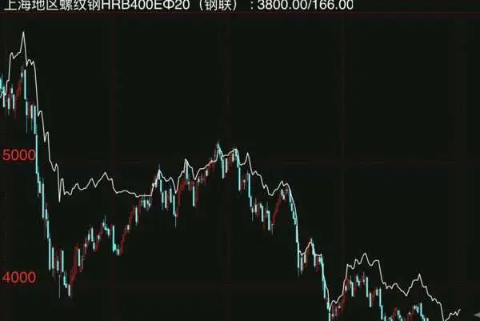
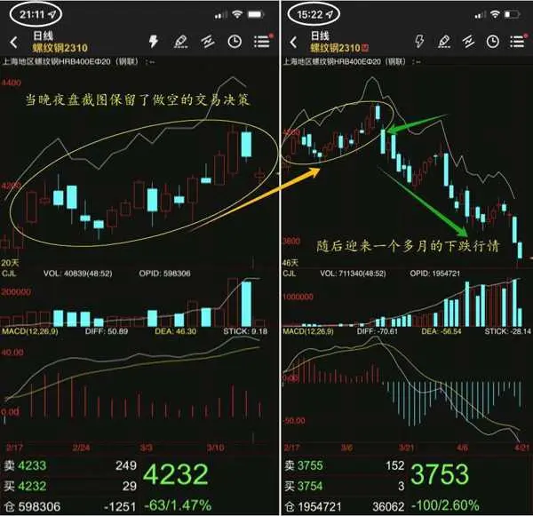

# 《大鑫 势能命运：决定人生起伏与投资失败》全文合订版

> 共29个章节。原章节顺序、段落结构和图表均予以保留。

## 前言

__前言 __

有的人喝着一杯水感觉很幸福，有的人喝着一杯咖啡感觉很幸福。两者获得幸福的来源虽然不同，但是对幸福的感受是一样的。

人要感谢幸福，因为一直追寻幸福，人才努力地活着。

我从小原生家庭就和别人不同，所以但凡有一点点的幸福感，都让我倍感珍惜。我的母亲从小智力受损，以至于经常情绪失控每天闹自杀，父亲也因为意外身故。从很小的时候我就开始经历周遭迂腐、贫穷、愚昧、自私、冷血的人性，虽然刚到 40 岁，但是我已经觉得我活了几个世纪那么长。每当夜深人静的时候，我总在一片一望无际的荒原中寻找一份梦想中的童年。

成年后从外出打工，一直到我进入金融交易行业，我一直比别人付出更多的努力和心血，近二十年职业生涯的点点滴滴和遇见的人来人往，让我越来越审视这个世界和我们自己。

最后我终于明白，人生的起伏与成就，无论是大是小，都是由势、能、命、运这四个奇妙的东西所掌控和决定的。我们的时代背景、成长环境、人际网、知识体系、思维模式以及个人能力经验、作为、命运等等，都在潜移默化中塑造我们的人生轨迹。

一秒钟内洞悉事物本质的人，与花费半生也看不清事物本质的人，他们的命运是截然不同的。在一个好友的建议之下，我开始将之前的感悟笔记整理成书，若行文有不当之处，请大家多包涵，我的目的是希望为读者提供一个更为丰富、多元的视角，去重新审视自己的人生和经历，以及通过我的经验模式，为大家实现财务自由的可能。

因为我的人生经历充满了转变，从负债累累的穷小子到管理数十亿资金的操盘手，从重度抑郁到如今热爱生活与自由。如今的我，深谙势能命运的规律，经历了改变，也因此坚信，只要愿意，每个人都能实现自己的转变，让幸福永远留在身边。

鲜衣怒马仗剑天涯，不管人生路上的经历如何，愿我们归来仍是少年。

2024 年 7 月 21 日

大鑫

## 第一章 走出自我局限性，财智双收

__ 第一章 __

__走出自我局限性，财智双收 __

何以解忧，

唯有暴富！

一是智慧的富有，

二是财富的自由。

2025年10月27日

7:32

## 第一章 走出自我局限性，财智双收 - (1) 没有智慧的勤劳只是徒劳

\(1\) 没有智慧的勤劳只是徒劳

2025年10月27日

7:32

__没有智慧的勤劳只是徒劳 __

我们懂得了很多知识，但不代表具有智慧，因此，尽管很多人读了很多书，但人生未必如意。他们依据所学的知识做了很多看似正确的选择，但多年后回首，才发现这些选择其实是挖坑给自己跳，有些坑，需要用一生去填补。事实上，大部分人在生命的最后阶段才展现出最高的智慧，然而为时已晚。

做对事与做很多事是两码事。做很多事，就很容易做错很多事，结果有可能没有变好，反而越来越差。少做事，但求做对，这样结果才会越来越好。当很多人在迷茫的时候，就喜欢选择读很多书，以为能从书中找到答案，事实上，还是会进行盲目的选择。有的人认为，人要勤劳，就要到处找事做，结果却可能是到处给自己挖坑。

所以，没有智慧的勤劳只是徒劳。

没有足够的知识和生活经验，大部分人无法拥有智慧。更残酷的是，即便有了丰富的知识和经验，也不一定能产生智慧。智慧即快速洞察天、地、人、事物运行的本质，并做出最佳选择。简而言之，认知周期变化，很多人称之为“道”。得道，便是智慧的开始。天有天道，地有地道，人有人道，事有事道，物有物道。道家所言天人合一，便是道之合一。在财富创造方面，便是周期合一。

我小时候不认识钱，但却已经开始赚钱。五岁时，爷爷在山上采药材，我也跟着采，采完后晒干，再让父亲带到集市上卖掉给我钱。因为我分辨不了钱面值的大小，而又担心父亲骗我，于是我就按钱的纸张大小来比对，等钱藏好后，每晚都期待着赶集时买糖吃。喜欢财富、创造财富和使用财富是人的天性，是美好的，本应受到法律和道德的约束与引导。

长大后想要得到某物或承担某种责任时，当左手摸着自己的心，右手摸着自己的口袋，就会明白财富的重要性。因此合理合法地创造财富是美好的事情，应该被鼓励和推动。

然而没有足够的知识和技能，创造财富是极其困难的，即使有了这些，也未必能创造足够的财富。即使创造了财富也很难守住，因为没有驾驭和传承财富的能力。这种能力需要有足够的文化为基础诞生的智慧作为支撑，仅有知识可能偶尔预知未来获得财富，但没有智慧很难长期精准预知并保持财富。只要做错一次或者几次，以前的财富就会丢失。

自中国改革开放以来，经济高速发展了几十年。虽然诞生了许多首富，但他们的结局往往并不理想。近年来，由于各种周期性变化，许多曾经风光无限的人陷入了困境。同时，不少富人为追求财富而走上违法犯罪之路，给国家和人民带来了祸害。其根本原因是，这些企业家、个体工商户、金融巨头等人群中，很多是 50、60、70 后，他们中的许多人并没有受过良好的教育，由于缺乏文化底蕴，加上经历了物资匮乏的年代，形成了极度贫穷的思维方式。虽然他们赶上了中国经济高速发展的好时机，创造了大量财富，但由于这种贫穷思维的影响，即使口袋里有数百亿资产，他们仍觉得自己是个穷人，因此，为了赚钱而做出违法乱纪的事情也就不足为奇了。由于这种贫穷思维，他们无法正确认识到自己是如何达到今天的成就的，更无法确保自己能够安全地走向未来。因此，很多人无法守住自己的财富。

真正有智慧的人，不仅能够创造财富，还能传承财富。正如那句老话所说：“老天要让一个人灭亡，必先让他疯狂。”只有那些拥有贫穷思维的人才会变得疯狂，而智慧的人则不会。

## 第一章 走出自我局限性，财智双收 - (2) 看不见的“自我”

\(2\) 看不见的“自我”

2025年10月27日

7:32

__看不见的“自我” __

由于中国几千年的历史原因，贫穷思维已经深入人心。要消除这种思维方式，首先要摆脱自我局限。

自我形成的原因有很多，包括先天基因遗传、原生家庭的影响、周围人际、后期学习的知识以及某些具有深远影响的事件。因此，一个人的自我通常是由两种性格构成的：一种是先天性格，另一种是后天性格。先天性格受到基因遗传和原生家庭的影响，而后天性格则是由认知决定行为，行为形成习惯，习惯塑造性格。无论是先天还是后天性格，都决定了一个人的命运。

那些以先天性格为主导的人，命运往往比较悲惨。有个别人可以中间辉煌一阵子，但是结局也还是不好。即使他们的先天性格比较优秀，如果完全不顾及基本常识和知识，最终的结果往往并不理想。这种现象在教育普及程度较低的文盲时代更为普遍。

而那些先天性格和后天性格相结合的人，如果想要取得成就并排除命运的干扰，就需要考虑自己先天性格的优势以及后天性格（知识和技能）的高低了。关于命运的影响将在后续章节中详细讨论。

在现实生活中，很多人都是基于自己的先天性格和知识体系进行选择。表面上看似是理性的选择，实际上可能是感性的。他们为了给这个感性的选择找到充分的理由而说服自己和他人，这就是主观行为。这种行为导致他们无法认识到事物发展的规律，无法长期预测未来，也无法将未来转化为实际的成果。他们所做的事情往往缺乏明确的计划和目标，很容易陷入盲目跟风和随波逐流的状态。最典型的例子就是参与资本市场投资的人，他们追涨杀跌，无穷尽地研究和尝试，在证明自己是世界上最聪明的人的这一条路上越走越远，越亏越多。

因此，要摆脱这种困境并真正实现自己的目标，我们需要摆脱自我局限和主观行为的影响，我们需要客观地看待事物发展的规律和未来的趋势，并制定出切实可行的计划和目标。只有这样，我们才能真正实现自己的梦想和目标。

此外，许多父母在教育孩子时，常常陷入自我局限的思维中，试图将孩子培养成杰出的人才。然而，由于他们的视野和认知受限，往往难以实现这一目标。在自我局限的思维中，人们往往不懂得真正的尊重，对生命、知识、人才和事物缺乏敬畏之心。

我们不尊重生命、不尊重自己、不尊重别人、不尊重知识、不尊重人才、不尊重天地间的万物和规律。因为，在自我局限的思维中，我们的认知和选择都是基于自己的兴趣、知识、经验和得失心进行的，这导致了我们无法以更广阔的视角看待世界，一切以自我为中心，这就是自我局限性。

为了突破自我局限，我们需要认识到天地间万事万物的运行规律，遵循道的原则。只有做到无我，我们才能真正摆脱自我局限，才能收获巨多，才能长远和传承。然而，作为情感动物，我们很难绝对地做到无我，因此需要不断地努力和探索。

2009 年，在泉州仰恩大学，这是我人生第一次演讲，虽然当时台下的学生并不算多，但对于我而言这是一个全新的舞台，我清晰地记得当年的演讲主题：实体经济与

金融投资。

## 第一章 走出自我局限性，财智双收 - (3) 财富自由之前，一切兴趣都是忧愁

\(3\) 财富自由之前，一切兴趣都是忧愁

__财富自由之前，一切兴趣都是忧愁 __

我们可以看到很多人的一生往往围绕着生存和兴趣展开。生存是首要条件，人只有先活着，才能去创造，然而，仅仅依靠兴趣是很难实现从生存到生活的转变的。

人们常说兴趣是最好的老师，人要做自己感兴趣的事情。这句话听起来非常有道理，但是背后的坑是又多又大。兴趣只能让你保持在这个行业的激情上限，但是绝不能保证你在这个行业的收获上限。现实中是很多人一旦以兴趣为起点，一开始就进入了自我局限性，而后期又走不出来，结果基本都是失败的，当失败了以后的代价，又让自己悔恨万分。其实，这叫哪门子兴趣？有很大的得失心，又不能走出自我局限，所谓的兴趣，只是叫自以为是。

所以走出自我局限性的第一要点，就是了解自己。不仅要知道自己的天赋，就是先天优势，还要知道自己能力的强弱，要扬长避短。可以感兴趣，但是要脱离兴趣。

能把兴趣做好的人，无疑是天才，他们仿佛天生就领悟了成功的秘诀，拥有超越常人的天赋，是天生就得道了的人，然而，大多数人并不属于这一类。以我个人为例，虽然我喜欢钓鱼，但我深知无论再怎么努力，也无法成为以此为生的钓鱼高手。我可以在钓鱼中找到乐趣，赚取一些小钱，但如果投入大量精力去做这件事，最终只会落得一场空。因此，我选择在其他领域赚钱，只有在空闲时才去钓鱼，以此满足自己的兴趣。如果资源不佳，我甚至可以修建一个鱼塘，自己敞开了钓。

有些人热衷于打球，梦想成为冠军。但即便有最好的教练指导，他们也很难实现这一目标。那么，投入大量资源走打球赚钱这条路可行吗？显然并非如此。只有先赚到钱，持续地赚钱，你才能聘请最好的教练，建造最棒的球场。此时，你便可以随心所欲地满足自己的兴趣。

马云的故事也为我们提供了深刻的启示。他的兴趣绝不是搞互联网，但他精准地预见了互联网的未来，并成功地把握住了机会将未来套现。当他实现财富自由后，他可以随心所欲地追求自己的兴趣，比如唱摇滚乐、把功夫巨星请来陪自己拍功夫电影圆自己的武侠梦。

在财富自由之前，所有的兴趣都只是忧愁。因此，在实现财富自由之前，最大的兴趣就应该是赚钱，赚到了足够的钱，再来满足兴趣，那才是酣畅淋漓的兴趣。

我经常听到有人表示对投资交易感兴趣。然而，我认为他们很可能会失败。相反，如果有人告诉我他们的兴趣是赚钱，并希望通过交易来实现，那么他们有可能会成功。

当然，有些人就是喜欢做自己感兴趣的事，无论成功与否。这类人并不在我讨论的范围之内，因此可以跳过下面的内容以免浪费时间。

所以，人要走出自我局限性，才能摆脱基因遗传、原生家庭、后期学习以及重大事件的影响。尽管人是情感动物，但我们应该尽量去除自我、走向无我。

我们常说时势造英雄，每个时代都有杰出和优秀的人才涌现。他们之所以能脱颖而出，大多是因为他们能够敏锐地洞察时代的趋势，并勇敢地驾驭它。在任何时代和背景下，人们总是不可避免地被划分为不同的阶层，这是由他们的认知、资源和出身所决定的。然而，当时代的浪潮汹涌而至时，如果你能明智地看清形势，勇立潮头，那么这或许就是你改变命运，实现阶级跨越的契机。

我平时最大的兴趣，就是全副武装，一个人驾船去钓鱼，有时候一钓就是好几天

2025年10月27日

7:32

## 第一章 走出自我局限性，财智双收 - (4) 穷人，是富人最大的财富

\(4\) 穷人，是富人最大的财富

2025年10月27日

7:32

__穷人，是富人最大的财富 __

我们曾以为网络能消除一切鸿沟，让世界更平等。但实际上，进入网络时代后，阶层固化反而加剧了。在这个时代，穷人要摆脱阶层固化，可能比以往任何时代都要困难。

由于网络和电子终端带来的各种便利，让越来越多的人产生幻觉。他们更愿意沉迷于虚拟世界里流连忘返，游戏、刷剧、购物、发帖……也许大多数人，只有在网络上才能找到自我，那里有他们的理想人生，所以他们甘愿做一个“低头族”。在他们眼中，这是以最低成本的娱乐，来满足自己最大限度的精神需求。殊不知，他们所要付出的成本是自己所有的时间、精力和对人生意义和未来的思考的权利。他们将整日被游戏、娱乐和色情等信息包围着，日复一日地重复上班工作、消费，以维持目前的虚拟满足。

正如《经济学人》所说：“越来越多的穷人被驱赶到线上，成为富人的流量工具。”当穷人的生活都转移到线上，线下空间为富人所有，富人在真实世界中娱乐和生活，而穷人在虚拟世界中沉浸，但虚拟世界是富人为穷人打造的完美牢笼，而穷人，则是富人的最大财富。

严重的“穷人思维”，可能会认为在家睡个懒觉就可以省去一顿午饭钱，觉得在家躺平，就可以避免不必要的社交，戒掉不必要的物欲，降低生活成本。但实际情况是，在家一躺，手机一刷，实际未对自己的实际生活迈出半步努力，长此以往，废矣。你将与精英阶层差距越来越大，你的下一代将更远离他人。

这就是社会现状，是当前最深刻的“势”，看清它，不要在这势中迷了路。

新冠疫情的那几年，让我们深刻体会到，无论你有钱还是没钱，在这种大势面前，人人都无能为力，每个人的结局都一样。因此社会上很多的人从此开始选择躺平，有人开始变得看淡金钱，变得更看重享受生活，尽管经济再怎么不景气，旅游热、露营热、电影热，什么都阻挡不了他们追求自由的心。

热爱生活是好事，但绝不能以牺牲奋斗和拼搏为代价。

将自己的时间精力更多地从网络中抽离出来，多一些对自己实际生活的探索，这样或许才有可能更加思考和关注如何改变自己的命运。

但是，这时候你可千万别告诉我，你想通了，你要辞职，你要创业，这可不能乱来。如今的社会，给创业者留下的空间已经越来越小了，任何行业和类目都会在短时间内被卷到极致，你可不要轻易地说离职创业。

我觉得增业才是当前最理智的选择。在把你当前的业务做到极致的基础上，再扩展一些其他业务，当然这些事业一定是你在综合评估后所决定选择的。我相信在未来很长一段时间当中，很多人会同时拥有多个主业，一个全民多业的时代正在来临。

在这样一个时代里，竞争将空前激烈，最终角逐的将是细分业务的专业高度。机会和财富将更多地流向能把事情做到极致的人身上。

## 第一章 走出自我局限性，财智双收 - (5) 人性真相与隐藏的社会法则

\(5\) 人性真相与隐藏的社会法则

2025年10月27日

7:32

__人性真相与隐藏的社会法则 __

人性，是一个错综复杂且引人深思的话题。它涉及到人类的本质、行为、动机和价值观等方面方面，而社会法则，则是一组规范人类行为和维护社会秩序的规则和准则。两者相互影响，互为因果。理解人性的真相和社会法则的关系，对于我们更好地认识自己和社会，以及如何在社会中生存和发展都具有重要意义。

从古至今，都教导“人之初性本善”。人是复杂的动物，不可否认，他具有同情心、善良和合作的等等倾向。在面对他人的痛苦和困难时，许多人会表现出关心和帮助他人的行为。在自然灾害、疾病流行等危机时刻，人们往往会团结一心，共同应对挑战。这种人性的善良和合作精神，是社会发展和进步的重要动力。这让我们都下意识的认为，人都应该善良诚实，甚至会觉得一切对人性赞美的一面，都应该是人本有的常态才对。

于是，在日常生活中，当我们遇到人性不好的一面时，比如欺骗、恶毒、自私……当遇到这些不好的人性面时，很多人会感到愤怒、疑惑、伤心……

而我想说的，就是人性的真相之一，便是人类具有自私和利己的倾向，这是人性的本真，自然的产物，人之初，性自私。这一点在日常生活中随处可见。一个人在追求个人利益时，往往会优先考虑自己的需求和欲望。在市场经济中，生产者和消费者都会追求自身利益的最大化，从而推动了经济的发展。然而，如果这种自私和利己的倾向得不到有效的约束和规范，就可能导致社会的不公平和不稳定。

社会法则的存在，正是为了约束和规范人类的行为，以维护社会的公平和稳定。例如，法律法规禁止人们盗窃、抢劫、诈骗等违法犯罪行为，以保护公民的人身财产安全。道德准则鼓励人们诚实守信、尊重他人、关爱他人等，以促进社会的和谐与进步。

同样，社会法则也不仅仅是约束和规范，它还可以激励和引导人们的行为。例如，奖励制度可以激励人们努力工作，为社会作出贡献；公共政策可以引导人们关注环境保护、教育、医疗等社会问题，促进社会的可持续发展。

以上我所说都是社会的显性法则，实际上还有一套隐形法则，隐形法则是不被提倡和允许的，但是在实际的社会生活中，处处皆是隐形法则，无论是官场、名利场甚至是普通人之间。社会是由隐形法则所控制的，平民被教育应该使用显性法则做事，而他们却是在用隐形法则。为了不影响此书出版，关于“显性”和“隐性”，我不便在书中详细说明，大家可以自行领悟和思考。

总而言之，人性的真相和社会法则是相互关联、相互影响的。我们应该正视人性的自私和利己倾向，同时也要发扬人性的善良和合作精神。通过建立合理的社会法则和制度，引导人们的行为，激发人们的潜能，实现个人和社会的共同发展。

理解人性的真相和社会法则的关系，有助于我们更好地认识自己和社会，以及如何在社会中生存和发展。我们应该在个人行为中发扬人性的善良和合作精神，同时也要遵守显性法则，擅长隐性法则，为社会的发展和进步做出自己的贡献。让我们共同努力，构建一个更加美好、和谐的社会。

言归正传，人们常说“要会做人”。但什么是做人？仅仅是指通晓人情世故、圆滑处世吗？其实不然。做人意味着超越自身的局限，成为一个充满智慧的人。人们还常说“一个人要懂事”，然而，懂事仅仅是听话吗？其实并非如此。懂事意味着真正明白自己应该做什么事以及如何做好这些事。

因此，走出自我局限性，成为一个充满智慧的人。精准地、长期地预见未来，做好事情并实现人生的巅峰成就。为了实现这一目标，我们需要拥有足够的认知。首先，我们需要认识到钱究竟是怎么赚取的。

2009 年 5 月，我手中的资金终于达到了 1 个亿，那天下午我来到长江边，那时心里除了喜悦，更多的是对未来的彷徨。

## 第二章 势在必行

__ 第二章 __

__势在必行 __

当时代的大潮汹

涌而至，你是选

择逆流而上，还

是随波逐流？

## 第二章 势在必行 - (1) 钱到底是怎么赚的？

\(1\) 钱到底是怎么赚的？

2025年10月27日

7:32

__钱到底是怎么赚的？ __

在很多事情上人们常说，要顺势而为。这个“势”，其实指的就是趋势，也可以理解为周期。决定人生的第一要点就是趋势，也就是周期。中国经济已经持续了几十年的高速发展，未来这种势头还将继续，这是一个时间跨度长、上升空间巨大的周期。在这个周期中，只要一个人能够把握住某一行业的上升趋势，便很可能取得不小的成就。

大部分人的财富都是被动累积的，而非主动追求而来。比如你出生在 1980 年，然后在 2002 年结婚，可是你丈母娘要你买一套房子才能把女儿嫁给你，于是你用了你能用到的资源，终于买了一套房子把婚结了。10 多年后，你发现你的房子涨价了，涨了 10 倍，你当初买的房子你赚了好多钱。请问，这个钱是你的能力主动赚来的吗？不是，是你在爱情的力量下或你丈母娘的逼迫下被动去买了这套房子，然后刚好赶上了房地产爆发式上升的周期行情，然后被动地，糊里糊涂地把钱给赚了。

我身边一个真实的案例，一个很年长的朋友，2000 在北京 3 环内 100 多万买了一套大户型的房子，2016 年初卖了，然后用这笔钱马上在成都买了 10 套房子，结果这 10 套房子 2017 年又涨了一倍。赚了多少钱各位自己可以心算一下。其实这并非源于他个人的能力，而是他在合适的时间做出了被动的选择，赶上了“势”。

可惜，我出生得晚，不然可以早结婚，就可以早早的被丈母娘逼着买房子，赚上好多钱。

中国的房地产的上升周期，确实为许多人创造了财富。那时期的首富，基本上是房地产行业的老板轮着来当。同时房地产带动了各个行业的高速发展，只要能参与其中，财富都有着不同量级的收获。可以说，房地产周期就是一个巨大的财富盛宴，每个人能从中获得的财富多少，取决于自己的“胃口”大小。这个“胃口”，既包括个人的能力，也包含了命运的安排。

虽然很多人在这一场的财富盛宴里赚到了不少的钱，就以为自己很牛逼。看看身边的人，谁也没有自己混得好，自己太牛逼了。于是，他就有了自己是神的这个念想，我把这个称之为“超能力幻觉”。

房地产一直有周期。人类早期的房子是树木，后来是洞穴，再后来是茅屋、木屋、砖木结构，到现在的钢混结构或者全钢结构，就从没有停止过，以后可能还有智能，绿色能源结构。

现在房地产的周期已经阶段性到顶，可是很多靠这波周期发财的人还没有认知到，总以为自己手上有很多房子，是应该好好享受人生的。随时享受着高端的物质生活，觉得大不了就卖一套房子，这个叫做“货币幻觉”。房子不是货币，不是想套现就可以套现的。可怕的是你套现的时候没有人来买，最可怕的时候是你降价亏本卖都没有人买，到时幻觉一醒，真是后悔万分。

我认识一个人，是做某电器的代理商。在整个房地产上升周期中，他在当地经营得非常成功，各个方面都非常的优秀，是很多家代理商学习的榜样，可是他没有把经营电器赚的钱去买这家电器的股票。如果他只要把每月经营电器赚的钱去买这家电器的股票，那他一定是轻松地坐上当地首富的头把交椅。由于他经营电器取得了巨大的成功，有了超能力幻觉，非要把经营赚的钱，在股票市场炒来炒去，不但没有赚钱，反而还亏了钱。可是他代理的那家电器公司的股票，在整个房地产上升周期里，升值了上千倍。这就是没有走出自我局限性，也根本不懂得钱是怎么赚的。

在中国改革开放后，计划经济变为市场经济，由于中国人口基数庞大，导致长时间各种商品的需求急速增加。只要能生产出来，就不愁卖不出去。现在国内很多知名的服装品牌，当时都是以几台缝纫机起家的。

在中国加入WTO以后，由于较低的人工成本，高效的生产效率，以污染环境为代价，中国成为了世界工厂。中国的制造业进入超级大爆发的时代，在这一时代，创造了数不清的财富。

再比如，以前某公司在行业内很牛，要招几个研究员，很多人去投简历，去面试，当然选中了的都是精英中的精英。后来这家公司走下坡路了，关门大吉了，刚开始被选中的精英就失业了，而当初没有被选中的，有的可能就去了阿里巴巴，后来阿里上市了，他们的身价可能是几千万，可能是几个亿！谁才是真正的精英？谁是主动还是被动？

不管是不是精英，是主动还是被动。都是要你所选的公司所在的行业，是一个爆发式上升的周期，你都能有较好或是非常好的一个收获，反之，则不然。（这里除去这家公司的经营能力，如果你选择的这家公司所在的行业，是一个爆发式上升的周期，由于这家公司经营能力不行关门了，那只能说你运气不好）

前些年我看到了一则言论，说是三个大佬坐电梯上楼，一个看报纸，一个跳跃，一个做俯卧撑。不管他们在电梯里怎么折腾，电梯都是上行的。如果电梯下行呢？在里面再怎么折腾，都是没有用的。

所以这些年，我看到一种现象，就是前些年有的人运气好，站上了某行业的上升周期，糊里糊涂地赚了很多钱。然后他所选的这个行业到顶了，开始回落走下坡路了。他们又有超能力幻觉，觉得自己很牛，越是以前实体经营成功的人士，这方面的现象就越严重，到处选行业选项目投资，可是运气不好，选的都有问题，都不在上升周期内，结果几个来回，又到了解放前。为什么？这就是我说的，把运气当成一种能力，离危险还有 1 米的距离。

综上所述，现在到了揭开谜底的时候啦！

那就是：财富的上升，要抓住每个行业的轮动周期行情！把握当下社会环境的核心逻辑。

简单了说：赚大钱，靠周期\+能力，还有运气！赚小钱，能力\+拼命！认知\+格局\+运气决定了上限，努力和勤劳决定了下限！

这就是势、能、命、运的综合局。这里讲周期，就是讲最大的“势”。所以很多人以前虽然很成功，但是后面走向失败。其根本原因就是不知道钱是怎么赚的，不知道怎么走到了今天。如果不知道怎么走到了今天，又如何安全地走向明天？

周期，周期，周期，一定要读三遍！因为能不能发财，发大财，就看以后选的行业，有没有爆发式的上升周期。就算没有爆发式的，有缓慢上升的也可以啊！

任何一个行业的周期

当下三个大周期相汇，注定全球经济进入艰难岁月，也是百年之大变局。

一是全球的政经关系进入左周期。很多国家之间的矛盾越来越多。会导致战乱频发。大家不能好好做生意，动不动就吵架打架。俗话说和气生财，都不好好和气了，财怎么好生呢？

二是由工业周期进入科技周期。以前的农业周期，人要勤劳，风调雨顺，人们就能过上好日子。工业周期，人要够聪明，能发明先进的生产力，就能赚取很多财富。在科技周期，人要够智慧才能赚取很多财富。

人工智能就是用智慧解决问题。任何一个人的知识数据库都是有限的，所有的认知和决策都很难每次做到客观理性正确。但是AI可以瞬间在海量的数据里做一个最大概率正确的决策，具有跳出三界之外的智慧。所以AI解决的就是人类的智慧障碍，彻底走向智慧。

当这种智慧一产生，很多行业，很多从业人员就会失去存在感。

三是很多行业的周期已经到顶了，甚至过剩。简单来说，很多行业早就由增量周期，进入到存量和缩量周期了。这种情况下，要想赚到钱，真的有点难。

所以三种周期的叠加，造成了现在创业难，赚钱难的局面。在 2018 年我就跟别人讲，未来的很多人，有一个稳定能养家糊口的工作，就算是很幸福的人了。

那未来哪些行业有超长的上升周期呢？

一是科技人工智能，二是生物医药，三是可持续的绿色能源环保，四是金融投资，五是农业等方面。

但是每一个行业，都不是一个人随便可以进入并能取得成功的。可以看到现在的首富，早已经不是具有江湖豪情的人物，不是来自传统的制造业，也不是来自房地产，而都是超级天才，都是想着改变人类未来生活方式的一群天才，而不是只是想赚几个钱来享受人生的人。

所以未来的世界就是一群天才带领人类进步，一群政治精英设计分配规则。其实以前也是这样。

这就是人生成就的第一大要素——人生的势，人生的周期。

因为我是一个职业的金融投资从业者，因此在接下来的内容中，就以我当前所从事的这个行业特点为例，为大家展开我的“五维周期论”，也就是周期的五大要素：天、权、心、钱、货。

## 第二章 势在必行 - (2) 天道、天规、天灾

\(2\) 天道、天规、天灾

2025年10月27日

7:32

__天道、天规、天灾 __

__1\.天道 __

天空之下，浩渺无垠的宇宙中，隐藏着无尽能量。人类对于宇宙的理解，仍然停留在冰山一角，每个星系，每个星球，皆有其独特的运行轨迹，相互影响，相互制约，维持着宇宙的平衡。若无这种相生相克的平衡，宇宙将陷入混乱，星球间频繁的碰撞将导致毁灭性的后果。

人生亦是如此，我们不断寻找平衡点。基本的生理需求，如饥饿、困倦、舒适感等，促使我们寻找相应的满足方式。男性寻求女性的陪伴，女性寻找男性的依靠，均是为了内心的平衡，若失衡，身心健康将受影响。有些男生因幼年缺乏母爱，长大后倾向于与成熟女性交往；有些女生从小缺少父爱，长大后则更易与年长男性产生情感。这同样是寻求内心的一种平衡。

在自然界中，食草动物和食肉动物共存，形成了一个完整的生物链。若只有食草动物，它们将无限制繁殖，导致植物资源枯竭，生态平衡被打破。而食肉动物的出现，有效制约了食草动物的过度繁殖，维持了生态的稳定，同时，食腐动物的存在也帮助清理死亡的动物尸体，防止疾病的传播。这种生物链的设计堪称神奇，正是万物相生相克，达成平衡的完美体现。

曾经看过一部纪录片，讲述老鹰捕食兔子的事例。当兔子数量减少时，老鹰会转而捕食其他动物，以保护兔子的种群数量。这是刻在基因里的生存智慧，也是天道的体现。

然而，人类过于贪婪，无节制地向地球索取。终有一日，我们会自食恶果，这也是天道的公正制裁。

在农村生活的人都知道，小猫小狗在误食有害物质时，会自行寻找草药来催吐、治疗自己。它们没有文字记录和口口相传的经验，却能识别出哪些草药能治疗自己，许多中药的发现也是源于对动物行为的观察。这同样是刻在动物基因里的天道，代代相传。

母爱，被誉为世上最伟大的爱，它同样源于基因里的天道，若非如此，人们可能不喜欢孩子，从而导致种群的消失。正是这种基因里的天道驱使着我们繁衍生息。

即便是再致命的病毒，也不会杀死所有感染者。总有一些“天选之人”能够免疫病毒，同时，病毒也会自我变异以降低毒性并保留一部分感染者。若所有感染者都死亡，病毒也将失去宿主，无法继续存在。这同样遵循着天道的法则。

因此，当一个物种超出其生态承载力时，自然界会通过各种方式如天灾、饥荒、瘟疫和战争等来减少其数量，以重新达到平衡。这就是所谓的“天道”。

当天气持续风调雨顺，粮食产量高涨，供给大于需求时，粮食价格就会下跌，然而，种植户如果连续亏损或亏损严重，就会减少种植面积。往往就在这个时候，天气开始变得不再风调雨顺，甚至可能发生各种灾害，导致粮食减产，从而引起价格上涨。这种周期性的变化每隔几年就会重复一次，这都是老天在调控的结果。这就是所谓的“天道”。

对于那些从事农产品投资的人来说，如果不了解这些规律，很难赚到大钱。实际上，粮食才是第一能源。因为如果没有食物，生命都将不复存在，更谈不上赚钱了。

我之所以讲这么多关于“天道”的内容，是为了说明它其实并不深奥莫测。我们每个人都与“天道”息息相关，无法脱离其影响。“天道”的本质就是平衡，它有大周期和小周期之分。顺应“天道”，就是顺应最确定的趋势。

如果你能看透某个行业的“天道”，你就拥有了智慧，能够预知未来并创造大量财富。

__2\.天规 __

天规之一，是指天气变化的周期。

它影响着农作物的生长和养殖业的发展。气候的变化对每个地区的种植和养殖影响非常大。厄尔尼诺和拉尼娜等大的气候变化周期，是几年一次。

2016 年，中国南方在厄尔尼诺气候的影响下，遭遇了严重的暴雨和大水灾害，许多养鱼塘被淹，鱼群出逃，给养殖户带来了巨大的损失，然而，有一位养殖户通过提前采取措施，成功地保护了自己的鱼塘。他知道厄尔尼诺会导致暴雨和大水，因此在下暴雨之前，用网把鱼塘上下左右围起来。虽然鱼塘被大水淹没了，但由于鱼被困在网中无法出逃，当大水退去后，鱼塘中的鱼得以保全，养殖户没有遭受大的损失。

气候的变化对农业的影响非常大，所有与农产品相关的人员都应该了解和掌握天规，利用天规，可以在合适的时间进货和出货，避免遭受损失。例如，现在的大棚种植技术就是利用天规的反规律进行种植的。

天规之二，是指物种的生命周期。

农作物从播种到收割的周期是固定的，如果在这个周期内了解了气候的变化，就可以采取应对措施以避免损失。投资农作物时，要密切关注气候变化并做好购销调整。

以天然橡胶为例，如果不了解其天规和气候的天规，盲目抄底将很难赚钱，甚至容易亏损。

对于动物养殖，了解其生命周期和繁殖倍率非常重要。例如，鸡蛋孵化成小鸡需要一定时间，而母鸡的产蛋量和倍率也需要了解清楚。养鸡时，何时补栏、出栏和淘汰都需要根据天规和市场供需进行调整，否则可能会出现一年盈利而接下来两年亏损的情况。

对于生猪养殖，了解种猪的繁殖能力、仔猪育成时间和倍率等至关重要。掌握了这些信息，结合市场供需情况，就可以预知生猪市场的走势并规避风险、赚取利润。

总之，天规是影响农业生产和养殖业发展的重要因素。只有了解和掌握天规的周期和规律，才能顺势而为，规避风险并获得收益。

这就是天规的周期，顺天规的势。

__3\.天灾 __

天灾的影响是巨大的，不可估量。例如，2003年的非典和 2019 年底的新冠疫情对人类生命、生活方式和全球经济产生了深远的影响。这些疫情持续时间之长，难以预测。

当新冠疫情在 2019 年底爆发时，病毒的毒性非常强，国家因此采取了居家隔离防控的政策。人们必须顺应政策，否则容易感染病毒，对身体健康造成严重伤害，甚至可能失去生命。

随着新冠疫情的持续，到 2022 年底，国家的防疫政策变为动态清零。这意味着每个地区都可能出现感染病例，密切接触者都需要隔离防控，这无疑增加了日常生活中的风险。因此，经营餐饮、娱乐、休闲和零售业务的人不应该大力扩张，一旦出现风险，将面临巨大的损失。直到 2022年底，由于病毒毒性降低，对人的伤害大大减少，疫情得到控制，人们才逐渐回归正常的工作和生活状态。

2019 年，巴西淡水河谷发生矿难，导致铁矿石价格从每吨 450 元左右一路飙升。到了 2021 年 5 月，每吨价格超过了 1300 元，涨幅高达 300%。如果有人能洞察到这一天灾的影响并投资铁矿石，将能赚取大量的财富。

对于投资者来说，了解天灾和顺应天灾的形势至关重要。许多成功的投资者正是顺应了天灾的形势，实现了人生的逆袭。

另一个例子是 2018 年 9 月 10 日，中国农业农村部宣布安徽省铜陵市义安区发生非洲猪瘟疫情。随后，非洲猪瘟在中国各省各地区蔓延，导致大量生猪感染、发病和死亡，存栏量大幅减少，生猪价格暴涨。

如果养猪企业和养殖户能提前了解非洲猪瘟的特性、危害和防控措施，至少可以减少一部分损失。然而，许多企业和养殖户并未重视这一问题，结果即便猪价暴涨，自家生猪存栏量却大幅减少，不仅与巨额利润无缘，还遭受了重大损失。这正是因为他们没有顺应天灾的形势。

防控非洲猪瘟最有效的方法是隔离。随着时间的推移，养猪业逐渐认识到这一点并采取了隔离措施，如今生猪存栏因非洲猪瘟造成的损失已经得到弥补。

当生猪价格暴涨时，一头生猪的价格几乎能与一头牛的价格相媲美，利润丰厚。于是，许多资本开始进入养猪行业。然而，随着更多人加入这一行业，一些企业和养殖户对生猪繁殖倍率没有进行合理的规划，盲目扩张。当生猪存栏量恢复正常时，价格开始暴跌，许多高价进入或盲目扩张的企业因此遭受巨额亏损，有的甚至破产。

总结来说，天道、天规和天灾是天的三大要素，它们构成了一个大的周期和趋势。对于人们的生活和投资来说，了解并顺应这些大势至关重要。只有顺应天道、天规和天灾的形势，才能更好地把握机会并规避风险。顺则昌，逆则亡。

## 第二章 势在必行 - (3) 国际、国家、行业的权力

\(3\) 国际、国家、行业的权力

2025年10月27日

7:32

__国际、国家、行业的权力 __

__1\.国际的权力 __

熟知的国际权力的机构有联合国，北约，欧盟，上合组织，世卫组织，国际原子能机构，WTO，欧佩克石油组织，中国提出的一带一路，各种经贸组织等等。

这些国际权力机构，做的每一项最重的决策，都严重地影响着世界的政治格局和经济走向。

最明显的是中国加入WTO后，成为了世界工厂，各个行业都建立起了完整的生产链条，完成了工业全面化，经济腾飞，创造了天量的财富。

懂这个势的人，就会及时进入外贸。只要能对接好业务，做好产品开发和生产，就能赚到很多钱。

同时生产出了各种各样的大量商品，也对各种原材料需求越来越多，导致各种原材料的价格持续上涨。如果懂这个势，一是可以进行各种原材料的贸易赚钱，二是可以在资本市场进行商品战略做多。目前金融市场好几个大佬，正是在资本市场上进行商品做多，顺了这个势，赚取了超百亿的财富。

而有的人虽然在其他行业赚了很多钱，但是不懂这个势，看见了很多商品涨过了之前的历史最高价，就去做空。最典型的就是有色金属铜涨到每吨 3 万元时开始做空，结果铜涨到每吨超过 8 万元。多少做空的人亏损得倾家荡产，负债累累，有的人接受不了，有喝药，有跳楼的。

这就是权力的势，国际权力的势。不懂这个势，想要赚大钱，是很难的，搞不好就亏损得一塌糊涂。

比如欧佩克石油组织，基本决定了石油价格的走势。一个会议，决定增产还是减产，石油价格就剧烈波动。很多人喜欢投资石油，认为石油是商品之王，是经济的血液。可实际上是非常难以分析石油的价格走势的，谁知道欧佩克什么时候要开会，要做什么决策，是要减产还是增产？这个太难分析了。所以要想在资本市场上投资石油赚钱，真的是非常难。

投资大师芒格说过一句非常经典的话：我们不是善于解决难题，而是善于远离难题。

可是很多人就不懂这个权力的势，就陷在自我局限性里，非要证明自己是世界上最聪明的那个人。这样放飞自我的人，我个人还是比较佩服他的勇气，可以拿自己的人生放飞，我真的做不到。

国与国之间发生了矛盾，国与国际组织之间发生了矛盾。小的是各种制裁，各种政经断绝往来。

比如有些国家被美国，被欧盟制裁，那这些国家的经济必然受到影响。

比如美国对中国家发动贸易战，这对做进出口行业造成很大的影响。接着美国又对我中国家发动科技战，金融战，舆论战，包括军事围堵。这些对我们的科技行业，各制造业，外贸，汇率，股市等都产生了重大影响。后面章节再进行周期多要素的重合解析。

国与国之间发生了矛盾，国与国际组织之间发生了矛盾。大的就是战争，战争就是毁灭。毁灭经济，毁灭文明，毁灭生命。当生命都没有了，还要赚钱做什么？

比如生存在战乱的国家，想的是怎么保住生命，而不是想着怎么赚钱。

例如俄乌战争，对世界，对俄罗斯和乌克兰造成的影响是难以预估的。因为俄罗斯这个国家，在国际政治中，地缘政治中占比实在是太大了，不是一般国家可以比拟的。

而乌克兰背后又是整个北约和欧盟组织，也可以说是一场小型的世界大战，是两个超级团体的对抗。任何一方的输赢，都会影响到世界秩序的重新建立。这对整个世界的政经的影响，甚至对整个人类的影响都是无比巨大的。

当俄罗斯开始对乌克兰发动特别军事行动的时候，我的一些朋友说以俄罗斯的军事实力，很快就会完成军事行动，达成目的。我一开始就认为持续时间很长，因为这不是两个国家之间的矛盾，是两个大的团体之间的矛盾，怎么可能短时间就能解决。

同时俄罗斯是一个资源大国，也是粮食大国，乌克兰也是一个粮食大国。当战争发生后，很多国家对俄罗斯一系列的制裁行为，造成能源和粮食的价格开始剧烈波动，严重影响了世界的经济和民生发展。很多国家对俄罗斯的制裁，也刷新了人们对这个世界的认知底线。其实，人类的底线，就是没有底线。

有的人说我们国家没有被影响。这是典型的连常识都不懂。石油和天然气涨价对我们有没有关系？我们国家每一年要进口多少粮食知道吗？粮食价格上涨跟我们有没有关系？每一个人的工作生活都被影响了。

如果懂这个势，在进出口贸易中，在资本市场参与商品投资中，就容易知道战略方向应该怎么做，而不是跟风从众，追涨杀跌。

当 2019 年底暴发了新冠疫情，2020 年上半年发生了一件颠覆人们学习的所有知识，就是国际石油价格跌成了负数。这估计在人类的历史有记录以来第一次发生了一件商品的价格跌成了负数。就是说我把东西生产出来，你来买，我不但不要钱，我还要送钱给你。

我们从所学的知识，让我们知道任何一件商品都是有价值的，而且告诉我们的是，石油这种资源，是越来越少的，甚至是经济的血液。按我们正常的思维是石油哪怕不一直上涨，也不会很便宜，就算很便宜，也不会不要钱，结果不但不要钱，价格还可以跌成负数。所以说，这个世界的底线就是没有底线。有些事情没有发生，不代表不会发生。

这个事件是怎么造成的呢？其实这是一个权力事件。当时国内一家银行发行了原油宝，就是银行自己跟客户进行石油的合约买卖，然后银行又去美国商品交易所进行石油买卖。基本上银行的客户都是多头，银行自己是空头。银行为了规避自己的风险，就在美国的商品交易所内进行多头买入。当新冠疫情在全世界大流行，很多国家进行暂时性的停摆，这个时候石油就严重供大于求了。由于国内这家银行持有了很多石油的多头合约，美国商品交易所就修改了交易规则，然后把石油价格打成负数，这家银行的多头合约就产生了巨额亏损。美国资本完成了对这家银行的收割。于是这就有了人类历史有记录以来的第一次商品价格跌成负数的事情。

这就是权力造成的。其实自从美国成为了世界一哥后，美国基本就是国际权力中最重要的，美国做的任何一个重大决策都严重影响整个国际社会的政经走势。

比如美联储加息降息周期，直接造成整个世界的资产上涨还是下跌。加息周期，造成美元回流，很多国家的资产下跌。降息周期，美元外流，造成很多国家通货膨胀。这样一个来回，美国就完成了对很多国家的资产收割。只要懂金融基本常识的人都懂这个，这里就不多阐述了。

这就是国际权力的势。

__2\.国家的权力 __

人们常说市场经济，其实这是不对的。所有的国家都是计划内的市场经济，每一个国家都是先定政策，然后再发展的。

就拿资本主义和民主体制为代表的美国，也是先定政策再发展。政府一定会进行政策调控的，最明显的就是美联储的货币调控政策。

我们国家是社会主义国家，民主集中制。就是集中力量办事，效率远远胜过美国。这也是我们能用几十年走完别的国家几百年才走完的路，是我们国家能高速发展的根本。

所以在我们国家，更要懂得国家现在的政策，未来的政策，也就是要懂国家的权力的势。结合天的势，又懂国际权力的势，自然能预知到未来的大势，赚取财富就是很容易做到的。

跟我们所有人都相关的改革开放，让中国经济开始腾飞，这就是国家权力的势。所以当初懂了这个势的人，毅然放弃了工作，放弃了铁饭碗，下海创业经商。很多人都成为了著名的企业家，为国为民都作出了巨大的贡献，同时，他们也获得了巨额财富和尊贵的社会地位。如果中国没有进行改革开放，再有能力的人，又能怎么样呢？所以，国家权力的势，才是最重要的。这是个大的周期，顺了，自然就成就了人生。

再来讲房地产周期。国家开始大力发展房地产市场，懂了这个势的人，就进行房地产开发。前些年的中国首富都是当年看懂了这个势的人来做这把首富的椅子的。

而很多人就因为买了房子，然后糊里糊涂就赚了房子升值的钱。有的人也是因为懂了这个势，到处炒房，赚钱的自然是比那种买了一套或者几套房子的人赚得多得多，也可以这样说，很多人这一辈子赚得最多的钱，就是买了房子升值的钱。

同时房地产带动了各个行业的大发展，整个经济快速腾飞，大家自然很容易赚到钱。

如果国家没有大力发展房地产市场，再有能力，估计也只有苦哈哈。所以没有谁谁的时代，只有时代中的谁谁。不要认为自己真的有超能力，自己很牛逼。其实这个世界是哪有那么多牛逼的人，大家基本上是差不多的。人生的成就是势能命运。现在主要讲的是势。

当国家对房地产的政策不再是大力发展，而是实行房住不炒。有的人开始冷静下来了，回归理性，多因素分析，及时套现离场，那些没有回归理性的人，还在盲目的炒房，结果限售限购的政策一出来，这些人就深度套牢。有些房地产开发商也没有冷静理性下来，还在扩债扩张，以为自己是神，没有风险管控能力。国家出了对房地产企业实行三条红线的监管政策，又叠加了天灾疫情的影响，还有两个因素的影响，后期章节讲。让有些平时看起来大到不能倒的房地产企业一下子就暴雷了。给国家还有广大人民群众造成巨额财产损失，真是天大的罪过。

这些人就是不懂势，本来只想赚点钱过上好生活。没想到赶上了大势，成了企业家，产生了超能力幻觉。都说管控好风险，其实管控风险，就是要管控好自己。做大不如做强，做强不如做久。人一生，只是求得好死而已，再辉煌，不能善终，都是一场空。

2016 年国家进行供给侧改革。完成能耗高，生产落后，效率低下的产能去除。其实从 2011年底开始，国家的政策就是银根收紧。这让很多财务不好的企业经营非常困难，如果懂了银根收紧的这个势，及时收缩，也不至于到后来的重大亏损或破产。

由于很多企业财务困难，为了回款就降低销售价格。同时行业分散，产能过剩，整个大宗商品价格从高位持续下跌了几年，一直跌到 2015 年底，造成很多企业亏损或破产。

当 2016 年国家进行供给侧改革的政策出来后，大宗商品价格开始陆续暴涨，开启了商品连续几年的大牛市，成就了好多大佬。有一个金融投资大佬，在这一波的牛市中赚取了几十亿的财富，而很多投资者每天还在乐此不彼的研究行情，研究策略，炒来炒去，是不是很可笑可悲可叹？

2014 年开始的股票牛市，也是一个政策牛市。很多人当时以为自己是股神，买什么，什么就涨。可是又有几人能保留住财富？大部分人都是体验了一把过山车富豪，搞不好还变成了负豪。

这都是不懂势的原因造成的，成也势败也势。

国家对行业的补贴政策，对进出口关税的政策等，都是有着巨大的影响。

现在国家的政策是由制造升级为创造。就是工业变为科技。但这已经不是普通人能做的，是由高智商高能力的人来做的。可以看到新一代的企业家很多都是博士，再也不是什么草莽英雄了。新的首富都是科技行业的企业家。

懂了国家权力的势，就知道大的周期是往哪个方向发展。

__3\.行业的权力 __

行业要看是分散还是集中。分散的市场没有制高点，没有核心竞争力，没有话语权，很被动，很辛苦，赚钱很难。

比如很多人都卖一个东西，不但要比质量好，还要比谁的价格便宜。就像 2011 年国家开始进行银根收紧的政策，很多行业都是分散的。为了把东西卖出去，就要比别人便宜，实力差的先亏死，实力强的后面亏死，可能最后就留下几家实力最强的。这就是大家说的内卷。

如果一个行业只有一家或者几家参与。而买东西的人却很多，那这一家或者这几家就很有话语权，一家说了算，也可以几家联合说了算。反正就这个价，爱买不买，不买，再涨点价，你不买再涨价，最后你还不得不买。这就是行业集中，垄断的优势。

2016 年以前，整个钢材生产企业都是很分散的。价格最低跌到了 1600 元每吨左右，一斤钢材的价格还没有一斤大白菜的价格贵，是多离谱的事情。2016年供给侧改革政策出来后，很多钢材生产企业被收购，生产源头形成了集中，卖方有了话语权，而国家对房地产和基建都大力发展，对钢材的需求非常好。钢材的价格只有一条路可以走，就是上涨，暴涨！

后来钢材的价格连续上涨，最高涨过每吨超过6000 元。好几年的高利润，想想都很吓人，一年可以赚 10 年的钱。

由于中国工业，房地产和基建的大力发展，我们国家对钢材的需求非常大。生产钢材就需要大量的铁矿石，可是铁矿石我们国家又不能自给自足，要大量的进口。问题就来了，铁矿石的生产源头又很集中，主要集中在澳大利亚和巴西两个国家的几家企业手中，他们卖得再贵，我们也得买。在价格还比较低的时候，巴西的淡水河谷又发生了矿难，源头垄断加天灾，需求又好，这三个大的要素让铁矿石的价格一飞冲天。投资铁矿石做多，能赚取巨额财富。

有时都在想巴西的淡水河谷的矿难，搞不好就是人为的。给那消失的几十人，每人发 500 万美金，让他们找个没有认识他们的地主生活，不要出来露面，然后再把矿坝给炸了，对外就说发生了矿难。价格上涨赚了几十上百亿的美金，这种事情多好啊，这完全是有可能的。还是那句话，这个世界的底线就是没有底线。

所以做商品投资的人，要看这种商品在卖方和买方中的地位是集中还是分散。比如天然橡胶这个品种，虽然价格在低位很多年，由于种植和产出周期很长，种植的源头又太分散。主动去产能很难，不能统一行动，没有话语权，价格很难上涨。有了大的天灾影响减产可能上涨，还有就是橡胶产出国家出政策导致上涨，还有就是统一行动，主动去产能，把橡胶树大量砍掉改种其他的导致上涨。如果三个因素都出现，价格就会暴涨。

做股票的人都知道一个名词叫护城河。就是这家企业要有核心竞争力。要有垄断的制高点，要有话语权，比如贵州茅台。如果很容易就可以替代的公司，肯定不是好的选择。所以资本市场的投资大佬，不是一天炒来炒去的赚取了巨额财富，而是看到了行业的上升周期，投资这个行业的综合实力最强的公司，陪同这家公司一同成长，然后才赚取了巨额财富。

如果华为这家公司上市了，就是很好的投资对象了。目前中国综合科技实力最强的，就是华为公司。

所以在参与一个行业，不管经营还是投资，都要掌握核心竞争力，要有行业的话语权。不然赚钱很难又很辛苦。如果能发明一种治疗所有癌症的药，或者治疗一种癌症的药，能做到药到病除。不但造福全人类，还能获得巨额财富，真正的名利双收。

这就是权力的三个要素。也是周期变化中第二重要的要素。顺势，就要顺权力的势。

## 第二章 势在必行 - (4) 一致的心理行为

\(4\) 一致的心理行为

2025年10月27日

7:32

__一致的心理行为 __

一个人的心理行为，对一件事物的发展影响的大小，要看这个人的权利有多大。

如果这个人是美国总统，那影响就非常大了。他做的每一个决策，都能严重的影响全世界的政经走向。就像特朗普上台以后，对我们国家发动了贸易战，还有科技战，对中美两的贸易和科技影响是巨大的。这也促使中国加速工业到科技的升级，让我们清醒了过来，大量投入人力财力物力进行科研，之前被西方卡脖子的很多科技，我们现在自己已经解决了。所以说，很多事情在当时看是一件坏事，时间拉长，当时的坏事反而是一件好事。

同时特朗普带领美国退出很多双边多边的协议，失信于天下。

而我们国家提出的人类命运共同体，一带一路，都是为了全人类的发展考虑的，就能得天下人心。

如果是一个普通人的心理行为，对一件事物的影响就忽略不计。但是成千上万的人对一件事物一致的心理行为，那对事物的影响就非常大了。

当国家开始提出房住不炒的时候，很多人还没有太重视。当限售限购的政策一出来，大家开始有点明白了，房子不能再炒了。很多人投资买房就慢了下来，停了下来。

当新冠疫情发生了，很多人开始思考，认为身体健康，生命才是最重要的。房子再多也没有生命重要，很多人决定不再投资买房。

以前人们总认为已经大到不能倒的某房地产企业不会有风险的时候，可是没有想到在 2021 年居然暴雷了。人们以前认为大公司安全，没想到这回颠覆认知了。那么大的公司都会暴雷，那谁还敢去买期房呢？搞不好就成烂尾楼了，这太吓人了。更颠覆认知的是，陆续有很大的房地产企业暴雷。这更加深了人们对房地产未来的恐慌情绪，更多的人决定不再投资买房，就算是刚需买房，很多都去买二手房。就是怕买期房成烂尾楼，以前所有收入都打水漂了。

然后新冠疫情持续几年，很多人不能正常的工作，生活，很多企业，个体工商户，个人都出现了财务危机，开始担忧起未来要面对的一系列问题。生活都困难，还买什么房子？如果能有房子卖，都会卖房子度过财务危机。于是买房子的更少了，反而卖房子的人多了起来。

一分钱难倒英雄汉。几年疫情，让多少人半生努力付之东流。所以有时候，不是你努力就能好好的活着，是要有智慧才能好好的活着。能比别人更早地看到事物发展的本质和规律，不利的要素，能及时的规避，减少伤害，才能好好活着。

所以，当太多的人对房地产市场从不理性到回归理性，从观望变为恐慌，从乐观变为悲观，从进入到离开，这一致的心理行为，直接导致了房地产市场的疲软。国家几次的救市政策，都收效甚微。

这就是一致的心理行为产生的效果。看过狮子王这部电影的人都知道一个场景。就是一头牛冲过来，狮子是不怕的，当一群牛冲过来的时候，地动山摇，再凶猛的狮子都怕，如果躲闪不及，狮子连命都没有了。一根草没有什么力量，但是把很多根草搓成一根绳子，能拉动一辆汽车。这就是团结的力量，一致的心理行业，就是团结起来。这股力量是非常大的，比铁还硬，比钢还强。

当非洲猪瘟在中国各地肆虐，导致生猪存栏极度缺少，从而导致猪价暴涨。养猪有了暴利，很多资本开始进入养猪的这个行业，很多之前的养殖企业也开始扩张。这就是一致的心理行为。由于对非洲猪瘟的正确的认知和正确的防控，不到两年的时间，生猪存栏就回到了正常值，猪价开始暴跌。由于不懂得天的要素，不懂人的一致心理行为要素，不能走出自我局限性，盲目进入和扩张。很多新进来的资本，盲目扩张的企业都产生了巨额亏损。

就像一个地方有人种苹果赚了钱，然后很多人都种苹果。结果就导致苹果严重供大于求，价格下跌。种苹果不但不好赚钱，有时还亏钱。所以一致的心理行业，是非常可怕的。

做金融投资也是。如果大家的认知水平都在一个维度上，那赚钱真是靠运气。只有具备了高维度认知的人，赚起钱来就很容易。那些低维度认知的人，进入市场，就是给高维度认知的人送钱。

就像 2007 年到 2008 年的股票牛市，2014 年到2015 年的股票牛市。很多高维度认知的人提前就做好投资布局了。当行情开始上涨的时候，很多人就有了一致的心理行为。平时观望的人，也冲进股票市场买入，当行情暴涨的时候，更多一致心理行为的人加入了。很多从来没有买过股票的人也开户进来股票市场买入，很多证券公司给客户开户都忙不过来，随处都听到有人聚集在一起谈论股票。说自己买的哪一支股票涨了多少，好像人人都是股神，赚钱从来没有这么轻松过。大家把能拿出的钱，能借的钱，通通投入。好像晚了，少投资了，就错过了几个亿。每天晚上餐馆生意火爆，酒水畅销。问何以解忧，唯有暴富，不对，马上暴富！

可是市场风向变了，行情不再上涨了，开始下跌了。原来行情是可以下跌的啊！居然会下跌，简直离了个大谱。这才哪跟哪啊，会跌到你怀疑人生的。那些高维度认知的人早就离场了，你买的都是他们卖给你的。

所以，任何一个行，任何一个行情最疯狂的时候，就是太多的人有了一致的心理行为。这种心理行业产生后，那真是没有任何道理可讲的，会把一件事物的发展搞得很极端。

中国的股市从 2021 年见了高点以后，大盘指数一直下跌到现在的 2024 年。国家虽然陆续出台了很多有利于股市走好的政策，但是大盘指数也只是在政策出台以后来了一个反弹，后续还是走低。导致这种情况的出现，其中一个最大的要素就是投资者对股票投资失去了信心。加之很多人的财务出现危机，都是想着割肉离场保生活，而不是想着赚钱，对未来充满了悲观心态。当这种一致的心理行为出现以后，再叠加其他要素，导致了大盘指数变成了政策刺激也不上涨的现象。

所以我们要进入一个行业投资经营，或者参与资本市场投资的时候，不能只看一个要素，要多要素分析，多要素共振。共振就是多要素方向统一，而不是方向分散。

就像 2021 年到 2024 年初的中国股市，开始是天灾的影响，后来是权的影响。再后来天灾的影响没有了，权力也出政策刺激，利于经济和股市发展。但是国际的权力出问题了，人们的心理出问题了，这种情况下，中国股市就算没有下跌，也很难上涨大涨。

所以，我们要进入一个行业，要看这个行业现在处于众人的一致心理行为的哪个阶段。如果初期，竞争小，有利于发展，中期阶段，难度有点大。如果能力好，那还是有空间发展的，如果在末端了，那就特别难了，就算是有超能力，也是累得半死也不见得有多大的发展。这就是增量空间到平量空间到缩量空间的变化。量只有那么多，分的人多了，再厉害也难分了。

就像很多人以为自己能力不行，到处学习，结果学了很多还是很难。那是因为量只有那么多，分的人太多了，就是再大的本事，也很难的。

就像互联网。初期只有一两家，后来有了很多家。像现在的各种直播，开始进入的人赚钱很轻松。只有要一点才华，就能吸取很多粉丝，很少人跟你分流量，但是赚钱效应出来后，越来越多的人进入这个行业，可以说人人都可以直播。这种情况下，要想脱颖而出，那真是太难了。除非已经是名人，自带流量入场，所以，现在想要花很大代价进入直播这个行业，风险是非常大的，能有多大的收获，都是未知的，已经出现了很多人投资直播带货，亏损倒闭的现象。

一致的心理行为，开始就像一条小溪水，然后汇成小河。很多条小河汇成大河，很多条大河汇成大江，很多条大江汇成大海，星星之火可以燎原。大唐皇帝说过“民是水，亦可载舟，亦可覆舟”。

当社会资源分配严重失衡以后，很多底层人生存难以为继，他们就互相争夺抢掠。当底层人互相之间已经没有可再抢夺的资源时，他们发现他们抢夺错了对象，应该向中层和高层人去抢。在新中国以前都是富有的人不断地制造了很多穷人，然后很多穷人后来搞死了富人建立新的国家，但是始终没有改变分配制度。所以中国历史上更换了太多的朝代，中国人在新中国成立以前遭受了太多的苦难，这也导致前面讲的贫穷思维已经进入到我们的基因了。

但是新中国成立了，彻底了改变了分配制度。我们国家的每次各行各业的改革，都是能让资源合理的分配给所有人。最直接的就是中国的改革开放，中国人真正的过上了好日子。像脱贫攻坚战，就是要让每一个中国人过上好日子。

所以中国人连续赚了几十年的快钱，大钱后，当多种要素导致周期发生了变化，赚钱开始变得不那么快，不那么多，有的赚钱反而很难，还出现亏损。这都是没有足够的认知导致的，然后就出现了很多不健康的心理行为，比如悲观等心理行为，其实这是不懂道，最基本的就是不懂天道。

讲了这么多，就是要说明心理行业对人事物发展的重大影响。我们要能认知，能分析，能做好顺应一致心理行为的决策进行发展，成就人生。

这就是心造成的势，心的周期。

## 第二章 势在必行 - (5) 钱多，还是钱少

\(5\) 钱多，还是钱少

2025年10月27日

7:32

__钱多，还是钱少 __

__1\.钱流 __

当一个国家出台了一项政策，就会导致这个国家的经济发展产生大的变化，还要看这个国家在国际权力中占比的大小，因为对国际的政经走势也会出现不同程度的影响。

比如美国货币政策进入加息周期，就会导致全球美元资产的回流，而很多很国家的资产都会被抛售。如果有的国家的资产泡沫较大，就会导致这个国家发生金融危机。有金融常识的，看过货币战争这一本书的人都懂这个道理。

由于新冠疫情的发生，美国为了刺激经济，超发了很多货币，导致了美国发生了通货膨胀。其实美国发生了通货膨胀，不只是因为超发了货币，还有一个原因就是劳工短缺，人力成本的上升，这是特朗普时期的政策造成的，两个因素才造成了美国通货膨胀。美国为了控制通货膨胀，也为了对其他国家发动金融战，进入加息周期。

中国首当其冲被影响了。由于美国对华政策发生了大的变化，美国的这次加息周期其实是对中国发生了金融战的。很多外资抛售中国的资产，比如房地产和股票，特别是抛售中国的股票。当大量的资金抛售中国的股票，而来接盘的资金又不能与之抗衡，股市下跌就不意外了。

不管什么市场，什么行业，本质就是各种要素导致的供需关系的变化。体现就是钱说了算，特别是在资本市场上。

房地产也是，资金离开房地产市场多了，资金流入房地产市场少了，那房价下跌也就是正常现象了。

所以当美国进入加息周期，对中国发动了金融战，能预知到对自己已经参与和将要参与的行业的未来走向，那该怎么决策怎么行为最合适，就一清二楚了。

比如正在投资资本市场，是要及时脱离还是加大投入呢？显然加大投入是最不合理的。所以很多人只看了国家的政策刺激，而没有综合考量，在 2021 年到 2023 年这三年大力投入股票市场，造成了太大的亏损，很多人之前的所有努力都付之一炬。

这都是不懂得天、权、心所造成的钱的流向。

当中开始改革开放，国家和人们都把钱流向了商业投资，国外的资金也进入中国一起参与这场投资盛宴，所有行业开始蓬勃发展。这个时候赚钱是非常容易的。

在 2009 年的时候，我在福建省石狮市，听过一个服装企业的老板跟我讲。他在上世纪 80 年代中期开办服装厂，只要生产出来了服装，别人抢着买，别人抢急眼了还威胁他，要他必须把服装卖给对方。那个时候真是生产上搞不赢，每天都是加班加点的生产，赚钱太容易了。

所以那个时候，不把钱存在银行，而是去投资办工厂，只要能经营好，都能赚上钱。

当中国开始大力发展房地产市场的时候，只要把钱流入房地产市场，可以说是躺着赚钱。只要早期买了房子，就坐等房子升值。前面说过，靠房子升值赚的钱，是很多人一生赚到的最多的钱。

如果把钱流向地产开发，搞不好就是首富。如果把钱流向股票市场，买入房地产公司的股票，搞不好就是当地的首富；如果把钱流入商品市场，在供给侧改革的时候做多钢材，那就是成为商品市场的大佬。100 万变成 10 个亿，也不是什么新鲜事。

当钱流出房地产市场，还想在房地产发财，那就很危险了；当钱流出股市的时候，还想在股市里大赚一笔，那也是很难了。

当中国前几次大力发展中国的资本市场，国外的和国内的资金大量的流入股票市场，于是就有了2007 年到 2008 年和 2014 年到 2015 年的两次大牛市。虽然很多人只是体验了一把过山车富豪，但还有是不少人在这两次牛市中改变了人生，成为了真正的富豪，有的人还成为了一代大佬。

任何一个大佬，都不是在这行情中买来卖去中赚取了巨额财富。在周期论里我已经讲得很清清楚楚了，都是靠一个行业的周期成就的。

当一个人对一件事物有了认知，就会有了心理行为和实际行为，就会把自己的钱流入或是流出所参与的行业。在心的要素里讲了一致的心理行为，在钱流的体现上就是一致的钱流。

当新冠疫情发生后，人们还没有马上感受到新冠疫情对以后的工作生活造成的影响有多大。所以第一年的时候，很多人还是很乐观，钱还是在流入各个行业，第一年各个行业赚钱还不是很艰难。

结果第二个第三年新冠疫情还在影响，而且影响的面和量已经超出了很多人的预期和承受能力。很多人开始从希望转为悲观，开始收缩或者退出，很多行业的很多人一致的心理行为导致了很多钱的流出。于是，很多行业都过得非常艰难。

其实本来很多行业的周期已经到顶了，新冠疫情只是一个加速器。在周期论里我讲了三个大的周期交汇，注定接下来全球，不光是中国的经济，都进入艰难岁月。

所以从 2021年到 2023年的股票市场的持续下跌，不光是外资的流出，国内资金的流出也是很严重。很多人都有财务危机了，生存都有问题，只有割肉离场。

还有很多人本来财务也还可以，但是在这一场的悲观心理大轰炸下，也承受不住，也是割肉离场。

很多企业也是遇到同样的情况，割肉离场。所以，大量的资金流出股票市场，当国家出台政策时行刺激，反响也是平平。

所以信心比黄金重要，让大家重拾信心，不是一件容易的事情，至少需要时间和一些事情的证明。就像一个老赌客，突然说自己不赌了，谁会第一时间相信呢？虽然以前说三根大阳线，改变散户的信仰，但是现在估计要三十根大阳线才能改变散户的信仰了。

在房地产市场也是，有很多大量的流出资金。而流入的资金少，房价下跌就很正常。国家政策的影响，行业周期到顶的影响，天灾疫情的影响，行业不断暴雷的影响，太多的人对房地产市场有一致的悲观的心理行为，流出房地产市场。还有非常重要的一条，就是太多的人，太多的企业有财务危机，要把房子卖了变现。很多人都这样干，而流入买房子的人又接不了这么多流出的量，房价下跌，一点也不奇怪。

前几年我就让身边的人把多余的房子卖掉，他们都心存幻想。现在熬不住了，想要卖，价格已经跌去了好多，问题是价格虽然跌了很多，但是比之前更难卖了，越跌人们越悲观，越悲观就越跌。

前几年，我的一个学生经营着一家高端家具企业。一套家具过百万是很轻松的。所以在早些年，大家赚钱很容易，有钱人也很多，消费这种奢华高价的家具很容易，所以这个学生在早些年赚了很多钱。还没有发生疫情的时候，这个学生就告诉我说生意不太好做了。我就跟他分析了未来的周期变化，言下之意就是告诉他要及早的收缩或者退出。

但是他还处在自我局限性里，不愿接受现实，还具有情怀。结果可想而知，这几年把他之前很多年的努力亏损掉了大半，不得已全面退出，过上了现在流行的一个生活状态：躺平。现实中，太多的人为了什么所谓的兴趣和情怀，用前半生，要么用后半生来买单。在走出自我局限性里讲得很清楚了，这里就不再过多的说明了。

当互联网周期来了，很多人和资金开始流入互联网，很多的人赚到了钱。当直播开始兴起来的时候，很多人和资金流入直播这个行业。

不过在接下来的主流经济领域中，比如像科技人工智能，生物医药等，就不是普通人和普通资金能进入的了。

所以懂了未来的周期变化，就看懂了钱的流向，就能把自己的钱的流向掌握好，就能赚到钱。

__2\.钱多，钱少 __

一个行业光有钱流入和流出不行，还要看钱流出得多还是少。

2007 年到 2008 年和 2014 年到 2015 年的股票牛市，大量的钱流入，市场最疯狂的时候，就是钱流入最多的时候。所以这个时候就是最小心时候。当很多钱开始套现离场的时候，而新流入的钱不能接盘的时候，行情就到顶了，开始下跌。当一下跌，市场恐慌情绪蔓延，造成更多的钱流出，更少的钱流入，行情就会暴跌。所以很多人都是普通人，都是跟风从众，不是什么投资大师，什么股神，期神。

前面讲了 2021 年到 2023 年的股市，就是几大要素造成的流出的钱多，流入的钱少，自然就下跌了。

中国开始大力发展房地产市场的时候，大量的钱流入，流出的基本可以忽略不计。因为流入的钱实在是天量的，持续了几十年。所以房地产的价格，只有一条路，那就是上涨。

这几年的房地产由于几个大要素，造成了大量的钱流出，少量的钱流入，价格就是现在的这个局面，价格下跌。

在 2009 年的时候，我认识的一个人叫我买比特币。我当时还说这个东西是骗人的，叫他不要相信。他当时跟我说这个比特币以后可能会很值钱，是一个颠覆性的产物，我在心里还认为他是一个大傻子。

后来的事实证明我才是一个大傻子，也可以说我是天下第一大傻子，毫无认知水平的大傻子。所以说一个人不可能赚到认知水平以外的钱。很多人靠运气赚的钱，终究靠自己的实力会亏损回去。

当比特币开始火了起来，产生了巨大的升值空间。我就在寻找当初叫我买比特币的那个人，可是一直没有找到他，可能他早就在世界的某个地方隐居了。

回顾比特币的行情，就是因为全世界的钱流入，而流入的钱太多了，才产生了巨大的升值空间。

所以在资本市场，有的公司本身的价值很好，而股票价格低或者升值很慢。这是因为这家公司的价值还没有被很多人发现，没有很多的钱流入。

有的公司价值很差，股票价格经常暴涨暴跌。最大的原因是有人进行资金和信息对投资者进行心理操纵，引导投资的钱流入多，操纵者找时机多流出套牢投资者，当投资者受不了开始多流出的时候，操纵者又开始多流入。这就是操纵市场，也就是割韭菜。

在商品投资市场，发生了逼仓行情的上演时，就是占据了货和资金优势的人，给对手盘发生逼仓行情。有时候某一个商品由于天灾或权力的影响导致了减产。正常这种情况价格都是要上涨的，可有时就是不会上涨，反而还下跌。因为有要素让入场做多的钱流入得少，与做空的资金不能抗衡，价格自然就下跌了。

比如 2020 年的苹果因在开花期遭遇冻害导致了减产，结果那一年苹果价格从每吨最高价超过 9000元，最低下跌到每吨 7500 元以下。很多因为减产做多的人亏损很大，有的还亏损爆仓了。比如 2023 年的棉花因天气和种植面积的减少造成的减产，很多人以为棉花价格要涨到很高而入场做多。结果棉花的价格从每吨 1 万 7 以上下跌至每吨价格到 1 万 5 左右。造成的原因在后面的要素里解析。

所以在参与资本市场投资的时候，不光要看懂天、权、心，还要看懂钱。

在进行实体经营的时候，也要看懂钱的要素。因为最后实际行为和产生的价值都是用钱来衡量的，说钱不够高大上，但这是事实。

这就是钱的势，钱的周期。

## 第二章 势在必行 - (6) 看懂供需强弱的变化

\(6\) 看懂供需强弱的变化

2025年10月27日

7:32

__看懂供需强弱的变化 __

__1\.货多货少，供需强弱 __

我们要进入一个行业进行投资经营，要看这个行业现在是供需强弱的什么阶段，是供小于求，还是供大于求。

决定一个行业的供求关系的变化，是由前面讲到的天，权，心，钱这四个大的要素决定的。天最大，其次是权，天和权决定了心，心又决定了钱。这四个要素决定了行业，决定了货，决定了供需强弱。

如果是供小于求，说明这个行业刚开始发展，是一个朝阳行业，很容易赚钱。

比如中国进行改革开放，这是权力决定的中国进行经济大发展的时代，这是一个超大空间，超长时间的一个超级周期。开始的时候，任何一个行业，任何一件货品，都是供小于求的，都是朝阳行业。只有进入参与，都能很容易赚到钱，赚到大钱。

在物资极度匮乏的年代，在那个吃不饱饭的年代，很多人做梦也没有想以后能过上现在这样的好生活。当初那些生活都很困难的人，做梦也没有想到能成为富豪，或者当上当地的，中国的首富。

当中国进入WTO，这也是权决定了。中国成为世界工厂，生产的货品供不应求，对原材料的需求也是供不应求。只要参与外贸，或者在资本市场做多原材料，都很容易赚到钱，赚到大钱，成为大佬都是极有可能的。

当中国大力发展房地产市场，这也是权决定的。中国的房子严重的供不应求。很多楼盘一开盘，一小时光，一日光，随处可见。房地产在当时就是一个最大的朝阳行业，同时也带动了和房地产相关的很多朝阳行业。房地产是中国经济高速增长的最大的马车之一。

所以只要参与了房地产或者相关的行业，就很容易赚到钱，赚到大钱。

当中国大力发展资本市场时，很多资金涌入资本市场，这个时候资本市场就是朝阳行业。

一个人可以不参与贵州茅台的经营，但是可以成为贵州茅台的股东，享受贵州茅台成长的红利，让自己资产几倍，几十倍，几百倍的升值。具体要看自己的能力和运气，后面章节讲。然后赚了钱再喝茅台酒，十全十美！

可以不参与万科地产的经营，但是可以买万科地产的房子，然后再买万科地产的股票。房子升值赚钱，股票也升值赚钱，十全十美！

可以不参与腾讯的经营，可以享受腾讯的服务进行工作生活赚钱，然后买腾讯的股票升值赚钱，十全十美！

可以不参与阿里巴巴的经营，但是可以享受阿里巴巴的服务，也可以利于阿里巴巴和全世界，全中国的人做生意赚钱，也可以买阿里巴巴的股票赚钱。十全十美！

这都是供小于求，朝阳行业。共赢的局面，皆大欢喜。

当中国大力发展房地产，基建，工业，对钢材的需求是非常大的，同样对生产钢材的原材料的需求也是非常大的。其中最的大原材料就是铁矿石。

在权力的要素中我讲了铁矿石的生主源头是属于垄断局面的，同时 2019 年巴西淡水河谷发生了矿难，这是天灾的要素，从而导致铁矿石严重的供小于求，价格一飞冲天。及时的在资本市场做多铁矿石，会赚取巨额的财富。

当一个行业供大于求的时候，就是一个夕阳行业。赚钱小，赚钱难，搞不好还亏损。

当中国开始控制房地产发展过热，实行房住不炒的政策。对房地产实行三条监管红线，实行限售限购的政策。这都是权力的要素。然后出现在新冠疫情，对经济造成了影响，这是天灾的要素。后来有房地产企业不断暴雷，加上很多人陷入了财务危机，人们的心理出现的一致的悲观行为，这是心的要素。很多人不买房子开始卖房子，把钱流出房地产市场，这是钱的要素。还有一个要素，接下来就会讲到。

整个房地产周期阶段性到顶，进入夕阳行业。这个时候再进入房地产行业，赚钱是很难的。

在资本市场投资股票的时候，要避开夕阳行业。哪怕有政策刺激有小的上涨行情，但终究不是大趋势，要投资朝阳行业，跟随整个行业成长产生收获。

像 2023 年中国的股票市场，虽然大盘指数跌了很多，很多股票跌了很多，但是在 2023 年的上半年，很多科技公司的股票还是上涨了，因为科技行业就是接下来的朝阳行业。当有的人还在研究什么炒股秘籍时，以为自己是天下奇才时，以为自己是股神时，而看懂了未来大势的人，早已赚得盆满钵满了。

做商品投资，更要看懂供需关系的变化。不然，就是给别人跑步送钱，把自己的钱全部送给高维度认知的人，还要借钱送给别人，多么的可悲。

做实体投资的人，也要知道所参与的这个行业的供需强弱。一条街上很多家餐饮店都是面馆，你参与进去也是开面馆。先不说周围来吃面的人能不能满足这么多家面馆的基本客流，就是你要在这么多家的面馆中脱颖而出，都是非常难的。

就像现在的直播，已经严重的供大于求了。再进入，真的是太难太难了，除非你真是非常有才华又幸运。可现实就是很多人都没有什么才华，很多人都是苦逼命，不是那个幸运儿。

__2\.库存 __

决定供需关系的很重要的就是一个行业的存量，一个货品的库存。

还是说房地产，当中国开始控制房地产发展过热，实行房住不炒的政策。对房地产实行三条监管红线，实行限售限购的政策，这都是权力的要素。然后出现在新冠疫情，对经济造成了影响，这是天灾的要素。后来有房地产企业不断暴雷，加上很多人陷入了财务危机，人们的心理出现的一致的悲观行为，这是心的要素。很多人不买房子开始卖房子，把钱流出房地产市场，这是钱的要素。

再看库存，中国的房地产的面积已经是人均超50 平方米，已经是发达国家的水平，同时房地产还有几亿平方米的库存。中国有超过 9 万多家房地产开发企业，很多家企业都存在财务危机，同时中国还在建设很多楼盘。中国的房子有很高的空置率，特别是在三四线城市，或者一二线城市的远郊区，而中国的人口增长率在下降。这些数据都是告诉人们一个事实，中国的房子库存已经很高了，供大于求。

所以天、权、心、钱、货，这五个大要素让整个房地产上升了几个年的周期阶段性到顶，进入夕阳行业。这个时候再进入房地产行业，赚钱是很难的。

当由天、权、心、钱四个要素造成外贸的流失，所以外贸的库存就高了起来，供大于求。于是就有了内循环这个理念的提出，同样由于天、权、心、钱四个要素，造成了内需动力不足。所以现在很多行业的产能过剩，库存高，几十年的上升周期阶段性到顶。

比较明显的就是轻工业，比如纺织品。外贸减少，内需不足，而生产企业多，已经生产的纺织品库存多。从最源头，到成品，库存都高。这也是现在高人力成本，高原材料成本等造成的高经营成本，而纺织品很多都很便宜的原因。现在这个年代居然还能看见一件衣服9 元、19 元的服装店，这是很难想象的。其实很简单，就是库存高，为了回笼资金，卖得很便宜，一个比一个卖得便宜。就是内卷，非常的内卷。

所以当 2023 年的棉花因天气和种植面积的减少造成的减产，很多人以为棉花价格要涨到很高而入场做多，结果棉花的价格从每吨 17000 以上下跌至每吨价格到 15000 左右。其根本原因就是纺织品库存高，已经高过了棉花的减产量。还是供大于求，价格怎么能大涨呢？

同时棉花整个生产链条的参与者由于前几年受伤，心理行为发生了变化，都很小心的参与经营，这又增加了心的要素。所以棉花价格就算没有下跌，也很难上涨大涨，因为整个行业是一个夕阳行业。

所以，只看天灾造成减产一个要素就去资本市场做多棉花，是很难赚钱，一不小心就会亏损。

2023 年的汽车行业也是很艰难的。其原因根本就是很多家庭都买了汽车，有的家庭还不只一辆汽车。中国人对汽车的高需求已经结束了，可是新生产的汽车却源源不断，又不能及时的卖出去，严重的供大于求，开成了高库存。为了消化库存，汽车商降价促销是家常便饭。

2023 年底的生猪价格没有上涨，这让很多指望每一年冬季的腌腊制品所形成的猪肉需求高峰导致猪价上涨的预期落空了。其原因就是心和钱的两个大要素造成了消费比前些年少了很多，再叠加生猪的高库存，价格就没有上涨。

所以在投资经营实体也好，参与资本市场投资也好，不能光看一个要素。不是减产就上涨，不是旺季就上涨，要多要素综合分析，才能预知到人事物接下来的发展规律，才能做出正确的选择和行为，创造财富。

__3\.成本 __

一个人的人生有成本，做任何事有成本。懂经济学的人都应该知道“沉没成本”。它是指由于过去的决策已经发生了的，并且不能由现在或将来的任何决策改变的成本。简单来讲就是：已发生，且不可收回的支出，如时间、金钱、精力等等。

现实中很多人会受到沉没成本的影响。举个最简单的例子，有一天你周末花了 500 块钱请朋友去吃自助餐，不到半小时你们已经吃饱了。这时候你是会继续留在餐厅“吃够本”，还是直接转身走人呢？我想，绝大多数的人，都会选择继续留着吃。为什么会有这种现象？行为金融学上有个词叫做“损失厌恶”。这个词很好理解，它就是说人们都是很讨厌很害怕损失的！同样价值的东西，损失的厌恶要远远大于获得的喜悦。

所以早早地看明白“沉没成本”，不要让无效的过去影响到自己的现在和未来！处在自我局限性里的人的沉没成本是很大的。有的成本是前半生，有的是后半生。

所以规划自己的人生，要走出自我局限性去思考，才能减少沉没成本。进入一个行业，做一件事情，同样要走出自我局限性去思考，才能减少沉没成本。

一支股票有成本，就是公司净资产的价值。如果股票价值已经跌破这家公司的净资产，就已经是超跌了，给予时间和这家公司所在的行业和公司自己本身都向好的发展，股票的价格会回归正常值。

一件货品也有成本，原材料和生产加工的成本。当一个行业生产的货品价格长期或者是严重低于成本的时候，这个行业的经营者都长期和严重亏损，那这个行业的经营者就会进行产能去除，时间一长，价格就会回归正常或者是上涨，暴涨。

当一个行业生产的货品的价格长期或严重的高于成本，这个行业的所有经营者都会长期盈利或者暴利。这个行业的经营者就会加大力度生产，时间一长，就会供大于求，价格就会下跌。

所以做商品投资时，要注意成本线下的亏损和成本线上的利润。这种变化是在天道里讲过，老天和权力和心理会进行调控。要能认知到周期的拐点变化，就能顺周期的势，赚取巨额的财富。

__4\.淡旺季 __

这个就很简单了。每个季节对每一件货品的需求都是有变化的，一件货品的需求变化，对多个行业就会造成影响。

所以在经营时，要在淡季做好准备，在旺季收获。在资本市场投资时，淡季的时候，往往是价格最低迷的时候，进行买入，旺季的时候，价格往往是最高的时候，进行卖出。

这只是惯性思维。操作的时候，要分析天、权、心、钱、货这五个大的要素，进行所参与的行业，参与的货品进行周期分析，预知未来。这样才能做好经营投资。

不然按照惯性思维经营投资，终究是要吃大亏的。

比如 2023 年底的生猪价格按照惯性思维就是旺季，就该上涨。结果因为心、钱、货三个要素，生猪价格没有上涨，资本市场的生猪价格还下跌了不少。如果按照惯性思维去投资做多生猪价格，就会造成亏损。

这也就是有时候淡季不淡，旺季不旺。

股票的淡季就是股票价格低到离谱的时候，严重低于公司的净资产价格。旺季就是股票价格高到离谱时候，严重高于公司实际价格，也就是市盈率的变化。在参与股票投资时，要选好未来发展好的行业，选好公司。在淡季的时候买入，旺季的时候卖出。

所以淡旺季是好分析好判断的。

__5\.替代性 __

参与一个行业投资经营，要看有没有核心竞争力。如果没有，随时可能被替代，那就很危险，在权的素里我讲得很清楚，这里就不再仔细讲了。

一件货品如果没有替代性，缺的时候就非常缺，如果有替代性，在缺的时候就没有那么缺了。

比如 2020 年的苹果因在开花期遭遇冻害导致了减产，结果那一年苹果价格从每吨最高价超过 9000元，最低下跌到每吨 7500 元以下。很多因为减产做多的人亏损很大，有的还亏损爆仓了。

造成下跌的主要原因就是天，权，心，钱四个大的要素。其次就是苹果是一种水果，而水果太多种类了，替代性太强了。这种没有了还有很多种，水果本身已经是严重的供大于求了。而且水果又不是必需品，所以苹果这一次的减产，对整个水果的供应没有造成任何影响，价格下跌就是很正常的了。

2018 年苹果也是减产，但是苹果价格上涨了很多。那个时候没有新冠疫情，人们心里都很乐观，钱又好赚，消费不成问题。再叠加媒体和大佬的带领，让很多投资者有了一致的心理行为，流入太多的资金进行做多苹果，所以苹果价格上涨暴涨了。但是2020 年的几大要素发生了大的变化，还用惯性思维做多苹果，失败亏损就很正常了。

比如棉花是纺织类品的原材料，但是纺织品不光是只用棉花，还有化学纤维，而且化学纤维占比的量已经越来越大。天然橡胶也有替代品，就是合成橡胶。

所以参与投资经营实体或者是进行资本市场投资时，不能只看这一个行业这一个货品，还要看关联的行业和关联货品的替代性。不然，一厢情愿终成空。

__6\.基差 __

基差主要是跟资本市场进行商品投资有关。一是期现基差，二是近远月基差。基差有个学名叫升贴水，比如现货价格高于期货价格，就叫现货升水期货，也叫期货贴水现货。近月价格高于远月价格，就叫近月升水远月，也叫远月贴水近月。没有基差，就叫平水。

当行情上涨或是下跌的初期，期现基差往往是最大或者是最小的时候。比如钢材价格上涨，现货价格是 4000 元每吨，期货价格是 3900 元每吨。当行情上涨一段时间后，现货价格是 5000 元每吨，期货价格是 4700 元每吨或者是 5300 每吨。基差从最初的 100元变成了 300 元。

为什么这个时候期货价格是 4700 元每吨，或者是 5300 元每吨呢？因为期货和现货是相互影响的，而期货有发现价格的功能，参与者对未来的价格有了预期。4700 的价格是参与者认为后期不会涨很高，而 5300 的价格是参与者认为后期价格会涨很高。这都是多空以实力博弈出来的结果。

以现货价格 5000，期货价格 4700 为例。现货价格上涨过多，期货价格不跟，说明对后市不看好，现货涨过了头，后面会回归实际需求价值。

以现货价格 5000，期货价格 5300 为例。现货价格上涨多，期货价格涨了更多，便是现货不跟了，说明资本市场对后市预期过于好了，现货体现了实际需求价值，期货价格后面会回归实际价值。

从这个例子来说明，上涨中的期现基差扩大，说明上涨行情快要到顶了。也就是进入了上涨的末端。上涨的末端，就是下跌的初期。

比如钢材下跌的初期，开始的期现基差为每吨100 元。现货 5000 元每吨，期货有可能是 5100 元每吨，也有可能是 4900 元每吨。行情下跌一段时间后，现货是 3700 元每吨，期货是 3200 元每吨。下跌过程中，期货价格很多时候是要比现货低很多的。因为资本市场的预期加恐慌心态，会把价格打到严重低于现货的实际价值。

当期货价格跌了很多，现货价格不跟了，资本市场终会回归理性，期货价格终会回归现货实际价值。所以下跌中，期现基差扩得很大，往往就是下跌的末端，反之就是上涨的初期。

近远月的基差，这对参与做多还是做空有着重大的影响。这直接决定了行业是多头周期还是空头周期。入场做多还是做空，能不能回本的问题。

以供给侧改革为例，国家又大力发展房地产，基建。导致了螺纹钢的生产源头集中有了强势话语权，而需求又好，从这个层面来讲，螺纹钢的价格就是上涨。自从 2016 年开始，螺纹钢的期货远月合约一开出来，就贴水近月合约最高时达到 500 元每吨左右。只要远月合约一开出来，就入场做多，做好资金管理，等到交割时间到，就是稳赚不赔。一年有三个主力合约，平均一算，一年每吨可以包赚超过 1000 元，就是躺着赚钱。可是很多人不懂这个道理，可悲又可叹。

这样的情况持续到 2021 年，只是远月贴水近月从最高的 500 元每吨左右，减少到 200 元每吨左右。

综合几大要素，螺纹钢持续了 6 年的多头周期。

再来看天然橡胶。几大要素让价格持续在低位好多年了，很多人去抄底，可是抄一年亏损一年。因为天然橡胶只要是换年的合约，价格就要升水现年的合约很多。

比如 2022 年的合约价格就要比 2021 年的合约价格高出很多，以前最高的时候超过了 2000 元每吨。如果在 2021 年入场做多橡胶，价格没有涨起来，去换成 2022 年的合约，成本一下子就是多出了超过2000 元每吨。同时 2022 年的合约价格又高出现货价格很多，而整个橡胶行业上涨又不能成为现实，当2022 年的合约价格回归现货价格时，也就是期货价格下跌，这个时候多出的 2000 元每吨的成本，就硬生生的亏损了。很多人不能明白这个道理，一波冲进去亏损了，另一波又冲进去亏损了。

所以，橡胶只要换年合约高升水的现象存在。抄底做多就是非常危险的，不要说赚不赚钱，回本都很难。

所以做多还是做空，近远月的升贴水是非常重要的。做多，远月要贴水近月，至少要平水。做空，远月要升水近月，至少也要平水。只有这样，入场了就算这个合约没有实现，换成下一个合约也有可能实现。就是熬，也有回本的可能，不然，亏损就硬亏损了。熬也熬不住，换月的损失都给慢慢亏损没有了。

具体的案例在金融的章节里讲。

这就是货的势，货的周期。

赚大钱是周期加能力加运气。周期的五大要素分别是天，权，心，钱，货。只有五个大要素综合分析，才能懂周期变化，才能懂势，顺势而为。不然只看一个很局限的要素，想要顺势而为，那只是自以为，不可为。

这五大周期要素的分析，适用于所有行业，所有人。任何行业，任何人都脱离不了周期变化的影响。

## 第二章 势在必行 - (7) 时间和空间的杠杆

\(7\) 时间和空间的杠杆

2025年10月27日

7:32

__时间和空间的杠杆 __

本人从事过很多行业，从 2007 年以来，一直从事金融投资。那什么是金融呢？

金融就是财富通过时间和空间的转换。比如你现在的企业市值是一个亿，按现在的增长速度复利计算10 年后市值是 5 个亿，但是现在上市后市值就有了 5个亿，就是说你现在可以拥有你 10 年以后的财富。

我个人对其的理解就是杠杆！时间杠杆和空间杠杆！如果以 50 年来计算（假设人可以工作的年限），在这 50 年内一个实体行业只有一个上升周期。如果等这个行业再来一次上升周期，可能又得再来 50 年。可是人类目前的生命周期是无法跨越这种超长时间的行业周期。

比如房地产周期，虽然几十年的上升周期已经阶段性到顶了，可能下一个 50 年内，新的智能和绿色能源房地产的上升周期又来了，但是那个时候很多人已经不在这个世界上了。

像现在很火热的直播行业，可能再过 10 年或者20 年就会消失。新的模式会产生，所以人这一生，在实体行业中能抓住一个行业的上升周期，已经非常不容易了。

但是多个行业存在不同时期内的上升和下降周期，造成了对生产原材料和资金的不同需求量，以及对整体经济总量的影响。

通俗地讲，由于各行业的周期差别，造成了大宗商品价格的涨跌，利率的涨跌，股市的市值涨跌。而这些涨跌一直存在，并不会因为某个行业的更替而停止涨跌！

也就是说，一次涨跌算是一个周期的轮回。而这个轮回在这 50 年内来计算，如果放到 1 分钟走势的级别，那就是NN次了，所以很多交易者沉醉于短线交易，想抓住这NN次的轮回发财。

如果以日线级别计算，也有N次。如果一个行业要 50 年才有一个上升周期，500 年才 10 次。

可是在金融市场进行投资交易，在 50 年内日线级别就可以有超过 10 次的轮动周期行情出现。也就是 50 年内做了 500 年才能做完的事情，这就是时间和空间的杠杆，这就是金融！金融是所有行业之首！因为做的是N个循环周期，有时间和空间的杠杆。金融就是周期之王。

其实周期之王里还有周期之王，那就是大宗商品的周期变化。一支股票的上升周期，要综合行业和公司的发展，而且时间周期要很长，而大宗商品因为各种因素导致的周期变化的时间比股票周期变化的时间要短得多。

通俗地讲，股票投资赚钱的时间周期比较长，而大宗商品投资赚钱的时间周期快。只是掌握大宗商品周期变化的难度实在是太大了，不是一般人能具备的能力。

再来说从事金融投资的风险。有人说多大的收益背后就有多大的风险，其实这种说法是不对的。

先问一个问题，如果总资金 100 万，在不同的时间周期里，不同的交易方式，不同的人交易，不同的交易标的物，这笔钱的最大风险有没有差别？

很多人会认为有差别，我认为没有差别，因为都有可能要亏损完。用一个星期亏损完或是用一生去亏损完，本质上是一样的，都是亏损完。因为这个事情是人在做，方法和标的物我们都可以标准化，唯独对人没有办法标准化！所以，投资交易中最大的问题，是自己。所以很多人想用一个方法去代替交易中人的问题，本身就是矛盾的。

那么风险一样，同等情况下，收益会一样吗？这就不一样了。同样 10 万的资金，有的人能做到上亿，十亿，百亿，而有的人只能赚点生活费。

所以说，不是多大的收益背后就有多大的风险。很多道理本来是矛盾的，可是却成了真理？为啥？因为以讹传讹！试问一下，多少人会去仔细地思考一下一句话有道理还是没有道理？

人啊，总是把自己认知不到的，自己做不到的事情，通通认为是不可能，不存在的事情。如果有人做到了，就说那个人是幸运儿。

没错，这个世界上有太多的幸运儿，这个会在后续的的内容里讲。

可是也有很多通过自己的认知赚到钱的人。

简要分享一下我本人通过周期五大要素进行的一些投资案例。

__投资案例 1：2018 年PTA大涨 __

2011 年因权力的要素，就是银根收紧，还有各行业产能过剩，价格高位，所有的大宗开始了几年的下跌行情，PTA也不例外。

PTA从 2011 年高位持续下跌到 2015 年 9 月，价格从每吨 12000 元多到跌破每吨 4200 元，然后开始进入震荡走势。整个行业完成洗牌，生产源头变得比较集中，卖方有了话语权。同时整个行业的供需存开始变化，为大涨奠定了基础，是可以进行战略投资的绝佳目标！

什么是战略投资呢？就是可以从根本性上改变命运，进阶上层的投资机会，一战而定乾坤！

2016 年 11 月份到 2017 年 2 月份上涨了一小波，然后又跌了下来，形成二次筑底。这一次上涨坐了过山车，没有赚钱，但是没有关系，既然是战略投资，就不要在乎眼前的利润，要够狠的舍，才能更多的得。

其实这一次的上涨又跌下来有一个很大的原因就是现货商有天量的套保盘，就其中一个席位超过 30万手的空单套保。这么大量的套保，压制了上涨，还需要时间，还需要一些要素，为真正的大涨打好基础！

所以当第二次筑底的时候，更是战略投资的好机会！到了 2017 年 10 月份的时候，我发现了大量的套保单子离场了，就先期某个席位那 30 万手的套保空单基本走完了，价格也从每吨 4700 元涨到了每吨5200 元左右。

我认为行情开始真正的上涨了！这里讲一下战略投资就是投进去不走了，真到实现预期目标才走。这也是我为什么讲越有钱越好赚钱的原因，因为你有钱，连续几年不赚钱，根本不担心生存的问题，就是死等，也等来一个好的机会。因为时间是机会和空间的载体！当战略性机会一产生，带来几倍十几倍的收益，这是非常可怕的！如果连续几次这样的机会带来的复利收益，那是从小散到大佬的转变！很多人都是停留在交易的纬度，策略的纬度来投资，没有从人生的长远规划和财富增涨的本质上来思考并进行投资，不但没赚钱，还把自己投入了深渊！

回到讲PTA的上涨，持有到 2018 年 6 月开始了暴涨，价格最高涨到了每吨 8000 元以上。由于商品投资是保证金交易制度，PTA的保证金比较低，底仓和加仓的整体收益是非常大的。可以这样说，1000万可以变成 1个亿以上，1 个亿可以变成 10 个亿以上。至于怎么建底仓和加仓，那是具体的方式问题，不值得多谈，怎么样发现金矿才是最重要的。

走路要走大道，投资要找大矛盾，大机会，赚钱要赚大钱！别说什么集小胜为大胜，你看看有几个人是集了小胜成了大胜的？靠集小胜成为大佬的？就说反应力，执行力，就可以把一大部分人PS掉！再说了，改变命运的机会你都发现不了，更别说从那些随机波动中去寻找到一个比较可靠的小小的机会了。

附上走势图：

PTA的这一次大涨，分别是权，心，钱，货四个要素的共振。这样的机会，不是随时都有的，来了，就要买够。化解风险最好的办法就是买对，没有比买对有更好的风险管理办法。所以会买的人才是师父，因为会买的人，才是真正具有高维度认知的人。

__投资案例 2：2020 年豆粕上涨 __

2018 年生猪周期到了，很多养猪的人亏损不做了，制约了生猪的存栏。同时由于环保政策，又清除了部分养猪厂。接着又来了猪瘟，这三个因素让生猪急剧下降，生猪价格开始暴涨。同时生猪存栏下降，对饲料的需求大量减少，豆粕和玉米等饲料价格跌到了很低的位置。

由于猪肉价格高，其他肉类因为替代因素需求急增，所有肉类价格都上涨了起来。这已经严重影响了民生问题，国家一定会解决老百吃肉难吃肉贵的问题，同时中国人民的勤劳和智慧也会配合好政府，把养殖业发展好。

还有高利润，会让很多人进入到养殖行业进行发展，所以，生猪和牛羊等一定会把存栏补上。当存栏补上的时候，对饲料的需求开始增加，饲料价格就会上涨，而肉类价格开始下跌。做多饲料价格，做空生猪价格就是最好的投资选择！

因此，要把生猪的繁殖周期和养殖周期计算好，同时要计算好要填补因为三个要素减少的生猪需要花多久的时间，这关系到行情爆发的时间。

再回来看豆粕，价格最低时 2019 年 3 月份跌破过 2500 马上企稳开始上涨，进入震荡走势，均值在2700 到 2800。所以只要价格到了这个区间就可以进行战略投资，同时气候周期开始要进入拉尼娜现象，可能会造成全球大豆的减产，更利于豆粕价格上涨，大胆的进行战略投资。

如果要看当时全球大豆的库存数据，常规思维是不敢进行入场做多的。可是很多人不明白，正是因为高库存，才有低价格。库存，早晚要被吃掉的，怕啥呀！有的人要是听到哪里又发生了猪瘟，又被吓死了。猪瘟在我们政府英明的领导下，在智慧又勤劳的人民面前，一定会被解决的。当然完全解决是不可能的，猪瘟最好的方式就是隔离。

人，要有乐观精神，要有长远目光，人类始终在进步，经济始终在发展。一句话，出现战略性机会，不要怂，不要管小矛盾，抓大逻辑，拉长时间周期，赚大钱！

豆粕 2020 年开始上涨，到现在 2023 年价格还是很高的。做多豆粕的收益是非常可观的。

附上走势图：

豆粕这次上涨的行情，收益超过 10 倍。造成上涨的要素分别是天，权，心，钱，货，五个大的周期要素发生了共振，这种行情，赚大钱就是必然的。

__投资案例 3：2022 年和 2023 年钢材下跌 __

当中国开始控制房地产发展过热，实行房住不炒的政策。对房地产实行三条监管红线，实行限售限购的政策，然后出现在新冠疫情，对经济造成了影响。

2021 下半年某一家非常大的地产公司暴雷，影响非常大。同时陆续发生了当量不是那么大的地产公司暴雷，加上很多人陷入了财务危机，人们的心理出现了一致的悲观行为。

这加大了对整个房地产市场的影响。最直接的就是买房子的人买期房的时候很担心，怕自己买的房子成了烂尾楼。这影响了新房销售的进度，加剧了开发商回笼资金的难度，同时，建材供应商怕收不回货款，很多供应商都要现金交易，一手钱一手货。这又加剧了开发商资金的紧张局面。

再来看房地产的数据，全国人均住房 50 平方米，还有库存几亿平方米，整个房地产的需求峰值已经过了。这对房地产未来的需求是有影响的。

同时全国有超过 9 万家房地产公司，有相当部分公司财务是有困难的，很难继续投入开发，这对房地产未来也是有影响的。同时，由于疫情的影响，很多人更是看重手上的现金流，不愿意买很多的房子，这对房地产未来也是有影响的。

所以房地产未来对钢材和整个建材的需求是有减少的。同时有一个现象，从 2016 年开始螺纹钢的期货远月价格比近月价格最高的时候一吨便宜了 500 以上，也就是远月贴水近月每吨最高有 500 以上。后期贴水慢慢减少，一直减少到 2022 年初不到 50 元一吨，螺纹的整个周期发生了变化，可以做空。

2022 年 4 月份的时候，期现基差为平，近远月基差基本也为平，差几十元可以忽略不计。由于现货商的惯性思维等，当时库存也高，价格也高，在5100 左右，正是做空的时机。后来价格下跌跌破了3300。

至于近远月升贴水和期现基差每个行业不一样，背后逻辑不一样，不可以死搬硬套，不可以只是依靠这一个要素进行投资。要根据周期五大要素进行分析和投资。

附上走势图：

2023 年 3 月做空螺纹大的逻辑跟 2022 年一样。

两年内，两次成功做空螺纹钢的下跌行情，都是依靠天、权、心、钱、货这五个周期要素的分析的。

所以认知到周期变化，能运用到所参与的行业，才能顺势而为，这就是一种能力。

## 第三章 潜能无限

__ 第三章 __

__潜能无限 __

## 第三章 潜能无限 - (1) 天赋面前，很多努力都是徒劳

\(1\) 天赋面前，很多努力都是徒劳

2025年10月27日

7:32

__天赋面前，很多努力都是徒劳 __

一个人，后期再努力的学习，实践，也不能提高自己智商的上限，只能提高知识的上限，而知识不代表智商，一个人的智商在娘胎里已经形成。其实人一生所有的潜能都在娘胎里已经形成，也就是一个人的先天。

后期所有的学习和实践都是在开发先天的潜能，不可能超越先天的潜能。而这种先天的潜能，就是一个人的天赋，就是老天赋予的能力。

人们常说天才是百分之一的天赋加百分之九十九的努力。这是严重的误导人，当然有了天赋，不努力，天赋也很难有用武之地，但是没有天赋，就是再努力，花百分之两百，百分之几百的努力，也很难有大的用武之地。

就拿弹钢琴来说，肯定有比某钢琴王子练琴更努力的人，而且还多了去了。可是再怎么练，弹奏的乐曲也很难打动人们的灵魂，自然就成不了什么钢琴王子，钢琴大师。

世界第一流的教练，同时训练一群人，这一群人一样的努力，但是只有一个人是冠军。

就像拳王泰森，世界上多少练拳的人，能超越他的又有几人呢？

80 后的人基本都读过书，就算成绩再差，也读过小学或者初中。可以回想一下，能读书的孩子就是很会读书，而且这类的孩子还不是很认真，那些不会读书的孩子再怎么努力，还是不会读书。有的孩子就是记忆力超群，过目不忘。有的孩子就是死记硬背。这就是天赋的差别。

有一部电影《教父》里有这样一句词：一秒种内看透本质的人，和花半辈子也看不清一件事本质的人，命运是截然不同的。

所以在天赋面前，很多努力都是徒劳的。努力是必须的，因为努力可以保证下限，而天赋，决定了上限。

人的性格和一些基因可以遗传，但是天赋是很难遗传的，天赋也是会变异的。如果天赋可以遗传，那这个世界的阶层就是固化的，高智商的后代永远是高智商，那普通智商的人的后代还怎么晋升呢？

于是可以看到，一对博士夫妻生的孩子也可能很笨，一对流浪夫妻生的孩子也可能聪明绝顶。有一位帮佣，也是厨师的女儿，还患有梅毒，生的孩子中有一个成为了伟大的音乐家，就是贝多芬。

现实中有很多这样子例子。不是父母优秀，孩子就一定优秀。不是父母不优秀，孩子就一定不优秀。小时候我的父亲告诉我一句话，就是叫有儿穷不久，无儿久久穷。这句话的意思是，不要看不起任何人，虽然他没有多大的成就，搞不好他的后代就是天才，带领人类进步的天才。

所以，天赋不是能遗传的，是老天赏饭吃。这就是天道平衡。没有什么可以恒久远，更何况是天赋这种无法遗传，又会变异的天生潜能。

所以一个人首先要发现自己的天赋，自己的特长，要认知自己。通过学习，实践，可能很好的认知自己，要会扬长避短，这样才能发挥自己最大的优势。

有些短板，就是再怎么努力克服也很难克服得了。比如人性的弱点，很多人都很难克服，但是任何一个行业特别顶尖的人，都能某种程度上克服了自己人性的弱点。

这个在做金融投资交易中特别明显。早些年，我对很多做金融投资交易的人进行投机天分测试，测试分数较高的人，就是要比测试分数低的人做得好。都是通过同样系统的教导后，经过一段时间的实践得出的数据。

所以很多人在一个行业一直没有多大的成就，不是你不够努力，是你压根就不适合这个行业，又或者你就是一个特别普通的人，在所有行业，都只能做得很普通。

这很残酷，也是事实。不管怎么样，总得接受这种事实，那如果才能做得不普通呢？在命运里会讲到，这里就先不说明。

所以，天赋是一个人有能力，要能知善用，不可不知不用。

## 第三章 潜能无限 - (2) 能力的两个层面：认知和行为

\(2\) 能力的两个层面：认知和行为

2025年10月27日

7:32

__能力的两个层面：认知和行为 __

我们国家是 9 年义务教育制度。就是每一个未成年人都有权利上完 9 年级。然后再考试分级接受不同等级的教育。这是校园一种学习。

出生社会后参加工作后，进入综合的学习和实践。大家把这学习叫做读社会大学，社会大学是很难毕业的，可以说活到老，学到老。

不管是校园学习，还是社会大学的学习，都在锻炼培养一个人的观察，分析，判断，选择，行动的综合能力。简单来说就是一个的人认知能力和行为能力。

认知能力需要不断地学习和实践突破，而行为能力又是建立在新增的认知之上的，所以认知和行为是不能分开的。只有认知，没有行为，只能是理论家，很容易空谈误人误国。有了一定的认知体系，才会进化出相应的行为实践能力。

这就像很多金融投资的分析师，对一个行业或是一件货品，分析得头头是道，可是他自己却不敢做。为什么呢？因为他自己也不知道这些认知是不是真知。

所以很多人一开始的认知有问题，怎么实践也是很难行得通的。除非是欧阳疯，倒练九阴真经都成功。

许许多多的人终其一生，把精力和时间全都用到了自身技术和能力的提升上面，但是往往忽略了一点，就是缺乏对于自身认知层面的提升，这是很少普通人能够意识到的一点。因为就算技能修炼到极致，充其量也是一个“匠人”，如果你能在认知能力上加深提高，就会成为一个有智慧的人，既有智慧又有能力的人，会更容易凌驾于普通人之上。

## 第三章 潜能无限 - (3) 做一个狠人，善用“借、合、度”

\(3\) 做一个狠人，善用“借、合、度”

__做一个狠人，善用“借、合、度” __

要解决认知的问题，就要向成功的人学习，多找机会与上层圈子的人多接触交流，把自己的人际圈往上抬，尽量与下层普通人少交流，人与人之间认知的频道是不同的，人走出自我局限性，看懂万物运行的本质规律，树立高维的三观，然后行为才能有所收获。

而能做到这样的人，其实是非常少的。能做到的人，我都把这类人叫做狠人。

狠人，不是对别人狠，是对自己狠。有一句广告是这样说的：男人，就应该对自己狠一点！其实，不管男人还是女人，想要改变自己的人生，都应该对自己狠一点！

只有对自己狠一点，才能做到忍别人不能忍，舍别人不能舍，做别人不能做。只有这样才能超越自我，超越身边人，从某程度上战胜人性的弱点。

比如有的人天生优柔寡断，有的人做什么事情都犹豫不决。有的人做什么都拖拖拉拉，有的人天生就是反叛型人格，有的人天生就是容易得抑郁症，很多很多各种不太好的性格的人。如果是这样的人，不能成为一个狠人，怎么能打破原有的自我，走向新我呢？

要想取之，必先予之。人生就是一个献祭的过程，你要想取得什么，你就要先舍掉什么去交换。所以想要进步，就只有变成狠人。只有狠人，才敢舍掉之前，而成为一个狠人，必先战胜人性的弱点之一恐惧。但这是需要极大的勇气！

我们常把勇敢的人赞美为英雄。因为英雄太少了！身边有勇气的人都是很少的，特别是当下社会的教育方式，整个社会风气，让人的勇气都越来越少了。当某地出现了英雄，都大力赞美，的确应该大力赞美，但是也说明一个问题，社会越赞美什么，反而越缺什么。

人，当不当大英雄，很难讲。但是一个人，首先应该当自己的英雄，要有勇气改变自己的人生，要有勇气认清自己的天赋，走出自我局限性。找到自己的智慧，看清天地人事物运行的规律，发现机会，要有勇气投入。要有勇气，不要害怕失败，要有勇气，不断超越自我，要有勇气战胜自己人性中的弱点贪婪和恐惧，在众人贪婪恐惧的时候，自己保持冷静和理性，懂取舍，知进退。

能有这样勇气的人，都是自己的英雄。有这样勇气的人，才能叫做狠人。是狠人，早晚有出息，因为狠人，是可以不断的重塑自己的人生。有一句话这样说的，60 岁才是人生的开始！

当成为了一个狠人，就会不断的超越自我。就能做到借，合，度。

借：借用周期，借钱，借力。古代的兵法中，风火雷电，草木山石皆可为兵。人要善于借用一切力量，不可不借。

合：合智慧，合能力，合人脉，合资源。要善于合作。

度：所有事情要掌握好分寸，不能过度。要符合天道，不合道，过度了，就会出问题。要明白，做大不如做强，做强不如做久。

用好借合度，成就自己，这时自己的能力，就是一种能量。有了能量，也成就了别人。共赢，才是好的结局。

这就是格局。什么是格局？就是你站在桥上看风景，别人站在楼上看你。

这就是一个人成事，成就人生的综合能力。先天和后天的能力。有了能力，能保证下限，也可以提高上限。

2025年10月27日

7:32

## 第三章 潜能无限 - (4) 放弃，也是一种能力

\(4\) 放弃，也是一种能力

2025年10月27日

7:32

__放弃，也是一种能力 __

在人生的道路上，我们常常面临各种各样的选择与挑战。有时候，我们需要坚持自己的目标和梦想，不放弃努力；但有时候，放弃也是一种能力，它能够让我们打开格局和视野，看到更广阔的机会和天地。

学会放弃并不意味着我们懦弱或失败，而是一种智慧和勇气的体现。比如，当我们遭遇一段不健康的感情关系时，放弃也许是最好的选择。与其在痛苦中挣扎，不如勇敢地放下，给自己一个重新开始的机会，去寻找真正属于自己的幸福。

放弃也能够帮助我们打开格局和视野。有时候，我们过于执着于眼前的事物，而忽略了周围更广阔的世界。就像一个企业家，如果他始终拘泥于传统的经营模式，可能会错失新的市场机会。只有敢于放弃旧有的观念和限制，接受新的思想和观点，才能拓展自己的认知边界，发现更多的可能性。

放弃还能够培养我们的适应能力和灵活性，在不断变化的世界中，我们需要学会调整自己的计划和期望。比如，当我们原本计划好的旅行因为突发情况而被迫取消时，我们可以选择放弃原定的计划，灵活地调整行程，也许会发现更好的旅行体验。

然而，放弃并不意味着我们可以随意放弃自己的责任和承诺。在做出放弃的决定时，我们需要深思熟虑，权衡利弊，并对自己的行为负责。放弃应该是基于理性思考和自我认知的决策，而不是逃避困难或责任的借口。

那么，如何培养放弃的能力呢？首先，我们要学会正视自己的内心，了解自己的需求和价值观。当我们清楚地知道自己想要的是什么，就更容易做出放弃的决定。其次，我们要学会接受失败和挫折，将它们视为成长的机会，而不是打击自己的借口。最后，我们要保持乐观的心态，相信放弃是为了更好地前进，为自己创造更美好的未来。

总之，学会放弃是一种重要的能力。它可以让我们在面对无法改变的情况时，及时止损；在需要拓展视野和寻找新机会时，放下过去的束缚。通过放弃，我们能够培养适应能力和灵活性，更好地应对生活中的变化和挑战。因此，让我们学会放弃，释放自己，去追求更广阔的人生。退一步，海阔天空。

## 第四章 尽人事听天命

__ 第四章 __

__尽人事听天命 __

当我们有了智慧，看懂了周期，也顺了趋势，也有能力做好参与的事情。就算赚到了钱，也会发生人力不可抗拒的要素出现，把赚的钱消耗光，就是怎么都留不住财富。

## 第四章 尽人事听天命 - (1) 思维认知的遗传是阶级固化的根源

\(1\) 思维认知的遗传是阶级固化的根源

2025年10月27日

7:32

__思维认知的遗传是阶级固化的根源 __

比如赚了 100 万，家里就有人生了重病，钱用完了，病也就好了，要么就是赚了 100 万，亲人借钱，不得不借。可借出去后就收不回来了，就是有钱了，就有事情出现有人出现把钱抢走，没有钱的时候，一切都相安无事。

有的时候在事情最关键的时候，也会出现不可抗拒的要素把事情搞得一败涂地。比如采用大棚种植蘑菇，马上就有收成了，市场行情也非常好，可突发暴雨来了洪水把大棚和蘑菇冲走了，颗粒无收，损失惨重。

这样的情况，很多人都遇到过。好像老天爷就是跟你过不去。处处找你麻烦。

这就是一个人的“命”。

在天道里我讲了，每个星球，每个星系，都有自己运行的规律，相生相克，不然就乱套了。

人也是这样子，一生下来就有命，这是天命，是宿命，它是一个定数。如果把我们每一个人看成是一件物品，那天命就是我们的出厂说明书，这个说明书上写着这个人一生会经历怎样的事，会获得怎样的成就，有怎样的结局等等，这些都会写在上面，但是没有人可以看到这个说明书，大家只能摸着石头过河，这就是天命，是先天命数。

我们现在经常讲人生规划，这是对后天的规划，我们要尽量把它做好，但是最后你的规划能达到何种程度，还是要看你先天的命数是否支持你。如果后天规划和先天命数差距很大，那在后天做事情的时候就会遇到非常多的问题，会很不顺利，甚至是徒劳无功的。

绝大部分人天生就是命不好，是来当奉献者的。如果每一个人都是好命，那谁来奉献呢？

有一首歌里这样唱的：别人天生就好命，我是用命来打拼。命的差别，是地球到月亮的距离。有的人落地时得了好八字，有的人落地时得了坏八字。每个人的命，出生就定了一大半。

出生在什么样的家庭，自己是男是女，遗传了什么基因，什么性格，老天给了什么天赋，这些已经注定了。后期生长的环境，接受的所有教育，对很多人的一生都是有影响，甚至会起到决定性的作用。尤其是成长环境中周围所有人的认知体系和思维方式，将耳濡目染地把你同化成他们的一个复制品，所以为什么说龙生龙凤生凤，老鼠生来会打洞。

思维认知的遗传很多时候成为了阶级固化的根源。

在现代社会中，阶级固化显然已经是一个备受关注的话题。尽管人们普遍认同教育和机会平等是打破阶级壁垒的关键，但我们也不能忽视一个潜在的重要因素：思维认知的遗传。

生活案例一：小A出生在一个贫困家庭，父母都是普通的劳动者，他们的思维认知主要围绕着生存和基本需求。由于家庭环境的限制，小A接受的教育资源有限，他的思维方式和认知水平也受到了一定的影响。在成长过程中，小A面临着各种困难和挑战，他可能缺乏机会去拓展自己的视野和发展潜力。

生活案例二：小C出生在一个富裕家庭，父母都是成功的商人。他们的思维认知更加开放和多元化，注重培养小C的综合素质和创新能力。小C在优质的教育环境中成长，接触到更广泛的知识和机会。他的思维方式和认知水平得到了良好的发展，使他在未来更有可能取得成功。

从这两个生活案例中，我们可以看到思维认知的遗传对个人的成长和发展产生了重要影响。贫困家庭的孩子可能面临更多的限制和挑战，而富裕家庭的孩子则更容易获得优势。这种差距在教育、职业发展等方面都会持续存在，进一步导致阶级固化的现象。

为了打破阶级固化的循环，我们需要关注思维认知的遗传问题，并采取相应的措施。首先，呼吁教育系统应该致力于提供公平的教育机会，让每个孩子都能获得高质量的教育资源。其次，社会应该营造一个开放、包容和多元化的环境，鼓励人们拓展思维、提升认知水平。此外，个人也应该有意识地努力突破自己的认知局限，通过学习、阅读、向上社交等方式来培养积极的思维模式。

所以有一句话，“一命二运，七分天注定，三分靠打拼”的说法。

我们在做任何事情的时候遇到坎坷，不要生气，不要抱怨，不要责怪别人，因为这都是你命里该经历的。当然你需要鼓起勇气继续迎难而上，因为你不知道你命数的上限在哪里，这个需要你自己去向上探求。如果命运是世上最烂的编剧，那么你就要争取做你人生最好的演员。

天有天的规律，人有人的规律，而这种规律就像一种数学方程式。而古代占卜，就是用一种现象，也是一种数学计算方法，去解规律的方程式。解开了，就能预知接下来的规律。

比如易经八卦等预测，就是用一种算法来解规律的方程式。有时候很准，有时候一点也不准，准还是不准，只有后面事情发生了才知道。可是很多人都是以之前的准，信后面的准。那这就是进入局限性了，先入为主，被迷住了，这是很危险的。

这种预测只能是一个单一的维度，只能提示风险，不能迷之做人行事。而很多算命的先生，就是用人的生辰八字为坐标进行解这个人的命运方程式。你怎么知道他算你的以后一定是准的呢？难道告诉你以后你有 10 个亿，你啥都不做，躺着就有 10 个亿了？娱乐可以，当不得真的。

我讲这个，不是让大家信不信这个，是要说明不管天地人事物，都有自己的规律。一个人的命就是有他的命格。这种规律叫做常数，时间和空间，这两个维度，谁也没有办法百分之百预测准的。

所以，人一生，做好自己应该做的事情。其他的事情，交给命来定。七分天注定，三分靠打拼，把这三分做好，就能保证下限。

## 第四章 尽人事听天命 - (2) 用尽一切办法后的无可奈何，才是命

\(2\) 用尽一切办法后的无可奈何，才是命

__用尽一切办法后的无可奈何，才是命 __

常听一句话：尽人事，听天命！

在天命给我们划定的范围里，我们一定要尽力地去表现和行动，要不然再好再大的命给到一个只会躺平的人身上那都是没用的，白白糟蹋了一个好命。当然反过来讲，再好的行动和表现，你也很难超过天命给出的局限，因为这是定数。

所以，尽人事就显得非常重要，就是前面所讲的“看清势，提升能”。做一个智慧的人，做该做的事。

一定程度上讲，命是可以改变的，但是所能改变的很有限，你用这种比较理性的角度来看待的话，你就不会那么情绪化。

你可以试着借命改命。这不是去伤害别人的生命，而是用相生相克来改命。命格差的人，可以找到弥补自己命格的人一起工作，生活，男女甚至结婚生子，这就是相生。如果找到跟自己命格相克的人，那就会让自己命更苦了。最简单的就是价值观、认知、性格合不合。

也可以跟命格非常好的人合作，工作和生活，男女甚至可以结婚生子。对方的命很好，可以护佑着命格不好的人，而这个人往往就是你的贵人。

所以，不仅仅有在命格上助你的贵人，更有在各方面对你提供帮助让你成长的贵人。

古代的智者曾经说过“命运贵人不可弃也”，这句话告诉我们，命运并非完全取决于个人的努力，贵人的相助也是我们走向成功的关键。贵人可以是我们的家人朋友，也可以是那些给予我们帮助和指导的人。因此我们要学会善于发现和抓住贵人，与他们建立良好的关系共同成长，同时我们要善于应对机遇的到来，机遇往往伴随着险和挑战，但只有敢于迎接并抓住机遇的人，才能在人生的道路上取得更大的成就。

虽然老天注定了一个人可以吃几碗饭，但也不绝对，可以自己改善，多吃几碗饭。以前各行各业的师父收徒的时候，徒弟都要给师父奉拜师礼，不能免费收徒弟的。

比如师父每天应该吃 6碗饭，但是免费交了徒弟，就相当于要背负徒弟的命格，要把自己的 6 碗饭分给徒弟吃，这样自己就吃不了 6 碗饭了，收了礼也好，收了钱也好，这个礼和钱就是在这 6 碗饭里的，就不是从这 6 碗饭分给徒弟吃。这就不算背负徒弟的命格了，而且招收徒弟上筛选很严格的。

所以说，人各有命。命里有时终须有，命里无时莫强求。有时候不是你不够智慧，也不是你没有能力，就是命不好，不过不要放弃自己，谁也不知道接下去自己是不是主角，放好自己的心态，活得通透一点。人一生，都是活的过程，所有人的结果，都是一样的，殊途同归。

记住，穷极一切办法后的无可奈何，这才是命。这时候认命，一点也不窝囊，每个人都要阔达的接受它，而很多人的痛苦，往往都来源于不认命。

天命在限定我们的同时，也给我们带来惊喜。它在框定了我们一个人的范围局限之后，还给我们开了一扇门，这扇门就是创造，而这个创造就需要完全得益于一个人的思维认知，综合能力和机遇时运的共同加持。

2025年10月27日

7:32

## 第四章 尽人事听天命 - (3) 破开命运枷锁的秘密

\(3\) 破开命运枷锁的秘密

2025年10月27日

7:32

__破开命运枷锁的秘密 __

当我们踏入人生的征途，往往会发现命运似乎给我们套上了无形的枷锁。然而，有一种力量可以帮助我们破开这道枷锁，那便是创造。创造，是人类智慧的结晶，是对生活的无限热爱和对未来的美好憧憬，也是我们改变命运的关键。

创造，源于对世界的认知和理解，一个不断提高认知和能力的人，也会不断提高自己的创造能力。就像一位画家，只有通过不断学习、观察和思考，才能掌握绘画的技巧，进而创作出令人惊叹的作品；同样，一位科学家只有通过不断实验、研究和探索，才能在科研领域取得突破性的成果。认知和能力的提升是创造的基石，只有不断打磨自己，才能让创造力源源不断地涌现。

当我们拥有了创造的能力，就仿佛打开了一扇通向无限可能的大门。创造让我们能够突破常规，挑战自我，开拓新的领域。乔布斯，用他的创新理念和产品，改变了人们对科技的认知；马斯克，用他的冒险家精神和科技创造，推动了人类对未来的探索。他们都是通过创造，打破了命运的枷锁，为自己和世界带来了新的可能性。

创造不仅能够改变个人的命运，也能够改变整个社会、国家乃至人类的命运。纵观历史，每一次伟大的变革和进步，都离不开人类的创造精神。从火的发明到车轮的出现，从印刷术的普及到互联网的崛起，创造力推动着人类社会不断向前发展。

然而，创造并非一蹴而就，它需要我们勇于尝试，敢于冒险。失败是创造过程中不可避免的一部分，但每一次失败都是一次宝贵的经验，它让我们更加接近成功。正如爱迪生经过上千次的试验才发明了电灯，莱特兄弟经历了无数次的失败才让人类实现了飞翔的梦想。创造之路充满坎坷，但正是这些挑战和困难，塑造了我们的韧性和毅力。

在这个瞬息万变的世界里，创造是我们破开命运枷锁的秘密武器。让我们不断提高自己的认知和能力，用创造的力量去开启属于自己的未来之门，去探索那些曾经看似遥不可及的可能。因为只有创造，才能让我们看到更加广阔的世界，迎接更加美好的明天。

## 第四章 尽人事听天命 - (4) 人生低谷，是救命良药

\(4\) 人生低谷，是救命良药

2025年10月27日

7:32

__人生低谷，是救命良药 __

人生就像一条波澜壮阔的长河，有高峰，也有低谷。处在高峰时，我们春风得意，意气风发；而陷入低谷时，我们可能会感到迷茫、痛苦、无助。

人生低谷期，是一个人在生活中经历的一段困难、挫折或失落的时期。这个时期可能会持续一段时间，期间个人可能会感到无助、沮丧、焦虑或失去信心。

失业、关系破裂、健康问题、财务困境、亲人离世等等境遇都可能给人带来巨大的压力和痛苦，使其感到生活失去了方向和意义。

在人生低谷期，人们可能会经历一系列情绪和心理变化，常见的包括情绪低落、悲伤、愤怒、自责、焦虑、恐惧等。这些情绪可能会影响到个人的日常生活、工作和人际关系。

然而，人生低谷期也可以是一个转折点和成长的机会。

为何很多人常常感到生活不如意？

人总是生活在当下，同时又不断规划未来。如果规划得以实现，便称心如意；如果未能实现，则称不如意，而不如意往往伴随着烦恼。人生中不如意的事情十有八九，这是因为我们对未来的规划常常无法实现，对自己想要的无法得到。

然而，正是这些低谷期，才是我们人生中最宝贵的经历，是救命的良药。

在这个时期，人们可以反思自己的生活、目标和价值观，并寻找新的方向和动力。通过积极的应对和改变，人们可以逐渐走出低谷，重新找回自己的信心和力量。

低谷期是一种宝贵的学习机会。一个人只有在低谷期，才会有谦卑的心态去接受外界的信息。就像当年的勾践，越国被吴国打败后，勾践沦为吴王夫差的奴仆，他在吴国受尽了凌辱，回国后，勾践时刻不忘会稽之耻，卧薪尝胆，最后终于灭掉了吴国。正是因为勾践经历了人生的低谷，他才能以谦卑的心态接受外界的信息，学习治国之道，最终实现了复仇的大业。

低谷期也是一个反思自我的过程，只有在低谷期，我们才会认识到自己的身上可能存在很多的错误。乔布斯曾在苹果公司初创期被董事会赶出了自己创办的公司，这对他来说无疑是人生的低谷，然而，这段经历也让他有了深刻的自我反思，认识到自己的不足之处。后来，他重新回到苹果，带领公司取得了巨大的成功。低谷期让我们有机会审视自己的过去，总结经验教训，为未来的发展找到正确的方向。

在低谷期，我们更容易放下过去的包袱，沉下心来重新审视过去和规划未来。许多成功的人都经历过人生的低谷，如爱迪生、林肯等。他们在面对挫折和困难时，并没有放弃，而是选择沉下心来，总结经验，重新出发。正是因为他们能够在低谷期放下过去的包袱，才能够在未来取得更大的成功。

低谷期还能让我们用理智的眼光看待问题，找到突破的口子。许多伟大的发明和创新都源于低谷期的思考，牛顿在苹果树下乘凉时，被苹果砸中，他并没有抱怨自己的倒霉，反而开始思考苹果为什么会掉下来。这个看似平凡的事件，却启发了他对万有引力的思考，最终发现了万有引力定律。低谷期虽然痛苦，但只要我们能保持理智，就有可能从困境中找到希望的曙光。

人生低谷并非一无是处，它就像一剂苦口的良药，虽然难以下咽，但却能治愈我们身上的弊病。正是因为经历了低谷期的磨难，我们才能更加珍惜成功的来之不易，更加坚定地追求自己的梦想。所以，当我们身处人生低谷时，不要灰心丧气，因为这正是我们成长和进步的机会。让我们勇敢面对低谷，化挫折为动力，向着更高的目标迈进。

面对人生中的不如意，我们需要保持内心的平静和安定。

一切有为法，如梦幻泡影，如露亦如电，应作如是观。

世间的富贵名利，权势爱欲，就像水泡一样的变幻无常，无法掌握。一味的追逐它们，只会自陷于痛苦的深渊。不如清静的欣赏它的光彩，而不痴枉的奢求。

以下是一些应对人生低谷期的建议：

1\.接受自己的情绪：不要压抑或逃避自己的情绪，而是允许自己感受和表达痛苦。

2\.寻求支持：与亲朋好友、心理咨询师或其他专业人士交流，分享自己的感受和困惑，寻求支持和建议。

3\.培养积极的思维：尝试用积极的思维方式看待问题，寻找解决问题的方法和机会。

4\.保持健康的生活方式：注重饮食、睡眠和运动，保持身体和心理的健康。

5\.设定目标和计划：制定可行的目标和计划，逐步朝着自己的目标前进。

6\.学习新的技能或兴趣：尝试学习新的技能或培养兴趣爱好，丰富自己的生活和提升自信心。

7\.给自己时间和宽容：认识到走出低谷需要时间，不要过分苛求自己，接受自己的进步和挫折。

每个人的人生低谷期都是独特的，恢复的时间和方式也会因人而异。重要的是要相信自己有能力走出低谷，寻求适当的支持和帮助，并采取积极的行动来改变自己的生活。

## 第五章 时来运转

__ 第五章 __

__时来运转 __

人有冲天之志，

非运不能自通。

命和运往往是紧密地结合在一起的，我们时常称之为“命运”，它是宿命和运气，是事物由定数与变数组合进行的一种模式。命是定数，是特定的对象特定的轨迹，而运是变数，是时空转化，将命与运组合在一起，就是一个人于时空转化的过程，运气一到，命运也随之发生改变。

## 第五章 时来运转 - (1) 运是可以人为制造的

\(1\) 运是可以人为制造的

2025年10月27日

7:32

__运是可以人为制造的 __

很多时候，运是概率学上随机出现的偶然，而有的时候则是因缘和合下的必然。每一个人所做过的所有事情，说过的所有话，都会在这个宇宙空间中产生因缘，一切事、物、情，因缘和合而生，因缘和合而灭，它所“生”出的东西，有的是有形有相的，有的则是无形无相的。而在那些无形无相的“生”中，对我们有利的部分，我们就称它为“运”，就是运气，好运气，相反，这个对我们不利，就是坏运气。这个“运”产生的时候，我们通常无法察觉，不知道它的存在，所以它对我们的影响往往也会被大多数人所忽略，殊不知它一直都在我们身边。

所以，我认为“运”有两种，一种是随机分布的偶然性，这种我们无法干预，只能被动地接受它的影响，这也是我们最常见的“运气”。就好比我们随意在一个盒子里抽奖，有人没有中奖，而有人就中到了大奖，这就是完全随机的“运气”。

而另一种则是我们在做了一些事情之后累积发酵产生，并直接作用反馈到我们身上的“运气”，这是人为产生的，是一种必然性。

古代典故《左传》中记载讲述了这么一件齐桓公派遣韩在子修筑城墙的经历。尽管韩在子只修筑了一段短暂的城墙，但他却全心全意地完成了自己的工作，他没有因修筑的城墙长度有限而懈怠，而是将自己的能力发挥到极致，结果这段城墙成为了日后齐国的重要战略防线，而韩在子也因此获得了信任，被授予了重要的职位，从此改变了命运。

韩在子被授予职位，可能在当时他的同僚看来，他就是因为运气好，被选中派遣去修长城，而后老板一高兴顺带给了他重要职位。但是他被授权的运气，完全是得到了齐桓公的信任和认可，为什么，因为他修长城时尽心尽力，他为什么会被选中去修长城，或许也是因为他平时在其他事情上的点点滴滴，受到了老板的青睐，那为什么他的所作所为会被老板青睐呢？或许他有一个好老师，教授了他为人处世的道理，那为什么他老是会教他呢……这条线一直问下去，无穷无尽，所以我说一切机缘，都是因缘和合而已。

这是对人对事而言，那对于纯物质世界而言也是一样的。例如对于一辆汽车而言，各种零部件材料的组成、工人的设计组装、市场的需求等等，这些都是形成这辆汽车的“缘”；对于上面的轮胎而言，工厂、橡胶、橡胶树、割胶工人、天气等等都是形成这条轮胎的“缘”；对于橡胶这个物质来说，从各种化学组成，到分子、原子、粒子等等，这些就是它的“缘”。那再继续往下从组成物质的最小单位夸克往下到波，再到什么，一定有其根源，最终根源就是“道”，是规律，是万物运行的一套体系，正所谓，道生一，一生二，二生三，三生万物。所以道家与佛家讲的哲学思想和世界观并无太大差别。

也就是说，很多的条件共同作用下促成了另一个条件，另一个条件再与其他条件相互作用，产生又一个条件，所以我们佛家为什么说，整个宇宙万物，都是因缘和合而生，当组成一件事物的条件或因素不存在了，那这件事物也会随之改变或消亡，这就是因缘和合而灭，缘起缘灭，让世间万物不断演变和发展。

运是一种高维的能量，它会在我们不同的事情和事物上体现和作用出来，以此表达成不同的“相”给我们。因此我们要明白任何事情，都有其高维的条件和因素，解决和调整了那些因素，才能在我们当下这件低维的事情上从本质上解决。

我上面所提到的韩在子的故事告诉我们，无论当前的工作多么微不足道，只要我们能够尽心尽力。在平时的人际交往中真诚待人，与人为善，多为别人争取利益，运气和机会就有可能降临，为我们带来意想不到的收获，所以说，运气是可以被我们人为制造的。所以，未来不要再用运气不好为借口来抱怨世事不公了，多思考，多总结，多积累，向内求。

## 第五章 时来运转 - (2) 借运的底层逻辑

\(2\) 借运的底层逻辑

2025年10月27日

7:32

__借运的底层逻辑 __

刚才我说了运气的偶然性与必然性。那么偶然与必然是否会交叉同时产生呢？

比如，你在一个公司上班，你每天都把自己的车停在公司门口马路边的一个停车位上，然后突然某一天，你的车被人撞了，这个时候你就会说你今天的运气特别不好，车停在那里被撞了，躺着也中枪。

表面上看这是一个偶然的事件，但实际上它还包含了两个因素的影响。

第一，你每天把车停在这个固定的地方，在车来车往的马路环境中，你增加了这个点上被车撞击的概率，这个因素是你人为赋予的。

第二，那个撞到你车的人，也许就是因为刚开到你车附近时他开小差了，没专心开车，或者受到其他车辆和行人的突发干扰，或者车突然爆胎了等等原因，而导致撞到你的车，这是他的车开到你的车附近那一刻时，当下所产生的所有因素叠加，导致在那一刻撞到你车的事情发生，这是那个人的运气不好，而他的这个运气，可能是由于他自己的原因、可能是别人的突发原因、也可能是当下偶然的爆胎的原因。

他的这个运，就直接影响到了你，因为被撞的是你的车。所以我们要明白一点，运是会相互影响的，所以我们要和运气好的人在一起，少和运气不好的人在一起，如果你发现一个朋友最近运气非常不好，那么你就尽量少跟他待在一起或做事情，直到他的坏运气明显消除。相反，他运气好的时候，你就可以多与他接触，这就是借运的意思，也就是说要多找运势上的贵人。

总之，记住我一句话：运这个东西，它无时无刻都在你头上盘旋着，就看它什么时候直接影响和作用到你身上，反映到你当下一刻或一段时期内的具体事情和生活中。

所以，酝酿你的运气和机遇，就在于做好平时的点点滴滴。

如果感觉自己“命不好，运不通”的时候，那就努力学习进步，提升自己的综合实力。不放弃，懂周期，会顺势，善用借合度，说不定就遇到了自己的贵人，感动了老天，给予能量场，自己改了自己的命运。

很多时候运势也是会流转和变化的。

俗话说，三十年河东，三十年河西，这就是运势的变化。就像风水先生经常看风水宝地，风水就是能量局。虽然现在看是一个风水宝地，气候、地势、人文等等缘起条件都是绝佳，风水宝地是一种向天地自然借运借能量的方式。但是随着气候变化，地势变化，人世间秩序的变化，宇宙能量的变化，都在改变这种风水局，所以由这种风水局所产生的“运”也就会改变。

以前的朝代，那些皇帝老子，请的都是最好的风水先生，选的最好的风水宝地，可是朝代换了一波又一波。所以，指望风水宝地发达，万世亨通，是非常不现实的。能用风水局的能量场，趋利避害，加持运势，已经非常厉害了。但是真正的风水局，是一个人的智慧，品行和运筹全局的综合能力。这些能决定下限，而运气能决定上限。有的人就是运气好，就是无意间赚了大钱，甚至是一直不断赚大钱，有的人能守住，可能是能力够，或者是命好。有的人不能守住，没守住的人只能说能力不够，或者是命不好。

我小时候听别人讲过一句话：该你赚钱的时候，哪怕你在睡觉，都会有人把你叫起来赚钱。不该你赚钱的时候，就算你把腿跑断也赚不到钱。

所以任何一个人都有财运，事业运，桃花运，子女运等等，但是我们要明白，不管什么运，它其实一直就是同一种东西，只是这种叫做运的东西，在我们的财富、事业、婚姻等不同方面产生了不同的反馈和作用，因此才让我们区分了不同的运。

运来了，事顺。运不来，事不顺。所以说，运就是东风。

国有国运，人有人运。大运管着小运，就算做了一切，还是无所改变，就当自己主演了一场电影，自己是观众。人生，仅此而已。

## 作品简介

__作品简介 __

作者通过特殊的人生经历及多年的金融投资生涯，为大家总结出一个人的人生起伏和投资成就，无论是大还是小，都是由势、能、命、运这四个奇妙的东西所掌控和决定的。书中通过对我们的时代背景、成长环境、人际关系网、知识体系、思维模式以及个人能力、经验、行为、宿命、机运等等因素进行分析归类，让读者清晰地知道势能命运究竟是什么，而它们又是如何影响一个人的成败的，我们又改如何调整这些因素，从而去获得人生或投资财务方面的成功。
