# 《老牛 零基础看懂158张股市关键技术分析图》全文合订版

> 共168个章节。原章节顺序、段落结构和图表均予以保留。

## 前言

__前言 __

股市是一个复杂的利益博弈系统，影响要素之多、参与成员之众，堪称宏巨。宏观经济走向、财税金融政策、企业经营绩效、各类突发事件甚至投资者的心理都会对股市形成巨大的影响。这些因素的影响力会在上市公司、证券公司、基金公司、私募基金、机构投资者、大小庄家、散户等各个利益主体基于自身利益的行动中被放大或缩小，因而，在股市里，羊群效应、马太效应和蝴蝶效应都非常显著。从这个角度来说，股票投资既是一门科学，又是一门艺术。

这里讲的科学，是指股票市场是有规律可循的，投资者可以通过各种技术分析手段对股价的涨跌、运行趋势进行量化分析和科学预测。尽管各类政治、经济、文化因素会让股票走势出现短期偏差，但长期来看，起主导作用的还是股票市场内在的运行规律。

股票市场自1620年出现以来，人们一直在不断地探究它的运行规律，并出诞生了许多技术流派和战术战法。

比如美国证券、期货业著名的投资家威廉·江恩（1878—1955）在20世纪30年大萧条前后动荡的年代中，依靠科学的分析方法和手段，仍赚取了5000多万美元利润，相当于现在的5亿多美元。江恩总结出的江恩理论涉及代数学、几何学等多个学科，其建立了包括江恩时间法则、江恩价格法则和江恩线等理论在内的股票投资理论体系。

比如卓越的股票投资家和证券投资基金经理彼得·林奇，他利用自己提出的十倍股理论，投资回报率曾一度神奇地高达2500%。

再比如美国证券分析家拉尔夫·纳尔逊·艾略特，其发明的波浪理论具有很强大的趋势预测功能。研究表明，波浪理论曾经准确地预测了道·琼斯工业指数在20世纪40年代之后几十年的大牛市。

这些投资大师都领悟到了股市的本质，总结出了自己的科学分析方法和理论体系，并且获得了惊人的回报。从中我们可以看到，技术分析是我们发现和利用股市运行规律的科学工具，具有广泛的实用性和适用性。掌握这些科学分析的工具，将使我们大大降低股市投资的风险，使获得稳定的投资回报变为大概率事件。

下面我们简单介绍一下各个主要技术分析理论流派的基本理论及其在我国的发展现状。

__一、K线流派 __

K线图起源于300多年前的日本，由日本商人本间宗久发明，美国人史蒂夫·尼森于1990年把它引入了西方金融界，立即引起轰动，迅速风靡全球。K线是股价波动最直接的反映，是股票技术分析的基础和核心，是最重要和最常用的分析工具。

K线流派侧重于研究K线形态及其形态组合中的规律，借以推测股票市场多空双方力量的对比，进而判断股价的发展运行趋势。日K线的形态有十几种，若干天的K线组合的种类则不计其数，每种K线形态和K线组合都有自己的市场含义，向投资者释放着买入或卖出的信号。K 线分析是在我国应用最广泛的、拥趸最多的技术分析流派，深受我国证券市场技术分析人士和民间投资者的推崇。K线及各类K线组合在展示股市规律方面具有简单、形象、直观、明了的特点，并在投资者的广泛应用中衍生出许多具有中国特色的K线组合和战术流派，如金针探底、旭日东升、红三兵、三阳开泰、底部三鸦等。

__二、形态流派 __

形态流派的理论基础就是道氏理论。查尔斯·亨利·道是纽约道·琼斯金融新闻服务公司的创始人之一，他在1900年到1902年间，写了很多股市评论文章，讨论股票投机方法，后人将其逐步总结归纳为“道氏理论”。

形态流派的主要分析方法是根据价格在过去一段时间走过的轨迹图形来预测股票价格未来趋势，其基本的前提假设是历史总会重演。股票价格走过的形态是市场行为的重要表现，是各种信息作用于股票市场之后的综合结果。从股票价格的历史走势分析中，投资者可以判断出当前股市所处的位置和阶段，推测出股票市场所处的过程是突破、反转还是中途整理，是原始形态还是次级形态，并由此做出合理的投资决策。

著名的股票价格形态有 M 顶、圆弧顶、V 形底、W 底、旗形、楔形、岛形、三角形等。形态流派的研究对象是一个较长时段内的一组连续的股价走势特征，因此视角更宏观。形态流派的分析方法因简单、直观且不复杂，在我国同样被投资者广泛应用，但在运用中的创新略显不足，其发展始终并未超出原有的理论架构。

__三、切线流派 __

切线流派的分析方法是按一定顺序和原则在依据股价数据所绘制的图表上画出一些重要的直线。然后根据这些直线的情况推测股票价格的未来趋势。这些直线被称为切线。

切线的画法非常重要，画得好坏直接影响预测的结果。目前，画切线的方法有很多种，它们都是人们长期研究之后保留下来的精华。使用比较多的有趋势线、通道线、角度线、黄金分割线、甘氏线等。

__四、波浪流派 __

波浪流派的开创者是美国证券分析家拉尔夫•纳尔逊•艾略特，他利用道·琼斯工业指数作为研究工具，发现不断变化的股价的结构性形态呈现出某种自然和谐的变动规律。艾略特通过进一步研究，发现了其内在规律：股票价格的运动遵循着自然界中的波浪起伏的规律。简单地说，波浪理论将股价上升期划分为五个浪，将股价下跌期分为三个浪。艾略特的波浪理论受到道氏理论的影响，所以与其有许多的共同点。不过，道氏理论主要对股市的发展趋势给予了较完美的定性解释，而艾略特则在定量分析方面提出了独到的见解。

波浪理论是所有技术分析方法中最具有“预测”功能的分析方法。虽然波浪理论的预测功能有目共睹，但波浪理论又是公认的最难掌握的技术分析方法。其中，大浪套中浪，中浪套小浪，所以投资者在数浪时极易发生偏差。因而波浪流派在国内的发展并不快，应用也不是十分广泛。

__五、统计指标流派 __

统计指标流派是名符其实的“数字控”，专注于研究描述股市特征和发展规律的各类参数和技术指标。其通过构建数学模型，给出数学上的计算公式，得到一些反映股市某个方面内在实质的指标和参数。股票技术指标属于统计学的范畴，以数据来论证对股票趋向的判断、买卖点的研判等。因而统计指标学派总是能即时跟踪股市动态，通过指标的具体数值和相互关系，直接反映出股票市场所处的状态:是过热还是过冷，是超买还是超卖，是多头还是空头，是金叉还是死叉，是钝化还是背驰……从而为投资者的投资行为提供指导。

技术指标又可分为三大类：一是趋向类的技术指标，二是强弱类技术指标，三是随机买入类技术指标。

现在常有的技术指标有：平滑异同平均线MACD、随机指标KDJ、动向指标DMI、布林指标BOLL、能量潮指标OBV、相对强弱指标RSN、乖离率指标BIAS等几十种。这些技术指标虽然背后的计算公式都很复杂，但其计算方法在许多炒股软件上都有，投资者只要录入参数就可以直接算出结果，操作起来并不难。

这些技术指标大多起源于欧美发达国家股市，被引进到我国后，又由各个证券公司、基金公司、投资公司、软件公司等结合中国股市的特征和中国股民的使用习惯等进行了修正和完善，因此种类不断扩张。这些技术指标虽然名目繁多、功能齐全，但因有一定的技术难度，所以在普通投资者中的应用并不广泛，而且一般都是作为K线的辅助决策工具使用。

除上述几个主要技术分析流派外，还有数字流派，在股市常用的有费氏数列、鲁氏数列、黄金分割等；衍生流派，如均线理论、分时线理论等；还有复合流派，如将K线和技术指标综合比较分析，将交易量与价格综合分析等。

这些技术分析理论都是并行不悖的，可互相补充和校正，投资者需要综合运用、多方验证，以防止庄家利用一两种指标或图形骗线。

本书以图形化的方式讲解技术分析的方法，针对我国股票市场的具体情况，优选其中的K线及其形态、均线、技术指标、成交量、分时图等技术分析方法中最为重要的158张技术分析图，详加解读实战操作方法和技巧，相信投资者在阅读完本书之后，一定会对股价走势的技术面内涵有更深入的了解，对经典的赚钱形态能熟练应用。

本书内容全面系统，适用于各种层次的老股民提升自身的技术分析能力；同时，本书所列的经典技术分析图和简单易懂的讲解，也能帮助新入市的投资者掌握股市的基本运行规律，提升其股市交易的成功率和收益率。

## 第一章 单根K线分析图

__第一章 单根K线分析图 __

## 第一章 单根K线分析图 - (01) 大阴线

\(01\) 大阴线

2025年10月29日

18:05

__大阴线 __

一、形态与特征描述

大阴线又称作长阴线，它表示股价当天几乎以最高价开盘，以最低价收盘，多方在空方打压下节节败退，毫无招架之力。

大阴线的特征为：无论股价处于什么态势都有可能出现；阴线实体相对较长，并可稍带上下影线；阴线实体越长，则力量越强，反之，则力量越弱；在涨停板制度下，最大的日阴线实体可达当日开盘价的20%，即以涨停板开盘、以跌停板收盘。

大阴线的基本图形如图1\-1所示。

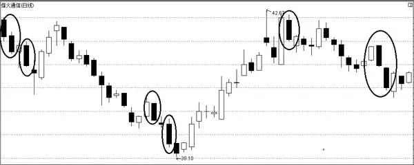

图1\-1 大阴线

二、操作要点

1．大阴线出现在一段涨势之后，尤其是较大涨幅之后，表示股价即将回档或者正在做头部，这时投资者应卖出股票。

2．大阴线如果出现在较大跌幅之后，表示空方能量已经释放得差不多了，根据“物极必反”的原理，此时投资者应考虑做多，逢低吸纳。

3．大阴线的分类。大阴线分为如下几类。

（1）顶部大阴线。顶部大阴线一般出现在上升趋势末期，是空头在高价位击败多头，或多头主力出货的结果，经常伴随着成交量的放大。如果这根大阴线与其之前的K线构成某种看跌型K线组合，则为顶部反转信号。

（2）突破大阴线。往往伴随着跳空走势出现，就是人们常说的“标志性阴 K 线”，会带动均线族反转，从而开始一段与原上升趋势方向相反的新的下跌趋势。

（3）加速大阴线。加速大阴线一般出现在下跌趋势的途中，既是对下跌趋势的推动，也是对下降趋势的验证。

（4）底部大阴线。底部大阴线往往出现在跌势漫长、跌幅巨大的下跌趋势末尾的加速期。一般不宜将它单独作为判断底部的依据，最好能得到下一根 K线的确认。

## 第一章 单根K线分析图 - (02) 中阴线

\(02\) 中阴线

2025年10月29日

18:05

__中阴线 __

一、形态与特征描述

出现中阴线（如图 1\-2）表明全日股票价格波动范围明显增大，卖方占据上风，行情正朝有利于卖方的方向发展。中阴线的波动范围在1\.6%～3\.5%。

中阴线常在股价下跌初期或上升回档时出现，它具有较强的杀伤力。它表示买方当天受到严重打击，买方在卖方强大的攻势面前毫无办法，节节败退。遇到此种K线，投资者应当谨慎对待，并且采取相应的措施保住自己的利润。

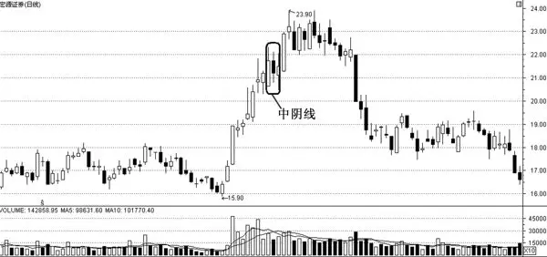

图1\-2 中阴线

二、操作要点

1．中阴线一般出现在三个时期：一是顶部确立后的下跌，二是上升途中有力度的洗盘，三是中期调整的尾声杀跌。

2．拒绝中阴线。如今，洗盘做得越来越像顶部，顶部做得越来越像洗盘。要正确区分二者需要一定的技术功底，否则不是赔钱，就是纸上富贵一场。

3．顶部的中阴线相对好避免一些，而洗盘的中阴线则难判断一些，在人们一致看好时，它会出其不意地出现。其实对于中线炒股者来讲，能不能回避洗盘的中阴线不是很重要，只要在顶部及时出来，照样可以获利不少，能回避洗盘中阴线的人多是高手，一般散户是难以回避的。

## 第一章 单根K线分析图 - (03) 小阴线

\(03\) 小阴线

2025年10月29日

18:05

__小阴线 __

一、形态与特征描述

小阴线是指开盘价与收盘价波动范围较小，上下影线时有时无，即使有也是很短的K线（如图1\-3）。

小阴线表示空方呈打压态势，但力度不大，若出现在大阳线之后，表明空方力量薄弱，后市涨势可以确定。

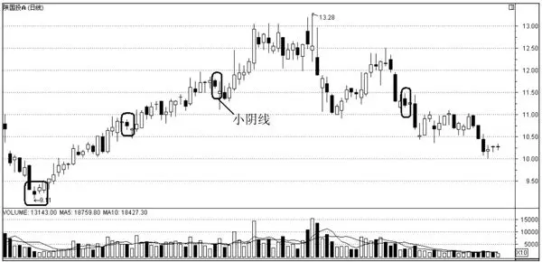

图1\-3 小阴线

小阴线多在盘整行情中出现，也可在上涨或下跌行情中出现，表明当前行情不明朗。

二、操作要点

1．小阴线说明多空双方在小心接触，但空方略占上风。

2．单根小阴线对于市场走向的识别作用不大，但如果在下跌趋势中连续出现多根小阴线，那么这些小阴线将起到助跌的作用。当市场处于阴跌状态时，会出现多根连续的小阴线。

## 第一章 单根K线分析图 - (04) 大阳线

\(04\) 大阳线

2025年10月29日

18:05

__大阳线 __

一、形态与特征描述

大阳线是股价走势图中常见的K线（如图1\-4）。大阳线在技术上表示多方力量强劲，买方占绝对优势，空方毫无抵抗能力。

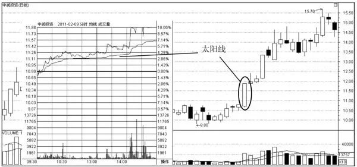

图1\-4 大阳线

大阳线的特征为：无论股价处于什么态势都有可能出现；阳线实体相对较长，并可稍带上下影线；阳线实体越长，则表明多方力量越强，反之，则力量越弱；在涨停板制度下，最大的日阳线实体可达当日开盘价的20%，即以跌停板开盘，涨停板收盘。

大阳线表明，从一开盘，买方就积极进攻，中间也可能出现买方与卖方的斗争，但买方发挥最大力量，始终占据优势，促使股价一路上扬，直至收盘。此外，大阳线还表明涨势强烈，股市呈现高潮，买方疯狂涌进，不限价买进。而握有股票者，因看到买气的旺盛，不愿抛售，市场上的股票出现供不应求的状况。

二、操作要点

1．如果股价在刚开始上涨时就拉出大阳线，则表明股价有加速上扬的可能，投资者可买入；如果在股价连续上涨的过程中出现大阳线，则要当心多方能量可能已耗尽，股价有可能见顶回落；如果在股价连续下跌的过程中出现大阳线，则表明股价有见底回升的兆头，此时投资者可逢低适量买入。

2．结合单日大阳线之后的走势分析其组合变化，大致分为如下两种。

（1）大阳线后的跳空回档

股价在当天收出了5%以上的大阳线后，第二天便跳空低开，该走势是对前一天大阳线筹码的清洗，以便继续上攻。投资者要关注的是回档的力度和深度，所谓力度，是指回档的成交量和回档的时间，通过成交量可以判断筹码的松动情况；深度是指跳空低开价格切入大阳线的位置，一般有1/3、2/3、1/2；理想的是1/3以内，是强势的特征。

（2）跳空直接上攻

这是最为强劲的走势，说明多空力量发生了本质的变化，投资者要及时跟进。介入的点位最好不超过前日收盘价3%。具体讲，只要大阳线后的第2根K线，或这之后的几根K线在大阳线的收盘价上方运行，就可以考虑买进，积极做多。

3．在上升趋势的初期或中期，特别是突破关键位置的时候，出现大阳线表示多头开始发动攻击，股价后市继续上涨的可能性较大。但是如果股价已经在高位，出现大阳线则预示着做多动能日渐耗尽，也有可能是多头在故意大幅拉高股价，造成强势上攻的假象，诱惑散户接盘。如果在高位巨量收出大阳线，是诱多陷阱的可能性就更大，投资者应区别对待。

## 第一章 单根K线分析图 - (05) 中阳线

\(05\) 中阳线

2025年10月29日

18:05

__中阳线 __

一、形态与特征描述

中阳线的实体部分比大阳线稍短。一般认为当股价上涨3%～5%时拉出的阳线以及当大盘上涨1%～3%拉出的阳线为中阳线（如图1\-5）。

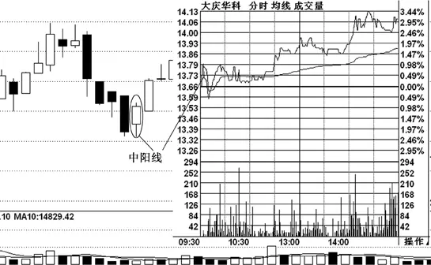

图1\-5 中阳线

中阳线的出现说明多空双方经过一天的战斗之后，多方把价格推高的幅度不如大阳线时大，多方占据的优势也不如大阳线时那样多，只能说多方占据明显的优势。

中阳线经常出现在盘整末期与股价开始上扬初期的交汇点附近、股价的上涨过程中以及股价大幅下跌后的强势反弹中。它表明买方占据优势，并且给了卖方强大的反击，卖方在这种情况下受到的挫折很大。

二、操作要点

1．中阳线出现在上升行情中，则意味着行情将继续向上攀升。

2．中阳线在下跌行情中出现，则意味着行情将向上反弹。

3．如果中阳线出现在全天盘中不断震荡走高的走势中，往往预示次日股价仍然有良好的发展趋势。

4．如果中阳线是在尾盘突然拉升的情况下形成的，投资者则需要提防次日可能出现的回调走势。

## 第一章 单根K线分析图 - (06) 小阳线

\(06\) 小阳线

2025年10月29日

18:05

__小阳线 __

一、形态与特征描述

小阳线是指开盘价与收盘价波动范围较小的阳线，表明多头稍占上风，但上攻乏力，行情发展扑朔迷离（如图1\-6）。

小阳线的影线若上长下短或上短下长，则表示多空双方进行了小型的对抗，消化获利盘和解套盘，原有趋势一般仍会持续，如果连续出现上述情况或次日出现成交量放大的阳线，投资者就可以跟进买入股票，股价必将有一段上升行情。

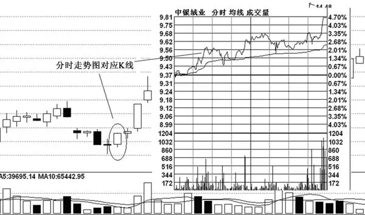

图1\-6 小阳线

二、操作要点

1．上下影线较短的小阳线表示此时市场上虽然具有一定的抛压，但是多方并不示弱，双方试图寻找一种动态的平衡。

2．上影线比较长的小阳线一般表示此时空方的抛压依旧沉重，但是多方的支撑力度并不小，投资者需要密切关注双方力量的变化情况。需要特别指出的是，有时候长长的上影线并不一定是真实的抛压，主力为了营造某种气氛，或者为了掩饰自己的某种企图，往往会刻意画图，人为地控制股价的走势，给投资者制造出一种假象来。

3．下影线比较长的小阳线则表示此时多方的支撑力度较强，虽然实体并不长，但是，长长的下影线已经表明，多方此时正在想做点什么，具体的内涵需要结合整体走势来加以分析。

## 第一章 单根K线分析图 - (07) 光头光脚阳线

\(07\) 光头光脚阳线

2025年10月29日

18:05

__光头光脚阳线 __

一、形态与特征描述

光头光脚阳线表示股票的最高价与收盘价相同，最低价与开盘价一样。光头光脚阳线上下不带影线，表明从一开盘买方就积极进攻，中间也可能出现买方与卖方的斗争，但买方发挥了最大力量。始终占据优势，使股价一路上涨，直至收盘。光头光脚阳线的图形如图1\-7所示。

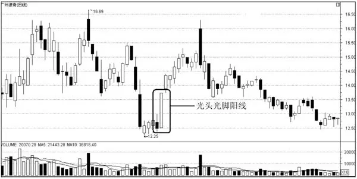

图1\-7 光头光脚阳线

光头光脚阳线与大阳线类似，表示涨势强烈，股市呈现高潮。

二、操作要点

1．投资者需要认识到，光头光脚阳线出现后，股价不一定会立刻上涨，还需要研判股价运行的区域。如果股价在上涨初期拉出大阳线，表明多头力量强劲，股价仍会继续上涨，投资者应持有股票，甚至可适当地加仓。

2．如果在股价连续下跌之后出现光头光脚阳线，则表明多方将组织反攻，从下方向上扫货，空方由于连续杀跌，失去了继续做空的动能，因此，股价将见底回升，逐步走高，此时投资者可适当买入股票。

3．如果股价在连续大幅上涨之后收出大阳线，则不能单纯地预测股价将继续上涨，因为主力往往会在出货的时候做出好看的图形，股价见顶回落的可能性较大，投资者不可盲目追高，持股者应当减仓。

4．光头光脚的中大阳线的出现，一般是多方发起强大攻势，取得了全胜的结果。在低位区出现上述这种光头光脚阳线时，一般是股价长期受挫后企稳回升的表现，要有成交量的配合，此时投资者可以大胆建仓，但要注意的是，若缺少增量资金的配合，底部即使出现光头光脚的中大阳线，也没有太大的意义。

5．光头光脚的小阳线若出现在股价大幅扬升之后，说明买方力量在减弱，上升动能日渐不足，股价转向下跌的可能性较大；在一定区域的盘整期间内出现光头光脚小阳线，并伴随小阴线，则说明盘局依旧，若是连续出现数根小阳线，显示出多方的力量在增强，并开始向上进行试探性的进攻，此时需关注是否有带量突破盘局的行为出现。

## 第一章 单根K线分析图 - (08) 光头光脚阴线

\(08\) 光头光脚阴线

2025年10月29日

18:05

__光头光脚阴线 __

一、形态与特征描述

光头光脚阴线表示开盘价即为全日最高价，而收盘价则为全日最低价。光头光脚阴线上下没有影线。从一开始，卖方就占绝对优势，握有股票者不限价疯狂抛出，市场上一片恐慌。市场呈一面倒，股价始终下跌，最终以全日最低价收盘。光头光脚阴线的图形如图1\-8所示。

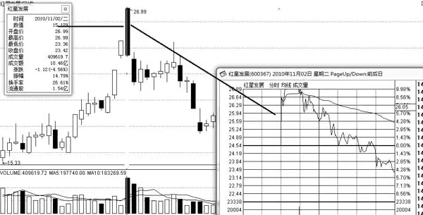

图1\-8 光头光脚阴线

光头光脚阴线表明空方在一日交战中最终占据了优势，多方无力抵抗，跌势强烈，股价次日低开的可能性较大。如果在股价的高位区出现此种图形，投资者最好在最短的时间内抛光手中持有的股票，规避风险。

二、操作要点

1．投资者需要认识到，光头光脚阴线出现后，股价不一定会立刻转向下跌，还需要研判股价运行的区域。如果光头光脚阴线出现在股价上涨一段时间之后，那么表明空方开始反击，投资者最好进行减仓操作。

2．股价大幅上涨之后，在刚形成的下跌趋势中出现光头光脚阴线，一般预示着股价还有下探的空间，投资者不宜过早抄底买入。

3．如果光头光脚大阴线出现在股价连续大幅下跌之后，则往往表明空方力量已衰竭，此时不宜跟风杀跌，而应逢低买入。但由于股票的趋势在短期内难以扭转，此操作方法只适宜短线操作，获利后应立即抛出，否则可能被套。

4．如果光头光脚大阴线出现在股价上涨初期，往往是短期回调洗盘的标志，投资者不必过早地抛出手中持有的股票，而应观察接下来的走势，然后再做决定。很多股票在回调之后还能继续走强。

## 第一章 单根K线分析图 - (09) 上影阳线

\(09\) 上影阳线

2025年10月29日

18:05

__上影阳线 __

一、形态与特征描述

上影阳线是带有上影线而没有下影线的阳线（如图 1\-9）。上影阳线有股价下跌的含义。上影阳线形成的原因为：开盘时由于多方过于强大导致股价被抬高，然而这却触及了空方敏感的神经，导致众多空方开始抛售股票，市场上形成了供过于求的局面，从而导致股价下跌。

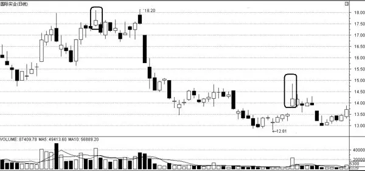

图1\-9 上影阳线

分析上影阳线时，投资者应观察实体与影线的长短。实体比影线长，表示股价在高价位遇到阻力，部分多头获利回吐。但买方仍是市场的主导力量，后市应继续看涨。实体与影线同长，表示买方在拉升股价的过程中卖方的力量也在增强。二者交战结果表明，卖方将股价压回一半。实体比影线短，表示股价在高价位遇到卖压，卖方全面反击，大多数短线投资者纷纷获利回吐，在当日交战结束后，卖方已收回大部分失地。买方一块小小的堡垒（实体部分）将很快被消灭。这种K线如果出现在高价区，则后市看跌。

二、操作要点

1．在上升趋势中，股价经过一段时间的上涨后，在相对的高位区域拉出了若干根带有长上影线的阳K线，当这种上影阳K线出现之后，股价开始做调整。在这里我们可以判断，出现这种上影阳K线多是上档抛压较重所致。

2．上影阳线这种图形时常为主力的试盘动作。上影线的长短与股价受阻力度的大小有关，上影线越短，抛压越小；反之，上影线越长，抛压越大。带有较短上影线的阳线在盘中的技术含义不大，投资者对于带有较长上影线的阳线要多加关注。

3．长上影阳线出现时，投资者要分情况对待，在低位出现长上影阳线，说明主力在试盘，日后股价可能会上涨。在高位出现长上影阳线，说明抛压太重，主力护盘不力，日后股价将下跌。

## 第一章 单根K线分析图 - (10) 上影阴线

\(10\) 上影阴线

2025年10月29日

18:05

__上影阴线 __

一、形态与特征描述

上影阴线是一种带上影线的阴线，上影阴线的收盘价低于开盘价（如图 1\-10）。上影阴线出现在高价位区时，说明上档抛压较重，行情疲软，股价有反转下跌的可能；如果出现在中价位区的上升途中，则表明后市仍有上升空间。上影阴线表明开盘时买方占上风，股价一路上升。但在高价位区域遇阻，卖方组织力量反攻，买方节节败退，最后股价以最低价收盘，卖方占优势，并充分发挥力量，使买方陷入“套牢”的困境。

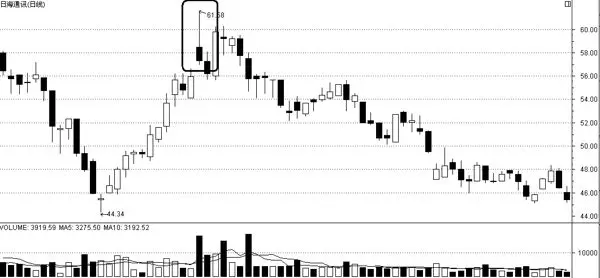

图1\-10 上影阴线

二、操作要点

1．上影阴线的实体比影线长，表示买方把价位上推一点，立即碰到卖方强有力的反击，将价位压破开盘价并乘胜追击，又将价位下推很大的一段，卖方力量强大，局面对卖方有利。

2．上影阴线的实体与影线等长，表示买方把价位上推，但卖方力量更强，占据主动地位，具有优势。

3．上影阴线的实体比影线短，表示卖方虽将股价下压，但力量较弱，第二日入市，买方可能再次反攻。

4．长上影阴线可以解释为：买方力量一度非常强大，将股价大幅拉升，但是在随后双方力量的抗衡中，卖方占了上风，将买方苦心经营的战果夺回，并使收盘价收在开盘价之下。股价经过连续上扬之后，在中高价位区域出现长上影阴线，伴随巨大的成交量，意味着高位抛压沉重，往往是主力机构在高位减磅派发所致，长上影线只是主力制造的一个假象，也就是我们通常说的多头陷阱，诱使人们跟风追涨，实为主力借机出货。长上影阴线是股价将进入调整的信号，投资者应及时出货。

## 第一章 单根K线分析图 - (11) 下影阳线

\(11\) 下影阳线

2025年10月29日

18:05

__下影阳线 __

一、形态与特征描述

下影阳线是一种带下影线的阳线（如图 1\-11）。开盘时卖方强盛，股价一路下跌，但在下探过程中成交量萎缩，当下跌到某一价位后，股价开始止跌回升，随着股价的逐步盘高，成交量均匀放大，并最终以阳线报收。

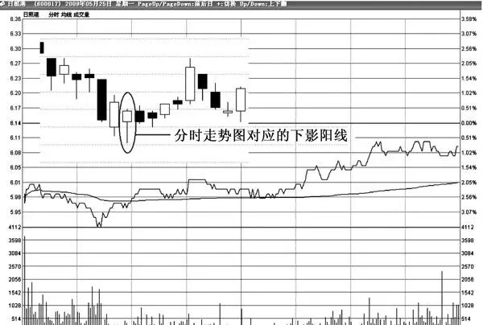

图1\-11 下影阳线

二、操作要点

1．如果在低价位区出现下影阳线，表明股价探底成功，买方的回击沉稳有力，股价先跌后涨，行情有进一步上涨的潜力。其中，下影线越长，后市上涨的力度也越强。

2．在上涨初期出现下影阳线，股价重心开始逐渐上移，可以判断此股后期将以上涨为主，此时可跟进做多。

3．当带有长下影线的阳线出现在下跌趋势中时，并不是一个止跌的信号，它只不过是买方一次无力的反抗而已。

4．长下影阳线出现在低价区或中价区，是一个可信度较高的买入信号。在应用时应注意如下几点。

（1）信号一般出现在中低价区，股价长期横盘之后。

（2）成交量应萎缩至地量。

（3）长下影阳线要有放大的成交量配合，并且，收盘价要站在各条均线之上。

（4）短期均线上穿或即将上穿中长期均线，有形成多头排列的趋势。

## 第一章 单根K线分析图 - (12) 下影阴线

\(12\) 下影阴线

2025年10月29日

18:05

__下影阴线 __

一、形态与特征描述

下影阴线是一种带下影线的阴线。一开盘卖方强盛，股价表现出一路下跌，但在下跌过程中成交量萎缩；当下跌到某一价位后，股价开始止跌回升，随着股价的逐步盘高，成交量均匀放大，但收盘价仍无法站在开盘价之上，最终以阴线报收（如图1\-12）。

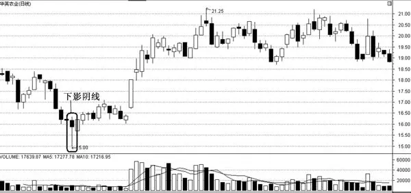

图1\-12 下影阴线

二、操作要点

1．下影阴线的实体部分比影线长，说明卖压较大。一开盘，卖方便大幅度下压股价，随后遇到买方抵抗，买方与卖方展开激战，若影线部分较短，说明买方把价位上推不多，从总体上看，卖方占了比较大的优势。

2．下影阴线的实体部分与影线同长，表示卖方把价位下压后，买方的抵抗也在增强，但可以看出，卖方仍占一定的优势。

3．下影阴线的实体部分比影线短，表示卖方把价位一路压低，在低价位上，遇到买方的顽强抵抗和反击，买方逐渐把价位上推，最后虽以阴线收盘，但可以看出卖方只占极少的优势。后市买方很可能会全力反击，把小阴实体全部吃掉。

## 第一章 单根K线分析图 - (13) 一字线

\(13\) 一字线

2025年10月29日

18:05

__一字线 __

一、形态与特征描述

一字线是 K 线图中的典型图形，在涨势中或跌势中都有可能出现。一字线的特征是：开盘价、收盘价、最高价、最低价粘连在一起成一字状，这就是平时说的以涨停板或跌停板开盘，全日基本上都在涨停板或跌停板价格处成交的一种 K 线走势。在未实行涨跌停板制度前，一字线被视为市场交易投资极为冷清的标志，在我国实行涨跌停板的制度后，一字线反而成为投资者关注的焦点。一字线的图形如图 1\-13 和图1\-14所示。

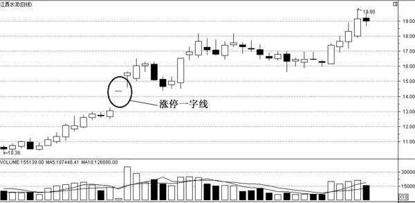

图1\-13 涨停一字线

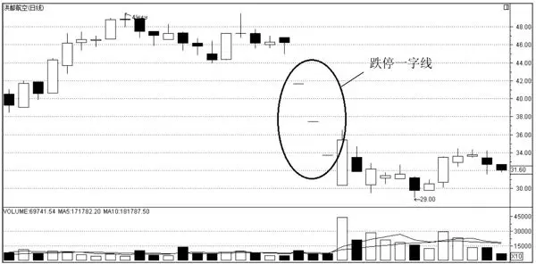

图1\-14 跌停一字线

涨跌停板制度源于国外早期证券市场，目的在于防止交易价格的暴涨暴跌，抑制过度投机现象，是对每只证券当天价格的涨跌幅度予以适当限制的一种交易制度。我国证券市场现行的涨跌停板制度是1996年12月13日发布，并于1996年12月26日开始实施的，旨在保护广大投资者的利益，保持市场稳定，进一步推进市场的规范化。制度规定，除上市首日之外，股票（含A、B股）、基金类证券在一个交易日内的交易价格相对上一交易日的收市价格的涨跌幅度不得超过 10%，超过涨跌限价的委托为无效委托。实际上，我国的涨跌停板制度与国外的涨跌停板制度的主要区别在于股价达到涨跌停板后，交易并不是完全停止，在涨跌停价位或之内价格的交易仍可继续进行，直至当日收市为止。

二、操作要点

1．在涨跌停板制度下，一字线具有重大的意义。若在上涨趋势中出现一字线，表示股价封在涨停价上，说明此时买方力量强大，日后此股往往会成为强势股。投资者需要注意的是：如果该股一连出现几根一字线，从规避短期风险的角度考虑，不宜继续追涨。

2．如果在下跌趋势中出现一字线，那么表示股价封在跌停价上，说明此时卖方力量极其强大，日后此股往往会成为弱势股。

3．在跌势中出现一字线后，股价下跌的可能性较大，但需注意的是，如果该股已连续出现几个一字线，就不宜再继续杀跌，可在股价反弹时再出局。

4．如果在大幅上涨行情末端出现“一字线”，那么表示买方主力借着涨停板，伴以多空的巨量，获利区筹码重兵上移，场内资金应撤离，场外者以观望为宜。

5．下跌初期，经过较长时间的充分换手，当第一个带量的“一字线”出现时，犹如晴天霹雳，令人失望。底部残余筹码仍然向上转移，鸟尽弓藏清晰可见，故投资者应在当日或次日寻机交割。

## 第一章 单根K线分析图 - (14) 十字星

\(14\) 十字星

2025年10月29日

18:05

__十字星 __

一、形态与特征描述

十字星是一种K线的基本形态，实体很小，上下都有较实体长的影线的K线就叫十字星。十字星的图形如图1\-15所示。

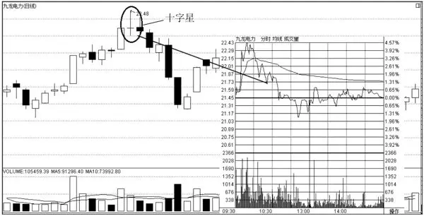

图1\-15 十字星

十字星一般表示多空双方能量暂时较为平衡，一方未能压倒另一方。

十字星主要有以下几种形态。

1．大十字星：出现在大幅的持续上升趋势中或下跌之末的概率较大，在盘整区间中出现的几率较小。出现大十字星往往意味着行情将转势。

2．小十字星：是一种振幅极其短小的十字星，这种十字星常常出现在盘整行情中，表示盘整格局依旧存在；倘若出现在上涨或下跌的初期或中途，表示股价暂时休整，原有的升跌趋势不会改变。

3．长上影十字星：要是出现在下跌趋势中途，一般表示股价暂时休整，下跌趋势并未改变；如果出现在持续上涨后的高价区，股价转向下跌的可能性较大；但若出现在上涨趋势中途，次日股价又创新高的话，说明买盘依然强劲，股价将继续上升。

4．长下影十字星：要是出现在上升趋势中途，一般表示股价暂时休整，上涨趋势并未改变；如果出现在持续下跌后的低价区，则暗示卖盘减少买盘增加，股价转向上升的可能性增大，但次日再次下探不能创新低，否则后市将有较大的跌幅。

二、操作要点

1．不同点位十字星的含义

（1）上涨趋势初期的跳空十字星。一只长期在底部盘整的个股，突然有一天跳空高开，小幅上涨之后，不巧遇到大盘大跌，但最后还是收出一根带有跳空缺口的十字星，其意义是非常重大的。这种跳空十字星又叫启明星（中小投资者可在后市逢低积极介入，一是判断跳空缺口是否回补；二是看后市是否放量上涨或缩量整理，以判断其个股后期走势的有效性）。

（2）上涨趋势中期的十字星。一只个股在正常的上升通道中，一天拉出一根光头阳线，众多中小投资者一致看好，谁知第二天只是平开（收出十字星），上下小幅震荡，并没有出现想象中的强劲走势。结果第三天又收出一根大阳线，拉升就此展开，让第二天卖出的投资者痛心疾首（上涨中期的个股，第一天拉出阳线，第二天收出十字星，是主力惯用的一种震荡洗盘手法，故意做出上涨无力的样子，缩量收十字星是其要点）。

（3）上涨末期的十字星。一只个股在上涨末期收出一颗十字星，一般有见顶的嫌疑。

（4）盘中十字星。一只个股在做箱体震荡时若总是出现十字星，则此时的十字星意义不大，只是表明主力在震荡洗盘，但洗盘后如能放量拉升，投资者可积极参与。

2．十字星的研判技巧

（1）从成交量方面研判。投资者应认识到：出现十字星后，行情能否上升，并演变成真正具有一定动力的强势行情，成交量是其中一个决定性的因素。十字星形成前后，若量能始终保持温和放大，则十字星将会演化成阶段性底部形态；如果形成十字星走势时，成交量不能持续放大，则表明市场增量资金多处于观望的状态中，此时容易形成下跌中继形态。

（2）从成交密集区方面研判。成交密集区是市场行情走向的重要参照物，并以此判断十字星所处的高低位置。所形成的十字星离上档成交密集区的核心地带越近，越容易形成下跌中继形态；所形成的十字星离上档成交密集区的核心地带越远，则越容易形成阶段性底部形态。

（3）从热点方面分析。如果热点趋于集中，并且保持一定的持续性和号召力，使热点板块有效形成聚焦化特征，那么增量资金的介入就会具有方向性，有利于聚拢市场人气和资金，使后市行情得以健康发展，则十字星会发展为阶段性底部形态。

## 第一章 单根K线分析图 - (15) T字线

\(15\) T字线

2025年10月29日

18:05

__T字线 __

一、形态与特征描述

因其形状像英文字母T，故称之为T字线。T字线的开盘价、收盘价和最高价相同， K线上只留有下影线；即使有上影线也很短，而T字线作为转势信号的强弱又与下影线的长度成正比，下影线越长，则信号越强。T字线的图形如图1\-16所示。

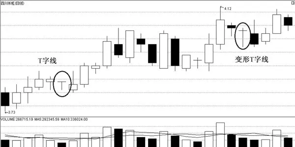

图1\-16 T字线

二、操作要点

一般来讲，T字线因所处的位置不同，技术含义也不相同。这是因为T字线是一种主力线，它完全由主力控盘。在实际操作中，T 字线真实地反映了主力的操盘意图，投资者只要认真分析T字线出现的时间、位置，再结合其他技术分析指标，就能识破主力的阴谋，在与主力争斗的过程中取胜。不同位置的T字线的操作要点有如下几项。

1．T字线在上涨行情初期，出现在高度密集的底峰之上时，场外资金可积极建仓，不要错失良机。

2．T字线出现在上升途中的循环高点或低点，获利区筹码锁定较好时，投资者可继续看好后市。

3．在大幅上涨行情末端出现T字线，股价远离底峰在30%以上，多空方以巨量成交，筹码上移，此时，投资者应及时出局。这里没有密集筹码峰，只有筹码值的初现。届时不宜急于入场。

4．投资者在区别下跌途中的T字线和下跌底部的T字线时，可以参考以下两点。

（1）看下跌幅度。如果跌幅已经很大，出现底部T字线的可能性较大，反之，则可能性较小。

（2）看T字线之后股价重心是上移还是下沉。如果股价重心上移，很有可能是主力利用T字线稳定军心，正策划一轮上攻行情，那么这个T字线就是见底回升的信号，此时投资者可以考虑买进。如果股价重心下沉，T字线可能是一个多头陷阱，这根T字线就是继续下跌的信号。股价在这之后仍会有较大跌幅。此时投资者一定要耐心观望，绝不可盲目买进。

## 第一章 单根K线分析图 - (16) 倒T字线

\(16\) 倒T字线

2025年10月29日

18:05

__倒T字线 __

一、形态与特征描述

倒T字线的形态特征为：开盘价、收盘价、最低价粘连在一起，成为“一”字，但最高价与之有一定的距离，因而在 K 线上留下一根上影线，构成倒 T 字图形（如图1\-17）。

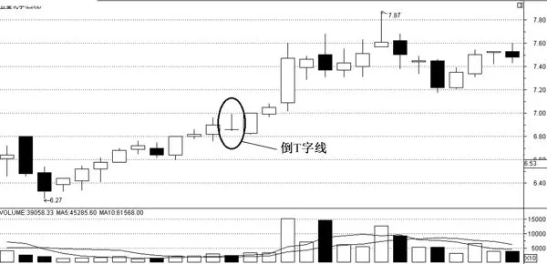

图1\-17 倒T字线

二、操作要点

倒T字线出现的位置不同，其技术含义及操作方法也不相同。

1．出现在上涨途中，后市继续看涨。

2．在上升趋势中出现倒T字线称为上档倒T字线，又称下跌转折线。表明在空方的打击下，多方已无力将股价推高，股价将要下跌，此时投资者应以观望为主。

3．出现在上涨末期，为卖出信号。

4．出现在下跌途中，后市继续看跌。

5．出现在下跌末期是买入信号，特别是末期在三连阴后出现倒 T 字线，或二黑夹一红后出现倒T字线，如第二天出现大阳线，组成早晨之星或身怀六甲，是一个非常好的切入点。

6．倒T字线上影线越长，信号越可靠。

## 第二章 K线组合形态分析图

__第二章 K线组合形态分析图 __

2025年10月29日

18:05

## 第二章 K线组合形态分析图 - (01) 早晨之星

\(01\) 早晨之星

2025年10月29日

18:05

__早晨之星 __

一、形态与特征描述

早晨之星又称“黎明之星”“晨星”“希望之星”，由三根 K 线组成，它是一种行情见底转势形态（如图2\-1）。这种形态如果出现在下降趋势中，投资者应予以注意，因为此时的趋势已发出比较明确的反转信号，是一个非常好的买入时机。

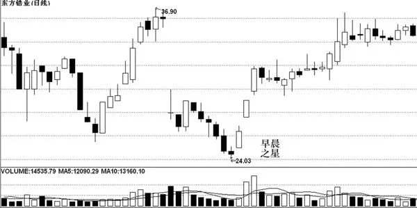

图2\-1 早晨之星

在K线组合形态中，早晨之星是一种成功率非常高的选股信号。早晨之星是在下降趋势中的某一天出现一根长实体阴线，第二天出现一根向下跳空低开的K线，且其最高价低于第一天的最低价，产生一个向下跳空缺口，第三天则出现一根长实体阳线的K线组合形态。

二、操作要点

1．早晨之星一般出现在下降趋势的末端，是一个较强烈的趋势反转信号，谨慎的投资者可以结合成交量和其他指标共同分析。

2．早晨之星是比较可靠的反转形态，但投资者仍需谨慎。市场中从来不乏主力利用大家的共识来欺骗散户的行为，早晨之星成为诱多陷阱也是有可能的。特别是在下跌途中，主力还未全部出逃，也许会制造一个早晨之星的反转假象来诱惑散户接盘。

3．判断早晨之星是否可靠的关键在于识别股价的整体位置。如果股价前期下跌幅度较大，严重超跌，早晨之星成为反转信号的可能性就比较大。如果在下跌途中，下跌动能还没有得到有效释放，则很可能是诱多陷阱，短暂反弹后股价会继续下跌。

4．如果下跌的时候无量而上涨的时候放量，这样的早晨之星应更可靠，反转的成功率更高。如果反弹时无量能的配合，则更可能是诱多的陷阱。

5．最后，需要后市的确认。如果是陷阱，股价很快便会滞涨，然后反转下跌。

## 第二章 K线组合形态分析图 - (02) 黄昏之星

\(02\) 黄昏之星

2025年10月29日

18:05

__黄昏之星 __

一、形态与特征描述

黄昏之星又称“暮星”，是一种类似早晨之星的K线组合形态（如图2\-2），是后者的翻转形式。黄昏之星的情况同早晨之星正好相反，它表示上升趋势即将出现反转。

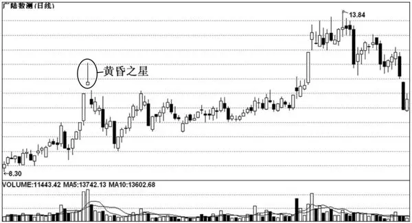

图2\-2 黄昏之星

黄昏之星由三根K线组成：第一根K线是一根长阳线；第二根K线是一根可带上下影线的小K线（阴、阳均可）；第三根K线是一根阴线，它的实体插入到第一天的长阳线的实体内部。当黄昏之星出现时，投资者应尽早离场。

黄昏之星一般出现在一波行情的高位。股价经过一段时间的上涨后，向上跳空高开，开盘价与收盘价相向或非常接近，而且留有上下影线，形成一颗“十字星”；第二天，接着跳空拉出一根下跌的阴线。

黄昏之星是股价见顶回落的信号。在实战中，黄昏之星充当顶部的几率非常高，在牛市的后期，要特别警惕这种反转信号。投资者遇到这种形态，不宜再继续买进，应考虑及时减仓，并随时做好止损离场的准备。

二、操作要点

1．黄昏之星的出现表明股价已经离顶部不远，股价运行趋势将由强转弱，会出现一轮跌势。

2．若在黄昏之星出现之前，股价一度加速上行，则后期的下跌会更为凶猛，投资者应及早止损离场。

3．在标准形态中，小星线与前一根K线的实体之间存在着一个价格跳空。

4．黄昏之星必须出现在上升趋势之后，或者出现在横向整理区域的顶部才有技术意义。

5．通常而言，位于一个上涨趋势后的带量黄昏之星，往往会构成市场反转的顶部。

6．一般来说，如果该形态出现在反弹行情顶部、股价快速拉升之后时，那么其可靠性较高；反之，若该形态出现在股价突破颈线之后、涨幅相对较小时，则主力洗盘的可能性较大。

7．黄昏之星有如下几种变形形态，其实战意义与标准形态类似。

（1）第一种变形形态

由原先中间只有一根小K线变成有两根小K线，而最左边的阳线与最右边的阴线不变。

（2）第二种变形形态

由原先中间只有一根小K线变成有三根小K线，而最左边的阳线与最右边的阴线不变。

（3）第三种变形形态

由原先中间只有一根小K线变成有四根小K线，而最左边的阳线与最右边的阴线不变。

8．由于黄昏之星是一种次要的顶部反转信号，因此，其出现图形陷阱的可能性较大。而判断黄昏之星是否真的形成顶部反转的依据有以下三点。

（1）成交量是否创近期天量。如果是，则成为市场顶部的可能性较大。

（2）如果黄昏之星前一根K线创天量，市场发生反转的可能性也很大。

（3）在重要阻力位出现的黄昏之星通常是带量的，这一点应引起投资者的高度重视。

## 第二章 K线组合形态分析图 - (03) 穿头破脚

\(03\) 穿头破脚

2025年10月29日

18:05

__穿头破脚 __

一、形态与特征描述

穿头破脚是剧烈的反转信号。若在市场的顶部出现穿头破脚，则是股价要下跌的前兆；若在市场的底部出现穿头破脚，则是股价止跌回升的开始。

顶部穿头破脚是在上升行情中出现的K 线组合，由两根K 线组成。第一根K 线为阳线，第二根K线跳空高开，最后回落成阴线，并且阴线实体包含了前一根阳线的实体，俗称阴包阳，是见顶信号。

底部穿头破脚是在下跌趋势中出现的K 线组合，由两根K 线组成。第一根K 线为阴线，第二根K 线跳空低开，最后拉升，收成阳线，并且阳线实体包含了前一根阴线的实体，俗称阳包阴，属于见底信号（如图2\-3）。这是因为股价下跌到底部后，下跌力量减弱，随后出现的一根大阳线的最高价高于前一根线的最高价，表明买方力量增强，卖压减轻，后市有利于买方。

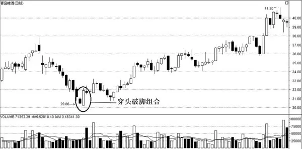

图2\-3 底部穿头破脚

二、操作要点

1．股价在大幅上涨后出现顶部穿头破脚，见顶的可能性很大。当然，能否见顶还取决以下三个因素：一是升幅越大，获利盘越多，见顶的可能性就越大；二是穿头破脚的信号越强烈，见顶的概率越高；三是要看在穿头破脚之后几根 K 线的运行情况，如果在长阴线的收盘价下方运行，股价重心向下，则基本上可以判断是见顶了。

2．穿头破脚用于分析大盘的可靠程度要强于个股。因为个股中出现这种形态不排除是市场主力刻意而为之。

3．在形成穿头破脚形态之前，要有明显的上升或下跌趋势。

4．伴随着成交量的急剧放大，量比应在3倍以上，若能达到8～10倍，反转发生的可能性极大。

5．操作时还必须注意：无论顶部穿头破脚的见顶信号多么强烈，如果该信号出现在股价刚启动阶段，在股价没有大涨之前，不要轻易判断见顶与否。

6．在顶部出现“一般”和“较弱”的信号时，投资者不宜马上斩仓出局，可以先看看再说，若发现之后的K线在其下方运行，股价重心下移，再止损离场也不迟。这样做的目的是为了避免自身陷入主力的空头陷阱。

7．从统计上来说，底部穿头破脚作为见底信号，不如顶部穿头破脚作为见顶信号的准确率高（因为股价下跌容易上涨难），但是，如果把 K 线中所有见底信号进行排列，可以发现，底部穿头破脚作为见底信号还是名列前茅的。

## 第二章 K线组合形态分析图 - (04) 红三兵

\(04\) 红三兵

2025年10月29日

18:05

__红三兵 __

一、形态与特征描述

红三兵是指三根中、小阳线，依次拾阶而上的一种K线组合形态（如图2\-4）。这是一种十分常见的K线组合形态，通常说明多头逐渐介入，后市继续上涨的可能性很大。因此，红三兵也是一种比较稳健的上升走势，投资者可积极跟进。

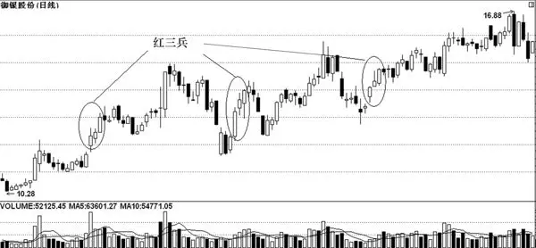

图2\-4 红三兵

红三兵的形态特征为：在股价运行过程中连续出现三根阳线，每天的收盘价高于前一天的收盘价；每天的开盘价在前一天阳线的实体之内；每天的收盘价为当天的最高点或接近最高点。

二、操作要点

1．红三兵如果出现在下跌趋势中，为强烈的反转信号。每天的开盘价均较低，收盘价却创近期新高，多头力量推动股价向上盘升。

2．辨别红三兵可靠性的一个重要依据就是成交量。成交量若不能有效放大，趋势便无法反转。

3．投资者对股价在第一次探底中出现的红三兵形态要保持一份警惕（可能会是骗线），而在第二次探底中出现的红三兵形态的可靠性则相对较高。

4．以阳线的最低点作为止损点，防止庄家骗线。

5．当三根小阳线收于最高或接近最高点时，称为三个白色武士，三个白色武士拉升股价的作用要强于普通的红三兵，投资者应对其有足够的重视。

6．股价连续下跌后，当底部出现红三兵时，第三根阳线实体一定要站在5MA、10MA之上，并且5MA向上与10MA靠拢，甚至金叉。这是红三兵买入的条件。在上涨途中横盘整理时出现红三兵，也要求5MA重新向上与10MA靠拢，注意10MA在股价整理时绝不能走平或向下倾斜。这是涨升途中红三兵买入的条件。一般说来，按照上面的条件买入，后市会有非常不错的涨升空间。关于阳线实体问题，这里需要说明一下，三根阳线的实体应当均匀，或者逐渐增大，如果第二根或第三根阳线的实体过大、过小，又或者阳线的影线过长，均属于假红三兵，不在买入之列。

7．识别红三兵是否为陷阱同样需要重点关注股价的整体位置。通常在低位的红三兵是多头逐步建仓的表现，后市继续上涨的可能性大。如果是在上升末期，即涨幅已大的情况下出现红三兵，那么表明上涨乏力，股价很可能会见顶。如果在下跌途中出现红三兵，则是弱势反弹的表现，投资者不要轻易跟进。此外，还应关注量能的变化情况。如果量能稳步放大，则是主力逐步介入的表现；如果量能非常不规则，特别是在拉出第三根阳线时，突然放量，则股价有可能会回调。另外需关注红三兵是否有上下影线，光头光脚的红三兵比有上下影线的红三兵的走势更为稳健。

## 第二章 K线组合形态分析图 - (05) 黑三兵

\(05\) 黑三兵

2025年10月29日

18:05

__黑三兵 __

一、形态与特征描述

黑三兵由三根小阴线组成，每日阴线的最低价均比前一日低（如图2\-5）。

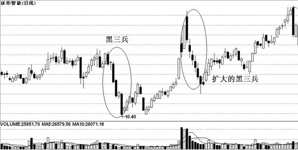

图2\-5 黑三兵

黑三兵的形态特征为：可在涨势中出现，也可在跌势中出现；由三根小阴线排列组合而成；三根小阴线的开盘价、最高价、最低价、收盘价依次降低。

黑三兵显示出市场上的多头力量与空头力量经过搏杀较量后，空方力量每一次都取得小胜，而多方力量正在节节败退，当外在的做空条件成熟时，股价在空头力量的爆发过程中将会继续下跌。而当该形态处在一段下跌行情之后，由于连续做空，空方力量得到了极大的宣泄，极有可能由此进入反弹行情。

二、操作要点

1．黑三兵出现在不同的趋势中及在趋势的不同位置上的技术含义均有所不同。在上升行情中，尤其是当股价有了较大涨幅之后，倘若出现黑三兵，预示着行情快要转为跌势。如果在下跌行情中，股价已经有了一段较大的跌幅或连续急跌后，倘若出现黑三兵，表明探底行情短期内即将结束，并有可能转为一轮升势。因此，投资者见到黑三兵后，可根据黑三兵出现时的位置决定操作策略，也就是说在上涨行情中出现黑三兵，要考虑做空；在下跌行情中出现黑三兵，要考虑做多。

2．黑三兵的跌幅虽然不大，但连续的下挫也足以对持股者形成威慑。因此，黑三兵也经常被主力用来制造诱空陷阱，营造惨淡的市场气氛，逼迫投资者交出廉价的筹码。这种情况较为常见。

判断黑三兵是转势信号还是诱空陷阱，同样要关注股价的整体位置。大幅下跌之后出现的地量黑三兵很多是诱空陷阱，这最后一跌完成后，股价可能很快发现反转。不过要判断是否为底部始终是件很困难的事。在上涨的途中，也经常出现黑三兵，起到洗盘的作用，中长线投资者可继续持股。若在大幅上涨之后出现黑三兵，则很可能是股价反转下跌的信号，后市应该还有较大的跌幅。

3．黑三兵的两类特殊形态。

（1）最低价收盘型组合

该黑三兵形态中的三根阴线都是以最低价收盘。此类型的黑三兵形态是空头强势型组合。

（2）带影线型

每一根阴线上都带有很短的上影线或下影线，影线的出现说明空方力量虽然战胜了多方力量，但在搏杀较量的过程中多头予以顽强抵抗。所以，此种类型的黑三兵形态是空头弱势型组合。

## 第二章 K线组合形态分析图 - (06) 上升三部曲

\(06\) 上升三部曲

2025年10月29日

18:05

__上升三部曲 __

一、形态与特征描述

上升三部曲的特征是：出现在上涨途中；由大小不等的几根K线组成；先拉出一根大阳线或中阳线，接着连续出现三根小阴线，但都没有跌破前面那根阳线的开盘价，随后又出现一根大阳线或中阳线，其图形有点像英文字母N（如图2\-6）。

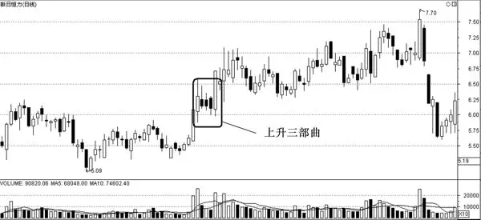

图2\-6 上升三部曲

出现上升三部曲一般说明多方在积蓄力量，伺机上攻。因此，见到此种形态时，不要认为三连阴后股价会转弱。此图形出现后，要注意观察股价的下一步走势，倘若发现股价向上运行，并伴随成交量的放大，就要积极跟进做多。

二、操作要点

1．在具体操作中，中间的小阴线不一定是三根，也可能是四根、五根或更多根。

2．中间的小阴线是主力清洗浮筹的手段，当一些人看淡时主力会突然发力，再拉出一根大阳线，宣告一震仓洗盘的结束，即将展开新一轮向上的攻势。

## 第二章 K线组合形态分析图 - (07) 下跌三部曲

\(07\) 下跌三部曲

2025年10月29日

18:05

__下跌三部曲 __

一、形态与特征描述

下跌三部曲的特征为：下降途中出现一根长阴线，这根长阴线的收盘价小于开盘价的 3%；在长阴线后面跟随着三根小阳线；小阳线或高或低地排列，并在第一根长阴线的范围之内，也就是说，三根小阳线的最高价不能超过第一根长阴线的最高价，而三根小阳线的最低价不能低于第一根长阴线的最低价；最后，再次拉出一根长阴线，而且其收盘价小于第一根长阴线的收盘价（如图2\-7）。

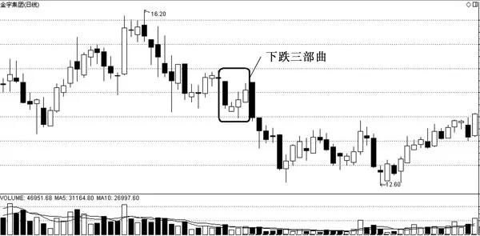

图2\-7 下跌三部曲

下跌三部曲的出现表明多方虽然想去反抗，但是最终在空方的打击下失败。这表明股价还会进一步向下滑落。因此，看到这种图形时，投资者要顺势而为，减小仓位。

二、操作要点

1．下跌三步曲也称为下降三法，一般出现在下跌途中，属于下跌中继形态，表明股价下跌虽遇支撑，但连续多日回升幅度不大，后市将继续下跌。

2．这里要说明的是，不论是上升三部曲还是下跌三部曲，都很难找到标准的图形，中间所夹的阴线或阳线可能是四根或五根，这些都是上升三部曲或下跌三部曲的变异图形。因此，看到此类图形时，投资者要多加注意，不要生拉硬套，要活学活用。

## 第二章 K线组合形态分析图 - (08) 两阳夹一阴

\(08\) 两阳夹一阴

2025年10月29日

18:05

__两阳夹一阴 __

一、形态与特征描述

两阳夹一阴（有时会是三阳夹一阴）是指某只个股在第一天收出了一根中阳线，次日，该股的价格并未出现持续性的上升，而是收了一根实体大小基本等同于前一根阳线的阴线，但第三天并未承接第二天的跌势，反而再次涨了起来，收出中阳线（如图2\-8）。这便是个股即将起飞的征兆，是一种典型的强势上攻形态。在实战中，两阳夹一阴是一种非常实用的 K 线组合，这个组合出现后，股价继续上涨的概率极大。

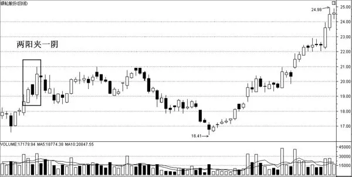

图2\-8 两阳夹一阴

两阳夹一阴的构造过程实际上是主力的震仓行为，由于其点位处于箱顶、上升中途或底部，所以容易令散户的筹码脱手，从而使主力可以顺理成章地完成拉升过程中的洗盘。在两阳夹一阴的构造过程中，第一天容易使人获利了结，第二天由于出现阴线，更会诱使人抛出手中筹码，而第三天又容易令已抛出筹码者十分懊悔，不愿买回，这些现象均有利于主力进行洗盘。

两阳夹一阴可以分为标准形态、弱势形态和强势形态。标准形态是指三根 K 线的长度几乎相等，高度几乎一致；弱势形态是指三根 K 线呈明显的下降趋势，股价一天比一天低，参与价值不大；强势形态是指三根 K 线呈明显的上升趋势，股价一天还比一天高，是一种以涨代替调整的强势形态，中间的阴线实体要尽可能短，并且下影线长些，下影线长说明该股的收复能力强，是一种强势的表现，充分暴露出主力急于拉高的心情。

二、操作要点

1．两阳夹一阴是个股即将起飞的征兆，是一种典型的强势上攻形态，是非常难得的短线买入点位，一般出现在股价即将上破箱顶的阶段，或者出现在上攻过程中途的换档阶段，有时还会出现在股价脱离底部的启动阶段。但是，如果主力的筹码相对不足的话，他们有时会把两阳夹一阴做成三阳夹一阴，但同样具有上攻动力。

2．介入这类个股的另一个前提是均线系统必须正好形成多头排列。另外，MACD指标、DMA指标、TRIX指标和EXPMA指标形成金叉也十分重要。

3．两阳夹一阴亦称“炮台”，表明后市股价将有上升空间。如果接下来股价没有出现跳空向上涨升或继续放量上攻的情形，多方炮将变成哑炮，形成多头陷阱，股价将回落到原来的整理区间继续盘整，甚至于出现向下破位的情形。

4．个股出现两阳夹一阴形态时，投资者要注意以下几点。

（1）大盘处于什么趋势。如果大盘处于下降趋势，两阳夹一阴的最后一根阳线的量能没能放大，可以放弃操作；如果最后一根阳线的量能较前两日有明显的放大，可以用少量资金操作。

（2）个股处于什么趋势。如果个股处于上升趋势，可以介入；如果个股处于横盘整理，可在放量向上突破平台时介入；如果处于下降趋势，应放弃操作。

（3）在周线上出现两阳夹一阴的准确率要比日线高。

## 第二章 K线组合形态分析图 - (09) 两阴夹一阳

\(09\) 两阴夹一阳

2025年10月29日

18:05

__两阴夹一阳 __

一、形态与特征描述

两阴夹一阳是指一根阳线夹在两根阴线中间，常出现在下跌途中。股价在下跌时，遇到买方的抵抗，但还是挡不住卖方的力量，股价将继续下跌。

两阴夹一阳的图形特征为：第一天股价下跌收阴线，第二天上升收阳线，第三天再度下跌收阴线，股价横向震荡。标准的两阴夹一阳形态的三根K线的三个顶端是水平的，三个底端也是水平的。走势强劲的两阴夹一阳特征是：三根K线呈下跌趋势，阴线的顶部应尽量低，阳线的实体尽量短。特别需要强调的是，两阴夹一阳若出现在抛压之下，形成空方炮，则是典型的头部图形（如图2\-9）。

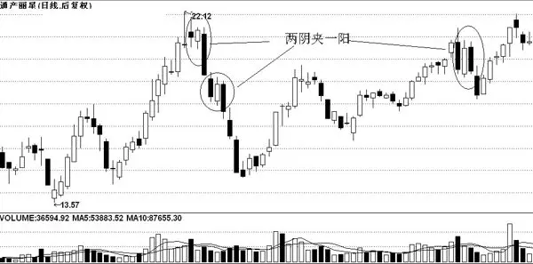

图2\-9 两阴夹一阳

通常来说，两阴夹一阳多出现在市场的顶部。股价持续攀升之后，到达一定高位，某一日股价高开低走，日K 线收出一根带量的中、大阴线，获利盘的抛压开始加重或盘中主力已开始减磅离场。次日股价没有延续跌势，反而低开高走，收出一根中小阳线，给人一种升势未尽的错觉。然而，细心的投资者会发现，当日成交量却明显萎缩，说明此日的阳线带有欺骗性，做多意愿并不强。在接下来的一个交易日中，股价再次高开低走，大量获利盘汹涌而出，成交量再次放大，充分说明多方能量已完全消耗，空方彻底控制了大局，一轮下跌趋势已基本确立。

二、操作要点

1．该类K线组合的形成一般要借助高涨的人气，形成位置主要在阶段性顶部。

2．由于此形态的构造时间短且成交量异常，是明显的出货行为，散户往往在事后才会发现。

3．投资者应在两阴夹一阳图形形成的当天及时卖出。

4．若未及时卖出，可在两阴夹一阳图形形成后的第二天趁反弹卖出。

5．第一根阴线通常为巨幅高开阴线，庄家会利用利好消息和高涨的人气这两点来达到出货的目的，第二根K线之所以收成阳线，是因为庄家为了稳住人心，实行边拉边出的出货手法，等到第三根阴线出现并和第一根阴线形成对第二根阳线的夹击之势时，庄家已把筹码几乎派发完毕。

6．这种技术形态形成后，其他指标可能出现以下几种情况。

（1）某股的KDJ指标和RSI指标分别从超买区回落、从钝化位下跌。

（2）MACD指标和DMA指标即将形成死叉。

（3）MACD指标的DDIF值无法再创新高。

（4）均线即将形成空头排列。

（5）阴线的实体通常较阳线的长，且成交量放得更大。

## 第二章 K线组合形态分析图 - (10) 上涨两颗星

\(10\) 上涨两颗星

2025年10月29日

18:05

__上涨两颗星 __

一、形态与特征描述

上涨两颗星是一种比较经典的K线组合形态（如图2\-10），是一种攻击形态，预示着股价短期内将继续上涨。

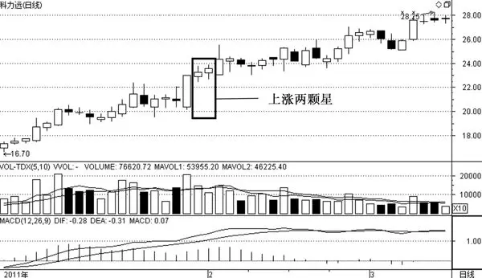

图2\-10 上涨两颗星

上涨两颗星一般由三根小K线构成。第一根K线为中阳线或大阳线，第二根与第三根K线可以是小阴线也可以是小阳线，但是这两根小K线的收盘价必须在第一根阳线的收盘价之上。这两根小K线就像天空中的两颗星星，所以我们称其为上涨两颗星。

和所有的K线组合一样，上涨两颗星只有出现在特定走势中才具有应用的意义。若出现在股价上行途中，一般后市至少还有一次短期的涨幅。

上涨两颗星的技术含义是：某一天，股价收出一根长阳线，说明多方发起反攻；随后两天，在第一根阳线的收盘价附近收出两根并排排列的十字星，这是一种空中加油的战法。多方通过这两颗十字星进行空中加油之后，将向更高的目标发起攻击。

无论是在上升途中，还是在连续下跌之后，出现上涨两颗星，都是上涨信号，遇到这样的K线组合，投资者要做的就是买入。

二、操作要点

1．上涨两颗星的第一根K线通常是一根具有突破性质的放量中阳线。

2．上涨两颗星通常要求都是阳星，而且实体依次抬高，第二颗星的开盘价与收盘价都要比第一颗星的高一点，同时，第一颗星的收盘价应在前一日的中阳线的上方。

3．两颗星应温和缩量。

4．需要注意的是，这种 K 线组合意味着后市还应该存在着短期高点，但是它只适用在股价上行途中的判断，如果在股价连续下跌的过程中出现这种组合，是没有太大意义的。

## 第二章 K线组合形态分析图 - (11) 下跌三颗星

\(11\) 下跌三颗星

2025年10月29日

18:05

__下跌三颗星 __

一、形态与特征描述

下跌三颗星的特征是：一般在下跌行情初期或中期出现；由一大三小四根K线组成；在下跌时，先出现一根大阴线或中阴线，随后在这根阴线的下方出现了三根小K线（既可以是小十字星，也可以是实体很小的阳线或阴线）。下跌三颗星的图形如图2\-11所示。

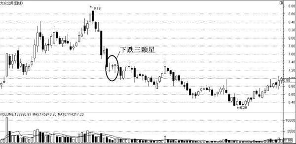

图2\-11 下跌三颗星

二、操作要点

1．下跌三颗星为卖出信号，后市看跌。

2．在下跌初期出现下跌三颗星，表明市场仍处于弱势，股价仍有下跌的空间，投资者应尽快离场。

3．如果在下跌中期出现下跌三颗星，则后市看跌。

## 第二章 K线组合形态分析图 - (12) 双针探底

\(12\) 双针探底

2025年10月29日

18:05

__双针探底 __

一、形态与特征描述

双针探底由两根K线组成，这两根K线均带有较长的下影线（如图2\-12），且两根下影线的最低价相同或接近，它的两根长下影线就像两根探雷针，已基本探明股价的底部，投资者可以伺机介入。

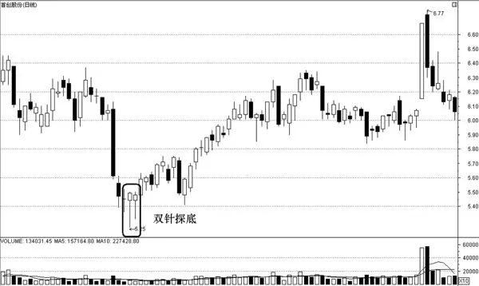

图2\-12 双针探底

二、操作要点

1．双针探底必须出现在低位，如果所处的位置偏高，即前期股价的下跌幅度小于20%时，则应慎重操作。

2．双针探底中的“两针”，可以是两条紧挨着的长下影线，也可以是中间隔有几条K 线的“两针”，但相隔的天数不能过多，若多于五条 K 线，则会变成“双底”形态。但二者的操作方法基本一致。

3．双针探底出现后，股价一般会立即反弹，走出一波气势不凡的上涨行情。但有的股票却仅向上“虚晃一枪”便跌了下来，经过一段时间的调整后，才正式展开向上的攻势。碰到这一情况时，投资者应耐心等待，还可适时补仓。

## 第二章 K线组合形态分析图 - (13) 双飞乌鸦

\(13\) 双飞乌鸦

2025年10月29日

18:05

__双飞乌鸦 __

一、形态与特征描述

双飞乌鸦的出现一般预示着股价将见顶回落。双飞乌鸦的特征为：一般出现在上升途中，由一根阳线和两根阴线组成，第一根阴线的实体部分与上一根阳线的实体形成一段小缺口，构成起飞的形状，只可惜翅折羽断，没有飞起来；第二根阴线表明股价高开，然后再次下跌，第二根阴线的实体部分较长，已把第一根阴线完全吞并（如图2\-13）。

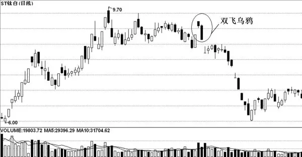

图2\-13 双飞乌鸦

从图形上可以看出，两根阴线就像两只乌鸦在空中盘旋，因此，人们给它起了个双飞乌鸦的名称。双飞乌鸦的出现一般表明人们对这个市道已很烦腻，做多力量严重不足，后市由升转跌的可能性很大。

双飞乌鸦一般出现在上升趋势的末端，市场的上升力度在逐渐减弱，当形态初步形成时，市场仍存在一定的上升动力，因此，双飞都是以高开为主，摆出起飞的形状，但后继乏力，出现低收的情形。尤其是当第二根阴线出现时，做空力量突然剧增，使多头对后市产生疑虑，开始获利了结，从而造成向下的压力。

二、操作要点

1．双飞乌鸦的标准形态较少出现。投资者在看盘时，只要发现股价处在高位、在一根阳线后出现两根阴线，不管它符不符合双飞乌鸦的形态要求，都应卖出，这是逃顶最省事的方法。

2．一般来说，双飞乌鸦的阴线实体越大，其下跌空间也越大。

3．双飞乌鸦一定要先起飞再回落，即行情经过一段时期的连续上升之后，在高位出现跳空的阴线，表明“乌鸦”起飞，然后再出现一根阴线，便形成“乌鸦”回落，此时投资者应立即卖出。

4．双飞乌鸦有时类似黄昏星的走势，在分不清它的形态特征的情况下，投资者只要卖掉持股就行。

5．双飞乌鸦出现时最佳的卖出时间是该形态形成的当天，如当天因故没来得及卖出，也应在第二天时卖出，丝毫不能手软，手一软就要吃大亏。

6．双飞乌鸦的第一根 K 线为大阳线，或以涨停跳空形式形成的一字线，若其后出现高开的阴线，则后面再飞一只“乌鸦线”的可能性极大，此时无论行情如何，都应退出市场。

7．双飞乌鸦最容易出现在除权前与新股上市后的高位上，因为二者均是股价所拉出的非理性高点，这也为今后股价在底部运行打好伏笔。

8．双飞乌鸦“起死回生”的条件是：第二根阴线被一条大阳线吃完收回。只有这样，后面的行情才可能向上，此外，投资者应注意配合趋势线的使用。

## 第二章 K线组合形态分析图 - (14) 身怀六甲

\(14\) 身怀六甲

2025年10月29日

18:05

__身怀六甲 __

一、形态与特征描述

身怀六甲又名“母子线”“孕线”，由两根K线组成，前一根K线的实体较长，后一根K线的实体相对来说要短一些（如图2\-14）。

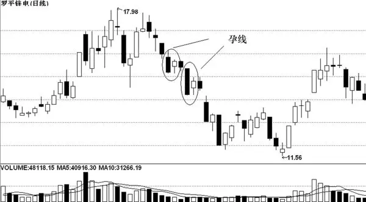

图2\-14 身怀六甲

它的突出特点是：后一根K线的最高价与最低价，均未超过前一根K线的最高价与最低价，看上去就好像是长K线怀中的胎儿，故该形态又称为孕线。身怀六甲的出现，一般预示着市场上升或下跌的力量已趋衰竭，大市很可能会发生逆转。

身怀六甲的特征为：身怀六甲可出现在股价走势的不同部位；由一根较长的K线和一根较短的K线组合而成；较短的一根K线实体被较长的一根K线实体完全包容；后面一根K线可以是小阳线，小阴线或十字线；如果身怀六甲中较短的K线是一根十字线，则被称为十字胎。

身怀六甲是一种比较常见的股价走势转向形态。通常情况下，它可能出现在股价长期下跌的底部，也可能出现在股价上升幅度巨大的顶部，不管它出现在哪一种趋势之中，都表示当前的股价走势很有可能出现逆转。

二、操作要点

1．身怀六甲在高位出现是见顶信号，股价有可能见顶回落；在下降途中出现是续跌信号，股价还会继续下跌；若在低位出现是见底信号，股价有可能见底回升；在上升途中出现是续涨信号，股价仍会上涨。

2．身怀六甲形态最理想的量能变化是，前一个交易日成交量有效放大，后一个交易日成交量又迅速萎缩，并且如果行情继续调整，则量能也会随之减少，这表示后市行情出现反转的可能性较大。

3．股价或指数。出现身怀六甲形态后，股价一般会有一个短期整理的过程，使得原来大幅震荡的走势逐渐平稳，然后再寻求突破方向，投资者在方向确认后介入比较稳妥。

4．市场的环境。身怀六甲形态如果出现在极度低迷的弱市中，那么往往更容易形成强烈的反转行情。

5．实战经验表明，身怀六甲是一种比较次要的转势信号，它的准确性有时候并不高，而且常常成为主力骗线的工具。因此，投资者在运用它来进行技术分析的时候，最好结合其他K线形态来使用，这样准确性更高一些。

6．身怀六甲的特殊形态十字胎具有以下的市场含义。

（1）十字胎只代表市场原来的趋势难以维持，但并不代表市场即刻会发生反转。

（2）十字胎也可能是市场多空力量暂时的平衡点，若市场原有的力量仍占主导，则其演变成盘整状态的可能性较大。

（3）十字胎是比身怀六甲形态重要许多的主要反转形态。

（4）十字胎出现在上升趋势中看跌的效力要比其出现在下跌趋势中看涨的效力强许多。

## 第三章 K线持续与反转形态分析图

__第三章 K线持续与反转形态分析图 __

2025年10月29日

18:05

## 第三章 K线持续与反转形态分析图 - (01) 上升三角形

\(01\) 上升三角形

2025年10月29日

18:05

__上升三角形 __

一、形态与特征描述

股价每次上升时，到了一定价位就遭到抛压，迫使股价下行，但由于市场看好该股，逢低吸纳的人很多，因此，股价在尚未跌到上次的低点时就开始弹升，致使下探低点越来越高。如果将每一次短期波动的高点用直线连起来，再将每一次短期波动的低点也用直线连起来，就构成了一个向上倾斜的三角形。这就是上升三角形，如图3\-1所示。

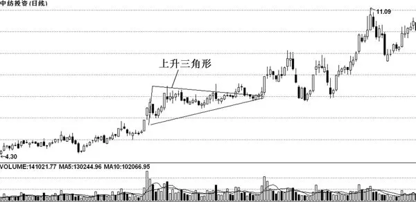

图3\-1 上升三角形

上升三角形显示的是买卖双方在一定范围内的较量，但是买方在斗争中稍占上风，卖方在特定的股价水平下不断出货，对后市信心不足。卖方在股价每升到某一理想水平时便卖出，这样在某一水平价格下便形成了一条水平压力线；但市场的购买意愿较强，不待股价回落至上次的低点，便有投资者购进，图中便形成一条向右上方倾斜的支撑线；另外，当低位出现时，也可能是一种有计划的市场操纵行为，部分人士有意将股价暂时压低，达到逢低建仓的目的。

二、操作要点

1．在一般情况下，形成上升三角形后，股价向上突破的可能性很大。因此，持股者可持股不动，等待股价向上突破时再作定夺。持币者要密切关注股价的突破方向，暂不要行动，一旦发现放量突破，可即刻跟进做多，如发觉上升三角形是一种无量上涨，则不要跟进，应继续持币观望。

2．形态在形成期间，可能会出现轻微的错误变动，这时候技术分析者须根据第三个或第四个短期性低点重新修订出新的“上升三角”形态。有时候形态会出现变异，形成另外一些形态。

3．虽然上升三角形暗示着向上突破的机会较多，但也有下跌的可能存在，因此，投资者最好在形态明显突破后再采取相应的买卖决策。倘若向下跌破3%（收市价计算），投资者宜暂时卖出。

4．上升三角形在突破水平阻力线时，必须伴有大成交量的配合，并且越早向上突破，股价上升的后劲越足。

5．量度升幅最小为直角边长度。斜边一般以45°为宜，若角度在60°以上，说明向上突破急促有力，若角度在30°左右，则向上的力度不会太大。

## 第三章 K线持续与反转形态分析图 - (02) 下降三角形

\(02\) 下降三角形

2025年10月29日

18:05

__下降三角形 __

一、形态与特征描述

下降三角形的形状与上升三角形恰好相反，股价在某一水平价位处出现一定的购买力，因此股价每回落到该水平便又回升，形成一根水平的支撑线，可是市场的卖压却不断加强，股价每一次反弹后的高点都较前次为低，于是形成一根向下倾斜的压力线，这就形成了下降三角形。如图3\-2所示。

成交量在形态构造的过程中，一直十分低沉，但仔细观察成交量的变化，会发现反弹时成交量有缩小的趋势，下跌时则有放大的趋势，这种量价背离的情况，往往是跌势未尽的表现。

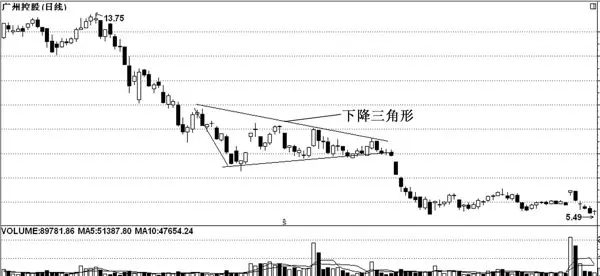

图3\-2 下降三角形

下降三角形属于中短期整理形态，大多数情况下带有向下突破的可能，是一种看跌的形态。下降三角形的成交量一直比较少而且逐步萎缩，向下突破时不必有大的成交量配合。虽然下降三角形的形成，同样是多空双方在某价格区域内斗争的结果，然而多空力量的分布却与上升三角形所显示的情形完全相反。空方不断地增加沽售压力，价格还没回升到上次高点便再沽售，而多方则坚守着某一价格的防线，令价格每次回落到该水平便获得支撑。

二、操作要点

1．大多数情况下，下降三角形是出现在股价的长期下降趋势中的抵抗整理形态。出现下降三角形后，股价一般会向下突破。

2．少数情况下，下降三角形也会以顶部或底部反转形态出现。如果下降三角形出现在股价高位（以涨幅超过70%以上为准），则标志着股价顶部的形成，紧接着将可能开始一轮较大的下跌行情；如果下降三角形出现在下降趋势的末期（以跌幅超过70%以上为准），则标志着股价底部形态形成，股价将开始一轮中级反弹行情。

3．如果下降三角形向下跌破，不必有大的成交量配合，一般在跌破之后的数天内，成交量会呈现放大的趋势。但如果形态向上冲破阻力，则成交量必须要明显放大。

4．下降三角形的有效突破是以股价的收盘价向下突破形态下边支撑线的一定幅度（一般为3%以上）为准，当股价向下突破后，股价经常会出现一轮快速下跌的行情，这时投资者应持币观望或及时卖出股票。

5．虽然该形态反映出卖方的力量占优势，形态向下跌破的机会较大，但也有向上突破的可能存在。因此，投资者应在形态明显突破后再采取行动。

6．形态向下跌破后，有时可能会出现假性回升，回升将会受阻于下降三角形的底边。

7．下降三角形形态整理的持续时间不能太长，如果太长就可能演变成其他整理形态。一般而言，在熊市中，股价整理的时间一般不超过30个交易日。

8．下降三角形越早突破，出错的机会越少。

9．下降三角形整理形态还应参照均线理论一起研判，这样可以提高行情研判的可靠度和准确率。

如果下降三角形出现在股价突破了长期均线的下方附近整理位置上时，则三角形形态向下突破的力度相当强，跌幅也较深；如果下降三角形出现在股票长期均线下方较远的地方时，则形态向下突破的力度和幅度有限；如果下降三角形出现在股票长期均线上方附近的位置上时，则形态不仅要突破下方的支撑线，而且还要向下突破长期均线，这样才是真正的向下突破。

## 第三章 K线持续与反转形态分析图 - (03) 对称三角形

\(03\) 对称三角形

2025年10月29日

18:05

__对称三角形 __

一、形态与特征描述

对称三角形通常是一种整理形态，对称三角形由一系列的价格变动组成，其变动幅度逐渐缩小，也就是说每次变动的最高价低于前次的水平，而最低价则比前次水平高，呈一压缩图形。如从横的方向看股价变动领域，其上限为向下的斜线，下限为向上的斜线，把短期高点和低点分别以直线连接起来，就可以形成一个对称三角形（如图3\-3）。

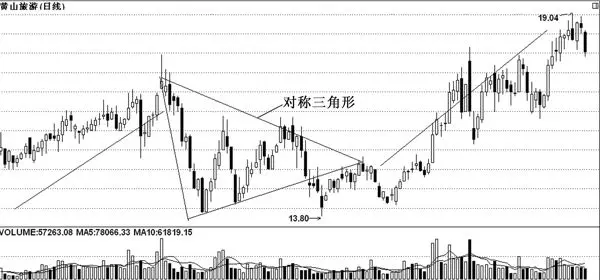

图3\-3 对称三角形

对称三角形的形成是买卖双方的力量在该段价格区域内势均力敌，暂时达到平衡状态所致。成交量在对称三角形成的过程中不断减少，这表明买卖双方持观望态度，令市场暂时沉寂下来。

二、操作要点

1．对称三角形属于整理形态，即股价经过调整后，会继续原来的走势。在上升或是下跌的过程中，都有可能出现这种形态。该形态也可说是一个“不明朗形态”，反映出投资者对后市感到迷惘，无法作出买卖决策。

2．在某些情况下，对称三角形也可以作为反转形态。判断对称三角形是整理形态还是反转形态依据之一是股价已有的涨跌幅度。当股价从底部上涨或从高位下跌30%～50%时，视为整理形态；当股价从底部上涨或从高位下跌超过70%时，则可以初步视为反转形态。

3．由于对称三角形的特性，股价运行前景不明，方向不定，多空双方疑虑重重，不敢全力出击，许多投资者退出观望，成交量往往随着股价的波动而逐步减少。当对称三角形发展至形态的尾端时，股价的波动幅度极小，成交量极度萎缩，一旦成交量大幅增加，就能改变对称三角形的走势，形成突破。

4．对称三角形能否有效突破是以股价的收盘价为准。在上升趋势中，当股价的收盘价突破了三角形上边的压力线并有一定的涨幅（一般为突破三角形上边线的3%左右），同时伴随着成交量的放大，可初步确认对称三角形的向上突破有效；在下降趋势中，当股价的收盘价跌破了对称三角形下边的支撑线，并有明显的跌幅出现（一般为突破三角形下边线的3%左右），可初步确认对称三角形向下突破有效。

5．对称三角形向上突破时，从形态的第一个上升高点开始划一条和底部平行的直线，可以预期股价上升到这条线上时才会遇到阻力。此外，股价会以形态开始之前同样的角度上升。因此，从中投资者可以估算出到“最少升幅”的价格水平和所需的时间。同理，也可估算出形态的“最少跌幅”的价格水平和所需时间。

## 第三章 K线持续与反转形态分析图 - (04) 矩形整理

\(04\) 矩形整理

2025年10月29日

18:05

__矩形整理 __

一、形态与特征描述

矩形整理就是平常所说的箱体或箱形整理，它是股价在两条平行线之间上下波动时所形成的一种典型的、较为常见的整理形态。它既可以出现在上升趋势中，也可以出现在下跌趋势中。在上升趋势中，股价经过一段时间的单边上涨之后出现回调，进入横向整理阶段，当股价上升至某一水平时就会遇阻回落，下跌到一定水平时又获得支撑，来回反复，分别形成三个大致相同的低点和高点，一般低点之间或高点之间相差3%左右（如图3\-4）。

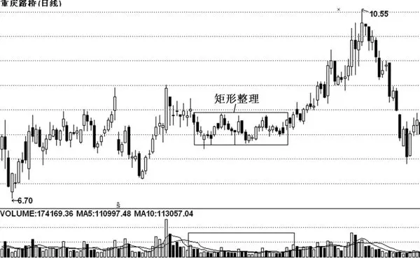

图3\-4 矩形整理

矩形整理的形态特征为：矩形整理是整理形态中比较常见的一种。空头行情中，矩形整理是股价下降中途的一次抵抗形态。它维持的时间越长，下跌的概率越大。多头行情中，矩形整理只是股价上涨过程中的一次盘整形态。矩形整理属于中期整理形态，它的形成时间要比三角形、旗形等整理形态长，一般至少在30个交易日以上。矩形整理一般是中继形态，即经过整理后股价运行的趋势不会改变。该形态的成交量一般呈递减趋势，如果成交量较大，则要提防主力出货形成顶部。向上突破时需要成交量放大来配合，向下突破则不必要；矩形整理的时间越长，则形态越可靠。

矩形整理形态的出现一般表明多空双方的实力相当，多空双方的力量在该范围之间几乎完全达到平衡状态，多方认为其价位是较理想的买入点，于是股价每次回落到该水平便买入，形成了一条水平的需求线。与此同时，空方对后市缺乏信心，认为股价难以升越其水平，于是股价每次回升至该价位时，便沽售，形成一条平行的供给线。从另一个角度分析，矩形整理形态也可能是投资者因后市发展不明朗，投资态度变得迷惘和不知所措而造成的。所以当股价回升时，一批对后市缺乏信心的投资者退出；而当股价回落时，一批对后市有信心的投资者又加入，由于买卖双方实力相当，于是股价就来回在一定区域内波动。

二、操作要点

1．矩形整理形态在突破后有个理论上的突破高度。与其他形态不同的是，该形态的突破高度通常等于矩形本身的高度，这就是股价上升或下降时的理论目标位。

2．一般来说，矩形整理形态在牛皮市和涨升市及跌市中都可能会出现。长而窄且成交量小的矩形在原始底部比较常见。如果矩形整理突破了上限或下限，便发出了买入和卖出的信号，涨幅或跌幅通常等于矩形本身的高度。

3．和对称三角形整理形态一样，在上升行情中，该形态突破时，成交量将会明显放大；在下跌行情中，该形态向下突破时则不需要成交量明显放大。

4．一个高低波幅较大的矩形，较一个狭窄而长的矩形形态，未来更具突破力。即一旦向上突破，将是迅猛的，而一旦向下突破，也将是快速的。

5．一般情况下，判断矩形是整理形态还是反转形态的依据之一是股价已有的涨跌幅。当股价从底部上涨到30%～50%或从高位下跌30%～50%时，可以视为整理形态；而当股价从底部上涨或从高位下跌的幅度超过80%时，大多数是矩形反转形态。

## 第三章 K线持续与反转形态分析图 - (05) 碟形整理

\(05\) 碟形整理

2025年10月29日

18:05

__碟形整理 __

一、形态与特征描述

标准的碟形整理形态是由一连串的圆形底形态组成的，后一个圆形底的平均价格要比前一个高，每一个碟形的尾部价格要比开始时高出一些（如图3\-5）。

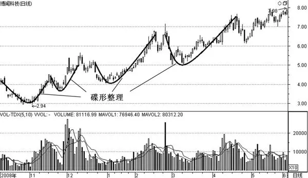

图3\-5 碟形整理

碟形整理隐含着上升的意义，不过上升的步伐稳健而缓慢，每当升势转急时，便马上遭受回吐的压力，但回吐的压力不强，当成交量减小到一个低点时，另一次上升又开始。股价就是这样反复地向上移升。

二、操作要点

1．碟形整理形态向上变动时，从左到右价格通常增加 10%～15%，从碟形的右端到底部的价差为20～30%，形成一个碟形所需的时间往往为5～7周，因此，整个上升过程显得稳健而缓慢。

2．从该形态的成交量可以看出，大部分投资者都在股价上升时购入（成交量大增）；但当股价回落时，他们却又畏缩不前（成交量减少）。当分析者在图表上检视出这形态时，应该在成交量最低沉时跟进，因为碟形总是在升势开始转急时回落。

## 第三章 K线持续与反转形态分析图 - (06) 菱形整理

\(06\) 菱形整理

2025年10月29日

18:05

__菱形整理 __

一、形态与特征描述

菱形整理由于其形状似“钻石”，常常被市场人士称作钻石形态。在形态上它可以被看做是扩散三角形、对称三角形和头肩顶的综合体。其颈线为V字状。菱形整理大多时候也是一种看跌的形态，通常出现在市场短期或者中长期头部，其形态完成后，往往成为空头杀手锏，是个转势形态。偶尔也会在下跌过程中以持续形态出现，在菱形整理之后股价将保持原趋势，继续下跌。菱形整理的图形如图3\-6所示。

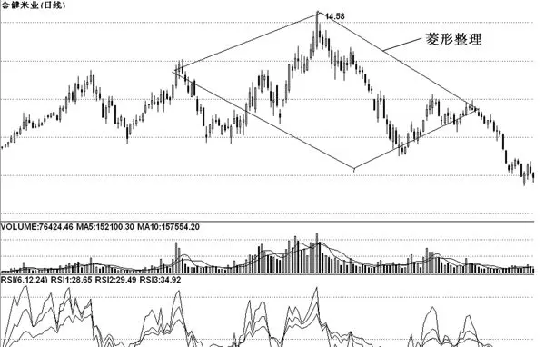

图3\-6 菱形整理

菱形整理是一个比较特殊且少见的形态，无论出现在何种位置上，大多预示后市将下跌。由于其往往具有较大的杀伤力，所以在目前只能做多才能盈利的单边市里，投资者不可不防。

菱形整理形态的成交量在左边的反三角形形成时呈现不规则变化，在右边对称三角形形成时是从左向右递减的，突破时成交量放大。菱形整理形态未来的发展方向一般向下，其他情况出现的概率较小，股价、股指下跌幅度极大。菱形整理是重要的反转形态，可以出现在大、中、小行情的局部高点上，其作用大小与形成的时间长短成正比。由于菱形整理形态由反三角形与对称三角形组合而成，因此，其作用也是反三角形与对称三角形作用的叠加。

二、操作要点

1．右下方支撑线被跌破是一个卖出信号。

2．其最小量度跌幅就是从股价向下跌破菱形右下边开始，量出形态内最高点和最低点间的垂直距离，这距离就是未来股价将会下跌的最小幅度。股价向上突破右方阻力，并且成交量激增，是一个买入信号。

3．还有一种特殊情况：菱形有时会出现在两个反方向通道的结合部位，如果股价沿上升通道运行到高位后进行整理，这个通道的两条平行线就可看做是菱形的左上边和右下边。随后股价掉头向下，沿下降通道运行，这样菱形的右上边和左下边就可看做是下降通道的两条平行边。一旦出现这样的情况，股价后期跌幅至少是前期涨幅的50%。

## 第三章 K线持续与反转形态分析图 - (07) 上升旗形

\(07\) 上升旗形

2025年10月29日

18:05

__上升旗形 __

一、形态与特征描述

股价经过一段时间的上涨之后，开始进入下跌走势，如果将其下跌走势中反弹的高点用直线连接起来，再将其下跌走势中回落的低点也用直线连接起来，可发现其图形像一面挂在旗杆上迎风飘扬的旗子，这种走势很有可能是一个“上升旗形”的走势。

一波大幅上扬行情发生后，获利盘大量涌出，做空力量开始加强，单边上扬的走势得到遏制，价格出现剧烈的波动，股价在波动中形成了一个类似于旗面的形状，分析者把调整的高点和低点分别连接起来，就可以画出一个向下倾斜的长方形或者有点像三角形的旗面，这就是上升旗形（如图3\-7）。

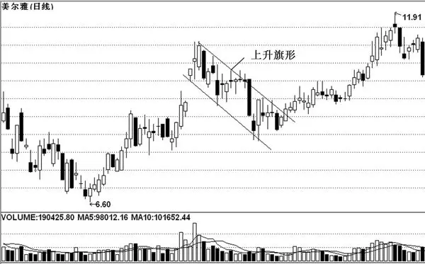

图3\-7 上升旗形

上升旗形的特征是：当股价大幅上升至某一压力点，开始进行旗形整理时，其图形为向右下方倾斜的平行四边形；旗形整理的时间一般不能超过15天；形态形成后股价将继续维持原来的走势，也就是说一旦旗形整理结束，股价就要向上突破，继续向上攀升。

二、操作要点

1．在上升旗形整理过程中，成交量逐渐递减，而股价向上突破时则需要大的成交量的配合。

2．上升旗形在形成之前，股价已经有了一段较大的涨幅。一般情况下，涨幅要达到30%以上，牛股则要达到50%以上。

3．上升旗形是主力为中小散户设置的一个空头陷阱。如果投资者此时盲目地看空，不弄清楚原因就卖出股票、割肉离场，则会中了主力的圈套。投资者正确的做法是：有筹码的要捂住股票，密切注意事态变化，只要调整时间不是太长，就不应卖出股票；持币者要时刻关心股价的突破方向，一旦发现股价整理后向上突破，就应该即时买进。

4．上升旗形的末端常常看似要反转下降，却突然放量上升，又恢复原来的上升趋势。

5．旗形上下的两条平行线起着压力和支撑的作用。股价向上突破并站稳旗形上边的压力线，为上升旗形的有效突破；股价向下突破旗形下边的支撑线时，为失败的上升旗形。

6．理论上，上升旗形突破后，股价再次上涨的高度等于旗形出现前的高度，即等于旗杆的高度。

## 第三章 K线持续与反转形态分析图 - (08) 下降旗形

\(08\) 下降旗形

2025年10月29日

18:05

__下降旗形 __

一、形态与特征描述

一轮跌势中连续的阴线组合形态在坐标中好像是一根旗杆，然后接连几天的日线图波幅大致一样，唯每日高峰、低点均比上日高一些，将连日最高点连成一条直线，将连日最低点连成另一条直线，刚好是平行斜向右上方的旗帜形状，称为下降旗形（如图3\-8）。

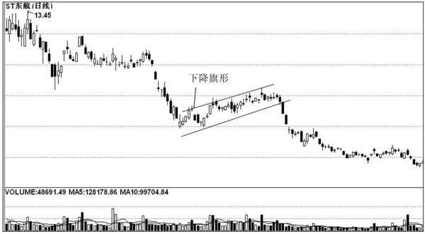

图3\-8 下降旗形

下降旗形的特征为：在跌势中出现；反弹高点的连线平行于下跌低点的连线，两条线向上倾斜，看上去就像是一面旗子；在股价冲破支撑线后，常常有一个回抽，并受阻于支撑线，确认向下突破有效的条件是成交量呈不规则状态。

下降旗形是股价下跌过程中的一种整理形态，整理结束后股价仍会继续下跌。说白了下降旗形就是庄家为了进一步打压股价而为中小散户精心布置的一个多头陷阱。如果投资者看到股价在缓缓上升就入市，则往往中了庄家的圈套。

二、操作要点

1．在下降旗形形成之前，股价一般已经有了一段相当大的跌幅（一般情况下要达到30%以上的跌幅；在熊市中，股价从最高点算起应该要达到50%以上的跌幅）。

2．在下降旗形整理形态中，随着旗形整理时间的延续，股价无力上攻，会在旗形末端突然下跌，并伴有一定的成交量放出，股价又恢复原来的下跌趋势。

3．出现下降旗形形态时，持币者要做到不受庄家诱惑，冷眼旁观；持股者要趁股价反弹时尽量多卖出一些股票，减轻仓位，切不可再错失一次卖出的良机。另外，投资者还要认识到，在极少数情况下股价也确实会向上突破（其标志是放量突破下降旗形的上边线，股价连续3日站在上边线上方）。

4．下降旗形的上下两条边分别起着压力和支撑的作用。股价向下突破下边的支撑线，为下降旗形的向下有效突破；股价向上突破旗形上边的压力线时，则应看股价之后的走势再定。

5．出现下降旗形是股价走熊的一种表现，因此，投资者在下降旗形形态形成后，不可轻易建仓，要待股价形成一定跌幅后，才可以考虑短线操作。

## 第三章 K线持续与反转形态分析图 - (09) 上升楔形

\(09\) 上升楔形

2025年10月29日

18:05

__上升楔形 __

一、形态与特征描述

上升楔形是指股价经过一段时间的下跌后，出现强烈的技术性反弹，价格反弹至一定的水平高点即掉头回落，但回落点较前次为高，随后又回升创出新高点，即比上次反弹点高，形成后浪高于前浪之势，把短期高点和短期低点分别相连，形成两条同时向上倾斜的直线，组成了一个上倾的楔形，下边各低点的连线较上边连线陡峭，这就是所谓的上升楔形形态（如图3\-9）。

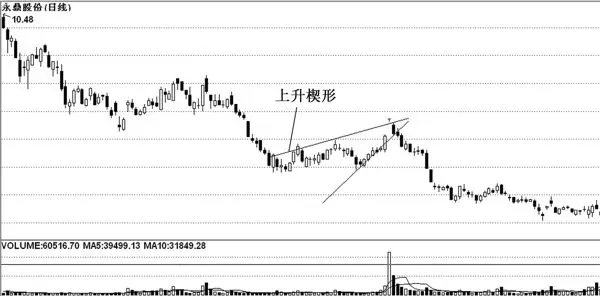

图3\-9 上升楔形

上升楔形一般出现在空头行情的反弹阶段或多头行情的末期，属于修复整理形态。

上升楔形一般会持续3～6个月的时间，表明趋势正在逆转中。上升楔形的形成，最少要以两个高点连成一条最高的阻力线；同样，最少要以两个低点连成一条最低的支撑线。在上升楔形中，价格上升，卖出压力亦不大，但投资者的兴趣却逐渐减少，价格虽上扬，可是每一次新的上升波动都比前一次弱，最后当需求完全消失时，股价便反转下跌。其下限被跌破，是卖出信号。

二、操作要点

1．上升楔形的上下边线必须明显地收敛，如果形态过于宽松，则形态形成的可能性较小，可能会演变成其他整理形态。

2．上升楔形形成后，股价向下突破的概率有七成，而维持在高价位横盘整理的几率较小，所以上升楔形通常能提供投资者一个明显的减仓信号：未来走势正在逆转中。上升楔形表示的技术含义是，买方力量正在逐渐减弱。上升楔形的支撑线被有效跌穿，是比较明显的卖出信号。后期极容易出现放量长阴线或跳空下跌的走势，跌势较凶猛。上升楔形形态的名字虽有“上升”二字，但最后走势却往往向下，投资者可在向下突破被确认后及时采取卖出策略。

3．在研究上升楔形形态时还应参照均线理论，这样可以提高行情研判的准确性。如果股价从高位下跌至长期均线上方附近时，上升楔形的有效向下突破是以股价跌破了长期均线为主。也就是说即使股价跌破了上升楔形的下边线，但没有跌破长期均线，也不能就此判断突破有效，只有当股价既跌破了形态的支撑线又跌破了长期均线，才能算是有效突破。如果股价在长期均线的下方，形态的有效突破就只能以股价跌破支撑线为准。

4．股价或股指在上升楔形形态内移动，最终会选择突破方向，如果向下突破，其理想的跌破点是由第一个低点开始，直至上升到楔形尖端之间距离的 2/3 处。还有可能会出现的另一种情况是，股价一直整理到楔形的尖端，还稍作上升，然后才大幅下跌。这时主要看量能的变化，向上突破需要有大量的配合，否则就可能是骗线。

5．上升楔形也有可能向相反的方向发展。如果上升楔形前期下跌的幅度很大且股价向上突破时成交量明显放大，则楔形形态有可能性发生变异，股价运行趋势会发展成为一条上升通道，此时投资者应灵活应对，并结合其他技术理论和指标来综合研判。

## 第三章 K线持续与反转形态分析图 - (10) 下降楔形

\(10\) 下降楔形

2025年10月29日

18:05

__下降楔形 __

一、形态与特征描述

下降楔形与上升楔形恰恰相反，下降楔形也属于整理形态，一般出现在长期升势的中途，下降楔形指股价经过一段大幅上升后，出现强烈的技术性回抽，股价从高点回落，跌至某一低点即掉头回升，但回升高点较前次为低，随后的回落创出新低点，即比上次回落的低点低，形成后浪低于前浪之势，把短期高点和短期低点分别相连，形成两条同时向下倾斜直线，组成了一个下倾的楔形，这就是所谓的下降楔形形态（如图3\-10）。

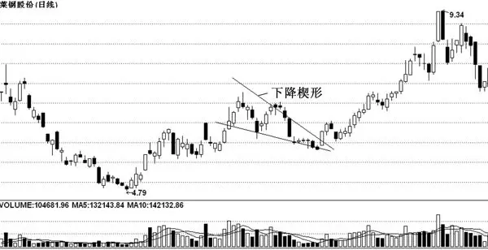

图3\-10 下降楔形

价格经过一段时间的上升后，出现获利回吐，虽然下降楔形的底线往下倾斜，似乎说明了市场的承接力不强，但新的回落浪较上一个回落浪波幅更小，说明空方的力量正在减弱。

在下降楔形中，价格上升，卖压亦不大，但投资者的兴趣却逐渐减弱，价格虽上扬，可是每一次新的上升波动都比前一次弱，最后，当需求完全消失时，价格便反转下跌。因此，下降楔形表示一个技术性的意义渐次减弱的情况。

二、操作要点

1．与其他整理形态一样，在下降楔形形态形成之前，股价已经有了一段相当大的涨幅，一般情况下，从股价上涨的低位算起涨幅要达到30%以上。

2．下降楔形与三角形形态的不同之处在于前者的两条边同时向下倾斜；与下降通道和旗形的区别在于下降通道和旗形的两边几乎是平行的。

3．大多数情况下，下降楔形出现在股价上升途中，为整理形态，在少数情况下也会以顶部形态出现。如果下降楔形出现在股价的高位（以涨幅超过 70%为准），则标志着股价顶部形态的形成，紧接着会有一轮较大的下跌行情。

4．下降楔形的成交量由左向右递减，而当股价向上突破下降楔形的上边线时，成交量会明显放大。

5．下降楔形在突破上边线之后，股价常常会有反抽，但会受到上边线的延长线的支撑。

6．根据实战的结果统计，下降楔形向上突破的次数与向下突破的次数的比例是7:3；从时间上看，如果下降楔形超过三四个星期，那么向下突破的可能性就会增大一些。

7．由于下降楔形形态出现在股价长期上涨的途中，而它的整理方向却是向下的，因此，这种形态具有一定的欺骗性，投资者遇到下降楔形整理形态时应谨慎对待。当股价缩量下跌时，不要轻易抛出；当股价开始放量上涨时，可短线买入。

## 第三章 K线持续与反转形态分析图 - (11) 头肩顶

\(11\) 头肩顶

2025年10月29日

18:05

__头肩顶 __

一、形态与特征描述

头肩顶形态是出现得最多的一种K线形态，是最可靠的反转形态之一。头肩顶形态是一个可靠的卖出时机，一般由股价连续的三个起落构成，即包含三个局部高点（如图 3\-11）。中间的高点比另外两个都高，称为头：左右两个相对较低的高点称为肩。这就是头肩顶形态名称的由来。

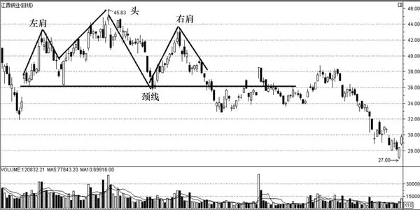

图3\-11 头肩顶

头肩顶的形成过程为：股价持续一段时间保持上升，并且成交量持续增大，之后前期买进的人产生利润，便出现一个获利回吐的群体行为，股价出现回落，成交量也出现萎缩，形成左肩即第一个高峰；当股价回落到一定程度，再次强劲上升，并高于前一高峰，此时成交量的高点可能低于第一峰的最大成交量，出现价增量平的现象，股价再次回落，成交量在回落期间也相应减少，于是产生头部。当股价下跌接近上次回落的低点，再次获得支撑出现回升，但却无法超越前一高峰。

头肩顶形态的特征为：多发生于多头行情的末升段或是反弹行情的高点；右肩的成交量最小；左右两肩的高度不一定相等，颈线也不一定是水平线；左右肩的数目不一定各是一个，也不一定会相同。

二、操作要点

1．左右肩大致等高，右肩也可以较左肩为高；若右肩高点比头部要高，则形态不成立，可能形成上升三角形。

2．由中间两个低点连成的颈线如果向下倾斜，则表示市况极为疲软。

3．当股价跌破头肩顶的颈线，并达到市价的3%时，形态成立。若在跌破颈线时成交量激增，说明市场空方力量十分强大，后市将持续下跌。

4．成交量方面，左肩最大，头部次之，而右肩最少。不过，统计发现，大约有1/3的头肩顶形态左肩的成交量较头部要多，1/3的成交量大致相等，其余的1/3是头部的成交量大于左肩的成交量。

5．跌幅的度量原则：从最高点作颈线的垂线，该垂线的高度为右肩突破颈线之后最小的下跌幅度。

6．回抽：当股价跌破颈线后，在某一位置产生反弹，反弹的过程称为回抽。一般情况下，回抽无法穿越颈线（颈线向上倾斜时除外），若回抽高度接近右肩甚至高于右肩，则为失败的头肩顶形态，视为箱形整理。

7．头肩顶形态的规模越大越可靠，其持续时间一般在一个月以上。

## 第三章 K线持续与反转形态分析图 - (12) 头肩底

\(12\) 头肩底

2025年10月29日

18:05

__头肩底 __

一、形态与特征描述

头肩底跟随下跌市势而行，并发出市况逆转的信号。顾名思义，图形由左肩、头、右肩及颈线组成。三个连续的谷底以中谷底（头）最深，第一个和最后一个谷底（分别为左肩、右肩）较浅并接近对称，因而形成头肩底形态（如图 3\-12）。价格一旦向上穿过阻力线（颈线），将出现较大幅度的上涨。

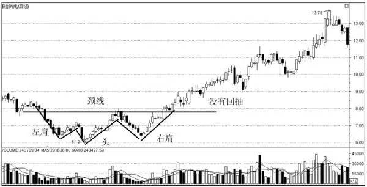

图3\-12 头肩底

在空头市场中，空方不断下压股价，股价连创新低，成交量递增，由于已有一定的跌幅，股价出现短期的反弹，但反弹时成交量并未相应放大，主动性买盘不强，股价依旧受到下降趋势线的压制，这就形成了“左肩”；接着股价再度增量下跌且跌破左肩的最低点，之后，随着股价继续下挫成交量和左肩相比有所减少，说明下跌动力减弱，之后，股价反弹，成交量比左肩反弹阶段时放大，冲破下降趋势线，形成“头部”；当股价回升至左肩的反弹高点附近时，出现第三次的回落，这时的成交量明显少于左肩和头部，股价回跌至左肩的低点水平附近时，跌势便基本稳定下来，形成“右肩”；最后股价正式发动一次升势，成交量大增，有效突破颈线阻挡，整个形态便告完成，一波较大的涨势即将来临。

头肩底是一种较为常见的底部形态，往往预示着市场实现了阶段性止跌，此后有望展开一轮反弹走高的行情，因此，该种形态的形成往往会成为支撑市场信心的标志。但在实际操作中，由于随着股价的不断变化，头肩底有的还会演绎成为其他的形态，所以，必须综合以往的走势特征进行综合分析。

二、操作要点

1．从实战的情形来看，头肩底中 K 线突破颈线之后，由于此时空方的动能还具有相当的分量，往往会出现习惯性的反扑回抽，如果回抽时成交量缩小，那么可以认为前边的突破颈线是有效的。相反，如果出现回抽时成交量放大，投资者则应当小心，千万不可轻举妄动。

2．实战经验表明，当 K 线突破颈线时，那根颈线通常是向下倾斜的。如果出现颈线向上倾斜的情形，说明此时多方的动能已经十分充足，向上突破的愿望很强烈，此时股价向下运行的可能性已经很小了。

3．一般来说，头肩底形态较为平坦，因此，需要较长的时间来形成。

4．股价升破颈线后可能会出现暂时性的回跌，但回跌后股价不应低于颈线。如果低于颈线，则可能是一个失败的“头肩底”形态。

5．头肩底是极具预测威力的形态之一，一旦获得确认，升幅大多会大于其“最少升幅”。

6．投资者在研判头肩底形态时需要把握以下几个方面。

（1）选择基本面良好、有长远发展前景的品种作为参与的对象。因为即使短期的参与失败了，从长期来看成功概率依旧较大，并且此类个股往往是长线资金关注的对象，只要调整到一定位置，就会有相当多的资金逢低买入。

（2）选择个股的时候，应关注那些右肩略高于左肩并且有明显放量的品种。因为这意味着该股的反弹力度大，并且盘整中放量意味着参与资金充足，因此后市值得看高。

（3）要注意的是，所谓的“肩”（即横盘整理的平台）不应太长，其时间在两周左右，长时间横盘的个股中一般存在着一定的风险。

（4）向下突破探底的时候，其下跌的幅度不应太大，反弹的力度要大于下跌的力度。

7．头肩底的止损方法有如下两种。

（1）跌破颈线止损法

收盘价跌破颈线 3%以上或者连续 3 个交易日都收在颈线之下时，可考虑止损。当然，同时要注意成交量的变化。下跌时，快速缩量，一般认为比较安全。

（2）跌破右肩止损法

若在颈线破位成立时未进行止损，股价仍然继续下跌，并跌破右肩的谷底，一定要进行止损，因为此时往往会出现大量恐慌性抛盘，导致股价大跌。

## 第三章 K线持续与反转形态分析图 - (13) M头

\(13\) M头

2025年10月29日

18:05

__M头 __

一、形态与特征描述

M头形态也叫双重顶，其股价走势犹如英文字母M（如图3\-13），属于一种头部盘整形态，从另一种角度来看，也可以算作是头部区域的箱形整理形态。

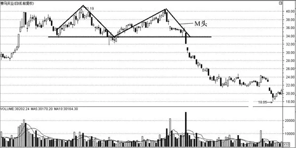

图3\-13 M头

形成M头的原因为：股价持续上升为投资者带来了相当多的利润，于是出现获利回吐，这种沽售力量令上升的行情受阻，股价第一次出现回落。当股价回落到某水平时，引发了短期投资者的兴趣，之前获利卖出的投资者也可能在这个位置买入补回，于是行情开始回升，但不久之后，对该股持股信心不足的投资者因觉得错过了在第一个高点出货的机会而在第二个高点附近出货，加上在低水平获利回补的投资者也同样在回升高位再度卖出，强大的抛压使股价再次下跌。由于高点二次都受阻而回，令投资者感到该股无法再继续上升（至少短期内是如此），加之愈来愈多的投资者卖出股票，令股价跌破上次回落的低点（即颈线），于是整个 M头形态便告成立。

M头的特征为：该形态处在高位，前期上涨的幅度越大，后市下跌的幅度越大，高位卖出的，不必担心踏空。如果M头出现在低位，不能按顶部反转信号操作，应按其他形态对待；M头的两个头部大致处在同一水平线，两顶高度落差不超过3%；M头两顶间隔要保持一定距离，距离越大，有效性越高。但间隔时间超过半年的M头，则会失去判断意义；M 头分标准形和复合形两种。标准形就是只有两个顶部。复合形 M 头有时左右会出现多个小顶部，均是可靠的反转信号，应大胆操作。M头一般出现在整理阶段或是多头行情的末升段。

二、操作要点

1．M头有两个卖点。第一个卖点是M头的右顶转折处，一般投资者大多在此卖出。此处是M头的最佳卖点，在此卖出的人，都称得上是“先知先觉者”。M头的第二个卖点是颈线位，股价跌破颈线后，表明一轮较大的下跌行情即将来临，此时将手中的货全部卖出为最明智的选择。

2．M头的两个最高点并不一定在同一水平线上，二者一般相差3%。通常来说，第二个头可能较第一个头低出一些，原因是看多的一方企图推动股价继续上涨，却遭到沉重的抛压。当M头形成时，许多指标如KD、RSI等会出现顶背离。

3．M 头有时出现在底部的调整行情中，下跌的空间有限，卖出后，应密切关注其走势，一旦调整到位，应及时买回。因为M 头处在复合形W底的颈线位处，会出现较大的上涨行情，如不补回容易吃“踏空”的亏。

4．M 头形态内的两个高点间隔的时间必须在一个月以上。在形态上，右边的顶峰不像左边的顶峰那么尖，略呈圆弧形，这是因为左边高点处发生快速反转时，庄家无法出局，在二次回升时，庄家会营造涨势未尽的氛围，趁股价突破左边高点时诱多，然后开始清仓，但主力的大量筹码无法在短时间内出完，所以右边的高点通常会停留一段时间，以便庄家逐步出逃。

5．形成第一个头部时，其回落的低点是最高点的 10%～20%。其最小跌幅的量度方法是由颈线开始计起，至少会再下跌从M头最高点至颈线之间的距离。一般来说，M头的实际跌幅都较量度出来的跌幅大。

6．M 头形态内成交量的特点是，左边高点位置的成交量最大，而后成交量萎缩，待股价回升创新高时，成交量会增加，但无法超越左边高点位置的成交量，呈典型的价量背离，股价回跌的可能性较大。

7．判断双重顶最重要的条件是趋势。当市场或者个股处于上升的大趋势中，一些所谓的双重顶往往会演绎成双重底形态。当然，有的个股在顶部形成之后出现较大幅度的下调，之后再度上涨到前期高位后再度下跌，形成真正意义上的头部。需要了解的是，形成双重顶是由于介入的主力资金被套牢后，无法顺利出局，因此股价被迫再度拉高，以便主力择机出局。这其实是一种无奈之举。

8．当M头形态出现后，股价不跌而向下假突破，然后以迅雷不及掩耳之势将股价拉起，走出一轮新的上扬行情，如果卖出了，就会遭到重大的损失。碰到这一情况，应冷静对待，既不要后悔，也不要追涨，少赚一点也算不了什么，股市上的钱是赚不完的，以后再出手也不晚，要保持一个良好的心态，以免影响今后的操作。

## 第三章 K线持续与反转形态分析图 - (14) W底

\(14\) W底

2025年10月29日

18:05

__W底 __

一、形态与特征描述

W 底正好是 M 头形态的倒置，其走势如英文字母 W（如图 3\-14）。W 底属于中期底部形态，一般出现在股价波段跌势的末期，不会出现在行情趋势的中途，一段中期空头市场，必须会以一段中期底部与其相对应，也就是说，一个W底所酝酿的时间，有其最小的周期规则，所以W底的形态周期大小是判断该形态真伪的重要标准。

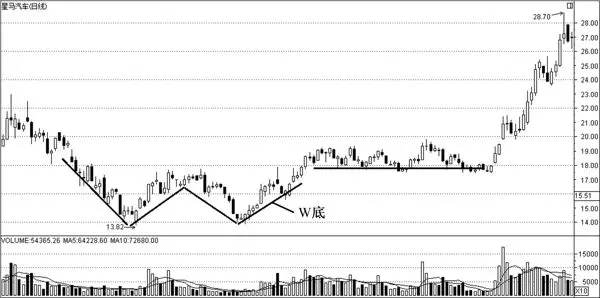

图3\-14 W底

W底的形成原因是，股价长期下跌后，持股者惜售，成交量减少，而抄底盘和空头回补者的加入，令股价出现一次较为有力的反弹。当股价反弹到一定高度时，前期套牢盘以及短线获利盘涌出，令股价再次下跌。但此次下跌时成交量明显减少，显示主动性抛盘减少，而错过上次行情的投资者又会趁回调时买入，令股价无法跌穿上次低位。伴随股价回升，越来越多的投资者加入买方阵营，最终股价在巨大成交量的配合下突破上次高点，上升趋势确立。

二、操作要点

1．W 底第一个低点与第二个低点之间至少要有一个月的时间，市场中有时候会出现短期的双底走势，这不能算作 W 底，只能算是小行情的反弹底，且常为一种诱多陷阱。

2．第一个低点的成交量比较大，触底回升时的成交量也颇多，然而，第二个低点的成交量却异常沉闷，并且，第二个低点的外观通常略呈圆弧形。因此，W底形态有“左尖右圆”的特征。

3．W底的两个低点不一定在同一位置，一般来说相差3%。通常第二个低点比第一个低点高，原因是先知先觉的买方力量在第二次股价回落时开始买入，使股价无法跌回第一次的低点。

4．与M头相似，W底最少涨幅为两个低点与颈线之间的距离。股价向上突破颈线后至少会上升相应的长度。形成第一个底部后，股价回升的高点约是最低点的 10%～20%。

5．W底形态第二个底部的成交量不大。但在突破颈线时，需得到成交量剧增的配合，形态方可确立。

6．通常股价上升突破颈线后，会出现短暂反抽。只要反抽不低于W底的颈线，形态依然成立。

## 第三章 K线持续与反转形态分析图 - (15) 三重顶

\(15\) 三重顶

2025年10月29日

18:05

__三重顶 __

一、形态与特征描述

三重顶又称为三尊头，通常出现在上升趋势中。三重顶形态也和双重顶十分相似，只是多了一个顶，且各顶分得很开、很深（如图 3\-15）。成交量在几次上升期间一次比一次少。

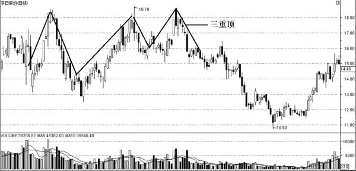

图3\-15 三重顶

三重顶的市场含义为：价格上升到某一高度后，由于受到获利盘的抛压，高点成了一个顶部，这就是第一顶；当价格跌至某一低点附近时又受到抢反弹的承接，价格再度上升，但上涨到前一高点附近时，获利的短线盘沽出，就形成了第二顶；当价格跌至前期低点附近时又一次被买盘托起，上升至前两次高点附近时，第三次遭到获利盘的打压，价格再度下跌，形成第三个顶部，由此构成了三重顶形态。三重顶形成后，做多的投资者大多会在此平仓。同时有人会在第三个顶部出现时做空，两股空头力量汇聚在一起，价格就会向下跌落。

二、操作要点

1．三重顶波峰之间，或波谷之间的距离与时间不必相等，同时三重顶的底部不一定要在相同的价格区域上。

2．三个顶点的价格不必相等，大致相差3%以内就可以了。

3．三重顶理论最小跌幅是指三个顶部高点的连线到颈线的垂直距离。顶部越宽，下跌力度越强。

4．在三重顶中，三个波峰相对应的成交量是相继减少的，表明随市况的发展，看多的投资者在逐步减少，市场即将发生逆转。

5．三重顶形态的三个顶部之间应有一定的间隔，一般来讲两顶间应有5根以上的K线，过少则会影响研判的准确性。

6．只有处在高位的三重顶形态，才是有效的下跌信号，如果出现在低位或是上升途中，多数情况下经过一段横盘整理，价格会向上突破，如果按三重顶形态抛出，就有踏空的可能。

7．通常三重顶形态中有这样几个需要注意的卖出点：首先，当第二个波峰形成时成交量出现背驰现象，持股的投资者可能要适当减仓；其次，一旦第三个波峰形成，成交量出现双重背驰的时候，则需要考虑离场，尤其是在三重顶形成之前股价已经被大幅炒高的时候，投资者更应该引起警觉；最后，倘若在跌破颈线位时卖出，则显得有些太迟了。

## 第三章 K线持续与反转形态分析图 - (16) 三重底

\(16\) 三重底

2025年10月29日

18:05

__三重底 __

一、形态与特征描述

三重底既是头肩底的变异形态，也是 W 底的复合形态，三重底相对于 W 底和头肩底而言比较少见，却是比后两者更加坚实的底部形态，而且形态形成后的上攻力度也更强。三重底的形态如图3\-16所示。三重底形态的成立必须等待有效向上突破颈线位时才能最终确认。由于三重底突破颈线位后的理论涨幅将大于或等于低点到颈线位的距离。因此，投资者即使在形态确立后介入，仍有较大的获利空间。

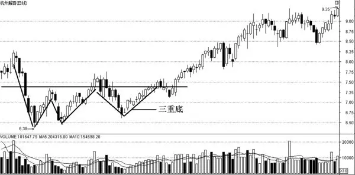

图3\-16 三重底

三重底的形态特征为：股价持续下跌至某一低位时，吸引了逢低买盘，股价出现回升，形成第一个底部；当升至一定高度时，前期抄底的短线获利盘和解套盘纷纷沽出，股价回挫。当跌落至前一低点附近时，买盘再次介入，股价反弹，形成第二个底部；当升至前次高点附近时，再次遇阻回落，由于前两次在相近的低位处都获得了支撑，当形成第三次低点时，买盘明显踊跃，股价节节攀升，放量突破前两次的高点。成交量在三次上攻行情中呈现出逐级放大的态势。

二、操作要点

1．三重底的三个底部与颈线的距离大致相当，相差在3%以内就行。

2．三重底向上突破后的最小涨幅为底部至颈线的距离。

3．三重底形态的三次低点之间的时间至少要10～15个交易日，如果时间间隔过小，往往说明行情只是处于震荡整理中，底部形态的构筑基础不牢固，即使形成了三重底，由于其形态过小，后市上攻力度也会有限。

4．三重底的三次上攻行情中，成交量要呈现出逐次放大的态势，否则极有可能反弹失败。如果大盘在构筑前面的双底形态时，在期间的两次上升行情中，成交量始终不能有效放大的话，将极有可能导致三重底形态构筑失败。

5．三重底理论涨幅，将大于或等于最小涨幅。即使在形态确立后介入，仍有较大的获利空间。当放量向上突破颈线3%后，可采取买进策略。

6．在三重底的最后一次的上攻行情中，如果增量资金没有积极介入，仍然会功败垂成。所以，三重底的最后一次上涨必须轻松向上穿越颈线位时才能最终被确认。股价必须带量突破颈线位，才能有望展开新一轮的升势。

7．在实际操作中，不能仅仅看到有三次探底动作，就认定是三重底而盲目买入，有时即使在走势上完成了形态的构造，但如果不能最终放量突破颈线位，三重底也有功败垂成的可能。过早介入虽有可能获取超额利润，但风险较大。

## 第三章 K线持续与反转形态分析图 - (17) 圆弧顶

\(17\) 圆弧顶

2025年10月29日

18:05

__圆弧顶 __

一、形态与特征描述

圆弧顶形态是市场渐变的结果，圆弧顶是由上而下运行的，呈现出圆弧的形状（如图 3\-17）。圆弧顶形态比较少见。圆弧顶形态代表着趋势十分平缓，在逐渐地变化。在顶部，交易量随着市场的逐步转向而收缩。最后，当产生新的价格方向时，成交量又会相应地逐步增加。

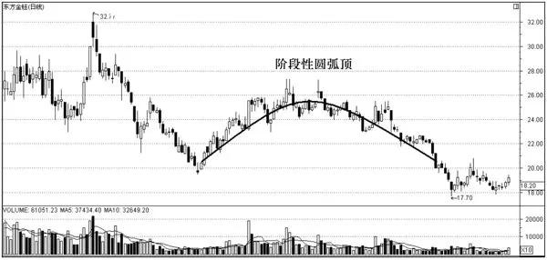

图3\-17 圆弧顶

圆弧顶是指股价或股指呈现出圆顶走势，当股价到达高点之后，涨势趋缓，随后逐渐下滑，是见顶图形，预示后市即将下跌。整个形态的形成时间较长，常与其他形态复合出现，市场在经过初期买方力量略强于卖方力量的进二退一式的波段涨升后，买方力量减弱，而卖方力量却不断加强，中期时，多空双方力量均衡，此时股价波幅很小，后期卖方力量超过买方，股价回落，当向下突破颈线时，会出现快速的下跌。

圆弧顶的市场含义为：多方在维持股价或指数上升一段时间之后，力量逐步减弱，难以维持原来的购买力，使涨势趋缓，而空方力量却有所加强，双方力量趋于均衡，此时股价保持平台整理的静止状态，一旦空方力量强于多方，股价便开始回落，起初只是慢慢改变，跌势不明显，但后来空方完全控制市场，跌势转急，表明一轮跌势已经来临，先知先觉者往往在形成圆弧顶前抛售出局，不过，在圆弧顶形成后出局也不算太迟。

有时在圆弧顶形成后，股价不一定马上下跌，而是横向整理，形成平台整理区域。该区域被称为碗柄。不过，碗柄很快会被突破，股价会继续下跌。

事实上，圆弧顶往往是主力资金选择套现离场的最佳形态。由于主力手中的筹码很多，很难在短时间内全部派发，因此，在派发套现阶段，有必要将股价水平维持在一个高位区间中，利用股票价格日常的小幅波动来回拉锯，逐步完成套现并离场，而当筹码派发接近尾声时，庄家才会把手中剩余筹码不计成本地“清仓处理”掉，此时成交量一般会有较为明显的放大。

在我国证券市场上，主力在炒作即将完成时，往往会推出一些利好消息以吸引买家进场接盘，最奏效的办法莫过于上市公司高比例送转股票，主力利用这一利好消息，既可以进一步拉高股价，同时也可以使股价最终形成除权缺口和股价水平的绝对值自然降低，这时候出货将变得十分轻松。而在除权之后的出货过程中，主力多数会采用成交量有序放大的盘整出货法，实际上以复权价来看，除权前后的股价走势，或多或少都有些圆弧顶形态的样子。

二、操作要点

1．有时当圆弧顶的头部形成后，股价并不会立即快速下跌，而是横向发展，形成徘徊区域，股价一旦向下突破这个横向区域，就会有加速下跌的趋势。由于圆弧顶不像其他图形一样有着明显的卖出点，但其形成时间较长，有足够的时间让投资者依照趋势线、重要均线及均线系统卖出逃命。

2．圆弧顶最小跌幅为圆弧顶至颈线的垂直距离，当跌破颈线3%，向下突破确立后，可采取卖出策略。

3．在圆弧底末期，股价跌到一定程度时，会引起持股者恐慌，使跌幅加大，常出现跳空缺口或大阴线，此时是一个强烈的卖出信号，投资者应果断离场。

4．圆弧顶常出现在绩优股中，由于持股者心态稳定，多空双方力量很难出现急剧的变化，所以主力在高位慢慢派发，形成圆弧顶。

5．在顶部形成的过程中，成交量巨大而不规则，常常在股价上升时成交量增加，在上升至顶部时反而显著减少，在股价下滑时，成交量又开始放大。

6．圆弧顶形态的成交量多呈现不规则状，一旦圆弧顶右侧的量严重小于左侧的量时，圆弧顶形成的几率就高。投资者应时刻予以关注，当感觉有风险时，可考虑提前卖出。

## 第三章 K线持续与反转形态分析图 - (18) 圆弧底

\(18\) 圆弧底

2025年10月29日

18:05

__圆弧底 __

一、形态与特征描述

圆弧底是呈圆弧状的一种底部反转上攻形态，也称碗形，股价多处于低位区域，交投清淡，形态耗时几个月甚至更久，是弱势行情的典型特征，是投资者在跌市中信心极度匮乏的表现。圆弧底的形态如图3\-18所示。

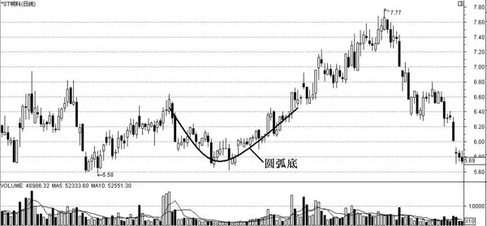

图3\-18 圆弧底

圆弧底的形成原理为：市场在经过一段下跌之后，卖方趋弱或仅能维持原来的购买力量，使跌势缓和，而买方力量却不断加强，即行情回落到低水平时渐渐稳定下来，这时候成交量很少，投资者不会不计价抢高，只有耐心地限价收集筹码，后期则由买方完全控制市场，于是价格逐步向上运行，形成一个圆弧的底部。

一般而言，圆弧底是在大市处于盘整期并经主力打压后形成的。股价下跌一段时间后，抛盘减少，主力就慢慢收集筹码，不急于推高股价。这时，随着抛压的减轻，成交量缩小。当主力还要增加吸筹量时，又不得不慢慢抬高价格，于是成交量也随着价格的上升而不断放大。

大多数情况下，圆弧底预示着主力在收集筹码，一旦收集完成，股价会有可观的升幅。因此，当股价突破圆弧底并有成交量配合时，投资者应果断跟进。

圆弧底的特征为：圆弧底是在股价大幅下跌之后形成的，一般筑底的时间较长，可能为几周、几个月甚至几年；底部股价波幅小，成交量亦极度萎缩，盘整到尾段时，成交量缓步递增，之后是巨量向上突破前期阻力线；在圆弧底形成后，股价可能会反复徘徊形成一个平台，这时候成交量已逐渐增多，当价格突破平台时，成交量必须显著增大，股价才会加速上升。

二、操作要点

1．圆弧底是非常坚实与可靠的底部反转形态，一旦圆弧底的左半部形成后，股价出现小幅爬升，成交量温和放大，形成右半部时便是中线分批买入时机，股价放量向上突破时是非常明确的买入信号，其突破后的上涨往往是快速而有力的。由此可见，圆弧底末期是最佳的买入时机。

2．圆弧底的最终上涨高度往往是弧底最低点到颈线距离的3～4倍，但是圆弧底如果距离前期的成交密集区太近，尽管底部形成的时间足够长，后市上涨高度也有限，因为原有的股票持有者没有经历一个极度绝望的过程，导致底部的换手率不高，限制了未来的涨升空间。

3．圆弧底常见于低价股中，通常需要数月才能形成。在圆弧底形成期间，有时还常伴随蝶形底的形成。

4．由于圆弧底易于辨认，有时太完美的圆弧底反而易被主力利用，形成骗线。例如，某些个股除权后，在获利丰厚的情况下，主力就是利用漂亮的圆弧底来吸引投资者的。因此，如果公认的圆弧底久攻不能突破或突破后很快走弱，特别是当股价跌破圆弧底的最低价时，投资者应止损出局。

5．在所有底部技术形态中，圆弧底形成的概率较低，这是因为形成圆弧底的条件很严格：首先，股价要处于低价区；其次，低价区的平均价格应该至少低于最高价的50%，距离前期成交密集区要尽可能的远；最后，在形成圆弧底之前，股价应该是处于连续下跌的状态。

## 第三章 K线持续与反转形态分析图 - (19) 岛形

\(19\) 岛形

2025年10月29日

18:05

__岛形 __

一、形态与特征描述

岛形是一个重要反转形态，当这种形态出现之后，股价往往会向相反的方向运行。投资者看到这种形态时应及时做出买入或卖出的决定。岛形分为顶部岛形和底部岛形。

顶部岛形反转：股价在持续上升一段时间后，某日出现跳空缺口，加速上升，但随后股价在高位徘徊，不久便以向下跳空缺口的形式下跌，而这个下跌缺口和上升向上跳空缺口基本处在同一价格区域的水平位置附近，在K线图表上看就像是一个远离海岸的孤岛。顶部岛形形态如图3\-19所示。

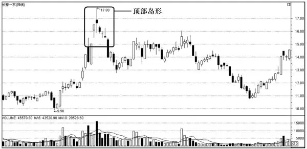

图3\-19 顶部岛形形态

顶部岛形的形成原理为：价格不断上升，使原来想买入的投资者无法在预期的价位买入，持续的升势令他们终于忍不住不计价抢入，于是形成一个上升缺口。可是价格却没有继续上涨，在高位明显遇阻，经过一段短时间的争持后，股价最终转而下跌。

顶部岛形形态一旦确立，说明近期股价向淡已成定局，此时持筹的投资者只能认输出局，如果继续持股必将遭受更大的损失。而空仓的投资者近期最好也不要再碰该股，即使中途有反弹，也尽量不要参与，可关注其他一些有潜力的股票，另觅良机。

底部岛形反转：股价在持续下跌一段时间后，某日突然跳空低开留下一个缺口，随后几天股价继续下沉，但股价下跌到某低点又突然向上跳空，开始急速回升，这个向上跳空缺口与前期的向下跳空缺口基本处在同一价格区域水平在K线图表上看就像是一个远离海岸的孤岛。底部岛形形态如图3\-20所示。

底部岛形的形成原理为：由于股价在不断的下跌途中，原来想卖出的投资者无法在预期的价位抛售，而持续的跌势却令他们终于忍不住不计成本地抢先出局，于是就形成一个向下的跳空缺口。可是股价却没有因此继续向下，而是在跌到较低价位时明显受到了强力的支撑，经过一段短时间的争执后，市场发现先前的抛售是一种错误，转而反手开始大量买入，这也就形成了一个向上的跳空缺口。

图3\-20 底部岛形形态

通常，在底部发生岛形反转后，股价会激烈地上下震荡，但多数情况下，股价在下探上升缺口处会突然止跌，然后再次发力向上。投资者面对这种情况时，应首先想到形势可能已经开始逆转，不可再看空了。激进的投资者可在向上的跳空缺口的上方买进，稳健的投资者可在股价急速上冲、回探至向上的跳空缺口处，并获得支撑后再买进。倘若股价回探后，向上跳空缺口被封闭，则不要买进，应密切观望。

二、操作要点

1．岛形的左侧为上升消耗性缺口，右侧为下跌突破性缺口，是以缺口填补缺口，这两个缺口出现在很短的时间内，说明市场情绪化特征明显。

2．底部岛形形态常伴随着很大的成交量，如果成交量很小，形态就很难成立。

3．岛形以消耗性缺口开始，突破性缺口结束。经典的理论认为岛形反转后的缺口是否被回补是这种形态成立与否的关键。一旦回补则不能再看做是岛形形态。因为从技术分析的角度来看，跳空缺口是市场情绪发生极度变化在股价上的反映。如果缺口被回补，那么它就不再是突破性缺口，岛形反转形成的基础也就没有了。

## 第四章 股票分时分析图

__第四章 股票分时分析图 __

## 第四章 股票分时分析图 - (01) 跳空高开

\(01\) 跳空高开

2025年10月29日

18:05

__跳空高开 __

一、形态与特征描述

跳空高开（如图 4\-1）指的是股票市场中，开盘价格超过上一交易日的最高价格的现象。上午9:15\-9:25时，在集合竞价期间，买方力量大大强于卖方力量，此时开盘价高于前日的收盘价。

图4\-1 跳空高开

出现这种情况有下面两种可能：一种可能是庄家的试盘动作，看看上方有多少抛盘；另一种可能是庄家为了吸引投资者的注意，主要目的是为了派发方便，这时候股价有可能高开低走。

二、操作要点

在实战操盘中，我们通常把跳空高开分为如下三个标准，以区分股价在当天某时某刻的趋势强弱的情况。

1．普通高开行情

普通高开行情的标准如下。

（1）高开幅度在1%～2%。

（2）高开回调不破前一交易日的收盘价，或者轻微击穿前一日交易收盘价。

2．强势高开行情

强势高开行情的标准如下。

（1）高开幅度在3%～7%。

（2）高开回调不破前一交易日的收盘价、不破均价线甚至不破当天的开盘价。

3．极限高开行情

极限高开行情的标准如下。

（1）高开幅度达8%以上。

（2）高开回调不破均价线或者不破当天开盘价，盘中直接涨停。

## 第四章 股票分时分析图 - (02) 巨量高开

\(02\) 巨量高开

2025年10月29日

18:05

__巨量高开 __

一、形态与特征描述

巨量高开一般指的是在跳空高开之时，所产生的第一笔交易是以巨量大单成交，这种巨量大单竞价高于前一日最高价开盘成交的现象。

这里说的巨量是指集合竞价时的成交量，如果这个时间段出现了巨额的成交量，在波段涨幅较小的情况下，往往是主力在疯狂扫货，个股出现这种情况往往是由突发利好或者潜在利好造成的，是股价启动或者加速上扬的标志。由于散户的力量分散，意见也不统一，获取企业信息的渠道也很单一，所以集合竞价中的巨量成交绝不可能是散户所为，散户朋友大多只是开盘价产生后的跟风者，对突发利好进行了精心分析或者提前获知企业内幕的主力才是集合竞价巨量成交的“幕后黑手”。巨量高开的图形如图4\-2所示。

图4\-2 巨量高开

作为一个特殊的盘面现象，巨量高开临盘所表现的量价剧烈波动特征由以下几大因素组成：重大利好消息刺激；上市公司内部业绩和经营环境的改善；市场投资者积极追捧投资；控盘主力机构刻意所为。

二、操作要点

为区别股价当天趋势的强弱状态，将巨量高开这一特定的技术特征按个股流通盘规模的不同，共分为以下七档标准。

1．流通盘小于3000 万股，集合竞价成交量在600 手以上，可以称之为巨量。

2．流通盘3000万～6000 万股，早盘集合竞价成交量在800 手以上，可以称之为巨量。

3．流通盘 6000 万～1 亿股，早盘集合竞价成交量在 1000 手以上，可以称之为巨量。

4．流通盘 1 亿～2 亿股，早盘集合竞价成交量在 1500 手以上，可以称之为巨量。

5．流通盘 2 亿～5 亿股，早盘集合竞价单笔成交手数达 2500 手以上可称为巨量。

6．流通盘5亿～10亿股，早盘集合竞价单笔成交手数达3000手以上可称为巨量。

7．流通盘10 亿股以上，早盘集合竞价单笔成交手数达5000 手以上可称为巨量。

巨量高开作为一个重大的技术特征出现，对中小投资者和职业操盘手而言既是机会也是陷阱。在临盘实战操盘过程中，必须对巨量高开的目标品种要有清醒的认识。作为重要的操盘机会而存在，在临盘操作中，巨量高开必须要符合以下几个条件。

1．股价必须在10日线之上运行，而5日线必须与10日线形成金叉。

2．当天巨量高开必须符合跳空高开的标准和巨量高开的标准。

3．大盘环境必须是平衡市或牛市。

## 第四章 股票分时分析图 - (03) 跳空低开

\(03\) 跳空低开

2025年10月29日

18:05

__跳空低开 __

一、形态与特征描述

跳空低开一般指股票交易市场，大盘（个股）当日开盘点位低于前一天最低点位，或该市场特定交易品种当日开盘价低于前一个交易日的最低价，并且二者的K线图形成一个下行缺口的情况（如图4\-3）。伴随着跳空低开，大多会有一波凌厉的跌势。

图4\-3 跳空低开

出现跳空低开一般有以下几个原因：一是没有主力运作；二是主力有意为之，幅度较小的低开可能是主力为了进行洗盘，洗完后会拉起来，多表现为开盘就拉或在收盘线附近长时间横盘运行后拉起；三是由主力前日大量出货所致，投资者应在第一时间出局。主力为了套牢跟风盘，低开是最好的选择，所以我们最该了解这种手段，很多情况下低开是主力出货所致，此时要及时规避风险。还有一种情况是主力故意低开卖货，表现为股价下跌幅度较大，在下面运行时间较长，尾盘多突然拉升，再次吸引跟风盘，主力利用别人捡便宜的心理达到出货的目的。

二、操作要点

跳空低开有以下三种情况。

1．延续其前一交易日的走势。此时需要持币观望。

2．当日开市前出现全盘性或具体个股利空消息。如果是全盘性低开，要避免盲目跟进，后市有很大的跌幅。

3．炒作。跳空低开说明市场进入整理阶段，市场低迷，投资者信心受挫。此时需要耐心等待机会，在整理阶段末期买入。

## 第四章 股票分时分析图 - (04) 过度低开

\(04\) 过度低开

2025年10月29日

18:05

__过度低开 __

一、形态与特征描述

过度低开是指在股票价格波动的过程中，价格突然大幅低开，让人摸不清头脑（如图4\-4）。

图4\-4 过度低开

二、操作要点

过度低开的技术形态有以下几类。

1．指标快速修复型：经过长期的上涨，技术指标严重超买，主力快速砸盘，使指标迅速修复。

2．送钱型：股市和单位一样，也存在着复杂的人际关系，主力在操盘时，也要考虑到各方的利益。如上级直属的领导、上市公司的相关人员、自己的亲戚朋友等。这种图形一般出现在上升的途中，并且主力一般实力都不弱，持仓量较大，能够控制股价走势。

3．确认前期底部型：出现这种图形往往是行情启动的前兆。确认底部以后，打消技术派人士的顾虑，为股价的上涨埋下伏笔。同时为了避免过多的筹码流向他人之手，主力采用低开快速拉高的手法。

4．确认未来底部型：该图形的主要特点是，一根低开阳线的最低价成为未来行情的底部，未来行情调整低点就是在阳线的根部。

## 第四章 股票分时分析图 - (05) 早盘封涨停

\(05\) 早盘封涨停

2025年10月29日

18:05

__早盘封涨停 __

一、形态与特征描述

早盘封涨停是指股价开盘不久就出现涨停的现象，并且在股价冲击涨停的过程中，成交量迅速放大；但当股价封住涨停之后，成交量却极度萎缩，盘中的成交十分稀少（如图4\-5）。投资者在研判早盘封涨停的个股时，应掌握其分析方法和技巧。

图4\-5 早盘封涨停

二、操作要点

1．投资者遇到这种走势的个股时，首先要打开该股的日K 线走势图。只要此时股价不是在市场高位区域运行，那么一旦股价涨停之后迅速缩量，就可以挂单排队买进。激进型的投资者可以在涨停的瞬间挂单买进。

2．如果是由于利好消息的刺激出现这种走势，那么投资者要认真分析此消息是否能构成实质性的利好，如果结论是肯定的，那么就可以果断跟进。

## 第四章 股票分时分析图 - (06) 盘中快速拉抬

\(06\) 盘中快速拉抬

2025年10月29日

18:05

__盘中快速拉抬 __

一、形态与特征描述

股市中说的盘中是指每个交易日的中间时间，时间段为10:30\-11:30和13:00\-14:00。盘中快速拉抬是指股价在这个阶段有整理或者下跌趋势，并被快速拉升上涨（如图4\-6）。

图4\-6 盘中快速拉抬

盘中是多头和空头斗争最为激烈的时段，盘中快速拉抬代表着多头力量强大，暂时占据优势。如果能把收盘价保持在此阶段，说明多头占市场的主导地位；如果收盘价低于此阶段的最高价，说明空方占据优势。

二、操作要点

1．如果股价及技术指标都处于中低位，则首先要看成交量是否配合，如果成交量大幅增加，说明多头主力拉升股价意愿强烈，可以果断跟进。等到收盘时股价维持在拉升阶段的价位，就更加可信。如果股价在尾盘没有坚持住，那么就需要再等待一段时间积蓄力量。

2．如果股价及技术指标都处于中高位，则应注意以下几个方面。

（1）量能明显放大，如果股价反而走低的话，则是盘中需要高度警惕的信号。不排除有人大笔出货。这可以结合盘中有无大卖单研判。

（2）高位放出大量乃至天量的话，则即使还有涨升，也是余波。吃鱼如果没有吃到鱼头和鱼身，则鱼尾可以放弃不吃。毕竟鱼尾肉不多、刺多。

3．从个股走势及盘面上来看，个股起涨有以下特点。

（1）个股股价在连拉小阳后放量且以最高价收盘，是主力在抢先拉高建仓，可作为起涨的信号。

（2）个股股价在底位，下方出现层层大买单，而上方仅有零星的抛盘，并不时出现大手笔砸掉下方的买盘后又扫光上方的抛盘。此为主力在对倒打压，震仓吸货，投资者可适当跟进。

（3）个股在经历长时间的底部盘整后向上突破颈线压力，成交量放大，并且连续多日站在颈线上方。此突破为有效突破，应跟进。

## 第四章 股票分时分析图 - (07) 尾盘拉高收盘

\(07\) 尾盘拉高收盘

2025年10月29日

18:05

__尾盘拉高收盘 __

一、形态与特征描述

股市中说的尾盘也即是盘尾，一般是指收市前半小时的盘面表现，开盘是序幕，盘中是过程，收盘才是定论。盘尾是多空双方一日拼斗的总结，故收盘指数和收盘价历来为市场人士所重视。当前庄家机构都喜欢在尾盘对持仓个股或者大盘进行控制，以达到技术上骗线的目的，制造多头或空头陷阱。

尾盘拉高是指股价在临收市前的较短时间内，突然出现一波放量的急速拉升（如图 4\-7），在 K线图上出现一根放量上涨的大阳线或者使得该股在当日出现上涨。

图4\-7 尾盘拉高收盘

二、操作要点

1．注意将个股的价格和个股的技术形态结合判断分析。如果一只股票构筑缓慢的上升通道，并走进最后的五浪加速期，那么，这个时候的急速拉高属于本身趋势形态上涨加速，在股价快速起飞的初期，可以适度跟涨；反之，则应该观望。

2．如果个股在高位出现“尾盘拉高”，则是一个危险的信号，表明该股已经处在头部区域，即使日后还有可能再创新高，实质上也是强弩之末，属明显的上涨乏力，投资者需要及时卖出。

3．要注意区分有量急拉和无量上涨。前者属于主力对敲做盘，有很多大单、整数单大举买进，这是主力故意炫耀实力给散户看，引诱跟风盘。而后者一般是由于突发利好，场外资金急切抢进所致，股票价格无须放量就轻松涨停，这往往说明两点：一是主力惜售；二是筹码高度集中，后市可以看高一线。

## 第四章 股票分时分析图 - (08) 尾盘压低收盘

\(08\) 尾盘压低收盘

2025年10月29日

18:06

__尾盘压低收盘 __

一、形态与特征描述

主力尾盘压低收盘的特征为：个股股价走势原本正常，但在收盘前一两分钟内（有的甚至从收盘前15分钟开始）突然出现大手笔的抛单，股价随之出现一定幅度的下跌（如图4\-8）。

图4\-8 尾盘压低收盘

二、操作要点

投资者尤其要注意的是以下三种情况。

1．分时图中，全天绝大多数时间股价运行在均线之上，收盘前突然打压至均线下方。

2．正常情况下当日本应收出阳线，但却在收市前瞬间砸至阴线。

3．在较短的时间内，所跟踪的个股不断出现尾盘遭打压的情况。

出现上述三种尾盘打压情况时，有可能是盘中主力在为下一步的上涨做准备。

第一种情况是，当主力控盘达到一定程度或接近建仓尾声时，市场流通筹码已经大量集中并被锁定，此时股价对买盘较为敏感，多方微弱的攻击都会使价格有“飘”起来的感觉，为了不引人注意，主力会利用收盘前几分钟将股价尽量打低，在K线图上留下一根上影阳线或阴线来误导投资者。

第二种情况是，主力在即将到来的大幅拉升前，给重要的“关系户”送上一些廉价的筹码。

无论出现上述哪种情况，投资者都可以立即介入，等待获利。所以说尾盘打压也不一定是坏事，要具体问题具体分析。

## 第四章 股票分时分析图 - (09) 尾盘放量涨停

\(09\) 尾盘放量涨停

2025年10月29日

18:06

__尾盘放量涨停 __

一、形态与特征描述

尾盘放量涨停是指股价在下午 2:00之前一直都处于低迷的运行状态，股价波动的幅度相当小。而且成交量呈现出极度萎缩的现象。但在下午 2:00之后，甚至是在收盘前半小时，股价突然放量上涨，直至涨停；涨停之后，成交量又迅速萎缩（如图4\-9）。

图4\-9 尾盘放量涨停

二、操作要点

1．投资者遇到这种走势的个股之后，要立即打开该股的日K 线走势图进行分析，看一下该股股价此时所处的位置。如果股价位于长期上涨的高位区域，那么投资者最好不要去碰它，因为这很有可能是庄家准备出货而故意设置的陷阱。

2．如果是在股价启动不久，或者是在股价上涨的中途出现这种走势，那么投资者可以在股价涨停的瞬间买进，或者在第二天开盘后、股价继续走强时果断追进。

## 第四章 股票分时分析图 - (10) 大单压盘

\(10\) 大单压盘

2025年10月29日

18:06

__大单压盘 __

一、形态与特征描述

大单压盘是指在五档卖盘上出现大卖单，如果是在短时间内出现大单压盘，则有可能是中户或者大户所为，如果持续出现大单压盘，则基本可以断定这是主力在刻意操纵股价（如图4\-10）。

图4\-10 大单压盘

二、操作要点

大单压盘一般有以下几个作用。

1．侦察盘面。散户对市场非常迷茫，如同站在大山或森林面前不知所措，而主力却站在高山上俯视众多投资者。如果说大单托盘更多的是测试筹码跟风度的话，那大单压盘更多的是为了测验市场抛压的情况，主力会依据得到的反馈信息而决定短线操作方向。

2．主力不希望股价涨的过快，而做出有大抛盘的迹象。这时主力很可能在吸货，如果是新主力入驻，股价会连续小幅下跌一段时间，待主力吸货完成后还会打压股价一段时间才开始拉升。如果是老庄的局部建仓，则不会继续打压股价。压盘的目的其实只是让更多的人卖出，减少散户买入，主力趁机吸筹。也许有人会问：压盘是否会是真的卖出呢？对，的确有可能。这要看基本面是否变坏，大盘是否持续走低，如果都不是，这个大单压盘就有待商榷。投资者知道既然真实买盘都不能挂单，那么相反如果大单要逃走也不能挂单，否则吓走了接盘者还能高价卖出吗？所以压盘透露出了主力具有欺骗性质的信息。

3．主力跟某人约定好在某个时间段放出某张单，某人见后直接买入或卖出。这是一种盘中交易的大单，一般是在约定的时间或者价格上出现，不过为了避免散户参与，这种大单出现后很快便被接走（从成交明细中可以发觉）。当出现这种情况时，投资者可以看高后市。

4．当个股处于阶段性上涨时，盘中经常连续出现大单压盘现象，且大单在涨升中不断被吃掉，并随着股价的上涨压盘大单的价位越来越高，这通常是个股上涨中正常的换手现象，这里的大单压盘带有洗盘的性质。

## 第四章 股票分时分析图 - (11) 大单托盘

\(11\) 大单托盘

2025年10月29日

18:06

__大单托盘 __

一、形态与特征描述

投资者经常看到在买一到买五的位置中出现大单，这种情况我们称之为大单托盘。如果在一天的短时间内出现大单托盘那么这有可能是中户、大户所为，如果盘口连续出现大单托盘，那可以断定这是主力刻意操纵股价的行为（如图4\-11）。

图4\-11 大单托盘

二、操作要点

对主力来说，大单托盘一般有以下几个方面的作用。

1．主力不希望价格下跌，也许离自己的成本区很近，后市会继续拉升。

2．主力觉得这个价位是合理的整理区，再低可能对后期拉伸不利，即将拉伸与否无法判断。

3．股票处于相对底部，主力可能被套，为此假意拉升，并做出护盘动作，其实上方的小抛盘都是主力自己扔出来的，稍有小涨便会下跌。

4．主力在故意向市场展示自己的实力。

5．大单托盘现象在个股不同的阶段性走势和不同的市况下具有不同的意义。当个股处于阶段性上涨时，三档买盘当中如经常出现连续的大单托盘，通常是个股主力为了减少抛压或者诱多出货的行为；当个股处于阶段性下跌时，这种大单托盘通常是个股主力为减少抛压的行为；当大盘整体趋势向坏时，个股盘中的大单托盘通常是主力为减少抛压的护盘行为。

## 第四章 股票分时分析图 - (12) 向上对倒

\(12\) 向上对倒

2025年10月29日

18:06

__向上对倒 __

一、形态与特征描述

对倒是证券市场主力在不同的证券经纪商处开设多个户头，然后利用对应账户同时买卖某个相同的证券品种，以达到人为拉抬价格以便抛售或刻意打压后以便低价吸筹的目的。

主力炒股一般分吸筹、洗盘、拉抬、整理、拔高、出货、打压股价几个阶段。对倒是主力拉抬股价的一种方法：主力用内部的关联交易抬高股价，这主要是因为散户们根据早期的量价理论，认为量价齐升才有活力，主力为了制造高成交量和高换手率，就用对倒的方式拉抬股价。例如，方大炭素（600516）在2011年9月14日13时42分出现的快速向上拉升（如图4\-12）。

图4\-12 向上对倒

出现向上对倒现象时，一般是主力高度控盘的标志，或者是股价进入上涨阶段的标志；诱多出货是主力在出货的过程中经常使用的一种手段，主力故意制造股价走势强劲的假象，以此来诱惑投资者入场接盘。

无论向上对倒所表达的市场信号是什么，它在运行过程中都会有一个共性，那就是主力会事先在卖三或者卖四上挂出大手笔的卖单，然后盘中突然出现直接把上面挂出来的大卖单吃掉的现象。从而促使股价出现快速的拉升，有的甚至会连续向上吃进，此时股价就会直线式地上升。

二、操作要点

1．主力出货时出现的向上对倒

（1）盘中出现向上对倒时，股价已经经过了大幅度的上涨，特别是在股价处于高位区域、进入加速拉升之后出现的向上对倒。

（2）在经过向上对倒之后，股价被拉升到一定程度时，出现了明显的滞涨现象，有的甚至出现快速的回落，或者在高位震荡，而且在这个过程中，成交量持续放大。

（3）当股价被向上的对倒单拉高到一定程度之后，在委买处却很少有大手笔的买单挂在上面。即使是有一些大单挂在上面，在股价回落到这个价位附近时，这些大买单也会被自动撤掉，然后再往下调低几个价位重新挂出，并且会不断地反复。

出现以上这些迹象后，基本上就可以确定，此时出现的向上对倒是主力出货的行为，目的就是想通过这种手段把股价拉升，从而吸引场外资金入场接盘。

2．加速拉升之前的向上对倒

（1）在出现这种向上对倒之前，股价处于明显的上升趋势中，而且此时股价的上涨幅度并不是很大。同时，在这之前，股价一直处于平稳的状态中，没有出现过大起大落的走势，并且个股的均线系统也是处于多头排列的。

（2）在出现这种向上对倒之后，盘中主动性的买盘相当积极，股价被不断地推高。而且在这个过程中，委买处出现了大手笔的买单。同时，卖盘上却很少有大卖单出现，主动性的抛压也相当稀少。

（3）在出现这种向上对倒之后，股价呈现出稳步的向上攀升，分时走势图上的均线也跟随着股价的上涨而不断攀升。

（4）在出现这种向上对倒的当天，股价截至收盘时始终没有出现过大的回落现象。

## 第四章 股票分时分析图 - (13) 向下对倒

\(13\) 向下对倒

2025年10月29日

18:06

__向下对倒 __

一、形态与特征描述

出现向下对倒现象时，一般是主力在测试下档的支撑情况，清洗盘中的短线获利筹码，砸盘出货。例如，农业银行（601288）在2011年9月19日13时36分突然出现一笔13万手的卖单（如图4\-13）。

图4\-13 向下对倒

二、操作要点

1．测试下档的支撑情况

当股价经过长时间的下跌之后，或者在上涨过程中经常出现向下对倒的走势现象时，一般是庄家建仓之后对盘面进行的测试动作，其目的是测试下档的支撑情况。如果股价在向下对倒出现后快速下跌，并且盘中出现了积极的买单，这就说明买盘的承接能力很强，投资者普遍看好该股的后期走势。反之，则预示着下档的买单并不是很积极，后市股价难以在短期内出现上涨。

2．清洗盘中的短线获利筹码

在拉升股价之前，主力为了清洗盘中的短线获利筹码，往往会采用向下对倒的手法。因此，主力就会在股价运行的过程中，突然采用大手笔的向下对倒单将股价打压下去。这样一来，那些持股信心不坚定的投资者就会被股价的突然下跌吓出局，短线获利筹码也就自然而然地被清洗掉了。

3．砸盘出货

在出货进入尾声时，主力也会经常使用向下对倒的手段。这个时候，主力会不计成本地抛售筹码，使得股价出现快速的下跌，有经验的主力在向下对倒后，还会再次拉升股价，以吸引投资者入场接盘，从而达到出货的目的。

## 第五章 技术指标分析图

__第五章 技术指标分析图 __

## 第五章 技术指标分析图 - (01) MACD指标黄金交叉

\(01\) MACD指标黄金交叉

2025年10月29日

18:06

__MACD指标黄金交叉 __

一、形态与特征描述

MACD指标又叫指数平滑异同移动平均线指标，是由查拉尔·阿佩尔创造的一种研判股票买卖时机、跟踪股价运行趋势的技术分析工具（如图5\-1）。

当MACD指标中的DIF线和MACD线在远离0值线以下区域同时向下运行很长一段时间后，当DIF线开始进行横向运行或慢慢勾头向上靠近MACD线时，如果DIF线接着向上突破MACD线，这是MACD指标的第一种“黄金交叉”。

当 MACD 指标中的 DIF 线和 MACD 线都运行在 0 值线以上的区域中时，如果DIF线在MACD线下方掉头、由下向上突破MACD线，这是MACD指标的第二种“黄金交叉”。

图5\-1 MACD指标黄金交叉

二、操作要点

1．MACD指标的第一种“黄金交叉”表示股价经过很长一段时间的下跌，并在低位整理后，将开始反弹向上，是短线买入信号。第一种“黄金交叉”只是预示着反弹行情可能出现，并不表示该股的下跌趋势已经结束，还有可能出现反弹行情很快结束、股价重新下跌的情况，因此，投资者应谨慎对待，在设置好止损位的前提下少量买入。

2．MACD 指标的第二种“黄金交叉”表示股价经过一段时间的高位整理后，新的一轮涨势开始，是第二个买入信号。此时，激进型投资者可以短线加码买入股票；稳健型投资者则可以继续持股待涨。

## 第五章 技术指标分析图 - (02) MACD指标死亡交叉

\(02\) MACD指标死亡交叉

2025年10月29日

18:06

__MACD指标死亡交叉 __

一、形态与特征描述

当MACD指标中的DIF线和MACD线在远离0值线以上区域同时向上运行很长一段时间并向上远离 0 值线后，当 DIF 线开始进行横向运行或慢慢勾头向下靠近MACD线时，如果 DIF线接着向下突破 MACD线，这是 MACD指标的第一种“死亡交叉”。

当MACD指标中的DIF线和MACD线在远离0值线以下区域运行很长一段时间后，由于 DIF 线的走势领先于 MACD 线，因此，当 DIF 线再次开始慢慢掉头向下靠近MACD 线时，如果DIF线接着向下突破MACD线，这是MACD指标的第二种“死亡交叉”。MACD指标死亡交叉的图形如图5\-2所示。

图5\-2 MACD指标死亡交叉

二、操作要点

1．MACD 指标的第一种“死亡交叉”表示股价经过很长一段时间的上涨，并在高位横盘整理后，一轮比较大的跌势将展开。需要注意的是，这一卖出信号是一个相对的顶点，描述的是一段顶部区域，并不一定是市场上涨的最高点。若股价经过大幅拉升后出现横盘，从而形成的一个相对高点，投资者尤其是资金较大的投资者必须在这时卖出股票或减仓。这样一种“死亡交叉”预示着股价的中长期上升行情结束，该股的另一个下跌趋势可能已经开始，股价将可能展开一段较长时间的跌势。因此，投资者对于 MACD指标的这种“死亡交叉”应格外警惕，应及时逢高卖出全部或大部分股票，特别是对于那些前期涨幅过高的股票更要加倍小心。

2．MACD 指标的第二种“死亡交叉”表示股价在长期下跌途中经过一段时间的反弹整理后，一轮比较大的跌势又要展开，股价将再次下跌，是短线卖出信号。这种“死亡交叉”意味着下跌途中的短线反弹的结束，股价的中长期趋势依然看淡，投资者应逢高卖出剩余的股票或持币观望。

## 第五章 技术指标分析图 - (03) MACD指标顶背离

\(03\) MACD指标顶背离

2025年10月29日

18:06

__MACD指标顶背离 __

一、形态与特征描述

MACD 指标顶背离指的是当股价走势一峰比一峰高，MACD 指标图形上的由红柱构成的图形的走势却一峰比一峰低，即当股价的高点比前一次的高点高，而 MACD指标的高点却比指标的前一次高点低的现象（如图5\-3）。

图5\-3 MACD指标顶背离

二、操作要点

1．当股价创出新高时，MACD 指标却不能同步创出新高，二者走势形成背离，这是股价见顶的明显信号。一般来说，当顶背离形成时，如果在最后一波拉升过程中出现“高开低走阴线”或“长下影线涨停阳线”时，是最佳的卖出时机。

2．在实践中，MACD指标的背离出现在强势行情中时比较可靠，股价在高价位时，通常只要出现一次背离的形态即可确认股价即将反转；而股价在低位时，一般要反复出现几次背离后才能确认。因此，MACD指标的顶背离研判的准确性要高于底背离，这点投资者要加以注意。

## 第五章 技术指标分析图 - (04) MACD指标底背离

\(04\) MACD指标底背离

2025年10月29日

18:06

__MACD指标底背离 __

一、形态与特征描述

MACD指标底背离一般出现在股价的低位区。当股价还在下跌时，MACD指标图形上的由绿柱构成的图形的走势却一波比一波高，即当股价的低点比前一次低点低时， MACD指标的低点却比前一次的低点高，这叫底背离现象（如图5\-4）。

图5\-4 MACD指标底背离

二、操作要点

1．底背离现象一般预示着股价在低位可能反转向上，表明股价短期内可能反弹向上，是短期买入的信号。

2．MACD指标的负（绿）柱峰及两曲线底背离大多在股价处于60日均线下方运行时出现。股价处于60日均线上方时较少出现，一旦出现可积极买入。

3．负（绿）柱峰第一次底背离买入法。当两个负柱峰发生底背离时，是较可靠的短线买入信号。买入时机：采用“双二”买入法，即在第二个负柱峰出现第二根收绿柱线时买入，这样可以在较低的价位买入。

4．负（绿）柱峰第二次底背离买入法。当MACD指标的负（绿）柱峰发生两次底背离时，是更加可靠的买入信号。买入时机：在第二个负柱峰出现第一根或第二根收绿柱线时买入。

## 第五章 技术指标分析图 - (05) KDJ指标顶背离

\(05\) KDJ指标顶背离

2025年10月29日

18:06

__KDJ指标顶背离 __

一、形态与特征描述

KDJ指标又叫随机指标，由美国的乔治·莱恩博士所创。

KDJ指标一般是用于股票分析的统计体系，根据统计学的原理，通过一个特定的周期（常为9日、9周等）内出现过的最高价、最低价及最后一个计算周期的收盘价及这三者之间的比例关系，来计算最后一个计算周期的未成熟随机值RSV，然后根据平滑移动平均线的方法来计算K值、D值与J值，并绘成曲线图来研判股票走势。

KDJ指标背离是指KDJ指标的走向正好和K线图的走向相反。KDJ指标背离包括顶背离和底背离。当股价走势一峰比一峰高时，KDJ指标的走势却一峰比一峰低，这叫顶背离现象。顶背离现象一般是股价将高位反转的信号，表明股价在中短期内即将下跌，是卖出的信号（如图5\-5）。

图5\-5 KDJ指标顶背离

二、操作要点

1．KDJ 指标顶背离代表着买方力量已经逐渐减弱，这是行情反转的信号，此时不应追买，反而应择机抛售手中持有的股票。

2．KDJ 指标出现顶背离意味着价格上涨的动力不足，即将见顶回落，有时却仅仅以横向盘整或略有回落来完成KDJ指标的小幅回调，之后重新上升，就会形成技术上的空头陷阱。

这种情况下，顶背离没有引发市场的短线抛压，当然就不会扭转价格原有的上升趋势，仅仅是延缓行情上升的速度而已。当其技术调整到位后，新一轮上升行情自然水到渠成。

顶背离陷阱的判断依据：当KDJ指标下滑后重新上升，突破KDJ指标背离时两高点连线所形成的压力线时，便可确定的顶背离陷阱。应大胆介入，以短线为主。如果KDJ指标在回落的过程中，KDJ跌破50，那么顶背离陷阱存在的可能性就大大减少了，投资者应引起特别的注意。

## 第五章 技术指标分析图 - (06) KDJ指标底背离

\(06\) KDJ指标底背离

2025年10月29日

18:06

__KDJ指标底背离 __

一、形态与特征描述

当股价走势一峰比一峰低，而KDJ指标的走势却在低位一底比一底高，这叫底背离现象。底背离现象一般是股价将低位反转的信号，表明股价中短期内即将上涨，是买入的信号（如图5\-6）。

图5\-6 KDJ指标底背离

二、操作要点

1．KDJ 指标出现底背离现象时代表卖方力量逐渐减弱，行情即将反弹。此时不应抛售，而应加紧买入。

2．KDJ指标顶背离研判的准确性要高于底背离。当股价在高位、KDJ指标在80以上时出现顶背离，可以认为股价即将反转向下，投资者可以及时卖出股票；而股价在低位，KDJ指标也在低位（50以下）时出现底背离，一般要反复出现几次底背离才能确认，并且投资者只能做短期投资。

3．价格在KDJ指标出现背离后并没有出现见底反弹或反转，反而一跌再跌，不断创出新低，形成技术上的多头陷阱，这就是底背离陷阱。应提醒大家注意的是，底背离陷阱并非价格不反弹，而是在其后的一段时期内反弹的高度有限，而后重新陷入漫漫熊途。据统计，底背离陷阱下跌幅度约在10%～30%，平均在15%左右。因此，在临盘实战中应特别注意要认真识别底背离与顶背离陷阱。

## 第五章 技术指标分析图 - (07) KDJ指标低位黄金交叉

\(07\) KDJ指标低位黄金交叉

2025年10月29日

18:06

__KDJ指标低位黄金交叉 __

一、形态与特征描述

KDJ指标是技术指标分析中最常用的工具之一，它综合了强弱指标超卖和移动平均线的趋势功能，更真实地反映了股价的波动趋势和状态。其中 K、D 值始终在 0～100之间波动，J值代表K、D之间的乖离程度，它既能大于100也能小于0，具有提前预示顶部和底部的作用。根据不同的参数设定，KDJ指标既可用于短期，也可用于中期超买、超卖的判断，并能明确地提示卖出与买入信号，从而备受投资者和市场分析人士的青睐。KDJ指标低位黄金交叉就是典型形态之一，主要是指KDJ指标在20以下运行，然后短期K线上穿D线，形成黄金交叉，此时是买入信号（如图5\-7）。

图5\-7 KDJ指标低位黄金交叉

二、操作要点

1．当股价经过一段较长时间的中低位盘整后，而 KDJ 曲线也徘徊在中位（50 附近），一旦KDJ曲线中的J线和K线几乎同时向上突破D线，同时股价也在比较大的成交量的配合下向上突破股价的中长期均线时，则意味着股市即将转强，股价短期内将上涨，这就是KDJ指标中的一种“黄金交叉”，即50附近的中位金叉。此时，投资者应及时买入股票。

2．当股价经过一段时间的上升并进行盘整后，K、D、J线都处于50线附近徘徊时，一旦J线和K线几乎同时再次向上突破D线，成交量再度放出时，表明股市处于一种强势之中，股价将再次上涨，可以加码买进股票或持股待涨，这就是KDJ指标“黄金交叉”的一种形式。

3．9日KDJ指标一般用于短期超买超卖和趋势的判断以及指导实际操作，较适用于短线进出，特别是用于在中期下跌趋势中把握短线反弹的机会。在中期下跌趋势中，K 线从高位（一般在 70 以上）下穿 D 线形成死亡交叉并呈空头排列而下行，说明头部已暂时形成，调整将难以避免（至少是短期的）。只要下跌动力未释放完毕，即使下跌中途出现 1～2 根小阳线，K 线也很难上穿 D 线且仍呈下行状，直至K、D线均进入30以下的超卖区域，这时股价的下跌动力减弱，随时会出现反弹。当股价触底反弹，K线上穿D线时，就意味着短线反弹的开始，一般是短线的买入时机。

## 第五章 技术指标分析图 - (08) KDJ指标死亡交叉

\(08\) KDJ指标死亡交叉

2025年10月29日

18:06

__KDJ指标死亡交叉 __

一、形态与特征描述

当短期KDJ指标向下穿越长期KDJ指标时，形成死亡交叉（如图5\-8）。

图5\-8 KDJ指标死亡交叉

二、操作要点

1．当股价经过前期一段很长时间的上升行情后，在涨幅已经很大的情况下，一旦J线和K线在高位（80以上）同时向下突破D线时，表明股市即将由强势转为弱势，股价将大跌，这时应卖出大部分股票而不能买股票，这就是KDJ指标“死亡交叉”的一种形式。

2．当股价经过一段时间的下跌后，而股价向上反弹乏力，各种均线对股价形成较强的压力时，KDJ曲线在经过短暂的反弹到达80附近，但未能重返80以上时，一旦J线和K线再次向下突破D线时，表明股市将再次进入极度弱市中，股价还将下跌，可以再次卖出股票或观望，这是KDJ指标“死亡交叉”的另一种形式。

## 第五章 技术指标分析图 - (09) KDJ指标钝化陷阱

\(09\) KDJ指标钝化陷阱

2025年10月29日

18:06

__KDJ指标钝化陷阱 __

一、形态与特征描述

KDJ指标是投资者最常使用的一种技术指标，简单易学。但是，它却有一个缺陷，那就是KDJ指标在高位和低位的钝化现象。由于受计算原理的限制，当股价向上攀升或下跌一段时间后，KDJ指标对股价的反应会变得极为迟钝，股价再度继续上涨或下跌很多时，KDJ指标可能才稍微动一下，这就会给我们的买卖决策提供不合实际的参考。也使得 KDJ 指标仅适合于在股价做箱体运动时使用，一旦个股成为黑马或大盘彻底走熊时，KDJ指标就会提示过早的逃顶或过早的铲底。KDJ指标钝化现象具体如图5\-9所示。

图5\-9 KDJ指标钝化陷阱

二、操作要点

在解决KDJ指标的钝化和骗线问题时，投资者可以参考以下几个方法。

1．放大法

因为KDJ指标非常敏感，因此经常给出一些信号，可能会误导投资者。如果我们放大一级来确认这个信号的可靠性，将会有较好的效果。如在日K线图上产生KDJ指标的低位黄金交叉，可以把它放大到周线图上去看，如果在周线图上也是在低位产生黄金交叉，则这个信号可靠性较强，可以大胆去操作。如果周线图上显示的是在下跌途中，那么日线图上的黄金交叉的可靠性不强，有可能是主力的骗线手法，这时候可以暂时观望。

2．形态法

由于KDJ指标经常给出超前的信号，因此我们可以通过KDJ指标的形态来找出正确的买点和卖点，KDJ指标在低位形成W底、三重底和头肩底形态时再进货；在较强的市场里，KDJ指标在高位形成M头和头肩顶时，出货信号的可靠性将加强。

3．数浪法

KDJ指标和数浪相结合，是一种非常有效的方法。在K线图上，可以经常清晰地分辨上升形态的一浪、三浪、五浪。在K线图上，股价盘底结束，开始上升，往往在上升第一子浪时，KDJ指标即发出死亡交叉的出货信号，这时候，这个卖出信号很可能是一个错误信号或是一个骗线信号。当股价运行到第三子浪时，加大对抛空信号的重视程度，当股价运动到明显的第五子浪时，这时如KDJ指标给出卖出信号，则应坚决出货。这时候 KDJ 指标给出的信号通常是非常准确的信号，当股价刚刚结束上升开始下跌时， 在下跌的第一子浪，不参考KDJ指标的买进信号，当股价下跌到第三子浪或第五子浪时，才考虑KDJ指标的买入信号，尤其是下跌到第五子浪后的KDJ指标给出的买进信号较为准确。

## 第五章 技术指标分析图 - (10) RSI指标超买超卖

\(10\) RSI指标超买超卖

2025年10月29日

18:06

__RSI指标超买超卖 __

一、形态与特征描述

RSI 指标最早被用于期货交易中，后来人们发现用该指标来指导股票投资效果也十分不错，并对该指标的特点不断地进行归纳和总结。现在，RSI指标（如图5\-10）已经成为被投资者应用最广泛的技术指标之一。

图5\-10 RSI指标超买超卖

市场上多空双方气势的强弱可以通过RSI指标反映出来，它提供给投资者的是股价指数或某只个股在何时何区域中太强或太弱的信号，以引起投资者的警觉。这种多空双方的数量在图形上的体现，可以使投资者根据行情变动的轨迹来判断未来价格的走势。

RSI指标的原理简单来说是以数字计算的方法求出买卖双方的力量对比，反映市场买卖双方的供求情况。任何市价的大涨或大跌，均在 0～100 变动，根据常态分配，认为RSI值多在30～70变动，通常80甚至90时被认为市场已达到超买状态，至此市场价格自然会回落调整。当价格跌至 30 以下即被认为是超卖，市价将出现反弹回升。

RSI值从0～100分成“极弱”“弱”“强”和“极强”四个区域。“强”和“弱”以50 作为分界线，但“极弱”和“弱”之间以及“强”和“极强”之间的界限则要随着RSI指标参数的变化而变化。不同的参数，其区域的划分就不同。一般而言，参数越大，分界线离中心线50就越近，离l00和0就越远。RSI值如果超过50，表明市场进入强市，可以考虑买入，但是如果继续进入“极强”区，就要考虑物极必反，准备卖出了。同理RSI值在50以下也是如此，如果进入了“极弱”区，则为超卖，应该伺机买入。

二、操作要点

一般而言，RSI指标的数值在80以上和20以下为超买超卖区的分界线。

1．当RSI值超过80时，表示整个市场力度过强，多方力量远大于空方力量，双方力量对比悬殊，多方大胜，市场处于超买状态，后续行情有可能出现回调或反转，此时，投资者可卖出股票。

2．当RSI值低于20时，则表示市场上卖盘多于买盘，空方力量强于多方力量，空方大举进攻后，市场下跌的幅度过大，已处于超卖状态，股价可能出现反弹或反转，投资者可适量建仓、买入股票。

3．当RSI值处于50左右时，说明市场处于整理状态，投资者可观望。

4．对于超买超卖区的界定，投资者应根据市场的具体情况而定。一般市道中， RSI值在80以上就可以称为超买区，在20以下就可以称为超卖区。但有时在特殊的涨跌行情中，RSI指标的超卖超买区的划分要视具体情况而定。比如，在牛市中或对于牛股，超买区可定为90以上，而在熊市中或对于熊股，超卖区可定为10以下（这点是相对于参数设置小的RSI而言的，如果参数设置大，则RSI很难到达90以上和10以下）。

## 第五章 技术指标分析图 - (11) RSI指标背离

\(11\) RSI指标背离

2025年10月29日

18:06

__RSI指标背离 __

一、形态与特征描述

RSI指标背离是指RSI指标的走势正好和股价的走势相反。RSI指标的背离分为顶背离和底背离两种形式。

RSI指标顶背离是指股价在一个上升趋势当中先创出一个新高点，这时RSI指标也相应在80以上创出一个新高点，之后股价出现一定幅度的回落，RSI指标也随着股价的回落出现调整。但是如果之后股价再度冲高，并且超越前期高点时，RSI 指标虽然随着股价继续上扬，但是并没有超过前期高点，这就形成RSI指标顶背离。

RSI指标的底背离一般出现在20以下的低位区。当股价一路下跌，形成一波比一波低的走势，而RSI指标却在低位率先止跌企稳，并形成一底比一底高的走势，这就是底背离。具体如图5\-11所示。底背离现象一般预示着股价短期内可能将反弹，是短期买入的信号。

图5\-11 RSI指标底背离

二、操作要点

1．一般来讲，技术指标都有顶背离的走势出现，RSI指标也不例外。RSI指标出现顶背离后，股价见顶的可能性较大。之所以说RSI指标顶背离是股价见顶的标志，主要是因为当主力拉高出货的时候，为了出货迅速，其拉高动作必然迅速而猛烈，而出货动作则要延续较长的时间和空间。这种特性就决定了主力会一次又一次地拉高股价，但是由于RSI指标主要是反映市场强弱的指标，而这种强势不再的走势无疑将促使RSI指标出现回落，因此，一旦主力出货，RSI指标回落的幅度通常较大，从而形成顶背离。

2．RSI指标在低位缓慢盘升，虽然股价还在不断下跌，但RSI指标已经不再创出新低，这时表示跌势进入尾声，投资者可以适时建仓。

3．与 MACD、KDJ 等指标的背离现象的研判一样，RSI 指标的顶背离研判的准确性要高于底背离。当股价在高位，RSI值在80以上，出现顶背离时，可以认为股价即将反转向下，投资者可以及时卖出股票；而股价在低位，RSI 指标也在低位，一般要反复出现几次底背离才能确认，并且投资者只能做短期投资。

## 第五章 技术指标分析图 - (12) RSI指标高位钝化

\(12\) RSI指标高位钝化

2025年10月29日

18:06

__RSI指标高位钝化 __

一、形态与特征描述

一般情况下，投资者和专家都十分看重个股或大盘的技术指标，尤其是RSI指标。当个股或大盘的RSI指标出现高位钝化的现象时，他们一般会以此来决定是否应该抛出手中的股票或看淡后市。反之，若个股或大盘的RSI指标跌至20，许多投资者会把这当作买入信号。可见，RSI 指标在个股或大盘的分析中占有相当重要的地位。

一般情况下，RSI指标从低位升到高位区并超过80以上，我们认为市场已进入超买阶段，随时可能出现回落，是短线卖出的时机，但有时有些强势股到高位区以上时拒绝回落，仍然稳步盘升（如图 5\-12）。股价的上升幅度可能会越来越大，而指标上升的幅度会越来越小。随着股价的上升，指标也会随之上升，但指标上升的速度会越来越慢，形成一条上升抛物线，这就是RSI指标高位钝化形成的原因。

RSI指标高位钝化的特征为：RSI指标虽在高位钝化，但始终不会回落；股价跟RSI指标一样，完全不会调整，偶尔会以十字星代替回调；股价越往上涨，该股反而越不需要成交量的支持；该股的日K线系统形成多头排列；MACD指标值天天创新高。

图5\-12 RSI指标高位钝化

二、操作要点

1．这是典型的强庄控盘模式，主力既想速战速决，又想连连逼空，使别人不敢参与，同时也说明该股有后继题材。

2．要参与这类个股，应结合3天、5天、7天和10天移动平均线的组合的研判，当这组移动平均线呈多头排列时，可以分批介入。

3．一旦发现该类个股的RSI指标的数值开始下降，则应尽快离场。

## 第五章 技术指标分析图 - (13) W%R指标超买超卖

\(13\) W%R指标超买超卖

2025年10月29日

18:06

__W%R指标超买超卖 __

一、形态与特征描述

W%R 指标又叫威廉指标，是一种利用震荡点来反映市场超买超卖现象、预测循环周期内的高点和低点，从而提出有效的信号来分析市场短期行情走势、判断股市强弱分界的技术指标（如图5\-13）。

图5\-13 威廉指标

威廉指标主要是通过分析一段时间内股票的最高价、最低价与收盘价之间的关系，来判断股市的超买超卖现象，预测股价中短期的走势。它主要是利用震荡点来反映市场的超买超卖现象，分析多空双方力量的对比，从而提出有效的信号来研判市场的中短期走势。

W%R指标与KDJ指标有很多相似之处，都是追踪收盘价在过去一段时间价格区域中的相对位置，只不过其考察角度正好和KDT指标相反。KDT指标是以收盘价和最低价作比较，而W%R指标则是以收盘价和最高价作比较，因而两者计算值的意义也正好相反。

W%R指标的计算公式为：R%=100\-100（C\-Ln）/（Hn\-Ln）

其中：C为当日收盘价、Ln为n日内最低价、Hn为n日内最高价。

W%R 指标是一个动态的动能指标，具有动能指标的摆动性能，它由一个极端摆动“超买点”到另外一个极端“超卖点”。从单摆的原理看，当单摆接近极端前，都有一个停顿，然后沿着原有趋势惯性向前运行，才会改变原有趋势。

二、操作要点

1．当W%R指标值在0～20时，是W%R指标的超买区，表明市场处于超买状态，股票价格已进入顶部，可考虑卖出。W%R=20这一横线一般为卖出线。

2．当 W%R指标进入 80～100 时，是 W%R指标的超卖区，表明市场处于超卖状态，股票价格已接近底部，投资者可考虑买入。W%R=80 这一横线，一般视为买入线。

3．当W%R指标在20～80时，表明市场上多空暂时取得平衡，股票价格处于横盘整理之中，可考虑持股或持币观望。

4．W%R指标主要用于提前观察超买和超卖现象，它的超买和超卖区域刚好与KDJ指标的超买和超卖区域相反。如果使用中感觉曲线反应太快，可加大分析周期。

5．在具体实战中，当 W%R 指标向上突破 20 超买线而进入超买区运行时，表明股价进入强势拉升行情，投资者要密切关注行情的未来走势，只有当 W%R 指标再次向下突破20线时，才为投资者提出预警，为投资者买卖决策提供参考。同样，当W%R指标向下突破80超卖线而进入超卖区运行时，表明股价的强势下跌已经缓和，这也是提醒投资者可以为建仓做准备，而只有当W%R曲线再次向上突破80线时，投资者才应短线买入。

6．W%R指标超买或超卖时，应立即寻求MACD指标的支援。当W%R指标超买时，应再看MACD指标是否产生卖出信号，一律以MACD指标的信号为卖出信号。相反的，W%R指标进入超卖区时，也同样适用。

7．投资者在应用W%R指标时，还应注意该指标的缺点。如：反应过于灵敏，指标波动频率过高，引起信号频发的现象，误差率也非常高，过多的信号和严重的误差率造成投资者不敢轻易使用它；过于侧重于短线，经过仔细研究，发现并非是指标设计上的错误，只是仅仅在参数设置上过于偏重于短线，时间参数设置普遍采用一些随意性和不科学的参数，如5、10、20等，也有的设置成6、12等，都未认真考虑市场本身的运行规律。设置过短的时间参数是造成指标过于侧重于短线和极度敏感的重要原因。但是，随意延长时间参数设置的周期，又会使W%R指标丧失原有的应用价值。

## 第五章 技术指标分析图 - (14) W%R指标背离

\(14\) W%R指标背离

2025年10月29日

18:06

__W%R指标背离 __

一、形态与特征描述

W%R指标的背离是指W%R指标的走势正好和股价的走势相反。和其他技术分析指标一样，W%R指标的背离也分为顶背离和底背离两种。当股价的走势一峰比一峰高，而W%R指标的走势却在高位一峰比一峰低，这叫顶背离现象（如图5\-14）。当股价的走势一峰比一峰低，而W%R指标的走势却在低位一底比一底高，这叫底背离现象。

图5\-14 W%R指标顶背离

二、操作要点

1．顶背离现象一般是股价将高位反转的信号，表明股价短期内即将下跌，是比较强烈的卖出信号。

2．底背离现象一般是股价将低位反转的信号，表明股价短期内即将上涨，是比较强烈的买入信号。

3．W%R指标的背离现象一般出现在强势行情中比较可靠。即股价在高位时，通常只需出现一次顶背离的形态即可确认行情的顶部反转，而股价在低位时，一般要反复出现多次底背离后才可确认行情的底部反转。

## 第五章 技术指标分析图 - (15) ROC指标超买超卖

\(15\) ROC指标超买超卖

2025年10月29日

18:06

__ROC指标超买超卖 __

一、形态与特征描述

ROC指标又叫变动率指标（如图5\-15），是以当日的收盘价和N天前的收盘价作比较，通过计算股价某一段时间内收盘价变动的比例，应用价格的移动比较来测量价位动量，达到事先探测股价买卖供需力量的强弱的目的，进而分析股价的趋势及其是否有转势的意愿，属于反趋向的指标之一。

它结合了RSI、W%R、KDJ、CCI等指标的特点，同时监测股价的常态性和极端性两种走势，帮助投资者比较准确地把握买卖时机。

图5\-15 ROC指标

ROC指标的计算公式如下。

AX=今日收盘价\-N日前收盘价

BX=N日前收盘价

ROC=AX/BX

MAROC=ROC的M日移动平均线

参数N为12，参数M为6。

二、操作要点

1．ROC指标用来测量价位动量，可以同时监视常态性和极端性两种行情。ROC指标以0为中轴线，可以上升至正无限大，也可以下跌至负无限小。以0轴到第一条超买或超卖线的距离，往上和往下拉一倍、两倍的距离，再画出第二条、第三条超买超卖线，则图形上就会出现上下各三条的天地线。

2．ROC指标波动于“常态范围”内，而上升至第一条超买线时，应卖出股票。

3．ROC指标波动于“常态范围”内，而下降至第一条超卖线时，应买进股票。

4．ROC 指标向上突破第一条超买线后，继续朝第二条超买线涨升的可能性很大，指标碰触第二条超买线时，涨势多半将结束。

5．ROC 指标向下跌破第一条超卖线后，继续朝第二条超卖线下跌的可能性很大，指标碰触第二条超卖线时，跌势多半将结束。

6．ROC 指标向上穿越第三条超买线时，属于疯狂性多头行情，回档之后还要涨，尽量不要轻易卖出股票。

7．ROC 指标向上穿越第三条超卖线时，属于崩溃性空头行情，股价反弹之后还要跌，不要轻易买进股票。

## 第五章 技术指标分析图 - (16) BIAS指标交叉

\(16\) BIAS指标交叉

2025年10月29日

18:06

__BIAS指标交叉 __

一、形态与特征描述

BIAS指标又称为乖离率，是反映股价在波动过程中与移动平均线偏离程度的技术指标。它是移动平均原理派生的一项技术指标，它的功能在于测算股价在波动过程中与移动平均线出现的偏离程度，从而得出股价在剧烈波动时因偏离移动平均趋势而造成可能的回档与反弹。BIAS指标分为正值和负值，当股价在移动平均线之上时为正值；当股价在移动平均线之下时为负值；当股价与移动平均线一致时为零。BIAS指标的图形如图5\-16所示。

图5\-16 BIAS指标

由于选用的计算周期不同，BIAS指标包括N日乖离率指标、N周乖离率、N月乖离率和年乖离率以及N分钟乖离率等多种类型。经常被用于股市研判的是日乖离率和周乖离率。虽然它们计算时取值有所不同，但基本的计算方法一样。

以日乖离率为例，其计算公式如下。

N日BIAS=（当日收盘价\-N日移动平均价）÷N日移动平均价×100

N采用的数值有很多种，常见的有两大种。一种是以5日、10日、30日和60日等以5的倍数为数值的；一种是6日、12日、18日、24日和72日等以6的倍数为数值的。

二、操作要点

1．当短、中、长期BIAS指标始终围绕着0线，并在一定的狭小范围内上下运动时，说明股价处于盘整格局中，此时投资者应以观望为主。

2．当短期BIAS指标开始在底部向上突破长期BIAS指标时，说明股价的弱势整理格局可能被打破，股价短期将向上运动，投资者可以考虑少量长线建仓。

3．当短期BIAS指标向上突破长期BIAS指标并迅速向上运动，同时中期BIAS指标也向上突破长期 BIAS 指标，说明股价的中长期上涨行情已经开始，投资者可以加大买入股票的力度。

4．当短、中、长期BIAS指标开始摆脱前期窄幅盘整的区间并同时向上快速运行时，说明股价已经进入短线强势拉升行情，投资者应坚决持股待涨。

5．当中长期BIAS指标从高位同时向下运动时，说明股价的下跌趋势已经形成，投资者应坚决持币观望。

## 第五章 技术指标分析图 - (17) CCI指标超买超卖

\(17\) CCI指标超买超卖

2025年10月29日

18:06

__CCI指标超买超卖 __

一、形态与特征描述

CCI指标又叫顺势指标（如图5\-17），是指导股市投资的一种中短线指标。

图5\-17 CCI指标

它最早应用于期货市场，后运用于股票市场，并被广泛使用。与大多数单一利用股票的收盘价、开盘价、最高价或最低价而发明出的各种技术分析指标不同，CCI指标是根据统计学原理，引进价格与固定期间的股价平均区间的偏离程度的概念，强调股价平均绝对偏差在股市技术分析中的重要性，是一种比较独特的技术分析指标。

CCI指标是专门衡量股价是否超出常态分布范围的一种超买超卖指标，但它又有自己的独特之处。CCI指标波动于正无穷大到负无穷大之间，因此不会出现指标钝化现象，这样就有利于投资者更好地研判行情，特别是那些短期内暴涨暴跌的非常态行情。

CCI 指标的运行区间也分为三类：\+100 线以上为超买区，−100 线以下为超卖区，\+100 线到−100 线之间为震荡区，但是该指标在这三个区域当中的运行所包含的技术含义与其他技术指标的超买与超卖的定义是不同的。首先在\+100 线到−100 线之间的震荡区，该指标基本上没有意义，不能够对大盘及个股的操作提供多少明确的建议，因此它在正常情况下是无效的。这也反映了该指标的特点—— CCI 指标就是专门针对极端情况设计的，也就是说，在一般常态行情下，CCI指标不起作用。

二、操作要点

1．当 CCI 指标从下向上突破\+100 线而进入非常态区间时，表明股价脱离常态而进入异常波动阶段，中短线应及时买入，如果有较大的成交量配合，买入信号则更为可靠。

2．当CCI指标从上向下突破−100线而进入另一个非常态区间时，表明股价的盘整阶段已经结束，将进入一个比较长的寻底过程，投资者应以持币观望为主。

3．当CCI指标从上向下突破\+100线而重新进入常态区间时，表明股价的上涨阶段可能结束，将进入一个比较长时间的盘整阶段，投资者应及时逢高卖出股票。

4．当CCI指标从下向上突破−100线而重新进入常态区间时，表明股价的探底阶段可能结束，又将进入一个盘整阶段，投资者可以逢低少量买入股票。

5．当CCI指标在\+100～−100线的常态区间里运行时，投资者则可以用KDJ、W%R等其他超买超卖指标进行综合研判。

## 第五章 技术指标分析图 - (18) CCI指标背离

\(18\) CCI指标背离

2025年10月29日

18:06

__CCI指标背离 __

一、形态与特征描述

CCI指标的背离同样分为顶背离和底背离两种，当CCI指标处于远离\+100线的高位，但它在创出近期新高后，反而形成一峰比一峰低的走势，而此时股价却再次创出新高，形成一峰比一峰高的走势，这就是顶背离。CCI指标的底背离一般出现在远离−100线以下的低位区。当股价一路下跌，形成一波比一波低的走势，而CCI指标在低位却率先止跌企稳，并形成一底比一底高的走势，这就是底背离（如图5\-18）。

图5\-18 CCI指标底背离

二、操作要点

1．CCI指标的顶背离通常发生在股价高位，是即将反转的信号，表明股价短期内即将下跌，是卖出信号。

2．CCI指标的底背离通常发生在股价底位，底背离现象一般预示着股价短期内可能将反弹，是短线买入信号。

3．在CCI指标的背离现象中，顶背离研判的准确性要高于底背离。当股价在高位， CCI指标在向上远离\+100线时出现顶背离，可以认为股价即将反转向下，投资者可以及时卖出股票；而股价在低位，CCI也在向下远离−100线时出现底背离，一般要反复出现几次底背离才能确认，此时投资者只能做短期投资。

## 第五章 技术指标分析图 - (19) DMI指标交叉

\(19\) DMI指标交叉

2025年10月29日

18:06

__DMI指标交叉 __

一、形态与特征描述

DMI指标（如图5\-19）又叫动向指标或趋向指标，是一种中长期股市技术分析方法。

DMI指标是通过分析股价在涨跌过程中买卖双方力量均衡点的变化情况，即多空双方的力量的变化受价格波动的影响而发生由均衡到失衡的循环过程，从而提供对趋势判断的依据的一种技术指标。

DMI指标可以用作买卖信号，也可用于辨别行情是否已经发动。但必须注意，当市场的上升（下跌）趋势非常明显时，利用该指标进行买卖指导效果较好，当市场处于盘整时，该指标会失效。

图5\-19 DMI指标交叉

二、操作要点

1．PDI代表多方，MDI代表空方，金叉是指PDI从下向上穿过MDI并形成交叉点。这说明多方力量强于空方，市场将以上涨为主；死叉是指 MDI 从下向上穿过 PDI 并形成交叉点，当死叉形成时，市场将以下跌为主。

2．当PDI同时在ADX、ADXR及MDI以下（特别是在50线以下的位置）时，说明市场处于弱市之中，股市向下运行的趋势还没有改变，股价可能还要下跌，投资者应持币观望或逢高卖出股票，不可轻易买入股票。这点是DMI指标研判的重点。

3．当PDI和MDI以20线为中轴交叉上下波动时，说明市场中多空双方的能量处于均衡状态，这时将不会有任何行情。股指或股价此时在平台箱体内运行，多空双方在休战。

4．当PDI从20线之下运行到50线之上时，将可能产生一轮较有力的中级以上的上涨行情。当MDI从20线之下运行到50线之上时，将可能产生一轮中级以上的下跌行情。

5．当PDI、MDI、ADX和ADXR同时在50线以下交叉在一起窄幅横向运动时，股价一般处于横向整理之中，此时投资者应以持币观望为主。

6．当PDI、ADX和ADXR同时在50线之下，三条线都快速向上发散时，市场人气旺盛，股价处在上涨趋势之中，投资者可逢低买入或持股待涨。因为MDI是下降方向线，其对上涨走势反应不灵，故不予考虑。

7．对于牛股来说，ADX在50线之上向下掉头，仅仅回落到40～60区域中，随即再度掉头向上攀升，而且股价在此期间走出横盘整理的态势。随着 ADX 再度回升，股价再次大涨。这种情况经常出现在一些大涨的牛股中。在实际操作中，投资者必须结合均线系统和均量线及其他指标一起研判。

## 第五章 技术指标分析图 - (20) BOLL指标趋势研判

\(20\) BOLL指标趋势研判

2025年10月29日

18:06

__BOLL指标趋势研判 __

一、形态与特征描述

BOLL指标又叫布林线指标，它属于比较特殊的一类指标。BOLL指标的图形如图5\-20所示。

图5\-20 BOLL指标

绝大多数技术分析指标都是通过数量的方法构造出来的，它们本身不依赖趋势分析和形态分析，而BOLL指标却和股价的形态和趋势有着密不可分的联系。

BOLL指标利用统计学原理，求出股价的标准差及其置信区间，从而确定股价的波动范围及未来走势，利用波带显示股价的安全高低价位，因而也被称为布林带。其上下限范围不固定，随股价的变化而变化。股价波动在上限和下限的区间之内，这条带状区的宽窄随着股价波动幅度的大小而变化，股价涨跌幅度加大时，带状区变宽；股价盘整时，带状区则变窄。

二、操作要点

1．当BOLL指标的上、中、下轨线同时向上运行时，表明股价强势特征非常明显，股价在短期内将继续上涨，投资者应坚决持股待涨或逢低买入。

2．当 BOLL 指标的上、中、下轨线同时向下运行时，表明股价的弱势特征非常明显，股价短期内将继续下跌，投资者应坚决持币观望或逢高卖出。

3．当 BOLL 指标的上轨线向下运行，而中轨线和下轨线却还在向上运行时，表明股价处于整理态势之中。如果股价处于长期上升趋势中，则为上涨途中的强势整理，投资者可以持股观望或逢低短线买入；如果股价处于长期下跌趋势中时，则为下跌途中的弱势整理，投资者应以持币观望或逢高减仓为主。

4．BOLL指标的上轨线向上运行，而中轨线和下轨线同时向下运行的可能性非常大，这里就不作研判。

5．当 BOLL 指标的上、中、下轨线几乎同时处于水平方向横向运行时，则要看股价目前的走势处于什么样的情况，然后再作判断。

## 第五章 技术指标分析图 - (21) BOLL指标喇叭口

\(21\) BOLL指标喇叭口

2025年10月29日

18:06

__BOLL指标喇叭口 __

一、形态与特征描述

BOLL 指标喇叭口是指在股价运行的过程中，BOLL 指标的上轨线和下轨线分别从两个相反的方向与中轨线大幅扩张或靠拢而形成的类似于喇叭口的特殊形状。根据BOLL 指标上轨线和下轨线的运行方向和所处位置的不同，又可以将喇叭口分为开口型喇叭口、闭口型喇叭口和紧口型喇叭口三种类型。具体如图5\-21、图5\-22所示。

图5\-21 开口型喇叭口与闭口型喇叭口

闭口型喇叭口

图5\-22 紧口型喇叭口

二、操作要点

1．开口型喇叭口。开口型喇叭口形态常出现在股票短期内暴涨行情的初期，其需具备两个条件：股价要经过长时间的中低位横盘整理，整理时间越长，上下轨之间的距离越小，则未来涨升的幅度越大；布林线开始开口时要出现明显的大的成交量。

2．闭口型喇叭口。闭口型喇叭口形态常出现在股票暴跌行情的初期。其形成时需具备一个条件，即股价经过前期大幅的短线拉升，拉升的幅度越大，上下轨之间的距离越大，则未来下跌幅度越大。

3．紧口型喇叭口。紧口型喇叭口形态出现在股价大幅下跌的末期。其形成条件和确认标准比较宽松，只要股价经过较长时间的大幅下跌后，成交极度萎缩，上下轨线之间的距离越来越小时就可以认定紧口型喇叭口初步形成。当紧口型喇叭口出现后，投资者既可以观望等待，也可以少量建仓。

## 第五章 技术指标分析图 - (22) ADL指标背离

\(22\) ADL指标背离

2025年10月29日

18:06

__ADL指标背离 __

一、形态与特征描述

ADL指标是以股票每天上涨或下跌之家数作为计算与观察的对象，以了解股市人气状况，探测股市内在的资金动能的强弱，用以研判股市未来动向的技术性指标（如图5\-23）。ADL指标只反映大势的走向与趋势，不对个股的涨跌提供信号。由于市场中常常存在通过拉抬打压大盘指标股，使得指数走势失去本来面目的现象，从而影响投资者进行准确的分析，而ADL指标可以很好地消除这种影响。

图5\-23 ADL指标背离

ADL指标是了解股市人气状况，探测大市内在的资金动能的强弱，用以研判股市未来动向的技术性指标。当股指持续上涨，ADL指标也会上升，股指可能仍将上升；股指持续下跌，ADL指标也会下降，股票可能会下跌。

假如股指和ADL指标之间出现背离，股指往往会跟随ADL指标的运动趋势而变化；假如股指上涨，而ADL指标下降，股指不久也会回落；同样，股指下跌，而ADL指标上升，股指不久也会回升，股市将会走好。

二、操作要点

1．顶背离

当多头市场行情持续数月后，股指仍在缓慢攀升，而此时ADL指标却在高位徘徊不前甚至开始掉头下降时，则表示股指的上升趋势主要是受指标股拉动上升所致，并得不到其他股票的配合，市场主力有拉高出货的迹象。此种走势就是ADL指标的顶背离现象。当ADL指标出现顶背离现象时，通常意味着股市的多头行情已接近尾声，大市很可能会反转向下。

2．底背离

当股指再次下跌并创新低，而ADL指标却在低位走平甚至开始掉头向上时（如图5\-24），这表示股指的下降主要是由市场主力打压指标股所致，以达到逢低吸货的目的。此种走势就是ADL指标的底背离现象。当ADL指标出现底背离现象时，通常意味着主力已开始进场建仓，大盘将很快止跌反弹。

图5\-24 ADL指标底背离

3．ADL 指标在板块基本面差异很大的情况下，相关性和敏感性欠缺。对投资者短线进行个股、轻指数的操作没有指导作用。

4．ADL 指标平时发出信号的机会很少，只在大盘出现较大的阶段高点或低点时偶然出现，做技术分析时不宜死守该指标。

## 第六章 划线分析图

__第六章 划线分析图 __

## 第六章 划线分析图 - (01) 趋势线

\(01\) 趋势线

2025年10月29日

18:06

__趋势线 __

一、形态与特征描述

在一个上升趋势中，把两个或两个以上的上升浪的“底”连成一条线，并加以延长，这就是上升趋势线；在一个下降走势中，把两个或两个以上的下跌浪的“顶”连成一条线，并加以延长，这就是下降趋势线。

趋势线表明当股价向固定方向移动时，它非常有可能沿着这条线继续移动。趋势线的市场含义有如下四点。

1．上升趋势线以上的“走廊”，一浪高过一浪；下降趋势线以下的“通道”，一浪低于一浪。假如走势跌破了上升趋势线，说明买气已由盛转衰，“一浪高过一浪”的惯性已遭扭转，所以成为出货信号；相反，如果走势冲破了下降趋势线，证明卖压已由强变弱，“一浪低于一浪”的轨迹发生逆转，为买入信号。

2．一只股票随着固定的趋势移动的时间越久，该趋势越可靠。

3．在长期上升趋势中，每一个变动都比改正变动的成交量高，当有非常高的成交量出现时，这可能为中期变动终了的信号，紧随而来的将是趋势的反转。

4．在中期变动中的短期波动结尾，大部分都有极高的成交量，顶点比底部出现的情况更多，不过在恐慌下跌的底部也常出现非常高的成交量，这是因为在顶点，股市沸腾，散户盲目大量抢进，大户趁机脱手，股市经过一段大跌，散户信心动摇，见价就卖，而此时已为长期下跌趋势的最后阶段，于是大户开始大量买进，成交量放大。

趋势线的画法如下。

1．首先必须找到两个高低水平不同并有一定间距的高点（或低点），并由此试探性地画出一条下降（或上升）的直线（如图6\-1所示）。

2．如果是画上升支撑线，则价格离第二个低点要有一定的距离，只有当接近或超过前一阻力位时，趋势线才可认可，画下降阻力线的情况则相反。第三个低点（或第三个高点）的出现则是对趋势线有效性的验证。

图6\-1 趋势线

3．价格变动的速度可能会加快或减慢，幅度可能会扩大或缩小，在一些情况下，趋势线应随之作相应的调整，以便使趋势线尽可能适应价格的变化。

二、操作要点

1．时间范围越大，趋势线就越重要。趋势线在星期周期的图表中显然要比日周期的图表中重要，而在日周期的图表中显然要比在小时周期的图表中重要。

2．趋势线越长，越可靠。

3．价格碰到趋势线的次数越多，说明趋势线越可靠。

4．每一条上升趋势线，需要两个明显的底部才能决定，每一条下跌趋势线，则需要两个顶点。

5．趋势线与水平所成的角度越陡越容易被一个短的横向整理所突破，因此，趋势线越平缓越具有技术性意义。

6．股价的上升与下跌在趋势的末期，均有加速上升与加速下跌的现象。因此，大市反转的顶点或底部，大都远离趋势线。

7．画出趋势线，仅有两个点是不够的，还要得到较多点的确认。

## 第六章 划线分析图 - (02) 慢速上升趋势线

\(02\) 慢速上升趋势线

2025年10月29日

18:06

__慢速上升趋势线 __

一、形态与特征描述

慢速上升趋势线（如图6\-2）一般出现在以慢速趋势线为主的快慢趋势线组合中，慢速上升趋势线维持时间比快速趋势线长。慢速上升趋势线主要揭示了股价（股指）运行的中长期趋势是向上的，具有中长期支持股价（指数）上升的作用。只要股价（指数）一直在慢速上升趋势线上方运行，就应该坚持以做多为主，采取持股待涨的策略。此外，稳健型投资者可以选择在股价回落到慢速趋势线上方并再次涨起来的时候买入，下破时止损。

图6\-2 慢速上升趋势线

二、操作要点

投资者面对慢速上升趋势线时应注意以下四点。

1．投资者在股价（指数）处于慢速上升趋势线上方时，应看多。

2．稳健型投资者在股价（指数）处于慢速上升趋势线上方时，可坚持做多。

3．慢速上升趋势线是投资者看多的重要依据。在慢速上升趋势线向上运行时，激进型投资者可在看多、做多的大前提下，在短期趋势向淡时适时做空。

4．稳健型投资者则不必理会短期趋势如何，坚持持股做多即可。

## 第六章 划线分析图 - (03) 慢速下降趋势线

\(03\) 慢速下降趋势线

2025年10月29日

18:06

__慢速下降趋势线 __

一、形态与特征描述

通常来讲，慢速下降趋势线（如图6\-3）出现在以慢速下降趋势线为主的快慢趋势线组合中，其维持时间比快速趋势线长。实际上，慢速下降趋势线揭示了股价（指数）运行的中长期趋势是向下的，具有中长期压制股价（指数）上升的作用。

图6\-3 慢速下降趋势线

二、操作要点

1．投资者在股价（指数）处于慢速下降趋势线的下方时，应坚持看空，并以做空为主，采取持币观望的策略。慢速下降趋势线是投资者看空的重要依据。

2．在慢速下降趋势线向下运行时，激进型投资者可在看空做空的大前提下，见短期趋势向好时适当做多。

3．稳健型的投资者则不必理会短期趋势如何，坚持持币做空。

## 第六章 划线分析图 - (04) 快速上升趋势线

\(04\) 快速上升趋势线

2025年10月29日

18:06

__快速上升趋势线 __

一、形态与特征描述

快速上升趋势线（如图6\-4）既可出现在以慢速上升为主的快慢趋势线组合中，也可出现在以慢速下降为主的快慢趋势线组合中。快速上升趋势线维持时间比慢速趋势线短。快速上升趋势线揭示股价（指数）运行的短期趋势向上；同时具有短期支持股价（指数）上升的作用。

图6\-4 快速上升趋势线

二、操作要点

1．在以慢速上升趋势线为主的快慢趋势线组合中，投资者在股价（股指）处于快速上升趋势线上方时，可看多做多。

2．在以慢速下降趋势线为主的快慢趋势线组合中，激进型投资者可在股价（股指）处于快速趋势线上方时，设立好止损位，用少量资金适时做多，稳健型的投资者可看空做空。

## 第六章 划线分析图 - (05) 快速下降趋势线

\(05\) 快速下降趋势线

2025年10月29日

18:06

__快速下降趋势线 __

一、形态与特征描述

快速下降趋势线（如图6\-5）既可出现在以慢速上升趋势线为主的快慢趋势线组合中，又可出现在以慢速下降趋势线为主的快慢趋势线组合中。快速下降趋势线维持时间比慢速趋势线短。快速下降趋势线揭示股价（股指）运行的短期趋势向下，具有短期压制股价（股指）上升的作用。

图6\-5 快速下降趋势线

快速上升趋势线意味着主升浪的来临，而快速下降趋势线则意味着主跌浪的到来。投资者有一点需要注意，既然是“快速”，就表示速度会很快，持续的时间会比较短。这种图形在2006年和2007年这波大牛市里出现的频率很高，投资者不妨多去观察一下。

二、操作要点

1．在以慢速上升趋势线为主的快慢趋势组合中，激进型的投资者在总体看多的前提下，在股价（股指）处于快速下降趋势线下方时，可暂时做空，但稳健型的投资者此时仍应以看多做多为主。

2．在以慢速下降趋势线为主的快慢趋势线组合中，投资者在股价（股指）处于快速下降趋势线下方时，应坚持看空做空。

## 第六章 划线分析图 - (06) 上升通道线

\(06\) 上升通道线

2025年10月29日

18:06

__上升通道线 __

一、形态与特征描述

上升通道（如图6\-6）是对股价上升趋势的形象化描述，由两条平行线组成。大市虽呈上升走势，但上升和下跌的幅度却局限于平行线所夹的通道之间。

图6\-6 上升通道线

上升通道线以局部股价最高点为基准做直线，使得图像均在该直线下方且直线与图像至少还有一个交点；做上述直线的平行线，使得第二条直线与图像至少有一个交点，且图像均在第二条直线上方。

二、操作要点

1．在上升通道中，如果股价突破上升轨道线，投资者可以追加购买；突破下侧轨道线即支持线可以追加沽售。

2．市场在股价来回巩固期间积蓄了很大的力量，一旦突破通道的局限，就会向新的方向急剧发展。掌握了这一规律，交易方向正确的人可以持仓，扩大利润。交易方向错的，应该当机立断，斩仓重来。如果局部高位和低位波动幅度不大，不能够抵消手续费用，建议持有观望，可在击穿低位时再平仓。对于长线累积涨幅过大的股票，可在高位沽售。

## 第六章 划线分析图 - (07) 下降通道线

\(07\) 下降通道线

2025年10月29日

18:06

__下降通道线 __

一、形态与特征描述

若个股（或大盘）股价在一段时间内有规律地运行于两条朝下的平行线或近似平行线的两条线之间则这两线所形成的通道就叫作下降通道（如图6\-7）。

图6\-7 下降通道线

二、操作要点

1．下降通道线与上升通道线的原理相同，走势相反，股价在一个呈下降趋势的矩形通道内上下波动，越走越低。投资者在高位抛售之后，可以参照图形掌握空仓平盘的时机。有些冒险的投资者，在下降通道的初始抛空之后，不急于平盘，一直让股价走几个来回才平仓获利。可以想象，通道开始与通道结束的价差是相当可观的。

2．投资者可以将上升通道线与下降通道线综合起来应用。有些股票的股价上涨了一定幅度之后就开始下跌，下跌了一定幅度后就开始上涨。这种个股一般是被庞大而有序的大机构操纵。机构利用趋势，可以很好地吸引散户，轻松自如地操纵股价。

## 第六章 划线分析图 - (08) 上升趋势中的压力线

\(08\) 上升趋势中的压力线

2025年10月29日

18:06

__上升趋势中的压力线 __

一、形态与特征描述

压力线又称为阻力线（如图6\-8）。当股价上涨到某价位附近时，股价会停止上涨，甚至回落，这是由空方在此的抛售行为所致。压力线起阻止股价继续上升的作用。线所在的位置。

图6\-8 上升趋势中的压力线

二、操作要点

投资者应注意的是：在上升趋势中，如果股价未创出新高，即未突破压力线，这个上升趋势就已经处在很关键的位置了，如果之后股价又向下突破了这个上升趋势的支撑线，则表明趋势即将出现逆转。

## 第六章 划线分析图 - (09) 下降趋势中的支撑线

\(09\) 下降趋势中的支撑线

2025年10月29日

18:06

__下降趋势中的支撑线 __

一、形态与特征描述

支撑线又称为抵抗线（如图6\-9）。当股价跌到某个价位附近时，股价停止下跌，甚至有可能会回升，这是由多方在此买入造成的。支撑线起阻止股价继续下跌的作用。这个起着阻止股价继续下跌或暂时阻止股价继续下跌的价位就是支撑线所在的位置。

图6\-9 下降趋势中的支撑线

二、操作要点

投资者应注意的是：在下降趋势中，如果股价未创新低，即未突破支撑线，之后股价向上突破了这个下降趋势的压力线，则表明这个下降趋势将要结束。

## 第六章 划线分析图 - (10) 支撑线和压力线的相互转化

\(10\) 支撑线和压力线的相互转化

2025年10月29日

18:06

__支撑线和压力线的相互转化 __

一、形态与特征描述

支撑线和压力线主要是从人的心理方面考虑的，两者的相互转化也是由人的心理因素决定的。当然，心理因素不是唯一的依据，还可以找到别的依据，如历史会重复等，但心理因素是主要的理论依据。

证券市场上主要有三种人：多头、空头和旁观者。旁观者又可以分成持股者和持币者。假设股价在一个区域停留一段时间后向上突破，在这一区间买入的多头肯定认为自己买对了，并因没有多买而感到后悔。在该区间卖出的空头肯定认为自己买错了，并希望在股价回跌到他们的卖出区域时买回。而旁观者中的持股者的心情与多头相似，持币者的心情则与空头相似。无论是四种人中的哪一种，都有成为多头的愿望，这样压力线就转变成了支撑线（如图6\-10）。

图6\-10 压力线转化为支撑线

二、操作要点

利用支撑线和压力线选股时应注意如下几点。

1．在买入股票时就应该设置该股的阻力位和支撑位。这样就可以在阻力位获利了结，而在股价向下突破支撑位时止损卖出。

2．配合大盘和板块选择买卖点。股价具体与压力线和支撑线偏差多少，与当时大盘以及个股所在板块的强弱有关。

3．压力线或支撑线也会有主次之分，对个股股价、时间和成交量的影响程度不同。

## 第六章 划线分析图 - (11) 黄金分割线

\(11\) 黄金分割线

2025年10月29日

18:06

__黄金分割线 __

一、形态与特征描述

黄金分割线是利用黄金分割比率进行的切线画法，在行情发生逆转后，无论是止跌转升还是止升转跌，均以近期走势中重要的高点和低点之间的涨跌额作为计量的基数，将原涨跌幅按0\.191、0\.382、0\.5、0\.618、0\.809分割为5个黄金点，股价在反转后的走势将可能在这些黄金分割点上遇到暂时的阻力或支撑。

黄金分割线（如图6\-11）是股市中最常见、最受欢迎的切线分析工具之一。实际操作中，黄金分割线主要用来揭示上涨行情中的调整支撑位或下跌行情中的反弹压力位。不过，黄金分割线没有考虑到时间的变化对股价的影响，所揭示出来的支撑位与压力位较为固定，投资者不知道什么时候股价会到达支撑位与压力位。因此，如果指数或股价在顶部或底部横盘运行的时间过长，则其参考作用变小。

图6\-11 黄金分割线

二、操作要点

在实战操作中，投资者应注意以下几个方面。

1．在运用黄金分割线时，需要找到某段行情的起点与终点。在一段上升行情中，上升波段从某一点开始，逐步盘升，在某一价位受阻而掉头向下，那么，判断股价会下跌到何处为止就显得极为重要，运用黄金分割线可以判断，价格回档的第一个目标便是该上升段高度的0\.382处，如果在此止跌，股价便会展开新一轮的上升。

2．价格回落的第二个目标一般来说是0\.5，0\.5属于黄金分割数字，因而应被纳入黄金分割系列，而且0\.5还是一处非常重要的回档支撑位。

3．上涨回调的最大幅度是在0\.618黄金分割线处，0\.618黄金分割线是黄金分割线中最重要的一条，它不仅显示了上涨回调的极限位置，还决定回调是属于上涨中的调整还是新的下跌趋势的开始。若 0\.618 黄金分割线无法阻止市场下跌的步伐，那么这轮回调的性质就会因此而改变，原有的上涨趋势可能不复存在了，取而代之的是价格的横盘或下跌。

## 第六章 划线分析图 - (12) 轨道线

\(12\) 轨道线

2025年10月29日

18:06

__轨道线 __

一、形态与特征描述

轨道线又称通道线或管道线。在得到了趋势线之后，通过第一个峰和谷可以做出这条趋势线的平行线，这条平行线就是轨道线（如图6\-12）。

图6\-12 轨道线

轨道线是趋势线概念的延伸，当股价上涨到某一价位水平时会遇到阻力，下跌至某一价位水平时又获得支撑，轨道线就在高点的延长线及接低点的延长线之间上下变动，当轨道线确立后，就非常容易找出股价的高低价位所在，投资者可依此来操作股票。

轨道线和趋势线是相互合作的一对平行线。趋势理论认为先有趋势线，后有轨道线。趋势线比轨道线重要得多。趋势线可以独立存在，而轨道线则不能单独存在。若股价在某一价位受到支撑或者压力而掉头，并回到趋势线上，那么连接这点做趋势线的平行线，即可得到一条轨道线。同趋势线相似，影响轨道线可靠性的因素有轨道线被股价触及的次数、轨道线的倾斜角度和轨道线形成的时间跨度。一般来说轨道线被股价触及的次数越多、倾斜角度越小、形成的时间跨度越大，则越可靠。

轨道线的重要作用是提出趋势转向的信号。若在上一次波动中，股价的波峰或者波谷没有触及轨道线，而是离得很远就开始回转，这往往是趋势将要发生改变的信号，表明市场维持趋势的力量将要减弱。

另一个作用是对趋势加速作出提示。与趋势线不同，轨道线被突破后并不表示趋势将发生逆转，而是表明趋势将加速运行，股价突破轨道线后，趋势线的斜率将增大，趋势线将更加陡峭。

二、操作要点

1．股价向上突破中轨是短线买入信号，股价向下突破中轨是短线卖出信号。尤其是当股价持续下行或上行后突破中轨的压力或支撑时，发出的信号更为准确。

2．股价向上突破上轨是短线极佳的买入时机。如果此后股价快速上升，那么当股价跌破上轨时是短线极佳的卖出时机；如果此后股价只是缓慢上行，那么就选择在股价跌破中轨时卖出。

3．股价向下突破下轨是短线极强的卖出信号。如果此后股价快速下跌，那么当股价向上突破下轨时是短线极佳的买入时机；如果此后股价只是缓慢下行，那么就在股价向上突破中轨时买入。

4．轨道线收敛预示着股价的突变，这时应密切注意中轨的变动方向。轨道线的买卖信号以短线为主。如果中轨的趋势明显，可按照趋势来操作；如果中轨的趋势不明显，则应快进快出。

## 第七章 均线分析图

__第七章 均线分析图 __

## 第七章 均线分析图 - (01) 5日均线

\(01\) 5日均线

2025年10月29日

18:06

__5日均线 __

一、形态与特征描述

均线指标实际上是移动平均线指标的简称。5日均线顾名思义就是某只股票在市场上前5天的平均收盘价格（如图7\-1）。

图7\-15日均线

二、操作要点

1．股价离5日均线过远、高于5日均线过多，也即5日乖离率太大，则属于短线卖出时机。

2．股价回落并不破5日均线，再次启动时适宜买入。一般来说，慢牛股在上升途中，大多数时间往往不破5日均线或者10日均线。只要不破，就可结合大势和个股基本面，继续选择持仓。若是熊市，股价回升并不破5日均线，再次出现较大抛单、展开下跌时适宜卖出。

3．收盘时，若 5日均线被股价自下而上穿越，则表示在 5日之内买入的投资者已经全部获利。主力会利用投资者想获利的迫切心理，不断推高股价。当股价被推升到一定高度的时候，股价会在某一天收盘时跌破5日均线。这个时候是投资者离场的最佳时机。

4．股价如果跌破5日均线、反抽5日均线失败的话，需要谨防追高被套，注意逢高卖出。若是熊市，股价如果升破5日均线、反抽5日均线时跌不破，或者反抽5日均线跌破但又止住，需要谨防杀跌踏空，注意逢低买入。

5．股价如果有效跌破5日均线，一般将跌向10日均线或者20日均线。如果跌至10日均线、20日均线企稳，等股价再次启动时可以视情况短线回补，以免被轧空。若是熊市，股价如果有效升破5日均线，一般将向10日均线、20日均线方向上升。如果升到10日均线、20日均线附近时受阻，股价再次展开下跌，则可以视情况短线卖出。

6．此外投资者还可利用5日均线的斜率进行操作，5日均线的斜率会随股价的上升不断加大，当斜率在45°以上时，应密切关注。实战经验表明，此时股价很可能重新上攻，一旦成交量放大，应果断跟进，可在极短的时间内获取大额利润。

7．另外，投资者需要认识到：股价运行至主升浪时，5日均线会失去研判功能，不能再作为买入的依据。但可作为卖出的依据。实战经验表明，当股价运行至主升浪时，会产生极强烈的回档要求。因此，当股价远离5日均线时，是卖出的时机；而当股价重回5日均线，与之重新黏合时，是介入的好时机。这样来回做波段操作，一方面有充足的获利空间，另一方面又可降低持股成本。

## 第七章 均线分析图 - (02) 10日均线

\(02\) 10日均线

2025年10月29日

18:06

__10日均线 __

一、形态与特征描述

10日均线（如图7\-2）是某只股票在市场上前10天的平均收盘价格，它反映了某只股票10天的平均成本。

10日均线是反映单边连续趋势的指标，当大盘处于两极的情况下，会在一段时间内（通常是两周）沿10日均线运动，一直等到股价跌破10日均线为止。许多个股，特别是已经被控盘的庄股，或者是主力颇有信心的题材股，在主升段往往也会沿着10日均线涨升，其结束的经典方式是爆出大阳线。

图7\-210日均线

10日均线是短线生命线，它的方向代表着短线的方向，10日均线方向朝上，则代表着短线攻击方向向上，10日均线走平则代表着短线横盘，10日均线方向朝下，则代表着短线下跌。

10日均线的短线操盘绝技：只要K线跳到明显上升的10日均线之上，并且10日均线的角度大于30°时，投资者即可以对任何一只股票进行短线操作，而不用理会任何的股评和消息面，免得别人的意见或消息面上的东西扰乱自己的独立分析。

二、操作要点

1．股价向上突破10日均线是重要买入时机。

2．上升趋势中，股价回档不破10日均线是买入时机。

3．上升趋势中，股价跌破10日均线，但10日均线仍上行且股价很快又重回10日均线上方时是买入时机。

4．下跌趋势中、股价急跌或暴跌且远离10日均线是买入时机。

5．股价向上突破30日均线是中长线最佳买入时机。

6．投资者应注意的是：当股价跌破10日均线时，要小心操作；如果股价跌破10日均线，或10日均线走平甚至是拐头向下（有时均线死叉）则是（短线波段或有可能是中线）行情变坏的标志，建议短线出局。如果3日内股价不能收在10日均线之上，就要更加小心了，同时要结合其他技术分析指标进行综合研判。

## 第七章 均线分析图 - (03) 20日均线

\(03\) 20日均线

2025年10月29日

18:06

__20日均线 __

一、形态与特征描述

20日均线（如图7\-3）是某只股票在市场上前20天的平均收盘价格，它反映了这只股票20天的平均成本。20日均线是短期均线系统中参数最大的一种移动平均线，与10日均线相比，20日均线比10日均线的时间周期要多10个交易日，故20日均线更注重趋势性变化。

图7\-320日均线

二、操作要点

1．20日均线向上，K线在20日均线上方运行，无论K线多么难看，都是安全的。20日均线向下，K线在20日均线下方运行，无论K线多么好看，都是危险的。20日均线像磁石一样对K线具有天然的吸引力。多头市场中，K线就是依附在20日均线上，并向上攀爬。偶尔跳空上冲，终究还是要回来。所以20日均线附近是很好的加仓点。高手通常都是埋伏在这里。

2．空头市场中，K线一般在20日均线的压制下向下运行。远离20日均线且下跌太多时，就会发生反弹，此时，20日均线附近是最好的减仓点。新手往往在远离20日均线的位置上杀跌出逃，高手则会等待股价反弹至20日均线附近时从容撤离。

3．在实战中应用20日均线时，投资者应注意以下几点。

（1）20日均线由于选取的周期参数相对要大一些，故其尽管属于短期均线的范畴，但已经开始接近中期均线了，所以在实战中，使用20日均线研判市场走势时，应考虑中短期走势，不能只考虑短期变化，否则将会出现操作上的失误。

（2）20日均线上升代表中短期趋势向上，下行则表示趋势向下，所以在使用20日均线分析走势时，还可以用其来判断市场的支撑或压力的位置，但同时一定要关注20日均线作为支撑或压力的有效性，否则将导致错误性止损。

（3）20日均线在箱形运行行情过程中将会相对平稳，即若行情的波动幅度不大，20日均线则可能出现接近平行的运行状态。

## 第七章 均线分析图 - (04) 60日均线

\(04\) 60日均线

2025年10月29日

18:06

__60日均线 __

一、形态与特征描述

60日均线（如图7\-4）是指某只股票在市场上前60天的平均收盘价格，它反映了这只股票60天的平均成本。该均线一般表示的是股价的中长期走势，60日均价是股价最近三个月的收盘平均价，个股如果有效跌破60日均线，大多后市看跌。

股价经过较长时间的缩量下跌或在低位横盘且运行在 60日均线之下，此时介入该股，盈利机会很小，股价一旦突破60日均线且成功站稳在均线之上，突破时如有成交量的有效放大配合且随后5日、10日均线形成黄金交叉则更好，此时介入该股，获利机会较大，但主力为避免吸引跟风盘的注意，往往会使股价随后出现缩量的缓慢上涨或涨涨跌跌的震荡走势，以此清洗出博取短线收益的急躁筹码，5日、10日均线会出现黏合但始终会平稳运行在60日均线之上，原因是主力的初期建仓成本大致在60日均价附近，主力在低位进一步积蓄做多能量后，在展开壮观的主升浪前会打压股价以洗掉先前介入的较坚决的跟风盘，即通常所说的“压价逼仓”，成交量这时是明显萎缩的，打压幅度视主力的控盘程度而定，一般在10%～20%。主力压价逼仓后，会采取快速拉升的方法使股价脱离其成本区，成交量亦有效放大，往往会超过前期天量，随后一轮主升浪喷涌而出。

图7\-460日均线

60日均线是股价的生命线，跌破生命线会有一定的下跌空间。大盘指数也有这种规律，当指数跌破60日均线后，意味着大盘有一定的下跌空间。大盘指数是由所有个股价格加权统计后产生的，而个股价格却有很大的差异：当大部分股价跌破生命线时，有小部分股价仍能停留在生命线之上，所谓强势股就是指这一类股票。

当指数逐步下跌时，空方能量会逐步减弱，表现为：阴线实体逐步减小，直至出现下影线较长的T字形或十字星。成交量逐步萎缩，直至严重萎缩。5日均线和10日均线的距离开始减小，直至黏合在一起。这至少说明下跌的空间越来越小，这时是发现黑马股的良好时机。投资者观察的重点是：哪些个股还能停留在60日均线之上，在60日均线之上，还可以区分出5日、10日、20日和30日四个档位，能位于5日平均线之上的是最强的个股，其次分别为位于10日、20日和30日均线之上的个股。另外，还要观察其在60日均线上横盘的时间长短，时间越长，其走势越强；以及股价离开60日均线的高度，越高说明主力收集筹码的决心越大，日后的涨势也将越强。

二、操作要点

1．在实战操作中，投资者应不参与在60日均线之下运行的个股。股价短期的变化很难掌控，但以60日均线为代表的中期趋势却是比较容易看清楚的，所以一个比较简单而实用的方法就是不要去买在60日均线之下运行的个股，不要把宝贵的时间消耗在横盘股上。

2．股价要经过大幅下跌或较长时间横盘运行于60均线之下，成交量萎缩，平均换手率在1%以下最好。突破60日均线时要有明显放大的成交量配合，随后股价能够在60日均线之上站稳，否则后市可能还有较长时间的震荡。除个别走势极强的个股外，大多数股票需要依托5日均线或10日均线缓步盘升或横盘一段时间以消磨闻风进驻者的耐心并积蓄上攻能量，这段时间越长，则该股后市的上升空间将越大。

3．投资者需要注意的是，不是所有股价站在60日均线之上的个股都可以买入，因为当股价处于下跌的过程中，虽然股价会短暂反弹至60日均线之上，但此时60日均线仍处于下降通道中或者暂时走平，此时不适宜买入。只买站在60日均线之上的上行趋势股。当股价由下跌转入横盘之后，投资者要选取的是股价站在60日均线之上，并与60日均线同步呈现明显上升趋势的股票。

4．普通投资者介入的股价运行在60日均线之上的上行趋势股，不一定就是中长线牛股，但至少能让投资者赚到中期趋势的钱，短线更敏感的投资者可根据需要结合 30日均线甚至20日均线来指导投资。另外需要说明的是，每一种投资方法都有各自适用的范围，60日均线操作法显然不适合那些短线暴涨的股票。

## 第七章 均线分析图 - (05) 120日均线

\(05\) 120日均线

2025年10月29日

18:06

__120日均线 __

一、形态与特征描述

120日均线又称“半年线”，是某只股票在市场上前120天的平均收盘价格，它反映了这只股票在120天内的平均成本。120日均线可称为股票价格走势的脊梁线、灵魂线。由于120日均线时间周期长，趋势一旦形成就不易改变，所以主力不易制造骗线。

当120日均线处于上升趋势时，有助涨作用；当120日均线处于下降趋势时，120日均线对股票价格走势具有重压作用。120日均线在下降时，如果斜率比较陡，则对股票价格走势的压力更加明显，即使股价出现快速上涨，随后也往往会出现更为快速的下跌。

120日均线有如下三个作用。

1．确定买入时机。利用120日均线处于上涨趋势时对股票价格走势具有的助涨作用来确定买点。即以120日均线作为支撑线，当股价回跌到120日均线附近时买入。

2．判别中长期股价趋势。120日均线由于变动缓慢，趋势一旦形成或改变，不论是上涨还是下跌都要持续一段时间，所以，投资者可以从120日均线的变动中，把握中长期股价的运行趋势。

3．市场成本及趋势指导作用。许多主力在操盘时，也以120日均线为参考线；主力在洗盘打压股价时往往也在120日均线处止步；股价长期进行平台整理后，也往往是在120日均线上涨后进行向上突破的。

二、操作要点

1．120日均线的买点

当60日均线和120日均线形成黄金交叉，即60日均线从120日均线的下方向上穿越120日均线形成交叉时（如图7\-5），如果股价经过较短期的下跌后开始回升或者拉出一条较长的阳线，便是买入的信号。为进一步验证这一信号，还可以参照成交量的变化。

图7\-560日均线与120日均线黄金交叉

中期移动均线的变化比股价的变化慢，股价在止跌回升时移动均线不会马上出现黄金交叉，但出现黄金交叉便表明中期趋势已经向好。

2．投资者在应用120日均线时，应注意两个方面

一是120日均线在实际走势中的波动幅度不会太大，在熊市中它会压制市场的走势；在牛市中它会支撑市场的走势；二是应用120日均线时一般应结合波浪分析才较为可靠。

## 第七章 均线分析图 - (06) 250日均线

\(06\) 250日均线

2025年10月29日

18:06

__250日均线 __

一、形态与特征描述

一年有54周，一周有5个交易日，从理论上计算，一年大概有270个交易日，除去节假日，能有250个实际交易日就不错了，故250日移动平均线又称为“年线”，其移动平均的时间周期间隔参数为250天，属于超长期移动平均线（如图7\-6）。

图7\-6250日均线

250日均线是某只股票在市场上前250天的平均收盘价格，在250日均线的系统法则中，250日均线还有另外一个称呼：牛熊走势的分界线。实际操作中，250日均线经常被用在判别股票走势的牛熊转换上。

250日均线的特点与120日均线的特点非常类似。250日均线具有支撑作用，即处于上升状态的250日均线对股价有支撑作用；压力作用，即处于下降状态的250日均线对股价有压力作用，突破这种压力需要成交量的配合和时间。因此在250日均线走平或向上之前，都不能介入，否则会屡买屡套。250日均线几乎不能单独使用，而应和20日、120日均线配合使用，主要起辅助参考的作用。

二、操作要点

1．250日均线主要适用于那些上市超过一年的个股，特别是前期已经过长期、深幅调整的个股，对上市时间较短的新股、次新股则不适用，对一些呈波段震荡走势的个股的参考价值也不大。250日均线比较适用于大资金去安全地抄底和比较谨慎的投资者在底部区域买入股票，亏损的几率极小。

2．带量升破250均线的压力和250均线已掉头向上，是判断股票走牛的关键。此时股价即使再度跌破250均线，其跌幅亦有限，可以认为是股票价格走牛的回档走势。

3．250日均线跌势趋缓，股价放量突破250日均线的压力，已经在250日均线之上运行。股价即使随后跌破250日均线，但成交量同时萎缩，显示卖压极小。股价重新放量回升、站稳在250日均线之上时，表明股价已探明底部，此时可放心介入。

4．投资者在使用250日均线时应注意以下几个方面。

（1）250日均线的使用一定要与月线、周线的分析相结合，才能使其判断的有效性增强，同时注意其长期的变动方向。

（2）在使用250日均线时结合波浪理论中的“波浪的分解与组合理论”，效果会更好，这应属于相当高级的投资技术分析。当然投资者要想取得真正的成功，必定要经过一个千锤百炼的过程。

## 第七章 均线分析图 - (07) 5周均线

\(07\) 5周均线

2025年10月29日

18:06

__5周均线 __

一、形态与特征描述

将K线分析周期设置为周，则原先的日K线成为周K线，5日均线成为5周均线。当大盘5周均线止跌，开始掉头向上，且收盘站稳5周均线之上时，为中线买入时机，投资者可以大胆做多。股价的日K线走势，通常以20日均线为主要支撑，极少跌破30日均线，周 K 线图上绝大部分时间股价维持在 5 周均线以上，极少触及 10 周均线。5周均线成为强弱分水岭。5周均线向上金叉20周均线是买股票前的重中之重，它关系到从日均线技术低点买，技术高点卖；技术低点再买，技术高点再卖的成败（如图7\-7）。

图7\-75周均线向上金叉20周均线

如果分析好个股并准备买入，一定要看清楚5周均线是否在20周均线上方运行，5周均线在20周均线上方运行，为上升趋势，可大胆从日均线技术低点买入，成功率高。5周均线不在20周均线上方运行，为下行趋势，要小心谨慎。

二、操作要点

投资者需注意的是，利用5周均线分析大牛股要注意以下几点。

1．大牛股的流通盘多在3亿股以下、1\.5亿股以上。最初起步价都在5元以下。

2．在股价上升的过程中，伴随周 K 线成交量逐步放大。股价上涨多呈碎步慢牛走势，少见激烈的连续涨停行情，因而也甩掉了很多波段操作者。

3．股价的日K线走势，通常以20日均线为主要支撑，极少跌破30日均线；周K线图上绝大部分时间股价维持在5周均线以上，极少触及10周均线。

## 第七章 均线分析图 - (08) 10周均线

\(08\) 10周均线

2025年10月29日

18:06

__10周均线 __

一、形态与特征描述

10周均线（如图7\-8）是指股价最近10周的平均收盘价。

10 周均线在判断股价趋势的变化中有着很强的实战意义。在谈到趋势的变化时，需谈一谈轨道线，轨道线指标的PMA值一般为10，因此轨道线的中轨为10日均线，周轨道线的10周均线就是周轨道线的中轨。轨道线在技术分析理论中属于切线类理论，因此它在判断持续整理形态以及打破原有的持续整理形态方面有着非常独特的作用。10 周均线作为周轨道线的中轨，在判断股价趋势的变化过程中，有着提前预示的作用。在实战中，胜利者往往都是在原来的持续整理趋势快被打破之前或在打破的过程中采取行动而获得收益的。在实战中，当股价有效突破或跌破10周均线时，是上升或下跌趋势被打破的开始。

图7\-810周均线

二、操作要点

1．10 周均线，即轨道线的中轨线是趋势延续和趋势改变的关键参考，对善于进行波段操作的投资者来说，具有非常强的实战参考作用，它排除了日线和分时线的杂波。

2．投资者在运用时还应注意几点：突破10周均线时，在相对低位；跌破10周均线，在相对高位时有效性较强。突破或跌破时，有3%的幅度，最好是以光头或光脚线报收。另外，成熟的投资者一般不买10周均线被有效跌破的股票，不卖股价在10周均线之上的股票。

## 第七章 均线分析图 - (09) 30周均线

\(09\) 30周均线

2025年10月29日

18:06

__30周均线 __

一、形态与特征描述

30周均线（如图7\-9）一般是指30周股价均价。大盘一般在30周均线附近止跌，因此，30周均线是多方的生命线。

图7\-930周均线

二、操作要点

1．如果多方要果断做多，则必守30周均线，如果能在同空方的战斗中胜出，则30周均线是其最后的底线；如果多方不理会空方，则必定会失守30周均线，其后续结果就是大盘选择中期下跌。因此，30周均线成为大盘中期强弱的多空分水岭，只要不跌破30周均线，投资者仍然中期持仓；如果跌破30周均线，投资者只能选择中期抛出股票。

2．投资者应注意的是：如果大盘选择跌破30周均线，那么后市就会在月K线图上出现顶部形态。这种顶部形态要想得到化解，需要更大的力量，或者更长的时间。

## 第七章 均线分析图 - (10) 5个月均线

\(10\) 5个月均线

2025年10月29日

18:06

__5个月均线 __

一、形态与特征描述

5个月均线（如图7\-10）一般是指5个月的股票的平均价格。在5个月均线的上升期内，大盘走势，牛市特征明显，投资者要做的就是把握高点并卖出股票。一般以每个月的24日为分界日，在24日前，即时大盘指数到达5个月均线之上22%～25%时，就是一个卖点，而如果在某个月的25日后才到达，则应该继续观望，因为下一个月将很快到来，5个月均线的位置会向上移动，应该以下一个5个月均线为基准，上升22%～25%时再操作。如果当月卖出后大盘开始回落，可以在适当的位置买回，激进的投资者可以在大盘回探和接近5个月均线时买回，前提是5个月均线必须是向上运行的。如果当月没有及时回落，可在下个月跌破5个月均线7%上下买回来，然后等待下一个主升浪，这是牛市操作策略。

当5个月均线掉头向下，一般是弱市的开始，投资者在大部分时间应该空仓或轻仓。

图7\-105个月均线

二、操作要点

投资者应注意的是：熊市中也有赚钱时机，当大盘指数在当月的24日前跌到距离5个月均线22%～25%时，做空的力量基本释放完毕，投资者可以及时抢反弹，并在股价接近5个月均线时卖出。特别强势的时候，股价可能会在超过5个月均线上面的7%上下运行，这时应该放弃贪念，见好清仓，然后等待下一次机会。

## 第七章 均线分析图 - (11) 5分钟均线组合

\(11\) 5分钟均线组合

2025年10月29日

18:06

__5分钟均线组合 __

一、形态与特征描述

5 分钟均线组合（如图 7\-11）对于短线投资者来说实战性非常强，投资者如果能利用好5分钟均线组合，将可以在短线中寻找到非常棒的交易机会。

图7\-115分钟均线组合

只有将5分钟均线组合与短、中、长期均线结合应用，才能更准确地指导操作。

二、操作要点

1．当5分钟均线组合中的30单位线向上穿越60单位、90单位和120单位线，而60单位、90单位和120单位线也开始掉头向上时，是个非常好的短线买入点。

2．当几条均线形成多头排列时，应买进。因为 5分钟均线组合中的均线系统形成多头排列时，行情一般都会延续2～3个交易日，在牛市行情中甚至能延续1周。即使在熊市行情中股价至少也会有 1～2天的反弹，这对短线投资者来说是一个不错的买点。

3．在上涨途中均线形成黏合时，可等股价再次向上发散时加仓买入。

4．当股价向下跌破30单位周期均线时，应卖出。

5．均线系统形成空头排列时，应离场。

投资者应注意的是，5 分钟均线组合的周期时间短，它只能反映股价短时间内的涨跌，因此，在5分钟周期中，均线系统出现空头排列并不是那么可怕，它只代表股价在近几天内有调整的需要。但需要说明的是，由于利用5分钟均线组合操作是一种短线行为，所以当均线系统形成空头排列时投资者还是要回避一下，以免将前期所获得的利润全部损失掉。

## 第七章 均线分析图 - (12) 日均线组合

\(12\) 日均线组合

2025年10月29日

18:06

__日均线组合 __

一、形态与特征描述

1．5日和10日均线组合的应用

在空头市场中，如果股价向上突破5日、10日均线后企稳，表明短线市场空翻多，买方力量增强，后市上升的可能性大，是买入时机。

盘整时期，如果5日、10日均线向右上方突破上升，则后市必然震荡走高；如果5日、10日均线向右下方运行，则后市必然震荡走低。

如果10日均线在5日均线之后也从上向下交叉突破股价K线图并向右下方移动，表明股价日后跌幅会较深，投资者应立即卖出股票。

2．5日、10日、20日均线收敛时的操作

当个股的5日、10日和20日均线呈收敛状态时，表明股价已在较长时间内维持横向震荡，也表明在5日、10日和20日内买入股票的投资者的平均持仓成本越来越接近。当在5日、10日和20日内买进股票的投资者平均成本越来越接近时，投资者会发现早买还是迟买股票，一样都无利可图，空方已明显感到买盘不济，从而用更低的价格抛售股票。空方用低于短期均线的价格大量抛售，致使当日收盘价跌破三条均线。在5日、10日和20日内买入股票的投资者发现自己已被套牢，纷纷以更低的价格卖出，于是发生多杀多行情。致使股票供应量急剧增加，而需求量急剧减少，最终诱发一轮跌势。

投资者需要注意的是，在股价依次跌破5日均线、10日均线和20日均线后的一段时间中，如果股价回升或反弹，则5日均线、10日均线以及20日均线将变成股价回升的阻力，即使股价回升到5日均线之上，这种回升也无法持久。

3．5日、10日、30日均线组合的应用

股价向上突破5日、10日、30日三条均线是最佳买入时机。5日、10日、30日三条均线组合是投资者最为常用的组合之一，具有极强的实用性和可靠性。其中，5日、10日均线可用于判断短期的趋势，而30日均线则用于中期趋势的判断。当股价向上突破5日、10日均线时，说明该股的短期趋势转强，在突破30日均线时中期趋势转强，一般可确认主力建仓完毕、即将拉升，而下方三条均线特别是三条均线的黄金交叉点更是股价回档时的强有力的支撑（如图7\-12）。

图7\-125日、10日、30日均线组合

横向趋势中，5日、10日、30日均线由黏合状发散上行是最佳买入时机。股价运行的趋势有：上升趋势、下跌趋势和横向趋势，其中上升趋势和下跌趋势由于方向明确，均线是呈多头排列还是空头排列较易判断，而横向趋势由于移动平均线多呈黏合状，较难判断它们之后的突破方向。此外，横向趋势既可出现在下跌趋势中途和底部，也可出现在上升趋势中途和顶部，这更增大了判断的难度。因此，应对横向趋势的最佳办法是在趋势明确后再采取行动，从均线的角度来说就是当其由黏合状转为发散时才买入或卖出。一般来说，在下跌趋势中，股价急跌后形成横向趋势，之后往往会向下突破，而长期下跌之后形成的横向趋势则应是底部。相反，在上升趋势中，股价急升之后形成横向趋势，之后往往会向上突破，而在上涨时间持续较长时间之后出现横向趋势，则其成为顶部的可能性较大，有时即使向上突破也是多头陷阱。因此，在上升趋势中途和长期下跌后的低价区形成的横向趋势一旦向上突破且5日、10日、30日均线由黏合状转为向上发散，则是明确的中短线买入时机。

4．30日、60日、120日均线的应用

股价向上突破30日、60日、120日均线时是中长期最佳买入时机。实际上，30日、60日、120日等中长期均线组合对于中长线投资者更具有指导意义，可以使投资者看到更长远的趋势。股谚道：“看大势者赚大钱，看小势者挣小钱，不看势者尽赔钱”，而30日、60日、120日均线组合正是对大趋势的一种判断。

二、操作要点

1．用10日与20日均线短线做多。当10日均线由下向上穿过20日均线时，表明市场近10天的平均买方力量强于前20天买方的力量，日后个股上涨的几率较大，投资者可短线介入。在空头市场中，如果20日均线也随10日均线从上向下穿过K线，则后市上涨空间较大，如果还有利多消息配合，投资者可脱离空头思维，反手做多。

2． 运用10日与20日均线短线做空。当10日均线由上而下穿过20日均线形成死叉时，为卖出信号，短线投资者可按均线组合指引的卖点卖出股票。

3．当股价向上突破30日、60日、120日均线时，就意味着最近30、60和120个交易日买进该股的投资者都已解套或盈利，多方占有绝对优势，后市股价将上涨，且有主力进场。股价向上突破30日、60日、120日均线时必须要有量的配合，而且量的大小将决定股价的上涨动力和上升空间。

## 第七章 均线分析图 - (13) 周均线组合

\(13\) 周均线组合

2025年10月29日

18:06

__周均线组合 __

一、形态与特征描述

利用周均线组合进行分析时，投资者可以明显地看出主力的运作轨迹，尤其是当股价经过主力的大幅拉升，准备攻击前期成交密集区的阻力位时。主力往往在此区域营造出十分强劲的突破行情，诱导低位踏空的投资者追涨，而此时我们运用周均线系统就可以很好地规避这种风险。

选择短期周均线组合（即3周均线、7周均线、21周均线）。其中以21周均线为阻力位（或支撑位），以确认股价攻击是否成功（如图7\-13）。

图7\-13 周均线组合

投资者在运用周均线低位两次形成金叉这种方法进行选股时，应注意的是：当股价自阶段性高位回调至历史新低（前期成交密集区）止跌企稳后，或自低位攻击7周均线失败后，收长阴至前期低点时，周成交量应大于攻击7周均线阻力位时相对应的成交量。因为这表明主力在借势震仓洗盘吸筹，投资者应待股价重返7周均线之上同时3周均线自下而上穿越7周均线时果断介入。

二、操作要点

投资者运用周均线组合进行分析时应注意的是：当股价第一次攻击 21 周均线失败后，投资者应及时出局规避风险。此时应注意周成交量的变化，若其放大，则表明主力在借势回补筹码。而当股价回调至前期低点上方并止跌，继而再次上升至7周均线之上时，应及时介入。

## 第七章 均线分析图 - (14) 月均线组合

\(14\) 月均线组合

2025年10月29日

18:06

__月均线组合 __

一、形态与特征描述

月均线组合（如图7\-14）是由5月、10月和20月均线组成的均线系统。同样是均线，月线的可信度最大，周线次之，然后才是日线。当然，有的投资者喜欢分析年线或者分钟线。月均线出现看涨组合后股价上涨的概率较大，周均线出现上涨组合的可信度也很高，而日均线出现骗线的概率则较大。因此，在运用均线组合预测后市行情时，日均线必须配合周均线和月均线使用。

图7\-14月均线组合

二、操作要点

投资者运用月均线组合时应注意以下几点。

1．月均线组合对长、中、短线投资者均具有参考意义。

2．在月均线组合的使用原则上有很重要的一条就是：股价 K 线图位于均线上方时可持股不动或买入。

3．月均线组合常用来监视股价的头部，与60分钟均线结合使用效果更佳。此外，月均线系统与季均线系统结合使用，对监视股价底部有较好的效果。

## 第七章 均线分析图 - (15) 均线多头排列

\(15\) 均线多头排列

2025年10月29日

18:06

__均线多头排列 __

一、形态与特征描述

均线多头排列是指均线按照短、中、长期均线由上而下的顺序排列，并保持向上运动的态势。对于均线呈现多头排列的股票，只要均线系统不改变，投资者便可及早介入持有，必有厚报。均线多头排列的图形如图7\-15所示。

图7\-15 均线多头排列

均线呈多头排列一般表明市场为强势上升市，操作思维应为多头思维。进场以均价线的支撑点为买点，下破均价线的支撑时止损。多头排列没有一个具体的量化标准，投资者需要根据自己平时的经验来获得一个比较有效的衡量标准。

当上升行情进入稳定期时，若5日、10日、30日均线从上而下依次顺序排列，向右上方移动，则预示股价将大幅上涨。在上升行情中，当股价位于均线之上时，呈现多头排列的均线可视为多方的防线；当股价回档至均线附近时，各条均线依次产生支撑力量，买盘入场推动股价再度上升，这就是均线的助涨作用。

二、操作要点

投资者应注意的是：多头排列在本质上是最后通过图表把股票的价格趋势呈现出来。当股价在短期5日、10日均线上方运行，20日、30日、60日均线在下方呈多头排列，表达的本质内容就是，在这些均线成本位置的人达成了一致的看法，所以股价向上运行。

当最上方短期5日均线的投资者获得一定利润的时候，就会抛出股票，产生抛压后股价会跌落到10日均线，然后依次类推，逐级跌破均线，均线最后呈现空头排列，投资者们达成了共识一致做空，所以市场上经常说要做多头排列的股票，不做空头排列的股票。如果做短周期的多头排列行情，那么5日均线有效死叉10日均线就需要卖出了，而中长线则需要20日均线和60日均线都被前面的短期均线死叉后，确认了不是洗盘后，就需要减仓或者出局。

## 第七章 均线分析图 - (16) 均线空头排列

\(16\) 均线空头排列

2025年10月29日

18:06

__均线空头排列 __

一、形态与特征描述

均线空头排列是指均线按照短、中、长期均线由下而上的顺序排列，表示市场呈弱势特征。均线空头排列的图形如图7\-16所示。

一般说来，做短线的投资者宜用短期均线，中期投资者宜用中期均线，而买了股票放几年的则宜用长期均线，以判断各自不同的买卖进出点。然而，如果将三线合用，加上股价线，便可以对大市有个较为准确的了解。

图7\-16 均线空头排列

在股市中，当移动平均线和当日K线出现空头排列时是市场最为明朗的时刻。这时，投资者一般可以放心入市或果断斩仓离市。

二、操作要点

投资者应注意的是：空头排列指的是当日K线在下，以上依次为短期均线、中期均线、长期均线，这说明投资者过去买进的成本都比现在高，此时都在“割肉”，这是典型的熊市。

## 第七章 均线分析图 - (17) 均线黄金交叉

\(17\) 均线黄金交叉

2025年10月29日

18:06

__均线黄金交叉 __

一、形态与特征描述

均线黄金交叉是指在原本呈现空头排列的短、中、长期均线中，中、长期均线的下降趋势逐渐变缓，而短期均线自底部翻升突破中、长期均线，带动中、长期均线同步翻转向上的情况。这代表股价下跌趋势已经停止，为买入信号。均线黄金交叉的图形如图7\-17所示。

图7\-17 均线黄金交叉

黄金交叉的特征：出现在涨势初期，短期均线从下往上穿过中、长期均线，如果中、长期均线也掉头向上，发出的信号的意义将更大。

黄金交叉的操作：在股价大幅下跌后出现“黄金交叉”，可积极做多；中长线投资者可在周K线或月K线中出现该信号时买进。两者交叉的角度（交叉点和水平面所成的角度）越大，短期上升信号越强烈。长期均线的“黄金交叉”又比短期均线的“黄金交叉”发出的买进信号更强。

二、操作要点

投资者应注意的是，仅仅依据黄金交叉来买进是片面的。因为均线只是一种基本趋势线，在反映股价的突变时具有滞后性，因此，在实际操作中，还需要依据其他技术手段加以研判，在研判买卖时机时，投资者可以参考以下几个方面。

1．均量线提前或同步“金叉”。均量线参数同样可设置为5日和10日，当5日均量线上穿10日均量线时，说明市场交投已由清淡逐步转热，做多力量增强，股价的上涨得到了成交量的配合，这时价和量出现“金叉”共振点，短线买入信号相对可信度高一些。

2．“金叉”的时机和力度。当10日均线明显下滑时，5日均线与之交叉后所产生的意义并不大，而当10日均线下降趋缓，或已走平时，出现的“金叉”具有较大的参考价值。从力度上看，在出现交叉时，过陡易沦为短命行情；过缓则上攻的力度不大，缺乏张力。一般5日均线上穿10日均线的角度以接近45°为宜。

3．技术指标的配合，如动向指标（DMI）、相对强弱指数（RSI）、随机指数（KD）等。当5日和10日均线金叉时，若14日DMI上升中的\+DI与下降中的\-DI也出现交叉，RSI、KD在超卖区筑底后回升至50以上的强势区，这时均线金叉发出的买入信号更为可靠。

## 第七章 均线分析图 - (18) 均线死亡交叉

\(18\) 均线死亡交叉

2025年10月29日

18:06

__均线死亡交叉 __

一、形态与特征描述

死亡交叉是指下降中的短期均线由上而下穿过下降的长期均线，这个时候支撑线被向下突破，表示股价将继续下跌。均线死亡交叉的图形如图7\-18所示。

图7\-18 均线死亡交叉

均线死亡交叉一般是指股市在下跌行情中，短期均线从上方向下穿越长期均线发生的交叉现象。“死亡交叉”预示空头市场来临，股市将下跌，此时是出场的最佳时机。

二、操作要点

投资者需要注意的是，仅仅依据黄金交叉或死亡交叉来买进或卖出是片面的。因为均线只是一种基本趋势线，在反映股价的突变时具有滞后性，因而，黄金交叉或死亡交叉只能作为一种参考。

## 第八章 股市量价分析图

__第八章 股市量价分析图 __

## 第八章 股市量价分析图 - (01) 不规则放量

\(01\) 不规则放量

2025年10月29日

18:06

__不规则放量 __

一、形态与特征描述

当股价处于底部区域时，或者是处于明显的上升初期时，成交量经常出现放大，在整个过程中，成交量的萎缩和放大都是无规则可循的。这种现象被称为不规则放量（如图8\-1）。

图8\-1 不规则放量

二、操作要点

1．如果股价在触底之后的快速回升的过程中，成交量出现不规则放量，那么在此之前，股价必定是出现了一波长期下跌的行情，而且是大幅度的下跌（下跌幅度至少要在80%以上）。下跌的时间越长越好，幅度越大越好。在股价大幅度下跌之后，成交量必须呈现出逐步萎缩的状态，成交量萎缩得越小越好。

2．如果股价在触底后立刻回升的过程中，成交量出现不规则放量，那么股价在运行的过程中必须向上突破半年线的阻力，否则该股就很有可能不是庄股，望投资者牢记这一点。

3．如果股价处于明显的上升通道时，成交量出现不规则放量，那么在放量当天，股价必须收出一根上涨的大阳线，截至收盘时，当天股价的上涨幅度至少要在 5%以上。

## 第八章 股市量价分析图 - (02) 温和放量

\(02\) 温和放量

2025年10月29日

18:06

__温和放量 __

一、形态与特征描述

温和放量（如图8\-2）是指一只个股的成交量在前期持续低迷之后，突然出现一个类似“山形”一样的连续温和放量形态，这种放量形态被称作是“量堆”。个股出现底部的“量堆”现象，一般就可以判断出是有实力资金在介入。但这并不意味着投资者就可以马上介入，一般股价在底部出现温和放量之后，股价会随量上升，量缩时股价会适当调整。

图8\-2 温和放量

二、操作要点

1．不同位置的温和放量有着完全不同的技术意义，其中在相对低位和长期地量后出现的温和放量才是最有技术意义的。

2．温和放量有可能是长线主力的试探性建仓行为，在之后虽然会出现一波上涨行情，但一般还是会走出回调洗盘的走势；也有可能是长线主力的试盘动作，会根据大盘运行的方向确定下一步是反手做空、打压股价，以在更低位置吸筹，还是在强烈的大盘做多背景下就此展开一轮拉高吸货的攻势。因此，最好把温和放量作为寻找“黑马”的一个参考指标，寻低位介入。

3．温和放量的时间一般不会太长，否则主力不容易控制股价，同时也会引起市场的注意。

## 第八章 股市量价分析图 - (03) 地量地价

\(03\) 地量地价

2025年10月29日

18:06

__地量地价 __

一、形态与特征描述

地量地价是指股票以低价成交且买卖极不活跃的状态（如图8\-3）。

图8\-3 地量地价

地量地价是股票到达底部后的一个重要标志，主力慢慢吸货，成交量不断缩小，投资者在这个过程中会非常痛苦并逐渐丧失信心，直至已经没有多少抛盘出来，最终成交量会呈现非常低迷的状态，这就是所谓的地量地价状态了。投资者这个时候要密切注意，一旦出现明显的K线底部组合，只要没有意外的系统性风险，可以及时跟进。

二、操作要点

1．投资者在分析地量时应结合市场趋势。当市场整体运行趋势向上时，如果投资者确认曾经出现地量，那么可以在温和放量伴随着股价上涨的过程中择机介入；当市场整体运行趋势向下时，投资者即使确认前期曾经出现地量走势，也最好不要轻易介入。因为，在弱势格局中，即使暂时确认了地量，也不排除在今后行情中出现更低的地量。

2．结合技术形态和技术指标分析。在地量出现的同时，股价或指数也同时走出比较完美的底部形态，其中有圆弧底、V形底、双重底、潜伏底、头肩底等底部形态，这时就可以考虑买入。另一种是结合技术指标分析，主要是参考KDJ指标和BIAS指标。当BIAS指标小于−6，KD指标产生黄金交叉，K线上穿D线，在KD交叉同时，KD指标中的D值小于16，J值小于0，并且确认前期有地量出现时，可以积极介入。

3．结合个股的实际情况进行分析。是股价暴跌，市场中几乎没有获利盘引起的地量，还是主力高度控盘导致的地量，或是因为股价涨幅过大，缺少跟风盘引起的地量。投资者要针对地量产生的不同原因采用不同的投资方法。

## 第八章 股市量价分析图 - (04) 天量天价

\(04\) 天量天价

2025年10月29日

18:06

__天量天价 __

一、形态与特征描述

天量天价是指大盘或个股在人气高涨时形成的最大成交量，有了天价才产生天量（如图8\-4）。

天量是一个特殊的信号，要么是主力坚决出货的信号，要么是主力大举建仓所留下的痕迹。一般而言，出现低位放天量、天量收阳线的情况，出现大牛股的概率较高。而若出现天量以后又巨量的情况，则有望成为牛股中的大牛股。反观创天量却未成为黑马的个股，恰恰是那些股价已处于高位的个股。

图8\-4 天量天价

二、操作要点

1．天量天价是出货的好机会。

2．股票放天量具有特别重要的技术意义：股价已经涨到头，随时可能会下跌。操作上要坚决卖出。但是，投资者千万不要将巨量与天量混在一起。天量在技术上没有其特别的要求。天量必是巨量，巨量则未必是天量。天量是这样一个巨量：此后相当长一段时间内，市场成交无法再进一步放大。

3．天量天价说法是规律性的东西，但对大盘来讲，可以准确地反映阶段内资金的极限。但注意，投资者绝不可以认为天量一出马上就出现天价，这样判断过于将市场简单化了。看量也得看势，同时更要注意到，热门个股往往被大资金集中控盘，这些个股的股价上升与否取决于其中的主力。由于出现了控盘现象，主力在放量拉升股价后不会立即“发货”，其派发过程是个极漫长的过程，其出货也会采取高价区震荡方式。天量之后，天价却不一定出现。

4．投资者往往在某只股票放出天量时果断出局，但是结局未必和传统经验一致，这就说明单凭这种直观的经验来预测股价未来上涨与否是不够准确的，实践已证明了这一点。经过统计与分析，发现一种特殊的“爆天量”，牛股的天量往往在主升浪行情的初期和中期，其后股价创新高的概率反而非常大。

天量法则的三个条件如下。

（1）当日（T日）股票换手率达到30%以上。

（2）当日收阳线。

（3）当日股价创下近期新高。

该股票在其后10天左右的时间内会创下新高，成功概率为85%。

## 第八章 股市量价分析图 - (05) 价涨量增

\(05\) 价涨量增

2025年10月29日

18:06

__价涨量增 __

一、形态与特征描述

价涨量增（如图8\-5）是指股价随着成交量的放大而上涨，或者是大盘在成交量放大的同时，指数也出现上涨。

图8\-5 价涨量增

当个股出现这种走势时，说明量价配合良好。价涨量增主要出现在股价从底部区域开始启动向上的过程中，股价在上涨的过程中伴随着成交量的放大。成交量放大说明有资金流入，做多力量在不断地增加。价涨量增有时也会出现在股价上涨的中途，随着股价的不断上涨，场外资金也在不断地进入，同时看好股价后期走势的投资者越来越多，所以就出现了这种价涨量增的走势。

二、操作要点

1．股价下跌较深，出现价涨量增现象，表明股价有可能止跌反弹。

2．在股价上涨初期或中期阶段，价涨量增为股票筹码良性的换手现象，表示股价仍将继续上涨。

3．股价上涨已多，价涨量异常大，无论是否留有上影线，都表示大户可能会趁高出货。

## 第八章 股市量价分析图 - (06) 价跌量缩

\(06\) 价跌量缩

2025年10月29日

18:06

__价跌量缩 __

一、形态与特征描述

价跌量缩（如图8\-6）又称价跌量减，主要是指个股（或大盘）在成交量减少的同时股价也同步下跌的一种量价配合现象。价跌量缩是量价关系的常态，代表股价与量能的方向同步，买进力道减弱且人气涣散，做多者暂时不宜介入，最好是等待下跌趋势被改变之后再做考虑。如果在低位满足区出现凹洞量或支撑量这些特殊的量能现象，并紧接着出现盘底形态，才可以考虑逢低介入。

图8\-6 价跌量缩

假设价跌量缩过程中，K线是留有较长的上影线或是以长黑实体收低，不论股价的原趋势是上升还是下跌，都代表近期的行情难以向好，但如果是留有较长的下影线收盘或是日落红棒，之后股价又能涨过前几日长黑棒线的高点，意味着行情可望止跌回升。

二、操作要点

1．在股价上涨的途中出现价跌量缩的走势，表明买卖双方处于僵持的局面。由于股价已经经历了一段上涨，所以买方在观望股价的后期走势，同时卖方也处于观望之中。此时出现这种走势，预示着股价正处于选择方向的过程中，如果后市做多力量能够增强，则股价会继续上涨；反之则会下跌。

2．投资者需注意的是，如果在股价上涨的高位区域出现价跌量缩的走势，则预示着股价缺乏上涨的动力，同时持股者也在犹豫是否要卖出，因此会导致价跌量缩的走势。遇到这种走势的个股时，投资者一定要特别谨慎，一旦后市股价出现下跌，那么其下跌的速度将是非常快的。

## 第八章 股市量价分析图 - (07) 价涨量缩

\(07\) 价涨量缩

2025年10月29日

18:06

__价涨量缩 __

一、形态与特征描述

价涨量缩（如图8\-7）主要是指个股（或大盘）在成交量减少的情况下，个股的股价反而上涨的一种量价配合现象。

图8\-7 价涨量缩

价涨量缩多出现在上升行情的末期，有一小部分也会出现在下降行情中期的反弹过程中。不过，价涨量缩的现象在上升行情和下降行情中的研判是不一样的。在持续的上升行情中，适度的价涨量缩表明主力控盘程度比较高，维持股价上升的实力较强，大量的流通筹码被主力锁定。但价涨量缩毕竟所显示的是一种量价背离的趋势，因此，若在随后的上升过程中出现成交量再次放大的情况，则意味着主力可能在高位出货。

二、操作要点

投资者需注意的是，在持续的下降行情中，有时也会出现价涨量缩的反弹走势。当股价经过短期内的大幅度下跌后，由于跌幅过猛，主力没能全部出货，因此，他们会抓住大部分投资者不忍轻易割肉的心理，用少量资金再次将股价拉高，造成价涨量缩的假象，从而利用这种反弹走势达到出货的目的。总之，对于价涨量缩的行情，投资者应区别对待，一般以持股或持币观望为主。

## 第八章 股市量价分析图 - (08) 价跌量增

\(08\) 价跌量增

2025年10月29日

18:06

__价跌量增 __

一、形态与特征描述

价跌量增（如图8\-8）是指成交量放大，而股价却出现不涨反跌的走势；或者指数在成交量出现放大的情况下，却出现了回落。

图8\-8 价跌量增

价跌量增现象一般出现在股价经过长期上涨的高位区域，此时股价一般会出现高开低走或者是冲高回落的走势，成交量出现明显放大甚至是放出巨量的现象。在高位区域出现这种价跌量增的现象主要是因为股价经历了大幅度的上涨，盘中积累了大量的获利筹码，主力也获利丰厚，此时主力会趁股价上涨的机会逐步出货。盘中获利筹码看到股价上涨缺乏动力，也会纷纷抛售，从而导致出现这种量增而价跌的现象。当股价在高位区域出现价跌量增的现象时，是卖出的信号。

价跌量增是一种典型的短线量价背离现象，一般是由多种因素造成的，其中当然也有可能是控盘主力故意制造的骗局。在研判价跌量增现象时，必须先研究这种现象所处的形态和具体方位。总体而言，出现价跌量增现象，表明市场上的投资者已经看空后市，纷纷加入到抛售的行列中去，投资者短线应规避将要出现的更大风险。

二、操作要点

1．当价跌量增处于某一相对低位时，或在已大幅下跌一段时间后出现，则有可能是控盘主力进行最后的震仓吸筹所致，诱使不明真相的投资者纷纷在较低的价位抛售自己手中所持有的筹码，从而达到吸筹建仓的目的。

2．投资者需注意的是，有些个股在股价反弹的过程中也会出现价跌量增的现象，这是由于股价反弹到前期成交密集区或者是套牢区时，会有很多解套盘蜂拥而出，从而给股价上涨带来阻力。股价在强大的阻力的压制下冲高回落，就导致了价跌量增的现象。这里的成交量主要是短线获利筹码，以及前期被套牢的抛售筹码。

3．在股价反弹的过程中，如果出现价跌量增的走势，往往预示着股价即将出现回落，虽然这并不代表股价一定会下跌，但至少预示着股价会停顿整理，或者是放慢上涨的步伐。

## 第八章 股市量价分析图 - (09) 价平量增

\(09\) 价平量增

2025年10月29日

18:06

__价平量增 __

一、形态与特征描述

价平量增（如图8\-9）主要是指个股在成交量增加的情况下，股价却几乎围绕一定价位水平上下波动的一种量价配合现象。价平量增既可以出现在上升行情的各个阶段，也可以出现在下跌行情的各个阶段之中。同时，它既可以作为卖出股票的信号，也可以作为买入股票的信号。

图8\-9 价平量增

二、操作要点

1．股价在经过较长时间的下跌之后，处在低价位区时，成交量开始持续放出，而股价却没有同步上涨，而是呈现出低位价平量增的现象，这种股价低位放量滞涨的走势，可能预示着有新的主力资金在打压建仓。一旦接下来股价在成交量的有效配合下掉头向上，则表明股价的底部已经形成，投资者应密切关注该股。

2．股价在经过较长时间的上涨之后，处在相对高价位区时，成交量仍在增加，而股价却没能继续上扬，呈现出高位价平量增的现象，这种股价高位放量滞涨的走势，表明市场主力在维持股价不变的情况下，可能在悄悄地出货。因此，股价高位的价平量增是一种顶部反转的信号，一旦接下来股价掉头向下运行，则意味着股价的顶部已经形成，投资者应注意股价的高位风险。

## 第八章 股市量价分析图 - (10) 价平量缩

\(10\) 价平量缩

2025年10月29日

18:06

__价平量缩 __

一、形态与特征描述

当股价上涨一段时间之后，处于相对高位并回档调整时，主力往往会利用价平量缩测试支撑。或是股价在谷底之后翻扬并处于短期高位，行情有机会转变成为对多头有利的行情，但是市场上还有一些杂音，致使一般投资人仍处于观望状态，因此是等待变盘的先兆。价平量缩的图形如图8\-10所示。

图8\-10 价平量缩

二、操作要点

1．当股价的跌幅已深时，突然出现价平量缩，表明股价有可能在附近暂时止跌，甚至回升。

2．当股价的跌幅已深，止跌上涨的初期，价平量缩的现象代表着涨势仍未确立，除非最近几天补量续涨，否则涨幅不会太大。

3．当股价的上涨幅度较高时，出现价平量缩，表明追价买盘不足，行情可能止涨下跌。

4．在行情的跌段及主跌段中，价平量缩表示持股者暂时惜售，行情有可能出现反弹，但反弹幅度不会太大。因为股价反弹后仍将下跌，因此不需要积极买进，反而可以趁高做空。

## 第八章 股市量价分析图 - (11) 对敲放量

\(11\) 对敲放量

2025年10月29日

18:06

__对敲放量 __

一、形态与特征描述

对敲放量是主力或大的机构投资者采用的一种交易手法，需在多家营业部同时开户，以拉锯方式在各营业部之间报价交易，以达到操纵股价的目的。也可以说是主力诱骗散户的一种方法，主要用在洗盘及拉升过程中，手段就是自买自卖所持有的股票，造成股票放量，同时制造K线形态。

对敲放量在K线上很难看出端倪来，只能盯盘，盘面上会有大笔卖单压着，下面又有大笔买单托着，股价就一直在某个区间内小幅震荡（如图8\-11）。

图8\-11 对敲放量

二、操作要点

1．投资者需注意的是，对敲在股市中是指控盘的主力为了制造出放量的假象，自行买卖导致的虚假成交，通常表现为大单成交。

2．如果是典型的庄股出现价格涨幅波动不大而放量明显的情况，对敲的可能性就居多。对于不是典型的庄股，是不是对敲，就不好判断了，成交放量有可能是对敲，也有可能是主力之间的换手。

## 第八章 股市量价分析图 - (12) 逆势放量

\(12\) 逆势放量

2025年10月29日

18:06

__逆势放量 __

一、形态与特征描述

逆势放量（如图8\-12）是指当大盘下跌时个股却放量上涨，或当大盘上涨时个股却放量下跌。若在市场一片喊空声中放量上攻，个股则往往只有一两天的行情，随后股价反而会加速下跌，使许多在放量上攻那天跟进的投资者被套牢。

图8\-12 逆势放量

二、操作要点

1．逆势放量一般是主力所为，散户此时操作相对困难。

2．投资者需注意的是，逆势放量上涨说明主力的货还没有出完，因此，不能让投资者绝望割肉。

## 第八章 股市量价分析图 - (13) 缩量封涨停

\(13\) 缩量封涨停

2025年10月29日

18:06

__缩量封涨停 __

一、形态与特征描述

缩量封涨停是指一只股票在涨停时出现极度缩量的情况，投资者可以理解为是由主力高度锁仓造成的，在一开盘时有如下两种情况。

1．主力通过大成交量的买单以直接成交的方式封涨停，不给投资者卖出股票的机会，表现为极度缩量（如图8\-13）。

图8\-13 缩量封涨停

2．主力在内盘挂巨量买单封涨停，那么卖的投资者就会很少，即使买的投资者多了，由于卖单的量少，从而表现为缩量。

二、操作要点

1．投资者需注意的是，主力第一天封涨停的意图是稳定军心，因而不会出现大户砸单的现象，那么第二天继续封涨停的几率较大。

2．由于涨停当天的成交量极度萎缩，证明了看空力量处于弱势，如果当天的买单很多，但是没有多少交易，那么可以想象第二天出现涨停的几率也会增加，投资者应主要考虑主力的意图和当前的价位情况。

## 第八章 股市量价分析图 - (14) 回调缩量

\(14\) 回调缩量

2025年10月29日

18:06

__回调缩量 __

一、形态与特征描述

回调是指在价格上涨过程中，价格由于上涨速度太快，受到卖方打压而暂时回落的现象。回调幅度小于上涨幅度，回调后将恢复上涨趋势。

在实战操作中，投资者会发现有很多个股已经明显地走出了底部区域。这类股票在经过回调缩量（如图8\-14）确认某根均线的支撑后，股价又重返这根均线之上，而在其成交量逐步放大时，往往是投资者介入的最好时机。

图8\-14 回调缩量

在实战中，主力往往会运用回调缩量的方法进行拉升前的最后洗盘，其目的是为了清除跟风盘，从而回补筹码以摊低持仓成本。而此时投资者若经受不住折磨割肉出局，则正好中了主力设定的圈套。那么如何识别主力的洗盘陷阱呢？投资者可以在实际操作中运用回调缩量的方法进行判断，尤其在大势低迷时，再结合周均线系统组合进行对比分析，选择先于大盘走强的股票进行操作，往往可以获得不错的收益。

二、操作要点

1．当股价自阶段性高位，打破68日均线，回调至前期低点，成交量呈地量时，表明阶段性底部区域形成，此时不要急于介入。

2．当股价成功攻击68日均线继续上升时，可介入1/4仓位。若股价遇21日线再次回调，至68日均线获得支撑后，在其依托68日均线重返21日均线时应及时介入；反之，则应止损出局。

3．当股价回调至68日均线处呈横盘走势，成交量极度缩量时，投资者可关注，因为此时股价正在选择突破方向。当股价打破68日均线的支撑后，相应成交量迅速放大，股价马上又重返68日均线之上时，应及时介入。

## 第八章 股市量价分析图 - (15) 放量破位

\(15\) 放量破位

2025年10月29日

18:06

__放量破位 __

一、形态与特征描述

放量破位（如图8\-15）是指股价下跌一定幅度后，进行震荡或横盘整理，经过整理之后，出现放量破位下跌的走势，后市绝大部分个股都会继续下跌，甚至会出现加速下跌。但是如果下跌是主力洗盘所为，那么在股价放量破位下跌之后的一两天内，成交量会迅速萎缩，随后股价就会走出一波上涨行情。但是一般情况下，主力很少会采用这种手法来洗盘。因为采用这种方式洗盘，主力若想再次把股价拉起，则需要付出较大的拉升成本，主力若没有雄厚的资金，一般不会采用这种方法。

图8\-15 放量破位

二、操作要点

1．投资者投资时需注意的是，在出现放量破位下跌的走势之前，股价必须经历了一波幅度比较大的下跌，并在低位震荡或者是横盘整理一段时间。放量破位下跌之后，5日均线会迅速掉头向下，并且成为股价反弹的压力线。

2．出现放量破位下跌走势之后，如果股价出现回升，但在回升的过程中成交量迅速放大，那么此时投资者不要买进，这往往是股价下跌途中的“回光返照”，持有该股的投资者应该在股价回升无力时果断卖出。

## 第八章 股市量价分析图 - (16) 低位放量

\(16\) 低位放量

2025年10月29日

18:06

__低位放量 __

一、形态与特征描述

低位放量（如图8\-16）是指某一只股票的价格经过较长时间的下跌之后不再下跌，而在低位保持稳定，同时成交量比下跌过程中放大数倍，而且持续放量，股价在吸筹的过程中小有上涨，但涨幅不大，最后还会有洗盘的过程。

图8\-16 低位放量

低位放量出逃与建仓的区别为：低位建仓一般会缓慢进行，除非遇特大利好。而低位放量出逃的特征是：成交量在短期内迅速放大，日换手率连续保持在5%以上，在相对高位，会放出10%以上的成交量，且期间没有起伏，放量过程是一气呵成的。股价在明显的低位，如此放巨量，说明有资金在通过对敲出逃。

二、操作要点

投资者需注意的是，在大市不好的情况下，主力通过低位放量这种方式出逃，成本相当高，出货量较少。主力非走不可的原因是，资金链出现问题，或者公司的基本面出现大的利空，否则主力不会在被套几年、股价远离成本区的情况下强行出货。这种形态具有较强的隐蔽性，即便是老手也有上当的可能。识别的关键还在于成交量是否异常放大，尤其在相对高位，如果连续放出10%以上的成交量，可以确认主力在出逃。

## 第九章 股市跟庄分析图

__第九章 股市跟庄分析图 __

## 第九章 股市跟庄分析图 - (01) 拉高建仓

\(01\) 拉高建仓

2025年10月29日

18:06

__拉高建仓 __

一、形态与特征描述

主力建仓是指在股市中主力介入某一只股票，并在一段时间内不断买入的行为。

建仓的过程可长可短，可快可慢。在建仓之前，主力总是先要用各种方式探明这只股票现在的大持股者的背景和现状。一般规律是建仓期越长，启动后爆发力度越大。

拉高建仓（如图 9\-1）是主力利用散户惯性思维逆向操作的一种典范。市场投资者大多认为主力为了降低成本会打压股价。

图9\-1 拉高建仓

拉高建仓行为的特征初期表现类似于低位横盘，只是成交极度萎缩，没有不规则周期放量的过程，而且横盘维持的时间也比较短，一般也就三个月左右，有时还不到三个月。在拉高建仓的过程中，股价会出现两种情况。

第一种情况是连续小幅上扬，几乎天天收阳线，但回头一看，十几根阳线的涨幅也不过10%～20%，而且每根阳线都带有上下影线，实际上就是盘中的洗盘，如此一来，股价逐步上扬，主力就会向上“要到”一些套牢盘，同时也给少数在低位平台买入的人一些获利的机会，趁机再把低位介入的投资者的筹码吃掉，就在股价上升了一段时间，快接近前期成交密集区的时候，股价开始掉头向下，使在拉升过程中追入的投资者斩仓出局，这次洗盘幅度通常比较深，从形态上看很像弱庄行情。

第二种情况是通过几天急速的放量上扬来吸筹，这时候很多盼望已久的投资者终于解套了，所以赶紧走人，主力则照单全收，然后在次低位做窄幅平台整理，让短线投资者没有获利机会，最后忍痛割爱。

二、操作要点

1．拉高建仓方法的使用必须依照几个先决条件：股票绝对价位不高；必须确定大盘处于牛市初期或中期；公司后市有重大利好或大题材做后盾；有大比例分配方案；有足够的资金控盘，具备中长线运作思路。以上条件缺一不可。拉高建仓方法的好处是能够加快吸取筹码的速度，缩短建仓时间。这种方法往往容易误导投资者，促使其产生错误的判断。投资者往往把主力拉高误解为主力拔高，拉高后的建仓行为理解为主力派发，这样主力就很容易买进大量筹码。虽然主力成本相对较高，但由于大盘处于大牛市的初中级阶段，个股背后有重大题材和利好，在拉高建仓的背后，个股会存在更大的涨幅。

2．拉高建仓分为两种情况：一种为短线游庄的恶炒行为；另一种是某些低位不能充分吸筹的主力行为。短线游庄的恶炒指的是某只股票本处于相对平稳的走势中，短线游资利用很短的时间完成建仓和派发的全过程，因为介入的程度不深，形成的行情也十分短暂，一般也就十天。投资者需要注意的是，如果一只股票原先并无明显的主力低位建仓行为却突然放量、股价急升，则应及时获利了结，尤其是在拉高之后又出一个无关紧要的利好消息时更应如此。这一般是主力在低位吸筹不充分而采取拉高建仓的行为。这种情况不太多见，由于拉高建仓行为较为明显，很容易导致跟风盘，这将影响到主力将来的炒作，因而其洗盘往往十分犀利，而拉高建仓的同时也给投资者提供了良好的中短线炒作的机会。

3．当股价在低位启动，连续出现2～3个涨停之后（往往是跳空涨停），继续以涨停价开盘，并且持股者因为短期内的巨大利润而抛出股票，使当日K线为小阴线（最好带较长的下影线），同时成交量达到历史天量，当日换手率达 20%以上。这是一种典型的主力拉高建仓的K线形态。一旦发现这种形态，投资者可大胆参与。

## 第九章 股市跟庄分析图 - (02) 反弹建仓

\(02\) 反弹建仓

2025年10月29日

18:06

__反弹建仓 __

一、形态与特征描述

反弹建仓是主力为了节省建仓时间经常采用的一种建仓方法。当股价下跌到—个市场低点后，惜筹现象严重，主力无法再次打压股价吸筹。为了节省吸筹的时间，主力拉高股价，利用市场投资者“反弹出货”或“高抛低吸”的弱点，借此大量吸筹，以便在较短的时间内收集到大量的筹码，完成自己的建仓工作。反弹建仓的图形如图9\-2所示。

图9\-2 反弹建仓

当股价跌到低位以后，主力已吃到一定的筹码，但离自己目标还远远不够。为了引发更多的抛盘，主力每过一段时间就制造一波反弹，然后又将股价打回原形，反复几次之后，使投资者慢慢形成了“股价到了什么价位就可以抛掉，然后在底部又拣回”的心理定式。待最后一次反弹时，投资者纷纷抛售而股价却再也不回落了，而是直线拉升，抛掉的投资者十分后悔，只有在更高位追回来。采用这种方法建仓，主力一般会在K线图上留下双重底、复合头肩底等形态，如果投资者认真分析和观察，发现主力建仓的动向并不难。

二、操作要点

1．在主力反弹建仓的过程中，K 线图上会呈现出以小阳线为主的 K 线形态，股价也在慢慢地回升，但主力会再次打压股价，让其继续回落。在反弹建仓的过程中，每次股价反弹的高点都要高于前一次股价反弹的高点，并且每次回落下跌的低点，也会高于前一次股价回落下跌的低点，股价的重心不断向上移动。

2．在股价向上反弹时，成交量会呈现出放大的现象。在主力打压股价让其回落的过程中，成交量会呈现萎缩的现象。

3．对于主力采用反弹建仓方法的个股，做短线的投资者可以在整个过程中不断地参与短线操作，采取高抛低吸的策略获取差价利润。但是在操作的过程中，一定要把握好每一次的反弹高点和回落的低点，并且要准确地判断出主力建仓完毕的时间。中长线的投资者可以在主力每次向下打压股价时，跟随主力慢慢地吃进筹码，然后等待拉升行情。

## 第九章 股市跟庄分析图 - (03) 横盘建仓

\(03\) 横盘建仓

2025年10月29日

18:06

__横盘建仓 __

一、形态与特征描述

股价在经过一段时间的下跌之后，主力开始入驻建仓，使得股价逐渐止跌企稳，形成横向盘整格局。强大的买盘使股价表现得十分抗跌，图形上形成一个明显的平台或箱形底形态，股价方向不够明确。这种方式花费的时间较长，一般在一两个月、半年甚至更长的时间内，其间股价极度疲软，又没有明显的放量过程。但是，如果单纯横盘的话，将使市场中的抛盘迅速减少，不久就会出现无人抛售的现象，这时只能采用震荡的手法，逐出部分意志不坚定的投资者，成交量会略为活跃，但由于图形上并未出现大阳线、大阴线，不容易引起短线投资者的注意，使主力在横盘中吸货的意图得到极好的隐藏。在低位长期横盘之后，行情一旦启动，股价的涨幅往往十分惊人，“横有多长，竖有多高”说的就是这种形态。横盘建仓的图形如图9\-3所示。

在横盘建仓的过程中，主力利用资金和筹码的优势，在很长一段时期内把股价压在低位，如果碰到大势向好、不断上扬，盘中许多个股均连涨的现象，绝大多数股票持有者会因无法忍受而斩仓换股，主力就可以达到吸筹建仓的目的，这种建仓方式在大势走牛的情况下，效果往往不错。

图9\-3 横盘建仓

二、操作要点

横盘建仓主要有以下几个特点。

1．股价处于相对低位。所谓低位是指这只股票已经过了长期的下跌，跌到了前期高点的50%以下，有时候甚至于跌到原价位的30%左右。在下跌的初期，放量，但在低位开始横盘之后，成交量较为清淡。在这个阶段，股价一般都维持在一个平台附近，如果不急于盈利，可随时买入；如果讲究资金的时间价值，那么需在横盘整理后期成交量逐渐放大的时候果断买入。

2．盘整时间相对较长。一般横盘时间要在三个月以上，有的股票则长达半年，甚至更久。

3．整理期间相对无量。主力横盘吸货时基本没有明显的放量过程，如果在某一时段主力吸筹过快，就很容易导致股价上升较快。而且，成交量的放大，容易引起其他投资者的关注。主力在没有完成吸筹任务之前，并不希望其他投资者跟进这只股票，主力会在股价稍微下跌时买入，耐心收集筹码，尽量避开其他投资者的关注。

4．主力在横盘建仓时，股价震荡幅度相对较窄，并非一成不变。通常来讲，横盘总是发生在一个较小的箱体中，这个箱体上下幅度不大，一般在20%以内。投资者在根据这个特性买入股票时，就可以把握大跌时多买、小跌时少买的原则。

## 第九章 股市跟庄分析图 - (04) 下跌建仓

\(04\) 下跌建仓

2025年10月29日

18:06

__下跌建仓 __

一、形态与特征描述

下跌建仓（如图 9\-4）是指主力利用手中的少量筹码，在市场上不断打压股价，有时甚至造成大跌的走势，然后在低位吸筹。

图9\-4 下跌建仓

随着股价的不断下跌，主力手中的筹码也越来越多，当股价止跌企稳的时候，就是主力建仓结束的时候。这种下跌建仓方式是主力通过打压的方式实现的。主力运用早期手中少量的筹码，不计成本地大幅向下砸盘、打压股价，致使股价出现连续跌停现象，同时不断伴随着上市公司的利空消息。下跌建仓方式能够使主力用较低的成本收集较多的筹码。但是，若股价太低，主力行为被市场发现，就会极容易引起其他投资者跟进吸筹，从而影响主力的建仓工作。在下跌建仓方式中，主力一方面借助大势的调整吸纳筹码，同时也常常利用上市公司的利空消息，甚至不惜制造假消息，以便轻松地迫使小散户斩仓割肉。

二、操作要点

下跌建仓的盘面特征如下。

1．成交量：由于主力是采用小的买单长时间地慢慢收集筹码，所以在成交量方面并不会出现放量的现象。随着股价的不断下跌和恐慌性抛盘的逐步减少，盘面上反而会呈现出逐步缩量的现象。

2．分时走势：股价在分时图上的走势比较低迷，震荡下跌。甚至有时会单边下跌，但这种行情不会超过三天。有时候还会出现直线式的拉高或下跌，但股价很快就会回到原先的价位。

3．K线走势：下跌建仓过程中，K线图会出现小阴线、小阳线交错的走势，很少会出现单一的阴跌。如果主力打压的手法不是很凶狠的话，K线图上会不断出现小阴线；如果，主力性子急，想要快速打压，K 线图上则会出现大阴线。当建仓接近尾声时，K线图会收出带下影线的探底K线形态，或者在股价下跌后的低位出现一根长长的大阳线。

4．均线：各个均线会呈空头排列，10日、20日、30日、60日均线都处于向下运行的形态。

采用下跌方式建仓的个股，对于投资者来说是比较难以操作的。主力建仓是在整个下跌的过程中进行的，并且在整个建仓过程中，股价不会出现一个比较好的反弹。短线投机者根本不可能在这个过程中作差价。当主力采用这种方式建仓时，投资者如果想在主力建仓阶段参与操作的话，就必须准确地判断出主力建仓的进展情况，并且最好在其建仓接近尾声时入场参与操作。作为做短线的投资者，等到主力进入拉升阶段再入场也是可以的。

## 第九章 股市跟庄分析图 - (05) 推土机式建仓

\(05\) 推土机式建仓

2025年10月29日

18:06

__推土机式建仓 __

一、形态与特征描述

推土机式建仓反映到K线图上，就是在一根阴线后，拉出一根阳线，然后拉出2～3根阴线，再拉出2～3根阳线，走势阴阳交错，但股价被慢慢推高（如图9\-5）。

图9\-5 推土机式建仓

二、操作要点

1．投资者需注意的是：典型的推土机式建仓，就是推推停停，停停推推，主力的筹码越推越多，投资者的筹码越推越少，待有一天放出巨量，股价就会加速上涨。

2．由于推土机式建仓手法比较隐蔽，股价又往往不是处在历史低位，投资者一般很难看出主力究竟是在建仓还是在拉高出货，而主力却在不知不觉中收集到了很多筹码。

## 第九章 股市跟庄分析图 - (06) 潜伏建仓

\(06\) 潜伏建仓

2025年10月29日

18:06

__潜伏建仓 __

一、形态与特征描述

潜伏建仓（如图 9\-6）主要是指主力只吃货却不拉升，让人感觉不到它的存在。主力吸纳一定的筹码后会突然拉升股价。主力一般先建一部分仓，然后利用手中的筹码打压股价。使股价长期位于一个底部运行的空间。散户会认为该股票无庄，然后主力会利用大盘的中级行情进行拉升。

图9\-6 潜伏建仓

对于绝大多数采用潜伏方式建仓的主力来说，在其锁定足够多的低位筹码以后，就会隐藏起来，寻找顺势拉高的机会。顺势拉高的机会只有在个股周期规律作用下，或者在大盘产生中级行情，大量跟风盘蜂拥而至时才会出现。主力可以从盘面的每日变化中，捕捉顺势拉升股价的机会。而对于中小散户来讲，要发现这样的买点是件很困难的事情。

二、操作要点

1．采用潜伏方式建仓，虽然主力是在隐蔽地建仓，但是在成交量上也会留下一些痕迹。资金实力比较强大的主力，会在建仓过程中不断地收集筹码，只要有人卖出他就会吃进，所以成交量会出现放量。有些主力在建仓的过程中慢慢地吃进筹码，这样一来，成交量就会比较低迷，抑或时大时小，十分不规则，但是股价依旧处于低位。

2．主力采用潜伏方式建仓时，由于其是在底部区域慢慢地建仓，因此，建仓过程持续的时间相对比较长。在这种情况下，散户遇到这种走势图形的股票，最好不要立即进场，应该观察几天该股的走势。投资者如果仔细观察的话，应该不难发现，在主力建仓的过程中，股价总体上是在底部运行的。盘中偶尔也会出现拉高的现象，但没过两天，股价就会又被打下去。

## 第九章 股市跟庄分析图 - (07) 急风暴雨式建仓

\(07\) 急风暴雨式建仓

2025年10月29日

18:06

__急风暴雨式建仓 __

一、形态与特征描述

主力在采用急风暴雨式建仓时，会不计成本地快速吃进筹码。一般而言，主力主要是在受到大盘利好的刺激或是在重大利好公布之时采用这种方法建仓。急风暴雨式建仓的图形如图9\-7所示。

图9\-7 急风暴雨式建仓

二、操作要点

急风暴雨式建仓法通常在如下两种情况下采用。

1．在股价长期低迷的时候。由于股价长期低迷，因而长期无人问津，成交量进入地量。当大盘突然变化，整体环境也随之变化，同时主力发现某只股票的潜在价值，为避免筹码落入他人之手，会不计成本地买入，这时成交量会突然放大数倍，股价也随之上升。投资者此时可以选择坚定跟庄，或者在拉升之后回调时买入。

2．个股受到利好刺激，主力不得不采取急风暴雨式建仓。例如，个股有重组、整体上市、业绩大增、政策扶持等利好消息时，主力没有更多时间建仓，不得不进行急风暴雨式建仓。投资者此时要紧密关注成交量和股价的变换，当成交量下降，股价并没有大幅上升的时候，要小心操作，因为此时很有可能已经是股价的顶部；当成交量和股价配合完美，且个股开涨，投资者可以果断跟庄。

## 第九章 股市跟庄分析图 - (08) 连拉涨停式建仓

\(08\) 连拉涨停式建仓

2025年10月29日

18:06

__连拉涨停式建仓 __

一、形态与特征描述

连拉涨停式建仓（如图9\-8）是主力针对冷门个股常用的方法。主力连续几天拉高，不断利用涨停板的打开与关闭，快速地完成建仓。

图9\-8 连拉涨停式建仓

二、操作要点

对于冷门股，大盘涨、它不涨，大盘跌、它跟着跌，被套的投资者会很难受。因此，一遇上涨便会纷纷抛售。这样，主力们便可以轻而易举地收集到大量的筹码。这样的长期冷门股还有一个特点就是当其开始上涨时，多是无量涨停甚至连拉涨停，因为股票大部分筹码都已经被主力控制，主力轻而易举地便能操纵股价的走势。因此，前两个涨停出现时，多半会伴随大的成交量，因为散户已经被套牢多时，一遇到上涨马上卖出，正好中了主力的圈套。投资者的正确选择应当是在涨停放开的时候果断买入。

## 第九章 股市跟庄分析图 - (09) 跌停式建仓

\(09\) 跌停式建仓

2025年10月29日

18:06

__跌停式建仓 __

一、形态与特征描述

跌停式建仓（如图 9\-9）的特征为：在强势市场里，主力选择有利空袭击的个股，破坏其技术形态，引起止损盘抛售；或采取炸单的形式，促使日K线上的阴线越跌越快，越跌越大，使持股者的心理压力增大，使投资者感到恐惧。主力以大单封住跌停，这时投资者的抛盘竞相而至，待散户抛盘达到一定程度时，主力撤走自己的卖单，然后大肆吸入上档的抛盘，达到快速建仓的目的。

图9\-9 跌停式建仓

二、操作要点

面对这种建仓方式，投资者要进行综合分析，不可盲目杀跌，以防上当受骗。投资者要重点看盘口的走势，结合价位的高低和成交量的大小、换手率的高低来分析跌停产生的原因，然后再作决定。

## 第九章 股市跟庄分析图 - (10) 下探试盘

\(10\) 下探试盘

2025年10月29日

18:06

__下探试盘 __

一、形态与特征描述

下探试盘（如图9\-10）是指在大盘走势相对平稳，并且目标个股的股价处于相对较低的位置区域时，主力往往会对目标股突然进行大幅度的打压，收盘时收出一根中阳线、长阳线或阴线，此时成交量会明显放大。主力采用此种方法试盘，可以观察盘中筹码的锁定情况，以及市场对该股的关注程度和参与的热情程度。

图9\-10 下探试盘

主力进行下探试盘主要有两个目的。

1．测试盘中投资者的持股意志是否坚定。如果盘中投资者的意志不坚定的话，就会导致很大的恐慌盘抛出，这样主力就不能直接进入股价拉升阶段，而是需要先清洗掉盘中的浮动筹码。反之，如果经过大幅度的打压试盘，并没有引发投资者的恐慌性抛盘，则说明投资者的持股意志很坚定，筹码锁定得比较好。主力在接下来的操作中，很可能就会直接进入拉升阶段了。

2．可以测试出下档的支撑力度。如果下档的支撑力度很强的话，在股价被大幅度打压后，就会出现大量的买盘，把下跌空间给封死。反之，则买盘稀少，股价得不到有效的支撑，会缓缓下跌甚至快速下跌。

二、操作要点

遇到主力进行下探试盘时，投资者需要注意的是，在主力大幅度打压股价的过程中，不要急于去抢便宜筹码，要仔细观察盘面的买盘和卖盘情况，因为主力不一定经过大幅度打压试盘后就直接进入拉升阶段。主力在进入拉升阶段前，会参考盘面反馈的信息。投资者可以根据以下两种不同的情况，来确定采取的操作策略。

1．如果在打压过程中出现很多卖盘，此时就不是最佳买入时机。因为卖盘很多的话，说明此时的恐慌盘比较多，股价还会有下跌的空间。恐慌盘过多时，主力也不会马上就进入拉升阶段，所以此时投资者应耐心等待，不能盲目买进。等盘中的卖盘萎缩后，并且有明显的买盘增加时，方可安心买进。

2．如果在打压的过程中出现卖盘极少的情况，并且下档不断有买盘出现，或者是有大的买单在下档把下跌空间封死了，那么此时可以进场操作。

## 第九章 股市跟庄分析图 - (11) 冲高试盘

\(11\) 冲高试盘

2025年10月29日

18:06

__冲高试盘 __

一、形态与特征描述

冲高试盘（如图9\-11）是指主力在底部区域建仓完毕，会采取冲高这种方式来做盘，此时，主力的目的是想通过这种手段来测试一下场外资金是否看好该股的后期走势。如果看好的话，那么股价在被快速拉升的时候，就会吸引场外资金纷纷入驻。反之，在股价被快速拉升之后，场外资金并不响应，参与操作的氛围很低迷，则说明场外资金并不看好该股的后期走势。

图9\-11 冲高试盘

二、操作要点

1．主力通过冲高试盘来测试盘中浮动筹码的数量，如果盘中的浮动筹码比较多的话，那么股价在冲高回落之后，就会引发大量的抛压，从而导致成交量持续放大。在这种情况下，主力就会进入洗盘的阶段。因此，当股价从底部突然上涨，拉出两根大阳线，成交量迅速放大时，投资者要耐心等待一下，由于市场上筹码太多，空方力量还是比较强的，股价随时都会出现回调，那时再买入也不迟。

2．如果盘中的浮动筹码很稀少的话，那么股价在冲高回落之后，盘中就很少会出现主动性的卖单，成交量会呈现出极度低迷的状态。在这种情况下，主力就会直接让股价进入拉升的阶段，股价将会走出一波上涨行情。

## 第九章 股市跟庄分析图 - (12) 涨停试盘

\(12\) 涨停试盘

2025年10月29日

18:06

__涨停试盘 __

一、形态与特征描述

涨停试盘（如图9\-12）是指主力通过涨停板，观察盘中抛盘与跟风资金量的对比情况，分析和判断筹码的稳定度。当天涨停后，次日往往会放量震荡；涨停之后第三天，股价展开下跌或横盘整理。

图9\-12 涨停试盘

二、操作要点

主力进行涨停试盘，一方面可以测试盘中抛压；另一方面可以测试投资者跟风的热情，还可以把标的股票挂到涨幅榜前列，吸引公众投资者关注，为后续操盘打下基础。

## 第九章 股市跟庄分析图 - (13) 强势中的试盘

\(13\) 强势中的试盘

2025年10月29日

18:06

__强势中的试盘 __

一、形态与特征描述

强势中的试盘（如图9\-13）是指当主力基本上已经完成了建仓任务，准备开始拉升股价时，主力常常会让股价随意波动，以此来试探中小散户的抛盘和接盘情况。

在试盘过程中，K线形态表现为小阴、小阳线式的缓慢上涨，几乎没有大阳线或大阴线出现，成交量呈温和放大的形势。从K线走势图上看，股价有即将脱离底部的明显特征。

图9\-13 强势中的试盘

二、操作要点

1．在主力试盘的过程中，散户应该采取多看少动的策略，因为主力在试盘的时候，不会让散户有获利的机会。因此，在这个阶段，散户（特别是短线散户）应该把精力放在盯盘上，摸清主力试盘测试出来的结果后，再冷静地分析判断主力下一步的操盘策略。在主力试盘完毕，并且开始准备拉升的时候，再寻找机会进场操作。

2．如果散户是短线高手，能够准确地判断出下档支撑力度的情况，也可以在主力下探试盘的时候进场操作，赚取其中的差价。中长线投资者可以在主力不断向下试盘的过程中，趁机收集一些廉价的筹码，因为主力在试盘的过程中，不会让股价有较大幅度的下跌。

## 第九章 股市跟庄分析图 - (14) 平衡市中的试盘

\(14\) 平衡市中的试盘

2025年10月29日

18:06

__平衡市中的试盘 __

一、形态与特征描述

平衡市中的试盘（如图9\-14）是指股价在相对较低的位置区域，并且行情较为平淡时，主力往往会对目标股进行突然的大幅拉升或大幅打压，以此来观察筹码的锁定状况和市场对该股的关注程度和参与的热情程度。

图9\-14 平衡市中的试盘

一般主力持有的基本筹码占流通盘的45%～50%，剩余的55%～50%在市场中。在较长的吸货阶段，主力并不能肯定在此期间没有其他的主力介入，通常集中的“非盘”如果在10%～15%以上，就会给主力造成不小的麻烦。在操作过程中这种情况十分常见。经常两个主力几乎在同时介入，持仓比例都差不多，吸货阶段都十分吃力。常常到最后这只股不错，但就是不涨，上下震荡，成交量时大时小。这大多是几个主力碰了头，彼此相互制约。

二、操作要点

1．试盘时间：主力风格不同时间不同，短、中、长线主力试盘时间长短不同，短的几分钟，长的几周；不同市场不同；不同阶段不同。

2．试盘空间：5%～15%。试盘特别复杂，非高手不要参与，但投资者可以借用主力试盘，洞察主力的操盘意图，指导自己的操作。

## 第九章 股市跟庄分析图 - (15) 盘口打压试盘

\(15\) 盘口打压试盘

2025年10月29日

18:06

__盘口打压试盘 __

一、形态与特征描述

盘口打压试盘（如图9\-15）是指在盘中交易时，突然出现一张大卖单将股价向下砸低数个百分点，这是一种主力的操纵行为。主力这样做的目的是为了了解目标个股看不见的买盘的承接力如何。

图9\-15 盘口打压试盘

要判断某只股票盘中出现一张大卖单将股价往下砸低数个百分点是否属于主力操纵的试盘行为，可从以下步骤入手。

1．大卖单打压股价的幅度：真正的试盘大卖单打压股价的幅度都超过3%。

2．分时图走势如何：分时图在打压前大部分时间内都处于小幅度波动横盘状态。

3．大卖单数量如何：参考该股平常成交单的大小，流通盘的大小。数量过大可能是其他目的的对倒或者是老鼠仓；数量过小可能是其他类别资金行为。

4．盘中卖买盘的情况：当天卖买盘比较少出现异常的挂单。

5．大卖单打压股价的时间：大卖单打压股价的时间一般不出现在下午14：40之后。

6．当天的成交量：当天成交量不会异常地放得很大。

7．股价的形态位置：横盘震荡状态居多，部分出现在上升通道中期。

二、操作要点

股价在运行中，经常出现异动的情况，主要包括：开盘时突然低开、盘中突然拉出长下影线等。

1．股指见大底前后，开盘突然低开或者盘中突然急跌随即失地被收复的个股，可以称为“低位异动股”。如果异动股出现异动的当天明显放量，这前后该股的OBV指标不断扬升，则异动可能是主力打压试盘，可以继续跟踪和关注。

2．投资者应注意的是：如果低位异动股具备攻击形态的话，一旦形态突破并且完成回抽，则理论升幅可以按照形态量度升幅计算，一般中线升幅是形态高度的一倍以上。

## 第九章 股市跟庄分析图 - (16) 跌停试盘

\(16\) 跌停试盘

2025年10月29日

18:07

__跌停试盘 __

一、形态与特征描述

跌停试盘是指某股在某日正常平稳的运行之中，股价突然被盘中出现的上千手大抛单砸至跌停板或跌停板附近，随后又被快速拉起；或者股价被突然出现的上千手大买单拉升然后又快速归位。主力向下砸盘，是在试探筹码的牢固程度，然后决定是否拉升。该股如果在一段时期内总收下影线，则主力向上拉升的可能性大；反之，出逃可能性大。具体如图9\-16所示。

图9\-16 跌停试盘

二、操作要点

主力跌停试盘一般有以下几个目的。

1．试探市场的关注度。

2．使操盘手把筹码低价卖给自己或关联的投资者。

3．做出长下影，使图形好看，吸引投资者。

在弄清楚主力跌停试盘的目的之后，投资者就要选择合适的操作手法。比如目的是试探市场的关注度，在跌停之后，股价会有个短时间横盘整理的过程，此时才是买入的时机。

## 第九章 股市跟庄分析图 - (17) 剧烈震荡洗盘

\(17\) 剧烈震荡洗盘

2025年10月29日

18:07

__剧烈震荡洗盘 __

一、形态与特征描述

主力洗盘的手法多种多样，其中盘中的剧烈震荡是主力在大牛股中最为常用的洗盘手法（如图9\-17）。许多翻了倍的大牛股在股价温和上升了一段时间后，盘中会出现突然的急挫，同时伴随着成交量的急剧放大，一些热衷于短线操作的投资者往往会获利出局，部分中线投资者也容易受到欺骗，误以为行情将发生逆转而提前退出。事实上，收盘时只不过是出现一根长长的下影线，股票运行的大趋势并未受到影响，而且次日往往还高开，让昨日在下跌时卖掉的投资者后悔莫及，而再度追高买入，市场成本因而不断提高，形成助涨的动力。

图9\-17 剧烈震荡洗盘

二、操作要点

1．当主力进行剧烈震荡洗盘时，此时稳妥的投资者可退出观望，因为此时距离低位平台有一段距离，获利了结也未尝不可。但如果投资者观察该股的日K线走势就会发现，没有任何理由导致投资者做出卖出的决定。

2．投资者只要不为盘中的细节所动，就会安然度过调整，短线高手甚至可以择盘中的低点介入。当股价涨至历史高位时，调整的强度会加大。

3．投资者对于有能力涨破历史高位的股票也须加以密切关注，有时候主力并不单纯为了赚钱，也为了改变某股市场形象，那样的话对于投资者而言正是好机会。

4．一旦一只股票经过连续的上涨突破了历史高位并在历史高位上方无量徘徊的话，投资者可以先退出观望，如果在高位并无主力出货的迹象，则仍然可以寻找盘中的低点介入稳健的投资者则还是选择刚从低位升起的股票较好。

## 第九章 股市跟庄分析图 - (18) 窄幅震荡洗盘

\(18\) 窄幅震荡洗盘

2025年10月29日

18:07

__窄幅震荡洗盘 __

一、形态与特征描述

窄幅震荡洗盘（如图9\-18）一般是强势股的特征，主力在底部吸筹比较充分，控盘程度很高，在洗盘期间只是投资者之间进行换手，所以上下振幅不大，一般在10%左右，成交量与启动时比较大幅缩量，当缩量到了极限再次放量时即为买入时机。

图9\-18 窄幅震荡洗盘

二、操作要点

1．投资者需注意的是：股价经过一段上涨之后，主力一般都要经过洗盘，一方面要清洗下方的获利盘；另一方面要清洗上方的套牢盘，以提高投资者成本。

2．窄幅震荡，意味着多空平衡，走势上下两难。这种局面一般不会维持太长的时间，最后必然选择一个突破的方向。在股票技术形态理论中，“窄幅震荡”可以分为“矩形整理”“旗形整理”“楔形整理”。投资者可以参照“矩形整理”“旗形整理”“楔形整理”的规律来操作。股市在窄幅震荡过程中，市场平均成本趋于当前市场成本，之后市场会重新选择突破方向，并在未来较长一段时间内维持这个方向。因此，在实际操作中，判断出窄幅震荡之后的突破方向是最为重要的。

## 第九章 股市跟庄分析图 - (19) 横盘式洗盘

\(19\) 横盘式洗盘

2025年10月29日

18:07

__横盘式洗盘 __

一、形态与特征描述

横盘式洗盘（如图9\-19）是指主力以横盘整理的方式进行洗盘。横盘的目的是利用投资者缺乏耐心的弱点，来消磨其斗志。由于投资者长时间处在高度戒备的心理状态之中，同时也受到来自各方面的压力，特别是股价未来走势的不确定性，使人的心情特别烦躁，当股价长时间横盘后，就会令不少获利者先“落袋为安”，离场出局，主力从而达到洗盘的目的。

横盘式洗盘可出现在任何行情走势中。如果出现在一波主升浪之后，则横盘时间相对较长（通常超过1个月），振幅相对较大；如果出现在主升浪之中，则横盘时间相对较短（通常在两个星期之内），振幅相对较小。横盘式洗盘既可以清洗浮筹，又能避免投资者捡到便宜筹码，是主力喜欢的洗盘方式。

图9\-19 横盘式洗盘

二、操作要点

1．主力进行横盘式洗盘主要是以换手为主要目的。主力只有在关键时刻，才会在高位或低位以主动性买单或卖单来控制股价，使得股价呈现出横向整理的走势，促使投资者自由换手。在横盘式洗盘过后，股价往往有一个最后的下跌，此时是投资者买入的好时机。

2．在横盘式洗盘的整个过程中，主力真正参与买卖的行为并不多，所以股价走势沉闷，但股价比较坚挺，成交量也伴随着换手迅速萎缩，其中主要的原因是股票大部分仍然在主力手中把握，主力不愿意过多参与市场的涨跌起伏。当出现这种情况时，投资者应当果断买入，等待横向洗盘最终放量向上突破。

## 第九章 股市跟庄分析图 - (20) 缩量破位洗盘

\(20\) 缩量破位洗盘

2025年10月29日

18:07

__缩量破位洗盘 __

一、形态与特征描述

缩量破位洗盘（如图9\-20）是指主力通过促使股价快速下跌、连续性下跌、跌破重要支撑线，来达到洗盘的目的。

图9\-20 缩量破位洗盘

随着股价破位下行，成交量持续不断地萎缩，常常能创出阶段性地量或极小量。

二、操作要点

1．投资者应注意的是：如果股价经过缩量整理之后向下破位，并且下跌时成交量明显放大，那么此时就不要去碰它，因为股价很可能会出现一波调整行情。

2．如果股价在缩量整理之后向下破位，但在下跌过程中成交量呈现出萎缩的现象，那么当股价企稳回升之后，激进型的投资者可以适当地入场买进，稳健型的投资者可以等到股价向上突破横盘整理时的最高点后再入场买进。

## 第九章 股市跟庄分析图 - (21) 大幅跳水式洗盘

\(21\) 大幅跳水式洗盘

2025年10月29日

18:07

__大幅跳水式洗盘 __

一、形态与特征描述

大幅跳水式洗盘（如图9\-21）是当大盘处于盘整时主力使用得最有效的一种洗盘方法。股价经过一段时间的拉升或者高位横盘一段时间后，主力利用个股的利空消息迅速将股价打低，制造跳水的假象。于是，不坚定的持股者纷纷抛售，主力以此达到了洗盘的目的。

图9\-21 大幅跳水式洗盘

二、操作要点

1．投资者需注意的是：较为稳妥的买入点应在股价经过几波跳水下探，远离均价3%～5%以上，在此位置，短线投资者当日已不愿再出货，主力也发现再打低会造成一定程度上的筹码流失，投资者可以从容地静观其变。

2．尾盘跳水是主力在洗盘时制造当日阴线的一个省钱的工具。盘口表现是在临近收盘几分钟，突然出现几笔巨大的抛单将股价打低，从5分钟跌幅排行榜中可以发现这个动作。这个进货机会不好把握，建议投资者不要抱有侥幸心理。

## 第九章 股市跟庄分析图 - (22) 拉高出货

\(22\) 拉高出货

2025年10月29日

18:07

__拉高出货 __

一、形态与特征描述

拉高出货（如图9\-22）的日K线形态如下：股价在大幅上扬前已有了不小的涨幅，日K线图上已有间歇性带量波动的情况出现，当几根长阳线推高股价后，在高位总有带较长上下影线的K线组合出现，显示波动较剧烈，高换手的区域大多集中在拉升途中而不是拉升过后，不出20个交易日，股价便有长阴回调的情况出现，此时应是止损或止盈的最后机会，因为一般会紧跟着出现2～3根阴线将股价打回原形，甚至更低。

图9\-22 拉高出货

二、操作要点

1．主力常以庞大资金收购股票并故意散布对其有利的消息，诱使一般投资者跟进，使股票求大于供，股价大幅上升，当股价达到一定高点时，主力已在暗中分批或集中出货，造成股价突然回跌，致使跟进在高位买入的投资者被套牢。拉高出货是主力利用投资者盲目追高的心理而成功出货的行为，令许多中小投资者防不胜防，深受其害。此时中小投资者要冷静分析，假设股价会持续上涨，为什么成交量会这么大呢？成交量大就说明有人卖股票，并且是大量地卖股票，这只能是主力的行为，因此，有股票的投资者要跟着卖，没有股票的投资者不要买。

2．投资者在辨别拉高出货时，应当了解盘面的特点：股价处于高位；价跌量增；分时线弯弯曲曲，像犬牙一样；均线下跌；分时线会击穿均线。当最终确认是拉高出货时，投资者要坚定地选择卖出手中的股票。

## 第九章 股市跟庄分析图 - (23) 快速拉升出货

\(23\) 快速拉升出货

2025年10月29日

18:07

__快速拉升出货 __

一、形态与特征描述

快速拉升出货（如图9\-23）的特点是个股放量急速上涨，往往会涨停或者连续拉涨停；换手率异常增加，主力在拉升中完成派发。在行情末期，大盘尚未最后发生趋势性改变的阶段，投资者需防范主力快速拉升出货。快速拉升出货很有迷惑性，因为股价的确是在放量上涨，而且涨势很强，致使投资者追涨这种个股，但追涨的风险很大。

图9\-23 快速拉升出货

采用这种方式出货的主力的资金实力一般都十分雄厚，操作手法极其凶狠，常常连续拉大阳线或涨停板，制造井喷式行情。这样做既可以节省资金，缩短拉升时间，又可以打开上升空间。这种方式多应用在小盘股或部分中盘股上。通常具备投资价值或有特大的利好题材作为支持，市场基础良好，投资者的追涨意识十分强烈。主力并不在乎剩余筹码的威胁，在日K线图上经常会跳空高开，形成突破缺口，短期内一般不会回补。

二、操作要点

很多投资者往往忽略一个事实：快速拉升是在股价大幅上涨后才出现的。快速拉升只有在底部，尤其是突破性的放量大涨，那才是新资金坚定入场，是投资者要跟进的信号。而在个股大涨之后，尤其是那些已经有成倍涨幅的个股在反弹行情里，其末期放量快速拉升，十有八九是为了吸引投资者，让投资者接货的。投资者最聪明的做法是要利用这个拉高，跟着主力一同趁机派发，而不是追涨。越是在行情末期，投资者越是要多考虑风险。那些赚了成倍利润的人，考虑更多的则是应如何兑现。

## 第九章 股市跟庄分析图 - (24) 稳步推进式拉高出货

\(24\) 稳步推进式拉高出货

2025年10月29日

18:07

__稳步推进式拉高出货 __

一、形态与特征描述

采用稳步推进式拉高出货的主力的实力一般较强，出现在庄股流通盘子较小的时候。主力依靠自身强大的资金将股价逐级上推，直至达到预定价位（如图9\-24）。

图9\-24 稳步推进式拉高出货

稳步推进式拉高出货在大幅拉升的初期，其典型特征是成交量稳步放大，股价稳步攀升，均线系统处于完全多头排列状态，阳线出现次数多于阴线出现次数。在拉升阶段中后期，伴随着一系列的洗盘之后，股价上涨幅度越来越大，上升角度越来越陡，成交量越放越大，股价在拉升时创出新高。

二、操作要点

投资者需注意的是：当个股的交易温度炽热，成交量大得惊人时，大幅拉升阶段也就快结束了，因为买盘的后续资金一旦用完卖压就会倾泻而下，因此，投资者应持筹在手，准备伺机出货。

## 第九章 股市跟庄分析图 - (25) 放量滞涨出货

\(25\) 放量滞涨出货

2025年10月29日

18:07

__放量滞涨出货 __

一、形态与特征描述

放量滞涨（如图9\-25）指股价上涨幅度与成交量放大的幅度不匹配。股价上涨幅度不大，成交量却呈巨量。这种情况一般是由于主力出货造成的。主力无心做多，股价上涨幅度不大，成交量却呈巨量。当然也有另一种情况，当股价突破重要压力位时，也会放出巨量，这需要具体问题具体分析。

图9\-25 放量滞涨出货

高位放量滞涨是指股价经过长期炒作后已经处于相当的高度（或许已经翻了三倍），然后在较短时间内出现成交量不断放大而价格却停滞不前的情况（当然也可能创出了历史新高，但总之涨幅较小），此时主力出货概率较大，大家应当重视。这种情况较多地出现在大幅除权后，因为股价突然变得较低，许多不明真相的投资者一看如此好的股票才这么点钱，就忍不住想买点。

二、操作要点

1．投资者需要认识到的是：不管多好的股票，不管它有多少利好的传闻，只要在高位出现放量滞涨的情况，一定要先退出观望，即使个股存在高位换庄的可能，也应当在放量完毕视其后续走势来决定是否跟进，如果是换庄，紧接着就应该无量拉升，脱离主力的成本区，何况高位换庄的情况很罕见，我们还是不把它考虑在内的好，为了安全起见，凡遇上述这种情况应先退出市场。此外，万一当时追进去，过了两天就被套的话，应当果断斩仓，千万别心存幻想，即使以后有反弹也不要等。

2．投资者还要注意，个股创出新高并大幅除权前后几天，高位连续放出巨量而股价停滞不前，尤其是除权后就涨了一天，做出一副要填权的样子，紧跟着就是一堆巨量十字星，最后股价一路盘跌。到底为什么会出现这样的情况呢？原因就是主力在高位疯狂地出货。

## 第九章 股市跟庄分析图 - (26) 直接跳水出货

\(26\) 直接跳水出货

2025年10月29日

18:07

__直接跳水出货 __

一、形态与特征描述

直接跳水出货的特征为：股价大幅高开，甚至以涨停板开盘，或者在涨停板附近开盘，但开盘后跳水（如图9\-26），全天即使反弹也不能站上均价线，或者即使短暂站上均价线也无法站稳。这一般是主力借高开出货的模式，投资者应果断卖出。

图9\-26 直接跳水出货

直接跳水有两种情况：一是股票经过长期的上涨后，受市场转势影响出现持续大幅度的下跌；二是主力长期控盘，股价一直横盘整理，受消息影响出现连续下跌。

二、操作要点

1．出现直接跳水时，股价全天逐波下跌，多方的能量明显不济。则很有可能是短线主力在开盘制造价升量增的假象，以吸引跟风盘，在相对高位趁机出货。当此类形态出现在上升通道中，表示抛压沉重，短线需要调整，若随后能够带量强势整理，则短线还可看高一线；若随后的成交量快速递减，则可能要回调寻求支撑；当此类形态出现在阶段性的高位，则可能是主力拉高出货或高抛低吸造成的，当股价在低位横盘时，主力往往会利用这种手法做出假象，让投资者感觉到抛压沉重，等股价回调之后，再在低位慢慢地吸筹。

2．出现直接跳水时，日K 线图上一般都是光头的阴线，即开盘价多为最高价，有可能形成“锤头线”。一般来说，出现带长上影线的巨量小阴或小阳线时，应该引起高度重视。投资者在具体操作时应视当时股价所处的位置、随后几日成交量的放缩情况以及价量关系而定。

## 第九章 股市跟庄分析图 - (27) 横盘出货

\(27\) 横盘出货

2025年10月29日

18:07

__横盘出货 __

一、形态与特征描述

横盘出货（如图9\-27）时，主力以派发为主要目的，在整个横盘形态演变的过程中，主力十分活跃，常常做出各种突破姿态，引诱跟风盘，但随着主力不断派发，盘面浮码日趋沉重，股价走势也日趋疲软。在整个形态演变的过程中，成交量能较活跃，始终不能萎缩。

图9\-27 横盘出货

二、操作要点

1．横盘出货一般适用于绩优大盘股。因为绩优大盘股往往给投资者一种安全、稳定的印象。殊不知经过股价日积月累的上涨，股价早已包容和消化了个股基本面上的一切优势。再者，由于此类个股一直采用横盘洗盘的方法，曾经给予了坚定的投资者不少甜头，这就更增加了投资者坚定持股的信心。

2．股票在拉升后的位置出现长下影线，对应的量能放大，多空双方意见分歧，随后的量能无法再有效释放，股价出现高位整理的态势。在这种情况下，若没有量能的持续跟进，投资者必须警惕阶段性头部的形成。

## 第九章 股市跟庄分析图 - (28) 震荡出货

\(28\) 震荡出货

2025年10月29日

18:07

__震荡出货 __

一、形态与特征描述

震荡出货（如图9\-28）是一种很自然的出货手法，主力持仓比例高，不可能在短时间内完成出货时可以采用震荡出货方法，这种方法需要有人气的配合。主力拉抬到一定位置，看人气旺盛，就借机开始出货。主力出货，盘中卖压增高，必然会造成股价下跌。股价下跌到某一支撑位时，主力就会出来护盘，因为再往下，跌破支撑位人气就会受到较大影响。为了保住出货价格，也为了保住已经出现衰势的人气，主力必须制造快速有力的拉抬才能恢复投资者的信心，同时快速有力的拉抬可以节省成本。

图9\-28 震荡出货

此时，股价虽然总体上不再上涨，但由于震荡剧烈，所以短线机会相当多。没有经验的投资者看到股价暴跌之后又出现有力的上涨，迅速回到前期高位，会感到风险不大，希望还能再创新高。前期被轧空的投资者这时还抱有希望，希望能给自己一个机会在这轮行情中赚到钱，看到如此快速的拉抬以为机会又来了，于是疯狂杀入。因此，主力得以暂时维持住人气、稳住卖盘、实现出货。

震荡出货时成交量明显放大，由于主力目的明确，股价很容易跌破30日均线。震荡出货时，股价明显在高位，主力获利丰厚，震荡出货位置一般发生在第三浪高点或第五浪高点确立后，或在下跌周期中，在A浪反弹高点确立后，也容易出现震荡出货行为。

二、操作要点

1．投资者判断主力是否在震荡中出货的一个有用的线索是熊长牛短形态。主力在一定区间内反复出货和护盘，由于出的多进的少，所以在走势上很容易形成熊长牛短的走势。下跌的时候速度较慢、时间较长，这是主力谨慎出货造成的，为的是利用有限的空间尽量多出一些货；上涨的时候迅猛、时间短，这样拉抬可以节约成本。

2．另一个线索是看成交量和 K 线振幅。主力大规模出货必然造成大成交量和股价的大幅度下跌，主力护盘只能控制股价不跌破某个价位，但盘中的大幅震荡是不可避免的。所以，如果持续出现带量且震荡幅度较大的K线，则表明主力是在出货了。震荡出货比较容易识别，很多掌握技术分析的投资者都可以适时离场。
