# 《雷冰 股市投资资金管理与止损止盈技巧》全文合订版

> 共7个章节。原章节顺序、段落结构和图表均予以保留。

## 前言

__前言__

提到股市投资，人们有两种极端的看法，一种是寄希望于通过股票买卖实现“一夜暴富”，另一种认为股市不是普通老百姓玩的地方，散户莫入。这两种观点看起来都有偏颇之处，“一夜暴富”只看到股市能够获利的一面，但对股市收益的预期过高，并且对股市存在的风险认识不足。“散户莫入”则是另一个极端，只看到股市投资的风险，却忽略了股市的收益性。

股市投资其实是“机会与风险并存”。

很多股票投资者总是发出这样的疑问：“为什么受伤的总是散户？”

这是由多种原因造成的，其中最主要的原因，是大多数散户投资者习惯于追涨杀跌，跟风交易，没有自己的投资理念和风格，更缺乏一套行之有效的资金管理和风险控制方法，没有坚决执行投资计划的耐心和决心。

笔者在《K线综合实战分析》、《波段操作实战精解》以及《股票投资的24个关键财务指标》等书中，讲解了技术分析的方法和操作技巧，讲解了上市公司投资价值和成长性分析方法，虽然它们是股市投资必不可少的工具，但是如果投资者想要成为一名真正的投资能手，将股市投资变成财富的稳定来源，就应该用更高的视野来认识股市，制定出宏观的投资策略，而不是仅仅盯住某一个点。本书的初衷就是为了解决这些问题。

本书内容分为六个部分。

第一章“股票投资”，从介绍股市的基本性质和特点入手，分析股市涨跌的原因，讲解股市为什么能够给投资者带来收益，为什么同时又存在较大的风险，以及收益与风险之间存在着什么样的关系，如何正确理解“高风险与高收益”的投资哲理。通过这些内容，可以了解股市涨跌的根本原因，相信读者读完以后，会对股市有一个更加深入的认识。

这一章还介绍了股票投资的几种风格类型，投资者如何确定自己的投资风格，如何培养良好的投资习惯。良好的投资习惯和坚守正确的投资理念，是在股市投资中长期获利的根本。

第二章“股票投资风险与控制”，主要是回答“为什么受伤的总是散户”这一问题，并提出了解决这一问题的方法。股票投资的目的是获取收益，但出发点却是控制风险。“受伤的散户”只关注目的，却忽略了出发点。就像一场战争一样，目的是为了获胜，但首先要做到粮草安全。

这一章首先分析了股票投资风险的来源与特征，帮助大家找到风险控制的源头，从源头制定控制风险的原则和方法。股票投资的风险无外乎两种，一种是投资者不可控的风险，既然风险不可控，那么就要在投资中采取回避的策略；另一种是来自投资者自身的交易风险，这种风险是可控的，投资者可以通过学习和实践，逐步提高控制风险的能力。股市中的风险永远存在，对风险的量化分析就显得很关键，本章也介绍了股票投资的风险量化决策方法。

第三章“止损”和第四章“止盈”，是第二章内容的延伸和深化。之所以将止损与止盈单独列出来进行讲解，是因为涉及到控制风险的具体方法和技巧。止损与止盈是交易过程中的“卖”，而“买”也是非常关键的，本书虽然没有详细讲解买入股票的方法和技巧，但是这方面内容自始至终地贯穿全文。

第五章“股票投资资金管理”是非常重要的内容，也是读者需要重点阅读的章节。这一内容对投资者提高投资管理能力有较大的帮助，是必须掌握的资金管理知识。假如我们将股市视为战场，投资者则大体可以分为三类，第一类注定是失败者，他们既没有投资技巧，也没有宏观决策及资金管理能力。第二类投资者只掌握了如何买卖股票，这样的投资者只能说是一名较好的战斗员，但是战斗员是无法决定一场战斗的胜负的，也就是无法保证投资最终获利。第三类投资者有正确的投资理念，能够按照自己的投资风格制定投资计划，知道如何管理资金，这样的投资者既是指挥员，也是战斗员，他们才是最终的获利者。

资金管理是落实整体投资策略的重要一环，根据市场风险特性对资金进行合理运用和分配，是从宏观上控制风险的最直接和最有效的方法，也是提高资金利用效率的必要手段。所有资金管理模式都不是万能的，只能给读者以启发，希望大家能够根据自己的投资策略灵活运用。在进行资金管理时要注意两点，一是资金管理的目的。资金管理的目的是控制风险，提高资金效率。二是认真落实投资策略和计划。

第六章“成功的投资策略”。这一章是对本书的内容进行总结，分析如何在股市中盈利，如何制定一套成功的投资计划。

投资是否获得成功，受到四个要素的直接影响，一是成功率，二是交易次数，三是止盈与止损的幅度，四是交易资金量。四个要素之间相互促进，也相互制约。对于不同性质的市场，处理它们之间的关系，是投资计划能否获得成功的关键。比如在牛市中，交易次数、止盈和止损的幅度以及仓位控制，都与熊市存在很大的区别，认真理解这些内容，给你的投资会带来很大的帮助。

总之，股票市场能够实现大家积累财富的梦想，同时也伴随着失去大量财富的风险。收益与风险都体现在资金管理的风险与效率之中。认识股市，树立正确的投资理念，培养适合自己的投资风格，完善投资计划，做好资金的管家，严格执行投资纪律，这是成为一名成功投资者的必由之路和必要条件。

笔者真诚地希望这本书能够给大家带来帮助，也希望读者经过一轮严格而痛苦的学习和实践之后，不再是“受伤的散户”，不再被“深度套牢”，也不至于“壮士断腕”。

## 第一章　股票投资

__第一章 股票投资__

__第一节 股票投资概述__

所谓股票投资，就是指机构或个人用货币购买股票，借以获得收益的行为。股票投资的目的就是盈利，手段就是购买股票。需要提醒的是，并非购买了股票就可以盈利，正如其他经济活动一样，股票投资也存在许多风险，甚至比我们通常所说的做生意风险更大。只有掌握股票投资方法和技巧，投资者才会有更多、更大的盈利机会。

要学会股票投资的方法和技巧，首先就要了解“股票”。

__一、股票的性质__

股票是一种有价证券，是股份有限公司签发的证明股东持有股份的凭证。公司为了筹措资金，将资本划分为若干股份，每一股份的金额相等，并通过一定的法律程序在证券交易所发行，投资者可以根据自身的投资需求来购买该公司的股份，也就是在一级市场或者二级市场购买股票。这样上市公司达到了筹集资金的目的，投资者也通过股票投资拥有了获取收益的机会。根据我国证券相关法律法规，中国证券业协会将股票的性质归纳为以下几点。

__1．股票是有价证券__

有价证券是财产价值和财产权利的统一表现形式。持有有价证券，一方面表示拥有一定价值量的财产，另一方面也表明有价证券持有人可以使用该证券所代表的权利。股票具有有价证券的特征：第一，虽然股票本身没有价值，但股票是一种代表财产权的有价证券，它包含着股东依其持有的股票要求股份有限公司按规定分配股息和红利的请求权；第二，股票与它代表的财产权有不可分离的关系，两者合为一体。

__2．股票是要式证券__

股票应具备《公司法》规定的有关内容，如果缺少规定的要件，股票就无法律效力。比如公司名称、股票种类、票面金额、股票编号、公司印章等。我们通常在股票交易中购买的股票，并不是以股票实物形式获取的，而是通过电子账户，由证券服务机构来登记结算和存管的。

__3．股票是证权证券__

证权可以分为设权证券和证权证券。设权证券是指证券所代表的权利本身不存在，而是随着证券的制作而产生，即权利的发生是以证券的制作和存在为条件。证权证券是指证券是权利的一种物化的外在形式，它是权利的载体，权利是已经存在的。

__4．股票是资本证券__

股票是投入股份公司资本份额的证券化，属于资本证券，是一种虚拟资本。这种虚拟资本只有在证券交易中变现后，才能够成为真实资本，也就是我们通常所说的，如果没有将股票投资的盈利变现，那么这种盈利只是“账面游戏”而已。

股票投资的目的是通过真实资本购买这种特定的虚拟资本，待该资本出现增值后，再重新转换为真实资本，从而完成股票投资的盈利目标。这种虚拟资本转换为真实资本一般有两种途径，一是通过公司盈利，得到上市公司派发的股息和现金红利；二是投资者在股票交易中获取差价收益，即将股票低价买进，高价卖出。

__5．股票是综合权利证券__

股票持有者依法享有股东权，即公司资产所有权、资产收益权、重大决策权等。

__二、股票的特性__

__1．收益性__

收益性是股票最基本的特性，是指股票可以为持有人带来收益的特性。持有股票的目的在于获取收益。股票的收益来源可分为两类：一是来自股份公司。认购股票后，持有者即对发行公司享有经济权益，其实现形式是公司派发的股息、红利，数量多少取决于股份公司的经营状况和盈利水平。二是来自股票流通。股票持有者可以持股票到依法设立的证券交易场所进行交易，当股票的市场价格高于买入价格时，卖出股票就可以赚取价差收益。这种价差收益称为“资本利得”。

针对不同的股票投资者，在投资收益上，其注重的方面也有不同。根据股票收益的两个来源，一般大型投资者或者保守的投资人更加注重公司的盈利能力，购买股票主要是获取稳定的股息、红利等投资收益，只有在公司或者宏观经济出现恶化时才会进行减持。以绝大多数散户为代表的个人或小机构投资者，则会以“资本利得”的差价收益为主。

股票投资中，投资者首先要确定自己的投资策略和风格，这样才可以在投资过程中制定投资计划。

__2．风险性__

股票风险的内涵是股票投资收益的不确定性，或者说实际收益与预期收益之间的偏差。投资者在买入股票时，对其未来收益会有一个预期，但真正实现的收益可能会高于或低于原先的预期，这就是股票投资的风险。

风险是一个中性概念，风险不等于损失，也可以是收益。股票的风险性和收益性是相互关联的概念，高风险的股票可能给投资者带来较大损失，也可能带来较大的预期收益，这就是“高风险高收益”的含义。

在探讨股票投资风险和资金管理方法时，并非只是为了规避风险，降低损失，也要在有效地了解风险、控制风险的同时，尽量获取较高的收益，这也是本书探讨的重点。在以后的内容中，会具体分析股票风险的来源、控制风险的方法等。

__3．流动性__

流动性是指股票可以通过依法转让而变现的特性。投资者可以在证券交易场所的交易时间内随时买入或者卖出股票，也就是说，股票可以在不同的投资者之间直接进行流动。伴随着股票流动的过程，投资者的资本实现“现金→股票→现金”的转换，也就是说，股票具有容易变现的特性。股票持有人不能从公司退股，但股票转让为其提供了变现的渠道。

判断股票流动性的强弱，一般主要从三个方面分析。

①市场深度。 以每个价位上报单的数量来衡量。买卖盘在每个价位上的报单越多，成交越容易，股票的流动性就越强。

②报价紧密度。 以价位之间的价差来衡量。价差越小，交易对市场价格的冲击越小，股票流动性就越强。在有做市商的情况下，做市商双边报价的价差是衡量股票流动性的最重要指标。

③股票的价格弹性或者恢复能力。 以交易价格受大额交易冲击后的恢复能力来衡量。价格恢复能力越强，股票的流动性就越强。

在股票投资中，投资者的投资策略要结合股票流动性强弱来进行决策。通常来说，大资金会选择流动性较好的股票，其目的是便于资金进出。在实际交易中，如果股票的流动性不佳，会造成交易困难。比如，在市场出现突发事件时，股票价格大幅下跌，如果股票的流动性较差，则投资者持有的股票会出现无法卖出的情况。

__4．永久性__

永久性是指股票所载有权利的有效性是始终不变的，因为它是一种无期限的法律凭证。股票的有效期与股份公司的存续期间相联系，两者是并存的关系。这种关系反映了股东与股份公司之间比较稳定的经济关系。

股票代表着股东的永久性投资，当然股票持有人可以通过出售股票转让其股东身份，但对股份公司来说，由于股东不能要求退股，所有通过发行股票募集的资金，在公司存续期间是一笔稳定的自由资本。

__5．参与性__

参与性是指股票持有人有权参与公司重大决策的特性。股票持有人作为公司股东，有权出席股东大会，行使对公司经营决策的参与权。

股东参与公司重大决策权力的大小，通常取决于其持有股份数量的多少，如果某股东持有的股份数量达到决策所需要的有效多数时，就能够实质性地影响公司的经营决策。

__第二节 股票投资收益与风险__

__一、收益与风险的关系__

在实际投资中，与我们的投资行为和目的真正紧密相关的，是股票的收益性和风险性。在证券投资中，收益和风险形影相随，收益以风险为代价，风险用收益来补偿。投资者投资的目的是为了得到收益，与此同时，又不可避免地面临着风险，证券投资理论和实战技巧，都围绕着如何处理这两者的关系来展开。

股票投资收益与风险之间的基本关系，可以概括地说是收益与风险的辩证对应关系。风险与收益之间的关系可以用“高风险，高收益；低风险，低收益”来描述，也就是说，投资者投资风险较大的股票时，需要用更高的收益预期来补偿增加的风险，如果投资者想要降低投资风险，就需要降低投资收益预期。

理论上，风险与收益的关系可以用“预期收益率＝无风险收益率＋风险溢价”来表示，“风险溢价”也称为“风险补偿”或“风险收益率”。无风险利率是指把资金投资于某一没有任何风险的投资对象而能得到的利率。

实际上并不存在无风险的利率。一段时间以来，我们把银行存款当作无风险的利率，现在银行经过商业化改造后，已经成为一家企业或公司，银行存款再也不是以国家信用来担保，因此银行存款也是有风险的。相对而言，国家发行的债券，尤其是短期的国库券，因为有国家信用和税收作担保，而且流动性好，风险很低，因此通常把国债利率作为无风险利率。

__二、正确理解高风险与高收益__

“高风险，高收益”是众所周知的描述风险与收益关系的用语，其真实含义和股市里表现出来的结果，是值得读者认真思考的，如果对其理解有误，就会误导投资活动，使投资者蒙受损失。

比如，股票被炒作后，股价已经处于高风险价位，那么此时明显不能说该股票存在“高收益”。事实上，在实际操作中，对于某只股票的投资操作，在一定时间段和基本面下，收益和风险成反向关系。投资者在某一低价买入后，随着该股价的上涨，投资者的收益随之增加，同时该股票的投资风险也在累加。

那么“高风险，高收益”是否不适合股票投资中的风险与收益关系呢？这就要正确理解“高风险与高收益”的真实内涵。

所谓“高风险，高收益”，其真实含义应该是：高风险投资要有高收益来覆盖，就是说投资预期收益要与可能承担的风险相匹配，风险高的投资要有较高的预期收益，这样才值得投资。

投资者千万不要理解为存在高风险的投资品种就会有高收益。比如投资某两只股票A和B，两只个股的股价均为10元，根据基本面和技术面分析，在未来一年的时间内，A公司的基本面和技术走势较稳定，股价可能的运行区间为8～12元。B公司属成长型公司，如果该公司的新产品能够顺利推出，其股价可能存在翻倍的涨幅，如果公司新产品出现问题，其股价则可能下跌到5元以下。此时投资者就需要考虑“高风险，高收益；低风险，低收益”的投资原则，偏好风险的投资者，可能选择买入B公司的股票，这类投资者利用未来预期100％的收益，来补偿未来可能出现的100％的损失。厌恶风险的投资者，可能选择投资A公司，因为虽然未来预期收益只有20％，但他们承受的风险也只有20％。

股票投资中，风险与收益之间的关系有两种，一种就是前面所说的“高风险，高收益”关系，这是从投资者本身对待风险与收益的态度来说的，是一种正相关关系。另外一种是市场交易的风险与收益的关系，是关于交易行为给市场带来的不确定性因素，影响了整个股市或某类股票、个股的风险程度与收益预期大小，这种关系是负相关的关系，即风险越大的市场，其收益预期越小。

另外，对于“高风险，高收益”或“低风险，低收益”的关系，并没有考虑投资者智慧与能力的差别，这一点对风险和收益的影响也是很大的。正是因为投资者的投资能力存在较大的差别，在同样的风险程度下会出现截然不同的结果，因此投资者的最终受益程度，与投资者的投资智慧有很大关系。

__三、风险与收益的量化__

预期收益率＝无风险收益率＋风险溢价，是反映风险与收益的最简单公式。该公式主要用来反映不同投资产品预期收益率与风险之间的关系，一般将无风险收益率作为已知和可控的，比如采用国债利率，这样投资预期收益率与风险收益率可以简单地表示为一种正比例关系。

资本资产定价模型（CAPM）主要研究证券市场中资产的预期收益率与风险资产之间的关系，以及均衡价格是如何形成的。该模型是在投资组合理论和资本市场理论基础上形成发展起来的，它把任何一种风险证券的价格都划分为三个因素，即无风险收益率、风险价格和风险计算单位，并把这三个因素有机结合在一起，使投资者可以根据绝对风险而不是总风险，对各种竞争报价的金融资产作出评价和选择。

资本资产定价模型的量化表达式为：

E（ri ）＝Rf \+βi ×（E（rm ）–Rf ）

式中：

E（ri ）是资产i的预期收益率，预期收益率＝无风险收益率\+风险溢价。

Rf 是无风险收益率。

βi 是投资品种i的风险系数，即Beta系数。β系数是量化风险程度的指标。按照CAPM的规定，β系数是用以度量一项资产系统风险的指针，是用来衡量一种证券或一个投资组合相对总体市场的波动性的一种风险评估工具。

如果一只股票的价格和市场的价格波动性是一致的，那么这只股票的Beta值就是1。如果一只股票的Beta值是1\.5，就意味着当市场上升10％时，该股票价格则上升15％；当市场下降10％时，该股票的价格亦会下降15％。Beta值表示的个股或投资组合对系统风险的敏感程度可以简单理解为：

β＝1，即证券的价格与市场一同变动。

β＞1，即证券价格的波动性比总体市场高（较整体市场风险高）。

β＜1，即证券价格的波动性比总体市场低（较整体市场风险低）。

β＝0，即证券价格的波动与总体市场没有关系。

β＜0，即证券价格的波动与总体市场相反，一般情况下这种情况是很少见的。

E（rm ）是市场m的预期市场回报率。对于股市投资，可以将它视为股市的整体预期回报率，或者某一特定板块或组合的预期回报率。

E（rm ）–Rf 是股票市场的溢价，即预期股票市场回报率与无风险回报率之差。它是证券市场线（SML）的斜率，如图1\-1所示。

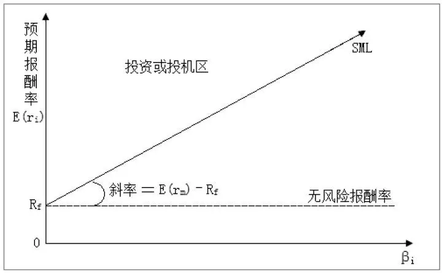

图1\-1 资本资产定价模型

证券市场线（SML）的斜率等于市场风险贴水，投资人的风险规避程度愈高，则SML的斜率愈大，证券的风险溢酬就愈大，证券的要求报酬率也愈高。当证券的系统性风险相同（用β来衡量），则两者要求的报酬率亦相同，则风险与溢酬的要求亦相同。

如同其他众多评估模型一样，CAPM也存在一些缺陷，比如该模型成立要满足一些前提条件，包括市场处于完全的竞争状态，投资者的投资期限相同，不考虑投资计划期之后的情况等。其次，β系数的确定较难把握，特别是投资时间的长短对该系数准确性的影响较大，通常在较长或较短时间内，β系数并不能充分表达股票的真实表现。对于单只个股来说，β值和回报率之间的线性关系在短时间内也不存在。

虽然如此，CAPM对风险与收益的量化评估，仍受到投资者的广泛关注和使用。在实际投资中，投资者可以通过β系数的大小，来判断风险与收益之间的放大关系。在整体市场向好时，选择那些β系数较大的个股，以便获取高于市场平均水平的额外回报。当整体市场处于熊市时，则选择β系数较小的个股，以降低市场下跌带来的风险。

对于风险和收益进行量化分析，其目的是让投资者找到投资的平衡点。也就是说，通过资本资产定价模型或者其他风险收益评估方式，可以找到投资收益相对于风险更大的机会。

如图1\-1所示，如果SML线是通过资本资产定价模型得到的一个风险与收益的平衡线，那么在SML的上方区间，可以视为一个投资或投机的区域。我们可以根据资本资产定价模型或者其他方式，找到风险与收益的价格平衡点，若股价低于此均衡价格，说明在承担较小或相同的风险情况下，可以获取同样或更大的收益。若股价上涨到平衡点的上方，则可以回避风险。

无论是价值投资还是风险投资，寻找风险与收益的平衡点，是投资者必须要做的功课。在股票投资过程中，风险和收益的平衡点有许多表现形式，既有以复杂的数据统计和运算得到的平衡点，比如前面介绍的资本资产定价评估模型，也有用简单的图形进行分析，从空间划分上寻找到的风险与收益平衡点。比如在技术分析中，最简单的莫过于通道理论中的风险平衡点，如图1\-2所示。

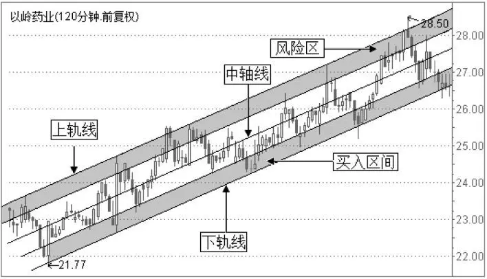

图1\-2 道理论中的风险平衡点

在图1\-2所示的这段股价运行行情中，股价在向上倾斜的通道内运行，这就是该股在这段时间里运行的趋势通道。利用股票的这种趋势性运行规律，就可以寻找短线投机或波段操作的风险与收益平衡点。

比如图1\-2中，可以将该通道划分为4个区间，通道的中轴线为这段行情的风险和收益平衡线，靠近下轨线的区间为收益机会大于风险机会的买入区间；相反，在上方靠近上轨线的区间则为风险大于收益的风险区。这样，利用图形的方式，通过空间分析，就可以确定股票投资风险与收益的关系，这也就是“看图说话”的技术分析方法。

对于风险与收益的量化分析，并非局限于以数据为主的基本面分析，在以图形为主的技术分析中同样存在，这些内容将在后面的内容中逐步展开。

__四、二八定律__

二八定律也叫巴莱多定律，是19世纪末20世纪初意大利经济学家巴莱多提出的。该定律认为，在任何一组事物里，最重要的只占其中一小部分，约为20％，其余的80％尽管是多数，却是次要的，因此又称二八法则。

二八定律揭示的是事物的普遍现象和规律，在社会学、经济学、管理学等许多领域都得到了广泛运用。其宗旨是提醒人们将主要精力和资源用在影响事物变化的关键部分，这部分只占全部因素的一小部分，比如20％。从哲学的角度来看，就是要用80％的资源解决只占全部因素20％的主要矛盾，用20％的资源去打理80％的次要矛盾。当然，其中的20％或80％并非是绝对数字，而是表达一种比率关系。

二八定律在股市中也非常实用，要想成为成功的股票投资者，首先就要做股市中的少数，加入到只占全部股民20％的人群里，因为只有20％的投资者能在股市中赚到钱。如何做股市中的少数，先来看看股市里的“二八”现象。

现象1： 股市里的投资者，能够赚钱的只占20％，80％是不赚钱的。因为只有20％的投资者在投资之前考虑出现与预期相反时的应对措施，而80％的人认为市场总是与预期相同。

结论： 股市投资的目的是为了赚钱，但前提是资金安全。

现象2： 20％赚钱的人掌握了市场中80％正确的有价值的信息，而80％赔钱的人因为各种原因，没有用心收集资讯，只是通过股评或电视掌握20％的信息。

结论： 要靠自己的辛勤劳动，独立进行思维判断，这样才能在股市中获胜。

现象3： 当80％的人看好后市时，市场已经接近顶部；低于20％的人看好后市时，股市已经离底部不远。

结论： 资金入场比率与投资者对市场的普遍看法相反。

现象4： 券商80％的佣金来自于20％短线客的交易，股民80％的收益却来自于20％的交易次数。因此除非有娴熟的短线投资技巧，否则不要贸然去参与短线交易。

结论： 获利多少与交易次数并没有关系。

现象5： 只占市场20％的大盘指标股，对指数的升降起到80％的作用。

结论： 研判大盘走向时，要特别关注指标股的表现。

现象6： 一轮行情只有20％的个股能成为黑马，80％的个股会随大盘起伏。

结论： 真正能够骑稳黑马的是缘分，要好好把握；不能骑上黑马也不要强求，做好自己的事。

现象7： 80％的投资利润来自于20％的投资个股，其余20％的投资利润来自于80％的投资个股。投资收益有80％来自于20％的交易，其余80％的交易只能带来20％的利润。

结论： 投资者需要用80％的资金和精力关注投资的最关键的20％个股和20％的交易。

现象8： 股市中20％的机构和大户占有80％的主流资金，80％的散户占有20％的资金。

结论： 投资者只有把握住主流资金的动向，才能获取更好的收益。

现象9： 成功的投资者用80％的时间学习研究，用20％的时间实际操作；失败的投资者用20％的时间实盘操作，用80％的时间后悔。

结论： 要善于总结学习。

现象10： 股价在80％的时间内是处于量变状态的，仅在20％的时间内是处于质变状态。成功的投资者用20％的时间参与股价质变的过程，用80％的时间休息；失败的投资者用80％的时间参与股价量变的过程，用20％的时间休息。

结论： 80％的资金或筹码只在20％的时间里出现变动，80％的时间应该让它们休息。

__第三节 经济环境与股市__

股票投资的风险与收益，直接受到股价变动和公司分红派息能力的影响，对于一般投资者来说，股价的波动是给投资者带来风险的最大和最主要因素。影响股价（股指）变动的因素，主要包括宏观经济层面的经济周期、财政政策、利率变动、汇率变动、物价变动、通货膨胀、政治因素、人为操纵等。从微观上看，行业景气度、企业的经营运转状况、个股炒作等因素，对相关板块或个股的股价影响也是巨大的。

__一、经济周期与股市周期__

经济周期是指总体经济活动的扩展和收缩交替反复出现的过程，也称经济波动。每个经济周期都可以分为上升和下降两个阶段。

经济周期对股市的影响是巨大且全面的。大家经常说股市是经济的晴雨表，经济的周期变动直接影响宏观经济的景气度，影响各行各业创造利润的能力，从根本上决定股价或股指的变化。股民所说的股市大趋势、大行情，基本都会随经济周期的转变而变化。大家进行股票投资，把握好经济周期的脉搏是最关键的因素，是战略性投资决策必须要考虑到的因素。

对于经济周期的划分，有两个阶段论和四个阶段论的说法，它们并没有本质的区别。前者是以经济的发展趋势为界线，将经济周期分为经济处于上涨时期的扩张阶段和处于下降趋势的收缩阶段；后者则以经济发展的正常水准划分，即高于经济正常发展水准的繁荣阶段和衰退阶段，低于经济正常发展水准的萧条阶段和复苏阶段。值得注意的是，经济的衰退阶段仍然保持在正常水准之上，而不是低于正常发展水平。大家通常提及较多的是四个阶段论，该理论将经济周期划分得更加细致。

一般说来，在经济回落时期，股票价格逐步下跌，股价跌至最低点。在经济上涨时期，股价逐步上升，直到上涨至最高点。这种变动的具体原因是，当经济开始衰退时，公司产品滞销，促使公司生产活动减少，利润相应减少，从而导致股息、红利分配也随之下降，持股的股东因收益下降纷纷抛售，导致股票价格下跌。

当经济衰退达到危机时，整个经济生活处于瘫痪状态，公司纷纷倒闭，股票持有者由于对经济发展形势预期悲观，纷纷卖出手中的股票，从而使整个股市价格大跌，市场处于萧条和混乱之中。

经济度过低谷后，又出现复苏的势头，产品销量随之会有一定的上升，这时又能给股东分发一些股息或红利，股东慢慢觉得持有这类股票会有收益，于是纷纷购买，促使股价回升。当经济由复苏达到繁荣阶段时，工业生产大增，产品畅销，公司盈利预期大增，股息、红利提高，股票价格上涨至最高点。

__1．经济周期两个阶段论__

①扩张阶段。 宏观经济环境和市场环境日益活跃，市场需求趋于旺盛，订货饱满，商品畅销，生产趋升，资金周转速度加快，企业处于较为宽松有利的外部环境中。失业率较低，CPI和利率逐步抬高。股票从低谷中恢复过来，趋势开始向上，上涨速度加快。一般情况下，在该阶段初期，成长性较好的股票会率先崛起，接着是周期性较强的股票上涨。在扩张阶段后期，许多质地较差的股票也开始疯涨。

②收缩阶段。 宏观经济环境和市场环境日趋紧缩，市场需求和企业生产逐渐下降，资金周转不畅。企业在供、产、销和人、财、物方面都会遇到很多困难，企业处于较恶劣的外部环境中。失业率上升，利率开始下降，CPI逐步回落。由于资金逐步撤离股市，股市处于熊市之中，成交量趋于萎缩，直至交易异常清淡。根据上海交易所的日成交量统计，股市最低迷时期与最疯狂时期相比，日成交量往往相差8～10倍。

__2．经济周期四个阶段论__

①复苏阶段。 该阶段是从萧条到繁荣的过渡时期，这时经济开始从谷底回升，但仍未达到经济发展的正常水平上方。开始时是前一经济周期的最低点，整体经济的产出和价格均处于最低水平。随着经济的复苏、生产的恢复和需求的增长，价格也开始逐步回升。宽松的经济政策发挥出促进作用，经济增长开始加速，通货膨胀继续下降。因为空置的生产能力还未耗尽，周期性的生产能力扩充也变得强劲，企业盈利大幅上升，央行也保持较为宽松的货币政策。此时投资股票是最佳选择。股市中的强势板块为金融、电信、消费，弱势板块为医药、信息、公用事业。

②繁荣阶段。 国民收入高于充分就业时的水平，其特征为生产迅速增加，投资增加，信用扩张，价格水平上升，就业增加，公众对未来预期乐观，是经济周期的高峰阶段。由于投资需求和消费需求不断扩张，需求超过了产出的增长，刺激价格迅速上涨到较高水平。企业生产能力增长减慢，开始面临产能约束，通胀此时也开始抬头。为了防止经济过热，央行加息以便将经济拉回到可持续增长的路径上来，此时的经济增长仍坚定地处于潜能之上。此时投资大宗商品期货是最佳选择。股市中的强势板块为能源、原材料、农业，弱势板块为消费、信息、金融。

③衰退阶段。 该阶段是从繁荣到萧条的过渡时期，这时经济开始从顶峰下降，但仍处于正常的经济增长平均水平的上方。经济周期高峰过去后，经济开始滑坡，由于需求萎缩，供给大大超过需求，导致价格迅速下跌，经济增长停滞。超额的生产能力和下跌的大宗商品价格，驱使通货膨胀率开始走低，企业盈利微弱，导致收益率曲线急剧下行。此时投资债券是最佳选择。股市中的强势板块为医药、信息科技、消费，弱势板块为金融、原材料。

④萧条阶段。 国民收入低于充分就业时的水平，其特征为生产急剧减少，投资减少，信用紧缩，价格水平下降，失业严重，公众对未来预期悲观。萧条的最低点称为谷底，这时就业与产量跌至最低。在经济周期的谷底，供给和需求均处于较低水平，价格停止下跌，处于低水平上。在整个经济周期演化过程中，价格波动略滞后于经济波动。经济增长开始下滑，但通胀却继续上升，企业为了保持盈利而提高产品价格，导致价格螺旋上涨；企业的盈利恶化，股票表现非常糟糕，此时持有现金是最佳选择。股市中强势板块为电信、消费、工业，弱势板块为金融、能源、公用事业。

反映经济周期的宏观经济指标很多，下面以众所周知的CPI和一般人较少关注的M1（狭义货币）为例，来分析宏观经济周期与股市的关系。

__二、居民消费物价指数（CPI）与股市__

居民消费物价指数（CPI）是根据与居民生活有关的产品及劳务价格统计出来的物价变动指标，通常作为观察通货膨胀水平的重要参考。通过CPI的变化，能大致判断出经济运行的方向和货币政策的变化，从而判断资本市场的涨跌趋势。

__1．衰退阶段__

衰退阶段，CPI降低，GDP（国内生产总值）增长停滞，货币政策开始放松，股市受实体经济影响开始向下，此时不宜进行风险较大的股市投资，或者尽量避免投资周期性较强的股票，适度配置成长性较好的大消费类股票。风险最小的债券作为投资对象比较适宜。

__2．萧条阶段__

萧条阶段，CPI继续降低，GDP增长加速，货币政策保持宽松。这个阶段最宜配置股票资产，是战略性中长线配置股票的最佳时机。

__3．复苏阶段__

复苏阶段，CPI开始增长，GDP继续增长，货币政策开始收紧，股票市场仍有良好表现，个股表现活跃，板块轮动性强，波动幅度大，是中短线股票投资的理想时期。不过此阶段股市整体风险逐步积累加大，一般情况下并不是中长线投资的最佳买入时机。

__4．繁荣（滞涨）阶段__

繁荣（滞涨）阶段，CPI继续上升，GDP增长下滑，货币政策持续收紧。此时原则上不宜进行股票投资，资金可着手向债券市场转移。

图1\-3是2001年1月到2012年5月的CPI月数据与上证指数同期月收盘价的走势对比图。

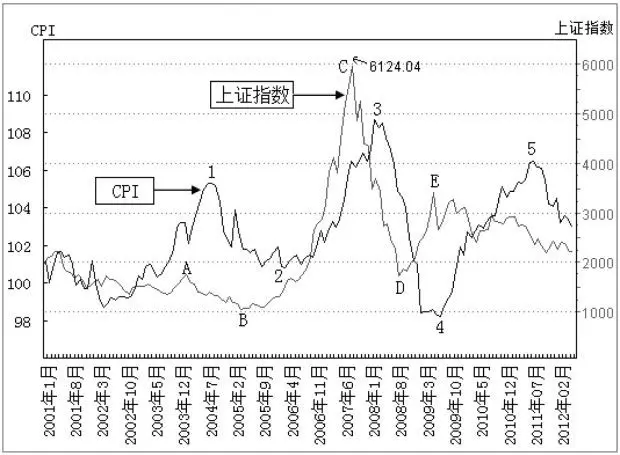

图1\-3 CPI与上证指数同期走势对比图

图1\-3中，用字母A至E表示上证指数每个阶段的高点和低点，用数字1至5表示CPI每个阶段的高点和低点。

对图1\-3进行平滑处理后，可得出图1\-4，该图较清晰地显示了CPI与上证指数周期波动之间的关系。依据股市与CPI运行周期的不同，可以将投资者的投资情绪或股市热点划分为“冷清”、“犹豫”、“疯狂”和“恐惧”四个阶段。冷清时对应的CPI显示经济处于萧条与复苏过渡的过程中，犹豫对应的是经济复苏向繁荣转化的时期，疯狂是经济出现繁荣后的情绪表现，股票市场出现恐惧时，经济已经出现向下的拐点，开始进入到衰退期。

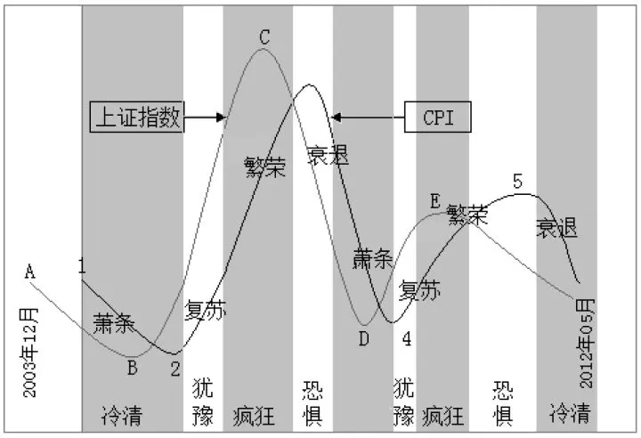

图1\-4 CPI与上证指数波动周期对比图

从图1\-4中可以看出，股票市场提前于CPI代表的经济周期进行波动，这也说明股市是经济发展的晴雨表，能够提前反映经济的运行状况。了解了股市与经济周期之间的关系，对于股市投资的指导作用是非常重要的。

虽然股市提前于经济周期作出反应，但经济是股市发展的基础，对股市的趋势性发展起到决定性作用。股市的“晴雨表”作用，是建立在投资者对未来经济发展预期方向之上作出的反映。

经济周期与股市之间的关系，给投资者带来的启示是“多一份冷静”，在经济发展处于繁荣后期时，通胀问题已经成为政策直接针对的矛头，股市开始在高位徘徊，个股进入疯狂的炒作阶段，此时，投资者需要将风险控制作为首要任务，逐步减少投入股票的资金，也就是降低股票投资的仓位。当CPI已经下降到合理范围以下（作为发展中国家，一般认为CPI合理范围在3％左右，并与央行一年期存款利率相当），说明经济已经基本见底，经济进入恢复阶段，股票投资者此时不必再有恐慌情绪，而是应该着手进行战略性投资布局。

__三、M1和M2与股市__

不同的宏观经济指标，与股市走势的节奏存在一定的差别，比如反应货币供应量的M0、M1及M2指标。M0是市场中流通的现金总量。M1是狭义货币，指社会流通货币总量加上商业银行的所有企业活期存款。M1反映居民和企业资金松紧变化，是经济周期波动的先行指标。M2是广义货币，指M1加上居民储蓄存款和企业定期存款，它反映的是社会总需求的变化和未来通货膨胀的压力状况。

M1和M2是经常用来分析宏观经济中货币宽松程度和趋势的指标，它们与股市之间有着非常密切的关系。大家知道，股市的涨跌直接受到资金进出的影响，整个市场资金宽松，进入股市的资金增加，就会推动股市上涨；相反，如果整个市场资金紧缩，股市里的资金也会出现流出大于流入的状况，导致股指或股价下跌。

M1、M2与股市是相互影响的关系，如果股市赚钱效应明显，就会促使投资者将受益较低的固定存款等其他投资资金转移到股市，从而增加M1的总体数量。相反，股市没有赚钱效应，资金就会撤离股市，投入到其他较固定的资产中去，从而降低M1的总体数量。因此，M1与股市大的发展变化趋势应该是正相关关系，不像CPI指标的波动滞后于股市的变化，而是提前反应宏观经济形势，与股市的变化是同步或略有提前的。

图1\-5是2003年1月到2012年5月M1每月同比增长率与上证指数月K线之间的关系。从图中可以看出，M1同比增长率与上证指数基本保持同步变化的关系，有时略提前于上证指数见底或者见顶。

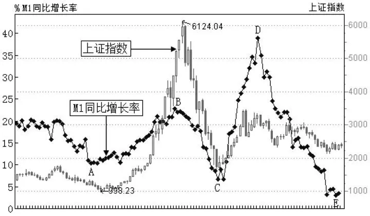

图1\-5 M1同比增长率与上证指数变化对比图（2013年1月至2012年5月）

图中M1在2005年3月的同比增长率为10\.4％，此时M1增长率见底，如图中的A点位置，上证指数在同年6月于998\.23点见底，M1同比增长率要领先于股市3个月见底。

2007年8月，M1同比增长率见顶值为22\.77％，如图中B点位置，上证指数在10月见顶，指数为6124\.04点。

2008年11月，M1同比增长率在C点见底（6\.63％），与上证指数见底时间基本一致。

比较特别的是2010年1月，M1同比增长率达到历史最高值38\.96％，而上证指数则在2009年8月见顶。这是因为“4万亿元”救市措施对流动性产生重大影响，市场流动资金出现爆发性增长，在资金的推动下，股市出现了资金推动型上涨。由于经济实体的运行性质并没有发生根本性的改变，因此股市也无法延续上涨趋势，这也说明股市的基础是经济实体的增长能力，人造“牛市”是无法长久的。

由于过剩的流动性影响，持续推动CPI上涨，在经济发展速度放缓的情况下，通货膨胀在较长时间里并没有得到有效控制，以至于在后来相当长的一段时间里，控制物价成为宏观经济的首要任务，造成宏观经济调控出现了既要稳增长又要控通胀的局面，对宏观调控形成了双重压力。为了防止通胀，控制CPI，管理层采取了一系列的财政政策和货币政策，收紧货币流动性，这就导致在M1同比增长率的走势图中，出现了从C点到D点的直线上升，以及从D点到E点的快速下降走势。

对此次4万亿投资的救市政策，这里不作过多的评价，但是它对股市的影响是巨大的，A股走势在一定程度上脱离了与经济周期之间的正常关系。从图1\-5中可以看出，2012年4月M1同比增长率（3\.08％）达到了10年来的最低点，CPI增长率也回到了3％，这个结果可以说是通过艰苦的努力才实现的，股市在这个过程中自然也无法摆脱整个宏观经济调控的束缚。

__四、利率与股市__

利率的波动，无论是对宏观经济，还是对股票或期货、汇市等金融产品，以及对每位普通老百姓，都具有较大的影响。这种影响既可以是较长远的影响，也可以造成短期的波动。因此在宏观经济波动理论中，专门有一种货币理论，该理论认为以短期利率为核心的货币市场表现，影响着经济周期的运行，这足以说明利率在当今经济社会中的重要地位。

在股票投资中，大家也要学会利用利率的变化来判断宏观经济的现状和发展趋势，寻找宏观调控的政策方向，用以捕捉短期、中长期的投资机会，同时控制投资风险。

利率又称利息率，表示一定时期内利息量与本金的比率，通常用百分比表示，按年计算则称为年利率。利率是单位货币在单位时间内的利息水平，表明利息的多少。

利率通常由国家中央银行控制，是宏观经济调控的重要工具之一。当经济过热，通货膨胀上升时，中央银行便提高利率，收紧信贷，减少货币供应，抑制经济的恶性发展。当过热的经济和通货膨胀得到控制时，管理层会把利率适当地调低。在经济萧条时期，管理层会降低利率，扩大货币供应量，以刺激经济发展。

利率的总水平要适应大多数企业的负担能力，也就是说，利率总水平不能太高，太高了大多数企业承受不了；相反，利率总水平也不能太低，太低了则无法发挥利率的杠杆作用。

利率变化对于股市产生的作用不能一概而论，要具体情况具体分析。如何看待利率波动给股市带来的风险和机会呢？可以从以下几个方面来考虑。

__1．利率变化是否改变主流资金的流向__

首先要看利率变化是否打破投资收益与风险的平衡点。如果利率上调，但经济增长速度远高于利率水平的上调，那么企业的盈利大于贷款支付的成本，投资者仍然会选择投资股市，因为股市投资带来的收益大于存款利息，受利益的驱使，资金仍然会流入股市，股指或股价仍然会出现上涨。

如果下调利率，但经济增长仍然没有出现明显强于利率水平的上涨，那么投资者也不会冒险投资于股市，而愿意选择更安全的利息收入或进行其他更可靠的投资，这样资金就会继续撤离股市，股指和股价照样会出现滞涨或者下跌。

__2．利率变化改变了上市公司的内在价值__

利率的变化，首先反映在企业的财务成本上。贷款利息上涨或下降，自然会加重或减轻企业的利息负担。其次是影响上市公司的估值，这是因为利率的变化会改变企业的现金流量，而现金流量是影响上市公司估值的重要因素。

股票的内在价值与一定风险下的贴现率成反比关系，如果将银行间拆借、银行间债券与证券交易所的债券回购利率作为参考的贴现率，则贴现率的上扬必然导致股票内在价值降低，从而使股票价格相应下降。股指或股价的变化与市场的贴现率呈现反向变化，贴现率上升，股票的内在价值就会下降，同时股指也将下降；反之，贴现率下降，股价指数就会上升。

__3．利率调整对股市影响的时间效应__

通常认为，加息利空股市，降息则利好股市。实际上，利率的调整或许在事件发生的短暂时间里会刺激市场的交易行为，但它对股市的走势并不能产生实质性的影响。

利息的调整并不是决定股市走向的最关键因素，只是整个宏观经济调控中的关键工具和因素。真正决定股市走向的，还是宏观经济的发展趋势、企业的盈利能力和投资者对未来经济发展的信心。因此，对于利率调整带来的市场影响，最好是从更加宏观的角度来分析经济的发展趋势和政策导向，不能作为股市投资的决策依据，更不能采取“加息就卖，降息就买”的死搬硬套的做法。

图1\-6是央行一年期存贷款基准利率与上证指数的变化对比图。基准利率是央行公布的商业银行存款、贷款、贴现等业务的指导性利率。从图中可以看出，利率的变化与股市的走势并非是简单的反向关系。

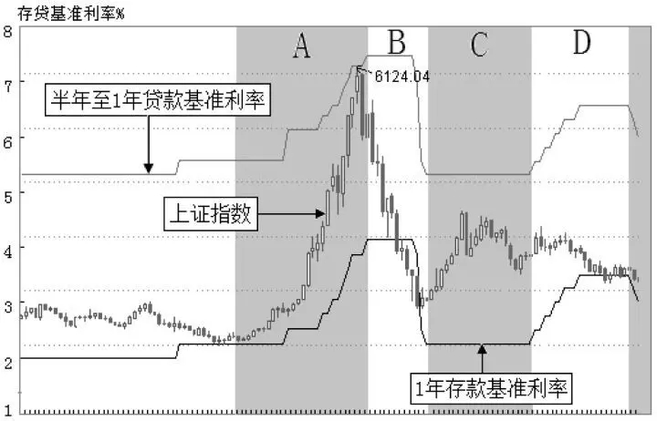

图1\-6 央行存贷款基准利率与上证指数走势对比图（2002年2月至2012年7月）

图中的A区和B区，两者基本处于同向变化，即利率上调，股市也上涨；C区的利率没有发生变化，但股市也出现了一波中级行情；D区则出现了利率与上证指数相反的走势。

前面讲过，利率主要用于宏观调控，特别是对CPI和货币流动性的调控。当CPI出现通胀，市场货币流动性过剩，或者CPI过低，出现通货紧缩，市场货币流动性不足时，利率和存款准备金率是最重要的货币政策调控工具。利率是通过对宏观经济进行调控来影响股市的，而并非直接针对股市。股市存在的本质是为实体经济服务的，只有实体经济发展良好，股市才有上涨的空间。对于这一点，投资者需要牢记在心。

__4．利率调整对不同性质的公司产生不同的影响__

资金借贷行为发生在不同领域，有的公司是借方，有的公司是贷方，它们在利率调整中的收益刚好处于相反的情形。比如降息有利于贷款的企业，却不利于银行等行业。

另外，不同的公司因自身的现金流量不同，借贷资金数量也不一样，利息的变动对资产负债率较高的公司来说，其影响要大于负债率较低的公司。因此，在利息变动时，要更关注这些受利率影响较大的公司的风险。

比如，2012年7月6日，央行下调金融机构一年期存款基准利率0\.25个百分点，一年期贷款基准利率下调0\.31个百分点。对于股市来说，这一政策总体被认为是利好，因此A股出现了普遍上涨。但香溢融通（600830）却出现了破位下行，这个划归商业百货板块的个股为什么大跌？原来该公司的主营业务为担保、租赁、典当、商贸服务、房地产开发等，其中典当和委托贷款为公司类金融业务的主导。存贷利率下调利空该企业，因此该企业股票3天的时间内下跌15\.5％，这就是降息给该股带来的风险。

__5．利率对投资者的心理影响__

包括股市在内的任何金融产品投资市场，投资者对利率的变动总存在或多或少的预期，特别是在市场将要出现拐点时，投资者对利率变化的预期，会表现在市场的短期走势上。

市场对利率调整的反应程度，往往取决于利率的实际调整幅度是否与市场预期相符。如果市场能够准确预期利率变动的方向和幅度，那么在利率变动之前，股价就已经反映了利率的变化。一旦利率调整兑现，股市反而会向相反的方向运行，这也就是所谓的利好或者利空出尽。如果结果与预期产生较大的差异，这时利率调整才会对股市产生较大的影响。

这种分析方法同样可以用于判断其他预期事件。比如在股市中，有许多个股公布了预期的利好或利空，包括重组预期、资产注入预期、业绩预期、合同预期等，股价的变动往往会在结果公布前已经得到反应，一旦结果与预期相违背，股价就会出现大幅波动。这也是事件驱动因素对股价产生的影响，后面的内容将会对此进行详细讲解。

__五、股市与债券__

股票和债券都属于有价证券，是虚拟资本，本身无价值，但都是真实资本的代表。股票与债券是公司或机构筹措资金的手段，也是投资者投资的对象。如果市场是有效的，债券的平均收益率和股票的平均收益率会大体保持相对稳定的关系，其差异反映了两者风险程度的差别。

前面提到过，债券市场与股市一样，都可以反映宏观经济运行的情况，同时它们之间相互产生影响，即债券市场可以影响股市，因此对债券市场的观察研究，可以判断股市当前的性质和未来发展方向。

一般情况下，债券市场与股市之间会产生跷跷板效应，即债券市场向好时，股市往往处于低迷状态。当资金向债券市场转移，资金流出股市时，说明股市风险凸现，一般投资者即使不投资债券市场，也需要控制股市投资风险。

为了说明债券与股市的跷跷板效应，下面以国债与股市间的走势为例进行讲解。国债是债券的一种，由中央政府发行，称为中央政府债券，简称国债。国债是中央政府为筹集财政资金发行的一种政府债券，是中央政府向投资者出具的承诺在一定时期支付利息和到期偿还本金的债权债务凭证。由于国债的发行主体是国家，所以它具有最高的信用度，被公认为是最安全的投资品种。当市场资金对宏观经济持悲观态度时，国债往往成为这些资金的避风港，因此国债价格的变化，在一定程度上反映出市场的风险。作为风险投资性质的股市，如果股市的风险积累到一定程度，资金（特别是大资金）就会逐步从股市里撤出，转移到国债等债券市场。

21国债（7）（债券代码010107），2001年7月31日发行，期限为20年，年利率是4\.26％。图1\-7为上证指数与该国债价格对比走势图。

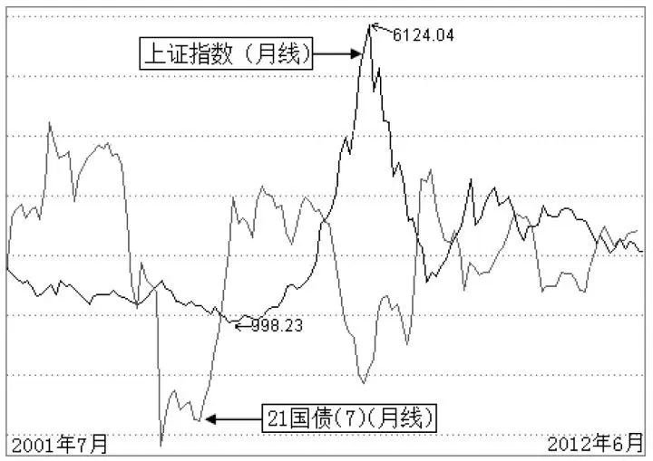

图1\-7 上证指数与21国债（7）价格对比走势图

图1\-7很明显地反映了上证指数与21国债（7）的跷跷板效应。

图1\-8是2011年国债与股票成交量对比走势图，从成交量也可以看出，国债市场与股票市场存在跷跷板效应。

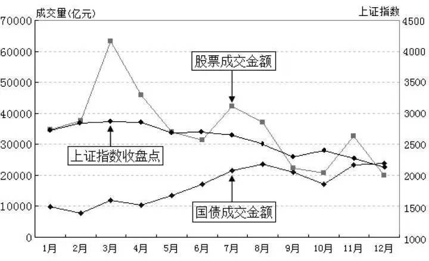

图1\-82011年国债与股票成交量对比走势图

股价变动不仅随经济周期的变化而变化，同时也能预示经济周期的变化。人们投资股票市场，实质上是对未来经济发展的预期进行投资，当这种预期发生改变时，股市就会出现方向性的改变，此时的实体经济可能处于发展的顶峰时期，未来将面临衰退，因此造成股市提前于实体经济下跌。同样，当经济处于低谷时，投资者认为实体经济已经或即将见底，未来经济将会复苏，投资价值已经显现，从而提前开始进行战略性投资布局，这样股市就会先于实体经济的复苏走出低谷。因此股市的波动往往会超前于实体经济的波动。

了解股市与实体经济的波动关系，可以更加准确地把握住股票的投资节奏，衰退期投资策略以保本为主，将风险放在收益之上，尽量减少投资仓位，减少投资频率，降低收益预期。在经济周期进入复苏阶段时，则加大风险性投资，逐步提高投资仓位。当经济进入繁荣期时，可以将风险投资提高到自己能够承受的最高水准，让收益实现最大化。

__六、行业轮动__

在股市中，行业板块间的轮动是投资者最着迷的现象，短线和波段投资或投机者无不为板块的轮动花费心思。如果在一轮行情中抓住了这种板块轮动效应，就会获得不菲的超额收益。

那么什么是行业板块的轮动现象呢？这要从两个方面来认识，一方面是宏观层面，即受经济周期影响的板块轮动；另一方面是反映到市场交易上的板块轮动，即资金在市场交易中兴风作浪，在板块之间轮番炒作而形成板块轮动。

__1．行业轮动与股市周期和经济周期的关系__

前面已经简单介绍过经济周期的形成和演变过程。在每一轮经济循环中，由于行业的性质不同，它们的景气度随着经济周期波动的时间阶段也会不同。货币是市场经济的最基本元素，也是影响经济周期的关键因素，政府对宏观经济的调控最终会体现在货币上。

首先通过货币的变化，来研究一下整个经济周期中各个行业的变化。假设经济已经处于萧条低谷，此时为了拉动经济复苏，首先就要刺激消费，向市场加大货币的流动量，这样货币政策就会放松，此时金融行业就是关键。

政府通过银行等金融业向市场供给资金，货币不断地流入市场，人们口袋里的钱增加，开始选择购买自己钟爱的商品。随着购买力的日益增加，企业库存开始下降，资金开始回笼，企业也开始提高生产规模。

一旦企业的生产能力增加，就需要购买生产商品的原材料，这样就刺激了资源类商品价格上涨和相关企业的盈利能力。此时这个经济链条就会被激发，个人家庭生活和企业生产经营都对能源的需求上升到高峰，因此能源电力会出现短缺，相关行业开足马力生产，企业经营状况达到高峰。整个社会都“有钱”了，政府会将过剩的流动资金往公共事业方面引导，公共事业类企业将受益。

随着扩大再生产无止境地加大，产品开始过剩，库存积压，通胀来临。此后控制通胀成为宏观调控的首要任务，因此利率上升和存款准备金率等开始上调，市场资金流动性出现收缩，相关企业受库存积压、财务负担加重等的影响，盈利能力开始下降，整体经济下滑。此时受经济周期影响较小的日用消费品行业相对凸显出来，因为这些企业生产的产品是人们赖以生存的必备品，比如食品、饮料、日用杂货等，这些相关企业的股票就会成为这个时期的强者。

随着经济进一步紧缩，到极度萧条时期，失业率上升，人们手中的钱越来越少，节俭的生活和糟糕的心情影响着人们的健康，吃药看病的概率上升，医药行业成为此时的香饽饽。此时往往CPI已经回到正常水平以下，这为宏观政策放松货币流动性提供了基础，因此新的一轮刺激经济发展的政策开始出现。

这是对一轮经济循环的简单描述，这里并不是讨论经济周期，而是研究在经济周期循环过程中行业的轮动情况。根据以上描述，可以得出行业轮动与股市和经济周期的关系，如图1\-9所示。

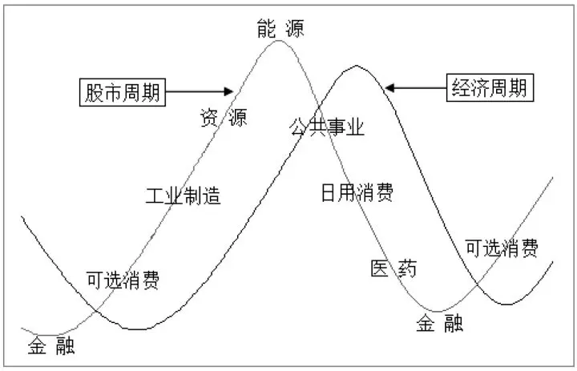

图1\-9 行业轮动与股市和经济周期的关系

图1\-9中的两条曲线分别表示股市运行周期和经济运行周期，股市的运行相对于经济周期要快。根据经济的扩展和收缩周期看，理论上各行业随着经济周期的波动产生的景气程度，刺激相关企业的盈利能力发生波动，最终引导行业或企业的股价产生周期性波动，这样也就形成了股市中的板块轮动效应。根据这种轮动效应，投资者掌握板块轮动节奏并参与投资，就会获得超额收益。

从图1\-9中还可以看到，经济周期的变化与股市中各板块轮动存在如下对应关系。

①经济周期处于萧条期，股市基本进入筑底阶段，此时适合投资金融板块。

②经济周期处于萧条后期及恢复前期，股市基本完成了筑底并开始抬高，此时可以投资可选消费。所谓可选消费，就是非生活必需品的消费，比如旅游、汽车、电器、家具、装修、服装等。

③当经济进入恢复期后期和繁荣期前期阶段，可以投资工业制造等相关板块。

④当经济进入繁荣期，可以开始投资资源类股票，包括能源类股票。

⑤当经济处于繁荣期后期接近拐点时，则可以投资公共事业相关股票。

⑥经济开始衰退后，则首先要避免强周期性行业股票的风险，比如前面所讲的工业制造、资源、能源，包括金融等个股。原则上最好是避开股市投资。如果有局部的机会，可以参与日用消费类股票或医药类股票，这类股票被称为防御型股票。

以上是以经济周期中行业演变过程来分析股票的板块轮动的，股票市场与经济联系得越紧密，或者说股市的市场作用越有效，这种轮动作用也越有效。比如在较成熟的美国股市，这种轮动现象非常明显，在我国A股市场，这种轮动效果就相对较弱，板块轮动的时间周期界限不是很明显，但总体轮动还是与经济周期循环相一致的。

从理论上了解产业轮动节奏，对股市投资有非常重要的宏观指导意义，主要表现在以下三个方面。

①规避投资风险。根据板块与经济周期或股市周期的关系，避免在不恰当的时机投资不恰当的板块。

②有助于选股。根据板块的轮动周期，可以指导选择较为强势的板块，寻找龙头股。

③获取超额收益。这一点对于中线波段操作的投资者更有帮助。

__2．市场交易因素引起的板块轮动__

这里所说的市场交易因素，是指由于参与股市交易的总量资金有限，资金围绕不同的事件热点，对相应板块进行轮番炒作。这些事件和热点会形成一种所谓的概念类股票，这些股票组合的板块可以是跨行业的，也可以是某行业的细分，或者是以地域作为划分依据。

市场交易因素引起的板块轮动效应，有些具有一定的规律性，有的则随机性较强。一般认为这种板块轮动的时间周期较短，风险控制难度较大。对风险进行控制的工具，主要是依靠技术层面的分析，同时兼顾基本面分析。

资本是追逐利润的，在股市中也一样。当资金围绕某一热点推高某一板块或某些板块后，随着差价增大，收益增加的同时，风险也在增加，于是资金就开始撤出，流入其他价位相对较低的低风险板块，借助新的（或延续原有的）热点主题进行炒作。

根据市场交易行为现象，可以从以下几个方面来分析市场交易中的板块轮动。

①股市行情的发展演变。 可以将每轮较大级别的上涨行情分为四个阶段，在第一个阶段，蓝筹股、绩优股以及成长性较好的所谓白马股表现会较强。第二个阶段中，二线蓝筹股、细分行业的龙头股，以及次新股的表现机会较多。第三个阶段，主要是有未来题材的科技股、国家政策扶持的创新品种、低价股等进行表现。第四个阶段，各种业绩较差的题材股、低价股开始上台表演，其中资产重组及资产注入等题材往往成为流动资金逐利的对象。

②板块之间的信息传递引起的轮动。 在各行各业间，企业与企业之间，都存在着或多或少，或直接或间接的关联，比如产业链的上下游分布、竞争、替代或互补等。当某一驱动事件出现时，资金会沿着这些信息传递路径逐一向下传导，并影响板块之间的轮动。比如国际原油价格大涨，就会传递到以原油为原材料的公司：由于生产成本增加，对未来的盈利能力预期产生负面影响，这类股票的股价就会下跌。而能够替代原油的煤炭、新能源、棉花等产品的生产公司就会从中受益，股价存在上涨的可能。一旦煤炭、新能源等公司扩大产能，那么相关的机械设备制造公司订单会增加，这些公司就会受益。这样原油价格大涨的信息向下传递，与之相关的板块或个股就会逐一受到影响。

③政策带来的板块轮动。 在A股市场中，政策对股市的影响是非常有效的。投机资金利用政策来带动大大小小的热点，即使在熊市，这种政策性轮动炒作也经常发生。

当政策扶持某个产业领域，就会有首先获利的板块和随后获利的板块。比如新能源汽车扶持政策，该产业价值链会围绕最为核心的电池业务展开，并逐步延伸至电气系统（驱动电机、控制系统）、整车（乘用车、客车）以及上游资源（锂、稀土）领域，这样就围绕该项政策形成了股票市场的板块轮动。当然这种轮动并非是严格地按照产业链条的顺序进行的，市场内的资金会选择最有利的方向展开，比如企业或板块的估值，其他个别相关因素的刺激，炒作资金参与的多少等。

④地域性板块轮动。 “看地图炒股票”，是对2010年游资推动的地域性板块轮动的最好描述。海南、西藏、新疆、成渝、广西等地域板块个股借“振兴计划”轮番炒作，天津、上海、深圳、北京借“科技创新”题材进行炒作，该地域板块个股当年在市场上都有所表现。

2012年初，实体经济资金短缺，股市已经步入低谷，但游资借温州金融创新题材进行炒作，从温州板块开始向深圳、上海、北京、武汉等地域的相关个股展开轮番攻击，发动了一轮短线热炒，许多个股连续涨停甚至翻番。这些例子说明，A股市场中的地域性板块轮动时常可见。

以上是从市场交易因素，或者是资金炒作意图来归纳的几种板块轮动规律。事实上，市场因素引起的板块轮动虽有迹可循，但准确捕捉到其轮动脉搏并非易事。首先是因为这种轮动的驱动因素随机性较强，其次是轮动节奏较快，再次是相关个股难以捕捉。因此参与这类投机的投资者要承受较大的风险，一旦没有掌握好买卖节奏，追高买入，加上没有做好风险防范，或者没有执行好风险纪律，就会造成非常严重的损失。

__七、上市公司与股价__

个股股价的最终决定因素是上市公司基本面，是公司的盈利能力和未来发展空间。从量化分析的估值来看，股价是对上市公司现金流量折现值的反映，并非是交易市场的交易决定股价的高低。用最经典的价格与价值的关系来解释，就是上市公司的价值决定股票的价格，股价围绕价值波动。

在投资股票时，公司的价值大小是投资者（特别是稳健的投资者）需要关注的核心因素，因为它既代表投资的预期收益大小，也说明投资存在的风险程度。最典型的例子就是贵州茅台（600519），该股多年来都是A股的第一高价股，这是因为该上市公司的价值决定了股价，并且随着公司价值的提升，也支持股价进一步上涨。这说明股价高不高，风险大不大，与股价本身是没有关系的，关键是看企业的业绩是否能够支撑股价保持在高位或者继续上涨。

评价上市公司的基本面，需要对多个项目和因素进行分析，如财务分析、行业分析、产品和市场分析、公司文化和管理层素质分析等，其中财务分析是核心。通过对企业财务报表进行分析，可以判断公司的盈利能力及变化，通过估值来评价当前股价的风险程度。财务分析主要通过资产负债表、利润表、现金流量表，以及根据相关财务比率来分析公司的基本面。

对上市公司基本面进行分析，分析内容一般包括以下五项。

__1．企业的价值与风险__

这是基于企业的整体资产结构，对企业的当前价值和存在的风险进行评估。资产价值有两种不同的表现方式：账面价值和市场价值。账面价值可以看成是股票的当前价值，市场价值可以认为是股票价格，价格是否合理，要对比企业的当前价值和未来价值进行判断。

企业风险无处不在，风险大小直接影响企业的经营效率和股价的涨跌。如果企业无法控制风险，会引发经营业绩急剧下滑甚至倒闭，对于投资者来说，最直接的影响就是股价暴跌或上市公司退市。

分析企业价值与风险的财务指标有资产负债率、流动比率和速动比率等。

__2．企业运营效率__

评价企业运营效率的指标包括资产周转率、流动资产周转率、应收账款周转率、存货周转率等，它们反映了经营者利用企业各项资产的效率，反映公司的整体管理能力。

运营效率越高，说明企业利用单位资源在单位时间里能够为股东创造更多的收益，股价表现也就越好。反之，这些指标较差，则说明公司的管理能力和运营效率较低，股价的风险程度较大。

__3．企业盈利能力__

对于投资者来说，这部分指标应该是最受关注的，因为它们的表现会直接反映到股价的涨跌之中，因此目前用于评估股价风险的指标大部分都与此有关，比如大家熟悉的市盈率、每股收益、净资产收益率等，这些指标直接反映企业的盈利水平和能力大小。每当财务报告出炉时，这些指标经常成为推动股价上涨的动力或导致股价下跌的杀手。

__4．企业盈利质量__

企业盈利质量是指盈利的真实性和盈利的持续性。关于盈利质量分析，主要是对企业现金流比例进行分析。大家投资股票时，经常说“落袋为安”，意思是股票没有变成现金，赚得再多也只是账面游戏，其实公司也一样，公司的盈利情况再好，如果没有变成实打实的现金，那也只是账面数字而已。

要知道企业的盈利是否真实可靠，股价是炒作还是真实的价值表现，对于投资者制定投资策略和控制风险十分重要。对于这部分的财务指标，投资者可以着重参考净利润现金含量比率、销售收现比率以及自由现金流量等。

__5．企业发展前景及评估__

对上市公司股价进行评估，是专业投资者必须要做的功课，投资机构也经常发布对上市公司的评估和评级，对企业的成长性和股价的合理性进行评价。企业有多大的成长速度和成长空间？股票的未来价值有多少？当前股价是否高估或者低估？这些都是基于对上市公司的综合分析后，通过科学的评估方法，对公司的创收能力和股价进行量化分析得出的结论。依据量化评估结果，对比当前股价，就可以确定投资的风险程度。

关于上市公司的价值分析，笔者在《股票投资的24个关键财务指标》一书中做了详细的讲解，读者可以根据需要参阅。

__八、事件驱动下的股市__

事件驱动的含义是广泛的，从微观到宏观，从个股到整体股市，从一日游行情到整个行情的启动等，既包括规律性的驱动事件（如财务报告、重要的周期性会议、季节等），也包括突发事件（如政治事件、天灾人祸、行业或公司公告等）。

事件是影响股市最频繁、最难以量化的因素，也是投资者最为关注的因素，目前对事件驱动的研究越来越多，并逐步形成了一种投资策略。

事件驱动型策略，也被一些人称为主题投资，是指投资者对某些事件进行评估，就该类事件对股市产生的影响进行量化分析，比如影响范围大小，影响时间长短，以及对股市产生震动的幅度，并对受影响的相关板块及上市公司的股价进行评估，最终得出投资决策。

__1．不同事件对股市的影响__

①突发性事件驱动。 突发性事件分为利空因素和利好因素。当市场对事件没有预期时，比如突然宣布利率或存款准备金率变动，发生天灾人祸，公司发布公告等。

在事件驱动下，股价或股指会有一波短暂的急剧波动，利好会推动股市上扬，利空则使股价或股指急速下跌。随着时间的推移，市场逐步消化事件，影响就会逐渐恢复平静。

事件性质的不同和影响力度的大小，还会对股市的中长线起到不同的作用，有的影响很短暂，有的则可能改变原有的运行趋势。如图1\-10所示。

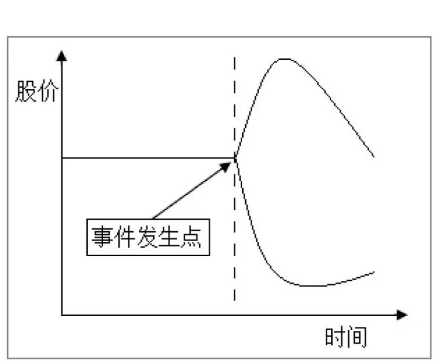

图1\-10 突发性事件对股价走势的影响

②有预期的事件驱动。 预期也可以分为利好和利空预期，在利好预期下，股价一般会在事件发生点提前做出反应。在利好预期驱动下，股价往往会被缓缓推高。当事件发生时，股价有两种表现，事实结果好于预期，股价会加速上行（一般是最后一轮上涨行情）；如果结果与预期一致，那么利好兑现后，股价一般会温和下跌；如果利好预期落空，股价则会出现大幅度回落。如图1\-11所示。

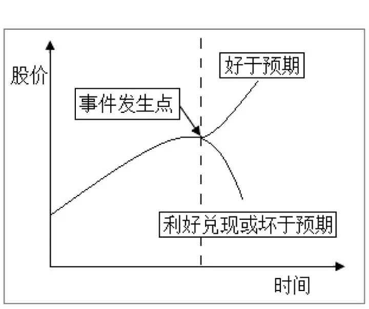

图1\-11 利好预期事件对股价的影响

利空预期与利好预期相反，在利空预期事件发生前，股价往往会缓步下跌，如果实际结果好于利空预期，股价则会出现恢复性上涨；如果结果比预期更坏，股价则会向下破位，加速下跌。如图1\-12所示。

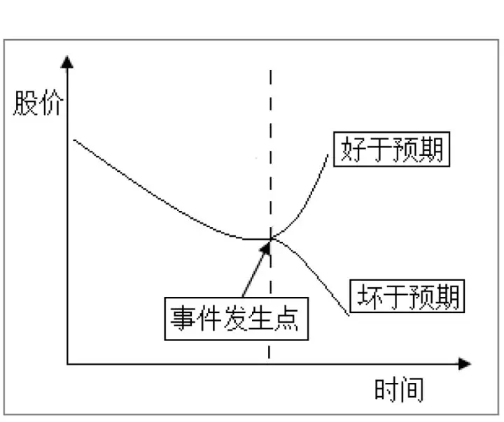

图1\-12 利空预期事件对股价的影响

__2．事件驱动的特点__

①高风险高收益。 事件驱动因素往往会引起股价波动加大，既带来超额收益机会，也承受着巨大的风险。因此在参与事件驱动下的炒作投资时，最重要的是做好控制风险的计划，“获利了结，见好就收”是操作的核心。

②主题与概念清晰。 以某种“主题”和“概念”为主线，没有明显的传统行业板块划分。事件驱动的对象一定是对整体或行业或上市公司的经济、盈利带来变化，特别是依据某些重大事件或某种预期，如国家产业政策、重大区域事件等进行投资机会的挖掘，从而引发投资热点，如公司重组、收购、兼并和破产等。事件驱动型投资一般不对公司进行价值分析，主要是评估事件对市场的影响力，以此来确定投资的价值。

③突发性越强，对股市的影响越大。 突发性事件往往以消息、新闻、公告、突发事件等形式引发，因此事件驱动的相关股票就包括所谓的消息股、题材股。事件的突发性越强，对股价的影响力度就会越大。比如，如果一家公司很少发布公告，某日突然发布一项市场意想不到的影响公司盈利或发展方向的公告，那么它的震撼力就会比经常发布类似公告的公司要大得多。投资者在进行短线投资时，需要留意事件突发性较强的股票，如果是利好，股价的涨幅也会较大，持续时间较长；如果是利空，那么该事件带来的风险也会较大。

④时间性较强。 事件对股价的影响都有时间的界限，随着时间的推移，事件对股价的影响也会发生变化。对于利好预期类事件，投资者要对事件的可信度、发生的概率进行评估，最好提前计划，提前布局，一旦利好兑现，事件的驱动力也就基本消失。

对某些利空预期的股票，如果股票本身质地非常好，股价配合利空预期回调到技术层面的关键位置，此时要针对利空的打击力度是否符合预期进行分析，可以抓住“利空出尽”所带来的报复性上涨机会进行投资。

突发性事件的影响往往是一次性的，就像一个乒乓球落地，第一时间会产生最大的反弹，之后就会逐渐衰减，直至恢复平静。

__3．事件驱动投资决策流程__

①趋势判断。 股市投资最重要的是顺势而为，这也是技术分析的精髓。一般事件驱动型投资的分析方法中，技术分析占有较大的比重，因此判断股市的运行趋势是相当重要的，特别是大盘的中短期趋势，是影响事件驱动力度的关键。在牛市中，利好会被放大，在熊市里则会打折扣；同样，利空在熊市里会被放大，在牛市里则会被淡化。

个股趋势也很重要。如果利好事件在个股上升趋势后期出现，则行情往往会出现短暂的最后疯狂，这是风险来临的前兆；如果利空消息出来时，个股已经处于大的上升趋势的调整末期，那么该利空消息或许是利空出尽。

②事件评估。 首先要清楚事件的性质，有的重大事件是对整个股市产生影响，有的则是产生局部影响。同一件事情往往存在正反两方面，对某一行业板块或个股可能是利多，对另一板块或个股则可能是利空。比如，日本在2011年3月发生的大地震，对一些以日本电子元器件为原料的上市公司是利空，而对能够替代这些元器件的生产厂家则是利多。因此在评估事件对股市的影响时，首先要分清事件的性质，然后寻找最具潜力或受益最大的相关板块和个股，同时分析事件影响的力度和可能持续的时间。

③制定投资计划。 在趋势判断、事件分析的基础上，确定合适的投资仓位，也就是用多少资金来投资，并根据技术分析确定买入的价格范围，制定好止损位和止盈位。

④择机买入。 制定好投资计划后，投资者就可以观察盘面变化，择机买入。

⑤逢高卖出。 买入股票后，如果股价走势符合预期就持股待涨，达到收益目标后就开始逢高卖出。如果市场没有像预期那样走出上升行情，则可以执行止损计划。

图1\-13是对事件驱动投资决策流程的描述。

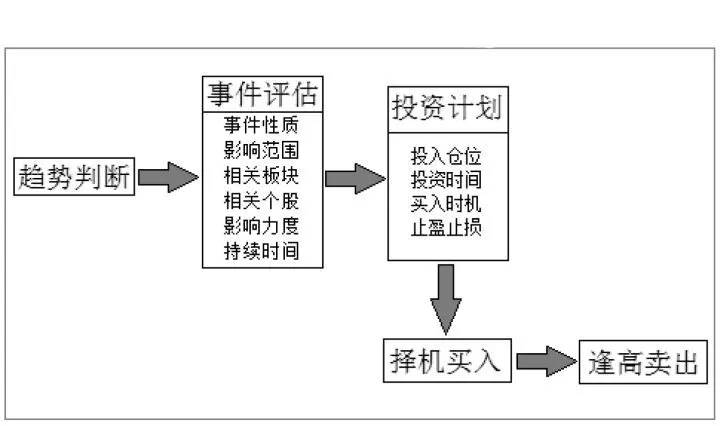

图1\-13 事件驱动投资决策流程图

__第四节 投资风格__

__一、什么是投资风格__

投资风格也就是盈利模式。股票的投资风格，是指投资者从事股票投资的整个过程中所表现出来的投资理念、分析思路、风险意识以及操作手法等。投资风格的核心是“盈利”，并非是“模式”。模式因盈利而生，盈利是模式的结果。也就是说，投资风格的目的是获得投资收益，投资风格是为达到投资收益而形成的适合自己的投资方式。只有形成了能够带来长期盈利的模式，投资者才能真正从股市中获得投资回报。

股市如人。每个人都有自己的性格，这种性格会影响着自己的投资方式，并形成投资风格。股市的整体走势，是众多参与者各种投资风格的最终融合。老股民都知道，每一只个股的“性格”都有差异，有的温和，有的粗犷，这些个股的走势特征，其实反映了参与该股投资的投资人（特别是大资金）的投资风格。

股票投资充满感情色彩，作为普通投资者必须认识到，自己的投资风格要尽量与自己的性格相近，同时也要克服违背股市运行规律的性格冲动。就如同人生活在社会里，每个人都有自己的性格，但是要在尊重社会公德、遵守法律法规的前提下，才可以张扬和展现自己的个性。

__二、价值型投资者与交易型投资者__

根据对投资的理解和理念的不同，可以将投资者区分为价值型投资者和交易型投资者。

__1．价值型投资者__

广义的价值型投资者主要依靠基本面分析，以上市公司的价值分析为核心，根据上市公司的价值评估来指导投资方向。狭义的价值型投资者往往先确定公司的合理价值，再寻找那些股票价格明显低于公司价值的投资机会。

价值投资还可以分为以下几种投资类型。

①成长型投资者。 这类投资者注重资本的增值，也就是关注上市公司未来的成长性。他们的投资对象主要是市场中有较大升值潜力的中小公司股票和一些新兴行业的股票，这类上市公司往往正处于发展壮大阶段，投资者预期公司创造利润的能力在不断壮大，表现在净资产收益率、每股收益、自由现金流量等财务指标的不断增长上，但公司的利润多用于扩大再生产，因此很少进行分红派息。

成长型股票在股市中表现出风险较大的特征，一是真正的成长性公司并不多见，二是容易被市场炒作，股价波动幅度较大，波动频率也相对较快。因此成长型投资者对预期的收益比稳健型要高，承担的风险也较大。

②稳健型投资者。 稳健型投资者以追求资本稳健增值为目标，以控制风险为重要前提。稳健型投资者最关心的是风险，在满足一定风险程度的情况下，再考虑投资收益。这类投资者一般对表现较稳定的成熟公司（比如银行等大盘蓝筹股）感兴趣。这类公司往往风险较小，并且有固定的分红派息，一般现金分红的数量高于银行一年期定期存款。

③综合型投资者。 这类投资者一般资金比较雄厚，投资综合能力也较强。他们在股票投资中采用混合式组合，一部分用于稳健型投资，一部分用于成长型投资，也可能有部分资金用于短线操作，追逐市场热点。综合型投资者也可能在某一特定时期全仓进入市场，也可能全部清空仓位，将资金用于别的投资项目，如债券、期货或汇市，甚至存入银行闲置。

__2．交易型投资者__

所谓交易型投资者，是指根据对市场走势的预判，利用市场出现的波动进行买卖，并从中获得差价利润的投资者。这类投资者主要以技术分析为手段，有的也兼顾基本面分析。根据投资者依托的技术分析方法的不同，交易型投资者可以划分为许多类别，如区分为趋势类、形态类和抢帽子类投资者。

①趋势类投资者。 这类投资者以市场的发展趋势为核心，重点在于判断未来市场的走势，从而决定投资交易的时机。趋势类投资者的分析手段主要包括通道理论、波浪理论、均线理论以及K线理论等。

趋势是技术分析的核心。技术分析者认为，一旦市场形成趋势后，一般股指或股价会沿着原有的趋势运行一段时间，直到趋势被打破。

②形态类投资者。 这类投资者主要依据市场运行过程中出现的图形形态预示的市场信息，根据这些形态发出的信号进行相应的投资决策。这里所说的形态，主要包括K线形态（比如大阳线与大阴线、启明星与黄昏星、三只乌鸦与红三兵等），均线形态（如均线金叉与死叉、银三角与死亡三角、均线发散与均线收敛、均线转向等），技术形态（如头肩底与头肩顶、圆弧底与圆弧顶、三角整理形态、矩形整理形态、楔形整理形态等）。与形态相关内容很多，这里无法一一列出，大家可以参考笔者拙作《K线综合实战分析》，该书结合实战案例，对技术形态和趋势分析进行了较详细的讲解。

③抢帽子类投资者。 这类投资者往往根据消息和股价的异常变化，预先确定好关键技术阻力位或者支撑位，在非常短的时间里做差价交易，如T\+0交易或者T\+1交易。早期的证券、期货交易，都是由交易员在交易池内喊价交易，用手势加上高声喊叫来报价，于是那些在日内短线炒作的交易员就要不停地举手报价，情形就像一群人在伸手抢帽子一样，所以把日内短线交易戏称为“抢帽子”。这种投资行为风险性极高，特别是在当前A股实行T\+1的交易规则下。

__3．价值型投资与交易型投资的区别__

价值型投资者与交易型投资者的主要区别，可以概括为以下几点。

①认识股票的核心不同。 价值型投资者眼中的股票就是上市公司，公司有价值，股票就有价值。交易型投资者只是将股票作为筹码，并不在乎筹码本身价值多少，而是筹码能否带来差价。

②交易的标准不同。 价值型投资者只要在适当的价格买入他们认为有价值的股票，就会一路持有，直到价格已经充分反映了价值为止。因此当市场处于熊市时，他们充满期待，因为投资的价值越来越显现。交易型投资者则在认为的价格波动低位买入，当价格上涨后，随时有可能卖出股票。由于交易型投资者是以市场交易的差价来获利的，在A股不能做空的机制下，当市场处于一路下跌的熊市中时，这类投资者是很难有投资机会的，因此交易型投资者厌恶下跌趋势。

③获利的方式不同。 价值型投资者从公司或整体市场的价值出发，在价格下跌时，他们认为可以用更便宜的价格买到相同或更高价值的标的。交易型投资者则不关心公司或市场的价值，只要价格有波动，有差价，就可以操作并获利。

④使用的分析手段不同。 价值型投资者多采用基本面分析方法，分析的核心在于公司是否有足够的盈利能力和发展空间；交易型投资者则注重技术分析，注重价格或股指的发展趋势及波动规律。

⑤交易时机和投资周期不同。 价值型投资者一般注重长期投资，只有公司的价值凸显后才会买入，一旦投入后，并不十分在乎几天或几个月内股价是否上涨，交易周期较长，投资机会相对较少；交易型投资者则相反，他们并不将公司的利润和未来成长作为首要因素（虽然这些因素对股价有较大的影响），而是关注股价是否处于某一时间段的关键技术点位，这个时间段并不固定，可长可短。

⑥风险来源不同。 价值型投资者认为市场风险来源于上市公司的业绩与发展，一方面是公司的业绩是否如实反映了公司的实际情况，二是公司的未来是否与预期相符合。价值型投资者往往会集中资金持有股票，其风险来源相对固定。交易型投资者则认为市场风险源于股价波动的不稳定性，源于对市场变化趋势的误判。交易型投资者以市场变化趋势为交易向导，并不固定于投资某只或某类个股，而是根据市场趋势的变化情况，采取不同的风险控制措施，因此其风险相对分散。

⑦资金管理方式不同。 基于投资理念的不同，价值型投资者一般会选择适当的上市公司进行较长期的集中投入，资金一般不会轻易变动，因此所使用的资金一般都是长线资金。交易型投资者会根据自身的交易特点和市场情况，比较频繁地变动资金的运作方式，故资金也可以是短期资金。

⑧投资风格不同。 如果说价值投资者像一名稳重的经济学者，那么交易型投资者则像战场上充满战斗激情的将军。

上面列出了价值型投资与交易型投资的区别，但二者也有很多共同点，比如都存在投资风险和投资收益，寻找风险与收益的平衡点是它们的共同目标。价值投资者以公司价值作为标准，衡量股价是否被低估，股价越低于价值，风险就越小，投资获利机会就越大；交易型投资者则以反映市场价位和市场人气的指标来判断股价的安全程度及预期获利空间，股价处于相对高位，市场越疯狂，风险程度就越大。

在实际投资中，聪明的投资者并不将价值型投资与交易型投资进行严格区分，为了规避风险，达到盈利的目的，他们并不会相互排斥，而是相互借鉴。巴菲特也会在市场处于疯狂的上升趋势中卖出手中持有的有价值的股票，在价格回落后，以更便宜的价格买回。索罗斯也经常与公司企业的高层管理者接触，了解公司的实际运行情况。

做一名稳重的经济学者还是战场上充满激情的将军，要由投资者自己去选择。不过请注意，他们之间并非是不相容的，投资者大可不必将投资风格进行教条式的划分，认为这些界限不可逾越。事实上，无论是价值型投资者还是交易型投资者，都有保守、激进和稳健之分，这取决于投资者对风险的看法和投资理由，以及选择的分析手段。

投资就是为了获利。无论白猫还是黑猫，能够逮着耗子就是好猫。关键是要找到适合自己的一套长期稳定盈利的投资方法。

__三、投资的时间周期__

__1．短线投资__

所谓短线是指投资时间短，一般在5个交易日内。投资者主要依靠技术分析、事件驱动以及投资经验进行高抛低吸，他们只想赚取短期的差价利润，对股价的中期和长期波动并不关心。短线投资者一般没有固定的投资板块或对象，他们最注重的就是时间和风险。时间上讲究准和快，即判断准，动作快；风险控制上讲究止盈和止损，无论是盈是亏，一旦市场短期风险出现，马上清仓卖出。这类投资者多为中小散户，由于其风险程度相当大，对操作者的心理素质和操作经验要求非常高，故能中长期盈利的人并不多。

中小散户以及新股民大多喜欢参与短线投资，其中能够长期获利的却非常少，这是因为交易型投资需要更好地了解人性，洞察投资者的群体效应，控制自身的人性弱点。技术分析中的各种指标主要是用来反映市场中投资群体的倾向，这种倾向很容易受到各种因素的干扰，比如消息、某只龙头个股暴涨暴跌等。时间周期越短，这种群体倾向的可变性越大，对于缺乏经验和真实信息来源的散户们，短线操作的正确率甚至比猜中硬币的正反面概率还低。猜硬币有50％的概率猜中，而股市中有涨、跌和持平三种情况，只有上涨而且涨幅超过交易费率，并且投资者及时获利了结，才能实现正收益，做到这一点的难度是很大的。

参与短线投资的人，要具备良好的技术分析能力，对市场人气变动敏感，经验丰富，善于自律。对于普通股民来说，短线投资的风险大，收益往往与风险不对称，因此一般不适合参与。有一定基础的股民，如果参与短线炒作，一般要轻仓参与，严格执行止损止盈策略，保持良好心态，最好是以娱乐和学习为主，不要过分强调收益。

__2．中线投资__

中线投资是根据股价的中期波动特征进行波段买入和卖出的操作方法，投资时间在两周至3个月的时间不等。

中线投资者以技术分析为主，兼顾上市公司的基本面情况，根据市场的中长期运行波动规律来进行投资。投资者必须对某一上市公司和大盘的中期走势具有一定的信心，在股价处于某一中期底部位置时买入，买入后不在乎短期的价格波动，在中期顶部到来时卖出股票，从而一次性获取较大的差价利润。

中线投资的关键是对趋势的判断，特别是对大盘和个股运行的中期趋势要有较准确的判断，避免投资基本面有潜在风险的“地雷”公司。

中线投资一般比较适合风格稳健的投资者，操作不受股价的短期波动影响，也不因股市中其他因素的诱惑或恐吓而改变计划，只要中期趋势不变，就坚决持股。中线投资是一般中小散户投资者首选的投资时间周期，因为它既不像短线交易那么紧张激烈，充满风险，也不像长线投资那样死板和单调。

中线投资可以根据大盘主要趋势方向、个股基本面和运行状况，灵活掌握投入的资金比例。一般在牛市中，个股基本面较好的情况下，投入资金比例可以较大；在大盘趋势处于熊市时，即使个股基本面和中期趋势较好，投入资金的比例也不可太大，一般以控制在50％下方为宜。

__3．长线投资__

对于长线投资的时间没有严格的界定，一般认为投资者只要持股在一年以上，都可以认为是长线投资，有的甚至持有长达几年、十几年。长线投资主要是以价值分析为主，不是很看重技术分析。长线投资适合着眼于长远，资金面宽裕的投资者，其关键是选好上市公司，上市公司既可以是成长型的公司，也可以是价值型的公司。投资时机一般多在经济周期处于低谷时介入市场，避免在经济周期处于繁荣的后期进入市场。

以价值分析为基础的长线投资并非没有风险，其风险特征主要体现为时间风险、集中风险，也不能绝对地说价值投资的风险小于以技术分析为主的交易型投资风险。长线投资往往长时间持有一只或几只股票，那么它的风险就集中在这一只或几只股票上，如果上市公司在未来几年的表现与投资者对其成长评估价值不符，那么其风险也会集中释放。从这个角度来说，价值投资的风险特点是集中，交易型投资是分散。价值投资的灵魂人物巴菲特曾经这样评价价值投资的风险：价值投资并不能充分保证我们投资盈利，因为我们不仅要在合理的价格上买入，而且买入公司的未来业绩要与我们的估计相符。

这里可以给读者看一张图，如图1\-14所示。它是美国加利福尼亚大学的两位金融学教授对66000名获利客户的190万次交易进行统计分析，用以比较投资者的耐心（投资周期）与他们的年收益（考虑了交易成本）之间的关系。

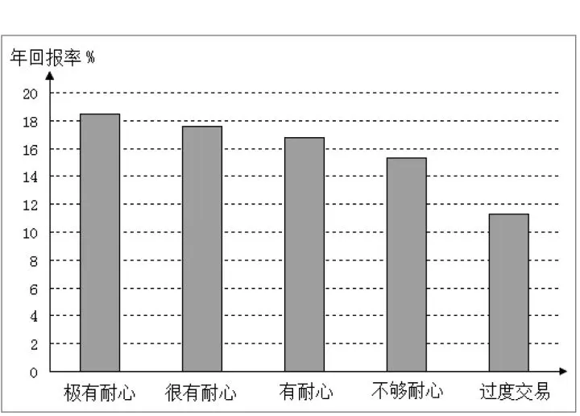

图1\-14 交易频率与收益之间的关系

从图1\-14中可以看出，并非是交易越频繁收益越高，事实正好相反，交易越频繁，最终收益越低。特别是过度交易（短线交易）的回报，非常明显地低于中长线投资者。当然这是一种普遍现象，也许有极少数投资者例外，但是大家没必要拿自己的金钱去追求这种概率极低的例外吧。

__第五节 培养适合自己的投资风格__

__一、投资风格的重要性__

要想在股市里长期生存，长期获取投资收益，投资者要有适合自己的投资风格。现在绝大多数的散户投资者都没有自己的投资风格，只是信马由缰，凭借一时冲动来决定交易行为，带来的最终结果就是损失。或许某一次甚至某几次在冲动下交易获得了正收益，但是这种收益就像赌博赢得了筹码一样，除非以后不再踏入股市，否则这些收益最终仍会还给市场。

股票投资的成功与否并不取决于市场，而是取决于自己。买不买股票，投入多少资金，什么时候交易，这些行为的决策权都掌握在自己手中。有的人在股市处于熊市时频繁交易，结果亏损严重，但是却将亏损的原因归咎于“假消息”、“主力庄家”、上市公司以及市场管理层。当然A股市场确实存在很多有待完善的问题，但这些投资者是否可以自我检讨一下呢？明明知道经济下滑，股市走熊，为什么还要冒风险入市？你有自己的投资计划吗？有控制风险的机制吗？有自己的交易规则吗？所有这些问题，都涉及到投资者是否拥有属于自己的投资风格。

从表面看，股市中有截然不同的两类人，一类人是在股市哀鸿遍野时，在大家都不买股票的时候买入股票，买完后就去旅游；在股市狂热，大家都买股票时，这类人却卖出股票，卖出后又出去旅游。另一类人则相反，他们被漫天飞舞的消息和周围气氛所左右，追涨杀跌，意气用事，结果饱受股市的煎熬。清算最终结果，后一种人可以说是吃力不讨好，赔了夫人又折兵。这反映的就是投资风格的重要性，前一种人有最简单的投资风格，就是只在熊市处于底部时投资股票；后一种人一再亏损，其根源就是没有自己的投资风格，是冲动和魔鬼的牺牲品！

缺乏适合自身特点的投资风格与投资理念，投资者即使偶有获利，也算不上是一个真正合格、真正成熟的股票投资者。其原因就在于：盲目的成功与盲目的失败没有本质的区别，都是知其然而不知其所以然，成也糊涂，败也糊涂。投资风格就是为了解决盲目交易行为，在长期盈利的基础上形成的适合自己的投资风格。如果形成了这种投资风格，就可以发挥长处，避免发生冲动交易。

前面已经介绍过很多种投资风格，到底哪种投资风格最好，不能一概而论，应该说没有最好的，只有最适合的。最能达到盈利目的的投资风格就是最好的。有的投资者对市场的风吹草动非常敏感，捕捉短线机会的能力很强，而且耐不住寂寞，那么他一定适合短线交易。有的人对大势判断准确，不善于判断股价的短期波动，那么他自然适合中长线投资。

另外，因为投资者掌握的知识和技能不同，其投资风格也会出现差异。比如擅长财务分析的人，会侧重于价值投资，而对图形形态兴趣浓厚的投资者，就会钟爱技术分析的投资方式。

总之，最好的投资风格有两点，一是能够给投资者带来长期盈利，二是适合自己。

__二、从树立正确的投资理念开始__

股市投资，最重要的是什么？是投资理念，不是投资技巧。从哲学角度讲，投资理念属于世界观，能够指引投资的方向。正确的投资理念指明正确的投资方向。投资风格是在投资理念之下形成的，是投资理念在行为上的反映。投资风格来源和服从于投资理念，正确的投资理念可以产生有效率的投资风格，错误的投资理念会让投资者误入歧途。

在进入股市之前，不要急于学习投资的技术和方法，或者说在学习股票分析技术的同时，要学会思考树立正确的投资理念。

什么是正确的投资理念？对于一些细节，可能每个人的看法都有差别，但是正确的投资理念都有其共性。下面来看一下几位投资大师的投资理念。

__1．巴菲特__

巴菲特被称为价值投资的顶级大师，他的投资理念有以下几点。

①投资的第一条准则是不要赔钱；第二条准则是永远不要忘记第一条。

②想要一辈子都能投资成功，并不需要天才的智商、非凡的商业眼光或内线情报，真正需要的是有健全的知识架构供你做决策，同时要有避免让你的情绪破坏这个架构的能力。

③要做一个好的击球手，你必须有好球可打。如果没有好的投资对象，那么宁可持有现金。股市犹如一个资金再分配的中心，金钱将由好动的人手中转移到有耐心的人手中。

④买一股股票，必须像你要买下整间公司一样。

⑤决定卖掉公司所持有的麦当劳股票是一项严重的错误，总而言之，假如我在股市开盘期间常常溜出去看电影的话，你们去年应该赚得更多。

⑥假如你不打算持有一只股票达10年之久，那连持有10分钟的时间都不要。

⑦一家公司的股票在今天、明天或下星期卖多少钱并不重要，重要的是这家公司在未来5至10年的表现如何。

⑧投资人不可能专攻某一特定类型的股票就可以赚取丰厚的利润，只有在谨慎评估事实及坚持原则下，才能赚到这些钱。

巴菲特的投资理念中，还有“三要三不要”这样一个法则。

①要投资那些始终把股东利益放在首位的企业。巴菲特总是青睐那些经营稳健、讲究诚信、分红回报高的企业，以最大限度地避免股价波动，确保投资的保值和增值。对于总想利用配股、增发等途径榨取投资者血汗的企业，要一概拒之门外。

②要投资那些始终把股东利益放在首位的企业。从巴菲特的投资构成来看，道路、桥梁、煤炭、电力等资源垄断型企业占了相当份额，这类企业一般是外资入市并购的首选，同时独特的行业优势也能确保效益的平稳。

③要投资资源垄断型行业。要投资易了解、前景看好的企业。巴菲特与人们只注重概念、板块、市盈率等投资方式不同，凡是投资的股票必须是自己了如指掌，并且是具有较好行业前景的企业。不熟悉和前途莫测的企业，即使别人说得天花乱坠，也要做到毫不动心。

④不要贪婪。20世纪60年代的美国股市牛气冲天。到了1969年，整个华尔街进入到投机的疯狂阶段，每个人都希望手中已经涨了数倍的股票一直涨下去。面对连创新高的股市，巴菲特却在手中股票涨到20％的时候就非常冷静地悉数全抛。后来市场出现大幅下跌，贪婪的投资者有的血本无归，有的倾家荡产。

⑤不要跟风。2000年，全世界股市出现了所谓的网络概念股，一些亏损、市盈率极高的股票，一沾上网络的边便立即鸡犬升天。但巴菲特却不为所动，称自己不懂高科技，没法投资。一年后全球出现了高科技网络股股灾，人们这才明白“不懂高科技”只不过是他不盲目跟风的理由。

⑥不要投机。巴菲特的“投资不投机”是出了名的，他购买一种股票绝不在意来年就能赚多少钱，而是在意它是不是有投资价值，巴菲特更看中未来5～10年能赚多少钱。他常说的一句口头禅是：拥有一只股票，期待它下个星期就上涨是十分愚蠢的。

__2．索罗斯__

同样是投资大师的索罗斯，他的投资理念与巴菲特有很大的不同。索罗斯是以人性角度来分析市场的。在市场中，投资人的行为表现与客观的市场之间会产生矛盾，这种矛盾激化的程度决定投资的时机。

“反射性”是索罗斯投资理论的核心，简单地说就是投资者与市场之间相互作用、相互影响的关系。理论依据是人正确认识世界是不可能的，投资者都是带“偏见”进入市场的，而“偏见”正是了解金融市场动力的关键所在。当“流行偏见”只属于小众时，影响力尚小。若投资者的偏见在互动中产生群体影响力，将会演变成具有主导地位的观念，这就是“羊群效应”。

根据这种市场不完善理论，他对市场进一步剖析，认为市场波动的过程是投资者对市场发展趋势的认识变化过程，在这个过程中，既有兴盛的阶段，又有衰败的阶段。市场常常以还没有被人们认识的趋势开始。趋势被人们认识之后，人们的认识会很快得到强化，在这一过程中，对趋势的正确认识和偏见同时存在。随着过程的发展，趋势变得原来越依赖偏见。

偏见对趋势的正确认识会同时受到外在力量的考验，等到信念与实际情况之间的差距变得很大时，就使市场参与者的偏见受到极度重视。这时就会出现一个高点，这个高点叫做考验期。此时趋势已经形成惯性，在惯性的作用下，趋势继续维持，但却走向平缓，这就是趋势的停滞期。这时趋势更加依赖于偏见，因而趋势就会不可避免地发生反转，发生反转的点叫临界点。相反的趋势会在相反的方向促成一种偏见形成，从而导致一种灾难性的加速状态出现，始于自强，终于自败，市场的一个上涨周期完成。这段对市场兴衰的描述，也就是索罗斯的市场荣枯论。

索罗斯经典名言。

①我生来一贫如洗。但决不能死时仍旧贫困潦倒。

②数学不能控制金融市场，心理因素才是控制市场的关键。更确切地说，只有掌握住群众的本能，才能控制市场。即必须了解群众将在何时、以何种方式聚在某一种股票、货币或商品周围，投资者才有成功的可能。

③重要的不是你的判断是错还是对，而是在你正确的时候要最大限度地发挥出你的力量来\!

④如果你经营状况欠佳，那么，第一步你要减少投入，但不要收回资金。当你重新投入的时候，一开始投入数量要小。

⑤不知道未来会发生什么并不可怕，可怕的是如果发生什么却不知道该如何应对。

⑥要想获得成功，必须要有充足的自由时间。

⑦在股票市场上，要注意寻求别人还没有意识到的突变。

⑧股市通常是不可信赖的，如果在华尔街地区你跟着别人赶时髦，那么你的股票经营注定是十分惨淡的。

⑨人们认为我不会出错，这完全是一种误解。我坦率地说，对任何事情，我和其他人犯同样多的错误。不过我的超人之处在于我能认识自己的错误。这便是成功的秘密。我的洞察力关键在于认识到了人类思想内在的错误。

⑩我不愿意花很多时间和股票市场的人们在一起，我觉得他们讨厌。和知识分子在一起，要比和商人在一起感觉舒服得多。我已经和公司打成一片，它以我为生，我也和它生活在一起，日夜形影不离……它是我的情人。我害怕失去它，也担心做失败，并尽量避免失误，这是一种悲惨的生活。

⑪炒作就像动物世界的森林法则，专门攻击弱者，这种做法往往能够百发百中。

⑫经济历史是由一幕幕插曲构成的，它们都奠基于谬误与谎言，而不是真理，这是赚大钱的途径。我们仅需要辨别前提为错误的趋势，顺势操作，并在它被拆穿以前提早脱身。

索罗斯的投资风格是建立在他对市场的认识和投资理念的基础上的，因此他的投资风格与巴菲特有着很大的区别，因为他们的投资理念有较大的区别。巴菲特的投资分析核心是上市公司本身的价值，索罗斯则是投资者与交易市场。不能说他们的投资理念或投资风格谁对谁错，孰好孰坏，他们都是被实践检验了的成功者。

__3．索罗斯与巴菲特的共同点__

虽然索罗斯与巴菲特的投资理念与投资风格有很大的差别，但他们的共同点也很多。

①一切行为都是为了盈利。有的人认为这是必然的，实际上很多投资者在股市投资中并非如此。或许他们内心认为自己是在投资，想的是赚钱，可实际上他们的投资行为却与消遣并无两样，就如同在赌博场、麻将室，其投资行为并没有围绕“盈利”这个核心。

②自己一定会犯错误。作为投资大师，他们与普通人一样也会犯错误，但他们与普通人不一样的是，知道如何去认识错误、减少错误和及时纠正错误。

③永远将风险放在第一位。巴菲特的首要准则是不要赔钱，索罗斯则认为市场是不可信赖的。

④只在适合投资的时候投资。巴菲特只在上市公司被低估的时候投资，要么这些公司的当前价值被低估，要么是市场没有看到公司的未来价值。索罗斯只投资于健康的趋势，并在趋势出现问题时提前脱身。

⑤坚持自己的投资理念，建立良好的心理约束原则。

借鉴投资大师们的投资理念，可以培养自己的投资理念。首先，我们投资股市是为了盈利，盈利是核心，而不是寻找刺激的娱乐。

其次，我们是人，一定会犯错误，关键是如何避免错误的发生，发生后如何弥补错误。

第三，只在适合投资的环境下投资，也就是在风险远小于收益的环境下投资，减少盲动。

第四，坚持自己的投资理念和原则，不要受情绪的影响。学习理论知识，制定良好的投资计划。

__附：投资风格测试表__

下面是一份投资风格测试试卷，它可以帮助投资者了解自己适合做哪种类型的投资。该测试并不具有决定性，仅供参考。

1

你的家庭负担：

分数

A

家庭负担较重，例如家中有病人等。

1

B

子女尚小，父母需要赡养，家庭负担较重。

2

C

简单的三口之家，父母刚退休不久，有固定的收入。

3

D

单身或者结婚不久，没有子女，父母还年轻，无需赡养。

4

2

你的投资收益预期是什么？

A

获得相当于银行定期存款利率的回报。

1

B

保障资本增值及抵御通货膨胀。

2

C

获取每年5％～10％的回报率。

3

D

获取每年10％的回报率。

4

3

在海滨，你是否经常不小心游出安全区？

A

绝对不会。

1

B

很少这样，太危险了。

2

C

这样也没有什么大不了的。

3

D

经常这样，无视安全线的存在。

4

4

你是不是经常喜欢自己做决定？

A

不喜欢，最好有朋友帮忙。

1

B

有人给我意见会使我的信心大幅度增加。

2

C

我习惯于自己做决定，但是别人的意见我会参考。

3

D

自己做决定是我一贯的作风，从来不需要别人的参与。

4

5

假设有一项电视智力竞赛节目，并且你已经胜出，主持人让你在以下获奖方式中作出选择，你会选择什么？

A

立刻拿到10000元现金。

1

B

有50％的机会赢取50000元现金的抽奖。

2

C

有25％的机会赢取100000元现金的抽奖。

3

D

有5％的机会赢取1000000元现金的抽奖。

4

6

独自到国外旅游，遇到三叉路口，你会怎么办？

A

仔细研究地图和路标，确认无误再做出选择。

1

B

向别人问路，问清楚之后再选择。

2

C

大致判断一下方向，然后毅然决然地走下去。

3

D

用抛硬币的方式来做决定。

4

7

假如有一项投资可能会有较大的收益，可是你手中却没有足够的资金，你是否会对外融资？

A

肯定不会。

1

B

可能不会。

2

C

可能会。

3

D

肯定会。

4

8

有下面4种投资可能，你认为自己可能选择的投资组合是哪一种？

A

预估收益7\.02％，最大收益16\.30％，最大损失\-5\.60％。

1

B

预估收益9\.00％，最大收益25\.00％，最大损失\-12\.10％。

2

C

预估收益10\.40％，最大收益33\.60％，最大损失\-18\.20％。

3

D

预估收益11\.70％，最大收益42\.80％，最大损失\-24\.00％。

4

9

你计划中的投资时间是多久？

A

两年之内（短期）

1

B

2～5年（中期）

2

C

6年以上（中长期或长期）

3

D

10年以上。

4

10

如果需要把大量现金放在口袋里一整天，你是否感到不安？

A

非常不安。

1

B

会有点不安。

2

C

不会。

3

D

绝对不会不安，心安理得。

4

11

你是否花很多时间思考你走过的生活道路以及目前的选择？

A

经常这样，思考过去是减少未来风险的有效手段。

1

B

有时候会，我觉得这样也许会对我有帮助。

2

C

偶尔会，但是那对我来说并不重要。

3

D

不会的，我会很快忘掉过去。

4

12

站在人潮涌动的股票大厅，你的心中是否热血沸腾？

A

不会的，我讨厌这些。

1

B

也许会，这要看其他条件。

2

C

很可能会，但是我还是能控制自己的情绪。

3

D

会的，我肯定会思考我的投资计划，是不是多投些股票。

4

13

如果你是一位有过沉痛的股市投资失败教训的投资者，现在大盘重新看好，你发现了一次盈利的机会，你是否会再次投资股市？

A

肯定不会。

1

B

可能不会。

2

C

可能会。

3

D

肯定会。

4

14

下列哪件事情会让你最开心？

A

在公开赛中赢了100000元。

1

B

从一个富有的亲戚那里继承了100000元。

2

C

冒着风险投资的50000元基金带来了100000元的收益。

3

D

上述任何渠道取得100000元收益。

4

15

你的老邻居是一位经验丰富的石油地质学家，他正组织包括他自己在内的一群投资者，为开发一个油井集资。如果油井开发成功，那么将带来50～100倍的投资收益；如果失败，所有的投资就一文不剩了。你的邻居估计成功概率有20％，你会投入多少资金？

A

0

1

B

1个月的薪水。

2

C

6月的薪水。

3

D

1年的薪水。

4

16

假设目前通货膨胀率很高，硬通资产如稀有金属、收藏品和房地产预计会随通货膨胀率同步上涨，你目前的所有投资是长期债券。在这种情况下你会怎么办？

A

继续持有债券。

1

B

卖掉债券，把一半的钱投资基金，另一半投资硬通资产。

2

C

卖掉债券，把所有的钱投资硬通资产。

3

D

卖掉债券，把所有的钱投资硬通资产，还借钱来买更多的硬通资产。

4

评分结果分析

保守型

得分27～36分：属于保守型投资者。你对投资的风险和回报都有深刻的了解，更愿意用最小的风险来获得确定的投资收益，上市公司的基本面和市场主要趋势将会是你注意的方向。

稳健型

得分37～50分：属于稳健型投资者。你的风险偏好偏高，但还没有达到热爱风险的地步，你对投资的期望是用适度的风险换取合理的回报。依据市场性质，掌握好投资节奏，采取波段操作会让你受益匪浅。

激进型

得分51～64分：属于激进型投资者。您是一位愿意承担部分高风险以追求较高收益的投资者，如何控制风险将是你的主要任务。

__本章小结__

要投资股票市场，首先就要掌握股票和股票市场的基础知识，了解股票的性质和特性，了解影响股票市场的内在和外部因素，这是投资股市的必要条件。

股票是一种有价证券，股票本身没有价值，但它代表持有者拥有上市公司的部分财产，可以行使该证券所代表的权利，比如分红派息和红利请求权等。股票的特征包括收益性、风险性、流动性、永久性和参与性。股票的流动性给股票交易者提供了投资平台，收益性吸引大批资金参与股市投资，风险性则限制了股票投资的过激行为，为理性投资提供了基础。

股票的收益与风险紧密相连，遵循“高风险、高收益”的原则，即投资者如果承担了较高的投资风险，那么就需要有较高收益预期来弥补，其中的高收益预期并非是脱离实际的想象，而是通过各种分析得出的结果，并非承担了高风险就一定有高收益。

股市并非是独立于其他经济活动之外的投资市场，它与其他各种经济活动紧密相关，是市场经济的有机组成部分。股市是实体经济与虚拟经济之间的桥梁和纽带，股市为实体经济服务，同时也影响实体经济的发展；实体经济决定股市的走势，股市又是实体经济的晴雨表。因此在分析股市和投资时，需要以宏观经济、行业状况及上市公司的基本情况作为最根本的投资基础，股市的牛市总是建立在经济处于恢复和繁荣的时期，熊市的开始往往是宏观经济出现过热之时。CPI和利率是衡量经济周期的重要指标，观察CPI和利率的变化，会帮助投资者分析股市的主要趋势。股市与社会整体资金流动性密切相关，流动性宽裕，资金需要寻找出路，股市就会受资金的推动上涨。相反，如果流动性不足，资金从股市中逐步撤离，股市必然会回落。因此代表社会资金流动性的指标M1和M2，也是判断股市发展趋势的重要依据。

股市投资行为有两个方面的因素在相互作用，一方面是市场，另一方面是投资者本身。投资者的群体行为影响股市的变化，股市的变化反过来又影响投资者的行为。从零和理论看，股市中只有少部分人赚钱，要想在股市中盈利，就必须是投资群体中的少数部分，这也符合二八定律。那么如何让自己成为盈利的少部分人呢？这就要投资者养成自己的投资风格，形成一种适合自己的获利方式。形成一种成功的投资风格并非易事，需要不断地学习和实践，在总结经验与教训中逐步调整。

本章意在简单介绍投资的基础知识，只有在这些基础上，股票投资才有成功的可能。由于本章并不是专门介绍股票基础知识的，因此篇幅有限，无法介绍更多，读者可以通过其他途径学习相关内容。

## 第二章　股票投资风险与控制

__第二章 股票投资风险与控制__

__第一节 股票投资风险__

股市投资风险，就是投资者投资股票市场所面临的财产损失。这种损失可以是卖出股票后所获得的资金低于当初买入时的成本，也可以是股票投资没有达到预期的投资收益。

投资者投资某只或某组股票，或者股票的衍生产品（比如股指期货），在预定的时间内，如果不能以高于买入价将股票卖出，发生账面损失，或者说以低于买入价卖出股票，造成实际的资金损失，这种损失就是股票投资风险带来的结果。

投资者无法在预期价位或者市场实际相对较高的价位卖出股票，最终被迫在低于应该获得收益的价位卖出股票，从而没有达到预期的或者应该获得的收益，这种低于预期收益的结果，也是投资风险的一种表现结果。

__一、股市风险的来源__

股市风险来源可以分为系统性风险、非系统性风险以及交易风险等三个来源。

__1．系统性风险__

系统性风险又称市场风险，也称不可分散风险，是指由于某种因素的影响和变化，导致股市所有的股票价格都下跌，从而给股票持有者带来损失的可能性。系统性风险主要是由政治、经济以及社会环境等宏观因素造成的投资人无法改变的风险。系统性风险不是中小散户以及投资机构所能左右的，但是可以通过对国际国内宏观局势、经济状况等进行分析，及时调整投资策略，从而作出相应的风险防范。

系统性风险主要有以下几类。

①政策风险 。经济政策和管理措施可能会造成股票投资收益的损失，这在新兴市场中表现得尤为突出。如财税政策的变化可以影响公司的经营利润，影响股票的交易价格等。此外，一些看似无关的政策，也可能会影响到股票市场的资金供求关系。

②利率风险 。利率变动会对投资股市的资金总量产生影响，导致股票市场供需格局发生变化，从而引起股票指数和股票价格变动，这种风险称为利率风险。利率下调，人们觉得钱存在银行不合算，就会把钱拿出来买股票，从而造成买入股票的人增多，股票价格就会上升；相反，利率上调，人们觉得钱存在银行更合算，资金就会从股市回流到银行，股票价格也会随之下跌。

③物价风险。 物价风险也称为通货膨胀风险，指的是物价变动导致股票价格变动的风险。一般认为，轻微通货膨胀会刺激投资需求的增长，从而带动股市活跃。当通货膨胀超过一定限度时，会引发宏观经济调控，导致投资者对股市未来产生担忧。同时，上市公司的生产成本增加，也会对企业的盈利产生负面影响，因此物价上涨过快对股市的长远发展不利，股价也会随之下跌。

④市场风险。 指股票市场本身因各种因素的影响而引起股票价格变动的风险。市场风险是股票投资活动中最普通、最常见的风险，是由股票价格的涨跌直接引起的。尤其是在新兴市场上，造成股市波动的因素更为复杂，价格波动大，市场风险也大。许多外围因素都可能让股票投资者产生心理波动，大资金在股市中的运作也可能造成指数和股价的大幅波动，这些波动对中小散户投资者都是无法控制的风险。

⑤不可抗力风险 。指地震、台风、水灾、火灾、战争、罢工及其他不可抗力因素导致股市波动，或无法正常交易带来的风险。

__2．非系统性风险__

非系统性风险一般是指与整个市场波动无关的风险，比如某一领域、某一行业或者某只个股自身存在的风险。上市公司经营管理、财务状况、市场销售、重大投资等因素的变化，都会对公司股价产生影响。这类风险主要影响某一种股票，与市场中的其他股票没有直接联系。对于非系统性风险，投资者应该多学习股票知识，多了解、分析和研究宏观经济形势及上市公司经营状况，增强风险防范意识，掌握风险防范技巧，提高抵御风险的能力。

非系统性风险主要有以下几类。

①经营风险。 经营风险主要指上市公司经营不景气，甚至失败、倒闭而给投资者带来的损失。上市公司经营、生产和投资活动出现问题，会导致公司盈利情况恶化，从而造成投资者收益本金减少或损失。例如，经济周期或商业营业周期的变化对上市公司收益产生的影响，竞争对手变化对上市公司经营带来的影响，上市公司自身管理和决策水平等，都可能导致经营风险。投资者购买垃圾股或低价股，就可能承担上市公司退市的风险。

②财务风险。 财务风险是指公司因筹措资金而产生的风险，即公司可能丧失偿债能力而引发的风险。公司财务结构不合理，往往会给公司造成财务风险。公司的财务风险主要表现为无力偿还到期债务、利率变动风险、再筹资风险。形成财务风险的主要因素有资本负债比率、资产与负债的期限、债务结构等因素。一般来说，公司的资本负债比率越高，债务结构越不合理，其财务风险越大。

③信用风险。 信用风险也称违约风险，是指不能按时向股票持有人支付本息而给投资者造成损失的可能性。此类风险主要针对债券投资品种，对于股票来说，只有在公司破产的情况下才会出现。造成违约风险的直接原因是公司财务状况恶化，最严重的是公司破产。

④道德风险。 道德风险主要是指上市公司管理者的不道德行为给公司股东带来损失的可能性。上市公司的股东与管理者之间是一种委托代理关系，由于管理者与股东追求的目标不完全相同，尤其在双方信息不对称的情况下，管理者的行为可能会给股东的利益造成损害。

__3．交易风险__

交易风险是指在股票交易过程中，投资者由于股票投资知识有限，投资经验欠缺，或者是个人交易时间局限等因素造成的风险。

交易风险主要表现在以下三个方面。

①理论知识和交易规则带来的风险。 由于投资者对股票投资规则和分析方法在认识上存在局限性，会在股票交易中造成损失。

②交易经验和能力带来的风险。 这类风险是指在股票交易中，投资者因心理素质、随机应变能力，以及交易计划和风险控制能力不足导致的风险。经验和能力越欠缺，交易风险就会越大。

③信息不对称带来的风险。 决策者由于相关资料缺乏，不能对事件的状态作出明确的判断，而这种明确的判断却是其他掌握资料的人拥有的。当然，这种信息不对称可以通过信息的交流和公开以及搜寻而减少。

__二、股市的风险特征__

从股市风险的来源可以知道，股票投资的风险来源很多，有可控的，也有不可控的，有投资者外在的风险来源，也有自身引起的风险。总结这些风险，可以归纳出以下特性。

__1．客观性__

股票投资是建立在对未来的预期上的，一方面是对上市公司盈利能力和发展前景的预期，另一方面是对股价未来表现的预期，而这些预期本身的不确定性带来的风险是客观存在的。另外，由于投资者自身存在缺陷，导致投资过程中产生错误，从而带来风险，这种风险也是客观存在的。

正是由于股票投资的风险具有客观性，因此投资者必须要正视风险的存在。

__2．普遍性__

股票投资风险的普遍性包含以下三个方面。

①范围。 风险并不是只存在某一领域或板块，或者某种股票中，而是覆盖所有行业、板块、个股以及与股票投资相关的金融衍生产品。

②种类。 某只或某组合的股票投资风险，并非只有一种或两种风险，而是包含了各类风险。这是因为这些股票价格受到宏观经济、行业景气度、产业政策、上市公司基本面以及交易市场中的交易行为等多方面的影响。

③时间。 股票投资风险存在于整个投资过程中，对于整体股市来说，只要股市存在，就会有风险，而且风险并非只存在于股市开市期间，收市期间风险也照样存在，开市交易时期则是风险的集中表现和释放。对于投资个体来说，只要投资者参与了股票投资，那么从此刻开始，投资者就承担了投资风险，直到退出股市。

__3．特殊性__

股市投资风险具有特殊性，不同时期，不同个股，其风险内容和风险程度都有所不同。由于投资者的投资理念、投资风格、拥有的知识和能力等存在差异，在投资过程中，也会有不同的投资风险。

正是因为股票投资风险存在特殊性，就要求投资者根据不同时期、不同性质的股票市场，依据自身的投资特点，在投资过程中采用不同的投资策略。

__4．可变性__

股市风险是可变的，整体风险和个别风险都是随着事物的变化而变化的。股市是宏观经济和上市公司的表现写照，不同时期的宏观经济形势，影响经济的问题不同，股市产生的风险也会不同，原有的股市主要风险来源，随时有可能被其他风险来源代替，整体风险的大小和影响范围也会因此发生变化。

比如2008年至2011年，影响A股的风险主要是流动性过剩，CPI居高不下。2011年下半年之后，股市风险开始转变为上市公司盈利能力下滑，流动性不足。个股的风险也存在可变性，比如自2011年开始，苏宁电器（002024）将经营重心向“苏宁易购”电子商务倾斜，打破了原有的传统经营模式，由于新的经营模式没有形成稳固的创收，给公司的未来增加了不确定性，因此投资该股的风险也发生了改变。

__5．可控性__

虽然股市风险是客观的、普遍的，但也是可以控制的。一方面，对于整个股市来说，我们不可能将风险降低到零，但是管理层通过有效的管理调节，可以在一定程度上降低股市的整体风险，比如利率、印花税、扩容速度，以及加强股市法律法规制度建设和执行力度等。

另外，对于个体投资者来说，风险的可控性显得尤为重要。投资者既可以采取回避态度来完全回避风险，也可以通过投资策略和交易手段的变化来转移风险，分散风险，从而达到降低自身投资风险的目的。

风险的可控性为投资者提供了积极的投资环境，投资者可以通过控制风险，扩大收益，以达到股市投资利润的最大化，这也是本书探讨的核心内容。

__6．偶然性__

正如许多自然现象和社会现象具有偶然性一样，股市风险也存在偶然性。比如天灾人祸、突发事件等，可能会给整个股市或者某一板块、某只个股带来风险。风险的偶然性一般是超出投资者可控范围的，给投资者带来的损失范围有大有小，程度有深有浅。

比如，2011年7月23日发生的“7·23”甬温线特别重大铁路交通事故，在此次事故发生前，高铁板块处于政策扶持、资金追捧中，走势强劲，许多投资者都对该板块寄予厚望。但是事故发生后，第二天股市开盘该板块个股即出现大跌，给投资者带来巨大的损失。

这种偶然性还表现在市场交易行为上，许多股票的技术形态、基本面都很相似，但走势却涨跌不一。投资者如果持有某只股票，与其他几只相比，它的涨跌就存在偶然性。

__第二节 股票投资风险控制__

__一、什么是风险控制__

风险控制就是通过各种方法来避免风险或减少风险发生的概率，将这种实际损失控制在有限的范围内，不让它继续扩大。

风险和收益是股票投资中无法分离的孪生兄弟，要想有收益，就必须承担风险。股票投资风险控制的主要任务就是尽量提高收益，降低风险程度。前面对股票投资的风险来源以及风险特性进行了分析和归纳，知道哪些风险是可控的，哪些是不可控的，那么就可以尽量回避不可控的风险因素。当市场出现的不可控因素超出投资风险承受能力的时候，可以采取回避态度，远离市场。当市场不可控风险低于警戒线时，可以通过对可控的风险进行控制管理，如通过资金管理、交易技巧等各种措施，降低风险事件发生的概率，从而达到控制总体的风险程度。

另外，风险控制还包括锁定既得利益，即通常所说的止盈。止盈是在投资获利的情况下，如果股市出现较大风险，投资者即卖出股票以锁定盈利，这也是一种风险控制。

风险控制是股市投资的生命，只有学会控制风险，才有希望在股市中长期生存。

__二、风险控制的重要性__

投资股市的目的是取得更多的收益，但在达到这个目的的时候，风险控制甚至比取得收益本身更为重要，这主要表现在以下几个方面。

__1．股市里机会和风险共存__

股市不是印钞机，任何人都不会只赚不赔。股市里的机会很多，但风险也很大。波段操作的宗旨是以小博大，将损失控制在小范围内，让收益扩大。学会控制风险，掌握更多的投资知识和操作技巧，是股市投资的两条腿，缺一不可。

__2．扩大收益，减少损失__

股市中的风险无时不有，无处不在。股市变化受到经济、政治、军事、政策、天灾人祸、行业和企业兴衰，以及市场交易行为等诸多因素的影响，从而注定股市在波动中前行。波动本身就是风险。

风险控制不仅可以减少市场波动带来的损失，同时也可以留存收益，积累和扩大资本，长期有效的风险控制是股票投资收益的基础。

__3．克服人性弱点__

人性弱点给投资带来更多的风险和不确定性。在真金白银面前，投资者经常显得不理智，贪婪、恐惧、侥幸等心理伴随着股票投资交易的每一个过程。谁都会犯错误，股民不是神仙，神仙也有犯错误的时候。

在股市中，最重要的一点是要明白人性的弱点，只有承认自己会犯错误，才会主动采取风险控制措施。投资者要从规则和纪律上给自己一道指令，以便克服人性的弱点，防止失误和错误的发生，以及补救错误操作造成的损失。

__4．应对市场异常变化__

不管投资者的技术能力多么高超，经验多么丰富，市场变化并不总是按照投资者的预期发展的。投资者事先应该做好应急准备措施，当市场出现异常变化时，不至于出现手忙脚乱的情况。

__5．有利于增加投资者的信心__

在股市投资中，投资信心是非常重要的。许多散户没有建立风险控制机制，造成资金逐步缩水。当投资者看到自己的血汗钱被股市一点一点地吞噬时，就会慢慢丧失股票投资的信心，最终退出股市。

风险控制并非仅仅是亏损时采取的方法策略，而是指股票投资整个过程中的一系列措施。比如盈利留存，就是将既得利润转换为现金收益，从而终止风险。

__6．留得青山在，不愁没柴烧__

这句话非常适用于股市投资。只有保留住本金，才有在股市中继续生存的条件，风险控制的一项非常重要的任务就是保证本金安全。

__三、风险控制的基本原则__

__1．回避风险原则__

回避风险是指不参与超过投资风险限度的投资行为。回避风险要考虑到风险存在和发生的可能性，主动放弃或拒绝实施可能导致风险损失的方案。回避风险具有简单易行、全面彻底的优点，能将风险的概率降低到零，但回避风险的同时，也放弃了获得收益的机会。

回避风险原则是一种比较消极和保守的控制风险原则，一般在其他风险控制策略无法达到控制风险目标时使用。比如，在大盘处于下跌趋势中，许多有经验的投资者可能在相当长的时间里选择回避投资股票，直到股市出现趋势性改变时为止。

另外，在参与市场炒作的问题股时，虽然股价受到消息刺激或者市场资金的追捧，在评估风险与收益时，如果风险大于收益，还是要放弃这种投资机会。

回避风险原则一般在以下几种情况下使用。

①回避熊市，在市场处于熊市期间不参与做多。在目前A股市场没有做空机制的情况下，一般散户只能通过股价上涨获得交易性收益。在熊市中，股市的大趋势向下，也就是股价下跌的概率大于上涨的概率，投资风险较高，这种风险是投资者无法改变的，因此要尽量回避熊市时期的投资。

实际操作中，投资者也可以根据投资周期的不同，将熊市划分为主级别熊市（或者说是大熊市）和次级别熊市（或是说是中级熊市），据此制定回避风险策略。

图2\-1是上证指数自2007年7月6日至2012年8月19日的周K线图。上证指数自2007年10月达到6124\.04的历史最高点后，开始进入熊市。从大趋势看，自A点到F点，也就是从2007年10月到2012年8月，中国股市一直处于大熊市之中，这可以从上证指数每一轮高点逐步降低的市场表现进行确认，如图中A、C、E等每一轮反弹高点都在下降。

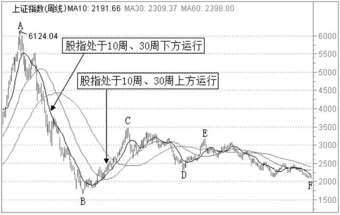

图2\-1 上证指数自2007年7月6日至2012年8月19日的周K线图

从回避风险的角度看，厌恶风险的长期投资者应该回避这段时间的股市投资活动，将资金转投其他项目，比如期货、黄金、债券、汇市等，也可以存入银行。事实上，从社会流动资金的方向和股市成交量分析，这一期间资金确实有很大一部分流出了股市。

作为中小散户，可能很难做到5年的时间里不参与股票投资，那么可以从股市的次级趋势中挖掘机会，回避股市的次级熊市，抓住次级小牛市。

图2\-1中，通过股指和均线形态分析，从A点到B点，股指被MA10压迫下行，与MA30及MA60形成空头排列，是典型的熊市特征。这段时间内，无论是长线还是中短线操作，都不适合投资，应该采取回避风险的原则。从B点到C点，即2008年10月到2009年8月，股市迎来了一轮中级小牛市，股指向上先后突破MA10和MA30，并受到MA10的支撑向上运行，在此期间，投资者可以以次级牛市的思维进行投资，在做好风险控制的前提下，以一定量的资金参入这次次级牛市。比如从技术分析出发，可以以MA10为操作依据，股指有效跌破该均线就止损或止盈。

②回避基本面问题股。对于那些基本面存在问题的个股，中长线投资应坚决回避。股价上涨的根本动力源于上市公司的盈利能力，如果上市公司基本面本身处于风雨飘摇的状态，靠一些不正常的手段支撑股价，实际上下跌风险始终存在，股价越高，风险越大。纵观A股，那些大幅炒作，没有基本面支撑的股票，最后都出现了大幅下跌，从哪里来，跌回到哪里去，多数股票还跌破原来上涨的起点，给参与这类股票的投资者带来不可估量的损失。

③回避股价处于相对高位的炒作股。有些股票质地较好，但经过市场炒作后，股价已经完全透支未来的上涨预期，这类股票也属于高风险股票，其风险主要来源于市场的炒作行为。这类股票都发生在题材和概念炒作时期。当某一时期，某种题材被资金追捧，一些行业或者细分行业的龙头股容易被资金拉抬，从而带动某类股票上涨。一旦题材退潮，或者主力资金达到了预期收益，就会将风险转嫁给追涨买入的中小散户。

图2\-2是众和股份（002070）2012年5月30日至2012年10月31日的日K线走势图。主力资金借助公司收购金鑫矿业，涉足锂电池行业，展开了一轮气势磅礴的快速拉升行情，股价在短短的7个交易日后就实现了翻番。此时市场中的绝大多数投资者都已经获得了丰厚的回报，筹码极容易松动，即使是主力资金，也有了足够的派发筹码的空间，因此投资者需要采取回避风险的方法，没有必要买入或继续持股，以较小的预期收益去承受巨大的风险。

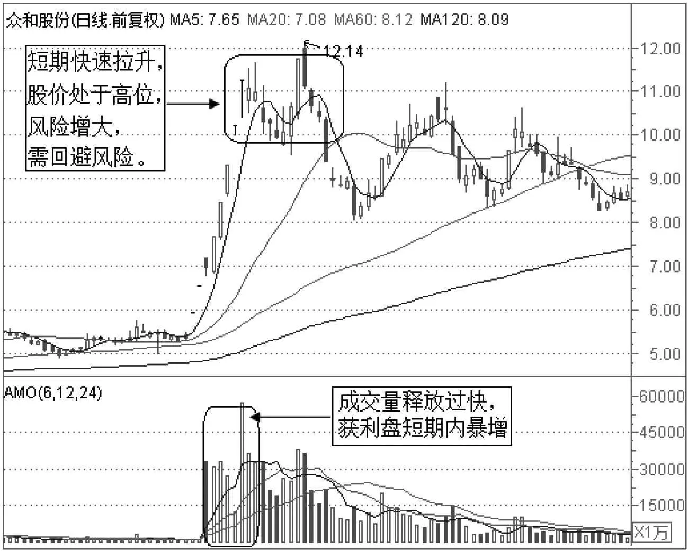

图2\-2 众和股份2012年5月30日至2012年10月31日的日K线走势图

__2．分散风险原则__

分散风险是指将资金分配在多种资产（股票）上，并且这些资产的回报率的关联性比较低，以达到分散风险的目的。这样做既可以降低风险，又不会损失收益，其实这也就是“不要将鸡蛋放在一个篮子里”。

分散风险主要用于防止非系统性风险，即板块或个股所带来的风险。这种风险控制方法既分散了风险，同时也在一定程度上分散了收益，因此在使用这种方法时，需要根据上市公司的品质，确认风险程度，分别对待。

__3．缩小风险原则__

缩小风险原则是指人们在从事经济活动的过程中，不因风险的存在而放弃既定的目标，而是采取各种措施和手段，设法降低风险发生的概率，以减轻可能承受的经济损失。

在股票投资过程中，投资者在已经了解到投资股票有风险的前提下，一方面不放弃股票投资活动，另一方面运用各种技术手段，努力抑制风险发生的可能性，削弱风险带来的消极影响，从而获得较丰厚的风险投资收益。

对于大多数投资者来说，减少风险原则是股票投资中最常用，也是最积极的风险控制手段。

__4．承担风险原则__

承担风险原则是指投资者在其他风险控制方法失效后主动承担风险。这是指在风险已经发生或已经知道风险无法避免和转移的情况下，正视现实，从长远利益和总体利益出发，将风险承担下来，并设法把风险损失减少到最低程度。

在股市投资中，“割肉斩仓”以及长期被套都属于这类消极的风险控制方法。

__5．共担风险原则__

在股票投资中，投资者借助各种形式的投资群体合伙参与股票投资，以共同分享投资收益和分担投资风险。这是一种比较保守的风险控制原则，虽然投资者承受风险的压力减少了，但获得高收益的机会也减少了。遵循这种原则的投资者，一般只能得到平均收益。

__6．保本原则__

投资大师巴菲特很形象地提出风险控制的三条原则：第一条，不要亏钱；第二条，不要亏钱；第三条，牢记前两条。这句话在投资者之间广泛流传，说明在股市投资中保本的重要性。只有保住了投资本金，才可以在股市中生存。保本原则可能并不被广大新股民所重视，其实这一点是非常关键的，它体现了一种风险意识，而这种风险意识可以影响投资的整个过程。

比如，投资者可以通过选好股票来提高保本的安全边际。选对股票是投资的重要和关键一步，为保本奠定了基础，当然也为盈利留出了更大的空间。选好股票包括两方面内容，一是基本面，股票的基本面不能有潜在的风险；二是股价处于安全边际，不能被市场炒高。

另外，也可以在买入点的控制上降低成本价格。买点是非常重要的，首先股价要在安全边际以内，其次是找准买入时机。控制买点也有两个方面，一是买入价格尽量要低，二是时间点最好是股价正好处于向上的拐点范围。

投资者也可以在不得已的情况下进行保本止损，即在股价上涨后又回落到买入成本区域，并且风险仍然没有有效释放的前提下，在成本价上方进行止损，首先保证自己的本金不受到伤害。

__7．一致原则__

在股票投资过程中，投资风格与风险控制要保持一致性，包括投资周期、分析方法等。在买入某只股票前，如果买入的主要依据是基本面，那么在控制风险时，最好也要依据基本面。

在技术分析中，投资的时间周期决定市场趋势的走向。在同一时间点，短期趋势和中期趋势的判断会出现完全不同的结论，投资者在制定和采取某种风险控制方法时，要保证这种风险控制方法与投资周期相一致。

另外，在选择分析工具时，也要尽量保持一致。比如采用均线作为参照物买入某只股票，那么在制定止损或者止盈点时，也要以该均线作为主要参考指标。当然也可以参考其他重要分析工具，比如量能等。

__四、控制风险的几种能力__

根据风险控制的原则，要求投资者必须具备以下风险控制能力。如果投资者不具备这些能力，也就无法掌控自己的资金，就没有在股市中获利的把握。

__1．资金管理能力__

股市中，成功的投资者基本上都是善于运用资金管理技术的行家。资金管理的目标有两个：一个是判断失误时，要能凭借完善的资金管理使资金少受损失或不受损失；另一个是要能达到上涨时手中持有股票，可以在上涨时获利，下跌时有资金可以在低价买入。

__2．规避风险的能力__

股市投资，最好的解套策略也比不上避免套牢的策略。与其被套后资金缩水，心情备受煎熬，费尽心机想着如何解套，不如事先学习并掌握一些防止被套、规避风险的能力和技巧，做到防患于未然。

当市场整体趋势向好时，投资者不能过于乐观，更不能忘记风险而随意追高。在跌市中要注意不能随意抄底。股市风险不仅仅存在于熊市，牛市中也一样有风险。如果不注意规避股市中隐藏的风险，很容易就会遭遇亏损。

__3．缩小和分散风险的能力__

这种能力是指平衡风险与收益之间的关系，在保证预期收益的情况下，尽量缩小风险发生的概率和风险发生的程度。比如，在买入某只股票的时候，尽量在相对较低的价位区买进，而不是追涨杀跌。降低持有成本，本身就是缩小风险。另外也可以灵活调整仓位比例，将风险分散到不同品种的个股中。

__4．解除风险的能力__

当投资者处于被套的境地时，就要应用解套策略。解套策略可以分为主动性解套策略和被动性解套策略。主动性解套策略包括止损、斩仓、换股、做空、盘中T\+0，被动性解套策略包括补仓和捂股。还有更加重要的解套策略，就是解除心理上的套牢。

这些解套方法没有好坏优劣之分，每种方法的具体应用技巧、适用范围、应用原则、适用时机都各不相同，投资者要根据各种不同的情况，因地制宜采用不同的方法，才能更好地发挥解套策略的作用，最终实现解套的目标。

__5．扭亏为盈的能力__

相对于解套能力而言，这是一种更高级别的投资能力。套牢是被动的，但如果能采用正确的应对方法，完全可以化被动为主动。即使是被套的筹码，如果运用得法，也一样可以带来利润。例如采取短线以及超短线“T\+0”的波段操作方法（高抛低吸），逐渐降低成本，最终达到盈利。

__第三节 控制风险的基本方法__

控制风险是一个系统工程。无论采取什么样的风险控制方法，都要根据股市风险的来源和特性，坚守风险控制的基本原则，尽量回避不可控的风险来源，尽力减少可控风险的影响。

__一、正确认识投资风险__

__1．股市属于高风险投资__

正确认识股市投资是高风险行为，才能从心理和方法上加以应对。大家都知道，在股市里，不是每个人都可以赚钱的，亏损的反而是大多数。股市既是投资市场，也是带有赌博性质的博弈场所，存在着零和游戏规则，即有人赚钱，就必定有人亏钱，有人赚大钱，也必定有人巨额亏损。但股市又区别于赌博场所，股市的风险是可以通过投资能力的提高来减少或回避的。

__2．必须考虑自身的承受能力__

既然股市是高风险投资，那么投资者是否能够承受股市带来的亏损，能够承受多大的亏损，这是投资者在参与股市投资前必须要考虑清楚的。超出自身风险承受能力的投资，会极大地影响投资信心，影响现实生活。

不要总是幻想收益，要多考虑风险，不要想“如果能翻番”，而要考虑“我能承受多少亏损”。这样考虑问题并不是消极对待股市投资，而是从心理和计划上做好准备，更有利于创造投资收益。

__3．树立正确的投资理念__

树立正确的投资理念，培养适合自己特点的投资风格和方法，这一点在前面已经讨论过，关键是要克服“暴富”思维，脚踏实地积累财富。

__二、选择适当的投资机会__

股市投资有时间性，有的时候适合投资，有的时候需要回避，选择适当的投资机会是股市获利的关键。一个成熟的投资者，知道什么时候应该回避股市。在不适合股市投资的时候，可以将资金投入到其他方面，甚至闲置；当股市投资机会来临的时候，再回到股市中拼杀。失败的投资者往往不分青红皂白，不管市场风险大小，一味地沉浸在股市中，进行毫无意义的交易，这样就注定了最终是要失败的。

如何选择适当的投资机会？对于不同风格的投资者可能有不同的标准，无论是以价值投资为核心的投资者，还是以技术分析为手段的交易型投资者，寻找投资机会的核心标准是一致的，即风险大于收益的时候，就是远离股市的时期，收益大于风险时，则是回到股市的时候。

价值投资者在价值被市场低估的时候进行投资，在价值高估时远离市场；交易型投资者是在股市处于上升趋势的牛市时参与投资，在处于下降趋势中离开市场。

__三、制订合适的投资计划__

股市的风险来源较复杂，有无法控制的系统性风险，也有人为的交易性风险，既有可控的预期风险，也有无法控制和预期的偶然风险。针对这些复杂的风险渠道，投资者不可能临时采取措施来防范和弥补，而需要做好充分的准备，针对市场特性和投资风格，做出恰当的投资计划。这样既可以防患于未然，也可以克服投资过程中人为的失误，减少错误的发生，减少盲目操作。关于制订投资计划的内容，可以参考前文的讲解。

__四、从选股开始__

A股市场的几千只股票中，并非所有的股票都具有投资价值或操作价值，在选择可操作的股票之前，首先要剔除那些风险大于回报的股票，尽量选择风险性较小、预期收益较大的股票。投资者可以根据不同的投资风格和分析方法来选股。

__1．价值投资选股__

价值投资选股的方法有多种，主要是围绕上市公司的基本面分析展开，包括公司的经营特点、市场地位、财务状况、盈利能力以及成长性。根据投资风格，主要分为价值型选股和成长型选股。

价值型选股是指投资者更关注公司的盈利能力、市场地位、财务状况以及分红派息情况。一般适合价值型投资的股票，其基本面表现为：盈利能力稳定；市场地位较高，一般是行业龙头；财务状况良好，不存在财务风险，或者财务风险较低；公司能够给投资者带来稳定连续的现金分红。

成长型选股是指投资者更关注公司的未来成长性，比如盈利能力的增长、产品未来的市场竞争力、扩张的强弱等。

价值投资选股的具体方法是通过公司的财务报告，来计算公司的财务指标，并加以分析和评估。具体内容可分为五个方面，即公司的投资价值与风险、运营效率、盈利能力、企业盈利的真实性和企业前景与评估。图2\-3是关于这五个方面分析的结构图，供读者参考。

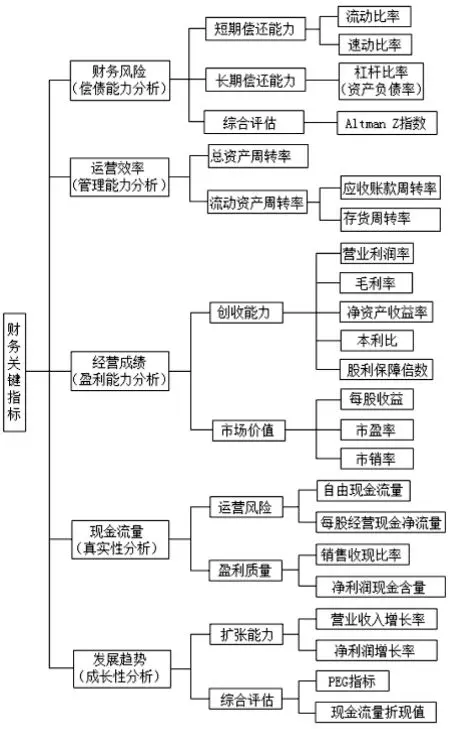

图2\-3 价值投资的分析内容

__2．趋势投资选股__

趋势选股是技术分析者在投资中使用的选股方法，它注重的是股价的实际表现和运行趋势，这种趋势包括股价走势、市场活跃度变化趋势。一般情况下，选股需要选择趋势稳定向上和交易较活跃的个股。

长线、中线和短线投资者要根据市场不同级别的趋势来考虑，长线投资者要选择市场长期主要趋势向上的个股，中线则以次级趋势为主，兼顾主要趋势；短线投资者往往不考虑主要趋势，只是兼顾市场的次级趋势，以炒作和短期趋势为主。对于不同的投资周期，采用的分析指标和工具需要与操作的周期对应，即不能用长期趋势来指导短线选股，同样也不能用短线分析方法来选择长期投资的个股。

趋势选股的指标有很多，较常用的有以价格为基础的均线、技术形态、K线形态、切线等，以及以成交量为基础的筹码分布、成交量形态等，此外还有布林线、MACD指标、KDJ等诸多指标。这些在后面的趋势投资策略中将进行详细介绍。

__五、控制仓位比例__

仓位是指投资者股票投资账户资金与实际投资的比例。比如某投资人的股票投资账户有100万元资产，其中有50万元现金资产，50万元已购买了A、B、C三只股票，三只股票的资产分布为10万元、15万元和25万元，那么该投资者的总仓位为50％，其中股票A、B、C的仓位分别为10％、15％和25％，图2\-4是该股票账户的仓位分布图。

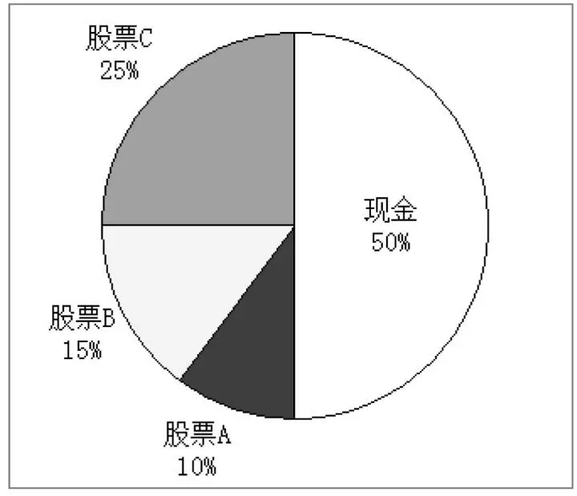

图2\-4 仓位分布图

控制仓位比例是资金管理的主要内容，是控制风险最直接和最有效的手段，也是提高资金运作效率的必要管理方法。投入资金的多少，本身就说明了承担风险的大小。投入资金的比例与承担既定投资产品的风险是成正比的，当然也与投资收益成正比。当市场风险增大时，投入资金比例要减少；反之市场风险减小的情况下，投入资金要增大，这是资金管理的最基本原则。

比如图2\-4中，采用50％的仓位，说明当前市场不可控的风险程度是投资者承受风险极限的50％左右，因此采用50％的资金进行投资。投资者采用投资组合的方式来分散风险，分别买入了A、B、C三只股票，但这三只股票的风险程度与收益预期的平衡关系并不相同，因此投资者投入的资金也不相同，股票C的收益预期与风险程度的关系要好于其他两只股票。

仓位控制是股票投资风险和资金运用效率的第一道关卡，也是最直接的主动性风险控制方法。

__六、制定止损止盈标准__

__1．止损__

止损是指某一投资行为出现的亏损达到预定数额，潜在风险仍然存在甚至会扩大的情况下，及时采取斩仓出局措施，以避免形成更大亏损的交易行为。止损的目的在于投资失误或者出现较大的潜在风险时，将损失限定在较小的范围内。

股票投资与赌博的一个重要区别，就在于前者可以通过止损将风险限制在一定的范围之内，同时又能够在操作成功时最大限度地获取利润。换言之，止损使得以较小代价博取较大利润成为可能。股市中无数血的事实表明，一次意外的投资错误足以致命，止损则可以像安全带一样，在危难之时挽救你的生命。

俗话说：留得青山在，不怕没柴烧。止损是散户的专利，机构不可能止损，因为机构持有的筹码太多，一般来说市场没人能够接得下来。机构处理决策错误或外部事件的一个常用办法，是拿部分筹码高抛低吸做波段，然后伺机隐蔽出货。

__2．止盈__

止盈也称停利、止赚、止赢，就是在目标价位挂单出货。止损则是在投资者能够承受的风险损失的价位挂单出货。止盈的核心思想是见好就收。

止盈可以分为静态止盈和动态止盈。

静态止盈是指设立具体的盈利目标位，一旦到达盈利目标位时则止盈出局，这是克服贪婪的重要手段。静态止盈价位的设置方法，主要依赖于投资者对大势的理解和对个股中长期走势的观察判断，确定的止盈位基本上是静止不变的，当股价涨到该价位时，立即获利了结。这种止盈方法适合于中长线投资。投资能力较弱的投资者，可以适当降低止盈位标准，以提高操作的安全性。

动态止盈是指当投资的股票已经有盈利时，由于基本面和技术面仍然支撑股价进一步上涨，投资者仍然对该股有进一步的收益预期，因而继续持股，一直等到股价出现回落，基本面或技术面出现问题时，再采取类似止损的获利了结操作。

止损、止盈与仓位控制，在控制风险和收益最大化中都有不可替代的作用。仓位控制是对整体风险判断后采取的宏观管理措施，止损与止盈是落实到具体操作和行动中的交易行为，它们与选股共同组成了股票投资的铁三角关系，这也是本书探讨的核心内容。

__七、善于总结经验和教训__

投资专家和操盘能手，都是在实践过程中成长起来的，总结成功的经验，吸取失败的教训，是迈向成功的必由之路。在总结经验教训时，首先要从投资理念上确认是否正确，其次是计划的严密性，再次是操作方法和技巧。

许多较成功的投资者，就是在血的教训中不断总结经验，改变原有不正确的投资理念，培养适合自己的投资风格，并坚持不懈地完善自己的操作方法，他们在股市中的获利方式就是这样形成的。

股市投资没有最好的方法，只有更适合自己的方式；没有百战百胜的将军，只有笑到最后的成功者。

__第四节 股票投资的风险量化决策__

上面对风险的讨论都只限于理论和逻辑分析，风险本身给人一种模糊的概念，很难用具体量化，或者用图表来衡量，这样就很难给投资者一种清晰的标准。风险的量化和图形分析则可以对风险进行度量，用明确的数据和图表显示风险的程度。

下面介绍两种量化风险的方法。

__一、期望值法风险量化分析__

__1．风险量化的概念__

风险量化是指通过风险及风险相互作用的估算，来评价投资可能出现的结果范围。风险量化用于衡量风险概率和风险对投资目标影响的程度，投资者可以通过对不同投资品种风险量化后的结果进行比较分析，从而得出投资结论。

__2．风险量化分析依据__

对股市风险量化分析的依据，主要来源于引发股市风险的因素。对这些风险因素进行计划管理、计算评估，利用投资者采用的分析工具，从不同角度对股市的未来变化给予评价，最终综合得出风险量化结论，提供投资决策。

__3．期望值法__

风险量化的方法有多种，从广义上讲，分析股票的任何工具，都可以作为股票风险量化或图形化的依据，将这些分析工具有效地组合起来，可以形成一种综合的风险评价系统。这里介绍的期望值法是较为传统的风险量化评价方法，也是风险评估的一个重要指标。

期望值法是通过计算投资项目净现值的期望值和净现值大于或等于零时的累计概率，来比较投资方案优劣、确定投资的可行性和风险程度的方法。所谓净现值，是指投资项目效益的现值之和，减去各种费用的现值之和后所得的差值。

__4．期望值法的分析步骤__

①确定不同情况下投资者对投资收益的期望值。比如投资者在最好情况、中等情况和较差的情况下预期的收益或损失。

②列出影响股价变化或者影响最终受益的不确定性因素。例如宏观经济、行业状况、上市公司基本面，以及交易市场和投资者个人因素带来的风险。

③估算各种不确定因素每种情况下发生的概率。各种不确定性因素在每种情况下的概率必须小于等于1并且大于等于零，且所有可能发生情况的概率之和必须等于l。这种概率为主观概率，投资者可以根据自身的分析能力，或者利用权威分析机构及专家学者的观点，对这些不确定性发生的概率进行主观判断评估，给出确切的数据。

④分别计算各种可能情况下的净现值。

⑤计算各种可能情况下的综合净现值，即期望值。

__5．案例：芭田股份（002170）__

芭田股份是一家集科研、生产、销售为一体，以生产复合肥、缓/控释肥、灌溉肥、绿色生态肥为主业，开发利用工农业废弃物、变废为肥的环保型国家高新技术企业，国家科技创新型星火龙头企业。属于农药化肥板块。

图2\-5是该股2007年9月19日上市至2012年8月21日以来的周K线走势图。假设现拿出20万元资金准备投资该股，投资周期为6个月，在不高于9元的价格下买入。未来6个月的市场表现存在三种可能。

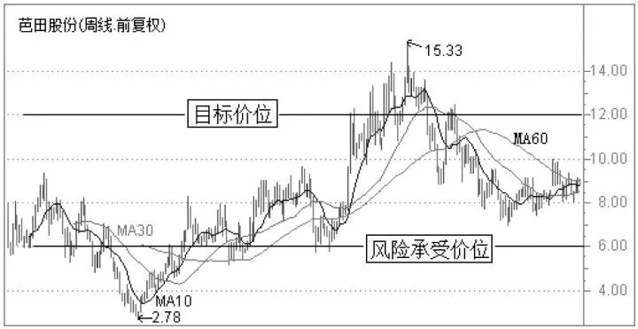

图2\-5 芭田股份2007年9月19日至2012年8月21日周K线走势图

第一种，在综合情况较好的情况下，该股股价能够达到图2\-5中的目标价位12元，那么预期收益达到30％，即6万元。

第二种，市场表现一般，股价可能仍在9元区间震荡，预期收益率是0％，预期收益为0元。

第三种，如果该股表现较差，股价可能跌回到前期相同底部6元价位，其风险损失为30％，即可能损失6万元资本。

另外，如果将20万元资金存入银行，可以稳获3000元利息。

现在从宏观经济基本面、公司基本面和技术面三个方面，对“好、中、坏”三种可能出现的概率进行评估。

①宏观经济。 对于宏观经济，这里选择以下三个方面进行分析评估。

第一，国际经济形势。在以后的半年时间里，世界经济形势总体上仍将十分严峻复杂，但经过过去一年多的消化和调整，虽然在短期内出现经济复苏好转的可能性不大，但进一步下滑的概率也在减少。首先，世界经济下行压力加大。作为世界经济龙头的美国，近期经济出现改善苗头，但长期增长势头依然微弱，房地产低迷，失业率居高不下，消费增长缓慢。日本经济长期靠外需拉动，但受日元升值、自然灾害因素的影响，2011年日本出现了30多年未见的贸易逆差，加上国内部分产业呈现外迁趋势，预计日本经济2012年增长前景黯淡。在新兴经济体中，俄罗斯、巴西、印度、南非等国经济虽然保持增长态势，但由于通货膨胀困扰，在控通胀和保增长方面面临两难选择。其次，欧洲主权债务问题短期内难以解决。欧盟长期的高福利政策以及巨额开支，使财政赤字、公共负债难堪重负。再次，各国博弈更加激烈。在国际金融危机冲击下，世界政治经济格局酝酿深刻变化，各国利益诉求分化明显，在出口、科技创新等方面竞争将更加激烈。又恰逢多国大选，全球合作和政策协调难度明显加大。另外，全球物价走势不容乐观。当前供需矛盾尚未有效缓解，多种商品实际仍处于脆弱的紧平衡状态，加上发达国家持续实行超宽松货币政策，为未来经济埋下了通胀的种子。

根据以上分析判断，可以给国际经济形势的“好、中、坏”三种可能发生的概率分别给予20％、40％及40％的比例，也就是对国际经济形势给予较负面的判断。

第二，国内经济形势。引用温家宝总理对我国经济形势的判断，就是还有一段困难时期。因此对国内经济形势的判断也给予负面评价，“好、中、坏”三种可能发生的概率分别为20％、40％及40％。

第三，政策风险。这方面可以给予积极的评价。无论从货币政策以及产业规划政策来说，目前绝大部分政策都处于放宽中，当然，房地产、高污染高能耗等产业还是受到政策的限制。因此在政策方面，“好、中、坏”三种可能发生的概率分别为50％、30％及20％。

②公司基本面。 关于芭田股份的公司基本面，这里选择了行业地位、行业前景、财务状况、公司管理运营能力、盈利能力和发展空间等六个方面进行评估。分析过程包括查询行业资料，对比公司规模及产品竞争力；纵向和横向对比分析公司及同行业其他公司的财务报表以及关键财务指标等。

这样就可以对以上六个方面内容给出“好、中、坏”三种可能发生的概率，见表2\-1。

③技术面。

大盘趋势：当前大盘处于长期下降趋势中，但已经进入筑底过程。因此未来6个月，大盘趋势出现反弹和构筑长期底部的概率偏高，即使下跌，其空间也有限。

个股趋势：从图2\-5该股的周K线图来看，该股长期主要趋势处于微微向上的运行势态中。图2\-6是芭田股份同期的日K线走势图，根据对日K线的走势分析，该股处于构筑中期底部的后期，各条均线开始收敛，MA120即半年线和MA60已经开始向上转向。因此从个股的技术形态来看，后期向上的概率较高。

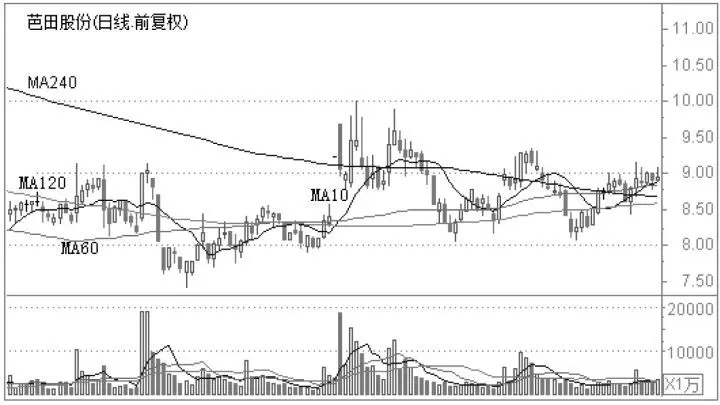

图2\-6 芭田股份2012年2月20日至2012年8月21日日K线走势图

在未来6个月的时间里，技术面可能走势发生的概率如表2\-1所示。

这样就从三大方面分别得出了好、中、坏三种可能发生的概率，如表2\-1中“综合评估”栏的数据。

表2\-1 芭田股份2012年8月至2013年6月期间状况评估表

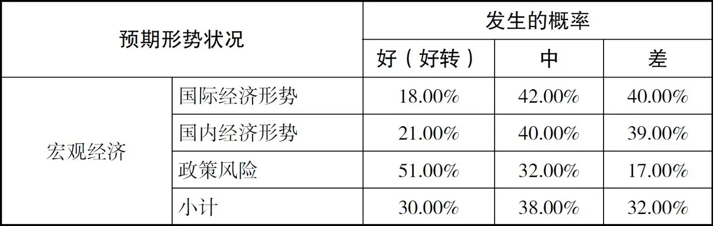

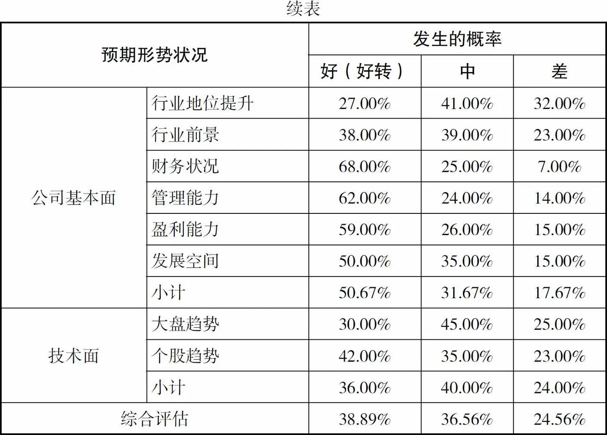

这样就可以得出结论，芭田股份在2012年8月至2013年6月期间，对三种可能发生的情况进行期望值法评估分析，最后得出的综合结论是投资收益为8600元，收益率为4\.3％，高于存入银行获得的3000元收益，因此可以在9元下方投资该股。

对该股进行期望值法风险量化分析，只是确定基本可以参与该股投资，但具体操作的方法手段、资金如何运用等，仍需要投资者做好计划，而且实际买入价格仍需投资者在盘中捕捉。

__二、决策树在股市风险控制中的运用__

__1．什么是决策树__

决策树广泛应用于包括投资决策在内的各种经营活动中，因其形成和运行方式呈现树状，故称决策树。每个决策或事件（即自然状态）都可能引出两个或多个事件，这些事件导致不同的结果，把这种决策分支画成图形，很像一棵树的枝干。

决策树的构成有四个要素：决策结点、方案枝、状态结点、概率枝。如图2\-7所示，该图是一个由两个方案，三种可能发生的情况构成的最基本的决策树示意图。

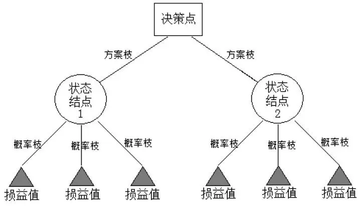

图2\-7 决策树示意图

决策树的决策构成就是对风险的评价过程。对每个方案的预期收益或风险与可能发生情况的概率进行计算，得出每一状态结点的收益或者损失，然后对比不同方案的收益大小或风险程度，从而给最终决策提供依据。

__2．决策树决策应具备的条件__

决策树运用于股票投资决策，应具备以下条件。

①投资者对不同投资方案有较明确的期望目标。

②有两个以上的投资方案可供选择。

③投资过程中存在两种以上可能发生的情况。

④在不同投资方案下，可能出现不同情况下的收益或损失可以计算。

⑤投资者能够对不同状态下发生的概率进行有效评估。

在以上的条件中，与期望值法相似，对不同情况下发生的概率进行有效评估是关键，也是难点，这些概率越准确，结果越正确。

__3．决策树决策方法的运用步骤__

①绘制树状图，根据已知条件，排列出各个方案和每一种方案的各种自然状态。

②将各状态概率及损益值标于概率枝上。

③计算各个方案期望值，并将其标于该方案对应的状态结点上。

④进行剪枝，得出最佳方案。比较各个方案的期望值，并标于方案枝上，将期望值小的即劣等方案剪掉，所剩的最后方案为最佳方案。

__4．案例：防御板块与进攻板块对比__

在股市里，经常遇到几种投资方案很难选择的情况，特别是选择防御还是进攻板块，投资者总是难以获得一个明确的答案。通过决策树，有时候可以帮助投资者作出判断。

大家都知道，当经济处于衰退时，以有色金属等资源类板块为代表的强周期板块，往往会出现明显高于大盘下跌的速度，而医药食品类板块则会有较强的抗跌性。一旦大盘开始反弹，或者因经济复苏出现反转，那么有色金属等强周期板块会率先突起，涨幅又会远远高于大盘，而医药类防御型板块的涨幅则相对较小。

下面看一下表2\-3统计的2008年11月至2012年8月22日以来的数据。在这段时间里，上证指数出现了两次中级上涨行情和两次下跌行情，对比上证指数、医药指数和有色金属指数的涨跌幅，很明显地反映了这一现象。这种现象存在于A股整个历史以及美国等国外股市中，出现这种现象的原因是经济循环周期带来的必然结果，因为经济的好坏直接刺激资源的需要程度，而医药等消费类个股并不会因经济的好坏改变社会需求。

表2\-3 上证指数与医药指数、有色金属涨跌幅对比表

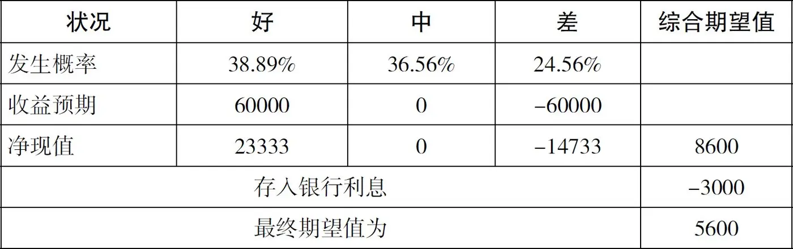

那么如何根据大盘的变化来比较这两种不同的投资方向呢？下面用决策树来进行分析。

基于对大盘的判断，可以对未来一年的大盘做一个期望预测。当前的上证指数是2100点。2012年8月22日，上海证券交易所公布的上证A股市盈率为11\.3倍，已经远低于一般认为安全的市盈率15倍的数值，显示目前大盘筑底的可能性较大。即使目前经济还没有出现明显的复苏迹象，大盘继续下跌的空间也不会大。我们将未来一年大盘的走势分为三种可能的情况。

①表现好。一年内最高上涨幅度为30％，即能够到达2730点上方，这种情况发生的概率为38％。

②表现持平。一年内仍然维持现状，以涨跌幅为0来计算，仍然在2100点附近，该状态发生的概率为35％。

③表现差。下跌到前期大跌的低点1664点，即下跌幅度为20％，该情况出现的概率为27％。

假如我们有20万元资金，如果将该资金用于其他项目投资，可以获得10％的无风险收益，即2万元。如果投资股市，有可能获得更高的收益，也可能亏损。

投资股市有两种选择，一是选择防御型投资，预期投资医药板块；二是较积极地投资风险相对较大的有色金属板块。也就是说我们面临两项决策：一是是否投资股市，二是如果投资股市，将采取防守方案还是较积极的方案。

首先来对这三种情况的投资预期进行分析。

①不投资股票。会获得2万元的无风险收益。

②投资医药类股票。根据前面对医药指数与上证指数之间的表现关系，对大盘可能出现的三种情况给出不同的期望值，当大盘表现好，上涨30％，投资期望收益率为40％，即获利8万元；如果大盘持平，则收益率为15％，收益为3万元；如果大盘表现较差，承受的损失为15％，即亏损3万元。

③投资有色金属。同以上分析一样，在大盘表现好、中、差三种情况下的损益值分别为15万元、2万元和亏损8万元。

这样就可以得到各方案的效果、概率和损益值，如表2\-4所示。

表2\-4 各方案的投资效果、概率和损益值

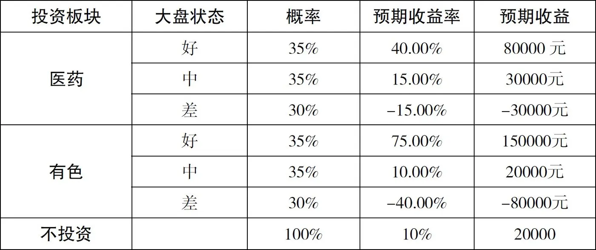

根据表2\-4提供的信息，就可以制作一个简单的决策树。

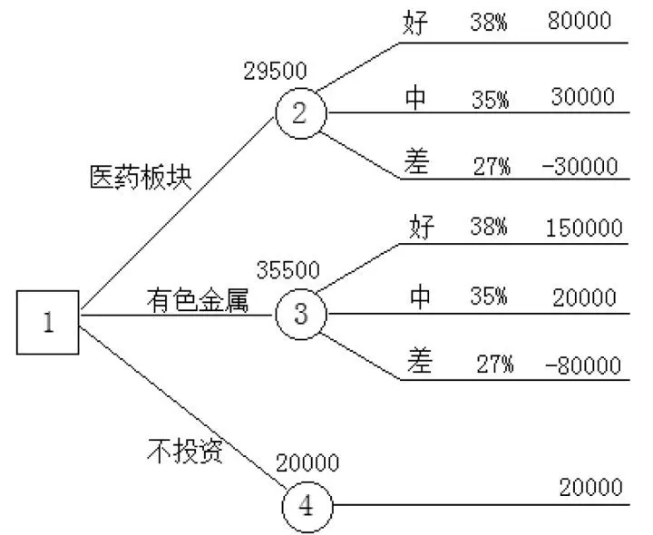

图2\-8 简单的决策树

图中有三个状态结点②、③、④，一个决策点“1”，状态结点的期望值计算式为：

状态结点②期望值＝38％×80000\+35％×30000\+27％×（\-30000）＝29500元。

状态结点③期望值＝38％×150000\+35％×20000\+27％×（\-80000）＝35500元。

状态结点④期望值＝20000元。

将计算出来的期望值数据，标记在各状态结点的上方。

最后根据决策树中结点的期望值数据，可以确定最佳方案，比如该案例选择的最佳方案是投资股票的有色金属板块。

以上是对医药板块和有色金属板块在特定的大盘趋势下进行的对比，只是反映在特定大盘背景下两个板块指数最有可能出现的情况。实际投资中还需要进一步确认到具体的个股，如果个股选择正确，其收益会高于板块指数的涨幅；相反，如果选择失误的话，最终结果可能不如板块的整体表现。

在选择个股时，这些股票除了有板块共有的特性外，还受到自身基本面及技术面因素的影响，此时可以通过同样的分析方法，对那些备选股进行比较，最终找到最有希望带来更多收益的个股。

__本章小结__

投资的目的是为了获得盈利，但投资的关键却是控制风险。在股票投资中有很多这样的教训，辛辛苦苦赚到的钱，却在某一次没有做好风险控制的操作中全部损失，甚至出现大幅亏损。也有很多投资者因为某一次较大的亏损，很长时间都无法翻身。这些都说明控制风险的重要性。

要控制好风险，首先要了解风险的来源。风险的来源有不可分散的系统性风险，这是给股市整体带来风险的因素，个人投资者无法改变，只有回避。比如，宏观经济恶化、政策风险、利率风险、不可抗拒的突发事件风险等。还有一种是非系统性风险。在非系统性风险中，行业、上市公司给股票带来的风险也是投资者无法掌控的，像系统性风险一样，只能回避。投资者能够控制的，只有自己的交易行为。投资者可以通过投资策略、资金管理等交易技巧，来回避风险、分散风险、缩小风险，或者承担已有的风险。

股市投资中，投资者既是被动的，也是主动的。所谓被动，就是被动地承受市场给投资者带来的风险；主动则是投资者有权利选择是否承担风险，决定承担风险的程度，以及用什么样的方式承担风险。聪明的投资者总是会在风险与收益之间寻找平衡，在市场积累的风险远高于收益时，将风险转嫁给别人。当风险充分释放后，又主动地承担较低的风险，以获取更大的收益。想成为一名聪明的投资者，就要掌握风险控制的基本方法，了解股价或指数与风险之间的关系，学会寻找投资的机会和投资节奏。

期望值法风险量化分析和决策树风险控制方法，是股市投资中较常用的风险决策方法，它们能够帮助投资者选择投资方向，回避较大的风险。

## 第三章　止损

__第三章 止损__

__第一节 止损概述__

止损是指某一投资出现的亏损达到预定数额，潜在风险仍然存在甚至会扩大的情况下，及时斩仓出局，以避免形成更大亏损的交易行为。

根据投资者的投资风格、风险承受能力以及投资分析工具的不同等，止损的方法非常多，如果按照止损的目的，可以分为保护性止损、盈利性止损和事件性止损；根据分析工具的不同，止损可以分为技术止损、基本面止损、定额止损和突发性止损等。还可以从其他角度进行分类，各类别之间都是互相交错的，比如保护性止损中就包括技术止损方法或其他方法，同时技术性止损也有保护性的、盈利性的或者是突发事件性的。因此，投资者没必要将各种止损方法进行绝对区分。

无论是哪种方法，止损都是投资者采取的一种控制风险扩大的方法，在投资失误或者出现较大的潜在风险时，将损失限定在较小的范围内。

__一、正确理解止损__

关于止损的必要性，市场中有不同的观点，一种是认为非常重要，是股票操作的重要风险控制手段。另外一种观点则认为止损没有必要，止损实际上是一种将自己廉价的筹码转让给别人，自己承受亏损的愚蠢行为。

这两种观点，笔者自然是同意前一种。后一种思维方式出现了较大的偏差，根本原因在于对止损的内在含义没有理解清楚。在正确认识止损时，需要理解和掌握止损的核心内容，即“止损对自己是截止风险，将风险转移给别人”。

止损并不是将廉价的筹码转让给别人，而是将风险转移给别人。如果明知是廉价筹码，投资者一般是不可能卖出的。止损的关键是尽量分清所持筹码的风险程度是否可控。在股票交易中，中小散户的先天缺陷（如资金、信息的不对称），决定了他们在股票投资中处于劣势，风险可控性非常低，因此设置止损是非常必要的。

投资股票就是买和卖，买是找到良好标的股和最佳的买入价格。卖也分两种，一种是获利卖出，可以称为止盈。还有一种是亏损卖出，一般是在市场出现风险加大的情况下，为了避免更多的损失而采取的卖出交易，这种卖出交易就是止损。虽然两种卖法有着本质的不同，但都需要寻找合适的卖点。

止损与其他交易一样，不可能总是正确的。有的投资者在止损后，发现股价又涨上去了，自己止损止在最低点，于是懊悔不已，觉得止损没有什么用处。这种想法是不正确的。

买入总是挑选上涨可能性较大的股票，而止损是卖掉下跌可能性较大的股票。我们通过各种分析，评估股票上涨与下跌的可能性，并朝可能性较大的方向采取行动，但其结果并不会100％正确。比如，即使我们的技术水平不高，但市场的大趋势是可以看出来的，我们只做大趋势向上的个股，这样就可以保证获胜的概率至少大于50％。

假设我们完成了10次交易，其中5次买入后市场出现了下跌。如果将损失控制在3％，也就是说，不管后市如何发展，我们采取3％的定额止损，这样总亏损是15％。另外5次是成功的，股价上涨趋势不变，我们就持有股票。假设其中一只股票能够上涨到15％，我们就可以盈利。

这种做法很简单，原因是在大盘趋势向上时，一般大部分股票是上涨的，这就保证了我们在选择股票时，有50％以上的可能性选对股票。另外通过止损的办法控制损失的额度，对上涨盈利则松绑，这样就有较大的胜算。这也就是止损的重要意义。

止损作为一种风险控制手段是非常有必要的，但并非一定要实施。就像驾车时司机一定要系上安全带，但安全带并非一定要发挥作用。投资股市时，我们制定严密的投资计划，设定严格的止损标准，是为了防止市场风险带来损失，防止损失进一步扩大，但是更好的办法是避免这种情况的发生。我们制定止损计划，就像是给自己系上安全带，以防万一股价跌落，而不是一定要用得上，事实上我们更希望不会用到。

在制定投资计划时，首先考虑的就是投资安全，从多个角度降低风险。比如，要尽量选择最适合的投资环境入市，选择基本面最好的公司，用最低的价格买入。但这些只是理论上的说法。

一方面，优秀的公司往往很难有较便宜的股价，投资环境也是动态的；另一方面，由于投资者的分析能力、信息掌握程度的限制，也无法从几千只股票中分辨出没有风险的股票。因此整个投资过程都是在风险与收益的对比中完成的。

在建仓阶段，应该是风险相对最低的时候，如果用量化概率来对比，至少这个阶段获取收益的可能性在70％上方，而风险应该低于30％。如果未来股市的发展是沿着大概率事件进行，那么止损也就用不着。但是30％以下的概率并非是不可能发生的事件，止损就是为这30％的可能性准备的。如果投资者自身的能力有限，在买入股票时追涨杀跌，那么一开始的胜算可能无法达到70％，如果再不做止损等风险控制措施，那么亏损就是必然的。

止损一般只适合资金投入较少的中小散户。止损时需要保证在止损价格能够卖得出去。止损经常发生在市场出现恐慌的时候，此时股价下跌速度较快，出现异常情况时，甚至在很短的时间里直接被封住跌停，如果持股数量较大，就很难保证成功止损。如果说资金少、信息闭塞是散户的缺陷，那么止损应该是小散户们的权利了。“截断损失，让利润奔跑”，就是普通投资者的投资格言。

对于不同操作风格的人，止损的作用大小也不尽相同，要以不同的操作风格特点来区别使用止损。投资者要分清每次投资的特点以及市场的特点，合理运用止损。

在制定和实施止损时可以考虑以下因素。

①是投机行为还是投资行为。

②投资周期的长短。

③买入时是否在既定的最低价格区间。

④当前的大盘和个股趋势。

⑤把握主力资金的动向。

⑥仓位的轻重。

⑦投资者能够承受的风险程度。

__二、止损的原则__

①止损标准一定要与投资周期相对应。 中长线投资不能以短线方法制定止损标准，同样，中长线分析手段也不适合短线操作止损分析。理由很简单，就是趋势不同。市场的主趋势与次级趋势或者小趋势，它们的方向完全可以是相反的。

②止损标准要合理并切实可行。 止损是在不得已的情况下截止风险的最好办法。如果止损标准不合理，可能带来三种结果，一是难以执行，二是使亏损过大，三是止损点成为以后的买点。要制定合理的止损标准，就要通盘考虑自己的投资目标和计划，考虑风险承受能力，根据自己的投资周期和分析方法制定止损标准。

③支撑投资股票的理由消失时要止损。 进行任何投资都需要理由。股票投资中，无论买入哪只股票，投资者总有初始的动因，可以是技术方面的，也可以是基本面或者是消息面的。如果该动因消失，那么投资者就可以考虑止损。例如，投资者因某只股票向上突破，中期趋势向上转向而买入该股。那么这次投资则属于通过技术分析确认的中线投资行为。假设该股后来的走势与预想相反，中期走势重新向下，那么投资该股的条件丧失，因此需要进行止损。

④下跌趋势中，止损指令更有效。 下跌趋势本身就是一种既成事实的风险，但市场中的一些流动资金会利用各种方法，比如利用消息或某些技术指标给投资者制造假象，引导散户做有利于自己的操作，从而将风险转嫁给中小散户。因此在一个下跌趋势中，止损行为更加重要，也更加有效。

⑤上涨趋势中，止损计划或行动需要获得其他方法的佐证。 与市场处于熊市的情况相反，有时候主力资金会利用某些消息和技术指标制造恐慌信号，致使普通投资者放弃手中的筹码，从而达到收集筹码的目的。此时投资者在制定止损计划和执行止损指令时，最好多考虑其他因素，分清主力资金或者市场变化的实质。

⑥止损是在承认失败的前提下实施的。 止损是被动接受损失和承担风险的风险控制方法，一旦执行止损，说明投资者已承认自己的错误，承认失败。

⑦止损更多地用于中短线投资。 中短线投资往往对基本面的要求不高，较少考虑经济环境和大盘主要趋势，股价的波动随机性更强，更难以把握，其风险明显高于以基本面为主的长线投资。因此止损在中短线投资中尤为重要。

⑧中短线止损分析方法以技术分析为主，中长线投资以基本面和主要趋势为主。 中短线投资主要是赚取股价波动的差价，是以交易市场为基础的交易行为，故整个投资过程都围绕交易市场的技术分析，因此在制定止损措施时，也应该以技术分析为主。中长线投资则更注重基本面分析，宏观经济状况和大盘趋势、个股基本面是投资决策的核心内容。一般情况下，只要基本面没有发生质的变化，投资者是不会采取止损策略的。

⑨令行禁止，严格执行止损计划。 制定了止损计划后，如果市场变化达到了止损条件，就应该严格执行，避免优柔寡断，让风险继续扩大。实际操作时，当股价跌到止损位置，人们往往患得患失，怀疑所谓的庄家在洗盘，在吓唬散户，认为“这应该是底部了”，正是这种思维，才导致原有的止损计划失败，风险继续蔓延。为了克服这种患得患失的思想，投资者可以再认真检查一下自己的止损计划是否合理，如果确认是正确的，就会增加执行的决心。另外，投资者也可以做一个统计，认真回顾以前没有执行止损的痛苦教训。

⑩尽量避免止损。 止损总会给投资带来一定的损失，如果投资中没有出现止损，这就是成功的交易。我们制定止损是为了防止万一，实际投资中则要尽量避免止损。如何避免呢？这就需要在投入真金白银以前就做好各项准备工作，尽量对市场的趋势作出准确判断，尽量降低买入价格，尽量使止损标准设置得更合理。

__第二节 目的止损__

__一、保护性止损__

保护性止损是指当损失达到一定程度时，立即对这项造成损失的投资进行了结，以便把损失限定在一定的范围之内。保护性止损是一种终止风险的风险控制行为，投资者一般以保护本金为宗旨，为以后投资提供资金保障。

保护性止损是最直接、最有效的止损手段，它有利于投资者克服心理弱点。这些心理弱点包括：不愿面对账面亏损的事实；对市场抱有不切实际的幻想，认为市场将很快转变原有趋势，从而挽回损失；不肯服输，抱着不赚不卖的态度，“心甘情愿”地主动套牢。这些心理弱点普遍存在于投资者中，使多数投资者成为市场的输家。

案例：冀东水泥（000401）保护性止损设置。

图3\-1是冀东水泥（000401）2011年1月21日至2012年5月22日的日K线走势图。

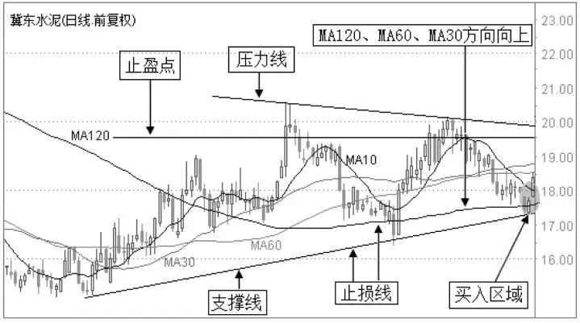

图3\-1 冀东水泥2011年1月21日至2012年5月22日的日K线图

对于该股，可以做以下简单计划。

①投资理由： 宏观经济仍然没有明显好转，大盘的主趋势仍属于下跌趋势，次级趋势为横盘。个股技术面上，MA120、MA60和MA30均出现底部向上多头排列，MA10则处于横盘振荡之中，股价受到半年线MA120和底部支撑线支撑。单期股价触及MA120，受到该线和支撑线强烈支撑，K线出现了刺透形态，故此确定投资周期为中短线。从技术分析看，有理由在该位置买入该股。

②投资周期： 短线。

③总仓位比重： 20％。

④主要分析工具： 技术分析，以MA120均线（半年线）、K线形态、支撑线和压力线为主。

⑤买入成本： 17\.55元。

⑥潜在风险： 大盘与个股的主要趋势为下跌趋势，个股走势是否能够继续完成中继三角整理形态仍不确定，存在直接向下突破和中途变盘的可能。

⑦止损计划： 如果股价出现预期上涨，超过成本价后，采用本金保护止损，加3‰费用，即17\.60元；如果与预期相反，股价向下有效跌破半年线与支撑线，为止损点。

这样我们就可以按照以上操作计划投资。

图3\-2是该股运行至2012年6月19日的日K线图。从图中可以看出，短线投资计划是成功的，5个交易日后，股价站上了19\.50元上方。根据投资计划，需要在此位置进行止盈。也就是说无论后市如何发展，都要在19\.50元卖出，并获得11％的收益。

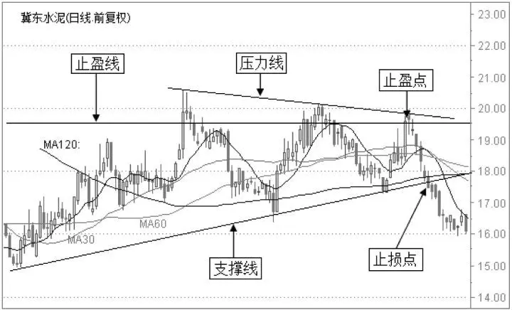

图3\-2 冀东水泥2011年12月12日至2012年6月19日的日K线图

假设没有在止盈点卖出股票，那么股价受到压力线的压制后下行，最终跌破MA120和支撑线，该点对应的股价就是17\.60元。止损点同时满足了止损计划，操作中就需要坚决进行止损。不过能力较强的投资者，一般不会等到此时才执行止损，其原因是当前股市处于熊市中，操作思维与牛市完全不同，盈利时要见好就收。该股能够反弹到三角形整理的上沿阻力线，已经算不错了。股价到达止盈点的机会，可以说稍纵即逝。

__二、盈利性止损__

盈利性止损是在投资者获得一定盈利的基础上，为了保住胜利果实而采取的高于成本价的某一点位卖出的行为。盈利性止损一般属于移动止损，也叫“追踪止损”，就是追随最新价格设置一定点数的止损。

移动止损一般是止损点追踪股价朝盈利方向的变动而移动。在做多的情况下，如果股价继续上涨，投资者已获得收益，则根据情况提高止损点。这样即使市场出现回落，在新的止损点进行止损时，投资者也可以获取一定的收益。

盈利性止损本质上应该属于止盈范畴，但其操作思维和分析手段则与止损基本一致，因此有的学者将这类止盈方法归纳到止损中。

案例：浙江东方（600120）移动止损设置。

2012年初，为了应对中小企业融资贷款难的局面，管理层首先在浙江温州推出金融改革实验，受此影响，形成了一种新的概念板块，即“金融改革”。2012年4月11日，浙江东方带量涨停，并突破前期高点阻力线，特制定以下投资计划。

①投资理由： 金融改革概念为事件驱动性投资，该事件的产生是国务院政策实验级别，故其影响力和持续性相对较强。该股前期成交量已经出现缓步增量，突破后回撤，在底部继续受到市场资金关注，MA5再次向上突破MA20，形成短线的二次金叉，股价带量突破前期阻力线，出现短线买入信号，存在短线买入机会。

②投资周期： 短线。

③总仓位比重： 30％。

④主要分析工具： 技术分析，以K线形态、成交量及MA5为主。

⑤买入成本： 9\.00元。

⑥止盈目标： 见好就收原则，市场出现短线风险信号即清仓。

⑦潜在风险： 属概念题材炒作，不确定性较强。

⑧止损计划： 如果股价出现预期上涨，采取移动止损方法，止损点上移到高层支撑位置。初期止损点位于前期整理平台的中心线，也就是股价回抽整理期的高点，即8\.50元。

图3\-3是本次投资的技术分析图。

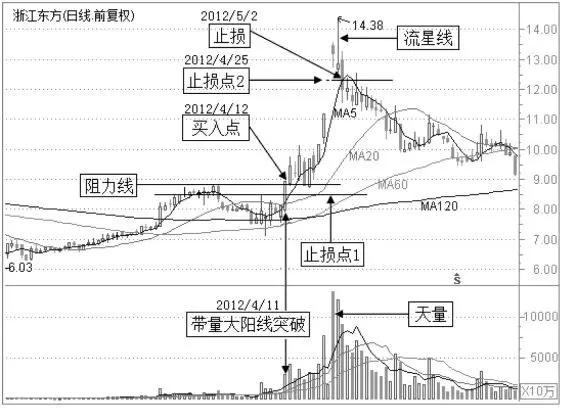

图3\-3 浙江东方2012年初以来的日K线走势图

2012年4月11日，该股带量突破前期高点，涨停，存在短线机会。

2012年4月12日，在9\.00元价位买入，并设止损点1，股价8\.50元。

2012年4月12日至2012年4月25日，股价在止损点1上方运行，故持股不动。当股价在4月25日出现“一”字涨停后，第二天K线出现了一个看跌阴星，成交量大幅放大，市场出现顶部反转信号，故采用盈利性止损，将止损点上移到“一”字涨停价位，即12\.32元，可降低2分钱，为12\.30元。

2012年4月27日，市场又出现了一根留下很长上影线的流星线，成交量仍然异常放大，故此基本确认该股短期头部出现，不过股价仍然没有跌破止损点2位置，继续持股。谨慎的投资者此时可以卖出，如果仓位较重，也可以先行降低仓位。

2012年5月2日，股价跌破止损点2，即12\.30元，触发止损指令，执行止损。

盘点：持股12天，盈利36％。

为什么在设置止损点1的时候，没有以2012年4月11日的收盘价设置止损呢？这是因为股价在突破某一阻力位后，往往会进行回抽确认，而回抽幅度一般在前期整理区域中线的上方。如果将止损点设置在前期高点或前一日最高点，很容易触发止损指令，这种止损点设置就不合理，会给投资带来损失，也让投资者对止损没有信心。

同样，在设置止损点2时，一般情况下，股价已经出现了一个“一”字涨停，第二天市场再次向上跳空，成交量异常放大。如果市场属于强势，那么股价回抽点是不会跌破“一”字涨停价位的。结合K线形态、成交量分析，在止损点2价位卖出股票是必然的选择。

这个案例是典型的盈利性止损。当市场与预期相同，股价上涨，投资过程中，为了尽可能保住胜利果实，可以逐级提高止损点。如果市场仍然在事件驱动下疯狂向上拓展，那么可以继续持股，并继续提高止损点，这样既可以保住来之不易的收益，也可以保留在市场进一步上涨中获利的机会。

__第三节 定额止损__

定额止损是最简单的止损方法，它是指将亏损额设置为一个固定的比例，一旦亏损大于该比例就及时平仓。

这种止损方法对技术分析以及基本面分析能力要求不高，操作起来较为方便。定额止损法的关键因素有两点，一是投资者所能承受的风险程度，二是对市场趋势和波动幅度、频率的判断。投资者买入时要尽量买在某一波动区间的下端，止损点不要出现在股价波动过程中较频繁出现的位置，这样可以减少触发止损的可能性，也就减少了亏损的概率。

止损比例的设定是定额止损法的关键。定额止损的设置主要受以下三方面因素的影响。

①投资者能够承受的最大亏损。 定额止损与投资者的风险承受能力及盈利期望值有密切的关系。风险承受能力越强，收益预期越高，定额止损的幅度就会越大。

②股票走势的运行趋势和波动规律。 一般投资者会根据市场波动规律，寻找一个合适的平衡点，再根据个人的实际情况，参照该平衡点位制定定额止损的位置。

③交易策略。 不同的交易策略，在设置止损比率时也会不同。一般情况下，投资周期越短，设置的止损亏损比率越小。例如超短线（T\+1）可以是亏损1\.5％～3％，短线（5天左右）可以是亏损3％～5％。

__一、最大亏损法止损__

最大亏损法是指投资者在某次投资中，以所能承受的最大亏损比例设置止损位置。该方法可以说是最简单和最基本的止损方法，可以运用到不同风格的投资中。

案例：扬农化工（600486）中线投资止损设置。

①投资环境及原因。

基本面：公司是农药制剂生产销售公司，是草甘膦细分行业龙头。2012年以来，草甘膦行业日渐复苏，价格持续上涨，库存早已消化。2011年营收同比增长17\.61％，净利润同比增长14\.66％，基本每股收益达到了0\.89元。在2012年产业复苏的背景下，公司业绩提升值得期待。

技术分析：图3\-4展示了对该股的技术分析过程和结果。首先从趋势看，MA120、MA60和MA30已呈现底部均线向上发散形态，说明中长期底部已经构成。股价以大阳线放量方式向上突破长达两个月的横盘箱体整理区，说明了突破的有效性。MACD指标表明进入多头市场。

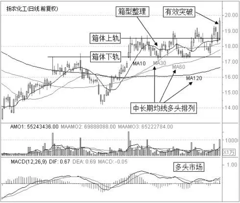

图3\-4 扬农化工2012年1月9日至2012年7月6日的日K线走势图

根据基本面与技术面分析，目前是中长线投资该股的较佳时机。

②投资周期： 中长线。

③总仓位比重： 50％。

④主要分析工具： 以基本面分析为基础，技术分析为主要手段。

⑤买入成本： 低于20\.00元。

⑥止盈目标： 中期趋势不发生变化，基本面没有变坏，则继续持有。

⑦潜在风险： 宏观经济不景气，大盘主要趋势向下。

⑧止损计划： 采用定额止损。买入初期以20元为基础，出现大于15％的亏损，即股价跌破17元，则止损出局。

__二、黄金分割法止损__

黄金分割又称黄金律，是指事物各部分间一定的数学比例关系，即将整体一分为二，较大部分与较小部分之比等于整体与较大部分之比，其比值为1：0\.618或1\.618：1，即长段为全段的0\.618。上述比例是最能引起人的美感的比例，因此被称为黄金分割。黄金分割比率在股市中也受到重视，其比例关系在预测股价涨跌时能够发挥神奇的作用，其中经常使用的是0\.382、0\.50和0\.618三种比率。

在股票投资中，黄金分割不仅被投资者作为寻找买入点和止盈点来使用，也可以作为一种定额止损的参考标准，帮助投资者制定止损点位。下面仍然以扬农化工投资项目的后期情况为例，来介绍黄金分割比率的定额止损方法。

案例：扬农化工（600486）中长线投资黄金比率止损设置。

图3\-5是扬农化工2012年3月27日至2012年8月27日的日K线走势图。该股经过较长时间的横盘整理后，在A点以一根大阳线的方式向上突破，这是第一个买入信号。随后市场出现一轮上涨，到达高点B后开始向下回调。

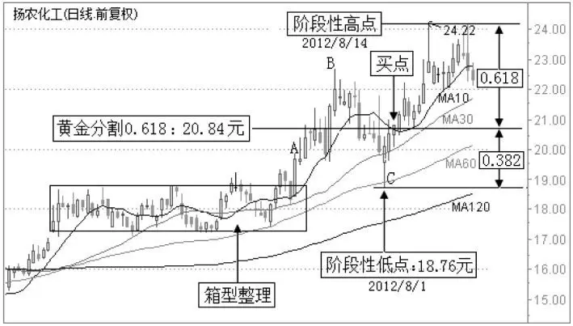

图3\-5 扬农化工2012年3月27日至2012年8月27日的日K线图

8月1日回调到最低点C，股价为18\.76元，触及关键的中期均线MA60后拉升，形成一根带长下影线的阳K线。实际上8月1日当天开盘时，该股以19\.55元的价格低开，并以极快的速度迅速向下测试MA60均线，5分钟内股价马上又回到19\.55元的开盘价上方。看盘经验丰富的投资者看到这里会明白，主力资金是在采取恐吓手段，将不稳定的筹码清洗掉。随后市场连拉两根阳线，形成了三连阳，股价重新回到MA10上方，因此在此可以买入，进行中线投资，如图3\-5中标示的“买点”。

2012年8月14日，股价创阶段性新高24\.22元后再次回调。如果仍然对该股后期走势看好，那么止损位应该如何设置呢？可以用黄金分割法计算该股可能回调的位置，并制定止损价位。

该项投资为中长线投资，故可以用61\.8％的比例来测算一下。

回调价位＝阶段高点价\-（阶段高点价\-前期阶段最低点价）×0\.618＝24\.22元\-（24\.22元\-18\.76元）×0\.618＝20\.84元

那么是否就用20\.84元作为止损价呢？当然不能，因为黄金分割方法确定的该点是预测股价回调的幅度，回调后股价应该继续向上，是一种买入的机会。但是如果该价位被有效跌破，则说明市场上涨趋势出现了变化，需要采取止损措施以防范风险，因此市场是否有效跌破该比率是关键。通常认为，在中线投资中，股价下跌最低价不超过支撑位的3％，或者连续3个交易日无法站在支撑价上方，方为有效跌破。

按照这一思路，根据黄金分割法，制定的回撤止损位如下：

最低止损价＝20\.84元×（1\-0\.03）＝20\.22元

在实际操作中，如果对该股仍然有较高的期望，止损出局后，待该股的走势明朗化，可以重新买入。

以上是以黄金分割法中的0\.618回撤比率来设置止损点的，投资者也可以根据不同的要求，采用0\.382或0\.50等其他比例来设置止损位。

__三、振幅定额止损__

振幅定额止损在实战中也是一种较常用的止损方法。振幅定额止损是根据市场前期波动中的回调幅度，作为股价下一波段回调幅度的标准，并依据该标准制定止损的方法。这种止损方法较适合那些波动规律特征明显的个股。

案例：宏达高科（002144）振幅定额止损。

①投资原因。

基本面情况：公司是纺织经编面料细分行业龙头，自2008年以来，公司业绩稳步上升。市盈率为18倍，市净率1\.82倍，资产负债率只有28％，流动比率为1\.6倍，这些财务指标显示该股估值合理，财务稳定，因此公司基本面没有潜在风险。图3\-6是2004年至2011年期间公司销售毛利率与每股收益的变化情况。

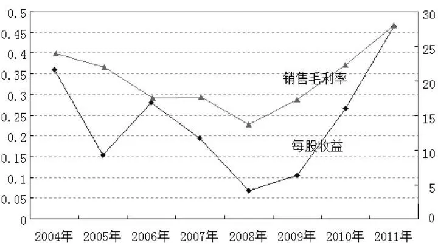

图3\-6 宏达高科销售毛利率与每股收益的变化走势图

技术分析：图3\-7是宏达高科2011年7月15日至12月20日的日K线图，从图上看，该股K线趋势向上，高点和低点呈较规律的波浪式推进。图中标示的买入点位置显示大阳线突破MA60、MA30和颈线阻力位，同时成交量温和放大。

②投资周期： 中长线。

③总仓位比重： 50％。

④主要分析工具： 以基本面分析为基础，技术分析为主要手段。

⑤买入成本： 低于20\.00元

⑥止盈目标： 中期趋势不发生变化，基本面没有变坏，则继续持有。

⑦潜在风险及止损计划。

潜在风险：宏观经济仍然处于不景气中，公司受纺织行业和主要客户汽车行业的影响，未来企业发展具有不确定性。大盘主要趋势仍然处于下跌中，熊市环境给该股的技术走势带来压力。

止损计划：该股技术走势呈较规律的波浪式推进，采用振幅定额止损方法，止损价位为13\.74元。

根据图3\-7所示，在前期第一和第二波段中分别产生了两个高点A和B，以及低点1和2。买入该股后，又出现了一个新的阶段性高点C，如表3\-1所示。

表3\-1 宏达高科2011年7月15日至12月20日波动幅度统计表

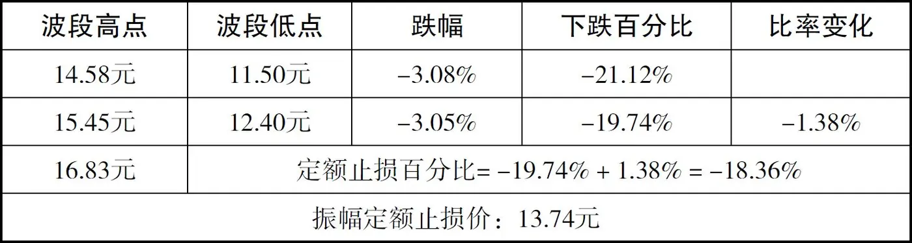

计算解释：在第一次调整中，股价从A点的14\.58元下跌到最低点B的11\.50元，下跌幅度为3\.08元，即下跌21\.12％；第二波段股价从15\.45元下跌到12\.40元，下跌比率为19\.94％，比第一次下跌要小1\.38％。当前面临的高点C的价格为16\.83元，其下跌振幅预计在前期下跌幅度上再缩小1\.38％，这样可以确定如果股价下跌超过18\.36％，则市场可能出现趋势性的变化，故确定定额止损位18\.36％，即股价为13\.74元。如图3\-7所示。

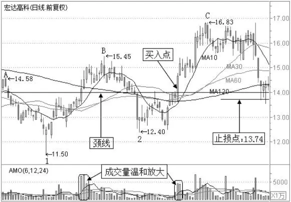

图3\-7 宏达高科2011年7月15日至12月20日的日K线图

在制定止损时，也可以采用前期调整幅度或平均振幅作为参考。实际上，有经验的投资者会结合其他技术分析方法制定止损标准，并不局限于使用某种唯一的方法。比如采用定额止损时，在确定振幅百分比后，再参考趋势线、均线或其他指标来确定一个较合理的止损点。

__第四节 技术止损__

技术止损就是采用技术分析的方法来制定止损计划。技术止损是中小散户运用较多的止损方法，也是中短线交易型投资者必备的止损技术。技术止损方法与技术分析分不开，是技术分析的重要组成部分。每一种技术分析的目的就是给投资者提供“等待”、“买入”、“持有”和“卖出”四种决策，止损是对其中“买入”和“持有”指令的纠正，或者说是对“卖出”指令的强化和补充。

技术止损是技术分析的有机组成部分，因此技术止损的方法也来源于各种技术分析工具。一般情况下，技术止损经常与其他止损方法结合使用，这样可以使止损更加合理。投资者采用的技术止损方法都与其一贯采用的投资分析方式一致，包括主要的技术分析工具、投资周期、风险偏好等。

正因为技术止损的广泛性和重要性，下面重点介绍技术止损的常用方法。

__一、移动平均线止损法__

__1．移动平均线概念__

移动平均线简称为均线，是以道·琼斯平均成本概念为理论基础，采用统计学中的移动平均原理制作出来的。它将一段时期内的股票价格平均值连成曲线，用来显示股价的历史波动情况，进而反映股价未来发展趋势和市场内部股票持有者一段时间的平均持仓成本的技术分析方法。

重要周期均线在市场中往往会影响投资者的心理，从而使均线对市场交易带来影响。重要的均线有MA5和MA10短线指标，MA20、MA30和MA60中短线指标，MA60（季度线）、MA120（半年线）中长线指标，MA240（或MA250）等长线指标。

__2．移动平均线的特点__

①简洁直观。 均线系统能很好地将不同周期的趋势展现在一张图表上，直观地显示出不同周期的市场状态和关系。

②趋势性强。 均线的趋势性较强，是趋势判断的重要依据。均线通过不同周期的市场持股成本的变化方向，直接指明市场不同周期的未来趋势，并可以用来判断股价短期、中期和长期的涨跌目标位置。

③支撑作用。 移动平均线反映某一时间周期的价格成本。股价下跌过程中，在某一重要的成本线附近会引起做多力量的加入，从而对股价产生支撑。一旦该价位无法支撑下跌趋势，则说明市场空方力量加强，市场风险加大，也会打击做多力量，均线止损的原因就在此。

④压制作用。 股价上涨过程中，如果股价达到某一重要的均线附近，就会引发前期套牢盘和短期获利盘的抛压，从而压制股价上涨。根据均线的这一特性，它经常被投资者用来制定止盈目标。

__3．均线止损的用法__

用均线设置止损有多种方法。根据均线的技术特点，可分为均线趋势性止损、支撑性止损两种。

①趋势性止损是利用均线对市场趋势方向的判断设置止损的方法。 它包括均线转向止损、均线死叉止损等。止损位一般是动态的，只要市场出现均线趋势头部转向信号，投资者就执行止损指令。

②均线支撑性止损是利用均线对股价的支撑作用进行止损的方法。 如果股价在回调中有效跌破与投资周期密切相关的重要均线，投资者就执行止损指令。

案例：死亡三角止损——招商地产（000024） 。

图3\-8是招商地产2012年3月1日至8月28日的日K线图。从图中可以看出，该股在阶段性高点27\.01元以前走势非常健康，MA10、MA30和MA60保持较好的倾斜角度上行。但在该高点以后，均线系统出现了趋势性的变化信号。MA10分别向下穿透了MA30和MA60，形成了两个死叉，之后，MA30向下穿破MA60，形成了中长期趋势的死叉。这三个死叉共同组成了一个死亡三角，预示着该股前一段中级上涨行情彻底结束，投资者不要再对股价走势抱有任何幻想。

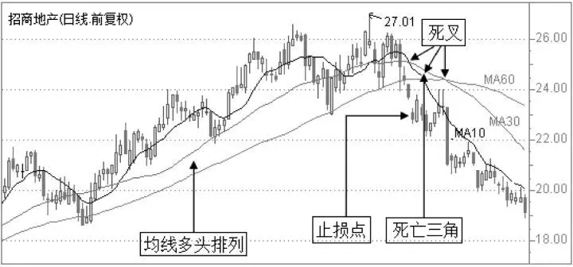

图3\-8 招商地产2012年3月1日至8月28日的日K线图

在这段趋势的演变过程中，不同的投资者可以采取不同的止损策略。

中短线投资者和厌恶风险的投资者，可以在MA10向下穿过MA30形成死叉时进行止损。注意，该死叉是指MA10与MA30的方向均已向下，这与前面这两条均线的交叉性质完全不同。该死叉说明该股中短期上升走势已经被打破，风险即将集中爆发，必须采取止损行动。

在较低价位买入的中长线投资者，或对风险承受能力较高的投资者，可能会多观察几天。但是形成死亡三角后，就一定要止损离场，最好是在MA10下穿MA60的时候进行止损。

该案例主要说明以下几点。

利用均线止损时，要注意根据自身的投资周期和风险承受能力，来选择不同的均线周期和均线形态。短线投资者选择比较灵敏的短周期均线作为参照物，中长线投资者则选用中长期均线。

均线系统表达市场趋势有几种方式，一是股价（K线）与均线的关系。股价跌破方向向上的均线时，此时均线对股价应该有支撑作用，但如果跌破方向向下的均线，则说明市场趋势向下转变已成定局，止损是当务之急。二是均线与均线之间的组合关系。短期均线向下跌破向下的长期均线则形成死叉，谨慎者不必等到形成死亡三角就应该进行止损，如图3\-8所示。

三根不同周期的均线形成一个倒三角形，该三角称为死亡三角。听名字就知道其风险程度，因此出现该图形，投资者要无条件进行止损。

案例：均线短线止损——毅昌股份（002420） 。

短线操作最主要的特点是时间短、动作快、自律性强，不关心基本面和中长期趋势。这样就要求短线操作的止损设置要遵循“短”、“快”和“自律”的原则。

下面以毅昌股份2012年6月5日至2012年8月14日之间的一段行情，来说明短线操作中利用均线止损的方法。图3\-9是毅昌股份该期间的日K线图。

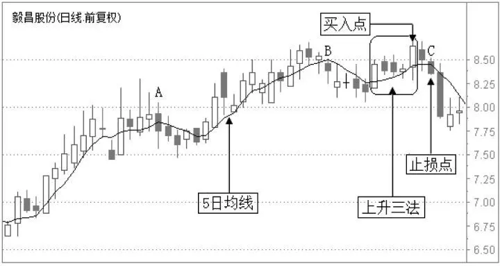

图3\-9 毅昌股份2012年6月5日至2012年8月14日的日K线图

根据短期指标MA5的走势可以看出，在上升三法K线形态形成以前，市场处于上升趋势中。当股价重新回到MA5上方后，形成了上升三法的上涨持续形态，因此在形态形成时买入，如图中标示的“买入点”位置。但市场的发展与愿望相悖，股价第二天出现了滞涨。第三天即C点位置，股价向下跌破了MA5，并且本次上涨过程中，MA5高点没有高于前一次波段的高度，说明该股的上涨趋势已经发生改变，进入调整的可能性较大。由于已经失去了短线盈利的机会，故在当日收盘前进行止损。

该案例的重点是MA5的方向和支撑作用。在每一段上涨行情中，股价每日收盘基本都在MA5上方，调整期间的收盘价在MA5下方。如图中前两次调整信号A和B，都是当日出现阴线，收盘价跌破MA5，这些信号显示市场短期强势不再，操作中必须采取止损措施，以避免更大的损失。

__二、K线形态止损__

__1．K线止损概述__

只要知道一点技术分析的人，就一定对K线有所了解。股票市场流行一句话——K线图会说话，这是技术分析派人士对K线作用的总结。K线在止损中也有独到之处，这可以归结于K线对点的精确把握和K线技术组合形态（通常简称为技术形态或技术图形）在趋势反转中的作用。

K线止损方法的特点可以归纳为以下几点。

①灵敏和精确。 K线的特点就是能够灵敏地反映市场交易的状态。比如阳线表示多头占上风，阴线表示空头占优势。特殊的K线形态可以精确地描述市场趋势的转变，比如大阴线说明市场空头气氛浓厚，后市看跌。该特性为精确止损提供了可能。

②止损方式简单直接。 就是在止损中以直观的K线形态作为止损指令。

③K线形态表达信号的强弱，与股价上涨或下跌的空间幅度大小、市场大趋势有较大的关系。 作为止损信号的K线形态，主要出现在相对高价区域或者较大级别的下跌趋势中。这一点非常重要，请读者一定要牢记，因为K线形态是最容易被主力资金操作的技术图形。

④K线形态一般比较适合短线及中短线止损，K线组合成的K线技术形态（组合形态）对中长线的指导作用较强。

K线止损与均线、趋势线以及成交量结合使用效果更好。

__2．常用的止损K线形态和技术形态__

K线形态有一根K线形成的，也有五根以上K线组合而成的，根据它们所表达的市场意义，可以分为顶部反转形态和底部反转形态、上涨持续形态和下跌持续形态，其中用于止损（卖出指令）的形态，主要是顶部反转和下跌持续形态。下面将这些重要的形态列举出来，如表3\-2所示。

表3\-2 看跌K线形态

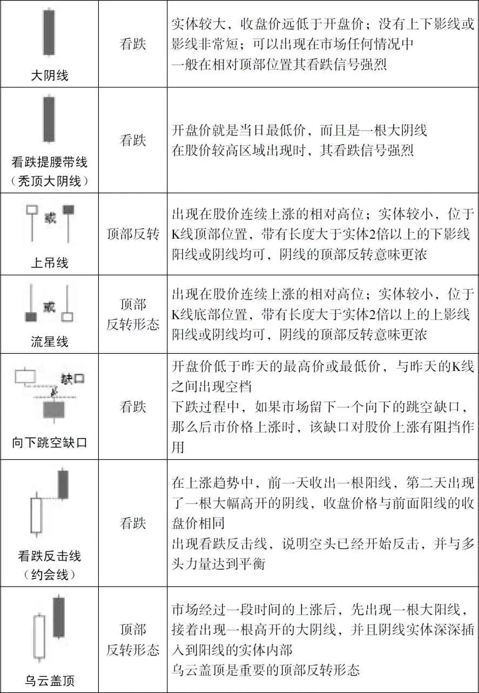

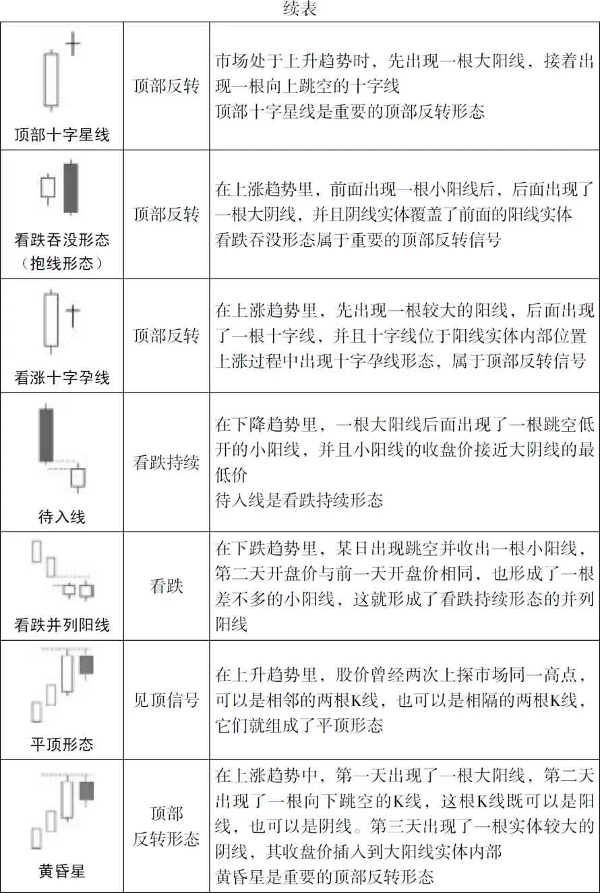

K线技术形态是在市场运行过程中形成的由K线组合而成的各种空间图形，它是股市运行一段时间的轨迹和运行规律的描述。不同的技术形态代表着不同的市场性质，它们可以分为顶部和底部反转形态以及上升和下降整理形态。在止损分析中，主要是关注顶部反转形态和下降持续形态。

表3\-3 是在止损分析中常用的技术形态。

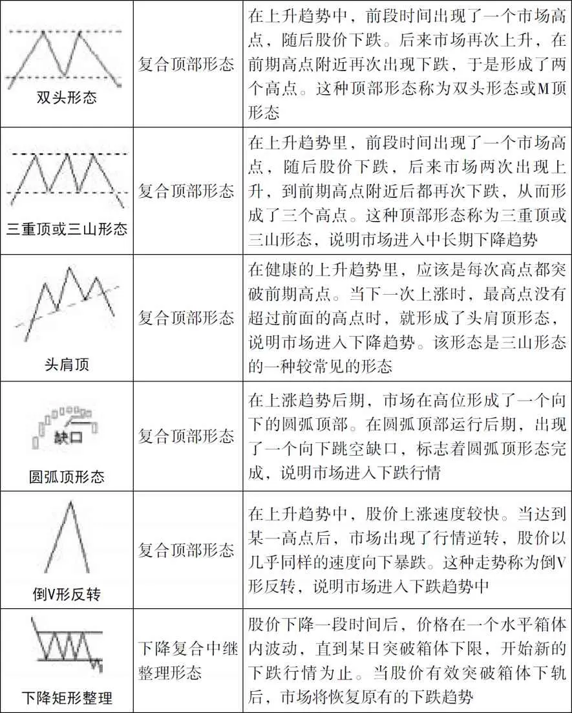

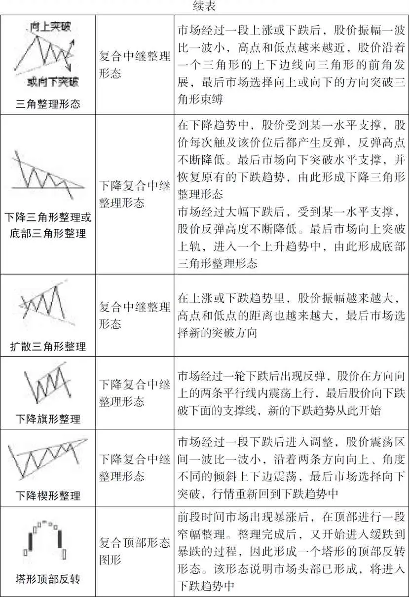

案例：上证指数发出的K线警报。

下面以2012年2月8日至7月12日上证指数的日K线走势图为例，来解读这段行情中K线给投资者发出的止损或卖出信号。

图3\-10中有两个明显的趋势头部和一个较长时间的下跌行情。第一个顶部区间是一个三山顶部技术形态，它由三个高度基本相同的高点1、2、3组成，形态像三个山峰，这个技术形态是典型的顶部反转技术形态，该形态形成的信号是最后收出一根大阴线，该形态形成之时就是执行止损之际。

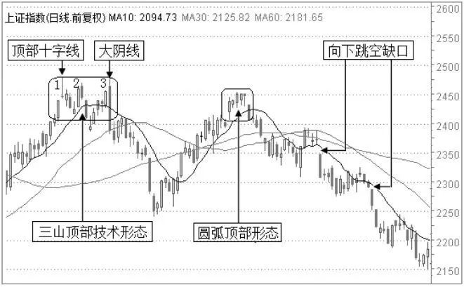

图3\-10 上证指数2012年2月8日至7月12日的日K线走势图

三山技术形态中，有两个最具代表性意义的K线形态，图中三山形态的第一个“山峰”是一根顶部十字线，其反转意义非常强烈。第三座“山峰”是一根大阴线，该阴线吞没了前面几乎所有顶部整理的K线，像一座断头崖一样，因此也有人戏称这种K线形态为断头铡刀，可以想象其代表的市场风险有多大。此时不止损，又等待何时呢？

第二个顶部反转形态是个小型的圆弧顶形态。其走势是上涨开始放缓，并在顶部出现滞涨，接着以向下跳空低开的方式完成该形态。形态最后一根中阴线向下跳空，平头平脚，算上缺口部分，也吞没了整个头部的其他K线，其杀伤力与前面的三山顶部形态如出一辙，也是止损逃命的信号灯。

在后面的下跌趋势中，缺口在其中起到了非常重要的市场作用。根据缺口理论，它们当然是明确的止损信号。

__三、成交量止损__

__1．成交量止损概述__

成交量反映了股票交易的内在动力和市场活跃程度。从供求关系分析，股市涨跌的原因是供求关系失衡，成交量则是最能反映市场资金多少和动向的指标。股市中有很多关于量价关系的描述，如“量在价先”、“天量天价，地量地价”等，这说明成交量在技术分析中占有重要的地位。

成交量在止损中的作用主要表现在以下几个方面。

①成交密集区的支撑和阻力作用。 成交密集区是指某一价位聚集了大量股票筹码，它说明该价位区域是建仓买入的密集区域，也就是购买股票成本的密集区。如果股价处于该密集区上方，说明有大量筹码已经获利，股价回档时会对股价起支撑作用。相反，股价在该区域下方，则说明大量筹码被套牢，当股价向上接近该区域时，这些筹码会出现松动，从而抑制股价上涨。根据这一分析，当股价向下跌破该密集区时，说明该区域的支撑作用被破坏，股价继续下行的可能性较大，也就是做多风险加大。当股价向上接近该区域时，投资者需要考虑减仓。

②成交量反映市场的活跃程度。 在任何交易市场中，反映市场交易情况的指标有两个，一是价格，二是成交量。分析股市时也一样，一要看股价的高低和发展趋势，二要看成交量的多少和发展趋势。在利用均线、K线或者其他止损方法时，成交量大小是重要的参考指标。

一般来说，股价在高位出现看跌K线形态，并在前后伴随有巨大的成交量时，那么市场看跌意味更浓，风险更大；在横盘整理后期，股价向下突破，成交量出现放大，也不是好现象。在这些判断市场信号中，成交量是重要的辅助条件。

③成交量反映市场的分歧程度。 从成交量的大小变化，可以反映市场多空双方对某一价位的态度，成交量越大，说明多空双方对该价位的看法分歧越大。比如，在某一价位横盘整理中，成交量基本维持在较小的水准，突然市场交易价格向下或向上突破了整理范围，这样就会在新的价位引发分歧，致使成交量放大。如果股价向下出现成交量放大，说明空头意向大于多头，这样做多风险也随着空方力量的增长而增大，这时也是采取止损的时候。

__2．常见的成交量止损形态__

在以成交量为主要分析指标的方法中，“天量天价”和筹码密集区止损是较常见的工具。

①天量天价止损方法。 所谓天量天价，是指股价或股指上涨到较高的位置后，出现了成交量远大于这段上涨行情其他时期的成交量，说明市场进入风险释放阶段。股价处于高位时，早期入场的投资者已获利丰厚，他们通过最后的快速上涨来卖出股票。在赚钱效应及利好消息的诱惑下，又有许多投资者买入，从而造成高换手率和巨大成交量。已卖出股票的人不会在更高的价位买回股票，所以多头力量大幅下降。随着多方力量的枯竭，短期内将会使股价见顶，因此才有天量天价的说法。正因为天量天价现象的存在，才给投资者留下了止损的信号。

案例：天量止损——东方国信（300166）。

图3\-11是东方国信（300166）2011年10月25日至2012年3月9日的日K线图。该图反映了天量见天价的股市见顶现象。

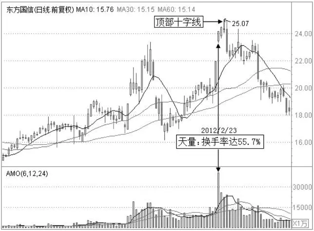

图3\-11 东方国信2011年10月25日至2012年3月9日的日K线图

2012年2月23日放出天量的前一天，主力资金以涨停板的方式将股价推高10％，大幅度脱离主力资金的持仓成本价。第二天股价继续高开高走，再次涨停，换手率达到55\.7％，成交量堪称天量。说明该股当天55\.7％的流通股票出现了易手，这足以说明主力资金通过拉抬股价已经顺利出货，当然其中也不乏主力自己倒盘抬价的部分。

在短线交易中，有很多参与阻击这种暴涨个股的投机者，但天量的出现提醒人们，风险或许大于预期收益，随时要注意采取止损或止盈措施，谨慎的投资者见到天量信号就应该出局观望。当后市出现顶部十字线和一根大阴线后，进行止损是唯一理智的做法。

②筹码密集区止损方法。 筹码分布是以股票价格成本为单位来划分成交量，反映股价在不同价格水平的市场持仓数量。一般认为，筹码密集区对未来股价的走势起到阻挡和支撑作用。

移动筹码分布图是对筹码分布的动态跟踪，反映市场资金流动和筹码转换的过程。通俗地说，移动筹码分布图是描述筹码成本搬家的分析工具，在技术分析中，往往利用它来查找股价涨跌的阻力位、支撑位，以及主力资金的动向。

对筹码分布进行分析，主要是分析筹码分布图中的筹码密集区，如单峰密集区和多峰密集区。

利用筹码分布分析设置止损时，主要是依据股价与筹码密集区之间的关系。股价上涨过程中，筹码从低位向高位搬家；股价下跌，筹码是从上方向下方搬家。股价上涨过程中无法有效上穿上方筹码密集区，股价下跌向下击穿筹码密集区，这些都说明该价格区域阻力较强或支撑作用较小，股价仍有继续下跌的风险。因此投资过程中有必要采取止损止盈措施。

案例：筹码密集区止损——物产中拓（000906）。

图3\-12是物产中拓2012年2月23至2012年7月4日的一段日K线与筹码分布图。从图中可以观察到，在7\.90元至8\.10元区域间聚集了大量的筹码，其主要原因是市场在前期的一个横盘整理中发生了大量交易的结果。如果投资者也是在前期这一价位区域买入该股，那么如何制定止损价位呢？这就可以借鉴筹码密集区止损方法。

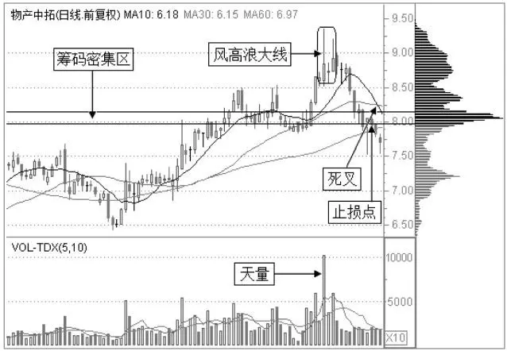

图3\-12 物产中拓2012年2月23至7月4日的日K线与筹码分布图

前面介绍过，股价下跌过程中会受到筹码密集区的支撑。从图中可以看出，自该股在顶部出现了风高浪大线后，市场看跌，并一路下跌到筹码密集区。在下跌过程中，下跌受到了多方的反抗，产生了一根看涨锤子线，但该看涨形态并没有得到第二天K线的证实，股价仍然跌破了该筹码密集区域。因此投资者就需要执行这个以筹码密集区底部所在价位7\.90元的止损，以避免后市产生更多的损失。

在分析过程中，除了筹码密集区分析给出了风险信号，均线也出现了死叉，MA10向下穿过MA30，两种风险信号基本同时发出，更增加了止损的可靠性。

__四、布林线止损方法__

__1．布林线止损概述__

布林线与股价的形态和趋势有着密不可分的联系。布林线的“股价信道”，是股价趋势理论的直观表现形式。当股价波动很小，处于盘整状态时，股价信道就会变窄，这可能预示着股价的波动处于暂时的平静期；当股价波动超出狭窄的股价信道上轨时，预示着股价异常激烈的向上波动即将开始；当股价波动超出狭窄的股价信道下轨时，同样也预示着股价异常激烈的向下波动即将开始。

__2．布林线中轨线__

布林指标中的上轨、中轨、下轨线所形成的股价信道的移动范围是不确定的，信道的上下限随着股价的上下波动而变化。在正常情况下，股价应始终在股价信道内运行。如果股价脱离股价信道运行，则意味着行情处于极端状态。

在布林指标中，股价信道的上下轨是股价安全运行的最高价位和最低价位。上轨、中轨和下轨线都可以对股价的运行起到支撑作用，而上轨线和中轨线有时则会对股价的运行起到压力作用。

一般而言，当股价在布林线的中轨上方运行时，表明股价处于强势趋势；当股价在布林线的中轨线下方运行时，表明股价处于弱势趋势。

__3．布林线上轨、中轨和下轨线之间的关系__

当布林线的上轨、中轨、下轨线同时向上运行时，表明股价强势特征非常明显，股价短期内将继续上涨，投资者应坚决持股待涨或逢低买入。

当布林线的上轨、中轨、下轨线同时向下运行时，表明股价的弱势特征非常明显，股价短期内将继续下跌，投资者应坚决持币观望或逢高卖出。

当布林线的上轨线向下运行，而中轨线和下轨线却还在向上运行时，表明股价处于整理态势之中。如果股价处于长期上升趋势，则表明股价是上涨途中的强势整理，投资者可以持股观望或逢低短线买入；如果股价是处于长期下跌趋势，则表明股价是下跌途中的弱势整理，投资者应以持币观望或逢高减仓为主。

布林线的上轨线向上运行，而中轨线和下轨线同时向下运行的可能性非常小，这里就不再进行研判。

当布林线的上轨、中轨、下轨线几乎同时在水平方向横向运行时，则要看股价目前的走势处于什么样的情况，之后才能做出判断。

__4．股价和布林线的关系__

当股价从布林线中轨线以下向上突破布林线中轨线时，预示着股价的强势特征开始出现，股价将上涨，投资者应以中长线买入股票为主。

当股价从布林线中轨线以上向上突破布林线上轨线时，预示着股价的强势特征已经确立，股价将可能短线大涨，投资者应以持股待涨或短线买入为主。

当股价向上突破布林线上轨线以后，其运动方向继续向上时，如果布林线的上轨、中轨和下轨线的运动方向也同时向上，则预示着股市的强势特征依旧，短期内还将继续上涨，投资者应坚决持股待涨，直到股价的运动方向开始有掉头向下的迹象时，才密切注意行情是否转势。

当股价在布林线上方向上运动了一段时间后，如果股价的运动方向开始掉头向下，投资者应格外小心。一旦股价掉头向下并突破布林线上轨线时，预示着股价短期的强势行情可能结束，股价短期内将大跌，投资者应及时短线卖出股票、离场观望，特别是对于那些短线涨幅很大的股票。

当股价从布林线上方向下突破布林线上轨线后，如果布林线的上轨、中轨、下轨线的运动方向也开始同时向下，预示着股价的短期强势行情即将结束，股价短期走势不容乐观，投资者应以逢高减磅为主。

当股价从布林线中轨线上方向下突破布林线的中轨线时，预示着前期的强势行情已经结束，股价中期下跌趋势已经形成，投资者中线应及时卖出股票。如果布林线上轨、中轨、下轨线也同时向下，则更能确认趋势已经发生转折。

当股价向下跌破布林线下轨线并继续向下时，预示着股价处于极度弱势行情中，投资者应坚决以持币观望为主，尽量不买入股票。

当股价在布林线下轨线运行了一段时间后，如果股价的运动方向有掉头向上的迹象时，表明股价短期内将止跌企稳，投资者可以少量逢低建仓。

当股价从布林线下轨线下方向上突破布林线下轨线时，预示着股价的短期行情可能回暖，投资者可以适量买进股票，做短线反弹行情。

当股价一直处于中轨线上方并和中轨线一起向上运行时，表明股价处于强势上涨过程中，只要股价不跌破中轨线，投资者坚决一路持股。

当股价一直处于中轨线下方并和中轨线一起向下运行时，表明股价处于弱势下跌过程中，只要股价不向上反转突破中轨线，稳健的投资者都可以一路观望。

布林线是通道类技术分析的典型工具，它通过上轨、中轨、下轨三条轨道线和股价之间的位置关系，以及通道发展方向，指示市场的运行趋势，以轨道线的支撑和压力反映股价短期的变化方向，也可以通过股价在上轨线上方的距离显示超买，股价在下轨线下方的距离显示超卖。另外，布林线通道口径的大小变化，也可以反映市场的变化动向。这些简单而明确的图形，可以告诉投资者什么时候是买入机会，什么时候应该持有，什么时候是卖出的时机。

使用布林线作为止损工具，主要考虑以下几点。

以日K线为例，在上涨趋势中，股价在布林线中轨线上方运行，此时：

①如果股价依托上轨线向上运行，则短期属于暴涨行情。当股价向上脱离布林线上轨线较远时，说明市场超买现象严重，获利盘随时可能出现抛售，市场短期风险较大。当股价向下回到上轨线下方的时候，说明短线强势消退，市场可能进入整理，此时是短线止损的时候。

②如果股价下跌到布林线中轨线下方，说明市场由强势转为弱势，整理时间将延长，此时中短线投资者需要止损。

③布林线出现收口形喇叭口，表示股价结束前期上涨趋势，市场处于短线或中线整理之中。因此当布林线的上轨线出现方向向下，与中轨线距离缩短的时候，说明布林线的收口喇叭开始形成，此时中短线投资者就要采取止损措施。

④如果布林线出现收口形喇叭口，三条轨道线方向同时向下，那么市场的弱势特征非常明显，中长线投资者也需要考虑止损。

在下跌趋势中，布林线通道方向向下，此时：

①该形态是下降趋势，市场本身就已存在显而易见的风险，因此投资者遇到反弹等合适的机会，都应该卖出股票。

②如果股价向上突破中轨线，投资者难以把握市场是否出现转强时，可以以中轨线所在价位作为止损位。

③在短线反弹操作中，股价如果向下跌破布林线下轨线，则显示市场加速下跌的可能性较大，投资者最好回避该类风险。

另外请注意，实战中，布林线往往需要结合K线形态、移动平均线以及成交量等技术指标来综合判断市场走势，这样会大大提高成功的概率。

案例：布林线止损方法——金种子酒（600199）。

在经济状况不景气时，买入消费类个股有时候也可以获得较好的效果。但在熊市中操作，总会让人感觉不踏实，此时只要做好计划，设置好止损办法，心里就可以踏实得多。请看以下案例。

①投资名称： 金种子酒（600199）

②投资原因。

基本面分析：自2011年以来，虽然整个宏观经济下滑，但作为消费行业的经典行业，白酒行业的业绩稳定增长，2012年开年后仍然保持强劲的盈利能力。二线白酒的金种子酒成长性好于预期，根据盈利估值，未来3年里业绩增速可达80％。对A股全部白酒公司的指标进行比较，该公司中短期成长性名列前茅。

技术分析：图3\-13是金种子酒2012年11月21日至2012年4月23日的日K线图。图中所示的“中线买入区”，之前的时间点刚好是布林线三条轨道线同时向上的时间点，这说明市场中期上升趋势基本确立，可以从短线操作角度捕捉最佳买入点。

③投资周期： 中线。

④仓位比例： 30％。

⑤买入成本： 16\.50元以下。

⑥止盈目标： 中线上升趋势改变。

⑦潜在风险： 虽然大盘走弱对该股的影响相对较小，但仍然存在系统性风险。另外行业内竞争对手发展超预期，公司产品结构升级受阻，价格有所下滑。

⑧止损计划： 有效跌破布林线中轨线则止损，即如果股价跌幅超过布林线中轨线3％，或连续3日股价无法回到中轨线上方，则卖出止损。

图3\-13是对该股的技术分析。这里的止损位属于动态的止损，因为布林线中轨线向上发展，止损价格也会随之上涨。在买入初期，如果市场发展与预期相反，那么估计止损价格在16元下方，亏损额应该在5％以内。如果股价按预期发展，则止损演变成止盈。

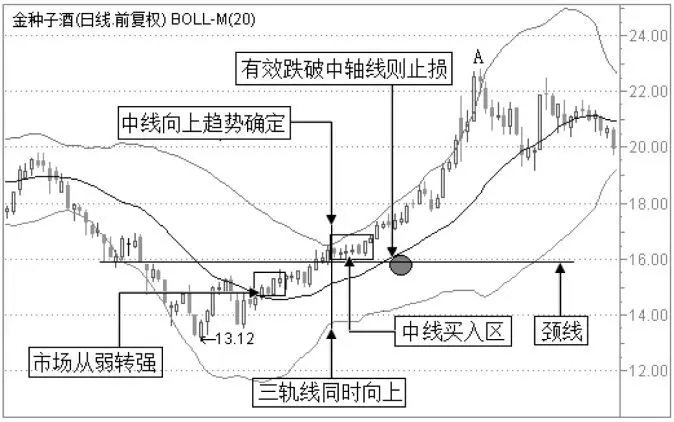

图3\-13 金种子酒2012年11月21日至2012年4月23日的日K线图

该案例在操作中需要注意以下两点。

①利用布林线进行中线波段投资时，买点往往在中期趋势已经确立的时候。 比如本案例中的中线买入区，有两个技术因素来确定该上涨趋势的确立，第一是股价已进入到布林线中轨线上方运行，并且三条轨道线开始同时向上。第二是股价突破颈线阻力位，并在颈线位上方强势横盘整理。

②在制定止损时，要以中期趋势为主要参考。 依据布林线设置止损，就是股价有效跌破中轨线时卖出。另外就是参考颈线的支撑作用。在买入后的持股初期，这两种方法所指定的止损价格基本一致。

图3\-14是金种子酒后市走势图。图中A区股价向上突破布林线上轨加速上行，说明市场进入这轮行情的冲刺阶段，短线投资者可以在A区中的第一根阳线向上突破上轨线后投机性买入。当股价出现滞涨并跌破上轨线时，可以进行止损。在图3\-13中作为中线买入的股票，此时也可以进行止盈或部分止盈。这段行情形成的高度将在以后市场走势中发挥重要作用。

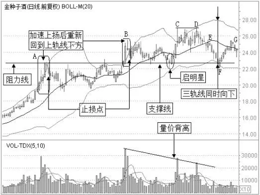

图3\-142012年2月16日至2012年8月14日的日K线与布林线的组合分析图

从图中可以看出，自A点以后，市场出现了较长时间的上升中继整理。整理过程中，高点基本持平，低点向上抬高，说明是一段上升三角形整理。布林线也从收口形喇叭转为紧口形喇叭，最后形成较狭窄的微微向上的通道，这就是上升中继整理阶段的布林线形态。

当股价以一根大阳线再次向上突破时，从技术角度看，这是一次中短线的买入机会。但是市场并没有按照期望那样向上加速上涨，而是马上回到布林线上轨线下方，此时的布林线形态告诉投资者，短线快速拉升的可能性已经不大，如图中B点。作为短线操作的投资者，此时只能止损出局，止损价就是股价跌破布林线上轨线后的位置，即23\.60元至24元之间。中线持有者可以继续观望，观察前期高点A形成的支撑线是否起作用，布林线三条轨道线是否出现向下转向，以及K线形态等技术信号。

后市股价向下跌破中轨线，但受到方向向上的布林线下轨线和支撑线的双重支撑，K线形态形成了底部反转的启明星形态。这说明市场调整基本到位，短线可以再次买入。注意，中线投资者如果在此位置进行止损，那么就是所谓的卖在地板价。此处有三种止跌反转信号，因此不是止损信号，布林线形态也反映了这一点。布林线在这里形成收口形喇叭，布林线下轨线仍然向上，说明市场仍然处于整理中，其中期趋势并没有发生向下转变。

接下来的行情值得短线和中线投资者警惕，在C点股价向上突破最高点B，但K线显示出多空上方的分歧加大，并且成交量远小于前期高点B的成交量，出现了两家背离现象。短线投资者见此信号可以止损和止盈。

随后从布林线的走势来看，股价仍然在布林线上方运行，趋势向上，但K线形态出现了平头顶部形态。在D点股价再次放量上攻，但达到C点高度后无法突破，说明多方有心无力，预示市场风险加大。D点后的第二天股价向下收阴，从K线上证明平头顶部形态成立，短线投资者可以止盈或止损。

在E点，股价向下跌破中轨线，虽然下跌幅度不到3％，但已经3天无法回到中轨线上方，此时短线投资者需要止损。股价向下连续下跌并触及已经向下的下轨线，此时布林线的三条轨道线开始同时向下，说明该股的中期上涨行情已经结束，中线投资者可以采取止损措施。

实战中，虽然布林线告诉我们中线走势存在向下转向的可能，但技术分析能力较强的人可以发现，该点存在两种支撑，市场存在技术性反弹，首先是支撑线，其次是布林线下轨线，因此实战中可以再观望一至两天，或者部分止损。后市股价出现反弹，上攻到中轨线上方，但中轨线方向已经向下，并且股价在第三天又重新回到中轨线下方，此时可以采取卖出行动，这样就可以减少损失或者略有盈利。当然，这也需要冒一定的风险，即股价在F点直接向下加速下行。这也说明在股市里，任何时候和任何地方风险与收益总是共存的。

该案例最值得大家注意的是，在短线或者中短线交易中，布林线最好与其他分析工具配合使用，这样可以增加灵敏度和准确性。比如本案例中，在C点和D点之间，K线与成交量的变化已经给市场做多者敲响了警钟，而布林线还没有作出有效的反应。

__五、支撑线（切线）止损__

前面的案例中多次提到支撑线，这说明支撑线在技术分析中的重要性和普遍性。下面简单介绍一下支撑线技术分析。

广义的支撑线在股票技术分析中包括均线、布林线、上升趋势中的趋势线，以及各种通道理论中的轨道线、阶段性低点形成的低点支撑线等。这里所说的支撑线是指切线理论中的支撑线。

在技术分析中，切线的支撑线有两种，一种是趋势支撑线，还有一种是空间支撑线。

将市场运行阶段性低点和阶段性高点分别连线，这样就形成了一段行情的趋势通道。如果这两条直线向上，表明市场处于上升趋势，不断抬高的低点所形成的直线称为上升趋势的趋势线，它将对后市股价的运行起到支撑作用，即趋势支撑线。上方方向向上、对股价起压制作用的直线是上升通道的阻力线，阻力线并不是趋势线。

如果两条线方向向下，市场则处于下降趋势，不断降低的高点所形成的直线是下降趋势中的趋势线，它会对后期市场上涨产生压力作用，因此是一条下降趋势压力线。在下方对股价起到支撑作用的直线不称为趋势线，只是下降通道的下轨线。

如果两条线方向相反，表明市场处于震荡整理市，上方直线为压力线，下方为支撑线。

__1．趋势支撑线的止损方法__

切线理论中有一个核心和两个重要概念，核心是趋势，重要概念是支撑线和压力线。趋势是由趋势线来表达在图形上的。利用趋势支撑线进行止损是简单有效的办法，其关键是判断市场的上升趋势或整理趋势是否发生向下的改变。也就是说股价向下有效跌破了趋势支撑线，那么就要止损。

值得注意的是，趋势线在不同周期中有着不同的作用。比如，在一个主要趋势向下的行情中，次级趋势有可能向上，这与前面提到的市场趋势中的主要趋势、次级趋势和小趋势一样。因此在制定止损标准时，一定要与投资周期的趋势线相匹配。在进行中线投资时，应该采用较长一段时间的趋势，在短线操作时，则采用较短时间阶段的趋势。投资者也可以用不同周期的K线来区别对待，比如短线操作时可以用日K线、60分钟K线甚至是30分钟K线来画趋势线。

案例：趋势支撑线止损——国海证券（000750）。

图3\-15是国海证券2012年5月23日至2012年7月6日的60分钟K线图。图中展示了国海证券短线趋势的变化情况以及支撑线与压力线的画法和市场作用。图中以C点为分水岭，前一段时间为上涨趋势，趋势线是以阶段性低点1和低点2确定的一条向上的直线，在以后的市场运行中，股价受到该线的支撑。上方是以A点和B点连线形成的一条压力线，该线对股价的上涨起到压制作用。

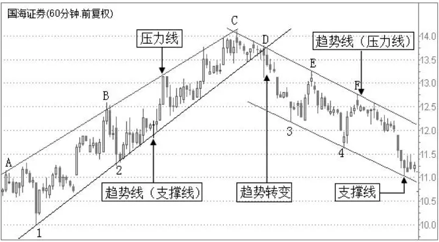

图3\-15 国海证券2012年5月23日至2012年7月6日的60分钟K线图

当股价上涨到C点后回调过程中，股价并没有受到上涨趋势线（支撑线）的支撑，跌破了该趋势线，这样原有的上涨趋势被打破。

在股价向下运行过程中，形成了两个阶段性高点E和F，这两点连线形成了一条下降趋势的趋势线，也是市场在反弹过程中的压力线。在下方形成的3和4两个低点组成了下降通道的支撑线。

图3\-15显示了由上涨趋势转化为下跌趋势的转折，其关键点是在D点。股价向下跌破了趋势线（支撑线）。这意味着趋势发生了变化，其市场意义就在于提示止盈与止损，其道理与前面讲解的K线止损中的技术形态分析方法类似。

__2．空间支撑线的止损方法__

在切线理论中，还有一种压力线或支撑线，这种压力线或支撑线是由重要的阶段性或历史性高点或低点形成的水平压力线或支撑线，称为空间支撑线或压力线。在市场涨跌过程中，前期重要的阶段性高点会对市场产生压力，这是因为前期高点套牢盘的压力和市场心理作用，从而对股价上涨起到压制作用。同样的道理，股价下跌到前期重要低点位置时，市场会出现“捡便宜”的心态，亏损者可能不再割肉，反而会补仓。这样就会使多头力量出现增长，对股价起到支撑作用。

与前面所讲到的趋势线一样，空间支撑线的阶段性高点和低点也与时间周期有密切的关系。一般认为，对后市影响较大的空间支撑线或压力线有以下几种。

①历史性高点形成的空间压力线和历史性低点形成的空间支撑线。

②主趋势产生的高点和低点形成的空间压力线和支撑线。

③阻止或支撑市场上涨或下跌次数较多的压力线或支撑线。

④波段幅度较大的高点或低点形成的压力线或支撑线。

空间切线理论中还有一点非常重要，即空间支撑线和空间压力线之间会相互转变。高点形成的压力线一旦被突破，说明多头力量较强，有能力消化前期套牢筹码，市场心理也发生了变化，因此当股价后期出现下跌的时候，该压力线会对股价起到支撑作用，它就演变成一条支撑线。同样，空间支撑线被向下击破后，该线在以后股价上涨中会起到压制作用，转化为一条压力线。

利用空间支撑线进行止损，设置止损位时与趋势支撑线一样，如果股价有效跌破支撑线，则说明该支撑线的支撑力度不强，股价有效跌破该支撑线后，会引发较强的抛压，市场风险加大。因此股价有效跌破支撑线的时候，就是止损时机。

案例：空间支撑线止损——滨江集团（002244）。

图3\-16是滨江集团（002244）的一段日K线图。图中显示的是一个中级上升三角形整理形态。在前期上涨行情中形成了高点A，以后的整理过程中该点形成的压力线对股价产生了压制作用，比如B点。同时，股价的低点逐步抬高，形成了“1\-2”向上的支撑线。这样AB和12两条线组成了一个上升三角形。在C点，股价向上突破该三角形整理形态，投资者可以在C点买入，参与中线或短线投资。

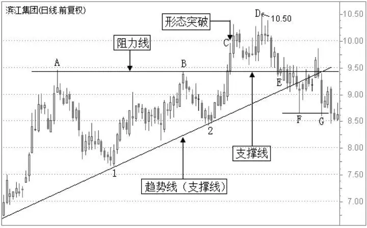

图3\-16 滨江集团2012年2月9日至2012年7月17日的日K线图

该股在以后的表现并不如人意，股价重新回到A点形成的支撑线位置和支撑线1\-2处，接着跌破两条支撑线，显示该股的中长期上涨趋势结束，那么投资者也就失去了继续持股的理由，需要及时止损出局。

图中还有两个点位值得读者参考，即F点和G点。如果说F点出现的一个看涨十字线给中线投资者一点希望，那么G点就彻底打破了这一上涨预期。G点的低点低于F点，这说明F点的支撑力度较弱，多头占下风。另外G点的K线是一根跳空低开低走的大阴线，这也说明空头的力量较强大。结合前面的分析，后市风险非常大，因此投资者需要坚决止损。

__六、MACD指标止损__

__1．MACD指标概述__

MACD又称为指数平滑异同移动平均线，是从双移动平均线发展而来的。它是利用短期移动平均线（常用为12日）与长期移动平均线（常用为26日）之间的聚合与分离状况，对买进、卖出时机作出研判的技术指标。当MACD从负数转为正数时，是买入信号。当MACD从正数转为负数时，是卖出信号。当MACD以大角度变化，表示快的移动平均线和慢的移动平均线的差距迅速拉开，表达了一个市场大趋势的转变。

MACD由以下四个元素组成。

①DIF线。 DIF线是短期移动平均线与长期移动平均线的差，因为其变动较为灵敏，故称为快线。

②DEA线。 DEA线是以DIF值为基础的移动平均线，其变动较为缓慢，故称为慢线。

③MACD柱线。 MACD柱线也叫动能柱，是2倍的DIF线与DEA线的差值。当MACD柱线在0轴线上方时（大于0），一般用红色柱线表示。在0轴线（小于0）下方时，用绿色柱线表示。

④0轴线。 0轴线是MACD的一条分界线，即MACD值为0。

__2．MACD指标止损的运用方法__

因为MACD指标主要用于对大势中长期的上涨或下跌趋势进行判断，因此MACD多用于中线止损分析，短线操作中一般不以该指标为主要止损信号。特别是在市场处于箱体等整理行情中，其市场意义并不大。这并不是说MACD指标完全不能用于短线操作，在趋势较强的短期行情中，该指标还是比较可靠的，如果与其他技术指标配合使用，也可以发挥较大的辅助作用。对MACD指标的分析，要以DIF和DEA的走势为主，多关注二者的趋势、与0轴线的关系，以及DIF和DEA之间的上下关系，发生交叉的时间和空间位置。

利用MACD指标设置止损，有以下几种止损信号。

①在多头市场中，DIF在DEA上方运行，当DIF向下穿过DEA时，一般认为短期上涨趋势结束，市场将进入上涨趋势中的中继调整阶段，因此该信号为短线止损指令。

②DIF和DEA在上方远离0轴线时，说明市场存在超买现象。如果MACD能量柱开始萎缩，则市场有见顶的可能，中长线投资者可以考虑止损或止盈。

③DIF和DEA在0轴线以上向下运行，而股价继续向上，此为顶背离现象，预示市场内部做多能量不足，市场随时有见顶的可能，这也是止损信号。

④DIF从上向下穿过0轴线，说明市场由多头转向空头，中长线需要止损，短线不宜参与投资。

⑤MACD死叉就是止损的命令。死叉是指DIF从DEA上方向下穿过DEA时形成的交叉，即MACD由0轴线上方跌到0轴线下方。不同空间位置的死叉代表不同程度的风险，下面三种死叉表达的市场风险更大，一是远离0轴线上方的死叉，二是处于下降趋势中的死叉；三是下降趋势中在0轴线附近的死叉，该死叉比下方远离0轴线的死叉危险性更大。

在MACD指标分析过程中，中短线操作要多注意MACD（能量柱）的变化，结合DIF走势和拐点来判断短线波段交易机会。MACD的长短并不表示股价或指数跌幅的大小，而是显示市场内部做多或做空能量的高低。MACD红柱见顶回落时，说明市场做多能量开始下降，如果DIF向下转向，则是市场见顶的信号。在时间周期较短的MACD指标使用过程中，这一观点并不能完全成立。实战分析时，一定要结合K线形态和均线、成交量等其他技术分析手段。特别是对于中短线波段操作的投资者来说，这一点非常重要。

案例：MACD死叉止损——罗普斯金（002333）。

图3\-17是罗普斯金（002333）2012年1月17日至7月3日的日K线图。这是一段中期上涨行情启动、见顶和下跌的过程。下面利用MACD指标、均线和K线技术形态三种分析工具对这段行情进行分析。

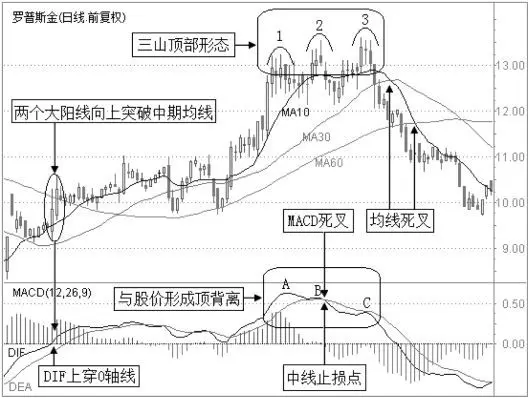

图3\-17 罗普斯金2012年1月17日至7月3日的日K线图

从技术分析看，这段行情是以两个大阳线向上突破中期均线MA60开始的。从MACD指标观察，DIF向上穿过0轴线，说明该股进入中线多头区域。这段行情结束有三个决定性指标，首先是MACD指标出现死叉，如图中的B点位置，按照MACD指标死叉止损方法，B点就是短线止损的时机。其次是K线技术形态出现了顶部三山反转形态，如图中标示所示。第三个看跌信号是均线死叉，MA10下穿MA30的时候，说明市场中短期向上趋势已经完结，当MA10下穿MA60的时候，说明该股的中期上涨趋势已经完结。

该股出现的MACD顶背离，对该股结束中长期向上趋势发出了信号。图中的三山形态与MACD中的DIF指标走势相反。三山形态中，1、2、3点的价位依次抬高，但DIF指标A、B、C点则依次降低，说明股价虽然上涨，但市场动力却依次递减，后市堪忧。

出现顶背离后，特别是在三山形态的第三座山下跌时出现的三个实体依次放大的阴线，它们组成了反映市场空头力量强大的三只乌鸦K线形态，结合其他几种技术分析方法，此时无论是短线还是中线投资，都需要及时止损。

这个案例中使用了三个趋势性技术指标来对走势进行分析，其中MACD指标是最早发出止损指令的，这也说明MACD指标在中期趋势的判断上有着较强的优势。不过需要提醒的是，图中的死叉B是出现在相对高位，而前面曾经出现过一次“死叉”，当时市场处于上升趋势中，MACD靠近0轴线，因此其意义并不大。

__七、时间止损__

“时间就是效益”，这句话在股票投资中同样适用。股市中有句俗语叫“久盘必跌”，这是用时间来判断股市风险的经验性总结。股市分析中，时间确实很重要，它和投资金额共同组成了投资的成本。这种成本可能对一些拥有资金的中小散户并不是很重要，但对那些从银行等有偿渠道筹措的资金和可以用于其他投资的资金来说，时间成本是非常重要的。

前面讲过，股市涨跌的动因在于增量资金。对于A股来说，资金尤为重要，有资金推动的股市，才可以出现像样的行情。而资金一旦发起行情，就会用最有效的方式来达到盈利的目的。充分利用时间，就是提高资金利用效率的重要方法。

主力资金在使用资金时，时间分配上往往会呈现出纺锤形，即两头长，中间短。也就是说资金在低位获取筹码的时间是最多的，显得非常有耐心。拉升阶段的时间最短，一般主力会用较短的时间将股价拉升到目标价位区。派发筹码的阶段相对于拉升时间一般要长一些，但比吸筹阶段要短。

根据主力资金的运作手法和控盘情况，吸筹和拉升以及拉升和派发之间的界线并不是十分清晰，也可能会出现融合和交叉，但总体来看，只要市场不出现系统性风险，主力资金会按照制定的时间计划来完成整个股票的运作。在该拉升的时候，如果出现较长时间的横盘走势，说明该区域的“拉升”存在不确定性，一是主力资金出现犹豫，二是动摇市场中的跟风盘。在横盘过程中，多头力量会不断消退，时间一长，就会使做多力量处于下风，导致股价下跌，这也就是“久盘必跌”的原因。

中小散户的投资手法要根据主力资金的运作方式来确定，从时间角度看，普通投资者需要抓住的是主力资金拉升的一段时间。但这段时间是否能够抓住，能抓住多少，则要看投资者自身的判断能力和执行能力。

时间止损就是通过对市场主力资金在拉升过程中的时间长短来设置持股时间的止损方法。如何设置止损的时间呢？不同操作风格和投资周期的人有不同的界限。一般情况下，时间止损多用于短线投机中。短线投资设置的止损时间为5天以内，T\+0甚至会出现当日止损。中线投资者则适当延长，长线投资者一般不会在时间上设置止损期限。

普通投资者买入某只股票时，一般会选择整理充分、蓄势待发的个股，甚至尽力买在爆发的瞬间。实际上投资者无法准确知道该股是否是“庄股”，股价什么时候爆发，单日上涨是真的启动上升行情还是虚晃一枪。为了提高资金的利用效率，避免未来不确定的走势，采取时间止损是很有必要的。

案例：时间止损——波导股份（600130）。

图3\-18是波导股份2012年3月30日至2012年7月27日的日K线图。

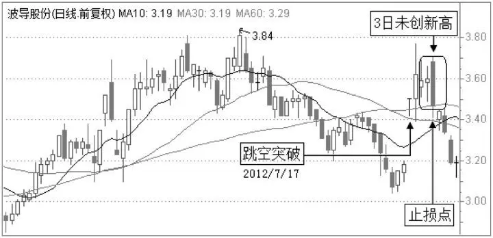

图3\-18 波导股份2012年3月30日至2012年7月27日的日K线图

因公司2010年、2011年连续两年盈利，根据相关规定，波导股份公司股票摘除了“ST”头衔，7月17日开牌当日涨停，开始演绎“摘帽行情”，这给短线博弈提供了机会。

虽然短线有获取暴利的机会，但也蕴藏着极大的风险。参加短线博弈时，一定要设置好止损，比如时间止损。对于这类消息刺激的上涨，市场里的游资进行短线炒作，其持续性较差，因此持股时间表现得非常关键。普通参与者同样也要掌握“短平快”的操作策略。

一般在3天以内，该股如果没有继续上涨，创出本次上涨的新高，那么就要止损出局。原因很简单，游资拉动的上涨行情没有持续性，上涨时间短，如果在短时间里不继续创新高，说明游资并没有更高的目标，几天内就会出货离场。一旦这些游资离场后，股价就会快速下跌。

该股在2012年7月17日开牌涨停后，第二天再次冲高。接下来的三天，股价无法继续向上，并且最后一天出现一根大阴线，根据时间止损法则，此时应止损出局。

__八、SAR指标止损__

SAR指标又叫停损转向操作点指标或抛物线指标，是“Stop and Reveres”的缩写。这种指标与移动平均线的原理颇为相似，属于价格与时间并重的分析工具。由于组成SAR的点以弧形的方式移动，故称为“抛物转向”。

Stop是停损、止损之意，这就要求投资者在买卖某只股票之前，先要设定一个止损价位，以减少投资风险。这个止损价位不是一直不变的，而是随着股价的波动不断地进行调整。

Reverse即反转、反向操作之意。要求投资者在投资股票前，先设定一个止损位，当价格达到止损价位时，投资者不仅要对前期买入的股票进行平仓，而且在平仓的同时，可以进行反向做空操作，以谋求收益最大化。这种方法在有做空机制的证券市场可以应用，目前我国股票市场还不允许做空，因此投资者主要采用两种方法进行操作，一是在股价向下跌破止损价位时及时抛出股票，之后持币观望。二是当股价向上突破SAR指标显示的股价压力时，及时买入股票或持股待涨。

SAR指标的计算公式相当繁琐，这里不多做介绍，只介绍该指标的简单用法。

①当股价从SAR曲线下方向上突破SAR曲线时，为买入信号，预示着一轮上升行情可能展开，投资者应迅速及时地买进股票。

②当股价向上突破SAR曲线后继续向上运动，SAR曲线也同时向上运动时，表明股价上涨趋势已经形成，SAR曲线对股价构成强劲的支撑，投资者应坚决持股待涨，或逢低加码买进股票。

③当股价从SAR曲线上方向下突破SAR曲线时，为卖出信号，预示着一轮下跌行情可能展开，投资者应迅速及时地采取止损措施。

④当股价向下突破SAR曲线后继续向下运动，而SAR曲线也同时向下运动，表明股价下跌趋势已经形成，SAR曲线对股价构成巨大的压力，投资者应坚决持币观望或逢高减磅。

案例：SAR指标止损——西南证券（600369）。

SAR指标止损就是看股价是否跌破SAR值（线）。图3\-19是西南证券2012年3月6日至8月30日的日K线图。根据SAR指标的信号操作，其方法和结果如下。

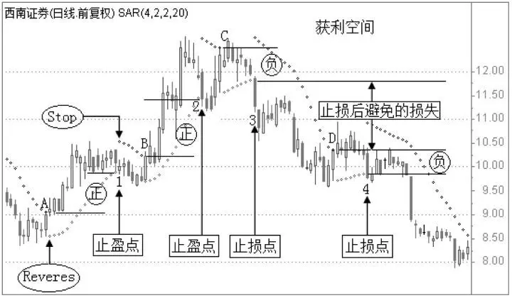

图3\-19 西南证券2012年3月6日至8月30日的日K线图

在A点以前，SAR指标显示市场趋势向下，在许多交易软件中用绿色表示。A点处股价向上突破了SAR线，出现了趋势反转信号，此时SAR值从绿色变为红色（通用的表示方法是上涨趋势中的颜色用红色表示），这也是SAR给投资者提供的买入信号。只要红色不变，就继续持股。

股价经过一定涨幅和横盘整理后，SAR线出现了第一STOP点，如图中1的位置，这是提醒投资者要采取止损（止盈）操作。同样的道理，后面出现B点买入，2处止损（止盈）。在这两次交易中，投资者按照SAR指标操作，显然是获利的。

与“A\-1”、“B\-2”两个波段操作不同，在后面下跌趋势“C\-3”和“D\-4”的投资中，投资者按照SAR方法进行投资，结果都是亏损。不过从图中可以看出，由于按照SAR指标止损，投资者可以避免较大的损失。从本案例看来，在“A\-1”、“B\-2”中所获收益，完全可以抵扣止损带来的亏损。

从这个案例中可以知道，SAR指标虽然不能让投资者较精确地把握市场涨跌节奏，也无法让投资者买在最低区域或卖在最高区域，但其最大的优点是帮助投资者抓住市场的主要涨跌区域，既避免被强势股的震荡甩下马，也给投资者提供了止损出局的信号，可以避免出现较大的损失。

__本章小结__

止损是控制风险的重要方法之一，是在投资失误或者出现较大的潜在风险时，将损失限定在较小范围内的交易行为。

止损是投资计划中必须具备的一项内容，设置止损标准是投资中的重要环节。投资者设置止损并不是为了止损，从开始建仓起，止损的指令就开始生效，但是我们在建仓的同时，就需要考虑如何避免止损。止损有多种方法，有定额止损、技术止损、基本面止损等，无论什么方法，都基于投资者本人和市场因素两个方面，即投资者风险承受能力、风险偏好和市场风险的变化情况。

制定止损需要合理，止损的幅度不能定得过于宽松，否则会造成较大的损失；也不可以太小，这样很容易误判形势，触发止损指令。对于较大的基本面恶化情况，止损是没有限度的，要在第一时间内进行止损。在技术面上，制定止损时要考虑市场的趋势确实已发生改变，这种趋势是以投资者的交易周期进行评判的。另外，在熊市中止损要从严，牛市中则可以适当放宽松。

## 第四章　止盈

__第四章 止盈__

__第一节 止盈概述__

__一、止盈及其意义__

止盈也称停利、止赚、止赢。在股票交易中，止盈是在购入成本以上挂单卖出，并获得实际收益。止盈卖出有两种心理状态，一是主动性卖出，即在股价上涨过程中达到盈利目的后，主动挂单卖出；二是被动卖出，即在获利的情况下，发现市场风险增加，对既得利益产生伤害，因此采取“止损”式卖出。

对于“止损”式盈利卖出，由于其分析方法和思路与止损非常类似，故有的资料将既得利益看成是资本。止盈与止损一样，都是防止资本减少，故将这种止盈方法也归入到止损中。

无论怎么来定义止盈，其中心思想就是尽力保住既得收益，将账面盈利变为实实在在的现金收益。这也是止盈的意义和目的。

止盈的意义可以概括为以下几点。

__1．获取稳定的收益__

止盈是股市投资中获取稳定收益的最好方法，也是交易型投资者获取收益的唯一方法。交易型投资，用最简单的话来说就是“高抛低吸”。所谓“高抛”，就是止盈。即使投资者买入股票的价格再低，不进行止盈变现，所谓盈利都是停留在账面上。参与股市投资的朋友，都有账面盈利最后又还回去的体会，其主要原因就是缺失止盈措施。

股市投资资金就像经营实体，需要精心照料，有效运作才可以创造利润，更何况股市投资是风险投资，有涨有跌，时间性非常强。追求永远卖在最高点，是不可能实现的空中楼阁。只有通过合理的离场策略，尽量保证离场的合理性，同时保持良好的心态，避免发生较大的错误，才能达到长期小亏大赚这一核心目标。

__2．回避市场增加的风险__

股市整体风险与股价存在着正相关的关系，即股价上涨，风险加大。止盈就是在股价出现上涨后采取的兑现风险的过程。

大家只知道股指或股价上涨风险增加的道理，但很难准确知道上涨到什么点位或价位风险开始释放，释放的程度有多大。因此投资者能做的就是在风险增加到一定程度时兑现筹码，回避风险，待风险期过后，再寻找下一个投资机会。

__3．增强投资信心__

在股市中投资，信心非常重要。虽然A股历史只有20几年，可是能够在股市中生存5年的人非常少。每一轮牛市吸引一批人入市，但一个轮回后，又有多少人能够留下来参与下一轮行情呢？

即使重新回到股市，可能又是股市涨了一大截后的亢奋时期，其结果已经可以预料，最后就是“谈股色变”。

止盈本身就是给投资者信心，所谓赚钱的生意不可能不做。

__4．帮助投资者掌握投资节奏__

股市投资不是什么时候都可以做的，风险和收益之间总是在循环往复地发生变化，短线有短线的循环，长线有长线的周期。止盈可以帮助投资者掌握这种循环节奏，并在合理的阶段进出。

止盈不是要求投资者精确地掌握股市涨跌这种节拍，也没有人能够精确掌握股市运行节奏，止盈的要求是“对”，不是“准”。

__二、止盈与止损的对比__

止盈与止损是相对的概念，都是考虑风险与收益之间的关系做出的卖出交易行为。两者最大的区别在于止损是控制损失的扩大，而止盈是防止所得收益缩水，其目的都是保证现有资产不减少。

无论止盈还是止损，避免发生错误的关键是要认清市场的性质，即市场是牛市还是熊市，是上涨行情还是下跌行情。熊市没有看到明确的底部出现时，把所有的上涨都看成反弹，止盈的核心是“见好就收”，止损则是“见风就跑”。一旦牛市确立，应该把任何一次回调都看成是介入的大好时机。

对比止盈与止损，有以下差异与相似点。

①止盈与止损的心理基础不同。 止盈与止损虽然有非常多的共同点，但指导交易行为的心理基础不一样。止盈是克服人们心中的“贪婪”，止损则是克服“侥幸”心理。

②止盈与止损的控制幅度不同。 股票投资有一条非常重要的原则，就是“小亏大盈”，也就是执行止损时要坚决果断，把亏损限制在较小的范围内。止盈则是在市场出现趋势转变，或者达到了预期目的后采取的了结行为。只有保住止盈后的收益总和大于止损后的损失，投资者才会获取收益。

③止盈与止损的运作程序不同。 止损的程序相对于止盈要简单，绝大部分情况下，只要出发了止损信号，就要100％地执行。而止盈则涉及到建仓、加仓、减仓和平仓等筹码管理，以及资金管理等诸多因素，因此要显得复杂一些。

④止盈与止损有着共同的目的。 表面上看两种交易行为产生的结果完全相反，但其目的都是为了最终盈利，都是以控制风险为核心的投资保护机制。

⑤止盈与止损的衡量核心都是风险与收益的对比关系。 无论是止盈还是止损，都是当投资者认为持有风险超过持有收益时的卖出行为。

⑥两者采取的分析理论和方法基本一致。 止盈和止损是相对而言的，对于同一只股票，在相同的时间和价位卖出，有的投资者可能是属于止盈，而有的则是止损。比如，某位中线投资者在较低价位以10元买入某只股票，当股价上涨到12元后，另外一名短线投资者再买入，不久后股价下跌到11\.50元，并且市场出现向下转向的风险信号，为了回避风险，两人都卖出了手中的头寸。前者属于止盈，后者则是止损。

__第二节 静态止盈__

静态止盈包括“时空”两方面内容。所谓“时空”，是指投资时间、股市运行时间和投资者获利的空间或股价所处的价格空间。在静态止盈中，利用获利（价格）空间止盈是最常见的方法，这是指投资收益达到了某一目标后了结头寸的行为，止盈点可以是获利百分比，也可以是某一价格区域。时间止盈是当投资时间达到某一时间窗口后采取的止盈行为，该时间窗口可以是投资资金所赋予的时间限制，也可以是市场行情的某一时间窗口。利用时间止盈的机会相对较少，但在很多情况下显得非常重要。

__一、获利百分比止盈__

百分比止盈就是投资收益达到了某一百分比后，就行使自动止盈的方法。百分比止盈往往是投资者根据投资周期和对市场的判断，给予预期的百分比收益，只要到达这一收益目标，即行使止盈。这个方法比较简单，一般与百分比止损搭配使用，止盈的百分比要高于止损，比如止盈采用15％，止损5％，这样才能保证获利空间。

百分比止盈最大的困难在于确定合理的盈利比率。市场的变化是不会按照投资者的意愿运行的，并不是说制定的获利百分比一定能够实现，只有通过分析后，采取稍微保守的态度，才可以让该目标成为大概率事件。

投资者可以根据不同的市场特性来调节止盈与止损的百分比。比如在牛市中可以将止盈百分比调高，在震荡市中适当调低。在下降趋势中，既要调低止盈百分比，也要调低止损百分比。

案例：摊薄成本止损——水晶光电（002273）。

在百分比止盈中，有一种是资金管理中常用的方法，就是摊平（摊薄）成本止盈。下面用水晶光电（002273）这个案例来说明。图4\-1是水晶光电2012年3月12日至9月6日的日K线图。

①投资理由。

基本面：公司是光学光电子产业的龙头企业，其新产品蓝玻璃红外截止滤光片（IRCF）成功研发，可以为苹果公司供应配套的iPhone5摄像头，这将为公司业绩带来积极和长远的影响。

技术面：股价在底部强势上涨，突破各条均线和长期底部颈线压力位，形成多头走势格局。

②投资周期： 中长线。

③仓位管理： 固定总仓位比重30％。另外使用自由资金进行短线波段操作，仓位不超过固定仓位。

④主要分析工具： 技术分析以K线形态和均线为主，并定期查阅公司公告和财务指标变化。

⑤建仓成本： 18\.30元。

⑥止盈目标： 中长期趋势不变则持股。倒仓滚动短线运作资金根据市场变化灵活处理，原则上波段操作采用百分比止盈方法。

⑦潜在风险： 宏观经济不稳定对公司未来业绩产生负面影响。大盘处于熊市，个股走势可能受到牵制。

⑧止损计划： 固定仓位以中期MA60为基准，有效跌破后止损。如果有滚动操作仓位，则另行制定止损位，原则上采用百分比定额止损。

水晶光电的技术走势和分析略图，可参看图4\-1。

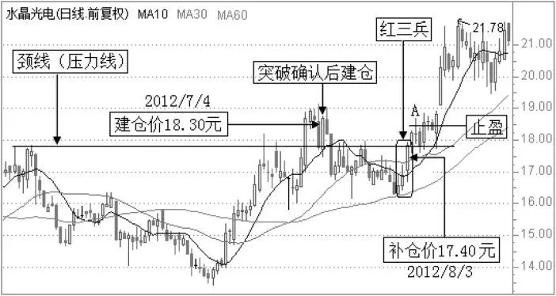

图4\-1 水晶光电2012年3月12日至9月6日的日K线图

根据前面的投资计划纲要和图4\-1的简单描述，可以了解这次投资的背景。我们主要介绍的是在第一次建仓后，股价出现了回调，投资者采用短线滚动操作来摊平成本的操作手法。

2012年7月4日进行了第一次建仓，价格为18\.30元。随后市场并没有受到利好消息的刺激进一步上涨，反而出现回调，但该股的基本面较稳固，实施的是中长线投资，因此止损是以中长线为基准的。

当股价回调到MA60后，市场出现重要的红三兵看涨K线形态，并且股价突破MA10和MA30，显示市场多头力量继续控制局势。按照投资计划，在此处可以进行短线滚动操作，故在2012年8月3日买入与第一次建仓仓位相等数量的头寸，价格为17\.40元。本次短线操作的目的是为了摊薄固定持仓成本，希望将固定持仓成本降低到当前MA30附近。根据计算，该短线滚动持仓盈利比率需要达到5\.5％，即本次短线滚动操作的止盈价格为18\.37元。

在A点位置，股价达到了18\.37元的止盈点后，卖出短线持仓头寸，止盈出局。

__二、价格空间止盈__

大家知道，趋势分析是技术分析的核心内容。在趋势分析中，又有两个重要的内容，即方向和空间。趋势方向有上涨、下跌或横盘，它给投资者指明投资的方向，如做多、做空或等待。空间则是对可能改变趋势运行的因素进行判断，主要包括空间支撑、空间阻力。空间是止盈或止损的重要依据。

价格空间止盈就是利用股价的空间阻力位来确定止盈的目标。在技术分析中，判断空间阻力位有几种常见的方法，比如前面已经介绍过的阻力线、筹码密集区等。

案例：价格空间止损——隆平高科（000998）。

在短线操作中，对空间阻力位的分析非常重要，因为在“短、平、快”的操作原则下，止盈是短线操作的关键。下面以隆平高科的一段短线操作为例，来说明利用价格空间止损的方法。

图4\-2是隆平高科2012年7月6日至2012年7月17日的一段60分钟K线图。图中的买入点是前一段时间市场在大的上涨趋势中回调后出现的机会。该股处于上升趋势中，因此挑战前期高点22\.06元的可能性还是存在的，不确定因素是在回调过程中曾经出现的一个小反弹没有成功，造成市场深度下探。根据对该股技术走势的分析判断，预期股价上涨到前期第二高点B点的可能性非常大，也存在挑战第一高点A点22\.06元的可能。安全起见，短线止盈设置在第二高点B，即21\.20元，或略低一点，如21\.15元。

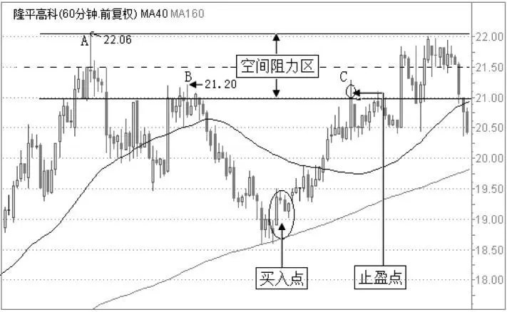

图4\-2 隆平高科2012年7月6日至2012年7月17日的60分钟K线图

投资者可以根据自己的风险偏好和对市场的判断，将止盈点放在A和B之间的其他价位，也可以采用分批止盈的方法。

__三、时间止盈__

股市运行的时间周期有很多种。宏观角度，股市的运行周期与宏观经济循环周期的时间基本吻合；行业角度，由于各行各业的行业特性不同，因此不同行业指数的运行情况也不尽相同。另外，在股市的运行中，股价往往随着一些有规律的事件起伏，比如季节周期对行业的影响，每年的年报时间、季报时间和半年报时间对走势的影响，等等。从技术分析角度看，通过对历史走势进行统计和总结，股价的运行存在时空变化规律，“横有多长，竖有多高”、“盘久必跌”等股市俗语，就是对这种时空规律的描述。

利用市场波动变化周期的时间特点采取止盈操作，是最适合普通投资者的止盈方法。波浪理论对股市的波动进行了较详细的论述。波浪理论有三点核心内容，一是市场呈波浪形态运行，二是波浪之间具有比例关系，三是波浪的运行时间有一定的规律。这也就是从形态、空间和时间等三个方面对股市的运行进行了总结，时间是其中的一个重要因素。股市完成每一波段周期，其时间长短因主要趋势和次要趋势以及小趋势的规模大小而不同，也因个股的不同特性存在差异。

时间是消化多空双方力量的重要途径。在多空发生严重分歧后，市场要回到平衡点，需要时间来消化分歧，分歧越大，回到平衡所需要的时间越长。股市里有些俗语也反映了时间与空间的关系，如“横有多长，竖有多高”等，这种时间与空间的关系，也就是时间止损的依据。

时间止盈或者止损最大的缺陷，是波段运行时间的准确性无法确定。在运用中，需要与其他影响市场的因素发生共振，才能起到较大的作用。特别要注意时间与空间的关系，以及成交量的变化，这三个因素都是对市场多空力量变化的反映。

案例：时间止盈——尖峰集团（600668）。

图4\-3是尖峰集团2012年1月9日至2012年6月20日的日K线图。该图是以时间周期为重要因素的一段行情。2012年1月9日出现的6\.93元低点，是近两年以来的最低价。股价见底后，以红三兵K线形态向上突破MA10、MA60，这是见底反弹的技术信号。市场第一轮升势行情到达阶段性高点是在2012年2月23日，用时30个交易日。30个交易日以后，也就是2012年4月11日，股价突破整理区间的阻力线，此时均线系统刚好出现金叉，并呈多头排列，市场再次进入上涨行情。

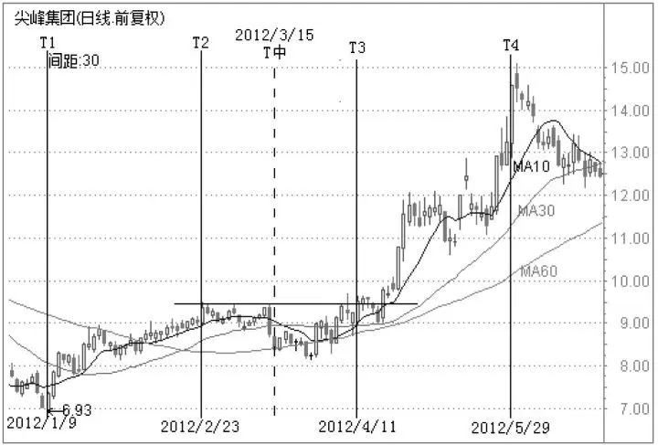

图4\-3 尖峰集团2012年1月9日至2012年6月20日的日K线图

如果作为中线投资持有该股，那么依据该股的时间与走势变化情况，可以先做个预测，在4月11日以后的30个交易日附近，就是一个市场转折的时间窗口。有了这个时间预测后，就可以在5月29日前后重点观察是否有其他引起市场共振的因素，重点关注前后几天的股价走势变化，并做好止盈准备。

5月29日这天，关于尖峰集团的《水泥药品双面开花，固定资产投资加速》一文在市场中流传，主力资金利用利好刺激，将股价拉到涨停板，此时股价大幅脱离短期均线，其出货意图非常明显。

无论从空间（股价翻番）还是时间窗口（刚好30日），以及均线系统，都显示出市场短期风险甚至中期风险已经来临，既然如此，平仓了结，回避风险，止盈出局才是最好的选择。

__第三节 动态止盈__

动态止盈是指不固定止盈的幅度或价格，而是根据市场的走势变化来确定止盈的时机。动态止盈最大的优点是可以灵活应对市场的变化，充分利用获利机会。动态止盈对投资者的分析能力和心理素质要求更高。

静态止盈要求投资者把握好市场运行的趋势和买点，并确定未来市场运行的阻力位置，预计股价上涨的幅度。至于市场在这个过程中如何达到目标，或者是否达到目标时的市场状态，并不做更多的研究。动态止盈则不一样，除了要做好静态止盈的分析工作外，还要对达到某一价位后的市场进行跟踪分析，随时把握市场运行趋势，直到市场发出见顶信号后才获利了结。

动态止盈的最常见分析方法是采用技术分析，利用技术分析对市场趋势、拐点和市场热度进行观察分析，从而确定止盈点。

利用技术分析寻找动态止盈位置，与止损的分析方法有些类似，其核心内容都是判断市场是否出现趋势变化信号。这些信号主要来源于各种分析指标的形态特征，比如移动平均线中的均线转向、组合排列、死叉，K线顶部反转形态和顶部技术形态，以及其他众多的技术指标提示的卖出信号。

其实投资者并不需要对这些眼花缭乱的指标都进行研究，也没必要在分析时逐一运用，这也是不可能的。其实这些指标的基础都是市场交易的价、量和时间，它们站在不同的角度，对价、量、时进行统计计算，然后以技术指标的形态表达出来，以便投资者能够从不同的侧重点来观察市场，为投资提供决策信息。普通投资者可以根据自己的偏好和能力，选择几种重要的分析工具即可。在选择指标工具时，可以从价（价格及空间）、量（成交量及筹码）、时（运行时间）三方面综合考虑。

当然，动态止盈并非是技术分析的专利，也可以用其他的分析方法来确定止盈点，比如有很多中长期投资者都使用市盈率来作为止盈依据。

__一、K线形态止盈__

K线形态是以价格和时间为基础的技术分析方法，它反映的是某一单位时间或某几个单位时间内股价的变化情况，并通过其变化规律反映出市场趋势的变化方向。K线形态止盈就是对K线形态进行观察分析，通过K线形态发出的滞涨或顶部反转信号来确定止盈点。

在不同投资周期中，K线形态止盈使用方法有所不同，首先是选择的K线周期不同，中长线投资一般以周K线为主，兼顾日K线；中短线投资是以日K线为主，兼顾周K线与60分钟K线；短线投资往往会对日K线、60分钟K线以及30分钟K线进行综合分析。

实战中，大家不会孤立地看K线形态来进行止盈操作，较常用的方法是结合均线来确认当前股价与某一时期平均成本的差距以及市场的趋势情况；结合空间阻力来确认市场变化的关键空间位置区间；结合成交量来观察股价在某一关键位置时市场对该价位的反应激烈程度。

案例：K线顶部反转形态止盈——海峡股份（002320）。

图4\-4是海峡股份2012年5月31日至9月4日的日K线图。该案例是利用K线形态技术，结合均线、空间及成交量进行短线投资的案例。

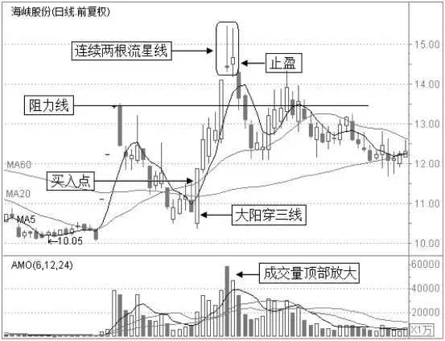

图4\-4 海峡股份2012年5月31日至9月4日的日K线图

该股受大陆与台湾加强经济合作的政策利好刺激，连续出现3个涨停，接着股价向下打压，并填补了所有缺口。此时市场有强烈的反弹要求，也不排除主力利用打压方式进行强势急促建仓。

当股价回补3个涨停跳空缺口后开始企稳，短线买入信号是一根大阳线向上穿透三条移动平均线，成交量同时也穿过了三根均量线。短线买入后，可以暂且预期股价能够达到前期3个涨停的价位附近，采取动态止盈方法。

随后股价一直在MA5上方连续收阳，并且以一根大阳线向上突破阻力线。按照原来的预期，如果是静态止盈，此时就可以获利了结。但目前市场仍处于强势上涨中，完全可以再对市场进行跟踪，尽量获取更大的收益。

第二天K线形态出现了一根顶部反转的流星线，成交量也出现顶部放量的迹象，这给大家发出了止盈警示。接着后面又是一根流星线，从K线形态上证实了前面一根流星线是顶部反转信号。此时股价远离MA5，而且MA5与MA20出现大幅度偏离，结合这两天成交量明显放大的现象，此处应该采取止盈操作。

K线形态中有很多属于顶部反转形态，读者可以参考第三章中“常用的止损K线形态和技术”形态表。

除了利用K线形态制定止盈位以外，还有一些人利用K线技术的看盘技巧，短线捕捉较精确的交易点。这一技巧对投资者有很大帮助，这里简单介绍三种。

__1．高价、低价收市看盘法__

这种看盘方法主要是明白高价收盘与低价收盘的定义。所谓高价收盘和低价收盘，是以前一交易日的最高价和最低价为基准来定义的。一般当日收盘价在前一日最高价减掉振幅的10％以后的上方，则为高收盘价。同理，如果当日收盘价低于前一日最低价加上振幅的10％的下方，则为低收盘价。如图4\-5所示，后一根K线的收盘价只要在10\.95元上方，则为高价收市，如果是在10\.55元下方收市，就是低价收市。

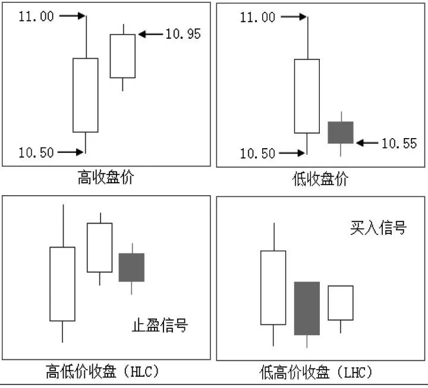

图4\-5 高价收盘与低价收盘

高价、低价收盘看盘法的核心，是当日的收盘价处于前一交易日的空间位置，它反映了参与市场交易的整体心理和趋势变化。

高低价收盘看盘方法确定止盈的方法是：若第一日以高价收盘，第二日以低价收盘，便构成高价至低价收盘信号，简称高低价收盘信号，它是一种短线卖出信号，也是一种止盈提示。相反，如果第一日以低价收盘，而第二日以高价收盘，则构成低价至高价收盘信号，简称低高价收盘，此为买入提示。

__2．普通转向与特殊转向__

普通转向有向上转向与向下转向两种。在一个下降趋势中，如果当日K线的最低价低于上一日的最低价，但收盘价较前一日收盘价高，说明市场构成了普通向上转向信号。在一个上升趋势中，若当日最高价高于上一日的最高价，但收盘价比前一日收盘价低，构成普通向下转向信号。

特殊转向也分向上转向和向下转向两种。若当日最高价高于前一日的最高价，且最低价低于前一日的最低价，而收盘价高于上一日收盘价，便构成特殊向上转向信号。反之，若当日最高价低于上日最高价，且最低价高于上一日的最低价，而收盘价低于上一日收盘价，便构成特殊向下转向信号。

普通转向的信号在可靠性上要低于特殊转向信号，因此普通转向信号一般要配合其他技术指标使用。特殊转向信号经常在趋势转变的时刻出现，特别是当它出现在关键的时空位置时，其作用值得投资者密切关注。

__3．三高三低__

所谓“三高”，是指当日K线的收盘价高于前面三根K线的收盘价，这是看涨信号。“三低”是指当日K线收盘价低于前面三根K线的收盘价，是一种看跌的信号，也是止盈信号。

所有的看盘方法都需要结合技术分析的核心要素，即趋势和时空。以上三种看盘方法也是这样，当市场处于某一关键的时空位置时可以采用。比如在止盈策略中，如果股价已经达到了预期收益的上方，此时市场整体收益较高，风险随时可能释放，那么投资者在采用动态止盈时，就可以更精确地采用这种看盘方法，以获取更高的收益。

__二、均量线止盈__

__1．均量线的概念__

均量线反映一段时间内市场成交量的平均水平。不同时间段的平均成交量组成的曲线，可以反映市场交投趋势的变化，从而帮助投资者了解市场的交投热度。

均量线分为分、时、日等各种时间周期，一般交易系统默认的是5日、10日均量线。投资者可以根据短期、中期或长期投资的不同，来设定均量线的合适周期。

__2．均量线的使用方法__

在分析均量线时，最主要的方法是结合价格的变动进行分析，通常以价格与均量变动趋向是否一致，来判断价格变动是否具备成交量基础。一般情况下，当两种趋向一致时，表明价格走势得到成交量的支持，这种走势可望得到延续。当两种趋向发生背离时，说明成交量不支持价格走势，股价的运行方向可能发生转变，这种现象称为量价背离。

另外，也可以对不同周期的成交量变化情况进行分析，以判断不同时间段的市场热度变化。比如，可以设置两条甚至多条均量线，根据它们的相互位置及交叉情况，来研判市场的人气变化情况。

当均量线形成多头排列时，股价将保持上涨的趋势，提示投资者可买入或继续持有；当均量线呈现空头排列时，股价将保持下跌趋势，提示投资者出局或持币观望；当短期均量线由向上拐头向下穿过长期均量线时，则形成均量线死叉，显示价格可能出现趋势变化；反之，短期均量线由下转上并上穿长期均量线时，则形成均量线金叉，预示市场有见底的可能。

在使用均量线止盈时，其方法是，当股价达到初步预期收益后，如果K线仍然保持上涨趋势，此时可以密切观察均量线与股价是否出现顶背离，或者出现向下拐头即死叉。如果均量线出现顶部信号，那么一旦K线出现危险信号，就可以采取止盈措施。

案例：均量线与K线配合止损——万邦达（300055）。

图4\-6是万邦达2012年3月5日至7月11日的日K线图。万邦达是以工业水处理为主业的一家环保公司，属于环保板块企业。

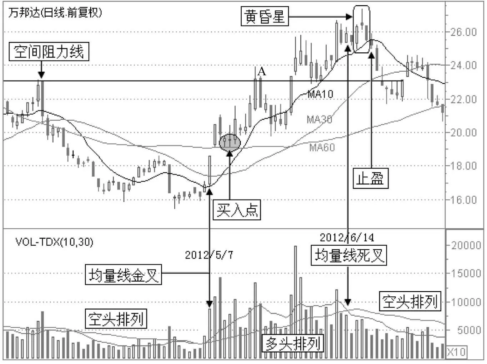

图4\-6 万邦达2012年3月5日至7月11日的日K线技术分析图

图4\-6对该股进行了技术分析。从图中可以看到，市场前期处于下降趋势中，均量线呈空头排列。2012年5月7日均量线出现金叉，说明该股引起了投资者的关注，交易热度开始上升。当日股价出现涨停，并向上突破中短期均线MA30。第二天股价继续跳空向上，突破中期均线MA60，成交量继续放大。从技术分析角度来看，该股已经出现了中短期趋势向上的局面。

因股价上涨过快，有获利回吐的需要。经过两天观察后，股价获得MA60和跳空缺口的强力支撑，故在该区域买入，进行中短期投资。止盈点可以暂时设在空间阻力线附近，具体止盈点位可以借助成交量指标和K线及均线进行分析。

当股价第一次达到预期止盈点A时，可以考虑部分止盈。由于此时均量线以及均线等技术指标仍然保持较好的中短线上升趋势，故可以继续持股观察。2012年6月14日出现了均量线死叉，“量在价先”，股价随后可能会见顶。接下来几天，K线出现了重要的黄昏星顶部反转形态，这样量价均出现顶部反转共振，此时就是采取止盈的最佳时机。此后该股进入空头市场。

__三、动态比率止盈__

动态比率止盈有两种方式，即获利回吐止盈和股价回撤止盈。获利回吐止盈是以获利率作为止盈计算方式，以买入点为基点，股价每一次创阶段性新高（或获利新高）后，在回调过程中用一定比率的获利来作为新的风险承担。动态回撤止盈是以每一上升波段的低点到高点的涨幅，依据市场走势的强弱和股价总体涨幅空间，分别按不同的获利回吐方法来制定止盈点位。这种止盈方法可以忘掉原有的买入价格，视每一波段的启动点为新的买入点。

图4\-7是获利回吐止盈方法的示意图。以投资介入点位为起点，市场走势与预期同向。随着股价上涨，账面获利率开始上升。假设市场已经达到初步预期的基准收益率10％，但是市场走势仍然很健康，就用最高价乘以回吐百分比，制定新的获利回吐止盈点。

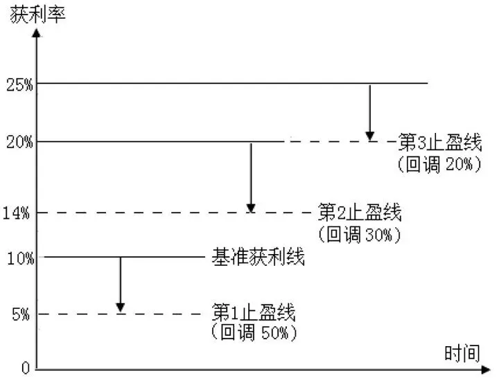

图4\-7 获利回吐止盈方法的示意图

比如，在第一轮上涨行情后，可以拿出50％的获利作为止盈点；如果股价继续上涨，获利达到20％后，市场开始第二轮回调，那么可以拿出总获利的30％作为风险承担损失；依次类推，当获利达到25％的时候，可以将获利的20％作为风险承担损失。

这种止盈方法非常简单，对技术分析等能力要求不高，既能够保证投资盈利，也不放弃后市的机会。投资者可以根据自己的风险偏好，制定不同的回调止盈比率，原则上是随着股价上涨，止盈点的获利率也随之上升。

案例：获利回吐止盈——广州药业（600332）。

图4\-8是广州药业2012年3月28日至8月27日的日K线走势图。其买点是市场出现大阳线后，在向上突破前期高点A时买入，如图所示。

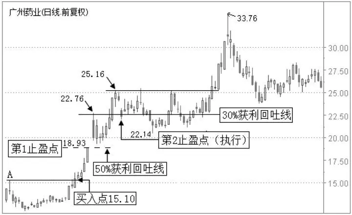

图4\-8 广州药业2012年3月28日至8月27日的日K线走势图

买入后，股价强势上涨，并创出22\.76元的阶段性新高，此时就可以启动获利回吐止盈方法。以回吐50％获利计算，则其止盈位置为18\.93元，与跳空缺口的下沿价位基本相同。市场并没有达到该止盈位置，因此此次止盈没有实施。

股价继续向上，再次创出阶段性新高25\.16元，这样可以制定新的止盈点。采用回吐30％获利来计算止盈价位，即22\.14元。股价在创出新高后的第三天就下跌到了该价位，因此启动止盈，获利了结。

此后市场经过了1个月横盘休整，再次发动了一波快速上涨行情，不过那已是后话了，无关本轮操作。

投资者不要认为此次止盈是错误的，没有抓到后面的一轮大涨行情，因为任何一个人都不是先知。另外在这1个月的时间里，能否熬到后面出现行情，对投资者来说也是个问号。

__四、不创新高止盈__

在多头市场中，往往股价每一轮上涨都会创出阶段性新高。如果市场回调后再向上运行时无法创出新高，则市场原有的上涨趋势很可能出现改变，此时可以采取止盈操作。这种止盈方法既简单又实用，特别对短线甚至超短线（3天以内的交易）操作时，实用性非常强。

案例：不创新高止盈法——扬农化工（600486）。

图4\-9是扬农化工2012年7月30日至9月6日的60分钟K线图。该股处于中期上涨趋势中，在达到阶段性高点A后，回调中出现了一根重要的底部反转K线，即锤子线，而且下影线非常长，说明股价在下跌过程中受到底部承接盘的强力买入。当股价稳定在这根锤子线收盘价上方后就可以买入，进行短线投机。

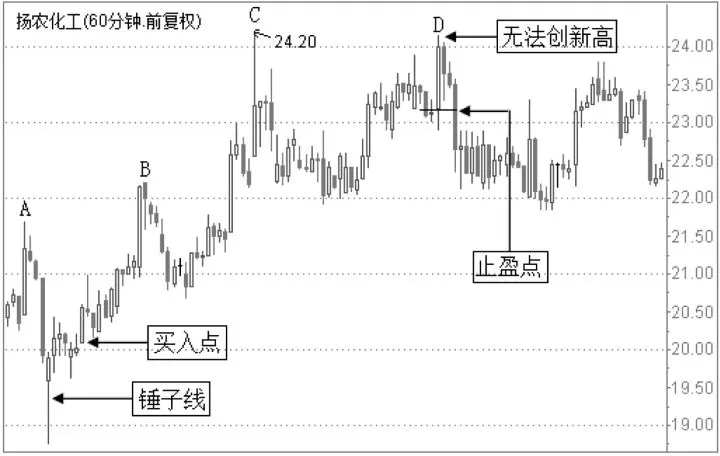

图4\-9 扬农化工2012年7月30日至9月6日的60分钟K线图

后市股价连续创出两个新高B和C，显示市场仍然保持较好的上涨趋势，美中不足的是，C点处出现了一根有较长上影线的K线，显示上方压力较重，股价上涨有可能受阻。

经过相对前期更长时间的整理后，股价再次向上拓展，当股价接近C点高度后出现了犹豫，并受阻回落，市场无法创出新的高点，说明多头已经是强驽之末，上攻有心无力，预示原有的上涨趋势将发生改变。当股价跌破D点处的大阳线开盘价时，投资者就需要迅速止盈。

__五、KDJ随机指标止盈__

__1．KDJ随机指标简介__

KDJ随机指标是利用价格波动的真实幅度来反映价格走势的强弱和超买超卖现象的指标，由于它能够灵敏并提前于价格上涨或下降发出买入或卖出信号，故被广泛地用于中短线技术分析中。

随机指标在图表上共有三根线，即K线、D线和J线，它们是根据统计学原理，在一定周期内出现的最高价、最低价及最后一个计算周期的收盘价，利用这三者间的比例关系，计算出未成熟随机值RSV，然后根据平滑移动平均线的方法计算出K值、D值以及J值，将这些不同时间值在图表上连接起来后，便形成了K、D、J三条反映市场变化的曲线。三个值里面J线的反应最快，K线次之，D线最慢。在运用过程中，常把KDJ的K线视为快速确认线，D线视为慢速主干线，把J线视为乖离线（方向敏感线）。

KDJ本质上是一个随机性的波动指标，故计算式中的N值通常取值较小，以5至14为宜，可以根据市场特点选用。将KDJ应用于周线图或月线图上，也可以作为中长期预测的工具。

__2．KDJ随机指标的主要使用方法__

①一般而言，K线由下转上为买入信号，由上转下为卖出信号。

②KD都在0～100的区间内波动，50为多空均衡线。如果处在多方市场，50是回档的支持线；如果处在空方市场，50是反弹的压力线。

③K线在低位上穿D线形成金叉，大多数情况下，K线与D线在低位出现第二次金叉时的买入信号较为准确。在高位区，K线在下穿D线形成死叉，大多数情况下，出现第二个或第三个死叉后为卖出信号。另外要注意，形成金叉或死叉时，K线和D线的方向同向时，更能增强信号的准确性。

④K线进入90以上为超买区，10以下为超卖区；D线进入80以上为超买区，20以下为超卖区。要注意把握买卖时机。

⑤高档区D线的双（多）重顶形态是常见的顶部形态。第二头部出现后，K线二次下穿D线时是较强烈的卖出信号。低档区D线的双（多）重底形态是常见的底部形态，出现的趋势如果与价格走向发生背离，分别称为“顶背离”和“底背离”，是较强的买卖信号。

⑥J值可以大于100或小于0，J指标为依据KD买卖信号采取行动提供可信判断。通常，当J值大于100或小于10时，视为采取买卖行动的时机。

⑦KDJ指标在短期产生的波动幅度剧烈时，往往会产生较大的误差，无法追踪真实市场，因此要与其他直接反映市场趋势和超买超卖状态的布林线、均线以及K线形态、成交量指标综合使用。

⑧在极强或极弱行情中，KD指标会在超买（80以上）或超卖（20以下）的区域内徘徊，J指标出现钝化，此时一般不宜采取交易行为，应使用其他分析手段来指导操作。

⑨用D值代替K值时，其准确度往往会更高，但灵敏度有所下降。

利用KDJ指标进行止盈时，就是利用以上有关该指标发出的卖出信号。

案例：KDJ死叉止盈——创兴资源（600193）。

图4\-10是创兴资源（600193）2012年4月17日至9月13日的日K线图。这段行情是以KDJ指标为主，用布林线、K线和成交量为辅助工具来制定的一段短线操作计划。从布林线通道走势看，该股处于一段中期向上的行情中，因此短线回调就是短线买入的机会。这样就可以利用KDJ指标来寻找短线买入点。

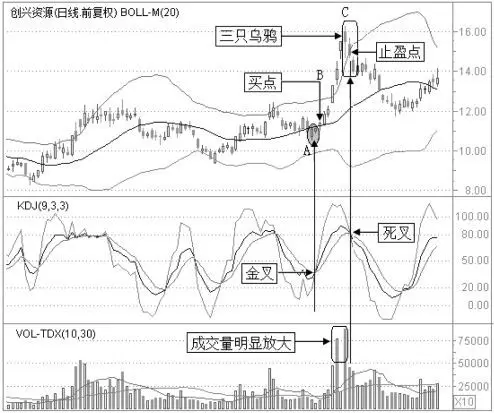

图4\-10 创兴资源2012年4月17日至9月13日的日K线图

图中B点出现了较强烈的买入信号。首先是在B点前的两个交易日，即图中A点，已经形成KDJ金叉；其次是股价回调到布林线中轨线后返回到中轨线上方（注意，此时布林线的三条轨道线同时向上）；再次，成交量在回调到中轨线附近时急剧萎缩，说明空头洗盘将要或已经结束。根据这三方面判断，可以在B点大胆买入。

买入后就是寻找短线止盈点，可以根据KDJ指标发出的信号来确定止盈时机。KDJ指标在买入后开始呈向上发散状态的多头排列，显示市场多头力量不断壮大。但股价达到C点位置时，J指标已经超过100，并开始向下回落。K值超过80后也向下拐头，说明多头力量开始减弱，股价与KDJ指标开始形成背离。最终股价回落，KDJ形成死叉。

此时，股价从远离布林线上轨线上方也回落到下方，显示市场短期强势不再。成交量上，当股价达到最高点C时，成交量出现明显放大，表明有获利盘大幅抛出，多头有撤退的迹象。从KDJ指标发出的死叉信号，股价回落到布林线上轨线下方发出的卖出信号，以及成交量形态变化，短线都可以进行止盈。

当K线形成了重要的三只乌鸦顶部反转形态时，进一步证明市场短期强势上涨结束，投资者需要坚决止盈离场。

__六、高位拉升止盈__

__1．高位拉升与庄股__

高位拉升往往是最后的疯狂。许多有大资金参与的所谓“庄股”，在成整个坐庄计划前，喜欢用最后的快速拉升来吸引散户进场接盘，因此采用这种方式是最有效的出货方法。

高位拉升止盈就是利用庄家制造出来的繁荣景象，跟着主力资金一起撤退，甚至可以利用散户“船小好调头”的特点，在最佳的时刻抓住机会止盈。

__2．识别最后的疯狂__

要识别最后的疯狂，首先要识别高位拉升的性质。我们可以从空间、趋势、K线形态和成交量等方面来识别，当然也可以使用前面介绍的MACD、KDJ以及其他指标来进行识别。

①从空间位置看。 股价已经出现了较大的涨幅。这需要留意主力资金是短期流动资金还是中长期布局的资金。一般短期操作资金是利用题材热点，底部建仓时间短，拉升力度强，并且在起始上涨过程中拉升和洗盘周期紧凑，整个行情从吸筹、发动到结束，周期往往在1～3个月，特殊情况下甚至更短。短线游资主力在最后的拉升中一般显得更疯狂。中长期资金在整个运作周期中都显得较温和，底部“磨死人”，上涨不紧不慢，顶部振幅加大。中长线庄股的上涨空间比短线主力股要大，如果用空间与时间进行对比，短线庄股的效率会更高。

②从趋势上看。 均线方面，在最后的拉升阶段，股价已远离MA30，MA5或MA10向上角度非常大，变得十分陡峭。布林线方面，股价会向上突破处于上升通道的上轨线，或者紧贴该线向上大角度运行。从趋势线看，股价往往向上突破原有的上升通道上轨阻力线，新的上升趋势线明显大于原有的趋势线。

③从K线形态看。 在最后疯狂阶段初期，K线往往是大阳线或者向上跳空，后期则会出现带较长上下影线的K线形态，盘中振幅显著加大。

④从成交量形态看。 拉升过程中，整体成交量明显放大。时间周期相对较长的庄股，一般在最后疯狂的中期阶段出现天量，时间周期较短的庄股，天量多出现在最后的顶部位置。

案例：笑到最后的止盈——中捷股份（002021）。

中捷股份是一家以生产销售高档工业缝纫机系列产品为主的企业。2012年初开始，涉矿题材受到炒作，该股因收购内蒙古突泉县禧利多矿业100％股权事宜，也被主力游资挖掘出现，成为一只中短线庄股。图4\-11是该股自2012年2月23日至8月2日的一段拉升行情，很好地展现了主力资金最后拉升出货的过程。

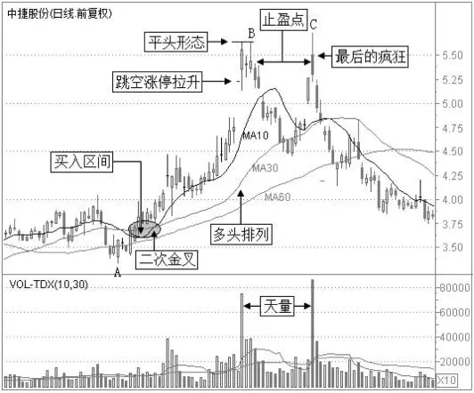

图4\-11 中捷股份2012年2月23日至8月2日的拉升行情

图中A点是主力资金在前期完成吸筹后进行拉升前的一次快速洗盘，这一点可以从K线与均线形态上看出来。股价经过洗盘后，重新回到MA30和MA60中短期均线上方，MA10短期均线再次向上穿过MA30，此时MA30和MA60均保持较好的向上趋势，这是典型的二次金叉买入信号。

在该金叉出现前，连续的三根大阳线和中阳线穿过短期、中期均线，已经发出了买入信号，因此在这5个交易日里，都是较好的中短线买入机会。

经过一轮洗盘后，股价开始拉升，拉升由缓到急，短期均线越来越向上偏离中长期均线，股价距离MA30渐行渐远，这显示出主力拉升的迹象。最后，市场出现一字涨停，以极端方式进入疯狂，当天名列涨幅榜前茅，大大地吸引了市场中的眼球。

第二天股价再次高开高走，并放出巨量，换手率近20％。此时股价距离MA10也非常远，风险一触即发。谨慎的投资者此时就需要采取止盈措施。当以后两天出现滞涨，在B点位置出现了一根长上影线K线，并与前面的最高点K线形成了顶部反转的平头K线形态，此刻就需要及时采取止盈措施。

后市股价又以跳空的方式向下急跌，将追涨的散户们套在了半空。好在主力资金并没有在第一次拉升中将手中的筹码出尽，于是再次进行了一次疯狂拉升，再次出现天量，将筹码转移到散户手中。有多少散户能够在这最后的一次疯狂中止盈或止损呢？只有留给散户们自己去思考了。

__第四节 基本面止盈__

所谓基本面止盈，就是根据宏观经济、行业和公司基本情况的分析，如果这些因素出现了向不利于持股方面发展的情况，或者这些因素不足以支持投资者继续持股时，投资者采取获利了结的止盈行为。

利用基本面止盈，某些影响宏观经济的政策、行业事件以及公司经营理念策略、公司报表等因素，都可以引发止盈操作。总的来说，基本面止盈包括无条件止盈、财务指标（业绩）止盈、事件止盈等几种类型。

__一、无条件止盈__

所谓无条件止盈，是指市场出现了重大的影响基本面的事件，已经或将要影响大盘或个股的未来趋势，这时投资者要摒弃任何幻想，不计较得失，及时快速地离场。无条件止盈与无条件止损一样，都是在特殊情况下采取的自保措施。

这样的例子很多，如美国的“911”事件一出，无论是投资机构还是普通投资者，都夺路而逃，致使不设涨停板限制的美国股市被迫停盘。在我国A股市场中，一些突发事件也可能影响某一行业的投资，比如“7·23”温州动车追尾事故，导致第二天与铁路基建相关的板块和个股大跌，许多投资者都执行了无条件止损或止盈操作。

总之，在发生能够改变大盘、行业或个股的重大不利事件时，无条件止盈或止损是最常用和最直接的回避风险的方法。

案例：重组失败——深深宝A（000019）。

2012年6月18日，因重组停牌近1个月的深深宝A宣布重组失败。无论当初出于技术分析，还是针对该公司的重组预期买入该股，在此类影响公司发展前景或者业绩的重大事件出现时，无需采用任何技术分析手段，直接进行无条件止盈。

图4\-12是深深宝A2012年1月4日至7月16日的日K线图。

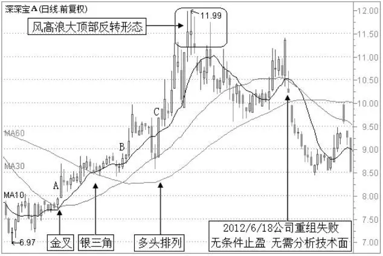

图4\-12 深深宝A2012年1月4日至7月16日的日K线图

2012年初，深深宝A与农产品（000061）的重组又浮出水面，该股从2012年1月6日的最低价6\.97元开始强力拉升。无论是出于对该股重组预期，还是从技术面分析，都有理由在图中的A、B和C点位置买入该股。

在后期的市场表现中，从技术形态止盈角度来看，在出现风高浪大线这一顶部反转形态后，谨慎的投资者或者不以重组结果为止盈标准的投资者，就可以采取止盈措施。

2012年6月18日，公司发布公告，宣布重组失败。此消息一公布，就是止盈的死命令。因为该消息是影响公司未来发展的重大事件，市场没有理由在短时间内重新走好。从后期的走势看，如果投资者仍然对股价走势抱有幻想，就会付出惨重的代价。

__二、财务指标止盈__

财务指标止盈是指投资者通过对公司的财务报表进行分析，对公司的盈利能力或未来发展情况进行评估，如果公司的盈利能力或未来发展情况出现不利的变化，无法支撑股价继续上涨，投资者就要采取止盈行为。

利用财务指标进行止盈的方法很多，使用较多的有比较简单的市盈率、市净率、市销率、每股收益、净资产收益率等。相对复杂和综合评价的有现金流量折现值、市盈率相对盈利增长比率以及Z指数等。这些内容在《股票投资的24个关键财务指标》中已经有详细介绍，有兴趣的朋友可以参考。

财务分析是判断上市公司是否有投资价值的最基本方法，同样，利用财务指标作为止盈（或止损）的标准，也是价值投资者经常使用的方式。市盈率是投资者熟知的财务指标，它是上市公司总市值与总盈利的比值，也是股票每股股价与每股收益的比率，说明在目前的盈利水平下，投资者用多少年可以收回投资成本。市盈率越小，说明股票的投资价值越高，越大则投资价值越低。利用市盈率作为止盈指标的通常做法，是首先确定市盈率的合理范围，当市盈率大于合理范围时进行止盈。

案例：市盈率止盈——澳洋顺昌（002245）。

澳洋顺昌属于交通物流行业，还含有创投概念和金融改革概念，该企业主要从事冷轧钢板的涂层生产及涂层板、镀锌板、铝合金板等金属材料加工，电子元器件专用材料的开发、生产；提供原材料供给方案技术服务，货物仓储服务；供应链管理技术开发、技术转让和与之相关的技术咨询、技术服务等；供应链管理软件开发，销售、仓储、配送自产产品。

下面以市盈率为分析指标来对该股进行分析，并寻找投资机会。

首先对该股2010年到2012年的市盈率进行统计分析，并得到图4\-13所示的市盈率走势图。对这些数据进行线性分析后，得出一条线性趋势线，根据市盈率的波动情况，我们给出其波动的范围，如图中的“上界线”和“下界线”。如果股价的变动导致市盈率接近或低于下界线，就采取买入操作；相反，市盈率超过上界线，则进行止盈操作。

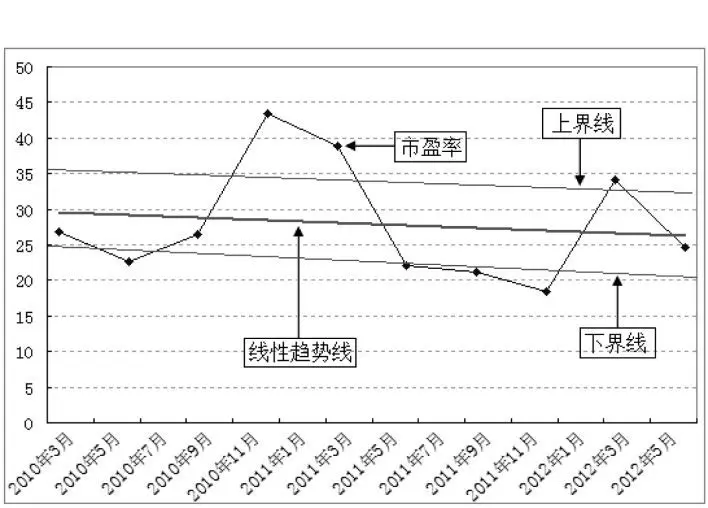

图4\-13 澳洋顺昌市盈率走势图

从图4\-13分析得出，2012年伊始，如果市盈率在22以内，就可以买入该股，并且在市盈率超过32倍以上时进行止盈。因此我们在市盈率的下界线附近进行了建仓。

图4\-14是澳洋顺昌2012年1月5日至5月30日的日K线走势与市盈率走势对比图。

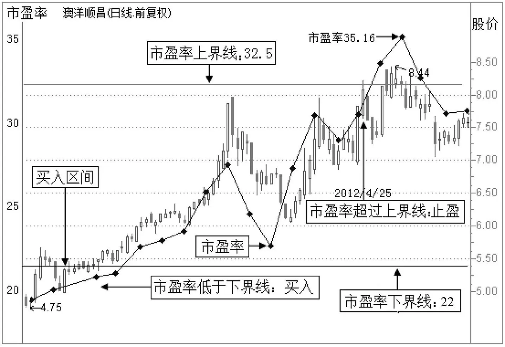

图4\-14 澳洋顺昌2012年1月5日至5月30日的日K线与市盈率走势图

在以后的市场运行中，市盈率随股价的上涨和2012年第一季度盈利的变化而波动（2011年年报每股收益0\.27元，2012年第一季度每股收益为0\.0607元）。4月25日，当股价大幅上涨后，市盈率突破了上界线，这样我们就可以采取止盈操作。

__本章小结__

止盈是投资者在获利的情况下尽量保住已有的收益。止盈与止损共同组成了交易的卖出行为，只是两者的结果不同。

止盈是在交易完成后处于盈利状态，而止损则是处于亏损状态。止盈与止损还有一点不同，就是止盈有主动和被动之分，而止损只有被动一种情况。主动止盈是已经达到投资目的，投资者不再关心后市情况，主动锁定收益，这种止盈多为静态止盈，主要包括百分比止盈、时间止盈。还有一种止盈属于被动止盈，它的特点是在盈利的状态下，投资者希望继续持有并获得更多的收益，但是市场的发展与这种预期出现相反的变化。这一点与止损有异曲同工之处。

止盈与止损的设置有较高的技巧，它关系到投资的最终结果。目前股票投资者主要靠股价的差价获取利润，也就是只有保证盈利总额大于损失才能获取利润，也就是说，止盈所获取的收益要大于止损所造成的损失，这样就要求止盈的幅度不能小于止损的幅度。这一点很重要，在动态止盈时，尽量不要等到盈利下降到止损幅度的下方。

## 第五章　股票投资资金管理

__第五章 股票投资资金管理__

__第一节 股票投资资金管理概述__

__一、什么是资金管理__

资金管理就是根据股票市场的变化、风险与收益的关系、个人投资风格等因素，通过有计划地合理分配自有资金，控制总体和每一笔（次）投入资金的比例等手段，以达到资金安全高效运作的目的。

在日常生活中，人们总是会考虑如何使用手中的资金。每个月拿到工资后，会盘算一下这些钱的日常安排和使用计划，这就是最基本的资金管理，也就是理财。股票投资也一样，也要遵循“你不理财，财不理你”的原则。理财就是对投资资金的运用管理，让资金发挥稳定、高效的作用，让资产长期稳定地增值。

资金管理的核心是风险，目的是收益，其方法是根据风险的大小控制资金的使用比例，根据收益预期进行资产配置。更明确地讲，就是投资者对当前市场是看多还是看空，或者是看不清走势，并依此采取相应的交易方式。比如使用资金的比例、投资的股票种类、买入股票的数量和价格、卖出的数量和价格，等等。

__二、资金管理的目的__

资金管理目的是在保证资金安全的前提下，尽量提高收益率，让资产获得长期稳定的收益。

股票投资的目的是获得收益，但最重要的却是保证资金的安全。如果将股市比喻成战场，投资者是指挥员，那么资金就是供指挥员调遣的士兵。发动一场战役的目的是达到最终的胜利，但针对每一场战斗，指挥官必须考虑战斗可能出现的伤亡情况，考虑伤亡是否会影响整个战局。因此军队里采用了先锋、中军、后备等用兵布局。

股票的资金管理也一样，在情况不明时可能用小部分资金作为“侦察兵”，不利的环境中采用回避或游击战等骚扰措施，在有利的情况下大举进攻，一战定乾坤。

资金管理体现在股票投资的每一个环节中，在整体投资布局和每一笔交易中都发挥重要的作用。合理的资金管理，可以控制整体投资计划的风险，实现总体投资的利益最大化，也可以通过止损止盈等交易手段，对每一笔交易进行风险调节。在整体投资布局时，要考虑整套投资方案存在的风险，调动合适的资金参与；在每一笔交易中，可以根据市场变化和风险与收益的对比，采用建仓、增仓、减仓、补仓和平仓等手段，来调整参与战斗的兵力，做到进可攻，退可守。

__三、资金管理与不确定的市场__

在股市投资中，预测市场是投资者和许多股评家热衷的事情。市场预测是对市场未来各种变化方向发生概率作出评估，评估结论只是一种观点，并不代表市场本身未来的走向。股市存在着较大的不确定性，特别是短期走势，更是难以预测。一位美国投资专家称，预测股市“明天”的走势如同掷硬币，也就是说市场短期走势的不确定性非常高。

正因为市场存在不确定性，资金管理更显得重要。投资者采取的任何交易行为，都是建立在对市场最基本的判断上，也可以说是预测上。市场的不确定性越强，说明存在的风险越大。

投资者认为市场的不确定性因素减少，确定性因素增加，因此增加投入资金的比例，事实上这也增加了总体风险。比如说，猜硬币的正反面，输赢各有50％的概率，你一次押满，赌输了就会破产，不得不离开股市；如果赌赢了，你将获得了翻倍的利润，但是如果你继续赌下去，最终还是避免不了破产的结局。

有人会说，在股市处于上升趋势或胜算较大时，为什么不满仓？这其实也很好解释，如上面的猜硬币一样，抛3次，你只要猜对1次，就可以获胜，这样你的获胜概率是66\.67％。但是如果你永远押满，最终会面临同样的破产结果，因为总有一次你会输的。

当然，股市与掷硬币的赌博有着本质的区别，但也有很多相似的地方，比如筹码管理或者资金管理。股票市场的不确定性，并不像猜硬币正反面的概率那样明确，投资者能够根据多种因素来判断市场的性质，找到大概率事件，比如从技术分析中找出市场的趋势。

事实上，即使市场是理论上有效的市场，投资者也不可能完全认识市场，更何况现实市场与理论市场存在较大的差别，这就更增加了市场的不确定性。A股市场除了受宏观经济、行业、公司基本面以及市场较浓厚的炒作气氛影响外，还受到股市政策、大非小非等因素的巨大影响，这些因素增加了股市投资的风险。

比如说创业板，随着2012年半年财务报告披露完毕，9月份也成了高管、大股东减持的时节。两市高管共有276人次进行减持，减持额度为15\.2亿元，而同期高管增持仅有5778\.48万元。在14个交易日内，上市公司高管净减持达到14\.62亿元。

特别值得关注的是，高管辞职数量也在9月份大幅增加。9月份以来每个交易日都有高管辞职的公告，仅9月4日一天就多达16位，14日当天也有11家上市公司的13位高管辞职。如此之大的高管减持，最主要的原因是高发行价、高市盈率和高超募的普遍存在。作为创业板上市公司的原始股东，有足够的动力进行减持，将“纸上富贵”落袋为安。

作为普通投资者，是无法改变和抵挡市场中这些不确定性因素的，要想在股市中长期稳定地获利甚至生存，就显得非常困难。没有一套针对市场不确定性的资金和筹码（仓位）以及风险控制手段，可以说在股市里是无法获利的，只能作为一种娱乐消费而已。

__四、资金管理的内容__

资金管理的内容主要是对投资资金的使用比例进行管理，根据投资者的不同风险偏好、不同性质的市场、不同的操作方法，合理地配置资金。资金配置包括以下内容。

__1．股票账户总资产占全部闲散资产的比率__

这个比率是指投资者用于股票投资的资金占投资者所拥有的闲散资金的比率。控制总投资比率，关系到投资者的正常生活和心理及精神状态。比如，家庭总共拥有的存款、股票、债券等全部闲散流动资产为100万元，其中用于股票投资的资金为50万元，那么该投资者的股票投资占家庭闲散资金的比率为50％，对家庭和个人的经济、精神生活影响适中。

如果某投资者的股票总投资金额占家庭可控资产的70％以上，那么股票投资对该投资者会造成较大的压力。这种压力会影响投资者对市场的正确判断，导致投资操作出现失误。

在股票投资者的资金管理中，较少提及该项比率，但该项比率非常重要。股票投资是高风险投资，那么对于股票投资了解甚少的投资者，其股票投资行为如同赌博，要控制投资风险，必须从这一比率开始。

对于刚入市的新股民，股票投资金额不要超过可控自由资金的20％，并且投入的资金越少越好。等到初步认识了股市，掌握了一定的投资知识和操作技巧后，可以提高到30％左右。对于有经验的老股民来说，笔者认为也不要超过50％的上限，如果有其他的投资渠道，可以根据各种投资产品的风险与收益关系，对自己的闲散资金进行综合配比，按一定比例分别投资于股票、债券、定期存款、期货等金融产品中。

__2．股票资产占股票账户总资产的百分比__

这个比率也就是股票的总仓位，是指股票账户中持有的股票总资产占账户总资产的百分比。股票账户包括现金资产、股票资产（含股票型基金）等。总仓位（总投资额）是指以股票资产形式存在的资产金额，这部分资产是账面资产，随股价的涨跌而增减。控制总仓位是对整体投资的风险进行控制，这也是提高全部资金运作效率的资金管理方法。

__3．个股持仓比率__

该比率是指股票资产中每种股票资产所占总仓位的比率或者是占总资产的比率。该比率反映的是资产配置中各种资产的权重，风险和收益的主要来源和特性。

投资组合中，一般选择属性差别较大的个股，每种持仓比率大小根据不同市场属性来确定。比如在牛市中，可以增加风险性投资比率，在熊市中，则需要在减少总体仓位的同时，降低风险性投资比率。

__4．阶段性投入资金分配__

无论是投资组合还是个股操作，在实际交易过程中，一般不会一次性建仓或平仓，而是根据市场走势的明朗程度，进行分步式建仓或减仓。

采取怎样的建仓和加仓或者减仓和平仓模式，也是资金管理的重要内容之一。

__5．最大亏损比率__

股票投资有较强的目标和计划性，它不仅体现在盈利目标和计划的制定方面，而且更重要的是有明确的亏损目标和风险控制计划。

最大亏损比率是指投资者在某一阶段投资、每一只个股投资或者每一次交易中，设定的可承受的最大亏损比率。这个比率包括总资产最大亏损比率、个股最大亏损比率和每次交易的最大亏损比率等，这些比率是执行止损的重要参考指标。

当然，在执行止损指令时，并不需要以最大亏损比率作为指令，而是把它当作一种“红线”指标。在达到该亏损比率红线之前，投资者要根据采用的止损方法正常执行止损，但当资产亏损达到了该亏损红线，就需要进行无条件止损。

__6．止盈获利率__

与最大亏损比率相反，止盈获利率是基于对获利预期的考虑，指投资者达到某一获利预期后，可以采取获利了结的操作行为，以达到账上资产现金化的目的。

与最大亏损比率相似，止盈获利率可以针对总资产获利率，也可以是组合中某单项资产的获利率。与最大亏损率不一样，止盈获利率并非是一种“红线”指标，而是一个参考标准。如果达到该标准，投资的目标已经达到，随时可以进行止盈。当然，如果股市仍然有利于持仓，那就让利润进一步增长。

__7．获利留存比率__

该比率很少有人提及。笔者根据许多成功投资者的经验总结，发现他们有一个共同的资金管理方法，就是将一定比例的获利资金撤离股市，转入到银行，这就是获利留存比率。

下面讲一个真实的案例，以便大家对获利留存比率有一个比较深入的认识。

罗先生是一位有15年股龄的老股民了。2005年后，他开始采用获利留存的资金管理方法。他当初在股市投入了50万元，每次获利后，就将获利的50％转存银行。如果出现亏损，就以本金50万元作为底线，不让股票账户里的资产降低到50万元下方。为了保证这种资金管理模式持续下去，他非常注重每次交易的成功率。

在2006年至2007年的大牛市中，他已经从股票账户转了60多万元现金到银行账户，用于家庭各种开销，股市投资成为家庭真正的收入来源，股票账户也从50万元增值到100万元以上。后来大盘进入熊市下跌阶段，股票账户中的资产出现了缩水，降低到72万元，但他的心态非常好，因为当初投资的50万元早已全部收回。

由于宏观经济环境不佳，股市处于熊市，罗先生近两年的交易次数非常少，只用50％的仓位进行了几次中线投资。由于他注重交易的成功率，收益虽然不是很高，但也很稳定。截至2012年8月，他的股票账户又增长到81万元，并且又有10万元转入到银行账户。现在他将总资产亏损底线设置在70万元，并且仍然坚持自己的这套资金管理方法。

从这个案例中，我们体会到资金管理给罗先生带来了巨大收益，他利用合理的资金管理方法，让自己在股市中立于不败之地。

__第二节 资金管理与风险收益__

__一、资金管理与风险控制__

在股市投资中，资金管理往往通过控制仓位来实现。所谓仓位，就是投资者已经持有的股票资产占股票投资总资产的比例，分为总仓位和单一资产（股票）仓位。控制仓位是控制风险的直接手段。

仓位与市场风险及预期收益之间呈正向关系，也就是说，仓位越高，投资者承担的风险越大，同时收益预期也越高。相反，仓位越低，投资者承担的风险越低，同时收益预期也随之下降。

为了将风险控制在一定范围内，仓位大小要与风险程度呈反向关系，市场潜在的风险越大，仓位就应该越低；市场呈现的盈利机会增加，则适当增加仓位配置。图5\-1为仓位与风险之间的关系模型。

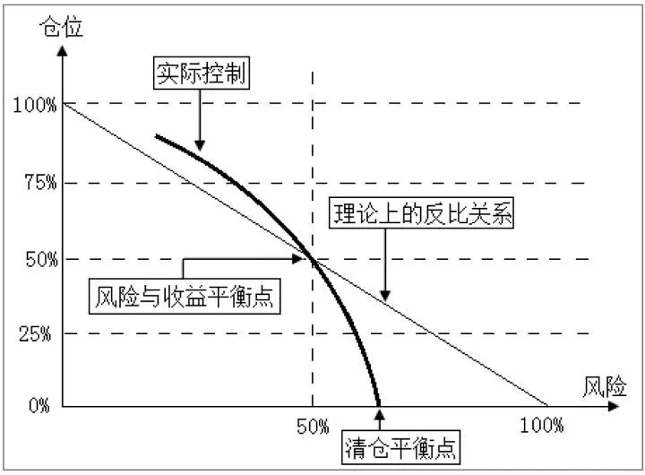

图5\-1 仓位与风险关系模型

图5\-1中有两条线，从理论上讲，仓位大小与风险大小呈反比例关系，是一条直线。实际上，市场风险不可能为零，也不可能为100％，投资者往往在风险超过收益预期后，会选择快速降低仓位，甚至清仓；当风险小于收益预期时，投资者可能加大持仓力度。利用风险与收益之间的变化关系来确定资金管理方式，在有利的时候增加收益规模，不利的时候回避市场风险给整体资金带来的损失。

资金管理与投资预期风险值之间也存在着密切的关系，前面已经多次对“高风险，高收益”进行了解释，下面用图5\-2进一步说明。

图5\-2说明的是投资标的品种或者说是投资者的投资风格不同，其差异体现在风险与收益以及资金管理之间的关系上。图中以0收益（即0风险）为中心线，低风险投资品种在投资中的收益预期会在A1和A2之间，A2是预期的投资收益，A1是预期的亏损的幅度。同样，对于高风险品种，投资者的预期收益可能达到B2，存在的风险损失也可能达到B1。根据投资品种的不同或投资风格的不同，资金管理上就会有不同的管理方法。

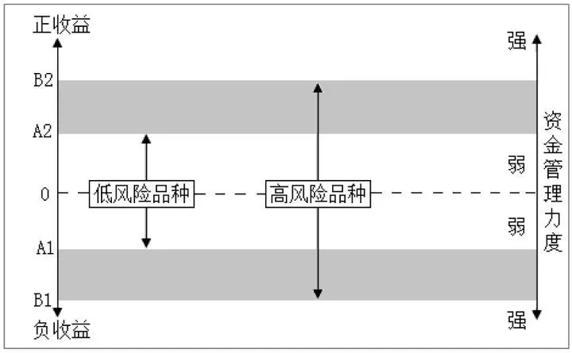

图5\-2 风险与收益关系模型

在同样的大盘背景等条件下，高风险品种的市场表现往往会在波动幅度与波动频率上高于低风险品种，为了适应这种变化，高风险投资的资金管理力度要强于低风险投资。比如，短线投资的对象多是振幅较大的个股，这是因为只有这样的个股才能让投资人有足够的价格运作空间，因此短线投资者会经常性地改变仓位，交易较频繁。

另外，在中长线投资中，由于高风险品种股价的正常波动范围比低风险品种高，在实际投资中，出现加仓、补仓、建仓的可能性也大。对于低风险品种，由于股价一般被限定在较狭窄的趋势通道中运行，因此在实际投资中，只要趋势不变，就不会轻易改变资金的管理方法。

__二、资金管理与收益__

资金管理的另外一个重要任务是提高单位资金的收益，也就是增强资金的运用效率。股票投资的风险与收益相互制约，相互依存。提高资金的运用效率有两个方面的内容，一方面是充分利用市场波动的特征，投资要回避风险较大的下降趋势，当风险释放后，再重新回到市场中；另一方面是通过对不同特征的股票进行不同仓位的配置，采用合理的投资组合，从而达到盈利的最大化。

对于总体的资金运用（仓位控制），是利用市场风险与仓位的反比关系进行运作。市场风险总是随股价的波动而消长，股价下跌的过程就是风险释放的过程。当股价下跌到某一位置后，风险与收益预期就会达到平衡，当市场出现向上转折时，说明市场已经显示出收益预期开始占上风，在高位撤离的资金就可以重新回到市场，这种操作方法就是波段操作。资金管理就是利用股市的波段特性，在有利的市场中注入资金，在不利的情况下撤离资金。

下面用一个单项投资案例来进行说明。

图5\-3是深振业A（000006）2011年12月2日至2012年6月5日的一段日K线与MA30组合的行情走势图。下面根据股价（K线）与MA30的形态，以及它们之间的关系，来判断市场的风险，同时进行仓位管理。

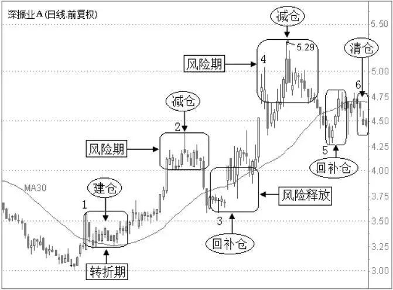

图5\-3 深振业A2011年12月2日至2012年6月5日的日K线走势图

图中位置1之前，MA30方向向下，股价一直与该中短期均线以基本相同的角度向下运行，显示市场处于明显的下降趋势，此时不宜做任何投资。当股价向上反弹并靠近MA30后，一根大阳线向上穿过MA30，股价站在了MA30上方，说明市场有可能出现中短期的向上转折。随后股价一直保持在MA30上方运行，MA30逐渐走平并开始向上转向。依此判断，市场已经出现了投资机会。在这段转折期里，投资者可以进行建仓，可以一次性建仓，也可以分步建仓。

当股价向上运行到相对高位后，如图中2所在区域，股价已经离开MA30较远的距离，并且K线出现了一根顶部反转流星线，此时股价与建仓时期对比，大概上涨了25％，风险明显增加，此时可以降低仓位，比如说整体仓位降至50％。

股价回落到MA30下方后，此时该均线仍然保持向上，说明市场中短期向上方向仍然没有改变，因此在MA30附近可以将上方减持的部分筹码重新回补，回补数量可以少于前期减持的总量。在此次仓位管理过程中，实际上已经获得了部分收益，降低了持仓成本。当股价又向上远离MA30后，可以采用同样的方法高抛低吸，以获取波动性受益。实战中，由于股价的涨幅相对较大，风险积累也大于前一阶段高点，因此随着股价的上涨，可以加大减持力度。

当市场又回到MA30附近时，也可以再次补仓。但此次市场并没有出现预期的向上走势，而是紧贴MA30上下震荡，随后该均线向下转向，这种走势说明这轮中短期行情基本结束，短期内股价难有表现，因此可以卖出全部筹码，清仓出局。

该案例用以说明资金管理与市场趋势和风险之间的关系。总结这个案例，可以得到以下几点操作建议，以提高资金的运作效率。

①只有市场趋势发生了向上转折，才考虑建立头寸，以保证风险基本得到释放。

②向上的每一个关键技术阻力位都是减仓的时机，特别是出现明显的顶部技术信号时，应降低仓位，让资金回笼。

③只要市场向上趋势没有改变，每一次回调到重要支撑位置，都是补仓的机会，此时可以将前期高抛的筹码重新补回来。

④股价上涨速度越快，涨幅越大，积累的风险也越高，因此在市场上涨后期的相对高位，减持的力度应相应加大，回补时则要相应减少。

⑤市场趋势发生了改变，原有的上涨趋势消失，需要清仓出局，也就是执行止盈操作。

__三、风险与收益的平衡__

要平衡风险与收益，首先要了解风险与收益的关系。一般可以从市场与投资者本身这两个角度来了解。

__1．市场交易性风险与收益的关系__

市场是指股票交易市场，由于市场存在不同的交易行为，因此存在不同的风险。市场交易风险是市场运行过程中，由于市场环境、时间和空间等不同给投资带来的交易性风险。市场存在着不同的运行方向，如向上、向下和横盘，每一种运行情况都存在一定的概率，这就给投资带来不确定的风险。在无法做空的A股市场中，可以将市场向下运行称为风险，向上运行称为收益。风险越大，收益的预期就会越小。

交易性风险与收益的平衡点是一个模糊的概念，并非像力学平衡计算那么有条理，这种平衡包含着复杂的经济关系、社会关系、群体心理和个体心理等。普通投资者无法深入研究这种平衡的内涵，也没这个必要，只要注意观察市场发展的趋势，留意影响这种趋势的转折就可以了。

从技术分析角度看，分析风险与收益的平衡关系，就是利用各种技术分析手段，预测市场未来涨跌的可能性。前面介绍的许多内容，基本上都是围绕这种涨跌的可能性这个核心内容，无论是止损还是止盈，买入还是卖出，都是根据技术信号代表的“涨”或“跌”来采取交易行动，这些技术信号都是对市场中风险与收益平衡关系表现结果的描述，比如K线顶部反转形态、均线死叉等，是对风险积累达到一定程度并超过预期收益可能性的描述。

__2．投资风险与收益预期的关系__

前面曾经介绍过高风险与高收益之间的关系，这就是投资风险与投资预期的关系，它是投资者对收益的期望值与承担风险的关系。这种关系与市场交易性风险和收益的关系相反，是一种正向的关系。投资者对收益的预期越高，就意味着承担的风险越大，或者说投资过程中承担的风险较大，就应该有更多的收益作为补偿。

正确理解以上两种风险与收益的平衡关系是非常重要的。前一种风险与收益的关系，用以指导投资者选择合适的投资机会和资金使用的比例（或总体仓位、单项投资仓位）；后一种风险与收益的关系，用以指导投资者根据自己的投资风格、对风险的态度选择合适的投资品种。

为进一步说明这两者之间的关系，下面举一个例子。

现在有甲、乙两人，甲是较激进的投资风格，愿意承担更多的风险来博取更大的收益。乙是较稳健的投资者，希望获取较稳定的投资收益。由于甲和乙对待风险与收益的态度不一样，因此在投资选择上就存在差异。但这种不同并不影响他们对投资时机把握的一致性，当市场处于下跌趋势时，市场风险大于预期收益，甲乙两人都会按兵不动，静候机会；当市场出现向上转折时，他们都会寻找投资标的股，并开始建仓。

由于甲乙两人对风险和收益的预期值不一样，在选择标的股时，就会存在不同，甲倾向于选择波动较大的个股，乙则会选择波动较小的个股。其结果是甲可能获得的收益要大于乙，但也可能出现比乙更大的亏损。

如何把握和利用风险与收益的平衡关系，是股票投资者需要学习和研究的课题。在资金管理方面，一般应考虑以下三点。

①市场交易性风险与收益关系在前，投资风险与收益预期关系在后。也就是说，只有在市场出现投资机会时，才会考虑如何进行投资。

②市场交易风险大于收益预期的时候，要么停止投资，要么选择稳健的投资策略。比如，当大盘走势处于下降通道时，市场整体风险较大，波动幅度较大的个股会放大风险，使投资的损失幅度和可能性增加，因此需要避开这类个股，选择走势较稳定的个股。

③当市场风险较小时，可以考虑选择波动性较大的个股作为标的。因为此时获得收益的概率大于损失的概率，波动性较大的个股会放大这种机会。

④资金管理和仓位配比需要结合市场走势与个人投资风格，综合考虑这两种风险与收益的关系。

__四、资金管理与止损止盈__

前面用了较大的篇幅介绍了止损与止盈，这些风险控制手段主要针对的是操作方法和技巧。通过资金管理来控制投资风险，则是一种更全面和更直接、更有效的风险控制手段，它是一种管理方法，不是操作技巧。止损止盈等操作技巧应该围绕资金管理来展开，也就是说先有资金管理规划，然后才能制定止损止盈标准。

市场不可能没有风险，即使分析结果显示出现损失的概率或程度很小，但风险永远存在，资金管理必须考虑最低损失比率，或者说是亏损准备金。所谓亏损准备资金，是指交易中预备亏掉的资金，它与市场风险、仓位大小、止损策略有着密切的联系。市场风险越大、仓位越大、止损策略越宽松，需要的亏损准备金越多。在亏损准备金不变的情况下，风险相对较高的市场里，要求投入的资金也应该减少，止损政策也相应更严格。

股市投资获利是通过资金管理来实现的，在投资过程中，资金管理又是以控制总体仓位和组合仓位来完成的，而控制仓位最终还是要通过买入和卖出等交易手段实现。

股市里流传着这样一句俗语，“会买的是徒弟，会卖的是师傅”。这句话是投资者对投资经验的总结，意思是投资者在没有持股的时候，心理压力很小，因此能够保持清醒的头脑。一旦买入股票，就会患得患失，不知道何时出局，导致“坐过山车”或严重亏损。出现这种现象的根本原因，就是缺乏资金管理的有效方法。

资金管理是股市投资的核心内容，任何交易都要围绕该核心进行。资金管理是“纲”，交易技巧是“目”，“纲举目张”。止损和止盈是执行资金管理计划的重要交易手段，通过止损或止盈来控制资金风险，并调节资金的合理配比。这如同战场中的兵力布局，不能说将部队送上前线就不管了，还要根据战局的变化，不停地灵活调动部队。止损是在不利的情况下，为了减少伤亡采取撤出阵地的方法；止盈是在已经获得胜利后，保住胜利果实的策略。

在进行具体投资时，首先应该确定自己的投资计划，计划的总绳是资金管理，比如资金的总投入比率，先期投入、后备资金和安全资金各占多少等。根据市场变化，灵活调节资金结构，制定资金管理的细节，才能使资金处于安全的状态。

比如出现与预期相反的走势时，要明确止损价位和资金回收量；在盈利情况下，要明确止盈价位和资金回收量，以及止盈后是否有回补仓位，回补量多大，等等。对于这些方法，读者可以参考后面讲解的资金管理方法和案例。

__第三节 资金管理与投资风格__

资金管理与投资风格是密不可分的，投资者的投资风格决定交易策略，不同的交易策略要与不同的资金管理方法配套。

在金融投资中，股票交易属风险较高的品种。在股市投资中，有的投资者偏保守，其交易策略趋于防御，有的投资者则较为激进，投资风格以进攻为主；也有的投资者比较适中，风格相对稳健。

__一、保守型投资的资金管理__

保守型投资的投资风格以防御为主，以保证资金的安全为首要任务，在此基础上尽量获得投资收益，因此会将大部分投资放在风险性较小的个股里。一般情况下，仓位组合中的“安全”股占比在50％～100％。保守型投资者并不需要经常性地改变资金布局，因此中长线投资是保守型投资者的主要阵地。

通过基本面和大趋势分析，投资者可以在底部位置布局，用较多的资金买入基本面较明确的行业龙头股。这些公司已经发展得比较成熟，盈利预期基本可见，潜在的不可预测风险较低，股价多因宏观经济周期或行业周期的变化造成低估，因此在熊市末期配置这些股票，是保守型投资者的最好选择。当然，投资者也可以适当配置风险相对较大的成长股，比如某些高科技股，政策扶持的新领域股票等，但仓位比例不会超过总仓位的50％。

保守型投资的资金分布不宜过于分散，无论是成熟的上市公司，还是成长中的新型公司，最好能够集中在投资者熟悉的几个知名公司中，这些公司的财务状况稳健而且良好。

中长线投资时，要控制好买入价格，买在相对低位，最好是买在市场回调后的恰当时期。也可以用市盈率或者其他综合估值方法来确定一个买入的价格范围。保守型投资者一般不适合参与中短线炒作，不过在中短线投资中，也可以参照以上资金管理方法和选股方法，尽量避开不确定因素。

__二、激进型投资的资金管理__

激进型投资以获取投资利润为主要目的，希望能够最大限度地发挥资金的赚钱效应，利用股票的活跃程度和时间周期发挥资金使用效率。

激进型投资以进攻为主，与保守型投资者的资金管理倾向相反，风险较高的成长股是这些投资者重仓的股票，占总仓位的50％以上。由于投资者对成长型股票给予较高的期望值，因此其股价也经常被高估，投机成分较重，从而使得这种投资操作的难度加大，风险增加。

无论是在国内的A股市场中，还是在较成熟的纳斯达克股市中，成长型股票的市场表现多为大起大落，特别是在宏观经济状况不佳的时候，股价走势显得更加糟糕。当然，激进型的投资者能够冒这种风险去投资，是因为成长型股票同时也存在着较高的回报。

如何控制风险，如何管理好资金，如何选对股票并在合理的价格买入，在适当的时候卖出，是激进型投资者面临的挑战。由于激进型投资者投资的标的股存在较大的风险，因此其资金管理计划要灵活，不要拘泥于投资时间的长短、获利目标位等因素，多用止损与止盈操作来达到资金管理的要求。执行资金管理和止盈止损以及买入价格要严格，尽量克服人性的贪婪、侥幸、恐惧等心理，争取实现“自动化”交易。

激进型投资虽然以技术分析为主，将收益放在首位，但并不是说不考虑风险。在实际操作中，也应该遵循与防守型投资相似的基本策略，在合理的价格买入确定性（基本面和技术面）相对较强的个股，并在相对高价位或不确定性增强的时候卖出该股。

__三、稳健型投资的资金管理__

稳健型投资者为风险中性投资者，该类投资者具有一定的风险承受能力，希望可以获得较为稳健的投资回报，对投资本金的安全性给予适当关注。稳健型投资介于保守型与激进型之间，根据不同的市场特征，将资金以较平均的比率分布于所谓的低风险和高风险股票中。

这里再次说明，所谓高风险和低风险股票是相对的，其评估是基于上市公司基本面的确定性差异和股价运行趋势以及波动大小对比。上市公司基本面确定性越强，股价趋势越稳定，投资风险越小。

__四、资金的动态管理__

保守型、激进型和稳健型投资策略的资金布局，可以参考表5\-1，该表反映了不同投资风格在资金管理中的宏观布局情况。

表5\-1 保守型、激进型和稳健型投资资金分布结构表

投资风格

高风险股票

中等风险股票

低风险股票

保守型

0～30％

0～50％

50％～100％

稳健型

0～50％

50％～100％

20％～30％

激进型

50％～100％

30％～50％

0～30％

综合表5\-1的资金结构情况，可以用更加直观的饼图表示，如图5\-4所示。

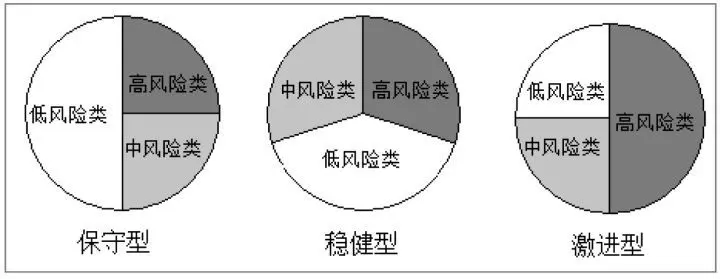

图5\-4 不同投资风格的仓位比重对比

在投资过程中，对资金的管理属于动态管理，并非一成不变的。以上介绍的三种投资风格，资金布局是资金管理的基本配置，在实际运作中，投资者进行的各种交易，需要围绕资金布局的基本结构展开，也可以根据市场特性进行适当的调整。

在资金的动态管理中，可以参考以下几点。

①利用控制总仓位比率来调节整体投资风险。 总仓位是不同风险程度组合的总和占总资金的比率。

②根据市场性质调节资金和仓位的比率关系。 牛市中，可以适当提高风险程度，增加总仓位比率，适当调高风险程度较高的组合比率。熊市里则需要降低总仓位比率，调低高风险组合的配比。资金管理的目的首先是保证资金的安全，其次是实现稳定盈利。也就是说，在调节资金过程中，加仓、减仓的原则要看是否满足这两个条件。无法满足第一个条件就必须减仓，如果能够满足这两个条件，则可以考虑加仓；在无法确定的时候，则停止操作。

③在市场性质不变的情况下，对各组合板块的增仓、减仓，最好不要超出该板块资金的使用比率，做到资金内部循环。

④根据资金量的大小和投资风格，合理地对不同性质的组合进行安排。 资金量不充裕的情况下（比如小于10万元），仓位不要分散，尽量集中在5只股票以内。如果资金量较充足，可以适当增加不同的组合，但也不要过于分散，最好控制在5～10只股票范围。

⑤切忌追涨买入。 在建仓时期有买入价格范围，在补仓或加仓时期也要有买入标准。宁可错过，也不追涨买入，这是资金管理中的重要一环。

⑥严格执行止损止盈指令。

⑦永远不要满仓。 满仓会将自己的后路堵死，不给资金任何调整空间，这种行为不仅非常危险，而且会让投资者失去很多更好的机会。

__第四节 资金管理模式__

__一、金字塔加码模式__

金字塔建仓加码模式，是指市场出现底部区域，开始向上转向，满足建仓条件时，首次开仓资金比率相对较大；当市场走势与预期相同，随着向上的确定性增强，逐步加码，加码比率越来越小，呈金字塔形。金字塔加码模式注重底部和趋势形成的结果。如图5\-5所示。

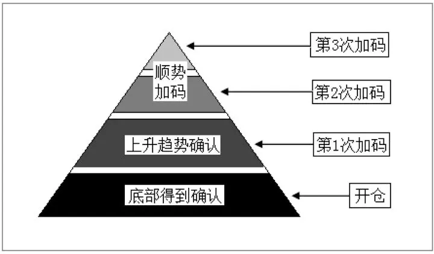

图5\-5 金字塔加码模型

金字塔加码是在底部确定的情况下进行的顺势加码方法，在使用中需要注意以下问题。

①金字塔加码模式适合在较明确的市场底部中使用。 该方法的关键点在于第一次开仓时对趋势的把握，因为该方法第一次投入资金比率最大，风险较为集中，因此开仓时尽量保证底部区域已确定。

②金字塔加码方法在中长线投资中更能发挥作用。 中长线投资，股价才可以拉开空间距离，保证前一批仓位已经获得收益，来对冲在相对高位加码仓位的风险。同时，市场的中长线趋势要更确定，更可靠。

③金字塔加码属顺势加码模式。 该方法原则上是在市场走势与预期相同，前一次加码获利后才能进行。如果前一次加码出现亏损，是不能再进行加码的。这是因为金字塔加码的主要任务是保证资金的安全，如果已经持仓的资金出现缩水，那么再加码可能导致亏损增加。

④加码的价格需遵守相对低位加码的原则，切忌追高。 股价在运行过程中的每一个阶段，都有相对高价位和相对低价位，一般股价在某一阶段涨幅过大后，就会引起获利盘回吐，股价回调，并在某一关键空间位置形成阶段性底部。当阶段性底部信号明确后，才可以进行加码。当然也可以在向上突破某一关键阻力位置时，结合其他技术分析进行确认后，在股价上涨的第一时间加码。

⑤金字塔加码模式的后期资金管理，遵循资金管理的通用法则，即是否满足资金管理的两个基本目的。 当出现无法保证资金安全的因素时开始减仓，即止盈或止损，在止盈过程中，资金退出可以按照金字塔加码模式反向操作，即在到达盈利目标后，或者市场在顶部发生趋势变化时，先将第一次开仓的筹码止盈。当然也可以根据市场情况使用其他止盈或止损方法。

案例：金字塔加码——双鹭药业（002038）。

图5\-6是双鹭药业2011年12月21日至2012年7月2日的日K线图。从MA60等均线和K线、MACD指标，可以判断该股的中期趋势和构筑底部及转折的过程。

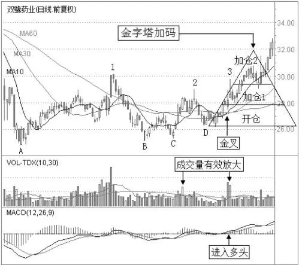

图5\-6 双鹭药业2011年12月21日至2012年7月2日的日K线图

利用技术分析来判断市场趋势时，有较多的方法，比如以下几种方法。

①均线形态。 图中C点以前，MA60和MA30方向向下，说明市场中长期趋势是向下的，此时不适合中长期建仓。当市场运行到D点以后，MA60开始走平，MA30开始向上转向，随后出现MA30和MA60金叉，各条均线开始向上发散，说明该股中期底部基本构筑完毕，开始进入拉升阶段，可以着手建仓和加仓。

②K线走势。 A点是该股创下的最低价位，随后出现的阶段性低点B、C和D都逐步抬高，高点1和2仍然处于下降趋势中，显示该股正在进行三角形整理。此时无法确定是下降趋势中的中期整理还是构筑底部，只有当股价向上创出新高，新高高于前期高点2和1后，才可以认为市场出现了向上的趋势转变。

③MACD指标。 股价在低点A位置出现DIF和DEA的最低值，之后开始向上运行，但它们仍然在MACD指标0轴线下方或附近上下运行，说明该股依然处于空头市场中。直到MA30和MA60出现金叉后，MACD才开始稳定在MACD指标的0轴线上方运行，表明已进入多头市场。

④成交量。 在整个底部构筑过程中，成交量出现下跌无量、上涨放量的格局，在突破关键技术阻力位置时，都出现成交量有效放大的量价配合形态，这是构筑底部的重要特征。

综合以上四点，图中D点以后，当股价站上各路均线上方，MA30和MA60形成金叉后，该股底部得到了确认，可以以金字塔加码的模式开仓。首次投入资金为计划占用资金的50％。

当股价向上突破前期高点2后，说明市场走势与预期相同，在股价回抽确认后进行第一次加码，使用30％的计划占用资金。

随着股价继续升高，突破高点1后，进一步证实该股中长期趋势确立，此时进行最后一次顺势加码，将剩下的20％资金全部投入。

这样，这个建仓过程完毕，剩下的工作就是按计划进行止损和止盈的操作了。

案例：失败的金字塔加码——鸿特精密（300176）。

图5\-7是鸿特精密（300176）2012年3月27日至2012年9月25日的日K线图。与双鹭药业案例一样，可以根据均线等技术工具，判断该股已经完成底部构筑，在利好消息刺激下，以连续向上跳空的走势打破了空方强势势头，创出高点A。但由于短期涨幅过大，市场中的获利盘和套牢盘对股价形成较大的压力，股价需要进行回调。根据切忌追涨的原则，可以耐心等待市场回调后进行建仓。

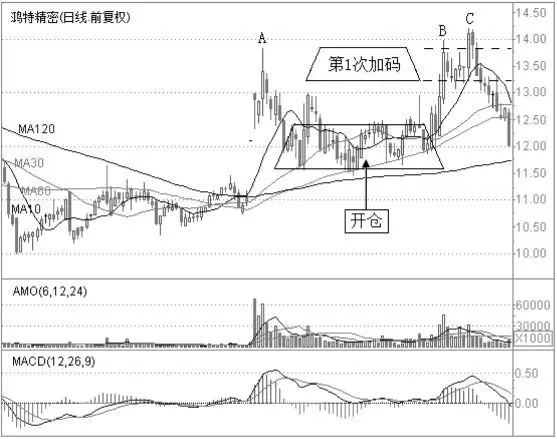

图5\-7 鸿特精密2012年3月27日至2012年9月25日的日K线图

当股价回调到MA60附近，并且回补前期跳空缺口的位置时，从均线等指标判断，该股中长期走势向上，目前股价基本调整到位，可以开仓，比如用计划资金的50％。随后股价受MA60的支撑展开整理。当MA30和MA10形成短期金叉，均线再次向上发散，股价突破前期高点A后，市场回调可以选择机会进行加仓，比如加仓30％的资金量。但是随后市场走势与预期相反，股价创出阶段性高点C后即掉头向下，并没有出现继续上攻的势头。这说明加码失败。

如何对待这种事与愿违的情况呢？此时就要考察投资者的计划是否严密，是否考虑到其他情况的出现，是否制定了相应的计划和措施。

在制定计划时，一般主要采取三种控制风险的方案。

①止损。 每次加码时都需要有止损计划，可以把它作为一次中短线的单独交易来处理。如果市场中长期趋势没有改变，可以在下方相应的位置补回来。

②暂且搁置。 这种方案是在市场中长期趋势没有发生改变，总仓位不重的情况下采取的一种消极应对措施。对于这种情况，一般要求整体持仓仓位占总资金比率不是很大，比如低于50％。

③平仓。 在市场趋势出现进一步恶化，原有底部构筑形态出问题时，根据前面讲解的止损方法如保本止损等，及时进行平仓。

根据该股目前的走势，如果投资者着眼于长线投资，并且该股的基本面较好，那么可以搁置，但不宜进一步加码。直到市场重回升势，并且在前两批建仓的筹码都已获利的情况下，才能考虑继续加码。如果投资者对未来走势没有信心，可以采取止损操作。

__二、倒金字塔加码模式__

倒金字塔加码模式是在趋势向下接近底部时分步建仓加码的资金管理方法，该方法用少量资金开仓，随着底部确立，趋势不断明确，逐步加大投入资金量。这种加仓方法如同一个倒金字塔形，故称倒金字塔加码。倒金字塔加码模式注重底部形成的过程，是一种提前建仓的模式。如图5\-8所示。

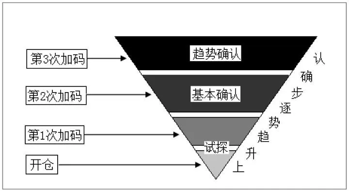

图5\-8 倒金字塔加码模型

倒金字塔加码的特点如下。

①倒金字塔加码模型更适合于一个不是很明确的底部构筑时期使用。 市场的下降和上涨往往是以一波三折的方式进行的，很难判断具体哪一点是最低点，市场是反弹还是反转。如果等到明确的反转信号再进行操作，这时市场已经上涨了一大截，此时如果用较大的资金追涨，又担心市场会重回原有的下跌趋势，造成较大的亏损。投资者既不想完全错过机会，也不愿意承担较大的风险，就采用在某一相对低点位置试探性地用少量资金开仓，然后再根据市场走势采取行动。

②倒金字塔加码并不需要遵循前一批筹码必须达到某种比例的获利后才可以加仓，只要底部或上涨趋势更加明朗，就可以提高加码力度。

③开仓位置必须是股价已经出现了较长时间和较大幅度的下跌，并且出现某些底部反转的技术信号。 倒金字塔加码虽然不像金字塔加码那样要求底部基本得到确认后才开仓，但在一个没有任何止跌的下跌趋势中，是不可以进行任何买入的，即使再少量的资金，买入也意味着损失。

④最后一次的大手笔加码，必须等到市场上涨趋势确定的时候才可以进行。

⑤倒金字塔加码方法不适合超短线炒作的资金管理方式。 市场的短线趋势非常难以把握，特别是对于那些题材概念股，炒作周期非常短暂，许多技术指标无法发挥作用，甚至出现错误的信号。如果根据某些趋势指标来判断市场走势，采取倒金字塔加码，很容易将大量筹码套在高价位。

⑥倒金字塔加码更适合在大趋势向上的中级行情中使用。 如果市场大趋势向上，股价回调的幅度一般会有一个范围，这样投资者可以在该范围内逐步建仓。采用倒金字塔加码方式，既可以不错过拿到较低价筹码的机会，也可以防止万一市场有效跌破某一支撑，在不得已采取的止损行为中造成较大的损失。如果股价继续原有的向上大趋势，即使在市场完成次级底部的上涨中加大买入力度，其收益也是令人满意的。

案例：倒金字塔加码——九芝堂（000989）。

图5\-9是九芝堂2012年2月9日至2012年6月13日的日K线图。从图中的MA60和MA120可以知道，该股处于一个中长期的上涨趋势中，在这个过程中出现了一次整理回调。现在我们就利用本次回调进行中线投资操作，建仓加码方法采用倒金字塔模式。

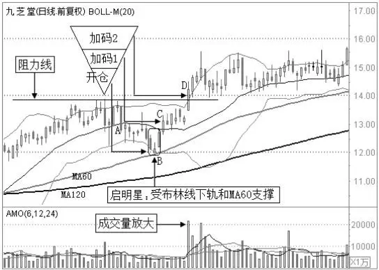

图5\-9 九芝堂2012年2月9日至2012年6月13日的日K线图

本次投资的技术分析以布林线为主，均线、成交量和K线形态等为辅。对该股的关注是从A点市场出现下调开始，计划在适当的时候开始试探性建仓。

从布林线通道走向和均线方向看，市场总体趋势向上，但在A点出现的一根大阴线向下跌破了布林线中轨线，这给了我们一次在相对低位买入该股的机会。现在开始观察股价在什么地方能够出现调整到位的信号。

当股价下跌到B点处，出现了一根小的锤子线，并且刚好位于MA60和布林线下轨线附近，说明该股有止跌反弹的迹象。那么此时可以在12元附近（12\.10元）用计划资金的15％开仓买入。

第二天股价以一根中阳线向上跳空，形成了启明星底部反转形态，接着市场向上突破中轨线，如图中C点位置，这说明该股走势完成调整，重新回到中轨线上方，市场入进强势。但此时布林线上轨、中轨、下轨线仍然没有出现向上转向，并且前期高点形成的压力线还待突破，故还不能确认市场是否会最终走强，因此第一次加码仍然相对谨慎，仅投入35％的资金。

市场经过几天的横盘后，以一根向上跳空的大阳线向上突破布林线上轨线和阻力线，成交量明显放大，布林线中轨线向上翘头。这些信号告诉我们，市场将进入下一次拉升，上涨趋势确定，故将计划中剩下的50％资金全部投入，完成整个建仓过程。

在该股的这次操作中，从开仓到完成建仓，采用了较简单的三次倒金字塔加码方式：15％、35％和50％。随着趋势的确定，加码力度也加大。

投资者也可以大于3次加码，适当改变加码比率分配，但必须遵循市场趋势确定性与加码比率呈正向关系，即上升趋势越确定，加码力度越大。

案例：失败的倒金字塔加码——宗申动力（001696）。

市场的发展有其自身的规律，受到诸多因素的影响，不会按照投资者的意愿发展，我们改变不了市场，只能顺应市场。一名成功的股票投资人，需要做的就是理解市场、顺应市场，在此基础上制定投资计划，采取灵活方法应对市场的变化。比如在倒金字塔建仓加码方法中，不能违背市场趋势进行逆势操作，发现市场变化与愿望相反时，要果断采取行动，防范风险。下面的案例可以说明这一点。

图5\-10是宗申动力2012年1月12日至2012年6月21日的日K线图。与上面的案例相似，该股在A点以前处于强势上升走势，A点以后出现了急速和深幅调整，股价在MA60和MA120之间获得支撑。此时MA60和MA120方向均向上，呈多头排列，说明市场中长线趋势仍然健康，股价回到两线之间是较好的买入机会，于是在B点区域即6\.5元价格附近买入，建仓比例是15％。

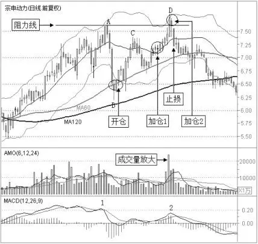

图5\-10 宗申动力2012年1月12日至2012年6月21日的日K线图

考虑到从A点下跌到B点出现的连续大阴线，市场又存在趋势向下转向的可能，因此采用倒金字塔模式建仓，先用较少的资金测试，并且做好几手准备，一是市场中长期趋势出现转变，则做好止损，止损价以MA120（半年线）作为标准。二是市场继续向上拓展新高，此时则可以在适当的时候加码，同时做好每次加码后的止损止盈计划。

开仓后，股价向上拓展并在C点位置向上突破布林线中轨线，但此时中轨线方向向下，因此需要谨慎。随后股价回调并再次受到MA60的支撑，第二次向上突破布林线中轨线，此后股价连续站在中轨线上方，并且中轨线方向向上转向。此时用20％的资金投入，买入价为7\.15元。

股价加速上行，并向上突破前期阻力线，与布林线上轨线重合。谨慎的投资者此时需要再观察一下，看股价突破A点后是否能够站稳，布林线上轨的压力作用有多大。激进的投资也有理由进行第二次加码，因为此时MA60、MA120和成交量的配合都给了冒险的理由，毕竟不冒险就没有收益。综合考虑后，在7\.65元处加仓30％。

市场最终选择了投资者不愿意看到的方向，第二次加仓后股价即掉头向下。创出新高D点后的第三天，市场就以一根光头光脚的大阴线向下击破布林线中轨线，K线形态和布林线指标都发出了风险信号。此时投资者需要立即执行止损命令，在7\.30元的价格全部清仓，以保证资金安全。

7\.30元是本次操作的总成本价位，止损方法是采用保本止损。这样本次操作宣告失败。

这个案例有两点需要读者注意。

①倒金字塔加码模型对趋势细节的判断非常重要。 市场的主要趋势固然重要，但在实际投资中，趋势的变化总发生在较为细小的环节处，是由小趋势的变化开始的。能够在小趋势中捕捉机会，防控风险，是投资者在股市中获取利润的关键。在本案例中，当股价从高点A下调到B点时，出现了几根大阳线，并且连续跌穿了布林线下轨线和MA60。虽然股价受到了MA60和MA120的支撑，很快返回到布林线通道内，但此次下跌的杀伤力较大，大大影响了市场的做多力量，因此该股的走势虽然与前面的案例类似，但市场上升动能和趋势已有所不同。后来股价上涨C点，由于此处的价位与B点相差较远，在上涨中消耗了过多的多头力量，后来不得不出现回落蓄势。市场突破阻力线并创出新高，成交量也配合放大，给突破的真实性增加了说服力，但是MACD指标出现了顶背离走势，创出D点新高时，MACD值低于前期高点A，显示市场继续上涨的动能不够。这些细节可以让投资者更加谨慎地对待越来越大的加码行为。

②止损的重要性。 无论是技术分析还是基本面分析，任何时候都可以得出截然相反的结论。这就像经常看电视股评，每天都会发现股评者之间的观点经常相反，而且各自的理由都很充分，也许这种不确定性正是股市的魅力所在吧。不过当投入真金白银时，还是要做好风险防范。这个案例中，正是因为有了止损措施，才避免本金遭受损失，为下一次投资提供了条件。想象一下，如果没有止损这种风险防范措施，此次投资的损失将是巨大的。

__三、菱形加码模式__

菱形加仓模式也称为橄榄型增仓法，是综合金字塔和倒金字塔加码模式的组合加仓方法。在行情不确定的时候使用倒金字塔方式加码，当行情确定后使用金字塔加码模式。

菱形加码模式的优点是充分考虑了市场在底部的整个转折过程，但其缺点是将建仓加码的战线拉得较长，资金投入也较分散，因此适合资金量较大的投资者使用。如图5\-11所示。

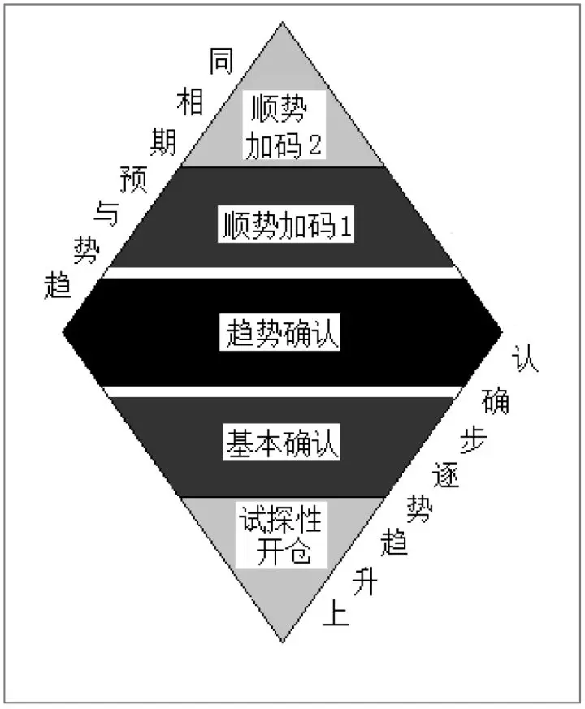

图5\-11 菱形加仓模型

菱形加码模式的相关注意事项，可以参看金字塔加码和倒金字塔加码模式。

案例：菱形建仓加码模式——康得新（002450）。

菱形加码模式是在市场出现见底信号，但仍然对市场缺乏足够的信心，同时又怕失去在低价位买入的机会，因此先进行小幅开仓。随着市场向上的趋势慢慢确定，投资者逐步加大投资力度。即使在市场出现较明确稳定的上升趋势时，投资者仍然保持一定的谨慎，并留有一定的资金用于以后的顺势加仓。下面投资康得新的案例中，就是采用的菱形建仓加码方法。

图5\-12是康得新（002450）2012年3月21日至2012年9月3日的日K线图。图中标有1～5的数字，对应的位置是菱形建仓加码的地方。

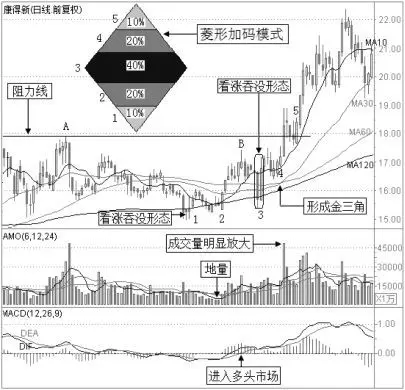

图5\-12 康得新2012年3月21日至2012年9月3日的日K线图

“1”是开仓位置，使用计划资金的10％。市场从A点回调以来，在此处受到MA120的支撑，K线出现了风高浪大线K线形态，属于底部反转信号，同时股价和短期均线已经回归到长期均线附近，也就是说当前股价与120天以来的平均成本价格接近，说明市场得到了充分调整。但此时中短期均线向下，股价在短期和中长期均线之间运行，市场趋势并没有出现明显的反转信号。既然得出的结论并不充分，又要抢低价筹码，因此就需要冒一定的风险，但风险又不能太大，因此开仓只用10％的资金。

“2”是第二次买入位置，加码资金为计划资金的20％。在位置“2”，市场的低点高于位置1，并且MA10与MA120黏合后开始向上发散；K线出现了一根中阳线，向上突破MA10、MA120和MA30三条均线；成交量在前期出现地量的情况下，开始温和放大。

“3”是第三次买入位置，也是买入资金量最大的一次买入，投入资金占计划资金的40％。这是因为市场中累积起来的看涨信号越来越多，该处出现了一根大阴线和一根大阳线组成的看涨吞没形态。低点“1”、“2”和“3”依次抬高，各条均线方向一致，基本形成了多头排列。

“4”是第四次加仓位置，使用资金量是20％。该位置出现的买入信号是代表中长期趋势向上的“金三角”均线形态，同时股价开始在MA10上方运行，受到该均线的强力支撑，说明短线有望发力上攻。

“5”是最后一次加码位置，此次加码将剩下的10％资金全部投入到该股中。位置5是股价向上突破长期整理区间的位置，即突破前期高点A。当股价回抽确认后可以买入。

这次操作经过5次建仓加码，采用的加码方法是菱形加码模式。

__四、均形加码模式__

均形加码模式是投资者在建仓加码过程中采用每次加码的资金比率都相同的建仓加码方法。均形加码与以上几种资金管理方法的最大区别，在于它将市场的风险平均分配到资金中。

均形加码模式相对灵活方便，受资金量和运作周期影响不大，但在发挥资金效率上有一定的缺陷。在使用均形加码模式时，需要根据资金量的大小，合理决定投入次数，并尽量在相对底部完成整个投入过程，切忌在股价处于相对高位时追涨。最好将每次投入都看作是一次独立的入场，同时做好止损和止盈计划。如图5\-13所示。

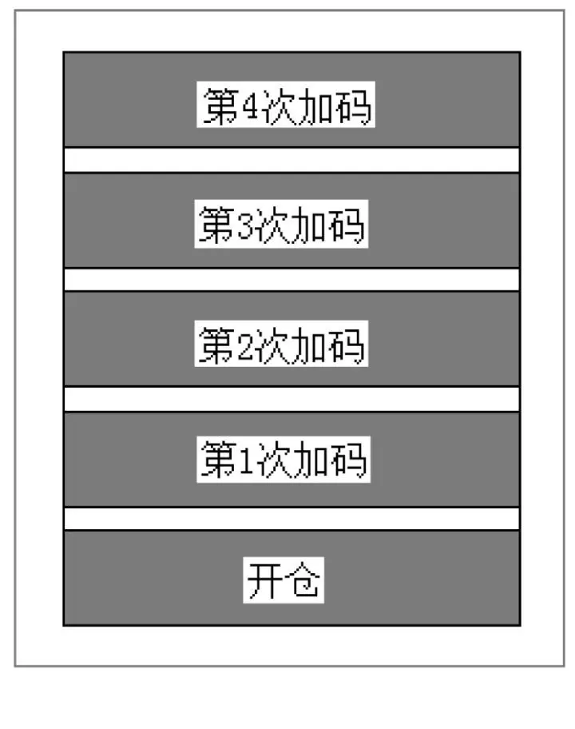

图5\-13 均形加码模型

案例：均形加码模式——东华软件（002065）。

图5\-13是东华软件2012年2月21日至2012年8月30日的日K线图。图中用切线理论画出了这段行情的趋势线和阻力线以及中轨线。A和B是两个依次抬高的高点，两者连线构成了上升趋势的上轨线，该线可能对市场后期走势起到阻力作用。两个依次抬高的低点1和2构成了这段行情的支撑线，在该上升行情中也称为趋势线。它们之间的一条位于中心位置的直线为该运行通道的中轨线，该线将这个运行通道分为上下两部分，当股价位于上部分时，可以称为高价区，越接近上轨阻力线，其风险越大；同样，当股价处于通道下部分时，此时股价相对较低，越接近下轨线（趋势线），该股越有投资价值。

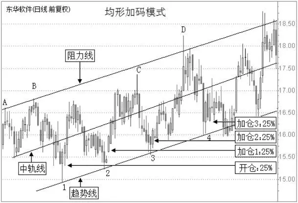

图5\-14 东华软件2012年2月21日至2012年8月30日的日K线图

这段行情处在较规律的微微向上倾斜的波浪形上涨中，根据这一规律，可以采取均形加码模式，每一个阶段性低点都是加码的机会。

图中“1”的位置，市场第一次下探中形成了一个带长下影线的看涨K线形态，当天或第二天得到证实后，可以进行第一次开仓买入。如果准备分4次投入，那么每次投入的资金是计划资金的25％。

“2”的位置是市场的另一回调低点，当股价以向上跳空完成此次整理后，可以进行第二次买入，用同样的资金即25％的资金进行加码。

第3次和第4次买入都是在股价回调到趋势线附近进行的，这样就分4次完成了全部建仓任务。

这次建仓利用该股较有规律的波动，选择相对低价区域买入。值得提醒的是，采用这种方式建仓之前，必须确认该股的基本面和股价运行的大趋势。基本面要支持该股在未来的发展中仍有上涨空间，尤其是股价已经出现一定涨幅的个股，更要重视基本面的支撑作用。技术面上保证该股走势处于一个较大级别的底部整理或上涨中继整理阶段。

建仓完毕后，就等待市场趋势发生改变。如果市场后期走势与预期相同，向上突破持筹整理区间，说明该股进入拉升阶段，这时可以依照止盈方法逐步获利了结。如果后市仍然保持这种不温不火的向上运行态势，投资者就持股不动。如果后市出现向下的趋势变化，根据投资者对风险的看法，可以采取不同的止盈策略。因为每次加码都是在相对低价区买入的，这就给止盈留下了盈利空间。

__五、向下加码__

前面介绍的几种建仓加码模式都是向上加码，即每次加码的前提是股价不低于上一次加码的价格。还有一种方法是向下加码，即开仓或加码之后股价出现下跌，为了摊低成本，在股价下跌到某一价位进行加码补仓。向下加码实质上属于一种弥补错误的行为，为了避免错上加错，实战中需要非常谨慎地使用。

向下加码一般需要满足以下条件。

①向下加码适合在上涨趋势或者长期底部震荡区域使用。 股价回调过程中没有改变趋势的运行方向，并且加码时市场已经出现阶段性的止跌反转信号。

②加码时的价格已经出现一段较明显的下跌。 根据投资周期的不同，下跌幅度也有不同的标准，一般中长线应该在大于15％以上才考虑补仓，中短线可以在下跌10％～15％时补仓，但这种比例不是绝对的，要根据市场的实际走势判断。

③以单次投机操作思维进行止盈或止损。 向下加码一般多用于摊薄原有筹码成本，因此在低位加码的仓位，可以作为独立操作，以提高成功率为主。只要有利于整体成本下降，即可见好就收。

④止损非常关键。 一般向下加码的价位多处于重要支撑位置，如果市场出现继续下跌，说明市场趋势可能恶化，需要立刻启动止损指令，以最大限度地保证资金安全。

⑤向下加码不适合重仓情况。 重仓已经承受了较大风险，向下加码是一种加大风险的行为，因此切忌重仓向下加码，毕竟市场是无情的。相反，重仓投资者在不利的情况下应该寻找机会降低仓位。

⑥加码投入的资金不宜过多。

案例：向下加码（补仓）——天康生物（002100）。

向下加码（补仓）可以发生在整个交易过程中的任何时候，既可以作为整体建仓的一部分，也可以作为一次单独的交易行为，用以达到降低原有持仓成本的目的。

图5\-15是天康生物2012年3月8日至2012年7月18日的一段日K线、均线和KDJ指标组合走势图。

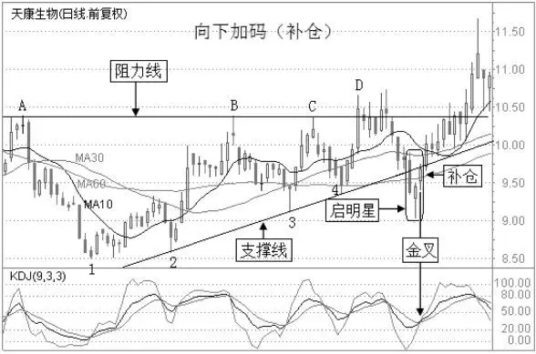

图5\-15 天康生物2012年3月8日至2012年7月18日的日K线、均线和KDJ指标组合图

从MA60的走向可以知道，该股从中长期的下降趋势逐步企稳，MA30和MA10从下降趋势向上升趋势转化。从K线的整体技术形态看，各个阶段高点A、B、C形成了一个同一水平的阻力位。各阶段低点1、2、3和4逐步抬高，与水平阻力线共同组成了一个上升三角形整理形态。

D点位置出现了一个向上突破该三角形整理形态的大阳线，并且股价在阻力线附近连续整理，股价一直保持在各条均线上方运行，显示中短线进入多头格局。不尽人意的是，在此位置出现了较多带长上影线的K线形态。

此时从技术分析上有点难以取舍，一方面是股价连续试探三角形整理的阻力线，随时都有可能出现向上拉升的情况。另一方面市场也可能出现假突破。综合考虑，可以采用较少仓位投入。随后市场一路向下，连续杀跌，并且跌破三角形整理的下轨和MA60。此时持有的筹码已经出现较大幅度的亏损。

当市场出现一个重要的启明星底部反转形态后，KDJ指标同时出现了金叉买入信号，股价也以较强的势头重新站上MA60，显示本次大幅杀跌有可能是主力进行大洗盘。因此可以在启明星出现后进行补仓，即向下加码。因为首次买入的仓位较轻，故可以买入同等数量筹码以摊薄成本。

在随后的市场上涨中，我们有两种选择，一是在股价上涨到阻力线附近时止盈卖出；二是作为中长线加码建仓的一部分，继续持股。

向下加码方法也经常用于解套，即在持仓处于亏损的情况下，在低位进行补仓。当股价反弹时，卖出适当比率的筹码，从而达到总体亏损下降，直至持平或盈利。这种低位补仓操作可以是一次，也可以根据市场波动规律进行多次操作。

__六、三三制资金管理模式__

所谓三三制资金管理模式，就是将投入某只股票的计划资金分为3等份，每一等份再分为3个小的等份，即一共为9份。

第一大份资金作为底仓使用，即保持持仓量。其中3个小等份在建仓时期分3次使用，建仓方法可以借鉴以上介绍的各种方法。该部分仓位一般固定不变，直到最后完成投资目标。

第二大份资金作为次级波段操作资金，即在大趋势向上的情况下，利用波段操作技巧，在上涨途中的回调低位分别买入，并在波段高位卖出。每份资金也可以视为一次单独的次级波段操作，原则是见好就收，做好止盈和止损。也可以作为一次次级底部建仓，在高位获利卖出的整体投资操作。一般情况下，只要市场出现异动，就进行止盈或止损，因此这部分资金是最活跃的部分，只要市场出现次级波段操作机会，就可以动用该部分资金。

第三份资金主要在应急时使用，主要用于市场发生突然变化，或用于救火，或用于捕捉突发性机会。这部分资金只有出现较好的短线机会时使用，使用时也是快进快出，绝不恋战。

三三制资金管理模式实际上是根据投资周期和股价的空间位置，同时考虑资金安全，综合使用资金的高级方法。该方法要求投资者对中长期趋势、中短期波动规律和市场短线盘面变化特征进行全面分析，结合A股的T\+1交易规则，增加T\+0交易选项，综合使用资金，让资金发挥最大的效率。这种资金管理方法较难掌握，要求投资者有较全面的分析能力和丰富的投资经验。该资金管理模式一旦使用不当，反而会弄巧成拙，一般不适合新手使用。

案例：单股投资资金综合利用——恒宝股份（002104）。

三三制资金管理方法是一种充分利用资金，对某一标的股采取中长线、短线甚至超短线连续跟踪的滚动操作方法，其中可以包括金字塔加码、均形加码等各种不同的仓位管理模式。下面以恒宝股份为例进行详细介绍。

①投资理由。

基本面分析：恒宝股份是以磁条卡、密码卡和IC卡等卡类产品及相关操作系统（COS）和票证产品研发、生产、销售为主的高科技公司。公司的核心竞争优势在于银行渠道，受益于金融IC卡市场加速成长。公司银行卡类产品包括磁条卡和金融IC卡。公司是传统磁条卡领域的优势厂商，2011年上半年出货量达到上亿张规模，且毛利率同比有较大幅度上升。目前国内绝大多数已经发行金融IC卡的银行都是公司客户。预计2012年全年各银行金融IC卡发卡总量可以达到6000万～7000万张，超过年初的普遍预期。恒宝股份公司2011年销售金融IC卡170万张，2012年预计达到1100万张，2013年则在3000万张左右，将占到行业30％左右的份额。社保卡、SIM卡、U\-Key也将支撑业绩快速成长。因此公司的基本面可以支撑企业未来的快速增长，该股是一个较好的激进型投资品种。

技术面分析：图5\-16是恒宝股份2010年9月3日至2012年9月28日的周K线图。从图中可以看到，该股随大盘经历了长达两年的调整，并在2012年1月17日创调整以来的最低价7\.78元，之后进入底部构筑时期。

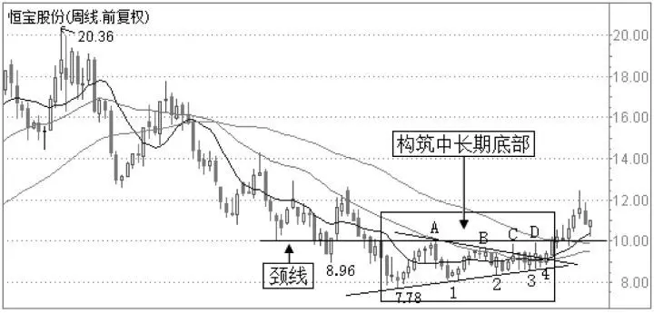

图5\-16 恒宝股份2010年9月3日至2012年9月28日的周K线图

从基本面和技术面分析结果来看，选择该股为投资对象有较高的盈利可能性。

②投资周期： 中长线、波段操作和短线相结合。

③资金管理： 投入总资金60万元，采用三三制资金管理方式。

④主要分析工具： 以技术分析为主，监控基本面的变化情况。

⑤建仓成本： 底仓成本控制在9\.00元下方。波段操作和短线操作的建仓成本根据具体情况另行计划。

⑥止盈目标： 中长期趋势不变，底仓持股不变。波段操作止盈根据股价波段运行特征确定，达到上方阻力线位置，或出现次级趋势顶部反转信号时止盈。短线操作遵循快进快出、见好就收的基本原则。

⑦潜在风险： 宏观经济不稳定，对公司未来业绩产生负面影响。子公司盈利表现持续低迷，拖累公司总体业绩；EMV迁移和移动支付推进进度不确定，毛利率下滑，收入推迟结算等存在风险。大盘处于熊市，个股走势可能受到牵制。

⑧止损计划： 底部形态不成立，则全部止损。

根据投资计划，将计划资金分为三大部分，每部分资金为20万元。第一部分在底部分3次建仓，采用金字塔模式。图5\-17是恒宝股份2012年3月13日至2012年9月18日的日K线走势图。图中的“1”到“4”和A到D位置，与图5\-16周K线图中的位置“1”等位置对应。

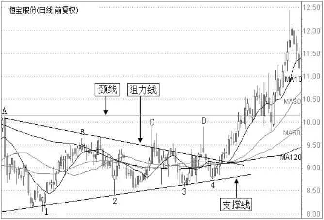

图5\-17 恒宝股份2012年3月13日至2012年9月18日的日K线走势图

位置1是该股创出新低7\.78元后反弹回落出现的阶段性低点，为8\.05元，这两个低点与前期一个下跌趋势中的阶段性低点8\.96元（如图5\-16所示）形成了一个头肩底底部反转技术形态，说明市场原有的下跌趋势已经出现改变。因此在位置1开始建仓，使用底仓资金的50％，也就是10万元资金，买入价格为8\.62元，买入筹码数量为11600股。此时市场连续出现三个阳线，并且向上突破MA10，所以在此位置同时买入7500股，作为波段操作的筹码。

随后市场上涨到MA120，明显感受到半年线的压力，因此在9\.50元卖出7500股波段操作的筹码，仍然继续持有中长线筹码。

在市场随后出现的几次探底中，在位置“2”之后以8\.88元的价格买入了6500股。在位置“4”之后，股价向上突破已经高度黏合的各条均线，于是在9\.35元进行了最后一次底仓加码，买入筹码数量为4500股。3次建仓加码的交易费用是299\.48元，平均持仓成本为8\.847元。

在整个底仓建仓过程中，除了前面与开仓同时进行的一次波段操作外，还进行了另外一次波段操作和一次短线投机。图5\-18是恒宝股份6月14日至7月27日的60分钟K线图。图中的位置“3”和“4”以及C和D，与前面的日K线图和周K线图对应。这次短线波段操作进行了3次买入，买入点是图中的①、②和③位置。①买入的理由是股价已经接近日线级别和周线级别的支撑线，股价受到布林线下轨线支撑，并出现反弹，买入价格为8\.86元，买入数量为7500股。

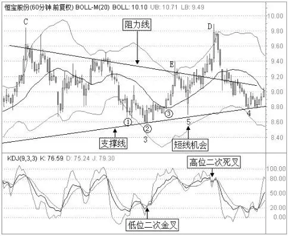

图5\-18 恒宝股份2012年6月14日至7月27日的60分钟K线图

第二次加码是向下加码，在位置②股价触及支撑线后，盘面走势出现连续的承接单，股价在8\.59元位置受到极强的支撑，并且KDJ指标在超卖区出现了二次金叉，股价与KDJ出现底背离。这些信号都证明市场在此处是短线的底部区域，因此在此位置补仓7500股，买入价为8\.65元。

在位置③，股价向上突破布林线中轨线，故在8\.92元位置再加码7500股。随后股价向上突破布林线上轨线，如图中E点，但受到布林线上轨和整理形态的上轨线压制，股价出现滞涨，但日K线则是大阳线突破各条均线。不过本着波段操作安全为主的原则，在布林线上轨线位置止盈，卖出全部22500股，止盈价格为当日收盘价9\.26元。

在图5\-18中的位置5，股价随大盘出现向下大幅低开，并用10分钟时间进行了无量快速探底，这是一个难得的短线T\+0机会。

图5\-19是2012年7月17日的5分钟K线图，该图与图5\-18中“5”位置对应。该图很细致地反映了当日开盘向下探底后又被拉起的过程。

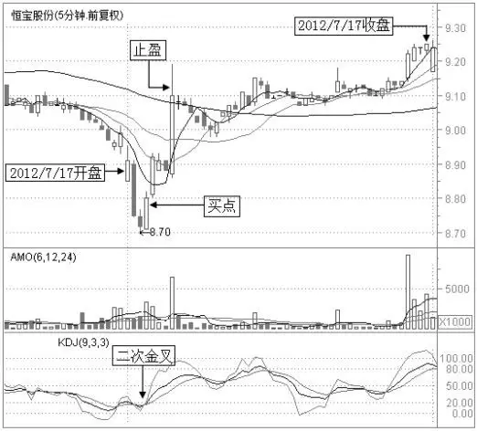

图5\-19 恒宝股份2012年7月17日的5分钟K线图

这次探底性质可以用三个方法来确认，一是日K线级别的支撑线作用，二是盘面成交量下跌无量、上涨放量的形态，三是KDJ指标在20下方出现二次金叉。

此时总仓位是42％，在前两次波段交易中也获得了一定的盈利，因此可以利用这次机会做一次T\+0投机操作，买点价格是8\.80元，买入7500股，总仓位上升到50％。在随后的快速反弹中，股价接近三角形整理的上轨线时出现滞涨，此时股价已达到9\.19元，在股价回落过程中，以9\.12元全部卖出，T\+0操作完成。扣除交易费用，获利3\.5％。

截至7月17日，通过以上操作，完成了前两次底仓建仓18100股，买入成本8\.726元/股。4次波段操作，扣除交易费用，共获利15794\.43元；1次T\+0操作，扣除交易费用，获利2170\.32元。当前仍保留底仓18100股，持筹成本为7\.734元。

__七、凯利公式__

__1．凯利公式概述__

著名的“财富公式”——凯利公式，是物理学家约翰·拉里·凯利在1956年提出的一个数学公式，称为“凯利公式”。最初该公式用于博彩业，主要利用市场中最好的预测者所预言的赔率与赌场公布的赔率之间的差距下注，这正是风险投资市场中资金管理的核心思想，因此该公式被广泛运用到股票市场、汇率市场以及房地产等风险投资市场中。

凯利公式的表达式为：

f＝（bp\-q）/b＝［bp\-（1\-p）］/b

其中：

f为现有资金应进行下次投注的比例。

b为投注可得的赔率。

p为获胜率。

q为失败率，即1–p。

举例而言，若一赌博有40％的获胜率（p＝0\.4，q＝0\.6），赌客在赢得赌局时，可获得二赔一的赔率（b＝2），则：

f＝（2×0\.4\-0\.6）÷2＝0\.1。

也就是说赌客应在每次机会中下注现有资金的10％，以使资金的长期增长率最大化。

在股市投资中，利用凯利公式进行资金管理，可以通过该公式来计算合理的仓位，也就是投入资金的多少。根据股市投资的不同特点，把投资者对投资收益的预期作为“赔率”，即投资者预期的收益率与损失率的比例：

b＝预期收益率÷预期损失率。

这样凯利公式就可以为我们提供资金管理的依据。

假设某只股票的现价为A，可能的涨幅为10％，其可能性为60％；下跌的幅度为8％，可能性为40％。这样我们应该用多少资金投入该股呢？

f＝（bp\-q）/b

＝［（0\.1÷0\.08）×0\.6\-0\.4］÷（0\.1÷0\.08）

＝0\.28

利用凯利公式，计算得到的数字是0\.28，也就是可以投入的资金比例为28％。

__2．股市运用注意事项__

在股市中运用凯利公式，需要注意以下几点。

①凯利公式只能用于上涨概率大于下跌概率时。

②利用凯利公式计算出来的仓位是否准确，取决于投资者对市场上升和下降机会的判断，以及上涨与下跌的可能幅度的判断。

③在股市里，凯利公式中的获胜率和失败率之和也可以不等于1，但要小于1。在一段时间内，股价的涨跌可以达到预期目标，但也可以在预期的涨跌幅度之间，并非是非此即彼的关系。

④凯利公式主要用于投机中的资金使用和资产配置，是仓位大小与风险大小之间的关系，不能用于选股和比较个股的好坏。

⑤对于同一只股票，在不同的时空点，凯利公式得出的结论会有很大的区别，这是因为市场上涨与下跌的概率和幅度都发生了改变。

⑥凯利公式并没有考虑时间周期。在使用时，投资者应该根据时间周期长短，对盈亏预期和涨跌概率进行科学评估。

⑦使用凯利公式进行资金管理时，它所给出的数字并不是最终和最佳的方案，投资者还需要结合其他因素综合考虑。凯利公式原本是根据博彩（21点）的输赢概率和赔率来计算下注的，股票投资与博彩有很大不同，博彩的赔率和概率有一定范围，而且容易量化，而股票投资的赔率和涨跌概率幅度是没有范围的，量化比较困难。

__3．凯利公式在股市中的运用__

凯利公式主要用于股票投资中的资金管理、仓位控制和分配。在实际运用中，一般有两种方法，一是对同一投资对象采用不同周期的投资方案，根据时间周期的长短设立几个等次，为最终决定不同周期投资活动的仓位配比提供依据，或者选择其中较为适合的一种投资计划。

案例：凯利公式在不同周期中的运用——顺络电子（002138）。

图5\-20是顺络电子2010年9月21日至2012年7月6日的周K线图。我们的关注点是图中的G点位置，即当股价向上突破颈线后。根据技术形态、均线、KDJ和MACD等指标，可以对该股未来上涨行情进行分析判断。

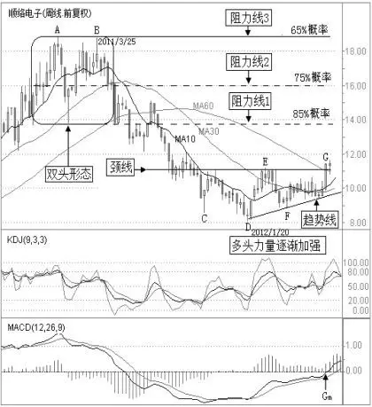

图5\-20 顺络电子2010年9月21日至2012年7月6日的周K线图

①K线技术形态： 该股在下降后期出现的三个阶段性低点C、D和F，组成了一个头肩底的底部反转技术形态。G点位置出现的一根向上突破颈线的大阳线，证实了该头肩底成立。

②均线系统： MA10和MA30周均线形成粘合后开始向上发散，说明市场中期向好。但MA60方向仍然向下，这给该股形成一定压力。

③KDJ指标： 该多空指标仍然处于向上的趋势，并且在50上方运行，说明当前市场属多头市场。

④MACD指标： G点对应的MACD图中的Gm点位置，刚好是DIF向上穿过0轴线进入多头市场的位置。但DEA仍然处于0轴线下方，表明市场还存在震荡整理的可能。

综合以上观点，可以认为该股后期向上是大概率事件。再观察上方的压力位，主要有三个位置，这三个位置对股价未来上涨起到阻力作用，如图中的阻力线1、阻力线2和阻力线3。阻力线1是前期双头形态的颈线位置，阻力线2是该头部的筹码密集区，阻力线1是双头形态的高点。

市场是否能够在上涨过程中达到这些价位，还存在很多不确定性。这种不确定性主要来源于两个方面，一是价格因素，价格越高，风险越大；二是时间因素，时间越长，不确定性越大。我们可以对这三个价位给予不同的概率，达到阻力线1的价位（13\.83元）的概率是75％，达到阻力线2的价位（16\.00元）的概率是70％，达到阻力线3的价位（19\.00元）的概率是65％。

从高点B的时间2011年3月25日到最低点D的时间2012年1月20日，所用时间为42周，从D点到达G点用了22周时间。从时间周期来估计，如果市场能够保持目前的趋势和运行速度，那么大概在20周左右，股价可以达到B点价格附近，即19\.00元。同理，从G点到达16\.00元附近，可能消耗时间为14周，到达13\.83元可能消耗7周时间。

现在利用凯利公式来计算这三种情况投入资金的最佳方案。

①中短线。

买入价：11\.10元。

目标价位：13\.83元，收益率＝（13\.83\-11\.10）÷11\.10＝0\.245（即24\.5％）。

止损价位：10\.50元，亏损率＝（10\.50\-11\.10）÷11\.10＝0\.054（即5\.4％）。

这样，计算出赔率b＝0\.245÷0\.054＝4\.55。

获胜率为75％，可以计算出所投入的仓位。

f＝（bp\-q）÷b＝［bp\-（1\-p）］÷b

＝（4\.55×0\.75\-0\.25）÷4\.55

＝0\.695

即如果采用中短线投资8周时间，以收益预期为24\.5％，以5\.5％作为止损赔率，那么可以投入69\.5％的资金。

②中长线。

买入价：11\.10元。

目标价位：16元，收益率＝（16\-11\.10）÷11\.10＝0\.44（即44％）。

止损价位：10元，亏损率＝（10\-11\.10）÷11\.10＝0\.1（即10％）。

这样，计算出赔率b＝0\.44÷0\.1＝4\.45。

获胜率为70％，可以计算出所投入的仓位。

f＝（bp\-q）÷b＝［bp\-（1\-p）］÷b

＝（4\.45×0\.70\-0\.30）÷4\.45

＝0\.633

即如果采用中线投资15周时间，以收益预期为44％，以10％作为止损赔率，那么可以投入63\.3％的资金。

③长线。

买入价：11\.10元。

目标价位：19元，收益率＝（19\-11\.10）÷11\.10＝0\.711（即71\.1％）。

止损价位：10元，亏损率＝（10\-11\.10）÷11\.10＝0\.1（即10％）。

这样，计算出赔率b＝0\.245÷0\.054＝7\.18。

获胜率为65％，止损的损失率与中线投资相同，为30％，而非35％。这样可以计算出所投入的仓位。

f＝（bp\-q）÷b＝［bp\-（1\-p）］÷b

＝（7\.18×0\.65\-0\.30）÷7\.18

＝0\.608

即如果采用长线投资24周时间，以收益预期为71\.1％，以10％作为止损赔率，那么可以投入60\.8％的资金。

下面可以根据资金使用周期、个人操作风格等因素，从这三种投资方案中选择一个适合自己的投资方案。

凯利公式并不会给投资者提出哪个方案好、哪个方案差的建议，而是根据投资者提供的信息，给予资金投入量的建议，至于投资者选择哪种投资方案，则由投资者自己考虑。比如，如果投资者更倾向于较短的投资时间，则选择中短线方案；如果投资者并不在乎时间，就可以选择长线方案。

凯利公式不仅用于计算建仓阶段投入的资金比率，也可以用于减仓操作中。在市场运行过程中，形势会发生变化，投资者可能会改变原有的看法，并希望减仓或加仓，那么减仓或加仓比率是多少呢？凯利公式也可以提供参考数据。

案例：利用凯利公式减仓——太极实业（600667）。

太极实业经过重组后，基本面得到了较大的转变，股价存在低估。受国家设立传感网示范区刺激，该股2012年8月14日出现一字涨停，随后股价在短期获利盘的抛压下回落，在布林线中轨线位置获得支撑。

图5\-21是太极实业2012年3月13日至9月18日的日K线图。

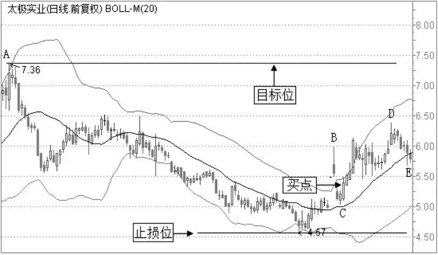

图5\-21 太极实业2012年3月13日至9月18日的日K线图

根据该股的基本面和技术面分析，决定在C点位置进行中线投资买入，价格为5\.30元。目标价为前期高点A所在价位，即7\.36元。止损价为底部成交密集区下沿，即4\.88元。这样就可以计算需要投入的资金比率。

上涨到A点的概率是60％，赔率b＝（7\.36\-5\.30）÷（4\.57\-5\.30）＝2\.82。

f＝（bp\-q）÷b＝［bp\-（1\-p）］÷b

＝（2\.82×0\.65\-0\.35）÷2\.82

＝0\.526

这样，我们可以使用计划投入资金的52\.6％在5\.30元买入。

随着市场的发展，股价达到D点后开始回调，并击破布林线中轨线，市场表现弱于预期。此时在预期的时间周期里，股价达到预期价格7\.38元的概率下降，为了避免风险，在此位置需要降低仓位。

从E点位置分析，股价到达7\.38元的概率下降到55％。在对持仓进行调整时，我们仍然使用凯利公式，并计算得到的合理资金使用量为39％，这样需要减少计划资金的13％，也就是在原有的仓位中减仓25％。

同样，如果市场上涨的确定性进一步增强，通过凯利公式也可以得出大于原来的资金使用率，根据新的资金使用率，就可以进行加仓操作。

凯利公式在资金管理中的另外一种用法是建立合理仓位分配的投资组合。我们可以对几只目标股进行计算，得到合理的资金投入比率。下面结合大盘和三只不同性质的个股，来演示一下利用凯利公式进行资产组合的资金配比。

案例：凯利公式与仓位分配——乐视网等3只个股。

表5\-1是上证指数（1A0001）以及贵州茅台（600519）、中信证券（600030）、乐视网（300104）三只个股的信息。买入价以2012年9月29日为参考指数点位和价格。预期上涨和预期下跌是对未来一年时间内大盘和三只个股可能波动的范围。

比如上证指数最高可能会达到2700点，达到这个点位的概率是60％。上证指数也可能下降到1700点，发生的概率为40％。贵州茅台是典型的白马股，基本上独立于大盘走势，根据该股的历史走势，确定该股在未来一年里会上涨到300元上方，收益率有25％。中信证券基本与大盘同步，但具有放大作用，对比该股与上证指数之间的涨跌关系，在大盘上涨过程中，该股上涨幅度是大盘的1\.9倍。在大盘下跌时，该股下跌幅度是上证指数的1\.6倍。根据这个统计数据，计算中信证券的预期收益率与损失率，并确定了可能的上涨幅度和下跌幅度。乐视网是当前政策支持的高成长股，未来一年存在着翻番的可能，但其风险也较大。具体情况见表5\-1。

表5\-1 上证指数（1A0001）与三只个股的涨跌概率与预期收益率

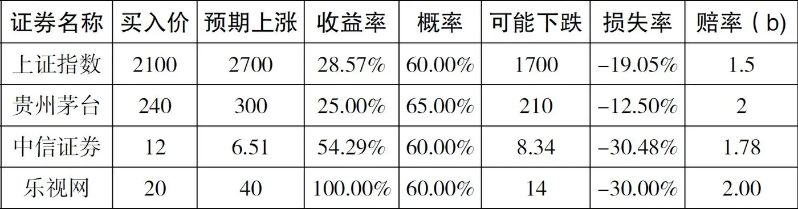

根据以上数据信息，利用凯利公式，分别计算出它们的资金使用比率。经过计算，得到上证指数的仓位为33\.3％，也就是说根据大盘判断，在未来一年的时间里，大盘波动幅度为2700点至1700点，上涨概率为60％，下跌概率为40％的情况下，适合投入33％的资金。同理，贵州茅台的仓位为47\.5％，中信证券为37\.54％，乐视网为40％。

下面的工作是对以上数据进一步处理。

①调整总仓位。 根据投资者的风险偏好，以及对大盘和个股特性进行综合考量，如果相对再激进一些，在当前情况下，可以适当提高仓位比重，加到40％，也就是用全部股票资金的40％进行股票投资。

②计算三只个股的仓位。 将计算出来的三只个股仓位求和，然后计算出每只股票占这三只股票总仓位的百分比。

贵州茅台仓位＝［47\.50％÷（47\.50％\+37\.54％\+40\.00％）］×40％＝38％×40％＝15\.2％

中信证券仓位＝［37\.54％÷（47\.50％\+37\.54％\+40\.00％）］×40％＝30％×40％＝12％

乐视网仓位＝［40％÷（47\.50％\+37\.54％\+40\.00％）］×40％＝32％×40％＝12\.8％

饼图可以更直观地显示用于三只股票的投资比例，如图5\-22所示。

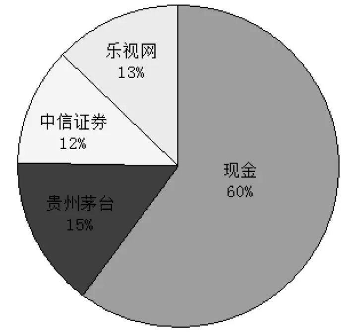

图5\-22 资产组合资金分布图

这样就确定了本次投资的资金管理分配模型：用15％的资金买入贵州茅台，12％的资金买入中信证券，13％的资金买入乐视网，投资周期为一年。之后根据市场的走势变化，再考虑是否加仓。

__八、投资组合资金管理模式__

投资组合涉及到资金的整体布局，是对整体投资的宏观计划，投入资金量越大，资金整体布局在资金管理中越重要。资金布局需要结合市场的整体性质、板块或个股的具体特性、投资者的风险偏好和投资风格进行统一规划。

影响资金布局的主要因素是投资者对风险的看法和市场的特性，以及资金量的大小。

①投资者对风险的看法，从主观上影响资金布局和运用。 不同的风险态度，都会表现在资金投入比率、投入方向和操作频率上。保守型投资者会在同样的市场性质下选择更加保守的布局方式，谨慎使用资金，方向偏于保守，操作频率相对较低；激进型投资者则会投入更多的资金，投资方向也偏向于风险较高的股票，资金周转速度相对较快；稳健型投资者则会选择适中的资金布局方式。

②市场特性是客观条件对资金布局和运用的限制。 面对不同的市场特性，资金布局和运用方式都各不相同。在牛市中，参与投资的资金比率要大，熊市中的资金运用率则较低，这是由市场的风险性质决定的。

③资金量的大小，也是资金布局及运作不得不考虑的因素。 资金量较大时，可以考虑综合布局，多种手段操作，比如适当扩大资产组合范围，采用长期、中期、短期相结合的投资周期等，以安全、稳定、长远为基础，兼顾资金的灵活运用，以发挥资金的综合利用效率。如果资金量较小，资金管理的方法则倾向于简单，以发挥资金效率为主。

在投资组合的资金管理布局中，要围绕自己的投资理念和风格，根据资金量大小和来源，结合市场性质，对资金进行管理布局和运作。

这里介绍的投资组合，主要投资于股票市场。实际上，投资理财中的投资组合，更多的是指多种类型的资产组合配置，投资标的包括股票在内的债券、期货以及房地产等多种资产，而不仅仅是股票。

无论是广义还是狭义的资产组合管理，其核心都是根据投资需求，将投资资金在不同风险类别之间进行分配，通常根据投资者的风险偏好，按照不同比率，将资金分配到不同风险类别的标的中。比如，保守的投资者会将更多的资金放在低风险低收益的资产里，而激进型的投资者则会将大部分资金投入到高风险高收益的证券或其他资产中。

资产配置以资产类别的历史表现与投资者的风险偏好为基础，确定不同资产类别在投资组合中所占的比重，从而降低投资风险，提高投资收益，消除投资者对收益所承担的不必要的额外风险。

资产组合资金管理分为三大类别，即静态资金管理、动态资金管理和混合型资金管理。

__1．投资组合静态资金管理__

所谓资产组合的静态资金管理，是指投资者按照某一固定的比例持有不同风险类别的股票，并且这种比例关系不随市场的变化而变动。

投资组合的静态资金管理，是指不同风险类别的股票占用资金的比例是静态的，并不是说在牛市或者熊市参与的资金比例保持不变。

比如某一较保守的投资者，在市场机会来临后，拿出50％的资金，分别买入低风险低收益和高风险高收益两种类型的股票，分别占用35％和15％的资金。在以后的加仓中也遵循这一比例关系。偏积极的投资者会将这种比例关系对调过来，高风险的占用35％的资金，低风险的占用15％的资金，并且一直遵循这种分配关系。

静态资金管理模式的优点是简单明了，但比较死板，不能发挥资金的最大效率。在市场趋势与投资者预期一致的情况下，静态资金管理模式会有较好的投资效果，如果市场走势与预期不一致，则会加大亏损或减少收益。

__2．投资组合动态资金管理__

投资组合动态资金管理是指投资组合的资金配比随市场的变化而变化，用较大比率的资金追逐市场热点。相对大盘指数，激进型的投资组合，其波动幅度要大于保守型的波动幅度，组合性质越激进，相对偏离幅度越大。保守型投资组合一般与大盘同步，偏离相对较小。

动态资金管理的优点是充分利用资金，获取最大的收益；其缺点是要求投资者的投资能力较高，动态管理的节奏不当，反而会造成较大的损失。

激进型投资组合，在牛市中的整体涨幅会远远高于大盘指数，也高于保守型组合。但是在熊市背景下，激进型组合的跌幅同样会远远大于大盘指数，大于保守型组合。因此在动态资金管理中，需要把握大盘趋势的变化，在大盘处于风险期时，采用保守的投资策略，在牛市行情里，则采用激进的方式。

动态资金管理还表现在市场的轮动上。市场运行过程中，并不是所有板块一起涨，一起跌，而是表现为板块轮动现象，这一现象在牛市中更为多见。比如我们经常说的“二八现象”和“八二现象”，就是权重股与题材股之间存在的轮动关系。所谓“二”，是指占全体股票20％的权重股，“八”是指占全部股票80％的题材股等非权重股。当权重股展开一轮上涨时，题材类个股往往会安静下来。一旦权重股歇息时，题材股就会接过上涨的接力棒。板块轮动包括行业轮动和区域的轮动等。许多有经验的投资者会抓住这些轮动关系，不断调整投资组合，充分利用资金，以获取最大的收益。

图5\-23展示了激进投资组合、保守投资组合与大盘之间的波动关系。

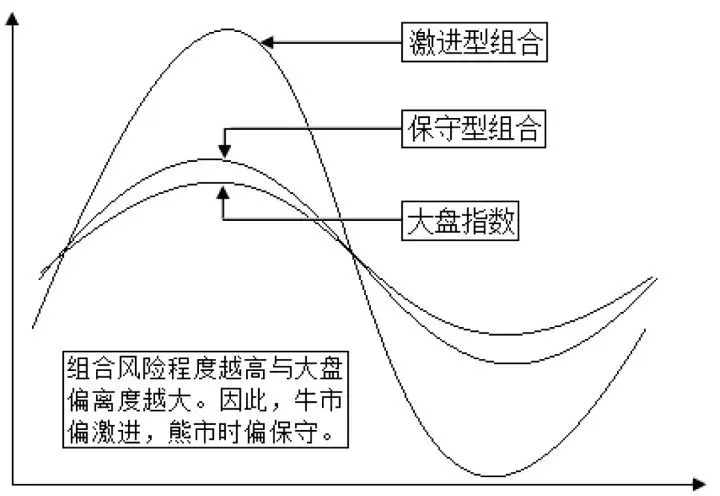

图5\-23 激进投资组合、保守投资组合与大盘之间的波动关系

__3．投资组合混合式资金管理__

这种管理模式综合了以上两种资金管理方法，将一部分资金用于静态组合作为长期投资，另一部分资金则采用动态组合，主要用于中短线投资。

__本章小结__

资金管理在股票投资中的重要性不言而喻，它是沟通投资策略与交易行为的桥梁，是控制风险的主要手段，是提高资金利用效率最重要的方法，也是决定股票投资是否成功的关键因素。

资金管理的目的，是在保证资金安全的前提下，尽量提高收益率，能够让资产获得长期稳定的收益。对于普通投资者来说，资金管理的内容包括股票投资总资产占个人或家庭总资产（特别是可控流动资产）的比率、已投入资产（总仓位）占股票账户总资产的比率、组合资产中个股的仓位比率、阶段性投入资金分配比率以及最大亏损比率和盈利预期值等。

资金管理有很多模式，比如金字塔和倒金字塔模式、菱形和均形模式以及三三制和凯利公式等，这些模式都有自己的优缺点，读者可以根据自己的投资风格确定自己的资金管理模式。实战中不需要死搬硬套这些模式，可以根据实际情况灵活掌握。在建立适合自己和市场变化的资金管理模式时，投资者需要围绕资金管理的两个目的，即资金安全和目标收益，顺应市场，且不可一厢情愿。

## 第六章　成功的投资策略

__第六章 成功的投资策略__

__第一节 收益的来源__

投资交易的目标是争取盈利，实现盈利的手段就是总体交易的亏损总量小于盈利总量。这又受到四个因素的直接影响，一是交易成功率，二是交易次数，三是止盈与止损的幅度，四是交易资金量。

下面对交易次数、成功率、交易资金量以及止损止盈的幅度进行计算对比。

__一、成功率与止盈止损的关系__

模拟一次为期一年的投资，每次平均投资2万元，一年里交易次数为10次，盈利目标是5000元。在此条件下，成功率与止盈比率、止损比率的关系如表6\-1所示。

表6\-1 成功率与止盈比率、止损比率的关系

保持每次亏损率不变

成功率

止盈比率

止损比率

最终盈利

70％

5\.72％

5\.00％

5001\.00

50％

10\.00％

5\.00％

5000\.00

30％

20\.00％

5\.00％

5000\.00

保持每次获利率不变

成功率

止盈比率

止损比率

最终盈利

70％

10\.00％

15\.00％

5000\.00

50％

10\.00％

5\.00％

5000\.00

25％

10\.00％

0\.00％

5000\.00

成功率达到70％，也就是一年的时间里交易10次，有7次能够到达预期收益，那么在允许每次止损率（允许亏损）为5％时，预期收益率只需要5\.72％，止盈标准只要略高于止损标准即可。

如果只有30％的成功率，那么每次盈利必须高于20％以上才可以达到年盈利目标。

如果保持每次止盈率为10％，那么在70％的成功率下，每次止损百分比可以放宽到15％。

在成功率为25％（即4次投资中只有1次成功）的情况下，10次交易里不允许有亏损出现，每次必须盈利10％以上，才可以达到年获利5000元的目标。

成功率受诸多方面因素的影响，客观上，市场性质与趋势是决定成功率的关键，因此判断市场的性质和趋势是提高成功率的关键。如果我们每次交易的止盈百分比为10％，止损为5％，同样用2万元资金投资，达到5000元的收益目标，在70％的成功率下，只需要5次成功即可。当成功率低于33％时，理论上是无法盈利的，要想达到投资盈利，必须扩大止盈与止损的差值。

在一个熊市中，成功率本身就很低，扩大每次的盈利比率则更难，因此获利的希望非常渺茫，唯一的可能就是等待机会，抬高交易的门槛，提高成功率。

在同等的资金量下，交易次数可以提高总投资量，也就是用提高资金的周转率来弥补资金的不足。比如以上的例子，平均每次投资2万元，在止盈和止损分别为10％和5％的情况下，如果成功率为50％，那么每次投资2万元，交易10次就可以达到5000元的收益目标。如果每次用1万元的资金交易，那么必须交易20次，才可以实现投资目标。但是频繁的交易会降低成功率，客观上，市场不会给投资者这么多的交易机会。

那么如何平衡资金量与交易次数以及成功率之间的关系呢？

止盈与止损的幅度不是投资者的意愿所能决定的，它们必须符合市场的客观现实。在牛市中，市场总体趋势向上，因此止盈的幅度可以加大，止损幅度也可以相对缩小。在熊市里，市场趋势向下，股价的高点逐步降低，止盈的幅度相应也会受到限制，在同样的负担下，止损的次数也会增加。

理论上，在牛市里，只要不是买在大趋势的头部，只要投资者耐得住寂寞，都有盈利的机会，止损往往并没有使用。相反，在熊市中，市场向下下跌，如果没有反弹，股价是不能达到上一轮反弹的高点的，有时候会在某一价位稍作停留就直接向下，投资者经常在没有获利的情况下采取止损操作。

如图6\-1所示，在市场处于上升趋势和下降趋势中，每一轮的上涨与下跌的幅度完全不同。比如在上升趋势中，阶段性低点B到高点C，股价从22\.80元上涨到26\.48元，涨幅为16\.2％。在下跌趋势中，股价从低点D的22\.80元反弹到高点24\.71元，涨幅为8\.3％，只有上升趋势时的一半。其下跌幅度相差也非常大，如在上升趋势中从A点下跌到B点，与下降趋势中从E点下跌到F点，跌幅差距非常明显。

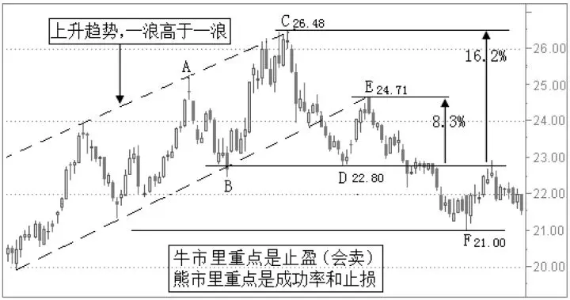

图6\-1 上升趋势与下降趋势涨跌幅度对比

这样看来，在一个上升趋势中，投资的成功率远大于下跌趋势，而且采取的止盈幅度也应该远大于下跌趋势。相反，在一个下跌趋势里，如果采用与牛市相同的止盈标准，那么投资的成功率就会非常低。如果采用同样的止盈标准，在牛市中就会降低资金的使用效率，在熊市中会出现达不到目标的情况。

对于止损幅度的控制，在牛市和熊市中采用的方法也存在很大的区别。牛市中，因为主体趋势向上，股价回调受到趋势的限制，只要趋势不变，股价仍然有回升的机会，因此在牛市中的止损一般采取两种方式，一种是采取短线的快速止损，止损幅度较小，如果投资者仍然关注该股，可以在适当的时候再补回来。另一种是在重要的支撑位下方设置止损，该止损位在市场趋势发生变化时才会触发指令。

在熊市里，除了止盈的幅度要缩小外，止损的幅度也应该缩小，并且坚定不移地执行，这是因为市场的总体趋势是向下的，每一轮跌幅一般来说都会大于涨幅，下跌的概率大于上涨的概率。如果熊市里的止损幅度采用与牛市同样的策略，止损幅度过高，则损失过大，但是止损幅度也不能过低，否则很容易触发止损指令。具体止损幅度，要看市场前一轮下跌的时空和下方支撑力度的大小，以及次级趋势的反转信号强弱。

总而言之，在投资过程中，如何把握成功率与止损止盈的关系，应该根据市场的特性来区别对待。在牛市中，应该重点把握止盈，也就是让利润最大限度地成长。在熊市里则重点把握成功率和止损，不要轻易入市。入市就要制定严格的止损计划，并坚决执行。

__二、交易次数与止损止盈的关系__

大家都知道，市场的运行趋势分为不同的级别，波浪理论归纳为主要趋势、次级趋势和小趋势。

波浪理论认为，一个完整的股市运行周期由八浪组成，即上升趋势中的五浪和下跌趋势中的三浪。上升趋势中的五浪里有三个上涨推动浪，分别是第1、3、5浪；有两个调整浪，即第2和第4浪。推动浪的运行方向与主趋势方向保持一致，调整浪的方向与主趋势方向相反。如图6\-2所示。

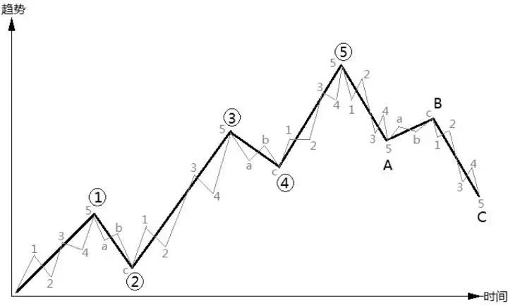

图6\-2 波浪理论示意图

图中，①至⑤和A、B、C是一个完整周期的波浪形态。每一个大波浪中，还包含一个小波浪。比如上升趋势中②至③的第3浪推动浪，它又由一个完整的次级8浪组成，c\-1、2\-3、4\-5、a\-b四个上涨阶段，1\-2、3\-4和5\-a、b\-c四个下跌阶段（调整）。

同样，在主要趋势的下跌趋势中，也包含着次级波浪结构，其中有上涨（反弹）和下跌。根据市场的这种运行规律，在投资操作中就产生了不同的投资周期。中长线投资者会关注主要趋势，比如他们会在位置②甚至更低的底部位置买入，并一直持有，直到市场上涨到⑤以后，完成整个大的波浪结构再进行止盈。中长线投资者一般不会参与一个主趋势下跌阶段的投资活动。

中线投资者则会根据波浪结构的特征，尽量抓住每一个上涨波段，在该波段出现头部后卖出，然后在调整浪完成后重新回到市场。比如，在②至③之间的较低位置买入，在③附近卖出，然后又在④之后买入，在⑤附近卖出。同样，在市场处于下跌趋势中，也存在阶段性的次级上涨（反弹），投资者也可以参与，如图中的A\-B阶段。这样的波段操作可以充分利用资金，既回避该股调整带来的损失，也可以将资金用于其他的机会。

但是实际操作中，股价走势并不像波浪理论的波浪结构这么规范，如何判断波浪，如何把握买卖点，是投资者感到迷惑的问题。特别是在熊市里，反弹的高度和时间更是无法预测。同理，短线操作是利用小趋势中的涨跌进行投资，其难度又甚于中线投资。

从波浪结构中可以发现，中长线投资者的交易次数非常少，中线投资者次之，短线交易的机会则很多。从市场的波动幅度看，主要趋势的波动幅度大，如图中的②\-⑤、⑤\-C；次级趋势的波动幅度相对较小，如②\-③、B\-C；小趋势的波幅就远远小于主要趋势的波幅。

这样就得出了交易次数与止损止盈的关系：交易次数与止损止盈成反向关系，即交易次数越少，止盈和止损的幅度越大；交易次数越多，止损止盈的幅度就越有限。下面模拟一个80000元的投资账户在一年里的交易情况，如表6\-2所示。

这个模拟投资分为牛市和熊市。在牛市里的成功率要高于熊市，根据中长线、中线、中短线和短线的交易机会（次数）以及可能达到的止盈目标，并以止盈止损比为2:1来进行投资，以此比较这8种投资的收益情况。

表6\-2 不同投资周期收益情况对比

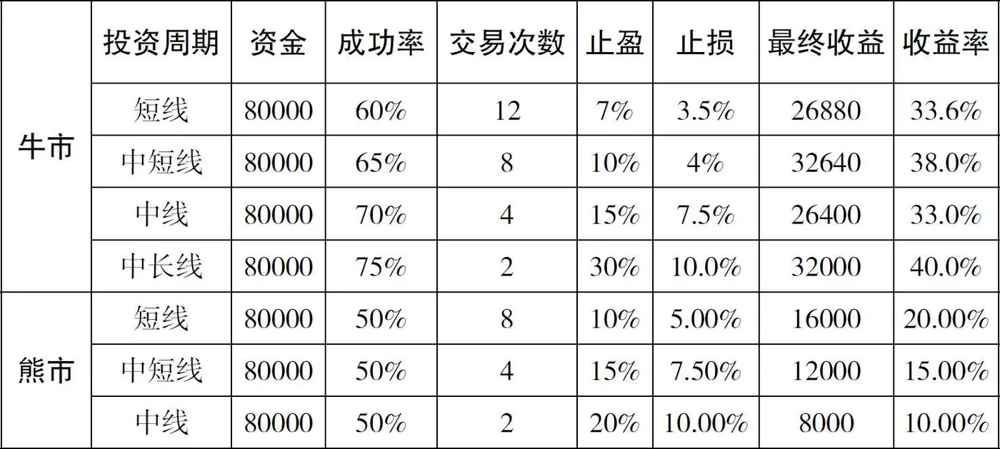

通过对比可以发现，在牛市中，投资8万元，一年以后，中长线投资的收益率最高。也就是说，投资者在牛市中并不需要采取频繁的交易，只要选好股票，耐心持股就可以获得不错的收益。在熊市里，基本不存在中长线交易机会（有极少数个股走出独立行情，在此不作为讨论对象）。如果以50％的成功率来计算，在短线、中短线和中线交易中，短线交易的收益最高。但是在熊市里，投资者并不会将全部资金投入，为了安全，参照中线投资的收益率，可以计算出适用的短线资金。如表6\-3所示。

表6\-3 熊市短线操作投入的资金

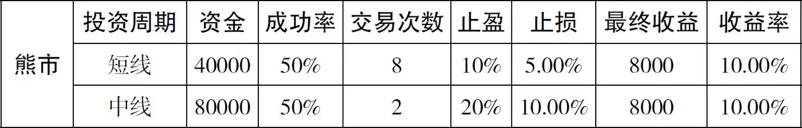

从表中可以看出，我们用50％的资金参与短线交易，采用10％的止盈比率和5％的止损比率，如果一年中存在8次反弹并达到10％以上涨幅的机会，只要抓住其中5次，就可以获得与用全部资金参与2次中级反弹相同的收益。

综上所述，根据交易次数与止盈止损的关系，在实际投资中，可以采用以下策略：牛市集中资金选好个股，进行中长线投资。在熊市里，则采用部分资金进行短线投资，以交易次数换取最终的收益率。当然，以上模拟投资是站在具有一定交易能力的投资者的角度来计算的，如果投资者短线投资能力较弱，则另当别论。

__三、成功投资的流程__

前面对股市的性质、风险与收益、资金管理以及止损止盈等交易技巧做了详细的介绍，最终目的是让我们成为一名成功的股市投资者。下面根据本书的内容，总结一套走向成功的投资流程。如图6\-3所示。

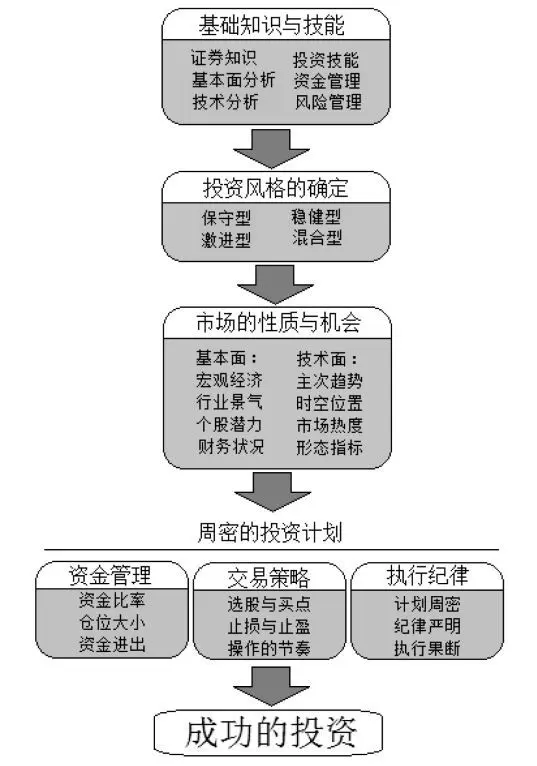

图6\-3 成功的股票投资流程

该流程分为三大步骤，这也是走向成功的最基本步骤，三大步骤并不是截然分开的，而是一个有机的整体，相互之间是一种不断影响和完善的过程。每次投资都需要遵循这样的步骤。

可能有的投资者并没有将自己的操作流程进行总结，实际上或多或少地在按照这些步骤进行投资。如果想成为一名真正成功的投资者，尽可能地提高每次投资的成功率和收益率，那么就应该认真总结一套完整的投资流程，按照投资流程实施每一步操作，并不断地完善自己的投资流程。

基础知识是指学习和掌握必要的股市投资理论知识，以及在实践中摸索的基本交易技巧和对市场的真实看法。基础知识包括股票在内的证券基础知识，股票投资的收益与风险，财务分析等基本面分析方法和技术分析技巧。此外还包括股票交易技巧、风险控制技巧、看盘技巧，对消息性质的辨别和正确认识政策等技巧。

投资风格和市场判断是在有了一定基础知识后，通过对自身的特点进行总结，在实践中摸索出适合自己的投资方法。市场判断是在投资者掌握的理论知识和实践经验之上，判断市场是否存在适合自己的投资机会。

至于资金管理、交易策略和执行纪律，都属于实际操作层面，是落实和实现投资目标的具体管理方法和交易方式。

投资者具备了一定的股票投资基础知识后，根据自己的风险偏好，形成一种具备长期盈利的投资风格，然后根据自己所掌握的知识和能力，判断和寻找市场中的投资机会。一旦机会来临，就可以制定投资计划。

在制定投资计划时，要结合自己的投资风格和对市场的判断，仔细考虑包括投资周期、资金管理方式、选股、止损止盈等内容，尽量做到周密，并在投资过程中严明纪律。

__第二节 股票投资计划书__

__一、什么是股票投资计划书__

股票投资计划书是指投资者为完成一定时间内的投资目标，以及防止投资过程中的风险，所制定的措施、方法和步骤。

股票投资计划可以是正规的书面文本，也可以是简单明了的便笺。对于那些致力于将股票投资作为一项重要投资项目的投资者来说，为更好地执行投资计划，有利于以后的评估和总结，建议采用正规的书面文本方式为好。

__二、投资计划书的重要性__

有些投资者认为，股票投资并不像实体生意那样复杂，根本不需要什么投资计划书，这种观点是非常错误的。你可以在一次或两次的冲动性投资中获利，但你会在多次冲动性投资后亏损。如果想成为一名成功的股票投资者，就绝不会冲动地进行漫无目的的交易。成功的股票交易者，在交易前都会制定交易计划，以帮助自己辨识交易机会，控制风险。制定和执行投资计划，是交易成功的重要组成部分。

投资计划是承上启下的桥梁，它将投资理念和投资策略及投资风格转换为实际投资的操作性内容，也是具体操作中的指导性和纪律性文件。每个投资者的投资水平如何，都能够从投资计划书中反映出来。

对于大户、中户和小散户等不同等级的投资者来说，投资计划书的复杂程度可能不一样，但重要性是一样的。大资金运作考虑的问题更加全面，包括资金来源、宏观经济、行业调研到上市公司现场调研等。大资金可能花费几个月甚至几年的时间去投资某些上市公司，比如巴菲特。小散户当然无需这样大动干戈，但最基本的投资计划一定要制定。

预则立，不预则废。制定周密的投资计划，是股市盈利的重要保证。在股票市场上，很多投资者亏钱的原因就是随波逐流，缺乏有效合理的投资计划。没有计划就会被人性弱点击败，该止盈的时候贪得无厌，该止损的时候优柔寡断，结果就是资金不断缩水，最终只能悲愤地离开股市。

有许多投资者认为自己的资金少，采用短线投资，因此无需制定投资计划。这是一个认识误区。

首先，资金多少并不能影响投资获利的目的。即使资金再少，投资者到股市投资也是为了赚钱，不是做慈善事业。既然要赚钱，与资金量的大小又有什么关系呢？

其次，投资周期的长短，与制定投资计划并不矛盾。如果说投资周期对制定投资计划有影响，这种影响表现在制定计划的内容里。资金量的大小和投资周期的长短是影响投资计划的因素之一，投资计划会受到这些因素的影响。

__三、投资计划书的内容__

从投资规模看，投资计划有单次单股投资计划，这是针对某一次投资某一只股票的投资计划。也有单次组合投资的投资计划，这是针对某一次投资几只股票组合的投资计划。从投资周期看，投资计划可以分为年度投资计划以及其他时间周期的投资计划。

股票投资计划并没有一个固定的格式，因人而异，因时而异，也因事而异。不过围绕投资计划的目的，制定投资计划有以下一些要点。

__1．了解自己__

①心理素质。 投资者的心理素质如何，能够承受什么样的亏损，对盈利的期望值有多大；股评、消息等周围环境，是否影响投资者的实际操作决策；执行纪律性的强弱，等等。

②个人财务状况。 股票市场是高风险投资场所，要根据个人的财务状况量力而行，且不可超出自己及家庭的承受能力，否则不仅影响日常生活，而且还会影响投资者的投资决策和判断力。

③投资风格。 制定投资计划需要适合自己的投资风格和个性。每个投资者都有不同的盈利模式，投资者的盈利模式主要包括价值投资还是交易型投资，是适合中长线还是中短线投资，采用的分析手段主要有哪些，等等。制定适合自己个性的投资计划，才能切实有效地执行。

④知识结构和投资能力。 投资者的知识结构，可以帮助投资者选择投资的方向。尽量选择自己熟悉的投资项目，可以充分利用自己已有的专业知识和经验。

__2．了解市场和预判市场__

要做好投资计划，首先要了解当前市场的性质、大盘的性质和个股的性质，其次要在了解市场的基础上预见市场。虽然市场是不以投资者的意愿而转移的，但投资者可以对宏观经济走势、经济政策导向、行业与个股基本情况，以及大盘与个股发展趋势来预判市场。在分析预判市场时，尽可能考虑未来不同行情发展的可能性，并针对这些可能制定预案。

__3．投资计划要清晰明确，具有程序性__

投资计划是指导具体操作的纲领性文件，要尽量采用简单、清晰和明确的指令性描述，在以后的投资交易过程中能够按照计划进行程序性操作。

市场是多变的，允许在制定投资计划时设置一定范围或多种选项，但是必须附加触发条件。比如在制定止盈时，可以设置某一获利点作为基点，但并不一定要在该点止盈，附加条件是市场仍然存在很大的上涨机会。

__4．从严控制风险__

控制风险是投资计划的重中之重，多思考分析，多制定不同情况下的预案，制定的执行计划要比盈利计划更加严格具体，一定要有可操作性。资金管理方式和止损止盈标准是控制风险计划的必备内容。

__5．可用资金情况__

可用资金情况包括可用资金量的大小、资金来源和可使用时间。资金情况还应该考虑个人或家庭的财务状况，用于股票投资的资金是否会影响个人或家庭生活，影响有多大。

__6．交易策略__

交易策略是投资计划的主要内容，主要包括以下几个方面。

①投资周期。 本次投资的整体时间有多长，完成本次整体投资计划为止的时间。比如说投资计划确定的时间周期为1年，那么在这一年中可以有一次或多次交易，也可以有空仓的时间。有的投资者自从进入股市后，从来就没有空仓过。在A股市场没有做空的机制下，说明这类投资者永远看多，这显然是不对的。如果不是价值型的长期投资者，而是以差价为主要获利渠道的交易型投资者，这种做法是不妥的，说明该投资者的投资思路有偏差，需要修正。

②可承受的亏损。 在整体投资和每次交易中，投资者可以承受的损失是多少。

③交易周期。 为了与前面的投资周期区分开，我们用交易周期来表示每一次操作的交易周期，即某次交易从买入到卖出的时间，可以用长线、中线或短线来描述。

④分析工具。 可分为主要分析工具和辅助分析工具，也就是在分析市场时，采用哪种或哪几种分析工具，以哪些工具发出的市场信号为主要操作信号。比如，在分析市场趋势时，以均线作为主要分析工具，兼顾布林线和趋势线；在分析市场转折点时，以K线形态、成交量和空间位置为主要分析工具，兼顾KDJ等指标，等等。

⑤入市条件。 即制定参与投资的准入条件，只有达到这些条件后才能参与投资，买入股票，比如趋势、价位等。

⑥资金管理方法。 在投资过程中采用什么样的资金管理方法，如前面所介绍的金字塔模型、倒金字塔模型、三三制或凯利公式等，也可以建立自己的特定管理模型。

⑦止损与止盈。 根据可以承受的亏损制定止损的方法，确定每次交易的止损价位或止损条件。对于止盈，可以先制定一个止盈基准线，再看市场当时的走势。如果市场仍有上涨动力，可以采用动态止盈方法。如果市场表现不如预期，也没必要死搬硬套地等待股价达到止盈基线。

⑧计划调整。 制定的计划不可能一成不变，要不断地调整和完善。制定好初步的交易方案后，可以计算这种方案的盈利和亏损情况，并依据投资目标和亏损承受能力进行调整。调整可以从两个方面进行，一是分析投资目标是否与实际情况相符合，如果收益预期过高，就需要调低；二是在投资目标合理的情况下，调整资金管理方式、建仓买入方式、止损与止盈标准等交易策略，直至制定出能够达到投资目标的合理交易策略。值得提醒的是，调整交易策略的前提是必须合理，有较好的操作性和执行性。

__7．执行纪律__

制定投资计划的目的是落实投资策略，以达到投资目标，因此严格执行投资计划的纪律是必不可少的。制定计划时越周密，执行时就越有信心，这就是为什么在制定投资计划时强调可操作性的原因。一旦计划制定完毕，就需要严明执行纪律，这就是投资计划的程序性。

__8．投资总结__

投资总结有投资计划完成之后的总体总结，还有平时的便笺式总结，以及记录某次或某一段时间里对市场和投资的看法及心得。遇到重要的事情，可以以便笺的形式记录下来，贴到电脑前，提醒自己注意。

以上这些基本上概括了普通投资者所需的投资计划内容。根据这些内容，投资者可以撰写一份简明扼要的投资计划，也可以根据需要对这些内容进行删减或添加。

__第三节 资金账户的监控和分析__

__一、监控账户的意义__

股票账户是指投资者在券商处开设的进行股票交易的账户。开立股票账户是投资者进入股市进行投资的先决条件。对投资账户进行监控，是投资过程中必不可少的环节，特别是对于那些将股票投资作为重要投资项目的投资者。

监控账户的目的主要有以下几项。

①了解投资结果是否符合预期。 通过监控账户，一是知道投资的绝对结果，即是赚还是赔；二是与大盘进行比较，看自己的投资效果是强于大盘还是弱于大盘；三是监控投资的总体结果是否在预期范围之内，距离盈利目标和止损标准有多大的距离。

②随时掌握资产结构状况。 在投资过程中，资产和资产结构随着股市的涨跌而发生改变，有的股票因股价上涨，仓位比率也随之上升，反之则下降。另外，股票账户里的资金也会发生进出，无论是资金转入或转出，都会对资金结构产生影响。这样就需要我们及时和准确地掌握自己的资产结构，以便为资金管理和风险控制提供基本的信息。

③发现问题，及时调整投资策略。 监控资金账户的另外一个重要内容，是对账户进行跟踪分析，根据投资效果采取适当的调整措施。股市的变化经常出乎人们的意料，经常看股评的人都知道，任何时候，无论是投资机构还是著名的股评家，都会出现截然相反的观点，普通投资者都不知道听谁的好。正是这种不确定性，才要求我们对自己的投资进行监控。

可以将自己的资产指数和个股走势像对待大盘指数或个股走势一样进行分析，如果投资结果已经达到了投资总体预期，是否进行止盈？如果投资出现问题，达到了亏损临界线，是否采取止损操作？如果是以组合形式投资，那么组合中的个股表现如何？哪些可以止盈？哪些需要止损？这些问题都可以通过账户监控得到重要的信息。比如需要调仓换股时，我们可以根据当前的资金结构，对组合中的个股进行止盈（全部或部分），或降低表现不佳的个股仓位比率，增加更有潜力个股的投入。

④总结研究自己的投资策略和技巧。 在对资金账户进行监控分析的同时，需要定期总结投资的经验和教训。首先是看整体的投资效果，如果好于预期，那么成功在哪里，以后能否继续发扬。如果差于预期，缺陷又在什么地方，下次如何纠正这种错误，这都是需要总结的问题。

__二、账户监控的方法__

监控股票账户，并不是说时时刻刻紧盯股票账户，这样做既没有必要，也浪费时间。

监控账户的途径和方法有多种，大多数证券公司提供的软件里，账户信息属于较综合的信息，无法满足投资者深度分析的需要，或者需要交纳一定费用才能使用。其实投资者可以使用电子表格编辑适合自己特色的账户监控方法，制定自己的“资产指数”和投资组合个股折算指数，并与大盘指数等进行对比，以观察自己的总资产和组合资产相对于大盘指数的走势情况，从而达到监控投资效果和分析资产结构的目的，从而决定是否采取止损或止盈操作。

制作资产指数很简单，将资金账户与大盘指数（以上证指数为例）转换成统一起步的基点位置，既可以将资产和大盘指数同时转换成某一整数（如1000点），也可以只将资产数字转换为与指数相同的数字，这样就可以从投资的那一天开始同步对比资产与大盘指数的变化情况。下面用一个实战案例来简单介绍一下这种方法。

案例：熊市掘金——贵州茅台、同仁堂、乐视网

__1．确定股市性质__

对于股市当前性质的判断，可以从基本面和技术面两个方面进行判断。

2012年新年伊始，国际经济形势并没有出现新气象。虽然各国政府采取了许多提振经济的政策和办法，但整体经济仍然处于衰退中。美国经济有了见底的迹象，但以欧洲经济为代表的国际经济形势，仍然存在许多不确定因素。中国的经济也受到国际环境的较大影响，靠投资、外贸和消费拉动的三驾马车，都出现不同程度的乏力，特别是外贸受到的影响非常大。我国政府为了刺激经济企稳，只能加大内需投资和国内消费，一系列的刺激措施应该会对股市产生一定影响，但估计影响有限，并且只能刺激局部行业和板块。从股票投资角度看，包括医药、食品饮料、文化振兴、国家扶持的高科技产业、节能环保等行业会首先受益，而传统的周期性行业仍然摆脱不了经济衰退的制约，这类股票仍然存在较大风险。

从技术面分析，可以看上证指数的周K线图，如图6\-4和图6\-5所示。图6\-4是上证指数2005年6月3日至2012年2月10日的周K线图，图6\-5是上证指数2011年1月21日至2月10日的周K线放大图。

图6\-4可以反映一个较长期的运行趋势。从2005年6月创下的阶段性最低点998\.32点和2008年10月的低点1664\.93连线，这条线可以看做是一条重要的参考线。在上方，自历史高点6124\.04点下来，创出低点“2”后进行反弹，形成高点B后，市场开始向下逐级下跌，与下面的支撑线形成了一个三角形整理形态。但是该形态在图中4的位置出现了向下跌破三角形整理的迹象。如果市场在长期整理中表现出相对较强的势态，一般情况下是不会让股价跌破支撑线的，也就是说市场表现相对较弱。

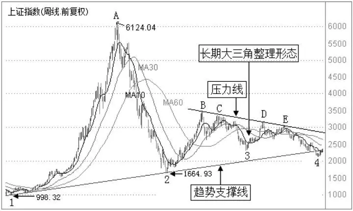

图6\-4 上证指数2005年6月3日至2012年2月10日的周K线图

不过从图6\-5中还是看到了一线希望，上证指数在跌破支撑线后出现了止跌信号，K线连续出现两根十字线，成交量出现地量，接着出现一根底部吞没形态，并且连收出4根阳线，成交量也连续放大，MACD形成了一个金叉。这些信号告诉投资者，市场起码会出现反弹。当然此时没有任何信号可以判断市场会出现反转，因为反转必须要等宏观经济基本面的支持才会出现。

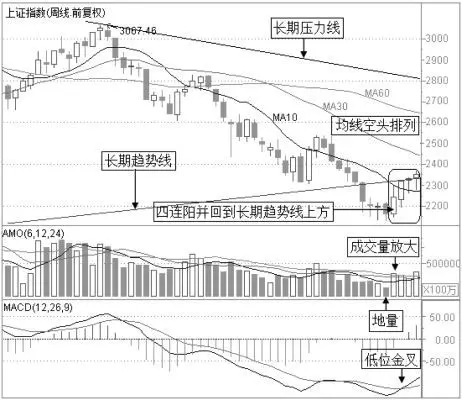

图6\-5 上证指数2011年1月21日至2月10日的周K线图

根据对股市环境和大盘趋势的判断，可以得出这样的结论：由于宏观经济没有好转，股市处于下降趋势，也就是说目前股市仍然是熊市时期。

__2．投资策略__

根据以上对股市性质的判断，风险大于收益，似乎没有投资的机会。从整体市场看，这种结论是正确的，一般投资者应采取规避态度，尽量减少投资。

但是从局部看，股市投资机会还是存在的，这些机会来源于两个方面，一方面是真正的成长性企业，它们的基本面并不受宏观经济的影响，或者是影响很小，并且它们的市场走势脱离于大盘，能够走出独立的行情，这些企业仍然值得投资者关注。另一方面是抓住市场中的次级反弹行情，采取中短线的交易策略谨慎参与。

不过股市毕竟仍然处于熊市中，因此总体投资策略应该保守一些，投入资金、投资品种、操作方式都应以熊市思维为主，控制风险是首要任务。

__3．资金注入__

根据投资策略，本次投资的资金使用无负担的闲散资金，注入股票账户50万元。当然，这并不是表示50万元一定要用于直接投资，全部买入股票，只是说明这笔款项可以根据市场情况随时调用。

资金注入是实施资金管理和风险控制的第一道关卡。一般来讲，在熊市中，存放在股票资金账户里的资金应该是牛市时期的1/3以下，并且这些资金不会引发其他财务和精神负担。

__4．选股和交易分析__

组合一：贵州茅台（600519）

①投资分析。

根据上面对股市性质的分析及投资策略，我们选择了受经济周期影响较小的消费类个股贵州茅台，作为一个中长线的投资品种。因为该股是A股市场中价值投资的代表，无论从公司的市场地位、财务状况还是股价技术走势来看，都值得价值投资者关注。

基本面分析：对该股的基本面分析在这里不一一展开，有兴趣的投资者可以查阅拙作《股票投资的24个关键财务指标》中对该股的基本面分析。

技术分析：因为有强有力的基本面支撑，贵州茅台才能够脱离大盘熊市的束缚，仍然保持稳定上涨的趋势。图6\-6是2010年4月至2012年2月贵州茅台与上证指数的周K线对比走势图。当贵州茅台回调到MA60（年线）位置受到支撑后，在174\.68元进行了首次建仓。

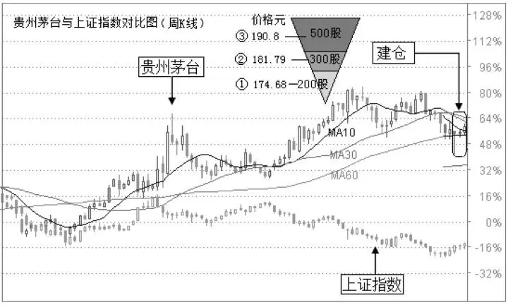

图6\-62010年4月至2012年2月贵州茅台与上证指数的周K线对比走势图

②投资周期： 1年。

③资金比率： 低于40％，即20万元以下。

④收益预期： 25％。根据该股的一贯表现和上涨趋势，一年时间里的价格波动应该在150元至250元之间，我们选择接近该股上升通道的上轨线附近，即240元作为目标价格。如果平均持仓成本为190元，那么收益应该是26\.3％。

⑤可承受亏损： 20％。如果按持仓成本190元计算，止损价格为152元。

⑥交易周期： 中长线持有。

⑦入市条件： 该股基本面仍然保持良好，并且股价回调到年线附近。

⑧资金管理方法： 大仓位比率低于40％，采用倒金字塔方式建仓。首次建仓可以根据市场短期走势，在股价回调过程中寻找相应低价买入，买入数量为200股；如果该股能够继续走稳，短线回到上涨趋势中，则继续加仓，加仓数量分别为300股和500股。最后一次加仓条件是确认该股完成调整，参看图6\-6。

⑨止损与止盈： 第一次买入建仓的止损以该股的技术走势为准，如果该股在以后的走势中连续3周跌破年线，或者亏损超过15％，则止损。如果发生这种情况，则该股的技术走势不符合预期，该投资计划需要重新制定。如果市场符合预期，建仓完毕后，止损条件以年线为基准，有效跌破年线则止损，止损位置也就是图6\-6周K线图中的M60位置。第一种触发止损的条件是股价连续3周K线跌破年线，并且低点逐步降低；第二种触发止损条件是股价跌破年线15％。止盈方法采用动态止盈，如果股价能够达到目标价位240元，市场仍然保持向上趋势，则持有；如果出现顶部反转，则即时止盈。

实际情况：该股符合预期，在2012年7月18日成功止盈，卖出价为248元，达到投资预期，提前完成投资计划。

组合二：同仁堂（600085）

①投资分析： 以技术分析为主，兼顾个股的基本面变化。

基本面分析：与贵州茅台类似，同仁堂也属于受经济周期影响较小的泛消费类个股。同仁堂为中药老字号，国内医药龙头之一。图6\-7是同仁堂近5年来的主营业收入增长率、净资产报酬率及利润增长率的柱状图。从图中可以明显看出，该公司业绩连年稳定增长，因此基本面不存在问题。

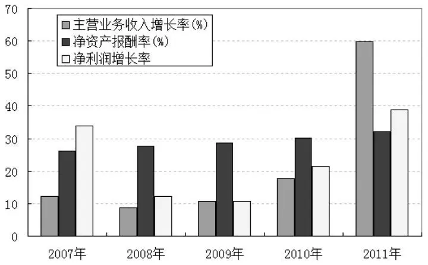

图6\-7 同仁堂关键财务指标柱状图

选择该股的另外一个原因是当前政策对该行业大力支持，根据国家对生物制药产业的政策，特别是中药发展规划，“十二五”期间生物医药总产值年均增长20％，到2015年达到3\.1万亿元，无疑给产业带来极大利好。作为中药龙头公司，同仁堂应该在该利好刺激下有一轮中级行情。

技术分析：图6\-8是同仁堂月K线、周K线与日K线组合分析图。该股整体走势仍然保持上升趋势，从月K线和周K线的均线系统可以看出来。该股突破前期历史高点后进入一个较长时间的横盘整理，从周K线来看，整个整理形态属于比较复杂的复合型整理形态。为了寻找合适的买入点，我们对该股的整理区间进行划分，如图中的“整理区顶部”和“整理区底部”。如果股价接近底部区域，则可以考虑买入。

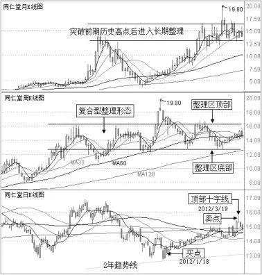

图6\-8 同仁堂月K线、周K线与日K线组合分析图

②投资周期： 小于90天。

③资金比率： 低于20％，即10万元以下。

④收益预期： 20％。

⑤交易周期： 中短线交易。

⑦入市条件： 股价接近整理区底部位置，即13\.00元附近。

⑧资金管理方法： 大仓位比率低于20％，即6000股，一次性建仓。

⑨止损与止盈： 按百分比止损，如果亏损达到10％，则无条件止损。止盈方式以重要的技术信号为指令，如果市场出现重要的看跌信号，则止盈。

实际情况：如图6\-8中的日K线走势所示，在2012年1月18日买入，价格为13\.26元。2012年3月19日卖出，卖出价格为15\.34元。投资获利15％，低于预期。止盈原因是当时大盘出现较大幅度下跌，该股也出现了重要的顶部十字线K线形态。后来该股并没有随大盘下跌，经过一段时间的抵抗性横盘后，展开了一轮较大幅度的上涨，2012年7月12日创出历史第二新高19\.28元。时间总是能揭开神秘的面纱，虽然在15\.34元就提前离场，但作为成熟的投资者，不应该为此感到后悔，因为在神秘的面纱揭开以前，我们无法知道面纱后面是什么，只能通过分析方法来比较风险与收益的关系。在风险程度增大时，保证既得利益仍是上策。

组合三：乐视网（300104）

①投资分析： 乐视网属于高风险的创业板块，所谓“高风险，高收益”。投资该股既然承担了较高的风险，那么就应该有较好的收益预期与其相匹配。选择该股的重要原因在于国家政策对文化振兴产业的呵护。该上市公司近几年成长业绩乐观，并且近期公司先后与央视国际网络有限公司、网易等著名企业签订了战略性合作协议，这给乐视网未来发展提供了较大的空间。

进行技术分析时，主要结合中期趋势分析、成交量分析，以及SAR抛物线指标来寻找交易机会。图6\-9是乐视网2010年8月13日至2012年2月10日的周K线图。

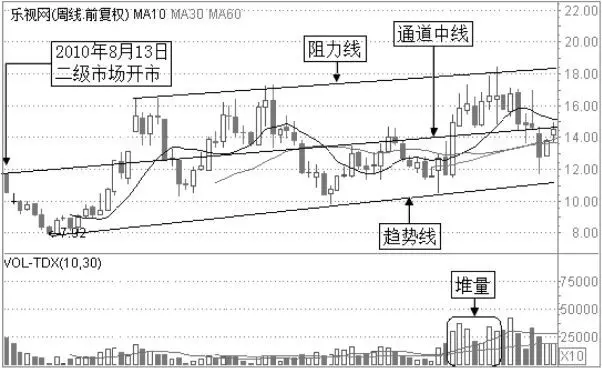

图6\-9 乐视网2010年8月13日至2012年2月10日的周K线图

该股自2010年8月13日上市交易后，其走势一直保持在向上倾斜的旗形整理形态中运行。在整理过程中，自2011年10月底，该股成交量出现了明显变化，出现底部堆量形态，这显示有主力资金开始进场，该股整理基本结束，预示有一轮行情出现。

下面再来看该股的日K线图，图6\-10是乐视网2011年11月11日至3月14日的日K线图。我们的关注点是图中2012年2月8日附近的走势。通过对该股的周K线分析，了解该股的大趋势，并且从技术面上预判该股存在一轮中级以上的行情。一般主力资金经过一次建仓后，为了减少后期拉升过程中的散盘抛盘压力，会进行一次甚至几次洗盘，这样我们就可以在相应的低位买到股票。

图6\-10中，股价回调到趋势线附近时，出现了一个重要的看涨启明星K线形态，随后股价小幅向上。2012年2月8日，股价向上突破半年线，SAR抛物线指标发出了买入信号，此时是比较好的介入机会。

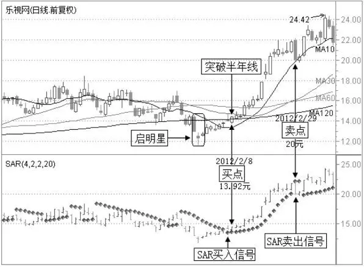

图6\-10 乐视网2011年11月11日至3月14日的日K线图

②投资周期： 30天。

③资金比率： 10％，即7\.5万元。

④收益预期： 股价18元，25％。

⑤交易周期： 中短线交易。

⑦入市条件： 股价接近整理区中线下方，即14\.20元下方。

⑧资金管理方法： 仓位比率低于15％，即5000股，一次性建仓。

⑨止损与止盈： 以SAR指标作为止损止盈信号。如果SAR指标出现卖出信号，再止损或止盈。关于SAR指标的使用，可以参考前面的讲解。

实际情况：SAR指标发出买入信号的第二天，股价突破半年线，于是一次性买入5000股，买入价13\.98元。2012年2月29日，SAR指标发出了卖出信号，当天卖出全部股票，卖出价为20\.00元，获利43％。

__5．交易记录表__

我们用Excel表格对以上的交易进行了记录，如表6\-4所示。

下面回顾一下整个投资交易过程，看一下从2012年1月16日到2012年3月30日的资产变化情况。

账户的起步资金为50万元。2012年初，虽然大盘出现了反弹，但仍然处于下降的长期熊市中，因此这段交易以防御为主。1月16日开仓，买入了独立于大盘走势的贵州茅台200股，计划共买入1000股作为中长线投资。1月18日买入了另一个防御品种同仁堂医药股6000股，作为中线投资，以大盘反弹趋势和个股走势确定止损与止盈。2月8日，由于大盘反弹突破MA60，MA10与MA30形成多头走势，故参与了热点板块文化传媒的短线炒作，买入5000股，并在两周后卖出。3月19日卖出了同仁堂全部股票。

表6\-42012年初交易记录

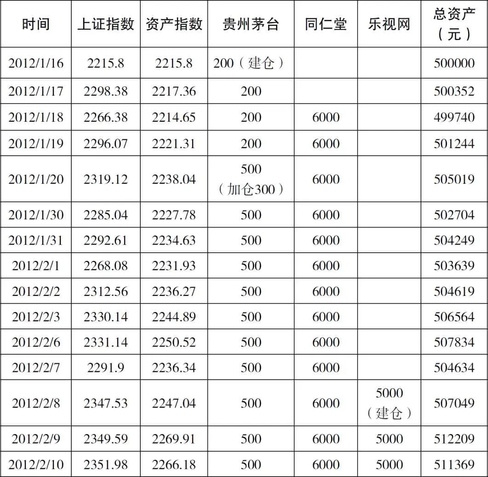

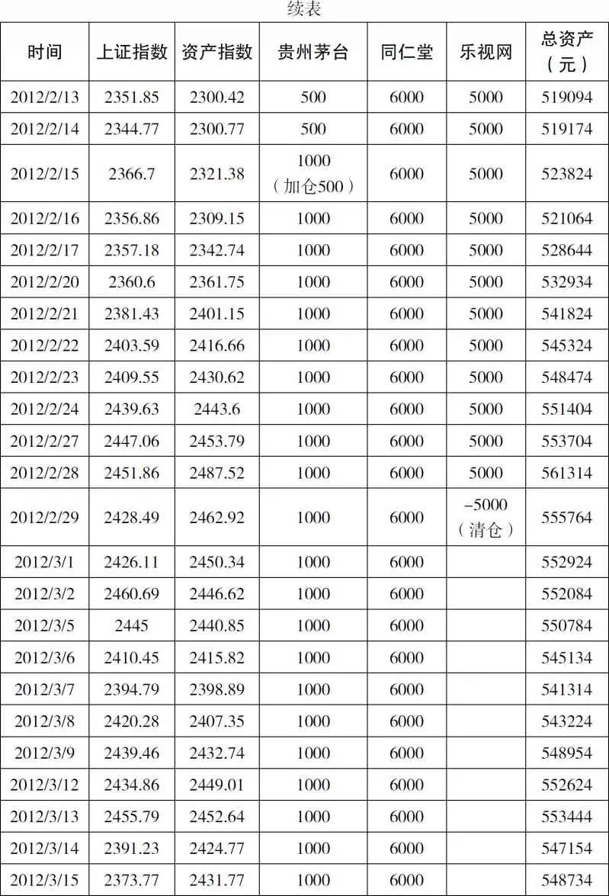

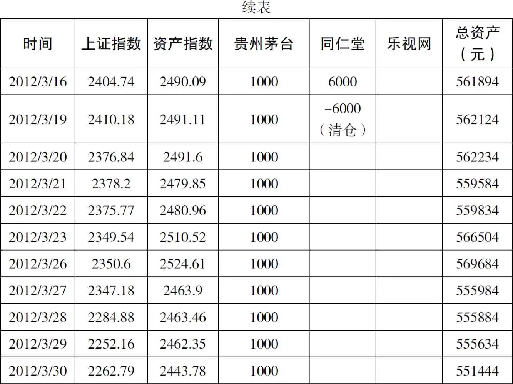

表6\-4中的资产指数，是将首日资产50万元转换为与上证指数相同数值2215\.80，即500000÷2215\.80＝225\.65，反运算500000÷225\.65＝2215\.80。在以后的运算中，都是将当日收盘时的资产总值除以225\.65，得到当日收盘的资产指数。再利用电子表格的图表制作功能，得到资产指数与上证指数对比走势图，如图6\-11所示。

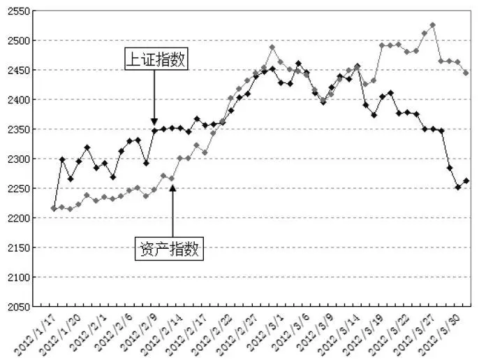

图6\-11 资产指数与上证指数对比走势图

这样就可以从图中很清楚地了解当前和历史资产的走势变化情况。

从投资首日开始，资产基本都处于上升趋势，即盈利状态，但开始一段时间资产指数走势并不理想，明显弱于上证指数。2012年2月20日以后，资产指数超过上证指数。当大盘大幅下跌时，资产指数仍然能够保持在高位。当上证指数几乎回到起点位置时，资产指数仍然保持在高位，有10％的获利，这得益于采用了熊市防守投资策略，以白马股贵州茅台为中长期投资，防守型医药股为中线投资，热点股为短线投资进行操作。

也许有的投资者对这种收益并不在乎，认为两个月的时间里只获得了10％的收益，这点收益显得微不足道。但是作为一名稳健的长期在股市中生存的投资者，最重要的是获取稳定的收益，在熊市中能有10％的收益，已经算是非常成功了。随着时间的延长和积累，这种收益最终会达到让那些“不在乎”的人感到羡慕的程度。如果将贵州茅台2012年7月18日卖出后的结果统计进去，那么实际获利为62324元，总体收益率达到了21％。

以上表格还记录了仓位比例，也是用电子表格自动生成的，它可以显示账户资产每一时间点的构成比例情况。图6\-12是该账户两个时间点的资金仓位分布情况。

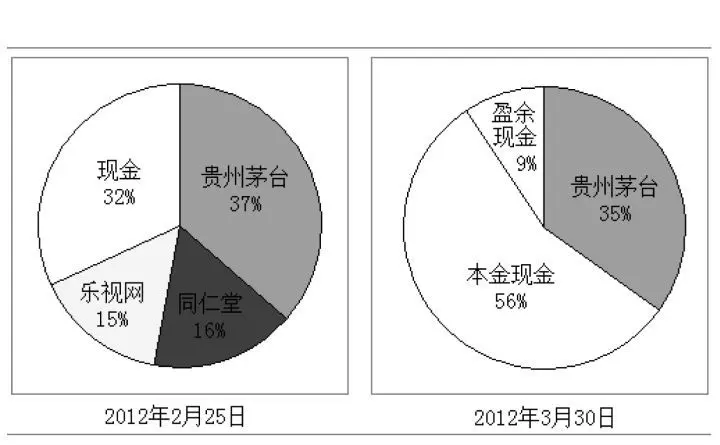

图6\-12 资金账户结构分布图

图6\-12中，左图是该账户总仓位比重最大的时间，此时投入了68％的总资金，属于较高的仓位。从投资组合看，该组合偏向稳健，因为现金和风险较小的股票占绝大部分，只有15％的仓位为风险较高的投资。右图中显示资产中只有贵州茅台占有35％的仓位，65％的现金中包括56％的本金和获取的9％的盈利现金。

实际上，整个Excel表格中还包括了每一只个股的账户信息。表6\-5是投资乐视网的记录。

表6\-5 乐视网（300104）个股监控表

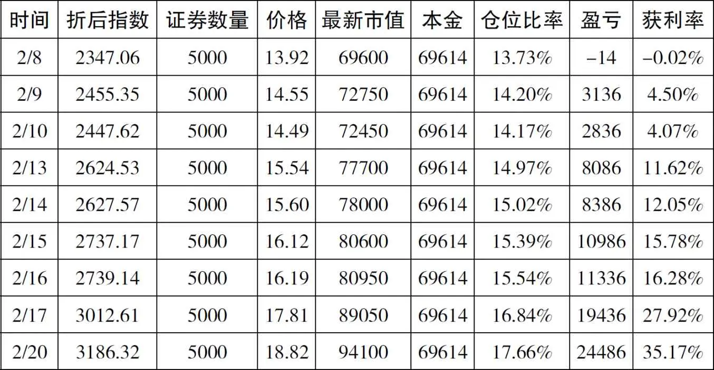

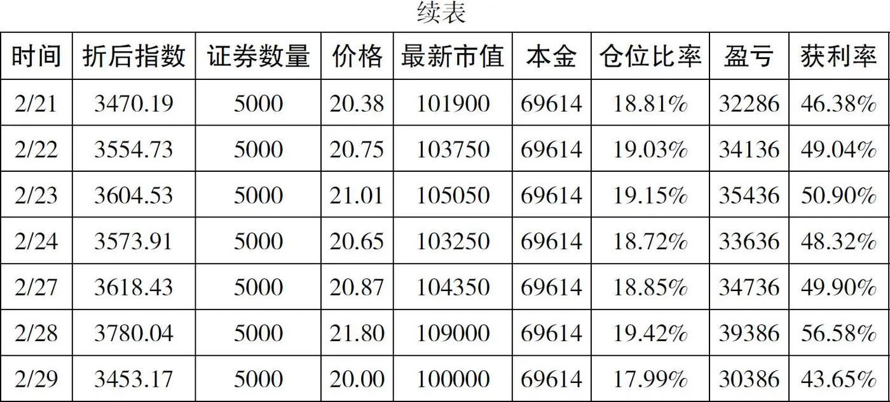

也可以将投资组合中的每只个股，按照前面介绍的计算方法，折算出与上证指数相对应的数值，并用Excel表格自动生成折线图，这样就可以得到投资组合中每一只个股与上证指数、资产指数的对比走势图，如图6\-13所示。

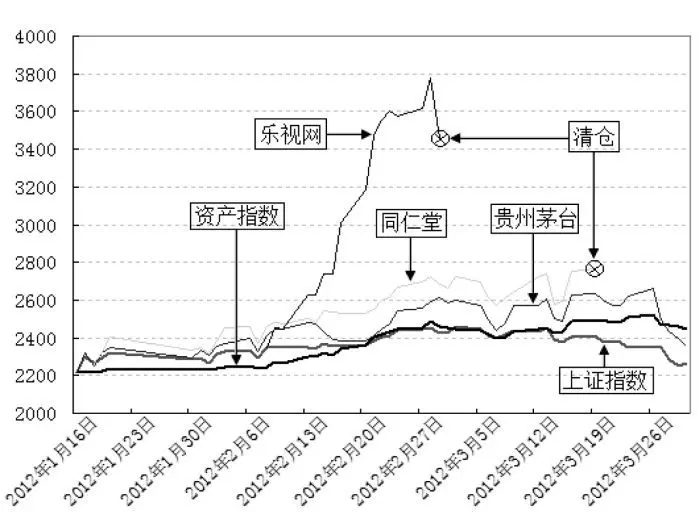

图6\-13 个股指数与上证指数、资产指数对比走势图

表6\-6是截至2012年3月30日的组合收益对比表。

表6\-6 组合收益对比表

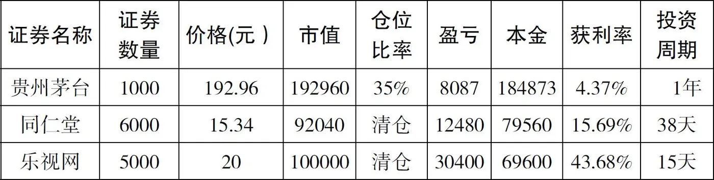

从图6\-13和表6\-6中可以很明显地看出，短线投资品种乐视网投资最成功，作为长线投资的贵州茅台收益率最低，这也符合“高风险高收益”的投资理念。

通过以上组合投资案例，相信读者已经对投资的整个过程有了一定的了解。整个投资过程不外乎就是下面一些内容。

①判断股市的整体市场性质，确定是否适合投资，或者适合什么样的投资。

②根据对市场性质的判断，确定投资收益与风险的关系。

③根据风险与收益的关系，决定投入资金的数量。

④选择适合自己投资风格和满足市场性质的个股。

⑤确定入市条件，尽量在低位买进股票，不要追涨。

⑥制定好止损与止盈标准。

⑦做好交易记录等账户监控工作。

⑧总结投资经验与教训。

__本章小结__

投资失败和成功都有各自不同的理由，能够在股市中笑到最后的成功者，他们都有一个共同的特点，那就是都经历过并且一直不间断地摸索股票投资的成功策略。

成功的策略来源于“学习→实践→总结→再学习”这个循环过程，每完成一次循环后，投资能力就会上一个台阶，投资策略就会进一步完善。成功的股市投资者，都经历了学习基础知识和投资技巧、形成投资风格、提高市场分析和捕捉盈利机会的能力、制定投资计划以及在交易过程中培养执行能力这么一个过程。

投资能否获得成功，主要受到四个因素的直接影响，一是成功率，二是交易次数，三是止盈与止损的幅度，四是交易资金量。它们之间相互促进，也相互制约，处理好它们之间的关系，是获得成功的关键。

投资计划书不仅是帮助投资者理顺这四者关系的重要手段，也是落实投资策略、明确交易指令的流程表，同时也是约束投资者规范交易的条例。投资计划书既可以简单，也可以复杂，主要是列出投资理由、投资目标、投资风险以及达到目标和控制风险的策略，并具体制定资金管理方式，以及建仓和加仓、减仓和平仓、止损与止盈的具体标准和方法。

监控账户是投资者了解自己投资效果的一项基本内容，它可以告诉投资者交易成绩是否符合预期，账户是否有异常变动，提醒投资者采取适当的调整策略，确保账户资金能够持续稳定地增长。
