# 《林奇 一本书看透价值投资》全文合订版

> 共88个章节。原章节顺序、段落结构和图表均予以保留。

## 推荐序

推荐序

2019年12月，我陪本书的两位作者林总和何老师去广州出差，闲聊时说，很希望他们把近年写的一些文章整理一下，结集成书。

这个想法源于我感觉A股一轮大周期的上涨行情要开始了，而他们写的那些文章能很好地帮助大家把握这一轮行情。

为什么要做投资？因为钱在贬值。最近有首歌，名叫《一元钱》：“我在马路边，捡到一元钱……”而在20世纪90年代，这首歌名叫《一分钱》。

短短30年，一分钱变成了一元钱，大家心目中的“小零钱”整整翻了100倍。

2002年，我刚大学毕业，上下班的路上有时会买彩票，心里做着美梦：万一中了500万，交完税买套房子再买辆车，还能剩下两三百万。如果把剩下的钱存入银行，按照每年5%的利率，一年仅利息收入就有十几万元，本金加利息足够我这辈子衣食无忧了。

结果，近20年过去，我发现自己当年太天真了，靠两三百万元存款的利息过不上我希望的生活。现在两三百万元根本算不上大钱，存款利率又越来越低，在北上广深这样的一线城市，如果没有收入来源，即使手握千万现金，对于某些人来说对未来也不一定有安全感。

所以，人们如果手里有钱，不得不考虑投资，否则，以后随着经济发展和受通货膨胀的影响，手里的钱的价值会变相减少（被稀释）。

投资必须要做，可目前的状况是许多人感到“投资无门”。这里我打上双引号，表示说得有些夸张。投资肯定是有门的，但是普通人很难寻找到相对比较好的投资项目。这里介绍两种类型的投资。

房地产投资。现在的政策是“房子是用来住的，不是用来炒的”，而且房地产的流动性不怎么好，买卖起来都很麻烦，特别是在价格下跌的时候，如果不是降价很多，很难卖出去。即使买家已经签约，如果过几天发现价格跌太多，也可能会毁约。

股权投资。股权投资存在的问题是：锁定的周期长，动不动就是七八年甚至十年，而且过程中没那么公开透明。被投资的公司可以说，它这三五年的业绩增长了一倍，估值增加了一倍，但投资人真正要交易股权，转化成真金白银，并不容易。

还有，后来的投资者会想：如果公司业绩那么好，你为什么要卖掉股权？如果六折甩卖，或许会考虑。如果估值翻一倍再打六折，前面的投资者实际只有20%的股权收益。这种情况还算是好的。如果后来的投资者明确表态不做“接盘侠”，要求原来的投资者不能退出，只能追加，这样就会导致要么有真正好的项目时，投资者买不到，或即使买到，估值也很高；要么能投资的项目投进去资金就被套牢。怎么办？投资者需要耐心等待二级市场（股市）变好，水涨才能船高。

最后，P2P（peer to peer lending，点对点网络借款）从2018年6月开始就连续“爆雷”；上市公司的一些信用债也没那么牢靠，它们的很多股权都已经质押，不管给投资者什么承诺，到时如果真没钱兑现承诺，投资者也拿它们没办法，只能不断延期、不断等待；信托，以前有刚性兑付，私下承诺保底，就是通常所说的“抽屉协议”，但是现在刚性兑付被打破，投资者也面临损失绝大部分本金的风险。

投资越来越难做的主要原因在于，央行印钞的速度持续变低，经济增速变缓，大家整体赚钱的速度自然也会变慢。我们不能囿于思维定式，习惯了二三十年的快速增长，就认为什么都会越来越好。

以前是只要你能借到钱，就能比较容易地赚更多的钱。例如，按年利率10%借1亿元，找个年收益率为15%的项目，一年就能赚500万元。但现在很多项目的年收益率只有8%，如果还是按10%的年利率借钱，则借的越多倒贴的就越多。

从2018年起，理财产品频频“爆雷”，就是因为上述问题。赚钱变难了，投资者如果还在上杠杆，资金链可能就会断裂。以后可以预期的稳定的收益率一定会越来越低。

股市是相对较好的投资场所，因为股票背后是上市公司，是比较优质的股权。比如，任何一家上市公司，即使我们说它再差，它也曾经是某行业、某区域最好的公司之一。

宾夕法尼亚大学沃顿商学院的西格尔（Seigel）教授统计了美国近200年来各大类金融资产的数据，结论是：货币贬值了95%。美联储不停地印钱，钱就会贬值；黄金的价格翻了三倍，俗话说“乱世黄金”，所以如果美国的经济趋势长期向好，那么黄金的保值功能、避险功能就不容易发挥；票据和债券的年均收益率在3%左右，刚好与这些年美国的通货膨胀率差不多；房地产的年均收益率略高于3%，房地产比票据和债券略微好一点，从长期来看也是能抵御通货膨胀的；最后是股票，年均收益率为6\.7%，几乎等于票据和债券与房地产的总和，[\1]我们初看这个数据会很惊讶，但仔细想想是有道理的，因为这些能上市的公司本身就是专门筛选过的公司，持有它的收益高于社会的平均收益大约一倍，这完全可以理解。

在全球股市中，A股值得重点关注。因为在中国，有两个红利：一个是，中国的GDP总量正在持续增加，甚至有望成为世界GDP总量第一的国家。中国的GDP总量现在居世界第二位，约100万亿元人民币，折合美元14万亿左右；美国的GDP总量排在第一位，约20万亿美元。中国的经济体量是美国的65%～70%，但是GDP增速远高于美国，长期下去，中国的GDP总量终有追上甚至超过美国的一天。在GDP总量不断增加的过程中，股市的总市值同步增加也是很正常的。

另一个是，从发达国家目前的情况来看，其居民手中的钱投在股市的比例远高于我们。美国的家庭总资产中股票大概占33%，欧洲国家的这一数据是17%；我们的股票投资只占家庭金融资产的10%左右，而金融资产只占家庭总资产的10%，因为更多的家庭资产都投在了房地产上。这说明中国的股市还有很大的发展空间[\2]。

2019年的中美贸易摩擦和2020年年初的新冠肺炎疫情，让很多人开始担心未来。确实，这两件大事让未来的不确定性增加。但与此同时，大家要相信：沉舟侧畔千帆过，病树前头万木春。

很多人都有这样的体会，最近十年，生意越来越难做。这个感受是对的，因为经济增速放缓给人的感觉就是赚钱越来越难。有人说，自2008年以来，每年都是“最艰难的一年”。这里我要加一句，每年又都是未来几年里最好的一年，因为GDP的增速还会进一步下降。

但不管生意多难做，经济增速这个数字都是正的，也就是说，我们的经济体量仍然在不断变大。因此，实际上我们看到的“越来越难”只是表象，背后是结构的转型和产业的升级。

有两种公司最近十年的日子不难过。

一种是专注于主业、牢牢把持住龙头地位的公司。比如贵州茅台，2019年的净利润增幅为17%。一个市值达万亿元的公司，每年的净利润竟然还能有15%～20%的增长，做过实业的人都知道这有多么不容易。但很多公司乱搞多元化，搞出了问题。

我们常说的马太效应，反映到投资领域，是指资源向头部集中，好的越来越好，差的越来越差，确实如此。

另一种是踩在风口上的公司。对于很多传统企业来说，过去十年可能是痛苦的十年，但对于一些新兴企业来说，过去十年就是黄金十年。如果你去问诺基亚，最近十年怎么样，他们可能会说“太难了”；但如果你去问苹果，他们大概率会告诉你“我们正处于最好的时代”。

不过几年的时间，拼多多的市值都要超过京东了。腾讯和阿里巴巴的市值甚至已经超过了很多国家的GDP，可谓“富可敌国”。

所以真的是：滔滔江面上，有些船沉了，但更多的船仍然穿梭如织；森林里，这棵树枯了，但更多的树在悄悄发新芽。世界原本就是如此，后浪推前浪。我们不能仅看到身边的几个样本，就片面地感慨形势越来越不好了。事实上，放眼全世界，现在大部分区域都处于自有人类文明以来最好的时代。

从严格意义上讲，自2016年以来，我们已经处于一个牛市的进程中。上证50指数和沪深300指数近几年再也没有创出新低，底部一直在抬高。同时，从2018年年底开始，创业板指数和中证500指数也开始出现向上的转折，即使受到了2020年年初的新冠肺炎疫情的冲击，仍然不改向上的趋势。

很多人不承认这种牛市也情有可原，因为这种牛市太没有“中国范儿”。我国过去的牛市都是一哄而上、一套而散的，不是现在这样分化的情形。

未来是比选股能力和投资能力的牛市，而本书正是告诉大家如何理解价值投资，如何分析和选择优秀的上市公司，主要内容包括投资理论、投资方法、行业研究、公司案例分析、投资的思维五大部分。

本书的两位作者都是从事股票投资近20年，并且目前仍活跃在资产管理行业一线的资深人士。本书是他们对过去投资生涯的总结与回顾，是他们交了巨额学费从市场换来的心得体会，也是他们送给股民的一份礼物。

需要特别交代的是，本书的目的是分享投资思维，而不是荐股。市场是动态的，在股市，没有人能做到一劳永逸。本书所举的实际投资案例，旨在分享作者的投资心路历程，并不在于给读者任何投资建议，读者一定要立足于“学方法”，不要因为觉得本书中提及的案例不错就照着操作。

作为两位作者的朋友、一个在投资市场摸爬滚打了十几年的投资人，我很乐意把本书推荐给大家，希望能够起到“他山之石”的作用，给大家带来帮助和启发。

是为序。

趋势交易的奶爸

2020年6月于上海

[\1] 资料来源：https://www\.sohu\.com/a/290466748\_120047485。

[\2] 资料来源：http://www\.nbd\.com\.cn/articles/2015\-03\-20/904338\.html。

## 第1章 投资理论

第1章 投资理论

## 第1章 投资理论 - (01) 1.1　股票是最值得投资的大类资产之一

\(01\) 1\.1 股票是最值得投资的大类资产之一

1\.1 股票是最值得投资的大类资产之一

我[\1]认为，从长期来看，各国为了刺激经济增长都会借助通货膨胀政策，钱会越来越不值钱。

保值的好办法之一是把钱换成优质资产，让资产像印钞机一样去创造更多的钞票，实现保值、增值。

过去我也像祖辈那样喜欢把钱攥在手里，或把钱存在银行里，生怕钱会“飞走”。

但其实，在有通货膨胀的情况下，把钱存在银行里，钱才会真的“飞走”，因为通货膨胀会持续侵蚀银行存款的实际购买力。

除股票外的其他各大类资产，由于种种原因，风险都比较高，而且收益率都比较低。相对来说，收益率更高、风险更低的资产是优质公司的股票。因为这些公司是上市公司，所以股票的流动性好，能随时卖出变现，所受到的监管也比较严格。此外，这些优质的上市公司创造价值的能力非常强。它们所掌握的社会核心资源，是普通百姓和绝大部分非上市公司都不具备的。这些公司的上市给了大家做优质公司股东的机会。

比如，很多人喜欢买黄金。其实黄金只有保值功能，因为黄金不创造现金流，它没有产出，没有营业收入，所以没法增值。黄金在过去几百年里从来没有增值过，严格来说，黄金本身是零收益的。

再比如，有人想要做一级市场风险投资。我曾经在一级市场投资过，但是由于一级市场的监管没有二级市场那么严格，很多公司一旦规模做大了，实际控制人可能会想办法转移利润，不给小股东分红。另外，创业本身失败的概率很大，投资者的钱可能会一去不复返。

最后，在过去中国投资收益率比较高的房地产领域，我预计未来也不会有太大的投资机会。

[\1] 本章中的“我”指林奇。

2025年5月30日

20:36

## 第1章 投资理论 - (02) 1.2 投股票就是投公司

\(02\) 1\.2 投股票就是投公司

2025年5月18日

11:03

1\.2 投股票就是投公司

要投资，就要寻找伟大的公司。伟大的公司治理得好、诚信度高、信息披露好、财务状况好。

投股票就是投公司，买股票就是买实业。

持有股票，相当于持有一项实业资产。

2006年，我被一轮大牛市诱惑入市。在那两年的牛市期间，我和大多数散户一样，在刻苦学习了各种技术分析方法后，经常低吸高抛、追涨杀跌。结果，那两年的牛市机会基本被我浪费了。

不过，好在我学了不少技术分析方法，在大盘6000点高位破位后，我逃顶了。在随后的一路暴跌中，从技术上看市场始终处于下降通道，再加上我自己算是股市里的新手，已经被吓破胆了，不太敢抄底。一直等到2008年，大盘在跌到1664点后又反弹到1800点左右，我确认底部走出来了，才敢重新进场。

虽然我当时用技术分析方法躲过了大跌，没亏钱，但是我开始更加迷信技术，又利用技术分析瞎折腾了好多年，白白浪费了很多时光。

如果在2008年那次金融危机中，我发生了巨亏，或许会使我有很多痛彻心扉的感受，也会使我早日迷途知返，早日走上价值投资的正途，到现在我应该能赚更多钱。

2007年，正当我每天追涨杀跌的时候，因为工作关系，我认识了本地证券公司的一个营业部老总Z总。Z总自己编了一本小册子，名为“十大貔貅股”，寓意是对待这些公司的股票，我们做投资时要像貔貅一样，有钱就买，只买不卖。Z总的意思是，这些公司现金流非常好、产品成本比较低、利润率极高。比如，贵州茅台就是他逢人便吹的“十大貔貅股”之首。

当时，Z总每天跟我们鼓吹价值投资。我们这帮新股民完全听不懂，还总是怀疑他的动机——这哥们儿是想忽悠我们去他那里开户吧？我们这帮新股民在闲聊时还会鄙视他，觉得他的脑子有点儿不正常。

现在回头想想，要是我们当时能明白和理解Z总的那些话，对待贵州茅台这样的股票，一直坚持“有钱就买，只买不卖”的原则，现在不知道得富成什么样了。

再后来，我又在股市用技术分析方法折腾了许多年，学过“打板”，练过“捉妖”。在自己创业开公司以后，我经常看自家公司的财务报表，琢磨如何保持公司的竞争力、如何持续赚钱、如何控制成本、如何成长。突然间，我恍然大悟。读了这么多年关于价值投资的书，我好像突然理解书中讲的内容了。

做投资，跟自己创业不正是一回事儿吗？

创业，是自己下地干活儿，赚了钱和其他股东一起分红。投资，是成为别人公司的小股东，别人给你干活儿，赚了钱给你分红，你在家躺着收钱。

当然，做投资也不能完全躺着不干活，需要投入一定精力去研究要投资的公司，选出好公司和增速快的公司，这样才能赚更多钱。

2020年2月3日，受新冠肺炎疫情影响，在深市和沪市，A股大概有3000只个股开盘直接跌停。

因为买卖股票比较方便，所以很多投资者会选择“割肉”。

我们换个角度思考，假设自己是这些公司的大股东，公司没上市，我们会因为遇到一些“黑天鹅事件”直接把公司关闭或者卖掉吗？显然不会。

我们能提前预测到各种“黑天鹅事件”对公司的冲击吗？显然不能。

作为一个经营者或者公司老板，唯一能做的就是“死”扛，扛过难关，然后继续经营好公司。

但是为什么到了股市里，人的想法就变了呢？因为买卖太容易了，而且没有多少人会从经营实业的角度去理解自己的投资，多数人想的是低吸高抛赚快钱。

但可惜，在股市里，不如意之事十之八九。投资者要理解，投股票投的是公司，做的是公司股东，要坚持长期持有好公司，赚公司成长带来的收益。

虽然这样做看起来比做短线赚钱慢，但实际上，“慢”就是“快”。

## 第1章 投资理论 - (03) 1.3 投股票就是做股东

\(03\) 1\.3 投股票就是做股东

2025年5月18日

11:03

1\.3 投股票就是做股东

投股票就是投公司，就是做公司的股东。投资者要把股票背后的公司当成自己全资收购的企业去研究，并假设收购后直接退市，没法再轻易转卖给别人。这样的话，相信你会仔细地去全面研究公司的基本面、商业模式、管理团队、竞争优势。如果每次都这样去做投资，你的优势会变得很大。

我相信，如果大家把一只股票想象成一家自己全资控股的公司，大概率不会轻易卖掉。即使遇到股市震荡，公司股价下跌了一半，你也不会轻易把公司卖掉。如果大家投资时都能有大股东般的心态，那么赚钱的概率会大增。

当然，我们买的二级市场股票所对应的公司都是上市的，我们没那么多钱让它私有化退市。我只是想提醒大家不要看股价涨了就觉得公司好，看到股价跌了就觉得公司要破产，其实两者的关系并不大，甚至有时候完全是两码事。

衡量一家公司好不好，我们要看它的基本面，需要仔细衡量公司每一天、每一周、每个月、每个季度、每一年的状况，看公司有没有在成长，有没有在提高竞争优势。如果公司变得越来越强，那股价跌了反倒是好事，因为这提供了“便宜买好货”的机会。这时候投资者应该坚定持有甚至加仓，而不是仅看着K线图然后止损。

举个例子，你的邻居急用钱，把他的房子打七折售卖，你看到后应该不会被吓得把自己的房子打六折抢先一步卖掉吧？我相信不会。但有部分投资者在股市里很容易干这样的事，看到别人“割肉”卖出，自己拼了命挂个更低的价格抢先“割肉”。

著名投资人沃伦·巴菲特是股票的净买入者，他一辈子都在源源不断地买入股票。我认为，投资者长期赚钱的秘诀之一就是用自己的收入持续买入优质公司的股票。我自己便是这样做的，以前有了钱就持续买好公司的股票，现在我开了一家私募基金公司，就把个人股票账户里的钱都申购了自家产品，如果有收入也会申购自家产品。

我觉得投资者看到股价下跌应该是要开心的，而不是反过来看到股价上涨很开心。

由于我们大部分人都是“无限子弹”模式，即有源源不断的工资收入用来做投资，因此正确的做法应该是持续净买入，尤其是当好公司的股价便宜的时候。你想，你要买的东西打折了，当然应该开心，难不成高价买你才开心？

再举个例子，大家平时买米，原本50元一袋的大米突然涨价到100元一袋，基本上没见谁会开心。但为什么到了股市里，股票突然涨价了之后卖给你，你却开心了呢？

买股票和日常买其他东西是同样的道理，原本价值50元的股票打折后30元甩卖，这才是值得投资者开心的事。

## 第1章 投资理论 - (04) 1.4 投资就要投“垄断”

\(04\) 1\.4 投资就要投“垄断”

2025年5月18日

11:03

1\.4 投资就要投“垄断”

我认为做投资就是要投“垄断型”的行业和公司，因为“垄断”经营的生意有强大的“护城河”，能够抵御竞争对手的进攻，并且保持持续的高成长和高利润率。

那些没有“护城河”的生意，很可能会引来大量的竞争对手，在激烈“厮杀”后，所有参与者的生意都会很难做，行业内公司的利润率也都很低。

投资者如果能找到“垄断”经营的生意，并且行业中的公司在未来很多年里都能保持成长、有稳定的分红，那就像找到了“印钞机”一样。

投资者需要做的是，等待一个相对便宜的价位“上车”，然后“躺着”不进行过多交易，等着好公司创造利润。

根据我的经验，真正的“护城河”主要有以下几种。

无形资产

我认为在公司的无形资产中最主要的是品牌，比如可口可乐和贵州茅台。那些提价而不影响产品销量的公司，才具有真正的“护城河”。提价后产品销量下降的公司，不能算有“护城河”。比如东阿阿胶，提价后产品销量持续下滑，导致业绩“崩溃”。

无形资产还包括专利和牌照。比如，我国的金融行业是特许经营的行业，开设银行、保险公司、证券公司、基金公司都需要相应的牌照，获取牌照的难度往往很大，这使有牌照的公司比较少，所以金融行业的竞争一般都不太激烈。

高转换成本

如果你已经习惯了使用一个东西，此时让你用一个别的东西，你就需要重新学习，这就产生了转换成本。因此人们一般都不会轻易去换已经使用习惯的东西。

比如，很多人平时看股票都用同花顺软件，假设现在有一家公司做了一款新的看盘软件叫“小智慧”，如果想用这个新软件看盘就要先学习这个新软件的使用方法，那估计大家就不会轻易地换软件了。因为这对于投资者来说太麻烦了。

高转换成本常见于更换一些软件时，尤其是大家平时常用的软件。大家一般都不会轻易地换这类软件，比如微信、QQ、微博、大众点评等。

网络效应

网络效应是指互联网行业里常见的“赢家通吃”。

比如，微信在社交App的“大战”中获胜，现在很多人都用这个App，而用的人越多，软件的价值就越大，让你不得不用。

这种行业一旦经历了竞争便形成垄断，巨大的用户群体是公司坚固的“护城河”。当别人都在用这个软件时，你要想和大家保持社交就不得不用，到最后，大家都离不开这个软件了。

以上就是我认为比较常见的三种“护城河”。

## 第1章 投资理论 - (05) 1.5 便宜便是王道

\(05\) 1\.5 便宜便是王道

2025年5月18日

11:03

1\.5 便宜便是王道

我自己总结了一句话：“便宜是王道，万王之王。”

哪怕是好公司，也需要买的足够便宜，才能保证资金安全。

巴菲特经常教导投资者：“安全第一，永远别亏钱。”我认为，他所强调的安全性，有一部分也是指买的足够便宜。

估值高的、贵的股票，往往投资者对公司业绩的预期都比较高。高估值公司一旦业绩不及预期，股价就容易“崩溃”，即短期暴跌。

估值低的、便宜的股票，往往投资者对公司业绩的预期都比较低。低估值公司有点“阳光”，可能业绩就会超出市场预期。

我认为，保守一点不容易犯大错，不容易亏大钱。

对公司估值的指标有多种，其中常用的、大家耳熟能详的是市盈率（PE）和市净率（PB）。

简单来说，市盈率是用公司的股价除以每股收益，表示条件不变的情况下收回成本的期限。比如，以20倍的市盈率去投资一家公司，光靠分红的话，大概需要20年才能收回投入的成本。

市盈率越低，说明公司估值越低，通俗来说就是股价越便宜。

假设有这样一家公司，每年盈利1亿元，没有估值；如果把整个公司以平价1亿元卖给你，那么相当于你1年就能收回投入的本金。

简单来说，市净率是用公司的股价除以每股净资产。同样地，市净率越低也说明股价越便宜。

如果一家公司的市净率跌破1，相当于跌破净资产。比如，公司有10亿元的净资产，可能花9亿元就能把整个公司买下来。

曾经有这样一家公司：它是一家酒厂，每年能盈利28亿元，市场报价是100倍市盈率估值，那么2800亿元就能买下整个公司。当时每天都有很多人买进该公司的股票。后来，这家公司的股价持续跌了好几年。

在现实中，如果一家酒厂或者饭店每年能赚1万元的利润，现估价100万元卖出，相当于100年才能收回成本，我相信没人会买。但是到了股市里，买的人却很多。因为大部分人都希望今天以100倍的估值价格买入，明天以110倍的估值价格卖出。

但有个问题，万一“接力”接到了最后一棒，后边没人接盘了怎么办？大概率会亏得比较惨。

刚才说的这家公司，就是大家耳熟能详的贵州茅台。大部分人都知道这是一只大牛股，但是如果投资者在2007年估值比较高的时候买入，同样会被套牢好几年。

所以，我认为投资时买的便宜是王道。

虽然现在绝大部分投资者都明白了什么是贵和便宜，但是很多人往往还是做不好投资。

比如，投资者觉得一只股票价格便宜，但还想再等一等，希望能等到一个更便宜的价格再买，结果价格上涨了，然后追高买入。

贪婪有两种：一种是明知道股价很贵了，但还是不卖，还想再等一等多赚点儿；另一种是明知道股价很便宜了，但还是不买，还想等到更便宜的价格。

我的投资策略如下。

股价贵了分批卖，尤其是特别贵的时候，一定要分批卖出。卖出股票收回资金后如果还能找到“便宜货”，就换进去，如果找不到就先不要买，相当于降低了股票仓位。

反过来，股价便宜了要分批买，特别便宜的时候一定要分批买。

千万不要觉得自己能一把满仓抄底在最低点，或者能一把都卖在最高点。

底部和顶部都是一个区域。在底部分批买入股票，是为了保证自己的成本是低估的底部区间的平均价；贵了分批卖出股票，是为了保证自己在顶部区间的平均价上卖出。

根据我的经验，常见的公司有以下几种类型。

（1）卓越的伟大公司。这类公司的股票估值常年都比较高，在出现“黑天鹅事件”或者大熊市时才能买到“便宜货”。

（2）优秀的公司。这类公司的股票在正常状态下估值也会比较高，但经常会出现估值低的情况，因此这类公司是比较容易买到“便宜货”的。虽然这类公司不如卓越的伟大公司，但是因为经常有足够便宜的价位，也算是不错的选择。

（3）平庸的公司。这类公司的股票估值大多是在区间震荡，投资价值不高。

（4）垃圾公司。这类公司的股票在大多数时候都处于估值很高的状态，没有投资价值。

## 第1章 投资理论 - (06) 1.6 市场先生脾气古怪

\(06\) 1\.6 市场先生脾气古怪

2025年5月18日

11:03

1\.6 市场先生脾气古怪

大多数人都是根据股价涨跌来决定是买还是卖，股价涨了就觉得公司好，赶快买；股价跌了就觉得公司不太行，赶紧卖。

实际上，股价的短期涨跌在大多数时候跟公司的基本面没什么关系，只是市场情绪的反映。很多时候公司的基本面没有变化，但是股价依然出现大涨或大跌。

由于工作关系，我平时接触的散户投资者比较多，我发现大部分投资者都理解不了价值和价格的关系。大部分人都觉得只要公司好，股价就肯定会涨，要是股价短期跌了，则他们会表示不理解并且很愤怒。

事实上，价值和价格的关系可以类比为主人与狗的关系。狗总是跟着主人走，但是会时不时地跑前跑后。

公司的股价是基于公司基本面的，但是在基本面的基础上，股价会展开“想象的翅膀”。虽然股价有时候会离价值稍微远一点，但不会完全脱离这位“主人”。因为股票的背后终究是公司，所以一家公司的股价不会脱离价值太远，定价错位的时间也不会太久。这个世界不会容许这种荒谬的事情长期存在。

价值只会迟到，不会缺席。

我在做投资的时候主要遵循这个逻辑：首先，对行业和公司做定性分析，判断这个行业和公司未来到底好不好；然后，做定量分析，计算这家公司大概值多少钱，给多少估值是合理的；最后，充分理解市场情绪的波动，股价涨多了适当减仓，跌多了适当加码。

平时大部分投资者在做投资的过程中，往往会受到市场情绪的影响，在买卖股票时追涨杀跌，即高买低卖。我认为正确的做法是深刻地理解公司的价值，在做好定性和定量分析后，利用市场的情绪进行反向交易。

大部分投资者做的是趋势投资和技术分析，这相当于盯着“狗”，不断追着“狗”跑。

价值投资者是看着其他人跟着“狗”跑，然后从这些人身上赚钱。

总之，我认为技术分析是用表面现象分析本质问题，而正确的做法是先把公司的本质搞清楚，再分析市场情绪引发的表面问题。

## 第1章 投资理论 - (07) 1.7 价值投资在中国有效吗

\(07\) 1\.7 价值投资在中国有效吗

2025年5月18日

11:03

1\.7 价值投资在中国有效吗

我每次讲到价值投资的时候，都会受到比较多的质疑。大部分粉丝都认为，在中国的A股市场做价值投资无异于“送死”。

但我认为价值投资是放之四海而皆准的真理。在任何国家、任何时代都能做价值投资，价值投资是能够穿越时空的。

其实大家更应该问，难道我们还能做不是价值投资的投资吗？难道我们应该去买持续亏钱公司的股票吗？

股票的本质，可以简单理解成“股\+票”。

股，我认为是做股东的意思。公司能做大，投资者作为股东可以享受到财富的增值。

票，我认为是大家每天在股市里交易的筹码。“票”的价格会跟随市场大众的情绪围绕“股”的价值上下波动。

用一句话总结价值投资：买有价值的公司的股票，成为有价值的好公司的股东，而不是做烂公司的股东。

为什么我说价值投资是有效的？

因为如果我们做了好公司的股东，当公司成长了、壮大了，它很大概率会通过股价上涨的方式来实现市值的增长，那么我们自然会受益。

也许有些投资者会问：为什么有些公司的业绩涨了，股价却不涨？

答案可能是，你观察的时间太短了。

我想，价值永远只会迟到，不会缺席。因为“金钱永不眠”。

大部分“聪明”的资金会不断寻找被低估的好公司，所以企业只要有价值，总会被发现。

一家营业收入和利润都很高的公司，市值却很低，是一件很荒谬的事情。不然的话，投资者拿出并不算很多的钱把这家公司全部收购了，然后马上退市，自己独享公司每年巨大的利润不是更好吗？

过去十年，上证指数的涨幅基本为零，所以很多人说，价值投资是不错，但这个方法在中国的A股市场里好像不管用。

很明显，这种说法是错误的，A股市场当然能做价值投资。

很多人觉得上证指数几十年来都没上涨，这其实是一种错觉。我简单分析以下两点原因。

一是上证指数受权重股影响较大，而这些权重股大多都是在A股牛市巅峰的时候上市的，然后在牛市结束时一路下跌，拖累了大盘指数。

二是上证指数的编制规则相对来说不是很客观，而我国其他带有“新陈代谢”机制的指数都是长期向上的，其中好公司的股价更是长期向上的。A股牛市的发展与首次公开募股（IPO）的规模有很大关系，比如1999年、2007年、2015年都是大型公司IPO的高峰期，市场也处于相对牛市的位置。当时，周期型国企的盈利都处在高位，市场情绪又处于牛市亢奋状态，使这些新上市公司的估值泡沫比较严重。

我列举三个比较典型的公司的案例：中国铝业的上市市值约为9000亿元[\1]，中国神华的上市市值约为1万亿元，中国石油的上市市值约为8万亿元。截至2020年4月20日，以上三家公司的市值大概分别为500亿元、3100亿元和8300亿元。

2007年，在上证指数6124点时，A股全部上市公司的总市值为30万亿元，而上面这三家公司的总市值就占了1/3。后来，这三家公司的市值在十年内缩水了近80%，同时也拖累了上证指数。我认为，这是造成上证指数失真的重要因素。

我算了一下，如果剔除上面这三家公司以及类似的“拖油瓶”公司，A股市场上剩余公司的加权股价指数在过去十年提升了25%。

所以，如果剔除导致上证指数失真的种种因素，那么上证指数其实能很好地反映出价值投资的基本逻辑，即公司的市值会随着业绩的增长而不断增加。

正如上文所说的，价值投资的基本逻辑是，公司的市值会随着业绩的增长而不断增加。那么，假设公司的股本不变，一旦业绩持续增长，市值如果要跟公司规模匹配，就只能通过股价持续上涨的方式来实现。

我再从大数据的角度进行分析，证明A股市场适合做价值投资。

申万宏源证券根据格雷厄姆、巴菲特等17位大师的投资策略，在A股市场进行了大量的回测统计。结果证明，绝大多数策略都有20%以上的年化收益率。

万科的“传奇股东”刘元生在1988年用400万元投资了万科的股票，随后紧握不放，到2015年持有1\.34亿股万科的股票，当时市值已经超过20亿元。

其实A股没有什么跟外国股市不一样的地方，做投资的本质是做公司的老板，公司成长了、壮大了，市值就会上涨，否则就违背常理了。比如，一家创业板小公司做到了像中石油那么大的营业收入规模，但仍是创业板时候的10亿元市值，大家觉得可能吗？如果真是这样，等于将公司白送给投资者了。

我统计了部分“白马股”2006～2018年的净利润增长情况，然后对比了在此期间公司股价的涨幅，如表1\-1所示，基本上市值都是和盈利同步增长的。

表1\-1 部分“白马股”2006～2018年的净利润和股价涨幅情况

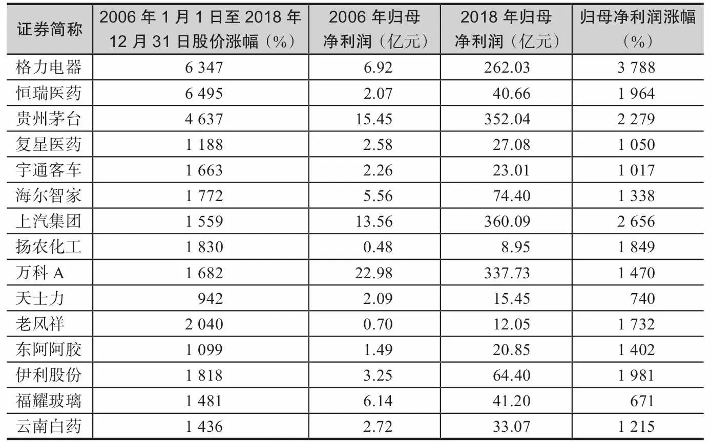

资料来源：Wind资讯。

所以，大家要相信，一般是不会出现公司盈利持续大幅增长但股价迟迟不涨的情况的。

我给大家指出价值投资常见的两个误区。

第一，不是买低估值股票或者蓝筹股就叫价值投资。因为价值投资是什么公司的股票都能买的，价值投资的本质是找到并投资未来确定性高、持续成长的优质资产。

第二，价值投资不是呼吁好公司的股票无论价格多高都要买。再好的公司，如果投资者买股票的价位高了，也照样容易亏钱。因为价格始终围绕价值上下波动。

投资者应该怎么做价值投资呢？我认为关键是要掌握四个方面。

1\.选出好公司

我主要有三种选股思路。

（1）投资那些长期稳定向上的行业，比如金融行业、消费行业、医药行业。我认为，这种弱周期行业很容易出现长期慢牛的股票。所以，长期不变的弱周期行业是我愿意进行长期投资的。

（2）投资那些强周期行业，比如养猪行业、海运行业、基建行业等。这些行业的好处是弹性大，我们很有可能从中赚到大钱。

强周期行业的底部特征是行业里的龙头企业开始亏钱；强周期行业的顶部特征是行业里最“烂”、业绩倒数的公司都开始大赚特赚。

具体来说：在周期性底部，龙头企业因为业绩差，往往看起来估值比较高，虽然估值的确高得吓人，但实际上这是该买入股票的时候；在周期性顶部，因为企业的业绩都很好，往往行业内最“烂”的公司看起来估值都很低，虽然大家会觉得这个时候股价比较便宜了，但实际上这是该卖出股票的时候。

（3）投资未来时代风口上的行业，以及未来时代浪潮上的“雄鹰”公司。这个选股思路比较难，因为需要投资者对时代的发展有深刻的洞察力。

2\.组合持仓

做价值投资的投资者一般都是组合持仓。

投资者要永远对市场心怀敬畏。这个市场中可能有无数的“黑天鹅事件”在等着你，投资者永远不要过度自信到满仓买入一两家公司的股票。

3\.低估时买入

根据我的经验，往往在市场比较低迷的时候，投资者会有更多机会买到“便宜的好货”。

我把这个理论简单地命名为“股市万有引力”定律。

如果一个东西贵了，价格高于价值，总会有人卖，价格就会跌下来。

如果一个东西便宜了，价格低于价值，总会有人买，价格就会涨上去。

4\.长期持有

投资者做价值投资就是做伟大公司的股东，而做了股东就相当于做了公司的老板。

大家想一想，如果我们能以一个合适的价格买入好公司的股票，成为全国最优秀企业甚至世界最优秀企业的老板，难道不是人生之幸事吗？

上市公司有许多优秀的员工，他们每天辛勤耕耘，为持有股票的投资者即股东创造财富，难道投资者不应该放下担心静静等待吗？做价值投资，要把金钱和时间交给公司，静静等待公司给大家创造价值和财富。

实际上，股票市场给投资者提供了这样一个机会：通过持有上市公司的股票，间接获得平时不可能获得的资源，并且让上市公司里那些厉害的人掌握充分的资源，持续地给投资者“打工”。

做投资一般赚的是两种钱：一种是公司的团队努力工作创造财富和价值的钱，这是公司持续成长和盈利的钱；另一种是市场波动的钱，比如好公司在遭遇恐慌性杀跌的熊市时，反倒给了投资者低价买入的机会，投资者未来很可能会赚到公司估值修复的钱。

[\1] 文中涉及的财务数据都为研究当年的实时数据，其中有小部分数据可能会因为四舍五入或经过会计调整，与原始财务报告略有不同，请读者注意。

## 第1章 投资理论 - (08) 1.8 如何利用“黑天鹅事件”逆向投资

\(08\) 1\.8 如何利用“黑天鹅事件”逆向投资

1\.8 如何利用“黑天鹅事件”逆向投资

在2020年春节前后，受新冠肺炎疫情影响，春节后首个交易日A股大概有3000只股票跌停。

在做投资的时候，“黑天鹅事件”无处不在且时有发生。

2018年，A股市场曾出现多起“黑天鹅事件”。比如，2018年7月国家药品监督管理局发布通告指出，长春长生生物科技有限责任公司（简称“长生生物”）冻干人用狂犬病疫苗生产存在记录造假等行为，这导致长生生物最终退市；再比如，2018年12月，中石化子公司的高管投资原油失败，导致公司产生巨额亏损。

“黑天鹅事件”频出往往会导致市场中的投资者信心崩塌，但其实任何一次“黑天鹅事件”都可能孕育着机会，主要看你是否有眼光去发现。

在17世纪之前，欧洲人一直认为天鹅都是白色的，直到后来，人们在澳大利亚发现了一只黑色的天鹅。当时欧洲各个国家的人都目瞪口呆，他们多年的“白天鹅信仰”崩塌了。从此以后，“黑天鹅事件”成了意外事件的代名词。

根据“黑天鹅之父”塔勒布的定义，“黑天鹅事件”有四个特点：第一，非常罕见；第二，影响巨大；第三，尽管事后有万般解释，但是事前根本无法预测；第四，事先能够做好预防。

虽然“黑天鹅事件”无法预测，但是我认为有三句话至少能帮助大家少受一点影响。

第一句话是不要把所有鸡蛋放在一个篮子里。防范“黑天鹅事件”的一个方法是不要把资金集中在某一只股票上，有效地分散配置资产才能降低风险。

第二句话是集中优势资金，分行业重仓持股。

虽然要分散投资，但过于分散的资金不利于资金调配，形同“撒胡椒面”。我建议大家保持5～10只股票的配置，同时这些股票尽量来自不同的行业，这样才能降低“黑天鹅事件”的杀伤力。

为什么要强调分行业呢？如果你买了10只股票，而这10只股票都是银行股，那么这其实跟你满仓买入一只银行股是一样的，并不能有效地分散风险。

第三句话是资金要投于永远不会被意外事件打垮的公司。

有些投资者买股票不研究公司的基本面，不管公司经营好坏。还有一些投资者甚至连公司的主营业务是什么都不知道，只会看着K线图追涨杀跌，遇到“黑天鹅事件”时束手无策。

我认为，那些社会发展到任何阶段都必不可少的行业、各大行业里的龙头企业、大型国企等，在遭遇“黑天鹅事件”的时候不太可能会消失。投资者如果平时能做好这样的持仓布局，就相当于把风险控制做在了前面。

有些时候，好公司，尤其是好行业里的龙头企业，遇到“黑天鹅事件”反而是绝佳的投资机会。

虽然“黑天鹅事件”容易产生杀伤力，但其实一些本质不容易受损的好公司在遇到“黑天鹅事件”时，反倒是给投资者提供了低价买入的绝佳机会。

当一个行业出现了“黑天鹅事件”时，如果我们判断这个行业未来还会继续存在，那么此时往往是买入价格暴跌的龙头企业股票的好机会，甚至龙头企业在经历“黑天鹅事件”后，未来的市场占有率反倒可能会上升。

比如，2013年的“限酒令”叠加塑化剂事件导致贵州茅台的股价大跌，但回过头来看，那时反倒是很不错的买入机会。

再比如，前面说到的疫苗造假事件，虽然当事公司长生生物已经退市，但是人们对疫苗的需求不会消失，所以疫苗这个行业便不会消失。此外，疫苗行业的公司都是特许经营的，带有一点“垄断”性质，并不是随便一家公司就能生产疫苗和销售疫苗的。

因此，在这样的“黑天鹅事件”发生后，除了真的存在问题的当事公司，对于行业内其他被拖累以致股价下跌的公司，很可能就是买入的机会，因为它们未来在市场占有率上会更受益。

同时大家还需要注意，我们所选择的目标公司还要有极深的“护城河”，这样它们才不会被“黑天鹅事件”打垮，而且缓过来以后会保持持续成长。

当然，如果有些公司本身存在造假行为，那一旦被披露基本上就真的完了，这个时候千万不能逆向买入。

比如，2011年时重庆啤酒曾一直对公众说，公司正在研发某种疫苗。这个故事说了很多年，结果公司在进行疫苗测试的时候，发现它所研发的疫苗完全没有效果。

在重庆啤酒宣布测试结果后，股价直接“崩”了，一路下跌，虽然短期还“超跌反弹”了一波，但后来再次跌了下去，直到现在也没有缓过来。截至2020年3月，重庆啤酒的股价距离事发前的高位仍有很大的距离。

这种公司没有核心竞争力，在行业里也没有绝对地位，所以一旦被证伪可能就不行了，不太适合抄底。

再比如乐视网，在公司的生态资金链危机全面爆发后，股价开始“崩溃”。和重庆啤酒类似，乐视网的股价在打开第一波一字跌停后，也有过一波强劲反弹，但之后开始了漫漫阴跌。

面对这些公司，投资者要明白，公司的本质已经不行了，在问题暴露出来之后应该尽快卖出公司的股票。

所以，从价值投资的角度来说，一家公司的伟大源于它的本质和内在。如果公司的内在价值和业务都已经“崩溃”，每年稳定亏损，需要靠融资等其他手段来维持经营，那我认为这家公司是没有伟大本质的。

2025年5月18日

11:03

## 第1章 投资理论 - (09) 1.9 复利是世界上第八大奇迹

\(09\) 1\.9 复利是世界上第八大奇迹

2025年5月18日

11:03

1\.9 复利是世界上第八大奇迹

我认为，复利应该是投资者在做投资之前需要深刻理解的一个概念，但理解复利又比较困难。

首先，大家需要理解什么是复利。

复利是把过去的盈利叠加到本金里，继续去滚动盈利。

比如，一开始我们有10万元的本金，第一年赚了20%，第二年本金就变成12万元，第二年又赚了20%，第三年本金就变成14\.4万元。

这样按照一定的百分比往上滚动，就是巴菲特说的“滚雪球”。有些人算账的方式是，计算这次赚了多少钱或亏了多少钱，并且是按照金额计算的，这是错误的。

按照金额计算的话，以10万元本金每年赚2万元向上滚动，很容易计算出未来能赚到的钱：10年能赚20万元，20年能赚40万元，50年能赚100万元。

但是，按照复利的方式计算就比较复杂了。

我给大家看一张复利计算图，如图1\-1所示。

如果按照每年盈利20%的复利向上滚动，100万元的本金在10年后变成了619万元，在30年后变成了2\.37亿元，大家是不是觉得这是一个比较夸张并且匪夷所思的数字？

我们在做投资的时候不怕慢而怕亏，因为一旦出现巨额亏损，再想重新往上积累盈利会很难。要知道，如果亏了50%，需要盈利100%才能回本。

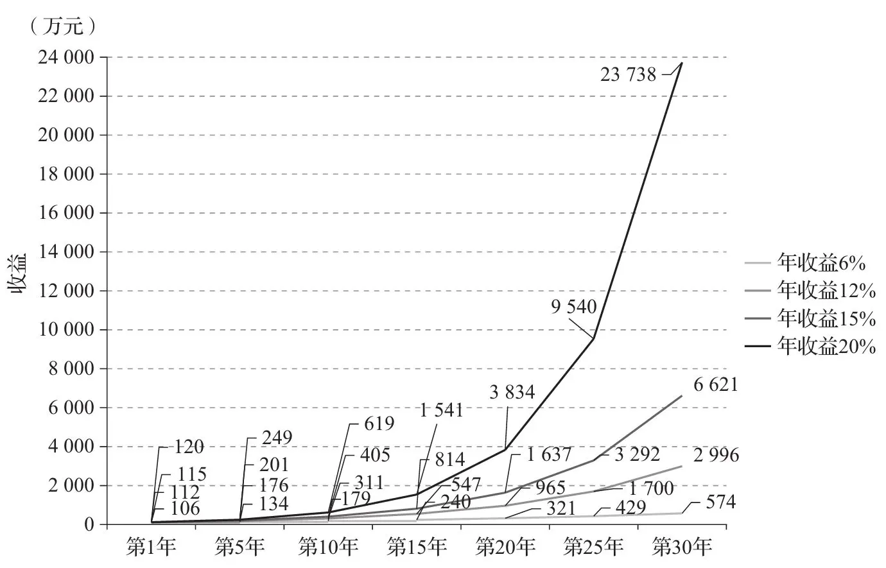

图1\-1100万元本金复利计算图

所以，投资中有一句话叫：“慢”就是“快”。

这里的“慢”，不是真的慢，而是指每年的复利盈利为12%～20%。其实这个复合增速已经是“超级速度”了，只是大部分投资者都理解不了。

大部分投资者追求的是本金每年翻几番，我认为这个目标几乎是不可能实现的。如果追求过高的收益，结果很可能是稳定亏损。

如果投资者能理解复利的“威力”，并且能够理解获取稳定盈利的艰难，那么我相信大家的年化收益率预期自然会降到12%～20%。

巴菲特管理的基金这么多年的年化收益率才在20%左右。

我曾经分析过中国全部私募基金公司的历史年化收益率，结果发现，能够连续10年做到年化收益率在15%以上的已经是凤毛麟角，应该不超过10家。

最后，投资者还需要了解，复利发挥威力靠的是时间。

即使是每年很微小的差异，随着时间的拉长，差距也会呈指数级扩大。

人与人之间的差距，公司与公司之间的差距，都是一样的道理。比如，人与人之间虽然一开始只有细微的差距，但叠加上时间后，“复利”会发挥威力，让人与人之间的差距越拉越大。

所以，每天努力一点点、成长一点点，三年后就能见成效，10年后大概率会出现“奇迹”。这是我自己努力了10年后慢慢出现“奇迹”的切身体会。

## 第1章 投资理论 - (10) 1.10 几种常见的投资心理

\(10\) 1\.10 几种常见的投资心理

2025年5月18日

11:03

1\.10 几种常见的投资心理

“马后炮”和“后视镜”是常见的投资者心理误区

一些投资者在聊股票的时候，总是看着公司股价过去的K线走势图讨论。他们往往会指着过去的K线走势图说：“我要是在某某股票的最低点买入，在最高点卖出，这样操作几万个来回，不就是宇宙首富了吗？”

我认为，做二级市场投资，投的是公司的未来。正确的方式是去研究和讨论一家公司未来的业绩会怎么样，以及未来出现各种情况时应该怎么应对。

投资者永远要站在当下看未来，而不是站在当下说过去。

得不到的才是最好的

很多人对于自己得不到的东西，总觉得好。

很多投资者对于自己手里的股票，只要短期一跌就怎么看都不顺眼；而看着别人手里上涨的股票，怎么看怎么好。

我认为，做投资还是需要脱离涨跌去分析公司。首先要看懂公司的基本面，看懂公司到底好还是不好，然后进行定性和定量分析，最后看K线走势，利用好市场情绪。

屁股决定脑袋

一些投资者一旦买了一家公司的股票，就容不得别人说半点这家公司的不好。他们生怕这家公司的股价会被人说下来。他们选择性地忽视公司不好的地方和利空的地方，而只看好的一面并只相信好的一面。

其实，公司好则好，不好则不好，一家公司并不会因为某个人指出它的问题而股价大跌。

我认为，成熟的投资者反倒会喜欢倾听别人讲自己持仓股的不足之处，然后仔细研究思考，判断对方说的是不是正确，自己是不是需要调仓换股。

锚定效应

锚定效应是一个营销中经常使用的心理现象。

比如，一个商品的生产成本是10元，合理的市场售价是50元，有些厂商定价为500元，然后常年打一折促销。这样大部分消费者就会觉得这本来是500元的东西，现在居然只卖50元，如果购买就占了大便宜，然后就有很强的冲动掏钱购买。

这里的500元是商家锚定的价格，让消费者感觉这个商品值500元。

在股市里，锚定价格很常见。比如，一只成长股的股价持续上涨，原来是5元/股，投资者总觉得它就值5元/股；后来公司的业绩增长了，假设业绩翻倍而估值不变，那么股价应该翻倍到10元/股。但这时候你总觉得它贵了，一定要等股价回到5元/股左右才买。

我认为，这就是投资者心理上被“锚定”了，忽视了公司业绩的增长。这也是大多数投资者一直不敢买贵州茅台股票的原因。

厌恶亏损

1万元的亏损所带来的心理痛苦，是1万元的盈利所带来的喜悦的两倍。

投资者一旦有了这个心理根源，就会开始厌恶亏损，看到账户里的股票是亏损状态会异常难受，反倒是在“割肉”卖掉后觉得轻松了，转头就“选择性遗忘”了。

为了躲避亏损，投资者想出了一个办法，美其名曰“止损”，其实是亏损后卖出。反复“止损”的结果却是产生了更大的亏损。

我认为，在买入股票后不要整天盯着涨跌和账户，要多看看公司的基本面是否发生了变化。如果公司持续稳定成长，不断在赚钱，那么股价围绕价值的上下波动都是正常的情绪反应。

消息冲击和羊群效应

我认为，股市短期的走势主要是受消息面的影响。出了好消息大家一起买，出了坏消息大家一起比赛“割肉”。

其实，人群的某些行为和羊群很像。如果投资者明白了这点，就能够利用“羊群效应”反向交易，那么有很大概率会赚钱。

心理账户

我的微信公众号后台每天都会收到大量留言，有不少类似于“你好，请帮我看看××股票应该怎么操作，成本价是××元/股”这样的内容。

我认为，其实投资者买入股票的成本，跟公司本身的价值没什么关系。另外，能问出这种问题的投资者，基本上都不太知道所买的股票背后的公司是做什么的。

## 第2章 投资方法

第2章 投资方法

## 第2章 投资方法 - (01) 2.1　用八个财务指标轻松选出好公司

\(01\) 2\.1 用八个财务指标轻松选出好公司

2\.1 用八个财务指标轻松选出好公司

财务指标很多，其中有几个是比较简洁且适合业余散户使用的。接下来，我[\1]会逐一向大家介绍。

现金收入比

我认为，现金收入比是财务指标中最重要的一个、最重要的一个、最重要的一个。重要的事情说三遍。

举个例子。刘备在干革命之前是创业卖草鞋的。假如一年卖100双，每双赚1两白银，那么刘备一年能有100两白银的收入。

如果刘备的草鞋卖出去后，能从客户曹操、董卓和王允那里拿到100两白银，那么现金收入比为100%。

但是，如果董卓买了80双草鞋，却仗势欺人，吵着说今年的钱要给马买草料，要给貂蝉买首饰，暂时没钱付鞋款。那么刘备只拿到了20两白银，这时候刘备的现金收入比为20%。

一般来说，话语权强的公司在会计上确认的销售收入，应该能够与从客户那里收到的现金相匹配，甚至会有人提前预付款。也就是说，好公司的现金收入比等于甚至大于100%。

“股王”贵州茅台的现金收入比常年比较“华丽”，如表2\-1所示。

表2\-12012～2017年第三季度贵州茅台的现金收入比

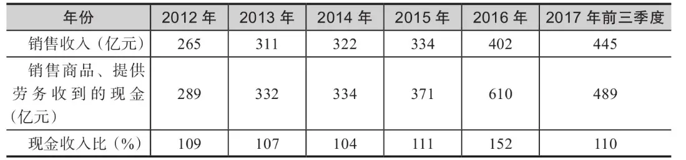

资料来源：贵州茅台公司公告。

大家能看到，不仅2016年贵州茅台的现金收入比超过了100%，这个指标连续五年都超过了100%。我特别喜欢这种吸金能力超强的公司，无论你的客户是曹操还是董卓，都不怎么敢欠账。这种公司的股票比较适合多买点儿。

乐视网的情况又是怎样的呢？我们来看表2\-2。

表2\-22012～2017年第三季度乐视网的现金收入比

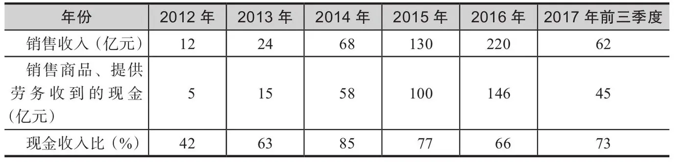

资料来源：乐视网公司公告。

乐视网的现金收入比最好的年份是2014年，但那年也只有85%，没有超过100%。拉长时间看，过去五年乐视网每一年的现金收入比都显著低于100%。所以一看到这个指标，我只能默默地把乐视网从投资名单中剔除。

这个指标是不是简单实用？大家如果有兴趣，可以算一算自己投资的公司的现金收入比怎么样。

这个指标的分子（销售商品、提供劳务收到的现金）来自现金流量表，分母来自利润表（销售收入），在公司对外公开披露的财务报告中都能找到。

净资产收益率

在投资和研究的时候，有了现金收入比，基本上可以把大部分有财务造假和粉饰嫌疑的公司给排除了。有人可能会说，这样筛选后剩下的公司还是很多，现在我们再讲第二个指标，以帮助投资者进一步筛选。

这个指标就是净资产收益率。

净资产收益率反映了一家公司的盈利能力。净资产收益率越高，公司的盈利能力越强。

举个例子。武大郎开烧饼店，他投资100两白银租了店铺，买了煤球、干柴和面粉，一年下来扣除成本费用后，共赚了15两白银，那么武大郎的烧饼店的净资产收益率是15%。

西门庆投资30两白银，入股了王婆的成衣店，一年赚了6两白银，那么王婆的成衣店的净资产收益率是20%。

从净资产收益率的角度看，王婆的成衣店的盈利能力比武大郎的烧饼店强。

前两年我去澳门玩儿，住的酒店楼下是个很大的赌场。我拿了3000港元（澳门赌场用港元）陪朋友一起上桌，结果手气不错，2小时赢了60000港元。这个净资产收益率是多少呢？足足有20倍（60000/3000），如果再算年化收益率，我可能是全世界最有钱的人了。当然，这种暴利是没法持续的，所以算年化收益率的意义不大。对于很多公司，我们要看持续盈利能力。

在做投资的时候，我会选那些净资产收益率过去五年一直在15%以上的公司。

净资产收益率高的公司很多，好公司和普通公司的区别在于：好公司的净资产收益率会长时间维持在一个很高的水平。

大家都知道董明珠和格力电器，知道格力电器是一家比较优秀的企业，我们来看看格力电器的净资产收益率到底怎么样，如表2\-3所示。

表2\-32012～2017年第三季度格力电器的净资产收益率

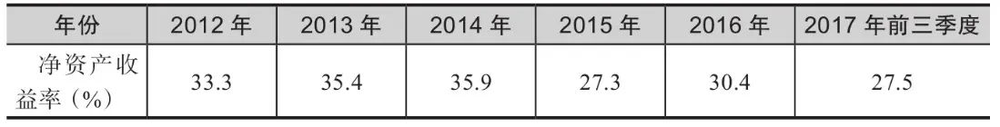

资料来源：格力电器公司公告。

我关注了制造业的公司十几年，知道国内制造业的平均净资产收益率为5%～15%。所以，格力电器能长时间地保持这么高的净资产收益率真的很优秀，也很不容易。

美的集团和格力电器一样，也是白色家电企业，净资产收益率同样很高，但比格力电器略差一点，如表2\-4所示。

表2\-42012～2017年第三季度美的集团的净资产收益率

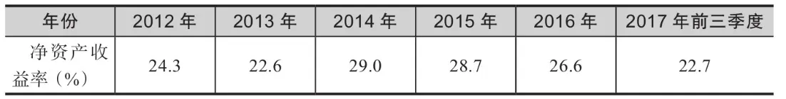

资料来源：美的集团公司公告。

大家应该还记得，创业板第一家退市公司是欣泰电气。这家被勒令直接退市的公司的净资产收益率是怎样的呢？我们来看一下表2\-5。

表2\-52012～2016年欣泰电气的净资产收益率

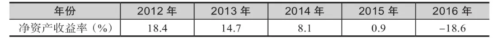

资料来源：欣泰电气公司公告。

在2012～2016年，欣泰电气的净资产收益率逐年降低，而且下降趋势非常明显。到2016年，公司的净资产收益率竟然降低到\-18\.6%。这意味着，股东投资100元，一年下来会亏18\.6元。

这样的公司，我们在研究和投资的时候基本不会碰。

人均创收和人均创利

第三个指标是人均创收和人均创利。人均创收和人均创利体现了公司的盈利能力。这两个指标的数值越大，表明公司的盈利能力越强。

净资产收益率是从资本的角度去看盈利能力的强弱，而这个指标是从人的角度去分析公司盈利能力的强弱。

举个例子。假设林黛玉开了香囊店，她和紫鹃两个人忙里忙外，辛辛苦苦做女红，一年收入100两白银，扣除布料等成本，盈利了20两白银，那么香囊店的人均创收（收入）是50两白银，人均创利（盈利）是10两白银。

薛宝钗开的冷香丸药店比香囊店的生意好很多，规模也大很多。于是薛宝钗让香菱喊了不少丫鬟来帮忙一起吆喝销售，药店一共请了50个人，一年下来药店的收入为500两白银，扣除成本后盈利100两白银，那么药店的人均创收是10两白银，人均创利是2两白银。

虽然药店的生意好，但是从人均创收和人均创利的角度看，香囊店比药店的盈利能力强很多。

私募行业有个不成文的规矩，管理的资金每增加一个亿，相应会多招一个研究员。私募的管理费一般是1%，换句话说，私募公司每多一个亿的资金，就多了100万元的管理费收入，所以人均创收大致为100万元，而人均创利是多少则要看业绩好不好，以及分成比例是多少。

在做投资的时候，我会选那些人均创收和人均创利都很高的公司。

多少算高？其实没有绝对数字，需要与行业内的其他上市公司做比较才能看出来。不过有个简单的筛选法则：现在沿海地区普通工人的年收入为6万～7万元，所以人均创利在10万元以上，同时人均创收在100万元以上的公司应该算是比较好的。

比如，杭州的海康威视是国内安防视频监控行业的领军企业，根据公司公告，2016年的收入为320亿元，净利润为74亿元。截至2016年年底公司共有员工20013人。所以，我们计算出海康威视的人均创收是160万元，人均创利是37万元。海康威视真的是盈利能力非常强的企业。

中国平安是大家耳熟能详的企业，根据公司公告，2016年的营业收入为7125亿元，归母净利润为623亿元。截至2016年年底公司共有员工318588人，可以算出中国平安的人均创收为224万元，人均创利为19\.6万元。

总资产周转率

总资产周转率是衡量公司资产变现能力强弱的一个指标。总资产周转率越高，公司的变现能力越强。

举个例子。孙悟空花了1000元买下花果山，然后安排小猴子和它一起种桃树、施肥和捉虫。一年后，孙悟空把成熟的桃子卖掉，得到100元的销售收入，那么这一年的总资产周转率是10%。如果孙悟空和白骨精不计前嫌，联手管理花果山，让这些桃树结出了更多桃子，一年下来实现了200元的销售收入，那么总资产周转率是20%。

从这个例子我们可以看出：总资产周转率越高，资产的变现能力越强，相应的收入越多。

当然，总资产周转率的高低不仅取决于分子（销售收入），还取决于分母（总资产）。如果孙悟空一开始只花了100元买花果山，一年有100元的销售收入，那这时候的总资产周转率就是100%，比上面两种情况都高。

在做投资的时候，我会选那些总资产周转率超过100%的公司。

比如，杭州的大华股份是国内安防视频监控行业的龙头企业，我从这家公司上市开始就紧密跟踪它的发展。不管是从收入增长还是从利润增长的角度看，这家公司都发展得很好。表2\-6所示是大华股份2012～2016年的总资产周转率。

表2\-62012～2016年大华股份的总资产周转率

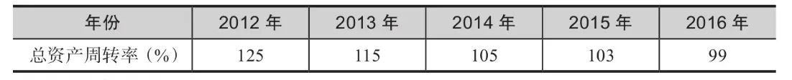

资料来源：大华股份公司公告。

随着公司规模扩大，大华股份的总资产周转率有些下降，这是正常的。不过，优秀的公司还是会想办法做好内部管理，把总资产周转率控制在100%左右。

杭州的另一家公司老板电器，每年的业绩都能超出市场预期。表2\-7所示是老板电器2012～2016年的总资产周转率。

表2\-72012～2016年老板电器的总资产周转率

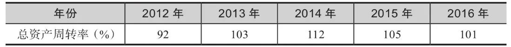

资料来源：老板电器公司公告。

老板电器2012～2016年的总资产周转率除了2012年基本都在100%以上，它的运营能力是非常强的。

在沪深两个市场中，总资产周转率曾经最低的公司是\*ST新城，表2\-8中是该公司2012～2016年的总资产周转率。该公司在2016年年底的总资产为64亿元，但是主营业务收入居然只有2100万元。公司的收入很低，自然没有什么利润。

表2\-82012～2016年\*ST新城的总资产周转率

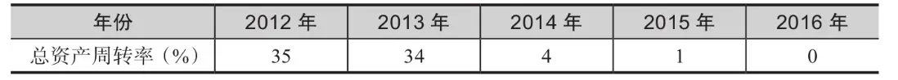

资料来源：\*ST新城公司公告。

季度收入增长率

接下来我们聊聊选股的第五个财务指标。这个很有用的指标是季度收入增长率。

季度收入增长率的计算很简单，首先找到公司每个季度的销售收入（这些数据在公司的季报和年报里都能找到），然后计算同比增长率（与上一年同一个季度的数值对比）即可。

举个例子。令狐冲和任盈盈归隐江湖后，回到他们初遇的洛阳绿竹巷开了一家琴馆，教授琴艺。任盈盈极擅音律，造诣之高当世少有匹敌，所以没过多久琴馆的生意渐入佳境。那几年琴馆的季度收入如表2\-9所示。

表2\-9 琴馆假设季度收入（单位：两）

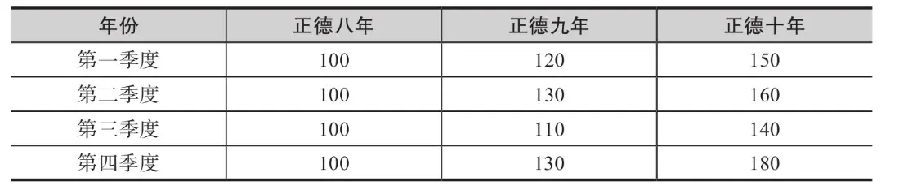

令狐冲好歹当过恒山派的掌门，负责琴馆的财务工作自然不在话下，很快就把琴馆的季度收入增长率算出来了，如表2\-10所示。

表2\-10 琴馆假设季度收入增长率（%）

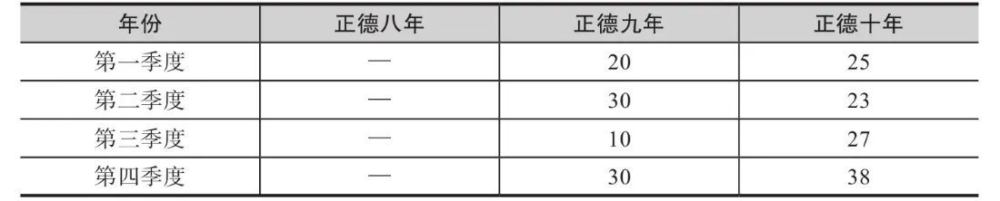

多年的投资经验告诉我，如果公司的销售收入没有增长，那么公司利润的增长会比较困难。在做投资的时候，我的独门方法是：选连续八个季度的季度收入增长率都超过15%的公司去投资。

当然，这样的选股标准是比较严格的，沪深两个市场的所有上市公司中符合条件的并不多。但是，用这个方法挑选出来的公司一般都不错。

比如，爱尔眼科是国内最大的眼科医疗机构之一，同时它也是很多机构投资者的“爱股”。该公司自2009年10月上市以来，股价表现一直不错。我从该公司上市至今一直紧密跟踪它的发展。表2\-11中是爱尔眼科2014～2017年的季度收入。

表2\-112014～2017年爱尔眼科的季度收入（单位：亿元）

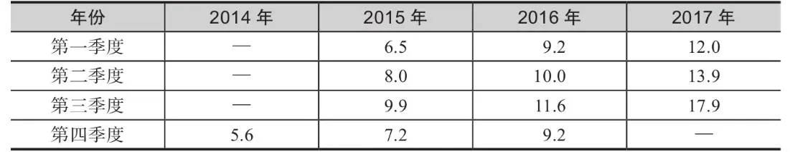

资料来源：爱尔眼科公司公告。

我们进一步计算该公司的季度收入增长率，如表2\-12所示。

表2\-122014～2017年爱尔眼科的季度收入增长率（%）

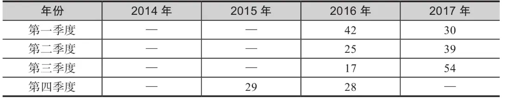

资料来源：爱尔眼科公司公告。

我们可以看到，爱尔眼科的收入增速非常惊人，2016～2017年八个季度的季度收入增长率基本为两位数。做投资的时候买入这样的公司的股票，我是能睡着觉的。

当然，投资要看未来，所以要尽量预测未来几个季度公司的收入变化情况。

商誉净资产比

前面讲的指标分别反映了公司的盈利质量（现金收入比）、盈利能力（净资产收益率、人均创收和人均创利）、运营能力（总资产周转率）和成长能力（季度收入增长率）。我们在筛选公司做投资的时候，总希望这些指标大一点。但我们现在要讲的这个指标——商誉净资产比，小一点为好。

商誉是在公司对外并购的时候产生的，它是一项无形资产。

举个例子。韦小宝受康熙指派到少林寺当和尚，途中看到了正在挑选花布的惊为天人的阿珂。为了再次见到阿珂，韦小宝当即决定买下布庄。布庄的老板在折算土地、房屋、布匹等以后开价白银400两，韦小宝思美心切，大手一挥甩出500两银票，说不用找零了！这样，韦小宝多花的100两白银就形成了商誉。

可见，商誉并没有对应的实物资产，而是收购方愿意付出的溢价。

一年之后，如果布庄的生意不好，那么这时候需要调整商誉的金额，从原来的100两白银下调成50两白银甚至更低，这个动作叫作商誉减值。

商誉减值对公司股东的影响较大，因为商誉属于无形资产，减值会造成公司股东实打实的亏损。

近几年，我们看到越来越多的公司在上市之后会做一些并购，从而形成了不小的商誉金额。我们在实务中经常会把商誉与归母净资产做比较，如果这个比率太高了，公司股东面临的风险会比较大。

在做投资的时候，我会选择那些商誉净资产比低于50%的公司。当然，如果更谨慎一点，商誉净资产比低于30%是更好的选择。

比如，蓝色光标是创业板中一家比较有名的公司，它的主要业务是为客户提供品牌管理服务，其服务范畴包括品牌传播、产品推广、危机管理、活动管理和数字媒体营销等。蓝色光标上市之后做了一系列的并购。2016年年底公司的商誉为47亿元，净资产为54亿元，这样公司的商誉净资产比达到了87%，这是一个惊人的数字。如果商誉有一点点减值，公司的净资产就会相应地大幅减少。

我猜想蓝色光标的管理层看到了这个商誉风险，所以该公司在2017年做了一笔股权再融资，募集资金17亿元。公司2017年三季报显示，公司的商誉为47\.4亿元，而公司的净资产增加到了70\.9亿元，当时的商誉净资产比是67%。虽然相比2016年年底，商誉净资产比下降了不少，但我还是感觉挺高的。

我根据2017年三季报统计了全部上市公司的商誉净资产比，很多公司的商誉净资产比都超过了100%，这些公司都面临较高的商誉减值风险。我们在投资的时候需要密切留意这些公司的动向。

毛利率

现在我要说的这个选股指标是毛利率。提起毛利率，很多朋友都笑了，这个指标还需要介绍吗？

的确，毛利率这个指标很简单，但简单不代表不重要。我认为，毛利率反映了企业的核心竞争能力和核心盈利能力。

相比净资产收益率，毛利率的计算更简单：它的分子和分母都来自利润表。其中，分子是用主营业务收入减去主营业务成本，分母是主营业务收入。

关于毛利率的应用，我有以下心得。

（1）一般选择毛利率高一点的公司进行投资。

（2）拉长时间，除非外部环境有重大变化，否则公司的毛利率一般比较稳定，不会有大幅波动。

（3）公司的毛利率与行业内其他公司的差异不会变化很大。如果有异动，投资者需要仔细分析。

举个例子。全真教乃武学正统，为天下人景仰，连郭靖都把故人之子杨过送去学习。但是，全真教家大业大，光王重阳的嫡传弟子就有七个，弟子又收弟子，人口众多，成本较大。假设全真教的主营业务收入是100万两，主营业务成本是90万两，那它的毛利率是10%。

与全真教比邻而居的古墓派只有小龙女和孙婆婆。小龙女不食人间烟火，吃点蜂蜜即可度日，睡觉只要一根绳子，成本非常低。如果古墓派的主营业务收入是1000两，主营业务成本是100两，那么古墓派的毛利率是90%。显然，古墓派的盈利能力更强。

大家都知道贵州茅台很赚钱，但它到底有多赚钱呢？我们来看贵州茅台2012～2016年的毛利率（见表2\-13）。

表2\-132012～2016年贵州茅台的毛利率

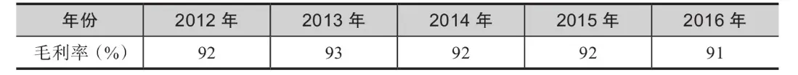

资料来源：贵州茅台公司公告。

2012～2016年贵州茅台公布的平均毛利率是92%。这意味着，一瓶800元的茅台酒的成本是64元。64元的成本包括了材料（酒、包装瓶、包装盒等）费用、人工费用和制造费用，而毛利高达736元。可见，茅台酒真的是很赚钱的产品。

从研究的角度看，我看到过一些毛利率特别低的公司，比如浙江湖州的栋梁新材，它在2012～2016年的毛利率如表2\-14所示。

表2\-142012～2016年栋梁新材的毛利率

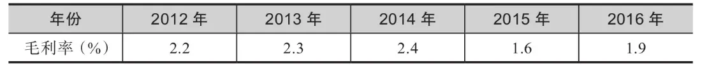

资料来源：栋梁新材公司公告。

2012～2016年栋梁新材的平均毛利率是2\.1%。你没有看错，真的只有2\.1%。这意味着，公司100元的销售收入中成本差不多为98元，毛利仅有2元。这还没有扣除正常的销售费用、管理费用、财务费用、营业外的收入和支出、税收费用等其他杂费，扣除之后，公司的净利润（率）显然更低。

从投资的角度看，我们希望找到毛利率高一点的公司进行投资。那毛利率多少算高呢？我做了20年的研究和投资，感觉对于国内制造业的企业而言，毛利率超过20%的公司一般就算很不错的了。

研发支出

我在研究上市公司的时候，会在财务报表里找一些容易被人忽视但又对公司未来的发展有重大影响的数据。马上要介绍的研发支出就是这样一类数据。

研发支出是指上市公司在进行新产品、新工艺和新材料等的研究与开发过程中发生的各项费用。

具体而言，研发支出包括上市公司在研究与开发过程中所使用资产的折旧、消耗掉的原材料、直接参与开发人员的工资及福利费，以及在研究与开发过程中发生的租金和借款费用等。

研发支出对于上市公司保持并提高市场竞争能力至关重要。

比如，美国苹果公司公告显示，2015年、2016年和2017年公司的研发支出分别是81亿美元、100亿美元和116亿美元。

2017年苹果公司的研发支出折算成人民币超过700亿元，这是一个什么概念呢？2016年，贵州茅台的销售收入是400亿元，云南白药的销售收入是220亿元，分众传媒的销售收入是100亿元，苹果公司一年的研发支出差不多是这三家行业龙头公司一年的销售收入之和。

在做分析的时候，我一般会研究两个数据。第一个数据是过去三年研发支出的绝对金额。我希望看到上市公司的研发支出像苹果公司那样每年能保持一定幅度的增长。

比如上海制造业的龙头企业上汽集团，过去中国市场上每卖出四辆车，其中就有一辆是上汽集团（或者其合资公司）生产的。上汽集团2014～2016年的研发支出如表2\-15所示。

表2\-152014～2016年上汽集团的研发支出

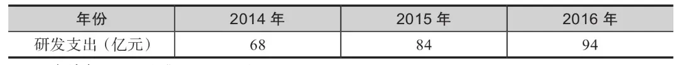

资料来源：上汽集团公司公告。

再比如2017年涨幅惊人的京东方A，它在2014～2016年的研发支出如表2\-16所示。

表2\-162014～2016年京东方A的研发支出

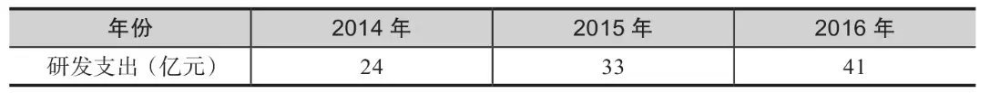

资料来源：京东方A公司公告。

只要看到上市公司持续不断地进行研发投资，我就不太担心未来几年公司的收入和利润的增长。

第二个数据是研发支出占销售收入的比重。我多年的投资经验是，这个比率在10%～30%比较健康，理想情况是在20%左右。如果比率太低，表明上市公司的研发投入不足；而比例太高的话，往往预示着上市公司的研发投入不可持续。

比如安徽合肥的智能语言及语音技术研究、软件及芯片产品开发的国家骨干级龙头企业科大讯飞，2015年和2016年的研发支出分别是5\.8亿元和7\.1亿元。科大讯飞的研发支出占销售收入的比率在2015年和2016年分别是23%和21%，这意味着公司获取的收入的20%转变成了公司的研发开支，这属于比较合理的支出结构。

当然，具体问题需要具体分析，不同行业、不同公司的研发支出比率肯定是不一样的。所以，我们在研究的时候还需要多与公司自身的过往历史比较，同时也要与公司所在行业的龙头企业进行比较，这样才能得出合理的结论。

[\1] 自本章起，“我”指何天峰。

2025年5月30日

20:36

## 第2章 投资方法 - (02) 2.2 从哪里找各种资料、数据和信息

\(02\) 2\.2 从哪里找各种资料、数据和信息

2\.2 从哪里找各种资料、数据和信息

经常有朋友问我，在给上市公司做基本面分析的时候，我的文章里大量的资料、数据和信息是哪里来的。我整理了我的“百宝箱”，把家底拿出来给大家看看。

我觉得，在做上市公司基本面分析的时候，很重要的一份材料是上市公司的财务报告。

财务报告一般从Wind、Choice数据或者同花顺这些软件下载，也可以从上海证券交易所、深圳证券交易所或巨潮资讯网三大官方网站浏览和下载。

上海证券交易所、深圳证券交易所和巨潮资讯网是A股上市公司权威的信息发布网站，网站的界面做得很友好，在搜索框里输入股票的代码就能找到所有公告，然后我们就可以挑选自己想要的财务报告。如果是做港股的研究，那就去香港证券交易所的网站浏览和下载。

在看财务报告的时候，我们需要关心的是年度报告、半年度报告和招股说明书这三份材料。一季报和三季报的信息量很小，如果刚上手做公司研究，建议一季报和三季报略过不看。

在阅读年度报告和招股说明书的时候，我认为需要关注的是“人、财、事、况”四个方面。

人，是很关键的。在阅读的时候，需要仔细分析上市公司的董事长、高级管理层、独立董事、员工总数、前十大股东、股东户数、技术领头人和审计师。

拿董事长来说，我们要了解董事长的年龄、工作经验、专业背景和从业时间等内容。如果国企的董事长有变更，我们就要注意了。比如，上海的两家国企的董事长在2018～2019年发生了变更，一家是华东电脑，另一家是锦江投资。

财，指的是需要对资产负债表、利润表、现金流量表和股东权益变动表这四张报表进行分析和研究。在看报表的同时，还要把报表附注的内容从头到尾读一遍。

这四张报表里，我认为资产负债表是最重要的。通过阅读资产负债表，我们往往能看出很多有价值的内容。

比如，多晶硅龙头保利协鑫能源在2019年5月时的市值是87亿港元，公司的净资产为219亿元人民币，折算下来差不多是0\.36倍的市净率。看起来很便宜，但是当看到资产负债表上有700多亿元的固定资产和600多亿元的有息负债时，我还是会觉得公司的经营风险很大。

事，指的是重大事项。这包括上市公司和实际控制人有没有法律纠纷，有没有被监管机构处罚，有没有担保、股权质押、股票期权或限制性的股票激励等。对于这些重大事项，上市公司会写清楚公告的详细刊登时间。这个时候我建议大家去查询公告的原文，因为财务报告里的信息是浓缩的，看公告原文能了解得更清楚。

况，指的是行业状况。在宏观、策略、行业和个股四个方面的研究中，宏观研究是滞后的，策略研究是摸着心跳看K线图说话的，只有行业和个股的研究才是有价值的。

比如，要想了解白酒行业的现状，就看茅台、五粮液和洋河的年报。这些龙头公司在2018年的年报里都提到白酒行业的三个趋势：

第一，整体发展良好。2018年，全国白酒总产量为871\.2万千升，同比增长3\.1%，累计销售收入为5400亿元，同比增长13%。

第二，白酒行业集中化趋势凸显。2018年，白酒行业马太效应凸显，白酒行业的龙头企业继续保持快速增长，增长速度明显快于行业的平均水平。

第三，白酒行业的新格局逐渐形成，名酒企业在产品、品牌、渠道和市场等方面不断强化自身的竞争优势，呈现挤压式增长。

除了公司的财务报告，我们还需要读券商的研究报告。现在免费的研究报告越来越少，不过如果有心的话，还是能够找到一些。

研究报告这东西，对于不同的人可能效果有云泥之别。老手看的是研究报告里展示的企业信息，新手看的是研究报告的买卖建议。

我在Wind的研究报告系统里设置了这样几个关键字：会议纪要、调研纪要、产业、电话会、思考、框架、方法、深度和专家。在我看来，研究报告里有用的东西是券商的调研数据、电话会议的内容、行业统计资料以及偶然披露的一些数据资料来源。

对于券商买卖建议的部分，我建议不要花时间去看了，券商研究员的建议无外乎“买入、增持、谨慎增持、推荐、强烈推荐”。国内很少有强烈看空的报告。对于很差的企业，券商研究员要么不写，要么即使写了，也顶多说“持有”，而且会一直“持有”下去，所以不要太关注买卖建议。

我们要将券商的研究报告看作负责打探消息和整理资料的，上面的估值及买卖建议大部分是没有用的，可以直接跳过。千万不要用券商研究员的公司估值给自己打气，那样很容易成为“接盘侠”。

还有几个网站也很有用。比如中国裁判文书网，这是一个官方的免费网站，把上市公司、大股东和实际控制人的名字输入进去，可以查看历史法律纠纷，如果有法律纠纷的话，仔细看看是哪些事情。

“天眼查”或者“企查查”这两个网站或者App，能够查询企业股东、实际控制人、相关法律纠纷、工商资料变更、企业关联关系等资料。我在查询的时候会感觉自己像侦探一样，有的时候会找到意想不到的东西。

然后是搜索引擎。如果有疑问，上百度、搜狗和必应网站查询都行。要诀是顺藤摸瓜、打破砂锅问到底。过去的新闻报道、其他投资人的分析、论坛上的帖子等都是我们分析企业经营情况的“呈堂证供”。至于这些资料怎么筛选和应用，那实在无法统而言之了，只能是用到自然知。

在论坛看帖子的时候，要注意甄别信息的内容和质量。几乎每只股票在论坛里都有人关注和讨论。信息能帮助我们做决策，反过来也会让我们无所适从。究竟会怎么样，取决于你的初心是“我想知道企业的经营情况”，还是“我想知道股价会涨还是会跌”。

如果你关心的是企业的经营情况，那么任何个股的页面，一般花两天时间就能知道哪些人是真有研究的，哪些人只是闲聊。这些东西没法随口胡说，不知道无法装作知道，而且如果信息有误，很容易被其他研究者指出。

除了这些书面的功课，我强烈建议大家如果有可能，尽量参加上市公司的股东大会。投资者要多去公司看一看，和管理层聊一聊。

很多朋友问如何参加股东大会，我简单总结了一下参加股东大会的基本要求。

（1）在股权登记日前买入至少100股。

（2）事先和上市公司的证券部取得联系，并于股东大会召开之日携带身份证和股东卡到达会场。

（3）由他人委托出席的需要填写授权委托书，表决事项均为同意，委托日期截至会议结束。

上市公司的股东大会基本是年度总结报告，有些走流程和过场，如果想进行深度调研，需要跟董事会秘书（后文简称“董秘”）单约，或者参与券商或公司组织的深度调研。

耳听为虚眼见为实，有条件的去实地看看管理层的作风，总好过看K线。要想调研有收获，先读一读研究报告再决定问什么，有备无患。当然，投资者去参加股东大会只是调研公司的第一步，深度调研还需要其他方法的辅助。

最后，非常重要的是要形成自己的知识库。做了十几年的投资和研究，我现在的知识库主要包括以下五部分内容。

第一部分和第二部分是财务报告分析和股票估值。市场上讲财务报告和估值的人很多，但是讲得好的老师很少。

如果有可能的话，把每年的CPA和CFA教材全部买下来，花不了多少钱。如果能仔细研读这些经典的教材，会有很大的收获。

第三部分是行业分析。中信一级行业有29个，申万一级行业有28个。一个人的时间和精力有限，很难全部覆盖，要挑重点看。

对于自己不了解的行业，要想快速入手，就需要借助外部的研究力量，帮助自己理解和构建分析的框架。

第四部分是券商策略会的相关报告。如果不是券商的付费客户，大部分投资者只能花钱买券商的报告，而且有时候券商的策略会是没有书面报告的，投资者需要想办法找到一些视频或音频资料。

第五部分是从网上找到的一些有用的资料。比如巴菲特股东大会的信件，以及一些网络大V写得比较好的分析文章。

2025年5月18日

11:03

## 第2章 投资方法 - (03) 2.3 如何估值1：以东方财富为例

\(03\) 2\.3 如何估值1：以东方财富为例

2\.3 如何估值1：以东方财富为例

从2017年年底开始，我一直介绍基本面分析方法，很多朋友表示对估值也比较感兴趣。估值相对有一点难度，这里先以东方财富为例，稍微讲一讲。

估值模型本身不难，但是要想把估值学好，一定要结合实际案例。

在给任何一家公司进行估值的时候，大家都需要知道估值是个结果。要得到一家公司的估值，我一般运用以下三个步骤。

第一，我们需要对公司做基本面的分析，其中对公司的财务报告一定要有深入的了解。

第二，做盈利预测。盈利预测一般不超过三年。

第三，使用估值模型对公司进行估值。

给东方财富估值，到底是用市盈率或市净率这样的相对估值指标，还是用现金流折现法这样的绝对估值法？

按照我的观点，对于东方财富，不能只看市盈率或市净率，用现金流折现法也不合适，主要是因为这家公司的业务相对来说比较复杂。

所以，我还是带大家回到第一步，先把公司的基本面梳理清楚。

简单介绍一下东方财富2018年的年报：2018年公司营业总收入是31亿元，同比增长23%，实现了两位数的增长；归母净利润是9\.6亿元，同比增长51%，增速很快；扣非净利润是9\.5亿元，同比增长54%。

我在介绍公司的时候，都会提到上述三个指标，尤其是后面两个指标——归母净利润和扣非净利润。如果这两个数字相差不大，说明公司的盈利质量比较高，公司的非经常性损益比较少。

再看另一个财务指标——净资产收益率。2018年东方财富的净资产收益率是6\.3%，只有个位数，明显偏低，仅比2017年略好一点。

实际上东方财富的营业收入来自四项业务。第一项是证券业务，第二项是金融电子商务，第三项是金融数据服务，第四项是互联网广告。下面我们来讲这四项任务。

首先介绍证券业务。东方财富上市的时候旗下只有一个东方财富网，没有证券业务，东方财富证券是公司上市之后买下来的，之前叫西藏同信证券。

这里有一个看点，东方财富证券是一家有证券业务的全牌照公司。2018年，东方财富证券贡献的营业收入是16个亿元，净利润是6\.2亿元，毛利率是58%，证券业务的毛利率是公司四项业务中最高的。你会发现，东方财富9\.6亿元的归母净利润中，证券业务的利润占了差不多2/3。从目前来看，公司大部分的净利润来自证券业务。

东方财富证券的总资产是300亿元，净资产是70亿元，在所有上市券商中属于偏小的券商。

下一项业务是金融电子商务，这项业务是通过天天基金网为用户提供基金的第三方销售，2018年实现营业收入10\.6亿元，毛利率是34%。天天基金网2018年的日均页面浏览量是562万次，日均用户使用时长是22分钟，活跃用户数是140万。

第三项业务是金融数据服务。东方财富的Choice数据软件分为收费版和免费版，在个人电脑和手机上都能使用。2018年软件收入是1\.6亿元，毛利率是5\.1%。这项业务的收入不多，毛利率也很低。

第四项业务是互联网广告。大家平时上东方财富网会看到一些广告，2018年公司的广告营业收入是7800万元，毛利率只有2\.3%。

总结来看，目前公司最赚钱的业务是证券业务，其次是金融电子商务；金融数据服务和互联网广告的营业收入不多，而且利润较少。

前面我们简单介绍了东方财富的业务结构、主营业务收入和净利润，接下来具体讲讲怎么给公司估值（见表2\-17）。

表2\-17 净资产收益率法

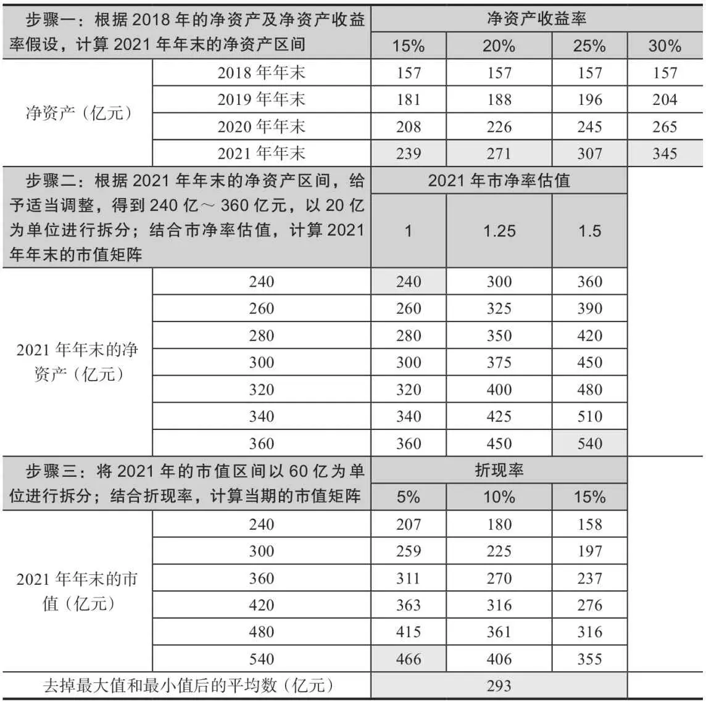

资料来源：东方财富公司公告及主观预测。

截至2019年4月，东方财富的股价大概是19元/股，总股本是55亿股左右，总市值超过1000亿元，这是市场给的一个市值。

我们先介绍用净资产收益率法估值。

为什么要用这个方法？因为东方财富的大部分利润来自证券业务，而证券业务的利润波动比较大。比如，当牛市来了，这项业务相当赚钱，当熊市来了，这项业务就不赚钱了，所以很难给东方财富证券预估利润。

用净资产收益率来估值的话，能够避免这一问题。我认为拉长时间看，东方财富合理的净资产收益率是15%～30%。

如表2\-17所示，2018年年末公司的净资产是157亿元，按照15%的增幅，2019年年末是181亿元，2020年年末是208亿元，2021年年末是239亿元。

如果公司能做得更好，净资产收益率能达到30%的话，到2021年年末，净资产是345亿元。综合多种净资产收益率假设，可以得到公司未来的净资产矩阵。

这个方法有两个缺陷：第一个缺陷是排除了东方财富在未来三年可能有股权再融资，如果公司增发股票，公司的净资产会增加。第二个缺陷是假设东方财富未来三年不分红。这时候来讲没关系，因为公司过去的现金分红一直不多。

有了预估的净资产后，再用市净率计算市值。

金融行业公司的市净率一般在1倍左右，我给的范围是1～1\.5倍，因为更高或者更低，我觉得都不合适。这样，我们得到了三年后公司的市值。

接下来进行折现。折现是在估值的时候必须用到的方法。这里涉及折现率的问题。业内一般是这样看的：如果你对公司的成长性比较确定，折现率定低一点；如果你对公司的成长性不太确定，折现率定高一点。

我在这里用的折现率分别是5%、10%和15%。折现后的公司市值去掉最大值和最小值后取平均数为293亿元。

综上，我在2019年4月得出的合理估值是300亿元左右。但当时市场给的估值超过了1000亿元。这说明我认为市场给的估值偏高。

如果反算的话，按照10%的折现率和1\.5倍的市净率，要达到市场给的估值，东方财富的净资产收益率要达到85%。这个数字太夸张了。

所以，如果2019年东方财富只有上述这些业务，那估值有点高了。

不过，估值一定要使用多种方法进行相互验证。

还是以东方财富为例，因为它的业务复杂，我再介绍一种方法——分部估值法（见表2\-18）。东方财富这家公司从本质上可以看成两项业务的结合。一项是证券业务；另一项是互联网业务，不管是卖基金，还是做网站广告或卖软件，都跟互联网相关。

表2\-18 分部估值法

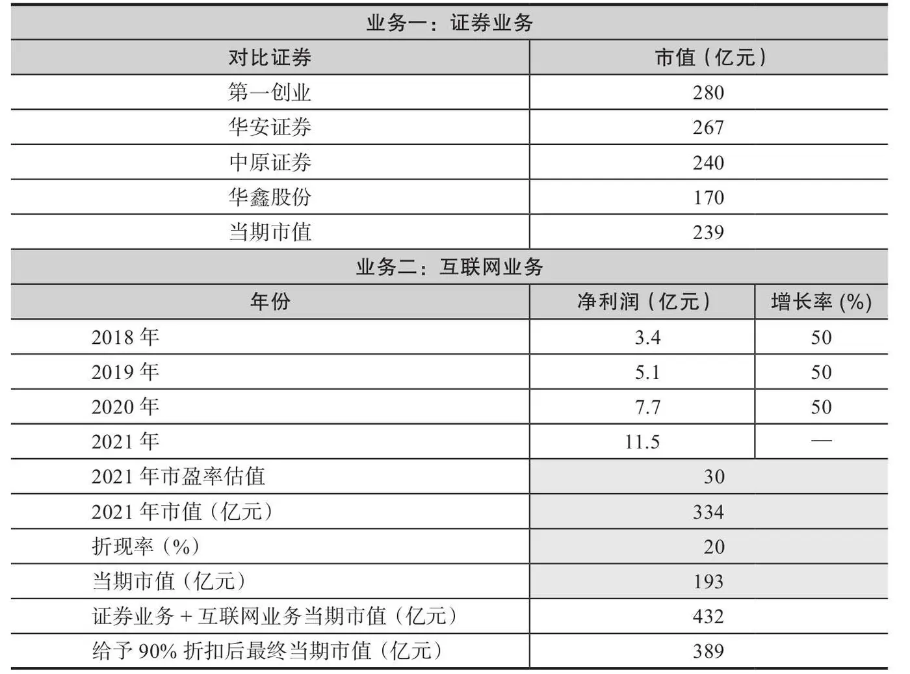

资料来源：东方财富公司公告及主观预测。

证券业务的估值：根据东方财富证券2018年证券业务的收入16亿元、净利润6\.2亿元、公司总资产300亿元、净资产70亿元，找到第一创业、华安证券、中原证券、华鑫股份四家类似的公司，取市值平均数239亿元。也就是说，如果东方财富证券单独上市，市值基本上在239亿元左右。

有人说东方财富有互联网基因，我承认是有的，但是这个东西很难量化。

互联网业务的估值：互联网业务盈利多少，我们并不清楚，我估计盈利不多。简单地用全年9\.6亿元的净利润扣除东方财富证券的6\.2亿元净利润，我们得到3\.4亿元。

假设未来三年的增长率为50%，三年中净利润从3\.4亿元增长到11\.5亿元。我认为50%的增长率有些夸张，但是互联网业务的估值我会给高一点，然后通过高一点的折现率进行保护。按30倍市盈率估值，20%折现率，得到193亿元。

然后把证券业务和互联网业务的估值相加。不过在用分部估值法的时候，一定要给一个折扣。

为什么要给折扣？因为大家都知道，只有专业的公司才能把事情做好，如果一家公司既有证券业务，又有互联网业务，很有可能都做不好。按照90%给折扣，得到389亿元。

所以，2019年我用分部估值法得出东方财富合理的估值为400亿元左右，相比当时1000多亿元的市值，远远低于市场给的估值。

再介绍一种估值法——历史估值法。历史估值法在业内用得比较多，这个方法比较简单，即看图法。

图2\-1中有五根线，从上面数第三根线是我认为比较合理的一个估值。我认为第三根线和第五根线之间是低估的。此外，线拉得越长越好，时间太短没有说服力。

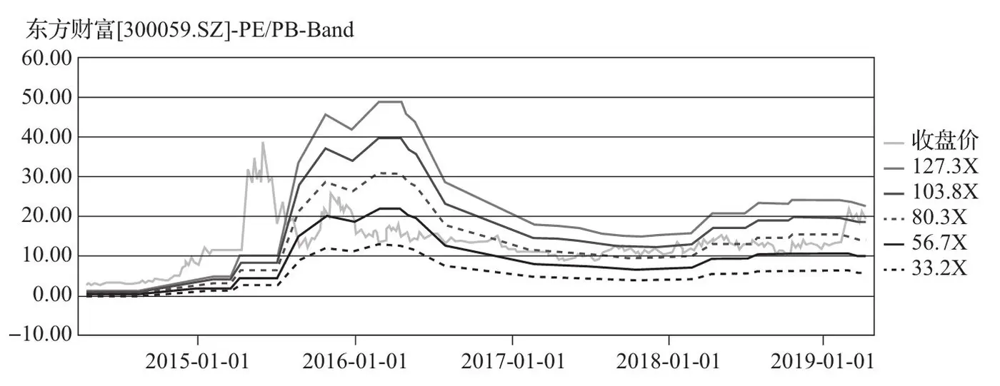

图2\-1 历史估值法

资料来源：Wind资讯。

看2014～2019年东方财富第一季度的市盈率图可以知道，公司的估值在第一根线和第二根线之间，说明当时的估值已经高于历史的平均估值，这反过来说明市场给公司的估值是偏高的。

综合前面介绍的几种方法大致能够得出结论：静态来看，当时市场的估值很高。

合理估值可能要在当时市值的基础上打一个很大的折扣。

为什么市场愿意给东方财富那么高的估值，或者说我前面介绍的几种方法有什么缺陷，使我们没有看到某些东西？

我想是这样的，我们仅对东方财富现有的几块业务进行了估值。按照我们的算法，公司的合理市值不会超过500亿元。但如果大家看东方财富的历史，就会发现公司下至员工，上至董事长，都很有进取心。东方财富在刚上市的时候只有东方财富网，上市之后有了天天基金网卖基金产品，然后收购了证券公司，2018年又在做公募基金。

市场给东方财富那么高的估值是因为市场认为它后面还会做很多事情，包括获得银行、保险和信托的牌照。

如果政策允许，东方财富大概率会是一家全牌照的公司。所以那么高的估值里包含了未来公司可能会做的很多事情。虽然有些不确定的因素在里面，但是如果你看它过往的历史，还是会觉得它的确在往那个方向去做。

跟大家分享一下东方财富每年的分红数据（见图2\-2），希望引起大家注意的是，这家公司是一家特别厉害的公司，厉害之处在于它的股本每年都在大规模扩张。能够做到股本扩张的公司一定是有野心的公司，这是一个小的经验，在这里我分享给大家。

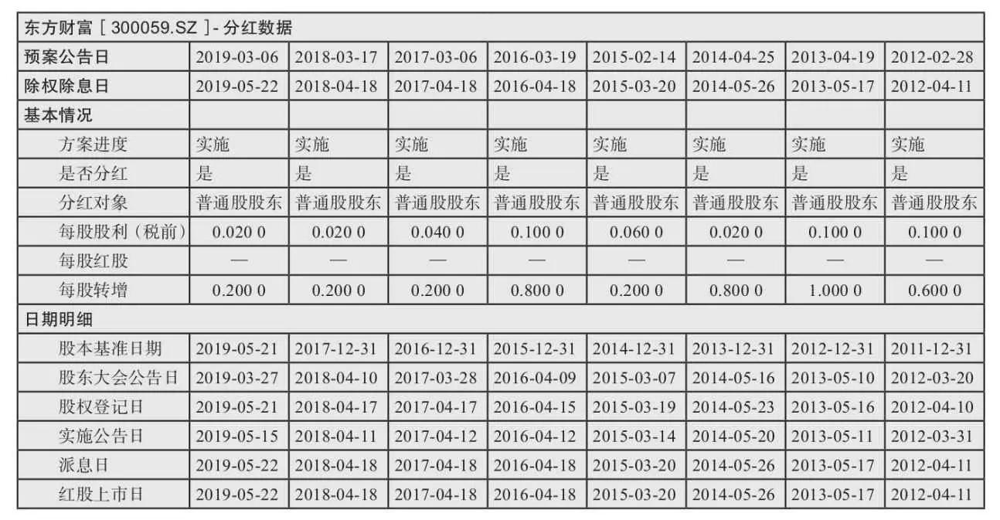

图2\-22011～2019年东方财富的分红数据（单位：元）

资料来源：Wind资讯。[\1]

估计上面介绍的几种方法很多人一时消化不了，建议大家多看几遍。投资是辛苦的，不可能一蹴而就。

为了便于大家理解，我给大家写个总结。站在2019年来看：

如果你是一个很谨慎的投资者，那肯定要等到这只股票的价格跌下来的时候再买。

如果你是一个对东方财富比较有信心而且已经买了它的股票的投资者，那我觉得可以再持有一段时间。

按照当时的估值，我肯定不建议大家大规模建仓，因为好像稍微有点贵。我自己的感觉是，未来某一天，如果东方财富真的拿到了银行、保险和信托的牌照，反而是应该卖股票的时候，因为预期都已经兑现了。

结语：我始终认为只有基本面驱动的价值投资才是可持续、可复制的盈利模式。

如果选出了几家好公司，那么实现财富增长并不难。至于如何选出好公司，主要看财务数据。但是，好公司要加上好价格，要想在好价格买入，必须看估值。

正如巴菲特所说，股市是一个钟摆，迟早会回归均值。

[\1] 本书中的此类图均截取自Wind 资讯。

2025年5月18日

11:03

## 第2章 投资方法 - (04) 2.4 如何估值2：以中炬高新为例

\(04\) 2\.4 如何估值2：以中炬高新为例

2\.4 如何估值2：以中炬高新为例

我在前面给大家介绍了几种估值方法，比如常见的净资产收益率法、市净率法等。这里再以中炬高新为例，演示终值折现法。

分析公司的估值，通常分三步。

（1）看公司的基本面，从财务报告入手。

（2）做盈利预测，对公司未来三年的盈利进行预测。

（3）使用估值模型计算公司的合理估值。

在计算之前，我们先看市场给公司的估值。截至2019年4月23日，中炬高新的收盘价是34\.72元/股，总股本是7\.97亿股，总市值是277亿元。

我们以中炬高新2018年的年报为例，一步步来分析。

第一步，介绍公司的基本面。2018年，中炬高新的主营业务收入为42亿元，净利润为6\.1亿元。

公司业务分成调味品业务、房地产业务、国家级开发区的建设管理和汽车配件业务。

调味品业务。调味品业务由美味鲜公司经营，主要产品有酱油、鸡精鸡粉、食用油等调味品，2018年生产了54万吨。

从营业收入的金额看，酱油的营业收入占比接近70%，鸡精鸡粉占比12%，酱油加鸡精鸡粉共占营业收入的80%；食用油占比8%，其他调味品占比12%。所以，在整个中炬高新的调味品业务中，酱油是绝对的大头。

中炬高新调味品业务的营业收入是38亿元，而公司的总营业收入是42亿元。调味品不仅营业收入占比很高，并且同比增长了10%，毛利率为39%，净利润为6\.36亿元。

美味鲜公司值得关注，因为这家公司在2018年年底时总资产是23亿元，净资产是15亿元。

从净资产收益率看，美味鲜公司的净利润是6\.36亿元，净资产是15亿元，净资产收益率超过40%。我们一直说银行很赚钱，其实银行的净资产收益率一般只有百分之十几。

美味鲜公司的经营杠杆不高，可想而知它的赚钱能力有多强。如果把美味鲜公司单独上市，它的估值可能要比现在的中炬高新高很多。

房地产业务。房地产业务主要由中汇合创经营。中汇合创拿到了中山城轨站北侧1600亩[\1]的商住地，从2010年开始开发，目前主要产品是联排别墅、高层洋房、商铺等，已开发物业面积16万平方米。

公司在2018年的年报里提到，在中山市岐江新城的规划里，中汇合创有几块地在新城中心，不过其房地产业务的后续开发没有具体时间表。

除岐江新城的土地，中炬高新还有其他商住地，这些商住地在2017年就已经开工建设，2019年实现了销售。

中炬高新持有中汇合创79%的股权，为了简化计算，我们按80%考虑。2018年中汇合创的营业收入为9000万元，净利润为3000万元，因为中炬高新的控股权是80%，所以净利润得乘以80%，金额是2400万元。

但是房地产业务利润少且波动大。卖房子才有利润，不卖房子就没利润。

国家级开发区的建设管理。从20世纪90年代初开始，中炬高新承担起了中山火炬高新技术产业开发区的建设管理工作，面积为5\.3平方千米。

经过二十多年的开发，园区基本开发完毕，公司目前拥有园区内的厂房、宿舍及相应配套物业近25万平方米。2018年园区开发的营业收入为670万元，净利润只有1万元。

汽车配件业务 汽车配件业务由中炬精工公司经营，主要产品是汽车空调电磁离合器，这个产品是发动机与压缩机之间的动力传递装置，属于汽车空调系统中的核心零部件。

2018年汽车配件业务的营业收入为7000万元，毛利率是26%，净利润率不到10%，净利润只有590万元。

综上所述，中炬高新的四项业务中，相对稳定且盈利能力强的，无疑是调味品业务；房地产、开发区的建设管理、汽车配件这三项业务，要么波动大，要么盈利少。

所以，我们在给中炬高新估值时，要先把调味品业务单独估值，其余三项业务打包在一起估值。

第二步，做盈利预测（见表2\-19）。未来几年，调味品行业能够实现稳步增长，增长率在10%～15%。

调味品行业现在的格局是“一超加四个梯队”：一超是海天味业，中炬高新位于第二梯队，千禾味业在第三梯队，第四梯队是些更小的公司。行业中的龙头企业，比如海天味业和中炬高新，利润增速快于行业。

先假设未来三年中炬高新的营业收入按15%增长。2018年调味品业务的营业收入是38亿元，预计2019年约为44亿元，2020年约为50亿元，2021年约为58亿元。再假设净利润率。中炬高新2018年的净利润率为17%，而海天味业在25%左右。与海天味业比较，中炬高新的净利润率明显偏低。假如未来三年中炬高新更加重视调味品业务，剥离其他几项不赚钱的业务。只要做好渠道建设，它的净利润率应该能进一步提升，所以我们假设中炬高新在2018～2021年每年净利润率提升一个百分点。

有了营业收入和净利润率之后，我们接下来算净利润（见表2\-19）。中炬高新2018年的净利润是6\.5亿元，预计2019年是7\.9亿元，2020年是9\.5亿元，2021年是11\.6亿元。

第三步，用终值折现法计算估值。

如表2\-19第二部分所示，净利润的范围是10亿～13亿元；市盈率估值倍数的范围是25～45倍。我觉得合理的净利润差不多是11亿元，市场会给30倍的估值，那么市值大概是11亿元×30=330亿元。

盈利预测或者终值通常是一个范围，所以这里出现许多数字，最小的是250亿元，最大的是585亿元。如表2\-19第三部分所示，把这些数字从小到大排列——250亿～600亿元，这些是将来值；折现率分别是15%、20%、25%。调味品行业增速不快，确定性高，我认为给15%～25%的折现率比较合理。

接下来，按照这个折现率计算公司的现值。现值底部是128亿元（250亿/（1\+25%）3），顶部是395亿元（600亿/（1\+15%）3）。

表2\-19 终值折现法（金额单位：亿元）

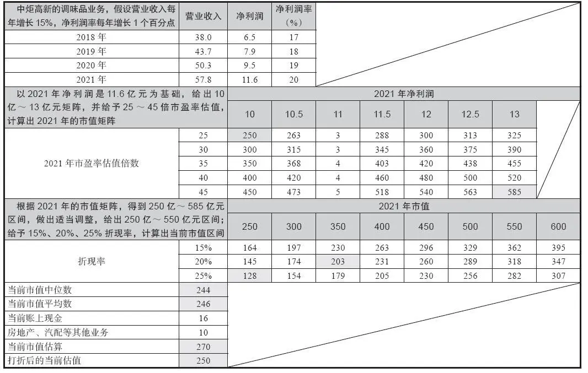

资料来源：中炬高新公司公告及主观预测。

去掉极大值和极小值，计算中位数和平均数，市值落在240亿～250亿元。

公司账上有16亿元净现金，另外房地产业务、开发区的建设管理和汽车配件业务打包一起算是10亿元。

把数值相加得出估值270亿元，与公司2019年4月时的市值差不多。分部估值一般要打折，按90%计算，估值在250亿元左右。对比当时的市值，并未高估。

多用一种估值方法更保险。下面再使用历史估值法进行估值。

图2\-3是一张历史市盈率图，共有五根线，从上面数第三根线是合理位置，2019年4月股价在第二根线附近，稍微有些高估。

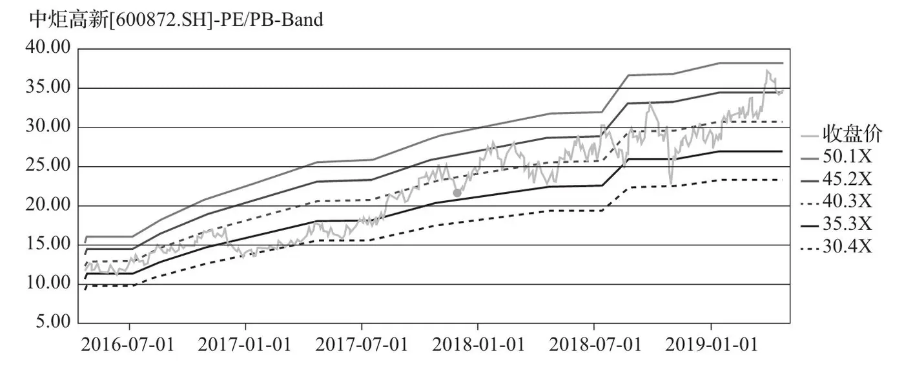

图2\-3 历史估值法

资料来源：Wind资讯。

我认为，看得懂估值才拿得住股票。对公司理解到位了，不论牛市还是熊市，都能睡得着觉。我喜欢挑选在未来几年成长较快，在行业中有核心竞争力的投资标的。同时也要注意估值，明显高估的公司是不能投的。

[\1] 1 亩 ≈ 666\.7 平方米。

2025年5月18日

11:03

## 第2章 投资方法 - (05) 2.5 如何估值3：以中国建筑为例

\(05\) 2\.5 如何估值3：以中国建筑为例

2\.5 如何估值3：以中国建筑为例

前面，我以东方财富为例，向大家介绍了成长股估值的几种方法。

那蓝筹白马股用什么样的估值方法呢？这里我以中国建筑为例，再向大家介绍几种估值方法。

在讲估值以前，我们先了解一下中国建筑的基本面。

（1）中国建筑是建筑行业的龙头企业。比如营业收入规模，中国建筑2018年的营业收入达到了1\.2万亿元，几乎等于排名第二和第三的中国中铁和中国铁建的营业收入之和。

建筑行业是用工大户，我们通过中国建筑的员工总数看看其行业地位。2018年年底，中国建筑的员工超过了30万人（历史上第一次超过30万人），比中国中铁的28万人和中国铁建的29万人要多。

（2）中国建筑是典型的蓝筹白马股。中国建筑的净资产收益率（ROE）很高，如图2\-4所示。

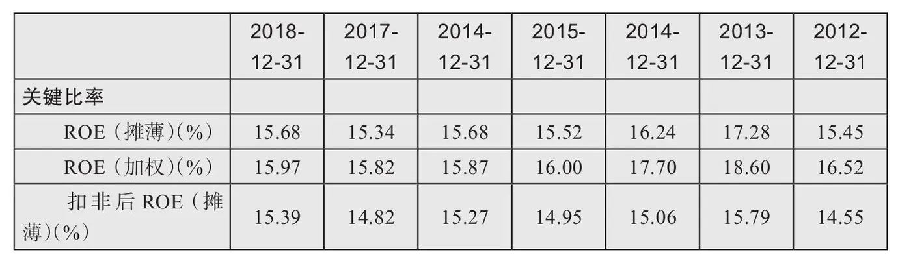

图2\-42012～2018年中国建筑的净资产收益率

资料来源：Wind资讯。

中国建筑的净资产收益率在过去很多年都保持在15%以上，而且较为稳定。考虑到公司很少做外延式并购，这些净资产收益率都源于公司内生性的增长，这很不容易。

（3）中国建筑的估值一直不高。截至2019年6月4日收盘，中国建筑的总市值是2347亿元，以2018年的净利润和净资产为基数，公司静态市盈率是6倍，市净率是0\.96倍，估值很低。

中国建筑的业务并不复杂，大体分为建筑业务和房地产业务两块。

一直以来建筑业务是公司的主业，具体来说细分成房建、基建和勘察设计。勘察设计的体量很小，几乎可以忽略不计。

我们前面介绍过，2018年中国建筑实现营业收入1\.2万亿元。在这1\.2万亿元的营业收入之中，建筑业务占近85%。

但是，建筑业务有一个明显的短板——毛利率很低，房建的毛利率不到7%，基建的毛利率不到8%。净利率则更低。

对于建筑业务未来的预测，要看建筑行业里一个重要的先行指标——新签合同额。

为什么新签合同额那么重要？因为在建筑行业里，新签合同额就像一面镜子，体现了上市公司的经营能力，还能反映出今后一两年上市公司营业收入和净利润的变化趋势。一旦新签合同额出现拐点，上市公司未来的发展大概率会遇到瓶颈。

2018年全年，中国建筑的新签合同额同比增长7%（见表2\-20），虽然继续正向增长，但较前几年的高速增长，已经明显后劲不足。

表2\-202018年中国建筑新签合同总额

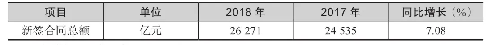

资料来源：中国建筑公司公告。

2019年5月，中国建筑公布了“2019年1～4月经营情况简报”。2019年前4个月，建筑业务的新签合同总额同比上年仅增长2\.3%，几乎没有增长（见图2\-5）。

从地域上看，中国建筑的海外业务遇到了前所未有的压力。2018年海外新签合同额同比下降22%。对于建筑行业的公司而言，因为国内竞争已经白热化，所以海外建筑业务的重要性不言而喻。未来一段时间，中国建筑需要补齐海外业务的短板，否则后续海外业务将会拖后腿。

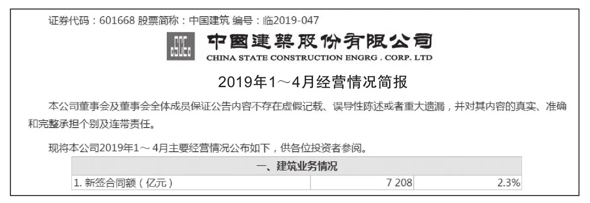

图2\-52019年1～4月中国建筑新签合同总额

资料来源：中国建筑公司公告。

相比建筑业务的薄利和增速放缓，近几年中国建筑的房地产业务做得不错。

虽然房地产业务在公司营业收入中的占比不足15%，但是毛利率很高，一般能做到35%。房地产业务是中国建筑目前比较赚钱的业务。

由于房地产公司采用的是预售制，因此，在会计确认的时候，当年的营业收入主要是两年以前卖出去的期房。比如，2016年中国建筑的房地产合约销售额是1896亿元，对应到2018年的房地产业务收入差不多是1841亿元。

2017年和2018年，中国建筑的房地产合约销售额分别为2286亿元和2986亿元，增长速度分别为21%和31%。

所以，我觉得未来两三年，中国建筑房地产业务的营业收入和净利润是有保证的。

在中国建筑2019年的交流会上，公司的管理层提到了以下几方面内容。

（1）2018年新签合同大幅下滑，主要有三个方面的原因：一是全社会都在去杠杆，造成了资金面紧张；二是公司有意识压了PPP（政府和社会资本合作）项目，凡是不入库的都不签了；三是与2018年整体基建投资增速偏低有关。

在固定资产投资增速大幅下滑的背景下，中国建筑的业务表现的确不是很好。

（2）房地产业务还是在正常发展。中国的城镇化过程还会持续一段时间，中国建筑会继续坚持主业。中国建筑对地产项目的获取、管控依旧富有成效，持续保持较强的竞争优势。

（3）中国建筑在想办法拓展一些新业务。公司入股或收购碧水源等水务环保公司，希望把正在做的水务环保业务做强，尽力实现协同发展。

中国建筑2018年和三峡集团签订了战略合作协议，未来会更多关注“长江大保护”。对于长达6000多公里的长江岸线的保护带来了很大的环保业务量，现在已经有实质性项目在推进。随着“绿水青山”政策的深入，要求各地政府和企业投资到水务环保的力量会越来越大，这块是中国建筑的强项所在。

（4）关于国企改革和科创板。随着国企改革推进，中央对国有企业、中央企业改革的要求越来越高。

比如，中海地产和中信地产通过股票交易实现了共赢，这种机会还是有的；还有一些和地方资源的整合，正在保持洽谈。

国资委把中国建筑作为十家“创建世界一流示范企业”之一，对中国建筑提出了更高的要求，对此中国建筑肯定要有所考虑。

科创板推出后，中国建筑也在探索在科创板上市，但建筑行业整体不属于高科技行业，第一批上市的可能性比较小，以后可能会有机会。对此中国建筑内部在积极探讨，包括主板的分拆问题。科创板只是提出了一个课题，至于是不是一定要争科创板，中国建筑需要表明态度：对于集团内的优质资产能不能进行有效分拆。集团有这么多专业公司、业务板块，一旦有可能分拆，将会努力争取。

以上是中国建筑的基本面。我把中国建筑概括成“两条腿”走路：建筑业务占比大，但是赚钱很难；房地产业务盈利能力强，确定性高。

下面我向大家介绍对中国建筑进行估值的方法。一般讲到估值，大家首先想到的是市盈率估值方法。股票带给我们的回报，主要体现在股价的变化上。股价（P）=市盈率（PE）×每股收益（EPS），在等式两边同时乘以总股本后，得到“公司市值=市盈率×净利润”。

从这个公式可以看出，股价（或者说公司市值）的变化有两个因素：一个是市盈率的变化，另一个是净利润的变化。如果将这两个因素进行组合，可得如表2\-21所示的矩阵。

表2\-21 市盈率与净利润的变化关系

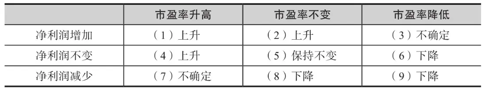

这张简单的表促使我们思考：钱从哪里来？我准备去赚哪一部分？

钱从哪里来？很明显，（1）（2）（4）是能赚钱之处，尤其是（1），即所谓的戴维斯双击区域，有兴趣的读者可以看看《戴维斯王朝》这本书。（6）（8）（9）则比较惨，属于“送财童子”，需要回避。

在使用市盈率估值法的时候，要同时预测市盈率的变化和净利润的变化。

这种预判太难了，拿中国建筑来说，2020年或者2021年的市盈率到底是给6倍还是8倍，净利润到底是增长20%还是30%，没有人能够知道。

这个时候，我们不妨换个角度考虑。股价（P）=市净率（PB）×每股净资产（BVPS），在等式两边同时乘以总股本，便得到“公司市值=市净率×净资产”。

这个公式告诉我们，除了市盈率估值法，我们还可以用市净率对公司进行估值，而且对于中国建筑这样的蓝筹白马股，市净率估值法更好。

在使用市净率进行估值的时候，我们首先要了解上市公司的净资产是如何变化的。上市公司净资产的变化源于两方面：首先是股权再融资（即增发和配股），其次是净利润扣除分红。

做一个简单的假设，如果公司没有股权再融资以及分红，那么净资产的增加直接和净资产收益率相关。比如，公司去年的净资产是100元，净资产收益率是20%，那么到年底公司的净资产就变成了120元。

中国建筑在IPO之后再也没有向市场要过钱，而且过去它每年的净利润都为正。所以，我们大概率能确定，它的净资产每年都在增加。

在使用“公司市值=市净率×净资产”这个公式的时候，我们采用保守假设，假设未来几年公司的净资产保持不变，那么公司市值（股价）的变化取决于市净率的变化。相比之前介绍的市盈率估值法，我们需要考虑的变量少了一个，会更加简化。

市净率给多少倍呢？我们知道，市净率属于相对估值指标。相对估值，相对的是公司的历史或者同行业的其他公司。我们简单看看中国建筑历史上市净率的变化（见图2\-6）。

图2\-6中是Wind提供的2016～2019年中国建筑市净率的变化，虽然比较简略，但大致可以看出市净率的波动范围是0\.9～1\.4倍。

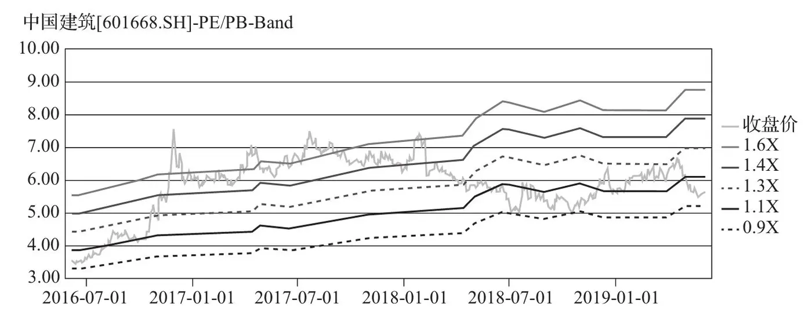

图2\-62016～2019年中国建筑的市净率

资料来源：Wind资讯。

这里，我们取极小值0\.9倍的市净率，再乘以2019年一季度末公司的净资产2537亿元，得到的市值是2283亿元，比2019年5月的市值低3%左右。

如果“市场先生”不开心，股价继续下跌3%，那就这样看“市场先生”给的报价：“市场先生”假设未来中国建筑的净资产不再增长，同时又很悲观，给了历史上最低的0\.9倍市净率估值。参考历史估值，这样的价格是有一定安全边际的。

当然，有朋友会说，万一公司的净资产被高估了，或者历史上的0\.9倍市净率估值在未来没有指导意义，那怎么办？

这些都是很好的问题。如果要解决的话，我们要在计算出的2283亿元的基础上再打一个折扣（比如9折），那么我们的安全边际会更高。

不过，即使足够安全了，公司股价也未必会马上上涨，这一点是需要注意的。

刚才介绍的市净率估值法是一种比较静态的方法，一般在业内，我们会考虑未来两三年之后公司的业务增长和未来的市值，然后折现到当下。这种方法是我们经常使用的终值折现法。

在使用终值折现法的时候，我们需要做三个假设，假设公司的净资产收益率、未来三年的估值水平和折现率。

我们在前面已经看到，在过去很多年里，中国建筑的净资产收益率一直都在15%以上。未来会怎么样我们不知道，但是在假设的时候，我们需要保守一点。这里我们假设未来三年中国建筑每年扣除分红之后的净资产收益率是12%，我相信这是能做到的。

对于三年后的估值，我们假设“市场先生”还是不喜欢中国建筑，仍然给出0\.9倍的极低市净率来估值。

然后考虑折现率。我向大家介绍过，折现率一般是在10%～40%的范围内取值。如果我们对公司未来的增长比较确定，折现率可以低一点；如果我们对公司未来的增长不太确定，那么折现率要高一点。

比如，像成长型的公司，我们的折现率不能低于30%；而中国建筑这样的蓝筹白马，确定性还是很高的，所以给予10%的折现率来估值。

最后，通过计算得到公司的市值是2318亿元，和2019年5月时的市值差不多（见表2\-22）。

表2\-22 中国建筑市值估值表（金额单位：亿元）

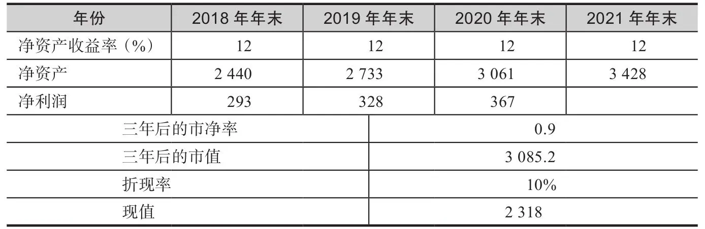

资料来源：中国建筑公司公告及主观预测。

市盈率法和市净率法都属于相对估值法。在给上市公司估值的时候，除了有相对估值法（也叫作比较法），还有绝对估值法，也就是现金流折现法，具体来说包括股利折现、企业自由现金流折现和股东自由现金流折现。

每种方法都有其适用的行业和公司。比如，终值折现法主要适用于成长股，相对估值法适用于历史比较长或者行业里同类公司比较多的公司，现金流折现法中的股利折现适用于稳定分红的公司，比如银行和白电等。

图2\-7中是中国建筑2015～2019年的分红数据。

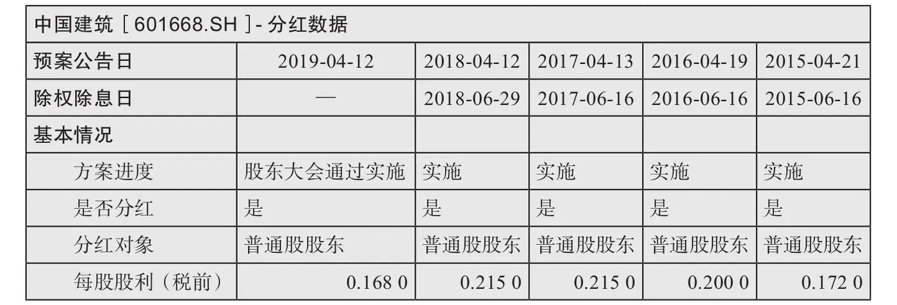

图2\-72015～2019年中国建筑的分红数据（单位：元）

资料来源：Wind资讯。

中国建筑每年都在分红，2018年的年报分红是每股0\.168元，比前两年少一点。公司的解释是，公司正在持续转型，加大业务结构调整，需要大量资金，所以分红会少一点。

在用股利折现模型对中国建筑进行估值的时候，我们需要假设未来股利的增长和股东要求的折现率。

我觉得像中国建筑这样的公司，未来不会破产。我们做一个简单的保守假设，假设中国建筑未来每股的分红是0\.2元，而且股利在将来不会增长了，永远是每股0\.2元。

那么折现率应该用多少呢？

中国建筑的资信比较高，相当于有国家信用背书，所以折现率在3\.5%～4%，比10年期国债的收益率高一些。

按照戈登永续增长模型，我们得到的合理价格是每股5～5\.7元，和2019年5月的股价差不多。

接下来，我们用分部估值法对中国建筑做一个测算。

中国建筑旗下的中国海外发展、中国建筑国际和中国海外宏洋集团都是在香港上市的，西部建设是在深圳证券交易所上市的。

以中国海外发展为例，它在2019年5月的市值是2947亿港元，中国建筑通过100%持有中国海外集团控股中国海外发展51%的股权。

扣除这些已经上市的公司权益的市值，得到市场给中国建筑剩余业务（主要集中在建筑工程板块、国际工程板块和基础设施板块）的估值。

有兴趣的朋友可以自己算算，我毛估剩余那么多资产的价值应该不到500亿元，显然是很便宜的。

最后总结这一节的内容。

我们介绍了建筑行业的龙头企业中国建筑的基本面，并介绍了市净率估值法等几种估值方法，得到的结论是：中国建筑是国内较大的房地产综合企业和较大的国际承包商，虽然公司的建筑业务存在一定的挑战，但是房地产业务应该能支撑公司未来两三年的持续增长。同时，中国建筑的估值偏低。在保守的假设之下，我们用了多种方法，看到公司当时的估值是合理的，甚至是偏低的。

希望通过这个案例，让大家了解基本面分析和估值分析的应用。

2025年5月18日

11:03

## 第2章 投资方法 - (06) 2.6 如何估值4：有或没有估值法

\(06\) 2\.6 如何估值4：有或没有估值法

2\.6 如何估值4：有或没有估值法

讲到估值的话题，我的观点是，对于任何一家公司，在做估值的时候，先要用有或没有估值法。

这个名字是我取的，意思是，在估值的时候，先不要考虑是用绝对估值模型还是相对估值模型，不要想未来公司的盈利是多少，而是要想公司有没有触及监管的红线，或者是不是在我们的黑名单上。如果这家公司触及了红线或者在黑名单上，那么它就是“没有估值”的，因为我们肯定不会去投资。

监管的红线比较明确，一般有这样几种情况：即将退市的公司、可能会被暂停上市的公司、ST类公司、非标准审计意见的公司，还有一些没有道德底线的公司等。

在业内，我们经常说的一句话是：“要沉的船，哪怕卖一块钱都是贵的。”在投资的时候我们不要碰这些公司，因为风险极高。

每家机构都有自己的投资黑名单，在我看来有这样一些筛选标准：

行业上，农林牧渔行业的公司尽量少投。仅在2016年，证监会就处罚了六家农林牧渔行业的公司，占证监会当年行政处罚数量的一半。这类公司有很多现金交易，监管起来不容易。

最后，那些违背道德进行操作的公司就不要投了。比如，工程机械行业的某龙头企业，前些年花了很多时间和钱培育了某个重装业务，先以市场竞争激烈为由，以6000万元将其从上市公司剥离出来卖给公司高管，三年以后又让上市公司花20亿元重新买回来。

再比如，某公司的扇贝已经连续逃走了几次；某做语音识别的高科技公司把钱拿到手后搞了房地产项目；还有某锂业公司低价去香港发H股，摊薄A股投资者的利益……这样的公司还有很多。这样的公司可以伤害我一次，但是我绝对不会让它伤害我第二次。

在做投资和研究的时候，我们要多留个心眼儿。

2025年5月18日

11:03

## 第2章 投资方法 - (07) 2.7 如何阅读资产负债表（上）

\(07\) 2\.7 如何阅读资产负债表（上）

2\.7 如何阅读资产负债表（上）

证券研究分成基本面研究和技术面研究两大类。基本面研究包含宏观和策略的研究、行业基本面的研究和个股基本面的研究。我们先从基本的个股基本面的研究说起。

研究个股基本面有很多角度，常见的角度包括公司股东的研究、公司管理层的研究、公司战略的研究、公司产品的研究、财务报表的研究、搭建公司的盈利预测模型和公司估值的研究等方面。其中财务报表、盈利预测模型和公司估值是偏定量的研究，在整个研究中占相当大的比重。

三张财务报表中，我认为最重要的是资产负债表。资产负债表包含很多财务信息，公司给出的注解也很清晰，同时资产负债表是具有预测作用的报表。

很多时候，虽然公司当期的利润表看起来还不错，但是，如果资产负债表恶化了，那么之后公司的收入和利润都会大幅下滑。

资产负债表的内容很多，所以我们拿到资产负债表后的第一个工作是进行简化。当年我在复旦大学读书的时候，教授介绍的读书方法是，一开始要把厚的书读薄，熟悉之后又要把薄的书读厚。

简化后的资产负债表只保留流动资产、非流动资产、总资产、流动负债、非流动负债、总负债、归母权益、少数股东权益和总权益这几项内容。为了解释清楚，我们把曾经的“明星”乐视网请出来，以帮助我们理解相关内容。

表2\-23是简化后的乐视网的资产负债表。

表2\-232013～2017年三季度乐视网的简化资产负债表（单位：亿元）

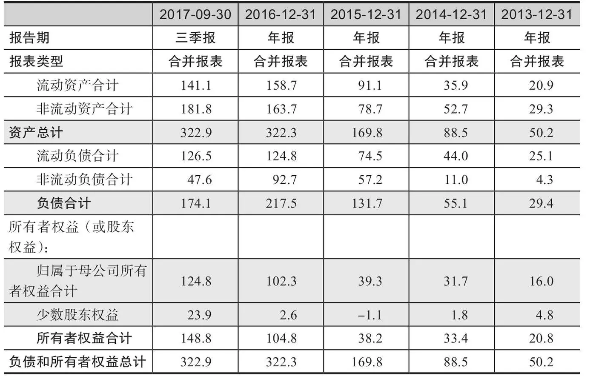

注：相关数据都做了四舍五入处理。

资料来源：乐视网公司公告。

简化的资产负债表中，我们主要研究1个金额、2个指标和3个结构。

1个金额

乐视网在2013年年底的总资产是50亿元，2014年年底增加到88亿元，2015年年底几乎翻倍，增加到170亿元，2016年再大幅增加到322亿元，但是2017年第三季度末与2016年年底相比基本没有增长。

作为投资者，我们喜欢去找有成长性公司。那么成长性体现在哪里呢？体现在收入和利润上吗？并不是。我在前面说过，资产负债表是领先于利润表的，所以根据资产负债表能预先进行判断。

从道理上讲也能讲得通，公司只有先增加流动资产和非流动资产，同时提高杠杆率，才能支持后续的收入和利润的增长。

乐视网之前是资本市场的宠儿，股票价格大幅上升，我们从其前几年的资产负债表上可以得到基本面的印证。

那增长多少才算大幅增加呢？这没有一定的数值。我们往往参照行业龙头企业总资产的增加值，或者低一点，将GDP的增长率作为标准。但根据经验，如果一家公司的总资产不再增加，或者总资产开始大幅萎缩（业内叫作“缩表”），那么这家公司的股价往往会有很大的下跌风险。

2个指标

这两个指标的算法比较简单，我不介绍了，有兴趣的读者可以自学。

就乐视网而言，公司的资产负债率从2015年的78%逐步下降到2017年第三季度末的54%（见表2\-24），这表明公司在不断地降杠杆。高的资产负债率固然能提升净资产收益率，但是这个比率太高则意味着公司面临的潜在财务风险也非常高。

表2\-242013～2017年第三季度乐视网的资产负债率和流动比率

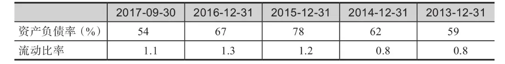

资料来源：乐视网公司公告。

作为投资人，我们不喜欢杠杆太高的公司。当然，每个行业的资产负债率天然是不一样的。所以，我们在看资产负债率的时候，还要与行业及行业龙头企业的数据进行比较。国内制造业合适的资产负债率应在50%左右，如果超过60%，就要小心了。

当然，乐视网的降杠杆其实是用了一个不常见的手段，我们等一下再进行介绍。会计上这样的处理是允许的，但是作为投资人，我们要对此保持清醒。

除了资产负债率，我们还要计算流动比率。这个比率比较合适的值是2，即流动资产是流动负债的2倍。我们看到乐视网的流动比率长期在1附近，这表示公司的流动性压力还是比较大的。

3个结构

资产的结构。相比2016年年底，到了2017年第三季度末，乐视网的总资产基本没有变化，但是流动资产少了约18亿元，而非流动资产增加了约18亿元。非流动资产都是变现能力很差的资产，我不认为增加非流动资产对乐视网有帮助。

负债的结构。相比2016年年底，到了2017年第三季度末，乐视网的总负债下降了约43亿元，但从结构上看，流动负债基本没有变化，主要是非流动负债从92\.7亿元下降到了47\.6亿元。非流动负债是一年以上的负债，一般需要支付的利息较多，非流动负债的下降可以帮助减少公司的利息支出，有利于改善利润表。

所有者权益的结构。相比2016年年底，到了2017年第三季度末，乐视网的所有者权益增加了44亿元，其中归母权益增加了约23亿元，少数股东权益增加了约21亿元。

归母权益的增加和少数股东权益的增加主要是因为乐视网放弃了部分乐视致新的控股权。我们希望看到的所有者权益增加是来自股东真金白银的投入和公司盈利能力的提高，卖出控股权是一次性的，不能持续，所以这种增加所有者权益的方法并不是我们所喜欢的。

对于资产负债表，我们首先要进行简化处理，并重点研究“1个金额、2个指标和3个结构”。做完这项工作之后，是不是要马上分析报表上的具体科目？我觉得不是。分析资产负债表就像中医给患者看病，一开始需要对患者“望闻问切”，我们需要对资产负债表进行总体把握。

这个时候我们需要把原始资产负债表打开，先计算变化金额。请大家记住，在分析任何一张财务报表的时候，变化金额一定是用后面日期的金额减去前面日期的金额。

我们继续给乐视网“把脉”。想要分析从2016年年底到2017年9月30日乐视网的资产、负债和所有者权益的变化情况，需要用2017年9月30日的报表金额减去2016年12月31日的报表金额。

为了方便大家理解，我在真实资产负债表的基础上做了相当大的简化，如表2\-25所示。

表2\-252016～2017年第三季度乐视网的简化资产负债表（单位：亿元）

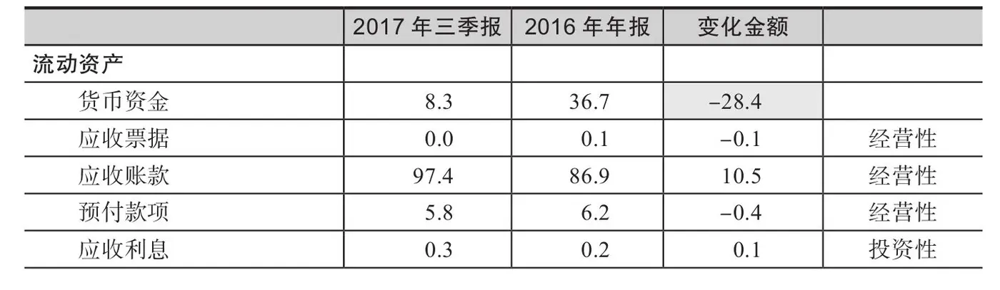

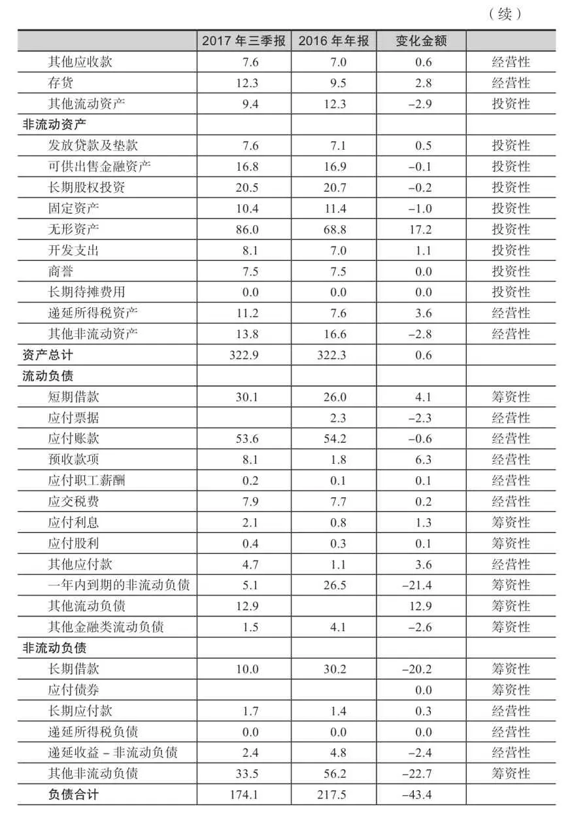

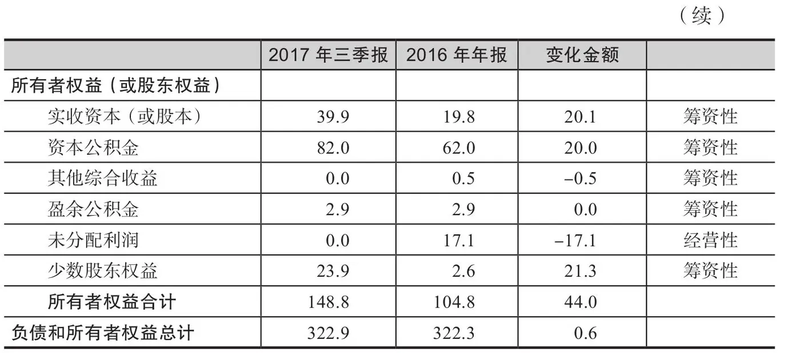

注：由于四舍五入，合计数与各项之和略有出入。

资料来源：乐视网公司公告。

第一步，观察第一列。如果“其他流动资产”“其他非流动资产”“其他流动负债”和“其他非流动负债”这四个科目有较大的金额，一定要特别关注。

从逻辑上讲，资产负债表中的会计科目是三张报表里面最多的，你能想到的所有金额可以能放到很明晰的会计科目里。所以，如果有金额需要放在“其他××资产”和“其他××负债”这几个模糊的会计科目里，那么从做研究的角度，一定要去研读财务报表附注的内容，看看里面到底隐藏了什么。

从投资的角度，如果没有时间去看财务报表附注，那么建议暂时先放弃研究这家公司。毕竟A股里有3000多家公司，而且投资是需要做减法的，看不清楚的公司暂时先放一放。

第二步，计算出第四列的变化金额。其中货币资金（现金）的变化用灰色标注了出来，我们在后面会分析现金的变动。乐视网2017年9月30日的现金比2017年年初少了28\.4亿元。

第三步，在资产负债表中的每个科目后面标注“经营性”“筹资性”或“投资性”字样。经营性科目和公司的正常经营活动相关，筹资性科目和公司的融资活动相关，投资性科目和公司的对外投资相关。

比如，应收账款是经营性的，因为应收账款和公司的经营活动相关，是公司正常做生意形成的；固定资产是投资性的；长期借款是筹资性的。

对于“其他××负债”和“其他××负债”这四个科目，一定要看财务报表附注才能明确它到底属于哪一部分，每家公司都不一样。

当我们已经分清楚资产负债表中的每个科目属于“经营性”“筹资性”还是“投资性”之后，我们要理解其中各科目变化的关系，这需要从现金的角度去看（见图2\-8）。

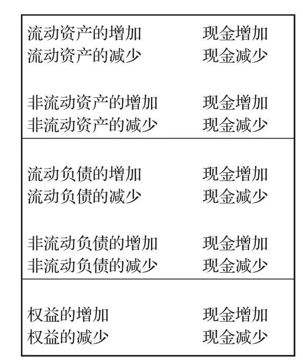

图2\-8 现金角度的资产负债表科目变化

明白了现金的流入与流出之后，我们给整个资产负债表来个“乾坤大挪移”，将它完全改写成另外一种形式。依然以乐视网为例，从2016年12月31日（A时点）到2017年9月30日（B时点），为了方便大家理解，我在真实数据的基础上做了相当大的简化，如表2\-26所示。

表2\-262016～2017年第三季度现金角度的乐视网资产负债表（单位：亿元）

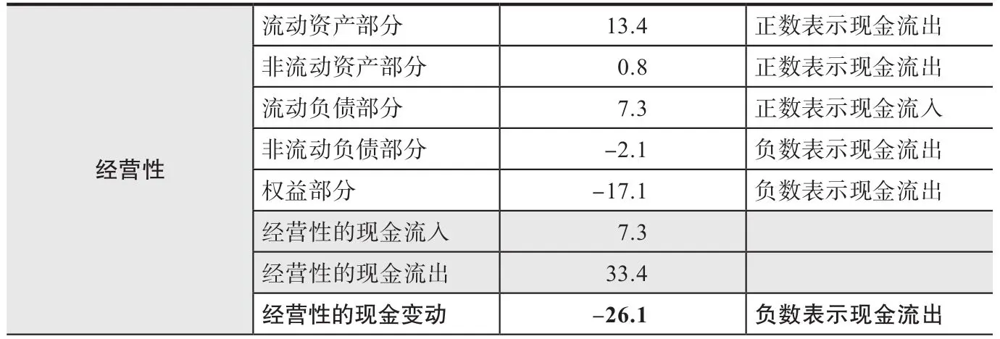

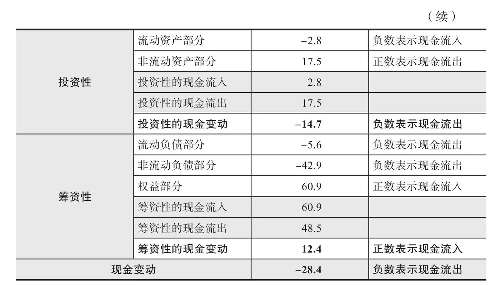

表2\-26显示，从A时点到B时点，乐视网经营性的现金变动是\-26\.1亿元，表示现金流出；乐视网投资性的现金变动是\-14\.7亿元，表示现金流出；乐视网筹资性的现金变动是12\.4亿元，表示现金流入。简单相加，得到整体现金流出28\.4亿元。

这个数据直接用B时点报表上的现金金额减去A时点报表上的现金金额也能得出。乐视网在B时点的现金比在A时点少了28\.4亿元，两个数字是完全相同的。

有了这组数据，我们接下来开始进行分析。

熟悉现金流量表的朋友会知道，这种“乾坤大挪移”的方法有些类似于“间接法编制现金流量表”，的确如此，但并不完全相同。我们知道，上市公司的三季报只披露直接法下的现金流量表，不提供间接法下的现金流量表。通过“乾坤大挪移”的方法，我们大致可以测算出经营性、筹资性和投资性的现金变动。

从分析的角度，我们希望经营性现金流是正数，表示现金流入；投资性现金流如果是负数，则表示现金流出，但是最好比经营性现金流的流入少一点；筹资性现金流中来自债务的变动和权益的变动要与历史变动相匹配。

再回到乐视网，乐视网2017年前三季度有大量的经营性的现金流出和投资性的现金流出，如果没有筹资性的现金流入，公司很难维系下去。但是，筹资性的现金流入不是一个稳定的资金来源，债权融资和股权融资会随着融资金额的增加而变得越来越难。

2025年5月18日

11:03

## 第2章 投资方法 - (08) 2.8 如何阅读资产负债表（下）

\(08\) 2\.8 如何阅读资产负债表（下）

2025年5月18日

11:03

2\.8 如何阅读资产负债表（下）

我每天都要看上市公司的年报，之前看到过一家很有意思的公司，名叫“沈阳机床”。它的股价曾经在2018年1月连续上涨一段时间，其中还有两天拉了涨停板。

那段时间它的股价为什么会表现得那么好？原来这家公司叫\*ST沈机，2017年年报实现盈利，所以摘帽了，这叫作“摘帽行情”。但是，如果仔细看沈阳机床2017年的财务报表，你会发现它的基本面根本没有好转。

2017年它的总营业收入是42亿元，而总成本是55亿元，能够实现盈利是因为它卖出了下属企业的控股权，获得了12亿元，但这个收益是一次性的，之后很可能就没有了。

另外，如果大家看它的资产负债表会发现，它在2017年年底的货币资金是58亿元，短期借款是102亿元，一年到期的非流动负债是28亿元，应付债券有5亿元，净有息负债有77亿元，而它在2018年1月时的总市值才92亿元。

这意味着，我如果当时花92亿元把它整个买下来进行私有化，还要额外支付给债权人77亿元。净有息负债居高不下，利息费用庞大，也将严重影响它2018年的盈利。

借由沈阳机床2017年年报，我们继续系统学习一下如何看资产负债表中的现金类板块。

这个板块包含的会计科目有货币资金、可供出售金融资产、短期借款、一年到期的非流动负债、长期借款和应付债券。

货币资金和可供出售金融资产是资产；短期借款、一年到期的非流动负债、长期借款和应付债券是负债。

常见的划分负债的方法，是根据负债的到期日，一年内到期的负债叫流动负债，超过一年到期的负债叫非流动负债。

现在，我们介绍另外一种划分负债的方法——根据负债是否需要承担利息，把负债分成有息负债和非有息负债。

短期借款、一年到期的非流动负债、长期借款和应付债券，是公司从外部金融机构借的钱，需要支付利息，所以这四类负债是有息负债。其他类型的负债，比如应付账款，表示公司占用的是供应商的资金，这部分资金不需要支付利息，因此应付账款不属于有息负债。

把有息负债扣除现金和可供出售的金融资产后，得到一个重要的数据，我们把它叫作“净有息负债”。净有息负债反映的是公司承担的需要支付利息的债务规模。

净有息负债是负数，表示公司现有的现金充裕。比如，公司的货币资金是10亿元，如果没有其他可供出售金融资产和短期借款这些有息负债，那么公司的净有息负债是\-10亿元。

在实务中，对于现金充裕的公司一般能做出如下推论。

第一，现金充裕的公司一般不会增发或者配股。在资本市场上，频繁向外部股东伸手要钱的公司要引起注意，因为增发、配股、发行可转债这些方式都会摊薄现有股东的权益。极端一点说，我没有看到贵州茅台上市后再融资，也没有看到苹果公司再融资。

第二，现金充裕的公司有极大可能做一些行业并购，而且用现金做并购比用增发新股做并购方便，因为增发新股需要走一定的流程，时间相当长，而且还有可能通不过。

第三，在估值的时候，我们会给账面现金充裕的公司高一点的估值倍数。比如，公司在历史上经常做并购，净有息负债是\-10亿元，表示公司账上有10亿元的净现金。假设公司的利息收入是0\.5亿元，即5%的利率。如果公司正常经营活动的净利润是0\.5亿元，假设不考虑其他税费，公司的净利润合计为1亿元。研究员如果不分开估值，直接给30倍的市盈率，那么公司合理的市值是30亿元。

## 第2章 投资方法 - (09) 2.9 如何阅读半年报

\(09\) 2\.9 如何阅读半年报

2025年5月18日

11:03

2\.9 如何阅读半年报

2018年7月9日，A股首份2018年半年报正式出炉，航锦科技拔得头筹。对于关注基本面分析的投资者而言，每年7月1日左右到8月31日这两个月，每天都过得很充实，因为有大量的半年报可以用来阅读、分析和比较。投资者通过阅读上市公司披露的半年报，能够学习和了解相关行业与公司的最新状况。

很多朋友问在哪里能找到上市公司最新的财务报告，散户一般去上海证券交易所（[www\.sse\.com\.cn](http://www.sse.com.cn)）和深圳证券交易所（[www\.szse\.cn](http://www.szse.cn)）的官网，在网站首页输入股票名称或代码，就能找到相应公司的财务报告。

那如何阅读半年报呢？我以航锦科技为例，介绍一下半年报的阅读方法。

打开航锦科技的半年报，我们会看到这份半年报一共153页，半年报的内容通常比一季报和三季报的内容多很多。如果是一般性公司，只是为了了解，阅读这样一份报告的时间在1个小时左右。但如果是我们投资的重点公司，我们需要用半年报的数据去更新财务模型和估值模型，那么整个阅读的时间会长达两三个小时。

航锦科技的半年报分成11节，第一节是“重要提示、目录和释义”。在阅读半年报的时候我们很容易忽略第一节，我觉得第一节的内容虽然不多，但是有几个小地方需要注意。

第一节里出现的公司都是对上市公司来说很重要的控股子公司、联营或合营公司，有时候出现的是上市公司重要的上游供应商或下游客户。在航锦科技的这份半年报里，我们看到是长沙韶光、威科电子、上海琢鼎和中电华星这四家公司。在接下来阅读公司半年报的时候，我们需要特别留意这四家公司，看看这四家公司和上市公司之间的关系，上市公司对它们的投资金额和控股比例，以及这四家公司为上市公司带来的收入和净利润等。

除了这些内容，我们还可以看到公司的控股股东，以及对相关行业专业名词的解析。

第二节是“公司简介和主要财务指标”，内容很丰富。第一部分是公司简介，供我们了解公司的股票简称、股票代码和上市地点。第二部分是公司的联系人和联系方式，公司对外的联系人一般是公司的董秘和证券事务代表。

我们买方机构去调研的时候，主要找的人是公司的董秘。但是，董秘和我们这些机构非亲非故，一年365天很多时候又都在重复说着同样的话，所以我们从董秘那里了解的信息其实很有限。我一直觉得，如果做好功课，仔细阅读上市公司的所有公开信息，其实见不见董秘，差别不是很大。不过，在和董秘熟识之后，我们倒是可以通过他们去认识公司的董事长、总经理、财务总监或销售总监，从这四个人那里得到的信息可能会更全面。

证券事务代表我们也不能忽视，虽然现在证券事务代表往往是“90后”的小朋友，但是他们未来极有可能成长为某家上市公司的董秘，所以我们去调研或者开股东会的时候，尽量认识一下他们。感情是需要长时间积累的，多认识和结交一些朋友总是有帮助的。

除了董秘和证券事务代表的名字之外，我们还会看到公司对外联系的电话、传真和电子邮箱。A股很多公司的电话永远是忙音，传真机总是坏的，电子邮箱只出不进，没有回复。所以，在调研和参加股东大会的时候，获得董秘和证券事务代表的直线电话号码、手机号码与微信号是很重要的（这当然要看对方愿不愿意给）。

第三部分是其他情况。这里需要了解的是公司的注册地址和办公地址。之前有一次我去南通某家上市公司调研，组织调研的卖方研究员把公司的注册地址发给了我，结果我一个人开着车去了旁边的启东。启东和南通在地图上看着很近，但开车需要很长时间。后来每次去上市公司进行实地调研的时候，我都会再多看一眼公司的办公地址。

第四部分是主要的会计数据和财务指标。首先披露的会计数据是营业收入、归母净利润和扣非后归母净利润。我们首先需要了解的是这三个数据的增长率，增长率总是大一点更好。然后我们需要看归母净利润以及扣非后归母净利润，这两个利润最好不要差别很大，一般在正负5%之内比较合适。用净利润除以营业收入，得到的是销售净利润率，销售净利润率也总是大一点更好。

除了营业收入和各项净利润，我们还看到公司的经营活动产生的现金流量净额、基本每股收益、稀释每股收益、加权平均净资产收益率、总资产和归母净资产这几个数据。经营活动产生的现金流量净额需要和公司的归母净利润做比较，我们一般希望这两个数字都是正的，而且不要相差太大。

基本每股收益就是我们平时讲的市盈率的分母，不过要注意半年报披露的仅仅是半年的数据。稀释每股收益和基本每股收益的差别在于公司有没有稀释性证券，包括可转换债券、可转换优先股、期权或权证。稀释每股收益总是小于或等于基本每股收益。

加权平均净资产收益率反映了公司自有资本的盈利能力，我们希望公司的加权平均净资产收益率持续、稳定、较高。

另外，我们希望看到公司的总资产和归母净资产有所增长。用总资产除以归母净资产得到的是财务杠杆比率这个指标。这个指标不能太大，2倍左右比较合适。

第五部分是境内外会计准则下的数据差异。因为境内外的会计准则（IFRS/GAAP）有些差异，所以会造成某些会计数据不同。这个内容只需要稍做了解。

第六部分是非经常性损益及金额。我觉得这一部分需要重点关注。在第四部分我们已经看到了归母净利润和扣非后归母净利润。正常情况下这两个利润的大小是不同的，那么差距在哪里呢？差距在于非经常性损益。

非经常性损益，顾名思义，是现在有以后可能没有的损益。大部分公司的非经常性损益是非流动资产处置损益和当期的政府补助。我们总是希望非经常性损益小一点，对公司净利润的影响不要太大。

第三节是“公司业务概要”，这一节介绍公司从事的主要业务、主要资产的重大变化和核心竞争力这三部分内容。如果投资者刚接触某家上市公司，不了解公司的具体业务，那么建议多花一点时间了解这里的内容。

继续以航锦科技为例。航锦科技有两个主营业务：一个是化工，产品包括烧碱和环氧丙烷等；另一个是军工，主要产品是军工电子。

我曾经介绍过，所有上市公司都可以分成四大行业：大消费、大周期、大金融和TMT（科技、媒体和通信）。航锦科技的化工业务显然属于大周期行业。2017～2018年。化工行业受益于供给侧结构性改革和严格的环保督察，低效率产能被迫淘汰。化工类的上市公司有资金、人脉和各种政府资源，所以业绩表现很亮眼。

不过，在做研究和投资的时候，我们一定要记住，周期性波动和持续时间对上市公司盈利的影响是巨大的。大周期行业的特点决定了，在盈利高点的时候给出的市盈率估值必须是较低的；在盈利低点的时候，反而要给稍高一点的市盈率估值。

航锦科技的军工业务是通过收购长沙韶光和威科电子实现的。半年报的第一节中提到了这两家公司，重要的控股子公司、联营或合营公司都会在半年报的第一节里出现。

在A股，军工股是普遍享受高估值的。我认为其中一个原因是不透明，市场对于军工企业都是在雾里看花，另外一个原因是国内和国际环境的变化导致我们必须补上军事工业的短板，国家也加强了对军工企业的投资扶植力度。

不过，因为航锦科技是在2017年通过收购切入军工业务的，所以我们还需要关注收购完成后公司业务的整合程度。军工企业大部分是原有的国有体制，要把整合和管理做好其实有相当大的难度。

在了解了公司的主要业务之后，我们要明确公司的估值方法。比如，航锦科技有两个不同的业务，所以我们首先采用的是分部估值法，具体来说，公司的估值=化工业务的盈利预测×化工业务的估值\+军工业务的盈利预测×军工业务的估值。

然后，因为这两个业务是毫无关联的，而且军工业务有整合的预期，能不能做好不知道，所以在加总估值以后，我们要给一个折扣系数。这样算出来的估值会比较安全。

此外，再看看公司有没有潜在的公司治理方面的风险，如果有的话，我们还要继续打一点折扣。

上市公司还会披露公司的主要资产发生的重大变化，包括但不限于股权资产、固定资产、无形资产、在建工程等。比如，航锦科技在2018年上半年入伙了新余华尧永舜投资合伙企业（有限合伙），航锦科技说入伙是为了推进军工领域的布局。

我们继续外延推断，以后公司的发展方向会越来越向军工领域倾斜，所以外延收购和股权投资会越来越多。另外，如果上市公司的境外资产占比较高，它还会进一步披露境外资产的形成原因、资产规模、运营模式、收益状况等。

上市公司会进一步披露公司的核心竞争力，包括核心管理团队、关键技术人员、专有设备、专利、非专利技术、特许经营权、土地使用权等。在看年度报告的时候，我会重点关注上市公司核心竞争力的变化以及对公司产生的影响，尤其是核心管理团队或关键技术人员离职、设备或技术升级换代、特许经营权丧失等。

比如，2018年恒生电子公告有两位核心高管被刑事拘留，恒生电子的股价应声跌停。如果是恒生电子的投资人，一定要进一步了解这件事对公司的影响到底有多大（事后恒生电子及时召开了电话会议进行说明）。我透露一个小秘密，大家平时应该都会读卖方分析师写的公司研究报告，核心竞争力的内容基本上是原封不动直接用的这部分内容。

航锦科技是一家东北的公司，我在投资和研究的时候有地域偏好，对东北的公司一般不是很感兴趣，但是，航锦科技让我刮目相看，因为它在总结自己的核心竞争力的时候，特地写了一段：“南学北用，实现精细化管理。公司聘请了多位拥有丰富江浙企业任职管理经验的高管，为历史悠久的北方工业企业带来了南方企业的先进管理方式。”

第四节是“经营情况讨论与分析”。在国外，经营情况讨论和分析叫作management discussion and analysis（MD&A），公司的管理层会在此解释和分析上市公司当期财务报表及附注中的重要历史信息，并从公司管理层的角度对下一年度的经营计划以及公司未来发展所面临的机遇、挑战和各种风险进行说明。

抛开具体的内容，航锦科技2018年半年报在“公司业务概要”有几个小地方打动了我。

（1）内容详尽。我一年大概要看1000多份上市公司的财务报告，看多了以后会有体会，公司和公司之间差别还是很大的。半年报和年报是上市公司与投资者交流的很重要的两份财务报告，但有的公司就写了寥寥几笔，两三行完事，而且内容避重就轻，某些地方国有企业较为典型。看着这些公司，我感觉很心寒，管理层根本没有把投资者放在心上。

航锦科技的内容我觉得能打80分，该写的东西都写了，交代得清清楚楚。

（2）格式美观。有的读者可能会笑话我，上市公司把内容写好就行了，你还关注格式呀。我对于细节还是很关注的。航锦科技把内容做了分栏处理，更加美观，更方便读者阅读。分栏处理是99%的公司都不会去做的。另外，图表里的英文用的是Cambria字体，我相信99%的公司根本不会使用这样的字体。大部分企业用的是简单的宋体加Arial或Times New Roman。

公司的好坏其实藏在细节里，虽然我没有去过航锦科技，也是第一次看它的半年报，但是我相信它的管理应该是细致入微的。这个公司值得我进一步研究。

前面我们看了航锦科技的2018年半年报，得到的初步结论是公司管理做得很精细，半年报从内容到格式都比很多其他上市公司要好。下面我们再看看，航锦科技的半年报里还有哪些值得关注的地方。

半年报的第13～15页是公司的主营业务分析。我会重点看资产负债表的变化和解释。阅读的时候需要关注两个方面：一是变化的金额，二是变化的比率。

航锦科技的半年报里，金额变动比较大的有两个科目：应收票据从2018年年初的2\.5亿元增加到了3\.6亿元，应收账款从2\.3亿元增加到了3\.1亿元。公司的解释是由销售回笼资金中票据的比重增加，同时产品销售的应收账款未到账期所致。接下来我们要进一步计算票据的比例、应收账款的周转天数，同时看票据和应收账款的增加对公司经营性现金流的影响有多大。

航锦科技的短期借款从2018年年初的1\.5亿元增加到了6月30日的3\.4亿元，增加了约127%，属于比率和金额都变化很大的科目，值得我们关注。

航锦科技的解释是上半年公司的流动性比较紧张，增加了银行借款。我们知道，短期借款的增加会增加公司的财务费用，所以我们需要进一步去了解公司的资产负债率、有息负债率、利息保障倍数这几个指标，看看这些指标是不是在安全范围内。

第16页的主营业务构成，是分析师和基金经理比较喜欢看的内容。我们可以看到收入、成本和毛利率的明细数据，以及这三个项目变化的同比数据。在陆家嘴做研究和投资的人，智力水平是差不多的，更多的是拼体力，拼谁看得更仔细。

研究从本质上讲，是把过去看得更仔细，把未来预测得更准确。对于预测，不管是行业还是公司，我觉得是一个概率分布的问题，需要解决可能的路径、均值和方差这些内容。落到现实，每个人的预测水平不一样，预测的结果出现错误实属正常。假以时日，随着对行业和公司理解的深入，预测的准确性肯定会越来越高。

但是对于分析过去，由于都有现成的公开信息，如果因为没有看得很仔细而出现错误，我觉得是不能原谅的。在平时的工作中，我遇到过不少研究员在分析历史数据的时候，只计算出一个简单的同比数字，没有深入挖掘；有的研究员在做研究的时候，能把一张利润表拆得很细，把每个科目都分析到位。

以航锦科技为例，2018年上半年收入增长约20%，从15亿元增加到18亿元，我关心的是哪几个产品增长得更快，哪些产品拖了后腿，18亿元当中主力产品有哪些，它们的成长性怎样。

有人说，这些都是公开信息，你自己看就行了，为什么让研究员告诉你。因为投资和研究是一个团队活动，需要配合，我一个人是看不过来的。这有点像足球队，基金经理有点像射门的前锋，他需要整个研究团队的支持和配合，把球传给他。研究员素质的高低、研究和投资配合的默契程度都会极大地影响投资业绩。

研究员的数量不是越多越好。资产管理不是劳动密集型产业，而是一个对主观能动性要求很高的活动，愿意做研究和投资的人内心一定要非常热爱这份事业。

我在面试的时候见过一些年轻人，他们强调自己热爱研究，但是没有看过一份半年报和年报。有些人虽然基础不错，考了CFA，但是入行以后发现每天都在做重复性工作，或者收入不高（资产管理是强周期的行业），兴趣便越来越淡，让他做事情他会去做，不让他做就放任自流。如果行情不好，指数下跌较多，很多人会觉得无所事事，但是在我看来，这种时候市场的风险和收益特征已经发生了改变，虽然不会立刻上涨，但是曙光已现。此时研究员更应该抓紧时间多看公司的基本面，多分析和比较上市公司的半年报，多去调研一些上市公司。

当然，在这些年里，我看到不少做得很成功的同行在实现财务自由后去享受人生了。所有这些都是个人选择，我都理解和尊重。不过对于我而言，我会一直坚持下去，我认为投资和研究是世界上最好的事业，我愿意一直做到生命的终结。

## 第2章 投资方法 - (10) 2.10 市净率的一个简单应用：以中国石油为例

\(10\) 2\.10 市净率的一个简单应用：以中国石油为例

2\.10 市净率的一个简单应用：以中国石油为例

2019年6月，市场两极分化，贵州茅台创了历史新高，涨到了1000元/股左右。但是，一些白马股正在持续下跌，比如中国石油，在2019年6月创出了近三年的新低（见图2\-9）。

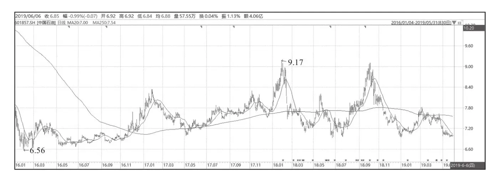

图2\-92016～2019年6月中国石油股价走势图

资料来源：Wind资讯。

从当时来看，中国石油的较大看点是估值跌到了上市以来的相对低值。

我是这样计算的：中国石油在2019年6月24日收盘后的总市值是1\.28万亿元，2019年一季报的净资产是1\.23万亿元。2018年中国石油盈利约500亿元，考虑到2019年的盈利不会比2018年差，剔除分红之后，预估的市净率正好是1倍左右。

给大家看三张图，详见图2\-10～图2\-12。

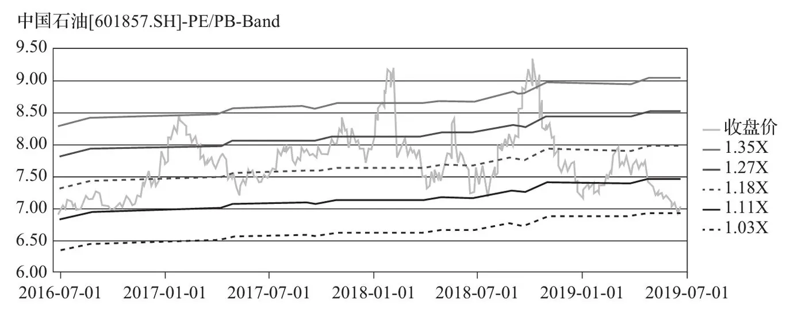

图2\-102016～2019年6月中国石油的市净率

资料来源：Wind资讯。

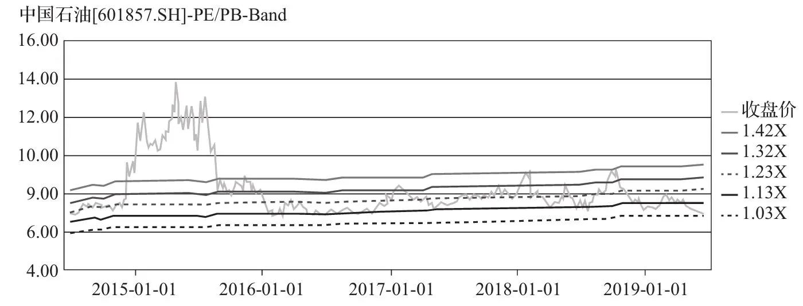

图2\-112014～2019年6月中国石油的市净率

资料来源：Wind资讯。

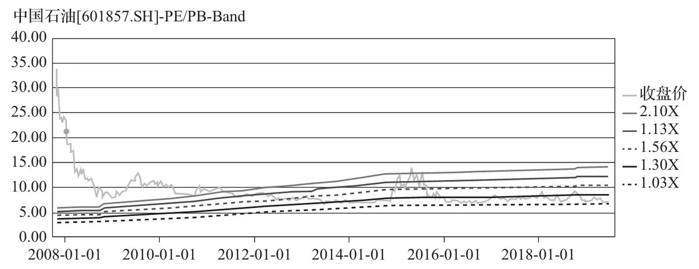

图2\-122008～2019年6月中国石油的市净率

资料来源：Wind资讯。

图2\-10～图2\-12这三张图，如果是在2019年6月的时候去看，分别是过去三年、过去五年和上市以来的市净率走势图，所以基本上当时中国石油的市净率已经到了历史的最低值。

中国石油在香港发行了H股，H股的价格和估值更低。

讲到港股的中国石油，一定会让人想到当年巴菲特买中国石油的一段轶事。

2003年，“非典”疫情严重，香港的经济受到重创，恒生指数延续长年下跌的势头，在2003年3月7日更是跌破9000点大关，回到10年前1993年的点位。

2003年4月9～24日，巴菲特以低于1\.7港元/股的价格七度出击，至少购入中国石油H股8\.6亿股，买入之后合计持有中国石油总股本的1\.3%。

巴菲特买入的价格对应的市净率正好是1倍。买入之后，在长达四年多的时间里，巴菲特一直没操作中国石油。2007年7～10月，巴菲特在11～15港元/股的价格区间内连续卖出中国石油，卖出时市净率约为3\.5倍。

既然讲到了市净率，我再和大家多聊几句。

市净率和常见的市盈率一样，都是相对估值指标。

市净率的优点在于净资产比净利润更稳定，对于微利或者亏损的公司不能用市盈率进行估值，但是仍然能使用市净率进行评估。

市净率的缺点是账面的净资产可能被人为高估，另外，会计处理方法对净资产的影响比较大。

在计算的时候，市净率是用每股股价除以每股净资产，或者用公司的股票市值除以公司的净资产。

在用市净率的时候，我们想象成搭伙做生意。比如，市净率为50倍的上市公司，意味着企业创始人投入1元，你要投入50元，然后一起合伙做生意。创始人一看，不用辛苦干了，全卖给你，让你去干，然后自己套现干别的。所以，对于市净率太高的公司，要当心一点。

同样的道理，当一些优质的银行和保险公司的市净率低于1的时候，意味着我们用与公司创始人一样或有折扣的投入便拥有同样的生意。如果公司和行业的长期前景与盈利能力尚可，只是暂时处于困境，那么这时往往是买入的好时机。

市净率与三个因素相关，下面详细讲解。

假设将公司的净利润全部作为股利分配给股东，那么P=EPS/（r\-g）。式中，P是公司股票价值，EPS是下一年预期的每股收益，r是市场资本化率，这也是投资者投资该股票所要求的预期回报率，g是每股收益的增长率（永久性）。

上述公式左右两边均除以账面净资产（BV）可以得到：

由此我们看到，市净率与净资产收益率、市场资本化率、每股收益的增长率这三个参数相关，其中起决定性作用的还是我们经常讲到的净资产收益率。

如果只看一个企业长期赚钱能力的衡量指标，我认为是净资产收益率。在1977年的文章“通货膨胀如何欺诈股票投资者”中，巴菲特熟练地运用杜邦公式指出提高净资产收益率仅有的五种方式。

（1）提高资产的周转率。

（2）廉价的债务杠杆。

（3）更高的债务杠杆。

（4）更低的所得税。

（5）更高的运营利润率。

再回到中国石油。中国石油在2019年6月时的估值很低，投资者应该去买吗？

我的答案是否定的。

虽然估值很低，而且拉长时间（投资是以年计的），我相信中国石油向下的风险比向上的风险小很多，但是我的能力有限，不能对中长期的石油价格走势做出预测，所以我对中国石油长期的净资产收益率没有办法做出评估。

另外，我没有办法预测国企改革的力度、效果和对上市公司盈利的影响，所以对我来说，可能其他白马标的会更加合适。

2025年5月18日

11:03

## 第2章 投资方法 - (11) 2.11 周期性行业的投资心得

\(11\) 2\.11 周期性行业的投资心得

2025年5月18日

11:03

2\.11 周期性行业的投资心得

回望2018年，我们会看到行业之间分化严重。互联网公司没有了新增流量，开始裁员和减薪；金融行业因为去杠杆，业绩惨不忍睹；房地产企业由于限购，日子很难过。但是，很多传统行业，比如水泥、钢铁和工程机械，在2018年却过得很滋润，这些都属于工业类周期性行业。

为什么水泥的高盈利不可持续？这是很典型的周期性行业的特征，因为供求关系决定价格，高盈利会吸引新的供给，供给上去后，价格自然就下来了。周而复始谓之周期。

对于周期性行业，尤其是强周期行业，我介绍几个投资心得，供大家参考。

在强周期行业里，当最有效率的龙头企业都在亏钱的时候，整个行业大概率处于底部区域。

比如，到2012年年底，光伏行业经历了一年半的下滑，上游多晶硅的价格跌到了龙头企业保利协鑫的现金成本。当时，全市场到处都是悲观的声音，说光伏全行业亏损，已经看不到未来。但是，在鲜有关注的时候，多晶硅的价格横在保利协鑫的现金成本上再没有下探。2013年年初，保利协鑫第一次提价2美元后，公司的港股股价在数月之内急涨一倍。

再比如，在2010年前后，煤炭行业经历了连续八年两位数增速的固定资产投资，导致供给逐年释放，与此同时，铁路的大规模建设导致其运输产能逐年增加。因此，在我看来，不论是煤炭生产还是铁路运输，在2010年均没有瓶颈了。

在需求侧，在黄金十年的后期，从几个方面都能看到变化：发电侧电源的结构变化（大机组和水电）、电网的大规模建设（与铁路网建设一样的大规模，而且变输煤为输电）、节能（降耗）。这都使对煤炭的消耗和利用发生了本质的变化，再加上经济增速的下滑，导致煤价从2011年一直跌到2015年年底。

在煤价最低的时候，秦皇岛动力煤价格“趴”在了中国大型煤炭企业中国神华的成本线附近，煤炭行业全行业亏损。然后，2016年开始供给侧结构性改革，后来的故事大家都知道了。

在强周期行业里，当最没有效率的企业都在赚钱时，这个行业有可能已经处于顶部区域。

仍然以多晶硅为例。2010年是光伏行业的狂热时期，多晶硅一吨难求。保利协鑫凭借独步全球的冷氢化技术赚得盆满钵满。

当时，一位领导模样的人数次请我喝茶吃饭，说他们企业想进入多晶硅行业，但冷氢化技术太难，所以考虑金属级硅料技术。我虽不懂技术，但面对狂热情绪，还是提醒他投资百亿元要小心为上。这个人扔下一句话：再小心就来不及赚钱了！后面发生的事情很悲惨，10年辛辛苦苦赚来的钱，一朝“灰飞烟灭”。

水泥是个强周期行业，股价波动来自周期的变化。周期向上的时候，水泥企业的利润高速增长。投资者喜欢用市盈率估值法，估值倍数一般都超过10倍，乐观的时候给到20倍以上。

周期向下的时候，水泥企业的利润迅速下滑，投资者改用市净率估值，而且给出的估值倍数很低。因此，研究和投资水泥企业的核心是把握周期的变化。但是我知道，这对于普通投资者是有难度的。

因此，我建议大家牢记“盛极而衰，否极泰来”这个简单的原则。

我们再聊聊另外一个周期性行业——房地产行业，我认为这个行业比较适合中长线布局。

2019年，国家政策要求“绝不希望再炒房，也不希望房地产市场发生大幅波动影响国民经济安全”，这个说法和2018年8月提到的“坚决遏制房价上涨”，口气上明显不同了，这种微妙的变化需要大家引起重视。

房地产行业是一个典型的周期性行业，伴随着周期的变化，地产股的股价起起伏伏，波动很大。复苏阶段，地产股面临基本面和政策面“双升”，股价会有较大的绝对收益和相对收益；繁荣阶段，基本面继续上行，政策面的压力开始显现，股价有绝对收益，但相对收益已经不明显；衰退阶段，地产股面临基本面和政策面“双杀”，股价会有较大的负绝对收益和负相对收益；冰冻阶段，基本面下行和政策面上行同时发生，这时候股价开始止跌企稳，伴随明显的相对收益。

当前，房地产市场的基本面分为一二线城市和三四线城市，两者在周期上有明显的错位。

一二线城市的房地产市场，在近几年严格的限制政策下，回落了一年有余。在2019年年初的时候，我认为一二线城市的基本面已经度过了衰退阶段；2019年上半年，在政策回暖的作用下，应该会进入冰冻阶段。

2019年年初，布局以一二线城市为主的主流地产股，可能会有不错的收益。不过，对于以三四五线城市为主的地产股和民企地产股，还需要保持谨慎。

在选地产股的时候，我觉得需要关注以下几个方面。

第一，上市公司要有持续发展的资源优势，比如，待开发的土地资源最好集中在长三角、珠三角、京津冀城市群等地区。

第二，要有多元化的融资方式和低成本的融资渠道，银行信贷、股权融资、直接债务融资和创新融资必须多管齐下。

第三，房地产企业重要的是要有专业管理团队和高效的执行力。核心团队必须稳定，要有丰富的项目运作经验，还要有较强的学习能力；要有股权激励或者员工跟投，把企业和员工的利益统一起来。

我再带大家看看地产股的估值。一线龙头股在2019年的市盈率是6倍左右，部分优质二线龙头股是4～5倍。这个估值水平已经包含了基本面下行的悲观预期，是长期价值投资者布局的较好区间。

怎么看周期股的估值（市盈率和市净率）？

我觉得对于周期股，一定要慎用市盈率或者市净率这一类的相对估值指标。

比如，我过去买过港股的中国高速传动，买的时候是0\.5倍的市净率，感觉已经很便宜了，但是买完之后，股价持续下跌，曾经跌到过0\.1倍的市净率，这个事情给我很大的教训。

著名的全球投资经理彼得·林奇总结过类似的经验。在他的《彼得·林奇的成功投资》[\1]一书里，他提到投资周期股的技巧：在产品和服务的价格从谷底上涨的时候买入周期股；结束上涨周期开始下跌，同时伴随行业产能接近或者超过以往高峰，若股价接近历史高点或者创出新高，这时候要考虑卖出手里的周期股。我深以为然。

[\1] 本书中文版机械工业出版社已出版。

## 第2章 投资方法 - (12) 2.12 小心高商誉风险

\(12\) 2\.12 小心高商誉风险

2025年5月18日

11:03

2\.12 小心高商誉风险

2020年1月11日，A股首家卫星导航上市公司北斗星通披露，预计2019年归母净利润亏损5\.5亿～6\.5亿元，这是公司上市以来首次出现年度亏损。

北斗星通表示，亏损的主要原因不是经营性亏损，而是资产减值。

2019年，北斗星通的资产减值合计6\.5亿元，其中商誉减值5\.3亿元，应收账款坏账损失0\.5亿元，无形资产减值0\.4亿元，剩下的0\.3亿元是存货减值损失。

这已经不是北斗星通第一次商誉减值了。2017年年底，公司商誉达20亿元，2018年商誉减值4\.5亿元，2019年商誉减值5\.3亿元。减值以后，商誉的账面价值还有约10亿元。

高额的商誉与北斗星通前两年的频繁并购有密切关系。自2015年开始，北斗星通围绕“北斗\+”进行了一系列的产业并购：2015年通过发行股份购买资产的方式收购了华信天线技术有限公司（以下简称“华信天线”）和嘉兴佳利电子有限公司（以下简称“佳利电子”）；2016年收购了东莞云通、广东伟通；2017年收购了杭州凯立、德国In\-tech GmbH（以下简称“德国In\-tech”）和加拿大Rx Networks Inc\.（以下简称“加拿大Rx”）等公司。

对于商誉，我在之前的章节里和大家简单聊过，这里再次举例讨论。

商誉是如何产生的？简单一句话，商誉是在溢价并购时产生的。比如，A公司100%收购B公司，B公司的可辨认净资产的公允价值是3亿元，A公司出了5亿元，那么多出来的2亿元就是商誉。

从公式上看，商誉=收购成本\-可辨认净资产的公允价值×收购比例。

这里有两个小问题。

首先，从会计计量的角度看，商誉仅由非同一控制下的企业合并产生，企业自身产生的商誉是不进行计量的（商誉不会凭空产生）。

其次，因为可辨认净资产的公允价值难以确认和计量，所以商誉是一种迫不得已的记账手段，存在很大的操纵空间。

商誉出现在哪里呢？还是以刚才的案例来说，收购完成以后，2亿元的商誉出现在A公司合并的资产负债表里（母公司的资产负债表上不会出现商誉）。又因为商誉是不可辨认的，所以现在把商誉放在非流动资产里。

2019年年初，《企业会计准则第8号——资产减值》做了明确的要求。

首先，其他所有资产都是在出现减值迹象以后才做减值测试，商誉则不同。商誉每年年末都要做减值测试，并且商誉减值和业绩对赌无关。哪怕过了三年的对赌期，只要有商誉，还是要做减值测试。

其次，在做商誉减值测试的时候，不允许把并购对象的整体股权作为减值测试对象，而是要将商誉分摊至资产组（组合）后分别进行减值测试。

最后，不只是年报和半年报中要披露商誉减值信息，季报中同样要披露商誉减值的相关信息。

商誉减值后，公司会在利润表上体现商誉减值的损失。比如，这次北斗星通做了5亿元的商誉减值，利润相应少了5亿元。

因为利润会影响资产负债表中的股东权益，所以减值以后股东权益相应少了5亿元。

如何避免踩到商誉减值的雷？

我认为，我们在看任何一家公司的时候，如果资产负债表中的商誉和净资产比超过了50%，那么这家公司我们暂时不要再看了。

## 第2章 投资方法 - (13) 2.13 投资选股“四不碰”

\(13\) 2\.13 投资选股“四不碰”

2025年5月18日

11:03

2\.13 投资选股“四不碰”

中华全国工商联合会发布的“2017中国民营企业500强”榜单显示，浙江的盾安控股集团有限公司（以下简称“盾安集团”）2016年的营业额为526亿元，排名第81位。2018年5月，盾安集团突然曝出相当严重的财务危机。与此同时，盾安集团旗下的盾安环境和江南化工两家上市公司紧急停牌。

盾安集团的债务危局有多严重？从网上流传的文件来看，各项有息负债超过450亿元，绝大部分银行和非银行金融机构贷款都集中在浙江省内。

有息负债越高，公司的债务压力越重。盾安集团的450亿元有息负债，按照10%的年化利率，一年产生的利息高达45亿元，占销售收入的9%，这是很惊人的。

再来看盾安集团的财务数据，2017年集团合并报表的总资产为648\.8亿元，净资产为225\.2亿元，资产负债率为65%。

我曾经介绍过“50法则”，意思是，对于国内的大部分企业而言，50%的资产负债率是比较合适的，超过60%时要引起关注，超过70%时就不用研究了。这个“50法则”不适用于金融业、航空业和房地产业，但是对于大部分制造业企业都是适用的。

盾安集团是做什么的呢？公开信息显示，盾安集团创立于1987年，截至2018年员工总数约为3万人，集团总部位于杭州滨江，其核心产业包括精密制造与先进装备、民爆化工、新能源和新材料。所以盾安集团是典型的制造业企业。

盾安集团有两家上市公司，分别是盾安环境和江南化工。2018年5月2日。节后的第一个交易日两家公司同时紧急停牌，5月3日晚间，盾安环境和江南化工都发布公告称收到了深圳证券交易所的关注函。

在紧急停牌的公告里，两家公司都说明了停牌时间不超过5个交易日。问题是，复牌之后，集团债务危机的阴影不散，集团的控制权扑朔迷离，股票的价格大概率是向下的。

做研究和投资很多年，我总结出四个“不碰”，与大家分享。

一是大集团小公司不碰。盾安集团是典型的大集团小公司的商业模式。什么叫大集团小公司？集团的收入和资产规模都很大，但是上市公司的收入和资产规模都很小。

这样的模式为什么不碰？因为两点：首先，容易有说不清楚的关联交易，而关联交易太多恰恰蕴含着风险。其次，如果集团层面发生了风险，那么上市公司会受到很大影响。大集团小公司的商业模式在浙江和江苏很常见。

二是董事长想法太多的公司不碰。不能一心一意搞好主业，天天想着外延式并购扩张，比如不停收购影视、游戏、互联网这样的轻资产公司，这种公司千万别碰。

这些被收购的轻资产公司往往要价很高，但是利润一般是靠“风”吹出来的，“风”没有了，收购产生的大额商誉就会面临减值的风险。

三是杠杆率太高的公司不碰。这个杠杆率简单来看是资产负债率，如果专业一点，是有息负债率。之前的章节已经介绍过了，在此不再介绍。

四是质押率太高的公司不碰。杠杆率用于衡量上市公司承担的风险，质押率用于衡量上市公司大股东愿意承担的风险。很久以前的绿大地、超日太阳和近年的乐视网，都是股东质押率达到了100%。那么高的质押率，说明大股东在外面有太多需要用钱的地方，很缺钱。

## 第2章 投资方法 - (14) 2.14 四个投资小技巧

\(14\) 2\.14 四个投资小技巧

2025年5月18日

11:03

2\.14 四个投资小技巧

AH股比价

怎么判断市场整体是悲观还是乐观？这是一个大家很关心的问题。根据我的过往经验，可以通过一些主观感受和客观指标来判断。这里介绍一下客观指标。

从客观指标来说，我会经常看一看“恒生AH股溢价指数”（代码是HSAHP），如图2\-13所示。

这个指数反映了同时在A股和H股交易的股票的价格差异，本质上反映了境内投资者和境外投资者对于同一家公司的不同看法。一个基本原则是：当市场很差的时候，境内投资者会比境外投资者更加悲观；当市场很好的时候，境内投资者会比境外投资者更加乐观。

怎么用这个指标呢？在过去几年中，我记得这个指标跌到了115点以下，基本A股市场快见底了，而涨到125以上，差不多A股市场见顶了。

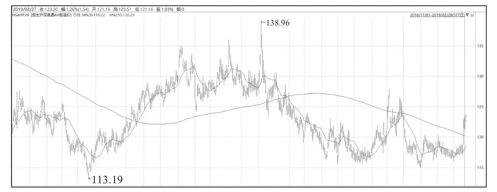

图2\-132016年11月～2019年2月恒生AH股溢价指数

资料来源：Wind资讯。

只须看看数字，很简单，不是吗？不过需要提醒大家的是，指数这个东西没有百分之百确定的，大家在做决策的时候需要综合参考各项指标。

回购分析

研究员帮我做了一个统计，2018年以来，股票回购的实施规模明显增加。

如果仔细分析那些做回购的股票，会发现大概有这样几个特点：第一，回购的活跃度和公司的股价一般负相关，股价的下行容易刺激回购的活跃度。第二，高质押、低估值或者现金流充裕是公司回购的必要条件。高质押的公司更愿意做回购，因为持续下跌中爆仓的风险显著加大；估值分位相对较低的公司愿意做回购，因为有足够的估值安全边际。现金流少的公司显然没法做回购。

股份回购制度的完善有利于提升回购在利润分配中的比例。传统理论认为，与分红相比，回购能更好地兼顾利润分配、提升净资产收益率和市值管理。股份回购是A股市场一项重要的基本制度，对于推动A股市场的长期发展具有重要的意义。

从逻辑上来讲，股票回购之后二级市场的流通股减少，并可能减少总股本，继而可能增厚每股收益，这会对股价有一定支撑作用，但其实效果并不好。

公司进行股票回购之后，股价大概率还是维持原来的趋势，回购并不能对股价形成有效支撑。我想这是因为在回购的时候，上市公司更多考虑的是基本面的因素，它们没有办法左右市场下跌的趋势，更没有办法预测个股的走势。

不过，那些愿意回购的公司，尤其是那些规模比较大的回购，还是值得研究的。

审计报告

向读者简单科普一下，审计报告分为四种类型。

（1）无保留意见审计报告。

（2）保留意见审计报告。

（3）否定意见审计报告。

（4）无法表示意见审计报告。

除了第一种无保留意见审计报告，其他三种都叫作非标准审计报告，简称“非标”报告。当审计师对财务报告的真实性和可靠性存疑，或者审计师认为公司的内控风险比较大的时候，会出具“非标”报告。

我在给CFA一级和二级的同学讲财务报表分析的时候，第一节课就讲审计和外部审计师的作用。结论很简单，分析师和基金经理必须重视外部审计师出具的审计报告。这是因为，如果查过公司会计账的审计师都觉得公司的财务风险比较大，那么分析师和基金经理应该尽量回避这类公司。我工作过的公募基金和私募基金都有这样一条红线：“非标”公司不能碰。

建立股票池

在做投资的时候，为了剔除一些基本面有瑕疵的股票，我们会做一个股票池，股票池是经过四步确定的。

第一步，定量筛选。根据对中国A股市场的定量分析，我们总结出一系列对股票价格有影响的估值指标。通过对估值指标的分析与测算，在A股公司中筛选出100家左右，构成备选股票库1。估值指标包括市盈率、市净率、市销率（PS）、市现率（PCF）、市息率（PD）、绝对股价（P）和市盈率相对盈利增长比率（PEG）七个指标。通过将个股的估值指标与市场/行业的平均水平进行比较，将排名靠前的100家公司纳入备选股票库1。

第二步，定性筛选。在备选股票库1的基础上剔除或加入股票，以形成备选股票库2。剔除的原因包括但不限于盈利预测明显过高、审计报告出现非标准意见、股东结构存在问题、公司有法律官司等。

第三步，增长质量分析。这是投资研究中很重要的部分。我们会对备选股票库2中的每家上市公司进行实地拜访，通过与管理层交流来确定该公司是否有一个良好的盈利模型和长期发展战略。在实地调研前后，我们会建立公司的财务模型并确定公司的投资要点，形成约有50只股票的备选股票池。

第四步，定量风险评估。进入备选股票池的股票将进行波动性和流动性分析，波动性过大或流动性差的股票将被剔除，然后形成一个有20只股票的核心股票池。

大型正规的投资机构都会有上面这样的投资流程。一只股票进入股票池，不是一个拍脑袋的结果，而是一个定量和定性相结合的过程。构建股票池（选股）与构建投资组合（仓位）同样重要，股票池是每家投资机构的核心竞争力所在。

## 第3章 行业研究

第3章 行业研究

## 第3章 行业研究 - (01) 3.1　白酒行业专题研究

\(01\) 3\.1 白酒行业专题研究

2025年5月30日

20:36

3\.1 白酒行业专题研究

研究有三大方面，即宏观研究、策略研究、行业和个股（公司）研究。在做行业研究和个股研究的时候，我们一般从以下几个角度去思考：商业模式是什么，产品有没有竞争力，财务状况是不是安全，管理层和股东是不是强有力，等等。

我建议刚入行的研究员先从波特五力分析开始，积累了一定经验，有了心得之后要深入一两个行业，平时多接触其中的公司和上下游企业，多积累各种有关的行业分析技巧和方法。

每个大的行业和细分子行业的研究重点是不一样的。比如，同样是大金融行业，银行分析的是经营能力，券商看的是规模效应，保险要关注混业经营，而地产要看行业政策、周转率和杠杆率。

再比如，大周期行业里面，钢铁要看重置成本，建材要重点关注集中度，化工看细分市场，等等。每个行业的分析角度是不同的，不知道的话会在门外花很多时间。在这里，我分享一下我对白酒行业的看法。

白酒行业，三起三落，十年一个大周期，三年一个小周期。

整个行业是从1988年起步的，十年上行，1998年遇到经济危机和政府反腐，从那时起大幅回落。第二次起飞是在2002年，当年中国加入WTO，经济腾飞，又迎来了十年大周期。受2012年白酒塑化剂事件和八项规定影响，白酒行业开始走下坡路。从2016年开始又重新起步，直到我们现在看到的高速增长。

行业刚兴起的时候，社会上的总库存很低，经销商被重新洗牌，只留下核心经销商。之后随着经济改善，总库存开始增加，经销商开始发展。1989～1992年是这样，2003～2007年是这样，2016～2020年依旧一样。我们在调研的时候很容易感受到周期的往返重复，所以容易把握住行业基本面的变化。

白酒行业上升期的逻辑各不相同。

1988年是第一轮，凭的是产能大和广告多，以及整合经销商资源的能力。例如，当初的五粮液、沱牌的广告效应很好，另外酒鬼酒的定价比茅台还要高。1998年之前茅台很低调，未扩大产量；后来，它快速扩大产量，每年增加2000吨，到了2003年，正好遇上行业爆发初期，公司的业绩立马起来了。

2002～2012年是第二轮，行业以渠道深度分销的企业为主。口子窖是第一个做深度分销的，深耕餐饮行业，重点是A类酒店；后来发展出团购，举办品鉴会，送酒，从餐饮到个人，把团购做到极致。在2003年这一轮白酒周期，就算没有品牌，有渠道的话业绩一样能增长，洋河是很典型的例子，收入从不到2亿元增长到200亿元，长了100倍。

2016～2019年，甚至到2020年，产品靠的是共鸣，要有品牌，要有文化内涵。茅台的李保芳书记讲，做产品就是做品牌，做品牌就是做文化。我很赞同这个观点。

衰退的时候一定会有标志性事件。

20世纪90年代末秦池倒了，汾酒出了假酒事件。2012年，酒鬼酒出了塑化剂事件。每轮调整，高端酒的终端价就砍半，基本见底了。无论何时，调研人员都要看看高端酒茅台的表现。

处于底部的时候看批发价。调研经销商的时候，如果看到经销商都赚不到钱，此时可判定市场肯定是很差的。处于顶部的时候看预收款的回落。2012年茅台的预收账款回落，行业的预收账款见顶，财务报告的数字于2012年年底见顶，预收账款的回落领先利润半年。但最近这轮有所不同，茅台汲取了经验，看到预收账款大幅上涨，主动控制预收账款并减少囤货。

研究和投资白酒行业的核心是对产业逻辑的理解。长期做供需分析，短期跟着批发价动。

白酒行业还有一个与其他行业不同的显著特点——利润率极高。茅台2018年的半年报显示毛利率高达90%。2012～2018年，成功集团、湘泉集团、中皇有限公司（属于华孚集团）、中粮集团等大股东相继掏空酒鬼酒。但只要品牌在、基酒在，因为利润高，酒鬼酒仍然能复活，2018年有1亿～2亿元利润，换成其他行业的企业可能早就倒闭了。

我在2005年接触了不少欧洲和美国的养老金机构。当时这些海外的机构投资者主要通过我们公司管理的合格境外投资者（QFII）基金和B股基金向中国A股市场投资。这十几年下来，它们赚得盆满钵满。

我经常会和他们交流。不少海外投资者担心中国庞大的隐形地方政府债务和房价泡沫。但总体而言，他们对中国的改革开放和经济发展有信心，同时更看好中国的核心资产，比如消费板块和金融板块企业。

消费和金融是我比较喜欢的两个大行业，平时我也主要将研究精力放在这两个行业上。

我聚焦的是像白酒和调味品这样的消费股，因为这两个生意很好做。白酒和调味品的原材料都很便宜，白酒的原材料是谷物粮食；调味品（比如酱油和醋）能稀释后一瓶瓶卖。这些产品除了有极高的毛利率外，用户黏性也很高，用户对产品价格还不怎么敏感。

本轮白酒景气周期是从2016年五粮液提价开始的。2018年，我和同事对白酒行业有以下几个判断。

首先，强者恒强。头部企业集中化趋势越来越明显，行业呈挤压式增长。在2018年10月计划量用完之后，茅台供需缺口可能进一步放大。不过需要注意的是2019年高端酒出厂量增幅不大，茅台由于要做结构上的调整，产能会受到限制，所以存在继续上调出厂价的可能。五粮液和泸州老窖不具备调价的基础，控货挺价将是未来一个阶段的主旋律。

其次，次高端看营销策略。水井坊依靠区域拓展、核心门店数量增长和终端门店促销力度加码带来业绩的提升。洋河在2018年7月涨价后说会在10月初停止供货，涨价能否成功要看老产品库存能否清理干净。在洋河品牌中，海之蓝的调价幅度不超过10元，梦之蓝因为销量增速比较快，且终端利润比较高，具备较大的调价空间。

讲到消费股，不得不提到被热议的对消费升级还是消费降级的判断。我们认为未来几年宏观经济大概率是下行的，收入增速会进一步放缓。

从人群角度看，富裕人群有足够的资源和渠道维持自己的收入，而长期处于低端消费的人群也不会因为消费升级而受到很大影响。因此在经济下行过程中，这两类人群的消费习惯不太可能发生改变，不存在所谓的消费升级还是消费降级问题。

但是除了他们之外，经济下行对于其他人群的消费倾向会有很大的负面影响。我相信大家未来会观察到越来越多的消费降级（包括通货膨胀和失业率的上升、工资薪金的实际下降、房价的拖累和流动性不足导致名义财富的消失等），从研究和投资的角度，要未雨绸缪，早做准备。

贵州茅台股票价格在2019年3月创出历史新高，突破了800元，贵州茅台的市值首次超过1万亿元。贵州茅台一直是我钟爱的股票，经常被我在文章里当作案例分析。

那么怎么看待白酒行业？在2019年3月的高点后，贵州茅台、五粮液这样一些白酒股，后面会如何表现？我把当时的观点分享给大家。

首先，我认为整个行业的销量不会再有大幅增加。2011年全行业1300万吨的销量应该是行业的极限，2018年只有1200万吨。

虽然行业没有繁荣，但是依靠消费升级带来的价格提升，龙头公司在繁荣。

反映在利润表上，未来几年龙头白酒公司的利润增长会显著快于其营业收入的增长，同时小公司的日子会越来越难过。

我2019年年初做过调研，用6个字来形容当时行业的状况就是“弱复苏，强分化”。

“弱复苏”指的是行业基本面压力犹存，春节动销的增速在下滑。“强分化”指的是品牌集中度在各个价位段都在提升，马太效应明显。

这样的阶段特征可能会持续相当长的时间，比如延续到2025年或者2030年。再往后，假设中国60岁以上人口的数量开始下滑，那么白酒行业可能会进入下一阶段。

虽然行业一直在发生变化，但是我发现每次在新周期到来时，越优秀的企业表现越好。

以茅台为例，虽然2019年三季报业绩显著低于预期，但是全年的业绩还是不错的。2018年茅台的净利润为320亿元。假设2019年增长到400亿元，给予25倍的估值，那么茅台的市值是1万亿元。

五粮液虽然比茅台差一点，但是就价位而言也是龙头；泸州老窖相比茅台、五粮液稍微差一点，主要的问题是市场的广度不够，只在四川周边市场增长比较好，另外也没有享受到高端白酒的红利。

未来，高端白酒必须处理好两方面的关系。

第一是价量关系。从供需结构上讲，高端白酒一定不能供大于求，供给的时候需要有配额，而且经销商的结构很重要。

茅台的经销商结构比五粮液要好。五粮液之前受益于大经销商的增长，但现在大经销商变成了它发展的阻力。

比如，五粮液需要开门红业绩会让大经销商打款，大经销商被迫抛货回款，成为市场的低价标杆。现在五粮液在做改变，控盘分立，增加小经销商。

第二是加强消费者培育，树立自己的品牌故事。高端名酒和低端酒有各自不同的打法。

全国性名酒品牌力好，关键是做好核心终端店；地方性名酒品牌力差，但有地方资源，核心是要做消费者培育。

比如汾酒，2012年以前企业体制僵化，现在它开始关心终端，建立全国深度的终端系统，期望高端青花瓷和低端玻汾都有很好的销量。

除了高端白酒，我再谈谈对于次高端白酒和低端白酒的看法。

次高端白酒，目前行业还在扩容，品牌格局没有成型。今世缘和梦之蓝销量增长都很快，水井坊和舍得也不错；没上市的剑南春是真正的龙头，价格稳定增长，有底蕴和市场广度。

在低端白酒市场中，顺鑫农业（牛栏山二锅头）的竞争力很强。如果能够剥离养猪和房地产业务，顺鑫的财务报告会更加好看。

总结来看，白酒行业现在进入了白银时代。具体来说，高端名酒的品牌会集中化，次高端白酒将会有扩容升级的机会，而百元以内的光瓶酒会迎来升级。

在这个阶段，有品牌的、能创新的白酒企业一定会表现得更好，其股价更值得期待。

2019年的“五一”假期，我利用小长假看了不少上市公司年报，做了一些比较分析和总结，分享给大家。

中国这些年的股市，本质上是由房地产和互联网共同驱动的。

过去30年里，与房地产相关的行业里诞生了不少白马大牛股，比如格力、美的、茅台、五粮液、索菲亚、东方雨虹和大部分银行。

互联网引领了几次大的牛市。1999年的“519行情”，背景是第一代PC互联网的大发展。2013年和2014年的大行情，和第二代移动互联网的兴起相关。未来如果还有互联网的大牛市，我想应该会和与5G相关的万物互联有关。

回顾历史，互联网驱动的行情里，股票价格涨得快，跌得多。比如上一轮牛市里，乐视网的市值一度超过1000亿元，如今却要退市了；再比如银之杰曾经上涨超过68倍，但后来还是回到了原地。

这部分，我们以白酒上市公司为例，聊聊2018年的年报里藏着什么样的秘密。

首先，从归母净利润的角度看，在18家上市白酒企业中，净利润超过100亿元的第一梯队有两家，分别是茅台和五粮液。茅台无愧于行业龙头，2018年公司的净利润是352亿元，茅台一家的净利润超过后面所有17家公司的净利润之和。

业内有句话，“中国白酒有两种，一种叫茅台，一种叫其他白酒”。我已经在本书中多次提到茅台了，茅台是既有绝对收益又有相对收益的一个股票品种。在正常情况下，2019年茅台的利润会更丰厚。

五粮液排名第二，2018年实现“双超”：营业收入增长33%，首次超过400亿元，归母净利润同比增长38%，达到134亿元，在历史上首次超过100亿元大关。

五粮液在年报里称，公司营业收入的增长，主要是公司酒类产品量价齐升所致，而净利润增长得益于公司开源、节流双驱动。

茅台和五粮液会在5月召开股东大会，作为两家公司的长期股东，我都会去参加，并和公司的高管做进一步的充分交流。

第二梯队是净利润以10亿元为单位的那些公司，包括洋河、泸州老窖、古井贡酒、口子窖、山西汾酒和今世缘这六家。

在这六家公司里，洋河是很有可能比较快地进入第一梯队的种子选手。公司2018年实现净利润81亿元，比排名第四的泸州老窖要多出近50亿元，而泸州老窖的净利润又几乎是古井贡酒的一倍。

这里要多说两句山西汾酒和今世缘。这两家公司的成长性很突出，2017年两家公司的净利润还不足10亿元，2018年已经进入第二梯队。

第二梯队里大致包括了川酒和皖酒。白酒行业有句名言，叫“西不入川、东不入皖”，是说川皖两地群雄争霸，外地白酒根本进不去。

洋河是第二梯队里比较特殊的，稳住江苏根据地的同时，已经进入安徽市场。

净利润小于10亿元的是第三梯队，有迎驾贡酒（8亿元）、顺鑫农业（7亿元）、水井坊（5\.8亿元）、伊力特、老白干和舍得这些公司。

在第三梯队里，我看好的是顺鑫农业和水井坊。顺鑫农业如果剥离了房地产和养猪业务，后面的估值会更高一点，牛栏山二锅头渠道下沉、外省发力，净利润极有可能接近15亿元。

水井坊的股权结构特殊，是外国人主导的公司，帝亚吉欧还在二级市场上不停地“买买买”。

近年来，在白电、白酒和光伏等很多细分市场里，市场份额越来越向优质品牌和行业龙头集中，所谓强者恒强，马太效应明显。

比如，很多白酒龙头企业在年报里都提到，白酒行业已经进入品牌竞争和挤压式增长阶段，名酒企业的竞争优势越来越突出。

随着消费者对白酒认知的成熟、辨别能力的增强，白酒行业里的落后产能将被优质产能替代，拥有优质产能的企业将拥有更好的发展机遇。

白酒行业短期供需变化不剧烈，相对容易预测。白酒产品有差异，有一大批忠实的“粉丝”，不容易爆发价格战。

中高端白酒是先收钱后给货，付款方式多为现金或者类现金的银行承兑汇票。白酒行业普遍很少甚至根本没有应收账款，营业收入和净利润的含金量极高，绝对不会出现像康美300亿元现金说没有就没有了的情况。

正因为先付款后给货的商业模式，白酒企业几乎不担心货品短期积压，存货基本不会贬值。

看完了白酒，再去看其他行业的时候，会发现茅台、五粮液这些白酒行业的龙头公司，基本面真的很强劲，拉长时间看，这些公司同样给投资者带来了丰厚的回报。

作为个人投资者，我认为甚至能把白酒行业里的龙头公司作为自己的根据地和粮仓，花一两年工夫把白酒行业吃透。如果有机会多接触上市公司和渠道，大概率能在白酒行业里面赚一辈子钱。

## 第3章 行业研究 - (02) 3.2 调味品行业专题研究

\(02\) 3\.2 调味品行业专题研究

2025年5月18日

11:03

3\.2 调味品行业专题研究

消费已经成了中国经济的顶梁柱，衣食住行的体量太大了。尤其是吃，民以食为天，我们都有一个中餐胃。

食品饮料大行业里，我最看好白酒子行业，第二看好调味品子行业。

在餐饮渠道，海天的优势在于品牌知名度比较高，价格较低，而且海天有先发优势。中炬高新的优势是产品的氨基酸态氨含量比海天高。我个人感觉，厨邦酱油比海天酱油更鲜一点。

在资本市场上，大家总是把海天和中炬高新放在一起做比较，这是有道理的。截至2019年，国内的调味品行业一直有一个特点，即“一超多强，四梯队分布”。

海天是当之无愧的调味品龙头企业。能做到行业龙头，不仅是因为海天一年的营业收入远超后五家之和，还因为海天在行业内一言九鼎。

比如2017年的调味品提价是由海天发起的，海天在春节前上调了价格，春节之后，中炬高新、李锦记和东古等品牌也纷纷跟进。

关于调味品行业的提价，龙头企业一般会综合考虑M2、通货膨胀率和居民消费能力等因素，再判断是不是需要提价。

2017年的提价已经考虑到2020年之前的社会环境，所以在2019年年初的时候，我判断2019年再次提价的可能性不会很大。

说完龙头大哥，我们再看看行业第二梯队中的李锦记和中炬高新的美味鲜。有朋友肯定会问，你怎么知道美味鲜是第二梯队？这是上市公司“告诉”我的。

中炬高新2018年年报的第20页写道：“美味鲜公司正努力从行业第二梯队中突围，向第一梯队靠拢。”所以，从这里可以看出中炬高新的目标还是很明确的。

行业的第三梯队更加分散一点，包括了千和味业、欣和、加加和东古等公司。这些调味品有品牌，但不属于全国性和地区性强势品牌。

第四梯队更加分散了，包括地方上的小工厂和作坊，主攻乡镇和农村市场。

总结当前中国的调味品行业，有以下三个发展趋势。

首先，调味品行业整体在平稳增长。平稳增长时期望行业整体每年增长20%～30%，这肯定是不现实的。

其次，行业里有三个“加速”：产品结构加速调整，行业的集中度加速提高，产业的升级速度进一步加快，这意味着行业里龙头企业规模效应会持续显现，中小企业优胜劣汰趋势明显。

最后，我感觉中国的调味品行业将逐步走向品牌化、高端化和集约化，品牌企业可望在发展中不断提高市场份额。

我平时会见不少投资者朋友。交流的时候，我和大家说起，调味品是快消品，酱油不错，海天、中炬高新和千禾味业各有特色，一超四强的格局已经形成。

有朋友问，那你对醋怎么看？我简单讲三点：酱醋同源，醋的市场竞争格局不如酱油好，龙头企业恒顺醋业比海天差很多。

中国有四大名酒，还有四大名醋，分别是山西老陈醋、阆中保宁醋、镇江香醋和福建永春醋。

陈醋，酸爽厚重，在中国北方很受欢迎，典型代表是山西老陈醋。据说山西人“缴枪不缴醋”，足见山西人对陈醋的喜爱之深。

四川等西南地区的人喜欢吃保宁醋。保宁醋酸味柔和、色泽棕红。随着川菜的流行，保宁醋行销全国。业内有“离开保宁醋，川菜无客顾”的说法。

江南人好香醋。香醋的典型代表是镇江香醋。记得小时候吃小笼包或者生煎的时候，我一定要蘸一点香醋才好下咽。香醋酸味适中，其味鲜香，略带回甘。

福建等东南地区的人偏爱永春老醋。永春醋在当地被视为居家三宝之一，它色泽棕黑，口感偏甜，久藏不腐。

和其他调味品相比，食醋这个行业有两个显著特点。

首先，市场很分散，集中度很低。

全国食醋的生产企业有6000多家，每年食醋总产量约400万吨。但是在这6000多家企业里，年产量超过10万吨的头部企业只有恒顺醋业、水塔和紫林三家。恒顺醋业是食醋行业的龙头，2018年的产量只占到行业总产量的10%。

行业分散，从好的地方想，未来市场的整合空间很大。但反过来思考，为什么过去那么多年，龙头企业的市场占有率一直很难提升呢？

我认为原因有很多。比如各地消费者口味有差异，做好区域龙头容易，但是要做全国龙头很难。再比如龙头企业没有优势，老字号和新品牌之间没有太大差别。一句话，企业和产品的“护城河”不够深。

食醋行业的第二个特点是行业门槛较低，新进入者很多。

醋的酿造和生产技术不难，大多数企业都沿袭了传统的酿造工艺。我讲到过酱醋同源，讲的是酱油企业通过内生和外延的方式进入食醋领域，但是几乎没有做食醋的企业能把酱油做好。

恒顺醋业是业内龙头，公司成立于1993年。海天成立于2000年，比恒顺醋业晚了好几年，但是现在海天在发展速度和体量规模方面比恒顺醋业强了很多。

之前，恒顺醋业和海天分别在各自领域中发展，井水不犯河水。但是近两年海天开始强势进入食醋市场。

海天味业下属子公司海天高明本来有7万吨醋的产能。2017年海天强势收购了镇江丹和醋业，收购完成之后，海天投资提升了原有的生产能力。扩建的江苏厂将有15万吨的醋产能，它完工以后产能合计会达到22万吨，快赶上恒顺醋业的规模了。

海天收购镇江丹和，一方面扩大了镇江香醋的知名度和规模，另一方面加剧了行业的竞争。海天拥有完善的销售渠道，在全国有近500万个销售网点，恒顺醋业才有60万个。海天的销售人员比生产人员都多，而恒顺醋业的销售人员才占了生产人员的一半。

大众消费品渠道为王，海天的产品几乎卖到了全国的每一个角落，而且下沉得很好。恒顺醋业作为醋业龙头，却没有看到其渠道铺设的优势。未来海天大概率是恒顺醋业主要的竞争对手。

## 第3章 行业研究 - (03) 3.3 医药行业专题研究

\(03\) 3\.3 医药行业专题研究

2025年5月18日

11:03

3\.3 医药行业专题研究

医药行业是一个进可攻、退可守的行业，而且历史上医药行业里牛股频出。

消费升级这个概念在医疗领域是比较适用的，经济发展之后，大家都想要获得更好的医疗保障。

我说说自己的亲身经历。我有一位优秀的朋友，本来在投行做副总裁，后来因为机缘，转做和睦家医院的供应商，获利颇丰。和睦家是上海很出名的私立医院之一，火爆的时候，400元挂一个号的儿科依然要排队四个小时。

我自己投资过医疗的一级股权，但因为某些原因这笔投资没有获利。所以我觉得医疗的一级市场水太深，还是专注于二级市场吧。

政府出台政策提出健康中国，企业响应政府号召，便利好不断。比如2018年政府工作报告强调了医药行业发展的重点——应当在医疗领域推进“互联网\+”，加强癌症等重大疾病的防治攻关，推进医疗价格、药品流通、医保支付改革；支持社会力量增加医疗服务供给，外商投资扩大医疗领域开放；基本医保补助再提高，推进分级诊疗，支持中医药发展，食药监管加快实现全程追溯。

因此，我们要格外重视“医药科技股”的投资。近几年市场上很火爆的创新药、消费新医疗和服务创新其实都和“医药科技股”相关。

举个例子：恒瑞应该是国内创新药布局最早、最全以及研发效率最高的大型上市公司之一，阿帕替尼的销售奇迹大家都已经看到了。未来要关注该公司有没有可能在吡咯替尼和SHR1210等创新药上复制阿帕替尼的销售模式。

除恒瑞之外，华东、美年、乐普、爱尔、上医、安科、丽珠、复星、百济、我武、常州、片仔癀等都是我研究跟踪范围内的标的。别看我一口气说了这么多家公司，医疗上市公司真的还有很多，有将近300多家。此外，医药行业的细分领域很多，所以机会还是有的。

医药板块的公司众多，一般分成六个子板块来分析。

化学制剂板块。这个板块是传统制造业，类似于化工厂，看点不多。近几年行业受医保控费、控制药占比、发改委要求药品降价、抗生素限制用药等诸多政策影响较大，制药企业在逐步消化价格压力。未来的看点是，制药企业通过新上市品种及新进医保目录品种的逐步放量打开新的市场空间。

生物药板块。这个板块是亮晶晶的。龙头企业保持了稳健快速增长。恒瑞的走势就是例证，虽然恒瑞的估值已经很高了。泰格是为新药研发提供临床试验全过程专业服务的合同研究组织（CRO），所以同样被市场看好。

生物医药板块里，生长激素类产品随市场接受度提高及消费需求提升持续放量。二代胰岛素由乙调甲利于基层市场开拓，三代胰岛素上市后将借助现有渠道网络逐渐放量。疫苗行业开始逐步回归正常轨道，由于不受医保控费限制且居民健康意识和消费能力提升而高速增长，二类疫苗代理及自研产品上市后会快速放量。

中药板块。这个子板块是中国特有的。很多人称赞中国传统中药的药效，同仁堂、东阿阿胶、片仔癀等老字号价值非凡。

器械板块。整体保持稳健增长，但板块内部业绩分化明显。以迈瑞医疗、乐普医疗、三诺生物为代表的公司在外延并购带动下，业绩保持快速增长；部分细分领域龙头公司，如安图生物、开立医疗等，在细分领域中拥有明显的技术优势；低值耗材、器械领域竞争激烈，部分公司业绩增速明显放缓。

医疗服务板块。整体保持稳健增长。鼓励民营以及地方政府对部分公立医院资产的市场化运作逐渐实现开放态度，有利于上市公司完成区域的并购和连锁。但是在整合阶段会带来大量的管理费用，拉低利润端的增长，因此需要对公司并购的规模和节奏有充分的预期，才能较好地预测未来利润端的增长。

商业板块。商业批发板块两票制的影响基本已经体现。对于零售板块持续稳定增长，随着行业集中度的提升、品种毛利率的提高和精益化管理的加强，收入和利润增速会持续保持在20%以上。

医药股未来有两个趋势：首先，药价的下调趋势不可避免。其次，医保的话语权会越来越大。对于国产药企，大的品种必须得到一致性评价；外资企业必须意识到高价药的好日子已经到头了。

相比较而言，有两类公司基本不受带量采购的影响。

一类是医疗器械公司，因为医疗器械品种多，标准化程度低，产品升级和出新速度快，医生有使用偏好并持续接受培训。医疗器械的国内外价差很小。

另一类是做医疗专业化服务公司，比如治疗眼睛和开展生殖系统治疗的公司基本上不受“4\+7”集采的影响。

总结：在投资中，药不如医，医不如医疗器械和服务。

## 第3章 行业研究 - (04) 3.4 猪肉行业专题研究

\(04\) 3\.4 猪肉行业专题研究

2025年5月18日

11:03

3\.4 猪肉行业专题研究

我国是猪肉消费大国。与猪肉相关的名菜数不胜数：叉烧、香肠、东坡肉、锅包肉、回锅肉、小炒肉、红烧肉、狮子头、猪颈肉、蜜汁肋排、糖醋排条、椒盐排条、猪肉炖粉条……

大家先擦擦口水。由于2018～2019年的中美贸易摩擦，中国有预期对美国进口猪肉及猪肉制品增加关税。这是不是利好本土的猪肉类企业，我们是不是应该买与猪肉相关的股票了？

这可不好说，我国虽然是消费大国，但也是生产大国。从美国进口的猪肉占比是很小的，即使增加了关税，对中国本土的猪肉类企业也产生不了很大的影响。

很久之前，猪价也很高，大家都在喊吃不起猪肉。这使很多人开始养猪，开启一轮疯狂的猪周期，导致2018年猪的过剩，猪的价格被压了下来。经常去菜市场的人，当时应该有明显的感觉。

养猪行业是一个大周期低谷里“小选手”都倒闭，“大选手”靠着低价吞食市场，然后熬到周期低谷结束释放市场收益的行业。2018年，盈利预期陷入低迷，生猪企业的日子很难过，在这段时间里它们不掌握议价权。那么，是不是暂时又不能投资了呢？

其实也不是的。让我们换个思路，当时猪过剩，那么多猪，说明猪的上游需求是强烈存在的，比如说猪饲料和猪疫苗。我们应该关注这方面的上市公司，大家说是不是？

下面回到2018年的情形，和大家分享行业被低估时如何看相关产业链。

先说火腿肠。双汇火腿肠很有名。我来讲讲双汇发展，它是国内比较大的肉类加工企业，2017年屠宰1200多万头生猪。公司的主要业务是畜禽（主要是生猪）的屠宰、加工及销售肉类食品和速冻肉制品等。公司位于河南省漯河市，有5\.3万员工。

双汇发展的年报看点不多，主要是收入和利润都是负增长。2016年公司的营业收入为518亿元，而2017年的营业收入只有505亿元，少了13亿元。同样，2016年公司的净利润有44亿元，而2017年只有43亿元，少赚了1个亿。

虽然利润是负增长的，但它还是有几个小亮点。

第一，公司的机构股东很稳定，且机构股东的持股数是增加的。比如第三大股东是香港中央结算有限公司，截至2017年年底境外资金通过陆股通持有双汇发展6200万股，比三季报中的数据多了1300万股。

截至2018年3月，境外资金合计持有8600万股，又比2017年年底多了不少。另外，第四大和第五大股东分别是中国证券金融股份有限公司（证金公司）和汇金公司。证金公司的持股数量增加了950万股，汇金的持股数没有变化，说明机构投资者还是看好双汇未来的发展的。

机构投资者的调研反映了它们对双汇的关注和看好。2017年共有90多家机构调研了双汇发展，而2016年只有70家。同行业另一家公司三鑫几乎无人问津，从这就能看出区别。

虽然公司的收入和利润没有增长，但是双汇的2017年净资产收益率创了2013年以来的5年新高，达到了30%。净资产收益率增加的主要原因是公司的净利率在增加，同时公司的资产负债率小幅上升。公司的资产负债率只有33%，还有很大的提升空间。

所以我觉得双汇发展后续的看点是净资产收益率维持在高位，同时分红率会有比较大的提升。

再说说中国规模最大的肉猪和肉鸡养殖上市公司——温氏股份。公司在2019年1月就披露了2018年的业绩预告，预计全年实现净利润39\.5亿～42亿元，同比下降38%～41%。

公司介绍，2018年养鸡业务基本保持稳定，受益于市场行情回暖影响，销售价格同比上涨18%。养鸡业务收入和利润同比大幅增长。

但是，养猪业务遇到了很大麻烦。商品肉猪销售价格同比下降14%，加之下半年爆发的非洲猪瘟，养猪的利润下滑很大。

生猪养殖企业很害怕两件事情：一是猪肉价格下跌，二是猪生病。但2018年这两件事情都发生了。

2018年上半年，受生猪供应量增加和需求不振影响，生猪价格持续下跌，平均猪价一度跌破每公斤10元，为近10年的低价。这波猪价下跌不仅幅度大，而且持续时间长，造成第二季度养猪行业整体亏损。

猪价低迷，猪至少还能活着。养猪人会想，肥猪价贱，或许会选择不卖，适当压栏等待价格上涨。但是下半年席卷而来的非洲猪瘟打破了所有人的梦想。

一病毁所有。面对猪瘟，老母猪到猪仔全部被扑杀，一个都不剩。

非洲猪瘟虽然不会传给人类，但是该病的发病率、致死率极高，甚至可达100%，是世界范围内危害养猪业的头号杀手。之前，非洲猪瘟一直在世界各国传播，2018年第一次在中国出现，让养猪业受到了重创。

非洲猪瘟有很长的历史。1909年在非洲肯尼亚，当地人发现饲养的家猪突然卧在猪舍，不思进食、身体发热、呼吸困难，一周后这些猪死亡了。后来，医学专家将这个病毒称为非洲猪瘟。

1957年，这个病毒在葡萄牙的里斯本出现，造成里斯本的猪大面积死亡。随后，该疫情又出现在西班牙、意大利、法国、比利时、荷兰、马耳他等国家。医学专家对这个病毒束手无策，没有疫苗，也没有特效药物。为了杀死这个病毒，1979年，马耳他甚至宰杀了全国所有活猪。

2007年，非洲猪瘟在俄罗斯和乌克兰等地出现。为了和病毒抗争，俄罗斯一共宰杀了40万头生猪，但俄罗斯还是在和病毒的较量中败下阵来。俄罗斯政府无法控制非法运输猪肉。一些农场主为了逃避刑事责任，秘密掩埋死猪，这些掩埋地成了感染猪瘟的温床。

2017年3月，非洲猪瘟来到了俄罗斯远东地区的伊尔库茨克州。这个地方离蒙古国100公里，离中国1000公里。

2018年8月1日下午，沈阳市沈北街道发生疑似非洲猪瘟疫情，后在8月3日确诊，疫点内913头生猪全部被扑杀并做无害化处理。这是中国境内首次发现非洲猪瘟。此后，非洲猪瘟的传播呈现跨省区多点爆发。截至2018年年底，共发生疫情99起，波及22个省市自治区。

为了抗击猪瘟，2018年9月初，农业农村部开始了最为严格的生猪跨省运输监管制度。2018年12月1日，全面控制生猪运输备案制度正式施行。2018年12月11日，国务院副总理胡春华出席全国加强非洲猪瘟防控工作电视电话会议。非洲猪瘟对生猪养殖企业造成了一定影响，对个人或者家庭养殖户的影响更大。

说到这里，有必要介绍国内养猪的现状。国内的生猪养殖分成以下几种形式：散养户（母猪存栏5头以下）、专业户（母猪存栏5～20头）、规模专业户和规模猪场（母猪存栏20～1000头）和大规模猪场（母猪存栏1000头以上）。

为什么要用存栏母猪数作为评价养殖场的标准？因为母猪很能生养。在正常情况下，每头母猪每年提供20头出栏生猪。

全国头部的两家养猪企业（温氏和牧原）的市场占有率大概才5%，前十大养猪企业的市场占有率只有9%，整体生猪规模化养殖比例才50%，很低。未来的趋势是家家户户养一两头猪的地区会越来越少。各大养猪企业纷纷提出打造千万头级的生猪养殖规模，规模化效应会越来越明显。

要把猪养好，要关注三个要素：合理的养殖环境、科学的养殖观念和养殖团队的责任心。

温氏和牧原能成为中国头部的养猪企业，主要是因为它们的经营模式有较强的生命力。两家公司主要做了三件事：尽可能改变养殖环境；企业组建服务团队尽可能帮助养殖户树立科学的养殖观念；同时采用合同养殖，让养殖户自己养自己的猪，这样做增强了养殖团队的责任心。

在三个要素当中，养殖环境是最重要的。过去，到处能养猪。但是近几年，南方水网地区加大养猪场环保整治力度之后，在猪肉消费量比较大的几个地区，比如浙江、上海、福建和广东等地，都要靠河南和东北等外部省份或地区的生猪调入，逐步形成了“南猪北养”的趋势。

这次猪瘟爆发后，产生了两个巨大影响。首先，活猪调运受到限制，直接导致了国内各区域生猪价格的价差拉大。

其次，非洲猪瘟疫情加速了行业优胜劣汰的进程：资金周转能力较弱、猪场管理不善的中小散户加速退出市场。

供给和需求决定了价格及盈利周期。想从养猪股上赚钱，一定要对行业的周期性和养猪股的“股性”有所了解。

养猪股的股价向上的时候一般分为三段行情，核心驱动力分别为产能预期、价格预期和业绩预期。

2019年年初进入第一阶段。猪价低迷叠加猪瘟，养猪行业在经历供给侧改革。即便猪价现在没有反转，但因产能见顶预期增强，这段时间买养猪股的投资确定性很高。

第二阶段是价格预期，要看猪价的变化。历史上，当猪价反转时，养猪股的股价会大幅上涨。

第三阶段是业绩预期。虽然业绩预期提升或仍可推动股价小幅上涨，但行情接近尾声，确定性较低。

以上是我解读的2018年非洲猪瘟，该事件的影响可能还要继续发酵，因为很多散养户的猪基本还是吃厨余，泔水里如果含有病死猪的肉，就会感染这些猪。

不过我们还是要对股价可能受到的影响进行逻辑分析。2019年年初，我展望2019年生猪价格中枢可能会比2018年有显著的上升，养猪龙头企业的股价和业绩可能会有不错的表现。

2019年3月，有两个养猪龙头的股价表现很好。那时是不是兑现的时候？我觉得恰恰相反，猪周期当时还没有结束，才刚刚进入第二阶段。

猪周期是农林牧渔行业里很有意思的一个周期，每过3～4年，猪价就会呈现从谷底到谷顶再到谷底的波动。

猪周期背后的逻辑是这样的：猪价上涨—母猪存栏量大增—生猪供给增加（过剩）—猪价下跌—大量淘汰母猪—生猪供给减少（短缺）—猪价上涨。在过去的十几年里，我们已经经历了完整的四轮猪周期。

以股票价格分析，猪周期对于股价的影响分成三个阶段：第一阶段是去产能阶段，第二阶段是价格反转阶段，第三阶段是业绩兑现阶段。

第一阶段，因为猪价低迷，养猪户养殖意愿低，供给量少，又碰到治不好的非洲猪瘟，所以猪的供给开始短缺。

非洲猪瘟对于温氏和牧原有没有影响？影响肯定是有的。

不过，这次非洲猪瘟疫情较为严重的区域是东三省、江苏、安徽、河南和山东，在这些地区养猪公司面临的考验较大。从历史经验看，经历去产能的阶段之后，龙头公司的市场份额会更高。

第二阶段是价格反转阶段。我们观察到春节期间及其后，因节日效应与产区出栏节奏错配，猪价小幅回暖。价格提振信号在本轮周期中首次出现，可视为第二阶段临近的重要标志，第二阶段的股价上涨幅度是很大的。

2019年春节以后的这轮猪价上涨，原因除了供给短缺之外，更重要的是养猪的成本在上升。

2018年上半年，养猪的平均成本是12\.2元/公斤，8月1日发现第一例非洲猪瘟以后，8～12月，养猪的成本上升到13\.5元/公斤。受非洲猪瘟禁运措施的影响，部分商品猪被迫提前出栏，部分推迟出栏，体重较大地偏离了理想范围。

同时，还有部分种猪因为无法跨省调运而只能作为商品猪销售。为了控制非洲猪瘟，中转台的建立、饲料再加工、封场导致的人员工资费用上升等，都会使生产成本上升。

第三阶段是业绩兑现阶段。在第三阶段，我们会看到养猪股的业绩在报表上得到体现，这个时候股价可能还会继续上涨，但是幅度不大，行情接近尾声，确定性较低。

具体说回温氏和牧原，除了业绩稳定、靠谱外，这两家龙头公司的成长性很突出。

首先它们的成本低。温氏和牧原的总成本比行业平均水平低1\.5～2\.0元/公斤，处于行业最低档，其成本优势体现为10%～15%的净利率提升，这令其更具扩张能力。

其次在于扩张空间。我国生猪规模化养殖占比仅约50%，行业前两名、前十名集中度分别约5%、9%，龙头的长期扩张空间广阔。

## 第3章 行业研究 - (05) 3.5 汽车行业专题研究

\(05\) 3\.5 汽车行业专题研究

2025年5月18日

11:03

3\.5 汽车行业专题研究

2018年10月，“乘联会”数据显示，过去的10个月国内汽车销量同比下滑13%，连续两个季度负增长，看不到“金九银十”。进入11月，根据调研的情况，国内车市仍然不容乐观，年底两个月的销售数据比10月拿到的数据还要差。

当时，汽车行业的龙头企业上汽集团的日子同样不好过。利润表上，2018年第三季度，上汽集团的营业收入同比下滑了1%。要知道，上一次公司收入出现负增长还是在2009年第一季度。上汽集团是乘用车的行业龙头，市场占有率达到25%。在中国，每卖出4辆汽车，当中就有1辆是上汽集团生产的。一叶知秋，汽车行业的寒冬已经到来。

2018年重仓汽车股的公募基金受到了很大伤害。行业四大龙头，上汽集团股价下跌了10%，福耀玻璃股价下跌了20%，华域汽车股价下跌了37%，宇通客车股价下跌了52%，跌幅一个比一个大。

9月中旬，有几个基金经理看到长城汽车董事长开始增持股份了，告诉我说汽车股的机会要来了。我说，先看看清楚，人家增持的是H股，不是A股，两边的价格差了50%。

然后再想想，汽车行业的基本面发生改变了吗？销量有起色了吗？汽车行业的行业数据都是现成的。做汽车股的研究只要紧密跟踪数据，再加上一些预判，基本能看到短期和中期行业的趋势。

汽车行业的销售数据主要来自几个渠道。我以前看的是中汽协和乘联会的厂商销售数据，或者看公安部的汽车上牌数，现在业内越来越多的是看交强险的数据。2017年第四季度，行情火爆，销售基数很高，所以2018年同比下滑是很早能预料到的。

而且，行情下滑趋势是会延续的，下滑的周期至少要达到18个月。所以，在2018年年底来看，2019年第一季度仍然不乐观，至少要到第二季度才能看到数据的好转。

销量下滑之后，生产厂家马上面临保价还是保量的两难境地。如果不降价，销量会越来越难看。如果降价了，销量不一定会增加，毛利率却一定会受到伤害。

上汽集团的毛利率在2017年第四季度见顶，长城汽车的毛利率在2018年第一季度见顶。钢铁、橡胶和玻璃的费用是生产汽车的主要成本，但是汽车的毛利率主要受到需求因素（销售价格和销售数量）的影响。

销量下滑，叠加价格失控，能够预判的是汽车行业的集中度会进一步提高。现在国内前10大生产企业的集中度已经达到了60\.2%，比2018年年中提高了3\.4%。寒冬之中，民企自然出清，而国企的日子相对好过一点。

2018年10月底，东北的老国企中国一汽宣布，与国家开发银行等16家银行签署战略合作协议，各银行给中国一汽意向性授信共计1万亿元。受此消息影响，一汽夏利和一汽轿车纷纷涨停。

给东北的一汽那么多授信，原因是什么呢？后来再仔细看看相关公告，原来中国一汽与各银行签署的战略合作协议是“框架性”合作协议，授信额度为“意向性”授信额度。

在我看来，框架性和意向性，都是飘在天上的东西，几乎不会落地。几十年了，我没有看到一汽生产出什么好车，反倒看到不少一汽的领导因为各种事情落马。

短期来看，汽车行业没有大的机会。有部分投资者会因为汽车股的估值低和分红率高而做一些配置，但是大规模入场的时机肯定还没有到来。唯一的一个亮点是新能源汽车，当然只有油电混动的乘用车的数据比较好，新能源商用车同比下滑23%。至于新能源货车，几乎看不到销量。

在新能源汽车的一众股票当中，我认为“小而美”的星宇股份和“大众情人”新宙邦值得观察，其他的要么估值太高，要么业绩没有增长。

投资中，有一种风险叫作不研究行业，只研究个股。这样的做法是极其可怕的，投资者亏了钱都不知道是怎么亏的，还以为自己的选股能力不行。行业如果没有大的机会，那么从个股获得较高的收益也是比较困难的。

四大研究之中，我个人认为：①宏观研究有点像“盲人算命”，谁也说不准对错；②策略研究是上涨和下跌都有很多道理，无从证伪；③个股基本面研究是最容易入手的；④行业研究的门槛最高，但从行业研究中能得到的收获也是很大的。

所以回到我谈的汽车行业，先不要看每家公司的情况怎么样，如果整个行业还在冬天，大家就耐心地等待春天的来临吧。

过去10年，我国汽车行业飞速发展。2009年，汽车销量首次突破1000万辆大关，这是个里程碑式的数字，这么大的销量过去想都不敢想。

话说2001年中国刚刚加入WTO的时候，市场都担心国外巨头要“杀”进来了，中国的车企要完了。但是，中国人很有智慧。加入WTO之后，中国的车企不但没事，反而越做越大。

我是2007年年底取得的驾照，2008年买的第一辆车。那时候，上海马路上的车不多，还是挺好开的。等到2009年，国家出台了4万亿计划和刺激汽车消费的政策，此后我就感觉满世界都是奇瑞QQ和上汽通用五菱。

2010年和2011年，我国汽车销量再上一个台阶，陆续超过欧洲和美国，成为全球最大的新车销售市场。

随着汽车销量绝对规模的扩大，销量增速慢慢下降了。2001～2010年，汽车销量的年复合增速是25%。2011～2017年，复合增速下降到8%。

2018年很不乐观，当时预计负增长3%，这个是多年未见的。2018年的车市更像是穿越剧，3月、4月还是历史新高，但是到了12月，销量比2015年12月还低了很多。很多车企的日子变得相当难过。

从保有量来看，一线城市的汽车保有量已经很高了，前18大城市80%左右的家庭已经拥有了家庭用车。发达城市，比如上海和北京，每平方公里汽车数分别为440辆和300辆，已经堪比欧洲的很多大城市了。目前，国内很多大城市有限购措施，购车需求受到抑制。

在二、三、四线城市，虽然汽车的保有量不算很高，有潜在的上升空间，但是购车需求受到房地产的挤压。随着货币化安置的收紧，二、三、四线城市的购车能力大打折扣。

汽车是高度可选的消费品，汽车行业的产业链很长，产值很高。汽车产值占到国内生产总值的10%左右。

从分类上看，汽车行业包括乘用车、商用车、零部件，当然还包括现在一直很火的新能源汽车。

从财务角度来看，车企的固定资产投资相当大，所以车企的经营性杠杆很高。比如，销量增加10%，利润可能只增加5%；如果销量增加20%，利润可能会增加50%。

造新车的成本很高，上汽的自主品牌荣威和名爵可能到2019年都是亏损的。2017年，乐视网的贾跃亭想造新车，业内人都不看好，因为不投入几百亿元，根本造不出车。哪怕造出来了，如果只有几万辆的销量，公司肯定也养不活自己。

估计有些朋友会关心在美国上市的蔚来。我认为这样的公司根本不应该上市，它财务上实现盈利遥遥无期。

看未来，我简单做三个判断：车市会从卖方市场转变为买方市场，单车的平均售价会下降，新能源车的发展空间很大。

2019年年初，知道2019年国家可能又会刺激汽车消费了，大家能买汽车股了吗？

其实乘用车的投资逻辑还是看销量，销量不增加，股价很难有突出表现。比如2015年11月国家调整了购置税，2016年上半年汽车销量开始反转，汽车股的行情是到2016年年中才好起来的。所以，目前来看，汽车股的大机会还没有出现。

下面直接解读2019年年初的重点标的，带大家回顾当时我的判断。

上汽集团，乘用车的绝对龙头。我觉得股价在22元/股附近挺有吸引力，结果当时股价跌到24元/股后反弹，没有到我的目标价。没有关系，我做价值投资，我继续等待。

比亚迪，补贴退坡，所以前期已经有资金撤离了。往后看，核心在“唐”。2019年是转换技术的重要时刻。如果销量不错，那么股价可能还有上升的空间。

吉利汽车，报了两个利空数据：2018年销量为150万辆，2019年的目标为151万辆。其实，2019年1～3月吉利汽车的上牌数据没有明显下滑，所以业内猜测它是统计口径发生了变化。

长安汽车，跌幅很大了，0\.7倍的市净率。我们要跟踪这家公司，因为2019年公司的产品变化比较多。2019年长安CS85和CS75都是换新，长安福特的改善会从2019年下半年开始，翼虎换代，林肯和探界者会进入市场。

江铃汽车，其股价已经涨疯了。江铃实际上是福特托管的上市企业，产品和财务都是顶呱呱的，底子一直很好。我从来都是看江铃B，因为它比较便宜。

特斯拉于2019年年初宣布在上海的临港设厂，预计产量规模为30万辆。Model 3的价格预计会下降10万元，这对产业链是一件好事情，当然这对于大部分车企来说是利空的。

苹果手机已经降价三次了，无独有偶，特斯拉同样降价了三次，尤其是2019年3月特斯拉进行了进入中国市场以来规模和幅度比较大的一次价格调整。

已经买了特斯拉的车主简直欲哭无泪，没买的人心痒痒。我的车有年头了，我下班抽空去太古汇的特斯拉展厅看了看，那里果真是人头攒动；特斯拉旁边是蔚来汽车的展厅，当时同样熙熙攘攘，好多人在车里自拍。

不过，新能源车看的人多，买的人少。当时“乘联会”出了一则消息，根据月度统计数据，2019年前两个月，乘用车日均零售约5\.1万辆，同比下降7\.8%；日均批发4\.9万辆，同比下降16\.8%。

2018年11月我判断，2019年第一季度也不乐观，果然被我言中了，零售和批发这两个数字都不太理想，显示宏观经济还在继续探底。

当时，我还和“乘联会”的崔东树主任稍稍做了一点交流，大概有这样几个看法，和大家分享一下。

首先，2019年第一季度，汽车行业整体不甚理想。“乘联会”预计2019年上半年出现改观的机会很小。汽车行业因为是很重要的中游行业，所以疲弱的销售数据对上游的制造业数据和下游的消费数据，都有负面影响。

那几个月“乘联会”每次向商务部汇报工作都有压力。商务部要求“乘联会”找原因，然后再向上做汇报。

从国家层面考虑，政府肯定希望汽车行业平稳、健康发展。如果2019年上半年汽车的销量疲弱，那么年中肯定会再出台一批鼓励汽车消费的政策。

其次，新能源汽车是为数不多的亮点，同比肯定是高增长。有关新能源汽车的最新政策，大概在3月中旬正式发布，国家规划补贴金额超过300亿元。

最后，关于合资股比的事情。比如，宝马和华晨、一汽和丰田的合作，国家不会从单个企业的利益出发考虑问题，国家考虑的是通过汽车行业带动当地的产业链发展。

我认为，东北的资源禀赋和配套设备都没有长三角有优势，如果宝马、丰田和现在的合作伙伴分手，那么东北地区就几乎没有像样的制造业了。

汽车行业里，我不喜欢蔚来这家汽车公司，我觉得它的产品没质感，哪怕坚持不降价都不见得能提升品牌形象。

这家公司是在美国上市的，2018年营业收入为49亿元，净亏损96亿元。当时在我看来，蔚来很快要破产了，我对它的销售比较悲观。有分析师之前认为2019年6月蔚来准备上市的ES6会决定公司未来的走向。我只能说它的道路很难。

前面提到唯一的亮点是新能源汽车。对于新能源汽车的一众股票，除去估值太高的，以及业绩没有增长的股票，真正的可选标的不多，我认为还是星宇股份和新宙邦比较值得研究。

汽车行业的分析需要将宏观分析、行业中观分析和个股分析三方面结合起来。

宏观分析有三方面内容。

第一是研究政策。这主要包括两点：国家对汽车行业的规划政策、国家对汽车行业的刺激政策。这两个政策对行业的发展影响深远。

第二是研究汽车行业的制约因素。这主要包括三点：环境压力、交通压力（包括一二线城市的限行）和高基数的影响。

第三是要研究宏观的驱动因素。这里要关注有五点：新增信贷、工业生产总值、投资、发电量用电量和宏观景气度。

上述宏观分析的“二、三、五”还是很容易记的。

汽车行业的中观分析，主要研究三个周期，分别是库存周期、产能周期、需求周期。

汽车行业短期受库存周期的影响，终端库存增加若超过一定水平，将直接使终端竞争加剧，出现降价促销的情况。

中期受产能周期的影响，产能周期对盈利的影响直接体现在固定成本的变动（折旧）和厂商内部及外部的竞争上，产能存在18～24个月的建设周期，其调整比库存的调整更长。

长期的核心影响因素是需求周期，汽车行业兼具消费与投资双重属性，需求周期比较直观地表现为销量，销量会直接影响变动成本。

汽车行业的个股分析主要是研究单个车企产品结构的变化、管理能力的强弱以及股票估值的高低。

比如大家喜欢的吉利汽车是之前几年的大牛股，主要的原因是2015年以来吉利汽车进入产品大年，销量显著提升。随着新车型陆续推出，其股价一路高涨，股价持续上涨与新车上市带来销量、公司业绩不断超预期有关。

2017年，吉利汽车全年累计销售124\.7万辆，同比增长63%，超额完成110万辆的销量目标。

当然，后来在连续几年的高增长之下，吉利开始稳健发展，包括调低销量目标。虽然2019年吉利前两个月的批发量同比下降了9%，但是主力车型的销量基本恢复以往水平，稳健的商务政策和多款全新车型的推出将为其在2019年的“量”和“价”上赢得更多主动性。

以上是汽车行业的三个维度的分析方法，其实难度是很大的，第一次看下来觉得没有头绪很正常。我认为在投资的时候，只研究个股不研究行业，是很不负责任的。

行业有水花，个股才有希望。行业结冰了，个股很难出高收益。卧冰求鲤这种事情，听起来浪漫，其实效率太低，没有性价比，我并不推荐。

## 第3章 行业研究 - (06) 3.6 机场航运专题研究

\(06\) 3\.6 机场航运专题研究

2025年5月18日

11:03

3\.6 机场航运专题研究

讲到汇率对于公司盈利的影响，不得不提到受汇率贬值影响极大的航空股。熟悉我的朋友都知道，我一直对机场和航空股偏爱有加。

2018年7月，受人民币兑美元大幅贬值影响，航空板块的股价出现大幅回调。从基本面的角度分析，油价上涨和汇率贬值会拖累航空股的业绩表现。当时我的模型显示，2018年上半年三大航空公司的盈利预计同比下降25%～30%，剔除汇率的影响后，三大航空公司的盈利预计平均同比小幅下滑5%。

航空股当时的估值水平如何呢？三大航空公司A股2018年的市净率都在1\.5倍以下，H股2018年的市净率在1\.0倍以下，已经低于历史均值。虽然估值低并不是股价上涨的理由，但显然，以这个价格去判断航空股的未来，机会是大于风险的。因为从2018年以前的历史数据来看，每年的第四季度航空股的股价都有超额收益。

2018年7月东方航空公布了自己定向增发的预案。公司公告称，为达到优化股权结构、扩大机队规模、保障主业运营等目标，公司拟非公开发行A股股票数量不超过16\.2亿股，募集资金总额不超过118亿元，发行对象为吉祥航空、均瑶集团和结构调整基金。拟非公开发行H股股票不超过5\.2亿股，募集资金不超过35\.5亿港元，发行对象为吉祥航空与其指定控股子公司。A、H股发行互为条件。

包括已在2017年完成定向增发的中国国航，三大航空公司全部明确了各自的股权再融资。在正常情况下，往后三年内应该看不到航空公司的定向增发。三大航空公司通过募资，降低了财务费用，改善了资本结构。当时我们判断，三大航空公司在提价和运力扩张之后，还有在2019年实现业绩大爆发的希望。

2018年9～11月，各大航空公司在股权上频繁开展合作。

9月底，春秋航空参与了南方航空的非公开发行，成为南方航空的第八大股东。

10月，吉祥航空和均瑶集团拟出资98亿元，参与东方航空的定向增发。交易完成后，均瑶系的合计持股数稳居第三。

11月，吉祥航空发布公告称，拟向东航产投非公开发行不超过1\.7亿股股份，募集资金总额不超过32亿元。根据2018年11月的公告，东航产投将进一步受让均瑶集团持有的吉祥航空7%的股份。

两次交易完成后，东航产投合计持有吉祥航空15%的股份，成为吉祥航空的第二大股东。大家可能对东航产投比较陌生。东航产投和东方航空的控股母公司都是“东航集团”，所以东航产投和东方航空是兄弟公司的关系。

股权合作之后，东航集团和均瑶集团同时持有东方航空和吉祥航空的股份，形成了你中有我、我中有你的交叉持股状态。考虑到南航和东航的国资背景，近期的这些股权合作体现出国有资本和非公有资本相互融合，这是高层一直希望看到的混合所有制改革。

从做二级市场分析的角度，我们更加看重股权合作之后，能够给上市公司带来怎样的实实在在的好处。2018年，我们和春秋航空的领导交流，他们说春秋航空和南航在航线网络和销售业务上互补性很强，股权合作之后，两家公司可以在华东地区和华南地区产生更大的协同效应。另外，春秋航空也希望与南航探索发展低成本的航空业务。

东航和吉祥航空的合作是出于相同的考虑。此前东航在上海的市场份额是40%，吉祥航空是上海的第三大承运人，市场占有率是8%。东航和吉祥航空交叉持股之后，将控制上海市场近一半的份额。2019年年初两家公司已经开始在官网上互售机票，预计未来在运营层面将有更多协同。

交叉持股，在会计上的处理比较复杂。《企业会计准则第33号——合并财务报表》第三十条规定：

1\.子公司持有母公司的长期股权投资，应当视为企业集团的库存股，作为所有者权益的减项，在合并资产负债表中所有者权益项目下以“减：库存股”项目列示。

2\.子公司相互之间持有的长期股权投资，应当比照母公司对子公司的股权投资的抵销方法，将长期股权投资与其对应的子公司所有者权益中所享有的份额相互抵销。

有朋友说，这看起来太复杂了，你帮忙解读一下吧。我简单做个说明，请大家记一个原则：母子公司间交叉持股，请用库存股法；子公司间交叉持股，请用交互分配法。

例如，A公司持有B公司80%的股权，B公司持有A公司10%的股权，所以A是母公司，B是子公司。母子公司需要合并报表，在合并报表的时候，子公司所有的资产和负债都会被母公司合并，但是这里面，子公司持有的母公司股权在处理上比较特殊，这个资产不是被合并了，而是直接消失了。为了配平会计等式，我们增加了库存股，所以资产减少了，股东权益同时下降，会计等式不变。

当然东航和均瑶之间不是严格意义上的交叉持股，但有了股权合作之后，我们相信还是有很多改善的地方。在研究航空股的时候，需要关注四个方面：客座率、平均票价、油价和汇率。客座率和平均票价影响收入，而油价和汇率影响成本。

2018年下半年航空股的走势很弱，主要是因为市场担心油价上升及人民币贬值会给航空公司带来很大的负面影响。航油成本约占航空公司营业成本的30%，人民币汇率变动1%，会对三大航空公司的净利润产生3亿元左右的影响。

2018年年底，因为石油价格暴跌，航空煤油作为石油的产成品，采购价格直接与国际油价相关，所以航空股的股价比之前要稍微高一点。

我跟踪航空股已经很多年了，对于航空股的股性有这样一个认识：航空股的绝对收益体现在每次的大牛市中，航空股的相对收益在每年的第四季度体现出来。

比如看绝对收益的话：2007年的牛市，航空指数上涨308%，相对沪深300超额收益83%；在2009年的牛市里，航空指数上涨288%，相对沪深300超额收益91%；在2014～2015年的牛市里，航空指数上涨356%，相对沪深300超额收益139%。

我一直把机场航班的起降数据、旅客吞吐量和货物进出港的数据作为观察宏观经济的微观指标。

上海机场、深圳机场和白云机场三大机场的生产经营数据，一般公布得很及时，而且是量的变化，剔除掉了价格（通货膨胀因素）的影响。

白云机场2019年3月公布了2019年2月的生产经营数据，异常惨淡。进出港的飞机起降架次零增长，旅客吞吐量增长3\.8%，这两个数据大幅低于2018年同期。

有人会说，会不会是因为春节假期的因素，2019年春节在2月初，所以旅客1月提前飞走了。

这样的想法是对的。所以在分析的时候，我们把2019年2月的数据和2018年1月的做比较，或者把1～2月的数据结合起来一起看。

2018年1月，白云机场的航班起降量同比增长了0\.5%，虽然不高，但强于零增长。如果把1～2月的数据结合在一起看，情况稍微好一点。2018年1～2月，白云机场的航班起降量同比增长了3\.1%，比2017年略高0\.4%。总体来说这一数据还是比较疲弱。

和航班起降量一样，旅客的吞吐量也不乐观。2019年2月，白云机场的旅客吞吐量同比增长3\.8%，大幅低于1月8\.7%的增速，甚至比2018年12月4\.7%的增速还要低。

白云机场是三大机场中率先披露月度数据的，之后上海机场和深圳机场也披露了。2019年2月，我的初步判断是三大机场的数据都会比较差。反映到宏观经济上，我认为宏观经济还在继续探底，暂时还没有回升的迹象。

机场不仅给我们提供了研究宏观经济的一个视角，它本身也是很不错的投资标的。我简单给大家介绍机场的几个行业特点。

从供给的角度看，国内的机场是垄断行业，几乎不会有新进入者。政府除了牢牢控制机场的数量和竞争态势外，还在建设机场的时候，给机场大量补贴。

我们能看到的补贴包括中央政府补贴、民航发展基金补贴、地方政府配套补贴、集团公司补贴等。

另外，政府大量投资修建高速公路、轻轨、高铁、物流园区、产业园区等，将它们作为机场的配套设施，为机场发展提供了巨大帮助，而机场无须为此花一分钱。

从需求的角度分析，民航局的目标是2020年满足人均乘机次数0\.5次、旅客运输量7亿人次的市场需求；到2030年满足人均乘机次数1次、旅客运输量15亿人次的市场需求，使民航成为大众化的出行方式。

我发现，随着出境的中国人增多（目前出境基本上靠飞机），空铁联运增多，枢纽机场的地位、人流和收入都将不断提高。

白云机场、深圳机场和上海机场等除了提供飞机起降的服务外，还能从机场免税商店的盈利中获得较多回报。所以，我一直认为机场和高速公路类似，受经济周期的影响很小。

从财务分析的角度看，机场的收入分成了航空业务收入和非航空业务收入。航空业务收入包括起降费和旅客服务费，这块收入主要靠流量，飞机起降越多，乘飞机的人越多，这块的收入越多。

非航空收入包括免税商店、零售商店、广告和餐饮业务，这块业务主要依靠流量变现。

根据经验，旅客在机场停留的时间越长，消费的可能性越大。由于国际和中转旅客在机场停留的时间比较长，因此国际和中转旅客占比高的枢纽机场的流量变现能力是很强的。

从成本角度看，机场的飞行区和航站楼等资产造价极高，固定资产占总资产比例较高，折旧费用较高。但好处是机场的现金流远远大于其净利润。这样一来，投资机场的时候，长期投资者能拿到的分红是较为稳定和可观的。

再说说大航空公司和小航空公司的区别。

截至2018年年底，中国一共有60家航空公司，其中，国有控股公司45家，民营和民营控股公司15家，上市公司7家。

航空公司这么多，它们之间的竞争会很激烈吗？

在我看来，中国的航空运输业是一个寡头垄断市场，并不是一个完全竞争或者垄断竞争的市场。

国航、南航和东航这三大航空公司有很明显的“护城河”，能有效地抵御新兴公司或者小公司发起的竞争。

第一个“护城河”是时刻资源。民航业是一个空域资源极度紧缺的行业，尤其是在东部沿海的经济发达地区，整个空域是饱和的。

比如，我们都知道春秋航空是国内做得比较好的廉价航空公司，但是春秋航空成立十几年了还是飞不进北京，在2018年年底前，如果要乘春秋航空去北京，只能先飞到石家庄，然后换乘高铁。

春秋航空不是没有努力过。它曾经拿到过首都机场的半夜时刻，但实在赚不到钱，最后还是停飞了。上海到北京的空域已经太饱和了，春秋航空没有办法和三大航空公司竞争。

全球低成本航空公司的平均市场份额大概是30%，在欧美、东南亚可能达到50%，但在中国只有7%～8%。

这不代表中国的低成本航空公司没有竞争力，是市场环境导致它们成长不起来。在时刻资源这个“护城河”的保护下，传统公司虽然规模大、包袱重、运营效率相对较低，但它们的盈利水平并不差。

第二个“护城河”是飞行实力。仍以春秋航空为例，春秋航空成立的时间太短，所以它不可能具有自主培养机长的能力。

从招飞行学员到将之培养成机长，再到他发展成教员基本需要10年时间。所以中小型航空公司从其他公司挖机长，转会价大概是500万元（不包括其工资）。

春秋航空现在每个航班的净利润大概是1万元，而挖一个机长需要500万元，所以资金实力在很大程度上制约着新兴公司的发展。

三大航空公司的第三个“护城河”是基地市场，这和时刻资源相似。大家都知道北京好，都想把航线往北京发展，但是很难。国航的主基地在“中国第一国门”北京首都国际机场。

首都国际机场年旅客吞吐量已经连续六年实现增长，连续九年稳居世界第二，并逐步缩小与第一名美国亚特兰大机场的差距，它是世界上重要的国际枢纽。

2000年前后，国内成立了一批新的民航公司，到现在为止，只有春秋航空和吉祥航空发展得比较好，奥凯航空也还在盈利，其余的很多都已经看不到了。

为什么会这样呢？除了经营能力有差异之外，市场位置是重要的因素。春秋航空和吉祥航空在上海，奥凯航空在天津，它们能够盈利，跟基地市场是分不开的。

第四个“护城河”是央企的管理体制。比如移动、联通、电信三家公司之间的竞争可视为小范围竞争，因为领导班子之间都是相互轮换的。民航业与之类似，所以央企三大航空公司之间的竞争不会到你死我活的地步。

从这四个“护城河”来看，民航业的竞争其实还是有限度的竞争。

特别是在空域没有放开的情况下，整个行业的资源是紧缺的，优势公司手里有“护城河”，其地位是很有保障的，小公司的日子肯定比大公司要难过得多。

## 第3章 行业研究 - (07) 3.7 券商行业专题研究

\(07\) 3\.7 券商行业专题研究

2025年5月18日

11:03

3\.7 券商行业专题研究

截至2018年12月，33家国内主要券商母公司11月财务数据全部出炉。中信证券2018年11月获利17亿元，在33家券商中高居首位，甩开排名第二的海通证券一大截。海通证券11月净利润为7亿元；国信证券排名第三位，11月净利润为5亿元。

2018年，在大金融板块里，银行指数下跌6%，保险下跌14%，券商股最惨，整体行业指数下跌了20%。海通证券2018年年底的市净率估值不到1倍，股价比2015年股市震荡后还低了不少。

当时是不是券商股的机会呢？我当时觉得时间还没有到，仍然需要观察。

首先，估值低不是买入的理由。1倍市净率算低了吗？不知道。可能还有0\.8倍的市净率，甚至还有更低的0\.6倍的市净率。比如港股的银河证券，2018年年底的市净率只有0\.5倍。为什么它的估值那么低？因为海外投资者极其担心公司股票质押的风险。

在买卖股票的时候，我们不能把市净率作为一个决定买卖的指标。只能这样说，拉长时间看，现在的股价不高，买了股票，会输时间，并不会输钱。但是，会输多少时间，这个不确定，可能是3个月，也可能是3年，甚至更长。

其次，目前券商行业的基本面还没有改善。佣金费率已经下调，保荐费和承销费也会下调。我在上海农村商业银行的朋友曾告诉我，为了抢上海农村商业银行的IPO，海通证券、中信证券和国泰君安打价格战了，海通证券的报价最低，保荐费5万元加上5

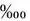

的承销费率。这个“白菜价”可能都覆盖不了几个签字的保荐代表人的工资。另外，类贷款资产的累积和坏账损失使行业转型压力依然较大。

在行业的寒冬里，中小券商的日子会越来越难过，即便市场活跃带来阶段性的喘息时机，中小券商也很难有大作为。头部的大券商往往能保持逆市发展态势，攫取更高的市场份额，依托财富及资产管理业务推动盈利能力的改善，满足机构及跨境业务相关需求，带来资本运用效率的提升。

最后，券商面对的关键问题还是人的问题。我平时接触的券商的中层和高层领导，大部分已经在45岁以上了，从业超过20年。你能指望这些人搞创新和发展吗？显然很难。这些高管想得更多的是不要冒太大的风险，保住自己的位置。

券商的新鲜血液，永远是那群很用功的研究所分析师。这些年轻人勤勤恳恳，就是希望能在每年的新财富最佳分析师评选中获得好成绩。2018年新财富最佳分析师评选取消，对他们的影响极大。不过当时我们也说到，评选不会永远取消，只是要等到这风口期过去才会重启。道理很简单，你不评，会有外资来评，蛋糕会被别人拿走。

对券商行业做分析和研究，要了解国内券商行业的三个特点。

首先，券商属于金融强监管行业，政策从宏观层面直接改变行业逻辑是常见的现象。平时在聊天的时候，和我私下交流的券商高管都会谈到，这个行业，政策给饭吃了，大家都会过得很好，一旦政策收紧，大家的日子就没法过了。在过去10年里，券商比较开心的日子应该是创新业务蓬勃发展的时候。每次股市震荡以后政策都会收紧，做业务的话语权越来越小。

其次，券商行业同质化竞争明显，业务线条基本重叠，没有哪家公司能一家独大并改变行业的趋势。对于现在已经上市的券商而言，基本上都是全牌照了，但是它们每年必须面对证券业协会组织的评级分类。评级结果不同，能做的业务就不一样，所以每年所有券商都对评级严阵以待。

按照目前的游戏规则，证券公司分为A、B、C、D和E 5大类11个级别。A、B、C三大类中各级别的公司均为正常经营公司，D、E类公司分别为潜在风险可能超过公司可承受范围及被依法采取风险处置措施的公司。证券业协会根据证券公司的分类结果，对不同类别的证券公司，在行政许可和监管等方面给予相应的待遇。

从股价表现上看，券商板块的同质性很强，个股逆于板块上涨的情况比较少。所以券商行业的研究，大部分采用了从面到线再到点的降维研究思路。从行业层面的研究出发，结合监管思路梳理完发展阶段、核心边际变化因素、业务方向，再明确各家券商的定位和特点。

从基本面的角度看，券商有四大主营业务：经纪业务、自营业务、投行业务和资管业务。

经纪业务是券商传统的主营业务，但这几年，因为佣金率和交易量的下滑，券商的佣金收入越来越少。

我们做过一个统计，2011～2018年，国内券商的收入结构发生了明显变化，经纪业务的占比从70%下滑到了25%。

融资融券属于经纪业务。以前，券商在融资业务上赚了不少钱，但这个业务给券商带来了一些风险，比如当股价下跌之后，融资业务会产生一些坏账。

所以，总体来说，券商的经纪业务未来的看点并不多。

券商的自营业务现在已经超越经纪业务，成为券商主要的收入和利润来源。自营业务靠天吃饭，行情好的时候多赚一点，行情差的时候少赚一点。不过，随着A股市场机构化的深入，我判断券商的自营业务会越来越好。

投行业务对于券商的收入贡献截至2019年维持在15%左右，并不多。而且现在在行业里，投行业务主要集中在几家巨头那里。2019年修订的《证券法》强调了“全面推行证券发行注册制度”，所以后面几年券商的投行业务收入会越来越多，蛋糕会越做越大。

券商的资管业务各不相同，业内做得较好的是东方证券。不过，它的老总离职出去自己做了。我觉得资管业务的前景很好，但是面临着公募基金和私募基金的激烈竞争。

前面讲到了《证券法》的修订，这里我多说两句。

我们国家的《证券法》是1999年开始施行的，至今经历了三次修正（2004年、2013年和2014年）和两次修订（2005年和2019年）。

如果大家留意这些年份，就会发现《证券法》的修正或者修订，都是在资本市场上估值比较低的时间段。

比如，2004年和2005年，我记得A股的中位数估值在20倍左右；2013年和2014年，中位数的估值是20倍；虽然2019年已经涨了不少，但中位数的估值倍数仍不高。

进一步观察会发现，《证券法》修正或者修订之后，都迎来了一轮比较大的牛市。

或许这是一种巧合，但我觉得每次《证券法》的修正或者修订，背后体现出对资本市场的重视程度被提到了一个新的水平。现在经济已经到了不得不转型的时候，提升直接融资占比的需求越来越大。

2019年7月，科创板正式上市，回头看，这是给新证券法的出台铺路。注册制给各大券商带来了挑战和改革，主要体现在以下三个方面。

第一，对券商的专业性提出了更高要求。在以前的投行业务里，券商扮演的大多是通道的角色，现在注册制需要券商有真本事，比如价值发现和定价能力、撮合交易能力、投资能力以及销售能力。

第二，赋予券商更大的定价权与话语权。在我国的金融系统中，券商或投行的地位是比较低的，因为券商做的都是低附加值、低收益的业务。现在注册制采用市场化的询价定价机制，增强了券商在资本市场中的定价权。

第三，冒出来更多综合性大投行及专业性精品投行。现在国内各家券商的业务结构相近，同质化很高，注册制将促进各家券商进行差异化定位，有所侧重地发展自己的业务。

到底应该买什么样的券商股呢？我比较青睐大券商。

首先，大券商在创新业务方面有很强的竞争力。

其次，大券商在并购重组和投行业务方面有优势。

比如科创板的IPO项目保荐格局由“三中一华”包揽，中信建投、中信证券、中金公司和华泰联合这四家头部券商承揽了40%的项目。

再比如沪深300股指期权的主做市商都是头部券商。此外，我相信未来的政策肯定还会向头部券商倾斜。

大券商还有一个抗周期的属性。在底部的时候，小券商都活不下去了，大券商还能再撑一撑。

在大券商里，中信证券在2002年上市以后并购了一些券商，然后营业部迅速铺开，因为那时候营业部还没有完全放开网点，所以中信证券那时候扩张得很迅猛，直接从当时一个中等券商迅速发展成行业龙头。

在过去这么多年里，我觉得中信证券做得最好的是战略，各个业务发展比较均衡，在内部管理上比较到位，没有产生过大的风险。

中金公司在香港上市。中金公司的研究做得很好，经纪业务这块比较强。

海通证券是上海本地的全国性大券商，各方面管理比较到位，业务发展一直比较均衡。

最后说说东方财富。虽然东方财富属于比较小的券商，但未来的发展可期。我前面介绍过东方财富的估值。东方财富的未来发展可能会对标国外的盈透证券（IB）。如果互联网券商这条路能走通，那么东方财富将相当有特色。

券商行业在未来的发展过程中一定会出现比较大的分化，行业内部会产生一些细分，每个券商只有自己的特色才能在领域里做得又专又深。

## 第3章 行业研究 - (08) 3.8 房地产行业专题研究

\(08\) 3\.8 房地产行业专题研究

2025年5月18日

11:03

3\.8 房地产行业专题研究

2019年年底，我和一些券商研究员聊过房地产行业，在这里和大家分享一下当时的观点。当然，这些内容都是交流时的个人所见，仅供参考，不构成对投资房地产以及投资股票的建议。

先说说中国房地产行业的重要现状和基本特征。

特点一：房子并没有太多冗余。

研究房地产行业，先要知道中国到底有多少房子。如果连总量都不了解，就没法做研究。

从存量范围来看，2017年城镇住房总面积为261亿平方米，其中城区是146亿平方米，乡镇为115亿平方米，人均居住面积为36平方米。

2017年，总套数是2\.74亿套，按照2\.4亿户家庭算，户均住房套数是1\.13套。

户均住房超过1套是好现象，表示中国不缺房子，还有冗余。但具体冗余多少，还要看自然空置率。

美国和日本的长期自然空置率是10%～15%，中国目前是17%。如果只看城区，大概是15%，所以整体空置率不高。空置房还包含在装修的房子、危房等，如果将它们都剔除的话，空置率更低，并不像有些新闻媒体报道的那样高得离谱。

另外，上面所说的城镇住房总面积261亿平方米中，还包括不是煤卫独用的、平房、质量堪忧的房子等，这些占到20%～25%，相当于60亿平方米左右，都是可能改建或者拆除的。

按照目前每年新房成交量10亿～11亿平方米，基本上光这些要拆除的楼房，就能继续维持房地产市场6年。所以很多开发商说，国家现在严控房地产，但是通过拆迁，市场热度还是有望恢复的。

特点二：房价增长速度和人均GDP增长速度的相关性很强。

在全球十几个最主要的经济体中，人均GDP增长速度和房价增长速度的相关性曲线都是一条比较完美的斜线。

比如德国，房价控制得好，人均GDP的增速慢。又比如日本，房子便宜，但人均GDP增速是负的；巴西和南非的住房稀缺问题很严重，房价走高，经济增速较快。

我们现在实行“房住不炒”的政策，房价控制住了，经济增速却慢了。工业增加值创了阶段性的新低。工业增加值和GDP有很高的相关性，间接表明整体经济目前还不怎么好。

特点三：开发周期非常长。

从拿地到开工需要半年，从开工到达到预售条件又需要半年。漫长的建设周期导致房地产需求价格弹性和供应价格弹性之间的差距很大，行业周期会因此不停波动。

从上下游行业来看。从开工开始，房地产行业对桩机、挖掘机的需求开始上涨；到主体建设时，对水泥、钢材的需求很大；再往后，对PVC管材、铜等材料的需求增大；再后面，对玻璃、铝合金的需求增大；到交付时，对轻装修相关的材料的需求增大。

特点四：中国房子贵。

土地供应不足是中国房价高的重要原因。中国国土面积有960万平方公里，但真正适合做住宅用地的只有0\.3%，不到3万平方公里。

形象一点，把中国所有的楼平着聚拢到一起，大概只有不到两个北京或者三个半上海的大小。

中国的人均居住面积是36平方米，其中香港、北京、上海都是10平方米左右。我们的邻国日本是100平方米，美国又是日本的好几倍。所以，我们的房地产业从根源上没法和其他国家比。

特点五：杠杆问题。

我们研究发现，中国居民家庭购房的杠杆，现在首套房是20%～40%，从全球来看几乎是最高的，第二套更高。

每年新增房贷占当年房地产销售额的比例，在2015～2016年的确很高，但后面明显下降，说明去杠杆是有明显效果的。

大家一般都会认为判断房地产的长期趋势很困难。比如现在问大家20年后的房价是多少？很多人都会觉得挺难回答。

但实际上，越长期的事情越容易判断。因为你问下个月房价涨还是跌，我很难回答，但是关于未来5年房价的趋势，或许我能给你思路。

站在长期角度，住房需求和经济发展所处的阶段有很高的相关性。在温饱还没解决时，根本没人会在意房子的大小。

当人均GDP在3000美元以下时，每年新房交易套数占城镇家庭户数的比例在1\.5%左右，即每100个城镇家庭中只有1\.5个家庭买了新房。如果大家全部都换一遍需要60多年，大多数人要等到房子坏了，才会考虑换房。

当人均GDP为3000～5000美元时，这个比例开始增加；当人均GDP为5000～8000美元时，这个比例快速上升；到8000美元的时候基本上能达到5%，这表示每20年所有家庭的住房会换一遍；当人均GDP为8000～12000美元时，达到6%。

再往后就开始下降了，并且呈现出很长的长尾。2018年，美国人均GDP为6\.26万美元，但是每年新房交易套数与城镇家庭户数的比值只有2%，意味着所有人都换一遍房需要50年。这是为什么呢？因为大家都住得够大够好了，开始在意健康、幸福，房子不那么重要了。

所以，根据以上规律，当我们知道人均GDP水平时，基本上就能知道新房成交套数大概有多少。

直接和大家说说我计算后得到的结论。新房成交面积的合理中枢，中国现在每年应该为11亿～12亿平方米，2015～2020年可能会是顶峰，2020年后会开始下降，到2030年开始平滑，往后大概维持在8亿平方米左右。

以上对成交量的长期判断，相信大家应该比较认同。接下来对长期房价的判断，很多人可能就不认同了。我从时间维度和空间维度两个方面来说。

从时间维度来看，国家统计局的数据显示，2018年我国的平均房价为8000多元/平方米，我预计，到2050年将达到3万元/平方米，剔除通货膨胀后是1\.5万元/平方米。我认为，30年后房价的名义价格会翻4倍，实际价格会翻2倍。

美国50年前的房价是1\.7万美元/套，现在是35万美元/套，50年间名义价格涨了20倍。拉长时间看，美国的房价长期稳定，跑赢了通货膨胀。

荷兰阿姆斯特丹过去近400年的房屋价格指数，同样印证了房价长期单边上涨的趋势。

从空间维度来看，我认为未来中国五大都市圈的房价会进一步提升。

正如融创的孙宏斌所说：“不要问我对中国房地产怎么看，我脑子里只有自己城市的房地产。”房地产必须要从空间上切割得很细才能判断。

从高铁的城市节点来分析，现在高铁正在改变和重新塑造中国的人口分布、经济分布以及房地产分布。

比如日本的新干线，1960年，日本的三大都市圈的人口占全国总人口的26%。后来新干线开通，如今人口占比已经达到44%，三大都市圈的房价猛涨。

在中国，相同的故事正在发生。高铁节点城市正在形成五大都市圈，分别是长三角、环渤海、粤港澳、西南地区和中部三角地带，现在覆盖的人口总数占全国总人口的20%，预计将来会达到30%～40%。

从长期供应看，越是人口集中的地方，土地越贵，越是供不应求。

从中短期的角度看，大家会认为房地产行业受政策的影响很大，但其实政策不是外生变量，而是房地产的量价表现倒逼出来的内生变量。

中短期研判房地产市场热度的核心是库存，只看这一点就够了。这看上去很简单，但其实不简单，因为库存不太容易算。

大家读研究报告时经常看到“库存去化月数”的数据，但其实这个数据有两个问题：一是库存定义为拿到批准预售证的库存规模，其他的不算，口径小很多；二是Wind的房地产销售量失真严重，比建委口径要小得多。

这里介绍一个统计方法，用开发商累计拿地数减去累计已开工数量，剩余未开工土地，再从累计已开工数中减去累计已销售数，得到累计已开工但未销售的数量。这样的算法基本能确保是全口径库存。

这样算下来的库存去化月数，一般16～20个月是合理区间。对整个2019年预测下来，三四线城市是16个月，而一二线城市仍然远远低于这个区间，所以房价有长期上涨压力。

有了库存数据，接下来会很简单。库存低的时候房价会上涨，销售量上升，开发商会补库存，然后会产生时间差。这时候主要分析供应增加和需求增加谁的力量更大，就基本能判断房价的变化趋势。

看房企，关键要看两个“三角形”。

一个是进攻三角形，包括周转率、利润率和杠杆（本质上是杜邦分析法对净资产收益率的三拆分）。能把这三点做到均衡的房企很少，一般能做好其中的两点就已经很好了。融创当时只做到了周转足够好，股价就已经飞速上涨了。

另一个是防御三角形，包括成本、融资和产品。以前买房子，大家都不关注开发商和物业是谁，但是现在越来越看重。

从具体指标上来看，土地储备、供销存管、财务管理、经营机制等都需要关注。尤其对于房地产公司来说，相比财务杠杆（净负债率），如果能运用好经营杠杆，净资产收益率就会很高。开发商应该少使用银行借款，而是用好客户给的预收款，它相当于免费的融资。

房地产公司大致分为以下三类。

第一类是市场占有率很高的开发商。现在前10名开发商的市场占有率合计是30%，以后应该能达到50%左右，按照每年3个百分点的增速，大概能快速增长7年。在这7年内，营业收入保持每年10%～15%的增速应该没问题，但7年后我觉得基本到头了。

第二类是未来可能会实现长跑的公司。这类公司是指未来50～100年都有发展机会的公司，它们主要从事投资性物业，比如用作商场、写字楼、教育场所等，这提供了融资端的保障。恒隆集团的投资性物业很多，董事长陈启宗先生的“致股东的公开信”是我每年都要反复阅读的文件之一，它对我理解房地产行业有很大的帮助。

第三类是有机会动用或者成立房地产基金的公司。目前，国内很多人对房企的认识主要停留在房地产开发上，这太狭隘了。未来属于有输出投资能力和管理能力的开发商。

最后简单说说地产股的估值，一般看资产净值（NAV）和市盈率。对每个项目用假设开发法，测算出现金流流出的值，然后进行折现，再用所有项目资产值减去净负债，得到NAV。这样做，主要能看出房地产企业的家底有多厚。市盈率展现了这些家底能带来多少利润。中国房企的市盈率都很低，在6～7倍，应该说是全球市场中很低的了。

浙江龙盛买了不少卧龙地产的股票，占比超过5%。这两家公司的基本面都很扎实，而且都在上虞，离得很近。之前平安不停地买房地产股票，大家可能不以为然，现在实业资本开始买房地产公司的股票了，这可能是一个信号，因为地产股真的挺便宜的。

地产股比较适合用来做长期的价值投资，但是如果大家没有长久的耐心，那做波段也无妨。地产股的大牛市一般需要具备四个要素：宏观经济要有压力，房地产销售偏弱化，估值低，政策有好的预期变化。

要注意，当四个要素都具备的时候，股价应该已经疯涨了，不能追。我建议在左侧买入，当满足两个条件时开始观察，满足三个条件时准备入场，等到四个条件都满足的时候，则要看情况卖出了。

## 第3章 行业研究 - (09) 3.9 新能源车行业专题研究

\(09\) 3\.9 新能源车行业专题研究

2025年5月18日

11:03

3\.9 新能源车行业专题研究

2019年12月，我研究了中证科技50指数（代码是931380）。如果把成分股按照市值排序的话，第三大是宁德时代，它是动力电池行业的龙头企业。

我认为，新能源车将会是未来两三年市场关注的方向之一。

先来简单回顾近几年我国新能源汽车的发展历程。

2009～2012年是推广第一阶段：“十城千辆”，25个城市开展新能源汽车推广应用试点并发放购车补贴，处于产业酝酿期。

2013～2015年是推广第二阶段：88个示范城市推广新能源汽车，目标是将新能源汽车规模扩大到33万辆，使产业快速发展。

2016年开始行业整顿：“骗补”事件发酵，补贴政策、行业目录、电池目录重新制定，中央补贴推广至全国，行业整顿。

2017～2018年市场盘整：补贴标准提升，退坡明显，“双积分”政策实行，行业进入后补贴时代，市场驱动力增强。

再来具体看看2019年的情况，我很明显地感觉到，国内的新能源汽车市场发展状况不太好。

2019年前11个月，新能源车的产销量是102万辆，全年预计为110万～120万辆，远低于年初150万～160万辆的预测，而且也会出现首次年度负增长。

为什么会负增长？

我总结出以下三个原因。

第一，宏观经济下行，导致车市整体表现不佳。

第二，在国五换国六的过程中，燃油车对新能源车形成了严重的挤压。

业内有一个共识，即同款的新能源车比燃油车贵2万元，消费者是能接受的。但是2019年国五换国六的时候，有些燃油车的车型打了5折或者6折销售，导致新能源车的吸引力大幅下降。

第三，2019年的补贴降得比较急，很多车企都应对不足。

我们国家的新能源车在近几年都是靠政策的指挥棒来指引的，企业做什么样的车型，取决于国家给出什么样的政策。

以前，国家两年调整一次政策，车企有足够的时间去做车型的布局。但是2018年之后，国家开始一年调整一次，而且政策出台的时间比较晚，所以大部分车企没有足够的时间和精力去应对车型的改款。

比如2019年的政策（《关于进一步完善新能源汽车推广应用财政补贴政策的通知》）是在3月出台的，3～6月是过渡期，6月之后直接实行这个新政策。

在这个新政之下，补贴断崖式下跌，导致现有的新能源车型不管从价格上看，还是从配置上看，对于消费者的吸引力都比较弱。

除了消费者受影响，新政对于车企的影响一样很大。过去车企卖新能源车，尤其是卖纯电动汽车，无非是赚多、赚少的区别。但是在新政之后，卖得越多，亏得越多，这在北汽新能源、比亚迪等车企三季报扣非净利润（归属于上市公司股东的扣除非经常性损益的净利润，见图3\-1）的恶化上得到体现。

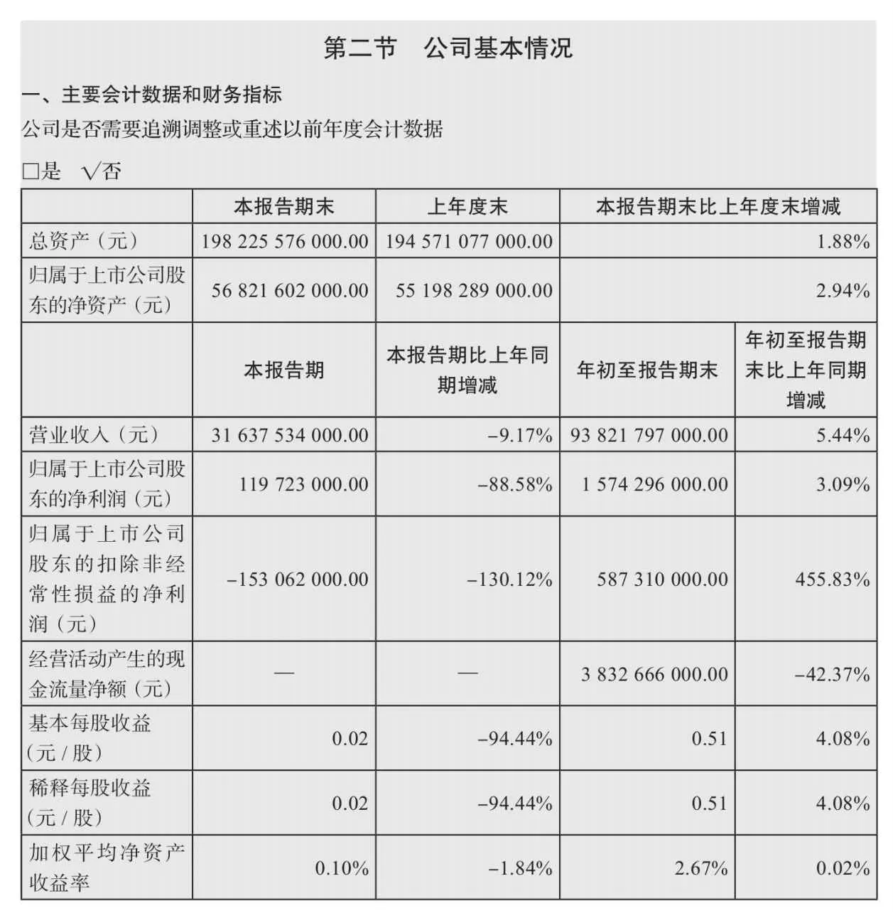

图3\-12019年比亚迪的扣非净利润

资料来源：比亚迪公司公告。

展望2020年，首先还是要看政策。

2020年的新政策截至我写作本节时还没有出台。网上流传的各种版本，我觉得都不太靠谱。

从趋势上看，国家给新能源车的补贴肯定会越来越少，但是会有一些结构亮点。

截至2019年年底，to G端（政府）。出租车可能有比较大的增长。

目前，全国共有约140万辆出租车，新能源出租车只占10%左右。从城市看，深圳和太原已经全部采用了新能源出租车，但其他大城市，像北京、上海和广州都还没有全部更换。从2020年开始，预计这些城市的新增出租车应该主要以新能源纯电动车为主。

其次，to C端（个人消费者）。特斯拉的上海工厂2019年生产的节奏是很快的，国产Model 3已经下线，第一阶段的产能是每周3000辆，年产能是15万辆左右。考虑到产能爬坡，2020年特斯拉可能会生产8万～10万辆。

特斯拉不愁销售，而且国产的特斯拉可能还会降价，如果在第一阶段的价格基础上下降20%，特斯拉的基础款价格会落入25万元左右的区间，会给比亚迪的“唐”带来巨大的压力。普通消费者相当关注20万～25万元的区间，如果国产特斯拉降价，那么它的竞争力会很强。

特斯拉这样的高端电动车品牌进入中国，肯定会对现有车企的竞争格局产生很大的影响，但是我觉得不用太悲观。当年的消费电子行业，苹果是领头羊，在我们国家的供应链发展壮大之后，华为和小米这样优秀的公司诞生了，对苹果形成了一定的冲击。

特斯拉已经进入了中国，它肯定要培养国内的供应链，相信未来中国能够出现一些伟大的电动车公司。

当然，对于现在的国内自主品牌，压力肯定还是更大一点。我觉得国内的自主品牌目前需要在两方面加强工作：一是降成本；二是提升续航里程。

重点讲降成本方面。我觉得2020年会有两个趋势：第一是从三元电池用回磷酸铁锂电池，这样成本节省了10%左右；第二是未来会更多地使用宁德时代正在做的CTP（cell to pack）方案。

简单解释CTP。以前需要以单体电池形成电池模块，然后进行电池组合（pack），基本上分为三步。现在中间一步没有了，直接从单体到电池组合。因为省掉了形成电池模块的环节，直接制造电池组合，成本自然继续下降。

综上，我在2019年年底判断，2020年新能源汽车的销量为145万～170万辆。我和行业协会做了交流，他们认为2020年汽车整体的销量应该与2019年持平，但是对于电动车，他们比较乐观，数字上和我预测的差不多。

从投资的角度看，下游的整车还会有不小的压力。一方面有盈利压力，另一方面是2020年特斯拉放量之后，车企之间的竞争会比较激烈。

所以，相对来说，我觉得新能源汽车的中游和上游的机会可能会更大一点。

比如，电池。基于2020年新能源车的产量，动力锂电池的需求在80～90GW，同比增长40%左右。

在动力锂电池行业里，宁德时代肯定是很好的标的。

首先，它在动力锂电池行业里的市场占有率目前最高，在全球都有22%的份额，而且对国内主要的热销车型都有配套。

其次，宁德时代的成本控制能力是世界领先的。

宁德的董事长曾毓群，博士毕业后先做教师，后来去新能源科技有限公司（Amperex Technology Limited，ATL）干了十多年，从基层做到了技术总监，之后出来创业。曾总是个很厉害的人。宁德时代在上市前用很低的成本租用了ATL的厂房进行生产。

国内很多电池厂做不起来，而宁德时代能够做到行业龙头，除了天赋、努力之外，还有一些外人没有办法掌握的实力。

这里再插一句，璞泰来的陈卫同样在ATL工作了十多年。ATL算得上是锂电池行业的“黄埔军校”。

不利的方面有三个。

首先，电池会不断地降价。

其次，国家放开了外资进入动力电池行业的限制，这可能会对现有的竞争格局产生一些影响。

第三，宁德时代的市场占有率越来越高，几乎一家代表了整个行业。所以越往后，超额收益（alpha）会下降，系统风险收益（beta）会越来越多，而且静态市盈率估值常年不低。

除了中游动力锂电池，电池的上游材料企业的机会也不错。在四大材料环节（正极、负极、电解液和隔膜），一些国内的上市公司做得不错，尤其是在LG化学（LG CHEM）产业链上的那些公司。

此外是一些与设备相关的零部件公司。比如三花智控在手的新能源车的订单规模超过160亿元。再比如宏发股份可能会把它的高压直流继电器做到30亿元，而其2019年只有6亿元左右。所以，这个行业未来的增长还是会比较快的。

## 第3章 行业研究 - (10) 3.10 液晶面板行业专题研究

\(10\) 3\.10 液晶面板行业专题研究

2025年5月18日

11:03

3\.10 液晶面板行业专题研究

对于科技领域，大家好像都挺感兴趣，我正好和面板行业的专家及上市公司聊了不少，这节就和大家讲讲液晶面板行业。

首先来说全球液晶面板行业的发展历史。

液晶面板行业有一个“王氏定律”，是由京东方的前董事长王东升提出的，大意是：液晶面板行业的技术和生产效率的提升，会带动下游渗透率的提高，从而提升总需求。

这个底层原理和本节前面提到半导体行业里的摩尔定律是一样的。

液晶面板已经经历了几轮产业转移，一开始技术发源于日本，之后传到韩国、中国。产业转移的根源是产业的先行者缺乏对产业的持续投入，导致技术、生产效率和成本优势的丧失。

日本时代是从20世纪70年代到1998年，日本企业首次实现了美国实验室技术的商业化应用。但是日本企业有一个问题，它们不太擅长做重资产投资。

韩国企业在面板行业里领先了20年。韩国企业的崛起是因为遵循了面板的行业规则。韩国企业通过逆周期投资进行产业扩张，然后通过成本优势带动需求，最后使面板不断大尺寸化。

韩国企业后来衰落有两个原因：一方面它把整个产业重心向OLED转变，另一方面是因为中国大陆企业的崛起。中国大陆企业在资金、下游需求和配套市场方面有得天独厚的优势。

中国台湾地区的面板行业在2000年前后崛起，那里的笔记本电脑工业比较发达，诞生了像友达、群创这样的双寡头。但2008年金融危机之后，台湾企业缺乏资金，同时不像大陆市场有如此庞大的市场需求，面板行业逐渐开始衰落。

2017年之后，全球新建的高世代线产能主要由中国大陆企业掌握，大陆企业对韩国企业在LCD领域的全面替代，是个确定性趋势，同样符合产业规律。大陆企业的崛起，得益于人才储备、产业经验、技术能力、资金实力和市场基础这五方面。

再来说说液晶面板行业的特点。

微笑曲线由宏碁集团创办人施振荣先生提出，是一条类似笑脸的曲线，两端朝上。曲线所表达的是，在产业链中，附加值更多体现在两端，即设计和销售，处于中间环节的制造附加值最低。

液晶面板产业是符合微笑曲线的：上游的原材料和下游的品牌厂商，毛利率比较高；中游的液晶面板制造行业相对来说毛利率比较低，而且周期性很强。

为什么会这样？

首先，液晶面板的下游应用市场是手机、平板、笔记本电脑、显示器、电视这五大标准化的产品。

其次，液晶面板的技术很成熟，技术壁垒并不是太高。

最后，液晶面板是一个重资产制造业，受价格和产能利用率的波动，折旧成本很高。

综上，利润不多、竞争激烈、成本不少，导致液晶面板制造业的毛利率相对来说比较低。

现在分析液晶面板行业的周期性。

液晶面板行业的短周期差不多是持续3～5年的时间，从产能角度来看大致分为三个阶段：供应紧缺的涨价上涨阶段、新产能不断加入的下行阶段、产能出清的周期反转阶段。

上一轮景气周期是2014年第四季度到2016年第二季度。涨价有两个原因，一个是行业新增产能比较少，另一个是大厂商夏普集团减少了对三星电视的面板出货，导致有1～2个月供应链的紧张和错配，这个景气周期持续了四个季度左右。

整体下行周期是2017年下半年到2019年第四季度。典型的产能特点有两个：一是没有老的产能退出，二是新产能陆续释放，尤其是中国大陆几个厂商的新产能。比如京东方福清的8\.5代线、合肥的10\.5代线、中电熊猫和中电彩虹的两条8\.5代线，还有华星光电和10\.5代线、惠科的第二条8\.5代线，等等。产能持续增加，导致价格一直在下行。

从2019年第四季度看后面2～3年的产能，可能是产线出清阶段。因为一般行业在周期底部，龙头企业会发生经营性的亏损，当龙头企业亏损之后，整个行业肯定是普遍性亏损，倒逼落后产能退出。

比如从2017年上半年至2019年，电视面板的价格呈现单边下行的状态，各个尺寸电视面板的售价都低于行业的平均成本。我通过对产业链的调研发现，2019年前三季度，韩国厂商已经亏损了70多亿元，历史上从没有出现过，而从第四季度开始，韩国的LG和三星都会有比较大的产能退出计划。

韩国产业重心正在向OLED转变，而国内很多厂商都正积极布局OLED。OLED到底是什么呢？

OLED，即有机发光二极管，或者叫有机发光显示器。OLED是第三代显示技术，主要有4个方面的特点。

首先，技术先进。比如OLED有更高的单位像素密度（PPI），显示效果会更加细腻，同时适合做一些全面屏的定制化设计，还能搭载屏下指纹传感器和屏下摄像头。

其次，下游应用领域在不断拓宽。比如像折叠屏手机、折叠笔记本，还包括可穿戴设备，会更大量地使用OLED。

再次，国产厂商份额的提升。现在的OLED的产能布局以中韩两地为主，但是国产厂商的份额不足10%，未来国产厂商的OLED市场份额会有一个很长足的成长空间。

最后，OLED有两方面很深的壁垒：量产的良品率和量产的产能利用率。要做好OLED并不容易。

总结：OLED的优点是更快的响应速度、更高的刷新率、更好的显示色域和更低功耗；OELD的缺点是使用时间过长会导致蓝光寿命比较短，整个屏幕会发红和发黄，在电视里面还会有烧屏的一些情况。

所以，OLED的技术特点，比较适合于做高换手、低功耗且对形态有要求的一些小尺寸消费类产品。

最后，聚焦到企业层面。

面板企业要盈利，首先要有产业布局和规模供应能力。比如产线是不是足够优，切割效率是不是足够高，整个产品的利用率是不是足够高，这些决定了厂商的生产效率和成本优势。

其次是产品本身的市场竞争力和市场份额。当市场份额足够大的时候，面板企业通过调整供给影响需求，从而影响价格。

最后是企业的资金实力。面板行业的一条产线几乎是几百亿元起，属于投资节奏快、投资金额大的一种重资产行业。逆周期投资是实现弯道超车的很重要的方式。

A股现在不缺乏好的面板企业，甚至不缺未来可能成为国际性面板厂商的企业。

京东方是国内和全球的显示面板龙头企业。第一，在这个行业景气度向上的时候，它的营业收入和盈利的弹性很大；第二，京东方在液晶和OLED的产能布局非常完备，技术领先；第三，京东方未来很可能会占据几个国际大客户的新机型份额。它还有柔性OLED的出货量，在良品率、规模方面都有突破，会贡献实质的业绩和利润，这块的估值弹性也比较大。

TCL的运营效率是比较高的，旗下公司华星光电的产品布局齐全。华星光电主要定位的是半导体显示和材料业务，核心是向上下游产业链做定向整合以及横向拓展。它的产品之前都以大尺寸为主，从2019年开始其小尺寸的OLED发展很快，无论大小尺寸目前都发展得比较好。

深天马的优势是在手机和车载面板上的份额都比较高。公司在中小尺寸显示领域处于行业领先地位，尤其是在LTPS（另一种液晶面板工艺）等高端显示领域优势很大。它还和别人合伙投资了柔性AMOLED生产线，布局新型显示技术。

## 第3章 行业研究 - (11) 3.11 食品饮料行业简单介绍

\(11\) 3\.11 食品饮料行业简单介绍

2025年5月18日

11:03

3\.11 食品饮料行业简单介绍

民以食为天，这一节我们聊聊食品饮料行业。

食品饮料行业是一个平淡普通的行业。食品饮料的研究不需要像研究医药和化工行业需要有专业的知识背景。食品饮料行业蕴含着巨大的价值投资机会。行业内茅台、伊利、洋河、海天、双汇等公司，让不少投资者赚得盆满钵满。

食品饮料行业没有成长股，趋势性很强，属于比较稳定的行业。与食品饮料行业息息相关的是人口结构和城市化率。随着第三次生育高峰带来的消费高峰已经结束，黄金时代已经过去了。但是随着居民消费总量的提升，我们对食品饮料行业依然不用太悲观。

食品饮料行业有24个细分领域。我说过投资是做减法的事，并不是每个领域都值得关注。从产品属性和商业模式出发，我给食品饮料的子行业的排序是这样的：调味品>白酒>乳业>休闲食品>保健品>肉制品。

为什么最看好调味品？因为调味品能给高估值。我们在做调味品模型的时候发现，完全能够很有信心地去预测公司未来5年甚至10年的利润和现金流，不需要担心中间的大幅波动。因为调味品的主要用户是厨师，购买者和使用者是分离的，所以调味品复购率高，而且对品牌的黏性很高，这有点类似医药企业和医生的关系。

和业内专家交流之后，我认为观察食品饮料行业的产品有三个原则。

第一，吃的不如喝的。

第二，大众不如高端。通货膨胀背景或流动性充裕时，高端品需求被拉动、大众品成本被推动。通货紧缩时正相反，高端品一荣俱荣、一损俱损，大众品“剩者为王”且不同细分行业有不同的整合节奏。

第三，近的不如远的。产品销售半径小的不如产品销售半径大的。销售半径大的产品，像白酒、常温奶、火腿肠，能够远距离运输，一处产地便供应全国。这类公司重点生产拳头产品，全国经销商网络一铺就是几何倍数发展。

过去是短缺经济，对企业而言，比较重要的是渠道，只要能实现产品铺货，就大概率能实现销售。随着渠道的扁平化、深度分销的发展，企业开始直接对接消费者，经销商成了配送商，仅负责商品配送与终端回款。

反过来，现在渠道有新的变化，即电商的崛起。电商拉近了企业和消费者的距离，同时让消费者反过来评价企业的产品，这些评价影响着其他消费者的购买选择。

这需要企业做好消费者画像。以前是只卖给经销商，销售过程很快结束，不知道消费者对产品的评价如何。所以传统企业当时看到三只松鼠的卖萌客服，看到附送纸巾和果壳袋，感觉很震惊，因为它自己从来没有挖掘过消费者的感受和需求。其实这些需求一直都有，只是没人去发掘而已。

好的产品自己会说话。对于产品的本质，我总结了这样的规律：必需品<上瘾品<社交品<信仰品。

这里再讲几句上瘾品。上瘾的属性帮助企业解决了消费者复购率的问题，不需要用大量广告去引导消费者反复购买。国内香烟广告是被明令禁止的。但每次高铁到站短暂停靠时，虽然只有短短的一两分钟，你总能看到有不少旅客下车匆匆忙忙吞云吐雾一番。

## 第3章 行业研究 - (12) 3.12 影视传媒行业简单介绍

\(12\) 3\.12 影视传媒行业简单介绍

2025年5月18日

11:03

3\.12 影视传媒行业简单介绍

我没怎么具体写过传媒板块，主要因为2016～2018年这三年，传媒行业是唯一一个连续下跌三年的行业。

我在2018年年底约了两个传媒分析师路演。一个分析师说，他已经转行看医药和化工，再不碰这个行业了。另外一个分析师说他没有转行，但是已经好久没有人要听他的路演了。他看到我约他见面，高兴得泪流满面。

不过，和他聊完以后，我决定还是先战略性放弃这个行业，因为风险太高了。我给大家罗列以下六个风险点，看完之后，相信你们会认同我的观点。

第一，随着国家对电影和电视行业产业政策的放宽，整个行业都会受到外资企业、进口电影和进口电视剧的强力冲击。

第二，越来越严的税收征管和越来越少的政府补助。避税天堂霍尔果斯的陨落，某些明星的标志性事件，对行业影响深远。

第三，盗版现象给电影、电视剧的制作发行单位带来了极大的经济损失，造成了影视行业持续发展动力不足、原创缺乏等一系列问题。盗版很难从根本上解决，它是利益链的问题。

第四，人才管理的风险。少数签约制片人及导演对上市公司，比如华谊兄弟的业绩的贡献占比相对较高。如果这些人不在了，那这家上市公司的营业收入和利润可能会雪崩。

第五，市场竞争加剧的风险。在电影类别方面，国产商业大片的数量实现了突破性飞跃，但质量依然参差不齐。中国的电影市场能否继续容纳更大的电影产量仍然有待验证。如果更多的影片竞争相同的档期，将不可避免地出现上映日期难以协调、观影人群分流的竞争新局面。

第六，观众口味难以捉摸，大导演、流量明星、好题材也不一定能保证收益。2018年的状元《红海行动》、探花《我不是药神》的票房好成绩，在上映之前是想都不敢想的。

讲完了理由，再看看数据。传媒板块，2016年下跌了38%，2017年下跌了22%，2018年继续下跌38%。这意味着如果2015年年底用100元买了传媒行业ETF，到2018年年底净值只剩下了30元。

当然，这还不是最惨的。市场上有一只传媒B的分级基金，2015年4月，该基金的价格约为22元，2018年年底的价格约为0\.67元，跌幅高达97%。一直持有这只分级基金的投资者已经经历了至少三次下折。

分级基金是分级B向A借杠杆投资于母基金。一旦市场连续下跌，为了A的安全，B只能向下折算，所有损失由B承担。

传媒B基金已经被市场抛弃了，有一天只成交了7000元。后来有两天放量了，不过全天只有27万元。想买的人买不到，想卖的人更卖不出去。

虽然在牛市中分级基金因为杠杆作用，有很强的造富能力，但是一旦触发下折，真是任人宰割，所以我建议普通投资者还是尽量少碰带杠杆的投资工具。

## 第3章 行业研究 - (13) 3.13 水泥行业简单介绍

\(13\) 3\.13 水泥行业简单介绍

2025年5月18日

11:03

3\.13 水泥行业简单介绍

2020年1月7日，冀东水泥公布了2019年业绩预告。全年归母净利润区间为26\.8亿～27\.8亿元，同比增长41%～46%，符合市场预期。

这节和大家聊聊水泥行业，顺便介绍一个赚钱的公式。

水泥的主要需求由地产和基建构成。我们在调研水泥企业的时候，上市公司告诉我们，现在国内的水泥总需求里，基建用的水泥占比越来越高，已经超过地产对水泥的需求。2020年基建情况应该还是会比较好。

再看地产。地产用水泥里，新开工占了30%，建安施工占了70%。房地产行业的韧性一直很强，2020年新开工量可能会下滑，但估计建安还会维持在一个相对高位。

所以，加总起来看，2020年，水泥的总需求还是不错。

水泥的供给波动主要受三方面因素影响。

第一是受到供给侧改革的影响。

水泥行业的供给侧改革是八个字：“控制增量、优化存量。”2015年至今的供给侧改革让国内的水泥行业上市公司赚得盆满钵满，而且看趋势，供给侧改革还会坚持下去。

第二是受到环保的影响。

现在，政府要求长江沿岸在可视范围内开采的矿山都是绿色矿山。这意味着所有的长江沿岸两公里以内不符合环保要求的中小矿山都会被关停。环保措施会让一些企业退出这个市场，同时会让整个供给往大企业集中。

第三是受到人的影响。

随着民企的创业者到了退休的年纪，我们看到很多水泥企业家的二代不太愿意接班。所以，预计未来水泥企业间会发生一些新变化，比如股权转让或者交叉持股，这会使水泥的供给更加稳定。

钢铁、水泥、煤炭这些周期股，辉煌的时候，被市场称为“三朵金花”但是落魄的时候无人问津。

我记得之前最差的时候，海螺水泥的港股跌到只有0\.3元。当时有一个笑话：抽一根中华烟，要抽掉好几股海螺水泥的股票。

虽然钢铁、水泥都是周期行业，但是差别还是很大的。比如，2009年钢铁行业的龙头宝钢股份盈利58亿元；10年后的2019年，宝钢的盈利是100亿元，翻了一倍，还未考虑并购武钢的影响。

同样是龙头的海螺水泥，2009年的盈利为35亿元，2019年的盈利为340亿元，几乎翻了10倍。二者都是周期行业的龙头企业，盈利的差别为什么那么大？

我想是由两个原因造成的。

首先是原材料的禀赋不同。

钢铁用的原材料有铁矿石、焦炭和废钢，三项合计占了整个生产成本的70%。水泥的原材料是石灰石和煤炭，生产成本占比只有50%。

更为重要的是，铁矿石是被世界四大矿山寡头垄断的，因此四大矿山寡头的毛利率长期维持在70%以上。

国内大型水泥企业都有自己的矿山，煤炭更是我国丰富的资源，所以钢铁行业从资源禀赋上来说，不如水泥行业。

其次是集中度不同。

钢铁行业搞了那么多年，集中度一直不高，而水泥行业的前几大企业几乎瓜分了所有的全国和区域的市场份额。

市场从分散走向集中之后，激烈的价格战消失了，水泥龙头企业的盈利能力大幅提高，往后看三年，龙头水泥公司的盈利中枢都会维持在一个高位。

比如，海螺2019年的盈利是330亿～340亿元，2020年可能为350亿元。虽然增速不快，但是盈利还是维持在高位，净资产收益率还是很高。

我们知道，对于任何一家上市公司的长期股东而言，赚的钱来自两部分：一个是上市公司的分红，另外一个是上市公司的净资产收益率×留存收益率。

有人可能会问，我买股票赚的钱不是我的卖出价减去我的买入价吗，顶多加上一个分红，为什么会和净资产收益率和留存收益率相关？

答案：因为卖出价等于未来某个时间点的市净率估值×公司未来的净资产。所以公司的净资产收益率和留存收益率越高，公司未来的净资产越厚，市净率稳定的话，意味着未来的卖出价越高。

当然，还可以如下这样考虑。

分红率表示现在已经拿到的钱，净资产收益率×留存收益率表示通过内生性的增长能赚到的未来的钱（再给个估值的话，就是卖出的价格）。海螺的分红率不低，同时净资产收益率又很高，所以对于长线投资者来说是不错的投资标的。

外资比较偏好海螺水泥。2019年，外资不仅买了海螺水泥，还一起买了冀东水泥、祁连山和华新水泥，甚至连做玻璃的龙头企业旗滨集团，外资的持股也在增加。

我想，这反映了外资对于中国的周期股的配置意愿正在不断增强。

如果大家认可周期拥有配置价值，那么我建议考虑水泥，因为水泥不仅产品属性优质，周期、快消、资源属性兼具，并且跟踪成本低、量价相对透明；此外行业经过多年的洗牌，格局稳健，龙头地位比较稳固。

很多朋友都关心2020年以及未来水泥行业的发展趋势，我的看法如下。

首先，2020年的需求不会差。1月新增专项债发行规模比较大，地产的销售数据不错，还包括近期的全面降准，释放了8000多亿元资金，等等。

其次，对比历史表现，2010年至今的每年年初，水泥股涨多跌少；并且从2017年开始的近三年，水泥股在每年的1月都获得正收益，涨跌幅度在周期品类中表现得更为出色。

## 第4章 公司案例分析

第4章 公司案例分析

## 第4章 公司案例分析 - (01) 4.1　大金融——银行：农业银行

\(01\) 4\.1 大金融——银行：农业银行

4\.1 大金融——银行：农业银行

2018年3月13日，农业银行发布公告，宣布股权融资1000亿元。那天我写了一篇小文章，提示大家需要谨慎对待农业银行的股票。我的这个观点和当时市场的主流观点不一样。有不少人问：这次农业银行的定增价格不是高于股价吗，为什么要看空呢？

大部分周期股都会在股价高点的时候宣布融资。所以，如果看到周期股开始融资了，说明公司的董事会认为股价比较高了。另外增发价格不一定是一个安全价格，历史上跌破增发价格的股票比比皆是。

截至2018年4月3日，农业银行的收盘价相比3月13日的收盘价下跌了10%。那么当时农业银行的股价安全了吗？让我们简单分析下农业银行2017年年报展示的基本面。

对于银行的报表，我们一般需要注意的是3个方面和1个比率。

第一个方面是银行的营业收入。营业收入是利润的来源，我们需要分析农业银行营业收入的增速相对于其他大行是不是更快一点。

第二个方面是银行的不良余额。不良余额反映了银行的资产质量，我们希望银行的不良余额能持续下降。

第三个方面是银行的拨备覆盖率。拨备覆盖率要高一点，这个指标反映了银行的风控水平。

此外需要看农业银行的净资产收益率。农业银行2017年的年报显示它在这些方面都表现得不错。

我们来分析农业银行的估值。2018年第一季度末，农业银行的净资产是14599亿元，截至2018年4月2日总市值是11563亿元。当时我们假设2018年1000亿元的增发可以年内完成，那么当时农业银行的静态市净率估值是0\.8倍（12563/15599）。

农业银行亏损的可能性很小。在算静态市净率的时候，我们如果用它第一季度末的净资产加上增发的金额，实际上会高估农业银行的市净率。农业银行实际的市净率应该更低。不过这不影响我们的分析，因为未来的盈利是不确定的，我们用第一季度的净资产进行分析是更加谨慎的做法。

农业银行扣非后摊薄的净资产收益率从2013年开始每年差不多下降1%。2017年农业银行扣非后摊薄的净资产收益率是13\.5%。假设我们愿意持有农业银行的股票三年，则可预估三年以后农业银行的净资产收益率降到10%。

市净率和净资产收益率需要放在一起分析。这里需要用到12%这一数字。假设一个公司长期的净资产收益率保持在15%，市净率为1倍，我们用净资产收益率除以市净率，等于15%，超过了12%，那么在我看来这个估值是安全的，股价是便宜的。当时农业银行的净资产收益率/市净率是12\.5%，至少说明股价不高，能够接受。

净资产收益率/市净率是一个相对指标。我们在进行几个公司比较的时候，应该选净资产收益率/市净率高一点的公司。比如A公司净资产收益率/市净率是10%，B公司净资产收益率/市净率是20%，那么选B公司会比较好。如果把这个指标绝对化，像我刚才用12%这个阈值，并不一定科学。只是在我看来，在投资任何一只股票的时候，需要知道自己的底线在哪里。巴菲特讲过：“不知为何，人们总是关注价格甚于价值。永远记住，价格是你付出的，价值才是你得到的。”我深以为然。

农业银行每年都有分红，所以我们再来看农业银行的股利支付率。农业银行2017年全年均价是3\.55元/股，每股分红0\.17元，股利收益率大概在4\.8%（0\.17/3\.55）。2018年的年报分红是0\.1783元。我们用0\.1783除以当时收盘价3\.56元/股，得到新的股利收益率是5%。这个数字在我看来是一个合理的水平，能够接受。

当然，写这节内容的目的并不是让大家去买农业银行的股票。我是想以当时的农业银行基本面为例，和大家做一个简单交流，分享我们平时怎么通过基本面和估值分析评判一家公司。

技术面是涨了以后继续看涨，跌了以后还要看跌。基本面分析提供了与技术面分析不一样的视角。

2025年5月30日

20:36

## 第4章 公司案例分析 - (02) 4.2 大金融——银行：浦发银行

\(02\) 4\.2 大金融——银行：浦发银行

4\.2 大金融——银行：浦发银行

2019年1月8日，浦发银行在A股28家银行里率先公布了全年的业绩快报。公司营业收入增长1\.7%，净利润增长3\.0%，增长近乎停滞。

业绩快报里唯一的亮点是总资产增加了2\.4%，相比2017年年底增加了1500亿元。有人说总资产变化不多，怎么就变成亮点了呢？

因为银行要赚钱，一个要拼规模，另一个要拼管理，所以每家银行都把做大规模放在第一位。

从浦发银行上市到2017年年底，每个季度的总资产都是快速增加的。但是，这个趋势从2018年开始被打破，浦发银行总资产在2018年连续三个季度下降，在所有上市银行中调整幅度最大。

之前参加股东大会交流的时候，我问浦发银行某行长，为什么要开始缩表了？行长回答说，为了优化资产负债结构，回归存贷主业。

按照我的理解，这是浦发银行原来做了很多非主业的业务，现在这些业务要么不赚钱，要么被严格监管，要么要用到很大的资本金，所以要把这些业务都砍掉，把原来的垃圾资产剥离出去。

资产负债表像一个人的身体，缩表好像人因为生病而吃药，这个过程会很难受。不过，到了2018年年底，浦发银行的资产端重新回到温和扩张的趋势上，整个缩表过程暂告一个段落。

浦发银行的市净率估值只有0\.7倍，我认为缩表已经结束了。那有的人就想问了：是不是这种情况下应该买浦发银行的股票了？我的明确答复是：别急。

这里我们以浦发银行2018年半年报里的部分资料为例进行分析（见表4\-1）。

表4\-12018年上半年浦发银行各地区分部的收入（金额单位：百万元）

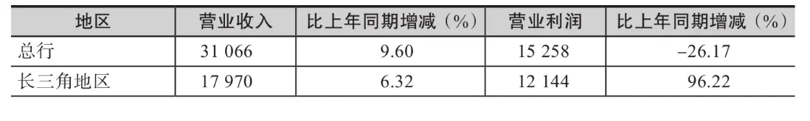

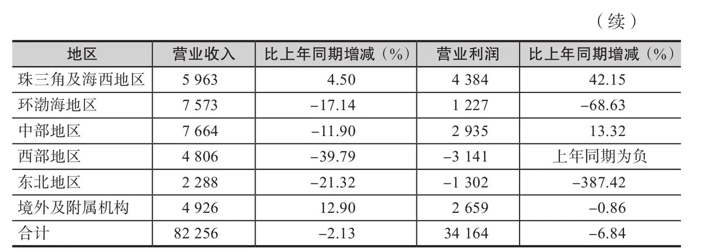

资料来源：浦发银行公司公告。

我们看到，西部地区的营业收入是48亿元（数值四舍五入，下同），但营业利润亏损高达31亿元。东北地区的营业收入是23亿元，而营业利润是亏损13亿元。正常情况下，银行的利润小幅增长或者负增长并不奇怪，但是营业利润直接是负数就要引起关注了。

东北地区“沦陷”情有可原。2018年从A股退市的所有公司全部来自东北地区：烯碳新材、长生生物、吉恩镍业、昆明机床（大股东是沈阳机床）。

那为什么西部地区也不行了呢？原来浦发银行成都分行被四川银监局发现，为掩盖之前的不良贷款，通过编造虚假用途等手段，违规办理信贷、银行同业、理财、信用证和保理等业务，向1493个空壳企业授信775亿元。

这次违规事件被监管机构定性为“有组织的造假案件，涉案金额巨大，手段隐蔽，性质恶劣”。除了高额罚款之外，1名行长和2名副行长等5名高管被禁止终身从事银行工作。[\1]

那什么时候买银行股比较合适呢？

比较简单的做法是定期、定额。挑个大行或股份制银行，每个月像定投指数基金一样买一点，日积月累，长期来看是赚钱的。定投银行比定投上证50和沪深300的指数基金更好，大部分银行都有分红，定投指数基金有的还不分红呢。

在选择定投的标的上，第一类是金融供给侧改革受益的品种，主要是大型银行。第二类是资产和负债端定价能力强的银行。

随便举个例子。上海银行经营得不错，而且2019年有大额解禁，那么股价一定会涨吗？这种“因为××，所以股价会上涨/下跌”的单一因素决定论，大家不要太看重。

如果还有人想做得更主动一点，不想变成“定投机器人”，那么建议研究银行股的股性。

银行股的投资，从板块角度上讲，是一种对宏观和监管政策的认知和理解的过程。近年来，中国连续发生的经济结构调整和金融改革大潮，极大影响了银行业的经营以及银行股的投资。

银行股能够有超额收益行情只有以下两种情况。

第一种是在银行披露定期报告的时候，因为业绩好、分红高、估值低，会在每年的3月、4月和7月、8月披露年报、季报时产生业绩推动的行情。

第二种是由监管政策、货币政策或市场风格变化驱动带来的机会。历史上，银行股的每次大行情都来自第二种情况，称作银行股的“吃饭”行情。具体体现在横跨2009年、2012年、2014年和2017年的银行年度行情。

站在2018年的时点上，经济大环境可能还不是很好，要想吃饱吃好，可能时机还没有到。当然，在下跌的时候，选择一些估值低、分红率高的银行股，越跌越买是可行的，因为风险不大。

2018年1月19日晚上，浦发银行公告了其成都分行收到银监会[\2]四川监管局的4\.6亿元罚单，同时1名行长和2名副行长等5名高管被禁止终身从事银行工作。

前面讲过，浦发银行此次被重罚的原因是因为成都分行为掩盖不良贷款，违规向1493个空壳企业授信775亿元。这次违规事件的定性是内外串通欺骗监管层，涉案金额巨大，手段隐蔽，性质恶劣。

早在2016年，就有投研小圈子在传浦发银行的这个事情了。当时风传受影响的地区不止成都一地，涉事金额接近千亿元。所以，不难理解为什么现在把金融安全提到了国家安全的高度。

不过即使不在小圈子里面，只要研究过浦发银行2017年的半年报，同样能看出端倪。浦发银行的报表显示，2017年上半年浦发银行西部地区的营业收入是79亿元，营业利润是亏损29亿元，在全部地区中只有西部地区的营业利润是负数。之前说过，在正常情况下，银行的利润小幅增长或者负增长不奇怪，但是营业利润直接是负数就要引起关注了。这时候，甚至应该买100股浦发银行股票借以参加它的股东大会，直接向管理层了解情况。

我之前对浦发银行做过深入的研究。在对比了16家老银行后（区别于近期上市的一批城商行），我得到的结论是，虽然浦发银行在股份制银行里面不如招行银行、民生银行和平安银行那么突出，但总体平稳。上海人不求胜但求稳的特征在浦发银行的身上得到明显的体现。（题外话，浦发银行是所有银行中每年最早出业绩预告的银行之一。对于资本市场做研究的人来说，浦发真的是家好银行。）

但令人没有想到的是，它要么不炸雷，要么直接炸了一个大响雷。

以下内容涉及银行基本面的分析。

从基本面的角度讲，分析任何一个公司或一个行业，第一要看的是净资产收益率和净资产收益率的同比变化率（净资产收益率是变大了还是变小了）。浦发银行2012～2017年第三季度的净资产收益率和净资产收益率的同比变化率如表4\-2所示。

表4\-22012～2017年第三季度浦发银行净资产收益率和同比变化率（%）

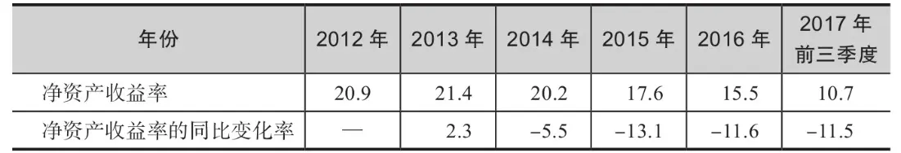

资料来源：浦发银行公司公告。

浦发银行的盈利在2013年达到顶峰21\.4%，之后开始逐年下滑，2014年是20\.2%，2015年是17\.6%，2016年是15\.5%。它的净资产收益率同比更惨，从2014年起每年都是负的。

在用净资产收益率的时候，一定要注意这个指标会受股权再融资的影响（净资产收益率计算公式的分子是净利润，分母是股东权益。股权再融资后，分母会立刻变大，但是分子没有立刻变化）。

2015年和2016年浦发银行做了两次股权再融资，分别融资163亿元和148亿元。

不过需要注意的是，银行和其他行业有些不同，银行再融资的时间点对净资产收益率的影响会更大。因为银行本身是金融机构，银行再融资的钱到账以后，能够立刻转为金融资产并产生利润，而制造业实体则需要一定时间的固定资产投资和流动资产投资后才能转化为利润。

所以极端情况下，假如银行在1月1日完成再融资，那么净资产收益率受再融资的影响微乎其微，银行拿到钱后一般会立刻放贷款产生利润。但是，如果银行是在12月31日完成再融资，那么净资产收益率受到再融资的影响会很大。

浦发银行的再融资时间点分别是2015年6月和2016年3月，因此我认为再融资对净资产收益率的影响不大。从2014年开始，浦发银行的净资产收益率下滑主要还是因为浦发银行的盈利能力降低。

净资产收益率是公司内在增长率的最大值。理由是：公司内在增长率=净资产收益率×留存利润率。因为留存利润率介于0和1之间，所以公司内在增长率介于0和净资产收益率之间，内在增长率的极大值即为公司的净资产收益率。

当净资产收益率下降的时候（即内在增长率下降的时候），资本市场给予的估值倍数（市盈率和市净率）不会很高。不过资本市场看的是未来，如果2017年是宏观经济和银行利润的底部，那么未来给银行的市盈率或市净率可能会比之前稍微高一点。

对于银行股，要看净资产收益率和净资产收益率的变化率，同时还要考虑股权再融资的时间点。年初融资对净资产收益率影响不大。当预计净资产收益率会变高的时候，市盈率和市净率能给的高一点。

[\1] 资料来源：http://www\.cbrc\.gov\.cn/chinese/home/docView/0178BB8828CD4113BB61BBCA39B7385B\.html。

[\2] 2018 年3 月，银监会与保监会整合为银保监会。

2025年5月18日

11:03

## 第4章 公司案例分析 - (03) 4.3 大金融——保险：中国平安

\(03\) 4\.3 大金融——保险：中国平安

4\.3 大金融——保险：中国平安

在做保险行业二级市场研究和投资的时候，大家可能会觉得很难，不仅要看的东西很多，而且分歧也不少。比如，对保费周期、利率周期和股市波动的判断始终观点不一，对于保险需求、市场格局、渠道价值和互联网影响，不同的人会有不同的看法。

我曾经提到过“4321”分析模式，即需要了解保险行业的4个发展阶段、3个特点、2个要素和1个赚钱公式。

4个发展阶段

首先，和大家说说保险行业发展的四个阶段。

过去十几年是保险行业发展的第一个阶段。在这个阶段，有两类产品卖得很好：财产险里是车险，寿险里是分红险和万能险。除了这两类产品，其他险种都没有做起来。

车险大发展是因为老百姓有了钱开始买车和换车。分红险和万能险是替代储蓄的产品，大家有了钱以后有理财的需求，保险的收益高，银行的利率低。

我们现在处在第二个阶段。第二个阶段是大家又多了点钱，开始担心看病与医疗这两个大问题。所以在第二个阶段，寿险以各种形式的健康险为主导，无论是医疗还是大病领域，健康险现在成了主流。

之后，当个人家庭再有点钱了，车也买了，看病问题也解决了，接下来担心什么呢？我认为是担心养老。靠社保肯定还是不够的，所以将会涌现大量的寿险需求。因此，第三阶段会是一个终身寿险、定期寿险、年金和养老金为主导的增长阶段。

在第四个阶段，大家更有钱了，看病和养老都解决了，开始担心打官司，担心声誉风险和其他一些小概率风险，比如自然灾害带来的风险。

这四个阶段是叠加的，所有的险种都在发展，但是一浪高过一浪。对这几个发展阶段的判断，既是根据西方成熟的保险市场分析出来的，更是随着财富不断积累、保险意识逐步增强而自然演进的一个过程。

按照这四个阶段分析判断，现在中国保险业高速增长的黄金期才刚刚开始。

3个特点

保险业有三大特点。

第一是具有倍数效应。客户交了1元的保费，出了保险事故之后能够拿到100元、1000元甚至更多的赔付。保费和保额之间具有明显的放大倍数的杠杆效应。

第二是资本雄厚。保险公司之所以能接受和承担杠杆效应带来的大量风险，核心要素是资本。保险公司面临的风险必须由资本来解决和吸收。

在研究银行的时候，我们关注的核心指标是一级资本充足率。在研究保险公司的时候，我们会尤其关注保险公司的综合偿付能力充足率这个指标（见图4\-1）。

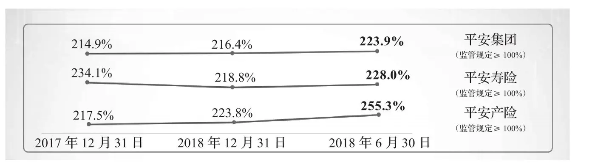

图4\-12017～2019年6月保险公司综合偿付能力充足率

资料来源：中国平安公司公告。

第三是目前国内大部分保险公司是典型的“三高”企业：高投入、高费用、高消耗。

高投入是指很多保险公司的业务增长主要依靠增加保险代理人和扩张分支机构。高费用是指保险公司依靠增加手续费、佣金和渠道成本来获取利润。高消耗是指保险公司不计成本，短期追求业务高速发展，消耗大量宝贵的资本。

这三高会显著影响保险公司的营业利润和归母净利润。所以，在研究和投资的时候，需要关注保险公司的内涵价值、新业务价值和净资产收益率的变化。

2个要素

下面讲讲保险公司的融资和投资。

对于保险公司来说，卖保单的过程其实是在做融资。研究保险行业的时候，要尽量地还原业务本身，了解一张保单是如何定价和如何销售出去的，这能帮助我们理解保险公司的融资过程。

卖完保单之后，保险公司拿着这笔钱再去做投资，即能获得投资收益。由于保险公司负债成本相对刚性（3\.5%的负债成本），保险公司会把投资大量配置在固定收益型资产里。

对于保险公司来说，投资的目的并不是为了获得极高的投资收益率，而是为了获得稳定的能够覆盖负债成本的投资收益率。

1个赚钱公式

最后介绍一个公式：规模×（投资收益率\-负债成本率）。所有保险公司都在努力争取让“投资收益率\-负债成本率”这个差额稳定且足够大。

中国保险行业的增长背景良好。当前，中国人均可支配收入快速增长，同时中国步入了一个保费收入增长快于人均可支配收入增长的阶段。所以从规模上看，国内的保费规模维持了高速增长。

中国保险行业增速最快的阶段出现在2015年之后。从2015年开始，保监会放松了对代理人的管制，为渠道扩张提供了基础；与此同时，老百姓的保险需求一直保持在较高水平，当渠道扩张之后，整个上市保险公司的保费收入呈现出快速增长的趋势。

那么，保险公司的投资收益率是什么样的呢？利率曲线对保险公司未来投资收益率的影响是很大的。如果利率下行，未来的投资收益率会慢慢往下走，这会影响保险公司的长期盈利能力与保险股的估值。

2014～2015年前后，大多数保险公司在投资领域做得很好，业绩和利润可观，而且所有长期指标都很好，保费快速增长，隐含利润很高。但是，保险股的估值却不断下降，这是因为未来的投资收益率会被利率牵引下行。直到2016年年底，中国的利率曲线才开始持续上行，保险股迎来了一波估值修复。

这一节和大家聊了聊保险行业。我们公司的“奶爸”经常在公司里说：“房住不炒、酒喝不炒、股捂不炒。”我很认同。价值投资不容易，长期坚持价值投资更难。

在我们这个行业里，我认为时间是最高的门槛，要相信时间的力量。

2025年5月18日

11:03

## 第4章 公司案例分析 - (04) 4.4 大金融——券商：中信证券

\(04\) 4\.4 大金融——券商：中信证券

4\.4 大金融——券商：中信证券

中信证券2019年业绩快报：2019年，公司实现营业收入432亿元，同比增长16%；实现归母净利润123亿元，同比增长31%。

很多人看到这么高的净利润增长率，会觉得中信证券很厉害。其实，这个增长率还是略低于市场预期的，主要是一些非证券子公司的净利润表现不佳，拖累了公司全年的业绩。

中信证券是大型综合化的证券集团，第一大股东是中国中信有限公司，这让中信证券享受了很丰富的产业资源。

2003年，公司在上海证券交易所挂牌上市；2011年，公司在香港联交所挂牌上市，成为中国第一家A\+H股上市的证券公司。目前，中信证券旗下主要控股或参股公司包括金石投资、中信期货和华夏基金（持股62%）等。

公司业务方面，我们尝试从2018年年报里获得一些信息。2018年，其全年营业收入为252亿元，其中经纪业务占比为27%、资管业务占比为18%、投行业务占比为7%、自营业务占比为25%、其他业务（信用、直投、海外、创新）占比为23%。其中，自营业务占比从2016年的13%提升至2018年的25%。

我们看到，中信证券的业务相对比较均衡，并且主动投资业务的占比一直在提升，这有利于降低市场波动对业绩的影响。

作为行业龙头，中信证券多项指标的排名都是行业首位，并且第二名与它的差距很大。2019年上半年，在资产规模和经营业绩类别五项指标上，中信证券都遥遥领先。

现在我们分析一家公司，还要关注其海外业务的情况。比如，中信证券2018年海外业务收入占比约为15%，主要是通过中信里昂证券发展国际业务，在欧美、澳大利亚等20多个国家和地区运营，为2000多家机构提供服务，说明它在海外发展得很不错。

券商属于强周期行业，业绩和股价的波动都很大。

投券商的话，主要看以下两点。

首先看政策，要看监管层有没有出台一些有利于券商行业的政策。比如，2019年券商另类“降准”的落地，把股票类业务最低结算备付金收取比例从20%降到了18%，这有利于提高券商的资金使用效率和杠杆率。

其次看流动性，要看流动性有没有改善，交易量有没有放大。比如，近期北上资金持续净流入，成交额明显放大，对于券商来说是比较大的利好，券商股自然能涨起来。

2019年的券商行情，主要是金融监管周期和流动性共振叠加造成的。

展望2020年券商行业的前景，在以下三个方面存在行业机遇。

首先，股权融资继续发力。

现在社融存量中的直接融资（债券\+股票）占比大概是18%，但美国在20世纪90年代初就已经达到了80%，增长空间还是很大的。同时，随着科创板平稳运行（刚开始只上市了70家，2020年可能会超过100家）、并购重组放开、再融资新规落地等，股权融资将持续发力。

创业板方面，并购重组重新松绑，允许创业板借壳上市，再融资进一步放开（取消最近一期末资产负债率高于45%和连续两年盈利的条件），大概能够让650家公司重新满足发行条件，空间是很大的。

其次，资本市场对外开放持续推进。

A股不断纳入国际指数，并且外资投资A股的通道也越来越多，外资券商持股比例的限制正式取消。

最后，衍生品稳步发展。这主要是指股指期货的松绑、期权扩容。

这些对2020年的展望，具体到券商业务，我大致有以下判断。

利好的可能有：①投行业务，主要是因为科创板平稳运行、再融资和并购重组条件放松，利好股权业务发展；②两融业务，随着标的扩容、交易制度优化，预计2020年两融规模将提升至1\.05万亿元；③衍生品业务，随着期权扩容，会带来一定的增量业务。

利空的可能有：①经纪业务，佣金应该会持续下滑；②资管业务，规模会承压，以后主动管理能力越来越重要；③股票质押业务，质押的系统性风险一直都在，不必多说。

再从财务角度看中信证券。

前面已经说过中信证券2019年的财务情况了，我们再拉长时间看，公司业绩还是有一定波动性的，但相对于2018年，2019年有复苏的迹象（见图4\-2和图4\-3）。

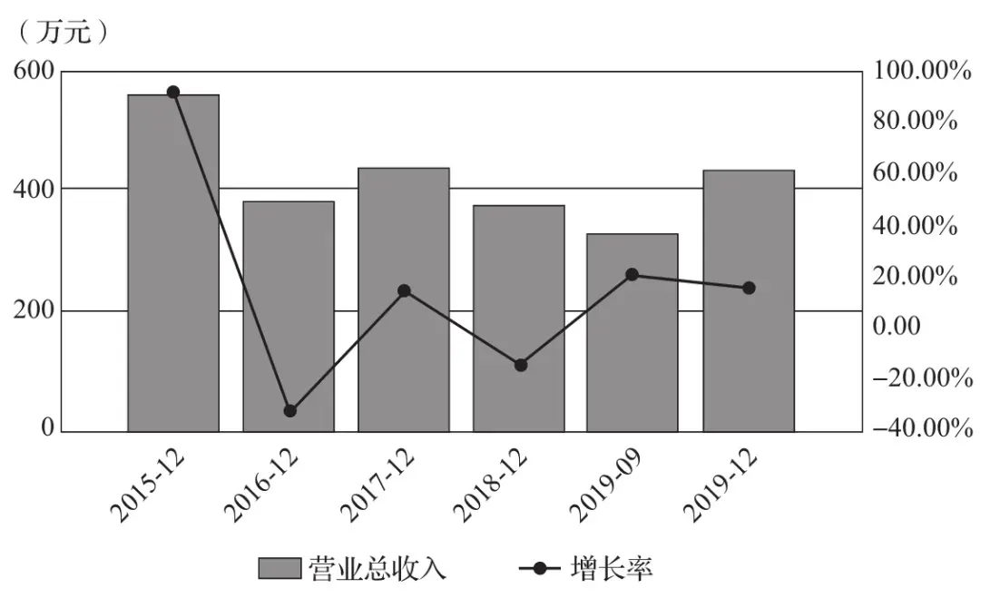

图4\-22015～2019年中信证券的营业总收入及增长率

资料来源：Wind资讯。

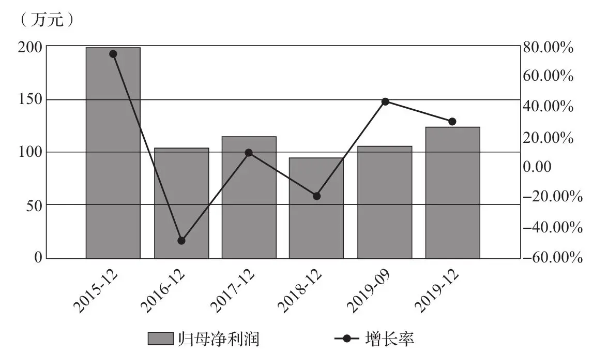

图4\-32015～2019年中信证券的归母净利润及增长率

资料来源：Wind资讯。

从成长性来看，公司单季度的收入增长率开始明显呈现增长的趋势。

业务方面，公司经纪业务的占比不断下降，自营业务的占比越来越高，投行业务虽然2018年有点下滑，但是2019年随着科创板推出会重新增长。

总体来说，业务发展还是呈现健康的状态，市场的影响逐步减弱。

同时，中信证券的资产负债率一直保持着较为稳定的水平，大概在75%。

大家可能比较关注一件事，即中信证券收购广州证券。

目前，收购已经获得证监会核准，预计在2020年将完成全部收购事宜，那时公司在华南地区的经营实力肯定会增强，尤其是广东地区经纪业务的市场份额一定会提升。

这个事情我是这样看的，收购广州证券后需要进行业务整合及人员调整，所以短期内公司的成本反而会增加，同时盈利体现得还不明显，所以不要抱太大希望。

从中长期来看，整合基本完成后，成本不会再过多增加，这时候该开始体现盈利了。

最后，再看估值情况。

从历史估值水平来看，中信证券目前1\.9倍左右的市净率已经处于历史高位，距离估值上限还有较大空间，上一次的估值顶峰出现在2015年的牛市（见图4\-4）。

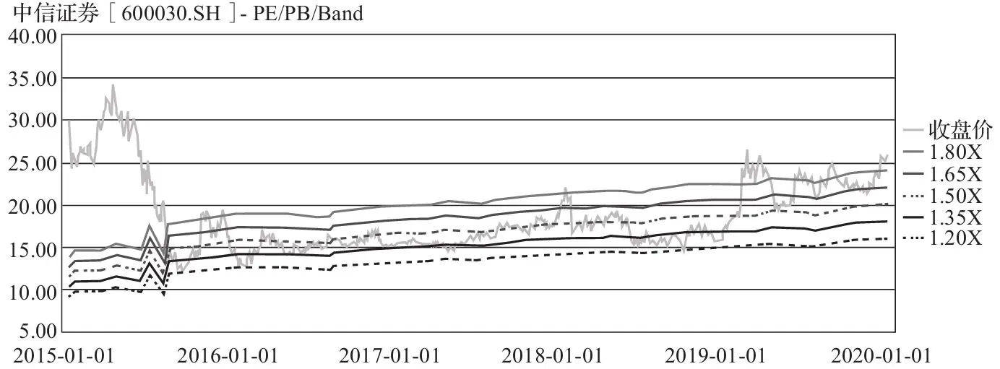

图4\-42015～2019年中信证券的历史市净率

资料来源：Wind资讯。

再横向对比来看，市值前20的上市券商的市净率均值为2\.1倍，而中信证券的市净率为1\.9倍。

作为行业龙头，虽然中信证券的各项业务都处于第一，应该能得到一些估值溢价，2019年年底的估值并不算很低了。

将一个公司的估值水平与在历史水平相比较，是判断高估还是低估的一个不错方法。

2025年5月18日

11:03

## 第4章 公司案例分析 - (05) 4.5 大消费——食品饮料：贵州茅台

\(05\) 4\.5 大消费——食品饮料：贵州茅台

4\.5 大消费——食品饮料：贵州茅台

2018年3月27日，沪深两市第一高价股贵州茅台终于披露了2017年年报。公司2017年实现营业收入610亿元，同比增长52%；实现净利润271亿元，同比增长62%；净资产收益率达到33%，超过阿里巴巴。

纵观整个年报，有个小地方需要提醒大家注意。茅台的预收款从三季报的175亿元下降到年底的144亿元，减少了31亿元。因为茅台很抢手，所以经销商要预先打款给酒厂才能提货，预收款的下降不是好兆头。

2013年因为“八项规定”出台，贵州茅台的预收款大幅下降，净利润的增长受到影响。所以2017年第三季度预收款的下降是暂时性的还是趋势性的逆转，当时无法进行判断。

当然，贵州茅台年报的看点是公司拟每10股派发现金红利109\.99元！

不愧是国酒茅台，不与群芳同列，每次能够超越茅台的，还是茅台。要知道上一次茅台的分红是每10股67\.8元。这已经是当时A股历史上最高的分红纪录了，没想到2017年它居然又把纪录刷新到三位数。

我说过，好公司是不需要再融资的，比如茅台酒上市之后从来没有再融资，美国的苹果公司同样没有再融资。

那么反例呢？

农业银行融资1000亿元之后，我分析过还有哪些公司可能会在2018年做股权再融资。我们从年报分析的角度入手去找找线索。

查阅年报后，我觉得安徽水利增发的可能性很大。安徽水利的实际控制人是安徽省国资委，是响当当的国有企业。公司原来的主营业务包括工程施工、房地产开发、水电投资、建设和运营，其中水电投资较有看点。

2017年，公司吸收合并了安徽建工集团。安徽建工集团是安徽省内规模很大，并很早拥有房屋建筑施工总承包特级资质的建筑施工企业。加入集团的资产之后，公司主营业务变成建筑工程（包括房屋建筑工程和基础设施投资与建设）和房地产开发。

我从以下方面入手进行分析。

第一，公司的资产负债率相当高。公司的资产负债率创历史新高，资产负债率达到了86%，意味着公司的股东自己拿了14元，然后向银行和供应商等拿了86元做生意。历史上，公司曾经在2015年做过一轮股权融资（实际上2016年3月完成），当时公司的资产负债率在75%左右。现在的资产负债率相比过去只高不低，所以公司做定向增发的动力比较大。

第二，公司的现金流有点差。2017年年报显示，公司的经营性现金流流出了92亿元，经营性现金流是公司从正常的经营活动中获取的现金流。公司经营性现金流越好，说明公司的业务越健康，自己有造血能力。公司是流出了92亿元，说明主业不怎么赚钱。同时，公司花了3\.5亿元投资固定资产，说明公司有很大的资金需求。

第三，公司的净有息负债比公司的净资产还要多。净有息负债多意味着公司的财务费用相当高，所以公司会想办法向股东要钱，降低银行的借款。

当然，这是我的初步判断，还需要结合股价和市场情况做综合分析。这样的股票，基本面可能会有改善，但是A股有3000多家公司，我觉得大家会有更好的选择，不是吗？

2025年5月18日

11:03

## 第4章 公司案例分析 - (06) 4.6 大消费——食品饮料：光明乳业

\(06\) 4\.6 大消费——食品饮料：光明乳业

4\.6 大消费——食品饮料：光明乳业

我小时候很喜欢吃光明白雪冰砖，如果能升级成光明白熊冰砖，那简直是至高享受。

光明乳业曾经有过辉煌的过去，公司的历史可追溯至1911年，至今已有100多年历史。1952年，光明品牌诞生；2002年，它登陆上海证券交易所，成为中国第一家乳业上市公司。

在上市之前，光明乳业一直领跑中国乳业市场。上市当年，公司营业收入为50亿元，而伊利股份的营业收入为40亿元，蒙牛乳业更是只有5亿元。

然而，从2003年开始，伊利股份反超光明乳业。2004年，光明乳业又被蒙牛乳业超越。随着近年来伊利股份与蒙牛乳业的快速发展，光明乳业渐渐被踢出第一梯队。

2019年3月27日，光明乳业公布了2018年年报，公司营业收入和净利润双双负增长。2018年，公司的营业收入只有210亿元，同比下降5%；净利润更少，只有3\.4亿元，同比下降45%。

2018年是2016～2018年三年里业绩最差的一年。公司解释是因为乳制品市场竞争激烈，常温乳制品销售欠佳，同时公司大幅计提2亿元的资产减值，对营业收入和净利润产生了较大的负面影响。

光明乳业的这一业绩，是在市场的预期之内的。2018年第三季度，光明乳业更换了董事长，当时业内预期，其年报的数字肯定不好看，新的管理层会借此机会“洗一次澡”。

虽然存在这种因素，但是仔细看年报会发现，公司2019年的业绩同样不乐观。公司的目标是争取实现营业收入215亿元，较2018年增长2\.5%，净利润做到3\.6亿元，同比增长5%。

当时我查了几家乳业公司的市值，伊利股份的市值是1675亿元，蒙牛乳业的市值接近900亿元，刚上市的新乳业的市值都有155亿元，曾经的龙头光明乳业的市值却只有120亿元，曾经的领跑者为何沦落至此？我认为有三个原因。

第一是公司高管变动频繁。公开资料显示，2007年王佳芬卸任总经理后，郭本恒继任，2015年7月郭本恒被刑拘。在郭本恒落马之前，光明集团董事长王宗南曾被调查过。后来，时任光明乳业副总经理的李柯和孙克杰先后被法院判刑。此外，光明乳业的生产、销售等环节多个部门的负责人都被查出问题。郭本恒落马之后，张崇建和朱航明分别接任光明乳业董事长、总经理，但2018年8月，任期未满的二人同时辞职。

反观伊利股份与蒙牛乳业，其高管相对稳定。2004年以来，潘刚一直担任伊利股份董事长；蒙牛乳业，2011年以前是牛根生执掌，此后由中粮集团控制，保证了公司的稳定。

我很怀念王佳芬在任时的光明乳业。她曾经写过一本书《我和光明，新鲜15年》，系统总结了她如何把上海一些松散的小企业整合成一家现代化的大型企业。

第二是产品布局缺乏连续性，而且总是落后于对手。从低温奶、常温奶到奶粉，公司摇摆不定，这导致它与对手的差距越来越大。

2003年以前，光明乳业主营低温奶。2003年，伊利股份、蒙牛乳业大举进攻常温奶市场，并迅速占领了市场。

2007年，光明乳业发力常温奶市场，虽然已经错失了常温奶市场的主动权，但公司依靠创新常温奶产品“畅优”和“莫斯利安”两个品牌，迅速占领了市场，为其经营业绩增色不少。

不过，2015年之后，随着伊利股份推出明星产品安慕希，蒙牛乳业推出纯甄，光明乳业的营业收入出现滑坡。在明星产品输给竞争对手后，光明乳业似乎再无明星产品。

光明乳业的第三个问题是营销投入不足。

中国的五大广告投放商里，有两家乳制品公司、两家手机公司和一家凉茶公司，那两家乳制品公司就是伊利股份和蒙牛乳业。

在营销方面，光明乳业远不及伊利股份和蒙牛乳业，其营销投入仅是伊利股份的零头，而且公司由于体制的关系，对市场反应一向不灵敏。

光明乳业要想重塑辉煌，我觉得需要从三个方面努力：

一要明确定位，与伊利股份、蒙牛乳业开展差异化竞争，比如利用距离优势，主打“鲜”。

二要加大新品研发力度，同时做好老产品的维护与升级，确保产品质量。

三要完善公司管理，要有给力的管理团队，同时积极引进专业人才，重视人才培养。

我拿一家经典的上海国企给大家分析了国企上市公司的特点，同时借此说到了乳业这个行业。我认为在食品饮料24个细分子行业中，乳业还是挺不错的。

2025年5月18日

11:03

## 第4章 公司案例分析 - (07) 4.7 大消费——食品饮料：恒顺醋业

\(07\) 4\.7 大消费——食品饮料：恒顺醋业

4\.7 大消费——食品饮料：恒顺醋业

恒顺醋业的发展历史大体分成两个阶段，2015年之前和2015年之后。我给大家看看恒顺醋业2010～2018年的加权净资产收益率（见图4\-5），不难看出2015年是一个分水岭。

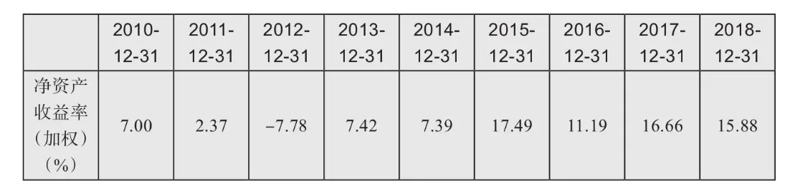

图4\-52010～2018年恒顺醋业的加权净资产收益率

资料来源：Wind资讯。

2015年以前，恒顺醋业不但生产醋，还从事房地产、汽车贸易、LED和建筑安装工程等业务。

在布局多元业务的情况下，公司不可能聚焦调味品主业，这导致调味品业务错过了极佳的发展窗口期，营业收入增长萎缩。

2014年年底，公司的董事会完成换届。新管理层吸取了多元化发展的经验和教训，调整了战略。首先转让了百盛商城的股权，彻底剥离了房地产业务；然后，公司全面整合内外部资源，聚焦调味品主业。

从财务数据上看，自此恒顺醋业的销售开始稳定增长，盈利能力逐步提升。

未来，恒顺醋业有两个看点。

第一个看点是新产品带来的营业收入增长。现在，恒顺醋业的收入结构比较单一，产品主要是食醋和料酒，而日本醋业龙头味滋康的果醋、醋食品和保健醋的营业收入在其营业收入中的占比已经超过了50%。

恒顺醋业这几年陆续推出了不少新产品，有蟹醋、饺子醋和宴会醋等平价专用蘸醋，还有蜂蜜醋、苹果醋和香妃醋等产品作为保健型饮品，以及“三年陈”和“六年陈”等高端系列产品。

新产品能不能被市场所接受，还需要观察。比如，公司之前推出过苹果醋（醋酸度3\.5%），口感不如海天的同类产品（醋酸度2\.5%），卖得也不如海天那么好。虽然后来做了调整，但是不排除以后还会发生新产品和消费者的口味不匹配的问题。

第二个看点是产品价格的上升。恒顺醋业分别在2004年、2006年、2010年、2013年和2016年对产品进行了适度提价（每隔大约三年提价一次），所以市场很早就预期2019年产品价格可能会上调。不出所料，2019年年初，恒顺醋业宣布恒顺香醋等五个品种的出厂价格分别提高6%～15%。

不过，食醋的市场太分散，所以食醋的提价效果和酱油的提价效果不可同日而语。2017年，海天率先提价，其他酱油企业相继跟随，提价之后，酱油企业的营业收入和利润都同比大幅增长。食醋提价，很少有企业跟盘。消费者觉得食醋质量差不多，你这边涨价了，那我就不买你家的产品了。

2019年5月的股东大会上，恒顺醋业的管理层在交流的时候谈到三方面内容。

第一，醋的市场竞争很激烈，行业集中度较低。公司会加大对基础销售网络的投入力度，以杭州和上海为样板市场，争取较短时间内做好渠道建设，然后在全国性范围内复制样板市场的运营思路，提升公司的市场占有率。

第二，除醋类主业外，公司聚焦调味品主业，采取以醋为核心，其他品类齐头并进的策略。要加强渠道资源的整合，实现快速增长。

第三，公司会根据市场及成本等因素调整产品价格。未来公司将通过强化费用管控、提升效率等方式，保证公司的盈利稳中有升。

对于以上三点，市场之前都已经比较了解和熟悉了。在2019年5月的股东大会上，不一样的内容是关于行业并购的。

管理层在股东大会上表示，并购是把双刃剑，要找到合适的并购企业不容易。现在食醋行业中的大部分企业的日子都不好过，公司想在行业形势不太好的时候多做一些收购。

公司已经调查了一些企业，但是发现，如果对这些标的企业的用工和税收实行规范管理，这些企业的盈利可能就没有了，而并购亏损的企业是没法向股东交代的。

2019年6月，当时市场上的相关人士对恒顺醋业给出如下观点。

一方面，食醋行业的竞争格局不如酱油好，行业分散、集中度低，同时不容易进行并购。

另一方面，恒顺醋业的实际控制人是镇江国资委。公司在体制、机制和战略决策方面与民企相比欠缺灵活性。公司未制订员工持股计划，虽有基金激励，但效果一般。

我当时建议对这一行业感兴趣的朋友要耐心等待。

2025年5月18日

11:03

## 第4章 公司案例分析 - (08) 4.8 大消费——食品饮料：涪陵榨菜

\(08\) 4\.8 大消费——食品饮料：涪陵榨菜

4\.8 大消费——食品饮料：涪陵榨菜

根据经验，在缺乏市场整体机会的时候，要多关注防守型股票。2018年4月清明节假期时，我花了两天时间在家里复盘，看到一家神奇的公司，为了重组停牌近四个月，但是重组不幸失败了。复牌之后其股价一骑绝尘，丝毫不理会大盘的调整。到底是什么股票这么奔放？

我要说的这家神奇的公司是乌江榨菜的出品公司——涪陵榨菜。

我做了20年的研究，现在越来越喜欢有专注力的企业。因为一个人的精力有限，同样，一家公司管理层的精力也是有限的。只有专注才能把公司和产品经营好。

涪陵榨菜是一家以榨菜为根本，并不断开发佐餐开胃菜的公司。其招牌产品乌江榨菜3元一包，童叟无欺。公司位于重庆涪陵区，实际控制人是重庆市涪陵区国有资产监督管理委员会。

翻看涪陵榨菜的2017年年报后，我看到几个有意思的内容，在这里和大家分享一下。

从股本结构上看，第一大股东涪陵国有资产投资经营集团有限公司持有3\.1亿股，占总股本的40%。第一大股东处于绝对控股地位，比第二大到第九大股东所持股份合计起来还要多。

因为地方国资委处于绝对控股地位，公司后续的发展（主要是并购）一定会得到政府的大力支持。在国有资本绝对控股之外，公司的市场化程度很高。

涪陵榨菜专注于做好佐餐开胃菜这个细分领域，公司的收入和净利润保持较快增长。公司2017年实现营业收入15\.2亿元，净利润为4\.1亿元，同比都有大幅增长。

从产品上看，榨菜的收入远远超过公司的另外两个产品——泡菜和榨菜酱油。市场一直担心公司的榨菜成长性不好，这样的担心后来被证明是多余的。

从地域上看，榨菜在华南地区卖得很好，2017年华南地区消费了5亿元的榨菜；东北地区的榨菜收入只有0\.6亿元，是当时最少的。榨菜在华南地区的收入是东北地区的8倍多。中国地大物博，口味差异比较大。

涪陵榨菜2017年年报公布之后，卖方分析师纷纷上调对公司的盈利预测。2017年，公司盈利4\.1亿元，2018年分析师预测公司2018年的净利润是5\.2亿元，2019年是6\.3亿元。

从股价上看，在过去几年中，除了2014年股价全年下跌0\.5%之外（几乎认为没有下跌），在其他大部分年份，涪陵榨菜的股价每年都保持了较高的涨幅。拉长时间看，涪陵榨菜的股票简直像是巴菲特的挚爱可口可乐，是个牛股啊。

消费是个很好的行业，消费行业中的好公司理应获得更高的估值和溢价。我觉得在调味品这个细分领域中，海天味业和涪陵榨菜算是不错的标的。消费品往往是下意识的选择，我家的厨房里还真有这两个牌子的产品。不过，2018年5月股价涨得太猛，又遭遇中美贸易摩擦，我建议了投资者不要追高。

上面说到，2018年5月市场上的分析师预测2018年涪陵榨菜的净利润是5\.2亿元。2019年5月，我又看了一下涪陵榨菜。

当时公司2018年年报刚发布，公司实际的净利润达到了6\.6亿元，远超预期。

食品饮料行业总是藏龙卧虎，总能出牛股。自2010年上市以来，涪陵榨菜的营业收入和净利润大幅增长，股票价格屡创新高。

图4\-6是当时公司股价的年线图，它妥妥的是十倍大牛股。

大消费行业的龙头公司，一个很重要的“护城河”是产品本身。涪陵榨菜历史悠久，享誉海内外，与欧洲的酸黄瓜、德国的甜酸甘蓝并称世界三大著名腌菜，是中国对外出口的三大名菜（另两种为薇菜和竹笋）之一。

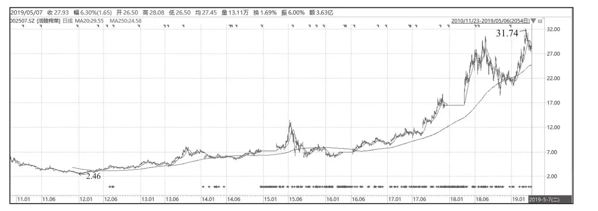

图4\-62011～2019年涪陵榨菜股价走势图

资料来源：Wind资讯。

“涪陵榨菜甲天下”，是因为其占据了天时、地利和人和。

榨菜的原材料是青菜头，学名为“茎瘤芥”。青菜头经过三腌三榨、修剪砍筋等工艺，成品率大概是0\.33，即3吨青菜头大概能生产1吨榨菜。

涪陵处于北纬30°这条神秘的纬线上。

从天时上看，这个地区“春早、夏长、秋短、冬迟”，无霜期长达322天，这为青菜头的生长提供了良好的气候条件。

从地利上看，涪陵坐落在四川盆地的东南边缘，属于长江沿江的冲积地带，呈现的是河谷丘陵地貌，海拔为200～500米，相对高差为50～200米。山水间的丘陵坡地为青菜头的生长提供了极佳的地理环境。

从人和上看，涪陵是中国的榨菜之乡，在当地政府的引导扶持下，当地的榨菜产业得到了良好发展。

涪陵这个地方青菜头的种植面积达72万亩，年产量为120万吨，青菜头种植涉及人口60万。大家路过涪陵时，不妨看看风干青菜头的壮观景象。

在当地政府的支持下，涪陵榨菜集团于2010年11月在深圳证券交易所中小板上市。

不为市场所知的是，涪陵还有另外一家榨菜公司——渝杨榨菜集团。该公司在2014年挂牌，因为是在上海股权托管交易中心挂牌的，知道的人少很多。

和涪陵榨菜交流之后，我总结出了三个它能成为十倍大牛股的原因，分享给大家。

第一，与榨菜行业相关。

过去15年，榨菜行业整体销量增速基本保持在4%左右。虽然增速不快，但是行业内的结构发生了很大变化。

随着居民消费水平的提升，消费者愿意接受更加安全和健康的包装榨菜，所以包装榨菜替代散装榨菜和家庭手工腌制榨菜的趋势很明显。

伴随产品结构的升级，产品均价不断提升。榨菜属于价格弹性很小的品类，消费者对涨价的感受并不明显。

以涪陵榨菜为例，公司2018年实现19亿元的营业收入，同比增长26%，销量增长了11%，吨单价提升了14%。

消费品公司是否有竞争力，要看售价提升之后销量有没有下滑。涪陵榨菜2018年实现了量价齐升，很不容易。

从行业集中度来看，榨菜行业出现了龙头企业越来越强的马太效应。2008年，前五大生产企业的市场占有率不到50%；2018年，这个数字上升到了69%。我们介绍的涪陵榨菜在行业中排名第一，市场占有率甚至超过了30%。

我们通过调研发现，未来乌江榨菜的市场占有率还有继续提高的空间。比如，在华东市场以及县村等地区，一些本地的小品牌仍占有较大市场，涪陵榨菜还有机会继续深耕下沉。另外，特殊的销售渠道（如高铁和飞机）还有待拓展。

第二，公司的高速发展和合理的股权结构密切相关。

公司的实际控制人是涪陵区国有资产监督管理委员会。从股本结构上看，第一大股东涪陵国有资产投资经营集团有限公司持有3\.1亿股，占总股本的40%，处于绝对控股地位，比第二大到第九大股东合计起来还要多。

国资绝对控股有一个好处：如果未来公司有合适的并购标的，大股东一定会全力支持。

涪陵榨菜在2016年提出了“5～10年实现100亿元销售额的目标”，为了实现这一目标，除了内生增长外，外延式并购不可或缺。

2015年，公司以1\.3亿元收购了惠通食业100%股权。2018年3月，公司曾尝试收购四川恒星食品有限公司100%股权和四川味之浓食品有限公司100%股权，未果。

当时我说，不排除2019年公司在大股东的支持下找到合适的解决办法，或者物色到更合适的收购标的的可能。

虽然国资绝对控股，但涪陵榨菜的市场化程很高。截至2019年5月，董事长周斌全持有公司股票1000万股，高管合计持有1500万股，管理层利益和股东利益捆绑得比较紧密。

公司的第二大股东是香港中央结算有限公司（陆股通），截至2019年第一季度末，北上资金合计持股7200万股，增加了近3000万股，这说明境外投资者同样很看好公司的基本面。

第三，管理层有清晰的战略规划。公司立足榨菜，打造强势品牌，做强榨菜产业。

涪陵榨菜依托榨菜产业创造的品牌、市场、技术、资本、人才及管理优势，利用兼并、收购等扩张手段在佐餐开胃菜行业的优势产业和关联产业中发展，通过资本扩张把企业做大。

目前，公司的战略是发展榨菜、泡菜和酱类三大品类，榨菜做精品，泡菜做大做品牌，继续寻找酱类标的。

从2018年年报来看，公司榨菜的收入远远超过公司的另外两个产品——泡菜和榨菜酱油。市场一直担心公司的榨菜成长性不好，这样的担心再次被证明是多余的。

从地域结构上看，榨菜在华南地区卖得很好，2018年华南地区消费了5\.6亿元的榨菜；东北地区的榨菜收入比较少，只有0\.8亿元。榨菜在华南地区的收入是东北地区的7倍。

涪陵榨菜在2018年年报中披露了2019年的财务预算目标：营业收入增长26%，至24亿元，毛利率为58%。

当时，公司的营业收入目标超出市场15%～20%的预期，体现了公司对2019年收入增长的信心。如果毛利率目标实现了的话，将比2018年高2个百分点。

2018年年报公布之后，卖方分析师纷纷上调对公司的盈利预测，当时的预测是2019年实现净利润8亿元，2020年实现10亿元的净利润，同比保持20%以上的增长。

从投资和研究的角度看，有专注力的企业会受到专业投资人的喜爱，因为任何一家公司管理层的精力都是有限的，只有专注才能把公司和产品经营好。

涪陵榨菜专注于做好佐餐开胃菜这个细分领域，过去几年的增长说明了公司的战略和战术都极其成功。

从估值上看，2019年5月我又用终值折现法做了一次判断。假设2020年公司的净利润达到了10亿元，给予30倍的合理估值，再假设折现率是15%，那么公司的合理估值是220亿元左右，当时的市值并未被严重低估，所以我当时依旧建议对榨菜感兴趣的朋友再等等。

2025年5月18日

11:03

## 第4章 公司案例分析 - (09) 4.9 大消费——食品饮料：中炬高新

\(09\) 4\.9 大消费——食品饮料：中炬高新

4\.9 大消费——食品饮料：中炬高新

2019年4月，中炬高新的股权结构发生了变化，我觉得挺有意思，和大家分享一下我的看法。图4\-7是上市公司中炬高新当时的股权结构图。

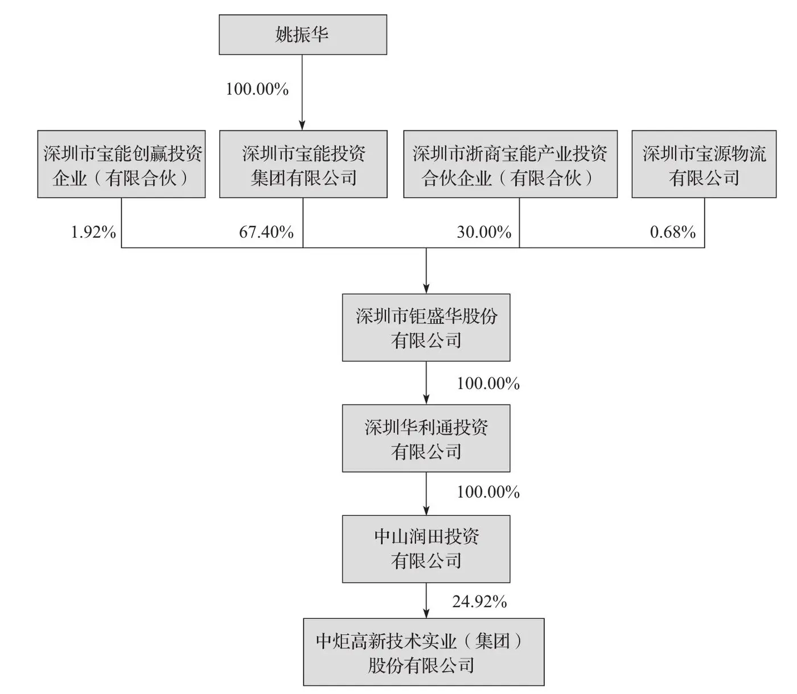

图4\-72019年4月中炬高新的股权结构

资料来源：中炬高新公司公告。

中炬高新的第一大股东是中山润田投资有限公司（后文简称“中山润田”，之前是前海人寿保险股份有限公司，后文简称“前海人寿”），持有中炬高新总股本的24\.92%。通过层层穿透，我们看到中炬高新的实际控制人是姚振华。

2018年9月，在中山润田的领导调任问题解决之后，姚振华用中山润田替换了原来的前海人寿，这样一来，他不仅加强了其中炬高新大股东的地位，而且还有效地控制了中炬高新的董事会。

现在中炬高新的六个董事当中，有四人和姚振华的宝能相关。资本进入之后，一方面会要求公司提高增长率，另一方面，大股东和二股东中山火炬集团之间会有更多的博弈。

从二级市场投资者的角度看，这样的博弈未必是一件坏事情。

中炬高新是A股调味品行业中的龙头企业之一。2018年的年报显示，公司实现营业收入42亿元，同比增长15%，归母净利润为6\.1亿元，同比增长34%，扣非后归母净利润增长38%。

净利润和扣非后归母净利润的增速都显著快于营业收入的增长。

大股东的强势地位确认之后，会要求上市公司把业绩做高、做好。比如，中炬高新的调味品业务在2018年的整体增速是14%，当时我预测2019年中炬高新调味品业务的增速应该不低于20%。

中炬高新内部按照销售金额的大小，把全国分成了五级市场。

一级市场是广东地区，因为广东地区一个地级市的销售额就能达到1亿多元。其他层级的市场，几个省的销售额加起来才只有千万元。

公司整体要实现2019年20%的营业收入增速，我判断一级市场的增速应该在15%左右，二级、三级市场的增速在20%以上，四级市场在25%～30%，五级市场在30%以上。后面几级市场的基数低，所以增速会相应快一点。

当时，中炬高新通过商超渠道获得的营业收入占营业收入的55%，通过流通渠道获得的营业收入占35%，而餐饮渠道只占10%。商超渠道的占比最高，但是受京东、天猫以及社区便利店的冲击也最大。

不过，商超永远是调味品的主战场，商超在销量、能见度方面对普通消费者的影响力还是很大的。通过流通渠道获得的营业收入的增速在20%左右。

我判断，未来中炬高新会发力餐饮市场，增速可能在100%以上。

有朋友会问，你不担心宏观经济下滑对餐饮渠道的负面影响吗？我通过调研发现，虽然GDP的增速没有以前那么快了，但是居民的消费能力还是比较强的。

各大商场和酒店的聚餐没有明显减少，中高端餐饮的发展势头不错，节假日和旅游对餐饮的拉动很明显。大众餐饮围绕着社区发展，点外卖变成了一种普遍行为。

我相信，未来中炬高新将在餐饮渠道上发力，会尽可能多地进入单一酒店系统、中小餐饮店和特通渠道（大型工厂）。

2025年5月18日

11:03

## 第4章 公司案例分析 - (10) 4.10 大消费——食品饮料：三只松鼠

\(10\) 4\.10 大消费——食品饮料：三只松鼠

4\.10 大消费——食品饮料：三只松鼠

我先简单介绍一下行业情况。

零食与正餐对立，是一种不用于饱腹的非功能性食品。

零食有以下两个特点。

首先是品种很多。常见的零食有坚果炒货、话梅、果脯果干、肉类、海味、素食山珍、糕点饼干、糖果布丁、饮品饮料和鲜食类等。

其次是具有丰富的使用场景。零食适用于个人享受、社交馈赠、消磨时间、郊游旅行和减肥代餐等场景，满足了消费者的情感需求、享乐需求和健康需求。

中国零食行业的发展历程大致可分为三个阶段。

在20世纪80年代前，以本土零食为主，常见的有中式糕点、果脯蜜饯等。受经济发展水平的限制，整个零食行业处在粗放式发展阶段，质量不稳定、份额小、品类少。

改革开放后，成熟的国外零食企业迅速占领落后的本土零食市场。这一时期，谷类膨化食品、糖果巧克力等零食品类开始大肆流行，零食呈现出西化特征。

2008年以来，随着世界经济下行和我国消费者消费心理的变化，健康且更适合中国人口味的新零食开始挤压舶来品。本土化和健康化成为零食的重要特征。

我要介绍的三只松鼠是一家年轻的公司，2012年成立于安徽芜湖。

虽然成立时间不长，但三只松鼠借助于线上电商渠道的兴起，用六年时间卖出了160多亿元的坚果和零食，积累了8000万名在线会员。现在三只松鼠已经成为中国销售规模位居前列的食品电商企业。

三只松鼠的对外融资顺风顺水，先后获得IDG的150万美元A轮天使投资和今日资本的600万美元B轮投资，随后在C轮投资中获得了1627万美元，在D轮投资中获得了峰瑞资本3亿元人民币的投资。

2019年7月，三只松鼠终于上市了。

我不太看好三只松鼠，有以下几个原因。

首先，电商红利已经消失。

过去，电商能够迅速发展，主要是因为有流量、便捷的网络购物环境和有别于传统购物方式的购买体验。但现在，几乎没有新增的流量。把包装做得新奇与否已经没有太大区别，客服对顾客亲切与否好像也没有太大两样。

以营业收入来看，2015～2016年，三只松鼠的营业总收入都是翻倍增长，但是2017～2018年增速下降到20%多（见图4\-8）。

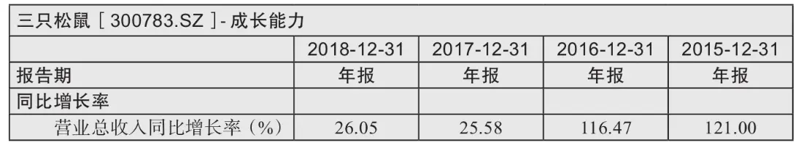

图4\-82015～2018年三只松鼠营业总收入同比增长率

资料来源：Wind资讯。

电商红利已经消失，线上的推广费用却越来越高。本质上，网店开得越大，越是给电商平台打工，这是线上品牌，尤其是起步于淘宝的品牌无法回避的问题。

其次，三只松鼠的转型面对重重困难。

随着电商红利的消失，线上品牌必须拓展新的销售渠道，比如开设线下实体店。不过，不管是卖零食的，或是卖衣服的（韩都衣舍），还是卖酒的（酒仙网），都不太容易实现从线上到线下的转型。

三只松鼠现有三类线下渠道：三只松鼠投食店、以零售通为代表的to B（企业）分销渠道和联盟店松鼠小店。

三只松鼠投食店看起来效果一般，消费者对线上品牌形成的消费习惯与对传统商超渠道的品牌形成的消费习惯是完全不同的；三只松鼠to B的分销渠道做得不错；三只松鼠还在对加盟性质的松鼠小店进行探索和尝试，加盟店一般要做成独大、控制和垄断，而三只松鼠崇尚开放和竞争的体系，所以效果还有待观察。

再次，零食市场没有大家想象中的大，消费者缺乏黏性。

要在这个行业里做好，包括线上和线下融合，都需要回归消费者的本质需求，即提供物美价廉的产品和良好的购物体验，而这一切都指向了强大的产品力。

当然，我并不是说三只松鼠的产品力不行。但是在SKU（stock keeping unit，库存量单位）不够多，给大家留下的依然是坚果这种单一印象的情况下，三只松鼠贸然去负担线下高额的成本，实在不太划算。

反观传统龙头企业来伊份，它以线下起家，打造好产品与供应链，再去实现线上的接口，困难和阻力好像就少了一些。

最后，三只松鼠的挑战还在于组织问题。

组织的核心是人才。组织从初创，到做大做强，核心在于“老人”能否升级和“新人”能否迭代，以及能否重新构建一个以新的组织战略和任务为基础的体系。

总之，三只松鼠未来要走的路还很长。

2025年5月18日

11:03

## 第4章 公司案例分析 - (11) 4.11 大消费——食品饮料：贵州茅台、海天味业、伊利股份对比

\(11\) 4\.11 大消费——食品饮料：贵州茅台、海天味业、伊利股份对比

4\.11 大消费——食品饮料：贵州茅台、海天味业、伊利股份对比

2019年6月，我以2018年年报数据为例，比较了食品饮料几个细分市场中龙头公司的情况，我和大家分享一下我的看法。

首先，我们来看食品饮料行业三家龙头公司的净资产收益率（见图4\-9）。

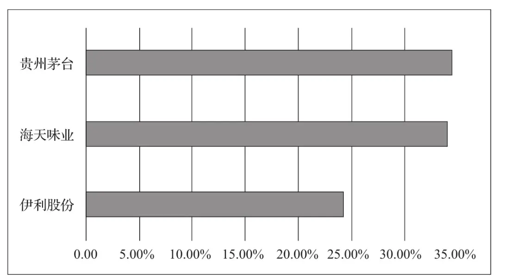

图4\-92018年贵州茅台、海天味业、伊利股份的净资产收益率

资料来源：Wind资讯。

贵州茅台、海天味业和伊利股份都是很优秀的公司。贵州茅台和海天味业的净资产收益率都超过了30%，伊利股份略低，在25%左右。

净资产收益率是由净利率、周转率和杠杆率三部分构成的，我们进一步看细分结构（见表4\-3）。

表4\-32018年贵州茅台、海天味业、伊利股份净资产收益率拆分

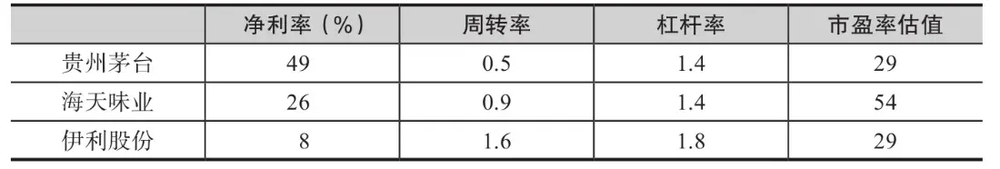

资料来源：Wind资讯。

在三家公司里，海天味业的三个指标是比较均衡的，净利率介于贵州茅台和伊利股份之间，周转率和杠杆率也一样。从估值的角度看，市场对海天味业的估值是比较高的。

在食品饮料行业里，净利率反映的是定价能力和综合管理能力，周转率反映的是复购率。从“选美比赛”的结果看，资本市场更喜欢像海天味业这样高利润率（26%的净利润率虽比贵州茅台低，但是比大部分公司都高很多）和高周转率（酱油的复购率比白酒高很多）的公司。

截至2019年6月，在中信的一级行业里，食品饮料行业是2019年上半年表现最好的子行业，其中的龙头公司上涨更多。当时，我对2019年下半年的思考如下。

从综合估值（市净率/市盈率）和成长性（净资产收益率）两方面因素看，我觉得2019年下半年酒好于非酒，白酒龙头公司的业绩增长是相对确定的。

在乳制品行业中，2018年蒙牛在沉寂多年之后开始发力。它在世界杯的广告投放上下了血本，同时在内部挖掘潜力，实现雅士利和现代牧业减亏。蒙牛的弯道超车给伊利造成了很大压力。

伊利不甘示弱。从2019年年初开始，它大幅增加营销费用，而且公开表示不要利润增长了，其实这是说给蒙牛听的。2019年5月，伊利高调举报蒙牛不合理竞争。这两家公司的竞争愈演愈烈，市场预期的乳制品行业竞争格局的改善，至少到现在都还没有看到。

在调味品行业中，“一超四强”的格局已经形成。海天、中炬和千和都是我很喜欢的公司，估值都不低。均值回归是我们这个行业里颠扑不破的真理，好公司还要有好的价格。2015～2019年海天味业的历史估值如图4\-10所示。

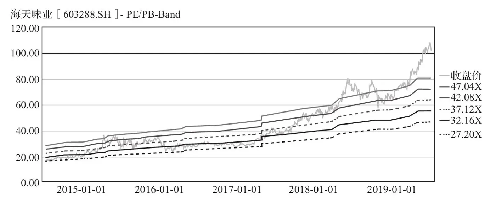

图4\-102015～2019年海天味业的历史估值

资料来源：Wind资讯。

在其他子行业方面，啤酒的竞争格局不好，需求不行；肉制品中猪肉有成本压力，我没看到双汇的增长点，买双汇还不如买港股的万洲国际；市场对休闲食品的预期高，但我不看好三只松鼠，其他公司讲的坚果新品的情况还需要观察。

2019年白酒股份的上涨主要是因为估值的提升，但估值继续提升的难度越来越大，以后一定是赚业绩增长的钱。

理论上，茅台的经销商不会有太多的利润，因为即使利润为零，经销商还是会以茅台为引流的卖点。茅台的批零差价一直很大，普通股股东已经忍了很久，对于流通股股东来说，茅台的渠道利润最好都能留在上市公司内。

当然，茅台的经销商同样一肚子苦水，虽然这些年赚了不少钱，但也做了很多工作，打通了全国市场的“毛细血管”，让茅台的市场越做越大。贵州茅台新的管理层上台之后，立即整顿和清理了大批经销商，这让经销商感到心寒。

2019年，贵州茅台成立集团销售公司，本质上是贵州省政府、公司管理层、流通股股东和经销商的四方博弈，极有可能的结果是在给集团好处并维持现存经销商格局的同时，把上市公司的利润做好，所以当时我说，贵州茅台2019年半年报的业绩很重要。

在关于白酒行业的章节里，我向大家介绍，白酒行业已经进入品牌竞争和挤压式增长阶段。现在白酒是结构性增长了，不是扩容性增长；是价格型增长，不是销量型增长。

全国白酒的消费量已经好几年没有增长了，但是龙头公司活得越来越好。国内不缺酒，缺的是好酒，高端白酒现在是稀缺资源。

判断一款白酒是不是高端白酒，是不是稀缺资源，主要看它能不能涨价。我认为，会涨价的白酒才有“护城河”，才有未来。

目前，“80后”和“90后”已经是白酒消费的主力军。主流白酒消费者相信价格本身是白酒的标签，更是白酒价值的体现，传统营销广告和说教的效力在逐步减弱。

未来，随着消费者对白酒的认知逐步成熟，辨别能力增强，落后的产能终将被优质的产能替代，拥有优质产能的企业将拥有更好的发展机遇。

我经常和大家说，在做基本面分析的时候，需要尤其关注A股的白酒行业。道理很简单，白酒行业短期供需的变化不剧烈，相对容易预测。此外，白酒产品有差异，各有一大批忠实的粉丝，不易爆发价格战。

中高端白酒是先收钱后给货，付款方式多为现金或者类现金的银行承兑汇票。白酒企业很少有甚至根本没有应收账款，因此营业收入和净利润的含金量极高，绝对不会出现像2019年康美药业300亿元现金说没有就没有的情况。同时，正因为先付款后给货的商业模式，白酒企业几乎不担心短期存货积压，存货不会贬值。

分析完了白酒行业，再去分析其他行业的时候，大家会发现，像贵州茅台和五粮液这些白酒行业龙头公司的基本面是很强劲的。拉长时间看，这些公司还给投资者带来了丰厚的回报。

我之前提到过，个人投资者甚至能把白酒行业里的龙头公司作为自己的根据地和粮仓，花一两年时间把白酒行业研究透。如果有机会多了解上市公司和渠道，大概率能在白酒行业里“捡”一辈子的钱。

未来，我认为白酒行业的趋势如下。

首先，消费者更看重白酒的品质，而不是像以前一样根据区域划分，“西不入川、东不入皖”的老话可能会过时。

在北京和浙江等地，白酒的消费会越来越集中在超高端名酒和性价比突出的大众酒。消费者普遍对次高端白酒认可度不足，这种趋势很可能长期存在并扩散至全国。

这让我想到了国内的汽车行业。虽经汽车行业的销量持续下滑，但高端品牌的汽车（BBA[\1]等）及性价比高的日系车的销量不减反增。或许，未来多个行业都将如此。

其次，白酒的消费场景在变。

之前的餐饮市场，政务接待消费比较多，这种餐饮消费现在下降了很多。目前，比较多的是宴请商业客户或者亲朋小聚，高端白酒满足了面子消费的需求。

最后，酒类流通的焦点正在从以前的抢夺大型商超市场转变为现在的抢夺大型饭店市场，高端酒和次高端酒的成长性也更依靠数字化营销的线上团购。在市场格局层面，马太效应明显，强者恒强，市场向大品牌集中，品牌向大单品集中。

[\1] 指宝马、奔驰、奥迪。

2025年5月18日

11:03

## 第4章 公司案例分析 - (12) 4.12 大消费——家电：格力电器

\(12\) 4\.12 大消费——家电：格力电器

4\.12 大消费——家电：格力电器

格力电器曾经是我的重仓股，它每年的业绩都很好，但是2018年4月25日，它在公布2017年年报时意外宣布不分红，导致股价暴跌9%。

我们先看看格力电器2017年的业绩。2017年公司实现营业收入1482亿元，增长37%；实现净利润224亿元，增长45%；净资产收益率是38%，是过去10年中最高的。我们看到，格力电器2017年的业绩很“漂亮”。

格力电器公布的2018年一季报显示，公司实现营业收入400亿元，同比增长33%；实现净利润56亿元，同比增长39%，等一季度还是维持了高速增长。

导致格力电器股份暴跌的是格力宣布2017年不分红，这是格力电器在连续11年大比例分红之后第一次宣布不分红，消息出来后，投资者立即选择用脚投票。格力电器股票全天成交171亿元，收盘时大跌近9%，一天市值蒸发260亿元。

针对这个情况，深圳证券交易所发函要求格力电器给个说法。为此，格力电器发布了“关注函的回复公告”，解释了2017年不分红的原因，同时提到“将充分考虑投资者的诉求，进行2018年中期分红”。

格力电器过去从来没有做过中期分红，所以我觉得在公告里面加上这句话，主要原因是格力电器感受到了股价暴跌的压力。

当时我对格力电器的看法如下。

第一，我觉得它的成长性很强，2018年的净利润我愿意给到260亿元，而且估值不高，当时市盈率估值才10倍。

第二，董明珠是踏踏实实做实业的人，在市场中也比较有话语权。

第三，怎么看企业不分红？企业分红需要满足三个条件：未来两三年没有很大的资本性开支；企业的经营性现金流充沛；企业如果短期内需要钱，很容易就能从银行借到钱。现在格力说要攒钱用于生产基地建设、智慧工厂升级，以及智能装备、智能家电、集成电路等新产业的技术研发和市场推广，所以不分红，虽然我和大家一样很失望，但是从道理上是讲得过去的。当时我也表示过，我还会继续持有格力的股票。

2018年10月9日，格力电器公布了前三季度的业绩预告。2018年前9个月公司实现营业收入1500亿元，同比增长34%；实现净利润210亿元，同比增长36%。格力电器预报的业绩略超市场预期。

我通过与公司及渠道交流了解到，2018年第三季度公司的收入和利润保持较高增速的主要原因是渠道补库存，渠道库存增加1个月的销量，处于正常范围。

格力电器2018年全年的营业收入目标是2000亿元，按照当时的趋势，实现难度不大。格力电器的盈利质量较高，公司的营业利润率始终保持在15%左右，所以我预测公司全年盈利不是一件很难的事情。

如果2018年能够实现2000亿元的营业收入，这就预示着格力电器又跨上了一个新的台阶。十几年来，市场上一直在争论并质疑格力电器的成长性，但每次格力电器都能交出一份优异的业绩。

2012年格力电器的营业收入突破1000亿元，当时董明珠定下目标——“五年内再造一个格力”。但是直到2016年，格力电器的营业收入仍只有1100亿元，和2012年相比几乎没有增长。我记得2016年年报公布之后，市场再一次质疑和讨论空调行业与格力电器遇到了天花板。

2017年整个空调行业大爆发，格力电器的营业收入一举突破1500亿元，净利润首次突破200亿元，格力电器用实际行动有力地反击了那些看空格力的论调。

为了了解空调行业今后的发展态势，我们不妨把这个行业看得更加仔细一点。

家电产品主要包含大家电和小家电。大家电包括白电（空调、冰箱及洗衣机）和黑电（电视），小家电则包括厨电和其他小家电，典型的代表是油烟机、燃气灶、消毒柜、电磁炉和电烤箱这些产品。

大家电的同质性较强，小家电的差异较大。白电中的冰箱和洗衣机市场基本上已经饱和，目前主要是存量市场中的更新需求。但是空调的需求量一直在稳定增长。

空调需求增加的主要原因大致如下。

第一，随着人均收入的提高，家庭的需求成倍增长，以前是一家一台，现在基本每个卧室都安装空调。

第二，现在几乎所有新建的建筑物都必须配备空调，只要城市在建设，对空调的需求便一直存在。

第三，随着消费升级和城市化进程，三四线城市及农村的需求被不断挖掘。

第四，中央空调日益受到消费者欢迎。

第五，优秀企业不断向海外市场出口产品。

基于上述五点原因，似乎短期内我们还看不到空调行业的天花板。

国内空调行业的竞争格局基本已经确定了。格力电器和美的集团在市场上的占有率已经超过70%，而且这两家公司都对整个空调行业进行了垂直布局，不仅参与了上游压缩机及模具的制造，还涉足下游的污水处理，甚至对渠道商的控制力都极强。

格力和美的已经形成了寡头竞争格局，在寡头竞争市场中，企业之间不太容易打价格战，并且行业利润率应该能保持在较高水平，比如伊利和蒙牛、五粮液和泸州老窖都是这种情况。

从估值角度看，格力电器绝对估值仍低，依然是我的心头好。

2018年年末，很多人说格力电器的现金收入比常年低于100%，问我怎么看。

我们看格力电器资产负债表上的应收账款。公司的应收票据远远多于应收账款，而且看完报表附注，我们就会发现，格力电器是直接用应收票据给上游供应商支付货款的，所以公司现金流量表上的现金收入会比营业收入少很多。但是，能将应收票据作为支付手段显然说明公司很强势。

公司还有一个隐藏的“金矿”，即公司的其他流动负债。这部分主要是由销售返利构成的，业内都知道这是格力从保守出发，为了保证渠道稳定、应对突发状况而额外计提的返利，属于被隐藏起来的利润，这部分利润以后能冲减销售费用，从而真正体现在利润表上。

另外，格力电器适合用“波特五力分析”的思路来分析。下面我将自己在2018年对格力电器竞争能力做的分析分享给大家。

第一是行业的现有竞争态势。空调市场目前是寡头市场。十几年前空调市场还是一个群雄逐鹿的市场，价格战打得异常激烈。但是现在即使市场如此火爆，格力和美的也绝不会轻易发动价格战，这使两家公司都赚得盆满钵满。

除了国内的竞争对手，格力还面对像大金、松下、三星、LG和开利等国际厂家的竞争，但是这些企业的市场占有率逐年下降，被国产产品替代不可避免。

第二是产品分析。经过多年投入，格力空调在智能化霜、变频技术、压缩机等领域都取得了很大的发展，从产品的毛利率不难看出掌握核心技术带来的强大的毛利率竞争力。格力电器空调的毛利率高达37%，行业第二美的的毛利率只有29%。

一家公司发展到一定阶段，想要将毛利率提高一个百分点都很困难。以上提到的只是行业老大和老二的差距，那些中小型企业的利润空间则更不能和格力相比。

业内都知道，格力电器是整个家电行业唯一对研发费用不设上限的公司，研发需要多少钱就投入多少钱。美的集团则主要通过并购的方法去间接掌握空调的相关技术，比如通过并购日本东芝拥有上游压缩机的生产能力，通过收购德国库卡机器人弥补其在智能制造领域的短板。

第三是下游的渠道分析。格力电器投入巨大的成本自建渠道，形成了独有的渠道模式。格力电器自建渠道之后，对经销商的掌控能力很强，所以格力和下游经销商会形成牢固的利益共同体。

格力电器这种自建渠道的模式是很符合空调消费场景的。空调单价高，所以消费者愿意专门跑去门店采购，而其他小家电，因为单价低，所以消费者更习惯于直接在网上下单购买。对于空调的销售，格力电器这种自建模式取得了巨大的成功，它也成了其他家电企业争相学习的对象。

综上所述，格力电器还是一家很强大的公司，公司的净资产收益率、现金流和分红都符合价值投资的标准。虽然2017年年报的不分红事件和集团要造车的消息使其2018年的股价下跌不少，地产增速下滑同样也会对销售产生拖累，但是拉长时间看，格力电器还是整个A股性价比较高的白马股，值得深入研究和反复跟踪。

2019年6月，我在和朋友交流的时候说，不必舍近求远，广州和深圳的投资者应该先多关注本地的上市公司。

在A股中，广深地区的公司约有400家。从行业结构上看，89家消费类上市公司占据净利润总额的半壁江山。头部企业有很强的竞争优势。比如，格力、美的、海天、温氏、广汽、招商、广发、TCL和白云山等，都是很好的公司。

借着这个话题，我们再看看2019年的格力电器和空调行业。

1928年，美国的开利公司发明了第一代家用空调。20世纪60年代中期，上海冰箱厂首次研制成功国内的第一台窗式空调。

1988年，毕业于华南工学院（现为“华南理工大学”）机械系的朱江洪从广西辞职回到老家珠海后，被任命为特区发展总公司下属的冠雄塑胶厂的总经理。当时，冠雄塑胶厂连年亏损，在朱江洪到来一年后，便成功扭亏为盈。

1990年，36岁的董明珠从南京辞职，来到特区发展总公司下属的另一家公司珠海海利空调厂当基层业务员。海利空调厂是我要介绍的格力电器的前身。

1991年，因为海利空调厂严重亏损，特区发展总公司决定让朱江洪接手，委派朱江洪担任总经理。

1992年，38岁的董明珠被派去安徽做销售。当年，董明珠的销售额一举突破了1600万元，并随后攻下了江苏市场，朱江洪决定重用董明珠。

1994年，董明珠推出返利经销商的重要策略，当年销售额开始猛增，首次超过当时的空调霸主春兰。

1996年，格力电器成功上市。

2005年发生了一件大事，即格力电器实现了技术突破。2005年8月，格力电器生产出了中国首台拥有自主知识产权的大型中央空调离心式冷水机组，打破国外企业对离心机技术的垄断。

到了2019年，格力电器已经稳居空调行业的世界第一。

当然，现在的格力电器已经不再仅是一家空调企业，它已经成为实力强大的多元化、科技型的全球工业集团。

在制冷领域中，格力电器在深度和广度两方面进行拓展。

在深度方面，格力电器专注于对价值链的进一步挖掘，向上游发展，自主研发的变频控制技术取得多项核心技术突破，原先依赖进口的压缩机、高频电容等核心部件，如今也实现了自主研发生产。

在广度方面，格力电器目前已经在商用领域拥有了全线的自主研发产品，包括中央空调、大型空调、冷冻冷藏设备、高铁空调、医疗温控设备等，这一领域是格力电器未来的增长点。

提到格力电器，一定会提到董明珠。

江湖上有传说，“董姐走过的地方，寸草不生”。

做研究员的时候，我去格力电器调研和参加股东大会，见过董明珠几次。

我刚做家电研究员的时候跟领导说，对黑电行业我一分钟都不想花。领导跟我说家电是“红海”，但格力电器很不错，并建议我去格力电器之前先读一本书——《行棋无悔》。这本书是董明珠的自传，淋漓尽致地展示了她对事业的执着，她用绝对无畏的正道法则做销售和做企业。

我现在一直和同事说，董明珠是一个有情怀的企业家，她这样一个完全能安享晚年却还在为公司努力打拼的企业家是不会太差的。

市场上关于格力电器的各种深度分析报告已经汗牛充栋。行业和公司已经鲜有秘密可言。格力电器的独特性已经被市场上的报告分析得很到位了：自建渠道、经销商利益绑定、坚持研发投入、着眼各方利益、长期回报等，没有什么秘密。

我的体会是，多看一些上市公司的财务报告后，做企业之间的对比会越来越轻松。我认为，随便拿一家公司跟格力电器做比较，都不会买这家公司的股票，毕竟从财务报告质量和估值两个角度综合来看，性价比比格力高的公司实在很难找出几家来。

多年来，市场一直担心的是格力电器的天花板，因为空调行业竞争激烈，又有诸如春兰和科龙的历史教训，但我觉得，除了天花板以外，更需要关注格力电器对新一代管理层的培养、海外市场开拓方式以及患大公司病的可能性等。

空调行业的竞争一直很激烈，而且短期内地产不景气对空调行业的影响越来越大。

整个行业从2018年7月就进入下行周期，当时产业在线监测显示，2019年6月家用空调行业排产约1458万台，较2018年同期下滑9%。

另外，奥克斯已经威胁到空调市场的双寡头格局。奥维云网（AVC）统计2015年、2016年、2017年、2018年奥克斯线上市场零售量占比分别为17%、22%、23%、29%，2018年排名第一。产业在线数据显示，2018年奥克斯内外销出货量为1389万台，排名仅次于格力和美的。

从2018年下半年开始，空调市场需求下滑，市场呈现线上增长、线下下滑的趋势。奥克斯定价较低又主推线上，所以前期出现了格力电器举报奥克斯的事件。

格力电器在2019年6月26日举办股东大会，指出了以下新内容。

混改进度。①混改由大股东格力集团主导。本次股东大会中的《关于控股股东申请终止剩余股权激励计划的议案》《关于与控股股东签署〈关于“格力”商标权转让合同书之补充协议〉》通过，混改流程才能继续。②2005年股权分置改革，格力集团划拨部分股票用于格力电器管理层股权激励，剩余500万股（当时的股份）申请终止。剩余的股份已经无法实施股权激励，原因是国家政策发生变化，不允许单一股东对管理层进行激励。③格力集团出让15%股份后继续保留剩余股份，承诺未来支持对格力的核心骨干进行新的股权激励。

市场需求和市场竞争。夏天的气温偏低必然会对空调销售造成影响。公司的经营压力较大，但有信心应对。格力电器成立以来经历过金融危机、凉夏、房地产宏观调控等事件，有能力在外部环境变化时做好自己。

我对格力电器的看法如下。

这么多年，格力电器带给投资人的不仅是金钱上的回报，还有一份精神上的感动，尤其是对于价值投资者而言，在由各种短期利益驱动而充斥谎言的市场里，格力电器显得那么与众不同。

我一直说，格力电器是极有可能成为世界级伟大公司的中国企业之一，因为它专注于自己的事业，从无到有杀出“红海”，一如既往的诚信，建立起了强大品牌，与所有合作者分享成果。

我们内部一直有一个观点，即小胜凭志，大胜靠德。一个企业要一直做下去，要发展壮大，不管是像格力这样的大公司，还是刚刚起步的小公司，都要有底线。比如，要专注、谦卑、恒久忍耐、持续努力、合作共赢；不要投机取巧、去灰色地带、打擦边球。大家要相信时间的力量。

2019年11月，A股震荡小幅收红，家电指数下跌1\.7%，不及大盘。备受关注的行业龙头公司格力电器当时已经连续下跌两天了，我和朋友再次对格力电器进行了分析。

首先，我们来看一下格力电器2019年9～11月的股价走势（见图4\-11）。

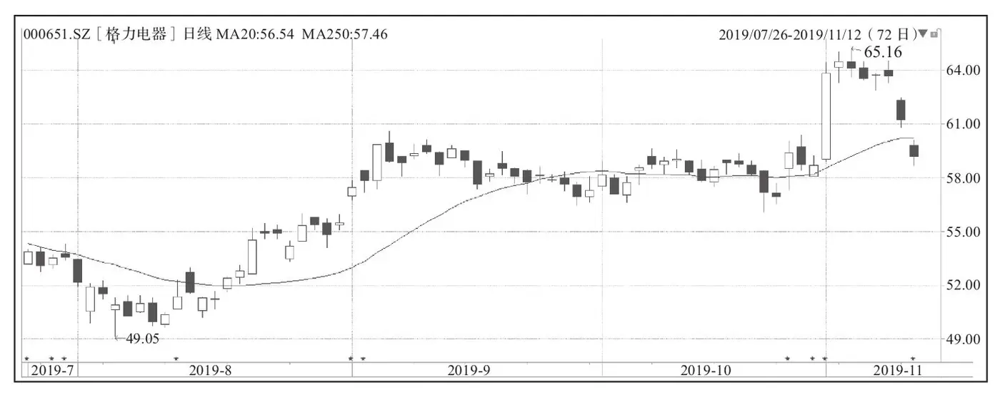

图4\-112019年9～11月格力电器股价走势图

资料来源：Wind资讯。

我们看到，自2019年8月以来，格力电器的股价一直在上涨，公布三季报后还拉出了一根大长阳，而11月又跌回了10月底的水平。

我认为有两方面原因。

一方面，可能是珠海明骏和格力集团的股份转让协议延期。延期会让投资者怀疑协议的确定性，其实稍微推迟一下是很正常的，毕竟有400亿元的交易规模，很多细节需要进一步商量。

另一方面，更重要的可能是“双11”的促销活动。格力电器在2019年11月9日通过官方公众号公告，将在“双11”活动期间拿出精品机型以优惠价格回馈消费者。其中变频空调低至1599元，定频空调低至1399元，降幅达到40%，总让利高达30亿元。

大幅促销能带来销售量的增长，但是会产生极高的销售费用，所以投资者肯定会担心格力电器的经营业绩。

后来，格力空调的确大卖，“双11”当天仅用了21分36秒，销售额便突破了10亿元，只不过格力电器的股价同时打了点儿折。

在分析格力电商业务的发展之前，我们先说说空调电商行业的发展历史和基本面。

空调电商的起步要追溯到十多年前。2008年京东搭建平台，上线大家电；2009年苏宁改版网上商城，更名为苏宁易购；2010年淘宝设立电器城；2011年国美上线全新电商网站。

若以京东上线大家电的次年为起点，空调电商截至2019年已经走过了10年。

10年中的前5年是平台布局阶段。在这一阶段，虽然电商化趋势得到了市场的普遍认可，而且主要品牌的产品已经在京东、阿里巴巴等平台上销售，但全面接受并将重注压在电商上的厂家实际上并不多。

从2012年开始，行业参与者主动求变，发动价格竞争。同时，叠加4G普及、移动支付、高效物流等时代因素，平台进入供需两旺阶段。

在2013年之后，电商渠道开启了真正的规模扩张，5年内将不到5%的渠道渗透率快速提升至36%。

以上是空调电商行业在“量”上的变化，我们再来看看“价”的变化。

2008～2011年，在电商平台上布局的空调厂商并不多，因此线上空调的价格并没有很便宜。

从2012年开始，由于低端产品占比高的小厂加速线上布局，空调电商呈现量升价跌的现象，并且在实体店稳步涨价的情况下，价差被持续拉大，价差较大时相差30%。当时一台空调在店里卖3000元，在网上只卖2100元。

从2015年开始，行业爆发全面价格战，线上的价格开始慢慢提升，价差逐步变小，基本上稳定在20%左右。

空调电商产生量价变化的背后，影响因素主要是产品结构和渠道效率，影响幅度各占一半。

产品结构是定频和变频的价格不一样，挂机和柜机的价格不一样等，如果剔除这方面的影响，渠道效率估计能够贡献10%左右的价差。

渠道差价是电商的高效带来的。空调厂商只需要花传统线下代理的成本，就能干线上“分销\+零售”的活儿，自然多出了一部分利润空间，价格就能往下降。

说完价量，我们再来看空调电商的竞争格局。

说起空调电商，不得不提到奥克斯。

奥克斯是线上单品规模很大的家电厂商。在2015～2018年这四年里，奥克斯的收入和销量分别增加了165亿元和929万台；其中，电商贡献了收入增量的63%、出货增量的56%。

2019年1～9月，奥克斯的内销出货量已经超过了海尔，仅次于格力和美的，位居第三。我们说，是电商成就了奥克斯，更是奥克斯开辟了空调电商这条路。

奥克斯在这一领域成功的因素，我总结为两条。

第一条是先发及成本优势。奥克斯早在2010年就开始陆续与京东、苏宁等主流电商平台合作；同时，以性价比为核心跟龙头公司拼价格，凭借“物美价廉”脱颖而出。从某种意义上来说，奥克斯有点像空调行业里的小米。

第二条是行业错配带来的空缺。空调行业在线下已经形成了均衡竞争的产品结构，与初期的电商市场存在一定错配，大厂商没有适合放在线上销售的产品，这才让奥克斯有机可乘。

这两个优势都是比较脆弱的，现在的竞争格局已经发生了变化。

2019年“双11”的时候，格力下调了价格，美的和海尔紧随其后连夜调价，挂机比格力的同款机型低100元，柜机低200元。奥克斯只能跟进降价，价格在美的和海尔的基础上再降100元。

同样参数的产品，行业龙头公司在线上能够做到跟奥克斯价格一样甚至更低。这样一来，奥克斯的成本优势和行业错配都荡然无存。

未来的空调电商行业，线上渠道的红利将逐渐减少，价格竞争恶化的概率较低，传统空调龙头公司还是能凭借线下渠道优势和电商下沉趋势保持地位。

我估计空调电商行业仍然会形成以格力和美的为核心的双寡头格局。同时，格力不擅长创造流量，靠一两次活动提高市场占有率不太可能，在双寡头中美的还是会更强势一些。

对于2019年“双11”格力的线上降价，我有以下几个看法。

（1）促销活动会对渠道经销商产生负面影响。突然降价会打乱渠道的价格，以高价订货的经销商的库存难以消化，以后经销商再打款的时候估计要斟酌一番了。

（2）产品线过窄会对公司转型产生压力。格力和美的的很大不同之处是产品线。美的有多个产品，比如冰箱、洗衣机、小家电、热水器，并且都在行业里数一数二；格力只有空调，如果盲目转型可能会导致渠道垮掉。

（3）依托第三方平台导致缺少话语权。格力的电商合作方是天猫、京东、苏宁易购三个平台，而空调行业是不能完全依托第三方的。比如，奥克斯在京东和天猫上没有话语权，所以对美的的降价策略没有还手之力。

未来，格力在电商行业的看点是即将成立的电商公司。

现在，格力的线下渠道和电商是完全分开的，两个体系的产品不同。以后，它会把线下的货拿到线上销售，争取做到全国价格统一，销售公司以后只负责物流和安装，变成服务型公司。

我估计在电商公司成立后，格力会把电商运营这一业务从第三方收回来。未来，格力可能会统一线上和线下的价格，线上旗舰店设立价格标杆，其他平台分销格力的产品。

按照董明珠的性格，格力老大的位置万万不能丢。2019年，在电商这一领域格力已经掉到第三，和美的的差距一直在拉大，解决品牌压力和市场营销之间的矛盾是接下来格力的重点。

2025年5月18日

11:03

## 第4章 公司案例分析 - (13) 4.13 大消费——医药：恒瑞医药

\(13\) 4\.13 大消费——医药：恒瑞医药

4\.13 大消费——医药：恒瑞医药

医药白马股恒瑞医药、爱尔眼科和华东医药一直是我的爱股。2019年2月，恒瑞医药公布了2018年的年报。

这只股票不仅受到广大散户的喜爱，我也喜欢，与大家分享一下我当时的思考。

首先，看公司的业绩好不好，有没有超预期，一定要和自己之前的预测做比较。从年报看，2018年，恒瑞医药实现了营业收入174亿元、归母净利润40\.7亿元，营业收入和净利润同比都增长了26%。

恒瑞医药的净利润在我的预计之中，没有大幅超预期。有读者会说，你有没有“马后炮”呀？你之前的预计是多少？我先给大家看一张图，然后再解释（见图4\-12）。

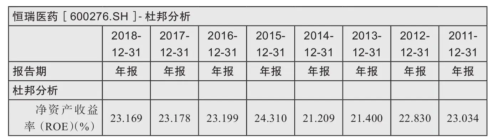

图4\-122011～2018年恒瑞医药的净资产收益率

资料来源：Wind资讯。

图4\-12是恒瑞医药2011～2018年的净资产收益率，是不是很震撼？恒瑞医药每年的净资产收益率基本上都保持在21%～24%。净资产收益率体现了公司的盈利能力和内生性的增长率。

我分析过的上市公司不下2000家，像恒瑞医药有这么稳定的净资产收益率的公司A股几乎没有。当然，有几个精通财务知识的朋友私下跟我说，感觉恒瑞医药的利润是倒算出来的，否则净资产收益率怎么可能那么稳定。不过这些只是猜测，我们不进行讨论。

净资产收益率对于预测公司的盈利有什么用呢？

举个简单的例子，如果去年年底公司的权益是100元，今年盈利了25元，分红了5元，那么今年年底的权益是120元，公司的净资产收益率=25/［\(100\+120\)/2］≈23%。

知道净资产收益率、期初的权益和期末的权益，以及公司当年的分红，我们很容易就能算出公司的利润是多少。

具体到恒瑞医药，因为公司的净资产收益率实在太稳定了，所以很容易预测公司2018年的净利润在40亿元左右。那么2019年呢？如果我们同样假设恒瑞医药的净资产收益率能够保持在21%～24%，那么就能预测公司2019年的利润是50亿元左右。

大家再来看图4\-13。

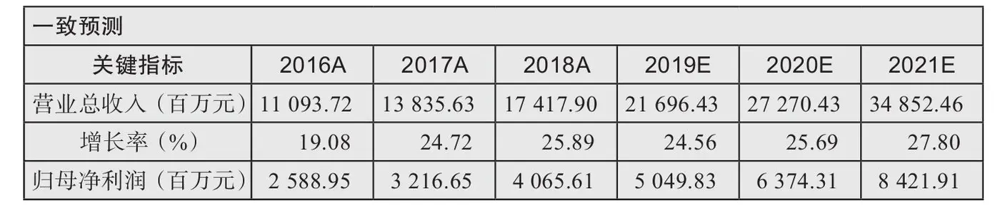

图4\-132016～2021年恒瑞医药的关键指标及一致预测

资料来源：Wind资讯。

图4\-13是截至2019年2月，市场上所有研究过恒瑞医药的分析师给出的盈利预测的汇总，他们预测2019年公司的盈利是50\.5亿元，是不是和我当时的预测很接近？

预测上市公司的盈利一共有三种方法。我们这里介绍的是基于净资产收益率的预测。使用这种方法的前提是公司的净资产收益率很稳定，至少在某些年份保持稳定，同时公司没有股权再融资。

恒瑞医药的业绩没有超预期，那2018年年报当中有没有亮点呢？我觉得年报中的亮点很多，但是最引人注目的是公司的分红率大幅提升。

如图4\-14所示，恒瑞医药过去几年的股利支付率一直在10%左右。

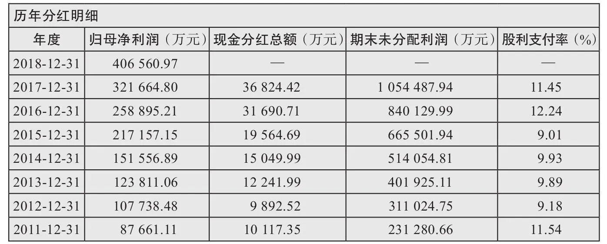

图4\-142011～2018年恒瑞医药的股利支付率

资料来源：Wind资讯。

2019年，公司准备现金分红0\.22元/股，现金股利支付率提高到20%。我想恒瑞医药提高分红率是因为现在机构股东越来越多，并且海外机构投资者的占比越来越高，这些海外资金对于公司有现金分红的要求。

当然，我这样的长线投资者同样喜欢公司赚钱后多给股东分一点，所以我觉得分红率的提高是当时很大的亮点。

2025年5月18日

11:03

## 第4章 公司案例分析 - (14) 4.14 大消费——医药：药明康德

\(14\) 4\.14 大消费——医药：药明康德

4\.14 大消费——医药：药明康德

药明康德是医药行业的黄埔军校，同时也是大名鼎鼎的独角兽公司。

药明康德的主营业务分为合同研发服务（CRO）和合同生产服务（CMO）两块。

首先，针对重大疾病的治疗只有三种手段，分别是化药（小分子）、生物药（大分子）和基因治疗。这三种治疗手段之间的关系是这样的：基因治疗是未来方向，但还处在起步期，而且治疗风险大，费用相对来说也比较高；化药是比较传统的，已经被“跑马圈地”，剩下的空间有限；生物药是目前的“蓝海”，业内有句话，“得生物药者得天下”。

其次，不管是什么治疗手段，对新药的研发绝对是所有制药企业的核心“护城河”，更是维持收入可持续增长的必要手段。对药企而言，研发创新是必须做的事（创新不一定成功，但不创新几乎等于坐以待毙）。

再次，为了降低成本与分摊风险、降低研发难度、缩短研发周期和生产周期，药企会把一部分工作以CRO或者CMO的形式外包给药明康德这样的公司。CRO这个行业本质上是医药行业发展到一定阶段以后，产业分工的必然结果。

最后，过去10年，药企的医药研发投入增速并不快，整体维持在3%上下。CRO的渗透率却大幅上升，10年间增长了100%，这说明越来越多的药企选择将研发和生产项目外包。

国内的CRO行业是在外企离岸外包的需求下兴起的。

1996年，MDS Pharma Services在华投资设立了中国第一家真正意义上的CRO公司，主要为企业提供新药的临床研发服务。1997年，全球头部CRO企业昆泰（Quintiles Transnational）进入中国市场，之后科文斯（Covance）、肯达尔（Kendle）等跨国CRO企业相继在中国成立分支机构。

2000年，药明康德成立，成为国内CRO开始的里程碑。随后康龙化成、睿智化学、美迪西、润东医药、博腾股份等一众企业迅速成长壮大。

2015年后的新一轮药审改革影响深刻，仿制药的利润空间不断被压缩。对于药企而言，只有向创新药转型才能实现长足发展。为了保证研发效率和缩短周期，药企的研发模式将从内部包揽一切转向通过外包合作等形式与外部共同研发，CRO行业进入越来越好的发展时期。

从财务分析的角度入手，有两个分析视角，我以截至2018年年报的数据为例来分析。

首先，我们对比两家龙头公司药明康德和泰格医药的净资产收益率（见表4\-4）。

表4\-42016～2018年药明康德、泰格医药的净资产收益率（%）

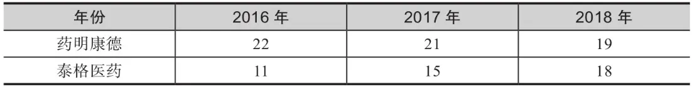

资料来源：药明康德和泰格医药公司公告。

这两家公司的净资产收益率都不错。2018年，二者的净资产收益率几乎都在20%左右，这已经是很高的水平了。

有读者可能会说，从趋势上看，药明康德的净资产收益率在逐步下降，泰格的净资产收益率在逐步上升，所以泰格医药的发展情况更好。

这样的分析有一些不足之处。一方面是净资产收益率会受到再融资的影响，另一方面，如果要看盈利能力的话，我们不妨直接看这两家公司总资产收益率（ROA）的情况（见表4\-5）。

表4\-52016～2018年药明康德、泰格医药的总资产收益率（%）

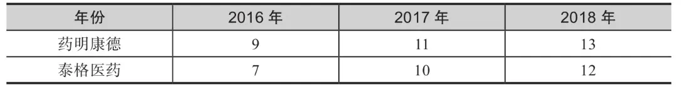

资料来源：药明康德和泰格医药公司公告。

在剔除杠杆因素（即净资产收益率里的权益乘数）后，我们发现，不管是药明康德还是泰格医药，这两年的总资产收益率都在往上走，盈利能力逐步提高。

其次，药明康德公布了2019年的股权激励计划。这份股权激励计划有以下几个看点。

第一，这次股权激励包括限制性股票、股票期权和股票增值期权。其他公司搞股权激励，一般只有限制性股票和股票期权，因为药明康德在沪港两地上市，所以会与众不同。

第二，激励对象广，这次总共有超过2700人拿到了股权激励，占公司员工总数的15%。

第三，行权条件比较低。公司收入在未来三年分别增长15亿元、30亿元和45亿元即可行权。我算下来增幅大概是10%，对于药明康德来说，难度不大。

2018年年底，我参加了药明康德H股的IPO推荐会，看了公开路演材料，写这部分内容的时候，我回顾了公开路演材料。图4\-15展示了药明康德的全面服务平台。

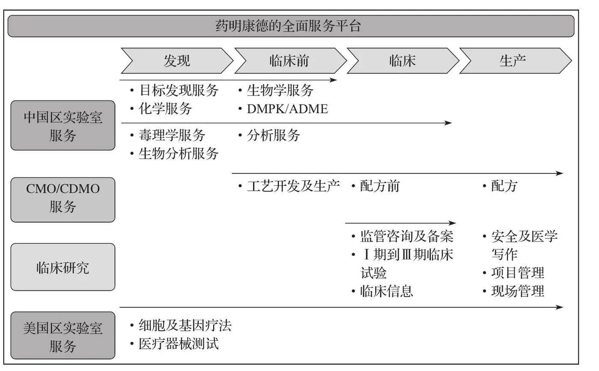

图4\-15 药明康德的全面服务平台

资料来源：药明康德公司公告。

2019年年初，我对于药明康德的看法很简单。公司是行业龙头，研发和创新能力很强。对于公司股价而言，当时的短期风险是2019年5月开始的限售股解禁。

2025年5月18日

11:03

## 第4章 公司案例分析 - (15) 4.15 大消费——医药：爱尔眼科

\(15\) 4\.15 大消费——医药：爱尔眼科

4\.15 大消费——医药：爱尔眼科

价值投资人都喜欢大消费行业。消费品行业的龙头公司一般有两个“护城河”。

第一个“护城河”是产品本身有很高的壁垒。

以贵州茅台为例，茅台酒有五大特点：酱香突出、幽雅细腻、酒体醇厚、回味悠长、空杯留香持久。茅台酒的与众不同源于其独特的酿造技艺和酿造方法（端午踩曲、重阳投料……），同时受到赤水河流域环境的影响，所以茅台只此一家，别无分店。

第二个“护城河”是商业模式具有极高的扩张和复制能力，业内俗称连锁经营。

不同于制造业的扩张需要投入大量的固定资产和无形资产，消费品公司的扩张更多是靠人，需要合理的激励机制。A股有不少这样的公司，比如通策医疗、美年健康，包括这里要谈到的爱尔眼科。2019年5月，我对爱尔眼科进行过分析，和大家分享一下。

我想大家已经很熟悉爱尔眼科了。从财务数据上看，2018年公司实现营业收入80亿元，同比增长34%；实现归母净利润10亿元，同比增长36%。营业收入和净利润保持了高速增长。

爱尔眼科2019年第一季度的业绩同样不错，公司的营业收入是22亿元，同比增长29%；归母净利润是3亿元，同比增长38%。业绩超过市场乐观预期，股票价格在那段时间创出了历史新高。

爱尔眼科的业务包括准分子手术、白内障手术、眼前段手术、眼后段手术和视光服务，本质上爱尔眼科是眼科医院，处在临床应用这个细分赛道，专耕眼科这个领域。

眼科医疗是一个很不错的生意，我曾经在线下课上讲过，现在中国的很多人都有眼科疾病。以近视为例，目前中国近视患者人数已多达6亿，近视在中国有高发化和低龄化两个显著特点。随着人口老龄化，白内障、青光眼和糖尿病视网膜病变等患者正在持续增多。

爱尔眼科营业收入和净利润的高速增长，除了源自治疗眼科疾病的需求不断增长，更主要的原因是爱尔眼科独特的“分级连锁”体系。爱尔眼科认为自己分级连锁的发展模式以及配套的经营管理体系，高度适应中国国情和市场环境。

我们知道，大型城市的人口集中，医疗消费水平高，中小城市的人口则较为分散。分级连锁是先划分“中心城市医院—省会城市医院—地级医院—县级医院”，然后赋予不同层级的医院不同的功能定位。在某地不能确诊的眼病能够远程诊断或者直接转移至省会城市医院或者中心城市医院。

爱尔眼科的发展，前期以自建医院为主。自建医院会有一年半左右的建设期，从开业到盈利又需要两三年时间，所以自建医院的弊端是占用自有资金，同时压缩了企业的利润。上市之后，爱尔眼科“两条腿走路”，除了自建医院，还积极开展并购，现在每年自建和并购的门店数量为7～8家。

爱尔眼科的并购方式分为两种：第一种是与PE机构共同成立产业并购基金，爱尔眼科作为有限合伙人，PE机构作为普通合伙人；第二种是向社会募集资金，撬动杠杆。

2010年，爱尔眼科收购了北京英智和天津麦格等五家一二线城市的眼科医院。2017年是爱尔眼科的并购大年，公司通过第二种方式定向增发并购了13家体外医院。

并购的好处是带来了营业收入和利润的高速增长，但是埋下了财务和管理的隐患。

在2019年一季报中，爱尔眼科的商誉高达21亿元，其中11亿元的商誉是因为收购了欧洲连锁眼科医疗机构Clinica Baviera S\.A\.，而剩下的10亿元商誉源于收购了全国各地的眼科医院。

税法规定，商誉是无形资产，市场会担心商誉的减值。Clinica Baviera S\.A\.的经营情况怎么样，会不会爆雷？从公开数据看，近几年Clinica Baviera S\.A\.的营业收入、利润和现金流都在稳步上升，且每年的现金流都大于净利润，所以暂时还看不出有商誉减值的风险。不过，我还是提醒大家，海外业务的风险不得不防，想长期持有爱尔眼科的朋友，要经常去公司看看，跟踪实时情况。

我还用常见的财务分析方法给爱尔眼科打了一个分数，满分100分，爱尔眼科得了80分（见表4\-6），还是很不错的。

表4\-62018年爱尔眼科财务报告打分（金额单位：亿元）

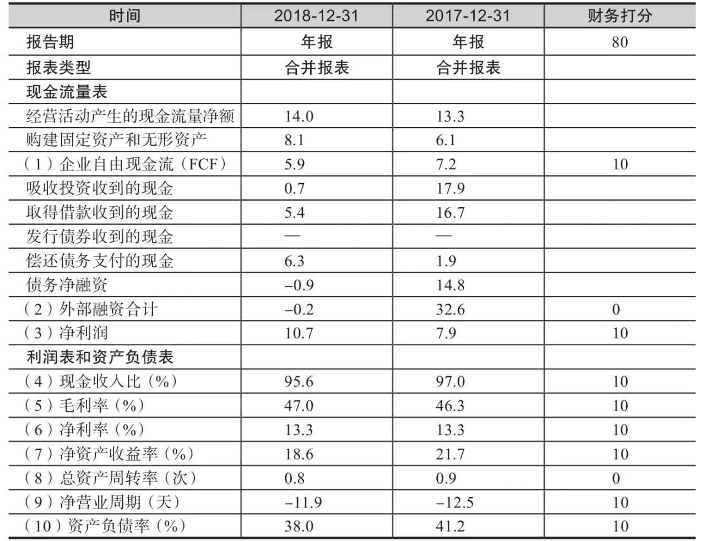

资料来源：爱尔眼科公司公告。

2025年5月18日

11:03

## 第4章 公司案例分析 - (16) 4.16 大消费——医药：片仔癀

\(16\) 4\.16 大消费——医药：片仔癀

4\.16 大消费——医药：片仔癀

产品价格能持续上涨是很重要、很明显的“护城河”。过去20年里没有大牛股是因为降价和打价格战造成的。

2014～2018年片仔癀的营业收入、销量和平均价格如图4\-16所示。

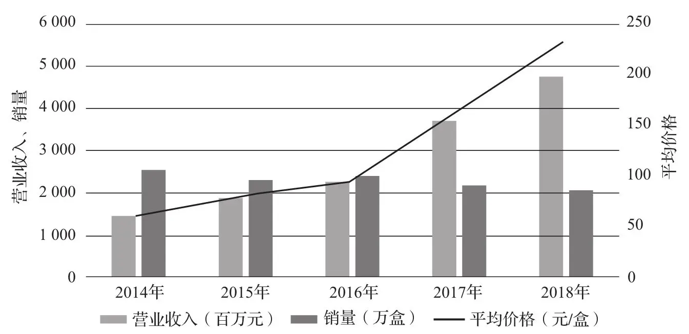

图4\-162014～2018年片仔癀的营业收入、销量和平均价格

注：平均价格=营业收入/销量。

资料来源：片仔癀公司公告。

2014～2016年，平均价格小幅上升，2017年和2018年，产品价格大幅上涨。片仔癀不断提价是因为它具有垄断的定价权，而且下游客户对涨价不敏感。

相应地，从股价表现上看，2013年年底至2018年，虽然市场多次大幅下跌，但片仔癀复权以后的价格上涨了四倍多，涨幅惊人。

片仔癀是传统中药。一说到中药，很多做医药投资的基金经理就会皱起眉头，觉得中药看不出真实的疗效。

另外，从政策上来讲，国家提出加强辅助用药的管理，对辅助用药的收入占比进行定量考核，包括中药在内的很多药品都会被严格限制使用。

我是这么看中药的：未来，那些有真实疗效和真正有用的中药是有机会的。这里涉及的内容很复杂。怎么评价？如何才算有效和有用？这些都需要很专业的人士来判断。

比较简单的办法是一分为二。我认为像云南白药和片仔癀这样有秘方“护城河”的公司还会活得很好。但那些吹牛的中药企业，将来大概率会“死”得很惨。

经常会有朋友问我怎么看东阿阿胶。如果将片仔癀和东阿阿胶相比，我肯定更喜欢片仔癀。

片仔癀全世界只有一家，“护城河”很深。但是阿胶仅在东阿县就有很多企业生产，竞争对手太多，包括福牌阿胶和同仁堂阿胶，连佛慈都出了阿胶。

另外，我建议大家关注奥本海默基金。业内都知道，这家海外基金公司对中国的消费品有很深入的研究，曾经持有贵州茅台很长时间，赚过很多钱。它曾经是东阿阿胶的前十大股东，但从2019年开始减持。

当时东阿阿胶的股价跌了那么多，估值应该很低，奥本海默基金不增持反而减持，这是需要投资者注意的。

除了垄断和价格上涨之外，使片仔癀成为超级大牛股的原因还有以下几个。

首先，片仔癀的下游需求结构比较好。绝大多数买片仔癀的家庭是高净值的家庭，消费人群以男性为主（占比70%），年龄为35～70岁。“70后”现在是购买主力，“80后”为新进购买群，本科以上学历的消费者占8成，企业管理者居多。

半数以上买片仔癀的人有饮酒习惯且商务应酬多、工作压力大，其中肝病患者多（酒精肝、乙肝、肝硬化和肝癌）。

其次，片仔癀的生产工艺和处方被列入国家“双绝密”，永久保密。国家中药保护品种分为三级，其中最高等级国家绝密级配方只有片仔癀和云南白药。

片仔癀有传承人制度，全世界只有三个人知道配方，公司不对外公告传承人，且每位传承人都签有保密协议，国家对三位传承人的人身安全采取周密的保护措施。双绝密保证了竞争对手无法模仿其配方。

再次，天然麝香原料产量有限，国家定量配给。片仔癀的原料主要是天然麝香和天然牛黄，麝香的使用由国家统一审批和分配。

国家每年的天然麝香配额在500公斤左右，目前国内被允许使用天然麝香投料的中成药企业共有16家，片仔癀第一批获得了该配额资格。

另外，片仔癀是唯一一家有养殖林麝资格的企业。国内林麝数目锐减，而需求量不断增加，使天然麝香的价格一路走高，2010～2017年，天然麝香的价格由每克150元涨至450元左右。

此外，天然牛黄同样是名贵且供不应求的原料。每年需求量达到5000公斤，但市场供给有限，我国每年天然牛黄的产量仅为400～700公斤，其价格稳步上升，2016～2017年的价格在每克200元左右，2018年攀升到每克310元。

最后，片仔癀是传统老字号国宝企业，有品牌优势。中国有两个传统老字号国宝企业，一个是国酒贵州茅台，另一个是国宝秘药片仔癀。片仔癀传承自明朝宫廷，兴于寺庙，流传于民间，发展于当代，被国内外中药界誉为“国宝名药”。

此外，片仔癀还蝉联国家金质奖，是大陆中成药单品种出口创汇第一名，是走出国门的第一药，海外市场广阔。

2019年5月召开的股东大会是片仔癀历届会议中参加人数最多的一届。主席台上坐了14个高管，参会的股东约有200个。这次大会上一共有四人获得了提问的机会，总共提了10个问题。军人出身的刘董事长（刘建顺）对这些问题给予了详尽解答。

比如，股东很关心的问题，天然麝香能不能长期支持公司的未来发展。刘董事长明确表态，在世界范围内，尤其是俄罗斯，林麝资源还是比较丰富的。天然麝香完全能够满足片子癀的持续发展，所以不会成为制约片仔癀产能的瓶颈。

关于价格上涨的问题，刘董事长介绍，公司对产品的提价比较慎重，会权衡提价给方方面面带来的影响。这几年核心原材料的价格确实涨得很厉害，他认为公司会很好地平衡原材料价格、片仔癀成品价格和消费者承受能力之间的关系，尽量满足客户的需求，成为一家既创造经济效益又创造社会效益的良心企业。

关于公司制定的一核两翼的发展战略，两翼的发展很薄弱，营销情况不尽如人意，且缺乏必要的核心产品，公司下一步将如何应对？

刘董事长回答道：“每个事物的发展都有其客观规律，必须慢慢来，不能急躁冒进，需要一个水到渠成的过程。当然，我们希望广大股东提供更多线索，寻找更多标的，为我们下一步内生增长、外延并购奠定一个坚实的基础，将一核两翼做大做强。”

截至2018年，片仔癀的母公司几乎贡献全部利润，但二线业务收入端增势喜人：①得益于前期营销沉淀与销售费率下降，2018年化妆品公司的收入同比增长近60%至2\.7亿元，净利润翻番至4200万元；②2018年牙膏实现收入1\.2亿元；③预计医药商业的收入同比会有两位数的增长。

我觉得片仔癀的风险点在外延并购方面，团队不是很专业，做医药领域并购需要很专业的人士操盘。在股东大会上，高管征求股东对这方面的意见，欢迎股东提供好的标的，包括医疗器械、健康食品之类的。现在公司只是有这种想法，还没有找到合适的标的。

另外是关于产品的提价，2018年有很高的提价预期，很多体验馆之前说2019年提价，结果到2019年5月股东大会召开时都还没有动静。实际上原材料价格涨得挺多，但是产品没有提价，这对公司的毛利率有一定的损害。在股东大会上，公司对提价还是比较慎重的。

另外，公司2019年一季报的数据低于市场预期。第一季度公司的收入增长21%，扣非净利润增长25%，相比2018年同期的44%，增长明显放缓。

从经营数据看，核心产品片仔癀系列（经营数据中的肝病用药）的增速只有16%，相比2017年和2018年同期的36%和53%，增长确实大幅放缓。

当然，公司再好，在经营过程中也会有休整，我们不能因为单季度增长放缓就否定了长期趋势，应该客观地分析和跟踪验证。

我分析了中药行业和片仔癀，为大家提供了一个分析思路和框架，希望大家有所收获。

基本面的研究虽然很辛苦，见效也比较慢，但是会让人越来越踏实。平时不断地观察和思考，日复一日、年复一年地积累下去，自然会逐步形成自己独特的研究经验。这样的经验是很宝贵的个人财富，别人抢不走，更拿不去。

我讲过，我觉得投资和研究是世界上最好的工作，能够一直干一辈子，我愿意真诚地和大家分享我关于投资和研究的感悟，和大家一起进步。

2025年5月18日

11:03

## 第4章 公司案例分析 - (17) 4.17 大消费——医药：沃森生物

\(17\) 4\.17 大消费——医药：沃森生物

4\.17 大消费——医药：沃森生物

2018年1月13日，医药白马股沃森生物爆雷。公司2016年盈利7046万元，本来2017年三季报预测全年净利润为3000万～5100万元，后来却突然说预计2017年全年亏损5\.35亿～5\.38亿元。亏损的原因是转让资产河北大安业绩没有达标，公司需要承担相应的赔付责任以及增加的财务费用等。

亏损5亿元不是一个小数字。在震惊之余，我想能不能从财务报表分析的角度预先排雷。

我从沃森生物过往的财务报告中发现了以下几个迹象。

第一，如表4\-7所示，公司经营活动产生的现金流量净额长期为负数。

表4\-72013～2017年第三季度沃森生物的经营活动产生的现金流量净额

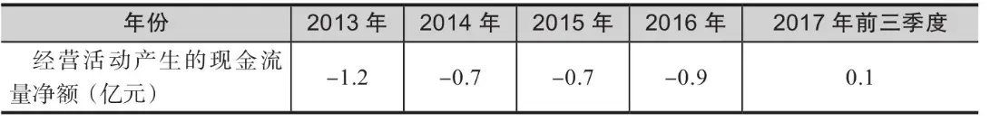

资料来源：沃森生物公司公告。

经营活动产生的现金流量净额是公司在销售商品和提供劳务后的现金流入减去相应的现金支出。该净额长期为负数，表示公司一直在做现金“亏损”的买卖。这样的生意不能长期做下去。根据沃森生物的经营活动产生的现金流量净额长期为负数这一点，我们基本就能把它排除在投资名单外。

第二，如表4\-8所示，归母净利润的波动较大，2015年突发一次性的大额亏损。

表4\-82013～2017年第三季度沃森生物的归母净利润

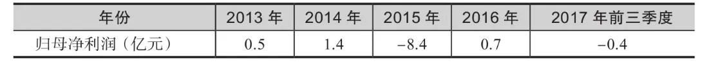

资料来源：沃森生物公司公告。

在挑选投资标的的时候，投资者希望选出的公司的净利润稳步增长。反观沃森生物，其归母净利润的波动很大：从2013年的0\.5亿元增长到2014年的1\.4亿元，然后又在2015年亏损了8\.4亿元。2016年虽然盈利了0\.7亿元，但仍然没有恢复到2014年的高点水平。沃森生物并不是周期股，这样的巨幅波动让我们很难做到准确预测。

另外，2015年巨亏8\.4亿元的原因是公司在2015年对商誉做了大幅度的减值。

按照过往经验，历史上爆过一次雷的公司未来极可能再次爆雷。所以，根据这一点我们应该把公司排除在投资名单之外。

第三，如表4\-9所示，净资产收益率偏低。

表4\-92013～2017年第三季度沃森生物的净资产收益率

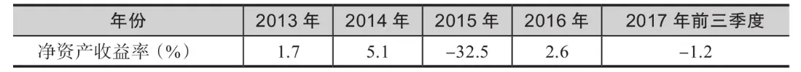

资料来源：沃森生物公司公告。

我们一般选择净资产收益率稳定在15%以上的公司进行投资。2013～2016年，沃森生物的净资产收益率最高为5\.1%，表明公司的盈利能力很差。

第四，要关注年报和半年报中的公司承诺事项。

本次巨额亏损是因为公司之前承诺其所投资的河北大安在2017年、2018年、2019年的血浆采集规模不低于150吨、200吨、250吨；此外，从2017年开始，如因血浆采集量未能达到协议约定的相应最低承诺值，而导致杜江涛向博晖创新赔付河北大安股权的情形，公司将承担相应的赔付责任。

对于这种因为承诺事项而可能产生的赔偿责任，投资者可以在沃森生物的2016年年报和2017年半年报中找到相关内容。一般承诺事项出现在报告的“第五节重要事项”及“财务报表附注”中，大家在阅读的时候需要格外重视。

简单的做法是用排除法。

2025年5月18日

11:03

## 第4章 公司案例分析 - (18) 4.18 大消费——旅游：中国国旅

\(18\) 4\.18 大消费——旅游：中国国旅

4\.18 大消费——旅游：中国国旅

中国国旅，顾名思义，是开展国内外旅行社业务的。

中国国旅不同于一般的旅行社，它的前身是中国国际旅行社总社，这是一家成立于1954年，历史悠久，国内知名度很高的旅游企业。

2019年年初，中国国旅发布了一个公告：公司业务发生了重大变化，不再开展旅行社业务，而是一心一意地经营免税店。

有人会说，那这家公司还能叫中国国旅吗？这当然没问题，鱼香肉丝里没有鱼，老婆饼里没有老婆，为什么中国国旅要改名呢？

免税行业被称为“小肥洋”行业。

说它“小”，是因为开展免税业务的公司普遍规模都比较小、资产少。它虽然属于零售行业，员工人数却不太多。

说它“肥”，是因为免税公司的盈利能力超强，其毛利率、净利润率及净资产收益率都高得惊人。

以中国最大的免税公司、中国国旅的控股子公司中免为例，2018年中免的营业收入是345亿元，净利润是31亿元，净利率高达9%，净资产收益率达到24%。

参照国内大型零售百货公司王府井，它也是一家很优秀的公司，但2018年的净利率是4\.5%，净资产收益率是11%，都只有中免的一半左右。

说它“洋”，是因为免税商店卖的都是进口商品，包括国际一线品牌的香水、化妆品、烟、酒、手表、眼镜和包等。随着中国消费者消费能力的提升，大家对品牌的认知度和接受度越来越高。

每次我在上海浦东国际机场等飞机的时候，总能看到日上免税店（号称亚洲最便宜的免税店）里摩肩接踵，甚至结账都要等好久。

国内免税行业的市场格局如下。

截至2019年年初，中国只有六家被允许经营免税业务的企业，它们分别是中免、珠免、日上、海免、深免和中出服。

中免的全称是中国免税品（集团）有限责任公司，是中国国旅的全资子公司。

根据中国国旅的最新年报，2018年中国的免税行业销售额合计400亿元，而中免一家的营业收入就高达345亿元，市场占有率超过80%，是免税行业的绝对龙头公司。

为什么中免那么强势？因为它是全国唯一一家能在全国范围内开展免税业务的公司，换句话说，它有一张其他公司想拿却一直拿不到的全国范围的免税专营牌照。

过去几年，中免还马不停蹄地收购了日上的股权，获得了北京首都国际机场、上海机场[\1]和广州白云国际机场的免税店经营权。

这样一来，中免不仅是国内该行业的龙头老大，其营业收入足以跻身全球该行业前五。

深免是深圳国资委全资控股的，珠免是珠海国资委控股的，都是在当地比较好的免税企业集团。但是和中免不一样，这两家做不了全国业务。

海免的股权结构比较有意思，中国旅游集团有限公司控股51%，剩下的49%由海南省国资委持有。

中国旅游集团有限公司是上市公司中国国旅的控股股东，所以市场一直预期海免会被中免收购。

海免只能在海南开展离岛免税品销售和免税店建设的相关业务，业务集中在海口的机场。三亚海棠湾的免税店不是海免的，而是中免的店。

前面提到的日上是一个特例，它是中国批准的专业经营机场出境免税业务的外资企业。日上的经营范围限定在上海机场和北京首都国际机场，现在已经被中国国旅收购了。

国内免税店的建立和运营都受到国家的严格监管。中免是国内唯一一家可以在全国范围内开展免税业务的公司。

我国境内的免税店主要有口岸免税店、运输工具免税店、市内免税店、外交人员免税店、供船免税店及我出国人员外汇免税商店。其中大部分免税店中免都可以做，而其他公司只能开展个别业务。

2018年，中免收购了日上中国和日上上海的股权并对其进行控股后，市场预期其未来有整合海免和其他一些小型免税企业的可能性。

我觉得这种可能性还是挺大的。收购除了能提高中免的业绩，还能巩固其垄断地位，从而提升中国国旅的估值。

除了拥有稀缺的全国性牌照外，中免还有两个极宽的“护城河”。

首先是中免的整体运营能力较强，其次是中免拥有强大的采购能力。

中国大部分的免税店，店面都不大，对企业的整体运营能力要求比较低。比如，深免和珠免都没有经营大面积免税店的经验和能力。

国内只有中免和日上具有经营大体量免税业务能力。

日上在北京首都国际机场和上海机场的免税店面积很大，而中免更是有全球最大的单体免税店——三亚海棠湾免税店的运营经验。

在免税行业里，采购渠道是免税店竞争的关键一点。中免依托全国性布局，进行全球性采购的能力很强。

以前在采购过程中，境内的免税店往往不是通过一线主流的渠道直接采购，而是归于亚太区或者其他地区，比如中免以前都是通过香港中免进行采购。

现在，中免的规模大了，能直接和海外一线品牌讨价还价。拥有强大的采购能力意味着成本更低、竞争优势更强，这使中免在国内傲视群雄。

在我看来，免税行业还有几个潜在的风险需要注意。

第一个风险是，免税牌照的限制可能会放开。这里有两层意思：一是对外资免税店的政策可能会有所松动；二是内资免税店原来的地域经营限定将会被打破，将开启跨区域、跨类型的经营模式。

目前，国际上很多比较大的免税企业都在变相通过各种渠道渗透到中国的免税行业。未来不排除它们会直接和中免竞争。

第二个风险是宏观经济下行的风险。免税业务的发展和我国公民的出境人次和出境消费情况相关。中国人购买海外奢侈品的能力很强，可宏观经济的下行必然会对出境消费产生负面影响。

如果大家在关注上海机场的月报，就会发现2019年年初时出境人次的增速已经不复存在。

第三个风险更加现实。随着中国免税店经营业务的发展，关键性的口岸和机场可能会大幅度地调高租金或者扣点，这对免税公司显然是不利的。

中国国旅于2019年1月19日召开了股东大会，公司领导提到了以下几方面的重要内容。

第一，中免会更加关注重大项目和并购机会。海口美兰国际机场免税店在股权变更完成后会立刻注入上市公司；海口的免税店已经做好准备，等待国家批准开业；三亚海棠湾二期核心岛的店面正在建设和装修，不久后将试营业；白云机场的销售情况很好，公司就经营面积和经营品类与机构重新进行了谈判。

第二，人民币贬值会对毛利率有一些影响。公司会依靠规模优势改善和供应商谈判的效果，规模优势能抵消汇率的影响。

第三，剥离了国旅总社以后，未来公司总的经营思路是发挥免税优势，以免税为核心发展和健全产业链。

[\1] 包括上海浦东国际机场和上海虹桥国际机场。

2025年5月18日

11:03

## 第4章 公司案例分析 - (19) 4.19 大消费——化妆品：珀莱雅

\(19\) 4\.19 大消费——化妆品：珀莱雅

4\.19 大消费——化妆品：珀莱雅

我作为一个彻底的“直男”，提到美妆只会想到口红效应。但是做投资不能拘泥于性别特征，有价值的公司都是值得研究的。

2019年3月29日，A股美妆公司珀莱雅发布2018年年报。2018年，公司实现营业收入24亿元，同比大增32%；归母净利润为2\.9亿元，同比增长43%；扣非后归母净利润为2\.8亿元，同比大涨50%。

珀莱雅的业绩超出了市场上的乐观预期。公司上市之后一直致力于做三件事：改革组织架构、调整引进人才和扩充渠道，这三件事取得的正面效果在2018年得到了爆发式的体现。

进一步分解公司的营业收入，能看到2018年整体营业收入增长了32%，其中线上增速超过60%，线下的增速是个位数。

公司主要通过天猫旗舰店、京东直营店和云集平台进行线上销售，同时辅以视频直播和社交营销扩大传播范围。另外，2018年公司成功推出爆款单品爽肤水，单品线上销售额达到2亿元。

2018年年报公布之后，我和公司的管理层做了沟通。公司2019年的目标是营业收入保持30%的增长，其中线上业务除了传统平台之外，再争取拼多多和更多的微商资源，目标是实现40%以上的线上增长。线下业务的目标是超过2018年的数字，实现两位数的增速。

具体分品牌来看，2018年公司的珀莱雅主品牌的收入占比接近90%，其他品牌体量不大。2019年，公司计划主推悦芙媞和优姿莱单品牌店，使加盟数达到500家以上，贡献1亿元收入增量。

目前，我观察到国产美妆品牌已经开始分化，出现两种情况。

第一，很多纯线上小品牌爆发了，在抖音等社交电商的推动下，这些小品牌的增速很惊人。线上爆款的小品牌有两高——高毛利和高销售费用，其营业收入的增长主要靠营销，所以持续性有待观察。

第二，传统国产品牌还在摸索，问题很严重。有的国产品牌到现在为止只有线下业务，没有线上业务。开展了线上业务的品牌的日子也不好过，在淘宝的流量都不增长的情况下，它们还在犹豫到底是做传统电商还是做内容电商。

我认为美妆行业是一个充分竞争的行业，同时是消费品行业中竞争极其激烈的行业。内资的上市公司有上海家化、御家汇和珀莱雅。

外资品牌之前一直高高在上，存在产品系列众多的超级大品牌，比如欧莱雅集团、资生堂集团、联合利华等。

能观察到的是自2015年开始，国产品牌逐渐崛起，外资品牌因为不了解中国市场，丢掉了很多市场份额。2018年是外资品牌的转折年，它们线上业务的营销策略开始“接地气”了，加上进口关税下降，2018年外资品牌增长得很好。

内资的三家公司里，上海家化已经被中国平安折腾“死”了，要重新崛起困难重重。御家汇起点很高，但在收购阿芙精油失败后，增速逐渐放慢。

相对来说，珀莱雅的增速相对稳定，而且增长的质量比较高，2018年每个季度都保持了30%以上的增长。

美妆行业的另一个特点是行业在加速分散，而不是在加速集中。

美妆产品强调的是个性化，叠加传播渠道的扁平化和多元化，以及短视频的高速增长和关键意见领袖（KOL）带货，使很多网红爆款和新品牌崛起，小品牌的增速更快。

美妆行业和白酒、酱油行业的逻辑不同，在白酒、酱油行业，我们看到的是龙头公司越来越强势，马太效应明显。所以在投资的时候，选白酒和酱油行业的龙头股长期持有，比选美妆行业的龙头股更加让人安心。

包括珀莱雅在内的所有国产品牌都面临一个问题，即主品牌容易做大，但是收入有瓶颈。

如果主品牌遇到了天花板，同时公司的其他小品牌还没有成长起来，那么公司收入的增速很快会变慢。

现在一般认为，线上主品牌营业收入的天花板是20亿元左右，虽然能够通过线下渠道补充，但是线下很难孵化出营业收入10亿元以上的品牌。

总体来看，珀莱雅之前的表现是惊人的，但是未来公司要想做大做强，还是得回归主业。公司需要通过几年甚至更长时间沉淀下来，做强品牌力，打通线上和线下渠道，重视研发，回归产品本身。珀莱雅任重而道远。

2025年5月18日

11:03

## 第4章 公司案例分析 - (20) 4.20 大科技——电子：工业富联（富士康）

\(20\) 4\.20 大科技——电子：工业富联（富士康）

4\.20 大科技——电子：工业富联（富士康）

我之前每天上班都路过东方明珠旁边的富士康大厦，那里前几年一直是用隔离栏围着的待建设用地，从2017年开始飞速建造。2018年3月，我看到大厦已经几近完工，估计不久富士康就能入驻了，于是我对富士康当时的财务情况进行了分析，现在分享给大家。

富士康大厦的建造速度和富士康的IPO一样，大家都想到了富士康能走快车道，但没想到富士康直接坐上了“复兴号”。2018年2月1日，它把材料报到证监会，3月8日全票通过，要知道2月当中还有一段春节假期。

我每天雷打不动地早起看财务报告，当时也读了富士康的公告，真是不读不知道，一读吓一跳。

富士康全称叫作富士康工业互联网股份有限公司，名字中夹了“工业互联网”，突然“高大上”了不少，但是它本质上还是一个代工企业。公司出名的业务是给苹果公司代工，它还为其他很多知名手机品牌代工，所以大部分人生活中都正在和富士康的产品“亲密接触”。

代工企业的特点是员工多，富士康有多少人呢？截至2017年年底，公司一共有27万人。这27万人一年能为富士康创造多少利润呢？用富士康2017年的总利润159亿元除以27万人，得到的人均创利不到6万元。所以，每个月每个员工差不多只创造了5000元的利润，赚的真是辛苦钱。

不仅人均创利很低，富士康的毛利率也只有10%。毛利率是一个重要的衡量公司的盈利能力的指标，用基本面选股的朋友都会用这个指标。对比中国比较好的制造业企业，比如格力电器或者福耀玻璃，其毛利率都常年维持在20%以上，富士康的毛利率真不算高。

2017年年底，富士康的资产负债率高达81%。这相当于郭老板（郭台铭）自己拿出20元，然后向银行和供应商借了80元做生意。我从来没有看到过制造业企业有这么高的杠杆率，当年乐视网的资产负债率才76%。

我很难想象资产负债率这么高的公司怎么能够长期存活下去，只能说，IPO真是给公司打了一针强心剂。

在看了这些财务指标后，我的结论是，“不碰为敬”。

我唯一能想到的吸引眼球的逻辑是大市值小公司的投资逻辑（业内叫作“小马拉大车”）。当时我判断，富士康上市以后的市值会超过6500亿元，而其流通股市值大概只有100多亿元。

等待，我觉得是做二级市场很重要的品质。

富士康的等待终于有了结果。2018年5月11日晚间，证监会核准了富士康工业互联网股份有限公司的首发申请。富士康拟发行约19\.7亿股，中国国际金融股份有限公司担任发行保荐人（主承销商），股票简称“工业富联”。

提醒大家关注两点：第一，富士康没有公布募资金额；第二，网下打新的70%将锁定一年。

富士康的这些举动说明监管层对“独角兽”上市的支持意愿不变，但同时监管层希望通过延长锁定期和战略配售，使其对市场的冲击可控。

富士康叩开了“独角兽”上市的大门，基本能预见后面的股票供给将源源不断。从2018年5月开始，按照每个月10家IPO推算，到2018年年底，上市公司将超过3600家。那么多公司里面，能投资的公司并不多，以后自下而上地做研究和投资组合的难度会很高，市场对于优秀研究员和基金经理的需求将会越来越大。

股票的供给会不断增加，然而，在市场上赚钱会越来越难。2018年，全市场基本延续了2017年的“二八”分化。从数量上看，超过80%的个股出现了不同幅度的下跌。从下跌幅度上看，市场中位数个股下跌了7%。只不过2018年“二八”和2017年“二八”截然不同，2017年领涨的是蓝筹白马股，而2018年上涨的头部集中在部分中小市值个股。

2018年5月24日，富士康股票在网上和网下同步发行。

富士康IPO有以下几个看点。

（1）发行价格偏低。公司股票的发行价是13\.77元/股，低于市场机构按照发行规模预估的14\.04元/股。相应地，融资金额比之前披露的少了一点。

（2）发行市值较大。按照13\.77元/股的发行价，富士康的发行市值达到2712亿元，超过借壳上市的三六零，接近恒瑞医药，但比海康威视低了整整1000亿元。

（3）顶格申购必中。顶格申购所需市值413万元，可申购41\.3万股（413个号），每个号中签率按0\.5%计算，413×0\.005=2\.065，顶格申购保中1～2签，中签概率超过100%。即使不是顶格申购，0\.5%的中签率也不低，所以当时我也建议大家参与。另外，考虑到今后的独角兽公司都会在上海证券交易所上市，为了打新股，我建议大家多考虑买一点上海市场的股票。

与“股票发行公告”同时披露的，还有富士康的2018年一季报摘要。截至2018年3月末，富士康的总资产为1345亿元，总负债约为1038亿元，所以资产负债率高达约77%。算上募集资金271亿元，富士康的资产负债率降到了65%左右，这个比率在我看来还是挺高的。

2018年第一季度，富士康的营业收入为78亿元，同比增长20%；归母净利润为26亿元，同比增长4\.5%。利润的增速低于营业收入的增速，主要原因是成本和费用上升。

按照我过去的投资经验，在A股台湾人的公司有三个特点：经营上稳健有余，进取不足；重视投资者交流工作；市值能做大的很少。

2019年上半年，A股出现了很多新的主题和概念，比如数字孪生、边缘计算、透明工厂和工业大麻等。有朋友开玩笑，知道的是在炒股票，不知道的还以为在中科院上班。

每当有新概念的时候，都会冒出一批受益股因此股价暴涨，但是能实现产业化的公司少之又少。

不过，我在阅读工业富联2019年半年报的时候，看到“边缘计算”和“雾小脑”这些概念已经落地。

我从工业富联2019年的半年报里找了两张图（见图4\-17和图4\-18）给大家看看。

工业富联2019年的半年报写得很详细，这一点是需要表扬的，财务数据却不好看。

2019年上半年，公司实现营业收入1700亿元，同比增长7%；归母净利润为55亿元，同比增长0\.6%；扣非后的归母净利润为52亿元，同比下降6%。

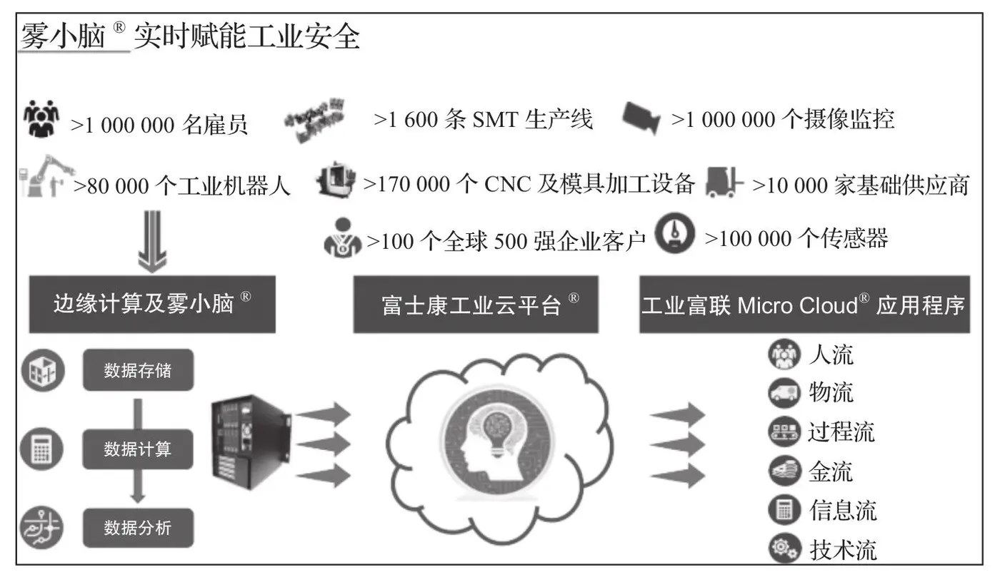

图4\-17 工业富联“雾小脑”概念

资料来源：工业富联公司公告。

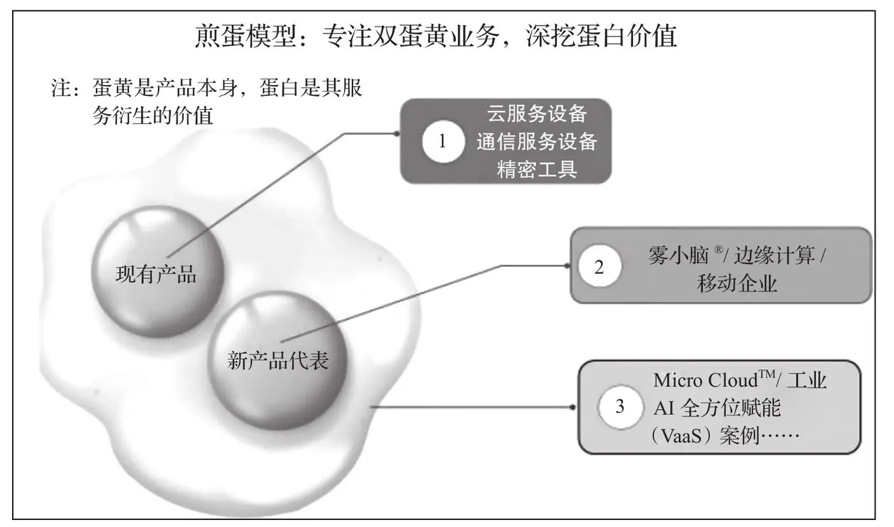

图4\-18 工业富联“煎蛋模型”

资料来源：工业富联公司公告。

利润表上的这三个重要数字都低于预期。

首先，营业收入的增速只有个位数（见表4\-10）。

表4\-102017～2019年上半年工业富联营业收入的增速

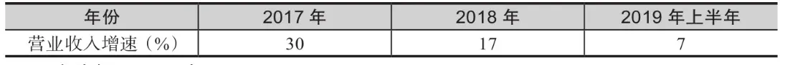

资料来源：工业富联公司公告。

公司上市前营业收入的增速都是两位数，但上市后增速基本不复存在了，这是大部分刚在A股上市的企业的通病。

营业收入的增速不复存在之后，净利润的增长几乎停滞。分季度来看，2019年第二季度第一次出现同比负增长（见表4\-11）。

表4\-112018～2019年上半年工业富联单季度净利润的增速

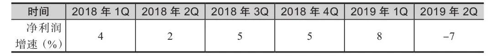

资料来源：工业富联公司公告。

其次，净资产收益率大幅下滑（见图4\-19）。

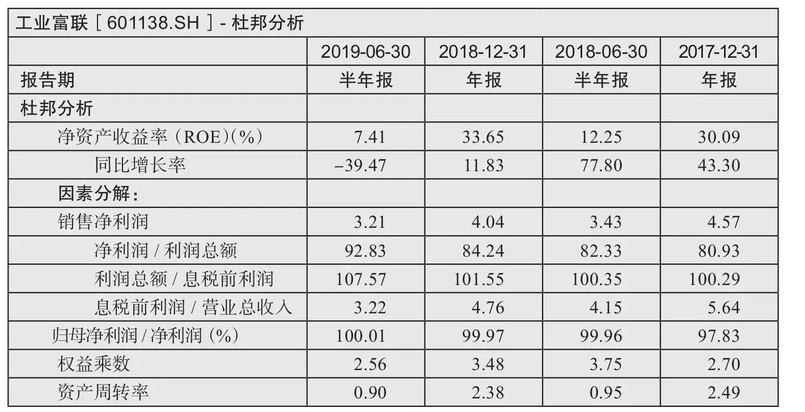

图4\-192017～2019年上半年工业富联杜邦分析

资料来源：Wind资讯。

拆分以后我们看到，2019年上半年的净利率是3\.2%，又比2018年下降了几个百分点。

工业富联是代工企业，赚的是辛苦钱。所以，虽然其营业收入很高，但是净利率一直不高。

权益乘数即杠杆率，从2018年年底的3\.5倍下降到2\.6倍，公司解释这是因为同期基数较高，所以为了上市，分拆业务主体中除经营性资产外的其他资产和负债不再纳入合并财务报表。

最后，资产周转率从2018年的0\.95倍下降到了0\.9倍。我之前分析过，工业富联较大的看点是公司的资产周转率很高。公司用了70多亿元的固定资产支撑起了全年4000多亿元的营业收入，固定资产的周转率高达50多倍。

另外，工业富联一年有39亿元的折旧，几乎是其固定资产净值的一半，这意味着公司的固定资产更新速度极快。

这样的高周转和高折旧在制造业的公司中是极其罕见的，构成了工业富联的“护城河”。

所以，如果资产周转率开始变慢了，对公司财务报告的影响极大。

总之，截至2019年8月，我对工业富联的结论还是没有变化：增长不明显，还有大量的解禁，所以还是先放一放，不急着买入。

2025年5月18日

11:03

## 第4章 公司案例分析 - (21) 4.21 大科技——电子：海康威视

\(21\) 4\.21 大科技——电子：海康威视

4\.21 大科技——电子：海康威视

2019年4月，海康威视公布了2019年的一季报，这是公司上市9年以来最差的一份季报：营业收入增长6%，净利润同比下降15%。

当时季报公布之后，海康威视的股价（前复权）从高点的36\.3元/股，一路跌到低点23\.6元/股，跌幅一度超过30%，市值蒸发超过1000亿元，相当于整整跌没了一个药明康德、两个招商公路和三个白云机场。

股价走势如图4\-20所示。

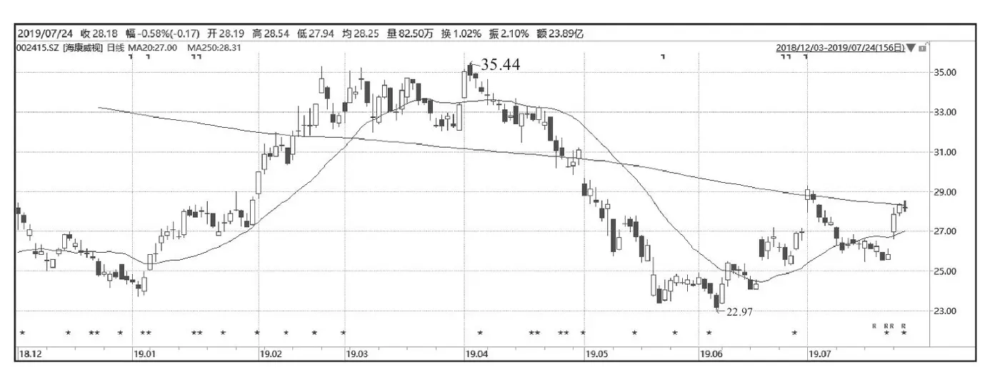

图4\-202018年12月～2019年7月海康威视的股价走势图

资料来源：Wind资讯。

伴随着基本面的恶化和股价走低，北上资金大规模减持。境外资金的持股占比从33%一路下降到17%。

2019年7月20日，海康威视发布了2019年半年报，用两句话做个总结：利润表上的数字略低于预期，但现金流量表上的数字高于预期。

2019年第二季度，海康威视的营业收入同比增长了21%，净利润增长了16%。虽然第二季度比第一季度做得好，但是低于市场预期。

有朋友问，我们怎么知道海康威视的市场预期是多少？

首先，市场预期肯定不能来自卖方的研究报告。

Wind或者Choice里有很多券商研究员写的公司研究报告。但国内研究员写报告，主要是为了“推荐”，很少有“看空”，这决定了他们普遍是乐观的。因此，我不建议用券商研究员给的财务预测给自己打气，否则很容易变身为“接盘侠”。

像海康威视这样的大白马股，一直在主动向市场释放业绩的预期，大家只要持续关注，总能找到蛛丝马迹。比如，在2019年5月17日举行的投资者交流活动中，海康威视提到了第二季度的情况，如图4\-21所示，其中Q表示提问，A表示公司的回答。

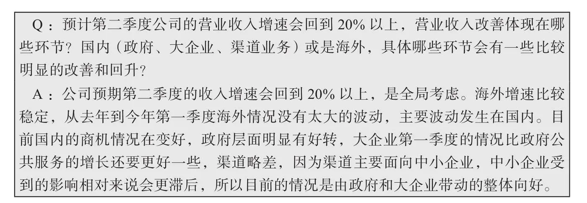

图4\-21 海康威视投资者交流活动中的问答

资料来源：海康威视公司公告。

通过这一活动，我们有两个收获。

首先，海康威视在5月中旬基本准确预测了第二季度的业绩，说明公司对财务数字的把控能力很强。

其次，当我们看到营业收入增长20%的时候，马上会根据海康威视的净利率算出公司的净利润。那海康威视的净利率有什么特点呢？

从季度分布上，海康威视单季度的净利率一般呈现“前低后高”的状态，第一季度是低的，第四季度是高的；从绝对数字来看，20%是一条分水线。净利润率为20%或以上是符合预期的，超过25%是超预期的。2019年第二季度的净利率只有19%，所以说利润表上的数字略低于预期。

2019年上半年，海康威视的现金流出好于预期，我将现金流量表中的几个数字展示给大家（见表4\-12）。

表4\-122019年上半年海康威视现金流量的净额

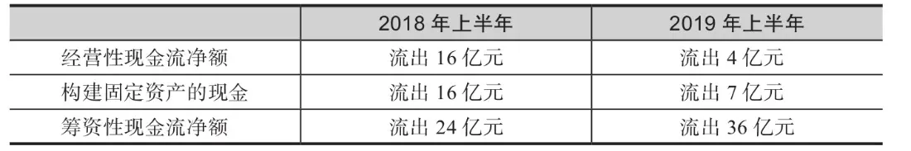

资料来源：海康威视公司公告。

2019年经营性现金的净流出和投资性现金的流出都比2018年少，这是好事。筹资性现金的净流出比2018年多，这同样是好事。

2019年上半年，出于对海外贸易纠纷、国内经济波动的考虑，海康威视严格控制经营性和投资性现金的大幅流出，保证了公司不会因现金流的变化而出问题。这样的做法显然是正确的。

公司2019年的筹资性现金流出比2018年多，是因为偿还了大量的外部借款，同时增加了股利分配。在2019年的市场环境下，缩小负债规模，多分钱给股东（股利支付率接近50%，如图4\-22所示），肯定对普通股股东有利。

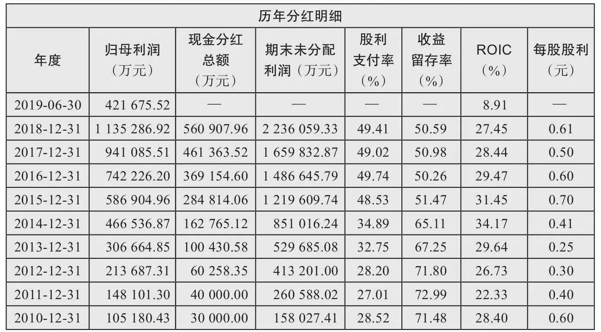

图4\-222010～2019年6月海康威视的分红明细

资料来源：Wind资讯。

分析完海康威视的财务数字，我们还是回到基本面。

海康威视是国内安防行业的龙头公司，产品分成传统业务和创新业务两部分。

传统的安防产品主要用于视频信号的采集和储存，对应的是前端视频设备和后端视频设备。

前端产品是以摄像头为主的各类现场终端设备，用于对视频信号的获取。后端产品是以网络硬盘录像机（NVR）和硬盘录像机（DVR）为主的储存设备，主要用于视频信号的储存、回放和处理。

海康威视传统业务的增速过去两年一直在逐步下滑，究其原因，是因为国内安防系统的渗透率已经比较高了。

从早期的金盾工程、平安城市到天网工程，再到2016年开始的雪亮工程，国内的视频监控已经覆盖到了县、乡和村一级，这有点像过去的“家电下乡”和“汽车下乡”，表明城市的安防市场渗透率已经达到高位，需要刺激农村市场消化库存。

有人持有不同意见，说城市的安防市场有高清化和智能化的替代需求，市场前景很大。

这一点我是同意的。但是，说到底，“从无到有”对整个行业的刺激力度是更大的，“从好到更好”这样的锦上添花不一定是必需的。

比如智能手机，渗透率已经很高了，虽然每年都有不错的旗舰手机推出（如2019年的华为P30 Pro），但如果经济环境不好，大家钱不多的话，换手机的需求就不会那么强烈。

安防行业的传统业务在逐步下滑，更有像华为和阿里巴巴这样的新玩家进入安防市场。

海康威视未来的看点是它的创新业务。从具体产品上看，有基于互联网的消费级民用安防产品萤石智能家居，有和人工智能领域相关的各种工业智能机器人，还有在传统安防基础上增加数据分析和深度学习后的智能安防。这些产品需要加入云计算、协处理芯片和GPU等深度学习芯片技术。

每年海康威视都会大费笔墨地向市场介绍创新业务（2019年也不例外），这些新业务主要围绕视觉技术和智能安防两部分，喜欢海康威视的投资者需要保持长期关注。

为了应对市场的变化，从2018年开始，海康威视对战略性业务进行了重组变革。把过去七个主要行业按照公共服务事业群（PBG）、企事业事业群（EBG）、中小企业事业群（SMBG）做了调整，三大板块的负责人也在2019年发生了变化。详情可以参考海康威视2018年年报中“业务构架变革重组”那一小节（见图4\-23）。

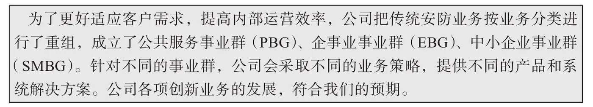

图4\-23 海康威视战略性业务重组

资料来源：海康威视公司公告。

在三大板块里，SMBG能够保持稳定增长，2019年上半年表现不错；PBG比较传统，与过去10年相比，未来10年政府管理的主要职责应该不会发生实质性的变化；EBG是海康威视上下都很看好的，因为EBG会不断推出新东西（比如垃圾分类），所以公司对EBG的空间的预期会更大一些。

现阶段，海康威视的不确定性主要还是来自海外市场。

由于受美国《国防授权法案》的影响，以及对美国商务部实体清单制裁等方面的担忧，海康威视来自美国的营业收入从2018年下半年开始便呈现负增长的态势。不少美国客户选择观望或者选用非中国品牌产品。另外，海外业务过去以分销为主，现在分销市场推动发展的边际作用越来越小。

公司在其他海外中高端市场的拓展，受到一些非市场性的因素干扰。

其他新兴市场，比如土耳其和巴基斯坦等国家，2019年的汇率问题导致本国购买力大幅下降，对海康威视的业务开拓同样有些不利。

当时我对海康威视的看法如下。

2019年上半年海康的利润表现略低于预期，下半年的压力可能会更大一点。

公司当时预告，2019年前三季度净利润增长0～15%，看起来全年实现股权激励的目标20%略有困难。我预测全年增长15%，实现净利润130亿元，当前2475亿的市值，对应的2019年的市盈率是19倍，肯定不算高估，但至少不算低估，喜欢海康威视的长线投资者还需要耐心等待。

从中长期看，我倒是一点不悲观。海康威视的创新能力很强，包括胡总在内的管理层很勤奋且很专业。过去三年，海康威视的员工增加了2万人，研发投入已经提高到了营业收入的10%（2019年上半年的研发费用为25亿元），这在业内是绝无仅有的。在未来的智能化时代和大数据时代，海康威视肯定还会有很大的机会。

2025年5月18日

11:03

## 第4章 公司案例分析 - (22) 4.22 大科技——电子：京东方A

\(22\) 4\.22 大科技——电子：京东方A

4\.22 大科技——电子：京东方A

2019年4月3日，华为P30 Pro发布，超强的拍照功能以及天空之境的后盖配色引起了极大关注。京东方副总裁说：“多好的曲面屏呀。”由此看来，屏幕供货商是京东方没错了。

2019年3月26日，显示器面板龙头京东方A披露了2018年年报。2018年，宏观经济下行，消费电子需求走弱，智能电视和手机等产品出货量增长乏力。

同时，国内面板产线扩张激进，供需失衡，导致各尺寸面板的单价同比下降15%～30%，使得京东方此前两年的增长趋势终止了，遭遇了业绩下滑。

年报显示，2018年公司实现营业收入971亿元，同比微增3\.5%；归母净利润为34亿元，同比下降55%；扣非后的归母净利润为15亿元，同比减少77%。

公司的几大财务指标都不尽如人意，比如反映公司盈利能力的销售净利率只有3%；反映杠杆水平的资产负债率达到60%，创下了过去10年来的新高。

公司的流动比率、速动比率和现金比率都在2018年年底创了新低。

京东方所在的面板行业在2018年遭遇了困境，从根本上来说还是因为过去几年行业扩张太快。

在地方政府财政激励措施的支持下，国内的面板产能从2010年开始，平均每年增长40%。

2010年，中国的产能占全球TFT总产能的4%。但是到了2018年，中国已经成为全世界最大的面板生产基地，市场占有率超过35%。

京东方在这几年不断发力，现已成为全球顶尖的面板出货企业，远超三星、LG、群创和友达这些传统强势企业。

产能的大幅扩张有利有弊。

从好的方面讲，现在京东方的行业地位已远非10年前可比。早些年京东方是价格接受者，好的时候赚点小钱，不好的时候就会巨亏，反映在报表上是过去几年京东方的盈利波动巨大。

未来，相信京东方一定会成为面板价格的制定者，会逐渐掌握行业定价权，利润的波动会比之前小很多。

面板行业是一个需要不断研发新技术，不断投入资本的行业。虽然从发光原理上讲，面板的技术很简单，分成了TFT\-LCD结构和AMOLED两种类型，但是制造工艺流程相当复杂。

我们先简单介绍TFT\-LCD和AMOLED。

TFT\-LCD包括了背光模组和液晶面板两部分。背光模组由反射膜、导光板、光源、下扩散膜、增亮膜和上扩散膜构成。其中，由LED提供的光源是很重要的部分，只要有电，LED能做到24小时不间断发光。

液晶面板，简单来说是两层玻璃基板夹着液晶和TFT。TFT是一个三极管结构，通过控制电压和电流的值，引导液晶的流转，从而引导光线的呈现。

TFT\-LCD主要用于大尺寸的显示器、笔记本和平板电脑上。小尺寸面板原来是TFF\-LCD结构，现在逐步发展为自发光的AMOLED。

AMOLED用的是有机发光材料，不需要光源和背光模组，偏光片和玻璃基板同时会少一片，所以AMOLED的面板更薄、更轻，成本会更低。

面板制造以工艺流程复杂著称。一个完整的显示面板制造项目通常包含阵列（array）、彩膜（CF）和成盒（cell）工序。阵列和彩膜是前道工序，灌注液晶的成盒工序是中道工序。

在这两道工序完成之后，尚未切割的显示面板就销售给专业模组厂，然后由面板厂自行切割后制造模组出售。这涉及模组工序，或称后道工序。前、中道工序在所有工序中难度是比较大的且比较复杂。

看不懂以上复杂的技术不要紧，我们能在京东方的2018年年报里能找到以下几个亮点。

公司讲到全球首条TFT\-LCD最高世代生产线——合肥10\.5代生产线在2018年3月实现量产，产能和良品率稳步提升。

绵阳第6代柔性AMOLED生产线提前3个月完成主体结构封顶，预计2019年可如期量产出货。

武汉10\.5代TFT\-LCD生产线于2018年11月完成主体结构封顶。昆明Micro\-OLED生产线于2018年9月完成主体结构封顶。

另外，公司提到会在2019年加快柔性升级，扩大产品应用；推进“8425”行动计划（“8425”即推广8K、普及4K、替代2K、用好5G），构建共赢产业生态。

当时我对京东方的看法是：如果面板价格还是持续下跌，那么公司的经营情况仍然不乐观。

过去，京东方一直是在行业下行周期保持激进的扩张，历史上这样的做法保证了在行业回暖的时候公司享受了很大的业绩弹性，但是这次能不能同样好运，我不太确定。

至于市场很看好的小尺寸柔性OLED面板，我觉得其出货量有限。除了面板以外，很多组件还要优化，同时软件的发展仍然慢于硬件的发展，所以这可能提升估值，但是实现不了实际业绩。

2025年5月18日

11:03

## 第4章 公司案例分析 - (23) 4.23 大科技——传媒：乐视网

\(23\) 4\.23 大科技——传媒：乐视网

4\.23 大科技——传媒：乐视网

2018年1月30日，一则乐视网全年亏损116亿元的公告震惊了整个陆家嘴金融圈。大家都知道乐视网全年会亏损，因为2017年前三季度报的数字已经是亏损16\.5亿元，但没想到竟然亏损了116亿元。

我从资产负债表的角度简单解读这件事，乐视网亏损了116元，意味着：

（1）亏光了过去所有的利润。乐视网是在2010年7月上市的，2010～2016年合计盈利21亿元（当然从现金流的角度看，乐视网的盈利质量很差）。这一亏损后，过去所有的盈利灰飞烟灭。

（2）亏光了所有的股权融资。乐视网IPO融资7\.3亿元，2014年股权融资12亿元，2016年股权再融资48亿元，合计67\.3亿元。这一亏损后，所有外部股东贡献的真金白银都不复存在。

（3）亏光了未来几年的利润（未分配利润）。未来几年即使乐视网有盈利，但资产负债表上的未分配利润（预计2017年年底是\-89亿元）要花N年才能变为正数，预计在正常情况下，至少要10年时间。

在乐视网公布亏损了116亿元后，我从投资和研究的角度指出三个需要注意的地方。

（1）资产负债表大幅变动。按照我的预测，到2017年年底，总资产在240亿元左右，总负债在180亿元左右，权益在60亿元左右。资产负债率又蹿升至75%左右，达到比较可怕的高位，而且这次计提的亏损都是在资产端，负债端的压力始终会伴随着乐视网。

（2）对应的估值水平在120亿～150亿元。因为巨幅亏损已经没有办法用市盈率估值了，按照60亿元的权益，给予2～2\.5倍的市净率估值，对应的市值在120亿～150亿元，股价在3～4元/股。之前重仓乐视网的基金公司已经把乐视网的估值调整到3元/股，估计是基于这样的判断。上述股价仅是理论数据，不代表操作建议。

（3）后续大概率能看到A股东质押爆仓，B股东开始扫货，持股比例上升至控股股东的地位。改旗易帜后，B资产注入，股价和市值上升。当然，如果B厚道一点，暗地借钱给A，让A避免爆仓是能实现的，但是这种可能性一般不会有。

乐视网的经验教训如下。

（1）非流动资产大幅增加的公司，会在某个时间点一次性巨额计提减值，造成严重亏损。过去的钢铁、煤炭、造船、太阳能和LED，如今的乐视网，都是需要在以后的投资中引起注意的。

（2）实际控制人越高调，投资者越要保持谨慎。

（3）少看利润表，多看资产负债表和现金流量表。当然，如果相信自己不会接最后一棒，相信不会被长期停牌，那么就可以尝试放肆地玩一把。再次重申，资产负债表是具有领先作用的报表，资产负债表状况恶化，投资者就要大概率远离这个公司了。

后来，乐视网在2018年“五一”长假前的一个工作日公布了一季报。2018年第一季度，公司的营业收入只有4亿元，同比下降89%，净利润是亏损3亿元，同比下跌346%，业绩一塌糊涂。

这是乐视网连续四个季度亏损，而且更糟糕的是，公司已经资不抵债。2018年第一季度末，公司的总资产是174亿元，总负债高达186亿元，负债比资产多了12亿元。乐视网当时账面上都是不能收回的应收款和巨额的无形资产，即使把公司账面上的资产都卖掉变现，也不够偿还所有债权人的欠款。

“五一”节前一个交易日乐视网收盘价为4\.59元/股。虽然上涨了4%，但是比2月8日的收盘价还是少了10%。2月8日乐视网的收盘价为5\.08元/股，当天成交了41亿元的天量，中邮基金、大成基金和易方达基金慌不择路地“割肉”卖出。

我读了乐视网的2018年一季报，发现乐视网的问题还在继续恶化。乐视网的一季报提到，“自2016年以来，公司通过向贾跃亭先生控制的关联方销售货物、提供服务等经营性业务及代垫费用等资金往来的方式，形成了大量关联应收和预付款项。截至2018年3月31日，上述关联方对上市公司的关联欠款余额达到73亿元”。

这段话的意思是，乐视网现在还有73亿元的应收账款，而且这些应收账款都是贾跃亭的关联公司应支付的，收回的难度很大。

一季报还提到，“2014年12月和2015年2月，贾跃芳女士与上市公司分别签署《借款合同》，累计承诺借款不低于16\.78亿元；2015年6月和11月，贾跃亭先生与上市公司分别签署《借款合同》，累计承诺借款不少于57亿余元。截至目前，贾跃亭先生对公司借款余额为0元；贾跃芳女士对公司借款余额为11\.0095万元”。

这段话的意思是，贾跃亭和贾跃芳当年为了减持股票，承诺给上市公司大笔无息借款。现在股票已经卖掉了，但是钱不能借给上市公司。

一季报中还提到，“目前投资项目分别出现了账面亏损、项目停摆等问题，基金存在亏损的风险。乐视网承担连带担保责任，若基金整体出现严重亏损，公司将可能因承担连带担保责任而面临利润和现金流的大幅损失”。

这段话的意思是，乐视网的并购基金投资的项目很有可能亏损，乐视网有连带担保责任。贾跃亭已经一走了之，但是乐视网走不掉，要承担相应的赔偿责任。

大家都知道，乐视网的问题很大，但是都没有想到乐视网的问题会这么大。怪不得融创中国CEO的孙宏斌一甩手扔掉了乐视网董事长的职位。

当时我说，如果有人还持有乐视网的股票，建议把孙宏斌的讲话再拿出来读一读。孙宏斌当时为乐视网指出了三条明路。

一是破产重组。这需要监管机构多方支持，而且周期长。即便重组，也需要不少于100亿元的资金，在目前的环境下，任何资金都进不来。

二是卖资产还债。虽然公司经营已经十分困难，但仍能维持当期利润，短期内勉强维持上市地位。

三是退市。

无论选择哪条路，在现状下都不容易。当时乐视网已然陷入进退维谷的尴尬局面之中。我告诫投资者一句话，不要再碰乐视网了，君子不立于危墙！

2025年5月18日

11:03

## 第4章 公司案例分析 - (24) 4.24 大科技——传媒：分众传媒

\(24\) 4\.24 大科技——传媒：分众传媒

4\.24 大科技——传媒：分众传媒

每天我们都会听到关于这个市场的各种各样的正面和负面的消息。如果以日为单位，我们发现股价会受这些消息的影响，上蹿下跳。但是，如果拉长时间，以月或年为单位，股价终究还是反映了公司的基本面。

我尊重在市场里赚钱的每一种方法，看图能赚钱，听消息也能赚钱。对于投资者来说，方法本身并不重要，找到适合自己的方法，并且坚持下去即可。

我更看重行业和公司的基本面，包括产业的前瞻性分析、竞争态势、财务报表、公司治理和估值等内容。研究要有深度和广度，深度是广度的基础，广度是深度的保障。另外，在研究时要多听正反两方面的意见，取长补短。

比如，2019年6月，我讨论过分众传媒，这是一家很有争议的公司，看好的人很看好，不看好的同样大有人在。

分众传媒的历史很简单。公司成立于2003年，2005年在美国纳斯达克上市，2013年从美国退市，并于2015年年底成功借壳七喜控股回归A股，自此成为中国传媒第一股。

分众传媒的经营模式是租赁物业楼宇广告位和影院映前的广告位，发布广告主的广告。楼宇媒体是分众传媒的核心业务，同时贡献了很多利润。

楼宇媒体有三种形式：在电梯里放置打印的海报（框架1\.0）、用液晶显示器播放静止的广告（框架2\.0）和电视插播广告。海报没有什么需要多说的；静止的广告是每15秒或30秒切换一次，一个框架可接6个广告；电视是最有效率的，每轮可接60个15秒的广告。

2018年，分众传媒的营业收入增长21%至146亿元，但归母净利润只有58亿元，同比下降3%。2019年第一季度，分众传媒的业绩很不好，营业收入同比下降12%，净利润同比下降72%。

营业收入下降之后，分众传媒在财务上的问题开始显现出来。

首先，现金收入比在2012～2018年第一次低于100%（见图4\-24）。

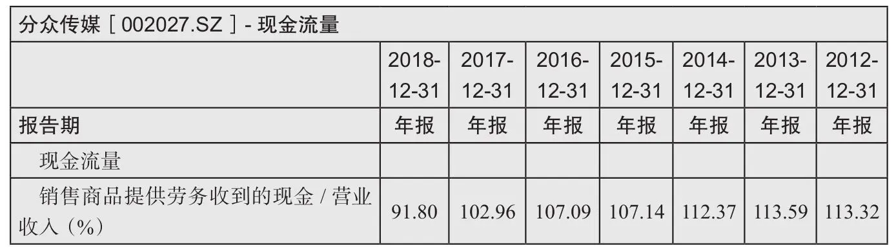

图4\-242012～2018年分众传媒的现金收入比

资料来源：Wind资讯。

其次，分众传媒的毛利率大幅下滑，2017年，2018年及2019年第一季度，分众传媒的毛利率分别为73%、66%和37%，呈断崖式下跌。

最后，资产负债表上的资产越来越重。固定资产从2017年年底的3\.5亿元增加到了2018年年底的18亿元，同比增加超过400%，应收账款从30亿元增加到了48亿元，同比增加60%。

分众传媒在年报里是这样解释的，第一，2018年下半年，随着宏观经济的疲软，广告行业需求景气度不佳，影响了公司营业收入和利润的增长。

我们和中金公司一起去分众传媒做了现场调研。分众传媒表示，目前广告主的整体需求仍然平淡，2018年下半年的投放趋势有赖于宏观经济形势的变化。

第二，分众传媒客户结构中互联网公司和数字化公司占比较高。2018年以来，一级市场遇到寒冬，市场环境艰难，创投类企业受到较大冲击。同时，部分传统行业客户，如汽车行业、房地产行业的广告主，受宏观经济的影响，自身遭遇销售下滑的经营困境，因此减少了在品牌推广和广告投放上的预算。

第三，行业竞争加剧。近两年来，以新潮传媒为代表的新公司杀入电梯广告领域，并获多方资本青睐，甚至以广告补贴的形式争抢分众传媒的亿元客户。

看好分众传媒的朋友说，分众传媒已经占据了足够多的优势楼宇点位，形成了强大的品牌推广力，既有规模效应，又是行业龙头，应该享受行业发展的大部分红利。

不看好分众传媒的朋友说，分众传媒的商业模式很容易被复制，现在有新潮传媒，后面可能还有更多类似新潮传媒的公司出现，只要投资方愿意投钱，分众传媒的垄断优势就很容易被打破。

另外，分众传媒的框架和电视屏是买的，没有什么技术含量；广告位是租的，楼宇物业管委会是甲方，分众传媒是乙方；发布的广告是广告主的，广告主是甲方，分众传媒又是乙方。总是做乙方的哪有很宽的“护城河”？

我是这样看的：

从量的角度说，分众传媒2018年上半年增加了60万台硬件，下半年增加了40万台，新增的硬件主要是以电视媒体为主。电视媒体的成本高于框架媒体，而且为了招揽客户，电视媒体初期往往需要赠送给客户一定的时长，这会造成分众传媒的资产越来越重，而且阻碍短期业绩的释放。

从价的角度看，伴随着硬件的铺设和竞争的加剧，单台设备的创收明显走低，2018年上半年同比下降7%，下半年同比下降17%。随着宏观经济的低迷，广告需求的下滑程度超出预期，不排除2019年价格同比继续下降。

所以，当时我的感觉是：短期来看，分众传媒的收入已经基本不太可能再大幅增长，成本和费用却是硬性的，毛利率和净利率会下跌，而且看不到拐点。

2025年5月18日

11:03

## 第4章 公司案例分析 - (25) 4.25 大科技——计算机：恒生电子

\(25\) 4\.25 大科技——计算机：恒生电子

4\.25 大科技——计算机：恒生电子

虽然这些年阿里巴巴在国内外投资了不少公司，但是马云作为实际控制人的公司只有恒生电子这一家。

2014年，浙江融信以现金收购的方式受让恒生集团100%的股份，马云成为恒生电子的实际控制人。

2019年4月，恒生电子发布公告，控股股东恒生集团的股权结构发生变化。股权变更前，蚂蚁金服通过浙江融信间接持有恒生集团；股权变更之后，蚂蚁金服将直接持有恒生集团100%的股权。

从间接持股变成了直接持股，投资层级减少了，说明恒生集团（恒生电子）在阿里金融体系内的地位得到了提升。

恒生电子1995年成立于浙江杭州，2003年在上海证券交易所上市。恒生电子是国内领先的金融软件和网络服务供应商，主要为国内的金融机构提供软件产品、软件服务以及金融数据业务。公司的客户群包括券商、期货公司、公募基金、信托公司、保险公司、银行、证券交易所和私募基金等。

恒生电子在A股有很多光环。恒生电子的利润率超级高（见图4\-25）。

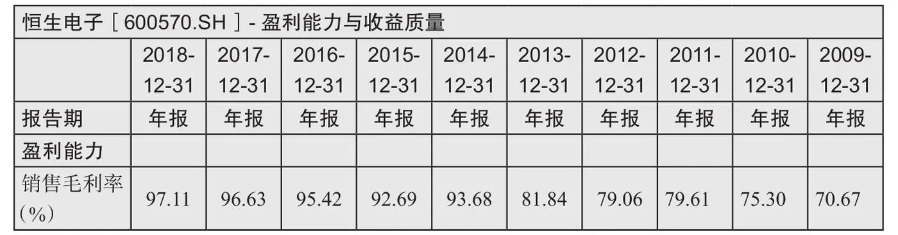

图4\-252009～2018年恒生电子的销售毛利率

资料来源：Wind资讯。

恒生电子的毛利率比我之前介绍过的贵州茅台和恒瑞医药都要高。以恒生电子公布的2018年年报为例，公司实现营业收入33亿元，同比增长22%；实现归母净利润6\.5亿元，同比增长37%。毛利率高达惊人的97\.11%，部分业务的毛利率甚至接近100%。

有朋友看得很仔细，说2013年之前恒生电子的毛利率只有70%～80%，为什么从2014年开始提高到90%以上？

这是个很好的问题。因为从2014年开始，恒生电子在会计上做了一个小调整，公司说软件的购置费和通信专线等成本很难具体按比例分配到项目的营业成本里，所以都计入了公司的销售费用和管理费用。

当然，即使不这样处理，恒生电子的毛利率水平也会在80%以上，竞争力超强。

恒生电子所在的金融IT行业是金融业和软件业的交叉点。

金融行业是一个强周期和严监管的行业。2018年资本市场低迷，国家又出台了资管新规，包括银行、证券、基金、信托、期货、保险资管机构、金融资产投资公司等金融机构都受到了很大的影响。

软件行业，虽然市场空间很大，但是属于劳动密集型行业，而且作为乙方，话语权很低，赚的都是辛苦钱。

我参加过恒生电子的股东会，很多公司高管和我是认识多年的老朋友了。2019年的股东会和以往几次都大不一样，当时资本市场对恒生电子的关注度极高，现场来了200多个股东。

恒生电子的董事长在股东会上介绍，2018年很困难，公司的营业收入和净利润能够取得两位数的增长，非常不容易。2019年可能会更加困难，比如公司的营业收入目标是只增长10%到35亿元左右，费用目标是10%，所以股东对利润的预期不要太高。

2019年，恒生电子的营业收入目标只是增长10%，是这些年来比较低的，为此公司这样解释：

第一，资本市场的活跃程度与公司的业绩紧密相关，2019年市场到底怎样，现在还看不清楚。

第二，甲方对金融科技技术的需求已经进入新的阶段。恒生想做的是线上业务（online），这是未来的战略重点，但甲方能否接受存在一定的不确定性。

第三，一些甲方，比如华泰和平安等头部的金融机构，对金融科技的重视程度很高。这些恒生电子原有的客户，未来一定会做到自主可控，甚至会推出自己的AI产品，满足它们各自客户不同应用场景的需求，这显然会对恒生电子的发展造成影响。

不过恒生电子表示，过去十几年公司经历了太多变化，但依然在金融IT行业保持了领头羊的地位。未来公司仍然会迎难而上，克服困难，为股东创造良好的回报。

我对恒生电子有以下几个想法。

第一，金融都是和钱打交道，不能出错。所以，下游客户在做选择时，倾向于使用大公司的产品，而且一旦使用了就很难替换。

所以，恒生电子的第一个“护城河”是，现在公司的市场占有率已经很高了，产品的黏性超级大，客户的替换成本很高。

第二，恒生电子的产品线很丰富。这些产品都已经形成闭环，排斥了其他公司的产品。

第三，恒生电子的创新能力很强。未来中国资本市场肯定是越来越开放，包括像科创板、沪伦通以及其他所有新的工具，恒生电子都会有很强的竞争力。

2025年5月18日

11:03

## 第4章 公司案例分析 - (26) 4.26 大科技——计算机：金山办公

\(26\) 4\.26 大科技——计算机：金山办公

4\.26 大科技——计算机：金山办公

1994年我读高一的时候，家里花6000元给我买了一台386电脑。那时能用的软件不多，学编程时用的是Logo、Basic、Pascal和Foxpro，玩的游戏是《大航海时代2》，看图片用的是ACDSEE，文字处理用的很少，但印象很深，用的是求伯君的WPS。

如今，386早已被淘汰，但WPS还是保持着强大的生命力。2019年11月18日，设计、研发和销售WPS的金山办公在科创板上市。本节就聊聊这家公司。

金山办公的主要产品包括WPS Office桌面版、WPS移动版和金山词霸。其中，WPS分为两类：免费但需要看广告（但几乎不影响使用）的个人版，以及无广告且功能更强大的收费专业版。金山词霸贡献的营业收入只有一点点，几乎可以忽略不计。

WPS现在的竞争对手主要是微软的Office；其他几家，比如谷歌的Google Docs和苹果的i\-Work因为系统的关系，用的人也很多；剩下的比如永中Office、中标普华Office，用的人很少。

看到这里，我想大部分读者和我一样，马上会联想到现在很热的一个概念：自主可控和国产替代。

这些年我们看到，在服务器、芯片、半导体甚至创新药方面，国家都在鼓励自主可控和国产替代。基于此，我想这将是金山办公未来很重要的看点。

金山办公披露，截至2019年3月31日，《财富》杂志公布的“世界500强”中的120家中国企业，金山办公已服务69家。国内96家央企中，公司所服务的客户已达82家。在金融行业，全国五大国有商业银行均为公司客户，在12家全国性股份制商业银行中，公司所服务的客户已达11家，比例达92%。

未来两年，我想国内下游企事业的客户在金山办公客户中的占比会越来越高，这部分的想象空间会很大。

金山办公做的是计算机软件，本书前面和大家分享过计算机行业的几个特点，这里再强调一遍。

计算机行业的第一个特点是，做软件的销售毛利率比做硬件高。比如，做PC和服务器硬件的销售毛利率一般只有20%左右，而做基础软件和套装软件的销售毛利率可达60%以上。金山办公的销售毛利率有多少呢？请看图4\-26的最后一行。

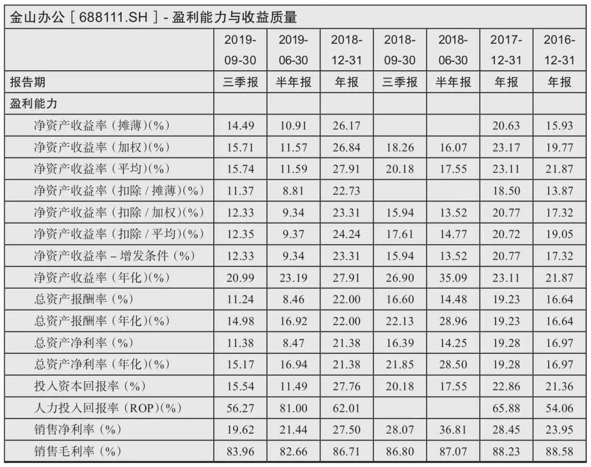

图4\-262016～2019年三季度金山办公的销售毛利率

资料来源：Wind资讯。

你看，超过了80%。

做软件的销售毛利率更高其实很容易理解。卖软件本质上卖的是程序员的知识。一套软件做出来以后，卖10套和卖1套是没有区别的。卖得越多，利润越丰厚。

计算机行业的第二个特点是行业成本（即工资）是影响利润的主要因素。计算机类的公司对人的依赖程度很高。金山办公的人员费用，主要在2019年三季报的三个地方体现出来，即销售费用、管理费用、研发费用，合计5亿元，占总收入超过40%，是最大的成本开支。

计算机行业的第三个特点是，计算机公司多为轻资产属性，这从金山办公的资产负债表可看出来。比如，公司2019年第三季度的总资产是20亿元，其中流动资产18亿元，非流动资产2亿元。流动资产里大部分是由现金和交易性金融资产构成，说明公司比较安全。

在非流动资产里，公司的固定资产很少，只有5000万元，对应的固定资产周转率（营业收入和固定资产的比例）超过20倍。这说明它的资产很轻，投入产出比很高。

负债方面，公司没有一分钱的借款，5\.5亿元的总负债主要由预收账款（约3\.2亿元）组成，而且预收账款的趋势是一直在良性增加（见图4\-27）。

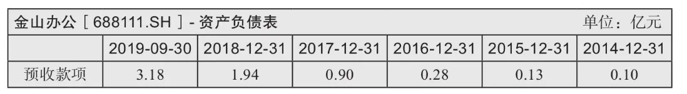

图4\-272014～2019年三季度金山办公预收款项

资料来源：Wind资讯。

预收账款反映了在价值链上公司对下游客户比较强势。关注茅台、五粮液股票的人一定不陌生这个会计科目。在我看来，只要这个科目的金额能持续稳定增长，公司的发展大概率会是安全的。

既然讲到了资产负债表，我们顺便再简单聊聊利润表和现金流量表。

近三年，金山办公的营业收入和净利润保持稳步向上的态势。2018年，公司实现营业总收入11\.3亿元，同比增长50%；实现归母净利润3\.1亿元，同比增长45%。

看到这么快的营业收入增速和较高的净利率，我们马上想到的是公司能不能真的有那么多的现金收入。这个时候，可观察“现金收入比”这个指标。

金山办公做得不错，2016～2019年三季度公司的现金收入比都超过了100%，说明它的收入含金量很高（见图4\-28）。

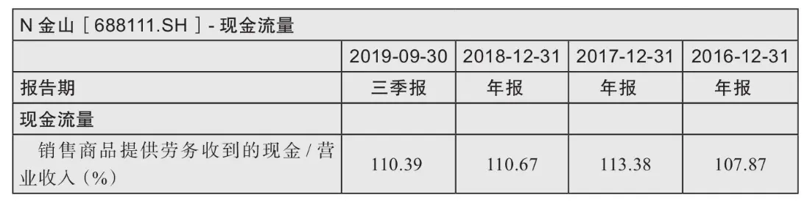

图4\-282016～2019年三季度金山办公的现金收入比

资料来源：Wind资讯。

然后是净资产收益率这个指标（见图4\-29）。

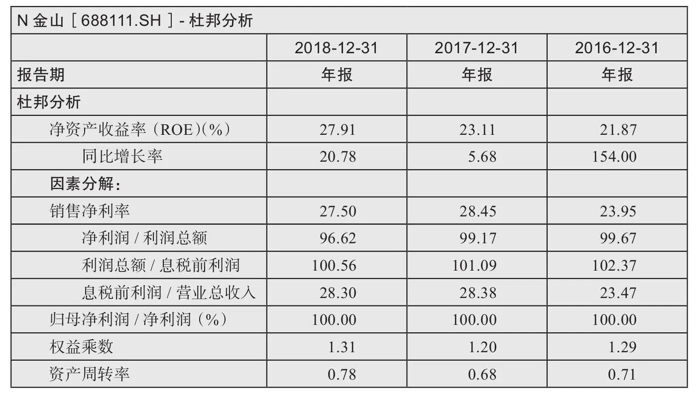

图4\-292016～2018年金山办公的杜邦分析

资料来源：Wind资讯。

2016～2018年，金山办公的净资产收益率保持在20%以上。它有很高的净利率和资产周转率，同时权益乘数很低，净利率略高于净资产收益率，这些特点都是价值投资者比较喜欢的。

怎么做金山办公的估值呢？

当时我把几乎能找到的券商研究报告都看遍了。有的研究员很乐观，看到了千亿元的市值体量。我觉得金山办公是蛮好的，成长性突出，下游是to C（消费者），又是云服务和自主可控。但是，能给到多少市值，我真的不好说。

我能想到的一个比较乐观的估值方法是市销率（PS）的估值。假设未来两年的收入增速分别是40%、50%和60%，以2018年为基础，到2021年收入大概是30亿～46亿元，PS的估值倍数是5～10倍，所以未来的市值是155亿～463亿元；折现率用的是15%～20%，折两年得到的结果是2019年合理市值在200亿～350亿元。

2025年5月18日

11:03

## 第4章 公司案例分析 - (27) 4.27 大周期——汽车：长安汽车

\(27\) 4\.27 大周期——汽车：长安汽车

4\.27 大周期——汽车：长安汽车

2018年，中国汽车产业经历了连续增长28年后的首次下降，这个前所未有的变化几乎影响了所有车企。

2019年5月，乘用车的各大龙头企业陆续披露了4月的产销快报，数据依然不好。比如，上汽集团1～4月累计销售199万辆，同比负增长17%；长安汽车更惨，1～4月累计销售57万辆，同比下滑33%。

这和我们平时调研得到的结果是一致的。整车销售疲弱，一部分原因是2018年第一季度基数很高，但更主要的原因是各大车企都在去库存。

当时有声音说，2019年的车市会前低后高。我没有那么乐观，国内外的不确定因素还有很多，车市到底会怎么样，没有人能说得清楚。

龙头车企本书中已经分析过不少，这里聊聊长安汽车。

先看看2013～2018年长安汽车和上汽集团的净利润（见表4\-13）。

表4\-132013～2018年长安汽车、上汽集团的净利润（单位：亿元）

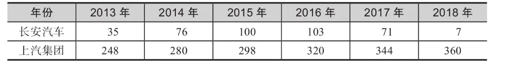

资料来源：长安汽车、上汽集团公司公告。

长安汽车净利润的波动幅度是巨大的。比如，2016年长安汽车的净利润超过100亿元，但是2018年净利润只有7亿元。上汽集团的净利润则是平稳增长，从2016年的250亿元增长到2018年的360亿元。

长安汽车的资产分成两部分：自主品牌和合资企业。长安汽车的自主品牌包括长安汽车、欧尚汽车和凯程汽车等多个独立品牌。自主品牌经营了很多年，但是很可惜，到现在依然没有盈利。

国内大型车企的主要盈利来自合资车企，业内俗称“两条腿走路”。长安汽车也不例外。但这两年，长安汽车很重要的一条“大腿”——长安福特出现了一些问题。

由于对中国市场快速变化的节奏准备不足，长安福特在长达5年的时间里没有对爆款车型进行改款升级，这造成了其销量断崖式下跌。曾经在国内市场拥有一席之地的长安福特陷入困境。

2016年长安福特的销量为96万辆，距“百万销量”目标仅一步之遥。然而，进入2017年，长安福特的销量降至83万辆，同比下滑13%；2018年销量进一步下滑至38万辆，同比下降54%；2019年依然没有回暖迹象，2019年一季度长安福特的销量仅为3\.7万辆，同比下滑高达72%。

长安福特曾经是长安汽车利润的最大贡献者。2016年长安福特贡献收益90亿元，占长安汽车净利润的87%。但是截至2019年5月，长安福特已经成为拖累长安汽车业绩的大负担：2018年长安福特亏损8亿元，平均每卖一辆车亏损2100元。当时我估计2019年可能都很难有所改观。

长安汽车2018年年报第四节“经营情况讨论与分析”的第一点（第一点往往是下一年工作的重点）中提到了“第三次创业全面启动，战略执行强力推进”。

第三次创业是相对于第一次和第二次创业而言的。20世纪80年代，长安汽车为响应国家“军转民”战略开启了第一次创业；2006年，长安汽车为了进军乘用车市场开启了第二次创业；2018年4月23日，长安汽车董事长在北京宣布了第三次创业。

和前两次创业相比，第三次创业的环境更加艰难。外部，中美关系有很大的不确定性，内部，经济格局已经发生了很大改变，新能源汽车崛起、消费升级、品牌向上，长安汽车面临的挑战还是很大的。

研究和投资车企时，核心能力是要预测新车型的推出计划及受欢迎程度，因为整车企业的营业收入和利润的增长，主要是依靠新爆款车型的出现。未来长安汽车及其合资公司能否及时推出新车型，新车型是否讨到消费者的欢心，是需要好好去观察的。

在这节中，我向大家介绍三个现象，分别是：

（1）中国的整车销售自2018年第二季度开始出现了同比下滑，到2019年5月仍没有恢复，未来会怎么样，需要密切跟踪车企的销售数据。

（2）因为长安福特的关系，长安汽车净利润波动比较大，2019年第一季度长安汽车的净利润仍然为负。

（3）长安汽车提出第三次创业，前两次创业（本质上是转型）做得挺成功。这次会怎么样，现在还不知道，但可预计难度会更大。

另外我再介绍两个经验：

首先，“经营情况讨论和分析”的第一部分（或者是第一点）往往是上市公司下一年工作的重点，在做研究的时候要重视这些内容。

其次，整车企业营业收入和净利润的增长一般依赖于新车型的推出。所以，在做研究和投资时，要重点判断整车企业的产品规划以及新产品的受欢迎程度。

我认为，如果想做长安汽车的长期股东，长安汽车B股显然是更好的选择。在2019年5月，长安汽车B股的价格远低于A股，用B股的价格折算的人民币市值，得到的静态市净率只有0\.35倍。

2025年5月18日

11:03

## 第4章 公司案例分析 - (28) 4.28 大周期——汽车：福耀玻璃

\(28\) 4\.28 大周期——汽车：福耀玻璃

4\.28 大周期——汽车：福耀玻璃

我很喜欢福耀玻璃，A股、H股都喜欢，持续跟踪福耀玻璃的发展超过10年。

2019年3月21日，A股的福耀玻璃公布了2018年的年报。数据显示，2018年公司的营业总收入同比增长8%，首次超过200亿元。同时，公司净利润实现了高速增长，同比增长31%，达到41\.2亿元。福耀玻璃宣布，每10股派发股利7\.5元。

我知道，在2018年整个行业不景气的背景下，福耀玻璃能交出这样一份答卷已经实属不易。但是，我当时仍客观点评了福耀玻璃的业绩。虽然福耀玻璃的盈利增长了31%，但是质量并不太高。

分析任何一家公司之前，有必要先了解其所处行业的状况。福耀玻璃生产的是汽车玻璃，包括给整车厂提供新车玻璃的代工生产（original equipment manufacture，OEM）业务，以及给售后供应商提供汽车玻璃的ARG[\1]业务。

2018年，全世界经济动荡，主要经济体复苏乏力，大多数国家出现了经济增速回落，国内宏观经济下行压力也影响明显。

据中国汽车工业协会统计，2018年汽车产销同比下降4\.2%和3%。这两个数字触目惊心，因为这是28年来中国汽车行业首次出现负增长。

整个汽车行业不景气，福耀玻璃的情况自然不乐观。

首先从营业总收入这个数字来说，虽然福耀玻璃全年的营业收入是增长的，但是增速逐季回落，尤其是在2018年的第四季度，公司的营业收入同比增长\-4%，这是多年未见的。

如果一家公司的营业收入增速没有了，那么净利润的增速大概率很快也要没有了。这句话放在福耀玻璃上一样成立。

2018年第四季度，福耀玻璃单季度的净利润同比增长\-15%，净利润的下滑速度比营业收入的下滑速度更快。

除了营业收入和净利润负增长之外，我认为福耀玻璃的非经常性利润太多了，这不是件好事。比如，2018年公司收获了“外汇红包”，实现汇兑收益2\.59亿元，而2017年公司是汇兑损失。另外，2018年公司通过出售北京福通75%的股权确认投资收益6\.6亿元，还通过出售一宗国有土地使用权及一座工业厂房、附属设施等资产，以及出售福州浮法全部股权等，实现了投资收益。如果把这些因素扣除，公司的利润总额同比仅增长0\.3%，几乎没有增长。

看福耀玻璃经营得好不好，还要进一步分析公司的资产负债表。资产负债表是一张具有领先作用的报表，比利润表和现金流量表更早地反映出公司基本面的变化。

按照我的经验，在经济好的年份，福耀玻璃会扩张自己的资产负债表，即增加自己的资产和负债规模，公司的资产负债率会逐步提高。但是，在经济不好的年份，福耀玻璃会主动收缩自己的资产负债表，公司的资产负债率会下降。

2018年年底，福耀玻璃的总资产是345亿元，比上个季度364亿元少了近20亿元。同时，公司的资产负债率降到41%，是过去四个季度中最低的。

这说明福耀玻璃在主动瘦身和去杠杆，反映了公司面临较大的行业压力。

从股价表现上看，不少蓝筹公司的股价已经超过了2018年9月底的高点，但是福耀玻璃的股价没有创新高。通过北上资金的动向能看到机构投资者对福耀玻璃的态度，如图4\-30所示。

图4\-30是2018年12月中旬至2019年3月北上资金的持股图。我们看到，北上资金一直在减持福耀玻璃的股票。

大家不要小看这近2%。北上资金的买入和卖出会持续很长一段时间，所以我判断，在行业基本面转好以前，北上资金大概率还是会继续卖出福耀玻璃的股票。

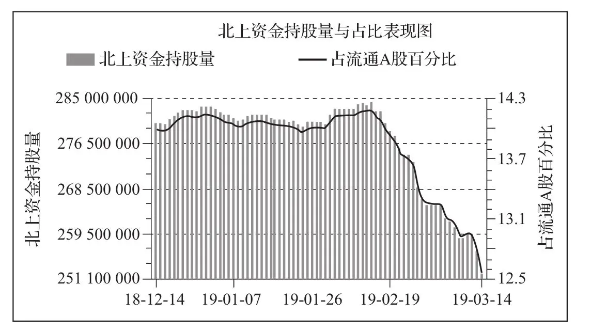

图4\-302018年12月～2019年3月福耀玻璃的北上资金持股情况

资料来源：Wind资讯。

总结来说，福耀玻璃已经是汽车行业里比较优秀的上市公司了，所以，如果福耀玻璃的基本面发生变化，那么其他零部件和整车企业的日子恐怕更不好过。大家在投资和研究时不妨以这个作为参照标准。

我写过很多次，外资看好中国的核心资产，都是买入之后持有很久的。很多公司是要走长牛、慢牛的，选到几家好公司，可以慢慢实现财富增长。

我认同外资的做法，只有基本面驱动的价值投资，才是可持续、可复制的盈利模式。有志在股市中搏杀的朋友，应该在行情来到之前做好准备。

至于如何选到好公司，我喜欢看财务数据。做对的事情，找好的公司，买股票就是买公司，一定要关注公司长远的未来，这是对结果必然如此和高概率胜出的追求。

同时，好公司要加上好价格，如何买到好价格，我认为是看估值。巴菲特说股市是一个钟摆，迟早会回归均值。从悲观者手里买股票，卖给乐观者。贱取如珠玉，贵出如粪土。

[\1] 指的是供应给售后服务商以用来替换的玻璃产品。

2025年5月18日

11:03

## 第4章 公司案例分析 - (29) 4.29 大周期——建材：海螺水泥

\(29\) 4\.29 大周期——建材：海螺水泥

4\.29 大周期——建材：海螺水泥

要把投资做好，要么是找到好的公司，然后和它一起成长，要么耐心等待便宜的估值下手。不过说句心里话，这两点都不容易做到。

有时候我们知道公司不错，但是一直算不清，或者等不到合适的估值。更多的时候，我们遇到的困境是，虽然等到估值下来了，但我们又对公司的基本面失去了信心。

估值的问题，相对来说并不难，只要掌握了入门的几种方法，总能算出一个大概。当然，这里会有算得准不准的问题。我的经验是估值不需要很准确，大概知道一个范围就足够了。

要解决基本面的问题，需要多做比较研究，多跑行业里的龙头公司，听听它们的想法。有时候跑一家公司比读100份研究报告还管用。

我经常会去龙头公司做调研，因为龙头公司有行业代表性。比如，想知道今年水泥行业的情况怎么样，我想到的第一家公司是海螺水泥。2019年5月，海螺水泥召开了2018年的股东大会。这里向大家分享一些我当时获得的第一手的信息和资料。

水泥大家都很熟悉，它是国民经济建设中不可或缺的建筑材料。一般认为水泥起源于古罗马，我国是从清朝开始引进国外的水泥技术。200多年下来，中国的水泥行业已经发展成世界水泥行业的老大，截至2019年，中国的水泥产能接近全球的75%。

这里给大家几个当时的行业数据。从供给端分析，2018年全国水泥熟料产能最大的五家企业分别是中国建材集团、安徽海螺水泥、唐山冀东水泥（含金隅）、华润水泥控股和华新水泥（含双马）。前十大水泥企业的熟料集中度是57%，市场占有率是45%。

从需求的角度看，2000～2014年，水泥的需求保持年均10%以上的增速，需求的峰值是2014年的24\.8亿吨。这几年，水泥的需求开始慢慢下降，预计未来几年将保持在22亿～23亿吨。

任何一个行业的成长模式都能分成以下五种类型：投资驱动型、成本驱动型、工艺驱动型、技术驱动型和应用创新驱动型。

资本市场给投资驱动型的行业和公司的估值是很低的，因为这种成长模式比较简单，基本上只要有钱就能做。大部分周期性行业都属于投资驱动型，比如钢铁、水泥和多晶硅等。

成本驱动型的成长模式解决了产品能不能做得更便宜，换句话说是，通过低成本、低售价获得竞争优势。市场给这类行业和公司的估值比投资驱动型稍微高一点。

不过，过去20年，水泥行业没有大牛股是因为企业总是降价和打价格战。产品价格能持续上涨是重要且很明显的“护城河”，比如我们介绍过的贵州茅台、海天味业和涪陵榨菜。

工艺驱动型讲的是能否把质量做得更好，技术驱动型讲的是怎么做，应用创新驱动型讲的是做什么，即从无到有的概念。资本市场给应用创新驱动性的行业和公司的估值是很高的。

水泥行业是投资驱动型的行业，国家的基建项目多了，基建项目的资本金要求降低了，肯定对水泥行业是一个重大利好。

除了投资驱动本身，我认为未来水泥行业的发展有三个趋势：

第一是水泥行业的集中度还不高，未来将看到行业里会出现不少并购。比如，2018年有金隅集团和冀东水泥的合并，这样的案例以后还会有很多。

第二是过去两年水泥企业太赚钱了。我相信均值终将回归，未来要维持太高的净利率和净资产收益率会比较难。

第三，在水泥行业里，海螺水泥的经营管理水平业内领先。水泥是同质化比较严重的产品，所以成本控制很重要。海螺水泥的吨毛利是业内第一，吨费用是业内最低。未来，相信海螺水泥还是能保持业内领先的地位。

讲起海螺水泥，一定会提到公司此前的董事长郭文叁。郭董1978年毕业于同济大学建筑材料系，是一位水泥工艺高级工程师，1993年成为海螺水泥前身宁国水泥厂的厂长，并在2015年正式退休。

20世纪90年代，中国的水泥行业处于群雄割据的时代，郭董提出了“跨区域扩张”“内延扩张”和发展“T字型战略”。

跨区域扩张讲的是，宁国水泥厂先后通过沿江、沿海、沿铁路收购，兼并了14个中小型水泥企业。比如，1995年并购了铜陵水泥厂，1997年并购了芜湖市白马山水泥厂，还并购上海奉贤水泥厂、江苏省张家港水泥厂、江苏省南通市水泥厂等。

内延扩张指的是，1995年，郭董主张吸引外资，成立中外合资企业安徽海螺水泥有限公司。同年，日产2000吨的新型干法熟料生产线主体工程破土动工，并在次年点火成功。2004年，海螺水泥的万吨生产线在铜陵海螺点火，成为国内第一条万吨生产线；2005年，铜陵海螺成为我国首个千万吨级熟料生产基地；2011年，芜湖海螺日产12000吨生产线点火投产；2014年，海螺水泥首个国外的项目印度尼西亚南加海螺投产。

“T字型”的横为沿海，竖为长江。T字型战略讲的是，在长江沿岸石灰石资源比较丰富的地区，兴建、扩建熟料生产基地，在沿海无资源但水泥市场发达的地区，低成本收购小水泥厂，并改造成水泥粉磨站，原地生产水泥终端产品。由于邻近长江这一黄金水道，从而具有了低物流成本优势，节省了原料运输至生产地的费用。统计数据显示，这一方式比直接输出水泥产品节约了10%～50%的运输费用。

在这一系列战略指导下，海螺水泥的销售半径和市场份额随着地域扩张而扩大，并形成了区域内的市场壁垒，市场地位得以巩固。

1997年，海螺集团以宁国水泥厂、白马山水泥厂为主体，成立了安徽海螺水泥股份有限公司，并在当年赴港上市，为水泥行业首创。之后，2002年海螺集团又在上海证券交易所上市，成为国内首家A\+H股水泥企业。

在海螺水泥的2018年股东大会上，公司的管理层提出了这样一些新观点，我拿来和大家分享。

首先是关于海螺水泥的成本优势。公司介绍，未来的成本优势还能继续保持，海螺的财务费用为负值。同样市场下，成本低的企业就有价格优势。生产水泥的主要消耗品是电和煤，海螺水泥的管理很严格，否则不会有现在这么高的毛利率。

其次是关于海螺水泥未来三年的发展目标。

（1）海螺水泥做水泥起家，水泥是主业，是核心竞争力，一定会坚守水泥。把水泥产品做好、做优、做强，是海螺水泥的核心。

（2）目前国内市场主要是做进一步资源调配，虽然国内水泥产能过剩，但是各区域市场发展并不平衡，南北东西各个区域都不同，海螺水泥作为龙头企业，一定有优化产业的考虑。

（3）海外扩张是海螺水泥今后几年的重要任务，主要是在一些重点区域及一带一路沿线国家。国内人均水泥产能2吨多，但海外人均水泥产能还比较低，有些地方只有几十公斤。

（4）产业链延伸。近几年骨料价格飞涨，海螺水泥作为大型企业，拥有大量的矿山资源和雄厚的实力，如果想要做优做强，一定要进行产业链的延伸，包括商品混凝土、装配式建筑等，这都是海螺未来发展的方向，但要与政策相结合。

另外，是关于基建需求和地产需求。公司提到，基建和地产的地区差异很大，目前基建的增长势头很明显，尤其是华东地区。2019年1～5月华东地区重点工程大增，长江两岸都有工程，基建工程未来一两年对水泥需求的拉动将会保持平稳上升的趋势。

但是，地产差异很大，从2019年情况来看，一二线平稳，三四线有些差异。华东、华南靠近一二线城市的比较平稳，西部地区的增长比较弱一点，差异比较大。当时海螺水泥所在地区无论是新开工面积、施工面积还是销售面积都是比较好的。

我当时是这样看海螺水泥的。

首先，从财务报告上看，2019年第三季度末，海螺水泥的账上有货币资金近450亿元，有息负债近100亿元（短期借款27亿元、长期借款39亿元、应付债券35亿元），净现金高达350亿元。所以，海螺水泥未来的分红还是有比较大的保证的。

其次，从业务板块上看。自产的熟料和水泥业务是海螺水泥主要的收入和利润的来源，水泥贸易业务盈利贡献比较少，骨料的增长很快。从业绩预测上看，公司未来三年的收入会比较平稳，水泥的量价互相对冲，同时，骨料业务伴随着产能的投放，收入会明显增长。

最后，从周期行业上看，短期要关注供需变化，中期看行业的竞争格局，长期则由人口决定。我想海螺水泥的行业地位、出色的管理和较好的股东回报，是公司比较大的优势。

2025年5月18日

11:03

## 第4章 公司案例分析 - (30) 4.30 大周期——建筑：中国建筑

\(30\) 4\.30 大周期——建筑：中国建筑

4\.30 大周期——建筑：中国建筑

先和大家聊聊建筑行业上市公司的三个特点。

首先，建筑行业是一个超大规模的行业，2018年我国整个建筑行业的总产值超过20万亿元，已经超过当时整个加拿大的GDP。

其次，建筑行业主要是由固定资产投资驱动的。固定资产投资是建筑行业的原动力，固定资产投资和建筑行业的总产值之间有一个明显的线性相关关系。这两年，我国的固定资产投资增速在放缓，所以建筑行业总产值的增速也在慢慢下降。

最后，建筑行业是一个典型的充分竞争的行业。在这个行业里产能一直严重过剩，企业和企业之间的竞争壁垒很低，每个企业都很难在这个行业里获得超额利润。

在建筑行业里，有不少专业化的公司。比如，做铁路工程的只有两家——中国中铁和中国铁建，截至2018年，这两家公司占据了中国铁路和城市轨道建设近95%的市场份额。

又如水利工程建设，中国电建和葛洲坝这两家公司占据了中国水利工程近80%的市场份额。

中国建筑是建筑行业的龙头企业，从业务上讲，它包括了建筑业务和地产业务两块。

建筑是中国建筑的主业，又细分成房建、基建和勘察设计。公司介绍，在房建业务里，住宅占比近60%，非住宅占比近40%。2018年第四季度开始房建业务的毛利率比较高，所以当时我们预计其2019年第四季度房建的毛利率会有承压，长期看应该保持5%～6%的利润率水平。

相比于建筑业务的薄利，公司另外一块业务，房地产还是不错的。当时我预计它2019年全年的房地产业务的销售同比增长30%左右，营业收入增长15%～20%，利润增长10%～15%。

从财务报告上看，我觉得中国建筑有两个地方值得关注。

首先是分红率。国资委给央企制定的标准是，垄断性行业按15%分红，竞争性行业按5%分红。现在社保基金买了这些企业的股份，要求这些企业有更高的分红比例，这样传到上市公司层面，2019年的分红率可能会在2018年的基础上进一步提高。

其次是公司的资产减值，如图4\-31所示。

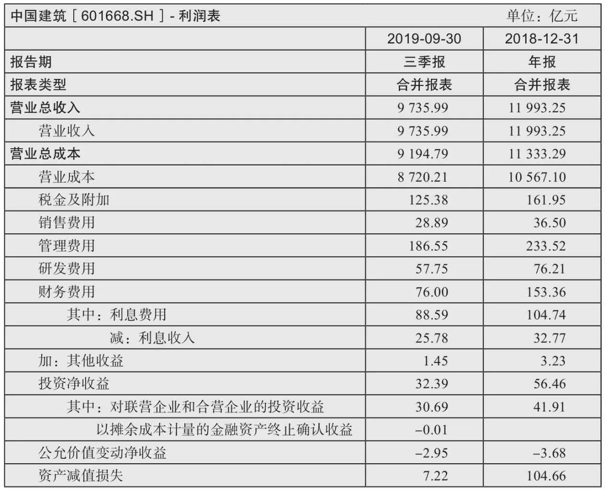

图4\-312018～2019年第三季度中国建筑的利润表

资料来源：Wind资讯。

2018年，中国建筑计提了104\.66亿元的资产减值，但我们知道，建筑行业的收入端和减值端有很多调节的空间。

建筑行业的上市公司一般用完工百分比法确认收入，即完成多少工作量，确认多少营业收入。

比如，有一栋楼一共30层，今年建了15层。那请问，按照完工百分比法，今年应该确认多少营业收入呢？

有很多朋友会说：15/30=50%。

有的建筑公司会说，地上有30层，地下有好多层，已经建好了，所以要确认80%的营业收入；还有的建筑公司会说，之前的15层建造比较容易，后面的15层建造会比较难，所以只能确认20%的营业收入。这三个数字都没问题。

所以，你瞧，建筑公司的收入确认真的有不少调节空间。

从费用的角度看，建筑公司通常会计提两项减值：应收账款的坏账和存货的跌价。恰恰在九大减值里，只有这两个减值允许转回。所以，有的建筑公司会说，今年某个海外项目钱收不回来了，所以要计提大笔的应收款减值。但明年会告诉你，钱又收回来了，所以减值要转回。

因此，建筑公司对于费用端的处理比较灵活。中国建筑2018年计提的100多亿元的资产减值，说不定哪天突然又会释放回来。

回到中国建筑本身，我是这样看的。

首先，中国建筑的业绩相对平稳，公司收入和利润的增速保持稳定。

其次，我们国家的基建政策更加侧重于“稳”，而不是“拉”。虽然投资总量增速下降是必然趋势，但是依然有增长空间。

最后，从行业层面看，龙头公司的集中度还会进一步提升，行业发展质量会改善，龙头股具备投资价值。

2025年5月18日

11:03

## 第4章 公司案例分析 - (31) 4.31 大周期——机械：中国中车

\(31\) 4\.31 大周期——机械：中国中车

4\.31 大周期——机械：中国中车

自2018年4月10日起，全国铁路开始实施新的列车运行图，复兴号可通达23个主要城市。自从有了复兴号，我去北京基本不坐飞机了。

复兴号哪里都好，我觉得唯有一点不好：字体不好！“复兴号”三个字用的是方正魏碑简体，实在太简陋了，和工业设计感满满的车体十分不般配。开个玩笑，我们还是讲讲制造高铁的公司吧。

中国中车是在2015年由中国北车股份有限公司（简称“北车”）和中国南车股份有限公司（简称“南车”）合并组建的A\+H上市公司。目前，中国中车是全球规模第一、品种丰富、技术领先的轨道交通装备供应商。

中国中车是铁路设备行业市值最大的公司，是行业的龙头企业，上市后市值在2800亿元左右。铁路设备行业里市值最小的公司是祥和实业，祥和实业是浙江的民企，2017年9月上市，到2018年4月市值只有27亿元，比较袖珍。

当年合并的时候上演了一场场悲喜剧。从有合并传闻开始，南车和北车股票疯涨，投资者获利颇丰，导致一些人孤注一掷地看好停牌复出之后的中国中车，结果一败涂地。

从2015年4月合并至2018年，中国中车的股价一直处于绵绵下跌趋势之中。究其原因，我从基本面的角度分析，中国中车过去三年的业绩实在差强人意。它呈现出以下三个特点：

第一，营业收入连续三年不断下降。从2015年的2400亿元下降到了2017年的2100亿元，降幅达12%。

第二，净利润三年连续下降。从2015年的118亿元下降到了2017年的108亿元。

第三，员工总人数连续三年下降。从2015年的18\.6万人下降到了2017年的17\.6万人，两年减少了1万人。

回头看，2015年合并的时候，反而是公司业绩最好的时候，合并之后开始走下坡路。

这个合并让我想到了钢铁行业发生的一桩合并，有点小担心。宝钢和武钢合并之后，磨合好内部管理并产生协同效应的时间，可能会比市场预计的要更长一些。

虽然中国中车的产品在国际上的竞争力很强，但是其走出去的战略进行得并不是那么顺利，因为日本新干线宁愿赔本也要横插一脚。

当时，形势尚不明朗的中美贸易争端也给公司海外收入的增长蒙上阴影。虽然中国中车董事长在博鳌论坛上表示，中美贸易争端对中国中车美国业务的影响不大，但是我认为，对于出口业务的变化，在当时没有办法做出准确的预估，只能走一步看一步。

2018年3月29日中国中车公布年报之后，我注意到，所有的卖方分析师都下调了中国中车2018年的业绩预测。当时保守的分析师给出，2018年每股收益是0\.39元。考虑到券商分析师的业绩下调总是扭扭捏捏，我觉得业绩还会有进一步下调的空间。

那中国中车的机会到底在哪里？

因为中国中车是订单驱动型企业，所以，首先要分析中国铁路总公司在2018年和2019年的招标情况。如果招标数量比之前有明显上升，那么中国中车作为龙头企业，一定能享受更多的行业红利。

当时有分析认为，2018年铁路竣工总里程是4600公里，2019年会达到7100公里。如果这样的预测能够实现，那么将对中国中车构成重大利好，因为铁路竣工后马上会产生对机车和动车的需求。

中国中车虽然是毋庸置疑的行业龙头，又受到复兴号扩容的题材带动，2018年时我认为喜欢炒题材的朋友或许能多看看，但是依然觉得不是投资的好时机。

2025年5月18日

11:03

## 第4章 公司案例分析 - (32) 4.32 大周期——交通运输：京沪高铁

\(32\) 4\.32 大周期——交通运输：京沪高铁

4\.32 大周期——交通运输：京沪高铁

我每次出差，总会在酒店、会场和机场（高铁站）这三个地方多活动。

现在往返北京，我更多选择搭乘高铁。2020年1月3日，京沪高铁公布了IPO招股说明书。当时在火车上，我把这份招股说明书简单地看了看，现在和大家分享一下。

首先，我们看京沪高铁、上海机场、宁沪高速这三家龙头公司的净资产收益率（见图4\-32）。

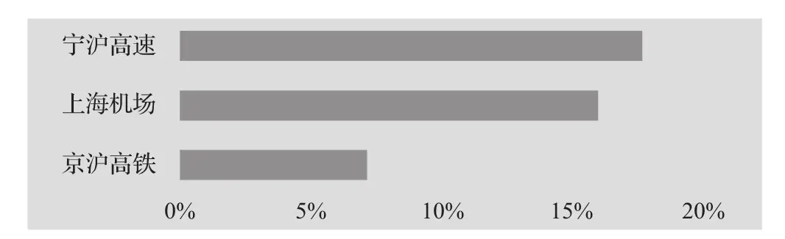

图4\-322018年宁沪高速、上海机场、京沪高铁的净资产收益率

资料来源：Wind资讯。

宁沪高速和上海机场都是很优秀的公司，净资产收益率都超过了15%。京沪高铁比较低，只有7%。

净资产收益率是由净利率、周转率和杠杆率三部分构成的，所以我们再进一步看看细分的结构（见表4\-14）。

表4\-142018年宁沪高速、上海机场、京沪高铁的净资产收益率拆分

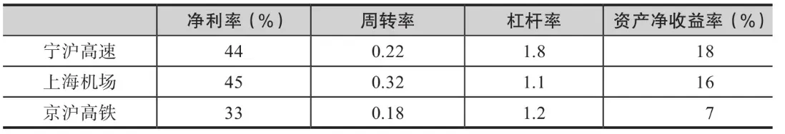

资料来源：Wind资讯。

这三家公司有一个共同的特点，销售净利率远高于自身的净资产收益率。白酒行业的龙头企业（茅台、五粮液）也有这样的特点。

拆分以后看到，上海机场无疑是三家公司里的“尖子生”，净利率和周转率都是第一，杠杆率则是垫底。在交通运输行业里，净利率反映的是话语权和综合管理能力，周转率体现的是投资效率（机场、高速公路和高铁都是需要大量投资的），杠杆率反映的是经营风险。

相比上海机场，我们的主角京沪高铁是低净资产收益率、低周转和高杠杆率的组合，所以未来还有很大的改善和提升空间。

京沪高铁2011年6月建成通车，全长1318公里，纵贯北京、天津和上海三大直辖市和四省，连接“京津冀”和“长三角”两大经济区，沿线是我国经济发展活跃和极具潜力的地区。

截至2019年9月末，京沪高铁全线累计发送旅客近11亿人次，旅客人数年均增长20%，客座率常年维持在80%，是中国客座率最高的高铁线路。

客座率越高，高铁线越赚钱。

根据招股书披露的信息，2018年京沪高铁的净利润超过100亿元，在中国铁路总公司旗下18个铁路局以及包括铁路文工团在内一级控股子公司里，京沪高铁的盈利居前。哈尔滨分局、沈阳分局和成都分局都是亏损大户，净利润都是负的100多亿元，和京沪高铁形成鲜明的对比。

京沪高铁公司是京沪高速铁路及沿线车站的投资、建设、运营主体，收入包括三部分：旅客运输收入、提供路网服务收入和其他。

2018年，京沪高铁全年的营业收入是300亿元出头，其中旅客运输收入占了50%，达到150亿元，那么剩下的150亿元从哪里来的呢？

和上海机场、宁沪高速一样，京沪高铁有一个稳赚的本领，即收取“过路费”。只要有列车在京沪高铁上通行，都要收取“线路使用服务费”。

按照公布的线路使用服务费标准，北京南\-天津南区段为特一类繁忙第一档，单组动车组（8节车厢）为101\.7元/列车公里，重联动车组（16节车厢）为152\.7元/列车公里。两地距离120公里，那么一列8节车厢的列车需要交约1\.2万元，一列16节车厢的列车需要交约1\.8万元。

除了过路费之外，京沪高铁还会收取接触网使用服务费、车站旅客服务费、售票服务费、车站上水服务费。车站旅客服务费是这样收取的，如果买一张从北京到上海的二等座票，票价是553元，那么就有5\.53元进了京沪高铁的口袋。

上面提到的线路使用服务费和其他各种费用，京沪高铁将其称为“提供路网服务”。2018年提供路网服务的收入达到151亿元，2019年前三季度提供路网服务的收入达到127亿元，比旅客运输收入还多7亿元。

除了收入以外，利润表上能看到的显著特点是它没有销售费用，只有少量的研发和管理费用。公司大头费用是利息费用，2018年利息支出12\.6亿元，主要是因为建设高铁线路时，向银行借的长期贷款。不过因为京沪高铁不差钱，每年都在巨额还款，使得利息费用逐年降低（2016年为19亿元，2017年为14亿元，2018年为12亿元）。我当时预测，它2019年的利息费用只有10亿元左右。

所以，京沪高铁是一家既不需要营销，又不需要研发，员工又少的公司。截至2019年9月30日，公司员工共有67人，其中25人还是借调过来的。公司靠着一条铁路线，每年轻松赚取百亿元的利润。

研究交通运输行业，很重要的是看公司的资产在哪里，资产的位置决定了公司的盈利能力。

比如，大家熟悉的上海机场、宁沪高速和大秦铁路，都是占据了很好的地理位置，所以天生盈利能力就极强。

京沪高铁的位置是独一无二的，纵贯北京、天津和上海三大直辖市和四省，连接“京津冀”和“长三角”两大经济区，这是我们国家经济发展具有很大潜力的地区。

京沪高铁是2011年6月建成通车的，全长1318公里。在开通之时，市场并不看好它的盈利能力，倒不是因为位置差，而是在当时，京沪高铁有着超过2000亿元的造价，成本很高昂。

但没有想到的是，长三角和京津冀的经济发展很快，老百姓的出行需求极大。所以，京沪高铁通车三年后便开始盈利了。不仅回本的时间短，京沪高铁前五项成本还均与开行列车车次数量相关，与客运量无关。折旧上，由于铁路资产的特点，折旧年限长、折旧率低。所以，随着未来升级车型和加开车次，公司的利润弹性会比较大。

基于以上分析，我当时判断2019年，京沪高铁的盈利会达到120亿元左右，在交通运输行业里遥遥领先。

我相信，在未来很长一段时间里，京沪高铁的净利润和市值都会在交通运输行业排名第一位。

顺便再对比一下高铁和飞机。

目前，高铁在150～800公里范围内占据主导地位，在这个距离区间，高铁已经从公路和普通铁路的市场中抢占了大部分市场份额。

高铁甚至在1000公里（3～4小时）范围内与飞机产生了显著竞争，高铁站靠近市区、时间可靠等都成为极强的竞争要素。比如，北京到南京的高铁有些只需3\.2小时，飞机大概需要2小时；南京机场距离市中心有47公里，高铁车站距离市中心只有16公里；再加上坐飞机都要提前到机场，还有延误的可能性，所以高铁相较于飞机具有很强的竞争力。

研究交通运输行业的公司，第二个需要关注的是公司的成长性来自哪里。

上市公司的成长性，不外乎内生性增长和外延性并购增长。但是，交通运输行业的公司有些特殊，外延性增长会比较少，而且公司质地越好，并购越难。

像大秦铁路，它的位置好、利润高，国内找不到和它盈利能力一样，甚至盈利能达到它三分之二的铁路公司。上海机场是同样的道理。

对于这些龙头公司而言，其外延性扩张和收购能力是很差的，并不是它没有钱，而是真的没有好的资产可收购。

京沪高铁也是一样。公司大股东是中国铁投，中国铁投是中国铁路总公司的控股子公司，专门管理铁路资产。在其所管理的铁路里，东北、西南的高速铁路都是巨亏的，而且短期看不到盈利好转的迹象，找不到能和京沪高铁比肩的公司去并购。

京沪高铁IPO的募投项目是京福高铁。京福高铁一共有四条线，两条已经通车，两条还在建设。通车的两条线，每年亏损12亿元，剩下的两条线建成之后，并表会产生大量的折旧费用和利息费用。

所以，对于京沪高铁的这个募投项目，大家可以想象成一块瘦肉搭了一块肥肉，一起卖给市场。

2019年年底，我们和京沪高铁的高管做了交流，京沪高铁的领导说京福高铁安徽公司2020年亏损还会扩大，2021年争取亏损下降，到2022年有望盈利。至于能不能盈利，还要看到时的客流变化情况，至少我没有那么乐观。

既然外延性并购很困难，那公司未来的成长性只能靠内生性增长。对于京沪高铁来说，主要看三个方面。

首先，京沪高铁开行的列车密度很难再提升了。中国的铁路是永远把安全放在第一位的。现在，京沪高铁开行的列车平均间隔是五分钟，离三分钟的极限看起来还有提升的空间。但是，因为要考虑到追尾时间，以及列车发车、到达和运营等时间间隔，我相信中国铁路总公司不会做得更激进了。所以，从产能利用率的角度看，京沪高铁已经快接近顶峰了。

其次，京沪高铁的客座率还能再增加一点，但估计不多了。现在，京沪高铁的客座率是70%多，本线的客座率更高一点，大概是80%左右，基本处于饱和状态。大家应该有感觉，从上海去北京，行程需4小时40分钟的复兴号，如果不提前一两天预订，基本上是订不到的。一般在周五和周一的时候，只有6小时的高铁车次可能还会有一些富余票。

京沪高铁的路网效应是很大的看点。

最后，在产能利用率和客座率达到上限以后，京沪高铁今后内生性增长主要来自协同效应。京沪高铁的收入分为本线和跨线两部分。本线比较容易理解，跨线指的是武汉的客人到天津，可能只坐京沪高铁的一段，但是需要支付路网的服务费。

现在国内的高铁已经完成了四纵四横和八纵八横，今后，高铁的的网络化效应会越来越明显，未来几年大概高铁还有10%的年复合增长空间。

除了路网效应之外，我认为京沪高铁还有以下几个看点。

首先是对其他公司的挤占效应。

交通运输是个小行业，机构投资者（主要是保险公司）不可能买太多。所以，一旦买了京沪高铁，一般要卖出一些其他交通运输公司的股票。

我知道不少机构原来持有上海机场和宁沪高速的股票，然后会稍微卖出一点原有的持仓，增加一点京沪高铁的配置。

其次是京沪高铁的票价。

在投资行业有三句重要的话：to C（消费者）的公司看价；to B（公司）的公司看量；to G（政府）的公司不要碰。

To C的公司直接面对消费者，要看价格。在消费品行业，产品价格越高的公司，往往“护城河”越深。比如白酒里的茅台，电动汽车里的特斯拉，消费电子里的苹果。

To B的公司面对企业，所以要看量。对于大部分的周期性和成长性公司，主要看产品能不能放量、市场占有率有没有提升。比如，2019年涨得很好的TWS耳机和5G，2020年年初到现在涨得很好的半导体、芯片和新能源汽车产业链，倒不是说它们的技术有多先进，产品有好，而是有自主可控和国产替代的因素在里面，从量的角度看，未来的市场空间很大。

你可能会疑惑，TWS耳机不是消费者去买的吗？这里简单解释下，现在A股的公司有很多是上游供应商，比如立讯和歌尔，它们的客户是苹果和华为，所以都属于to B的公司。

To C看价，to B看量。所以从长期成长性来看，to C的公司一般会比to B的公司好。受货币政策的影响，通货膨胀是大势所趋。所以，哪怕没有产品的升级换代，飞天茅台的价格能从200元慢慢地涨到2000元，伊利和蒙牛的牛奶能从10元涨到80元。换句话说，在通货膨胀背景下，价格的上涨是没有上限的。

相反，to B的公司，因为看量，总有到头的那一天。比如，5G的宏基站大概有500万个，建完就完了。所以，to B的公司我不喜欢长期持有，它的周期性会比较强一点。

有的人很喜欢A股中to B的公司。因为在炒股价的时候，只要看到放量，甚至看到预期放量就行，至于赚钱能力的持久性，或者净资产收益率的高低，资产负债表是不是干净，估值是不是高了，关注的人会少一点。

股价上涨之后，总有人会大声说好，于是有人按捺不住冲进去，相信自己不是接最后一棒的人。所以，80倍市盈率的股票价格一直在上涨，8倍市盈率的股票价格却还在继续下跌。这没有什么好坏，市场本来就是这样，人性没有变过，关键要找到适合自己的方法。

To G的公司是和政府打交道，建议要谨慎。和政府部门做生意，企业的利润表会比较漂亮，但是资产负债表和现金流量表一般会很差，比如2018年的东方雨虹，所以还是小心一点为好。

京沪高铁是面向普通老百姓的，典型的to C的公司，所以价格很重要。从2011年建成至今，京沪高铁的票价几乎没有怎么上涨过。未来会不会上浮票价，我觉得是有想象空间的。哪怕搞一个浮动票价，都会让股价拉几个涨停。

但是，所有交通运输行业的公司，本质上是国家的重大基础设施，服务于民生。票价提高牵涉的面很大，而且很敏感，比如2020年年初ETC的收费机制变动就引起了大家的不满。

未来，相信票价会有涨有降，但何时推出还有很大的不确定性。

最后是京沪高铁的分红。

在招股说明书里，京沪高铁的分红方案是50%。我们和该公司交流时，公司领导表示三年后会重新拟定分红率，不排除进一步上升。

我相信，未来京沪高铁的分红率会上升到60%，甚至70%。因为京沪高铁真的是现金牛，现在的负债率只有15%。正常情况下，2020年京沪高铁能把所有的贷款还清，又没有其他资产值得收购，所以公司回馈股东的办法只有加大分红力度。

我觉得，五年之内，京沪高铁肯定还会增长，所以还能给它15～20倍的市盈率估值。只是往后京沪高铁的增速会越来越慢，估值肯定会越来越低。最后没有办法用市盈率去估值了，只能用股利折现的方法，而分红率会成为越来越重要的指标。

在交通运输行业，6%的股利回报率是一个很重要的数字。很多保险公司很喜欢交通运输行业的龙头企业，因为这些公司盈利稳定，而且分红高。

保险的资金成本是4%左右，所以，如果交通运输行业的龙头公司股价下跌，股利回报率上涨到6%，应该会有很多保险公司出手买入。

2025年5月18日

11:03

## 第4章 公司案例分析 - (33) 4.33 大周期——交通运输：中国航空

\(33\) 4\.33 大周期——交通运输：中国航空

4\.33 大周期——交通运输：中国航空

在我看来，职业投资是一场可持续一辈子的长期修行，投资者每过几个月就经历一次小劫，每过几年就经历一次大劫，像2017～2019年这样资本市场内外动荡的年份，投资者历劫的频次更是大幅增多。

成功渡劫的概率与过往的成功无关，甚至是负相关，因为过往越成功，越不容易果断认错。

人性的疯狂，在市场上经常会有极致的演绎，远超天才能够想象的水平。

每次面对极端的行情走势，我都会静下心来反思和检讨我现有的股票仓位和结构，然后仔细审视组合里的那些公司的基本面。

言归正传，我们来讨论基本面。航空业三大航中的“老大哥”中国国航2019年3月28日公布了2018年的年度报告。公司2018年实现营业收入1368亿元，同比增长13%；归母净利润为74亿元，同比增长1%。

虽然中国国航的净利润增速只有很可怜的1%，但是已经比行业里的老二和老三好很多——2018年南航和东航的业绩都是同比负增长超过50%。

2018年航空公司遭遇了历史上罕见的“油汇双杀”，它们最怕的两件事情——油价上涨和人民币贬值，在2018年同时发生。

燃油成本是航空公司的重头成本项，约占航空公司成本的30%～40%。2018年油价一度从60美元/桶涨至80美元/桶，导致2018年中国国航的航空油料成本从284亿元增加到了384亿元，足足增加了100亿元。

另外，由于航空公司向波音和空客等飞机制造商采购飞机，天然会形成美元负债的敞口，所以汇率涨跌一定会影响航空公司的财务费用（汇兑损益）。

2018年，因为美元升值、人民币贬值的影响，中国国航的汇兑净损失达到24亿元，而2017年它的汇兑收益有29亿元，这样一进一出减少利润约50亿元。

航空业属于周期性和消费性行业，与宏观经济周期密切相关。目前，中国经济进入高质量的发展阶段，受人均收入保持增长、消费升级、中等收入群体兴起、经济增长转型、产业结构升级和推行城镇化等因素的影响，目前中国航空业仍处在成长期。

中国的航空业已经形成了以中国国航、南航和东航三大航空公司为主导，多家航空公司并存的竞争格局。

三大国有控股的航空集团公司占据了国内航空客运和货运市场较大的份额，其他区域性航空公司和特色航空公司在各自的细分市场领域具有较强的竞争优势。

中国国航作为市场当中的大哥，有不少看点。比如，截至2019年，它是中国唯一一家能印着中国国旗飞行的民用航空公司，还是中国民航唯一一家进入“世界品牌500强”的航空企业。

又如，中国国航已经确立了以北京为主基地，形成了以北京、成都、上海和深圳为一级节点的四角菱形网络结构。

从偿债能力来看，近几年来中国国航的资产负债率在逐年下降，2018年报数据显示，资产负债率下降到59%，远远低于南航与东航。它的负债比重开始减少，财务风险变小。

在同行业中，中国国航的长期偿债能力较强。在合理运用财务杠杆的同时，它还在逐渐保障财务结构的稳健：流动比率为0\.33，较同期上升了0\.04，高于南航与东航。

中国国航获多家国内银行提供的银行授信额度，有约1100亿元尚未使用，能够充分满足流动资金和未来资本支出承诺的需求。

2019年航空股的一大看点是，从7月1日起民航发展基金减半征收。这项政策对所有航空公司的成本端形成直接利好。

还是以国航为例。2018年国航上交的民航发展基金约为25亿元，扣除税收、少数股东权益等因素的影响，预计减半征收后，折算下来可以公司2019年净利润增加9亿～10亿元，净利润对应增厚9%，增厚还是很明显的。

2025年5月18日

11:03

## 第4章 公司案例分析 - (34) 4.34 大周期——交通运输：招商轮船

\(34\) 4\.34 大周期——交通运输：招商轮船

4\.34 大周期——交通运输：招商轮船

每年年底我都会参加不少券商的年度策略会，在会场上，我感受比较深的是市场对于TMT行业的热爱，只要是与科技（电子、通信、半导体、AR/VR）相关的，不管是大会还是小会，几乎场场爆满。

我不否认大科技股是这个时代的投资主流，但周期股在某个阶段的表现同样可圈可点。

我先以猪周期为例说说周期股，猪周期主要看三点。

第一是猪周期的时间。一轮完整的猪周期是五年，前两年上涨，后三年下跌。上涨的时候股价一般涨4～5倍，但下跌的时候会跌去80%～90%。

第二是猪的供给和需求。研究猪周期，不要看需求，要看供给。猪的供给有两个特点：首先，供给收缩很容易（农民把猪杀了，或者猪瘟来了，猪死了）；其次，猪的供给扩张很难（猪要养大了才能卖出）。这和其他周期股都不同，像钢铁、水泥供给收缩很难，扩张比较容易。

第三是猪周期的三个阶段：预期价格上涨、实际价格上涨和业绩兑现。底部的时候，养猪的公司基本都是亏损的，所以只能看“市猪率”；顶部的时候，养猪的公司赚得盆满钵满，看到个位数的市盈率时要当心。

回头看股价表现的话，2019年养猪的公司，像温氏、牧原，股价表现都还不错。我想，2020年航运业的某些龙头公司或许有机会复制2019年的猪股的走势。

研究周期股需要看三个方面，首先看历史，其次看供给和需求，最后看龙头公司的表态。

首先看历史。

全球的航运业已经有超过300年的历史。按照过往的周期波动，能很清楚地划分成复苏、繁荣、衰退和萧条四个阶段。第二次世界大战之后到现在，每10年左右航运业都呈现出一个显著的特点，20世纪60年代是繁荣、70年代是灾难、80年代是萧条、90年代是震荡、21世纪初是神话、2008年后是危机。

2008～2020年年初，整个航运业经历了超过10年的衰退期。从时间上看，当时是底部区域。

底部的时候买股票，好处是价格比较便宜，缺点是不知道什么时候股价才能爆发，但是胜率会比较高。买入股票以后股价或许还会跌10%～20%，可能等1～2年才会上涨，但是上涨的话基本能涨4～5倍，性价比很高。

如果你对航运历史感兴趣，推荐看看英国人马丁·斯托普福德（Martin Stopford）写的《海运经济学》（Maritime Economics）。在这本书中，斯托普福德博士总结了过去300年航运业的周期变化，观点独特，内容有趣。

其次，看供给和需求。

航运可细分为集装箱运输、干散货运输和散装液货运输，这里我们重点讨论液货运输时经常使用的超大型油轮（VLCC）。

从供给的角度看，VLCC的运力交付处在一个相对比较低的位置。2020年交付的船舶，大部分是在2017年和2018年下的订单。2018年是VLCC盈利和运价的底部区域，所以注定了2020年的运力交付增速是很低的。

由于有“限硫令”[\1]的政策，由于2020年老船的拆解或者改装大概率是会比2019年要多很多，这也会让供给陷于比较低的增速。

从VLCC需求方面看，美国开始运油可能是提升需求的一个重要因素。2020年全球经济或许并不会太好，但是美国早在2019年就贯通了其全球原油运输的管道，现在美国既有产能及运能，已经成为全球原油供应量比较大的国家。

从美国运油，不管是运到日本、韩国，还是运到西欧，运输的距离比原来从中东运油更长，所以对于VLCC的需求是一个直接利好。

最后看龙头公司的表态。

我这里截取了招商轮船2019年半年报里的“管理层讨论和分析”（见图4\-33），大家有兴趣的话可以对照一下它之前几年半年报或年报里的内容，不管是从措辞还是语气上，2019年这份报告的内容还是很乐观的。

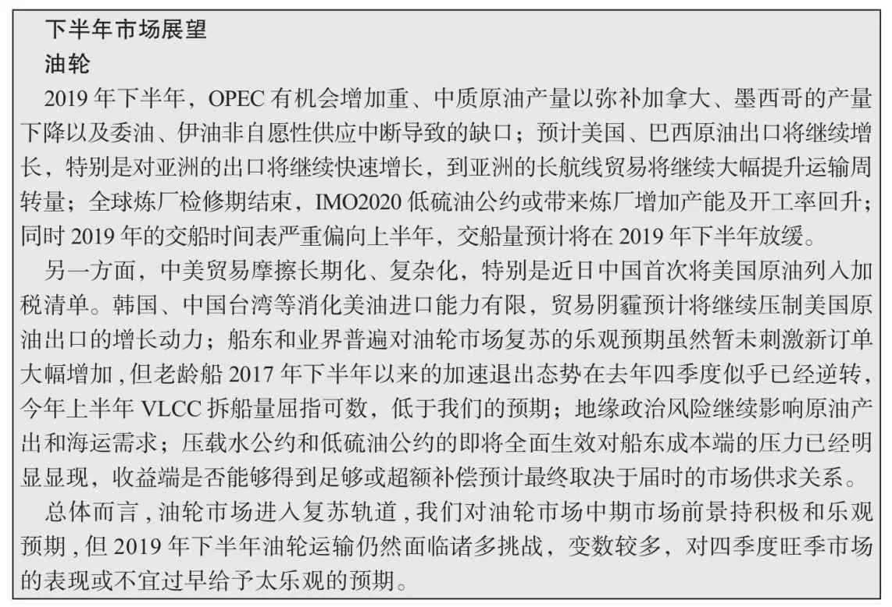

图4\-33 招商轮船2019年下半年市场展望

资料来源：招商轮船公司公告。

[\1] 根据国际海事组织的要求，自2020 年1 月1 日起，全球范围内船舶使用燃油的硫含量不应超过0\.5%m/m（质量百分含量），业内称之为“限硫令”。

2025年5月18日

11:03

## 第4章 公司案例分析 - (35) 4.35 大周期——电新：汇川技术

\(35\) 4\.35 大周期——电新：汇川技术

4\.35 大周期——电新：汇川技术

电新是电力设备与新能源的简称。本节重点谈谈电新行业里的汇川技术。

汇川技术是国内工控行业的领军企业，一直以来都受到机构投资者的高度关注。2019年报公布之后，公司召开了一次全市场的电话沟通会议，报名参加电话会议的机构投资者超过400人。

A股里能有那么高关注度的制造业公司，恐怕只有海康威视和汇川技术了。

2018年汇川技术的业绩并不是很好，公司实现营业收入59亿元，同比增长23%；实现归母净利润12亿元，同比增长10%。净利润增速比收入的增速慢，但还是有两位数的正增长。

2019年第一季度的业绩更加不好，公司已经预告，第一季度公司的营业收入为10亿～11亿元，同比增长5%～15%；归母净利润为1\.2亿～1\.6亿元，同比是下降40%～20%。

净利润下滑的主要原因是，产品价格下降和产品结构的变化导致毛利率同比下降、股权激励费用上升，以及汇率波动造成并购基金投资损失增加等。

按道理，业绩不好，机构投资者应该用脚投票才对，但是情况恰恰相反。请看图4\-34。

图4\-34分两部分，上面是汇川技术的股价K线图，下面的线是北上资金的持股占比。2019年1～4月，外资的持股比例几乎翻了一倍，从5%上升到10%左右，几乎接近了历史高值。

机构投资者，尤其是境外投资者，看好汇川技术主要出于两个原因：首先，公司转型的每一步都踏得很准；其次，公司技术储备做得很充分，后劲很大。

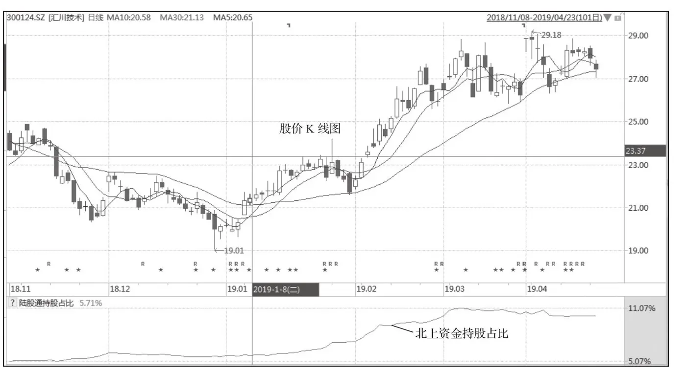

图4\-342018年11月～2019年4月汇川技术股价走势图

资料来源：同花顺。

汇川技术的董事长朱兴明和高管团队是从华为出来的。我之前说过，华为培养出来的富有狼性的团队在A股市场里是能给高估值的。有了这样一批人，汇川技术抓住时机，不断发展。

2003～2012年，是汇川技术的第一个10年，此时正值中国房地产行业的黄金发展期。房地产的高速发展催生了大量的电梯需求，汇川技术研发的电梯驱控一体机占据国内市场1/3的份额，是国内头部的电梯一体机供应商。

另外，国内低压变频器的市场规模从1999年的28亿元增长到2011年的近200亿元，汇川技术从创业之初就一直坚持研发矢量变频器。公司在变频技术上不断突破，迄今累计出货量超过80万台，国内市场份额仅次于ABB和西门子。

从2012年起，汇川技术的转型发展主要依靠伺服产品。“伺服”源于希腊语“奴隶”一词，意思是反复进行人们所期望的运动。伺服产品的基本特点可概括为准确、精确、过载和快速定位，伺服系统的表现由三大件驱动、电机和编码器的性能决定。

作为二次创业的方向，伺服产品是汇川技术上市后增长较快的业务之一，公司上市七年里这项收入翻了三番。

除了内生性发展之外，汇川技术还通过不断的并购进行发展。

游过上海迪士尼乐园的游客或多或少会留意到乐园内各种个性化的配置，迪斯尼乐园的这些操纵盘、显示器、外呼、到站灯和人机界面等都是出自上海贝斯特。

2019年3月，汇川技术发布公告，称拟通过发行股份及支付现金的方式，收购贝思特100%股权。此消息一出，吸睛无数。

回到行业的基本面。2019年3月的制造业PMI达到50%，重回荣枯线之上。其中，高技术制造业和装备制造业的PMI分别是52%和51%，明显高于制造业总体水平。

随着经济的企稳、国内产业结构将持续优化，基建项目建设也会逐渐发力，汇川技术所在的工控行业有望迎来新一轮的复苏。

当时在电话会议里，公司领导给出的2019年经营目标是营业收入同比增长20%～40%，归母净利润同比增长10%～30%。

以2019年年初的经济形势看，我当时认为还是有一定挑战性的。达成目标的关键，是汇川技术的毛利率能控制住，不再下滑。如果能够做到，那么公司还是有机会实现营业收入和净利润的目标的。

2025年5月18日

11:03

## 第4章 公司案例分析 - (36) 4.36 大周期——电新：隆基股份

\(36\) 4\.36 大周期——电新：隆基股份

4\.36 大周期——电新：隆基股份

单晶硅片全球龙头生产制造商隆基股份，2019年8月29日公布了2019年半年度报告。

2019年上半年，公司实现营业收入141亿元，同比增长41%，净利润20亿元，同比增长54%。

从三块业务的利润贡献上看，降基股份上半年硅片对外销售21\.5亿片，均价3\.07元/片，对应60亿元左右收入，按15%的净利率，贡献了9亿元的净利润；组件外销了3\.2GW（吉瓦），对应60亿元收入，贡献净利10亿元；电站业务，结转20亿元，大约贡献了1亿元的利润。

具体看2019年第二季度的话，公司的收入同比增长29%，净利润同比增长83%，主要的原因是第二季度的毛利率大幅上升。

公司在半年报中表示，2019年第三季度的毛利率有望进一步提升到30%以上，硅片生产又将恢复到暴利阶段。

隆基股份所处的光伏（太阳能）行业有三个特点。

光伏行业的第一个特点是受国内政策影响很大。政策变动和行业装机（需求）之间有着密切的关系。

国内光伏的标杆电价是在2013年确定的，当时将全国太阳能资源区分为Ⅰ、Ⅱ、Ⅲ三类，三类地区的标杆上网电价分别为0\.90元/千瓦时、0\.95元/千瓦时、1元/千瓦时。

2016年，国家调整光伏上网电价，宣布从2016年6月30日起，光伏标杆上网电价下调至0\.80、0\.88、0\.98元/kWh。这次政策的变动造成光伏行业首次“630抢装”，2016年实现全年新增光伏装机容量为34\.54GW，同比增长132%。

2017年6月30日后，国家再次调整光伏政策，宣布光伏标杆上网电价下调至0\.65、0\.75、0\.85元/kWh。光伏行业经历第二次“630抢装”，2017年实现全年新增光伏装机容量53GW，同比增长54%。

2018年国内新增光伏装机44GW，同比下降17%。虽然是受到整体融资环境偏紧的影响，但更主要的原因是行业政策发生了变化。

2018年，国家发改委、财政部和能源局联合下发了《关于2018年光伏发电有关事项的通知》（简称“530新政”），加剧了光伏行业的市场化竞争。国内需求和光伏产品的价格快速下跌，由此影响了国内的光伏新增装机量。

除了光伏电站之外，分布式光伏的发展同样受到政策的影响。

2013年之前，分布式光伏的发展主要是以“金太阳示范工程”为主。2013年，《国务院关于促进光伏产业健康发展的若干意见》确定按照电量补贴的方式促进分布式光伏的发展。

2014年下半年，国家能源局正式下发《关于进一步落实分布式光伏发电有关政策的通知》，分布式光伏开发模式中“自发自用、余电上网”允许变更为“全额上网”模式。

2016年年底，国家能源局印发《太阳能发电发展“十三五”规划》，指出到2020年年底，太阳能发电装机达到1\.1亿千瓦以上，其中分布式光伏6000万千瓦以上，分布式光伏持续得到政策的大力推进。

2017年推动的“隔墙售电”政策则是分布式光伏的另一个起点，确立了分布式光伏走向市场化交易的发展路线，不再单纯依靠补贴，未来可参与市场化电力交易，发挥分布式光伏的就近消纳。

这些政策的变化对于分布式光伏的发展有着深刻影响。所以，研究光伏行业，首先要吃透行业政策。

光伏行业第二个特点是产业链很长，不同子行业差异很大。

光伏行业上游的硅料是大化工行业。硅料的投产周期一般需要一年半左右，时间较长，造成硅料的价格弹性很大。在2017年第三季度，光伏行业需求旺盛，但是多家硅料企业宣布检修，供需失衡和扩产周期较长造成了价格的快速上涨。

中游的电池和组件是典型的制造业，产能过剩，经常会出现供需失衡的状态。

另外，不同子行业的竞争格局差异较大。

有的子行业竞争格局比较好，比如单晶硅片和EVA胶膜，现在都有绝对的龙头公司。单晶硅片的龙头企业是我们介绍的隆基股份，而EVA胶膜领域，目前国内主要三家厂商分别是福斯特、东方日升（斯威克）和海优新材，三者占据了国内EVA胶膜市场80%以上的份额。福斯特拥有的市场份额最大，占比近50%。和胶膜一样的辅材行业里，比如背板子行业，则竞争激烈，行业参与厂商众多，几乎是一个完全竞争的市场。

光伏行业第三个特点是技术一直在进步，从而整体的系统成本也在持续降低。

降本增效一直是光伏行业的重要内容，硅料是降本空间较大的子行业。除了规模的持续扩张，硅料提取与生产的技术成本都影响很大。

目前，改良西门子法生产多晶硅的工艺相对比较成熟，采用此方法生产的多晶硅约占据国内市场总产量的97%，未来仍将是主流生产工艺。流化床法生产多晶硅的工艺是近年国内企业积极探索的领域，预计未来随着技术发展的相对成熟，市场占比将会逐步提升。

硅片薄化有利于降低硅片的消耗量和电池成本，单晶硅采用金刚线切割，金刚线直径越小，单片硅成本就越低。

电池和组件技术的创新是进一步降低系统成本的关键。电池片效率屡创新高，目前主流的技术是PERC和HJT及双面电池。

读了半年报之后，从财务上我提示几个风险（见表4\-15）。

表4\-152014～2019年上半年隆基股份的财务情况（单位：亿元）

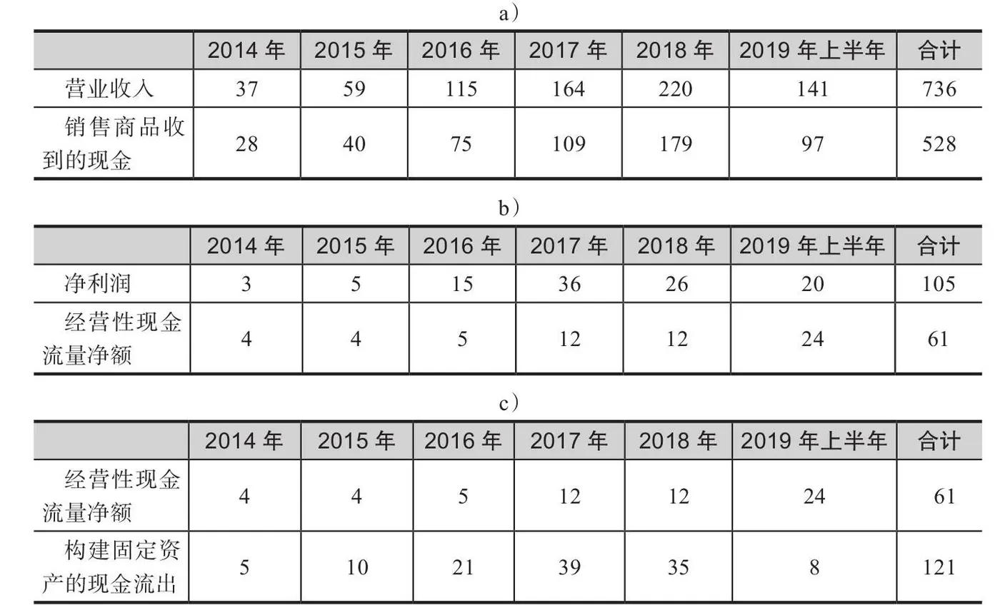

资料来源：Wind资讯。

表4\-15a是营业收入和销售商品收到的现金。2014～2019年上半年，隆基股份每年的营业收入都在高速增长，合计营业收入736亿元，但是从客户那里收到的现金合计只有528亿元，差了200多亿元。这说明公司的收入确认很激进。

表4\-15b是净利润和经营性现金流量净额（CFO）。同样能看到，净利润合计105亿元，但是CFO只有61亿元，这就说明公司盈利的质量不高。

表4\-15c是公司的CFO和资本性开支。隆基股份的投资很大，合计121亿元，但是内生性的经营性现金流入只有61亿元，这意味着隆基必须不断对外融资才能经营下去。

这里还有另外一张图可以观察（见图4\-35）。

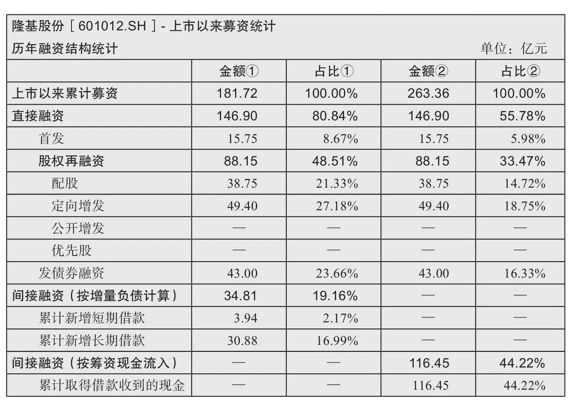

图4\-35 隆基股份上市以来募资统计

注：金额①=直接融资（金额）\+间接融资（按增量负债计算）；金额②=直接融资（金额）\+间接融资（按筹资现金流入）。

资料来源：Wind资讯。

自上市以来，隆基股份IPO融资16亿元，2016年定向增发49亿元。另外，2019年上半年配股融资39亿元，还发行了可转债，现在在强制转债期。公司把目前所有能用的融资手段都用上了，说明其对于外部资金的融资需求很大。

当然，从财务报告上看，好的方面是公司的预收款在2019年6月底有33亿元，创了历史新高。

2019年8月时，我是这样看隆基股份的。

首先，从利润表上看，隆基股份的高成长性毋庸置疑，肯定有投资者愿意为这样的高成长买单。比如，当时隆基股份的前十大投资者中，兴全基金合计持有2\.4亿股，易方达基金持有4300万股，睿远基金也持有不少。

但是，从资产负债表和现金流量表上看，隆基股份的报表质量并不高。未来，如果公司能够持续融资，那么风险相对小一点，但是如果有一天公司融资困难了，那时风险会相当大。

这里再延伸说说当时隆基股份的第七大股东，持有隆基股份3\.1%股份的陕西煤业。陕西煤业和隆基股份同处一地，应该对隆基股份很了解。火电和光伏发电存在此消彼长的关系。陕西煤业的这笔投资不仅能确认股价上涨的收益和分红收益，还能对冲煤炭主业下滑的风险，看起来不错。

2025年5月18日

11:03

## 第5章 投资的思维

第5章 投资的思维

## 第5章 投资的思维 - (1) 5.1　参加股东大会和调研的小技巧

\(1\) 5\.1 参加股东大会和调研的小技巧

5\.1 参加股东大会和调研的小技巧

每次参加股东大会和调研，一定要记得“三到”：眼到、手到和口到。

眼到的意思是，要仔细观察。比如，以前都是董秘出来接待投资者，这次董事长突然亲自参加，并发表长篇讲话，这个时候要留意，可能会有一些变化。或者，以前都是公司领导随口介绍，这次突然写了详细的PPT投影给大家看，这时候也要多加留意。

2019年上汽集团的股东会，我感触颇深的是董事长陈虹的变化。他原来讲话的时候总是慷慨激昂，但这次感觉精神状态不如以前。

手到的意思是，参加调研活动时，要把所有的问题和答案一字不漏地记下来。好记性不如烂笔头，进行投资和研究，很重要的不是数学计算能力，而是语文水平的高低，要听得懂话里的意思。

我们去调研的时候，总会问起公司当年销售的情况。如果半年前董事长拍着胸脯说，今年营业收入和利润会大幅增长，但三个月后，再问同样的问题，董事长改口说有一些不确定性，或者再往后去调研时，董事长闭口不提公司基本面的任何情况，反而东拉西扯地讲行业的状况，这时候你要引起重视，是不是公司的经营状况比较糟糕。

口到的意思是，调研的时候要积极主动地和上市公司交流。

要想做好互动，一定要事前做好准备工作。

我给我公司研究员定了三门功课：第一，调研之前要把调研公司过去三年所有的公开信息看完；第二要准备至少10个问题；第三要做好模型。如果这三门功课没有做，是不允许去上市公司调研的。

2025年5月30日

20:37

## 第5章 投资的思维 - (2) 5.2 什么是“四真公司”

\(2\) 5\.2 什么是“四真公司”

2025年5月18日

11:03

5\.2 什么是“四真公司”

在和长城证券的一次交流会上，我和券商朋友说，2020年我会比较关注“四真公司”。所谓“四真公司”，讲的是那些有真需求、能真创新、是真龙头和能真赚钱的上市公司。

第一个特点，有真需求。

所谓真需求，在我看来是符合商业逻辑而且可持续的需求。

比如，2019年年底电商巨头拼多多公布了2019第三季度报告，称2019年第三季度公司实现营业收入75亿元，但经营亏损高达28亿元，造成巨亏的主要原因是“百亿补贴”政策。“百亿补贴”在短期吸引了强劲的客流，让我看到消费者有购买性价比高的商品的需求。但就补贴商家而言，我不觉得高额和高频率的补贴是可持续的。所以，这并不是我想要的“真需求”。

再看另外一个例子。

我在第4章提到金山办公这个例子时说，会有越来越多的公司专注自主创新和国产替代。自主创新和国产替代并不是一个新的概念，但现在开始火了起来，为什么呢？

我想应该是这样的。早些年，自主创新和国产替代是自上而下的，国家拨一笔钱给国有企业做，国有企业没有太大的动力，而大部分民企觉得花钱都能买到，不需要自主创新。

但是在2019年这一年我们看到，美国试图对我国先进的企业进行全方位的遏制，不仅是在贸易领域，还在科技领域和金融领域。

要发展，没有自主创新和国产替代是不行的。一些高科技产品，哪怕有钱都买不到，所以现在的自主创新和国产替代是自下而上的真需求，持续性比几年前要好很多。

再如新能源汽车。现在新能源汽车卖得好，主要是国家给了现金和车牌方面的补贴与支持，还有一些政策上的扶植。比如，我看到深圳出台了一条新规定，在深圳新的网约车必须是新能源汽车。

补贴也好，政策扶植也罢，都不会产生真需求。等市场真的觉得充电方便了，电池的安全性和一致性做得很好了，我想那时新能源汽车大的发展才算真的到来了。

第二个特点，能真创新。

讲到创新，很容易让人直接联想到创新药。讲到创新药，我一下子就想起恒瑞医药。

20年前我刚刚入行的时候，医药行业市值第一的公司是哈药股份。当时哈药股份的市值有100亿元，笑傲医药行业。但是，到了2019年，哈药股份的市值大概还是100亿元，20年来几乎没有变化。2020年4月，医药行业市值第一的公司是恒瑞医药，市值已经超过4000亿元，哈药股份仅是恒瑞医药的零头。

我们以前去恒瑞医药调研时，恒瑞医药的董事长告诉我们，恒瑞医药对标的是日本武田制药。武田制药的股价在过去20年里上涨了25倍，远远跑赢了日经指数，背后反映的是投资者对有真创新能力药企的追捧。

恒瑞医药从做仿制药起家，现在已经成长为国内领先的创新药龙头企业。虽然我一直对恒瑞医药的净资产收益率不太放心，但不可否认，恒瑞医药对科学家的管理是非常好的，产品线是很完善的，销售能力也是一流的。

我一直以为中国的创新药现在已经到了很好的发展阶段。政策面上，创新药的审批速度越来越快。“4\+7带量采购”和“一致性评价”政策，让化学仿制药暂时受到了打压，医保多出来的钱会越来越多地支付给创新药。资金面上，科创板有第五套规则、港交所有18A，都是针对生物医药企业专门设置的。哪怕没有营业收入和利润，哪怕是处于临床第二阶段，这些企业都能IPO上市。

现在创新药企在我看来面临的其实是人才问题。国内大部分搞创新药的科学家原来是国外大厂的总监，他们有国际视野，但缺乏创业经验。在国外，搞创新药的团队基本上是反复创业成功的那些人。所以，恒瑞医药能组织数千位科学家搞研发，真的不太容易了，给它高估值我认为在情理之中。

另外，有一些上市公司其实只是披着高科技的外衣，本质上属于传统的制造业和服务业，对这些凑热点和只为炒高股价的公司，一定要保持警惕，仔细甄别。

第三个特点，是真龙头。

所谓龙头企业，不是说现在它的市场占有率有多高或者行业地位有多突出，因为这些在我看来都是一直在发生变化的。

我认为的行业龙头大概有这样几个特征：第一，企业当家人要有明确和清晰的战略规划，胸襟气度宏阔高远；第二，能够吸引到行业里顶级优秀的人才；第三，有稳健的财务状况，既要看得远，又要走得稳；第四，有较强大的整合资源以及受挫抗打击的能力。

第四个特点，能真赚钱。

我平时看公司，会比较看重两个财务指标：现金收入比和净资产收益率。现金收入比用来排雷，净资产收益率用来选股。

有的公司，看起来很高大上，比如做服务器的浪潮信息，股价表现很不错，5G的很多计算都是在云上处理，这对服务器股是很大的利好。但是仔细看来，浪潮信息每年的毛利率是10%，净利率是1%，净资产收益率只有7%～8%，虽然未来可能有改善的空间，但真的是在赚辛苦钱。

我喜欢的是通过高净利和高周转实现高净资产收益率的那些公司，如果净利率又高于净资产收益率，那就更好了。

标准的“四真公司”，如果用一句话总结，大概是“赚钱的有消费属性的科技型龙头公司”。如果符合其中三个标准，比如贵州茅台（消费属性、龙头、赚钱），市场已经很喜欢了；如果符合四个标准，比如2019年的立讯精密或深南电路，那市场会更加追捧。

## 第5章 投资的思维 - (3) 5.3 资产软、负债硬、现金为王

\(3\) 5\.3 资产软、负债硬、现金为王

5\.3 资产软、负债硬、现金为王

我在文章里经常提到“资产软、负债硬、现金为王”。

资产软有两层含义：第一，当上市公司需要钱的时候会甩卖资产，被甩卖的资产通常会打很大的折扣；第二，当世道不好、经营困难的时候，上市公司的资产很容易被减值处理。

负债硬的意思是，上市公司的对外欠款是必须要还的，有时还要加利息。

现金为王的意思是，对于大部分企业来说，现金多一点总是更安全一些。

下面给大家举个实例。

以下所有的内容都是基于上市公司盾安环境2018年的年度报告，没有任何添加成分。如果有想看盾安环境年度报告的朋友，推荐去深圳证券交易所直接下载。

先介绍公司的主业。盾安环境是传统的制造业公司，现在有三块业务：制冷配件、制冷设备和节能产业。

制冷配件的主要产品是电子膨胀阀，电子膨胀阀是盾安环境的起家产品。原来有一家公司叫“三花股份”，现在更名为“三花智控”，一开始是做电子膨胀阀的。三花智控和盾安环境这两家公司基本垄断了电子膨胀阀市场。

制冷设备简单来说就是空调，不过盾安环境做的是特种空调，主要用在轨道交通、低温冷库和通信行业里。

节能产业主要指的是公司有余热回收、清洁供暖的技术，在北方提供清洁取暖的服务。

2017年，盾安环境的营业收入是83亿元，净利润是9200万元，营业收入很高，但净利率很低。

一年之后情况发生逆转。2018年，公司的营业收入增长了13%，但是净利润却是巨亏21亿元。我把年报里的部分表格复制出来供大家参考（见表5\-1）。

表5\-1 盾安环境2016～2018年部分财务报告数据（金额单位：元）

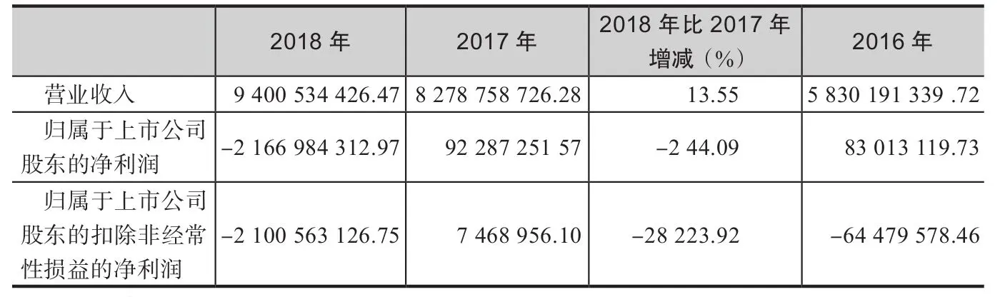

资料来源：盾安环境公司公告。

从表5\-1可看出，盾安环境的营业收入和净利润大开大合。只可能有一种情况，它发生了较大金额的资产减值。盾安环境提到，2018年公司启动了非核心业务与资产的处置和剥离工作，所涉及的子公司不同程度出现订单萎缩、人员流动性较大的情形。因此，公司计提了资产减值准备、商誉减值准备和资产处置损失等，所以利润表上的资产减值损失高达17亿元。

在市场不好的时候，企业资产负债表上的应收账款、存货、固定资产、无形资产和商誉等都会面临被减值的风险。资产一旦发生减值，产生的亏损往往金额巨大，可能意味着上市公司十几年的生意都白做了。

那什么叫“负债硬”呢？

接着谈谈盾安环境的资产负债表。盾安环境的资产负债率高达79%，有息负债率超过100%，这导致2018年公司的财务费用高达2\.5亿元。所以，即使不考虑资产减值损失，公司的营业利润也已经是负数了。

制造业公司的资产负债率不超过50%为好，杠杆稍微高一点允许到60%，但是超过70%就要引起注意了。同样地，关于有息负债率，100%是一根红线。有息负债率太高、有息负债的金额太大，意味着上市公司是在辛辛苦苦为银行打工。

我们再看看它的现金流的情况。盾安环境的现金收入比在2011～2018年一直在50%～60%，营业收入的质量并不高（见图5\-1）。

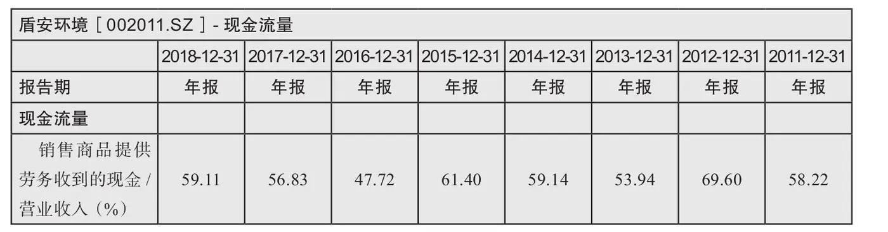

图5\-1 盾安环境2011～2018年现金收入比

资料来源：Wind资讯。

盾安环境和江南化工两家公司曾紧急停牌，原因是这两家公司的大股东某集团遭遇了债务危机。网上传播的一份《关于某集团债务危机情况的紧急报告》，据称直达高层的案头。

浙江有不少企业是“大集团、小公司”的组织形式。一般来说，集团公司遇到问题的时候，会与上市公司隔离开，毕竟上市公司是受到严格监管的，但是在年报里，我还是看到一个风险点，见表5\-2。

表5\-22018年盾安环境对外担保情况（单位：万元）

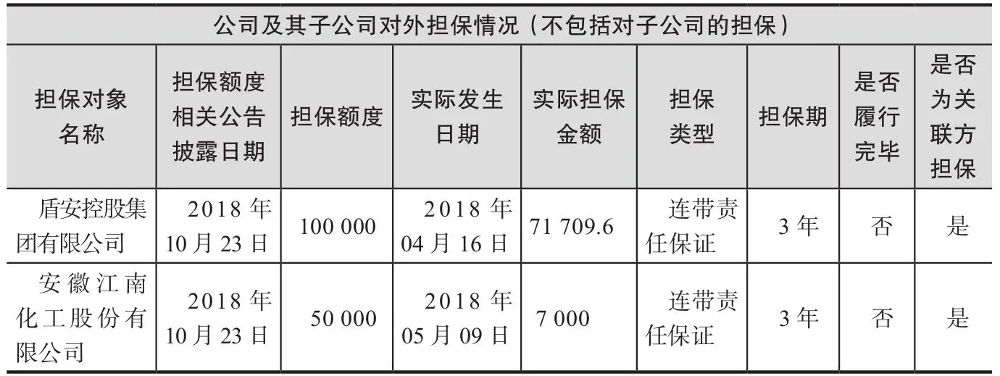

资料来源：盾安环境公司公告。

这里，上市公司给集团提供了连带责任保证，实际担保金额7\.2亿元，为期3年。担保的金额占上市公司净资产的30%。担保的红线是不超过5%，这已经大幅超过我们的预设值。

2025年5月18日

11:03

## 第5章 投资的思维 - (4) 5.4 投资者如何应对极端行情

\(4\) 5\.4 投资者如何应对极端行情

2025年5月18日

11:03

5\.4 投资者如何应对极端行情

沪深两市已发生好几次千股跌停的情况。

在我看来，职业投资是一场可持续一辈子的长期修行。作为职业投资人，我每过几个月要历一次小劫，每过几年会经历一次大劫，而像2016～2018年这种内外动荡的年份，我历劫的频次更是大幅提高。

我发现，成功渡劫的概率与过往的成功无关，甚至是负相关，因为过往越成功，越不容易果断认错。

每次出现的“黑天鹅”，都是资产管理行业里的“供给侧改革”，可对于基金经理而言，则是生存考验。这种考验是残酷无情的，因为总有一些人失去在市场继续前行的资格，职业生涯因此黯然收场，有的人甚至会付出巨大的代价。

人性的疯狂，在资本市场里经常有极致的演绎，远超你的想象。

每次遇到极端的行情走势，我都会静下心来反思和检讨手中的股票仓位和结构，然后仔细审视组合里那些公司的基本面。

## 第5章 投资的思维 - (5) 5.5 要多听听不一样的声音

\(5\) 5\.5 要多听听不一样的声音

2025年5月18日

11:03

5\.5 要多听听不一样的声音

买股票，说到底还是要落实到公司的基本面，不能因为股价上涨去胡乱追涨，也不能因为股价暴跌就斩仓。

还是以贵州茅台为例。它2018年三季报不及预期，出现了它上市以来第一次跌停。当时，业内出现很多争议，有个很著名的基金经理是这样写的：

本质上，无论白酒还是牛奶，无论牙膏还是酱油，无论中药还是小家电，这种中国巴菲特式躺赢（选好公司，长期持有，满仓，然后躺着）的投资模式之所以能够成功，建立在三个条件上。

（1）中国经济高速增长，使得过去十多年消费保持了平均15%的高增速，即便2008年金融危机都没有跌破10%。

（2）消费品市场处于成熟化的过程，行业加速洗牌，行业中龙头企业的市场份额持续扩大。

（3）居民部门杠杆率总体处于相对低位，经济周期对消费的影响不大，消费品企业的业绩波动小。

但现在，这三个条件都不再成立。

（1）部分因为经济增速自然下台阶。过去几年消费增速持续下行，2018年之前的好几年消费增速持续低于10%。

（2）大部分行业的洗牌已经完成，主导企业的市场份额已经大幅提高，抢占其他企业市场份额的空间大大缩小。

（3）居民部门杠杆率大幅提高，如果看居民杠杆/可支配收入，已经接近100%，与美国、日本的水平相当。随着杠杆的提高，居民消费意愿与资产价格的相关度大幅提高，居民收入可用于消费部分（扣减按揭和消费贷本金利息偿还）的波动性大幅提高，由此居民消费的波动性大幅提高。经济周期下行时，消费的下滑会很显著。

所以，消费龙头股不再具有过去20年那样的攻守兼备的属性。满仓消费龙头股稳赢的黄金时代已经结束了。

我一般很少这么大篇幅地引用别人的观点，但是觉得他的归纳总结虽不全对但有一定道理，所以在这里分享。

我一直在反省自己的研究和交易。开诚布公地说，贵州茅台是我长期认可的股票。虽然议论贵州茅台的人很多，但是大家的角度不同，我从不人云亦云，拾人牙慧。

这个基金经理写的这些内容，有一部分也是我一直在思考和提醒自己注意的。兼听则明。在做投资的时候，一定要知道哪些是自己已经知道的，哪些是自己不知道却又以为是知道的东西。

有人把读大学四年总结成四句话：大一不知道自己哪些不知道；大二知道自己哪些不知道；大三不知道自己知道了；大四知道自己已经知道了。这个道理，对做投资研究一样适用。

大家看本书之前，一开始可能处于“大一”，不知道自己对所买股票的上市公司不了解，听点消息看看K线，然后开始追涨杀跌，基本面看不懂更不想看；一段时间之后，知道自己有认知上的缺陷，如果能弥补这个缺陷会更好；又看一段时间，反而怕了，谨慎了，因为其实已经成长了……

投资是一个漫长的旅途，所有的指标都只是指南针，而不是导航仪。我从事的是价值投资。我认为价值投资不是股价投资，不是要马上看到股价涨跌。

发现价值是一个需要耐心和等待的过程，结果不是即时反馈的，所以很容易被外力影响而动摇。

我不是一个朝秦暮楚的人，我还是坚持自己的价值投资，随意转向是对自己、对客户的不负责任。成熟的基金管理人起码要做到不以物喜、不以己悲。我还是会一直坚持独立思考！

## 第5章 投资的思维 - (6) 5.6 市场处于底部区域的一些表现

\(6\) 5\.6 市场处于底部区域的一些表现

5\.6 市场处于底部区域的一些表现

做资产管理这行，经常会和卖方分析师打交道。每次路演的时候，不少分析师都有这样的套路：首先对过去一段时期的行情进行描述性总结，然后寻找一些理由来解释这些行情，并给出这样或那样的逻辑。

这个行业有个误区：如果在路演推荐时，不出现10次“逻辑”这两个字，那不算是一个完美的路演。卖方分析师讲逻辑，更能显示出他们对于市场的思考，比如他们会讲昨天股市上涨是什么逻辑、下跌是什么逻辑、板块间有什么逻辑、宏观经济是什么逻辑……然后遵循这种逻辑，去推测今后的走势。

但是，这样的推演很少具有参考价值。因为对于买方而言，我们深知，每时每刻对于股市的影响因素实在太多太多。在这个市场上待的时间越久，越是敬畏市场，越是对于“归因”和“预测”谨小慎微。

比如，当同时面对股市的100条利好消息与100条利空消息时，我们其实很难区分其中哪些会对未来产生至关重要的影响。有时候重要的影响因素甚至根本不在这200条消息中，而是隐藏在无数你所不知道的信息中。

如果说投资能力代表你从市场中挖掘、分析、运用了多少信息，那么投资运气则代表了那些没有被你发现和关注的信息的影响。在极度复杂的市场面前，我们要明白一个道理：决策越多，错误越多，损失越多。所以，我认为好的策略是减少交易，但是要多观察市场，感受市场的变化。

一般来说，市场运行处于底部区域的时候，成交量极度萎靡，此时可看到以下五个指标。

（1）低价股的占比。这里的低价股指的是绝对股价低于2元的股票。牛市会把低价股全部消灭，但是熊市会产生一批低价股。低价股的占比是市场牛熊转换的领先指标，熊市的时候，低价股的占比会越来越大。不过，当这个比例开始下降时，市场就基本到了拐头。

（2）跌破净资产的股票数量。在熊市的时候，跌破净资产的股票数量会迅速上升。这个原理与低价股是一样的。熊市的时候，市场认为上市公司的账面净资产会遭到很大的破坏，这些破坏要么来自利润表上的大幅亏损，要么来自资产负债表上的巨额减值。上一轮熊市的时候，我看到过港股的中国龙工的PB跌到了0\.2倍，股价不到1港元。之前我们提到过的中国建筑也曾出现一样的情况。虽然我们知道，对于这类公司而言，跌破净资产只是暂时现象，但是不知道什么时候市场会修正。

（3）全市场的流动性。判断大底的一个标志是，全市场的成交量是高点全市成交量的10%。还记得，2015年指数为5178点的时候，证券公司面对汹涌的交易，只能增加服务器来应对。那个时候全市场每天轻轻松松成交1万多亿元，后来到熊市只有区区1000多亿元。不过，虽然我们知道市场已经冷淡，但是我们不知道它什么时候会走出来。

（4）次新股的破发率。大底的时候，次新股的估值和全市场的估值一样低，如果有兴趣你可以看看2008年上市的水晶光电和东方雨虹的表现。如果2008年太远，不妨看看2019年的工业富联和华大基因。火焰的中心和外围温度几乎一模一样，次新股通杀。

（5）最大跌幅。一个经验数据是，在熊市的时候，跌幅较大的15只股票平均跌幅是高点的对折再对折，即要跌去75%。

有人问我如何熬过熊市。我的回答是：现金为王，然后在市场恐慌的时候买一些优质资产，之后一直拿着不动。我们或许能看到一个底部区域，但是底部会持续多久，没有办法判断。

找到好公司不容易，找到好价格更难。研究一个公司已经花费数月时间，等待一个好企业的股价跌至“合理”水平可能需要等待长达数年的时间；当一个好公司出现了好价格后，从买入到建仓完毕，中间又会历时很久。

2025年5月18日

11:03

## 第5章 投资的思维 - (7) 5.7 如何找到价值投资的“护城河”

\(7\) 5\.7 如何找到价值投资的“护城河”

5\.7 如何找到价值投资的“护城河”

平时工作的时候，我会研究很多公司，但研究的公司越多，发现能够下手去买的公司反而越少。巴菲特说过：“投资是努力收购基本经济情况优秀、由诚实能干的人才管理的公司，然后用合理的价格买入。如果在自己的竞争优势圈中找不到标的，不要扩大范围，要耐心等待。”

我做研究和投资已经快20年，一个心得是，to C的公司比to B的公司更容易成长为巨无霸。现在我大部分精力都是在研究to C的公司，主要原因是to C的公司更容易亲自体验，更容易理解。在内部交流的时候，我经常讲，互联网、金融和消费品很容易出牛股的公司，考虑到国内的人口基数和消费升级，需要更加重视消费品板块。

消费品的研究要从三个角度来看，分别是消费品的文化属性、产品品性和品牌力。

从文化属性上讲，白酒是我们中国餐桌上交流的润滑剂；调味品里面的酱醋风味有很强的中国特色。海天的产品从酱油扩展到了蚝油和醋，品类扩张了，市场愿意给的估值也高了很多。涪陵榨菜是一样的逻辑，公司的产品从榨菜扩展到其他佐餐品。黄酒是在江浙沪等传统区域优势明显。

从产品品性上讲，不同浓度的白酒差异较大，高度酒无保质期，低度酒因瓶装长期保存价值小，这就解释了为什么那么多人喜欢茅台。茅台酒是用来收藏的，茅台的股票同样是用来收藏的。从业绩增长上看，茅台的增长一点也不慢，而且公司账上的现金又很多。

一些人炒股票，只看K线，其实需要更多关注K线背后的逻辑、行业发展趋势和公司的质地。没有一种技术或方法可保证赚钱。价值投资理念，相信的人只要听一遍就能懂，而且会坚持下去，不相信的人听无数遍还是不相信。

做价值投资，很重要的是找到有深厚“护城河”的公司。怎么找呢？常用的一种测试办法是，如果产品提价了，顾客是否还会购买，不管情愿还是不情愿。这个办法简单粗暴，但很有效。茅台酒提价，大家仍然抢购，这就是很好的案例；高端护肤品涨点价，女士还是买；孩子在培训机构学奥数，一位难求，价格再涨，妈妈们仍趋之若鹜。这样的公司“护城河”很深。

找到有深厚“护城河”的公司，等到便宜价格时买入，然后持有一段时间，这就是我理解和实践的价值投资。

2025年5月18日

11:03

## 第5章 投资的思维 - (8) 5.8 四种公司不能碰

\(8\) 5\.8 四种公司不能碰

2025年5月18日

11:03

5\.8 四种公司不能碰

2018年的雷很多，我当时认为有四种公司不能碰。

第一种是有PPP项目的公司。对政府和社会资本合作（public\-private partnership，PPP）的公司要谨慎，我们认为PPP风险很高。比如，有的公司资产负债率高达70%，我相信实际的杠杆水平会远远高于我们看到的数字。

第二种是质押率过高的公司。2018年5月，我看公告的时候，经常会发现有一些上市公司公告质押股份已触及平仓线，如果不能筹集到资金补仓的话，这部分质押的股票将会被质押机构强行平仓，那股价会跌得更凶。

第三种是大集团小公司。上市公司本身经营良好，但是控股股东集团公司面临较严重的债务压力，对上市公司的影响可能会很大。

上面三种情况，其实可以总结为两点：一个是上市公司的杠杆率高；另一个是控股股东杠杆率过高。

第四种是ST公司。壳价值现在越来越廉价，而且ST公司本身问题很多，能不碰尽量不碰。

## 第5章 投资的思维 - (9) 5.9 一名优秀研究员需要具备的基本素质

\(9\) 5\.9 一名优秀研究员需要具备的基本素质

5\.9 一名优秀研究员需要具备的基本素质

做一个好的研究员，需要具备的最基本素质是什么？

第一，要有过硬的身体素质。这样一个看似非必要的条件，实际上确实是必要的条件。研究员的工作强度很大，每天工作12小时以上是很正常的，周末一般还要加班。

拿我自己来说，虽然我现在做投资已经快20年了，但是一直保持研究员的作息时间：每天差不多4点半起床，晚上9点入睡，醒着的时候永远是研究公司公告、电话会议、调研、路演和看盘。如果没有过硬的身体素质，在这个行业里是很难坚持下去的。

第二，勤奋，永远勤奋。在陆家嘴上班的同行，智商和情商都很高，并且渴望成功。如果不勤奋，你怎么可能做得比他们优秀。

当然，勤奋不一定能取得成绩，但是不勤奋肯定没戏。我经常告诉刚入行的小同事，A股有3000多家公司，看完了A股公司，港股还有几千家公司，看完港股，继续看美股，在这个行业永远不能懈怠。

第三，热爱投资和研究工作。我一直说，投资和研究是世界上最好的事业之一，现在你付出的每一分心血都是在为自己积累经验。做了投资和研究之后，基本能不怕失业了，也不需要看老板的脸色。这个行业总体上来说是一个很公平的行业，付出后都会有回报。家境好不好，有没有过硬的社会关系，都不是那么重要。

那么怎么才能做好研究呢？

对于卖方研究员而言，第一，了解你所在行业，包括细分子行业和行业里的龙头公司。看一个行业，至少要把该行业里市值前三大的公司和市值靠后的三家公司搞清楚。

第二，仔细研读上市公司的公开信息，尤其要认真看财务报告，三张报表里，资产负债表是具有领先信号作用的报表，比现金流量表和利润表更重要。

第三，多跑上市公司，多跑上下游企业。在投资行业里工作，语文比数学重要，别怕麻烦，做好详细的笔头记录，下次便有了参照。

最后，积累自己的人脉关系。这个行业是靠信誉的，做个好人很重要。平时管住嘴，微信和朋友圈上的负面八卦消息尽量少看、少发、少评论。

对于买方研究员而言，除了常规的研究工作之外，不要忘记建立买方的数据库。这个市场上没有两个相同的买方数据库，投资业绩的差异化正是来自各家机构使用了不同的大数据。

买方数据库是买方的核心资产，是整个投研体系智慧的凝结，更是未来交易系统改进的物质基础。买方应根据数据库所统计的结果，强化自己的优势，找出自己的短板，只有看清自己，才能提升自己。

买方行为是真金白银的交易，每年换手两倍，有数十亿的交易额，经年累月，重置成本无法估量。当然，不包含投研团队原始想法和逻辑的表观数据其实都是无意义的。因此，买方的数据库需要记录的是包含投资智慧的数据，是从预测到决策、到行为、到结果的全流程记录。

买方数据库怎么用？比较重要的是做投研模型的参数设置（胜率、赔率、换手）时，要用真实值来替换假设值，只有输入端可靠，输出的数据才有意义。

做投资，控制回撤和增强收益哪个更重要？

资产管理业已经进入存量市场，每一次市场的向下波动都相当于做了一次供给侧改革，只有控制好回撤的公司才能活下来。这个行业活得长比活得爽更重要，管理份额向稳健的龙头公司集中的趋势越来越明显。

而且，从客户的体验上讲，净值从1\.00元稳定地增加到1\.20元，远比从1\.00元上涨到1\.50元然后再跌到1\.20元更舒服。

刚进入这个行业的从业者，感觉一切都是美好的。这个行业以人为本，明星分析师拥有巨大的议价能力，个人价值能很快被市场挖掘甚至透支。哪怕做不到明星分析师，也有机会直面上市公司的管理层和行业专家，和上市公司领导聊聊行业的发展状况、公司的未来前景。

但是，在这个行业做的时间越长，越需要当心。首先，对于行业的了解不能浮于表面，不能夸夸其谈不求甚解；其次，要当心这个市场上的坏人，一些上市公司有时会把分析师当作枪使。还有一些不负责任的大投行，出了一篇看好某公司的研究报告，背后的原因是它的客户买了这个公司，亏损了很多钱，希望有人帮忙“抬轿子”。最后，分析师更不能因为短期利益而做出违法违规的事情。

总之，投资和研究是一个知易行难、需要坚持的行业。一般至少需要四五年的超负荷工作才能奠定一个研究员的行业地位。这些道理很简单，但是执行起来很难，长时间地执行更困难。人是有智慧的，当然也是有惰性的，只有抽提智慧、摒除惰性、不计回报、主动付出才会有成果。时间是我们最好的朋友。

我写的这部分内容主要针对专业人士，但对于其他读者，我相信你若肯看下来也会有收获。三百六十行，要做出成绩，努力是共通的基本素质，希望对所有读者都有启发。

2025年5月18日

11:03
