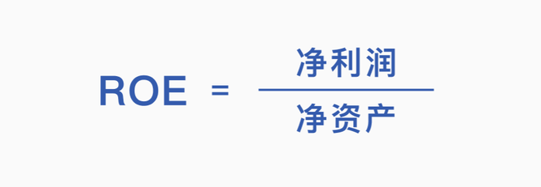
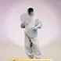
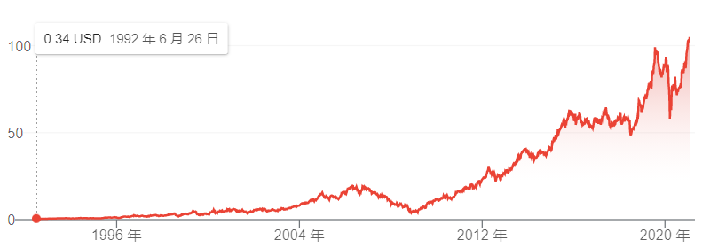
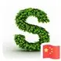
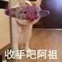
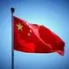
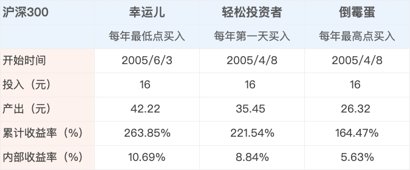
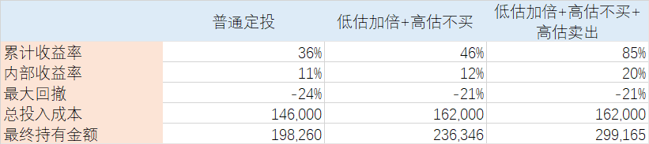
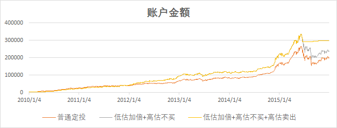

# 《孟岩 投资第一课》全文合订版

> 共18个章节。原章节顺序、段落结构和图表均予以保留。

## 导读 这一回，从门外汉到 80 分投资者

__导读 | 这一回，从门外汉到 80 分投资者 __

-
- 有知有行 · 2020年12月2日
- 150316
- 965

你好，我是孟岩。

欢迎你来到《有知有行·投资第一课》。

当你打开这篇文章的时候，我其实想先问你，也问我自己一个问题：知识经济时代，有关投资的课程数不胜数，你为什么要花时间来学习又一门课？

神经科学家通过研究发现，人脑在接收信息时，会先和自己已有的认知相比较，如果不同，大脑会启动情绪来对抗。

选择哪门课程，往小说无非是花一些时间，但往大说，其实是向我们的脑子中植入一些信息。而这些信息很有可能会排斥其它的信息。从这个角度说，选择学什么，听谁讲，其实非常重要。

__我是谁？__

因此，我决定先介绍一下自己。

我叫孟岩，从 2005 年开始学习投资，2009 年正式开始记录自己的投资业绩，长期投资业绩在年化 20% 左右。

我不是科班出身。

1997 年，我考入北京航空航天大学计算机科学与工程系，开始了 7 年的学习。这段经历对我很重要，现在回想，它给我留下最大的烙印是我意识到我可以用代码和产品来创造一些这个世界上本来并没有的东西，给别人提供价值，直到现在，这依然是最让我兴奋的事情。

毕业后，我加入了 Sun Microsystems。Sun 是个人计算机硬件历史上最著名的公司之一，程序员们现在依然在用的 Java 就来自这个公司。

2000 年纳斯达克网络股泡沫中，Sun 的市值一度飙升至 2000 亿美元，股价高达 250 美元，可随着互联网泡沫破灭，到了2001 年底，仅仅一年时间，它的股价就跌到了 49 美元。

等到2008年，它的股价只有 3 美元了。我当时不懂投资，内心很好奇，为什么一个公司的股价可以在短短几年里迅速攀升至 250 美元，又迅速跌落回去？

[https://asset\.youzhiyouxing\.cn/image/2020/12/01/01ERETD53FSSZRW8TQC7AGRW10\.png?x\-oss\-process=image/resize,w\_1280,limit\_1](https://asset.youzhiyouxing.cn/image/2020/12/01/01ERETD53FSSZRW8TQC7AGRW10.png?x-oss-process=image/resize,w_1280,limit_1)

Sun 历史股价 | 来源 Lee Devlin's Website

离开 Sun 后，我加入了微软。2006 年去西雅图出差，我认识了一个名叫 Remy 的法国同事。聊得多了，我才知道他是一个传奇人物。

他曾是著名网络公司 Infospace 的 CTO，2000 年纳斯达克泡沫顶峰的时候，身价暴涨，一度成为美国 40 岁以下最有钱的人之一。

当时，虽然他的股份由于锁定期没法套现，但有钱后的欲望可以提前支付，他通过抵押贷款等方式提前消费，购置了湖边豪宅、游艇、豪车……

最终，网络股泡沫结束，Infospace 股价暴跌，Remy 也欠了银行一屁股债，他没有选择破产，而是变卖资产，并到微软工作继续还账。

从 Remy 身上，我看到了投资以及资产配置对于一个人的重要性。我意识到投资真的可能帮助一个人财务自由，但处理不好也会让人陷入财务窘境。

__我的创业之路__

2006 年，我注意到一件有趣的事。我的父母并不会用电脑，却自学了 Excel，每天记录更新基金净值，计算资产变化。和他们聊过后我才知道，2005 年大熊市时，由于银行的基金卖不出去，他们被「摊派」买了很多基金，随着股市慢慢回升，他们赚钱了，还赚了很多。

我从父母的行为中看到了需求，与两位同事 Robin 和 Louie 一起辞职，创办了一个基金理财社区——「财帮子」，帮助基民管理自己的基金账户，并可以在论坛进行交流。

当时正是一波 Web 2\.0 的创业大潮，阿北的「豆瓣」、王兴的「校内网」，都利用「用户创造内容」来提供一种新的交流方式。我把这种方式借鉴到了投资理财产品上。

很快，我们的用户增长到 100 万左右，每日活跃的用户在 10 多万左右，是当时排名第二的基金理财平台。

我隐约觉得有些地方不对，用户每天来网站的原因是看自己赚了多少钱，但股市会一直涨吗？熊市来了怎么办？

后来的事情验证了我的判断，2007 年 10 月，在「迎接奥运」和「黄金十年」口号最响亮的时候，牛市走到了尾声，开始从最高点 6124 下跌，最低跌到 2008 年金融危机时的 1664 点，跌幅高达 72\.8%。

现在回看，当时我们并不懂投资，也不知道基民真正需要的是什么，而是把互联网领域很多「顺人性」的玩法搬到有些「逆人性」的投资上。我们发现自己追求的极致体验顺应的是用户的赌性，产品变成了帮助用户亏得更快、更多的工具。

失之东隅，收之桑榆。我对投资产生了浓厚的兴趣，开始系统性的学习。我阅读了几乎能找到的所有投资书籍，也是雪球最早期的用户。

我看过 K 线，数过浪，系统性地学习过「缠论」；我曾经整天看盘，因为使用杠杆爆过仓，也会整天手机不离手生怕错过重要公告和信息……

直到有一天，当我意识到真正影响股价的是背后的经济和商业世界，每日上下波动的价格不过是幻觉时，我逐渐建立了自己的投资系统，开始稳定地赚钱。

2015 年，我创办了「且慢」。这是继「财帮子」之后我的第二次尝试，与「迎合用户需求」不同，我更坚定而大胆地走了一条新路，结合投资者教育来做基金销售。

*我们不做「基金净值估算」，没有「目标投」，也没有「排行榜」，而是首创了「基金跟投」的方式，*帮助大家降低选择难度，陪伴用户长期持有，在这个过程中，潜移默化地将长期投资和价值投资的大道传递给用户。

我依然在意用户需求，但更坚定地去寻找表面之下的真实需求。

2017 年 9 月的一个午后，为了更好地吃自己的狗粮（使用自己的产品），我开始写「孟岩投资实证」，通过每周一篇文章的方式来记录自己使用且慢投资的实盘业绩，并写下有关投资、创业的所思所想。

四年时间里，我和我的伙伴通过且慢、投资实证以及其它服务陪伴十多万用户学习投资，在熊市一起播种，静待企业价值的增长。

*我们证明了，投资者教育并非不可能之事，我们可以和用户一起学习投资，共同成长，收获沉甸甸的收益。*

2019 年底，我和我的伙伴们离开了我们一手打造的且慢，创办了有知有行，开始追寻自己的梦想。

十多年的实践，让我明白，*我们挑选主理人、选择基金、做每一笔买卖，都是内在认知根据外界信息做出的选择和反应。我们获得的投资收益，只是这个选择的结果。*

投资是认知的变现。投资成功，最终是因为我们变成了更好的自己。

财帮子、且慢、有知有行，从「工具、数据、论坛」，到「跟投、陪伴」，再到「知行合一、做更好的自己」……

以上这些，就是我一路走来的故事。

在这个信息过载的时代，我希望能提供一门不同的课程，但我知道「不同」是个结果，因为我不同，这门课才不同。

我并非科班出身，凭着自己的兴趣学习了投资，并且真的通过投资赚到了钱，改变了自己的生活。更重要的是，我发现投资是一个最好的修炼场，在一路投资的过程中，我也学会了平静、延迟享受、耐心，变成了更好的自己。

我打造过两个基金行业知名的产品，服务过上百万用户。在陪伴用户的过程中，我想我更明白你在投资时面对的困惑和煎熬，也更理解你需要学习什么才能获得良好的收益。

另外，我深知自己在文字、表达方面，还有很多不足，因此我邀请到我的好朋友，也是有知有行的股东和同路人——张潇雨老师，来和我一起写这门课。

潇雨老师一直在做投资和商业研究，是一个非常好的投资者和写作者，他在知识平台「得到」上的《个人投资课》和《商业经典案例课》共拥有近 20 万读者。

更重要的是，潇雨老师和有知有行拥有同样的投资理念和理想，我希望和他一起，用更好的方式，把这些投资理念传递给大家。

__这门课有什么？__

看到这里，如果你依然希望继续，那我就来讲讲这门课都会包含哪些内容。

现代社会是一个分工高度专业化和精细化的社会，我们不可能也没必要去学习所有的知识。生病了，找医生；有纠纷，找律师。投资是不是也应该如此？

这里涉及到「投资行业」一个很大的不同：作为用户，在绝大多数时间里，我们都无法评价给我们提供服务的人以及产品的好坏。

短期涨得好，不代表长期能赚钱。你看到的投资收益，有可能是牛市带来的，有可能是短期市场风格带来的，如果你不具备基本的金融素养（Financial Literacy），你就无法辨别这个结果是能力还是运气，更无法在将来获得这个收益。

更重要的是，即使你选择了好的投资产品，如果你不具备基本的投资知识，你也可能会经历「贪婪和恐惧」，在关键时刻无法拿住。

当然，我不是说要每个人成为专业的投资人士。《投资最重要的事》一书的作者、投资大师霍华德·马克斯曾引用本杰明·格雷厄姆的名言：

「投资艺术有一个特点不为大众所知。门外汉只需些许努力，便可以取得令人尊敬（即使并不可观）的结果。但是如果想在这个容易获取的标准上更进一步，则需要更多的实践和智慧。」

这门课希望做到的，就是正确地找到这「些许努力」。在我看来，它说的是：

-
- 学习投资的大道以及基本的知识；
- 树立正确的财富观；
- 理解投资为什么可以赚钱、赚的是什么钱；
- 这些钱本质上又是从哪儿来的；
- 以及如何赚到这些钱。

我们希望通过这门课，涵盖这些知识，帮助你建立基本的能力圈，在投资上取得「令人尊敬」的结果。如果你有热情去探索更深，可以沿着有知有行的知识体系继续学习，慢慢拓展自己的能力边界。

__邀你一起「共建」这门课__

最后，我们也想向你发出一份特殊的邀请，请你一起「共建」这门课程。

与你在其他地方看到的课程不同，这一次，你不仅仅是「学员」，也是「老师」。

因为我们知道，只有那些用真金白银在投资中历练过的人，才更能感同身受每一位投资者真正渴望了解什么，有哪些实实在在的困惑。

我们希望你把这些困惑、思考和投资故事，在班级中与我们分享。未来，这些珍贵的思考很可能成为课程的一部分，点亮更多的同路人。

如果你准备好了，就让我们一起开始这场投资之旅。

本文章所载内容仅供参考，不构成投资建议。市场有风险，投资需谨慎，投资者应保持独立思考。详见[《文章免责声明》](https://youzhiyouxing.cn/agreements/ARTICLE_DISCLAIMER)。如转载使用，请参考[《文章转载规范》](https://youzhiyouxing.cn/agreements/ARTICLE_REPRINTED)。

__想法__

[发布想法 ](https://youzhiyouxing.cn/materials/181/new_opinion)

-
- [默认 ](file:///C:/Users/yanfu/AppData/Roaming/OneNoteGem/OneNoteBatch/Tmp/OEBPS/Text/#opinions)
- [最新 ](file:///C:/Users/yanfu/AppData/Roaming/OneNoteGem/OneNoteBatch/Tmp/OEBPS/Text/#opinions)

孟岩

置顶
重新看完这节课，我最想更新的就是：经过近两年，尤其是 2022 年的大幅下跌，我的个人长期收益率已经从 20% 跌到 15% 以下了。 除此之外，两年多的探索和实践，并未改变这节课中的很多想法。 唯一想感叹一下的是，在文章开头，我本来用的是另一个例子。但我的伙伴雨白因为安全的考虑，帮我换成了「神经科学家通过研究发现，人脑在接收信息时，会先和自己已有的认知相比较，如果不同，大脑会启动情绪来对抗。」 谁能想到，这句话恰恰是我最近一段时间最感兴趣的课题。年底之前，我应该会把这些思考分享出来。 孟岩，更新于 2022 年 10 月 3 日
2022年10月3日
507

天堂鸟
“学了那么多投资的课程，为什么要花时间又学一门？”还不是因为太喜欢孟岩老师了，感动于孟大的发心和所言所行，所以做他的用户和学员，潇雨老师的课程和播客也听了几遍了，喜欢\+信任。 这次学习：1、查漏补缺，希望通过学习有新启发、新思考。2、既然是内测学员，享受福利的同时希望有所贡献，有想法和建议会积极提出哒。3、自己先学一遍，课程正式上线后可以给程度适合的朋友推荐，希望自己和朋友们都能打理好钱，安享生活。
2020年12月7日
307

东风解冻
现在网上各种理财课程，大多教你买什么，什么时候买，怎么卖，并没有把投资的系统讲明白，有知有行给我们一个完整的投资系统，知道买卖的逻辑，我认为我们是真金白银的去理财，要知道自己的钱投去哪里了，又是怎么获得收益的…，祝有知有行越来越好。
2020年12月7日
203

新峰
大爱这一句： 在这个信息过载的时代，我希望能提供一门不同的课程，但我知道「不同」是个结果，因为我不同，这门课才不同。 这句话如果把“课程”替换成“人生”，同样成立： 我希望获得一个不同的人生，但我知道「不同」是个结果，因为我不同，人生才不同。 从这个角度看，投资即人生。
2021年3月5日
129

Rimon
与一般的理财产品有了明显的定位差异，市面上主流理财产品都是销售平台类型，盈利来源于销售分成，那么功能开发上目的就是引导用户产生更多的交易行为，获取更高额的分成利润，波动可以很好的刺激用户产生交易行为，所以会有每日估值，排行榜等信息展示给用户参考，导致平台用户一直处于焦虑中，生怕错过短期内的机会，然而长期来看，短期的波动并没有那么大的影响，这些信息让用户产生无用的焦虑，进而做出错误的操作，平台获利，用户买单。 这也是我选择关注有知有行的理由，很期待这个产品未来的模样，或许能给那些巨头平台提供一个新的方向，带动整个理财产品行业的创新。
2020年12月25日
122

眼里有光的azure
被「些许努力」这四个字打动。我的理解，就像学钢琴🎹，也是从三个方面：1）总览全局：古典音乐是什么、经历了哪些阶段和发展？2）有知：那些我最尊敬和喜爱的作曲家、演奏家，她们/他们是怎样创作和表达音乐🎵的？3）有行：我怎样模仿和学习，一点一滴地去理解音乐、练习技巧，做到我手传达我心？ 大道就是如此至简和相通～ @2020\.12\.09 【导读】笔记
2020年12月9日
84

风继续吹
农业文明，一分耕耘一分收获，大家跟风险打交道的活动不多，大家给风险定价的研究很少；所以大家视股市为洪水猛兽；王侯将相，宁有种乎；皇帝轮流做，明年到我家；遇到天灾人祸，活不下去了，大家也敢奋力一搏；所以股市里不怂的炒股者也很多。 海洋文明，常要跟风险打交道，常常要给风险定价，了解自己适合冒多大的风险；愿意和伙伴分享风险和收益。 不光要了解投资，更要了解自己的性格。投资要匹配自己的风险偏好、欲望和能力，就像结婚一样要找到合适的人才会幸福！
2020年12月7日
74

Amara
因为且慢，知道了孟岩，了解了他的故事，让我特别感动的是，他始终坚持初心，想帮助众多像我一样想学理财，但却无从下手的人。虽然我之前看过几本理财入门书籍，准备下手买的时候，还是犹豫了，毕竟第一次用真金白银入手，但是有了且慢，让我们在跟投的过程中不断去学习，且慢更像是投资路上的引路人，然后到有知有行的问世，一路陪伴我们长大！
2020年12月7日
32

逆水行舟
开课啦，终于开课啦！说来这算是我第一次接受系统性的投资培训，非常感谢孟老师、张老师、还有整个团队的辛勤付出，助我们在投资路上披荆斩棘，乘风破浪！ 在课程期间我会认真听讲，接受知识的沐浴，同时尽我所能提出自己的见解和建议，发光发热互助互惠。希望通过这次课程，我可以将知识铺成台阶一步步提高水平，真正成为一名优秀的投资者！
2020年12月7日
24

水木
非常感谢创办且慢，让我有勇气有毅力紧跟E大，更有信心学习理财知识，虽然自已乱闯乱投有好些所谓的投资年限，但我知道没有系统学过。跟E大起我的资产是增长的，这次跟有知有行，我知道我的知识也会增长，加油！
2020年12月7日
23

[下载 App 查看全部想法](https://youzhiyouxing.cn/download)

2026年3月2日

23:00

## 01 钱是从哪儿来的？

__01 | 钱是从哪儿来的？ __

-
- 有知有行 · 2020年12月7日
- 121887
- 971

欢迎来到《有知有行·投资第一课》，这是我们的第一讲。

既然是第一讲，我们就从一件特别基础的事情开始讲起。

来到有知有行的同学，相信都是为了投资来的。那么投资最核心的目的是什么呢？当然就是赚钱——我相信没有人是希望通过学习这门课程赔更多钱的。

那么，一个重要的问题就出现了：钱这个东西，到底是怎么来的呢？

__假如流落荒岛……__

这个问题其实很大，回答的角度也有很多。比如有的同学会很直觉地想，钱是国家发行的、是政府背书的。这当然没错。不过我们可以考虑这么一个场景：

[https://asset\.youzhiyouxing\.cn/image/2020/12/07/01ERY7DXEKSBJN65CT7K7CBDRR\.png?x\-oss\-process=image/resize,w\_1280,limit\_1](https://asset.youzhiyouxing.cn/image/2020/12/07/01ERY7DXEKSBJN65CT7K7CBDRR.png?x-oss-process=image/resize,w_1280,limit_1)

来源：depositphotos\.com

现在有一个小岛，岛上有一个装着一百万美元的宝箱。有一天你乘船出海，船走到一半坏了，漂流到了这个小岛上，就像鲁滨逊一样。那么宝箱里的钱对你有用么？肯定是没用的，可能还没有一张渔网或者一棵椰子树更有用。

所以，我们能得出一个很重要的常识：钱这个东西——在这里更准确的定义是「货币」——不管是谁，印出来再多，如果它不能换来我们想要的东西，那它就一文不值。

所以你看，*我们想赚的不是钱本身，而是钱背后的东西——资源、产品和服务。*

可这个时候，又有一个问题出现了。

我们都知道，资源是有限的，产品和服务也不是凭空产生的，如果大家都在忙着赚钱，那谁在亏钱呢？换句话说，多出来的钱是怎么来的呢？

简单来说，多出来的钱，主要是三个因素造成的：*自然资源、劳动和技术。*

举个最简单的例子。

比如人类从古到今，生活都需要木头。开始的时候，我们砍树特别费劲，但是有些人很聪明，把石头打磨成了石斧，于是大家砍树效率一下提高了。

在这个过程里，人，通过自己的智慧和劳动，利用自然资源（也就是石头），改进了技术（原来没有斧子），把以前一年砍树 20 棵的水平提高到 200 棵的水平，多出来的资源又可以用来进一步改善生活。渐渐地，大家的日子都变得更好，于是社会整体的财富也增加了。

__人类财富的积累__

当然，这是个简化的例子，真实世界远远比造斧子砍树复杂得多。可如果你稍微回想一下，人类积累财富基本就是这么一个过程。

袁隆平让我们可以在同样一亩地上种植出更多的庄稼，养活了更多人口，而更多的人口也意味着更多的劳动力；电话、微信和各种视频会议系统让人们可以更高效地沟通，催生出了更多的共识和智慧；抗生素和手术刀让我们可以更加健康地生活，以及延长整个种族的寿命。所有这些变化，都是我们通过利用自然资源、同时施加各种劳动、并且创造了各种新技术而带来的。

这里可以给你一个概念，截止到 2020 年这个时点，人类社会的总财富大概是 300～400 万亿美元这个水平。其中超过 200 万亿美元是土地和房产——没错，这类最最古老和经典的资产类别，占据了人类总财富的 2/3 左右。

而全球股票市场的总市值大概在 70～90 万亿美元左右，是第二大的资产类别；另外，现金、硬币等等大概是 30 多万亿美元，而黄金总市值差不多 7～9 万亿，剩下的还有一些很小的类别，比如比特币这样的加密货币资产。

[https://asset\.youzhiyouxing\.cn/image/2020/12/09/01ES31D2FTERH86BAGME8QKJ4W\.jpg?x\-oss\-process=image/resize,w\_1280,limit\_1](https://asset.youzhiyouxing.cn/image/2020/12/09/01ES31D2FTERH86BAGME8QKJ4W.jpg?x-oss-process=image/resize,w_1280,limit_1)

人类社会总财富分布

来源：howmuch\.net | 制图：有知有行

理解了这个「自然资源 \+ 劳动 \+ 技术」的逻辑框架，我们就应该对钱、或者说「财富到底是怎么产生的」有一个最基础的认知。

__近三百年的「财富大爆炸」__

不过讲了这么多宏观的东西，你可能更关心的是：这一切和我有什么关系呢？或者说得再直白一点，人类社会是拥有这么多财富，但是怎么能让这些财富多往我的兜里跑一些呢？

我们慢慢来说。

首先，我要恭喜你。因为有一个常识我们常常忘掉，就是虽然我们通过不懈的努力如今已经创造了巨大的财富，但在人类漫长的几万年几十万年的历史里，绝大多数财富都是在过去的 300 年里创造的。

一张图直接说明问题：

[https://asset\.youzhiyouxing\.cn/image/2020/11/27/01ER3TE7RTXA32Y4PX9QNPKXXZ\.jpg?x\-oss\-process=image/resize,w\_1280,limit\_1](https://asset.youzhiyouxing.cn/image/2020/11/27/01ER3TE7RTXA32Y4PX9QNPKXXZ.jpg?x-oss-process=image/resize,w_1280,limit_1)

过去两千年的世界生产总值

来源：ourworldindata\.org

上面这张图，把世界银行从 1990 年开始的最新数据，以及经济学家安格斯·麦迪森（Angus Maddison）所建立的 1990 年之前的历史估算数据拼接在一起，向我们展示了人类社会过去两千年多的经济增长情况。

我们可以看到，在 19 世纪之前，人类社会财富积累的增长几乎是一条横线。但从 1800 年之后，事情突然发生了变化，我们来到了财富大跃迁的阶段。

这其中的原因当然也有很多种，不管是科学的启蒙，工业革命的诞生，还是自由市场经济的发展，历史学家和经济学家关于这方面的研究已经汗牛充栋，我也就不再赘述了。

总之，从历史的视角来说，我们都生在了一个好的时代，一个经济腾飞、财富爆炸的时代。「股神」巴菲特曾经谦虚地表示，自己是中了卵巢彩票。

这说的是他一切成功的基础，就是生在了 20 世纪飞速发展的美国。否则，用他自己的话说，一个一辈子只懂得配置资产和挑选好公司股票的老头，放在几百年前甚至原始社会，可能是全世界最没用的人。

另外不能忽视的一点，就是*现代公司与现代资本市场制度的诞生。*这也和我们每个投资者息息相关。

熟悉商业史的同学可能知道，现代股份制公司的雏形起源于 17 世纪的荷兰。当时世界上最受欢迎的商品叫香料（比如胡椒大家就很喜欢），所以跨海跨洋的香料贸易和运输就发展得非常红火。

荷兰的航运业一贯发达，加上阿姆斯特丹是欧洲著名港口，于是远洋船队相当之多。不过当时它们有个很大的问题，就是单打独斗的小船队很多，之间也要各种恶性竞争。

本来航海的风险就高——资金要求大、海盗也十分猖獗、遇到风暴之类的天气问题更是血本无归——再加上西班牙、葡萄牙的大型船队竞争力也很强，所以，当时就有人提出，应该把各个小船队联合起来，成立一个组织，统一调配各个船队。这样一来，不但能分担经营风险，也可以降低竞争，节省成本。

于是，在 1602 年，荷兰的东印度公司成立了，而且公司决定向公众募资，这样可以筹集到更多的钱，来和强大的西班牙葡萄牙船队竞争，而募资的方式就是把公司的所有权切成一小块一小块的，并且给每个认购的人一张凭证。

你肯定已经意识到了，这不就是如今我们买的股票嘛。这就是最早股票的来源。

[https://asset\.youzhiyouxing\.cn/image/2020/11/27/01ER3TEJADC6WDZK6TX27GDDMW\.jpg?x\-oss\-process=image/resize,w\_1280,limit\_1](https://asset.youzhiyouxing.cn/image/2020/11/27/01ER3TEJADC6WDZK6TX27GDDMW.jpg?x-oss-process=image/resize,w_1280,limit_1)

东印度公司的股票凭证

来源：stockmuseum\.com\.tw

有了股票这种东西，股市——也就是股票市场也就呼之欲出了。当时东印度公司有个神奇的规定，就是整个公司要等到十年之后才会给股东们分红——现在听起来的确是非常长期主义的，甚至有点像风险投资。

但肯定有人等不了十年再拿回收益，于是，东印度公司的所有权凭证就开始被大家互相买卖，于是阿姆斯特丹就成立了世界上第一个股票交易所。后面的事情，熟悉欧洲史的同学肯定很了解了。

其他船队怎么可能是东印度公司的对手，很快，这家公司就成为了 17 世纪的海上霸主。据后人估算，东印度公司巅峰时期的市值将近 8000 万荷兰盾，约等于今天的 8 万亿美元。

所以，钱究竟是怎么来的，现在我们的思路就很清晰了。人类通过利用自然资源、投入智慧和劳动、发展创造科学技术，创造了巨大的财富，其中很大一部分是以公司为单位而创造的。

而现代股份制公司的组织结构，加上资本市场制度，使得我们普通人也可以参与到这种创造财富的过程里——当然，在分享利益的同时，每个参与者也都承担了相应的风险，接受了自己投入的钱被一个大浪打过来就拍没了的可能。

但无论如何，真实地创造财富、合理地分享财富、踏实地积累财富，是如今我们每个人都能享受的时代红利。

__关心「钱最终去哪儿了」__

最后我还想说，懂得这些大道理，其实对我们日常的投资实操也有很大的好处。你在生活中肯定见过这样的例子：听到小道消息就 all in（全仓）一只股票，稀里糊涂赔了很多钱；在牛市高点一鼓作气杀进去，到了熊市又惨兮兮割肉清仓；看到别人买房自己也跟着买，结果偏偏自家楼盘几年过去了也没见涨；更不用说时不时能在媒体上看到的理财产品「暴雷」新闻，比如 P2P、原油宝等等。

这些事情背后到底是什么原因呢？非常重要的一点，就是*太多人把投资理财当成了一件非常抽象的事情，而忘记了只要我们在做投资，我们就是把钱扔到一个非常真实的、希望用这笔钱创造更多财富的组织里。*

比如很多人在买 P2P 的时候，只会盯着收益看，觉得这是一个「投入 1 万块能返回 11000 块」的「理财产品」——但世界上并没有一种神奇的机器，把钱扔进去一年之后就能返回 10% 的回报，而只有真实的、创造财富的公司、人与双手。

所以在投资领域，我们总会强调，一定要去了解投资的「底层资产」是什么，也就是不管某种产品被包装成什么样、名字叫得多么好听、由什么大牌公司出品或者销售，我们都应该去关心钱最终放在哪儿了，它获得回报的来源到底是什么，是不是满足这个世界最基本的常识与公理。

如果牢记这一点，你在投资中就已经规避了绝大部分的骗局与风险。

__本讲重点__

[https://asset\.youzhiyouxing\.cn/image/2021/03/24/01F1HMW3GF7N4HZZ65EP71JBXN\.png?x\-oss\-process=image/resize,w\_1280,limit\_1](https://asset.youzhiyouxing.cn/image/2021/03/24/01F1HMW3GF7N4HZZ65EP71JBXN.png?x-oss-process=image/resize,w_1280,limit_1)

__下讲预告__

规避骗局和风险固然重要，可我们投资的目的不只是不亏钱，还要追求好的收益。

下一讲，我们就来说说：在投资中，我们到底能从哪里获得收益，哪种投资方式的回报最高？

本文章所载内容仅供参考，不构成投资建议。市场有风险，投资需谨慎，投资者应保持独立思考。详见[《文章免责声明》](https://youzhiyouxing.cn/agreements/ARTICLE_DISCLAIMER)。如转载使用，请参考[《文章转载规范》](https://youzhiyouxing.cn/agreements/ARTICLE_REPRINTED)。

__想法__

[发布想法 ](https://youzhiyouxing.cn/materials/182/new_opinion)

-
- [默认 ](file:///C:/Users/yanfu/AppData/Roaming/OneNoteGem/OneNoteBatch/Tmp/OEBPS/Text/#opinions)
- [最新 ](file:///C:/Users/yanfu/AppData/Roaming/OneNoteGem/OneNoteBatch/Tmp/OEBPS/Text/#opinions)

武泓屹
置顶
关于底层逻辑这点，发散开来想一下。 回归底层逻辑、查看第一手资料，首先要有这个意识。这个意识，需要投资者教育、官方宣传、最需要时间。 有了这个意识之后，再看操作层面：如何查看一家公司的第一手资料，了解公司的真实情况？ 这么说可能有些事后诸葛亮，以P2P为例，从财新调查报告来看，很多标的公司的情况，在查阅第一手资料（工商信息）之后其实都是经不起哪怕一丁点推敲的，然而还是阻挡不住大家的前赴后继。 为什么？因为很多人就不知道什么是第一手资料，更不用说如何查询第一手资料了，那些光鲜的宣传资料，就足够吸引人了。"e租宝都去央视打广告了，还不可信吗？" 只要不是第一手资料，都有造假的可能——要把这个观念植入人心，感觉道阻且长，甚至感觉有点不现实。 背后是信息不对称，是人的贪婪，骗人者和被骗者皆是。 人不可能不贪婪，这甚至是推动社会进步的驱动力之一。那就只有尽可能减少信息不对称，让第一手资料更透明、更易获得、更快获得吧！ Love&Peace （比心）
2020年12月7日
382

孟岩

置顶
如果重写这节课的话，我一定会结合我在 2022\.01\.09 写下的这篇文章《钱、工作、投资》，麻烦负老师或其它伙伴帮我贴个链接，谢谢～ 在这节课里，我们说：我们想赚的不是钱本身，而是钱背后的东西，资源、产品和服务。 一方面，钱代表了背后的这些东西。我们想获得的其实不是钱，而是支付这些产品、服务的能力。 另一方面，钱是我们创造这些财富时社会给我们的交易媒介，或者用 Naval 的话说，是社会打给我们的欠条：嘿，你创造了一些东西，这是你的欠条，将来你可以换取你需要的东西。 如果总结一下这几个词，钱、财富、公司和投资，大概是这样的： 钱的背后是产品、资源和服务，是财富； 财富是人们真正需要的东西； 公司是更高效率的组织形式，让我们更有效率地创造财富； 投资则是把金钱用资本的形式，参与到公司价值创造的过程中去。 投资的所获得的收益，是哪儿来的呢？ 一种是掠夺，把别人的交易媒介抢过来。曾经国家间的战争和掠夺，包括在股票市场里的一些收割行为，都是这样； 一种是创造，把我们的欠条当成资本投入到公司里面，参与到整个社会的财富创造过程中。当我们作为股东或债主的公司创造了更大价值，获得了更多收入，我们也根据之前的约定，获得相应的回报。 孟岩 update on 2022\.10\.04
2022年10月4日
260

Rachelc
置顶
很是触动！ 1\-虽然我们大多数人心里都想着赚钱赚钱💰，第一反应就是赚钱，却忘了原来赚钱的背后是资源，产品和服务。（虽然很简单的道理，但确有种醍醐灌顶的感觉，很多时候我们都会忘了我们最终的目的是想要干嘛？因为之前做了个课题，却忘了最…最后的目的是想要去干嘛。） 2\-真正了解我们的投资原来是去『为社会创造价值』，而不是仅仅关注自己是否盈利了，赚钱啦。（有为仁兄提到的人性，只想着稳定且频繁的高额回报。） 太赞了，第一节课，就刷新了好多认知，从底层回答了我们想要的是什么！！（理财小白表示很感谢有知有行）
2020年12月7日
66

熊有饭
置顶
重温这一课，浏览留言区发现有和我一样的疑问🤔，那就是：我们参与证券市场，不可避免的参与股权交易。有买就有卖，那賺的钱💰还是交易的钱，和财富创造的来源似乎对不起来嘛。 现在我有点想明白了。 我们的想法是长期持有优质公司的股权，从而参与优质公司创造财富的过程，以公司股东的身份分享应得的收益。所谓价值，就是这部分收益的总和。价值投资称之为未来现金流。 但是如果市场的火热程度超出想象，不理智的人非要高价抢购我们手里的股票，以至于推高股价到达可以提前兑现我们想获得的未来现金流的地步。这时候的股权交易和长期持有优质股权的底层逻辑是不冲突的。 相反，当市场极度冰冷，不理智的人非要抛弃经营情况和市场火热时没有变化的优质公司股权，我们参与交易，获得更多公司股权，这样的行为和长期持有股权的底层逻辑也是一致的。 有人说投资是逆人性的，我想，这部分就是。
2022年10月5日
53

步枫
置顶
哈看到自己两年前的留言真的有一种恍如隔世的感觉～经过这两年的学习再回来看这篇文章又有了更深入得理解。 正好刚刚看完了《财富的起源》这本有关复杂经济学的书，我们可以尝试换一个全新的角度来说理解钱，财富，投资，这些词。 首先顺着孟岩「自然资源，劳动，技术」这个框架做一些拓展。 整个社会最根本的矛盾来源于地球上「资源」是有限的与人类永不满足的各种「需求」，谁都想过得好一些，活得久一些。 而技术可以被拆分为「物理技术」与「社会技术」。「物理技术」是指为了满足需求如何转换物质能量的方法，既可以是产品（比如文中如何让斧子更锋利），也可以是服务（比如如何捏脚捏得更舒服）。「社会技术」指的是为了满足需求如何将人们更好的组织在一起，比如文中提到的公司就是一种非常典型的社会技术进步。再往大点说，计划经济与市场经济，法律与道德，往小点说家庭与血缘关系都是一种社会技术。 而「劳动」，又或者可以称之为「商业计划」，就可以看作是将一系列物理技术与社会技术结合起来形成一个综合策略在整个环境之中以满足需求的种种行为。 于是，钱就是通过商业计划满足他人需求之后获得的报酬，也可以用来购买满足自己需求的商业计划，背后代表的更是有限的资源。 而投资，就是将资源注入到商业计划之中，支持其中的物理技术与社会技术，希望这些技术能够服务好更多人的需求，而我们也因为这些技术服务了更多人的需求获得了更多的资源。
2022年10月7日
36

罗敏
投资是一生的必修课，第一课的内容让我想起一本书《小岛经济学》，这类投资底层逻辑和历史对于我们长期投资的人来说很重要，了解过去金融市场的历史和各类数据，能让我们的思路更清晰。特别是看到身边投资股票的朋友，很多都是凭感觉买，只看K线图，总想一夜暴富，买了就能涨几倍、10倍\.\.\.\.\.\. 所以我们非常需要这样的课程普及，踏踏实实的边学习边跟着抄部分作业，边自己做一些投资实践，内心涨跌都是踏实的。 同时我们遇见《有知有行》也是一群幸运的人，就像这周孟岩《投资实证》里说的…【抄作业】你需要找对人，还能需要理解他的投资理念和方法，这比想象中的仅仅「抄」一个代码，难得多。 他给出了以下两种抄作业的方式： 第一种，找到抄谁，然后完完全全跟着他去做。不要让自己的「操作」干扰了最终的结果。当然，这里我必须要再提醒一下，「识人」不容易，却是最最重要的，这个方式的结果，完全依赖于你跟的是谁； 第二种，依然需要找到抄谁，然后理解、学习他，明白他每一个动作背后的原因，吸收值得学习的东西，变成自己的一部分。 然后，建立自己的投资系统，根据自己的系统来进行交易。在漫长的投资过程中，继续学习、借鉴别人，不断完善自己的系统，迭代自己的系统，交易自己的系统……循环往复。 所以大家一起跟着《有知有行》一起进步吧，财富和认知一起提升，最后成为一个更好的自己。
2020年12月7日
381

港港

所以投资不应该是零和博弈，不是把钱从别人口袋里掏出来再放进自己的口袋。共享市场发展带来的经济效益才是我们应该树立的正确认知，每个人既是缔造者、参与者，也是获益者。
2020年12月7日
265

毛远

再想深一点，再想深一点。 我们投资赚到的钱，到底来自哪里？ 如果能认真慎重对待这个问题，至少不会被太简单的骗术蒙蔽。 投资是我们对世界的认知，在资本市场中的投射。
2020年12月7日
181

俏俏✨
「人为什么想要钱？」 因为钱能换来人们所需的资源、产品和服务。钱不是目的，是工具。 「钱为什么会变多？」 自然资源：环境中已存的 智慧和劳动：人类所思所想，加上所作所为 科学技术：为了提高效率而生产出来的工具和技术 以上三者结合所形成的底层资产长久的发展，使得社会总体财富增加。 「为什么这些钱与我们有关？」 财富的创造，通常以公司为单位进行，因为这种形式可以分担经营风险，节省成本，降低竞争。现代股份制公司的组织结构和现代资本市场制度使得普通人可以参与财富创造、分享财富、积累财富。 而投资这个动作，就正是在参与财富的创造。 同时，由于自然资源\+智慧和劳动\+科学技术=社会总体财富的增加，所以有人因投资赚钱时，不一定有人亏钱。这并不是一个零和游戏。 「钱去哪儿了？」 投资不是一个抽象的数字概念。 投资意味着我们把自己的钱实实在在的放入到了一个或者多个公司里，公司再将这笔钱用来创造更多的财富。而财富只能通过真实世界中的已有的资源、人类的智慧和劳动与科学技术的结合\(即底层资产\)才能获得。真实世界，也意味着收益与风险并存。 所以我们最终关心的应该是：我们把钱放在了哪个公司？哪个行业？它获得回报的来源是什么？这个来源是否可靠（即满足世界最基本的常识与公理）？ 以上，可以帮助投资的朋友规避绝大部分的骗局与风险。
2020年12月8日
156

EN？
有两个地方受益。 一是投资的钱是源于社会总体财富增加。 第一次思考这个问题是跟车不久，隐隐想着目之所及如此多人跟车，大家都小赚一笔，这钱是从哪儿来的。 只是当时想当然的认为有水平高低的原因，所以我们赚的钱大约是从别个口袋掏出来的。（毕竟入市破产的新闻不少） 即便后来一直往价值投资深入，也没能再思考这个问题。 现在被点明了，恍然觉得前路敞亮，不过是自己还没能融会贯通罢了。 二是了解底层资产再投资。 投资的背后是公司，虽然是寥寥几字，却已经在无数地方无数次看见，囫囵吞下之后却总茫然于实践。 主要是跟车之后颇有懈怠，有种芸芸众生总能找到下一个指路人的期望。 不了解底层资产不投，算是给自己的一记响钟，值得记录进清单里，于时刻警醒自身。 了解且慢时间不长却毅然跟车，了解孟总时间也不长但追随着来到有知有行。感谢自己这份头脑发热，也感谢有知有行让慢慢前行的我在此处寻得诸多良师。
2020年12月7日
95

[下载 App 查看全部想法](https://youzhiyouxing.cn/download)

## 02 哪种投资方式的回报最高？

__02 | 哪种投资方式的回报最高？ __

-
- 有知有行 · 2020年12月8日
- 97224
- 477

欢迎来到《有知有行·投资第一课》，这是我们的第二讲。

在上一讲我们探讨了，钱或者说「财富」是如何被创造出来的。

我们做投资，是把钱放到像「公司」这样可以不断创造更多财富的现实组织里。然后，我们通过公司参与到财富创造的过程，分得相应的收益。那么，这节课我们就来讲讲，在参与财富创造的各种方式里，究竟哪一种的回报最高。

__一家濒临破产的体育公司__

我们先从一个真实的例子讲起。

1969 年，有一家名叫蓝带体育的美国公司遇到了一些麻烦。当时他们的主要业务是帮一家叫鬼冢虎（Onitsuka Tiger）的日本公司研发运动鞋，并且做他们北美地区的代理，销售鞋子。公司经过五年的努力发展，终于把年销售额从 8000 美元提高到了 30 万美元左右。

[https://asset\.youzhiyouxing\.cn/image/2020/12/08/01ES0SNDW0VZF3C3NN70JYR933\.png?x\-oss\-process=image/resize,w\_1280,limit\_1](https://asset.youzhiyouxing.cn/image/2020/12/08/01ES0SNDW0VZF3C3NN70JYR933.png?x-oss-process=image/resize,w_1280,limit_1)

耐克的起源：蓝带体育公司

来源：www\.firstversions

但对于蓝带体育来说，公司破产就在边缘。因为他们的生意模式对现金流的要求很高。你想，他们要先用现金给日本公司下订单，然后要等漫长的时间才能等到鞋漂洋过海地寄过来，接下来还要花时间把这批鞋卖出去，才能收回货款。生意做得越大，需要预付的钱就越多，公司的现金流也就越紧张。

当时对于公司的创始人菲尔·奈特（Phil Knight）来说，他有两个选择。后来他在自传里也写过，开始的时候，他选择去银行贷款，但是卖鞋这么一个很不牢靠的小生意，银行贷款非常谨慎。

所以，到后面金额大了的时候，贷款就非常困难；另外，当时他还想出售公司 30% 的股份，大约折合当时的 30 万美元，甚至为了更好地融资，他还学习在加州北部刚刚兴起的各种高科技和电子公司，把自己公司的名字改成了蓝带体育科技。

可等了一个月，居然没有一个人愿意认购股份。没办法，后来他们到处东拼西凑了两万美元，才把下一批货款交上。

自传里，奈特是这样描述自己当时心情的：「我再一次长舒一口气，之后的日子都要勒紧腰带过了。可下次我又该怎么办呢？再下一次呢？」

当然，这家公司没有倒闭，成长为了后来大名鼎鼎的耐克。如果当时真的有人买下公司的 30% ，哪怕后来经过各种稀释，这 30 万美元到了 2020 年，也要变成 600 多亿美元了。

__买股票就是买公司__

在这个小案例里，我们就接触到了参与公司财富分配最常见的两种方式——*股和债。*

对于银行来说，它们的一项主要任务，就是把我们存在那里的钱借给各种公司——这个时候，银行代替我们变成了企业的「债主」。

当然，我们也可以自己当企业的「债主」，购买企业债券。这样一来，我们自然可以收取一定的利息作为回报，甚至公司如果拒绝还款，我们可以依据法律要求它变卖自己的资产，把债还上。

同时，我们还可以通过购买公司的股份，成为公司的股东，或者是「拥有者」和「主人」。这样公司如果发展壮大，它创造出来的财富就有我们一份。

这就是很多价值投资者常说的一句话：*买股票就是购买了公司所有权的一部分。*

假设耐克这家公司从来没有上市，而是作为一个非常不错的生意而存在着，而我们又是它的股东的话，我们是怎么获得回报的呢？主要有两种方式：

一种是，公司每年挣到钱了，可以把一部分利润分给股东，作为回报；

另一种，就是公司如果被卖掉，你的股份肯定也就随之出手了，可以一次性地获得收益。

当然，这一切的前提都是公司本身生意不错，可以挣到钱，所以也会有其他人想要拥有。

所以，股票（公司的所有权）和债券（有时候借给公司，有时候也可以借给政府），就构成了如今我们参与资本市场投资的最主要的两种形式。

下面这张图你可能看过很多次了。这是宾夕法尼亚大学沃顿商学院的金融学教授杰里米·西格尔（Jeremy Siegel，以下简称「西格尔」）统计的关于美国股票、国债、黄金、现金等大类资产的长期收益图。

[https://asset\.youzhiyouxing\.cn/image/2020/12/08/01ES0QZ0J57SDYZT7G9GWDD6PC\.png?x\-oss\-process=image/resize,w\_1280,limit\_1](https://asset.youzhiyouxing.cn/image/2020/12/08/01ES0QZ0J57SDYZT7G9GWDD6PC.png?x-oss-process=image/resize,w_1280,limit_1)

美国金融大类资产表现（1802\-2012）

来源：《Stocks for the Long Run》

从图上你可以看到，从 1802 年到 2012 年超过二百年的时间里，1 美元的购买力只剩下 5 美分，不用解释你也知道，这个损失来自于通货膨胀。黄金的年化收益只有不到 1%，长期来看有很大的波动，但收益不高。

再来看债券。图中的 Bills 和 Bonds 分别是指政府短期债券和长期债券，可以简单理解为我们借给政府的钱。200 年间，短期国债和长期国债的年化收益率分别为 2\.7% 和 3\.6% 左右。

最后我们来看股票。股票的长期年化收益率是 6\.6%，这个数字看起来不高，还不够一个涨停板，但 200 年下来，把 1 美元的股票变成了 70 万美元。

不只是美国，世界上的很多主流国家，包括我们中国，股票长期的回报都是非常高的。

[https://asset\.youzhiyouxing\.cn/image/2020/12/08/01ES0R60RE95E1GWYERA9FWG95\.png?x\-oss\-process=image/resize,w\_1280,limit\_1](https://asset.youzhiyouxing.cn/image/2020/12/08/01ES0R60RE95E1GWYERA9FWG95.png?x-oss-process=image/resize,w_1280,limit_1)

中国 1995 年至今金融大类资产表现

数据：Wind | 制图：有知有行

中国股市成立时间还比较短。以深证综指为例，从 1991 年 4 月到 2020 年 10 月，近 30 年的时间，深证综指涨幅为 21\.49 倍，折合年化收益为 11\.5%，这还没有算上分红。

而如果用代表A股整个市场所有大大小小公司的万得全A指数，从 1994 年底计算到 2020 年 11 月 30 日，指数从 379\.34 点增长到了 5258\.66 点，折合年增速为 10\.68% 。

由于中国 GDP 增长的速度比美国快，股票的年化收益也比美国要高。但与此同时，我们的通货膨胀率也超过了美国。因此*我国股票的实际年化收益率约在 7%～8% 左右。*

所以，有知有行在为你搭建整个投资体系的时候，实际上是有几条「公理」般的理念的——其中很重要的一条，就是「股票是长期收益率最高的资产」。我们之后引入的一整套投资和交易方法，也是建立在这种认知之上的。当然，其他的一些理念 ，我们也会慢慢地和你分享。

__股票长期回报最高的原因__

那么，为什么股票——也就是背后代表的上市公司——长期回报会明显比其他资产高这么多呢？就像上面我们提到的，其他资产的长期回报连股票的零头都没有。

这里面有三个比较主要的原因：

首先，当然就是复利的巨大作用了。举个例子，一年增长 5% ，和一年增长 8% ，如果累积 200 年，回报会差多少呢？答案是，一个翻了 17000 多倍，另一个是 484 万倍——的确是天壤之别。所以虽然股权资产平均每年回报只比其他资产高一点，但经过时间的力量，差距就被放大了很多。

另外我们不要忘了，公司这种组织形式，会天然带来一些经济上的优势。比如有的公司品牌很受欢迎，所以随着通货膨胀，它可以提高自己产品的售价，甚至可以每年提两三次——Louis Vuitton 和茅台的例子我们就不用多说了。

另外，公司还有规模化带来的优势，比如当你年销售额一个亿的时候，利润可能是 1000 万；但当你扩张规模、提高效率，可能销售额在两亿的时候，成本仅仅从 9000 万变成了 1 亿 7 千万，这样利润就变成 3000 万。收入增长 1 倍，利润却增长 2 倍，这在商业领域里也叫做「经营杠杆」（Operating Leverage），所以公司的增速是可以比社会整体增速更快的。

最后还有非常重要的一点，*和黄金、石油甚至房地产不同，上市公司，尤其是优秀的上市公司，是可以依靠人的智慧、勤奋、勇气「主动地」获取很多价值的。*

比如像过去十年崛起的各种中外的互联网公司，都是依靠创始团队的聪明才智加不懈努力，并借由一个伟大的时代脱颖而出的，而伟大的公司自然回报会比社会平均水平高出很多，所以即使我们持有的不是个股而仅仅是指数，也能够享受到这种红利。

但像房子或者黄金这种资产，你很难说人们可以通过「发挥才智拼命盖房」或者「努力挖金子」来创造更大的价值，即使有也是更加缓慢，相对效率更低的。

所以，对有知有行来说，我们绝对倡导做好大类资产的配置，该买房的时候就买房，来改善生活，但*我们投资体系的基石，就是相信股票——或者说好的公司——长期一定会带来超出平均的回报。*如果你这两年听过A股市场上很火的一个概念，叫做追捧「核心资产」的话，背后的道理也是类似的。

__股票长期最佳表现的背后__

说了这么多股票的好话，你可能会有疑惑，这个结论好像有点反常识，不都说股市「七亏二平一赚」吗？如果股票长期收益率真的这么高，那身边的那些老股民怎么都还赔得一塌糊涂？

当我们说「股票是长期表现最好的资产」的时候，其实有两件事值得你注意：

第一，这里的「最好」，指的是股票作为一个集合、一个大类、一个一篮子的打包产品来说的。实际上任何一个个股，都有可能价值毁灭，长期归零；

第二，「长期」表现最好，但是这个「长期」有多久，我们往往很难知道。

比如有个数据很经典。从 1926 年到 2015 年，美国一共上市了超过 25000 家公司，但到 2015 年末，就只有四五千家左右还活着，超过 80% 的上市公司都已经销声匿迹了。除了少部分被并购或者主动退市的，绝大部分都因为业绩糟糕导致下市或者破产。这些公司别说为你提供回报了，简直就是实打实的「价值毁灭者」。

另外，也有学者统计过从 1957 年到 1998 年超过四十年里标普500指数的变化，反映了每个时代美国最好的 500 家公司的更迭。

统计结果就是：1957 年美国最好的 500 家上市公司里，在四十年之后，只有 74 家还存在于指数中。其他的 426 家公司，一小部分被兼并收购，大部分或者倒闭或者市值衰退极大，已经够不上「前500」的标准了。

换句话说，即使是上市公司，大部分也都是「不太靠谱」的公司。

另外，即使是被称为「牛长熊短」的美国股市历史上，也有过很多次十年指数完全不涨的情况。

比如上世纪七十年代，美国赶上了越战升级和中东石油危机，国家不合理的福利政策导致财政赤字急剧扩大等等一系列原因：从 1969 年末到 1979 年末这整整十年时间，美国的道琼斯指数和标普500指数几乎纹丝不动，十年没有任何增长，算上通货膨胀甚至是亏损的。中间也有几次莫名其妙的大跌。十年对于整个市场当然是白驹过隙，但对于我们每个人来说，却是非常宝贵、无法挽回的时间。

__本讲重点__

[https://asset\.youzhiyouxing\.cn/image/2021/03/24/01F1HP9GCSCGSYNZWGMVK3ZX60\.png?x\-oss\-process=image/resize,w\_1280,limit\_1](https://asset.youzhiyouxing.cn/image/2021/03/24/01F1HP9GCSCGSYNZWGMVK3ZX60.png?x-oss-process=image/resize,w_1280,limit_1)

__下讲预告__

当然，这两件事并不能完全解释我们身边大部分股民亏钱的原因。

下一讲，我们就来具体分析一下：为什么在股市里，大多数人会亏钱？我们下一讲见。

本文章所载内容仅供参考，不构成投资建议。市场有风险，投资需谨慎，投资者应保持独立思考。详见[《文章免责声明》](https://youzhiyouxing.cn/agreements/ARTICLE_DISCLAIMER)。如转载使用，请参考[《文章转载规范》](https://youzhiyouxing.cn/agreements/ARTICLE_REPRINTED)。

__想法__

[发布想法 ](https://youzhiyouxing.cn/materials/183/new_opinion)

-
- [默认 ](file:///C:/Users/yanfu/AppData/Roaming/OneNoteGem/OneNoteBatch/Tmp/OEBPS/Text/#opinions)
- [最新 ](file:///C:/Users/yanfu/AppData/Roaming/OneNoteGem/OneNoteBatch/Tmp/OEBPS/Text/#opinions)

毛远

置顶
公理是体系的基石。 1、买股票就是买公司； 2、股票是长期回报最高的资产。 常识类的道理总是简单优美，却奠定了体系的基础，包括投资者的长期成绩和投资预期。 有没有体系，能不能依靠体系在市场中获得长赢，在这一课开始分野。 另外，希望详细了解股票长期收益的朋友，推荐看看西格尔的《股市长线法宝》，也是一本奠基性质的教科书。
2020年12月8日
389

孟岩

置顶
可能你经常听说的一句话就是：股票的长期收益最高。但我不知道你是不是想过，为什么是这样？ 这节课从两个角度来聊了这个话题： 1）从股票和债券被发明的历史，以及股东和债主各自承担的角色； 2）从拥有最长历史的美国股票市场的 200 年走势来寻找答案。 如果重写，我可能会补充第三个角度，可能是更偏金融产品风险定价的角度。 比如说，法律规定企业的收入必须先还债，剩余的利润才能有股东分配。因此，投资股票所承担的风险比投资债券更高，所以「要求」的预期收益也需要更高。这就是所谓的「股权风险溢价理论」。 有理有据的第 2 期《风险与收益：相伴相生》详细讲了这个话题，感兴趣可以看看链接（又得麻烦负老师了）。 另外我想说说为什么我们需要从这么多角度去思考一个问题？ 这节课里，我们举了美国的例子，「从 1969 年末到 1979 年末这整整十年时间，美国的道琼斯指数和标普500指数几乎纹丝不动」。写下这段文字的当下，恒生指数也几乎跌回了 11 年前。 人生有多少个十年？在这个事实和实际的亏损面前，「股票是长期收益最高的资产」显得如此苍白。 坚持并不是因为记住，而是因为心底的相信。多个角度的思考，可能更能帮助我们认清这些规律是否真的正确，从而能熬过那些最难的时光。 update on 2022\.10\.06
2022年10月6日
131

眼里有光的azure
置顶
重读《投资第一课》 | 02\. 哪种投资的回报方式最高？ 【重点梳理】 上一课讲到人类社会巨大财富中很大一部分是以「公司」为单位创造的。而这一课就顺势继续讲述了：1\- 参与公司分配最常见的两种方式：股和债。以及，投资中公理一般的理念：2\- 股票是长期收益率最高的资产。 因为：1）复利的巨大作用；2）公司本身的优势（品牌，规模化/经营杠杆）；3）公司的背后是人，人依靠智慧勤奋勇气主动创造价值。 🌟重点中的重点🌟 当我们说「股票是长期表现最好的资产」的背后的两个注意点： 第一，这里的「最好」，指的是股票作为一个集合、一个大类、一个一篮子的打包产品来说的。实际上任何一个个股，都有可能价值毁灭，长期归零； 第二，「长期」表现最好，但是这个「长期」有多久，我们往往很难知道。 从 1969 年末到 1979 年末这整整十年时间，美国的道琼斯指数和标普500指数几乎纹丝不动，十年没有任何增长，算上通货膨胀甚至是亏损的。 【我的感悟和实践】 1\- 我们只要在银行存钱，其实就被动地参与了公司创造财富的过程中，这一点是不是很神奇？因为银行的主要任务就是把存款出借并收取利息。 此外，我们可以自己购买企业债券，或投资债券基金；还可以购买股票，或投资股票基金，乃至直接投资公司。这就是以「债」或「股」的方式来直接参与和分享公司的财富创造了。 2\- 虽然法律规定，企业的收入必须先还债，剩余利润才能由股东分享。但要是资不抵债，其实投资债券也是会损失本金的。同样是给公司投钱，股票的收益上不封顶，债券的收益却有封顶（是事先约定好的），可是如果投错了公司，本金永久损失的风险却差不多。 因此，我自己的组合里，但凡能找到估值较低或合理的股票，是不放或尽量少放债券的。另一方面，在股市温度很高且变高、债市温度较低的时候，资产就适合从股转移到债。 【我的疑惑和猜想】 1\- 怎么才能拿到股票长期最好的表现？ 我的想法是，买入的内容和估值决定了收益。也就是，如果在一个好价格买了一个好资产，那么大概率就能拿到长期的好收益率了。 好资产=盈利增长好 好价格=估值低 低估买入好资产，我们如果在低估值时卖出，就能享受到盈利增长，而如果在高估时卖出，则可以享受到盈利增长\+估值提升两部分的钱。 昨天有群友问我说，一月买的长钱账户到现在还是浮亏的，正常吗？ 这可太正常了。企业盈利增长需要时间，反应在价格上又需要时间，而现在的估值和一月比并没有大变化。 2\- 如果发生了像日本股市「失去的三十年」那样的情况，那长期投资还有意义吗？看延伸阅读2 【延伸阅读和资料】 1\- 《估值对长期收益的影响》来自 E大https://youzhiyouxing\.cn/n/materials/7282\- 《如果泡沫破裂，长期投资还有意义吗》来自知行信箱 [https://youzhiyouxing\.cn/n/materials/1205](https://youzhiyouxing.cn/n/materials/1205) 3\- 《做一个合格的长期投资者：12\. 为什么要投债券基金？》 [https://mp\.weixin\.qq\.com/s/Z9N3\-I7gt4vQucKJ7bl2\_Q](https://mp.weixin.qq.com/s/Z9N3-I7gt4vQucKJ7bl2_Q) @认识有知有行的第 1066 天
2023年6月15日
39

曾晓冬\-艺仓美术馆
置顶
或许可以更准确说投资收益最高的是： 核心股票资产，毕竟死掉的上市公司， 远多于活下来的，这也是普通人， 长期持有指数基金，可以取得股市平均收益的机制， 更何况，第一只指数基金诞生在1975年， 伟大的约翰博格开启的伟大事业历史如此之短， 在此之前，普通投资者如何去投资整个股市呢？ 更可惜的是，股票市场的这一规律， 太不符合大多数人从远古继承下来的人性了， 我们差不多都偏好即时享受， 慢慢变富和我们的出厂设置完全相反， 在远古恶劣的生存条件下， 你见到垃圾食品就要抢，绝不能延迟享受， 否则就很可能成为人类远祖先烈了……
2020年12月8日
26

KuMoo
说白了，就是要投好公司，好资产，那么好公司的资产增长（我不知道理解对不对）是依靠自由市场交换产生的价值\+公司技术进步提效带来的降本增效（交换更频繁溢价更高）\+经济发展带来的通货膨胀。所以好资产是稀缺的，我有个问题就是本身土地也是稀缺的，尤其是一线城市（城市圈的核心城市）核心地段的房产也是稀缺的，不知道这类房产的增速对比好资产增速如何？ 我想说的是资产配置比简单的持有好公司更重要。有知有行应该先教我们资产配置理念，再教我们持有好公司一条策略。 1\.在细颗粒度上，股票未必是最好的资产，所以人生有限，应该先做的是整体的资产配置； 2\.在粗颗粒度上，股票是最好的资产，但不是个股，所以我们需要做的是指数投资； 3\.在长周期来看，股票是最好的资产，所以我们要长期持有，但有可能10年不涨，所以结论是我们要更好的使用温度计，做大波段配置。在中短期，做资产包內的权重再平衡。 所以总结下：先做资产配置，再做指数投资，在大波段做整体资产平衡，在中短波段做股票资产包內再平衡。
2020年12月9日
185

老鬼
E大表达过本课末尾同样的意思，值得重视： 首先各位要明白一件事,非常重要的一件 事，很多股票投资者鼓吹股票是长期来看 最好的投资资产，在超长期的时间维度来 看，没错。但是在一年、五年，甚至某些 十年、三十年的维度看，真的并非如此。 A股时间太短，就用美股来说。历史上曾 经有好几个十年期，比如70年代，比如 2000\-2010，股票表现非常差，甚至十年 都没有上涨。而在同期，总有些其他的品 种涨幅会非常巨大。十年并非一个很短的 时间，人生，也并没有几个十年可以错过。 所以，各类资产都要关注，都要配置。
2020年12月8日
134

当幸福来敲门\-财
「哪种投资回报最高？」——黄金历史收益率有变化吗？为什么我们要关注它？ 问题一：黄金历史收益率有变化吗？ 首先文章里西格尔教授统计的股票、债券、黄金、现金的历史数据是真实的。 但是前几天看到『香帅中国财富报告』关于黄金收益率的进阶观点值得重视和思考， 原文：“这里正好纠正一个常见的偏颇——就是“黄金长期收益率低”——说实话，这个偏颇包括我在内，大部分专业人士都有过。” ①\.看黄金一定要以1971年为分界点，之前是货币，是世界价值之锚，之后才是资产。 黄金历史价格在1971年前后截然不同（此处有张伦敦黄金价格1920\-2020收益图没法贴）。 之前50年金价几乎是一条水平线，几乎看不到变化，年化收益率仅有1\.2%。之后价格直线上升，波动加大。 1971年到2019年这半个世纪里，黄金年化回报率为7\.8%——同期美国股票回报率是7\.5%，债券是7\.7%。如果将时间段再划成1971到2000年，2000年到2019年两个阶段，你会发现，前30年黄金年化回报率是6\.8%，本世纪19年则是9\.1%，要是将2020年考虑进去，更是会上升到9\.7%。 说到这里你就明白了，一个过去20年保持年化9\.5%以上回报率的，具有避险价值的资产，确实是被远远低估了——那中国大妈们买黄金为啥亏钱呢？因为黄金价格波动大，没有足够长期持有，判断错趋势，就容易掉到坑里。 ②\. 黄金的波动反映的是世界格局的动荡，未来世界格局是“动荡常态化” 黄金是大起大落的资产。2020年的价格虽然是上涨了43%，但是上蹿下跳，其间最大的跌幅达到12%。从2008年—2011年，黄金走出了一波牛市，涨幅超过150%。从过去10年的黄金价格看，也是跌宕起伏，波动率高达22\.1%，比纳斯达克的19\.2%还高。 疫情后全球贫富差距拉大，各国社会矛盾有激化的可能性，同时地缘政治格局也不太稳定，经济情况也充满不确定性：中美摩擦，两岸关系争端不断，中东局势紧张，亚阿冲突不断升级，英国脱欧悬而未决，都有可能演变成大冲击，好好坏坏，忽明忽暗，使得黄金波动加剧。 ③黄金是安全资产、避险资产，世界越动荡的时候，其避险价值会越凸显， 2020年是绝对的“黑天鹅常态化”的年份：从1月23号武汉封城开始，“疫情”成为本年度的关键词。然后是原油暴跌，百年未见的市场熔断，然后是史无前例的各国金融监管机构放水，史诗级的资产价格反弹和哀鸿遍野的经济形成鲜明对比。 再接着，戏剧化的特朗普碰上更戏剧化的新冠疫情、种族问题、“黑命贵运动”，美国国内问题不断。再接着美国大选选情和中美摩擦交织在一起，变成大国剧烈博弈，之后地缘政治风险也不断酝酿，亚美尼亚和阿塞拜疆的开火，伊朗、以色列冲突加剧。 这么混乱的局面，黄金价格理所当然地暴涨：从1月2日的每盎司1284美元，一直涨到8月6日的最高点，2063美元，创下黄金在人类历史上的新高。 一直到11月以后，随着美国大选基本尘埃落定，还有新冠疫苗的重大突破让疫情平息有了时间表——两个大的不确定性看上去正在消失中，黄金价格也随之回落，12月以来一直徘徊在1810美元到1860美元的价格之间。 这些信息告诉我们，黄金的避险功能来自两个。 一是从长期来说，黄金充当了“世界货币信用体系对冲”。 过去几百年，世界货币信用体系以1971年美元脱钩黄金为界限，之前是“黄金信用”，黄金是货币，之后是“美元信用”，黄金是资产。跟其他投资品不太一样的地方在于，黄金还承载了历史货币的信仰。当现行的“美元信用体系”受到冲击的时候，黄金作为旧货币信用的避险价值就凸显。 2015年后，中国崛起态势明显，国际化、汇改等动作也昭显了人民币在世界货币体系中的雄心。2018年开始，美国意识到了这个挑战。以贸易为切口，中美摩擦加剧，美元信用的绝对统治地位被挑战。但作为挑战者的人民币甚至还不是国际货币，信用还极薄弱。这意味着一个旧世界的秩序面临冲击，但新世界的秩序远远尚未建立，黄金开始充当这个世界货币信用体系波动中的对冲。 第二则是在应对像瘟疫、战争、灾难这些短期冲击上，黄金也有避险对冲功能。但是这些冲击过去，金价又会波动下行。 2020年的黄金价格波动，就是这两个长期和短期因素叠加作用的结果。 问题二：我们为什么要关注黄金？ 先说依据：张筱雨老师个人投资课中，经典资产配置方法『永久组合』黄金是四大主角之一。 『永久组合』是什么，重要吗？ 组合的发明人叫做哈利·布朗（Harry Browne），是非常有名的投资者。 他在1970年代就开始思考一个问题：有没有一种投资策略，在任何经济环境下都能保护投资者，让大家获得安全、稳定、长期的回报，同时又非常简单，哪怕最不懂投资的人也能使用呢？ 经过十几年的研究，在1987年出版的《为什么最周密的投资计划通常会失败》这本书里，布朗提出了一个叫做“永久组合”（The Permanent Portfolio）的资产配置方法，解答了这个问题。 这个组合一经推出，就受到了投资者的喜欢和业界的肯定，而且经过时间的洗礼，永久组合现在仍然被认为是经典的资产配置方法之一。 组合构成 我们开宗明义，先来介绍一下这个组合是怎么构成的。 永久组合把要投资的资金分成了四等份：25%的股票、25%的国债、25%的现金和25%的黄金。 如果你对上一节课还有印象，应该一下就能看出永久组合的精髓在哪里。 实际上，我们可以说永久组合是一个相当平衡的组合，甚至说“中庸”。它的整体思想就是，不追求高回报，但追求长期的稳定以及过程的顺利。 25%的股票负责整体回报，25%的国债会带来稳定收益，而现金和黄金的部分，会在极端的市场环境下提供保护。 虽然日常情况下永久组合跑不赢偏重股票的组合，但如果遇上经济危机和金融海啸，在别人的投资都跌掉30%、40%的时候，如果你用的是永久组合，你的损失会小很多。这样我们就很容易保持很良好的心态，也更容易把投资长期地坚持下去。这也是“永久”这个名字的意义所在。 组合历史表现 听到这你关心的肯定是，永久组合的历史表现怎么样啊？ 要回答这个问题，我们先要确定一个合适的比较标准。这就好像你要评价一个投资中国股市的基金经理的成绩如何，那对照的肯定是中国股市的整体回报，而不是标普500。 那怎么衡量永久组合的表现呢？ 有个标准叫做“60/40”组合。所谓的“60/40”组合，其实就是60%的股票，40%的国债这样一个极其简单的组合，这个组合被公认为是最简单，历史上收益和风险也最被广泛接受的组合。可以说任何的资产配置，都是从“60/40”这个极简的配置方法出发的，所以它就变成了业界公认的比较基准之一。 接下来我们就比较一下，我们用25%的美国标普500指数基金，25%的美国十年国债指数基金，25%的黄金指数基金和25%的短期货币市场基金来实现永久组合的配置，计算1973年到2017年这45年的历史回报。得出的结果是这样的： 年化回报：8\.15%； 最大回撤：12\.42%； 夏普比率：0\.50。 而相同周期内“60/40”组合的指标是： 年化回报：9\.76%； 最大回撤：29\.69%； 夏普比率：0\.52。 当然我们也可以直接和股市比较一下，以标普500指数为代表，这一组指标分别是： 年化回报：10\.52%； 最大回撤：50\.21%； 夏普比率：0\.43。 这里要特别注明一下，我们的数据来源是“新全球资产配置”的徐杨老师的测算，我进行了重复的核算。在这里感谢一下徐老师的数据。 这里我们可以很明显地看出几个规律： 第一，永久组合的长期回报（8\.15%）的确跑输了“60/40”组合（9\.76%），当然也跑输了整个股市（10\.52%）。落后的幅度基本在每年1%~2%左右。 第二，长期收益率的落后，换来的是过程的极大平稳。如果单纯投资股市，你要面临自己的资产腰斩，跌掉一半的可能性；哪怕是“60/40”组合，最大回撤也有30%。但是永久组合由于有现金和黄金的保护，最大回撤只有12%左右，这是大部分人都可以接受的。 第三，不管是永久组合还是“60/40”组合，都明显提高了投资的夏普比率——夏普比率可以简单理解为你每承担一个单位的风险，能带来的超额回报有多少。所以数字越高越好。也就是说，资产配置的确提高了我们投资的效率和稳定性。 免责告知：本文有大段文字转载引用香帅和张筱雨老师的文章如有侵权请告知删除。
2021年1月29日
86

认真长大的小孩儿
不知道为什么，看有知有行的投资课有一种看议论文的赶脚:首先提出问题\-\-哪种投资方式的回报最高？得到论点\-\-股票是长期收益最高的资产；然后分析问题（1、耐克前身蓝带体育的发展历程2、西格尔教授的美国大类金融资产表现图和中国1995年至今金融大类资产表现图3、1957～1998年40年间标普500指数变化）通过这些论据来论证“股票为什么是长期收益最高的资产”😊😊接下来就该解决问题了\-\-既然“股票是长期收益最高的资产 ”那作为普通人或者散户的我们又该怎么学习和掌握这门复杂的学科呢？？好期待下一课☺☺
2020年12月8日
54

米粒
今日笔记： 1、做投资，就是把钱放到像「公司」这样可以不断创造更多财富的现实组织里； 2、参与公司财富分配最常见的两种方式——股（公司的所有权）和债（借给公司或者政府）；买股票就是购买了公司所有权的一部分。 3、股票是长期收益率最高的资产。原因有：1）长期复利的作用； 2）公司这种组织形式带来的经济上的优势以及规模化带来的优势； 3）尤其重要的一点是：优秀的上市公司，是可以依靠人的智慧、勤奋、勇气「主动地」获取很多价值的。 值得注意的两件事情： 1）这里的「最好」，指的是股票作为一个集合、一个大类、一个一篮子的打包产品来说的。而不是个股； 2）长期是最好，但长期是多久，很难知道。 4、投资体系的基石，就是相信股票，或者说好的公司，长期一定会带来超出平均的回报。
2020年12月8日
32

大鱼哥探险
今天这个课，想传递的核心认知是股票是投资收益最高的资产， 再过去150年里，股票的价值涨幅远远高于债券、黄金、现金等资产类别。 作者认为这主要是因为股票具有几个核心原因 1\.复利增长 2\.好公司的品牌溢价 3\.规模化带来的成本优势 4\.人的创造力。 我们把这几个因素归纳一下，也就变成了一个好公司的选择标准。 持续增长、品牌壁垒、成本壁垒、优质团队。 不过在这个比较中，作者没有举出房地产。但是从历史回溯，房地产的收益率相比股票并不低，并且更为稳定。所以这个结论有部分是存疑的。
2020年12月9日
26

[下载 App 查看全部想法](https://youzhiyouxing.cn/download)

2026年3月2日

23:00

## 03 为什么股市中多数人都赚不到钱？

__03 | 为什么股市中多数人都赚不到钱？ __

-
- 有知有行 · 2020年12月14日
- 83498
- 453

欢迎来到《有知有行·投资第一课》，这是我们的第三讲。

在股市里有一种很流行的说法，叫「七亏两平一赚」，说的是大部分投资者不是亏钱就是勉强打平，真正赚到钱的人只有十分之一，这和你对A股的印象应该也挺相符的。

可为什么股市中多数人都赚不到钱？这一讲，我们就来聊聊这个话题。

__投资者在牛市赚到钱了吗？__

你可能还记得，从 2014 年 6 月至 2015 年底，中国股市像是坐了一趟过山车。

我们以创业板指数为例做了一张图。从图上你可以看到，创业板指数自 2014 年 5 月 16 日的 1226\.47 点，在一年内涨到了 3982\.25 点，然后又跌到了 1797\.56 点。

[https://asset\.youzhiyouxing\.cn/image/2020/12/14/01ESG77TCS3NDYMJ7N791BSV7Z\.png?x\-oss\-process=image/resize,w\_1280,limit\_1](https://asset.youzhiyouxing.cn/image/2020/12/14/01ESG77TCS3NDYMJ7N791BSV7Z.png?x-oss-process=image/resize,w_1280,limit_1)

那普通投资者在这个过程中赚到了多少钱？

答案是，大部分投资者不仅没赚到钱，很多还损失惨重。

一篇近期很火的[论文](https://papers.ssrn.com/sol3/papers.cfm?abstract_id=3402254)，研究了 2014～2015 年的牛市与随后股灾中的财富转移。研究者发现，在 2014 年牛市初期的上涨中，大部分投资者减少了股票持仓。这也不难理解，熬了这么多年好不容易能解套，那肯定是要落袋为安。

可到了牛市顶峰前的那几个月，眼看着市场不断上涨，大量投资者按捺不住，重新入场，买在了高位。接下来，牛市结束，市场转头向下。短短几个月内，人心惶惶，很多人都选择了「割肉」离场。但是很显然，在牛市顶峰附近进场的那些投资者，无论选择卖出还是套住不动，都亏损了很多钱。

上面这些「一顿操作猛如虎」给投资者带来的损失是多少？数字很惊人，高达 2500 亿人民币。

不只是股市这样，基金市场也是如此。有知有行曾经对「基民是怎么把钱亏掉的」做过一个统计：大部分基民都是在市场刚开始上涨时赎回，又在牛市顶峰附近大量申购。

[https://asset\.youzhiyouxing\.cn/image/2022/04/11/01G0BC36HNE2G5QDF4NJGH41ZP\.png?x\-oss\-process=image/resize,w\_1280,limit\_1](https://asset.youzhiyouxing.cn/image/2022/04/11/01G0BC36HNE2G5QDF4NJGH41ZP.png?x-oss-process=image/resize,w_1280,limit_1)

也有人对 2015 年那轮牛市做过复盘。假如把全部基民的操作看成一个大账户，回到这轮牛市初期的 2014 年 6 月，如果他申购了基金，然后把账户忘在一边，那到了 2015 年底，足足可以赚 50%。但是「一顿操作猛如虎」，一整个周期过去了，基民们不仅没赚到钱，反而整体还亏了不少。

__你能准确判断一根铅笔的价格吗？__

类似的统计和分析，可能你在其他地方也看过很多了。造成这种现象的原因一定是相当复杂的。在这里我们想提出一个自己的角度，来解释这个有趣的现象。

我们把这个原因称之为：*人没有直接感知事物价格的能力。*

这个说法可能有点怪，我们来举个例子。

假设现在给你一台笔记本电脑，让你去估算这台电脑的价格，对于非专业人士的绝大多数消费者来说，肯定是很难直接说出具体售价的。最多，你可能做到的是，想想苹果类似的电脑多少钱、华为戴尔的多少钱，然后给出一个价格范围。在这个过程中，我们显然使用的是「对比」和「借鉴」的逻辑，而不是直接确定这个东西的价格是多少。

可能笔记本电脑这个东西比较专业，日常生活用品人们能估算准价格吗？比如现在你面前摆着一根铅笔，你能说出它的准确价格么？有的人可能觉得是 1 块钱，有的人可能觉得是 3 块钱，还可能有的人觉得是 5 块钱——这已经是上下 400% 的差距了。

实际上，在查理·芒格（Charlie Munger）推荐过的一本书《影响力》和另一本著名畅销书《无价》里面，都讲过类似的道理。

它们的核心理念都是，*人对绝对数字的感知其实是非常模糊的，尤其是对一些本身就很难估价的东西。*所以人对一个东西价格的判断很容易受到外界的影响。

《无价》里面有个例子令人印象深刻。

1992 年，美国新墨西哥州的一位老太太在麦当劳买咖啡的时候不小心把热咖啡洒到了自己身上，结果造成三级烫伤，需要移植一定的皮肤，最终医疗费花了 11000 美元。老太太当然会要求麦当劳进行赔偿，一开始要价是 2 万美元，麦当劳驳回了这个价格，还价 800 美元。

这里要稍微说明一下案件细节。其实这杯咖啡并不是麦当劳的店员洒在这位老太太身上的，甚至不是在店里发生的。而是她和孙子买了咖啡，然后把车停在路边，老太太把咖啡杯夹在两个膝盖之间准备加糖加奶，结果这时候咖啡洒了，造成了烫伤。所以这时候问题来了，如果你是当时法庭的陪审团一员，你觉得这个案子赔偿多少钱合适呢？

先来揭晓一下答案。这个案子一审判决是麦当劳赔偿 286 万美元，其中 16 万是补偿性赔偿，270 万是惩罚性赔偿。当然麦当劳提起了上诉，最终两方还是以保密金额和解了，但和解金额必然是远远大于最早的两万美元，据说是 60 多万美元。

这是怎么做到的呢？这主要归功于老太太的律师里德·摩根（Reed Morgan）。首先，他提出麦当劳有两个很大的错误，出品的咖啡温度比其他餐馆要烫很多，另外就是对顾客受到的伤害非常冷漠，无动于衷。这一下就激起了陪审团的义愤。然后，他做出了一个天才般的提议，这个案件的赔偿金额应该是麦当劳全球咖啡一两天的全球销售额。而当时麦当劳咖啡一天销售额大概是 135 万美元。

为什么说这个提议相当天才呢？因为它迅速把一个非常开放性的问题，缩减到了一个具体的框架里：

第一，赔偿应该按照麦当劳的销售额为尺度；

第二，陪审团思考的不是应该赔几万块钱合适，而是赔几天的销售额合适。最终判决的惩罚性补偿是 270 万美元，正是麦当劳咖啡两天的销售额。作为对比，几年前在加州也发生了一起类似的案子，最终和解的金额是 23 万美元，但当时是麦当劳的员工把咖啡洒在顾客身上的。

如今，行为金融学里已经有「锚定效应」或者「前景理论」来解释类似的现象了，但不管理论如何，人对无论熟悉还是不熟悉的事物，确实是很难确定其准确价格的。

__怎样给股票估价？__

那么这个道理应用在股市里，会发生什么现象呢？一个最普遍的现象就是，*绝大多数人，是无法给市场、企业或者股票正确地估价的。*

你应该还记得开始的两讲课程我们都提到了一个概念，就是股票相当于公司的所有权，我们持有一个公司的股份，它创造出来的财富就有我们的一份。但这里问题就来了：我们持有的股票肯定是有价值的，但是它的具体价格应该是多少呢？

比如我们来看一个真实的案例，有这么一家企业——我们先不说名字——它的产品不错、管理层也比较可靠、品牌受到很多人的认可，当然在行业里遇到很多有力的竞争，而它从 2018 年到 2020 年每个财年的收入是：2656 亿、2602 亿和 2745 亿美元；而净利润是 595 亿、553 亿 和 574 亿美元——基本可以说没什么变化吧。你觉得它的股价会怎么变化呢？

实际上，这家公司就是世界最知名的公司，苹果。而在这三年里，苹果股价最低大概是 35 美元左右，最高摸到过接近 140 美元，差了好几倍。

当然我知道，2018 年的苹果，和 2020 年的苹果肯定不是同一家公司。三年里很多事情都有变化，有些疑惑已经被解决、有些行业格局看得更加清楚、公司也多了巴菲特这样重量级股东的背书。但是 2020 年的苹果真得比 2018 年好四倍么？同样，2020 年 633 港币的腾讯比起两年前 250 港币的腾讯变化在哪儿呢？

所以，我觉得事情可能是这样的：*公平来讲，对于一个企业或者一个市场的估值，难度应该介于给一杯咖啡定价，和给一个复杂案件赔偿定价之间。*但毫无疑问的是，这里面的空间肯定不是 20%、30% 的差距，而是上下好几倍的。而上上下下这几倍，就使得有些人能赚到钱，而有些人永远在亏钱。

所以很多投资大师都说过这样的话：在大部分时间里，我都不知道我的股票是算贵的还是便宜的，只有在一些很极端的情况下我才知道。这正是因为金融资产的定价本来就是相对模糊的。

更有意思的是，由于金融市场*「边际定价」*的特性，在极端的时刻，你看到的价格往往是最不懂这个东西值多少钱的人定出来的。

这怎么理解呢？

举个例子：假设一个小区有 100 套房，那么在二手房市场上，肯定不是时时刻刻都有 100 套在交易的，可能有 10 套就很多了。这个小区几个月之前平均价格可能是 5 万一平米，但这个时候，突然有两套房以 6 万一平米的价格成交了，你猜小区业主觉得自己的房子值多少钱？一定是 6 万而不是 5 万。换句话说，是刚刚交易的这一两套房子的价格，决定了整个小区房子的价格，这就是所谓的「边际定价」。

而股票市场也是一样的。在市场极度狂热的时候，是谁在拼命买入呢？

一定是最不懂一支股票多少钱，觉得用 100 块钱买价值 30 块钱东西也没问题的人在给这个资产定价；同样，在市场极度恐慌的时候，很多人愿意以 30 块钱的价格卖出其实值 100 块钱的资产，而这种情况下我们看到的价格，就是这些人决定的。

__股价是由什么决定的？__

讲到这，我们可以把股价总结成一个公式：

*股价 = 价值 × 估值*

股价由两个因素所决定，一个是公司的内在价值，而另一个是估值。估值是导致股价在短期大幅波动的根本原因。

假如你购买的股票价格上涨了，那么这部分上涨，可能是由两个因素引起：第一个因素是内在价值的提升，这既可能是因为企业经营增值的过程中赚了更多钱，也可能是由于融资、增发等引起内在价值突发的方式，第二个因素就是投资者的预期变好，情绪更加积极了。

公司的内在价值，投资者是难以看到的。它隐藏在公司中，隐藏在经济里。企业家和员工一起，为了满足客户的需求和企业的盈利增长而不断努力，一个一个产品地制造，一行一行代码地编写，一个订单一个订单地积累，这些缓慢的进步造成了公司盈利和净资产的增加。

*内在价值是客观的，但估值背后的预期和情绪是我们主观的。*就像我们前面说的一样，面对同样的企业，同样的市场，同样的信息，我们也很难做出正确的估值。与此同时，我们的情绪还会被市场的其它参与者所影响，在贪婪和恐惧中切换，而这会进一步影响我们的行为。

投资大师沃伦·巴菲特（Warren Buffett）在给本杰明·格雷厄姆（Benjamin Graham）的著作《聪明的投资者》作序时，曾经写过这样一句话：

要想在一生中获得投资的成功，并不需要顶级的智商、超凡的商业头脑或秘密的信息，而是需要一个稳妥的知识体系作为决策的基础，并且有能力控制自己的情绪，使其不会对这种体系造成侵蚀。

他所说的「知识体系」和「情绪控制」，也就是我们接下来几讲要讲到的「认知」和「情绪」，是我们给企业和市场估值定价的基础。

__本讲重点__

[https://asset\.youzhiyouxing\.cn/image/2021/03/24/01F1HPKK4P1KW5XNMPPTM3XBTA\.png?x\-oss\-process=image/resize,w\_1280,limit\_1](https://asset.youzhiyouxing.cn/image/2021/03/24/01F1HPKK4P1KW5XNMPPTM3XBTA.png?x-oss-process=image/resize,w_1280,limit_1)

__下讲预告__

在接下来的课程中，我们就会和你一起，建立一套基本的投资知识体系，了解情绪如何影响我们的投资，并根据这些来设计符合自己的投资方案。

我们下一讲见。

本文章所载内容仅供参考，不构成投资建议。市场有风险，投资需谨慎，投资者应保持独立思考。详见[《文章免责声明》](https://youzhiyouxing.cn/agreements/ARTICLE_DISCLAIMER)。如转载使用，请参考[《文章转载规范》](https://youzhiyouxing.cn/agreements/ARTICLE_REPRINTED)。

__想法__

[发布想法 ](https://youzhiyouxing.cn/materials/184/new_opinion)

-
- [默认 ](file:///C:/Users/yanfu/AppData/Roaming/OneNoteGem/OneNoteBatch/Tmp/OEBPS/Text/#opinions)
- [最新 ](file:///C:/Users/yanfu/AppData/Roaming/OneNoteGem/OneNoteBatch/Tmp/OEBPS/Text/#opinions)

毛远

置顶
这一课让我先想到了 E 大语录： 市场在长期由基本面（价值）决定； 而中短期只由资金和情绪决定。 这既可以解释大部分希望从短期账面价格，K 线起伏中获利的人的失败，也指明了为什么价值投资是更容易成功（但做到并不简单）的一条大道。 因为只要你愿意从中短期的不确定中抬起头来，看向远方，就可以发现巨大的确定性：长期看来，优质资产一定会随时间变得越来越值钱。 李杰总这句话，也可以解释普通人亏钱的原因，跟大家共勉： 「大多数人是这样，对于错过了一个涨停，或者一个牛股乃至于一次牛市，都会痛心疾首拍烂大腿。 但对于自己持之以恒的错过整个时代，却恍然不觉甚至还心安理得。」
2020年12月14日
845

kaye
置顶
逻辑学里有句话，证伪比证实容易。同理，得出合理定价很难，识别不合理的定价则相对容易。在不合理的低价，与不合理的高价之间，就是我们应该买入的时候，也就是很多人说的：合适的买入价格是一个范围，而不是某一个点。 投资本质上就是解决三个问题： 1、买什么 2、什么时候买 3、什么时候卖 判断买什么。一是一定是自己熟悉的标的，这样你才有可能回答问题2和3。二是这个东西的市场流动性要好，盘子够大，才能买卖自如 判断什么时候买，就是要能够识别不合理的低价（不容易），即E大说的进入击球区。之后就是控制买入节奏，越跌越买，并且要拉开每次买点的价格差值。只要买得便宜，亏损几乎是不可能的。 判断什么时候卖，就是要能够识别不合理的高价（难），并且及时发现市场情绪的边际变化（更难）。卖在右侧，才能不错过泡沫，控制卖出节奏，分批退出。卖早了就不可能赚到大钱。 知易行难啊
2021年2月27日
273

孟岩

置顶
同样，2020 年 633 港币的腾讯比起两年前 250 港币的腾讯变化在哪儿呢？ \-\-\-\-\- 2020 年底，写下了这样的文字。 我想当时我无论如何都不会想到，两年之后的 2022 年 10 月 20 日，在我重看这节课的今天，腾讯的股价跌到了 230 元。 2017 年的 200 元，2020 年的 633 元，2021 年 2 月的 747 元，2022 年 10 月的 230 元，还有也许未来更便宜的难以想象的价格…… 腾讯究竟值多少钱？ 再回顾一下这节课的结论： 1）投资者其实并没有确定一只股票价格的能力； 2）极端时刻，你看到的价格往往是由最恐慌或最贪婪的人决定的； 3）股价 = 价值 x 估值。估值也可以说是情绪。正是情绪，大幅波动的情绪，让上面的腾讯的股价，坐上了大大的过山车。 update on 2022\.10\.20
2022年10月20日
79

熊有饭
置顶
重温第一课。 长期来看，资产的价格会围绕价值这个地心引力波动。参与证券市场的所有人在既定规则下，根据所有已知晓的信息（以一个整体看待，不是说所有信息被所有人所掌握），对资产进行报价。一个疯子或者傻子的报价能够成交，是因为有另外一个对手促成了交易。 对于证券市场这样一个复杂系统而言，长期来看有某些因素影响着价格的走势，而这些因素只能定性判断无法实时准确定量计算。 根据自己的一些阅读理解，尝试做一下推测。 《💰从哪儿来》诠释的是财富来自于更高效的把提供资源，产品和服务。技术的进步和商业模式的创新（范式转移），看起来是价值回归的“地心引力”。因为只有那些仍然符合范式的企业，才有可能获得持续性的竞争优势，才能持续的创造现金流。 而作为一名地球上的碳基生物，恐怕难以跳出来俯瞰世界然后做到全知全能。何况据说人类已知的认知偏差就得有上百种。
2022年10月6日
9

Fred Qin
除去案头研究以外，我一直都在遵循一位前辈给出的原则： 1\.不可为蝇头小利而随便入市 2\.发现错误及时平仓 3\.犹豫不决，不宜入市 4\.入市之后不可因缺乏耐心等候而胡乱平仓 5\.买卖次数不宜过于频繁 6\.切莫预测市场的顶或底，应由市场自行决定 7\.不可轻信他人意见，即使他是专家也不可轻信 8\.不受市场气氛困扰，坚持原则 9\.在自己的投资体系内决策 10\.配置结构决定对股票资产总收益影响巨大 11\.投资者只要能恪守纪律，按照自己的投资规则买卖，都可以在股票市场获利
2020年12月14日
243

老姜大侠
我是一个农民，学习了孟总的课程，有一个很朴素的想法，买卖股票也和农民种地是一样一样的。春种秋收，顺应四时变化，才能丰收。买股票好比种大萝卜大白菜，什么时候该下种，什么时候该收获，是有规律的，不能违背法则，倒行逆施，那肯定要赔个底朝天
2020年12月15日
95

曾晓冬\-艺仓美术馆
发现这个课程，配合张潇雨老师之前的， 个人投资课和商业经典案例课， 共同食用更加有效， 还有余剑锋老师的行为经济学， 薛兆丰的经济学课…… 想起来，给企业估值，不但普通人做不到， 连专业机构也极难做到…… 窃以为，企业价值，本来就是一个动态概念， 即使是企业内部人员，都很难弄清楚， 企业目前的价值，到底是多少？ 更不要说，要弄明白， 企业目前的价值是怎么来的？ 当前企业价值未来会如何增长？ 即使是明显的好企业， 谁又能保证，未来企业领导层， 不会犯下致命的错误？ 所以，我们作为普通投资者， 最佳的策略，是否就是保持弱者思维， 自己买卖股票等权益类资产所用的金额， 一定是占自己资产总额最小的部分， 边学边练手，边遭受市场毒打？
2020年12月14日
50

彭晶晶
如果我们线下见面，接头暗号就定做“一根铅笔多少钱？”吧😄
2020年12月14日
41

ync\.
为什么大多数人在股市里面赚不到钱？ →买的时间不对，买贵了 为什么会买贵？ →因为人无法判断价格、感知价格，是贵还是便宜 为什么无法判断价格？ →股价=价值（公司内在潜能，无法判断）×估值（预期和情绪，很容易被影响到）
2021年1月24日
25

逆水行舟
大部分人都不擅长给事物定价，而二级市场中的股价却是由所有参与者中定价定得最离谱的那个人决定的，很讽刺是不是？ 怪不得股票的价格波动那么疯狂，也难怪想要靠短期投机赚钱是那么困难，因为这种方法要求你去揣测最疯的那个疯子的想法，这太难了～
2020年12月14日
21

[下载 App 查看全部想法](https://youzhiyouxing.cn/download)

2026年3月2日

23:00

## 04 股票的预期收益率应该是多少？

__04 | 股票的预期收益率应该是多少？ __

-
- 有知有行 · 2020年12月15日
- 79955
- 315

你好，欢迎来到《有知有行·投资第一课》，这是我们的第四讲。

上一讲我们提到，很多人在股市赔钱的根本原因，在于缺乏对证券价格的感知能力。这一方面受限于对市场固有运行规律的认知，另一方面也受到情绪的影响。

接下来，我们就会从认知和情绪两个维度，展开课程。这一讲，我们来探讨一个比较实际的问题，那就是：如果长期投资股票，比较合理的预期收益率是多少？

__长期收益只能有 6\.6% 吗？__

在第二讲我们提到过美股的长期收益，你一定记住了 6\.6% 这个数字。但我猜你一定也有困惑，身边经常能听到有人赚 20%、50%，动辄翻倍的也不在少数。6\.6% 是不是太低了？在股市投资就只能赚这点钱吗？

实际上，一项投资的收益，是通过时间得来的。

有可能你 1 个月就赚到了 20%，但这一年剩下的 11 个月里再也没有类似的机会，甚至把这 20% 都赔了回去，这和你一年赚到 20% 是完全不同的概念。

因此，当比较大类资产或者两个投资产品的收益时，我们通常会用「年化收益」这个指标来衡量。它是把当前收益，无论是 1 个月、3 个月，还是 2 年的，折算成年化收益率来计算。

我们这一讲所说的预期收益率，也指的是年化收益率的概念。

__自上而下的推导过程__

厘清了预期收益率的定义，我们再来探讨什么样的预期才是合理的。这个问题有很多角度可以回答，我们先来看一种自上而下的推导过程。

在之前的课程中我们反复强调过，整个经济体的增长，是每个企业、每个劳动者共同努力不断创造财富的结果。而这个结果一个相对好衡量的指标就是 GDP（国内生产总值），也就是一段时间里一个国家创造出来的总财富。

在过去的几十年里，我们国家的 GDP 都在以一个飞快的速度发展。过去 20 年，中国 GDP 年均增速在 9% 左右，但随着我们经济体量的增大、人口红利的减少以及科技与工业化的阶段转型，未来的速度肯定要稍微慢下来一些。参照过去几年的数据，我们可以相对保守地认为，每年 5%～6% 的增速是比较可预期的。这个数字，就是我们收益率的一个基础保障。

当我们投资股票的时候，实际上投资的是这个国家相对规模比较大、盈利能力比较强、活力也比较旺盛的一系列公司——毕竟它们都是上市公司。

所以，总体来说，如果把 GDP 增速理解成「所有大大小小的企业增长速度的均值」，那么投资到运营水平更高的企业也会获得一些超额收益。以我们的经验，8%～10% 的长期年化收益率是可以预期的。

__什么是 ROE?__

这里我们还是想和你探讨一下，这个 8%～10% 的背后究竟是什么。在我们的讲稿里，它们只是两个数字，但在现实世界中，它们是企业的净资产和盈利增长。

我们先来介绍一张图，这张图是「万得全A指数净资产与价格同步图」。

[https://asset\.youzhiyouxing\.cn/image/2020/12/15/01ESJS506C798BTSA4M9ZMC0B6\.png?x\-oss\-process=image/resize,w\_1280,limit\_1](https://asset.youzhiyouxing.cn/image/2020/12/15/01ESJS506C798BTSA4M9ZMC0B6.png?x-oss-process=image/resize,w_1280,limit_1)

万得（Wind）是一家国内领先的金融数据服务商，而「全A指数」代表的，就是A股所有公司组成的一个指数。

在这张图上，橙色线代表的是*指数价格的变化，*蓝色线代表的是这些*公司总净资产的变化，*而灰色线代表的是*净资产收益率，*也就是你经常能听到的 *ROE（Return on Equity）*的复利累积结果。你会发现，虽然整个指数的价格波动十分巨大，但它长期的表现和这两个指标的相关性非常高。

这里稍微解释一下净资产和 ROE 的概念。我们先抛开上市公司复杂的财务报表和金融指标，回到最基础的模型来理解这件事。

[https://asset\.youzhiyouxing\.cn/image/2020/12/15/01ESJS8PX3YQSXT306E85NA8CP\.png?x\-oss\-process=image/resize,w\_1280,limit\_1](https://asset.youzhiyouxing.cn/image/2020/12/15/01ESJS8PX3YQSXT306E85NA8CP.png?x-oss-process=image/resize,w_1280,limit_1)

来源：Pixabay

假设我们想开一家咖啡店，准备一共投入 50 万人民币。

这 50 万里，我准备自己出 30 万，再找朋友借 20 万——而这 20 万是要还本金和利息的。所以从一开始，这家咖啡店就有个单一股东，就是我；同时还欠了一些债务。不过有了 50 万启动资金，我就可以去租房子、买咖啡机、买桌椅板凳去了。

万事俱备，我可以开始做生意了。在接下来的一年里，我非常努力，尽可能地卖出更多的咖啡。年底一结算，整家店卖咖啡的收入，减去各种成本，包括房租、人员工资、应该交的税费等等，还多出了 10 万块钱。那么这 10 万块钱自然就是我们应得的利润。

这个时候，我们通常有三种选择：

第一种，把这 10 万块取出来，给自己花。这个过程也可以叫「股东分红」；

第二种，我们可以还掉一部分债务，让之后少交点利息；

第三种，我们把 10 万块钱留在公司里，继续扩展我们的生意——比如买更多咖啡机、雇多一点人来提高产能，或者开始卖饼干和蛋糕等等。

如果在年底这个时间点，我们来给这个咖啡店的财务状况「拍一个快照」的话，你会发现公司里有各种各样的资产，比如各种设备、厨房里囤着的咖啡豆、银行账户里的现金……同样我们也有一些负债，比如欠别人的借款，或者之前进货时候还没有付的钱，等等。于是我们用总的资产，减去总的负债，得到的这个数字，就是我们上面提到的净资产。或者用更通俗的话说，这就是我作为股东真正拥有的财富。

所以你可以想象，只要我把企业经营得好，净资产一定是逐渐在增长的。比如咖啡卖得越多，我们银行账上的钱就越多；我们努力发明一些新的技术专利，这就变成了无形的资产；我们有了钱开更多的店甚至自己开始买楼了，这同样是很有价值的资产——这一切，减去各种负债，剩下的都是公司创造的价值，也就是净资产的概念。

那么净资产收益率（ROE）是什么意思呢？它的计算方式是每年的净利润，除以这一年的平均净资产。*它衡量的就是股东放在公司的每一块钱，能产生多少的回报。*也就是我们说的，投资带来的收益。

所以查理·芒格说过，一只股票的长期回报率，基本会和企业长期实现的 ROE 靠拢。你可以再看一下最上面的那张「万得全A指数价格净资产同步图」，图中代表 ROE 的灰色线条，它的年化增长率就是 12% 左右。考虑到未来 GDP 增速可能的放缓，我们上面估算的A股上市公司 8%～10% 的未来预期收益率基本是合理的。

__怎样提高长期收益？__

不过，这个 8～10% 的预期回报肯定不是我们的终点。我们还可以通过一些方式，来提高我们的长期收益。

第一个方法非常简单直白。之前我们也提到过，即使是上市公司，里面大部分也是质量比较平庸，长期会跑输市场的公司。所以我们如果能在上市公司里也能挑出长期表现更好的公司，我们就能在 8%～10% 这个回报上再增加两三个百分点，达到 10%～12% 的预期回报。

另外，上市公司、尤其是优质上市公司还有一项额外的利润来源，就是溢价再融资。所谓的溢价再融资，就是公司以高于净资产的价格增发新股，或者按照高于净资产的价格拆分某部分资产独立上市融资，就能获取额外的收益。如果这听起来有点复杂，你可以理解成，受到追捧的上市公司，可以在市场上以各种方式用好的价格融资，扩充自己的净资产。

这还没完。虽然像沪深300、中证500这样的指数已经囊括了A股接近 4000 家上市公司里面规模最大市值最大的相当一部分龙头公司，但由于各地资本市场的规则不同，很多出色的中国企业仍然没有被这些指数捕捉到。

比如大家耳熟能详的腾讯、美团、小米，都在香港上市；而阿里巴巴、拼多多、新能源电动车企业等等是在美国上市的。如果我们能把这些优质公司也纳入自己的投资组合，长期回报自然也会有所提高。

第二个方法，其实也很好理解。回到上面那张图，虽然净资产和 ROE 相对稳定，但市场价格的波动可以非常巨大——经济周期、盈利周期和情绪周期的叠加，使得市场的价格会起起伏伏，偶尔还会呈现极端的形态。具体的原因这里不展开，我们下一讲会仔细来谈。

如果我们能利用这种波动，在低位的时候多买一点，在高位的时候按兵不动或者卖出一些，长期收益也会增强。

[https://asset\.youzhiyouxing\.cn/image/2020/12/15/01ESJVSXQ12G1G7YABKMWG1981\.jpeg?x\-oss\-process=image/resize,w\_1280,limit\_1](https://asset.youzhiyouxing.cn/image/2020/12/15/01ESJVSXQ12G1G7YABKMWG1981.jpeg?x-oss-process=image/resize,w_1280,limit_1)

有知有行曾经做过测算，不同市场情绪下买入的效果差距极大，你可以在 [有知有行温度计](https://youzhiyouxing.cn/thermometer) 页面上查看。如果在熊市低点（上图的低估温带）买入，持有 3 年的平均累计收益率可以达到 130% ；可如果是在牛市高点（上图的高估温带）买入，即使同样持有 3 年，平均亏损幅度可以高达 46%。

所以，如果能这样长期坚持「低买高卖」，并且系统性地选到表现比较好的公司，我们就有可能把预期收益率拉高到 12%～15% 的水平。

__巴菲特长期跑赢市场的秘诀__

15% 的长期收益率高不高？其实非常高了。这么说吧，股神巴菲特这么多年的长期收益率，也差不多就是 12%～15% 的水平。

有的同学可能会说，这个数字和自己印象里的不太一样。提到巴菲特的时候，大家通常都说他的长期收益是 20% 左右。对于这个问题，学术界有过[一篇经典研究论文](https://www.cfainstitute.org/en/research/multimedia/2020/buffetts-alpha-interview-with-andrea-frazzini)，题目叫《巴菲特的阿尔法》，也就是巴菲特的成功是怎么来的。

在这篇论文里，几位学者拆解了巴菲特长期跑赢市场的秘诀，把他的回报拆成了一个包含市场因子、价值因子、规模因子、动量因子、质量因子的五因子模型——关于「因子」的内容相对专业一些，我们以后有机会再细讲。重点是，这篇论文通过各种方式计算出了巴菲特一个独到的优势，就是他使用的独一无二的杠杆。

这里的「杠杆」，指的就是巴菲特可以「借」别人的钱来投资。其实对于我们普通投资者来说，也能找到渠道借钱炒股，但实际上这是非常危险，有时候甚至是处在违规违法的边缘。你可能也听说过很多因为上杠杆炒股最后倾家荡产，甚至欠下巨额债务的悲惨故事。

但对于巴菲特来说，他上的杠杆就有几大优势：

第一，巴菲特的投资主体伯克希尔·哈撒韦公司，长期评级都在 AAA 或者 AA 级别，换句话说，就是信用特别高，这样一来，借起债来成本很低；

第二，伯克希尔·哈撒韦公司下属的保险和再保险业务，可以源源不断地给巴菲特输送「弹药」。保险业务的特点是，经常可以提前收到一大笔保费，等到出现实际需要理赔的事件，钱才会付出去，这让它们账上总是有大量现金可以用来投资。而这样得来的钱成本也是极低的。这篇论文里写到比国债利率还低，开个玩笑可以说，大家对巴菲特的信任比美国政府还高；

第三，也就是我们前面提到过的，公司还可以利用各种税务、资产开支、应付账款的方式，创造正向的现金流。

总之，巴菲特能用的杠杆独一无二，别说普通投资者了，就是绝大部分专业投资者也没有他这个条件。论文里通过测算，得出老巴长期杠杆在 1\.6 倍的水平，也就是说，他用来投资的 160 块钱里，有 100 块是自己的，60 块钱是非常便宜地「借」来的。所以，如果想要衡量巴菲特真实的投资水平，我们就要把杠杆的因素考虑进来。按照这个方式计算，*他的真实投资长期回报率其实是 20% / 1\.6 = 12\.5% 左右。*

__小结__

不过，像巴菲特这种超大体量的资金，能做到几十年 12%～13% 的回报水平已经是奇迹了。所以对于我们普通投资者来说，12%～15% 的预期回报已经是相当合理，甚至偏向乐观的了。

当然千万不要忘了，长期有 12%～15% 的回报，不代表每年都有 12%～15% 的回报。著名的投资大师霍华德·马克斯在著作《周期》里曾经提到，在 1970～2016 年的 47 年里，美国股市平均回报是 10%，但在这 47 年里只有 3 年的股市回报落在 8%～12% 这个区间。而对于中国股市来说，这种每年回报大幅偏离长期平均值的现象，其实更加普遍。

所以，这也是为什么我们要坚持长期投资的原因。

__本讲重点__

[https://asset\.youzhiyouxing\.cn/image/2021/03/24/01F1HPWNBYEZCS0KSVXTNEZ7JP\.png?x\-oss\-process=image/resize,w\_1280,limit\_1](https://asset.youzhiyouxing.cn/image/2021/03/24/01F1HPWNBYEZCS0KSVXTNEZ7JP.png?x-oss-process=image/resize,w_1280,limit_1)

__下讲预告__

这一讲，我们探讨了对股票的长期收益率应该抱有什么样的期待。

下一讲，我们来重新聚焦一下上面那张同步图，探究为什么那根橙色线（股价）会有如此大的波动，为什么股市会有牛市和熊市。

本文章所载内容仅供参考，不构成投资建议。市场有风险，投资需谨慎，投资者应保持独立思考。详见[《文章免责声明》](https://youzhiyouxing.cn/agreements/ARTICLE_DISCLAIMER)。如转载使用，请参考[《文章转载规范》](https://youzhiyouxing.cn/agreements/ARTICLE_REPRINTED)。

__想法__

[发布想法 ](https://youzhiyouxing.cn/materials/185/new_opinion)

-
- [默认 ](file:///C:/Users/yanfu/AppData/Roaming/OneNoteGem/OneNoteBatch/Tmp/OEBPS/Text/#opinions)
- [最新 ](file:///C:/Users/yanfu/AppData/Roaming/OneNoteGem/OneNoteBatch/Tmp/OEBPS/Text/#opinions)

孟岩

置顶
当时写这节的时候，读者和用户有很多讨论： 1）6\.6% 这也太低了，中国应该比美国长期高很多； 2）12% 也略显保守，A 股目前这个阶段还有很多超额收益。 两年过去了，不知道朋友们的想法有什么变化。 做个小调查，你现在觉得股市的预期收益率应该是多少？ update on 2022\.10\.21
2022年10月21日
75

毛远

在雪球 E 大的评论中曾经看到过一个解释。 投资和人生，都要「长赢」。 速胜而不能守，不能称为赢。 初胜后无继，不能谓之长。 我们能看到这两年的市场，不少 20\-30% 以上的基金收益，同时也要看到，任职基金经理的平均年限也就 4 年左右——大部分人尚未经历过一轮完整的牛熊。 短胜易，长赢难。 介绍一个有趣的方法： 我的一位朋友，偶尔管不住自己膨胀的预期，想要短期操作时，总会多问一句：朱少醒会买这支吗？ 于是最后他就去加了一点点富国天惠（非投资建议^\_^
2020年12月15日
393

小王子369
离开本金多少、时间长短、资产占比来谈预期收益率意义不大。1000块钱年化20%，也不过才赚200，100万本金年化10%，也能赚10万；以5年为期，只有1年赚了20%，其他时间都在赔，赚得不如赔得多，网上很多所谓牛人都是这种情况，要看你能在股市活多久；如果投入股市的资金占个人总资产比例很小，来股市只是玩玩，赚得再多，也“解决不了家里的大问题”，对滚大雪球，解决买房、教育、养老等问题的作用不大（推荐杨天南的《一个投资家的二十年》）。 所以，要系统地看预期收益率。年轻时把精力放在积累本金上，同时拿点小钱儿在股市练练手，以小损失换大教训，真金白银地练认知、情绪和投资能力；投资要把时间拉长，以5年、10年的投资周期享受复利的成果。可不要小瞧了8\-10%的年化收益，按72复利法则（72除以8、除以10），只要7\-9年资产就可以翻一番，如果本金够多，足以解决“大问题”；做好资产配比，留足基本支出（活钱）、应急备用金，买好保险，然后把尽量多的长期不用的钱投入股市，踏踏实实地等待花开。
2021年1月26日
305

隆隆ego
长期收益率: 1\.基础base收益，国家发展GDP\-6% 2\.筛选优质上市公司，提升2% 3\.配置境外优质投资组合，提升2% 4\.利用市场情绪低买高卖，提升2~5% 目前我没有配置境外投资的能力，所以我的目标收益率是10%～13%。 加油\(ง •̀\_•́\)ง
2020年12月15日
114

逆水行舟
咖啡店的例子好形象～特别有代入感，让颇具理论性的ROE指标也变得生动形象起来，一下子就理解了，好评！ 一直以来，我也是把自己的长期预期收益率目标定在了12\-15%，自认为离巴菲特的年化20%的战绩还有一定距离，所以实现难度应该没有那么大。但学完今天的课程才了解到巴菲特原来是上了1\.6倍杠杆的，也就是说12\-15%的预期年化收益率已经是股神级别的目标了，瞬间感觉压力山大。 不过还好咱的资金量少，还算一点小小的优势，再加上通过不断学习提高认知，所以信心犹在，目标虽高，我依然想挑战一下！
2020年12月15日
39

我是一剂药
这一课没有更多去思考预期收益率，在我的思维里没有预期这个断见，只有安不安全与持不持续的问题，倒是更深刻地去理解什么是ROE——我把我自己一年的净利润（过年的时候家里余下的现金或分红等）和自己的净资产（原来资产负债表还可以这么玩，用资产减去负债），这么一玩，我个人就出了一个今年的ROE数据，明年再出个数据对比一下，看我这个个股是不是“潜力股”？ 有点意思了，再想一想，净利润好东西，净资产也是好东西，怎么这两东西还可以去相除？还可以出一个数值？然后这个数值还真的与股市发展的真实收益率相对应？我是一个菜鸟，我只能打一个类比，净利润好比人的气血，净资产好比人的骨肉，两者相除还要均衡增长，好比一个人在智慧大脑的驱动下，良性的成长，气血不旺不行，但过旺天天疲于奔命，那会累着骨肉出病，骨肉没有不行，堆积多了气血消耗不了，也会出富贵病，哈哈，这节课就学了这些。
2020年12月16日
20

乐乐
股票的收入是非线性的，我们骨子里是农民，要适应这种靠天吃饭的生活！
2020年12月15日
19

Yarra
巴神也才能做到12%左右的收益，所以对股票不能存有一夜暴富心态，能稳步长赢才是王道。
2020年12月15日
17

littleHHH
股票预期收益率保持在10%\-12%，就是一个较优的合理水平。 其中6\-8%是国家GDP增速，代表了大大小小各类企业的整体增速。9\-10%是A股上市企业的平均收益，而在其中择优买入、低估买入、长期持有，才有可能实现10\-12%。额外考虑合理利用杠杆，也许能获得15%左右。 回想了长赢的收益率，惊叹。 知识点：1\.放在足够长的周期，指数价格与ROE、净资产正向趋同。2\.ROE是股东投入公司的每一块钱，可以获得的收益回报。
2020年12月20日
16

Gang6699
理性看待持有不到一年的基金，盈利三四十个点真该走了。毕竟已经赚了三年的利润。可是市场上很多优秀基金可以做到5年年化20以上，十年总收益都是翻多少倍，没想清楚这又是怎么回事？难道是幸存者偏差？对于那些长牛基金，长期持有是不是收益更高，盈利三四十个点就走，是不是得不偿失啊？
2020年12月15日
15

[下载 App 查看全部想法](https://youzhiyouxing.cn/download)

2026年3月2日

23:00

## 05 为什么市场会有周期？

__05 | 为什么市场会有周期？ __

-
- 有知有行 · 2020年12月21日
- 68829
- 298

你好，欢迎来到《有知有行·投资第一课》，这是我们的第五讲。

著名投资人霍华德·马克斯（Howard Marks，以下简称「马克斯」）在《周期》里有一个统计，马克斯说，他在投资行业经历了完整的 47 个年度（1970～2016 年），在这期间，美国标普500指数的年化增长率是 10%。这是一个非常符合常理、我们也很熟悉的数字。

如果年化收益为 10% ，我们可以假设，一年的回报在 8%～12% 应该都算是比较「合理」的范围。那么这 47 年里，美国股市有多少年的回报落在这个区间里呢？马克斯说，在具体计算之前他猜测这个数字不会很大，但是实际答案仍然惊到他了——47 年的历史里，只有 3 个年份的回报在这个范围内。换句话说，美国股市每 16 年才有 1 年是「正常」的。

同时，马克斯把偏离 10% 超过 20 个百分点的收益定义为「不正常」，即上涨超过 30%，或者下跌超过 10%，在 47 年里居然有 13 年是「不正常」的。所以他说，*对于股票市场，所谓的常态其实是非常态。*

还有另一个有趣的统计，虽然和投资的关系不大。著名 NBA 球星勒布朗·詹姆斯（LeBron James，以下简称「詹姆斯」），他的职业生涯平均数据统计是：每场得到 27 分，7 个篮板和 7 次助攻。那么截止到 2020 年上千场的比赛里面，有几场比赛詹姆斯真正拿到了 27\+7\+7 的成绩呢？

答案是：零。

为什么市场总会有大的波动，甚至是很极端的牛熊市呢？为什么市场总会有起起伏伏的周期呢？弄清楚这个基础问题，会对我们实际操作有很重要的指导作用。

__市场周期的决定因素__

我们都知道，股市的波动，一定是无数因素和变量综合作用的结果。*从宏观看，市场周期主要由三个周期影响决定——经济周期、企业盈利周期和情绪周期。*

为了方便你理解，我简单地画了一下，大概是这样：

[https://asset\.youzhiyouxing\.cn/image/2021/03/25/01F1M3N3S2P45FJ5M0FV18JGCV\.jpeg?x\-oss\-process=image/resize,w\_1280,limit\_1](https://asset.youzhiyouxing.cn/image/2021/03/25/01F1M3N3S2P45FJ5M0FV18JGCV.jpeg?x-oss-process=image/resize,w_1280,limit_1)

其中蓝色代表经济周期，黑色代表企业盈利周期，而红色代表的是市场周期，也就是我们上面说的情绪周期。需要说明的是，这三个周期互相影响的情况会更加复杂，并不是严格的同向波动，这里仅为示例。

平时，我们每天直观感受到的是市场周期，也就是所谓的大盘涨跌。但其实，它是最外一层的表现。最根本的是内在因素，是经济周期以及企业盈利周期。

所谓的经济周期，自然就是某个国家、或者整个世界在一定时间内的经济产出情况，增长或衰退。我们之前提到过一个「自然资源、劳动力和技术」的财富创造模型。那么一个经济体的长期经济发展情况，通常是由人口出生率、劳动生产率、科技发达程度等等这样的因素决定的。

所以可以想像，经济周期的起伏通常不会太大。比如你回想一下，美国股市时不时就能走出大牛市的行情，但国家一年的 GDP 增长也就是 2%～3%。你可能也听过日本所谓「失落的二十年」，那么在整个九十年代，日本经济泡沫破裂的阶段，它的 GDP 是什么情况呢？实际上，十年里面只有三年是负增长，最低水平也就刚刚超过 \-1%。显然，这种程度和我们印象里的「惨淡」或者「崩盘」是联系不上的。

[https://asset\.youzhiyouxing\.cn/image/2020/12/21/01ET24FZBPDVWZE318D231A6S8\.png?x\-oss\-process=image/resize,w\_1280,limit\_1](https://asset.youzhiyouxing.cn/image/2020/12/21/01ET24FZBPDVWZE318D231A6S8.png?x-oss-process=image/resize,w_1280,limit_1)

日本上世纪 90 年代 GDP 增速

这就让我们来到了第二种周期，*企业盈利周期。*实际上，即使 GDP 的变化不大，企业盈利水平的波动也可能会很大。

造成这种现象的原因有多个，其中一个我们第二讲提到过，就是「经营杠杆」的概念。简单来说，利润 = 收入 \- 成本，收入每变化一个百分点，引起的利润变化往往是不对等的。

一个典型的例子是出租汽车公司，它的成本可能有三种，固定成本、半固定成本和可变成本。

比如它租的办公室，可以算作固定成本。因为无论是管理的车辆增加了 20% 还是减少了 20%，办公室面积不可能迅速变化，相对是固定的；

车辆成本算作半固定成本。比如最近客流增大，现有车辆还能应付，那么公司就不需要购买更多的出租车。但如果客流增、减幅度很大，公司可能就要考虑做相应的调整；

车辆使用的汽油是可变成本——它和总的行驶里程是密切相关的。

除了经营杠杆，企业通常还会面临财务杠杆的影响。我们都知道企业通常是会借债的，每年需要支付利息。

继续以出租汽车公司为例。假如这家公司一年的总收入是 10000 万元，总成本是 6000 万元，另外每年需要支付利息 1000 万元不变，缴纳各种税费 2000 万元不变，留给股东们的净利润就是 1000 万元。如果到了第二年，公司总收入上升至 12000 万元，而总成本不变，那么净利润是 3000 万元。

也就是说，收入只增长了 20%，而净利润却增长了 200%，这就是财务杠杆的作用。

所以，除去 GDP 变化对企业造成的直接影响，如经营杠杆、财务杠杆，这些因素会更大幅度地改变企业的盈利周期。而我们为股市和公司估值的时候，利润往往是最重要的一个参考指标。所以盈利周期的起伏也为整个市场的起伏做了很大的贡献。

__「漂亮50」的故事__

当然，在我们看来，这两个周期变化，其实都比不上最后一种周期对市场波动的影响大——那就是*情绪周期。*

市场是参与者行为的总和，而人心的变化，往往会导致市场出现非常极端的变化。A股历史上有很多疯狂的例子，可能你已经听过很多了。站在现在这个时间点，我们想和你分享一个发生在 50 年前美国股市的例子，也许会给你当下的投资一些启示。

在美国 60 年代末到 70 年代初，有一个很有趣的名词叫作「漂亮50」（Nifty Fifty），指的是当时 50 家受到投资者追捧、涨势凶猛的大蓝筹公司。它们规模很大、家喻户晓、盈利能力也很强。随便说几个名字吧：美国运通、百威英博、可口可乐、迪士尼、陶氏化学、花旗银行、通用电气、吉列剃须刀、IBM、麦当劳……其实里面相当一部分公司直到今天仍然是所在领域的巨头。

从 1968 年底开始，「漂亮50」走出了一波重要的行情。11 月的时候，标普 500 指数连续下挫，最大跌幅达到 30%，但是「漂亮50」反而逆势上扬 19%。虽然随后也出现回落，最大跌幅（20%）仍低于市场整体。而从阶段低点 1970 年 6 月起的下一轮上涨过程中，「漂亮50」指数涨幅最高达到 96%，显著高于同期标普500上涨 53% 的表现。

这一波行情让很多人都赚了很多钱，当时市场弥漫着这么一种感觉——这些公司会一直非常赚钱，强者恒强，不管什么价格买它们一定不会错。

而这种强烈的偏好，带来了一个非常直观的结果，就是「漂亮50」公司的整体估值迅速提升。如果以市盈率来计算，这波行情之前，「漂亮50」公司的整体估值在十几倍市盈率的水平，听起来还挺合理；但走完这波行情之后，在 1972 年，这些公司的市盈率中位数变成了 39 倍，而最高的公司有 95 倍之多。

__「漂亮50」的结局__

那么这波「漂亮50」的牛市结局如何呢？答案是：并不太好。

《股市长线法宝》的作者杰里米·西格尔（以下简称「西格尔」）教授在 1995 年写了一本书，叫《再看「漂亮50」：高价成长股最终是否可以证明自己》。西格尔教授做出了统计——首先，「漂亮50」公司从 1973 年末就开始补跌，开始大幅跑输大盘，直到 1974 年完全触底；而如果从 1972 年 12 月计算到 1995 年 5 月，「漂亮50」公司在 22 年里年化收益是 11% ，而市场总体收益是 11\.2% ，几乎没有区别。

最关键的是，上面也提到了，「漂亮50」的很多公司基本面其实一直不错，也一直保持了细分领域的龙头地位。但为什么在走出一波大牛市之后陷入了长达二十年的平庸呢？

答案也很简单：因为这时候投资者对这些公司不再狂热，甚至开始嫌弃了，所以虽然业绩稳健增长，但是市场给这些公司的估值已经大幅下降。

[https://asset\.youzhiyouxing\.cn/image/2020/12/21/01ET23PKCFCSSHTW37E66X0EDS\.png?x\-oss\-process=image/resize,w\_1280,limit\_1](https://asset.youzhiyouxing.cn/image/2020/12/21/01ET23PKCFCSSHTW37E66X0EDS.png?x-oss-process=image/resize,w_1280,limit_1)

国联证券：《美股「漂亮50」，后来都怎么样了?》

在上面这张图你就能看出，1972 年，「漂亮50」公司的市盈率中位数是 39 倍，而十年之后的 1982 年，这个数字变成了 12 倍。而如果以著名的可口可乐为例，这家公司很长时间业务基本没有变化，后期净利润的增速基本也没有变化，唯一变化的是，之前投资者愿意以 50 倍市盈率购买这家公司的股票，而之后降成了 15 倍。这是真正的「好日子再也回不去了」。

[https://asset\.youzhiyouxing\.cn/image/2020/12/21/01ET23QZANJT1XYQZZJK2912FC\.png?x\-oss\-process=image/resize,w\_1280,limit\_1](https://asset.youzhiyouxing.cn/image/2020/12/21/01ET23QZANJT1XYQZZJK2912FC.png?x-oss-process=image/resize,w_1280,limit_1)

国信证券：「漂亮50」片尾曲与后「漂亮50」时代风格大逆转

这就是一次完整的周期：

市场的气氛和叙事开始变化 >> 导致投资者开始追捧某一类股票 >> 随着追捧股价节节走高印证了牛市的故事 >> 更多的人蜂拥而至并让市场产生这种景气不会消失的错觉 >> 市场气氛开始掉转 >> 投资者接连出逃股价大幅下降 >> 公司股价长时间的一蹶不振……

不知道在如今的市场上，你有没有发现类似的故事还在上演。

__小结__

讲述完三个周期，我们不妨再回到这张图。

[https://asset\.youzhiyouxing\.cn/image/2021/03/25/01F1M3N3S2P45FJ5M0FV18JGCV\.jpeg?x\-oss\-process=image/resize,w\_1280,limit\_1](https://asset.youzhiyouxing.cn/image/2021/03/25/01F1M3N3S2P45FJ5M0FV18JGCV.jpeg?x-oss-process=image/resize,w_1280,limit_1)

我们可以发现，经济周期、企业盈利周期、市场情绪周期，波动逐级放大，但终会收敛回归到长期趋势本身，这个长期趋势，也是我们课程里不断强调的一个国家经济和企业盈利的增长。 但是这三个周期，以及各种其他周期（比如信贷周期）与因素的叠加，造成了整个市场的起伏波动，而人心在这里的作用尤其之大。

经济形势好的时候，企业家过度盲目地投资再生产，银行等金融机构在经济上升周期的信用宽松（容易贷款）也助长了这种行为，这些在经济好的时候进一步放大了企业的盈利。

反应到市场周期上——媒体都是好消息，企业盈利屡超预期，一片欣欣向荣。这时候投资者的心理和情绪就接管了现场。「这样的景象一定能持续下去，黄金十年不是梦」，于是股票价格大涨。

某个时候、某个因素导致企业盈利不及预期，而这时最后的接盘手也已经进场，于是股市开始下跌。经济形势良好时候的经营和财务杠杆，此时变成了企业的包袱，企业的盈利迅速减少甚至亏损。股市进一步下跌，媒体上都是坏消息，投资人认为这样的景象一定会持续下去，经济要完，于是抛售股票。企业裁员、投资者身家缩水，大家纷纷勒紧裤腰带，减少不必要的消费，企业的收入和盈利进一步降低……直到开始下一个周期。

__本讲重点__

[https://asset\.youzhiyouxing\.cn/image/2021/03/24/01F1HQ1CTVXJKPDR6AXPBB6MNM\.png?x\-oss\-process=image/resize,w\_1280,limit\_1](https://asset.youzhiyouxing.cn/image/2021/03/24/01F1HQ1CTVXJKPDR6AXPBB6MNM.png?x-oss-process=image/resize,w_1280,limit_1)

__下讲预告__

人的心理和情绪，就这样大幅加剧了市场周期的波动幅度。但反过来说，情绪波动带来的价格与价值的偏离，也正是好的投资机会。

在后面的课程里，我们会和你具体讲讲，怎样应对与利用这样的市场波动。我们下一讲见。

本文章所载内容仅供参考，不构成投资建议。市场有风险，投资需谨慎，投资者应保持独立思考。详见[《文章免责声明》](https://youzhiyouxing.cn/agreements/ARTICLE_DISCLAIMER)。如转载使用，请参考[《文章转载规范》](https://youzhiyouxing.cn/agreements/ARTICLE_REPRINTED)。

__想法__

[发布想法 ](https://youzhiyouxing.cn/materials/186/new_opinion)

-
- [默认 ](file:///C:/Users/yanfu/AppData/Roaming/OneNoteGem/OneNoteBatch/Tmp/OEBPS/Text/#opinions)
- [最新 ](file:///C:/Users/yanfu/AppData/Roaming/OneNoteGem/OneNoteBatch/Tmp/OEBPS/Text/#opinions)

孟岩

置顶
市场周期、企业盈利周期、经济周期，这共同造成了市场的波动。 我越来越意识到，这并没有完。换句话说，经济周期也不是最下层的周期。 在经济周期之下，还有更大的，能够影响经济的更底一层的周期。 相同的是，更大的周期，也是由人性所驱动的。 周期周而复始，人类永远在波动中向前发展。 无论是投资还是其它，我们首先要保证的都是活下去，让自己穿越周期。 update on 2022\.10\.22
2022年10月22日
150

眼里有光的azure
置顶
重读《投资第一课》 | 05\. 为什么市场会有周期？ 你心里的周期是什么？于我，周期是「行到水穷处，坐看云起时。」是「人面不知何处去，桃花依旧笑春风。」是「江畔何人初见月？江月何年初照人？」是人生外境起起伏伏、周而复始，内心愈发纯粹清澈。 于彼得·林奇，周期是明尼苏达州每年冬天总是有寒冬❄️⛄️。 于霍华德·马克斯，他对标普 500 的数据表述就已经隐隐透出了周期的感觉：「美国标普500指数的年化增长率是 10%，但47年里，当年回报在 8%～12%『合理』范围内的只有3年，而当年回报『不正常』（偏离 10% 超过 20 个百分点，即上涨超过 30%，或者下跌超过 10%）的，有 13 年。」 这种偏离，有时他称为「钟摆」，钟摆偏向两端的时间要远超出刚好在中心的时间。这种摆动，就是周期。感兴趣的可以读读他的《周期》，在这本书里，我对牛市熊市三阶段的印象还是很深的。 于瑞·达里欧，他对经济周期背后的原因做了研究，我们可以用今天的财富（货币）和未来的财富（借贷）去消费，然而所有的负债都要通过未来的创造弥补回来，于是就有了经济周期。在《经济机器是怎样运行的》里，有更详细的说明，很值得看。 于孟岩，周期是著名 NBA 球星勒布朗·詹姆斯（LeBron James）的职业生涯平均数据统计：每场得到 27 分，7 个篮板和 7 次助攻。—— 截止到 2020 年上千场的比赛里面，有几场比赛詹姆斯真正拿到了 27\+7\+7 的成绩呢？答案是：零。 【重点梳理和补充】 经济周期：最平缓。在第 1 课里，提到过财富增长的原因，是自然资源的利用效率的提高、劳动效率的提高、和技术的发展。一个经济体的长期经济发展情况，通常是由人口出生率、劳动生产率、科技发达程度等等因素决定的。因此起伏不会太大。 美国股市时不时就能走出大牛市的行情，但国家一年的 GDP 增长也就是 2%～3%。日本有所谓「失落的二十年」，但在整个九十年代，日本经济泡沫破裂的阶段，它的 GDP 实际上，十年里面只有三年是负增长，最低水平也就刚刚超过 \-1%。 企业盈利周期：波动大于经济周期，因为： 1）GDP 变化对企业造成直接影响。日常生活用品对经济周期的波动不敏感，但行业原材料和行业零部件销售会直接对经济周期作出反应（GDP扩张时会有更多需求），价格高的耐用消费品如汽车房子，也对经济周期敏感。 2）如经营杠杆、财务杠杆的因素会更大幅度地改变企业的盈利周期。我觉得这里说的经营杠杆，就是规模化带来的影响，当扩大规模时，成本的增加可能远小于利润的增加。投资第一课里举了一些例子，在《周期》这本书里有更详细的解读。 \*3）一些经济系统之外的另类因素的变化，包括：管理层对存货、生产规模和资本投资的决策；技术进步（包括企业部门、同行业竞争对手，甚至其他竞争行业中的企业的技术进步）；法律法规和税收政策的变化；行业以外，甚至企业界以外的外部因素的变化，比如天气、战争、时尚潮流。 所以看企业的盈利我觉得很难，但也很有挑战，是很好的观察商业世界的尝试。 情绪周期：人心的变化，才往往会导致市场出现非常极端的变化。 在美国 60 年代末到 70 年代初，有 50 家受到投资者追捧、涨势凶猛的大蓝筹公司，被称为「漂亮50」（Nifty Fifty），比如美国运通、百威英博、可口可乐、迪士尼、陶氏化学、花旗银行、通用电气、吉列剃须刀、IBM、麦当劳……其实里面相当一部分公司直到今天仍然是所在领域的巨头。 「漂亮50」的很多公司盈利一直不错，但它们在走出一波大牛市之后，陷入了长达二十年的平庸。 因为这时候投资者对这些公司不再狂热，甚至开始嫌弃了，所以虽然业绩稳健增长，但是市场给这些公司的估值已经大幅下降。 在第 3 课里，我们学习了这个公式：在股价这件事上，最关键的其实是价格和价值不是一回事。价格 = 价值 ✖️ 估值 人心的变化，导致估值的变化，导致股价的剧烈波动。 【延伸阅读和资料】 ETF拯救世界：《周期如同春夏秋冬》 [https://youzhiyouxing\.cn/n/materials/686](https://youzhiyouxing.cn/n/materials/686) 霍华德·马克斯《市场皆有周期：熊市特征、牛市特征》 [https://youzhiyouxing\.cn/n/materials/140](https://youzhiyouxing.cn/n/materials/140) 《什么是钟摆意识》 [https://youzhiyouxing\.cn/n/materials/151](https://youzhiyouxing.cn/n/materials/151) 瑞·达里欧《经济机器是怎样运行的》 [https://mp\.weixin\.qq\.com/s/Q\-w7lLVbdox1ykXVl4Vpqg](https://mp.weixin.qq.com/s/Q-w7lLVbdox1ykXVl4Vpqg) 刘润《推荐你认真看一遍》 [https://mp\.weixin\.qq\.com/s/DO9NtQe09wLISqyvf1xjqA](https://mp.weixin.qq.com/s/DO9NtQe09wLISqyvf1xjqA) @认识有知有行的第 1066 天
2023年6月15日
57

佳弟
在现代公司制中，债权人对债务的求偿权优先于股东对净利润的分配权。 所以，公司赚了钱，要先还债务人，剩下的钱交了税，再分红以及利润留存。 1\. 由于经营杠杆的存在，收入的变化引起了营业利润（总收入—总成本）不对等的变化。 固定成本不会随着收入增加而增加，如果公司有一定的规模效应，收入增速 ＞ 成本增速，导致营业利润变化% ＞ 收入变化%。这就是经营杠杆。 2\. 由于财务杠杆的存在，主要是利息的影响，引起了息税前利润（营业利润\+利息）和净利润（归属于股东的、我们常说的「净利润」）不对等的变化。 也就是开头说的，债务先还，降低了税前利润，所以交的税少了，股东的净利润反而增加了。 净利润变化% ＞ 息税前利润变化%。这就是财务杠杆。 3\. 所以，代表GDP的收入指标变化不大，却往往引起净利润的巨大波动 = 经营杠杆 \* 财务杠杆。 对于公司来说，在一定范围内增加债务比例，是较低成本的融资方式，也能增加股东的权益。
2020年12月21日
516

曾晓冬\-艺仓美术馆
一直想不明白的事情是， 现在的美股，和现在的A股， 都明显出现了极度的分化情况， 大家都争相抢购行业龙头的股票， 美其名曰是追求确定性， 为确定性心甘情愿付出溢价「高估值」， 这和历史上的「漂亮50」本质上一样吗？ 看起来似乎很像，尤其是已经上天的茅台， 还有很多机构数据分析说今年涨幅很小…… 但我不敢下什么结论，只能说我看不懂， 读不懂其中的逻辑，那我只有不买， 只有看戏的一种选择了。 再看情绪周期，学习行为经济学时， 读到一种说法和解释，倒是蛮有趣的， 为什么最聪明最理性的牛顿， 和日本央行首席经济学家， 会在南海公司泡沫和日本房产泡沫， 涨到最高点时入场，然后让财富清零？ 原因就是牛顿和首席经济学家， 他们代表着经济大泡沫中最悲观的投资者， 当他们都被市场的疯狂所迷惑， 「再加上看到周边比自己笨的朋友， 在泡沫中赚到比自己多的钱， 人一般就会受不了啦」 说明最后一波投资者都入场了， 再也没有足够支撑市场上涨的资金可以入场， 这时候有个风吹草动， 就会迅速引发血崩……
2020年12月21日
146

毛远

因为市场规律不变，也因为人性永恒，在价值投资中，没有真正的「这次不一样」。 放一段《周期》的原文，我们一起体会一下正在经历的历史： 具体来说，市场周期走到极端，会不可避免地出现估值水平过度偏离历史正常水平的现象。估值水平，是投资人心理产生的结果，也是投资人心理失常的症状和指示器。 我上面所列的这些心理和情绪因素的最大影响，就是让投资人相信过去的估值指标已经变得无关紧要了，你可以完全不予理会。投资人情绪很高，市场价格会涨得更高，让他们高位追涨买入也能赚钱，这时候他们发现很容易找到理由，解释这些资产应当不受历史正常估值水平的限制。这种解释通常会用一句话开头：“这次不一样了。”仔细留意，这是一个凶兆，代表投资人的警惕怀疑态度消失了。 与此类似，在市场崩盘时，资产价格之所以会暴跌，通常因为投资人内心认定，过去支持估值的因素没有一个值得信任。
2020年12月21日
96

bear
推荐一个出自Ray Dalio介绍经济周期的视频，时长30分钟，中文语音字幕，啊试了下，不能发链接，那就是去B站or腾讯视频搜索“经济机器是怎样运行的 by Ray Dalio”。 PS：最近他痛失爱子，希望能度过这段艰难的日子🙏
2020年12月21日
78

逆水行舟
看到文中「漂亮50」的名单，我的脑海中浮现出的名字却是贵州茅台、五粮液、洋河股份、泸州老窖、山西汾酒…… 不同的是，历史上的漂亮50已经走完了它们的周期，而A股的白酒却正处于周期之中，差不多对应着第三阶段“随着追捧股价节节走高印证了牛市的故事”，也许接下来还会有更多人蜂拥而至，让市场更加疯狂。 但我相信太阳底下没有新鲜事，今天的白酒也逃不过周期的命运，癫狂沉寂，周而复始。
2020年12月21日
48

叶开
出于好奇，找来上证指数和深证成指历史数据做了统计，结果如下： 1\. 30年来，年均GDP增速为9\.02%，那么预期收益率就是7\-11%，即便放宽到6\-13%，上证指数和深证成指落在这个区间内收益率也只有2年，平均15年才有一个“合理收益年”； 2\.收益率上涨超过27\.06%和下跌超过9\.02的年份，上证指数和深证指都是19个，占比达到2/3，比美国股市还高出一倍； 3\.马克斯对美国股市的评价也适用于中国股市——常态其实是非常态。
2021年3月21日
32

Snail
打卡第五课: 1\.平均年化收益和实际每年的收益的真实情况会出乎大家平常的认识 2\. 市场周期主要由三个周期影响决定——经济周期、企业盈利周期和情绪周期。 3\.经济周期波动最小，企业盈利周期波动其次，情绪周期最大 4\. 一个「自然资源、劳动力和技术」的财富创造模型。即一个经济体的长期经济发展情况，通常是由人口出生率、劳动生产率、科技发达程度等等这样的因素决定的。 5\. 经营杠杆、财务杠杆，这些因素会更大幅度地改变企业的盈利周期。 6\. 细分领域的龙头地位也会因为投资者的情绪消退而变得市场估值下降，收益平平
2020年12月21日
19

Gloryzhao
经济周期其实就是我们常说的国运，从改革开放到2020年几十年来，中国的经济一直保持高速增长，在世界范围内也是独一无二，按理说我们的股市作为经济的晴雨表应该是一路向上的，就算有周期波动也不应该是现在的样子，这就是一个很有意思的问题了。经济连续几十年高速增长，股市却阴晴不定长期熊事，我认为任何理论都解释不了。但是我们再换一个视角，可能就能找到答案，中国的房地产价格几乎是一路长阳，完美的契合了中国经济发展走势。这个问题我想有以下几点原因： 中国国情，国人对房子的渴望可能远远超出其他民族，居有其所是每个国人刻在骨子里的朴素愿望。 政府引导，地方政府对土地财政的依赖程度不言而喻。中国政府对房地产市场的重视程度高于资本市场，或者说基层政府对资本市场几乎无视，但却投入的大量的精力在房地产市场，每个城市的一把手都是土地经济的高手，其在房地产市场的运筹调度能力造诣不亚于优秀基金经理对于股市的把握。 中国的经济发展模式，长期以来是这样一个等式：资源＋廉价劳动力＋市场＋环境（牺牲）＝世界制造工厂（海量的商品）＋基建（城市化），对应的货币形成了外汇储备和固定资产信贷。宏观来看，我们的科技水平和市场地位都还比较有限，微观来看就是企业的技术水平和品牌价值上不了台面，通俗的讲就是卡脖子和崇洋媚外。上市公司天然就是优质公司的代名词，但是技术和品牌两个最重要的核心，却是我们的短板。 股市在中国的价值很多时候投资者从本质上来说就是一个投机的赌场。对上市公司来说，融资的功能其实大部分企业并不需要（大部分的上市公司现金流非常充裕），变现可能才是它的目的；对投资者来说，又有多少人在a股市场是抱着投资的目标来买股票呢。 所以说中国的股市自身的表现走势来看，没有问题。问题出在经济本身。大A诚不欺我😂😂😂 但是，我个人认为，自从大大提出“房住不炒”这四个字以后，逻辑变了，这四个字可能是开启中国股市的投资密码，虽然短期内夜壶还可能会随时要用，但信心已经变了，股市说不定就要走上舞台了呢
2022年4月19日
14

[下载 App 查看全部想法](https://youzhiyouxing.cn/download)

## 06 股票的风险真的很大吗？

__06 | 股票的风险真的很大吗？ __

-
- 有知有行 · 2020年12月22日
- 58330
- 269

你好，欢迎来到《有知有行·投资第一课》，这是我们的第六讲。

在前面的几讲里，我们了解了股票是长期收益最高的资产，也用不同的方法推导出我们应该对股票的长期收益率有什么样的期待。

这节课，我们就来讲讲如何理解收益的另一面——风险。当然，风险是一个很大的话题，我们就谈谈自己的理解。

__投资股票是旁门左道吗？__

有知有行在推广自己的投资理念的时候，常会遇到这样的问题：每次倡导大家应该多投资权益类资产（也就是股票）的时候，总会有人说，但是股市的风险很大啊。

哪怕遇到愿意投资股市的同学，他们也经常反映，自己比较难得到身边人的理解，家人朋友经常觉得投资股票是旁门左道，一不留神就血本无归了。

在这里，我们先不辩驳「股市风险很大」这样的说法对还是不对，应该怎么理解。我们先来做这样一个思考题：

假设有一种资产，它占用资金巨大，动不动就七八位数，你要是没钱的话还得去借钱买；

另外，这类资产遇到各种风吹草动，也可以在半年一年里跌个 30% ，账面上一下少了好几百万，而且好几年都涨不回来；

同时，这个资产流动性也很一般，也就是说，你着急的时候想卖都卖不出去，而真有钱想抄底买入的话，可能好几个月都没人卖给你。

那么，你觉得这种资产的风险大吗？

有些同学可能已经想到了，这不就是房子吗。那么，在我们国家买房的风险大吗？我想大多数人的答案都会是，感觉并不是很大，至少比买股票的风险小多了。

__为什么我们觉得买房风险不大？__

可是，按照上面的描述，房产也有很多明显的缺陷，而且波动也并不小，那么为什么大部分人会觉得买房总体来说是件风险不高、比较安全的事情呢？

我觉得主要有这么几个原因：

第一，最重要的是，在过去二十年时间里，我们几代中国人见证了房产的大幅上涨和升值。而且这种上涨和升值的逻辑也非常清晰，就是中国整体经济的飞速发展、城市化水平的提高、以及不断发行的货币带来的通货膨胀。

而且在这个过程中，很多家庭也享受到了房产增值带来的巨大福利，和自己生活水平的提高。所以买房已经变成了某种全社会的「信仰」。

[https://asset\.youzhiyouxing\.cn/image/2020/12/22/01ET4YKFJB7YNG9DDXK4CX0GHM\.png?x\-oss\-process=image/resize,w\_1280,limit\_1](https://asset.youzhiyouxing.cn/image/2020/12/22/01ET4YKFJB7YNG9DDXK4CX0GHM.png?x-oss-process=image/resize,w_1280,limit_1)

过去十几年房产的回报高于股票

来源：中金公司研究部

而且不只是我们这样，整个东亚民族，甚至包括欧美地区，对买房这件事都抱有很强的信念。之前我们在第一讲就提到过，在全人类社会创造的三百多万亿美元的财富里，大约 2/3 都是以房地产的形式存在的，其中住宅占了 70% 以上。所以，带着这种「房价永远涨」的期待，一时的波动好像也就无所谓了。

[https://asset\.youzhiyouxing\.cn/image/2020/12/22/01ET4YQF74HG18FSHXGF6SKCVE\.png?x\-oss\-process=image/resize,w\_1280,limit\_1](https://asset.youzhiyouxing.cn/image/2020/12/22/01ET4YQF74HG18FSHXGF6SKCVE.png?x-oss-process=image/resize,w_1280,limit_1)

发达国家的房产占总资产比重更低

来源：中金公司研究部

第二，买房要比买股票简单很多。你想想，说起买房，那么需要考虑的就是那几个变量：位置、户型、周边配套设施、开发商物业水平等等，这比买股票要考虑的因素少太多了。

所以，在大部分情况下，买房很难「买错」，而且即使买错了——比如同等价位明明有更好的楼盘和户型，但是你当初没选到——可能别人的房子从 3 万涨到了 5 万，但你的只涨到了 4 万 5，绝对不是一个灾难性的结果。

但如果一只股票选错了，可能就是增值 3 倍和跌成 1/3 的本质区别。从这个角度来说，买房的「风险」的确要小很多。如果用一个比喻的话，可能就是做一道四个选项都正确的选择题，和做数学考试最后一道大题的区别；

最后一个原因，我觉得更有意思。我认为大家觉得买房风险小，是因为房地产市场里并没有一个像股票交易所那样一个实时报价、瞬间买卖的交易系统。所以，即使价格在各种波动，大家也感受不到；或者即使感觉到了，反正也没法立刻卖出去，那就干脆放着无所谓了。

如果你细想一下，就能感受到一个每天给我们报价、实时对我们账户上的余额有直接影响的系统，会对人的心态影响有多大。

不管你做不做投资，每天都会有各种财经新闻、消息、评论甚至谣言向你扑面而来，每天市场都会对这些消息做出各种反应。看着自己账户上数字的起起伏伏，很多人都难以抵御追涨杀跌的即时诱惑。

换个角度来说，假设你十多年前在国内一线城市买了一套房子，它的价格是 1 万元/平米，而等到 2020 年，这套房子价格已经翻了 10 倍，变成了 10 万元/平米。

但在这个过程中，假设国家开设了一个房地产交易所，你可以随时一键把这套房子卖出或者买回来，那么等这套房子涨到 3 万的时候，或者从 7 万跌到 5 万的时候，又或者在 5～6 万的价格 3 年不动的时候，有多少人会坚守它到 10 万的价格呢？肯定是非常少的。

但这个系统并不存在，所以大部分人并不知道自己房子涨了还是跌了，即使知道了也没法立刻操作，于是就算了。有知有行的同事有个开玩笑的说法，过去二十年里，有相当一部分中国家庭是「被迫致富」的。

__怎样应对风险？__

以上面这样的思路，再来回看我们对「股市风险很大」这个论断，感觉可能就更清晰了一些。

首先我们可以确定，*波动并不等同于风险。*

你可能知道，在金融学的传统教材里，都是用「波动率」这个指标来衡量风险的。它是一个统计学意义上的数据，计算的是一段时间里一个资产的价格，和它这段时间的平均价格的偏离程度大不大。

但是很明显，仅仅以波动程度来衡量一个东西是不是「风险大」，是比较片面的。看看过去十几年那些明星股，不管是苹果、微软，还是茅台、格力，都经历过大涨大跌，仅用「风险大」来形容它们肯定是不准确的。

这带给了我们一个启示：*对于普通人来说，投资的第一要务，是要投资一个长期向上的市场。*对于相对专业的投资者，他们是有可能在一直震荡、上下反反复复波动的市场中赚到钱的，但对于大多数人，如果你的投资标的长期向上，哪怕中间波动一些，取得正向回报的可能性也是要大很多的。

就像过去十多年不断上涨的房产市场，只要自己不瞎折腾，挣钱是大概率的事情，无非是挣多还是挣少的问题。

[https://asset\.youzhiyouxing\.cn/image/2020/12/22/01ET54YPGYH2WFZ3C7DZXVRRRA\.png?x\-oss\-process=image/resize,w\_1280,limit\_1](https://asset.youzhiyouxing.cn/image/2020/12/22/01ET54YPGYH2WFZ3C7DZXVRRRA.png?x-oss-process=image/resize,w_1280,limit_1)

[https://asset\.youzhiyouxing\.cn/image/2020/12/22/01ET54YZSZC2T8CJCPA4GH3X1S\.png?x\-oss\-process=image/resize,w\_1280,limit\_1](https://asset.youzhiyouxing.cn/image/2020/12/22/01ET54YZSZC2T8CJCPA4GH3X1S.png?x-oss-process=image/resize,w_1280,limit_1)

中国居民偏好房产，畏惧金融资产

来源：中金公司研究部

从这个角度来说，有知有行又要宣传——在自己的投资组合里加入权益类资产（股票）的重要性了。

我们可以这么来思考这个问题：在中国，买房当然是过去十几年里最好的投资方式，我们见证了「十年十倍」甚至几十倍的回报；但是在「房住不炒」的大背景下，且不说二三线城市，就拿北上深的房子来说，还有多大可能性在接下来的十年继续这种表现呢？房价从 1 万元涨到 10 万元固然神奇，但同样的房子还会涨到 50 万元一平米吗？

但是权益类资产，却有可能在未来新的一个十年开始表现。

第一，我国经济已经逐步进入了需要依靠科技进步、需要大力发展直接融资的阶段。在这样的背景下，A股市场里优质的公司和企业会越来越多，经过我们之前的课程你应该明白，这是我们收益的根本来源；

第二，随着房地产收益高增速时代的逐渐落幕以及固定收益类产品越来越少，更多的资金会转向到股票市场；

第三，中国的经济在全球依然领先，未来依然有巨大的前景，海外资金也会逐渐提升对中国资产的占比。

[https://asset\.youzhiyouxing\.cn/image/2020/12/22/01ET54Z8QRW14QG4SYY7DX7PWF\.png?x\-oss\-process=image/resize,w\_1280,limit\_1](https://asset.youzhiyouxing.cn/image/2020/12/22/01ET54Z8QRW14QG4SYY7DX7PWF.png?x-oss-process=image/resize,w_1280,limit_1)

[https://asset\.youzhiyouxing\.cn/image/2020/12/22/01ET54ZJGMVP64JHK75SDGTAHK\.png?x\-oss\-process=image/resize,w\_1280,limit\_1](https://asset.youzhiyouxing.cn/image/2020/12/22/01ET54ZJGMVP64JHK75SDGTAHK.png?x-oss-process=image/resize,w_1280,limit_1)

人均 GDP 与非金融资产占比负相关

来源：中金公司研究部

第二个启示是：*对于投资来说，我们尽量去做简单的题，而少去挑战超出自己能力之外的难题。*

就像刚才提到的买房与买股票，买房子本身就是一件难度低得多的事，但它带来的回报反而是相当之高的。

你可能听过一个笑话，说一个家庭里爸爸天天研究公司股票，天下大事无所不知；而妈妈啥也不懂，只知道有钱就买房……最后谁的收益率高，谁是一家之主，一目了然。

所以，*投资其实是很反直觉的：挑战高难度、拼命努力钻研，未必能带来相应的回报。*研究个股、投资个股，如果买对了确实可以带来很大的财务回报以及成就感，但如果自己做不到，投资整个市场、并且在自己能够理解的范围内做一些增强收益的动作，并且长期坚持下去，同样是很好的投资方式。

当然，投资过程中最糟糕的情况还不是挑战难题造成了亏损，而是这样两种情况：

第一种，由于自己的懒惰、轻信他人或者不做任何的研究，随意就把钱亏了出去——很多人买 P2P 造成血本无归就是这个问题；

第二种，是自欺欺人，明明没有研究清楚的事情，非要骗自己搞清楚了，于是重仓了错误的股票或者产品，导致大幅亏损。

__小结__

所以我们始终觉得，*波动大不是风险、亏损的可能性也不是风险，只有自己不懂装懂、自欺欺人才是最大的风险。*

最后，哪怕一个市场长期向上，我们也很有纪律性地做了自己能力范围之内的事情，我们还是要注意过程中心态的管理。

行为金融学里有个概念叫做「短视损失厌恶（myopic loss aversion）」，是由著名学者理查德·赛勒（Richard Thaler）和施罗莫·贝纳茨（Shlomo Benartzi）提出的。

他们在 1995 年发布的论文里提到了这样一种有趣的现象，就是投资者对于自己的投资账户查看越频繁，通常回报就越低。

因为大多数人忍受不了短期价格波动的影响，总倾向于躲避暂时的浮亏，或者是赚一点钱就赶紧「落袋为安」，这样反反复复的操作不但让自己多交了好多手续费，还损失了更多长期收益。

而在这个方面，有知有行也会给你最大的帮助。不管是市场跌入低谷、还是反复震荡、抑或是亢奋狂热的时候，我们都会冷静地帮助你分析当下的局势，理解市场的情绪，并给你最适合的行动建议。

而当我们对风险建立起正确的认知、构建自己事前和事后的应对方法，并且有纪律性地坚持下去，我们不仅可以取得财务上的回报，更可以收获心灵上的安宁。

__本讲重点__

[https://asset\.youzhiyouxing\.cn/image/2021/03/24/01F1HQ9V5C4ATP2QJT299Z9E9Q\.png?x\-oss\-process=image/resize,w\_1280,limit\_1](https://asset.youzhiyouxing.cn/image/2021/03/24/01F1HQ9V5C4ATP2QJT299Z9E9Q.png?x-oss-process=image/resize,w_1280,limit_1)

__下讲预告__

聊完了股市的风险，下一讲，我们来探讨另一个重要的话题，投资中的「长期」应该是多长。

本文章所载内容仅供参考，不构成投资建议。市场有风险，投资需谨慎，投资者应保持独立思考。详见[《文章免责声明》](https://youzhiyouxing.cn/agreements/ARTICLE_DISCLAIMER)。如转载使用，请参考[《文章转载规范》](https://youzhiyouxing.cn/agreements/ARTICLE_REPRINTED)。

__想法__

[发布想法 ](https://youzhiyouxing.cn/materials/187/new_opinion)

-
- [默认 ](file:///C:/Users/yanfu/AppData/Roaming/OneNoteGem/OneNoteBatch/Tmp/OEBPS/Text/#opinions)
- [最新 ](file:///C:/Users/yanfu/AppData/Roaming/OneNoteGem/OneNoteBatch/Tmp/OEBPS/Text/#opinions)

孟岩

置顶
重读感受： 1）周期不是风险，波动不是风险，波动中出局是最大的风险； 2）写作时（2020\.12）的房地产和现在（2022\.10）的房地产，沧海桑田。
2022年10月25日
192

熊有饭
置顶
因为用了中国人喜闻乐见的房子作为参考，引起了同路人们的共鸣。就在 2022 年，这个房价真的涨不动了…… 我们的大脑习惯于归纳过去的信息，以之建立一个快速决策的模型。当环境真的发生改变时，大脑的认知模型也应当跟着调整才对。 所以真正的高风险不在于股票，不在于房子，不在于数字货币……在于我们自己的认知！
2022年10月18日
76

毛远

看到这一课已经会心一笑，大概率是出自张潇雨老师之手了。 至今还记得得到的个人投资课上讲到股市和房市两个大类资产的相关描述。 1、很多研报都在把当下的中国跟上世纪 80 年代的美国相提并论，诸多经济因素表明，我们可能也站在一轮十年长牛的起点。 但大家也许难相信的是，上世纪这个十年十倍的 80 年代，大部分美国家庭其实并没有赚到钱。 这个十年中美国家庭在股票型资产上的投资比例，从 80 年代的 25%，一路降到了 90 年代的 17%。连指数都涨了 3\-4 倍的漫长牛市，分享到国家经济成长成果的人却非常少，更多的钱都被专业的金融机构赚走了。 但如果换个角度看，是非常好理解的，整个 70 年代中东石油危机、升级后漫长浩劫的越战、国家灾难财政政策的一系列问题导致美国经济几乎停滞了整整十年，股市也非常惨淡，十年间道琼斯指数几乎完全不动，市场情绪几乎到达冰点。 这个十年，如果你是一名普通美国人，见证了身边的所有亲朋好友，但凡入市都被按在地上毒打，你敢放心大胆地把家庭资产投入到股市么？你不会的，所以最后你即使试探性放进去一点点，挣到一点小钱也就赶紧跑了，眼睁睁看着人生第一个大机会擦肩而过。 2、大洋彼岸的岛国上，是完全不同的另一个故事。当时的亚洲之光日本战后走过了辉煌的几十年后经济一路崛起攀升到世界第二，一度膨胀到本土公司在纽约到处买楼。连续几十年的好时光让日本家庭对未来充满乐观，身边的财富故事让无数人加着高息杠杆买房。最夸张的时候银座的地价达到了 25W 美元一平。 后面的故事大家也都知道了，这是「失落的 20 年」的开端，无数接盘最高点房产的日本家庭财富毁灭，在崩盘中负债累累。 所以，看起来好像判断在什么时间要买什么品种，还是挺难的呢，一不小心就会万劫不复？因为要准确预测每个大类资产在一段时间内的趋势，太难了。君不见，无数旅鼠羊群般的投资者，在牛市顶部架着两万亿的两融余额进场；君不见，太多人为了等一个回调持币观望，错过了自己所在城市好地段的好上车机会。 然而解决方案其实比想象的简单：多元化我们的资产组合就好了。让资产配置来承受过程中的波动，并与这个国家的经济增长长期相伴。 成年人不做选择题，好城市的好房子、好行业的好公司，都是最优质的资产，都要尽我们的努力去拥抱。 除了分散风险之外，还能保证，周期轮回，起飞的那天，我们资产中的一部分，都可以跟得上这灿烂的时代。
2020年12月22日
581

刘包包
我在想，大家觉得买房相对买股票有安全感，还有一个原因是因为房子在大家眼中还是一个实物资产（即便价格暂时走低大家也会觉得房子还在），而股票是被定义为看不见摸不着的金融产品（显示出来的就是价格），所以这种价格的波动心理的变化就会更明显。但如果真正把买股票的行为当作是买公司，这样的感受就会好很多吧，随意不同的感受其实体现的是你怎么看待这件事情。 “长期”、“价值”、“风险”…… 这些在投资界几乎天天都挂在嘴边的最基本的词究竟如何理解，其实每个人还真不一样。这几堂课上下来，都会给自己一些启发～～
2020年12月22日
119

武泓屹
这篇文章看完，想起一句话：除了增量以外，这世上多是先知先觉的人挣后知后觉的人的钱，这就是信息差啊。 不过成功的人很难摆脱路径依赖，失败的人往往又带有侥幸心理。还是要多读书多思考，正确认识自己能力的边界。 最近有点浮躁，自警。
2020年12月22日
64

蓝色天空
每天看帐户，涨了开心，跌了就想补仓，越补亏损越大，华宝油气上得的教训太深刻
2020年12月22日
47

佳弟
证监会发言，要着力加强资本市场投资端建设，增强财富管理功能，促进居民储蓄向投资转化，助力扩大内需。推动加强多层次、多支柱养老保险体系与资本市场的衔接，继续大力发展权益类公募基金，推动健全各类专业机构投资者长周期考核机制。进一步加强投资者保护，增强投资者信心。 银保监会首席风险官兼新闻发言人肖远企表示，目前我们国家储蓄存款、理财、保险资金三项加起来规模合计已经超过150万亿元。居民手中并不是没有钱，主要是缺乏养老用途和养老功能的长钱，需要通过有效的引导和改革，将个人储蓄和个人投资的一部分资金转化为商业养老资金。 清华大学五道口金融学院研究员朱俊生认为，应适当降低基本养老保险的缴费比例，为第三支柱发展提供空间。我国第一支柱缴费率水平虽有所降低，但仍排在世界前列。可对养老保险三个支柱的缴费率统一进行调整，适当降低第一支柱缴费率，为提高第二、三支柱缴费率创造条件，着力提高第二支柱、第三支柱替代率。 注：第一支柱为“社会统筹\+个人账户”的基本养老金，第二支柱为企业年金，第三支柱为自愿性个人养老储蓄。
2020年12月22日
29

冰清
课程笔记： 「为什么我们觉得买房风险不大？」 1）过去20年，我们见证了中国房产的大幅上涨和升值 2）买房比买股票简单很多，很难「买错」 3）房地产市场没有一个像股票交易所那样一个实时报价、瞬间买卖的交易系统 「权益类资产是否长期向上？」 对于普通人来说，投资的第一要务，是要投资一个长期向上的市场。 \* 我国经济需要大力发展直接融资 \* 房地产收益高增速时代落幕，更多资金会转向股票市场 \* 全球化进程导致海外资金逐渐提升中国资产的占比 「如何在投资中不人为做错？」 对于投资来说，我们尽量去做简单的题，而少去挑战超出自己能力之外的难题。投资其实是很反直觉的：挑战高难度、拼命努力钻研，未必能带来相应的回报。 \* 第一种，由于自己的懒惰、轻信他人或者不做任何的研究，随意就把钱亏了出去——很多人买 P2P 造成血本无归就是这个问题； \* 第二种，是自欺欺人，明明没有研究清楚的事情，非要骗自己搞清楚了，于是重仓了错误的股票或者产品，导致大幅亏损。 「短视损失厌恶（myopic loss aversion）」 投资者对于自己的投资账户查看越频繁，通常回报就越低。 「我们怎么做？」 1）风险认知： 波动大不是风险、亏损的可能性也不是风险，只有自己不懂装懂、自欺欺人才是最大的风险。 2）投资策略和执行： 构建自己事前和事后的应对方法，并且有纪律性地坚持下去。
2020年12月25日
29

步枫
自己不懂装懂，自欺欺人，最终必然会导致本金的亏损。这就是价值投资中'能力圈'的概念，他适用于一切投资方法。如果你的投资有一丝一毫的漏洞，没有清晰的边界，市场一定会在某个不经意的瞬间击溃你，将你的弱点暴露无疑。
2020年12月22日
14

逆水行舟
看过去十几年的中国资产回报，其实房产也没比股票高多少嘛，只有零点几个百分点。因此近些年的买房信仰并非是这类资产有多么优秀，而是源于人性本身，毕竟投资房产顺人性，投资股市逆人性。 向前方看，房住不炒的大政策必然会减缓未来房产的投资回报，而中国家庭的股权资产占比仍远低于世界平均水平。随着中国的崛起与国人的觉醒，股票资产未来的想象空间是无限的，财富总是属于先知先觉的人，我们已经走在路上。
2020年12月22日
12

[下载 App 查看全部想法](https://youzhiyouxing.cn/download)

## 07 投资多久才算长期？

__07 | 投资多久才算长期？ __

-
- 有知有行 · 2020年12月28日
- 60056
- 280

你好，欢迎来到《有知有行·投资第一课》。这是我们的第七讲。

在学习投资的过程中，你最常听到的一个关键词，可能就是「长期」了。不管是有知有行，还是各种投资课程、投资大师，都会强调长期投资、长期持有、长期规划的重要性。相信你也记得我们一直强调的，股票是长期收益最高的资产。

不过，这些理念虽然非常正确、也很重要，但是里面隐藏了一个非常关键的信息：「长期」到底是多长呢？我得坚持多久……才能算是长期投资呢？

__持有多久股票可以稳赚不赔？__

我们还是先用数据回答这个问题。

之前出场过多次的杰米·西格尔教授，对这个问题同样进行了统计。在《股市长线法宝》这本书中，他计算了从 1802 年到 2012 年这超过二百年间，在任意时点持有股票和债券的收益情况。

[https://asset\.youzhiyouxing\.cn/image/2020/12/28/01ETM9Y5TSX4JS3NMBJKX8JGZE\.png?x\-oss\-process=image/resize,w\_1280,limit\_1](https://asset.youzhiyouxing.cn/image/2020/12/28/01ETM9Y5TSX4JS3NMBJKX8JGZE.png?x-oss-process=image/resize,w_1280,limit_1)

在上面这张图里，横坐标表示持有股票的时间，以年为单位；纵坐标显示的是年化回报率；而柱状图的高度代表了在相对应的年限里，最高与最低的回报率范围。

从图里我们可以很明显地看出一种趋势。从任意一个时点如果持有股票一年，我们的最佳收益可以是 66\.6%，最差可以是 \-38\.6%，上下波动极大；

可如果年限拉长到 5 年，这个波动范围就变成从 \-11\.0% 到 \+26\.7%；

当时间继续拉长到 20、30 年，股票的收益率就越来越趋近于我们之前讲到的长期收益率：10% 左右（包含通胀）。

不过更有意思的是，当时间拉长到十年以上这个区间，持有股票的最差收益率，已经开始比持有债券和国债更高了。到了二十年以上，你可以获得的最差收益率也是正的。也就是说，在这个时间尺度上，只要持有不动，你毫无亏钱的可能。

__「长期」的真正含义__

我们再来看看A股的情况。

虽然A股并没有美股这么长的历史数据，不过我们还是可以做一下类似的研究。我们选取了万得全A指数，从 2005 年 1 月 1 日到 2020 年 10 月 19 日，近十五年的数据进行研究。得到的结果是，在任意一个时点持有 8\.75 年以上，都可以获得正收益。如果把获得正收益的概率从 100% 放宽到 80%，最短的持有周期会下降到 4\.83 年，这个数据比美股甚至还要好。

所以这组数据，应该算部分地回答了我们刚才提出的问题。当然，我们在这里并不是说，投资十年就叫长期，投资一年、两年半、三四年就不能叫长期——*关键的不是去抠字面上的定义，而是掌握更多正确的信息。*

不过，道理我们都懂——只要标的别选得太差，投资时间越长，挣钱的概率就越高，那么为什么长期投资还那么难坚持呢？在这里，我们先不说那些认知不够、贪心不足、自身情况不允许这些主观原因。先来看看在客观上，「长期持有」为什么这么难。

__「长期持有」究竟难在哪__

首先来看第一个客观现象，我把它叫作，*投资回报在时间上的分布不均匀。*

来看三张图：

[https://asset\.youzhiyouxing\.cn/image/2020/12/28/01ETMABPGPD4581CZ19H95DNR6\.png?x\-oss\-process=image/resize,w\_1280,limit\_1](https://asset.youzhiyouxing.cn/image/2020/12/28/01ETMABPGPD4581CZ19H95DNR6.png?x-oss-process=image/resize,w_1280,limit_1)

格力电器股价季度 K 线 | 来源：Wind

[https://asset\.youzhiyouxing\.cn/image/2020/12/28/01ETMADDK761YAFRQ3P4146SQ2\.png?x\-oss\-process=image/resize,w\_1280,limit\_1](https://asset.youzhiyouxing.cn/image/2020/12/28/01ETMADDK761YAFRQ3P4146SQ2.png?x-oss-process=image/resize,w_1280,limit_1)

亚马逊股价季度 K 线 | 来源：Wind

[https://asset\.youzhiyouxing\.cn/image/2020/12/28/01ETMAG9CC7R8D5GNTVQS8S0GV\.png?x\-oss\-process=image/resize,w\_1280,limit\_1](https://asset.youzhiyouxing.cn/image/2020/12/28/01ETMAG9CC7R8D5GNTVQS8S0GV.png?x-oss-process=image/resize,w_1280,limit_1)

海天味业股价月度 K 线 | 来源：Wind

不知道你有没有发现，这些如今人尽皆知的好公司、白马股、核心资产，股价的发展过程并不是线性的。它们往往是蛰伏很多年，然后在一两年的短时间内完成主要的涨幅。

虽然在蛰伏期股价也会上升，但如果回头看这个曲线，更像是一种「量变引起质变」的感觉。而且这里选择的还是偏传统行业的公司，如果你去看看特斯拉的价格曲线，这个趋势简直更加明显。

上面我们说的是个股，现在我们来看看全市场的统计。

之前有学者统计了从 1996 年到 2015 年，长达 20 年里投资标普500指数的回报：

-
- 如果你在这段时间里持有不动的话，回报是每年 4\.8% 左右；
- 如果因为各种原因，你错过了这 20 年里上涨幅度最大的 5 天，那么你的回报就会下降到每年 2\.7%；
- 如果错过上涨幅度最大的 10 天，你的回报就会变成银行活期存款般的每年 1\.3%；
- 如果你不幸错过了 40 天，那么你的回报就成为惨不忍睹的每年 \-4%。

换句话说，在这二十年超过 4000 个交易日里，你要是错过了其中 1% 的交易日，这二十年你可能就都白忙活了。

同样，类似的规律在中国股票市场上也是一样的。还是统计 1996～2015 年这个时间段：

-
- 如果以上证综合指数回报，由于 2015 是个不错的牛市，这 20 年投资并持有上证综合指数的投资回报可以接近每年 10%；
- 但是如果你错过其中上涨最大的 5 天，回报就会下跌到每年 7% 左右；
- 如果你错过上涨最大的那 40 天，回报就变成了每年 \-3\.8%了。

所以在投资界有一句著名的话，叫*「当闪电劈下来的时候，你最好保证自己在场」。*

这就是我们上面说的，投资回报在时间上分布的不均匀。不管对于市场，还是对于个股，很可能我们大部分时间都在进行无聊的等待，而真正的上涨（或者下跌），只是在很短的时间内发生的。换句话说，等待相当煎熬，所以很多人就会选择卖出，然后去追新的热点。

__「轮动」对投资的影响__

长期投资之难，还体现在另外一个重要的方面，就是*市场总是「轮动」的。*

这里说的「轮动」，通俗地解释可以叫「三十年河东，三十年河西」，或者「风水轮流转」。这里的轮动，指的可能是资产表现的轮动，可能是投资风格的轮动，也可能是行业板块的轮动等等。我们之前的课程说，万物皆有周期，「轮动」就是周期的另一种体现。

举个例子。如果我们回看历史，会发现美股市场在 1970 年代和 1980 年代的表现简直有天壤之别。在 1970 年代，美国经历了一系列的危机事件，比如越战升级、布雷顿森林体系瓦解、中东石油危机等等。而从 1969 年末到 1979 年末这整整十年时间，美国的道琼斯工业指数和标普500指数起起伏伏，十年下来几乎没怎么涨，如果算上通货膨胀甚至是亏损的。

[https://asset\.youzhiyouxing\.cn/image/2020/12/28/01ETMAQW1BGPY1ND1P36PZK9X2\.png?x\-oss\-process=image/resize,w\_1280,limit\_1](https://asset.youzhiyouxing.cn/image/2020/12/28/01ETMAQW1BGPY1ND1P36PZK9X2.png?x-oss-process=image/resize,w_1280,limit_1)

来源：Wind | 灰色线代表标普500指数

而从 1980 年代开始，美国经济复苏，美联储管制住了通胀，加上科技水平大幅进步，整个 1980 年代，标普500指数涨了 2\.2 倍——这个幅度，和 2009 年～2019 年美国十年牛市的幅度是差不多的。

[https://asset\.youzhiyouxing\.cn/image/2020/12/28/01ETMFB7SEVYAR7ZEZEY9PW20W\.png?x\-oss\-process=image/resize,w\_1280,limit\_1](https://asset.youzhiyouxing.cn/image/2020/12/28/01ETMFB7SEVYAR7ZEZEY9PW20W.png?x-oss-process=image/resize,w_1280,limit_1)

来源：Wind

见上图，虽然 1970 年代美股表现惨淡，但另一类资产——黄金的表现却非常强。在 1970 年代初，每盎司的金价在 40 美元左右，等到了 1970 年代末，这个数字跳到了 450 美元以上——十年涨十倍，这个回报堪比过去十几年的京沪房价。但整个 1980 年代，黄金的价格跌了一半之多。所以，*没有某类资产能永远表现最好，这就是所谓资产表现的轮动。*

同样，*在一个资产类别里，投资风格也可以轮动。*比如从 2009～2020 年这段美股大牛市中，所谓的成长股表现非常出色，而价值股表现则非常凄惨，可以说惨到了历史最低水平。

这里要稍微说明一下，所谓的成长股和价值股，是一种偏人为的分类，不同地方定义有所区别。

[https://asset\.youzhiyouxing\.cn/image/2020/12/28/01ETMBG6TEFD6CK7DB45Y6BYHA\.png?x\-oss\-process=image/resize,w\_1280,limit\_1](https://asset.youzhiyouxing.cn/image/2020/12/28/01ETMBG6TEFD6CK7DB45Y6BYHA.png?x-oss-process=image/resize,w_1280,limit_1)

来源：seekingalpha

不过，无论怎么定义，有一件事是确定的，不论中国还是美国，这个时间段的市场风格都是把头部公司的价格越推越高，而非头部的公司，哪怕非常便宜，也无人问津。之前我们在课程里也提到过「漂亮50」现象，没多久市场风格转换，不再那么热捧那些大公司了，这就是风格的一种轮动。

另外大家最熟悉的，就是所谓的行业轮动了。比如 2020 年，白酒、消费、医药是最热门的题材，但仅仅几年前，大家还在喜欢银行地产，或者 5G 半导体。所以，市场对行业的偏好也在轮动。

说了这么多轮动，它对我们长期投资的影响是什么呢？我觉得有两个非常大的影响：

第一，*如果当前市场最受到追捧的那个主题，和你喜欢或者擅长的主题不一致，那么再坚定的人，也会对自己的持仓产生怀疑。*比如你可能对汽车、地产很熟悉，但看不懂各种热门的科技公司在做什么，可能就会想，市场还会轮动到我这边吗？我是不是要放弃现在的持仓，切换到其他地方呢？这种过程中的未知感和不确定感，其实是非常难熬的；

第二，*更关键的是，哪怕你的投资表现不错，但市场上总会有表现更好的、更热门的东西。*比如你可能在一两年里跟随大盘上涨了 40%～50%，已经是很好的收益了，但别的人可能投了蔚来、拼多多、特斯拉、比特币，结果一两年翻了五倍十倍……看到别人赚得比自己多总是更难受的，这也会对我们的长期投资造成影响。

__小结__

最后，我想从另外的角度重新回答一下这个问题。

当我们问股市长期投资需要多长时间的时候，其实背后真正的问题可能是，我们都不希望老了才变富。

我们通过投资获得的收益，和这三个因素有关：本金、时间和收益率。

*收益 = 本金 ×（1 \+ 收益率）^ 时间*

前面的课程里，我们讲过股市长期的预期收益率，今天我们推演了长期投资需要的时间。这些因素都是客观的，并不会因为我们希望快速变富而产生变化。

我们唯一能控制的，是投资的本金。

因此，对我们来说，可能更重要的事情是，放下焦虑、专注在工作和生活上，在我们自己不断变得更好的同时，去收获更多的工资、股权等其它收入。与此同时，做好资产配置，根据自己的兴趣慢慢地拓展能力圈，在合理的范围内提高我们能获得的收益率。

而有知有行，就会在后面的课程里协助你打造全面的投资体系，陪伴你尽可能坚持长期投资，并且在过程中保有良好的心态。

__本讲重点__

[https://asset\.youzhiyouxing\.cn/image/2021/03/26/01F1P51VHRHNZ4BYEGW0F2QDNQ\.png?x\-oss\-process=image/resize,w\_1280,limit\_1](https://asset.youzhiyouxing.cn/image/2021/03/26/01F1P51VHRHNZ4BYEGW0F2QDNQ.png?x-oss-process=image/resize,w_1280,limit_1)

__下讲预告__

下一讲，我们将探讨一个投资中特别现实的问题，应该集中投资还是分散投资。我们下一讲见。

本文章所载内容仅供参考，不构成投资建议。市场有风险，投资需谨慎，投资者应保持独立思考。详见[《文章免责声明》](https://youzhiyouxing.cn/agreements/ARTICLE_DISCLAIMER)。如转载使用，请参考[《文章转载规范》](https://youzhiyouxing.cn/agreements/ARTICLE_REPRINTED)。

__想法__

[发布想法 ](https://youzhiyouxing.cn/materials/188/new_opinion)

-
- [默认 ](file:///C:/Users/yanfu/AppData/Roaming/OneNoteGem/OneNoteBatch/Tmp/OEBPS/Text/#opinions)
- [最新 ](file:///C:/Users/yanfu/AppData/Roaming/OneNoteGem/OneNoteBatch/Tmp/OEBPS/Text/#opinions)

毛远

置顶
今年 3 月的时候曾经有读者问我：如果疫情影响复工从而负面影响了经济，经济会不会变更差，经济变更差后股市会不会也变差，以及，我们该怎么办。 比较遗憾的是，我们并不知道答案。 因为这几件事情之间，并不像问题描述的一样，只是单纯的线性因果关系，真实世界的任何两件事，都是一个复杂的系统之上运转的，而市场更是会在系统内外叠加各类不同观点、资金和情绪反应，让整个问题更加失控。比如： 疫情确实让一些行业变差甚至是毁灭性打击，但是也在让一些行业受益，国家针对整个事件在积极调控，不断消减负面影响，最终会变好还是变差？疫情已经蔓延全球，我们的经济可能受到了极大的负面影响，但其他国家的市场可能冲击更大更糟糕，会利好还是利空？我们以外的所有投资者，机构、外资、散户，大家如何理解和看待这些经济数据，如何下注，我们跟随还是放弃？ 复杂系统问题的分析，是非常难的。任何一个系统，比如经济活动、飞机航行、雨林，每增加一个环节、因素、变量，都会很大程度上的增加微观层面的复杂程度，如果我们总想搞清楚这个复杂系统的每一个环节，难度和愚公移山差不太多。 更好的方法可能是，面对复杂系统去选择相信一些朴素的，经过验证的道理，比如买股票就是买公司，比如均值回归，比如价格始终围绕价值做波动，比如市场短期只由情绪决定而长期才会回归价值。 就像几何学里的公理一样，两点之间直线最短，看起来很普通，但是正是有了这些公理，我们可以构建起一个完整的几何学世界。对于投资来讲，不能完全做一对一类比，因为投资更复杂，但这里的逻辑也是类似的。 这就是，为什么我们需要，长期主义。 我们会在足够安全的位置下注，等待市场给予确定性的回报。至于它什么时候来，反而不是需要那么时时刻刻关心的事。 想掌握所有事情的所有因果，运筹帷幄，指点江山，这背后的本质是希望自己全知全能，或者至少是一个聪明人。 而投资的世界中，可能先不把自己当成是一个聪明人，而是通过提升认知后，相信并长期践行一些朴素的道理，会更好。 1997年，亚马逊创始人贝佐斯写下了第一封致股东的信。这个后来成为了世界首富的人，在这封信里，留下了一句定海神针级别的话： ——It’s all about long term\. 一场 1\.6 万亿市值的增长之旅就此开始。
2020年12月28日
453

步枫
置顶
现在我会更多的将长期持有看做是结果而不是目标。之所以一直持有某一类资产，是相信在这个当下持有它能够有助于完成自己的投资目标。在这个前提条件被否定之前，就会一直持有下去，最后的结果就是长期持有。 根据这个前提以及之前的文章，我们也会注意到「好资产」→「一个长期向上的资产」，「好价格」→「一个长期不会亏太多的价格」，这两点是有多么重要。或许我们找另一类资产来比对一下，比如说。。黄金。作为一类不生息，不增长的资产，黄金在资产配置中的地位更多的是在特定情况下用来对冲与配置。当这个作用消失之后，也就不会在组合中继续持有了，也就谈不上长期持有。
2022年10月14日
23

MangoStaan
应该如何界定短期、中期和长期，知名投资人冯柳，曾经做过一段精彩的论述，说的是∶ 一般来说，大家对短线、中线、长线的定义是以时间长短来进行划分，三五天走的是短线，抱牢股票放几年的为长线。这种分类没错，但却没有意义，对操作没有帮助。下面我要用的分类方法不是以表观时间进行划分，而是以其操作内涵来表现，也就是说，我所定义的短线可以做几个月也叫短线，中线可以只做几天也叫中线，为什么要这样呢?这是为了帮助大家对各种操作进行理解，从而选择适合自己能力的策略以及纠正那些与策略不相符的错误。 什么是短线?短线就是尊重市场、依势而为，它没有多少标的物的选择限制，只讲究高买然后更高地卖，对利润不设要求，但对亏损严格禁止，有3点以上赢利把握就可入场。它不要求对企业基本面的熟悉掌握，但需要良好的市场嗅觉和严格的纪律。其关键的一点是顺势，也就是说，如果势道不改，就可以一直持股，像过去的科技股牛市时，往往一涨就是几个月，这种时候你虽然报着短线的想法入场，但万不可因利润超过了想象或时间超过了预期而过早退场。所以说，敢于胜利、怯于失败是短线操作的精髓\! 而中线就不一样了，它需要对基本面有充分掌握，对价格估值系统有良好的认识，它的标的物应该是那些经营相对稳定、没有有大起大落的企业，当市场低估时买进，高估时卖出，讲究的是低买高卖，预期利润目标在 20%以上方可入场，同时设 8%的止损位。它要求你是价格的发现者，勇于做大多数人所不敢做的事，要求你理解市场但不完全跟从市场。 那长线呢?很多人认为这是最容易做的，只要买进不动就可以了，其实这完全是误解。在所有的操作策略中，长线的要求最高。他需要对企业有着极为深刻的认识，对自己有着更为坚强的控制，他了解积累和成长的非凡威力，清楚把握企业未来数年的发展趋势，以投资的心态分享企业的成长。他的标的物是千里挑一，他对利润的要求是数以10 倍计，在这样的机会面前它不会惧怕任何亏损，不会设置除基本面外的任何止损指标，因为在十倍增长的股票面前，哪怕 50%以上的亏损都是微不足道的，对它来说，买进不卖是最好的策略，自信、尊重客观价值、不理会乃至勇于对抗市场是必备的投资品质，日常 20%30%的波动在这样的前景面前是不应去考虑的，不要放弃在大牛股上的布局，不在大牛股上做空是永远需牢记的训条。只有这样，股票才能够真正成为改变一生的东西。
2021年1月29日
284

淮SIR
2020\.12\.28丨学习笔记 1\.投资回报在时间上的分布是不均匀的，当闪电劈下来的时候，要保证自己在场，所以不要轻易空仓，原地踏步总比踏空强； 2\.资产轮动：没有某类资产能永远表现最好；风格轮动：成长股和价值股的轮动；行业轮动：周期行业，热门行业题材和版块；面对市场轮动，心态平和，说到底我们只能赚到自己能力圈以内的钱； 3\. 收益 = 本金 ×（1 \+ 收益率）^ 时间 4\.针对上述公式提高收益的路径：①专注工作，提高自身竞争力，获取更多的本金；②能力拓展并完善投资系统，在合理的范围内，提高收益率；③保持好的生活习惯，坚持锻炼身体，把时间当做朋友。
2020年12月28日
151

享自由
收益公式中，收益和投资的时间都是客观不可控的，而唯一可控的是本金。所以作为年轻的朋友，更应该注重提高自身工资的收入，根据自身各个阶段的收支分配，做好合理的资产配置。嗨！德要配位，不要有股市暴富的幻想，几率很小的，踏踏实实上班。
2020年12月28日
51

littleHHH
非常有趣的一课 原以为知识点在于：足够长和资产配置（轮动），没想到最后落脚点是本金，醍醐灌顶。 是的，放在足够长的周期里，收益率稳定在10%\-12%，那么唯一可以改变的，就是本金！与其去思考如何抓住闪电劈下来的那一刻，还不如好好把雪球滚大，在闪电劈下来的时候，享受雪花❄️
2020年12月28日
51

曾晓冬\-艺仓美术馆
除了投资者教育， 有知有行更重要的价值， 应该就是陪着深受远古基因影响的我们， 芸芸众生的普通一份子…… 度过投资市场带来的情绪纷扰， 时时提醒，刻刻安慰。 在牛市中， 让我们注意必定被我们忽视的风险； 在熊市中， 赋予我们坚定持有进而加仓的勇气， 在不温不火的波动市， 让我们能静心学习……
2020年12月28日
32

冰清
「持有多久股票可以稳赚不赔？」 美股统计（1802 年到 2012 年）： 持有5 年，收益率【 \-11\.0% ~\+26\.7%】； 持有20、30 年，收益率【10% 左右】（包含通胀）。 A股统计（2005 年 1 月 1 日到2020年10 月 19 日）： 在任意一个时点持有 8\.75 年以上，都可以获得正收益。 既然长期持有可以稳赚不赔，那么 「长期持有」究竟难在哪？ 1）投资回报在时间上的分布不均匀 投资收益并不呈线性，真正的上涨（或者下跌），在很短的时间内发生。错过上涨幅度最大的几个交易日，有可能收益就由正变负。 2）市场总是「轮动」的 资产类别的轮动：股票/债券/大宗商品 投资风格的轮动：价值股/成长股 行业板块的轮动：地产/金融/消费/科技 「市场轮动给投资造成的影响」 如果当前市场最受到追捧的那个主题，和你喜欢或者擅长的主题不一致，那么再坚定的人，也会对自己的持仓产生怀疑。 更关键的是，哪怕你的投资表现不错，但市场上总会有表现更好的、更热门的东西。 「我们该怎么做？」 我们通过投资获得的收益 = 本金 ×（1 \+ 收益率）^ 时间 股市长期的预期收益率以及长期投资需要的时间，都是客观因素，并不会因为我们希望快速变富而产生变化。我们唯一能控制的，是投资的本金。 1）积累本金 专心工作，不断精进自己，去收获更多的工资、股权等收入，用于增加本金。 2）坚定持有 既然长期看好，就要坚定持有，「当闪电劈下来的时候，你最好保证自己在场」
2021年1月3日
20

小王子369
做投资是“路遥知马力，日久见真金”。记得2018年年中，终于认识到在不懂装懂的情况下，买股票赚钱的概率不高，于是开始把钱搬家到跟投长赢，又正好赶上“钻石坑”，越买越跌，越跌越买。有时候也有动摇，但都在E大的心理按摩后安下心来，后来大跌时很兴奋，着急现金流不够，不能买更多。到今天，赚的最多的，就是２年多前买的这批。一是要做大概率的事，找到低估的标的，早早埋伏下来，给企业表现的时间，坐等股价起飞；二是空谈“长期”意义不大，有足够的本金更关键。所以财商教育很重要，越早有正确的投资意识和理念，越早试水，越能体会到积累本金、认知变现的必要性。
2021年1月30日
17

chickwin
投资常识，好标的\+长期持有=更高概率盈利； 长期持有的难点，1、投资回报时间上不均匀；2、市场存在轮动（资产&风格）； 收益 = 本金 ×（1 \+ 收益率）^ 时间 \*\*本金\*\*，重视现金流，收入&支出； \*\*收益率\*\*，资产配置，拓展能力圈； \*\*时间\*\*，长期主义，情绪&平常心；
2020年12月30日
11

[下载 App 查看全部想法](https://youzhiyouxing.cn/download)

## 08 投资应该集中还是分散？

__08 | 投资应该集中还是分散？ __

-
- 有知有行 · 2020年12月29日
- 53115
- 209

你好，欢迎来到《有知有行·投资第一课》，这是我们的第八讲。

我们经常会收到用户提出的一个现实问题：每个人的钱是有限的，所以投资的时候应该是集中还是分散呢？或者更具体一点，「集中」应该多集中，分散到什么程度才叫「分散」呢？

这是一个非常好的问题，值得仔细讲讲。不过在回答之前，我们需要先把这个问题描述得更清楚。问题问得越清楚，答案才能越准确。

__「集中还是分散」背后的真问题__

首先，我们认为，「投资应该集中还是分散」这个说法，带有一点轻微的误导性。它好像在说，不论是集中还是分散，这个问题是有一个需要二选一的标准答案。但*实际上，不管集中还是分散，都是可以赚到钱的。*

比如我们都知道的股神巴菲特，一向是持仓非常集中，几千亿美元的资金可能就投在十来个公司上面。很多专业投资者，比如中国的高毅资产、景林资产，走的也是深度研究后重仓少数公司的打法。还有一种「重仓」也很有趣，很多普通中国家庭的超过 70%、80% 的资产，都在一间房子上面，这其实也是一种变相的「重仓」，很多人也因为这种「集中」积累了很多财富。

相反，不少知名的投资人，是靠很大程度的分散持仓获得大量收益的。最经典的一个例子应该是彼得·林奇。在担任富达麦哲伦基金经理的 13 年期间，他获得了年化 29% 的回报。不过他的投资风格并不是集中持股，在《战胜华尔街》等几本著作里他都提到过，自己的投资组合经常是有几百只股票同时存在的。但是，超常的勤奋让他对非常多的公司都有着超出市场平均水平的认知，所以也成就了麦哲伦基金当年的神话。

所以，既然集中和分散都可以成功，那么我们应该怎么选呢？

答案也很简单，我们把刚才的问题补上一个主语，问题就清晰了——*投资的时候，「你」更适合集中还是分散呢？这才是真正需要思考的事情。*

__集中投资的难度__

为了帮助你回答这个问题，有知有行想提供一些我们的观察和想法。

大家都知道，假如重仓到一个糟糕的资产，结果是非常可怕的。买过 P2P 产品或者乐视公司股票的人，应该都有这种体会。但其实，我们更容易忽视的是，即使买到了一个非常优质的资产，持有它的过程往往也是相当艰难和考验人的。

我们这里就不说那些上下波动特别刺激的公司了——比如特斯拉、拼多多和蔚来汽车——我们来说一个生意还比较好懂、管理层也相当靠谱、现金流和业务都很稳健的公司：星巴克。

站在 2020 年末，这家公司市值千亿，现金流稳健，全球已经有超过三万家门店。从 1992 年上市算起，星巴克的股价上涨了三百多倍，年化回报率接近 23%。

但就是这样一个家喻户晓的公司，如果你回看历史，有大量的时间，它的股价不是在下跌，就是在小幅震荡。

从 2015 末到 2018 年下半年，公司股价都在四五十美元这个区间波动；

再往前的话，其实从 1997 到 2004 年，星巴克股价都算不上有什么大起色；

2005～2007 年倒是涨上去了，但随之 2008～2009 的金融危机又被打回原形。

在这期间，假设你真的重仓了这个公司，其中的煎熬是可想而知的。

类似的例子还有很多，我们就不一一列举了。

总体来说，重仓或者集中的难度有三个：

*第一，在价格表现低迷的时候，你是不是还能在至暗时刻坚持自己的「信仰」；*

*第二，在其他股票其他资产表现出色的时候，你是不是能耐得住寂寞；*

*第三，在价格开始回归价值，你的判断的确兑现了的时候，是不是能选择好卖出的时机。*

如果你 15 美元买了星巴克，后来跌到 5、6 块钱没有卖，那么到了 30 美元的时候你会不会卖掉呢？如果卖掉，后面 30 美元涨到 100 美元这段利润就和你彻底无关了。

__怎样做到真正的「分散」__

我绝对不怀疑，有知有行的用户中有能做到上述三点的高手。但你需要诚实回答自己的是，你到底是不是其中的一个。

如果你觉得，自己目前还没有重仓某个股票的能力，那么「分散」才是更好的选择。不过这里还有个问题，那就是，很多人对「分散」的理解也是错的。而分散的思路错了，最后造成的结果可能比集中更可怕。

你之前可能听过一个段子，说的是，有的投资者「不想把鸡蛋放在一个篮子里」，所以买了很多个平台的 P2P 产品。最终的结局就是每个平台的维权群里都有他。显然，这种分散是一种假的分散，因为他只做到了平台层面的分散，没有做到资产层面的分散。

*除了资产层面的分散，我们还要做到行业层面的分散。*一个典型的例子，就是投资了很多餐饮公司，但疫情来了全部损失惨重。另外，上一讲我们也说过「行业风格轮动」的现象，如果投资的行业过于集中，可能就会在轮动来临时经受更大的考验。

这里还可以做一点延伸。对于行业分散这件事，我们还可以用更广阔的一层视角来看。

我之前观察到这样一种现象：我的不少朋友，大学毕业以后都去了硅谷工作。他们工作七八年之后，可能在当地找到了伴侣，结成了家庭，贷款买了房。而一种非常常见的家庭组合是这样的：两个人都在硅谷的大科技公司工作，比如谷歌和微软。然后收入的一大部分是这两家公司的股票期权，而很多现金交给了旧金山房子的首付。

实际上，这里面蕴藏着很大的行业集中度过高的风险。

想象一下，如果美国科技行业出现问题，这个家庭可能会受到的冲击：

股价降低，自己的收入减少；

收入减少，还房贷更加困难；

科技公司前景存疑，于是很多人出逃硅谷，本地房价开始下降。

最极端的情况，可能是夫妇有一方被裁掉，原本就并不富裕的家庭雪上加霜……

玩笑归玩笑，但你应该能感受到，这种「收入和资产在行业方面过于集中」所带来的潜在风险有多大。

__投资中的「本土偏见」__

*除了行业风险，另外一个很常见的风险，是地理风险。*比如投资界里有个概念叫做「Home bias」，翻译过来就是「本土偏见」，指的就是投资者更倾向于把钱投资在本土，而不是全球市场的现象。

「本土偏见」是一个全球性的普遍现象。比如我们之前研究过加拿大普通投资者的数据，他们的股票部分，有 70% 左右都投给了本土市场。但实际上加拿大股票总市值占全球股市还不到 3% 。显然，加拿大「散户」超配了自己国家的股票，而如果加拿大的股市表现不佳，或者邻国美国的股市涨势更好的话，这些人就错失了赚钱的机会。

我们来看看加拿大最顶级的、也是全世界都非常领先的投资机构加拿大养老基金（CPP）过去二十年的思路是怎么演进的。加拿大养老基金的年报在网上可以查到，1999 年， CPP 还是老气横秋的 100% 政府债券配置，而等到 2019 年（见下图），CPP 已经变成了以股权为主（54\.9%），实体资产（比如土地、林地、房产等等）为辅（20%\+），然后全球分散配置（加拿大股票只占 15\.6% ）的，基本上是如今业界公认的最优框架了。

[https://asset\.youzhiyouxing\.cn/image/2020/12/29/01ETQ3G5WK0T5HGVM4FR8GEN88\.png?x\-oss\-process=image/resize,w\_1280,limit\_1](https://asset.youzhiyouxing.cn/image/2020/12/29/01ETQ3G5WK0T5HGVM4FR8GEN88.png?x-oss-process=image/resize,w_1280,limit_1)

[https://asset\.youzhiyouxing\.cn/image/2020/12/29/01ETQ3GKPRCY71QPZER1KCN6E8\.png?x\-oss\-process=image/resize,w\_1280,limit\_1](https://asset.youzhiyouxing.cn/image/2020/12/29/01ETQ3GKPRCY71QPZER1KCN6E8.png?x-oss-process=image/resize,w_1280,limit_1)

加拿大养老基金资产配置（2019）| 来源：CPP 官网

当然，超配自己认可国家的资产是完全没错的——比如有知有行的整体策略，就是长期持有中国的核心好资产。但如果在这个策略之上，能做一些补充，比如除了大陆的A股之外，我们可以把美股、港股、德国DAX、债券、黄金、原油这些工具利用起来，形成一个更加均衡的组合，也会对我们长期收益有很大的好处。

__小结__

资产分散、行业分散、地理位置分散，算是我们可以做到的比较基础且重要分散方式。不过，投资做多了你就会发现，通过分散化来获得收益、抵抗风险这件事，其实是无止境的。想要做到更加分散，还有很多更高阶的手段。

举个身边的例子。我有一个高净值客户的朋友，在他的眼中，世界充满了风险，所以他在力所能及的范围内，做到了最大程度的分散。比如他是不少基金的 LP（背后出资人），虽然他是一个价值投资的信徒，但他投资的基金，有价值风格、有动量风格、有绝对收益风格、也有量化套利风格——因为「你也不知道某个三年五年里哪个策略能跑出来」。

另外，他把钱存在了国内外各种银行里，小到城市银行大到瑞士银行这样的国际银行，目的是分散金融系统的风险；他甚至还买了不少实物金条，存放在世界各地的保险柜里……这些对很多人来说有些夸张的做法，是他认为自己能在市场上长期存活下来的必备技能。

最后来总结一下，有知有行从不教条地认为，投资必须应该集中或是分散——每个人在每段时间，面对不同的情况，选择最适合自己的方法就可以。当然，我们认为对于绝大多数普通人来说，采用分散化的投资更加有效，也更能协助我们在投资中保持良好的心态。而我们会帮助你做到的就是真正的、适度的、科学化的分散。

__本讲重点__

[https://asset\.youzhiyouxing\.cn/image/2021/03/24/01F1HQJJG909H7FNPEX5M0ZDXE\.png?x\-oss\-process=image/resize,w\_1280,limit\_1](https://asset.youzhiyouxing.cn/image/2021/03/24/01F1HQJJG909H7FNPEX5M0ZDXE.png?x-oss-process=image/resize,w_1280,limit_1)

__下讲预告__

下一讲，我们来聊一个投资中的实际问题，好公司如果价格太贵，还应不应该买？我们下一讲见。

本文章所载内容仅供参考，不构成投资建议。市场有风险，投资需谨慎，投资者应保持独立思考。详见[《文章免责声明》](https://youzhiyouxing.cn/agreements/ARTICLE_DISCLAIMER)。如转载使用，请参考[《文章转载规范》](https://youzhiyouxing.cn/agreements/ARTICLE_REPRINTED)。

__想法__

[发布想法 ](https://youzhiyouxing.cn/materials/189/new_opinion)

-
- [默认 ](file:///C:/Users/yanfu/AppData/Roaming/OneNoteGem/OneNoteBatch/Tmp/OEBPS/Text/#opinions)
- [最新 ](file:///C:/Users/yanfu/AppData/Roaming/OneNoteGem/OneNoteBatch/Tmp/OEBPS/Text/#opinions)

毛远

这个话题让我想到的是语言描绘大部分概念的局限和混淆。 集中和分散，表面上看起来确实是个典型的二元对立问题。在真实投资世界里，两个词却是模糊的、极难精准定义的相对概念。 所有资金重仓一支股票，这当然可以算是精准定义的「集中」；而当资金分散到两支股票上的时候呢？也比较集中，但是不是比起前者，就更「分散」了一点点呢？ 集中的典型案例，大家第一印象恐怕想起的是巴菲特的伯克希尔，然而仔细分析下来，是，也不是。庞大的现金流让伯克希尔只能重仓甚至直接收购部分巨头公司，其仓位却分布在了相关性较低的几大板块，多达 46 家优秀的企业上。同时另一面，由于伯克希尔已经拥有了不断产生浮存金的保险公司、净资产不断增长的能源霸主、现金流永续增长的消费和金融巨子，并拥有良好的信誉和随时大笔举债的能力，所以它并不需要像普通人或者机构一样去配置债券等收益更低的类现金资产来拼凑一个资产配置组合（事实上它已经拥有更好的）。 「持有一大笔现金，坐等一场金融危机」是巴菲特投资风格的形容，这里的「一大笔现金」，我会理解它就是分散配置中的另一种品种。 分散的概念我们更容易理解，从最简单的 55 股债平衡模型，到 5\-6 支品种的极简组合，再到大部分朋友跟车的集合大中小盘、行业指数、海外公司、黄金石油等丰富种类资产的长赢计划，都是分散的资产配置，也相对更适合普通的投资人。 潇雨老师的个人投资课曾经讲过：资产配置更多解决的是收益的波动幅度，而不是收益本身；资产组合的收益主要由组合中的大类资产的长期表现来决定；在构建适合自己的分散组合的同时，低成本、长期持有和不懂不动这些原则同样需要谨记。 无论我们最终形成了一个「相对」集中还是「相对」分散的投资体系，当组合中重要的资产处于历史低位时（假设我们认知已经成长到可以准确判断这件事），那么倒不妨「集中」出手、一击必中。
2020年12月30日
380

阿若
今年开始学习理财，跟了一些大v也有自己瞎买的，在逐渐学习的过程中完善我的资产配置，总结参考e大的统计类别，我的配置股票占比73% 债券占比27%。股票分为a股占比66\.4% 海外占比6\.5%。a股又分别为 主动基金27\.5%、行业基金16\.7%、大盘9\.4%、中小盘6\.26%、价值6%。我觉得达到了分散且均衡的效果。 由于今年才开始入市，所以投资极度保守，错过了2\-3月的恐慌阶段没有大比例一次性加仓，而是持续缓慢定投，以至于今年都要结束了，总仓位都还没有达到50%。但到今年底结束，已投入部分收益累计也已经达到了28%。对于初次步入市场的人来说，算是赶上了好时候。但是也会保持对明年的合理预期，不会再有跟今年一样的收益了。 同时也意识到自己在债券方面的薄弱，本以为债券是一个很好的平滑波动的工具，其实债券也是有投资时机的，而对于今年上半年的行情来说，其实只投股票基金就可以了，下半年才是加债券的机会。希望未来自己的心态能够提升，能够逐渐容忍更高的波动率。
2020年12月30日
159

步枫
分散是对无知的保护。 这里再一次强调'能力圈'这个概念，知己所知，知己所不知，知己不需知，知己不可全知。 我们需要在'能力圈'的范围内寻找相应的'确定性'。如果你对一家公司的商业足够确定，那就该集中。如果你对一个国家的发展足够确定，那就该集中。 如果你对资产配置间的相关性足够确定，那就该分散。 如果你对资产的相对估值足够确定，但不确定什么时候会涨，那就该分散。
2020年12月29日
79

通通
我曾经理财投资也是大肆分散 差不多每种行业都选一点 但逐渐学习发现 太过分散不是好事，有时还跑不过大盘指数，有的差劲的行业不仅浪费时间和分散了资产利用率还严重拖收益后退 逐渐学习发现尽可能多学习了解自己能够懂得的边界，拿自己能够拿的收益就很棒了！
2020年12月29日
50

e t f一路同行
终于理解了e大为啥150计划配置很多海外基金了，理财思路又清晰了，谢谢有知有行每一篇文章都那么用心，我这个理财小白何德何能遇到您们，感恩，谢谢
2020年12月29日
19

逆水行舟
集中还是分散？关键要看自己的能力与风格，可以驾驭哪种策略。就像刀和剑，哪个更厉害呢，关键要看挥舞它们的人。 对于我自己而言，可能我还是更倾向于分散化投资，且不说我有没有驾驭集中投资的能力，即便我有，我也不认为我能避开将来的黑天鹅事件。因此过度集中会让我提心吊胆，不如分散投资舒服。
2020年12月29日
19

张一二
对于绝大多数普通人分散能降低风险，分散到不同行业，不同地理（国家）、不同平台。破除本土偏见。 E大就是非常分散的资产配置， 资产分散：股票、债券、油气、黄金； 地域分散：美股、德国、A股。 行业：宽基指数、消费、科技、医药、环保等。
2021年3月1日
17

曾晓冬\-艺仓美术馆
如果你可投资本金不多，比如20万以下， 如果你年龄不大，负担不重，没啥负债， 如果你确信自己能够忍受超过50%以上的回撤， 如果你确定这笔钱投资年限至少10年以上…… 那你自然可以将95%以上的部分， 全部投资在权益类资产， 比如低估的股市宽指基金， 比如股票占比超过90%的优秀主动基金， 可惜的是， 以上假设通常难以满足， 尤其是最后两条， 可以确信的时候， 通常已经是投资老鸟了， 也很少会可投资金不多 ……
2020年12月29日
15

毫末
1 集中和分散，不是二选一的问题，选择适合自己的 2 重仓或者集中的难度有三个： 第一，在价格表现低迷的时候，你是不是还能在至暗时刻坚持自己的「信仰」； 第二，在其他股票其他资产表现出色的时候，你是不是能耐得住寂寞； 第三，在价格开始回归价值，你的判断的确兑现了的时候，是不是能选择好卖出的时机。 3 怎样做到真正的「分散」 1⃣️资产层面的分散 2⃣️行业方面的分散（避免行业风格轮动的风险） 3⃣️地理位置的分散（长期持有中国的核心好资产。但如果在这个策略之上，能做一些补充，比如除了大陆的A股之外，我们可以把美股、港股、德国DAX、债券、黄金、原油这些工具利用起来，形成一个更加均衡的组合，也会对我们长期收益有很大的好处。）
2021年1月25日
15

苏源
现在的我分散更合适，但是不代表为了分散而分散。指数基金为好 主动基金为好，一定有自己的逻辑。现在的想法是先用分散投资经过一轮牛熊，在这过程中，也学估值，财报分析，研究和身边有关联的一些上市公司，如果安全边际足够好，可以用资金的5％～10％试着买入5只以下的股票，然后长期持有！反正对于小白的我，都学，都尝试！明白了，才可能拿的更稳！
2020年12月30日
10

[下载 App 查看全部想法](https://youzhiyouxing.cn/download)

## 09 好公司等于好股票吗？

__09 | 好公司等于好股票吗？ __

-
- 有知有行 · 2021年1月4日
- 52894
- 269

你好，欢迎来到《有知有行·投资第一课》，今天是我们的第九讲。

在投资中，我们经常会看到一些前人总结出来的道理与「金句」。比如巴菲特那句「在别人贪婪的时候恐惧，在别人恐惧的时候贪婪」就非常经典；还有这些年我思考很多的索罗斯那句「判断对错并不重要，重要的在于对的时候获利了多少，而错误的时候亏损了多少」；以及常看常新的约翰·邓普顿爵士名言「牛市在绝望中诞生，在怀疑中成长，在乐观中成熟，在兴奋中死亡」。

这些「金句」，或者叫「经验法则」，对我们理解投资、建立常识的确非常重要。不过值得提醒的是，不管某个经验法则听起来多有道理，或者出自什么投资大师，我们都要知道，它都是有自己的局限性的，也是要放到具体语境里理解的。如果把经验变成了教条，亏损可能就离自己不远了。

一个典型的例子，是这些年市场上很多人在喊的「投资就是买入好公司然后长期持有」。这句话当然没错，也是价值投资的精华所在，*但这么一句看起来接近「真理」的总结，同样也是有它的漏洞的。*

__一家备受市场看好的公司__

我们来看一个故事。这个故事和我自己也有关。

2005～2007 年，A股经历了一轮波澜壮阔的大牛市。上证指数从 2005 年中最低的 998 点，上涨到 2007 年 10 月的 6124 点，涨幅有五倍之多。在那轮牛市中，很多大家耳熟能详的蓝筹股，修改为：比如招商银行、中国石化、万科等等涨幅巨大，自 2006 年到 2007 年底，招商银行的股价从 6 元左右涨到 46 元，是之前的将近 8 倍。

当时，有一家著名公司的表现也非常不错，它就是中国平安。实际上，十几年之后，中国平安仍然是整个A股为数不多的好公司，仍然是很多人长期持有的对象。

在 2007 年的时候，人们对平安的追捧更加疯狂。在那个时点，平安还只有保险业务，它的基本面大概是这样的：

保险公司的盈利说起来比较复杂，我们这里可以做一个简化。你可以认为保险公司的赚钱方式，就是拿客户的保费去投资，配置到股票、债券等资产上，扣除赔付和约定还给客户的资金后，剩余的就是保险公司的盈利。

先来看保费端。当时中国的保险深度和密度只是成熟国家的十分之一，人们在慢慢变富，但基本保险配置的比例非常低，保险行业具有巨大的市场空间。更重要的是，平安具有庞大的代理人队伍，这也带给它独特的优势，一方面保单的成本更低，另一方面，它的保费增长速度也远超行业平均水平。

再来看投资端。由于治理结构的优势，平安得以持续引进海内外优秀的人才加盟，投资能力超过行业其它公司。另外，保险公司投资组合中的股票资产会在牛市时有大幅上涨，这也带动了它们盈利的快速增长。一方面是牛市带来的估值提升，一方面是自身盈利的快速增长，也就是著名的戴维斯双击。

而当时很多投资者都看到了这一点。2007 年 3 月，中国平安在A股上市，半年内，平安的股价就上涨了 2 倍。在股价暴涨的背景下，很多人都去找了非常多的理由告诉自己，这是一家难得一见的好公司。而我也是其中的一个。

__如果 2007 年买入中国平安，会怎样？__

中国平安究竟是不是一家好公司呢？我们来看一下公司的经营结果。

2007 年，中国平安上市当年，它的净利润是 155 亿。10 年后的 2017 年，中国平安的净利润是近 1000 亿，是之前的 6\.4 倍。如果按年算的话，大概年化增长率是 20%。

学习过前面的课程之后，你应该理解 20% 是一个什么样的水平了。中国经济增长的速度大概在 6%～8%，上市公司平均的盈利增长大概是 10%～12%，而连续十年能做到 20% 业绩增长的公司，在A股 4000 多家公司里，数量绝对小于3%，可谓凤毛麟角。

既然股票是公司所有权的一部分，如果挑中这样的好公司，一定会赚很多钱吧？我们来看看结果。

假设你在 2007 年 10 月时买入了 100 万人民币中国平安的股票。首先，在 2008 年底，最多的时候你会浮亏 86%，也就是说，浮亏将近 90 万。

到了 2009 年，平安从低点强势反弹，你的资产也回升到了 30 万，这时候浮亏是 70 万元。

之后从 2009 年中一直到 2016 年底，平安的股票陷入「漫漫熊途」，尽管公司业绩一直在稳健增长，但股价就是不涨，估值水平频创新低。

直到 2017 年，你投入的 100 万终于可以解套了，而这时候十年已经过去了。

[https://asset\.youzhiyouxing\.cn/image/2025/01/15/01JHMB4AJKB8BHMQBSXKZKH84M\.png?x\-oss\-process=image/resize,w\_1280,limit\_1](https://asset.youzhiyouxing.cn/image/2025/01/15/01JHMB4AJKB8BHMQBSXKZKH84M.png?x-oss-process=image/resize,w_1280,limit_1)

来源：Wind资讯

上面的这张图是平安股价的月线图，图中一根小柱子代表一个月的股价涨跌幅。现在回看这些，感觉就像在飞机上看大海，一片平静。可是如果你身在其中，每天都感觉是惊涛骇浪。

这期间发生了很多事——职工股解禁、第一大股东汇丰清仓、欧债危机，总之隔一段就有一些坏消息，平安股价则是动辄连续三五天跌个 15% 给你看。我有无数次怀疑自己，也有无数次想放弃换股，有一段甚至上厕所都要拿着手机刷平安的公告信息……

如果 2017 年，你在终于解套之后没有把股票立刻卖掉的话，到了 2020 年末这个时点，你的确会赚到钱，而且可以赚两倍之多。然而十年时间，一个被认为是行业龙头的公司，净利润翻了 5 倍，但股价就是不涨，能坚持到最后的投资者可能几乎没有。

所以，「买入好公司并长期持有」这句话当然没错，但如果你买得太贵，不看估值就「梭哈」进去，使得持有的过程太过煎熬，结果可能也不会太好。

__为什么说「好公司不等于好股票」__

之前的课程中，我们提到过一个正好相反的例子——苹果这家人尽皆知的好公司，从 2018～2020 财年，收入都是 2600 多亿美元，净利润都是 500 多亿美元，上下幅度变化很小。但在这段时间里，苹果股价却翻了两倍多。

所以，如果我们把上面这个道理，再来总结成一个补充性的经验法则的话，就可以叫*「好公司不等于好股票」。*而其中最大的一个原因就是*价格。*

所以既然这样，我们应该怎么办呢？这里，我们就要引入一个非常重要的概念了，那就是*「安全边际」。*这个概念不但是价值投资最核心的理念之一，也贯穿了有知有行设计的整套投资体系。

所谓的安全边际，说得通俗点，就是「给事情留有余地」。

在生活中就有很多这样的例子。比如我们平时出远门，预估路上需要五千的路费，你一定不会只在卡里放五千块钱，而是会留出八千、一万。又比如给领导汇报工作，预估一个项目可能需要两周完成，那么申请时间的时候最好说三周，甚至一个月，以防有什么意外发生。这些都是安全边际在实际生活中的应用。

*在投资上，所谓留出「安全边际」，就是要尽可能买得便宜。用巴菲特的说法，就是「要用四毛钱买一块钱的东西」。*

你应该还记得，我们在 [第三讲课程](https://youzhiyouxing.cn/n/materials/184) 提到过一个观点，就是人其实对「价格」这个东西的感知是很弱的，而公司估值本身也是一个非常模糊的东西。不过这里有一个例外，那就是如果一个东西明显便宜或者贵了的时候，其实我们是很容易能判断出来的。就像如果姚明朝你走过来，你不需要知道他是 2 米 18 还是 2 米 26，你一眼就能看出这个人个子非常高。

而对于股市来说，道理也是一样的。在大部分时间，我们可能都没法说市场到底是「高估」还是「低估」了。但在一些极端时刻——不管是极端的冷，还是极端的热——我们是可以使用各种方法，相对容易地分辨出来的。

举个例子。很多老股民原来会数券商营业部门口的自行车，或者根据旁边人向自己打听股票人数的多少，来判断市场的火爆程度。搜索引擎也有类似的作用，比如在2017年末比特币大牛市的时候，谷歌上面「bitcoin」这个关键词就有大幅暴涨。

[https://asset\.youzhiyouxing\.cn/image/2021/01/04/01EV6G8Z322H6N8GZNKCNH81D9\.png?x\-oss\-process=image/resize,w\_1280,limit\_1](https://asset.youzhiyouxing.cn/image/2021/01/04/01EV6G8Z322H6N8GZNKCNH81D9.png?x-oss-process=image/resize,w_1280,limit_1)

来源：GoogleTrends

而更有意思的是，你可以想象，越是在狂热时期，越是在股市高位，进场投资的人往往也就越多。这时候大家早忘了什么「安全边际」了，都是冲进来先买了再说。

__小结__

也正因为有这样的现象，有知有行打造了「股市温度计」。这个产品背后的原理比较复杂，我们在实操篇专门会讲。

在这里简单说一下：我们统计了全市场股票 2005 年至今每天的估值情况，通过对历史估值变化规律的研究，将市场情绪热度分成三个温带：

-
- 低估温带（0°～30°）
- 中估温带（30°～70°）
- 高估温带（70°～100°）

股市温度越低，估值越低，意味着股票价格的安全边际更高，此时可以用一个比较低的价格买入，盈利空间更大。同理，股市温度越高，成本越高，盈利空间也会变小。

有知有行会带领大家，在低估温带多买一些，创造好的安全边际，在高估温带更加谨慎，甚至部分卖出。这样长期坚持下去，不但可以获得更好的长期收益，也会因为持有成本相对便宜，在过程中保持更好的心态。

[https://asset\.youzhiyouxing\.cn/image/2021/01/04/01EV6G9594SHFZKK6XVPQ55MCR\.png?x\-oss\-process=image/resize,w\_1280,limit\_1](https://asset.youzhiyouxing.cn/image/2021/01/04/01EV6G9594SHFZKK6XVPQ55MCR.png?x-oss-process=image/resize,w_1280,limit_1)

来源：知行研究

所以，除了「好公司不等于好股票」之外，投资界还有一个经典「金句」，叫*「你的收益率其实在买入的时候就已经锁定了」。*不管我们在做怎样的投资，都要记得，只要买得足够便宜，你可能就立于不败之地了。

__本讲重点__

[https://asset\.youzhiyouxing\.cn/image/2021/03/24/01F1HQRXAWEZGC43S6AHB89M82\.png?x\-oss\-process=image/resize,w\_1280,limit\_1](https://asset.youzhiyouxing.cn/image/2021/03/24/01F1HQRXAWEZGC43S6AHB89M82.png?x-oss-process=image/resize,w_1280,limit_1)

__下讲预告__

截至这一讲，我们讲了很多有关投资的知识，比如「股票是公司所有权的一部分」、「买入价格要留有安全边际」等等，这些都是「价值投资」流派反复在讲的东西。这个世界上有没有其它的投资方式呢？

下一讲，我们就来聊聊其他投资流派与策略，看看他们有什么我们可以学习借鉴的地方。我们下一讲见。

本文章所载内容仅供参考，不构成投资建议。市场有风险，投资需谨慎，投资者应保持独立思考。详见[《文章免责声明》](https://youzhiyouxing.cn/agreements/ARTICLE_DISCLAIMER)。如转载使用，请参考[《文章转载规范》](https://youzhiyouxing.cn/agreements/ARTICLE_REPRINTED)。

__想法__

[发布想法 ](https://youzhiyouxing.cn/materials/190/new_opinion)

-
- [默认 ](file:///C:/Users/yanfu/AppData/Roaming/OneNoteGem/OneNoteBatch/Tmp/OEBPS/Text/#opinions)
- [最新 ](file:///C:/Users/yanfu/AppData/Roaming/OneNoteGem/OneNoteBatch/Tmp/OEBPS/Text/#opinions)

曾晓冬\-艺仓美术馆
这部分看得出是孟岩老师的心得比例更大， 如果我们认同，孟岩老师的沈静个性， 比我们大多数人都适合于投资的话， 我们就更应该不但要牢记， 「好公司不等于好股票」， 要留有「安全边际」…… 更要记住，作为普通人， 我们其实根本不知道什么样的股票价格， 才能让我们自己有可靠的安全边际， 永远永远不要将Excel里面的压力测试， 当做在投资市场真实发生后， 我们确定可以承担的压力， 回撤超过50%，绝大多数人都会崩溃， 从而清仓离场，将压力做实…… 让我引用一下张潇雨老师， 在《个人投资课里》讲到的经典案例： 「2007年，花旗的股价基本是五六十美元的水平。结果次贷危机的苗头刚一出，花旗的股价就在三个月里跌掉了一半。这个时候，很多人一看股价打了个五折，觉得这只股票已经跌到位了，开始慢慢买入。这里面就包括比尔·米勒。 后来花旗股价果然反弹了一些，但正当人们得意的时候，新一轮大跌开始了，花旗银行的股价再次腰斩，并且一路没有回头…… 等到2009年3月，花旗的股价从五十多美元跌到了最低——1美元。是的，你没有听错，一家两百年历史、人人信赖的知名公司，在金融危机来到的时候，股价可以跌去98%以上。 股价跌了98%有多可怕呢？一个数据最为直观： 股价下跌98%，等于股价下跌了50%之后，又跌掉了96%。换句话说，假设你对花旗银行这家公司很了解，觉得股价跌了50%之后是个很好的买入机会了，你的投资有可能还会再损失96%——基本上等于血本无归。」
2021年1月4日
273

毛远

既然讲过了「买股票就是买公司」，为何好「公司」却又不等于好「股票」？本着先定义、再讨论的原则，这堂课里我们谈论的「好股票」，更多指的是：一个好的「投资机会」。 李录先生在讲座中聊过价值投资的四要素：买股票是买公司之外，分别是安全边际、市场先生和能力圈。 能力圈是不懂不做，不碰自己并不能准确判断价值的行业和公司。 而市场先生的存在，让大部分盲目追涨杀跌的人们造就了一次又一次烟花般短暂覆灭的牛市（这次好像感觉也有点熟悉了？）。 所以，即使一名价值投资者，选对了可以下注的好公司，依然没有办法一击必胜。因为，以什么样的价格拥有了这家公司，才最终决定了这次投资的收益。 好的公司，不等于一次好的投资机会。 放眼今天的市场，茅台、特斯拉、FAANG等等，也许都是非常伟大的公司，但你真的要用接近历史估值顶部的价格，来持有她们吗？ 孟岩曾经长持平安的经历，也充分说明了这一点。 购买一家公司跟购买任何一件商品并无不同，便宜才是硬道理。所以，我们需要一个足够高的安全边际。 有意思的是，好公司的安全边际，通常也是由市场先生送来的。 耐心的价值投资者，并不跟随市场先生，而是用他带来的疯狂价格服务好自己。 PS：知行温度计真的是个非常棒的产品，最新的指数和债市温度如果好好研究的话，你也可以搭建一个简单的股债平衡组合，并跟随市场温度做好动态再平衡。去试试吧～
2021年1月4日
151

逆水行舟
扪心自问了一下，如果我投资的股票在一年多的时间内亏损了近90%（光是打出这句话都感觉毛骨悚然），我不仅会怀疑这个所谓的“好公司”，甚至会怀疑“价值投资”是不是一个大骗局。 所以，买股票就是买公司、了解市场先生、坚守能力圈、保留安全边际，这几个价值投资的原则一个都不能少，少一个，就不再是价值投资。
2021年1月4日
109

熊有饭
看到有评论提问温度计定投策略，于是乎复制了过来。其实有四种！搞清楚自己是在用哪一种策略了吗？ 1）普通定投：不管全市场股市温度如何，每月定投沪深300、中证500各一份，每月定投 1000 元； 2）简单定投：也就是我们目前推荐的方式，在普通定投的基础上，根据全市场股市温度，低估加倍、中估正常、高估暂停买入，但如果买入，则会均衡配置沪深300、中证500； 3）简单定投\+单个指数温度限制：在简单定投的基础上，加上沪深300、中证500的温度限制，如果它们中有一个处于 70° 以上，则全部配置另一个，如果都在 70° 以上，那么暂停买入； 4）简单定投\+比例分配：在简单定投的基础上，依据沪深300、中证500的温度情况进行比例分配，温度高的少配置，温度低的多配置。
2021年1月4日
86

bear
前几天看了谢治宇在蚂蚁平台的直播，他也比较直接的驳斥了所谓“好赛道”理论，即只要是前景看好的行业（如创新药、新能源车、光伏）不怎么需要考虑估值的问题，买入就对，因为成长股不看估值。他认为自己仍然会坚持自己对估值的容忍度，意即如果某些自己非常看好的行业/公司的估值离谱到超出自己的边界时，也会坚持纪律撤出/部分撤出。
2021年1月4日
56

步枫
现在的行情来学习这节课有别样的味道啊。。最近的行情可谓是'旱的旱死，涝的涝死'～银保地等'安全边际'明显的板块被狠狠摁在地上，白酒、新能源、科技等估值在天上的板块继续飞天。 这时候做交易你一定要问自己，到底考虑'安全边际'了吗？'安全边际'到底是什么？如何找到'安全边际'？ 首先我觉得先要解决一个问题，'好资产'在前还是'好价格'在前？早期的格雷厄姆一向认为是'好价格'在前，到巴菲特\-芒格就变为了'好资产'在前。在这里，我也同意'好资产'在前这个结论。就拿平安来举例，至少17年还回本了。。某视某风可是连回本的机会都没有啊。。所以这一点也是我们投资宽基指数的原因，至少这个'好资产'不需要我们去判断，我们只需'好价格'这个问题就够了。 那么'好价格'与'安全边际'到底怎么寻找呢？最近李录的'文明、现代化、价值投资与中国'关于这点给了我很大的启发。投资说到底还是一种'大概率的预测'，那么什么地方能找到'大概率'，什么地方就能找到安全边际。你确定这个价格足够低了，这就有安全边际；你确定情绪足够悲观了，这就有了安全边际；你确定未来的成长率远被市场低估了，这就有了安全边际。所以我认为'安全边际'的概念不应该止步于价格，而应该更深入一层，找到自己确定并且市场不承认的东西，这才是真正的安全边际。
2021年1月5日
46

淮SIR
2021\.01\.04丨学习笔记 1\.任何领域的学习都讲究“活学活用”，把经验变成教条，离亏损就不远了； 2\.再好的公司，买贵了，结果可能也不会太好，好公司也得有好价格；留出安全边际，尽可能买得便宜； 3\.估值本身是一个非常模糊的东西，它对应的是一个区间，我们不需要精确的数字，只要做到模糊的正确就可以。
2021年1月4日
25

无我
这一讲让我想到孙子兵法中的“昔之善战者，先为不可胜，以待敌之可胜。不可胜在己，可胜在敌。故善战者，能为不可胜，不能使敌之必可胜。故曰:胜可知，而不可为。”在低价格买好公司，足够的安全边际让自己不可被市场战胜，至于战胜市场，那需要交给时间，某种程度正是胜可知，而不可为。
2021年1月24日
13

陈先生|觉醒合伙人
今天过万亿，旁边已经有同事恐慌了，它基年龄第一年， 我表示很无语，我就等基金经理操作，安心放将军打仗
2021年1月4日
10

小王子369
手头就有这样一只股票，拿了快四年了，传统行业，业绩一直不错，买价也不高。但大部分时候都在亏。别说亏90%了，亏到百分之三四十，每次看账户都有止损的冲动。经常怀疑自己的眼光和研究公司的能力，同时期买的基金赚了快一倍了，站岗站得心急，不知道风什么时候吹过来或者永远也没有这个机会？ 简单地修炼“投资者心态”是个伪命题，与其靠意志让自己成为没有情绪的机器，不如花更多精力从系统的角度提升自己：你的投资体系是什么？配置合理吗？市场、行业、情绪周期分别进行到哪一步了？真的是花了合适的价钱买到了好公司吗？它的安全边际有多大？如果真的踩到了雷，影响有多大？ 跳出来，站到更高的维度，从系统的角度再去看单只股票的问题，就会发现每一方面的问题都是心态不好的原因，心态只是表象和结果。
2021年2月3日
9

[下载 App 查看全部想法](https://youzhiyouxing.cn/download)

## 10 可以把股票当筹码吗？

__10 | 可以把股票当筹码吗？ __

-
- 有知有行 · 2021年1月5日
- 49115
- 196

欢迎来到《有知有行·投资第一课》，这是我们的第十讲。

我们在 [第二讲](https://youzhiyouxing.cn/n/materials/183) 提到了有知有行投资体系的一个基本理念：投资的收益，来源于我们参与了企业创造社会财富的过程。

实际上，这也是价值投资的核心思想之一。如果总结一下的话，价值投资有几个重要的概念——市场先生、安全边际、能力圈都可以算是，不过价值投资体系最基础的一个理念，还是那句「股票是公司的所有权的一部分」。所以购买股票，就可以分享公司成长和壮大带来的价值。

不过刚开始听到这句话的时候，我是有点奇怪的。股票不是公司所有权的一部分，还能是别的东西吗？等到有了更多的投资经验，我才发现还有另一种理解股票的方式——把它当作一个交易凭证，主要去挣「低买高卖」或者波动的钱。

如果用个比喻的话，就是把股票当做「筹码」。其实把股票当成筹码的投资理念，早不稀奇了。市场上总会有一股量级很大的资金，它们并不在意股票背后公司的长期价值，而是看着消息、热点、题材、资金流向等等指标来「炒股」。

那普通投资者也可以通过这种操作获利吗？有的人可能会说，当然不行，这种做法完全背离了价值投资。先别急着下定论，今天这一讲，我们就来好好探讨一下这个话题。

__「投机」的历史起源__

实际上，这种风格的投资可以追溯到金融市场的最开端。我们在 [第一讲](https://youzhiyouxing.cn/n/materials/182) 课程提到过，股票起源于荷兰东印度公司。当时，东印度公司向公众募集资金，给每个认购的人一张凭证，赋予每个人与其他股东共同承担探索海洋风险，共同分享收益的权利。

尽管当时发行的这只股票，要求认购人在十年之后才能拿到分红。但依然很快就有人开始交易认购这些凭证——就像如今买卖股票一样。

很快，一些「聪明人」就发现，比起等待航船探险分摊结果的收益，靠买卖凭证赚差价挣钱则要来得更容易、更快。

于是他们发明了很多操纵股市的技术。比如一群人会合谋在某个时间段大量卖出股票，造成股价下跌，这样引发群众恐慌抛盘，股价进一步下跌之后再低价接回来，赚取差价；还有人会暗中买断某种股票或者商品的大部分流通供应量，成为绝对大户之后就开始拉盘，然后在高位出货给别人，也能赚上一大笔钱。其实这样的行为和现在的「做空」和「做庄」非常相像，可以说，人性千百年来都是没什么变化的。

等荷兰人来到纽约，也把这种投资——或者叫投机的风格带到了世界资本市场的中心——华尔街。纵观华尔街三百多年的历史，也是一部无数投机者把股票当作筹码博弈的历史。

一个如今听起来很好笑的故事是这样的：丹尼尔·德鲁（Daniel Drew）本来是个出身贫寒的小伙子，在靠贩卖牲口挣到第一桶金之后，他开始寻找更大的赚钱机会。很快他就发现了，华尔街是个快速发财的好地方。

德鲁非常擅长散播谣言，煽动市场气氛。比如，他会贿赂媒体和报纸，大肆鼓吹某只股票即将暴涨或者暴跌。

他的「成名一战」很有戏剧性。有一次，他走进纽约一个最著名的绅士俱乐部，显得非常焦急，似乎在找什么人。在找了一圈没找到之后，他骂骂咧咧地走了。不过在场的股票经纪人发现他兜里掉出来一张纸，打开一看发现上面写着：「不管什么价位，你能买到多少奥什科什（Oshkosh）股票就买多少。」

当时这家叫奥什科什的铁路公司其实已经非常昂贵，市场觉得已经严重高估。但大家看到这张纸条，觉得德鲁本人一定知道他们不知道的一些内幕消息，所以这帮经纪人不仅自己砸锅卖铁买入了几万股，还通知他们的客户大量扫货，把股票价格推向了新高。

结果到最后他们才发现，卖给他们股票的正是丹尼尔·德鲁本人。德鲁其实也是在高位被套牢，为了解套才操纵市场，找更傻的人接盘。而且他不但高位出货，还顺道散播公司谣言，同时大量做空。最后，奥什科什果然股价崩盘，而德鲁多空双杀，把钱赚了两遍。

__一种稳健的趋势投资策略__

这样的故事几百年来一直在上演着。我们甚至可以这么说，把股票当作筹码的投机理念的历史，比价值投资理念的历史要长得多。我们都知道，价值投资领域开宗立派的、祖师爷级别的人物是本杰明·格雷厄姆（Benjamin Graham），他也是巴菲特非常敬重的老师。但他那本 1934 年出版的奠定价值投资理念的著作《证券分析》，实际上大半本书都是在讲如何投资债券的。

为什么会是这样呢？因为在那个时代，大家觉得买债券才是投资，而股票这个东西过于玄妙，包括那时候连财报的公布都非常模糊，法律也很不健全，市场谣言满天飞。所以本着投机的思路炒股，反而能赚到不少钱，那会儿谁要说自己是价值投资者可能都要受到嘲笑。

价值投资者经常说「要正确地理解『市场先生』」，意思是说市场每天的价格变幻莫测，作为投资者不要被这个价格左右情绪，心中应该有一个价值的准绳。但实际上，如果你能每天都看盘，系统性地跟踪市场价格信号，并依此来做交易，其实也有可能赚到钱。

比如一个最经典的例子，就来自于之前多次出现过的杰米·西格尔教授，在他的《股市长线法宝》（第四版）第十七章提到过这样一个策略：

只要道琼斯指数的收盘价高出 200 日移动平均线至少 1 个百分点，就以当天的收盘价买入股票；只要道琼斯指数的收盘价低于 200 日移动平均线至少 1 个百分点，就以当天的收盘价卖出股票，卖出股票的资金用来买入短期国债。

这里可以稍微解释一下「移动平均线」这个概念。所谓移动平均线，就是计算一支股票或者一个价格指数之前若干天收盘价格的平均值，然后用这个值画的一条曲线。

比如，苹果股票的 20 天移动平均线，就是每天计算一下前 20 个交易日的平均收盘价，作为今天的价格，然后不断计算每一天的价格数字，连成线之后就可以了。所以我们可以看出来，移动平均线刻画的是价格变化的趋势。

而所谓的*趋势投资，*同样也是投资界里一个存在了很多年，也有很多成熟研究成果的投资流派。它正好和价值投资的理念相反：价值投资是只要价值不变，越跌越买，越涨就越要小心；而趋势投资的核心理念是，市场有延续之前价格趋势的动力，所以我们要顺势而为。

那么西格尔教授这个简单的交易策略效果如何呢？我把书中的图搬运到了这里。从图上你可以看出来，从 1886～2012 年这个横跨一百多年的区间，如果算上通胀的话，传统的长期买入并持有的收益是 9\.39%，而我们上面说到的这种策略，如果不计算交易成本，收益反而是更高的 9\.73%，如果算上交易成本，结果是稍微低一些的 8\.11%。

[https://asset\.youzhiyouxing\.cn/image/2021/01/05/01EV92GBVDB5JV7TKQ0V18A8F8\.png?x\-oss\-process=image/resize,w\_1280,limit\_1](https://asset.youzhiyouxing.cn/image/2021/01/05/01EV92GBVDB5JV7TKQ0V18A8F8.png?x-oss-process=image/resize,w_1280,limit_1)

你是不是觉得找到了投资的圣杯？

但任何策略都有它有效和失效的时间，我们就拿 2000 年的市场来说：在 2000 年，道琼斯指数沿着 200 日移动平均线反复波动，这也导致使用这个策略的人频繁买卖，1 年内竟然买卖了 16 次之多。算上交易成本和买卖价差的话，遵循这个策略的投资者在 2000 年的损失接近 30%，而如果拿着不动，投资者的亏损则不到 5%。

但是，必须承认，这种交易方式的确有助于投资者避开一些大熊市，并且还带来了一个巨大的好处，就是把整个过程的波动率大幅降低了。

比如：如果你使用这个策略投资美国股市的话，在著名的 1929 年大萧条之前，你就已经卖出股票离场了；另外，在 1987 年美股闪崩的时候，你也避开了 10 月 19 日和 20 日这两个让无数投资者遭受灭顶之灾的日子，然后会在 1988 年 6 月重新入市；还有，这个策略能够让你在 2008～2009 年的金融危机里，绝大部分时间都坐着看戏。

所以，这种以趋势理念建立的投资系统，让我们有可能在不用牺牲太多长期收益的情况下，降低波动，稳健地把投资计划执行下去。

__什么是量化投资__

除了「趋势投资」之外，还有很多投资流派也并不在意股票背后公司的基本面如何。比如这些年兴起的*量化投资*就是这样。

量化投资领域有一位明星级别的代表人物叫吉姆·西蒙斯（Jim Simons），他是世界顶级的数学家，和华裔著名数学家陈省身有一个联合命名的几何定理。同时，他也是世界最顶尖量化基金文艺复兴科技基金的创始人。

文艺复兴基金以几乎不雇佣金融从业者闻名，它们大多数员工都是数学家、物理学家、生物学家、统计学家等等，然后利用内部开发的各种数学模型来预测市场，完成自动化的交易。

[https://asset\.youzhiyouxing\.cn/image/2021/01/05/01EV92KA0RZMQG6KZY2SG938S6\.png?x\-oss\-process=image/resize,w\_1280,limit\_1](https://asset.youzhiyouxing.cn/image/2021/01/05/01EV92KA0RZMQG6KZY2SG938S6.png?x-oss-process=image/resize,w_1280,limit_1)

吉姆·西蒙斯 | 来源：Marketwatch\.com

比如西蒙斯曾经从 IBM 找来几个语音识别方向的专家，因为他发现做语音识别和做市场预测有很相像的地方——做语音识别的时候，你会根据一个人已经说的内容，来预测 TA 下一个单词甚至下一句话更可能是什么，这样就会增加识别的准确率。而采用这种方式预测市场也是有效的。可想而知，对于西蒙斯来讲，你这只股票背后是卖空调的还是卖汉堡的都没有什么区别。

但正是依靠这种理念，文艺复兴科技创造了非常辉煌的成绩。它们旗下最著名的大奖章基金，长期年化回报在 35% 以上，而且这还是扣除了高额的管理费之后。西蒙斯本人身价也超过百亿美元，绝对是世界上最成功的投资者之一。

__小结__

那么，我们洋洋洒洒讲了这么多投资风格流派，实际想说的是什么呢？我们最想告诉你的其实是，世界上有千千万万种投资方式和投资理念，它们都很有效，用好了也都能挣到钱。但对有知有行来说，我们最重要的任务，是选择那些最适合广大普通投资者的投资方式，然后帮助大家长期坚持下去。

从这个角度上来说，*以「好资产\+好价格\+利用市场先生\+长期持有」的价值投资理念，是我们在设计交易方案的时候最重要的思路。*

价值投资不但被证明长期有效，同时也是最能让非职业投资者易于理解、方便操作、也能抵御诱惑少走弯路的投资体系。而在这个基础框架之上，我们也会适当融入一些其他流派的理念，比如量化的指数增强、趋势动量平滑回撤和波动，来帮助你更好地管理投资过程。在后面的课程中，我们会慢慢给你介绍具体的细节。

讲到这，我们的认知篇就结束了。我们先建立了对股票长期收益的合理预期，然后从市场周期、短期风险再到具体策略，一步步对股票市场有了更深入的了解。

__本讲重点__

[https://asset\.youzhiyouxing\.cn/image/2021/03/24/01F1HR2EHWE611VSB6DGCETAHE\.png?x\-oss\-process=image/resize,w\_1280,limit\_1](https://asset.youzhiyouxing.cn/image/2021/03/24/01F1HR2EHWE611VSB6DGCETAHE.png?x-oss-process=image/resize,w_1280,limit_1)

__下讲预告__

如果你已经跃跃欲试，准备开始下场实践，觉得投资成功近在眼前，我想稍稍打击你一下。几乎所有的课程都在教你一些有关投资的知识和道理，有知有行的这门课也不例外。但其实，除了这些知识，更为重要的，是我们身处市场时脑海中的那些想法和情绪，这些因素左右了我们的投资行为。

下一讲，我就会和你聊聊我们投资中的那些「场外因素」，看看为什么聪明人做投资也会赔钱。我们下一讲见。

本文章所载内容仅供参考，不构成投资建议。市场有风险，投资需谨慎，投资者应保持独立思考。详见[《文章免责声明》](https://youzhiyouxing.cn/agreements/ARTICLE_DISCLAIMER)。如转载使用，请参考[《文章转载规范》](https://youzhiyouxing.cn/agreements/ARTICLE_REPRINTED)。

__想法__

[发布想法 ](https://youzhiyouxing.cn/materials/191/new_opinion)

-
- [默认 ](file:///C:/Users/yanfu/AppData/Roaming/OneNoteGem/OneNoteBatch/Tmp/OEBPS/Text/#opinions)
- [最新 ](file:///C:/Users/yanfu/AppData/Roaming/OneNoteGem/OneNoteBatch/Tmp/OEBPS/Text/#opinions)

曾晓冬\-艺仓美术馆
置顶
经过时间验证过的投资策略繁若晨星， 最适合普通投资者的只有一个， 那就是价值投资，但…… 这代表我们普通投资者， 就不能尝试其他策略了吗？ 当然不是，比如E三篇的网格交易策略， 只要你有中小学数学能力， 就可以用起来，稳稳当当的大概率赚到小钱。 那么我们普通投资者， 尝试投资策略的正确妖娆姿势应该是什么？ 我想，最适合是拿出， 即使全部输光，也不会伤筋动骨， 只会肉疼😣的资金来， 通常，一般人的这个比例在可投资资产的， 5\-10%之间。 然后，重点是这部分资金一定要做到， 与其他投资账户彻底分离， 比如叫类似彩票资金，赌博资金带点负面的名字， 时刻提醒自己不要越界， 所有的实验性投资策略都在这个心理账户里玩。 而且一次只试验一种，做好事前推演， 和事后复盘，只有自己可以稳定的， 跨越周期的赚到钱， 你才可以试着加大投资比例， 将这个投资策略加入自己的策略池， 说不定，你还能从中发现自己， 从未发现的投资天赋， 但一定要做到对自己诚实……
2021年1月5日
222

bear
置顶
想到了且慢上张翼轸的二八轮动策略。 引用一下策略简介： “Earl二八轮动策略是根据沪深300和中证500指数的价格判断趋势来进行大小盘轮动的择时策略。其中“二”代表数量占比20%左右的大盘权重股（对应沪深300指数），“八”代表数量占比80%左右的中小盘股票（对应中证500指数）。本策略会在每周五（或每周最后一个交易日）判断最近四周沪深300和中证500指数的涨幅，满仓配置上涨较多的指数。若均下跌，则切换到货币基金躲避风险。”
2021年1月5日
72

快乐姥姥
我入市已是六旬老人，精力有限，要正真建立起自己独立的投资体系实属不易，所以选择了站在巨人的肩膀上起步，做投资，使自己的老年生活更充实。之所以要坚持学习，就是要理解投资的逻辑、规则。否则，拿不住。
2021年1月13日
164

毛远

这堂课让我想到的是孟岩的投资系统三篇。 通常我们在市场中的难受和纠结，「买什么」、「什么价格买」、「买多少」、「该不该卖了」。。。诸多问题，根本都在于，我们的投资系统，没有可以应对目前局面的策略。 甚至，大部分普通人，是没有属于自己的投资系统的。 一个好的投资系统，通常分为个人认知/投资哲学、投资策略和纠错机制三部分。第一部分负责我们的信仰和情绪，第二部分发展出相对完善的交易策略（而不仅仅是「先买了再说」），第三部分则是在结果出现问题时，回过头来复盘和纠正前面两个部分。 推荐《巴菲特和索罗斯的投资习惯》，有一张关于投资系统的图，非、常、棒。 另外，巴菲特和索罗斯，也代表了两种截然不同的投资系统。 通过这一课，我们了解了更多样的投资世界，价值投资也好、趋势投资也罢、甚至是完全不需要关注基本面的量化策略，都有可能实现成功的投资。 条条大路通罗马。 而更适合我们的，可以匹配个人认知和投资哲学的系统，是哪一种？ 答案也许在我们自己心中。
2021年1月6日
110

木也
想起E大说过，各种交易形式和交易策略都可以去尝试，只有尝试过了你才知道哪一种适合自己。世界上的交易方法肯定不止文中提到的这些，但是价值投资是适合我们大部分普通人的投资方法，把握好普遍规律，再结合自己的理解和学习去尝试、创新，慢慢建立起属于自己的投资体系。
2021年1月5日
41

逆水行舟
有时感觉投资世界就像江湖，其中有各大门派华山论剑，你来我往各领风骚。在这个庞大的江湖之中，确实很难说哪门功夫是天下第一，毕竟每位掌门人都是非常厉害的。 面对如此多的门派，我们又该如何抉择呢？至少我觉得价值投资是一个名门正派，在这里师傅们教我从基本功练起，由最根源的地方了解投资世界，逻辑自洽地解释各种现象，而且将来学成之后有助于惩恶扬善，让江湖更加太平。 所以，我依然坚定地选择价值投资！
2021年1月5日
37

松鼠大师
记得益达在微博里面经常提到：估值买入，趋势卖出。这么来看，其实在买入时就是一种量化投资理念，计算买入指数的点位，在到了这个位置的时候像一台没有感情的机器一样，自动买入。而在卖出的时候，则并不完全看估值，还会看趋势动量，掌握卖出的节奏。所以，投资体系的建立并不是固守某一个投资流派，而应该像益达一样博采众长。
2021年1月6日
29

请排队
赚钱的方式很多，有人喜欢找那种可以安心睡觉、安心上班的办法，而有些人就喜欢心跳加速的感觉，世界很复杂……大家互道S13
2021年1月5日
17

加西莫多
趋势投资是我之前常用的方法，它的好处在于不去预测市场，所以不会买在底部，也不会提前卖出，掐头去尾，只赚取上涨中段的利润。 但是在15年遭遇到了惨败，原因在于市场的下跌太快，连续都是跌停板，出现卖出信号的时候，市场根本不给你机会走掉。 所以，需要结合价值投资一起去分析，当估值明显很高时，就开始降低仓位，这样才能保证留住足够的利润。
2022年3月4日
11

littleHHH
道路千万条，适合第一条。 做空做庄、趋势投资、量化投资，也许都是不同的选择，但终究要在自己的能力圈内做。如果不能确定自己的能力圈边界在哪，就选择跟随自己信任的人。 表白有知有行、孟总和E大。
2021年1月5日
11

[下载 App 查看全部想法](https://youzhiyouxing.cn/download)

## 11 为什么听了这么多道理，却依然做不好投资？

__11 | 为什么听了这么多道理，却依然做不好投资？ __

-
- 有知有行 · 2021年1月18日
- 50150
- 389

你好，欢迎来到《有知有行·投资第一课》。

在前十讲中，我们讲到了很多投资相关的核心知识。这一讲，我想聊一些投资以外的事情。不过，这些事情可能对我们更加重要。

__两名投资者的故事__

有一篇很有意思的文章，题目叫《金钱心理学》（The Psychology of Money），它的作者是摩根·侯塞尔（Morgan Housel），一名风险投资人和很好的写作者。文章开头，他讲了两个投资者的故事，故事的两个主人公虽然相互并不认识，但却隐隐地有所呼应。

第一个主人公叫格雷斯·格罗娜（Grace Groner）。她 12 岁就成了孤儿，从来没结婚，也没有过孩子，甚至从来都没驾驶过汽车。她一生的大部分时间，都在自己的一居室小房子里独自度过，职业始终是一名普通的秘书。

2010 年，格雷斯以百岁的高龄逝世。人们在她的遗嘱里发现，她把自己积攒下来的 700 万美元，都捐给了慈善机构。认识她的人都非常惊讶，心想：她是怎么攒下这么多钱的？

答案也出奇的简单：尽管工作平平、收入微薄，但格雷斯一直生活节俭、坚持储蓄、长期投资，超过八十年的复利让她最终累积起了一笔不小的财富。

格雷斯去世的几周之后，另一位主人公在媒体上出现了。他的名字叫理查德·福斯孔（Richard Fuscone），是著名投资银行美林证券的一名副总裁。那一年，他宣布个人破产，有两处房产由于无力偿还贷款被收缴，其中一处面积有 2000 平米之多，光月供就要 6 万 6 千美元。

和没有受到过什么高等教育的格雷斯不同，理查德毕业于哈佛大学和芝加哥大学，工作表现非常出色，四十几岁已经退休。然而他大手大脚的消费习惯，以及各种流动性不佳的投资和投机，让他在金融危机期间损失惨重。

最后宣布破产时，他站在法官面前说：「金融危机把我彻底击垮了。现在我唯一还能变卖出去的东西，就是我太太曾经买的各种私人订制家具。」

__更能影响投资成败的因素__

在文章里，作者说，讲这两个故事的原因，并不是一味地告诉大家，要学习格雷斯、唾弃理查德。有意思的是，除了投资领域之外，我们几乎很难在其他地方找到类似这样的故事——一个毫无专业知识、没有任何相关经验、社会资源也几乎没有的人，成功的程度居然远远超过一个受到了最顶级的教育、智商远超平均水平、视野人脉都是一流的人？这简直太神奇了。

你可以想象一下，假如你去看医生，你一定愿意去看那种从协和医学院出来的优秀医生，绝不会因为一个人性格好、有耐心、勤俭节约，就相信 TA 给你看病的效果更好，对吧？

同样，没受过良好的教育、没经过反复的训练，一个人不可能造出来芯片，也没法赢得乒乓球冠军。*可能只有在投资领域，智力、体能、技术、经验、资源，都未必是最具决定性的因素——而看起来虚无缥缈的个性、环境、与行为，更加决定了我们的成败。*

所以，对于有知有行来说，尽管和你一起学习投资知识、精进投资技能是很重要的，但更重要的，是在这个过程中，我们可以陪伴你磨练自己的心性、面对自身的弱点，最终帮助你变成一个更好的人。而这个过程，反过来对我们的投资收益，也会有天翻地覆的影响。

__「大空头」的故事__

对于很多同学来说，这听起来可能有点玄乎。我并不打算说服你，只想分享三个故事。也许听完之后，你会有一些不同的感触。

第一个故事，来自一个著名的投资者，他的名字叫迈克尔·伯利（Michael Burry）。他的故事可以说是相当传奇了。伯利投资生涯的成名一战，就是在 2007 年之前预测到了次贷危机。

于是他通过做空次级贷，在市场腥风血雨的时候，为投资人赚了百分之几百的回报，自己个人获利 1 亿美元以上。这段故事后来也出现在了电影《大空头》中，角色由演过蝙蝠侠的著名演员克里斯蒂安·贝尔扮演。

不过很少有人知道的是，这个故事的结局并不理想。实际上，伯利虽然在 2007 年狂赚上亿美元，但自己的基金在 2008 年上半年就被迫关闭了，根本没能坚持到次贷危机全面爆发，也没挣到最后最大的那笔钱。所以，当时到底发生了什么呢？

其实，迈克尔·伯利进入投资行业本身的故事就很传奇。两岁的时候，伯利患了一种叫视神经胶质瘤的眼病，于是他左边的眼球被迫摘除。所以，如果你仔细看他的照片，会发现他有一只玻璃假眼。

因为这个，伯利小时候常被同伴们取笑，性格非常内向。成年后，他发现自己有轻度的阿斯伯格综合症——如果不严谨地说，可以理解成自闭症。

伯利一开始的工作和投资其实无关。他读的是医学院，第一份工作是斯坦福医院的见习医生。不过由于对投资很感兴趣，他从 1996 年就开始在业余时间写投资文章，发表过不少精彩的见解。白天长时间看诊，晚上还要研究股票，高负荷的运转让伯利疲惫不堪。

结果有一次，他在辅助外科手术的时候睡着了，一头栽到了病人的医疗设备上，被愤怒的主治医生轰出了手术室。加上他的父亲因为癌症被误诊去世，所以伯利决定终结他的医生生涯，转型专职做投资。

伯利的投资生涯起步还算顺利。一方面，很多他文章的读者和粉丝变成了他的投资人，其中就有大名鼎鼎的价值投资者乔尔·格林布拉特（Joel Greenblatt）。另一方面，伯利深度价值投资的理念也很适合 21 世纪初互联网泡沫崩盘后的市场，

那时，他经常能找到一些被市场遗忘的冷门公司，以极低的价格买入，等到公司价值回升以后再卖出。就这样，他在 2001～2002 年两年的投资回报率是 55%和 16%；到了 2003 年，整个市场回升，大涨 29%，伯利的回报超过 50% 。到了 2004 年，他管理的资金规模已经从一百多万美元涨到了 6 亿美元。

差不多也是这个时候，伯利注意到了美国房地产的泡沫，并且发现了一种绝佳的做空美国地产的金融工具：信用违约互换——CDS。简单来说，CDS 就像是一个保险：以美国的房地产行业为例，你每个月可以付一笔保费，如果美国房地产依然繁荣，你的保费就白交了；可一旦房地产爆发了危机，你就可以获得巨额理赔。

据说，在下注这次危机之前，伯利读了上万页关于 CDS 的复杂文件。这段也被搬进了电影《大空头》里。他说，这些文件被写出来之后，除了律师基本就没人看过，但他每一页都认真读了。

现在我们都知道，伯利最终赢得了这场赌局，自己也挣了非常多的钱。但是很少有人了解其中过程的艰辛。要知道，伯利的眼光太超前了，他从 2005 年就开始做空房市，但真正的危机 2007 年下半年才爆发。所以，在很长一段时间里，他整个基金的回报都非常惨淡——牛市没赶上不说，每年还要白白交一笔保费。举例来说， 2006 年整个市场回报超过 15%，而伯利的基金的回报是 \-18%。

[https://asset\.youzhiyouxing\.cn/image/2021/01/11/01EVRGH9ZK5H666W868YWX3DYY\.png?x\-oss\-process=image/resize,w\_1280,limit\_1](https://asset.youzhiyouxing.cn/image/2021/01/11/01EVRGH9ZK5H666W868YWX3DYY.png?x-oss-process=image/resize,w_1280,limit_1)

可想而知，那些之前支持伯利的投资人们一定气坏了。想象一下，本来你投资了一个人，他是搞价值投资的，做得还特别成功，五年下来把你的钱翻了好几倍。

结果有一天他突然风格大变，股票也不做了，花了好多钱买了一堆根本听不懂的东西，背后逻辑是看空整个美国房市——关键他也不是房地产专家。两年下来，整个市场都在赚钱，但自己狂亏，你的心情能好吗？

所以，在 2007 年初的时候，伯利天天都要面对投资人的兴师问罪，很多人还要求赎回投资，而赎回就意味着基金要被迫在低点卖出，把账面亏损变成实际亏损。那段时间伯利极其痛苦，天天就把自己关在办公室听重金属音乐，还狂打架子鼓。《大空头》电影里也有这段情节，那可不是艺术加工，是真实发生的事。

[https://asset\.youzhiyouxing\.cn/image/2021/01/11/01EVRGHMKE7JAB4B70TTMR8SQ9\.png?x\-oss\-process=image/resize,w\_1280,limit\_1](https://asset.youzhiyouxing.cn/image/2021/01/11/01EVRGHMKE7JAB4B70TTMR8SQ9.png?x-oss-process=image/resize,w_1280,limit_1)

靠打鼓发泄情绪的伯利 | 来源 mandatory\.com

在这个时候，伯利偏自闭的性格让他做了一件更加极端的事——他把基金彻底冻结，不允许任何投资人赎回。他非常坚信自己的判断，觉得这时候把钱撤出来绝对是功亏一篑。结果投资人当然勃然大怒，很多人还威胁要起诉他。

好在，等到 2007 年下半年，次贷危机终于爆发，华尔街一片狼藉，而伯利也是一战封神。那一年，伯利给投资人挣了超过 7 亿美元，他终于赢了。

然而，这并不是一个结局皆大欢喜的故事。实际上，在伯利大胜而归的时候，他等来的不是客户的喝彩和感谢，而是更加迅速而坚决的资金赎回……

原因也很简单：大家觉得次贷危机是个几十年不遇的大事件，而伯利下一年一定赚不了这么多钱了，不如见好就收，而且万一以后资金再被冻结，就太得不偿失了。

结果撤资的投资人越来越多，伯利非常崩溃，他觉得自己没法再帮别人管钱了，于是只好在 2008 年上半年把基金关掉，从此退出了资产管理这个行业。

现在回头看，伯利作为一名职业投资者当然非常成功，他不但坚持了自己的独立思考，作为受托人也为投资人赚到了钱。但同时，他性格上的不足、沟通能力上的缺陷，也让他阶段性地结束了自己的职业生涯，甚至还被不少投资人憎恨。

性格决定命运，这句简单的话在投资领域里又一次体现。

2013 年，伯利在休整 5 年后又回到了市场，重新开始帮助别人管钱。他在采访里说，自己这些年思考了很多，也成长了很多，感觉已经准备好攀登下一个职业高峰了。

__张潇雨的故事__

第二个故事，是我的好朋友、有知有行的合伙人，也是这门课程另一个主理人张潇雨的故事。在投资这件事上，他也曾有过很深刻的教训，也有着巨大的成长和改变。接下来，我就让他以第一人称的角度来说说他自己的故事。

说到关于自己的成长，我想起曾经写过的、得到不少人共鸣的一段话，内容是这样的：

「我思考过的最蠢的问题之一，可能就是到底早上跑步好还是晚上跑步好，和我小时候操心自己是上清华好还是上北大好感觉差不多。 」

你可能猜到了，后来我既没早上去跑步，也没晚上去跑步，当然也没上成清华或者北大。而我这里最想说的是，很多时候我们在制定计划的时候，都会高估自己的水平。说得再具体一点，是高估了自己的意志力，而低估了自己的人性。

这种心态体现在跑步上就很明显。典型的模式是这样的：一开始，我先立下决心，打算跑步锻炼；然后，我开始搜索各种信息，内容从如何选购跑鞋，到正确的跑步姿势，到跑步的次数和频率应该是多少，到一天时间里什么时候跑最好；接下来，我会定下一个量化的指标，比如一个月要跑 100 公里，三个月之后能跑半马，一年之后长距离配速要到多久……最后，我会在脑子里恣意地幻想，如果我真的变成了一个可以随便跑马拉松的运动健将，那感觉该有多好。

但是事情通常会怎么发展呢？那就是，自己早上起不来，下班之后晚上特别累又不想运动。偶尔出去跑一次，又觉得自己体力很差，跑起来很痛苦。所以两三周之后别说 100 公里了，连一二十公里都没跑到。这时，我会感到目标完成无望，那就更加不想面对这件事，所以渐渐地，我就假装之前宏伟的计划从来没有发生。

你可能在其他事情上也有过类似的经历。比如在投资这件事上，我也犯过同样的错误。刚开始做投资的时候，我计划做到每年回报 15%，但如果半年时间投资组合纹丝不动，我就会觉得自己计划落后，得赶快调整。我曾经还觉得，自己一定可以抵御住各种诱惑，不会去碰市场热门的基金和股票，但结果是每次看到别人挣钱自己都很眼红，然后犹豫几次，最终还是杀了进去，搞得亏损离场；我也曾经立下过宏伟的计划，打算一年深度研究五十家公司——每周一家——可想而知，计划连一个月都没有坚持下去。

很长一段时间里，我都为自己达不到某种「理想中的自我」困扰。这个理想自我极度自律、言出必行、体力充足、心态平稳，可以像机器一般地精准执行各种计划；这个理想自我智商超群，永远保持独立判断，情绪不会受到外界杂音的干扰……总之，如果做不到这样，我就是一个糟糕而可笑的人。

然而随着年纪增长，境遇的改变，我开始学着接纳自己的很多缺点，也开始面对一个简单的现实：我并不是什么超人，绝大多数人身上有的毛病，我一点也不少。而随着对自我认识的增加，我也开始思考更适合自己的投资方式。

比如，虽然我整体投资风格稳健，但时常也想进行一些交易，甚至投机。于是我给自己开了一个「赌博账户」（当然是开玩笑的说法），里面大概有我资产的 5%。不管我是想追涨杀跌，还是想买冷门个股，甚至想做期权交易……我都只在这个账户里进行。这样一方面可以「过瘾」，另一方面也不影响我组合整体的收益。这个账户曾经被我做到过翻了接近 4 倍，后来也跌过 90%…\.\.目前又变回了 5% 上下的水平。看起来没赔没赚，但中间过程惊心动魄，也让我对市场更加敬畏。

另外，曾经我也是买入股票之后，每天都想查看到底是涨了还是跌了。随着年纪增长，我并没有改掉这个毛病，但我学会了用另一种方法解决这个问题。我把自己最核心的持仓放在了一个账户里，并且给这个账户设置了一个非常难记的密码，而我把密码写在了纸上，放到了几处银行保险箱里。这样我如果真的想进行操作，就要去趟银行打开保险箱才能操作——这实在是太麻烦了，于是利用这种「懒惰」，我变相做到了长期持有，获得了十几倍的收益。这些，都是我在认识到了自己的缺点和局限性，并且接受了它们之后，发生的改变。

__我自己的故事__

最后一个故事，是我自己的故事。

在前面的课程中，我曾经写过自己投资中国平安的经历。但是在那讲里，我并没有写到的是，在我帮助我妈妈管理的账户中，我也买过中国平安这只股票。

我妈妈是有 10 多年股龄的老股民，我和她说过我买过哪几只股票，于是她把这些加到了自选股里面，每天都会打开软件来查看最新的行情。在 2012～2013 中国平安跌得最惨的那两年，我甚至一度对回父母家吃饭产生了恐惧。

我特意去翻看了 2012 年的投资日记，里面是这么写的：

晚上一进门，老妈的脸色就非常难看。我去厨房套近乎，她问我：「我今天一下午都特别不开心，平安又跌了 4%，我当时给你那 20 万，剩了还有 10 万吗？」。

基本上一晚上也没再跟我说话。

2012 年 10 月 29 日

[https://asset\.youzhiyouxing\.cn/image/2021/01/11/01EVRGHWN0F5Q2N5JHXXT2PM40\.jpg?x\-oss\-process=image/resize,w\_1280,limit\_1](https://asset.youzhiyouxing.cn/image/2021/01/11/01EVRGHWN0F5Q2N5JHXXT2PM40.jpg?x-oss-process=image/resize,w_1280,limit_1)

中国平安 2012 年的日 K 线图

同样 4% 的下跌，在我眼中是必要的过程，甚至是能够以更低价格购买的机遇，但是在妈妈眼中，却是账面大幅亏损所带来的痛苦。她的情绪，不可避免地传导到了我身上，让我非常痛苦，甚至几乎影响了我的操作。

我接下来是怎么做的呢？

我开始给她从头开始讲投资，从「股票是公司所有权的一部分」，讲到「周期」，再讲到「市场先生」，但这些知识根本不可能在短期变成她身上的一部分。市场一个大幅波动，这些本就将信将疑的知识就被抛之脑后了。

我也用过「善意的谎言」，比如跌的时候告诉她我已经卖出了，涨的时候又告诉她我趁着前几天大跌的时候已经买了回来。可是好景不长，最终她自己下载了软件，登录了账户，看到了真相……

最后，我不得不和妈妈坐下来，认真地聊了这件事情。

我问她，我之前做很多事情做得都还不错，投资上也小有所成，是不是可以选择相信我一次？如果可以的话，我就把她的账户密码修改，也不再和她讨论我的具体操作。每年底的时候和她报告一下她的账户的最新净值情况。

她同意了。

[https://asset\.youzhiyouxing\.cn/image/2021/02/23/01EZ6DBAFPK3F0CGZRVA3HF91N\.jpeg?x\-oss\-process=image/resize,w\_1280,limit\_1](https://asset.youzhiyouxing.cn/image/2021/02/23/01EZ6DBAFPK3F0CGZRVA3HF91N.jpeg?x-oss-process=image/resize,w_1280,limit_1)

我妈妈的账户的资产走势图

8 年后的今天，她的账户资产已经变成了当时的 4 倍。

__小结__

今天的内容，是我最喜欢的一讲。我们原本写了很多的行为金融学的概念，最后却砍掉了所有的文字，选择对你讲述了四个故事。

这四个故事，从不同的的侧面告诉我们，投资成功，从来不只是掌握一些投资知识或者建立一套投资系统那么简单。

如果说得极端一些，*投资，是一个「心」的磨练过程。她其实是在审视我们和世界的关系、和自己的关系、和他人的关系、以及和金钱的关系。*投资成功，是我们变成更好的人之后的自然结果。

因此，就像开头所说，对于有知有行来说，尽管和你一起学习投资知识、建立投资系统很重要，但更重要的，是在这个过程中，我们可以陪伴你一起，磨练自己的心性、面对自身的弱点，陪伴你变成一个更好的人。

__本讲重点__

[https://asset\.youzhiyouxing\.cn/image/2021/03/24/01F1HRGS0DMTNQJR701E26TDHF\.png?x\-oss\-process=image/resize,w\_1280,limit\_1](https://asset.youzhiyouxing.cn/image/2021/03/24/01F1HRGS0DMTNQJR701E26TDHF.png?x-oss-process=image/resize,w_1280,limit_1)

__下讲预告__

从下一讲开始，我们就将进入「实操篇」，聊聊具体实战中我们该如何操作。

你准备好了吗？

本文章所载内容仅供参考，不构成投资建议。市场有风险，投资需谨慎，投资者应保持独立思考。详见[《文章免责声明》](https://youzhiyouxing.cn/agreements/ARTICLE_DISCLAIMER)。如转载使用，请参考[《文章转载规范》](https://youzhiyouxing.cn/agreements/ARTICLE_REPRINTED)。

__想法__

[发布想法 ](https://youzhiyouxing.cn/materials/193/new_opinion)

-
- [默认 ](file:///C:/Users/yanfu/AppData/Roaming/OneNoteGem/OneNoteBatch/Tmp/OEBPS/Text/#opinions)
- [最新 ](file:///C:/Users/yanfu/AppData/Roaming/OneNoteGem/OneNoteBatch/Tmp/OEBPS/Text/#opinions)

步枫
置顶
真的是十分用心的一讲，效果肯定比讲那么略显枯燥的行为经济学知识强多了。（不过我认为行为经济学还是必须学的一门知识，它带给我的帮助远远不止投资）。 这节课总结出来的道理其实也是我自己一直问自己的一个问题。'能力'和'心态'对投资而言到底哪个更重要？我的答案一直是'心态'。如果有'能力'没心态，就很容易像课中的第一个金融大亨一样，什么都知道，可是他根本做不到，即使获得了财富也会被败完。 如果有'心态'没'能力'，其实只需要做一些简单的事情就好。比如买买指数，跟跟车，享受享受生活，就可以获得投资带来的财富回报。 有了好'心态'，很容易就比拥有强'能力'的人获得更好的投资'性价比'。我觉得自己可以当一个很好的'反面教材'，我自诩为一名'投资发烧友'，自己也写文章，做组合，研究基金，将来可能还会研究股权。但我自己也知道，其实我肯定没有比老老实实跟车E大与二鸟老师的投资者赚的多。所以从另一个层面上说，我也是在用'金钱'换取了'快感'，当然这部分'快感'还包含了'知识的收获'与'个人的成长'。 那'心态'从何而来？行为经济学的学习肯定是一方面，不然你都不知道自己原来会犯那么多奇奇怪怪的错误。每本书都会针对每一个'错觉'给出自己的解决办法，但具体帮助有多大因人而异。 有没有一劳永逸的办法？还真有。。那就是孟岩'死皮赖脸'推荐的'冥想'，一切的根源都来源于我们自然选择进化出的'大脑'与现代生活的'不匹配'。'冥想'能够很好的帮助我们筛选出哪些是与现代生活'匹配'的，哪些'不匹配'，让我们不受'纠缠'。嗯。。我知道我说这么多更没用了。 另一方面就像潇雨老师说的，不要挑战自己的人性。我们发现无论是E大也好，有知有行也好，都将资产配置放在了一个很重要的位置上。原因就是这是增加投资体验最好的方法，没有之一。他能让你在承受较小波动性，对抗较少人性的情况下获得不输于市场平均回报的收益。也只有这种方法，才能推广给众多普通投资者，让他们参与到资本市场中来，享受经济发展带来的回报。 '心态'解决了是赚钱还是亏钱的问题，在此基础上，'能力'才能解决赚多赚少的问题。在投资中，有一个'佛系'心态那是很大的优势，希望每个人都能先把自己的'心'修炼好，再来想'钱'的事。
2021年1月11日
325

Forwarder
置顶
满文星光璀璨啊！我学到了： 和时间做朋友慢慢变富——格雷斯·格罗娜的故事告诉我，工作平平、收入微薄，但生活节俭、坚持储蓄、长期投资，最终累积起了一笔不小的财富。 警惕消费陷阱和投机——理查德大手大脚的消费习惯，以及各种流动性不佳的投资和投机，让他在金融危机期间损失惨重。起点高却并没有好的结局！ 认识接纳人性中的不足，做好应对——张潇雨老师故事告诉我，我们往往会“高估了自己的意志力，而低估了自己的人性。”那些想一口吃个胖子的计划，从制定的那一刻就注定失败，多么像生活中的自己！而最终，认识自己的不足，接纳这些不足并做好应对，结果终会有改变。 信任需要开诚布公，正确的事值得坚持——孟岩老师的故事中妈妈的情绪，不可避免地影响了操作，善意的谎言最终被戳穿。妈妈选择相信，孟大选择坚持，最后迎来丰收的硕果。这让我反思，如果是我，我还会这么耐心地坚持吗？会不会把钱还给父母一了百了？这需要耐心更需要自信。 最喜欢文中这一句：“投资成功，是我们变成更好的人之后的自然结果。” 因此，我相信并努力“不焦虑、不懊悔、不凑合，笃定、平和，认真工作、全情生活，享受熊市带给我们的投资机会和感悟，等待美好的事情自然发生。” 我相信终有一天，我终将站在《门前》感受： “草在结它的种子，风在摇它的叶子，我们站着不说话，就觉得十分美好。”
2021年1月11日
231

引航员
置顶
我觉得这是个特别好的问题，也谈一下自己到目前的认知。两个关键词：【体验】和【觉知】 先说【体验】：我记得孟岩老师一篇文章中说过，很多道理以为自己懂了，但没有亲身经历过，就没有真的懂。拿我自己来说，刚开始读了《赢得输家的游戏》读约翰博格讲指数基金，读漫步华尔街，听张潇雨老师讲不要投资个股，所以刚开始也是完全不碰个股的，但那个时候只是理论上知道。学习了一段时间就开始蠢蠢欲动，总觉得自己能看到一些机会，于是拨给自己10%的仓位做尝试。例如中芯国际受到美国打压到时候，在白云机场因为疫情大跌的时候，在阿里巴巴受到反垄断的时候，在永辉超市连续下跌的时候，都买入了一些。买入后有些继续下跌，有些幸运的快速反弹，但我发现了很现实的一点，是下跌后我不敢继续加仓买，反弹后也不知该不该卖，然后每天看着价格上上下下，这时候我才更理解了能力圈，领悟到如果在下跌的时候不敢加大买入，如果不敢在一个标的上配置足够的仓位，是很难赚到钱的。 那么我问自己什么是大跌后我敢大幅度买入的，答案是像沪深300这样的宽基指数。想明白了这个，也就想明白了个股上面的那些涨跌的钱不是现在的我能赚到的，是我能力圈之外的。在大宗商品上也经历了类似的心路，所以去年年底清空了所有的个股，现在在资产配置中去掉了个股和大宗商品，即使看着之前买过的又涨了也毫不遗憾，那不是我能力圈之内的钱。而这个认知是我亲手买过又卖过个股，体验过后才获得的。 再说【觉知】：从刚开始投资，我就给自己建了一个bear日记本每次读了什么书或者做了什么操作有了什么感悟都会记下来，我觉得这是个特别好的和自己对话的方法。我想觉察到自己在做投资决策时候到情绪和想法的变化。例如有一阵我很喜欢网格策略（和E大学习），但很快我就意识到网格策略不适合现在的我，因为网格策略会不断的诱使我关注短期的涨跌，希望能抓到每一个波动，这样的后果是让自己和市场太近了。基于同样的原因我也坚决不打新，不是不知道打新有利润，是我认为觉知要把自己的性格和精力也当作变量放入系统，如果因为想要赚取一些小的利润而让自己的整体系统和情绪受到影响，就不划算。 另外觉知也是要认识到自己对于市场的短期波动是无法预测的，而人天然的倾向于希望自己的行为最优化，所以比如当你采取了稳健的投资体系获得了20%的回报的时候，本能的会去和最近大涨的消费甚至个股去比较，想如果当时买了。。。就会如何。但这样想是后视镜视角，在你当时做决策的时候并没有一个确定的未来，而是无限种可能。而能够觉知到这一点，会让你在选择适合自己的投资方式的时候更加坦然，你知道自己的方法希望达到什么，放弃了什么，规避了什么。 附带说一下我如何让自己享受投资过程的小技巧。我希望有所动作，但也知道很多时候不动是最好的。我的做法是给自己的投资体系做一个EXCEl表格，里面详细写好自己的投资策略，然后每周六的时候（这时候一周过去了你远离了市场波动也不能立刻操作，反而可以静下心来回顾）把自己的各仓位的金额填入表格，例如我给自己定的沪深300和中证500的仓位在正常估值下分别都是15%，在非常高估的时候降低到总仓位的9%，在非常低估的时候提高到总仓位的21%（上下浮动40%）。然后在相应的估值区间内偏移度达到10%做再平衡。这样周六的时候我就先判断现在市场的估值区间（参考有知有行给的温度，例如现在我会判断沪深300为非常高估，中证500为正常），然后输入自己的持仓金额看仓位是否需要再平衡。通过这个办法，我感觉自己做了操作，整个投资体系在自己的掌控之中，而这时候如果没有触发再平衡，是我自己选择了不操作，而不是简单的让自己必须静坐不动。 这个办法还能帮我在系统上，让自己的持仓所承担的风险是自己愿意承担的，同时在极端条件下能够自动的做逆向投资。 最后也要觉知到自己的认识还有很多不足，现在看自己几个月前的投资系统当时写下的理由，能知道自己有所进步，更知道在投资这条路上才刚刚开始。
2021年1月13日
212

糖醋驴
置顶
投资过程中，会面对很多本篇中的小故事，会更加的精彩，也更加难以预料。这些故事有可能是别人，更多的是自己身上发生的，独立出来能反观自己是怎么骗自己，又是怎么处理认知失调，也是非常有意思的事情。 和潇雨老师一样，我也有个独立的账户，放了一小部分钱用于满足自己的赌性，其波动真的是惊心动魄。会不会有一天也像张潇雨老师一样回归到对市场的敬畏，我不知道，但这段路必须走了之后才能辨认方向。 投资，是一个「心」的磨练过程。她其实是在审视我们和世界的关系、和自己的关系、和他人的关系、以及和金钱的关系。 孟岩这句话，相当好的诠释了「投资是修行」的含义。向内探寻更加真实的自己，向外探求更加真实的世界。 有知有行，我准备好了。
2021年1月11日
24

木也
置顶
我的理解是明白道理和实际操作是理性规则与主观能动性的对抗，放在投资上就是认知怎么变现的问题。永远也不要高估自己的执行力，市场上经常可见一种言论，比如“回到2018年钻石坑我一定全仓买”、“昨天xx股票我准备买来着，今天涨停了”，事后看，大家都是股神。回顾历史就是要去明白一些道理，不是去假设回到从前我们会怎么办，而是当前及以后遇到各种各样的情况我们会坚定执行存在于头脑中的理念和规则吗？有知有行做的是投资者教育，虽然不是每个人上完课就会变成一个百分之百的理性人，但这是一个逐渐提升的过程，同时有许多志同道合的人在一起，也会有相互抱团相互鼓励相互促进的作用。愿有心人有知有行，知行合一。
2021年1月11日
19

磨牙小幺
置顶
准备好了 一直都在准备 即忐忑又期待 忐忑的是我还没有准备充分 其实我自己也不知道怎样才算充分 期待的是另一扇大门的打开 最近学到很多关于经济的知识 我一直试图用这些知识和生活关联起来 发现还真的的印证到里面去 比如别把鸡蛋放到一个篮子里 不光是💰 其实做任何事情都应该如此 总要给自己有点保留 才能不一败涂地吧 之前的我 为一件事全力以赴 以至于失败了就很受伤 如果有所保留 如果给自己留点退路 我想我就不会是今天的我 写出来给大家一点借鉴 2020让我非常痛苦 同时也成长的很多 塞翁失马，焉知福祸
2021年1月11日
11

毛远

有感触的是次贷危机的故事。其实当时的机会，并不止《大空头》故事里的几位主角看见。著名投资人李录也看到了 CDS 可以对冲次贷危机，希望入市，但是动手前和他的导师芒格先生深聊一轮后，最终放弃了。 以下是他的思考。 「如果我的分析是正确的，那就意味着最终要么承接这些产品的交易对方，那些大的金融公司可能因为破产而不能兑现；要么这些大的金融机构被政府通过纳税人的钱救活了，这时你赚的钱其实也是纳税人、政府的钱，于心并不踏实。后来结果果然证实了查理（芒格）的这个判断，那些从这次历史上最大空头中赚的钱其实最终都是直接或间接从全球纳税人手中拿到的。因此我也从来没有因为没有赚到纳税人的钱而后悔过。 投资本身就是对未来的预测，虽然预测得对，多多少少会带来一些愉悦感，但是不同的赚钱方式导致的结果还是不一样。后来在 Michael Lewis 的这本书出版之后，我又和查理（芒格）有过几次交流，谈到当时的这个决策，他说当时如果你因为做 CDS 赚了很多钱，可能你直到今天还在寻找下一个大空头的机会。人的本性就是这样。 对冲基金投资人鲍尔森（John Paulson）是这次大空头最大的赢家。这几年，我观察 Paulson 自 2008 年以后的业绩，倒是又一次验证了查理的这个判断。 君子爱财，取之有道，指的不仅是赚钱的方式、方法，在查理（芒格）看来，所赚之钱的来源也同样重要。在这一点上，我也深以为然。这些大空头赚的钱，其实最终还是由广大的纳税人填补上来的。普通纳税人既是这次全球金融危机最大的受害者，又是这次金融危机最终买单的人。」 这段故事给我的震撼在于，市场里有这样一种境界，不光可以决定自己如何赚钱，甚至可以决定自己不想怎么赚钱。 是的，别这样。不要做空自己的祖国，或别人的祖国。 不做空，本质是相信未来，保住本金，简单地站在概率更大的一边。 投资是我们和世界的连接在市场的投射，是完成自我升级的过程。 要相信，美好的事情永远即将发生。
2021年1月11日
120

眼里有光的azure
今天特别打动我的反而是这段： 「我问她，我之前做很多事情做得都还不错，投资上也小有所成，是不是可以选择相信我一次？如果可以的话，我就把她的账户密码修改，也不再和她讨论我的具体操作。每年底的时候和她报告一下她的账户的最新净值情况。 她同意了。」 在看《心灵奇旅》 （Soul）的时候，非常打动我，看哭了一段，也是Joe 和他妈妈的那一段。Joe 预设了一个不能理解他、为他好但事事反对他的妈妈，也不能说他错了，因为他妈妈的反应一直以来就是这样的。可是，当他第一次真正地、彻底地抛开所有的预设，勇敢说出他是怎样的人、他想要怎样的人生，他得到了妈妈同样真实的回应。 我当时的感触是，在沟通之中，说出/听到心声，接住爱，多么艰难又多么珍贵😭。 也许这是幸运吧，也许不是每一次都能有这样的结果。但只要有一线可能，就值得冒着被拒绝被心碎的风险去试一试，不是吗？对于我觉得重要的人，我愿意冒险，决心冒险，无论多可怕。 @认识「有知有行」的第182天 2021\.01\.11
2021年1月11日
43

双木
非常有价值的一课。我也分享一个我的小故事。 我的孩子很小的时候我就给她开了一个单独的小账户，这个账户只存压岁钱，从不取钱，我设定的目标是18年后再取。也不怎么调仓，只买大指数，蓝筹股，蓝筹基金。 今年孩子上小学，我算了一下，这个账户的年化收益率已经达到20%\+，远远超我自己折腾的主账户，这也印证了本课所说的投资其实就是一场“心的磨炼”，心态不一样预期收益就不一样，结果也大相径庭，有时候借助点外力限制也许反而有助于投资。 特别期待后续四笔钱的实操课程，自己折腾到最后，其实还不如老老实实走资产配置的大道
2021年1月12日
25

淮SIR
2021\.01\.11丨学习笔记 1\.影响投资成败的因素很多，智力、体能、技术、经验、资源可能都不是决定性的因素，而个性、环境、行为，更加决定了成败； 2\.电影「大空头」迈克尔·伯利的故事，他的优点：自信、专业、独立思考，缺点：性格上的不足，沟通能力的缺陷； 3\.张潇雨的故事：①计划很丰满，现实很骨感；②自我和解，不再执着于理想中的自我；③建立一个「赌博账户」，过把瘾；④可以设置复杂密码，利用「懒惰」心理，减少查看账户频率； 4\.孟岩的故事：替家人管理账户，重要的是信任和沟通，可以选择按年度汇报净值情况，让受托人摆脱短期账面波动的困扰； 5\.投资成功，从来不只是掌握一些投资知识或者建立一套投资系统那么简单；投资是一个「心」的磨炼过程，她其实是在审视我们和世界的关系、和自己的关系、和他人的关系、和金钱的关系。 6\.审视和自己的关系，更好地看见你自己，了解自己，我推荐陈海贤的《了不起的我：自我发展心理学》 7\.关于“心”的磨练，我推荐稻盛和夫的《心：稻盛和夫的一生嘱托》，也希望大家踊跃分享自己读过的好书。
2021年1月11日
14

[下载 App 查看全部想法](https://youzhiyouxing.cn/download)

2026年3月2日

23:00

## 12 怎样做好资产配置？

__12 | 怎样做好资产配置？ __

-
- 有知有行 · 2021年1月12日
- 64130
- 291

你好，欢迎来到《有知有行·投资第一课》，今天是我们的第十二讲。

我们用了十一讲的时间，从有知有行的投资观讲起，一起学习了投资需要的知识，也做好了情绪上的准备。从这一讲开始，我们会进入实操篇，聊聊我们具体应该怎么做。

一聊到实操，问题通常是这样的：

「白酒是不是太高了？我能卖了吗？以后还能买回来吗？」

「为什么保险、地产这些低估值的板块就是不涨？」

「新能源概念股能买吗？」

或者更直接一些，你能直接推荐两只基金吗？

其实，这些问题看似直接，却根本不重要。比这重要得多的问题是：*你的资产是不是按照你的目标和实际情况得到了合理的配置？*

__资产配置决定绝大部分的收益__

我有一个好朋友，前段时间问了我投资上的问题。他 2020 年 3 月开始投资，当时买了消费和医药基金，赚了不少钱，之后觉得有些高估就卖出了。结果，在他卖出之后，两只基金又猛涨了一段时间。可想而知，他很是后悔，觉得自己卖错了。不过后来市场开始下跌了，于是他赶紧问我：现在是不是可以买回来了？

我坐下来，和他详细分析了一下他的情况，大概是这样的：

他一共有两套住房，按照市价来看大概值 1000 万人民币。除此之外，他还有 400 万放在银行买理财。而他用来买基金的，让自己每天焦虑不已、时而后悔时而庆幸的资金是多少呢？是 50 万。

即使多赚个 20%，他的整体资产只增长不到 1%：

50 / 1450 × 20% = 0\.7%

可是如果他所在城市的房产哪怕只下跌 10%，他的总家庭资产其实会受到更大的影响。

看完我这位朋友的案例，你也可以想想自己的资产配置情况。股票市场的波动，放大了我们的情绪，但很可能我们折腾了半天，对家庭整体资产的影响根本微不足道。

在我上一讲推荐的文章《金钱心理学》中，摩根·侯塞尔（Morgan Housel）用一张图来说明他心目中各种因素对投资结果的影响。

[https://asset\.youzhiyouxing\.cn/image/2021/01/12/01EVV11B8BFT8EPWMP7HWPHREH\.png?x\-oss\-process=image/resize,w\_1280,limit\_1](https://asset.youzhiyouxing.cn/image/2021/01/12/01EVV11B8BFT8EPWMP7HWPHREH.png?x-oss-process=image/resize,w_1280,limit_1)

一个投资者的长期投资业绩，受多方面的因素影响，比如投资者行为、资产配置、交易成本、选择股票或者基金等等。在这张图中，越靠下的部分影响越大，对我们最终的投资业绩起到更具决定性的作用。

还记得我们 [上一讲](https://youzhiyouxing.cn/n/materials/193) 提到的理查德和格雷斯吗？美林证券副总裁理查德在这张图的上半部分非常精通，但他忽略了下半部分，于是他的投资一塌糊涂；格雷斯一辈子都是普通秘书，但她在资产配置和投资行为方面做得非常出色，以至于这张图的上半部分显得没有那么重要了。

有知有行的投资原则中有这样一项：*「资产配置决定了绝大部分的收益」*。其实也是在告诉我们，资产配置，是我们在做投资时最先要考虑的问题。

因此，我们会用这一讲和接下来的一讲，来和你详细聊聊资产配置的一些原则和方法。

__你的房产配置合理吗？__

首先，对我们大多数人来说，*最先需要配置的，是你的房产和金融资产。*

过去 20 年，中国的房地产价格一路走高，大部分买房的人，由于把自己相当多的资产配置到房产上，享受到了巨大的收益。与此同时，上证指数看似 10 年没有动，永远停在 3000 点，也让很多人认为股市永远不会涨。

但我们在之前的课程里面也提到过，在「房住不炒」的大背景下，且不说二三线城市，就是北上深的房子，还有多大可能性在接下来的十年继续这种表现呢？与此同时，权益类资产，在过去 20 年内的表现并不输于房产，在未来也可能有更好的表现。

[https://asset\.youzhiyouxing\.cn/image/2020/12/22/01ET4YKFJB7YNG9DDXK4CX0GHM\.png?x\-oss\-process=image/resize,w\_1280,limit\_1](https://asset.youzhiyouxing.cn/image/2020/12/22/01ET4YKFJB7YNG9DDXK4CX0GHM.png?x-oss-process=image/resize,w_1280,limit_1)

中国房地产、股票和债券资产价格指数 | 来源：中金公司研究部

如果你的大部分资产都配置在房产中，只有小部分资产在金融资产，这样的资产配置方式就未必合理。*那对你来说，比起应该选择哪只基金或者股票，更重要的，可能是调整房产和可配置金融资产的比例。*

有知有行倡导做好大类资产的配置，该买房的时候，就要买房来改善生活。但是如果你有多套住房，我们建议，你也许可以考虑分散一些到股票、基金等权益类资产上来。让自己的资产配置更加合理，也有更大的概率可以享受到未来资产的上涨。

__怎样做好金融资产配置？__

我们再来到下一层——*可配置的金融资产。*

传统上，无论是在银行还是其它金融机构，当他们帮助我们配置资产的时候，通常是通过调查问卷的方式。这类问卷通常包含很多问题，比如「你的年收入是多少？」、「如果一类资产下跌了 30% 你是否能承受？」，然后根据这个调查问卷的结果确定我们的风险偏好，进而确定我们应该配置多少比例的现金，多少比例的债券，以及多少比例的股票。

风险测评本身的含义，是想知道我们承受风险的底线是多少。因为这个底线在我们的心里留了一些下跌的空间。在这个空间内，我们可以容忍下跌带来的痛苦，这样就可以坚持得足够长。

通过我们前面的课程，你应该也明白了，股票的收益是在 20% 的时间内兑现的，但我们永远不知道那 20% 在什么时候发生。因此，我们坚持的时间越长，也就越有可能等到这个上涨，从而获得收益。

然而，这个做法很难说得上科学。在牛市的时候填写调查问卷，大家都觉得下跌 30% 完全能够承受，但真的到了熊市，即使只跌了 15%，可能你已经非常恐慌了。

另外，在风险测评问卷上填写下跌 30% 很简单，但你很容易低估真的下跌 30% 会对你的心理造成什么样的影响。我们可以在脑海中做压力测试，但无法测试当我们投资失败回到家，看到家人失望表情时的心情。

既然风险偏好是很难测准的，那如果我们按照它来制定资产配置方案，就一定会产生问题。牛市的时候风险偏好升高，多配置股票，熊市的时候风险配置降低，降低仓位，不用我说，你也知道这是有问题的。

怎么解决呢？我们来看另一种资产配置的方法——*「四笔钱」。*

「四笔钱」，就是把我们用来投资的钱分成四笔：*保险保障、活钱管理、稳健理财、长期投资。*

顾名思义，它们分别对应着保险保障的钱、短期要用的活钱，中短期需要稳健增值的钱以及长期可以用来做较高风险投资的钱。

先说说为什么要做这样的分类。

在我们的实践观察中，大部分投资者亏损的原因是由于「被动卖出」，或是因为把短期要用的钱配置到股市，或是因为对下跌的恐惧。一方面，我们可以选择好的投资产品，尽可能地降低在市场波动过程中产生的回撤和亏损，另一方面，有知有行也会在这个过程中陪伴你，尽量减少追涨杀跌的操作。

但还有一种情况，我们无能为力，就是你需要用钱的时候，当你不得不卖的时候，可能并不是好的卖出时机。

诺贝尔经济学奖获得者理查德·塞勒（Richard Thaler）曾经提出一个「心理账户」的概念，它说的是在我们理解和感受钱的时候，往往会对不同的收入支出构建出不同的心理上的账户，来分别衡量。

「四笔钱」，其实就是这个概念的一个典型的应用方式。我们把自己的钱，根据不同的用处、目标和风险偏好，分成不同的账户分别管理。

这样带来的好处是，如果我们给一笔钱做好分类，就像在心里给它打了一个标签一样，也会对这笔投资产生更正确的期待。

比如你把钱归类为长期投资，那么如果这笔钱产生了账面浮亏，你会更好接受，因为长期投资的波动就应该是大的，浮亏是正常的。

另外，这样的方式也能让你在市场狂热、想投入更多本金的时候问问自己，这笔钱是不是短期会用，是不是真的适合做长期投资。

如果我们按照这样的方式，尽量减少把短期要用的钱投入到需要长期投资的产品或者策略，就会显著地降低亏损的概率。

__怎样配置「四笔钱」？__

说完原理，我们就来简单讲讲这「四笔钱」，以及我们如何进行配置。

__第一笔钱，是保险保障的钱__

借用投资的术语，保险是用来降低个人生活质量的波动率，给我们的人生「托底」。用一份小额的、确定的代价，给不确定的未来买一份安心。

如果说投资理财是进攻，那么保险就是防守。她让我们在未来可能遇到的风险面前，少一份狼狈、多一份从容。同时，只有做好保障，才能在风险发生的时候有钱花，避免「被动卖出」，不至于在风险发生的时候动用本金，这样才能收获长期投资的成功。

__第二笔钱，是随时要用的活钱__

虽说现在出门都可以不带钱包了，但我还是建议留一部分「活钱」以备不时之需。这笔钱随时可能会被用到，因此流动性和安全性，比起收益要更为重要。

在中国目前的金融体系下，我们认为，货币基金是最好的选择。

__第三笔钱，是稳健理财__

权益类投资的收益需要时间去兑现，时间越长，概率越能发挥作用。因此，我们一直在强调，长期投资的钱，最好是 5 年以上都不会用到的钱。

如果不需要随时动用，但在未来的 1～3 年内，有可预期的花销，比如买车、买房、旅游，我们会建议你，把这笔花销对应的钱留下来，放到「稳健理财」的策略里，根据要用到的时间搭配好合适的产品，获取比活钱更高的收益。

__第四笔钱，是长期投资的钱__

留好上面的三笔钱，就可以将剩下的部分进行长期投资了。

也许你会问，如果市场的估值很低，即使是短期用的钱，我能放到股市里面搏一把吗？这其实没有标准答案。3 年也好，5 年也罢，没有那么泾渭分明。

但你可以先问自己一个问题：假如两年后我需要用钱，但这笔投资被套牢了，我能不能接受亏损卖出？如果答案是肯定的，那你也可以考虑这样操作。

__怎样分配「四笔钱」的比例？__

讲完四笔钱，接下来的问题一定是，我应该怎样来分配比例呢？

*四笔钱的分配比例，没有统一的标准答案。*拿我来说，我没有配置稳健的钱，而是留足了日常要用的活钱，然后把其它钱都投到了长期投资的策略和产品中。但这么做的前提是，我对市场波动的承受能力要超过很多人，这是我性格里的一部分。同时，即使临时需要卖出一部分，由于我的投资时间非常长，我会把这笔卖出想像成很久之前成本更低的一笔买入，不会对自己造成心态上的影响。

我举这个例子，绝对不是想让你参照我的想法。对大多数人来说，更好的做法，是先按照上面推荐的方式做好保险保障，留好日常要用的活钱。然后，再以 5 年期限为划分标准，把钱分别放到稳健理财和长期投资里。

另外，更重要的是，就像上节课所说，投资比例重要的不是精确的数字，更多是心态上的把握。而心态以及行为，真正影响我们长期的收益。

__小结__

最后，我想以一个小例子结束今天的课程。哈里·马科维兹（Harry Markowitz）因为他对资产组合的研究而获得了诺贝尔经济学奖，他开创性地从数学上明确定义了投资者的风险偏好，并根据这个结果来帮助家庭和个人管理资产账户，希望在风险一定时取得更高的收益。

几年前，《华尔街日报》采访了他，问这位诺贝尔奖获得者如何管理自己的钱。马科维兹回答说：如果股市上涨，但是我的仓位不够，我会很难过；如果股市下跌，但是我的仓位过高，我也会不开心。我的配置原则是尽可能让自己不后悔。因此，我将资金一半投资于股票，一半投资于债券（50:50）。

你看，*投资并不是科学，也有相当多艺术的成分。这是一个模糊的世界，我们可以精确计算数字比例，但无法准确描述自己的心态和情感。*

__本讲重点__

[https://asset\.youzhiyouxing\.cn/image/2021/03/24/01F1HRDCF3238PWJR744Z592QN\.png?x\-oss\-process=image/resize,w\_1280,limit\_1](https://asset.youzhiyouxing.cn/image/2021/03/24/01F1HRDCF3238PWJR744Z592QN.png?x-oss-process=image/resize,w_1280,limit_1)

__下讲预告__

接下来，我们将着重讲述在长期投资的部分，如何更好地制定资产配置方案。

我们下一讲见。

本文章所载内容仅供参考，不构成投资建议。市场有风险，投资需谨慎，投资者应保持独立思考。详见[《文章免责声明》](https://youzhiyouxing.cn/agreements/ARTICLE_DISCLAIMER)。如转载使用，请参考[《文章转载规范》](https://youzhiyouxing.cn/agreements/ARTICLE_REPRINTED)。

__想法__

[发布想法 ](https://youzhiyouxing.cn/materials/195/new_opinion)

-
- [默认 ](file:///C:/Users/yanfu/AppData/Roaming/OneNoteGem/OneNoteBatch/Tmp/OEBPS/Text/#opinions)
- [最新 ](file:///C:/Users/yanfu/AppData/Roaming/OneNoteGem/OneNoteBatch/Tmp/OEBPS/Text/#opinions)

毛远

置顶
这节课让我更多想起的是，跟 Manson 老师聊到的，一个心理学理论。 内心坚强的人，和不够坚强、有点事就想自杀的人，区别可能是什么。 研究表明，一个主要的区别，是那些内心坚强的人，把对自己的认可分散到了不同领域。 而那些无法抵抗压力的人，一般都把对自己的认可集中放到了同一个领域。而在这个领域中，一件事崩了就全崩了，会觉得自己毫无价值，如果打击是连续性的（在同一个领域连续性的可能性还比较大），就可能甚至会想结束自己。 把认可分散到不同领域的人，不会这么想。比如事业受到了打击，回家看看孩子很好，就会很安慰。觉得自己工作不好，但教育做得还是不错的。如果还有不同的爱好，则会想，自己亲密关系一般，但篮球打得很好嘛，篮球打得不好，但游戏玩得好像也很厉害，等等等等。 总有一个领域让自己感觉自信，就比较能穿越人生的黑暗时刻。 有没有很像，投资中的资产配置？ 大周期的每个时刻，只要鸡蛋不是全集中到同一个篮子里，投资组合里就总会有资产在发光。
2021年1月12日
910

引航员
第一阶段：着重配置宽基指数，从沪深300中证500，到逐渐加入了国外的标普，纳斯达克，德国DAX，印度指数基金，港股。 第二阶段：有了更全面的认知，同时边学边做，不断尝试，最多的时候配置包含了7大类：宽基指数，行业指数，个股，债券类，房地产信托，大宗商品，现金。然后给每一类配备权重和仓位，再学习斯文森的配置再平衡和邓普顿的逆向投资做过度平衡。 第三阶段：简化，认识到自己其实完全没有能力挑选个股和行业，也认识到对于大宗商品和房地产信托其实也是完全不懂的，不懂就拿不住。更认识到如果一个标的在大跌的时候不敢加仓，其实就是不懂和难以赚到钱，所以大大简化了自己的投资体系。现在只包含了宽基指数（中国为主\+m国）、主动基金、稳健类债券基金这3种配置。 同时大大简化了自己的择时，我自己的资产配置表格中最多的时候把市场划分为7个区间，后来简化为5个，现在简化到只剩下3个区间：（非常低估，正常，非常高估）。认识到在90%的时间里我都没办法判断市场估值的高低，所以在这个区间内固定了各类资产的比例，偏移度超过预定仓位的10%做再平衡。然后在非常高估的区间主动调低进攻型仓位，在非常低估的区间主动调高进攻型仓位，做逆向的过度再平衡。 这一年的学习非常愉快，看到一本好书比账户短期涨了钱还开心，也不断的认识到自己能力的边界，从放弃个股，放弃短期择时，放弃选择行业，也到相信中国现阶段主动基金可能有超额收益而拿出一定仓位配置自己信任和投资理念想合的主动基金。同时每次对体系的调整优化都让自己有进步的快乐。 感谢孟岩，感谢张潇雨，感谢有知有行，你们的每一篇文章我都在反复阅读，孟岩老师的文章中一些内容我还用到了经营企业中，受益匪浅。投资之路是一生的修行之旅，过程本身就是意义，充满奇迹，充满发现，与各位同学共勉。
2021年1月12日
847

步枫
我今天自己写文章时候还总结到，风险不单'因人而异'，还'因钱而异'。今天的课程如果撇开收益率不谈，我觉得还可以从家庭资产配置中每笔钱的'风险'出发来谈一谈。 按照四笔钱的顺序来，首先是保险。在我看来保险的作用是为其他资产降低了流动性风险。我买保险是为了什么。。一方面的确是因为万一得了重病，突然拿出一大笔钱来对我们家来说的确很困难，我对此定义的标准是100W。那如果我配置了重疾险与医疗险，至少这部分就不用担心了。 另一方面是，买完保险之后我就可以安安心心的将大部分钱都投入到风险与收益都较高的长期投资中。我认为保险带来的金钱时间价值要远远高于其保险赔付这件事本身。我需要自己的钱越久不用越好，保险从很大程度上降低了其他资产的流动性需求。 活钱管理与稳健投资都算是兼顾'流动性风险'与'波动性风险'。因为随时或者一段时间内要拿出来要用的资产，我们必须有一定的保障。不能说'啊呀我明年要买房了，今年行情那么好我必须博一把！'，这种心态首先就很危险，然后博赢了还想博，陷入赌徒困境，博输了。。那就真的什么都没了。。甚至有可能走上借钱加杠杆的不归路。我个人认为，将这两块的资金设定一个数额就好，不足必须补，多了就可以拿出来放到长期资产里。 最后这笔钱属于长期投资，他的风险我称之为'低回报风险'。如果前几项家庭资产配置做的足够完善，那就基本解决了'流动性风险'，如果我们的心态足够稳定，投资知识到了一定水平，那也可以解决'波动性风险'，那么剩下的就是'低回报风险'，简单来说就是赚的不够多。这部分钱就应该去找能力圈范围内，'确定性'与'收益率'最高的资产作为投资对象，这个'确定性'是由'时间'与'认知'来保证的，'收益率'是由回报逻辑来保证的。就我而言，自己信任的主动基金，估值与周期我能理解的指数基金，以及将来可以看懂的股票，都应该在这个范围内。 家庭资产配置这件事就像孟岩说的，完全因人而异，希望大家在钻研买什么基金买什么股票之前，先把这部分工作做做好，培养自己全面审视资产收益的眼光。
2021年1月12日
101

淮SIR
2021\.01\.12丨学习笔记 1\.资产配置决定绝大部分的收益；股票市场的波动，放大了我们的情绪； 2\.摩根·侯塞尔的《金钱心理》，影响投资者长期业绩的因素，取决定性作用的依次是：投资者行为、资产配置、交易成本、选股、税； 3\.各种资产中，最先需要配置的，是房产和金融资产；“房住不炒”的大背景下，房地产的投资价值在降低，而权益类资产，在过去20年内的表现并不输于房地产，在未来可能有更好的表现；要做好大类资产的配置； 4\.金融资产的配置，需要根据风险偏好，来确定股票、债券、现金的比例；但是风险偏好是很难测准的，受情绪影响，熊市的时候，过于风险规避，牛市的时候，过于风险容忍； 5\.股票的收益是在20%的时间内兑现的，但我们永远不知道那20%在什么时候发生，因此需要坚持，秉持长期主义； 6\.「四笔钱」：保险保障、活钱管理、稳健理财、长期投资；这样分类的原因：①大部分投资者亏钱的原因是由于「被动卖出」，或是资金错配，或是急需用钱，在不好的卖出时机被迫卖出；②根据「心理账户」：我们在理解和感受钱的时候，往往会对不同的收入支出构建不同的心理上的账户来分别衡量；把自己的钱，根据不同的用处、目标和风险偏好，分成不同的账户分别管理； 7\.保险保障的钱：用来降低个人生活质量的波动率，给我们的人生托底，是最后的防守； 8\.随时要用的钱：活钱的流动性和安全性比起收益更重要，在中国目前的金融体系下，货币基金是最好的选择； 9\.稳健理财：不需要随时动用，但在未来1~3年内，有可预期的的花销； 10\.长期投资：权益类投资的收益需要时间去兑现，时间越长，概率越能发挥作用，长期投资的钱，最好是5年以上不会用到的钱； 11\.投资是一件高度个人化的事情，每个人家庭情况、财务状况、风险偏好、性格各不相同，「四笔钱」的分配比例，没有统一的标准答案；投资比例重要的不是精确的数字，更多是心态上的把握；我们需要不断丰富投资知识、建立自己的投资系统，不断打磨自己的「心」，不要让投资这件事困扰自己太多，要进可攻、退可守，睡得安稳。 12\. 哈里·马科维兹因为对资产组合的研究而获得诺贝尔经济学奖，他的配置原则是尽可能让自己不后悔，50%股票50%债券； 13\.投资既是一门科学，也是一门艺术。这是我接触到的第三个行业，都强调科学与艺术结合。我的老本行建筑设计，是最典型的科学与艺术的结合，科学技术保证建筑的落地建成，艺术在满足使用功能的前提下，塑造建筑形象，赋予建筑美感；肖星老师的《一本书读懂财报》一开篇便是关于会计是科学还是艺术的讨论。
2021年1月12日
76

Jeremy杰瑞米
类似孟大的情况，我除了留足够的“活钱”应付日常开销以外，基本都投入“长期投资”。“稳健投资”放的都是准备用于“长期投资”但当下还没有合适机会投入的备用金。不知道大家的“长期投资”备用金都是如何配置的呢？
2021年1月12日
19

逆水行舟
E大也说过，投资是科学和艺术的结合，他本人的比例大概是75%的科学和25%的艺术。当然这个比例只是适用于他自己。 对于我们大部分人而言，还远未达到艺术的高度，这个时候还是老老实实根据科学来进行资产配置，搭建自己的投资体系才比较靠谱。当科学的认知积累到一定程度之后，再朝着艺术的方向发展。
2021年1月12日
16

Snail
我认为资产配置的过程其实是更好地了解自己真实的内心偏好和对自己未来认真规划的过程
2021年1月12日
16

同路行者J
资产配置还是需要好好学习一下的，很值得学习。孟大推荐的《漫步华尔街》里有很具体的操作步骤，可以学习一下。
2021年1月12日
14

littleHHH
资产配置先做分类分区：保险保障、活钱管理、稳健理财、长期投资。 而四笔钱的配置比例，因人而异。 保险保障是相对固定且小额的绝对支出，重疾和医疗是一定要配置的。 活钱管理是日常支出和应急支出，流动性最强，通过日常记账，也可以控制为相对的绝对值（感觉有点像“固收\+”的表述😂）。 稳健理财则是连接活钱和长期投资的桥梁，投资时间越长、成本越低、日常支出越固化、心态越稳定，分配的比例就可以逐步降低，转移到长期投资。 长期投资虽然看起来是重头戏，但实质是需要根据以上三笔钱的额度和比例来确定。（从侧面也说明，本金才是投资最大的敌人。）理性的评估自己的心态，在能够接受的范围内，多多益善。
2021年1月13日
12

EN？
看了简七两年时间，因为一次小意外才决定在投资学习上有所行动的我，之前有点教条式的想配置四笔钱的问题了。在钱财规划的时候也一直执着于“四”笔😂。看这篇文章让我多想了一步，从心理舒适度来看配置问题，尽管仍然是分成四块让我更舒适，但从教条式的思考里跳脱出来了～感谢😊
2021年1月17日
11

[下载 App 查看全部想法](https://youzhiyouxing.cn/download)

## 13 怎样为自己制定一份长期资产配置方案？

__13 | 怎样为自己制定一份长期资产配置方案？ __

-
- 有知有行 · 2021年1月18日
- 55895
- 273

你好，欢迎来到《有知有行·投资第一课》，今天是我们的第十三讲。

在上一讲，我们聊到了如何利用「四笔钱」的方式来管理自己的金融资产。在这四笔钱当中，保险、活钱、稳健理财，相对来说都比较简单，在有知有行的知识体系和黑板报栏目中也多有涉及。

但是长期投资相对来说比较复杂，做对了能提升不少收益，可处理不好就有可能亏很多钱。因此在接下来的几讲，我们会集中来聊聊「长钱」。

如果用一句话来形容有知有行长期投资理念的话，那就是「好资产 \+ 好价格 \+ 长期持有」。这句话虽然看起来简单，但包含了所有重要的东西。

长期来看，股票是收益最高的资产，因此我们应该围绕「长期持有股票」来打造自己的长钱体系。但关键的问题是，我们其实很难知道一只股票究竟值多少钱，并且股市的波动很大，容易影响我们的心态。那么，我们应该怎么开始实操呢？

别急着下场实操。这一讲，我先来和你聊聊长期投资中第一步应该怎么做。在做好第一步的基础上，寻找到好资产，辨别出合适的价格并买入，同时克服长期持有过程中市场波动对心态的影响，最终，你才能获得理想的长期投资收益。

__理想的股债比例是多少？__

我们先来看看，价值投资的鼻祖本杰明·格雷厄姆（Benjamin Graham，以下简称「格雷厄姆」）在 80 年前对长期投资的建议。

在《聪明的投资者》中，格雷厄姆提出，*不论是进攻型投资者（风险偏好比较高），还是防御性投资者，都需要同时配置一定比例的股票和债券，并且债券的比例不能低于 25%。*

同时持有股票和债券有两个原因。

首先，大多数情况下，股票和债券不是同涨同跌的。因此，同时配置这两种资产，能够有效地降低资产组合的波动。更重要的是，持有一定比例的债券，能够帮助我们在类似 2018 年大熊市时，心里有底，感觉自己还有弹药，不至于卖光手中的股票。

你可以想象一下，股市跌得很惨的时候，满仓股票和持有一部分现金或者债券的投资者，感受是完全不一样的。而最终决定大家是否能赚钱的，很多时候并不是多出来的那些仓位，而是你究竟能否坚持下去。

格雷厄姆的另一个建议是*「再平衡」（Rebalance）*，这三个字是什么意思呢？

简单来说，假如我们最开始把股票和债券的比例设置为 75:25。由于股票和债券都会涨跌波动，一段时间以后，它们的比例就不再是我们最开始设置的这个比例了。

比如由于股票涨得比较快，来到了 80:20。这时候，我们就可以卖掉 5% 的股票，换成债券资产，把我们资产组合中的股债比例恢复为 75:25。这种做法就是「再平衡」。

我们前面讲过，不少投资者亏钱的原因，是在股票价格很贵的时候买入股票，而在接下来的大跌中恐慌卖出。这样的行为，与正确的投资方法正好相反。

价值投资者应该在下跌中以更低的成本增加股票的配置，而在牛市疯狂上涨时停止买入甚至卖出。想要做到这一点，除了我们前面学习的那些知识，还需要控制好自己的情绪。

通过「再平衡」这种简单、纪律性的方式，就能帮助我们更好地做到这一点。

有趣的是，这个看似简单的再平衡动作，其实就是卖出了相对来说涨得更多的资产，买入涨得少的资产。

但你发现了吗？这个过程其实对我们的要求并不高，根本不需要我们去对股市进行估值。这也难怪在投资界会流传着一句话：*再平衡是投资里唯一免费的午餐。*

当然，说到这里，你可能会关心股票和债券的配置比例多少比较合适。格雷厄姆建议，最大不要超过 75:25，最少也不要低于 25:75，大多数投资者 50:50 比较合适。

你看，这是不是回到了上一讲的最后马科维茨给出的答案？很多时候我们特别想追求一个精确的比例，但其实，那根本不是问题的关键所在。

__在中国市场同样适用吗？__

说了这么多，这种古老的、80 年前的、源自美国的资产配置方式，是否适合中国的情况呢？

我们选择了万得全A指数和中长期纯债基金指数来作为股票和债券的代表，回测了从 2004 年至 2020 年的数据，来看看这个投资系统在A股的表现情况。

75:25 股债配比组合的年化收益是 9\.98%，持有过程中的最大回撤达到 64%；如果我们把股票的比例下降到 50%，50:50 股债配比组合的年化收益是 8\.63%，最大回撤达到 54\.69%；如果我们进一步把股票的比例下降到 25%，25:75 股债配比组合的年化收益是 6\.94%，最大回撤幅度为 37%。

如果我们进一步加上一年一次的再平衡，也就是在每一年的年初，把由于涨跌已经偏离了配置目标的股债比例，恢复、再平衡到原始的比例。这样带来的效果如何呢？

75:25 股债配比组合的年化收益从 9\.98% 上升到了 11\.38%，最大亏损反而从 64% 下降到 53%。其它两个组合也都显现出同样的效果，年化收益有所上升，而持有过程中的亏损反而下降。比如 25:75 组合的最大亏损，甚至下降到了 19%。是不是很神奇？

几乎不需要什么额外的操作，我们就以指数基金为核心，建立起一个具有永久、自动的投资系统，而且不论市场如何变化，我们都可以不去预测和焦虑，因为这个系统会自己解决问题。

[https://asset\.youzhiyouxing\.cn/image/2021/03/28/01F1VBHDM85V9BXCM86B40Y1F5\.jpg?x\-oss\-process=image/resize,w\_1280,limit\_1](https://asset.youzhiyouxing.cn/image/2021/03/28/01F1VBHDM85V9BXCM86B40Y1F5.jpg?x-oss-process=image/resize,w_1280,limit_1)

来源：有知有行

[https://asset\.youzhiyouxing\.cn/image/2021/03/26/01F1PJVE26K4N6Z0TMG1JSYEK9\.jpeg?x\-oss\-process=image/resize,w\_1280,limit\_1](https://asset.youzhiyouxing.cn/image/2021/03/26/01F1PJVE26K4N6Z0TMG1JSYEK9.jpeg?x-oss-process=image/resize,w_1280,limit_1)

来源：有知有行

格雷厄姆的建议看似简单，却非常实用，这也是我们打造自己投资系统的原点。

__未来会有多少收益？__

如果按照这个投资系统来投资，未来我们大概可以获得一个什么样的投资收益呢？我们来推算一下。

2020 年 11 月初，中国政府发布了《中央国民经济和社会发展十四五规划和 2035 年远景目标建议》，这个规划中有很多与我们投资息息相关的事情，如果到 2035 年，我国 GDP 规模真能较 2020 年翻一番，超过 200 万亿元，这意味着从 2020 年到 2035 年，中国GDP需要以年化 4\.7% 左右的速度增长。

在前面的课程中我们提到过，一个国家的 GDP 中，70% 的部分是由企业创造的，并且企业的盈利能力要高于个人和其它部门。假设我们投资中国的全部企业的话，大概可以获得年化 5～6% 左右的收益。

上市公司是所有企业中的一部分，但它们的整体盈利能力要超过全部企业的平均水平。如果我们投资中国所有的上市公司，大概我们可以获得年化 6～7% 左右的收益。

再进一步，沪深300、中证500等宽基指数中的企业是上市公司中的一部分，指数编制的特点和方式，保证了它们是上市公司中头部的企业。如果我们可以通过沪深300、中证500以及中概股等指数覆盖了中国经济未来 15 年主要的发展方向，大概我们可以获得年化 7～8% 左右的增长速度。

总结一下，*如果未来 15 年中国能实现年化 4\.7% 左右的经济增长，我们有可能可以通过投资指数获得年化 7%～8% 左右的年化收益。*

这是股票的部分，我们再来看看债券。

如果未来 15 年 GDP 的预期增长是年化 4\.7% 的话，债券的收益一定会比过去 20 年要低不少，这个道理很简单，如果借钱的利率超过了增长速度，谁还愿意去借呢？

我们不妨做个简单的假设，未来 15 年债券的平均年化收益可以做到 3%，这是第二个基础。

另外，根据上面的回测我们可以看到，「再平衡」这个简单的操作，可以帮助我们提升 1%～2% 左右的年化收益。

*8% 的股票，3% 的债券，以及 1% 的再平衡，这三个收益就构成了这个简单投资系统的基础。*我们可以根据这三个值，来推算我们在未来大概可以获得的投资收益。

比如说，如果我们采用 75:25 股债配比，我们在未来 15 年获得的收益大概是：

*75% × 8% \+ 25% × 3% \+ 1% = 7\.75%*

__四种提高收益的武器__

当然，前面说的只是一个基础。想要进一步提高收益，降低风险，我们还可以采取多种策略，就好比「武器库」中的十八般武器。接下来，我就给你简单介绍一下四种主要的武器。

__武器 1：基于估值的低买高卖__

[https://asset\.youzhiyouxing\.cn/image/2021/01/18/01EWAHZB7B1QNY3QQ1BJH72RQF\.jpg?x\-oss\-process=image/resize,w\_1280,limit\_1](https://asset.youzhiyouxing.cn/image/2021/01/18/01EWAHZB7B1QNY3QQ1BJH72RQF.jpg?x-oss-process=image/resize,w_1280,limit_1)

来源：有知有行

我们前面讲过，人类其实缺乏给股票正确估值的能力。大部分时间，市场给出的价格都是「正确」的，我们很难说它是贵还是便宜。但总有少数的时间，我们可以一眼看出胖瘦。2018 年底，我们不用太多的知识也知道那时的市场非常冷清，估值很便宜；而 2015 年中，我们也很容易知道那样火爆的市场持续不了太久。

基于估值，在很便宜的时候多买一些，很贵的时候卖出一些，大部分时间长期持有，长期来看，这样能有效提高我们的收益率。

提高多少呢？得看市场里的「疯子」和「傻子」有多少。换句话说 ，*他们所犯错误的大小，决定了我们能收获多少超额收益。*

乐观估计，基于估值的低买高卖，可以帮我们提高 *3%～5%* 左右的年化收益。

__武器 2：增强型指数__

你也许听说过一些基金公司发行的「增强型指数基金」，所谓「增强」的基本含义，就是在指数的基础上，试图去获得一些超额收益。

不同增强型基金的增强方式不同，就以「沪深300指数增强」为例，有的基金会通过在这 300 只股票里面选取核心仓位（比如 70% 以上仓位），其它部分做一些优化操作；有的会通过分析量化因子指标，选取各种因子比如「分析师情绪」来获取超额收益；还有一些会采用「配对交易」，通过像「美的」、「格力」这样股票的价差波动来赚取超额收益……

不管什么方式，这些「增强型指数基金」都是在保证核心仓位围绕在指数所包含公司的同时，做一些胜率较高的小操作，再用一些交易限制，保证整个资产组合不会脱离指数本身。这些操作*有的成功有的失败，但积小胜为大胜。*在散户较多的A股市场，还是有不少空间。

乐观估计，增强型指数基金，可以帮助我们提高 1%～2% 左右的年化收益。

__武器 3：主动型基金__

有知有行的投资原则中，非常重要的一条就是选择「好资产」。指数代表了上市公司的中等偏上水平，但是在这些公司中，一定有增长更快、质量更好的公司。就像一个班集体，也有成绩好和成绩差的学生。

有的老师可以根据自己的经验和直觉，判断出未来这个班中哪些同学更有「前途」（我们暂时用世俗的成功来定义前途）。优秀的基金经理也一样，他们可以通过自己的认知、研究、系统，帮助我们找到上市公司群体中增长更快的一部分公司。这部分公司的回报率，也会超过指数基金。

未来 15 年，如果我们能找到好的基金经理，主动基金可以帮助我们提高 2%～3% 的年化收益。

__武器 4：债券型基金__

对于个人来说，其实通过公募基金来购买并持有债券是更好的选择，除了对债券质地的把握以及分散之外，债券基金还可以通过杠杆（一般是140% 左右）来放大一部分收益。因此，大概率我们通过债券基金可以拿到 4% 左右的年化收益率。

篇幅所限，我只列举了 4 种我们可以用到的武器。其实，在有知有行的「武器库」中，这样的武器还有很多。比如，我们是不是可以在买入、卖出的时候结合一些趋势交易的策略？我们是不是可以在资产包中加入美股、德国甚至黄金等其它资产？这些都会在不断优化收益率的同时，进一步地降低整个资产组合的波动。

__小结__

我们用了两讲的时间，来讲述了如何进行资产配置。无论是大类资产，还是长钱，对大多数人来说，最先要做的根本不是选哪只基金或者股票，而是根据自己的情况做好资产配置。因为它决定了绝大部分的收益。

以我自己为例，我过去 15 年通过投资赚了不少钱，最重要的原因，不是我股票或者基金选的好，而是我把我的大部分资产都投入到了市场中。

最后，我们以一个小案例来结束今天的课程。

假设你有 1000 万元的资产想进行长期投资，希望未来 10 年把这 1000 万元变成 2000 万元。你把 20% 的仓位配置在股市上，然后把大部分仓位放到类固收产品上（比如债券型基金），这个配置能达到你的目标吗？

不能。

10 年翻倍需要的年化收益率是 7%，基于你的配置，预期收益率是：

20% × 8% \+ 80% × 4% \+ 1% = 5\.8%

那该怎么做呢？你可以根据自己的目标，结合自己的风险承受能力和资金情况，合理选择上面武器库中的武器，来进行自己的资产配置。

举个例子：

1000 万元的资产，先按照股债 70 : 30 的比例，投资指数基金和债券基金。按照我们前面的分析，整体的收益率会是多少呢？

70% × 8% \+ 30% × 4% \+ 1% = 7\.8%

这样10 年下来，如果能达到这个年化收益率，这 1000 万元就有较大概率可以变成 2000 万元。

当然，这只是一个毛估估的过程，数字不一定精确。虽然看起来简单，但这些其实就是做好投资第一步，建立长期资产配置方案的基本步骤。这比一上来就选择哪些基金和股票，要更重要。在解决好这个问题的基础上，接下来的几讲，我们会聊聊如何进一步地利用「好价格」，选择「好资产」，最终通过长期持有，获得收益。

最后，我想给你留一道思考题。

假如你继续运用上面提到的几种武器来提高自己的收益：

1）70% 的股票仓位中，40% 基于估值和增强型指数基金进一步提高仓位，30% 分散投资给几个优秀的主动型基金经理；

2）30% 的债券仓位，用债券基金以及有知有行未来推荐的其它「固收\+」产品来进一步提高收益。

如果这样操作，你的目标收益率会从 7\.5% 提升到多少呢？

欢迎你在想法区留言回答。

__本讲重点__

[https://asset\.youzhiyouxing\.cn/image/2021/03/24/01F1HRQ1XV01YF4B098D4GAT5Q\.png?x\-oss\-process=image/resize,w\_1280,limit\_1](https://asset.youzhiyouxing.cn/image/2021/03/24/01F1HRQ1XV01YF4B098D4GAT5Q.png?x-oss-process=image/resize,w_1280,limit_1)

__下讲预告__

下一讲，我们会聊聊什么是好资产，如何选择到长期向上的好资产。

我们下一讲见。

本文章所载内容仅供参考，不构成投资建议。市场有风险，投资需谨慎，投资者应保持独立思考。详见[《文章免责声明》](https://youzhiyouxing.cn/agreements/ARTICLE_DISCLAIMER)。如转载使用，请参考[《文章转载规范》](https://youzhiyouxing.cn/agreements/ARTICLE_REPRINTED)。

__想法__

[发布想法 ](https://youzhiyouxing.cn/materials/196/new_opinion)

-
- [默认 ](file:///C:/Users/yanfu/AppData/Roaming/OneNoteGem/OneNoteBatch/Tmp/OEBPS/Text/#opinions)
- [最新 ](file:///C:/Users/yanfu/AppData/Roaming/OneNoteGem/OneNoteBatch/Tmp/OEBPS/Text/#opinions)

毛远

大家基本上都是因为第三轮长赢计划、且慢的缘分一起来到这里的，大部分也经历了从 18 年走过来的两年不错的市场时光（整体不错，部分板块更好。 不知道有木有同学想过，长赢这样一个全面的资产配置的前两轮，长得是什么样子？ 其实我个人是 12 年左右开始跟网易博客的（惭愧，当时没有跟第二轮计划，因为对于 ETF 并没有任何认知），基本上算是用旁观者的姿势看完了第二轮。 但是一直到 16 年熔断后 E 的第三轮操作开始，我才意识到这是个宝藏，于是回头开始翻老文章，越来越感叹，错过了太多太多。 分享一下学习心得：最开始的 E 大是投资个股的，有非常著名的捷达换宝马、建行贷款买建行股票翻倍这样的战役，择时和选股能力都不弱。大概 07 年左右开始关注到 ETF 这样的品种，当时整体的指数品种都不多，第一轮我如果没有记错的话，只有 6 支，在 07\- 09 年的剧烈波动中走完了，收益很可观。从此 E 大迷上了这个跌起来有底，不死可以有效控制回撤的品种。我想 ETF 拯救世界这个 ID 可能也就此起源。 第二轮是 10 年开始的，15 年结束，其实一共也只有 10 支品种。现在最能代表大盘的红利和上证 50 当时都还没有诞生。这中间的故事大家就比较熟悉了，尤其是 12 年底那篇在雪球的钻石底檄文。还有 15 年哈迪斯顶的果断撤出，并全仓分级 A 中再次获利后圆满结束，都是现在的朋友们如数家珍的回忆。 所以我们从回顾历史的角度来回看，也有 ETF 市场发展的因素，但是 E 大在这方面的个人认知和计划的丰富度提升上，速度是非常惊人的。第二轮到第三轮我个人感知是个一步封神的蜕变和飞跃。 我们个人的长期资产配置要怎么做？最简单是 5:5 的股债平衡，定期再平衡即可。 稍微复杂一点，简七的极简组合，5 个不同品种，有宽基，有债，定期再平衡（其实只做了份额上的静态再平衡）。E 大也曾经有类似的组合设想，大概选的是标普 500，中证 500，红利，消费和医药。 再再复杂一点，大中小盘的品种都配全，不同行业基金，海外市场，大宗商品，叠加各自品种不同的估值或趋势买入策略，和绝妙的动态再平衡（这部分大概是在 16 年之后进化出来的），就是我们现在眼前的长赢计划第三轮了。 我个人也在试图搭建自己的资产配置体系，很惭愧的是能力有限，目前大概 Cover 6\-8 个品种的动态再平衡，已经非常累了。然后看到 E 大在接近 20 个品种之间游刃有余，这个心理的震撼是很巨大的。同时我个人自觉对网格交易也算小有研究，但我大概知道 E 大还在做的一些网格品种，时点非常稳准狠，而且明显他在 ETF 这样不死的品种中找到了极大的交易乐趣，就像扫地僧一样每天快乐地享受市场，并把自己完全成熟的一些体系挑拣分享出来，顺便持续产出内容，做投资者陪伴和教育。 最近一到两年，客观事实确实是，长赢计划没有跑赢部分其他品种，原因其实非常简单，结构性行情中，一个计划如果是均衡配置的，一定会有部分板块是在积蓄能量。其实除了部分行业，其实长赢中的绝大部分也完全没有错过过涨幅，甚至还通过高抛低吸在不断优化成本。而这一切，都是通过极其优美的买点，在出色的回撤控制下实现的。 我会一直跟踪和学习计划，一直学习 E 的心胸、能力、成长、认知和在投资教育上的所行所为，希望从这位投资界的楷模身上吸取到足够多的养分和力量。也希望自己尽力可以缩短一些距离。
2021年1月18日
882

佳弟
这样 10 年这 1000 万有较大概率可以变成 2000 万。我们还可以继续运用上面提到的几种武器： 1）70% 的股票仓位中，40% 基于估值和增强型指数基金进一步提高仓位，30% 分散投资给几个优秀的主动型基金经理； 2）30% 的债券仓位，用债券基金以及有知有行未来推荐的其它「固收\+」产品来进一步提高收益。 你的预期收益率变成多少呢？ 40% \* 13% \+ 30% \* 11% \+ 30% \* 4% \+ 1% = 10\.7% 当然，这只是一个毛估估的过程，数字不一定精确。
2021年1月20日
161

逆水行舟
哈哈～终于留课堂作业啦！这个题我会呀： 答： 保守估计：40%×\(7%\+3%\+1%\)\+30%×\(7%\+2%\)\+30%×4%=8\.3% 乐观估计：40%×\(8%\+5%\+2%\)\+30%×\(8%\+3%\)\+30%×4%=10\.5% 综合来看，这样操作的目标收益率在8\.3%～10\.5%之间，作答完毕。 同学们快来对答案呀～🤓
2021年1月18日
111

菜卜
根据文中数据可得： 一、股票（8%）债券（3%）再平衡（1%）； 二、40%股票年化12～15%：估值增减仓位（提升3～5%）\+增强指数基金（提升1～2%），即（提升4～7%）； 三、30%股票年化10～11%：主动基金（提升2～3%）； 四、30%债券年化4%：固收\+（提升1%）。 综上，策略预期收益率下限为40%\*12%\+30%\*10%\+30%\*4%\+1%=10%；上限为40%\*15%\+30%\*11\+30%\*4%\+1%=11\.5%。相比原预期收益率7\.5%提升为2\.5%～4%。 请指正…
2021年1月18日
60

littleHHH
在有知有行学到的最重要的，倒不是具体的体系理念和公式，而是：每个决定、每个结果，其实都有来源、数据和方法的支撑，要学会把大问题拆解开来，逐个击破逐个解决，建起自己的体系大树🌲 这一课感受到了实操盘的味道，原本只停留在凭感觉配置资产比例。现在看来，要先确定想要实现的收益率，反推资产比例，考虑是否需要加持四种武器，通过每年年初以及10%偏离的再平衡，用完善的体系帮助自己控制情绪，控制拍脑袋做决定的冲动。 别人恐惧我贪婪，别人贪婪我恐惧。
2021年1月18日
52

DragonL915
再平衡之所以比纯配置收益高、回撤小，是因为它收割了利润、填补了亏损。 第三列偏离10％再平衡虽然目的也是为了股权的低买高卖，但资产配置10％的偏离程度，对于股权自身的涨跌幅度是远大于10％的。 比如股债配比75:25的配置方案。偏离10％，则配比变成85:15。假设原先投入10000元，期间债权没有涨，则2500元的债权相当于15％的配置，总资金为16667元，相当于原来的股权从7500元变成了16667\-2500=14167元，涨幅高达89％。\(跌的话相当于股权跌38％\) 所以只有07/08/15年实现了再平衡，其他时间其实没有再平衡。 所以效果不如年初再平衡好。 通过对沪深A股历史数据的回测，发现历史上近一年涨幅超过26%的时间不超过4/1，所以把股权自身涨幅设为26％作为再平衡时点效果会更好。\(相当于资产配置偏离4\.08％\) 简单起见，建议增加回测资产配置偏离5％再平衡的情况\(相当于股权涨幅33％，跌幅22％的时候再平衡\)
2021年3月10日
43

微leng
看到这我更觉得本金更重要，我去找我的现金流了
2021年1月22日
36

赚钱赚钱努力赚钱
有知有行未来推荐的其它「固收\+」产品来进一步提高收益！ 那么问题来了，课程结束以后，可以让我们投入点💰进来平台吗？毕竟不想白嫖这么多知识
2021年1月18日
20

安定投基
我的配置10%的货币基金，15%的稳稳幸福，75%（7\.5%食品饮料，7\.5%医疗健康，7\.5%的电子，7\.5%的中概互联，7\.5%的证券保险，7\.5%的新能源车，30%的成长五剑）！当75%变成80%或70%时平衡一次，如果没有达到每半年平衡一次！ 10%\*2\.5%\+15%\*6%\+75%\*12%=10\.15% 哈哈！老师和同学们多多指点！
2021年1月18日
17

小学生
先答题： 差：40%\*\(8%\+1%\)\+30%\(8%\+2%\)\+30%\*4%\+1%=8\.8% 实现8\.18年翻倍。 中：40%\*\(8%\+3%\)\+30%\(8%\+2%\)\+30%\*4%\+1=9\.6% 7\.5年翻倍 好：40%\*\(8%\+5%\)\+30%\(8%\+3%\)\+30%\*4%\+1%=10\.7% 6\.7年翻倍。 复习提炼课程： 1\.股票基金里面，好资产主要是：沪深300\+中证500可以覆盖75%的上市企业体量，其中沪深300是深沪流动性市值较好的300只股票，是中国经济的压舱石，市值大约50万亿，中证500是沪深两市中把沪深300跟市值排名前300的股票剔除后代表最有活力的中小企业，市值13万亿，占据A股一大半市值，是整个中国经济的真实面。 从长期看到2035年中国股票回报在8%左右。 2\.债券在3%左右 3\.通过年初的再平衡，把股债比例控制在75:25。可以得到1%的额外收益。 四种外挂： 1\.通过低买高卖，情绪择时可以得到3\-5%的超额回报。 2\.增强型指数基金，拿到1\-2%的年华收益。 3\.主动型基金，2\-3%的超额收益。 4\.债券基金，提高1%的超额收益 有知有行的收益目标见第4讲，8\-12%的年化收益，大约6\-9年翻倍。
2021年1月19日
12

[下载 App 查看全部想法](https://youzhiyouxing.cn/download)

2026年3月2日

23:00

## 14 如何选择好资产？

__14 | 如何选择好资产？ __

-
- 有知有行 · 2020年12月1日
- 52565
- 243

你好，欢迎来到《有知有行·投资第一课》，今天是我们的第十四讲。

在上一讲，我们讲到了如何做好长期投资部分的资产配置。有知有行的投资理念是「好资产 \+ 好价格 \+ 长期持有」，建立起资产配置的框架后，下一个要解决的问题就是如何选择好的资产。我们这节课就来聊聊这个话题。

__「好资产」的定义__

首先，我们需要问一下自己，究竟什么才是「好资产」？

我们在前面的课程中已经给出过「好资产」的定义——*对普通投资者来说，最重要的，是要投资一个长期向上的市场。*如果我们选择的标的长期向上，哪怕中间会有一些波动，只要我们持有足够长的时间，取得正回报的概率还是很大的。

由于我们很难知道这个「长期」究竟有多长，因此我们需要在选择资产的时候有所配置，避免因为持有过程中的波动影响了心态，最终影响到我们的持有时间。

接下来，我们就来看看如何选择到长期向上的好资产。

__为什么说「指数基金」是好资产？__

2010 年 6 月，肩负着中国「纳斯达克指数」使命的创业板指数发布，由最具代表性的 100 家创业板上市公司股票组成。

如果我们当初把资金分成 100 份，分别购买这 100 只股票并持有到今天，我们会获得什么样的收益呢？答案是年化 7\.77%。

我们再把这 100 家公司的股票涨幅做个排序，其中排名前三名的股票分别是亿纬锂能、东方财富和爱尔眼科，它们的年化收益分别为 45%、42% 和 41%，从 2010 年 10 月到现在的 10 年里，分别涨了 30～40 倍。如果你能在当时挑中这三只股票，你就会获得巨大的收益。

我们把标准放宽，假设我们能选中这 100 家公司中收益靠前的 20 家，它们的平均年化收益是多少呢？答案是 22%，也是非常不错的投资成绩。

但如果我们不幸选择了剩余的 80 家公司呢？它们的平均年化收益是 0\.6%，还不到 1%，而且其中有 30 家还是亏损的。

经过我们前面的学习，你应该知道，人类有天生高估自己的倾向。如果冷静下来从统计的角度来看，我们只有 3% 的概率能买中亿纬锂能、东方财富和爱尔眼科，只有 20% 的概率能挑中前 20 家公司，更大的可能是，我们会选到那 80 家公司，10 年白干，甚至亏损。

通过自己选择股票的方式来选择「好资产」，对于普通投资者来说太难了。那有没有更好的方式来帮助我们持有公司的股权，享受长期企业和经济发展的结果呢？

答案就是*「指数基金」。*

指数基金，就是购买一篮子公司股票的基金，比如刚才我们说的创业板指数就有对应的基金，还有沪深300指数基金、中证500指数基金等等。通过购买指数基金，你就相当于购买了很多家公司的股票，同样能分享这些公司成长的收益。

你可能会在很多书里面都听到过「指数基金」，提到它的时候，大家更多的是从「分散风险」，「不会死」的角度来说的。但我想从另一个角度来告诉你，其实指数基金能够帮助我们选择到好公司。

拿创业板指数为例。创业板指数是在创业板中选择前 100 只市值最大的股票，通过加权平均的方式，来计算股票指数。长期来看，越是好的公司，其市值增长越快，越是差的股票，其市值持续萎缩，如果一只股票市值排到 100 名以外，就会被淘汰出创业板指数。

如果一只股票市值持续增长，那么这只股票在创业板指数里的权重也就越来越大，我们的投资组合中这支股票的占比也就越来越多。在这个优胜劣汰的过程中，我们通过持有指数，将越来越多地投资于更优质的企业。

看到这里，你可以猜猜前面提到的创业板指发布时候的 100 家企业，现在还有多少在创业板指数中？

答案是只有 18 家，其余的 82 家都在漫长的时间中被淘汰了。

打个比方，这就好比把A股的所有上市公司看成一个学校的学生，挑选其中的前 10% 成立一个尖子班。每年按照考试成绩，优胜劣汰、重新选择。最后这个尖子班里，能考上重点大学的学生大概率是更多的。

我们再回到前面的例子。如果我们在 2010 年 10 月持有的不是这 100 只创业板初始成份股，而是有着优胜劣汰机制的创业板指数基金，我们获得的年化回报，将从 7\.77% 提升到 12\.83%。

事实上，A股的头部效应非常可怕。

我还想再告诉你一个数据。*在A股中，创造财富的前 15 家公司，合计贡献了大概 10 万亿的股市财富，这相当于A股过去 30 年创造财富的总和。*不止是A股，美国的情况也是如此。著名的金融学者威廉·伯恩斯坦（William Bernstein）统计过，美国股市从 1926 年以来所有的投资回报，都来自于表现最好的 1000 只股票。而这些股票的数量仅占所有上市公司数量的 4%。

如果我们希望找到长期投资的「好资产」，提高我们的长期收益率，我们就必须要「投中」这些头部的公司。但是，想从几千家公司中找到这些数量极少的头部公司，难度太大，概率非常低。因此，我们购买指数基金，除了分散风险之外，其实更重要的，是通过这种方式，捕捉到这些能够带来长期回报的好公司。

__挑中好公司就一定能赚到钱吗？__

当然，有同学可能会说，我一定能挑到那 3% 的公司。但其实就像我们在 [第九讲](https://youzhiyouxing.cn/n/materials/190) 中描述的，持有这样公司的体验，可能比你想象的要惊险得多。

在我们写下这篇课程文稿的时候（2021 年 1 月），特斯拉是公认的优秀公司。这家公司从无到有地把电动车带到了这个世界，改变了人们的生活，它的创始人埃隆·马斯克（Elon Musk）也一度成为了世界首富。

从收益角度来看，2014 年至 2020 年末，特斯拉的股票涨了 28 倍，如果算年化收益的话大概是 60%，这绝对是一个非常恐怖的数字了。

但是，如果你看过特斯拉的股价走势图，可能会有别样的感受。

[https://asset\.youzhiyouxing\.cn/image/2021/01/19/01EWD46FZSB86CEDGMESAHF2T4\.png?x\-oss\-process=image/resize,w\_1280,limit\_1](https://asset.youzhiyouxing.cn/image/2021/01/19/01EWD46FZSB86CEDGMESAHF2T4.png?x-oss-process=image/resize,w_1280,limit_1)

特斯拉股价走势 | 来源：Wind

从 2014 年到 2019 年，整整 6 年的时间，特斯拉的股价其实没有太大的变化。而 2020 一年，特斯拉的股价就涨了 7 倍多。

就像前面课程讲到我自己投资中国平安的经历一样，6 年的时间，股价不动，有多少人真的可以坚定地持有下去？即使你真的坚持住了，大概率也会在这 1 年 7 倍涨幅的过程中提前下车，很难享受全部收益。

所以，即使我们真的因为能力或者运气，挑中了一个时代的伟大公司，靠买它的股票赚到钱的路程也是非常艰难的。

当然，这并不是说你完全不应该买股票。如果你对某个公司感兴趣，或是因为工作等原因对一些行业有较深的认知，当然可以买一些自己最有把握并且熟悉的股票。但是我们建议，在刚开始起步的时候，可以以指数基金为主，比如占 80% 以上的比例。随着自己「能力圈」的不断扩大，并且验证了自己具备选择股票的能力，再慢慢调整这个比例。

__指数基金都是好资产吗？__

A股市场的指数非常多，我们应该选择哪些指数呢？名字里面带指数的就可以吗？我们来看一个例子。

[https://asset\.youzhiyouxing\.cn/image/2021/01/19/01EWD48SPV6MN84MVYM0KVE6C3\.png?x\-oss\-process=image/resize,w\_1280,limit\_1](https://asset.youzhiyouxing.cn/image/2021/01/19/01EWD48SPV6MN84MVYM0KVE6C3.png?x-oss-process=image/resize,w_1280,limit_1)

中证煤炭指数走势 | 来源：Wind

这个例子的主角也是一只指数，名字叫作中证煤炭指数。

2009 年中，在金融危机后大规模经济政策的刺激下，中国经济开始复苏，火力发电、钢铁、水泥、化肥等行业的快速增长，极大地拉动了煤炭的需求。中证煤炭指数也从指数发布时的 1000 点快速上涨到 2010 年底的 3300 点。但是从 2010 年到 2020 年底的 10 年间，煤炭指数跌了 61%。

根本原因是煤炭面临的政策环境、市场环境发生了改变。大家应该都还记着 2010～2015 年北方城市严重的雾霾天气，随着人均 GDP 的提高，人们对生活质量以及环境的要求越来越高。对于国家而言，建设清洁低碳、安全高效的现代能源体系的目标也自然而然地被提上日程。作为传统能源行业的煤炭企业而言，市场需求不断压缩。再看供给方面，之前的经济政策刺激，导致企业不断扩大产能，甚至产能过剩。结果就是供给显著大于需求，价格不断降低。

在这样一个全面趋势性下跌的行业里面，选择指数基金还有意义吗？*选择中证煤炭指数这样的行业指数基金，其实并不是我们说的指数化投资，而是在做主动判断，在「择股」。*

在之前的课程中我们反复强调过，我们在投资中获得的收益，根本来源是整个经济体的增长，是每家企业、每个劳动者共同努力、不断创造财富的结果。但其实，我们并不能准确预测哪个行业或者企业能够最终胜出。

拿沪深300指数的行业构成来说，在近 20 年的时间里，各行业的占比产生了巨大的变化，比如「日常消费」行业的占比从 5% 提升到了 16%，「信息技术」从 6% 提升到了 15%，而「工业」、「材料」和「能源」行业的占比则下降了 12%、13% 和 5%。

[https://asset\.youzhiyouxing\.cn/image/2021/01/19/01EWD4ED49SZ8G5QHB2F62XV09\.png?x\-oss\-process=image/resize,w\_1280,limit\_1](https://asset.youzhiyouxing.cn/image/2021/01/19/01EWD4ED49SZ8G5QHB2F62XV09.png?x-oss-process=image/resize,w_1280,limit_1)

沪深300指数中的行业成份变化 | 来源：Wind

这些行业权重变化的背后，也反映了这十多年间，中国经济从投资拉动到消费拉动的转变。

我们说指数基金是「好资产」，背后有一个重要的原则是，*我们选择的指数基金应该尽量能够代表一个国家的 GDP（国内生产总值），也就是一段时间里一个国家创造的总财富。*

这样我们投资它才有意义。

__「核心—卫星」策略__

接下来我们看看如何选择标的。

*我们的目标是以尽可能小的成本，最大限度地覆盖上市公司以及中国经济。事实上，只需要沪深300指数，再加上中证500指数，就能很好地完成这一目标。*

其中，沪深300主要覆盖的是大盘股，成份股为沪深A股中市值较大、流动性较好的 300 只股票，能相对较好地反映市场上成熟公司的情况。而中证500则主要配置沪深A股中的中小盘股，成份股为剔除沪深300成份股以及A股中总市值排名前 300 名的股票后，总市值靠前的 500 只股票，反映沪深两个市场中小市值公司整体状况的指数。

截止 2020 年 12 月，沪深300总市值达到了 49\.60 万亿元，占全部A股的 57\.34% ；而中证500总市值达 11\.22 万亿元；占全部A股的 12\.97%。这两个指数加在一起，占比接近 70%，占据A股大半壁江山。

另外，从营业收入、扣除非经常性损益的净利润（代表挤出水分后的净利润）等代表企业盈利的财务数据来看，沪深300加上中证500一起，也占据了全部A股的很大部分比例，涵盖了其中的优质资产。

这样的覆盖程度，再加上「注册制」的全面铺开，会让我们能更好地捕捉到未来的优秀公司。就像站在 2010 年我们未必会猜得到煤炭今后 10 年的发展一样。站在现在，我们可能也并不知道未来 10 年、20 年，白酒、消费、新能源、半导体等行业的兴衰。但是，指数基金的定期调整和优胜劣汰，保证了我们永远能持有市场上大部分的优秀公司。

此外，*沪深300、中证500也存在一定的互补性。*

A股历史上经常会表现出周期性的风格切换。这其实是被很多人低估的非常重要的一点。比如 2012～2014 年，持有大盘股基本被吊打，2014 年 12 月小盘股又很惨，2015 年风格又变了回来。股灾后，2016～2017 年都是大盘股的牛市。均衡配置，可以让我们更好地长期持有。

当然，目前沪深300和中证500还不足以完全覆盖中国经济，不少优秀的公司诸如腾讯、阿里巴巴、美团、小米等都不在A股上市，没有被纳入沪深300的范畴。「注册制」的推出和不断深入会让这样的情况在未来大幅缓解。而且，我们现在可以在投资组合中通过类似「中概互联基金」这样的标的，来持有这些公司。

另外，我们还可以基于自己对未来的判断，在组合中加入消费、医药等行业指数基金，以及红利指数等策略指数基金。这也就是我们在投资中经常说的「核心—卫星」策略。

我们可以把沪深300和中证500这样的宽基指数作为「核心」资产，比如占整体仓位的 60% 以上，保证我们能够跟上中国经济的增长，投资到未来头部的公司；与此同时，我们可以根据自己的判断或者市场的估值，加入一部分「卫星」资产。这样一来，不但能降低组合的波动，还有机会获得更好的收益。

__小结__

以上就是今天这一讲的全部内容，我们来做个总结。

有知有行认为，*对大多数普通投资者来说，「好资产」就是通过以沪深300和中证500为主，其它类似消费、医药、信息、红利等指数基金为辅的方式，形成自己的资产组合。*目标是更好地覆盖中国经济，保证组合长期向上，同时均衡配置，帮助我们更好地长期持有。

在此基础上，我们还可以通过指数增强型基金、主动型基金来帮助我们获得更好的收益，但这也需要更多的精力和更深的研究。未来，有知有行也将会在这两个方面来帮助你。

__本讲重点__

[https://asset\.youzhiyouxing\.cn/image/2021/03/24/01F1HS0QR5YSD071SA34HN6CA9\.png?x\-oss\-process=image/resize,w\_1280,limit\_1](https://asset.youzhiyouxing.cn/image/2021/03/24/01F1HS0QR5YSD071SA34HN6CA9.png?x-oss-process=image/resize,w_1280,limit_1)

__下讲预告__

说完「好资产」，那我们应该在什么时间来进行配置呢？当我有一笔钱的时候，应该一把梭哈还是分期投入呢？这就是所谓「好价格」的问题，我们下一讲来具体说。

本文章所载内容仅供参考，不构成投资建议。市场有风险，投资需谨慎，投资者应保持独立思考。详见[《文章免责声明》](https://youzhiyouxing.cn/agreements/ARTICLE_DISCLAIMER)。如转载使用，请参考[《文章转载规范》](https://youzhiyouxing.cn/agreements/ARTICLE_REPRINTED)。

__想法__

[发布想法 ](https://youzhiyouxing.cn/materials/197/new_opinion)

-
- [默认 ](file:///C:/Users/yanfu/AppData/Roaming/OneNoteGem/OneNoteBatch/Tmp/OEBPS/Text/#opinions)
- [最新 ](file:///C:/Users/yanfu/AppData/Roaming/OneNoteGem/OneNoteBatch/Tmp/OEBPS/Text/#opinions)

眼里有光的azure
【笔记 I 】「好资产」1\. 长期向上的市场。 【我的拓展 I 】1\.「任何大类资产大机会的背后，都是时代的进程。」by 水晶苍蝇拍 2\.「中国在完成从政府主导的市场经济转变为以政府为辅助的全面自由市场经济过程中，仍然有可能以高于全球经济发展速度的水平长期持续增长，直至大体赶上发达国家水平。」by 李录 【笔记 II 】「好资产」2\. 指数基金能够帮助我们选择到好公司。原因：指数具有优胜劣汰性，而A股的头部效应非常可怕。 【我的感受 II 】指数基金的优胜劣汰性是我买指数基金能夜夜安睡的最主要原因了，买的股票跌萌了还是会怀疑一下下自己的判断（虽然买股票还是有买股票的开心和安心，两个我都要）～ 【笔记 III 】「好资产」 3\. 宽指基金能代表国家GDP（一段时间里一个国家创造出的总财富）。 【对比 III 】选择行业指数基金是在做主动判断，是在择股。e\.g\. 沪深 300 指数在近 20 年的时间里，各行业的占比产生了巨大变化。 【我的拓展 III 】10 月的时候我曾这么写：我一直觉得买基金就是买股票，所以选什么基金呢？当然是「好股票」越多越好的那种。这是一种看世界的角度：「我安全因为我更好」，这也导致我会关注指数的编制方式、基金经理的选股策略、我自己对于什么是好股票的想法等等。 但另一个角度是，买基金也可以视作是在买国运，而宽指基金才是真正能够代表国运的。这种角度大概可以叫做：「我安全因为我就是市场本身」。 今天，因为第 II 条笔记，又有了更深一层的认识，因为指数基金的优胜劣汰性，我当时划分的这两个角度，不完全对立。又进步了呢，一直在进步的感觉真好。 【笔记 IV 】核心（沪深300\+中证500）\+ 卫星（中概互联/消费/医药/红利） 【我的实践 IV 】就是这么做的，干杯🍻 一直在进步的感觉真好，特别期待明天的课吖🐣 @认识「有知有行」的第189天 2021\.01\.19
2021年1月19日
359

毛远

今天公司忙到比较晚，学习完后来聊聊，指数基金一些可能的问题吧。 印象比较深刻的是，大空头 Burry 曾经在去年美股股灾时，把原因归咎于指数基金。他的观点是：大量资金仅仅通过被动的原则配置、部分指数产品的流动性较差，以及市场量化团队在指数品种上叠加了大量的算法制造金融衍生品，这些最终会导致市场的崩溃。 事实上，对于 A 股市场而言，指数资金的持有占比非常之低，同理愿意通过被动规则来参与市场的机构资金量也非常低，流动性问题即使在牛顶或者熊底这样极端的情况下问题似乎也并不大。至于衍生品化，如果底层资产是相对优质的好公司，似乎风险应该也还好。 所以其实美股去年和未来可能的危机，更主要的原因可能还是：太贵了。 另外看到有朋友说：指数的编制规则，可能趋势性带入较贵的资产，剔出更有性价比的资产（比如 2020 年底上证 50 的调整）。是的，这确实客观存在，但指数由于本身是几百家公司的集合，对于偶尔的价值错判本身是有容忍度的。我们也不能要求一个被动规则的准确率是 100%，模糊的正确好过精确的错误。 最后，指数还有一个问题是，你没有办法只拥有自己喜欢的行业和最好的公司，必须照单全收这个编制规则下的所有产品。这也是部分比较进阶的同学愿意选择主动基金的原因之一，认为自己的钱可能会更高效地匹配到好资产上。事实上，其产品低廉的持有费用（调仓频率低所以换仓成本低），我认为在足够长期来看可以弥补这个缺陷。 综上，我依然觉得指数基金对于普通投资者而言，是一项足够「好」的资产。
2021年1月19日
142

米大木

赞叹，指数基金的编制真是很神奇，就是那么一种方式每年筛选着一批种子，等着他们成长～不好了，自带止损，被踢出指数～ 指数就是一个达尔文编制，很神奇
2021年1月19日
64

双木
这篇文章解答了我长久以来一直没想明白的几个问题。 一个是中证500指数的选择。当年还在纠结中证500到底是不是一个好指数，因为它代表了300\-800名之间的公司，当一家中小市值公司快速增长之后是会被剔除掉中证500编制，也就不能享受继续增长的红利。但这篇文章让我豁然开朗，只要组合沪深300就解决这个问题了啊！ 另一个是行业主题指数，前几年也重仓过好几个不同行业主题指数，例如军工，红利等，但一直拿着心中不安，原因还是担心一旦大盘风向变化，就立马凉凉。但实际更好的选择还是以宽基指数为主，行业指数为辅，这样才是能睡得着的组合。其实换个思路：宽基指数不就是自动在做行业轮动么？这样想明白了，投资组合就能进一步优化了
2021年1月19日
38

逆水行舟
我个人其实也是十分推崇指数基金的！它拥有“永远不死”和“自动优化”这两大神技，在资产群中确实羡煞旁人。指数基金的优秀我不再啰嗦，这里想抛出一点小小的疑问，跟大家探讨。 我们都知道指数基金是会将成分股优胜劣汰的，其中的优劣判断主要是看市值，也即市场先生的出价。那会不会存在这种情况，一些好公司由于短期内被市场错杀，造成市值减少乃至被剔除了成分股；同时有一些站在风口被炒上来的热点公司，由于市值飙升从而进入了指数成分股。我们此时买入的指数基金，真的算是好资产吗？
2021年1月19日
30

littleHHH
沪深300\+中证500，覆盖前800名好学生，占整体仓位60%左右。 消费、医药、信息、红利等行业指数基金/策略指数基金，覆盖一部分偏科学生，降低组合波动，获得更好收益。
2021年1月19日
22

Forwarder
什么是好资产？ 对普通投资者来说，最重要的，是要投资一个长期向上的市场。 如何选择到长期向上的好资产？ 答案是指数基金。 原因是，指数基金的编制方式，能够在大范围内帮助我们选择到与国家经济发展同步的好公司。 “购买指数基金，除了分散风险之外，其实更重要的，是通过这种方式，捕捉到这些能够带来长期回报的好公司。” 如何配置？ “我们建议，在刚开始起步的时候，可以以指数基金为主，比如占 80% 以上的比例。随着自己「能力圈」的不断扩大，并且验证了自己具备选择股票的能力，再慢慢调整这个比例。” 指数基金都是好资产吗？ 不是的，只有那些“ 能够代表一个国家的 GDP（国内生产总值），也就是一段时间里一个国家创造出来的总财富 ”的指数基金才是好资产。 如何选择指数基金？ 核心—卫星策略 核心：60% 以上仓位的沪深300和中证500 卫星：根据自己的判断或者市场的估值，加入一部分「卫星」资产，如消费、医药等行业指数基金，以及红利指数等策略指数基金。（卫星基金可以想想国家的十四五规划。）
2021年1月19日
19

草履虫
突然意识到「之所以觉得这一讲好，是因为有前面13讲甚或更多内容的铺垫」，谢谢有知有行团队持续的输出～
2021年1月20日
13

贰G
笔记： 1】个人觉得对于普通小白来说，买指数基金（宽基）其实就是一种模糊的正确。既然不具备择时和择股的能力，为什么不用概率，选择大范围内模糊的正确呢？当然这个前提是选择好后还要长期持有！ 2】买指数基金其实就是买国运！ 3】好资产\+长期持有\+好价格=收益，对这句话的领悟越加深刻。好资产和好价格，我们只能自己去估值，然后让市场验证，但是相比较个股来说，指数基金自带的特性能够让我们相对容易评估，较大概率买对好资产。长期持有，更多是心态上调整，我个人一直在践行“”慢慢变富”！ ps:已在支付宝跟车黑板报，接下来将初步建立一个简单的股债配置（把手弄脏）
2021年1月20日
10

无限之旅
一直听说指数基金很好，但是概念一直不是特别清晰，这一课后，对指数基金的了解大大加强。👍👍👍
2021年1月19日
9

[下载 App 查看全部想法](https://youzhiyouxing.cn/download)

## 15 怎样买到好价格？

__15 | 怎样买到好价格？ __

-
- 有知有行 · 2020年12月1日
- 50868
- 233

你好，欢迎来到《有知有行·投资第一课》，今天是我们的第十五讲。

在前面的课程中，我们讲到了如何为自己制定一份长期的资产配置方案，也谈到了如何选择好的资产。很自然，接下来的问题，就是什么时候买、买多少、什么时候卖？

对应到我们的日常生活，这个问题通常会变成：

-
- 我每月都能有一定的结余，这些钱应该怎么投？
- 我现在有一笔钱，能放 5 年，现在应该买多少？
- 我应该什么时候卖出？

我先不直接给你答案，而是根据我们在「认知篇」讨论过的内容，结合一些数据统计，帮助你理清我们在回答这些疑问时所应参考的原则。了解了这些，最后的答案可能就是不言自明的了。

__怎样不错过涨幅最大的日子？__

在前面的课程中，我们说过投资收益在时间上的分布是不均匀的。换句话说，真正的上涨，往往发生在很短的时间内，但我们并不知道究竟发生在什么时候。如果我们错过这些时间，投资收益就会大打折扣。

[https://asset\.youzhiyouxing\.cn/image/2021/01/25/01EWWNCXS6SCNJD69YN5K1PTFR\.png?x\-oss\-process=image/resize,w\_1280,limit\_1](https://asset.youzhiyouxing.cn/image/2021/01/25/01EWWNCXS6SCNJD69YN5K1PTFR.png?x-oss-process=image/resize,w_1280,limit_1)

我们回测了2005～2020 年的数据。从上面这张图可以看出，从 2005 年至2020 年，如果我们一直持有万得全A指数，将会获得 12\.9% 的年化收益率。经过前面的课程，你应该知道，这是一个相当不错的结果。

但是，如果我们错过了这其中上涨幅度最大的 5 天，年化收益就会从 12\.9% 降低到 10\.1%，减少了将近 3%。如果再错过得多一些，比如错过了 30 天，我们持有 15 年的结果竟然是几乎不赚钱。

在第十四讲《[如何选择好资产？](https://youzhiyouxing.cn/n/materials/197)》中，我们讲到了一个听起来有些可怕的事情——「A股的头部效应非常可怕，创造财富的前 15 家公司，合计贡献了大概 10 万亿的股市财富，这相当于A股过去 30 年创造财富的总和」。

面对这种情况，我们应对的方式是，利用指数基金来捕捉这些头部的优秀公司，从而提高我们的长期收益率。

而上面的统计数据，则告诉我们另一个可怕的「头部效应」—— 我们长期投资的大部分收益，是由少数时间贡献的。从 2005 年至 2020 年末，大约有 3900 个交易日，我们长期投资获得的收益，是由涨幅最高的 30 天贡献的，占比只有 0\.76%。

针对这种情况，我们能采用的应对方式是什么呢？尽可能留在市场中，不要出局。

在前面课程的留言中，有用户提问：「不能只看错过上涨的统计。那我如果躲过了下跌最多的几天，年化收益率会提升多少呢？有知有行可以帮我算一下吗？」

我不会帮你去算这个数据，因为这个思考方式是错的。

这个统计想说的是，我们其实没有预测市场的能力。无论是涨幅最高的 30 天，还是跌幅最大的 30 天，这些时间都随机地分散在漫长的时间线上。我们没有办法精确地挑出或者躲避那些日子，但是，我们可以选择不去错过它们。

这样我们就得出了第一条原则：*尽可能一直待在市场中。*

__股市回报由什么组成？__

「指数基金之父」约翰·博格在《共同基金常识》这本书中，通过对美股将近 200 年的投资回报率进行分析，认为决定股市长期回报率的因素有三个，分别是企业盈利增长率、股息率、市盈率的变化。其中，市盈率是估值的一个指标，市盈率的变化可以看作估值的变化。这三个变量共同决定了股市的回报。

*股市回报 ≈ 企业盈利增长 \+ 股息收益 \+ 估值变化*

这也印证了前面课程的内容：我们长期投资获得的收益，其中一大部分来自于企业本身的增长，在这个公式里体现为「企业盈利增长」和「股息收益」；另一部分来自于市场情绪的变化，也就是这个公式里的「估值变化」。

我们将 2005 年以来的万得全A指数的累计收益率来源进行了拆分，并分别计算了净资产增长率（用来说明企业盈利增长）、股息率、估值变化率（用 PB计算）。

[https://asset\.youzhiyouxing\.cn/image/2021/01/25/01EWWGQCMZRG4E8ASTFVAV1X12\.png?x\-oss\-process=image/resize,w\_1280,limit\_1](https://asset.youzhiyouxing.cn/image/2021/01/25/01EWWGQCMZRG4E8ASTFVAV1X12.png?x-oss-process=image/resize,w_1280,limit_1)

从上面这张图可以看出，长期来看，万得全A的收益率也是来源于企业盈利增长，估值变化所带来的贡献微乎其微。从 2005 年到 2020 年底，它的年化收益率是 12\.9%，衡量企业盈利增长的净资产增长率是 11\.17%，股息率为 1\.52%，估值变化率为 0\.07%。

这意味着，如果我们买入股票或者投资股票的基金，一直长期持有，获得的收益更接近于企业盈利增长和股息收益的总和。

这也得到了我们的第二条原则：*长期来看我们获得的收益主要是企业盈利的增长。投资的时间越长，估值变化所贡献收益的占比越低。*

__择时对收益有多大影响？__

传奇的基金经理彼得·林奇认为，在较长的时期内，即使一笔交易买到了最低点，在整体的资产配置中也并不重要。为了验证这个结论，他与富达基金做过一项研究，在 1965～1995 年的 30 年间，如果投资者每年都在市场最低点（精确到最低点的那一天）买入，他将获得年均 11\.7% 的回报。而如果他不幸每年都买在最高点，也将获得 10\.6% 的回报，差别只有 1%。

美股市场的波动很小，波动巨大的A股市场也是如此吗？我们对此进行了研究。

回到沪深300指数发布的 2005 年 4 月 8 日，假设有 3 个投资者，希望每年把自己的一笔钱投入到沪深300指数中。他们采用了不同的策略：第一个投资者是幸运儿，他总能在每年的最低点进行买入；第二个投资者不愿意花费太多的时间，他选择在每年的第一天买入；第三个投资者比较倒霉，他所有的买入都买到了当年的最高点。

16 年后，这三位投资者的账户收益如何呢？

幸运儿的年化收益是 10\.69%，轻松投资者的年化收益是 8\.84%，而倒霉蛋的年化收益是 5\.63%。这也告诉我们，与美股相比，A股波动确实更大，最高点和最低点买入的差距也比较大。因此，尽量不要买得太贵。另外，从长期来看，每年随便选择一个时间，与真的可以买到每年的最低点，差别其实没有那么大。

当然，不用我说你也知道，「幸运儿」和「轻松投资者」这两种操作所耗费的「精力」是完全不同的。一种需要经常盯盘，还需要惊人的运气才能真的买到最低点；另一种，则完全把操作交给了概率和时间，可以把精力用在工作和生活上。

这是我们得出的第三条原则：*对于每一笔投入来讲，如果持有周期足够长，不必苛求买到最低，但也不要买的太贵。*

__怎样进一步提升收益？__

前面两个数据统计，回测周期都长达 15～20 年，在这样长的时间区间内，买入价格对于最终收益率的影响不大。但在现实情况中，很多时候我们无法持有那么长时间。如果时间比较短，比如 5 年左右，买入价格对于最终收益率的影响还是比较大的。

我们在第九讲《[好公司等于好股票吗？](https://youzhiyouxing.cn/n/materials/190)》中曾经介绍过「股市温度计」，它可以帮助我们大概判断当前的股市是贵还是便宜。假如我们在股市不同温度时买入并持有 5 年，最终会获得什么样的收益呢？我们来看一下回测结果。

[https://asset\.youzhiyouxing\.cn/image/2021/01/25/01EWWJFNBBPQQBECC4JNKDV7YW\.png?x\-oss\-process=image/resize,w\_1280,limit\_1](https://asset.youzhiyouxing.cn/image/2021/01/25/01EWWJFNBBPQQBECC4JNKDV7YW.png?x-oss-process=image/resize,w_1280,limit_1)

在这张图中，蓝色线是股市的估值温度。红色线和绿色线分别是投资万得全A指数和沪深300指数，并持有 5 年所获得的年化收益率。

可以看到，如果在温度较低、也就是股市整体估值便宜的时候，比如 2008 年，2013 年买入并持有 5 年，我们大概率能获得 10% 以上的年化收益率。但如果在股市比较贵的时候买入，比如 2007 年或者 2015 年，即使持有 5 年，我们可能依然会赔钱。

这是我们的第四条原则：*在长期持有的过程中，通过抓住低估值的时机买入，可以进一步提高收益。*

__高估卖出对收益有多大影响？__

最后是一个有关「高估卖出」的统计回测。我们在之前的课程中曾经介绍过，利用「股市温度计」在熊市低估、价格便宜时买入更多，在牛市高估、价格高企时卖出，能获得一部分估值变化的收益，这就是好价格带来的作用。这里，好价格既包括低买、也包括高卖。

实际情况是不是如此呢，我们可以做一下回测进行简单说明。为了方便对比，我们统计了 2010 年初到 2015 年 12 月跨越一轮牛熊的区间里，三种不同策略买入沪深300指数的资产收益情况。

这三种策略分别是：

1）普通定投：每月定投 2000 元，一直持续定投买入，没有高估卖出。

2）低估加倍 \+ 高估不买：根据股市温度，低估加倍定投（加倍定投时每月投入 4000 元），高估不投，但没有在高估时卖出，目的是希望尽量买的价格低一些，不要买得太贵。

3）低估加倍 \+ 高估不买 \+ 高估卖出：利用股市温度，实现低买高卖。这里，高估卖出的判断依据综合考虑了股市温度是否高估以及趋势交易的方法。

策略运行的结果如下：

从回测结果我们能够看出：

1）低估加倍\+高估不买的低买策略，内部收益率是 12% ，跟普通定投比，略有提升，但相差较小，这跟我们的第四个结论是一致的。低估加倍的好处是通过在价格低的时候多投入，让我们的总投入成本增加，最终的账户金额也就是总资产是大幅增加的。

2）低估加倍\+高估不买\+高估卖出的低买高卖策略，内部收益率达到了 20%，跟其他两个策略相比，提升得非常明显。

「高估卖出」为什么效果这么好？主要原因还是A股的波动太大了，牛市之后往往出现暴跌，而浮亏越大，回本难度越大，甚至难度是呈指数级增长的。例如 2015 年 6 月之后股市大跌，最大跌幅达到了 50%，如果你在高点买入，回本所需收益达到 100%。但如果我们能抓住大周期，在高估时卖出，尽量控制浮亏，就能有效提高收益。

这是我们的第五条原则：*如果牛市的估值太贵，卖出一部分，可以大幅提高长期收益率。*

__小结__

最后，我们再来回顾一下我们在前面得到的几条原则：

-
- 尽可能一直待在市场中；
- 长期来看我们获得的收益主要是企业盈利的增长。投资的时间越长，估值变化所贡献收益的占比越低；
- 对于每一笔投入来讲，如果持有周期足够长，不必苛求买到最低，但也不要买的太贵；
- 在长期持有的过程中，通过抓住低估值的时机买入，可以增厚收益；
- 如果牛市的估值太贵，卖出一部分，可以大幅提高长期收益率。

基于这几条原则，我们再来回答在这一讲的开头，我们所提到的几个问题。

*1）「我每月都能有一定的结余，这些钱应该怎么投？」*

如果这些钱可以用于长期投资，选择前面课程提到的「好资产」，并且定期把它们投入到市场中，比起纠结月定投还是周定投、周一定投还是周五定投，要重要得多，也容易得多。

你可以参考有知有行的「股市温度计」，在中估时投入，低估时加倍，高估时停止买入。没必要纠结具体的定投日期，也不必去后悔昨天定投今天就大跌，长期来看，这些差别并不大。

换个角度，节省自己的「精力」，把时间用到其它地方，也许是更好的选择。

*2）「我现在有一笔钱，能放 5 年，现在应该买多少？」*

首先，可以参考前面课程的资产配置方案，计算自己需要投入到权益类资产部分的比例。然后参考有知有行的「股市温度计」来确定自己一次性买入的仓位。

我们不妨继续来看第十三讲《[怎样为自己制定长期资产配置方案？](https://youzhiyouxing.cn/n/materials/196)》最后举的例子。

为了实现财务目标，我们需要把 100 万中的 70%，也就是 70 万，投入到股票市场中。那应该怎么投入呢？一次性还是分阶段买入？

这里我想请你回忆一下我们在前面的课程中曾经提到的 [格雷厄姆](https://youzhiyouxing.cn/n/materials/196) 和 [马科维茨](https://youzhiyouxing.cn/n/materials/195) 的例子，这里其实没有标准答案，但有一个目标，就是让自己的后悔最小化，或者说让自己能处于一个，无论未来市场是涨还是跌，都比较舒服的状态。

比如说，如果现在全市场的温度是 40°，处于中估状态。我们就可以先投入 50% 左右的仓位。未来，如果股市下跌，我们可以随着温度的下降，有节奏地慢慢买入；而如果大盘一路上涨，我们也有已经有一半的仓位，可以享受收益。无论涨跌，我们都有所准备，也不会焦虑。

最后，我想提醒的是，不要一味等待低估状态再去投入。如果市场像过去几年的美股一样，一直运行在中估以上，你会不会后悔呢？还能实现财务目标吗？

当然，这里只是介绍了大概的原则。具体的情况有很多，未来有知有行所推出的策略，也会在这方面帮助到你。

*3）「我应该什么时候卖出？」*

通过前面的课程大家已经了解到，我们通过股票和基金，持有的是资产，是企业的部分所有权，而不是筹码。因此，如果市场的温度不高，估值并不贵，其实你不需要一定卖出。长期来看，这些资产会随着企业和经济的增长而不断增值。

但是，如果股市又出现类似 2007 年、2015 年那样明显高估的情况，我们也可以根据「股市温度计」的提示卖出一部分高估的资产，锁定一部分收益。

好了，这就是这节课全部的内容。经过前面几讲，我们已经初步搭建起一套基于「好资产\+好价格\+长期持有」的投资系统。未来，有知有行，也会根据这些原则，推出相关的投资策略。

__本讲重点__

[https://asset\.youzhiyouxing\.cn/image/2021/03/24/01F1HXDMW4J8E3ZD2MC1B7J3MF\.png?x\-oss\-process=image/resize,w\_1280,limit\_1](https://asset.youzhiyouxing.cn/image/2021/03/24/01F1HXDMW4J8E3ZD2MC1B7J3MF.png?x-oss-process=image/resize,w_1280,limit_1)

__下讲预告__

这个世界上还有其它的投资方式，如果我们希望研究更多的投资方法，有哪些需要注意的呢？下一讲，我们就来聊聊建立投资系统的重要性，这也是实操篇最后一讲的内容。

我们下一讲见。

本文章所载内容仅供参考，不构成投资建议。市场有风险，投资需谨慎，投资者应保持独立思考。详见[《文章免责声明》](https://youzhiyouxing.cn/agreements/ARTICLE_DISCLAIMER)。如转载使用，请参考[《文章转载规范》](https://youzhiyouxing.cn/agreements/ARTICLE_REPRINTED)。

__想法__

[发布想法 ](https://youzhiyouxing.cn/materials/198/new_opinion)

-
- [默认 ](file:///C:/Users/yanfu/AppData/Roaming/OneNoteGem/OneNoteBatch/Tmp/OEBPS/Text/#opinions)
- [最新 ](file:///C:/Users/yanfu/AppData/Roaming/OneNoteGem/OneNoteBatch/Tmp/OEBPS/Text/#opinions)

毛远

今天（21/01/25）最大的消息是，腾讯再次创出了历史新高。 在这个背景下、这次课的学习后，我翻出了前年双十一时，自己写下的笔记： === 如今腾讯又一次来到近 3 年来估值（截止至 2019/11/8，PE大概刚好 30 倍，处于 2016 年以来的最低区域）的底部。 个人认为：腾讯在低于历史 PE 百分位 20％ 以下的时候，有非常厚实的安全垫。这是一家跟指数一样稳的公司。 但并不仅于此，用 PE 只是判断相对便宜的一个买点。 从商业模式上，我会这么看：仅假设微信是一个国家，活跃人口是世界第四（ Facebook \-中国\-印度\-微信），每天这些人都在这里吃喝玩乐生老病死，有的人在交税，更多人没有主动交，并且还有茫茫多的税种并没有开征。 可以对比的是，有一个头条国，近几年增长迅速，尤其今年的超级 GDP 数据非常亮眼，其实主要基于执行凌厉，把能开的税种都开了，而且在高效征收；隔壁的 Facebook 国也是类似的故事。 腾讯国相比 Facebook 国，游戏和投资两个支柱产业还要高出一大截，如果 F 国 30 倍的估值是历史正常偏低水平，腾讯目前的 30 倍简直像北京秋日一样美好而罕见。 最后，腾讯目前的估值跟去年最低点相当，而去年是它上市 15 年来，仅有第 3 个年线下跌的年头： 这是 5 年一遇的好价格。 该贪婪还是恐惧？看各人自己的判断了。 感谢腾讯，在职业生涯和后来的投资中都让我受益颇多，祝双十一生快。 === 当时的故事是，抖音崛起，用户时长不断攀升，所有人都认为腾讯的用户垄断结束了。从 18 年到现在，类似的故事还有游戏版号的限制、大公司反垄断传闻等等。 庆幸的是，当时的我勇敢买入了，并且一路持有到现在。 所以，这一课后，我想说的是，真正的好资产出现好价格的时候，与所有人逆行还需要真正的勇气。或者说，真正理解这项资产后，做出正确判断的底气。 好价格买到好资产，来自长期、笃定的，知行合一的修炼。
2021年1月25日
263

眼里有光的azure
真的是太清晰了。我觉得我朦朦胧胧地全会，可字字句句把笔记敲打在手机上时，又更清晰了，依然收获好多，“懂”和“懂”是不一样的。🦊 【笔记 I 】原则1 \- 尽可能一直待在市场中。【原因】我们没有预测市场的能力。涨幅 / 跌幅最大的 30 天，这些时间随机地分散在漫长的时间线上。我们没有办法精确地挑出或者躲避那些日子，但可以选择不去错过它们。 【笔记 II 】原则2&3 \- 长期来看我们获得的收益主要是企业盈利的增长。投资的时间越长，估值变化所贡献收益的占比越低。（不求买最低，不要买太贵。） 【依据】将 2005 年以来的万得全A指数的累计收益率来源进行了拆分（超赞👍） 【相关】股市回报 ≈ 企业盈利增长 \+ 股息收益 \+ 估值变化（约翰·博格公式） 【笔记 III 】原则4&5 \- 低估买入，可以增厚收益。如果牛市的估值太贵，卖出一部分，可以大幅提高长期收益率。 【依据】1）2005\-2015年在股市不同温度时买入并持有 5 年的数据回测 2）2010 年初到 2015 年 12 月跨越一轮牛熊的区间里，三种不同策略买入沪深300指数的回测。 【👀要记住哟！】牛市之后往往出现暴跌，而浮亏越大，回本难度越大，甚至难度是呈指数级增长的。 【笔记 IV 】实操📈 【1 每月结余】参考有知有行的「股市温度计」，在中估时投入前面课程提到的「好资产」，低估时加倍，高估时停止买入。 【2 一笔存量资金】参考前面课程的资产配置方案，计算自己需要投入到权益类资产部分的比例，再参考有知有行的「股市温度计」来确定自己一次性买入的仓位。 标准：让自己的后悔最小化。 小提示👀：不要一味等待低估状态再去投入。如果市场像过去几年的美股一样，一直运行在中估以上，你会不会后悔呢？还能实现财务目标吗？ 【3 卖出策略】如果市场的温度不高，估值并不贵，其实你不需要一定卖出。如果股市又出现类似 2007 年、2015 年那样明显高估的情况，我们也可以根据「股市温度计」的提示卖出一部分高估的资产，锁定一部分收益。 开心脸 @认识「有知有行」的第195天 2021\.01\.25 P\.S\. “我不会帮你去算这个数据，因为这个思考方式是错的。”
2021年1月25日
140

引航员
今天的课程很棒，近期自己又想通了一些道理，和大家汇报分享。 一、【定投能降低波动，但不一定能降低风险，甚至可能增加风险。】 这源于我们怎么看待风险，通过有知有行的学习我们知道波动本身不一定是风险，买到不死的品种（例如沪深300），不会因为波动浮亏而离场（控制情绪），这样的波动就不是风险。 而如果在正常温度的时候不敢投入一味等低估，或者只敢一点点的定投，带来的是波动的降低让心里舒服一些，但从长期来看反而可能增加风险。因为股市长期来看是向上的（要不我们也不该投），那么定投可能会逐渐的让持仓成本提高，而到了高温度的区间如果你还没有足够的仓位，反而可能着急，追高，让自己的整体持仓成本变高从而风险增加。 二、【高估卖出要源于仓位管理，我们是用仓位表达不同温度下愿意承担的风险】 有知有行一直告诉我们大部分的收益来源于资产配置，非常有道理。这不仅是说要把资产配置在哪些大类上，还是说我们要根据自身的特点来设计适合自己的资产配置。 举例：假设根据我的资产配置，沪深300在高温的区仓位应是20%，正常温度是30%，低温时是40%，那么如果现在是正常温度，而我只敢定投慢慢买了20%的资产，那么如果这时候市场达到了高温区，我反而没有可以卖的仓位，无法享受到高股卖出的收益。而如果在正常温度区间敢于较快的配置到30%的仓位，那么才能做到高估时卖出一部分。 有人可能会想就算只有20%仓位我高估区域也卖出行不行？我对自己的回答是“不行”。因为之所以设计资产配置在不同估值区间的不同仓位，就是我对于市场在不同温度区间我愿意有多大风险敞口的预案。正是因为市场不可预测，才像这节课所讲，要尽可能的留在市场里。而在高温度区间清仓卖出，是一种赌。后视镜视角都觉得如果自己在牛市最高位都卖了多好，但实际中是做不到的。反而是在长期留在市场中的同时，根据温度做仓位的调整，更可能大概率的收获一点超额收益。 例如纳斯达克100，2016年12月底，PE百分位是99%，那时的点位是4900点，如果觉得是高温区而清空了，后面几乎一直百分位在95%以上很久都没有机会买回来，PE百分位好不容易在2018年12月底降到了86%，而点位已经上涨到了6288点。再等到2020年3月暴跌的最低点，指数点位是7288点，现在的点位是13366点。所以，不要因为觉得是高温了就彻底清空你的标的，满仓和空仓同样是一种极端的判断。 三、【关于高温区间能否建仓的思考】 我之前的想法是高温区不建仓，类似于高估不买。但现在我想是否也应该用仓位来表达对高温区的风险控制？ 例如现在沪深300的温度应该算是高温了，如果我们手里没有沪深300又在资产配置中决定了希望配置这个标的（假设还是20%，30%，40%），那是应该一直等到低估才建仓么，我现在的思考是不应该。因为我对于沪深300以后能回落到低于现在的点位是没有那么确信的。即使我知道现在是高温区，那么也应该仓位按计划来配置到20%。这种高位的买入就不是希望短期获利的追高，而是基于对未来走势的不确定和现在用仓位来表达对温度感知的一个方式。 另外高估的买入确实可以慢一些，因为从概率上来说下跌的可能性比上涨大。同理低温区加仓要快一些，高温区减仓要快一些，这些都是根据温度，感知概率，做出的适应性的微调。 我们不断的学习，不是为了简单的抄作业，而是为了在以后遇到波动的时候知道自己面对的是什么，应该如何应对。能够清醒而主动的承担必要的波动，才能获得更高一些的收益。 上面三点都是最近这段学习逐渐觉得自己想清楚的，但也不是就认定是对的了，很希望大家指正，谢谢有知有行的老师和同学们！
2021年1月25日
129

bear
总结简化版：不要走；赚盈利而非情绪的钱；不要买贵；便宜多买；太贵就卖。
2021年1月25日
59

Vivi刚刚好
“闪电打下来的时候，你必须在场。” 在股市里是越发地体会到投资的「非线性」，而这几天突然意识到，其实除了投资，其他许多事情也是如此： 读了些书但一直想不明白某件事，但后来随着积累，到某一刻那些点在脑海里连起来了，仿佛顿悟了，那一串相关联的事全都变得清晰； 默默写作一直都没几个人关注阅读，结果突然一次转发和转载，多了不少粉丝； 做实验一直都没有什么结果，结果某天其中一个环节换了种方案或是改变某个细节解决了，后面的实验进展得无比顺利。 但是前提都是让自己处在一个好事更容易发生的系统中，想要享受投资情绪的红利，你就得长期呆在股市里（极度高估除外）；想要写作被转载或引流，就得写出好文；想要理解清楚事情，就要持续学习和思考。
2021年1月25日
33

逆水行舟
五项原则，五场回测，有理有据地支撑起了这节干货满满的知识盛宴。特别喜欢这种数据\+图表\+结论的输出方式，让人看得欲罢不能，感谢孟老师和张老师的辛勤付出！ Ps: 去年这个时侯我还在纠结是持股过年还是持币过年，而今天我已经十分清楚这个问题的答案，尤其是学完本节课之后。😙
2021年1月25日
32

青雲
内部收益率（Internal Rate of Return \(IRR\)），就是资金流入现值总额与资金流出现值总额相等、净现值等于零时的折现率。 内部收益率是一个宏观概念指标，最通俗的理解为项目投资收益能承受的货币贬值，通货膨胀的能力。比如内部收益率10%，表示该项目操作过程中每年能承受货币最大贬值10%，或通货膨胀10%。 同时内部收益率也表示项目操作过程中抗风险能力，比如内部收益率10%，表示该项目操作过程中每年能承受最大风险为10%。另外如果项目操作中需要贷款，则内部收益率可表示最大能承受的利率，若在项目经济测算中已包含贷款利息，则表示未来项目操作过程中贷款利息的最大上浮值。 比如，若内部收益率以8%为基准，并假设通胀在8%左右。若等于8%则表示项目操作完成时，除“自己”拿的“工资”外没有赚钱，但还是具有可行性的。若低于8%则表示等项目操作完成时有很大的可能性是亏本了。因为通货膨胀，你以后赚的钱折到时就很有可能包不住你投入的成本。投资回报期较长的项目对内部收益率指标尤为重要。
2021年1月25日
19

溜溜岛的小岛民
我为什么会盯盘，虽然已经是设置好了网格条件单，总还是会想着什么时候触发，如果多触发几单钱还够不够。但有时候一天下来除了持仓市值。。。。。。其他什么都没动，这不是白白浪费时间么。 有知有行，给了我，不盯盘的理论基础，开启一个场内定投，不要去过多关注它。网格条件单设置好最小持仓最大持仓，不要去过多关注它。 我们的精力就应该花在提升自己的事情上。 每当我在频繁盯盘的阶段了，都应该回来看看这篇文章。
2021年1月26日
10

考拉
感觉自己成了反面教材了～😂😂～ 我其实当时并不是真的想知道躲开跌幅最大的收益率是多少，只是单纯的觉得只计算错过最大涨幅有失公平，直觉上觉得瞎操作错过涨幅最大和躲过跌幅最大概率差不多～（大概是处女座奇怪的执念吧～🤣🤣） 最后，我要申明一下我是一个很懒的抄作业🐨～长期抄作业，完全木有瞎操作的行为～ 另外，一个外行的直觉往往是木有意义的～纯粹只是奇怪的执念啊～（而且当时那条留言下面我也搞清楚了～）
2021年1月25日
9

南瓜一投
有理有据，很专业！但有一个疑问，前面讲到如果错过那大涨的5天，或者30天，则收益率会大幅下降。而这5天或者30天，其实就是投资者情绪的变化所带来的估值变化，可见估值对投资收益的影响是巨大的：而后面又讲到长期来看，收益率绝大部分来源于企业本身的增长，估值的因素微乎其微，然后又介绍要尽量低买高卖。我理解起来挺费力的，总感觉这不是前后矛盾吗？
2021年1月26日
8

[下载 App 查看全部想法](https://youzhiyouxing.cn/download)

## 16 我们为什么需要一套投资系统？

__16 | 我们为什么需要一套投资系统？ __

-
- 有知有行 · 2020年12月1日
- 50327
- 258

你好，欢迎来到《有知有行·投资第一课》，今天是我们的第十六讲，也是正课的最后一讲。

经过前几讲的学习，我们一起搭建了一套基于「好资产 \+ 好价格 \+ 长期持有」的投资系统。就像前面课程所说，这个世界上的投资策略还有很多，如果找到能真正搞懂并且适合自己的策略，同样可以赚钱。但我想提醒你的是，不管选择什么样的交易方式和策略，你都需要一套完备的投资系统。

你也许会问，为什么需要一套投资系统？什么是适合自己的投资系统？这就是我们今天实操篇最后一讲的话题。

__三个小故事__

我们先来看三个小故事。

2015 年大牛市，市场火爆，很多人都在短期赚了大钱。我的一位从不炒股买基金的朋友，看到周围的人都赚钱了，也按捺不住冲了进来。

他按照理财经理的建议，买了 10 万元某创业板基金，很快涨了 20%，赚了 2 万。他觉得自己「做对了」，可能在投资上比较有天分，于是进一步投入了 20 万、50 万，赚了不少钱。最后，他把本来打算用作买房首付的钱也投了进来，他的原话是：「把装修的钱赚出来我就卖出。」

幸福的时光没有多久，市场很快转熊，他的这些在市场估值很高时买入的基金也被深深套牢了。后来的故事我想你也能猜到，别说装修的钱，他连首付款都赔了进去。

就像我的这位朋友一样，我们投资时收到的都是基于短期盈亏的反馈。这种反馈是基于结果的反馈，虽然重要但是不够全面。

*学习投资之难，一个很重要的原因就在于缺乏有效且真实的反馈：在熊市底部加仓，大概率短期会亏钱，在牛市顶峰时买入，也很有可能赚到丰厚的「账面财富」。*有趣之处就在于，正确的投资操作，从短期看，结果是随机的，而且很可能是失败的，甚至由于运气的原因，很长一段时间的结果都可能不太理想。这就像做练习题，同样的题目，答案每次都不一样，我们如果用这样的结果来给自己反馈并加以改进的话，就会陷入混乱。

第二个故事来自我自己。

2008 年底，在金融危机的影响下，A股最低跌到了 1664 点，从估值的角度来看，也创下了历史最低水平。我当时管理了一个新账户，打算趁这个机会布局一些优秀并且低估的股票。那时我已经系统性地学习了投资，知道投资组合和分散的重要性，于是选了 10 只我比较熟悉的股票，比如中国平安、格力电器、恒生电子、天士力、伊利股份等等，把资金平均分配到这些股票上，并且规定每只股票的仓位不能高于 20% 的上限。

后来，其它几只股票都开始大幅上涨，只有中国平安始终在低位徘徊，这个故事在这门课的前面我已经讲过好几次了。我当时觉得「市场失灵了」，赚钱的机会到了，于是违反了自己的投资系统，不断卖出其它涨得更好的股票，并且不断加仓中国平安，最终甚至一度加到了 60% 的仓位。20% 的上限？对不起，早被我抛之脑后了。

虽然这个账户最终还是赚了钱，但这个结果有很大的运气成分。我曾经做过一个复盘，假如放弃那些主观操作，按照账户最初设计的原则和约束来运行，结果其实会更好。而且还能大幅降低我在整个投资过程中的焦虑。

第三个故事是一位基金经理的故事。

2017 年，基金经理曹名长发行了中欧恒利三年定开混合基金（以下简称「中欧恒利」）。当时曹名长的业绩是公认的出色。以他任职最久的基金新华优选分红混合为例，在他任职的 8\.91 年间，该基金净值增长率为 508\.10% ，年化回报率高达 22\.44%。中欧恒利发行后一日售罄，吸引了 74\.4 亿元资金的热情认购，是名副其实的爆款基金。

可在 2017～2020 年这三年封闭期里，由于他「深度价值」的投资风格和这两年市场「成长」的风格不匹配，曹名长最终交出的「成绩单」是 11\.72%，年化收益为 3\.77%。在 2020 年 11 月 2 日打开申购后，规模从 74\.4 亿元很快就降到了 4 亿多元。

我有一位朋友，2017 年也在银行理财经理的强烈推荐下购买了中欧恒利。在 11 月 2 日那天，他发了一条朋友圈庆祝，说「等这一天足足等了两年」。然后他还总结了自己收获的经验教训，说以后不能轻信银行经理的推荐，要慎重选择主动管理型基金。

这是主动型基金的问题吗？是基金经理的问题吗？是基金销售渠道的问题吗？是市场风格的问题吗？我觉得都不是。我觉得根本的原因，是「钱」背后的认知，和基金经理的「投资系统」不匹配的问题。

很多优秀的基金经理都有自己的投资系统，并且在长期的市场考验中获得了超越市场的收益。但我们知道，每种投资理念都有和市场风格不匹配的时期，如果投资者对基金经理的投资系统不理解、不认同，就很难坚持下去，最终也就无法获得收益。

这三个故事表面看起来没有太大的关联，但背后其实都在说「投资系统」对于投资的重要性。

我的那位朋友完全没有系统，按照自己的主观交易，亏得一塌糊涂；我曾经建立过投资系统，但在市场的诱惑下突破了它，侥幸获利，但结果无法稳定重复；曹名长具有自己的投资系统，也「知行合一」地践行自己的投资理念，但是很多持有他的基金的投资人却并不理解这些。最终，无论是基金经理还是基民，都很痛苦。

__投资系统的全貌__

马克·泰尔（Mark Tier）在他著名的畅销书《巴菲特和索罗斯的投资习惯》中，曾经描述过一个典型的投资系统的样子，它应该包含以下几个部分：

[https://asset\.youzhiyouxing\.cn/image/2021/01/26/01EWZ5H597BMKEW7Q9CF7RAPH8\.jpg?x\-oss\-process=image/resize,w\_1280,limit\_1](https://asset.youzhiyouxing.cn/image/2021/01/26/01EWZ5H597BMKEW7Q9CF7RAPH8.jpg?x-oss-process=image/resize,w_1280,limit_1)

一个典型的投资系统，需要包含以下三大部分：

-
- 个人认知和投资哲学
- 能力圈和投资标准
- 投资策略

当我们平时讨论某个买卖操作的时候，比如「买哪只？」、「什么时候买？」、「买多少？」、「什么时候卖？」等等，这更多的是在说这里面的第三部分——投资策略。但其实，另两部分，尤其是第一部分投资哲学，更为重要。

__投资哲学__

在投资世界里，无论是买还是卖，或者持币不动，一个投资者所做的每一项决策都来自于他对市场运行机制的看法，或者说，来自于他的投资哲学。著名的投资哲学家凡·撒普（Van Tharp） 曾经说过：「你所交易的不是市场，而是有关市场的理念。」

我们看到的那些投资大师，无论是格雷厄姆、巴菲特、索罗斯、费雪、达利欧，都有自己的投资哲学。他们的每一条投资理念、每一次投资决策，都是从自己的投资哲学发展而来。

这么说也许太抽象了，我们来举几个例子。

在巴菲特的投资哲学里，他所有的着眼点都是企业的价值 —— 这里的价值指的是企业未来的价值。当他看到一家企业时，凭借数十年商业分析师的经验，他的脑海中可以快速浮现这家企业 10～20 年之后的图景。简单比较一下这幅图景以及企业现在的样子，巴菲特就可以决定是否要「扣下扳机」。

而在巴菲特的老师格雷厄姆的投资哲学里，他的着眼点是一家企业现在的价值。格雷厄姆会努力寻找市场价格比企业的账面价值低得多的企业，买下他们，然后寻找价值回归的机会 —— 无论是市场价格的均值回归，还是主动地采用清算、收购等方式。

再来看索罗斯，索罗斯一生的兴趣都在哲学。他认为市场是由人组成的，而市场的价格是由人的认识（包括正确和错误的认识）决定的。如果他发现了正控制着市场的反身性过程，并且判断这种趋势会延续一段时间，而预期价格将变得比大多数人所预测的价格要高得多，他就会果断出手。这就是他的投资哲学。

不同的投资哲学，也决定了他们完全不同的操作。

拿买入一只股票来举例。

当巴菲特买入一只股票的时候，是因为他能够看清这家企业未来 10 年的发展，一共能赚多少钱 —— 这也就是这家企业的估值。如果市场的价格比这个价值低很多，他就会买入。

而当索罗斯买入一只股票的时候，是因为这只股票价格背后的人的认识形成了反身性过程，决定了价格可能会涨的很高。

接下来，如果这只股票涨了，巴菲特可能会停止买入。因为在他的投资哲学里面，这个价格可能超过了他能承受的安全边际。而索罗斯可能会大幅加仓，因为「市场先生」给予了他正确的回应，证实了他的假设。

如果这只股票跌了，巴菲特可能会大幅买入，因为安全边际更足了。但索罗斯可能会全线撤退，因为「市场先生」在告诉他，你可能错了。

「买什么」、「什么时候买」、「什么时候卖」…… 对于这些投资系统里的具体操作，巴菲特和索罗斯可谓大相径庭，但如果你从投资哲学的角度来看，这和他们各自的投资哲学是完美匹配的。

__有知有行的投资哲学__

有知有行的《投资第一课》，在「实操篇」之前，花了 11 讲的时间，向你讲述有知有行的世界观以及对投资的理解和认知。背后的原因也是如此，如果你不了解我们的投资理念和哲学，也就无法理解我们所介绍的投资策略。

这些内容，翻来覆去其实都是在讲有知有行的 8 个投资原则，而我们在实操篇介绍给你的投资策略，其实是以这 8 条原则为基础逐步演化而来的。

[https://asset\.youzhiyouxing\.cn/image/2021/01/26/01EWZ5PC9PPDCAB44FDTHKHCBB\.png?x\-oss\-process=image/resize,w\_1280,limit\_1](https://asset.youzhiyouxing.cn/image/2021/01/26/01EWZ5PC9PPDCAB44FDTHKHCBB.png?x-oss-process=image/resize,w_1280,limit_1)

__能力圈和投资标准__

每个人的投资哲学，决定了他懂什么样的投资，也划定了他的能力范围。只要不超出这个范围，他就拥有了一种能让他的表现超过市场平均的竞争优势。

也就是说，当一个人进行能力圈内的投资，平均来说，他的盈利能力就会超过市场总体表现。而在能力圈之外的投资，他判断一笔投资是否能赚钱的能力，就和普通投资者没什么两样。

我们还是举巴菲特和索罗斯的例子。

巴菲特的投资哲学是寻找那些优秀的企业和企业家，持有这些企业很长的时间，靠企业的增长来赚钱。这个投资哲学决定了巴菲特需要寻找到值得托付的企业家，具有竞争优势的企业（结果表现为 ROE 很高），同时这些企业还能保持这个竞争优势很久。

因此，他主动收缩了自己的能力圈，只选择简单的、看得懂的公司来研究。巴菲特之所以不投资科技股，就是因为「看不懂」。科技行业的变化太快，他很难看清一个科技公司 10 年后的图景。而近几年巴菲特投资苹果，是因为对他来说，苹果不再是一家科技公司，他能看清苹果 10 年后的样子了。巴菲特优秀的商业分析能力，结合独一无二的「识人」能力，让他在自己的能力圈内不断做出超过其他人的投资决策。

索罗斯的投资哲学是寻找市场反身性的机会，利用群体性的错误来赚钱。这个投资哲学决定了索罗斯把自己的能力范围集中在很多「反身性」容易出现的市场。无论是外汇、国债还是股票，他都有涉及。

对于有知有行来说，我们认为「指数基金」是大多数普通投资者可以掌握的能力范围。当然，随着大家能力范围的扩大，我们也会帮助你了解更多关于指数增强基金、主动型基金等其它知识。

不仅是能力圈，不同的投资哲学，也决定了每个投资者心目中「好投资」的标准。

对于格雷厄姆来说，这个标准是 「当前股价低于企业目前内在价值（净资产或者清算价值）的企业」；

对于巴菲特来说，这个标准是「当前股价低于未来现金流折现（未来 10～20 年企业一共赚的钱）的优秀企业」；

对于索罗斯来说，这个标准是 「能在市场先生的反身性变换大大改变投资者对价值的认识之前买到（或卖出）的投资」；

对于有知有行来说，*这个标准是「能以中等甚至偏低的估值，买入能代表中国经济发展的指数基金」。*

汝之蜜糖，彼之砒霜。这些「好投资的标准」，看起来甚至会有些矛盾，但他们其实和投资者的个性以及投资哲学是完美匹配的。

__具体的投资策略__

我们再来看看投资系统的最后一部分，也是我们最关心的，具体的投资策略。其实，这些内容在「实操篇」的前几讲已经多有介绍，它们是对应有知有行的投资哲学的原则和方法。而你未来会看到的每一次买卖建议，则只是这些原则和方法在面临各种信息冲击的时候，做出的反应。

在《巴菲特和索罗斯的投资习惯》这本书中，马克·泰尔把一个有效的投资策略分为以下 12 个组成部分：

-
- 买什么
- 什么时候买
- 买价
- 如何买
- 买入的比例
- 投资过程的监控
- 何时卖
- 投资组合的结构和杠杆运用
- 如何寻找投资机会
- 应对市场崩溃等系统性冲击的方法
- 出错了怎么办
- 在系统无效时怎么做

对照有知有行的投资系统，我们一条条来看。

*1）买什么？*

我们说的「好资产」：对于普通投资者来说，最适合的是指数基金。有知有行也会帮助大家挑选一些指数增强和主动型基金。

*2）什么时候买？*

按月检视，定期购买。

*3）买价*

根据「温度计」查看，低估时购买更多。

*4）如何买*

现金。

*5）买入的比例*

分散性地投入到沪深300、中证500以及消费、医药等指数基金。

*6）投资过程的监控*

具体标的不需监控，指数基金会照顾好它们自己。

*7）何时卖*

当温度计显示市场出现高估，或者定期再平衡的时候进行卖出。

*8）投资组合结构和杠杆*

不用杠杆。

*9）如何寻找投资机会*

等待，不需要寻找。更多的时间放在自己的工作和生活上，提高自己可以用于投资的本金。

*10）应对市场崩溃等系统性冲击的方法*

无需应对，大多数情况反而是更好的投资机会。

*11）出错了怎么办*

承认自己的错误并且卖出。分析错误，改进系统，避免下一次再犯。

*12）在系统无效时怎么办*

在系统运行的过程中，有知有行会不断进行观察、反思和迭代。比如在科技大公司等无形资产比较多的公司越来越多的时候，传统的基于 PB 和 PE 百分位的估值方式还是否有效？比如是否能更多加入其它海外市场的投资标的？比如，是否可以结合趋势在牛市卖出时留存更多的利润……这个投资体系也会一直进化下去。

[https://asset\.youzhiyouxing\.cn/image/2021/01/27/01EX0TD1TPR4X351F92QA061FZ\.jpeg?x\-oss\-process=image/resize,w\_1280,limit\_1](https://asset.youzhiyouxing.cn/image/2021/01/27/01EX0TD1TPR4X351F92QA061FZ.jpeg?x-oss-process=image/resize,w_1280,limit_1)

以上这些，就是有知有行的投资策略的 12 个组成部分。如果你采用其它的交易策略，比如说A股独有的打新股策略、乔尔·格林布拉特的神奇公式策略等等，你都可以按照这套框架来分析一下，形成自己的投资系统，用系统去交易，然后不断进化迭代。

__投资理财，哲学先行__

最后，让我们回到那张投资系统全貌图的最顶端。

在「投资哲学」之上，还有一层是「个性」，包括目标、知识、经验、能力、技巧、兴趣，我把这些统一为一个词：*个人认知。*投资哲学，是在「个人认知」之上发展而来的。

你是什么样的人，你看到的世界是什么样的，决定了你会具有什么样的投资哲学。

这门课里面提到过的巴菲特、索罗斯、迈克尔·伯利、达利欧，他们拥有不同的生长环境、个人兴趣、成长路径，这些决定了他们对世界的认知，也最终形成了他们的投资哲学。他们的每一条投资理念、每一次投资决策，都是从各自的投资哲学发展而来。

每一位优秀的投资者，都会根据自己的投资哲学，最终进化出自己的系统，并根据自己的系统去交易。当系统失灵或者出错的时候，他们会停下来，反思系统的问题，去改进和进化它。与此同时，不管出现什么样的市场情况，他们绝不会违反自己的系统而去做主观交易。无论市场是喧闹还是冷清，恐惧、贪婪、嫉妒、怀疑这些情绪都不会对他们自己的投资系统造成侵蚀。系统错了，可以改进。而一次违反系统的主观交易，即使短期对了，长期来看，却可能带来更大的损失。

你别误会，我并不是说你也要自己建立一套完备的投资系统。原因很简单，以我的经验来看，建立一套自己的投资系统，需要对投资有巨大的热情、投入足够的精力，还需要经历必不可少的牛熊洗礼，而这意味着漫长的时间。

我想说的是：*投资理财，哲学先行。*

换句话说，在决定买哪只基金、策略之前，我们必须先找到自己的投资哲学。举个例子，虽然都是投资大师，但巴菲特也绝对不会把自己的钱委托给索罗斯来管理。我们也是一样。

前面的课程我们始终在讲，投资失败的很大原因是拿不住。如果你根本不了解一个产品或者策略的价值观和投资逻辑，你就很有可能拿不住，大概率会在市场风格和这个产品逻辑不匹配的时候纠结、怀疑并且最终卖出。

无论是我们把钱委托给一个 VC（风险投资）、或是一个私募或公募的基金经理，还是一个组合的主理人，我们都必须知道我们自己的投资哲学和我们喜欢的投资风格。

只有这样，我们才能知道什么是适合自己的，也才能找到优秀、而且适合的人来帮助我们管理资产；只有这样，当产品的表现暂时落后的时候，我们才不会沮丧，并且坚定地相信他；只有这样，我们才能等到产品逻辑兑现的时刻，获得沉甸甸的收获；也只有这样，我们才能最终收获投资收益的同时，也收获一段美妙的人际关系以及内心的平静。

__写在最后__

格雷厄姆在《聪明的投资者》中写下了这样一句话：*投资不是关于在别人的游戏中打败他们。它是关于在自己的游戏中控制自己。*

了解自己，根据自己的投资哲学，建立或者寻找一套有效的投资系统，并且用它去指导自己的投资，就是有效的控制自己的方式。毕竟，*投资这个游戏，最终比拼的并非是智力，而是对自我、世界的认知以及对情绪的控制。*

__本讲重点__

[https://asset\.youzhiyouxing\.cn/image/2021/03/25/01F1JGV7N0VCZRN04NQYWNE9FM\.png?x\-oss\-process=image/resize,w\_1280,limit\_1](https://asset.youzhiyouxing.cn/image/2021/03/25/01F1JGV7N0VCZRN04NQYWNE9FM.png?x-oss-process=image/resize,w_1280,limit_1)

这就是我们全部的正课的内容。

最后的结语，我请到了我的好朋友、有知有行的合伙人，也是这门课程的另一个主理人张潇雨老师，来对大家讲述他自己的故事，作为《有知有行·投资第一课》的最后一篇。

我们结语见。

[点击领取「投资第一课·毕业礼包」>>](https://youzhiyouxing.cn/n/materials/628)

[邀请你参加周三 20：00 的合格基金持有人测评，来测测自己的学习成果 >>](https://youzhiyouxing.cn/n/exam/latest)

本文章所载内容仅供参考，不构成投资建议。市场有风险，投资需谨慎，投资者应保持独立思考。详见[《文章免责声明》](https://youzhiyouxing.cn/agreements/ARTICLE_DISCLAIMER)。如转载使用，请参考[《文章转载规范》](https://youzhiyouxing.cn/agreements/ARTICLE_REPRINTED)。

__想法__

[发布想法 ](https://youzhiyouxing.cn/materials/199/new_opinion)

-
- [默认 ](file:///C:/Users/yanfu/AppData/Roaming/OneNoteGem/OneNoteBatch/Tmp/OEBPS/Text/#opinions)
- [最新 ](file:///C:/Users/yanfu/AppData/Roaming/OneNoteGem/OneNoteBatch/Tmp/OEBPS/Text/#opinions)

毛远

这节课讲述了如何构建一个属于自己的系统的方法论，我想起了一部典范的作品：瑞·达利欧的《原则》。 达利欧在这本书中，真诚地写下了自己如何通过实践内化认知，并搭建起一整套原则系统的历程。 1、高度真实 达利欧非常坦诚地把他所有的人生经历和所思所想呈现在我们面前，并不矫揉造作，也不故弄玄虚，都是看起来浅显易懂，但真正要落实到实践中又不容易的一些道理。 2、具体可行 思考、确定自己的原则并且切实地落实到生活实践中，这本身就是个很具备可执行性的链条。很多具体的原则，大部分人一看就懂，很快就可以转化为第二天的行动。 3、极度开放 达利欧本身有丰富的经历，既是企业家，也是投资人，同时是学者和意见领袖，因为他自己的人生宽度足够，作为各个不同领域读者的我们，也总能从中发现适合于自己学习实践的道理。 《原则》这本书可以给到我们构建系统的启示，可以总结为：自我评价、自我管理、自我进化。 更真诚、坦然而积极地面对自己，对每一天的学习成长、进步失误都做出客观评价，在此基础上自我管理，纠正做得不好的地方，完善认知和思考，内化带来积极变化的习惯。 这样一个系统，就能帮助我们管理好自己的情绪，保持积极向上的人格，让自己一步一步越来越好。 希望大家通过知行合一的长长旅途，都可以形成自己的投资系统，变成更好的人。 期待最后一课！我们毕业见^\_^
2021年1月26日
194

眼里有光的azure
2020年1月12日，Jasper同学把这篇后半部分的雏形、孟岩曾经写过的关于投资系统的文章转到群里，那一天让我的人生喵地一声拐了弯、加了速。 其中有段话在初见时就击中了我，陪我走过了过去的一年，陪我全心全意迭代自己的投资系统，也督促我去构建和迭代人生的Why\-How\-What、婚姻/友情/消费/沟通系统。 在新版里，这段话孟岩是改动过的。可抱歉，我还是心爱最初的那版，她已经长在了我的身体里，成为了我的一部分…… 「你是什么样的人，你看到的世界是什么样的，决定了你会具有什么样的投资哲学。 只有认识清楚了我们自己的投资哲学和我们喜欢的投资风格，我们才能找到一个以我们的方式来管理我们资金的人； 只有这样，当我们的投资遇到了暂时不如意的时候，我们才能坚定的相信他； 也只有这样，我们才能最终收获到好的投资收益，也能同时收获一段美妙的人际关系以及自我的成长。」 格雷厄姆说：投资不是关于在别人的游戏中打败他们。它是关于在自己的游戏中控制自己。 于我而言，投资即人生，是关于越来越深地向内心径直走去，看见那些我所钦羡的品质（果敢、坚韧、冷静、开放）是我所原本就具有的、也是可以被慢慢锤炼形成的，也看见那些贪嗔痴慢疑的瞬间，接受、转化、超越。 这会是一个漫长的进化过程，此刻的我依然兴奋激动\.\.\.\.\.\. 经历了也可以预见到无数平淡无奇日子里平淡无奇的阅读、尝试、积累，至少此刻的我依然甘之如饴。 一条条读着有知有行的投资系统，我的嘴角微微扬起来，我喜欢她。她和我不完全一样，但我可以将她小心地安放在自己的系统里，作为一块压舱石一般的组成部分，让我心安和欢喜。 特别期待有行上线呢，也特别期待那时的我，更好的那个我～ 诶，有点想哭怎么办…… 史上最爱哭用户 @认识「有知有行」的第196天 2021\.01\.26
2021年1月26日
175

年迈的植行录
我觉得大部分人根本不会认可，也没耐心读完这些的。 很多人都是一口一个价值投资，长期持有，来骗自己。 真正的他们，是揣着一夜暴富的梦想，来参与市场交易的。他们对这些投资常识，投资系统，一点兴趣都没有，真正感兴趣的是，你告诉他买什么？什么时候卖？能赚多少钱？ 孟总之前在文章里表达过做有知有行，有些投资教育是绕不开的类似的意思。 这真的是苦口婆心了。 但是这样做会不会正真影响一些人还有待商榷。不过唯一能肯定的是，有耐心读完并且学习这个课程的人，对孟总和张总的信任度一定是非常高的以及对有知有行团队的能力是极为肯定的。 你永远无法叫醒一个一心想着一夜暴富的人。也许你点的灯只有原来走在这条路上人才能看到。 真心祝愿，有知有行的团队，不忘初心，乘风破浪。
2021年1月26日
104

淮SIR
2021\.01\.26丨学习笔记 1\.「好资产\+好价格\+长期持有」的投资系统；不管选择什么样的交易方式和策略，都需要一套完备的投资系统； 2\.关于三个故事，我的思考：①短期盈亏的反馈，重要但不全面，不能作为进一步操作的依据，刚开始投资就赚钱，有时候不见得是一件好事，我们会变得过度自信，而忘记思考我们赚钱到底是因为实力还是运气；②投资虽然是结果导向的，但过程同样重要，过度的焦虑违背了初衷，投资毕竟还是为了更好得生活；③今天在天使群里看到了同学的文章，晚上特意去读了曹总所管理的基金三、四季报，文字不多，却能很强烈感受到那种知行合一的笃定和坦诚，业绩不理想，只能说这次不是他的时代，有些钱就是赚不到；（ps：晚上也读了我持有的一只基金的季报，在四季度十大持仓竞新增了茅台）阅读曹总的文字，让我清楚的知道2020这魔幻的大年，我赚到的到底是什么钱。 3\.投资系统的三大部分：①个人认知和投资哲学；②能力圈和投资标准；③投资策略； 4\.投资大师的投资系统对比；有知有行的投资系统；投资理财，哲学先行； 5\.引用《聪明的投资者》中的一段话，来结束自己第一课的学习：「投资的全部意义并不在于所赚取的钱比一般人要多，而在于所赚取的钱足以满足自己的需要。衡量自己的投资是否成功的最好办法，不是看你是否胜过了市场，而是看你是否拥有一个有可能使自己达到目标的财务计划和行为规范。最终，重要的不在于你比他人提前到达终点，而在于确保自己能够达到终点。」
2021年1月26日
43

bear
开篇的三个故事让我想到了张坤在去年中报的三个灵魂发问： “基金有不同的风格，对于持有人来说如何选择?我的建议是问三个问题： 第一，这个管理人的投资体系是否自洽？ 第二，这个管理人的投资体系是否稳定？ 第三，我的投资体系和价值观是否与这个管理人的投资体系和价值观匹配？” 有些类似三个故事分别对应：有没有投资系统/是否能坚持践行自己的投资系统/我是否与基金经理的风格匹配。
2021年1月26日
32

海洋
以自己目前的能力，我还不能建立自己的投资系统，有属于自己的投资哲学，但我可以先抄作业，让自己先入局。去感受，去看到抄作业的结果，然后再慢慢复盘分析这个结果的原因，同时在各位老师和有知有行的陪伴下，我相信可以比其他人更快的建立自己的投资系统，找到自己的投资哲学。
2021年1月26日
23

透明气球
毕业合影。在四笔钱的基础上，我的长期系统基本就是跟着益达搭建的。感谢益达孟岩的存在，让生活更美好。之前看很多文章，总觉得自己是囫囵吞枣，且没有以输出促输入，一定学的不深。可是通过随堂测验才发现，有些原则已然深入骨髓，成为我自己的常识或思维习惯。开卷有益，感恩有知模块，虽然大家都在催有行，可是有知才是真正那个能改变思维底层的重点，才是有知有行的基石。重剑无锋，大巧不工，有知的重要性不言而喻，感谢各位有知有行人背后的付出，爱你们😘😘😘😘
2021年1月26日
15

逆水行舟
工欲善其事，必先利其器。对于投资者而言，这个器就是自己的投资系统，有没有这个系统，投资的效率是有天壤之别的。 文中也说到了，想要自己打造一套投资系统需要漫长的时间，幸而我们可以学习大师们的投资系统，若我们认同大师的投资哲学，那么就可以站在巨人的肩膀上，根据自己的性格进行调整和修缮，将其改造成属于自己的投资系统。 当第一次拥有了自己的投资系统时，它大概率是不完美的，我们需要不断地迭代和更新。这里其实我有个疑问，就是如何判断是投资系统出了错误？而不是市场本身出现了问题？此时我们应该修改系统还是坚守系统？ 这个问题想来不好回答，将来我亲身遇到时，估计也会迷茫与纠结。但还好，有知有行在这里，无数个同路人在这里，我相信集体的智慧，一定可以在遇到危机时拨云见日，帮助投资系统至臻完美。
2021年1月26日
14

Snail
有知有行最后一刻学习完了，测试题也做完了。做测试题的时候没有回看其他的文章，当然也看不到哈哈哈哈。认真竟然还略有点紧张地做完了试卷。成绩也就一般了，本来以为我能全对了。所以证明自己有收获，但也有不足吧。 感谢有知有这投资第一课，让我最近真的在认真考虑想转行去像有知有行这么优秀的公司做投资相关的工作了。发现自己是真的感兴趣，而不是只对钱感兴趣。 努力吧，都成为更好的自己，不卑不亢
2021年1月26日
11

昕昕子
今天初三，经过几天的学习，终于学完了。本来白天玩了一天挺累的，最后被内容吸引，一口气学完了。投资理财两年多，存到了人生中第一个10万，让我更有勇气和底气进行接下来的投资与生活。 课程非常精彩，比我上过的付费课还要好（当然，回头想，如果没有我之前零散的积累，很有可能看不懂或者不能这么轻松的学完有知有行的课程）。有深度，有数据，又生动具体。我将会在有知的指导下，尽快调整自己的投资体系～把更多时间和精力，用在增加本金上！ 非常感谢有知有行，也感谢也大让我认识且慢和有知有行！
2021年2月14日
8

[下载 App 查看全部想法](https://youzhiyouxing.cn/download)

2026年3月2日

23:00

## 17 投资成功，是我们变成一个更好的人之后自然的结果

__17 | 投资成功，是我们变成一个更好的人之后自然的结果 __

-
- 有知有行 · 2020年12月1日
- 48272
- 549

你好，我是张潇雨。

《有知有行·投资第一课》的全部课程上线了，作为公司的朋友、股东和同路人，我自然非常高兴。当然，这个小小的里程碑，只是有知有行一生旅程中的小小一站。我们要做的事情还有很多，我们也期待可以为你做得更多。

在参与创办有知有行的过程中，常有人问我：普通人真得要那么专业地学习投资吗？你觉得投资这件事教得会吗？你们做的事情和其他人真的有不同吗？

对于这些问题，我当然有自己的答案。不过在讲述我的答案之前，我想先来讲我投资路上的三件小事。等到故事讲完，答案可能也就水落石出了。

__01__

我正式接触投资这个行当是在 2008 年。当时我大学本科毕业，和现在的年轻人一样，渴望找到一份理想的工作，给自己的职业生涯开个好头。不过，我大学成绩算不上出色，虽然参与了不少课外活动，但能拿得出手写在简历上的也没有几条。不过公平来讲，除了资质平平，很大一部分原因也是我觉得学校讲的课程实在无聊、学生活动也往往形式大于内容，让我觉得不值得投入时间而造成的。

可能是感受到了全球经济的风雨欲来，2007～2008 年的秋招与春招显得格外残酷。我投了很多简历，但真正拿到的 offer 寥寥。不过，事情很快迎来了转机。

当时，一家如今可能仍然是世界上最好的投资银行的研究部正在招人。通常来说，它们的目标候选人总是几家名校里学习成绩最拔尖的学生，但也许 2008 年注定是个不寻常的年份，我的简历也阴错阳差地被选了进去。不过我本科的专业和金融并不相关，但后来我才发现，这在面试中反而成了优势——由于专业不对口，所以面试官们反而放弃了考察我各种金融知识，而更多地关注我的思维方式和个人成长的背景。这让 GPA 不高但还算挺能聊天的我，反而和那些面试前苦苦背诵「少数股东权益」的概念和 WACC成本如何计算的同学显得有些区别。

后来我和当年决定招我进公司的面试官成了好朋友，她回忆起来也说，那时候虽然金融知识我是一问三不知，但起码说起来感觉人还算机灵，就给了我一个机会。反正万一不行再把我裁了呗。

就这样，我凭运气找到了人生的第一份工作。

然而，面试时的优势很快就变成了实际工作中的劣势。由于基础薄弱，很多工作中需要用到的专业知识我都要从零开始学习。那时候别说快速完成任务，很多时候老板或者客户发来一个邮件，我连问题本身是什么意思都理解不了，需要现查资料。于是刚上班的那段时间，应该是我人生中除了高考以外最拼命的一段时间。

研究部要求每天市场开盘前要先开晨会，这意味着我们早上 7 点就要到岗，而白天各种工作完成之后，晚上我还要自己在工位上补习基础知识，十点十一点回家简直是常事。如果遇到繁忙的财报季（每年四次，每次两三周），作息就变成了晚上工作到两三点，回家洗个澡睡一会儿，七点又在公司出现。

这样的日子过了两年多，高强度的训练加上工作中反复捶打的实践，我的专业知识水平长了不少，工作也更加游刃有余了起来。能力增长加上闲暇时间增多，我就想开始自己业余做些投资。不过投行研究部门有个问题，就是受到法律法规所限，分析师自己是基本不能买卖股票的，非要买也要经过相当复杂的合规审核流程。股票买不了，我只好研究起其他的资产来——石油看不太懂、黄金不太刺激、期货风险实在太大，最终选来选去还是房子比较靠谱。

当时我在北京香港两地跑，自然就优先研究这两个地方的房子。为了把这件事研究透，我花了几个月时间，研究了世界各大城市的房地产发展历史，学习了各种房地产公司的年报，还实地看了很多楼盘。不仅如此，我还引经据典，画出各种精美的图表、做了各种高级的数据模型，最终得出的结论就是——北京和香港的房子都太贵了，迟早要崩盘，完全不值得买。

而且，我自己不买不说，还和朋友大肆宣传我的研究成果，「劝退」他们的买房想法，并且对反对意见嗤之以鼻。现在回头看，我不仅自己错得离谱，还非要把错误的思想强加给别人，那真是一段愚蠢到极致又毫不自知的时间。

从那以后，我开始明白投资这件事的复杂性，理解任何模型、任何数据、任何研究都只是真实世界的一个片面的折射和简化，而不是全部的真相。想要做好投资，先要把最基础的分析框架搞正确，把基本功磨炼扎实，否则亏钱就是不可避免的。

不过，这并不是我在这个故事上的全部教训。很多年后，在一个顿悟性的瞬间，我发现这次失败其实是在教给我一些别的事情，只是当时年轻的我还无法领会。我真正领悟的是什么呢？让我先讲完接下来两个故事再说。

__02__

第二个投资故事，发生在 2013 年。

2013 年，我工作五年，年龄接近 30 岁，来到了那个工作中不上不下——既不再是刚入行充满朝气的年轻人，也还没资深到可以独当一面的职场阶段。当然更令人头疼的是，我发现我并没有很热爱自己的工作，很难想象自己能把这件事再做个二三十年。

当时还有另外一个客观情况，让我重新思考起自己的职业生涯。在 2011 年，我的母亲得了一场大病，虽然后来手术成功，情况基本得到解决，但这样一个意外对我们全家都产生了震动。从那时候起，我就更加不想只靠出卖自己的时间和劳力来获得收入——不管这份收入是高是低，如果它是以牺牲更重要的事情为代价的，那么我就很难接受。

但仅仅五年说不上多么出彩的工作经验，并没有给我在职场上留有太多的回旋余地。于是我再次想到用投资解决问题。当时我想，金融资产还是有点虚无缥缈，而且本金不够的话光靠投资收益养活自己还是很难的——如果我能投资一个实体生意，它能每年稳定地给我提供不错的现金流，甚至还能不断增长的话，我就可以有更多时间做自己喜欢的事了。

我一向很爱吃各种东西，所以认识了不少餐饮圈的朋友。那个时候一个好朋友正好给我介绍了一对夫妇——男生大我十几岁，在国外生活多年，很有生活阅历；女生是个日本人，知书达理人也和善。最重要的是，他们两个人做的东西确实很好吃——从法餐到日本料理到各式甜品，不敢说是米其林大厨水平吧，但绝对很有水准。于是我们一拍即合，决定我和一个朋友来出资，他们出力，一起做一家餐厅。

先来揭晓结局吧——我们的合作失败了，甚至可以说是一次灾难。而在这场灾难中，我和朋友一起损失了七位数的钱。对于一个二十来岁的年轻人，这是一次不小的打击。不过和你想象的可能不一样，我们合作的失败并不是餐厅经营的不成功，实际上这家餐厅至今仍然屹立在北京的一条著名街道上，顾客评分也相当之高，偶尔在大众点评 App 里刷到的时候，我还是会稍微心痛一下。

那我们的合作是怎么失败的呢？其实也很简单，他们并不是好的企业家，而我更是个不合格的投资者。

举个例子。作为公司的创始人，我们都低估了开一家餐厅的难度。对于一个餐厅来说，产品固然非常重要，但选址、宣传、管理员工，甚至是拿到合法的证照，打理好消防、税务等后勤工作，可能是更关乎生死存亡的。而这些事情，我们没有一个人擅长。我仍然记得当初在寻找场地的时候，我们才第一次知道什么样的场地可以使用明火、多少面积可以配多大的厨房、消防通道设施应该符合哪些国家规定……这些可以说是开店最基本的常识，公司的核心团队却没人知道。

当时我们争论最多的另外一件事，就是要不要把一些产品——比如几种相对方便携带的日式蛋糕和甜品——放在商场里售卖。餐厅进展缓慢的时候，这看起来是一个快速增加营业额的好方法。但这个方案也带来新的问题。在商场里开店的审批十分复杂、规矩奇多，还要交上高昂的前期费用。为了节省成本，我们只好和一个已经在商场里有店的人合作，把产品放到他那里卖。

然而现在回想，我的合伙人带来的这个合作伙伴，并不能算是个诚实守信的好商人。他过于看重利益，还经常逾越规则做事，对自己的员工也很没有礼貌，只是当时我们太需要这笔额外的收入，也无暇顾及这些东西了。然而性格与品格上的缺陷，一定会反应到真实业绩上。

合作仅仅过了几个月，我们的现金流刚刚开始出现一些起色的时候，这个合作伙伴就想撕毁协议，重新分配利润分成的比例。最后这次合作也闹得不欢而散，算下来我们虽然没有亏损，但也没有赚到什么钱，还浪费了宝贵的时间。

那是我人生最挫败的一个阶段，挫败并不是我们的生意遇到了问题，而是在问题之前，大家不仅束手无策，还经常陷入相互指责，合伙人之间信任全无。我那时终于意识到，我的合伙人虽然很会做菜，也对厨艺有着自己的追求，但他是一个糟糕的企业管理者和商业伙伴，也许开一家小小的餐馆养活自己没有问题，但不可能做出一家真正有规模和有影响力的餐饮企业。最后，在一场惨烈的争吵中，我们结束了合作，公司散伙。我和朋友投入的钱也打了水漂，损失了多达七位数的钱。

这次失败，让我懂得了什么是真正的「开公司」和「做生意」。真正的好公司，不是真空中存在的低市盈率、高 ROE、纸面上财务数据的增长，或者媒体鼓吹的护城河；而是做好产品、倾听需求、把东西扎扎实实地卖出去，以及从管理者到员工不断努力、创新、克服各种困难带来的结果。

从那个时候开始，我就从一个看重各种财务指标的投资者，转变成了一个关心产品、生意以及创始人性格与品格的人。

不过，这仍然不是我学到的全部。让我把第三个故事讲完。

__03__

我的第三个故事，是个如《大空头》一般的，先成功后失败的故事。

2018 年初，我已经退出之前的创业公司，开始休整我当时疲惫的精神与身体，并且思考人生的下一个方向。出于本能，我又开始关注起了资本市场来。

那段时间，我受两个故事影响很深。第一个是《大空头》，它讲的是几组不同的人马在 2008 年次贷危机降临之前，看出了美国房地产市场的巨大泡沫，以及当时整个金融体系的极度脆弱，于是在大多数人忙着推高泡沫的时候提前做空市场、长时间地等待系统性的崩溃，最终获得巨大盈利的故事。

我至今还记得改编电影里的一个镜头：克里斯蒂安·贝尔（Christian Bale）饰演的迈克尔·布里（Michael Burry）很早就开始埋伏做空，但市场迟迟没有回调，这使得它基金的浮亏不断增加，而他的客户、同事、朋友也都很不理解他，这让布里心里十分苦闷，甚至在办公室反复地听重金属音乐和疯狂打架子鼓来排解压力。可想而知，这是一次赌上自己职业生涯和全部名声的交易，而他最后也等来了成功。

另外一个故事，是如今很多人都已经耳熟能详的《黑天鹅》。作者纳西姆·塔勒布（Nassim Taleb）在他一系列的书里提出了一个思想：人类社会总是过一段时间就会发生几乎不可能预测的灾难，从而影响整个世界，以及金融市场。像 21 世纪初的 911 恐怖袭击、2008 年金融危机、2019 年开始的新冠疫情都是这样的事件。作为投资者，我们不仅要放弃掌控一切的幻想，让自己在这样的极端事件下存活下来，还应该建立反脆弱性，使我们能在极端情况下获益。

正是由于这两套叙事的启发，我开始思考 如果金融市场出现很大意外情况，我应该如何应对与处理。如果你还记得，虽然比不上 2020 年，但 2018 年也是个多事之秋。

那年市场虽然开年气势如虹，但很快就进入了真正的主题——持续发酵的中美贸易摩擦；另外在技术层面上，人们喊得最凶的就是「美股已经十年牛市，很可能无法持续」；加上全球经济持续下行，而美联储更是年内四度加息，还有特斯拉私有化和 Facebook「数据门」这样的闹剧……一切都显示着，股市的好日子要到头了。

于是从第二个季度开始，我也开始建立起了做空市场的仓位。而我的研究越多，对市场也就越悲观，「这种不理性的，只有单边上涨行情的市场是不可能持续的」，当时我每天脑子里都是这个想法，于是我做空的仓位也越来越大。

而当时看起来幸运，事后看起来极为不幸的是，我的的确确「赌」中了市场。2018 年的四季度，全球股市一片风声鹤唳，急涨急跌了无数次，而 12 月标普500指数更是累跌超过 9%，是继 1929 年大萧条、2008 年金融危机之后的最糟糕单月记录。而我的一系列做空组合，从波动率指数，到远期期权、末日期权，以及另外一些金融衍生品，因为这次大跌上涨的幅度是——1143%。

一年回报超过 11 倍，这是我人生最重大的一笔交易胜利。而更重要的，它是《大空头》与《黑天鹅》两个故事的完美结合。人生志得意满的时候应该做什么呢？当然是乘胜追击。

我知道市场不会就这么轻易止跌，我知道脆弱的金融大厦即将倒塌，我耳边回想起了索罗斯说的，如果信心十足但仓位很轻则毫无意义……于是我等市场稍微回暖之后，拿出了盈利里的绝大部分钱，再次杀回了市场。

后来的故事大家都知道了。2019 年，全球市场气势如虹，美股欧股连破新高；日本股市走出了「失落的三十年」，回到了泡沫时期的最高水平；A股表现同样可圈可点。总之，前一年的沉郁与阴霾一扫而光，而同时被一扫而光的，是我个人账户上的空头仓位。在 2019 年最后一个月，我忍痛割掉了所有空仓。

这一次，我的收益是 \-92%，只是总的金额比之前那一笔大了十倍。

这个故事，让我懂得了市场的残酷与真实。不论你的研究多么到位、预测多么合理，面对整个市场你都是汪洋大海上的一叶扁舟，一个浪头打过来，一切可能瞬间就不复存在。哪怕你真得赢了几次，都可能是在为后面更大的失败埋下伏笔。理解市场、尊重市场、敬畏市场，长久地活下去，才是获得成功的正道。

__04__

我的三个故事讲完了。完善研究，理解生意，敬畏市场……它们看起来像是三个完美的教学案例，帮助我变成了一个能力更强的投资者。但实际上，这些并不是我学到的最重要的东西。

后来，成为职业的投资者之后，我得机缘和一位著名的投资界前辈见面请教。闲谈间，我自然问了那个无数人都在探寻的问题：想获得投资上的成功，最应该具备的品质是什么呢？对方答道：以我这么多年的观察，*伟大的投资者都具有一个特质。当取得成功时，他们都倾向于认为是外界的原因；而当遇到失败之后，他们都会把原因归结于自己。*

这不禁让我开始反思自己人生中这几次重大的投资失败。在很多年里，我都认为当初的失败是因为我研究做得不够、进入的生意不懂、合伙人选择的不对，或者对市场的认知不足。但真正的故事其实是这样的：

我之所以做出北京房子太贵的判断，不是因为我的研究水平不够，而是因为对于那个时期的我来说，在刚刚懂得了各种金融知识、模型术语、分析技巧之后，我十分想把这些东西应用在实际生活中，以证明我真的弄懂金融了，已经是一名合格的、甚至是优秀的投行分析师了。

甚至为了证明这一点，我还要把自己远不成熟的观点，反复讲给别人听，仿佛说的次数多了，就能代表我的投资水平高了一样。这种幼稚但强大的意愿，让我不仅错失了好的投资机会，还对他人的生活产生了负面的影响。

而工作遇到瓶颈期之后，我太想用投资的方式来破解这个局面——我那时甚至还有一个完全正当的理由，那就是如果投资成功，我就可以有更多的时间和我的家人相处了。这种良好的愿望如此强大，使得我把遇到的任何机会都当成了自己生活的「解药」与「救星」。我太想让这件事成功，以至于我完全选择忽略我是否懂得自己选择的行业，潜在合伙人身上明显的问题和缺点，以及早早暴露的各种问题。

*这里面的真正一课，不是创业与做生意有多么难，而是当我有一个巨大的渴望——哪怕这个渴望的出发点是很好的——它都会蒙蔽我的双眼，让我对明显的风险视而不见。现实是不会因为我好的发心被扭曲的，掩耳盗铃与一厢情愿只能带来更大的损失。*

最后那次做空的失败，则是我另一种执念的投射。在那个时间点，我太想要一次大胜了——这种大胜不能只是我赚到了很多钱，必须是因为大多数人都看错了，而我看对了而挣到的很多钱。因为我觉得只有这样，才能证明我的成功、我比其他人能力更强、我比其他人更加出色——这显然是没有自信的人才会有的想法。

所以，在那个阶段，我会刻意忽视那些概率大、胜率高的投资方式，「为了不同而不同」，去追求那些风险更大的交易。如果一开始就做错了，可能结局还好一些，因为损失是相对有限的；但有趣的是市场先让我尝到了一些甜头，等我的押注比之前大得多的时候，一次性教我做人。这种大起大落的经历更加显示了我的荒谬。

__05__

这就是我三次投资失败的真正故事。造成这种结果固然有很多客观原因，但真正值得被总结的，是我的在其中显示出的无知、虚妄与贪婪。*这其实正是我热爱投资的原因——它让你直面自己的缺点与脆弱，并在每一个可能的时间提醒它们的存在。*反过来说，只要你在这个过程中直面自我、保持内观，投资也会帮助你变得更好。

最终你就会发现，*投资成功，是我们变成一个更好的人之后自然的结果。*

然而，这条路并不简单。在一个纷乱混沌的世界里，能够正确地认知现实，在动荡中坚决行动，同时时刻保持自我觉察，是极其孤独与反人性的一件事。而对我来说，这也是有知有行的最大意义。我们并不认为自己有能力把每个人都培养成投资大师、也无法提供稳赚不赔的理财产品，但我们能做的，是在科学和理性的前提下，帮助你获得更长期的投资收益，陪伴你一路的成长变化，并永远对你保持最大的真实。

我们也知道，这种信任无法一蹴而就，而是在未来漫长的人生中一起携手建立的。我在这里也真诚地邀请你给予我们一个信任的机会，一起加入这个奇妙的旅程。

向内之旅，此道不孤。有知有行愿和你一起自由生长。

本文章所载内容仅供参考，不构成投资建议。市场有风险，投资需谨慎，投资者应保持独立思考。详见[《文章免责声明》](https://youzhiyouxing.cn/agreements/ARTICLE_DISCLAIMER)。如转载使用，请参考[《文章转载规范》](https://youzhiyouxing.cn/agreements/ARTICLE_REPRINTED)。

__想法__

[发布想法 ](https://youzhiyouxing.cn/materials/200/new_opinion)

-
- [默认 ](file:///C:/Users/yanfu/AppData/Roaming/OneNoteGem/OneNoteBatch/Tmp/OEBPS/Text/#opinions)
- [最新 ](file:///C:/Users/yanfu/AppData/Roaming/OneNoteGem/OneNoteBatch/Tmp/OEBPS/Text/#opinions)

逆水行舟
置顶
有知有行投资课的最后一堂，在张潇雨老师的三个故事中走进尾声，老师用亲身经历告诫来者敬畏市场与完善自我的重要性，振聋发聩，余音绕梁。 世上没有完美的人，一个人哪怕能力再强，在踽踽独行时也难免会一叶障目，误入歧途。而当一批具有正确投资理念的人聚在一起时，就能够发挥出团队效应，始终把握正确的方向，哪怕偶尔出现错误也能及时纠正，最终会让同路的每一个人都能收获成长，变成更好的自己，我觉得这是有知有行最大的意义。 一起携手前行吧，同路人！
2021年1月27日
332

小呀wy
置顶
又是摸黑在熟睡的娃身边学完一课，不知不觉，就到最后一篇了。潇雨老师的三个故事真是看得跌宕起伏。特别认同“投资成功，其实是我们成为了更好的自己。” 最初我就是听朋友说什么好就买什么，后来接触到且慢再到长赢的无脑跟车，其实还完全是懵圈状态。通过看孟总、E大他们的各种文章，知道了那句名言——投资是认知的变现。 想了想我所理解的第一课。虽然我没有属于自己的观点，也不会弄组合，在专业知识、境界各方面真的是最小白普通人，但我也是有所收获的，比如整理家庭的财务情况，根据现状合理安排“四笔钱”，按有知有行的投资系统“照猫画虎”，也根据温度计和黑板报的提示有所行动\.\.\.\.\.\.\.，一点一点慢慢来，也就是我的快。 昨天学的一课中说：“投资这个游戏，最终比拼的并非是智力，而是对自我、世界的认知以及对情绪的控制。”我的总结是：投资不过是生活的一部分，无论顺境逆境，要学会向内观照，由外汲取，留有余地也勇敢向前。成长为更好的自己，才是投资最大的成功。 很幸运，一开始踏入这场洪流就遇上有知有行，也遇上许多值得学习的同路人。虽然第一课已经结束，但好像旅程才刚开始，我想说：嗨，有知有行，很高兴认识你。😊
2021年1月27日
199

要比昨天快乐
置顶
我是一个刚毕业的大学生，在2021年中旬进入的投资行业，那时我还是大二的学生！那时候记得买的是新能源汽车买了两千，两三天就赚了两百多，这也引起了我的贪婪，因为那时候生活费也就1000多，每一天的涨幅我都去看，随着接触的越来越深，转移进到场内去关注个股了！还在微博关注了一部分人，每天上课都没法好好上，除了开盘时间其他时间都感觉无趣，那时候好像着了魔，放假也感觉不舒服，还让同学和姐他们都买，我自己也去交易了一部分个股，因为每天看k线，让我不止亏了几百，甚至生活严重受到了影响！每天都在关注k线的变化可毫无意义， 从今年回想起那时候要是让她们买了岂不是害死她们了。 正因为这些错误以及后面跌跌撞撞亏损了不少，因为那时候还是一个学生，但也因为亏损我对投资兴趣更加大了，开始阅读，阅读的书籍几乎包含了理财大部分。随后遇见了微博上面的etf拯救世界，也慢慢的看了孟岩他们的一些文字。 慢慢的从内心反思自己，去控制自己的贪婪与欲望，随后在看到张萧雨老师的这些文字。感受到因为投资这项游戏让我更加的深刻认识到自己内心有多贪婪与焦虑以及摇摆不定。 这篇文章是可以经历起时间的考验。 很少在有知有行留言，但是它对于我来说是不只是一个简单的投资知识传递的app。 更像集结了一群人，进行着一趟自我超越的一趟旅行。 感谢孟岩老师，以及跟有知有行的朋友们，感谢有你们做的事情！ 在这我们很多人或多或少都成为了一名更好的自己，而这还未结束……🥴
2022年11月15日
40

毛远

结课撒花！！！~ 我也有三个故事，分享一下： 2012 年，在网易无意关注了一个叫做「一个经济观察者的自我修养」的博客，当时的博主自称修罗，对底部市场非常兴奋，后来他转战雪球，ID 叫做 ETF 拯救世界。 2017 年，微博上研究心理学，从简里里的互动中看到了一个叫做 VicodinXYZ 的帐户，言辞有趣有意义，顺藤摸瓜到了叫「得意忘形」的播客，从此开始了一场自省反思的旅程，他在得到的两门课程也让我受益匪浅。 2018 年，被前同事老钱拉进了一个理财媒体群，那年开始的时候市场不错，通过 Fenng 我知道了一个叫且慢的基金平台，可以自动跟投 ETF 拯救世界的长赢计划。而当初那个媒体群中，就有这个平台的创始人孟岩；种种机缘巧合，过了两年才终于见面，并为他的新作品有知有行支持呐喊。他的实证文字，平静而有力，早已陪伴了从两年前又一次底部走过来的 700 多个日日夜夜。 白云苍狗，草蛇灰线，蓦然回头，生命中这些偶然的瞬间竟然都汇聚在了一起。 说不定一生涓滴意念，侥幸汇成河。 我们的投资，最终投射的是，我们是什么样的人。 世上所有相遇，都是久别重逢。
2021年1月27日
428

眼里有光的azure
结论先行： 1）普通人真的要那么专业地学习投资。 2）投资这件事教得会。 3）你们做的事情和其他人真的有不同。 「只要在投资这个过程中直面自我、保持内观，投资也会帮助你变得更好。」这是我和朋友们一路走来再真实不过、再深刻不过的感悟。在上一课的留言里就写了，在这里又一次被共鸣啦。这就决定了3）。你们做的事情和其他人真的不同，因为目之所及，没有其他人真的关心这一点。而这一点有多么珍贵，懂的人都懂～❤️ 至于1）和2），我从不觉得投资这件事是可以凭借小聪明或运气而一蹴而就的。她需要认真（但这认真，也不是死读书而刻舟求剑啦）。我相信杨天南的那句「认真的人会得到认真的结果。美好的事情终将发生，但不是无缘无故地发生。」也相信芒格的那句「配得上」。每当看到有人随便提问，想要不劳而获，我都很想问：「凭什么呢？凭什么这样你就能赚到钱呢？」 就拿抄作业来说，市面上的基金、投资组合那么多，作业那么多，抄什么？怎么抄？也只有学了、懂了、会了基础的投资知识，才能拥有一双慧眼，穿透喧嚣的市场，找到可以信任的人；而且，我一直觉得，我们很难真的理解眼界层次高于我们太多的人，而信任，源于理解。 最后附上弘一法师说的我最爱的一段话，「人生最不幸处，是偶一失言，而祸不及；偶一失谋，而事幸成；偶一恣行，而获小利。后乃视为故常，而不恬不为意。则莫大之患，由此生矣。」愿在牛市（不是说此刻是）之后，我们赚到，而不是赚过。 谢谢你，有知有行。我也加油鸭🐣🐥 @认识「有知有行」的第197天 2021\.01\.27
2021年1月27日
79

佳弟
我们为了投资赚钱而开始学习，最终落到向内求，不断做一个更好的自己。 前路未尽，这堂课也尚未结束……期待更好的你我。
2021年1月27日
54

云枫
时隔5天再次读此文，泪流满面。越读越感动，越有味道。附上做的笔记： 【张潇雨传奇故事】 1\. 2008年大学毕业，初入投资行业 \* 恶补金融基础知识 \* 996算啥，经常是7115或者725（财务报表季，2次/年，持续2\-3周），持续2年 cmt： \* 初入职场都是如此，恶补知识，不在乎多少钱 \* 经常加班甚至熬夜，这段时间也是成长最快的时间 2\. 2010年，受职业影响，选择研究房地产 \* 给出：香港和北京的房子不值得买 \* 与朋友分享，甚至说服朋友 \* 经验教训： \* 自己错得离谱，还非要把错误的思想强加给别人，那真是一段愚蠢到极致又毫不自知的时间 \* 投资是一件复杂性的事，理解任何模型、任何数据、任何研究都只是真实世界的一个片面的折射和简化，而不是全部的真相。想要做好投资，先要把最基础的分析框架搞正确，把基本功磨炼扎实，否则亏钱就是不可避免的。 cmt \* 2011年当时还没有大学毕业，对深圳的房价毫无概念，父母说过要不要买房，说过不用。那会只顾着读书，完全脱离生活，不了解市场； \* 2017年开始工作，才知道深圳的房价不是你想买就能买的地步 3\. 2013\-2018年投资实体店，与人合伙开餐厅 \* 工作焦虑：工作5年，近30岁，工作中不上不下 \* 2011年，妈妈生病做了手术，不管是家庭生活还是资产都受到一定影响 \* 不想只靠出卖自己的时间和劳力来获得收入，又认为金融市场虚无缥缈，本金不够依旧很难实现财务自由 =》投实体生意，给你带来源源不断的现金流 \* 开餐厅失败，损失7位数的钱 \* 经验教训 \* 他们并不是好的企业家，而我更是个不合格的投资者 \* 合伙人中无一人懂开店常识：选址、宣传、管理员工，甚至是拿到合法的证照，打理好消防、税务等后勤工作；（在寻找场地的时候，我们才第一次知道什么样的场地可以使用明火、多少面积可以配多大的厨房、消防通道设施应该符合哪些国家规定） \* 为了缓解资金压力，与不靠谱人合作：商场卖便携带蛋糕和甜品，导致钱没咋赚到，耗费时间和精力 \* 在问题之前，大家不仅束手无策，还经常陷入相互指责，合伙人之间信任全无。我那时终于意识到，我的合伙人虽然很会做菜，也对厨艺有着自己的追求，但他是一个糟糕的企业管理者和商业伙伴，也许开一家小小的餐馆养活自己没有问题，但不可能做出一家真正有规模和有影响力的餐饮企业。 \* 进化 \* 财务指标的投资者 —〉一个关心产品、生意以及创始人性格与品格的人 \* 懂得了什么是真正的「开公司」和「做生意」。真正的好公司，不是真空中存在的低市盈率、高 ROE、纸面上财务数据的增长，或者媒体鼓吹的护城河；而是做好产品、倾听需求、把东西扎扎实实地卖出去，以及从管理者到员工不断努力、创新、克服各种困难带来的结果。 \* 不是创业与做生意有多么难，而是当我有一个巨大的渴望——哪怕这个渴望的出发点是很好的——它都会蒙蔽我的双眼，让我对明显的风险视而不见。现实是不会因为我好的发心被扭曲的，掩耳盗铃与一厢情愿只能带来更大的损失。 cmt \* 看着这个故事，后背都是凉的，饱含泪水； \* 潇雨大大胆子真的很大，合伙人里面没有人懂开店，就直接上。我在想我的父母他们是怎么创业的，多少面积永多大的电，我只听我父亲说过，但实际上没有了解过； \* 看着是开店，其实让我更多是想到家庭，一个家庭夫妻就是合伙人，家和孩子就是你的产品 4\. 2018\-2019，做空市场的仓位 \* 受到《大空头》和《黑天鹅》开始建做空市场的仓位 \* 收益率：1143%，再拿出了盈利里的绝大部分钱，再次杀回了市场，后面是\-92% \* 经验教训 \* 市场的残酷与真实。不论你的研究多么到位、预测多么合理，面对整个市场你都是汪洋大海上的一叶扁舟，一个浪头打过来，一切可能瞬间就不复存在。哪怕你真得赢了几次，都可能是在为后面更大的失败埋下伏笔。理解市场、尊重市场、敬畏市场，长久地活下去，才是获得成功的正道。 cmt \* 看到1143%和\-92%，内心感受：手机差点拿不住啦 \* 投资不是一件容易的事 【总结】 \* 完善的研究才能下结论 \* 理解生意：产品、销售、合伙人的性格和品格 \* 投资需要理解市场、尊重市场和敬畏市场 \* 失败根因是自己，而非外界：伟大的投资者都具有一个特质。当取得成功时，他们都倾向于认为是外界的原因；而当遇到失败之后，他们都会把原因归结于自己。 \* 在投资的世界会把人性中的无知、虚妄与贪婪无限放大，它让你直面自己的缺点与脆弱，并在每一个可能的时间提醒它们的存在。 \* 只要你在这个过程中直面自我、保持内观，投资也会帮助你变得更好。但这是反人性的。 \* 在一个纷乱混沌的世界里，能够正确地认知现实，在动荡中坚决行动，同时时刻保持自我觉察，是极其孤独与反人性的一件事
2021年2月2日
36

ns
最后一一节课了，也来谈谈我的看法。 19年毕业之后，基本上就遇到了「四分之一人生危机」，在迷茫中，偶然听到了得意忘形的播客，认识了张潇雨老师，发现了简里里，学霸猫老师这些有意思的人，也度过了人生低谷。 基本上同时，平时喜欢刷少数派的我，看到了也谈钱分享的内容，认识了e大，发现了且慢这个平台，知道还有孟岩老师和e大这样，努力让散户更了解金融知识的人。在且慢上跟了长赢计划，不过那时候已经19年7月左右了，所以没有跟上所有的车。 后来又通过也大知道了老钱，也听了张老师的个人投资课，了解了更多投资相关的知识。当时也隐隐觉得，张老师的投资理念和e大还有孟岩都很相似。 后来有了有知有行这个平台，没想到我喜欢的孟岩，张老师会一起开课，第一时间加入，这么多期看下来，内容比之前听的张老师的个人投资课更加详实，还多了很多故事。张老师的故事让我觉得投资就是一场认识自我的过程，投资更多的是和自己的情绪，内心进行博弈。 这次课程学会了很多知识，还有很多课程没有来得及做笔记，之后还值得刷无数遍！ 这次课程绝对是对我投资提升最大的一次课程，再次感谢张老师和孟岩老师的分享！希望能跟着平台一路走下去！
2021年1月27日
24

阡陌纵横
世界是同一个世界，但似乎又是完全不同的世界。看到张潇雨老师讲述自己的三个故事，几乎只是站在投资世界门外的我看来已经足够惊心动魄。张潇雨老师2008年本科毕业，第一份工作就那么“阴差阳错”进去了投资的世界，我2009年毕业，在中部省份的省会城市，我的同学师友中没人谈论过投资话题，那一年工作也很难找，有同学进入银行工作，但“投资”似乎从不被提起。我二战考研，去到了北京，我们仍生活的仿佛不知外面世界的真实模样，我们觉得人民银行研究部的变成了五道口金融学院这个名字有点搞笑，室友辛苦做家教攒下了一笔钱也只是放在活期账户里。我们不知道也没有挣钱的概念，爸妈给一部分生活费，学校的补助，似乎已经足够。帝都，于我们而言是肃穆古朴的京城，也是地铁永远挤满人的巨型城市。室友说，每次出去做地铁，都会觉得在北京，人就跟蚂蚁一样渺小。但我们并无庞大膨胀的欲望，逛博物馆，公园，图书馆，已经足够幸福，我们甚至从未想过留在北京。 2013年，我研究生毕业回到我读本科的城市。也是阴差阳错进了银行。然而几年后我才后知后觉地发现，作为金融行业从业人员，我身边几乎无人足够“专业”，市场，投资，宏观微观，银行似乎就是各种任务，存款贷款保险贵金属，接着是各种巡视检查合规整改……2014年银行有了基金开户的任务，于是理财经理小姐姐选了几只基金，让我们买几百块意思一下完成任务，自己选择要不要定投。彼时我在柜台实习，一心想离开这令人窒息的“铁窗内”的工作。基金定投很快被终止赎回。很久后，我都记得，其中一只叫做“易方达中小盘”。 2015年，我已经在后台行政办公室工作，内容更是七零八碎。那一年，行里鼓励大家买基金，甚至有买够多少金额就奖励几千块的政策。一夜之间，大家见面都在聊你那个挣了多少？我们也买，然后关注净值涨跌，但没人哪怕花一点精力去学习，基金到底是什么？投资到底在投什么？ 后来的故事是，疯狂的结果是惨败。一群什么都不懂的人没有任何准备进入了股市，上班时间都在盯盘。我把爸妈放在我这买理财的钱都拿来买基金，爸爸说挣得不少了，卖了吧。我不听，还买了新成立的基金。大跌开始的时候，新基金揭开面目惨不忍睹，然而封闭期还不能赎回。原本的收益我观望着观望着，终于确定跌跌不休的时候赎回了。我让爸妈损失了不少。最大的打击是，我回头去看，是什么让我如此不理性？什么都不懂的时候就干冲进去？而且，那太不像本来的我了。 后来陆续割肉，爸妈的钱仍旧买理财，自己的钱一直定投至今。中间2018年买了第二套房给公婆住，没有动基金的钱，借了爸妈一部分钱，第二年还清，继续攒钱。我仍然是没太多欲望的我，同事小姑娘说基金挣了一波可以买个包包了。定投的基金有翻倍的，不过本金体量小，每次想起来看也觉得只是数字。 而我开始想明白的是，投资到底是什么呢？理财，是否就是理生活？我模模糊糊想去学习，却又没有摸到路径。但心之所向，是否总会相遇？在2020的年中，关注到了孟岩老师的公众号，年末链接到了有知有行，我仍不知前路究竟如何，但按捺着心里的小小激动，每一篇文字读来都令我动容。喜欢，钦佩，想要追随，剖析自己，看清原本的自己。都说知易行难，可是知，原本就是很不容易的了啊。我想我找到一束光了，它会指引我去寻找自己，寻找令人热泪盈眶的真理。
2021年1月28日
21

ღ玫ღ子ღ
有知有行投资第一课终于学完了，虽然是囫囵吞枣式的结束，但还是给了我非常多的启发，我也就照葫芦画瓢，借鉴各位大神的方法，梳理出自己的投资体系——玫子de投资体系1\.0。 PS：为什么是1\.0呢，当然是期待后续还会有更新迭代啦，哈哈哈，生命不息，学习不止✌️ 【原则】核心\-卫星策略 1、「债基」：占比25%，投资标的：待定。 2、「指数基金\-宽基指数」：占比45%，投资标的：沪深300\+中证500（跟着国运走，国强则民富，啦啦啦） 3、「指数基金\-行业指数」：占比25%，投资标的：消费/医疗/红利/新能源/中概互联等（跟着十四五规划走，党指哪咱打哪） 4、「主动基金\-混合型」：占比5%，投资标的：待定（作为弹性空间的冒险账户，毕竟人人都会眼热高收益，咱也想跟的时候，控制好比例就行）。 5、「平衡\-定期/偏离」：半年/一年进行一次平衡（还未确定）；偏离10%进行平衡（借鉴别人的比例）。 【立即行动】 1\. 整理自己的资金。 整理下自己目前可用于长期投资的金额，算算按照上表的比例，各自需要如何调整。 2\. 打新股取消。 打新股建立的底仓如果亏损我还是会很难受，因为我内心不确定它到底长期会不会回本，而且这又牵扯到挑选个股，超出我自己的认知范畴，还是不要继续为好。 3\. 赎回双底可转债。 根据行情适时赎回双底可转债，虽然之前一个赚了近3K（5K本金），可是还有3个被套牢。最关键的是我不知道它的底层逻辑是什么（可见我真的是纯小白一枚），超出我的认知范畴，还是慢慢离场吧。 4\. 主动型和行业指数基金定投先暂停。 一是因为所投行业目前均为高估，二是核心都未建立，先铺开卫星实属地基不牢，所以先暂停卫星，去构建核心，尤其是核心还是在市场温度低的好时机（有知有行温度计是低估），更是不能错过。 PS：一直以来我都是不爱主动表达的人，逛论坛学APP知识都是看的多表达的少，但是在有知有行中，慢慢我也想表达出我自己，跟大家在一路同行的道路上，能被及时纠错、被认可、被点亮。 笔芯♥️
2021年2月26日
18

[下载 App 查看全部想法](https://youzhiyouxing.cn/download)
