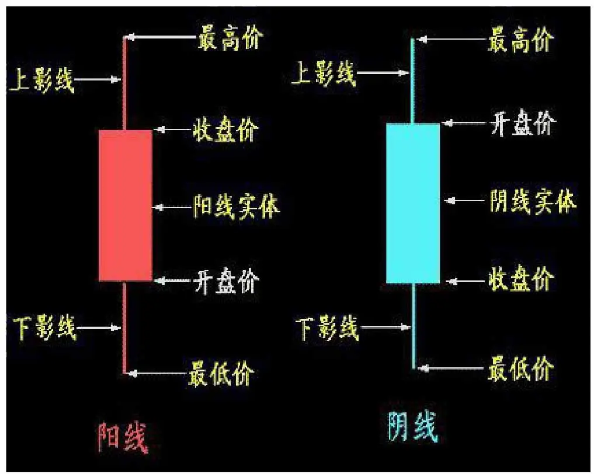
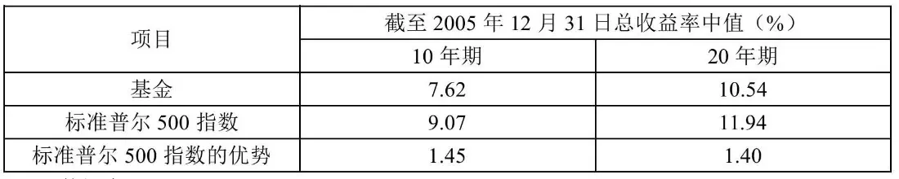
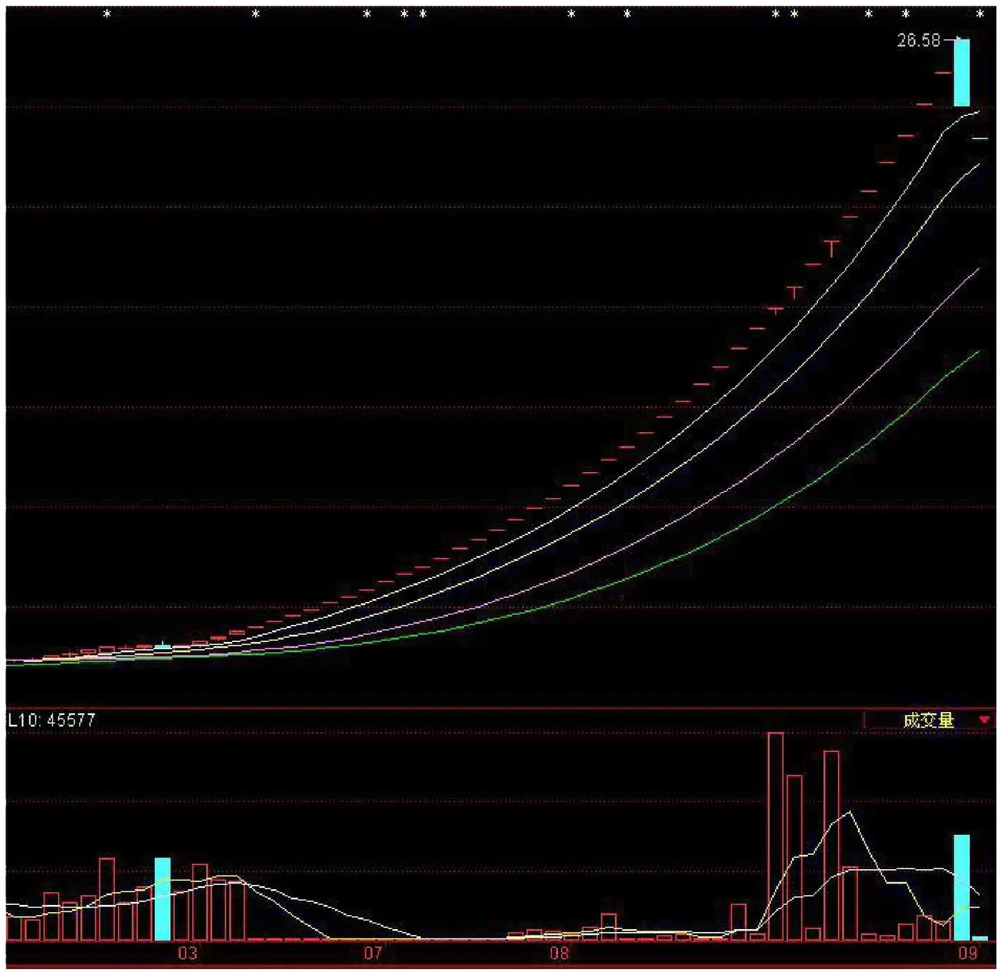
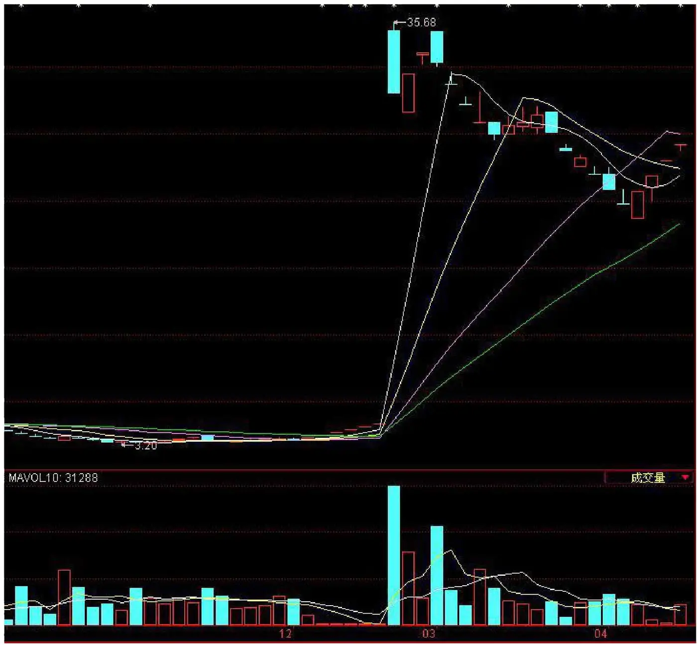
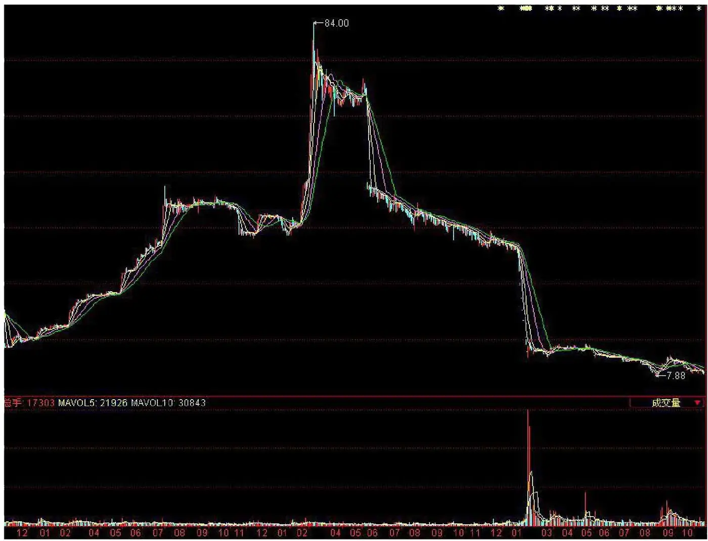
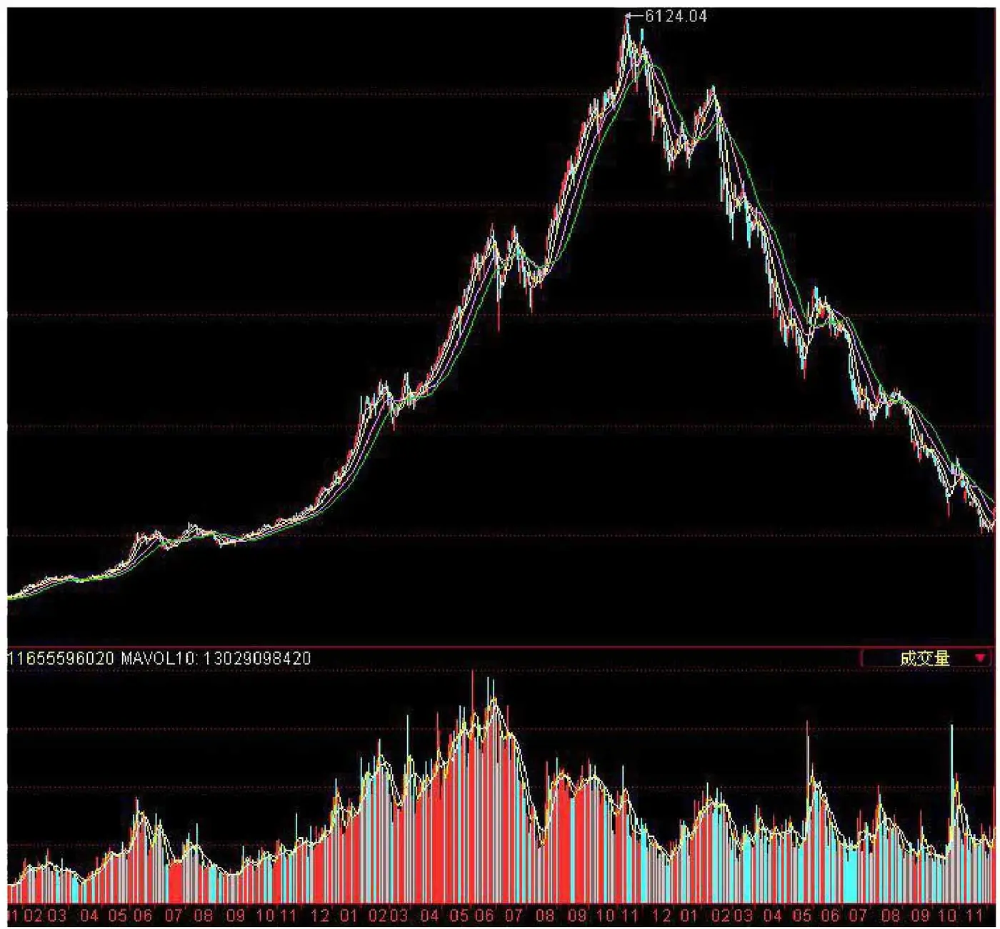
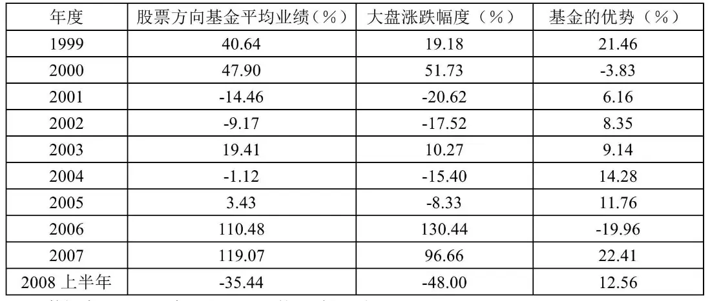
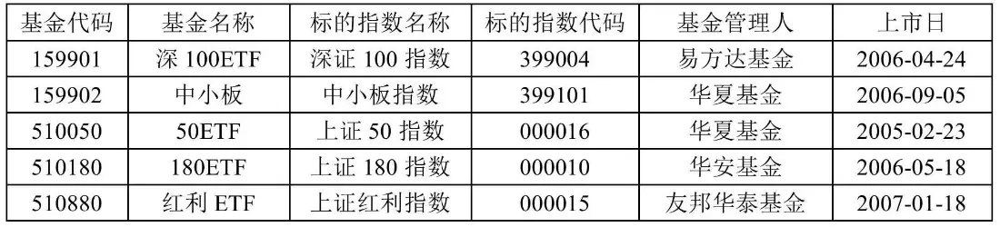

# 《林皓墨 散户的最后一课》全文合订版

> 共33个章节。原章节顺序、段落结构和图表均予以保留。

## 前言

__前言__

这是一本写给散户的书；准确地说，是一本写给中小散户的书；更准确地说，是一本写给没有人脉关系、没有大量资金、没有证券专业知识的中小散户的书。

写这本书是因为一种责任感的逼迫。以前也写过一些文章，但没有一篇是关于股票的，因为股票就是我的职业，天天泡在这个市场，我对它有严重的“审美疲劳”，然而也是因为职业的缘故，我对中国股市与中国股民有一定的了解——我了解的结果发现：中国股民对于中国股市并不了解，有时候这种缺乏了解甚至到了令人瞠目结舌的程度。我大致总结为三个方面：

第一是缺乏基础的证券知识。例如，有的股民买基金时会满怀憧憬地问：“利息是多少？”，除权除息日会欲哭无泪：“今天我的股票怎么突然跌了这么多？”，权证到期被注销之后会莫名惊诧：“我的股票怎么不见了？”……

第二是没有正确的投资理念。比如，股价下跌后坚决不卖，其理论依据是“不卖就还没有亏，卖了就是真的亏了”——典型的鸵鸟心态，可见股市也用到了仿生学。股市火爆的时候，见面打招呼就是“有消息吗？”——据说消息来自一位基金经理，他是“我的大舅子的一个同学的一个牌友的一个邻居的姐姐的一个同事的远房表哥”……

第三是对更深层次的“潜规则”的懵然无知。看到上市公司关于重组的澄清公告后割肉出局，结果没多久发现当初是被庄家顺利震出；发现几乎所有的券商研究机构都在推荐同一只股票，以为必涨无疑，赶紧买入，成功被套……

2006至2007年的大牛市，受益的不仅有券商，还有书商；推高的不仅有股价指数，还有股票书籍的销售量。一时间，无数“股神”纷纷横空出世，众多“教授”竞相著书立说。但直到一位朋友要我推荐本股市入门读物，我到书店里逛了几回，花花绿绿的封面看迷了眼，才发现找不到一本适合中国散户的书。当然，我不是说这些书的水平不高，它们或许可以成为传世之作——反正“物质不灭”，不管书日后以什么形态存在，那都是“传世”了——只是对于散户而言，它们并不适合：

第一是缺乏针对性。目前市面上许多书似乎都要把读者培养成未来的巴菲特、索罗斯，但对于普通散户而言，这种可能性有多大？这好比一位娇弱柔美的女人向一个武师求教，希望他能教一点防狼绝技，结果武师写了本《九阴真经》给她，这是不是很荒唐？显然，这位美女没有那个能力资质来练什么绝世武功，她想要的不过是《女子防身术》之类简单有效的技巧。《九阴真经》再厉害，那只适合欧阳锋，不适合她。更何况，许多书还只是胡编乱凑的旁门左道，比如有的“股神”的书里居然写道“在熊市里，各地的证券交易所生意非常冷清”。原谅我的孤陋寡闻，我真不知道中国证券业什么时候已经发达到各地都有“证券交易所”了。这简直就像周星驰电影《功夫》里向鼻涕男孩兜售“武功秘籍”的叫花子，你照着他的书就算苦练十载，不仅成不了武林高手，只怕倒要走火入魔。

第二是缺乏真实性。很多书里把股市描绘得遍地黄金，仿佛看了他的书不久后就可以实现财务自由，有点文采的还写得无比煽情，比如“牛市喘着粗气向我们扑来”。这些话真的能信吗？可能你需要经历惨烈的事实后才能明白，股市这场盛宴里虽然有“牛排”，但也有“熊掌”，对于散户而言，“牛排”吃不到几口，“熊掌”更不是摆在盘子里的美肴而是长在猛兽身上的利爪，被它拍一下可不是闹着玩的。真正写出事实的书不多，好比我们从小接受的教育教导我们要像牛那般勤勉努力地工作，但我们要经过自己长时间的摸索才发现，其实如狗一样会摇尾献媚才是获得擢升的不二法门——这个秘诀有几本书会告诉你呢？

第三是缺乏趣味性。我的一大憾事是在年青的时候没有好好学习、天天向上，但我坚持认为责任不在我自己——罪魁祸首应该是中国教育制度。本来知识都是妙趣横生的，经中国教育界一加工，立即神奇地变得枯燥无味、面目可憎。梁启超曾说：“我是个主张趣味主义的人，倘若用化学化分‘梁启超’这件东西，把里头所含一种元素名叫‘趣味’的抽出来，只怕所剩下的仅有个零了。”但如果我们用同样的化学化分法来处理中国教材，想从里面把“趣味”抽取出来，那它们仿佛是练就了“金钟罩”、“铁布衫”，根本就是毛发无损。写书的“股神”、“教授”想必也是由中国教育事业培养出来的高材生，多年的媳妇熬成婆，以前看别人的书现在终于轮到自己写书了。根据历史经验，婆婆不会因为自己当媳妇时受了苦而对现在的媳妇宽容，反而往往是变本加厉的凶残。怪不得大部分书的功效更适合治疗失眠而不是传道授业，比安眠药更有作用且没有副作用。

当我还是个愤青的时候，很敬重一位喜留平头的作家，他说，医治国人的病体是小事，拯救国人的精神才是关键。对于股民也是一样，教育是首要任务。既然目前没有一本适合中国散户的书，那么我不揣浅陋，愿来作一尝试。因此，我决定写这本书，写一本具有针对性、真实性与趣味性的散户股市入门读物。当然，至于我最终是否达到了这一目标，那需要读者来评判。

不过，特别要申明的是，我不是“股神”，本书与其他“股神”的书完全不一样，你不要指望本书能指导你在股市中获得超额收益——相反，本书的目的是想让你清楚地认识股市，最重要的，认识自己在股市中的地位，牢牢地记住，你只是个散户——我不是看轻散户，我自认相对于其他“股神”来说，我对中国散户更有着厚重的尊重与同情——记住你只是个散户，你的目标应该是获得平均收益，否则，等待你的只会是“熊，散户亏；牛，散户亏”的命运。

这本书算是个人写作的一次转型吧。我也岁届中年了，再去吟风咏月、伤春悲秋不免矫情怪异，而写人文思想类的文章又应者寥寥——一个人自娱自乐会感觉“到底意难平”，这种现象不仅存在于某种生理活动，写文章也是一样。近年来看到了许多成功转型的案例，比如学美声唱法转战流行乐坛可以红得发紫，而某些“脱星”甚至完成了向“巨星”的嬗变。我不奢望像她们那样转得尤如借壳上市的题材股，只要能帮助读者对中国股市有更深入清醒的认识，便是笔者之幸了。

## 第一章 基础理论：会跳起来的苹果

__第一章__

__基础理论：会跳起来的苹果__

__1\.1、最基本的问题：股票是什么？__

既然我们聊的是股市，那么一切就从股票开始说起吧。我们首先要讨论的一个问题是最基本、最简单但可能也是没有几个散户可以说清楚的：股票是什么？

2007年5月，一个中学同学打电话给我，这位兄台是我家乡镇里的“高干子弟”，游手好闲的专业户，接到他的电话我颇为惊讶，因为我们已经有十多年没有联系了。他跟我客气地寒暄，把我及我家人问候了一通，忙完了这些准备工作，他突然说到：“最近股票很火啊，你是专业人士，能不能给我点消息？”——我恍然大悟，原来这才是正题，心里也对他这种常见的散户易犯错误感到好笑（至于为什么说这是一种错误，后文会再详细论述）。我答道：“你也开始炒股了？你知道什么是股票吗，就敢炒？”这位仁兄虽然不学无术，反应倒也不慢，他在电话那头愣了一愣，然后理直气壮地说道：“有几个男人能说清楚女人是什么？这妨碍泡妞吗？！”

我家乡是个很小的县镇，中国地图要做到席梦思那么大，才可以在上面找到它的名字。炒股之风已经刮到那里，我预感到本轮行情可能有危机了，果然，大约一周后便发生了赫赫有名的5·30“五卅惨案”——为什么我这位中学同学的入场会给中国股市带来这样一场大灾难留待以后分解，这里主要批驳一下他的诡辩。

我不知道中国有多少股民是像他这样根本不知道股票为何物就英勇入市的，但我估计不会是个小数目。证券投资与男女情爱大不一样，后者靠的是生命本能，你可以听凭身体分泌的荷尔蒙的驱使，而前者靠的是理性与智慧，抱着无知者无畏的态度进入股市相当于是来做慈善活动。所以，如果你真的想在这个市场赚到钱，我们还是老老实实，从最基本的概念开始。

虽然我们谈的是股票，但一切却要从“公司”说起，我们来看一个最简单的经济模型（不要被这个术语吓到，本书里所谓的模型都是些小故事）：王二是一个村里的首富（其实公司、股票都是外国人发明的，但考虑到“王二”比“尼古拉斯凯奇”要简短得多，为了节省字数，我们的模型里就用中文名了，顺便增强点民族虚荣心，反正有闲人能考证出电影发源于中国——因为中国古代就已经有了皮影戏，说不定哪天同样能有人考证出股票也源自中国，到时更体现了本书的先见之明），他发现村里有一个特大的商机——本村的主业是农业，每家每户都特别需要拖拉机，而市场上却没有这样的设备供应。这个时候很明显，生产拖拉机简直就相当于生产印钞机。然而，王二发现了这个商机，却无法付诸实施，为什么呢？这是因为生产拖拉机所需要的投资非常大，比如，需要500万的资金，而在村里福布斯财富排行榜第一名的王二也不过只有200万的闲置资金，连他都吃不下这个项目，就更不要提其他人了。但是王二不仅有财，按现在的话说，还很有才，他提出来合伙的做法，找到村里的另外两个有钱人张三与李四，让他们各自出资150万，再加上自己的这200万，拖拉机项目就可以启动。三个人约定好，项目的收益按各自投资额的比例分享——这便是公司的最原始形态。同时，我们也可以看到这种按投资比例分享收益便是股票的第一个特征：__收益性__。

当然，我们现在看来，这其实就是凑份子的做法。你肯定会说如果我生活在那个时代，应该也可以达到王二那个有才的水平。但我们不要忘记，人类历史上的每个第一次都是值得我们尊重的。下面我们就要说到股票，这里的技术含量就大大增加了。

随着生产规模的不断扩大，项目所需要的资金额也越来越庞大，比如现在村里开始要造飞机，至少需要1亿的资金，这个时候，王二即使把自己认识的所有有钱人的钱凑在一起也不够。怎么办呢？王二便打起了搞群众运动的主意。村里有这么多人，虽然每个人的资金量并不大，但如果集合在一起，却是一个足够大的数目。于是，他把筹资的范围扩大到了整个村，通过村里的广播向村民画了一个造飞机赚大钱的饼，提议全体集资，然后同样按投资额比例分享收益。村民对公司的投资，便以股票的形式来记载，村民就叫做股东。这样，飞机项目的资金就有了着落。德国有位姓马的大胡子革命家对此有过论述：“假如必须等待积累去使单个资本增长到能够修建铁路的程度，那末恐怕直到今天世界上还没有铁路，但是，集中通过股份公司转瞬之间就把这件事完成了。”

从表面上看，这似乎只是扩大了凑份子的范围而已，但其实已经从量变转化为质变了，正如从部落发展到国家，也是范围的扩大，其性质却完全不一样。这一次的转变，意味着公司升级到了公众公司。不过，股票真正有趣的内容，却在下面。

刚才已经讲了股票的第一个特征：收益性，接下来讲第二个特征：__不可偿还性__。由于股票是公司资本的来源，也是公司运作的物质基础，那么为了公司的持续发展，就规定股票不可偿还——我们也可以想象得到，如果允许退股的话，公司的资金份额会不断减少，不利于公司的经营，如果大部分股东都要求退股的话，公司就只有宣布解散了。那么，这个不可偿还性会带来什么问题呢？

它最直观的缺陷就是股东从此无法脱身了，这跟通常说的“泡妞泡成老公”的道理是一样的，经济学上叫做丧失了流动性，即资产无法变为现金。为了弥补股票的这个缺陷，我们的天才王二就引入了股票的转让制度，这也就是股票的第三个特征：__流通性__。虽然股票不能退股，但可以转让给其他人，比如从村民甲转让给村民乙，这个时候，公司资本没有发生变化，只是股东不同了而已。随着股票转让的流行，王二干脆建立了一个集中市场来进行股票交易——这与我们划定一块地方作为菜市场在逻辑上是一样的——这个市场，就是现在的证券交易所。

流通性也带来了股票的第四个特征，也是让无数股民前仆后继杀入股市的根本原因：__价格波动性__。我们来看看“苏宁电器”（002024），该股于2004年7月21日上市，当天的收盘价是32\.7元，而不到三年后，其价格（复权后）达到一千多元，上涨30倍。让我们闭上眼睛意淫一下这个财富的增值是什么样的速度：假设你在30岁的时候投入10万元（一般中产阶级都可以承受的数目），那么在3年内上涨30倍，10万将变成300万，再到36岁的时候变成9000万，不到40岁你将拥有27亿！……是不是兴奋得浑身发抖，准备提笔写辞职报告了？先不要这么激动，我们再来看另一个例子：“银广夏”（000557）在2001年12月29日的最高价达到37\.99元，而到了2002年1月22日，它的最低价只有2\.12元，市值缩水接近95%！而且，这一切就发生在一个月之中！假设你在39岁把你的27亿投到这样的股票，那么按照这个贬值的速度，只需要几个月时间（还等不到你过40岁生日），你的资产将只剩下几万元！——真正的一夜回到解放前。怪不得一位欧美投行人士对证券市场如此评论：“除了战争，这是最刺激的事。”不过，我建议你，还是多想想惨烈下跌的例子，而不要整天梦到疯狂上涨的个案——相信我，这会有好处的。

2026年3月2日

22:50

## 1.2、买股票就是买上市公司未来的利润

\(03\) 1\.2、买股票就是买上市公司未来的利润

__1\.2、买股票就是买上市公司未来的利润__

中国股市目前有近2000只股票，翻翻它们的行情图，你会发现，它们的价格差异非常大，“中国船舶”（600150）最高价达到了300元，而有的股票只有几元钱。如果说奥迪比奥拓贵、法拉利比夏利价高我们容易理解，但股票是看不见摸不着的玩意，是什么造成了股价之间这么大的差异呢？这里我们就必须要了解一个概念——股票的内在价值。

股票不同于普通商品的是，它没有实质上的使用功效。我们买块牛排，是因为它可以刺激我们的味蕾、填饱我们的肠胃；我们买件靓衫，是因为它可以遮体御寒乃至帮我们吸引到异性的眼球。这些商品都给我们带来具体的效用，因此，我们能够直观地理解它的价值。但是股票呢，我们买股票甚至连纸都没有一张，它不能看不能摸也不能吃，它的效用在哪里呢？

金融是拿钱生钱的行业，而金融产品的效用也正是它所带来的未来的收入。前面我们已经讲过，股票具有收益性，你拥有一只股票后，便可在未来享受该上市公司的利润或者说是利润分红，这便是股票的效用——它可以带来“未来的钱”。

那么，既然其效用是带来“未来的钱”，但我们买卖股票却是在现在，如何在现在为“未来的钱”定价？现代金融学认为，股票的价值便是其未来股利的现值（present value）。

这里出现了一个术语——“现值”，我建议你牢牢记住，因为术语是最能冒充内行、吓唬外行的工具之一，比如跟朋友一起看科幻片时，你如果能冒几个“奇点”、“虫洞”之类的怪词，别人准以为你对宇宙物理学有深入研究；同样，如果几个人在一起聊股票，你装作漫不经心地说“这只股票的价格已经低于它未来5年利润的现值”，必然会让同性佩服异性臣服。“现值”是金融学上的一个重要概念，简单地说，现值就是未来的钱在现在值多少钱，而把未来的钱换算成现在的钱的运算过程就叫做“贴现”。举个最简单的例子，如果目前的年收益率是5%，现在的100元钱在一年后就变为105元，那么反过来看，一年后的105元就相当于现在的100元，现在的100元便是未来的105元的现值。

据说霍金在写《时间简史》的时候，毕竟他是数理专业的，手痒难抑，打算在书中插入不少数学公式，一个朋友忠告他：“你每写一个数字公式，读者就会减少一半”。最后，他在书里只保留了一个数学公式，就是著名的质能方程式。现值的算法也有一套公式，只要有了未来收入的数据与贴现率，拿EXCEL或计算器就能算出现值（当然，实在这样两样工具都没有，你也可以用铅笔，只是耗费的时间要长一点）。为了超越霍金，我决定一个数学公式都不写，你只需要记住这样一个结论：未来的钱越多，它的现值就越大（这其实是明显的废话）。

具体在股票上，未来的钱便是股票的股利即上市公司的分红，所以上市公司未来的分红越多，股票的价值就越大。由于上市公司分红的来源是它的利润，那么最后我们可以得出这样的结论：__买股票，就是买上市公司未来的利润；上市公司未来的利润越多，股票的价值就越大__。如果你在看这本书的时候手边有支笔的话，我建议你在这句话上做个记号。为了以后叙述方便，我们就把这条定律叫做“__价值定律__”，它是股票投资的精要所在。

2026年3月2日

22:50

## 1.3、会跳起来的苹果

\(04\) 1\.3、会跳起来的苹果

2026年3月2日

22:50

__1\.3、会跳起来的苹果__

前面讲到股票的价值，这其实只是理论上的概念，在实际中经常上窜下跳引得无数股民脸上的表情像走马灯一般变化的，都是股票的价格。那么又是什么影响着股票的价格呢？

有一个讽刺经济学家的笑话说，如果你能教会一只鹦鹉说“供给”与“需求”，那么你就把它培养成了经济学家，由此可见供需决定价格的理论在经济学中的重大意义。股票也是一种商品，它的价格也是由供需来决定的。如果卖股票的人多（其实准确点说，应该是卖的股票的数量多，因为人多未必股数大），那么相当于股票的供给加大，股价会下跌；而如果买股票的人多，则相当于股票的需求增加，股价会上涨。但这相当于没说，因为这又会引入另外一个问题：什么影响着股票的供给和需求？

这个问题既复杂又简单。

说这个问题复杂，因为我可以列出一大堆因素，它们都可以影响到股价：上市公司的经营状况、银行利率、资金充裕程度、经济周期、大众心理、小道消息……国外有好事者甚至把股价的波动跟太阳黑子活动的关系作过专门研究，然后根据太阳黑子的变化来预测股市。想象一下有人拿着天文望远镜对着太阳晃了几下，然后压低声音，很神秘地告诉你：“太阳黑子今天非常活跃，股市近期将要大涨，赶紧去买股票吧！”——你是不是想抢过天文望远镜来砸他的头？

正因为影响股价的因素非常多，所以股市似乎跟天气一样，存在着蝴蝶效应。这个定律说的是，一只蝴蝶在巴西扇动一下翅膀，会造成一个月后在德克萨斯州的一场龙卷风。我们来看一个据说是真实的案例：英国有一家银行是上市公司，它的总行修得气派奢华，在大厦边有一圈像屋檐的设计，上面是各种各样那种在国外常见的扭胳膊拧腿的雕塑，这本来也是件正常不过的事，但这个大厦的设计师可能做梦也想不到，这会在后来惹出大祸。有一天突然下起了大雨，于是许多人到这家银行的屋檐下避雨，人越聚越多，远远望去像一条排队的长龙。这时不知道哪个路人突然发挥了可怕的想象力，认为这些避雨的人是在集体取钱，说得专业一点就是“挤兑”，这可是银行最大的恶梦。不要以为只有在中国才是“好事不出门，坏事传千里”，老外也差不多，这个谣言一下子传开来，人们都以为这家银行出了问题，它的股价应声下落，而股价的下跌更让人们相信了传言，在这家银行有存款的纷纷去取钱，形成了真正的挤兑……有谁会想到一场大雨会冲垮一家银行的股价？

因为股价变化如此的扑朔迷离，有的经济学家就干脆说股价纯粹就是一个心理预期因素的反映，你认为它值多少钱，它就可以值多少钱——是不是很像我们“人有多大胆，地有多大产”的口号？这其中最有名的是“博傻理论”，就是说我花很高的价钱买了一只股票，你认为我傻？不要紧，我相信有人比我更傻，他会花更高的价从我手里买走，我还是有钱赚——一个类似击鼓传花的游戏。这个理论在短期内，它是成立的。最近的例子就是我们2007年那波让很多人兴奋得快要抽搐的牛市了，当“中石油”（601857）超越埃克森美孚成为全球第一大公司、“工商银行”（601398）超过花旗银行成为世界市值最高的银行、“万科”（000002）变成全球第一大市值地产公司的时候，你真的会相信我们的这些公司值这个“世界第一”的价格吗？除非你真的是“很傻很天真”，不然不会相信这样的神话。但是，这不妨碍我们继续推高股价，因为我们在潜意识里总相信，这不是最高点，还会有人来接盘，于是股指继续高攀，直到6124点的天位。

如果股价真的是由投资者的心理因素决定的，那么是不是意味着我们观测大众的心理就可以在股市中稳操胜券？理论上是这样的，但在实践中，没有比预测大众心理更难的事了。牛顿够牛了吧？结果还是在股市中亏得灰头土脸，最后只能酸溜溜地自嘲：“我可以计算到天体的运动，却不能计算到大众的疯狂。”为什么牛顿有这么高智商又有这么吉利名字的人都不能预测到股价呢？你可能会想到前面那家倒霉银行的例子，但那只是极端案例，是小概率事件，大众心理难以预测的根本原因在于你预测的对象是会学习、变化的，所以没有规律可循。

牛顿研究的物理世界与股市不一样，在他研究的那个世界里，科学定律可以被重复验证。比如由于存在地心引力，苹果会从树上垂直落到地下，不管试验多少个苹果，都会得到相同的结果。所以知道这条定律之后，我们路过苹果树下就要小心，因为不是每个人都像牛顿那样幸运，被苹果砸中了还能发现科学定律而没有得脑震荡。我们不可想象这样的情况——我们看见地上有一个苹果，正在不以为然的时候，它突然跳起来砸在我们的脸上，然后顽皮地哈哈大笑说：“小样，你以为我就不会跳起来吗？”——因为苹果是没有学习能力的，它不可能根据我们的位置来变换它运行的轨道。而股市不一样，股市的参与者跟我们一样，都是具有学习能力的人，他们就像那只会跳起来的苹果，根据历史经验、对手的行动等等信息来调整自己的行动策略。这个在经济学上叫做“博弈论”（game theory），既然本书的目的不是打算教你混个经济学学位，就不详细讲这个理论了。你只需要认识到，__参与股市的人都与你一样智商正常（我通常是假设他们的智商比我还高），你所能依据公开信息做出的判断其他人一样可以做到。__我们可以把这条定律叫做“__博弈定律__”。这里我再一次请你拿起笔做个记号——放心，做完这个记号你就可以把你的笔扔掉了，我不会第三次提出这个要求。“价值定律”与“博弈定律”是本书理论的两条最基本的定律，绝大部分结论都是由这两条定律演化而来的。

根据“博弈定律”，因为人具有学习与应变能力，所以股市中会存在一种“规律自动失效”的现象：简单地说，人们如果发现了一条股市涨跌的规律，那么这条规律被发现以后就会自动失效。2007年曾经有人对大盘的几次单日大跌作了一个分析，发现几次大跌时间间隔都是26天，于是他得出一个结论，大盘跟女性一样具有较为规律的生理周期，并预测出大盘的下一次大跌是2007年6月11日。结果如何呢？那天大盘显然得了生理周期紊乱的妇科疾病，上涨了2\.11%。很清楚，如果大家都预期6月11日会跌，那么人人都会在这个日期之前出逃，规律便自动失效。显然，股市是最不能容忍教条主义的地方，《孙子兵法》中说的“兵无常势，水无常形”倒是对股市的一个好总结，所以反复亏损的老股民会调侃地说“傻瓜次次不同”，意即每次上的当都不一样。

所以总结地说，如果有利好，那么市场上所有的人都会调整对股票的估值，价格会直接到达充分考虑了利好因素的水平，如果有利空则恰好相反。在到达了这个充分考虑了利好或利空因素的水平之后，便是无数大众的心理博弈，而这是无法预测的。要明白这种预测的不可能性，你只需要想象一下这个事实：实际上，市场上的每一笔交易都是在两个意见相反的人之间达成的，买家认为股价要涨，否则他不会买，而卖家却认为股价要跌，否则他也不会卖准确地说，应该是买家认为这是收益率最高的股票，而卖家则认为不是。。——你能说得清楚股价到底是会涨还是会跌？

这种股价在短期内不可预测的现象，在经济学上有个专门的名称，叫做“随机漫步”（random walk）。如果你还是不相信，认为这只是理论上的空谈，那么我再给你举几个真实的例子。

第一个例子是我自己的实验。在我进入证券行业之初，我花了一个月时间进行了一项实验：每天开盘前看完三大证券报，并根据掌握的所有信息对今天的大盘做一个涨跌预测。一个月的实验下来，正确率大约是55%，错误率为45%，我盯着这两个数看了好久，突然想到，这个结果其实跟抛硬币没有两样啊！如果正确率与错误率有悬殊的差别那该多好——哪怕是错误率特别高也好，比如错误率如果是90%，我反向操作也能赚大钱。——什么世道，想犯错误都这么困难。

第二个例子是国内的统计研究。你或许会说上述的实验只能说明我的水平不高，那么我们再来看看国内“高手”的情况。中国证券网曾对三大证券报自2000年9月7日至11月14日所发表的各种形式的股评和荐股文章进行统计，并按荐股在有效期内的涨跌幅度评分，按统计者的话说，“得出的结果令人惊讶”（其实我一点都不惊讶）。按所列入的股评家人数计，304人中152人得的是负分，正好占50%；304人总共得了60\.32分（每人满分应为100分），平均得0\.198分，接近0分。按所荐股票的数量计，在43个交易日中总共推荐股票4937只（次），平均每只（次）得分0\.0122分，几乎全军覆没。

第三个例子是华尔街的实验。你可能还会说国内黑嘴是被庄家收买，股评的失败是因为他们的动机不良，并不意味着股价在技术上不可预测，那么我们又来看看国外的例子。美国几个经济学家在一间屋子里挂满了纸条，各个纸条上写着股票代码，然后找了一只猩猩（理论上它的智商应该比我们都低），让猩猩去扯纸条，它扯下来哪张纸条，经济学家就买入纸条上写的股票。隔了一段时间之后，把猩猩所选的投资组合的业绩与市场上基金经理的业绩相比较，惊讶地发现它的成绩居然在整个基金业中处于中等偏上的水平！这意味着美国基金经理的选股水平跟这个长毛光腚、憨态可掬的大猴子差不多！这还是与美国的基金经理比较，如果比较的对象是中国的基金经理，可能还不需要出动灵长目这么高级的动物。——天知道猩猩的选股标准是什么，也许它只是看哪个代码更像香蕉。如果说随机选股与经过刻意研究选股的结果差不多，那么就只能说，股价是随机变动的，所以刻意选股不能胜出。

最后一个例子是一个“股神”的事迹。伊莱恩·葛莎莉是美国一家证券公司的副总裁，1987年10月12日，她预测说“股市崩溃就在眼前”。两天之后，她更把胸脯拍得“砰砰”响，信誓旦旦地告诉美国一家著名的日报，道·琼斯指数很快就会下挫500点以上。一个礼拜后，著名的“黑色星期一”降临了。刹那间，她变成了媒体宠儿。而几年之内，她就把她的名声转化成了一笔财富。她是怎么做的？按自己的预测来炒股吗？当然不是。实际上，资金如潮水般涌入她创办的基金，不到一年就达到了7亿美元，只收1%的管理费，她一年就入账700万美元。此外，她还开始发表投资业务通讯，而订阅者很快就增加到了10万人。权威的预测形象让伊莱思·葛莎莉发了大财——但她的追随者们却没有这么幸运。据统计，她在1987\-1996年间做了14次预测，只有5次正确，正确率为36%，连我都还比她多出几个百分点。由于她在股灾之后仍然看空，结果错过了此后的大幅反弹。直到1994年，她的基金的持有者们打碎了牙齿往肚子里吞，不声不响地投票决定终止该基金的运营。

说了这么多，运用到实际上来，“随机漫步”对我们有两点指导意义：

第一是不要去迷信“权威人士”的预测。以后谁再告诉你这只股票短线将要涨或是将要跌，你不要真的以为自己像武侠小说中掉到悬崖下的正直青年捡到了武林秘藉。我看到电视上的股评节目，很惊讶许多股民会问所谓的专业人士：“我买了×××，后期该怎么操作？”还有些公司开发出什么炒股软件，打开电脑就能清楚看到所谓的“买点”与“卖点”，仿佛炒股是全天下最容易的事，让我不解的是，据说卖这些软件的人还赚了大钱——当然，利润的来源不是炒股而是软件的销售收入。你如果实在不相信“随机漫步”的理论，那么应该相信自己的常识：一个最简单的逻辑是，如果那个人真有预测股价的本事，他早就在福布斯财富排行榜上了，用得着这么辛苦穿西装打领带对镜头做表情来听你提问、两眼发黑地对着电脑屏幕编程？

第二是不要进行短线操作。很多散户热衷于频繁买进卖出，个中“高手”还喜欢做所谓的T\+1（买卖两笔操作相隔一天）、T\+0（买卖两笔操作发生在同一天），一万元的资金量一年可以做出几十万的交易量。他们对证券市场的贡献确实很大，给政府交了不少印花税、给证券公司奉献了很多手续费，没有他们，难以想象中国证券市场可以养活那么多闲杂人员（当然也包括我在内）。根据我的观察，这种操作的结果一般是牛市赚小钱、熊市亏大钱。当你在不断短线进出的同时，你很快就会发现，市场上似乎有一双眼睛一直在暗暗窥视你的操作并总是跟你对着干：股票在你手里捏了几天就是不动，等你一卖出去马上就会涨；看着一只股票连涨了几天似乎会有大行情，结果你一按捺不住冲了进去立刻就开始跌。至于T\+0、T\+1的操作，顾名思义，那只会把资产规模从牛仔裤缩水到T字裤。

不过，股价短期无法预测有一个例外，那就是庄家（或者内幕信息知情者），他在一定程度上可以控制股价，从而，他是可以预测的，这在“庄家”等节会专门再讲。但是这个例外对我们来说是没有任何好处的，有庄家的股票散户只会死得比“随机漫步”还要惨，当然，如果庄家是你大舅子，那又另当别论。

股价无法预测似乎让人悲观：这是不是意味着研究股票没有任何意义？不要绝望，股价在短期内无法预测，但对于长期而言，还是有可能的，这就是我们下面要讲的，股价在长期内终会向价值回归。

## 1.4、价值是人，价格是狗

\(05\) 1\.4、价值是人，价格是狗

2026年3月2日

22:50

__1\.4、价值是人，价格是狗__

股价在短期内完全由大众心理因素决定，而大众又是最容易被蛊惑而丧失理智的，不要以为我在信口开河，人类历史上有太多这样的悲剧，世界大战、文革都是如此。不过，我们这里还是只谈股票。如果大众过于乐观，不对，应该说过于疯狂更确切，那么在短期内股价可能严重偏离其价值，这就会形成众所周知的“泡沫”。

历史最悠久的泡沫可能是17世纪初荷兰的郁金香泡沫，当时的郁金香花茎卖到了天价。据说一位水手到荷兰吃饭，可能他跟我们中国的山东人一样，喜食大葱，当天吃饭时总感觉缺少点味道，恰好其时店主又不在场，就自己动手找到一颗洋葱来凑数解馋。店主发现后欲哭无泪，原来水手吃掉的是一个郁金香花茎，其昂贵的价格他就是打一辈子工也还不起，最后只能坐牢顶罪。——喜欢吃洋葱的同志们是不是看得一身冷汗？结果泡沫破灭的时候，郁金香花茎还没有一颗洋葱值钱。——可怜的水手，你实在是运气不好，要迟几个月再犯馋病也不至于遭此牢狱之灾了。

另一个古老的泡沫是英国的“南海泡沫”，就是这场泡沫把牛顿也套牢了。南海公司成立于1711年，是英国的一家特许贸易公司，一听这名字，就让人感觉它跟政府的关系不错，事实上也的确如此，因为它给英国国会的议员支付了大量贿赂。于是，英国人跟现在中国人的思维一样，认为跟着政府的企业有肉吃，于是，南海公司股价一路上升。并且，南海公司的董事是制造“新闻”的好手。他们不断给媒体透露各种各样的消息，而这些消息几乎全部都对南海公司极为有利，比如我们又发现金矿了、又拿到港口的经营权了等等，当然，这些消息的真实性相当于我们当年“浮夸风”时“亩产万斤”的报告。南海公司的股票价格逐步上升，从每股120英镑开始，最高峰达到950英镑。乐极生悲，南海公司的董事和高管发现股价实在是涨得太离谱了，再也没有信心把这个牛继续吹下去，于是将自己手中的股票抛售一空，这在泡沫上捅了一个小孔，泡泡“砰”地破开，短时间内股价一泻千里，又回到了最初的价位。

最后再说一个发生时间比较近的泡沫：发生在20世纪末21世纪初的美国网络股泡沫。当时的网络股龙头是亚马逊公司，这家公司是做网络书店的，书没卖到几本，亏损却是惊人，比它的亏损更惊人的是它的股价——它的市值反而超过了已上市实体书店的市值之和。为了沾点网络的光，当时的上市公司不管跟网络有多少关系，都想在名字后面加个“多吃糠（\.com）”、把总经理的头衔换成“蛇一窝（CEO）”，只要这么一变，股价立即上升。当theglobe\.com这家公司上市的时候，首日交易量创造了历史记录，股价从9美元一路摸高到97美元，市值当天一举突破10亿美元，而它前三个季度的收入只有区区270万美元。公司的两名创业者（十几岁的小男孩）路演时，以新经济代言人的身份在一次新闻发布会上志得意满地对公众说：“对买到了我们公司股票的人我们表示祝贺，因为他们是幸运的，但可惜的是，大多数的人都很不幸”，不过，一年过后，他们的话就得反过来听了，那些“幸运者”很“不幸地”被套牢了。网络股泡沫虽然号称“新经济”，但还是避免不了跟老泡沫一样的结局。代表网络经济的纳斯达克指数在2000年达到5000点的巅峰后，开始大幅度调整，2002年，该指数最低1108点，相对最高点，3年跌幅达到78%。墙倒众人推，原来改名字的公司又开始争先恐后地要把名字改回去，讽刺的是，这次去掉“多吃糠”股价又还是会上升——可爱的上市公司，为了投资者的利益，你们辛苦了！

一个典型的泡沫形成的过程是：股市开始变暖，吸引资金流入，股价节节高升，财富效应扩散，这个效应吸引更多的资金流入，股价继续攀升，验证财富效应，原本还存一丝理性的资金也开始入市，股价进一步上涨……历史上的泡沫基本上都遵循这样的一个过程经济学家罗伯特·J·希勒在《非理性繁荣》一书中，将这一过程称为“正反馈环”。。但既然历史如此相似，为什么泡沫还会反复出现？人们为什么会如此轻易忘记历史的教训？这可能需要心理学家来给个解释，我虽然装模作样翻过几下《梦的解析》，但也有自知之明，就不在这里不懂装懂了。更为实用的，我们可以从自己的切身经历来理解这个问题，回忆一下那段还记忆犹新的历史是有帮助的。如果说2006至2007年的股市在前半段是正常的价格回归，那么在后半段就进入了一个泡沫形成并吹大的过程：网络、电视、报刊上满是财富激增的报道，一时间仿佛人们都统一认识到，炒股可能是最快最轻松的发财之道，大量的资金像潮水一样涌入股市，每天的新增开户数有几十万户，相当于一个中等城市的总人口集中进入股市，这还没有算上众多的已经开户但在上一次的熊市亏了血本、本来发誓金盆洗手但现在又重新入市的老股民。许多人甚至抵押掉房产、借高利贷去炒股，满仓的程度甚至到了不卖一手股票今天就吃不起晚饭。新发的基金一天就可以轻松募集到几百亿甚至千亿的资金，把基金经理都看傻眼了，不得不订出募集资金的上限，而不久以前，他们还在到处鞠躬作揖地求人买基金。那是一段全民狂欢的岁月，重仓的赚大钱，轻仓的赚小钱，空仓的也能赚点同情。大家都感觉自己身价暴增，财务自由可能明天就能实现，在那个时候，中国股民达到了集体高潮，发出了“死了都不卖”的嘶喊。

根据我对现实生活的观察，泡沫的主要推手是巨大的财富效应，说得通俗点就是看见别人在股市赚了钱自己会两眼发红。我无法去统计有多少人是因为看到朋友赚钱而开始盲目地进入这个市场的，但在我认识的非专业人士当中，绝大部分都是如此。当邻居炫耀他不到两个月身价已经翻了一番，昔日的好友打电话来说他的资产数额又多了一个零而且是在小数点之前，有几个人能够依然保持理智？大部分人的反应是惊呼：上帝啊，你是不是近视眼？这家伙没有我聪明、没有我勤劳甚至没有我帅，他都能发财为什么我却不能？于是乎头一昏心一横，也慨然杀入股市。待到泡沫破灭、市值烟消之后，可能会更质疑上帝是不是得了白内障，却没有想过审视反省自己当初的行为。虽然说贪婪是人的天性，是几乎所有人都会犯的错误——我们毕竟不是圣人，可以箪食瓢饮还乐得屁颠屁颠——但是经过一次失败，我们一定要吸取教训，清醒地认识到这一人性弱点，极其努力地去克服它，避免类似的错误重复出现。很多时候，炒股比拼的不是智力，而是定力。

但只要是泡沫，它就有破灭的那一天。不可能让所有人都享受到脱离基本面的收益，人的心理预期是重要，短期内文革式的理念可以吹大泡沫，但吹得越大，离破灭也就更近了一步。在长期内，股价必然向其价值回归，这也就是我在前面为什么说股价的波动既简单又复杂——说它复杂，因为它复杂到短期内不可能去预测；说它简单，因为它在长期内必然向价值回归。

那么，为什么股价在长期要向价值回归，泡沫必然要破灭呢？主要有这几个原因：

一是总会有些清醒的人。记得林肯曾经说过“你可以在短期内骗到所有的人，也可以在长期内骗到一部分人，但你不可能在长期内骗到所有的人”，人是如此，股票也是如此。随着股价与价值的偏离越来越大，总会有一些人理智尚存，发现问题而开始抛售股票，从而引起股价下跌、泡沫破灭。有趣的是，观察历史，发现这些最早清醒的人往往都是一些内部人（简单地说，就是对公司基本面、内幕消息等最清楚的人）。比如，南海公司泡沫的破灭就是因为公司高管开始抛售自己持有的股票。还是那句老话，历史惊人地相似，2007年的时候，中小企业板的上市公司刮起了一股高级管理人员辞职的风潮。难道是这些上市公司的高管突然看破红尘、淡泊名利，放着高管厚禄都不要？不要那么天真，任何时候都要牢记“博弈定律”——这些人能坐到上市公司高管的位置上，说明他们比一般人要精明得多（当然，还有一种可能是他们的爸爸比一般人要精明得多）。因为现有法律对上市公司高管买卖股票有严格的规定，而当他们离职满半年以后，就不再受这些规定的约束。中小企业板上市公司的高管通常都有较大数量的股份，当泡泡吹得那么大的时候，卖掉股票的钱足够他们下半辈子开着私家游艇周游世界了，这种情况下，不辞掉高管的职位去卖股票简直就是对不起股民烧钱吹泡的深情厚意。

二是现实会对人们的预期进行修正。根据“价值定律”，买股票就是买上市公司未来的利润。一个泡沫的形成诱因，通常都是因为预期上市公司未来的利润会大大增加，而等到上市公司真正拿出成绩来时，可能会与预期大相径庭，这个时候人们就会开始质疑当初的定价。比如，100元的股票，这一两年每股只有0\.1元的利润，把利润全部分红其收益率也不过才0\.1%（还不算扣税），那你还会觉得这只股票值100元吗？

三是吹大泡沫的资金总有枯竭的一天。你可能会说，如果所有的人都不理智，人们也始终不关心基本面，那是不是泡沫可以永存下去，从而实现人人有钱赚？这个愿望虽然美好，但不可能实现。股价的上涨总是需要资金来推动，简单的逻辑是，如果交易的股数不变，那么股价越高，需要的资金也就越多。所以股价的上涨必须有源源不断的资金流入来作为支撑，而资金是有限的，当再没有新的资金入市的时候，股价也就到了顶。这好比一只烟花火箭，在它不断上升的过程中需要燃烧火药作为动力，当火药燃尽的时候，它也就开始掉头向下了。

当然，股价不仅有高于其价值的时候，也有可能低于其价值（这个时候就形成了所谓的“安全边际”，在后面的价值投资一节会再详细讲）。但不论怎样，它在长期内都会向价值回归。著名投资家安德烈·克斯托拉尼对此有一个形象的比喻：价值是人，而股价是狗，喜欢遛狗的人都知道，狗比人精力旺盛，它一会在人前面好远撒尿以资纪念，一会在人后面跟异性狗调情，但无论如何，它最终还是会回到主人身边——股价在长期内会向价值回归，这是价值投资的理论基础。

## 1.5、投票机与称重机

\(06\) 1\.5、投票机与称重机

2026年3月2日

22:50

__1\.5、投票机与称重机__

根据前面讲的内容，股价在短期内会因为人们的心理预期而脱离其价值进行波动，但在长期内又会向价值回归。那么，根据股价波动的这种特性，人类创立了两种基本的投资思想：一种是价值投资法，这种方法立足于股票的价值；另一种为趋势投资法，这种方法着力于分析人们的心理预期。我们先来介绍价值投资。

价值投资的思想首创者是格雷厄姆，因此他也被称为“价值投资之父”。格雷厄姆投资思想的大意是比较股票的价值与价格，当价格远低于价值时便买入，而当价格达到或超过价值时卖出，由于价格远低于价值时风险很小，他把这时的价值与价格之差叫做“安全边际”（margin of safety）。

在实践中，也确实有采用价值投资法而获得巨大成功的投资家，比如彼得·林奇等，而最著名的，莫过于接近神话的沃伦·巴菲特了。谈投资就不能不说巴菲特，这仿佛提到物理学肯定会想到爱因斯坦、谈经济学一定要讲到凯恩斯、一说AV则自然会联想到饭岛爱。

1930年8月30日，巴菲特在美国内布拉斯加州的奥马哈市呱呱坠地，美国“伟人”的诞生显然没有中国“伟人”那样惊天动地，我们看不到巴菲特出生时“满屋红光”之类的记载，但巴菲特的天才还是在很小就开始体现——按中国话说的“一岁看大，三岁看老”。他从小就极具商业和投资意识，6岁就开始当“倒爷”，做起倒买倒卖可乐的生意，刚刚跨入11岁，他便购买了平生第一张股票，回头来看，他还说后悔自己买得太晚——不知道你们如何，反正我11岁的时候钱都交给了一位老大妈，她在我学校门口卖玩具和零食。巴菲特当时买的是6股城市设施优先股股票（其中有3股是为他姐姐买的），每股的股价为38美元，这3股股票代表了他当时财富的大部分，股票价格很快跌到27美元，但不久之后又攀升到40美元，巴菲特在这一价位卖掉了他的股票，小赚了一笔。但是他卖掉股票不久，就遭遇到他早期的一个重要的教训，因为股票价格不久后就涨到200美元，根据弗洛伊德的理论，一个人的童年对其一生有着至关重要的影响，那么想必这次经历应该对巴菲特日后形成自己的长期投资风格起了很大的作用。

长大后巴菲特考入哥伦比亚大学金融系，拜师于价值投资创始人格雷厄姆。在格雷厄姆门下，巴菲特如鱼得水，很快成了格雷厄姆的得意门生，完成学业之后便开始大展拳脚进行实际投资。1962年，巴菲特合伙人公司的资本达到了720万美元，其中有100万是属于巴菲特个人的。两年后，巴菲特的个人财富便达到400万美元，而此时他掌管的资金已高达2200万美元。

1968年，巴菲特公司的股票取得了它历史上最好的成绩：增长了59%，而同期道·琼斯指数才增长了9%。巴菲特掌管的资金上升至1亿多美元，其中属于巴菲特的有2500万美元。而当股市一路凯歌的时候，巴菲特却通知合伙人，他要隐退了。随后，他逐渐清算了巴菲特合伙人公司的几乎所有的股票。1969年6月，股市急转直下，渐渐演变成了股灾，到1970年5月，每只股票的股价都要比上年初下降50%甚至更多。这是他避过的第一个股灾。

1970年\-1974年间，美国经济得了消化系统疾病“滞胀”，经济增长缓慢、通货膨胀严重，这害得美国股市得了某种男性疾病，一蹶不振。然而，一度失落的巴菲特却暗自欣喜异常，因为他看到了财源即将滚滚而来——他发现了太多的便宜股票。

1972年，巴菲特盯上了报刊业，因为他发现拥有一家名牌报刊，就好似拥有一座中国高速公路的收费站，任何过客都必须留下买路钱。1973年开始，他偷偷地在股市上蚕食《华盛顿邮报》，这家公司后来利润大增，每年平均增长35%。10年之后，巴菲特投入的1000万美元升值为两个亿。

1980年，他用1\.2亿美元、以每股10\.96美元的单价，买进可口可乐7%的股份。到1985年，可口可乐改变了经营策略，开始抽回资金，集中投入于饮料生产，其股价狂涨至51\.5美元。至于巴菲特究竟赚了多少，其数目可以让全世界的投资家咋舌，这也是巴菲特的成名之作。

在美国的网络股泡沫中，巴菲特坚守自己的投资信念，不买网络股。随着泡沫的吹大，巴菲特的业绩远远落后于市场，那是巴菲特一生中最难熬的一段时间。1999年夏天，《时代周刊》公然在封面羞辱巴菲特：“沃伦，究竟哪儿出了问题？”2000年3月11日，即纳斯达克指数到达其历史最高点的第二天，巴菲特给股东们写了一封信，承认自己的业绩不甚理想。在他承认错误的下一个星期一，纳斯达克指数就掉头向下。3月17日，大崩溃来临，现在没人有闲心嘲笑巴菲特了，因为他们忙着下单抛售网络股以自保。从2000年至2007年，巴菲特的伯克希尔·哈撒维公司的股价上涨141%，每股价格达到109，000美元，成为美国历史上第一只价格达到六位数的个股。同期，纳斯达克综合指数下跌了大约50%。换句话说，巴菲特超越了科技股市场191%。于是，又有媒体开始吹捧巴菲特为股神，包括一开始朝他吠叫的《时代周刊》。

1965至2007年的43年间，巴菲特所管理的伯克希尔·哈撒维公司净资产的年均增长率达21\.1%，累计增长400863%，而同期标准普尔500指数的年均增长率只有10\.3%，43年累计增长只有6840%，远远逊色于巴菲特的业绩数据来源于巴菲特2008年致股东的信。。也就是说，如果你有眼光，在1965年把1万美元投入巴菲特的公司，那么43年后，你已经拥有了4000多万美元的财富！如果你眼光更好一点，在1957年就把1万美元投入巴菲特合伙公司的话，你已经拥有了2\.7亿美元——其实准确一点说，在交纳各种税费之前有5亿美元！

2008年，巴菲特由于所持股票大涨，身家猛增至620亿美元，问鼎全球首富。但钱对于巴菲特而言已经只是数字，他在2006年6月就宣布，他将捐出总价达370亿美元的私人财富投向慈善事业，该笔巨额善款将分别进入微软董事长比尔·盖茨创立的慈善基金会以及巴菲特家族的基金会。这位老人虽然看上去有点乡土气息，但他不仅才智超群、意志坚韧，其悲悯众生的道德之心更值得我们敬仰。——巴菲特，“奥马哈圣人”，一个活着的神话！

接下来我们再看看趋势投资。

趋势投资与价值投资不同，它不关心股票本身的价值，而只关注人们的预期（预期就会形成趋势）。换句话说，如果一只股票的价值为5元，那么价值投资者只会在股价低于5元时才会买入，而趋势投资者如果认为因为人们普遍看好该股，股价在将来会升至10元的话，那么即使在7元的价位他也会买入。

著名的经济学家凯恩斯便是一个趋势投资者，他在其名著《就业、利息与货币通论》中曾用了一个形象的比喻来描述自己的趋势投资思想：“专业投资者的情况可以和报纸上的选美竞赛相比拟。在竞赛中，参与者要从100张照片中选出最漂亮的6张。选出的6张照片最接近于全部参与者一起所选出的6张照片的人就是得奖者。由此可见，每一个参与者所要挑选的并不是他自己认为是最漂亮的人，而是他设想的其他参与者所要挑选的人。全部参与者都以与此相同办法看待这个问题。这里的挑选并不是根据个人判断力来选出最漂亮的人，甚至也不是根据真正的平均的判断力来选出的最漂亮的人，而是运用智力来推测一般人所推测的一般人的意见为何。”因此，在凯恩斯看来，正确的投票方法不是选自己真的认为漂亮的那张脸蛋，而是猜多数人会选谁就投她一票。可以说，趋势投资的核心在于预测大众的主流心理。

趋势投资的翘楚要数大名鼎鼎的乔治·索罗斯了。索罗斯最初是搞哲学的，他的哲学老师是著名的学者卡尔·波普尔（我最喜欢的哲学家之一）。哲学生涯为他的投资提供了创新的思路，但也留下了个后遗症——他的投资著作也写得像哲学书一样晦涩难懂。在象牙塔坐了几年冷板凳之后，索罗斯也没有搞出什么科研成果来，于是他发现自己不是搞哲学的料，转而投身于投资领域。这可能是索罗斯一生中最正确的一次选择，如果继续研究哲学，以他的“反身性理论”，不去拉拉人际关系的话，能不能评上个博导都成问题，而转行投资，他已成为一代宗师。

索罗斯成名于1992年的“英镑狙击战”。在1990年，英国决定加入西欧国家创立的新货币体系——欧洲汇率体系。1992年9月，索罗斯敏锐地意识到英国日益高涨的泡沫经济必然令当局将英镑贬值而退出欧洲汇率体系，于是，他悄悄地建了个仓——这可不是个普通的仓，仓位巨大到100亿美元！

1992年9月15日，索罗斯决定大量放空英镑。英镑对马克的比价一路下跌至2\.80，虽有消息说英格兰银行购入30亿英镑，但仍未能挡住英镑的跌势。到傍晚收市时，英镑对马克的比价差不多已跌至欧洲汇率体系规定的下限，英镑已处于退出欧洲汇率体系的边缘。

英国财政大臣采取了各种措施来应付这场危机。首先，他再一次请求德国降低利率，但德国再一次拒绝了；无奈，他请求首相将本国利率上调2%\-12%，希望通过高利率来吸引货币的回流。一天之中，英格兰银行两次提高利率，利率已高达15%，但仍收效甚微，英镑的汇率还是未能站在2\.778的最低限上。在这场捍卫英镑的行动中，英国政府动用了价值269亿美元的外汇储备，但最终还是遭受惨败，被迫退出欧洲汇率体系。英国人把1992年9月15日——退出欧洲汇率体系的日子称做黑色星期三。

索罗斯却是这场袭击英镑行动中最大的赢家，曾被《经济学家》杂志称为打垮了英格兰银行（英国的中央银行）的人。索罗斯从英镑空头交易中获利已接近10亿美元，在英国、法国和德国的利率期货上的多头和意大利里拉上的空头交易使他的总利润高达20亿美元，其中索罗斯个人收入为三分之一。在这一年，索罗斯的基金增长了67\.5%。

一个有趣的现象是，索罗斯的成功似乎总是会带来金融危机，除了上面说的1992年的“英镑狙击战”之外，1994年的墨西哥金融危机、1997年的东南亚金融危机等等都是索罗斯的杰作。在这样的金融危机爆发以后，当地货币在短期内急剧贬值，股市倾刻崩溃，以及由此引发的大批外资撤逃和国内通货膨胀的巨大压力，给经济发展蒙上了一层厚厚的阴影。因此，索罗斯是一个颇具争议的投资大师。比如1997年的东南亚金融危机之后，泰国总理居然气急败坏地说：“如果索罗斯到泰国来旅游，我不能保证他的人身安全。”而耐人寻味的是，索罗斯的另一角色却是著名的慈善家，并且在2002年获得了“代顿和平奖”，原因是他近些年来为波黑和全球的和平事业作出了贡献。据悉，仅在2000年，索罗斯旗下的援助波黑基金会就为波黑的教育、卫生、社会发展等领域投入了近5亿美元的资金。

价值投资与趋势投资在理论上都可以自圆其说，这正如格雷厄姆所说：“在短期内，股市是一台投票机——反映了仅有资金要求而不管智力或情绪稳定性的选民登记测试，但在长期内，股市是一台称重机。”不论是投票还是称重，都提供了利用波动来盈利的机会。粗略地对二者作一个比较：从投资视角来说，价值投资着重于物的价值而趋势投资着重于人的心理；从持有时间来讲，价值投资者一般会长期持有而趋势投资者则热衷于短线操作；从实践效果来说，二者也都有成功的案例。但一般而言，在道德层面上，人们普遍推崇价值投资而反对趋势投资，因为趋势投资往往是短期炒作，会加剧证券市场的波动，而从趋势投资形象代言人索罗斯的实例中我们可以看出，其投资对经济造成了很大的负面影响（当然，也有人会辩解那些经济体存在内在的问题，即使索罗斯不那么做，危机也迟早会发生）。而相比之下，对于巴菲特几乎没有负面的评价。所以，在主流的投资观点中，一般会认为价值投资是“投资”，而趋势投资是“投机”。当然，对于中国人来说，连生产奶粉都敢添加化学毒物，做投资就更不需要考虑什么伦理道德，更实际的问题是：价值投资与趋势投资到底哪一个收益率更高？哪一个在中国更为实用？这必然是一个众说纷芸的问题，BBS上也经常为这些问题正反双方辩论得杀气腾腾，中国基金经理甚至发明了“趋势交易的价值投资”这样一个富有“中国特色”的投资词汇——这与在中国其他的领域一样，当我们做着“甲”这件事时，我们不能明说我们在做“甲”，而必须用一种“特别的乙”来表达。但我认为，对于散户而言（这是个前提），探讨价值投资与趋势投资在中国的适用性与孰优孰劣不具有太大意义，至于原因我在后文会再作具体论述。

## 1.6、与指数赛跑

\(07\) 1\.6、与指数赛跑

2026年3月2日

22:50

__1\.6、与指数赛跑__

在我们开始学习投资分析方法之前，需要先了解一个概念，那就是股价指数。

1884年在美国，《华尔街日报》的首任编辑查尔斯·道发现，市场上有这么多股票，每只股票的涨跌情况不一样，即使同是涨跌，涨跌的幅度也大不相同。可以想象，要想全面了解股市的情况，当时的人只能一页一页地按PageDown来逐一查看个股信息——不对哦，我忘了那是1884年，即使是美国人也还没有用上电脑，那只能是埋头冒汗地查看报纸之类的书面文件了。这项工作的繁琐程度显而易见，并且，实际上也是不可行的。那么，有什么办法能够让投资者一目了然地了解到股价的整体变化情况呢？于是，查尔斯·道像一休哥一样盘膝坐下，用两根食指在脑袋顶上“咯叽咯叽”地划呀划，还真划出了一个idea。世界上历史最悠久、影响最大的股价指数——道·琼斯指数诞生了。

那么指数到底是个什么东西呢？对于普通散户而言，不需要去了解指数什么派氏加权之类的具体计算方法，指数最直观的意义，是它代表了所有股票或者说是某一些股票的总体涨跌情况。例如，深证综合指数代表了深圳证券市场所有股票的整体涨跌情况、中小企业板指数代表中小企业板所有股票的总体涨跌情况、医药生物指数则代表了医药生物类股票的整体涨跌情况。

在中国证券市场上，比较重要的指数主要有以下三个：

第一个是上证指数。这是目前中国市场上影响最大的指数，通常我们所说的“大盘”，便是指这个指数。它以1990年12月19日为基期，基期值为100点。上证指数的样本为所有在上海证券交易所挂牌上市的股票，代表了上海证券市场所有股票的整体涨跌情况。比如，2008年4月23日，上证指数收于3278\.33点，上涨4\.15%，我们便可以认为，当天上海股票市场整体上涨，平均的上涨幅度为4\.15%。

第二个是深证成指。它的样本是按一定标准选出的深圳市场40家有代表性的上市公司，从1995年5月1日起开始计算，基数为1000点。

第三个是沪深300指数。虽然沪深两个市场各自均有独立的综合指数和成份指数，但市场缺乏反映沪深市场整体走势的跨市场指数，于是乎，用领导的话说，“沪深300指数应运而生”。它的样本是从上海和深圳证券市场中选取的300只股票，以2004年12月31日为基期，基期点位为1000点。

如果在指数方面你想显得更专业一点，关于指数还有两个问题需要特别注意：

第一是指数只能纵比，不能横比。我们可以把不同时间的同一个指数拿来比较，从而观察它所代表的股票的整体走势，比如上证指数在2005年6月6日收于1034\.38点而在2007年10月16日收于6092\.06点，我们可以认为这两年半上海市场的股票整体上涨了489%。但不同的指数之间不能直接拿绝对数字进行比较，这是因为指数是以一个虚拟化的基准点位为基础来进行编制的，而这个基准点位可能大不一样。比如，在2007年5月25日，上证指数为4179\.78点，而深证成指达到12681\.45点，这并不意味着后者代表的股价是前者的3倍多，因为前者的基准点位为100点，而后者的基准点位为1000点（二者的基准日期也不一样）。我曾经听一个股民看着行情感慨：“深圳的股价可真高啊，有一万多点了，不能买，还是买上海的吧，上海才四千多点。”当时我的一个同事正在喝水，听到这句话，本来该进食管的液体全进了气管，咳得两眼像青蛙般凸出——从此以后好长一段时间，他喝水之前都要习惯性地看看周围有没有股民，让我想起了非洲大草原的兔子，它们在喝水之前要立起身来环顾四周，察看附近是否有狮子。

第二是指数失真的问题。按理说指数应该是反映股市整体涨跌情况的指标，但有时却会发生这样的情况：明明大部分股票在下跌，指数却在上涨；或者相反，明明大部分股票在上涨，指数却在下跌，这便是所谓的“指数失真”。不幸的是，这一问题在我们最重要的上证指数上却也最为严重。产生这种情况主要是因为我们指数的编制采用了“加权”的方法，简化一下，我们可以这样来理解：指数的涨跌相当于由它所代表的股票来投票决定，上涨的股票就投上涨票，下跌的股票就投下跌票，但问题出在票数计算上。跟美国的民主选举不同，指数计算的票数规则不是一人一票（即一只股票算一票），而是每只股票的市值作为它的投票票数。于是，市值越大的股票，它的话语权也就越大。而上海市场的大盘股股数惊人，最大的“中石油”（601857）一家股数就有1619亿股，相比之下，一些小公司的股数只有几亿股。所以，如果市值最大的几只股票投票上涨的话，其他的股票投票反对也没有用。——可见，有水分的民主不仅存在于政治，也存在于证券。

指数对于投资的一个重要参考意义在于：它代表了一个市场的平均收益虽然因为交易成本、新股发行等原因会造成指数与实际的平均收益有差异，但这种差异不会太大，为了简化起见，我们可以认为二者基本相等。。还是我们上面举的那个例子：上证指数在2005年6月6日收于1034\.38点而在2007年10月16日收于6092\.06点，那么意味着这两年半所有投资者的平均收益为489%，即资产增加了接近5倍。这个数字是不是有点让你吃惊呢？因为我相信绝大部分看这本书的人在那段时间资产没有增加这么多，这就是说，你跑输了指数。由于指数代表的是平均收益，有人跑输，那就意味着有人跑赢，而一旦跑赢指数，你的成绩便超过了市场上的平均水平（通常把收益率超过指数的部分叫做“超额收益”）。因此，一般把是否跑赢指数作为一个衡量投资水平的重要标准。这相当于我们读书考试时的排名次一样，分数会因为考题的难度不同而有较大的变化，而名次就更能说明一个人的学习水平。——我们的幸福与痛苦都是在与他人的比较中产生的，可怜的人类！

## 1.7、股市算命术

\(08\) 1\.7、股市算命术

2026年3月2日

22:50

__1\.7、股市算命术__

我们在前面讲过投资的两种主要思想：价值投资与趋势投资，但这只是抽象的思想，在投资实践中应该如何具体操作呢？这就是下面要讲的投资分析方法。

在股市中赚钱唯一的方法就是低买高卖，不管用什么样的花招，归根结底还是这个原理。即使是“卖空”，也只是高卖低买，把顺序颠倒了一下而已，实质不变。而要做到低买高卖，就需要分析股价的走势，大体而言，主要有两种分析方法，其一是技术分析法，其二是基本面分析法，我们这里先讲第一种。

技术分析法猛一看似乎很复杂，什么MACD、OBV、KDJ的字符一大堆搞得像高等数学，其实说白了，它就是捣腾过去的成交数据，然后来预测未来的股价走势。就我个人观点而言，我是不相信技术分析的，理由如下：

第一是它缺乏有效的科学理论基础。技术分析法的一个隐含前提是，历史会在未来重现。前面讲过，股市与物理世界不一样，在这里苹果可能会跳起来，不是像数学一样有严格的线性关系或者其他什么名字的关系存在。在这个世界里存在“规律自动失效”，我们凭什么认为分析过去的数据可以预测未来？

第二是它支持的都是短线交易。技术分析所谓的买点和卖点都是根据数据算出来或者观察出来的，一般来说，两个点出现的时间间隔不会太远。很难想象一个搞技术分析的人在买点买入后，一两年后才找到卖点。而我们前面已经说过，股价在短期内是不可预测的，技术分析玩的其实就是抛硬币的游戏。

第三是它在逻辑上存在矛盾。如果技术分析是普遍适用的，那么所有人都能发现买点，当买点出现的时候所有人都知道这只股票会涨，那么还有谁会卖呢？反之，当卖点出现时，所有人都知道这只股票会跌，那又有谁来买呢？——这就是我们前面提到的“规律自动失效”。所以投资大师格雷厄姆说：“技术分析是否有效，取决于是否只有一小部分人知道它。”——如果真的是只有一小部分人知道，那会是我们吗？相反，据我所知，许多庄家可以随心所欲做出他想要（或者说是技术分析者想要）的成交数据，比如技术分析通常认为价涨量升是股价上涨的征兆，庄家就通过自买自卖对倒的手法来做出这样的态势，如果没有人相信技术分析，那么庄家的一番苦心岂不是要白费？

近年来电脑的出现又让技术分析翻了新花样，搞出来了所谓的炒股软件，但用电脑来算命不能就说算命科学化了，马甲可以千变万化，穿马甲的人也就是理论基础却没有变。你要是还执意地相信那些所谓的炒股软件，我建议你根据“博弈定律”这样思考：如果它真是正确的，那么买点出现的时候，编软件的人想买，你及其他许多追随者也想买，这必然会抬升股价，增加他的进货成本；而卖点出现的时候，他想卖，你及其他追随者肯定也不傻，这又要跟他抢夺买盘。所以，如果你是那个编程的人，你会发明了这样赚大钱的软件而拿出来卖吗？——当然，你如果非要说他心地善良想带领大家共同致富我也无话可说。

技术分析不研究公司的基本面，用技术分析来指导炒股你根本不用关心上市公司的行业是开银行还是抢银行，所以从广义上来讲，凡是不关注公司基本面而将股价走势与其他事物相联系的都可以划入技术分析。前面提到的认为大盘是妙龄少女具有规律生理周期、太阳黑子与股市有密切关系的理论，在这个意义上也属于技术分析。国外还有所谓的“裙摆理论”，认为通过女人的裙子长短可以预测股价，如此说来，色狼同志们最适宜炒股。

再从实践来看，历史上不存在使用技术分析能持续获得成功的例子。例如，20世纪80年代，影响最大的技术分析者是一个名叫罗伯特·普莱彻特的毛头小子。这位兄台人生极其精彩，在耶鲁大学本科毕业之后，又到一个乐队敲了四年的鼓，令人惊讶的是，他后来居然应聘到了美林证券做技术分析师。我们不得不对他的应聘技巧表示叹服，因为实在想不出美林证券这种著名证券公司为什么会聘任一个打鼓的？如果是在中国，面试官还有可能将“打鼓”误听为“炒股”，而在英语中这两个短语的发音又大相径庭。普莱彻特受艾略特的影响很大，接受并发扬了他的“波浪理论”，这个理论认为股市存在着可以预测的如同波浪一样波动的投资者心理，而投资者心理的波动会推动市场相应地潮起潮落。不知道艾略特是否曾经边坐船边炒股，否则怎么会有如此丰富的想象。客观地说，普莱彻特最初的几次预测极其准确，他仿佛从时间隧道里看到了20世纪80年代的牛市，那时追随他的同志都发了大财。但所有的技术分析者都有一个毛病，一旦成名之后就要败名。1987年之后，他的“波浪理论”完全失效，他预测的波峰实际上都是波谷，彻底错过了90年代的大牛市。发现自己的理论不管用了之后，他又采取了技术分析者常用的那套算命式的语言技巧，比如他后来预测会说“股市下跌10%的可能性是五五开”——连说“四六开”的信心都没有了。

虽然技术分析的历史实践也确实证明了它的业绩一般，但在市场上始终不乏追随者，尤其在中国似乎粉丝更多，这可能与中国股民喜欢短线交易有关系。你可能会有这样一个疑问：如果技术分析真的与抛硬币没有两样的话，那么它为什么还会在市场上长期存在呢？这也许需要弗雷泽英国人类学家，对巫术与宗教有深入研究，著有《金枝》一书。来给我们解释：可能因为人类总有点神秘主义的情结，相信存在神秘、超自然的规律，比如现在我们在公园等处还能看见有人留着花白胡子眯着眼睛，在他面前拿几个石头压着一块油腻腻的破布，上书“看相算命”几个大字——他们跟技术分析者虽然在本质上差不多，但却骄傲地拥有更为悠久的历史。

我建议你不用花精力去学习技术分析，但有几个技术分析的基本指标我们还是需要了解，虽然这些指标不能帮我们预测未来，却有助于我们了解现在与过去。

首先我们要了解四个价格：开盘价、收盘价、最高价、最低价。我们只说最实用的内容，不去考虑什么集合竞价、连续竞价等竞价机制。简单地讲，开盘价就是一只股票在一天中的第一个成交价格，而收盘价是一天中的最后一个成交价格；至于最高价与最低价就明白得都不用我解释了。

第二是成交量，也就是一只股票的买卖股数（单边计算）。成交量代表了一只股票的交易活跃程度，这个对证券公司尤为重要，因为它一般是按成交量到股民的腰包里掏钱收手续费的。

第三是“K线图”。K线图又被称为蜡烛图，据说起源于十八世纪日本的米市，当时日本的米商用来表示米价的变动，后因其标画方法具有独到之处，因而在股市及期市中被广泛应用。现在一般的行情软件上显示的都是日K线图，之所以取这个名字是因为它以一个交易日为考察周期。日K线图以考察的交易日的开盘价、最高价、最低价和收盘价绘制而成，其结构可分为上影线、下影线及中间实体三部分，中间的矩形称为实体，影线在实体上方的细线叫上影线，下方的部分叫下影线。当收盘价高于开盘价时，实体部分一般绘成红色，称为“阳线”；当收盘价低于开盘价时，实体部分一般绘成绿色，称为“阴线”。每根K线上都标识了四个价格信息：上影线的上方端点表示最高价，下影线的下方端点表示最低价；如果是阳线，实体的上方边线为收盘价，下方边线为开盘价；而如果是阴线，则实体的上方边线为开盘价，下方边线为收盘价（见下图）。

此外，也还有其他考察周期的K线图，比如长的有周K线、月K线，而短的有小时K线、分钟K线，顾名思义，它们与日K线相比，区别在于考察周期不同，而绘制原理一样。这里特别要说明一下的是，中国股民已经习惯了红色代表上涨而绿色代表下跌，其实在国际惯例中，恰好相反。——是不是有点吃惊？当初在中国证券市场建设初期是谁与国际惯例反其道而行之如今已不可考，但理由我们都可以猜得到：在我们的文化里，红色代表喜庆，比如婚礼叫做“红喜事”，而绿色，想想“绿帽子”就知道绿色在中国文化里是什么地位了……不过，谢天谢地，至少在交通信号灯上，我们还没有执拗地强调中国特色，否则不知多少外国友人到中国来要“闯绿灯”了。

关于技术分析的指标，我认为了解以上三个就足够了，而且再次说明，学习这些指标无益于我们预测未来，只是方便我们了解过去而已，至于其他的什么“均线”、“内盘”、“外盘”和OBV等英文缩写字母之类的“屠龙术”就让技术分析者自己去把玩好了，我们还是来看一看另外一种分析方法。

## 1.8、股市天气预报

\(09\) 1\.8、股市天气预报

2026年3月2日

22:50

__1\.8、股市天气预报__

前面讲过，股价在短期内无法预测，而长期内会向价值回归，那么，是不是意味着分析股票的价值就可以找到股价在长期内的趋势？正是如此，采用这种方法来进行投资分析的就是基本面分析法。

由于股票的价值由其未来的利润而决定，基本面分析法的着手点便是研究公司在未来的盈利情况、计算其价值，然后将价值与价格进行比较，当价格远低于价值时便买入，而当价格达到或超过价值时卖出。

这个原理并不复杂，看完了上面的方法，数学成绩好的同志可能现在已经热血沸腾了：算出现值再拿来与价格对比，连微积分都没有用上，太容易了！——在你挽袖子准备大算一场之前，我不得不来泼盆冷水：基本面分析与数学能力基本没有关系，股神巴菲特就曾说过，他用过的最高级的数学知识也不过就是比率而已。

基本面分析的重点不在数学演算价值，而在于预测盈利。前面讲过，要计算现值，我们必须要知道上市公司未来的利润，即使你有再深厚的数学功底，也不可能爬进时间隧道找到这些数据。所以，价值投资的核心是预测上市公司的盈利，而要做到这样的预测，必须对上市公司的经营状况与其所在的行业有相当深刻的了解，这也就是为什么目前的证券研究人员大都按行业来分工，而所谓“复合型人才”在研究机构特别受欢迎，比如如果你本科学医而硕士学金融，来做医药行业的研究便是左右逢源。

由于基本面分析需要对公司、行业乃至宏观经济有相当全面深刻的了解，我们不是专业人士，不可能具有它所要求的背景知识，这里只讲一种最简单的基本面分析法——市盈率分析。

市盈率等于股价除以每股盈利市盈率有时会简写为P/E或PE, P、E分别是股价与每股盈利的英文单词第一个字母。（由于我承诺过不用数学公式，只能用文字表达了），从价值投资的角度来讲，股价相当于我们付出的成本，所以是越低越好；而每股盈利可以看成是我们的收益，那便是越高越妙。因此，根据小学数学知识，一只股票的市盈率越低，这只股票的投资价值就越大。为了方便理解，你可以把市盈率当作回收投资的年数，而它的倒数看成收益率（假设前提是盈利不变且不考虑税收问题），比如，如果一只股票的市盈率为20，那么意味着如果上市公司的利润全部拿来分红，你买入的股票在20年就可以收回全部投资，而年收益率便为5%。在2007年的大牛市中，一些股票的市盈率高达1000多，也就是投资回收期要1000多年，换句话说，相当于你在宋朝的祖先买了这只股票，传到你这里才算收回了投资。而一些更夸张的股票市盈率上万，那可能要周口店的“北京人”传到承办奥运会的“北京人”才收得回投资了。

市盈率分析是最简化的一个分析方法，通常来说，不能单依靠它来作为投资决策的标准，原因很简单，它反映的是过去而不是未来的情况。市盈率计算公式中的每股盈利一般是用的去年的数据，这说明它只能反映上市公司的历史情况，而我们知道，根据“价值定律”，投资决策最重要的依据是未来的利润。例如，一家上市公司的市盈率现在可能为50，似乎很高，但如果它利润增长非常快，假设在第二年增长了2倍的话，那么其市盈率便可以下降到20以下；相反，一家上市公司的市盈率现在为15似乎正常，但第二年其利润急剧下降了75%，则其市盈率又会急增至60。因此，投资家费雪说：“要判断一只股票是便宜还是标价过高，真正重要的参考依据不是它今年的市盈率，而是它几年以后的市盈率。”所以，一些朝阳行业、快速增长的公司其市盈率偏高，但这不一定表示它股价高于价值；而夕阳行业、盈利下滑的公司，其市盈率较低，也并不能说明它就具有了安全边际。

正因为基本面分析的科学性以及它通过了一些投资家实践的验证，现在许多的机构投资者都宣称自己是“基本面分析师”，忠诚得仿似在红旗下宣誓的新党员。那么，基本面分析的整体成绩如何呢？它对我们这样的散户是否适用？我不得不遗憾地说：对于散户，价值投资的基本面分析法并不具有太大的意义。

首先，基本面分析需要相当的背景知识，一般散户不具备这个条件。前面提到，进行基本面分析需要对上市公司、行业乃至宏观经济的情况有非常深入的了解，如果你连什么是“存贷利差”、“资产负债管理”都搞不清楚的话，你能对银行业的发展做出判断吗？更不要提对某一家具体银行的前景进行分析了。一个奇怪的现象是，许多人认为其他领域需要专业知识，比如开家软件公司你至少得会点什么JAVA之类的语言吧？但一到炒股，大部分人好像都感觉连智障也可以玩，更不要提什么专业知识了。是的，要进入这个市场很容易，拿出几百元就可以开始买卖了，但是在这个市场上赚钱的人有多少呢？这好比长了两只手的人都能打几下乒乓球，但没有经过专业训练可能拿到比赛冠军吗？

第二是对上市公司未来盈利的预测相当困难。虽然我们散户不具备专业知识，但我们也大可不必为此感到自卑，那些所谓的专业人士虽然EPSEarning Per Share，每股收益。、ROERate of Return on Common Stockholders’Equity，净资产收益率。之类的符号能搞出来一大堆，也不是就拿到了童话中的水晶球，可以窥视未来。预测未来是件吃力不讨好的事，随机事件的影响、宏观经济的变化、上市公司原始数据有误等等因素，都会影响到预测的正确性。可以说，价值的计算既是一门科学，也是一门艺术。但可惜的是，真正掌握这门技术的人是凤毛麟角，不但非专业人士做不好，专业人士也“专业”不到哪里去。可以这么说，基本面分析犹如股市的天气预报，虽然其原理是科学的，但由于人类知识的局限，仍不可能对上市公司盈利作出精确的预测。并且，与天气预报类似，基本面分析也是时间越近预测的准确性越高、时间越远则准确性大大降低。而显然，对于投资决策而言，近期的情况本来就相对明了，只有远期的预测才更为重要。

第三点，我认为也许是最重要的原因，是价值投资观念的普及。根据“博弈定律”，当价值投资被市场认可之后，绝大部分投资者会按照这套理论来进行操作，这会造成什么结果呢？理论上，不会再有价格偏离价值的情况出现，因为一旦价格低于价值，价值投资者就会大量买入，一直到股价上升到等于价值；而价格高于价值时，他们又会大量卖出，直到二者相等。从而，价值投资者将找不到具有“安全边际”的投资对象。一个类似的情况是，概率论比赌博晚出现长达数百年之久，概率论专家伊恩·哈金研究了概率论出现之前的赌博情况，得出这样一个结论：“在当时，谁只要有少量的概率论知识，他也能在一周之内赢得整个高卢。”但现在呢？虽然我读本科时概率论考了97分，但上次在澳门葡京赌场游玩，我也没敢牛皮哄哄地拿出我的概率论成绩单来叫印度保安给我开间VIP房。实际上，我只是躲在角落里玩两港币一次的角子机，而我的概率论知识并没有帮我赚到钱，我跟绝大部分的赌徒一样，为澳门的GDP作出了一点自己微薄的贡献——显然，角子机的设计者本身已经应用了概率论的知识，赌徒不可能再依靠这些知识赢过角子机。当然，不存在具有“安全边际”的投资对象只是理论上的情况，在现实中，由于种种原因，例如人们对“价值”的认识并不统一、因为情绪原因而不能理性地做出投资判断等，市场上还是总会有投资机会存在，但具有“安全边际”的股票会越来越少，“安全边际”的幅度会越来越小，从而，只有价值投资的绝顶高手才有可能获得超额收益，而一般人即使运用了价值投资的方法，也很难跑赢指数。

事实也证明了这一点。美国一些经济学家拿最主流的基本面分析者——基金作为研究对象，将其投资业绩与同期的指数进行对比。研究结果表明，从长期业绩来看，基金的投资业绩败给了指数（见下表）。尽管基金在某些短暂的时期内可能拥有非常好的投资业绩，但总体来说这种优异表现并没有始终如一的连续性，而且投资者也无法预测基金在未来的表现会如何。

基金业绩与指数的比较

数据来源：Lipper Analytical, Standard&Poor’s, and the Vanguard Group\.

价值投资的鼻祖格雷厄姆也颇不情愿地得出结论，人们再也不能依靠基本面分析来获得出色的投资回报了。他在去世前不久说：“我现在已不再倡导为找到更好的投资机会而运用精细复杂的基本面分析技术了。以前，比如40年前我和托德合著的《证券分析》首次出版的时候，进行细致的基础分析还是一项很有意义的事情。但是时过境迁，情况已今非昔比了……（现在）我怀疑再投入大量时间和精力分析基本面信息能够选出足够好的股票是否值得……”——在我的理解里，格雷厄姆这番话的实质就是在“规律自动失效”的股市里，价值投资虽然具有科学基础，但随着它的流行，市场会变得越来越有效率，采用价值投资法也只能获得平均收益，而不能获得超额收益。另一位高手彼得·林奇从麦哲伦基金退休后也承认说，积极管理型的基金并不会跑赢指数。

你可能还会想到：巴菲特呢？对于巴菲特而言，超额收益当然是显而易见可以获得的，在与指数的赛跑中，巴菲特远远地把指数甩在了后面，距离大得指数连他的屁股都看不见。然而，巴菲特在2008年6月宣布，他将设一“赌局”，押注标准普尔500指数将战胜一个包括数只对冲基金的投资组合。与巴菲特打赌的是一家名为Protégé合伙公司的对冲基金，赌博有效期为10年，即在2017年见分晓，赌注为32万美元。巴菲特也认为主动管理的对冲基金战胜不了指数——这说明什么呢？我认为，他的意思就是说，他跑得过指数，但其他人跑不过，也就是说，他虽然能获得超额收益，但其他人得不到。如果你有兴趣的话，我们也可以来凑热闹打个赌，我也赌对冲基金将败给指数。——你说什么？10年太长了，能不能改为1个月？——唉，我对中国股民的这种心态已经见怪不惊了。要知道，如果这场赌博的期限越长，巴菲特取胜的可能性就越大，可能是巴老年事已高，否则按他的性格，他应该是想赌个20、30年的。如果只是1个月，那就是真正的“赌博”了。

看到这里，聪明的你可能会提这样的一个问题：讲了半天，技术分析一点没用，基本面分析有点用却不能获得超额收益，那么，在股市上到底能不能获得超额收益呢？如果能，有什么方法？——Good question！接下来我们就来讲这个问题。

## 1.9、学习范伟还是学习巴菲特？

\(10\) 1\.9、学习范伟还是学习巴菲特？

__1\.9、学习范伟还是学习巴菲特？__

经济学关于股市有一个“有效市场”理论，它认为股市会根据公开的信息进行判断，并将所有的信息有效地反映在价格上。这句话是什么意思呢？我们可以引用经济学家萨缪尔森的一段话来说明：

如果聪明的投资者持续不断地主动“货比三家”，寻找很划算的股票价格，卖出他们认为将会价值高估的股票，买入他们期望目前价值被低估的股票，那么，他们这样行动的结果将必然是：当前的股票价格已将股票未来可能有的好前景在自身进行了贴现。因此，对那些消极被动的投资者而言，他们自己不去发现价值低估或高估的股票，展现在他们面前的股价将是：随便买入的一只股票较之另外一只股票来说基本上都无所谓好坏。消极被动的投资者只需采取随机选股的策略就很可能取得与使用其他任何选股方法一样的效果。

在这个理论下，显而易见，获得超额收益是不可能的，因为没有人会那么傻，把具有超额收益前途的股票卖给你，你也不可能以一个超过正常收益的价格把股票卖出去。

这个理论到底是对还是错呢？从绝对意义上讲，它肯定是错的，股市上肯定有赚到了超额收益的人，巴菲特便是一个例子。他对“有效市场”理论如此评价：“如果市场真的是有效的，那么我现在还是一个流浪汉，拿着锡铁杯子在街头要饭。”有趣的是，萨缪尔森在学术上虽然非常支持“有效市场”理论，在实践中却反其道而行之，他买了许多巴菲特公司的股票，赚得盆满钵满，更有趣的是他获得了许多超额收益，却没有想过修正自己的“有效市场”理论。

那么，既然市场存在获得超额收益的可能性，如何才能获得超额收益呢？

要获得超额收益，有两大途径，第一便是——犯罪！

没错，你没有看错，是犯罪。当然，我这里说的犯罪不是指像电影《天下无贼》里范伟所饰演的那个低智商劫匪一样，举着把西瓜刀到证券公司营业部抢劫交易结算资金，那太没有技术含量了。这里说的犯罪专指非法的证券交易，详细条款可以参见《证券法》第三章第四节“禁止的交易行为”，通俗一点说就是内幕交易、坐庄、老鼠仓等等。比如，你如果能事先知道一家高盈利公司将重组一个濒临破产的公司，那么你想不获得超额收益都困难。有一些走火入魔的经济学家认为甚至未公开的信息都不能获得超额收益这在经济学上叫做所谓的“强式有效市场”理论。，这显然是神化了市场的功能，唯一会支持他们的可能就是那些内幕信息交易者了，只不过支持的原因是基于利益而不是事实。在第三章“真实世界”中，我会详细再讲是哪些人通过哪些手段获得了令人惊叹的超额收益，这里“花开两朵，各表一枝”，先具体说说第二条途径。

第二条途径就是成为一个投资家。以巴菲特为例，他也是草根出身，最初的时候，他跟我们一样，也只是一个“散户”，我们自然会想到，可以通过学习他来成为一个投资家而获得超额收益。关于巴菲特投资方法的书数量多得像他拥有的股票市值，对他的投资思想也总结得五花八门，如果你把关于巴菲特的书看得足够多，我相信你一定会迷糊，因为其中可能会存在许多自相矛盾之处。这不奇怪，因为这些书都是其他人对巴菲特思想的总结，每个人的理解难免有偏差。巴菲特除了每年给股东写一封公开信外，自己并没有写过书——这也没办法，巴老要管理几百亿美元的资产，人家忙啊。不过，我们不得不再一次佩服巴老的修养，他有多少粉丝啊，出本书可能会热销得地球纸贵，但人家就是不写，哪像中国的某些名人，自传虽然出了好几本，只是自传不是自己写的，自传写的也不是自己。

我在这里也冒着以讹传讹的危险，把巴菲特的投资精神作一个总结，但我侧重于归纳他所具备的素质与资源，而不是像其他书那样介绍他的投资方法——毕竟，我们要学习他的话，前提是我们要具备他的有关素质与资源，否则模仿只会是空中楼阁。巴菲特的素质我总结为以下5个：

__1、深邃的智慧__

这一点容易理解，要达到巴菲特那样的境界，没有点智商是不行的，阿甘弱智而仍取得了大成就，但那是在电影里，现实生活中我还没有见过。理查德·桑图里就曾经说：“大胆地说，巴菲特是我遇到过的最聪明的人。”他这样说不是因为他在医院从事智障医疗工作，没见过什么智力正常的人，相反，人家是全球最大的公务机公司——NetJets公司的总裁，周围都是精英环绕，智商120以下的人跟他打个招呼都几乎没有机会（当然，也许美女例外，因为她们不需要智商）。

需要特别说明的是，智慧与聪明是有区别的。也许你问巴菲特一道脑筋急转弯，比如“尚未初吻——打一字”，他花了读十份年报的时间也没想出答案。这时你千万不要洋洋自得地对他说：“孰为汝多智乎？答案就是‘咎’嘛！你的智商不过如此，看来我在投资上完全可以超过你。”——这些只是小聪明，巴菲特拥有的是大智慧，是对人与事的最深刻的领悟，能察看到市场最核心的本质，不经过深重的思索是无法达到这一境界的——一言以蔽之，前者是“术”而后者是“道”。

__2、坚韧的恒心__

成功的投资需要坚韧的恒心，这与其他任何领域的成功一样，甚至可能更为明显。

有一个经济学家（我已经记不得他的名字了）曾经说过，唯一稀缺的资源就是时间，因为只要有时间，其他的资源都可以再花时间去寻找替代品。从这个意义上来讲，人的一生其实都是在与时间作对（可能女人的体现比男人更为明显），而同时，时间作为最稀缺的资源，其带来的回报也是最为惊人的。我们回顾历史就会发现，几乎所有的有大成就的人，都拥有一个共同的特征——恒心。相关事例我们在应付小学作文时就收集了很多，这里还是回到投资上来。巴菲特最为世人所知的，也是他的恒心。据说，巴菲特的平均持股期限是20年，一些好股票他持有了接近50年，甚至直到现在还在持有。20年——这个数字变成印刷体后，丧失了那份沉重，无法直观地体验到那种漫长坚守的艰辛。20年——似乎感觉并不多——上班加班下班、恋爱结婚生子，一混就过来了，好像也挺快，“白驹过隙”嘛！只是我们有几个人在这弹指之间坚持了自己的理想呢？年少之时，个个有鸿鹄之志，长大以后，人人成为市井俗民，方知当日不过只是轻狂。立志做文学家写尽人生百味的如今弃笔执铲，下班后忙着在厨房烹调百味；想成为音乐家的没能“扼住命运的咽喉”反被命运控制了双手，只有演奏“锅碗瓢盆交响曲”；至于要当政治家的没有做上“父母官”只能改行做了“父母”，奶瓶尿布、把屎提尿之余，想着既然不能欺骗民众也可以欺骗一下孩子：“再不好好睡觉狼就要来吃你！”。沉溺于俗务琐事之余蓦然回首，看见旧时的梦想像风干的木乃伊躺在棺木中供已凭吊——仔细想想，我们有曾专注于一件事20年吗？可能除了饮食男女之外，我们再没有20年如一日地投入于一件事。那我们再大大降低一下要求，我们有没有持有一只股票超过仅仅2年呢？恐怕大部分人没有，而这才是20年的十分之一。想象一下股民甲与股民乙在讨论股票，甲问乙：“最近有什么消息吗？”乙说：“有啊，×××不错！”甲又问：“什么时候可以抛？”乙答道：“估计20年后吧！”——甲听到这个回答的反应可能是遍地去找板砖。

恒心是世界上说起来最容易，但做起来却最难的事。对于投资，尤其如此，因为坚守就意味着要放弃兑现收益、延后享受人生。如果一个人从30岁开始投资（对于中国人而言，这个年龄才有积蓄开始投资是正常的），20年后他就已经50岁了，这意味着在人生的黄金阶段他除了看着数字变动之外，没有实质享受到任何投资的收益！换句话说，坚守型的投资其实就是拿生命质量来换取投资收益，而人的本能愿望是及时行乐、倾向于享受当前的生活，所以说这种投资方式是与人的天性相冲突的。比如，根据科学家的统计，阉人的平均寿命要比正常人的多出10年（至于其长寿的原因科学家没有说，但我们似乎也很容易理解）。10年啊！这可不是一个小数目！但是，即使人们知道这条规律，又会有几个人因为想长寿而慨然自宫呢？长期投资其实是一种苦行僧式的投资方式，而这显然不是一般人可以做得到的。至于50年，那就几乎是一辈子抱着这只股票过了，现代人对伴侣尚且不会有这么忠诚，更不用说对股票了。巴菲特曾说，“如果你买了一只股票，希望它下周就开始上涨是愚蠢的。”相比之下，对于中国股民而言，下周才开始涨都太慢了，最好是今天买入，明天就来个涨停。

__3、独立的哲学__

独立的哲学有两个方面的含义：第一是建立自己的独立哲学，第二是要坚守自己的独立哲学。

英国大哲学家罗素曾说：“大多数人宁肯去死也不愿意思考。许多人确实就是这样死的。”这毫不奇怪，因为思考大都是一件痛苦的事情，比如哲学中有著名的“痛苦的苏格拉底与快乐的猪”的说法，二者精神状态的差异根源就在于苏格拉底要思考而猪不思考。但根据“博弈定律”，如果要获得超额收益，你必须要有自己的独立哲学——要获得超额收益就必须战胜市场上的其他投资者，如果你没有自己的独立哲学，那么你的投资操作将与市场上的其他人没有差别，你又凭什么超越他们呢？

巴菲特的投资哲学核心思想是市场会犯错，而这些错误正是获得超额收益的根本来源。在给股东的一封信中，他这样描述自己的投资哲学：

很久以前，我的朋友和老师本杰明·格雷厄姆描述过对市场波动的心态，我认为这对于投资成功来说教义颇深。他说，你必须想象市场报价来自于一位特别乐于助人的名叫“市场先生”的朋友。“市场先生”每天都会出现，报出一个他既会买入你的股票也会卖给你他的股票的价格，从未失灵。

即使你们拥有的企业可能有非常稳定的经济特性，“市场先生”的报价也不会稳定。悲观地说，因为这个可怜的家伙有易动感情的不治之症。有些时候，他心情愉快，因此只能看到影响企业的有利因素，有这种心境时，他会报出非常高的买卖价格，因为他害怕你盯上他的股票，抢劫他即将获得的利润。在另外一些时候，他情绪低落，因此只能看到企业和世界的前途荆棘密布。在这种时候，他会报出非常低的价格，因为他害怕你会将你的股票脱手给他。

“市场先生”还有另外一个可爱的特征：他从不介意无人理会。如果今天他的报价不能引起你的兴趣，那么明天他会再来一个新的报价供你选择。在这些情况下，他的行为越狂燥抑郁，对你越有利。

但是，就像舞会上的灰姑娘，你必须留意一个警告，否则一切都会变回到南瓜和老鼠：“市场先生”会服侍你，但不能指导你。你会发现他的钱袋而不是他的智慧用处更大。如果某一天他表现的愚蠢至极，那么你可以随意地忽略他或利用他。但如果你受到他的影响，那就会大难临头。实际上，如果你不能确定你远比“市场先生”更了解而且更能估价你的股票，那么你就不能参加这场游戏。

“市场先生”的寓言，在今天的投资世界里看起来可能已经过时。在这个世界中，大多数专业人士和学术人士都在谈论“有效市场理论”、“动态波段操作”和“β值”。他们对这些事的兴趣令人费解，因为裹着神秘面纱的投资技巧显然对投资建议的提供者有利。

对听取投资建议的消费者来说，市场秘籍的价值是另一回事。在我看来，晦涩难懂的公式、计算机程序或者股票和市场的价格行为闪现出的信号，不能导致成功。相反，通过把良好的企业判断，与将他的思想和行为同旋绕在市场中的极易传染的情绪隔绝开来的能力相结合，一个投资者却可以取得成功。在我自己保持隔绝的努力中，我发现将格雷厄姆的“市场先生”概念牢记在心作用极大。

遵循格雷厄姆的教诲，查理指查理·芒格，巴菲特的合伙人。和我，让我们的股票通过他们运作的结果——而不是每天的，甚至是每年的报价——来告诉我们投资是否成功。市场可能会在一段时间内忽视企业的成功，但最终会加以肯定。就像格雷厄姆说的那样：“在短期内，市场是一台投票机；但在长期内，市场是台称重机。”此外，只要公司的内在价值以合意的速度增长，那么企业被认知的速度就不那么重要。实际上，滞后的认知有可能是一种有利因素：它可以给我们机会，以便宜的价格买到更多好东西。

当然，有时市场可能会判断一家企业比实际情况表明的更有价值。在这种情况下，我们会卖出我们的股票。当然，我们需要强调，我们不会仅仅因为股价已经增值，或因为我们已经持有了很长时间而卖掉它。只要企业未来的资本收益令人满意，管理人员有能力而又诚实，而且市场没有高估企业的价值，我们就甘愿无限期地持有。

在今天，价值投资已经成为主流的投资思想，大部分人都耳熟能详（不管他们是不是实际在按价值投资的思想进行操作，但在嘴上说的都是“价值投资”），所以再看到巴菲特的投资哲学时可能没有什么新鲜感。但我们不要忽略了这个哲学当初产生的背景，那是什么江恩三角、艾略特波浪理论等股市算命术充斥市场的时代，在那个时代提出价值投资，就犹如当年哥白尼提出“日心说”，它标志着投资思想开始进入科学化的阶段。

创立独立的哲学固为不易，要坚守奉行自己的哲学更是困难，这又需要第二点“坚韧的恒心”的支持。德国哲学家叔本华也有自己“悲观主义”的哲学，大致就是说有欲望的人生会痛苦，没有欲望的人生又空虚，人活着真没劲啊，但奇怪的是，这位哲学家在实际生活中却饮食男女一样都不能少，活得有滋有味。巴菲特跟叔本华不一样，他一生坚守自己的独立哲学，不受外界的干扰。这一点也是说起来容易，做起来难，大道理谁都懂，只是执行不了，否则满街走的都是伟人了。尤其是当看到别人赚钱的时候，要再忠诚于自己的哲学是需要极大的意志与勇气的。在网络股泡沫中，巴菲特遇到了前所未有的挑战，他的投资哲学一度受到华尔街的质疑，被认为“老投资家跟不上新经济的浪潮”。我们不是巴菲特肚里的蛔虫，无法知道他在那段时间承受了多大的精神压力、作过如何激烈的思想斗争，但我们可以肯定，那必然是一件极其痛苦的事情。2000年在给股东的信中，巴菲特因为自己没买网络股而向股东道歉，但他表示仍然会坚持自己的投资原则，没有动摇自己的信念。幸运的是，他挺过来了，网络股泡沫在他道歉后不久就开始破灭，事实再一次证明了他的哲学的正确性。纵观巴菲特从1965到2007年长达43年的投资业绩，只有五年跑输指数其实共有6年跑输指数，但其中一年与指数的差距仅有0\.4%，可以认为打了个平手。，而奇怪的是，这五年全部是美国的大牛市，当然事后来看，也都是大泡泡。——他总能在众人疯狂的时候保持清醒，我想他心中必然是有一种像宗教一样的信仰在指引着他。

反问我们自己，我们有独立的投资哲学吗？“炒股还要啥哲学？”这可能是大部分人最自然的回答。如果非要说我们有什么哲学的话，那可能就是“跟风哲学”了，而这显然不是独立的。行为金融学心理学与金融学相交叉的边缘学科，从微观个体的行为以及产生这些行为的心理动因来研究金融市场。行为金融学家梅尔·斯塔特曼如此评价行为金融学的地位：“行为金融学并非传统主流金融学的一个分支，它在更好地描述人性方面取代了传统主流金融学。”有所谓的“羊群效应”（The Effect of Sheep Flock）理论，即从众心理，讲的是羊本来是无组织无纪律的一群动物，但奇怪的是只要有一头羊开始行动，其他的羊就盲目跟风，也不管这头羊会把它们带向狼群还是虎口。在中国，这种现象犹为突出，不要说散户，就是基金也搞“抱团取暖”。根据我的观察，中国股民有一个下意识的小动作，在准备买一只股票之前，会问其他人“你买了吗？”，真正买了一只股票后，就不停地向别人打听“你卖了吗？”，不知道他是在做市场多空力量的调查呢，还是只想拖几个人下水？

__4、超越的精神__

超越的精神是什么意思呢？通俗一点地说，就是指不是为了赚钱而投资，这听上去可能有点像武侠小说中“手中无剑，心中有剑”那种故弄玄虚的空话，但事实确实如此。要达到巴菲特那样的境界，必须要有一种超越“为赚钱而赚钱”的精神。

巴菲特在得知自己成为世界首富后，淡淡地说：“我能成为世界首富，那是因为我花得少。”确实，相对于他的财富来说，他简直就是个超级吝啬鬼。他一辈子就住在一个三房的普通房子里，认为这间房子已经“满足了他所有的需求”；喜欢吃可乐汉堡这种廉价快餐，只是在请人吃饭时才会去趟咖啡厅；买可乐时，要访遍奥马哈市所有的店铺，因为他要买最便宜的；更过分的，有一次他老婆装修房子花了15000美元，他就跟人抱怨：“天啊！你想想这笔钱如果按复利计算，20年后将是多少钱？！”所以各位女同胞不要急着羡慕巴菲特的妻子，亿万富翁的老婆也不是那么好当的，想想她花的每一笔钱巴菲特都在计算20年后的复利价值，你是不是感觉自己的老公又变得可爱可亲了？

巴菲特在生活上节俭到了畸形，而在工作上，又可以说是勤奋到了变态。有这么一个故事：1965年的时候，巴菲特的一对朋友夫妇去了埃及旅游，回来后邀请巴菲特夫妇吃晚饭。饭后东道主夫妇提议拿投影仪来给巴菲特夫妇鉴赏一下他们在埃及拍的照片，那时候连美国人去趟埃及都是件稀罕事，而金字塔又充满了神秘感，于是巴菲特老婆自然是满口应承，巴菲特却说：“我有一个更好的提议，你们在客厅欣赏金字塔的照片，我去你们书房看一会年报怎么样？”——我们不清楚东道主夫妇有没有当场晕倒，但我们却知道，那份年报是迪斯尼公司的，因为没看狮身人面像而看了米老鼠的财务成绩单，巴菲特又挖掘到一只大牛股。而2007年的时候，当被问到是如何找到“中石油”（601857）这个金娃娃时，巴菲特回答道：“我研究公司不分国家，不分行业，我尽可能地读每份年报并试图搞清楚是否有便宜货。幸运的是当时我看到了一份英文版的中石油年报。你要是问我别人为什么没看到，我想说的是，在其他人享受《花花公子》杂志的时候，我看的是年报。”——我无论如何想不通，年报怎么能看出像《花花公子》一样的快感？巴菲特不仅严于律己，也深知要取得成功需要公司员工的共同努力，因此他也努力感染激励公司员工像自己一样成为工作狂人，用巴菲特自己的话说就是：“我成功的秘诀之一就是让我的同事每天起床后都像自己是穷光蛋一样去拼命工作，尽管实际上他们个个都是亿万富翁了。”——不知道巴菲特是如何做到这一点的，难道是威胁他们如果不努力工作，就让他们到中国来当白领？

巴菲特生活极度节俭、工作超级勤奋，他的精神动力来自何处呢？这就是开始所说的超越的精神。在实业中有所谓的“企业家精神”之说，那么我这里盗用一下，巴菲特这种精神可以称之为“投资家精神”，具有这种精神的人，会将投资当作自己的生命，他的目标是通过投资来实现自我的价值，而不是赚钱。用巴菲特自己的话来说就是：“我在做我非常爱做的事情，钱只是副产品。”

超越的精神对于中国人来说可能非常难以理解。中国人勤奋有余，到国外工作的华人基本包揽了那里的加班工资，因为加班工资的标准是正常工资的好几倍，这种便宜哪能让洋鬼子占了。然而，中国人在精神层面却很难实现超越，我们忙碌沉溺于世俗杂务而对精神灵性漠不关心，“不是为了赚钱而投资”在绝大部分中国人看来是bull shit屁话。。所以，中国人或许很能理解巴菲特为什么亡命地工作，却很不能理解他为什么富可敌国但给女儿买台彩电都要再三考虑。因为在中国人的观念中，人生的第一目的是繁殖，数目多多益善；第二目的是为第一目的的成果留下遗产，数量多多益善。得知巴菲特把自己的大部分财产捐于慈善事业而没有留给子女一分，中国人的反应是恨不得给巴菲特做个脑CT查看里面是不是有积水。——这也不能苛责中国人，几千年的劫难，在我们的基因里烙下了深深的“生存焦虑”，我们已经习惯了把钱当作“目的”而忘了其实它只是“手段”。但无论如何，只是为了赚钱而投资，也有可能赚到很多钱，但永远也达不到巴菲特那样的大境界。

__5、雄厚的资金__

前面四点应该没有人会有异议，但这一点“雄厚的资金”可能会有“巴菲特迷”反对，理由是巴菲特在投资生涯最初也没有多少资金，但同样取得了成功，由此可见资金不是巴菲特成功的必要条件。说实话，对于这一点的取舍，我也曾犹豫过，但最后我还是决定加上，理由待我慢慢道来。

巴菲特投资的一个特点是：大手笔投资，一投资就成为控股股东，然后控制董事会，从而让公司高管按“巴菲特式的策略”来发展公司。巴菲特除了为人众知的投资家身份之外，同时也是一位顶级管理大师。巴菲特在公司管理上采用了一种最简单但同时也是最难的策略——“无为而治”，他从不对公司高管的具体经营进行干预。一位创业者把自己创办的公司卖给巴菲特之后，继续担任公司的执行总裁，而且仍数十年如一日地兢兢业业。当被问到为何仍如此投入地工作时，他回答道：“哦，巴菲特忘了他已经买了这家公司，而我忘了我已经卖了这家公司。”在巴菲特的领导下，伯克希尔公司形成了一个极具凝聚力的管理人员团队。当年巴菲特收购伯克希尔后，公司的主营业务纺织一直在走下坡路，直至最后不得不关闭。在分析失败的原因时，巴菲特认为是自己错误地选择了继续对纺织行业进行投资，因此，他不但没有责备纺织厂经理，反而认为他们作为这么出色的经理对夕阳行业也无能为力，更验证了自己投资决策的失误。这是多么博大的胸襟！几十年来，伯克希尔公司从来没有一个部门或分公司的执行总裁跳槽到别的公司。包括副董事长查理在内，伯克希尔有6个经理人超过75岁，而巴菲特和另外一个经理也已经72岁了。这一点伯克希尔公司倒跟以前的中国国有企业相似，公司领导岁至耄耋还是要霸着位子上贡献余热，但不同的是，伯克希尔在这些老人的领导下能始终保持行业翘楚地位，为公司创造了巨额利润，而我们的国企领导在为子子孙孙安排好后路、享受完福利待遇后，顺利地将国有资产流失。对于伯克希尔帝国，巴菲特只进行一项对企业经营及价值形成有重大影响的工作：资本分配，他对分公司执行总裁的唯一要求是：当公司的资金收益率达不到要求时，将现金返回总公司由他来实行调配。詹姆斯·奥洛克林，美国研究巴菲特的专家，在深入研究巴菲特的投资模式后总结为八个字：“分配资本，领导群众。Managing capital, leading people\.”因此，我们可以看到，要实现这种投资模式，必须要有大量的资金作为支持条件——显然而见，成为控股股东需要拥有公司相当比例的股份，而这是要花钱的，并且是大量的钱。

这里再来回答“巴菲特迷”的那个问题：既然巴菲特在没有多少钱的时候也可以投资成功，是不是意味着资金对于巴菲特而言，不是成功的必要条件呢？我是这样来理解的：短期内突出成功的投资很常见，但在长期内就非常罕见。巴菲特在没有大量资金的情况下最初取得了成功，但如果他一直都是这样的资金量，他能取得几十年的持续成功吗？历史无法假设，这个问题不会有明确的答案。虽然巴菲特自己也认为，购买一家公司100%的股份与只购买部分股份并不存在根本的区别，但就我个人的感觉，巴菲特长期的成功依赖于他控股并影响公司发展的投资手法。在他这里，投资者会影响到投资对象，而一般投资者的零星投资是显然做不到这一点的，从这个意义上来讲，巴菲特的投资犹如量子力学，观察者会影响到被观察的对象，而普通散户的投资只是经典力学，观察者与被观察的对象互不影响。但是，巴菲特这种手法是需要大量资金作为支撑的，如果没有这一条件，或许他也会成功，但应该不会有现在这样成功。

而中国的散户呢？假设有个散户买了点“万科”（000002）的股票，然后他就打电话给王石：“小王啊，你们公司的经营策略最近好像不太适应市场的发展，我觉得应该调整一下……”你说王石会打110报警呢还是打120通知精神病医院？

当然，有必要说明一下的是，要获得超额收益，不一定必须具备上面所说的全部五大特征，只具有一两项，也有可能获得。比如，如果只有足够的恒心，也许也能获得超额收益，只不过超额收益不会太多。而具备的这些特征越全面，获得超额收益的可能性越大，超额收益的数量也越多。

看到这里，可能会有人提出疑问：“我隔壁李四就完全不符合你的理论。首先，他也是个小老百姓，不可能有什么关系得到内幕消息，至于你说的成为一个投资家……那就别提了，他的素质不仅不符合那五个特征，甚至可以说跟那五个特征恰好相反。但他买了一只券商借壳股，一年赚了20多倍！这又怎么解释呢？”——很好解释，他靠的是运气。但我为什么不把运气作为获得超额收益的第三条途径呢？这是因为一般而言，运气是不可持续的，凭好运气取得的超额收益会在下一次被坏运气给冲销掉，所以从长期来看，依靠运气也是不能取得超额收益的。即使真有手气次次都好的人，那也是小概率事件，对于大众来说没有参考意义——好运气是不可被学习与模仿的，假设有人办了个“如何中彩票”的培训班，你会去参加吗？

2026年3月2日

22:50

## 1.10、你只是个散户

\(11\) 1\.10、你只是个散户

2026年3月2日

22:50

__1\.10、你只是个散户__

从“博弈定律”来看，一个人如果要获得超额收益，他必须要具有至少一项其他人所不具备的资源，因为如果他的资源别人都拥有的话，那么其他人就会采用他的投资策略，从而争抢超额收益，直到超额收益消失。这与生产领域类似——如果一个厂商获得了超额利润，那么必然会有其他厂商进入它的领域来争抢超额利润，直至无超额利润可图为止，除非这一厂商具有技术专利等壁垒来阻碍其他厂商进入它的领域。前面讲了那么多理论，现在就回到大家最关心的话题：我们来看看，作为没有人脉关系、没有大量资金、没有证券专业知识的中小散户，我们是否可以取得超额收益。

先来看第一条途径：犯罪。可惜的是，即使我们不顾道德或法律的约束，这条途径对于我们来讲也是基本不通的，除非你是基金经理或者上市公司高管等特殊市场人物，要不退而求其次，你是基金经理或上市公司高管的近亲也行（并且没有因为分家等原因打过架），但普通散户……如果我们实在要和他们扯上关系，这对于我们的肺活量将是一次严峻的考验——我们需要大吸一口气，说这样一个长长的绕口令：“我的大舅子的一个同学的一个牌友的一个邻居的姐姐的一个同事的远房表哥是基金经理”。——普通散户没有机会接触到内幕信息，不要以为你多上“股吧”潜水就可以看得到，至于为什么我在后文会再行论述。——所以，这样的罪虽然跟贪污受贿一样，能赚到大钱而很少蹲大牢，但普通散户想犯也犯不到，我们还是来看看第二条途径吧。

遗憾的是，第二条途径难度似乎还要大过第一条。上面巴菲特所具备的五项特征，有几个我们可以做到呢？虽然我跟巴菲特一样都是男人、都戴眼镜、都喜欢喝可乐，甚至我还拥有一项优势——我通过了证券从业资格考试而他没有通过。但我在总结完这五个特征后，彻底断绝了我成为巴菲特的希望——客观但不客气地说，对于99\.99%的人而言，一项都做不到，更不用说五项全部拥有。虽然巴菲特自己说：“我们所做的事不超过任何人的能力范围，不一定要做超凡的事才能获得超凡的结果。”但几十年过去了，巴菲特还是只有这么一个，没有人能够复制他。由此可见，这只不过是他的谦虚之词，我们千万不要当真了。

所以，从相对意义上来说，“有效市场”理论又是成立的。市场上虽然存在获得超额收益的可能，但绝大部分的投资者无法获得这种收益。对于普通散户而言，不论“有效市场”的思想正确与否，结论对我们是成立的。

“狮屎胜于熊便”，我们来看一个统计调查：

《中国证券报》与大智慧信息技术有限公司在2007年底联合举办了为期两周的“2007年度投资者收益情况网上有奖调查”，统计分析11，205份问卷结果显示，2007年有48\.65%的投资者在股市中获利，13\.51%的投资者获利10%左右，16\.88%在20\-50%之间，11%获利在50\-100%之间，7\.26%收益率在100%以上。

这个结果似乎皆大欢喜：接近一半的人赚到了钱，而且还有人资产翻了一番多。但是大盘呢？我们不要忘了，2007年是什么市道？连玉皇大帝都闻到了牛屎味，真正的牛气冲天啊！从2006年12月29日2675\.47点的上证指数算起，截至本次调查结束时2007年12月7日5091\.74点，全年涨幅已经超过90%，但最终却只有7\.26%的被调查者明确表示其跑赢大盘，全年收益率在100%以上；更重要的，还有51\.35%的股民是亏损的！这还是大牛市啊，如果是熊市会是什么样的情况？

也许你会说这次调查毕竟不是官方的精确统计数据，可能技术欠佳的股民接受调查的意愿强一点，而高手通常比较低调。那么，我就请你自己来做一个判断：把你自己的总体收益率与同期的指数进行比较，看看你跑赢了指数，还是指数跑赢了你。当然，考察期间取得越长，结果越准确。我的判断是：看这本书的人绝大部分被指数打得落花流水。

普通散户无法获得超额收益是多少有点让人丧气的结论，这好比看多了童话的人被告知世界上没有白马王子，即使有，你也不是灰姑娘，你只是个散户。但毕竟我们早已过了相信童话的年龄，成年人要有理性与勇气去直面现实，否则，现实就会给你血淋淋的教训。

看到这里，可能许多人的反应是“无法获得超额收益？那是不是意味着我们应该远离股市？”当然不是！我这么说绝不是因为担心你们都不炒股我会失业，而是虽然散户无法获得超额收益，但可以得到平均收益，并且，尽管只是获得平均收益，股票作为一种投资它的长期回报也是相当可观的。就是股神巴菲特，他的平均年收益率也只不过21\.1%——这么少啊，一年的收益率也就两个涨停而已——这可能是中国股民最自然的反应。是的，平均收益率在短期虽然并不能让人兴奋，但只要经过长期耐心的积累，也将是一笔可观的财富。爱因斯坦就曾说过：“复利是第八大世界奇迹。”举一个活生生的例子：1990年12月19日，上证指数只有100点，18年之后，在2008年这个大震荡市里，最高达到5500多点，最低也有1600多点，分别有55倍与16倍的增长中国证券市场曾经有过一段时间新股上市首日便计入指数，这会造成指数虚增，从而实际的增长率要低于这个数，但这对于结论的影响并不大。——这个数字难道还不能让你心动吗？

第一章“基础理论”即将结束，在这里我将得出本书的结论：对于普通散户而言，无法依靠自己的投资获得超额收益，散户的目标应该是获得平均收益，而不按这个目标去操作，只会连平均收益也无法得到。在本书接下来的内容里，我会进一步阐述这一理念。第二章“投资理念”我会讲到散户的一些错误投资方式，正是这些投资方式将你本应获得的平均收益拱手送人；第三章“真实世界”则会描述市场的特殊人物或机构是如何获得超额收益的，并且，这些超额收益正是通过掠夺散户的平均收益而实现的；第四章“投资建议”会提出具体的散户实现平均收益的投资方法。

## 第二章 投资理念：女人与股票的异同

__第二章__

__投资理念：女人与股票的异同__

__2\.1、两只不存在的股票：“学习知识”、“调整心态”__

2006至2007年的大牛市，抬高的不仅有指数，还有证券从业人员的身份，自我介绍时说“我是搞证券的”，就像上个世纪80年代跟人说“我是一位诗人”，别人大都会投来羡慕崇拜的眼光，心直口快且好奇心强的还会问道：“好行业啊，听说连证券公司的保安年终奖都有30万，是不是真的？”——他们可能都忘了，在2006年以前那段大熊市里，如果说“我是搞证券的”，就像在今天说“我是一位诗人”，要做好准备迎接人们投来的同情眼光，如果不幸其中有炒过股亏过钱的股民，那可能还会有仇恨的目光，就像被诗人始乱终弃的文学女青年恨屋及乌。就我个人感觉而言，那两年尤如打入冷宫的弃妃重新得宠，面对突如其来的喧嚣热闹还有点适应不过来，不仅平时基本没有联络的朋友突然纷纷来电，连失散十几年的同学也“大变活人”式地突然出现，比如上文提到的我那位家乡小镇的“高干子弟”同学，仿佛他们虽然与我“好久没有联系”，但一直都在默默地关注我，现在好不容易才抓到这个牛市的机会跟我打招呼。这些同学朋友基本上都是来咨询同一个问题的：“有什么股票推荐？”我通常是回答：“要炒股，先记住八个字：学习知识、调整心态。”不管是从对方惊愕的表情还是电话那头的静默，我都感觉得到这八个字显然出乎他们的意料——他们准以为那八个字是两个股票简称，比如像“招商银行”（600036）与“贵州茅台”（600519），但显然目前中国股市里没有“学习知识”与“调整心态”这两只股票。我想那个时候没有人拿我这八个字当真，因为那时的股市太火爆了，不需要有知只需要无知，不需要心态只需要变态。这正像网上流传的那个笑话，说是一男一女正在温存，女人突然给男人做起了风险教育：“做多了不好的，伤身。”话虽有理，但那时男人正是性致盎然，哪里听得进去，答道：“等我做完这一波再说！”这个笑话虽然低俗，却非常形象地说明了问题：市场疯狂的时候，谁听得进去这些大道理？不幸的是，事实再一次证明大道理还是有用的——很多人在这一波中做折了腰。

我把“学习知识，调整心态”作为建立正确投资理念的第一步，而这二者又是相辅相承、自成循环的。“学习知识”方能清楚地认识市场、认识自己在市场中扮演的角色，找准自己的位置，从而便可以相应地调节收益预期、平和心态；而“调整心态”才可以不致迷失，静下心来学习知识、认识自我。然而在大部分人看来，这八个字只不过是句废话，因为它几乎适用于任何领域，也是人所共知。可能你一看到本节标题的这八个字，就想翻过直接进入下一节，但我还是想说，这是最重要的八个字，而你一旦进入这八个字所带来的良性循环，不仅可以取得更好的收益，更重要的，投资会让你快乐而不是痛苦。

我们先来讲“学习知识”——这个似乎不用说，做哪件事不需要掌握相关的知识呢？比如，你要想开车总得学习哪是油门哪是刹车吧？哪怕你认为炒股没有任何技术含量，纯粹就是赌博，那你至少也得跟麻将一样，搞清楚摸吃碰杠以及“推倒糊”之类的麻将规则吧？奇怪的是，一到炒股，许多人似乎就认为这行不需要知识——不就是买进来再卖出去嘛，还要啥知识？不要说阿斗，连阿甘都会做。但事实上恰好相反，有人曾经说过，证券市场是“世界上最艰巨的市场之一”。

我没法做一个关于中国股民的证券知识水平统计，想象不出如果搞一次全体股民的证券知识统考的话，能有多大比例的及格人数。但我估计情况不容乐观，比如我家乡那位“高干子弟”同学就根本不知道股票是什么玩意。在这个行业呆得久了，见了许多“无知者无畏”的英勇股民。2006年7月，我亲眼目睹了一位“老股民”的悲剧。“老股民”其实是个歧义词，因为“老”既有可能形容的是年龄，也有可能形容的是股龄，以后等汉语进步了，不知能不能有更精确的表述。就这位“老股民”而言，“老”指的是他的年龄，因为他的股龄当时为零。那时他看见朋友“赚了大钱”，像阿Q参加“革命”一样也兴冲冲地加入了股民大军的行列，这位对证券一无所知的老人展示了一系列股民常见的错误投资方法。买啥股票好呢？他就想，买最便宜的吧，这跟买菜一样，买最便宜的总不会错，于是他找到了“万科HRP1”（038002）。老人找到这只“股票”有点激动——才一毛多钱啊，这比起动辄几元几十元的其他股票来说简直相当于是白送，于是买了一万股。不幸的是，买入之后，价格就一直下跌，于是他又想现在不能卖，卖了就是真的亏了，不卖还不算亏，跌了总会涨回来的嘛。于是捂着，一捂就捂了两个多月，价格也一直跌到了0\.001元（注意是一厘钱而不是一分钱）。更为悲惨的是，老人隔了几天再查看自己的资产时，发现连那0\.001元也没有了——所有的“股票”全部不翼而飞！这是怎么回事呢？原来“万科HRP1”根本不是什么股票（不要以为它名字里面带了几个英文字符就是跨国公司），而是一只认沽权证——认沽权证是啥玩意呢？简单地说，认沽权证是一种可以以预定价格卖出股票的权利。就拿“万科HRP1”来说，相当于在行权期内（2006年8月29日至2006年9月4日）你可以把正股“万科”（000002）以3\.638元的价格卖出，但当时“万科”的股价是多少呢？在那段时间大约是6\.8元左右。如果你能以6\.8元卖出去的股票，你还会以3\.638元卖给另外一个人吗？一般来讲，只要一个人不是数学白痴，知道6\.8＞3\.638，他都不会干这样的傻事。但是，这个世界总会有奇迹，而中国股市更是奇迹的高发地，我们来看2006年9月1日《上海证券报》的一则新闻：

截至昨日，在过去三个行权日里，投资者对万科权证错误行权“行权”可以理解为将“万科”股票以3\.638元的价格卖出的操作。 9笔，累计损失约3\.75万元。G万科董秘和业内人士均提醒投资者，万科认沽权证根本不具备行权价值，投资者不要错误行权，以免造成不必要的亏损。

来自深交所的数据显示，在过去三个行权日中，投资者共对万科认沽权证行权9笔，累计行权11502份。按8月31日收盘价6\.90元计算，投资者累计行权亏损37519\.52元。其中，29日，投资者行权3笔，行权5801份；30日，行权2笔，行权3100份；31日，行权4笔，行权2601份。

“从行权份额来看，应该不存在投资者出于纪念的想法而行权的可能性。如果投资者仅出于纪念而行权的话，行权的份数会很少。因此，极有可能是投资者错误行权。”华泰证券衍生品研究员徐宁说。

G万科在过去三日连续发布“万科HRP1”行权及行权可能带来损失的公告，提醒投资者不要错误行权。公告显示，如果投资者在29日、30日和31日行权一份万科认沽权证，将分别直接损失3\.152元、3\.062元和3\.312元。

G万科董秘肖莉昨日在接受记者采访时也再次提醒投资者，不要在剩下的2个行权日内错误行权，以免造成不必要的亏损。此外，从法律上讲，投资者错误行权造成的损失是由投资者自行承担，而与华润公司及G万科无关。

尽管出乎我们的意料，现实中还真的有人把股票以3\.638元的价格送给了华润公司（“万科HRP1”的发行人），这相当于天上掉下了几万元在华润公司的口袋里。不过，客观地说，华润公司得到这笔横财并不开心，因为几万元钱对于财大气粗的华润公司来说只是九牛添一毛，相反为了这点小钱证券交易所倒是找它开了好几次会讨论“如何保护行权投资者的权益”，耽误了公司领导不少的时间，实质上得不偿失。后来我把这则新闻的内容告诉了一位国外同行，这个消息给予他的惊讶能量太强，以至于他眼窝虽然很深，眼球也差点蹦了出来，当他从震惊中清醒、恢复思维能力之后，摇头晃脑反复念叨的都是同一个单词：“unbelievable……unbelievable……意为“难以置信”。”。

因此，“万科HRP1”给你的权利就相当于是没有丝毫的用处，其实它一厘钱都不值，只不过因为交易系统价格最小变动单位只能精确到小数点后三位（也就是“厘”），否则价格低到0\.000……01元都是有可能的。而且权证与股票不一样，股票是没有有效期的，理论上它可以像愚公说的那样子子孙孙无穷尽地传下去；而权证有个有效期，有效期一过就什么都灰飞烟灭了，这就是为什么老股民的“股票”会“不见了”的原因。——最后老人的投资是颗粒无收，当看到他老泪纵横的样子，我怜恨交集。仅用一句“可怜人必有可恨之处”来形容这样的中国股民是太过超脱了——中国证券市场的投资者教育事业，任重而道远。

当然，上面这个例子是极端情况，更为常见的是缺乏正确的投资理念、不了解中国股市真实情况，这些内容我在本书都会涉及到，这里我想强调的是，股票与其他任何领域一样，都需要相关的知识，这就像华尔街的那条名言：“牛赚钱，熊也赚钱，但猪会被屠宰。”——猪是指谁？当然是指那些没有知识的人。

关于“学习知识”你也许会有这样一个疑问：“炒股要学习多少知识才算够呢？”——这取决于你的目标。如果你是想成为一个投资家，获得超额收益，那么你需要读非常多的书，至少得拿个金融学博士、考个CFA（注册金融分析师）吧？这还只是书本知识，除此之外，你还要经历大量的实战积累经验，赚过也亏过才能长大成熟。更为重要的，你必须学会独立思考，建立自己的投资哲学……这个场景是不是有点像周星驰版《鹿鼎记》中的一幕：韦小宝奉旨向海公公学武去与康熙较量，海公公问韦小宝想学什么功夫，韦小宝一想化骨绵掌那么厉害就说学化骨绵掌吧，海公公沉吟道：“不错！恩……化骨绵掌苦练个三五十年，也可以略有小成。”一句话把韦小宝的舌头惊出半尺长来。——算了，我们只是个散户，就不要想练什么化骨绵掌了，散户学学散打就可以了。那么，如果你的目标只是要获得一个平均收益的话，看完我这本书就差不多了。——不行，我这样说岂不是断送了其他著说立说“股神”的稿费来源？咱可不能干这种缺德事，得，那算我没说过，你还是再多看看其他的书吧。

至于“调整心态”，可能人人都听得耳膜起茧、耳道起火。近几年来，中国人神奇地发现，自己的钱虽然越来越多，情绪却越来越空虚焦燥、幸福感越来越少。渐渐地，中国人开始醒悟了：不对劲呀！咱们这么蛮干不行啊，得寻找一点精神家园。于是，自然而然地想到：老外有钱后是怎么生活的？反正咱们技术是向人家COPY来的，精神上也许同样可以学习模仿，而且还没有盗版的问题。结果跟其他所有的领域一样，中国人充分发挥了破坏海外美好事物的能力：一看国外有“小布尔乔亚”，于是一窝蜂地把“品牌”当作图腾，买条“CK”的内裤恨不能把商标贴在外面昭示自己的品位。看到洋鬼子喜欢搞“沙龙”，于是像赶集一样往星巴克、哈根达斯店里扎堆，殊不知快餐式的咖啡和低档高价的雪糕不是太上老君炼出来的仙丹，能够吃下去就摇身一变成了“小资产阶段”。同样是“左岸咖啡”，法国人坐在里面谈论的是文学哲学，中国人呢？中国人不谈文史哲，中国人谈哪里有房子衣服在打折。所以即使中国小资花了冤枉钱吃到了正宗食品，层次也始终只能停留在消化系统上。再一看，人家还有宗教，平时跟上帝念念“阿门”，“感恩节”可以打着向上帝感恩的旗号大啖火鸡，失恋了失业了还能躲在那个小黑屋里跟上帝的代理人牧师一把鼻涕一把泪地尽情倾诉——更神奇的，还不用给钱。可中国人没有信宗教的习惯啊，而且在中国文化里，宗教跟迷信还没有分家，那怎么办呢？不要紧，中国人虽然不信上帝，但中国人有党和政府可以作为感恩对象，西方人一年才过一次“感恩节”，中国人可以天天看“新闻联播”体会幸福——欧美永远都不是我们的对手啊！

关于心态上面扯得有点远了，我们还是回到投资上来。对于投资而言，心态的重要性再怎么强调都不过分。詹姆斯·奥洛克林（我们前面讲过的美国研究巴菲特的专家）就认为巴菲特成功的最主要原因是心理上的而不是智力上的。他这样总结巴菲特成功的原因：“在资本主义的这个时期，我们已经翻过了智力的屏障继续前进，但还没有推倒心理学和情感的高墙，巴菲特却因做到了这一点而出人头地。”巴菲特自己也说：“一个投资者之所以能成功，是因为他把对生意的正确判断和将自己的思想、行为与情感因素隔离开的能力这两者结合了起来，而这种弥漫在市场中的情感具有超强的传染性。”这个道理也可以算得上妇孺皆知了，但是在真正实践时，却很少有人能做到以平和的心态来投资。尤其是中国人，心浮气燥，赌性奇强，这从中国股市高得惊人的换手率就可以感觉得到。我这里想说一句冒天下之大不韪的话，但我觉得这也是一句真话：大部分中国股民在这个市场的目的不是投资而是投机，不是想平缓地积聚财富而是想一夜暴富。那么，为什么调整心态如此之难呢？我这里壮着胆子来给个解释。

在经济学上有一个著名的幸福方程式：幸福等于“效用”除以“欲望”（嘿嘿，我还是不用数学公式）。按照这个公式，增加幸福的途径不外乎两条：一是让分子变大，即增加效用；二是让分母变小，即减少欲望。经济学只研究第一条途径，即增加效用（简化起见，可以理解为增加财富），而把欲望当作是固定的这在经济学上称为“外生变量”。。其实我们为什么不试一下第二条途径呢，调节一下自己的欲望来实现幸福？好比我们控制自己的胳膊，我想让它举起来就举起来，想让它放下就放下。如果我们把欲望调节得足够小，比如接近零，那我们的幸福岂不是能够达到无穷大？古希腊哲学家狄奥尼根就是按这样的模式来生活的。狄奥尼根是犬儒主义哲学的代表人物，这个哲学流派之所以有这么个古怪的名字，是因为它的核心思想就是“人应该像狗一样生活”。不要以为这是句骂人的话，狄奥尼根真的说到做到，他常自得地说：“一无所需是神的特权，所需甚少是类神之人的特权。”就拿中国人最关注的住房来说，狄奥尼根根本没有什么房子，他住在一个破桶里（这比大部分狗还不如），但奇怪的是，他感觉这样的生活滋润惬意，那种high的状态可以用朝鲜人最爱唱的那首歌来形容——“全世界人民都羡慕我们”。亚历山大大帝都听说了他的事迹，亲自来“亲切看望”他，问他：“你有什么需要我帮助的吗？”这可是国家领导的亲切关怀啊，怎么说咱也得要套经济适用房吧？结果狄奥尼根只是翻了个身说道：“有啊，请你不要挡住我的阳光。”——酷得一塌糊涂。所以说人的心灵是很神奇的，你调节好它，它可以给你带来无穷的快乐，相反，如果你调节不好自己的心灵，不管你物质上的“效用”有多大，还是会感觉无穷无尽的失落与痛苦。但遗憾的是，在现代社会想通过减少欲望来达到幸福，其难度可能比增加效用这条途径还要大。

为什么我们不能像控制自己的胳膊一样来控制自己的欲望呢？在我看来，最根本的原因在于同类竞争，通俗点说就是攀比，而这是人类在漫长的生物进化过程中形成的重要特性。在《物种起源》里，达尔文就指出，在整个生存竞争中，最残酷的竞争不是来自不同种类的生物之间，而是来自同类生物之间，这是因为同类的生物所需求的资源最为重合，从而最容易产生竞争。在漫长的生存竞争进化过程中，任何一个生物个体的首要任务就是——超越同类，只有这样，才能在残酷的生存竞争中存活下来。在一片欧洲雪松中，哪棵长得比旁边的雪松高，哪棵就能多接受到阳光；在一群非洲羚羊中，哪只跑得比其他的羚羊快，哪只就能避免于葬身狮腹。人类也不能例外。可以想象，资质相同的两个人，一个满足于生存必要的物质，而另一个则追求超越对方，显然，后者肯定更有动力去获取和控制资源，相应地，后者比前者更有利于在生存竞争中获胜。所以，影响人类欲望的根本因素不是一个绝对的量而是一个相对的量，从而也就决定了人类的欲望必然是无穷的，这是人类社会不断前进的源动力，却也是人类各种痛苦的根源。一个普通现代人所享受的物质生活，是古时的王爷都望尘莫及的，然而，是不是大部分现代人都比古时的王爷幸福呢？答案是显然的。其实，这一观点在各种学说中已有体现。例如，弗洛伊德的泛性论是其在性伴侣竞争中的体现，马斯洛的需求层次论是其在心理需求上的体现，经济学中的攀比效应理论是其在财富竞争中的体现，洛仑兹的先天攻击性理论是其在生态学行为研究中的体现，尼采的权力意志学说是其在精神上的哲学概括……

同类竞争是没有止境的，是一个“没有最好，只有更好”的标准，在同类竞争成为影响人类欲望根本因素的前提下，人类的欲望也就不可能有一个极限，欲壑难填便是这么个道理。2007年4月的时候，我问一个朋友最近收益如何，他不好意思地说：“很少，一个月了才50%。”我以为他在是谦虚，就识趣地接话道：“一个月50%是很好的成绩了啊！巴菲特一年也才20%多。”你知道他怎么回答吗？他很认真地说：“我一个朋友买了‘ST长控’（600137），赚了10多倍！我这点收益算什么？！”我一时无语。——我想即使他买到了涨10倍的股票他还是会不开心，因为还有20倍、30倍……如果你总拿自己的成绩与更高的收益率相比，那么在你欲望越来越膨胀的同时，你也会越来越不快乐。当然，我承认同类竞争是人类社会进步的源动力，但对于你个人来说，不把握好这个度是危险的。特别是对于投资而言，浮燥的心态不仅决定了你不会快乐，也决定了你的收益不会高——别的股票都在涨，为什么我的不涨呢？换！结果换了才发现换进来的在跌，换出去的在涨……而收益不高的情况又会反过来影响你的情绪，使你更加浮燥，形成恶性循环。就我个人的观察而言，我还没有见过心态浮燥的人可以得到高收益率的。

那么，如何才能调整好自己的心态呢？我就不讲“天之道，利而不害；圣人之道，为而不争”这样的大道理了，对于散户而言，我觉得调整心态最重要的是认清自己在市场中的地位——还是那句老话，认识到你只是个散户。

造成许多散户心态浮燥的一个重要原因就是没有找准自己的角色定位，总是企图去获得超额收益，而我们前面已经讲过，这是散户的能力所无法企及的。这种现象在行为金融学中，叫做“过度自信”，心理学家做过很多实验，证明大部分人往往对自己的信念与能力过于自信。

比如，一个实验是询问一大群人其驾车能力与这群人的平均水平比较起来如何。驾车显然是一种有点技术含量的活动，但实验结果表明，80%\-90%的实验对象都说自己比所在人群的平均水平更高——但是怎么可能80%\-90%的人都高于平均水平呢？我们只能说其中的很多人是过度自信了。

在另一个实验中，实验对象坐在计算机屏幕前，屏幕被一条水平线一分为二，一只球在屏幕的两个半区上下随机跳动。实验对象分发到一个按压装置用来向上移动小球，同时也被告知，屏幕的随机震动也会影响到小球，使他们无法做到完全控制。然后，要求实验对象尽量把小球控制在屏幕的上半区。玩了很长时间的这个游戏之后，心理学家询问实验对象对自己成绩的感觉，大部分人都表示自己对小球的控制非常好。但实际上呢？那个按压装置跟屏幕根本没有连接，小球完全是在自己运动（在实验中，能够比较清楚地认识到自己根本控制不到球的只有一些抑郁症患者）。

所以，不要以为只有芙蓉姐姐才有“过度自信”的毛病，我们也有。大部分人刚入股市时都是一腔热血，认为或者在潜意识里认为自己可以在这个市场里大展身手，气死巴菲特、羡杀索罗斯——可惜的是他们的情绪显然都没有受到来自一个中国散户的影响。其实，我们找面质量合格的镜子来好好审视一下自己：我们有什么理由在股市里过度自信呢？我们只是散户，要关系没关系，要资金没资金，就算我们下点苦功学了些证券知识，业余爱好者能比得过科班正规军吗？简而言之，我们在股市上真的找不到什么相对优势，那我们又凭什么获得超额收益呢？我们生活在一个信息泛滥的时代，天天接触到各种各样的暴富新闻，一会这个重组涨了10倍，一会那个借壳涨了20倍，在这样的氛围里想保持平和的心态的确不容易。而且如果你又特别不幸，恰好一个朋友买到了涨10倍的股票，那这个刺激就太大了——就像上文提到的我那位一个月50%的收益率都不满足的朋友。据说巴菲特之所以选择住在奥马哈这种小城市里，就是为了避免过多的喧嚣纷扰来影响自己的情绪。是的，我承认这个市场上存在暴富的机会，甚至还比较多，但我将在这本书里分析得很清楚，这些机会一般散户得不到。所以，我们大可不必自己折磨自己，非要去与10倍、20倍的收益率相比，取得平均收益我们就已经可以满足了。甚至我不反对你为了调节心态而采用一点阿Q精神：取得平均收益，意味着至少还有很多人的收益率比我还要低嘛，我有什么想不开的？！而一旦你清楚地认识到自己能得到与该得到的是什么，便自然会平和从容了。

据说白居易写诗时，为了让诗达到浅显易懂的效果，会将草稿读给不识字的老太太听。写这本书时，我也每写完一节都会先拿给父亲看，请他提提意见。因为父亲是个“股盲”，没有接触过股票，股市对他而言充满了神秘感，既然是写一本入门读物，父亲也跟读白诗的老妪一样，可以起到很好的检验作用。一开始父亲还频频点头，读到后来不点了，郑重地告诉我：“你这本书可能没有出版社愿意出版，即使出版了，可能也卖不出去。”我自信心受到莫大打击，忙问为什么？父亲把我带到书店，从“证券投资”书架上随手拿下几本书，指着它们的书名道：“你看看。”我定睛一看，这些书名莫不煽情诱惑，比如《急速获利秘诀》、《牛市暴利真经》、《涨停板心法》等等。父亲说：“我虽然不懂股票，但我知道，股民想看的是这种书。”我默然。父亲虽然学历不高，但他是真正的“世事洞明皆学问”，我非常的敬重，我想这一次他也是对的。“学习知识，调整心态”——纵说千遍，又有几人能听得进去？我开始有点佩服孔老二了，明知道他的大道理没几个人想听还整天像祥林嫂似地唠叨，“知其不可而为之”，还是需要点堂·吉诃德般的信念的。

2026年3月2日

22:50

## 2.2、女人与股票的异同

\(13\) 2\.2、女人与股票的异同

2026年3月2日

22:50

__2\.2、女人与股票的异同__

钱总是我大学时的同学。在读书的时候，他还不是“总”，经常熄了灯后拉我在宿舍走廊里讨论文学哲学，那时的钱总书生意气、白衣飘飘，他的理想是要做中国的萨特法国哲学家，存在主义代表人物。。但后来钱总改变了主意，原因是他的女朋友跟一个有钱的公子哥跑了。这本来只是他个人的情感问题，他偏要上升到学科斗争的高度，认为是经济学管理学战胜了文学哲学——可怜的文学哲学给钱总的初恋当了陪葬。钱总开始认为做“萨特”是一个“特傻”的理想，从此以后转而钻研商道，后来开始创业，生意还做得不错，资产与肚腩都迅速地膨胀起来。赚钱有暇，钱总有两大爱好，一是炒股，二是泡妞。对于前者，由于我是业内人士，且他又崇尚短线，所以我认为他的水平实在是乏善可陈；但对于后者，我是门外汉，而钱总外面的彩旗多得可以用来装点万里长城，家中的红旗却屹立不倒，我只能绝望地艳羡。

2007年五一黄金周时，我和钱总在阳朔的西街上喝咖啡。钱总一边喝咖啡，一边眯着眼睛看西街上来往的美女，忽然对我说：“我突然悟到，女人与股票，既有不同点，也有相同点。”这个论调我以前从未听说过，急忙表示愿闻其详，钱总满脸暧昧地笑道：“女人与股票的不同之处在于，女人是越陌生越好，而股票恰好相反，是越熟悉越好。”我又问：“那二者相同之处是什么呢？”钱总呷了一口咖啡缓缓答道：“二者都需要在合适的时间进场，更为重要的，还需要在合适的时间脱身。”——我对钱总的敬佩顿时又增加了几分，想当年爱因斯坦想建立统一场论都没有成功，而我们的钱总却把女人与股票都“统一”起来了。

我们先来看看钱总所说的不同之处是什么含义。“女人是越陌生越好”，这个我倒是听钱总说过无数次了。他最爱引用的是米兰·昆德拉在《不能承受的生命之轻》中的那段文字：“女人与女人在性上只有百万分之一的区别，但男人就是迷恋于这百万分之一的区别。”此观点与投资无关，我们不加评述，这里还是只讲股票。“股票是越熟悉越好”，这个我是赞成的，同时我也认为这是中国股民所缺乏的一种投资信念。

巴菲特为了寻找好股票，每次在他给股东的公开信里都会加上这样一段收购企业的广告：

这个年度报告被各种各样的读者阅读，所以有可能有些读者会在我们的收购计划上给予帮助。我们有意于买进这样的公司：

1、具有较大的规模（公司税后利润至少1000万美元）；

2、证明有持续的收入能力（我们对未来计划和“转向”情况没有兴趣）；

3、企业资产净值收益丰厚，没有或者几乎没有债务；

4、管理到位（我们不能提供管理）；

5、简单业务（如果含有太多技术成分，我们理解不了）。

我在这里提醒你注意最后一点：巴菲特认为公司如果有太多技术成分，他理解不了。巴菲特也有搞不懂的事情啊？美国有个长期追踪研究他的记者曾经感叹过：“天啊，巴菲特什么都知道！”而什么都知道的人居然还有自认理解不了的东西？——当然，巴菲特不可能什么都知道，他自己也曾经谦虚地说：“重要的不是我知道什么，而是我知道我不知道什么。”这句有点像绕口令的话怎么理解呢？我认为，他说的就是“只在我熟悉的那个领域赚钱”，这与钱总的“股票是越熟悉越好”的道理殊途同归。

“股票是越熟悉越好”的道理其实很容易明白：只有在熟悉的领域你才能做出正确的投资判断，在一个陌生的领域中，比你有优势的人要多得多，你有可能在里面赚到钱吗？这好比你明明最擅长的是跳远，那么在开运动会的时候，你会不去参加跳远而去参加自己根本没接触过的铅球吗？我有一个朋友在一家保险公司总部的财务部工作，他行情软件里的自选股永远只有那几只保险股，最大的变化就是新上市一只保险股他会添加进去。他对这几只股票的熟悉程度让我吃惊，基本面状况、历史价位等等如数家珍，尤其是各家公司的财务报表他几乎烂熟于心。虽然他也算不上个长期投资者，用他自己的话说是做“中线”，隔段时间就会买进卖出，但他从来不碰除保险股以外的其他股票。有人曾问他为什么不试试其他的热门股票？他反倒觉得这个问题很让他惊讶：“我是保险行业的，当然对保险公司最了解。如果我炒保险股都赚不了钱的话，其他的股票我还能赚到钱吗？”

但我们来反观大部分中国股民的投资习惯，对待股票有点像钱总对待女人的态度，越陌生越好——喜欢换股票炒，一年炒过几十只股票的人不会是个少数吧？而普通散户可能对这几十只股票都熟悉吗？一些股票的简称能够比较明白地表明它的行业，比如一提“中国联通”（600050），自然就想起了那家以中国结为标志的公司，可是有一些股票的简称就没那么直观，比如“中国神华”（601088）这个名字听上去好像是经营神像火烛等宗教用品的，但实际上它是挖煤的。许多股民如果买到这样的股票，可能直到他卖出了，他也不知道公司究竟是做什么的。有的股民甚至从来没有用过“F10”这个键“F10”一般在行情软件中是显示上市公司基本信息的快捷键。，这简直就是一夜情的态度——反正很快就脱手了，我了解你那么多做什么？

从更广义的角度来说，任何投资都是越熟悉越好，因此，如果你有比股票更熟悉的投资方向，你甚至完全不必来股市投资。2006年我在买房时，原业主是一位中年妇女（我买的是二手房），跟大多数中年妇女一样，她说话的欲望非常强，而比说话的欲望还要强的是她对金钱的欲望。跟她聊天我发现，她做房产投资已经有相当长的时间了，据她自己说是始于1999年。她对房产的熟悉程度让我惊讶，土地使用年限、入伙时间、中小学学位、交通、商业、通风、噪音等等无不清楚，简直就是一部房产百科全书。她讲得唾沫横飞，我听得晕头转向，中介小姐看得目瞪口呆。当得知我是证券行业的，她开始向我诉苦：“唉，不知道怎么搞的，我炒股就是不行，总是亏。你是专业人士，能不能给点建议？”我没有直接回答，反问她：“那你炒房成绩如何呢？”她做出不合她年纪的忸忸怩怩表情，答道：“还可以啊。”（我估计她是担心回答“很好”的话我会再砍她的房价）我就说：“既然你靠炒房可以赚钱，为什么非要来炒股呢？”她愣了一愣，接着尤如醍醐灌顶般地醒悟了过来，欣喜异常地说：“对啊！如果我把炒股的钱拿来炒房，早就赚了。我完全没有必要去炒股！”——可气的是我给了她这么好的建议，最终她卖给我的房子也没有少点钱聊作咨询费，再次证明了她在炒房领域的卓越才能。

总结地说，股票，乃至所有的投资领域，是越熟悉越好，不要企图从陌生的领域里赚到大钱。记住苏格拉底的这个故事，会对我们的投资有帮助：苏格拉底经常在学生面前说一句话：“我只知道一件事，那就是我什么也不知道。”学生们感觉很奇怪，老师知道的东西是最多的啊！终于有一天他们忍不住了，问苏格拉底：“老师，你的知识是最渊博的，你怎么还说自己一无所知呢？”苏格拉底在地上画了一个大圆，然后又在大圆的里面画了一个小圆，他指着这两个圆说：“圆圈里面就是我们的知识，而圆圈外面就是我们所不知道的知识。你们是小圆，我是大圆。当一个圆越大时，它所接触到的外围也就越多。这就是为什么所知越多，越觉得自己无知。”——无知者才无畏，让我们还是保持对我们未知领域的敬畏。“初生牛犊不怕虎”，我们不要天真得认为不怕虎就能斗过虎，那只是给老虎送上了免费牛排而已。

我们再来看看钱总所说的相同之处“适时进场，及时脱身”是什么含义。同样，我们不讨论钱总的泡妞技术了，就这句话在股票投资上的含义来讲，说的就是投资的时机把握问题——这个问题对于中国股民来说可不算什么新鲜玩意，“抄底逃顶”、“选股不如选时”是中国股市流行已久、充满智慧结晶的谚语。钱总这句话有道理吗？当然有！股价总会有波动，在理论上只要能把握好买卖的时间，你的工作就是坐在家里数钱了。关键的问题是：买卖的时机太难把握了，我们在前面已经讲过，股价在短期内服从“随机漫步”，无法预测，就连在长期也不一定就能准确判断其走势，所谓的“抄底逃顶”，只能是一个美好的愿望。巴菲特够牛了吧？他买了《华盛顿邮报》后被套了整整两年。——真正的“股神”都抄不到底，我们这些散户有这个能力吗？所以，我不建议散户过于关注买卖时机，因为那不在你的能力范围之内，长期投资对于散户而言是更为实际可行的一条投资途径。

“适时进场，及时脱身”这个道理说起来简单，实践起来却非常之难。巴菲特在总结自己的投资经验时也简单地浓缩成一句话：“我在别人恐惧的时候贪婪，而在别人贪婪的时候恐惧。”——但有多少人做得到呢？历史一次又一次地证明，人们典型的思维却是在行情异乎寻常地火爆的时候，认为行情还会更火爆；在行情非同一般地低迷的时候，以为行情还会更加低迷。2008年9月的时候再跟钱总通电话，他显然没有去年那么踌躇满志了——不仅在股市上没有及时撤退，股票市值大大缩水，而外面的一桩艳事也未能处理妥当，引来正室河东狮吼。显然钱总虽然创造了理论，但没有成功实践，我们或许只能感叹一声：这个世界，永远是言易行难。

## 2.3、最容易让人意淫的图画

\(14\) 2\.3、最容易让人意淫的图画

2026年3月2日

22:50

__2\.3、最容易让人意淫的图画__

这一节想讲讲中国股民一个常见的投资劣习：短线交易，也就是通常所说的频繁买卖、波段操作。其实这在前面都有提及过，但鉴于这个问题的突出性、严重性与普遍性，所以我还是再多啰嗦两句。

中国股市可能是世界上短线交易最流行的市场之一。衡量交易频繁程度有一个指标叫做“换手率”，意思就是一段时间内交易的股份（即“换手”）占流通股份的比例，比如一只股票的流通股份有1亿股，今天有3000万股的成交量，那么今天的换手率就是30%。显而易见，换手率越高，证明交易越频繁。在2007年中国股市的年换手率为700%，可以理解为平均来说市场里的每一股在当年都换了7次手，换句话说，全体股民的平均持股期只有1\.7个月！而在欧美成熟市场中，年换手率大约是100%，我们整整是他们的7倍！中国股市短线交易之流行，可窥一斑。

进行短线交易最重要的理由便是：获得最大化的利润。如果有人问你：最容易让人意淫的图画是什么？你可能会想起沙朗·斯通或李丽珍的写真集，而我认为，答案应该是K线图。当一幅红红绿绿、高低起伏的K线图展现在我们面前时，其诱惑力不亚于凹凸有致的人体曲线，想象在这个低点买入，然后在那个高点卖出，接着又在另一个低点买入，然后再在另一个高点卖出……如果没有现实中传来的老板或老婆的怒吼，我们已经跟巴菲特一样富有了。

让我们来看一个假设：一只股票从15元涨到30元，再从30元又跌到20元，最后又从20元涨到40元，那么，如果“长线持有”，在15元买进最后以40元卖出的话，收益率是167%，而如果进行“短线交易”，在15元买进，在30元卖出，然后又在20元买进，最后再在40元卖出的话，收益率将是300%！显然通过在高点卖出低点再买入的操作，收益率会大大增加，这也是波段操作的最重要的理由。但关键是我们有什么能力识别高点与低点呢？前面已经反复讲过，股价在短期内服从“随机漫步”，想在最低点买入、最高点卖出不过是一个永远不可能实现的美好愿望。如果一个“股神”真的有这种识别股价短期走势的能力，那么，我们假设他每天只赚1%（中国股市大盘平均每天都有高达3%左右的振幅，这个收益率对于短线“股神”而言，不算一个大数目吧？），那么这位“股神”一年就可以赚到12倍一年假设为250个交易日。！——你听说过这样的“股神”吗？相反，美国一位经验丰富的专业人士坦白地感叹：“我看过很多有意思的波段操作方法，而且我在40年的投资生涯中，试过其中大部分的方法，这些方法在我之前可能很高明，但是，没有一个方法能够帮得上我的忙，一个都没有！”

短线交易的另一个吸引之处便是所谓的“收益兑现”（这是后文将述的售盈持亏“处置效应”的一种体现）。但如果股价还会继续上升的话，兑现收益不过是一种捡了芝麻、丢了西瓜的行为。美国投资家查尔斯·艾里斯在《投资艺术》一书中对于这一点如此论述：

去掉市场表现最好的日子后，长期复合投资报酬率会有什么变化？拿掉表现最好的10天，平均投资报酬率就会少掉1/3，从18%降为12%，这10天占整个期间的比率不到0\.5%。拿掉次佳的10天后，几乎又使投资报酬率再少掉1/3，降为8\.3%。去掉表现最好的30天后，这30天占整个期间的1\.5%，投资报酬率就会从18%掉到5%。……波段操作是“邪恶”的观念，别去尝试，千万不要尝试。然而，如果你像所有高明的律师一样，相信必须透彻了解对手才算做好了准备，你可能对投资行家对波段操作诱惑力的辩论有兴趣。在1960年1月，投资1美元在标准普尔500种股价指数，到1990年6月，会增加到19\.45美元。但是，请注意，如果在这30年里，在市场表现最好的10个月里，把同样的美元撤出市场，这样只占整个30年的3%而已，到1990年6月，1美元只会增加到6\.58美元（大约只等于收益平平的国库债券）。因此，主张长期投资的人说，在行情艰难时仍然继续投资，才是惟一健全的投资方式，才能享受表现优异的大好时光！

“别骤下定论。”主张波段操作的高手说。如果能够避开表现最糟的10个月，1美元会暴增到63\.39美元。要是你认为这种假设的说法很有诱惑力，你很可能有兴趣再看看詹姆斯·赛伯的经典之作《华特·米提的生涯》。

书中用标准普尔500种股价指数的报酬率作为衡量依据，迅速、明确地说明了下述主旨：从1926年到1996年，在这段漫长的70年里，股票所有的报酬率几乎都是在表现最好的60个月内缔造的，这60个月只占全部862个月的7%而已。要是我们能够知道是哪些月份，想想看获利会有多高！但是，我们做不到，以后也不可能做到。我们的确知道一个简单而珍贵的事实，就是如果我们错过了这些表现绝佳，但不算太多的60个月，我们会错失掉整整60年才能积累到，而且几乎等于所有的投资报酬率。其中的教训很清楚：“闪电打下来时，你必须在场。”

因此，如果你的短线交易在兑现收益后，恰好错过了这些“最好的日子”，就会大大降低你的收益率。股市不是婴幼儿，你想跟它变“今天老头在家，明天老头不在家”的魔术，到头来会发现被耍的其实是自己。

除此之外，我发现喜欢短线交易的人会对频繁买卖上瘾，即使他们知道短线交易并不能带来高收益，但仍然乐此不疲，理由是：太刺激了！——这让我想起那次在澳门旅游时发生的一件小事：我和几个朋友在葡京赌了一下午的角子机后，本来计划晚上去看巴黎歌剧院的表演，结果吃完晚饭后，其中一个朋友羞羞答答地提出建议：“我们别去看歌剧了，晚上还是在葡京赌钱吧？”要知道，这个朋友平时可是含蓄内敛、成熟稳重的楷模，居然会一赌成瘾，真是让我大跌眼镜。我正准备反对，话还没有出口，发现其他朋友纷纷点头表示同意。——赌博的刺激性之强，可见一斑。是的，相对于长线投资而言，短线交易每一次买卖都带来了一个新的盈亏可能，这像赌博一样会刺激肾上腺激素的分泌，让人欲罢不能。如果你对心理刺激的渴望大于对投资收益的追求，那我没有理由来反对你进行短线交易，但如果你的目的是想赚钱，那就不要在意短线交易所带来的心理刺激，相反，这种刺激会严重破坏你的投资心态。短线交易者通常像栖息在显示器屏幕上的一只苍蝇，天天死死地盯住盘面，连眼睛都不敢眨一下。如果你想在这个时候给他们做心电监测，你甚至可以不用医学仪器——因为他们的心电图跟股价曲线高度吻合。在这种紧张焦虑的情绪控制下，短线交易者还有可能来理性冷静地进行投资吗？

短线交易还有一个容易被忽略的坏处：交易成本。中国股民需要交纳的税费可能是全世界最高的（似乎股市之外的其他领域也是如此），但因为有证券公司一早帮你计算好金额，所以你可能从来没有留意过。下面我就来列一列单笔交易所需要交纳的税费：

第一项是印花税，这是交给税务部门的，通常也是最大的费用项目，所以，它也是对市场影响最强的政府调控股市的工具。印花税按成交金额的一定比例收取。2005年1月24日，财政部将印花税税率调为1‰，然后在2007年5月30日凌晨突然宣布将印花税税率上调至3‰，结果导致上证指数连泻四天，由4300点狂跌至3400点，这就是众所周知的“五卅惨案”。这项政策推出后不到一年，又在2008年4月23日夜间宣布将印花税税率恢复为1‰，结果第二天大盘像注射了鸡血一般上涨了9\.29%。此后不足半年，在9月18日晚上又宣布将印花税由双边收取改为只对卖方单边收取，大盘没有辜负财政部的厚望，第二天又一次跳空大涨9\.46%。

第二项是佣金，这是交给证券公司的。佣金也按成交金额的一定比例收取，证监会只规定了佣金的上限与下限，证券公司可在这个区间内自由浮动佣金标准。目前佣金的上限是3‰，但大多数证券公司要竞争客户资源，基本上都低于这一标准。如果你发现自己的佣金标准比其他人高，那不要迟疑，赶紧去找证券公司砍价。我教你一个非常有效的秘技：在证券营业部找到经理，然后大声地说（一定要够大声，确保在场的其他股民也听得到，这样效果才好）：“我要转到其他证券公司去了！你们的佣金实在太高，××证券公司才多少多少……”那个经理一定会一个箭步冲上来捂住你的嘴，然后陪笑道：“我们也可以的……”佣金当中还有一个一般股民不知道的小秘密：佣金其实并不是全部交给证券公司的，其中的一部分是经手费与监管规费，前者要交给证券交易所，后者要交给证监会。经手费与监管规费之和便是证监会规定的佣金标准的下限，据说这样规定的目的是不允许证券公司过度竞争，“赔钱赚吆喝”，因为低于下限就意味着证券公司在交易中不仅收不到钱，还要赔钱支付经手费与监管规费。当然，也可能会有人以小人之心度证监会君子之腹：这个下限规定的目的是不是为了首先保证证监会自己有钱收呢？有的证券公司利用股民不清楚佣金、经手费与监管规费的区别，在其中玩偷换概念的花招，告诉你的佣金标准非常低，然后实际收取时另行再收经手费与监管规费，结果加起来的佣金标准可能并不低。

第三项是过户费，这是交给证券登记结算公司的，按每1000股1元的标准收取，但只有上海市场有此费用，深圳市场不收取。

第四项是委托费。上海证券交易所在收费规定上允许上海本地证券公司收取投资者每笔1元的委托费，异地证券公司则可收取每笔5元的委托费，但目前实际收取这项费用的券商并不多。深圳市场也无此项费用。

纵观我们散户的区区一笔小交易，从税务部门、证监会、证券交易所、登记结算公司、证券公司都要来从中分一杯羹，可谓“雁过拨毛”。不要小看这些税费比率低，不过千分之几，你的交易一旦频繁，它的抽血威力就显示出来了。当印花税税率在3‰时，买卖一次双向的交易成本就接近1%，意味着如果你做10次双向买卖的操作，光是交易成本就需要一个涨停才能赚得回来！如果你对平时每笔一点一滴的交易成本感觉不强烈，那么我建议你把一年的交易清单打印出来，算算你所交纳的税费总和——如果你是个短线爱好者的话，我保证这个数目一定可以让你吃惊。从宏观来看，中国股民整体支付的交易成本可以用“惊心动魄”来形容。2007年股民上交的证券印花税近2000亿元，而证券公司佣金收入达1500多亿元，两者合计超过3000亿元，远远高于上市公司2007年上半年2646亿元的净利润。撇开虚拟的市值不谈，这相当于股民实质上是在给税务部门和证券公司免费打工，因为上市公司利润这一实际的财富已经被它们通过股市掏走了——从这个数据你或许就能直观地看到频繁交易是如何侵蚀你的收益的。

最后我们来看一个真实的故事，以见识短线交易的“威力”是如何的强大。故事来自《南方周末》在2008年3月刊登的一篇报道，报道的名字很吸引眼球，名为《“股神”炒股一年祭，24万本金一年变成不足七千》：

一年前的3月19日，湖南娄底公务员文武杀入沸腾的股市时，并没有料到一年后要面对如此局面。

3月13日，文武用抛掉全部股票换回的8000多元买入了800股时代科技，第二天他又毅然割肉，亏损700元。然后，又以这割肉得来的7500元，买下200股重庆啤酒和100股天地源。到3月18日，文武再割肉，两只股票再亏400多元。这次，他看上了数源科技，以10元的价格买下了700股，但到收盘时，股市再次与他开了玩笑：账户里的资产缩水到6914\.88元。

数日之内亏去1000多元，这几乎相当于这个年近四十的公务员一个月的工资，却并没有在其心里激起丝毫波澜。资产不是从8000多元缩水到近7000元，更准确地说，是瞒着妻子，用整整一年的时间，将自己的积蓄以及向朋友借来的24万元变成了6914\.88元。

这一切看来如此不可思议。在经过了2007年的大牛市之后，人们通常认为少有人会亏得这样血本无归。不过，对于文武来说，这却是冰冷的事实。戊子鼠年春节，因为朋友上门催债，文武炒股巨亏的事情再也捂不住了。妻子又哭又闹，怀疑他在外面包了“二奶”，这逼得文武最终只能把一年间的股票交易清单打印出来。在痛陈了两个同是公务员的同学方利、水林的亏损惨况后，才勉强把妻子给安抚下来。整整一年间，素来交好的文武、方利和水林整日凑在一起琢磨股票，战绩也是类似的。方利从17万亏成了8000元，水林则不但将2007年上半年炒股赚来的20多万赔光，而且又贴进去30万。

__初涉股海__

在2007年3月之前，文武和方利从没炒过股。在省城工作的同学水林在2006年率先跳入股海，赶上股改潮，大赚了一笔，回乡省亲时，水林不停地谈起如何看好股市，自己如何在一只股票上赚了10万元。三人曾一起参加了家乡为修建公路而举行的募捐活动，水林当场认捐10000元，因为“只要股票涨一点就有了”，这在贫困县近乎天文数字，令文武、方利齐齐大吃一惊。

其时上证综指还不到3000点，但水林坚称，随着奥运临近，股市必将在奥运之前站上6000点。周围的人们也在传递着类似的信息，随便买哪个股都在涨，文武尝试了一下，发现果真如此，这让他心里痒痒的。

2007年3月16日，星期五，在经历一番思想斗争之后，文武瞒着妻子开了户，往账户里打了6000元。19日，他又凑了3800元，凭着这9800元，开始了炒股生涯。

那时文武一直认为自己是很理智的股民，其实到了现在他也这么认为。比如，凭着自己多年的耳闻目睹，他就相信炒股致胜的法宝有四：一是有内幕消息；二是打到新股；三是别把鸡蛋放到一个篮子里；四是见好就收。

他是这么认识的，也是这么干的。

2007年3月19日这天，文武第一次出手，水林告诉他凤凰光学有利好消息，于是以9\.06元的价格买了200股。接着又拿6500元去申购1000股新股湘潭电化。

在3月19日这天，凤凰光学大涨7\.79%，以9\.41元收盘，最高冲到了9\.45元，但是第二天凤凰光学却开始下跌，这让文武心情紧张。3月21日，看到凤凰光学开始上涨，文武赶紧以9\.50元的价格抛掉了凤凰光学。这一进一出，扣掉手续费，文武净赚了不到80元。不管怎么样，还是赚钱了。

总结这次小试身手，文武将赚得少的原因归结为本钱少。如果自己多投点钱买2000股，两天就可以赚800元，这相当于自己一个月的工资呢。至于申购新股，凭1000股就想中签，简直就是做梦。21日、22日两天，文武下定决心又往账户里存了9800元，准备3月22日申购金陵饭店3000股。两次申购冻结了19000多元，但连新股的影子都没碰到，还不如在凤凰光学上的收益，这让文武对打新股失去了信心。

__消息面不可靠，基本面也不可靠__

从那以后，文武开始四处打听消息，消息也从四面八方过来。方利就是在这时也禁不住诱惑进入了股市，两人经常在一起切磋和交流。最初的一个月，文武先后买卖过25只股票，每只股票在手上停留的时间不超过3天，多数股票涨不到1%就抛了，大涨的股票文武似乎从未见过。

这时，文武意识到，好的股票除了有消息之外，还应该有自身的价值，用其所知道的术语来说，就是要看上市公司的基本面。他开始花大量的时间对上市公司所属的行业、生产的产品进行认真研究，最终盯上了中金黄金。中金黄金从事的是利润极高的黄金产业，成长性高，理应大涨。在不断向账户注资后，文武投入的资金已经达到92900元，连带此前一个月炒股赚的钱，4月24日这天，文武抛掉所有股票，花105000元买了2100股中金黄金，平均成本50元。

在此之前，中金黄金和整个大盘一样，处在连绵不断的上涨中。但是，自从文武满仓中金黄金后，大盘依然在涨，几乎所有的股票都在涨，偏偏中金黄金在跌。在忍了一周之后，文武终于无法再忍下去了，从4月30日开始，开始500股500股地割肉，先是44块卖，到5月15日，以42块割掉了最后500股，在中金黄金上亏掉了14000元。

不料从5月16日开始，中金黄金开始拉升，即使是“5·30”和“6·22”也只是让其上升的步伐略微迟滞。9月13日，中金黄金达到最高价159\.6元。

就在迷信基本面让文武吃亏的同时，消息面也摆了文武一道。他听到内部消息说ST星源很快就要停牌。5月15日这天，文武马上就以8元的成本买了5200股。果然，ST星源在连涨数日之后，5月22日如期停牌。文武以为这次终于等到了个准消息。谁知停牌近两个月之后，7月11日，ST星源宣布终止定向增发，复牌后连续6个无量跌停，电视也直截了当称之为“垃圾股”，文武天天想割肉都找不到机会。7月20日，他终于“如愿以偿”，以6\.2元的价格割肉成功。这一下又让他损失了1万元。

对于文武这样的股民来说，“5·30”带来的影响是异乎寻常的。在6月最初的几天里，他频繁地买股和割肉，6月1日8\.2元买的华北制药，他6月6日7\.1元就卖了，5月31日花25元买的西藏矿业，不到一周，他就以20元卖了。如果他能坚持，这些股票此后的涨幅都超过了50%。

在6月中旬，文武也曾有过九龙电力这样3个交易日挣3000元的成功，但多数情况下却是高买低卖，而且每只股票在手上停留的时间鲜有超过5天的，从交易清单看，他就像一只惊弓之鸟。

__技术分析更不可靠__

就在这时，关于有人在“5·30”中因为购买权证而大发横财的消息传到文武的耳朵里。文武决定试试权证。6、7月间，文武先后买过招行CMP1、钢钒GFC1、华菱JTP1、国电JTB1、南航JTP1、深发SFC1，仅在招行CMP1上就亏了9000块，其他权证也无一赢利。

在“5·30”之前，方利炒股挣了两万元多，为了方便炒股，方利扔掉了原来的三星手机，花2980元买了个国产的带股票软件的“股灵通”手机。按照他的说法，如果“5·30”推迟一个月来，他就可以买一辆车了。

在“5·30”之后，方利不仅车没了，连之前赚的两万多都赔了。两个人坐下来一交流，发现基本面固然不可靠，就是所谓的内部消息也是扯淡，自己和机构或者炒家非亲非故，真正的消息是不会送到自己门上来的，送上门来的要么就是假消息，要么就是错消息。“痛定思痛”，两人认为，技术分析可能是一个比较好的发现牛股的途径。其时关于流动性过剩和估值过高的声音已经出现，股市也比几年之前规范得多，两人相信也许技术分析的工具可以发挥作用了。

两个对技术分析一窍不通的人开始斥资购买关于技术分析的书籍。

自从买了书之后，文武和方利的生活真正地发生了变化。原先，他们下班之后的业余生活不是打麻将就是打纸牌，赌点小钱，但现在，这种“颓废”的生活方式被他们彻底抛弃了，他们前所未有地勤奋和敬业，因为现在要花精力搞技术分析。白天怕影响不好，每天晚饭之后，他们会相约去办公室，打开电脑，登陆行情，对照书本，共同分析各种数据、曲线和图表。

几天之后，文武和方利开始用技术分析来选股。他们的思路很简单：首先看每日的涨幅排行，排行靠前的就查成交量大小，找到价量同增的就一个个看K线图，看5日、10日均线图。

两人的确有过成功的案例。比如东方钽业，文武就成功地在3个交易日内挣到了每股近3块。另一个则是方利的得意之作。在认真分析了扬农化工的K线图之后，方利发现这只股票3月份已经到了15元，但在11月，指数已经翻番的情况下，还只涨到25元，表明“平台整理很好”，即将进入“主升浪”，12月6日，方利以26元的价格买入500股，一个月后以38\.5元的价格卖出。这股后来涨到48元以上。

成功的案例终究是少数。多数情况下，技术分析并不成功。

进入2008年，文武和方利越来越相信是机构在背后操纵才导致自己被套，只有跟着机构才能赚钱，他们在技术分析中开始加入了对资金流的分析，以此判断机构是否还在、有没有出货。文武甚至开始留意各个机构的名字，他现在能一眼就从每只股票成交量前5名的机构中辨认出谁是私募基金、谁是职业炒家。山鹰纸业就是他们根据这个原则选出来的股票，他们买进的时候是8\.85元，当时两人一致认为该股“价量配合好、处在上升通道中、多头排列而且有资金流入”，是股评话语中典型的潜力股。但是几天后，却不得不以7\.15元割肉。

__一年交易500次的“股神”__

在文武一年的炒股经历中，八成以上的股票都是和中金黄金一样地与他开玩笑——买什么，什么就跌；抛什么，什么就涨。

碰到这种玩笑的绝不是文武一人。在先前那位许诺捐资10000元修路的水林身上，这种怪圈表现得灵异非常。水林的朋友和同事们体会尤其深刻，甚至有人将水林的股票交易行为视为自己买卖股票的风向标。一个典型的例子是，水林曾经在16元买进海南椰岛，看到并无上涨迹象，就在14元割肉。一位同事得悉后，立即在14元附近买进海南椰岛。不久之后，海南椰岛就涨到28元。消息传开，水林迅即获得“股神”称号，很多人要求水林如果抛股一定要提前告诉自己，以便自己买进。

现在文武、方利和水林都以“股神”自称，这一半是自嘲，一半是苦涩。一年间，文武向朋友借了十多万元，其中有的是月息1分借来的。连带自己的积蓄，投入股市的资金总共有24万元之多。到了11月份，时近年底，一些朋友开始催债，文武当时身上已经无钱，不得不向妻子求救。除却从资金账户中提取了7万元用于还债之外，其余17万就这样在涨买跌卖中蒸发了。文武也许还没有仔细分析自己的交易清单，如果他注意到自己一年间超过500次交易、支付了超过3万元的手续费、超过3万元的印花税，他或许才能真正明白钱到哪里去了。

方利的日子也好不到哪里去，文武还常常把自己的股票账户打开给朋友看看，给大家增加一些笑料，而方利则根本不好意思给别人看。至于水林，文武和方利说，他已经不敢回乡省亲了，因为只要一回乡，就有人问他什么时候掏出那认捐的10000元——路快要开修了。

上面这位“股神”有着一系列散户易犯的错误，比如靠听消息炒股、相信技术分析等等，但在大牛市中也能亏损得如此惊世骇俗，还是要归功于短线交易。很明显，如果他坚持长线持有，那么不论他持有的是哪一只股票，都不会有97%这样惊人的亏损比例。其实，以他入市的点位（2007年3月，上证指数不足3000点），如果坚持长线持有，那么在报道发表的时间（2008年3月，上证指数约3500\-4000点），赚钱的概率应该是非常大的，然而，他却一败涂地地输给了指数。在这里，我想用英国文学家王尔德的那句大实话来总结散户心中的短线交易：“我什么都能抵抗，但是诱惑除外原文为：“I can resist anything except temptation\.”。”其实，说到底，散户进行波段操作最大的根源还是在于“贪婪”，总是抵抗不了诱惑，想不切实际地去追求最多的利润。正如我们所反复强调的，这种追求只能适得其反。因此，尽管短线交易像“仙女”一样充满诱惑，“你也得忍了”。

## 2.4、在地狱里发现石油了

\(15\) 2\.4、在地狱里发现石油了

2026年3月2日

22:50

__2\.4、在地狱里发现石油了__

在本节的开始，我们先来看个故事：

一个石油勘探者在向天堂走去的路上遇到了圣·彼得。圣·彼得说：“你有资格住进天堂，但为石油职员保留的大院已经满员了，没办法再把你挤进去。”这位勘探者想了一会，请求对大院里的人们说句话。圣·彼得同意了。于是他大声喊道：“在地狱里发现石油了！”大院的门立刻被挤开，里面的石油职员蜂拥而出，直奔地狱。圣·彼得非常惊讶，对这位勘探者的智慧佩服得五体投地，请他搬进天堂大院。不料，勘探者却迟疑了一下说：“不，我想我应该跟着他们去地狱，那谣言说不定是真的呢。”

这个故事是格雷厄姆编制的，经巴菲特之口而在投资界人尽皆知。故事讽刺的是投资世界里一个常见的现象：从众心理，我们前面也讲过，这在行为金融学中被称为“羊群效应”。之所以取这么个名字，是因为羊是一种具有显著从众行为特征的动物，尽管平时无组织无纪律，但一旦有只羊带头，其他羊都纷纷跟随，至于那只带头的羊是不是狼派来的卧底它们一点也不关心。因此，有经验的放羊人都知道，只要管好一只带头羊，那么整个羊群都听指挥了。

这种从众行为不仅存在于羊群，其他动物甚至还要严重。法国科学家亨利·法布尔（他的名著《昆虫记》值得一读）曾经做过一个松毛虫实验。他把若干松毛虫放在一只花盆的边缘，使其首尾相接成一圈，在花盆的不远处，又撒了一些松毛虫喜欢吃的松叶，松毛虫开始一个跟一个绕着花盆一圈又一圈地走。这一走就是七天七夜，饥饿劳累的松毛虫尽数死去。而可悲的是，只要其中任何一只稍微改变路线就能吃到嘴边的松叶，但它们始终只知道跟着前面同伴的屁股后面走。

不要以为只有动物才有这么低智商的行为，人类社会也广泛也存在着从众心理。社会心理学家研究发现，影响大众行为的最重要的因素是持某种意见的人数多少，而不是这个意见本身。人多本身就有说服力，很少有人会在众口一词的情况下还坚持自己的不同意见。我们来看几个心理学家的实验：

第一个实验是这样的：心理学家将实验对象分成5个人一组，告诉他们将接受一个测试，但测试的内容事先不会透露给他们，并且，在实验的过程中不允许说话。然后，心理学家让实验对象一个接一个地进入一间密闭的房间，房间里事先没有人，但心理学家可以通过一个语音设备向实验对象讲话。第一个人进来之后，心理学家通过音响设备吩咐他脱光衣服，实验对象照办了。第二个人进来之后，看见第一个人裸体站在那里，感觉非常奇怪，等了好一会，心理学家再通过音响设备叫他也脱光衣服。但是到第三个人的时候，奇妙的情况出现了：第三个人进来之后，看见前两个人都光着身子，他也感觉很奇怪，但由于规定不能说话，他也无法询问原因。就这样，他穿着衣服而其他两个人光着屁股站了几分钟之后，第三个人开始感觉不自在了，最后他自己主动脱了衣服参加了天体营的行列。第四个人也是如此，只不过从疑惑到犹豫再到脱掉衣服的时间更短，而第五个人基本上没有什么抵抗就自动“卸甲”了。——这充分说明，即使再不正常的行为，只要大家都在这么做，要想置身事外是相当困难的。

第二个实验是社会心理学家所罗门·阿什进行的，他向实验对象出示两张有垂直线条的卡片，A卡片上画有一条垂直线，B卡片上有三条垂直线，这三条垂直线的长度差异比较明显，并且其中只有一条与A卡片上的垂直线长度相同。阿什同时询问7位实验对象，B卡片上的哪一条垂直线与A卡片上的垂直线长度相同？这其实是一个任何孩童也能正确回答的简单问题，然而，阿什在其中做了一点小手脚，结果就完全不同了。他做了什么手脚呢？其实有6个人都是他预先安排好的同谋者，用我们的通俗语言来说，这6个人都是“托”，这些“托”都抢先说出自己的答案，并且都是同一个错误的答案。令人惊讶的是，在这个时候，第7个人（唯一的“非托”，也就是真正的实验对象），也往往会跟随6个“托”的意见，而不顾明显的事实。阿什得出的结论是：即使实验对象明知自己的答案不正确，社会压力也会迫使他们选错直线。

中国人可能是世界上从众心理最严重的民族，这从国人喜欢“看热闹”的习惯就可以窥其一二。在中国，如果某间商场排起了长龙，其他人也会不管三七二十一先排上队再说——前面肯定是有什么便宜货嘛，不然怎么会有这么多人排队？而在大街上只要围了一圈人，马上会像雪球一样越滚越大，人人都在惊讶地猜测：到底发生什么事了？据说在某地马路上发生了一起交通事故，引来众人围观，一个闲人也想看看，但无奈看热闹的人实在是太多，他挤不进去，于是，他灵机一动大声喊道：“让开！让开！被撞的是我亲戚！”众人真的让开一条道让他进去，结果他挤进去定睛一看，被撞死的原来是一头驴子。

我们这种爱凑热闹的娱乐精神在股市上也体现得淋漓尽致。比如“追涨杀跌”，看见哪只股票涨了就一窝蜂地赶紧追进，哪只股票跌了就立即争先恐后地抛出，殊不知追到的涨都是涨到了顶的“涨”，而杀出去的跌也全是跌到底的“跌”。举个例子，“追涨停”是某些“高手”的得意秘诀，但其实可能庄家一开始封住涨停拿诱饵吸引散户，待到“追涨停”的散户越来越多时，庄家一手慢慢撤走了自己的买单，另一只手则开始发放套牢俱乐部的入场券。而“中石油”的上市更算得上是“羊群效应”的经典案例：在其上市之前，各方的意见达到了空前的一致，滥美之辞不绝于耳，中国股民恨不得人人胸前都挂一枚“中石油”的红胸章。“亚洲最赚钱的公司”——这简直就是无价之宝，你能用价买得到就已经是捡了便宜。听说（只是听说，没有证实）在上市首日开盘集合竞价的时候（简单的理解就是第一笔交易讨价还价的过程），机构以高价挂出买单，价格显示在40多元，这一下子散户同志们兴奋了，价格还是两位数的，都以为要一步到位进入“百元股”的行列，于是纷纷挂单买进，殊不知在9：20之前，机构已经悄悄撤走了自己的买单根据证券交易所的《交易规则》，上午9：15至9：25为开盘集合竞价时间，但9：20至9：25不接受参与竞价交易的撤销申报，因此如果要撤销开盘集合竞价的申报，必须在9：20之前。而挂出大卖单，以48\.6元的天价脚底抹油顺利出货“中石油”。从此以后，“中石油”变身“潲水油”，踏上了漫漫的下跌不归路，最低价不足10元，“亚洲最赚钱的公司”像演川剧一样变脸成了“亚洲最赔钱的公司”。另外，“热点轮换”也是中国股民耳熟能详的股市箴言，金融股热了买金融股，农业股火了又换成农业股，只可惜换到的“热点”已经热过了头，接在手里的都是烫手的山芋。——这个市场不可能让所有人都赚到钱，在短期内，股市是“零和博弈”，也就是说，市场的总体盈亏为零，一部分人赚到的钱是另一部分人亏损的钱，因此“羊群效应”里能赚到钱的只是“领头羊”，或许更确切地说，应该是“披着羊皮的狼”，跟着它屁股后面跑的散户像《围城》里的风骚鲍小姐——“自信很能引诱人，所以极快、极容易地给人引诱了”。

不过，“羊群效应”不独存在于散户，机构也不能幸免。拿中国的基金来说，最显著的“羊群效应”就是“抱团取暖”。“抱团取暖”是什么意思呢？这不是说中国的基金经理真的抱在一起御寒，股民同志给他们贡献了那么多钱，他们不至于买不起保暖内衣。这个词形容的是大部分的基金都集中去买那少数几只股票，牛市大家一起出力把股价给抬上去、熊市时合伙咬紧牙关挺直腰杆撑住股价，于是，基金净值数字有升、基金经理面上有光、基金投资者袋里有钱，似乎皆大欢喜。但这毕竟都是假象（原因在“真实世界”一章会再讲），一旦市场环境发生变化，一切会像雪崩一样塌陷。2007年5月30日之后，基金“不谋而合”地狂拉蓝筹股，让中国股市创下惊人涨幅，2008年又是同一批人在疯狂抛售自己的重仓股，再次让我们的市场为世瞩目，从这个意义上来讲，基金经理在扩大中国股市的世界影响上功不可没。——我总觉得中国的基金经理可能都有点佛学修养，比如他们在指数高位时说“看空不做空”，在低点时又讲“看多不做多”，其中的禅意真不是我等愚昧之辈可以理解。

从某种意义上来讲，“羊群效应”是产生泡沫与金融危机的主要原因，因为这种效应将本来正常乃至微弱的效果极度放大了。在市场行情好的时候，投资者能量迅速积聚，股价上涨，而引得更多人蜂拥而致；大盘跳水的时候，纷纷竞相出逃，恐慌心理蔓延，造成股价进一步下跌。不过，从另一方面看，“羊群效应”反而为投资大师提供了盈利的机会，因为在市场恐慌的时候，许多股票的股价会严重低于其价值，形成“安全边际”——没有市场的错误，又哪里来投资的收益呢？巴菲特坦言，他最喜欢熊市（庆幸他不在中国，否则光是因为这句话，他已经被唾沫星子淹死了），因为在熊市里有大量的可投资的对象，在熊市里他就像“进了妓院的色情狂”。因此，要做好投资，一定要克服从众心理，让我们牢记巴菲特的那句名言：“要在众人贪婪的时候恐惧，在众人恐惧的时候贪婪。”

那么如何才能有效地避免羊群效应呢？从根本上来讲，这需要建立自己独立的投资哲学，这个我们在前面已经讲过。但对于散户而言，建立独立的投资哲学显然不是一件容易的事，那么，我们可以有一个更技术性的方法，同样也是巴菲特的一句名言，这次更简单，只有四个字：“远离市场。”

1989年有一天，当时美国资产规模最大的基金公司是麦哲伦基金，基金经理是彼得·林奇（这也是个投资牛人），他专程去拜访巴菲特，想看看比他管理的资金规模更大、业绩更好的股神巴菲特是怎样做投资的。彼得·林奇吃惊地发现，巴菲特的办公室不是在繁华的纽约华尔街，而是在美国中部的一个小城市奥马哈，人口只有40万，相当于中国的一个小县城。更让林奇想不到的是，巴菲特管理的资产规模比他大得多，但公司总部员工却少得多，只有11名员工。要知道，在世界500强企业排名上，巴菲特的公司规模比中国石化还要大。彼得·林奇来到了巴菲特的办公室，推门一看，房间不大，只有二十多平方米，左边是一排书架，上面有几本书，右边是几个文件柜，一排一排整齐放置着上市公司年报。彼得·林奇左看右看，上看下看，越看越纳闷，终于忍不住问道：“哎，巴菲特先生，你的办公室里怎么没有电脑，难道你不看行情吗？”巴菲特一笑说：“我从来不关心股价走势，没有必要关心，而且也许还会妨碍我做出正确的选择。”——所以，我建议你少谈行情而多谈情、不听股评而听书评、别泡股吧而泡酒吧，你会发现，你不仅提高了自己的生活质量，还提高了投资收益率。

## 2.5、赔钱与赚钱，哪一个更容易？

\(16\) 2\.5、赔钱与赚钱，哪一个更容易？

__2\.5、赔钱与赚钱，哪一个更容易？__

文总的专业是证券法律，也算是证券从业人员，但他却极其瞧不起自己的同行，说中国财经人士的优点是味道单纯，缺点是这单纯的味道便是铜臭，言下之意，文总认为自己的体味要相对复杂一点，除了铜臭之外，还有书香。平心而论，文总确实有证券界人士难得的人文气息，他的古典文学修养让我“观止”，但他有一个跟中国暴发户一样的毛病——喜欢显摆，只不过他卖弄的是学问而不是钞票。有一次我们共同出差去参加一个会议，那天在酒店吃自助早餐时，文总姗姗来迟。我问他怎么来这么迟，他一脸萧索地叹道：“唉！梦里不知身是客，一晌贪欢。”我当时大脑飞速地运转：怎么接下一句呢？不可能直接问他“贪的是什么欢”吧？那太不礼貌了。幸好我还死记硬背了一点古诗词，知道他引用的是李煜的《浪淘沙》，于是顺藤摸瓜说道：“文总喜欢李煜的词啊？看来你不仅法律专业精通，人文修养也相当深厚，在这个浮燥的时代，难得难得啊。”我以为这段话还算说得周到体面，文总的表情也显示这话准确地搔到了他的痒处，但他的回答我却是始料未及：“恩。我很喜欢重光李煜字“重光”。后期的词。中国有个文人甚至以后主的词来取自己的笔名，你知道这个人是谁吗？”我自信经过中国教育制度将近20年的摧残，大考小考都可以应付自如，但没有想到会遇上这样一道冷门的考题，当时只感觉脊背流汗，不知道自己脸色是不是像我盘子里的“培根”bacon，烟肉的英语音译。，只得老老实实地承认：“不知道。”更为恼火的是，我还有义务虚心地请教正确答案：“是谁啊？”文总先抬头回答服务员“要咖啡还是要茶”的问题：“coffee, please\.咖啡，谢谢！”再转过头来回答我的问题：“就是张恨水，他的‘恨水’二字出自‘人生长恨水长东’一词。”我不禁恼羞成怒，想要扳回一局，笑道：“文总真是博闻强记啊，不过，我也有个证券方面的问题，不知文总能否解答一下？”文总脑子的运转速度并不低，一下子提高了警惕：“是关于证券法律的吗？如果是经济学方面的我可不行，呵呵……”我忙说：“与专业一点关系都没有，是最简单的问题。问题是这样的：一只股票先跌停，然后再涨停，那相对于最初的价格，现在的股价是上涨了还是下跌了？”文总思考了大约15秒后答道：“先跌停再涨停就相互抵消了，应该是不变吧？”我摇摇头道：“非也！”文总只好履行自己的义务请教：“那是什么呢？”我答道：“应该是下跌了。那再反过来，如果一只股票先涨停，然后再跌停，这相对最初的股价，是上涨还是下跌呢？”文总输了一个回合之后不由得自乱阵脚，把开始的警惕心都丢到了爪哇国，还以为这是一道送分题，毫不迟疑地答道：“那这次应该是上涨了。”我得意地坏笑，道：“还是下跌。”——这次轮到文总的脸色像“培根”了。

这其实是个简单的小学数学问题，只不过一般人按直觉来回答就会得到错误的答案，尤其这个问题对于文总而言有点恶毒，因为我知道学法律的人通常数学欠佳，比如，在大学里他们就不学高等数学，当然，我承认我是故意恶毒的。

首先我们来解释一下什么是“涨停”和“跌停”。“涨停”和“跌停”是一种通俗叫法，正规的学名应该叫做“涨跌幅限制”，当然，对于散户而言，知道“涨停”、“跌停”已经足够了，好比我们不必清楚“土狗”的学名叫做“中华田园犬”。“涨跌幅限制”指的是一只证券当天的交易价格相对于上一交易日收盘价的涨跌幅度不得超过一定比例，对于普通股票而言，这一比例为10%，而ST类的股票为5%，但上市首日、股权分置改革实施复牌日的证券不设此类限制（下文将讲到的“ST盐湖”可以一日暴涨629\.38%便是这个原因）。举个例子，某只股票前一交易日的收盘价为30元，那么今天它的最高交易价格便不能超过33元，而最低的交易价格也不能少于27元。涨跌幅限制其实并非国际交易制度惯例，世界上只有少数几个国家实施（基本上都是非发达国家），中国也是在1996年后才开始实行这一制度的，按官方的说法，是为了“防止股价剧烈波动，维护证券市场稳定，保护中小投资者的利益”。当然，也有研究说涨跌幅限制不仅没有起到上述作用，反而成为操纵市场的有力工具，因为庄家往往利用涨停、跌停来达到吸筹或出货的目的。不过这个不是我们需要深入了解的内容，我们还是回到考文总的那个问题上来吧。

知道了“涨跌幅限制”的含义，那么那个问题就可以重新表述为：一只股票的股价先下跌10%，然后再上涨10%，股价相对于最初是上涨还是下跌了？那么我们只需要心算一下（心算不行就笔算吧），便可知道最后的股价是最初股价的99%，当然是下跌了假设不存在四舍五入产生误差的情况。。而同理，一只股票先上涨10%然后再下跌10%，最终的股价同样也是最初股价的99%，还是下跌了。

所以，股票各上涨和下跌相同的比例后，最终价格会下跌。这个数学结论有什么意义呢？——这说明，赔钱远远比赚钱要容易得多。如果我们把原问题中的10%换成更大一点的比例，效果就比较明显了。例如，如果一只股票的股价各上涨和下跌50%（不论顺序先后），那么最终的股价只有最初的75%，股价相对于最初整整下跌了25%！因此，在股市里，赚钱的难度要远远大于赔钱的难度，一只股票如果下跌50%，意味着它后来要上涨100%你才能平本。因此，投资大师无一不把“保本”作为自己投资的第一目标，巴菲特最广为流传的名言可能便是那句：“股市成功的秘诀有三条：第一，尽量避免风险，保住本金；第二，尽量避免风险，保住本金；第三，坚决牢记第一、第二条。”

反观中国股民，大部分人投资的第一准则不是“不要赔钱”，而是“要赚钱”。这二者表面似乎区别不大，其实本质完全不同。“不要赔钱”将防范风险放在第一位，在确定了不会赔钱的基础上再考虑赚钱，而“要赚钱”将获取利润放在第一位，为了赚钱而不顾可能面对的亏损风险。我们做一个比喻：“不要赔钱”的投资者是长在江河里的野鱼，充满了警惕，进食之前会再三试探食物是否危险，而“要赚钱”的投资者则是养在池塘里的家鱼，习惯了饭来张口——在云诡波谲的股市大河里，你说哪种鱼会活得更长寿一点？

“要赚钱”的投资信念其根源在于两个字——“贪婪”，为了赚到1元钱甚至可以不顾可能亏损10元钱的风险，只怕踏空而不怕被套。所以我们经常可以在中国股市听到一些疑似神经错乱的口号，比如“主动买套”、“满仓等待暴跌”等等，我对这种口号非常的不理解：踏空真的有那么可怕吗？这个市场的钱是赚不完的，相反，我们前面已经说过，赔钱比赚钱要容易得多。如果这次亏损50%的话，下次要盈利100%才能保本，而盈利100%是一件多么困难的事！那么，如果我们一早避免亏损50%，问题是不是就要简单很多呢？因此，不要天天盯着盘面，一看见其中一只自选股上涨了而自己没有买进就捶胸顿脚（但往往自选股下跌了而自己没买进的时候只是稍微庆幸一下就很快忘记），要学会忍耐、等待，只有当亏损风险很小的“高概率事件”的投资对象出现的时候才出手（巴菲特的做法就是只投资于具有“安全边际”的股票）。

最后让我们以两个想象的电影场景来加深对本节内容的理解。“不要赔钱”的投资者就像《孙子兵法》里所说的“昔之善战者，先为不可胜，以待敌之可胜。不可胜在己，可胜在敌。”这便是古龙武侠小说中的绝顶高手，立在风中长发飘飘、衣袂翻舞、剑耀寒气，沉肃冷静得犹如一尊石雕，对手找不到他的任何破绽，他是无法战胜的，他在静静地等候。等什么呢？等对手沉不住气蠢蠢欲动而暴露弱点的时候。就在那电光石火之间，我们还没有看清楚他出手的动作，他已经将对手一剑封喉。而“要赚钱”的投资者则是外强中干的市井壮汉，不管三七二十一便来个猛虎扑食，看上去凶猛无比，其实却是门户大开，遇到高手只需“四两拨千斤”，“猛虎扑食”就变成了“饿狗吃屎”。——你想做一个绝顶高手还是做一个市井壮汉？

2026年3月2日

22:50

## 2.6、鸵鸟与壁虎

\(17\) 2\.6、鸵鸟与壁虎

2026年3月2日

22:50

__2\.6、鸵鸟与壁虎__

听说鸵鸟在遇到危险时，就把自己的头埋在草丛里，以为看不见危险就安全了——这就是广为人知的“鸵鸟心态”。我一直怀疑这个说法的正确性：如果真的是这样，鸵鸟应该早就被猛禽吃光了，怎么还能在生存竞争中存活下来呢？读大学时有一次去动物园玩，经过鸵鸟园时我突然又想起了这个问题，本着一种去伪存真的科学精神，我想验证一下这个说法，于是我在鸵鸟园外面挥拳吆喝威胁恫吓里面的几只鸵鸟，结果没有吓到鸵鸟，倒引得动物园管理员像一只看到红布的斗牛般狂奔而来。幸好我没有采用鸵鸟埋头躲避的方法，而是学习了它们能奔善跑的技能，否则我可能要免费给那几只鸵鸟打扫一个月的卫生。

动物学上的“鸵鸟心态”问题最终没有找到答案，股市上我倒是见了很多应用“鸵鸟心态”的仿生学案例。一个经典的场景是：股民甲与股民乙在聊股票，甲道：“你前几天买的×××怎么样啊？”乙答道：“唉……别提了，套住了！”甲又说：“那你可以考虑卖了另买一只。”乙大惊失声：“套住了怎么卖？没卖我还不算亏，卖了就是真的亏了！”

股民乙的这种“售盈持亏”的心态在投资者中广泛存在，这在行为金融学上有一个专门的名称，叫做“处置效应”（Disposition Effect）。这一理论最早由美国的两位金融学家在1998年提出，他们在研究了10000名个人投资者的交易记录后发现：当股票价格高于买入价（即主观上处于盈利）时，投资者希望锁定收益，从而倾向于卖出股票；而当股票价格低于买入价（即主观上处于亏损）时，投资者又不愿意认识到自己的亏损，进而拒绝实现亏损，从而倾向于继续持有股票。因此，当投资者的投资组合中既有盈利股票又有亏损股票时，投资者通常是较早卖出盈利股票，而将亏损股票保留在投资组合中，回避实现损失，这就是所谓的“处置效应”。后来国内一些学者也做了类似研究，发现中国投资者同样存在“处置效应”，而且这种倾向比国外投资者更为严重。

投资者为什么会有这样的一种不对称行为呢？这其实这也很容易理解，谁都喜欢盈利、讨厌亏损，因此在行为上会倾向于兑现前者而避免实现后者。美国心理学家做过这样一个实验：如果设置一个抛硬币的赌局，猜对了赢100美元，猜错了输100美元，显然，由于出现正反面的概率相等，因此从概率上来说，输赢的机率都是一样的用数学术语来说，该赌局的“期望值”为零。。但有意思的是，在一大群实验对象中，没有几个人愿意来参加这个“公平”的赌局。心理学家就保持猜错了应付的100美元不变，但不断调高猜赢了的所得，比如，一开始从100美元调到120美元。心理学家调啊调啊，最后将每次猜对的收益调到250美元左右时，实验对象才普遍愿意参与。心理学家由此得出结论：损失令人厌恶的程度是收益令人高兴的程度的2\.5倍，换句话说，损失1元钱的痛苦是赚到1元钱的快乐的2\.5倍。——想必大部分人都深有同感，我们赚了50%感觉不值一哂，亏损个20%却心如刀割。

那么“处置效应”对于投资到底是有益还是有害呢？——当然是有害的。不过，你不要一听到这个答案，就以为应该按“处置效应”相反的模式来操作，卖出亏损股票、持有盈利股票，这也是不对的。你在做卖出还是持有一只股票的决策时，与这只股票现在是盈利还是亏损没有任何关系（这句话很重要），你唯一需要考虑的因素是：这只股票在未来是会涨还是会跌？如果是股价会上涨，那就持有；如果是会下跌，则卖出更准确地讲，这只股票如果是收益率最高的则持有，反之，如果有比它收益率更高的股票则卖出。。原理其实很简单：如果股价上涨，你的财富就会增加，反之，则会减少。而不论这只股票现在是盈利还是亏损，对于这个结论都不会有任何影响。留着亏损的股票，它还有可能继续亏损，侵蚀你的资产，反之，卖出盈利的股票，它还有可能继续上涨，失去本应得的利润。我们之所以说“处置效应”对于投资是有害的，在于它将不该考虑的因素纳入决策过程，从而影响你客观理性地做出判断。明明你的标准是该卖出未来会下跌的股票、持有未来会上涨的股票，而你实际的做法却是卖出已经盈利的股票、持有现在亏损的股票，显然，这两个标准选出来的股票是不一致的——而且往往差异很大。这就像那个有名的笑话：某公司要招聘一名女文员，总经理亲自面试了来应聘的两个大学毕业生，面试完毕之后，人力资源部经理向总经理请示：“你觉得那个学中文的好，还是那个学英语的好？”总经理沉吟道：“就要那个穿紧身衣的吧！”

“处置效应”还有另外一个表现就是当一只股票处于亏损状态时，散户喜欢在股价持续下跌的过程中不断补仓。通常是这样的一个心理过程：第一周——30元买进1000股，跌到25元了，那就再买1000股！第二周——啊？又跌到20元了，亏了好多，要摊薄一下成本……再补1000股！第三周——啊？只有15元了，不可能再跌了，我再买1000股！第四周——不会吧？只有10元啦？我没钱了……中国股民对于股票虽然花心经常换来换去地炒，但一旦这只股票亏损了，又非同寻常地专一，不仅不会更换，还要不断地往里面增加投资补仓。这也是种错误的投资理念，道理与前面所讲的一样：拿钱买股票时，你只需要考虑股价在未来是不是要上涨，如果上涨就买，如果要下跌就不要买，而与股票是盈利还是亏损没有关系。我不懂心理学，自己妄加揣测一下，这些喜欢不断补仓的股民可能有一种“老子就不信在你身上赚不回来”的心理——但可惜股票是没有知觉的，跟它斗气没有用，你即使有像白毛女一样的满腔仇恨，它也一点都感觉不到。这只股票亏了钱，在另一只上可以赚回来，没有必要抱死在亏钱的股票上，不断补仓的赌气做法，有时只会让亏损无限扩大——赌红了眼想扳回本的赌徒就是这样倾家荡产的。用巴菲特的话说：“你用不着非要从原来跌倒的地方爬起来。”

不过，我们散户可以自我安慰一下的是，即使是机构投资者，也同样存在着“处置效应”——机构投资者其实也是人而不是机构在操作，只要是人，同样会存在着厌恶损失的人性弱点。但机构投资者有一套机制来克制这个弱点：它们是一个投资团队，一个人做出的投资如果亏损了，可以由团队集体决策来判断是该卖出还是该持有，因为人在评判别人的投资时会相对客观理性（当然，根据我的经验，有时因为派系斗争等问题，也不一定就能那么客观，有人批判一笔投资，他其实只是对做出这个投资的人有意见，而有人为一笔投资辩护，也不过是因为他跟做出这个投资的人有关系）。而如果团队决定这笔投资是错误的，即使是亏损也必须执行卖出操作，从而避免“处置效应”的影响。

人非圣贤，孰能无过。即使是巴菲特，也有马失前蹄的时候。1993年，巴菲特用价值4\.33亿美元的伯克希尔公司股票收购了一家名为德克斯特的制鞋厂，而数年之内，这家企业的可持续竞争优势消失了。巴菲特自己承认错误道：“但这只是开始，通过使用伯克希尔股票，我将这种错误严重地放大了。伯克希尔的股东们由于我的这一举动遭受的损失不是4亿美元，而是35亿美元。实际上，我放弃了一个可以拥有一项非常好的业务（现在价值为2200亿美元）1\.6%股权的机会，而收购了一项毫无价值的业务。截止到目前，德克斯特是我经历过的最糟糕的交易。”——巴菲特都会犯错，更何况我们这些小散户？只不过，我们需要克制人性的弱点，去冷静客观地承认错误。鸵鸟心态在投资中是行不通的，相反，壁虎在遇到危险时毅然断尾的决然倒是值得借鉴。“止损”——即及时卖出错误决策买入的股票从而避免损失继续扩大，这是投资的必修课。

## 2.7、雄性投资者与雌性投资者

\(18\) 2\.7、雄性投资者与雌性投资者

__2\.7、雄性投资者与雌性投资者__

有一个问题，我问过很多人，到目前为止，还没有一个人能够当场答对。这个问题是：在生物学上是如何区分雄性与雌性的？很多人的直观反应是：生育后代的是雌性，另一类则为雄性。那么，我就会反问：第一，这个标准存在反例，比如小海马其实就是由雄海马从他的育儿囊里“生育”出来的；第二，这个标准有时并不明确，一些动物比如蛙类与鱼类，雄性和雌性都是把配子产在水中，你怎么分辨是哪一个“生育”后代的呢？大部分人听完我的反问后，先是语塞，后是不耐烦地反反问：我知道这个又有什么用呢？

当然，我这个问题没有遇到过能答对的人，那是因为我的圈子里没有学生物学的朋友。这个问题的正确答案是：在生物学上，按配子的特征来区分雄性与雌性，提供的配子体积小但数量多（即“精子”）的是雄性，而提供的配子体积大但数量少（即“卵子”）的是雌性。从投资的角度来看这个问题，雄性是分散化的投资者，投资对象多但每个对象分配的资源少，反之，雌性是集中化的投资者，投资对象少但每个对象分配的资源多。当我给钱总讲这个知识时，他听完后作恍然大悟状：“我终于明白了为什么男人花心而女人专情，原来这是有坚实的生物学基础的。”

那么雄性的投资方式与雌性的投资方式究竟哪种更具有优势呢？这个问题跟区分价值投资与趋势投资的优劣一样，并没有一个非黑即白的简单答案。我们先来研究一下这两种投资方式各自的优缺点。

首先我们来看看雄性的投资方式——分散化投资。分散化投资最广为人知的广告语是“不要把鸡蛋放在同一个篮子里”，这样做的优点就是分散风险。举一个极简化的例子：假设你买了两只股票，一只是产油的公司，另一只是用油的公司，那么，当油价上涨时，用油的公司成本上升，效益受到影响，从而股价下跌，但同时产油的公司收入增加，利润上升，股价会相应上涨，从而抵消了用油公司股价下跌的影响；同理，当油价下跌时，用油公司的股价上涨，产油公司的股价下跌，前者的上涨会弥补后者股价下跌的损失。所以，我们可以看到，不论油价是上涨还是下跌，你的投资组合里都会有一只股票在涨，另一只股票在跌，从而保持一个相对平稳的收益。当然，从另一个角度来看，不管油价上涨还是下跌，你的投资组合里的两只股票都不可能同时上涨，所以这个组合的收益不能带给你惊喜。因此，分散化的投资是一个低风险但同时也是低收益的投资方式。

这里要说明一点的是，分散化投资所分散掉的风险只是非系统性风险。非系统性风险可以理解为只针对一只或一类股票的风险，比如哪家公司突然失火了，或者房地产宏观调控造成地产公司经营困难等，这类风险只影响到特定的公司，不会影响到全体股票。与非系统性风险相对应的是系统性风险，这个可以理解为证券市场的整体风险，简单地说就是大盘好的时候，一人得道，鸡犬升天，大盘不好的时候，覆巢之下，安有完卵。分散化投资能够分散掉的风险只是非系统性风险，比如通过一只股票的股价上涨来弥补另一只股票下跌的损失，但由于系统性风险会影响到每一只股票，再分散化的投资也无法避免，所以不可能通过分散化来建立一个风险为零的投资组合。

我们再来看雌性的投资方式——集中化投资。还是前面那个例子，但这次由于我们在投资风格上已经做了变性手术，所以只买一只股票。在这种投资方式下，有遭受巨大损失的可能：我们如果只持有产油公司的股票，那么在油价下跌时，我们得不到用油公司股价上涨的好处，所以损失巨大；而我们如果只持有用油公司的股票，那么在油价上涨时，我们又没有产油公司的帮补，同样死得很难看。但是，我们同时也要看到，在条件有利的时候，这种投资方式又会带来高额收益：比如，如果在油价上涨时只持有产油公司的股票，由于没有用油公司来拖后腿，我们可以取得很高的收益；而如果在油价下跌时只持有用油公司的股票，由于没有产油公司的拖累，我们也可以赚得圆圆美美。

因此，总结地说，分散化投资的特点是低风险、低收益，集中化投资的特点是高风险、高收益。在低风险与高收益之间，我们无法二者兼得。恰如男人与女人都各有苦乐——上帝是公平的，所以我们不要感慨“做男人太累”或“做女人太苦”，换个性别你也未必就能满意。从这个意义上来说，雄性投资法与雌性投资法没有优劣之分，而是不同的投资风格。

关于这一点也许有的人不会赞同，他举的一个重要理由可能是：大师都是雌性投资者。的确，巴菲特、索罗斯等投资大师都是一看准机会就重拳出击。巴菲特一投资都是大手笔，不知道你是否还记得，我们在前面讲过，他在给股东的信中附加了一个收购业务的投资广告，列出了他考虑收购的公司的一系列标准，而第一条就是“公司要具有较大的规模（税后利润至少1000万美元）”。巴菲特甚至因为要重仓持有的原则而犯过错：在1998年的时候，巴菲特打算购买3000万股美国联邦国民抵押贷款协会的股票，按当时的价格计算，这些股份的总值大约是3\.5亿美元。结果巴菲特买了大约700万股后，股价就开始上涨，巴菲特感觉沮丧，放弃了继续购买。更有趣的是，没多久他就把这700万股卖了，原因就是“讨厌持有小头寸”！结果，事后证明他卖出得太早了。而关于索罗斯，华尔街有这样一个传说：索罗斯的助手德鲁肯米勒开始以德国马克为依靠做空美元，当这笔交易刚开始盈利时，索罗斯问他：“你的头寸有多大？”德鲁肯米勒答道：“10亿美元。”索罗斯很惊讶：“这一点也能叫做头寸？”

这是不是意味着我们散户要跟巴菲特、索罗斯一样做个雌性投资者呢？我认为不一定。大师之所以重仓出击，那是因为他们非常清楚自己的投资将会是什么样的效果。如果你知道一只股票将会赚大钱，当然不会舍不得在它上面投资。但散户能做到这一点吗？如果能做到，你也不会来看我这本入门读物了。在实际中，我确实也见过一些喜欢集中化投资的散户，当然，其中有人确实获得了让人羡慕的收益，但是，也有许多是亏损得让人咋舌。

关于分散化投资，还有两个常见的误区：

第一是无效的分散。有的股民投资分散是分散了，但分散的效果相当于没分散。比如，我见过一个股民买了四五只股票，但全部是清一色的银行股，而且还全是工中建交这样的大银行股。要达到分散风险的效果，投资组合里的股票应该是相似性越小越好，最好是两只股票的股价经常对着干，你涨我就跌，你跌我就涨从统计学的角度来看，即是两只股票股价的相关系数越小越好，最好为负数。。而如果相似性太高，那就达不到分散风险的效果，比如上面那个只买银行股的例子，如果来一项针对银行业的政策，那还不是所有的股票一荣俱荣，一损俱损？——这好比把鸡蛋放在不同的小篮子里，但最后又把这些小篮子都放在同一个大篮子里，这样做有意义吗？

第二是过度的分散。我见过一个很有雄性的股民——“很有雄性”不是指他的外表像布莱德·彼特，而是指他的投资风格。他虽然只有几万的资金量，却可以分散到二十多只股票中——幸运的是，他还没有分散到像他配子那样分散的程度，否则中国股市尚无能力提供那么多的投资对象。过度分散带来的问题是会大大增加投资管理的难度，那么多的股票你有足够的时间去研究它的基本面、持续跟踪它的股价吗？随着股票只数的增加，你花在每只股票上的时间就成比例地减少，而我们前面说过，不要奢望从不熟悉的股票上面赚到钱。你可能会说二十多只不算多啊，有的基金有一百多只呢！但基金那么做是因为它有一个团队在背后作支持，不是基金经理一个人在照看这一百多只股票。基金公司的研究人员一人就研究那么两三个行业，证券公司的研究人员研究范围划得更细，一人可能就专门研究一个行业。而且这些人的职业就是天天上班去挖掘上市公司的花边新闻，投入了多少精力！你呢？你要上班加班、柴米油盐、奶瓶尿布，忙完了这些才剩下点时间来看股票。你一个人的边角料时间能研究、管理得过来二三十只股票吗？——那个雄性股民我甚至怀疑他能否完整地默写出那二十多只股票的简称。而且分散风险也有个边际效用递减的问题：最初开始分散投资的时候，分散风险的效果很明显，比如从一只股票分散到十只股票，非系统性风险下降得非常显著；但再进一步进行分散时则意义就没有最初那么大，比如从十只再分散到二十只，非系统性风险下降的幅度就会小很多。显然过度分散对于散户而言是件吃力而收效不大的事情。其实，散户完全可以通过其他一些简单的办法来间接实现分散化投资，这在最后的“投资建议”一章中会详细讲到。

在讲集中化投资与分散化投资的时候，还可以引出一个更宽泛的话题：在我们的资产乃至我们的生命中，我们应该将多大的比例来用于投资股票呢？股票是一种高回报的投资方式，我提倡大部分人都来参与股票投资，但由于股票同时也是一种高风险的投资，所以对于普通散户来说，我反对采用一些极端的高度集中的投资手法，比如押上全副身家等。对于散户来说，需要正确处理好股票与生活之间的关系，在这方面，我觉得现任证监会主席尚福林的“三闲理论”值得学习（如果这句话起到了拍尚主席马屁的效果，我声明我不是故意的）。

“三闲理论”指的是炒股要做到“三闲”：

第一是“闲钱”。炒股要拿“闲钱”来炒，如果是养老救命的钱，就别往股市里扔了。曾看到新闻说，有人抵押了房子贷款去炒权证，最后亏掉了全部家产而自杀。我在这里说句可能不中听的话：这种人不值得同情。——这种事情只有疯狂的赌徒才做得出来，一个对自己、对家庭乃至对社会负责的人不会如此的歇斯底里。但本着人道主义精神，我还是希望我这一辈子都不要再看到这样的人间悲剧。

第二是“闲时”。炒股是需要投入精力的，而散户最好用“闲时”来研究、跟踪股票，不要影响自己的本职工作，否则就是本末倒置了。2007年大牛市的时候，我看见好几起辞职而在家全职炒股的案例。到了2008年，这些全职股民无一例外地巨额亏损，这大概是因为全职股民赋闲在家，因而总难免手痒要做操作，而2008年是越做越死。再后来，有的离了婚，有的抑郁成疾，有的重新开始工作，还有的继续执迷不悟——该给他取名“悟空”，因为他可能要口袋真正全“空”了才会“悟”，不过只怕到时“悟空”已经是“空悟”了。我有一位朋友在2007年也动过辞职炒股的念头，因为钱太容易赚了，辛辛苦苦被老板吆喝差使一年挣的钱，抵不过在股市里来两三个涨停。幸运的是，他没有付诸实践，2008年他偷偷地对我说：“幸亏这个牛市早点结束了，否则我真会忍不住辞职的。现在想想，有份工作真好啊！”

第三是“闲心”。也就是要抱着一种“得也淡然，失也泰然”的闲适心态来炒股，虽然不可能每个人都能达到这一境界，但你至少也要保证不要因为炒股而让自己的生活变得痛苦。人生的最终目的还是要快乐，如果你因为股价涨跌而吃不下睡不香的话，那就干脆还是不要碰股票了。

最后说一说我在实际观察中发现的一个有趣现象：人的生物性别与其投资性别恰好相反。男人崇尚冒险，往往集中投资，是个“雌性投资者”；而女人厌恶风险，一般分散投资，却是个“雄性投资者”。为什么人在配子与股票上的投资风格会恰好相反，这或许是一个值得生物学家与经济学家来共同研究的课题。

2026年3月2日

22:50

## 2.8、买鱼翅还是买粉丝

\(19\) 2\.8、买鱼翅还是买粉丝

2026年3月2日

22:50

__2\.8、买鱼翅还是买粉丝__

假设有这么一家特殊的车行：它的车价跟市场上的普遍价格有所差别。比如，有一天它卖的奥拓标价5万，而奥迪标价10万。如果让你来选择，你会买哪一辆车呢？答案是显然的——通常奥拓在市面上的价格也就3万左右，这家车行要卖5万，相当于变相打劫；而奥迪在市场上一般至少要30多万以上，这里的10万真正算得上是“跳楼价”。而如果有个顾客不买奥迪却买了奥拓，理由只是因为奥拓“便宜”，你会不会觉得他是搭错了神经？——买东西只看绝对价格而不看商品的品质，这显然是荒谬的，然而，在中国股市中，这却是个普遍现象——中国散户喜欢低价股。

散户喜欢低价股主要是基于这样一种理论：低价股更容易上涨。价格从5元涨到10元，才涨5元钱，而从50元涨到100元，要涨整整50元啊，虽然同样是上涨一倍，显然是涨5元比涨50元要容易得多。

这似乎看上去也确实很有理，但实际上，这完全是一种心理错觉。

首先还是我们反复提过的“价值定律”：买股票，就是买上市公司未来的利润。上市公司未来的利润决定了一只股票的价值，而判断一只股票是否值得购买，就是要判断其价格是高于价值还是低于价值，这跟它的绝对价格没有关系。不考虑股票的价值而只看价格，这就好比上面说的宁买5万的奥拓、不买10万的奥迪——买东西时，不能光考虑价格，而是要看价格和价值是否匹配，奇怪的是，中国股民即使在买肉时也能理解猪里脊肉价格高点，那不一定就是贵，猪脖子肉价格低些，那也不能肯定就是便宜，但一到炒股，就把这个简单的逻辑给忘记了。为什么呢？我的理解是中国股民大都不具备对股票估值的知识，因此，在他们看来，似乎股票就都是一样的了，于是，绝对价格就成为一个具有指导意义的标准。——当一个人分辨不出鱼翅和粉丝时，他当然是买价格更低的粉丝了。

其次，股价的上涨、下跌比例与绝对价格没有关系。因为股价高而认为其上涨空间有限纯粹是一种心理错觉，只要有价值的支撑，理论上股价可以无穷高。巴菲特的伯克希尔公司股价达到一股10万多美元，注意还是美元啊，相当于一股就要将近70万人民币，对于中国股民而言，当它在每股7000元人民币的时候，就已经是一个天文数字了。但如果你只是因为7000元的绝对股价太高而放弃了投资伯克希尔公司，那么，你也就与一个增值100倍的机会失之交臂！反之，认为绝对股价低其下跌空间就有限也同样是没有依据的，彼得·林奇就曾经说过，股票的最低价可能为零。“\*ST猴王”（000535）在2004年底的时候，股价只有1元左右，这够低了吧？然而，回头来看，这相当于是在山腰的价格。这只股票因为连续亏损而从证券交易所退市，到代办股份转让系统变成“猴王1”（400045）继续交易，结果最低跌到0\.26元，相对于1元的股价跌幅也高达74%！这还不算顶级的，国外有些垃圾股跌得实在是太低了，比如跌到只有一分钱，达到了交易系统价格的最小变动单位，技术上没有办法再跌了，但市场还是不承认这么高的价。怎么办呢？就搞“合股”，比如10股合成1股，这下原来的1分钱股价变成1毛钱，然后再继续跌。所以绝对股价的高低与上涨下跌比例没有关系，如果你还是实在理解不了，那么我可以再做一个并不适当的比喻：高价股好比是大包装的面粉，比如一包10公斤，而低价股是小包装的面粉，假设一包只有1公斤。那么，当面粉价格上涨的时候，难道小包装面粉的价格就比大包装面粉的更容易上涨吗？

再次，低价股带来的一个心理安慰是同样的资金，买低价股的话，比买高价股股数要多得多。这个理由就更荒唐了：我们在评价投资收益成绩时，是以收益率为标准的，跟股数多少没有关系。同样的1万元，可以买1000股的10元股，也可以买100股的100元股，但如果10元股涨到15元而100元股涨到200元，那么买低价股只赚了5000元，而买高价股却赚了1万元——显然低价股的1000股比不上高价股的100股赚的多。

最后，散户通常对高价股的感觉是“买不起”。这也只是个心理错觉，正如上面所举的那个例子，同样的1万元，10元股可以买1000股，但也可以买100元股100股，只不过股数减少了而已，不存在“买不起”的问题。不过，如果你的资金实在太少而股价又太高，也可能存在个“不足一手”的问题。因为目前证券交易所的《交易规则》规定最低的买入量必须要达到100股（也就是“一手”），那么要买入一只百元股的话，资金量最少也得要达到万元以上。我一直觉得证券交易所应该考虑修订这条规则，因为我可以举出这条规则的缺点（不利于散户投资高价股），而实在想不出它有什么好处。巴菲特11岁时买的第一只股票就只买了3股，如果巴菲特出生在中国，那可能在他的童年时代，还不需要中国的教育事业出马，我们的《交易规则》就已经灭绝了他成为投资家的梦想。——但一般而言，资金量不太可能少到100股也买不起。

需要再说明一点的是，我在这里批评中国股民喜欢投资低价股的习惯，并不意味着我提倡人人都转向去买高价股，那又会走向另一个错误的方向。奥拓虽然档次低了点，但如果只卖3000元，那也不妨考虑（即使自己不开也可倒手卖出赚钱）；反之，奥迪虽然是好车，但如果要卖300万元，那也应该嗤之以鼻。2007年的蓝筹股泡沫吹到了热气球那么大，一些“股神”仍然慨然买入，还振振有词地说“我买的是中国最赚钱的公司”，听他这句话的意思，似乎只要是好公司，可以不在乎买入的价格。而根据前面讲过的知识我们知道，投资的精髓在于价格与价值的比较，散户爱炒低价股是只关注价格的小市民心理，而“股神”喜欢高价股则是只盯住了价值的冤大头行为。

不过，我们必须要承认的是，低价股确实有一个非常吸引人的诱惑之处：股市上的暴利机会往往产生在低价股中。由于低价股通常都是一些绩差亏损的垃圾股，所以它们成为重组对象的概率比起高价股来要大得多。2007年深沪两市涨幅前十名的股票（涨幅均在1000%以上）中，有7只是重组概念股。重组是个什么概念呢？相当于将上市公司的资产彻底改变了，用遗传学的术语来讲，就是“突变”，用俗语来说，就是“眼睛一眨，老母鸡变鸭”——不对，这个俗语不够贴切，因为重组通常是将垃圾公司变成优质公司，“老母鸡”和“鸭”的差别没有这么大，应该说是“乌鸡变凤凰”更为准确。可以想象，一家改头换面的公司，当然价格也会发生翻天覆地的变化。这种情况尤其在ST类公司中非常多。什么是“ST”公司呢？ST是两个英文单词的首字母的缩写，当然，这两个单词不是Sex Toy意为“性玩具”。而是Special Treatment，意思就是“特别处理”。证券交易所的《交易规则》规定，对于财务状况或其他状况出现异常的上市公司股票交易进行特别处理（比如涨跌幅限制为5%），因此，这些股票就简称为ST股。一只股票如果年报亏损，那么就在其股票简称上加“ST”以示标识，如果连续两年亏损，就加“\*ST”，其中的\*号代表退市警示。下面我们来欣赏两起ST股票的精彩演出。

第一场戏的主角是“\*ST金泰”（600385）。这是一只典型的垃圾股，它属于医药行业，2007年上半年中期业绩显示，净利润亏损922\.13万元，每股盈利\-0\.06元，每股净资产\-1\.43元。但在2007年7月9日，“\*ST金泰”刊登了非公开发行股票方案公告，公告内容啰啰嗦嗦一大堆，我们这里就不重复了，大意就是从今以后，“\*ST金泰”将变成一家优质的地产公司。在那个时候，中国房价的屁股仿佛坐在了“神舟六号”飞船上面，不断疯狂上升，地产公司是公认的暴利行业，一家严重亏损的制药公司脱胎换骨变成了一家暴利的地产公司，它的股价会发生什么样的变化呢？答案是42个涨停！从2007年2月28日算起，除去中间停牌的时间，到8月30日为止，“\*ST金泰”总共连拉了42个涨停。——那像阶梯一样的42个涨停K线图颇有气贯长虹之势（见下图），买到这只股票的人每天的工作或许就是看着K线图像弥勒佛一样地傻笑，而其他的散户同志坐在电脑前看到这样的行情图则可能会把口水流到键盘上。

正是这前无古人的连续涨停，诞生了中国证券市场的一位偶像级人物，人称“史上最牛散户”的刘芳。根据“\*ST金泰”的2007年第一季度季报，该季度新进股东中，刘芳持有312\.24万股位列第一大流通股东，其依然出现在2007年中报十大流通股名单当中。根据“\*ST金泰”的历史股价可以估算到，刘芳进入该股的成本基本为3元左右，在连拉42个涨停板之后，以收盘价20\.62元计算，这312\.24万股刘芳净赚5501\.67万元！刘芳究竟是何方神圣呢？虽然有各类报道，后来甚至疯传刘芳其实就是中国首富黄光裕，但其真实身份一直扑朔迷离，我们甚至一度连刘芳是男是女都搞不清。我唯一可以肯定的是，他（她？）并不是我这本书里所说的那个意义上的“散户”。

另一位明星股票则是“S\*ST数码简称前加“S”代表是尚未实施股权分置改革的股票。”（000578）。这只股票连续两年亏损，直到2006年10月，“S\*ST数码”仍未扭亏，面临极大的退市风险，进入11月后，其股价从11月1日的5\.03元跌至11月30日的3\.55元。正在投资者对它丧失信心的时候，救兵从天而降。2006年12月5日，“S\*ST数码”突然宣布重组，开始停牌。这次的新东家来头可不小，是大名鼎鼎的盐湖集团，其钾肥生产业务的利润之高可能仅次于贩毒。如果你不知道它有多牛的话，看看它旗下的另一家上市公司“盐湖钾肥”（000792）就能明白个一二了——这只股票在2008年的最高价达到过107元。“S\*ST数码”摇身一变成了盐湖集团，这简直相当于“芙蓉姐姐”升级到“神仙姐姐”。2007年7月16日，“S\*ST数码”公布股改方案后复牌，公司股价在连续四天涨停达4\.8元后继续停牌，直至2008年3月11日变为“ST盐湖”后高调复牌，开盘暴涨629\.38%达35\.01元，盘中创下35\.68元的最高价后展开震荡走势，最后以30\.20元收盘（K线图见下）。“S\*ST数码”与“\*ST金泰”的暴涨还有所区别：后者是连续涨停，投资者还有个心理缓冲；前者是不设涨跌幅限制地将股价一步涨到位，真是需要点心理承受能力——我不知道持有“S\*ST数码”的投资者在复牌当天有没有预备两颗速效救心丸。

每一次这样的重组都会造就一个或一批暴富明星，“S\*ST数码”当然也不例外，不过这次的主角身份稍微有点特殊。根据“S\*ST数码”当时公开披露的信息，它的第一大流通股东叫任淮秀，为中国人民大学教授，他所持有101\.54万股的资产暴涨至3554万元；第二大流通股东叫陈蓁蓁，任原建设部副司长，持有92\.06万股，资产也不相上下，市值达到3223万元。更让人惊讶的是，后来查明这前两大股东原来是夫妻！——我把此事说给钱总听时，钱总当场就查看行情软件里“S\*ST数码”的“十大股东”，结果发现名单下面赫然写着“前十名流通股东不存在关联关系”，他无比愤然地说道：“难道夫妻关系都不算关联关系吗？！”说完之后，他又不自觉地长舒一口气，叹道：“如果夫妻都不算‘关系’，那我那点事就更不算是‘发生关系’了……”不过，事后我再查看“S\*ST数码”的正式公告时，发现里面说的是“对于前十名流通股股东，公司未知其之间的关系”，估计是行情软件转录错了公司的公告，我当时喜忧交加：喜的是“S\*ST数码”还是诚实的，至少在形式上是诚实的；忧的是钱总还是脱不开“关系”的，至少在实质上是脱不开“关系”的。

中国股市不时都会发生这样的暴利神话，引得无数散户竞炒垃圾股。我们在这里之所以说这是暴利，在于这些钱来得太快、太容易了。几个月时间，资产就可以上涨10倍、20倍，这就是菩萨也会动心啊！你也许会说10倍、20倍对于巴菲特也不算什么，但我们要知道，同样的收益率，巴老是像媳妇变成婆一样，那是花了10年20年的时间熬出来的。从平均年收益率来看，巴菲特不过20%多，而这类垃圾股当年的收益率可能达到百分之几千！——苦苦修炼500年然后成仙与偷吃一颗灵丹就得道，你说哪一个更具有诱惑力？

但我们还是要清醒地认识到，相对于庞大的低价股数量而言，重组暴利的机率是微乎其乎的，可能仅比彩票要高一点。买垃圾股而希望获得暴利，其实就是一种买彩票的行为（当然内幕交易除外）。巴菲特说得好：“人们宁愿选择一张下周（假定）可能中奖的彩票，也不愿要一个慢慢致富的机会。”不管获胜的机会是多么渺茫，一项巨额资金和一份低廉的入场费总能增强人们的赌博习性，而低价股显然提供了这样一个机会。但有几个人是因为买彩票而发财的呢？相反，低价股的题材一旦落空，其下跌幅度可以让人欲哭无泪，比如前面提到的“\*ST猴王”。——克制自己的赌性，永远记住，赌博不是发财的门路，而是破产的捷径，用蒲松龄的话说：“天下之倾家者，莫速于赌”。

## 2.9、越切越大的葱油饼

\(20\) 2\.9、越切越大的葱油饼

2026年3月2日

22:50

__2\.9、越切越大的葱油饼__

华尔街有句名言：“披萨饼不会因为切成小块而变大。”然而一到中国，把披萨饼换成葱油饼后，结论就不一样了，你会相信吗？

就我所知，至少中国股市里面是存在着这种神奇的葱油饼的，或者说，至少有一些人相信存在。还是我们的股民甲与股民乙粉墨登场，甲问乙：“最近买了什么股票？”乙答道：“我全仓进了×××。”甲好奇地问：“有什么消息么？”乙环顾四周，掩嘴低声神秘地说：“我听说有特大利好，要送股，而且还是10送10！”甲失声惊呼：“哇！那买了这只股票岂不是要赚一倍？！”——这就是典型的“葱油饼越切越大”的错误。

股民甲乙的错误在于他们没有搞清楚除权除息的概念。股票在发生权益分派、公积金转增股本、配股等情况后，会有一个叫做“除权除息”的处理，我们这里只讲通常所说的“分红”与“送股”两种情况。

你可能还记得我们在最初的时候讲过，股票的特征之一便是“收益性”，而“分红”与“送股”便是收益性的一种体现。“分红”指上市公司将利润以现金的形式分派给股东，上市公司通常公告里会说“每10股派××元人民币现金”，便是指的“分红”。而“送股”按股份的来源又分为两种形式，第一种股份的来源是上市公司利润，即将利润以股份的形式分派给股东，公告的格式通常为“每10股送××股红股”；第二种股份的来源是上市公司公积金（可以理解为上市公司以前年度留存的利润），这种情况下公告一般说“每10股转增××股”。

现在假设“分红”、“送股”已经结束，新买进股票的投资者享受不到“分红”、“送股”的好处，那么，你如果是准备新买进的投资者，你会有什么感觉呢？——当然大部分人的感觉都是“既然送的东西都没有了，那价格总该便宜点吧？”好比同样的房子有的送车位，有的不送，那不送车位的房子价格总应该便宜一点吧？——对了！在“分红”、“送股”以后，为了剔除“赠送”的东西的影响，会有一个“除权除息”的处理。对于“分红”而言，就是股价直接减去分红所得现金，比如一只股票股价为30元，分红比例为“每10股送10元”（相当于每股送1元），则“除息”后的股价应为29元。对于“送股”而言，就是按送股的比例来调整股价，比如一只股票的股价为30元，送股比例为“每10股送5股”（相当于每股送0\.5股），则“除权”后的股价应为20元（转增的计算方法完全一样）。简而言之，“除权除息”的原理就是保持你持有的资产价值不变：在“除息”之后，你的股票市值加上你所得的现金与“除息”前的股票市值相等；而在“除权”之后，你的股票数量增加、股价“降低”，但整体的市值仍与“除权”前一样。

其实絮絮叨叨说了这么多，你也可以全部不予理会，因为证券交易所会帮你算出除权除息价，不需要我们劳神费力。由证券交易所来计算除权除息价也可以算得上是我们市场的一个“中国特色”，因为海外市场大都没有此项服务，而是由投资者自行计算的。据说证券交易所因为要进行除权除息操作而产生过“风险事件”（操作人员遗忘操作），引起市场反应强烈。于是，交易所向证监会申请以后不由交易所来计算除权除息价而由市场自行计算。交易所自以为，这不仅与国际惯例接轨，也可以“防范风险”。结果这个建议被证监会领导黑着脸一顿狠批，基本的论调就是要让交易所清楚地认识到“中国投资者的证券知识水平”。其实证监会领导有点过虑了，在股改送股中，交易所没有计算除权参考价，事实证明市场也一样“计算”得清楚。不过，既然领导如此热情地提供了这一福利，我们也就恭敬不如从命了。——所以即使你不懂除权除息的算法也不必担心，在可预见的将来，我们还可以享受到证券交易所提供的此项服务。

讲完了理论知识，我们再来讨论一下股民甲与股民乙的观点：送股算不算是“重大利好”？根据“价值定律”，买股票就是买上市公司未来的利润，而送股的操作无非是增加了上市公司股本的总数，但对于上市公司未来的总利润没有任何影响在上市公司会计账务处理上，只是将资产从一个会计科目划到另一个会计科目，实际经营状况不变。，影响的只是每股所代表的利润数会减少，而每股利润的减少与股数的增加刚好互相抵消。如果“送股”真能增加利润的话，那所有公司都不会去进行实际的经营生产了——既然天天在会计账本上改两个数字就可以增加社会财富，我们为什么还要那么辛苦地去盖房子、修铁路？因此，“送股”只是把披萨饼切成小块的操作，披萨饼不会因此而变大，即使易风移俗，把披萨饼在中国换成葱油饼也不会改变这一结论。

其实，“送股”作为一种利润分配方式，在中国才如此流行，国外市场大都是以“分红”作为主要的利润分配方式，因为“分红”可以源源不断地为股东提供现金流入，给予股东实在的投资回报。所以，证监会在2004年发布了《关于加强社会公众股股东权益保护的若干规定》，在2008年发布了《关于修改上市公司现金分红若干规定的决定》，均旨在督促上市公司要多采用“分红”的分配形式。并且，国外市场即使采用“送股”的分配形式，其操作也跟中国有很大的区别：国外市场是把利润按当前的股价来转为股份的，比如，如果目前公司的股价为30元，则需要30元的利润才能转为一股；而中国股市是按1元利润转为1股的标准来转换的。显然，通常前者的股价“除权”后不会发生大的变动，而后者会有较大的“下降”。中国股市的这种“送股”方式在国外市场一般会界定为“拆股”而不是“送股”，而要进行“拆股”的操作在国外市场是需要满足严格的限制条件的。

“送股”之风在中国股市如此风行，除了中国股民有“葱油饼越切越大”的错觉之外，另外一个重要的原因就是前面讲过的中国股民的另一个爱好：喜欢低价股。经过高比例送转之后，股价会大大“下降”，又开始让人感觉“便宜”。巴菲特的公司要是在中国上市，估计得不到股民的好感：他为了方便公司股价与指数进行比较，从不“送股”，哪怕股价现在已经有一股10多万美元。

最后还再讲一点的是，“除权除息”之后，股价如果上涨，称为“填权填息”，如果下跌，则称为“贴权贴息”。如果是“填权填息”，那么葱油饼是真的变大了，但变大的原因是因为股价上涨，而与“分红”尤其是“送股”本身无关——换句话说，葱油饼变大是因为加了面粉，而不是切割成小块。

## 2.10、中国股市里的清朝太监

\(21\) 2\.10、中国股市里的清朝太监

__2\.10、中国股市里的清朝太监__

如果要作一个“中国股民最显著的特征”评选的话，我感觉排名第一不是短线交易，也不是羊群效应或者处置效应，而应该是——“听消息”。两个中国股民在一起谈论得最多的话题，无非就是询问对方有什么消息——“×××听说要重组”了、“×××庄家这两天要开始拉了”，诸如此类。正因为它是中国股民最显著的特征，从某种意义上来讲，它也是中国股民投资劣习的根源，因此，我把它放在本章最后一节来讲，算是对投资理念的一个小结。

听消息炒股看上去确实是一件很合算的买卖：首先是付出的成本最小，听消息只需要耳膜震动几下，基本不需要学习什么股票知识，基本面分析、技术分析都可以不做，更不用劳神费力地看年报、做调研了，还有比这成本更低的事情吗？而相比之下，得到的收益却可能非常高，咱们不奢望像刘芳、任淮秀那样翻个10倍，但吃2、3个涨停不算过分吧？——所以说，听消息炒股是非常可以理解的一种行为，巴菲特最初出道时也试过打探“消息”。我说句大胆的话：所有的中国股民起点是相同的，而终点有所不同。起点相同指炒股之路都是从“听消息”开始的，终点有所不同指到后来有了分化，一部分人继续“听消息”，而一部分人则开始抛弃“消息”。

那么，“消息”到底该不该听呢？这个问题其实我在前面已经讲过，真正的“消息”肯定是能获得超额收益的，但对于普通散户而言，你得不到真正的“消息”。英语中有句谚语说：“抓住机会的胡子，因为它后面没有头发。原文为：“Seize opportunity by the beard, for it is bald behind\.””，在西方人的印象中，机会的胡子长得像马克思而头发长得像陈佩斯，所以你只能从前面而不是后面抓住它，以此意来警示世人抓住机遇。但对于中国股民而言，“真正的消息”就像是清朝的太监，没有胡子而辫子倒是很长——你在前面抓不到它，等它出现以后倒是留着无尽的诱惑勾引你来抓，但显然这时再抓已毫无用处。下面我就来具体讲一讲为什么说真正的消息是清朝的太监。

我们知道，要获得超额收益，无非是两条途径：成为投资家或者犯罪，而真正的消息也可以相应地分为两类，一类是“投资家”的投资建议，另一类便是“内幕消息”，我们先来分析第一种。

回首2006至2007年史无前例的大牛市，我们耳边会响起刘德华的一首老歌——《那年“股神”特别多》。随着股指的攀升，一夜之间，无数的“股神”也突然神奇地出现，仿佛石头里蹦出来的孙悟空，虽然没有任何的征兆，本领却是不小，个个的收益率都高得惊人。不过值得欣慰的是，许多“股神”有着救世济人的慈悲心肠，希望带领广大散户共同致富，通过QQ群、短信、博客乃至淘宝等种种形式向散户有偿或无偿地提供投资指导，当然，有偿只是“象征性”地收费，几万至几百不等，无偿也可以混个脸熟，反正亏损了也不是自己的钱。这其中最有名的可能要算“带头大哥777”，下面是《南方周末》2007年7月关于他的一篇报道：

__“带头大哥777”一度成为“股神”的代名词__

“只有在潮水退去时，才知道谁一直在裸泳。”“带头大哥”曾用巴菲特这句名言来捍卫自己的江湖地位，而今天，他自己却成了退潮以后裸泳的人。

这位名叫王秀杰的长春人创造了个人博客三个月点击过千万的网络神话，凭借对股市涨跌的准确预测，王秀杰使用的网名——“带头大哥777”也一度成为“股神”的代名词。

他在5月19日突然关闭博客时，还在网络上引起一片哀怨（见本报2007年5月31日《寻找“带头大哥”》）。万众期待中，6月18日，“带头大哥”重出江湖，博客点击率已经超过3300万。然而仅仅两个星期后，“带头大哥”被吉林省公安厅网警总队以涉嫌利用网络非法经营投资业务刑事拘留。

不到两个月的时间，“带头大哥”便从天上摔倒了地上，如同这一波股市，跌宕起伏，颇有戏剧性。

__真实面目，太能忽悠__

“这小子咋这么能忽悠呢？”7月16日，长春人温鹏接受南方周末记者采访时怎么也难以相信，新闻报道中的这位炙手可热的“带头大哥”竟然是自己7年前在建行的同事王秀杰。

一身黑色中山装，枣红色衬衫，嘴叼熊猫香烟，身边的工作人员毕恭毕敬，他颇具大哥风范。这是5月16日“带头大哥”在接受网易财经的视频采访时留给公众的印象。

“带头大哥”曾经有着令人羡慕的简历：真实姓名王晓，35岁，硕士学历，1989年进入股票市场，在股票市场已经搏杀了18年，做过10年职业操盘手，现在是职业投机者，涉足股票、期货、邮票、债券、古玩等众多投机领域，均有斩获；

爱好广泛，包括时尚、旅游、电影、体育、宗教、美食、交友、文学、艺术、政治、购物、上网、健身，篮球、壁球、保龄球、高尔夫球都打得不错，会演奏6种乐器，精通中国和世界历史，去过28个国家。

“带头大哥”在博客上对于自己的“戎马生涯”不惜笔墨：1992年青涩少年般的万国大户管理员（19岁），1995年叱咤上海股票界的万国主操盘手（22岁），2001年独霸西南的龙鼎咨讯的首席分析师，2004年横行邮票市场的啸聚英豪。

随着光环被打破，一个真实的“带头大哥”逐渐浮出水面——一切都是忽悠的。

“带头大哥”真实姓名王秀杰，34岁，大专学历，出身寒门，尽管辗转全国，却踪迹难觅，更没有任何出境纪录，所谓的传奇经历更是子虚乌有。

同事温鹏清楚地记得，王秀杰进入股票市场是在1996年12月16日的人民日报社论前夕，当时正值股票热。“炒股我算是他的半个启蒙老师，1995年他怎么可能做过万国主操盘手呢？”在温鹏看来，王秀杰“太能吹了”。

王秀杰欠钱、骗钱的种种劣迹经媒体曝光后，人品问题备受争议，QQ群里的众多用户都大呼被骗，声势浩大的讨伐777群已有上百用户。黄金群会员T深感气愤：“大哥的技术失误可以理解，但人品和道德问题怎么也不可以被原谅。我们被愚弄了。”

__重出江湖，走下神坛__

“带头大哥”重出江湖，曾掀起了不小的浪花。6月18日，在网络上销声匿迹一个月后，“带头大哥”终于复出了，“意料之中的事，他不会低调的。”“带头大哥”团队里的一位成员说。

尽管从公众视线中消失，“带头大哥”并没有闲着，在积极筹备自己的新公司。根据长春市高新区工商局的资料显示：“带头大哥”于5月21日成立了长春聚隆科技投资咨询有限公司。不过，公司注册地址上的办公室没有丝毫办公的痕迹。

6月18日，“带头大哥”以“长春市首家慈善小学——‘快乐777’慈善小学奠基”为复出后的第一篇博文。此次慈善之举为他赢得无限尊重，长春市多位领导出席了奠基仪式，“带头大哥”又多了一道慈善家的光环。

复出后的“带头大哥”，文章风格依旧，开头仍是：今日大盘和我昨天预测的完全一样……

然而，大哥预测的功力却大减，先后推荐的三只股票均大跌。

6月19日，推荐的000655（金岭矿业）次日涨幅0\.5%，20日再次隆重推荐，21日涨停，21日大哥写道“该股依然继续看好、30元下不谈卖出”，而该股自22日以后稳步下跌至20\.26（7月17日收盘价）。

6月21日推荐600895（张江高科），次日涨停，收盘后，大哥再次隆重推荐，6月25日开盘后一路下跌。

6月22日推荐600881（亚泰集团），当天的收盘价为23\.59元，大哥预测“1个半月内目标34元”，从25日开始连续三天上涨至28日25\.62元的收盘价，此后一路稳步下跌，从未突破26\.2元。

在“5·30”股市受到重创以后，大哥也神话不再。

__收费服务，并非侠义__

尽管大哥的预测出现了重大失误，但被警方刑事拘留的消息还是出乎了公众的意料。7月10日，这一消息经长春当地媒体披露后，网上一片哗然。

案发之前，尽管因为收费问题曾备受质疑，以“侠义”自居的大哥一再否认，宣称没有建过收费QQ群。案发后，据“带头大哥”麾下成员介绍，从2006年末以后的短短5个多月间，大哥建立了至少12个收费QQ群，每个群的用户100人左右，膨胀速度惊人，其中每个群的年收费从5000元到37000元不等。

尽管“带头大哥”的收费节节升高，向用户承诺的服务项目也越发多样，“事实上，大哥给交费会员提供的服务就是推荐股票。”“财宝群”用户小M说。

而“带头大哥”推荐的股票也保持着较高的收益率。甘肃的王先生从1月份入会到5月30日，收益在80%左右，而这一收益率在“快乐群”用户里属于末位。

大哥每新开一个群，一般两三天就满员了，粉丝的热情超乎想象。“就连他自己也没想到会有这么红。”北京的高先生是“带头大哥”的朋友，他对南方周末记者如是说。

除了QQ群用户之外，“带头大哥”还有一个服务对象——大客户。大客户委托“带头大哥”操盘，以收益的25%\-30%作为佣金，这些客户的具体人数和资金额目前尚未披露，但“黄金群”用户小C告诉南方周末记者：大客户的资金从百万元到千万元不等，甚至更多。

“带头大哥”为什么能够能如此吸引用户？一位有着14年炒股经历的股民对“带头大哥”的评价颇有代表性：大哥对大势的分析和对个股的看法实在谈不上有多高明，反而是对散户的心理分析很到位。

__计划打乱，东窗事发__

事实上，“带头大哥”的预测多次出现重大失误，今年的几次大跌无一避免，大哥早就引起了相关部门的注意。5月18日，央视经济信息联播就已经披露，“带头大哥”没有证券从业资格而进行股票咨询收费服务。一天后，“带头大哥”关闭博客，引起外界种种猜测。

“带头大哥”东窗事发的原因至今仍扑朔迷离。

据中国证监会官员对媒体称，接到群众对“带头大哥”的举报以后，证监会迅速做出初步调查后移交给公安部，公安部再移交给吉林省公安厅进行立案侦查。

而之所以会被举报，群内的多数会员认为：大哥接连几次的错误预测，让会员和大客户损失惨重，“带头大哥”被怀疑和庄家合谋坑害散户。

5月25日晚收盘以后，“带头大哥”在收费群内发布：大家下周一把全部股票卖出，全部换成600212（江泉实业）。25日当天的收盘价才9\.2元，大哥声称该股票能涨到40元。28日开盘后，会员们齐刷刷地买进了600212，然而，股价却一路下跌。

6月中旬，会员群内发出了质疑之声，“带头大哥”的解释更是语出惊人：我和庄家有协议，该股仍有上涨空间。后来，会员们发现当日买进的股价是该股的最高位，会员们开始怀疑“带头大哥”和庄家合谋。随着该股的不断走低，质疑声音越发强烈，至7月17日，该股刚好被“腰斩”。

然而，力挺“带头大哥”的用户指出了这样的事实：“带头大哥”只在一个收费群内推荐过600212这只股票，从未在博客上公开推荐；而且在推荐之前的5月24日，“带头大哥”自己也亲自操盘为大客户买进了该股。

“如果真的是合谋，那他应该向所有的群用户推荐该股，而且他也不会替大客户买进该股，大客户和大哥自身利益密切相关。”“快乐群”用户C先生认为，其中定然另有缘由。

本报记者调查发现，成名后的“带头大哥”推荐股票有这样的时间顺序：首先会亲自操盘替大客户买进某一只股票，然后再向QQ群的会员推荐，最后在博客上公开推荐。

在600212这只股票上，大哥的模式被故伎重施。大哥首先在5月24日替大客户买进该股，然后在25日晚的“快乐群”内推荐该股，28日开盘后，该股小幅上涨。然而，还没等大哥将该股推荐给所有的群用户和公众，就发生了出乎所有人意料的“5·30”，急剧而下的股市打乱了“带头大哥”的如意算盘。7月4日，他被吉林省公安厅网警总队以涉嫌利用网络非法经营投资业务刑事拘留。

7月17日上午，南方周末记者从吉林省公安厅获悉，目前该案仍在侦查阶段，案件的相关信息的发布必须得到公安部的授权，关于“带头大哥”的种种猜测，并不会消减。

可以看出，这位最有名气的“股神”其实不过是一位卖拐的“大忽悠”。女人们有句名言：“男人靠得住，母猪都上树。”幸运的是，还有比我们男人更靠不住的东西，那就是“股神”的“消息”。我这么说有两个理由：

第一个理由还是我在前面反复强调过的，根据公开的信息，没有任何人可以准确地预测股价的短期走势。据说有些“股神”每天都要对大盘及个股做出预测（“带头大哥”便是如此），我不得不鄙视他知识的深度而仰视他脸皮的厚度。还是我们前面举过的那个例子，如果一个“股神”真的有这种识别股价短期走势的能力，我们假设他每天只赚1%，那么这位“股神”一年就可以赚到12倍。真有这种“股神”的话，不出几年，世界上所有的钱就都被他一个人赚光了。

你或许会有一个疑问：“带头大哥”最初的那几次预测为什么会如此准确呢？可能性有很多种：

其一是“带头大哥”与庄家有勾结，而庄家是在一定程度上可以控制股价的（有“带头大哥”的多年股友揭露其很久以前就有和庄家有特殊关系）。

其二是随着影响力的扩大，追随者的增多，“股神”就能借力打力，影响其所推荐的股票走势。也就是说，“股神”所推荐股票的上涨并非预测的准确，而是“股神”带动人气推动的结果，这是一种预言能自动实现自身的现象。“带头大哥”的博客日点击量曾有超过150万的“辉煌记录”，即使有十分之一的人选择他所推荐的股票，就意味着数亿元资金的“购买力”，蜂拥而至的资金足以推动该股票的快速上涨（“带头大哥”推荐的股票以小盘股居多），股票上涨又为他带来更多的顶礼膜拜者——这就是“股神”们所追求的良性循环。倘若这些“股神”自己先建仓然后再向股民推荐，蜂拥而至的买盘无疑将放大他的收益，这或许就是“股神”们故意露富，甚至无中生有编织暴富神话的重要原因之一。

其三是运气使然。“带头大哥”的神话诞生在一个大牛市中，在那个时候绝大部分股票都在疯狂上涨，“瞎猫遇到死老鼠”的概率也就非常大。

但不论是哪种原因，“带头大哥”不可能持续地预测准确，他后来“裸泳”的事实也证明了这一点。——股价在短期内服从“随机漫步”，对股价进行短期预测尤其是一天一次预测的人，他不是无知，便是无耻。

第二点理由是，真正的“投资家”是绝不会透露自己的“消息”的。

巴菲特跟合伙人在一开始就约定，他平时不透露任何具体的投资信息，只是一年汇报一次投资业绩。在日常生活中，巴菲特也小心翼翼保护自己的研究成果。罗杰·洛文斯坦在《巴菲特传》中写道：“巴菲特非常害怕自己会说梦话，因为这样他的妻子可能会听到他的投资思路。”这可能有点夸张了，但巴菲特确实小心保密到了有点多疑的程度，比如，他曾认为有人在他办公室附近的饭店通过望远镜放大技术对他办公室进行了窃听，为了证明自己的想法，他还雇佣了一家安全公司前去检查，但结果什么都没有发现。而有一次，一个合伙人闯进巴菲特在凯威特广场的接待室，想要搞清楚资金到底投向了什么地方，巴菲特此刻正在和一位名叫比尔·布朗的银行家会谈——比尔后来成了波士顿银行的主席。因此他对秘书说，他现在很忙。过了一会秘书又回来了，说那人坚持要见他。巴菲特离开了一会儿，然后对他的秘书说，“抬高价格把那家伙挤出合伙企业。”巴菲特转向布朗说道，“他们该知道我的规矩，我一年只向他们汇报一次。”

你可能会说，巴菲特买“中石油”不是大家都知道吗？——这件事其中还颇有周折。巴菲特买的是“中石油”在香港交易所上市的H股巴菲特买的其实是“中石油”H股的ADR（美国存托凭证），可以理解为巴菲特在美国本地间接购买的H股。，跟往常一样，巴菲特悄无声息地慢慢买进，一方面缓慢地买进才不至于让股价发生剧烈的变化，另一方面巴菲特也不想因为交易量猛增等现象而让市场有所察觉，但是一件突发事件让巴菲特不得不“露出马脚”。香港证券法律中有关于“权益披露”的规定，在以前，要求持有上市公司10%以上流通股份的股东必须公开披露自己的持股情况，但为了加强对上市公司大股东的监管，香港证监会修订了法律，要求从2003年4月1日起，持有5%以上的流通股份的股东就要履行这一义务在中国大陆的《证券法》中，有类似规定，这种信息披露俗称为“举牌”。。这一修订让巴菲特大为光火，因为他的持股量是7\.17%，本来可以不必披露，神不知鬼不觉地闷声发大财，但巴菲特是个守法公民，尽管有情绪，他还是按法律要求进行了披露。结果呢？自从这一“消息”被公众知晓以后，“中石油”H股连涨五天，最高涨幅达到12%。

所以说，真正的“股神”是不会透露他的投资意向的，一方面，谁也不愿意自己的辛勤成果被人“搭便车”，另一方面，他的投资意向一旦泄露，往往会有追随者跟进买入，从而股价上涨，这样会增加自己的进货成本——巴菲特披露自己买入“中石油”的信息后，“中石油”股价连涨五天便是一个很好的例子。

不过，“股神”不会透露“消息”也有个例外，那就是格雷厄姆。格雷厄姆在哥伦比亚大学讲授投资学时，就经常在课堂上拿实际的价值被低估的股票作为例子来讲解，可以想象，他的学生一下课来不及上洗手间就赶紧去买那些股票，确实听他课的大部分学生就这样赚来了学费。——但格雷厄姆是个什么人呢？他跟巴菲特不同，他是“侠”而不是“商”，他热爱泡妞、文学、金融理论乃至一些希奇古怪的发明，但对于金钱没有什么兴趣，他这种没兴趣是彻底的没兴趣，与巴菲特不爱钱但爱挣钱还不一样，他认为在自己名下有多于100万美元资产的人都是十足的傻瓜（格兄啊，有多少人发疯一样地想成为这样的傻瓜！），他也说到做到，把自己的大部分钱都用于了慈善事业。——如果你要说某位“股神”跟格雷厄姆一样是个例外的话，那你需要先考察一下他是不是像格雷厄姆一样特立独行。

这里还想说明一点的是，我不是想全盘否定中国的“投资家”。既然国外可以有巴菲特、索罗斯，没有理由断定中国就一定出现不了类似的大师。——巴菲特有句名言：“只有当潮水退去的时候，才知道谁在裸泳。”2008年潮水退去，我们发现了一批裸泳者，但也许这批人吸取了教训，从此以后穿上了泳衣泳裤，相反，一些人运气好站得远潮水没有退到其肚脐以下，我们也不能就断定他遮住了关键部位。中国证券市场本身都只有不到20年的历史，现在去评判“投资家”的业绩还为时过早。但是，我敢肯定的是，目前的“股神”当中，“装神”的不在少数。我不需要去查看他们的投资业绩（不过确实有的“股神”把自己的业绩吹上了天却没有交割单的证明），只需要推敲一下他们的言语再运用点常识就足以识别假“股神”。

比如，一位“股神”说，“我炒股从来没有亏损过。”我仔细想想，产生这种情况只有两种可能：第一种可能是这位“股神”真的是“神”，这个“神”是“神仙”的“神”，因为只有“神仙”才可能不犯错，凡人是做不到的。巴菲特、索罗斯都犯过好几次错误，我不相信他买的股票就只会涨不会跌，如果真的是这个意思，那么我只能说这个“神”是“神吹”的“神”。第二种可能是这位“股神”亏损的股票都没有卖，他卖的只是赚钱的股票，亏损的股票因为还没有卖，所以不算亏。这不就是前面讲到的“处置效应”的鸵鸟投资法吗？如果一个连止损都还没有学会的人，就来妄称“股神”，那只能是“神经”的“神”。——岂慢，我还想到了第三种可能：我有次和一位女同事一同去做驾照年检，她骄傲地说她自从拿驾照以来十几年没有被扣过分，正当我准备表示我的敬仰时，她接着又来了一句：“因为我拿了驾照以后就没有开过车。”——没有亏损过的“股神”，还有可能是从没有炒过股的“股神”。

又比如，另一位“股神”说：“证券交易所经常找我去问话，因为我一买哪只股票，哪只股票就会涨。”——算了，股价短期不可预测的话我已经不想再讲了，至于证券交易所找他去谈话，那或许是因为他在交易所有个朋友，问他的话不过是“你借我的钱到底打算什么时候还？”

最后再说位“股神”，这位“股神”口气大得惊人，说“我的投资水平就是巴菲特\+索罗斯”，我很惊讶他的舌部股肉之强劲，说这句话居然都没有产生舌头抽筋的现象。我不反对风格张扬一点，相反我认为中国人普遍畏畏缩缩唯唯喏喏，需要一点张扬的性格，但这位“股神”是明显的矫枉过正了，而且过得非常离谱。杨振宁够牛了吧？他也没敢说“我就是牛顿\+爱因斯坦”啊？见贤思齐可以理解，但就别让大师们在地球另一端耳朵发烧、喷嚏连天了，不要说“巴菲特\+索罗斯”，我甚至怀疑他的水平有没有达到“巴菲特\-索罗斯”。

因此，即使中国未来真的可以产生巴菲特，但在我们这个鱼多龙少的“股神”圈子里，你能辨别出哪一个才是未来的巴菲特吗？这可能比选股本身都还要难上十倍。

分析了这么多的“股神”之后，你或许会说，上面讲的都是些“民间股神”，但我们还有正规的证券咨询专业人士啊。没错，证券公司、基金公司的研究机构也有大量的研究报告，甚至我们的经济学家也爱抛头露面。关于这些资本市场重点人物的精彩表演我在第三章“真实世界”中会再详细介绍，这里只说结论：专业人士的“消息”也并不准确。我们来看《上海证券报》2008年7月的一则新闻：

2008年的行情已经走完了一半的历程，大盘从年初的5000点腰斩至2500点。回顾各大券商年初时对大盘走势的预测，可以说是错得离谱。而当时这些专业机构纷纷推出的“十大金股”战绩又如何呢？尽管目前尚未结束2008年的全年交易，但依然可以检验一下专业研究机构年初的荐股能力。

__6只品种上半场不及格__

根据30家券商研究所发布的2008年“十大金股”统计，万科A、工商银行、招商银行、中国人寿、中国平安、中信证券、建设银行、贵州茅台、中国国航、长航油运、恒瑞医药、泸州老窖、格力电器和双鹤药业这15只品种的推荐频次最高。而这些众多机构的“宠儿”，却有接近一半的品种上半年“考试不及格”。

如果以覆盖沪深两市的沪深300指数的涨跌幅当作及格线的话，上述15只最被券商2008年看好的品种，竟有4成品种大考不合格。从2008年以来至昨日，沪深300指数累计下跌了48%，而金股中，中国国航、中国平安、中国人寿、中国石化、万科A和中信证券6只品种的股价被腰斩。

其中，2007年累计上涨435\.37%的中国国航，今年以来的累计跌幅高达64%，为“十大金股”中表现最差的品种；两只保险股中国平安和中国人寿紧随其后，跌幅分别达62%和59%；中国石化、万科A和中信证券的跌幅为55%、53%和50%。虽然招商银行、建设银行和工商银行未跑输大盘，但跌幅也在40%以上。

__机构荐股能力遭质疑__

回过头看，就在各大券商都将大盘股列入其“十大金股”，喋喋不休地称2008年主流热点仍是金融和地产股之时，也正是机构们开始争先恐后地抛售上述品种。“这或许是掩护基金出货的烟幕。”有不少股民这样认为。业内人士指出，专业机构的研究、荐股能力，遭到了前所未有的信任危机。

“券商的金股基本是公募基金的重仓股，在去年下半年估值炒到那么高以后，券商还继续大力推荐，到底是研究能力的问题，还是其他因素所致，值得反思”，某私募基金的张经理指出。随着市场对于券商研究能力的质疑声越来越多，部分研究所的所长们也开始了主动反思。上海一家大型券商的研究所所长就对记者表示，“我们已经就研究方式和思路上进行了反思，看来就市（股市）论势（趋势）已经不再是有效的研究方式了。”

因此，尽管专业人士的“消息”有理论、有数据，显得“专业”，但结果与“民间股神”差异无几——二者最大的差别可能只是前者有证券从业营业执照而后者没有。

下面我们再来谈谈第二种消息——“内幕消息”，这才是中国股民的最爱，其实，股民一般所说的“消息”，指的便是“内幕消息”而不是“投资家”的投资建议“消息”，大概中国股民也认识到中国股市其实根本不存在所谓的“投资家”吧。“内幕消息”的诱惑正常人都难以抵抗，想象一下如果在停牌之前有人告诉你“\*ST金泰”（600385）或“S\*ST数码”（000578）的重组消息，你现在可能已经在躺在马尔代夫的沙滩上看花花公子而不是看这本投资入门读物了。关于“内幕消息”，巴菲特有句名言：“即使你有100万美元和足够的内幕消息，你也会在一年内破产。”我最初看见这句话时，大惑不解，后来，我有点明白了，巴菲特那样说，那是因为他是在美国炒股，没有见识过我们的“最牛散户”。

那么，对于普通散户而言，我们能够靠内幕消息发点小财吗？虽然我很不忍心，但我不得不再一次地打击你：不可能！理由如下：

首先，知道内幕消息的人并不多。泄露内幕消息是违法行为，弄不好是要坐大牢的，如果不是亲得是直系亲属、铁得像生死之交，没有人愿意冒着自己坐牢的风险把消息传得满天飞。像我们在前面举的那个例子，如果“我的大舅子的一个同学的一个牌友的一个邻居的姐姐的一个同事的远房表哥是基金经理”，那么这位基金经理消息是通过7个层级后才传到你这里的，假设每一个层级的人会通知自己的10个亲戚朋友（以中国股民爱传消息的特性，这个数字应该是低估了），那么意味着将有一百多万人知道这个消息，你说那位基金经理愿意冒这个无谓的险吗？当然，我所说的知道内幕消息的人并不多指的是绝对数量，相对于法律要求的保密程度的人数来说，那是多得多了。虽然中国股市内幕交易严重，但能享受到内幕交易高额利润的还是只有非常小比例的一部分人，普通股民只能望消息而兴叹。我把这个观点告诉一位股民时，他强烈反对。为了反驳我的看法，他在股吧上找到一张帖子，帖子里有关于一家上市公司重组的消息，并且这个帖子的发帖时间在上市公司公布消息并停牌的前两天。他表情大义凛然得犹如信息时代的形象代言人，指着帖子说：“尽管我没有特别的关系，但现在是网络时代了，我可以通过网络来获取消息。”虽然他极其热情地拉我看那张帖子，我还是礼貌地拒绝了，我回答他说：“虽然我从来不上股吧，但我也敢肯定：你能找出一张提前说出真消息的帖子，我就能找出十张说假消息的帖子。问题是：你怎么能在事前分辨出哪个是真消息，哪个是假消息呢？”——由于满天纷飞的假消息，即使有真消息通过公众渠道泄露出来，我们也无法事先认定。

其次，泄露内幕消息对于原本知道消息的人有百害而无一利，原因很简单：消息传开了，人人都去买，这会增加进货成本，而轮到出货时，人人都争相卖出，这又会降低利润。这一点对于庄家的操纵尤为明显，因此，庄家会千方百计掩盖自己的真实坐庄意图。我有一个同学讲了他做操盘手时的一件亲身经历，让我感觉到庄家并非游兵散勇，他们还是有组织、有纪律的。那时我的同学刚开始做操盘手，虽然入行不久还是个新手，但却自然而然地具有了这个行业的老毛病——建老鼠仓。当时他收到上级的进货指令时，自己也偷偷买了许多。隔了一段时间之后，上级突然下令全部出货，他当时有点惊讶，因为这个时候股价基本没有开始拉升，难道是出现了其他什么问题？他虽然疑惑，但还是按上级的指示操作了，当然，在卖出“公家”的股票之前，他还卖出了自己买的那部分股票。结果股价在低迷了一段时间之后，突然开始拉升，而且涨幅很大。后来他才明白，原来在整个坐庄过程中，有好几个操盘手，上级分别向各个操盘手作出各种不同的指示，所以每个操盘手都不能全面地掌握坐庄情况。像上面的那个卖出指令，他以为是在出货，但其实是在洗盘。由此可见，庄家是会精心地做好坐庄的保密工作的，连自己手下的操盘手尚是盲人摸象，普通散户就更别想跟庄分一杯羹了。

相反，庄家倒是会到处发布一些“假消息”，来实现自己吸筹或出货的目的。袁剑先生在《中国证券市场批判》一书中写了这样一个事例：

笔者的一位朋友曾经在君安总部的财务部门任职。当时君安一位高层人物曾非常神秘地托付这位朋友保管一个他的个人股票账号。于是，这个账号便成为这位女士观测老鼠仓动静的一个重要窗口。但奇怪的是这个账号很少有动作。有一天，这个账号终于有了动作，这位女士马上兴冲冲地跑来告诉我们。但让诸位老乡扫兴的是，这只股票不仅不动，而且每天放量小跌。其时，97年的行情已经接近尾声。这个时候大家才最终明白，君安高层以一个当时最翻新的方式让大家吃了套，老鼠仓变成了老鼠套，而真正的老鼠仓是决不会让你看见的。

因此，除非你的大舅子是基金经理或者小舅子是上市公司董事长（不过如果你有这样的关系，你也不是我这本书里所谓的“散户”了），否则不要幻想自己能听到什么真正的“内幕消息”。奢望靠打探到“内幕消息”来发财的股民，往往像爱慕虚荣的包法利夫人，在上流社会心旷神怡地兜了一圈，结果才发现是被人骗财骗色。——天下没有免费的午餐，这个道理是永远都成立的。

最后我想提出这样一个问题：散户爱听消息的根本心理原因是什么？诚然，人都有好逸恶劳的搭便车心理，但有的散户靠听消息一次又一次地亏损之后，仍然乐此不疲，仅仅用投机取巧来解释似乎缺乏说服力。后来，在一次偶然的机会里，我找到了个解释（当然，这个解释也不一定就正确）。

我有一个同学在国内一家大型证券公司的营业部任副总经理，每天的工作之一，就是要在开市前给客户做一个投资建议，其实也就是变相地预测当天股市。2007年有一次我们在一起吃饭，我问他：“天天预测有没有压力？”他答道：“这两年还好，大牛市嘛，天天说涨也差不了多少。”我又问：“那你有没有预测错误的时候？”他有点惊讶地看看我，感觉我也问这样的问题有点出乎他意料了：“谁能次次都预测准确啊？我当然会预测错误了，而且有时错得还比较离谱。”我再问：“那股民怎么还会相信你呢？”就像明星习惯了粉丝的崇拜，他可能也忽悠散户了太长时间而习以为常，从来没有思考过这个问题。因此，他仔细地想了想，最后说：“我也不知道为什么，但我知道反正他们就是爱听。”这个时候，我突然想起了心理学中那个著名的关于服从权威的“米尔格兰姆实验”。

这个实验由耶鲁大学心理学助理教授斯坦利·米尔格兰姆设计（还记得在讲“羊群效应”时由心理学家所罗门·阿什所设计的那个判断垂直线长短的实验吗？米尔格兰姆是阿什的学生），因此实验便以他的名字命名。在每一次单个的实验中，一共有三个角色：一个实验对象和两个“托”。一个“托”面色冷峻，像我们那老是板着脸的老板，这在心理意义上是一个权威的形象，他负责在实验室里发号施令；另一个“托”则是相貌普通、气质中庸，他负责扮演一位“学生”；而实验对象则扮演一位“老师”。值得一提的是，这两个“托”虽然都不是职业演员，演技倒相当专业，骗过了所有的实验对象。在实验过程中，“权威”告诉实验对象，现在进行的是一场“联想记忆”的实验，研究惩罚在学习中的效应，老师让学生对各种各样的单词配对进行联想记忆，如果学生回答错误，作为老师的一方就要对学生施加电击。电击装置是一个看起来很闪亮的大金属箱子，在箱子上方最前面有一排按钮，共30个，每一个按钮都对应着一种程度的电压，最低从15伏开始，每个按钮的电压以15伏为单位递增。30个按钮共分多个等级，每个等级标明了其危险程度：从轻微电击开始（无危险），到较强电击（较强刺激），再到猛烈电击（很强的刺激），严重电击（非常危险），直至最后的两个按钮，上面只是简单标记着XXX……。我想这样的标识，只要你的认知能力正常，都能很清楚的理解到其中的意思，某些水平的电击足以致人于死地！学生每错一次，老师就需要将电击的幅度增加一级。随着错误越来越多，电击的强度也越来越高，装学生的“托”从轻微呻吟到像杀猪般地惨叫（当然这是“托”的表演，实际上电击装置没有产生任何电流），这时老师（也就是实验对象）开始变得紧张与动摇，但扮演“权威”的“托”仍然严肃地命令实验对象继续增加电击强度。实验的结果是，拒绝继续执行“权威”命令的人非常少，甚至当他们被命令施予最大电击的时候（意味着电击的强度会杀死人），有超过三分之二的人还是会照做！这个心理学实验震惊了全世界——米尔格兰姆想通过这个实验展示希特勒是如何成功的，它说明人类天生具有服从权威的倾向，即使这服从是错误的。我们天性不喜欢承担责任，而服从权威则可以在心理暗示上将责任推给权威，想想你在公司遇到大事时，第一个念头便是请示上级领导，你就会对这个实验感同身受了。

因此，我在想，散户爱听消息是不是也是一种服从权威的心理在作祟呢？据说有些散户在“带头大哥”被捕之后，还惋惜不已；而当某位“股神”在台上失声叫嚣“股票我让它涨它就涨、我让它跌它就跌”的时候，台下散户群情激愤、掌声雷动。每每此时，我就从心底里感到一种深深的悲哀。这让我想起了鲁平头的一句名言：“中国自古只有两种人：求作奴才而不得的人和暂时做稳了奴才的人”，近百年过去了，他的这句话还是犹如一口长鸣的警钟，穿越时空，在我们的耳边嗡嗡作响。

2026年3月2日

22:50

## 第三章 真实世界：法利亚长老的箴言

__第三章__

__真实世界：法利亚长老的箴言__

__3\.1、法利亚长老的箴言__

《黑客帝国》是我最喜欢的科幻片，到目前为止，不管是在视觉效果还是在思想境界上，我还没有发现有哪一部科幻片可以超越它（注意这里说的是科幻片）。电影中有一个场景让我印象非常深刻：在房间里也要戴着墨镜装酷的墨菲尔斯向尼奥伸出双手，一只手里有一颗蓝色药丸，另一只手里则是一颗红色药丸。他告诉尼奥：“这是你最后一次机会。如果你吞下蓝色药丸，故事到此结束，你会在床上醒来，继续去彷徨，不分东南西北；如果你吞下红色药丸，你就留在了这个故事中的仙境，我会带你去看个明白，爱丽丝看到的兔子洞究竟有多深。我要告诉你的只有一样东西——真相。”尼奥最终选择了红色药丸，结果他发现，自己原来一直都生活在一个营养皿里（换句话说，那个地方就是机械化的“养人场”），而自己以前的一切生活，不过是电脑程序的虚拟景像。在了解真象的那一刻，尼奥几乎崩溃而亡。其实墨菲尔斯有一条规定：绝对不能解放成年人的心灵，按他的话说，“那太危险了，根深蒂固的成见很难被抛弃。”只因为尼奥是“救世主”，才不得不打破这一规定。当然，因为剧情的需要，编剧还是让尼奥最后挺了过来。

这个场景让我想起柏拉图在哲学上那个著名的“洞穴神话”：有些人住在地下的洞穴中，他们背向洞口，坐在地上，手脚都被绑着，因此他们只能看到洞穴的后壁。在他们的身后是一堵高墙，墙后面有一些人形的生物走过，手中举着各种不同形状的人偶，由于人偶高过墙头，因此它们在洞穴的后壁上投下明明灭灭的影子。在这种情况下，穴中居民所看到的唯一事物就是这种“皮影戏”。他们自出生以来就像这样坐着，因此他们认为世间唯一存在的便只有这些影子了。但有一天一个穴居人设法挣脱了他的锁链。他一转身，看到墙头上高举着的人偶，强烈的火光照得他睁不开眼睛，人偶的鲜明形状也使他惊讶得合不拢嘴，因为他过去看到的都只是这些人偶的影子而已。后来，他想办法爬过墙，进入外面的世界，他更加惊讶——他看到了真正的动物与花朵，而不是洞穴里那些贫乏的影子。这是他生平第一次看到亮丽的色彩与清楚的形体，他心灵受到极大的震撼，深感万物之美。这个穴居人如获至宝，他原本大可以从此奔向乡间，为自己新获的自由而欢欣雀跃，但不幸的是，他却想到那些仍然留在洞里的人。于是他回到洞中，试图说服其他的穴居人，使他们相信洞壁上那些影子只不过是“真实”事物的闪烁影像罢了。然而他们不相信他，并指着洞壁说除了他们所见的影子之外，世间再也没有其他事物了。最后，为了方便起见，他们干脆把那个人杀了。

以上两个故事说明了一个道理：了解真像未必会给人带来快乐，而恰恰相反，知道了真像往往会更痛苦，而说出真像更是一件高度危险的事情。研究表明，越有知识的人一般都越缺少快乐。尼采算是个高级知识分子了吧？虽然在中国他可能评不上什么职称，但人家至少也是个“诗人哲学家”啊！结果呢？他虽然鼓吹“快乐的知识”，最终自己却发了疯——而且绝对不是快乐至疯的。我有时会想，如果我是尼奥，面对那两颗药丸，我会作什么样的选择？我最后认为我还是会选择那颗红色药丸，当然，我这么做不是因为我对“蓝色的小药丸”比较反感，而是好奇心的驱使——人总还是有一种想去了解真像的强烈本能欲望，尽管我们不能保证了解了真像之后我们是否会后悔。并且，我认为大部分人的选择会和我一样。那么，在这一章里我就像墨菲尔斯带着尼奥去见识真实世界一样，力图向你展示一个“真实”的股市，当然，我必须要事先提醒你，根据上述理论，“真实”的股市可能会让作为散户的你感觉失落与痛苦。

之所以我强调一个“真实”的股市，在于我们的社会是一个由谎言主导的伪善文化（注意，我没有使用那种叫做“夸张”的修辞手法），说得雅一点，叫做“潜规则”；用较为中性的说法，就是“言行不一”；如果要表达得粗俗一点，那便是“满嘴的仁义道德，一肚子的男盗女娼”。（如果你想深入了解我们这种文化特性的话，我推荐吴思先生的《潜规则：中国历史中的真实游戏》一书。）在这一文化的形成中，中国教育事业居功至伟，教材对我们说假话、作业让我们说假话，经过几年的耳濡目染，我们就完完全全地习惯了假话，以至于我们甚至都感觉不到这原来是假话。中学时学《泌园春·雪》，看到语文教科书上对于“数风流人物，还看今朝”的解释是“指当代劳动人民”，我就不禁向语文老师举手提问：“前面讲的秦皇汉武、唐宗宋祖都是皇帝，为什么到‘今朝’就突然变成劳动人民了？”我提完这个问题，发现所有的同学都以一种奇怪的目光看着我：有的同学目光讶异，讶异的是大家都心知肚明，语文老师是要混口饭、我们是要混点分，你怎么还会问这样弱智的问题；有的同学目光充满同情，同情的是我就像《皇帝的新衣》中那说出皇帝是光屁股事实的小孩，还是太幼稚无知啊；还有的同学目光愤怒，愤怒的是我提问的声音比较大，打扰了他的好梦。面对这个问题，语文老师虽然也有点措手不及，但为了下个月的工资，他还是迅速地镇静了下来，告诉我，前面讲的几个皇帝是古时的统治阶级，现在是劳动人民当家作主，也就自然成了今朝的风流人物。语文老师讲完松了一口气，继续说他的假话；全班同学也松了一口气，继续聊天或睡觉；只有我一个人为打乱了教学秩序而心怀愧疚，决心以后再也不问类似的问题了。——这一文化流传了几千年，像一缸陈腐的臭咸水，把中国人个个泡得像流油的咸鸭蛋，咸鸭蛋与咸水水蛋交融，已经感觉不到咸水的咸臭。以至于吴思先生提出“潜规则”这个名词时，大家兴高采烈得尤如发现了新大陆，一时间便在中国文化界人尽皆知，但其实这种最显著的文化特征在每个人的心中都早已烂熟只是不自知而已。当然，我不是贬低吴思先生的学术贡献，他是现今中国为数不多的具有独立思维能力的知识分子之一，我的目的在于指出，对于这种明显的文化现象，多数中国人已经麻木到浑然不觉。而要认识一个“真实”的股市，我们必须要从这种麻木的状态中觉醒。

因此，中国股市在中国这种“潜规则”大文化氛围之中，也难逃“挂羊头，卖狗肉”的宿命，你不要指望花钱订阅三大证券报之类的“指定信息披露媒体”就可以了解到一个真实的股市。就我所知的范围内，除了袁剑先生的《中国证券市场批判》之外，还没有一本书系统地说清楚了中国股市的真实情况。但对于散户而言，遗憾的是，《中国证券市场批判》的立意是政治经济学而不是投资学，散户读了这本书的最大收获可能就是离开股市，当然，这对于绝大部分散户来说，未尝不是一件幸事。在这一章里，我尝试从投资博弈的角度来描绘各个市场主体。其实，对于我所提倡的投资方式而言，这一章可有可无，它存在的目的不过是让散户明白，在中国市场超额收益通常是怎样取得的，而结论是这些途径对于散户而言条条不通——散户看强势机构或个人获得超额收益，尤如太监看皇帝做爱，虽然心向往之，奈何能力不逮。

不过，你不要奢望从本书里探听到什么“黑幕”之类的消息，本书所引用的案例均出自各大媒体的公开报道，除此之外，我确实也不知道其他的什么黑幕。并且，在可预见的将来，我没有移民的打算，还要在中国继续生活，也没有转业的计划，还要在中国股市继续赚生活，因此，就算我知道其他的什么“黑幕”，我也会老老实实地收声闭嘴。最为重要的，目前公开的信息就已经足够我们理解市场的运行实质，毕竟我们所处的已经是一个高度信息化的时代，在这个时代里，最需要的是以深度的思考来剖析事实，相比之下，增加事实要素的数量相对而言并不重要。好比一个人的内脏得了病，好医生只需要望闻问切就能做出正确的诊断，而庸医就算剖开了病人的肚子他也找不出病因。

在正式开始本章的内容之前，先作一点方法论的介绍对于更深刻地理解各个市场主体的行为会大有裨益。在经济学中有一个公共选择理论，这个理论有一个重要的结论：任何一项公共决策的制定，它的目的并不是为了最大化地增进社会福利，而只不过是各社会主体之间利益博弈的结果。这句话说得有点带学究气，简单地来理解，就是说社会上的所有人都是为了自己的利益而奋斗，“天下熙熙，皆为利来；天下攘攘，皆为利往”，因此，一切决策都是各种利益相互冲突与妥协的结果，不存在哪个人为了“天下”的利益，而做出舍已为人的决策。在理解这个理论的时候，有一个重要的着力点在于，一定要从个人而不是机构的角度来进行分析，因为“机构”（包括政府等）是个抽象的主体，实际运作“机构”的还是个人。举一个简单的例子：我们经常会发现城市的道路修了又挖、挖了又修，不论是从政府还是市民的利益来看，都应该是做好规划，让每次修好的道路有尽量长的使用时间，而时间间隔很短的反复修路，不仅浪费钱财，也为市民的交通带来不便。那么为什么会出现这种与政府和市民利益都背道而驰的现象呢？原因在于做出修路决策的是“政府官员”而不是“政府”，而对于政府官员而言，每修一次路都有利可图（贿赂与基建如影随行，这是公开的秘密），因此修路越频繁越好，如果一次性修好了长治久安，那岂不是自断财路？你可能又会说，如果是这样，那应该天天挖、条条修才对，但现实并非如此啊？——这就涉及到利益冲突与妥协的问题。从政府官员的角度来讲，他是恨不得把道路当作麻将牌一样，彻好了打乱、打乱了再彻好，但市民不答应啊，这一是会影响交通，二是会浪费财政收入（虽然第二点一般市民都较少考虑），因此，政府官员也必须要考虑民意问题，做过火了搞出集体上访事件说不定会乌纱不保、红顶落地。因此，现实的情况就是，道路的修筑频率在政府官员对收入的渴望与市民对交通畅通的需求之间达到一种平衡。时寒冰先生曾提出过的中国股市“利益分析法”，与这一方法论的本质是接近的。但我要强调一点的是，这一方法论可以帮助我们理解各个市场主体的行为动机，但却不能作为一种投资决策的分析方法，原因有二：第一个原因是根据“博弈定律”，市场各主体会通过各种策略来让对手无法预知自己的行动，例如，谁都知道庄家的利益是要拉升然后出货，然而，知道这个利益倾向你就能准确地判断或预测庄家的行为吗？第二个原因是市场主体的利益倾向在长期内也不能对抗基本的经济规律，比如，政府对于指数有所谓的“政策顶”与“政策底”的一个利益区间，但实际上，大部分时候，“政策顶”会被突破而“政策底”会被击穿。又如，庄家总是希望自己的股票能够有一个好的价格以便顺利出货，但显然现实并非总如人愿，庄家被套的也不在少数。

经济学理论看上去有点神秘兮兮，其实这也完全是一种社会常识。《基督山伯爵》是我小时候很喜欢的一本书，里面睿智渊博的法利亚长老和张学友并列为我年少时的两大偶像。在此书中他有句箴言：“假如想找出做坏事的人，首先必须发现谁可以从这件坏事获得利益。”上述的理论，完全可以用这句话来进行概括，而明白了这句话，你再来观察中国股市，乃至观察世间一切社会现象，会有混沌大开之感。

下面，我就以各个市场主体为单位来向你展示一个真实的股市，按照中国文化的惯例，发生火灾时要让领导先走，而出场，则也是领导优先。因此，首先亮相的，是我们的政府，散户同志们以热烈的掌声欢迎！

2026年3月2日

22:50

## 3.2、政策的撩阴腿

\(23\) 3\.2、政策的撩阴腿

2026年3月2日

22:50

__3\.2、政策的撩阴腿__

在传统经济学的信念中，市场作为“看不见的手”，能够进行自身调节，实现经济的和谐健康发展，政府应尽量减少对于经济的干预，这便是“自由经济主义”。经济学的开山鼻祖亚当·斯密在《国富论》一书中便提出了著名的“守夜人”理论，就是说政府在经济中的角色应该定位为一个“守夜人”，它的职能是保护国家和个人的安全、维护公正，建设并维护私人无力办或不愿办的公共事业，但它自身不要直接参与经济运行。这一政治经济理念是市场经济思想的精髓所在，同时，这一理论也促成了西方国家“大社会、小政府”体制的形成。直到1929年西方世界经济大危机爆发之后，人们开始怀疑这种“市场万能”的看法，于是凯恩斯粉墨登场，鼓吹政府要使用财政及货币政策来对经济进行干预，这便是“国家干预主义”。凯恩斯的理论被付诸实践，也的确帮助西方国家度过了大危机（当然，也有自由主义的经济学家反驳凯恩斯所提倡的政策对于度过大危机并没有帮助，危机的消除仍然是市场自身调节的结果），一时名声大噪。但可惜的是好景不长，他这套理论到后来也不管用了，经济运行出现了其理论无法解释的“滞胀”现象，即经济增长停滞与通货膨胀同时并存。于是“自由经济主义”又趁机打了个翻身仗，变身为“新自由主义”重新成为主流思想。

纵观经济学的发展，关于政府在经济运行中的角色定位一直存在争议。从现实情况来看，现有国家没有一个是所谓纯粹自由市场或纯粹国家经济的，市场与政府在经济运行中都发挥着各自的作用，只是所占的比例有所差别。例如，香港号称“最自由的经济体”，但在1997年亚洲金融风暴中政府同样出手救市，而即使西方国家不承认我们是“市场经济国家”，但显然市场在我们的经济中已发挥了巨大的作用。虽然在经济这块大饼中，市场与政府之间的势力份额应该怎么划分没有一个像“三八线”一样明确的界限，不过客观地讲，目前世界上经济发达的国家无一例外地是市场分到的饼要远远大于政府分到的，这或许也是我们要从“计划经济”向“市场经济”转型的原因。但不幸的是，经济体不是变形金刚，转型是一件非常困难的事，在中国经济中，政府对于经济的干预既广且深。因此，虽然我们不能明确市场与政府的势力边界应该划在哪里，但我们可以肯定的是，在中国经济中，政府分到的饼是过于大了，体现在股市上，就是我们的市场是所谓的“政策市”。

老股民（“老”指股龄长）都知道，中国股市的大阴大阳基本上都是政府的杰作。远一点说，在1996年12月和1999年6月以《人民日报》社论的形式对股市做出评论，由于这份报纸在中国人心头的份量太重，一时引得市场鸡飞狗跳。近一点说，2001年的国有股减持拉开了长达5年熊市的序幕，而2002年中途又决定停止减持国有股产生了“回光返照”的“6·24”行情。更近一点地说，2005年的股权分置改革点燃了2006至2007年大牛市炸药包的导火索，而2007年5月的“五卅惨案”与2008年的“4·24”、“9·19”行情均源于印花税调节……一部中国股民的血泪史，也就是股市政策变化的编年史。

那么，政府为什么要冒着丧失信誉的风险（比如政策的朝令夕改）、不顾身体的疲劳（比如2007年5月30日凌晨还在办公）来这样频频干预股市呢？像亚当·斯密所说的那样，做一个“守夜人”省事省心有什么不好呢？当然，政府有很多的理由。比如，搞好股市有利于将储蓄转化为投资，促进经济发展（不知你是否还记得本书一开头王二造拖拉机的那个例子，股市可以将闲置的资金分配到能产生高收益的投资领域）；增加印花税率是为了保护投资者利益（不过，上证指数从4300点急泻至3400点，看不出投资者的利益是怎样被保护的）等等。根据本章前面的方法论基础，我们还是按法利亚长老的指导，来看一看政府在对股市的折腾中到底会有什么样的收获。

第一个收获是众所周知的“圈钱”。中国股市设立伊始，其目标便是为国有企业解困服务。国有企业在吃完了财政收入、耗光了银行贷款之后，欣喜地发现还有股市这样一块美妙的地方：同样是拿钱，不用像拿财政钱那样低三下四、拼酒行贿，不用像拿银行钱那样要考虑如何赖账。在中国发行新股，上市公司完全是卖方市场，在证券市场初期，申购新股要通宵排队，而在现在的电子化发行时代，新股抽中签的概率也比彩票中奖高不了多少。更为重要的，正如我们前面所讲，股票具有“不可偿还性”，这意味着从股市拿来的钱根本不需要考虑还钱问题！于是，饥饿的国有企业大鲨鱼在股市上张开了血盆大口，截至到2007年底，上市公司通过发行股票和可转换债券一种可以转换为股票的债券。共筹集1\.9万亿元，而在中国股市国有企业占有绝对比重，这些真金白银都落入了国有企业（或者说国有企业领导）的腰包。1\.9万亿！这可不是个小数目，按全中国13亿的庞大人口平均下来，每个人都要掏出近1500元！不过，筹资本身是个中性词，而在中国会演化为“圈钱”这一明显带有贬义色彩的词汇，在于上市公司拿到钱后未能给予股民相应的投资回报——对于中国上市公司而言，不要说给予投资者高于银行储蓄的分红，不被ST就是已经很给面子了。并且，股票的“不可偿还性”被中国上市公司恶意地理解为“拿了股民的钱不用还”，据说一位上市公司老总在上市答谢酒宴上喝得过了头，以至于把心里话也说了出来：“是谁发明的股市啊？真是高人！拿了钱不用还，哈哈哈……”其实一家公司一旦上市，就意味着它变成了一家公众公司，在享受筹集资金权利的同时，要受到许多额外约束（其中最重要的便是持续的信息披露），在海外这些约束非常强劲以至于一些优秀的企业如高盛公司等迟迟不愿上市，而中国的上市公司显然是像欺骗股民感情的登徒子，只享受了权利而没有承担相应的义务，所以不难理解中国企业为什么上市热情如此之高。

第二个收获是国有股。提到国有股，就不能不提股权分置及股权分置改革。在2005年以前，中国股市里的股票分成了两大类：一类是流通股，也就是我们散户在市场上买卖的那种股票，这类股票大都来自公开发行，占总股本的比例约为三分之一；另一类是非流通股，不能在市场上买卖，而只能通过其他一些渠道如协议等形式来进行转让（这些转让受到的限制也非常大），这类股票一般是非公开发行的，其中绝大部分为国有股，占总股本的比例约为三分之二。这种把股票分成“流通股”与“非流通股”的做法，类似把人分成“农业户口”与“非农业户口”，这便是所谓的“股权分置”。此种人为的僵化划分是中国股市的一大恶瘤，它的坏处很多，比如一股独大、大股东漠视股价变动等等，这里就不再详细说了，你只需要知道，2001至2005年长达五载的大熊市，最根本的原因就是股权分置，那么，你就可以想象它的毒害之深了。在2001年政府单方面打破这一市场默认的规则，通过二级市场减持国有股，理由是要筹集社会保障资金。问题在于，以前所有股民都预期“非流通股”是不能流通的，所以市场上供给的股票数量比总股数要少，根据简单的经济学原理，供给减少价格会上升，所以股民买到的“流通股”是有一个溢价的。如果现在允许“非流通股”无偿流通，则意味着股票供给增加（而且是巨量增加），当然，股价也就会下跌了。——政府也不能说翻脸就翻脸啊，“农转非”是那么容易的么？股民没有答应，以用脚投票表示自己的愤怒，结果造成了熊瞎子在中国股市独霸五年。所以，2005年的股权分置改革就是要打破这一人为划分的壁垒，实现“全流通”，将所有的股票都变成“流通股”，方式是“非流通股”不能直接免费流通，需要向流通股股东支付对价，也就是需要把自己的股份送一部分给流通股股东（也有其他的方式，但这是最主流的模式）。目前中国股市已基本完成股权分置改革，国有股取得了流通权，这意味着政府可以随时向股民出售国有股。当然，国有股的减持冲动目前并不明显，很有可能是采取细水长流的减持方式，并且如官方所说，在某些领域，不仅不会减持，反而要增持。但我们可以肯定的一点是，因中国社会逐步进入老龄化等等原因，届时社会保障基金将面临难以想象的巨大压力，减持国有股是充实社保基金的必经之路。因此，国有股减持是必然的，只是时间与方式的问题。国有股减持意味着什么呢？意味着政府也会关心股价了。

第三个收获是税收。这个容易理解，就不多说了，2007年政府的印花税收入为2000亿，公款吃喝也要加班加点才花得完了。不过你或许会说税收是“取之于民，用之于民”，但奇怪的是，虽然“羊毛出在羊身上”，但我却从来没有见过穿羊毛衫的绵羊。

上述的这些利益关系还是从“政府”的角度来理解政府的，而正如我们前面所说，从个人利益的角度来审视政府会得到更清楚的结论。我这里只讲两点表现：

第一点表现是市场对政策的“提前反应”。

翻开K线图，找出著名的政策行情区间，你会神奇地发现，每次的政策出台之前，市场似乎都有“提前反应”。诚然，根据经济学中“理性预期学派”的理论，市场会预期政府的政策并相应地调整自己的经济决策，但中国股市对于政策出台的日期预期之准确不禁有点让人叹为观止。以最近的2008年“4·24”行情为例，在4月23日大盘一改前几日的阴跌，放量猛涨4\.15%，结果当天晚上就公布了印花税从3‰下调到1‰的消息，第二天大盘几乎涨停！又如“9·19”行情，在9月18日上证指数受美股大跌影响，开盘后一度放量杀跌，直逼1800点整数大关，但在尾市时突然出现惊天逆转，原本下跌127点的行情被神秘之手拉至翻红，全天呈现宽幅震荡行情，两市成交量明显放大，合计成交额达600亿元以上。正当股民在纷纷猜测之时，爆出印花税单边收取、中央汇金公司将在二级市场自主购入工中建三行股票、国资委鼓励国企大股东回购公司股票等“三大利好”。结果第二天，大盘真的涨停了，9月19日下午几乎没有成交量，这也算世界证券史上的一大奇迹。2008年9月下旬，券商股连涨数日，普遍涨幅在30%以上。结果“十一”长假之后，证监会便宣布正式启动融资融券业务的试点工作——而券商是融资融券业务的直接受益对象。那么，这一切“提前反应”难道只是巧合吗？如果真的仅仅只是巧合，那也不可能几乎每次市场都能“提前反应”——中国股民的预测政策能力远远没有这么高。那么，根据我们的常识，这只能解释为老鼠仓。

在这里我们终于提到了老鼠仓。虽然之前也有曾提及这一名词，但对于了解投资理论与建立投资信念而言，老鼠仓并没有太大的意义，因为它不是一种正当合法的投资行为，所以我们也没有详细的说明。而只有在“真实世界”这一章里，老鼠仓才成为主角，我们有必要讨论一下这个证券市场常见词汇的含义。

从狭义上理解，老鼠仓指内幕人员在利用公有资金大量买入某只股票之前，先用自己的资金在低位建仓；待用公有资金将股票拉升到高位后，先卖出自己股票而获利。由于这些个人账户大多隐秘，比公用资金跑得更快，偷食股票上涨盈利，因而被形象地称为“老鼠仓”。从广义上理解，所有违法交易的持仓均可以称为老鼠仓，比如内幕信息交易的持仓等等。显而易见，老鼠仓是会获得超额收益的。比如，你如果能提前知道印花税调整的消息，赚钱会是一件难事吗？

关于股市对政策的“提前反应”，股民已经见惯不惊，这与我们在本章前面提到的中国人对“潜规则”文化的麻木如出一辙。但我注意到，市场的“提前反应”有一个例外，那就是2007年5月30日的“五卅惨案”，我们或许可以解释为由于某位领导在凌晨还废寝忘食地工作，并及时地向公众公布了政策。这位领导想必经济学造诣颇深，因为“理性预期学派”早就说过，只有公众未预期到的政策才会对经济产生实质性的作用。——这一政策的制定到公布实在是太出乎预期了，以至于老鼠仓都没有逃窜的机会。虽然我坚决反对使用政策来对股市进行调节，但如果真的非要这么做，我宁愿都是类似这样“半夜鸡叫”的方式——至少这样对于散户还公平一点。

第二点表现是重组。我们前面已经讲过重组的含义，在这里重温一下：所谓重组，相当于将上市公司的资产进行脱胎换骨的改变，一般的形式是承继或剥离劣质资产、注入优质资产。我们还是以前面提过的富有传奇色彩的“S\*ST数码”为例，在盐湖集团重组它之前，“S\*ST数码”完全是一个烂摊子，不仅连年亏损，资金又被大股东占用、欠了银行一屁股债。如果是一个理性的经济人，没有人愿意来接手这个无底的大窟窿。然而，奇迹就是发生了，盐湖集团不仅拿出了2\.7亿元（其中支付现金22，300万元，承担银行债务4，700万元）的真金白银出来填补“S\*ST数码”的财务黑洞，最为重要的，它还将自己的全部股权注入了“S\*ST数码”，实现“借壳上市”这里的“壳”指的是已上市公司的上市资格，由于像“S\*ST数码”这样的公司除了上市资格之外已经不具有其他价值，是一个空壳，因此形象地将其称为“壳”。。这到底具体是什么含义呢？这意味着原来“S\*ST数码”的股东持有的股票变成了盐湖集团的股票，而盐湖集团的背景说出来要吓人一跳。2006年，盐湖集团销售收入29\.3亿元，实现利润总额16\.81亿元。2007年，在国际钾肥市场一路看涨的行情下，盐湖集团的利润随之上涨，高达20亿元！这样的资产质量与“S\*ST数码”可谓云泥之别，所以，“S\*ST数码”复牌当天暴涨629\.38%也就不足为奇。但为什么盐湖集团要如此“慷慨无私”地来帮助“S\*ST数码”呢？以盐湖集团的资产质量，完全可以自行上市，即使要借壳上市的话，它旗下有现成的上市公司“盐湖钾肥”，为什么还要花更大的代价曲线救国呢（戏剧性的是，2008年6月，“ST盐湖”与“盐湖钾肥”同时公告停牌进行合并）？

其实，导演这部股市大片的是青海国资委，按导演的说法，是为了挽救同是国有企业的“S\*ST数码”，因为青海其他几家企业为“S\*ST数码”做了几亿元的担保，“S\*ST数码”一旦完蛋，这几亿元也就打了水漂。这个理由听上去似乎冠冕堂皇，其实站不住脚。因为我们看到，最终买单的还是盐湖集团的国有资产，不管是由盐湖集团来偿还这些债务还是其他的国企来掏腰包，那都是国有资产，这不过是一个左口袋还是右口袋来出钱的游戏，国有资产总体没有变化。而且，市场经济的精髓在于竞争、在于优胜劣汰，一个企业不管再差总是“死不了”，那只能让企业产生肆无忌惮的道德风险，而让整个经济体丧失活力，过去国有企业的历史经验已经充分证明了这一点。对于股市也是如此，如果劣质上市公司总是不退市而是一次又一次地神奇上演这种变身魔术，这会严重损坏我们的投资文化——在这样的暴富神话诱惑下，会引得投资者不是理性地去投资而是带着赌博心态来投机。

那么，真相究竟是什么呢？遗憾的是，这其中的真相我们散户可能永远也无法得知。那么正如鲁平头所说的，“我向来不惮以最坏的恶意来揣测中国人”，我们只能说在这桩不可思议的交易中肯定有人获利了，而获利最大的还是老鼠仓。当然，我们也有一些被暴露了的陈年老账，比如，在“康赛事件”中（“康赛集团”（600745）是湖北黄石的一家上市公司），地方官员就与上市公司合谋进行造假与操纵，后经查实此案中牵涉的各级官中多达上百名！

你看到这里可能会起这样一个疑问：就算是老鼠仓获利，但在整个事件中，没有人受损啊？我们是不是没有必要这么恨权仇富呢？我可以很肯定地告诉你，事情绝对不是如此简单！每笔财富都不会凭空产生，而像这样的暴利必然是一部分人对另一部分人的掠夺！具体在“S\*ST数码”这个案例里，受损的便是国有资产。正如我们说过的，以盐湖集团的资产质量，它完全可以自行上市，而如果自行上市，这部分财富是由社会共享的虽然不能达到每位股民都拥有股票，但在发行时每位股民都有申购权，只是由抽签来决定最终的股东，因此，在理论上它是由所有股民共同享有的。，但借壳上市，则这部分差额只能由“S\*ST数码”的原股东享有，这些股东中当然有普通的股民，但占股民的总数比例肯定是微乎其微，并且，如果我们猜得不错的话，这些普通股民还只拥有小比例的筹码，大头还是老鼠仓。因此，单从股市来看，似乎“S\*ST数码”的原股东发了大财、其他股民也没有受损，但从整个社会来看，股市外的财富资源转移到股市中后，被老鼠仓分食了。当然，极少有人会对此提出异议。为什么呢？因为流失的财富是国有资产，平摊到每个人的头上，没有多少钱，而如果要提出申诉，付出的代价之大难以想象——收益极低、成本极高，没有人有动力站出来反对，这就是制度经济学中所谓的“公地的悲剧”。

因此，我们可以看到中国股市经常有这样一种怪象：一家上市公司因亏损等原因而产生财务黑洞之后，地方政府等积极介入拯救，进行重组、注入优质资产，当然股价便一顿暴涨。但过不了几年，这家公司又再一次陷入困境，于是重组游戏再一次上演。然后，再亏损、再重组……这是不是让你想起了前面举到的那个官员修路的例子？的确，反复的修路与反复的重组在原理上是一样的。袁剑先生在2004年出版的《中国证券市场批判》一书中，举了“PT农商社”（600837）重组为“都市股份”的例子，在最后他预言：“对于重组来说，只要这一个本质的目的能够达到，重组就值得进行，而那个被重组的企业是不是能够继续活下去，并不是重组者需要关注的目标。在绝大多数情况下，等待这个国有企业的命运是再一次被重组。在现在谈论的这个案例中，我们指的是都市股份。但愿我们不会不幸而言中。”不幸的是，袁剑先生真的“言中”了。不到三年后即2007年，“海通证券”借“都市股份”的壳而上市，“都市股份”真的再一次被重组了。不知道袁剑先生有没有买“都市股份”？因为这是一笔可以让人目瞪口呆的投资，其股价从停牌前的5\.8元涨到了68\.53元，仅仅一年时间，涨幅达1081\.55%！

关于政策市，中国股民有很多心得体会，总结了许多充满智慧的妙言，比如“戴花要戴大红花，炒股要听党的话”、“中国股市不是牛市，也不是熊市，而是猪市”（其时朱熔基任总理，故有“朱市”一说）。于是，我们经常可以发现中国股民关注政府意图的兴趣远远胜于研究上市公司基本面的兴趣，而许多的股评也以猜测后市政策走向来做出投资建议。近期一个典型的例子就是许多股民在奥运会前夕建仓，理由是认为政府会在奥运会期间出台政策营造“奥运行情”。——当然，散户同志又猜错了，这正像那首歌所唱的，“女孩的心事男孩你别猜，你猜来猜去也猜不明白”，散户一天到晚想着“揣摩上意”，但没几个是揣摩成功了的。

巴菲特曾说，“即使美联储主席私下告诉我以后两年的货币政策，我也不会改变我的投资决策。”那是因为巴菲特没有生在中国，未能见识我们政策的威力。这样的“政府崇拜”投资文化是中国股市的悲哀，因为证券市场可以说是市场的高级形式，而在这样的高级形式市场里，我们仍然只能惟行政力量马首是瞻，那么市场配置资源的重要作用就无法发挥。诚然，或许一些时候政府的用意是“善良”的，比如“5·30”半夜加税是为了遏制投机与防止金融风险，但用政府理性来代替市场理性就能达到好的效果吗？“5·30”之后的“蓝筹泡沫”便是一个绝妙的讽刺。而这种行政力量对市场力量的藐视，不仅达不到行政力量最初的目标，相反，这种随意更改游戏规则的行为有一个相当大的副作用，就是会严重地损害政府的威信。在现在的股民当中，已经弥漫着一种对政府不信任的情绪。

说到政府的威信，就不能不谈一谈关于中国股民的“游戏精神”的问题。我们时常听到的一种论调是，股民的投资完全是自主的行为，政府没有拿着枪逼你炒股，相反，政府反复向股民警示“入市有风险，投资需谨慎”，理论上，股民应该为自己的投资行为负责。然而，现实情况是，股市上涨时没有人来感谢政府，而股市下跌时，中国股民玩的花样就多了，有在证监会门口裸奔的，有在交易所门前大举标语的，还有甚至扬言要学拉登进行恐怖主义活动的。为什么中国股民如此没有“游戏精神”呢？诚意，中国股民有自身的问题，但产生这一现象与政府对股市的频繁干预不无关系。在证券市场创办初期，那时的股价波动幅度远远超过了现在，但当时的股民反而能够做到平静地接受现实，罕有拿社会稳定来要挟政府的。为什么那时的股民“素质”这么高呢？因为当年政府对股市的干预很少，股民赔了钱找不到“替罪羊”，只能“愿赌服输”，而现在呢？当然完全不一样了，政府开始对股市进行频频干预，而这个时候影响股民利益的不仅是投资本身，还有政策，股民理所当然地认为政府应该对自己的利益负责。我们打个比方，证券市场就好比一个拳击场，多方与空方就是两个拳击手在比赛，在初期，政府是一个较为标准的裁判角色，拳击手即使被对方打得鼻青脸肿，也只能自叹技不如人。但后来情况发生了变化，政府不仅要当裁判，而且还积极地参与到比赛当中来了。当他看空方不顺眼的时候，就给空方一记左勾拳；觉得多方让自己感觉不爽的时候，就给多方一记撩阴腿（之所以对多空双方的招式有差异，因为根据我粗浅的武学知识，撩阴腿的杀伤力要远远大于左勾拳）。在这种情况下，拳击手会觉得输了比赛是自己的原因吗？

## 3.3、粉丝最多的政府部门

\(24\) 3\.3、粉丝最多的政府部门

2026年3月2日

22:50

__3\.3、粉丝最多的政府部门__

2005年的时候，超级女声热透了半边天。我虽然极少看电视，但为了不让自己在茶余饭后的闲聊中像个外星人，我还是耐着性子看了一次所谓的“10进5”比赛。一点收获是发现我将投资者截然分为雄性与雌性投资者的分类方法是将现实太过简单化了，或许这一分类并不能涵盖所有的人，恰如将人截然分为男女，在外貌上就有超女选手难以归类。不过，最让我感兴趣的不是那几个“超女”，倒是场内场外的狂热粉丝。那时我有两点联想：第一点是想到了上文所述的关于服从权威的“米尔格兰姆实验”，人真是一种奇怪的动物，如此的喜欢偶像与权威，当偶像缺位的时候，甚至愿意主动人为地制造出一位偶像来；第二点是想象如果由各大政府部门为主角来进行这么一场电视选秀节目，那么证监会想必可以过五关斩六将而获得冠军，因为它是粉丝最多的政府部门了。

是的，与某些兄弟单位相比，证监会权力也许不算大，但要论粉丝队伍的数量规模与狂热程度，那就无人能敌了。有哪一个政府部门可以拥有数以千万计的粉丝？又有哪一个政府部门的粉丝会忠诚到天天削尖了脑袋就是琢磨偶像下一步又会出什么政策？当然，证监会也许跟陈冠希一样，并不认为粉丝多就是一件好事。一方面，粉丝容易有情绪——证监会也同时是挨骂最多的政府部门；另一方面，由于粉丝只认证监会这么一个偶像，往往不问青红皂白把其他政府部门决策的事情也向证监会问罪，比如国有股减持替国资委背黑锅、印花税调整又为财政部当替罪羔羊——证监会有时委屈得像窦娥。

证监会全称为中国证券监督管理委员会，是国务院正部级直属事业单位，顾名思义，它的职责是负责证券市场监管的。证监会的官方网址是www\.csrc\.gov\.cn，在这个网站上你可以查阅到证监会所颁布的政策法规。每次我登录这个网站，看到主页最醒目的地方赫然写着：“保护投资者利益是我们工作的重中之重”，我都感触良多。

与其他所有的政府部门一样，证监会不辞辛劳，管了很多事，该它管的事它管了，不该它管的事它也管了，但可惜的是，许多事没有管好——这是转轨社会中政府的老毛病。自2000年以来，证监会为了让中国股市摆脱“政策市”，明确提出“不以指数涨跌为监管目标”。应该说，这是监管理念一次质的飞跃，但可惜的是，证监会最终并没有完全实现这一口号。原因主要有两个：一方面，中国股市与中国股民已经形成了对政策的严重的路径依赖，这种对政策犹如毒品一样的依赖已经积重难返，从而形成一种强大的压力倒逼证监会使用政策来影响市场；另一方面，证监会也像张爱玲小说《红玫瑰与白玫瑰》中的娇蕊一样，“学会了一样本事，总舍不得放着不用”，难免偶尔“调控”一下市场，体现自己的权威。当然，这些宏观的市场监管问题不是本书要讨论的主题，我们还是着重从投资的角度来观察一下这个股民心中的超级偶像。

对于普通中国老百姓而言，一提到政府部门的第一感觉是什么呢？那就是“管我们”的（相比之下，民主国家老百姓对政府的观点大都是认为“为我们服务”的。我印象最深的就是小时候看港产片中的反面角色被抓进警察局，还敢牛皮哄哄地叫嚣“我是纳税人”，有时看得太投入了，我就想要整治这些“纳税人”就应该把他们引渡到大陆公安局来）。的确如此，而“管”最常见的具体体现就是“审批”。鲁平头曾说，“在中国，挪动一下桌子都是要流血的”，这虽然有点夸张，但凡是稍有生活经验的人都知道，在中国要办一点事，找政府部门盖章是整个流程中最耗力费神的环节。为什么会产生这样的现象呢？要深入地理解这一问题，我们需要了解一个经济学概念，那就是“租”。

“租”是一个相对专业一点的经济学概念，简单地理解，“租”就是一种超额收益，所谓的“超额收益”是指同一种商品或服务在两个不同的市场中的价格之差，一个价格是在存在着某种管制或壁垒的市场中的价格，另一个价格是在完全竞争的市场下的价格。举个例子就非常清楚了：某市的税务部门要求辖区内的所有企业必须实行电子化报税，同时，因为数据备份的需要，要求每个企业必须购买一个U盘。这似乎也算正常，但微妙的是，税务部门强制要求每个企业必须购买一个指定品牌的U盘，理由是这个品牌的U盘能保证信息安全。当然，这种U盘是不是真像税务部门吹嘘的那么安全，我们不是专业技术人士，无法考证，当然，即使你是IT博士，能论证出这种U盘其实跟市面上的其他U盘并无区别，那也毫无用处，因为下达这个命令的机构虽然技术没有你强但权力比你大。这个指定品牌的U盘售价为500元，而在同期市场上相同容量的U盘只卖到100元左右，那么这500元与100元之差即400元便是这个U盘的“租”。

“租”的存在意味着有超额收益。还是上面那个例子，很明显，一个厂商生产出同样的U盘，如果在完全竞争的市场上，它只能卖到100元，而如果通过税务部门的渠道来销售，则可以卖到500元，在后一个市场所获得的利润显然远远高于前一个市场。因此，可以想象，企业（包括个人，以下不再重复解释）都想挤进这样一个具有超额利润的市场。但可惜的是，这一市场永远只有少部分企业才有资格进入，道理很简单，“租”通常是由政府对市场资格进行了管制才产生的，所以要进入这一市场必须要得到政府的许可。于是，企业获取这一市场资格的行为便被称为“寻租”，对应地，政府设置市场管制的行为就被称为“设租”。一般而言，企业“寻租”的过程便是贿赂政府官员而取得市场资格，也就是企业与官员瓜分租值的过程。仍是上面那个例子，面对500元这个让人垂涎欲滴的价格，企业会想方设法向官员“进贡”来获取市场资格，比如，每卖一个U盘向相关官员行贿200元。那么，400元的“租值”企业自己获得了200元，而另200元由政府官员获得。当然，在每个具体的案例中，“租”的存在形式千差万别、贿赂的方式五花八门、分成的比例有所不同，但个中的原理都大抵如此。

具体到证监会，需要它审批的事情很多，小到一个证券营业部的设立，中到一只新基金的发行，大到一个新市场规则的发布，都需要盖上一个“中国证券监督管理委员会”的红色印章。而这其中最有名的，莫过于对新股发行的审批了。中国证券市场新股发行实行的是“核准制”相比之下，海外发达证券市场新股发行通常采用“注册制”，即公司只需向证券主管机关报备相关新股发行申请材料，经过法定期间，主管机关若无异议，申请即自动生效。在“注册制”下，公司的新股发行权无须由政府来授予。，也就是说，公司要想公开发行新股，必须获得证监会的审批，而执行这一审批任务的，便是大名鼎鼎的“发行审核委员会”。对于中国的公司来说，能在证券市场发行新股是个什么概念呢？这意味着可以一次性地获得数亿乃至数百亿的真金白银！对于像我们这样的普通人来说，除了肚子里的大肠杆菌这类微生物之外，还没有拥有过什么要以“亿”为数量级来计量的东西。并且，以中国证券市场对上市公司的约束之软，这些资金的成本可以说是非常的廉价。因此，发行上市这个诱惑不可谓不大。但是，在通往圈钱的大道上，“发行审核委员会”在途中拿了一把斧头站着吆喝：“此路是我开，此树是我栽……”。因此，搞好与“发行审核委员会”的关系，成了新股发行的重中之重，甚至“认识”多少个“发行审核委员会”的委员，成了评价一家证券公司投资银行业务的最重要指标（这里的投资银行业务可以理解为证券公司帮助一家公司上市的业务，具体内容在“证券公司”一节将详述）。业内流传的一个笑话是，有一天一个“发行审核委员会”的委员加完班后开车回家，发现后面有一辆车死死地跟着自己，由于其时夜深人静而后面那部车又神秘兮兮，联想到最近发生的几起绑架事件，该委员猜想遇到了绑匪。委员越想越感觉后背发凉，就打电话报警。结果等到警察来了才发现是一场误会，后面车里坐的是准备发行新股的公司老总和证券公司的投行人员，他们跟在后面只不过是想找到一个合适的机会来“认识认识”……

当然，具体“发行审核委员会”分享到了多少“租”我们无从考证，从公开的材料来看，我们只能了解到2004年的“王小石案”。王小石何许人也？他只是中国证监会发审委工作处的一个副处长，在北京这样一个处长比处女还要多的城市里，他差不多是级别最低的小官僚，然而关于他的案件却震惊了数以千万计的股民，换作其他的政府部门，抓的即使是个副部长估计也没有这样的新闻效果——这再次证明了证监会的粉丝数量之多。按理说，作为一个小小的副处长，王小石手里面并没有什么实权，是不可能出事的，然而，他偏偏就出事了。他犯的是什么事呢？他只是向准备过会的公司售卖了当次“发行审核委员会”的具体委员的名单，据说一份名单的价格是20万元。注意了，这只是名单的价格！那么，公司及投行拿到这份名单之后会做什么呢？相信每个中国人凭常识就可以得到结论。因此，有人说，抓了王小石没有用，背后的王大石、王老石才是关键。可惜的是，与许多的其他官场案件类似，最终只有王小石一人入狱。——可怜的小石同志！在“王小石案”之后，证监会改革了新股发行审核制度，实行“阳光化审批”，在每次审核之前就主动公开委员名单。——阳光是最好的杀毒刹，我们必须要承认，这是一次意义深远的进步，虽然这一进步并不能彻底解决本质问题。

新股发行的审批虽然油水丰厚，但毕竟对于二级市场二级市场指股票的交易市场，相对应的一级市场指股票（新股）的发行市场。的价格波动关联不大，而与二级市场股价关系密切的，便是赫赫有名的“预沟通制度”。

自2006年起，证监会开始时兴起一种“预沟通”制度。所谓预沟通，是一个不见于任何官方文件，但在“实际操作”中必经的程序，上市公司如有定向增发或任何其他资产重组行为，在召开有关此事的董事会之前，必须与证监会官员进行秘密沟通。如果经过这一沟通之后，证监会认为方案可以实施，上市公司才可以召开相关的董事会并发布公告。

从法律上看，“预沟通”显然是一个违反法律的行政要求，但证监会有充足的理由来证明它存在的合理性。众所周知，在中国要想办成一件事要盖无数的章，而像上市公司资产重组这样的重大事项，那更需要经过多个部门的协调与审批，除了证监会之外，还可能包括国资委、商务部、发改委、财政部、地方政府、地方国资委、证券交易所等等，如果证监会不预先审核方案、与各方进行沟通，怎么能保证方案的可行性呢？如果不经过“预沟通”，上市公司直接召开董事会并发布了公告，但到最后才发现方案根本无法实施，这又怎么“保护广大中小投资者的权益”呢？

不过，更为重要的，我们还是按照法利亚长老的角度来审视一下“预沟通制度”。“预沟通”的时间短则一周长则数月，可以想象，这为在幕后上演无数的故事创造了空间。一些情绪偏激的散户干脆把矛头直指证监会，认为它是中国内地市场上所有内幕交易的最终源头。当然，实际上所有提前知悉内幕消息的机构或个人都有可能泄密，中国股市中上市公司重组涉及的单位越多，泄密的可能性也就越大，而且上市公司本身也是一个可能泄密的重要来源（后面将会详细论述），让证监会独负此咎是有失公平了。

让我们感到欣慰的是，证监会在2008年5月颁布了《上市公司重大资产重组管理办法》，明确取消该办法施行前的预沟通制度。这与公布发审委名单一样，是证监会乃至中国证券市场的又一次重大的进步。在这里，我们或许可以得到这样一个结论：证监会是粉丝最多的政府部门，而正是众多粉丝的关注与监督，推动证监会不断地进行改革。虽然证监会离所谓的“公开、公平、公正”的三公原则还有相当的距离，但我还是要说，在改革、进步的速度上，证监会也是所有政府部门中最快最好的。当然，这是粉丝的功劳，也是粉丝的力量。

## 3.4、最有技术含量的菜市场

\(25\) 3\.4、最有技术含量的菜市场

2026年3月2日

22:50

__3\.4、最有技术含量的菜市场__

我们在最初讲到股票的“流通性”时，提到过随着股票转让的流行，王二干脆建立了一个集中市场来进行股票交易。这个市场，就是现在的证券交易所——这与我们划定一块地方作为菜市场在逻辑上是一样的，但与菜市场不同的是，这个市场所使用的技术是极其先进的，高级的有交易报单的通讯卫星，中级的有交易系统小型计算机，最低级的也用到了PC。值得中国股民引以为豪的是，中国证券市场早在20世纪90年代就实现了全面的无纸化，现在中国股民再也没有持有任何实物的证券凭证，你所拥有的股票只是在证券登记结算公司电脑系统里的一个数字而已，相比之下，美国人、香港人等至今都还在向大姆指和食指上吐口水数实物股票，中国股市的彻底电子化足以让他们羡慕红了眼睛。当然，作为一个新兴市场，没有历史包袱，在技术上容易实现“后发优势”，但技术易仿而文化难学，我们这个最有技术含量的菜市场在文化与制度上仍与海外证券交易所有相当差距。

对于许多散户来说，容易混淆“证券交易所”与“证券营业部”，甚至一些“李鬼股神”都没有搞清楚，比如有的“股神”的书里居然写道“在熊市里，各地的证券交易所生意非常冷清”。据传某证券交易所的工作人员认识了一位新朋友，当新朋友得知他在证券交易所工作时，颇感惊喜，因为刚好这位老兄也在证券交易所旁边的写字楼里上班，但马上他又无限同情地说：“唉呀，你们单位的生意不好吧？我看其他证券交易所大堂的人都很多，你们那里怎么冷冷清清的？”该工作人员一时哭笑不得。——这位老兄显然也是将“证券交易所”与“证券营业部”混为一谈，那么，我们这里就来说明一下二者的区别。

“证券交易所”是集中交易场所，也就是说，所有上市的股票都必须在证券交易所来进行交易也存在一些所谓的“场外交易”，但这与散户基本无关，此处不予考虑。，你想把自己的股票摆在菜市场或者淘宝来卖那是不可能的。而且，一般而言，交易都必须以集中竞价的方式来进行（也就是我们熟悉的报盘买卖的方式），所以，逢年过节的时候，你想把自己持有的股票作为礼物送给领导那也是行不通的。中国大陆目前有两家证券交易所，即上海证券交易所与深圳证券交易所，前者负责主板市场，而后者专攻中小企业板与创业板市场。一般而言，目前我们买卖的股票不是在上海交易所上市的，便是在深圳交易所上市。要分辨某一只股票的上市地点很简单，只需要看它代码的开头数字这里仅指A股，B股等其他证券品种有不同的编码规则。，如果是以“6”开头的，便是在上海交易所上市，如“浦发银行”（600000），而如果是以“0”开头的，便是在深圳交易所上市，如“深发展”（000001）。当然，随着代码资源的日益稀缺以及新板块的设立，这一规律可能会失效，不过，对于我们散户而言，分辨上市地也实在意义不大。

证券交易所与菜市场还有一个不同之处在于，它是一个实行“会员制”的市场。我们都知道，在菜市场里，不论你是大款还是贫民、是公务员还是个体户，都可以进去买菜。但证券交易所不同，它实行的是“会员制”，也就是说，必须要是“会员”才能进入这一市场进行交易，特别的是，与同是实行“会员制”的国内高尔夫球场不同，它的会员资格是花钱也买不来的。谁有资格成为证券交易所的会员呢？那便是“证券公司”。因此，投资者要通过证券公司才能间接地参与证券交易所的买卖，即使你富可敌国，你也不可能扛着一麻袋现钞到证券交易所，把麻袋扔在地上，然后一脚重重地踏在袋子上、牛皮哄哄地说：“给我买进100万股！”——证券交易所不会因为那一麻袋钱而改变规则的。基金公司管理的资金达到几百亿，钱够多了吧？它们也还要向证券公司租用席位才能进行买卖。所以，证券公司在投资者与证券交易所之间起到了一个桥梁作用，这一业务便被称为“经纪业务”，我们在“证券公司”一节中还会详细讲到。这里需要明白的是：平时跟我们散户买卖股票打交道的是证券公司而不是证券交易所，证券交易所只有两家，分别在上海与深圳；而证券公司有一百多家，其营业部有数千个，遍布全国。知道了这一点，你以后就千万不能再说“我去证券交易所炒股”这样的笑话了。

由于所有的股票都在证券交易所进行交易，于是，证券交易所便天然地成了证券市场的中枢机构，在外界看来，颇具神秘色彩。实际上，正是这一交易场所的中枢性，决定了证券交易所的首要任务——不要出事。全国数千万投资者在不同证券公司柜台系统的买卖报单均通过通讯卫星进入证券交易所的交易系统电脑主机进行撮合，成交后证券交易所还将成交回报数据再返回给证券公司。由于这些交易高速、实时并且影响范围极广，因此，一旦出现事故，可不是像菜市场出问题那么简单。证券交易所也花了大力气保证“安全平稳”运行，比如交易主机的住房条件比人还好，不仅有专门的机房，还要保证恒温恒湿。但长在河边走，哪能不湿脚，两大交易所都发生过事故。例如2002年7月5日深圳交易所因通信系统故障而紧急停市半天；2003年9月19日上海交易所有一只国债付息前当公告未公告，当停牌未停牌，造成利息分配混乱；2007年7月5日，在上海交易所上市的“NST亚星”（600213）股改完成恢复上市，但本应于复牌日向流通股股东转赠的股份当日却未能如期上市流通，而待到次日可以上市交易时，股价又下跌了14\.8%，致使众多投资者遭受损失。客观地讲，随着证券品种的数量不断增加、交易系统日趋复杂，产生这些操作风险或技术问题无可厚非，东京交易所、伦敦交易所甚至发生过更为严重的事故，但某些主观上的制度设计就有点让我们不敢苟同了。比如，上海证券交易所发明的“权证创设”制度，可以说得上是对散户进行的一场惨绝人寰的大屠杀。但由于权证创设较为复杂，我们就不做具体介绍了，这里另举一例。

证券交易所中枢地位的一个明显体现是它掌握了全面详尽的市场数据。比如，我们平时看到的“行情”便是由证券交易所发布的。而且，这些是公开数据，实际上，证券交易所掌握了每个投资者的持股与买卖情况——自然也包括你的，不过你也大可不必惴惴不安，担心证券交易所会把你拿私房钱炒股的事情告诉你老婆，因为面对几千万个账户，证券交易所实在抽不出精力来监察一个中小散户的动向。本来，售卖行情数据是证券交易所天然的利润来源之一，也是国际惯例，但上海证券交易所在这方面却开创了证券交易所业务创新的先河，做出了一件让人大跌眼镜的事情。2006年底，上海交易所推出了一款叫做TopView的数据服务，这个英文名称直译便是“顶级视野”，暗含着“一览众山小”、比别人看得高的意思。而实际情况也的确如此，除了所有人都看得到的公开数据之外，这项数据服务还提供了许多的“额外服务”，比如每天收盘后提供当天每只股票、封闭式基金机构、散户、法人股东的持仓统计，包括它们的总持股量，总持股比例等。这还不算“顶级”，最厉害的是它还提供了上海交易所上市股票买进、卖出金额前20个席位的名单和交易金额（提供时间为T\+2，也就是说，当天发生的交易最早只能在之后的第二个交易日才能看到）。你可能还不明白这意味着什么，因为从表面上看，这只是席位的买卖情况，数据并没有精确到账户。的确，对于大多数普通席位而言，是许多投资者共用一个席位，因此，即使公布了“最牛散户”所使用的席位的买卖情况，那也只是公布了在这个席位交易的所有人的买卖情况的汇总，数据使用者也无法确切地知道“最牛散户”的实际操作。但是，我们在前面提过，由于交易所实行会员制，基金公司、保险公司等特殊金融机构也没有会员资格，它们必须要租用证券公司的席位来进行交易。这类租用的席位非常特殊，所以有明确的标识，一眼就可以认出来这是基金公司或保险公司的专用席位等等（但看不出具体是哪家公司的）。由于这个席位只进行租用的基金公司或保险公司的交易，因此，对于这个席位而言，席位与账户的交易情况是一致的。所以说，虽然上海交易所表面上只提供的是席位的买卖情况，其实变相提供了某个基金公司或保险公司的投资操作。这对于喜欢“跟庄”的人来说，相当于看到了对手的底牌。基金公司、保险公司等对上海交易所这一举动恨得咬碎了牙齿却也无可奈何，有业内人士曾形象地比喻说：“我们就像动物园里的猴子，只要投资者愿意花钱，我们的一举一动就尽收眼底。”作为散户来说，你也许认为这并非一件坏事，似乎有利于改善中小投资者在投资博弈中的不利地位。的确，目前媒体许多“揭密报告”的数据来源也是来自这一数据服务，客观上确实起到了一定社会监督的作用。由于中国机构与中国散户显著悬殊的强弱对比，在某种意义上，我支持公开这些数据，但我这么做的理由与上海交易所完全不同。为什么呢？因为对于散户而言，上海交易所这项数据服务是可望而不可及的——要想享受这一数据服务必须得拿出银两来，价格是每年几万元，这显然不是一个中小投资者可以负担的。由此可见，能从这一数据服务中获得好处的绝对不是散户，而上海证券交易所提供这项服务的目的也绝对不是为了保护中小投资者的利益。在1998年版的《证券法》中，关于证券交易所的定义是“证券交易所是提供证券集中竞价交易场所的不以营利为目的的法人”，2005年修订《证券法》的时候，把“不以营利为目的”这一表述给删除了——不知道这条修订意见是不是上海交易所提出来的？

由于证券交易所的市场中枢地位，它还天然地具有了监管的职责，为了将它的监管功能与证监会的有所区分，为其取名为“一线监管”。一线监管中最为重要也最具神秘感的便是交易的实时监察。两大交易所都有一个专门的部门来负责对交易进行实时监察，由于这一部门涉及极其核心保密的数据，即使在交易所内部也有严格的权限管理，一般人想进入该部门参观都非常困难。在这一部门中利用先进的软件技术对交易指令进行分析，从而识别异常的交易，例如明目张胆的对敲等等。如果发现了异常交易，相关监察人员会电话或发函与相应的证券公司营业部联系、确认情况，乃至向相关投资者发出监管警示函，情况严重的还会采取停止交易等等措施。但遗憾的是，虽然中国的证券交易所拥有完备的数据与先进的技术，但没有听说过“一线监管”发现或侦破过什么重大的违法交易案件。在这里，我们不得不再一次感叹中国文字的博大精深，因为“一线监管”中的“一线”既可以理解为“一线城市”的“一线”，也可以理解为“一线天”的“一线”。

其实，作为中小散户，与证券交易所打交道的机会实在是不多。我能想到的一点是，证券交易所是证券市场上最权威的信息披露机构，如果你需要查询一些公告尤其是上市公司的信息披露时，证券交易所网站是最好的选择。毕竟，网络虽是信息传播最快最民主的渠道，但也是制造谣言最多的地方。有些别有用心的人号称“转载”的权威消息，其实是自己的“原创”。因此，要查询官方的信息，我推荐你最好上上海或深圳交易所的网站查询，其网址分别为www\.sse\.com\.cn和www\.szse\.cn。此外，两家交易所均设立有投资者服务热线，上海交易所的号码为4008888400，深圳交易所的号码是0755\-82083000，如果你有什么需要咨询的问题，也可以拨打这两个号码，尤其是当你与证券公司存在纠纷、不相信证券公司的时候，向交易所求援是比较快捷的途径。

## 3.5、一将功成万骨枯

\(26\) 3\.5、一将功成万骨枯

2026年3月2日

22:50

__3\.5、一将功成万骨枯__

本来，证券市场是一个高级形式的市场，中国股民如果非要有点什么信仰的话，那也应该是“市场崇拜”，但可惜的是，市场也许在中国股民的心中是份量最低的。如果要总结中国股民的图腾的话，那么排名第一的是前面讲过的“政府崇拜”，排名第二的就应该是“庄家崇拜”了，讽刺的是，这两位都是跟市场对着干的。前面我们已经分析过了“政府崇拜”，这里来讲讲“庄家崇拜”。

那么，庄家到底是何方神圣？它有许多的其他称谓，比如“主力”、“机构”、“资金”等等，但不论称呼怎么变化，它只有一个根本特征：操纵股价。也正是因为它有这样神奇的能力，才可以坐上中国股民图腾排行榜的第二把交椅。

你这个时候可能会发问了：在前面讲过股价短期服从“随机漫步”，根本无法预测，甚至要准确地预测股价的长期走势都相当困难，那么庄家又是凭什么能耐来操纵股价的呢？下面我们就来解释一下庄家控制股价的原理。

一个典型的坐庄过程分为三个阶段：吸筹——拉升——出货，中间有可能还会洗盘等操作，但最核心的无非就是这三个主要的阶段。

吸筹是坐庄的第一阶段，吸筹的目的是为了控盘。庄家坐庄是为了赚钱，因此，它也要遵循“低买高卖”的基本赚钱原则，但庄家与散户的一个重要的不同之处在于，为了坐庄，它通常会掌握大部分的筹码，也就是说，在外流通的大部分股票都在庄家的手中，俗称为“控盘”。一般而言，只有具备了“控盘”这一条件，庄家才有坐庄的基础。之所以这么说，原因有两个：

第一，拿到了足够的筹码，才有未来拉高后出货获取利润的来源，否则，即使股价上涨了，自己手里没有股票也只能望盘兴叹。

第二个原因更为重要，控盘之后才有可能控制股价。如果大部分筹码不在自己的掌握之中，那么庄家想拉升股价时，其他人会将大量的筹码抛给庄家、阻止股价的上升，同理，庄家想打压股价时，由于庄家可以抛出的筹码又非常有限，其他人可以很快吞掉庄家的筹码，股价仍会上升。

其实，这一原理与普通商品市场的囤积居奇是一模一样的。为了方便理解，你可以把股票市场想象成一个菜市场，庄家想控制某只股票的价格就好比要控制一种蔬菜比如白菜的价格，那么，如果庄家不对白菜形成某种程度的垄断的话，它就不具备控制白菜价格的能力。比如，目前白菜的市场价格为1元，庄家手里只有整个市场10%的白菜供应量，显然，这个时候庄家没有达到“控盘”，如果庄家想把自己的白菜定为2元，那么结果是其他90%的白菜都以1元多的价格先卖了，庄家自己的白菜卖不出去；而如果庄家想把白菜的价格定为0\.5元，结果将是它的白菜被一抢而空之后，剩下的拥有90%市场份额的白菜商仍以1元左右的价格在销售自己的白菜。这就是控盘不足会带来的坐庄困难。反之，如果庄家掌握了80%的白菜供应量，那么这个时候它就可以轻松地来控制白菜的价格了。比如，如果庄家把自己的白菜定为2元，那么即使其他20%的白菜都以1元多的价格先卖了，剩下的大量的需求者就只能再买庄家的白菜；反之，如果庄家想把白菜的价格定为0\.5元，那么整个市场的白菜价格就会立即下降，因为不会有人再买其他20%白菜商的商品（其实，更普遍的情况是小份额的市场商会根据大份额市场商的定价来调整自己的定价）。如果要更为直观地理解的话，你可以想象庄家100%控盘，这个时候，它把白菜买成白金的价格都可以，因为除此之外、别无分店——市场上只有庄家才有货，它说多少钱就是多少钱。当然，如果价格实在太离谱，就会出现“有价无市”的现象，也就是说，虽然庄家在吆喝，但没有人来搭理（成交量极小）。这一点在大熊市中的大强庄就是一个明显的例子。以著名的德隆系“老三股”为例，在2001年开始的大熊市中，大盘阴跌不已，而其三只庄股“湘火炬”（000549）、“合金投资”（000633）和“新疆屯河”（600737）走出与大盘完全相反的走势，保持稳步上扬。是因为这三只股票的业绩特别好吗？非也！这是因为“老三股”的流通股90%以上的筹码全在德隆的控制之中，德隆自买自卖量占总交易量的最高比例在99%以上！“老三股”已经完全变成了德隆的独角戏。

由于控盘是坐庄的必要条件，因此，庄家坐庄的第一个任务就是要买入足够的股票，由此可见，坐庄的前提是要有巨量的资金。通常而言，“吸筹”的过程相对平缓隐密，这样可以避免股价的迅速上涨，这也是坐庄过程中相对比较容易的一个环节。吸筹完毕之后，庄家就会择机进入拉升的阶段。

手里拿到大量的筹码之后，庄家还必须要把股价拉上去才能赚得到钱，而抬升股价的过程就是拉升。拉升的一种常用手法是对敲，也就是自卖自买，但庄家会将交易的价格逐渐提高，制造坐庄的股票被市场看好的假象。当拉升到目标价格位的时候，庄家就会准备进入出货的阶段。

出货是坐庄过程中难度最高的一个环节，因为这需要有散户来在较高的价位接盘。从前面关于白菜的比方当中我们可以知道，如果白菜的价格过于高，那么买菜的人完全可以不买，反正吃菠菜也差不多。股票也是一样，如果这只股票的股价高得不正常的话，散户完全可以去买其他的股票（或者干脆一只股票也不买）。因此，要出货必须有一个重要的条件：散户的跟风盘要足够大。其实，拉升的作用除了抬升股价之外，就是要吸引散户在高位的接盘单，让散户以为这只股票还会继续上涨，从而在目前的高价位仍会大量买入。如果庄家成功实现了这一目标，那么就会将自己以前买入的股票抛给盲目跟进的散户，从而获得巨额利润。

当然，这是一个关于坐庄的极其简化的描述，真正的过程其实是非常复杂的，遇到的困难可能极其之多。比如，一个庄家在坐庄的过程，可能会遭遇另一个庄家也在坐庄这只股票，两庄如果达不到联合则有可能血拼。但归根结底，坐庄最大的困难在于吸引散户的高位接盘单，道理很简单：只有在存在大量散户的高位接盘单的条件下，庄家才有可能将自己的收益兑现，否则坐庄就变成了自弹自唱，虽然手里拿着一大堆账面的获利筹码，但就是无法兑现成现金，这跟前面讲到的把白菜当作白金来卖是一个道理。因此，如何在高价区域来吸引散户继续跟进以达到出货的目的，便是坐庄之核心。当然，庄家自有妙计。

庄家出货方法最根本的思想是利用散户的“贪婪”心理，尽管一只股票前期已经有了很大的涨幅，但只要还有继续上涨的预期，英勇的散户还是会继续追进的。但在具体方法上，花样有很多种：

第一是在盘面上制造假象。庄家还是个“装家”，如前所述，他会利用对敲等手段来制造坐庄股票的交易假象，让散户感觉这只股票有暴利的机会，尽管已经上涨了不少，但还只是马拉松式上升的一个准备活动。在进行这一活动时，庄家会利用市场上流行的技术分析理论，将K线图做成一个让技术分析者看起来就会立即兴奋的图形。毕竟，庄家在控盘的前提下，也就控制了一只股票的成交量与价格，理论上，你需要什么图形，它就可以做出什么图形，只不过，庄家还要考虑控盘权和成本的问题而有所顾忌。

第二是雇佣“吹股手”。庄家深知中国股民喜欢打探小道消息的特点，因此，会根据自己坐庄的需要，来聘请“吹股手”进行配合，迷惑散户。比如，它需要吸筹的时候就让股评家甲说这家公司前景黯淡，散户一听赶紧换筹，让庄家捡了个大便宜。它要出货的时候更是会大做广告，股评家乙擅长基本面分析，就在电视上说这家公司又有什么核心竞争力、又有什么好项目，今年利润有望翻番；股评家丙专攻技术分析，就在报纸上讲这家公司的K线图是如何的完美，虽然前期有一定涨幅，但总攻尚未开始；还有股评家专门研究主力的动向，在某财经网站的首页上吐血推荐，认为该股票有机构强势进驻，估计近期会开始连拉涨停，这篇荐股文章在网站上没有署名，但其实就是一开始唱衰这只股票的股评家甲写的。这还只是公开场合的广告，在私下庄家还会散布小道消息，比如这只股即将重组啦等等。BBS的流行也在证券行业增加了一些就业岗位——专门负责在BBS上散布流言的“庄托”，庄家需要吸筹的时候，它们就专发唱空的帖子，骂唱多的发帖者是“庄托”；庄家需要出货的时候，它们就换了马甲专发唱多的帖子，骂唱空的发帖者是“庄托”。简而言之，所有的言论都是为庄家服务、为散户掘墓。你可能会问：庄家为什么能控制这些媒体呢？还是法利亚长老的那句话，因为庄家会给相关的人好处，也许是白金，也许是脑白金，甚至可能是老鼠仓，但那都不是重点，重点在于：相比之下，散户没有给它们任何好处。

第三是与上市公司狼狈为奸。“吹鼓手”的帮助毕竟是非官方形式的，散户上过几次当之后，也会逐渐学乖，这一招只能骗到新股民或从不吸取教训的老股民。因此，如果有上市公司官方公告的配合，那就胜算大了许多。并且，上市公司毕竟从根本上影响着股价走势，特别是一些上市公司较为强势，如果和它的关系没有处理好，贸然就去坐庄无异于在太岁头上动土。因此，只要有条件，庄家坐庄一只股票非常希望得到上市公司方面的配合，即使争取不到配合，也起码要和上市公司“打个招呼”，免得上市公司冷不防地发难。比如，等庄家把股价拉上去了，上市公司找些库存的筹码砸下来，庄家就要头破血流。即使不直接拿筹码作祟，发个作对的公告也是威力无比。比如，庄家在准备出货的时候，上市公司突然来个负面公告说今年亏损了，这个庄家就只能抱着股票痛哭。因此，在许多的庄股中，我们都可以看到上市公司的配合。其实，所谓的“配合”也非常简单，也就是在合适的时候发布一个合适的公告。例如，庄家要出货的时候，上市公司发布个公告说公司上马了一个新项目，预计会有多少多少利润，公司的盈利情况将发生重大改变等等。当然，这类公告通常最后会有这样一句话：“以上事项具有不确定性，提醒投资者注意风险”，到时候利润没有兑现，这句话就成了挡箭牌。这样一个公告由于是上市公司官方发布的，在市场上的影响力就与“吹股手”不能同日而语，再加上庄家的轻轻拉升，早有大量散户迫不及待地张嘴咬钩了。自然，庄家在出货的同时，上市公司高管的老鼠仓也没有闲着。关于上市公司更多的八卦新闻，我们还是留待“上市公司”一节再详细说。

那么，庄家的存在对于股市到底是件好事还是坏事？无论在哪国的证券法律中，“操纵股价”都是违法的交易行为，当然，在中国《证券法》中也是如此，因为归根结底，坐庄是人为刻意地制造个股泡沫，是庄家对散户的一种掠夺。我们前面讲过，庄家坐庄的核心流程是“吸筹——拉升——出货”三个阶段，通常在吸筹阶段市场上的筹码大部分由散户持有，便是一个接近充分竞争的市场，股价会比较充分地反映股票的价值，股价处于相对低位。当庄家通过吸筹掌握了大量筹码、获得控盘地位之后，则类似于一个垄断市场，市场价格由庄家来确定。在庄家把股价拉升到高位后，股价远远脱离了股票的价值，这时，似乎是庄家花钱带领股民共同致富，但庄家一旦出货，筹码再一次分散到散户手中，垄断市场回归到充分竞争市场，没有人愿意花钱、也没有人有能力来控制股价，于是股价又会重新回到最初的价格。绝大部分庄股在庄家出货后出现连续跌停的高台跳水表演，便是明证。因此，绝大部分庄股的K线图都是一个“∧”的形状。用博弈论的术语来讲，整个坐庄过程，接近于一个“零和博弈”，也就是说，一部分人赚到的钱，正好是另一部分人损失的钱。谁赚到了钱？当然是庄家。谁亏了钱？当然是散户。以著名的庄股“中科创业”（000048）为例，其在2000年5月16日的最高价为49\.48元（除权价），之后一路下跌。在2000年12月，更是表演了一出高台跳水，连续10个跌停，从33元跌到11\.7元，随后再接再厉，到2002年1月23日时，最低价达3\.37元（见下图），跌幅高达93%，在高位追进的散户恐怕是欲哭无泪。

然而在中国，庄家的地位比在其他国家高得多。中国股民有句流行已久的股谚：“股不在好，有庄则灵”。有的散户天真地认为，庄家辛辛苦苦地拉升股价，这不是在为广大散户谋福利吗？如果股价都是一潭死水，这个股市还有什么玩头？因此，在中国股市上，甚至出现了“善庄”一词——这显然是被人卖了还帮人数钱的行为。可以说，在中国股市上，庄家即使不是个褒义词，但至少也是个中性词。甚至在某种程度上来讲，虽然我们的《证券法》也严令禁止操纵股价，但庄家在中国股市仍有准合法的身份，例如许多股评也以是否存在庄家操纵作为分析基础，比如，我们经常可以看到“该股主力进驻迹象明显，重点关注”这样的荐股文章。

为什么在中国股市庄家如此“受欢迎”？撇开政治经济方面的因素，仅从投资的角度来分析，主要是因为散户认为“跟庄”可以赚到钱。这个逻辑也似乎成立：如果在庄家吸筹时一同买入，在它拉升或出货时卖出，这不就是从庄家的口袋里掏钱吗？这在理论上是成立的，但在实践上行不通。根据“博弈定律”，庄家不是傻子，更不是慈善机构，会把它的坐庄计划发封电邮告诉你。相反，庄家会千方百计地掩盖自己真实的坐庄意图。一方面，庄家会做好严格的保密工作，比如我在前文就提过庄家连操盘手都会进行分散，每个操盘手都不能完全了解到坐庄的动向，更不用说普通散户可以知道庄家的计划了；另一方面，庄家会使用各种花招来让散户产生错觉，比如股价突然下跌，你以为是在出货，其实庄家是在洗盘。当然，在散户与庄家的漫长斗争历史中，散户也总结了许多跟庄的技巧与知识，但整体而言，散户在与庄家的博弈中总是会处于下风。道理很简单，庄家在博弈中具有相对优势：

第一，庄家有资金优势，集中持有筹码达到控盘的程度，从而它可以控制盘面，同时，它也就可以较为清楚地了解到散户持有筹码的情况，如果有上市公司的配合拿到股东名册的话，那散户们更是纤毫毕现，相比之下，散户只有依靠公开信息披露的那一点点可怜的数据（往往是几个月之前的），完全处于不对等的劣势。在这个意义上来讲，好比庄家和散户在黑夜中打架，庄家是猫头鹰而散户则是鸡，本来双方在体形、力量上就相差悬殊，结果猫头鹰一到晚上还两眼炯炯，而鸡则是睁大眼晴也只看见一片黑——你说谁有把握取胜？

第二，庄家有信息优势，它可以动用媒体、上市公司等来影响散户达到自己的坐庄目的，而小散户除了被屠宰的资格外，就只能在BBS上朝庄家骂街了，但可惜的是，据我所知，几乎没有庄家会上股吧之类的BBS（庄托除外），因此，小散户的骂街也只是徒费唇舌而已。

第三，庄家有知识优势，许多庄家对证券市场非常了解，尤其是对散户心理了若指掌，有的庄家社会心理学造诣可能已经达到了科班水平，孙子兵法说，“知已知彼，百战不殆”，那么散户了解庄家有多少呢？除了被公开审判的几个大庄家外，散户们连它们的面都没有见过。

当然，也有人对我说，散户也有相对优势，比如散户可以在一秒钟内就实现满仓或空仓，船小好调头，这一点庄家就做不到。是的，我承认散户也具有某些相对优势，所以会存在某些“跟庄高手”赚了钱的情况，但作为一个整体而言，散户的弱势地位是显而易见的。一个简单的逻辑是，如果真的散户在“跟庄”中能赚到钱的话，由于是“零和博弈”，就意味着庄家在亏钱，那么还会有庄家来坐庄吗？人文主义的文总对于庄家现象曾经大冒酸水地用了一句古诗来煽情地作结：“一将功成万骨枯”。因此，奉劝你，不要抱着一种“跟庄”的心态来投资，那相当于从老虎口里伸手去抢肉吃，显然，绝大部分结果不是你抢到了肉，而是丢了抢肉的手。

我们要承认一点的是，中国股市曾经是庄家的天下，但在2006年之后，以最后一只庄股“金宇车城”（000803）的跳水作为闭幕式，纯粹的庄家时代已经基本结束。注意，我指的是“纯粹”的庄股时代基本结束，而不是说坐庄的现象完全消失。纯粹以巨额资金来拉抬股价的蛮力行为现在已经基本绝迹了，但操纵股价的现象还是存在，只不过形式更加隐蔽，比如，从“长庄”转为“短庄”等等。可以说，过去的中国股市以坐庄为主，内幕交易是坐庄的辅助手段；而现在则是以内幕交易为主，坐庄是内幕交易的辅助手段。纯粹庄股时代的结束主要有这几个原因：

第一是监管的加强。从2000年开始，证监会加强了对于庄家的查处，一大批庄家纷纷落马，包括著名的德隆系等。在监管力量的威慑下，一般人不会再像以前那样明目张胆地坐庄了。

第二是市场博弈主体的多元化。随着基金等机构投资者的崛起，市场原有的庄家与散户之间的博弈格局发生了变化，机构投资者掌握的资金越来越多、市场份额越来越大，而显然机构投资者不是像散户那么好欺负的。尽管机构投资者也会坐庄甚至主动接庄（这个我们在“基金”一节会再讲），但毕竟与散户的盲目跟进不是一回事。这股新兴力量大大增加了坐庄的难度。

第三是市场规模的扩张。正如我们前面讲过，坐庄的必要条件之一是要达到控盘，而如果市场规模扩大的话，控盘所需要的资金也会相应增加，庄家虽然钱多，那也不是无限的。拉到中间发现钱不够了，对手把筹码铺天盖地砸过来，那就真正立地成佛变成“善庄”了。截至2007年底，中国市场上市公司总数量达到1550家，总市值达32\.71万亿，而在2000年的时候，总市值还不足5万亿，市场规模的迅猛扩张增加了坐庄的难度。

前面我们讲过，庄股的K线图是一个夸张的“∧”形图，比如下面这张K线图，你觉得像不像一只庄股？是不是具备了庄股的明显特征？但是，这是上证指数2006年1月至2008年11月的K线图！这意味着什么呢？相信每个人各有答案。但假设这是一次坐庄的话，那么从我们前面提到的坐庄要控盘的角度来说，在后股改时代，庄家的控盘能力已经完全丧失了——在股改之前，流通在外的筹码只占上市公司总股本的40%左右，而在股改之后，随着大小非指原来的非流通股股东，由于非流通股股东又区分为大股东与小股东，所以市场上将它们简称为“大小非”。拥有的限售股的逐步解禁，其他60%左右的筹码逐渐进入二级市场，这意味着控盘的主角由原来的庄家变成了大小非。大小非最想给原庄家说的一句话就是：你想坐庄？热烈欢迎啊！拉上去了我把我的股票都卖给你。

## 3.6、证券市场的基石

\(27\) 3\.6、证券市场的基石

2026年3月2日

22:50

__3\.6、证券市场的基石__

首任证监会主席刘鸿儒先生有句常被人引用的名言：“上市公司的质量是证券市场稳定发展的基石。”自然，这是个朴素的真理，因为上市公司是证券市场的商品，它的质量决定了一个市场的本质，如果市场卖的都是假冒伪劣商品，那么即使市场监管严厉得像探照灯、市场参与者理性得像机器人，也只能是个“柠檬市场”在经济学中指信息不对称的市场，即在市场中，产品的卖方对产品的质量拥有比买方更多的信息。在这种信息不对称的情况下，往往好的商品遭受淘汰而劣等品会逐渐占领市场，导致市场中都是劣等品。。不幸的是，中国股市的基石显然质量不过关，建在其上的中国证券大厦摇摇欲坠得赛过了比萨斜塔，散户待在里面总是胆战心惊，担心某天会被用来当作一项实验的实验品——那个实验的名字叫做“两个散户同时着地”。

作为公众公司来说，其最重要的任务是为股东提供投资回报，而中国上市公司的盈利能力堪忧。除了那几家靠压榨上下游产业、抱着中国经济吸血的垄断企业有较为稳定的盈利之外，大部分上市公司的经营状况乏善可陈。当然，我们的股市中也存在一些优秀的企业，但从整体来看，中国上市公司的盈利能力是不值得乐观的。这个问题与中国股市的目标定位有相当大的关系。众所周知，中国证券市场一开始的目标便是设定为为国有企业解困，倒过来，这一目标决定了往中国证券市场输送的上市资源便是财务产生困难的国企。当年在民间有句讽刺国企的俗语说“吃完了财政吃银行，吃完了银行吃股市”。因此，中国股民把发行上市不叫做“融资”而称为“圈钱”，颇为形象。这样的上市资源能够给予投资者怎样的投资回报呢？根据相关统计数据，1993\-2006年，沪深两市上市公司的总体回报率（市盈率的倒数）分别为3\.31%与3\.86%，而同期的一年期银行存款利率是多少呢？是4\.49%（平均值）。也就是说，我们的上市公司所创造的回报率（注意这里是指上市公司的全部利润，不仅仅是现金分红），还不如把这些钱放在银行里存个一年期定期存款的利息高（我们这里还没有挤掉上市公司那像海绵一样的财务报表中的水分）。而在大部分海外市场如美国、日本等，上市公司的总体回报率都是要高于同期利率的。从资金配置的角度来说，中国的上市公司是显然浪费了股民的钞票。

自然，这些都是证券市场宏观层面的大事，属于证监会主席考虑的问题，我们散户就不要越俎代庖了，还是集中精力来看看与投资方面相关的事情。

我们前面讲过，由于上市公司涉及众多的投资者，它就变成了一家“公众公司”，而为了保护投资者，公众公司会受到许多额外的约束，其中最主要的，便是要对公司的经营情况进行定期及不定期的公开信息披露，《证券法》上称之为“持续信息公开”。大体而言，定期的信息披露包括每年的年度报告（每年4月30日之前公布）、中期报告（每年8月31日之前公布）以及季度报告（每年4月30日及10月31日之前公布），不定期的信息披露主要指对公司股票交易价格会产生重大影响的事件要及时披露。

就定期报告而言，主要有两个信息对于散户比较有用：第一个是财务数据，这是基本面分析的重要数据来源，这个在“基本面分析”一节中略有介绍，就不再赘述。第二个是前十大股东名册，包括前十大全体股东名册与前十大流通股股东名册，也就是列出了在报告截止日持有股数最多的前十个机构或个人的名单。市场上许多人利用这一数据来分析“庄家”的建仓情况，但可惜的是，这一数据通常离真正的建仓日期有相当大的时间差距，用来参考的意义不大。例如，年度报告披露的是去年12月31日的股东名册，但其公布日期一般在今年的2、3月份，甚至可能是4月，时滞之长显而易见。等散户看到“庄家”建仓情况的时候，“庄家”可能早已溜之大吉了。即使在下一次的定期报告中某些机构或个人的持股变化不大，但有可能在这一时间段内它已经出来进去了好几次。这好比某天你在伦敦看见了福克先生在打牌，八十天之后你又在伦敦看见了福克，你可能以为他一直都没有离开伦敦，但其实在这段时间里他已经环游了一圈地球。

但是，股东名册的披露起到了一定的社会监督效果，比如刘芳、任淮秀等“最牛散户”都是通过股东名册而进入普通散户视野的。因此，一些有经验的“庄家”会通过不同账户来持股的分仓办法，降低自己在股东名册中的排名，避免出现在公开的信息披露中（因为排名第10以下的股东都不会披露）。

公开信息披露的作用在于让所有的投资者都能在同一时间了解公司的信息，从而正确地对公司进行估值，达到公平的效果。那么，想必你也一定猜到，信息披露也是上市公司玩花样最多的领域。

第一个花招是虚假陈述。一次跟一位上市公司董事会秘书闲聊，他说现在很多上市公司的高管信佛，我听后不禁啼笑皆非，一下子想起了约翰·卡斯维尔在《南海泡沫》一书中对南海公司一位主要发起人的描述：“他还是过着这样的生活：左手拿着招股说明书，右手捧着《圣经》，从不让右手知道左手的所作所为”。不知道中国上市公司的高管是如何面对佛祖的——因为佛家讲究“不打诳语”，而上市公司说假话是证券市场的主流现象。虚假陈述有很多种，我们这里只举两个例子。

第一个例子是臭名昭著的“银广夏”（000557）假账事件。最大的虚假陈述便是做假账，这害处显而易见，一个泥娃娃经假财务报表一包装，立即就变成了金娃娃，反正投资者也不可能来求证，我们还没有听说过哪个在上海的股民会因为买了一只新疆上市公司的股票而到乌鲁木齐去实地考察——那机票加上住宿费可能比他的买的股票的市值还要高。

在1999年至2000年间，“银广夏”创造了令人瞠目的业绩。根据银广夏1999年年报，银广夏的每股盈利当年达到前所未有的0\.51元；2000年年报披露的业绩再创“奇迹”，在股本扩大一倍的基础上，每股收益还攀升至0\.827元。“奇迹”并未到此为止。2001年3月1日，银广夏发布公告，称与德国诚信公司签订连续三年总金额为60亿元的萃取产品订货总协议。仅仅依此合同推算，2001年银广夏每股收益就将达到2至3元！在更早些时候，银广夏董事局主席张吉生预测，未来三年内每年业绩连续翻番“不成问题”。而这一切的辉煌，是因为银广夏掌握了一门叫做“二氧化碳超临界萃取”的先进技术。但不幸的是，技术是假的、合同是假的、财务报表也是假的。从头到尾，这不过是银广夏公司杜撰出来的一个海市蜃楼。《财经》杂志以《银广夏陷阱》为题揭露了这一骗局，震惊了中国股市，银广夏复牌后连续经历了史无前例的15个跌停，流通市值瞬间蒸发近68亿元。

那么，银广夏公司为什么要熬费苦心地来安排这样一场大骗局呢？我们会发出法利亚长老式的诘问：“这对谁有好处？”其实，考察一下银广夏公司在其间的股价表现就一目了然了。早在公司公布“利好”之前，其股价就先知先觉，从1999年12月30日的13\.97元启动，一路狂升，至2000年4月19日涨至35\.83元。次日实施了优厚的“切割葱油饼”的分红方案，每10股送10股红股。分红股之后，又进入填权行情，于2000年12月29日完全填权并创下37\.99元新高，折合为除权前的价格75\.98元，较一年前启动时的价位上涨440%，较之于1999年“5·19行情”发动前，则上涨了8倍多；2000年全年涨幅高居深沪两市第二。如此之高的涨幅，谁在其中获利了呢？说法似乎很多，有人说是中经开（一家证券公司），有人说是银广夏的高管，有人说是神秘的庄家，当然，对大部分散户来说，具体是谁获利并不重要，重要的是，获利的绝对不是那些相信公告的散户。

第二个例子是广发证券借壳“S延边路”（000776）。2006年3月起，“S延边路”股价开始出现异动。3月下旬以后，其成交量开始逐渐放大，但股价真正启动上涨则始于4月26日，当天以每股2\.86元开盘，收于3\.15元，涨幅7\.88%；此后连续五个交易日均以涨停报收，成交量每天较此前放大几倍至十几倍，拉升速度明显高于大盘。更耐人寻味的是，“S延边路”在此轮上涨过程中，广发证券营业部的数个席位在交易榜中一直高居前列。有媒体刊登题为《广发证券将借壳上市？》一文之后，5月8日、9日、10日更是连续三个交易日涨停。这个时候，“S延边路”公司发布“澄清公告”称“经咨询公司主要股东和管理层后，本公司主要股东和管理层未与广发证券就借壳上市事项有过任何接触。公司目前生产经营情况正常，没有应披露而未披露的重大事项……”云云。然而，不到一个月时间，6月5日，“S延边路”又发布公告称，其与广发证券正就借壳进行接触。9月26日，借壳上市方案公布，10月11日复牌后又连拉三个涨停，10月20日被再次停牌。随后，中国证监会对此立案调查。后经查实，广发证券总经理董正青之弟董德伟用了几十个拖拉机账户，于2006年2月买了1000多万股“S延边路”（“S延边路”的流通盘只有9000多万股）。由于内幕交易，广发证券借壳上市一事被证监会暂停。按照后来几只券商借壳股大约10倍、20倍的涨幅，那么，如果这笔内幕交易没有被查出来，董氏兄弟会赚多少钱？你可以心算一下——当然，这个数字有点大，对于心算能力不强的同志，有点难度了。

第二个花招是不及时公告。这种案例不胜枚举，近年来著名的便是“杭萧钢构”（600477）。2007年1月至2月初，杭萧钢构与中国国际基金有限公司就安哥拉住宅建设项目举行了多次谈判。2月8日，双方就安哥拉项目合同的价格、数量、付款方式、工期等主要内容达成一致意见。2月10日至13日，双方就合同细节进行谈判，并于13日签署合同草案。值得注意的是，合同的金额高达313\.4亿元，而杭萧钢构2005年度的公司主营业务收入只有15\.16亿元，这个合同的签定对于公司的盈利会产生多大的变化可想而知。按《证券法》的规定，发生可能对上市公司股票交易价格产生较大影响的重大事件，投资者尚未得知时，上市公司应当立即将有关该重大事件的情况向证监会和证券交易所报送临时报告，并予公告。注意，时间要求是“立即”！不知道是因为杭萧钢构公司高管的法律知识欠缺还是汉语水平不够，公司并没有按照这一条款来执行。2月13日，因公司股价连续两个涨停，上海证券交易所询问公司有无经营异常情况，公司很泰然地声称没有异常情况。上海证券交易所要求公司作进一步的了解，并提醒公司如有异常情况要及时公告，但杭萧钢构公司一直到2月15日才披露正在商谈一个境外合同项目（而且内容还有严重的误导性）。

杭萧钢构进行信息披露虽然是个慢性子，但某些人建起老鼠仓来却是个急性子。2月11日，杭萧钢构原证券办主任陈玉兴（2006年12月辞职）从他人处得到杭萧钢构“安哥拉项目”的消息后，当即将此消息电话告知与他合作炒股的王向东，指令他于次日全仓买入杭萧钢构股票。按照陈玉兴的指令，王向东2月12日一早买入“杭萧钢构”股票2，776，996股。当日下午，陈玉兴进一步向杭萧钢构公司证券办副主任、证券事务代表罗高峰了解“安哥拉项目”信息。罗高峰违反《证券法》有关规定，将自己所知悉的“安哥拉项目”信息泄露给陈玉兴。当晚，陈玉兴将从罗高峰处得知的信息包括信息来源告诉王向东，并再次下达买入“杭萧钢构”股票的指令。次日上午，王向东按照陈玉兴的指令买入“杭萧钢构”股票2，398，600股。陈玉兴将罗高峰委托其管理的晁某股票账户买入“杭萧钢构”股票42，800股。2月13日下午，罗高峰在与陈玉兴通电话过程中，将合同已草签的情况泄露给了陈玉兴。陈玉兴让罗高峰获取合同文本。随后，陈玉兴将从罗高峰处得来的信息告诉王向东，指令王向东于2月14日将账户上的所有资金以涨停价买入“杭萧钢构”股票。2月14日，王向东以涨停价买入“杭萧钢构”股票1，787，300股。罗高峰又将公司开协调会和次日出公告及公告的具体内容泄露给陈玉兴。陈玉兴又指令王向东继续持有“杭萧钢构”股票。3月15日，陈玉兴从罗高峰处得知证券监管机构要调查杭萧钢构公司，遂将有关情况告知王向东并指令其次日卖出“杭萧钢构”股票。3月16日，王向东按照指令将“杭萧钢构”股票共计6，961，896股全部卖出，非法获利4037万元。——不过一个月时间，获利4000多万元，靠看公告来了解公司经营状况的散户同志只有望而兴叹。

其他的花样还很多，如前后矛盾的公告：“天科股份”（600378）分别于2007年5月9日和5月17日发布的股票交易异常波动公告均称近期无针对公司的重组计划。但时隔不到两周，公司于5月29日又发布公告称，公司正在与中国昊华化工（集团）总公司讨论定向增发等重组事宜，变脸速度之快让川剧演员也自愧不如。又如，误导性陈述：2005年4月21日，“安信信托”（600816）公告2004年年报，公司将全部鹏华基金股权转让款90，072，000\.00元确认为当年收入，并据此确认了转让收益65，052，000\.00元。但实际上，截至年报公布日，鹏华基金股权转让一事仅收到中国证监会受理其股权转让申报材料的通知书，并未获得中国证监会的批准，不符合确认收益的条件。

违规信息披露的种类和例子实在是太多了，我一时总结不完，你也可能一时消化不了，这里就直接说对于散户投资的结论吧。上市公司说假话的行为让中国散户养成了一个对上市公司公告咬文嚼字的习惯：比如说，一家公司公告说本年业绩预增50%以上，散户就会开始琢磨，增加60%是50%以上，增加600%也是50%以上，这样的表述是不是意味着后面还有更大的利好呢？不过，我觉得这样的习惯虽然能提高你的语文水平，但对于投资而言，实在意义不大。道理与不要“跟庄”是一样的：散户在这个博弈过程中处于一种完全劣势，就算你有个中文系的博士学位，你对上市公司公告做的分析工作其实也就是类似赌博——单从字面上来理解，你怎么知道它这次是说真话还是假话？

必须要强调的一点是，这里所引用的一些内幕交易例子都是已公开并且确认的案例，而实际上的内幕交易要比你想象的还严重得多，公开的案例不过是冰山一角而已。这是因为内幕交易具有极大的隐蔽性，查处内幕交易是一个全球性的难题。比如，香港证券市场以前的大陆上市公司不多，借壳等案例也非常少，后来大陆的上市公司多了，借壳上市也流行了起来，自然，中国人到了香港股市不意味着改变了本性，由于借壳会带来股价的巨幅波动，同样地出现了大量的内幕交易。香港证监会对于借壳的内幕交易抓不胜抓、防不胜防，玩不过大陆人，最后迫不得已使出了一记无赖的招式：香港交易所在2004年修订《上市规则》时，对于借壳上市专门制定了两条近乎苛刻的规定，这在某种程度上几乎断绝了借壳上市的源头。从此，大陆人在香港股市带来的内幕交易风暴才暂告平息。

由于中国证券市场的执法力度不足，内幕交易较之海外就更加严重。第一个原因是由于在中国股市中，借用他人账户来炒股并不是一件难事，因此，这为查处内幕交易增加了很大的难度。比如，在一次内幕交易案件中，查出来内幕交易者使用的是一个老年妇女的账户，而在交易当时这位老年妇女已经过世！有谁会想到内幕交易者使用的是这样一个账户呢？在账户“借用”中，证券公司起到了重要的助纣为虐的作用，我们在下面一节就将讲到。第二个原因是内幕交易的举证非常困难。一般的诉讼实行的是“控方举证”，也就是说，原告要拿出证据来证明被告有罪，内幕交易目前也是实行这样的制度。但显然，内幕交易一般不会留下物质形态的证据，比如，上市公司高管晚上给老婆说的枕边消息，有可能拿到证据吗？这为内幕交易的定罪造成了很大的障碍。比如，在广发证券借壳延边路一案中，董氏兄弟就一口咬定他们没有进行内幕交易，而司法机关也颇感为难。因此，现实中大量的内幕交易没有被发现，而许多内幕交易即使被发现，最后也因为取证的困难而改判为信息披露违规等其他违法行为，甚至只能不了了之。所以，有人（如郎咸平先生）建议改革目前的“控方举证”制度，改为“辩方举证”，也就是说，被告要证明自己没有进行内幕交易，否则，便按内幕交易论处（美国便实行的这一司法制度）。

但我们毕竟还是看到了巨大的进步：广发证券总经理董正青被审判、国家开发银行副行长（原证监会副主席）王益被双规……这在以前是不可想象的——在过去，内幕交易最多也就是给个党内处分、换家公司继续做领导吧？然而，现在不行了——至少，太出格就不行了。

另外，提到上市公司，就不能不提两个跟上市公司关系密切的机构与人物：

第一个是上市公司的大股东。由于大部分中国上市公司都是“一股独大”，因此，大股东在上市公司中的影响非常之大。某些上市公司的大股东极其强势，那么重组行为基本上完全由大股东来主导，在这种情况下，上市公司本身对于重组情况都不了解也是有可能的（这个时候，上市公司发布的不知情的公告又可能是真的了，因为说假话的是大股东，它只是转述而已）。很自然的，那么大股东就会有内幕交易行为，其原理一致，就不多说了。

对于大股东，普通散户了解较少的是大股东对上市公司的掏空行为。你也许会问，大股东所占的股份是最大的，掏空上市公司的话，大股东自己岂不是最大的受害人？其实不然，因为它的受益远大于它的受害。举个简单的例子，某上市公司价值10亿，大股东拥有60%的股份，散户拥有40%的股份，在正常情况下，意味着大股东拥有6亿资产。但大股东通过一系列手段，将上市公司的资产转移到自己的名下，比如，将上市公司其中5亿的资产转到了大股东的手中，则上市公司价值就只剩下了5亿，这个时候，大股东一共拥有8亿资产（转移的5亿加上上市公司5亿的60%），显然是增加了2亿资产。而散户呢？散户原本有4亿，但现在只剩下了2亿，损失一半。大股东掏空上市公司的具体方法很多，大张旗帜的有占用上市公司资金、让上市公司做担保人等等，明修栈道、暗渡陈仓的有关联交易（比如将上市公司产品以极低的价格销售给大股东、把上市公司的物业以奇低的价格租给大股东）等等。掏空完了上市公司之后怎么办？高潮还在后面——正好有理由进行重组，然后重组之后再掏空……是不是感觉这种模式非常熟悉？——这其实又是那个官员修路例子的一个翻版。

第二个是上市公司董事会秘书。与其他公司一样，上市公司高管主要有董事长、总经理等等，但它还有一个特别的高管，那就是董事会秘书。董事会秘书是专门负责上市公司证券事务的，比如信息披露、召开股东大会等等。最初是谁为这一职位取名“董事会秘书”如今已不可考，但在中国文化中，“秘书”一词总难免让人联想翩翩，不是想到了在官场上平步青云的“大秘”就是在金钱上财如泉涌的“小蜜”。但其实董事会秘书是上市公司高管，证监会为了提高在上市公司中负责证券事务领导的地位，强制性规定董事会秘书必须授予上市公司副总级别。确实，在某些上市公司中，董事会秘书有一定权力，不仅在公司事务上有话语权，手下也有几个叫做“证券事务代表”的兵；而在另一些上市公司中，董事会秘书则是应付证监会与股民的虚职高管，手上无权手下无人。但证监会又要求董事会秘书必须是副总级别，怎么办呢？好办。那就由某个副总兼任董事会秘书，但其实所有的事情都由“证券事务代表”来负责。董事会秘书的名字太长了，于是业内通常简称为“董秘”。有这么一个笑话：某天二位秘书在一起闲聊，秘书甲说：“我真郁闷。我因为姓董，他们都叫我董秘，但其实我只是一个小秘书。每次有人叫我董秘，真正的董秘都很生气。”秘书乙道：“你这点小事也要郁闷？我可比你倒霉多啦。”秘书甲好奇地问：“你有什么值得郁闷的事呢？”秘书乙不肯说，最后被秘书甲追问不已，才吞吞吐吐道：“因为我姓卞，他们都叫我卞秘……”

之所以说这么多关于董秘的花边新闻，是因为董秘是上市公司中与散户关系最密切的人，他的工作任务之一叫做投资者关系管理，便是要和散户打交道的。投资者关系管理（Investor Relationship Manangement）是近几年来中国从海外抄来的新概念，在海外为了防止股价剧烈波动、恶意收购等等，上市公司会尽量做好与公司股东的沟通工作，希望他们都能长期持有公司股票。有些脑瓜灵活的公司还神奇地发现股东通常还是忠实的公司客户，出现了所谓的“股东客户”（investomer，即又是股东又是客户）这一概念，因此在进行投资者关系管理时还顺便推销点公司产品。例如“中国银行”（601988）等大型企业在香港市场发行实行“一人一手”，一方面是照顾散户，其实另一方面，也有借此形成“股东客户”群的私心。然而在中国由于“一股独大”，并且在股改之前这独大的一股还不能转让，因此，哪怕公司股价再怎么上窜下跳，跟大股东和上市公司的利害关系也不大，当然，上市公司也就没有利益驱动来做什么投资者关系管理。但后来证监会推出了一个政策，要求一些重大事项比如再融资等，必须要流通股东单独表决通过才能实施，“一股独大”在这里再大也无用，这才在一定程度上增加了上市公司进行投资者关系管理的积极性。特别是股改之后，随着全流通的实现，上市公司大股东与二级市场股价的关系日益密切，我们相信在未来这方面的工作会有更大的进展。例如，在股改中的“拉票”，便是一种比较急切而露骨的投资者关系管理工作。因此，如果你对所投资的上市公司有什么疑问，可以拨打上市公司的咨询电话，具体号码在上市公司公告及行情软件中都能查到。不过，我必须预先提醒你，很多电话没有人接听，就算接听了，回答内容跟公开披露的信息也都差不多，所以，不到万不得已，你就不要浪费自己的电话费、浪费董秘的时间了。其实，目前所谓的“投资者关系管理”，主要是指“机构投资者关系管理”，因为一只基金持有的股数抵得上几千几万个散户的持股，显然，请基金经理吃个饭、蒸个桑拿能解决的问题，何必去跟几千几万个散户大费口舌。而基金经理通常也会充分考虑上市公司的要求，因为基金经理也需要上市公司的“消息”或配合——毕竟，谁没有需要朋友的时候呢？

## 3.7、丧钟为谁而鸣

\(28\) 3\.7、丧钟为谁而鸣

2026年3月2日

22:50

__3\.7、丧钟为谁而鸣__

有人曾比喻说，证券市场是一辆自行车，而自行车要正常运行，两个轮子的重要性不言而喻，这一个轮子是前面提到的上市公司，而另一个轮子便是证券公司。可以说，上市公司是证券市场的商品，而证券公司则是证券市场最重要的中介机构，这一点，我们可以从证券公司的业务范围中清楚地看到。

在《证券法》中，对于证券公司的业务范围列出了以下几项：证券经纪，证券投资咨询，与证券交易、证券投资活动有关的财务顾问，证券承销与保荐，证券自营，证券资产管理等。当然，市场有着巨大的自发创新力量，证券公司在此之外还发明了很多的新业务，比如挪用客户保证金等等。下面，我们就介绍一些跟散户投资关系密切的业务。

第一大业务是证券经纪。这是跟散户关系最为密切的业务，其内容在前面已经有所介绍，就是散户要通过证券公司的报盘通道才能参与证券交易所的交易活动，而证券公司则从交易额中按比例收取佣金。这一业务目前还是大部分证券公司的主要收入来源，行情火爆的时候，证券营业部人头攒动，开个户有时还要开后门，那个时候，证券公司坐地收钱，有的证券公司甚至按天发奖金；而行情萧条的时候，证券营业部又变得门可罗雀，这个时候，证券公司的员工又会主动去开拓客源，有时他们会像流动商贩一样到街头摆摊——似乎他们与流动商贩又有所区别，因为据我观察，他们不怕城管。所以，证券公司的主要收入基本上依赖于行情，更严格地说，依赖于交易量，因此，有证券公司人士调侃地说，“我们跟农民一样，靠天吃饭”。

客观地讲，虽然经纪业务的技术含量低，无非就是利用了证券公司的报盘通道而已，但在这一块业务当中，散户所受的掠夺算得上是最小的。除了前面讲过的在费率上做一点小手脚、吃点保证金的息差之外，无非就是有意无意地鼓励散户多做交易而已。但是这一业务虽然不直接对散户进行掠夺，却为一些掠夺活动提供了服务支持，其中最著名的便是拖拉机账户。

拖拉机账户指一个机构或个人“借用”许多其他人的账户来炒作股票，由于实际使用人只有一个而后面却拖带了一大堆账户（一个比较典型的形式是一个资金账户下挂许多证券账户），因此被形象地称为“拖拉机账户”。在某些坐庄案例中，庄家使用的账户数量多以千计！放眼全球，中国证券市场的一个特殊之处在于，监管机关直接掌握了投资者的证券账户资料——数以亿计的证券账户在证券交易所及证券登记结算公司的电脑系统中有直接的账户资料与交易记录。相比之下，海外市场监管机关没有投资者账户的明细资料，比如，你看“中石油”的前十大流通股东，第一名赫然是“香港（中央结算）代理人有限公司”而不是一个真正的投资者——在香港，证监会没有直接掌握具体的真正投资者，股东名册中大都是“香港（中央结算）代理人有限公司”这一名义上的持有人。然而，讽刺的是，虽然中国市场的数据最为全面详细，但其账户的使用却是最为混乱无法的，最明显的体现就是大量的拖拉机账户的存在。为什么会有人要放着自己的账户不用而大费周章地去使用拖拉机账户呢？原因有很多，如坐庄分仓、掩盖内幕交易等等，但归根结底都是因为一个共同的原因：这些交易行为见不得光，所以不敢使用自己的账户。

在中国，“借用”账户的成本如此之低，除了公民整体的法治观念淡漠之外，证券公司的“配合”起到了相当大的作用。海外市场即使监管机关掌握不到具体的投资者账户资料，但作为中介机构的证券公司具有很强的自律性，不会为了赚取手续费、建老鼠仓而为客户提供“借用”账户的服务。由于拖拉机账户的问题已经严重地影响到了中国股市的规范发展，所以证监会在2008年进行了一场轰轰烈烈的“不规范账户清理”运动。提到“运动”，中国人都知道其特点在于运动中与运动后的强烈反差：运动中，调动大量的人力与物力突击性地解决问题，一时间问题烟消云散；运动后大家又松懈了神经、恢复了旧态，问题再慢慢死灰复燃。在“不规范账户清理”的运动中，与中国的其他运动类似，证券公司不少员工因为加班而熬红了眼珠、熬黑了眼圈，但我们希望这次运动在效果上不要重蹈中国其他运动的覆辙。

第二大业务是投资咨询。前面我们已经反复强调过，股价在短期服从随机漫步，无法预测；长期虽然要向价值回归，预测的难度也非常大。因此，投资咨询基本上也是个算命先生式的业务。我们也举过证券公司研究机构荐股的许多精彩案例，相信你对它们的“优异成绩”还记忆犹新。那么，为什么证券公司尽管一次次地预测失败，却还是脸不红心不跳地乐此不疲呢？看一看下面这个案例，你或许能明白一二。

宋华峰是联合证券公司的分析师，从2007年4月16日至5月18日，他以联合证券名义连续四次发布关于“广济药业”（000952）的投资分析报告，这些报告包括《广济药业调研简报——已错过鑫富岂可再错过广济》、《广济药业深度研究——VB2价格持续涨夯实广济投资价值》、《广济药业更新报告——07年业绩增长趋势已彻底明朗》、《VB2价格再创新高上调广济07年盈利预测》。不谈内容，光看这些标题就足以让一个经验不足的散户心跳加速、赶紧下单。在报告中，宋华峰指称“广济药业”是牛市里面攻守兼备的好品种，给予“增持”评级。然而，按照“广济药业”公司的澄清公告，分析报告中存在众多纰漏：混淆了核黄素的内销价与外销价，直接以个别规格核黄素产品的内销价作为公司所有规格核黄素产品的销售均价，并直接按核黄素内销市场价确认销售收入，由此导致销售收入虚高；同时，在测算公司收益时，分析报告并未综合考虑到公司运营成本增加、人民币升值和公司其他业务的盈利水平等因素，过于乐观，不够谨慎；在引用公司财务数据时存在错误；最后，广济药业指出，分析报告中称“广济药业近期已将VB（核黄素）出厂价格由240元/千克上调到340元/千克，涨幅高达40%左右”存在明显错误，因为目前核黄素出厂价格（均价）并没超过240元/千克，更没有上调到340元/千克。不知道是不是散户们太习惯了上市公司的“澄清公告”往往在后来会变成“确认公告”，因此，“广济药业”股价依旧我行我素地狂涨，在分析报告先后公布的短短12个交易日内，广济药业股价从9\.42元飙升至19\.9元。不幸的是，这次上市公司偏偏说的又是真话。后来根据证监会深圳证监局介入调查，发现宋华峰直接参与了广济药业股票的交易，因此获利12万元。

但其实这只是证券投资咨询业务这件大袍子下面暴露的一只小跳蚤而已，宋华峰做得太露骨了，怪不得引起了监管机关的注意，更不应该的是还用自己的账户进行老鼠仓交易，不罚你罚谁？而其他的一些“业内惯例”就要隐蔽得多，揭开这件大袍子，下面的蛇虫鼠蚁会让你大吃一惊。举个最简单的例子，证券公司往往会向社会公布一些研究报告，这些报告大都是以推荐某一只或某类股票为内容的。证券公司怎么会如此“善良”呢？要知道，证券研究员是高薪收入阶层，证券公司养着这群硕士博士为的就是向散户免费提供研究报告吗？答案当然是否定的。当我们在夜晚仰望满天星光的时候，你是否意识到，你现在看到的星光，其实是某颗星在数万乃至数百万年前发出的光，之所以有这么长的时间间隔，那是因为它们离地球实在太远了，连光也要辛苦地奔跑这么多年才能到达。而如果在另一个离这些星星很近的星系里有某种生物的话，那么有可能同一束光，它比我们要早几万乃至几百万年看到。——讲到这里，聪明的你这时肯定会想到，这些免费提供给散户的研究报告其实是早已被其他人嚼得无味的口香糖。证券公司是按利益关系的亲疏来决定研究报告的发布顺序的，通常而言，一般是最先发布给基金等重要客户与自己的自营部门，然后再提供给大户，等这些人都充分“消化”了报告的内容之后，才通过媒体向社会公开。在地球上的散户们看到“免费”的研究报告星光的时候，或许正赶上那些早已看腻了报告的外星生物在出货。

第三大业务是证券自营。简单地说，也就是证券公司自己炒股。证券公司曾是市场上主要的庄家之一，比如中经开坐庄银广夏等。庄家的内容在前面有过详细介绍，证券公司的自营坐庄在原理上是一样的，只不过它具有了其他业务如证券承销、投资咨询的密切“配合”而已（虽然法律上明确规定这些业务之间必须要有“防火墙”，但在实际运作中，“防火墙”形同虚设得犹如被推倒了的“柏林墙”），比如我们刚刚讲到的投资咨询为出货服务的例子。值得一提的是，证券公司的自营业务并不像外界想象的那样获利丰厚，许多有名的坐庄案例后来揭露的结果表明，证券公司本身在其中其实并没有赚到什么钱，有时甚至是亏损的！比如，1998年，联合证券在“赣能股份”（000899）投入巨额自营资金，但经过了“5·19”的超级牛市之后，联合证券在这个项目上竟然不可思议的出现1500万元亏损！那么，根据“零和博弈”的原理，有了赔了钱必然有人就赚到了钱，而散户是肯定赔钱的，但坐庄的证券公司也没有赚到钱的话，那钱被谁赚走了呢？答案自然是我们已经非常熟悉的老鼠仓朋友。据《21世纪经济报道》记者获得的一份内部人士的举报材料称，“联合证券之所以出不了货，其原因是有数位高层人士借公司自营机会设立个人账户，通过各种融资方式大肆买入公司自营的股票，为自己牟取巨额的不当利润。”而在中国证券市场，联合证券的这个例子，绝对不是一个特例。

第四大业务是投行业务。投行业务是“投资银行业务”的简称，这项业务离散户最远，但在证券业内却是名头很响，因为它是最赚钱的业务。“投资银行”这一称谓源于西方国家20世纪30年代大危机之后的证券与银行的分业经营规定，是相对于以存贷业务为核心的“商业银行”而言的，它主要包括证券承销、收购兼并等业务。在成熟证券市场，投资银行是一种高技术含量的业务，它对于投行人员的金融、法律、财务等知识都具有非常高的要求。然而，大家都知道，在中国“技术”通常是次要的，而“关系”才永远都是关键，中国投行人员也不能免俗，一度成为“陪吃、陪喝、陪玩”的“三陪人员”。后来行业水平稍微有所提高，业内人士又将中国投行人员须具备的素质概括为“三子”。第一“子”是“一根笔杆子”——要能写得文采飞扬，骗过监管机关；第二“子”是“两瓣嘴皮子”——要能说得天花乱坠，迷惑机构与散户；第三“子”是“一片胸脯子”——要敢于把胸口拍得“嘭嘭”响表示自己诚信守约，言必行行必果。

目前在中国最主要的投行业务是承销，简单地理解，就是帮助一家未上市的公司发行新股并上市，而提到承销就不能不提到“保荐人制度”。由于投行业务是发掘并推荐公司上市的最重要来源，因此，它也就成为保证上市公司质量的一个重要因素。为了加强这一环节的质量控制，避免证券公司为了拿承销费而把垃圾公司往股市上输送，证监会于2004年起实施“保荐人制度”。“保荐人制度”要求证券公司要将一家公司送到股市来发行上市，那么必须要有保荐人的签字，而日后该公司一旦发生做假账等不法行为，保荐人要承担相应的责任。这个制度最核心的作用在于将上市公司的质量与个人的职业得失联系在一起，证监会希望借此通过保荐人的力量来监督上市公司。那么，谁才有资格成为保荐人呢？证监会公布了一系列的条件，但其中最关键的一点，就是要通过证监会的保荐人资格考试（在中国，似乎还没有发明出比考试更公平的选拨办法了）。我们可以看到，这套制度有点类似“注册会计师”制度。平心而论，这一制度的立意是好的，但可惜的是，实践效果却并不理想。该制度实行不久，“江苏琼花”（002002）就暴出故意隐瞒国债委托投资的丑闻，而最终证监会对于其保荐机构闽发证券两位保荐人的处罚却只是三个月不接受其保荐的项目——那也许正合其意，拿了一大把保荐费，正愁没有时间去度假。因此，有人刻薄地说，保荐人制度最大的效果是培养了一批保荐人富翁，因为对于保荐人而言，成本是签字的墨水，而收益却是多达数百万的年薪与保荐费。

第五大业务是资产管理。这一业务在业内被俗称“委托理财”，顾名思义，也就是投资者委托证券公司进行投资。“委托理财”一词看似普通，却曾一度在中国证券市场让人闻之色变，因为委托理财而倒闭的证券公司数不胜数。

在2001至2005年的熊市中，由于市场长期极度低迷，证券公司的经纪业务、投行业务都赚不到什么钱，于是，证券公司就把“委托理财”当作了一项新的利润增长点。按理说委托理财是一项普通正常的业务，然而，中国的证券公司有化腐朽为神奇的能力，把这项业务做出了让所有人都瞠目结舌的效果。

首先，证券公司的委托理财业务凭什么来吸引客户呢？客户不是傻子，自己也能炒股，为什么还要把钱交给证券公司去炒呢？因为证券公司在委托理财业务上犯了一个刻意的错误——承诺收益率，也就是说，事前给委托理财的客户保证了保本乃至于保证一定的收益率，俗称为“保本保底”，有时这种保证的收益率高到惊人。对于不熟悉证券市场的人而言，习惯了在银行里拿到固定的利息，你或许认为“保本保底”是个正常的市场行为，但其实这是在《证券法》中明令禁止的。道理也很简单：证券市场是一个高风险的市场，没有谁有本领包赚不赔，“保本保底”的经营模式将给证券公司带来极大的经营风险。那么，是中国的证券公司不知道这一基本的法律规定与市场惯例吗？还是它们确实有超人的本领做到自己所承诺的收益率？当然都不是。那么证券公司为什么还会冒着这样的大风险去刀口舔血呢？听我稍后道来。

第二，证券公司拿着委托理财的钱去做什么了呢？显然，它们并没有去搞什么“价值投资”，大部分委托理财的资金不是拿去坐庄、就是拿去接庄。但正如我们前面所说，坐庄是拉升容易出货难，成功的出货不仅需要高超的坐庄技巧，也需要大盘等一系列盘外因素的配合。而在2001至2005年的熊市中，市场状况可以用“惨不忍睹”来形容，这对于坐庄来说显然不是一个有利的环境。但是，证券公司还是奋不顾身地去坐庄了，而且，果然把自己坐死在庄里了。客观地讲，证券公司当中不乏坐庄高手，但为什么还会出现这种像董存瑞一样主动顶着炸药包的英勇行为呢？这个也要留待下文分解。

第三，谁是证券公司委托理财的客户？确实也有一些“散户”在证券公司办理了委托理财，但那是少数，办理委托理财客户的主角有两大类：第一类是上市公司，这个主角是钱多得不知道怎么花。我们前面讲过，证券市场的基本作用之一就是将资金配置到收益率高的投资项目上去，在实务中，体现为上市公司每次的发行融资事前都有一个明确的项目投向（这个项目绝对不是委托理财）。但后来上市公司都会因为种种理由而改换资金投向，一些上市公司禁不住证券公司“保本保底”的忽悠，就改向了委托理财。这是一个奇怪的逻辑：上市公司从股市圈了钱来，然而拿这笔钱到股市里去炒股，显然，在这样的资源配置中，社会的真实财富没有增加（因为实体经济没有获益）。从这里我们或许也可以看出来，中国的上市公司其实并不缺钱（因为它有那么多富余资金拿去做委托理财），它还来证券市场圈钱只是因为这里人傻钱多，不拿白不拿；中国的上市公司也并没有什么好项目（因为它圈来的钱没有做实业而拿去炒股），发行时披露的资金投向不过是忽悠投资者的幌子。因为上市公司存在信息披露的义务，我们才能了解到其中的大体情况。第二类是国有资金，即国有企业等将“闲置资金”委托证券公司来投资，这其中甚至有相当数量的银行信贷资金。由于这部分资金没有信息披露的义务，我们无法了解到其中的详情，只能按中国人的惯有思维来想象了。第四，客户为什么会把巨额的资金交给证券公司来进行投资管理？诚然，确实也有一部分委托理财的客户是不明就里，稀里糊涂上了当。但对于大部分客户而言，是有意上当的。因为作为巨额资金的管理人来说，不会连最起码的证券市场法律与规律都不了解。我们仔细分析就会发现，尽管上市公司与国有资金这两类委托理财客户的主角存在较大的差异，但都有一个共同的特征：钱不是自己的。这或许就是问题的答案：证券公司给予资金管理人某种利益，而后者便将不是自己的资金牺牲了。证券公司给予资金管理人的利益一般有两种形式：一种是直接的“返利”，比如委托理财1个亿，就直接返利100万给资金管理人；另一种是间接的老鼠仓，比如在坐庄一只股票时向资金管理人透露相关消息，有时甚至就是干脆和作为委托理财客户的上市公司联合坐庄。

以南方航空集团总公司委托理财案为例，其财务部部长陈利明从2001年8月到2003年4月在汉唐证券共进行了四次一年期委托理财业务，共计人民币16\.426亿元，而从2002年4月到2005年6月间，南航集团又以财务部名义在世纪证券进行7次委托理财，涉案金额27\.126亿元。陈利明得到的回扣款以“投资顾问费”的名义收取。在汉唐证券与陈利明签订的“顾问费合作协议”中，约定的回扣比例为理财金额的1%；而在与世纪证券的交易中，陈利明得到的顾问费比例为1%\-1\.5%，仅此委托理财韩利明便获得了5071\.6万元的“顾问费”！——如此丰厚的“顾问费”想必白宫的顾问也望尘莫及。

第五，我们回到前面所提出的问题：证券公司为什么敢于承诺最低收益、敢于在熊市坐庄？要知道，这是一种类似自杀的行为，一个理性的人、一家稍具初级风险管理水平的公司都不会如此地铤而走险。原因有二：一方面，证券公司在那个时候实在是没钱了，具有极其严重的资金饥渴症，因此，它明知这样的委托理财是一杯毒酒，它也要喝下去先解眼前渴。另一方面，也是最主要的原因，证券公司清楚自己最终不需要对这样的高风险行为负责。因为证券公司这样的金融企业一旦倒闭，将会造成极大的社会动荡，而“维持稳定”是中国政府的最大任务，显然不允许这样的事情发生。因此，委托理财的钱亏损了不要紧，只要老鼠仓能赚到钱，这个游戏就值得玩。至于到最后出了事，会有政府来出面平息。这种行为在经济学上叫做“软预算约束”。证券公司这种对资金的饥渴到后来已经不满足于仅仅是玩委托理财骗钱了，它升级到了一种丧心病狂的行为——挪用客户资产。你可能一时不能明白“挪用客户资产”是一种性质何其严重的行为，我举两个例子你就会有切身感受了。证券公司挪用客户资产的一大途径是挪用客户保证金。什么是客户保证金？就是你存在证券公司那里准备拿来炒股的钱！又比如把客户托管的国债用来作回购，也就是说，本来是你买的国债，证券公司把它拿去作为抵押品向其他人借钱。想到自己的资金和国债可能睡一觉起来就化为乌有，你是不是会背后冒汗？然而，这不是虚构的情景。例如仅南方证券一家证券公司在破产清算时，其挪用的客户保证金数额就达80亿元！但是，正如证券公司一早掐指所算，最后这些窟窿还是由政府出钱来填补。在2001至2005年的熊市中，先后有30余家证券公司倒闭。2005年，人民银行、财政部、银监会、证监会联合发布了《个人债权及客户证券交易结算资金收购意见》，明确证券公司破产后，个人投资者可以进行债权登记，将由政府出钱对其个人债权进行收购，该笔钱最终通过央行再贷款来实现（再后来改为由证券投资者保护基金来支付），最终耗费的资金数以百亿计！经过这一场腥风血雨之后，证监会强制要求所有证券公司必须实行“第三方存管”，也就是让银行来管理资金，防止挪用客户保证金的情况再度出现。而具有讽刺意味的是，这段历史很快被散户遗忘（甚至可能根本没有引起散户的注意），在2007年的大牛市中，券商股成为市场的明星股票，“中信证券”（600030）最高价达到117元！

最后，作为散户，我们只能无奈地看到巨大的公有资金用于填补证券公司老鼠仓所创造出来的财务黑洞。其实，在金融市场上，证券公司这样的表演还只是个小儿科，中国政府用于补充国有银行坏账所耗费的资金已达数万亿。自然，这些钱不会凭空产生，那是公有资金，是你的钱，也是我的钱。当然，平摊到每个人头上，算不得大数目，也几乎没有人有闲情逸致来计较这件事。但相信每一个有正义感的人，看到这样触目惊心的财富“乾坤大挪移”，都会油然而生一种深深的悲哀。让我们以海明威在《丧钟为谁而鸣》篇首所引用的那首诗为本节作结：

没有人是自成一体、与世隔绝的孤岛，

每一个人都是广袤大陆的一部份。

如果海浪冲掉了一块岩石，

欧洲就减少。

如同一个海岬失掉一角，

如同你的朋友或者你自己的领地失掉一块。

每个人的死亡都是我的哀伤，

因为我是人类的一员。

所以，不要问丧钟为谁而鸣，

它就为你而鸣！

## 3.8、至尊宝与白晶晶

\(29\) 3\.8、至尊宝与白晶晶

2026年3月2日

22:50

__3\.8、至尊宝与白晶晶__

在2006至2007年的大牛市中，中国股市最耀眼的明星非基金公司莫属了。可以说，如果证监会是粉丝最多的政府部门，那么基金公司则是粉丝最多的证券服务机构。基金公司算得上是人均管理资产最多的金融机构（银行等其他金融机构虽然钱比它们多，但员工更多），因此，虽然它们赚钱本领一般，花钱的本事却不小。基金公司的从业人员通常在京沪深三地最核心的金钻地段办公（而且还要是这个地段最昂贵的写字楼比如上海的金茂大厦等）、拿着让散户滴口水的高薪。仅仅几十个人便掌控了几百亿的资金，仿佛具有在证券市场翻云覆雨的能力，因此，这个行业在人们心中颇具神秘色彩。那么，现在就让我们踏上追星之旅。

与以往一样，我们需要学习一点相关的基础知识。首先需要搞清楚的是：什么是基金？本书所提到的基金，都是特指证券投资基金，简单地理解，就是许多投资者把钱集合起来放在基金公司那里，由基金公司来负责具体的投资。一个在民间比较普遍的现象是，如果有一个小有名气的“炒股高手”，那么亲戚朋友就会把钱交给他来炒股，这个现象的基本原理跟基金是一致的。那么，为什么要把钱拿给基金而不是自己亲自来炒股呢？这是因为基金在投资上有两大优势：

第一个优势是专家理财。基金公司的从业人员通常都具有吓人的学历，有的是国外大学的“结婚了还可以乱来”（Married But Available, MBA），差一点的也要搞个国内大学的“永久性脑损伤”（Permanent Head Damage, PH\.D），当然，至于MBA（工商管理硕士）是不是“克莱登大学”的学位、PH\.D（博士）是不是花钱买来的在职注水文凭，我们散户无从考证。反正每家基金公司的广告里都说自己“拥有大量的专业投资研究人员和完善的投资决策机制”，如此看来，那炒股的水平还是要比普通散户略高一筹。

第二个优势是组合投资。由于基金公司是“集合理财”，也就是将大量散户的钱集中在一起进行投资，在拥有巨量资金与充足管理人员的前提下，基金公司可以有效地将资金进行分散投资，从而规避非系统性风险。我们在前面提到过，散户可以通过一种间接的办法来实现分散化投资，便指的是投资于基金。比如，某些大型的基金会持有一百多只股票，这显然已经足够地实现了分散化。

当然，我们还可以列出基金的其他优点，诸如“独立托管、资产安全”（由托管银行来保管基金财产）、“监管严格、信息透明”（基金也有信息披露的要求）等等，但相对于散户自己的投资来说，基金的优势主要就体现为以上两点。

具体在基金产品上，还有一些名目繁多的分类，如果你再看看目前几百只基金五花八门的名字，更能让人眼花缭乱。这里就主要讲几点比较具有实用价值的基金知识。

首先，按基金的运作方式来看，可以分为封闭式基金与开放式基金。封闭式基金的份额（也就是基金的规模）是固定不变的，开放式基金的份额则会随着投资者的申购赎回（申购、赎回可以理解为新建与注销基金份额）而不断发生变化。开放式基金之所以有相对复杂的设计，一是为了解决封闭式基金的“折价”问题，举例来说，明明一只封闭式基金的净值是2元，但在市场上可能只以1\.5元左右来进行交易，而开放式基金则是直接按净值进行申购与赎回。二是因为申购赎回的制度会对基金形成强有力的激励机制，基金的业绩越好，则会有越多的基民来申购，基金份额会不断增加，基金公司的管理费收入也就相应地增加了（基金公司的管理费通常按基金资产的一定比例来收取）；反之，如果基金的业绩太差，则基民会倾向于赎回基金，造成基金份额不断减少，基金公司的收入也就要减少。因此，目前基金市场开放式基金占了主流。但其实知道这一点知识对于散户的投资并无太多的帮助，更为实际的要点在于：封闭式基金是在交易所的二级市场买卖的（类似于股票），而开放式基金则是通过一些销售渠道（银行、证券公司等）进行申购赎回。这里想强调的一点是，封闭式基金的买卖和开放式基金的申购赎回一般情况下在每个交易日都可以进行，因此，想买基金的话，随时都可以买，而有趣的是，中国散户只习惯于买新发的基金，仿佛过了这村便无此店，以至于牛市期间为了买新基金而排长队甚至因为插队等问题而大打出手。而证监会也把审批新基金的发行当作了一个重要的控制资金流量的阀门，这些现象，也算得上是中国股市的全球独有奇观了。

其次，按基金投资对象的不同，可以分为股票基金、债券基金、混合基金等等。这个分类容易理解，比如股票基金就是主要以股票为投资对象，而债券基金的主要投资对象就是债券，这一点对于选择目标类型的基金较为重要。

再次，在这里想介绍一种特别的基金，它有个洋名字，叫ETF（Exchang Traded Fund），当然，它也有中文名，叫“交易型开放式指数基金”。不过，估计没有几个人记得清它的中文名，正如我给你说“数字通用光盘”，你可能会一头雾水，而换成“DVD”，你就恍然大悟了。对于散户投资而言，ETF最大的特点在于它是一种纯粹的指数基金，也就是说，它的价格是与指数同方向、同幅度变动的因为不能完全复制指数等原因，可能会存在一些细微的差异。，比如，今天指数上涨了3%，则ETF的价格也就相应地上涨3%。因此，我们可以看到，ETF是一种可以较为精确地获得平均收益的投资产品，投资ETF，就相当于“买”了指数。此外，ETF还有基金管理费低廉等其他的优点。散户可以在交易所市场直接买卖ETF（类似股票的买卖），当然，它也有申购赎回的制度，但那一笔最少也要数百万元的资金与股票，我建议你就不用浪费精力去了解了。

最后，想特别强调的一点是，基金是有风险的，也就是说，基金不是“包赚不赔”的。这与前面讲过的证券公司资产管理不能有“保本保底”的承诺是一个道理，基金虽然是“专家理财”，但毕竟不是“神仙理财”，谁都没有本事保证只赚不赔。基金公司在基金资产投资中收取管理费，除此之外，赔了赚了都由基金持有人来承担。牛市之中由于股指一路攀升，基金净值不断增加，以至于某些基民甚至把基金当作了活期存款一样的无风险产品，买基金时居然会问“利息是多少？”

中国证券市场本来就历史很短，而基金作为证券市场的一个参与者出现得就更晚了。1998年，中国市场成立了头两只基金——“基金开元”与“基金金泰”。由于当时的基金只数少、规模小，其在市场中的影响力并不大。但从2000年起，证监会提出“超常规发展机构投资者”的口号，按其说法，这是“改善资本市场投资者结构的重要举措”。理由是散户投资者太不理性，容易造成市场剧烈波动，而机构投资者由于具有专业知识，投资行为会相对理性，从而起到稳定市场的作用，比如美国市场就是以机构投资者为主，散户数量很少。证监会的话说得白一点，也就是基金的素质高散户的素质低，但也有人私下说，证监会这样明显地厚此薄彼，不是因为什么素质高低，而是证监会对市场的调控能力问题。——因为基金容易控制，毕竟成立基金公司、发行新基金都需要证监会审批，那么平时证监会有事给基金公司打个招呼，基金公司应该也会言听计从——甚至不用证监会打招呼，基金公司自会察言观色，这样的下属更易讨上司的欢心。相比之下，散户同志就很难对付了，毕竟，散户不在证监会领工资、证监会也没有直接的渠道可以控制散户。并且，多设立几家基金公司，也为证监会领导再就业拓展了疆域。

证监会“超常规”的口号不只是喊喊而已，它确实也拿出来了一些“超常规”的手段，给予了基金很多“超常规”的优惠。比如在中国股市中，一级市场与二级市场有很大的价差，也就是说，认购到了新股，转手在市场上卖出就可以赚到大钱。而在新股发行时，散户同志们只能拿出真金白银来配号抽签（也就是先缴费，然后按缴费的多少比例配号抽签，抽到了再正式扣款否则退款），当然，中签率之低有目共睹，有时几百万的资金被冻结几天，往往是一股都没有打着，资金量小的散户就更不用说了。而基金不着急，基金等机构投资者有所谓的“询价配售”优惠，上市公司会把相当比例的新股拿来专门给它们分享（唯一的额外要求是上市3个月之后才能卖）。仅此一项，中国的基金就不知道拿到了多少的便宜筹码。当然，散户可能对此颇不服气，因为看不出这么容易赚的钱需要什么“专业知识”。又比如，2007年5月30日之前，散户同志的风头一度压过了基金，当时出现了所谓的“八二现象”，也就是说，80%的股票在涨，而其他20%的股票不涨。80%的股票是哪些股票呢？大都是些低价股、垃圾股，也就是散户的最爱。20%的股票又是哪些股票呢？是基金所持有的重仓股，大部分是所谓的“大盘蓝筹”。在散户同志们众志成城的热情下，上证指数疯狂上涨，很快突破4000点，但散户的热情被“半夜鸡叫”浇了一盆冷水，股指迅速由4300点几天内急跌至3400点。那个时候，很多散户认为，既然政府在4300点出台强硬政策打压股指，那么4300点就是“政策顶”了，短期内不可能再突破。然而，散户同志们一如既往地错了。“5·30”事件后没多久，股指就突破了4300点的“政策顶”，而且丝毫没有停止的意思，继续往5000、6000的点位攀升。只不过，与“5·30”之前不同的是，这次的上涨从“八二”变成了“二八”，基金成了市场的主角，市场上在涨的股票主要是基金重仓股，而散户持有的80%的股票大都还趴在原地睡觉。这个时候，散户们又才醒悟了过来，原来政策的手指只戳散户制造的泡沫，而基金吹起来的泡沫不是泡沫，是“价值投资”，最多也就是个“流动性过剩”，因为人家是机构投资者，很成熟很理性。于是，散户又才纷纷开始转为购买基金。——可怜的散户又一次地错了，因为这个时候，股市的接力棒马上就要从牛蹄传到熊掌了。

无论如何，证监会“超常规发展机构投资者”的目标是达到了，中国基金的资产规模从零扩张到2007年时的3\.1万亿，其持有的市值占整个市场市值的30%，其力量之大已不容任何人小视。但根据我们的常识，在短时间内用激素迅速催大的饲料猪表面上毛光皮嫩，实际上其肉食之无味。虽然中国基金业在证监会大跃进一样的政策扶持下像吹气球一般膨胀了起来，但繁荣背后也有不少让人担忧的现象。

基金业丑闻中最有名的便是2000年《财经》杂志（也就是前面提到过发表《银广夏陷阱》的那份杂志）披露的《基金黑幕》。《基金黑幕》的内容其实来源于上海证券交易所市场监察部一位员工的研究报告（该员工后来受到处分，理由是违反了《上海证券交易所保密工作条例》），记者将报告分解并通俗化，主要列数了基金的“六宗罪”：

第一，“基金稳定市场”的作用未被证明，反而似乎是基金成了市场的不稳定因素；第二，通过对倒制造虚假成交量，这是类似庄家的操作手法；第三，利用倒仓操纵市场，即双方通过事先约定的价格、数量和时间，在市场上进行交易；第四，质疑基金的独立性，例如为证券公司股东高位接仓庄股等；第五，在基金净值上做手脚欺瞒投资者；第六，在投资组合公告上对投资者进行误导。

这篇文章在中国证券市场掀起了轩然大波，基金公司气急败坏，觉得自己在市场上的“机构投资者”形象受到了严重损害，仿佛阿娇遭遇“艳照门”，一下子从“很傻很天真”变成了“很黄很暴力”。没多久，十家基金管理公司联合发表声明进行反击，基金公司人才济济，写的文章也不输给《财经》杂志，这份声明文笔流畅得如同《人民日报》的社论、义正辞严得犹如文革时的大字报，大意就是指斥《基金黑幕》一文对中国基金业两年来的试点成果给予全盘否定，其中有颇多不实之辞和偏颇之论，严重误导了投资者等等，并且恐吓式地宣称“对《基金黑幕》给中国基金业及十家基金管理公司的声誉和经济上造成损失的行为保留追究相应法律责任的权利”。结果呢？《基金黑幕》的主角洪磊（据说是他将上海证券交易所的报告提供给记者的）没多久走马上任证监会基金部副主任，中国基金界全体傻眼闭嘴。

离《基金黑幕》发表已有八年多时间了，中国证券市场环境发生了巨大变化，基金在市场中的话语权也今非昔比，但遗憾的是，基金公司在八年前所暴露的问题只是换了一种表现形式而已，仿佛是“揭了一片瓦的革命后社会”。

首先，基金并没有起到所谓的“稳定市场”的作用。正如我们在前面讲过的，由于价值投资主张长期投资，因此它可以在一定程度上熨平市场的波动，而趋势投资则恰恰相反，它会加剧市场的价格变化。所以，这也是在道德观念上，价值投资更容易为大众所接受的原因。由于现在的大部分基金都宣称自己是“价值投资者”，因此不论是监管层还是散户，都梦想它们可以起到稳定市场的作用。但不幸的是，散户又被基金的“价值投资”忽悠了一次。《21世纪经济报道》在2008年8月一篇名为《机构“散户化”生存》的报告中对此有生动的描述，节录如下：

“公募基金5000点疯狂做多，3500点疯狂做空，从自宫到自杀！从自杀到杀人！”

一个署名King\-1的投资者于2008年4月21日在网上发帖，如此表达对基金抛售股票行为的强烈不满。

此前一周，上证综指下跌11\.4%，股指从3427点跌至3094点。

该投资者认为当时基金为市场杀跌的主要动力，并援引有关数据为证：以2008年4月14日大盘再现黑色星期一为例，根据有关数据分析，主要是基金大量抛出蓝筹股所致，当日基金抛出45亿元股票，最大的一家抛了15亿元。当日，基金卖出的股票有16只，其中卖出在亿元以上的有5只。

该投资者如此愤然评价基金在当时的减仓行为：基金在5000点上方疯狂做多，大量买入蓝筹股，等于是自宫！而在3500点却疯狂做空，就是在自杀！在进入4月份以后更是疯狂地进行拋盘炒作。如此操作手法，完全背离了价值投资的理念而沦为彻头彻尾的投机，既然如此，基金存在的价值何在？

2007年8月23日，上证指数突破5000点，被誉为中国股市历史性的跨越。

然而面对这一气势宏大的历史跨越，个人投资者和私募基金畏惧不前，而公募基金则勇往直前。

据指南针赢富深度行情数据显示，基金2007年7月16日—7月20日在沪市的净买入量创历史新高，达到惊人的303亿元，与此同时，基金在沪市买卖总交易量为1141亿元，也创出新高。此举被认为是基金“掘地三尺”发掘估值洼地。

在推动上证综指突破5000点的过程中，蓝筹股的上涨成为最主要的力量，公募基金则主导了整个行情的发展，基金重仓集中持有的金融、地产以及有色金属行业三大板块成为上涨的急先锋。

统计显示，2007年7月和8月短短两个月的时间内，中国铝业在连续涨停力挺下的涨幅已超过100%，宝钢股份最大涨幅超过65%，万科涨幅超过80%，工商银行涨幅近40%。

申万巴黎基金研究部研究负责人曾对媒体公开表示：5000点不算高，而“有泡沫是理性的，没有泡沫是非理性的，5000点的结构性泡沫，对比同样是本币升值时期的日本、韩国和台湾地区，这个幅度还是太小，尤其在中国具有后发和学习优势的情况下，尤其如此。”

深圳一位私募基金经理告诉记者，“纵观其在本轮从暴涨到暴跌行情中的表现，我们的公募基金至多是一个超级大散户。”

万德数据显示，2008年1\-5月，179只股票基金的选股能力、选时能力对其获取超越市场收益的贡献分别为\-0\.001和\-1\.572，从这一角度看，公募基金的选股、选时能力不但不能给基金持有人带来超越业绩基准平均水平的投资回报，反而造成一定的损失。

此外，万德数据统计显示的基金投资风格更加令人震惊。银华、南方等四只保本型基金的投资风格为激进成长型，其前十大重仓股的平均持股市盈率为63\.73，持股市净率为9\.48倍；274只股票型、混合型基金前十大重仓股平均持股市盈率为62\.56，市净率为9\.02倍，其中只有三只基金的投资风格属于价值投资型，坚持价值投资风格的开放式基金仅占全部基金的1\.1%，其余的开放式基金基本上属于激进型投资风格。

从上面可以看到，基金持有的股票平均市盈率已经达到了60多倍，我们前面讲过，市盈率可以简单地理解为投资回收期（假设是上市公司的盈利保持不变），就算我们的基金经理很年青，比如只有30岁，那么他也要活到90岁才能看见基民的投资全部收回，想必他是做好心理准备在有生之年不打算收回投资了。注意，这才只是收回本金，还没有赚钱！看到这样的投资也被称为是符合安全边际的价值投资，巴菲特的感觉可能相当于佛祖看到了淫僧荡尼。

除了戴着价值投资的面具之外，基金还有一些类似庄家的劣习，比如短炒。《21世纪经济报道》2008年8月的另一篇报告则向我们揭示了基金的“短线”手法：

__众基金19亿身陷南车短炒模式宣告失手__

中国南车上市后连续大幅上涨，其后又连续跌停，短短六个交易日，至8月26日换手率高达188%，众机构博弈的场景那么清晰。

弱市中上市的中国南车（601766\.SH）曾被市场寄予解救A股的厚望。“中石油带领A股从6000点跳水至今，我们期待中国南车的上涨能使股市恢复元气。”

然而，在迅速建仓、拉高、出逃的短炒三部曲之后，参与博弈的机构也并非都能全身而退。“这也是正常的，资金量那么大，跑得稍微晚一点，就给套住了。”上海某熟悉基金运作的人士表示说，“不同的是，中石油套住的散户，中国南车套牢众多基金公司。”

__基金19亿身陷南车__

8月18日新股中国南车一上市，便受到部分资金的关注。

区别之前弱市IPO屡屡跌破发行价的尴尬，中国南车开盘即达3\.86元，这相当于该股发行价的177%。

然而数据显示，上市当日，在券商和保险资金不停的获利抛售下，有基金疯狂买入。

通过申购得来大量低价筹码的券商自营和保险资金，在开盘首日获利后迅速出逃。从大智慧TopView数据看，8月18日卖出的前十位席位中，全是券商和保险席位。著名打新营业部，中信证券北京三里河营业部当日抛售2\.77亿元，作为南车第三大流通股股东，中信证券动用了大笔资金申购南车。中信证券和其旗下的中信建投证券，在8月18日累计净卖出额就达8\.13亿。还有三家保险资金也共同卖出了4\.09亿资金。

打新资金的清仓撤出并没有吓退基金。

大智慧TOPVIEW显示基金会员为3049的基金公司，动用了达11\.99亿资金希望能够趁首日抢到低价的筹码。此外还有3家基金公司也分别买入了1\.48亿、1\.42亿和9168万元，参与了买入中国南车的队伍。尽管在接下来的两天里，中国南车最高到过4元。不过贪心的几家基金并没有在获利后离开，而在继续追涨加仓，两天基金再次流入近4亿资金。

有一家基金比较谨慎在两天里卖出了4823万，不过面对8月20日的大涨使得基金也被迷惑，依然选择持有中国南车。

但在接下来的两天时间里，中国南车遭遇了跌停的命运，四只基金悉数被套。将19亿资金陷于中国南车。即使在8月21日、8月22日，有基金毅然“断臂求存”，也已经损失不少。从这两日的成交量和成交回报来看，基金未能撤出主力部队。

“机构的短线化交易就是如此，利用巨大的资金优势，集中买入，造成股价的上涨效应，等获利空间形成后，先是一些不坚定的同盟者开始获利而逃，其他人一看风声不对，也多选择砸盘而出，慢一点就会被套。”上述熟悉基金运作人士指出。

__联合短炒__

“中国中铁就是一个联合短炒的成功案例。”上述人士透露说。“但现在的市场环境已经不具备，随时遇上令人恐慌的下跌，同盟也就不攻自破。”

最重要的是，“南车不能形成赚钱效应，散户如果不跟进，基金也只能自弹自唱。”该人士补充。

从中国南车走势上看，机构联合短炒的迹象相当明显。上市第二天，中国南车早盘即被巨量买盘推至涨停。在当天的弱市大势中，南车牛气十足，主力的实力得到极大的宣扬。

从基本面上，中国南车具备短炒的一定概念与条件。

2008年是中国高速铁路元年，三年内将实现全国大城市高铁连网，建立津唐、长三角、珠三角、辽东半岛、山东半岛等10个以上一小时生活区，这是中国经济新的突破口。上述工程大都在奥运后即开始实施，所以高铁相关股票会受到追捧。

另外，中国南车相对低市盈率发行也让基金经理感到了“安全边际”。

市场的震荡导致新股发行溢价也日渐走低。中国南车首次公开发行A股摊薄后市盈率约为15倍，这一数据创造了大盘股发行17个月来的新低。对此，投行人士认为这是市场选择的结果，A股低价发行已进入常态。研究员却认为投资者可以在中国南车身上赚取低风险乃至无风险的初始收益。

如果与去年以来发行市盈率最高的中国远洋相比，中国南车的首发市盈率仅仅是前者的1/6不到。

联合证券研究员吴昊发布的报告就认为，根据可比公司估值水平，建议给予中国南车2008年28\-30倍PE估值，则二级市场合理股价为3\.9\-4\.2元，相当于2009年24倍PE。

关键问题是，市场平均市盈率已经在15倍左右。相比之下，中国南车还是贵了。

有市场人士指出，这段时间内基金的行为很值得研究。

“如果说对中国的宏观经济不抱信心，那么基金应该选择一直卖出，如果感到目前的估值水平合理，已经反映了未来的经济下滑，那么基金可以选择买入或者不动。但问题是，基金热衷于做短差。”

TOPVIEW数据显示，8月8日市场又一轮大幅下跌开始后，席位数据显示，基金公司是净买入状态。但8月20日长阳当日，基金却把前端时间收集的筹码倾巢卖出。券商自营，保险等长期资金也是同样短期化操作手法。

由此可见，基金所提倡的“长期持有”是让散户们长期持有基金，而不是说自己要长期持有股票。

此外，在投资策略上，基金有着明显的羊群效应，业内俗称为“抱团取暖”。也就是说，众多的基金集中去买少数的几只股票。例如，根据2007年上市公司的中期报告统计，持有“招商银行”（600036）的基金达到204家，持股市值占其流通市值已达49%，持有“中国平安”（601318）的基金为201家，占其流通市值比例超过50%，持有“中信证券”（600030）的达到171家，占其流通市值的26%，持有“浦发银行”（600000）的有169家，占其流通市值的31%，持有“宝钢股份”（600019）的基金达121家，占其流通市值的32%。基金为什么会有这样趋同投资的行为呢？真的是因为这些股票好吗？答案显然不是这么简单。诚然，这些都是较为优质的上市公司，但从前面的理论知识可以知道，从投资的角度而言，股票的“好”或“差”是通过价格与价值的对比来评价的，而不是单纯看上市公司的“好”或“差”。基金这种“团结”行为最重要的原因在于，掌握了这些股票的大部分筹码，就在一定程度上控制了这只股票的股价，因此，这也是基金重仓股可以相对战胜大盘的主要原因。看到这里，你也许会惊呼：这不就是前面讲过的坐庄吗？当然，这是不是坐庄每个人会有不同的答案，我们不必去纠缠于这些理论上的问题。这里要指出的是，如此“抱团取暖”来控制股价的方法是存在着其固有的缺陷的，也就是说，它是不稳定的，理由如下：

首先，价格在长期内总会向价值回归。这条规律对于基金重仓股同样适用，坐庄无非就是人为有意地制造泡沫，而我们在前文已经详细论证过，只要是价格严重偏离了价值，它总有向其真正价值回归的那一天。

第二，抱团取暖的利益格局是不稳定的。我们以前提到的庄家坐庄，一般是指一只股票只有一个庄家，或者有联合起来的几个庄家，但即使是联合起来的庄家，数量也不会多。道理很简单，人多了不好协调，比如在出货时大家你争我抢，结果是没有人能占到便宜，这个经验我们在日常生活中也经常遇到。但对于基金而言，它不可能单独来坐庄一只股票，这是因为法律上有明确的要求，对于基金持有单只股票的数量有上限的规定业内称为“双十规定”，即一只基金持有一家上市公司的股票市值，不得超过其基金资产净值的10%；同一家基金管理人管理的全部基金持有一家公司发行的证券，不得超过该证券的10%。。所以，基金想控制一只股票的股价，必须要“协同作战”，这也就是“抱团取暖”的来历。但基金也存在着“基多了不好协调”的难题：在股价脱离基本面高高在上的时候，随时都有下跌的危险，这个时候，显然越早出逃的基金卖的价越高，因此也就越占便宜。所以，这时每只基金都有想“叛变”抱团取暖格局的冲动，因此，这样的利益平衡是脆弱而不稳定的。一旦有基金开始出逃，整个利益格局会土崩瓦解，所有的基金会争相出逃，从而形成“多杀多”的雪崩局面。

第三，抱团取暖的方法最终会遭遇资金枯竭的问题。如果掌握了一只股票的大部分筹码，那么确实可以利用垄断的地位来控制股价，并且，在理论上，可以无限期地控制。但是，这有一个前提：要有充足的资金来为股票提供流动性。因为随着股价越来越脱离基本面，会有越来越多的人认为该股价值高估而将自己的筹码卖出，这个时候庄家为了维持股价就必须要“接货”，否则股价便会下跌。当然，如果有足够的散户的跟风买单，庄家可以不用自己动手，但如果股价与价值偏离太远，散户也不是傻子。而显然“接货”是需要钱的，基金虽然钱多，但也总是有限的。特别是在弱市之中，为了应付基民“赎回”的要求，基金要保留大量的现金，有时甚至要被迫卖出股票换取现金。如果出现这样的情况，那么将成为压垮基金重仓股的最后一根稻草。

正因为以上原因，2008年基金重仓股会出现相继大幅跳水的现象。例如从2008年8月21日至9月2日9个交易日的时间，两市跌幅榜前三名几乎全是基金重仓股。而在8月中旬，这些基金重仓股还是市场抗跌品种，但8月20日一日暴涨后便风云突变，每天跌幅榜前列都能频频见到他们的身影。——基金从“抱团取暖”变成了“看谁跑得快”。

上面这些基金的行为虽然让人不齿，但在某种意义上，这些行为对于“基金”本身还是有利的，这里的“基金”不是指“基金经理”而是指“基民”——这些行为虽然其手段是否正当值得商榷，但至少还是本着增加基金资产的目的而进行的。而我们知道，基金的钱并不是基金经理自己的钱，那么，根据一个中国人的经验，这里面就肯定会产生一系列的问题。

这其中最有名的便是基金从业人员的老鼠仓问题。基金经理在利用基金的资金大量买入某只股票之前，先用自己的资金在低位建仓；待用基金资金将股价拉升到高位后，先卖出自己的股票而获利。——这样的钱太好赚了，而且几乎没有风险。那么，基金界的老鼠仓问题有多严重呢？有内部人士曾这样说：“外界以为基金从业人员的薪水高，其实薪水在这个行业里不值得一提。”言下之意，相对于老鼠仓的获利而言，薪水只是个零头。当然，基金业的具体老鼠仓数目我们散户不可能知道，但没有具体的数字，不妨碍我们作出正确的方向性判断。我们只能想象，好比我们想象中国官员的贪污受贿情况——那一定是非常严重的。

虽然我们能够想象老鼠仓的情况严重，但实际上被暴露的老鼠仓案件少之又少。这与内幕交易难以查处的原因一样，老鼠仓也是非常隐蔽和难以取证的。最近的一个案例是“唐建事件”。2007年5月，证监会经过调查发现，上投摩根的成长先锋基金经理唐建，自担任基金经理助理起，以其父和第三人账户的名义，先于基金建仓前买入“新疆众和”（600888）的股票。其中，其父的账户买入近6万股，获利近29万元，另一账户买入20多万股，获利120多万元。唐建后来被免去基金经理一职，但散户心里都清楚，老鼠仓在基金业中数不胜数，他只不过特别倒霉踩中了老鼠夹而已。那么，唐建的老鼠仓是如何被发现的呢？坊间流传好几个版本，有的说是他太年青气盛，高调张扬的性格引得有人反感；有的说是因为婚外情，再次证明了“女人是祸水”等等，但所有版本的共同点是：都是由内部人揭发才得以出现在公众眼前。——这似乎是中国证券市场破案最主要的线索来源，比如证监会的王小石案、广发证券的董正青案等等，也皆是如此。

另一个问题是拿基民的钱为庄家接庄。我们前面讲过，坐庄的最大难点在于出货。如果庄家因为种种原因依靠自身的力量已经出不了货，它就会打起寻求外援的主意。那请谁做外援呢？如果一个个人或机构的钱是自己的钱，它肯定不会来接庄，道理很明显，老庄拿着低成本的筹码都不出了货，新庄在高价位接盘还有可能出得到货吗？那就只有找那些拿着不是自己的钱的个人或机构，比如国有资金，还有，便是基金——因为不是自己的钱，糟蹋了不会心疼，相反，糟蹋了才能将其中的一部分变成自己的钱，实在是找不到不去糟蹋的理由。

《基金黑幕》一文中对此如许描述：

证券投资基金在一只股票股价高位接盘的情形在市场上并不鲜见。一个场景在市场口口相传：在热气腾腾的桑拿浴房中，谈判的双方“坦诚相见”，没有录音或者泄密的可能，希望基金接盘的机构开出价码，“每接我一股，我给你个人一块钱”。

据说，基金高位接盘的市场行情是：每股一元起，甚至有每股十元的情形。全部现金，支付给个人，不用任何单据与签字。不少拥有巨额资金使用权的基金经理都有机会接到这类约会的电话和来访。

而在《中国证券市场批判》一书中，袁剑先生则举了另一个比较明显的例子：

资料显示，中经开不仅是东方电子1997年上市时的主承销商和上市推荐人，而且是东方电子在二级市场上长期的重仓持有者。用庄家一词恐不为过。人们通常将德隆系的几家股票作为长庄的代表，但从时间上推算，中经开介入东方电子的时间应该更早。而其操作时间之长，股价翻番幅度之大，决不逊于德隆系股票。如此看来，中国长庄的开山鼻祖应该是中经开。其实，中经开应该早就在四川长虹上有过类似长庄的努力，只是由于各种原因而未能成功，但这种抱负却在东方电子上得到了近乎“完美”的实现。不过，这一次上阵的中经开已经武装了更新式的武器：基金。在东方电子长期的令人惊叹的涨升中，基金景宏和基金景福都扮演了重要角色。从公开资料能够看出，到2000年末，基金景宏持股达到10669512股，占总股本的1\.16%；基金景福持有2737848股东方电子。而到2001年6月30日，这两家基金仍然分别为东方电子的第七和第十大股东。而中经开正是这两家基金的管理人——大成基金管理公司的发起人。虽然这两只基金在规定时间披露的持股量，对于当时流通盘已经相当庞大的东方电子来说，只具有某种象征性，但却为老庄的出货及老鼠仓的出逃起到了决定性的作用。这两家基金首次出现在东方电子的股东名册上的时间是2000年中报，这个时候已经是东方电子的最高价位区域，傻瓜都看得出，这两家基金所为何来。他们并非是冲着东方电子的高成长性而来，而是为了替庄家高位接货而来。鉴于当时基金在投资者心目中理财专家的高尚而又专业的形象，这两家基金实际上还起到了迷惑投资者并吸引跟风盘的作用。这大概用不着有更多的怀疑。虽然基金的高位接货早已不是什么秘密，但中经开在短短的时间里就将一个为投资者理财的工具，变成了为庄家服务的私器，还是让人不得不感慨于中经开的敏捷与无所顾忌。

那么，讲了这么多基金的情况，你可能会问一个更实际、与投资更相关的问题：中国基金的投资业绩到底如何？我想告诉你的是，中国基金战胜了中国散户。

我们在前面讲过，评价投资的一个重要标准是看其是否跑赢了指数，如果战胜了指数，那么就意味着超过了市场的平均投资收益率，可以算得上是成功的投资，当然，超越指数的幅度越大，这笔投资就越成功。那么，中国基金是否战胜了指数呢？答案是肯定的。

我们先看看基金在短期内的业绩。从2007年1月到2008年8月，沪深300指数经历了一个轮回：2007年1月18日，沪深300指数收于2317点，经历了一年零七个月之后，2008年8月18日，再次回到2313点，指数的收益率为零。而在相同的时间区间内，晨星的股票基金指数从2908点上涨到3281点，涨幅为12\.8%；天相投资分析系统的股票基金指数涨幅也与此接近，从2749点上涨到3081点，增长12%。从这里可以明显地看到，中国基金作为一个整体，战胜了指数，而且超越指数的幅度还比较高。

毕竟，这是一个相对较短的考察区间（一年零七个月），那么，从长期来看，基金的业绩又如何呢？下表是基金从1999年至2008年上半年的业绩与大盘的比较，这个考察区间基本上涵盖了整个中国基金的历史，而观察此表我们会发现，中国基金跑赢大盘的结论在长期内也是成立的。

1999年\-2008年上半年股票方向基金业绩与大盘的比较

数据来源：2008年7月7日《第一财经日报》。

不知道你是否还记得，我们在前文曾经讲过，在美国市场，基金经理想战胜指数是一件非常困难的事，事实上，就美国基金整体而言，基本上都是略败给了指数。中美的情况为何会有如此之大的区别？是因为中国的基金经理比美国的基金经理更聪明吗？显然，我如果说“是”，你也不会相信的。那么，我们就利用在“基础理论”中所讲的知识和一些事实资料来一探究竟。

我们知道，要获得超额收益（也就是战胜指数），其途径无非是两条，第一条是成为一个投资家，第二条是犯罪。那么，中国基金跑赢指数走的是哪一条途径呢？

首先，我们来看看是否是第一条途径？要做出判断的话，我们需要回答另一个问题：中国基金经理是否具备了投资家的素质？我不得不说句得罪基金经理的话——答案是否定的。据了解，国内三分之一的基金经理管理基金的经验不到一年，一半以上的是2年以下，接近四分之三的人管理基金经验不到3年，其中有许多基金经理甚至是80后出生，根本没有经历过完整的牛熊周期考验。虽然在理论上会出现一些年青且没有经验的投资天才，但那是奇迹而不是常态。仅此一条来看，中国的基金经理离投资家的标准就差了孙悟空一个筋斗云的距离。再从我们上面所列举的基金的种种抱团取暖、短炒等投资行为来看，也都不可能是一个投资家所为。不过，我们要承认的是，中国的基金经理毕竟也读过几天书，具有一些专业知识，比如知道开盘价与收盘价的含义，相对于散户这个群体而言，还是具有相对优势的。但这一点也不宜过分夸大，中国散户虽然有种种不足，但也都还智商正常，况且，基金的许多行为也表明它只是个“超级大散户”，与散户的投资行为并没有太大差异。因此可以说，这一条途径在基金战胜指数中发挥了作用，但是，这个作用并不大。

那么，难道主要是第二条途径吗？我们似乎不得不承认这个答案。虽然目前没有多少关于基金内幕交易、坐庄的公开案件，但从理论上讲，如果只有两条途径的话，排除了一条，就只能剩下另一条。如果你需要点事实来支撑的话，那么《21世纪经济报道》2008年9月的一篇文章或许能提供点不那么充足的素材：

抱团题材股基金弱市最优取暖通道？

9月1日，上证基指收报3073\.541点，下跌79\.278点，跌幅2\.515%，深证基指收报3071\.520点，下跌63\.302点，跌幅2\.019%。可以肯定的是，许多基民的账户的浮亏又增加了。但是同日，沪深两市股指跌幅更大，沪指跌幅为3\.01%，深成指跌幅为3\.99%。

实际上，观察A股市场上多年来基金的表现，基金总是强于大盘。以上证基指为例，从2000年以来，指数上涨174%，同期上证指数涨幅只有70\.14%。但在成熟证券市场，共同基金的收益往往是输给大盘的。

美国的专业研究机构研究报告显示，过去20年间投资股票型基金的基民实际年化回报率仅为4\.5%，而同期美国标准普尔500指数的年化回报率为11\.8%。

为何在中美两国证券市场投基会有如此不同的结果。刚刚在8月29日披露完毕的基金半年报能够揭示答案。在基金二季度增仓的个股中，有相当一部分在二季度或者接下来的三季度有重组消息爆出。

上海某基金公司内部人士坦言A股市场并不十分有效，基金公司有优势获取其他投资者无法获取的信息，从而获得超过市场表现的收益。

__扎堆题材股__

观察刚刚公布完毕的基金上半年持股名单，有相当一部分题材股个股遭到了基金追捧，更有部分个股在公告重组消息前，基金已经扎堆买入。

比如长江电力（600900），在5月8日停牌前，指南针TOPVIEW数据显示从4月22日至5月7日，就有36只基金买入该股。

据万点统计显示，截至二季度末，长江电力的131家主力机构中，基金125只，保险公司1家，非金融类上市公司1家，券商集合理财1只，一般法人3家，共计持有长江电力31\.77亿股份，占流通A股的64\.7%。其中，基金持仓与2008年3月31日相比，增仓9家，增持3989万股，另有95家新出现在主力名单之中，持有5\.68亿股。

盐湖钾肥（000792）是另一只基金青睐的个股。在6月26日爆出盐湖钾肥重组之前，基金报告显示，共有131家基金，4家券商集合理财，2家一般法人持有盐湖钾肥，持仓量总计为2\.92亿股，占流通A股的74\.79%。其中，基金持仓与2008年3月31日相比，增仓15只，增持1022万股，有90只新出现在主力名单之中，持有9885万股。

深圳某券商FOF集合理财产品投资经理表示，长江电力和盐湖钾肥虽然一直是基金重仓股，但二季度两只股有重大重组事项停牌前均遇到更多的基金追捧，可以有理由质疑基金可能获得更多的信息。

实际上，在170多只基金增仓股中，基金涉足的不仅仅是原先就招引基金的基金重仓股，还有些很少有基金光顾的个股在发布重组消息前被基金拾起。比如6月30日发布公告前的新华百货（600785），在二季度遭遇基金增持2223万股，其中，15只基金是首次买入该股；此外，新世界（600628）、重庆百货（600729）等都在公司正式发布重组消息前被基金抢先进驻。

当然，不少基金因此得以避险或者提高了净值。比如新华百货在7月25日复牌后不但没有补跌，反而以涨停报收，一个多月来维持在高位震荡，其价格一直高于停牌前。

他们掌握了内幕消息？

根据天相投资数据显示，截至2008年6月30日，可比的250只积极投资偏股型基金，平均股票仓位70\.54%，比一季度的74\.68%下降4\.14个百分点。从增减仓基金的绝对数量上来看，220只可比开放式基金中，有156只减仓、64只增仓，减仓基金数量明显占多。

信达证券策略分析师黄祥斌表示，基金具有技术、研究、作业流程合理性、也有对宏观经济有比较好的把握，这有助于精选个股，但他同时也表示，基金公司对信息的提前获取也有助于基金更好的选股。

上海某基金公司人士透露基金如何获取别人没有的信息。他介绍基金的研究员去公司调研，是要探听别人不知道的信息。他认为，现在A股的上市公司信息披露仍存在缺陷，这就容易给信息获得者套利的机会。

他说，“你可以看到很多很牛的基金经理，经常能买到转折性的股票，他们善于买最坏的股票，发现大黑马。”此外，中国的基金买ST股票也不是新鲜事。

如果以发展的眼光来看，中国A股市场较之过去还是有效很多。上述基金界人士称，随着基金规模越来越大，靠消息买股给这只基金带来的贡献度越来越低，另外，基金公司严格的内控机制让没有研究报告支撑的消息股进不了股票池。

因此，基金战胜指数既依靠成为一个投资家，也依靠了违法的手段，但后者的作用似乎更大——这是一个多少让我们感觉有点悲哀的答案。当然，也许这里说“违法”是言过其实了，在实际中，更多的是以擦边球的形式进行的。在中国这样“新兴\+转轨”的市场中，必然会存在许多制度漏洞，而基金凭借其信息、资金优势，可以利用这些漏洞而获利。比如，基金抱团取暖基金重仓股，这在法律上似乎也无法定义为“操纵股价”，但它又确实带着“操纵股价”的色彩。

基金战胜指数的这个事实提醒我们：散户在这个市场的博弈格局中是处于绝对劣势的。明显的事实是：既然基金作为一个群体战胜了指数，那么散户作为一个群体就输给了指数，而基金战胜指数的超额收益，正是散户所丧失的收益。更为严重的问题是，基金资产的收益其实远远高于基金净值表面上的收益，实际上的收益应该还包括老鼠仓的收益、通过接庄输送给庄家的收益等等，因为这些收益其实也是通过基金资产而获得的。而仅仅是基金净值表面收益这一项便已经超过了指数，那么，如果加上老鼠仓等的收益，这个数字会更大，甚至可能会大得多。——更有意义的结论是，散户在这场博弈中所失去的其实比表面上还要多得多，只是没有人去统计。

最后，想为基金公司说句公道话：基金目前的种种劣习，也不能完全归咎于基金公司，从某种意义上来说，散户（应该说是基民）在其中也起到了推波助澜乃至决定性的作用。

比如，由于基民在购买基金时，通常根据短期排名来选择基金，从而短期排名越靠前，基金的销售就越容易，这就使得基金经理会通过一些短期行为比如短炒等来提高短期业绩。

又比如，“5·30”后从3000点到6000点的大泡沫许多散户认为是基金吹起来的，但是，基金哪里来的那么大的肺活量呢？那是因为散户在后面打气。美国著名证券投资家彼得·林奇凭借着年平均复利报酬率达29\.2%的优秀投资业绩，成功地把麦哲伦基金打造为当时全球最大规模的公募基金——他使得基金管理的资产规模从2000万美元（1\.4亿元人民币）增长至140亿美元（980亿元人民币）。这用了多长的时间？答案是足足13年。而在2007年8月15日，华安策略优选基金发行吸引768亿元巨资涌来；10月15日，上证指数冲上6030高点，上投摩根亚太优势基金认购申请金额突破1000亿元人民币！这又用了多长时间呢？答案是1天。基民的疯狂倒逼了基金经理的疯狂。基金经理拿着这么多钱能做什么呢？当然是去买股票（有的基金契约甚至还有最低仓位的限制）。由此可见，表面上是基金经理吹起来了大泡沫，但其实基金经理只是个打气筒，在后面卖力打气的，正是广大的散户。——所以，基金经理也很委屈。

这不禁让我想起了周星驰电影《大话西游》中的一幕：白晶晶一时感触，便与至尊宝激情拥吻、互相宽衣解带，但可惜的是半天没有脱下衣服来，白晶晶又突有所思，一下子放声大哭。面对白晶晶如此迅速的情绪变化，至尊宝慌了神，只好赶紧为自己辩解：“对不起啊，我不是故意的。我是看你那么冲动，配合一下你而已。我虽然不是什么正人君子，但也不至于趁人之危。”——在这场波澜壮阔的牛熊更迭中，散户像极了白晶晶，而基金经理便是至尊宝。

## 3.9、独立之人格，自由之思想

\(30\) 3\.9、独立之人格，自由之思想

__3\.9、独立之人格，自由之思想__

巴菲特在沃顿商学院读书的时候，很瞧不起自己的学校和教授。要知道，沃顿商学院可是全球最顶级的商学院之一，不要说中国人，连美国人听到这个名字都要立即挺直腰杆表示肃然起敬。那么，巴菲特为什么会有这样的感觉呢？因为他觉得商学院里的教授只会空谈挣钱的理论，却没有实际赚钱的能力。如果巴菲特有幸到中国大学的经济系来读书的话，想必他不会有如此感慨，因为中国教授与美国教授恰好相反，中国教授虽然对于挣钱的理论所知有限，但赚钱的本领却神通广大，最为神奇的是，他们挣钱靠的还不是出卖自己的知识。而在其中，最突出的莫过于为散户所熟知的那些经济学家了，其实严格地说，他们算不上是“经济学家”，而应该归类为“经济家”。

经济学的现实作用是要对经济现象进行解释、对经济政策提出建议，“经世济国”也便是此意。但由于经济现象的复杂性，这是一件高难度的工作，经济学家难免有马失前蹄的时候。因此，有许多关于经济学家的笑话，比如：克林顿和叶利钦在首脑会谈的间歇闲聊。叶利钦对克林顿说：“你知道吗，我遇到了一个麻烦。我有一百个卫兵，但其中一个是叛徒而我却无法确认是谁。”听罢克林顿说：“这算不了什么。令我苦恼的是我有一百个经济学家，而他们当中只有一人讲的是事实，可每一次都不是同一个人。”正因如此，我们不能苛求经济学家每一次都能提出正确的意见，哪怕“经济学家预测出了过去5次衰退中的9次”，那其实也是正常的，这个道理与股市上的“随机漫步”类似。但对于中国经济学家而言，一个特别需要注意的问题是，他们的言论在很大程度上不是基于自己的知识而发表的，相反，是利用了自己“有知识的身份”（尽管可能是表面上的）来达到某种利益目的。中国经济学家活动的领域很广，从宏观的社会改革到微观的柴米油盐，经济学家都有头头是道的理论，我们这里还是集中讲一讲他们在股市上的表演。

股市是中国经济学家最喜欢来走穴演出的领域之一，因为这里听众最多，容易混个脸熟，当然，另一个原因也可能是出场费比较高。但走穴多了走出了副效应，“经济学家”一词在中国股民心中已经成为了一个完完全全的贬义词，好比“小姐”从尊称变成讳语、“小资”从“偶像”变为“呕像”。按理说，经济学家之间的一些正常争论，比如讨论一下现在的股市存不存在泡沫，这本来不会给自己的职业形象带来如此不堪的负面影响，但为什么结果造成经济学家整体形象在股市臭不可闻呢？根本的原因在于，中国经济学家在股市中扮演的角色更像是一个股评家而不是经济学家，他们经常对股指的具体点位发表点评，似乎忘了中国散户对于头衔中带“家”的人有一种天然的迷信，可能会根据他们的言论来进行真正的投资操作——当然，最要命的不是他们是股评家，而是他们是反向指标的股评家。

例如，2008年初的时候，我就在电视上看见过一位“首席经济学家”坐着椅子、腆着肚子，气定神闲地说：“沪指今年至少会上8000点。”回头来看，他说的应该不是“沪指”而是“深指”吧？不知道是我的“耳误”还是“首席经济学家”的“口误”？但不管是哪一“误”，最终被“误”的还是散户——不知道有多少散户是因为这句话而坚守在股指高位的。值得表扬的是，这位经济学家至少不像某些经济学家那样有“选择性失忆”的特异功能——对于自己说错的话，很快就忘记，并且认为公众也一样忘记；而正确的话，则不厌其烦地反复例举，不明就里的人们会以为他只说过这些正确的话——他后来为自己的这句话而公开道歉了。又比如，2008年市场不断下跌的过程中，有位经济学家在电视上抛头露面呼吁救市，那幅为民请命的样子不像理性冷静的知识分子倒像煽情惑众的农民起义领袖。这种争当中小投资者利益代言人、壮大粉丝队伍的行为可以理解，但让人费解的是他提出的救市理由：“中国股市的市盈率在25左右、上证指数在4000点左右才是正常的，目前已经远远低于这一水平，已经很不正常了。”我听到这些话时真是对其思维的跳跃叹为观止，有点经济知识与投资经验的人都看得出来，2008年的下跌不过是正常的价格向价值的回归，而他没有拿出任何的论据来证明4000点是正常的，就直接得出了这一哗众取宠的结论。更重要的，哪个点位才正常，那应该由市场说了算，而不是由经济学家说了算——这才是经济学的精神。

中国经济学家为什么喜欢越俎代疱地来当股评家？要知道，股价服从“随机漫步”是一个经济学常识，中国的经济学家虽然经济学功底并不深厚，但这个理论应该都还是知道的。既然如此，他们为什么还要去完成这种对股指具体点位说三道四的“不可能任务”呢？道理还是与法利亚长老的理论相通的。比如，就那位预测2008年沪指会上8000点的首席经济学家而言，他的头衔全称应该是“××证券公司首席经济学家”，由此可见，是证券公司而不是散户在给他发工资，他会为谁当“喉舌”也就明显得犹如秃子头上的跳蚤。又比如，在证券市场甚嚣尘上的顾雏军一案中，中国经济学家就上演了一出集体闹剧。郎咸平（这也是个经济学家，但他的产地是香港，可见不仅港版奶粉比国产奶粉可靠，连经济学家的质量也都同此理）在2004年发表了一篇题为《格林柯尔：在“国退民进”的盛宴中狂欢》的演讲，称顾雏军在并购科龙、美菱等企业时，采用“安营扎寨”、“趁虚而入”等7种手段，只花了区区9亿元，就鲸吞了136亿元总值的企业，由此引爆了意义深远的“郎顾之争”。当争论达到高潮时，中国经济学家曾排出“豪华阵容”对顾雏军表示支持。2004年10月，他们在北京华侨大厦二层举行了“科龙20年发展与中国企业改革路径”研讨会，一时间，博导毕至，教授咸集。研讨会上，大家一致同意的核心文件是《科龙20年发展经验与中国企业改革路径》。根据这份文件，顾雏军的并购行为是和“中国企业改革路径”完全一致的。其实，换一种上纲上线的说法，就是顾雏军的所作所为代表了“中国企业改革路径”。如果顾雏军是对的，则“中国企业改革路径”就是对的；如果顾雏军是错的，则“中国企业改革路径”也就错了。结果不到一年，顾雏军被警方闪电拘捕，最终因虚报注册资本，违规披露、不披露重要信息和挪用资金三项罪名而获刑12年（执行10年）。这一下子，中国经济学家又犹如口里叼着一块大肉的乌鸦，再也不肯张嘴了。经济学家为什么会来集体“挺顾”呢？网上流传的一种说法是顾雏军给了他们可观的“出场费”——当然，有必要说明的是，这个传言最后没有得到证实。之所以要作此说明，因为当年帖出这一消息的许多网站曾收到某位经济学家发出的维权律师函——我可不希望莫明其妙地收到一个陌生律师的来信。

多年前，国学大师陈寅恪曾用了一句话来概括知识分子应具备的品质：“独立之人格，自由之思想”。很显然，现代“知识分子”对先贤的训导在理解上出了点偏差，结果“独立”他们错解成了“经济独立”、“自由”他们误读为了“财务自由”。呜呼！中国知识分子！

2026年3月2日

22:50

## 第四章 投资建议：散户三式

__第四章__

__投资建议：散户三式__

__4\.1、认识你自己__

在古希腊德尔裴的阿波罗神庙金顶上铭刻着一句格言：“认识你自己。”我们不探讨这句话在宗教或哲学上的含义，仅就股票投资而言，我认为这是散户最重要的任务。

我们在前文讲过，一个人如果要获得超额收益，他必须要具备相对优势，换句话说，他必须要拥有一项市场上大部分人所不具备的资源。道理很简单：如果他所拥有的资源其他人都拥有，那么，他的投资方法就是可以被复制的，从而，市场上的其他人会竞相学习他的投资方法，争享超额收益，直至依靠这个投资方法再也无法获得超额收益。从国外的经验来看，巴菲特有深邃的智慧、坚韧的恒心、独立的哲学等等优势，旁人只能学到一鳞半爪（当然，只学到一部分也可能会获得超额收益，只不过超额收益的数量不会像巴菲特那么大）；从国内的现实情况来看，获得超额收益的机构或个人都拥有相当的信息或资金优势，而这些优势也是平民百姓可望而不可及的。

那么，散户能具备什么相对优势呢？当然，如果你有像第三章“真实世界”中那些强势机构或个人一样的人脉关系或资金，你自然可以凭借这些资源来获得超额收益，并且相信你也早就这么做了，不会等到我来教你。但一般来说，普通散户的大舅子不是上市公司的董事长、小叔子也不是基金经理，每个月或许只有一点微薄的薪水，并且，散户甚至对于证券的基础知识都不甚了解。那么，你能想到自己相对于其他投资者（尤其是基金等机构投资者）有什么相对优势吗？——恐怕不容易想得到。2007年股市火爆的时候，一位朋友向我请教投资，我劝他买基金，他严辞拒绝，于是我就问了他这个“你有什么相对优势？”的问题。他沉吟了半天说道：“我相信自己的智慧，我也会刻苦钻研。”当着他的面，我没好意思再继续说些什么。其实，他犯的就是前面讲过的“过度自信”的毛病。我见过很多的聪明人在股市上输得灰头土脸，更不要说自以为聪明的人了。并且，从第三章的无数事例中我们也可以看到，在中国股市要想获得超额收益，“聪明”的作用实在是有限。后来，这位朋友承认，没有听从我的建议他很后悔——当然，他有点好面子，是喝醉了才承认的。

因此，正如我反复强调过的，作为一个散户，你必须要清醒地认清自己在市场中的地位，从而确定一套适合自己的投资方法。看卡通片《功夫熊猫》时，我也为熊猫对功夫的执著而感动、为它的最后成功而鼓舞，但在现实中，肥胖笨拙的熊猫有可能成为武林高手吗？即使有，那也只会是千万分之一的概率。所以，我们还是脚踏实地，按与自己的资质相区配的方法来进行投资。否则，那就会像另一部卡通片《长大尾巴的兔子》：小兔子因为羡慕小松鼠美丽的大尾巴，自己也去装了一个假的大尾巴，结果因为大尾巴的拖累而再也跑不快，差点成为狐狸的晚餐。因此，如果你认为自己没有人脉关系、没有大量资金、没有证券专业知识、没有超人的智慧，确信自己在市场中不具备相对优势，那么，你就可以试试我为散户所设计的“散户三式”。

## 4.2、“散户三式”之基本功

\(32\) 4\.2、“散户三式”之基本功

2026年3月2日

22:50

__4\.2、“散户三式”之基本功__

针对中国散户的特点，我设计了一套投资方案，其卖点是简单实用，不需要太多证券知识、不需要任何特别资源，我取名为“散户三式”。“散户三式”招式简单，犹如“女子防身术”，不需要“内练一口气，外练筋骨皮”即可运用。不过，再简单的招式也都需要点基本功，“散户三式”也不能例外，但你可以放心，它们都简单得不能再简单。

所谓基本功，其实也就是一些散户投资应遵循的基本原则。实际上，这些内容在前面三章都有论述，此处算是一个总结。因此，我们这里只说结论，基本上不再详细论述理由，要找理由的话，你就把本书再重读一次。

__1、投资目标：平均收益__

散户的投资目标应该定位为获得平均收益，也就是说，资产的涨跌幅度与指数接近。这一目标是散户的能力可以实现的目标，而不按这一目标去操作，总企求获得超额收益的话，则只会适得其反。因为要想获得超额收益，就必须对市场进行判断，而在前面的无数理论与实例中我们都已看到，一般情况是，“散户一判断，市场就发笑”。因此，散户按获得超额收益的目标去操作，最终结果只是获得超额亏损而已。

__2、持有期限：长期投资__

由于散户不可能判别股价的短期走势，因此长期持有是更有效的一种投资方式。并且，基本上在所有国家，股市都是在短期内风险很大、但在长期内提供了丰厚回报。这正如华尔街的股谚：“股票投资似海洋，如果你往远处看，它静若止水，而如果你往近处看，它永远波涛汹涌。”因为毕竟人类社会的经济在长期来看会不断发展，即使中间出现经济危机，但只要给予足够的时间，都会被人类所克服。人类既然能征服1929年的经济大危机，那么，只要假以时日，我相信同样也可以最终渡过2008年的金融海啸。而在社会经济不断增长的过程中，股市是分享经济发展成果的最好途径之一。中国股市虽然年青，但也遵循这一规律。2001\-2005年持续5年的大熊市，曾一度让市场所有参与者都感到心灰意冷，然而，如今再看，当年的所谓“大熊市”，也不过是一个小插曲而已。因此，只要你掌握了正确的投资策略，避免追求短期利润的“波段操作”，而采用平缓分享经济增长成果的“长期投资”，是可以获得丰厚回报的。

那么，你可能会问这样一个问题：长期持有到底是持有多久呢？在下面的“散户三式”中就会有更为具体的方法介绍。

__3、投资品种：证券基金__

在具体的投资品种选择上，我建议散户不要去直接炒股而应投资于基金。我们在前面讲过，基金业绩在整体上跑赢了大盘，因此，投资于基金是一条简便可行的获得平均收益的途径。要声明的是，我不在基金公司工作，更没有收过哪家基金公司的“软广告”稿费。我这么说完全是基于我的良知与知识，因为散户在与机构的博弈中，处于绝对劣势。如前所述，尽管基金因为老鼠仓、接庄等原因大大削弱了其盈利能力，但总体而言，还是跑赢了指数，那么，从另一个侧面来看，这更说明了散户在这场与指数的赛跑中输得如何的惨烈。投资于基金，然后通过基金的强势地位来掠夺另一部分散户——这是清醒的中国散户一种悲壮无奈的选择。当然，随着基金份额不断扩张、散户份额不断萎缩（这一趋势目前已经非常明显），在未来也许散户的力量会微弱得难以对市场产生大的影响，从而变成较为纯粹的机构之间的博弈。然而，即使发生这样的情况，也不会对“投资基金胜过自己炒股”这一结论产生影响。这里也就回答了本书最初的一个问题：为什么对于散户而言，讨论价值投资与趋势投资的优劣与实用性没有太大意义？——显然，如果采取投资于基金这一间接的投资方法，这个问题其实踢皮球踢给了基金经理，散户不用自己再操心了。

那么，市场上现在有这么多的基金，选择哪一只好呢？基金的业绩评价是一件专业工作，比如有晨星公司等机构专门来评估基金业绩，我不是这方面的专家，没有能力来做推荐，免得班门弄斧；同时，基金的业绩评价也是一件得罪人的工作，我也不敢随便推荐，省得引火上身。不过，我倒是知道，推荐一只好基金其难度不亚于推荐一只好股票。基金业界有个现象叫做“一年辉煌”，也就是说，基金的好业绩很难持续，往往某一年在业绩排行榜名列前茅，第二年要再在排行榜上找到这只基金，从后往前找会节省很多时间。所以，很难买到一直都表现得非常优异的基金。

从近年来看，基金之间的业绩开始出现分化，也就是说，你运气好的话，投资某一只基金，可能会获得超额收益，而运气不好，投资另一只基金，则有可能还会跟不上指数的收益。如果你想获得完全稳定的平均收益，那么可以投资于跟踪指数的ETF基金，下面是关于中国市场现有ETF基金的一个简表（为了避免为某只基金打广告的嫌疑，本表按基金代码升序排列）。

ETF基金基本信息列表

数据来源：沪深交易所网站，截止日期为2008年12月19日。

__4、投资态度：三闲理论__

如前所述，散户投资，要遵从“三闲理论”：即拿“闲钱”来投资、用“闲时”来研究证券、抱“闲心”来对待得失。而这“三闲”之中，拿“闲钱”投资是根本——我们毕竟都不是圣贤，如果投入股市的不是闲钱而是全副身家，其他“两闲”估计很难做得到；而只要用的是闲钱，其他“两闲”一般也就水到渠成地实现。认识你自己——记住，你只是个散户，在股市中永远不要做一些疯狂的举动，比如将老婆本棺材钱投入股市或者抵押了房子贷款去炒股——克制自己的赌性，做一个对自己、对家庭乃至对社会负责的人。

## 4.3、散户三式

\(33\) 4\.3、散户三式

2026年3月2日

22:50

__4\.3、散户三式__

终于，我们到了本书的最后一节。在这一节里，我将讲授我为中国散户所设计的“散户三式”。这套投资方案之所以叫做“散户三式”，是因为其中包含着三套小方案，你可以根据自身的实际情况，选择一套最适合自己的“招式”。

__1、散户三式之第一式：长空__

第一式“长空”，即长期做空头，也就是说，长期内都不持有股票。长期是指多长呢？套用《大话西游》中的那句话：“如果非要加一个期限的话，我指的是一万年。”——对了，我的意思也就是说不要碰股票。

看到这里，你千万不要有一种被忽悠的感觉。我把不要炒股作为“散户三式”的第一式，自有我的道理。因为散户炒股存在着天然的缺陷，比如，在第二章“投资理念”中所述的诸如爱听小道消息、喜欢短线交易等等劣习，而一般人都很难克服这些弱点；又如，在第三章“真实世界”中，我们看到了市场的强势机构如何掠夺散户，如果你不能摆正自己的位置，总是企求获得超额收益的话，正会沦为被掠夺的对象。所以，大部分人炒股，都是以亏损而告终，业内一直存在“七赔二平一赚”的说法，虽然没有正式的统计数据来证明这一点，但根据我的实际经验，对于散户而言，这个“一赚”的比例恐怕还是比较乐观的数据。当然，你也可以问问周围股友的切身经验，想必会有更直观的认识。

因此，如果你没有信心克服一些在投资中的人性弱点，那么，不炒股是一个更好的选择，至少，你避免了亏损。

__2、散户三式之第二式：长多__

“长空”毕竟是一种过于消极的投资方法，我们反复说过，基本上在所有市场，股市都是在短期内风险很大、但在长期内提供了丰厚回报。我在前面就举过这个例子：1990年12月19日，上证指数只有100点，18年之后，在2008年这个震荡市里，最高达到5500多点，最低也有1600多点，分别有55倍与16倍的增长。如果我们相信人类社会将继续进步、中国经济在未来会继续发展，那么，只要我们坚持投资，在未来取得类似的成绩又有什么不可能？只不过，我们需要采取正确的方法，这就是散户三式之第二式——“长多”。

“长多”，即长期做多头，也就是说，坚持一直持有。由于散户更适合投资基金，所以更准确地说就是坚持一直持有基金。考虑到散户的资金来源更多地是依靠薪水，那么“基金定投”是一种比较适合的投资方式。这一方式类似于银行储蓄的“零存整取”，也就是每隔一段固定时间以固定的金额投资于同一只开放式基金，通常是由基金公司在你指定的银行账户中自动扣款为你申购基金，比如，在每月的20日从你的账户中扣除1000元用以申购。当然，具体的扣款时间每只基金乃至每个投资者都有所不同，具体的扣款金额可由你自主决定，但在决定扣款金额时，你要根据自己的收入情况量力而行，必须保证不能因基金定投而造成日常生活资金紧张。当然，如果你喜欢交易的乐趣，也可以按这一方式来自行买入（含申购，下不再述）基金，比如ETF等。

那么，你也许会问：一直持有是指持有到什么时候呢？这次总不能再持有一万年吧？我的建议是尽量长期地持有，10年、20年都不算长，直到你觉得对收益已经非常满足、实在是想套现消费为止。毕竟，我们不是巴菲特，对于绝大部分人而言，赚钱的目的还是为了花钱。注意这里卖出（或赎回，下不再述）的目的是套现消费，如果你是想卖出变现后隔段时间再度入市的话，那就已经不符合“长多”的原则了。

“长多”这一方法最大的优点是简单。按这一方法操作，你基本上不需要学习证券知识、不需要动脑筋，如果你选择的是“基金定投”的方式，你甚至可以忘记自己还有这笔投资（历史上有许多让人惊叹的投资都是因为当事人忘记了这笔投资而造成的，或者其他类似的客观原因，比如国内知名度极高的一位“长期投资者”，其投资由最初的400万变成多少多少亿，但据我所知，乃是由于某种原因造成他无法卖出所持有的股票而被迫转为的“长期投资”）。但这一方法的最大难点在于要坚守、要长期持有，对于2年3年的期限来说，都是远远不够的。虽然我也明白这一投资方式违反人的本性，但没有办法，对于散户而言，除此之外没有更好的方法。如果你一会买入，一会又卖出，那么就又回到了短线交易的亏损老路上，这是实现“长多”方法的最大障碍。但是，你千万不要因为这个方法简单而轻视它的功效，正如道家所言，“无为而无不为”，按这一以静制动的简单方法，你可以取得稳定的平均收益，而且只要假以时日，绝大部分人的收益率都会比不上你。

__3、散户三式之第三式：长多长空__

你或许会认为，“长空”拒绝了股市游戏，而“长多”又过于死板，几乎没有丝毫发挥个人智慧与主观能动性的空间。如果这样，你就可以尝试一下散户三式之第三式：长多长空。

“长多长空”，即长期做多头，然后在适当的时候转为长期做空头，再在适当的时候又转为长期做多头，如此类推……这一方法的基础也就是巴菲特的那句名言：“我在别人恐惧的时候贪婪，而在别人贪婪的时候恐惧。”当然，该方法的起点不一定是多头，这取决于你当时的市场情况，但我们还是以最初做多头为例来进行说明。

首先，假设你长期持有着基金，这时是“长多”，那么，在什么情况下要转为“长空”呢？我的建议是：当发生特别明显的泡沫现象时，转为长空，卖出所持有的基金。这又产生了个新问题：怎么来判断一个特别明显的泡沫呢？当然，散户不具备估值所需要的专业知识，但很多时候，投资更重要的是依靠情商而不是智商，我这里教你两个简单的办法：

第一个办法是运用常识。当泡沫太明显的时候，即使没有相关的专业知识，只需要运用常识也可以做出判断。我们以中国股市近期发生的一个经典案例来说明：2007年11月5日，“中石油”以48\.6元开盘，总市值高达11081亿美元，登上全球最大市值公司的宝座。11081亿美元究竟是个什么概念？我们选同一时期三家美国最优秀的公司来做个比较：第一家是埃克森美孚，世界最大的石油公司（以储量和产量排名），市值为4876\.82亿美元；第二家是家喻户晓的微软，全球最大的科技公司，市值2850\.61亿美元；第三家是花旗集团，世界著名的金融财团，市值2510亿美元。这三家公司都够牛了吧？结果三家的市值加起来还比不过中石油一家！那么中石油凭什么这么牛呢？我们来看看它和同行埃克森美孚的比较：以净利润来看，2006年美孚净利润为395亿美元，而中石油净利润仅有178\.39亿美元，不到美孚的一半；以主营业务收入来看，2006年美孚收入3350\.86亿美元，而中石油为864\.2亿美元，只相当于前者的四分之一。以石油储量、石油产量等指标来看，美孚均远胜中石油。——实力相差悬殊，股价却倒挂得厉害，到底是中国股民疯了还是美国股民傻了呢？这需要很渊博的知识才能看出来有问题吗？

第二个办法是观察市场的疯狂程度。“上帝欲使其灭亡，先使其疯狂。”在市场达到疯狂的程度后，意味着基本上可以入市的资金都入市了，那么靠资金推动的行情也就不会走得太远。如何判断市场是否已经疯狂呢？一个简单的办法是观察平时离股市最远的人是否也开始入市，这通常是最后一波入市的资金（当然，通常也是最后高位接盘套牢的资金），也就是行情火箭的最后燃料，用巴菲特的话说，“当投机最容易的时候，也就是最危险的时候”。如果你像我一样，来自一个边远的小乡镇，那么你就不时打个电话回老家，问一下亲戚朋友“最近你们那里股票火不火啊？”如果他们回答说“火热得不得了啦！”，那你就要开始小心了。——这也就是为什么我在本书一开始提到，我那位“高干子弟”的中学同学一入市，中国股市不久后就出现大调整的原因。但如果你是北京上海的土著居民，找不到边远乡镇的亲戚朋友，那么你可以观察周围低收入人群对股票的热情，因为他们资金量小，对于投资的观念淡漠，通常就是最后知后觉的一批资金。比如，有一段时间你对超市的服务员说想买“鸡精”她会误听为“基金”，而扫地的老大妈聚在一起不是说东家夫妻大战、西家婆媳对峙，而是兴奋地谈起了股票，那么你就可以开始撤退了。

然后，你将进入“长空”阶段，耐心地等待泡沫破灭，待到价格水分被挤压干净之后，再度转入“长多”阶段。什么时候再度进场合适呢？一般而言，一个泡沫的破灭在初期会是急剧下跌，但通常这个时候不会形成真正的底部，而是会通过长时间缓慢阴跌的形式，经过一个所谓“筑底”的过程，才能形成下一次牛市的开端。识别“底部”比认出“顶部”的难度还要大，即使是出现大面积股价跌破净资产的情况，也很难说现在就是底部。虽然我们不能在真正的“底部”建仓，但只要是建仓位置较为接近“底部”就算得上是非常成功了。与转为“长空”的判别方式类似，我们还是不需要通过估值来做出判断，而依旧通过一些间接方法就可以实现。比如，虽然股价下跌了，但众人还依旧关心股市，并且许多人口里还嚷嚷着要和股市的母亲发生肉体关系，这个时候，入市的时机就还远远未到。你还需要耐心等候，等到绝大部分人已经从失望转为绝望，等到许多人已经记不得自己的交易密码，等到股票从人们的日常话题中完全消失，等到当你说起“基金”别人会误以为是“鸡精”，这个时候，你就可以再度转为“长多”了。

“长多长空”的优点很明显：它可能使你获得超额收益，因为它实际上有逃顶（在泡沫明显时转为“长空”）、抄底（在泡沫破灭后转为“长多”）的操作。在这个意义上，它似乎类似于“波段操作”，但其实它与“波段操作”有本质的不同。首先，“长多长空”是长期投资。它进行交易的前提条件是要出现“明显的泡沫”，那么，即使市场上产生了牛熊更替，但在牛市中并没有明显的泡沫现象，也不会进行交易，因此，“长多长空”的持有期限会很长，甚至有可能会涵括几个牛熊周期；而相比之下，“波段操作”一般是短线交易。其次，“长多长空”在投资思想上是属于价值投资的。当泡沫现象非常明显时，意味着价格已经远远脱离了价值，其向价值的回归只是个时间问题，因此才在这个时段内卖出。为什么要泡沫现象达到“非常明显”的程度才卖出呢？这第一是为了降低判断泡沫的难度，当泡沫非常明显时，才能仅依靠常识就可以作出判断，而当泡沫只是达到轻微或者普通的程度时，则并不是那么容易识别；第二是为了减少错误判断的可能性，在一些牛市中也会有轻微的泡沫，但这种泡沫可能是正常的，也许会被实体经济的增长所消化，没有必要在这个时候也卖出而增加交易次数，同时，也就增加了错误判断的可能性。

但“长多长空”可能会获得超额收益的这一优点也决定了它的两个缺点：

第一个缺点是需要你动脑筋、下决定。它不像“长多”一样可以只用埋头投钱、不必抬头看盘，它需要你对市场进行一定的判断并作出相应的决策。当然，你也许认为这个算不上缺点，因为对于大部分人而言，像“长多”那样没有交易的刺激那才是缺点。

第二个缺点是最致命的：它存在风险，也就是说，按这个方法操作，你虽然有获得超额收益的可能，但也存在着低于平均收益的风险。原因很简单：你有可能判断错误。其实，更准确地说，根本的原因倒不是判断错误，而是难以坚守自己的策略。

“长多长空”的策略为什么不易坚守？原因在于上述那些识别转为“长空”或转为“长多”的办法不可能帮助你实现真正的所谓“逃顶抄底”。以转为“长空”为例，即使泡沫非常明显的时候，也没有一个人能够说得清楚它会在什么时候破灭。并且现实的情况一般是，当泡沫最明显的时候，也是公众心理最得意忘形的时候，想在这样的氛围下保持冷静的情绪极为不易。拿2007年的市场来说，如果通过观察市场的疯狂程度这条途径，那么泡沫在5月就已经比较明显了。那段时间我的电话明显多了很多，大城市小乡镇的朋友、小学中学大学的同学都来打听消息，平常本来是一周充一次电的手机变成了一周要充两三次电；几乎每个股民的神情都像过年似的兴奋喜庆，初入市的年青股民踌躇满志，仿佛早经过牛熊历练，已经成为成熟的老股民，而前两年还抑郁怄闷的老年股民一时换了天地，手里的“套牢股”翻身成了珍贵的“原始股”，眼里流露出初恋一般的光彩，仿佛在股市里恢复了青春；而不管在地铁、商场还是餐馆、酒吧这些公共场所，耳边刮过的谈话声里总会有“股票”、“基金”、“涨停”之类的几个词，尤其说到“涨停”时分贝要增加几个数量级。——这显然具备了泡沫的明显特征，根据我的方法，你在这个时候已经可以退出了。但有这么简单吗？“5·30”之前上证指数大约是4300点，如果这个时候离场，“5·30”之后又从3400点顿都没有打一个直接狂涨到6100点——这段时间你能忍得住不进场吗？可能只有巴菲特这样的牛人才忍得住。在1997年的时候，标准普尔500指数狂涨33\.4%，而在这一时期巴菲特几乎没有新的投资。后来在给股东的信中，他这样解释：“我们已经有好几个月没找到值得一提的股票了。我们要等待多久？我们要无限期的等。我们不会为了投资而投资，我们只有在发现了诱人的对象的时候才投资……我们没有时间框架，如果我们的钱堆成山了，那就让他堆成山吧。一旦我们发现了某些有意义的东西，我们会非常快地采取非常大的行动。但我们不会理会任何不合格的东西。”但一般散户做得到吗？极大的可能是4000点忍住没有进，涨到5000点时就再也坐不住了。而你一旦再次入场，那么中途退出的意义显然并不大，甚至有可能比不退出还要糟糕。所以，我有时也在想，对于大部分散户而言，最简单的“长多”是不是更为有效的招式呢？

“散户三式”简单易学，但只能获得平均收益，因此，它是一种适合平凡人的投资方式。这正如平凡人的生活，不必经历“苦心志，劳筋骨，饿体肤”的磨难，但另一方面，也只能平淡简单地度岁终老，不可奢望“天降大任”。然而，每个人都会有梦想，或许你并不满足于获得平均收益，想成为一个像巴菲特那样的投资家。那么，本书对你而言，不是“最后一课”而是“第一堂课”。我尊敬每一个有梦想的人，但我想提醒你的是，这是一条艰苦的路，你需要付出常人所难以承受的代价。美国投资家马尔基尔曾说：“投资有点儿像做爱。说到底，这真是一种艺术，你需要某种天赋，也需要某种称为运气的神秘力量的出现。”我以为，他这句话不够全面，尤其是所用的比喻与投资风马牛不相及，有摆噱头、做广告的嫌疑——我难以理解，他为什么连做爱也要靠碰运气？在我看来，投资更像是一种修行，你不仅要有天生的智质慧根，在后天还必须潜心研习、独立思考，更重要地，需要身经繁华与萧瑟、心过得失与悲欣，始能悟谛得道而至涅槃寂静之境。当然，这些就远远超出本书的范围了。让我们共同期待，在中国证券市场诞生真正的投资大师。
