# 《乔振华 股市经典技术图谱大全集》全文合订版

> 共66个章节。原章节顺序、段落结构和图表均予以保留。

## 前言

__前言 __

议古论今，我们回过头去看已经发生的事情，并非只是茶余饭后评述历史的成败，更多的是为了很好地预见未来。而真正能够预测到未来市场价格的人，估计是不存在的，因此我们需要借助于技术分析等方法，合理地去预估价值。历史总有惊人的相似，但不会重复，我们在长期观察价格的变化中，发现行情总会出现相似的地方，我们把这些共同点总结成方法，就可以运用到我们日常的交易中。这也是我们这本书所要讲述的，用技术形态指标来寻找买卖点。但历史又不会完完全全的重复，总有区别和不同，投资者应用细微的观察和灵活的应变，做到“守住不败之地，攻取可赢之敌”。

写作本书的缘起

我们每个人进入股市，绝大多数人都是以赚钱为目的。但市场变幻莫测，如航海仅有地图和指南针是不够的，还需要非常丰富的经验，投资需要合理的规划和必要的学习。近年来资本的回报率在逐步上升，很多发达国家已经实现了全民炒股。中国的股市也在前进中不断成熟，市场机会也越来越多，只要做好准备，就可以丰富我们的收入。

何时买、何时卖，是投资者最为头疼的问题。而我们的技术分析方法，就是用理论去解决这些问题，使每一项交易策略都有原理作为依据。我们把一些最为常见的和效果明显的形态或组合，称为经典信号。也就是说，一旦出现这些信号，行情就会八九不离十地按照理论方向运行，因此我们做交易，就是在盘中找到这些信号，然后划定空间去赚取价差。

目前被发明出来的技术指标已经琳琅满目，种类繁多。投资者通过不断创新、建立自己的交易系统，力求最大限度地把握未来价格走势。但是无论这些技术指标如何变化，它们都有一个共同点，就是需要研究（或分析）价格的变化。价格的变化，也是引起投资者的心理变化的直接因素。因此，有投资者学习心理学，配合简单的技术指标，甚至发明新的技术指标来预见未来的价格。我们说，不管哪一种指标，都会有自己的优势和弊端，关键是投资者自己的使用偏好，且在不同的参数设定下，指标的形状、形态也不大相同，自然用法也不一定与指标的原始定义相同，这些需要投资者自己在以后的实践中取长补短、灵活运用。

本书特色

●内容全面：对于实战中可以用到的各种技术指标进行了全面的讲解，一册在手，万事无忧。

●实用性强：结合沪、深两市的个股对每一指标的应用做出了详细的分析，给出买点和卖点提示，这是股民最需要的。

●数据最新：书中给出的案例，都是2014—2015年的股票形态，贴近当前的市场，更有代表意义。

读者对象

本书适合有一定股票投资经验和技术功底的人阅读，俗话说“书读百遍，其义自见”。笔者认为，尽管有一些内容很基础，但在不同环境和条件下，每一次学习的理解和收获是不一样的。对于基础的东西，我们不要害怕浪费时间去重复学习。相反，我们坚定了基础内容，等同于坚定了信心，对于以后把握行情的效果会更好。希望读者每一次阅读都受益匪浅。

关于作者

乔振华，国家中级黄金投资分析师，上海黄金交易所交易员。现任职北京华泽天地国际投资咨询有限公司资深金融分析师，方舟财经签约分析师，汇易宝签约分析师，智通财经特约连线评论员，外汇通黄金特约分析师，昆仑财经特约分析师，北京华尚传媒外聘战略运营顾问，海之光（天津）文化传媒有限公司外聘运营顾问。

作者长期从事金融衍生品交易，即对外汇市场、股票、商品CFD进行分析，积累了大量股市技术经典图谱及交易心得，对波段行情把握精准。同时为各大网站提供每日黄金外汇交易策略，其评论文章连续在中金在线黄金网、中国证券网、外汇通黄金频道、黄金投资策略网等财经网站和论坛上发表，对市场具有极其透彻的基本面分析能力，对未来行情趋势发展的预测分析也极具深度，并定期参加中国黄金网路演、外汇通黄金沙龙、方舟财经网路演，也在《商界军界》杂志发表过文章。

本书由乔振华组织编写，同时参与编写的还有李凯、刘筱月、马新原、能永霞、商梦丽、王宁、王雅琼、徐属娜、于健、周洋、张昆、陈冠军、范陈琼、郭现杰、罗高见、何琼、晁楠、雷凤、潘坚，在此一并表示感谢！

## 第1章 蜡烛图指标的应用

__第1章 __

__蜡烛图指标的应用 __

蜡烛图是以人的心理变化为基础而产生的一种技术分析方法，其首先在16世纪至18世纪的日本开始使用。它开始仅仅是记录大米价格的一种方法，后来逐渐演变成预测大米价格的分析方法。它是由日本18世纪的本间宗久将其发扬光大的，后期由于经济的发展，随着各种金融衍生品市场的形成，人们发现这种具有东方哲理的蜡烛图，适用于各种金融投资类市场。通过价格的波动及蜡烛图阴阳之间的转换，可以及时发现价格趋势的变化。蜡烛图的应用是颇为灵活和广泛的，在股票市场及期货、衍生品市场，都是不可或缺的技术分析工具。数百年来，蜡烛图方法沿用至今，本身就说明了它实际效用的无可替代性。

蜡烛图也称为K线图，其相似的形态、组合重复出现的时候，可以非常好地预示历史行情。如图1\-1所示为上海证券综合指数的片断，列举了重要的拐点。本章所讲的蜡烛图反转形态能够及早地发现交易信号，为入市与出市的时机选择提供了良好的基础。众所周知，不论是股票还是期货的价格变化，都必须首先反映在价格中，价格领先一切，而蜡烛图是最直观的描述价格的一种方法，所以蜡烛图的买卖信号，必然会领先于其他技术分析方法。但是我们也不能否定其他的技术分析方法，它们是相辅相成的，将蜡烛图方法与其他方法合二为一，这样才能更精准、更及时地掌握价格的变化和趋势的变化。本书去除了华丽浮躁的语言，力求简明地介绍本方法，并配以各种图表，为大家讲解在实例中价格的演化过程，重点阐述了蜡烛图的内涵。在当今社会上，无论人们将之冠以何种名目，它的内涵是不会变的，蜡烛图与西方的竹节图相比，具有更直观的视觉效果和更丰富的内在含义。

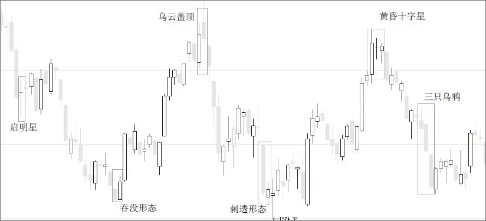

图1\-1 上证指数（000001）2013\.12—2014\.05日线图

## 第1章 蜡烛图指标的应用 - 1.1 蜡烛图的买点

1\.1 蜡烛图的买点

2025年10月29日

18:03

__1\.1 蜡烛图的买点 __

买点1：当出现低位锤子线时的买点

实战示例（见图1\-2）

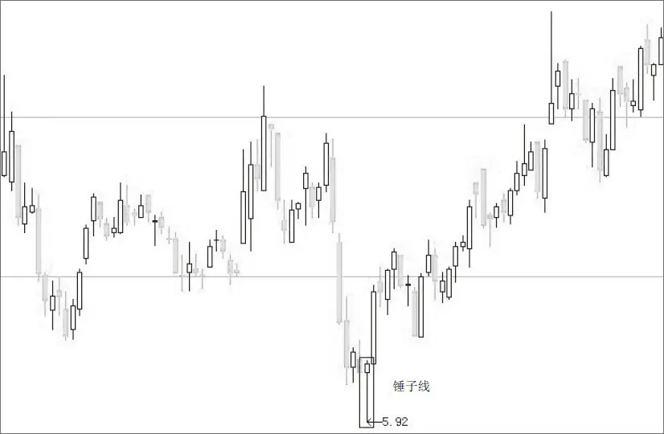

图1\-2 三星电气（601567）2013\.01—2013\.05日线图（锤子线）

买点解析

●锤子线出现在下跌趋势的末端（或震荡区间的下沿），之前的下跌趋势规模越大、时间越长，反转的概率就越大。

●锤子线应该没有上影线或上影线极短，下影线极长，原则上应该是实体的两倍或两倍以上。下影线越长，对上涨就越有利。

●实体可以是阴线，也可以是阳线。实体如果是阳线，将更有助于上涨。

●次日股价的收盘价位于锤子线的实体之上，理想状态是一根实体阳线。如果是向上跳空的实体阳线，上涨更可靠，且缺口越大越有利。次日的阳线蜡烛图插入锤子线前面蜡烛线的实体越深，对上涨越有利。

●股价在锤子线之后没有跌破锤子线的低点，形态依然有效。之后的股价跌破锤子线的低点，宣告反转失败。

●锤子线后面的阳线成交量超越之前的阴线蜡烛，买点就更可靠。

●可以看出，真正的买点是锤子线之后的实体阳线。

__实盘解读 __

如图1\-2所示，在锤子线之前，股价下跌将前面的低点击破，显示下跌趋势将要延续；锤子线当天，股价剧烈下跌，但是终于以锤子线报收，逢低买盘开始大举入市。锤子线的出现并非准确的入市点，只是警告股价有可能见底，保守起见需要次日收盘验证。若次日日线收阳，稳稳站在锤子线的实体之上，验证了反转信号，就可以买进了。此后股价会有小幅震荡，但受到锤子线实体价格水平的支撑，上涨趋势形成。

买点2：当出现低位刺透时的买点

实战示例（见图1\-3）

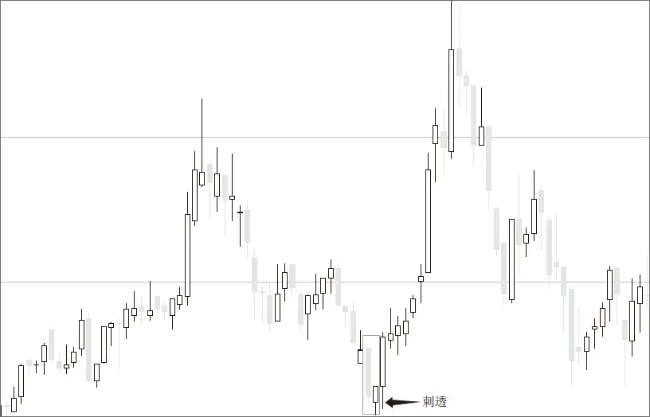

图1\-3 三全食品（002216）2014\.09—2014\.12日线图（刺透）

买点解析

●有明显的下跌趋势，规模越大、时间越长，反转越可靠。

●由两根蜡烛线组成，第一根为下跌阴线，第二根为上涨阳线。

●阳线实体较长，开盘价低于阴线的最低价，收盘价穿透到阴线的实体内，穿透的越深效果越好，但不能完全吞没阴线实体（否则就是吞没形态）。

__实盘解读 __

刺透形态是我们在底部看支撑、反转的最常见的技术形态之一。

如图1\-3所示，刺透形态的第一天，股价下跌，日线收盘实体阴线，但是第二天股价在低于阴线实体部分的低点跳低开盘，开盘后重新回到锤子线的低点之上，并插入第一天阴线实体之内，如同刺一样，形成了刺透形态，是否能够反转，只待验证。

刺透形态之后，日线需收一根实体阳线对其验证，股价整体站上形态，得到买点信号。

买点3：当出现低位看涨吞没时的买点

实战示例（见图1\-4）

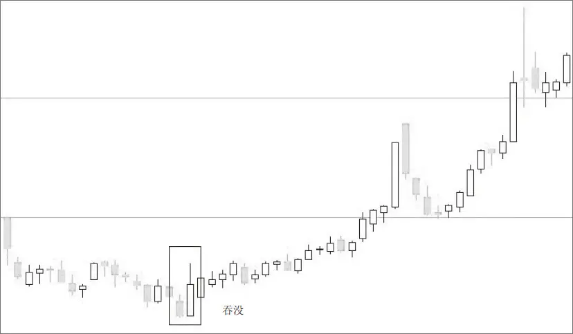

图1\-4 科泰电源（300153）2014\.07—2014\.09日线图（看涨吞没）

买点解析

●在看涨吞没形态之前是下跌趋势，规模越大、时间越长则效果越好（或者出现在震荡区间的下沿）。

●由两根蜡烛线组成，第一根是下跌阴线，第二根是上涨阳线。

●阴线的开盘价低于阳线的收盘价，而阴线的收盘价等于或高于阳线的开盘价。阳线实体部分越长，反转效果越强。如果阳线的实体部分连同阴线的上下影线一起吞没，则效果更好。

●如果第一根实体很短，也可以是阳线，第二根吞没之前的蜡烛线越多则效果越好。

●看涨吞没形态出现后，应该等待次日验证后买进。

__实盘解读 __

首先，之前的股价经历了一个单边的下跌。如图1\-4所示，自2014年7月之前一直处在下跌状态，下跌规模之大、历时之久为反转提供了更大的成功率。

其次，组合形态出现位置应为价格在时段的最低点。

最后，两根蜡烛线构成看涨吞没形态，第一日的收盘价和第二日的开盘价相同或应高于第二日开盘价，形成前一个K线被后一根K线吞没，达到反转效果。

注意，若看涨抱线的次日是一根小阴线，此时的策略应该观望，后一日的阳线验证了看涨抱线的有效性，是真正的买点。此后的股价均受到看涨抱线形态顶部的支撑。

买点4：当出现低位启明星时的买点

实战示例（见图1\-5）

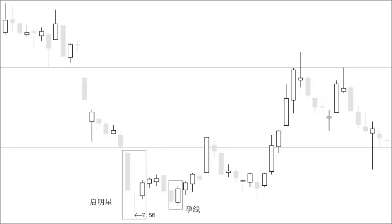

图1\-5 上海物贸（600822）2014\.11—2015\.02日线图（启明星）

买点解析

●发生在单边下跌趋势之后，或震荡区间的下沿。

●由3根蜡烛线组成，依次是长长的下跌阴线、十字星线和上涨阳线。

●十字星线的实体与两根蜡烛的实体留有跳空缺口，缺口越大则效果越好。

●上涨阳线的实体插入下跌阴线的实体，越深则效果越好。

__实盘解读 __

如图1\-5所示，在2014年11月时，K线出现双针或孕线组合，行情进入下跌阶段，随后加速下跌，并有跳空；至12月中，在出现一根实体长阴K线后，次日收盘十字星线，并在第三日行情小幅反弹收阳，形成标准的启明星组合形态，对行情起到支撑反转效果。这里的星线是一条十字星线，与前后的两根蜡烛线实体均出现了跳空，而十字星线比常见的星线更具有反转意义，星线次日的上涨阳线就构成了买点，现在只需要进一步的验证。

启明星形态的次日股价跳空上涨，与启明星形态的最高价留下了跳空缺口，维持在高位。这进一步验证了启明星反转成功。值得注意的是，启明星形态的高点对股价产生了支撑作用，我们对分析手段的综合运用将会使买点的准确率大大提高。

但在5个交易日后，价格再有下跌，但低点位置并没有打破十字星极值价格，次日收盘回吐跌幅，形成一个吞没形态，并在随后交易日得到验证。

买点5：当出现低位倒锤子线时的买点

实战示例（见图1\-6）

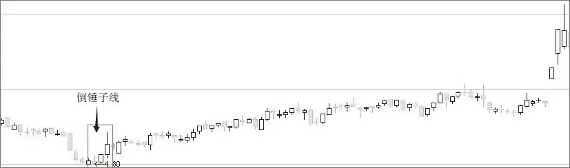

图1\-6 亚太股份（002284）2012\.11—2013\.05日线图（倒锤子线）

买点解析

●倒锤子线本意为止跌信号，其自身反转效果并不强，但如遇后面K线收上涨阳线，则有近似于启明星的反转效果。

●上影线长度为实体1～2倍或以上。

●下影线很短或没有。

●次日必须是上涨阳线并超越倒转锤子线的实体，能够插入之前阴线的实体最好。

●理想状态是次日的阳线实体与倒锤子线的实体有跳空缺口。

●次日的阳线实体辅以较大成交量将提高验证效果。

__实盘解读 __

如图1\-6所示，股价自2012年下跌后，连续3日在时段价格低点附近小幅波动，并出现了一个倒锤子线。我们强调倒锤子线必须经过验证才能作为买进信号，次日的阳线收盘与倒锤子线的实体有跳空上涨，并且插入了前一根阴线实体，验证了倒锤子线的反转信号，成为买入点。

这根倒锤子线与前一根阴线实体也留有跳空却口，这样，3根蜡烛线又构成了启明星形态，与倒锤子线产生共鸣。

倒锤子线之后进入了震荡上行状态，后面的震荡始终没有有效跌破倒锤子线，说明反转作用没有失效，股价在震荡中受到倒锤子线最低价水平的支撑，直到2013年以后，股价跳空拉涨，积攒的上涨力量得以爆发，从而验证此前倒锤子线是一个很好的买点，且行情震荡很可能为主力在买单。

买点6：当出现低位看涨捉腰带线时的买点

实战示例（见图1\-7）

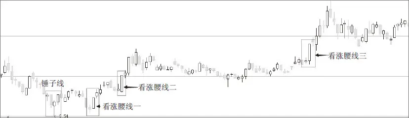

图1\-7 龙净环保（600388）2013\.06—2013\.11日线图（看涨捉腰带线）

买点解析

●由一根坚挺的上涨阳线构成，其开盘价就是最低价或下影线极短，实体部分很长，且不带上影线或极短上影线，实体部分越长，技术意义越大。

●在低价位出现，通常用来验证反转信号，其自身也显示出较大的成交量。

●如果之后的股价跌破捉腰带线，说明市场回吐严重，可能重回跌势，可以抛出股票。

__实盘解读 __

如图1\-7所示，捉腰线出现之前，两周前曾有锤子线出现，然后价格第二次下探，行情下跌力量减弱。突然，日线以开盘价上涨，收盘光头光脚上涨阳线，代表着买盘力量极强，可以在次日开盘直接买入。

捉腰带线二出现在腰线一不远处，有两个交易日的回落，但没有回吐涨幅，配合一个倒锤子线，买点再次出现。

捉腰带线三出现时，行情经历了一段时间的震荡，但价格依然在腰带线二的收盘价上方，出现第三次买点信号。

需要注意的是，实体阳线不仅显示出买盘支撑，而且辅助成交量，但操作上更适合短线，否则行情震荡会占用资金成本。

买点7：当出现低位平头底部时的买点

实战示例（见图1\-8）

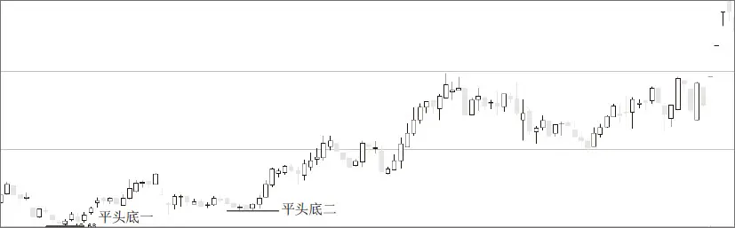

图1\-8 东方国信（300166）2013\.10—2014\.07日线图（平头底部）

买点解析

●处在下跌趋势或震荡区间的底部。

●由3根或3根以上的蜡烛线组成，这些蜡烛线可以是相邻的，也可以是相隔的。

●这些蜡烛线有相同的或者近乎相同的低点，低点可以是下影线，也可以是实体。

__实盘解读 __

如图1\-8所示，平头底部形态一是由相邻的蜡烛图组成的，两根K线的最低价格相同，第二根K线对第一根有验证作用，形成买点。但应注意的是，通常两根K线的支撑效果不及3根或多根K线。

平头底部形态二在上涨回调的底部，由4根K线组合而成，价格连续在同一个位置得到支撑且达4个交易日之久，支撑效果明显，是一个有价值的买点。

买点8：当出现低位约会线时的买点

实战示例（见图1\-9）

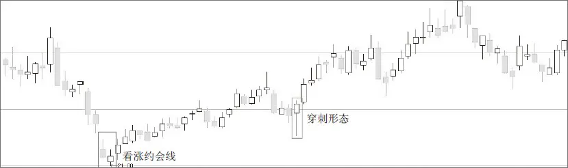

图1\-9 拓尔思（300229）2014\.07—2014\.10日线图（看涨约会线）

买点解析

●之前有明显的下跌趋势或出现在震荡区间的下沿。

●由两根蜡烛线组成，第一根是下跌阴线，第二根是上涨阳线。

●有跳空回补的意思，下跌阴线的收盘价与阳线的收盘价相等，似阴线与阳线约到同一个价格。

●阳线之后的股价不能跌破自身实体部分，否则失效。

__实盘解读 __

如图1\-9所示，底部看涨约会线是在股价回调的底部出现的。股价在前日连续下跌的影响下大幅低开，随即买盘回补低开的缺口，收盘上涨。股价收市时达到了前一根阴线的收盘价水平，构成了看涨约会线。次日可尝试买入，随后交易日股价稳步上涨，股价始终没有跌破白色蜡烛形成的支撑范围。

买点9：当股价处于持续上涨阶段出现白色三兵时的买点

实战示例（见图1\-10）

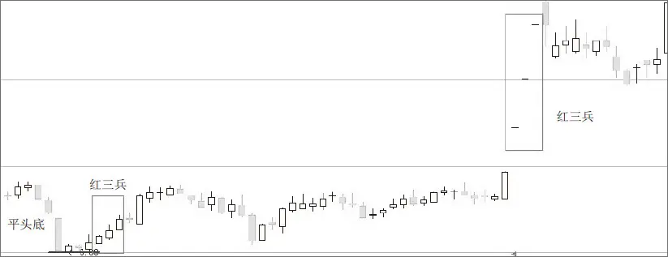

图1\-10 宏磊股份（002647）2014\.03—2015\.02日线图（白色三兵）

买点解析

●由3根连续上涨的阳线组成，收市价依次上涨。

●标准的白色三兵，后一根蜡烛线的开盘价均在前一根的实体内，收盘价为最高价或接近最高价。

●属于稳健上涨形态，在底部阶段更有意义。

●白色三兵是股价向上发展的动平衡状态，如果其中的第三根蜡烛线涨势萎缩或是出现长的上影线，应该进一步观察其发展。

●如果白色三兵之后股价稳步加速，说明股价可能进入加速阶段，可适当加码。

●如果白色三兵之后股价突然大幅上涨，不宜追高，应小心。

__实盘解读 __

如图1\-10所示，首先，行情下跌出现平头底部形态，连续4个交易日受到同一位置支撑，价格反弹出现红三兵形态，我们借助平头底部形态买入股票后，可安心持有。

随后，价格还有小幅上涨，并且回调最低价格没有低于平头底蜡烛线的收盘价。

最后，价格进入快速上涨阶段。由于前两个交易日为涨停，我们基本可以判断第三个交易日依然为涨停，但实际操作中，投资者并不容易切入进场，只需要小心。红三兵之后，价格很可能进入回调，应减仓或清仓离场等待下一个信号出现。

买点10：当股价处于持续上涨阶段出现分手线时的买点

实战示例（见图1\-11）

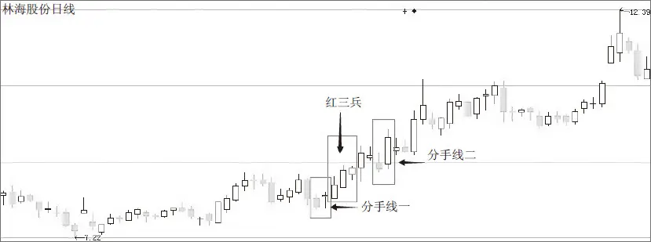

图1\-11 林海股份（600099）2010\.01—2010\.03日线图（分手线）

买点解析

●在上涨回调途中出现，是上涨的中继形态。

●由两根蜡烛线组成，第一根是下跌阴线，第二根是一根上涨阳线。

●第二根上涨阳线在前面阴线的开盘价水平开盘，与第一根阴线分道扬镳，完全忽略了昨日下跌的影响，股价将继续上涨，是一个不错的买点。

__实盘解读 __

如图1\-11所示的分手线，顾名思义，前后两根蜡烛线表示的方向相反。股价本来处于上涨趋势中，日线收阴，有回调可能，不免让人心存疑虑，但是次日股价直接开盘在前阴实体上方，可能有小幅跳空，并保持上方收盘，将阴线彻底抛弃，迅速回归原来的上涨趋势，也称回吐跌幅，昨日的事情好像根本没有发生，昨日抛出股票的投资者可能要补回已抛出的股票，股价将回到原趋势继续上涨。

图中分手线二相比分手线一更为标准，分手线一的第二根蜡烛线盘中有下探，但收盘回到前一日的开盘价上方，随后红三兵形态出现，价格上涨将股价稳步向前推进，奠定了上涨基础。随后又遇到分手线形态（分手线二），这次第二根上涨阳线实体更长，看涨更加坚定，不久价格进入加速上涨阶段。

我们说，在技术分析中不必刻意追求完美，因为刻意＝追求完美，有时会错过许多机会。

买点11：当出现低位孕线时的买点

实战示例（见图1\-12）

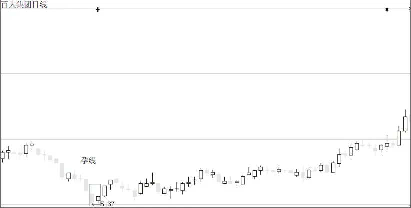

图1\-12 百大集团（600865）2014\.04—2014\.09日线图（低位孕线）

买点解析

●孕线与吞没形态恰好相反，但都可作为反转信号，也是最为常见的信号之一。在下跌趋势的尾声出现，则属于底部反转形态。之前的下跌趋势，规模越大、时间越长，则买点越可靠。

●由两根蜡烛线组成，第一根是实体较长的下跌阴线，第二根是实体较短的上涨阳线，处在前面阴线的范围之内。两根线似孕育关系，因此叫孕线。

●如果孕线的后面是一根坚挺的上涨阳线，并伴有较大的成交量，价格整体站到孕线形态上方，就是更加可靠的买点。

__实盘解读 __

孕线形态较为常见，通常出现在时段底部或顶部时，具有反转效果。如图1\-12所示，行情在一段下跌后，在时段低点出现孕线组合，并在次日伴有买盘拉升，而此时我们已经买单入场，后面价格虽有震荡或回调，但下跌低点始终没有低于孕线支撑，因此看涨趋势有效，投资者可安心持仓。

## 第1章 蜡烛图指标的应用 - 1.2 蜡烛图的卖点

1\.2 蜡烛图的卖点

2025年10月29日

18:03

__1\.2 蜡烛图的卖点 __

买卖点信号有很多相似的地方，同样具有反转作用。当其出现在价格时段低点时，行情由下跌转为上涨；当其出现在价格时段高点时，行情将由上涨转为下跌。

卖点1：当出现高位上吊线时的卖点

实战示例（见图1\-13）

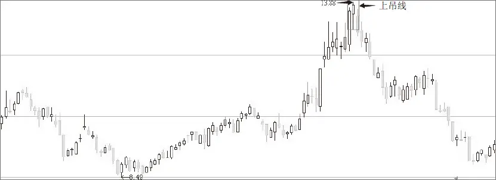

图1\-13 广东明珠（600382）2011\.01—2011\.05日线图（上吊线）

卖点解析

●前面有上升趋势，规模越大、经历的时间越长，则卖点的可靠性越大。

●实体很短，不要求是阳线或是阴线，但阴线反转的意味更强。

●没有上影线或很短，下影线很长。理想的上吊线的下影线是实体的2～3倍，甚至更多。

●与前后蜡烛的实体有跳空，如果最低价与前后蜡烛的最高价有缺口（与后面的蜡烛是向下跳空），则反转的意义更大。

●上吊线的次日为阴线并低于上吊线的实体收盘，则验证上吊线的反转意义，成为卖点。如果次日的收盘价高于上吊线的实体，不构成卖出信号。

__实盘解读 __

如图1\-13所示，上吊线在2011年4月18日形成，在此之前是历时3个月的上涨行情，股价从8\.49元开始上涨至上吊线高点13\.88元，涨幅大于50％。上吊线当日股价波动剧烈，形成了长长的下影线。小小的实体涨幅显示买盘仍然意犹未尽，但是，如果你考虑到之前极端的涨势和交易活跃，如果发生反转必定非常剧烈，那么这个上吊线的出现无疑是一大隐患，次日股价果然巨幅低开，买盘一度尝试扳回局面，积累的庞大的获利抛盘使之无功而返，此役奠定了反转基础。在经历第二次探顶后终于进入下跌趋势。

卖点2：当出现高位乌云盖顶时的卖点

实战示例（见图1\-14）

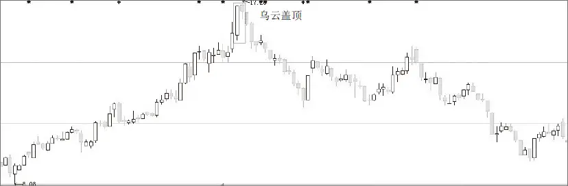

图1\-14 易联众（300096）2014\.07—2015\.01日线图（乌云盖顶）

卖点解析

●在上涨趋势的高点出现，之前的上涨越猛烈，反转的可能性越大。

●由两根蜡烛线组成，第一根是坚挺的上涨阳线，第二根是下跌阴线。实体越长，效果越好。

●下跌阴线的开盘价高于上涨阳线的最高价，并伴有一定的成交量。

●次日继续收阴可验证其反转效果，并且通常乌云盖顶形态的反转概率很大，是不必过多怀疑的卖点。

__实盘解读 __

如图1\-14所示，在市场的顶部一根坚挺的上涨阳线说明市场表现良好，一切都在顺利进行。次日股价高开后有一个冲高的过程，然而好景不长，股价调头向下，盘中下探幅度略大，虽有反弹，但最后收盘为下跌阴线，乌云盖顶形态形成，卖点出现。

股价遭到乌云盖顶形态压制，或为上吊线，次日开盘仍继续下跌，可能有小幅向下跳空，验证了反转信号效果，此时投资者应果断结束买盘，离场休息观望，谨防行情V字反转，股价可能重新回到起涨位置。

卖点3：当出现高位看跌吞没时的卖点

实战示例（见图1\-15）

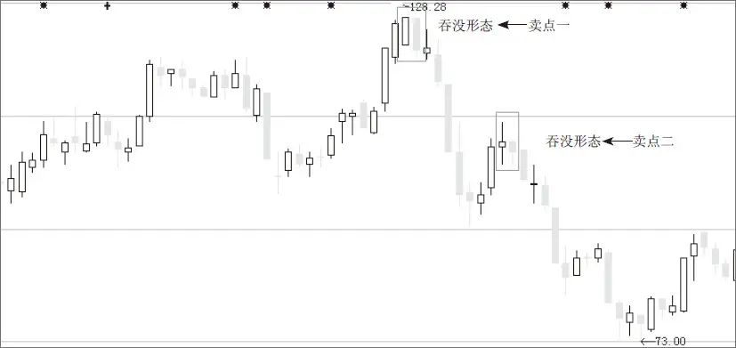

图1\-15 东方网力（300367）2014\.10—2015\.01日线图（看跌吞没）

卖点解析

●与前面讲的看涨吞没形态基本一样，只是看跌吞没形态出现在时段价格的高点。

●前面的涨势越大，作为卖点的准确度越高。

●由两根蜡烛线组成，第一根是上涨阳线，第二根是下跌阴线。

●下跌阴线的开盘价低于上涨阳线的收盘价，阴线的收盘价低于阳线的开盘价。对影线不做要求，能够吞没则效果更好。

__实盘解读 __

如图1\-15所示为看跌吞没形态。

卖点一：股价上涨后，遇到次交易日完全回吐涨幅，并且收盘实体线要大于前阳实体，行情出现反转信号。之后的股价均未冲入阴烛的实体，证明反转是成功的。

卖点二：行情下跌后，遇到支撑反弹，再次出现阴线吞没阳线的情况，两根实体部分不大，但符合吞没条件，可看作结束反弹继续下跌，也是一次反弹的高点，且反弹是买盘出逃机会。空仓则继续观望等待。

卖点4：当出现高位黄昏之星时的卖点

实战示例（见图1\-16）

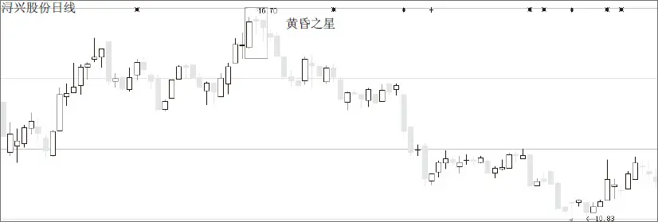

图1\-16 浔兴股份（002098）2011\.01—2011\.06日线图（黄昏之星）

卖点解析

●在上升趋势的顶部或震荡区间的上部。

●由3根蜡烛线组成，依次是长阳、星线、阴线，星线位于长阳和阴线的上部。

●星线可以是阴线，也可以是阳线。星线越短，则技术意义越好。理想的形状是星线与两根蜡烛线的实体有跳空缺口。

●下跌阴线插入前面上涨阳线的实体，这也就对星线本身的反转意义进行了验证。

__实盘解读 __

如图1\-16所示，黄昏之星中间的星线实体部分很短，与之前看涨启明星组合形同，但位置出现在上涨之后，预示买盘力量衰竭，行情即将反转下跌。

遇到黄昏之星形态组合，投资者应在第三日收盘前出逃空仓，此类信号极容易使行情形成倒V字反转，如下跌，力度可看回到这波行情前期的起涨位置，即完全回吐涨幅，或更低，若下跌途中出现买涨信号，投资者也要多加观察、验证，让出部分利润换回更安全的操作。

卖点5：当出现高位流星线时的卖点

实战示例（见图1\-17）

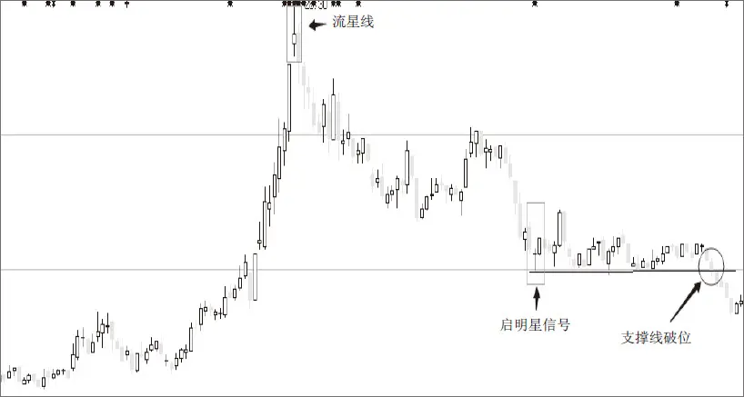

图1\-17 好想你（002582）2013\.09—2014\.06日线图（流星线）

卖点解析

●之前是上升趋势，规模越大、时间越长，则反转的可能性越大。

●价格应出现在时段高点。

●上影线是实体的2～3倍或以上。

●实体部分很短，没有下影线或下影线很短（不超过或等于上影线长度）。

●理想状态是流星线前后有跳空缺口，缺口越大越有利，并且流星线后面的下跌阴线可以深入流星钱前的阳线实体中。

●理想状态是流星次日的下跌阴线的成交量较大。

__实盘解读 __

如图1\-17所示，流星线出现时有主力拉高出货嫌疑。行情经历连续上涨，可以看作最后的加速上涨阶段，此时出现任何顶部信号，都有相当大的反转概率。在流星线出现后，股价勾头下跌，此时投资者应警惕流星线，即便没有经过验证也可以尝试卖出，做离场平仓处理。次日的股价跳空低开低走，验证了流星线反转，是更为确定的卖点。

行情下跌一段时间后，出现启明星信号。但此时的信号并没有把价格拉开，而是横盘震荡，不久后下破支撑线，宣告启明星信号失败，行情将继续下跌，此时若有买入，也应在启明星低点价格破位时果断离场，听从前面流星线信号，继续看跌股价。

卖点6：当出现高位捉腰带线时的卖点

实战示例（见图1\-18）

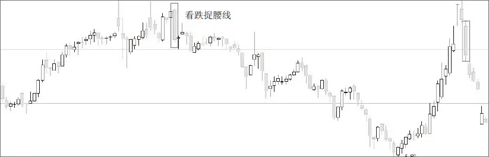

图1\-18 海润光伏（600401）2014\.07—2015\.02日线图（看跌捉腰带线）

卖点解析

●一根长长的下跌阴线，开盘价就是最高价（或上影线很短）。

●如果之前的上涨趋势规模很大、经历的时间很长，反转的意义就更大。

●也可作为验证前面反转信号使用。

__实盘解读 __

长实体阴线自身代表了很大的抛盘，因此当看跌腰线出现时，投资者安全起见需要暂时离场观望。如图1\-18所示，股价在一段上涨之后，在时段高点做区间震荡，此时出现一根长实体下跌阴线，若前面无离场信号，投资者此时也需要离场。若前面有离场信号，那么腰线是对前面信号的验证，投资者更需要快速离场，因为行情不久就会下跌。

看跌捉腰线下跌后，股价整理反弹，均不会超过腰线最低价格。

最后，看跌腰线也有可能藏于三只乌鸦当中，特别是专业的短线交易，此时抛售股票肯定要好于持仓，应当机立断，直到等到新的看涨信号出现并验证后再行动。

卖点7：当出现高位平头顶部时的卖点

实战示例（见图1\-19）

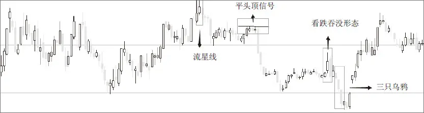

图1\-19 互动娱乐（300043）2014\.02—2015\.01日线图（平头顶）

卖点解析

●处在上升趋势或震荡区间的顶部。

●由两根或两根以上的蜡烛线组成（常见3～5个），这些蜡烛线可以是阴阳蜡烛线相邻的，也可以是相隔的。

●这些蜡烛线有相同的或者近乎相同的高点，低点可以是影线，也可以是实体。

__实盘解读 __

如图1\-19所示，股价在一段时间区间震荡后，出现新价格高点，但高点同时为流星线信号，随后股价回落震荡，再次出现平头顶信号，我们预测行情将开启一波下跌。

图中的平头顶部形态是由4根蜡烛线组成，阴阳蜡烛交替，高点为相同价格或极近似价格，第五根蜡烛线测试高点后开始大幅下跌，三只乌鸦加大股价跌幅。

平头顶部形态主要反映的是水平高点的压力。行情多次试探不能突破，只能选择下跌测试支撑。

行情以平头顶压力下跌后，反弹再次出现看跌吞没形态，此时股价高点是买盘最后出逃机会，随后行情三只乌鸦出现，将股价推向低谷。

卖点8：当出现高位顶部十字黄昏之星时的卖点

实战示例（见图1\-20）

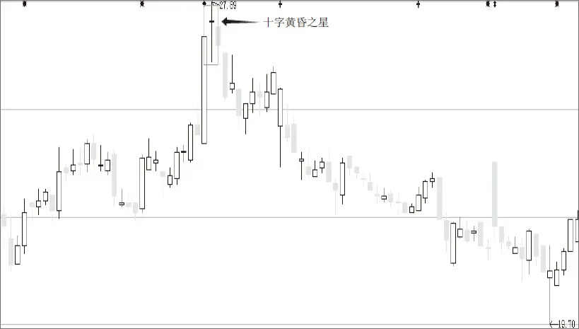

图1\-20 常发股份（002413）2011\.01—2011\.06日线图（十字黄昏之星）

卖点解析

●前面有上升趋势，规模越大、时间越长，则反转的可能性越大。

●首先是一根长长的上涨阳线，其次是一个十字星线，最后是跟一根下跌阴线。

●十字星线与前面的上涨阳线实体出现跳空，后面的下跌阴线插入阳线的实体。

●第三根下跌阴线是对十字星线的验证。

__实盘解读 __

西方人称十字星为不吉利征兆，因此十字星无论出现在哪里，都要引起人们的警惕。如图1\-20所示，在黄昏十字星前是一个规模较大的上升趋势，第一根的上涨阳线具有长长的实体，看上去市场异常强劲，其上影线相对于实体显得并不长。然而十字线的出现令市场开始犹豫，昨日蓬勃的涨势一下失去了生机，十字线显示买盘没有想去继续扩大战果，高开并没有高涨。之后的阴线则低开低走，深深地插入前面阳线的实体，买盘退却，投资者兑现了十字线的担忧，警示得以验证，股价反转了。下跌阴线就构成了卖出点。

股价下跌后仍有反弹，但反弹高点不能打破十字星价格，因此接下来的每一次反弹，都是投资者出逃的机会，价格越走越低，投资者则早出早好。

卖点9：当出现三只乌鸦时的卖点

实战示例（见图1\-21）

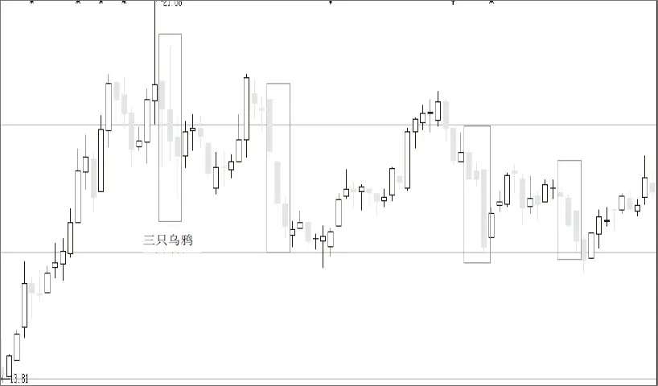

图1\-21 嘉事堂（002462）2014\.01—2014\.05日线图（三只乌鸦）

卖点解析

●连续3根下跌阴线，之前是上升趋势。

●“三只乌鸦”不作为反转信号，为行情的中继形态，代表行情下跌途中，或单边下跌或震荡都可以出现。

●每根下跌阴线的收盘价均收于当日的最低价或最低价附近，3根蜡烛线依次下跌。

__实盘解读 __

“三只乌鸦”是我们平时交易中比较常见的技术组合，与前面讲的红三兵效果等同，最容易出现在顶部形态组合后面，表示行情正式进入下跌阶段。

如图1\-21所示，“三只乌鸦”一般为消化前面的涨幅，且股价连续回落，投资者若顶部没有逃离成功，那么遇到三只乌鸦只会加重投资者的损失，印证乌鸦为不吉利信号。

“三只乌鸦”也可能制造市场的恐慌气氛，若行情出现支撑或底部反转信号，但若后面出现“三只乌鸦”，则支撑和反转效果将被大大削弱，投资者需要离场观望。

卖点10：当股价在持续下跌中向下并列阴阳线时的卖点

实战示例（见图1\-22）

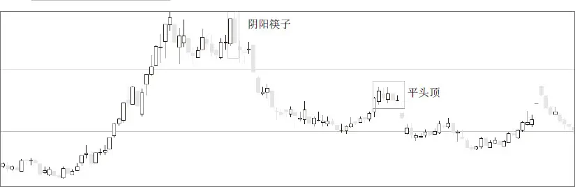

图1\-22 中青宝（300052）2013\.07—2014\.04日线图（并列阴阳线）

卖点解析

●并列的阴阳蜡烛线，俗称阴阳筷子，出现在时段高点，是由两根实体相同（上下影线也应相近或相同）的阳线和阴线组成。在时段价格顶部时，阳线在先，阴线相邻在后，同一个实体线上方形成压力线。

●第二根阴线后，价格容易出现跳空缺口。

●如果形态后的股价向上突破了跳空缺口的上沿，这个形态就失去了意义。

__实盘解读 __

如图1\-22，盘中没有见到明显的见顶信号，行情在高位修整后，出现阴阳筷子信号，即等实体阴阳线，紧接着次日行情跳空下跌。虽然信号出现后，行情跳空下跌，但投资者仍有机会抛盘离场，特别是在三只乌鸦出现之前。

随后价格反弹，再次见到平头顶信号，由4根蜡烛线组合，阴阳交替，等到第五日时，买盘的支撑已经非常微弱，随后价格再次跳空下跌。

我们看到行情的反弹，始终没有打破阴阳筷子形成的压力线，行情无法翻身，股价只有更低没有最低。

卖点11：当股价处于持续下跌中出现分手线时的卖点

实战示例（见图1\-23）

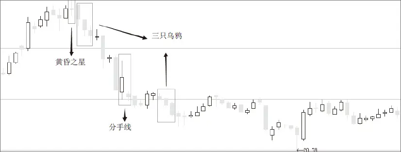

图1\-23 中源协和（600645）2013\.09—2014\.01日线图（分手线）

卖点解析

●上涨阳线次日突然下跌收阴，与前一根蜡烛线分道扬镳。

●属于下跌中继形态，在下跌途中出现一根上涨阳线，其后是一根下跌阴线。

●两根蜡烛线的开盘价处于同一价格水平。

__实盘解读 __

如图1\-23，股价上涨后出现价格高点的同时，收盘阴十字星线，按前文讲解我们称为黄昏之星，为投资者出逃信号，紧跟着三只乌鸦出现，股价进入加速下跌的趋势，接着收获两根看跌捉腰线扩大跌幅。

机会来了，一根带上影线的中实体阳线收盘，给市场带来了希望，待次日验证的时候，股价低开低走，形成分手线，因此只能看作行情下跌的中继形态。

三只乌鸦再次出现，把股价推向更低。

这里再次重申信号验证的重要性，如果在阳烛出现后冷静对待，需要等待下一个时间单位的验证。股票不同于期货（期货是T＋0交易），进去容易出来难。分时应该作为日线的辅助分析，在顺应日线趋势的基础上，在分时图上更及时、更准确地寻找买卖点。图中的锤子线在下跌开始促成了股价回试，在触及压力后回归跌势。

卖点12：当出现高位孕线时的卖点

实战示例（见图1\-24）

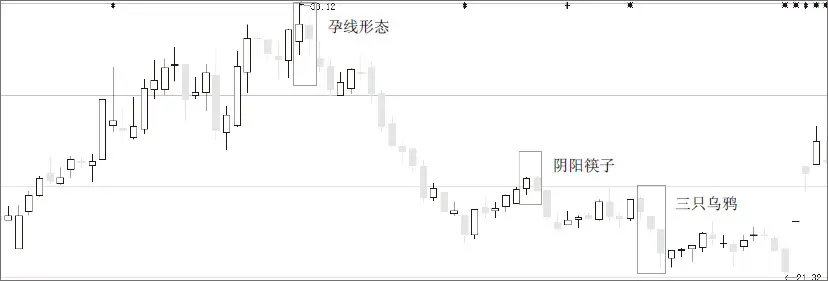

图1\-24 信质电机（002664）2014\.01—2014\.05日线图（高位孕线）

卖点解析

●在上涨趋势的尾声出现，则属于顶部反转形态。之前的上涨趋势，规模越大、时间越长，则卖点越可靠。

●由两根蜡烛线组成，第一根是实体较长的上涨阳线，第二根是实体较短的蜡烛线，处在前阳实体的范围之内。

●如果孕线的后面是一根长长的下跌阴线，并伴有较大的成交量，向下穿破孕线的阳线低点，就是更加可靠的卖点。

__实盘解读 __

无论孕线出现在时段底部或时段顶部，都不能忽视它的反转效果。

如图1\-24，行情上涨一段时间后，在时段高点价格出现孕线形态组合，接下来交易日低开反弹低走，验证了孕线的反转效果。最好的情况下，投资者应结束孕线后交易日的反弹离场，若不能及时离场，随后价格越走越低，可能招致损失。

在后面的反弹中还出现了阴阳筷子信号，也是提示投资者前几个交易日涨幅仅看反弹，后面还有可能下跌，并且不久即看到三只乌鸦，此时我们需要修正指标，重新画出下降通道。

## 第2章 趋势线的应用

__第2章 __

__趋势线的应用 __

道氏理论为一切趋势性技术分析的开山鼻祖，趋势线理论也是通过道氏理论演化而来的，想学习趋势线理论，必然要先学习道氏理论，趋势线理论其实反映了自然界的内在规律。

趋势线理论讲究既成趋势不会轻易改变，这有助于我们判断价格运行的规律。不论在股票市场还是在期货市场，人们始终在讲顺着趋势交易，顺势而为。这是一切趋势分析的基础，不了解趋势就不知道价格方向，而了解了趋势，才能将你的利润达到最大化。

逆市而为，简单来说，为逆天者亡，而所谓的天，便是自然规律。股票市场作为经济的晴雨表，和经济规律息息相关，密不可分，而趋势所反映的，也正是经济周期的规律。如图2\-1所示，当经济复兴，开始向好，股价的变化趋势则表现为上升趋势；而经济衰退，股价下行，表现为下降趋势。而在前面的蜡烛线反转形态中，我们也曾强调了顺势而为这一最大原则，当股价属于上升趋势中，其买进信号大多数都是相当准确的，而在上升趋势中的卖出信号，除顶部形成及大幅回调外，不具备实际的价值。

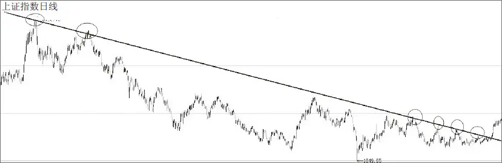

图2\-1 上证指数（000001）趋势线下，指数连续受到压制

本章重点讲述的是在趋势当中如何买卖以及如何及时发现通过趋势的反转确定买卖，希望对投资者有所帮助。

## 第2章 趋势线的应用 - 2.1 趋势线的买点

2\.1 趋势线的买点

2025年10月29日

18:03

__2\.1 趋势线的买点 __

买点1：当股价上破原下跌趋势线时的买点

实战示例（见图2\-2）

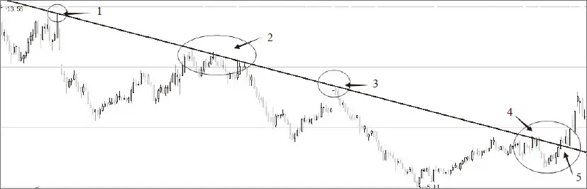

图2\-2 江苏舜天（600287）2012\.05—2014\.02日线图（上破趋势线买点）

买点解析

●首先要正确地做出趋势线，确定是由两个依次下跌的高点做出的，要把下跌中的所有价格变化涵盖其中。

●通过判断趋势线的重要程度决定买卖策略。主要下跌趋势线的突破买点更重要。

●通过时间和突破幅度验证买卖的可靠性。股价突破趋势线后的涨幅达到突破点的3％以上视为有效突破；突破后股价在趋势线上方维持3天以上，视为有效突破。

●必须是收盘价突破趋势线。

__实盘解读 __

如图2\-2所示，股价自1处开始下跌后反弹至2处再度下跌，自2处下跌的低点超越了前一个低点，由此证明由1和2高点做出的趋势线是有效的。此轮下跌由2012年5月开始到2014年2月的低点，经历了4次冲击，接近长期趋势线的要求，说明了这条趋势线的重要性。

在股价第五次冲击该趋势线时，将其击破。在股价击破下跌趋势线后，股价在这条下跌趋势线以上维持了超过3日以上，股价经过短暂的震荡上扬，验证了突破有效。股价在突破下跌趋势线时，我们还不能确定股价趋势一定会反转，需要经过验证。不能因为股价低就认为一定会反转，大涨不言顶，大跌不言底，宁可在场外等待，也不被套忍耐。假如激进的投资者在突破日已经入市，当股价再次跌回趋势线以下时，应该离场观望。此时我们将根据突破的幅度来重新判断是否需要修正趋势线。

第二次考验趋势线时，股价连续3次被压制，且低点下移，因此我们判断趋势线有效，股价仍将受阻下行。

买点2：当股价上破原下跌趋势线后回试趋势线时的买点

实战示例（见图2\-3）

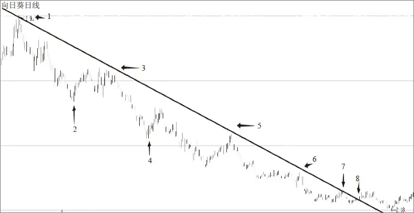

图2\-3 向日葵（300111）2011\.03—2014\.09日线图

买点解析

●当一个阻挡或支撑水平被有效突破后，当股价再次回到这个价格水平的时候，这个价格水平的作用就转换了，就是说原来的阻挡转换为支撑。

●下跌趋势线被有效突破后，当股价再次回落到该下跌趋势线的时候，该趋势线就转换为支撑，是买入点。

●该下跌趋势线越重要，转换后的支撑越强烈，买入越可靠。

__实盘解读 __

如图2\-3所示，当股价自2点处反弹至高点3时，我们还不能就此确定高点1和高点3做出的趋势线是有效的，只有当股价跌穿低点2到新低点4时，才能确认这条下跌趋势线是有效的，但此时我们还无从知晓它的重要性。当股价在后来经过了高点5和高点6的考验后，高点1和高点3做出的趋势线的重要性才得以验证。

当股价在点8处时回测这条重要的下跌趋势线，股价在下跌趋势线上方维持了3天以上，证明了突破的有效。股价并没有大幅从趋势线上弹开，而是再次以回调测试趋势线，次日的长阳证明了这条下跌趋势线的作用转换了，对股价产生了支撑，趋势线的支撑点水平对这段小幅震荡形成了支撑。可见，下跌趋势线越重要，被突破后形成的支撑就越强，在回试时买进也越可靠。

在点5处形成的是长阴孕线形态，这个顶部形态验证了趋势线的压力。点6处是连续压制高点下移，同样验证了趋势线的压力。

买点3：当股价在上升趋势中回落到趋势线上时的买点

实战示例（见图2\-4）

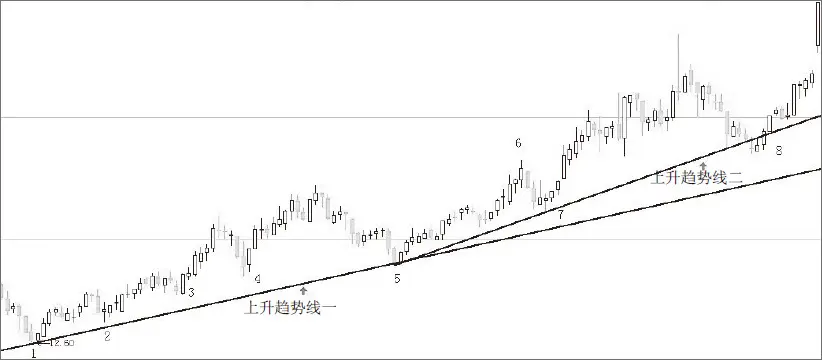

图2\-4 新莱应材（300260）2014\.04—2014\.11蜡烛图

买点解析

●股价弹开趋势线越高，这条趋势线的支撑越强，买入越可靠。

●股价冲击这条趋势线的次数越多，这条趋势线的支撑越强，买入越可靠。

●这条趋势线月星的时间越长，支撑越强，买入越可靠。

●既成的趋势不会轻易改变。

__实盘解读 __

如图2\-4所示，上升趋势线一首先是点1和点2做出的，在点2处股价向上高于点1，证明这条趋势线是有效的，股价在点3和点4站在趋势线上方，表明趋势线看涨效果强。在点5处股价回调趋势线得到反弹，并且估计继续走强，形成了更强趋势上涨，即上升趋势线二。

上升趋势线一是小幅修正后做出的，是点1、点2和点5的连线，这样就把之前的所有股价变化都涵盖其中，增强了重要性。

从点5处开始股价运行的速率发生了变化，我们通过点5和点7做出了上升趋势线二应对新的股价趋势。上升趋势线二的重要程度不如趋势线一，但比线一的表现力度更强，仰角更大。

在点8处，股价曾有虚破支撑，按解析所述，股价连续三根K线方可认为有效突破。实际股价在第三日拉升大阳返回支撑上方，因此趋势线继续有效，支撑多次测试且失而复得，效果将更加可靠、猛烈，股价沿趋势线二上行，因此估计从起始点12\.62元，最高上涨至22\.90元，历时不足7个月，涨幅达80％以上。

## 第2章 趋势线的应用 - 2.2 趋势线的卖点

2\.2 趋势线的卖点

2025年10月29日

18:03

__2\.2 趋势线的卖点 __

卖点1：当股价下破原上涨趋势线时的卖点

实战示例（见图2\-5）

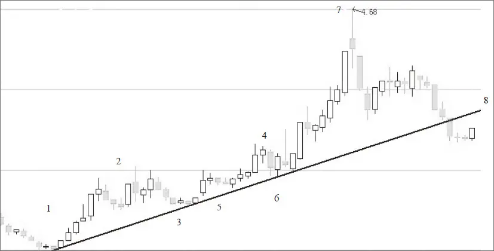

图2\-5 华菱钢铁（000932）2014\.09—2015\.01蜡烛图

卖点解析

●首先要正确地做出趋势线，确定是由两个依次上升的低点做出的，要把上涨中的所有价格变化涵盖其中。

●通过判断趋势线的重要程度决定买卖策略。主要上涨趋势线上的突破买点更具有参考价值。

●通过时间和突破幅度验证买卖的可靠性。股价突破趋势线后的涨幅达到突破点的3％以上视为有效突破；突破后股价在趋势线下方维持3天以上，视为有效突破。

●必须是收盘价突破趋势线。

__实盘解读 __

如图2\-5所示，趋势线由点1和点3做出，点4处的股价高于点2处的股价，验证了趋势线的有效性。

自点3后股价震荡上行，股价在经历了点5和点6位置连续得到支撑效果，强势向上拉升，对趋势线的重要性再次做出了验证。这条上升趋势线经历点1、点3、点5、点6的4次冲击，上升趋势线经历的冲击涨幅超过100％。

上升趋势线在点7处回落，收长长上影线。没有永远的跌势，也没有永远的涨势。我们强调了这条上涨趋势线的重要，可想而知这条趋势线不仅是技术上的重要支撑，同时也是心理上的重要关口，突破这么重要的支撑而改变一个大的趋势需要超出买盘足够大的抛盘才能得以实现，而趋势线一旦突破将发生重大的逆转。在点8处，股价次日低开低走，突破了上升趋势线，且3日收盘未能重新登上趋势线上方，卖点出现。在此建议，鉴于这条趋势线的重要，突破立即抛出，防止之后可能出现的杀跌行情，如果没能有效突破，重新返回趋势线以上，再补回股票。

卖点2：当股价下破原上涨趋势线后回试趋势线时的卖点

实战示例（见图2\-6）

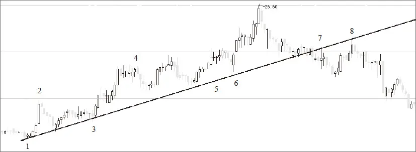

图2\-6 三特索道（002159）2014\.06—2014\.12蜡烛图（回试上涨趋势线卖点）

卖点解析

●当一个阻挡或支撑水平被有效突破后，当股价再次回到这个价格水平的时候，这个价格水平的作用就转换了，由原来的支撑转换为压力。

●上涨趋势线被有效突破后，或者说被决定性突破后，当股价再次回升到该上涨趋势线的时候，该趋势线就转换为压力，是卖出点。

●该上涨趋势线越重要，转换后的压力越大，卖出越可靠。

__实盘解读 __

如图2\-6所示，点1连接点3得出上行趋势线，点4股价高于点2，为标准的阶梯式上涨。在上涨过程中，股价在点1、点3、点5、点6的4次接触或靠近该上涨趋势线，在点6处第四次接近趋势线后，股价向上大幅弹开，证明了该上涨趋势线的有效性和重要性。

一个趋势一旦形成，是不会轻易转变的。因为在上涨趋势中，股价的上涨是由买盘的坚定信心得以持续的，在图标上就是通过上涨趋势线体现的，这种坚定的信心需要足够大的力量才能打破，趋势线越重要，要求的抛盘力量越大，而一旦打破，其代表的反转意义将是不同寻常的。点7处的股价回落趋势线支撑，随后横盘破位，多日收盘价均不能返回趋势线上方，股价在点8处最后测试趋势线后，支撑效果变为阻力，开启新一波下跌行情，而这一重要心理关口的失守引发了心理崩溃。这条趋势线由上涨中的买点转换成卖点。

卖点3：当股价在下跌趋势中反弹至趋势线上时的卖点

实战示例（见图2\-7）

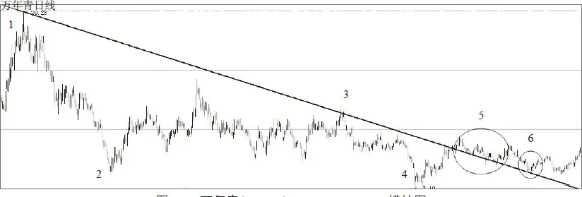

图2\-7 万年青（000789）2012\.01—2014\.03蜡烛图

卖点解析

●股价弹开趋势线越大，这条趋势线的压力越强，卖出越可靠。

●股价冲击这条趋势线的次数越多，这条趋势线的压力越强，卖出越可靠。

●这条趋势线延续的时间越长，压力越强，卖出越可靠。

●既成的趋势不会轻易改变。

__实盘解读 __

如图2\-7所示，通过点1和点3做出趋势线，股价在点2处高于点4，股价跌破前低，证明这条下跌趋势线有效。

在股价在点3处接触下跌趋势线时，趋势线对其构成下行压力，首先是股价在点3处向下大幅跌落，得出时段股价新低点4，弹开的幅度越大越有效；其次，股价自2012年下跌到点4处的2013年8月，经历了12个月的时间，具有一定的重要性。在趋势没有确认反转之前，所有压力或蜡烛图上的反转信号，均视为股价重新下跌的信号，所以当股价回到下跌趋势线时，就成为了卖点。点4处的卖出是成功的。

如果当股价回到下跌趋势线时，蜡烛图配以顶部反转形态，就能进一步验证下跌趋势线的压力，卖点更可靠。点1处是长上影线，点3处是三针探顶形态，并配有实体长阴K线，点4处是一个小W底。这些蜡烛形态均验证了下跌趋势线的压力作用，进一步加强了看跌气氛，直至点5和点6价格走平震荡，股价站上趋势线后，阻力转为支撑，并3次测试支撑效果，直到股价离开，趋势线被破坏行情反走。

## 第3章 均线指标的应用

__第3章 __

__均线指标的应用 __

均线指标与蜡烛图是每个投资者必须掌握的两项基本技术分析指标。笔者至今仍习惯用蜡烛图与均线指标结合分析行情，具有简单、准确率高、反应直接等特点，更可以弥补蜡烛图分析的不足，寻找支撑、阻力点位，划定价差空间。

移动平均线是投资者广泛使用的，简洁实用的技术分析方法。它与趋势线具有相当的性质，皆是用于追踪趋势的技术分析方法，均线是平滑移动的趋势线。同时我们可以通过多条移动平均线的组合，更准确地揭示买卖信号，同时判断趋势是在延续、震荡或已经发生了反转。

移动平均线有很多种算法，如算术移动平均线、加权移动平均线、指数加权移动平均线等。而通过实际验证，算术移动平均线总体来说更准确、更简单、更明了，也更具有说服力，是最适用的一种计算方法。移动平均线是一种平滑工具，是一条起伏不定但又很平缓的曲线。移动平均线的变化滞后于市场价格的变化，对于多条移动平均线来说，短期移动平均线反应更为灵敏，更容易追踪价格，而长期移动平均线反应迟钝，但更加稳定。也正是由于这点，我们可以通过多条移动平均线的组合来发现市场趋势的转变，为我们提供交易的信号。

很多人对于均线参数的设定不同，最常见的有（5，10，20，30）、（5，10，22，66）、（5，10，30，60）等，还有年线和半年线等。参数设定没有规定，不同的参数设定，盘中表现也不大相同，投资者要根据习惯使用，哪个看得更准就用哪个，而笔者习惯使用（5，10，30，60）这组参数。如图3\-1所示的图解分析中，均线的设定默认为（5，10，30，60）。

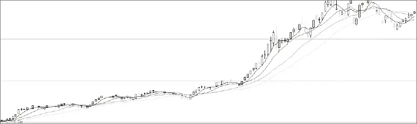

图3\-1 上证指数（000001）2014\.07—2015\.02日线图

笔者对均线有一套口诀，与大家分享：强势行情站在5日均线之上，10日均线看价格回落，行情震荡整理，30日均线看行情回调，而60日均线失守，则要看行情反转。

## 第3章 均线指标的应用 - 3.1 均线的买点

3\.1 均线的买点

2025年10月29日

18:03

__3\.1 均线的买点 __

买点1：当股价上破单根趋势线时的买点

实战示例（见图3\-2）

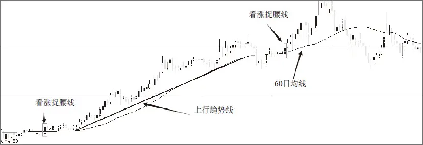

图3\-2 美达股份（000782）2014\.06—2015\.01日线图

买点解析

●这里我们采用的是60日均线的得失，代表短期行情趋势，实践证明它比其他的平均线更有效。60日均线比较稳定，不像5日均线或10日均线会出现频繁的买卖信号，有人会采用一些价格过滤器来过滤伪信号，例如四周法则。而长期的移动平均线虽然能过滤伪信号，但会错过大好的买卖时机。这里我们对此不做进一步的讨论。

●移动平均线的功用实际上与趋势线基本一致，它主要是用于追踪市场的趋势。移动平均线对股价具有支撑和压力作用，当股价收盘上穿移动平均线时，认为是买入信号；当股份收盘下穿移动平均线时，认为是卖出信号。股价受到移动平均线的支撑是买进信号，反之是卖出信号。

__实盘解读 __

很多机构习惯使用120日均线，但笔者认为120日均线周期滞后，日线图、60日均线足可以反映趋势，实践中，我们也经常可以看到60日均线与趋势线的重合。

如图3\-2所示，股价在60日均线下方运行一段时间后，反弹到均线附近，但受到均线的压力。突然一根实体阳线穿过均线并收盘在其上方，我们看是一根看涨捉腰线信号。我们说，看涨腰线穿刺并站上60日均线，是比较可靠的买入信号。

股价站上移动平均线后，这条移动平均线阻力转变为支撑，蜡烛线向上离开均线即开始上涨，我们就可以画出一条上涨趋势线。趋势线3次支撑后，第四次下破趋势线，同时下破60日均线，出现卖出信号，我们建议投资者需要离场观望，随后看涨捉腰线再次出现，投资者可再次把之前抛出的股票接回来，继续看涨，直到60日均线再次破位离场。

买点2：当短期均线上叉中长期均线时的买点

实战示例（见图3\-3）

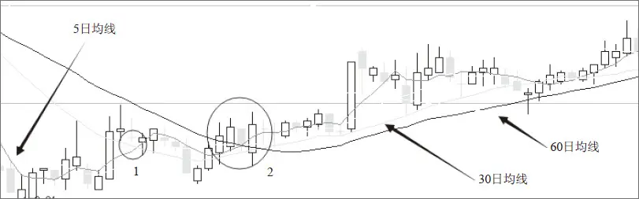

图3\-3 春晖股份（000976）科2013\.07—2013\.09日线图（移动平均线）

买点解析

●越短周期的移动平均线越靠近股价，越能及时地跟踪股价的变化，而长期移动平均线反应较慢。当股价发生反转时，短期移动平均线与长期移动平均线发生交叉，交叉点就构成了买卖信号。当短期移动平均线向上交叉中长期移动平均线时是买进信号，称作金叉。

●在窄幅震荡行情中信号失灵。因为买卖信号会频繁出现，可能当你跟进时，股价已经回落了，如果你步步紧跟，恐怕会晕头转向，因此我们选择用5日均线交叉30日均线或60日均线，而不是10日均线或20日均线。

●在下跌趋势中，当短期移动平均线远离长期移动平均线的短期和中期移动平均线低位金叉，可能会有较大的涨幅，而在偏离较小的情况下，金叉可能会促成新的卖点。当短期移动平均线自低点回升上叉中长期移动平均线时，则意味着反转的可能。

●在上涨趋势未确认反转前，短期移动平均线上叉中长期移动平均线时可能是新的上涨开始，是买进信号。

__实盘解读 __

我们看5日均线与蜡烛图走势最为接近。如图3\-3所示，行情在一段下跌后走平，当5日均线向上交叉30日均线时，中长期买涨信号出现，即图中1点位置，但价差点位置有一根上影线较长的阴十字线，投资者可以买入，但要以30日均线做支撑持有，破位离场，另外也可以暂时观望。5日均线继续向上交叉60日均线，即图中2点位置，并且交汇处有一根实体阳线支撑，而且5日线向上带动30日均线交叉60日均线，成为更可信的买入信号，此后，投资者只需用30日均线和60日均线做支撑持有股票即可，直到破位离场。

买点3：当均线出现多头排列时的买点

实战示例（见图3\-4）

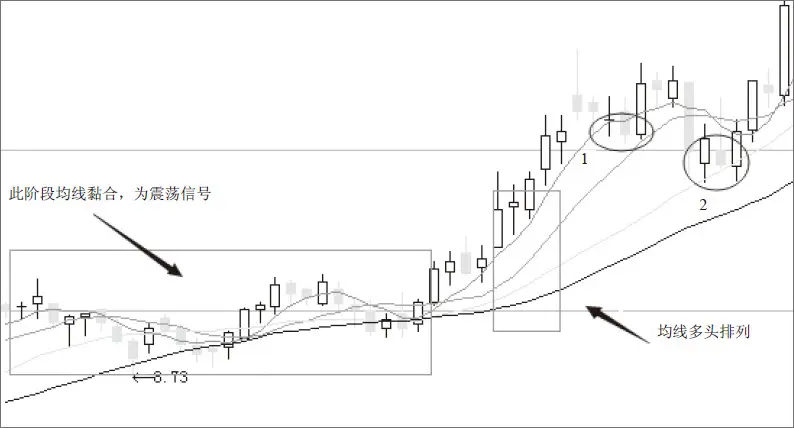

图3\-4 安徽水利（600502）2014\.09—2014\.12日线图（移动平均线）

买点解析

●当移动平均线按短期、中期和长期向下依次排列向上运行，称作多头排列，表示市场处于上升趋势中。股价在移动平均线上方运行。

●在移动平均线多头排列中，几条移动平均线长时间纠缠横向延伸，股价向上的同时，移动平均线同时向上发散成多头排列，是可靠的买进信号。

●在移动平均线未发生死叉的情况下，股价靠近10日或30日移动平均线可视为买进信号。

__实盘解读 __

如图3\-4所示，行情起先有一段均线黏合走势，我们称之为震荡信号，且均线黏合程度越高，震荡越明显。此后，股价以60日均线为支撑开始上涨，并带动均线成多头排列。

由于多头排列表示行情已经进入强势上涨阶段，投资者有单可耐心持有，无单只能等待价格回调。我们定义，10日均线为价格回落，30日均线为正常回调，60日均线为趋势支撑或反转。因此股价回到10日均线或30日均线都是买入机会。

最后注意，均线多头排列预示行情较强，价格回到10日或30日均线都是买入信号，但由于没有抓到行情的起涨点，不管回落还是回调都属于追单操作，投资者心中一定记住60日均线的支撑至关重要，在此做止损操作。

买点4：当短、中、长3根均线形成黄金谷时的买点

实战示例（见图3\-5）

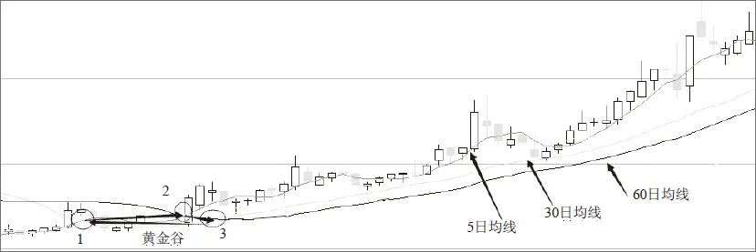

图3\-5 恒立实业（600622）2014\.06—2014\.09日线图（移动平均线黄金谷）

买点解析

●短期移动平均线向上交叉中期、长期移动平均线后，中期移动平均线向上交叉长期移动平均线，此时3条移动平均线围成一个封闭的三角形，叫作黄金谷。

●黄金谷显示股价向上的态势开始形成，是比较可靠的买点。

●黄金谷对今后的股价也会形成支撑，此后60日均线的支撑将上移等同30日均线，即行情保持30日均线支撑上涨。

__实盘解读 __

如图3\-5所示，圈1位置为5日均线交叉30日均线，圈2位置为5日均线交叉60日均线，圈3位置为30日均线交叉60日均线，连接3个圈点，可以得到一个不规则的三角形，即黄金谷。

黄金谷本身可看作一个强力支撑，与前面的单纯上穿不同，是一个可靠的买点，黄金谷出现以后，价格将以30日均线支撑看涨，不会回测60日均线。

## 第3章 均线指标的应用 - 3.2 均线的卖点

3\.2 均线的卖点

2025年10月29日

18:03

__3\.2 均线的卖点 __

卖点1：当股价下破单根移动平均线时的卖点

实战示例（见图3\-6）

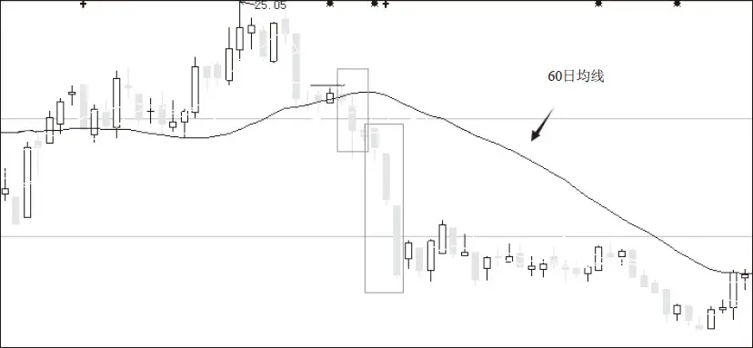

图3\-6 扬农化工（600486）2014\.03—2014\.06日线图（单根移动平均线）

卖点解析

在前面我们已经讲过价格与单根移动平均线的利弊，这里不再赘述。笔者建议取信60日均线为趋势均线，股价下破移动平均线是卖出信号。

__实盘解读 __

如图3\-6所示，股价在60日均线附近位置出现小平头顶部，参考前面看跌腰线的下跌，可以预测行情将要下破60日均线支撑，若前面看跌腰线没有离场，平头顶穿刺均线位置，投资者就不能在犹豫了。

看跌信号在均线上破位，形成了非常大的抛盘压力，行情出现两次三只乌鸦形态，股价远离均线，投资者庆幸逃过一劫。

卖点2：当短期均线下叉中长期均线时的卖点

实战示例（见图3\-7）

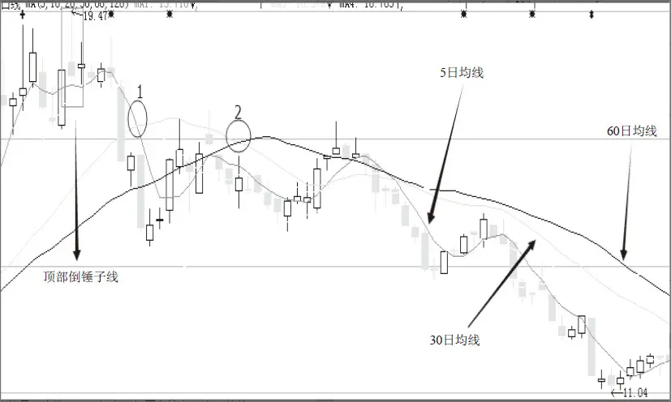

图3\-7 华胜天成（600410）2010\.11—2011\.02日线图（移动平均线）

卖点解析

短期移动平均线向下交叉长期移动平均线，是卖出信号，称作死叉。与金叉相同之处在于，当股价处于震荡区间时，买卖信号会频繁发生，如果你不想放过任何行情或是短线操作，就要采用更短期的移动平均线作为参考。当短期移动平均线与中期移动平均线高位死叉，可能会有较大的跌幅。当短期移动平均线自高位回落死叉长期移动平均线时，则意味着反转的可能。

__实盘解读 __

如图3\-7所示，股价在高点出现倒锤子线，预示行情即将开始下跌，5日均线勾头与30日均线形成第一个死叉，验证前面倒锤子线的卖出信号，此时投资者应已空仓。

接着5日均线继续下跌，穿过60日均线，预示跌幅还将继续，并且带动30日均线向下，与60日均线形成死叉，更为强烈的卖出信号出现，那么至少2～3次股价出现30日均线或60日均线，都只能看反弹，均线压力有效，耐心等待行情继续下跌。

卖点3：当均线出现空头排列时的卖点

实战示例（见图3\-8）

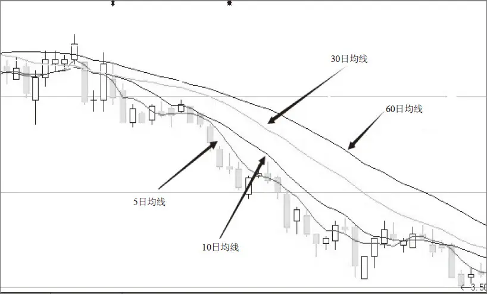

图3\-8 法尔胜（000890）2012\.05—2012\.09日线图（移动平均线）

卖点解析

●当移动平均线按短期、中期和长期向上依次排列向上运行，称作空头排列，表示市场处于下跌趋势中。股价在移动平均线下方运行。

●在移动平均线空头排列中，所有的卖出信号都可以认为是可靠的。

●股价靠近中长期移动平均线可视为卖出信号，一旦出现金叉则考虑买进。

●当短期或中期移动平均线靠近更长期的移动平均线折回向下，是卖出信号。

__实盘解读 __

如图3\-8所示，当均线形成空头排列，表明行情已经进入比较猛烈的下跌途中，并短期内不会见到反弹行情。

空头排列对前面出现的卖出信号是一个验证，但反弹迟缓，那么再次排列下，蜡烛图出现的任何一个信号，都可以作为卖点。

卖点4：当短、中、长3根均线形成死亡谷时的卖点

实战示例（见图3\-9）

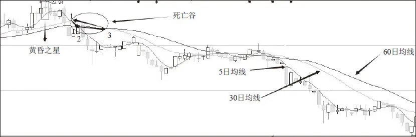

图3\-9 峨眉山A（000888）2013\.03—2013\.07日线图（移动平均线死亡谷）

卖点解析

●短期移动平均线向下交叉中期、长期移动平均线后，中期移动平均线向下交叉长期移动平均线，此时3条移动平均线围成一个封闭的三角形，叫作死亡谷。

●死亡谷显示股价向下的态势开始形成，是比较可靠的卖点。

●死亡谷对今后的股价也会形成较大压力，后市跌幅较大。

__实盘解读 __

如图3\-9所示，点1为5日均线与30日均线交叉，点2为5日均线与60日均线交叉，点3为30日均线与60日均线交叉，连接3个点形成一个三角形区域，我们称为死亡谷。

股价上涨后，在时段高位出现一根黄昏之星线，预示价格开始走低，此时死亡谷形成的力量不可忽略，投资者需要果断、快速离场。接下来，30日均线等同于60日均线压力，行情更快下跌，且周期预期会较长。

## 第4章 价格形态的买卖点

__第4章 __

__价格形态的买卖点 __

价格形态主要是由波峰与波谷之间的关系来判断价格趋势的变化，或为持续，或为反转，所以它也是由道氏理论演化而来的，这更能说明道氏理论是一切趋势性分析的先驱和基础。

价格形态包含两种类型，一种为反转形态，一种为持续形态。反转形态通过一段时间内的价格变化，波峰与波谷的组合来分析、判断未来价格趋势的反转，这是在形成质变之前的量变过程。其重要意义在于，能够相对准确地判断趋势的反转。持续形态的规模较小，通常都会小于同级别的反转形态，所以反转形态通常称为主要形态，而持续形态称为次要形态。持续形态往往酝酿于趋势进行之中，持续形态结束之后，价格会按照原有的趋势进行发展。持续形态也可以理解为在趋势中的修正，即对趋势的超买或超卖现象进行盘整。

价格形态不仅能够揭示价格运行的方向，而且对于价格的突破具有测算功能。在价格形态的酝酿过程中，成交量起到了至关重要的作用。其中，所有的反转形态都具有共同点，市场中确有趋势存在，这是形成反转形态的前提，想要反转，必须先有趋势可反，才能称为反转。重要趋势线的突破，是即将发生趋势反转的第一个警示信号。反转形态运行的时间越长、规模越大，反转后的价格波动幅度越大。通常顶部反转形态的规模要大于底部反转的规模。

反转形态与持续形态其名目同样与K线形态有相同之处，明了形象，例如头肩底、头肩顶、双重顶、双重底，都可以直接看出它们的位置与作用。如持续形态中的三角形、旗形等等，便于记忆与理解。

持续形态是一个无中生有的变化过程，看似在持续形态运行过程上并无趋势，但其内在却酝酿着趋势，投资者应把握其特点，找到突破点位，那是价格形态提供给我们最好的买点或卖点。反转形态是使原有趋势发生改变的形态，所以，各种大顶大底，我们都能得到相应的底部或顶部形态，在突破颈线时，为最佳的买点或卖点。价格形态虽然为老生常谈，但它们是最著名的，也是最诚实的。

## 第4章 价格形态的买卖点 - 4.1 价格形态的买点

4\.1 价格形态的买点

2025年10月29日

18:03

__4\.1 价格形态的买点 __

买点1：当出现头肩底时的买点

实战示例（见图4\-1）

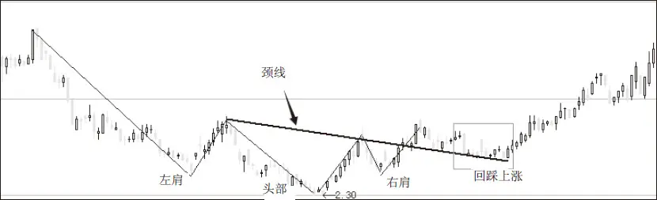

图4\-1 常山股份（000158）2013\.04—2013\.08日线图（头肩底形态）

买点解析

●股价自低点反弹形成左肩，之后从反弹高点回落，以较小的交易量跌至新低。

●股价自新低点上反弹形成头部，在此次上涨中应该伴有相对较大的成交量，在达到前一个反弹高点水平回落。以这两个反弹高点做出颈线。颈线最好为下行趋势压制。

●股价自第二个反弹高点成交量以通常小于形成左肩的成交量回落形成右肩，股价以大于之前的成交量上涨，伴以大成交量突破颈线。

●收盘价实质性地突破颈线。在突破颈线后，股价通常会有反扑动作，以回踩颈线支撑作为买点。

●在头肩底形态中，如果每次上涨时的成交量是递增的，更有利于突破。

●头肩顶形态之前必须是下跌趋势。头肩底突破后的测算目标是，自突破位算起，头部高点至颈线的垂线距离。

●头肩底形态中，成交量在上升过程中应该是依次增加的，在下跌过程中成交量应该是递减的。

__实盘解读 __

如图4\-1所示，头肩底形态起初不容易被发现，左肩下跌反弹后，股价再次缩量下跌，但有价格新低，而价格再反弹时，反弹高点打破了左肩低点，那么右肩构筑成型，即可连接两次反弹高点，得出颈线。

头肩底颈线大部分为下行趋势线，股价站上趋势线后，通常会有一个回踩验证，而我们利用回踩作为买入点，目标看到构建左肩下跌的起点位置。

买点2：当出现双重底时的买点

实战示例（见图4\-2）

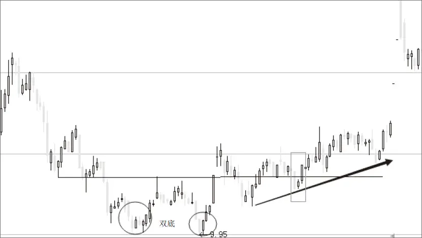

图4\-2 锦富新材（300128）2014\.02—2014\.09日线图（双重底）

买点解析

●之前是下跌趋势。

●股价自低点回落确定了第一个底，股价回升形成反弹高点缩量跌回，在这次次下跌过程中成交量有所减少，股价无力跌破前低，第二个底形成。

●股价从第二个低点回升突破前面的反弹高点，双重底完成，买点出现。

●在突破前一个反弹高点时，应该伴有大的成交量。

●预测价格目标为底点到颈线垂线距离。

●两底之间的时间越长、幅度越大，则反转的潜力越大。

__实盘解读 __

如图4\-2所示，行情下跌第一个低点后，反弹再下跌，因盘中成交量萎缩，股价在第二个低点附近再次得到支撑反弹，双底信号出现。

双底也称W低，主要买点依然是看颈线的突破。此图在颈线处得失有一个反复，但周期较快收复颈线，并伴有孕线和看涨腰线，在颈线下方形成了看涨趋势线，我们考虑主力这样清盘，后市必有拉升行情，因此在看涨腰线次日我们要把买盘接回来，等待行情拉升。

买点3：当出现三重底时的买点

实战示例（见图4\-3）

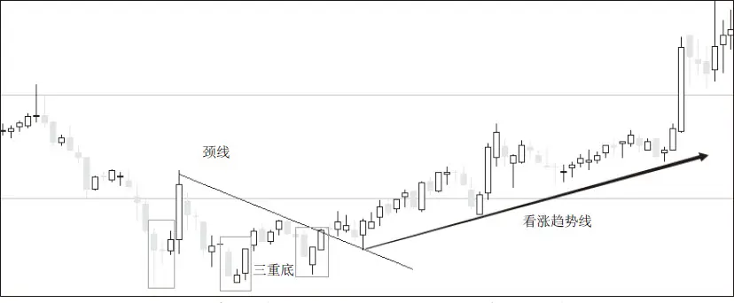

图4\-3 宏磊股份（002647）2013\.05—2013\.09日线图（三重底）

买点解析

●之前是下跌趋势。

●是头肩底形态的变形，3个低点在一个价格水平上，或接近一个价格水平。

●在三重底形态中，3个高点上升时的成交量依次增加，下跌的成交量依次减少。

●股价在跌破中间两个高点的压力水平，形态完成，买点出现。

●在突破时应该伴有大的成交量。

●3个底之间的时间越长、幅度越大，则反转的潜力越大。

__实盘解读 __

如图4\-3所示，行情在同一个低点附近得到3次支撑，并见到3次反转信号，分别为启明星、约会线和看涨刺透线。

连接两次反弹高点得到颈线，颈线反映了对三重底股价的压力水平，我们看到每次下跌，动量在逐步萎缩，因此颈线破位，验证三重底形态，买点随之出现。

买入价格后，我们再看看涨趋势线的形成。

最后提示投资者，技术分析需要领略大义，不要执着完美，否则会错失良机。

买点4：当出现圆弧底时的买点

实战示例（见图4\-4）

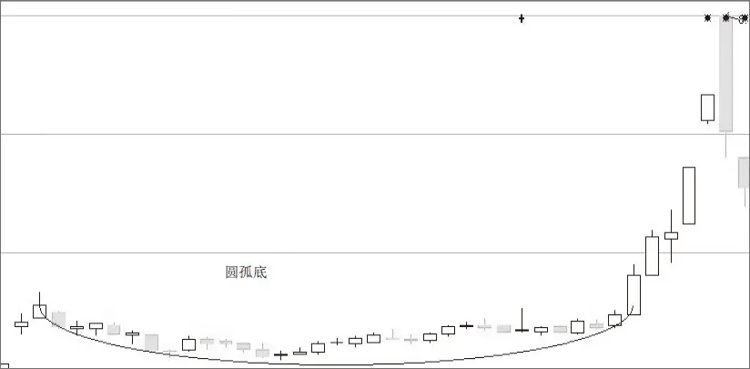

图4\-4 天津港（600717）2013\.06—2013\.09日线图（圆底反转）

买点解析

在股价下跌的底部出现，价格变化比较平缓。成交量在向底部运行的过程中应该是逐渐减少的，当转而向上时动作也比较缓慢，随着买盘逐步占据主动，成交量会随之逐步放大。至于突破，最好参看其他的技术分析的压力水平。形态运行的时间越长，后市的潜力越大。

__实盘解读 __

如图4\-4所示为圆底反转，行情小幅震荡枯燥乏味、缺乏激情的市况，如果参与其中，除了忍耐就只有等待。虽不见利润空间，但也不担心招致大亏损，通常市场主力会借助这样的走势埋单。但是，我们同时也应该看到，市场一旦量价配合打破盘局，涨势是非常可观的，圆底运行的时间越长，未来的涨势越可观。

买点5：当出现持续头肩底时的买点

实战示例（见图4\-5）

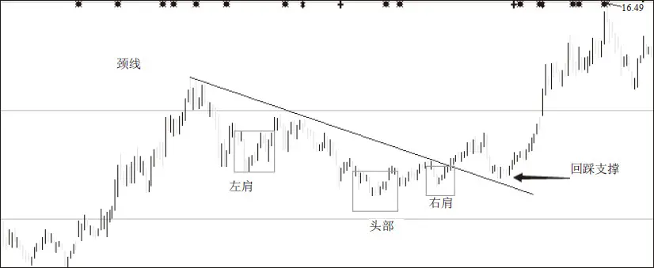

图4\-5 银轮股份（002126）2014\.01—2014\.10日线图（持续头肩底）

买点解析

●出现在上升趋势中，是上升的持续形态。

●股价自高点回落形成左肩，之后从反弹高点回落，以较小的交易量跌至新低。

●股价自新低上反弹形成头部，在此次上涨中应该伴有相对较重的成交量，在达到前一个反弹高点水平回落。以这两个反弹高点做出颈线。

●股价自第二个反弹高点成交量以小于形成左肩的成交量回落形成右肩，股价以大于之前的成交量上涨，伴以大成交量突破颈线。

●收盘价实质性地突破颈线。在突破颈线后，股价通常回测支撑效果，然后有反扑动作。

●在头肩底形态中，如果每次上涨时的成交量是递增的，更有利于突破。

●在头肩底形态中，成交量在上升过程中应该是依次增加的，在下跌过程中应该是递减的。

__实盘解读 __

如图4\-5所示，图中的右肩稍低于左肩，颈线由两个高点连接而成，向下倾斜，行情站上颈线后，没有直接拉升，而是回测颈线支撑后再继续上涨。

我们说上涨途中出现头肩底形态为看涨的延续，也是加仓或再买入的信号，切入点依然为颈线的突破和回踩进场。

持续头肩底形态运行的时间比底部形态运行的时间要短。

买点6：当出现看涨上升三角形时的买点

实战示例（见图4\-6）

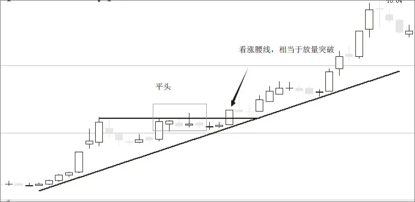

图4\-6 荣安地产（000517）2014\.08—2014\.10日线图（上升三角形）

买点解析

●发生在上涨趋势中，属于上涨持续形态。至少有两个高点和两个低点。

●高点持平，低点依次抬高，股价变化向中间收敛。两个高点的连线与两个低点的连线交叉成上升三角形。成交量在股价收敛过程中逐渐缩小，在股价突破压力线时放大。在股价突破反扑的过程中成交量缩小。

●股价的突破应该在上升三角形宽度的1/2到3/4之间的某个位置，由此我们可以大致推测出股价突破的发生时间。

●突破后的目标高度是自突破位加上三角形的最大高度。

__实盘解读 __

如图4\-6所示，股价上涨过程中遇到回调并出现平头顶信号，且有两个高点的嫌疑。但在靠近三角形尾端，交易量突然加大，股价放量上涨突破三角上方阻力，新一波上涨空间被打开。

有一个有趣的现象，注意三角形的下边，发现将其延长后，不仅是前期股价的支撑线，而且很可能与看涨趋势线重合，对未来的股价也表现出强劲的支撑。这也说明，如果眼光开阔，能综合、灵活地运用技术分析，就会得到更多的收获。

买点7：当出现看涨下降三角形时的买点

实战示例（见图4\-7）

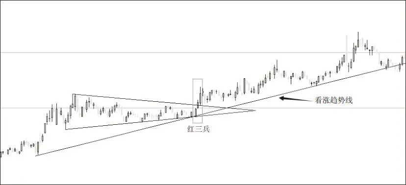

图4\-7 松芝股份（002454）2014\.02—2014\.12日线图（上升三角形）

买点解析

●具有下降三角形的所有特征，只是偶尔出现上涨的情况。

●不同的是股价带量突破上边，遇到这种情况，稳健的投资者最好等股价突破三角形的高点再决定是否买入。

●经验上看，股价突破后，股价上行也并非单边，大部分为震荡上行趋势。

__实盘解读 __

如图4\-7所示，股价上行过程中出现震荡下跌走势，连接震荡边轨两个高点和两个低点，可以画出下降三角形。

三角形下轨多次得到支撑后，日线收盘红三兵形态出现，第二根上涨阳线刺穿三角上轨，打破了缩量震荡区间。

此后我们连接低点可以得出看涨趋势线，那么在趋势线以上的三角形我们不能看跌，在靠近趋势线附近，我们考虑买入股票。

买点8：当出现看涨发散三角形时的买点

实战示例（见图4\-8）

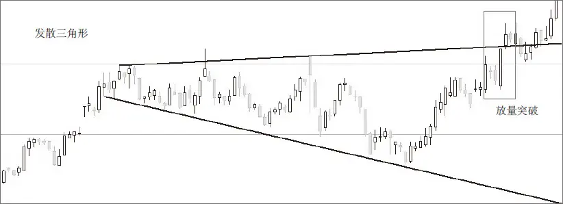

图4\-8 华宇软件（300271）2014\.09—2015\.02日线图（看涨发散三角形）

买点解析

●可以在市场底部出现，也可能是持续形态。由3个逐次下跌的谷底和两个逐次上升的峰顶构成，显示市场买卖双方分歧加大。

●比较少见。最好细心观察细节，看突破方向。若每次上涨成交量依次增加，伴有刺破迹象，一般在第三到第四次放量时，出现突破行情。

__实盘解读 __

如图4\-8所示，发散三角形震荡区间越走越宽，常见出现在震荡行情和上涨途中，属于持续形态。

股价的振幅逐步加大，暗示着市场交锋激烈，在低位出现说明买盘蠢蠢欲动。

实际走势中，我们可以看到买盘在下方得到买盘支撑的次数较多，且股价在得到支撑后价格都有快速的上涨，相反，上方阻力被测试的次数较少，盘中上涨阳线较多，因此行情在第三或第四次可看突破。突破买入需要等待两个条件：第一，行情放量；第二，蜡烛图实体收盘突破，最好有回踩，则为更可信的买点。

买点9：当出现看涨旗形时的买点

实战示例（见图4\-9）

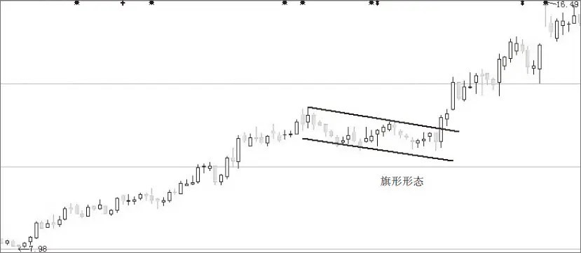

图4\-9 保税科技（600794）2014\.07—2014\.12日线图（看涨旗形）

买点解析

●之前的上涨像旗杆一样几乎是直线的，成交量很大。

●由两条向下倾斜的平行直线构成的价格运行轨迹。时间在2～4个星期，成交量较小。

●突破后恢复上涨，成交量跳跃式大增，目标价位与突破点之前上涨相同。

__实盘解读 __

如图4\-9所示，看涨旗形属于持续形态或者叫作中继形态，是对上涨的巩固。之前行情上涨在时段高点得到孕线形态，行情转看回落，但回调力度极小，股价在相对高位震荡运行，并没有快速远离高点。

此后，股价在一根看涨腰线作用下，打破震荡下行通道，即旗形通道，行情重新回到上涨之中，且上涨速度将快于震荡之前。

不仅速度，我们看旗形后的涨幅，也将恰好等于旗形之前的高度。

买点10：当出现看涨矩形时的买点

实战示例（见图4\-10）

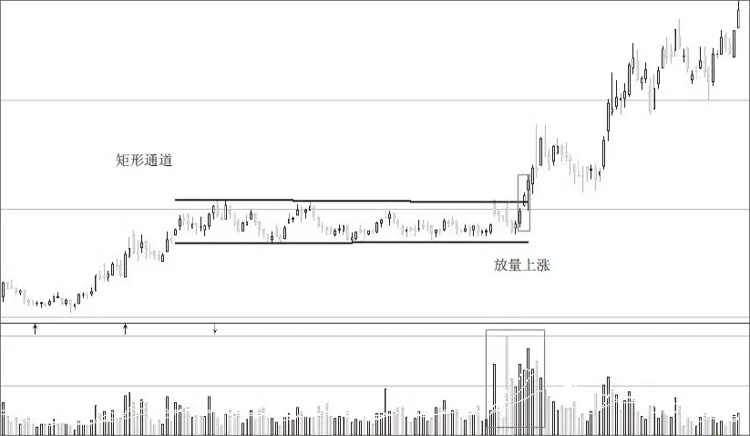

图4\-10 宇通客车（600066）2014\.06—2015\.02日线图（看涨矩形）

买点解析

●在上升趋势中出现，属于持续形态。由两条水平直线形成的横向价格区间。

●股价突破上边是形态完成，突破时成交量放大。如果3次触及上边时的成交量依次减少而下探下边时的成交量较大，则有形成三重顶的嫌疑。

●行情在突破前，成交量会突然增大，但股价慢一步突破上涨。

__实盘解读 __

如图4\-10所示矩形通道，上涨启动不久，指数进入横向调整阶段，通道非常标准，股价上、下多次测试支撑、阻力效果均不得突破，大大增加了后市看上突破的概率。

图4\-10中我们配上了成交量，以便观察成交量的变化，准确判断形态的演变。我们讲过，在矩形形态中向上的成交量应该比下降的成交量大，否则就有转化三重顶或平头顶部形态的可能。现在结合成交量看一下矩形，在向上形成峰顶的过程中成交量跟随放大，但股价还未突破，有主力买单嫌疑；而在向下形成谷底的过程中，成交量都在相应减少，达到谷底时成交量最小，无一例外。这就说明了市场看涨的意愿较强。

上涨阳线收盘突破上轨，同理，我们在突破后和回测支撑时进行买入。

买点11：当出现看涨楔形时的买点

实战示例（见图4\-11）

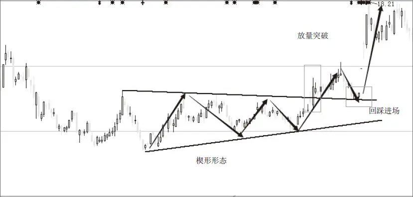

图4\-11 大禹节水（300021）2014\.02—2014\.09日线图（看涨楔形）

买点解析

●当出现在市场底部，则属于反转形态；当出现在上升趋势中，则属于看涨持续形态。

●有两条聚拢的趋势线形成一个向下的顶点，称作下降楔形，方向是向上的。持续的时间在1～3个月，在形态的2/3以后形成突破。

●股价在向顶点运行过程中成交量是逐步萎缩的，突破时成交量放大。

__实盘解读 __

如图4\-11所示，下降楔形，常用于震荡突破行情，震荡区间收窄，或边轨支撑阻力被测试第三次时，行情容易形成突破。

此图看涨腰线再次充当放量突破信号，股价站上楔形上轨后，阻力变为支撑，我们在突破收盘时可追单进场，或耐心等待行情回测支撑买入。

股价突破压力首先需要成交量的配合，大部分的上涨突破行情，由于突破阻力的需要，会消化一部分动能，因此上行不远会有一次回测支撑，同时补充动能，我们投资者可借助回测支撑买入，同市场主力一起拉升股价。

买点12：当出现底部三角形时的买点

实战示例（见图4\-12）

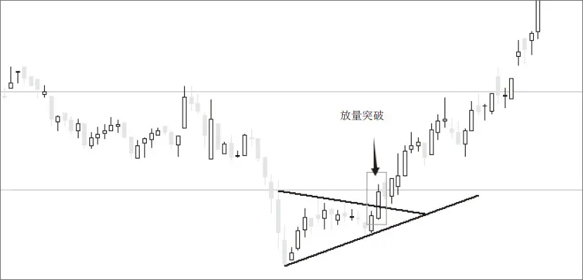

图4\-12 宏达兴业（002002）2014\.10—2015\.02日线图（底部三角形）

买点解析

●出现在市场的底部，可以是上升三角形、下降三角形或对称三角形。

●三角形形态经常以持续的形式出现，所以我们必须等待，当上边被突破时才可以判断为底部形态。

●突破常伴随着交易放量。

●规模通常比顶部规模小。

__实盘解读 __

如图4\-12所示，底部三角形形态是一个下降三角形，形态中的变化简单，但是依然有两个明显的下降谷底，上下边向中间聚拢交叉成三角形。

长实体上涨阳线再次出现，长实体自身代表着强劲的买盘，由此可见，我们说长实体蜡烛图是最常见、最可信突破信号，投资者次日开盘买入，股价不跌破趋势线，可安心持有等待上涨。

## 第4章 价格形态的买卖点 - 4.2 价格形态的卖点

4\.2 价格形态的卖点

2025年10月29日

18:03

__4\.2 价格形态的卖点 __

卖点1：当出现头肩顶时的卖点

实战示例（见图4\-13）

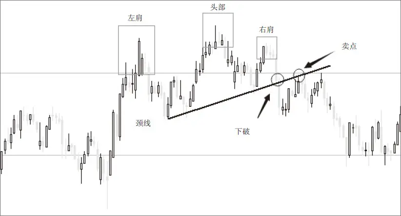

图4\-13 长春高新（000661）2013\.04—2013\.11日线图（头肩顶形态）

卖点解析

●之前是上升趋势。

●左肩伴有较大的成交量，之后下跌至谷底。自谷底伴以较小的成交量上涨，创出新的高点，形成头部。随后下跌至前一个谷底附近，形成第二个谷底。自第二个谷底伴以更小的成交量上涨至左肩的高点水平（或略高或略低于左肩），无力上涨至前高水平（头部），股价随后下跌。

●收盘价跌破两个谷底的颈线。

●颈线的支撑将转换为压力。

●头肩顶突破后的测算下跌目标是，自突破位算起，头部高点至颈线的垂线距离。

●在头肩顶形态中，成交量在上升过程中应该是依次减少的，在下跌过程中应该是递增的。

__实盘解读 __

如图4\-13所示，头肩顶形态，股价快速上涨阶段，回落继续上涨，但成交量萎缩，新高仅为影线后再次回落，构筑右肩形态。

连接两个谷底，得到颈线，这条颈线实际上就是依据趋势线原理做出的一条支撑线。行情以颈线做支撑可继续上涨，但若行情下破颈线，头肩顶形态成立。

蜡烛图实体下破颈线时为重要的卖点信号，投资者应结束或暂缓看涨，若没有及时抛出，那么关注蜡烛线回测阻力时，为下跌前最后机会，应马上抛出股票。

卖点2：当出现双重顶时的卖点

实战示例（见图4\-14）

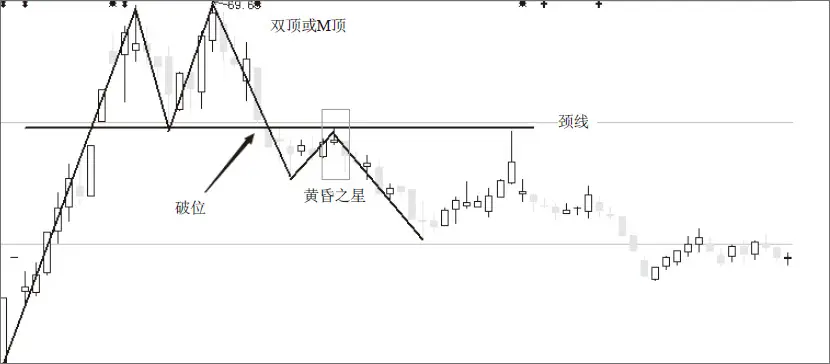

图4\-14 友邦吊顶（002718）2014\.01—2014\.05日线图（双重顶形态）

卖点解析

●之前是上升趋势。

●股价自高点回落确定了第一个顶，缩量回落形成谷底后上涨，在第二次上涨过程中成交量有所减少，股价无力冲破前高，第二个顶形成。

●股价从第二个高点回落跌破前面的谷底（颈线），双重顶完成，卖点出现。

●预测价格目标为高点到颈线垂线距离。

●两个底之间的时间越长、幅度越大，则反转的潜力越大。

__实盘解读 __

如图4\-14所示，双重顶反转形态，也称M顶或M头，最为常见的反转形态。从图上可以看到，股价从第二个高点下跌速度明显比前一次下跌的速度快。这样以第一个高点为标准定义了双顶，以双顶之间的谷底做水平直线就是颈线，颈线被实体突破，卖点信号出现。

蜡烛图破位颈线支撑后，再有震荡反弹，那么前期的颈线支撑转变为阻力。行情在阻力线附近收黄昏之星组合，更加确定了行情下跌的趋势，投资者应在黄昏之星触及颈线阻力是快速离场，躲避后面的单边下跌。

在后面回测颈线的时候，日线收盘任何蜡烛线，只要不能实体突破或收盘下跌信号，都可以坚定看行情下跌，这也是下跌信号最后的逃命机会。这些图例不是特例，在今后的实际操盘中，如果遇到类似情况，假如你还在心存侥幸，请回想这幅图例。

卖点3：当出现三重顶时的卖点

实战示例（见图4\-15）

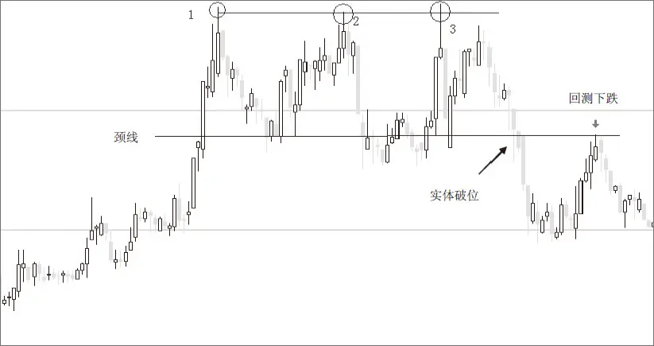

图4\-15 奥普光电（002338）2014\.06—2015\.02日线图（三重顶）

卖点解析

●之前是上升趋势。

●是头肩顶形态的变形，3个高点在一个价格水平上，或接近一个价格水平。

●在三重顶形态中，3个高点上升时的成交量依次减少，下跌的成交量依次增加。

●股价在跌破颈线的支撑，形态完成，卖点出现。

●预测价格目标为高点到颈线垂线距离。

●3个底之间的时间越长、幅度越大，则反转的潜力越大。

__实盘解读 __

如图4\-15所示为三重顶形态。点1与点2构成双顶后，股价在颈线失而复得，出现第三次上涨高点回落，交易量最后释放完全，动能消失，形成三重顶形态。在三重顶上限水平的蜡烛都带有较长的上影线，说明形态上限水平的压力较重。

价格第三次回落下跌，前面双顶的颈线支撑依然有效，但我们看股价破位颈线，卖点出现，预测将得到与顶部到颈线相同的下跌空间。

颈线支撑变为阻力，行情下破后回测颈线，并在此收得吞没形态，可看行情启动新一轮下跌。

卖点4：当出现圆弧顶时的卖点

实战示例（见图4\-16）

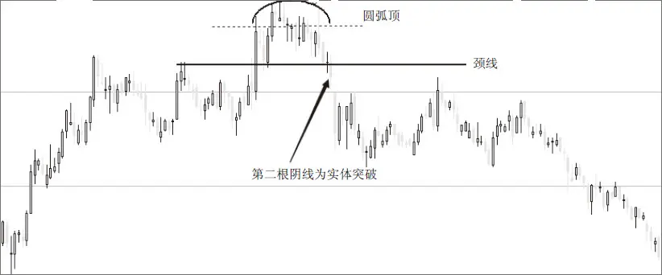

图4\-16 云南白药（000538）2013\.07—2014\.03日线图（圆弧顶）

卖点解析

●在股价上升的顶部出现，多根蜡烛图排列，价格变化比较平缓，顶部呈弧度。

●成交量在向顶部运行的过程中应该是逐渐减少的，当转而下时动作也比较缓慢，随着抛盘逐步占据主动，成交量会随之逐步放大（当市场对下跌达成一致时，下跌可能是无量的）。

●圆弧顶的颈线不太标准，也有些置后，一般为前一个波峰的高点，建议同时配合其他指标，提前找出卖点。

__实盘解读 __

如图4\-16所示为圆弧顶形态。股价再次连续多日收盘，可阴阳交替或有影线，随着日线收盘的增多，顶部的弧度越加明显。

在形成圆弧顶的过程中股价波动比较剧烈，但很可能是高位震荡，说明市场情绪比较焦躁，意见很难达成一致。在圆弧顶左侧向上的过程中，成交量是逐渐减少的，直到估计慢慢离开顶部价格，紧跟着会有一天成交量异常放大，股价大幅下挫。

离开高位的股价需要测试颈线支撑，一般圆弧的颈线在两个弧口的连线位置（图中虚线），但由于距离高点太近，不易判断震荡或破位，所以要看行情前一个波峰的顶点，破位则压制股价继续下跌。

期市下跌是因为空头的势力大于多头的势力，而股市的下跌不一定是因为抛盘力量大，而可能是因为没人买，所以多数情况可能是无量下跌。

卖点5：当出现持续头肩顶时的卖点

实战示例（见图4\-17）

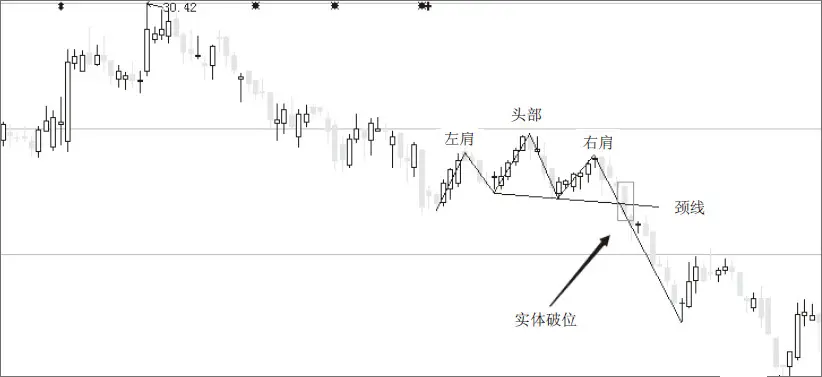

图4\-17 航天信息（600271）2011\.08—2012\.01日线图（持续头肩顶）

卖点解析

●在下跌趋势中的反弹形成，是下跌的持续形态。

●自低点反弹至第一个反弹高点回落形成左肩，左肩伴有较重的成交量，之后下跌至谷底。自谷底伴以较小的成交量上涨创出新的高点，形成头部。随后下跌至前一个谷底附近，形成第二个谷底。自第二个谷底伴以更小的成交量上涨至左肩的高点水平（或略高或略低于左肩），无力上涨至前高水平（头部），股价随后下跌。

●收盘价跌破两个谷底的颈线。

●颈线的支撑将转换为压力。

●头肩顶突破后的测算下跌目标是，自突破位算起，头部高点至颈线的垂线距离。

●在头肩顶形态中，成交量在上升过程中应该是依次减少的，在下跌过程中成交量应该是递增的（不是绝对的）。

__实盘解读 __

如图4\-17所示为下跌中持续的头肩顶。行情下跌过程中出现反弹，自反弹高点回落形成左肩，自回落低点继续反弹形成第一个谷底。股价冲破第一个反弹高点形成头部，继而形成第二个谷底。再次反弹的时候，股价接近第一个反弹高点无法到达头部，回落形成了右肩。两个谷底的连线构成颈线。

我们看头部的反弹时，价格要比左肩略高，有一定的横盘反转概率，当右肩出现时，彻底打破了行情反转的可能，右肩与左肩在同一个价格水平线上，至此基本可以认为原下跌趋势将延续。

待颈线破位，验证我们先前观点，即行情继续下跌。

卖点6：当出现看跌下降三角形时的卖点

实战示例（见图4\-18）

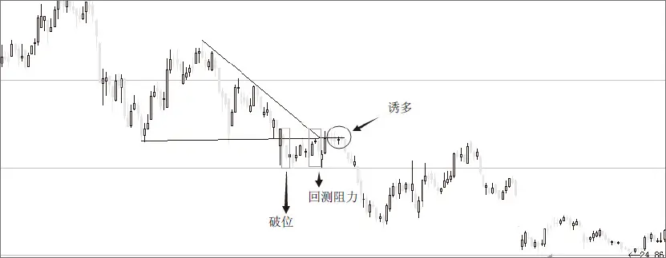

图4\-18 江淮汽车（600418）2007\.09\.17—2008\.11\.13日线图（看跌下降三角形）

卖点解析

●发生在下跌趋势中，属于下跌持续形态。至少有两个高点和两个低点。

●高点依次降低，低点持平，股价变化向下边收敛。两个高点连线与两个低点连线交叉成下降三角形。成交量在股价收敛过程中逐渐缩小。在股价突破反扑的过程中，成交量较之前的上涨成交量缩小。

●股价的突破应该在下降三角形宽度的2/3到3/4之间的某个位置，由此我们可以大致推测出股价突破的发生时间。

__实盘解读 __

如图4\-18所示为看跌下降三角形。这是一个相对规模较大的持续形态，行情的下跌由孕线和三只乌鸦开启。通常三只乌鸦可完成相当跌幅，然后行情会有一个停顿，或反弹或低位整理，行情进入三角形整理。

我们看三角形图中，行情两次支撑，两次受阻后，先是刺破下跌，三角形边轨形成虚破，随后在实体下跌，宣告破位，验证下跌行情延续。

然后行情回测阻力时，原先三角边轨支撑线变为阻力，并在阻力线得到黄昏线信号，那么行情可以准备看下一波下跌。

这里有一个小插曲，行情在黄昏线后，没有立刻下跌，而是试探性上涨，意图收复三角边轨的支撑。技术上，股价站上支撑确实可以暂停看下跌，但前提是要站上，因此没有实体验证前，投资者不要认为这是上涨买点，很可能有诱多嫌疑，大家一定要等看到信号再判断，否则按先前下跌信号接着看下跌。

卖点7：当出现看跌旗形时的卖点

实战示例（见图4\-19）

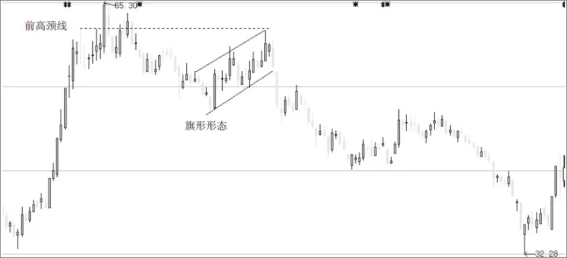

图4\-19 广晟有色（600259）2013\.01—2013\.07日线图（看跌旗形）

卖点解析

●之前单边下跌，顶部有看跌K线组合或技术形态，可以不计较成交量（当市场对下跌达成一致时，可能是无量下跌）。

●由两条向上倾斜的平行直线构成的价格运行轨迹。时间在2～4个星期，成交量较小。

●突破后恢复下跌，成交量大增，目标价位是突破点加上之前旗杆的高度。

__实盘解读 __

如图4\-19所示为看跌旗形。看跌旗形也称作上升旗形，上升旗形是看跌的。旗形内价格震荡上行，高点不能触及或打破前面高点的颈线，即图中的虚线。

原先股价下行，因此旗形震荡后，股价会延续前趋势继续下行。

旗形也可看作下跌后的反弹，顶部信号没有及时卖出的投资者，借助旗形反弹可卖出股票，若不及时离场，顶到旗形的距离，就是旗形到下一个目标的距离。

旗形区间内的震荡不会很频繁，一般为两次测试，破位依然以实体蜡烛线突破为主。

卖点8：当出现看跌矩形时的卖点

实战示例（见图4\-20）

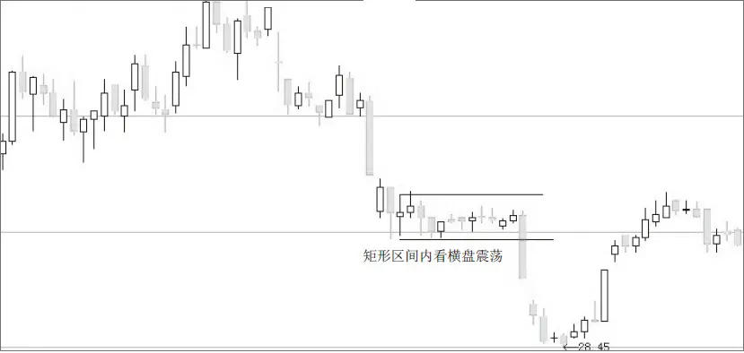

图4\-20 南风股份（300004）2014\.02—2014\.06日线图（看跌矩形）

卖点解析

●在下跌趋势中出现，属于持续形态。由两条水平直线形成的横向价格区间。

●区间震荡期间，成交量很小。股价突破下边时形态完成，突破时成交量放大。如果3次触及上边时的成交量依次增加，而下探下边时的成交量递减，则有形成三重底的可能。

●目标价格是突破位加上矩形的宽度。

__实盘解读 __

如图4\-20所示为看跌矩形。股价第一波下跌后开始修正，股价在水平的区间里展开震荡，构筑成矩形，期间交易量萎缩，成交量很小，直到突破时卖盘才放量。

突然放大的卖盘力量不仅打破了震荡区间，实体长阴线收盘，并在次日向下跳空。因此我们看矩形形态不改变原有趋势，行情在此横盘修整或蓄力，待精神饱满后，对股价再下一城。

卖点9：当出现看跌楔形时的卖点

实战示例（见图4\-21）

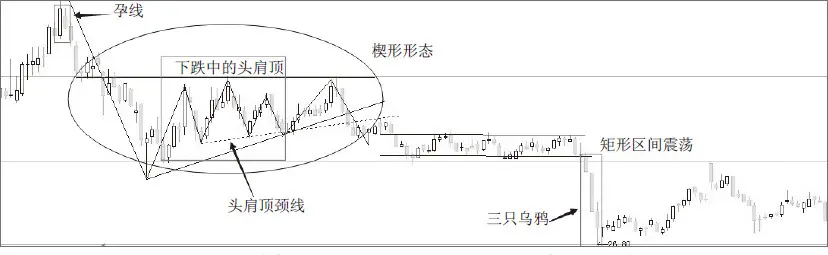

图4\-21 天齐锂业（002466）2013\.05—2014\.01日线图（看跌楔形）

卖点解析

●当出现在市场顶部，则属于反转形态；当出现在下跌趋势中，则属于看跌持续形态。

●与三角形区间类似，有两条聚拢的趋势线倾斜向上形成一个向上的顶点，称作上升楔形，突破方向是向下的，在形态的2/3以后形成突破。

●股价在向顶点运行过程中，成交量是逐步萎缩的；突破时成交量放大。

__实盘解读 __

如图4\-21所示为看跌楔形。行情上涨后以孕线K线组合见顶下跌，直到收得长影线的锤子线蜡烛图，股价才反弹并有震荡，由此可以画出通道区间，即为楔形形态。

我们仔细观察发现，楔形图内容是一个头肩顶的形态，虚线为该形态的颈线。实际走势中，楔形与头肩顶形态同样指向下破，价格有偏差，但同在一个交易日的实体内，可以接受。楔形形态下破后，行情没有立即下跌，后面又跟了一段时间的矩形区间震荡，我们说矩形区间不影响行情方向，因此前面下跌，待震荡整理行情结束，后面一样看下跌。

最后，行情释放了积攒的下跌力量，三只乌鸦出现，把股价推入谷底。借此我们提示投资者，一旦行情方向确定，可能会因为基本面或技术面，行情有一定延迟发生，但延迟大部分时候不改变趋势，因此投资者须耐心等待，前面什么行情，后面还是什么行情。

卖点10：当出现顶部三角形时的卖点

实战示例（见图4\-22）

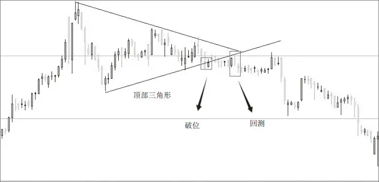

图4\-22 华东电脑（600850）2012\.02—2012\.07日线图（顶部对称三角形）

卖点解析

●在顶部形成，构成与持续三角形一样，当其在顶部出现，则构成反转形态。

●每次向上的成交量应该是递减的（偶尔会有例外的情况），可以是任何三角形形态，只不过都是突破下边。

__实盘解读 __

如图4\-22所示为对称三角形顶部反转。行情上涨时段高点价格回落，盘中未见明显见顶信号，但回落过程的交易量萎缩，顶点下降，支撑上移，连线两个低点和两个高点，可以得出三角整理区间。

该三角形态发生在行情顶部，因此三角破位将诱发一波单边行情，途中行情选择下行破位，实体线穿过边轨即认为行情破位，卖点出现。

三角下轨由支撑变为阻力，行情下破回测过程中，在下轨受阻收盘黄昏线组合，验证行情下跌。

我们说，无论是何种三角形，从某种意义上讲，都是一种反技术形态，震荡区间越来越小，投资者要耐心等待实体突破，并验证其可靠性。

## 第5章 跳空窗口的买卖信号

__第5章 __

__跳空窗口的买卖信号 __

跳空窗口是指相邻两日，成交价格不连续，产生的空白区间，在上升趋势中，当日的最低价高于前一日的最高价，这样最高价与最低价之间形成了没有成交价格的空白区间，称为向上跳空窗口。在下降趋势中，当日的最高价低于前一日的最低价，这样最低价与最高价之间形成了没有成交价格的空白区间，称为向下跳空窗口。

跳空窗口一般配合基本面环境的变化出现，如重组、合作等一些消息，引发重新定价或盘中交易量井喷。跳空窗口分为4种类型，包括突破跳空、中继跳空、衰竭跳空和普通跳空。

普通跳空通常出现在成交量较小的情况下，或是横向震荡区间之内，不具备参考意义，而突破跳空与中继跳空则代表了趋势的发生阶段与发展阶段的股价变化与市场情绪，具有非常重要的参考价值。在本章中，将详细讲解突破跳空与中继跳空类型窗口的具体用法。

突破跳空常发生在重要的形态完成之后，或者趋势线的突破阶段，意义最为重要；而中继跳空常出现在快速市中，预示着以后的趋势，发展幅度与跳空之间接近，具有较重要的预见功能。不是所有的跳空窗口都需要被回补，并且回补速度也不一样，如突破窗口的回补周期较长，中继窗口回补周期短，并且中继窗口若短期没有回补，那么也有不回补的可能。当股价试图回补窗口，并被窗口所支撑之时，则代表着新的买进时机；反之，若出现向下跳空窗口，当股价试图向上回补窗口，并被窗口所压制之时，则代表着新的卖出时机。衰竭窗口必然会被回补，当回补时往往跟随着原有趋势的扭转，它出现之后，代表股价将进入趋势的尾声。

## 第5章 跳空窗口的买卖信号 - 5.1 买进信号

5\.1 买进信号

2025年10月29日

18:03

__5\.1 买进信号 __

买点1：当股价向上突破跳空窗口时的买点

实战示例（见图5\-1）

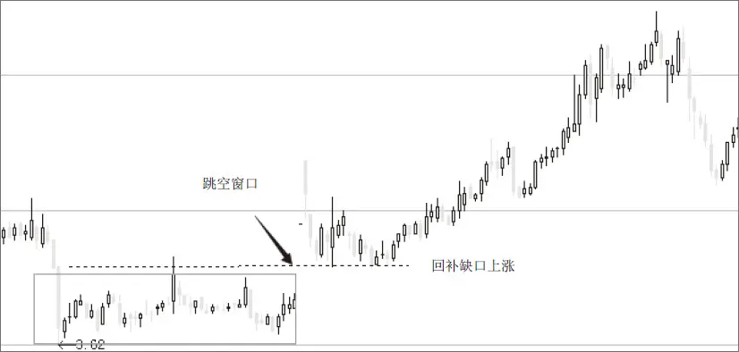

图5\-1 南风化工（000737）2014\.04—2014\.09日蜡烛图（窗口）

买点解析

在上涨趋势形成初期，以突破重要的水平压力或压力线作为突破跳空的衡量标准。在这一期间，重要压力的突破本身就有决定后市走向的意义。以跳空窗口的形势出现，是买盘集中爆发的体现，代表对后市积极乐观的市场情绪，是重要的买点。而买入点以压力水平作为参考，可以通过日内的分时图提高准确率。有时强势上涨行情，不会再回测支撑，而是继续上涨。

__实盘解读 __

如图5\-1所示，股价在得到时段新低后，持续很长时间在低位震荡，出现平头底或不规则双低或头肩底信号。突然一天，股价向上跳空上涨，打破了平头底的运行区间，实现行情看涨，我们说市场交易量爆发，行情由震荡趋势转为上涨趋势。

跳空缺口属于突破跳空。

尽管行情短期有很大的买盘支撑看涨，但市场依然不忘回补缺口，测试支撑同时，以缺口支撑再上涨。

买点2：当股价回试向上跳空窗口时的买点

实战示例（见图5\-2）

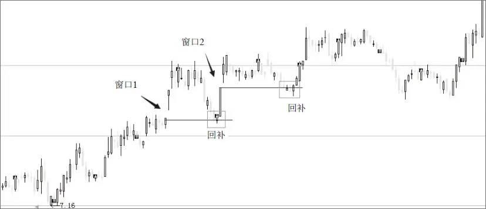

图5\-2 中化岩土（002542）2014\.04—2014\.11日蜡烛图（窗口）

买点解析

当股价形成向上跳空窗口后，窗口区域将对股价形成支撑。窗口的形成是市场强势的表现。窗口形成后，多数情况下市场会回测这一支撑水平，由于跳空的原因，许多投资者踏空行情。当股价再次回到这一区域，踏空的投资者会在此处补进，因而会形成较强的支撑，成为重要的买入时机。

__实盘解读 __

如图5\-2所示，窗口1发生在股价上涨时，遇到高位整理走势，数日后，股价跳空高开，打破震荡区间上轨，释放了横盘期间的买盘能量，属于突破跳空窗口。

行情在窗口1上涨后遇到第二次高位横盘，股价震荡回补了窗口1留下的缺口。注意，投资者如果在窗口1没来得及买入，那么行情回补缺口时得到锤子线支撑，就是很好的买入时机。次日，股价大幅走高，验证了买入的正确性。

窗口2发生在上涨途中，属于中继跳空。同样股价上涨停滞高位，行情经过高位震荡回补缺口，在缺口线上得到支撑信号，为行情第二次买入或加仓时机。

买点3：当关闭向下跳空窗口后的买点

实战示例（见图5\-3）

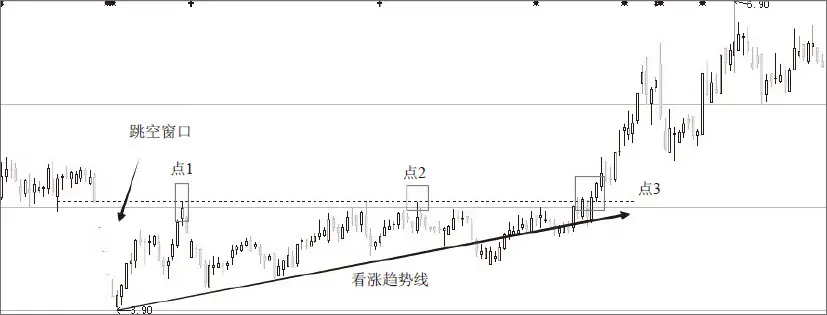

图5\-3 博信股份（600083）2012\.07—2013\.05日蜡烛图（窗口）

买点解析

向下跳空窗口对股价起到压制作用。当窗口被关闭后，股价继续上涨，那么这个窗口的压力作用就失效了；关闭跳空窗口后，股价可能改变原有下跌趋势，向更高的价格水平前进。

__实盘解读 __

如图5\-3所示，股价由于连续跌停，引发的跳空窗口，我们认为是中继下跌的跳空窗口。

很快行情回补缺口点1处，再下跌，但下跌没有打破前面的价格低点，而是再反弹。我们发现，股价下方低点有明显的上升，以此画出看涨趋势线。点2处股价再次受阻，回落行情打破了趋势线支撑，理论上将可以看更多跌幅。但行情很快收复趋势线支撑，这里我们首先考虑行情的诱多因素，暂不能买入，直到行情站上点3位置，打破回补缺口形成的阻力线，那么原先判断的中继跳空转变为空头的衰竭跳空，行情以趋势点做止损反转，点3处即为买入信号。

## 第5章 跳空窗口的买卖信号 - 5.2 卖出信号

5\.2 卖出信号

2025年10月29日

18:03

__5\.2 卖出信号 __

卖点1：当股价向下突破跳空窗口时的卖点

实战示例（见图5\-4）

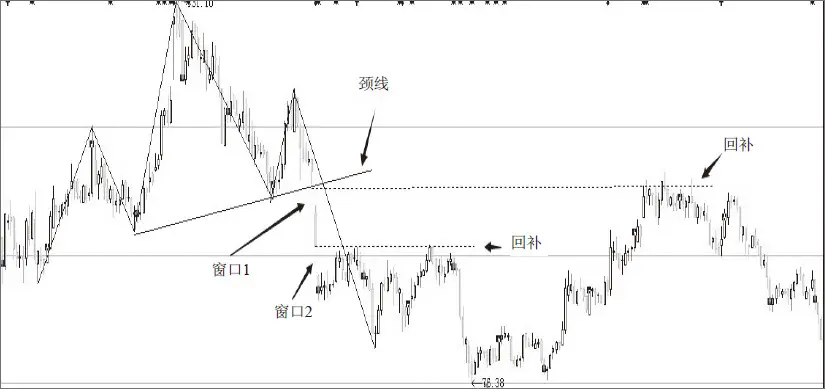

图5\-4 长春高新（000661）2013\.10—2014\.11日蜡烛图（窗口）

卖点解析

在下跌趋势形成初期，以跌破重要的水平支撑或重要的支撑线作为突破跳空的衡量标准。在这一期间，重要支撑的突破本身就有决定后市走向的意义。而以跳空窗口的形势出现，则是抛盘集中爆发的体现，代表对后市极度悲观的市场情绪，是重要的卖点。而卖点以压力水平作为参考，可以通过日内的分时图提高准确率。

__实盘解读 __

如图5\-4所示，行情在时段高点形成头肩顶价格形态，时段高点处的头部出现乌云盖顶组合，当右肩出现后，连接两个谷底得出颈线，我们看到蜡烛图以跳空形式突破颈线支撑，得到卖点信号。窗口1为突破跳空。

行情下破颈线支撑后，加速下跌释放能量，出现中继跳空，即窗口2。

我们前文说，突破跳空与中继跳空都可以做回补缺口，只是图5\-4中窗口1的回补周期较大，而通常中继跳空的回补周期最短。

卖点2：当股价回试向下跳空窗口时的卖点

实战示例（见图5\-5）

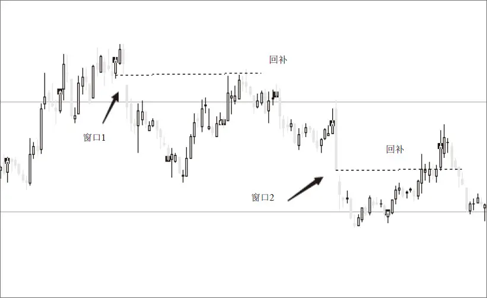

图5\-5 哈投股份（600864）2013\.09—2014\.03日蜡烛图（窗口）

卖点解析

当窗口形成后，窗口区域对股价会形成压制作用。窗口形成后，窗口之上的所有买盘全部处于被套牢的状态，现在唯一盼望的就是有一个解套的机会。当股价回升至窗口区域，在损失有所减小的情况下，逃命抛盘、短线抛盘相继出现，是成为卖点的原因。

__实盘解读 __

如图5\-5所示，股价高点位置未见到明显的顶部信号，价格突然跳空，此时为一个较弱的卖出信号。次日开盘，行情继续下跌，我们说窗口1为中继下跌信号，未来得及离场的投资者，等待价格回补缺口时，应果断离场观望。

窗口2与窗口1同理，此前未有明显下跌信号，但长实体的阴线后面跟跳空，意味着市场抛压很重，都是暂时离场观望的信号。

因向下跳空窗口单独作为卖出信号较弱，所以实际操作中很难在窗口期离场，因此后面回补成为重要的离场机会。

卖点3：当关闭向上跳空窗口后的卖点

实战示例（见图5\-6）

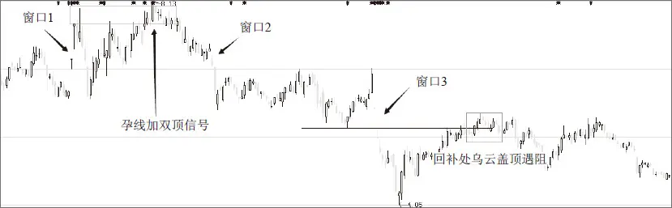

图5\-6 新大陆A（000571）2011\.04—2012\.06日蜡烛图（窗口）

卖点解析

向上跳空窗口对股价起到支撑作用，当窗口被关闭后股价继续下跌，那么这个窗口的支撑作用就失效了，股价可能向更低的价格水平前进，如果在下跌趋势中，说明股价恢复跌势。卖点是突破窗口的支撑。

__实盘解读 __

如图5\-6所示，由于股价在到达8\.13元时出现了孕线组合，并且第二次高点遇阻，形成了明显的双顶信号，那么我们可以判断窗口1为衰竭跳空，买盘释放了最后的能量。借助孕线加双顶的反转信号，我们看衰竭跳空回补后，同时带来趋势的扭转，几大信号同时验证了卖点。

窗口2为下跌途中的中继跳空，缺口可不必回补，显示市场的下跌力度不可小觑。

行情第一波下跌完成后进入反弹整理，并且可以画出矩形通道。突然行情在窗口3附近跳空下跌，打破了矩形通道，我们判断为突破跳空。若投资者仍有持仓，只能庆幸突破跳空有回补缺口，只是要经历一次更深的价格下跌。

我们看到，行情第二波下跌后反弹，到窗口3时遇阻，收盘乌云盖顶信号，那么上面没有空仓的投资者，现在就是最后的出逃机会。

总结：蜡烛线组合与价格形态组合是最为经典的判断行情依据，再结合不同类型跳空窗口的特点，我们就可以很好地预知行情走势。

## 第6章 百分比回撤的应用

__第6章 __

__百分比回撤的应用 __

本章所讲述的是最为神奇、有效的技术指标——斐波那契数列，也称黄金分割线或百分比回撤等。这个也是笔者经常应用的指标之一，非常好使，推荐投资者使用，如果大家使用并感兴趣，可查阅更多相关文献了解。

百分比回撤通常以斐波那契数列为基础，该数列中的任意一个数字与其后方的一个数字相比，其商都无限接近于0\.618；任意一个数字与其前方的一个数字相比，其商都无限接近于1\.618；前后相隔两个数字的比值，都无限接近于0\.382，等等。神奇的是世界上很多事物都遵循了这个规律，例如埃及金字塔的建造。

百分比回撤应属于趋势范畴，是主要趋势的调整走势，属于趋势后的分析。常用的百分比回撤参数为61\.8％、38\.2％和50％时，这3种最为重要。还有一些如23\.6％、25％、75％、12\.5％、87\.5％等回辙线，也常常出现。

61\.8％回辙线、38\.2％回辙线和50％回辙线的分析方法最为常用，数学中又称为黄金分割率。它也与斐波那契的神奇数列有着密切的关系。神奇的是，当股价出现回调或反弹时，往往会在61\.8％处、38\.2％处和50％处获得支撑或是压制。在实际操作中，百分比回撤不能作为单一的参考依据，应与蜡烛图、价格形态、趋势线、移动平均线等等配合，若出现买点共振或卖点共振，则可据此操作。

百分比回撤还可以扩展应用为100％、150％、161\.8％等，在趋势确定后，对于未来价格有目标预测参考。它应用的技术分析范围很广泛，在波浪理论中，常用的百分比回撤为61\.8％、38\.2％和50％时，在江恩的分析体系内部常用的是以“8”为分母的回撤度，如1/8处、2/8处等。在角度线中，也常用1\*1线、或1\*2线、或3\*1线、或2\*1线为重要角度线，它也是遵循着百分比回撤的原理。

使用百分比回撤时，找准价格高点和低点的位置非常重要，也关乎指标的准确性，我们一般在行情见顶回调或见底回升时，价格幅度超过20％（此波行情启动开始上涨或启动开始下跌的价格计算），同时配合蜡烛线组合与价格形态来确定时段的顶部或底部。

## 第6章 百分比回撤的应用 - 6.1 百分比回撤的买点

6\.1 百分比回撤的买点

2025年10月29日

18:03

__6\.1 百分比回撤的买点 __

买点1：当股价回撤至61\.8％线时的买点

实战示例（见图6\-1）

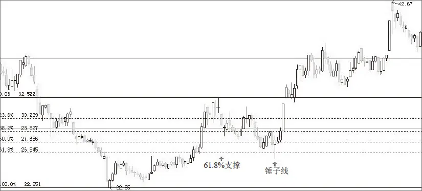

图6\-1 国瓷材料（300285）2014\.04—2014\.10日线图

买点解析

0\.618为我们所熟知的黄金分析割率，那么市场中也具备这样的回撤条件，当股价向下回撤38\.2％，或是回撤61\.8％，或是回撤100％，或是回撤50％时，如果遇到支撑，并且其他技术分析方法给出买进信号，由此相互配合，便可以在股价回撤的关键点位上买进。

__实盘解读 __

该股在上涨前一段的上涨趋势结束后，向下调整，在回调过程中，我们便可以用分析软件中的画图工具，将百分比回撤线画出来，以便随时观察。如图6\-1所示，当股价向下回调到61\.8％线时，蜡烛图恰好在支撑线收得锤子线，行情得到支撑，买入信号出现。

随后价格拉高上涨，站上50％线或38\.2％线以后。给出有效验证，不久即突破前高阻力继续上涨。百分比回撤本身并不能给出买进信号，它仅是一个重要档位而已，需要其他方法的配合。

买点2：当股价回撤至50％线时的买点

实战示例（见图6\-2）

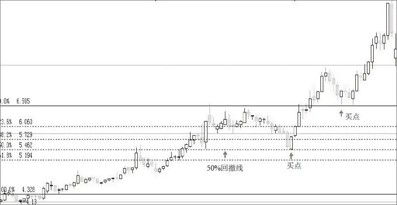

图6\-2 恒立实业（000622）2014\.07—2014\.11日线图

买点解析

●50％是百分比回撤线标准的回撤位置，也是行情大多数出现的回撤幅度。我们定义：38\.2％为浅回调，通常为10日均线附近；50％为正常回调，大约在30日均线；61\.8％为深度回调，大约在60日均线位置。若行情出现更低的回撤，那么很可能意味着行情的反转或完全回吐。

●斐波那契回撤百分比只能得到支撑或阻力点位，支撑或阻力的效果需要更多信号验证。

__实盘解读 __

上涨行情后，低点比较直观，容易确定，我们按照20％的回调幅度来寻找高点，即可确定行情回调，得到高点准确位置。然后连接高、低两点，得到百分比回撤线。

如图6\-2所示，行情回调到50％支撑线时，在线上得到看涨吞没形态支撑，得到买入信号。并且行情在随后连续拉升，出现红三兵信号，我们基本可以预测行情将突破前高继续上涨，因此行情回测前高价格支撑后，是第二个买入信号。

买点3：当股价回撤至38\.2％线时的买点

实战示例（见图6\-3）

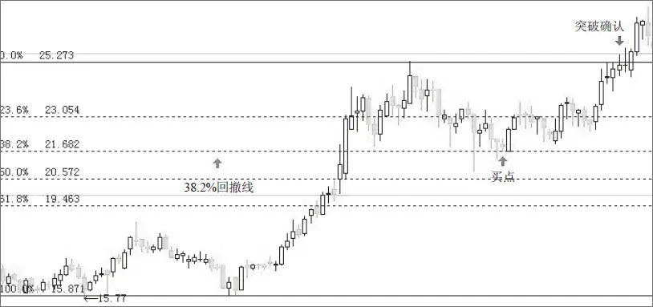

图6\-3 梅泰诺（300038）2014\.07—2014\.12日线图

买点解析

38\.2％与61\.8％是同样重要的回撤档位，但与61\.8％回撤或50％回撤不同的是，38\.2％回撤的买点不是在下方，而是在向上穿越前一波段上涨的高点。

__实盘解读 __

如图6\-3所示，由于38\.2％的回撤幅度是非常小的，而这种回撤通常会发生平台型调整，而平台型调整是波浪理论中的应用。也就是说，一旦出现了38\.2％的回撤，它并不像其他两种回撤一样，只要其他方法配合，就会立刻反转；而是需要等待区间震荡一段时间后，再选择向上突破，避免震荡行情中给出的假支撑信号。因此我们就没有必要在它第一次到达38\.2％线之时，便抢先建立多单，而应该节省机会成本，待到股价向上穿越了前期上涨的高点，确认突破之时，再行买进。

## 第6章 百分比回撤的应用 - 6.2 百分比回撤的卖点

6\.2 百分比回撤的卖点

2025年10月29日

18:03

__6\.2 百分比回撤的卖点 __

卖点1：当股价反弹至61\.8％线时的卖点

实战示例（见图6\-4）

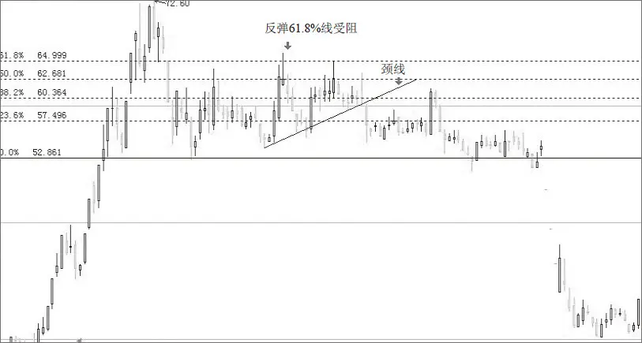

图6\-4 成飞集成（002190）2014\.07—2015\.01日线图

卖点解析

下跌与上涨一样，都会遇到关键挡位的支撑或阻挡。若下跌趋势线中出现了反弹，而向上反弹至61\.8％时，则为下跌趋势的重要阻力。若有其他技术分析方法的配合，同时给出卖出信号，则可以在此处继续卖出。

__实盘解读 __

如图6\-4所示，行情自高点下跌超过股价的20％，我们定义行情见顶进入回调（顶部出现反转信号），至行情第一个下跌低点出现，连接两点，得到斐波那契百分比回撤线。

我们看行情反弹力度较大，到达61\.8％线的位置，同时发现下跌途中的头肩顶形态，股价在61\.8％线的位置两次受阻，并且下破颈线，这预示行情将继续下跌。

股价反弹至61\.8％线的位置时，为反弹的卖点；颈线下破中继头肩顶，为第二个卖点；行情下破前低价格支撑，为第三个卖点。

卖点2：当股价反弹至50％线时的卖点

实战示例（见图6\-5）

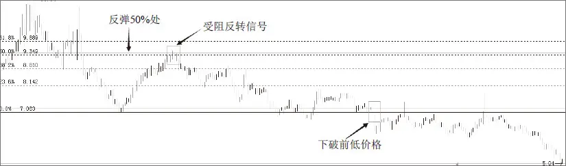

图6\-5 东方创业（600278）2010\.11—2011\.12日线图

卖点解析

我们特别要强调一下下跌50％的回撤率，它上涨的回撤更为重要，并且重要性要高于61\.8％回辙线和38\.2％回辙线。也就是说，不论是上涨中的回调，还是下跌中的反弹，只要遇到50％回辙线，一定要细心观察，关注它是否出现新的买点或卖点。

__实盘解读 __

首先我们很容易画出斐波那契百分比回撤线，股价V字反弹至50％回撤线时，得到分手线的反转信号，线下实现反转，为卖出信号。

如图6\-5所示，行情真正的下跌还在后面，虽然买方有几次上涨刺穿底部价格支撑，但均未得到信号验证，我们可以定义为主力诱多行情，不能买入，直到市场放量下破股价前低价格，仍实现了等同于上方50％线的下跌空间。

卖点3：当股价反弹至38\.2％线时的卖点

实战示例（见图6\-6）

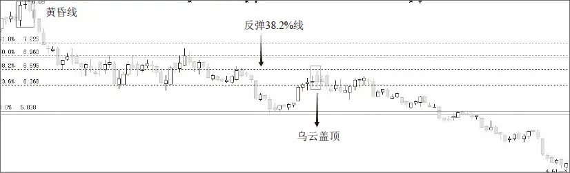

图6\-6 武汉控股（600168）2012\.06—2012\.11日线图

卖点解析

与上涨趋势中的调整38\.2％线一样，下跌中的反弹至38\.2％线止步，那么其后面基本上都会出现一个震荡平台，而震荡平台是最容易出现持续价格形态的位置，那么新的卖点，便可以由持续形态来给出。

__实盘解读 __

如图6\-6所示，股价以黄昏线见顶下跌，直到平头信号出现反弹，连接两点得到斐波那契百分比回撤线。

我们看行情反弹至38\.2％线的位置时受阻，并得到经典的乌云盖顶信号，预示行情将再次反转，结束反弹继续下跌。

总结：行情下跌的反弹回撤，最近的卖点在61\.8％回撤线，但实际中，50％的回撤幅度居多，并且有38\.2％的小幅反弹，而且行情一旦下破前是低价格支撑，后面的跌幅空间均会很大，因此投资者能在顶部信号附近离场最好，否则高度关注38\.2％线的位置并减仓，大部分取信50％回撤线，切记不能死等61\.8％回撤线。

## 第7章 MACD指标的应用

__第7章 __

__MACD指标的应用 __

MACD由正负差（DIF）和异同平均数（DEA）两部分组成，当然，DIF是核心，DEA是辅助。

DIF是快速平滑移动平均线与慢速平滑移动平均线的差，快速和慢速的区别是进行指数平滑时采用的参数大小不同。快速的周期较短，慢速的周期较长。常用的参数为12和26，称作指数平滑异同移动平均线，由长短两根双移动平均线计算其差离值发展而来。该指标可以去除移动平均线的假信号，保留移动平均线的优点，也更方便阅读。移动平均线属于中长期指标，对价格的变化反应不灵敏。DIF是MACD的核心，能单独进行行情预测，但为了使信号更便于分析，引入了另一个指标DEA。

DEA是DIF的移动平均，也就是连续数日的DIF的算术平均。这样，DEA自身又作为算术平均的DIF的个数，即天数。对DIF做移动平均，就像对收盘价做移动平均一样，是为了消除偶然因素的影响，使结论更可靠。

MACD还有一个指标叫柱状线（BAR），由DIF和DEA的差得出。计算公式为

BAR＝2×（DIF\-DEA）

当DIF和DEA位于零轴上方时，代表市场为买方市场；当DIF和DEA处于零轴下方时，代表市场处于卖方市场。MACD除去交叉提供的买卖信号，也可以提供背离信号。当股价处于盘整状态时，MACD与移动平均线一样，无法指示买卖信号，可以不做参考。MACD可用于任何时间单位，例如分时图可以用于短线操作，可以提供比日线精确的买卖信号。

关于MACD指标的得来我们可以不用记，只需要知道双线与柱状的不同变化即可。另外，MACD属于趋势指标，对短期震荡作用不大明显，而一旦趋势起来，MACD的信号还是非常好使的。如图7\-1所示为MACD实战图例。

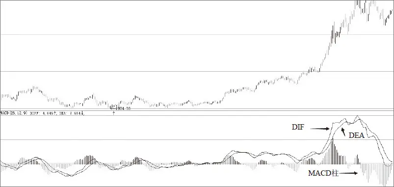

图7\-1 上证综合指数（000001）2014\.05—2015\.02日蜡烛图与MACD指标

## 第7章 MACD指标的应用 - 7.1 MACD指标的买点

7\.1 MACD指标的买点

2025年10月29日

18:03

__7\.1 MACD指标的买点 __

买点1：当MACD指标处在零轴线上方，DIF线上叉DEA线时的买点

实战示例（见图7\-2）

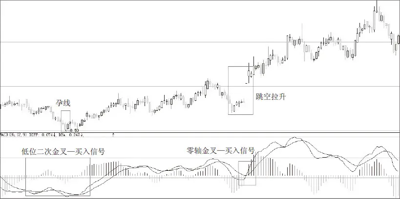

图7\-2 丰华股份（600615）2013\.12—2014\.12日线图与MACD指标

买点解析

●DIF线上叉DEA线，是买进信号。

●处于零轴线以上时，代表市场处于多头状态。在上升趋势中的买进信号大多是可靠的，所以买入是比较安全的。

●由于MACD指标比较滞后，所以蜡烛图会先一步MACD指标发出买入信号。

__实盘解读 __

如图7\-2所示，股价在价格时段低点得到孕线蜡烛图组合，预示行情反转，同时MACD指标中DIF线与DEA线低位形成金叉，MACD柱在零轴线发生反转。仔细观察，我们发现此前双线已经形成过一次金叉，那么两次低位金叉的效果是非常坚定的，我们用MACD指标即可验证行情即将上涨，此时为抄底的买点。

经过震荡上行，MACD指标的双线再次在零轴位置形成金叉，放出买入信号。我们分析，MACD柱在零轴线下方缩量，同时在零轴上方放量，对应上方的蜡烛图则是行情破位跳空拉升，行情即将进入加速上涨阶段，为买入或加仓信号。

图7\-2为MACD指标最为经典的金叉买入信号形态。

买点2：当MACD指标与股价出现底背离时的买点

实战示例（见图7\-3）

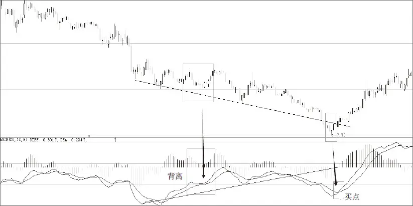

图7\-3 宜昌交运（002627）2012\.07—2013\.01日线图与MACD指标

买点解析

●股价的谷底依次下降，而MACD指标的低点不能与股价的动作同步，而是依次抬高，并且出现上叉，就形成了底背离。

●底背离说明股价虽然在进一步下跌并创出新低，但是在此基础上再创新低的能力已经不足了，容易引发买盘的介入。

●背离的上叉点不一定发生在零轴线以下，但需要蜡烛图形态的配合。

●底背离信号比一次上叉更重要，比单一的交叉信号要灵敏。

__实盘解读 __

如图7\-3所示，我们看到股价震荡下行，不断出现价格新低，整体价格是在下降的，而对应的MACD指标的双线却是上升的，特别是股价低点时，MACD柱在零轴线上方，DIF线向上勾头，这就构成了底背离。

但我们说背离信号并不等同于买入信号，有时候背离会持续一段时间，投资者应从背离开始高度关注行情变化，等待买入信号出现。最佳的买点是背离信号尾声或结束的一刻。

在时段价格低点，蜡烛图出现启明星组合，同时MACD指标低位双线交叉，MACD柱能量反转，此时为最佳的买入时机，基本上也是在行情的最低价附近。

买点3：当MACD指标与股价可能出现二度底背离时的买点

实战示例（见图7\-4）

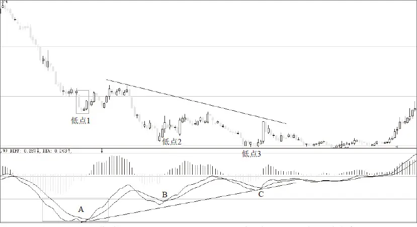

图7\-4 兰花科创（600123）2013\.12—2014\.08日线图与MACD指标（二度背离）

买点解析

●股价出现3个依次下降的低点，而MACD指标却出现3个低点依次抬高金叉，就构成了比一度底背离更为重要的买进信号：二度背离。

●二度背离并不常见，所以比较珍贵。如果说一度背离代表股价创新低的力量不足，那么二度背离可能就代表潜在的抛盘力量已经被激发利用了，抛盘力量已经油尽灯枯了。二度背离的买进信号可靠度极高。

●虽然二度背离的可靠性极强，但是如果想准确地把握机会，提高准确率，还是需要价格形态的验证。

__实盘解读 __

如图7\-4所示，当价格到达低点1时，MACD指标在A点形成金叉，且DIF线是一个双底形态，主图也配合了行情的反弹（后上涨），买入信号出现。但不久低点2出现，MACD指标的双线在B点再次出现金叉，并且高于A点水平位，第一个背离信号出现。因此，我们若在低点1时买入股票，虽有价格新低，但可继续持有。

接下来股价出现更低的低点3，对应的MACD指标在C点再次金叉，二度背离出现。那么我们预计，买盘拉升的行情将出现在双线上穿零轴线的时候，因此前面买入的股票可继续持有，当DIF线与DEA线上穿零轴线的时候，同时可以作为买入和加仓点，二度背离可以坚定看涨信心。

## 第7章 MACD指标的应用 - 7.2 MACD指标的卖点

7\.2 MACD指标的卖点

2025年10月29日

18:03

__7\.2 MACD指标的卖点 __

卖点1：当MACD指标处在零轴线下方，DIF线下叉DEA线时的卖点

实战示例（见图7\-5）

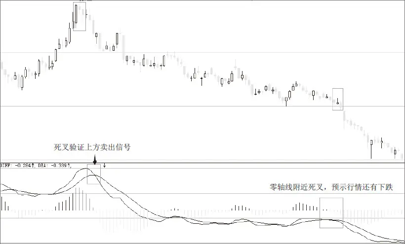

图7\-5 三一重工（600031）2013\.01—2013\.07日线图与MACD指标

卖点解析

●DIF线下叉DEA线，是卖出信号。

●处于零轴线以下时，代表市场处于卖出状态。在下降趋势中的卖出信号大多是可靠的，所以卖出不会有大的失误。

●由于MACD指标比较滞后，所以当MACD指标发出卖出信号时，蜡烛图已提前发出了卖出信号，此时可以作为验证参考。

__实盘解读 __

如图7\-5所示，当股价上涨至时段高点时出现乌云盖顶形态，预示行情见顶即将下跌。此时MACD指标买盘动能减少，慢一个交易日则有DIF线与DEA线在零轴线上方高位形成死叉，可以用作验证主图的见顶信号，为可靠的卖出信号。

当MACD指标处于零轴线下方时，代表股价处于跌势中，在下跌趋势中的卖点更可靠。而MACD指标在零轴线下方交叉的前提是股价出现了向上的调整，当MACD指标重新死叉，说明股价恢复下跌。通过主图可以帮助判断MACD指标信号的可靠程度和作用，而通过MACD的交叉信号反过来又可以验证主图形态是否完成、卖出信号是否可靠。

卖点2：当MACD指标与股价出现顶背离时的卖点

实战示例（见图7\-6）

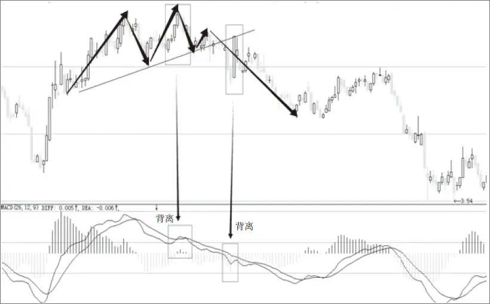

图7\-6 北新路桥（002307）2012\.11—2013\.08日线图与MACD指标（顶背离）

卖点解析

●股价的峰顶依次上升，而MACD指标的DEA线、DIF线不能与股价的动作同步，而是依次下降，并且出现死叉，就形成了顶背离。

●顶背离说明股价虽然在进一步上涨并创出新高，但是在此基础上再创新高的能量已经不足了，容易引发抛盘。

●顶背离的上叉点不一定发生在零轴以下（是处于上升趋势还是处于下降趋势的回调），但需要蜡烛图形态的配合。

●顶背离信号比一次上叉更重要，比单一的交叉信号要灵敏。

__实盘解读 __

如图7\-6所示，主图为顶部头肩形态，头部价格最高，但MACD指标的双线提前下行，形成了背离走势。若以这里的背离信号作卖点，股价基本可以在最高点；但若等待背离信号持续，那么主图下破颈线时，也是非常可靠的卖点。

在行情下破颈线以后，有一个交易日买盘出现拉升，实体阳线收盘，但MACD柱显示的是卖盘放量，并且DIF线深度向下运行，再次出现背离信号。结合主图，我们看这也是行情回测颈线阻力，两个指标同时发出卖出信号。

卖点3：当MACD指标与股价可能出现二度顶背离时的卖点

实战示例（见图7\-7）

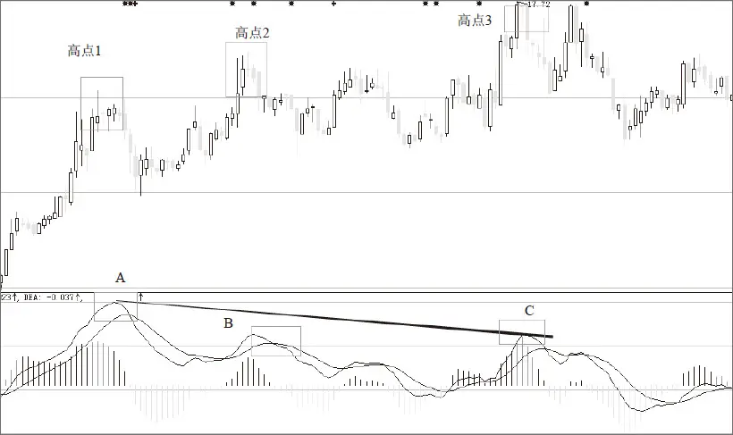

图7\-7 彬电国际（600969）2014\.07—2015\.01日线图与MACD指标（二度背离）

卖点解析

●股价出现3个依次上升的高点，而MACD指标却出现3个高点依次下降、均线死叉，就构成了比一度顶背离更为重要的卖出信号：二度背离。

●二度背离并不常见，所以比较珍贵。如果说一度背离代表股价创新高的力量不足，那么二度背离可能就代表潜在的买盘力量已经被激发利用了。二度背离的卖出信号可靠度极高。

●虽然二度背离的可靠性极强，但是如果想准确地把握机会，提高准确率，还是需要价格形态的验证。

__实盘解读 __

如图7\-7所示，蜡烛图上出现的高点1、高点2、高度3是依次上升的高点，对应的MACD指标内A、B、C3个点是依次降低的，这样就形成了二度背离（B点略高于C点）。

投资者借助高点1配合信号离场后，可能看到高点2打破价格新高，认为股票抛早了，但实际不然。股价到达高点2时，对应的MACD指标内B点并没有新高，而是双线形成死叉向下。高点2与高点1相比，价格上升，指标下落，明显的背离信号，因此投资者不必焦虑股票抛早了，并且高点2也可继续作为卖点，提前离场观望。

高点3是一个倒锤子线的看跌形态，对应的MACD指标内C点更低，背离信号更加明显，股价再冲高形成第二次高点，也就是双顶信号，配合MACD指标二度背离信号，验证了下跌信号。

## 第8章 KD指标的应用

__第8章 __

__KD指标的应用 __

1．KD指标

KD指标叫作随机指标，在股票市场及期货市场是常用指标。它的设计原理是，在一定范围内，市场向上运动时，收市价格倾向于接近这个范围内价格区间的高点；当市场向下运动时，收市价格倾向于这个范围内价格区间的低点。它的数据在0～100的范围内，当读数较低时，意味着价格处于一定时期范围内价格区间的较低水平；当读数较高时，则意味着价格处于一定时期范围内价格区间较高的水平。随机指标对市场处于超买和超卖给予预警，提供相互背离信号，对一定时期内价格变化提供买卖信号。

如图8\-1所示，KD指标的取值范围是0～100，其中我们重点参考20以下的超卖区域与80以上的超买区域，20～80区间信号不强烈。

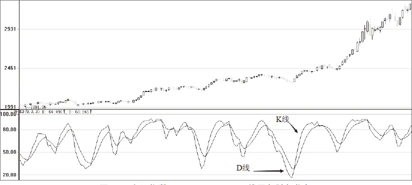

图8\-1 上证指数2014\.05—2014\.12日线图与随机指标

2．KDJ指标

KDJ指标在KD基础上加上了J线，但由于J线的反应极快、不稳定，且经常处于不正常区域，如低于0线或超过100线，属于很难驾驭的参数，因此我们忽略J线，仅参考K线与D线即可。

KD指标中，我们除了参考KD线所在位置外，还要参考双线的交叉情况，如均线一样，K线由下上穿D线称为金叉，K线由上下穿D线称为死叉。如金叉发生在20以下区域，则是买入信号；相反死叉出现在80以上区域，则为卖出信号。

随机指标图表由％K和％D两根曲线组成，％K变化较为灵敏称作快线，将3个％K数值平均得出％D，变化较为平缓，％D更为重要。计算公式为

％K＝100（C－Ln）/（Hn－Ln）

其中，C是当日收盘价，H是日内最高价，L是日内最低价。100将数值变为百分数。9，3，3是常用的参数。

## 第8章 KD指标的应用 - 8.1 KD指标的买点

8\.1 KD指标的买点

2025年10月29日

18:04

__8\.1 KD指标的买点 __

买点1：当KD指标在20刻度线下方形成金叉时的买点

实战示例（见图8\-2）

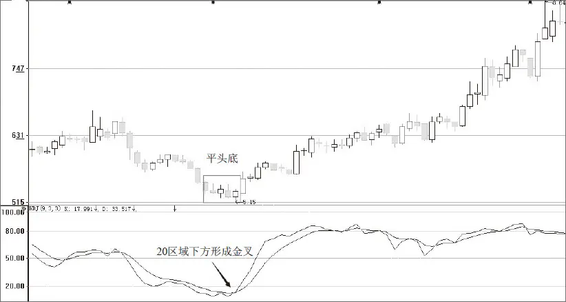

图8\-2 渤海租赁（000415）2012\.10—2013\.02日线图（随机指标）

买点解析

●当K线由下向上穿越D线时，形成金叉，就构成了买进信号。我们将在20刻度线以下定义为超卖区域，表明市场可能已经处于一定时期内较低的价格区域，甚至可能是市场的底部，此时金叉出现更具有积极的意义。

●当K线向上穿越D线时，应该首先判明市场所处的状态，即市场目前处于什么阶段。在上升趋势的调整中，出现交叉信号可靠程度更高。在下跌趋势中的交叉信号可能仅仅是股价的暂时调整，无法据此对上涨的可靠程度做出判断。在下跌趋势中，当市场处于较低的价格水平时，交叉信号才具有更为积极的意义。

●必须在蜡烛图形态的配合下才可以做出买进决定。因为在极度疲弱的市况下，在超卖区可能会发生频繁的交叉信号，而股价仍然在继续下跌，我们称之为钝化，所以蜡烛图的配合是必要的。

●在股价形态没有配合的情况下，任何交叉都只是一种警示作用。

__实盘解读 __

如图8\-2所示，股价连续下跌后，动能明显减弱，连续3个交易日在同一个价格低点获得支撑，出现平头底信号。

配合KD指标，发现在20刻度下方区域形成金叉，对行情产生积极作用，为买入信号。

股价回升打破平头底颈线，同时K线与D线返回20刻度区域上方，并呈上扬，价格得到买盘支持。

我们说蜡烛线与KD指标相互验证，构成了重要的买进信号。

买点2：当股价在上升趋势中，KD指标回落后再次上叉时的买点

实战示例（见图8\-3）

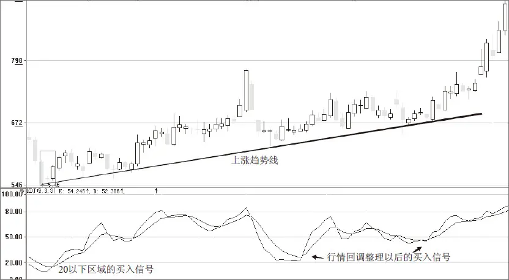

图8\-3 金路集团（000510）2014\.04—2014\.08日线图（随机指标）

买点解析

●无论上升趋势还是下跌趋势，调整是不可避免的。当股价开始调整时，随机指标也会回落；当随机指标重新上叉时，意味着调整可能结束，新的涨势形成。

●随机指标在上升趋势中的上叉，基本都是可靠的。但还是需要蜡烛图或其他手段的配合才更可靠。

●在上升趋势中上叉不必计较是否处于超卖状态，在强势上涨趋势中，随机指标甚至不会跌到50刻度线以下。

__实盘解读 __

如图8\-3所示，随机指标在上升趋势中的买进信号大多都是可靠的。首先我们必须确认行情的底部可靠，即价格低位出现底部信号，配合KD指标在20刻度以下区域形成金叉，随后行情上扬。

行情在上涨过程中，经常会遇到调整，但在见顶前，KD指标在20～80刻度区域也有反复过程，我们通过两次低点可以画出上涨趋势线，并且看到回测趋势线价格在KD指标也有反应，行情保持在趋势线上方，因此在50刻度区域附近的KD指标形成的金叉依然有效。

买点3：当KD指标与股价出现底背离时的买点

实战示例（见图8\-4）

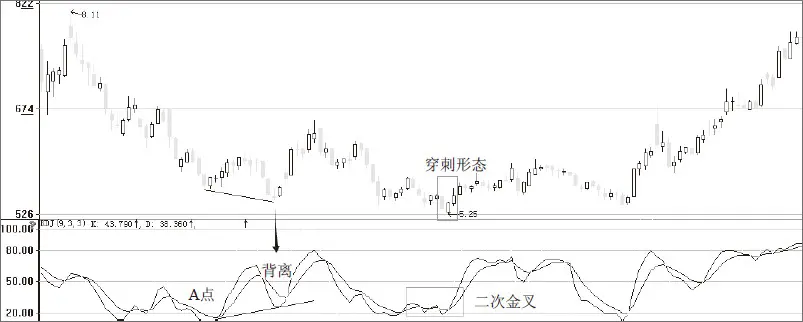

图8\-4 友利控股（000584）2013\.08—2014\.02日线图（随机指标底背离）

买点解析

●股价的谷底依次下降，而随机指标的低点不能与股价的动作同步，而是依次抬高，并且出现上叉，就形成了底背离。

●底背离说明股价虽然在进一步下跌并创出新低，但是在此基础上再创新低的能力已经不足了，容易引发买盘的介入。

●背离的上叉点不一定发生在超卖区，但需要重复的是需要蜡烛图形态的配合。

●底背离信号比前一个金叉更重要。

__实盘解读 __

如图8\-4所示，股价下跌，首先KD指标在20刻度下方区域A点出现金叉积极信号，然而不久股价再出现新低，对应的KD指标的双线上行，波谷没有低于A点，出现了背离信号。

背离信号给出之后并不意味着股价的运行方向会立刻发生逆转，我们说背离是一个过程，背离点并不等于买点，但背离信号出现后，投资者应该高度关注后面可能出现的买盘信号，并且后面给出的买入信号很可能特别坚挺。

再创价格新低后，得到刺透形态买入信号，同时KD指标先一步在20附近区域出现第二次金叉，两次金叉的买入效果比单次金叉要大一倍以上，因此主图与KD信号相互呼应，构成强烈的买盘入场信号。

买点4：当KD指标与股价可能出现二度底背离时的买点

实战示例（见图8\-5）

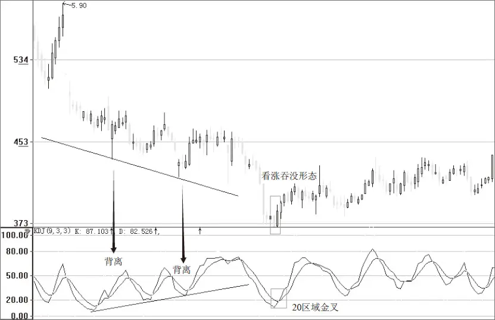

图8\-5 内蒙发展（000611）2012\.03—2012\.11日线图（随机指标二度背离）

买点解析

●股价出现3个依次下降的低点，而随机指标却出现3个依次抬高上叉的低点，就构成了比一度底背离更为重要的买进信号。

●二度背离并不常见，所以比较珍贵。如果说一度背离代表股价创新低的力量不足，那么二度背离可能就代表潜在的抛盘力量已经被激发利用了，抛盘力量已经油尽灯枯了。二度背离的买进信号可靠度极高。

●虽然二度背离的可靠性极强，但是如果想准确地把握机会，提高准确率，还是需要价格形态的验证。

__实盘解读 __

如图8\-5所示，股价得到第一个低点时，KD指标则触底上升，形成非常明显背离走势。接下来股价继续下跌，但KD指标的波谷依然在不断提高，背离信号再次出现，形成二度背离。

背离信号不等于买点，但背离信号出现开始，需要我们高度关注行情的变化。

再往后看，KD指标回归正常，随股价下跌至20附近区域，出现金叉，同时主图蜡烛图得到看涨吞没形态信号，两个信号加在一起为非常强烈的买点，验证后市看涨行情。

## 第8章 KD指标的应用 - 8.2 KD指标的卖点

8\.2 KD指标的卖点

2025年10月29日

18:04

__8\.2 KD指标的卖点 __

卖点1：当KD指标在80刻度上方形成死叉时的卖点

实战示例（见图8\-6）

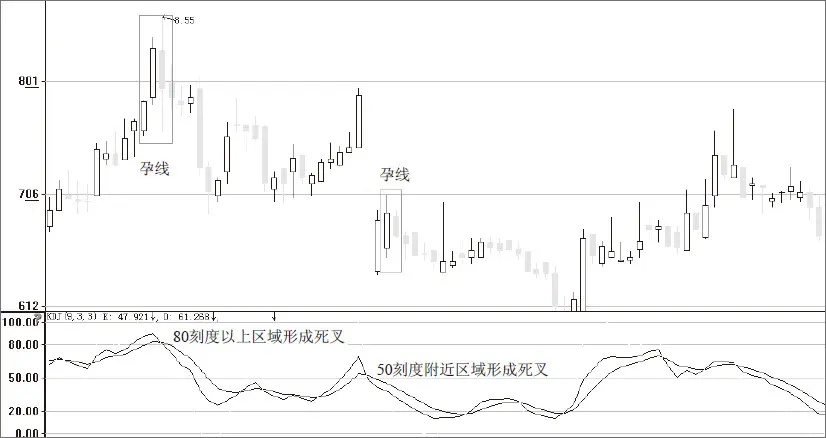

图8\-6 湖北金环（000615）2013\.10—2014\.02日线图（80以上交叉）

卖点解析

●当K线由上向下穿越D线时，形成死叉，就构成了卖出信号。我们将在80刻度线以上定义为超买区域，表明市场可能已经处于一定时期内较高的价格区域，甚至可能是市场的顶部，此时形成死叉更具有积极的意义。若D线处于85刻度线以上时更可靠，因为股价上涨对投资者更有意义，与期货不同的是只有上涨才有利润（期货市场可以卖空）。

●当K线向下穿越D线时，应该首先判明市场所处的状态，即市场目前处于什么阶段。在下降趋势的调整中，出现交叉信号可靠程度更高。在上升趋势中的交叉信号可能仅仅是股价的暂时调整，无法据此对下跌的可靠程度做出判断。在上涨趋势中，当市场处于较高的价格水平时，交叉信号才具有更为积极的意义。

●必须在蜡烛图形态的配合下才可以做出卖出决定。因为在极强市况下，在超买区可能会发生频繁的交叉信号，而股价仍然在继续上涨，所以蜡烛图的配合是必要的。

●在股价形态没有配合的情况下，任何交叉都只是一种警示作用。

__实盘解读 __

如图8\-6所示，股价在顶部形成孕线反转信号时，KD指标双线在80刻度上方区域形成死叉，为积极的卖出信号，配合主图顶部信号，形成有效的卖出信号。

随后KD指标在50刻度线再次得到死叉信号，同时主图蜡烛线得到孕线形态，虽然不使行情的反转，但也使行情继续下跌。

可以说，KD指标与蜡烛图形态相互验证，构成了准确的卖点。

卖点2：当价格在下降趋势中，KD指标回升后再次下叉时的卖点

实战示例（见图8\-7）

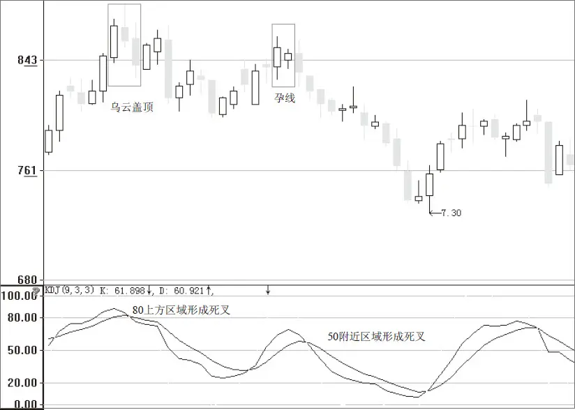

图8\-7 风华高科（000636）2014\.09—2014\.11日线图（下降趋势中的下叉）

卖点解析

●无论上升趋势还是下跌趋势，调整是不可避免的。当股价开始调整时，随机指标也会交叉向上；当随机指标重新下叉时，意味着调整可能结束，新的跌势开始形成。

●随机指标在下跌趋势中的下叉卖出信号，基本都是可靠的。但还是需要蜡烛图或其他手段的配合才更可靠。

●在下跌趋势中下叉不必计较是否处于超买状态，在疲软的跌势中，随机指标甚至不会回升到50刻度线以上。

__实盘解读 __

如图8\-7所示，股价在高点价格时出现乌鸦盖顶信号，配合KD指标，KD指标的双线在80刻度上方区域形成死叉，为卖出的积极信号，确立了下跌趋势。

我们注意到在这个下跌趋势中，几乎每一个重要的反弹高点都出现了顶部反转形态。随后行情反弹，未过前价格高点，再次出现孕线组合，然后次日蜡烛图收实体阴线，对应的KD指标的双线在50刻度附近区域形成死叉，符合蜡烛图的运行轨迹，共同验证了卖点。

随机指标的下叉卖出信号在下跌趋势中可靠程度非常高，即使不是在80刻度线以上的交叉准确率也很高。

卖点3：当KD指标与股价出现顶背离时的卖点

实战示例（见图8\-8）

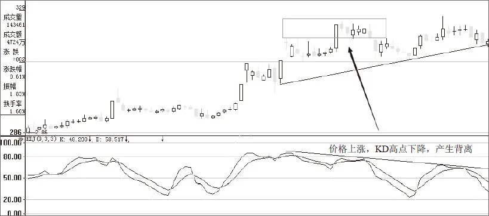

图8\-8 恒天海龙（000677）2014\.08—2014\.12日线图（顶背离）

卖点解析

●股价的峰顶依次上升，而随机指标的高点不能与股价的动作同步，而是依次降低，并且出现死叉，就形成了顶背离。

●顶背离说明股价虽然在进一步上涨并创出新高，但是在此基础上再创新高的能力已经不足了，容易引发抛盘。顶背离是非常重要的卖出信号。

●背离的交叉点不一定发生在超买区，但是需要蜡烛图形态的配合。

●只有发生下叉后才可以称作顶背离，底背离信号比前一个金叉更重要。

__实盘解读 __

如图8\-8所示，股价在上行，但KD指标的双线在下行，并且形成了死叉，背离信号出现。

我们看到，KD指标形成死叉的位置，主图为一个不规则的平头顶，预示行情下跌，因此我们验证了卖点，积极地抛出股票。

随机指标顶背离与蜡烛图相呼应，构成了强烈的看跌信号，若行情下破趋势线的支撑，可能引发强烈的抛盘。

卖点4：当KD指标与股价可能出现二度顶背离时的卖点

二度顶背离由于股价在出现卖出信号后，再度走高，卖点升高很容易影响投资者的判断，且最终价格下跌仍要回归其他技术形态验证，因此我们这里不再着重讲解二度顶背离形态。大家只要记得，背离是一个预警信号，当出现时并非行情马上反转或突破，但距离行情爆发也不会太远，需要高度关注后面行情变化，通常在背离结束前后和回归正常后第一个出现的交易信号都非常可信的。

## 第9章 BOLL布林通道的应用

__第9章 __

__BOLL布林通道的应用 __

如图9\-1所示，BOLL通道是由3条平滑曲线所构成的，分别上轨线，中轨线和下轨线，这3条线永不相交，股价在布林通道之间运行。其中，中轨线为某一时间参数的算术移动平均线，再计算出单位周期内股价走势的标准差；上轨线为均线加两倍标准差的值；下轨线为均线减两倍标准差的值。

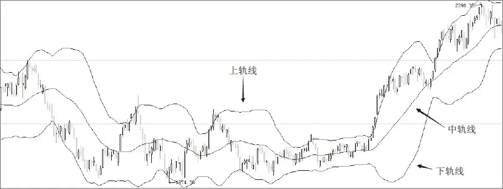

图9\-1 上证指数（000001）2013\.11—2014\.10日线图

日常交易中，布林通道可以人为地划定价格波动区间，看行情震荡或在布林开口时预测单边行情来临等等。我们知道，市场有一些专以布林通道为区间做短线震荡的投资者，看价格在布林通道的来回运行。

●BOLL通道是由美国股市分析家约翰·布林应用统计学原理而设计出的一种技术分析指标。

●当股价窄幅震荡时，BOLL通道会逐渐缩窄，当股价出现单边上涨或是单边下跌时，BOLL通道会逐渐放宽。

●BOLL通道中的3条轨道线不是固定的，而是跟随着股价的变化而变化，永远追随着趋势，而追随趋势的长短，由其中的时间周期参数来控制，我们可以随意更改其间的时间参数。

●BOLL通道的上下两条轨道线，通常标志着现阶段股价运行的理论最高点与最低点，相应的，上轨线与中轨线通常对股价产生压制作用，下轨线与中轨线对股价产生支撑作用。

●理论上，中轨线为强势与弱势的分水岭，股价在中轨线之上时通常为强势，股价在中轨线之下时通常为弱势。

●BOLL通道最主要的功能分为：可以指示支撑位与压力位，可以显示超买区与超卖区，可以追踪趋势，具有标识股价通道的功能。

## 第9章 BOLL布林通道的应用 - 9.1 BOLL指标的买点

9\.1 BOLL指标的买点

2025年10月29日

18:04

__9\.1 BOLL指标的买点 __

买点1：当上、中、下3条轨道线同时向上，并且股价上破中轨时的买点

实战示例（见图9\-2）

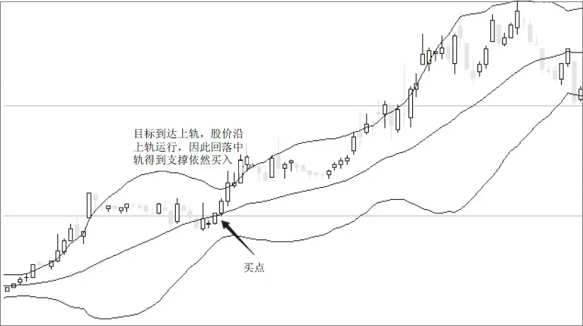

图9\-2 中原高速（600020）2014\.08—2014\.12日线图

买点解析

●通常情况下，我们都可以利用蜡烛图提供的买卖信号进行交易，但有时股价震荡，蜡烛图会频繁地给出交易信号，不但增加了我们的交易次数和交易费用，由于空间不足，同时也加大了失败率。

●BOLL通道是跟踪趋势的技术指标，所以对于股价可以忽略很多不必要的极短期的交易信号，当价格由中轨线之下上穿时，为买进信号，而股价会一直处于中轨线之时，若下破中轨线，则为卖出信号。

__实盘解读 __

如图9\-2所示，布林通道三线均为向上，表示短期趋势是向上的。

股价在上涨至布林上轨后，走平回到中轨，并下破中轨支撑，欲向下轨运行，但蜡烛图突然出现十字星线，行情止跌反弹，次日得到红三兵组合形态，那么红三兵第一根蜡烛图实体站上布林中轨时，为买入信号。

我们通常也可以利用布林通道设定交易目标，例如下轨上涨至中轨，或上涨至上轨，或中轨上涨至上轨等，股价到达布林上轨后，又沿布林上轨运行一段时间，我们可以得知这波行情为强势上涨，因此待行情回落布林中轨附近要继续买入，最好配合价格形态进场。

买点2：当股价在下轨处获得支撑后，并开始回升后的买点

实战示例（见图9\-3）

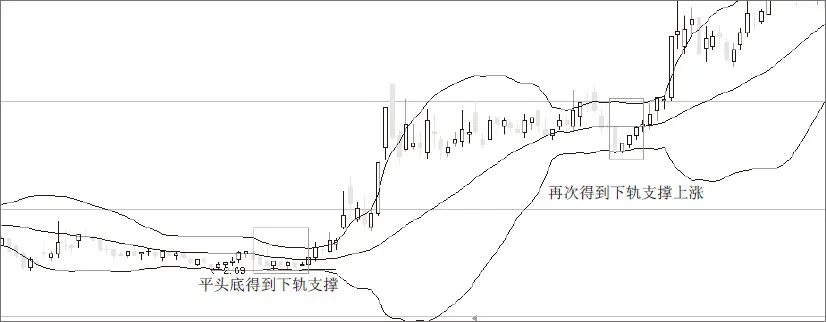

图9\-3 太原重工（600169）2014\.06—2014\.10日线图

买点解析

●在理论上，BOLL通道提供上下现阶段股价上涨与下跌的最高价与最低价，所以下轨线可以提供给股价的支撑。

●股价可以沿着下轨线一直向下运行，所以当股价下行至下轨线处，并不能为我们提供买点，在股价达到下轨线后得到了支撑，并再次回升，蜡烛图或其他指标给出买进信号时，才为我们提供了有效的买点。

__实盘解读 __

如图9\-3所示，股价起初连续受制于布林中轨阻力震荡下行，布林通道收窄，直到在下轨出现平头底支撑，预示布林下轨支撑有效，成为投资者的买点，股价站上中轨，即可看到上轨。

我们发现，股价沿布林上轨运行，这波行情属于强势上升行情，因此买盘不要着急离场，通常这样的行情还有更高价格，而保守看，即使是回调，这波行情也会有第二次高点。

行情上涨至布林上轨后，高位横盘震荡，股价在前期高点第二次受阻回落，稳健的投资者可能已经抛出股票。而股价回落到布林下轨时，再次获得支撑信号，验证了布林下轨的支撑作用，因此布林下轨再次成为买点，看行情继续上涨布林上轨。

买点3：当股价短暂跌破下轨线后，再次回归入通道内时的买点

实战示例（见图9\-4）

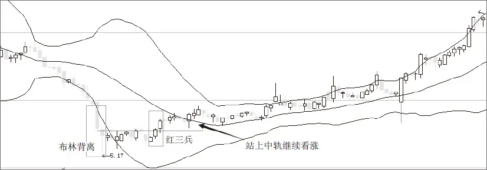

图9\-4 宁波联合（600051）2013\.06—2014\.02日线图

买点解析

●BOLL通道具的功能，一为提供价格运行的通道，二为上下轨道线提供现阶段股价运行的理论上的最高价与最低价，所以股价在理论上是不会突破BOLL通道的轨道线的。

●若股价暂时性地向下跌破轨道线，有两种情况：第一，BOLL通道的开口会扩大，下轨线向下运行，包住下破的股价；第二，股价迅速向上弹回至下轨线之上。所以这就为我们提供了交易的机会，一旦股价向下击穿了下轨线，当它再次回抽并且蜡烛图给出卖进信号的同时，BOLL通道配合给出信号，此时便是最佳买点。

__实盘解读 __

我们知道，布林通道的原理是价格在布林通道内运行，当股价运行到布林通道外面的时候，那么就产生了背离，技术修正后，股价必须返回到布林通道内，因此背离时配一根锤子线，就可以成为买入信号。

如图9\-4所示，股价运行到布林通道外面，出现背离走势，并且蜡烛图收到一根锤子线，意味着股价将很快回到通道之内，成为买入信号。

股价回到通道内，先是低位横盘，直到红三兵出现打破了震荡区间，我们知道红三兵为上涨的中继形态，预示短期趋势为上涨，因此在股价实体线站上中轨时，就可以继续买入或加仓看涨。

## 第9章 BOLL布林通道的应用 - 9.2 BOLL指标的卖点

9\.2 BOLL指标的卖点

2025年10月29日

18:04

__9\.2 BOLL指标的卖点 __

卖点1：当股价向下击穿中轨线时的卖点

实战示例（见图9\-5）

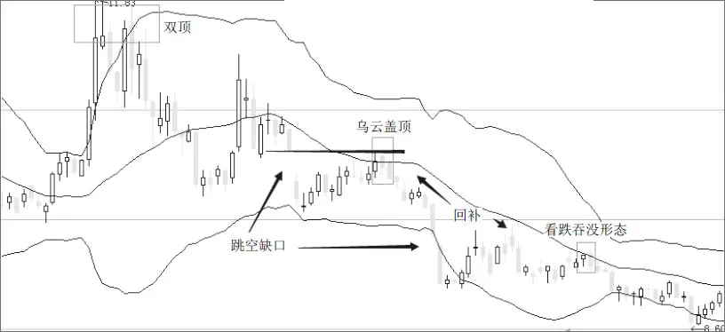

图9\-5 浙江医院（600216）2014\.02—2014\.06日线图

买点解析

●布林通道的上、中、下轨线同时向下时，表示短期行情为下跌走势，那么上轨线与中轨线的阻力比较有效，下轨线的支撑则相对减弱。

●配合蜡烛图与价格形态变化，可以得知或验证布林上轨与中轨的阻力，获得卖点。

__实盘解读 __

如图9\-5所示，股价在布林通道上轨线附近出现价格双顶，验证上轨线阻力效果，使行情下跌，给出了明显的卖点信号。

由于布林通道三线同时向下，我们判断短期为下跌趋势，因此中轨线和下轨线的支撑效果要非常谨慎。实际走势中，布林中轨线有一个失而复得，但很快即下破，并出现跳空窗口，我们分析为行情的中继跳空，价格的回补阻力，恰好与布林中轨线重合，而中继跳空的回补很快，阻力线位置分别收到乌云盖顶和看跌吞没形态，验证阻力有效，因此行情后市看继续下跌，布林中轨线则成为卖出点。

总结，我们说在布林通道三条线没有走平之前，盘中任何支撑信号都禁不住考验，反而顶部信号非常好使，价格离开顶部的速度也会很快。

卖点2：当股价在上轨线处遇阻后回落时的卖点

实战示例（见图9\-6）

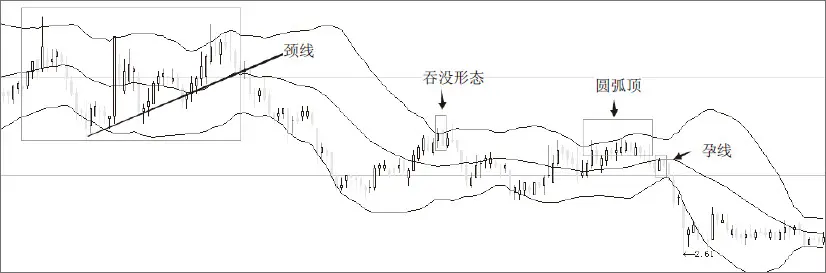

图9\-6 凌钢股份（600231）2013\.09—2014\.05日线图

买点解析

●理论上，上轨线提供了当前股价上涨的最高位置，所以在上轨线处，股价遇阴回落，同时蜡烛图又给出了卖出信号，则主图与指标共同给出了卖点。

●在中轨线之上强势，那么在上轨线给出了卖点仅仅是短期的，如果下破了中轨线后给出的卖点，才更具有趋势性。

__实盘解读 __

如图9\-6所示，起初行情在布林通道做区间震荡，由于所处位置是一个时段的价格高点，因此也类似一个三重顶形态，股价3次在布林上轨受阻，验证了阻力效果，卖出信号出现，投资者应在股价回落布林中轨前清空股票。

三重顶颈线与布林中轨支撑重合，我们看颈线的破位等同于中轨支撑的失效，行情继续看向下轨。

股价下跌带动布林通道三线向下，短期行情转为趋势下跌。

此后我们看到行情两次反弹布林上轨附近，均收到吞没形态与圆弧顶形态，验证了布林上轨阻力效果，那么以下轨支撑做反弹震荡的投资者此时应立即卖出股票，因下轨支撑脆弱，很容易形成布林的下开口行情。

卖点3：当股价暂时上破上轨线后，再次回落后的卖点

实战示例（见图9\-7）

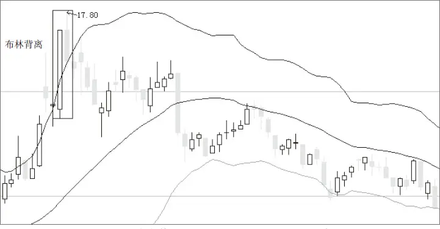

图9\-7 中文传媒（600373）2014\.08—2014\.11日线图

买点解析

●与股价暂时击穿BOLL通道的下轨线时的买点一样，当股价暂时性地击穿上轨线时也会出现两种情况：第一，BOLL通道的开口会扩大，上轨线会向上包住股价的暂时性偏离；第二，股价会迅速回撤至上轨线之内。

●当股价迅速回撤至上轨线之内，同时蜡烛图又给出了卖出信号后，再加上上轨线的压制，为最佳卖点。

__实盘解读 __

如图9\-7所示，我们看到股价的上涨冲出布林通道，不符合价格在布林通道内运行的定义，价格偏离了正常的波动幅度，一旦脱离了正常的运动轨迹，上涨便不可长久，所以此时应高度关注此处。因此判断为布林背离信号，价格将很快回归布林通道，得到第一个卖出信号。

股价回归布林上轨线附近时，收盘得到乌云盖顶信号，验证了布林上轨阻力效果，卖出信号需要付出实际行动。

如果股价在布林上轨受阻下跌，若形成布林通道三线向下的趋势，那么下跌目标的距离至少可以看到布林下轨的空间；若布林通道还处在横盘状态，那么上轨价格受阻，保守也会看到中轨支撑。

## 第10章 RSI相对强弱指标的应用

__第10章 __

__RSI相对强弱指标的应用 __

如图10\-1所示，RSI指标是由3条平滑的曲线构成，每条线表示的周期参数不同，通常分析软件中给出的默认参数为（6，12，24），投资者也可以根据自己的交易习惯和需要来优化RSI指标的参数。RSI指标是在0～100之间摆动，相比于没有上下边界的摆动指标来说，增加了它的易解读性。

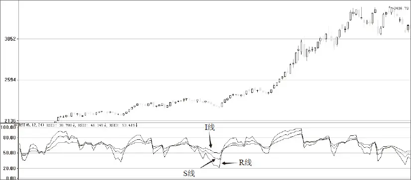

图10\-1 上证指数（000001）

RSI指标主要是衡量买卖双方力量强弱的指标，当三线呈平行发散状态时，力量最强。但它并不能直观地给出买点或卖点，需要配合主图其他指标使用，但RSI的变化仍然可以起到很好的预警效果。当指标在70刻度线以上时，市场处于强势；当指标处于30～70刻度线之间时，市场处于牛皮市；当指标在30刻度线以下时，市场为弱势。

●相对强弱指标RSI，是用来计算其自身内在的相对强弱程度的指标，是由韦尔斯·怀尔德（Welles Wilder）提出的。

●摆动指标永远处于技术分析的次要位置，是辅助主图、配合主图进行分析的指标。在使用摆动指标时，一定要摆清它的位置。

●RSI指标是计算买卖双方的力量对比的一种参数。

●由于RSI指标是在0～100刻度线范围内进行震荡，所以当RSI指标在80刻度线以上时，市场为超买状态；当RSI在20刻度线以下时，市场为超卖状态。所以可以很容易地读出买卖双方的交易意向，且越接近边轨，效果越好。

●任何单一指标都不能构成买卖信号，只有配合主图或其他指标，才能给出准确率高的买点与卖点。

## 第10章 RSI相对强弱指标的应用 - 10.1 RSI指标的买点

10\.1 RSI指标的买点

2025年10月29日

18:04

__10\.1 RSI指标的买点 __

买点1：当RSI指标由20刻度线下方向上穿越时的买点

实战示例（见图10\-2）

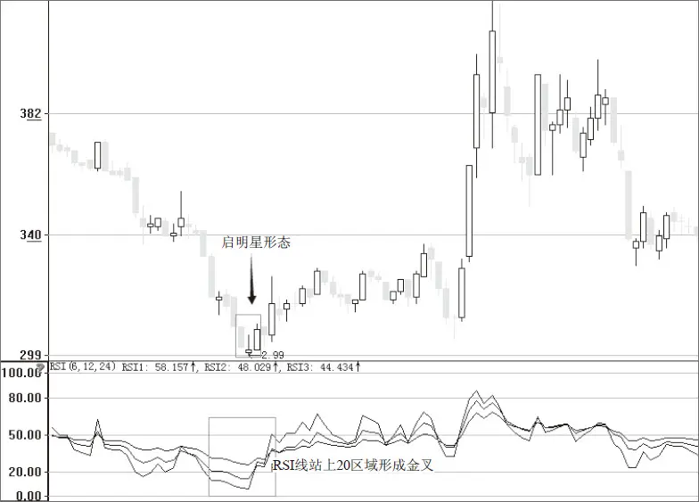

图10\-2 京能电力（600578）2013\.12—2014\.04日线图

买点解析

●当RSI指标的值达到20刻度线以下时为超卖，说明空方的力量已弱。如果是大盘蓝筹股的话，RSI指标的值达到30刻度线以下，便可以称为超卖了；而二线、三线的股票，通常都要达到20刻度线以下才能称为超卖。

●当RSI指标达到20刻度线以下时，暂时还不能动手，因为RSI指标只是反应强弱，有可能一直保持在20刻度线以下，直到RSI指标由下向上穿越了20刻度线的时候，我们才能再配合其他分析方法，共同找出有效的买点。

__实盘解读 __

如图10\-2所示，行情自2014年1月份，RSI指标进入20刻度区域，此时我们应该高度关注主图的见底支撑信号。

同月14日，股价日线收盘实体阳线，形成启明星的底部信号，并且验证了支撑效果，此时RSI指标站上20刻度线以上并形成金叉，表示买盘即将发力。此时两种分析方法都已给出了买入信号，这样的信号准确率是相当高的。因此，1月15日为投资者建仓的最佳时机。

买点2：当价格在上涨趋势中，RSI指标回落后再次上叉时的买点

实战示例（见图10\-3）

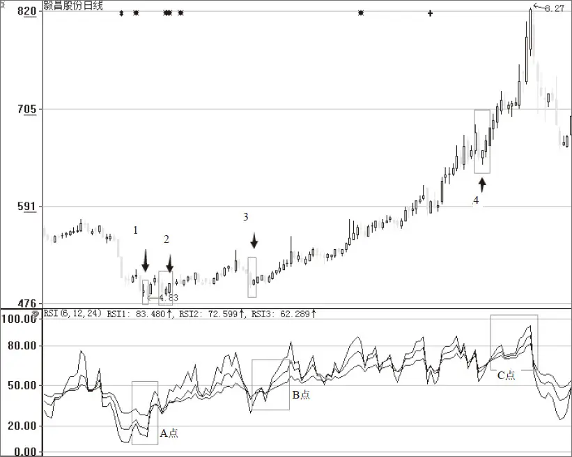

图10\-3 毅昌股份（002420）2014\.04—2014\.10日线图

买点解析

●价格是不会一路呈直线上涨的，它总是走三步退一步，呈阶梯式的上涨，所以当第一买点出现并且上涨一段时间后，对于本次上涨的回调终归会来的。

●当RSI指标跟随价格向下回调后，会在中途出现下叉，但由于没破坏价格上涨的趋势，回调中价格会再次回升，那RSI指标也会跟随价格的上涨而再次回叉。

●当RSI指标由下向上再次在50刻度线以上进行上叉后，再根据主图或其他指标的配合，会给出第二买点，也可以称为加仓买点。而当RSI指标上升至80刻度线以上后，股价进入最后上涨的冲刺阶段。

__实盘解读 __

如图10\-3所示的A点，即RSI指标的S线与R线由20刻度线下方上穿I线，3条线交叉并站在20刻度上方，买盘力量出现。配合主图蜡烛图，1点和2点分别得到底部吞没和刺透两个底部支撑信号，联合起来也可以称为双底信号，支撑效果更加明显，因此配合A点RSI指标的动能，可成为股价底部的买点。

行情不会一路上涨，遇到回调时，RSI指标的买盘能量也会减弱。主图行情回调时，得到一个孕线支撑，同时RSI指标在B点50刻度线附近得到金叉，且3条线呈现出发散状态，代表买盘力量更强，因此验证3点支撑效果，成为第二个买点。

我们看到4点处是一个刺透形态，股价相比在1点和2点时，已经大幅上涨，RSI指标在C点进入80刻度超买区域，RSI指标的三线再次呈发散状态，买盘将再有一次拉升，我们说这是股价进入最后上涨的冲刺阶段，投资者只能小幅加仓或持有原仓位不变，并要时刻关注顶部信号的出现，快速离场。

买点3：当RSI指标与股价发生底背离时的买点

实战示例（见图10\-4）

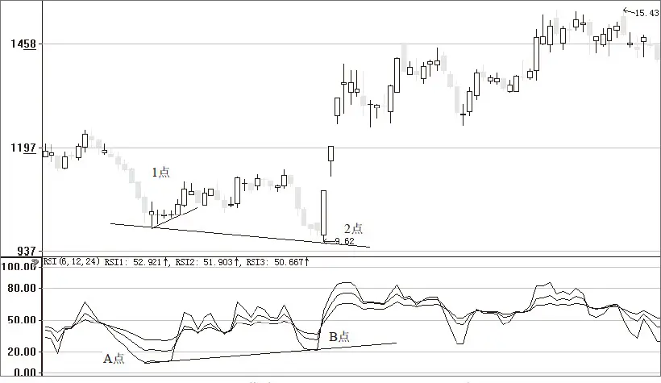

图10\-4 新黄浦（600638）2013\.12—2014\.06日线图

买点解析

●RSI指标是显示买卖双方强弱的指标，数值越高，强度越大；相反，数值越低，强度减弱，力量也就越小。

●正常情况下价格呈波浪形下跌，一浪低于一浪，那么摆动指标也要一浪低于一浪，进入20刻度超卖区域以后，力量就会变得相当弱。

●如果价格一浪低于一浪，而摆动指标不跟随价格的走势，却是一浪高于一浪，这样便形成了指标与价格的底部背离，预示着价格即将上涨。

__实盘解读 __

如图10\-4所示，1点日线价格收盘，低点提高，交易量严重萎缩，对应的RSI指标中A点，进入超卖区域，并且随着股价低点的上升在20刻度线上方形成金叉，为买入信号。但不久股价反弹再下跌，得到价格新低，此时对应的RSI指标内B点位置，买盘力量未减弱；相反，相对于A点有所提升，预示买盘动力有增无减，因此与价格下跌形成背离信号，预示股票可以继续买入或加仓。

我们看到主图2点是一根腰线看涨信号，实际操作中，在2点的买入价格与1点的相差无几甚至略高，若2点没有支撑信号出现，也无法构成买入信号。但背离信号已经出现，买盘涌动，并引起了我们的高度关注，那么买入信号只是时间问题。

## 第10章 RSI相对强弱指标的应用 - 10.2 RSI指标的卖点

10\.2 RSI指标的卖点

2025年10月29日

18:04

__10\.2 RSI指标的卖点 __

卖点1：当RSI指标在80刻度线上方下叉时的卖点

实战示例（见图10\-5）

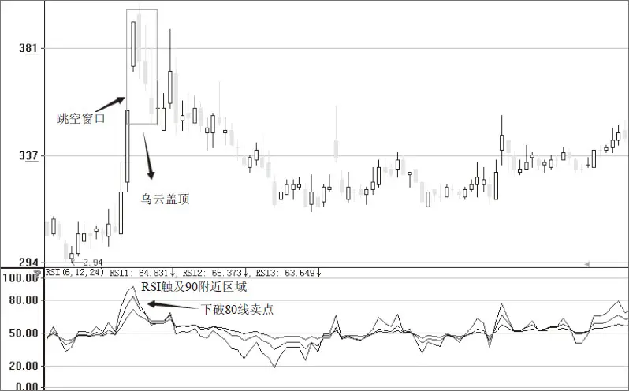

图10\-5 天房发展（600322）2014\.03—2014\.07日线图

卖点解析

●当RSI指标的值达到80刻度以上时为超买，说明多方的力量已弱。如果是大盘蓝筹股的话，RSI指标的值达到70刻度以上，便可以作为超买了；而二线、三线的股票，通常都要达到80刻度以上才能称为超卖。

●当RSI指标达到80刻度以下时，并且主图给出卖出信号与之相配合，为最佳卖点，不会被短期的震荡下跌所迷惑。

__实盘解读 __

如图10\-5所示，股价快速上升中出现跳空窗口，同时RSI指标开始进入超买区域。

后两个交易日，蜡烛图形成乌云盖顶形态，我们分析前面的跳空窗口可能是一个衰竭跳空，预示行情即将反转，配合乌云盖顶形态，发出卖出信号。

我们看到RSI指标中快线最高触及90刻度区域，表示超买行情非常严重，股价随时可能见顶。待RSI指标勾头，并且下破80刻度线时，验证了卖出信号，同时也是主图乌云盖顶的第二个交易日，投资者应该做出获利了结。

卖点2：当价格在下跌趋势中，RSI指标反弹后再次下叉时的卖点

实战示例（见图10\-6）

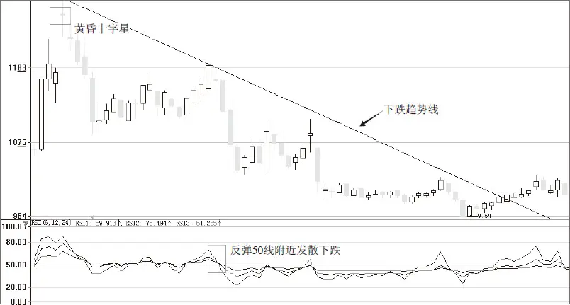

图10\-6 沧州大化（600230）2014\.03—2014\.07日线图

卖点解析

●价格是不会一路呈直线下跌的，而是呈阶梯式的下跌，所以当第一卖点出现并且下跌一段时间后，对于本次下跌的回调终归会来的。

●当RSI跟随价格向下反弹后，会在中途出现上叉，但由于没破坏价格下跌的趋势，反弹中价格会再次回落，RSI也会跟随着价格的下跌而再次下叉。再根据主图或其他指标的配合，会为我们给出第二卖点，也是给多头的第二次逃亡机会。

__实盘解读 __

如图10\-6所示，股价出现黄昏十字星信号时，RSI指标由80刻度线上方回落，我们说下破80刻度线时即可验证顶部信号，为第一卖点。细心的投资者注意到，RSI指标在80刻度线上方是一个双顶的勾头信号，因此给出的信号更加准确。

此后股价反弹再下跌，我们画出下跌趋势线，可以看到趋势线一直对行情起到压制作用，能非常清楚地看到行情下跌。

我们看到，行情每次反弹到趋势线附近时，收获阻力信号的同时，RSI指标都有死叉出现，对主图指标是一个验证，因此下跌趋势不变的情况下，RSI指标反弹50刻度线附近依然是卖点。

最后注意，无论涨跌，RSI指标呈平行或发散状态是发力的表现，预示着即将发生的行情单边幅度大，且速度很快，也是RSI指标给我们发出的重要信号。

卖点3：当RSI指标与股价发生顶背离时的卖点

实战示例（见图10\-7）

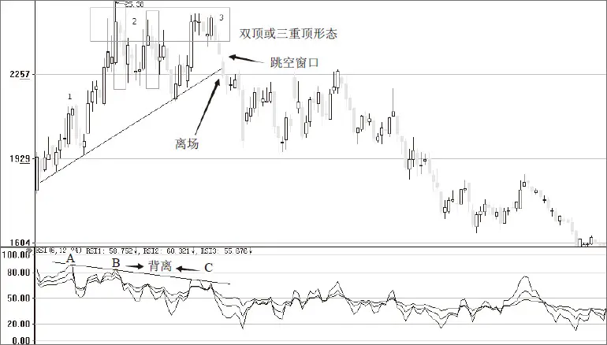

图10\-7 中海油服（601808）2013\.10—2014\.06日线图

卖点解析

●摆动指标应该随着价格的下跌而下跌，价格上涨在理论上是没有界限的，但摆动指标却只能在0～100刻度线之间运行。

●正常情况下价格呈波浪形上涨，一浪高于一浪，那么摆动指标也要一浪高于一浪。

●如果价格一浪高于一浪，而摆动指标不跟随价格的走势，而是一浪低于一浪，这样便形成了指标与价格的顶部背离，预示着价格即将下跌。

__实盘解读 __

如图10\-7所示，当股价上涨时，RSI指标进入80刻度区域，应该引起投资者的高度关注，但背离信号是一个预警信号，并不等同于卖出信号，投资者需要重点关注后面出现的价格形态。

股价到达1点时，对应RSI的A点，RSI指标开始进入80刻度超买区域，显示股价进入最后的上冲阶段。股价回调后继续趋势线得到支撑继续上涨，出现价格新高2点，但此时RSI指标在B点高度不及A点，有收量迹象，显示买盘行情能量不足以支撑新高的价格，背离信号出现，并且在第二次高点时得到乌云盖顶信号，显示行情见顶，但买盘价格依然站上趋势线上方。

接下来买盘回测趋势线继续上行，得到高点3，我们发现高点2与高点3几乎为同一个价格，有双顶或三重顶的嫌疑，但3点对应的RSI指标C点，相比A点和B点还要低，背离信号持续出现，预示卖点马上出现，并且行情即将快速下跌。

我们看到3点后，股价跳空下跌，跳空类型为中继跳空，并且这个窗口在后市没有得到有效回补。如果在双顶或三重顶形态没有平仓的投资者，那么下破趋势线的交易日，就是投资者果断离场的卖点。

## 第11章 ROC变动速率指标的应用

__第11章 __

__ROC变动速率指标的应用 __

ROC指标是计算当前交易日与N天之前交易日的收盘价之间的关系，用来推断股价的变化，分析趋势是否有反转的意愿，是典型的反趋势指标之一。

ROC指标是没有上下边界的，所以在理论上它可以无限制地向上或向下运行。但在实际应用中，ROC指标也有它本身运行的空间，所以使用这类无上下边界的指标，我们需要针对个股进行逐个甄别，找到它长期运行的空间，找出超买线与超卖线。

无上下边界的指标，都会有一个中位值，为零轴线，那么零轴线就凸显出它的重要性了。零轴线为强势与弱势的分水岭，当ROC线向下突破零轴线时，为弱势，为卖出信号；当ROC线向上突破零轴线时，为强势，为买进信号。但这种情况只能应用于行情运行较明显的时刻。

股价长期震荡时，运用零轴线给出买卖信号，则显得较晚了，所以我们给ROC线加了一条线，用来平滑ROC曲线，这条线我们称之为ROCMA。如图11\-1所示，若ROC线上穿ROCMA线时为金叉买进信号，当ROC线下穿ROCMA线时为死叉卖出信号。

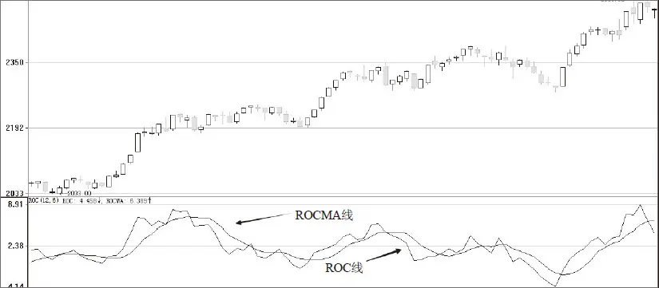

图11\-1 上证指数（000001）2014\.07—2014\.11日线图

ROC线与股价也会出现背离的状况。若股价上涨，而ROC线未跟随股价上涨，则出现顶背离，预示着股价上涨必不持久，随时会下跌；若股价下跌，而ROC线未跟随股价下跌，则出现底背离，预示着股价下跌必不持久，随时会上涨。

## 第11章 ROC变动速率指标的应用 - 11.1 ROC指标的买点

11\.1 ROC指标的买点

2025年10月29日

18:04

__11\.1 ROC指标的买点 __

买点1：当ROC线上穿ROCMA线时的买点

实战示例（见图11\-2）

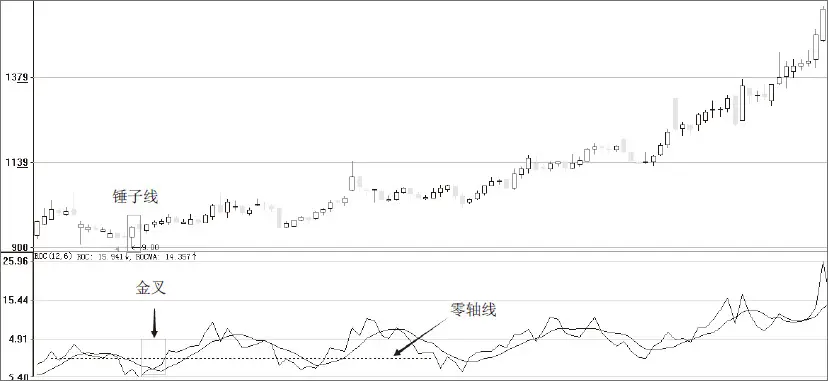

图11\-2 大连三垒（002621）2014\.05—2014\.10日线图

买点解析

趋势明朗时做趋势，趋势不明朗时做短线，抢帽子，短平快。但ROC线是一款反趋势指标，主要作用是查看当前趋势是否已经结束。ROC线的反应是很灵敏的，所以我们给ROC线做再次移动平均，加上一条ROCMA线，这样ROCMA线是比ROC线更加平滑的一条曲线，那么当ROC线上叉ROCMA线时，说明短期内股价已经开始上扬了，给我们提供了买入信号。

__实盘解读 __

如图11\-2所示，蜡烛图比ROC指标先一步给出支撑信号——锤子线，次日ROC线向上穿越ROCMA线，说明短期内股价要开始上扬，验证了前面的锤子线，释放出买入信号。

我们说ROC指标以零轴线做分界，ROC线由下上穿零轴更加有意义，并且在金叉形成后上穿零轴线，投资者见到此信号，将可以更安心地持有此前买入的股票。

买点2：当ROC线与股价出现底背离时的买点

实战示例（见图11\-3）

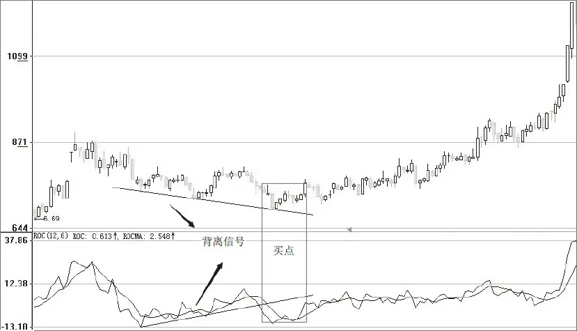

图11\-3 中钢天源（002057）2014\.02—2014\.08日线图

买点解析

●底部背离我们见过很多了，除了在主图上的指标以外，副图指标几乎都存在背离问题。背离是各种指标中最诚实、最可靠的交易信号，虽然有些时候会出现二度背离或三度背离，但都不会影响指标背离的声誉，那仅仅是极端行情出现的特殊现象。

●同样，当股价一路下跌，而ROC线却一浪高于浪，此时便产生了背离，底背离一旦产生，投资者必须集中精力关注行情，待底背离消失恢复正常的时候，就是最佳的买入机会。（配合蜡烛图给出买进信号，该信号则具有极高的可信度）

__实盘解读 __

如图11\-3所示，股价震荡下行，一浪一浪的低点在下降，相反，ROC指标的双线上升，形成背离走势。

背离信号出现后，并不等于买点，而是预警信号，我们更多的还是要在主图上找价格支撑形态。若行情背离信号出现，我们提前买入了股票后有前期持仓，虽然股价有新低，但我们也可以暂时持有，不必着急离场，待背离信号消失的时候，就是行情真正的买点。

图11\-3中股价再次得到新低时，ROC指标恢复正常，并且有二度交叉的双底信号，验证主图的吞没心态，股票的买点到来。

买点3：当ROC线与股价发生背离后，再次向上穿越零轴线后的加仓买点

实战示例（见图11\-4）

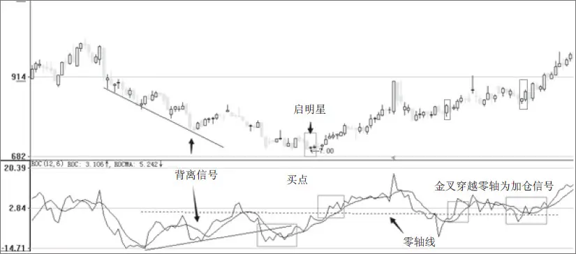

图11\-4 中超电缆（002471）2014\.01—2014\.08日线图

买点解析

●ROC线出现底背离后为第一买点，ROC线出现底背离一定出现在零轴线之下。

●当ROC线上穿零轴线后说明当前趋势已经开始向上，所以，当ROC线在底背离继而上穿零轴线后为加仓买点，可以称得上是具有趋势性的买点。

__实盘解读 __

如图11\-4所示，在下跌趋势中依次降低的两个价格低点，相对应的ROC线的值，却是后浪高于前浪，所以底背离已然出现了，ROC线给出了预警信号。

我们说指标恢复正常的一刻，就是行情的最好买入机会。ROC指标的双线再次在零轴线下方形成双金叉买入信号，而主图蜡烛线则显示低位震荡。待ROC线上行穿过零轴线的时候，验证了主图在低位震荡中出现的启明星形态，成为了底部第一次买入点。

背离后的走势，如果股价没有给出卖出信号，只要ROC线向上穿越零轴线，都是加仓买进的信号，并且ROC指标会提前蜡烛图一个交易日给出信号，因此只要指标上穿零轴线，次日蜡烛图出现买盘支撑信号，即可作为再次买入和加仓的位置。

## 第11章 ROC变动速率指标的应用 - 11.2 ROC指标的卖点

11\.2 ROC指标的卖点

2025年10月29日

18:04

__11\.2 ROC指标的卖点 __

卖点1：当ROC线向下穿越ROCMA线时的卖点

实战示例（见图11\-5）

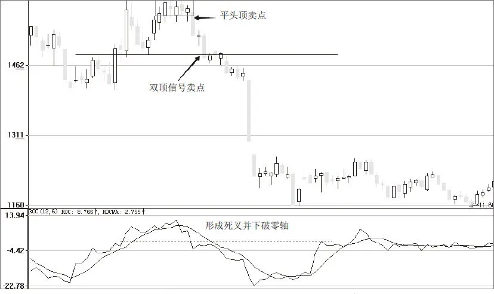

图11\-5 广田股份（002482）2014\.03—2014\.06日线图

卖点解析

●我们说过可以用ROC线上叉ROCMA线来找短期的买点，那么ROC线下叉ROCMA线同样也可以给出短期的卖点，但该卖点有时显得比蜡烛图的卖点更早。

●蜡烛图由于它是直接描述最基本的4种价格（开盘价、收盘价、最高价、最低价）的工具，所以有时它的反应过敏感，会给出很多超短期的无谓的信号，所以我们需要在使用其他指标来过滤震荡信号。

__实盘解读 __

如图11\-5所示，股价第一个触顶回落，ROC线即出现勾头迹象，直到第二次试探高点，在平头顶未完成时，ROC线已经下穿ROCMA线形成死叉。

主图第二次高点时，4根蜡烛图在同一个价格连续受阻，我们怀疑平头顶信号即将形成，因此，后面的实体阴线就是平头顶的卖出信号。而第二次价格形成的高点回落，即双顶信号的卖出点要比平头顶信号稍慢两个交易日，但是价格没有拉开太多。

我们看ROC线形成死叉时，平头顶还没有完全形成，是对平头顶的预警，而指标下破零轴线时，即双顶信号下破支撑的卖出点，因此3个指标重复，确立为顶部反转，释放卖出信号。我们看ROC线死叉信号相比实际卖出点早了4个交易日，起到了很好的预警效果。

卖点2：当ROC线与股价发生顶背离时的卖点

实战示例（见图11\-6）

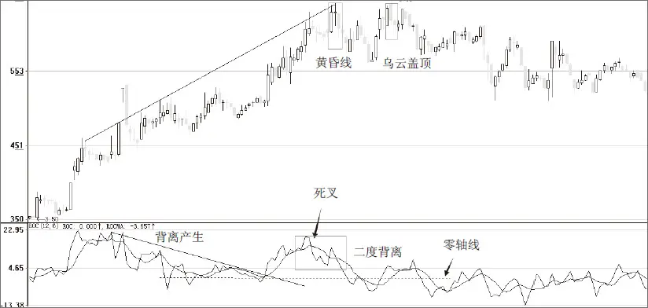

图11\-6 曙光股份（600303）2014\.06—2015\.01日线图

卖点解析

●底部背离为下跌不能为继，股价上涨，反之，顶部背离为上涨不能为继，股价下跌。股价一浪高于一浪，ROC指标却一浪低于一浪，构成顶部背离，给出卖出信号。

●顶背离信号出现是预警，大部分时候并不是卖点，卖点在顶背离信号结束时出现，即取信指标回归正常的卖点信号。

__实盘解读 __

如图11\-6所示，股价开始震荡上行，在一次跳空回落后，ROC指标开始出现背离走势，即股价出现新高，而ROC指标的双线下行，预警行情不久将会见顶。

我们说取信顶背离消失后的第一个卖出信号，ROC指标形成死叉的次日，主图出现黄昏线信号，预示行情即将下跌。

图11\-6中出现了二度背离情况，ROC指标下行，但股价得到第二次高点，但没有打破价格高点，并在收盘乌云盖顶信号，形成双顶的可能，同时ROC线继续下行，并在乌云盖顶信号后下破零轴线，因此下破零轴线的次个交易日，就要卖出股票。

我们总结，ROC指标恢复正常后，在黄昏线之前出现死叉，起到预警作用，并且黄昏线验证了死叉，为第一卖点。指标二度背离后，同样是先预警，待乌云盖顶信号出现后，次日ROC指标下破零轴线，验证乌云盖顶效果，为第二卖出点。

## 第12章 DMI趋向指标的应用

__第12章 __

__DMI趋向指标的应用 __

DMI指标由美国技术分析大师威尔斯·威尔德（Wells Willder）设计。

买卖双方在交易的过程中会达到某一力量的均衡点，而DMI便是寻找这种均衡点，再分析双方力量由均衡到失衡的过程。由均衡至失衡，为我们提供交易信号。

很多摆动指标都是以收盘为重要的参考数据，会失去对最高价、最低价的关注，如果两个交易日的收盘价相同，但一个交易日震荡为1％，另一个交易日的震荡为10％，即便收盘价相同，但这里所具有的内在意义是完全不同的。

DMI指标在视觉上，绝对是超级繁复的一款摆动指标。它由四条线构成，分别为PDI（上升方向线）线、MDI（下降方向线）线、ADX（趋于平均值线）线和ADXR线，如图12\-1所示。

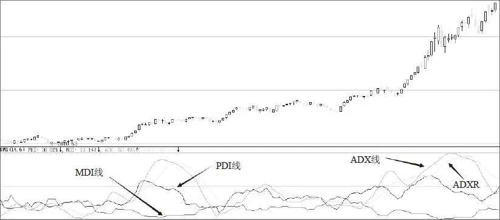

图12\-1 上证指数（000001）2014\.05—2014\.12日线图

DMI指标虽看似复杂，但若能灵活应用，它给我们反馈的信息还是比较丰富的。当市场行情趋向明显时，指标效果最理想，其用法包括：

●PDI线从下向上突破MDI线，显示有新多头进场，为买进信号；

●PDI线从上向下跌破MDI线，显示有新空头进场，为卖出信号；

●ADX值持续高于前一日时，市场行情将维持原趋势；

●ADX值递减，降到20线以下，且横向行进时，市场气氛为盘整；

●ADX值从上升倾向转为下降时，表明行情即将反转。

参数：N为统计天数，M为间隔天数，一般参数设定为（14，6）。ADXR线为当日ADX线的值与M日前的ADX线的值的均值。

笔者习惯将DMI指标分为两个部分。第一部分为ADX线与ADXR线，用法与KD指标相似，主要看金价与死叉、20刻度线以下的超卖区域与80刻度线以上的超卖区域。第二部分为PDI线与MDI线，表达的意思与RSI相似，主要显示盘中的强度。笔者曾在超短线交易时，经常使用DMI指标抄底逃顶，并且屡试不爽。

## 第12章 DMI趋向指标的应用 - 12.1 DMI指标的买点

12\.1 DMI指标的买点

2025年10月29日

18:04

__12\.1 DMI指标的买点 __

买点1：当ADX线与ADXR线低位形成金叉，且PDI线上叉MDI线时的短线买点

实战示例（见图12\-2）

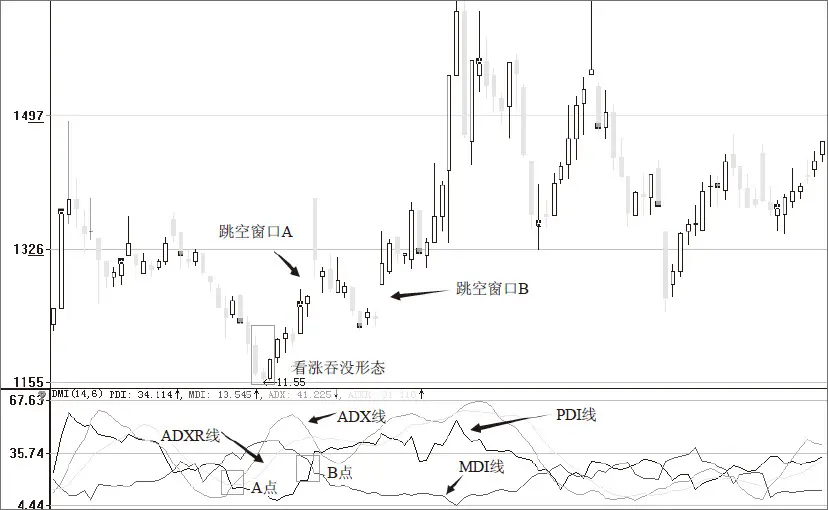

图12\-2 中洲控股（000042）2014\.09—2015\.02日线图

买点解析

●可将DMI指标这4条线拆成两组来分析：第一组为ADX线和ADXR线，第二组为PDI线和MDI线。其中，第一组比较灵敏，如同KD指标在20刻度线以下形成金叉买点。

●当PDI线上穿MDI线时，表示买盘开始发力。

__实盘解读 __

如图12\-2所示，股价在底部出现看涨吞没形态之前，DMI指标中的ADX线与ADXR线即已经在低位20刻度线下方形成金叉，即图中A点。金叉发散上行，主图收获看涨吞没形态，验证底部形态可信，为买点。

买入股票后，ADX线与ADXR线继续上行，PDI线上穿MDI线，即图中B点位置，盘中的买盘力量开始显示，股价出现拉升，主图中出现的跳空窗口A与跳空窗口B，为突破跳空，均是买盘爆发的证明。

在ADX线与ADXR线低位金叉的前提下，若PDI线与MDI线在50刻度区域附近再形成金叉，除了显示买盘即将发力外，也可以作为第二个买入信号。股价摆脱了震荡区间，一飞冲天，股价在这两个买进信号给出后，上涨了一倍有余且力度越大，上升的高点越快越高。

买点2：当PDI、ADX、ADXR三线快速向上发散时的买点

实战示例（见图12\-3）

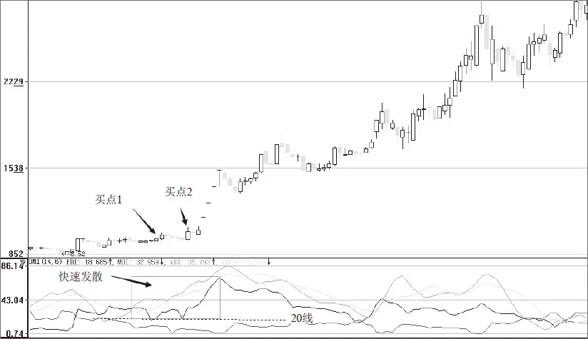

图12\-3 中冠A（000018）2014\.04—2015\.01日线图

买点解析

●PDI线与MDI线主要表达的是力量强弱的信号，那么ADX线与ADXR线是均线指标，所以它们通常交叉来提供买卖点。因此，买点的金叉配合力量指标，才能保证行情的真实上涨。

●当PDI、ADX与ADXR三线向上快速发散时，构成买点。

●由于DMI指标是4条线的组合，自身可以为两个指标的合集，所以它的特殊形态，可不需要主图其他指标的配合，可以单独使用。

__实盘解读 __

如图12\-3所示，股价窄幅低位震荡，DMI指标的4条线均在50刻度线下方走平。同样，在蜡烛图没有明显变化的时候，DMI指标先行出现上升，并且代表力度的PDI线两次测试20刻度线支撑上涨，与ADX线、ADXR线呈发散状态，若遇到这种情况，可以买入股票。

当DMI指标三线成发散状态时，主图蜡烛线最活跃的交易日为买点。蜡烛图自身的实体长度可以代表交易量，因此买点1和买点2明显区别于前面震荡，可以作为买点。

DMI指标的特殊形态，可以作为交易信号单独使用。

买点3：当PDI线在20刻度线以下，突然向上穿越其他三线时的短期买点

实战示例（见图12\-4）

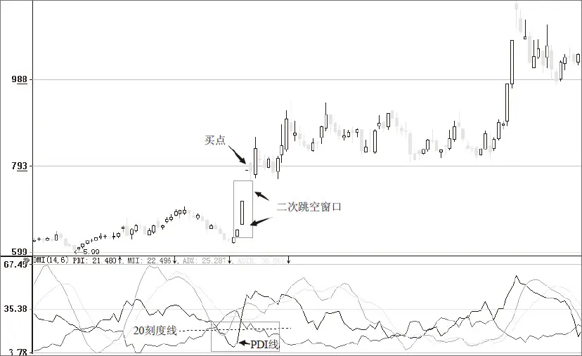

图12\-4 交运股份（600676）2014\.08—2015\.12日线图

买点解析

●PDI线是DMI指标中最重要的一条线，所以它的运行状态必须得到关注，如果它长期处于低位震荡（20刻度以下），那么说明股价一定处于震荡阴跌的状态中，注意这里我说的是阴跌，而不是快速下跌，因为单边行情中必然伴随着猛烈的成交量，那么PDI线就不能持续在低位徘徊了。

●阴跌后，股价出现反弹，那么PDI线快速反应，反弹力度决定PDI线的上升力度，如果PDI线快速上穿其他三线时，说明大量买盘支持反弹，行情有反转可能。在股价层面上，迅速上行也必然打破了阴跌的秩序，这种下跌速率一旦改变，则意味着新的秩序要来了，所以当PDI线在20刻度线以下长期震荡，一旦快速上行，并且快速上穿其他三线时，则构成了一个短期的买点。

●PDI线突然上穿其他三线是一个比较快速有效的信号，可以单独出现使用。

__实盘解读 __

如图12\-4所示，DMI指标中PDI线与MDI线在20刻度区域附近平行震荡，表明市场并不活跃，没有PDI的力度支持，ADX两线的上涨也不能作为买入信号。

突然，PDI线在20刻度区域以下上涨，并快速上穿其他三线，PDI线的突然发力常使蜡烛图出现拉涨或跳空上涨，也是主力利用震荡买单，突然拉升的信号。因此，遇到PDI线突然拉升其他三线时，可作为买入信号，在其他三线上方买入，等待股价第二次的拉升，一般涨幅会大于30％以上。

## 第12章 DMI趋向指标的应用 - 12.2 MDI指标的卖点

12\.2 MDI指标的卖点

2025年10月29日

18:04

__12\.2 MDI指标的卖点 __

卖点1：当PDI线下叉MDI线时的卖点

实战示例（见图12\-5）

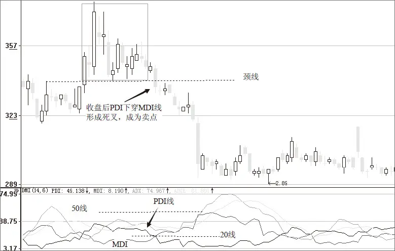

图12\-5 中弘股份（000979）2014\.03—2014\.06日线图

卖点解析

●PDI线与MDI线形成金叉为买点，反之，PDI线与MDI线形态死叉为卖点。

●不论PDI线与MDI线是在什么位置，只要形成死叉，代表力量的减弱，就说明必然有新的空头入场。

__实盘解读 __

如图12\-5所示，行情出现价格新高后回落，顶部形态较为复杂，但大部分也是见顶信号，我们连接前阳得到颈线的短线支撑。

DMI指标在股价高位震荡时，4条线均走平，没有新的上涨力量支撑，行情出现回落风险，此时若PDI线向下交叉MDI线，无论在什么位置，行情都有可能下跌。

我们看下破颈线收盘的交易日，对应DMI指标中PDI线下穿MDI线，卖出信号出现。

总结：这个卖出信号比较滞后，原因也是前面顶部信号复杂不确定，需要注意当MDI线走高的时候，特别是站上50刻度线以后，卖盘风险会大大提升。

卖点2：当PDI线在50刻度线上方，向下穿越ADX、ADXR与MDI三线时的卖点

实战示例（见图12\-6）

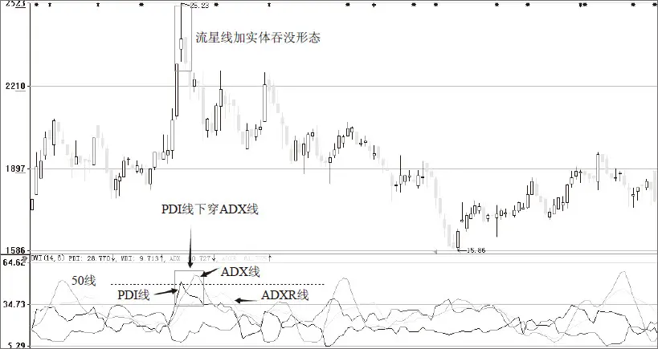

图12\-6 南方泵业（300145）2014\.01—2014\.07日线图

卖点解析

●与PDI线上穿其他3条线构成的买点相对应，PDI线下穿其他3条线则构成卖点。

●但有一点需要注意的是，价格上涨时的筑底是缓慢的，价格下跌时的筑顶是快速的，所以PDI线可以很容易上穿其他3条线。

●而PDI线若向下穿越其他3条线，则需要一定的时间和幅度。那么，当PDI线下穿ADX线与ADXR线这两条线时，暂时可以看作已经给出了卖点。

●最后注意，PDI线自50刻度线上方下穿ADX线与ADXR线才更加有效。

__实盘解读 __

如图12\-6所示，股价跳空上涨，在得出价格新高后收盘流星线信号，此时DMI指标中PDI线在50刻度线上方位置出现勾头。

次日蜡烛图收实体阴线，吞没了前一个交易日的实体阳线，形成吞没形态，对应的PDI线勾头向下穿ADX线，主图与DMI指标同时出现卖出信号。

随后PDI线顺势再下穿ADXR线，卖盘信号得到验证。我们说PDI为强度指标，上涨力度减弱，预示价格滞涨或回落，若ADX线再勾头向下与PDI线破ADXR线，则短线回调还要加深，如同5日均线支撑失守看10日均线，10日均线支撑失守看30日均线一样效果，这里的ADX线相当于5日均线，而ADXR线相当于10日均线。

这里DMI指标与蜡烛图给出的卖点同步，相互验证，投资者可快速做出反应，达到逃顶的效果。

SAR指标叫作抛物线指标，其一段一段的形状如同我们数学上的抛物线，又叫作止损转向操作点指标，如图13\-1所示。

## 第13章 SAR止损抛物线的应用

__第13章 __

__SAR止损抛物线的应用 __

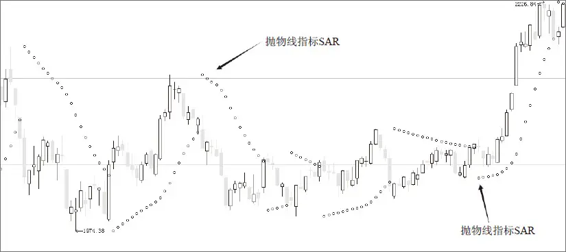

图13\-1 上证指数（000001）2014\.02—2014\.08日线图

SAR指标的名字包含两种意思：第一为止损，第二为转向。止损也包括止盈的意思。我们建立一张多头头寸，当价格下跌，SAR会为我们标出它认为最合理的止损位；当价格上涨，所谓止损点便成了止盈点，该止盈点会跟随价格的上涨而上涨，会不断向前推进止损位置，这样，只要行情走势稍有反转的迹象，我们便会在第一时间内止盈离场，与盘中的跟踪止损相似。那么第二层意思为转向，也就是说，平掉了多单，那便是进入空单的好时机，使用SAR指标永远保持在市的一种做法，但我国的市场暂时还没有做空的机制，所以只能选择SAR作为单向交易分析方法使用。

SAR指标内在特质与移动平均线极度类似，所以SAR也是时间与价格并重的一种技术分析指标。

SAR指标是与蜡烛图共同出现在主图上，所以读取非常直观明了，适合刚刚入市的新手们使用。没有复杂的图形，没有繁复的规则，只是第一个蜡烛图的上方或是下方出现一个圆点，当蜡烛线价格在圆点之上，便可以持有多单，当价格在圆点之下便卖出平仓。

与很多技术分析指标一样，它只适合中线的波段操作，需要忽略掉很多小规模的回调。但在震荡行情中，股价没有大幅波动，但SAR指标上下抛物线点会反复出现，它便陷入了反复止损的怪圈中，不可不察。但由于SAR跟踪股价相当密切，所以这样的止损幅度并没有多宽，即使是反复止损几次，只要遇到一波单边涨势，是绝对逃不过SAR的法眼的，一波单边行情足以将反复止损的亏损全部赚回，还会有更多的盈余，因此抛物线指标更适合趋势明朗的单边行情。

## 第13章 SAR止损抛物线的应用 - 13.1 SAR指标的买点

13\.1 SAR指标的买点

2025年10月29日

18:04

__13\.1 SAR指标的买点 __

买点1：当股价上穿SAR线时的买点

实战示例（见图13\-2）

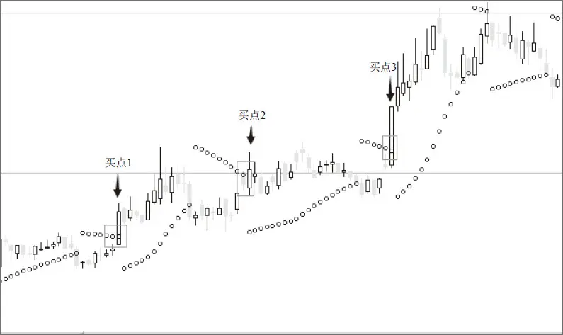

图13\-2 中国卫星（600118）2014\.05—2014\.10日线图

买点解析

●SAR线是跟踪价格走势随之涨跌的一种技术分析指标，当股价向上触及SAR抛物止损点时，上方抛物线点消失，同时下方出现抛物线点，代表空单止损，多单进场，即买盘信号。

●注意，抛物线指标需日线收盘后才能显现，因此次日才是买卖双方的进场点。

__实盘解读 __

如图13\-2所示，当股票交易日收盘上涨穿过抛物点时，触发了卖盘止损，买盘开始进场，若交易日收盘蜡烛线得到看涨信号更好，投资者可以此作为买点进入。

有时候，蜡烛图并没有给出明显的底部或支撑买进信号，但抛物线触及上点，必然引起下点出现，如此一来，SAR指标领先于股价，率先提供了买点。

股价如期小幅上涨，只要股价在SAR抛物止损线上，我们便可以一直持有多单，SAR指标在下方跟随蜡烛图上行，也起到对买盘的支撑作用，直到股价回落触及下方的止损，上方点出现抛出股票，待触及上方后再买入。

最后一定注意，SAR指标在趋势明朗的单边行情有效。

买点2：当SAR线支撑住价格回调，并再次上涨时的买点

实战示例（见图13\-3）

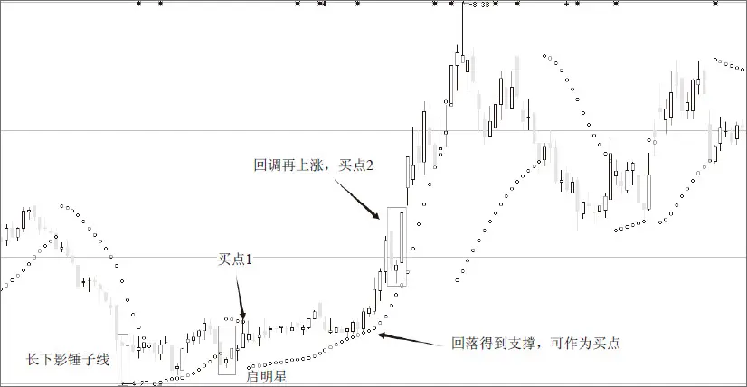

图13\-3 新疆城建（600545）2013\.06—2013\.11日线图

买点解析

●我们说过SAR线是一款追踪趋势的指标，所以它可以忽略很多小规模的回调。单边行情中，回调通常不超过两天，那么在股价回调的时候，股价会无限接近SAR线上，但二者不能接触，否则卖点出现。

●如果股价与SAR线黏合在一起，SAR线就会给出反转信号了，所以一节中所讲的卖点，不是让我们精确地观察到股价与SAR线黏在一起，而是当它们无限接近的时候，便产生了新的买点。

__实盘解读 __

如图13\-3所示，开始股价下跌，在价格新低点得到长长下影线的锤子线，价格反弹再次下跌，先后在同一个价格低点水平得到两次启明星信号，形成了三重底支撑看涨信号。

在启明星信号次日股价上涨触及上方抛物线点，上方点消失，下方点出现，为第一买入信号，即买点1。

价格上涨，途中遇到震荡，股价连续4个交易日接近抛物线点，但都没有触及，抛物线点起到无形的支撑作用，因此阳线拉升的交易日，可以再次作为行情的买点或加仓点。

股价收阴回落，次日在下方抛物线附近收盘十字星线，配合抛物线的支撑信号，为再次买入信号，即买点2。

最后注意，价格上涨接近顶部时，抛物线出现了一个频繁震荡的反复过程，此时我们建议投资者不要盲目跟进，最好观望，或是减仓，都是比较稳妥的操作。

## 第13章 SAR止损抛物线的应用 - 13.2 SAR指标的卖点

13\.2 SAR指标的卖点

2025年10月29日

18:04

__13\.2 SAR指标的卖点 __

卖点1：当股价下穿SAR线时的卖点

实战示例（见图13\-4）

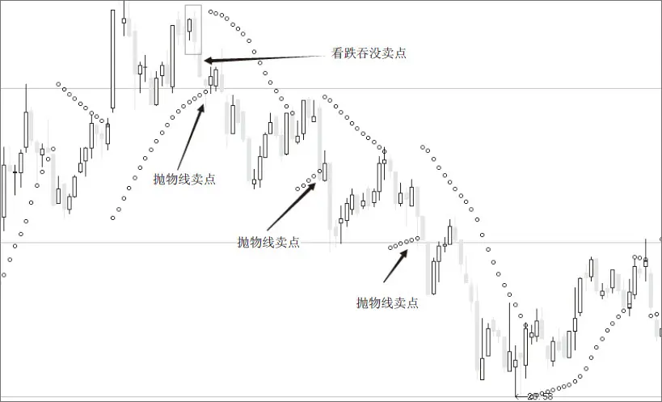

图13\-4 安科瑞（300286）2014\.10—2015\.01日线图

卖点解析

●当股价下穿SAR抛物止损线时，为卖出信号。

●因抛物线指标的位置关系，抛物线的卖点大部分出现在蜡烛图或价格形态之后，因此卖点也会滞后，但好处是止损空间很小。

__实盘解读 __

如图13\-4所示，蜡烛图先后出现乌云盖顶和看跌吞没信号，联合来看为双顶信号，次日收盘为阴线，基本可以确定为卖出信号。

此时SAR指标下点快速上移，并触发下影线，买盘得到止损，同时上方阻力点出现。所以，如果当上涨趋势被破坏，那我们止损即可。使用蜡烛图与SAR止损线，止损宽度是相当小的。

此后下跌行情，SAR指标均是在卖盘放量时触及抛物线点止损，因此作为卖点表现延迟，建议投资者配合其他指标，争取提前验证卖点。

卖点2：当SAR线压制住价格反弹，并再次下跌时的卖点

实战示例（见图13\-5）

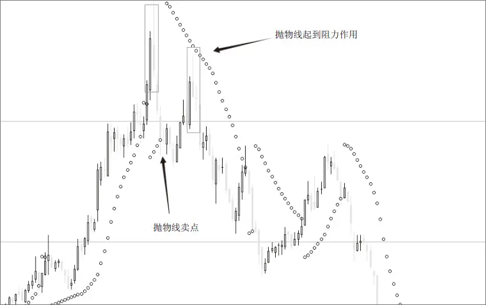

图13\-5 哈空调（600202）2013\.01—2013\.07日线图

卖点解析

●同SAR线支撑股价后的买点一样，股价在下跌过程中也会出现反弹，快速下跌的行情通常也不会超过两天的时间。

●当股价向上反弹，无限接近SAR线时，会为我们提供新的卖点，同时蜡烛图有时也会相应出现持续下跌形态。

__实盘解读 __

图13\-5可算一个反面教材，股价上涨得到价格高点后，快速回落，留下长长上影线，并得到顶部孕线信号。由于交易量的活跃，此后股价隔日的下跌，才触及抛物线止损点，因此抛物线做卖点的滞后性遇到活跃交易量，其表现更差。

股价反弹至抛物线附近，但不能接触抛物线点，无形中受到抛物线的阻力，形成乌云盖顶形态，为经典的卖出信号。并且由此我们可以推论出，此波行情为强势下跌，比较单边，不易抓反弹，应更多关注卖点。

总结：抛物线指标有以小博大的特点，必须在趋势明朗下使用，且买点信号要优于卖点信号。

## 第14章 ARBR人气意愿指标的应用

__第14章 __

__ARBR人气意愿指标的应用 __

ARBR指标分为两部分：一为AR线，为人气指标；二为BR线，为意愿指标。举例如图14\-1所示。

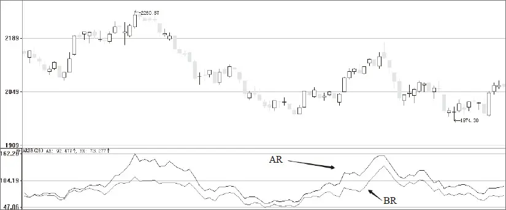

图14\-1 上证指数（000001）2013\.11—2014\.03日线图

AR线为人气指标，是用开盘价的相对位置表示人气，通过计算买卖双方的力量来描述当前价格的一种指标。在只能做多的中国股票市场中，如果人气很旺盛，说明买入活跃，股价自然上涨；如果人气低落，那么交投稀少，股价自然就会下跌。AR指标的中位线为刻度100处，100刻度线上方说明多方占据优势，100刻度线下方说明空方占据优势。AR线可以独立使用。

BR线为意愿指标，它不像AR线一样可以单独使用，必须有AR线的配合才可以为我们提供交易信号。BR线是判定市场的强势与弱势的一种分析方法，以前一天的收盘价为基准，将当天的行情波动展现出来，预测后势的价格运行。具体方法是，用昨天的收盘价与今天的最高价和最低价相比较得出股价上涨的意愿，再汇成二维图表，结合AR线，为我们提供买点和卖点。

BR线在70～150刻度线之间时为正常波动状态，不必急于建立多头头寸。BR线的值若在300刻度线附近时，为超买区，不可追涨，谨防股价突然暴跌。BR线在低于50刻度线以下时，为超卖区，反弹的可能性很大，可以作为短期买入点来参考。

每种指标都有它的特性，AR、BR线不同于我们之前介绍的各种追踪趋势的指标，它们擅长的是短线，为我们提供短期买入点与短期卖出点，特别适合抢反弹时使用。当然我们并不建议投资者以抢反弹为主，因为中小散户毕竟没有受过专业的训练，心理承受能力与操作水平并不适合做反弹，建议大家还是以中长线波段为主要操作方向。

2025年10月29日

18:04

## 第14章 ARBR人气意愿指标的应用 - 14.1 ARBR指标的买点

14\.1 ARBR指标的买点

2025年10月29日

18:04

__14\.1 ARBR指标的买点 __

买点1：当BR＜AR且AR＜100刻度线时的买点

实战示例（见图14\-2）

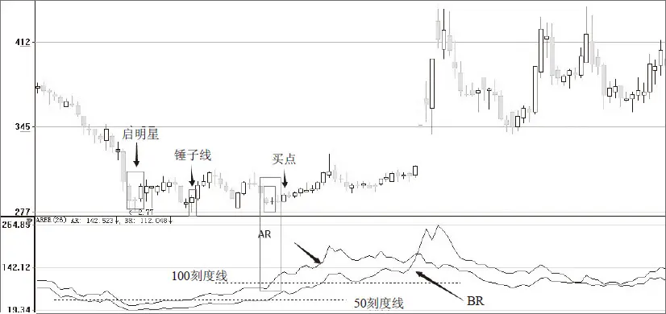

图14\-2 杭钢股份（600126）2013\.06—2034\.11日线图

买点解析

●当BR线处在50刻度线附近或以下时，行情反弹的概率大大增加。当BR＜AR时，并且都处于100刻度线之下时，可以伺机买入。

●请注意，并不是ARBR指标达到这个条件便可以买，而是此时会有机会，需要蜡烛图或是其他指标相配合方可买入。

__实盘解读 __

如图14\-2所示，股价下跌以后得到价格新低，并且形成启明星顶部信号，但此时对应的AR、BR双线依然在50刻度线下方，人气和意愿都没有起来，因此缺少成交量，还不能满足股价的拉升。

当股价再次回落收得锤子线信号反弹时，ARBR指标双线站上50刻度线，人气与意愿有所体现，成交量也慢慢上升。

当AR线上穿100刻度线时，配合主图的孕线信号，且价格没有新低，真正的买点出现。因此，我们用低位的AR线上穿50或100刻度线来验证主图的支撑形态。

需要注意的是：价格在低位震荡，特别要考虑行情因交易量不足导致震荡或反复行情，此时买卖交易信号可能频繁出现，但并不是真正的信号，因此投资者一定要等待交易量有明显增加，且前面出现的入场信号得到验证，然后买入才最为稳妥。

买点2：当AR线在50刻度线下方，向上穿越时的买点

实战示例（见图14\-3）

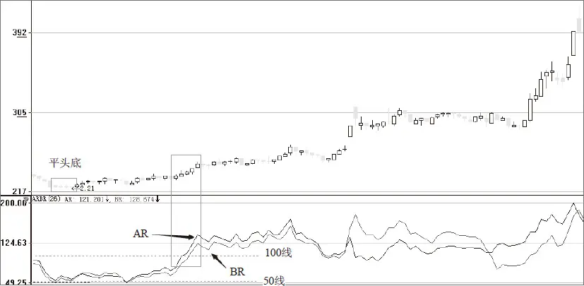

图14\-3 楚天高速（600035）2014\.06—2014\.11日线图

买点解析

●当ARBR指标在50～150刻度线之间运行时，是ARBR指标的常态。

●当ARBR指标在50刻度线以下运行时，是极为少见的，也说明市场人气极其低迷的。所谓物极必反，当市场人气低无可低时，同时也可说明大家认同的股价也低无可低了，那么事物不论向哪个方向发展都将是利好的，所以我们利用人气指标，找到最低人气之时介入，建立多头头寸，这可以说是以心理分析方法找到的最佳的买点。

__实盘解读 __

如图14\-3所示，股价下跌到低位以后成交量非常小，其中有4个交易日的价格几乎没有波动，处在相同的水平线上，并且是在价格最低位置，因此我们考虑为平头底信号。

再看ARBR指标，BR线在50刻度线附近走平，增加了此时行情反转的概率，并且AR线有一段时间低于BR线。

股价在平头底信号后面连续两个交易日出现微幅上涨，离开了价格低点，并且此后没有再出现价格新低，震荡中走高，对应的ARBR指标中的AR线上穿BR线，并且站上50刻度线，市场人气回暖。此时已经验证前面平头底信号，买点出现。

当出现一段碎阳上涨时，ARBR指标双线上穿100刻度线，AR线进入买盘区域，显示买方人气大增；同时BR线站上100刻度线，表示意愿看涨。两个条件同时再次对前面买盘验证，等待股价拉升。

若ARBR指标在50刻度线下方向上穿越时，蜡烛图并未跳出震荡区间。也就是说，只有ARBR指标给出买入信号，但蜡烛图并未配合给出买入信号，也可以视为短期的买点。因为ARBR指标在50刻度线以下位置时的情况极少，若上穿50刻度线给出的买入信号也非常精准。

买点3：当ARBR指标与股价发生底背离时的买点

实战示例（见图14\-4）

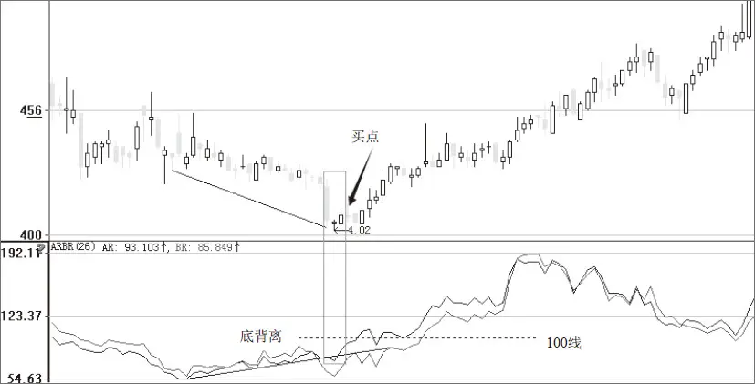

图14\-4 安彩高科（600207）2014\.04—2014\.09日线图

买点解析

●底部背离，我们已经不再陌生了，除了主图指标以外，任何指标几乎都有底部背离与顶部背离两种交易信号。

●当股价一浪低于一浪，而ARBR指标却一浪高于一浪时，为底部背离，但此时并不能立刻买入，应找到蜡烛图相配合的买点后，方为具有趋势性的买点。

__实盘解读 __

如图14\-4所示，股价得到长下影线的锤子线后，ARBR指标触及50刻度线支撑上涨，但不久股价出现新低，而ARBR指标却一路上扬，出现了底背离情况，此时并不是直接的买入信号，而是需要投资者的高度关注。

当股价得到价格新低时，出现启明星信号，同时对应的ARBR指标恢复正常，我们判断此时为该股票的底部买点，投资者应建仓该股票。

启明星信号次日，AR线即上穿100刻度线，进入买盘区域，代表人气飙升，可以验证前一日的启明星信号。

若蜡烛图与ARBR指标共同提供的买点，则可信性极高。我们再来看ARBR指标的刻度，在背离过后，也是由50刻度线向上穿越，并继续穿越100刻度线，所以蜡烛图与指标为我们提供了支持此买点的3个理由。

## 第14章 ARBR人气意愿指标的应用 - 14.2 ARBR指标的卖点

14\.2 ARBR指标的卖点

2025年10月29日

18:04

__14\.2 ARBR指标的卖点 __

卖点1：当AR线于200刻度上方，向下穿越时的卖点

实战示例（见图14\-5）

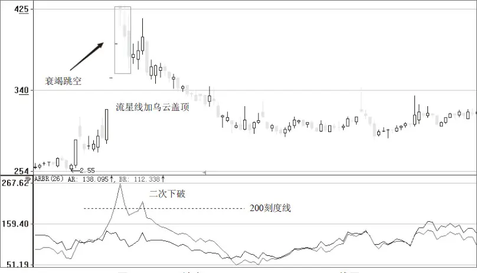

图14\-5 万通地产（600246）2014\.03—2014\.06日线图

卖点解析

●ARBR指标表现的是参与者的人气与意愿，如果卖方力量全部被消灭，没有人愿意再卖了，那么买方去接谁的单呢？全部是买方的力量。买方力量内部便会有人率先发生背叛，抛售手中的持仓，落袋为安，如此便是当ARBR指标在200刻度线上方，为买方极端强悍之时，物极必反，为我们提供了卖出信号。

__实盘解读 __

如图14\-5所示，股价经历3个跳空窗口得到新高的同时，新高蜡烛图本身又是一根流星线信号，此时对应的ARBR指标上升至200刻度线上方，进入超买区域，流星线信号是AR线向下勾头，卖点信号出现。

此后连阴两个交易日，形成乌云盖顶形态，阴线回补了流星线缺口，基本可以验证前面的跳空窗口为衰竭跳空，买盘意愿开始回落，因此主图顶部信号配合AR线下破200刻度线，信号互相验证，成为准确的卖出信号。

卖点2：当ARBR指标与股价出现顶部背离时的卖点

实战示例（见图14\-6）

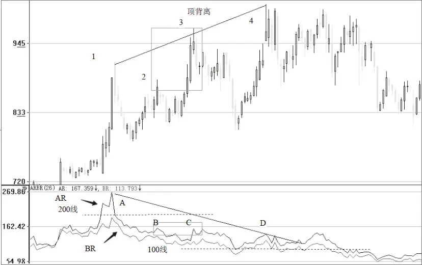

图14\-6 吉林森工（600189）2014\.07—2015\.01日线图

卖点解析

顶背离永远不能忽视。顶背离通常都是在指标给出它超买的情况下，出现背离，这样便是双重的卖出信号，再加上蜡烛图的配合，三方面共同给出的卖出信号是不可小觑的。关注顶背离，远离顶背离，永远不会让你的资金受到大的损失。

__实盘解读 __

如图14\-6所示，当股价上涨至点1时，出现了乌云盖顶的形态，对应的AR线已经上升至200刻度线上方，应该引起投资者的警惕，行情进入超买区域，有下跌风险。

股价回落得到支撑上涨点2时，AR线没有向上勾头，而是继续回落，当股价到达点3价格新高的时候，AR线的C点与B点持平，同样没有高于A点，顶背离信号出现，因此在点3出现的黄昏线信号，投资者应该视为卖点，应卖出股票。

当股价得到价格新高点4时，对应的ARBR指标C点位置更低，并接近100刻度线，是AR买卖的中轴线，此时点4的上影线更是投资者最后卖出股票的机会。若AR线下破100刻度线，那么前面的顶背离信号很可能诱发股价的快速下跌。

关于ARBR的顶部背离也可以理解成，在第二个高点处，AR线下行，人们不再认同目前的高价位，以至于在此时的人气与意愿较之前一个高点更低，所以出现了顶背离。

## 第15章 VR成交量变异率的应用

__第15章 __

__VR成交量变异率的应用 __

VR指标与OBV指标一样，都是从成交量层面来解读当前价格走势的指标。

技术分析指标可以笼统地分为两大部分：一部分是OBV与VR指标，它们是以“量”为侧重点的指标；另一部分是MACD与KD指标等，它们是以“价”为侧重点的指标。

先有量后有价，是以“量”为侧重点的指标的共同原则。VR的理论是量价必须同步，如果没有达成同步，则市场价格走势必将发生变化。VR通过分析股价上涨中的成交量与下跌中的成交量的比值来推断市场中买卖双方的力度，以此来为我们提出买点与卖点。

VR指标的分布情况为：当VR在40～70刻度线之内为可买进区域；当VR在70～150刻度线之内为常态分布区；当VR在150～450刻度线之内为短期买点区；当VR在450刻度线以上时，说明股价已经过高，应伺机卖出。

量先价行、量增价涨、量缩价跌、量价同步、量价背离等与成交量相关的各种状态，都是经久而不变的，所以观察上涨量与下跌量是最能直观看出买卖双方力度的一种方法。成交量也能观察市场中的人气，当人气极度旺盛时，我们应该考虑离场；当人气极度低迷时，我们应该考虑进场，这是一种反市场操作的指标。

不论是低价区还是高价区，都能用VR指标来断定，都可以用成交量来读取市场的人气，读取市场中买卖双方的力量，并且可以分别读取买方的力量与卖方的力量，所以，VR指标又可以表达买卖相对强弱的力度。

如图15\-1所示，VR指标仅仅有一条线，所以判断交易信号的过程也非常简单。但也是由于它过于简单，可能会出现纰漏，我们可以用PSY心理线与OBV能量潮来配合VR指标的使用。

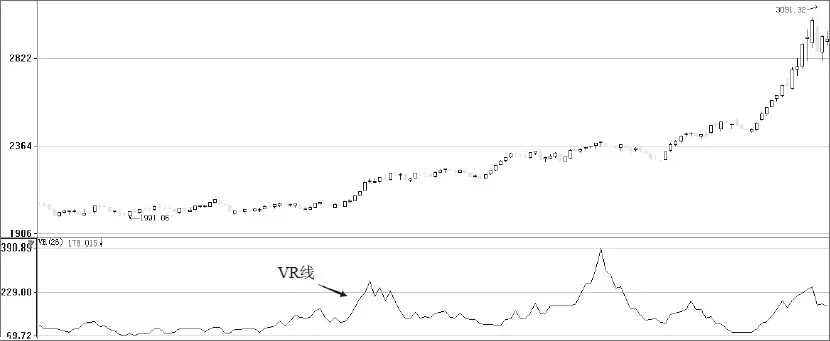

图15\-1 上证指数（000001）2011\.03—2011\.07日线图

## 第15章 VR成交量变异率的应用 - 15.1 VR指标的买点

15\.1 VR指标的买点

2025年10月29日

18:04

__15\.1 VR指标的买点 __

买点1：当VR线在70刻度线下方，向上穿越时的买点

实战示例（见图15\-2）

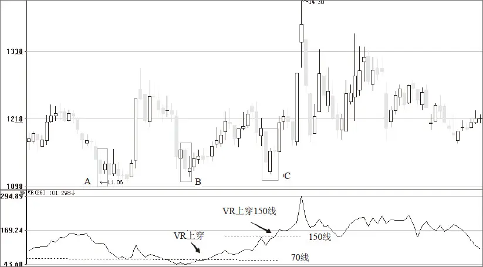

图15\-2 大连重工（002204）2014\.09—2015\.02日线图

买点解析

当VR线达到70刻度线以下时，买盘力量极度低迷。物极必反，我们说过VR线是一款反市场操作的指标，当市场气氛极度悲观时，正是买入的绝好时机，但这不是说当VR线只要下破70刻度线便可以买进，而是要当VR线由70刻度线以下向上穿越后，再加上其他分析方法的配合才能去买进。人气低迷、气氛悲观也会有它的惯性的，所以我们要找人气刚刚回暧的那一瞬间去买进，这样便能买在底部了。

__实盘解读 __

如图15\-2所示，VR线对主图3个点的底部信号反应均不相同。在A点处，VR线依然向下，没有给出量的验证，因此还不到最佳的买入时机，但投资者应给予高度关注，后面还会有B点的出现。

B点为约会线反转组合，在次日，VR线上穿70刻度线，给出了对底部信号的验证，投资者可把这里作为买点。

C点为底部刺透形态，对应的VR线站上150刻度线，买盘开始放量，因此后面行情将开始拉升，这里可作为第二个买点或加仓点。

单根指标线是很简单的，没有过多复杂的条件制约。成交量是价格上涨的最重要的因素，先有量后有价，才是真的历久而弥坚的硬道理。

买点2：当VR线上穿200刻度线时的买点

实战示例（见图15\-3）

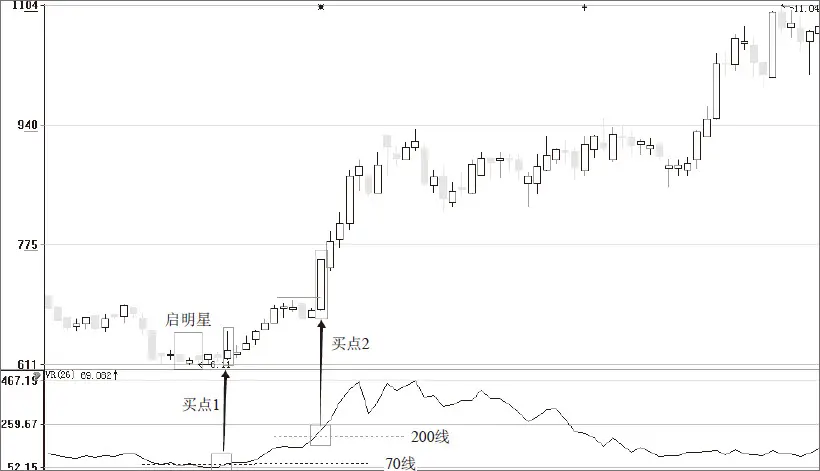

图15\-3 天地科技（600582）2013\.12—2014\.04日线图

买点解析

●当VR线在70刻度线下方向上穿越时，我们配合其他技术分析方法给出的买点，我们只能当作短期的买点，还要看其后股价的走势来决定当前的持仓是否继续持有，本节所讲的是具有趋势性的买点提示信号。

●当VR线上穿200刻度时，可作为一个中长期持仓的买点。

__实盘解读 __

如图15\-3所示，VR线下跌至70刻度线下方时走平，表示买方交易量非常低迷，主图出现启明星信号后，交易量仍没有过大起色。

当VR线上穿70刻度线时，主图出现一根上影线的实体阳线，说明盘中买盘出现冲高回落的走势，为量价齐升的表现，因此前面出现的启明星信号可信，我们在此可以作为股票的买点，VR线上穿70刻度线即验证了前面蜡烛图的底部信号。

我们看VR线继续上行，由下上穿200线，买盘交易量骤增，对应主图出现实体长阳线，为看涨腰线信号，表明对后市看涨很有信心，因此我们可以在此再次买入股票，或进行加仓的操作，确立行情中期趋势看涨，股价还有上升空间。

在此一级别的上涨过程中，买点1与买点2共同支撑起了股价近200％的涨幅。

买点3：当VR线与股价发生底部背离时的买点

实战示例（见图15\-4）

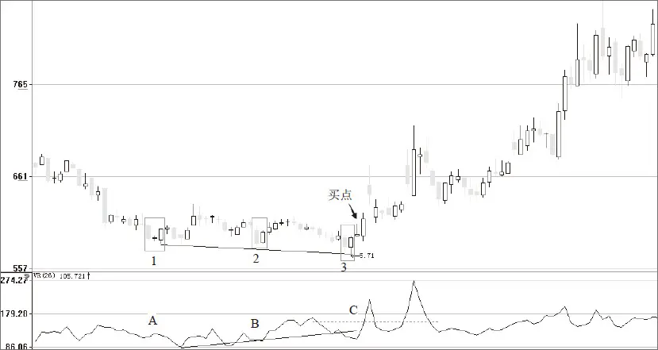

图15\-4 亚宝药业（600351）2013\.10—2014\.03日线图

买点解析

当股价一浪低于一浪，而VR线一浪高于一浪时，为VR线与股价之间的底部背离出现，为买进信号。

__实盘解读 __

如图15\-4所示，股价在1点得到星线，初现反转信号，但对应的VR线中A点仍为下降趋势，暂还不能成为买点。2点位置收盘孕线形态，相比1点价格略低，但VR线却勾头上行，底背离信号出现，此时需要我们高度关注盘中走势，特别是买入信号的出现。

点3位置为刺透形态信号，而笔者把它称之为阴阳筷子，也是在极值位置重要的反转形态，而此时VR指标中C点已经从背离走势中恢复正常，我们说此时为行情的最佳买入时机，并且次日VR指标上穿200刻度线，更加验证了买盘信号。

## 第15章 VR成交量变异率的应用 - 15.2 VR指标的卖点

15\.2 VR指标的卖点

2025年10月29日

18:04

__15\.2 VR指标的卖点 __

卖点1：当VR线在300刻度线上方，向下回落时的卖点

实战示例（见图15\-5）

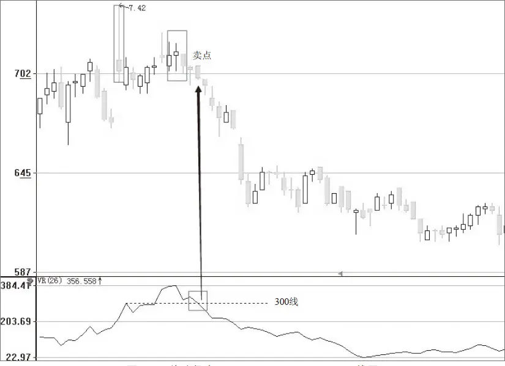

图15\-5 海南椰岛（600238）2014\.03—2014\.07日线图

卖点解析

●当VR线在70刻度线以下时为卖方力量达到极盛之时，所谓物极必反，达到极盛之时必然转衰。

●我们量化后的结果为，当VR线由300刻度线上方向下穿越之时，提供卖点，当然还需要配合蜡烛图或其他技术分析。

__实盘解读 __

如图15\-5所示，股价收盘倒锤子线以后，VR线并没有勾头向下的迹象，而是继续上扬，因此这个倒锤子线信号没有得到验证，暂时还不能作为卖出信号使用，但建议投资者对该股票给予高度关注。

倒锤子线后的第六个交易日，日线再次收盘上吊线信号，此时由于股价没有连续的上涨或新高，VR线开始走平勾头，我们认为买盘的交易量在这个时候开始松懈，直到下破300刻度线时，才可以验证股价没有新高，因此短线顶部出现，投资者应该在日线收盘下破300刻度线时，才进行卖出操作。

我们判断行情买卖点时机的时候，除个别技术形态，大部分技术信号都需要两个或两个以上的指标相互验证，这样得出的交易信号才更加可靠。

随后VR指标回落到70刻度线下方，在下跌结束后，给出了有效的买点，请读者参考。

卖点2：当VR线与股价出现顶部背离时的卖点

实战示例（见图15\-6）

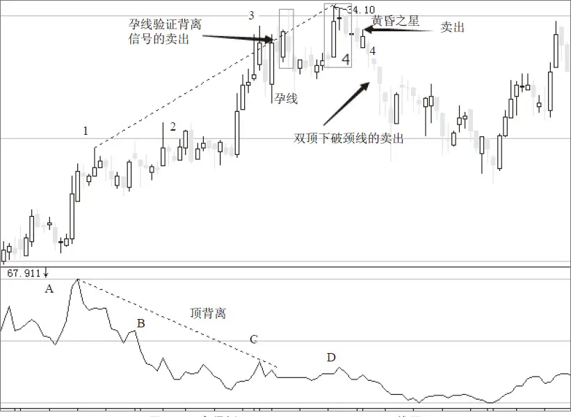

图15\-6 康得新（002450）2014\.07—2014\.11日线图

卖点解析

当股价一浪高于一浪，而VR指标一浪低于一浪时，为VR线与股价之间的顶部背离出现，时刻关注后面的卖出信号。

__实盘解读 __

如图15\-6所示，股价由1点上涨到2点时，2点价格高于1点，但VR线下行，对应的B点明显低于1点对应的A点，顶背离信号出现，此时，投资者应该高度关注后面出现的见顶信号并准备随时卖出离场。

当股价上涨至价格新高3点时，VR线的背离有所缓解，但对应的C点高度仍不如A点，后面出现的孕线信号，就是我们建议投资者的第一个卖点。

随后，股价在4点得到与3点同样高度的第二次高点，并出现了黄昏之星的组合，黄昏之星本身可作为卖点，双顶信号形成，对应的VR线中D点略低于C点，我们说双顶信号下破颈线时，也是D点继续向下回落，为行情的最后卖点。

总结：在顶背离信号出现后，随时出现的见顶蜡烛组合或反转价格形态，都是可信的卖点。若背离信号消失，指标继续下行，那么回归正常的一刻也是卖点。

## 第16章 PSY心理线的应用

__第16章 __

__PSY心理线的应用 __

PSY心理线指标不同于其他任何副图指标，其他的指标不是以“量”为主，就是以“价”为主，或是“量”“价”并重，而PSY指标是一款情绪指标，并不以量价为基准。实例如图16\-1所示。

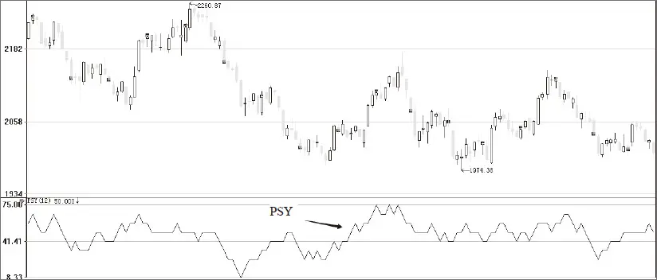

图16\-1 上证指数（000001）2013\.10—2014\.05日线图

关于分析预测至少可以大致分为3个流派，即基础分析、技术分析和心理分析。PSY指标便属于心理分析的一支。

据研究表示：在正常情况下，心理预期与市场的走势成正相关，市场走势为涨势，那么心理预期也为升势；如果市场走势为跌势，那么心理预期也偏弱。但到达了一定的极端阶段，会有一些逆反心理，导致心理预期的逆转，这样心理预期与市场的走势便成了负相关。所以，将心理预期量化，用数值来表示当前大众的心理预期，从而指引我们的交易。

PSY指标数值分布情况如下：25～75刻度线之间是心理预期值的常态分布区；75刻度线以上为超买区，股价有极大的可能会出现调整；25刻度线以下为超卖区，股价有极大的可能会出现反弹；10刻度线以下时，行情极有可能发生底部反转；90刻度线以下时，行情极有可能发生顶部反转。PSY在0～100刻度线之间运行，50刻度线时为买卖的分水岭。

PSY指标常用参数为12，它的计算方法很简单，只是利用N天范围内上涨的天数与下跌的天数相互对比，如果上涨的天数不断增多，那么说明看涨人气旺盛，反之则看跌人气更多一些。所以我们不能单单利用PSY指标，最好的办法是与其他指标配合着使用，如果可以的话，可以用人气指标、心理指标、价格指标和以量为重的指标共同配合进行分析。

## 第16章 PSY心理线的应用 - 16.1 PSY指标的买点

16\.1 PSY指标的买点

2025年10月29日

18:04

__16\.1 PSY指标的买点 __

买点1：当PSY线由25刻度下方，向上穿越时的买点

实战示例（见图16\-2）

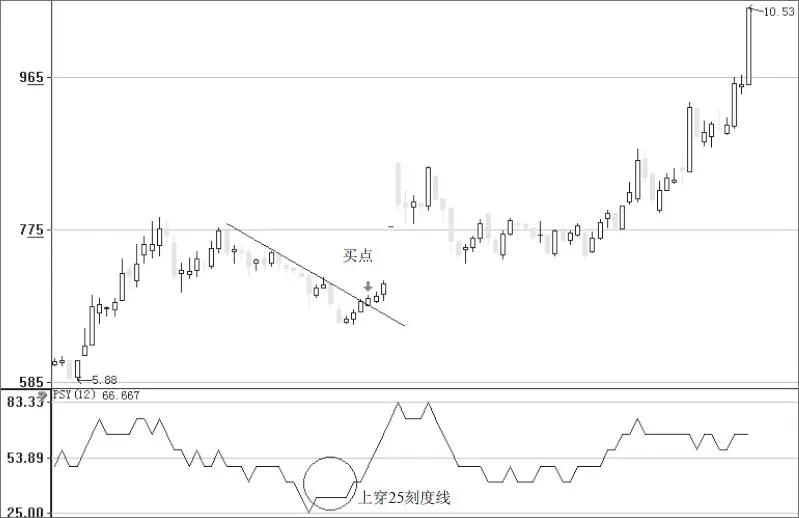

图16\-2 黑牡丹（600510）2014\.08—2015\.02日线图

买点解析

如某一款指标浮动具有上下边界，那么它一定有超买区与超卖区，在超买区向上穿越，则出现了买点。

__实盘解读 __

如图16\-2所示，股价始终处于短期下跌趋势线的压制下运行，连续的阴线，此时的PSY线的值已经跌至25刻度线以下，此时看跌的心理预期已经达到极端情况，我们都知道物极必反，当心里预期达到最悲之时，买盘的时机便悄悄到来了。

我们看股价仍在下跌，但PSY线已经触及支撑反弹，因此我们需要关注此后出现的任何支撑信号，都有可能引起行情的上涨。

在PSY线的支撑中，主图蜡烛线得到止跌信号，待买盘上破趋势线压制的同时，PSY线上穿25刻度线，我们说3个信号同时验证了买盘的到来。

买点2：当PSY线与股价发生底背离时的买点

实战示例（见图16\-3）

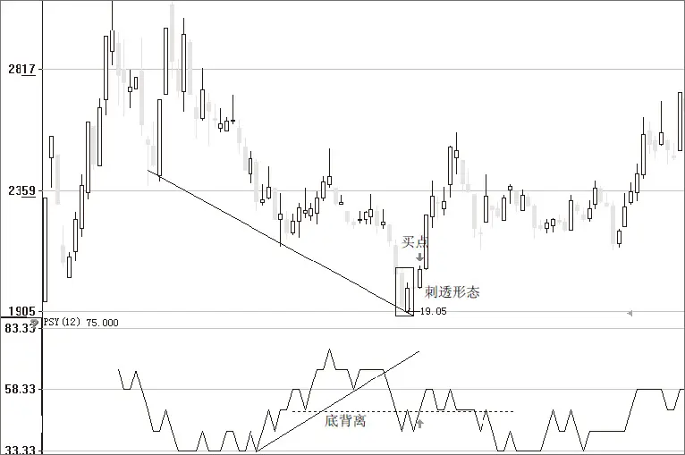

图16\-3 欣泰电气（300372）2014\.01—2014\.06日线图

买点解析

当股价一浪低于一浪，而相对应的PSY线却一浪高于一浪，此时便形成了PSY线与股价之间的底部背离，为我们提供买点。

__实盘解读 __

如图16\-3所示，股价持续下跌，再看这一路下跌中股价所对应的PSY指标，却是一浪高于一浪，这样便形成了PSY线与股价的底部背离，但背离信号不是买点信号，应起到预警作用，投资者应关注后面将出现的买点信号。

我们说买点信号很可能出现在背离回归正常的时刻，图中股价得到新低的同时收盘刺透形态，并且PSY线回落，出现一个小的W底形态，并在次日上破50刻度线，配合主图价格形态，我们判断买点出现。

在底部反转形态中有一个规律，即在底部反转形态形成后，股价有时会震荡几个交易日，再给出有效验证，震荡的时间通常不超过8个交易日，如果超过8个交易日，那么该形态失败的可能性极大。但这不是绝对的理论，我们只是总结了一下通常的规律而已。

## 第16章 PSY心理线的应用 - 16.2 PSY线指标的卖点

16\.2 PSY线指标的卖点

2025年10月29日

18:04

__16\.2 PSY线指标的卖点 __

卖点1：当PSY线由75刻度线上方，向下穿越时的卖点

实战示例（见图16\-4）

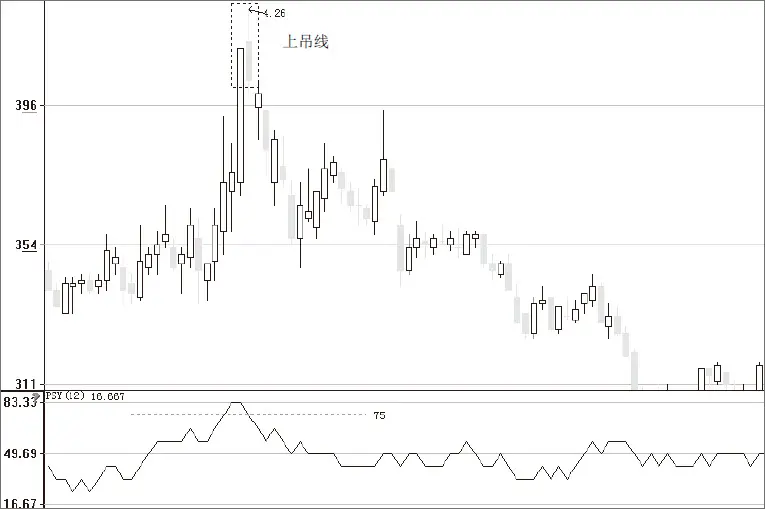

图16\-4 春晖股份（000976）2013\.10—2014\.01日线图

卖点解析

当PSY线达到75刻度线以上时，说明大家都在看涨，并且涨势过快，高处不胜寒的心理出现，成交量则会越来越少，人心思变，心里已经有了行情会发生反转的隐患，一部分多头的反判，会带动更多的多头的反判，从而形成了趋势的反转。但我们要注意的是，虽然PSY线由75刻度线以上向下穿越，也不能说明价格会立即发生反转，而是要配合蜡烛图方面共同给出卖出信号。

__实盘解读 __

如图16\-4所示，股价上涨，指标随行。当PSY线进入75刻度区域以上时，应引起投资者的警惕，特别是继续上行至85刻度区域，行情见顶反转的概率要比75刻度区域时大了很多。

主图蜡烛线出现上吊线信号，同时PSY线在85刻度区域走平，次日勾头下跌，给出了顶部信号，此时PSY线也由75刻度线上方向下穿越，下跌信号相互验证，为可靠卖点。

卖点2：当PSY线与股价发生顶背离时的卖点

实战示例（见图16\-5）

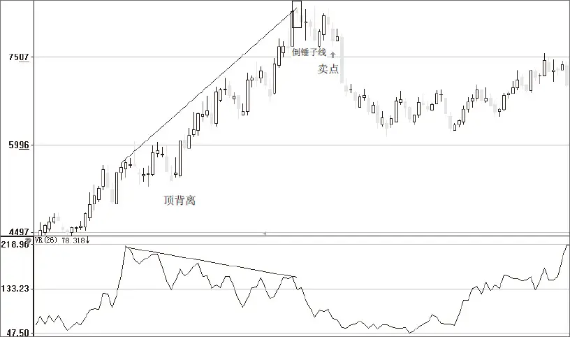

图16\-5 博腾股份（300363）2014\.04—2014\.09日线图

卖点解析

当股价一浪高于一浪，而相对应的PSY线却一浪低于一浪，此时便形成了PSY线与股价之间的顶部背离，为我们提供卖点。

__实盘解读 __

如图16\-5所示，股价一直处于上涨阶段，而在上涨过程中所对应的PSY指标却是一浪低于一浪，这样便形成了PSY线与股价之间的顶部背离，为我们单方面提出了卖点，此时需要持仓投资者的高度关注，但我们还需要其他技术分析方法的配合才能找到卖点。

PSY线下行，必须重点关注100刻度线，原则上要尽量在100刻度线上方附近找到卖点，在下破100刻度线前实施卖出操作。

蜡烛图在时段高点出现倒锤子线信号且为阴线，行情出现见顶可能，随后两个交易日股价回落，没有再出现高点，稳妥起见，我们可在此时卖出股票。

而真正的技术卖点出现在后一个高点的乌云盖顶形态，同时PSY线下破100线，两个信号相互验证，为准确卖点。准确的卖点与我们稳妥的卖点相比，基本属于同一个水平价格，通常大部分时候也是这样，因此投资者不必着急，耐心等待验证信号出现，价格相差不会太多的。

之所以形成顶部背离，是因为第二次上涨时，市场中看涨的人气并不认同如此高的价位，人心患散，那么在此处并没有继续接盘的多头，所以此时的股价高价位，仅仅只是有价，但没有市场，也就是没有成交量。无人去接盘，自然手中有持仓的人，便会竞相压低价格抛售，心理预期自然也就不再随着价格的上涨而上行，这样形成了价格上涨，而心理预期下跌。没有了广大投资者的看涨预期，那么悲观思想蔓延，原多头持仓连续了现反判，顶部构成，股价开始下跌。

## 第17章 成交量提供的买点与卖点

__第17章 __

__成交量提供的买点与卖点 __

成交量VOL是股价上涨的原动力，代表价格运动背后的市场强度。其实成交量描述的就是市场的心理，是对价格或趋势判断的最有力的辅助手段。

成交量在股票市场中的地位尤其重要，当股价上涨时，必须依赖成交量的有力配合，而在股价下跌时，成交量往往属于萎缩状态，这对于研判市场上涨是否可靠，前景是否乐观，具有重要的参考意义。笔者认为，在股票市场中，成交量应作为首要的技术分析手段，有利于判断趋势反转，尤其是在上涨趋势的形成与重要的价格形态的突破中具有重要意义。

而在顶部，即使股价仍处于上涨阶段，而成交量与前方上涨趋势中的成交量对比，若出现萎缩状态，那么有可能股价的上涨已然接近尾声。在市场的下跌持续形态中，反转信号更需要参考成交量，尤其是在市场上涨趋势的初级阶段，放量长阳线是具有决定性意义的。股价在顶部出现的放量长阴，对于判断市场的顶部也起到了至关重要的作用。

如图17\-1所示，我们用柱状图来表示成交量的大小，买盘为白色柱子，卖盘为黑色柱子。柱状实体部分表示成交量大小，量大柱长，量小柱短，理论上成交量是没有为零的时候。

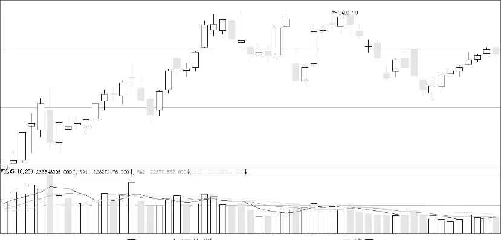

图17\-1 上证指数（000001）2014\.12—2015\.02日线图

## 第17章 成交量提供的买点与卖点 - 17.1 成交量提供的买点

17\.1 成交量提供的买点

2025年10月29日

18:04

__17\.1 成交量提供的买点 __

买点1：当价格处于低位处，价涨量增时的买点

实战示例（见图17\-2）

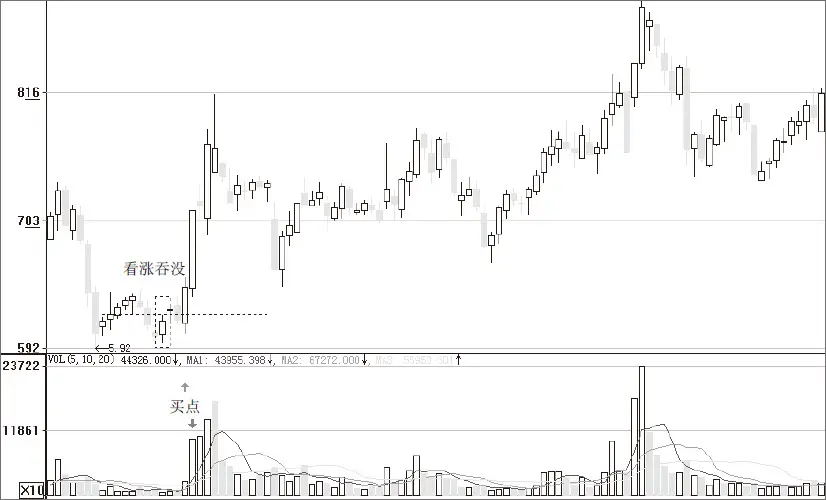

图17\-2 乔治白（002687）2013\.10—2014\.03日线图

买点解析

当股价经历了一个波段的下跌之后，已经处于相对较低的价位时，股价开始上涨，而成交量同时开始放大，说明一些投资者认为股价不会在这一较低的价格水平上维持很久，已经具备了投资价值开始买进。股价上涨说明市场背后潜在的面盘力量开始启动，为股价的上涨提供动力，上涨有可能持续下去，成交量随股价的上涨而增加。

__实盘解读 __

如图17\-2所示，股价在第一个低点止跌后，成交量没有放量迹象，预示后面可能还有低点或更低价格，因此投资者还要等待买点的出现。

股价第二次探底后收盘看涨吞没形态，但收盘当日依然没有成交量显示，直到次日指标开始放量，并在随后几个交易日成交量逐渐递增，因此吞没形态为准确的买点，投资者可在股价站上吞没形态高点后再买入。

股价逐步上涨，会有更多的投资者加入到买方阵营，更增加了看涨的信心，对股价的上涨起到了积极的作用。

买点2：当价格发生震荡后突然放量时的买点

实战示例（见图17\-3）

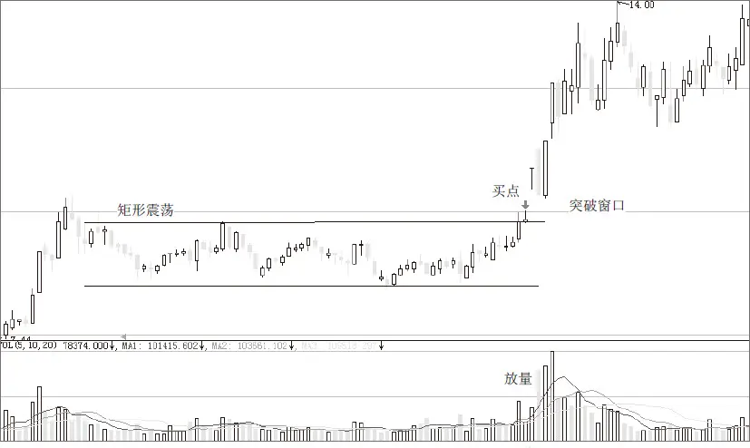

图17\-3 云天化（600096）2014\.07—2015\.02日线图

买点解析

当股价处于震荡区间时，通常情况下成交量是萎缩的。当成交量突然放大时，说明买盘重新集结入市，若配以上涨的股价，说明震荡行情可能结束，市场开始进入了新的上涨阶段。

__实盘解读 __

如图17\-3所示，股价一波上涨之后，在价格高位横盘震荡，在这一时期的价格区间内成交量低迷，可以画出矩形通道。

当股价刺破矩形区间后，并在次日开盘站上通道上轨，预示震荡行情即将结束，并且伴随成交量突然放大信号，或为震荡时成交量的两倍，反映出大量的买盘正在入市，我们在图中标注的买点处，可作为突破买入。

买入后成交量逐步递增，买盘信心大涨，市场很多买盘或借助这一信号介入，更使股价出现突破跳空窗口，也验证了我们此前的买点正确。

图17\-3也可作为重要阻力、关口的突破使用。

买点3：当价格处在支撑位时缩量时的买点

实战示例（见图17\-4）

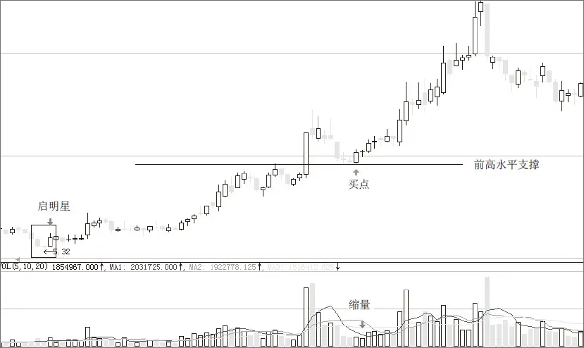

图17\-4 亚盛集团（600108）2014\.06—2014\.11日线图

买点解析

在上涨趋势中，当较为重要的压力被突破后，其作用会发生转换，也就是前期阻力转化为支撑，股价通常会回试这一价格水平的支撑。当股价回试这一支撑时，成交量萎缩，说明抛盘力量减弱，对下破支撑的信心不足，是买入信号。

__实盘解读 __

如图17\-4所示，股价在第一个启明星后放量，得到价格上涨。但上涨行情不会一直进行，中途正常回调时，其支撑效果也需要验证，否则行情也有发生反转的风险。

绝大部分行情的回调均为回测前期高点水平线，而这个位置恰好多与30日均线或布林中轨重合，因此为重要的支撑关口。

我们看到行情回测前期高点时，连续两日得到十字星线，卖盘力量随即萎缩，支撑信号出现，待次日收实体阳线，对应成交量放量，可验证此处为买点。

买点4：当股价在下跌趋势尾声时放量，并且收长阳时的买点

实战示例（见图17\-5）

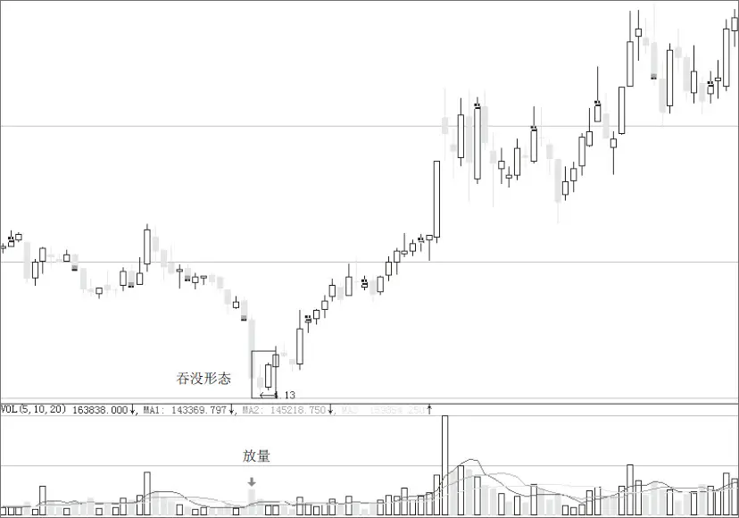

图17\-5 普洛药业（000739）2013\.11—2014\.04日线图

买点解析

●这里包含3个基本要素，即下跌趋势的尾声、长阳蜡烛图和较之前放大的成交量。

●下跌趋势的尾声只能通过观察和主观的判断得出结论，利用主图形态、其他技术分析和股价所处相对位置得出一个基本的判断。而长阳大多是底部反转形态的验证信号，成交量加以验证，不难得出看涨的结论。

__实盘解读 __

如图17\-5所示，股价下跌至时段价格低点，收盘吞没形态，反转信号出现，并且吞没形态包含实体阳线，已经满足行情反转的前两个条件。

在形成吞没形态的时候，第一根阴线对应的成交量指标有放量迹象，显示卖盘成交量较前几日增加了一倍多，符合尾声放量的条件。从蜡烛图上看，尽管卖盘量增，但价格跌幅已经收缩，卖方信心不足，实际的交易量可能为买盘介入，因此尾盘加成交量放量，可以作为底部买点。

总结：无论何时，若没有成交量指标，实体长阳线蜡烛图自身即可以作为买盘放量的表现。还有，当成交量骤增时，若有量有价，买卖双方可各表一方；若有量无价，市场可能会混淆买卖成交量，即指标卖方的量增，计算也可能包括了买方的量。

买点5：当价量发生底背离时的买点

实战示例（见图17\-6）

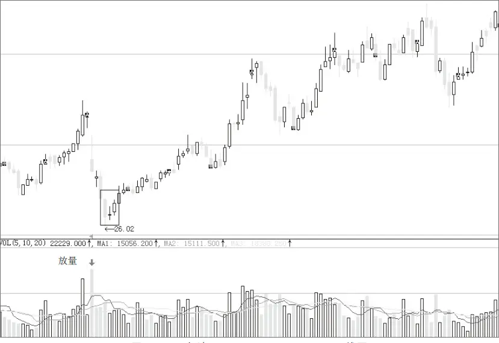

图17\-6 万邦达（300055）2014\.06—2014\.11日线图

买点解析

股价在下跌过程中通常伴以较小的成交量，这是因为投资者认为跌势仍将继续，所以买盘介入比较谨慎。然而当股价下跌而成交量却与之相反，出现反增的现象时，这就值得我们注意了。这是投资者开始布局的现象。也就是说，有些投资者认为股票已经开始具备投资的价值，股价不会维持低迷的状态，开始分批入市布仓，这需要一个过程，是一个潜在的上涨信号，而行情一旦发动，也将一发而不可收。

__实盘解读 __

如图17\-6所示，股价连续下跌的过程中，卖盘出现了很大的成交量，加速了价格的下跌。但日线收盘十字星线时，指标显示盘中依然保持了较大的成交量，由于价格没有下跌，我们考虑大部分的成交量，可能被统计来自于买盘，所以此时出现的买涨信号，可以成为建仓买点。

我们在参考成交量指标时，更重要的是量，至于表示的是买方还是卖方并不是那么重要。

## 第17章 成交量提供的买点与卖点 - 17.2 成交量提供的卖点

17\.2 成交量提供的卖点

2025年10月29日

18:04

__17\.2 成交量提供的卖点 __

卖点1：当股价处于高位时，价跌并且量减时的卖点

实战示例（见图17\-7）

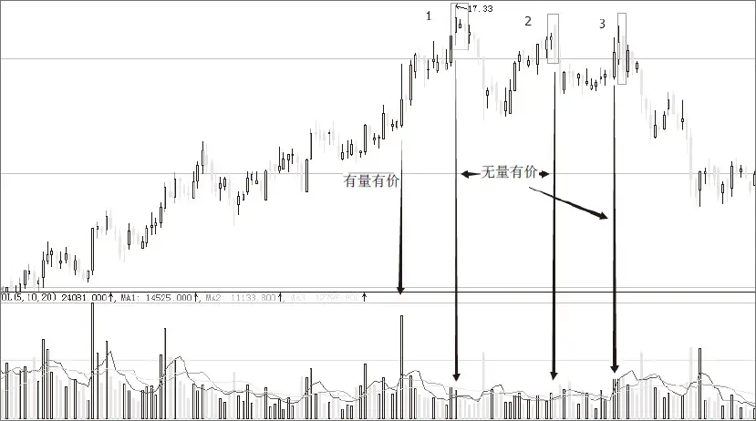

图17\-7 雅本化学（300261）2014\.05——2015\.01日线图

卖点解析

●高位时，量价齐跌实际是高位反转的确认过程。当我们在对蜡烛图高位反转形态判断时，可以注意到，在下跌验证的过程中大多时候的成交量都是减少的。

●成交量是由买卖双方达成的，减少的原因是买盘的退去，股价的承接力量减弱，市场逐渐对下跌达成一致，这意味着下跌将会延续。

__实盘解读 __

如图17\-7所示，股价在有量有价的条件下，上涨可以延续，得到新高1点时，出现上涨衰竭信号，同时对应的成交量指标相比之前没有明显的成交量出现，造成股价的回落，此时投资者应考虑开始减仓，卖出股票。

2点与3点位置同为吞没形态信号，同样显示的是价格高点没有相应的成交量支撑，价格不稳固，更不用想后市再出现信号。若再没有成交量的新高，更将是行情卖出的信号。

卖点2：当价量发生顶背离时的卖点

实战示例（见图17\-8）

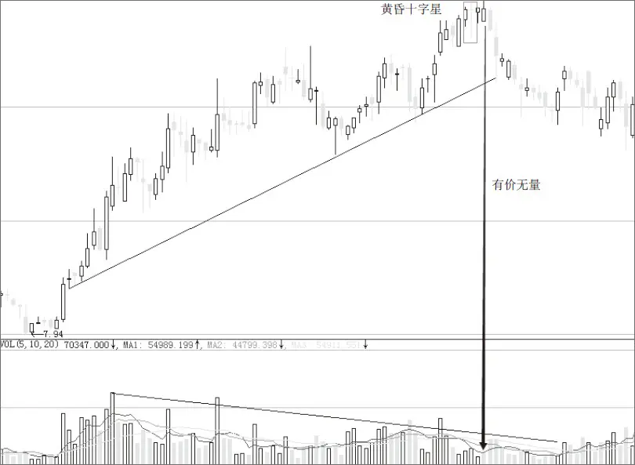

图17\-8 大龙地产（600159）2007\.02\.02—2008\.03\.19日线图

卖点解析

●成交量是价格上涨的原动力。

●当股价连创新高且成交量应该随之增加时，上涨趋势才能延续。很简单，股价越高，积累的获利盘越大，获利抛盘也会随着股价的上涨而增加，这就需要足以消化抛盘的力量，而一旦买盘的力量减弱，获利筹码就会大量兑现。

●当股价上涨而成交量递减时，暗示市场的潜在买盘力量减弱了，价格新高只不过是惯性上涨（对比有量的高点，无量的高点不会太远），获利筹码随时会兑现，“钱”景不乐观，股价将要面临下跌。

__实盘解读 __

如图17\-8所示，股价得到成交量的支撑开始上涨，但在上涨过程中，越往后，相比前日的成交量越少，而价格不断出现新高，我们怀疑顶背离的可能。

我们看蜡烛图收盘黄昏十字星时，并且股价在顶部走平，而辅助的成交量并没有起色，投资者对于这种有价无量的情况，应该先卖出股票，离场观望，以免“空中楼阁”的倒塌。

卖点3：当发生天价天量时的卖点

实战示例（见图17\-9）

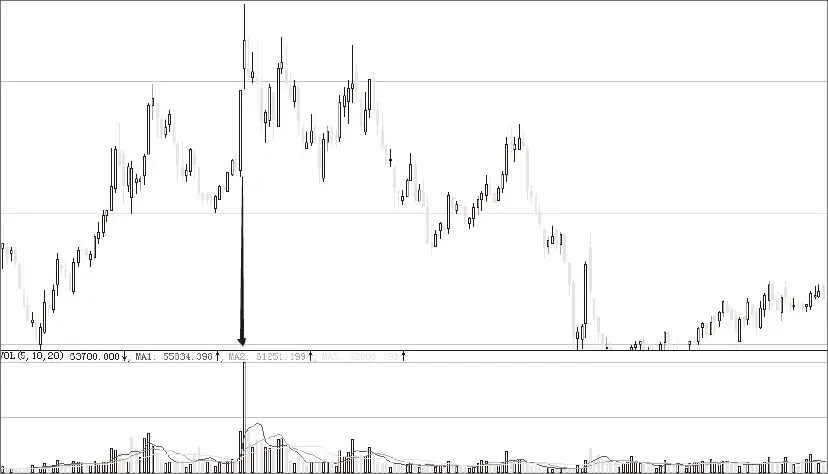

图17\-9 海翔药业（002099）2012\.12—2013\.07日线图

卖点解析

●正常情况下，股价的上涨伴随大的成交量是健康的表现，而股价创出新高同样需要大于前一高点的成交量，这样我们才认为继续上涨的趋势能够持续。这里的天价天量表现出来的是市场的一种极端状况。

●所谓的天价天量也是相对的。天价是指一只股票自上市以来的最高价；或是某一特定时段内到达了超乎人们预期的价格，而这一时段内天价之前往往是急速拉升，而成交量在天价这一天是爆发式放量，与之前上涨过程的成交量呈现跳跃式增长，这就形成了所谓的天价天量。天价天量的内在含义大概是以下两种可能性造成的：①主力造势，目的是拉高出货；②除去阴谋论，按照自然法则来讲，就是物极必反。

●由于股价的大幅上涨，已经超出了投资者的赢利预期，对高价的恐惧、对后市的怀疑和落袋为安等心理油然而生，引发巨量抛售，市场分歧加大，市场获利筹码的大量兑现将使买盘信心大打折扣，毕竟谁也不愿做“股东”的角色。面对如此有争议的市况，已经进场的投资者在热情消退后冷静下来，会择机抛售，回避风险，接下来的将是无量下跌。如果在收市前蜡烛图形态已经具有顶部反转的内涵，建议选择离场，君子不立危墙之下。如果次日形态得以验证，应坚决离场。

__实盘解读 __

如图17\-9所示，天价天量的走势并不常见，但来得快去得也快。这里我们不做过多分析，并且按照长远考虑，股价下跌仍有上涨回来的时候，因此是一种虚高的表现，待市场正常消化后，价格终将回归理性。

## 第18章 DMA平行线差指标的应用

__第18章 __

__DMA平行线差指标的应用 __

DMA指标为趋向类指标，是一种跟踪趋势的摆动指标。它主要依据一快一慢的两条移动平均线之间的差值的大小，来判研当前的趋势。而所谓一快一慢，即一条短时间周期的移动平均线和一条长时间周期的移动平均线。这两条平均线，通常为10日移动平均值与50日移动平均值。

DMA指标共分为两条线：一条为DMA线，另一条为AMA线。实例如图18\-1所示。

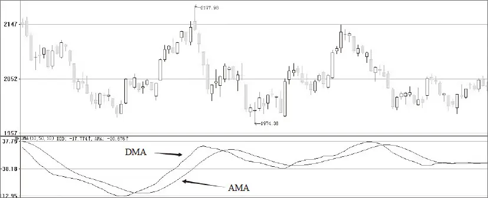

图18\-1 上证指数（000001）2013\.12—2014\.05日线图

DMA指标的计算公式非常简单，DMA线为10日移动平均值减去50日移动平均值的差。而AMA线直接便是10日移动平均值。这就是两条平均线金叉或死叉方法的微小的变化。如果DMA线向上叉入AMA线，形成金叉，则证明，股价短期内是向上的，移动平均线给予支撑，为买入信号。若DMA向下叉入AMA线，形成死叉，则股价暂时向下运行，为卖出信号。

前面我们学习过MACD指标及用法，如果把MACD指标中的柱状图去掉，我们会发现DMA指标双线与MACD指标中的DIF线与DEA线运行极为相似。

2025年10月29日

18:04

## 第18章 DMA平行线差指标的应用 - 18.1 DMA指标的买点

18\.1 DMA指标的买点

2025年10月29日

18:04

__18\.1 DMA指标的买点 __

买点1：当DMA线上穿AMA线时的买点

实战示例（见图18\-2）

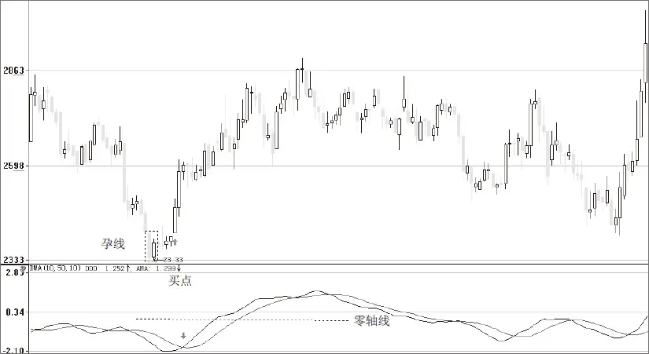

图18\-2 歌尔声学（002241）2014\.06—2015\.01日线图

买点解析

●DMA指标是中短型的摆动指标，它经常会带给我们快速的短暂的买入信号。

●当DMA指标中的DMA线在零轴线下方上穿AMA线形成金叉时，为买入信号。

__实盘解读 __

如图18\-2所示，股价下跌至时段价格新低后，收盘得到孕线信号止跌，但后3个交易日震荡收盘，不能成为底部支撑的验证，直到第四个交易日时，日线收盘得到光顶的小阳拉升，股价站上孕线形态，同时DMA指标在低位形成金叉，我们在次日开盘即可直接进行买入操作。

我们看到，蜡烛图的信号验证与DMA指标验证出现在同一时刻，两者共同验证前面的孕线信号，使得买入信号更加可信。

买点2：当DMA线与AMA线同时向上穿越零轴线时的买点

实战示例（见图18\-3）

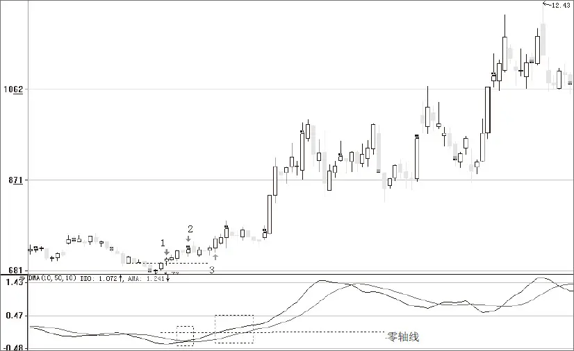

图18\-3 洛阳钼业（603993）2014\.09—2015\.02日线图

买点解析

当DMA指标中的DMA线上穿零轴线时，为买点，会出现一波中短趋势的涨势，但前提要有低位的金叉配合看涨形态的支持。

__实盘解读 __

如图18\-3所示，股价在时段价格新低收盘得到启明星信号，此时DMA线出现勾头，并在次日形成低位金叉，预示行情触底反弹。1点为价格站上启明星形态，可作为买点。

DMA线在低位形成金叉，验证前面的启明星信号，因此2点依然同1点的效果，可作为一个补仓买点。

买入股票后，DMA指标双线成平行状上涨，预示买盘行情较强，因此在DMA线与AMA线上穿零轴线时，可作为行情的再次买点和加仓点，而盘中蜡烛图实体也显示交易量在稳步上升。

买点3：当DMA指标与股价之间出现底部背离时的买点

实战示例（见图18\-4）

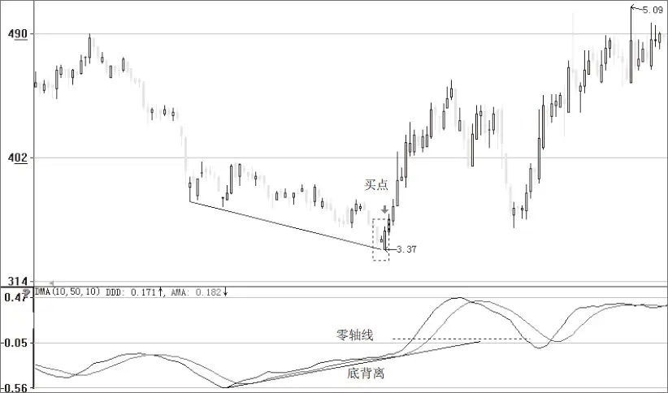

图18\-4 华能国际（600011）2011\.06—2012\.01日线图

买点解析

如果价格一浪低于一浪，而其对应的DMA指标却一浪高于一浪，此处形成DMA指标与股价之间的底部背离，为买入信号。

__实盘解读 __

如图18\-4所示，股价在下跌过程中的两个明显的低点，而这两个下跌的低点相对应的DMA指标值却是一浪高于一浪，此处形成了DMA指标与股价之间的底部背离，给出了摆动指标的买入信号。

我们说，任何买涨买跌的信号，都需要技术上的再验证，才可确定方向和空间。根据我们的经验，DMA指标反应较蜡烛图要慢，但稳定性很高，因此在第一个低点时，得到锤子线信号，而对应的DMA指标仍为下行状态，没有验证信号，再等两个交易日，马上就能够看到背离的迹象。因此，真正的买点是在DMA指标准备上穿零轴线前，蜡烛图在价格低点出现看涨吞没形态，次日股价站上形态，蜡烛图得到验证，同时DMA指标上穿零轴线，3个信号同时在一起，得到准确的买点。

## 第18章 DMA平行线差指标的应用 - 18.2 DMA指标的卖点

18\.2 DMA指标的卖点

2025年10月29日

18:04

__18\.2 DMA指标的卖点 __

卖点1：当DMA线下叉AMA线时的卖点

实战示例（见图18\-5）

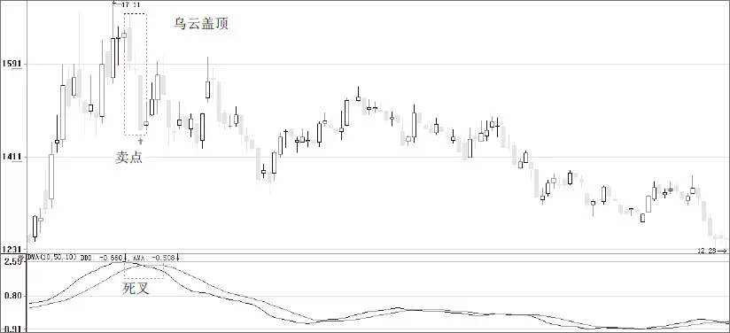

图18\-5 上海机场（600009）2013\.08—2014\.02日线图

卖点解析

●当DMA指标中的DMA线向下叉入AMA线之时，为卖出信号。

●由于DMA指标是基于移动平均线而计算得出的，所以它一定较之蜡烛图给出的卖出信号要晚，但这种信号还是较之蜡烛图的准确率要高，持久性更强，蜡烛图的价格变化，得出交易信号，所以这种信号我们是无法看出它是短期的还是中期的。而移动平均线给出的信号则一定是中期的，还有另外一个优点，便是它可以忽略掉绝大部分的震荡，或是反弹的走势，从而忽略掉更多的假信号。

__实盘解读 __

如图18\-5所示，当日线收盘得到17\.11元价格高点时，DMA线的值为最高，次日日线收盘十字星线，DMA线出现向下勾头，此时行情有回落或回调意愿。

而实际DMA指标出现高位死叉，是在连续两个下跌交易日收盘之后的，下跌信号得到验证的有稍迟，但趋势性明显。而顶部乌云盖顶的信号比较及时，因此图18\-5中阴十字星线收盘后的次日开盘，就是投资者最佳的卖点。

卖点2：当DMA线下穿零轴线时的卖点

实战示例（见图18\-6）

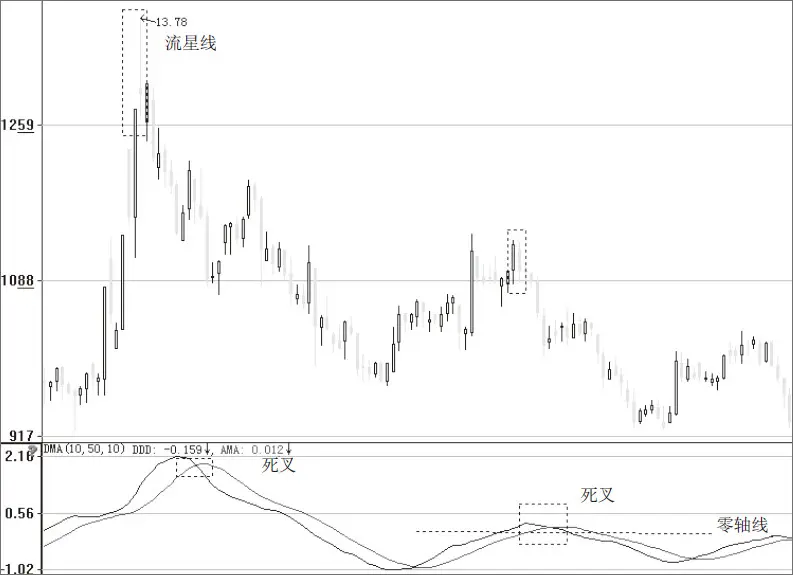

图18\-6 中国国贸（600007）2013\.08—2014\.04日线图

卖点解析

当DMA指标中的DMA线下穿零轴线时，为卖点，会出现一波中短趋势的跌势，前提有高位死叉与看跌形态的支持。

__实盘解读 __

如图18\-6所示，股价上涨收盘得到流星线后，股价开始下跌，是价格回落还是行情反转我们暂时不得而知，需要对顶部形态进行验证。

本次下跌主图没有给出信号验证，或是待验证信号以后，价格回落幅度已经很大，因此我们需要在技术指标中寻找相关信号。DMA指标给出的死叉，且在价格高位，是可以对流星线信号进行看跌验证的，因此流星线的卖点信号成立。

我们看股价下跌后的反弹，再次得到孕线信号，配合DMA指标看到双线在零轴线附近形成死叉，预示行情进一步下跌，且这波下跌将是趋势的延续，结合流星线行情，我们说这是一波幅度较大的下跌行情。

卖点3：当DMA指标与股价之间出现顶部背离时的卖点

实战示例（见图18\-7）

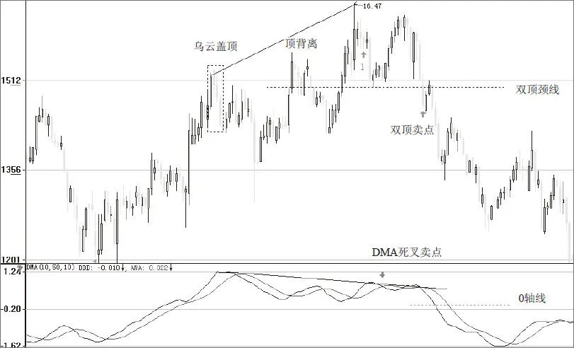

图18\-7 卫星石化（002648）2014\.04—2014\.12日线图

卖点解析

由于股价筑底时是缓慢的，而筑顶时是极快的。股谚有云：“三日顶，百日底。”所以，移动平均线指标在顶部给出卖出信号时都是非常慢的，并且在实际操作中，逃顶的难度要大于抓底。但有一些组合、价格形态、均线类指标等，可以在形态初期便给出信号，若遇此种情况，当DMA线向下穿越AMA线时，DMA指标给出卖出信号验证。

__实盘解读 __

如图18\-7所示，股价上涨得到乌云盖顶信号后，对应的DMA指标出现勾头，并在后2个交易日出现死叉信号，因此已经验证了顶部形态，可以成为卖出点位。

而后股价回落后继续上涨，得到价格新高，但DMA指标没有随行，而是继续下行，出现顶背离的信号，那么此时没有离场的投资者需要高度警惕，行情将有见顶风险。而已经借助前面信号离场的投资者，也不要可惜提早离场，更不要再有追高操作，因为顶背离信号本身就是价格高、指标低，并且顶背离信号的出现，也使我们提前离场的操作更加安心。

我们看到，密集的离场信号出现在第二次价格新高以后，首先价格新高位置的吞没形态，得到点1下破的验证；随后DMA指标再次形成死叉，即DMA指标背离的卖点，与1点价格相当；最后出现的是双顶形态在下破颈线支撑时的卖点。而到达DMA指标高位的死叉时，若继续下破零轴线以后，股价极可能会加速、加深跌幅。

总结：无论何时，蜡烛图信号都是最先的，能够得到蜡烛图验证，可以做出提前反应，但若能得到价格形态或指标的验证，更能证明一段趋势行情，这样也能过滤很多蜡烛图反复出现的伪信号。

ASI指标由威尔斯·王尔德（Welles Wilder）所创。

## 第19章 ASI振动升降指标的应用

__第19章 __

__ASI振动升降指标的应用 __

ASI指标绝大部分时间，都是跟随着价格的涨跌而涨跌，所以，在跟踪价格出现异常情况时，ASI通常都会率先给出预警信号。

王尔德认为，当天的4种基本价格不能完全代表目前的走势，必须要至少连续到前一个交易日中的4种基本价格，产生一种连续性的计算结果，才能代表真正的走势。ASI指标是通过描述当天与前一个交易日的4种基本价格的大小关系，制成ASI线，来跟踪趋势的一款指标。实例如图19\-1所示。

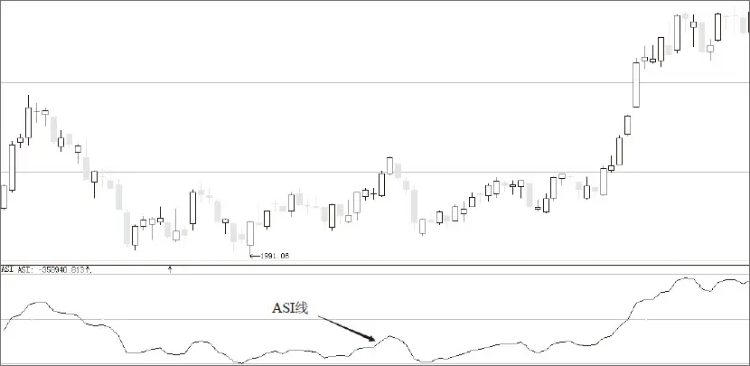

图19\-1 上证指数（000001）2014\.04—2014\.08日线图

由于ASI指标自身的特性，它仅仅是连续两天之间价格相互关系的一种体现，那么它便不具备趋势性，所以，它是短线的法宝。当价格要向上突破震荡平台时，ASI指标会率先向上突破，投资者可以把握ASI指标的领先作用，提前买入，轻松坐上上涨的轿子。当价格要向下突破震荡平台时，ASI指标也会率先向下突破。所以，如果使用ASI指标进行操作，那么首先要确定的就是你必须是一个短线交易者，如果不具备手疾眼快、当机立断的特点的话，不但不会获取利润，相反还会导致亏损。

虽然它不是追踪趋势的指标，但还是具有顶背离和底背离的特性，还是可以利用它与股价产生的背离来寻找买卖信号。

## 第19章 ASI振动升降指标的应用 - 19.1 ASI指标的买点

19\.1 ASI指标的买点

2025年10月29日

18:04

__19\.1 ASI指标的买点 __

买点：当ASI指标领先于股价上破自身震荡区间时的买点

实战示例（见图19\-2）

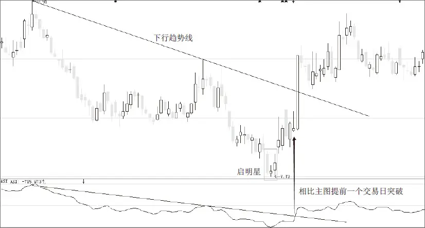

图19\-2 浦发银行（600000）2013\.11—2014\.05日线图

买点解析

●买点至少有拐点右侧买点与向上突破买点两种，而ASI指标最擅长的便是向上突破后所提供的买点，因为ASI指标描述的仅仅是连续两个交易日之间的关系，所以它具有超强的灵敏性，总是可以在股价向上突破之前给出买点。

●当股价在震荡区间内运行时，ASI指标也随着股价构筑自身的震荡平台。当股价尚未向上突破自身震荡平台时，ASI指标会领先于股价向上突破自身的震荡平台，从而先于蜡烛图的买点率先提供给我们最佳的买点。

__实盘解读 __

如图19\-2所示，股价下跌过程中，我们连接两个反弹高点得到下跌趋势线，同样ASI指标走势与股价轨迹一致。

蜡烛图在低谷时收盘得到启明星信号，次日收盘K线站上启明星形态，得到验证，此时ASI指标向上已经勾头，并拉升上破下跌趋势线，行情转为买盘。

我们在底部启明星信号得到验证后，次日为行情的买点，而我们看到ASI指标拉升穿过下跌趋势线时，预示主图也将有拉升穿线的过程，因此可提前加仓或再次买入操作，轻松坐上上涨的轿子。

## 第19章 ASI振动升降指标的应用 - 19.2 ASI指标的卖点

19\.2 ASI指标的卖点

2025年10月29日

18:04

__19\.2 ASI指标的卖点 __

卖点1：当ASI指标领先于股价下破自身震荡区间时的卖点

实战示例（见图19\-3）

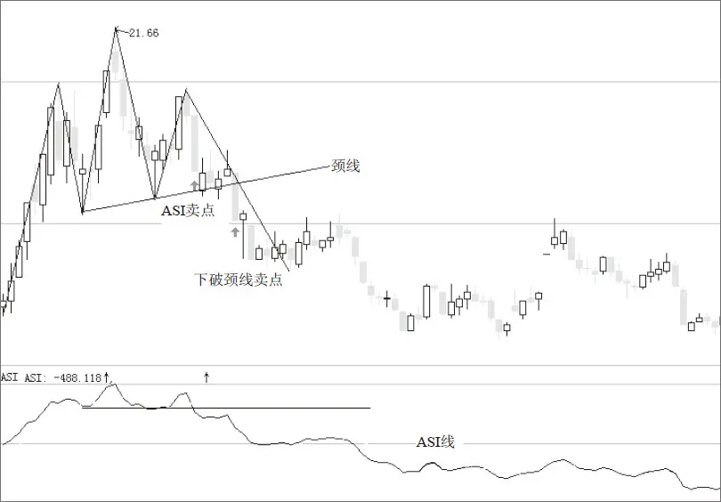

图19\-3 金亚科技（300028）2004\.02—2014\.06日线图

卖点解析

●ASI指标具有较高的灵敏性，并提早预见行情，领先于股价下跌，是重要的短线交易指标。

●在股价尚未下破震荡平台之前，ASI指标先于股价下破自身的震荡区间，为投资者率先找出卖点。其速度可能略慢于蜡烛图验证，但要快于价格形态及其他指标的验证信号。

__实盘解读 __

如图19\-3所示为一个标准的头肩顶形态。头部高点为乌云盖顶信号，连接左肩和右肩的底部得到颈线支撑。

ASI指标下破颈线验证卖点信号时，主图刚刚运行到右肩的下跌，相比主图的颈线下跌足足提前了5个交易日。因此，当一些经典、标准的价格形态出现时，投资者不妨使用ASI指标，可以提早预知行情，提前卖出，有效减少利润的损失。

如果你是做中长线投资的话，那么单单蜡烛图给出的卖出信号是不足信、不足取的，必然要配合其他技术分析手段同时给出的卖出信号来确定趋势走向，例如价格形态、均线系统、趋势线或其他副图技术指标等等。

卖点2：当ASI指标与股价出现顶部背离时的卖点

实战示例（见图19\-4）

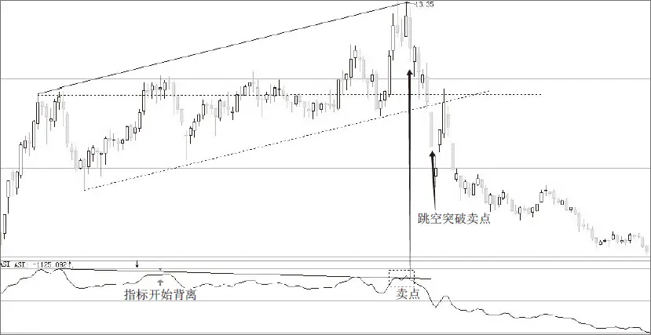

图19\-4 物产中大（600704）2013\.09—2014\.06日线图

卖点解析

同所有副图指标一样，顶部背离是副图指标不可或缺的一种卖出信号，但股价与指标的背离虽然发生，股价未必就应声下跌，所以需要蜡烛图的配合才能得到最佳的卖点，从而将自己的股票出手。

__实盘解读 __

如图19\-4所示，股价得到上涨通道一浪高于一浪上行，且不断得到价格新高，此时对应的ASI指标却一浪低于一浪，出现了顶背离的信号。

此前我们说当背离信号突然消失，指标回归正常的时候，通常就是卖点出现的时候。图19\-4中的ASI指标给出的卖点在价格最高点的第二个交易日，ASI线出现第二次高点，恢复正常后受阻，相比蜡烛图跳空突破通道下轨。ASI给出的卖出信号要比蜡烛图给出的早了4个交易日。

总结：一般反应快的指标，其稳定性就会较弱。因此，判断买点或卖点的时候，最少要有两个信号相互验证，且最好还有趋势信号做辅助，以求最稳妥地把握行情。

## 第20章 W＆R威廉指标的应用

__第20章 __

__W＆R威廉指标的应用 __

W＆R指标又叫威廉指标，用当日收盘价在最近一段时间股价分布的相对位置来描述超买和超卖程度。它既是超买超卖指标，也可以将它归为强弱指标。但它更多的是辅助其他的技术分析指标确认交易信号。

W＆R指标与其他指标所不同的是，它与其他摆动指标的刻度值是相反的。通常情况下，摆动指标运行至80刻度线以上时为超买，运行至20刻度线以下时为超卖；而W＆R指标却是运行至80刻度线以上时为超卖，运行至20刻度线以下时为超买，指标的默认参数为28。

W＆R指标可与RSI指标共同配合使用。若RSI指标由下向上突破了50刻度线，而W＆R指标由上自下穿越了50刻度线，那么可确认目前为上涨趋势，买方的力量占优。相反，若RSI指标由上向下突破50刻度线，而W＆R指标也由下自上穿越了50刻度线，那么可确认目前为下跌趋势，卖方的力量占优。

W＆R指标还可与MACD指标共同配合使用。如果W＆R指标进入超买区或超卖区之时，此时可以调出MACD指标共同确认，但应以MACD的信号为准，W＆R指标仅仅起到一个预警的作用。

同所有的摆动指标一样，W＆R指标也会与股价之间出现顶部背离或底部背离的现象，如图20\-1所示。但它与其他摆动指标相反，当W＆R指标与股价之间的走势一致，股价一浪高于一浪，W＆R指标也一浪高于一浪时，则出现顶部背离，为卖出信号；若股价一浪低于一浪，W＆R指标也一浪低于一浪时，则出现底部背离，为买入信号。

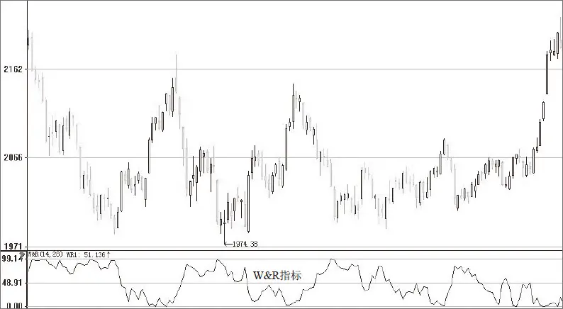

图20\-1 上证指数（000001）2013\.12—2014\.05日线图

## 第20章 W＆R威廉指标的应用 - 20.1 W＆R指标的买点

20\.1 W＆R指标的买点

2025年10月29日

18:04

__20\.1 W＆R指标的买点 __

买点1：当W＆R指标由80刻度线上方，向下穿越时的买点

实战示例（见图20\-2）

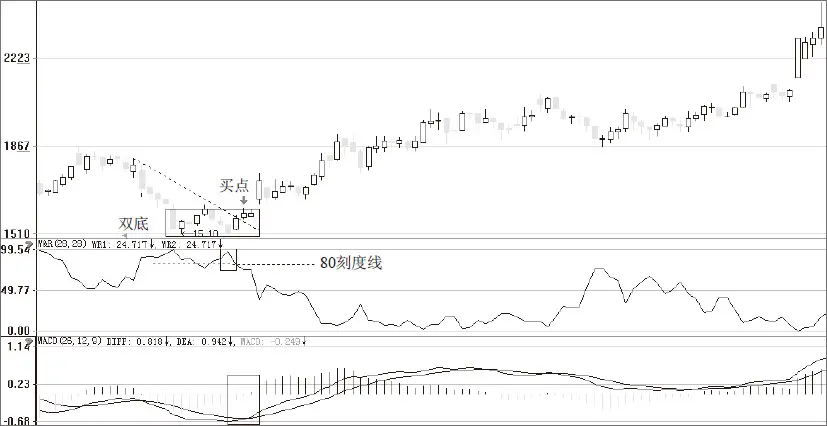

图20\-2 千红制药（002550）2014\.04—2014\.08日线图

买点解析

当W＆R指标在80刻度线以上之时，为超卖状态；当W＆R指标由80刻度线向下穿越之时，为W＆R指标给出了买入信号。此时可以求助于MACD指标再进行验证。若此时零轴线以下的DIFF线向上穿越DEA线，则验证该信号为有效信号。

__实盘解读 __

如图20\-2所示，主图蜡烛线显示的为双底形态，对应的W＆R指标已进入80刻度线以上，也就是进入了超卖区间。

当蜡烛线完成第二次下探反弹时，W＆R指标下破80刻度线，买入信号出现。同样，MACD指标双线在低位形成金叉，同时验证了双底的效果，因此次日开盘，股价站上双底的颈线，3个信号同时验证了买点，并且此波上涨可能为一波中长线的上涨。

买点2：当W＆R指标与股价出现底背离时的买点

实战示例（见图20\-3）

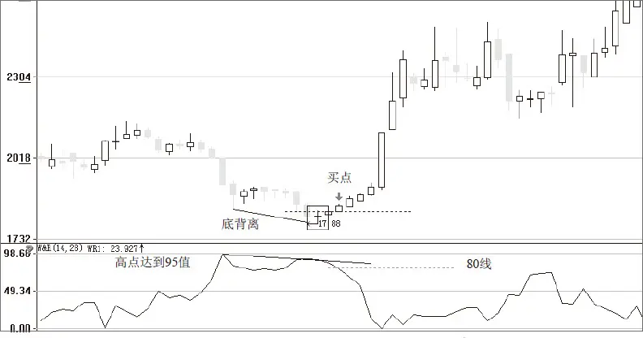

图20\-3 光电股份（600184）201\.05—2014\.07日线图

买点解析

●有些投资者开始可能不习惯W＆R指标是相反的，所以我们要把之前的思维都反过来，如果你实在不能理解，那么可以想象着将此图翻转过来，这样便一切明了了。

●因为W＆R指标是反的，所以与其他摆动指标不同之处，在于股价一浪低于一浪，并且W＆R指标在顶部也是一浪低于一浪，这样便形成了底部背离。再配合其他技术分析方法，共同给出买入信号。

●当W＆R指标上行至95刻度线以上区域时，此时行情随时可能反转，概率非常大。

__实盘解读 __

如图20\-3所示，股价一路下行，W＆R指标则上行，最高点触及95刻度线附近，我们说95刻度线已经接近超卖的边缘，这里发生反转的概率非常之大，仅这个信号即可预示后市将要反弹或反转。

我们看蜡烛图在第一个低点得到孕线支撑后，次日开盘价格未能站上形态，因此股价还有下跌，但下跌时的股价与W＆R指标运行一致。由于该指标为相反指标，因此这个位置产生了底背离的现象。

股价在价格新低再收一根十字星线，在蜡烛线完成验证的同时，W＆R指标下破80刻度线，同一个交易日两个信号互相验证，得到准确买点。

需要注意的是，当W＆R指标触及95刻度线以上或5刻度线以下的区域，行情即将反向的概率是相当大的，若此时在得到其他技术信号并验证，行情会在很短时间内完成反转，且速度更快，幅度更大。

买点3：当W＆R指标与RSI指标相互配合时的买点

实战示例（见图20\-4）

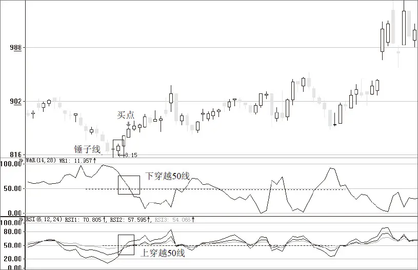

图20\-4 友好集团（600778）2014\.09—2015\.01日线图

买点解析

●W＆R指标的最大功效是在关键时刻发出预警，配合其他指标共同给出交易信号，最佳的配合是与MACD指标或RSI指标的配合使用。

●如果W＆R指标由上向下穿越50刻度线，此时应该立刻求助RSI相对强弱指标；如果RSI指标也同时向上穿越50刻度线，则该买进信号的准确率是相当高的。

__实盘解读 __

如图20\-4所示，当W＆R指标向下穿越50刻度线时，已经给出了买进信号，我们再看RSI指标，此时的RSI指标已经由下向上穿越50刻度线达两个交易日了，所以该信号还是具有相当大的可信程度的。

蜡烛图显示在时段价格低点处收盘锤子线，且前面是一根十字星线，可以定义为底部形态，因此在后面的股价站上价格形态，可验证其买点信号。

我们看到锤子线后面第二个交易日，同时得到3个技术指标的验证，买点成立，当日即可买入。

注意，RSI单独使用时，主要关注的是超买和超卖区域，而配合W＆R指标，则关注50刻度线的得失即可。

## 第20章 W＆R威廉指标的应用 - 20.2 W＆R指标的卖点

20\.2 W＆R指标的卖点

2025年10月29日

18:04

__20\.2 W＆R指标的卖点 __

卖点1：当W＆R指标由20刻度线下方，向上穿越时的卖点

实战示例（见图20\-5）

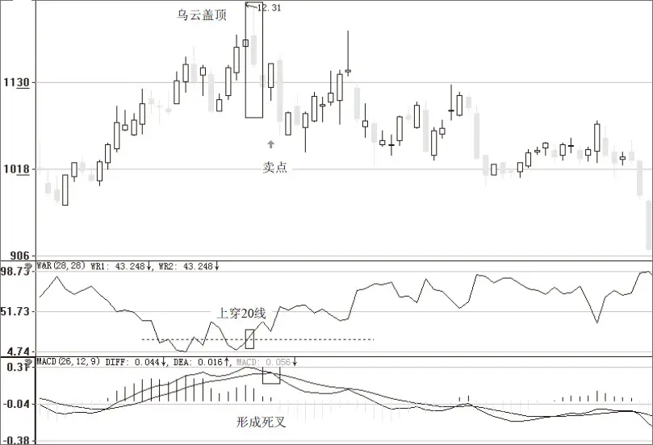

图20\-5 神开股份（002278）2014\.01—2014\.04日线图

卖点解析

当W＆R指标在20刻度线以下之时，为超买状态；当W＆R指标由20刻度线向上穿越之时，为W＆R指标给出卖出信号。此时可以求助于MACD指标再进行验证。若此时零轴线以上的DIFF线向下穿越DEA线，则验证该信号为有效信号。

__实盘解读 __

如图20\-5所示，W＆R指标已然进入了20刻度线以下，为超买区间，买方力量过于强劲，但不会持久，所以应该时刻关注，该涨势可能随时会终结。

当W＆R指标第一勾头向上穿越20刻度线时，蜡烛图顶部得到阴阳筷子的信号，也是顶部形态，但对应的MACD指标则还在上升阶段，仅有缩量，但没有形成高位死叉，所以，即使W＆R指标是超买的，投资者也不可急于卖出。

当W＆R指标再次回落到20刻度线下方时，蜡烛图出现乌云盖顶的信号，待价格形态完成，我们看到W＆R指标再次上穿20刻度线，对于大部分行情来说，第二次穿越已足以说明行情到了拐点，配合MACD指标，双线在零轴线上方形成死叉信号，3个信号同时出现，互相验证，得到可靠的卖点。

这种各方面同时给出信号较之于单方面给出的信号的准确性要高得多。

卖点2：当W＆R指标与股价出现顶背离时的卖点

实战示例（见图20\-6）

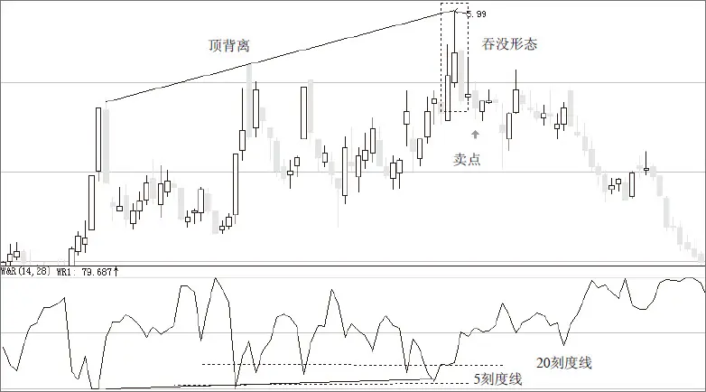

图20\-6 海泰发展（600082）2013\.08—2014\.01日线图

卖点解析

●W＆R指标与我们平时看的指标是相反的，我们还是需要假想着图被翻转过来，这样在你的意识里就能很好理解它了。由于W＆R指标是反的，所以与其他摆动指标不同之处在于，股价一浪高于一浪，W＆R指标也是一浪高于一浪，这样便形成了顶部背离。再配合其他技术分析方法，共同给出卖出信号。

●当W＆R指标下行至5刻度线以下区域时，行情发生反转的概率大增，随时可能发生下跌。

__实盘解读 __

如图20\-6所示，当股价到达第一个高点时，W＆R指标已经下行至零轴线，并有平头，此时行情已经非常不正常，超买非常严重，行情随时可能反转，应立刻关注80刻度线，若有下破信号则卖点成立。

当股价到达第二个高点时，W＆R指标继续上升，没有在平头位置停留，但由于得到新的高点，指标反而上升，顶背离现象出现，此时股价的下跌已经箭在弦上，并且正在积攒着巨大的卖出力量，投资者可考虑在此时提前卖出离场。

在得到第三个价格高点时，指标继续上升的过程中，蜡烛图显示的是吞没形态，需要阴线的后一个交易日验证。通常背离在出现后的下一个极值位置反转的概率最高。图20\-6中形态收盘的第二个交易日，W＆R指标上穿20刻度线，卖点信号得到互相验证，考虑到前期积攒的下跌卖盘，这应该是投资者最后的卖出机会，果然行情在后面形成较大幅度下跌。

此前我们说背离信号并不是卖出信号，但有预警作用。图20\-6中由于此前出现W＆R指标进入5刻度线下，已经给出了卖出信号，因此在第二高点处出现的顶背离信号，即可等同于卖出信号的验证，可先行卖出。

卖点3：当W＆R指标与RSI指标相互配合时的卖点

实战示例（见图20\-7）

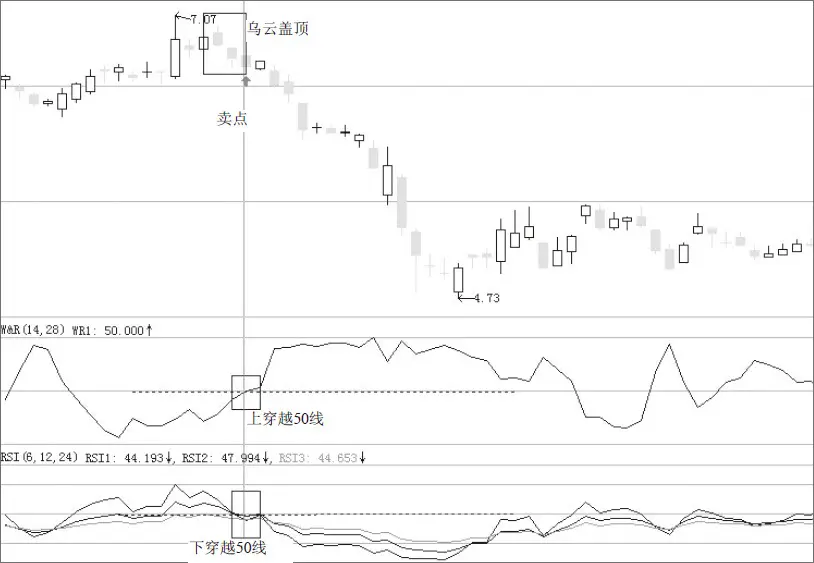

图20\-7 荣华实业（600311）2013\.05—2013\.08日线图

卖点解析

如果W＆R指标向上穿越50刻度线，RSI指标也同时向下穿越50刻度线，那么该卖出信号的准确率是相当高的。

__实盘解读 __

如图20\-7所示，蜡烛图得到乌云盖顶的形态，待股价跌破价格形态的收盘低点时，此时对应的W＆R指标与RSI指标同时做出反应：W＆R指标向上穿越了50刻度线，而RSI线也在此日向下穿越了50刻度线，一切看起来都是那么完美，3个验证信号同时完成，此信号具有极高的可信度。且在价格形态的次日，此时投资者卖出股票，基本可以得到最理想的价格。

## 第21章 其他技术指标的应用

__第21章 __

__其他技术指标的应用 __

通常摆动指标都有金叉、死叉、顶部背离、底部背离等共同的使用方法，并且其中都是成对出现的，但本着对读者负责的态度，在写本书之前，我们将本书所列举的指标都一一测试过，有些经典的指标，并不适合中国现有的市场，它们可能只是在某一方面会出现普遍性的有效性，所以我们只选取其有效的，而放弃无效的。

笔者建议投资者使用的指标有：蜡烛图、均线、MACD、KD、RSI、布林带、成交量等。这些都是常见且常用的指标，稳定性很高，其他指标大部分也是从这些指标拓展而来的。

由于中国是属于具有特色的市场经济体质，资本的沉淀尚浅，有时受政策干扰或突如其来的消息影响较为严重，有时市场甚至脱离了其自身的基本面在运行。

有些指标在国际市场的实际应用中，会与经典使用方法出现很大偏差，甚至会出现相反的交易信号。同时由于中国股市仍处于初级阶段，新股不断发行，市场的容量再由低向高发展，存在很多的不确定因素。例如，有些股票的流通股份占全部股份的比例不断增加，也会影响该只股票成交量或其他方面的变化，所以，一个成型的指标，必须有基本稳定的市场容量，而对于充斥着变数的市场，往往经典的摆动指标也会失去作用。本章我们将讲述的指标并不常见也不常用，投资者可以不将它们作为参考依据，但可以扩大视野。

## 第21章 其他技术指标的应用 - 21.1 OBV平衡交易量（能量潮）指标的应用

21\.1 OBV平衡交易量（能量潮）指标的应用

__21\.1 OBV平衡交易量（能量潮）指标的应用 __

OBV线是由美国投资分析家乔·格兰威尔（Joe Granville）所创。

OBV线是根据统计成交量的变化而推测股价上涨或是下跌的一种技术指标。OBV线与股价同样，呈阶梯状上涨或下跌，上涨时称为“上升潮”，下跌时称为“下跌潮”。

通常情况下，成交量也是随着价格上涨而增加，随着价格下跌而萎缩，如果成交量的变化与股价的变化不相符，股价的趋势便会发生变化。

做市商机制的市场，成交一手买单，必定对应着一手卖单，如果成交量越大，可能买卖双方对当前价格走势的分歧也就越大，对应参与市场中的人气也就越旺，所以可以用OBV线来直观读出市场中的人气如何。案例如图21\-1所示。

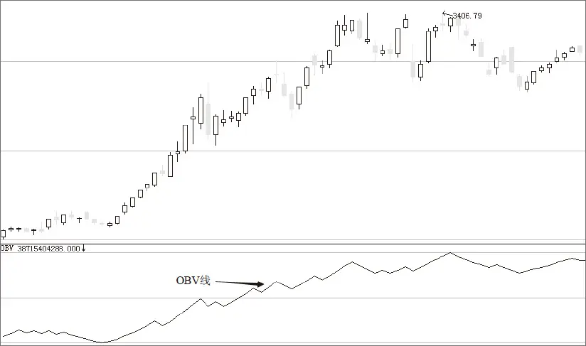

图21\-1 上证指数（000001）2014\.11—2015\.02日线图

股市中有一句谚语：“先见量，后见价。”成交量比股价本身还要重要，成交量对于股价的重要性在于，根据重力原则，上升比下降需要更强大的力量，所以股价的上升，特别是上升的初期，则更需要强有力的推动力。OBV线与成交量VOL线均表示成交量的大小，但它们的表示方式不同。

对于出现涨停或是跌停类的股票，OBV线则无计可施了。股价被封在涨停或跌停的位置上时，通常是无量的，所以以成交量来计算的OBV线没有了准确反映股价意图的根据，便没有了它的指导意义。

OBV线用来选取买点是相当不错的技术分析指标，但对于股价的横盘震荡或下跌来说，用OBV线来选取卖点，在有些时候会显得心有余而力不足。当股价开始进入下降通道之时，OBV线更多的时候仅仅只是横向延展或是降低上涨的速度而已，并不会追随着股价的下跌，所以关于用OBV线来选取买点有很多种方法，但用来选取卖点则仅有顶背离这一种方法而已。或许有些人会找到用OBV线来选取卖点的方法，但都不具备普遍性，不足以论。

买点1：当OBV线经过长时间的横盘震荡后，向上突破时的买点

实战示例（见图21\-2）

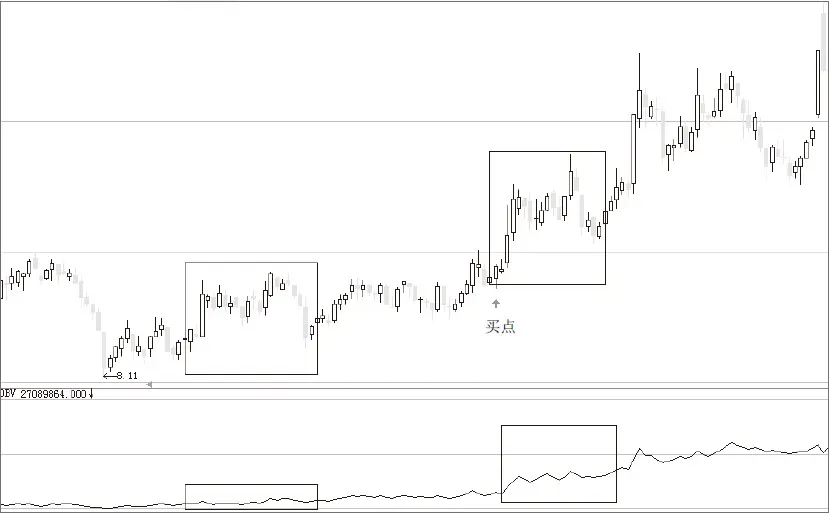

图21\-2 三五互联（300051）2014\.04—2014\.10日线图

买点解析

●任何技术分析指标都有它核心的一个道理，这个道理指导着我们如何找出买点与卖点。

●我们还会再次谈到关于成交量来读取市场人气的观点。OBV线不上不下，横盘延展，从这个层面来讲，大家对于股价现阶段的横盘震荡是认同的，市场中没有利好的消息，同样也没有利空的消息，平平淡淡。直至某一天，大家不再认同当前的价格了，多空双方再次发生分歧，成交量便会应声提高，那么OBV的值也会向上运行。如果此时多方的力度大于空方，则价格向上突破；如果空方的力度大于多方，则价格向下突破，那么选择向哪个方向突破，便成了我们交易的依据了。

__实盘解读 __

如图21\-2所示，蜡烛图的运行轨迹与OBV线的运行轨迹高度一致，双方同时破位，即可得到相互验证。

在图21\-2中，我们看到股价一直平稳震荡走势，中途加大波幅后，指标没有做出反应，表示“量”没有上来，因此还要回归震荡，直到指标出现明显勾头，对应的蜡烛图出现带下影线的实体阳线，指标与主图同时出现突破信号，可作为买点，同时也是行情上涨的支撑线。

买点2：当OBV线与股价出现底背离时的买点

实战示例（见图21\-3）

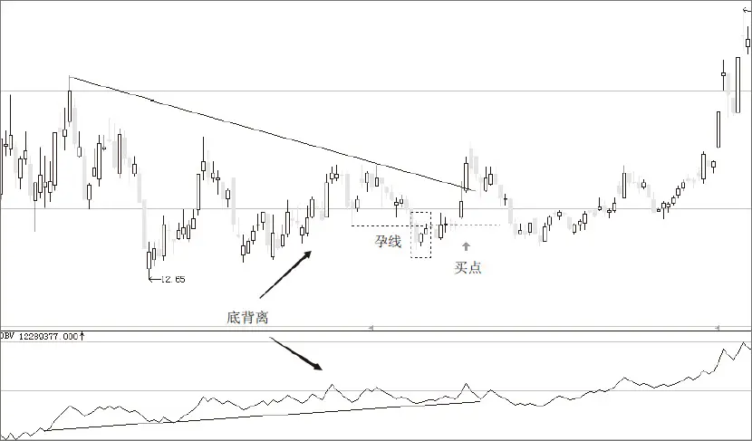

图21\-3 姚记扑克（002605）2014\.02—2014\.09日线图

买点解析

●一买必定对应着一卖。如果成交量越大，说明对当前价格的分歧越大；如果成交量越小，说明大多数投资者是认同当前价位的。所以，当OBV线向上增量时，说明对当前的价格有很大的分歧，此时再看蜡烛图向哪里给出信号，如果是买入信号说明，买方的力度要大于卖方的，反之则卖方的力度要大于买方的。

●如果价格在下跌的过程中出现了两个明显的低点，在第一个低点处，OBV线萎靡不振，而在第二个低点处，OBV线开始向上攀升，并且它的底部高于第一个股价低点所对应的OBV线的值，那么说明大家对于第二个低点处的价格并不认同，则给出了买入信号。

__实盘解读 __

如图21\-3所示，股价呈阶梯状震荡下跌，但OBV线显示的成交量却在上升，有底背离迹象。

我们看此背离图与之前看到的不同，股价的反弹虽然高点依次下跌，但回落的低点却在升高，形成了一个三角的走势。但正因为这样的走势，我们可以排除卖方的放量，OBV线上升，为买方交易量做支撑，是一个蓄力的过程。

股价站上三角区间上轨，视为三角整理突破，此前出现的孕线成为反转信号，并且在价格站上孕线后得到验证，而随着蜡烛图收实体阳线突破三角通道的上轨，OBV线也有放量，3个信号加在一起，成为我们买入的有力依据。

卖点：当OBV线与股价出现顶背离时的卖点

实战示例（见图21\-4）

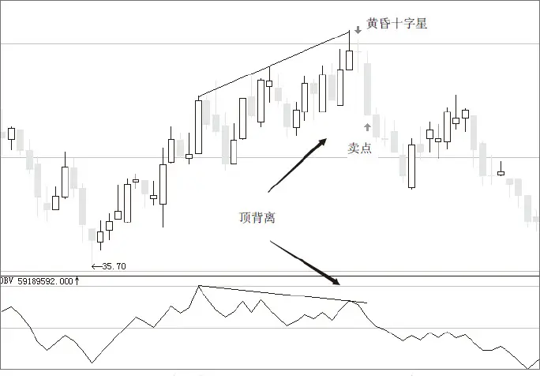

图21\-4 泸州老窖（000568）2011\.03—2011\.06日线图

卖点解析

●通常情况下，股价上涨，OBV随着价格的上涨而上涨，即量价齐升。

●若股价上涨，一浪高于一浪，但相对应的OBV并没有向上跟随价格的上涨，那么也就说明并没有足够的动能支撑着股价的持续上涨。由于没有了最根本的力量去推动股价，有价无量，不久便会应声下跌。

__实盘解读 __

如图21\-4所示，在上涨趋势中有两个相对明显的高点。但它们相对应的OBV线的值，却是一浪低于一浪，说明在第二个高点处，已经不存在向上推进的动能了。先有量后有价，有价无量根本无法持久，价格上涨也可能只是惯性，如空中楼阁，是岌岌可危的。

顶背离信号以后，需要投资者高度关注，尤其在第二个或第三个高点，出现的顶部信号都有可能是卖点。图21\-4中日线收盘黄昏十字星后，对应的OBV线下行，为准确卖点。

2025年10月29日

18:04

## 第21章 其他技术指标的应用 - 21.2 BBI多空指标的应用

21\.2 BBI多空指标的应用

2025年10月29日

18:04

__21\.2 BBI多空指标的应用 __

BBI线是算术移动平均线的变体。算术移动平均线是有很多条的，我们在用移动平均线的时候，有时会显得无所适从，不知道选择哪根移动平均线更恰当，所以BBI线是将这些移动平均线都整合起来，再次算术平均，从而得到平均之后再平均的一条平均线。仅仅使用这一条平均线，相对于普通的移动平均线来说，会显得更加直观一些。案例如图21\-5所示。

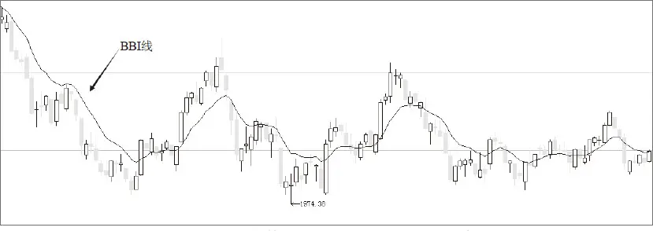

图21\-5 上证指数（000001）2013\.12—2014\.06日线图

BBI线的计算公式为

BBI＝（3日均价＋6日均价＋12日均价＋24日均价）/4

如果你有特殊的需要，可以进入分析软件中参数设置一栏，更改这4条均线的参数。通常分析软件默认的值都是3，6，12，24。如果想更改为长线的BBI指标，推荐一组公式为

BBI＝（6日均价＋18日均价＋54日均价＋162日均价）/4

BBI线既然是算术移动平均线的再平均，所以它具有算术移动平均线的优点和缺点。在震荡走势中，股价会上下反复穿越BBI线，出现很多伪信号。如果股价显示出趋势性走势，那么BBI线会一直支撑着股价，同样忽略掉很多小规模的回调，所以BBI线是一款追踪趋势性的指标。如果股价在BBI线之上，为强势，当股价上穿BBI线时，为买入信号。如果股价在BBI线之下，为弱势，当股价下穿BBI线时，为卖出信号。

BBI线适合中长线的操作，而不适合短期震荡行情，一定要区分开使用，因此，在使用该指标前，对于前期趋势的研判也非常重要。任何一种技术分析指标都不是万能的，都有适合它的领域，或优势与劣势。

为读取的方便，可以将副图指标移至上方，与蜡烛图在同一张图表内。

买点：当股价向上穿越BBI线时的买点

实战示例（见图21\-6）

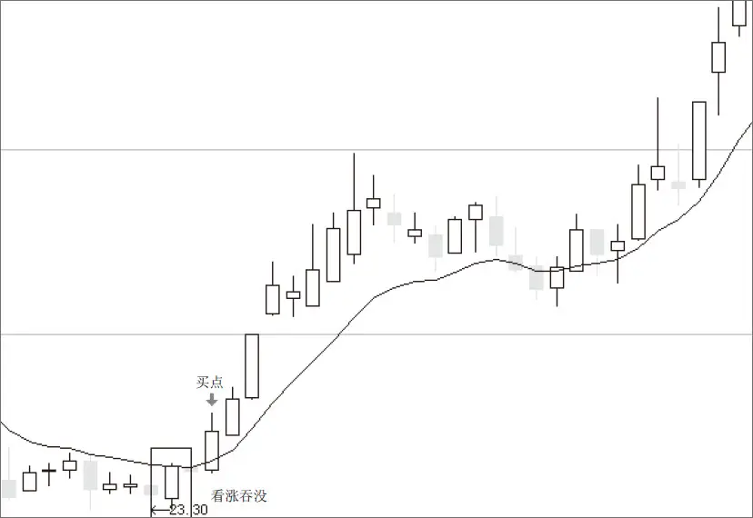

图21\-6 飞利信（300287）2014\.12—2015\.02日线图

买点解析

BBI线与K线上穿单根移动平均线的用法相同，当蜡烛K线上穿BBI线时则给出买进信号，股价上涨，OBV线随着价格的上涨而上涨，即量价齐升。

__实盘解读 __

如图21\-6所示，前期股价下跌，BBI线同SAR抛物线指标一样对行情压制。突然股价上涨触及BBI线，若是SAR抛物线指标，此时上抛物点消失，次日蜡烛图下方将出现抛物点。

次日，蜡烛图以实体拉升的方式站上BBI线，强势宣布突破阻力。我们说这根实体阳线同时放出了3个信号：一为对前日看涨吞没形态的验证；二为突破BBI线；三为实体阳线自身代表成交量的爆发。因此，3个信号加在一起均为上涨的验证，此时为最佳的买点。

注意，此图并非行情的底部，蜡烛图上穿BBI线也仅代表一段行情上涨，投资者还应画出一条上涨趋势线为看涨支撑，明确趋势。

卖点：当股价向下穿越BBI线时的卖点

实战示例（见图21\-7）

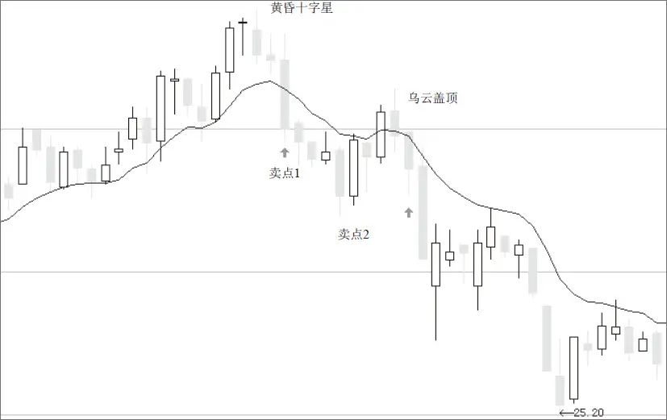

图21\-7 荣之联（002642）2014\.10—2015\.01日线图

卖点解析

●与K线下穿单根移动平均线的用法相同，当股价下穿BBI线时，给出卖出信号。

●注意前期需要对整体趋势做研判，辅助指标看到更多的价格空间。

__实盘解读 __

如图21\-7所示，股价在顶部形成了黄昏十字星线，次日收实体阴线，验证价格的反转下跌，卖点1当日收盘，蜡烛图实体下破BBI线，再次验证卖点1的正确。

此后BBI对股价形成阻力压制，中途一个单日收盘实体站上BBI线，但行情次日收盘成乌云盖顶形态，因此我们判定这是一次虚破或阻力的测试，结果为阻力依然有效，买点没有得到验证，这个位置可继续作为行情的卖点。

总结：如果蜡烛图画一条下降趋势线，股价向上击穿下降趋势线后，便可以买入。在底部蜡烛图同样也给出了买入信号，但这样组合的信号，我们看不到是长期的买点，还是短期的买点。如果采取长期BBI指标，一般情况下，它是不会随便给出交易信号的，但只要给出信号，便是具有趋势性的交易信号，我们完全有理由信任它。但一定要注意的是，只有长期BBI指标才能做到，若采用短期BBI指标，我们需要亲自甄别当前走势是在趋势中，还是在横盘震荡中。若当前走势尚在横盘震荡中，最好暂时放弃BBI指标。

## 第21章 其他技术指标的应用 - 21.3 PBX瀑布线指标的应用

21\.3 PBX瀑布线指标的应用

2025年10月29日

18:04

__21\.3 PBX瀑布线指标的应用 __

PBX线因其外形似瀑布而得名为瀑布线，它的正式称谓为非线性加权移动平均线，由6条非线性加权移动平均线组合而成，其每条线分别代表了不同时间周期的持仓成本状况。案例如图21\-8所示。

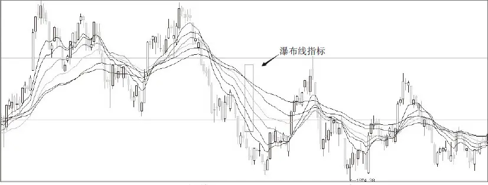

图21\-8 上证指数（000001）2013\.08—2014\.05日线图

瀑布线是一款趋势性的均线指标，主要关注的信号为交叉穿越和发散两种形态。如果你是一个短线交易者，那么瀑布线并不适合，它较之普通的算术移动平均线在中线上有更大的优势。它在视觉上的直观性，可以直接读出有效的买点与卖点，对于洗盘或是反复震荡的行情，基本上都能被过滤掉。

瀑布线所能给出的真正的交易信号极少，一旦瀑布线给出了交易信号，其成功率是相当高的。它极适合做波段类的在线行情。

由于本书所交代的仅仅是买点和卖点，而忽略了持仓等待或是持币观望的部分，我们在这里补充这一部分。在低价区，若瀑布线向上发散，并且形成多头排列时，只要股价不向下击穿最后一根瀑布线，那么就要坚定地持股。同样，由高位区瀑布线向下发散，并且形成空头排列，不论它如何反弹，只要不向上击穿后一根瀑布线，也不要受到诱惑而抢反弹，只要你选择了瀑布线，那么一定要记住，你选择的是中线波段交易。

瀑布线是趋势交易者的工具，所以它在横盘震荡期间，它的作用就显得不那么明显，那么交易者一定要判明目前的趋势，有趋势的状态还是无趋势的状态。有的放矢，方能有所斩获。

买点：当瀑布线出现多头排列时的买点

实战示例（见图21\-9）

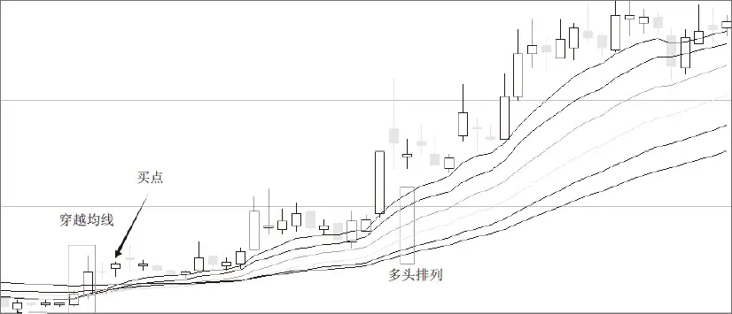

图21\-9 岳阳林纸（600963）2014\.06—2014\.08日线图

买点解析

●瀑布线的使用方法是极其简单的，均线依次向上穿越为买入信号。

●当瀑布线呈发散状形成多头排列时，为买盘持仓待涨信号。

__实盘解读 __

如图21\-9所示，股价在前面得到刺透蜡烛图组合的支撑信号，当后面的实体阳线出现，并且站上形态高点时，是对前面形态的验证，为买入信号。

再看瀑布线指标最下面的均线，受到蜡烛图上涨的带动，最下面的均线向上穿越，当上破第六条均线后，瀑布线买点信号出现，且股价将以瀑布线为支撑上行（包括6条均线均起了支撑作用）。

当瀑布线的均线呈发散状的多头排列时，如同鳄鱼张嘴，则说明股价将爆发快速上涨。

注意，蜡烛图在底部反转或是顶部反转给出的永远都是短期的买进信号，如果是长期的信号需要辅助技术分析指标的配合。

卖点：当瀑布线出现空头排列时的卖点

实战示例（见图21\-10）

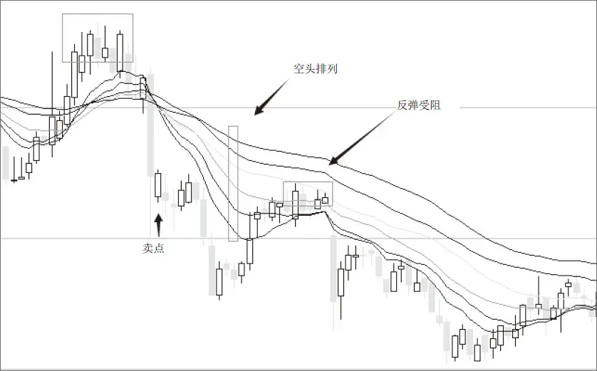

图21\-10 联美控股（600167）2013\.10—2013\.12日线图

卖点解析

当瀑布线形成空头排列之时，为卖出信号。在波段交易中，它优于算术移动平均线的地方在于，瀑布线的每条线的排列都是井然有序的，在视觉上是不紊乱的，这点最难能可贵，所以寻找买点和卖点也是非常容易的。

__实盘解读 __

如图21\-10所示，股价在顶部的信号不太明显，但明显可以看到价格走低。配合瀑布线指标，则蜡烛图实体长阴下破所有均线，对行情的形成反转和验证在同一天完成。

此后瀑布线显示，卖盘放量下跌，呈空头排列状。中途遇有反弹行情，但我们说瀑布线的6条均线均为阻力，行情不能上破最上面的均线，因此还是继续看下跌。

选择了瀑布线，就选择了波段交易。而要做波段交易，就要有取舍，取的是在波段运行中，不被短期的盘整与回调洗出来，而是用最少的操作，获取最大的利润；舍的是形成趋势之前，我们要舍弃提早建仓的机会，趋势反转之后，我们要确认趋势已经反转，让出部分因趋势的反转而带来的利润空间。

总结：指标的灵敏度与稳定性永远成反比。

## 第21章 其他技术指标的应用 - 21.4 BIAS乖离率指标的应用

21\.4 BIAS乖离率指标的应用

2025年10月29日

18:04

__21\.4 BIAS乖离率指标的应用 __

乖离率还有一个简单的名字，叫作Y值。它是反映股价偏离算术移动平均线程度的一种持续指标。

如图21\-11所示，通常情况下，股价都会依附移动平均线上涨或下跌，不会偏离太多，一旦偏离太多，则会发生回归移动平均线的情况，这样便形成了交易信号。其内在含义为，股价的上涨或下跌，通常是按照一定的波动速率行进的，一旦股价运行的速度破坏了这一速率，加速上涨或加速下跌，那么必定不会持久。打破了原有的秩序，预示着新秩序的到来，在加速上涨或下跌一定程度后，股价就会离移动平均线越来越远，快速但不持久的运行到达一定程度后，最终回归到移动平均线附近。而“一定的程度”便是用乖离率来读取的，默认参数设定为（6，12，24）。

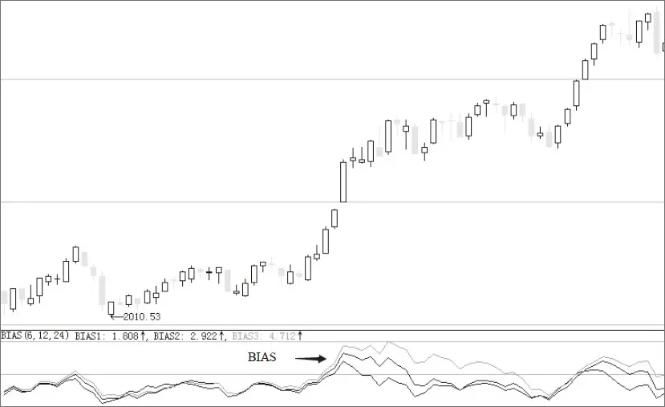

图21\-11 上证指数（000001）2014\.07—2014\.09日线图

当股价在移动平均线之上时，为正乖离率；股价在移动平均线之下时，为负乖离率；当股价恰好处于移动平均线上之时，乖离率为零。正的乖离率愈大，表示短期获利愈大，则获利回吐的可能性愈高；负的乖离率愈大，则空头回补的可能性愈高。

关于乖离率的临界值，至今没有定论，所以建议大家根据各股的特点，找到较适用的临界值，我们下面将要讲到的，仅仅是泛论。

买点1：当短期乖离率线上穿长期乖离率线时的买点

实战示例（见图21\-12）

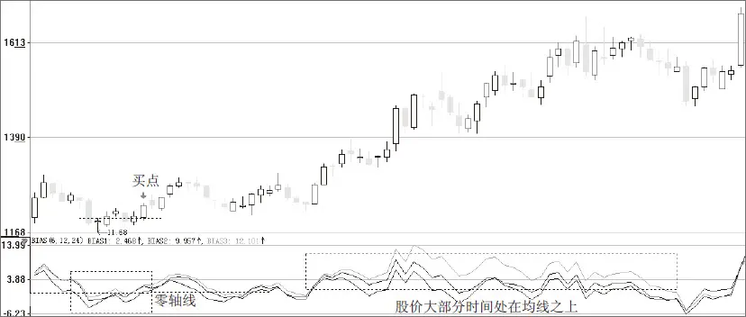

图21\-12 华域汽车（600741）2014\.09—2015\.01日线图

买点解析

●当短期乖离率线在低位向上穿越长期乖离率线时，为买入信号。出现这种情况，说明股价由快速下跌之后，向短期移动平均线靠近。

●当乖离率的值为正数时，说明股价在回调过程中，由移动平均线下方上涨至移动平均线的上方。根据移动平均线的使用方法，当股价向上穿越移动平均线时，为买入信号。所以，乖离率在此处已经为我们显示出了均线的买点。

__实盘解读 __

如图21\-12所示，当股价收盘锤子线的时候，BIAS指标的短期乖离率线出现勾头，并向上穿越长期乖离率线，给出了买进预警信号。

蜡烛图的买入信号验证是出现在锤子线后的第五个交易日，股价整体站上锤子线形态。同时给出买点信号的还有BIAS指标的3条乖离率线同时站上零轴线，此时买点信号得到指标验证。

买点2：当乖离率线与股价出现底部背离时的买点

实战示例（见图21\-13）

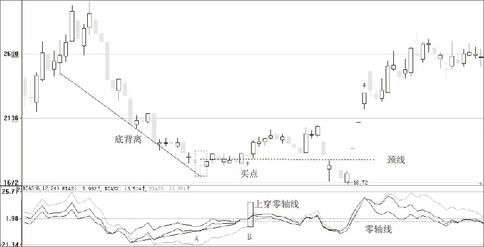

图21\-13 华录百纳（300291）2013\.09—2014\.05日线图

买点解析

当股价一浪低于一浪，其对应的乖离率线一浪高于一浪形成底部背离时，给出买入信号。说明虽然股价下跌，但它下跌的速度已经放缓，离均线越来越近，已经没有向下的动能维持股价快速下行了。

__实盘解读 __

如图21\-13所示，股价在下跌尾声出现背离信号，这次与我们之前讲述的背离不一样，背离过程较短，由于BIAS指标即将上穿零轴线，因此底部信号马上出现。

在BIAS指标上行至A点时，蜡烛图出现阴十字星线支撑，次日收盘为启明星形态，而价格形态的验证在5个交易日以后，此时我们借助启明星形态与BIAS指标底部背离，可在这里少量建仓，等待验证信号的出现。（通常见到背离信号，若后面再出现价格新低，也可能成为买点或补仓机会）

我们看到BIAS指标在B点处上穿零轴线，卖盘转换为买盘，对应主图蜡烛图线开盘突破颈线站上前面的形态高点，这里可作为新买点或前面建仓的加仓位置。

卖点：当乖离率线与股价出现顶部背离时的卖点

实战示例（见图21\-14）

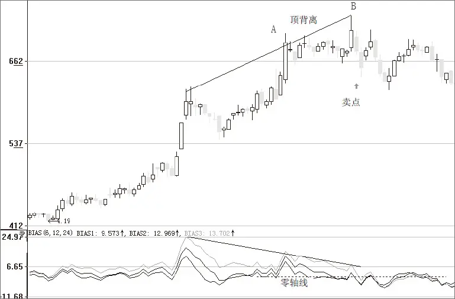

图21\-14 襄阳轴承（000678）2014\.07—2014\.11日线图

卖点解析

当股价一浪高于一浪，而相对应的乖离率值却一浪低于一浪，形成乖离率线与股价之间的顶部背离，给出卖出信号。顶背离出现后，我们还需要配合其他技术分析手段，这样共同形成的卖出信号准确率会更高。

__实盘解读 __

如图21\-14所示，股价上涨过程中一浪高于一浪，不断出现价格新高，而对应的技术指标则呈回落状态，一浪低于一浪，因此出现了顶背离信号。

我们说顶背离信号的出现对投资者更多的是预警作用，虽然后面有新高，但投资者若在A点处卖出股票也是可行的。

当股价上涨至B点时，对应的BIAS指标再次受阻回落。但我们看这次回落不同于A点处的回落，BIAS指标回落下破了零轴线，发生了买、卖区域的互转，因此我们判断B点的次日开盘，为背离信号的最高卖点，此时应快速离场，预示行情即将进入下跌趋势。

总结：背离信号并不等于卖出或买入信号，但应引起投资者的警惕，并且信任指标，按指标方向操作的信号都是可信的。
