# 《舒泰峰 财富是认知的变现》全文合订版

> 共57个章节。原章节顺序、段落结构和图表均予以保留。

## 内容提要

__内容提要__

想要通过投资成功积累财富，必须改造自我，其中核心的一条便是改造自己的认知。投资家的思维方式与背后的心性修养与常人有明显的不同，如果你不能掌握同样的投资认知体系，那么即便你拥有投资知识，也只是“有知识的小白”，不免沦为“韭菜”。本书对最核心的一些投资认知原则条分缕析，形成一个带有跨界特色的认知系统。应对投资者的12个常见认知误区，本书给出了12个破解之道，帮助读者有效避开投资中的陷阱。

## 推荐序 “形而上者谓之道，形而下者谓之器”

__推荐序__

__“形而上者谓之道，形而下者谓之器”__

裘国根

重阳投资创始人、首席投资官

投资大概可以分为三类：价值投资、行为金融和金融工程。金融工程以对历史数据的系统归纳为基础，在逐步迈向成熟的中国资本市场将有越来越大的施展空间。不过金融工程以未来会重复历史为假设，而未来充满了不确定性，所以有其局限所在。行为金融则以分析人性心理为基础。传统意义上的投资大师，无论是像巴菲特这样的价值投资者，还是像索罗斯这样的“狙击高手”，本质上都是行为金融的成功实践者。金融工程和行为金融各有其优势，但也都有一定程度的局限性，所以价值投资（基本面投资）还是投资的基础方法。我有一种感觉，未来在投资界取得类似于今天巴菲特和索罗斯这样量级成就的人，可能属于价值投资、行为金融、金融工程的跨界立体化实践者。

《易经·系辞》有云：“形而上者谓之道，形而下者谓之器。”如果说金融工程更偏向纯粹的科学，那么价值投资、行为金融则既是科学，也是艺术，是科学与艺术的结合。只是从投资实践来看，投资者往往更重视科学的部分，而对艺术的部分重视不足。投资的艺术部分是什么呢？归根结底在于人性。市场周期的背后是人性周期，市场由人组成，投资人的心理和情绪在恐惧和贪婪之间来回摆动，所以市场也在熊市和牛市之间来回波动。

人性的弱点还有很多，比如“过度自信”和“一知半解”。历史证明，最容易亏大钱的投资者往往认为自己“很知道”，美国长期资本管理公司就是一个典型的案例。过度自信和一知半解是投资大忌。

再比如“急于求成”和“鸵鸟思维”。急于求成，追求一夜暴富是人性使然，却是长期投资成功的大敌。急于求成的人往往重结果而轻过程，难免导致决策草率。一个好的投资决策的形成需要投资者全方位地对公司进行调研，这需要时间，切不可操之过急。欲速则不达。很多时候，慢就是快。

与急于求成相反的极端是鸵鸟思维，即对问题采取回避或消极拖延的态度。做投资，不该急的时候不能急，但该急的时候一定要急，比如学习、调研，投资者要抱着迫切的态度将问题和疑点搞透。所以，投资和决策需慎重，谋定而后动；研究和学习要积极，避免鸵鸟思维。

人性的弱点决定了做投资需要理性，重视概率思维，“遍历性”十分重要。遍历性理论是说若有一个随机过程，其过往的历史概率不能适用于其未来的情景，那么这个随机过程就不具有遍历性。这一理论告诉我们，随着条件的变化，过往的成功经验并不必然适用于当下和未来。投资方法一定要尽量具备“遍历性”，否则就存在爆仓或出局的可能。所以投资要因时因势而变，切忌路径依赖。

那么，决定人性周期的是什么呢？人性周期的背后是生物周期。人的生物学构造决定了人类神经的承受极限，驱动人的心理在理性和癫狂之间摇摆。所以，只有了解人性和生物周期，投资者才不会被大众情绪所左右，在投资中保持理性。

投资最好的杠杆是知识，财富复利背后是知识和思想的复利。我的同事舒泰峰认真梳理了财富认知方面的12个缺陷并探究了其背后的生物学根源，同时也给出了12个建设性的破解方案，虽未能全面覆盖，但不失为一部投资认知方面的很好的普及读物。作者具有一定的人文学科背景和多年媒体传播经验，又在重阳投资工作多年，这使得这本书具有一种特别的跨界特色，文风生动好读，穿插的12篇“老子对话巴菲特”使投资学变得更具人文性，趣味盎然，令人耳目一新。

2025年5月20日

21:15

## 自序 财富是认知的变现，破财是认知的沦陷

__自序__

__财富是认知的变现，破财是认知的沦陷__

很大程度上，这是一部“碰撞”之作。在加入重阳投资之前，我有10年的一线媒体从业经历，自认为是一个“有点见识的人”。但是，来到投资界之后，我受到了相当大的冲击，这种冲击主要来自“思维”和“认知”层面。我发现投资家的思维方式以及背后的心性修养与常人有明显的不同。同时，我也终于明白了以前投资股票却总被套牢的原因。总的来说，不管你是博学的杂家还是精通某个领域的专家，都无法确保投资成功，因为知识是知识，投资知识是投资知识，两者不能直接划等号。投资有自己的一套认知体系，如果没有掌握这套体系，那么你便是“有知识的小白”，同样不免沦为“韭菜”。

重阳投资创始人、首席投资官裘国根先生说过：“投资是一场反人性的游戏。”1要想通过投资成功积累财富，必须改造自我，其中核心的一条便是改造自己的认知。

幸运的是，在重阳投资这样顶尖的专业平台上，我得以重新检视并构建自己关于投资的认知。这一方面是通过阅读大量投资大师的经典著作。我仍然记得2014年第一次阅读查理·芒格的《穷查理宝典》时的情形。那是一种少有的醍醐灌顶式的阅读体验，让我认识到原来看问题竟可以有如此不同的角度。所以，本书的写作在很大程度上可以说是受到查理·芒格的启发。后来我又读了沃伦·巴菲特、霍华德·马克斯、彼得·林奇、约翰·邓普顿、安东尼·波顿、乔治·索罗斯、纳西姆·尼古拉斯·塔勒布、杰西·利弗莫尔、伯顿·马尔基尔等人的著作或文章，无不进一步加深了我对投资认知的好奇和探究之心。

我的创作灵感的更重要的一个来源是，在重阳投资我可以通过亲身观察和参与团队的投资实践，对投资大师们的理论进行验证，从而明白他们所讲的并不是纸面上的虚言，而是真正对财富创造以及人生有益的宝贵智慧。事实上，裘国根先生就是一位具有明显逆向思维特点的卓越投资家，他从不盲目从众，始终保持独立思考，所以能够取得业内罕有的投资业绩。

这本书的创作同样得益于我的跨界经历。我发现不管古今中外，顶尖智慧之间都是相通的，比如沃伦·巴菲特、查理·芒格的智慧与中国道家鼻祖老子的思想就有许多异曲同工之妙，所以我创作了一系列专栏文章“老子对话巴菲特”，这种跨时空的虚拟对话受到了投资圈内不少读者的喜爱。

在此基础上，我对与投资认知相关的一些最核心的认知原则进行了条分缕析，逐渐形成了一个带有某种跨界特色的认知系统。在这个梳理的过程中，我自己受益匪浅，它让我从一个“有知识的小白”逐步走向了专业。继而，我也希望将这个认知体系分享给更多对投资理财有兴趣的朋友，这就是这本书的由来。

__投资是一场反人性的游戏__

那么这本书核心的立意是什么呢？我先做一个简要的介绍。

投资是科学与艺术的结合，投资的科学指的是宏观大势研判、行业及企业基本面研究和估值这些可以“计算”的方面，投资的艺术则有关于认知及心性。这两方面同等重要，但是在投资实践中，很多人更注重科学的一面而忽视艺术的一面，导致出现一些不该发生的悲剧。

检索投资史，我们不难看到，成功的投资家往往也是认知及心性的大师，比如沃伦·巴菲特、查理·芒格、约翰·邓普顿等。而曾经辉煌一时，后来却一败涂地的投资家往往不是败于科学，而是败于认知，比如著名的华尔街股票作手杰西·利弗莫尔以及由多名诺贝尔奖得主组成的长期资本管理公司。甚至连牛顿这样的科学巨匠也在股票投资中巨亏，最终发出那句著名的浩叹：“我可以计算出天体运行的轨迹，却难以预料到人性的疯狂！”

我们每个人都有认知和心性的缺陷，这是由我们基因进化的进程所决定的。进化的第一法则是基因的传递，为了完成这一目的，进化给人类制造了许多的“奖励”机制，它体现为各种感官的快乐，通俗地讲，就是所谓的“七情六欲”。这些感官的快乐都是很短暂的，正因为快乐易逝，所以我们永不满足，贪求一旦过度就形成了“贪婪”。

这些“七情六欲”不仅是短暂的，而且很可能还是“虚假”的。科学实验发现，不管是猴子还是人类，预期将吃到自己最喜爱食物时的快感甚至多于真正吃到时的快感。这种预期在某种意义上就是“幻觉”。事实上，焦躁、绝望、仇恨、贪婪……这些情绪都具备“幻觉”的成分，甚至我们心心念念的“自我”可能也是一种“幻觉”。2这些“幻觉”可以理解为自然选择为了实现基因安全以及多产而给人类制造的某种认知漏洞。不过，这并不是说“七情六欲”都要摒弃，“无情何必生斯世”，恰当的情感和有节制的欲望可以使人生的过程更加丰富多彩。只是在投资这样需要高度理性的领域，我们需要对情感和欲望多一份深层的审视。

在瓦特发明蒸汽机之前，人类文明的演进非常缓慢，这导致了我们基因结构的固化，也导致了我们认知的迭代非常缓慢。但是，进入现代以来，在科学和器物的层面，人类文明已经出现了爆炸式的增长，这种变化要远远领先于我们基因的进化。

同时，自然选择并非人类进化的唯一路径，在自然选择之外还有社会选择。在文明高度发达的今天，我们早已摆脱了先祖们所面临的生存繁衍的困境，社会选择的权重越来越高。社会选择要求我们超越仅仅作为基因传递工具的动物性，变得不那么自私、狭隘、短视，不那么贪恋短暂的愉悦，而是更加乐于协作、理性、包容，更加愿意追求长久的幸福，也就是变得更具有“人性”，甚至有的人可以超越人性而展现出某种“神性”。

我们在自然选择进程中形成的认知显然与我们生活的现代环境发生了严重的错配，某种意义上可以说虽然我们的身体已经处于21世纪，但是我们的大脑还停留在丛林社会，这无疑极大地阻碍了现代的我们走向真正的成功以及获得长久的幸福。

股市是人性的放大器，无论是贪婪还是恐惧，种种认知的缺陷都在其中发挥得淋漓尽致，这无疑是成功投资的大敌。

查理·芒格曾说：“即使握有全世界最锋利的刀，如果你自己的心性存在缺陷，那么它也会成为自残的工具……如果你拥有最精于计算的头脑，但始终无法克服欲望的纠缠，那么在巨额财富的重压之下，你注定将粉身碎骨。”3\(1\)

芒格擅长逆向思维，他的理念是，人们如果想取得投资成功，首先要思考的是如何避免投资失败。清楚地认识到认知的先天缺陷，然后建立科学正确的认知，正是避免投资失败的前提。

所以，财富是认知的变现，破财是心智的沦陷。

__汲取成功的智慧，穿越认知的迷雾__

本书的12篇内容其实是炒股失败者普遍的心路历程。许多非专业的投资者朋友可能都经历过这样的炒股五阶段。

第一阶段：在火热的市场气氛中买进股票，一开始股价随着大盘天天涨，你非常开心，经常请朋友吃饭或者唱卡拉OK。

第二阶段：好景不长，股市从高点回落，你买的股票的价格也随之下跌，这时候你仍然信心满满，觉得这不过是暂时的回调，股价肯定会涨回来并再创新高。

第三阶段：事与愿违，某天，股价终于跌破了你的成本线。你仍然不信邪，咬牙坚持，不过这时候你的信心已经没有那么坚定了。

第四阶段：市场气氛进一步转冷，甚至都没有人再谈论股票了。你买的股票价格也跌到了新低，可能比你买入的价格低50%甚至更多。这时候你终于心灰意冷，放弃了抵抗，但是你并没有割肉斩仓，只是任由股价雨打风吹去，再也不看股票账户。同时内心深处依然抱着侥幸的希望——“守得云开见月明”，只要没卖，只要我等，总有希望。

第五阶段：现实比预想的更残酷，这一等可能就是3年、5年，甚至8年、10年。你望眼欲穿，回本无望，终于在内心承认了投资的失败，或者另有着急用钱之处，不得已割肉出局。

在这个过程中，投资者既亏了钱，也亏了时间，却不知道为什么。事实上，在这个过程中，是一个又一个认知误区让你掉进了陷阱里。在第一阶段，过度自信、贪婪与嫉妒、急于求成迫使你不断追高入场；在第二阶段，禀赋效应、锚定效应让你无法灵活变通；在第三、第四阶段，损失厌恶、被剥夺超级反应及无为综合征迫使你一步步被套牢、深陷；在第五阶段过度悲观成为压垮骆驼的最后一根稻草，迫使你不得不斩仓出局。而在整个过程中，线性思维、盲目从众、故事思维火上浇油，助长着你的贪婪和恐惧，将你绑定在追涨杀跌的怪圈当中。不仅如此，股票市场还是一个“黑天鹅”满天飞的世界，一不小心就可能踩雷。最后，交易程序与生活程序其实紧密相关，即使你通过投资实现了财富自由，如果“财不配位”，也可能反遭其害。

所以，买卖一只股票看似简单，其中却有这么多的认知误区等着你。这些认知误区说起来并不复杂，但背后却有非常深刻的进化学根源，因此改变起来并非易事，正所谓“江山易改，本性难移”。

本书便是希望总结投资和商业史上失败的教训，并从成功的投资家那里汲取成功的智慧，以带领投资者穿越认知的迷雾。应对12个认知误区，本书给出了12个破解之道：

1．以“自知者明”破解“过度自信”；

2．以“理性自律”破解“贪婪与嫉妒”；

3．以“长期主义”破解“急于求成”；

4．以“安全边际”破解“禀赋效应”；

5．以“变亦不变”破解“锚定效应”；

6．以“未来思维”破解“损失厌恶”；

7．以“逆向思维”破解“过度悲观”；

8．以“独立精神”破解“盲目从众”；

9．以“周期思维”破解“线性思维”；

10．以“概率思维”破解“故事思维”；

11．以“谨慎小心”破解“黑天鹅”；

12．以“财富善念”破解“财不配位”。

借用行为金融学专家、上海交通大学上海高级金融学院副院长朱宁教授的概念，12个认知误区是“投资者的敌人”，而12个破解之道是“投资者的朋友”。当然，这12个认知秘诀远远不是投资智慧的全部，但或许有益于破解一些最常见的认识误区。希望本书对这些投资认知常识的科普能够帮助朋友们避免在财富积累的道路上犯下一些最初级的错误。

__投资问道：老子对话巴菲特__

我将“老子对话巴菲特”12篇内容穿插于正文之间，构成一条辅线，以一种轻松的方式与12种认知形成一种呼应。

一边读老子一边读巴菲特是一种奇妙的体验，它让人感觉到顶级智慧之间竟是如此异曲同工。老子和巴菲特、芒格虽然年龄相差了约2500岁，从事的是完全不同领域的工作——图书管理员和投资家，但是他们所讲的道理却高度相通，毫无时空的隔膜。

不信，我们就先来拉清单罗列一番。

1．巴菲特和芒格恪守不熟不投的原则，绝不做跨越自己能力圈的投资决定，巴菲特说：“我只做我完全明白的事。”芒格说：“承认无知是智慧的开始。”老子则说：“知人者智，自知者明。”

2．巴菲特和芒格都极为自律，哪怕在小事上也不放松对自己的要求，巴菲特说：“如果你不学会在小的事情上约束自己，你在大的事情上也不会受到内心的约束。”老子则说：“胜人者有力，自胜者强。”

3．巴菲特和芒格喜欢长期投资，巴菲特说：“时间的妙处在于它的长度。”芒格说：“如果既能理解复利的威力，又能理解获得复利的艰难，就等于抓住了理解许多事情的精髓。”老子同样反对速成，他说：“大器晚成；大音希声。”

4．巴菲特和芒格十分注重给投资留有安全边际，巴菲特说：“我建一座能承重3万磅的桥，但却只让通1万磅的车；这样就算我大意了失算漏放了一辆1\.2万磅或者1\.3万磅的卡车过去，也不至于桥毁人亡。”芒格：“河水淹死会水人。”老子则说：“保此道者，不欲盈。夫唯不盈，故能蔽而新成。”

5．巴菲特和芒格善于变化，芒格说：“当条件变化了我们也要变化。”老子《道德经》通篇都在讲变化：“有无相生，难易相成，长短相形，高下相盈，音声相和，前后相随”“万物并作，吾以观复”等。

6．巴菲特和芒格在投资中善于抛弃面子、情感等因素，总是从内在价值出发选择投资标的。老子则说：“不失其所者久。”

7．巴菲特和芒格喜欢逆向思考，巴菲特说：“别人贪婪时我恐惧，别人恐惧时我贪婪。”芒格说：“反过来想，总是反过来想。”老子则说：“俗人昭昭，我独昏昏。俗人察察，我独闷闷。”

8．巴菲特和芒格喜欢集中持股，他建议每个投资人都给自己一张卡片，上面只允许自己打20个小洞，每次买入1种股票时，就必须打1个洞，打完20个，就不能再买股，只能持股。老子则说：“少则得，多则惑。”

9．巴菲特和芒格深知辩证之法，芒格说：“在有限的世界里，任何高成长的事物终将自我毁灭。”老子则说：“反者道之动。”

10．巴菲特和芒格从不被故事所迷惑，总是安静地等待机会，巴菲特说：“诀窍是当没有合适的事情可做时，就什么也不做。”芒格说：“我的系统总是坐下来静静地思考几个小时。我不介意在很长的时间里没有任何事情发生。”老子同样喜欢以“致虚极，守静笃”保持头脑清醒。

11．巴菲特和芒格以极其谨慎小心的态度防范不确定性的“黑天鹅”，巴菲特说：“有些时候我们过于谨慎，但我宁可100次的过于谨慎，也不愿1%的不谨慎。”芒格说：“所有的投资评估都以衡量风险开始”。老子则说：“为之于未有，治之于未乱。”

12．巴菲特和芒格具有很高的道德标准，巴菲特说：“你给别人的爱越多，你获得的回报就越多。”芒格说：“要得到你想要的某样东西，最可靠的方法是让你自己配得上它。”老子则说：“上善若水。”

……

这个阅读体验使我产生一种创作冲动——将老子和巴菲特拉到一起做个跨越时空的对话。我们假设老子复活了，好学的他对投资这门显学产生了浓厚兴趣，又恰好在奥马哈小镇遇到了巴菲特和芒格，就向这两位当世投资“大神”问个究竟。恰好巴菲特和芒格也知道老子是东方的得道高人，于是热情延请老子至家中做客，探讨智慧。

于是将近2600岁须髯尽白的老子，91岁仍然喜欢喝可乐、吃甜食的巴菲特，以及97岁少言而犀利的芒格之间发生了一场巅峰对话，他们一聊便是12日，每日一个话题，场面可以说精彩纷呈，智慧爆棚。

在这场对话中，笔者有幸被邀请作为聊天助理。为了便于称呼，老子还给笔者起了个昵称：“舒姓拆开，左舍右予，不如就称呼你‘小舍’吧，小舍小得嘛！”笔者欣然接受这助聊的角色。\(2\)

在做完这一系列梳理之后，我的一个深刻感受是投资之道最终是做人之道。人生无论是致富，还是成名，抑或是登高位，都不易，但是更不易的是发现自我并实现自我。成功的投资家正是这样一类人，他们不仅成功地通过投资积累了财富，而且在这个过程中成就了自我，而失败的投资家却往往在这个过程中迷失了自我。所以我相信，这些由投资衍生出来的智慧，也将有益于我们体悟为人处世之道，最终提升我们的生活幸福。

2025年5月20日

21:15

## 测一测 你对投资中的认知陷阱了解多少

__测一测__

__你对投资中的认知陷阱了解多少__

· __下列哪一项不是投资人常见的认知缺陷？（ ）__

A．急于求成，本能地渴望看到立竿见影的效果

B．盲目从众，追涨杀跌

C．过度悲观，我们的恐惧常常大于危险本身

D．保持理性，不被贪婪与嫉妒情绪左右

· __我们总是相信自己愿意相信的，甚至扭曲事实以适应固有想法，所谓“吃不到葡萄说葡萄酸”，这种认知缺陷源于：（ ）__

A．禀赋效应

B．过度悲观

C．盲目从众

D．线性思维

· __老子的哲学思想与现代投资哲学有异曲同工之妙，下列哪一句老子的名言体现了投资中的长期主义哲学？（ ）__

A．大器晚成，大音希声

B．胜人者有力，自胜者强

C．上善若水

D．知人者智，自知者明

扫码鉴别正版图书

获取您的专属福利

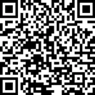

扫码获取全部测试题及答案了解投资中的认知陷阱与破解之道

2025年5月20日

21:15

## 01 以“自知者明”破解“过度自信”

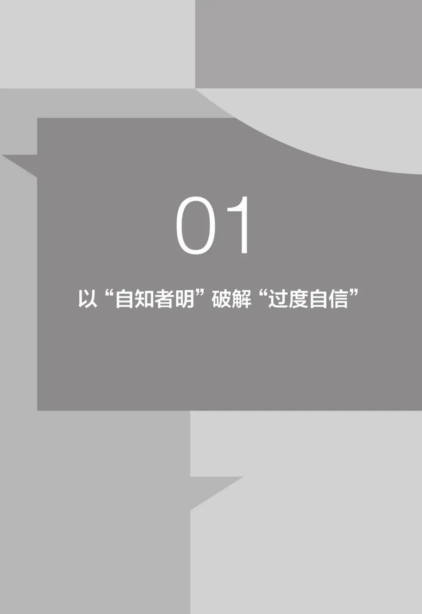

2025年5月20日

21:15

## 财富是认知的变现

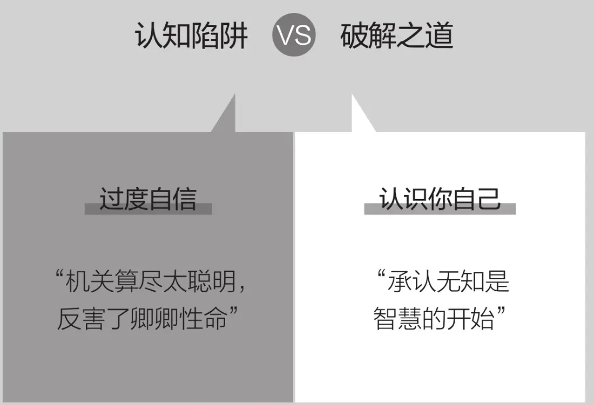

## 认知陷阱1：过度自信 “机关算尽太聪明，反害了卿卿性命”

__认知陷阱1：过度自信__

__“机关算尽太聪明，反害了卿卿性命”__

如果评选世界上最聪明的投资团队，长期资本管理公司（LTCM）是当之无愧的第一名。《财富》曾发表文章评论说，长期资本拥有全世界最高的IQ密度。

来看看长期资本拥有的IQ密度：

· 诺贝尔经济学奖得主罗伯特·默顿（Robert Merton），加盟长期资本之前，先后执教于麻省理工学院斯隆管理学院和哈佛大学。他提出的著名的“默顿模型”被广泛应用于各种风险资产及金融衍生产品的定价工作中，并为当今蓬勃发展的金融工程学奠定了基础。

· 诺贝尔经济学奖得主迈伦·斯科尔斯（Myron Scholes），著名的期权定价方程B\-S公式的创建者。

· 戴维·马林斯（David Mullins），美联储原副主席，曾被视为格林斯潘的继任者。

· 其他人还有埃里克·罗森菲尔德（Eric Rosenfeld），毕业于麻省理工学院，后任哈佛商学院金融学副教授；威廉·克拉斯克尔（William Krasker），哈佛商学院教授；华人金融大牛黄奇辅，毕业于斯坦福大学，后执教于麻省理工学院、斯坦福大学和宾夕法尼亚大学；等等。

将这些“大神”拢到一起的是长期资本创始人约翰·梅里韦瑟（John Meriwether），一个被誉为能“点石成金”的“华尔街债务套利之父”，在创立长期资本之前，曾是华尔街大投行“所罗门兄弟”的副总裁。

这样的阵容后面有没有来者不好说，前无古人是肯定的。罗伯特·默顿曾经抱怨说，梅里韦瑟挖走了整整一代学术精英，没想到后来自己也加入了长期资本。这样的投资天团，战绩怎么样呢？

一开始，长期资本可以说战无不胜。长期资本的认购门槛是1000万美元，业绩提成比例高达25%，比一般的对冲基金要高出5个百分点。然而，这样的门槛不仅没有吓住投资者，反而还吸引了许多业界一流机构，美林、贝尔斯登、科威特投资局、台湾银行等都是长期资本的客户。

长期资本的旗舰基金于1994年2月正式成立，募集规模为12\.5亿美元，是当时最大的对冲基金之一。在成立10个月后，该基金的投资回报率就达到20%，1995年其投资回报率是43%，1996年其投资回报率更是达到41%，当年的盈利就达到21亿美元，远超麦当劳在全球一年卖10亿个汉堡包的利润。更不可思议的是，长期资本的最大月回撤仅为2\.9%，并且所有季度盈利都是正的。《经济学人》评论说，长期资本把风险管理从博弈变成了科学。

可惜这只是故事的一半。在金融领域有个“定律”，赚钱的策略有效期都很短。原因是金融领域都是高智商的聪明人，一个策略一旦被发现管用，很快就会被别人模仿，跟风的人多了，这个策略也就失效了。长期资本也不能例外，由于效仿的人太多，到1997年，长期资本费后的回报率就跌到了17%。不得已，长期资本最终决定将27亿美元退还给初始投资者。

然而这一决定却埋下了长期资本溃败的导火索。由于套利空间日益收窄，而27亿美元已经退还给投资者，长期资本只好不断提升组合的杠杆，从18倍提升到28倍，这意味着每一个点的波动将产生4000万美元的潜在盈亏。极端的时候，长期资本的杠杆率竟然达到了惊人的100倍！

拥有“超级大脑”的长期资本对自己的模型有“迷之自信”，他们认真计算了组合中每一笔交易的风险敞口，认为风险完全可控。比如，他们计算的1998年8月组合的每天最大可能亏损仅为3500万美元。然而，人算不如天算。当时正值亚洲金融危机，在8月21日当天，他们就损失了5\.5亿美元，截至8月底，他们当年亏损了19亿美元，组合回撤达到了52%。9月，长期资本的收益继续直线般坠落，9月10日亏损5\.3亿美元，11日亏损1\.2亿美元，14日5500万美元，15日8700万美元，16日1\.2亿美元，21日5\.5亿美元……

亚洲金融危机很快波及俄罗斯和巴西等国家。进入1998年之后，俄罗斯大量外资流出、外汇储备几乎干涸、石油价格暴跌了33%，股票市场8个月内跌了75%，短期利率飙升至200%。8月17日，俄罗斯突然发表声明，他们不会考虑偿还外国债务，卢布马上就会贬值。也就是说，作为一个主权国家政府，俄罗斯政府竟然堂而皇之地宣告自己违约了，这给了长期资本致命的一击。

短短150天，长期资本的资产净值就下降了90%，仅余5亿美元。兵败如山倒，长期资本的亏钱速度比赚钱速度更快。百般无奈，梅里韦瑟只得向美联储求助。1998年9月23日，美联储破天荒地召集了各大金融机构的头目，共同救助长期资本。为了防止系统性风险，美联储主导了长期资本的收购案，联合了14家华尔街的银行以36亿美元收购了90%的股权。又过了2年，长期资本彻底被清算，投资史上最著名的豪华天团彻底退出历史舞台。1

__“每个人都相信人终有一死，除了他自己”__

长期资本败在哪里？答案是过度自信。首先，他们对自己的理论和模型过度自信。默顿和斯科尔斯信奉市场有效理论，认为如果价格出现了偏差，市场一定会把它纠正过来，价差一定会收敛。长期资本的方法本质上就是利用高杠杆赚价格收敛的钱。在亚洲金融危机中，其他人避之不及，他们却大举杀入，正是因为信奉这样的哲学。不料这时候人人都想卖出有风险的资产，有风险资产和无风险资产之间的价差越拉越大，他们的亏损也相应地越来越大。

其次，他们错误估计了俄罗斯政府的信用。他们怎么也没有想到，作为主权国家的俄罗斯的政府会宣布违约。

长期资本的模型十分复杂，少有投资者能够听懂，有人戏称他们的模型可能是用来造原子弹的。然而精密的模型却无法测度人性，在极端情形下，人性的贪婪与恐惧轻松击穿了他们的模型。他们也没有正视自己的人性，过度自信与恐惧或贪婪一样，都是投资的大敌。

芒格的一段评论可以说十分到位：“一个名叫长期资本的对冲基金最近因为对自己的杠杆交易模式过于自信而遭受了溃败，虽然他们的主要成员平均智商都有160。聪明、勤奋工作的人们并不能在由于过分自信而导致的专业失败中得到豁免。通常他们只是在自己选择的更复杂的航行中触礁，所依赖的无非是他们有更高的天赋和更好的方法这样一种自我评价。”2

不光是长期资本管理公司，多数人都会犯过度自信的毛病。一项研究对受试者进行了胆固醇测试，数月后追踪受试者对测试结果的记忆情况。测试结果表明，胆固醇偏高、最有可能患病的受试者记错测试结果的概率最高。在他们的记忆中，测试结果比实际结果更好，也就是他们自认为比较健康，而实际情况要坏得多。3

心理学家发起的不同心理测试，反映出大同小异的结果：82%的司机认为自己的驾驶技术高于平均水平；84%的法国男人声称自己是高出平均水准的好伴侣；2994个公司创始人认为自己创业成功的概率为70%，但他们却认为别人创业成功的概率只有39%；甚至大多数吸烟者认为，他们染上与吸烟相关疾病的风险也要比别人小。我们的过度自信还表现在当我们取得成功的时候，往往相信这是来源于自己的能力；而失败时，又往往把责任归咎于运气、环境或者他人。

简而言之，每个人似乎都认为自己属于统计数据以外的人，或者说是得到命运垂青的幸运儿。对此，18世纪英国诗人爱德华·杨格（Edward Young）讽刺道：“每个人都相信人终有一死，除了他自己。”亚当·斯密也曾写过：“绝大多数人对自己的能力和对自己会交好运的愚蠢假设过分自负。”4然而真相是残酷的。我们尊敬的芒格先生也是一位不留情面的“毒舌先生”，他曾辛辣点评：“生活中亘古不变的规律是，只有20%的人能跻身前五分之一。”

__“欺人者自欺以欺人”__

人为什么会过度自信呢？这可能要从人类的进化机制中寻找答案。试想我们那些处于丛林时代的先祖，刀耕火种，面对的是极其恶劣的生存环境，不但要躲避野火、洪水等自然灾害，还要直面凶猛的野兽，甚至要猎杀野兽以获取优质蛋白等生命元素。在这样的环境下，没有点勇气自然是不行的。正是生存的本能鼓励人类的先祖养成自信甚至是过度自信的性格。武松要不是有点过度自信（酒精在其中也发挥了作用），很难想象他敢徒手打老虎。而从发展的角度看，过度自信的人往往比实际上显得更强壮和有实力，这也有利于在配偶竞争中胜出，从而增加基因繁衍的机会。我们观察现实生活发现，自信的人的确比不自信的人能获得更多的朋友以及更好的发展机遇。

著名进化生物学家罗伯特·特里弗斯说，“自欺”为人类精神生活核心中“令人叹为观止的矛盾”。过度自信正是自欺的一种。自我欺骗不仅仅是内向的、防御的，而且具有更多外向性和自我服务性。来看一下“懦夫游戏”，它的规则是两个人相向驱车笔直急速而行，先转向的一方告败。如果在游戏中，一方拆掉方向盘并举起方向盘向对手挥舞示意，同时加速向对方猛冲过去，对手看他视死如归，一般都会先转向，把胜利让给对手。拆掉方向盘相当于限制了自己的选择，这通常不是明智之举。但是为什么在游戏中能够奏效呢？经典决策理论认为：自我毁灭就其自身而言是毫无价值的，其价值在于让其他参与者确信你想毁灭自我。在懦夫游戏中，你之所以获胜，并非是因为你无法转向，而是因为对手相信你无法转向。换句话说，你想成功欺骗别人，就必须先自我欺骗，所谓“欺人者自欺以欺人”。5

这么看下来，自我欺骗竟是人类漫长进化史所带来的一项精神遗产，某种程度上它是我们的生存本能甚至发展的秘诀。一项针对竞技游泳运动员的研究显示，懂得自我欺骗的运动员在重要赛事中往往表现更佳，应了中国古话“狭路相逢勇者胜”。

所以，不必将过度自信一棍子打死，因为这一基因密码可以激发人类面对危险时的勇气和对于未来的探索激情。这正是著名经济学家约翰·梅纳德·凯恩斯所提出的重要命题“动物精神”，在他看来，“我们之所以积极行动很大程度上靠的是瞬间的积极心态而不是以数字衡量的期望。无论这种乐观是道德方面的还是经济方面的。我们在乐观心态的影响下所做的决定，其结果可能需要很长时间才能显现出来，这种决定行为只能被看作是动物的精神的产物”。6

喜欢幻想并勇于行动的埃隆·马斯克就是这样的典型人物，他那看起来有些疯狂的自信使他完成了许多常人无法想象的奇迹。芒格先生多数时间都在教导人们要保持理性，但是他也讲过一句非常不一样的话，他说，“千万不要低估那些高估自己的人”。7

但是搞发明创造是一回事，做投资却是另一回事。在投资中如果总是过度自信，迟早会被市场痛击。

__投资中的盲目自信损害财富的积累__

接下来就让我们来看一下过度自信可能对投资致富造成哪些副作用。

过度自信的人容易产生控制错觉。

回想一下，我们在玩手游控制赛车方向的时候，其实用手操作就可以了，但是我们的身体也不自觉地向左或向右倾斜起来，似乎这样就可以影响游戏里的车子方向。这就是“控制错觉”，它最早是在1965年被发现的，实验方式是一盏灯和一个手动开关。受试者可以操作那个开关，但实际上灯的明灭是随机的，即使这样，受试者也坚信是自己的操作在影响灯。

还有一个故事是说，每天上午快9点时，一个头戴红帽子的男人就会站在一座广场上，疯狂地将帽子挥来挥去。5分钟后他又消失了。有一天一位警察走到他面前：“你到底在做什么？”男人答道：“我在驱赶长颈鹿。”警察反驳道：“这儿没有长颈鹿。”男人答道：“没错，这正是因为我干活干得好。”8

我们一不小心就会掉入“控制错觉”当中，在股市中也同样如此。过度自信的倾向在投资者中表现得尤为强烈。与其他大多数人相比，投资者往往更能夸大自己的技能，更会否认机会、运气的作用。他们会高估自己的知识水平，低估相关风险，就如长期资本管理公司那样，以为可以通过模型完美地控制风险，这本质上也是一种控制错觉。

过度自信在投资中的另一个典型体现是择时。散户一般都非常相信自己对时机的把握能力，他们在认为有机会时买进，稍有风吹草动就抛出，于是频繁进出市场。殊不知，盲目的择时行为不仅会打断复利的累积，还会错失创造收益的重要时间窗口。

美国著名投资家彼得·林奇发现，关键几天往往可以成就或是摧毁整个投资计划。在20世纪80年代股市上涨的5年中，股价每年的涨幅大约为26\.3%，坚持长期持有的投资者资产会翻番，但其实这5年的大部分利润是在1276个交易日中的40个交易日中赚取的。如果在那40个交易日中你选择空仓的话，你的年均收益率可能就会从26\.3%降到4\.3%。

拉斯洛·比里尼（Laszlo Birinyi）在其著作《交易大师》（*Master Trader*）中研究了一个更长的时段，他计算之后得出的结论是：倘若一位投资者坚守买入持有策略，于1900年将1美元投入道琼斯工业平均指数，那么到2013年年初，这1美元将升值为290美元。然而，倘若该投资者错过了每年中最好的5个交易日，那么到2013年，1美元投资的价值将不足1美分。

这些都是美股的数据，在“牛短熊长”的A股又如何呢？2002年1月1日至2019年11月30日间沪深300指数统计显示，如果错过涨幅最高的10个交易日，年复合收益率将从6\.3%下降到1\.8%。10个交易日在总计4324个交易日中占比仅为0\.23%，却贡献了71\.4%的收益。如果换个算法，去掉涨幅最高的前20天，结果如何？年复合收益率竟变为了负数！

结论不言自明。股市创富的时间窗口并非时时打开，相反它如此微妙又如此短暂，如同昙花一现。所以，如果缺乏专业能力的保驾护航，择时其实是一种相当危险的动作。“根据市场波动来卖股票的行为实质就是选时。选时者试图预测短期市场波动和股价波动，并据此获得盈利而退场。但是，没有多少人可以用这种傻瓜都懂的方法真正赚到钱。如果真是这样，那这个人早就成了亿万富翁，而不是比尔·盖茨和沃伦·巴菲特了。”彼得·林奇总结：“人们还认为在市场调整的时候投资股票是非常危险的，但他们忘了，踏空同样也是有风险的。”9

投资时过度自信的人还容易犯追高追涨的错误。这主要体现在牛市当中，每次牛市来临，乐观的人们就开始相信这一次将与过去不同，新的纪录将被创造，于是在3000点的时候遥望5000点，5000点到了又觉得股市会突破10000点。牛市刚起步的时候，散户一般还比较谦虚，还会咨询一下专业人士的看法，但是一到牛市高潮的时候，散户就摇身一变而成“股神”了，那时候他们就要开始向专业人士提供投资指导了，而这也被认为是牛市到头的特征之一。

自信是一种美好的品质，适度的“盲目自信”有益于个人在事业上的成功甚至社会的整体进步。但这也要区分领域，在体育竞赛、发明创造等方面，这种精神或许利大于弊，不过在像股市这种极为复杂的领域，过度自信恐怕不是什么好事，相反还是多一分谦卑为好。不然我们很可能落得一个《红楼梦》中凤姐那样的下场：机关算尽太聪明，反害了卿卿性命。

__破解之道1：认识你自己__

__“承认无知是智慧的开始”__

在经典科幻电影《黑客帝国》中，先知对正处于迷惘当中的未来救世主尼奥说：“认识你自己。”这是一个古老的命题。

笔者曾经去过一趟德尔斐。德尔斐是希腊的一个地名，从雅典乘坐大巴一路往北，穿行过奥林匹斯诸神曾经飞舞的苍翠群山，两小时左右就可以到达。现在知道德尔斐的人已经不多了，但是3000年前，这里可是世界上最热闹的地方之一，尤其在泛希腊先民的眼里，这里更是世界的中心。古希腊神话里，众神之父宙斯放飞了两只鹰，它们绕地球相向而飞，最终汇合于德尔斐。希腊人在这里建造了阿波罗神庙，并在其正中立石为记，形成“地球之脐”。

“地球之脐”驱动着泛希腊先民们的步伐，他们从雅典城邦赶来，从伯罗奔尼撒半岛赶来，从克里特岛赶来，甚至从爱琴海对面的小亚细亚赶来……他们络绎不绝地赶来，只为听取阿波罗给出的神谕。嫁娶、吉凶、生死、战事，当然也少不了政治，阿波罗通过女祭司皮提亚之口尽可能地给出答复。

阿波罗神庙位于一个陡峭的山坡上，正前方是空旷的山谷。神庙仅剩下几根残柱，而且被围栏阻隔，无法靠近。旅人们只能在脑海里努力勾勒德尔斐鼎盛时期的样子：以阿波罗神庙为核心的建筑群巍然矗立，神庙的顶部镌刻着奥林匹斯众神的浮雕，门柱上则是那句照耀千古的神谕——“认识你自己”。

所谓神谕，本是人言，只是希腊先哲不够自信，借神祇之口以增加权威。这句神谕之所以流传数千年不息，是因为它道出了人性的斯芬克斯之谜——“我是谁”。

“认识你自己”听起来很容易，实际上却很难。漫步于德尔斐的遗址当中，笔者的脑海里浮现出一幕场景：公元前399年，雅典公民法庭以280:221的投票结果判处西方哲学之父苏格拉底死刑。苏格拉底奉“认识你自己”为自己的信条，终生致力于教导雅典公民如何理性地思考。给出最伟大神谕的地方，却也造成了最令人惋惜的人性悲剧。

苏格拉底之后，理性之路道阻且长。如果再去看看拥有135个塔尖的意大利米兰大教堂，然后去佛罗伦萨看看大卫雕像和波提切利最著名的画作《维纳斯的诞生》和《春》，就可以清晰地看见历史穿越人神共治、神统治人而抵达人性复归的过程。人类到了佛罗伦萨，才开始重新认识自己。

然而理性尚未成功，“认识你自己”的课题或许将伴随人类始终。2016年6月，英国以公投的形式表决脱欧，令全球大跌眼镜，事后调查发现，许多英国人并不知道欧盟是什么。在大卫雕像被创造出来500年后，英国人用一次公投在人类的理性路途上制造了一个大大的国际问号。

__95%的人“不知道自己不知道”__

投资所面临的最大难题同样是“认识你自己”。猎豹移动CEO傅盛曾改造过一幅人类认知的四个阶段图（见图1\-1），非常精彩。这张图显示95%的人处于第一个阶段，即“不知道自己不知道”。第二个阶段是“知道自己不知道”，但这样的人只占总数的4%。第三个阶段是境界更高的“知道自己知道”。巴菲特和芒格应该就处于这个境界，他们知道什么东西是买了大概率不会亏本的。但这样的人只占0\.9%的比例，可谓百里挑一。而最顶尖的一群人，他们“不知道自己知道”，仅占0\.1%的比例，千里挑一，那大概指的就是那些智慧超凡的哲人们了（如图1\-1所示）。10

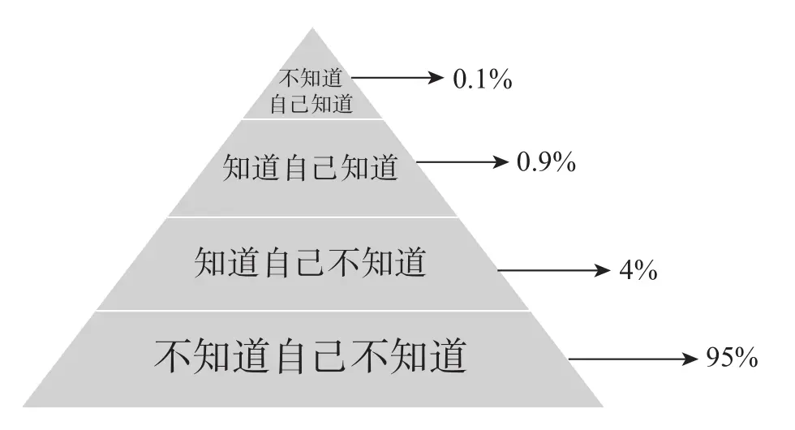

图1\-1 人类认知的四个阶段

可见，芸芸众生中绝大多数人都属于“不知道自己不知道”的状态，另外有些人可能本来是“知道自己不知道”的，但是一旦进入群体，却又变为“不知道自己不知道”了。人不是孤立的存在，社会学家古斯塔夫·勒庞指出，个人一旦进入群体，他的个性便很可能会被湮没，群体的思想便会占据绝对的统治地位，而在一些情况下，群体的行为会表现出排斥异议、极端化、情绪化等特点。11

股市是一个典型的群体结合，人群中的我们所踩过的认知缺陷的雷可不止一个两个。“过度自信”就是其中打头阵的那一个，其余的还有我们接下来要讲到的贪婪与嫉妒、急于求成、禀赋效应、损失厌恶、避免不一致倾向、锚定效应、被剥夺超级反应、无为综合征、过度悲观、盲目从众、线性思维、故事思维等，总有一款适合你。所以芒格说：“最重要的是，别愚弄你自己，而且要记住你是最容易被自己愚弄的人。”

__承认无知是智慧的开始__

那么破解的药方是什么呢？答案往往蕴含于问题之中。老子说“知人者智，自知者明”，只有建立清晰的自我认知才是破解过度自信等认知缺陷的根本良药。

看看这些投资大师们就知道，一流的投资家都是自我认知的高手，而且他们也给出了如何建立自我认知的忠告。

投资大师、橡树资本董事长霍华德·马克斯说：最大的投资错误不是来自信息因素或分析因素，而是来自心理因素。他详细列举了影响投资最主要的七个心理因素：贪婪、恐惧、自欺欺人、从众、嫉妒、自负、妥协。霍华德给出的忠告是“认识它们”。

债王比尔·格罗斯在自己办公室墙上贴了一条语录：“实践中投资人必须提防许多东西，最重要的是提防自己。这是做好投资的关键一步！”格罗斯给出的忠告是“提防自己”。

大名鼎鼎的乔治·索罗斯则善于认识自己的错误：“对任何事情，我和其他人犯同样多的错误，不过，我的超人之处在于我能认识自己的错误。”索罗斯给出的忠告是“自我批判”。

20世纪20年代华尔街最传奇的股票作手杰西·利弗莫尔也说过：“投机者最大的敌人往往是他自己，因为人类有希望与恐惧的本性。”他还指出：“自以为了不起是一种病，它在任何地方对任何人来说都是一种代价昂贵的弊病，在华尔街，对于一个投机者来说，尤其如此。”所以，“如果一个股票交易者能学会如何避免妄自尊大，付出再高的代价也是值得的”。利弗莫尔本人虽以悲剧收场，但他的悲剧主要由德性不够引起，不可否认他仍然是自我认知的大师。利弗莫尔的忠告是“避免妄自尊大”。12

从人类认知的四个阶段图也可以看出，一旦我们采取了谦虚的态度，承认自己很多事情不知道，其实就已经进入了4%的少数人之列。承认无知比自以为是要高明得多，就如芒格所说，“承认无知是智慧的开始”。

我们的财富认知之旅，就从承认自己的无知开始吧。

2025年5月20日

21:15

## 老子对话巴菲特 知人者智，自知者明

__老子对话巴菲特__

ROUND 1

__知人者智，自知者明__

宾主坐定，巴菲特开门见山，问老子修为之道第一要紧的事是什么？

老子却摆摆手说：今天先不论道，我脱离实践好几千年，还是先做点调研，听听两位投资大师介绍介绍投资学的窍门。

巴菲特心想，老子果然虚怀若谷，便问老子想了解什么，他和查理必定知无不言，言无不尽。

于是，老子反问巴菲特和芒格，做投资第一要紧的事是什么？

就像每年的投资者见面会一样，巴菲特总是唱主角的那个，他先回答说，以他几十年的经验，做投资首先是要了解自己。

老子请巴菲特展开讲述一下。

巴菲特：对大多数投资者来说，重要的不是他们知道什么，而是他们能在多大程度上认识到自己不懂什么。

老 子：为什么这么说？

巴菲特：这是因为“风险恰恰来源于你不知道你在做什么”。你说呢，查理？

芒 格：同意，“最重要的是，别愚弄你自己，而且要记住，你是最容易被自己愚弄的人”。

巴菲特：没错，“如果你是池塘里的一只鸭子，由于暴雨的缘故水面上升，你开始在水的世界之中上浮。但此时你却以为上浮的是你自己，而不是池塘”。很多人往往这样。我跟查理不是。“我只做我完全明白的事。”

老 子：落到操作层面，你们在投资中具体是怎么确保不愚弄自己的呢？

巴菲特：“我想最重要的一件事情是你得知道自己的能力圈。不同的人理解不同的行业。最重要的事情是知道你自己理解哪些行业，以及什么时候你的投资决策正好在你自己的能力圈内。”

老 子：看来你很了解自己的长处和短板。

巴菲特：“我是一个非常现实的人，我知道自己能够做什么，而且我喜欢我的工作。也许成为一个职业棒球大联盟的球星非常不错，但这是不现实的。”你必须作出取舍，“很多事情做起来都会有利可图，但是，你必须坚持只做那些自己能力范围内的事情，我们没有任何办法击倒泰森”。

老 子：所以，自我定位很重要。

巴菲特：是的，“生活的关键在于要给自己准确定位”。

老 子：很多人觉得自己能力不够，能力圈太小，你们会有这种焦虑吗？

巴菲特：“对你的能力圈来说，最重要的不是能力圈的范围大小，而是你如何能够确定能力圈的边界所在。如果你知道了能力圈的边界所在，你将比那些能力圈虽然比你大5倍却不知道边界所在的人要富有得多。”

老 子：也就是说关键的不是能力的大或小，而是你得知道自己能力的大或小。

巴菲特：是的，“市场就像上帝一样，帮助那些自己帮助自己的人，但与上帝不一样的地方是，他不会原谅那些不知道自己在做什么的人”。落实到投资中，我的策略是“与其杀死毒龙，不如避开毒龙”。

聊到这里，老子觉得非常有趣，但还不够解渴，于是就问巴菲特有没有具体的案例来帮助理解。但是巴菲特觉得自己表扬自己有点难为情，于是请助聊小舍帮助介绍一下。

小 舍：巴菲特和芒格先生躲避科网泡沫的案例是投资史上经典的一页。1999年美国互联网发展得如火如荼。互联网股票是当时最热门的股票，只要公司名字里有个“\.com”，股价便能够一飞冲天。但是巴菲特和芒格坚持不碰科技股，因此投资收益远低于那些追逐科技股的投资者，为此他们遭受了极大的压力。有个叫《巴伦周刊》的杂志甚至写了一篇很著名的文章“沃伦，你怎么了”来质疑巴菲特。后来网络股泡沫破灭，纳斯达克指数从5048点下跌约78%至1114点，之前志得意满的人纷纷破产，但是巴菲特和芒格却躲过了一劫。

老 子：那么，巴菲特先生，当时你为什么不碰科技股呢？

巴菲特：我曾经对记者解释过不碰科技股的原因。“它不是我的优势。对科技公司认识最深刻的人，我可能在全世界连前一千、前一万名都排不到。我很清楚自己的优势，世界上有成千上万个公司，我一般会把公司分为三类：‘好的公司’‘不好的公司’，以及‘很难（看懂）的公司’。好的公司、不好的公司，是我花半天时间就能够看出来的，而那些花了半天时间看不出来的，我也不会强迫自己花半个多月时间去看。”

老子频频点头，显然巴菲特所说的引起了他的思考。

他继续追问：“除了认识自己的能力圈以外，投资中了解自己是否还包含别的方面？”

巴菲特：同样重要的是你必须认识自己的情绪。

老 子：哦，为什么这么说？

巴菲特：“因为人们充满了贪婪、恐惧或者愚蠢的念头。”“恐惧和贪婪这两种传染性极强的灾难的偶然爆发会永远在投资界出现。这些流行病的发作时间难以预料，由它们引起的市场精神错乱无论是持续时间还是传染程度都同样难以预料。”

老 子：你的意思是说，如果投资者不能克服植根于人性中的贪婪与恐惧，那么将会在投资中一败涂地？

巴菲特：的确如此。

老 子：具体来说，贪婪和恐惧是怎样导致投资失败的呢？

巴菲特：很简单，恐惧的人“经常会在股价下跌时卖出股票。然而这种行为简直形同疯狂，就如你刚花了10万美元买了一栋房子，然后立刻就告诉经纪人，只要有人出价8万美元就卖了”。

老 子：显然这个人很快就亏掉了2万美元，而他之所以这么做是因为恐惧。

巴菲特：是的，反过来也一样，一些人因为贪婪而去追逐已经涨幅过高的股票，结果自然是亏损。查理在心性的研究上比我更有心得，查理，你讲讲？

芒 格：我经常告诫投资者，“每个人都必须在考虑自己的边际效用和心理承受能力后再开始加入游戏，如果亏损会让你痛苦，而且有些亏损是不可避免的，那你最好明智地毕生都选择一种非常保守的投资和储蓄方式”。所以，“在投资中情商远比智商更为重要。做投资你并不必是一个天才，但你的确必须具备适合的性格”。

巴菲特：关于这个课题，查理可以讲很多。他专门写过一篇文章，标题为“人类误判心理学”（The Psychology of Human Misjudgement），共总结出25种需要注意的心理倾向。这些心理倾向也是一个个心理陷阱，让人们在不知不觉中失去自我。

老 子：很愿意听芒格先生详细分享一下。

芒 格：既然老先生有兴趣，我就简单介绍几种人类常常掉进去的心理陷阱，比如“喜欢／热爱倾向”，即人类享受被喜欢或被热爱的感觉。这个心理倾向会导致人们忽略其热爱对象的缺点，对其百依百顺，或者偏爱那些能够让自己联想起热爱对象的人、物品和行动，甚至为了爱而扭曲其他事实。

老 子：这是中国人说的“爱屋及乌”。

芒 格：差不多，相对应的是“讨厌／憎恨倾向”，指的是即使刚出生的人也会天生就讨厌和憎恨对他不好的人。这种倾向会促使深陷其中的人们忽略其讨厌对象的优点，讨厌那些能够让自己联想起讨厌对象的人、物品和行动，甚至为了仇恨而扭曲其他事实。

老 子：这是“恨屋及乌”了。

芒 格：又如“避免不一致性倾向”。为了节省运算空间，人类的大脑会不愿意做出改变。这种倾向非常强大，强大到只要一个人假装拥有某种身份、习惯或结论，他自己通常都会信以为真。

老 子：这是“自欺欺人”。

芒 格：再如“社会认同倾向”。人们会自动根据他看到的周边人的思考和行动方式去思考和行动。如果一名教授安排10名实验员静静地站在电梯里，并且背对电梯口，那么当陌生人走进电梯时，他通常也会摆出相同的怪异姿势。

老 子：这是“随波逐流”。

芒 格：还有“受简单联想影响的倾向”。许多人会根据从前的生活经验得出结论，从而犯错。

老 子：这是思维上的懒惰。

芒 格：是的。

老 子：非常有意思，今天听两位分享，才知道投资原来也是一门有关心性的学问。

巴菲特：老先生对此有何评论？

老 子：我非常认同你们的观点，事实上，修为之道也是如此，我曾经说过一句话，“知人者智，自知者明”，被后人编入《道德经》第三十三章，说的正是这个意思。

巴菲特：我和查理都不懂古汉语，能否做个解释？

老 子：“知人者智”是指一个人如果能够把别人看得很清楚，那么他是一个有智慧的人。“自知者明”是说，一个能够了解自己的人才是真正明智的人。后人常说，“人贵有自知之明”，就是从我的这句话里引申出去的。

巴菲特：有时候，了解别人容易，了解自己更难。

老 子：的确是这样，但是现实中人人都以为最了解自己的人是自己，其实不是。听听芒格先生刚才介绍的种种心理陷阱，就知道了解自己有多难了。

巴菲特：非常同意。

2025年5月20日

21:15

## 02 以“理性自律”破解“贪婪与嫉妒”

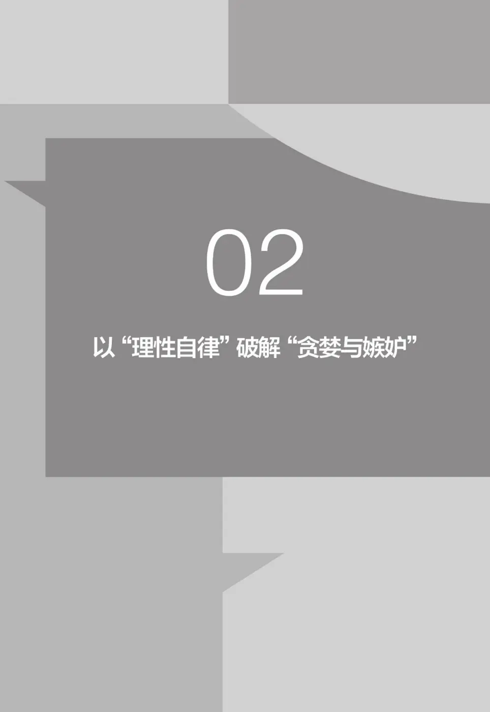

2025年5月20日

21:15

## 财富是认知的变现（上海老牌百亿私募基金重阳投资合伙人舒泰峰首部投资专著，教你避开投资中的12个陷阱。大开脑洞，开启12篇老子与巴菲特的时空对话，带你轻松领会投资哲学。）

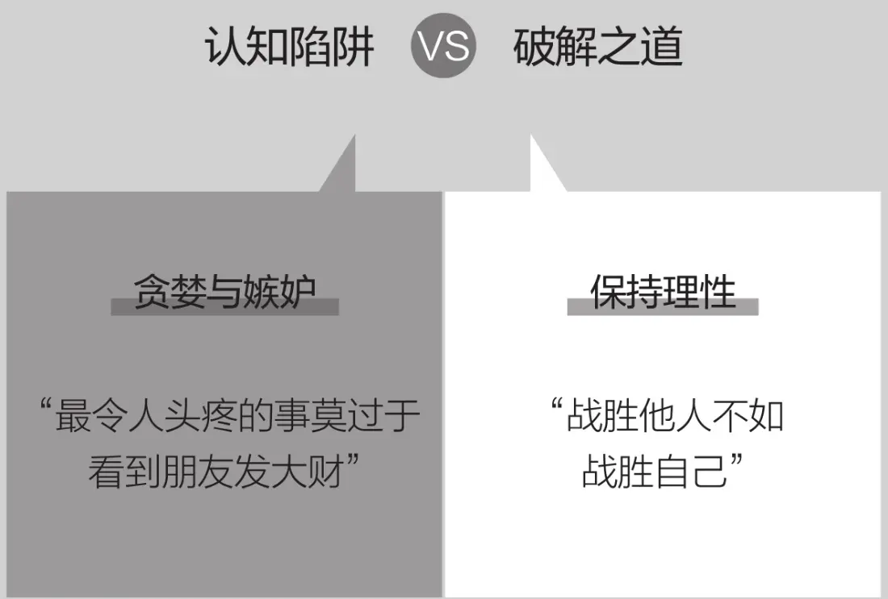

2025年5月20日

21:15

## 认知陷阱2：贪婪与嫉妒 “最令人头疼的事莫过于看到朋友发大财”

__认知陷阱2：贪婪与嫉妒__

__“最令人头疼的事莫过于看到朋友发大财”__

美国大文豪马克·吐温曾说过一句投资名言：“10月，是股票投资最危险的月份之一。其他最危险的月份是：7月、1月、9月、4月、11月、5月、3月、6月、12月、8月和2月。”

只有了解了马克·吐温的生平之后才会知道这并不是大文豪的经验总结，而是他的切肤之痛。马克·吐温是当时美国稿费收入最高的作家，本来可以过很富足的生活，却成功地通过投资把自己搞得负债累累，后半生只好通过马不停蹄的全球演讲来还债，真是靠才华赚钱、又靠实力赔光的典型案例。

马克·吐温在投资上称得上是屡战屡败。他早年曾经买过俄勒冈铁路公司的股票，在78美元的高点买入，然后在12美元的低点卖出。

他曾经投资过一个发明家，这个发明家号称在做一款蒸汽机。马克·吐温每周给这个发明家提供35美元，作为他的“天使投资人”。这个发明家也会每两周和马克·吐温沟通发明进展。最后发现，这个人居然每周花36美元买酒喝。

他还曾经投资过一种新型打字机，先是投资了2万美元。然后这个投资项目就变成了一个无底洞。在此期间，马克·吐温多次感觉到不对。但是对方总是说，你已经投了那么多钱了，就再多投一些，马上就要成功了。马克·吐温不断进行“补仓”。结果却是其他竞争对手更早把最新打字机研发出来并且实现了商业化。在这笔投资中，马克·吐温赔掉了17万美元，相当于今天的500万美元。

为了版税不被出版公司截留，马克·吐温又想到了开自己的出版公司。帮助他开出版公司的是他外甥。一开始，公司发展很顺利，马克·吐温自己的小说《哈克贝利·费恩历险记》和尤利西斯·格兰特的《格兰特将军回忆录》都大获成功。被胜利冲昏头脑的马克·吐温决定扩大出版业务。其实他的外甥根本不懂如何经营一家公司，马克·吐温更不懂，两个外行矛盾越来越多，最后他外甥一走了之。马克·吐温只好亲力亲为，但是他一看到账目就头疼，而且他又好面子，经常不计回报甚至倒贴钱为朋友出书。出版公司勉强维持了10年，最后在1894年的经济危机中彻底坍塌。马克·吐温为此背上9\.4万美元的债务，他的债权人竟有101个之多。他的投资活动彻底宣告失败。

__贪婪的伏隔核__

像马克·吐温这么聪明的人本来完全可以凭借才华过得很好，为什么还如此沉迷于投资呢？被称为最懂投资心理学的贾森·茨威格的分析非常特别，他说马克·吐温可能控制不住自己，因为他对财富的贪求在很年轻的时候就被激发出来了。早在1862年，也就是马克·吐温27岁的时候，他同一位合伙人在内华达州发现了一个银矿。于是，他“就像一个电池给自己充满了电一样”，开始天马行空地幻想自己的财富：“我将在旧金山的核心地带建造一个占地两英亩的庄园，还要去欧洲游历三年。”这样的想法让他彻夜难眠，马克·吐温也的确因为银矿的发现在短时间内成了纸面上的千万富翁。然而，不久后，合伙人对银矿的所有权突然因为法律上的问题被否定，马克·吐温因此病得很重，很伤心，也很绝望。每当马克·吐温想到钱的时候，可能银矿的记忆就会让他的大脑反馈回路超速运转，结果形成了一种对一夜暴富的终生性的迫切渴望。1他后来在文学作品中写到，“矿井无非是一群骗子拥有土地上的一个洞而已”，这同样是由切肤之痛凝结而成。

贾森·茨威格所说的大脑反馈回路又是怎么回事呢？原来，在人的大脑中有一个名为伏隔核的反射性区域，它位于眼睛后面的深处、大脑额叶的后部，卷曲着伸向头部中心，它是大脑中负责体验预期收益快感的区域。神经实验证明，当我们面对马上能够获得收益的机会时，伏隔核会变得十分活跃。有意思的是，如果即将获得收益的机会是确定的，伏隔核并不会变得明显活跃，也就是说可能获得收益的预期比确定的收益更能够刺激伏隔核。2这与《洞见》一书所展现的逻辑相通，这种“预期”正是进化机制所造成的一种“幻觉”。

让每个参与者都“预期能够赚一大笔钱”正是彩票或者赌博机制的心理奥秘所在，虽然参与者知道彩票中奖的概率微乎其微，但仍然有许多人乐意参与其中。投资在某种程度上也有相似之处。投资虽然专业度很高，但是参与门槛却很低，这样每个人都可以体会一下幻想一夜暴富的快感。这种幻想激发了我们的贪婪，而贪婪将投资者推向深渊。

__贪婪有个“近亲”__

有这样一个故事，说俄罗斯某个农村有两个农夫是邻居，两个人都穷得叮当响，区别是其中一家多了一头又瘦又干的驴子。有一次，没有驴子的那个农夫身上发生了一桩奇事，他遇到了一个神，这个神允诺可以帮助他实现一个愿望，这个愿望的内容不设限。农夫想了想说，希望神把他邻居家的驴子弄死。神问为什么要这样做，农夫说，这样他就和他隔壁那个家伙平等了。这个故事不由让人想起巴菲特的一句话：“驱动这个世界的不是贪婪，而是嫉妒。”

芒格的“人类误判心理学”中专辟一节写嫉妒。他推测，在物种进化的过程中，难免有某个物种的成员会挨饿，当这个成员看到食物时，就会产生占有食物的冲动。如果被看到的食物实际上已经被同物种的另外一个成员占有，那么这两个成员之间往往会发生冲突。3这个进化机制留下了“嫉妒”的人类心理特征。这一特征在儿童身上体现得尤为突出，一旦兄弟姐妹得到了一个新的玩具或者父母的额外表扬，儿童会表现出强烈的嫉妒。

“嫉妒”还有个非常有趣的特征，它只会发生在相邻的阶层，而不会跨越多个阶层。举例来说，作为一名普通人，我们通常不会嫉妒电影明星，不会嫉妒姚明或刘翔，也不会嫉妒马化腾或马云，因为他们离普通人太远了。嫉妒他们的可能是跟他们的财富地位有一定落差，但是差距又不是太大的那些人。而普通人则嫉妒普通人，正如古希腊诗人赫西奥德所说的：“鞋匠嫉妒鞋匠，木匠嫉妒木匠。”

嫉妒可以说是贪婪的孪生兄弟，但是芒格认为相较于贪婪，嫉妒在心理学中所受的重视不够。事实上它对投资有十分直接的坏影响。《疯狂、惊恐和崩溃》作者查尔斯·P\.金德尔伯格有一句话十分经典，他说：“最令人烦心、最令人头疼的事莫过于看到朋友发大财。”4霍华德·马克斯也说过类似的话：“嫉妒比贪婪更具负面影响，是人性里危害最大的一个方面。投资者大多难以接受别人赚钱比自己多这一事实。”为什么股市里“羊群效应”特别强大，很重要的原因就是投资者看到周边的人赚了钱，会在羡慕、嫉妒心理的驱动下走向追涨之路。这样的心理刺激连牛顿、马克·吐温这样杰出、聪明的人都难以避免。

尤其在当今的自媒体时代，一夜暴富的财富故事天天占据着人们的眼球，贪婪与嫉妒就如同插上了会飞的翅膀，“树欲静而风不止”，不贪不妒何其难！

__破解之道2：保持理性__

__“战胜他人不如战胜自己”__

看巴菲特传记，有两个细节令笔者印象深刻。一个是关于他打高尔夫的。巴菲特投资做得很好，但是高尔夫打得不怎么样。有一次，他参加了一场户外高尔夫运动，在三天内一杆进洞的成绩为零。于是，巴菲特的球友们决定同他打一个赌：如果他不能一杆进洞，只需付出10美元；而如果他做到了，可以获得20000美元。在场的每个人都接受了这个建议，但巴菲特拒绝了。

另一个细节是关于巴菲特与比尔·盖茨的故事。众所周知，他们两位是忘年交，经常一起打牌、一起旅游、一起谈论商业，可以说无话不谈。可是当比尔·盖茨建议巴菲特投资微软的股票时，巴菲特先生却不为所动。不过为了友谊，巴菲特在比尔·盖茨生日的时候买了100股微软的股票，用的还是自己的钱，而不是公司的钱。5

从普通人的角度看第一个故事，似乎觉得巴菲特挺无趣，不就是小赌一下嘛，又不是输不起，还娱乐了朋友，何乐而不为呢？但是在巴菲特看来：“如果你不学会在小的事情上约束自己，你在大的事情上也不会受到内心的约束。”6

从第二个故事看，巴菲特似乎挺小气，对朋友不仗义。如果你真这么想那就大错特错了，巴菲特不仅对老朋友不小气，还将大部分资产捐给了盖茨基金会，价值约合310亿美元！全世界也没有几个人像巴菲特那么慷慨大方。巴菲特之所以不买微软股票是因为他要恪守不熟不投的能力圈原则。

投资的要义是要认识到自己的种种心智缺陷，然后用坚定的自律精神使自己尽量保持理性。芒格说过：“在生活中不断培养自己的理想性格（投资性格）：毫不妥协的耐性，自律自控——无论遭受多大的压力，也不会动摇或者改变原则。”

高度的自律是巴菲特和芒格免于随波逐流的法宝。“知之为知之，不知为不知”，他们绝不会因为潮流或者嫉妒别人赚了大钱而改变投资决策。还以拒绝投资科技股为例，不妨再引一句1999年巴菲特致股东函中的表述：“虽然我们不得不承认它们所提供的产品与服务将会改变整个社会，但问题是就算我们想破头，也没有能力分辨出在众多的高科技公司中，到底哪些公司拥有长远的竞争优势。”

正是由于他充分知道自己的长处，所以他并不慌张。“缺乏对科技的洞察力丝毫不会使我们感到沮丧。……如果其他人声称拥有预测高科技产业中的企业经济前景的技巧，我们既不会嫉妒，也不会模仿他们。”

良好的自我认知加上强大的自律性，使巴菲特在长达60多年的投资生涯中，回避了众多的市场诱惑，躲过了20世纪60年代的“电子风潮”，80年代的“生物概念”“垃圾债券”，也躲避了20世纪末的“科网泡沫”。

__战胜他人不如战胜自己__

巴菲特和芒格为何能保持如此强大的自律精神？这与他们几十年如一日不停地自我提升密不可分。巴菲特和芒格都是学习机器，芒格如此描述巴菲特：“如果你们拿着计时器观察他，会发现他醒着的时候有一半时间在看书。他把剩下的时间大部分用来跟一些非常有才干的人进行一对一的交谈，有时候是打电话，有时候是当面，那些都是他信任且信任他的人。仔细观察的话，沃伦很像个学究，虽然他在世俗生活中非常成功。”

说到学习能力，芒格比之于巴菲特恐怕有过之而无不及。直到95岁的时候，芒格每周还是要看20本书，看到兴奋时可以熬夜阅读到凌晨。芒格的孩子们嘲笑他是“一本长了两条腿的书”。他在南加州大学毕业典礼上的演讲传递给毕业生的人生经验不是别的，而是让自己成为一部“学习机器”，以便“每天夜里睡觉时都比那天早晨聪明一点点”，而只要能做到每天进步一点点，最终，如果足够长寿，大多数人都会获取应得的回报。

如果说持续学习是让自己保持理性自律的法宝，那么“自我批判”则是另外一件利器。许多伟大的人物都掌握这件利器。艺术家达·芬奇就是这样，他说：“我们都很清楚，我们更善于从别人的作品中发现错误，而非自己的作品。所以，画画的时候，应该准备一个平面镜，时常从镜子中审视自己的作品，作为备用观点。因为从这样的角度来看，作品似乎出自别人之手，没有什么办法比这种方式更能发现作品的瑕疵了。”

科学家达尔文也是这样，他早年就刻意训练自己重视那些与自己观点不同的证据，而且他对自己的哪个假说越是珍视，就越是重视关于这个假说的不同证据。爱因斯坦也是类似，他总结自己的成功经验有四个，其中“自我批评”的排名比“好奇”“专心”“坚持不懈”都要高，是重中之重。

东方的圣人先贤也拥有类似的特质。孟子说：“吾日三省吾身：为人谋而不忠乎？与朋友交而不信乎？传不习乎？”日本“经营之圣”稻盛和夫为了防止自己骄傲，发展出了一个个人习惯。每当哪一天自己说了过头话，出现了骄傲的苗头，回到家里，他就会对着镜子严厉地斥责自己：“混账！”然后又说：“神啊！对不起！我向您认错。”又说：“神啊！谢谢您，因为是您让我意识到自己不对。”

芒格和巴菲特也非常善于自我批判，芒格说：“我们常常需要改变错误的决定。可以说，这是让生活沿着正确的轨道运行的重要一部分。人孰能无错？如果你能及时认识到并采取补救措施，常可以化腐朽为神奇。”巴菲特则说：“如果发现自己掉到洞里，那首要的任务就是停止继续往下陷。”

大师们说起来似乎很轻松，其实自我否定和自我批判极为不易，因为这种做法逆人性。凯恩斯对此有精彩论断，他说：“新思想之所以很难被接受，并不是因为它们本身太过复杂，而是因为它们与原有的思想不一致。”7

所以，投资与其说是为了战胜市场，不如说更重要的是战胜自己。很多人把战胜别人作为人生的目标，其实那是搞反了，天外有天，人外有人，世上永远有比你更强的人。以战胜他人为目标，你的内心将永无宁日。投资之道更重要的是战胜自己，一个能够克服自我弱点、不断自我进化的人才是投资中的强者。

看巴菲特和芒格的传记，他们很少谈及战胜他人或是战胜市场，而是经常谈及自我管理，可以说他们都是自胜者的典范。

__用系统2战胜系统1__

克服贪婪与嫉妒无疑需要回到第一篇中所讲的自知之明，即首先认识到我们具有这样的认知缺陷，同时通过上述案例我们也得到了第二项法宝，即通过自律以及自我批判让自己时刻保持理性。理性为什么如此重要？其背后有科学的依据。

在历届诺贝尔经济学奖得主中，2002年获奖的美国普林斯顿大学以色列籍教授丹尼尔·卡尼曼\(3\)与美国乔治梅森大学教授弗农·史密斯显得与众不同，他们因“把心理学研究和经济学研究结合在一起，特别是与不确定状况下的决策制定有关的研究”而得奖。

在丹尼尔·卡尼曼之前，经济学和心理学在研究人类决策行为上有着极大的区别：经济学的观点认为外在的激励形成人们的行为，而心理学恰恰相反，认为内在的激励才是决定行为的因素。卡尼曼在不断修正“经济人”假设的过程中，看到了经济理性这一前提的缺陷，发现单纯的外在因素无法解释复杂的决策行为，由此正式将心理学的内在观点和研究方法引入了经济学，并成为这一新领域的奠基人。

在他的代表作《思考，快与慢》中，丹尼尔·卡尼曼提出了一个著名的观点：人的大脑存在两个系统，他称之为系统1和系统2。两个系统分别有快与慢两种做决定的方式。系统1代表直觉，系统2代表理性。系统1的操作是快速的、平行的、自动化的、不耗费资源的、联结的、内隐的（无须反省），并且通常是情绪驱动的，它经常为习惯、经验、刻板印象所支配，因此很难控制或修正；系统2的操作则是缓慢的、系列的、控制的、耗费资源的、不容易出错的、存在意识控制的。

系统1和系统2地位孰高孰低呢？通常来说，系统2会默认自己是当家作主的人，但其实系统1才是真正的主人；系统2比系统1高级，但系统1具有决定性。进化过程中，往往越原始、越本真的东西，越具有决定性，系统1的模式内置在基因中，可以快速且自动地启动，而系统2的启动则很难。

卡尼曼提醒，在我们的日常行为中，“衣食住行”等98%的日常决策依然可以使用系统1；人生最重要的20～30次决策，则要使用系统2。8投资决策属于具有高度专业性的工作，需要高度的自知之明，所以更需要依靠系统2而不是系统1的力量。如果使用直觉进行决策，就会掉进种种认知误区之中。

属于系统2的思维方式包括逆向思维、长线思维、周期思维、概率思维、辩证思维、未来思维、价值思维等，在接下来的篇章中我们将一一阐述。

2025年5月20日

21:15

## 老子对话巴菲特 胜人者有力，自胜者强

__老子对话巴菲特__

ROUND 2

__胜人者有力，自胜者强__

通过与巴菲特的第一场对话，老子欣喜地发现自己的学问不仅没有过时，而且与投资学息息相通。他希望尽快深入到进一步的讨论当中。

于是他继续向巴菲特提问：上一场对话，你谈到做投资首先要认识自己的情绪以及自己的能力圈，那么在认识自己之后又该如何行动？

巴菲特：认识自己仅仅是做好投资的第一步，更为关键的是要能够战胜自己。

老 子：你是指战胜自己的贪婪与恐惧等负面情绪？

巴菲特：是的。“你可能拥有出色的数学、金融及财会知识，但如果你不能控制自己的情绪，就绝不能在投资中获利。”

老 子：那么，靠什么战胜它们？

巴菲特：靠理性与自律。

老 子：愿闻其详。

巴菲特：在我看来，“投资必须是理性的。如果你不能理解它，就不要做”。

老 子：你从来不跨出自己能力圈半步？

巴菲特：“任何情况都不会驱使我做出在能力圈范围以外的投资决策。”

老 子：这有点吹牛吧，难道你的内心从来不受外界的干扰和诱惑？

巴菲特：这还真不是吹牛，不信可以请小舍介绍一下我买100股微软股票的故事。

小 舍：事情是这样的。巴菲特先生与微软的创始人比尔·盖茨是好朋友，他们的交往很有戏剧性。巴菲特比比尔·盖茨大25岁，当朋友介绍他们认识时，他们一开始是互相抵触的。巴菲特认为他并不想与小自己很多的比尔·盖茨有任何交集。毕竟，计算机不是他的“菜”。而比尔·盖茨觉得花一整天与一个只会挑选股票的人在一起没什么意思。

但是见面后，他们就立刻擦出友谊的火花，可以说是一见如故。巴菲特先生曾公开称赞比尔·盖茨是当今全球商业界最聪明及最有创意的经理人，微软公司棒透了。他们一起打牌，一起旅游，一起谈论商业，后来巴菲特甚至将大部分资产捐给了盖茨基金会，价值约合310亿美元。

可是当比尔·盖茨建议巴菲特投资微软的股票时，巴菲特先生却不为所动。不过为了友谊，巴菲特在比尔·盖茨生日的时候买了100股微软的股票，用的还是自己的钱，而不是公司的钱。

老 子：这么绝也是没谁了！后来微软的股票怎么样？

小 舍：非常好，一路上涨。

老 子：那么，巴菲特先生是否后悔错过微软？

巴菲特：没什么可后悔的，我的确可以买微软赚几十亿，“但这不算数。因为我一直搞不懂微软”。“我无法很放心地去预估微软公司的未来盈余，无法计算微软的未来价值。”

老 子：这确实不容易做到，所以你的成功也是必然的。

巴菲特：或许吧。我确实说过，“我之所以能有今天的投资成就，是依靠自己的自律和别人的愚蠢”。我一向认为，“我们没有必要比别人更聪明，但我们必须比别人更有自制力”。

老 子：那么，怎样才算在投资中战胜了自己？

巴菲特：“如果有一天，你发现自己的情绪不会再随着股票的涨跌而波动了，那时你才真正在股市中战胜了自己。”当伯克希尔–哈撒韦公司购并成功在望，我希望自己连“心跳都不会加快一下”。

老 子：你已经成功达到了这个境界。

巴菲特：应当说，理性和自律也是无极限的，我还可以做得更好，我也坦率地说过，“有效控制情绪，能让我的投资收益再提高30%”。

老 子：知易行难，应当没有人会怀疑理性与自律的重要性，关键是怎样才能够做到，这方面你是否有些独门秘诀？

巴菲特：我一直认为，“要赢得好的声誉需要20年，而要毁掉它只需要5分钟就够。如果明白这一点，你做起事来就会不同了”。

老 子：这条心法很实用，人如果凡事都能够提前意识到坏的后果，行事自然会倍加谨慎。

巴菲特：一点儿心得，希望对大家有用。查理，你有什么补充？

芒 格：我要说的大同小异，“增强理性不是一件你可以选择做或不做的事情，它是你需要尽可能履行的一项道德义务”。

巴菲特：老先生是否认可我们的观点？

老 子：非常认可，同样是在《道德经》第三十三章中，我说过“胜人者有力，自胜者强”。

巴菲特：什么意思？

老 子：这两句话的意思是说，能够胜过他人的人是有力量的人，而能够战胜自己的人才是真正的强者。

巴菲特：老先生果然言简意赅。

老 子：过奖。

2025年5月20日

21:15

## 03 以“长期主义”破解“急于求成”

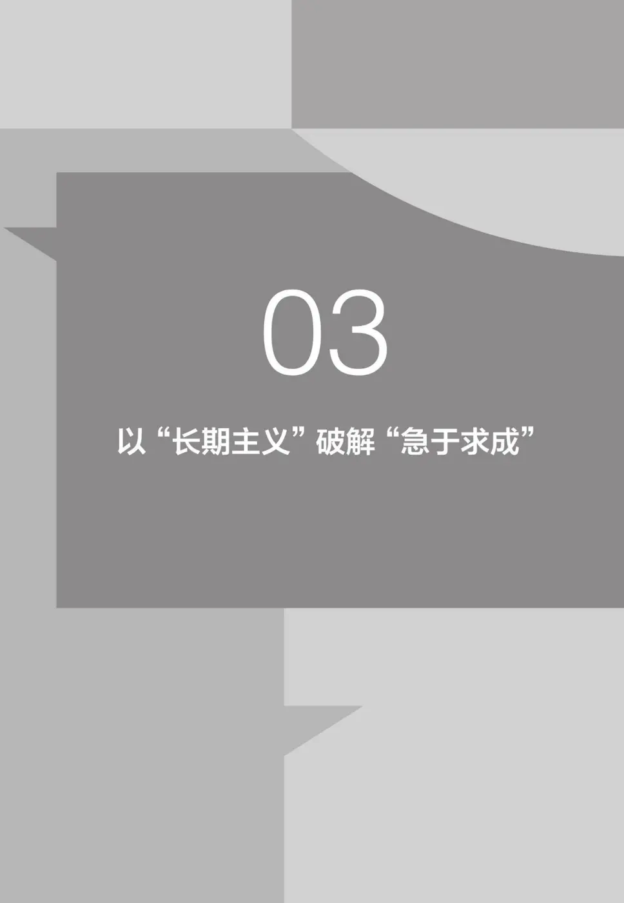

2025年5月20日

21:15

## 财富是认知的变现（上海老牌百亿私募基金重阳投资合伙人舒泰峰首部投资专著，教你避开投资中的12个陷阱。大开脑洞，开启12篇老子与巴菲特的时空对话，带你轻松领会投资哲学。）

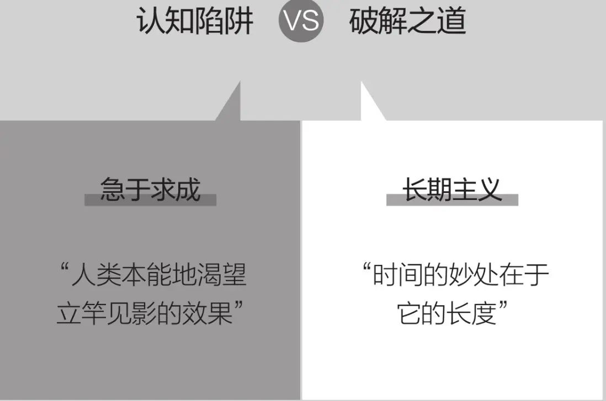

2025年5月20日

21:15

## 认知陷阱3：急于求成 “人类本能地渴望立竿见影的效果”

__认知陷阱3：急于求成__

__“人类本能地渴望立竿见影的效果”__

宋国有一个养猕猴的人，他很喜欢猕猴，养了一大群猴子。他能理解猴子们的心意，猴子们也能够了解宋公的心思。宋公减少全家的口粮，来满足猴子们的欲望。然而过了不久，家里食物不够了，他想要限制猴子们吃橡栗的数量，但又怕猴子们不听从自己，就先瞒哄猕猴们：“我给你们橡栗，早上3颗，晚上4颗，够吗？”猴子们一听，都站了起来，十分恼怒。过了一会儿，他又说：“给你们橡栗，早上4颗，晚上3颗，够吗？”猴子们不再反对，一致同意。

不知道为什么，《庄子·齐物论》里的这个故事后来主要被用来讽刺反复无常、出尔反尔的行为，而不是猴子们的愚蠢。实际上，后者适用的场景可能会更多，因为许多人都会犯类似于猴子们的认知错误——我们既着急又短视。

人类总是很着急，现代人尤其如此。从商的希望自己一夜暴富；当父母的希望孩子快速成才，总担心他们输在起跑线，恨不得在娘胎里就开始进行早教；写文章的希望自己一夜成名，张爱玲说出了很多人的心声：“出名要趁早呀！来得太晚的话，快乐也不那么痛快。”

__着急源于短视__

在财富领域，人性着急的特征体现得更为突出。一笔钱放进股市，恨不得下一分钟股价就上涨。年化10%的收益都嫌不过瘾，最好每年都能翻番。凯恩斯说：“人类本能地渴望立竿见影的效果，在快速赚钱上尤其热情。”

股民之着急有时甚于猴子。买入一只股票之后就频繁打开行情软件，不停地查看股价走势，或者频繁查看账户。美国有部著名的电视剧叫《宋飞正传》，在这部剧里，宋飞买了一只垃圾股，然后忍不住频繁关注股价，从早关注到晚。当他拿过一份报纸时，他的约会对象告诉他：“这只股票的价格和你之前查看时一样，市场收盘后没有变化。”他则回应道：“我知道，但这是另一份报纸。呃，我想也许它有不同的……消息来源。”据《金钱》杂志的一项调查，22%的投资者表示自己每天都会查看自己投资的股票的价格，49%的人每周至少查看一次。1

神经科学研究证明，每当我们得到一点奖励，我们的一些神经元就会产生多巴胺，多巴胺让我们感到愉悦。所以，人们习惯性地喜欢获得正面的新信息、获取他人的赞赏或者物质鼓励（哪怕是一点点微不足道的小礼物），如果我们所买的股票每次看时价格都在上涨，每次打开交易账户时代表财富的数字都往上跳一下，那简直是再令人开心不过了。

着急源于短视，多数人愿意今天得到10美元而不是明天得到11美元。普林斯顿大学的乔纳森·科恩（Jonathan Cohen）领导的一个实验发现，只有当你选择较早的奖励时，你的大脑反射系统才会发挥作用，并在伏隔核和附近区域引发剧烈的活动，引发多巴胺的生产。

短视是刻在我们基因里的。想象一下，我们的先祖在恶劣的原始生态中，随时面临着各种近在咫尺的死亡危险，过了今天不一定有明天，他们的首要任务是活着。在这样的情况下，短视是一种本能的反应，甚至只有短视才能确保生存。或者说因为我们可能随时会死去，所以及时行乐才是当务之急。只有摆脱了生存危机，人类才能够考虑发展问题，也才能够建立起相匹配的长远眼光和战略思维。时至今日，我们早已摆脱了生存危机，但是短视作为基因进化的副产品依然影响着我们，我们依然会担心“明天和意外哪个会先到”。但这种担心在科学统计中显然站不住脚，事实上，每天我们在预测自己有多大可能活到明天时，错误的概率是正确可能的26000倍。2

再考虑一下人类平均预期寿命显著延长的情况，及时行乐的短视行为就更站不住脚了。公元前欧洲人的平均预期寿命仅为20岁左右，之后持续缓慢地延长，1850年左右达到40岁，在漫长的近2000年的历史中终于延长了一倍。19世纪是一个转折点，随着工业的发展，社会生产力的解放，人口的平均预期寿命迅速上升。自1850年以来的100多年内，欧洲人的平均预期寿命增加了30多岁，按1977年联合国人口年鉴所示，已达到72岁的水平。中国人怎么样呢？据国家卫健委的统计公报，2019年我国居民人均预期寿命已经达到77\.3岁。32016年上海人均预期寿命再创新高，达到83\.18岁，离人均预期寿命83\.7岁的世界冠军日本仅一步之遥。当前全球已经有近百个国家进入了老龄化阶段。从这个角度想一想，我们对待许多事情不妨从容一点。

__“渴望一夜致富是相当危险的”__

我们渴望通过频繁观察股票账户来给生活增加快感，尴尬的是结果往往事与愿违。纳西姆·塔勒布写过一个喜欢做投资的牙医的故事，本来以他所投资的品种来看，任何一年他赚钱的概率是93%。但是如果按秒计算，任何一秒赚到钱的概率只有50\.02%。这个牙医恰好热衷于看账户，所以每天结束时，这位牙医总是感到筋疲力尽。由于每分钟检视投资组合的表现，假设一天观察8个小时，每天他会有241分钟心情愉快，239分钟不愉快。其实如果按月检视账户，他一年只需要心痛4次，快乐的次数却有8次。如果每年看一次账户，那么在余生20年的时间里，他将体验到19次惊喜，只有1次不愉快。可惜，我们很多人都犯了与这个牙医的一样的错误。4

投资往往需要耐心等待，指望买入的股票第二天就上涨是美好的白日梦，震荡或者下挫都是一项投资中不可避免需要承受的过程。所以每一次对股价或账户的查看都可能让结果离你的期待又远了一步，你希望每一次都获得一点奖励，实际上收获的却是沮丧和痛苦。后文我们将会介绍人的“损失厌恶”心理机制，一般来说损失带给人的心理刺激是收获的2倍，这意味着每次股价和账户数字的下跌都会给你带来双倍“痛击”。所以，频繁查看股价和账户是一种积极地寻找痛苦的行为，既然如此，又何必为之呢？

急于求成对成功投资的伤害远远不局限于上述的心理层面，它还将带来实质性的副作用。由于想迅速获得收益，它会让你患上“多动症”，在股市里不停进进出出。尤其是中国的投资者，“多动症”尤其明显，有数据显示，2015年A股整体年化换手率达到500%～600%，2016年以来A股整体换手率平均也在200%～300%，远远高于美国等成熟市场100%左右的水平。有意思的是，研究还表明，男性投资者比女性投资者交易更加频繁，而单身男性投资者又比已婚投资者更加频繁。或许是男性身上的“动物精神”要明显多于女性。但正如第一篇所显示的，频繁的择时恰恰是获取收益最大的敌人之一。

由于急于求成，我们还容易将自己的投资风格发挥到极致，比如把全部仓位都押到热门板块或热门股上面，甚至动用杠杆。2015年上半年牛市中，股民通过配资可以实现10倍杠杆，许多人确实实现了一夜暴富，然而6月股市暴跌之后短短18个交易日沪指跌幅近35%，许多股票惨遭“腰斩”，使用配资的人一夜之间爆仓，不仅前期收益全部还给了股市，连本金也被残酷收割。盈亏同源，极致的风格可能送你上青云，然而风向一转，也可能送你入地狱。所以股市中有一条谚语：“一年翻倍者如过江之鲫，三年翻倍者却寥寥无几。”许多所谓的年度冠军，到第二年便销声匿迹。

短视和急功近利还容易将长期问题短期化。神经科学研究表明，最近的经历对人的神经元刺激更大，神经元主要根据最近5～8次的投资结果来评估未来的可能性。在这5～8次里面，最近3～4次的尝试产生的影响最大。这也被称为“近因效应”，即人类倾向于不根据长期经验，而是根据少数最近发生的事件和结果来评估未来发生同类事件的概率。一项针对数百个个人投资者的调查发现，他们对未来6个月股市回报的预期，受到上周股市趋势影响的程度，是受到前几个月股市趋势影响程度的2倍以上。5一场灾难比如洪水和地震之后，买洪水和地震险的人数往往会大幅增加，尽管洪水和地震的真实发生概率并没有改变。人们会因为这些灾难在近期发生过而觉得它们发生的概率增加了。

由于总是着眼于短期，所以当我们面对一些长期问题时，我们倾向于将长期问题的影响在短期内进行消化。2018年A股大跌，就是典型的“长期问题短期化”的反映。重阳投资董事长王庆博士曾总结，导致当年股市大跌的主要原因是中美在贸易方面的竞争，然而中美竞争是长期问题，股市却将其利空在短时间内就全部反映了。6反过来也一样，2007年，当股市涨到6000点的时候，市场人气沸腾，很多人都对未来充满信心，认为中国经济将迎来“黄金十年”，股市必上10000点。不料，当时其实恰恰是A股的历史大顶，10多年过去了，迄今都未被超越。股票市场将未来10年的利好在1年内就反映完毕了。

所以，如果你被自己的短视所蒙蔽，那你就离亏损不远了。正如芒格所言：“渴望一夜致富是相当危险的。”

__破解之道3：长期主义__

__“时间的妙处在于它的长度”__

巴菲特还是少年的时候就立志要成为百万富翁，并如愿在30岁那一年实现了目标。这对于普通人来说是一笔巨大的财富，毕竟当时美国家庭的平均年薪仅为5600美元。但是巴菲特登上世界财富的顶峰还要经历很漫长的等待，统计显示巴菲特近96%的财富是在60岁以后才获得的（见图3\-1）。

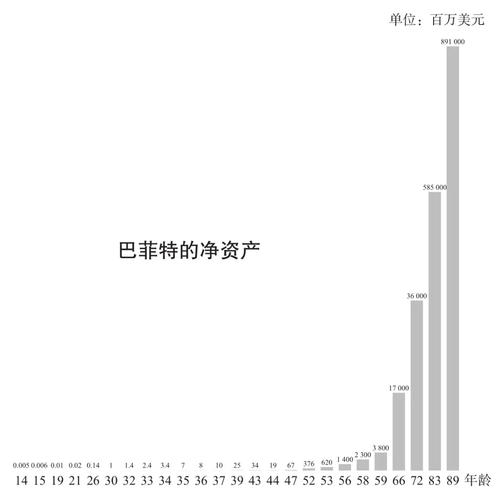

图3\-1 巴菲特的净资产变化（14～89岁）

资料来源：格隆汇学堂。

将巴菲特推向财富顶峰的是职业生涯60余年平均年化收益率近20%的复利魔方。复利就如滚雪球，一开始雪球变大的速度很缓慢，但越到后面速度越快。10万元本金，如果每年投资的回报率是20%，10年后将增长至本金的6\.2倍，20年后将增长至38\.3倍，30年后累积增长至237\.4倍，也就是惊人的2374万元！

巴菲特的成功与其所处的特殊时代背景以及伯克希尔–哈撒韦公司特殊的保险浮存金商业模式有关，而这样的成功过于耀眼，所以难以引起共鸣。我们换一个比较“正常”的案例。表3\-1是美国某知名对冲基金2000年以来的投资收益率。

表3\-1 美国某知名对冲基金2000年以来的投资收益率

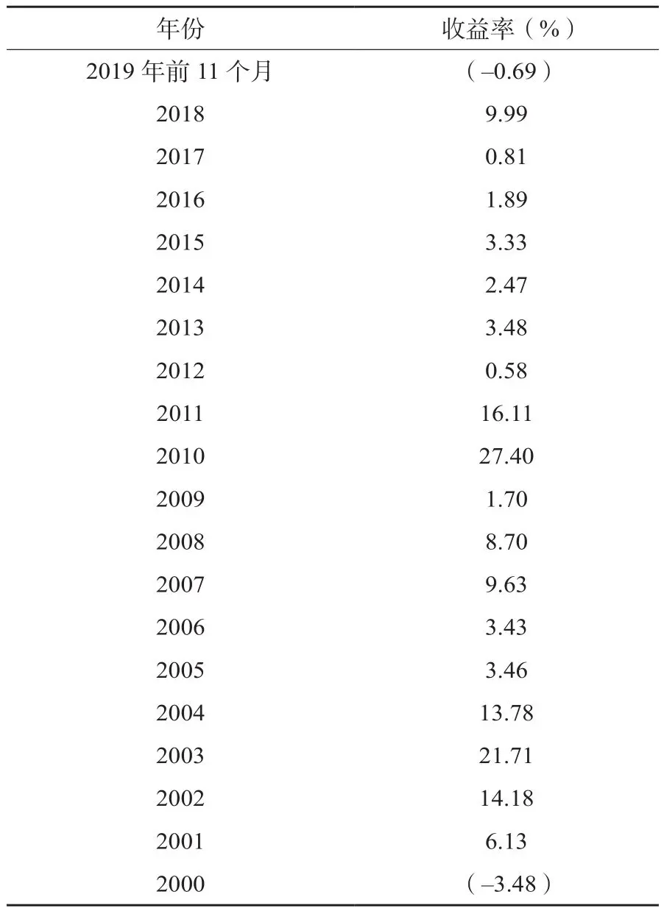

资料来源：中国证券报。

看起来很平庸？的确如此。但是如果根据这个表算一笔账，结论可能会让你大吃一惊。假如2000年年初将1美元交给这家管理人，到2019年年底净值是3\.84美元，而同期无论是道琼斯指数还是纳斯达克指数都只翻了一番。

这就是复利的力量。可以说，谁掌握了复利的魔方，谁就掌握了致富的秘密。但是，为什么现实生活中，很少有人能够享受到复利带来的甜美果实呢？原因在于复利的实现需要以极度的耐心为前提。

你需要有足够的耐心。巴菲特的财富登顶之路花了50多年。他的搭档芒格以每股16美元的价格购买了伯克希尔–哈撒韦的股票，现在每股股价是40多万美元，涨了25000多倍，但是芒格等待的时间超过了50年。

巴菲特虽也有短期持股，但他的一些经典投资都属于长期持股，比如他投资《华盛顿邮报》超过40年、可口可乐超过30年、富国银行超过30年。只有时间足够长，投资者才能够享受复利的魔力。巴菲特说：“时间的妙处在于它的长度。”芒格则说：“如果既能理解复利的威力，又能理解获得复利的艰难，就等于抓住了理解许多事情的精髓。”

研究显示，散户的损失每年给机构投资者，即散户的对手，带来约1\.5%的投资收益率。7这正是巴菲特所总结的：“金融市场就是财富再分配的系统，它将金钱从没有耐心的人手中转移到富有耐心的人手中。”

然而对于大多数人来说，漫长的等待更多地意味着煎熬，因为短视、急于求成、渴望一夜暴富更符合人性。

__股票与现代化铁律__

巴菲特也好，知名对冲基金也罢，它们是不是幸存者偏差所导致的特例呢？这是个好问题。要回答这个问题就需要把单独的树木放回到整片森林里去考察。

数据证明，坚持长期股票投资能够获得良好的回报。美国沃顿商学院的杰里米·J\.西格尔（Jeremy J\. Siegel）教授统计了美股210年的股票收益率，结果显示，一个充分分散的股票投资组合的年平均收益率为6\.6%。这意味着，平均而言，在过去的两个世纪里，一个分散化的股票投资组合的购买力大约每隔10年就翻一番。而固定收益投资的年平均真实收益率则大为逊色：长期政府债券的年平均真实收益率为3\.6%，而短期债券的年平均收益率则只有2\.7%。黄金的年平均真实收益只有0\.7%。8

在A股当中，相应情况又如何呢？1990—2018年，上证综指累计上涨了约25倍，年化增长率达12\.3%。再选取2008年年中至2018年年中的数据来看，这10年间上证综指从2800点左右波动到2800点左右，指数上涨幅度几乎为零。但统计显示，如果平均买入2008年6月30日以前上市的所有1550只股票并持有至2018年7月30日，这1550只股票剔除分红之后的持有期收益率依然高达259\.9%。同期之内，衡量A股市场所有股票综合回报的万得全A指数收益率为83\.07%，A股市场混合基金指数的收益率为107%。可见，长期持有A股的收益率其实相当可观，只是很多人为失真的指数所蒙蔽，又被盲目的择时行为所误导。

被视为芒格传人的著名华裔投资人李录在其《文明、现代化、价值投资与中国》一书中，从大类资产配置的角度对中美两国进行了对比，书中有两幅图令笔者印象深刻，一幅是“美国1801年至今金融大类资产的回报表现”，另一幅是“1991年至今中国金融大类资产的回报表现”。“至今”里的“今”是该书作者李录先生发表演讲的2015年，而起始点1801年和1991年分别为美国股市和中国股市有数据可追踪的初创时点。

这两幅图展现了惊人一致的趋势，即金融大类资产中，收益率由高到低分别是股票、黄金和现金。具体来看，中国上证指数和深证指数25年中涨了大概15倍，年化回报率约12%，黄金的年化回报率为近3%，而人民币的年化回报率为负，如果1991年持有1元人民币，25年后将变为0\.47元。美国的图则显示，美国200多年中股票的年化收益是6\.7%，也就是1901年的1美元股票200年里升值了100多万倍，价值达到103万美元。而如果持有黄金，200年里升值3倍多；如果持有1美元现金，200年后将只剩下5分钱，也就是贬值了95%。

中美两国的历史、文化、制度均大相径庭，为什么金融大类资产的表现趋势如此相近？这就与现代化的本质有关，对此李录给出了很好的答案。他将人类文明的发展阶段分成三个部分：采集狩猎文明或1\.0文明，农业畜牧业文明或2\.0文明，工业革命为先导的科技文明或3\.0文明。农业文明有其天然的不足，因为农作物的生长依赖光合作用，而光合作用能够产生的能量上限受制于土地面积，于是有限的资源和近乎无限的人口增长决定了人口增长最终只能通过非自然灾难来消化和制约，这些灾难包括饥荒、人口流动引起的战争、瘟疫、气候变化、政权失败等。所以我们看到2\.0文明时期国家之间争夺的焦点是土地。

近代以来，驱动人类文明进程的动力发生了质的改变。一方面，蒸汽机和煤炭的结合催生了第一次工业革命，引发了纺织、钢铁、轮船、铁路等各行各业的生产力大爆炸；19世纪下半叶到20世纪初，电力的发明运用以及内燃机和石油的结合再次将生产力的火箭推向了更高更快的一级。另一方面，亚当·斯密和李嘉图所发现的“无形的手”及自由贸易则开启了人类经济形态的新组织方式。这一硬一软两股力量的结合产生了“现代化”这个结晶。李录总结，现代化就是当现代科技与市场经济相结合时所产生的经济无限累进增长的现象，可谓精辟。

驱动美国过往200年经济发展及中国过去40多年改革开放进步之旅的正是这样的现代化规律，金融大类资产表现的趋同是现代化路径的一个缩影。9

__人性总体上乐观多于悲观__

人是万物的尺度。用长期的眼光来看，人类社会各个方面的进程虽时有坎坷，也时有倒退，但整体上呈现出螺旋式上升的态势——文明在不断累积，经济在持续增长，股市也整体向上。归根结底，或许是因为人性总体上乐观多于悲观。

美国密歇根州立大学的研究人员进行过一项大规模研究，旨在确定人们一生中不同阶段的乐观程度，以及重大人生事件对人们的乐观程度有多大影响。该大学助理心理学教授、研究论文的第一作者威廉·乔皮克（William Chopik）说：“我们发现，在青年时期，人的乐观情绪持续增强，然后达到一个稳定期，随后在老年时期开始下降。但即使那些处境糟糕的人，即经历过人生磨难的人，在放眼人生未来时，也会感到乐观。”

发表在美国《个性研究》双月刊上的这项研究，共调查了7\.5万名16岁至101岁的美国人、德国人和荷兰人，衡量他们对未来的乐观情绪和看法。乔皮克说，研究人员研究了诸如结婚、离婚、新工作、退休、健康变化和失去伴侣、父母或孩子等生活事件对人们情绪的影响。结论是不管生活好坏，从15岁到60岁甚至70岁，人们都是越来越乐观的。

“我们常常认为，生活中的不幸或悲剧性事件会让人彻底改变自我，但事实并非如此。那些可怕的事情并不会从根本上改变你，被诊断患有某种疾病或经历了一场危机的人，仍然对未来以及未来的生活抱有信心。”10

中国的《易经》说“生生之谓易”，或许正是这种不息的生命精神推动了人类发展的车轮不断向前。

__克服及时享乐，学习延迟享受__

毫无疑问，坚持长期主义、做时间的朋友是破解急于求成之症的对症之药。事实上，如果从长期主义的角度来看问题，股票投资就简单了许多。美国GMO资产配置团队的知名基金经理詹姆斯·蒙蒂尔指出，在1年的时间跨度内，你所获收益的绝大部分来自估值的变化，这可能只是价格的随机波动。然而，在5年的时间跨度内，你总收益的80%将取决于所支付的价格以及所投资股票的增长。“这些是基本面投资者应该明白的东西，而这些显然只有在长期才重要。”11

但是知易行难，因为如上篇所讨论的，人的本性是短视的，所以长期主义要求你反人性。有一个技巧或许有助于建立长期主义的操作，那就是克服及时享乐，学习延迟享受。

心理学上有个著名的“棉花糖实验”。\(4\)把一群4岁左右的孩子带到一间陈设简陋的房子，然后给他们每人一颗非常好吃的软糖，同时告诉他们：如果马上吃软糖，只能吃一颗；如果20分钟后再吃，将获得额外奖励的一颗软糖。一些孩子急不可待，把糖马上吃掉了；而另一些孩子则耐住性子，有的闭上眼睛或头枕双臂做睡觉状，有的用自言自语或唱歌来转移注意力消磨时光以克制自己的欲望，从而获得了更丰厚的报酬。

此后，心理学家继续跟踪研究参加这个实验的孩子们，一直到他们高中毕业。跟踪研究的结果显示：那些能等待并最后吃到两颗软糖的孩子，在青少年时期，仍能等待机遇而不急于求成，他们具有一种为了更大更远的目标而暂时牺牲眼前利益的能力，即自控能力。而那些急不可待只吃一颗软糖的孩子，在青少年时期，则表现得比较固执、虚荣或优柔寡断，当欲望产生的时候，无法控制自己，一定要马上满足，否则就无法静下心来继续做后面的事情。也就是说，那些善于延迟享受的孩子的成功率远远高于那些不能等待的孩子。

做股票投资要向那些能够克制欲望、延迟吃糖的孩子学习。巴菲特就是这么做的，他说他的秘诀之一就是“延迟决策”，“行动并不会换来回报，只有正确的决策才能。因此，需要等待多久，我们就等待多久”。但是只有拥有长期思维，才能够做到延迟决策，正如投资家、《安全边际》一书作者塞斯·卡拉曼所说的：“投资者能够拥有的最大边际优势，就是拥有长线导向思维。”

## 老子对话巴菲特 大器晚成，大音希声

__老子对话巴菲特__

ROUND 3

__大器晚成，大音希声__

小 舍：听了大师们的两次对话，受益匪浅，今天我来主持一下对话如何？

老 子：没问题。

巴菲特：很好。

小 舍：几位大师谈到了“自知者明”和“自胜者强”的重要命题，今天想就另外一个相关的议题请大师们进行探讨。

老 子：什么议题？

小 舍：长短之辩，也就是大家普遍关心的投资的时长问题。

老 子：你问吧。

小 舍：先请教巴菲特和芒格先生，你们在投资中如何处理长期和短期的关系？

巴菲特：“我们偏爱的持股期限是永远。”

小 舍：现在可都流行“不在乎天长地久，只在乎曾经拥有”。

巴菲特：这不是我们的风格，在我看来，“拥有一只股票，期待它下个早晨就上涨是十分愚蠢的”。相反，“你买一家公司的股票，就要与这个股票结婚，而不是一夜情，随便找个人派对，厌烦了就换新的”。

小 舍：“永远”应该是一种理想吧？如果说得实际一点，多久算是符合长期投资理念？

巴菲特：好，如果实际一点说，我也说过两句话：第一句是“如果你不愿意拥有一只股票10年，那就不要考虑拥有它10分钟”。第二句是“我从不打算在买入股票的次日就赚钱，我买入股票时，总是会先假设明天交易所就会关门，5年之后才又重新打开，恢复交易”。

小 舍：听出来了，在您的标准里，起码5年以上才能算得上长期投资。那么，您这么做的理由是什么呢？

巴菲特：因为“时间的妙处在于它的长度”。

小 舍：呃……听起来很有诗意，不过有点抽象，能否更具体地讲讲？

巴菲特：道理很简单。“如果你今天买下一只股票，希望明天把它卖出去，那么你就步入了风险交易。预测股价在短期内攀升或下跌的概率就如同预测抛出硬币正反面的概率一样，你将有一半的机会遭受损失。如果把自己的投资时间延长到几年，交易转变成风险交易的可能性就会大幅下降。当然，购买的必须是优势股。如果你今天早上购买了可口可乐的股票，明天早上要把它卖出去，那么它是一笔风险非常大的交易。但是，如果你今天早上购买了可口可乐的股票，然后持有10年，这样就把风险降到了零。”

小 舍：这很有意思，时间可以分散风险，是否可以这么理解？

巴菲特：你理解得没错。不仅如此，时间可以为你带来足够的收益。

小 舍：这就与您经常讲的复利有关了吧？

巴菲特：没错。“什么东西能使微利变成巨大的盈利呢？那就是复利。复利的功能到底有多强大呢？决定长期盈利的因素中，再没有比复利更重要的因素了。”

小 舍：怎样通俗地理解复利？

巴菲特：我曾经给别人介绍过复利的魔力，现在重复一下。“假设你有本金10万美元，每年投资的回报率是20%，如果按照普通利息来计算，每年回报只有2万美元，10年后连本带息涨到30万美元，整体财富增长只是2倍；但按照复利方法来计算，亦即10万美元的本金，10年后会变成62万美元，比30万美元多了一倍还多。

随着时间的增长，复利效应引发的倍数增长会越来越显著。若仍以每年20%的回报率计算，10年复利会令本金增加至原来的6\.2倍，但20年则增加至原来的38\.3倍，30年累积增加至原来的237\.4倍。若本金是10万美元，30年后就会变成约2374万美元之多！”

小 舍：果然十分惊人。听说您很长时间以来一直开一辆很便宜的林肯城市轿车，而不愿意换一辆豪车，这是不是跟您的复利理念有关？

巴菲特：可不是嘛！算一笔账你就明白了。“2\.5万美元的丰田与5万美元的宝马之间的差别不仅仅是2\.5万美元，而且在于它们的机会成本。如果你将这2\.5万美元以15%的年收益率进行投资，那么30年后这2\.5万美元将会变成约165万美元；如果年收益率能够达到20%，那么30年后这2\.5万美元就变成了约593万美元……”

小 舍：不算不知道，一算吓一跳啊！

巴菲特：当然，所以“复利有点像从山上往下滚雪球，最开始时雪球很小，但是只要往下滚的时间足够长（从我买入第一只股票至今，我的山坡有70多年这么长），而且雪球黏得适当紧，最后雪球就会很大很大”。

所以，“人生就像滚雪球，重要的是发现很湿的雪和很长的坡”。

小 舍：精彩的比喻，芒格先生，您的观点如何？

芒 格：要我说，“如果既能理解复利的威力，又能理解获得复利的艰难，就等于抓住了理解许多事情的精髓”。

再夸张点说，“复利是世界第八大奇迹，不到必要的时候，别去打断它”。

小 舍：难怪巴菲特先生的传记名称叫《滚雪球》（*The Snowball*）。中国有句古话：“日久见人心，路遥知马力。”是不是可以说，长期之所以妙，是因为只有时间足够长才能真正发现价值？

巴菲特：的确如此。

小 舍：那么，长期投资的难处体现在哪里？

巴菲特：难在坚持。“在马拉松比赛中，你想跑到第一的前提是必须跑完全程。”

小 舍：的确，马拉松谁都可以参与，但是能坚持到最后的人却为数不多。现在来请教一下老子，您对此有何点评？

老 子：我非常认同长期主义，我说过一句话：“大器晚成；大音希声；大象无形。”

巴菲特：听起来很玄乎，怎么解释？

老 子：这句话的意思是，“最宏大的器具最后面才完成，最大最美的声音是无声之音，最宏大的气象反而没有具体的形象”。特别是“大器晚成”这句话被后人引申为大才反而成熟得较晚。

小 舍：老子先生可能不知道，我们这个时代流行的是张爱玲说的“出名要趁早呀！来得太晚的话，快乐也不那么痛快”。

老 子：我是不同意这类说法的，真正的才具都是需要时间积累的，何必急于一时。

巴菲特：这与投资的复利确实相通，西方也有一句话叫作“罗马不是一天建成的”。

老 子：正是这个意思。

2025年5月20日

21:15

## 04 以“安全边际”破解“禀赋效应”

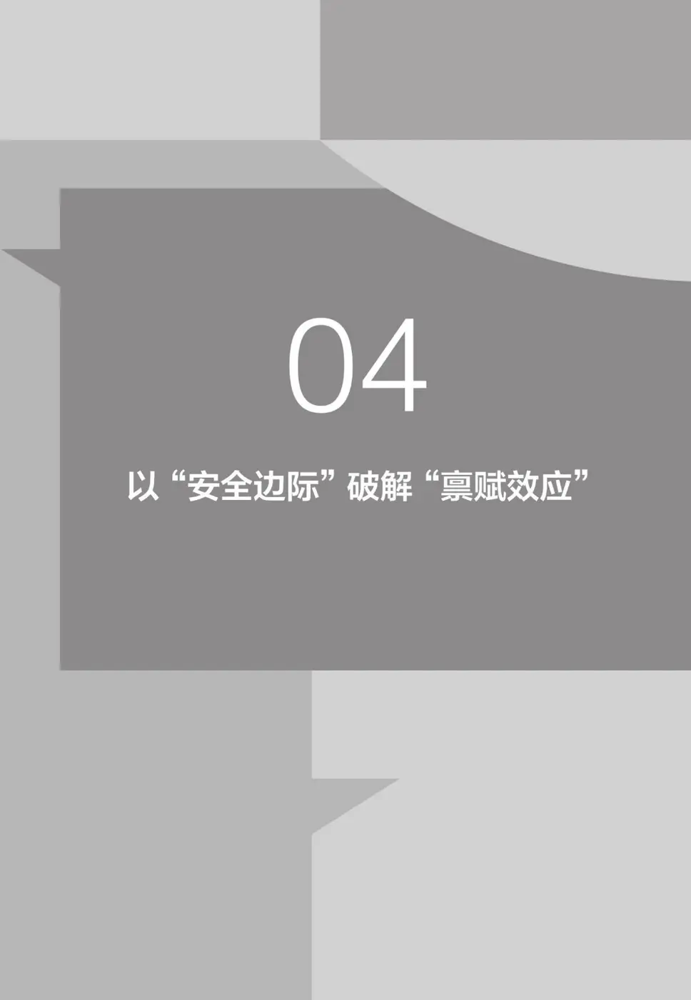

2025年5月20日

21:15

## 财富是认知的变现（上海老牌百亿私募基金重阳投资合伙人舒泰峰首部投资专著，教你避开投资中的12个陷阱。大开脑洞，开启12篇老子与巴菲特的时空对话，带你轻松领会投资哲学。）

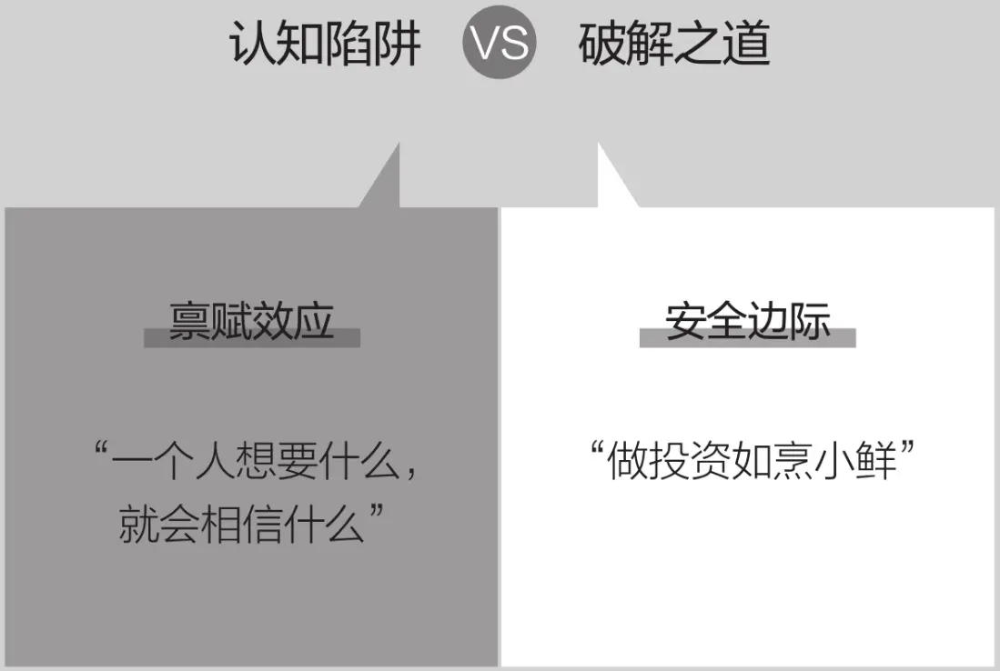

2025年5月20日

21:15

## 认知陷阱4：禀赋效应 “一个人想要什么，就会相信什么”

__认知陷阱4：禀赋效应__

__“一个人想要什么，就会相信什么”__

我们每个人应该都有过这样的经历：在两项吸引力差不多的选择之间摇摆不定，最后终于选择了其中一项，从那一刻开始你立即觉得自己的决定非常英明，而且随着时间的推移，你会越来越觉得自己做得对，而另外一个选项则变得越来越缺乏吸引力。

比如你和女朋友买房筹备结婚，小区A和小区B各方面条件差不多，你们对比了很久，迟迟下不了决心。随着婚期临近，你们必须做决定了。最终你们选择在小区A共筑爱巢，在签订合同前的一刻你们还在为放弃小区B而感到遗憾，但是从签下合同的那一刻开始，你们会立马觉得选择小区A是个更明智的决定，而小区B在心理上马上变得逊色了。然后随着装修、入住，你们会觉得自己的小区越来越好，位置、绿化、户型、采光都比小区B要好，甚至连升值空间也比小区B更大。

这就是心理学家所说的“禀赋效应”，它是指一旦某个人拥有某个物品，那么他对该物品价值的评价要比没有拥有的时候大幅提高。

连以理性著称的大经济学家也不能避免这样的心理误区。比如芝加哥大学商学院院长理查德·罗塞特（Richard Rosett）就是如此。理查德·罗塞特非常喜欢红酒，他时常会在拍卖会上买葡萄酒，但无论质量如何，一般出价不会超过35美元一瓶。但是对于他自己收藏的葡萄酒，即使对方出价高达100美元一瓶，他也不会卖。1

投资中这种现象也十分常见。本来你并不了解一只股票，但是经过朋友或者专家推荐，你买了这只股票，从那一刻开始你便对这只股票情有独钟。巴菲特讽刺过这种现象：“股票并不知道谁是它的主人。但你却对它寄予了太多的七情六欲。你清清楚楚地记得是以什么价位买进它的，你还清楚地记得谁透露了一些小道消息——感情五味杂陈。”然而，盲目的偏爱可能正是亏损的开始。

__认知失调__

禀赋效应本质上是一种认知失调。牛市中你买入的一只股票一开始涨势喜人，你喜出望外，由衷钦佩自己的判断力。可惜好景不长，股指开始掉头向下，你所偏爱的这只股票的价格也开始下跌。在牛市气氛里，一般刚开始回调时多数人仍然信心满满，觉得这不过是暂时的回调，股价肯定会涨回来并再创新高。然而，事与愿违，某天，股价终于跌破了你的成本线。

这时候怎么办？你会割肉止损吗？大概率不会，因为人类心理的一大特点是具有强大的调适能力。这种调适能力有时候是指我们会调整自己的认知以适应新的事实，但有时候恰恰相反，我们会扭曲事实以适应我们的固有想法。

比如你和女朋友本来为去日本还是韩国度假纠结很久，最终决定去日本。可是到了日本之后，遭遇连日阴雨，出行受到很大影响，而韩国却是艳阳高照。你会为自己的选择后悔吗？不会。相反，你会安慰自己和女朋友，“阴雨中的日本别有一种风情”，而韩国“阳光太强烈了，紫外线太强，容易晒黑”。

这是不是令你想起酸葡萄的故事？狐狸想吃一串熟透了的葡萄，费尽心力却吃不到，倔强的狐狸没有承认自己的失败，而是改变了葡萄的性质，它说“葡萄是酸的”。

心理学上把这种“吃不到葡萄说葡萄酸”的现象命名为认知失调，而这也是股市投资中常见的错误。我们所钟爱的股票跌了，为了掩饰判断失误，我们往往将原因归咎于市场不好、庄家洗盘等其他问题，而不去正视这只股票本身基本面可能受损的真正原因。

__“一个人想要什么，就会相信什么”__

“酸葡萄心理”还有一个“近亲”，那就是芒格所说的“避免不一致性倾向”，或者也可以叫“一贯性原则”，它是指人类在心理上总是力求与之前的承诺或观点保持一致，即使这种行为有悖于自身的最高利益。2

买入一只股票，就代表了你对这只股票的乐观判断，如果因为下跌而选择止损，就代表着你要否定自己，这显然违反了“一贯性原则”。

“一贯性原则”何来？在芒格看来，人之所以会这样，是因为人类的大脑运算空间十分有限。为了能够在虎口下迅速逃生，我们生活在原始社会恶劣生存条件下的先祖们必须迅速做出反应，久而久之形成了节省大脑运算空间的习惯，变得不愿意做出改变。这种大脑的最小作用力原则导致我们能不思考就不思考，能不改变就不改变。“大脑的抗改变倾向还使得人们倾向于保留如下几种东西的原样：以前的结论、忠诚度、身份、社会认可的角色等。”

“一贯性原则”十分强大，为了保持一贯性，人们会不断寻找能够证明自己行为正确的证据和理论，忽略或歪曲那些与之相反的证据。正如古希腊著名哲学家德摩斯梯尼所说：“一个人想要什么，就会相信什么。”

说得极端一点，“死不认错”是人类的本性。这有神经科学的证明，美国神经科学家德鲁·威斯顿（Drew Westen）通过核磁共振技术扫描人类在处理信息时的大脑发现，当人面对令自己认知失调的信息时，大脑主管理性的区域就会突然“断电”，停止工作。

“人类的头脑和卵子的运作方式非常相似，当一个精子进入卵子时，卵子就自动启动一种封闭机制，阻止其他精子的进入。”芒格说。著名经济学家凯恩斯也曾说过：“最难的不在于接受新思想，而在于如何摆脱旧思想的束缚。”

正因为如此，所以即使你看到了很多不利于大盘走向或持有股票的负面信息，你也选择视而不见，甚至还为此百般辩解。而一旦陷入这样的认知误区，当心！你可能要被套牢了。

__破解之道4：安全边际__

__“做投资如烹小鲜”__

王阳明心学近年来越来越受到欢迎，他毕生心得所总结出来的四句教，即“无善无恶心之体，有善有恶意之动，知善知恶是良知，为善去恶是格物”，几乎成了流行的“心灵鸡汤”。

阳明心学的重要性在于颠覆了当时处于主流地位的朱子学说，指出天理不是通过格物能够求得的，天理就在人心。每个人心中都有一个良知，人生的目的就是“致良知”，就是通过“事上磨炼”，通过“致吾心良知之天理于事事物物，则事事物物皆得其理矣”，由此达致“此心光明”的境界。对于治国者而言，通过“致良知”这一“不二法门”，就可以“安天下之民”“成天下之治”。

但是良知是很容易被遮蔽的，所以人生在世很容易失去初心，这其中非常关键的一个拦路虎就是傲慢。王阳明说：“千罪百恶，皆从傲上来。”“人生大病只是一‘傲’字。为子而傲必不孝，为臣而傲必不忠，为父而傲必不慈，为友而傲必不信……谦者众善之基，傲者众恶之魁。”

克服傲慢，保持谦虚是致良知的关键，但是怎么做到这一点呢？王阳明的药方是“无我自能谦”——无私忘我的人才能始终保持谦虚。

王阳明能悟到这一点是深刻的生活教育的结果。天纵奇才、从小被称为“神童”的王阳明其实年轻的时候也时常傲视同辈，轻慢世故，但是在遭到权臣打击之后，他贬谪贵州三年，居无定所，食不果腹，还时常有生命安全的威胁，用他自己的话说是“百难备尝”，然后才痛定思痛，开始相信孟子所说的“生于忧患”的道理，也才知道傲慢的可怕。

被誉为日本“经营之圣”的稻盛和夫先生也有类似的经历和体会。稻盛和夫提到自己年轻的时候也有傲气，喝了酒之后也会说大话。但是他非常善于自己反省，还发明了一种仪式，一旦犯了傲慢的毛病就回家对着镜子训斥自己。自我谴责的背后是稻盛和夫治疗傲病的心法——“才能不可私有化”。在他看来，人并不是凭借自己的意志来到世上的，个人的才能不过由上苍偶然赋予。一个人可能才能出众，聪明能干，事业成功，但是带来成功的才能本身，实际上是上苍所赐，不属于自己。将本来就不是自己固有的东西据为己有，这就违背了上苍的意志。

在稻盛和夫看来，人是平等的存在。每一个人都是偶然被赋予了某种才能和容姿来到人间，在现世这个舞台上扮演他一生的角色。有人当主角，有人当配角，有人当反面角色，有人负责小道具、大道具等舞台装置，有人负责戏场内的打扫整理。所有的人都不过是本质相同的、只能称为“存在”的化身而已。这部戏剧，也就是说这个社会，是由所有扮演这些角色的人一起来演绎的。而自己只不过是在这个现世扮演了某个角色而已，完全没有非自己不可的必然性。因此，“我的才能只是上苍在现世一时寄托在我身上的东西”。自己根本就没有据以为骄傲的资本。把自己的才能当作自己的私有物品，那是完全搞错了。3

“禀赋效应”本质上可以说是一种执念，认为自己拥有的便是最好的。以王阳明和稻盛和夫的“无我”来破除这种“我执”，无疑十分对症。

__“自我”的幻觉__

王阳明和稻盛和夫的论点得到了科学与佛学的印证。根据最新科学实验的结果，所谓“自我”可能是自然选择制造出来的最大幻觉。

进化心理学研究者曾做过一个实验。实验把受试者分为两组分别看电影。第一组看恐怖片，第二组看浪漫爱情片。看完电影之后，研究者又给受试者们看两个艺术博物馆的广告。第一个博物馆的广告宣传点是这个艺术博物馆深受欢迎，每年有几百万人来参观，强调的是它符合多数人的喜好。第二个博物馆的广告宣传点则是这个博物馆一般人欣赏不了，你来就能彰显你与众不同的品位。

刚才看过的电影对受试者选择博物馆会有什么影响呢？结果是，一开始看恐怖片的人更容易受到第一条广告的影响，他们更愿意去一个人多的博物馆。而看浪漫爱情片的人更容易受到第二条广告的影响，他们想去一个人少的博物馆。

这是因为恐怖片和浪漫爱情片开启了你大脑中不同的模块。恐怖片开启的模块叫“自我保护”，人多的地方显然会更加安全。浪漫爱情片开启的则是“求偶模块”，它会让你更倾向于找一个私密的地方。

这就是进化心理学的发现，人的大脑是由诸多的模块组成的，除了“自我保护”“求偶”模块外，还有“保住配偶”“群体认同”“关爱亲属”“社会地位”“避免疾病”等模块。这些模块并不是谁决定谁的关系，而是互相竞争的关系，每个模块都向你输出一种感情，哪一种感情力量大，哪个模块就胜出了。所以，所谓的“自由意志”或“自我”是不存在的。4

这与佛学的相关理论高度相通。佛陀认为构成“自我”的五种东西，也就是“五蕴”（色受想行识），都是虚幻的。佛经曾记载佛陀和一个叫“火吠舍”的人辩论。火吠舍说，我觉得你说的“五蕴皆空”不对，我认为五蕴都是我的一部分。佛陀就问他，假如有一个国王，有人在这位国王的领土里干了坏事，那么国王有没有权力惩罚他？国王有没有权力放逐他？火吠舍说，国王有权力这么做。佛陀追问，那你有权力随意改变自己的身体吗？火吠舍哑口无言。佛陀认为，既然我们无法控制我们的身体（色）、感情（受）、感知（想）、行为（行）和意识（识），那么又何来“自我”呢？

既然连“自我”都可能是虚幻的，那么我们对物品的“禀赋效应”便更是无源之水、无本之木了。

__做投资首先要想的不是赚钱__

当然，“无我”是一种很难企及的精神高度，基本属于圣人之境。在没有达到这个高度之前，投资中也有些心法与技巧可以应用。

投资这个行业有句谚语：有胆大的投资者，有老道的投资者，但没有又老道又胆大的投资者。老道的投资者自不必多说，胆大的投资者可谓比比皆是。2015年上半年的A股被称为典型的杠杆牛市，2014年7月，A股场内融资余额只有4000亿元左右，到了2015年的3至6月期间，融资余额快速飙升，直接创出了2\.27万亿元的峰值。而在场外，当时配资盛行，1:2、1:5的配资比例比比皆是，甚至1:10的都有，1:10的配资意味着你自己只有1万元本金，但通过配资你轻松拥有了10万元本金。10倍杠杆意味着当你用配资而来的10万元满仓买入一只股票，当这只股票亏损10%时，账户亏损1万元，也就是本金全部亏损，这就是“爆仓”。

2015年6月15日，股市见顶，股灾发生。那一年我们见证了太多的“财富过山车”故事。有人从初始的600万元赚到3500万元，然后卖掉全部7套房子和工厂，加上杠杆，最高赚到2\.7亿元，但最后爆仓，不得不开滴滴谋生。有人投入所有积蓄170万元本金加4倍融资，全仓一只股票，几个跌停后爆仓，170万本金付诸流水，最终选择跳楼自尽，丢了性命。

关于杠杆，芒格早就有犀利的点评：“聪明人和高杠杆的组合往往会以惨败收场。”聪明如长期资本管理公司都在杠杆之下覆灭，何况是广大普通投资者。巴菲特说投资最重要的有三件事：“第一是尽量避免风险，保住本金；第二还是尽量避免风险，保住本金；第三是坚决牢记前两条。”投资最重要的是不亏钱，一旦亏损了本金，就意味着你再也回不来了。

巴菲特又说：“我首先会关注任何投资失败的可能性。我的意思是，如果你肯定不会亏钱，你将来就会赚钱，这正是我们一直做得不错的一个原因。”所以，与多数人的想法不一致，做投资先要思考的不是挣钱，而是确保不亏钱。可惜多数人搞反了，满脑子想着的都是挣快钱，最好一夜暴富。但是历史经验证明，这么做往往适得其反。

__“与其杀死毒龙，不如避开毒龙”__

对于如何保护本金安全，价值投资有一些特定的方法或者说纪律，其中非常关键的一个就是“安全边际”。这一理论是巴菲特的老师本杰明·格雷厄姆\(5\)提出来的，他在经典著作《聪明的投资者》中指出，如果普通股的售价低于公司以财产和盈利能力为稳固基础而发行的债券的价值，那么在这种情况下购买的普通股就能很好地兼顾安全边际和盈利性这两个方面。比如1932年到1933年时的National Presto工业公司的股票，1932年，该公司股票的总市值为4300万美元，公司税前利润达到了1600万美元，能够轻易地支持股票的价值，尽管这种情况并不常见。5

格雷厄姆说得比较学术，巴菲特曾经用修桥的例子很通俗地解释过“安全边际”理论：“我建一座能承重3万磅的桥，但却只让通1万磅的车；这样就算我大意了失算漏放了一辆1\.2万磅或者1\.3万磅的卡车过去，也不至于桥毁人亡。”结合股票来说，假设一只股票的价值是10元，而你是用10元买的，那么安全边际为0，如果8元买进，就有了2元安全边际。如果12元买的，安全边际不仅没有，而且是负的，那就很可能亏钱。

当然，格雷厄姆提出安全边际理论是在大萧条时期，许多企业的股价大幅超跌，而在巴菲特成长成熟的年代，满地便宜股票的情形已经不复存在，所以安全边际理论也要与时俱进。在评估企业价值的时候更多地要预测未来企业的盈利能力，而不是过去的利润纪录。在芒格的帮助下，巴菲特从“以便宜价格买一般的企业”进化到了“以合理的价格买优秀的企业”，从而成为一代投资传奇。但是不管怎么进化，安全边际的理念一直深入巴菲特和芒格的骨髓。巴菲特极为推崇安全边际理论，1990年的时候巴菲特在致股东函中写道：“今年距离第一次读到这篇文章已经42年了，但我依然深深相信这四个字。”

巴菲特的职业生涯从始至终都在谨防风险。巴菲特将风险的控制渗透到他选择公司的4个条件当中：第一是买懂的、能理解的公司，这是为了规避认知的风险；第二是诚实可靠的管理层，这是为了规避人的风险；第三是有竞争优势的公司，这是为了规避市场竞争的风险；第四是买价格具有安全边际的公司，这是为了规避误判的风险。

“谨小慎微”这个词在日常生活中是一个贬义词，一个人若被形容为谨小慎微，意味着他胆子不够大，没魄力。然而看看成功投资家的经验，在投资里，谨小慎微却是一个非常好的优点，因为投资不在于短期跑得多快，而在于长期能够守得住、不出局，“剩者”为王。

芒格引用过一句古训：“河水淹死会水人。”在河水里被淹死的多数是会游泳的人，不会游泳的人会自动远离河流，反而可以无恙。所罗门兄弟公司前首席经济学家亨利·考夫曼（Henry Kaufman）也有一句很经典的话：“亏钱最多的人有两类，一类人什么都不知道，另一类人什么都知道。”这两种人实际上是一种人，什么都知道的人也可能什么都懂了点皮毛，结果还是什么都不知道。

很多时候，正如巴菲特所说：“风险恰恰来源于你不知道你在做什么。”在投资的时候，很多人可能连自己买的股票背后的公司业务是什么都不清楚，不亏钱才怪。傻大胆既是因为贪婪，也是因为无知，所谓无知者无畏。而对付贪婪或无知的最好武器就是给自己留有余地。“与其杀死毒龙，不如避开毒龙。”

老子说“治大国，若烹小鲜”，这句话不是说治大国很容易，恰恰相反，由于小鱼小虾非常容易破碎，不能大火翻炒，要小心翼翼地拨弄，所以治大国非常难，做投资也是一样。如果达不到圣人那样的“无我”之境，就不如给自己的行为留下足够的“安全边际”。

__重阳实践：宁愿少赚，不可大亏__

重阳投资创始人、首席投资官裘国根在内部经常讲一句话，“不做不可逆的事情”。这背后是对风险的极度重视。

所以，在重阳投资，无论是研究员研究公司、推荐股票，还是投资经理在选择投资标的的时候，都已经形成一个习惯：不追逐太热的东西，因为太热的东西往往意味着缺乏安全边际。

某种程度上这其实也意味着，短期来看，重阳投资不会是跑在最前面的机构。但投资确定性更大的标的，并长期坚持下去，胜率自然就高，绝对收益就高。

追求“绝对收益”正是重阳投资的核心理念之一。什么是“绝对收益”？“绝对收益”就是“宁愿少赚，不可大亏”，不管市场涨跌，都要力争实现可观的正收益。通俗点说，就是巴菲特说的“不要亏钱，不要亏钱，不要亏钱”。

为什么不亏钱这么重要？因为股票市场阴晴不定，变幻莫测，机会常有，但本金不常有。亏钱永远比赚钱容易，亏30%，要赚43%才能回本，亏50%，必须赚100%才能回本，大亏是重伤，甚至意味着出局。

重阳投资董事长王庆博士曾指出，中国股市有三大痛点。第一个痛点是，从发展曲线来看，A股市场整体呈现出“牛短熊长”的特征。第二个痛点是，从投资者的角度看，多数股民亏钱，少数股民赚钱。中国股市中流传着“七亏二平一赚”的说法，这与相关统计基本吻合，反映出中国股民多数亏钱、极少数赚钱的局面。第三个痛点是，基金赚钱，基民不赚钱。以2019年和2020年为例，公募基金大热，不少股民转变为基民，但是结果却令人意外。2020年，来自某国内著名股份制银行的数据，某款首发基金，年度收益率60%，首发时有18000个客户参与，最后收益超过30%的客户仅有8个。另一份来自支付宝的数据显示，国内某款“顶流”基金在2021年年初市场调整之后，超80%的持有人亏损，亏5%以上的持有人占了65%，挣钱的基民不到20%，挣5%以上的持有人不到10%。基金赚钱，基民不赚钱的特征十分明显。

之所以会出现“多数股民亏钱，少数股民赚钱”和“基金赚钱，基民不赚钱”的现象，绕不开的一个背景是，中国股市是一个典型以散户为主的市场。虽然总体上近年来个人投资者占比呈现下降趋势，机构投资者占比从2015年以来趋势性提升，A股投资者“机构化”正在稳步进行中。但是截至2020年第三季度，在A股自由流通市值中，个人投资者占比为52\.6%，仍高于机构投资者合计占比47\.4%。相比而言，欧美成熟市场的投资人结构中，个人散户的比重比较低，大概占整个市场持股市值的不到20%。

一个以个人投资者为主的市场，其突出的特点一方面是流动性好，市场活跃，从交易的情况来看，A股市场散户贡献了80%的成交量；另一方面是这样的市场往往表现出大涨大跌的特点。人性中一个典型的弱点是“羊群效应”，个人投资者会在上涨时盲目乐观，在下跌时过度恐惧，体现在交易行为上便是“追涨杀跌”，体现在交易结果上便是“多数股民亏钱，少数股民赚钱”或“基金赚钱，基民不赚钱”。

怎么解决这样的痛点？办法有二。第一个办法是加强投资者教育，尽量鼓励散户坚持长期投资。但是必须承认，人性是很难改变的，教育需要时间，在投资者成熟之前，就要用第二个办法，那就是投资管理机构要通过自身的专业手段，尽量避免基金产品的大幅波动，努力做到不论在什么市场环境下，都能够为投资者创造绝对收益。如果能够做到这一点，就可以帮助投资者规避人性的弱点，避免大进大出，从而让投资者真正获得可持续的长期收益。6

所以，“绝对收益”理念是基于对人性弱点的深度认识以及高度风险意识的理性选择。

## 老子对话巴菲特 保此道者，不欲盈

__老子对话巴菲特__

ROUND 4

__保此道者，不欲盈__

巴菲特：上回听老子先生讲“大器晚成”很有启发，但感觉意犹未尽，您能否再展开讲讲？

老 子：谢谢！如果说跟“大器晚成”有一定相关性的，我还很重视另外一句话：“保此道者，不欲盈。夫唯不盈，故能蔽而新成。”

巴菲特：请通俗地解释一下，谢谢！

老 子：这句话的意思是说，一心修为的人不追求极致的状态。正因为没有极致，所以他永远充满生机，在旧的破灭之中不断获得新生。

巴菲特：太好了，这不就是价值投资中的“安全边际”理论嘛！

老 子：什么是“安全边际”？

巴菲特：我举个生活中的例子来说明。“我建一座能承重3万磅的桥，但却只让通1万磅的车；这样就算我大意了失算漏放了一辆1\.2万磅或者1\.3万磅的卡车过去，也不至于桥毁人亡。”这就是安全边际。

老 子：如果运用到股票上，假设一只股票的价值是10元，而我是用10元买的，那么安全边际为0，如果8元买进，就有了2元安全边际，我就可以挣钱。如果12元买的，安全边际不仅没有，而且是负的，就很可能亏钱。是这么一回事吗？

巴菲特：完全正确。

老 子：这跟“不欲盈”的确非常相似。

巴菲特：是的，投资不能追求极致，比如我从不追求抄底。在我看来，“抄底是不可能的，不要试图在股市‘落地’的时候进行投资”。因为，“股市最低点的形成没有任何规律可循，谁也无法预测真正的最低点在哪里；即使知道了最低点也没法保证一定能买到最低价位。因此，最好的方法就是留有一定余地，不要满仓进入，尽量保持手里有足够的现金”。

老 子：不追求抄底，不满仓进入，这些的确都可以说是“不欲盈”，它们有助于确保投资的安全，那么除此之外还有什么办法确保自己投资的安全性呢？

巴菲特：我经常给伯克希尔–哈撒韦公司旗下的那些经理人写信，长度不超过两页，但其中必定会有这样一句忠告：“你们不要忘记，经营企业如同守城，应当先考虑挖一条深沟，以便将盗贼隔绝在城堡之外。”

老 子：护城河我懂，中国古代的每个城市都有护城河。但是企业的护城河指的是什么？

巴菲特：这个比较复杂，品牌威力（强大的世界性品牌）、产品特性、销售实力、特许权（收费桥梁）、低成本等都是“护城河”的主要来源。总之，“如果企业的护城河每年不断地加宽，这家企业会经营得很好”。

老 子：虽然你没有展开讲，但我听出来了，护城河就是让对手无法对你形成威胁的东西。

巴菲特：可以这么说。

老 子：我还听出来了，你在投资上是一个非常谨慎小心的人。

巴菲特：是啊，投资必须小心，我说过，“有些时候我们过于谨慎，但我宁可100次的过于谨慎，也不愿1%的不谨慎”。

老 子：这么小心谨慎是为什么？

巴菲特：为了不亏钱。我认为投资最重要的三件事是，“第一，尽量避免风险，保住本金；第二，尽量避免风险，保住本金；第三，坚决牢记前两条”。

老 子：我有一句话广为流传，听了你的介绍，我感觉这句话也适合于描述投资这个行业。

巴菲特：请问是哪句话？

老 子：“治大国，若烹小鲜。”

巴菲特：怎么解释？

老 子：很多人把这句话理解为治理大国就像烹调美味的小菜一样简单，其实是大错特错了。我的意思是说，治理大国要像烹调小鱼小虾一样小心谨慎，因为小鱼很容易碎，不能随便翻腾搅拌。

巴菲特：很有意思，看来以后可以说“做投资，若烹小鲜”了。

老 子：哈哈！我还有一句话形容追求修为之人的谨慎样子，两位先生是否有兴趣听听？

巴菲特：当然！

芒 格：洗耳恭听！

老 子：“豫兮若冬涉川；犹兮若畏四邻；俨兮其若客。”

巴菲特：请老先生再做解释。

老 子：这句话是形容一个追求修为的人，他谨慎迟疑啊，就像冬天涉水过河；畏惧顾虑啊，就像提防四周围攻；恭敬端凝啊，就像在别人家做客。

巴菲特：原来修为之路也需如此谨慎又谨慎。

老 子：是的。不过扯远了，通过两位的介绍，我今天学习了做投资的第一要务是提防风险，不要亏钱，而找到有护城河的企业、留足安全边际是不亏钱的秘诀所在。关于这个主题，两位还有什么补充？

巴菲特：还有两句话我必须补充一下，“控制风险的最好办法是深入思考，而不是投资组合”。因为“风险恰恰来源于你不知道你在做什么”。

老 子：妙啊！这又回到了我们第一次对话中“自知者明”的话题了。所以，人的一切行动来源于对自我的认知。修为如此，投资也是如此。没有这个前提，其他一切都是浮云。

巴菲特：老先生总结得非常到位，我完全同意。不知道查理有什么补充？

芒 格：你们聊得很精彩，我没什么要补充的。

2025年5月20日

21:15

## 05 以“变亦不变”破解“锚定效应”

2025年5月20日

21:15

## 财富是认知的变现（上海老牌百亿私募基金重阳投资合伙人舒泰峰首部投资专著，教你避开投资中的12个陷阱。大开脑洞，开启12篇老子与巴菲特的时空对话，带你轻松领会投资哲学。）

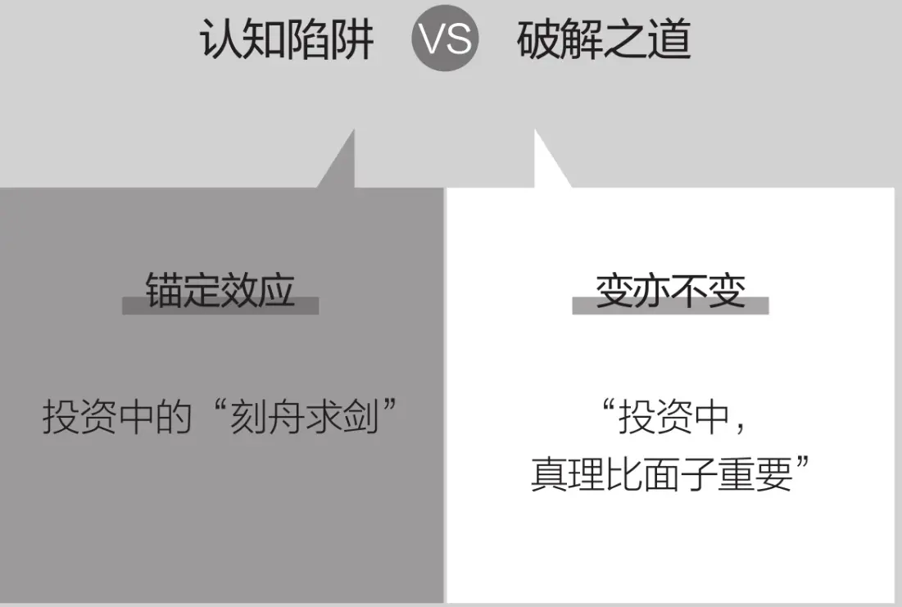

2025年5月20日

21:15

## 认知陷阱5：锚定效应 投资中的“刻舟求剑”

__认知陷阱5：锚定效应__

__投资中的“刻舟求剑”__

还记得“刻舟求剑”的故事吗？楚国有个渡江的人，他的剑从船中掉到水里。他立刻在船舷上刻了记号，说：“这是我的剑掉下去的地方。”船到目的地后停了下来，这个楚国人从他刻记号的地方跳到水里找剑。船已经向前行驶了，但是剑没有移动，像这样找剑，不是很糊涂吗？

我们都觉得这个楚国人很傻，对不对？不要轻易嘲笑他，因为我们也时常犯这样的错误，只是不自知而已。

在股票投资中这类错误就十分常见。比如你以10元的价格买入某股票，然后经历一段时间的涨涨跌跌，该只股票的基本面已经在很大程度上变坏了，股价跌到5元，但是你很可能一直拿着股票而不愿意止损，原因正在于10元是你的心理价位。由于你把10元这个价格刻在了心里，因此你可能被深套多年，如果公司质地继续变坏，你甚至可能血本无归。

在理解大的历史事件时，我们也容易犯这种错误。2020年年初，突如其来的新冠肺炎疫情也对股市造成了巨大冲击，美股连续4次熔断，历史仅见，在这样的股灾面前，连巴菲特都显得太年轻。一时间，许多专家学者将新冠肺炎疫情带来的冲击比作1929年的大萧条。

这样的情形反复出现。2008年次贷危机中，美国专栏作家罗伯特·塞缪尔森（Robert Samuelson）在《华盛顿邮报》发表评论“是1929年再现吗？”，《经济学人》等多家西方媒体也将次贷危机与“大萧条”进行对比，美国《时代周刊》干脆将次贷危机称为“大萧条2\.0版”（Depression 2\.0）。

1987年10月19日，“黑色星期一”，道琼斯工业指数急挫508点，创下美股历史上单日最大跌幅22\.6%，市值蒸发了近万亿美元。“这是1929年的重演吗？”媒体用醒目的标题问道。

其实每一次危机都与前一次不同，可是每一次都撩动了我们心中的1929年刻度，它就像一个魅影一样挥之不去。

__打折商品的诱惑__

生活中我们也会犯同样的错误。在商场购物时我们很难拒绝大幅打折的场景诱惑。一件外套，标价6000元，打6折，也就是3600元，加上销售员的三寸巧舌，告诉你如何机会难得，你很容易就会为之心动并买下它。但是如果没有打折活动，这件衣服仅以3000元标价出售，你很可能不会购买，尽管这个价格比第一种场景下要便宜600元。

这是为什么呢？1974年，丹尼尔·卡尼曼和他的合作伙伴阿莫斯·特沃斯基做了如下实验。他们要求受试者对非洲国家在联合国所占席位的百分比进行估计。因为分母为100，所以实际上是要求受试者对分子数值进行估计。

首先，受试者被要求旋转摆放在其前面的罗盘，随机地选择一个在0到100之间的数字；其次，受试者被暗示他所选择的数字比实际值是大还是小；最后，要求受试者对随机选择的数字进行向下或向上调整来估计分子值。通过这个实验，卡尼曼和特沃斯基发现，当不同的小组随机确定的数字不同时，这些随机确定的数字对后面的估计有显著的影响。例如，两个分别随机选定10和65作为开始点的小组，他们对分子值的平均估计分别为25和45。由此可见，尽管实验者对随机确定的数字有所调整，但他们还是将分子值的估计锚定在这一数字的一定范围内。1

卡尼曼用这个实验发现了一种叫作“锚定效应”的心理机制，它是指人们在进行判断时常常过分看重那些显著的、难忘的证据。我们时常被第一个听到的数字、第一次见到的场景所锚定，之后在进行选择时总是难以摆脱以它们为参照，哪怕这个“锚”只是随机假定的。自然学家康拉德·洛伦茨在一次实验中无意被刚出壳的幼鹅们第一眼看到，它们从此就一直紧跟着他直到长大。他被幼鹅们当作妈妈了！“幼鹅效应”也是“锚定效应”的一种。2

__谁动了你的参照点__

多数人都生活在相对的世界里，即都需要一个参照点以确立自己的价值或为自己的行动提供指南。“刻舟求剑”中，愚弄那个渡客的参照点就是那道划痕。在投资中，我们是怎样确立参照点的？卡尼曼和特沃斯基通过研究发现，参考点与几个因素有关：第一个也是最重要的一个是历史水平，比如成本价或者历史最高价、历史最低价；第二个是期望值，也就是你的预期价位。比如你买进一只股票希望它涨到20元，20元便是期望值。参考点也可能与身边人的决策有关，比如你的朋友以20元的价格买入某只股票，你便以此为参照。这也被称为决策的“同群效应”。

追涨的时候我们内心的参照点很可能是历史极值，“突破历史最高价我就卖”是内心的潜台词；抄底的时候我们内心的参照点是历史最低价，“跌破最低价我就买”是内心的潜台词；而售赢持亏的时候我们内心的参考价则是成本价，此时的内心潜台词变成“回到成本价我就卖”。

有趣的是，参照点是可以控制的，即可以通过改变参照点的方法来操纵人们的决策。这在商品促销中很常见，上述卖衣服的案例中，3000元的外套卖不出去，如果商家将售价调整为6000元，然后打6折出售，实际价格上涨了600元，却可能很快售出。商家在这里利用的正是锚定效应，顾客内心的参照点被悄然移动了。

__恐慌中，我们不善于区分灾难的不同__

这几种类似的认知偏见会造成怎样的行为偏差呢？心理学家指出，它会使我们更多地关注新发生事件与锚事件之间的相同之处，而忽视其不同之处。换句话说，在面对复杂事物，尤其是被恐慌情绪笼罩的时候，我们更善于发现事物之间的相同之处，而不善于区分不同之处。运用到股票投资中，我们看到，每次股灾之后市场上都充满了各种类比过去股灾的观点，以及各种看起来惊人相似的股市下跌图形。

这恰是投资中需要格外注意的。德雷曼投资公司董事长大卫·德雷曼（David Dreman）在其经典著作《逆向投资策略》中以1987年和1929年的情形为例做了精彩分析。

在1987年历史性股灾后，“1929年重演”的悲观气氛当道，大卫·德雷曼却敏锐地指出了两者的不同：1987年的股灾之后，经济的增长速度比股灾之前绝大部分的估计值要高，大幅甩掉了股灾之后所预计的衰退水平，与之相伴随的是真实收益比10月19日股灾之后数星期内所预测的要高。标普500指数的市盈率只有收益的13倍，相对于股灾之前20倍的市盈率低很多，也低于15倍的长期平均市盈率。那时的情形与1929年大股灾之后的情形完全不同。1929年时上市公司以及整个金融系统都崩溃了，失业率飙升。

后来股市的演绎证明了大卫·德雷曼的判断是对的：1997年7月，股市相对于最低点上涨了4倍。1987年没有重复1929年的情形，而那些屈服于锚定效应的投资者错过了一个极好的买入机会。

做投资，要少一些“刻舟求剑”。

__破解之道5：变亦不变__

__“投资中，真理比面子重要”__

2020年5月3日，新冠肺炎疫情之后举办的第一次巴菲特股东大会，因受疫情影响，这是自1964年开办以来，大会首次以线上直播形式举行。89岁的巴菲特携格雷格·阿贝尔一起露面，阿贝尔被视为伯克希尔–哈撒韦的未来掌门人。这也是第一次因为特殊原因芒格没有参加的股东大会。

在股东大会开始之前，伯克希尔–哈撒韦公布了第一季度财报。财报显示，伯克希尔–哈撒韦第一季度净亏损497\.46亿美元（约3500亿元），创历史纪录，投资组合遭遇“账面巨亏”超545亿美元，同时账面现金达到了创纪录的1373亿美元。

会上，89岁的巴菲特花了近5个小时回答了投资者数十个问题。期间，股神罕见地两度认错，一是错估了油价走势，二是错投了航空股。其坦诚精神令人感佩。

前文已经提到过，巴菲特和芒格非常善于自我纠错，芒格说：“我们常常需要改变错误的决定。可以说，这是让生活沿着正确轨道运行的重要一部分。人孰能无错？如果你能及时认识到并采取补救措施，常可以化腐朽为神奇。”

事实上，在投资实践中，巴菲特和芒格并非一成不变，而是相当灵活。巴菲特早年在航空股上栽过跟头，痛定思痛之后认为航空股是典型的“价值毁灭者”，并发誓再也不碰航空股。但是2016年，伯克希尔–哈撒韦却开始收购多家航空公司的股票，有人怀疑这是巴菲特的助手所为，然而在一次采访中巴菲特明确表示，伯克希尔–哈撒韦持有的4大航空公司中，有3家都是他亲自买入的，且持有比例在这4家航空公司中均占到10%左右。

新冠肺炎疫情发生后，伯克希尔–哈撒韦以每股46美元“抄底”了97\.65万股达美航空。然而一个月之后就清仓了，这笔抄底亏损了48%。巴菲特的这波操作真是快进快出，看起来跟他的长期价值投资理念十分不符。

在对待科技股方面，巴菲特的态度也并非一成不变。大家都知道即使是在科技股最受欢迎的20世纪90年代，巴菲特也始终拒绝触碰，为此承受了很大的压力。但是伯克希尔–哈撒韦在2011年买入了IBM，后来又买入苹果、亚马逊等科技股，而且持股数量越来越大。截至2019年9月底，伯克希尔–哈撒韦持有苹果公司2\.5亿股，成为其第一大股东。

除了具体的操作，巴菲特在投资理念和方法上也发生过重大变化，早年的巴菲特恪守老师格雷厄姆的投资方法，努力在市场中寻找极为便宜的股票，他概括为“烟蒂股”投资策略——这样的股票相当于被扔在地上的烟蒂，捡起来还可以抽几口。但是在芒格的影响下，巴菲特完成了最重要的投资转变，从以很便宜的价格买二流公司到以合理的价格买伟大的公司并长期持有。这是一次伟大的飞跃，所以巴菲特说：“芒格让我以火箭般的速度从猩猩进化到人类，否则我会比现在贫穷很多。”

__巴菲特真的变了吗__

看起来巴菲特非常“善变”，这就带来一个重大的疑问，驱动巴菲特做出改变的是什么呢？总结起来，主要有两大驱动力。第一个驱动力是客观条件在变化。比如都是航空股，但不同阶段航空股的特性却相差很大。早年巴菲特排斥航空股，首先是因为航空公司产品的同质化。航空公司提供的服务相同且价格透明，这意味着这个行业的公司都没有加价的能力，只能靠低价吸引顾客，导致恶性竞争。其次，顾客没有品牌意识。多数乘客在准备乘飞机出行时优先考虑的是时间、价格，而不是特定的航空公司，这也加剧了价格战。最后，航空公司的固定成本非常高。飞机及维护成本、燃料、机组人员的成本都很高，而且即使飞机趴着不飞，也不能省去维护费用。

既然如此，后来巴菲特为什么又重新青睐起航空公司了呢？其背后的原因在于经过长期的充分竞争，美国航空业形成四大航空公司垄断竞争的新格局，从而改变了过去巴菲特所担心的航空业恶性竞争和品牌意识不强的局面。

那么，疫情发生之后巴菲特为什么又要抛售航空股呢？那是因为巴菲特认识到了疫情对航空公司的影响将持续较长时间且非常严重。巴菲特说：事实证明，我对这项业务的看法是错误的，这不是四位优秀CEO的错。航空业是一个非常具有挑战性的行业，做这些公司的CEO，并不是一份开心、容易的工作，尤其在目前这种大家都被告知不要再飞行、不要再旅行的情况下。

所以变不是没有原则的变，变是有前提的。正如凯恩斯所说：“当事实改变时，我也会随之改变想法。你又会怎么做呢，先生？”“事实改变”是“想法改变”的前提。

巴菲特变化的第二个驱动力是他自身的迭代进化。他的能力圈在扩大，以前看不懂的东西现在能看懂了。巴菲特曾对记者说：“是的，我是杰夫·贝佐斯的‘粉丝’，没有买（亚马逊的股票）就是个傻瓜。”这不是巴菲特第一次为自己没有尽早投资亚马逊而感到后悔。2019年，89岁的巴菲特决定突破自我，买入亚马逊。在他看来，亚马逊的股东允许贝佐斯以持续亏损为代价积极扩张。至于为什么投资苹果，巴菲特主要是看中其强劲的盈利能力。

__变亦不变__

被视为芒格传人的投资人李录曾形容芒格：“查理的头脑是原创性的，从来不受任何条条框框的束缚，也没有任何教条。”芒格十分重视达尔文的学说，在他看来，能够生存下来的物种不是最强的，也不是最聪明的，而是最能适应变化的。

“对拿锤子的人来说，看什么都像是钉子”，在芒格看来，思维固化就是“钉子思维”，这是投资的另一项大忌。正因如此，投资者才需要不断进化，甚至不惜否定自己，“及时快速放弃自己原有的理念是最宝贵的品质之一”。

策略因时因势而变，但这不意味着放弃原则。对于价值投资的几条原则，比如买股票就是买企业的一部分所有权、安全边际和能力圈等，巴菲特和芒格从来都没有改变过。

在2020年新型冠状病毒肺炎疫情后的股东大会上，首次亮相的伯克希尔–哈撒韦副董事长格雷格·阿贝尔也表示，不管巴菲特或芒格在不在，公司投资文化不会有任何的转变。

有时我们需要看到不变中之变。我们固然需要从历史中获取教训，但简单的类比也可能会误导行动。世上并无两片完全相同的叶子，同样，世上也不会有两次完全相同的危机。比如，1929年的时候并不存在现代意义上的央行，但是现在各国央行在危机干预中均扮演了重要的角色，这样一来，就可以在很大程度上破解“1929年魅影”了。

有时我们则需看到变中之不变。从短期来看，危机可以使人类的行为发生重大的改变，但是一切变化背后也有不变的东西，比如人性。只要人类没有丧失挑战危机的勇气，依然抱持着对于美好未来的向往，那么，我们就有理由相信，经历过坎坷，世界依然会向前。

变亦不变，正如重阳投资创始人、首席投资官裘国根所言，“在投资中，真理比面子重要”3。这也是破解“锚定效应”的最佳武器。

2025年5月20日

21:15

## 老子对话巴菲特 万物并作，吾以观复

__老子对话巴菲特__

ROUND 5

__万物并作，吾以观复__

2020年新冠肺炎疫情发生后，连一向不问世事的老子也坐不住了，他十分挂念巴菲特和芒格两位忘年交，他还特地收看了巴菲特的股东大会，并在会后要求小舍安排了一次与巴菲特和芒格之间的线上对话。

老子、巴菲特、芒格和小舍同时出现在视频会议的画面中。

小 舍：系统已设置完毕，老子先生、巴菲特先生、芒格先生，你们可以开始交流了。

老 子：巴菲特先生，你好，别来无恙！

巴菲特：老子先生，你好！感谢关心，我身体很好，您老人家这一向可好？

老 子：感谢询问，我还是老样子，没什么变化。今年股东大会没看到芒格先生，你可安好？

芒 格：我很好，您知道我平常住在洛杉矶，我今年已经96岁了，现在疫情在美国仍然非常严重，这个病毒又对老年人非常不友好，所以今年我没有去现场跟巴菲特一起主持股东大会，但到明年我还会参加的。

老 子：那就好，我想问问两位，疫情对你们的生活和投资有什么实质影响？

巴菲特：影响非常大，可以说疫情彻底颠覆了生活。您看我的头发已经很长了，都快赶上老子先生您了，那是因为我已经有七个星期没有理发了（笑）。

老 子：我也注意到了（笑）。

巴菲特：这次股东大会会场空无一人，这从来没有发生过。我还使用了PPT（演示文稿），以前从来没有使用过这玩意。谁说“老狗学不会新技能”，我就是一只在努力学习新技能的老狗，哈哈！

老 子：这也是一种“为学日益”的精神。

巴菲特：什么是“为学日益”？

老 子：“为学日益”是说，做学问需要每天积累知识，越积累，学问越丰富。

巴菲特：老子先生果然言简意赅，比我讲得要文雅多了（笑）。

老 子：巴菲特先生讲得更幽默（笑）。疫情对股票市场的影响如何？

巴菲特：影响非常大，疫情发生后，美国股市在很短的时间内遭遇连续4次熔断，我活了89岁了，也没见过这样的情形。

小 舍：老子先生，我解释一下，巴菲特先生说的熔断又称自动停盘机制，指的是当股指波幅达到某一个点时，股市会自动停止交易一段时间，以控制风险。这个机制因为同“保险丝”在电流过大时自动熔断起到的保护作用相似而得名。

老 子：听起来就十分惨烈，谢谢小舍！我也听说巴菲特先生自己的投资在这次股灾里遭遇了不小的损失，尤其是在航空股的投资上。

巴菲特：是的，2020年2月27日美股暴跌的时候，我以每股45美元的价格买入了达美航空，投入资金规模4530万美元。而4月1日和4月2日，我又选择以每股26美元的价格“割肉”该股票。事实上，我最近清仓了持有的全美四大航空公司，包括美国航空、达美航空、西南航空和美国联合航空的全部股票，共计65亿股。

老 子：为什么会选择清仓？

巴菲特：如我在股东大会上讲的，在评估航空公司股票时，我犯了一个错误，新冠肺炎疫情导致几乎全球范围内的旅行停止，航空股的价格急剧下跌了。我不知道从现在起3到4年后，航空旅行需求是否会恢复到新冠肺炎疫情暴发之前的水平，因为飞机太多了。

老 子：我记得你说过“如果你不愿意拥有一只股票10年，那就不要考虑拥有它10分钟”，你还说过“我们偏爱的持股期限是永远”，你这次在航空股上的快进快出好像跟你的投资理念很不相同，这如何解释呢？

巴菲特：老子先生好记性，我的确说过那些话，我们的确持有一些股票，而且在可以看得到的未来之内我不打算卖出这些股票。“但我们没有承诺伯克希尔–哈撒韦将永远持有任何有价证券。”其实我和芒格并非只做长期投资，相反，“战术应按实情灵活调整”。查理，你说呢？

芒 格：是的，“当条件变化了我们也要变化”。

老 子：这个“实情”或者“条件”指的是什么？就当下而言，是指新冠肺炎疫情吗？

巴菲特：对于股票投资而言，新冠肺炎疫情只是触发因素，还不是条件，在我和芒格看来，变化真正的条件是价格不再被低估。这就是我们的操作：“在适当的价格买入那些真正优秀的公司，并且持有到它的股价不再被低估为止。”

老 子：所以说，长期投资是建立在“股票价格低于内在价值”这个条件之下的？

巴菲特：是的，正是如此。

老 子：所以，大家只看到你们操作上的变化，事实上你们的投资原则并没有变。

巴菲特：可以这么说。

老 子：变亦不变，高明！

巴菲特：老子先生过奖了，还请先生从哲学的角度予以指点。

老 子：其实拙作《道德经》通篇都在讲变化与不变的关系，我列举了很多相对立的概念，比如有和无、难和易、长和短、高和下等。它们之间的关系不是一成不变的，而是永远处于变化和相互转化之中。但是，在这变中又有不变的东西，那就是“反者道之动”的运动规律，换句话讲就是物极必反。事物总是在变化之中，不变的是变化的规律。我把这规律叫作“常”。

巴菲特：“常”字用得好。

老 子：是的。“知常曰明。不知常，妄作凶。”

巴菲特：这句话怎么理解？

老 子：这句话是说，认识了自然常理就懂得了道，不认识自然常理，而轻举妄动，往往会遇到灾难凶险。

巴菲特：妙极了，就跟投资一样，投资中最珍贵的就是常识，常识其实就是规律，不尊重常识往往要栽跟头。

老 子：我的另外一句话是说“万物并作，吾以观复”。指的是万物由道而产生出来，不断变化，但这都是自然之道的表象，我们将会看到，它们都会复归根本。

巴菲特：妙极了，这说的不正是变亦不变的道理吗！

小 舍：我向巴菲特和芒格先生补充一个故事。

巴菲特：请讲。

小 舍：相传孔子向老子问礼之后，回来对弟子们说，“鸟，吾知其能飞；鱼，吾知其能游；兽，吾知其能走。……至于龙，吾不能知，其乘风云而上天。吾今见老子，其犹龙邪”！

巴菲特：我知道孔子，他是你们中国的儒家鼻祖，他在美国影响也很大。不过这段话是什么意思呢？

小 舍：这段话是说孔子见了老子之后，形容老子就像龙一样，神龙见首不见尾，说明老子的思想是十分灵活而不僵化的。

巴菲特：这一点我也感受到了。

老 子：过奖了。祝愿巴菲特先生和芒格先生平安健康，后会有期！

巴菲特：祝老子先生平安，后会有期！

芒 格：后会有期！

2025年5月20日

21:15

## 06 以“未来思维”破解“损失厌恶”

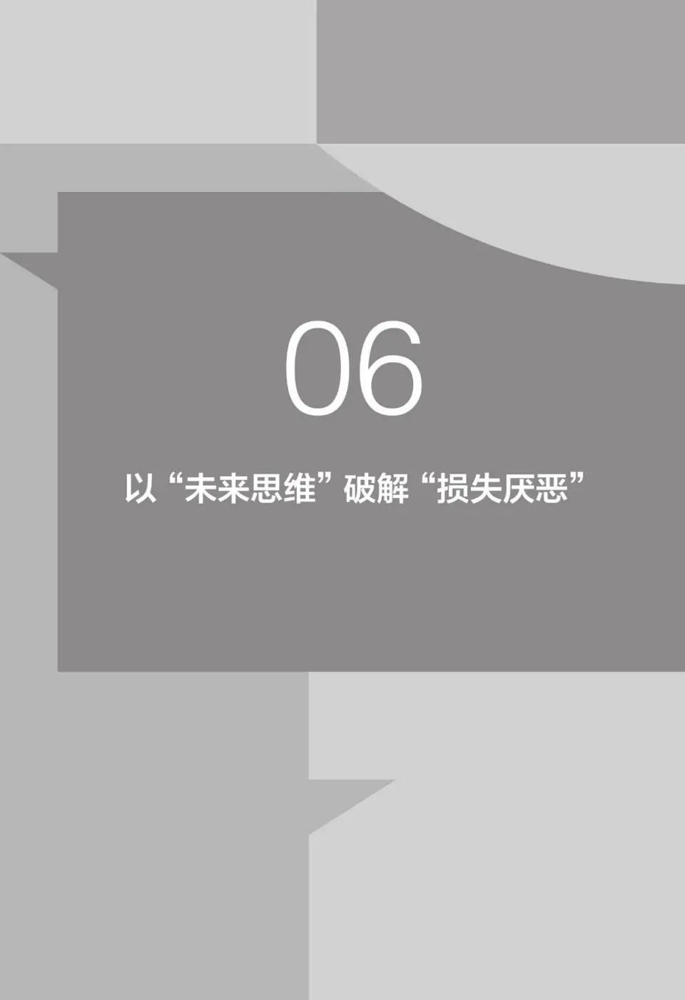

2025年5月20日

21:15

## 财富是认知的变现（上海老牌百亿私募基金重阳投资合伙人舒泰峰首部投资专著，教你避开投资中的12个陷阱。大开脑洞，开启12篇老子与巴菲特的时空对话，带你轻松领会投资哲学。）

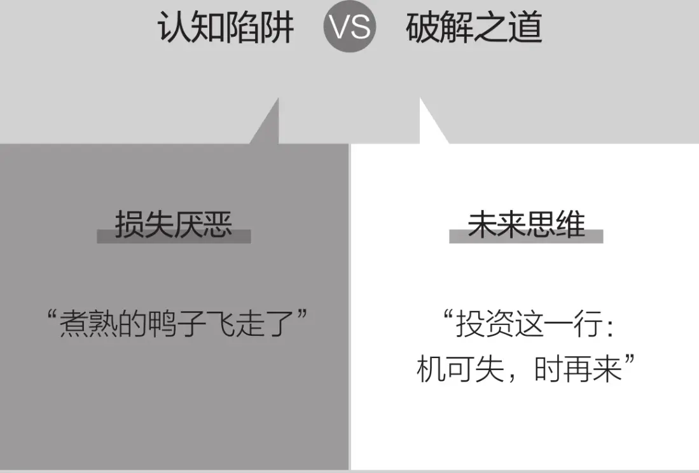

2025年5月20日

21:15

## 认知陷阱6：损失厌恶 “煮熟的鸭子飞走了”

__认知陷阱6：损失厌恶__

__“煮熟的鸭子飞走了”__

通过前面章节，我们知道了过度乐观、盲目从众驱使我们在股市投资中追涨杀跌，但是人的认知机制十分复杂而奇怪，时常显示出自相矛盾之处。比如我们一方面会“追涨杀跌”，另一方面又会“售赢持亏”，也就是把赚钱的股票卖掉，亏钱的留着。这两种行为反映了投资者完全相反的心态，“追涨杀跌”的时候我们认为涨的还会再涨，跌的还会再跌。“售赢持亏”的时候我们认为涨多了可能要回调，亏多了可能即将要反弹。\[书籍分享公众号：今日书递\]

这种现象也是有理论依据的。行为经济学家赫什·舍夫林（Hersh Shefrin）和他的合作者迈尔·斯塔特曼（Meir Statman）于1985年最早发现了这个现象，并将其命名为“处置效应”，即投资者不愿意以低于购买成本的价格出售资产的现象。比如，以10元每股买进某只股票之后，不巧遇到股市调整，股价跌到了8元，这时候许多人不愿意止损，在持亏一段时间之后，股价回到了10元，这时候投资者往往会选择卖出，并庆幸自己“解套”。基金购买中也有类似的现象，投资者在基金亏损时倾向于持有，在基金回到买入价格时倾向于卖出。

__股市是贩卖痛苦的销售员__

相比“追涨杀跌”，“售赢持亏”后面的心理机制更为复杂。行为金融学用“前景理论”来解释这一现象，即人们在收益和损失区域的风险偏好不同：盈利时厌恶风险，希望落袋为安；亏损时偏好风险，希望放手一搏。赌徒就是这样破产的，当他们亏损的时候，为了翻本，他们不惜加大赌注，于是越陷越深。

为什么会这样？原因在于快乐与痛苦带给人的心理感受是不对称的。回想一下，与恋人相处时，时间是不是显得格外短暂？即使你们已经共度了一整天，你仍然会觉得那就像是一分钟一样倏忽过去了。相反，分离总是显得格外漫长，刚分开不久，你的心情就开始变得像热锅上的蚂蚁一样焦躁难熬，古人说“一日不见，如三秋兮”。

心理学界有一个专门的理论来解释这种心理感受的不对称，也就是“损失厌恶”。

卡尼曼在《思考，快与慢》一书中给出过这样一个例子：

用抛硬币来打赌。

如果是背面，你会输掉100美元。

如果是正面，你会赢得150美元。

这个赌局看起来挺吸引人，因为赌局的预期值明显对你有利。然而，大多数人仍不愿意参与这样的游戏，原因便是卡尼曼所总结的，对于大多数人来说，失去100美元的恐惧比得到150美元的愿望更强烈。

现在将这个赌局调整一下，把硬币是正面的赚钱数值从150美元改为200美元，结果又如何？统计显示，这次很多人表示愿意参加这样的赌局。也就是说多数人的“损失厌恶系数”是2。1通俗地解释一下，就是亏损对人的心理刺激强度是同等规模盈利的2倍，或者说，失去所带给人的痛苦强度是得到所带给人的愉悦感强度的2倍。这就是损失厌恶。

__谷歌股价为何超跌__

2006年1月31日，谷歌公布了2005年第四季度的财务业绩：营业收入增长97%，净利润增长82%。按理说这是一个很好的数据，不料华尔街却不认账，数据一出，谷歌股价几分钟之内就下跌了16%，不得不停牌，交易恢复后，股价继续下跌。之所以会这样，是因为谷歌的财务数据没有达到华尔街的预期。而股市的诡异之处在于，虽然真实数据与预期数据之间仅相差6000万美元，但谷歌市值却跌去了203亿美元。

这是损失厌恶在股市中的另一个经典案例。

人类的大脑中有一块叫作“前扣带回皮质”的区域，它负责集中注意力、感知疼痛和发现错误。它也被神经学家称为“哎呀中心”，当正常期望被打破时，它就会让你产生惊讶的感觉。研究人员曾用微型电极测量受试者的前扣带回皮质神经元的活动。结果表明，在钱突然减少时，38%的神经元被激活，但在现金奖励超过预期时，只有13%的神经元被激活，而且这些被刺激到的神经元发出的信号比较微弱。2

在大脑内侧的边缘，其他几个大脑皮质叶下面，有一个叫作“脑岛”的区域。这是大脑内部主要的反应中枢之一，用来评估那些引起负面情绪的事件，比如失去金钱。实验发现，人们在亏钱之后，脑岛的活跃程度是赢钱时的3倍。与此同时，每当人们选择一个可能导致亏损的赌注时，脑岛的活跃度是他们赚钱时的4倍多。3

这是“损失厌恶”的神经学证明，也解释了为什么谷歌的股价会超跌。华尔街有过统计，那些盈利高于华尔街预期的股票平均上涨了1%，而那些盈利低于华尔街预期的股票平均下跌了3\.4%。

聪明的推销员非常善于利用损失厌恶的心理达到自己的销售目的。比如保险销售员，如果他告诉你参加某款保险就可以规避10种重大疾病带来的损失，还可以获得1000元的返券活动，你未必会动心。但是如果他告诉你目前患这10种重大疾病的概率非常高，同时一旦患病就需要高达几十万元甚至几百万元的治疗费用，然后给你列举几个不幸案例，你就会越想越可怕，很可能乖乖买单。

正因为损失带给我们的痛苦实在太大了，所以我们不愿意主动止损，而宁可被动套牢。

__人生最痛苦的莫过于“煮熟的鸭子飞走了”__

我在读芒格的“人类误判心理学”时看到过一段话，不禁哑然失笑。老爷子不愧是毒舌，他说：“如果有个人即将得到某样他非常渴望的东西，而这样东西却在最后一刻飞走了，那么他的反应就会像这件东西他已经拥有了很久却突然被夺走一样。”

芒格用一个名词来涵括人类对这两种损失经验（损失已有的好处和损失即将拥有的好处）的自然反应，那就是“被剥夺超级反应倾向”。曾经拥有的东西一旦被剥夺了，这种反应可不是“一般”的，而是“超级”的，用词十分形象。

回想一下，是不是生活中很多的场景都如同芒格所说的那样。一个儿童，如果你送给他一个玩具，然后又从他手中夺走，他一定会哇哇大哭。

与恋人相聚的时光总是很短暂，而分离的时光却如此漫长。但与失恋比起来，短暂的分离又算不得什么了。一旦失恋，那么日子将变得昏暗无光，甚至生不如死。情感戏的编剧一定深谙心理之道，每当男女主角即将在一起的时候就开始设置各种障碍，把他们强行拆散或者让他们产生误解，这种“虐恋”最能让观众扼腕长叹。而且往往是差一点就成功的爱情悲剧更让人难以释怀，而一旦有情人终成眷属，故事就没法写下去了，只好让他们退出江湖、归隐山林。

这也是一些赌博性游戏的设计原理。芒格说：“赛马、宾果之所以如此风靡，原因之一恐怕就是因为它们具有很多偶然和侥幸因素。”这类游戏擅长制造“差点成功”的体验，让人欲罢不能。

赌场长盛不衰的秘诀也在于此。它总是让你先赢一点，激发你的贪婪。然后再从你手中把你刚赢得的钱又夺回去，使你一步步掉进陷阱。前期投入越大，“被剥夺超级反应倾向”就会越强烈。这就是某些赌徒倾家荡产的原因所在，因为输得越多，不服输的心理就越严重，就越急于扳平。

如果说人生最愉快的体验是破镜重圆、失而复得，那么最令人感伤的莫过于失之交臂，而最让人痛苦便是得而复失了。耶鲁大学的研究人员训练5只卷尾猴用金属代币交换苹果、葡萄或果冻等美食。猴子可以用一个代币从卖家一和卖家二那里购买苹果。卖家一肯定会给猴子一个苹果，同时给第二个苹果的概率是50%。卖家二先给猴子两个苹果，同时导致猴子失去其中一个苹果的概率是50%。经过几十次交易后，猴子终于明白两者的结果是一样的。即使如此，猴子在71%的情况下仍然更愿意和卖家一进行交易。连猴子都懂得规避失之交臂的痛苦！4

另有一项很有意思的统计显示，在竞技体育中，铜牌得主的幸福感平均高于银牌得主。原因是银牌得主会为自己只差一点点就可以获得金牌感到遗憾，而铜牌得主则庆幸自己好歹获得了一枚奖牌。

股票投资中常见这样的现象，账户由浮盈转为浮亏，差一点得到收益却失之交臂的局面让人不甘心、懊恼乃至痛苦，它激发出你不轻易认输的决心。但如果忽视基本面等客观因素而蛮干，结局恐怕只会是越套越深。

__投资中的“鸵鸟策略”__

在股票套牢的心理过程中，“无为综合征”是最后一个环节。

我们时常嘲笑鸵鸟，说它们在遭遇危险的时候只会把脑袋埋到沙子下面，掩耳盗铃，顾头不顾腚。实际上在人类生活中，“鸵鸟策略”无处不在。比如第二次世界大战之前，英法对德国的“绥靖政策”便是深植于人性之中的鸵鸟策略所致。

投资中我们明明知道股市已经进入熊市，或者股票基本面已经破坏，却迟迟不愿意割肉止损，也属于鸵鸟策略。前面相关章节我们已经讨论过，人的大脑结构决定了我们的运算能力是有限的，当面对巨大的困难或复杂的情感选择时，我们往往会采取消极拖延、不作为的方式来应对。所以，人总体上是倾向于一成不变的，而非创新求变。皮克斯经典动画片《疯狂原始人》中保守的老爸总是告诉孩子们任何新事物都是不好的，甚至连好奇也是不好的。

心理学的研究还表明，人们对由行动导致的结果，会比因不行动而产生的结果有更为强烈的情绪反应。比如把一个人推下山崖与看见一个人要跳崖而没有施救，虽然结果相同，但是后者的心理压力显然小于前者。在后一种情况下，你可以找到各种理由来安慰自己，但前一种情况却是谋杀。

同时，人类还总是愿意寻求自豪，而避免懊悔。丹尼尔·卡尼曼说：“当你卖掉一个失败的投资品时，你不仅承受了经济损失，而且还承认了自己的失误，这会给你带来心理上的损失。当你抛售时，你是在惩罚自己。”谁也不愿意惩罚自己，于是在前述“售赢持亏”的情境下，由于主动止损造成的亏损会比不采取行动造成的亏损更让人懊悔，所以我们往往会采取无为的鸵鸟策略，寄希望于股价有一天会自动涨回来，套牢就这么发生了。这显然是不明智的，菲利普·费舍早就说过：“投资人死抱很不想要的股票，寄希望于有一天能够‘至少打平’，因此损失的金钱可能多于其他任何单一的理由。”5

损失厌恶、被剥夺超级反应倾向、无为综合征可以说是股票投资的套牢心理三部曲。

__破解之道6：未来思维__

__“投资这一行：机可失，时再来”__

美国著名的投资机构美盛集团曾有一个非常有名的基金经理，名叫比尔·米勒（Bill Miller）。他管理的基金从1991年起，连续15年战胜了标准普尔500指数。这是一个相当厉害的投资业绩，他因此被誉为投资天才和有史以来最优秀的基金经理之一。他不但获得了《金钱》杂志、晨星、《巴伦周刊》的众多奖项，还成为知名财经记者珍妮特·洛的畅销书《战胜标准普尔》的主人公。

然而，从2006年到2011年，米勒管理的基金表现开始远远逊色于标普500指数。尤其是2008年，该基金价值下降了55%以上，而标普500指数下降幅度为38\.49%。此后，米勒一蹶不振，其管理的资产从2006年最高点的208亿美元下降到2011年年底的28亿美元。2011年年底，米勒辞去基金经理一职。

复盘米勒的投资历程，2007年爆发的次贷危机可以说是米勒的“滑铁卢”，当时大批银行、金融机构在其中遭受重创，很短时间内它们就跌去了50%的股价。

米勒认为这正是买入的最佳时机，因为从他的既往经验来看，这些股票从未下跌到这么低的位置，从过去经验来看此时肯定是极其适合、百年不遇的买入时机。

所以，当这些股票跌到50%的时候，他大举买入花旗银行等金融股。随着金融股价格的不断走软，他继续追加投资。谁知，这些股票在中间停了一下略有反弹之后，继续掉头向下。最后，花旗银行的股价从50多美元跌到了1美元，也就是跌去了98%。米勒输得一塌糊涂。

米勒的失败一方面源于过度自信。他有一个强大的理念，认为“价格下跌时，唯一让我们停止更多购买的方法，是再也无法获得股票的报价”。

另一方面，米勒也犯下了线性思维的错误。他显然明显低估了金融危机的深度。世上没有两片一模一样的树叶，历史也不会简单重复。历史的经验教训固然需要吸取，但是历史有时候也是一种“沉没成本”，僵化地固守历史的经验或教训也同样是一种认知陷阱。

__美国为何会掉进越南战争的泥潭__

越南战争被公认为是美国历史上最重大的军事与外交失误之一，主导越南战争升级的美国国防部前部长罗伯特·麦克纳马拉将这场战争描述为“可怕的错误”。2012年，美国总统奥巴马在反思越南战争时说越南战争是“美国历史上最沉痛的篇章之一”。

整个越南战争期间，美国向越南投下了约800万吨炸药，远超过第二次世界大战各个战场投弹量的总和，造成越南160多万人死亡和整个中南半岛1000多万难民流离失所。美国自己也损失惨重：1973年美军在越南作战人数高达约54万人，战争前后延续了12年，是美国历史上时间最长的国外战争。战争造成美军5\.6万余人丧生，30多万人受伤，耗资4000多亿美元。越南战争期间，美国经济出现大幅度滑坡，美元霸主地位遭到沉重打击，并出现了巨额财政赤字。

战争期间，美国国内反战运动此起彼伏。战争的缓慢拖沓，人员伤亡的逐渐增加，以及国内不断扩大的意见分歧最终导致了林登·约翰逊不得不放弃连任总统的竞选，结束了民主党长期主导白宫的局面。

对于美国来说，越南战争无疑是一个泥潭、一场噩梦。美国为什么迟迟结束不了这场噩梦？后来的历史学家们认为美国扩大越南战争的决策绝非一种过于自信的无端行为，而是为了挽回巨大的损失，在非常不利的赌局中进行的孤注一掷。

这是一种典型的被“沉没成本”所牢牢纠缠的政治案例。随着战争越拖越久，美国的决策者陷入了一种进退两难的境地：已经投入了这么多，现在撤退太有损颜面，或许再打一场胜仗就能赢得最终胜利了。结果却越陷越深。

__沉没成本__

在经济学中，那些已经发生的不可收回的支出，被称为“沉没成本”。但是“沉没成本”绝不仅仅体现在经济成本方面，其实在我们的生活、情感、时间等方面都存在如何面对“沉没成本”的问题。

三五好友外出旅游，吃饭时一时兴起买了瓶好酒，打开一喝发现口感不对，十有八九喝到了假酒，钱已经花掉了，又不想跟店家纠缠，这瓶酒喝还是不喝？

与家人一起买了电影票，看了半小时，发现影片非常无趣，票钱已经支付，这电影还要不要往下看？

男女青年谈恋爱，时常吵架闹别扭，但已经相处了两三年，这恋爱还要不要继续谈下去？

……

许多人因受困于“沉没成本”而选择延续已经开始的生活：酒已经买了不喝浪费，票已经买了不看可惜，付出了那么多感情和时间分手了太不值。实际上理性的态度应当是往前看，因为如果选择继续，你将进一步投入时间和感情成本，何况如果真是假酒，喝坏了身体就更得不偿失了。现下不少人遵循一种“断舍离”的生活方式，不购买不需要的东西，舍弃多余的东西，其实是一种非常恰当的态度。

投资也需要“断舍离”，在必须的时候舍弃你曾经投入的时间、面子、感情甚至最重要的本金。

时间很好理解。关于面子，重阳投资创始人、首席投资官裘国根先生做过非常精彩的点评，他说：“要避免两种倾向，一是为了尊严固执己见，二是因为耳朵皮软而轻易放弃真知灼见。”6

而投资中的感情指的又是什么呢？前文曾引述过巴菲特的一段俏皮话，以下是完整版：“股票并不知道谁是它的主人。但你却对它寄予了太多的七情六欲。你清清楚楚地记得是以什么价位买进它的，你还清楚地记得谁透露了一些小道消息——感情五味杂陈。但股票本身是麻木的，它不为所动。如果这只股票达到50美元，那些以100美元买进的人会感到异常恐怖；而用10美元买进的人却欣喜异常——就是这些感情。”巴菲特笔锋一转，“但无论什么样的感情都无济于事”。

说到成本一项，更是多少人恋恋不舍的挚爱。许多人以成本为投资操作的基准，成本以上高歌猛进，成本以下一动不动。但是投资的“断舍离”恰恰要求投资者忘记成本，如果你买的股票已经失去了相应的价值，那么成本又有什么意义呢？真正的价值投资应当以价值为锚，而不是以曾经投入的成本、时间、面子和感情为锚，价值若在则当守，价值不在则当舍。唯有这样，才可以穿透导致我们深度套牢的损失厌恶、被剥夺超级反应倾向、无为综合征的认知陷阱三部曲。

历史向后，投资向前，价值投资的舍与得之道应当遵循未来思维：错者已矣，来者可追。错误的就让它过去吧，未来的还有很多可以探索。我们总说机不可失、时不再来，但在投资这一行，却如裘国根先生所说：“机可失，时再来。”7

哲学家伯特兰·罗素曾说：“信仰的决心并不可贵，恰恰相反，探究真理的决心才是。”一旦我们能够真正做到以自我断舍离的勇气探究真理，那么人生将脱离认知局限的枷锁，从而大放异彩。

2025年5月20日

21:15

## 老子对话巴菲特 不失其所者久

__老子对话巴菲特__

ROUND 6

__不失其所者久__

老 子：上回我们聊到投资的“变”与“不变”，“变”是围绕“不变”展开的，今天我想再深入请教一下，投资的“不变”或者说根本是什么？

巴菲特：要我说，投资的根本应当是发现价值。“股票本质上是公司的所有权，股票的价格就是由股票的价值，也就是公司的价值所决定的。”

老 子：我也看了一眼K线图，股票的价格涨涨跌跌，好像没什么规律可言？

巴菲特：“虽然股票价格上上下下的波动在短期内很难预测，但长期而言一定是由公司的价值决定的。”

老 子：所以，股票市场长期来看还是有规律可循的？

巴菲特：是的。“正如格雷厄姆说过的那样，从短期来看，市场只是一个投票的机器，这不需要投资人具备智能或是情绪来控制，只要你有资金就可以办到；但是从长期来看，股市却是一个称重计，它能够衡量出哪只股票具有可投资价值。”

老 子：进一步讲，做投资就是寻找股票价格与价值之间的差价？

巴菲特：没错。“投资股票很简单。你所需要做的，就是要以低于其内在价值的价格买入，同时确信这家企业拥有最正直和最能干的管理层。然后，你永远持有这些股票就可以了。”

老 子：那么，我是否可以理解成“当股票价格已经高于其内在价值的时候就应当卖出”？

巴菲特：可以这么理解。查理，我说得对吗？

芒 格：你说得很对。“对我们来说，投资等于出去赌马，我们要寻找一匹获胜概率是二分之一、赔率是一赔三的马。我们要寻找的是标错赔率的赌局。这就是投资的本质。你必须拥有足够多的知识，才能知道赌局的赔率是不是标错了。这就是价值投资。”

老 子：我懂了。总结起来就是“低买高卖”。

巴菲特：老先生智慧。

老 子：根据我的经验，越简单的事情往往越不容易做到，“低买高卖”听起来儿童都能懂，但为什么股市里多数人赔钱呢？

巴菲特：因为多数人并不知道一只股票的价值是多少，所以也就难以知道低点和高点在哪里。

老 子：那么，公司的价值又是由什么决定的？

巴菲特：“公司的价值又是由公司的盈利情况及净资产决定的。”

老 子：所以，投资股票不是闭着眼睛下注，而是要去认真研究标的？

巴菲特：完全正确。“没有公式能判定股票的真正价值，唯一方法是彻底了解这家公司。”

老 子：要做到这样首先就得放弃投机心态，老老实实地去做调研。

巴菲特：是的。“伯克希尔–哈撒韦就像是商业界的大都会美术馆，我们偏爱收集当代最伟大的企业。”

老 子：听起来你不像是在买股票，更像是在经营一家自己的企业。

巴菲特：可以这样理解。我一直认为，“要把投资股票当作一桩生意来看待，这样将会使你拥有与市场上的其他投资人非常不同的投资观点”。所以，“如果我挑选的是一家保险公司或一家纸业公司，我会把自己置于想象之中，想象我刚刚继承了那家公司，并且它将是我们家庭永远拥有的唯一财产”。

老 子：一旦拥有这样的心态，或许在投资的时点选择上就会少一些焦虑。

巴菲特：老先生的理解非常到位。“一个杰出的企业可以预计到，将来可能会发生什么，但不一定知道何时会发生。重心需要放在‘什么’上，而不是‘何时’上。如果对‘什么’的判断是正确的，那么对‘何时’大可不必过虑。”

老 子：这也是一种以简化繁之道。

巴菲特：或许吧，对于我来说，“只要想到隔天早上会有25亿男性需要刮胡子，我就每晚都能安然入睡”。

小 舍：我补充一下，巴菲特先生投资了生产剃须刀的吉列公司。

老 子：所以，一旦巴菲特先生发现了好企业，就喜欢长期持有吗？

巴菲特：是的。“我们喜欢购买企业，我们不喜欢出售，我们希望与企业白头偕老。”

老 子：以价值为标准也是你有时候违反长期投资原则，抛出一些股票的原因吧？

巴菲特：是的。

老 子：一切听起来十分简单，我有点好奇，你的每次操作都如此成功、如此从容吗？

巴菲特：哪里哪里，我也有失手的时候。

老 子：方便讲讲吗？

巴菲特：倒没什么不方便，不过这个还是请小舍同学来介绍一下吧。

小 舍：呃，那么，巴菲特先生，多有得罪了！

巴菲特：无妨无妨。谁还不犯点错误呢。

小 舍：要说巴菲特先生的投资失误，迪士尼可算是典型的一桩。

1965年迪士尼公司的税前利润为2100万美元，它所拥有的现金就超过了负债。当时迪士尼乐园投资1700万美元的加勒比海盗船才刚刚开幕，公司的全部市值也不过只有这艘海盗船的5倍，真是相当便宜。

在这种情况下，1966年，巴菲特的公司以平均每股31美元的成本（股票分拆后），投资500万美元买入该股票，拥有迪士尼公司5%的股份。

遗憾的是，仅仅一年后的1967年，他就以600万美元的价格把这些股票卖了出去。容易看出，虽然当时这笔投资的获利率高达20%，可是从事后来看，这绝对是一个错误。

老 子：巴菲特先生对这桩买卖有过后悔吗？

巴菲特：当然，太后悔了！“如果这笔投资能够一直捂到20世纪90年代中期，那么这原来的500万美元就会变成10亿美元也不止喽！”

老 子：应了中国的一句古话，“智者千虑必有一失”。

巴菲特：老先生见笑！您听了价值投资的本质介绍之后有什么能够指教的吗？

老 子：我曾说过一句话：“不失其所者久。”

巴菲特：怎么理解这句话？

老 子：一个人必须谨守自己的本分，才可以长久。做人有做人的本分，比如真诚、善良；做事有做事的本分，比如我听下来，投资的本分就是发现价值。

巴菲特：正是如此。

2025年5月20日

21:15

## 07 以“逆向思维”破解“过度悲观”

2025年5月20日

21:15

## 财富是认知的变现（上海老牌百亿私募基金重阳投资合伙人舒泰峰首部投资专著，教你避开投资中的12个陷阱。大开脑洞，开启12篇老子与巴菲特的时空对话，带你轻松领会投资哲学。）

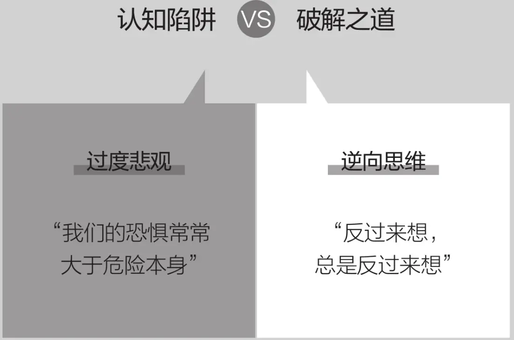

2025年5月20日

21:15

## 认知陷阱7：过度悲观 “我们的恐惧常常大于危险本身”

__认知陷阱7：过度悲观__

__“我们的恐惧常常大于危险本身”__

记得上高中的时候，有一次笔者骑单车带母亲去城里办事。在一个下坡处，自行车加速，但忘了什么原因，母亲突然从后座跳了下去，当时她整个人失去平衡，重重摔在了水泥地上，脸部出血，下颚摔破，去医院缝了好几针。母亲几天后就恢复了，说起来这个事故算不上特别严重。但是它却在我的心里留下了长久的阴影，很多年以后还记忆犹新，甚至还出现在梦境中。而母亲从那次以后再也不敢搭别人的单车了。

检索一下记忆，可能每个人对伤痛、悲剧的记忆强度都会高于对欢快时刻的记忆强度。欢快的经历一般很快就忘记了，而伤痛却经久难忘。怪不得在文学或影视作品中，喜剧最多风靡一时，但悲剧却能够流传很久。

在许多领域，破坏性的力量都要大于建设性的力量。比如一个人要维持幸福的人生很不容易，需要事业有成、身体健康、家庭和谐等，这不仅需要自身的努力，还需要许多客观条件的配合。但是要破坏一个人的幸福却有千百种方法，大的如战争、瘟疫、自然灾害，小的如毒品、饮酒过度、疾病、夫妻吵架、孩子叛逆等，都足以让人烦恼。一次过度发力的快跑引发的足底筋膜炎，就足以让你苦苦积累数年的长跑纪录戛然而止。

自然领域也是这样，一栋大楼的建设可能需要几年、几十年甚至几百年的时间，然而它的摧毁却可能只在顷刻之间。

或许正是这种破坏与建设力量之间的非对称，才让我们时刻提醒自己务必保持谨慎小心及理性自律。但是，它也让我们时而陷于过度恐惧的境地。

__恐惧意识最强的人活了下来__

其实，恐惧的产生是有深刻的进化学依据的。它是人类先祖留给我们的情绪遗产之一。前文讨论过，在原始丛林社会，人类的先祖为了生存必须保持乐观，甚至有时需要展现出过度自信的一面。但事情也有两面，在非迫不得已的情况下，他们也会选择躲避。毕竟当时的环境危机四伏，人随时可能因为猛兽、毒蛇甚至人类自己的残杀而失去性命。面对这些危险的时候，谁最快做出逃跑的反应谁便获得了生机。科学作家小拉什·多兹尔（Rush W\. Dozier，Jr\.）在《恐惧本身》（*Fear Itself*）这本书中写道：“恐惧是人类的基本情感，因为生命是人类活动的基础。如果我们死了，那任何事都与我们无关了。”生存是最高的法则，恐惧意识最强的人反应最快，于是他们存活了下来，这种情绪也随之代代相传。

这一进化史留下了生理学的证明。在我们大脑深处，和耳朵顶部平齐的地方，大脑颞叶内侧左右对称分布的两个形似杏仁的神经元聚集组织，叫作杏仁体。研究普遍认为，大脑杏仁体是恐惧记忆建立的神经中枢，可帮助我们逃避危险。杏仁体反应速度快到只有12毫秒，比眨眼的速度还快25倍。它类似于人体的预警系统，激起我们对于危险的恐惧情绪，但也是它的过度警觉，使恐惧具有天然的放大倾向。笔者曾经亲身领教过杏仁体的敏捷。2008年汶川地震之后，我被派往灾区采访，有一天，我到德阳市市区采访一个军方的医疗队。夜幕降临，医疗队好心安排连续采访了好几天疲惫不堪的我到德阳市一家医院的房间里休息。我清楚地记得，房间是在三楼，我刚到房间门口准备推开房门的时候，突然房门“哗啦哗啦”地急剧摇晃起来。旁边送我过来的小伙子大喊一声：“地震了，快跑！”我和他拔腿就往下跑，如果有人计时的话，估计那次我应该创下了个人的50米短跑纪录。很快，我们就知道了那是一次震感非常强烈的6级余震。当时我并不知道杏仁体是怎么回事，现在回想起来才不禁感叹，我们体内的这位“小兄弟”反应之快真如闪电迅雷一般。

有意思的是，进化心理学研究表明，恐惧某种程度上其实是人类先祖为了求生存而造成的一种基因“幻觉”。举个例子，你不得已走进一片丛林，你知道不久前有个人就在那片丛林里被眼镜蛇咬死了。突然，一阵风吹过，草丛中有嗖嗖的声音，你毛骨悚然。草丛里其实是一只蜥蜴，但是你“千真万确”地看到了一条眼镜蛇，其实那不过是恐惧造成的幻觉。这种恐惧的幻觉对于我们的先祖来说是合理的：虽然草丛异动中出现眼镜蛇的概率只有1%，但是以为有蛇的念头在这1%的关键时刻却能够救你的命。1然而，在我们如今所处的高度安全的环境下，需要动用到这种恐惧幻觉的概率已经微乎其微了。

研究还表明，仅仅目睹一场让人痛苦的事件就会让人产生身临其境的恐惧感，这种恐惧的程度甚至不亚于当事人。这可能是由一种叫“情绪启发”的因素所致，情绪启发是指那些正在经历恐惧等强烈情绪的人倾向于将这些感受延伸至不相关的事件。一个有趣的发现是，诸如地震之类的自然事件可能会影响人们对股市崩盘可能性的评估。在一项调查中，如果受访者所在区域周边48公里范围内在30天内发生过地震，触发了情绪启发因素，那他们预估的股市崩盘可能性就会出现统计上显著的上升。2

风险即情绪，古罗马哲学家西尼加的观察极具洞察力，他说，“我们的恐惧常常大于危险本身”。

__大萧条中的恐惧__

1929年开始的大萧条是美国和资本主义历史上的一场噩梦，与此前10年股市和经济的蓬勃向上相比，大萧条时的美国到处充满了悲伤。当时的曼哈顿有两个很大的棚户村，分别在河滨大道旁和中央公园方尖碑附近，失业的人们用锡铁罐、纸板和麻袋搭建其住所，并把它命名为“胡佛村”，以嘲笑时任总统的无能。贫困的农民将抛锚的廉价汽车的前脸锯下，安装到骨瘦如柴的骡子身上，称之为“胡佛马车”；饥饿的农民抓来长耳大野兔充饥，并称之为“胡佛猪”。当时在一些矿区，儿童营养不良的比例有时超过90%。有一个很悲伤的故事，一位教师建议一个小女孩回家吃点东西，孩子回答说：“我不能吃，今天该我妹妹吃。”大城市里，以前体面的丈夫每天西装革履地出门“上班”，实际上却是去艰难求职甚至乞讨。

这些都是威廉·曼彻斯特的名著《光荣与梦想》当中所描述的场景。3当时的美国被悲伤的情绪所笼罩，人们对未来彻底失去了信心，而这种绝望进一步加剧了萧条。在大萧条期间，美国经济界的信心严重崩溃，导致银行大规模惜贷，即使利率几乎为零，企业也不愿意进行新的投资。

耶鲁大学经济学教授欧文·费雪（Irving Fisher）在1930年写道：“主要的危险根本不在于现实情况。危险在于恐惧，在于引发恐慌的恐惧，这种恐惧能从股市蔓延至企业。真正的勇士会承认：‘我唯一的恐惧是对恐惧的恐惧。’”

1933年，也就是大萧条最严重的一年，富兰克林·罗斯福总统在就职演说中引用了费雪的话：“我们唯一需要恐惧的就是恐惧本身，一种无以名状、失去理智和没有道理的恐惧。这种恐惧阻碍了我们将退却转化为前进的必要动力。”

经济学家凯恩斯后来总结：萧条是由“动物精神”的衰落引起的。罗斯福总统正是在凯恩斯主义的指导下，通过一系列恢复措施，重新唤起了美国经济的“动物精神”，从而逐步走出了危机。英国也是一样，当英国的经济开始复苏时，状况的好转的确应归功于信心方面的努力。德高望重的商人兼官员洛德·梅斯顿（Lord Meston）说：“我们摆脱萧条的真正秘诀在于，企业界的人下决心专注于他们自己的事务，并努力做到最好。”4

__股票投资中的恐惧__

在1929年美国股市的大崩盘中，股票市场交易量急剧放大，市场掉入了暴跌——追加保证金——平仓盘卖出——继续暴跌的死循环中。

10月24日这一天后来被称为“黑色星期四”，这一天有创纪录的1289万次股票换手。一开市，纽约证交所的交易员们都开始发了疯似的来回奔跑，大量股票被抛出，有的股票根本没有买家，股价一泻千里。到中午12点时，已有60亿美元灰飞烟灭，两位银行家和一位股票经纪人因破产而自杀身亡。绝望和恐惧将美国股市推入无底深渊，从1929年10月到1932年7月，道琼斯指数下跌了87\.4%，著名的通用电气的股价从最高的396美元跌到8美元。

将近100年后的2020年，类似的故事又一次上演。新冠肺炎疫情暴发之后，美股在10天内发生4次熔断，为美股历史上首次，在这样的场景面前连巴菲特都显得太年轻。当时的媒体上充斥着世界将发生大萧条的分析，一片世界末日的景象。谁也没有料到，不到一年时间，美股不仅全面收复失地，而且纳斯达克指数还比新型冠状病毒肺炎疫情前上涨了30%。事实上，正如前面章节曾写到的，美股的历次危机比如2008年金融危机、1987年“黑色星期一”等发生时，都有人认为1929年的大萧条要重演了，但后来的事实证明这些悲观的预言都错了。

A股也类似。2015年3月，A股开启“杠杆牛市”模式，沪深两市单日成交额纪录一再被刷新，各项指数也不断攀升，尤其是创业板、中小板指数不断创新高。但在2015年6月12日上证指数创出5178点高点后，可怕的噩梦来了。以清理场内外配资为导火索，上证综指在两个多月之内下挫了45%之多，恐惧引发的出逃行为使“千股跌停”的现象一再重演，令人叹为观止。

巴菲特说“别人贪婪时我恐惧，别人恐惧时我贪婪”，但知易行难，因为我们都被进化机制的局限所困。

__破解之道7：逆向思维__

__“反过来想，总是反过来想”__

2008年10月17日，在美国股市陷于“次贷危机”时的恐惧气氛最严重的时刻，巴菲特在《纽约时报》上发表文章，并取了一个非常燃的标题：“Buy American\. I am”（我正在买入美国股票）。

十余年之后回看，这篇文章显然已成为经典之作。

“无论美国还是世界其他地方，金融系统都是一片混乱。更糟糕的是，金融系统的问题已蔓延到整个经济体系之中，从小小的泄漏演变成猛烈的管涌。短期内，美国失业率将继续上升，商业活动将会停滞不前，而媒体报道也将会更加令人恐慌不安。”巴菲特先是描绘了一番世界末日般的景象，然后笔调突然来了一个180°的急转弯：“因此……我一直在买入美国股票。”

接下来，他给出理由：“恐惧正在蔓延，甚至吓呆了经验丰富的投资者。当然，对于竞争力弱、负债率高的企业，投资人保持谨慎是正确的。但对于美国那些竞争力强的企业的长期繁荣前景过于悲观就是非常错误的了。这些优秀企业的利润也会突然下滑，但大多数主要企业都会在未来5年、10年或20年之内创下利润新高。”

“我无法预测股市的短期波动，对于股市未来1个月或1年会涨会跌我一无所知。但是，很有可能在市场恢复信心或经济复苏之前，股市就会上涨，而且可能是大涨。”5

巴菲特并不是纸上谈兵。2008年年初，巴菲特拥有443亿美元的现金资产，之后还留存了2007年度170亿美元的营业利润。然而，到2009年年底，他的现金资产减少到了306亿美元。也就是说，在次贷危机造成的金融市场的一片混乱之中，巴菲特以真金白银在大举扫货。事后证明，巴菲特在“次贷危机”中的投资相当成功，2009年美股反弹后，巴菲特仅对高盛和通用电气的投资收益就翻了一番，在半年内狂赚100亿美元。

__“别人贪婪时我恐惧”__

其实巴菲特也有灰头土脸的时候。2001年互联网泡沫破灭前的3年，就是巴菲特职业生涯经历最大挑战的3年。1999年纳斯达克指数上涨39\.6%，巴菲特当年的收益率是0\.5%，2000年纳斯达克指数上涨85\.6%，巴菲特当年的收益率是–6\.2%。拒绝投资科技股的巴菲特从此前的投资“大神”变成了市场的弃儿，媒体纷纷形容他落伍了，话说得很难听，甚至有人形容他是“堕落天使”。巴菲特传记《滚雪球》一书记载，虽然巴菲特内心仍然坚定，但是他对公众的批评也非常敏感，所以他避开一切抛头露面的机会。

不仅如此，当时市场上还谣言四起，说巴菲特住院了，而且“病情”危急，导致伯克希尔–哈撒韦的股票遭到疯狂抛售。那一年，巴菲特确实住院了，但只是治疗肾结石和切除结肠息肉，身体并无大碍。6说2000年前后是巴菲特投资生涯的“至暗时刻”一定不为过。

但是巴菲特不为所动。在1998年年度股东大会上，股东们一个接一个地提问道：“为什么芒格和巴菲特没有投资任何东西？”而芒格和巴菲特只是坐在那里反复回答道：“股票价格太高了。”在2000年的伯克希尔–哈撒韦股东大会上，巴菲特被逼得进一步明确表示：“我不希望参与科技股的投机……任何时候爆发投机都会得到纠正。”然后，像往常一样，他转向芒格：“查理？”接着，芒格说出了一句经典的话：“如果把葡萄干和狗屎混合在一起，那还是狗屎。”芒格竟然把科技股说成是狗屎！这让会场陷入了一阵长久的骚动。7

巴菲特和芒格之所以不为科技股的狂热气氛所动，正是因为他们遵守着“别人贪婪时我恐惧”的原则。2001年科网泡沫崩溃，股指从5046点下跌约78%至1114点，之前志得意满的人纷纷破产，但是巴菲特和芒格却躲过了一劫。

__“如果我知道死在哪里，那我就永远不会去那个地方”__

“别人恐惧时我贪婪，别人贪婪时我恐惧”是典型的逆向思维运用。中国古典智慧里也早就有逆向思维，司马迁《史记·货殖列传》中描述商人时就有“人弃我取，人取我与”一说。司马光砸缸运用的也是逆向思维，别人救人离水，而司马光的方法是使水离人。

芒格对逆向思维有很多精彩阐述，他有一句很精彩的话：“如果我知道死在哪里，那我就永远不会去那个地方。”在芒格看来，“生活和生意上的大多数成功来自你知道应该避免哪些事情：过早死亡、糟糕的婚姻等等”。所以，如果要明白人生如何才能得到幸福，首先要研究人生如何才能变得痛苦；要研究企业如何做强做大，首先应研究企业是如何衰败的；大部分人更关心如何在股市投资上成功，其实最需要关心的却是为什么在股市投资上大部分人都失败了。所以他总是强调“反过来想，总是反过来想”。

逆向思维便是反过来想，那么为什么反过来想就有用呢？因为市场的背后是人性，而人性的一些弱点是具有传染力的。比如恐惧，当恐惧或悲观主义流行的时候，价格就会走低，但是“从长远来看，股市消息将会变好。现在所有的坏消息将给投资者在未来5年、10年甚至20年里创造机会”。所以，巴菲特说，“恐惧的氛围反而是投资者的好朋友”。

在巴菲特看来，当人们对一些大环境事件的忧虑达到最高点的时候，事实上也就是做成交易的时候。“恐惧是追赶潮流者的大敌，也是注重基本面的财经分析者的密友。”他甚至认为“股灾是上帝给价值投资者最好的礼物”。在2009年度致股东的信中，巴菲特不惜动用夸张的比喻来强化自己的观点：“如此巨大的机会非常少见。当天上下金子的时候，应该用大桶去接，而不是用小小的指环。”

反过来也一样，当贪婪或过度的乐观主义流行的时候，人人争先恐后追逐股票，股票的价格就会走高，泡沫因之而生，而有一天人们发现这高价格根本就是空中楼阁的时候，就是泡沫破裂的时候。牛市更容易亏钱就是这个道理，有数据显示，在2014—2015年中国股票市场泡沫迅速膨胀又破裂之后，财富总量居前0\.5%的个体投资者盈利2500亿元，而后85%的投资者亏损2500亿元。8这个盈亏比例甚至比我们常说的股民“七亏二平一赚”更为极端。所以投资的一个朴素的真理是“人多的地方别去”，不然就很容易酿成踩踏事件的悲剧。

其实，当脆弱的人性与历史观相结合，就会产生一个钟摆：当危机来临的时候，大家都纷纷联想上一次更严重的危机，觉得这次肯定过不去了；而当诱惑来临的时候，又容易忘掉历史，觉得新的历史正在被创造，这次是不一样的。在前一种情形当中，我们被历史所锚定，努力寻找危机的相同而忽略了不同，从而陷入恐慌。在后一种情形当中，我们又犯了忘记历史的过错，开始变得过度自信和盲目乐观。这两个极端都使投资者付出了极大的代价。

基于深度价值研究的逆向投资策略指引我们抵抗极端的人性情绪，历史的教训当然需要被认真吸取，但是如果对历史重演的恐慌已经压倒我们的理性，那或许就需要我们运用智慧和勇气去寻找历史的不同，以觅得生机。总之，无论是过度悲观还是过度乐观，逆向思维都是一剂良药。

__重阳实践：深度研究之后的“人弃我取”__

重阳投资是国内头部私募中具有典型逆向风格的投资机构之一，我们自己将这种风格概括为“基于深度价值研究的逆向投资”，也就是通过深度的以内在价值为目标的研究找到机会，在别人不太关注的时候去买。

重阳投资创始人、首席投资官裘国根先生对此曾有过精彩比喻，他说：你选了一条你认为正确的路，然后举着火把走在前面。但是，走了一段之后发现没人跟着，这时候你肯定会想，我选的这条路是否一定是最值得走，或者最该走的那条路？但是市场还是蛮聪明的，如果你真的发现了一个很好的东西，应该不会等太久就有别人也认识到。

重阳投资联席首席投资官陈心在接受记者采访时曾表示，重阳投资的策略并不是简单地追求与市场相异或相反，而是经过深入的差异性研究和风险收益审慎权衡之后的“人弃我取”，背后原理在于市场效率的短期弱有效性和中长期强有效性。逆向投资在选择进入的时候，肯定是市场普遍认识还没到位，只有少数人觉得发现了一些别人还没有看到、没有发现价值的阶段。

这个时候就是市场短期失效的时候，但是市场中长期是非常有效率的，所以当市场慢慢认识到少数人买入的的确是具有投资价值的公司时，自然也就有人跟随买入，股价从而迎来上涨。股票上涨的过程，就是少数人的认知变成大众认知的过程。9

以长江电力（600900\.SH）为例。2012年下半年，重阳投资通过研究发现，长江电力具有较高的投资价值，原因有三：第一，长江电力具备独一无二的资源禀赋，三峡集团拥有长江流域水电独家开发权，而长江电力是其唯一水电业务平台；第二，公司具备相对确定的成长性，既包括外延式增长、内涵式增长，也包括电力市场改革带来的制度红利，还有财务费用降低带来的盈利增长；第三，股票估值具有安全边际，因为无风险利率的下行以及风险溢价的降低引导折现率下降。

同时，重阳投资根据不同情境对长江电力进行了DCF（现金流折现）估值分析，结果显示，即使使用较为保守的假设，长江电力当时的股价仍具备较高价值的安全边际。另外，如果资产注入、电价改革、经济回升带动社会用电量增速加快等变化如期而至，那么其股价将具备更为可观的上升空间，也将为投资者提供更为充足的安全边际。

2012年第三季度到2014年第三季度，重阳投资一直处于平稳建仓、逐步攀升的阶段。以“上海重阳投资有限公司”的名义买入长江电力，持股数从最初的8175\.01万股逐步加仓到1\.39亿股，占比为1\.42%，这一过程历时2年。其间，长江电力股价并没有太大起色，一直在5\.5～7\.5元震荡，2014年年初还触底最低4\.88元，随后震荡攀升。

2014年年底，《关于进一步深化电力体制改革的若干意见》获得国务院通过。而自2014年第四季度开始，重阳投资加快了布局进程，“上海重阳投资有限公司”“外贸信托—重阳对冲1号”双双出现在长江电力前十大股东中，总计持股2\.06亿股，占比为2\.11%。2015年第一季度，重阳旗下又一产品“上海重阳战略投资有限公司—重阳战略聚智基金”出现在长江电力前十大股东之列，与另两只产品合计持股增至2\.74亿股，占比2\.8%。

截至2015年半年报发布，重阳投资已经占据长江电力前十大股东的四个席位，合计持股达到3\.43亿股，占比为3\.52%。至此，长江电力的股价到达阶段高点14\.84元，停牌于14\.35元，相较于重阳最初建仓时涨了近3倍。10\(6\)

## 老子对话巴菲特 俗人昭昭，我独昏昏

__老子对话巴菲特__

ROUND 7

__俗人昭昭，我独昏昏__

巴菲特：今天我们来讨论一下“逆向思维”吧。

老 子：什么是逆向思维？

巴菲特：简单说，便是“别人恐惧时我贪婪，别人贪婪时我恐惧”。

老 子：这句话听起来很经典，能否详细解释解释？

巴菲特：“如果想要有超额的报酬，一定要等到资本市场非常惨淡并且整个行业都普遍感到悲观的时候，这个时候，投资的机会就出现了。”

老 子：你的言外之意是，当别人恐惧的时候，钟摆开始回摆，就会抛售股票，就会造成低价格，这时候再去买，自然可以捡个便宜。

巴菲特：是这个意思，“恐惧的氛围反而是投资者的好朋友”，因为，“恐惧或者说悲观主义造成低价格”。

老 子：这么说来，巴菲特先生经常欢迎坏消息。

巴菲特：的确，坏消息有时候是一个投资者的朋友。“当人们对一些大环境事件的忧虑达到最高点的时候，事实上也就是我们做成交易的时候。恐惧是追赶潮流者的大敌，也是注重基本面的财经分析者的密友。”当然这也建立在一个前提之上。

老 子：什么前提？

巴菲特：你得对国家长期的发展前景抱有乐观的态度。“从长远来看，股市消息将会变好。现在所有的坏消息将给投资者在未来5年、10年甚至20年里创造机会。”所以，暂时的调整“甚至能使你以低价购买美国的一部分未来”。

老 子：有没有实际案例可以参考？

巴菲特：请小舍帮忙举几个例子。

小 舍：好的。2007年10月到2009年3月，美国股市受次贷危机影响，暴跌58%。在市场恐慌气氛最严重的时候，2008年10月17日，巴菲特在《纽约时报》上发表文章，公开宣布：我正在买入美国股票。在文章中他再次重申他的投资格言：别人贪婪时我恐惧，别人恐惧时我贪婪。

在2009年度致股东的信中，巴菲特更进一步，他说暴跌时要贪婪到用大桶去接：“如此巨大的机会非常少见。当天上下金子的时候，应该用大桶去接，而不是用小小的指环。”

老 子：“别人贪婪时我恐惧”又当如何理解？

小 舍：这次让我来试着解释一下。其实道理是一致的，当大家都盲目乐观，大举买进股票时，股票价格被推到远远高于其内在价值的程度，钟摆也被推向贪婪的极端，这个时候就非常危险了，很容易造成“踩踏”事件。前面提到过的科网泡沫就是典型案例。

巴菲特：小舍理解得没错，的确，“乐观主义才是理性投资者的大敌”。

老 子：所以既要对国家大的前景抱有乐观态度，又要在具体操作上保持谨慎，是这样吧？

巴菲特：是的。

老 子：要跟流行的观点和行为反着来，这并不容易做到，在这方面巴菲特先生是否有什么特别的心法？

巴菲特：“我有一个内部得分牌。如果我做了某些其他人不喜欢，但我感觉良好的事，我会很高兴。如果其他人称赞我所做过的事，但我自己却不满意，我不会高兴的。”

老 子：巴菲特先生果然与众不同，不知芒格先生有何高见？

芒 格：我同意老巴的看法，我强调最多的就是“反过来想，总是反过来想”。在我看来“生活和生意上的大多数成功来自你知道应该避免哪些事情：过早死亡、糟糕的婚姻等等”。

老 子：你这种观点来自哪里？

芒 格：来自一句西方的农谚：“如果我知道死在哪里，那我就永远不会去那个地方。”

老 子：两位果然与众不同，很像是我形容过的得道之人的样子。

巴菲特：老先生过誉，不过我很好奇您形容的是一种什么样的状态？

老 子：“众人熙熙，如享太牢，如春登台。我独泊兮，其未兆，如婴儿之未孩……”

巴菲特：请不吝解释。

老 子：这句话的意思是说，众人欣喜若狂、其乐陶陶，就像参加盛大的庆典、享受丰盛的筵席，又像春和日丽之时登上高台观赏美景。我却孤寂地呆立一旁，无动于衷，有如初生的婴儿连笑也不会笑。这是描述追求修为之人的一种与众不同，淡然独立的状态。

巴菲特：非常生动。

老 子：后面还有几句：“俗人昭昭，我独昏昏。俗人察察，我独闷闷。澹兮其若海，飘兮若无止。众人皆有以，而我独顽且鄙。我独异于人，而贵食母。”

巴菲特：这几句又是什么意思？

老 子：总体意思差不多，是说世人都光辉夺目，唯独我好像迷迷糊糊；众人都活得明明白白，唯独我好像浑浑噩噩。我就像是在这个世界的无边海洋之中四处漂泊，没有找到可以停留安歇的地方。世人仿佛都很灵巧，有自己的本领，同时又在发挥自己的作用，只有我愚昧笨拙，仿佛一无是处。我和世人不同，见素抱朴，追求人生的本原。

巴菲特：老先生描述的这个境界太高，很难达到。

老 子：与两位先生共勉，我主要是希望对某种过于精明、过于功利、过于浮夸的氛围提出一点警醒，使人们不为其所困。

巴菲特：感谢分享！

2025年5月20日

21:15

## 08 以“独立精神”破解“盲目从众”

2025年5月20日

21:15

## 财富是认知的变现（上海老牌百亿私募基金重阳投资合伙人舒泰峰首部投资专著，教你避开投资中的12个陷阱。大开脑洞，开启12篇老子与巴菲特的时空对话，带你轻松领会投资哲学。）

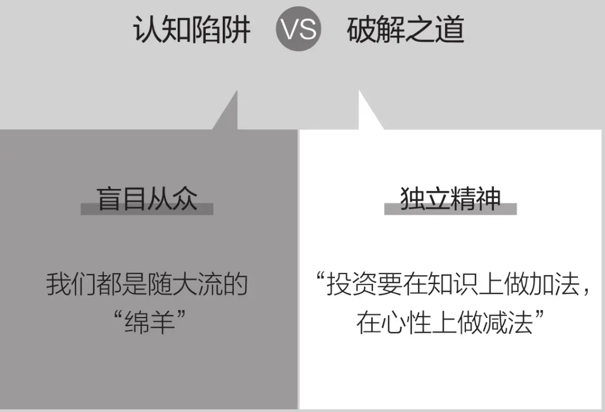

2025年5月20日

21:15

## 认知陷阱8：盲目从众 我们都是随大流的“绵羊”

__认知陷阱8：盲目从众__

__我们都是随大流的“绵羊”__

1720年12月的某一天，伟大的科学家牛顿在自己的日记中写下了一句经典名言：“我可以计算出天体运行的轨迹，却难以预料到人性的疯狂！”

当时的牛顿已经77岁，贵为英国皇家学会会长及皇家铸币厂厂长，身份极为显贵，是什么事情能够让他发出如此感慨呢？答案是股票。

1689年到1714年之间，由于连年战事，英国政府欠下了巨额债务，这些债务以国债的形式存在。1711年的时候，市面上流通的英国国债高达950万英镑，每年英国政府都要拿出税收的一大半来支付国债利息。

为了彻底解决债务危机，财务大臣罗伯特·哈利（Robert Harley）想出了一个妙招，如果能将某一地区的特许贸易权同市面上流通的国债交换，债务危机就能迎刃而解。而实现这个设想的途径就是建立一家公司，然后用公司股票同市场上流通的国债交换，这样债权人变成股东，债务关系完成转换。这实质上是一种特殊的“债转股”，通过这么一置换，英国政府甩掉了巨额债务，而如果公司经营顺利的话，原来的国债持有人还能获得比利息收益更高的利润，而公司也可能赚得盆满钵满，是一个三方共赢的买卖。

这就是1711年南海公司成立的背景，它拥有垄断南海贸易的特许权。南海，指的是包括现在的拉丁美洲在内的大西洋沿岸地区，当时的欧洲人认为这块土地上满是黄金，所以都对南海公司充满了期待。

不过可能是因为战争持续发生，而南海公司所谓的贸易一直没什么起色，到1719年，英国的债务不仅没有减少，而且大幅增长到了超过3000万英镑。一项更为大胆的“南海计划”出炉了。1720年1月，南海公司向政府表示愿意支付750万英镑，以换取管理国债的特权。以政府的信用背书，南海公司开始大量发行股票。

股票要发得好需要有噱头，当时的欧洲人正沉迷于东方的金矿幻想，而南海公司的创始人、地位显赫的贵族罗伯特·哈利恰好是个营销高手。他开动宣传机器，不断向市场散布“在墨西哥、秘鲁一带发现巨大金银矿藏”“金银财宝就要源源不断运回英国”之类的虚假而美妙的信息。

此外，南海公司当时就已经开始玩各种花哨的金融创新，比如推出股权认购产品。一只股票面值100英镑，认购者只需要支付大约1%，也就是1英镑就能获得所有权。同时公司会规定一个具体时间让股东缴足股金，但是在此之前该只股票，确切地说是该只股票的所有权也能够随意出售。如果股价下跌，或者股东无法在规定时间内缴足股金，那他所有权益都将丧失。

南海公司还承诺，所有持有国债的人都可以把尚未兑换的国债年金转换为南海公司的股票。对于持有英国国债的人来说，与其按照国债的面值领取固定的年金，还不如将国债转换成南海公司价格不断上涨的股票，结果有52%的短期年金和64%的长期年金被转换成了南海公司的股票。

在美好蓝图和金融创新的双重推动下，南海公司的股价飞速上涨，形成了波澜壮阔的杠杆牛市。票面价值100英镑的股票，1720年1月时还只有128英镑，到3月初即达到200英镑，3月末即超过了400英镑，6月涨到900英镑，8月突破1000英镑。

当时的英国，上至达官贵人，下至贩夫走卒，所有人都已经沸腾了。有人这样描述：政治家忘记了政治，律师不再打官司，医生把病人放在一边，店主让自己的店铺关门歇业，牧师放下《圣经》离开神坛，就连深居简出的贵妇都放下高傲和虚荣，所有人都来到市场抢购南海公司股票，只盼着股价飞涨后出手大赚一笔。

巨大的利益使许多英国国会议员和政府大员与南海公司相互勾结，疯狂牟利。先后有542位议员、250位贵族卷入了股票交易。议员持有的股份总额为110万英镑，贵族持有的股份总额为54\.8万英镑。连国王也禁不住诱惑，认购了价值10万英镑的南海公司股票。

在这样热烈的气氛下，伟大的科学家牛顿也坐不住了，他也决定入市。他大概是在每股不到200英镑时买入了7000英镑，很快股价就翻了倍，此时的牛顿还保持着理性，愉快地套现了。让他没想到的是，在他卖出之后，股价涨得反而更快，身边的朋友们个个发了大财。牛顿再一次按捺不住了，在每股将近700英镑时加码买入，而此时南海公司的股票离崩溃已经不远了。

说起南海股票的崩溃，也非常有戏剧性。南海公司为了让股票不断上涨，从4月开始就不断向投资者提供贷款和分红，到8月末南海公司的流动资金已经枯竭。南海公司股票本来就是一个靠杠杆累积起来的空中楼阁，一旦没有新的流动资金入场，自然就会崩塌。

在崩塌的过程中，一个意外的插曲起到了推波助澜的作用。南海公司所创造的巨大财富效应在全社会形成了一股跟风浪潮，投机分子纷纷效仿南海公司以达到圈钱的目的。这一年，英国冒出了202家“股份有限公司”，其中不乏稀奇古怪的“确保女人保持贞洁公司”“在适当的时候才公布营业性质公司”等，有专营从西班牙进口翠鸟的，还有专营头发买卖的。当时坊间流传的一个故事是，一位伦敦的印刷工人登记了一家“正进行有潜力生意”的公司，虽然没人弄得明白这家公司到底是做什么生意的，但这个家伙还是在6小时之内卖出了2000英镑的股票，要知道2000英镑在当年可是一笔巨款。接下来发生的事与一般骗局的剧情没什么两样：这位印刷工跑路了。

这些跟风而起的骗子公司显然破坏了南海公司的垄断利润，于是英国议会在1720年6月通过了被民间称为“泡沫法”的《反金融诈骗和投机法》。该法宣布：在没有议会法案或国王特许状给予法律权利的场合，禁止以公司名义发行可转让股票，或转让任何种类的股份。表面上看，这个法案是为了遏止投机之风，而实际上它是由投资了南海公司的许多议员提出的，目的是确保南海公司的垄断地位和自己的利益不被稀释。7月底，有86个公司被列为“泡沫公司”，这86个公司吹起的泡沫立刻破裂。

吊诡的是，这些泡沫公司的破灭提醒了股民重新审视南海公司，他们开始担心起南海公司的收益能力。一看局势不妙，一些“内幕交易者”开始率先出逃，据说财政大臣约翰·艾思拉比（John Aislabie）一下子就赚了90万英镑。这种不同寻常的抛售活动让更多投资者开始抛售股票。

那是令伦敦人至今都谈之色变的几个月：整个证券市场笼罩在一片恐慌中，成千上万的股民倾家荡产，血本无归，有的甚至连养老金都赔光了，股票市场的崩溃造成了极为严重的社会灾难。到了1720年12月，南海公司的股票已经变成废纸，就算再低的价格也没人买。“南海事件”之后，英国民众不敢再问津股票之事，闻股份公司而色变。整整一个世纪间，英国竟没有发行过一张股票。1

牛顿便是南海泡沫破裂时仓皇出逃者中间的一员，最终他的亏损高达2万英镑。正是这次惨痛的教训让他写下了文章开头的那句话。

__“乌合之众”__

牛顿炒股的惨败是怎样造成的？这就要说到“羊群效应”。某一年笔者带正在上小学的孩子和他的同学在美西黄石公园自驾旅行的时候，我与两位小学生做了个小小的心理实验。黄石公园处处是景，道路两边有很多停车点可随时停下来欣赏，这些停车点一般都没有画线。在一处景色绝佳的地方，我们准备下车来拍照，当时那个停车点还没有其他车辆。我跟两位小学生说，我们这次不要把车停得很正，而是稍微停得歪一点，大概有个30°的倾斜，目的是看看后面来的车会不会跟我们一样也倾斜着停车。我们等了一小会儿，第二辆车就来了，车主毫不犹豫地将车子按照我们的角度停在了旁边。孩子们感到很惊奇，问这是为什么？我不无得意地告诉他们，这就是心理学上的“从众效应”。

生活中有许多“从众效应”。有一个有趣的实验：一个不知情的被测试者A先走进电梯间，按照正常模式，面对电梯门站立。然后，另外两个知情的实验者B、C先后进入电梯，但都背向电梯门站立。A变得有点不安起来，并开始犹豫是否该转过身去。然后又进来一个知情者D，采取与B、C一样的站姿，A心里感到奇怪，但短暂的犹豫后，也转过身去以保持与其他三个人一致。

人类在发现自己的愚蠢后，一般不会用自己来命名，但会找一种动物来做暗喻，前面我们已经讽刺过鸵鸟，这次轮到绵羊了。羊群是一种很散乱的组织，平时在一起也喜欢盲目地左冲右撞，但一旦有一只头羊动起来，其他的羊就会不假思索地一哄而上，哪怕头羊跳下悬崖，后面的羊也会毫不犹豫地跟着跳下去。这就是著名的“羊群效应”。

根据社会学家的研究，人类在政治社会生活中也经常犯“羊群效应”的错误。这方面最著名的著作要数古斯塔夫·勒庞的《乌合之众》了。

勒庞发现，我们每个人在独处的时候往往表现得很理性，但是一旦进入一个群体，人的性情就会发生变化，甚至表现出另外一种截然不同的特征。

1792年9月，法国大革命期间，一则消息引爆了巴黎：普鲁士军队已经攻下了凡尔登，正在“磨刀霍霍”向巴黎进军。在一片混乱之中，不知从何处传来的谣言宣称，巴黎一旦被攻陷，监狱里的囚犯就会被释放，他们会帮助军队攻击巴黎。

在各种想象的刺激之下，一场惨无人道的大屠杀开始了：5天之内，巴黎监狱里的1200～1400名囚犯被暴民就地处决，其中包括200多名天主教教士。那么行凶的又是一些什么人呢？他们在平日里是店主、鞋匠、锁匠等普普通通朴实善良的巴黎人民，如今摇身一变就成了残暴的野蛮人，就像是月圆之夜变身的狼人。

当然，这是极端的负面案例，群体的特性也有很积极的一面。比如1793年，法国在反法同盟的强大攻势之下，国民既没有粮食，又没有武器，却奇迹般地挫败了反法同盟的进攻，以一种大无畏的革命英雄主义拯救了法兰西共和国。“正是这种无意识的心理背景下的英雄主义创造了历史。假使群体总是表现得像个体那样冷静而功利，那么，世界历史将会表现得乏味很多。”勒庞写道。2

总的来说，群体比个人更有力量，但是群体的表现是极不稳定的；而个人无论是智能还是能力，总是维持在一个平均的水平线上；群体的行动是受感情激起并主导的，这种感情的强弱程度，直接决定着群体的行为能力；群体的表现有可能比个体更好，也可能更差。究竟群体表现得更好还是更差，这完全取决于周边的环境如何。

__社会认同与“羊群效应”__

人类的进化大致遵循两个路径：一是自然选择，适者生存，不适者淘汰；二是社会选择的法则，在必须集体狩猎以确保生存的时代，个体如果得不到集体的认同甚至被集体驱逐，那就与面对毒蛇猛兽而丧失逃跑能力一样危险。这为我们留下了追求社会认同的心理倾向，也就是尽量表现得与别人一样。

每个人都需要社会认同，它是协同合作和推动社会进步的心理基础，但是在某些场景下，过于追求社会认同感就不一定是好事了。比如股市投资，成功的股票投资需要独立判断，然而社会认同压力会驱使我们与周围的人保持一致。当股票价格上涨时，看到周围的朋友都日进斗金，那么你即便本来对股票投资毫无概念，也很容易盲目跟随而进场。而人性中的攀比和嫉妒会跑出来火上浇油，追涨行为和股市泡沫就这样发生了。

可是股市一旦进入下跌通道，人人争先恐后地出逃，又会造成一种群体性恐慌，社会认同的压迫使你无法保持冷静，于是你也盲目杀跌砍仓，股市又被推向了超跌的另一个极端。我们也成了乌合之众或是羊群中的一员。

牛顿可能是投资史上最聪明的“绵羊”。

__破解之道8：独立精神__

__投资要在知识上做加法，在心性上做减法__

“盲目从众”除了会使投资者犯追涨杀跌的错误之外，还会使其对股票表现出无原则的“博爱”。投资者往往听风就是雨，本金可能不多，却买了一大堆股票。相比而言，成功的投资家是一群能够克制人性的躁动、专注于少数股票的人。

芒格说，我一生中仅投资了三家企业就很成功了，它们是伯克希尔–哈撒韦、好市多和李录的基金。

巴菲特也讲过类似的话，他说，“对任何一个拥有常规资金量的人而言，如果他们真的懂得所投的生意，那6只股票已经绰绰有余了”。甚至，“只要你能顶住价格的波动，拥有3只股票就足够了”。

巴菲特的老师之一菲利普·费舍也是这方面的模范。巴菲特曾说他的投资哲学85%来自格雷厄姆，15%来自菲利普·费舍。1987年，费舍在一次罕见的媒体采访中透露了他的投资哲学，核心便是“少就是多”。他的核心股票只有4只，此外，他会用少量的钱去买一些有潜力进入核心股票池的股票，通常是5只。他从20世纪30年代的2只股票开始，50年间总共发现过14只核心股票，这是一个很小的数目。但是，它们为费舍赚了很多的钱，其中最少的都有7倍的投资回报，最多的收益甚至能达到几千倍。3

彼得·林奇在《战胜华尔街》中也表达过类似的观点：“作为一个业余选股者，根本没必要非得寻找到50～100只能赚钱的股票，只要10年里能够找到两三只赚钱的大牛股，所付出的努力就很值得了。资金规模很小的投资人可以利用‘5股原则’，即把自己的投资组合限制在5只股票以内，只要你的投资组合中有一只股票上涨10倍，那么即使其他4只都没有涨，你的投资组合总体上也能上涨3倍。”4

为什么选股宜少不宜多呢？原理其实也很简单，在《穷查理宝典》一书里芒格曾引用过比尔·格罗斯的话来阐释这一点，“如果你拥有40位妻妾，你一定没有办法对每一个女人都认识透彻”。

投资股票也是一样，如果抱着“与股票结婚”的态度，就必须要深度了解股票，但一个人精力有限，不可能对几十只、几百只股票都很熟悉。而一旦你踏足了不熟悉的领域，就很有可能陷入雷区。

专注才是股票投资成功的关键。芒格自己曾总结：“我的成功源自我的长期专注。”在他看来，极度专业化才是成功之道。“比起理解整个世界来说，大多数人更加擅长专攻一个方面。”相反，“那些同时处理多项任务的人都付出了很大代价”。

__坐等投资法__

多数投资者不光“博爱”，而且很“好动”，频繁买进卖出，眼睛紧盯股票行情，几分钟就查看一次，如果不这么做就觉得心里发慌。这是股票投资亏损之源，法国哲学家布莱士·帕斯卡尔一针见血地指出：“人类所有的不幸都来自一件事，即不知道如何在房间里保持安静。”5成功投资家的状态正好与此相反。巴菲特多数时候喜欢独自一人待在书房里，既没有顾问，也没有随从。他坐在发黄的报纸和父亲的照片前，静静地享受爱默生式的恬静与孤独。几个小时静静地过去，连电话铃声都很少响起。

他最大限度地减少外界对他的干扰，不像多数投资人那样挤在华尔街，他将总部放在了老家的小镇上，甚至办公室里都不安装计算机。好友比尔·盖茨向他兜售计算机，他也不为所动。后来勉强安装了一台，也是用于打桥牌游戏，而不是用来查看股票行情。有人总结出“三不主义”来形容巴菲特的投资风格：不看大盘，不相信技术分析，不去做预测。他甚至开玩笑说，假如他在股市开盘期间常常溜去看电影的话，应该会赚得更多。

巴菲特和芒格干得最多的事情是看书和思考。芒格说：“我们花很多时间思考。我的日程安排并不满，我们坐下来不停地思考。从某种意义上说，我们更像学者而不是生意人。我的系统总是坐下来静静地思考几个小时。我不介意在很长的时间里没有任何事情发生。”

芒格半开玩笑说自己使用的是“坐等投资法”，听起来像姜太公钓鱼——愿者上钩。这在投资界并不是孤例。甚至以短线交易成为20世纪初华尔街“抢钱小子”的杰西·利弗莫尔在累计输赢了几百万美元之后也体会到同样的道理。“总是设法抢进抢出，对我来说是致命大患，”他在回忆录里写道，“我的想法从来都没有替我挣过大钱，总是坚持不动替我赚大钱，明白吗？是我坚持不动。”6

另一位华尔街著名的投资者吉姆·罗杰斯（Jim Rogers）则说：“我只管等，直到有钱躺在墙角。我所要做的全部就是走过去把它捡起来。”

为什么股票投资不用太着急呢？巴菲特对此做过非常精妙的解释，他用棒球来类比股票投资：“我把金融投资称为世界上最美妙的行业，因为你不用每一球都挥棒。你只要站在本垒旁边，观察对面的投手向你扔来的一个个球，也就是不同股票的股价：通用汽车47美元、美国钢铁39美元……而且，没有裁判会判你出局，唯一的惩罚不过是丧失机会而已。你可以花一天的时间来等待最合心意的那个球，然后趁捕手打盹的时候，挥动球棒，一举击中。”

股市是一个生生不息的系统，只要不被关闭，永远都有机会。“市场先生”每天都来向你叫卖，你不需要每一次都接受报价，所以大可从容一点。所谓“市场先生”是“价值投资之父”本杰明·格雷厄姆创造出来的一个虚拟角色：设想有一位市场先生与你交易，他每天来敲你的门，风雨无阻。这位先生会对你们双方手中的东西提出买卖价格，但是他很情绪化，报价时高时低。如果你不理他，他也不生气，明天一如既往给你新的报价，等你答复。7

格雷厄姆告诫投资者：“市场先生对我们有用的地方是他口袋中的报价，而不是他的智慧，如果市场先生看起来不太正常，你就可以忽视他或者利用他这个弱点。但是如果你完全被他控制，后果将不堪设想。”

正因为“市场先生”是情绪化的，所以他给出的报价很多时候是噪声，而不是真正有用的信息，理性的投资者需要认真甄别，而不是被他所左右。

__独立思考，学会与自己相处__

投资是一项高度专业的事，一个成功的投资人需要掌握大量的知识。他必须能看懂企业，为此他需要懂得经济学、金融学、数学、财务学、会计学等。他也需要懂得市场，而市场由人组成，为此他需要懂得社会学、心理学、历史学甚至政治学。

但是，投资又是一门心性艺术，需要减少一切不必要的干扰。当今的世界，颜色越来越艳丽，声音越来越动听，味道越来越美妙，于是人的内心世界也越来越难以把握，人性的贪婪、恐惧、嫉妒等弱点均被急剧放大。正如“指数基金教父”、先锋集团创始人约翰·博格尔所说：“我们拥有很多消息，它们代表知识吗？我表示怀疑。我们拥有很多信息，它们代表智慧吗？我更无法想象。”8树欲静而风不止，诱惑越来越多，陷阱也越来越多，这都是投资人需要避免的。所以“多少之辩”和“动静之辩”是一体两面，是另外一种逆人性。

做投资既要在知识上做加法，又要在心性上做减法，它绝不仅仅是知识的简单累积。守静去躁才是投资的要义。

做减法也罢，守静去躁也罢，其目的是什么呢？是为了独立思考。或许是因为在人类社会早期，族人们必须一起协作狩猎才能确保生存，所以人类保留着强烈的社交属性，我们本性上不善于独处。我们总是希望走出房间，与他人发生关系，一旦脱离了这种关系，就生怕被组织所遗忘或抛弃。其实，这种担忧是不必要的，除非你执意要与世隔绝，不然这个世界一定会及时与你联系。尤其是当下这个信息时代，我们更需要担心的恐怕是过度联结和信息过载。如果人能够恰如其分地学会与自己相处，大概就能消除人生一大半的烦恼了。多数人生活在相对的世界里，优秀的投资家则能够在不与人进行比较的绝对的世界里如鱼得水，他们是一群耐得住寂寞的人。当然，这并不是在一味地倡导遗世独立，与世界的适当联结还是必不可少的。对此，重阳投资创始人、首席投资官裘国根先生有过精彩论述：“无论是分析师还是基金经理，交流越多，观点越容易被同化；反之，若不与同行交流，离市场太远，可保持独立，但一旦发生‘群众运动’，将很被动。由于时间的有限性，基金经理要在独立思考和同行交流之间保持平衡。”

一动不如一静。破解盲目从众，除了同样需要清醒的自我认知，以及运用逆向思维之外，建立在独立思考基础上的“坐等投资法”也堪称一剂妙方。

2025年5月20日

21:15

## 老子对话巴菲特 少则得，多则惑

__老子对话巴菲特__

ROUND 8

__少则得，多则惑__

小 舍：各位老师已经聊了七个回合，精彩纷呈，小舍旁听收获良多，同时也产生一些疑问想向各位老师请教。

老 子：那不如直接请小舍来主持我们今天的对话吧。

巴菲特：附议！

芒 格：附议！

小 舍：荣幸之至，那我就勉为其难了。正好老子年事已高，我串串场，老先生可以多休息休息。

今天我想问一个关于“多”和“少”的问题。首先请教巴菲特和芒格先生，在投资标的的选择上，是多好还是少好？

巴菲特：“在与商学院的学生交谈时，我总是说，当他们离开学校后可以做一张印有20个小洞的卡片。每次做1项投资决策时，就在上面打1个洞。那些打的洞较少的人将会更加富有。”

小 舍：所以您觉得多不如少，您的策略是集中投资吗？

巴菲特：没错。

小 舍：这好像与生活的日常哲学相反，人们常说“不要把所有鸡蛋放在一个篮子里”。

巴菲特：投资不同，“投资应该像马克·吐温建议的那样，把所有鸡蛋放在同一个篮子里，然后小心地看好它”。

小 舍：这么做的原理是什么？

巴菲特：“我认为不管从什么角度来说，投资多元化都是犯了大错。你熟悉的生意可能不会超过6个，假如你真的懂6个生意，那就是你所需要的所有多元化，我保证你会因此而赚大钱。如果你决定把钱放在第7个生意上，而不是去投资最好的生意，那肯定是个错误的决定。因为靠第7个生意赚钱的概率是很小的，但是因为最熟悉的生意而发财的概率却很大。”

小 舍：这么说来，在投资中，多元化只不过是对无知的一种保护？

巴菲特：可以这么说。

小 舍：那么如果需要给一个具体数额的话，您建议投资多少个标的呢？

巴菲特：“我认为，对任何一个拥有常规资金量的人而言，如果他们真的懂得所投的生意，那6只股票已经绰绰有余了。”甚至，“只要你能顶住价格的波动，拥有3只股票就足够了”。

小 舍：3只或6只应该是理想化的说法。在这里我想有必要介绍一下现实投资中，巴菲特先生所选标的的情况。有人做过统计，1977年到2015年38年间巴菲特《致股东的一封信》披露的股票一共仅有76只，平均每年2只。

另一份统计显示，在1977—2004年长达27年的时间里，巴菲特投资3年以上的股票仅有22只，但投资61亿美元仅仅选股22只就为巴菲特创造了318亿美元的投资回报，平均投资回报率高达5\.2倍。

巴菲特：这些读者真是有心了。

小 舍：那么，芒格先生，您对这个话题有什么看法呢？

芒 格：我的看法大体一致。对此我曾说过两句话，现在重复一下：“认为投资应该越分散越好是一种发疯的观念。”“如果你把我们15个最好的决策剔除，我们的业绩将会十分平庸。”

小 舍：芒格先生总是一针见血。接下来请教一下老子，巴菲特和芒格先生的集中投资方式是否与您所主张的哲学观念有相通之处？

老 子：我刚才听得津津有味，感觉巴菲特和芒格先生所讲的就像是我的话的现代版。

小 舍：哦，您也论述过“多”与“少”的关系？

老 子：当然，《道德经》第二十二章里有这么一句：“少则得，多则惑。是以圣人执一为天下式。”

小 舍：怎么理解这几句话？

老 子：这句话的意思是说，少取反而可以多得，贪多反而弄得迷惑，圣人谨守着一个原则（道）作为天下事理的范式。

小 舍：用大俗话说就是贪多嚼不烂吧？

老 子：没错，用我的另一句话来解释就是，颜色太多容易让人眼花缭乱，声音太多让人分辨不出，味道太多让人感觉失调，纵情打猎让人心张扬发狂，稀奇的宝贝常常让人为了得到而不择手段。

小 舍：难得老子主动说大白话！原文是哪一段？

老 子：“五色令人目盲；五音令人耳聋；五味令人口爽；驰骋畋猎，令人心发狂；难得之货，令人行妨。”

小 舍：精彩。然而这些道理虽然简单，却很难做到，人人都喜欢多，不喜欢少。都喜欢寻求刺激，不喜欢平淡。关键是要怎样才能做到呢？

老 子：我有一句话，可以算作建议：“为学日益，为道日损。损之又损，以至于无为。无为而无不为。”

小 舍：这几句不大好理解，还请老子用大白话讲讲。

老 子：翻译成白话就是，做学问要做加法，一天一天积累，越积累越丰富，但是修为要做减法，一天一天减损，减损到最后就是“无为”。如果能够做到“无为”，那么任何事情都可以有所作为。

小 舍：“无为”是什么都不做吗？

老 子：不。这是后人对我的一种误解。“无为”不是不为，而是不妄为，是顺势而为。

小 舍：听到这里我有点明白了。不知道巴菲特和芒格先生对此有何评论？

巴菲特：我想我与老先生之间又找到了一个观念的共通点。

芒 格：同感。

2025年5月20日

21:15

## 09 以“周期思维”破解“线性思维”

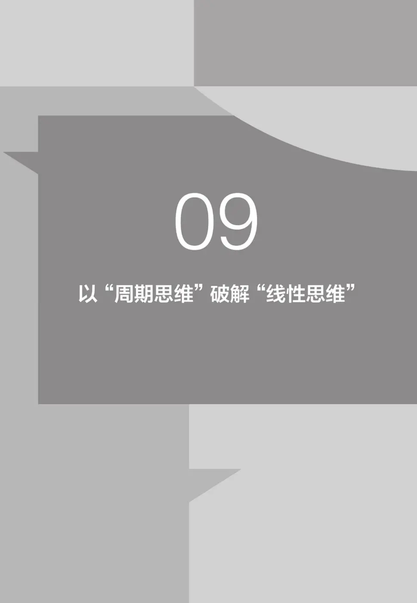

2025年5月20日

21:15

## 财富是认知的变现（上海老牌百亿私募基金重阳投资合伙人舒泰峰首部投资专著，教你避开投资中的12个陷阱。大开脑洞，开启12篇老子与巴菲特的时空对话，带你轻松领会投资哲学。）

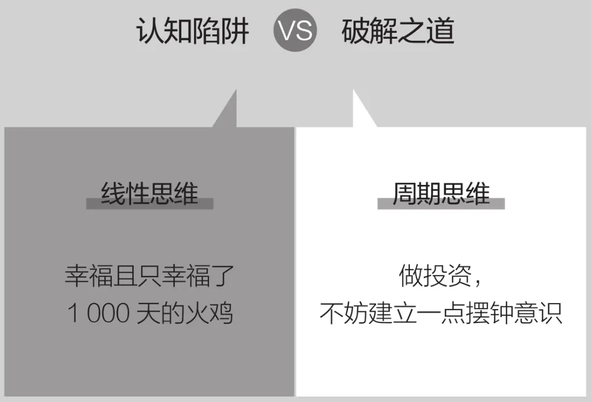

2025年5月20日

21:15

## 认知陷阱9：线性思维 幸福且只幸福了1 000天的火鸡

\(39\) 认知陷阱9：线性思维 幸福且只幸福了1000天的火鸡

2025年5月20日

21:15

__认知陷阱9：线性思维__

__幸福且只幸福了1000天的火鸡__

一只火鸡被屠夫喂养了1000天，屠夫非常精心，火鸡非常幸福，它认为自己的生活“平静如水”，未来前景一片光明。直到第1001天感恩节的时候，它被屠夫杀掉并端上了餐桌，“屠夫爱火鸡”的幻想才宣告破产。

这是塔勒布在《反脆弱》一书中所讲的经典故事。每次看到这个故事我就会不由自主地想起一则新闻，说中国的某个养猪场主人发现一个秘密，给猪听音乐可以让猪变得温顺，长得壮实，而且这音乐也有讲究，如果放周杰伦的《双节棍》，猪会吓得四处躲藏，但是播放《渔舟唱晚》《在水一方》或者李健的《传奇》，效果就会很好。我们都知道猪的最后结局是什么，但是沉迷于美妙音乐的猪可能还以为生活会一直那样美好。

中国的“屠夫爱小猪”是西方“屠夫爱火鸡”故事的翻版，感到幸福的猪和火鸡犯了同样一个错误——线性思维。这种思维是指人以一种直线的、均匀的、不变的、单一的思维方式看待问题，把一切都看成是随着初始条件的给定而给定的。人类看到的第一只天鹅是白色的，第二只、第三只……也是白色的，于是便认为天下所有的天鹅都是白色的。但是这样的“眼见为实”并不可靠，正如塔勒布所总结的：“1000天并不能证明你是正确的，但1天就能证明你是错误的。”1或者哲学家卡尔·波普所指出的：“不管我们已经观察到多少只白天鹅，也不能证明这样的结论：所有天鹅都是白的。只要看见一只黑天鹅就可以驳倒它。”

__“三根阳线改变信仰”__

股票投资中有“三根阳线改变信仰”一说，这正是线性思维的典型表现。本来市场一直处于震荡之中，投资者普遍迷茫；但是由于特定事件或者其他因素的影响，股指连续涨了三天，于是人心振奋，纷纷追加仓位，牛市氛围因此而成。记得2015年上半年股市持续上涨的时候，股指不断创出新高，但是当时主流的声音不是提示风险，而是类似“站稳4000，突破6000，挑战10000”这样的鼓动。后来我们都知道，当年的“疯牛”止于5178点，采取线性思维迷信股指将不断上涨的，尤其是那些加杠杆投入股市的人，轻者“腰斩”，重者倾家荡产。

反过来“三根阴线改变信仰”也成立。同样是2015年，股指从6月15日最高点5178点跌落，之后的60个交易日里有17天“千股跌停”，到8月26日跌到当年的最低点2850点，两个多月时间里指数跌去了45%。在这个过程中，股民的雄心壮志随着每一次暴跌的发生而被快速消磨，代之而起的是越来越深重的绝望。“10000点梦已成空，相反1000点成为可能。”后面我们知道，1000点并没有成为现实。线性思维放大了牛市中的疯狂，同样也放大了熊市中的绝望。

美国的投资者也同样容易犯线性思维的错误。1999年，美国正处于互联网狂热之中，当年美国出版了三本书，分别是《道指36000点：在即将到来的股市上升中获利的新战略》《道指40000点：在历史大牛市中获利的战略》《道指100000点：现实还是幻想》。这三本书的观点是一致的，都认为如果利率保持低水平，公司盈利保持增长，道琼斯平均股价指数将上涨到超过以往任何时候的水平。2

1999年12月，在美国股市连续5年至少上涨20%之后，投资者预计未来12个月的股票收益率将达到18\.4%。但到2003年3月，在经历了2000年、2001年和2002年的连续亏损后，投资者预计他们的股票在未来12个月里能上涨6\.3%就不错了。投资者对历史数据的依赖导致他们对未来的预测完全错误：2000年，股市非但没有上涨18\.4%，反而下跌了9%，令人震惊不已；在2003年3月之后的12个月里，美国股市的涨幅不是温和的6\.3%，而是惊人的35\.1%。3

__线性思维是我们旧大脑的遗存__

人类的大脑为什么如此线性呢？原因在于我们的大脑是在本地化和线性化的环境中进化的。本地化意味着我们的先祖所接触的几乎所有东西都位于步行不到一天的距离之内，线性化则意味着变化的速度特别慢。这在我们的神经上留下了印记，神经科学研究显示，某件事只要连续出现过两次，大脑就会预测它将出现第三次。中国有句老话叫“事不过三”，现在多用于警告他人不要犯三次同样的错误，其实也可以解释为一旦到了三次就会形成习惯或者趋势，所以必须进行遏止。

在瓦特发明蒸汽机之前，世界的确发展得极其缓慢。一个清朝人如果回到秦朝，生活上肯定不会遇到多少障碍，因为虽然两个朝代隔了一千多年，但在物质层面差距并不是很大。然而，如果让一个现代人回到秦朝生活，那恐怕就要笑话迭出了，不信可以看看电视剧《寻秦记》。斯坦福大学教授伊恩·莫里斯（Ian Morris）将公元前14000年以来人类摄取能量和使用能量的能力进行了量化，绘制成了社会发展指数曲线图（见图9\-1）。无论东方还是西方，在公元1800年之前曲线都是以极其缓慢的幅度抬升的，但是公元1800年之后，“砰”的一声，曲线突然变陡，几乎与横轴垂直。由于工业革命，人类文明产生了指数级或者说爆炸式的增长。短短200多年的时间，世界的一切都发生了翻天覆地的变化。4

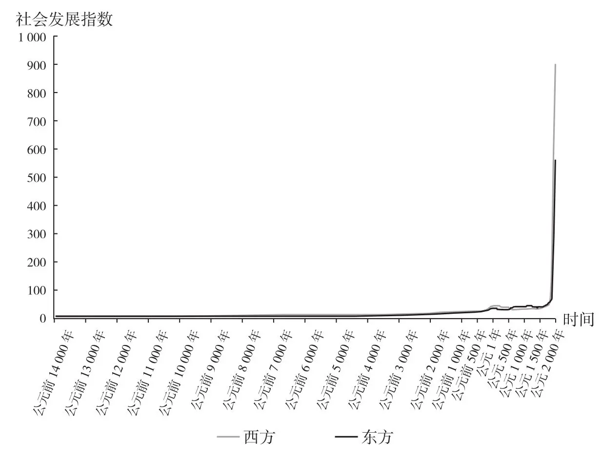

图9\-1 东西方社会发展指数曲线（公元前14000—公元2000年）

资料来源：《文明、现代化、价值投资与中国》。

我们的大脑结构显然没有跟上文明大爆炸的步伐，线性思维正是我们大脑落后于时代的遗存。

我们必须警惕这种遗存，不然的话可能会犯下重大的错误。在一个文明爆炸的时代，打败马车的不是马车，而是汽车；打败柯达的不是富士，也不是柯尼卡，而是数码相机；打败诺基亚的不是三星，也不是摩托罗拉，而是智能手机……马车、柯达、诺基亚都犯了线性思维的错误。

历史还在加速发展，2021年元旦，笔者读了一本充满未来感的书，书名叫《未来呼啸而来》\(7\)，全方位描绘了未来指数型技术的融合将给我们的商业模式与生活方式带来的巨大变化。许多图景像是科幻电影：

按照埃隆·马斯克的规划，巨型火箭“星际飞船”SpaceX将用于运送地面乘客，这艘飞船的速度是3万千米／时，比协和式飞机快了一个数量级。一旦计划实施，39分钟就可以从纽约到上海，29分钟从伦敦到迪拜，打个飞船从上海去纽约吃午饭可能变成现实。

随着无人驾驶技术的普及，令都市人头疼的通勤问题将被彻底解决。汽车将不仅是一种交通工具，而且是舒适的卧室、会议室、电影室等，“汽车即服务”。你将不会介意住得离公司更远一点，这样一来，郊区的房子将变得更有吸引力。甚至，垂直起降的飞行汽车也将成为现实。

你将生活于“身外化身”的世界。虚拟显示头盔会将你的“眼睛”和“耳朵”传送到另一个位置，同时一组触觉传感器也会把你的触觉转移过去。突然之间，你就进入了一个虚拟世界的化身当中。当你在现实世界中移动时，你的化身也在虚拟世界中移动。当你受邀发表演讲时，利用这种技术，你可以在自己家中的客厅里舒适地完成演讲，而不用去机场赶飞机……

这些场景不是科幻，它们将很快变为现实，其背后的驱动力是新技术的指数级融合发展。正处于飞速发展当中的9大指数型技术分别是：量子计算、人工智能、网络、机器人、虚拟现实与增强现实、3D打印、区块链、材料科学与纳米技术、生物技术。

改变将是巨大的，两位作者引用创新大师理查德·福斯特（Richard Foster）的话说：“今天《财富》500强企业中至少有40%将会在10年内消失，取而代之的将是我们现在尚未听说过的新贵。”5

如果我们不能摆脱看待历史的线性思维，那么我们很可能沦为那只幸福了1000天也仅仅幸福了1000天的火鸡。

__破解之道9：周期思维__

__做投资，不妨建立一点摆钟意识__

与线性思维相对应的破解之法是辩证思维。世界的发展本质上不是线性的，而是辩证的，这种辩证体现在经济生活里便是各种大大小小的周期。

投资大师霍华德·马克斯曾经总结了许多种周期：经济周期、政府调节周期、企业盈利周期、风险态度周期、信贷周期、不良债权周期、房地产周期、市场周期等。

投资收益也存在周期，马克斯从1970年到2016年经历了47个完整的投资年度，算下来他的年平均收益率为10%。他曾经做过一个有意思的自我设问：这47年里有多少个年份股市的收益率处于“正常水平”加减2%，即处于8%～12%的合理区间之内？

马克斯自己预期这样的年份“不是很多”。但是经过计算，他自己大吃一惊，竟然只有3个年度，也就是说平均每16年里才有1年股市是正常的！

“股票市场表现符合正常水平绝对不是正常现象，所谓的常态其实是非常态。”马克斯因此得出精彩结论：“股票市场如此大幅度波动，根本不能用企业、行业经济这些基本面变化来解释。股票市场经常大幅度偏离正常收益水平，在很大程度上要归因于投资人的心理和情绪像钟摆一样大幅摆动。”

基本面与心理的互动机制如下：有时候人们感觉良好，积极乐观，预期好事会发生，而且后来情况确实如此，此时，投资者就会变得贪婪，什么都不顾了，心里只想着赚大钱。贪婪让人争抢着去投资买入，结果大家纷纷开出更高的价格，从而导致市场上涨，资产升值。

但是反过来，有时候投资者感觉不好，预期就变成负面的了。在这种情况下，恐惧主导了投资者的心理和情绪。投资者不再一心只想着赚钱了，而是开始担心会亏钱。这就导致投资者买进的数量减少，原来推动资产价格上涨的动力就会消失，市场涨不动了。后来投资者甚至开始卖出，从而导致资产价格下跌。处于恐慌状态时，投资者的情绪给市场带来了巨大的反向力量，让市场转为熊市。

马克斯根据这个规律总结出股票投资中著名的“钟摆理论”：证券市场的情绪波动类似于钟摆的运动。虽然弧线的中点最能说明钟摆的“平均”位置，但实际上钟摆停留在那里的时间非常短暂。相反，钟摆几乎始终朝着或者背离弧线的端点摆动。但是，摆动到达端点之后，钟摆必定会返回中点。事实上，正是朝向端点的运动本身为回摆提供了动力。6

可见，一切周期的背后都是人性的周期。正因为投资人的心理和情绪在恐惧和贪婪之间来回摆动，所以市场也在熊市和牛市之间来回波动，不是走到极端就是走向极端。

__月亮意识与投资__

中国人喜欢月亮，可能是因为月亮是最懂得辩证法的“智者”。《易经》说：“日中则昃，月盈则食。天地盈虚，与时消息，而况于人乎？”意思是说，太阳到了正午就要偏西，月亮圆了就会开始亏蚀，天地之间盈虚的变化，是随着时势的变化而发生的，更何况是人呢？

月圆只是一个瞬间，月缺才是常态。但是反过来说，月缺又总会再圆。所以，古今同赏一明月的场景里，隐含着瞬间与永恒的辩证。月亮的变化就如太极图，太极图是一个圆，阴阳两极在其中互相依存、互相包含又互相转化，形成一种“不朽的循环”，生生不息，妙用无穷。

读懂了月亮，也就读懂了人生，读懂了投资。人生应当追求完美，就如欣赏月圆。但也应当懂得月圆则亏，物极必反。

有趣的是，西方文化中同样蕴含着高度类似的反论。耶稣的反论是：“失去生命者，获得生命。”爱默生则说：“终即始；黑夜之后必有黎明，大洋之下另有深渊。”成功的投资家都深谙这个道理。索罗斯说：“凡事总有盛极而衰的时候，大好之后便是大坏。”约翰·邓普顿有句流传更广的名言：“行情总在绝望中诞生，在半信半疑中成长，在憧憬中成熟，在希望中毁灭。”

著名经济学家李迅雷先生把牛市的上涨逻辑分为“三级推力”：今天（短期）利好、明天（中期）利好和后天（长期）利好。当市场开始炒作“后天利好”（如“黄金十年”）时，基本就见顶了；反之，当市场开始炒作“后天利空”（如“失去的十年”）时，基本也见底了。7这与霍华德·马克斯的周期理论有异曲同工之妙。

在失败的投资者那里，马克斯说：“摆幅越接近最大时，人们越倾向于将之视为永恒状态。”8芒格曾犀利地指出：“所有人类对几何级数增长的过度追求，在一个有限的地球上，最终都以惨痛收场。”用大白话说，就是树不能长到天上去。这是常识，但在现实中，当牛市来临的时候，很多人却会觉得可以一直涨，3000点看5000点，5000点看10000点，总觉得这次是不一样的。“这次不一样”恰恰是金融史上最昂贵的教训之一。这就像某些人看到十五的月亮，就相信月亮永远会是圆的一样，遗憾就是这么酿成的。

__巧用周期的反转获利__

“人事有代谢，往来成古今。”万物运行的周期难以改变。那么了解周期有什么用呢？“能够肯定的事情之一是，极端市场行为会发生逆转。”霍华德·马克斯说：“一切都是相辅相成的。任何事件都不是孤立的或偶然的。相反，它们都是一定的循环模式的组成部分，是可以掌握并从中获利的。”

在马克斯看来，了解周期是为了知道自己处于周期的什么位置，然后相应地指导投资行为。

他总结了“牛市三阶段”：第一阶段，只有少数特别有洞察力的人相信基本面情况会好转；第二阶段，大多数人都认识到基本面情况确实好转了；第三阶段，每个人都得出结论，基本面情况将变得更好，而且永远只会更好。

反过来则是“熊市三阶段”：第一阶段，只有少数深谋远虑的投资者才能意识到，尽管形势一片大好，市场普遍乐观看涨，但是基本面肯定不会一直顺风顺水；第二阶段，大多数人都认识到基本面正在越变越糟；第三阶段，每个人都相信基本面只会变得越来越糟。9

投资要取得成功，就必须成为第一阶段先知先觉的人。“聪明的人最先做，愚蠢的人最后做。”马克斯认为巴菲特的这句话称得上是排名第一的投资名言，它神奇地概括了周期的重要性。

所以，成功的投资家多是逆向思维的高手，所谓“别人贪婪时我恐惧，别人恐惧时我贪婪”。投资要争当第一阶段的引领者，而不做第三阶段的跟风者。

具备了周期思维，投资者就不会再盯着眼前的一点小波动，市场每天短线的上涨和下跌就是“芝麻一般的小事”。投资真正需要关注的是周期走到极端的情况，这才是“西瓜一般的大事”。因为当市场走到极端时，逆向行动的成功率最高。所以做投资，不妨建立一点摆钟意识或者月亮意识。

懂得了周期思维，也就不会被线性思维所束缚了。

## 老子对话巴菲特 反者道之动

__老子对话巴菲特__

ROUND 9

__反者道之动__

巴菲特：在前面的对话中，我们提到市场的变化也逃不出事物发展的一般规律。所以今天我想向先生请教一个更抽象一点的问题，在您看来，事物发展的普遍规律是什么？

老 子：这是个大问题，如果用一句话概括，我觉得事物的规律是“反者道之动”。

巴菲特：请老先生展开做个解释。

老 子：这句话从字面上可以理解为“道的运动是循环往复的”。但是展开讲，它可以衍生出许多层次。

巴菲特：愿闻其详。

老 子：我的著作《道德经》其实通篇都在讲这个道理，比如在第二章我曾说：“有无相生，难易相成，长短相形，高下相盈，音声相和，前后相随。”

巴菲特：这段话挺长，不如请我们的助聊小舍帮忙翻译一下。

小 舍：好的。这段话的意思是说：没有“有”就没有“无”，“有无”是相伴而生的；没有“难”就没有“易”，“难易”是互相促就的；没有“长”就没有“短”，“长短”是互为显示的；没有“高”就没有“下”，“高下”是互为呈现的；乐器的“音”和人的“声”是互相应和的；没有“前”就没有“后”，“前后”是相伴而形成顺序的。

巴菲特：能否简化地理解为，矛盾的对立物是相互依存的关系？

老 子：正是此意，不过这只是“反者道之动”的第一层含义。

巴菲特：第二层含义又是如何的？

老 子：在《道德经》第四十一章，我曾说“大方无隅；大器晚成；大音希声；大象无形”。

小 舍：还是我来做个解释，这句话的意思是说：最方正的东西，反而没有棱角；最贵重的器物，总是最后完成；最大的声响，反而听来无声无息；最大的形象，反而没有形状。

巴菲特：这听起来有点玄乎，现实生活中这种现象似乎很罕见。

小 舍：关于这点，我来引用一下南怀瑾先生的高见。南怀瑾先生不仅学问丰富，而且有许多传奇的经历，所以时常有别人没有的观察。比如“大音希声”，他说，科学发现，银河系昼夜都有声音，这声音奇大无比，科学仪器可以探测得到，但人类听不到，即使听到了普通人的耳朵也受不了。关于“大象无形”，他说，最大的是虚空，而虚空是没有形状的。

巴菲特：相当玄妙，是否可以理解为矛盾的对立物有时候竟是互相包含，而且互为转化的？

老 子：巴菲特先生理解得非常准确，这便是“反者道之动”更深层的意思。这个道理推向普遍便是“天下万物生于有，有生于无”。

巴菲特：莫非“无中生有”这个词是从老先生您这里来的？

老 子：正是。不过后人歪曲了我的意思，把它搞成了贬义词。我原本的意思是说，天下的万物产生于看得见的有形质，有形质又产生于不可见的无形质。

巴菲特：这已经涉及宇宙本体论了。如果拉回来一点，我比较好奇对立的双方互相转化的过程是如何发生的？

老 子：这便是我在《道德经》第三十六章所讲的：“将欲歙之，必固张之；将欲弱之，必固强之；将欲废之，必固兴之。将欲取之，必固与之。是谓微明。”

巴菲特：古文真难懂，还是请小舍来翻译一下。

小 舍：这段话的意思是：任何事物，要收敛的，必定会先张开；要衰弱的，必定会先强盛；要废堕的，必定会先兴举；要取走的，必定会先给予。这个道理看似隐秘，其实很明显。

老 子：这个解释很到位，经过这样的二元转化，不难看到，道的运动并不是线性发展，而是循环往复的。它不是一条线，而是一个圆。

巴菲特：老先生所讲的包含着深刻的辩证哲学，我想进一步请教，二元对立转化的极端状态是怎样的呢？

老 子：那就是“飘风不终朝，骤雨不终日”。

巴菲特：何解？

老 子：这句话好理解：狂风不会吹一早上，暴雨不会下一整天。

巴菲特：哈！有意思，自然界的道理跟投资简直太相通了。我曾经说过的：“在有限的世界里，任何高成长的事物终将自我毁灭，若是成长的基础相对较小，则这项定律偶尔会被暂时打破，但是当基础膨胀到一定程度时，好戏就会结束，高成长终有一天会被自己所束缚。”是这样吧，查理？

芒 格：没错。有个经济学家，可能是赫布·斯坦（Herb Stein），说过一句同义反复的话，我很喜欢那句话：“如果一件事情无法永远延续下去，它最后就会停下来。”我自己也有过类似的总结：“所有人类对几何级数增长的过度追求，在一个有限的地球上，最终都以惨痛收场。”

老 子：所以，世上的道理是一样的，来得越快，去得也越快，一切都处于辩证状态。

巴菲特：是的，我的好朋友、著名投资家霍华德·马克斯发明了一个“钟摆意识”理论，讲得非常生动，不知道老先生有没有兴趣听听？

老 子：当然，你这位朋友的理论是怎样的？

巴菲特：马克斯认为，投资市场会在三种情况下出现“钟摆式”起伏：一是在情绪高涨与低迷之间；二是在为升势而喜与为跌势而忧之间；三是在价值被高估和低估之间。比如，恐惧与贪婪是两个极端，多数时候钟摆处于两极之间，但是它在中点停留的时候并不长。钟摆不可能永远朝向某个端点摆动，或者永远停留在端点处。所以，做投资最重要的是要有“钟摆意识”。

老 子：钟摆总是来回摆动，既不会永远指向恐惧，也不会永远指向贪婪，恐惧到极点便产生希望，贪婪到极点就产生危险。这也是一种“反者道之动”。

巴菲特：是的，正是如此。

芒 格：妙极了！

## 10 以“概率思维”破解“故事思维”

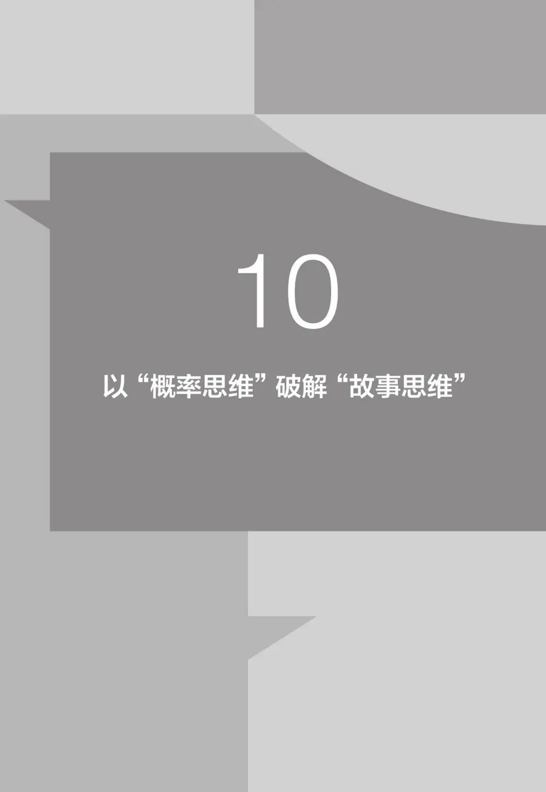

2025年5月20日

21:15

## 财富是认知的变现（上海老牌百亿私募基金重阳投资合伙人舒泰峰首部投资专著，教你避开投资中的12个陷阱。大开脑洞，开启12篇老子与巴菲特的时空对话，带你轻松领会投资哲学。）

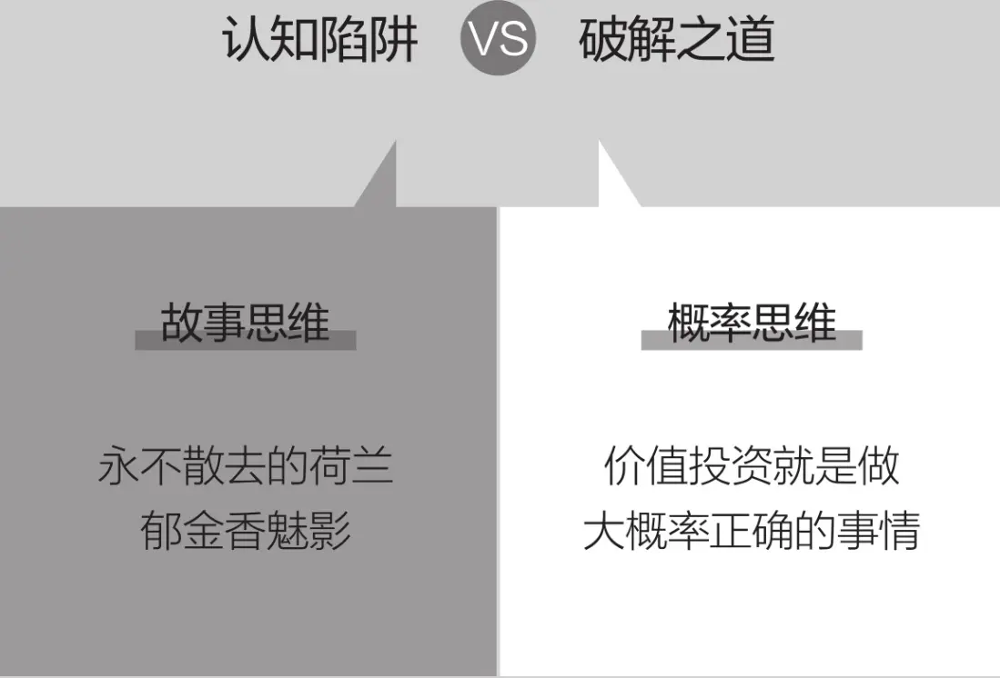

2025年5月20日

21:15

## 认知陷阱10：故事思维 永不散去的荷兰郁金香魅影

__认知陷阱10：故事思维__

__永不散去的荷兰郁金香魅影__

在几十万年前的地球上，同时存在着至少7种不同的人类。有来自欧洲，身材魁梧肌肉发达，适应白雪皑皑环境的“尼安德特人”；有来自东方的亚洲，存续时间约达200万年的“直立人”；有来自印度尼西亚，身材矮小，体重轻，适应热带生活环境的“梭罗人”“弗洛里斯人”；有来自西伯利亚的“丹尼索瓦人”；有慢慢进化而成的“鲁道夫人”；还有唯一留存下来的我们——“智人”。

智人为什么能够存活下来？以前的解释是智人懂得使用工具和火。但是牛津大学著名历史学家尤瓦尔·赫拉利却提出了一个十分新颖的解释。他认为，智人之所以能征服世界，是因为有独特的语言。在大约距今7万年到3万年前，智人发明了独特的语言，产生了新的思维和沟通方式，从而引发了一场认知革命。

智人用独特的语言开始学会“讲故事”。举个例子，不论是人类还是其他动物，都能大喊“小心，有狮子”。但在认知革命以后，智人却能说出“狮子是我们部落的守护神”。又比如你对一只猩猩说：“把你手里的香蕉给我，因为这个善举，死后你将进入猩猩天堂，那里有取之不尽的香蕉。”猩猩肯定不会理你，但是人类会。

赫拉利认为，会不会讲故事对于部落治理来说具有实质性的意义。一个猩猩的部落最多也就能容纳20～30头猩猩，再多就肯定会出现混乱而导致部落分化。

故事也有等级，低等级的故事是“八卦”。赫拉利引用经典社会学研究成果“邓巴数字”来做解释，“邓巴数字”也被叫作“150定律”。根据这个定律，如果一个团体只靠个体和个体之间的“八卦”交流来维持，那这个团体的最大规模就是150人。只要在这个范围内，你不需要有什么制度规范，单靠人际关系就能维持其正常运作，比如一个小公司、一个小村落等。

但是一个组织要想跨过150人的门槛，就需要更高级的故事了。比如天主教，所有人都相信耶稣受难的故事，由此教徒之间建立起了强大的精神纽带。故事说得成功，便能够调动数以百万计的陌生人通力合作，为了共同的目标而努力。可以说，讲故事是人类拥有的核心元能力之一。“人类和黑猩猩之间真正不同的地方就在于那些虚构的故事，它像胶水一样把千千万万的个人、家庭和群体结合在一起。这种胶水，让我们成了万物的主宰。”1

__叙事改变历史__

故事在某种意义上改变了历史。诺贝尔经济学奖得主罗伯特·J\.希勒（Robert J\. Shiller）在《叙事经济学》一书中记载了许多类似的案例。在希勒的框架中，叙事与故事是同义词。

1907年，两个投机者操纵铜矿公司股价失败，导致一家信托公司倒闭。这件小事就像一只扇动翅膀的蝴蝶，引发了一场“完美风暴”，这场金融大恐慌是资本主义历史上最严重的金融危机之一。在1907年的大恐慌中，有一则影响力格外广泛的故事，是说美国当时最著名的银行家约翰·皮尔庞特·摩根（J\. P\.摩根）在美国没有设立中央银行的情况下，自掏腰包并说服其他银行家一起出手拯救了银行系统。这可谓现实版的“为国接盘”。这个故事被广为传颂，后来的美联储就是以J\. P\.摩根在1907年建立的银行家联盟为蓝本成立的。而自美联储成立以来，每一任主席都化身为J\. P\.摩根，融入这一叙事，尤其是在金融危机当中，他们纷纷效仿摩根出手拯救金融系统。2

“9·11”事件无疑给美国带来了重大打击。这次恐怖袭击发生在2000年科网泡沫之后的2001年，人们普遍担心经济可能会陷入持续衰退，因为大家都害怕再次发生这样的袭击，于是选择留在家中。

然而结果却恰好相反，当年11月，经济衰退结束，美国经济几乎立即复苏，这次经济衰退成为美国历史上最短的经济衰退之一。希勒认为这与恐怖袭击之后的叙事反转相关。袭击发生两周之后，美国总统小布什向航空业雇员和全体国民发表了讲话：“我们必须通过重返工作岗位来对抗恐怖主义。这个重要行业中奋战在工作岗位上的每一个人都在明确宣告：恐怖主义不会得逞，这些作恶者吓不倒美国、美国雇员和美国人民……他们发动袭击的时候，是想营造一种恐慌气氛。这场国家战争的一个伟大目标就是恢复公众对航空业的信心。那就是，告诉出行的民众：请登机。”3

美国总统的策略显然是成功的，他把恐怖袭击描绘成了一场战争并激发了国民的斗志，勇气战胜了恐惧，推动了经济复苏。

这可能是第二次世界大战时英国首相丘吉尔演讲的翻版，在最艰苦时刻，丘吉尔发表了第二次世界大战中最精彩的一场讲话，他说：“这次战役尽管我们失利，但我们决不投降，决不屈服，我们将战斗到底，我们将在法国战斗，我们将在海洋上战斗，我们将充满信心地在空中战斗！我们将不惜任何代价保卫本土，我们将在海滩上战斗！在敌人登陆地点作战！在田野和街头作战！在山区作战！”这样的演讲极大地鼓舞了军队和国民的勇气和信心。

根据政治学家斯蒂芬·范·埃弗拉（Stephen Van Evera）的研究，第一次世界大战的爆发至少也要部分归因于一条虚假叙事的病毒式传播。被他称为“进攻崇拜”的这则叙事提出了一个理论，即对另一国发起进攻的国家往往有先发制人的优势。这一理论最终导向了局势的不稳定：各方都想先发制人。德国就认为自己有“机会”成功地对俄国发起“先发制人的战争”。在这样的叙事之下，其后果就是各大国之间规模巨大的军备竞赛。4

__永不散去的荷兰郁金香魅影__

1929年美国股市崩溃之前流传着一个故事，说约翰·肯尼迪的父亲约瑟夫·肯尼迪在股市中赚了许多钱。有一天他发现自己的鞋子需要擦一擦了，就找来了鞋童，当他坐在椅子上时，鞋童主动给他提了一些建议，告诉他应该买哪些股票。连鞋童都在玩股票，这让约瑟夫·肯尼迪大吃一惊，回家之后赶紧清空了股票，从而躲过了股市大崩溃。

不只是鞋童，各行各业的人都在传播着一夜暴富的故事：有位经纪人的男仆在股市上赚了将近25万美元；一位训练有素的护士按照心存感激的病人提供的秘诀，获得了3万美元的收益；有位年轻的银行家拿出为数不多的资产，投资奈尔斯–比门特–庞德公司的股票，过上了富足舒适的生活；有个寡妇从肯尼科特铜业公司获得的收益，足够买一所气派宽敞的乡间别墅；甚至连思想反叛的知识分子也置身其中，他们一边为标准化和批量生产对美国人生活的可怕影响而长吁短叹，一边却在准备收获股市的丰硕成果……51929年10月15日，也就是美股大崩盘前的两周，耶鲁大学著名教授欧文·费雪在纽约采购代理商协会发表讲话，表示美国股市已经登上了“永久的高原”，报纸在接下来的一段时间里反复报道了这一观点。6

1929年离我们太远了，但只要回顾一下2007年和2015年中国A股的牛市，就会发现情形何其相似。各行各业的人都以炒股为乐，甚至僧人都耐不住寂寞，下水开户炒股。两次牛市中都流传着众多一夜暴富的案例。

有一些故事显得十分隐蔽，比如2015年股市疯狂时有人根据国家领导人某次出行时伸出的一根手指而杜撰出“股市要上10000点”这样的隐喻，以对应“改革牛”的愿景。不可思议的是类似这样的隐喻竟传播得十分广泛。事实上，“改革牛”本身也变成了一个故事，它非常容易调动起股民们的集体幻想，似乎勇敢地冲进股市是为改革事业添砖加瓦，殊不知却变成了“接盘侠”。股市有本身运行的规律，物极必反，它不因个人的美好愿景而转移。

股灾当中同样有形形色色的故事推波助澜。1929年美国股灾当中流行的是什么故事呢？自杀的故事。10月24日是股价暴跌的著名“黑色星期四”，当天下午，令人难以置信的流言蜚语就开始四处蔓延：11个投机商自杀身亡，布法罗和芝加哥交易所已经关闭，军队被调集到纽约证交所外与愤怒的暴徒剑拔弩张。7美国著名历史学家约翰·肯尼斯·加尔布雷思（John Kenneth Galbraith）在《1929年大崩盘》中专门考据了股灾之后的死亡人数，他的结论是无论是在发生崩盘的几个月里还是1929年全年，自杀人数都没有急剧增加，但是在大萧条以后的几年里，自杀率有所上升。然而，各种自杀的情形却被大众报刊描述得有鼻子有眼，比如“投资者从高楼窗口往下跳，行人灵巧地在坠楼身亡的金融家尸体之间穿行”之类。8股灾两个月后，路易斯维尔《信使报》（*The Courier Journal*）的一篇报道这样写道：“别对自己开枪！每每看到有人在50岁的年纪自杀身亡的消息，我都倍感震惊。”

一位商人的妻子也说道：“我觉得这阵狂热好像不是真实的。大萧条是如此真实，以至于显得不真实了。它令人恐惧，有人为之跳窗自杀。”9

金融市场中类似的癫狂与覆灭的故事起码可以追溯到近400年前的荷兰“郁金香泡沫”。1637年2月，一株名为“永远的奥古斯都”的郁金香售价高达6700荷兰盾，这笔钱足以买下阿姆斯特丹运河边的一幢豪宅，而当时荷兰人的平均年收入只有150荷兰盾。

“永远的奥古斯都”，听听这名字就知道郁金香已经被神化了，正如历史学家查尔斯·麦基所描述的：“谁都相信，郁金香热将永远持续下去，世界各地的有钱人都会向荷兰发出订单，无论什么样的价格都会有人付账。在受到如此恩惠的荷兰，贫困将一去不复返。无论是贵族、市民、农民，还是工匠、船夫、随从、伙计，甚至是扫烟囱的工人和旧衣店里的老妇，都加入了郁金香的投机。无论处在哪个阶层，人们都将财产变换成现金，投资于这种花卉。”10

后来英国“南海泡沫”中有关南美洲巨大的金银矿藏的故事，法国“密西西比泡沫”中有关贸易特许权的故事、20世纪80年代日本房地产永远上涨的故事、2000年科网泡沫中新经济的故事，包括离我们最近的乐视网的故事等，其实都是荷兰郁金香故事的翻版。荷兰郁金香的魅影每隔若干年就要重临一次人间。

看过股市繁荣与萧条的交替就不难发现，股市某种程度上是被故事或者说叙事推动的，故事和叙事改变着人们的心理预期，心理预期导致了股市的涨跌。《仅仅是昨天》一书作者弗雷德里克·刘易斯·艾伦（Frederik Lewis Allen）总结得很好：“繁荣不仅是经济形势，也是一种心理状态。大牛市不仅是商业周期的顶峰，也是美国民众的思想和情感周期的顶峰。在这个国度，几乎每个人的生活态度都受到大牛市的感染，如今他们也受到希望瞬间破灭的打击。随着大牛市和繁荣时代悄然远去，美国人发现自己的生活环境有所改变，需要新的调整、新的观念、新的思想习惯和新的价值观念。”11

故事容易深入人心，许多投资者会被故事所捕获，结果在市场疯狂时被卷入旋涡，又在市场暴跌中被推入悬崖。可见，简单的故事思维要不得。

__破解之道10：概率思维__

__价值投资就是做大概率正确的事情__

在投资实践中，有些顶尖高手可以在故事的世界里如鱼得水。乔治·索罗斯就是其中最杰出的代表之一，他有一句名言：“世界经济史是一部基于假象和谎言的连续剧。要获得财富，做法就是认清其假象，投入其中，然后在假象被公众认识之前退出游戏。”通俗地说就是识别泡沫，参与泡沫，然后在泡沫破裂之前离开泡沫。

不过索罗斯的话本身已经指出了在故事中获利的难处，因为故事是真真假假的，其中往往掺杂着夸张的成分甚至是谣言，索罗斯将它概括为“假象”可以说十分精到。《科学》杂志上曾发表过一则研究，这项研究通过社交媒体数据对比真实故事的传播率与虚假故事的传播率。研究者研究了经由300万人传播的126000条谣言，发现虚假故事在推特上的转发率是真实故事的6倍。在当今这个流量时代，故事的讲述者更是用尽心思，充分挖掘一个事实的矛盾冲突点并进行夸张和极端化，因为只有这样才能在海量的信息流中获得眼球。所以，从某种意义上而言，越是阅读量达“10万\+”的文章可能离真相越远。

故事的背后是人性所组成的大众情绪，所以要识别故事的真假就要识别大众情绪。但是正如中国老话所说，“知人知面不知心”，了解一个人的心尚且不易，何况要识别由亿万个体组成的群体情绪。

由于故事或叙事在股市运行中占据重要的地位，因此我们必须要重视故事，如果能够识别其发展程度，那么就可以借助逆向思维加以利用。但无论是索罗斯还是巴菲特，都是绝顶高手，俗话说“没有金刚钻，不揽瓷器活”，如果你没有高超的技能，那么最好还是老老实实地从基本功做起。

这基本功是什么呢？在价值投资者看来，其中非常重要的一项便是概率思维。

__价值投资就是做大概率正确的事情__

概率论是研究随机现象数量规律的数学分支，是一门研究事情发生可能性的学问。概率论的起源与赌博问题有关，后来逐步被广泛应用于自然科学、经济学、医学、金融保险甚至人文科学中。

概率论是一门博大精深的学问，这里只简单介绍几个在投资中经常涉及的概念。

数学期望值：巴菲特曾指出，“我们所要做的全部就是，将盈利概率乘上可能盈利的数量，减去亏损概率乘上可能亏损的数量”。

投资本质上是对未来的预期以及概率的结合，变成公式就是：*Ea*=*E1*×*P1*\+*E2*×*P2*\+*E3*×*P3*\+……其中*E*代表对这项投资的预期回报率，*P*代表这项投资成功的概率。这样便可推算出来预期回报*Ea*是多少。

简单说，如果投资一只股票有80%的可能性赚钱，股票上涨幅度可能是2美元，那么同时这也意味着有20%的可能亏钱，假设它下挫的幅度是4美元。用预期收益就是1\.6美元减去预期亏损的0\.8美元就得出0\.8美元（2×80%–4×20%=0\.8）的数学预期收益。只要这个数学预期收益为正，那么这就是一项值得的投资。不少投资者会被动听的故事所左右，比如，听信传言说某只股票即将迎来重组，一旦成功，股价将翻倍，这当然很诱人，但是他对这件事情发生的概率是多少却一无所知。如果发生的概率只有10%，不发生的概率却有90%，那么根据公式，这项投资极有可能是失败的。

大数定律：在随机事件的大量重复出现中，往往呈现几乎必然的规律。换句话说，在试验不变的条件下，重复试验多次，随机事件发生的频率近似于它的概率。偶然中包含着某种必然。比如抛硬币游戏，如果抛的次数足够多，那么正面或反面落地的概率会无限接近50%，这就是“大数定律”。

有些人总是格外相信自己的运气或者被少数成功的案例所诱导，觉得硬币落地的那面一定会有利于自己，实际上具备最基础的概率思维就知道，每一次抛掷硬币正反两面落地的概率都是50%。所以在这场游戏中你很难获胜，即使获胜也仅仅是因为运气。

幸存者偏差：1940年，在英国和德国的空战中，英国损失了不少轰炸机和飞行员。因此当时英国军部的一大课题就是研究在轰炸机的哪个部位装上更厚的装甲可以提高飞机的防御能力。当时的英国军方研究了那些从欧洲大陆空战中飞回来的轰炸机。经过统计，飞机上的弹孔主要集中在机身中央，也就是两侧的机翼和尾翼部分。因此研究人员提议，在上述三个弹孔最密集的部分加上装甲。这一建议被美国军队统计研究部的统计学家亚伯拉罕·沃尔德（Abraham Wald）否决。沃尔德连续写了8篇研究报告，指出这些百孔千疮的轰炸机是从战场上成功飞回来的“幸存者”，因此它们机身上的弹孔对于飞机来说算不上致命。但是“死人是不会说话的”，要想救那些轰炸机飞行员的性命，更正确的方法应该是去研究那些被打中并坠毁的轰炸机。经过研究，那些坠落的轰炸机被击中的主要是油箱和发动机的位置。

知道了“幸存者偏差”可以免去很多麻烦，比如不要拿姚明的篮球水平与自己相比。投资也是如此，要时时考察自己买的股票或者基金是不是由某种特殊原因造成的幸存者偏差。

__概率思维的终极启示：不过度押注__

赌场为什么长盛不衰，赌徒为什么十赌九输？赌徒们不知道，他们并不是输在运气上，而是输在不懂概率上。他们不知道赌场的设计原理背后站着的是一群神一般的数学家：高斯、凯利、伯努利……

来看一个被投资界广泛使用的凯利公式，它被誉为“资金管理神器”，被巴菲特和比尔·格罗斯等投资大佬频繁使用。

凯利公式很简单：*f*\*=\(*bp*\-*q*\)/*b*。

*f*\*为现有资金应进行投注的比例；*b*为投注可得的赔率；*p*为获胜的概率；*q*为失败的概率，即1\-*p*。

用这个简单的公式，你就可以知道在一个赌局当中应当下注的比例。举个例子，扔硬币下注，硬币为正面得3元，为反面则输掉1元。那么这个赌局的赔率为3赔1（成功时的盈利3/失败时的亏损1）。同时我们知道硬币抛出正反面的概率都是50%，所以*p*、*q*的概率都是0\.5。所以答案*f*就是（*bp*\-*q*）/*b*=（3×50%–50%）÷3=33\.3%。也就是你应当拿出本金的33\.3%来下注，才能使赌局收益最大化。如果有1000元本金，那么下注333块是最合理的选择。

在这个公式中，（*bp*\-*q*）为期望值。当它为负时，你不具备任何优势，自然不应下任何赌注。当它为0时，显然也不应下任何赌注。只有当（*bp*\-*q*）为正时，方可以下注。最关键的是，凯利公式告诉我们：除非能够确保100%赢，那么任何时候都不应下全部赌注。

过度押注是赌徒们的亏损之源，运用凯利公式可以避免这一点。如果更谨慎一点，还可以使用“半凯利公式”。也就是当凯利公式告诉你使用20%资金的时候，你只用10%。这与投资中安全边际的概念原理相通。价值投资，说到底就是做大概率正确的事情。

当然，关于这一点也是辩证的。巴菲特虽然十分注重安全边际，主张不过度押注，但是当机会来临比如2008年金融危机的时候，他也主张“应该用大桶去接，而不是用小小的指环”。这个时候为什么巴菲特敢于下重注呢？因为在那种特殊情况下，股价被大幅错杀，即使全仓押上，也仍然是安全的。

__重阳实践：全概率接力法__

作为国内老牌的价值投资私募机构，重阳投资也是概率思维的深度践行者。

重阳投资创始人、首席投资官裘国根曾概括，成功投资的前提是深入地进行“全概率”的基本面分析。“理性投资有三个层次：概率思维、算期望值和防黑天鹅。”裘国根说，概率思维是理性投资中最初级的层次。长期来看，较高的投资期望值源自“知行合一的数学思维”和“良好的基本面判断能力”的结合。

具体在个股选择中，重阳会选择收益率数学期望值最大的标的。举个例子，假设针对股票A未来有三个情景模式，每个情景模式都有一个相应的概率和不同的预期收益率。将这三种情景下的收益率和概率的乘积求和就得到了股票A的期望收益率。用同样的方法计算出其他股票的期望收益率，最后再放在一起进行比较。在重阳内部，投资标的被分成了四大类型：

1．成功概率很高、成功后收益率中等，失败概率很低、失败后亏损率很低。

2．成功概率很低、成功后收益率很高，失败概率很高、失败后亏损率很高。

3．成功概率中等、成功后收益率很高，失败概率中等、失败后亏损率很低。

4．成功概率很高、成功后收益率很高，失败概率很低、失败后亏损率很低。

“重阳做投资，进入组合的股票肯定是第一、第三、第四类的机会，如果发现了第四类机会，那就要重仓出击，两个脚往上站。”裘国根说。投确定性更大的标的，并长期坚持下去，胜率自然就高，绝对收益就高。

通过比较期望值确定投资标的后，持有多久卖出呢？重阳投资提出了“价值投资接力法”，即投资标的达到预期收益后不再简单机械地长期持有，而是通过“接力”的方式换成另一个安全边际更大的投资标的。

巴菲特价值投资的思路是买入并持有，然后伴随公司共同成长。而重阳认为在一个高度信息化的时代，市场有效性越来越强，把价值投资简单地理解成长期投资是一个误区，接力法更符合A股市场特点。裘国根说：“重阳不简单梦想在一只股票上赚8倍，但通过‘接力’的方式先后在3只股票上赚1倍，同样可以达到赚8倍的效果，而且后者容易得多，现实得多，流动性也好得多。”12

重阳要赚的是上半场的钱，而不是下半场的钱，尤其不赚最后一部分的钱。这一理念的背后，有对收益率的考虑，更多的是对风险的考虑。上半场和下半场的收益率即使是一样的，但风险肯定不一样。如果长期坚持“赚上半场的钱”，那么收益率一样的情况下，波动率就更小。概率思维贯穿重阳投资实践的始终。

2025年5月20日

21:15

## 老子对话巴菲特 致虚极，守静笃

__老子对话巴菲特__

ROUND 10

__致虚极，守静笃__

老 子：上次我们谈到了周期思维和辩证法，应当说它确保了逆向思维的有效性，非常有意思，这也是我个人极为看重的一个理论。今天我想接着问问两位，辩证规律的发现对你们的投资心态还有没有更进一步的影响？

巴菲特：的确是有的。“我们的所作所为没有超越任何人的能力范围，我感觉我做投资和我做管理没有什么两样，根本不必为得到超凡的结果去做什么超凡的事情。”

老 子：你的意思是说，因为掌握了事物发展的普遍规律，所以你们在投资中变得淡定，并且能够抛弃幻想，服从常识？

巴菲特：没错。“我们之所以取得目前的成就，是因为我并不试图跨过七英尺高的栏杆，我到处找的是我能跨过的一英尺高的栏杆。”

老 子：话虽然这么说，但是霍华德·马克斯的钟摆总是来回摆动，总要做些什么才能抓住投资的好时机吧？

巴菲特：恰当的行动虽然是重要的，但是等待也是十分必要的。

老 子：怎么理解？

巴菲特：我们请小舍直接介绍案例吧。

小 舍：没问题，案例已经准备好。

巴菲特先生在历次股灾中的表现最好地阐释了“等待”的重要性。

1973年1月到1974年10月，美国股市暴跌50%。由于早就判断美国股市估值过高，巴菲特早在1969年9月就退出了股市，选择持有现金。出乎意料的是，虽然一年之后股市最低跌到68点，但又迅速反弹，并连续上涨2年多，1973年1月11日，标准普尔500指数最高121点。之后才开始暴跌。暴跌的时候，其他人纷纷不计成本地低价抛售。巴菲特却非常淡定，从容出手，大胆买入。他在接受《福布斯》的记者访问时说：“我觉得我就像一个非常好色的小伙子来到了女儿国。投资的时候到了。”说起来很轻巧，实际上这个股市调整的过程，巴菲特一等就是5年。

1987年的股灾来得快去得也快，从8月到10月暴跌了36%，但由于跌得太快，所以巴菲特也没有抓住时机，他在1987年度致股东的信中坦承：“1987年10月，确实有几只股票跌到了让我们感兴趣的价位，不过还没有买到对组合具有影响意义的数量，它们就大幅反弹了。”

不过，巴菲特并不为错失这次调整感到懊丧，他请投资者放心：“市场先生将来一定会提供投资机会，而且一旦机会来临，我们十分愿意也有能力好好把握住机会。”

暴跌后的第二年，机会来了，巴菲特开始大量买入可口可乐，到1989年，2年内买入可口可乐10亿美元，1994年继续增持后总投资达到13亿美元。1997年年底巴菲特持有可口可乐股票的市值上涨到133亿美元，也就是说，已经变成了本金的10倍。

2000年的时候，美国科网泡沫破裂，从当年3月到2002年10月美国股市暴跌50%。但是巴菲特却并不急于抄底，因为他想买的很多股票还不便宜。直到2003年巴菲特才终于开始出手，买入中石油。2005年大量买入，投入股市的资金规模从2002年年底的90亿美元猛增到160亿美元。

老 子：巴菲特先生果然是个守株待兔的高手。不过我有点好奇，在股市暴跌的时候，你都在做些什么？

小 舍：关于这个我可以补充一个故事。1987年10月19日，股市暴跌，在一天之内，道琼斯指数跌了508点，跌幅高达22\.6%。一天之内巴菲特先生的财富损失了3\.42亿美元，短短一周之内伯克希尔–哈撒韦公司的股价就暴跌了25%。在暴跌那一天，巴菲特可能是整个美国唯一一个没有时时关注正在崩盘的股市的人，因为他的办公室里根本没有电脑。在暴跌的那一刻，巴菲特和往常一样安安静静待在办公室里，打电话、看报纸、看上市公司的年报。

老 子：巴菲特先生的确淡定。

巴菲特：谢谢赞赏。不过这确实是我的诀窍，“当没有合适的事情可做时，就什么也不做”。如果我们不能在自己有信心的范围内找到需要的，我们不会扩大范围。我们只会等待。

老 子：芒格先生，你也一样喜欢等待吗？

芒 格：是的，“我们的投资规矩是等待好球的出现”。“你需要的不是大量的行动，而是大量的耐心。你必须坚持原则，等到机会来临，你就用力去抓住它们。”

老 子：等待的时候你会做什么？

芒 格：“我们花很多时间思考。我的日程安排并不满，我们坐下来不停地思考。从某种意义上来说，我们更像学者而不是生意人。我的系统总是坐下来静静地思考几个小时。我不介意在很长的时间里没有任何事情发生。”

老 子：听说股票交易是一个高度活跃的游戏，安静地等待恐怕并不容易吧？

巴菲特：“在华尔街，每5分钟就互相叫价一次，人们在你的鼻子底下买进卖出，想做到不为所动是很难的。”

老 子：可以想象，人的天性总是喜欢多动多说，在我生活的那个时代就已经是这样，所以我说过一句话：“多言数穷，不如守中。”

巴菲特：没想到老先生在2500年前就有类似的感慨了，这倒出乎我的意料。不知能否详细解释一下这句话？

老 子：这句话字面的意思是说，一个人如果说话太多，往往会使自己陷入困境，还不如保持虚静沉默，把话留在心里。也有人做政治化的解释：政令繁多却屡遭失败，还不如虚静无为。今天听起来，与投资倒也有相通之处。

巴菲特：是的，股票市场充斥着多动症患者，我毫不客气地说过，“一个过度活跃的股票市场其实是企业的窃贼”。

老 子：在我看来，动和静也是一对辩证关系，它们互相依存、互相包含、互相转换，但是普通人都只知道动的好处，不知道静的好处。事实上，不知道静，往往是妄动。这是我2500年前就反问过的：“谁可以像浑浊的水流一样停止流动，安静下来慢慢变得澄清？谁可以像草木那样保持长时的静寂，却萌动生机而不息？”

巴菲特：老先生竟直接说白话文了，不知在古文中是哪一句？

老 子：啊哈，聊得高兴，竟忘了介绍原文，这句话原文是“孰能浊以静之徐清；孰能安以动之徐生”，收于《道德经》第十五章。

巴菲特：老先生总能从大自然当中总结出哲学，的确很高明。

老 子：其实，你看看，连天地都是这样的。“天地之间，其犹橐籥乎？虚而不屈，动而愈出。”

巴菲特：这又作何解释？

老 子：这句话的意思是：天地之间，岂不像个风箱一样吗？它空虚而不枯竭，越鼓动风就越多。

巴菲特：所以，大自然之所以生生不息正是由于天地之间的虚静？

老 子：是的，所谓“夫物芸芸，各复归其根。归根曰静，静曰复命”。也就是说，看那万物纷纷芸芸，各自返回它的本根，返回到它的本根就叫作清静，清静就叫作复归于生命。

巴菲特：看来老先生对虚静情有独钟。

老 子：可以这么说，所以我主张修为的根本之道是“致虚极，守静笃”。

巴菲特：怎么理解？

老 子：这句话是建议修为之人要尽力使自己的心灵达到虚寂，最好虚寂到极点，保持自己的生活清静，而且不能三心二意，要坚持不变。

巴菲特：精彩！如果做投资能够做到这个境界，那么多动症一定会被治愈，安静地等待也就不会太难了。

老 子：我讲的是一种理想状态，现实环境复杂得多，尤其现代生活中，故事和谣言满天飞，噪声无处不在，所以我很好奇，你和芒格先生有什么具体的方法可以让自己在投资中做到安静地等待？

巴菲特：在我看来，“任何刺激你瞎折腾的环境，都要远离。华尔街无疑就是这样的环境”。

老 子：所以你远离华尔街，选择住在奥马哈这样的偏僻小镇？

巴菲特：可以这么说吧。“我回到奥马哈之后，每半年都去大城市一次。我每次都列一个清单，把自己要做的事写下来，比如要去调研的公司等。这些路费都没白花，该做完的事，做完了，我就回到奥马哈思考。”

老 子：这正是我喜欢的生活状态，想当年我也喜欢躲在图书馆里，静静地思考。

巴菲特：同好，握手！

2025年5月20日

21:15

## 11 以“谨慎小心”破解“黑天鹅”

2025年5月20日

21:15

## 财富是认知的变现（上海老牌百亿私募基金重阳投资合伙人舒泰峰首部投资专著，教你避开投资中的12个陷阱。大开脑洞，开启12篇老子与巴菲特的时空对话，带你轻松领会投资哲学。）

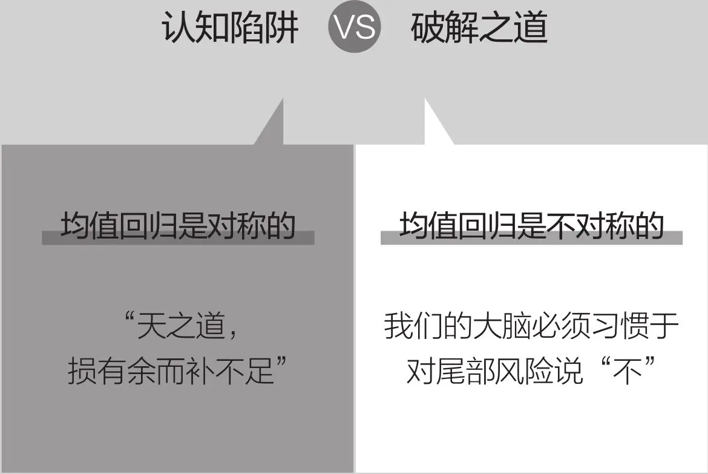

2025年5月20日

21:15

## 认知陷阱11：均值回归是对称的 “天之道，损有余而补不足”

__认知陷阱11：均值回归是对称的__

__“天之道，损有余而补不足”__

在我们的生活中，对称性现象随处可见。蝴蝶、蜻蜓、鸭子这些动物是对称的；我们人造的书本、杯子、手机、房子也基本是对称的；自然界中的日升月落、斗转星移是对称的；我们用来感知世界的双眼、双耳、双手也是对称的……

动物界的对称可能蕴含着某种进化机制。对称的结构可以让动物更准确迅速地应对外界环境中的危险。那些左右对称生物可对环境进行利用的部分可能是不对称生物的2倍。的确，对称的东西更为实用。一栋建筑如果是对称的，那么它的空间利用效率明显要高于那些非对称的构造。桌子的对称有利于保证它的平稳。汽车的对称使它在行驰过程中保持平衡。

在实用的基础上，对称还演变成了一种美学。尤其中国人似乎对对称的美学格外痴迷。看看中国的建筑，无论是宫殿、庙宇、亭台、楼阁、园林无不显示着对称之美。如果不相信，不妨去看看故宫，它绝对是对称美学的典范。整个紫禁城沿着中轴线均匀有序地分布着殿堂、牌坊，再看细节，无论是飞檐翘角还是房间内的纹饰，无处不传递着对对称的钟爱。建筑大师梁思成就曾说过：“无论东方、西方，再没有一个民族对中轴对称线如此钟爱与恪守。”

对称性也是物理学的核心概念之一。物理学的许多规律、定律、方程、模型都是存在对称性的：远到经典物理学的动量定理，近到爱因斯坦的广义相对论；大到万有引力定律，小到粒子的运动。可以说正是因为物理存在对称性，所以物理的很多模型、规律、定律、方程才成立。

数学中也充满了对称性，比如著名的正态分布。正态分布又称高斯分布，是统计学中最重要的一种概率分布，它描述的是某件事出现不同结果的概率分布情况，属于一般规律。正态分布的概率密度函数曲线呈钟形，因此人们又经常称之为钟形曲线。钟形曲线的特点是：两头低，中间高，左右对称，曲线与横轴间的面积总和等于1（见图11\-1）。

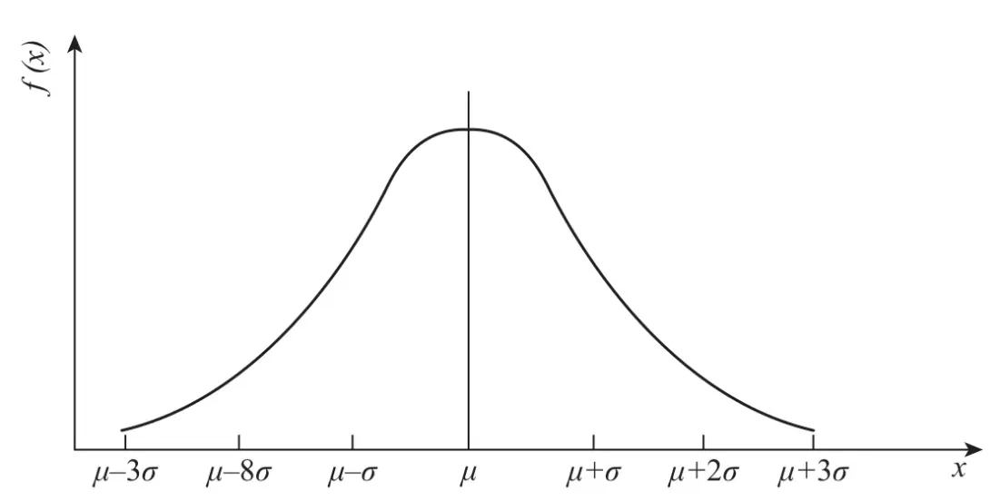

图11\-1 正态分布曲线

注：*μ*代表期望，*σ*代表标准差。

以身高为例，假设抽样调查某个学校100名18岁男大学生的身高，身高的均值为172\.70厘米，图形会显示中等身高的人比较多，而特别高的和特别矮的人比较少。偶然出现一个姚明那样身高的人并不会改变统计结果，除非出现一群姚明。除了男女身高，人的寿命、血压、考试成绩等，都属于正态分布。可以说，正态分布是自然界典型的形态。

__“富不过三代”与均值回归__

为什么要讲对称性和正态分布，因为由它们衍生出来的另外一个重要概念与股票投资有关，那就是“均值回归”。“均值回归”是由查尔斯·达尔文的表兄弟弗朗西斯·高尔顿发现的。它以正态分布假设为基础，认为事物在长期的变化过程中，总有向“平衡位置”（或均值位置）靠拢的倾向。

大约1875年，高尔顿用一种香豌豆种子做实验。香豌豆坚硬而多产，而且不宜杂交。每个豆荚中豌豆的大小基本一致。在称量和测量了成千上万的香豌豆后，高尔顿将7种不同重量的香豌豆送给了9位朋友，每个重量送10个样本豌豆。这9个朋友遍及不列颠群岛，其中也包括达尔文。高尔顿告诉朋友们要认真按照特定的条件种植这些豌豆。

经过大量艰辛的实验，高尔顿发现，母豌豆的后代都呈现出正态分布特征，同时母豌豆的直径变化范围比子豌豆直径变化范围要大很多。母豌豆平均直径为4\.572毫米，其变化范围为3\.810～5\.334毫米，或者说是在平均值4\.572毫米两侧各0\.762毫米之内。子豌豆的平均直径为4\.140毫米，其变化范围是3\.912～4\.394毫米，或者说是仅在平均值4\.140毫米两侧各约0\.254毫米范围内变动。也就是说子豌豆直径的分布比母豌豆直径的分布更为紧凑。另外，最大的母豌豆孵育出来的子豌豆平均直径要小于母豌豆，而最小的母豌豆孵育出来的子豌豆平均直径要大于母豌豆。

这就是“均值回归”的来源，高尔顿写道：“回归是理想后代的平均类型偏离其父辈的倾向，并且大概要回归到被称为父辈的平均类型中去。”这种回归在自然界是非常必要的。因为如果这种回归的进程不存在的话，那么，大的豌豆会繁殖出更大的豌豆，小的豌豆会繁殖出更小的豌豆……如果这样，这个世界就会两极化，只有侏儒和巨人。大自然会使每一代的豌豆变得越来越畸形，最终达到我们无法接受的极端。

有趣的是，高尔顿还发现，人类的命运在某种程度上跟香豌豆的规律差不多。他做了个统计，在杰出人物的儿子中，仅有36%的人仍旧是杰出人物，更糟糕的是，在其孙子辈中，仅有9%的人还称得上是杰出的。这正印证了孟子所说的“君子之泽五世而斩”。老子也说过：“天之道，损有余而补不足。”网络上流传着不少这样的帖子，说父母是北大或其他名校的“学霸”，子女却是“学渣”，父母为此感到十分无奈。其实，如果懂得了“均值回归”的道理，父母或许也就释然了。高尔顿写道：“这个法则（均值回归）是公平的：不论是好的方面还是坏的方面，在遗传时都会有所减少。如果这个法则使那些奢望天才的后代会全部继承父辈才华的人大失所望，它也同时使某些害怕其子女会继承他们缺陷和疾病的人不再万分恐惧。”1

__“新手死于追高，老手死于抄底”__

“均值回归”的理论后来被带到了股票市场，它揭示了股票涨多了会跌，跌多了会涨的规律。上一篇讲到的股票市场中的周期便是“均值回归”的反映。

但是，需要注意的是股市中的“均值回归”并不像自然界那么精准无误。股市急速上涨了800点之后或许会发生回调，但是它的调整幅度并不一定是800点，股市的上涨和下跌并非是完全对称的。在《圣经》中，约瑟对法老王预言七个富年后必是七个荒年，从大的原理上来说，这个预言是成立的，但是七个富年后，到底是七个荒年，还是三个荒年，又或者是九个荒年，就不得而知了。

如果股市的周期是对称的，那投资将变得太容易，在股价跌到均值以下的时候买入就能确保赚钱了。但是正如股谚有云，“新手死于追高，老手死于抄底”，股价的均值本身是个变化的数字，盲目抄底是个十分危险的动作。

连被誉为华尔街最杰出股票作手的杰西·利弗莫尔也曾因为抄底而大败亏输。1929年美国股市大崩溃，到1932年7月时，股指跌得只剩下原来的11%。由于跌幅实在太大，反弹的速度也非常迅猛。在之后的42天中，道琼斯指数反弹了93%。利弗莫尔判断市场已经见底，于是在反弹顶部大举做多。事后看来，这一次的反弹是一次经典的“死猫反弹”（Dead Cat Bounce）。此后美股从1932年9月到1933年2月，又跌去了40%。利弗莫尔承受了巨大损失，1934年，他宣告破产，欠下了500万美元的债务。

在股市中，均值终将回归，但是关键在于时间，如果你没有足够的实力或者耐心等到回归的那一天，悲剧也同样难以避免。投资史上著名的老虎基金在1998年8月全盛时期管理的资产多达220亿美元，比索罗斯的量子基金还高出一大截，是当时规模最大的对冲基金，其创始人朱利安·罗伯逊因此被人们推为华尔街最具影响力的人物。也是在那一年，股市进入了科网泡沫之中，科技股鸡犬升天，坚持价值投资的罗伯逊按照自己的标准买入了大量的“旧经济”股份，而这些股份由于市场资金流入“新经济”股而持续大跌，如他持有逾22%股权的美国航空，在12个月内失去近五成的市值。另外，他利用杠杆卖空没有盈利的科技网络股，先后沽空了两大热门股票朗讯科技（Lucent Tech）和美光科技（Micron Tech），却遭遇重大损失。

2000年第一季度，由于亏损严重，投资者共撤走了77亿美元，给了老虎基金最致命的一击。然而也就是在2000年3月，科网泡沫开始松动，随后破灭。均值终于回归，但是老虎基金已经无力回天。

世界分为两个，一个是物理世界，另一个是非物理世界。说世界是对称的并不错，但是需要将其限定在物理世界。如果放到非物理世界，比如经济、金融、股市当中，这个命题就不一定成立了。股票市场虽有它的周期性，然而它的周期不像物理世界那样是对称的，相反，它是非对称的。

投资，既要重视市场周期和均值回归，同时也要当心这种非对称性。

__破解之道11：均值回归是不对称的__

__我们的大脑必须习惯于对尾部风险说“不”__

在100多年前，意大利经济学家兼社会学家维尔弗雷多·帕累托提出了著名的“二八效应”，它的大意是：在任何特定群体中，重要的因子通常只占少数，而不重要的因子则占多数，因此，只要能控制具有重要性的少数因子即能控制全局。

“二八效应”最早被发现于土地方面。在意大利有20%的人拥有80%的土地，而在这20%的人中，20%（即总人口的4%）又拥有其中约80%的土地（即土地总量的64%）。最后，我们看到，不到1%的人口拥有50%的土地。

塔勒布非常重视“二八效应”这一类不均衡的分布，他将具有这种特点的事物命名为“极端斯坦”世界，与之相对应的是“平均斯坦”世界。2

在极端斯坦世界，还有些什么特异的事情呢？塔勒布在他的“不确定性系列四部曲”\(8\)中提到过很多。比如，99%的互联网流量是由不到1%的网站创造的，99%的图书销量是由不到1%的作者贡献的。在任何一个群体中，只要有3%～4%永不妥协的少数派，他们就会全身心地投入“风险共担”，捍卫自己的切身利益（有时候甚至拿灵魂来捍卫），最终，整个群体的人都会服从少数派的偏好和选择。比如，美国犹太人比例不足3%，但是由于犹太人在经济和政治上的影响，美国超市几乎所有的饮料都印有符合犹太教教规的“U”字标志。美国对花生过敏的人不超过1%，但这导致了美国飞机和学校从不提供花生或者花生酱。一个家庭里，只要有一个老人或者孩子不能吃辣，那么这家的饮食就注定避免吃辣，而其他吃辣的人也会潜移默化地改变习惯。乘客在登飞机前要进行安检，其目的是看他们是否携带了武器；他们只有极小的概率是恐怖分子，但是所有人都必须接受安检，这同样是一种非对称性。3

如果说在平均斯坦世界，我们受到集体事件、常规事件、已知事件和已预测到事件的统治，那么在极端斯坦世界，我们受到的则是单个事件、意外事件、未知事件和未预测到事件的统治。

“黑天鹅”事件是极端斯坦世界中的极端。什么是“黑天鹅”，塔勒布总结有三大特征：第一，它具有意外性，即它在通常的预期之外，也就是在过去没有任何能够确定它发生的可能性的证据；第二，它会产生极端影响；第三，虽然它具有意外性，但人的本性促使我们在事后为它的发生编造理由，并且使它变得可解释和可预测。简而言之，“黑天鹅”具有稀有性、极大的冲击性和事后（而不是事前）可预测性的三大特点。4

现实生活中，我们见过哪些重大的“黑天鹅”事件呢？最近的一次无疑是新冠肺炎疫情的全球大流行，再往前比如英国公投脱欧、汶川大地震、“9·11”事件、苏联解体、泰坦尼克号沉没等。这些事情少有人能够预料，但每一件都惊心动魄并深刻影响了历史进程。

__财富世界“黑天鹅”__

不巧的是，财富世界恰好处在极端斯坦甚至“黑天鹅”的世界当中。我们不可能在几天时间内把自己吃成一个大胖子或者从一个胖子变成瘦子，但是我们的财富可能会在短短的几天内翻倍，或者在一夜之间清零。

在投资的世界，财富向上和向下两个维度都可能呈现出某种不均衡甚至极端的特征。不妨回顾一下在本书第一篇中我们介绍过的，股市创富的空间不仅不是时时打开的，而且可能是昙花一现的，也就是说少数几个交易日创造了大部分的收益。复利同样是非对称性的，它越到后面越呈现出加速的态势，所以才会出现巴菲特96%的财富在60岁后获得的现象。

不妨再列一组数据，2007年5月美盛资产管理公司的首席策略分析师迈克尔·莫布森做过一个研究，收集了标准普尔500指数30年来每日的价格变化，共有7300个观察数据。30年间指数复合年收益率为9\.5%。如果去掉50个业绩最坏的交易日（不到样本总数的0\.7%），年复合收益率达到18\.2%，比历史平均水平高了8\.7%。如果去掉业绩最好的50个交易日，年复合收益率将大幅降低至1%以下，比历史平均水平低了近9%。5财富创造过程的不均衡性一目了然。

还记得索罗斯一战成名的故事吗？1992年，经济不景气的英国需要英镑贬值以刺激出口，发展经济。碍于当时欧洲的汇率体系，英国请求德国政府将马克贬值，但德国当时经济发展良好，并且正着力于重建东德，所以两次拒绝了英国的请求。

英镑对马克的比价不断地下跌，从2\.95跌至2\.85，又从2\.85跌至2\.80。索罗斯这样的投机大鳄看到英镑的虚弱，做好了伏击的准备。

1992年9月13日，意大利里拉突然贬值7%。两天后，索罗斯等待的时机到了，他决定大量做空英镑。英镑对马克的比价一路下跌至2\.80，虽有消息说英格兰银行购入30亿英镑，但仍未能挡住英镑的跌势。到傍晚收市时，英镑对马克的比价差不多已跌至欧洲汇率体系规定的下限。英镑已处于退出欧洲汇率体系的边缘。9月16日收市时，英镑对马克的比价下跌至2\.70，英国政府决定退出欧洲汇率体系。9月17日，英镑继续下跌，最后稳定在2\.65。

英国人把1992年9月15日，即英镑退出欧洲汇率体系的日子称作“黑色星期三”。索罗斯却是这场袭击英镑的行动中最大的赢家，从此他就被称为“击垮了英格兰银行的人”。他从英镑空头交易中获利近10亿美元，在英国、法国和德国的利率期货上的多头以及意大利里拉上的空头交易使他的总利润高达20亿美元。索罗斯一战成名。

索罗斯代表的是财富创造的极端，而在财富破灭的过程中同样有不少极端的案例。在第一篇中我们介绍过长期资本管理公司的故事，他们用两年的时间就震惊了华尔街，创下了所有季度实现高额正收益的神话，然而仅仅1998年一年就陷入了破产的边缘。财富向下的跌落比向上的过程更为惊心动魄。

最新的典型案例是，2021年3月，华尔街对冲基金猛人比尔·黄（Bill Huang）旗下的家族基金Archego由于同时遭遇几只重仓中概股的暴跌，被券商强行平仓，150亿美元的本金悉数亏光。仅3月26日当天，比尔·黄的亏损金额就达到100亿美元，创造了史上单个投资者最大亏损纪录。

此前，比尔·黄利用“高杠杆”模式，硬是将2亿美元自有基金做到了2021年年初的150亿美元。尤其是2020年下半年，比尔·黄重仓中概股和部分美股，股价都涨了好几倍，个人身家暴涨。这150亿美元的个人财富，大部分应该都是在过去一年内赚到的。

成也杠杆，败也杠杆。这像极了塔勒布笔下火鸡的故事，1000天的幸福毁于第1001天的不幸。

__“要想投资成功，你首先得活着”__

“黑天鹅”的存在使投资的过程变得惊心动魄，投资必须正视“黑天鹅”。

在此前的篇章中笔者引用过重阳投资创始人、首席投资官裘国根的观点：“理性投资有三个层次：概率思维、算期望值和防黑天鹅。”其中，“概率思维”是理性投资中最初级的层次。而最高一个层次“防黑天鹅”则依赖天分和勤勉而产生的灵感，但灵感是忽隐忽现的，所以“黑天鹅”总是防不胜防。黑天鹅事件的发生概率虽然是万分之一甚至更小，但鉴于其发生后果的严重性，从全概率的角度考虑也应该给予高度重视，尽管在理论上黑天鹅事件无法系统性地预防。

那么具体应该怎么做呢？塔勒布的秘诀是采用“杠铃策略”，这个策略的特点是不在中间（中庸）地带下注，而在两端下注，一端是极度安全（保守），另一端是极高风险（激进）。6

不论在个人生活上还是投资上，塔勒布都是杠铃策略的践行者。他不像许多跑步爱好者那样每天跑五公里或十公里，而是会进行长时间的散步，然后突然以警察追劫匪的速度猛跑一小段。他不会天天举重，但是偶然会在酒店测试一下举重的极限。他可以长时间不睡觉，然后大睡一觉。他会连续几顿不吃饭，然后在喜爱的餐厅里大吃一顿。2014年，塔勒布曾到重阳投资进行过一次演讲交流，笔者恰好负责接待他，亲眼见证了他的杠铃饮食策略。他从下飞机到第二天下午演讲之间忽略了三顿饭，直到演讲完毕，第四顿饭他才开始大快朵颐。塔勒布说，在这种看上去不健康的生活方式持续了两年半之后，他发现自己的诸项身体指标都有了显著的改善：过多的脂肪消失，血压恢复正常，思维更加清楚敏捷，等等。7

在投资上，他的杠铃策略是这样的：将七至九成的资金存银行（在不考虑通胀的情况下极度保守），将一至三成的资金多次小量押注在极高风险同时可能有极高收益的事物上（极度激进）。

看塔勒布的行为方式，总让人想起浏览短视频时经常看到的一句话：“动作有危险，请勿轻易模仿。”对于许多人来说，爆发式的跑步、举重、饮食极有可能闪了腰或者伤了肠胃。

“没有金刚钻，不揽瓷器活。”如果没有塔勒布或索罗斯这样“东邪式”的绝活，投资也可以选择一种厚重稳健的类似于郭靖“降龙十八掌式”的打法。

价值投资的一些核心理念正是这样的打法。关注基本面、安全边际、长期主义、逆向思维等能够确保我们做大概率是正确的选择，最终赢得投资长跑的胜利。

事实上，塔勒布和索罗斯也不是赌博式的冒险主义者，他们的一些操作虽然在多数人看来属于高难度，但对于他们来说却有相当高的胜算。塔勒布曾说过，那些在风险行业中生存下来的投资人，都懂得这样一条广为人知的原则，那就是“要想投资成功，你首先得活着”。“我自己的版本是‘如果一条河的平均深度为4英尺，就千万不要过河’。我自己在生活中尽量保持对风险事件后果的敬畏，因为爆仓不仅会让人前功尽弃，而且会让人永远出局。”8

这与巴菲特和芒格的理念如出一辙。塔勒布个性鲜明，文风辛辣，经常讽刺专家、记者等群体，但是他对巴菲特却一直褒奖有加。

“巴菲特建立了一个非常严格的筛选体系，只有通过筛选的项目他才进行投资。他曾经说过，成功人士和真正的成功人士之间的区别就是后者几乎对所有投资机会说‘不’。”塔勒布说，他的观点与巴菲特类似，“我们的大脑必须习惯于对尾部风险说‘不’。许多方法都可以赚钱，且完全不必触发尾部风险。同样地，许多方法可以拯救世界，完全不必使用那种会导致系统脆弱性和未知风险的复杂方法。”9

大道至简，大道相通。鉴于财富的实现和失去都具有明显的非对称性，财富长盈之道的终极秘诀或许就是一方面以长期主义的态度静待“复利之花”绽放，另一方面则以“不赌”的心态保持对不确定性的敬畏。

2025年5月20日

21:15

## 老子对话巴菲特 为之于未有，治之于未乱

__老子对话巴菲特__

ROUND 11

__为之于未有，治之于未乱__

老 子：听巴菲特和芒格两位先生介绍了许多投资之道，我感到投资的确是一件不容易的事，仅仅是保住本金就有很多“雷区”要躲避，何况还想博得收益。

巴菲特：还要请老先生再多赐教智慧。

老 子：听你们的理论，我倒想起有个叫孙武的后生，后世人们叫他孙子。他写了一套《孙子兵法》，有人说孙子受我的学说影响很大，不管是不是，我的确都很欣赏他的一些说法，其中一些原理或许能够与你们的投资理论互相参详。

巴菲特：愿闻其详。

老 子：比如，《孙子兵法》说的“胜兵先胜而后求战，败兵先战而后求胜”就很有道理。这句话是说，胜利的军队总是先制造好了胜利的态势然后再发起战争，失败的军队却总是先发起战争然后企求在作战中获得胜利。换句话说，求胜要求“先胜”，胜于开战之前，如果在战争之中再去求胜，那很可能失败，即使胜利也是侥幸的胜利，或者是惨胜。如果再简约成四个字，便是“先胜后战”或“赢了再打”。

巴菲特：“先胜后战”果然精彩，跟我们做投资说的先保住不亏钱，再图赚钱是一个道理。

老 子：是的，中国历史上有两个很好的故事可以说明这种战法，不妨请小舍来介绍一下“飞将军”李广和“不败将军”程不识的故事。

小 舍：好的。“飞将军”李广在中国是个家喻户晓的历史传奇。他才气无双，尤其箭术了得，不仅箭无虚发，而且能够射穿石头。他爱兵如子，凡事身先士卒，只要有一个士兵没喝到水，他就不喝水，只要有一个士兵没吃到东西，他就不吃，士兵多愿为他效死力。

不过，李广的一生却是个悲剧。“冯唐易老，李广难封”，李广一生与匈奴七十余战，却到老也没有封侯，被后生小辈卫青、霍去病等“甩出了八条街”。不甘心的李广六十多岁再度请缨出战，却在沙漠中迷路，最终在恼怒与羞愧中拔刀自刎。

李广的才华与坎坷博得了文学家的同情，但在军事专家眼里却另有说法。

史书记载，李广带兵不讲究队列，随意驻扎，夜间不打更，更不喜欢烦琐的文书，怎么率性怎么来。他经常率军深入敌境，孤身犯险。比如，他在守城时曾经亲率百名士兵离开守军去追匈奴的三个射雕者，虽活捉了俘虏，却遭遇匈奴数千骑兵，幸亏匈奴人以为其中有诈，没敢追击，李广才得以全身而退。还有一次，他更是被匈奴活捉，靠着诈死，中途跃起夺马狂奔，才得以逃脱。

李广一生与匈奴七十余战，在文景两朝对匈战争中他的主要任务为防守，而武帝时期的五次主动出击战却以三次未遇敌和二次失败告终。

可以说，李广的作战风格成就了自己的传奇，但结果却是损兵折将，败多胜少。

巴菲特：李广的故事听起来的确很精彩，那么程不识是一个什么样的将军呢？

小 舍：程不识在当时是与李广齐名的一个将军。他的治军风格与李广正好相反：文书记录传递十分严密，夜间准时打更，指挥系统层级非常清晰。部队出战时，总是处在人不解甲、马不卸鞍的戒备状态。他的军队以步兵为主，行军很慢，但很坚实。凡是他率军作战，前面一定有斥候（侦察兵），左右一定有掩护，一队一队互相呼应，互相照管，安营扎寨极有章法。行动起来，全军一起行动；扎下营来，敌人冲不动。

程不识一生从未让匈奴人得逞，因此号称“不败将军”。

程不识对“明星”同僚李广有很客观的评价，他说，李广统率军队，推崇简便易行，虽然战士人人乐战效死，但如果敌人突然发动攻击，仓促之间必然难以迎战。

后来，宋朝的著名历史学家司马光在《资治通鉴》中也对李广和程不识两人进行了评价和对比。他说，李广领兵作战，使人人自便，以李广出众的才能，这样做也许是可以的，但后世切莫效法。学程不识之法，虽然可能无功，但也不致失败；如果学李广之法，则很少有不走向覆灭的。

巴菲特：所以程不识是“胜兵先胜而后求战”，李广却是典型的“败兵先战而后求胜”。

老 子：正是如此。

巴菲特：太有意思了。

老 子：《孙子兵法》还说，“古之所谓善战者，胜于易胜者也”，这也非常精辟。

巴菲特：这又做何解释？

老 子：这句话是说真正善于打仗的人不过是战胜了容易战胜的人。

巴菲特：这不就是我说的“我并不试图跨过七英尺高的栏杆，我到处找的是我能跨过的一英尺高的栏杆”吗？

老 子：没错，你们说得非常相通。孙子还进一步说：“故善战者之胜也，无智名，无勇功，故其战胜不忒。不忒者，其所措必胜，胜已败者也。”

小 舍：我来解释吧。这段话是说，真正善于打仗的人获胜，既没有智慧过人的名声，也没有勇武盖世的战功，他之所以能打胜仗，是因为不出任何闪失，谋划举措得当，他所战胜的是已经注定失败的敌人。

巴菲特：精彩。

老 子：精彩的还有很多。比如孙子在《谋攻篇》说：“用兵之法，十则围之，五则攻之，倍则分之，敌则能战之，少则能逃之，不若则能避之。”

小 舍：还是我来解释。这段话的意思是根据用兵的原则，有十倍于对方的兵力时才包围敌人，五倍兵力时才进攻敌人，两倍兵力时要设法分散敌人，兵力相当时打得过尽量打，兵力比敌人少时就要退，实力不如敌人时就躲避。后来我们新中国的缔造者毛泽东的“集中优势兵力”和“打得过就打，打不过就跑”的思想大概就是发源于这里。

巴菲特：太有趣了，这说的不就是概率思维嘛！《孙子兵法》果然厉害，怪不得在美国也有那么多人喜欢。

芒 格：我听了也很有启发。不过这都是孙子的见解，老子先生您自己对此又有什么精妙点评呢？

老 子：如果要我来用一句话来概括的话，我会选这句：“其安易持，其未兆易谋。其脆易泮，其微易散。为之于未有，治之于未乱。”

芒 格：怎么解释呢？

老 子：我是想说，局面安定时容易保持和维护，事变没有出现迹象时容易谋划；事物脆弱时容易消解；事物细微时容易散失；做事情要在它尚未发生以前就着手处理；治国理政，要在祸乱没有产生以前就早做准备。

巴菲特：实在是精彩，联系李广和程不识的故事，李广总是在事后被动应对，而程不识却总能在战事发生前就做好准备，所以可以立于不败之地。

老 子：没错。

小 舍：三位的对话实在精彩极了，我也想谈点感想，《孙子兵法》讲究战争的准备要有“五事七计”。“五事”指道、天、地、将、法；“七计”是主孰有道、将孰有能、天地孰得、法令孰行、兵众孰强、士卒孰练、赏罚孰明。各个环节反复推演操练，才可做到一生不败。

看巴菲特、芒格先生做投资，严谨、自律、理性、洞悉历史大势、敏于风险防范、擅长企业估值……其实正是这些投资的“五事七计”使两位立于不败之地。

我们总是喜欢传颂以少胜多、以弱胜强的传奇故事，其实这些故事掩盖了真相，诱导我们偏离概率思维，反映在投资中就是偏离赚钱的本质。

看大师们谈投资貌似云淡风轻，实际上却是“台上一分钟，台下十年功”。就如《孙子兵法》讲“胜于易胜”，背后却是“五事七计”的反复演练推算。价值投资是以过程之难换结果之易，如程不识打仗。博傻却是以过程之易换结果之难，如李广匹夫之勇。几位先生，不知道我这么理解对不对？

老 子：小舍理解到位。

巴菲特：非常赞同。

芒 格：我也赞同。

2025年5月20日

21:15

## 12 以“财富善念”破解“财不配位”

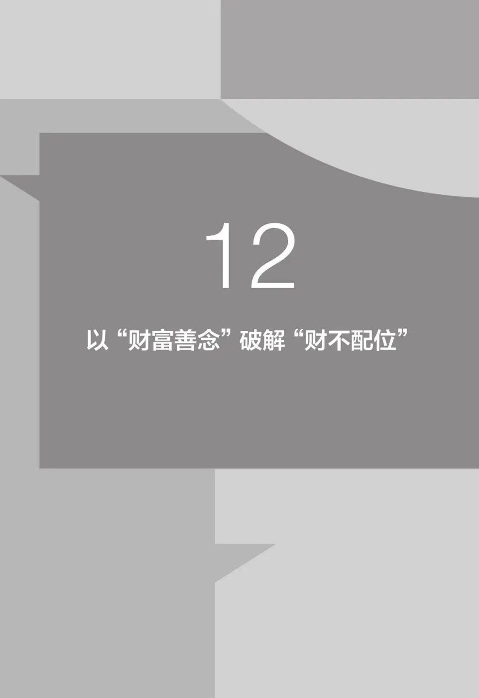

2025年5月20日

21:15

## 财富是认知的变现（上海老牌百亿私募基金重阳投资合伙人舒泰峰首部投资专著，教你避开投资中的12个陷阱。大开脑洞，开启12篇老子与巴菲特的时空对话，带你轻松领会投资哲学。）

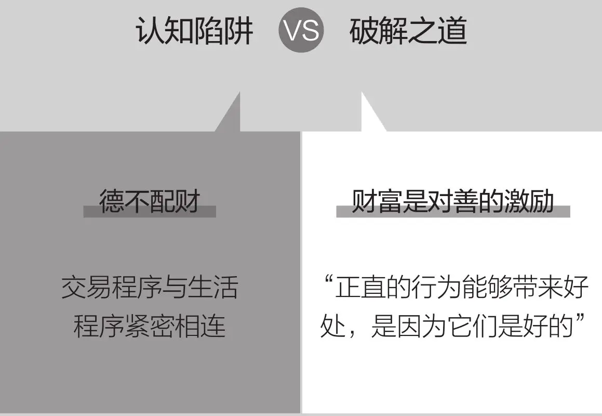

2025年5月20日

21:15

## 认知陷阱12：德不配财 交易程序与生活程序紧密相连

__认知陷阱12：德不配财__

__交易程序与生活程序紧密相连__

1940年11月，杰西·利弗莫尔在纽约第5大道和中央公园路拐角的榭丽尼圣酒店的更衣室里开枪自杀。他在临终遗言中写道：“我的一生是个失败者。”

利弗莫尔是谁？他是华尔街历史上最传奇的股票作手，被公众认为能够预知未来股票价格的具有超自然能力的人。他14岁时辍学，到波士顿的潘恩·韦伯证券经纪公司当了一名擦写股价的黑板小弟。在这里他展现出了对数字的惊人天赋，15岁时就靠对赌股票短期走势赚了1000美元，这对于一个孩子来说是个天文数字，为此他获得了“抢钱小子”的外号。1907年，因做空美股，他大赚300万美元。当时，负责维护市场稳定的金融巨子J\.P\.摩根派人央求他不要再做空，他感觉自己“那一刻就像国王”。1919年，威尔逊总统邀请他到白宫，请他平仓棉花期货以救国急。1929年，美股大崩盘时，他倾所有资金放空股票，大赚1亿美元，要知道当年美国联邦政府的财政收入也仅为37亿美元。

利弗莫尔以其精湛的投机手法赢得了“华尔街巨熊”“华尔街投机之王”等称号，拥趸无数。有人将他的名字翻译成“李佛魔”，倒也贴切。

然而，就是这样一位天才，却以自杀的形式悲惨谢幕，原因何在？上文已经提到过，利弗莫尔通过做空成功赚取1亿美元。不过很快美股就迎来了大崩溃，当道琼斯指数终于在1932年7月见底时，股指跌得只剩下原来的11%。后来利弗莫尔因为过早抄底承受了巨大损失，1934年，他宣告破产，欠下了500万美元的债务。

事实上，此前的利弗莫尔曾经经历过多次破产，每一次他都能起死回生，但是这一次他却一蹶不振。美国新成立的证券交易委员会加强了对股市的监管，修改了卖空的规则，新的规则限制让利弗莫尔不再如鱼得水。然而，更致命的是利弗莫尔个人生活的崩溃。

__交易程序与生活程序紧密相连__

利弗莫尔虽然失败了，但在他的身后仍然有众多的拥趸，因为在交易上他的确是个天才，他的交易哲学至今仍影响着一代又一代的交易者。而且利弗莫尔也是一个善于反思的人，他早年就总结过自己投资失败的原因：第一，没有耐心等待时机的到来，缺乏等待（关键点）的意志力；第二，没有遵循良好的投机程序，导致判断失误。

可惜利弗莫尔只反思了交易纪律，而没有反思生活纪律。利弗莫尔的个人生活十分奢靡，在感情上也很放纵，在世界各地的别墅中养有情人。而恰恰是感情生活，成了压垮利弗莫尔的最后一根稻草。利弗莫尔经历过三次婚姻，育有两个孩子。1932年，利弗莫尔与第二任妻子多萝西因感情破裂而离婚。为了报复长期在外寻花问柳的利弗莫尔，多萝西在离婚的当天就与新晋情人结婚。多萝西保留了两个儿子的监护权，并得到了1000万美元的和解费以及一套价值350万美元的别墅豪宅。已经习惯了奢靡生活的多萝西不久后便陷入财务危机，她将那套豪宅以22\.2万美元的极低价格贱卖了出去，利弗莫尔闻讯后沮丧不已。多萝西酗酒成性，一次酒醉后她与大儿子杰西·利弗莫尔二世发生争执，并向对方开了一枪。大儿子虽然保住了性命，却落下了终身残疾。这更加重了利弗莫尔的精神困顿。

1933年3月28日，56岁的利弗莫尔和38岁的歌手、社交名流哈丽雅特在伊利诺伊州日内瓦结婚。利弗莫尔是哈丽雅特的第五任丈夫。她的前夫中至少有两位是自杀身亡的，其中一位叫沃伦·诺布尔，在1929年华尔街股灾后上吊自尽。

史料证明，在生命的最后几年，利弗莫尔的精神世界可以说是彻底崩塌了。1933年，也就是最后一次宣布破产的前一年，利弗莫尔曾在一次长达26小时的狂欢滥饮之后，被抓进警察局。他告诉警察，他失去了记忆。

自杀是精神崩塌的结果。令人唏嘘的是，利弗莫尔的儿子杰西·利弗莫尔二世也在1975年自杀身亡，他的孙子也死于自杀。利弗莫尔家族三代都陷入了悲剧的死循环。1

利弗莫尔曾经为自己的生活方式辩解：“我亏钱是因为我错了，而不是因为我放荡不羁或是过度享乐。”但其实交易程序与生活程序紧密相连，缺乏情感的约束和生活的纪律，哪怕再了悟交易的本质，也无法避免他自己说的“丧失了平衡感”，从而由巨大的成功走向巨大的失败。巴菲特曾说过，一个在小事上无法节制的人，往往在大事上也无法自我控制。利弗莫尔的投资人生最终败于投资之外，正是因为没有认识到这个道理。

__“财富就像海水一样，你喝得越多，就会变得越渴”__

利弗莫尔固然拥有过巨大的财富以及感官世界的极大快乐，但他的内心却并不幸福。贫穷的人生很难幸福，必要的财力是获取幸福人生的前提条件，但是各种调查显示，当基本的生活需求得到满足之后，金钱对于幸福的边际效用就开始下降了。1957年，美国人的年均收入约为1万美元，生活中没有洗碗机、烘干机、电视或空调，但是35%的受访者表示，他们对自己的生活很满意。到2004年，扣除通货膨胀因素，个人收入增长了近2倍，一般住宅里充斥着各种消费品，但只有34%的人说他们非常幸福。2

突然获得巨额财富甚至还常常成为人生幸福的大敌。检索国内外那些彩票获得头奖的人，他们真实的人生经历经常让人唏嘘。面对“天上掉下的馅饼”，他们往往会选择大肆挥霍，或纵情声色，或经不住别人的诱惑盲目投资。最后不仅血本无归，钱财散尽，还往往弄得妻离子散，甚至有的人最终自杀身亡。美国国家经济研究局的一项调查显示，近20年来，欧美的大多数头奖得主在中奖后不到5年内，就因挥霍无度等变得穷困潦倒。该项调查同时显示，美国彩票中奖者的破产率每年高达75%，也就是每年12名中奖者当中就有9名破产。3

如果人不具备健康的财富观，那么很可能会应了哲学家叔本华的诅咒：“财富就像海水一样，你喝得越多，就会变得越渴。”而财富观背后是人生观，德不配财，反遭其害。

__破解之道12：财富是对善的激励__

__“正直的行为能够带来好处，是因为它们是好的”__

巴菲特和芒格不仅是财富的赢家，同时也是道德的楷模。

被视为芒格传人的李录先生记载过他和芒格之间的一个故事。从2005年、2006年开始，李录因为偶然的原因发现了信用违约互换（credit default swap，CDS）这个产品，做了一些研究，也一度准备大规模进入，想通过CDS做空。后来在和芒格的几次谈话之后，他逐渐打消了这个念头。芒格反对的原因很简单，如果李录的分析是正确的，那就意味着最终要么承接这些产品的交易对方，即那些大的金融公司可能因为破产而不能兑现，要么这些大的金融机构被政府通过纳税人的钱救活了，但这时李录赚的钱其实也是纳税人、政府的钱，于心并不踏实。

芒格为什么反对李录赚这个钱，因为在芒格看来，赚钱固然重要，但是所赚之钱的来源也同样重要。这很像我们中国儒家所讲求的“君子有所为而有所不为”。

芒格不是空口说说，他自己真的是这么践行的。有一次芒格收购一家企业，当时有两位老太太持有该企业发行的债券，芒格本来很容易以远低于面值的价格收购这些债券，但是他却按照面值给了她们钱。还有一次芒格的一位合伙人想要把他们合资成立的公司的一半股权卖给芒格，他让朋友开个价，朋友说13万美元，芒格说不行，23万美元才对，而且真给了他那么多钱。这位朋友后来评论说，在股票交易所占价格低廉的股票便宜是一回事，但是占合伙人或者老太太便宜是另外一回事——这是芒格绝对不会做的事。

__“要得到你想要的某样东西，最可靠的方法是让你自己配得上它”__

做投资不就是为了赚钱吗？为什么需要这么高的道德标准？其实道德上的高标准是与价值投资的内核相关联的。李录曾说价值投资是一种正道。什么是正道？正道就是可持续的东西。什么东西可持续？可持续的东西具有一个共同的特点，就是你得到的东西在所有其他人看来，都是你应得的东西，这就可持续了。芒格有句很经典的话：“要得到你想要的某样东西，最可靠的方法是让你自己配得上它。”他把这个原则用到了找配偶方面：“如何才能找到一个优秀的配偶。最好的方式就是让自己配得上她／他，因为优秀配偶都不是傻瓜。”芒格和巴菲特都是抱着找配偶的心态在找股票的，巴菲特说过，“你买一家公司的股票，就要与这个股票结婚，而不是一夜情，随便找个人派对，厌烦了就换新的”。你在寻找一只好股票，可能好股票也在寻找它的好主人，这个主人不仅才华出众，而且拥有正确的价值观。

这是可持续的第一层意思。

引申一下可以得到可持续的第二层意思，芒格和巴菲特在对待人际关系时都力争做到双赢甚至多赢。商业似乎总是与唯利是图相联系，其实不然。亚当·斯密在《国富论》里揭示了市场机制的秘密，那就是人性的自私和利己主义可以推动人们多产出，从而增加社会的总体福利。但是《国富论》里展现的只是半个亚当·斯密，亚当·斯密还有一本书是《道德情操论》，其中指出了同情心和利他的重要性。《道德情操论》是斯密出版的第一部著作，也是他辞世前最后定版的一部著作，期间经历5次修订，可见斯密对该书的珍视程度。只有将《国富论》和《道德情操论》合在一起阅读，方能真正理解斯密的学说，也才能全面理解市场经济的精髓。换句话说，没有利他、同情、诚信这些道德要素的支撑，市场经济不仅是无法正常运转的，而且将滑向不择手段、唯利是图的无底深渊。其实，越是自由市场经济，越是需要这些要素的支撑，因为自由市场经济，更加依赖人与人之间发自内心的自觉。

与投资结合得更紧密一点，价值投资之所以是一条能够持续的正道，正是因为它能够实现参与方之间的多赢。根据价值投资之父格雷厄姆的经典定义，价值投资并不是持有一张股票凭证，而是购买一家企业的部分所有权。以这种方式理解股票就会与炒股心态全然不同，炒股的话听听概念、听听消息就可以炒，但是只有当你把自己当作股票背后这个生意的一部分持有人时，你才会去认真研究这个企业是否真的有价值。这是一个发现价值的过程。然后通过你的投资行为，你还帮助企业创造了新的价值，这是一个价值创造的过程。在价值发现和价值创造的基础之上，你分得了红利或者卖出股票，这是一个价值兑现的过程。价值投资通过投资行为一方面帮助了好企业，进而帮助了经济发展，另一方面也帮助了自己从中获益。这样一个过程才是多方共赢的过程，它与你输我赢的投机炒作或“割韭菜”行为有本质的不同，后者是一种零和博弈，即我的所得就是你的所失，这样的事情自然难以持续。

__价值投资是一种以善意看待世界的方式__

李录说，与芒格交往的这些年，常常会忘记他是一个美国人，他更接近于中国的传统士大夫。芒格自己也讲过他非常推崇孔子。

读芒格和巴菲特时，笔者经常想起孔子的一个“仁”字。“仁”字可以说是孔子学说的最重要内核之一，但是到底什么是“仁”，有各种解释。孔子自己在不同的场合也有过不同的表达，比如子贡问“仁”，他说：“夫仁者，己欲立而立人，己欲达而达人。”（《论语·雍也》）颜渊问“仁”，他说：“克己复礼为仁。”（《论语·颜渊》）樊迟问“仁”，孔子答：“爱人。”（《论语·颜渊》）

南怀瑾先生对“仁”做过一个生动的解释，他用的是拆字法，说仁字左边是单人旁，表示人，右边是个二，合起来就是“两个人”。这个拆字法很有助于理解“仁”的精神，它点明了这是关于人际关系处理的学问——人际关系处理得恰当就是“仁”。但要做到这一点非常难，首先它要求自己的行为要得当，这就是“克己复礼”。其次要有同情关爱之心，这是“仁者爱人”。最好还能够换位思考，用积极的表达来说是“己欲立而立人，己欲达而达人”，用消极的表达来说是“己所不欲，勿施于人”（《论语·卫灵公》）。“己所不欲，勿施于人”这一条在西方评价很高，被评为道德黄金律，基督教里有类似的表述，只是用的是肯定式：“你希望别人如何对待自己，那就如何对待别人。”

儒家关于“仁”的表述非常好，非常适合解释价值投资的精神内核。价值投资的精神内核就是一个将“仁”的精神由己及人，又由人及物的过程，这个物就是你所投资的标的。所以价值投资不仅仅是一门关于赚钱的技艺，还是一门关于心性的学问。这里的心性不仅是指心理学，还指价值观和信念。如果总结成一句话来表述，那就是“价值投资是一种以善意看待世界的方式，或者说财富是对善的激励”。

坚持“仁”可以带来回报，巴菲特、芒格之所以成功，一方面固然是因为技艺超群，另一方面他们的人格修为也起了很大的作用。他们不仅富有，而且长寿。中国传统讲“仁者寿”，不无道理。当然，更难能可贵的是，芒格和巴菲特在精神层面的坚守甚至超越了实用主义的层面，芒格很喜欢美国钢铁公司董事长埃尔伯特·H\.加里（Elbert H\. Gary）的一句话：“正直的行为是好的，并不是因为它们能够带来好处；它们能够带来好处，是因为它们是好的。”

“善”还有一种解释：热爱是“善”。著名投资家乔尔·格林布拉特（Joel Greenblatt）曾说过：“在我的学生里，投资做得最好的，是那些真正热爱投资的。我给各位一个忠告：别带着赚钱的目的来做投资。”4这句话乍一听有点奇怪，投资不就是为了赚钱吗？但细想就会发现它很有道理，没有热爱是不可能真正做好一件事情的，投资也是一样。这也正是巴菲特的成功之道，他说：“你早上从床上坐起，是因为你期待这一天。我有60年都是跳着踢踏舞去工作的，就是因为我做我喜欢做的，我感觉非常幸运。”一件事情凭毅力或许可以坚持1年或者10年，但是如果干了60年还没想到退休，那一定不是因为毅力，而是因为热爱。

__利弗莫尔不懂幸福学__

巴菲特和芒格还拥有十分幸福的人生。早年的巴菲特由于太专注于工作，所以忽略了妻子的感受，导致妻子离他而去，但是即使离了婚，巴菲特与前妻仍然保持良好的关系，这应该说难能可贵。芒格的家庭生活很美满，他养育了8个子女，加上孙辈可谓子孙满堂。芒格经常运用餐桌这个讲坛对子女进行价值观教育。他最喜欢的教育工具是德育故事，讲的是某个人面临道德难题，并做出了正确的选择；还有反面教材，讲的是某个人做出了错误的选择，最终遭遇一系列不可避免的灾难，生活和事业都损失惨重。

芒格一定深知幸福之道。哈佛大学曾经做过一个漫长的研究：纵观一个人的一生，到底是什么让他保持健康和快乐？这项研究从1938年开始，历时75年，他们跟踪了724位男性的一生，记录他们的工作、家庭、健康，观察他们的人生走向。这些男孩分为两组：一组是哈佛大学的学生；另一组是来自波士顿贫民区的孩子，他们家庭贫困，都住在廉价公寓里。

参加这个研究项目时，他们接受了面试与体检。研究人员挨家挨户拜访了他们的家庭。每两年，研究人员会请他们再做一套关于个人生活的调查问卷，还会继续采访他们的家庭，尤其是他们的妻子和孩子，并向医生拿他们的病例，为他们做体检。

后来，这些年轻人长大了，成了工人、律师、砖瓦匠、医生，甚至还出了一位总统，那个人就是大名鼎鼎的约翰·肯尼迪。有人成了酒鬼，有人患上了精神分裂，有人从社会最底层平步青云，也有人从富裕到一贫如洗，总之他们的人生完全不同。

这项调查的最终结论是，决定我们人生幸福的，不是钱，也不是名利、工作，而是良好的人际关系。和谐温暖的人际关系，能让我们更加幸福和快乐。可惜，利弗莫尔只懂得交易，不懂得幸福学，最终将自己的交易也毁了。

## 老子对话巴菲特 上善若水

__老子对话巴菲特__

ROUND 12

上善若水

老 子：通过前面十一次对话，我们探讨了许多。今天我想问最后一个问题，成为一个卓越的投资者需要具备怎样的人格品质？

巴菲特：要我说的话，“必须是有工作激情但又没有贪念，并且对投资的过程入迷的人才适合做这个工作。利欲熏心会毁了自己。当然，漠视金钱或者淡泊财富的人也不适合玩这种‘游戏’，因为他不喜欢就没有激情”。

老 子：爱财而不贪财，这个状态相当难以达到。

巴菲特：如果你热爱投资，就会相对容易点。

老 子：那么你一定很热爱投资了。

巴菲特：可以这么说吧，投资带给我乐趣，“每天早晨我都跳着踢踏舞去上班”。

小 舍：我倒可以举个例子说明巴菲特先生有多么热爱投资。

老 子：哦，说来听听。

小 舍：一天晚上，巴菲特先生和他的妻子苏珊受邀去朋友家中吃了顿饭。晚饭过后，他们的朋友架起投影仪向他们展示金字塔的照片。这时候巴菲特说：“我有个更好的主意。你们给苏珊放照片，我去你们的卧室读一份年报，怎么样？”

老 子：啊哈，巴菲特先生真是个痴人！热爱让人投入，这容易理解，可是怎么消除自己的贪念呢？

巴菲特：这个问题不好回答，如果一定要说，我想善良和正直是必须的。

老 子：可是在投资中怎么体现出善良和正直的重要性呢？

巴菲特：这方面可以说查理是楷模。小舍，你每次都举例子表扬我，这次表扬一下查理怎么样？

小 舍：没问题。

里克·格林（Rick Guerin）是芒格先生的老友和商业伙伴，他说他曾有两次看到芒格先生在商业交易中付出了比需要支付的金额更多的钱。第一次是在芒格先生收购一家企业的时候，当时有两位老太太持有该企业发行的债券，他本来很容易以远低于面值的价格收购这些债券，但是他却按照面值给了她们钱。

第二次是在瑞克·格伦需要一些现金去做另外一项投资的时候。当时他想要把他们合资成立的公司的一半股权卖给芒格先生，芒格先生让他开个价，他说13万美元，芒格先生说不行，23万美元才对，而且真给了他那么多。

瑞克·格伦评论说，在股票交易所占价格低廉的股票便宜是一回事，但是占合伙人或者老太太便宜是另外一回事——这是芒格绝对不会做的事。

老 子：这么明显的便宜都不占，芒格先生，你是出于怎样的考虑呢？

芒 格：“我们认为，有些事情就算你能做，而且做了不会受到法律的制裁，或者不会造成损失，你也不应该去做。你应该有一条底线。你心里应该有个指南针。所以有很多事情你不会去做，即使它们完全是合法的。这就是我们试图做到的经营方式。”

老 子：在一个利益至上的年代，这还真是少见。

芒 格：的确。“能给人们带来好处的罪恶很难被消除，因为大量的人认为，一件事只要能给他们带来利润，就不可能是罪恶的。”“目前美国有种文化认为，所有不会把你送进监狱的事情都是可以做的事情。”

老 子：可是你这么做收获了什么呢？

芒 格：“更多的时候，我们由于固守道德而挣到更多的钱。在我们看来，本杰明·富兰克林是对的。他并没有说诚实是最好的道德品质，他说诚实是最好的策略。”

老 子：诚实是一种很好的策略，这倒是第一次听说。

芒 格：是的，我总是提醒大家记住：“说真话，你将无须记住你的谎言。”

老 子：有道理，这也是一种以简化繁。

芒 格：当然，“我相信就算这种经营方式没有给我们赚到这么多钱，我们也不会做坏事”。我喜欢美国钢铁公司董事长埃尔伯特·加里的一句话：“正直的行为是好的，并不是因为它们能够带来好处；它们能够带来好处，是因为它们是好的。”

老 子：诚实和正直应当是人之所以为人的一种本分。巴菲特先生，你认同芒格的话吗？

巴菲特：当然，我曾经说过，“如果你能购买一个同班同学未来收入的10%，你会怎么做？你不会购买那些IQ最高的人，成绩最好的人，但你会买那些给你留下最深刻印象的人。你喜欢那些慷慨的人，尽力而为的人，正直坦率的人。”

相反，“和一个道德品质败坏的人，无法完成一桩好交易”。

老 子：所以，你们尽量与正直善良的人合作。

巴菲特：没错。“有人曾经说过，当寻找受雇的职员时，你要从中寻找三种品质：正直、勤奋、活力。而且，如果他们不拥有第一个品质，其余两个将毁灭你。”

芒 格：“无论你们多么聪明，总有一些更聪明的人，如果他们真的想骗你们，你们就会上当。所以，要确定与你们共事的聪明人是值得你们信赖的。”

老 子：看来两位不仅是投资大师，也是人格楷模。拥有水一般的智慧与品格。

巴菲特：哪里哪里，老先生过奖了。不过您为什么说“水一般的智慧与品格”呢？正直善良与水有什么关系？

老 子：在我看来，世上再没有比水更智慧而品格更高的事物了。

巴菲特：哦，怎么说呢？

老 子：“上善若水。水善利万物而不争，处众人之所恶，故几于道。”

巴菲特：不懂。

老 子：这句话是说：最高的善像水那样，因为水使万物得到它们的利益，而不跟它们争，水专门往低处流，哪怕低洼之处充满污秽、肮脏，它们也能包容，并将它们冲刷干净，所以水最接近于道。

巴菲特：听老先生这么一说，才知道原来水有这么高尚的品质。

老 子：正因为水有这么高的智慧和品质，所以你们投资界才喜欢用水做文化标识啊。

巴菲特：是吗，这我倒没注意。

老 子：比如你们美国著名的桥水基金，就是以水入名。再比如我们小舍所在的重阳投资的标识其创意便来自水。它取水纹之东南一角，两条水纹相叠向上，配以方形蓝色外廓。其官方的解释文字说：“水是生命之源，并蓄柔和与坚韧。投石于水，水纹层扩。标识创意源于水纹东南部，方形代表专业冷静，深蓝代表踏实稳重。”

巴菲特：有创意。您对水的理解这么深刻，您自己一定也是按照水的品质来要求自己的吧？

老 子：我的确在学习水的至柔至善。我自己有个总结或者说自我要求：“我有三宝，持而保之。一曰慈，二曰俭，三曰不敢为天下先。”

巴菲特：请老先生解释。

老 子：我有三件法宝，我自己一直坚守着，第一是慈爱，第二是俭约，第三是不敢居于天下人的前面。第三条我要多解释一下，“不敢为天下先”不是遇到事情躲到后面的意思，而是面对利益的时候不率先争抢。

巴菲特：这三条为什么能成为您的人生法宝呢？

老 子：“慈故能勇；俭故能广；不敢为天下先，故能成器长。今舍慈且勇；舍俭且广；舍后且先；死矣！”

我直接翻译吧。因为慈爱，对生活充满热爱，所以能以至大至刚的勇力去战胜一切困难；因为俭约，所以能积蓄力量；因为不敢居于天下人的前面去争权夺利，所以才有资格成为万众的首领。现在有的人不讲慈爱而一味逞勇斗狠，不讲俭约而只求高速发展、无度扩张，不讲谦和退让而一味争先要强，那无异于自取灭亡啊！

巴菲特：太精辟了，完全同意。

老 子：关于慈，我还想再补充一句。“夫慈，以战则胜，以守则固。天将救之，以慈卫之。”

巴菲特：这句话又怎么说？

老 子：慈爱的力量用于攻战一定能胜利，用于防守必定十分坚固。能够发挥慈爱之心的人，天也会来救助他，保卫他。

巴菲特：我原来也说过，“你给别人的爱越多，你获得的回报就越多”，今天很高兴在老先生这里得到呼应。这十二次对话使我充分领略了东方智慧的高妙。

芒 格：我也是同感。

老 子：两位大师谦虚了，其实通过与二位的对话，我也受益匪浅，了解到了投资学的博大精深，希望以后还有机会再接着讨论。也感谢小舍对谈话的帮助。

大家后会有期！

巴菲特：希望有机会再叙！

芒 格：再叙！

## 附录 舒泰峰的财富认知书单

__附录__

__舒泰峰的财富认知书单__

投资是一门跨学科的、极具综合性的学问，我的这本书充其量是一本“以管窥天，以蠡测海”的普及性读物。有兴趣的读者朋友不妨舒展阅读的翅膀，去更广阔的知识天空遨游。这个财富认知书单中的书有的曾被我直接引用过，有的则间接对我的写作有过启发。有趣的是，我发现书与书之间其实是有“亲缘关系”的，我们往往是读了一本书，又被其中所提到的另外一本书所吸引，从中领略知识的递进关系。少数情况，如作者观点的不和谐场面也会存在，比如在这个书单里，纳西姆·尼古拉斯·塔勒布就曾把斯蒂芬·平克批评得一无是处，尽管他们的书对读者都很有启发性。这些都是读书过程中的“小确幸”。

我将对我有所启发的60本书大致分成几类，希望能够为读者朋友们提供一个指引的方向，便于大家按图索骥，早日抵达投资认知之堂奥。

__大师之书__

这部分的书都是成功投资大师之作或者书写投资大师思想的作品。我首推的当然是《穷查理宝典》，它于我而言具有冲开投资思维大门的醍醐灌顶之效，书名“宝典”名副其实，值得反复阅读。而且我总觉得芒格的智慧是超越投资的，这本书不仅是投资宝典，也是人生智慧的宝典。《巴菲特致股东的信》《投资最重要的事》《聪明的投资者》也都极具启发性，所谓“极具”是指书中内容很多是原理性的，属于“元智慧”。《投资学（第五版）》性质有所不同，是一本教科书，属于教育部经济管理类核心课程教材，它的特殊之处在于，它是由投资家裘国根先生和他的导师郎荣燊共同编写的，是实战与理论的经典结合，广受师生好评。

1．考夫曼．穷查理宝典．李继宏，译．北京：中信出版社，2016\.

2．克拉克．查理·芒格的投资思想．巴曙松，陈剑，译．杭州：浙江人民出版社，2019\.

3．洛尔．查理·芒格传．邱舒然，译．北京：中国人民大学出版社，2009\.

4．巴菲特．巴菲特致股东的信．杨天南，译．北京：机械工业出版社，2020\.

5．施罗德．滚雪球．覃扬眉，等，译．北京：中信出版社，2013\.

6．哈格斯特朗．巴菲特之道．杨天南，译．北京：机械工业出版社，2020\.

7．林奇，罗瑟查尔德．战胜华尔街．刘建位，徐晓杰，李国平，等，译．北京：机械工业出版社，2016\.

8．利弗莫尔．股票作手回忆录．黄程雅淑，马晓佳，译．北京：中国青年出版社，2012\.

9．李录．文明、现代化、价值投资与中国．北京：中信出版社，2020\.

10．费舍．怎样选择成长股．吕可嘉，译．北京：地震出版社，2013\.

11．格雷厄姆．聪明的投资者．王中华，黄一义，译．北京：人民邮电出版社，2016\.

12．马克斯．投资最重要的事．李莉，石继志，译．北京：中信出版社，2015\.

13．达利欧．原则．刘波，綦相，译．北京：中信出版社，2018\.

14．郎荣燊，裘国根．投资学（第五版）．北京：中国人民大学出版社，2017\.

__历史之书__

投资不能拘泥于历史，但是我们也不应当忘记历史。这部分书目许多是关于危机史的。读一读历史上的金融危机，对今天的我们具有重大的启发。毕竟“这次不一样”是投资史上最大的教训之一。《历史的教训》是杜兰特夫妇以其50年功力凝集的结晶，以高度凝练的语言总结了历史中最重要的教训。我们需要时刻堤防荷兰郁金香永不消逝的“魅影”。看吴晓波先生的系列作品可以了解中国经济史的变迁，尤瓦尔·赫拉利的系列作品则让人脑洞大开。了解历史是为了洞察未来，书目中的《未来呼啸而来》一书是我在2021年元旦读的，它描述了未来科技爆炸式发展的可能图景。

1．杜兰特，等．历史的教训．倪玉平，张闶，译．北京：中国方正出版社，2015\.

2．金德尔伯格，阿利伯．疯狂、惊恐和崩溃．朱隽，叶翔，李伟杰，译．北京：中国金融出版社，2017\.

3．加尔布雷斯．1929年大崩盘．沈国华，译．上海：上海财经大学出版社，2017\.

4．戈登．美国增长的起落．张林山，刘现伟，孙凤仪，译．北京：中信出版社，2018\.

5．野口悠纪雄．战后日本经济史．张玲，译．北京：民主与建设出版社，2018\.

6．赫拉利．人类简史．林俊宏，译．北京：中信出版社，2014\.

7．赫拉利．未来简史．林俊宏，译．北京：中信出版社，2017\.

8．戴曼迪斯，科特勒．未来呼啸而来．贾拥民，译．北京：北京联合出版社，2021\.

9．吴晓波．激荡三十年．北京：中信出版社，2008\.

__思维之书__

投资家的思维与众不同，这部分图书的内容主要围绕思维、方法论展开，多属于行为金融学范畴。首推的当然是《思考，快与慢》，这同样是一部元典式的作品，被后来者反复引用。《投资的怪圈》将人的行为模式与神经科学联系到了一起，读了之后我们可以进一步了解到，人的许多思维路径都是进化学的遗存。《直觉泵》和《模型思维》则系统地总结了许多思维工具，十分实用。

1．卡尼曼．思考，快与慢．胡晓姣，李爱民，何梦莹，译．北京：中信出版社，2012\.

2．丹尼特．直觉泵和其他思考工具．冯文婧，傅金岳，徐韬，译．杭州：浙江教育出版社，2018\.

3．佩奇．模型思维．贾拥民，译．杭州：浙江人民出版社，2019\.

4．希姆勒，汉森．脑中的大象．王绍祥，译．北京：中信出版社，2020\.

5．多贝里．清醒思考的艺术．朱刘华，译．北京：中信出版社，2016\.

6．茨威格．投资的怪圈．蒋宗强，译．北京：中信出版社，2020\.

7．蒙蒂尔．行为投资学手册．王汀汀，译．北京：中国青年出版社，2017\.

8．艾瑞里．怪诞行为学．赵德亮，夏蓓洁，译．北京：中信出版社，2017\.

__风险之书__

这个维度下的5本书堪称重磅。投资时刻与风险为伴。《与天为敌》的作者是个投资家，却能将“风险”的历史写的跟探案一样精彩，可以说他把历史上伟大的数学家们以及“风险”这样枯燥的课题写活了。塔勒布是个奇人，行为和思维方式都很独特，具有许多“反智慧”，他的“不确定性四部曲”步步深入，让我们看到了无处不在的不确定性，并在此基础上生出对于风险的敬畏。

1\.伯恩斯坦．与天为敌．吴翌，童伟华，译．北京：机械工业出版社，2010\.

2\.塔勒布．随机漫步的傻瓜．盛逢时，译．北京：中信出版社，2012\.

3\.塔勒布．黑天鹅．万丹，刘宁，译．北京：中信出版社，2011\.

4\.塔勒布．反脆弱．雨珂，译．北京：中信出版社，2014\.

5．塔勒布．非对称风险．周洛华，译．北京：中信出版社，2019\.

__金融之书__

这一部分书目主要是学院派专家之作，可以帮助我们从理论上深入了解股市、金融的运转机理。当然马尔基尔既是学院派也是实战派，《漫步华尔街》清晰地讲解了股市中各个流派的特点以及各自的优缺点。读了《股市长线法宝》，我们可以知道从长期来看，股票市场的机会远大于风险，可与李录的《文明、现代化、价值投资与中国》互为印证。《叙事经济学》开创了一个新的角度，很大程度上“叙事”推动了历史的发展，甄别这些故事至关重要，这与《估值与故事》可以互为参照。股票估值就是要寻求故事与数字之间的均衡。

1．马尔基尔．漫步华尔街．张伟，译．北京：机械工业出版社，2018\.

2．多尔西．股市真规则．司福连，刘静，译．北京：中信出版社，2018\.

3．西格尔．股市长线法宝．马海涌，王凡一，魏光蕊，译．北京：机械工业出版社，2019\.

4．埃利斯．长线．吴文忠，吴陈亮，常长海，等，译．北京：中信出版社，2016\.

5．达摩达兰．估值与故事．廖鑫亚，艾红，译．北京：中信出版社，2018\.

6．席勒．金融与好的社会．束宇，译．北京：中信出版社，2012\.

7．席勒．叙事经济学．陆殷莉，译．北京：中信出版社，2020\.

8．阿克洛夫，席勒．动物精神．黄志强，徐卫宇，金岚，译．北京：中信出版社，2016\.

9．席勒．非理性繁荣（第三版）．北京：中国人民大学出版社，2016\.

__进化之书__

追本溯源，我们每个人的行为模式和思维习惯都需要在进化史中寻找答案。在原始年代，我们的先祖为了生存和繁衍，不断进化出最能够应对当时环境的基因结构。近代以来，科技、经济、社会已经发生天翻地覆得变化，但是基因进化是慢变量，这就导致了我们的基因结构以及由其决定的认知与所处环境的严重不匹配，从而造成了认知的误区。

1．达尔文．物种起源．谢蕴贞，译．北京：新世界出版社，2014\.

2．威尔逊．论人的本性．胡婧，译．北京：新华出版社，2015\.

3．戴蒙德．枪炮、病菌与钢铁．谢延光，译．上海：上海译文出版社，2016\.

4．道金斯．自私的基因．卢允中，张岱云，陈复加，等，译．北京：中信出版社，2012\.

__心性之书__

老子《道德经》5000言字字珠玑，有很多版本的注释。陈鼓应的是学院派解读，南怀瑾的则是结合社会经验的通俗解读，比较生动易读。《华杉讲透孙子兵法》也很轻松易读，相比老子，《孙子兵法》不愧是兵书，实战性强，许多方面与投资之学相通。《乌合之众》把人性中的盲从揭露得淋漓尽致，读起来有种心惊胆战之感。读斯蒂芬·平克的感觉恰恰与此相反，给人一种磅礴的力量感。《洞见》的英文书名更有趣味，直译过来是“为什么佛学是真的”，跨越科学与佛学两大维度，直击认知的本源。说到佛学，对我冲击最大的还是一行禅师的《佛陀传》，读完才知道佛学其实是积极的，“空性”不是空无，而是“无自性”和“互依性”，它提倡的是协作而不是逃避。对我而言这些都是颠覆性的观点。这与塞利格曼的积极心理学是相通的。《苏东坡新传》貌似与财富和认知的主题不匹配，之所以将它列入书单之中是因为它的确写得太精彩了。如果说林语堂笔下的苏东坡是神仙版的，那么李一冰笔下的苏东坡则是人间版的，他书写了在仕途泥泞中挣扎了一生，却又永远充满豁达、乐观精神的苏东坡。这不恰恰是做投资需要汲取的态度吗？投资在具体操作上需要谨慎，但信仰上必须对未来永远抱有一颗乐观之心。

1．陈鼓应．老子注释及评介．北京：中华书局，1984\.

2．南怀瑾．老子他说．北京：东方出版社，2014\.

3．南怀瑾．论语别裁．北京：东方出版社，2015\.

4．华杉．华杉讲透孙子兵法．南京：江苏文艺出版社，2015\.

5．赖特．洞见．宋伟，译．北京：北京联合出版社，2020\.

6．平克．人性中的善良天使．安雯，译．北京：中信出版社，2019\.

7．平克．当下的启蒙．侯新智，欧阳明亮，魏薇，译．杭州：浙江人民出版社，2018\.

8．庞勒．乌合之众．冯克利，译．北京：中央编译出版社，2011\.

9．塞利格曼．塞利格曼自传．庞雁，译．杭州：浙江教育出版社，2020\.

10．一行禅师．佛陀传．何蕙仪，译．郑州：河南文艺出版社，2014\.

11．李一冰．苏东坡新传．成都：四川人民出版社，2020\.

## 参考文献

__参考文献__

__自序 财富是认知的变现，破财是认知的沦陷__

1．裘国根．投资是一场反人性的游戏．第一财经，［2011\-10\-31］．https://www\.yicai\.com/news/1169514\.html．

2．赖特．洞见．宋伟，译．北京：北京联合出版公司，2020．

3．克拉克．查理·芒格的投资思想．巴曙松，陈剑，译．杭州：浙江人民出版社，2019：24．

__01 以“自知者明”破解“过度自信”__

1．洛温斯坦．赌金者．毕崇毅，译．北京：机械工业出版社，2017．

2．洛尔．查理·芒格传．邱舒然，译．北京：中国人民大学出版社，2009：208．

3．希姆勒，汉森．脑中的大象．王绍祥，译．北京：中信出版社，2020：63．

4．伯恩斯坦．与天为敌．穆瑞年，吴伟，熊学梅，译．北京：机械工业出版社，2010：2．

5．希姆勒，汉森．脑中的大象．王绍祥，译．北京：中信出版社，2020：66．

6．凯恩斯．就业、利息和货币理论．金华，译．上海：立信会计出版社，2017：135\-136．

7．考夫曼．穷查理宝典．李继宏，译．北京：中信出版社，2016：485．

8．多贝里．清醒思考的艺术．朱刘华，译．北京：中信出版社，2016：61．

9．林奇，罗瑟查尔德．彼得·林奇教你理财．宋三江，罗志芳，译．北京：机械工业出版社2010：92．

10．傅盛．傅盛认知三部曲完整版：人与人最大的差别是认知．搜狐网，［2017\-04\-21］．https://www\.sohu\.com/a/135414351\_498139．

11．勒庞．乌合之众．冯克利，译．北京：中央编译出版社，2011．

12．利弗莫尔．股票作手回忆录．黄程雅淑，马晓佳，译．北京：中国青年出版社，2012：93．

__02 以“理性自律”破解“贪婪与嫉妒”__

1．茨威格．投资的怪圈．蒋宗强，译．北京：中信出版社，2020：46．

2．同上：49．

3．考夫曼．穷查理宝典．李继宏，译．北京：中信出版社，2016：465．

4．金德尔伯格，阿利伯．疯狂、惊恐和崩溃．朱隽，叶翔，李伟杰，译．北京：中国金融出版社，2017：39．

5．施罗德．滚雪球．覃扬眉，等，译．北京：中信出版社，2013．

6．考夫曼．穷查理宝典．李继宏，译．北京：中信出版社，2016：473．

7．同上：473．

8．卡尼曼．思考，快与慢．胡晓姣，李爱民，何梦莹，译．北京：中信出版社，2012．

__03 以“长期主义”破解“急于求成”__

1．茨威格．投资的怪圈．蒋宗强，译．北京：中信出版社，2020：105．

2．蒙蒂尔．行为投资学手册．王汀汀，译．北京：中国青年出版社，2017：129．

3．人均预期寿命77\.3岁：我国主要健康指标居中高收入国家前列．新华网，［2020\-10\-14］．http://www\.xinhuanet\.com/politics/2020\-10/14/c\_1126610998\.htm?baike．

4．塔勒布．随机漫步的傻瓜．盛逢时，译．北京：中信出版社，2012：55．

5．茨威格．投资的怪圈．蒋宗强，译．北京：中信出版社，2020：89\-90．

6．重阳投资总裁王庆：宽货币紧信用政策下股市下行空间不大．金融界，［2018\-09\-03］．https://baijiahao\.baidu\.com/s?id=1610541327991832063&wfr=spider&for=pc．

7．朱宁．投资者的朋友．北京：中信出版社，2020：6．

8．西格尔．股市长线法宝．范霁瑶，译．北京：机械工业出版社，2019：5．

9．李录．文明、现代化、价值投资与中国．北京：中信出版社，2020．

10．研究表明：人一生中大多数时候是积极乐观的．搜狐网，［2020\-07\-23］．https://m\.sohu\.com/a/409265557\_267106．

11．蒙蒂尔．行为投资学手册．王汀汀，译．北京：中国青年出版社，2017：129．

__04 以“安全边际”破解“禀赋效应”__

1．卡尼曼．思考，快与慢．胡晓姣，李爱民，何梦莹，译．北京：中信出版社，2012：266．

2．考夫曼．穷查理宝典．李继宏，译．北京：中信出版社，2016：472．

3．曹岫云．稻盛哲学与阳明心学．北京：东方出版社，2018．

4．洛尔．查理·芒格传．邱舒然，译．北京：中国人民大学出版社，2009：101．

5．格雷厄姆．聪明的投资者．王中华，黄一义，译．北京：人民邮电出版社，2016：264．

6．王庆．投融资两端发力破解中国股票市场三大痛点．证券时报网，［2021\-5\-28］．http://www\.stcn\.com/zt/jyzgjj/202105/t20210528\_3281803\.html．

__05 以“变亦不变”破解“锚定效应”__

1．卡尼曼．思考，快与慢．胡晓姣，李爱民，何梦莹，译．北京：中信出版社，2012：102．

2．艾瑞里．怪诞行为学．赵德亮，夏蓓洁，译．北京：中信出版社，2017：27．

3．裘国根．裘国根：投资军规．和讯网，［2014\-01\-16］\.http://futures\.hexun\.com/2014\-05\-13/164730777\.html．

__06 以“未来思维”破解“损失厌恶”__

1．卡尼曼．思考，快与慢．胡晓姣，李爱民，何梦莹，译．北京：中信出版社，2012：258．

2．茨威格．投资的怪圈．蒋宗强，译．北京：中信出版社，2020：230．

3．同上：272．

4．同上：248．

5．费舍．怎样选择成长股．冯治平，译．北京：地震出版社，2013．

6．裘国根．裘国根：投资军规．和讯网，［2014\-01\-16］\.http://futures\.hexun\.com/2014\-05\-13/164730777\.html．

7．裘国根．重阳投资裘国根：干我们这一行，机可失，时再来．聪明投资者，［2018\-07\-11］．https://www\.cmtzz\.cn/article/14963．

__07 以“逆向思维”破解“过度悲观”__

1．赖特．洞见．宋伟，译．北京：北京联合出版公司，2020：34．

2．希勒．叙事经济学．陆殷莉，译．北京：中信出版社，2020：69．

3．曼彻斯特．光荣与梦想．四川外国语大学翻译学院翻译组，译．北京：中信出版社，2015．

4．阿克洛夫，希勒．动物精神．黄志强，徐卫宇，金岚，译．北京：中信出版社，2016：106．

5．巴菲特发表评论呼吁买股票（原文翻译）．和讯网，［2008\-10\-18］．http://news\.hexun\.com/2008\-10\-18/110091305\.html．

6．施罗德．滚雪球．北京：中信出版社，2013．

7．同上：823．

8．安砾，楼栋，施东辉，等．散户亏钱的重要原因：股市泡沫．未央网，［2020\-07\-16］．https://www\.weiyangx\.com/365764\.html．

9．六里，东田雨，知航．13年年化16%，“阿甘型”私募重阳投资：不追逐太热的东西，所谓“逆向”是顺大势、逆小势，寻找未来的抱团股．聪明投资者，［2021\-04\-13］．https://mp\.weixin\.qq\.com/s/AqoKeRZJ4Q6NWbbR5G6mAw．

10．格上研究中心．私募的进化．成都：四川人民出版社，2018：45．

__08 以“独立精神”破解“盲目从众”__

1．南海事件：牛顿时代的金融泡沫．大公网，［2014\-04\-21］．http://news\.takungpao\.com/history/tianxia/2014\-04/2435439\.html?from=message&isappinstalled=0．

2．勒庞．乌合之众．冯克利，译．北京：中央编译出版社，2011：23．

3．费雪大师的唯一采访．雪球，［2020\-05\-03］．https://xueqiu\.com/7851054377/148522715．

4．林奇，罗瑟查尔德．战胜华尔街．刘建位，译．北京：机械工业出版社，2018．

5．帕斯卡尔．思想录．何兆武，译．北京：商务印书馆，1985．

6．利弗莫尔．股票作手回忆录．黄程雅淑，马晓佳，译．北京：中国青年出版社，2012：51．

__09 以“周期思维”破解“线性思维”__

1．格雷厄姆．聪明的投资者．王中华，黄一义，译．北京：人民邮电出版社，2016：106．

2．弘力．约翰·博格尔：指数基金教父．和讯网，［2006\-12\-11］．http://futures\.money\.hexun\.com/1954899\.shtml．

3．塔勒布．黑天鹅．万丹，刘宁，译．北京：中信出版社，2011：56．

4．金德尔伯格，阿利伯．疯狂、惊恐和崩溃．朱隽，叶翔，李伟杰，译．北京：中国金融出版社，2017：73．

5．茨威格．投资的怪圈．蒋宗强，译．北京：中信出版社，2020：91．

6．李录．文明、现代化、价值投资与中国．北京：中信出版社，2020：46\-53．

7．戴曼迪斯，科特勒．未来呼啸而来．贾拥民，译．北京：北京联合出版社，2021：29．

8．马克斯．投资最重要的事．李莉，石继志，译．北京：中信出版社，2015．

9．李迅雷．李迅雷：长期问题短期化是否成为股市接近底部的信号．上海热线，［2018\-09\-06］．https://rich\.online\.sh\.cn/content/2018\-09/06/content\_9034777\.htm．

10．马克斯．投资最重要的事．李莉，石继志，译．北京：中信出版社，2015．

11．马克斯．周期．刘建位，译．北京：中信出版社，2019：206．

__10 以“概率思维”破解“故事思维”__

1．赫拉利．人类简史．林俊宏，译．北京：中信出版社，2014：38．

2．希勒．叙事经济学．陆殷莉，译．北京：中信出版社，2020：120．

3．同上：85．

4．同上：97．

5．艾伦．仅仅是昨天．孟洁冰，译．北京：法律出版社，2011：235．

6．希勒．叙事经济学．陆殷莉，译．北京：中信出版社，2020：77．

7．艾伦．仅仅是昨天．孟洁冰，译．北京：法律出版社，2011：247．

8．加尔布雷思．1929年大崩盘．沈国华，译．上海：上海财经大学出版社，2017：128\-129．

9．希勒．叙事经济学．陆殷莉，译．北京：中信出版社，2020：241．

10．麦基．大癫狂．北京：企业管理出版社，2019．

11．艾伦．仅仅是昨天．孟洁冰，译．北京：法律出版社，2011：252．

12．周宏．专访重阳投资高级合伙人裘国根数学思维和投资之道．上海证券报，［2011\-04\-25］（A15）．http://paper\.cnstock\.com/html/2011\-04/25/content\_102271\.htm．

__11 以“谨慎小心”破解“黑天鹅”__

1．考夫曼．穷查理宝典．李继宏，译．北京：中信出版社，2016：130\-131．

2．塔勒布．黑天鹅．万丹，刘宁，译．北京：中信出版社，2011：25．

3．塔勒布．非对称风险．周洛华，译．北京：中信出版社，2019．

4．塔勒布．黑天鹅．万丹，刘宁，译．北京：中信出版社，2011．

5．塔勒布．随机漫步的傻瓜．盛逢时，译．北京：中信出版社，2012．

6．塔勒布．非对称风险．周洛华，译．北京：中信出版社，2019：127．

7．塔勒布．黑天鹅．万丹，刘宁，译．北京：中信出版社，2011：324．

8．塔勒布．非对称风险．周洛华，译．北京：中信出版社，2019：288．

9．同上：297．

__12 以“财富善念”破解“财不配位”__

1．朱昂．投资大师们的滑铁卢：李佛摩尔的自杀．雪球网，［2018\-12\-19］．https://xueqiu\.com/1175857472/118500734；迈克·吴．学习与反思：利佛摩尔．新浪博客，［2014\-08\-06］\.http://blog\.sina\.com\.cn/s/blog\_4afab0230102uyqm\.html；Why Wall Street traders are obsessed with Jesse Livermore\. Business Insider，2021\-07\-26．https://www\.businessinsider\.in/finance/why\-wall\-street\-traders\-are\-obsessed\-with\-jesse\-livermore/jesse\-livermore\-was\-born\-in\-1877\-to\-a\-family\-of\-farmers\-and\-learned\-to\-read\-and\-write\-by\-the\-time\-he\-was\-3\-1/slidelist/48116843\.cms．

2．茨威格．投资的怪圈．蒋宗强，译．北京：中信出版社，2020：293．

3．欧美彩票大奖得主5年内多潦倒专家：切忌挥霍．江西文明网，［2010\-03\-11］．https://news\.jxwmw\.cn/system/2010/03/11/010190295\.shtml．

4．霍华德与格林布拉特谈价值投资：只有三个办法可以年赚50%．搜狐网，［2017\-07\-18］．https://www\.sohu\.com/a/158088097\_178849．

## 后记

__后记__

我的老家浙江衢州素有“四省通衢”之称，是贯通浙江、江西、安徽和福建的交通要塞，因此成了“东南有事，兵家必争”之地。不知出生地的特质在多大程度上会影响一个人的性格，反正我长大后似乎挺能“漂”。选大学时，少年叛逆，终于可以实践一回金庸笔下的远走高飞，报考了火车车程40个小时以外但是名字很好听的兰州大学。我选择的专业更偏门，是历史系，纯粹出于爱好。大一暑假，为迎接90周年校庆，我参加了学校组织的黄河漂流活动，坐着羊皮筏子，从兰州漂到了包头，水程1200公里，历时一个多月，现在想来仍是人生的一大壮举。在这所积淀深厚、学风醇正却因为地处偏远而被称为“最孤独的985大学”的学校里修完本科和硕士之后，我转而从事了新闻工作。这是我人生中的第一次跨界，但两者也不无联系，毕竟历史是过去的新闻，而新闻终将成为未来的历史。

媒体从业10年，接触了很多鲜活的社会实践案例，采访过各种各样或杰出或平凡的人，这段经历极大地开阔了我的视野。所以我要感谢我以前供职的单位——新华社《瞭望东方周刊》和《财经》杂志，它们提供的一流平台让我知道世界很大，人间值得。

2014年，我加入了重阳投资，这是我人生中的第二次跨界。我惊喜地发现，投资家不但十分重视新闻，而且酷爱历史，或许是因为研究和投资都需要以信息为基础，而今天发生的一切无不脱胎于历史。正如马克·吐温所说：“历史不会简单重复，但却押着相同的韵脚。”有人说，投资是人生的最后一份职业，因为它是包罗万象的，同时也是极其复杂的。它要求从业者永远保持学习状态，从这个角度而言，它是没有天花板的。这正是我的幸运之处，过往的所学都没有浪费，应了那句流行的鸡汤：“人生没有白走的路，每一步都算数。”

在这里，我要特别感谢重阳投资创始人、首席投资官裘国根先生，是他将我引入投资界，使我得以打开人生的另一片天地。裘先生的学问人品都令人景仰，他冷静缜密和独特的思考方式也让我近距离领略到一个卓越投资家的风采。如果不是裘国根先生，也就不会有这本书的创意。

重阳投资董事长王庆博士自始至终都对这本书的出版给予了极大的关心和支持，他鼓励我将这几年写过的文章进行系统梳理，还仔细通读了全稿，提出了很多宝贵的意见，使书稿获得了进一步提升与完善。若不是王庆博士的鼓励与督促，这本书的面世应该要晚许多。重阳投资总裁汤进喜先生、联席首席投资官陈心先生、战略研究部主管寇志伟先生也都对书稿进行了专业的指导和把关。中国人民大学重阳金融研究院对此书的出版亦给予了支持，在此对研究院及王文院长的助力表示感谢。本书的部分内容曾在微信公众号“重阳投资”上发表，前同事郭宇璇时常是第一个读者和编辑，对此书的形成亦有贡献。在此一并表示由衷的感谢。

感谢湛庐编辑团队在这本书的出版过程中付出的辛苦工作，从书名到结构再到细节，她们都展现出了十分专业的水准，工作认真细致，确保了这本书的高质量出版。

这本书要特别献给我的父亲舒金岳。父亲在本书即将付梓之际辞世，让我陷于无尽哀恸。父亲没受过什么教育，却智能超群；一生背负巨大的能量，却囿于时代而无处安放。这本书致敬父亲狂傲不羁而富有英雄主义气概的一生。

感谢我的妻儿。14岁的初二学生舒思远身高已超过一米八，后浪生猛。刚到上海的第一个学期你由不适应到适应，期末还得了“进步小飞鱼”的称号，希望你能够不忘这个称号，保持终生学习、永远进取。还有我的“书童”麦麦，自从6年前意外“尾随”我来到家中，它就一直是我最忠实的陪读和陪写。是的，它是一只漂亮的小猫。

## 财富是认知的变现（上海老牌百亿私募基金重阳投资合伙人舒泰峰首部投资专著，教你避开投资中的12个陷阱。大开脑洞，开启12篇老子与巴菲特的时空对话，带你轻松领会投资哲学。）

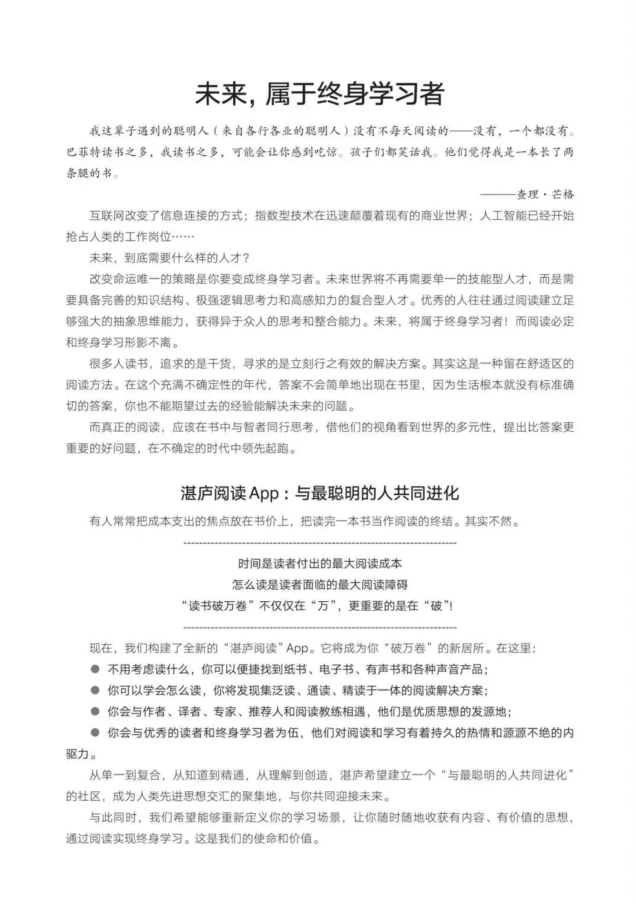

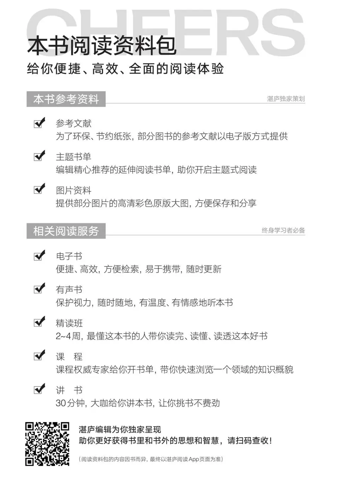

\(1\)

引自《查理·芒格的投资思想》（

*The Tao of Charlie Munger*

）。作者戴维·克拉克（David Clark）将芒格的核心思想体系凝练为100余个概念，围绕这些概念，克拉克不但筛选出了尤其能体现芒格思想精髓的经典言论，而且还对这些言论进行了精湛的诠释。此书中文简体字版已由湛庐策划，由浙江人民出版社于2019年出版。——编者注

\(2\)

为了如实地呈现老子、巴菲特和芒格的思想，对话中多数是他们说过的原话，原话以直接引语的方式标出。未以直接引语标出的部分则是为了使对话流畅而设计的串词。

\(3\)

诺贝尔经济学奖得主、普林斯顿大学教授，著有《噪声》，这本书指出，我们之所以常常会做出糟糕决策，都源于忽略了“噪声”对决策的影响。该书中文简体字版已由湛庐策划，由浙江教育出版社于2021年出版。——编者注

\(4\)

该实验结论一经报道便获得广泛关注，然而这场心理学实验却遭到了极大的误读。实验设计者、自控力之父沃尔特·米歇尔在《棉花糖实验》一书中对实验的来龙去脉溯本清源，在破除误解的同时，还给出了从对孩子的养育、雇用新职员，到避免糟糕的交易和个人决定的建议。此书中文简体字版已由湛庐策划，由北京联合出版公司于2016年出版。——编者注

\(5\)

华尔街的传奇人物，被称为“现代证券之父”，著有《华尔街教父格雷厄姆传》，这本回忆录是格雷厄姆在晚年亲自撰写的。他主要回忆了从出生到二战前近50年多姿多彩、甜酸苦辣的生活，特别是客观环境如何使他形成坚强自立的性格、他的成才道路以及对于恋爱、婚姻和家庭的看法。该书中文简体字版已由湛庐策划，由四川人民出版社于2021年9月出版。——编者注

\(6\)

引自《私募的进化》。书中，私募基金“超级智囊”格上研究中心以全方位的视角，再现中国私募行业波澜壮阔的发展历程，详细探究行业代表性企业的崛起之道。此书已由湛庐策划，由四川人民出版社于2018年出版。——编者注

\(7\)

作者彼得·戴曼迪斯和史蒂芬·科特勒全面展示了商业创业风口上的9大指数型技术，并洞察这些指数型技术的互相融合会带来巨大的变革力量，将会完全重塑我们的生活方式与商业模式。此书中文简体字版已由湛庐策划，由北京联合出版公司于2021年出版。——编者注

\(8\)

指塔勒布关于“不确定性”的四部著作：《随机漫步的傻瓜》《黑天鹅》《反脆弱》《非对称风险》。

2025年5月20日

21:15

## 财富是认知的变现（上海老牌百亿私募基金重阳投资合伙人舒泰峰首部投资专著，教你避开投资中的12个陷阱。大开脑洞，开启12篇老子与巴菲特的时空对话，带你轻松领会投资哲学。）

__Table of Contents__

版权页

内容提要

推荐序 “形而上者谓之道，形而下者谓之器”

自序 财富是认知的变现，破财是认知的沦陷

投资是一场反人性的游戏

汲取成功的智慧，穿越认知的迷雾

投资问道：老子对话巴菲特

测一测 你对投资中的认知陷阱了解多少

目录

01 以“自知者明”破解“过度自信”

认知陷阱1：过度自信 “机关算尽太聪明，反害了卿卿性命”

破解之道1：认识你自己 “承认无知是智慧的开始”

老子对话巴菲特 知人者智，自知者明

02 以“理性自律”破解“贪婪与嫉妒”

认知陷阱2：贪婪与嫉妒 “最令人头疼的事莫过于看到朋友发大财”

破解之道2：保持理性 “战胜他人不如战胜自己”

老子对话巴菲特 胜人者有力，自胜者强

03 以“长期主义”破解“急于求成”

认知陷阱3：急于求成 “人类本能地渴望立竿见影的效果”

破解之道3：长期主义 “时间的妙处在于它的长度”

老子对话巴菲特 大器晚成，大音希声

04 以“安全边际”破解“禀赋效应”

认知陷阱4：禀赋效应 “一个人想要什么，就会相信什么”

破解之道4：安全边际 “做投资如烹小鲜”

老子对话巴菲特 保此道者，不欲盈

05 以“变亦不变”破解“锚定效应”

认知陷阱5：锚定效应 投资中的“刻舟求剑”

破解之道5：变亦不变 “投资中，真理比面子重要”

老子对话巴菲特 万物并作，吾以观复

06 以“未来思维”破解“损失厌恶”

认知陷阱6：损失厌恶 “煮熟的鸭子飞走了”

破解之道6：未来思维 “投资这一行：机可失，时再来”

老子对话巴菲特 不失其所者久

07 以“逆向思维”破解“过度悲观”

认知陷阱7：过度悲观 “我们的恐惧常常大于危险本身”

破解之道7：逆向思维 “反过来想，总是反过来想”

老子对话巴菲特 俗人昭昭，我独昏昏

08 以“独立精神”破解“盲目从众”

认知陷阱8：盲目从众 我们都是随大流的“绵羊”

破解之道8：独立精神 投资要在知识上做加法，在心性上做减法

老子对话巴菲特 少则得，多则惑

09 以“周期思维”破解“线性思维”

认知陷阱9：线性思维 幸福且只幸福了1000天的火鸡

破解之道9：周期思维 做投资，不妨建立一点摆钟意识

老子对话巴菲特 反者道之动

10 以“概率思维”破解“故事思维”

认知陷阱10：故事思维 永不散去的荷兰郁金香魅影

破解之道10：概率思维 价值投资就是做大概率正确的事情

老子对话巴菲特 致虚极，守静笃

11 以“谨慎小心”破解“黑天鹅”

认知陷阱11：均值回归是对称的 “天之道，损有余而补不足”

破解之道11：均值回归是不对称的 我们的大脑必须习惯于对尾部风险说“不”

老子对话巴菲特 为之于未有，治之于未乱

12 以“财富善念”破解“财不配位”

认知陷阱12：德不配财 交易程序与生活程序紧密相连

破解之道12：财富是对善的激励 “正直的行为能够带来好处，是因为它们是好的”

老子对话巴菲特 上善若水

附录 舒泰峰的财富认知书单

参考文献

后记

2025年5月20日

21:15
