# 《付骏 漫步牛熊市 动荡市场的赢家》全文合订版

> 共16个章节。原章节顺序、段落结构和图表均予以保留。

## 投资之道

在投资理财的道路上，如果你走的是正确的方向，是赢多赢少的问题；如果你走的是错误的方向，那便是输多输少的问题了。

## 序言 对投资理财的思考

序言 对投资理财的思考

不论你参与证券投资是为了现在投资一笔钱以做养老金储备，还是寻找资本增值的机会以备未来进行大宗商品消费，或是纯粹为了在这个市场上投资赚钱，归根到底其目的都是一个——成为市场赢家！如果你最终成为证券市场上的一名输家，那么无论你的目标是上述哪种，将来都不会实现。

在证券市场上成为赢家不是件容易的事情，否则大家都可以靠看看信息、点点鼠标、打打电话投资致富了。但在证券市场上成为赢家也并非是件高不可攀的事情，只要你明了并坚守赢家投资理念和原则，正确运用赢家投资工具，并根据既定的原则动态地管理投资组合，成功之路则由你掌控，并能最终实现自己的目标，成为赢家俱乐部的一员。

“年50%投资收益率，这只黑马股将大涨，此基金是五星级基金，回报肯定高，新能源是绝佳的投资机会……”作为投资者的你应该不会对这些话感到陌生。中国经济持续强劲增长，国民财富逐渐增多，人们投资理财的兴趣与意识也越来越浓厚，越来越多的投资者涌入到证券市场的投资浪潮中感受冲到浪尖的喜悦和跌入谷底的失望。大多数投资者参与到证券市场往往是因为同一个原因：市场持续在涨；大多数投资者离开证券市场，也是因为同一个原因：市场持续在跌。然而，市场持续上涨真的就是参与的理由吗？市场持续下跌也真的是应该离开的理由吗？

相信上述问题是大多数投资者的困惑，而本书就是力图还原市场涨跌的本相，通过基于客观事实之上的分析为你开启投资理财之门，让你了解市场价格波动背后的因素，从而做出理性的投资决策。

这本书写给谁？

本书是写给对投资理财充满兴趣的投资者，包括初级入门者；对身边的投资市场有些许了解，但对市场的诸多观点无法清晰辨别，无法做出理性决策的一般投资者；也适合有较为丰富投资经验的中级投资者；同时，也是写给时下金融机构的理财顾问，供大家全面地了解时下市场的主流金融投资产品，以便为客户提供有价值的专业投资建议，而非人云亦云。

希望你通过阅读本书，能够扩展自己的投资眼界，加深对证券投资的理解，了解真实的市场规律，理性地看待市场的波动，冷静地思考投资顾问的建议，并最终实现个人的投资目标。

你为什么需要这本书？

市场上关于投资理财的书籍举不胜举，既有国际大师级的著作，如价值投资鼻祖格雷厄姆的《证券投资分析》、股神巴菲特的《巴菲特之道》、华尔街明星基金经理彼得·林奇的《彼得·林奇的成功投资》等；也有深谙中国证券市场的名作，如唐能通的《短线是银》系列丛书、李幛的《炒股就这几招》等。

不过就我个人观点而言，以上书籍固然是好，但重心基本上都放在了以“股票”为核心资产的投资决策上。而正如你了解的，市场上并非只有股票或股票基金这类投资工具，还有很多其他类别的投资工具可以满足你的投资理财需求。然而，目前市场上的投资理财书籍要么过于简单通俗，只注重基本知识的介绍，忽略了如何运用这些知识形成投资技能，帮助做好投资决策；要么就是过于专业化，使得非专业人士如同雾里看花，最后做起投资决策来如同在澳门葡京赌场里赌大小一样。

我写这本书，是希望帮助你推开投资理财这扇门，比较全面地了解市场上的主流投资品种以及它们的特性。同时，帮助你建立起一套基于理性的商业价值分析基础之上的投资理念，在对一些经典投资理论做批判性思考后形成一套值得信守一生的投资价值体系，而不是一味附和市场的主流观点，盲目地做投资决策。书中会对金融市场的主流投资产品做较为全面的介绍，包括共同基金、结构性投资产品、信托产品、大宗商品和对冲基金。最后，我们将根据不同的投资风格来搭建适合你的投资组合，以帮助你达到投资目标。

不过，如果你认为自己是一个顶尖的市场操作高手，坚持自己选择标的进行投资，那么这本书对你而言意义不大。但如果你认为那些卓越的投资管理人比自己的投资绩效更好，管理投资风险的能力更强，那么你应该读读这本书。

你可以自行比较一下在近三年多的时间段里，你投资中国A股的绩效与上证指数和四星级基金易方达策略成长的差别（见下表）。如果你的投资绩效比易方达策略成长基金更好，你完全应该进行个人投资，而不是把钱交给专业机构管理。如果你的投资绩效连上证指数都没有跑赢，那你投资A股除了过把手瘾，我实在看不出还有别的什么目的了。至于选择优秀专业机构的原因，表中的数据已经充分说明：牛市中，获取超额回报；熊市中，亏损比指数（平均）少。

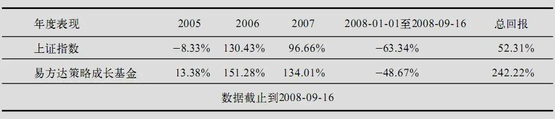

资料来源：晨星公司。

大多数的投资管理人会基于商业价值分析的理念而不是技术分析（价量趋势分析等）来进行投资组合的配置，也会参考那些收入高达几十万甚至上百万的分析师的报告。虽然他们并非个个那么精明地经营着投资组合，但其中有一些还是令人敬仰的。

比如中国证券基金投资界的肖坚，在担任易方达策略增长基金经理时，为投资者在2004～2005年上证指数下跌22\.5%的熊市中仍然取得了20%左右的正向回报；时任上投摩根中国优势的基金经理吕俊，在2005年初果断地买入了宝钛股份这只高速成长股，而后又买入三一重工和吉林敖东，且这三只股票都曾在基金组合中位列第一重仓股，也都是牛市中的超级牛股，为中国优势基金的投资者创造了优秀的投资业绩。在中国股市存在投资价值，即市盈率偏低或合理时，应该更多地选择他们。

但中国有句古话说得好：“好景不常在，好花不常开。”当中国股市的平均市盈率高达40倍甚至60倍时，即股价被严重高估、失去了投资价值后，上证综合指数短期内再攀高峰的可能性就变得微乎其微了，你手中持有的股票基金应声下跌也是自然而然的事。这就是证券市场的规律：价格跟着价值走。任何希冀、猜测和美好的愿望（比如奥运）都不能改变这个规律，我们所能做的就是掌握规律并运用它。

当中国A股暂不具备投资价值时，我们应当理性果断地做出调整资产配置的决策。将无投资价值的高风险资产转移到另外的一些具有投资价值的品种，或寻求能够对冲本地市场风险的一些投资品种（如对冲基金），因为你要在本地市场的一片狂风暴雨中驾驶着传统的股票基金这艘帆船逆风前行实在是太难了。

而在海外市场还是有不少具有投资价值的股票基金的。比如：Evy Hambro执掌的贝莱德世界矿业股票基金。从2002～2005年，当中国的投资者饱受A股上证指数持续下跌的折磨时，贝莱德世界矿业基金每年均获得了正向回报，同期回报达245%。历年收益如下图所示：

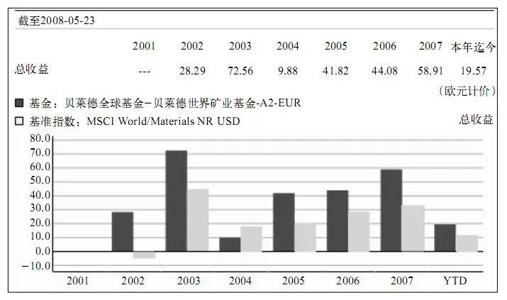

资料来源：晨星（香港）公司。

即使在2007年8月，美国次贷危机爆发导致美股下挫，标准普尔500指数下跌约16\.5%；中国股市由于市盈率过高，理性回调多达约50%的那段时间里，贝莱德矿业基金在2008年1月1日至5月23日仍然取得了19\.57%的正向回报（欧元计价，不考虑欧元对人民币升值的汇率额外收益）。当然还有其他的股票基金在同期取得了正向回报，如贝莱德世界能源基金、德意志环球神农基金、贝莱德新兴市场短债基金和太平洋总回报基金等。

因此，你不必也不应该只将眼光局限在国内股票市场，世界很大、机会很多，闭门造车，最后苦闷的是自己。供一般个人投资者投资的金融产品大致可以分为四类：股票类投资、债券类投资、大宗商品类投资和货币/外汇类投资。你完全可以自由地在这四个主流的金融通道中进行路线的切换，而不是在股市堵车时傻傻发呆，甚至是发泄情绪。这样做就有机会保持整个投资组合稳定地驶向成功的彼岸。

本书的另一核心宗旨是要告诉你不要盲目地听从大众的主流观点：“长期持有”、“不要把鸡蛋放在同一个篮子里”、“企业的基本面依然向好，应该持有”或“中国GDP增速仍全球第一，应该买入持有”，等等。要学会理性地判断上述那些投资机会，而更为重要的是要学会如何从成千上万的投资机会里把它们选出来并买入持有。

这需要眼光、理性和智慧。读完本书，你是可以做到的。

这本书适合泛读还是精读？

如果你选择泛读，我建议不读也罢，因为泛读本书无异于你在参加高考之前把数学书当漫画看完后，回头批评写书的人并没有教你如何进行简单的函数分析，导致你的数学基础概念仍然模糊不清。

如果你是一家企业主，你一定会审慎地阅读财务报表；如果你是一名销售经理，你一定会仔细地浏览销售计划；如果你要做成功的投资规划，你也一定要精读本书的要点。书中会介绍一些金融投资的基本概念、知识和运用它们的方法。比如：市盈率（P/E）、每股收益（EPS）、期权（option）、零息债券（zero coupon bond）和买入卖出投资组合的时机等。如果你对这些概念一窍不通，你做证券投资就是在碰运气，即使是在理财顾问的建议下做出的决策，也是闭上左眼用右眼去窥视左手边世界的原貌。

如果你能静下心来，慢慢地品读本书，你会发现投资规划并没有那么难。但为什么大多数人会成为证券市场的牺牲品呢？原因主要有以下两点：

1\.缺乏必要的投资知识和技能。如果你略知一二或似懂非懂就进行投资规划，就好比混到了驾照就觉得自己是优秀的驾驶员一样，会开车不等于能开好车。有过在市场赚钱的经验不等于你就有赚钱的技能，而很多人把这两者等同来看了。如果能掌握一些基本的投资技能，那么未来的投资之路则会由你掌控。

2\.人性的贪婪和恐惧。如果你不具备上述的投资知识和技能，就不可能理性地看待市场的波动，尤其在投资组合下跌时。由于“无知”的种子发芽后萌生出的“贪婪”和“恐惧”扰乱了你的思绪，所以有时你会盲目地要求一年50%甚至更高的回报，尽管有时确实能够达到甚至远远超过，但有些时候你会因为投资组合下跌超过15%而开始怪罪市场、监管机构或理财顾问。不要这样，盲目的要求和一味的抱怨并不能帮助你管理好你的投资组合，真正成功的投资者一定是理性而冷静的。

为了帮助你清晰地了解证券投资的一些要点，本书绘制了一幅投资航行的路线图，以便帮你做出正确的决策，并最终成功地驶向彼岸。最为重要的是这些观点并不是建立在人云亦云的“投资圣经”上，而是另开一扇窗，让你看到云后的阳光，并沿着光明不断前行。

本书主要分为三个部分。

第一部分将对传统投资规划的观念进行批判性的思考。到底投资赢家的理念是怎样的？那些天天听到的、看到的投资谏言，“长期持有”、“不要把鸡蛋放在一个篮子里”真的是你做出投资决策的重要依据吗？为了回答这些问题，我们需要学习一些证券投资规划的基础知识和理念，以便我们能过滤掉市场的噪音，抓住最真实的东西——投资价值！

第二部分将会为你介绍目前证券市场上的一些主流投资产品。目前市场上的投资产品种类繁多，绝非大众口中流传的股票基金和银行理财产品两类，这实在是一种误导。我希望这一部分能够让你清晰地了解目前市场上一些主流产品的种类及各自特点，以帮助你与理财顾问交流后，不会被他的高谈阔论所倾倒而做出可能令自己后悔的投资决策。当然，这部分关于市场主流产品的介绍有可能读起来比较枯燥，毕竟在介绍产品的特性时必须包含客观的数据和从法律角度阐述的投资条款。不过，你可以有选择地阅读，先阅读你急需了解的部分，然后再阅读你将来可能投资的产品的材料。最后，我还是建议你能全部阅读完，因为只要你去银行选择理财产品，就一定会碰到这一篇里介绍的产品类型。如果你很清楚理财顾问在向你介绍什么类型的产品，并了解它们的特性，你就能理性而客观地做投资决策了。

第三部分将会根据不同的投资风格来进行资产配置。打个比方，你现在要组建一支足球队，那么你肯定需要有前场、中场、后场和守门员来共同组成，投资规划亦然如此。如果你的投资组合中只有股票类投资，那么在市况不佳的时候将会使你承受较高的风险，甚至导致亏损。或许你会说我长期持有，不在乎一段时间的浮亏，但如果这段时间是5年，甚至更长的17年，你还能说不在乎吗？我们不可能，也没有必要将所有的金融资产都投入到所谓“长期投资”的股票基金中去，在你对第二篇中介绍的产品有所了解之后，你会发现还有其他很多迷人的投资方式。

投资理财是件有趣的事情，因为你可以通过发现一些市场机会，靠智慧和眼光用钱赚钱；投资理财也是件困难的事情，因为做不好不但赚不到钱，反而会把辛辛苦苦积累的资本赔掉。所以，在进行投资理财的远航之前，应建立一套适合自己航行的风格与方法：学会适应天气的变化、学会识别航行中的暗礁，在迷雾中保持向灯塔前行，这样才能帮助你安全顺利地抵达彼岸，最终成为证券投资的赢家！

## 第一篇 市场赢家的理念

第一篇 市场赢家的理念

■投资赢家看市场

■经典理论的思考

投资理财理念先行，关于这点巴菲特曾说过：“如果你在错误的道路上，奔跑也没有用。”只有用正确的方法在正确的道路上前行，我们才能最终成为市场赢家。放眼环视，在证券市场中充斥着诸多投资理论：价值投资、趋势投机、行为金融、市场心理等。到底哪些是我们应该且能够信守一生的理念呢？这一部分将为你揭开谜底。

## 第一篇 市场赢家的理念 - (1) 第1章 投资赢家看市场

\(1\) 第1章 投资赢家看市场

2026年3月14日

9:57

第1章 投资赢家看市场

__站上巨人的肩膀__

伟大的物理学家牛顿曾说过：“如果说我比别人看得更远些，那是因为我站在了巨人的肩上。”这句话对于金融投资理财同样适用。美国证券市场已经发展了200多年，期间诞生了不少投资大师。如果我们能站在他们的肩上审视证券市场，那么我们同样也可以看得更远些，而更重要的是我们将看得更深刻些。

在我们进入证券市场之前，下列大师级人物的思想是必须了解的。

约翰·梅纳德·凯恩斯

史上最伟大的西方经济学家之一，约翰·梅纳德·凯恩斯：他的经济学著作《就业、利息与货币通论》奠定了现代宏观经济学的基础，其思想一直影响着现代诸多经济学家和经济政策制定者。本书中有些对经典投资理论的批判性思考将以凯恩斯思想为基础。也许，作为非经济界人士的你对凯恩斯并不熟悉，不过这并不妨碍你对他思想的理解。通过下面一段他对经济学家的评论，相信你可以感受到他深邃的思想和非凡的见解力：

经济学研究似乎并不需要任何极高的天赋。与更高深的哲学或纯科学相比，经济学不是……一门极其容易的学科吗？一门容易的学科，但这个学科中很少有人能出类拔萃！这个悖论的解释也许在于杰出的经济学家应该是各种罕见天赋的组合体。在某种程度上，他应该是数学家、历史学家、政治家和哲学家。他必须了解符号并能用文字表达出来。他必须根据过去、着眼未来而研究现在。他必须考虑到人性或人的制度的每一部分。他必须同时保持果断而客观的情绪，像艺术家一样冷漠而不落流俗，但有时又要像政治家一样脚踏实地。

读完上述凯恩斯对经济学家的论述，你该知道在这门“容易”的学科中罕有出类拔萃的经济学家的原因了吧？但更重要的是我们要努力使自己在投资理财时既要像艺术家那样冷漠而不落流俗，又要像政治家那样脚踏实地地实践既定的投资原则。这样，我们就能向这些大师靠得近一些，尽管大多数人永远不能成为投资大师。但这有什么关系呢，我们需要的只是站在他们的肩膀上，这就够了。关于凯恩斯思想在本书中的运用主要体现在对股票市场宏观层面上的思考（如市场平均市盈率）和宏观经济对资本市场的本质影响等方面。

下面要介绍的另一位大师是众所周知的股神沃伦·巴菲特：他从11岁开始便投身股海，坚持价值投资的理念并信守一生，忽略市场的噪音，不断利用市场的“愚蠢”进行有规律、有原则的投资，最终成为全球最成功的投资大师，并成为世界十大富豪之一。本书中关于股票资产的投资理念将会以巴菲特的思想为基础：即基于商业价值分析进行投资决策。

沃伦·巴菲特

如果你是根据市场的趋势来追涨杀跌，或者基于其他有悖于基本事实的分析，比如道听途说某行业正在经历革命性的变化来做投资决策，那么你便不是价值投资者。巴菲特的老师格雷厄姆也曾对价值投资做出定义：投资是根据详尽的分析，确保本金安全和满意回报的操作。不符合这一标准的操作是投机。这里详尽的分析就是对公司的价值分析，即“投资的商业分析”。

或许到现在你依然对价值投资抱有成见并认为趋势投资更为有效，不过从纵观历史、横览世界，没有一位投资大师是趋势投资的信徒，他们全部都是价值投资的忠实簇拥者。他们包括：股神巴菲特、最伟大的基金经理之一彼得·林奇、国内颇有名气的华夏大盘基金经理王亚伟、前上投摩根中国优势基金经理吕俊和有“基金一哥”之称的前易方达策略增长基金经理肖坚等。

在国内证券投资史上也有一个经典案例可以更为形象地说明价值投资与趋势投机的区别：

中国A股市场上有一只股票000557 ST银广厦，在2000年初股价仅14元左右，到2000年末股价收盘为37元的新高，折合为除权前的价格75\.98元，短短一年时间累计上涨440%（详情见图1\-1，图中所示股价为向前复权价）。如果你仅仅根据价格趋势或未经证实的公司消息：“利用二氧化氮临界萃取技术生产的蛋黄卵磷脂等产品的出口额将达5000万马克”来进行投资，你有可能获得暴利，但也有可能遭遇随之而来的“滑铁卢”，连续15个交易日无量跌停（见图1\-2），而此时它的股价不过13元，下跌幅度达83%，这只是总共在21个月内发生的事情。14元开始，经历疯狂、摇摆、喜悦、狂热和亢奋后，又回到了当初的14元，你在这个故事中获利的唯一原因就是“运气”，你赌对了。不过，如果你继续赌下去，还能赢吗？你去澳门的赌场玩上两个小时就知道答案了……

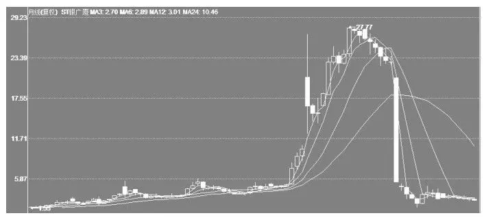

图1\-1 银广厦疯狂上涨

资料来源：同花顺资讯。

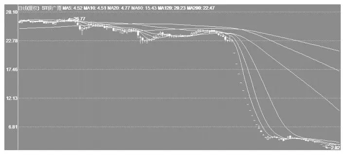

图1\-2 银广厦连续跌停

资料来源：同花顺资讯。

如果你能够坚持价值投资这一理念，虽然你失去了这次可能获取暴利的机会，但是你也躲过了灭顶之灾。有“国内私募基金界教父”之称的赵丹阳曾在银广厦轰动一时之际亲赴银广厦进行调研，当时他并没有去公司，而是直接到天津税务局，看银广厦每月的用电额度，当发现这么大一个公司每月用电额度仅有一百多度时，他立刻就打道回府。当然，他更没有在股价远远没有达到75元时追进投资。因为任何一个价值投资者都遵循最基本的道理：通过基于商业事实基础之上的分析，得出合乎情理的推论，再进行判断。显然，银广厦的预期业绩暴增，投产量大幅提高与它一个月仅有一两百度用电额度的事实完全相违背，即使它的股价还在强力地拉升，作为价值投资者也绝不会去买一股它的股票。因为，它没有投资价值！

价值投资，是一个永远说不完、学不完的课题，因为世界总处于变化之中，不过其基本道理却是永恒的。我想这也就是为什么赵丹阳在如此成功之后还要花211万美元与股神巴菲特共进午餐的原因吧。

股票类投资仍然是证券市场投资的主流品种。一般来说，从长期来看（10年以上），股票类资产的回报最高，从短期来看（1年以内），股票类资产也有获得高回报的可能，中国上证指数从2006年初到2007年底累计上涨达352%即为例证。不过，不论你是长期持有策略还是短期投资，都应信守价值投资这一理念。

另外一位投资大师比尔·格罗斯或许不为大众熟悉，因为他只从事债券方面的操作，但在全球债券市场上，他就是债券之王。他管理的太平洋总回报债券基金，自1987年开始，在随后的15年时间里取得了每年9\.5%的平均回报。他与合伙人在1973年创立的太平洋投资管理公司（PIMCO）现在管理着超过4000亿美元的资产，他一句话就能引起14万亿美元债券市场的震动。30多年以来，他每天早上4：30起床，起床后的第一件事就是到地下室，打开彭博和Telerate的数据终端机，查看10年期国债的变化、全球债券市场的情况、各种货币的汇率情况，以及股票及债券指数；最后，格罗斯会看看他的幸运骰子是否还在昨天晚上所处的位置。然后，经过12分钟车程到纽波特海滩，走进太平洋投资管理公司的交易大厅，随随便便地坐在椅子上，轻轻打开他桌子周围的4台电脑——每天都是相同的程序。

债券之王 比尔·格罗斯

在本书中关于债券类资产投资的策略都是基于这位债券大王的思想。读到这里，或许有读者会问，既然股票类资产的长期回报最高，那么为什么还要投资债券类资产呢？原因很简单，你并不会也不需要将所有的钱都投入到高风险高潜在回报的股票类资产上，即使从短期来看，股票类资产存在获得高回报的可能。但是如果短期来看股票类资产已经失去投资价值了，比如在2007年年中，中国A股平均市盈率达到40～60倍的时候，那么债券类资产应该是资产配置的主要部分。我明白，到此依然还是有不少投资者对债券类资产的投资，如普通债券基金、短债基金、通胀连系债券基金等抱怀疑和质问的态度，那么就让我用下面这个小故事比喻来回答你吧：

一位客户询问：当股票的长期表现优于债券时，固定收益投资组合的合理性何在呢？

一位理财顾问则反问了以下几个问题：

·你仅仅在开车进城时才系好安全带吗？

·乘坐一艘完好无缺的船时，你会带上救生筏吗？

·即使没有火灾你也会在家中备有灭火器吗？

如果以上回答是肯定的，那么你就应该在整个投资组合中配置一些债券类资产，如债券基金——以防万一嘛。

还有几位在金融投资界享有盛名，且在长期的投资实践中取得了巨大成就的投资大师，其中一位是巴菲特的老师本杰明·格雷厄姆，他创立了价值投资体系并著有《证券分析》一书，为价值投资奠定了基础。还有一位是彼得·林奇，他是美国，乃至全球首屈一指的投资大师。他对投资基金的贡献，就像乔丹对篮球的贡献，他把基金管理提升到了一个新的境界，将选股变成了一门艺术。在他担任富达公司的麦哲伦基金经理的13年间，每年都取得了正向回报，年均复利报酬率高达29%，几乎无人能出其右。由于这两位也都是价值投资的忠实信徒，与巴菲特处在同一群体，所以在有关股票类投资的篇章中，我将与大家分享这三位投资大师的思想盛宴。

投资理财是一项智力密集型劳动，要成为这个行业的佼佼者必须要有艰辛的付出和坚忍不拔的意志。不过，作为普通投资者的我们，只需要站上巨人们的肩膀，并坚持正确的投资理念，也能获得不错的回报。但如果我们总是要求找到像彼得·林奇管理的那种基金，无异于在人生的每次选择中都要求得到最好的，这种理想中的完美或许并不能给我们带来快乐和满足，只会带来更多的失望和痛苦。如果我们总是因为没有得到最好的而感到痛苦，这样的人生也太悲哀了一些，不是吗？所以，只要坚持值得信守一生的价值投资理念，那就能不管风吹雨打，胜似闲庭信步。

__应对市场的波动__

有这样一个古怪的人，他患有典型的精神病，经常做出两种性质截然相反的举动，让正常人匪夷所思。他可以在某段时间里到处借钱来买根本没有价值的东西，然后又持续几个月疯狂地消费，而在另一段时间里他又像伟大的古希腊哲学家一样充满智慧地高谈阔论。他可能在极度亢奋的状态下引诱你去买下金茂大厦，然后又突然变得沉默寡言，让你异常寒栗。即使是极为细小的一点点烦恼，如不在上海兴建迪士尼或不降印花税等，都会让他大动干戈，怒气冲天。

上述的例子只是一个比喻。我所描述的这个“古怪的精神病人”，实际上就是证券市场。证券市场有时极度兴奋，有时平平静静，有时却又充满恐惧，好似世界末日来临。当有大量资金投入时，它会无所忌惮地向上直窜；而当资金大量撤出时，它又飞流直下三千尺。它总是这样反反复复、上上下下，就像马戏团里跳弹簧的小丑一样。它会不时地编织出不费吹灰之力而一夜暴富的神话，不过一旦有哪个公司没有达到应有的预期，它就立刻板起面孔，骤然暴跌，直到把你深深地拖进沼泽地。

这种证券市场总是处于巨大波动中的情况，无论在欧美成熟市场，还是在包括中国在内的新兴市场都是普遍存在的。市场先生也并非如大众所言总是处于病发状态，他有时是理智清醒的，有时是半梦半醒的，有时则是极度疯狂。当我们决定与市场先生为伍时，首先需要做的就是认清他处于什么状态，然后在他理性清醒的时候参与进来，在其他两种状态下撤出，更好地保护自己。

那么，到底什么时候市场先生才是理智清醒的，什么时候又是半梦半醒或极度疯狂的呢？你需要了解证券市场两个最基本的概念：一个是“市场价格”（以下简称价格），一个是“市场价值”（以下简称价值），这两个概念是理性认知证券市场的必要基础。

我们先来看看你在实际生活中极有可能碰到的情况，这有利于快速理解价格与价值的关系。当你准备投资一套100平方米的房产时，房地产商会给你一个报价，比如100万元，这个就是价格。当然让你还会去参观样板房，你可以估算一下这套房产的地价、建筑成本、装修成本等，再加上房地产商10%～15%的合理利润，这些是建筑这套房子的固定价值。同时，我们投资一套房产要考虑的不仅仅是住在里面的舒适程度和满意度，还会考虑周边的自然环境，比如绿化程度、有没有江景海景、是不是依山傍水等；还会了解周边的生活配套设施如何，比如有没有购物超市、交通是否便利、小区是否足够安全等，这些是这套房子的附加值。上述这些固定价值和附加值全部加起来就是这套房产的价值，你可以找一位房地产估价师来帮你做这套房产的价值评估。如果这套房产的价值是150万，哇！有50%的升值空间，如果你手上有足够的钱，为什么不买下呢？但如果这套房产的价值只有70万元，那你为什么要花100万投资价值只有70万的房产呢？所以，当投资标的（投资买入的目标）价格低于其价值时，市场先生就是理性清醒的，你应该投入其中进行购买；当投资标的价格高于其价值时，市场先生就是半梦半醒或极度疯狂的，你应该手持现金或考虑其他投资标的，坚决不参与这类投资，直到价格低于价值。

上述房产投资的例子在近几年的房地产市场中屡见不鲜，当深圳、北京、上海某些楼盘的价格被非理性地推高，远远脱离其价值之后，怎么还可能期望着它继续升值呢？

我们回到证券市场，每天你通过互联网的财经网站、证券分析软件等可以及时观察到各种股票、债券、基金等的市场报价，这就是我们所说的证券价格。要分析出某只股票、某种债券的价值，是所有证券分析师唯一要做，也是最难做好的事情。证券价值的评估要比其他资产价值的评估难出许多，其原因在于公司的发展是动态的。在有些年份，公司的发展比较好，利润增加得比较快；而在某些年份，公司的发展比较一般，甚至比较差，利润不仅不增加，而且有可能出现停滞或倒退，出现公司亏损的状况。还有一种情况也是我们必须警惕的，比如在2007年，中国A股上市企业的平均利润增长确实高达59%，但是整体而言，股票的价格太贵了，远远超出了应有的价值，所以，即使2007年后半年中国经济发展依然强劲，但股市仍然持续下跌。原因很简单，价格向应有的价值理性回归。

巴菲特在购买股票类资产时，总会把投资的安全边际放在首位，而不是获益空间。投资首要的是要足够安全，其次才是获取收益。领悟到这一点的重要性足足花了我五年时间，希望你能用更短时间明白这个道理。如果某只股票的价值是100元，其价格是80元，那么你就有20%的安全边际\[\(100\-80\)/100×100%=20%\]；如果这只股票的价格是60元，那么你则有了更高的安全边际，40%。当某股票类资产的价值远远高出其价格时，这种资产就有了非常高的安全边际，这就是价值投资的核心要素。

要理性客观地分析出股票等资产的真实价值，确实是一件非常难的事情，即使对于顶尖的证券分析师也是如此。但证券投资并不是一门像数学、物理学那样必须精确计算的学科，它是综合了一点数学、一点逻辑、一点历史和一点艺术的综合体。在我们熟知且准备投资的行业和地区里，我们只需参考那些诚信并且优秀的分析师得出的估值结果就可以了，然后比较一下价值和价格孰高孰低。在这里，就为大家介绍一个简单实用，能够有效评估某只股票是否具备投资价值的著名指标——市盈率。

市盈率是上述提到的诸位投资大师最为关注的重要指标。它是每股市价与每股收益的比率（price/earnings ratio），也被称为本益比（p/e ratio），或市盈率倍数，或者简称为市盈率（P/E）。市盈率是一个用来描述股价和收益之间关系的简单的数字指标，它也是一个十分有用的指标，用来判断股票价格相对公司潜在盈利能力是高估、合理还是低估。

例如，在今天的主流财经网站上，我看到中国建设银行A股的市盈率是20倍，计算时用的是股票当前的股价6元，然后除以公司前12个月或者前一个财政年度的收益（在这个例子中每股收益是0\.3元），用6除以0\.3就能得出这家公司的市盈率为20倍。

市盈率可以看做是一家上市公司获得的收益可以使投资者收回最初投资成本所需的年数，前提是要假定公司每年的收益保持不变。假如你用600元买了建设银行100股的股票，目前该股的每股收益是0\.3元，因此你购买的100股股票一年后应该获得的收益为30元（0\.3元/股×100股），而你最初投资的600元需要20年的稳定而持续的收益才能完全收回，但是一旦你知道股票的市盈率，那么你根本不需进行上述计算就可以得出答案，一看建设银行股票的市盈率为20倍，你马上就知道收回最初投资本金需要20年。

如果你买一只股票的市盈率是2倍，那么只要两年你就能用获得的公司收益挣回最初的投资，但是如果一只股票的市盈率是40倍，你就必须等待40年的时间才能用获得的公司收益收回最初的投资成本，到那时你可能已经是白发苍苍的老爷爷或老奶奶了。既然周围有这么多低市盈率的股票和股票基金，为什么还会有人会买高市盈率的股票和股票基金呢？这是因为他们想在邮包搬运工人里找到未来的著名影星周润发，他们期望着公司收益的增长如周润发当年拍了《上海滩》一样身价倍增。当然，拘泥于市盈率固然很傻，但完全不理不睬市盈率也不可取。

市场有其自然本性，永远处于波动之中。理性应对市场波动的最佳方法就是找到价值被低估的资产，在价格低于价值时投资，即使投资标的价格还在下跌；在价格高于价值时撤出，即使价格还在上涨。对于股票类资产，就是去寻找市盈率较低的投资组合，给予重点考虑，而对于市盈率高得离谱的投资组合则应予以放弃。关于这一点我们将在下文做详细的分析。

__证券市场的秘密__

在证券市场上一直都存在一些公开的秘密，正如你知道在你这行一些外行所不知或不熟知的秘密一样。撒谎是愚蠢和错误的，但过于诚实有时也会被视做另类。证券市场也是在谎言与真实的矛盾中不断前行的。对于投资者，尤其是中小投资者而言，你们是这个市场的弱势群体。所以，在你涉足这个市场时，首先要学会的是如何保护自己，不要被主流金融机构看做是金科玉律的经典理论所迷惑。

当你参加证券公司的股评时，他们鼓励你进行频繁的短期交易来获取暴利，因为他们靠收取证券交易佣金来发放奖金；当你参加基金公司的投资讲座时，他们鼓励你进行长期投资，因为他们靠你的基金资产收取管理费来发放年终奖；当你参加银行的理财讲座时，他们又鼓励你进行多元化投资，因为他们靠你不断投资的资金收取认购费。

不管是券商，基金公司还是银行，他们这样做本身并没有错，因为上述这些费用是他们生存和发展的基础。我之所以谈到这些问题，是想告诉你，不要因为他们为你提供了不切实际、虚无缥缈的赚钱机会就冲动地做出投资决策，而是应该在你对金融投资有了最基本的了解之后，遵循投资规律做出适合自己的决策。

我们先来看看股票市场的秘密。在股票市场上一直充斥着各式各样的论调：政府调控的“政策市”、大型金融机构操纵的“庄家市”、宏观经济影响的“混沌市”和一些民间股神股圣指点的“K线市”等。我们静下心来，问问自己“这些真的就是影响股市走势的本质因素吗？”看了下面的分析，你会发现这些都不过是庸人自扰而已。

前面我们谈到了分析股票类资产有无投资价值的一个重要指标——市盈率。要全面讨论全球市场不同行业、不同类型公司的股票市盈率，恐怕一整本书的篇幅都不够，这样一来恐怕你就不愿意读下去了。你的客户经理和投资顾问应该是你分析市盈率的最佳信息渠道，你可以问问他你现在持有的股票投资组合的市盈率是高于、低于，还是接近于所在地区或行业的平均市盈率，当得到的答案是“目前这个股票投资组合的平均市盈率低于行业平均”的时候，这句话就意味着这个投资组合的市盈率相对偏低了。

理财顾问也可以为你提供你所持股票组合的市盈率记录，这些信息他可以从投资银行、证券公司或基金公司等产品发行或研究机构获得。当你准备对一项股票类投资组合进行投资时，你可以追踪了解一下这个股票组合所处的市场或行业最近几年（最近15年为佳）的市盈率记录，以便大致判断正常的市盈率应该是多少。

关于市盈率，在进行股票类组合的投资决策时，绝不可以遗忘（稍后你便知道答案）。但最为重要的一点是：千万不要在市盈率特别高的时候买入。只要你坚持不在市场市盈率特别高的时候进行投资，你就能避免巨大的投资亏损所带来的痛苦。除了极少数的情况外，过高的市盈率正是股价上涨的阻碍，正如特别重的马鞍是赛马奔跑的障碍一样。

你所持有的股票投资组合的市盈率并非是独立存在的，而是和市场其他的股票相互依存。所有上市公司的股票组成了一个整体市场，作为这个整体的股票市场本身也有一个自己的市盈率，称之市场平均市盈率。股票市场的平均市盈率对于判断市场整体上是高估或是低估是一个很好的风向标。

市盈率是股票市场价格与其每股收益的比值，是一个比率的数值，不是一个静态的绝对值（市盈率=每股价格/每股收益）。

当市盈率升高时，可能是在每股收益不变的情况下，股价上涨了；可能是在股价不变的情况下，每股收益下降了；也可能是每股收益提高了，但股价上涨得更快；也可能是股价下跌了，每股收益下降得更快。所以，孤立地分析市盈率数值的变化并不全面，一定要结合股票市场价格的变化来观察市盈率的变化，才能抓住核心要素——有无投资价值！

中国有句古话，“以铜为镜，可知美丑；以人为镜，可知得失；以史为镜，可知兴衰。”这句话对于了解证券市场也有借鉴意义。

我们先来观察下中国A股上证指数及其市盈率自1993年1月～2008年7月的历史状况（见图1\-3）。

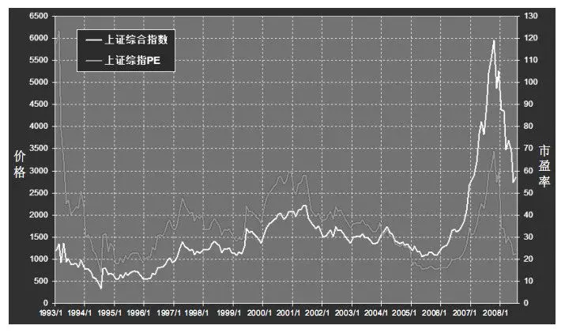

图1\-31993~2008年上证指数及市盈率

资料来源：万得资讯。

本书中的中国A股上证指数及其市盈率的数据之所以只摘录了从1993年1月到2008年7月的数据，一是因为1993年1月之前的市盈率数据严重失真，二是因为我写到这的时候正好是2008年7月。不过，这并不妨碍我们对上证综合指数的历史做清晰的判断。

图中左边纵轴对应的是上证综合指数的数值，右边纵轴对应的是上证A股平均市盈率的数值，横轴是时间刻度。浅色波浪线代表了上证综合指数的历史走势，深色波浪线代表了上证A股的平均市盈率走势（图1\-4、图1\-5类同）。

在1993年4月，上证综合指数的数值约为1300点；在2001年6月，上证综合指数的数值约为2200点；2007年8月，上证综合指数的数值约为5200点。如果你仔细留心下，便可发现在这三个不同的时点上，虽然上证综合指数的数值相差非常大，但是其对应的平均市盈率却都是惊人的相近——60倍。随后，上证综合指数便开始进行大幅度修正，直到市盈率趋于合理。无论在1993年国人对互联网这一新兴事物有着多高的期盼，还是在2000年热情地盼望申奥成功后的股市上扬，或是在2007年对奥运行情的企盼是多么强烈，但这些美梦最终都没能成真。中国的A股投资者都在这些美梦中随暴跌的上证指数纷纷倒下。这就是股票市场的规律：价格跟着价值走！当上证指数的平均市盈率过高时，这个市场根本没有投资价值，股价下跌、指数回调是必然的趋势。任何人都不能去改变这个规律，但是我们可以运用这个规律：在这个市场没有投资价值时，卖出A股市场的股票资产，转移到有投资价值的市场或国内的债券资产上。

当你在市盈率高得离谱的情况下去买入股票资产时，等待你的极有可能是夕阳后的漫漫长夜。自2005年年中掀起的一波A股牛市中，当上证综合指数上涨到3500点左右，即上证A股平均市盈率达到40倍左右时，私募基金“教父”赵丹阳逐步清盘是不无道理的。他遵循价值投资理念，在当时那个市场里他已经找不到具有投资价值的股票，唯一能做的就是离开这个暂时没有投资价值的市场。当然，他也错过了由3500点上冲至6100点的巨大涨幅，但是他清楚地知道自己在做什么——这不是赌博！是在做理性的价值投资！能做到不受市场诱惑而心静如水实在难能可贵。所以，当你在市盈率40倍、50倍甚至是60倍买入国内股票基金时，如果你现在还持有的话，你应该知道亏损的原因了吧！

回顾历史，我们发现上证A股平均市盈率处在20～40倍这个范围的时间最长，对于中国这个全球经济成长性最好的国家来说，历史已经给了我们答案，20倍以下的平均市盈率即是可以考虑的投资时机，但不意味着只要平均市盈率在20倍以下就应该立刻投资（A股即日市盈率可在相关如票分析软件首页查询，如同花顺）。正如你所见，高市盈率意味着高风险，极有可能发生随之而来的下跌；低市盈率对应着低风险，只是亏损的可能性比较低，并不意味着股价一定会上涨，可以获得较好的投资回报。推动股价上涨的核心动力是企业利润的增长！试想你作为一家上市的大股东，你是不是也期望着这家公司的利润不断增多呢？即使股价不上涨，你也可以得到更多分红。当市盈率较低，公司每股收益（EPS）又稳定持续增长时，股价上涨则是必然的了。

所以，当某个股票市场的平均市盈率较低（历史同向比较），且该市场中上市企业的每股收益（EPS）又相比过去大幅增长时，这就是最佳的买入投资时机。如果你买入后，这些股票投资组合反而在一段时间内下跌了，你应该做的就是不断加码买入，迟早这个市场会给你带来满意回报的。

下面，我们再来看看美国股票市场（见图1\-4）。

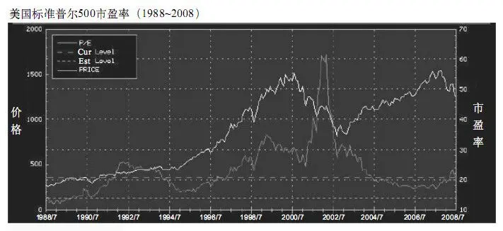

图1\-4 美国股票市场

资料来源：彭博资讯。

图1\-4的数据显示了美国股市标准普尔500指数及其市盈率自1988年7月～2008年7月的走势。美国标准普尔500指数是全美市值最大的500家公司股票价格综合编制而成的指数，这500家上市公司的总市值占美国股市总市值的75%，具有相当的代表性。

我们可以观察到在1998年年初，当标普500的市盈率接近30倍时，市场发生了一次重挫。在1999年年中标普500的市盈率又攀高到35倍，虽然市场又接近上涨了一年，但在随后的两年中，标普500指数的跌幅高达50%。标普500自1999～2002年的表现和中国上证综合指数从2007年年初到2008年年中的表现是不是有异曲同工之处呢？

有意思的是，从2004年年中至2007年年中，美国标准普尔500指数持续稳健上涨，而与之对应的平均市盈率却在不断调低。这说明了平均股价上涨的速度比平均每股收益增长的速度要慢，反过来说就是平均每股收益增长的速度超过了其股价上涨的速度！自2004年年中至2007年年中，标准普尔500平均市盈率一直在20倍以下，任何时点都是投资时机。

国内有不少投资者在指数上涨一定程度后，就习惯性地凭感觉认为是高点不敢投资了。相信此时，你应该明了指数涨跌根本就不是投资决策的重要依据，只要有投资价值，指数就会继续健康持续地上涨，直到没有投资价值然后开始转跌，这是证券市场的必然规律。如果有一天，上涨指数持续上涨，但其平均市盈率却保持调低的趋势，而且在20倍以下，我希望你不要错过了黄金投资时机。

最后，我们来观察一下香港恒生指数及其市盈率（见图1\-5）。

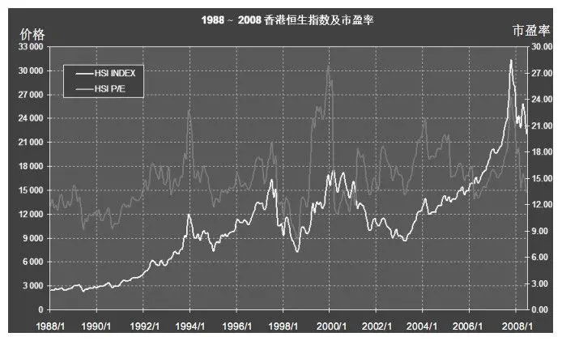

图1\-5 香港恒生指数

资料来源：香港联交所。

图1\-5显示了香港恒生指数及其市盈率自1988年1月至2008年1月的走势。相信大家对香港恒生指数并不陌生，它代表了香港股票市场上市公司股价的综合表现。

在图1\-5中，我们可以非常清晰地观察到在近二十年中，每当恒生指数的市盈率接近或超过24倍时，市场都会有一轮较深的调整。只有1997年，在恒生指数市盈率不到20倍时，市场就发生了较大的调整，因为在1997年发生了亚洲金融危机，香港亦受累其中。这种事件的发生犹如2008年5月四川汶川大地震一样，让人猝不及防。不过在危机中，也可以看到机会，在1998年年底，恒生指数的市盈率达到历史新低的9倍，难道不是太便宜了吗？随着金融危机的退去和香港经济的重振，那时就是最佳的股票组合投资时机。

值得注意的是，香港在1997年沦陷亚洲金融危机之前的大半年时间里，恒生市盈率一直在15～19倍之间。整体而言，香港股票市场并没有泡沫，还是有投资价值的。但是在遭遇亚洲金融危机后，股指仍然出现了大幅下挫。在2007年8月至今的美国次贷金融海啸中，也发生过同样的事情，标准普尔500指数及道琼斯工业指数均大幅下挫20%以上。因此，当你所投资的股票市场遭遇突发性的金融危机时，应该及时地抛售掉手中的股票资产，暂时避一避这场金融风暴，无论当时市场的平均市盈率是高还是低。待到金融风暴过后，一般情况下市场指数会被打压得很低，市盈率也出现新低，这时又是你进行价值投资的绝佳机会。

由于本书篇幅所致，就不在此介绍其他股票市场的指数和市盈率走势情况了。关于这方面的详细资料你可以向你的投资顾问索取，以便做出正确的投资决策。

最后，当你准备投资某一国家或区域的股票资产时，如果这一区域的市场平均市盈率已经达到历史同期高峰或非常高时，最好不要进行投资。如果已经投资了，这时是该卖掉该股票组合的时机。而如果该地区的市场平均市盈率较低，且该地区市场的上市企业利润增幅开始出现增长时，这时就是你投资的时机。

接下来，我们再来看看债券市场的秘密。

与股票投资相比，债券投资完全是个不同的领域，是一个受不同惯例和规则约束的陌生世界。在成为真正的债券投资者之前，你必须改变你的思维方式。华尔街有句老话：债券与股票的根本区别在于股票投资者看到的是天空，而债券投资者看到的是天花板。如果你认准了一个大股，对其投资，你就成为了公司股权的所有者，只要公司成长，你的权益也随之增长。你可以买一些正在高速发展的小企业股票，如果它成为下一个微软，天哪！你会成为一个百万富翁。如果你投资债券，那是在从事一项简单得多的交易。你只是把钱借给公司，期待到期拿回本金和利息。你如果购买支付6%年息的五年期债券，五年后你就能够拿回本金加上每年6%的累计利息。

然而，债券最可怕之处在于，当人们在股市中痛苦时债券价格上升，当人们在股市中欢笑时债券价格下降。这是因为当股市很糟糕时，债券市场成了投资者的避难所，蜂拥而至投资债券，使得债券供不应求，推高了债券价格。一般而言，当股市一片繁荣时，债券投资的回报率要比起股市低迷时要低一些。

然而，决定债券价格最重要的因素是利率。在债市的支点上，利率和债券价格总是处于跷跷板的两端。这完全是因为利率上升时，以前发行的债券（所付利息低于新发行的债券）的价格会下降。在经济一片大好、利率上升时，股票价格通常上升，而债券价格则下跌。债券得道之时就是利率下降之时，熊市抬头，股市日复一日惨淡，这正是债券类资产投资者微笑的时候。

结合上面两点，投资债券类资产的最佳时机就是在当地市场利率较高，股市市盈率达到历史高位，股价被严重透支的时候。我们以2008年1月至2008年10月的A股市场和债券市场为例（见图1\-6、图1\-7）加以说明。

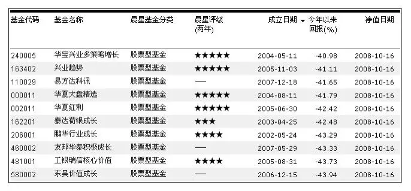

图1\-62008年1~10月份业绩排名前十的国内股票基金排名

资料来源：晨星公司。

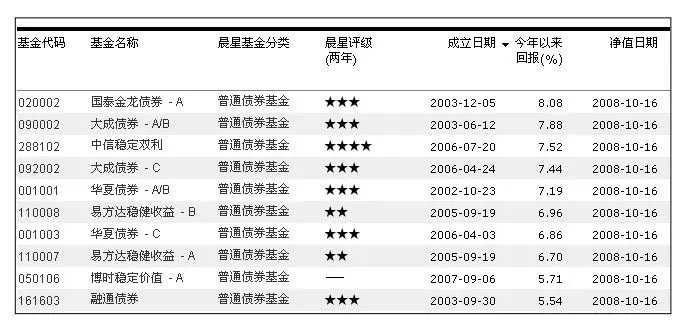

图1\-72008年1~10月份业绩排名前十的国内债券基金排名

资料来源：晨星公司。

在2008年1月，A股上证市场的平均市盈率仍然高达40倍（见图1\-3），股价被严重透支，暂无投资价值，而且当时的利率为近五年最高（见图1\-8），此时你如果投资国内股票基金就会随着指数的下跌产生亏损，而如果当时投资了国内的优质债券基金，便可以获得不错的收益。

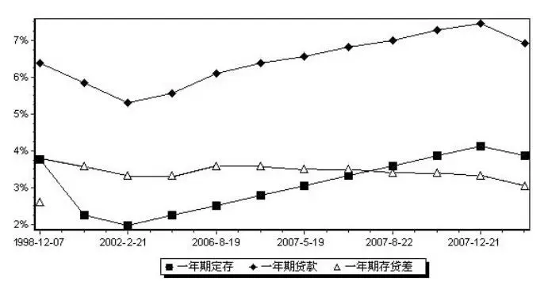

图1\-8 近10年人民币利率走势

资料来源：万得资讯。

如图1\-6、图1\-7所示，假设你在2008年1月（投资期截至2008年10月16日）投资了国内表现排名前十的股票基金之一，表现最好的那只股票基金也会产生41%的亏损，而如果遵循了上述投资原则，选了国内表现排名前十的债券基金之一，即使选的是最差的那只都有5\.54%的正向回报，而最好的则有8\.08%。

或许你会说债券基金我没有兴趣，回报率太低，我只喜欢股票类投资。而实际的问题是“你参与证券市场投资是投你喜欢的品种还是能赚钱的品种？你会在100万变成60万甚至更少的过程中获得喜悦，或是在100万变成108万的过程中感到悲伤吗？你是想在10个月的时间里亏损40%或者更多，还是更希望获得能够抵御通货膨胀的正向收益？”在证券市场成为赢家不是凭喜好和感觉的，而是理智和原则。如果你不能克服这点，你最终会成为这个市场的输家和牺牲品。

所以，当股市没有投资价值时，你应该将眼光投向债券、商品和货币/外汇市场，而不必承受不必要的亏损和痛苦。尤其在当地股市市盈率较高，利率也较高的时期内，投资债券基金会是一个不错的选择。待到股市有投资价值时，你再换个跑道也不迟。

## 第一篇 市场赢家的理念 - (2) 第2章 经典理论的思考

\(2\) 第2章 经典理论的思考

2026年3月14日

9:57

第2章 经典理论的思考

__长期持有的反思__

在证券投资界，最大的谎言可能就是“长期持有”了。关于这点，伟大的经济学家凯恩斯曾有所评论：“长期是对当前事务的误导。在长期中，我们都死了。如果在暴风雨的季节，他们只能告诉我们，暴风雨在长期中会过去，海洋必将平静，那么经济学家给自己的任务就过于容易而无用了。”虽然凯恩斯的这段评论是针对当时经济学界的批判，但这种思想对于今天的证券投资仍具有警示意义。

长期投资看起来似乎完美无缺，许多基金经理和投资精英都支持这种观点，所以很少会有人去思考它的合理性。在证券市场发展史上，大多数国家的证券市场就10年以上的时间来观察，各种股票指数又确实是呈螺旋式上涨的，故此在实践中似乎也得到了有力支撑。然而，这种机械式、赌博式的投资方式在经过深入推敲后，就像身上画着盔甲的稻草人一样，一推即倒。

首先，“长期持有”的观点是反对选时的。只要你投资证券资产了，就应该忽视市场的波动，进行长期持有。这种机械式的投资方式如果是正确的，那么你在中国A股平均市盈率达60倍时，即风险最高、最没有投资价值的时候去投资也是正确的，这显然与巴菲特等投资大师倡导的价值投资理念背道而驰。

其次，这里的“长期”到底为多长，没有一个人可以给出精确的答案，只能是仁者见仁，智者见智。大家可以看到公募基金是长期持有的强力支持者。或许你可以从他们的收入方式上理解为什么他们最支持长期持有，因为公募基金依靠相应基金资产的管理费来维持公司运作和员工薪水发放，这是公募基金最主要的收入来源。即使当他们投资的市场风险已经很高，没有投资价值了，出于利益诉求，他们也不可能鼓励你进行基金的赎回。这或许是投资实务界鼓励长期投资的主要原因，当然金融监管部门也应对基金管理人与基金投资人的利益分配政策进行深入的思考和改革。

在国内，当你参加各种理财讲座时，有时会听到主讲人说：“如果你在1990年投入100万元购买上证指数基金（假设有），那么即使被动地持有到2008年6月，你现在的资产已经达到2800多万了（此时上证指数2800点）。”关于这种论调还有其他诸多表达方式和角度，这里不一一列举。对于上述观点，仅从逻辑上讲，确实是正确的，不过实质上却是个谬论。

第一，作为投资人的你要在1990年有钱可投，但是并不是每个投资人在1990年都有足够的钱来投资，或许那时你还在念初中呢。还有，在1990年以后，甚至是在2000年才有钱可投的人怎么办呢？如果你非常不幸的在2000年才有钱可以进行投资，并且确实投资了当时的中国A股股票资产，在接下来的五年中等待你的只有漫漫熊途，而且深达50%，对于长期持有来说，五年不算短。当然，有人会跳出来说，A股不是在随后的两年报复性地收复了前期长达五年的跌幅，而且在2007年年底涨到5600点了吗？这种说法对于完全不懂市盈率，不懂价值投资的人来讲确实很有道理，既然以往的历史证明他“赌”对了，那么我们只能再次祝愿他在未来继续赌对！

第二，既然这种被动的长期持有是最佳策略，那么金融机构的理财顾问、投资顾问都应该下岗。反正长期持有就是了，你也不必劳心费力地去选择什么类型的投资组合，随便投资几个股票、债券组合长期持有就好了。顺着这种逻辑思考出的结果显然与中国日益壮大的理财市场有所相悖，无论是中资银行还是外资银行，都在招兵买马迅速扩大理财团队，准备为中国内地投资者提供全面的财富管理服务，你上51\.job上搜索一下就知道。那么，为什么这些客户经理和理财顾问在向你推荐适时而动的投资机会时都建议长期持有呢？最重要的原因恐怕就是为了在将来这项投资出现浮动亏损时找到一个继续持有的理由。当然，这并不完全是他们的错，因为他们很多人也不懂价值投资。

第三，从100万到2800万，你什么也没做，在经过了17年后，你成为了拥有几千万金融资产的富豪。要知道在实际生活中，即使在今天也不是有那么多中国人可以随手一挥100万投资17年的股票类资产。让我们从故事中回到现实来，现在的你可能只有几万或者几十万可用来做金融投资。故此，你不必沉醉于故事中不劳而获成为千万富豪的梦想之中，更多的是应该考虑如何通过价值投资使得财富增值。只要方法对了，结果还会不好吗？

下面，让我们一起来看一个比较特殊的证券市场二十多年的发展。在日本股票市场，最具代表性的指数是NIKKEI 225指数，它是东京证券交易所的日经平均股票价格指数。在20世纪80年代到90年代初，日本，这个曾经红极一时的经济体开始陷入经济危机的泥潭，难以自拔，直到现在还处于恢复期。其NIKKEI 225指数自1985年的10000点上冲至1990年的40000点后，随即进入长达17年的漫漫熊市，直到2007年也没有回到当初最高点的一半（见图2\-1）。

如果在日本证券市场最为狂热的那段时间里你投资了当地的股票资产，不用几年你就收益颇丰。但如果遵从了长期投资的理念，恐怕到现在都还处于巨大的亏损之中。17年的时间过去了，不可谓不长！难道这就是遵循经典理论长期投资所应有的回报吗？

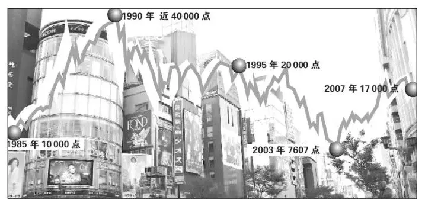

图2\-1 日经指数走势图

资料来源：日经资讯。

当然，这个例子是比较特殊的，并不是每个证券市场都会发生如此惨烈、长达17年的下跌，但是，关于明天、关于未来，谁又能准确预言呢？

中国的投资者是非常幸运的。自1990年以来，中国经济得到了空前的发展，GDP以年均10%的速度快速增长，上证综合指数也从最初的100点上涨到了近期的2800点，最高达到过6000点。我们当然希望中国经济继续保持健康快速的增长，股市也能保持健康的发展。但如果有一天国内A股市场再次被严重透支，不具备投资价值了，我不希望你因为“长期持有”而承受可能产生的巨大亏损和悲痛。

最后，当你所投资的股票资产市盈率较低、具备投资价值时，应该忽视市场的波动，不论股票投资组合涨跌都应理性地买入并持有；在市盈率较高、无投资价值时，即使市场继续保持强劲的上涨，也应逐步卖出组合。长期投资还是短期投资不是投资决策的关键因素，关键因素是这些资产有无“投资价值”。

__反对选时的思考__

在金融投资界一直存在诸多关于选时的策略和理论，最流行的莫过于技术分析中的趋势投资，其核心要素是要告诉投资者在价格趋势反转或价格趋势形成后进行投资。如果这种方法是高效而合理的，那么你应该可以成为全世界最富有的人。你可以创设一家投资咨询管理公司，兜售以“投资时机咨询”为核心的服务并收取咨询费。包括美国在内的全球股市的股票年波动率都在50%以上，如果你提供的服务每次都能在底部买进顶部卖出的话，不但你个人的投资年收益率将高达50%以上，而且你提供的选时服务所收取的咨询费也能逐年增加。假设你提供咨询的管理资产达到成立一只基金的最低额度——2亿元，咨询费为所获收益的10%（我相信如果你的选时服务果真有效，10%不算贵），那么你一年的收入最少也有1000万（2亿×50%×10%）。随着你公司业务的蓬勃发展，提供咨询服务的资产可能在5年后达到100亿，那么你的年收入将高达5亿。不用多少年，你将问鼎中国胡润富豪排行榜的前几位。这听起来是多么美妙！

这种故事在夜里做梦时发生的概率确实很高，不过在早晨醒来后，我们还是要面对现实。全世界唯一一位靠证券投资成为过世界首富的巴菲特的年投资收益率也不过21\.1%。彼得·林奇在担任富达麦哲伦基金的基金经理时，投资年收益率确实高达29%，不过13年后他就辞职了。所以，那些期望着以价格趋势选时来获取25%～30%的年投资收益率的投资者们，应该去拉斯韦加斯或澳门！因为在证券投资中以价格趋势选时操作和赌博中以开“大小”的方式来操作别无两样。

无论是投资精英还是顶尖的基金经理们都以上述真实的历史来告诉我们：不要试图在市场中选时来获得投资的成功，这是一种奢望！他们对根据市场价格来选时进行投资的观点确实是正确的，但是他们却以此就把“选择时机”完全否定，却是极其错误的！

巴菲特、彼得·林奇、索罗斯、凯恩斯和格罗斯都是选时的高手，如果不是的话，他们怎么可能长期超越市场的平均回报率呢？你可能知道巴菲特在中石油（港股）价格1\.65元左右买进，然后在15元卖出的事儿，如果只是长期持有的话，他又何必择时买进卖出呢？还是因为在中石油不具备投资价值时，他就卖出了嘛。所以，这些大师都是根据投资标的的价值和价格的关系来做投资决策的。

事实上，买入股票资产的最佳时机就是你发现股票价值被低估而价格低廉之时。现在，让我们回顾一下中国A股1993年1月～2008年7月上证综合指数和市盈率的走势图（见图2\-2）。

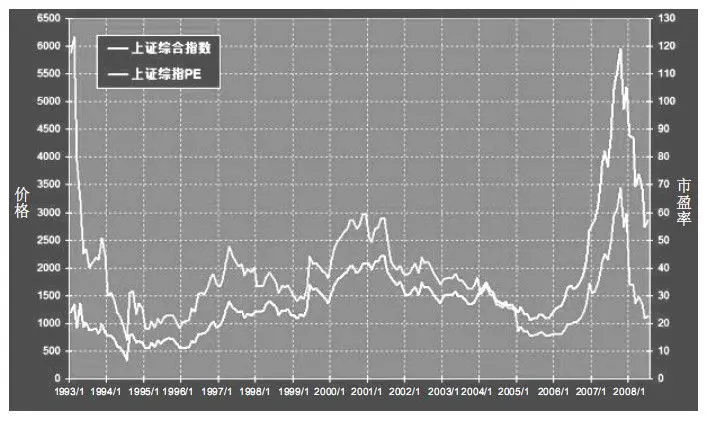

图2\-21993～2008年上证指数及市盈率

在1994年7月，中国GDP依旧高速增长，同时上证A股的平均市盈率才14倍，相比以往的市盈率来说难道不是太便宜了吗？这时就是你买入A股的最佳时机！随即股指在短短两个月内翻了一倍多，从1994年7月的333点攀高到9月的790点，市盈率也一下窜到30多倍，这时就是卖出的最佳时机！

过了一年多，在1995年12月，上证A股平均市盈率又回到了18倍，这又是你买入的时机！而在1996年11月平均市盈率又高达38倍，作为价值投资者该卖出了，不是吗？还有2005年5月市场平均市盈率15倍时，再次出现最佳买入时机，在2007年3月市盈率又回到了可怕的40倍，又是时候该卖出了！

上述根据市场投资价值做出的投资决策不仅在中国A股上是成立的，在其他市场也是合适的。你回到前面再去仔细观察一下图1\-4和图1\-5就明白了。

当然，这种根据市场价值来进行时机选择的策略并不是完美无缺的。比如在1997年发生亚洲金融危机时，当时香港股票市场的市盈率并不算高（16倍左右），但恒生指数还是在短短半年的时间下跌超过50%。在2007年下半年，美国金融市场爆发了次贷危机，当时标准普尔500指数对应的市场市盈率20倍不到，可市场在随后的8个月时间里也下跌超过了20%。所以，在你所投资的当地市场发生金融危机的初期，不论当时的市盈率有多低，你都应该先退出回避风险，等到金融危机的风波过后，然后在市盈率较低的位置买入。

前面提到过证券投资是一个综合了一点数学、一点逻辑、一点历史和一点艺术的综合体，这对于理解价值和价格的关系非常有益。价格每时每刻都处于波动之中，要么向上，要么向下，要么爬在原地不动，我还找不出第四种方式。价值也是依据不同的估值方法和公司未来不确定的发展前景来测算的。所以你看到的市盈率也都是大概的一个估算，并不是绝对精确的数值。因此，无论你是参考本书中的结论还是证券分析师的报告，“合理的估值区间”都会是评论有无投资价值的一种永恒的表述方式。这样的表述方式并非想让你处在一种不确定性中，做起投资决策时无所适从。实际情况是，证券投资就像绘制一幅美轮美奂的油画，你若老是盯着细节去看，那一定没有什么美感可言。所以，证券投资只存在合适的买入卖出范围，不存在绝对精准的时点。

比如在2005年1月，当时上证A股的市场平均市盈率才18倍，进入了合理的估值区间，已经具备投资价值。这时确实是极佳的投资时机，应该买入！如前所述，市场先生并非能够一下就从惶恐中清醒过来变得理智。在随后的半年时间，上证综合指数一度从2005年1月的1300点下挫到最低时的1000点，下跌幅度达30%。这时，作为价格趋势投资应当卖出止损，可是作为价值投资者在看到上证A股平均市盈率不断下调，最低到15倍时，应该欣喜若狂。这个市场已经被严重低估了！在随后的1年时间里，市场先生给价值投资者带来了丰厚的回报！

如果你在上证综合指数1300点时买入了A股股票资产，你会在接下来的半年内承受30%甚至更多的浮亏，但你更应该清楚的是：你是在18倍的市场平均市盈率买入的，这是个合理的估值区间，随着指数的持续下跌和市盈率的不断调低，作为价值投资者的你应该不断加仓买入这些价值被低估的股票资产，而不是茫然或消极对待。股票资产，是一般证券市场中风险最高、回报最高的类别，巴菲特曾说：“如果你没有承受亏损50%的心理准备，就不要投资股票。”要想在这个市场中做好投资理财，需要就是这种心理承受能力和对价值与价格的理性分析与判断。

与市场市盈率较低时市场指数还在不断下跌的情况相反的是：有时，当市场市盈率已经很高的时候，市场指数却在一直走高，甚至是强劲的攀升。在1996年10月，上证综合指数为970点，对应的市场平均市盈率高达36倍，已经不具备投资价值。但上证综合指数还是在1997年4月攀升至1400点，而市盈率也随之上升至50倍。随后，市场进行了两年的下跌调整，直到1999年2月指数又跌回到1000点，市盈率30倍。作为价值投资者应该知道，即使经过了两年的下跌，市场平均市盈率调低到30倍，但仍未进入合理的估值区间。应该观望！

没错，价值投资者也确实错过了接下来的从1999年的1000点至2001年的2200点的这波牛市，不过这又何妨呢？任何人都不可能在人生的旅途中抓住每次机会，对于证券投资亦是如此！不过，作为价值投资者的我们非常理性地知道自己在做什么和应该怎么做！

同样的事情也发生在2005年6月～2007年10月的牛市中。早在2007年3月时，A股市盈率已经很高，达到36～40倍，而那时的上证综合指数才3800点，离2007年10月顶峰的6000点还远着呢！如果遵循长期持有和不选择买卖时机的经典理论，你只有无奈地看着指数从6000点在随后的10个月里一落千丈到2500点。而价值投资者会坦然面对上证指数从3800点上涨到6000点，也会笑对从6000点跌到2500点。

最后，证券投资的时机是应该，也是能够去选择的。不过选择的标准不是价格趋势，而是反映价格与价值关系的“市盈率”，它应作为首要考虑点。还有一点也是非常重要的，就是上市企业的利润增长，这毕竟是股价上涨的源动力。在此，我大胆预测：自2008年7月之后，当中国A股市场的平均市盈率下降到合理的估值区间（15～20倍），随着央行放松货币政策开始降息，且上市企业利润增幅开始大幅增长时，那就是一个价值凹地、最佳的买入时机！

__不要把鸡蛋放在同一个篮子里__

“不要把鸡蛋放在同一个篮子里”似乎已经成为分散投资的金科玉律，投资者要是没有进行分散投资就像刚入门的小学生一样，总得被理财顾问教育一番，然后构建多元化的投资组合，降低整体的波动性、分散风险。不过，当我们将资金从活期和定期存款转移到包括股票、债券、房地产信托等风险性投资组合时，难道我们需要的仅仅是在分散投资的前提下去降低风险，而不是谋求更高的回报吗？如果在长达五年的时间里，你分散投资后的投资组合的年投资收益率还没有5%（这种事情曾在2001～2005年的中国A股市场发生过），那还真如不去投资五年期的国债，毕竟你有着100%拿回本金和利息的安稳，而不用老是担惊受怕。

关于“不要把鸡蛋放在同一个篮子里”的正确理解应该是“将资金在不同类别、不同地区的资产上进行分散配置”，而非机械式的什么都投资一点，分散风险。这点其实对于大资金更为合适，小资金要做资产配置比较难，主要是受资金量的限制。这里所说的大小资金量没有一个绝对的标准，要根据你的个人情况来决定。在目前的中国市场上，50万元可能是适合资产配置的起点。

将资金在不同类别、不同地区的资产上进行分散配置就是说在股票、债券、货币、房地产和大宗商品等不同资产上进行配置。如果你仅有的100万资金分别投资了不同的中国A股股票型基金，这根本称不上资产配置，因为这些是同一地区的同一类股票资产。在市况较好时，你的投资收益会不错，但在市况较差时，你就会全军覆没。

在进行资产配置的组合构建时，也并非是资产种类越多越好。重要的不是资产类别的数量，而是每种资产类别的质量，这决定了整个投资组合最后的绩效。以我个人的从业经验和对市场的观察来看，在不同时期的资产配置比例和方式是不同的，这主要是依据资产的质量而言。比如在2008年中旬，亚洲除中国内地、日本和印度外的股市平均市盈率才10倍不到，这是投资全球经济成长性最好，最具活力地区的好时机。另外，金砖四国（中国、俄罗斯、印度和巴西）之一的巴西股市平均市盈率才13倍，这又是拉丁美洲股票资产投资的好时机。另外，贝莱德世界矿业基金的股票组合市盈率才9倍，实在是物超所值。上述标的可以考虑作为构建股票资产组合的标的。在债券资产方面，由于中国还处在加息周期内，对国内的债券基金提高收益是负面影响，所以可能还不是投资国内债券基金的好时机。然而，在新兴市场的一些短期债券基金由于新兴市场国家的利率较高，同时利率比较稳定，所以可以考虑作为构建债权类资产组合的标的，比如贝莱德新兴市场短期债券，在2008年的前8个月时间内取得了8\.3%的回报。然后是大宗商品，包括能源、贵金属和农产品，其中，由于在过去的30年间，全世界忽视了对农业的投入，导致在2008年全球的农产品供需极度不平衡，农产品价格持续上涨。根据联合国经济署的报告，要使农产品供需平衡，可能需要长达3～5年的时间，那么在大宗商品类的资产上可以重点考虑农产品的投资。

资产配置是必要的，因为即使某个地区的股票资产非常具有吸引力，其市场平均市盈率较低，经济成长性又较好，但在某些时段，其股票投资组合还是有可能是亏损的。这好比你运气十足地摸到了一手大顺，可庄家却是同花大顺。比如在1997年香港股市的市盈率才18倍，经济成长也没有什么问题，可是碰到了灾难性的亚洲金融危机，导致恒生指数在短短一年内跌去50%。如果香港的投资者没有做资产配置，而是只投资了香港股市，那么承受的损失可想而知，但如果做了资产配置，分散了一部分资产到债券和其他地区的股票类资产，那么损失将会比单一的港股资产组合的风险小。

我提到上述资产配置的方法可以帮助投资者在本地市场遭遇突发性危机时降低风险，但你不要误解为资产配置的作用只是降低投资组合的风险。其实，资产配置的另一个目的则是提高回报！在很多情况下，你会在同一时间面临好几个不错的投资机会，而且你的资金量也允许你这么做。比如在2005年年初，中国A股的平均市盈率只有18倍，已经进入投资价值区间，且GDP增长约为12%，是个不错的投资机会。但同时，你又发现贝莱德矿业基金的股票组合市盈率才12倍，而且其几大重仓股的每股收益增长幅度高达50%，也是一个你不想错过的投资机会。那么，你可以在这两项不同类别的股票资产上做分散投资，结果是2005年年度A股上证指数涨幅为0%，贝莱德矿业基金的回报为40%。

所以，资产配置是在观察、搜寻和分析不同类别、不同地区的资产质量后，根据有无投资价值做出的动态投资组合管理。决定投资组合绩效最关键的因素是投资标的的质量，而不是数量和时间！世界在变，机会也在变，资产配置也应该适时而变！

## 第二篇 市场赢家的工具

第二篇 市场赢家的工具

■共同基金

■结构性投资产品

■信托投资产品

■另类投资产品

如果你不能事先确定好你的投资目标，又不能坚持自己的投资信念的话，你将会成为一个潜在的股票市场牺牲品。

——彼得·林奇

## 第二篇 市场赢家的工具 - (1) 第3章 共同基金

\(1\) 第3章 共同基金

2026年3月14日

9:57

第3章 共同基金

基金在近几年中国证券投资界迅速火热起来，吸引了众多投资者的眼球。其主要原因有两点：一是从2005年6月至2007年10月短短两年时间，上证综合指数从最低点1000点上涨到了最高点6000点，涨幅高达500%，期间不少参与中国股市的投资者获得了丰厚的回报。二是国内股票型基金，尤其是一些优质股票型基金的回报率超越了上证指数的涨幅，达到800%～1000%。这种财富快速、大幅增值的故事，在国内股市火热时成为了投资者每天见面的即兴聊资。

所以，当国内投资者谈起基金时，多数会有一种误读的成分在里面，认为基金就是基金经理帮助自己去买卖股票，基金也只是股票基金。其实，基金不只有股票型基金，还有债券基金和货币基金。

在美国，投资基金被通称为“共同基金”（mutual fund）；在英国和中国香港习惯称为“单位信托基金”；在日本和中国台湾地区则称为“证券投资信托基金”；在中国大陆则被通称为“证券投资基金。”由于美国的证券投资基金资产总值占全世界半数以上，且大多数世界级顶尖基金公司都在美国，在全世界有着无可替代的影响力，所以本书中对证券投资基金都通称为“共同基金”。

共同基金依据运作方式的不同，可以分为封闭式基金和开放式基金。封闭式基金是指基金份额在基金合同期限内固定不变，基金份额可以在依法设立的证券交易所交易，但基金份额持有人不得申请赎回的一种基金运作方式。开放式基金是指基金份额不固定，基金份额可以在基金合同约定的时间和场所进行申购或赎回的一种基金运作方式。基金在经过了长期的发展后，开放式基金已经成为共同基金的主流产品。在本书中的共同基金均指开放式基金。

随着国内金融市场的逐步开放，现在国内投资者除了能投资中国本地的共同基金外，还可以投资海外共同基金，这为国内投资者分散投资风险，提高投资回报起到了积极的作用。正如前两章所讲，中国A股市场不是总处在合理的估值区间的，一旦失去了投资价值，投资者便可以在海外市场寻找价值凹地，以回避国内股市风险并寻求资本增值的机会。后面为大家介绍的共同基金不仅限于国内市场的品种，还包括环球市场的一些品种。希望这些“进口”基金在帮助大家了解海外市场的同时，还能使你有更多的选择范围，储备更多“价值珍品”。

当你听到共同基金时，“共同”两字就表明了这是一种集合理财模式。与个人在证券市场上自由买卖不同，共同基金是投资者委托基金管理人进行投资管理的信托关系，基金管理人有责任和义务为投资者在构建投资组合时，充分地分散风险，并力求取得较好的回报。

专业基金管理的优势

相比个人投资者直接在证券市场上进行投资，专业的基金管理人（基金公司）有着以下优势：

1\.专业的投资管理团队。一只表现优异的基金背后，一定有位成功的基金经理，同时这位成功的基金经理背后也一定有着一支优秀的投资研究团队支持他。证券投资是一项高度智力密集型劳动，仅有天赋还不足以在这个行业成功，还须有辛勤的付出和坚韧的意志。世界上最成功的基金经理彼得·林奇在40岁时头发全白就足可说明他耗费了多少精力才取得了这样的成就。相对于基金公司的投研团队来说，个人投资者无论在市场信息获取的及时程度，还是分析信息的质量上都不具优势。在运用信息进行投资决策时，强大的专业投资团队也能发挥集体的力量，将投资失误的风险降到最小。

2\.更为丰富的市场经验。基金公司的基金经理和研究员除了在各自领域有着深厚的理论功底外，还有丰富的市场经验。这种经验不是完全以时间来衡量的，否则，从1990年开始涉足股市的个人投资者都可以做基金经理了。这种经验包含了对国内外证券市场发展历史的一般性认知，对市场规律的掌握熟练程度，还有在诸多优质投资品种上把握机会的能力。在证券投资这行，经验丰富的基金经理好比深谙航海之术的船长，在风平浪静之时亦能洞察到深海中的暗礁与冰山，在遇险之前将之避开。

3\.充沛的时间与精力。专业的投资管理团队，至少从理论上来说能保证每个工作日8小时对市场中的投资品种进行持续的关注和研究（实际上投入的时间多得多），当发现更好的投资机会或风险时，能够及时转向并把握时机进行投资组合的调整。而一般的个人投资者由于有主职工作，在时间与精力上的投入比专业的投资管理团队则相应少许多。一旦投资组合的某些品种发生了基本面的恶化，由于精力上的制约导致没有及时关注到，可能会给投资组合带来较大的损失。

如果投资者选择了委托专业的投资管理团队来帮助自己实现资本保值增值，我们就应该关注下一个问题：他们将如何帮助我们实现这些目标？

主要工作

专业的投资管理团队一般由主要的三个部门进行投资组合的研究、评估和投资决策工作。

1\.投资研究。投资研究部是专业投研团队的信息库，每位行业研究员都在各自所处的行业有着丰富的从业经验，对该行业的变动及发展有着深入的研究。通过分析辨别后，将最有价值的投资品种选入“投资标的池”，供投资决策委员会参考。比如，前上投摩根中国优势的基金经理吕俊在当时投资“宝钛股份”后，这只股票在半年多一点的时间上涨了150%还要多。对此，他坦言这完全归功于研究员的推荐，至今他也没有去过这家公司。可见，投资研究部是基金经理的高级智囊团。

2\.风险评估。风险评估是在投资研究部选出“投资标的池”后，对逐个投资标的进行风险的评估与测量。根据每个投资品种所对应的风险/回报比例，给出定量化的分析结果，在投资决策时进行甄选。另外，在投资过程中，风险管理团队也会对基金组合中的品种进行跟踪分析，依据基本面的变化调整每个品种的风险水准，以确保基金经理对组合中的投资品种有着客观清醒的认识，及时做出合理的决策。

3\.投资决策。一般而言，专业的投资管理团队会有相应的投资决策委员会。他们会根据投资研究部提交的“投资标的池”和风险评估部提交的风险评估报告，来向基金经理提交和批准资产配置的建议，并在投资管理过程中对投资组合进行投资绩效评估。最后，由基金经理来进行投资决策并运行投资组合的管理。

在进行股票类投资管理策略上，上述整个流程如图3\-1所示。

图3\-1是国内某家基金管理公司对股票类资产的投资流程图，我们可以根据这幅图展现的信息对投研团队有更清晰深入的了解。

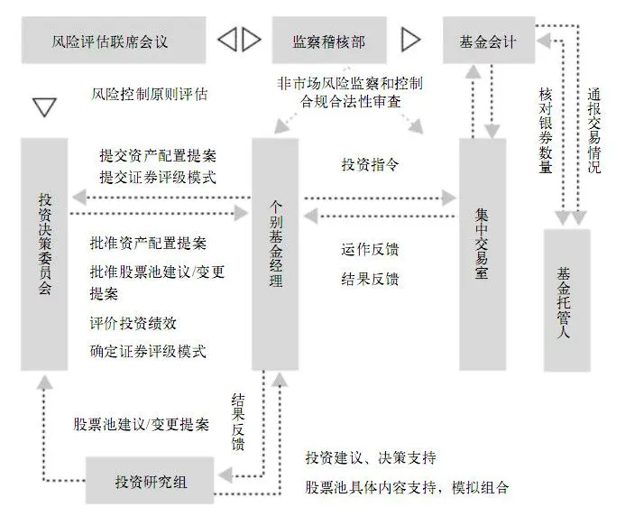

图3\-1 股票类资产投资流程图

局限性

专业的投资管理团队相比个人投资者有着许多优势，但是也有它的一些局限性：

1\.共同基金是一种委托专业投资管理人进行间接证券投资的工具，由于投资管理人进行了投资组合的分散，所以在单边普涨性牛市中，其回报有可能比直接投资单一证券低。比如你投资某只A股股票，可能在几个交易日连续涨停，在短期内获取非常高的回报，但是股票基金是没有出现过连续涨停现象的。

2\.共同基金的投资管理团队可以进行风险分散，降低整个投资组合的风险，但是不能回避系统性风险。简单地说，就是投资管理人只能在投资组合中去进行风险的管理，而不能降低整个市场的风险或宏观经济风险。比如，在A股市场平均市盈率60倍的时候，基金经理只能尽量选择市盈率相对60倍较低的股票来进行投资，但实质上这只股票基金的平均市盈率也低不到哪去，所以这朵大海浪尖上的股票基金浪花在潮落时，还是会随之跌入海中，只是深和浅的区别。这种现象发生的原因也不能完全责就基金公司，因为一只股票型基金的最低持仓比例为60%。但是作为价值投资者的你，有着充分的主动权去赎回或申购，以此来回避系统风险并把握投资机会。

任何事物都不可能完美无缺，共同基金亦是如此。不过，两利相权取其重，两害相权取其轻。在比较共同基金的优劣势后，相信投资者会有正确的判断。如果你觉得专业的投资管理团队比起自己去直接投资有着更大的优势、更好的绩效，那么我们就来看看到底应该怎么去选择一只好基金。

共同基金的基本分类有三种：股票基金、债券基金和货币基金。不同类别基金的选择评价标准也有所不同，这里先就它们共同的选择标准和一些重要的参考指标做如下介绍，更为个性化的选择标准则在各种类别基金的章节做具体分析。

全球最为权威的基金评级公司之一是晨星公司（Morningstar），晨星在中国深圳和香港特区都设有分公司，分别对国内发行的基金和在香港特区发行的全球基金进行评级。其网址分别是http://cn\.morningstar\.com和http://www\.hk\.morningstar\.com。投资者可以登录上述网址对各种基金进行深入的了解和分析，本书中的基金分析标准与数据均来自晨星公司。

对于投资者来说，在确定了基金的投资地区、行业和类别后，当然希望在同一类数量众多的基金中选取最好的来投资。那么，应该参考哪些标准呢？

三个重要参考指标

1\.基金相对其比较基准的表现。一般情况下，在市况较好的时候，基金的表现会比较好；在市况较差的时候，基金的表现会比较差，甚至是负收益。既然投资者承受了本金有可能亏损的风险，那么选择这种非保本的共同基金自然是为了在市况较好时获得更高的回报，否则投资这种产品就失去了意义。所以，投资共同基金的目标应是在市况较好时获得更高回报，在市况较差时尽量减少亏损。因此，我们应该在同一类基金里去选更好的基金，来达到上述目标。

任何一只基金都不是孤立存在的，它一定投资于某一地区或行业。以中国A股股票基金为例，华夏大盘精选是国内知名度非常高的一只股票型基金，它主要投资于国内A股，那么它相对国内所有股票型基金的表现则决定了它在这个群体中的地位。

通过晨星公司的数据显示（见图3\-2），你可以看到华夏大盘精选的比较基准分别是晨星大盘指数和国内股票型基金的平均表现，这里我们选取股票型基金的平均表现作为比较基准。

在近两年的运作中，华夏大盘精选基金的年回报率为80\.73%，股票型基金的年回报率为41\.40%，华夏大盘精选的回报率高于股票型基金的平均回报率，这就意味着华夏大盘精选的回报率在国内股票型基金的排名肯定处于前50%的水平。在市场较好时，要比其他至少50%的股票基金表现得更好。

从2008年1月1日至2008年8月15日的表现来看，股票型基金平均下跌了41\.49%，而华夏大盘精选下跌了29\.81%，这就说明在市况较差时，华夏大盘精选比股票型基金的平均跌幅要小，控制风险的能力比其他股票基金强。

所以，在国内股票市场有投资价值时，像华夏大盘精选这样的基金应作为重点考虑的投资标的。

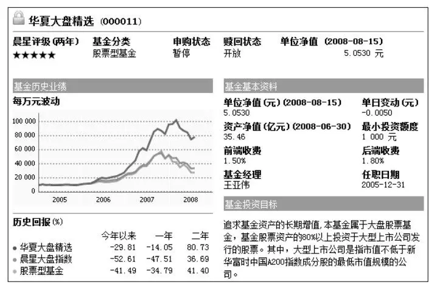

图3\-2 华夏大盘精选

资料来源：晨星公司。

同时，对于图3\-3所示的“长盛动态精选”股票基金你则应该回避。原因很简单，与比较基准“股票型基金的平均回报”相比，两年期的平均回报为29\.24%，低于比较基准41\.40%的年回报率；在今年以来市况比较差的行情里，此基金下跌幅度为50\.02%，高于比较基准41\.49%的下跌幅度。在国内200多只股票基金里，你为什么要选择一个行情好时涨得更少，行情差时跌得更多的基金呢？

这种选择优质基金的方式对于股票基金、债券基金和货币基金都是适用的。虽然它参考是历史数据，且并不能说明它在未来也能如过去有着更突出的表现，但在下一个男子110米栏的超级明星诞生之前，刘翔夺冠的可能性依然是很大的。对于基金的选择，也是如此。

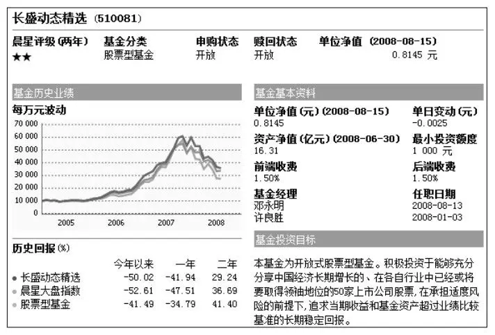

图3\-3 长盛动态精选

资料来源：晨星公司。

2\.基金风险的评价。如果两只基金的表现相近，那么应该如何选择呢？很简单，选择风险更小的那只。衡量基金风险的指标有好几个，最常用也是最重要的一个指标是“标准差”。基金的标准差是定量分析基金风险的重要指标，它表示基金净值增长率的波动程度。基金净值增长率的波动程度越大，风险越大；波动程度越小，风险越小。如果你实在觉得难以理解基金的标准差含义，那你就记住在两个表现相近的基金中，选择标准差较小的那个，这样在获得同样回报的情况下，你的投资风险更小。

从表3\-1所示的两只基金的表现和标准差数据观察，基金A和基金B在3个月的总回报率都是100%，回报率是一样的。但是基金A的标准差是37\.86%，而基金B的标准差是7\.64%，基金B比基金A的标准差小。假设，我们是在第二个月才投资以上两只基金，那么标准差较大的基金A在第三个月的回报是\-10%，标准差较小的基金B在第三个月的回报是40%。这就是为什么在表现相近的两只基金里应该挑选标准差较小的基金的原因。

表3\-1 两只基金的比较

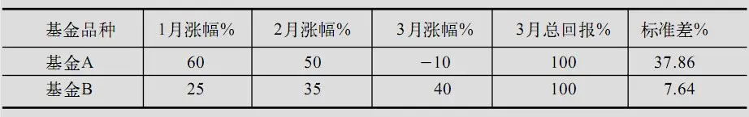

基金的标准差可以在晨星公司的网址上免费查询。点击相应基金的“风险评估”即可看到，如图3\-4所示。

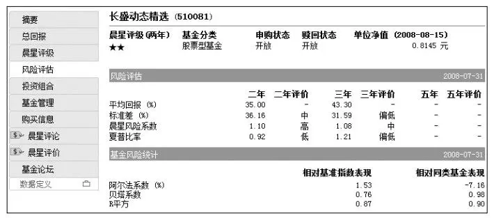

图3\-4 基金的风险评估

资料来源：晨星公司。

当然还有其他一些评估基金风险的指标，比如晨星风险指数、夏普比率等。作为非专业机构的个人投资者，了解标准差的含义就已经足够了。

3\.晨星评级。如你所知，在选择酒店时，软硬件水平不同的酒店有着不同的星级，五星级是综合评价最好的酒店，而二星级则没那么好。在选择基金时，如果你觉得以上两个指标选择基金都比较麻烦，那么你就参考基金的综合评级。晨星会给有两年运作历史的基金给予基金评级，从一颗星到五颗星不等。星级越高，这只基金的综合表现水准就越高；星级越低，这只基金的综合表现水准就越差。前述的华夏大盘精选基金就是一只五星级基金，而长盛动态精选基金就是一只二星级基金。

综上所述，在选择一只基金时，应根据它相对于比较基准的表现、风险指标标准差和基金综合评级来进行选择。如果有一只基金相对比较基准有着更优异的表现，与表现相近的基金相比其标准差更小，而同时又获得了四星级以上的评级，那么它应作为首选。

还有一点需要注意的是，后文介绍的环球基金的计价货币都是美元。国内使用人民币投资海外市场基金的投资者会面临汇率风险，不过这里需要指出的是这些基金的计价货币无论是美元还是欧元，你所需要考虑的并不是人民币兑美元或欧元的汇率，而是投资市场的货币兑人民币的汇率。如果你投资的市场是以巴西、土耳其为主的新兴市场，你根本无须关注计价货币美元兑人民币的汇率，因为投资到巴西市场时美元会转换成巴西货币雷阿尔，投资到土耳其市场时美元会转换成土耳其货币里拉。即使在2007年美元兑人民币升值幅度最大的一年里，巴西雷阿尔和土耳其里拉也还是对人民币升值了12%和13%（见图3\-5）。

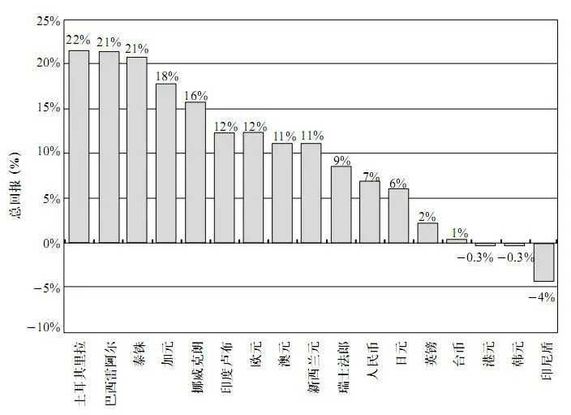

图3\-52007年主要货币兑美元表现一览

资料来源：彭博资讯。

__股票基金__

股票基金是共同基金中的主流品种，其目标是追求资本增值。在所有类别的基金中，其投资风险最高，回报率也是最高。

股票基金按照不同的标准有多种分类方法，从投资者容易理解的角度，本书将股票基金按照区域、行业和商品进行了分类。这有利于投资者站在全球的高度，多角度地进行基金的挑选，而非仅仅局限于国内股票基金。前面提到了如何选择一只优质基金，在选择一只优质股票基金方面，还有两点是需要参考的。

一是在第2章重点提及的股票组合市盈率。在晨星网上，你可以查看相应股票基金的“投资组合”以了解目前这只股票基金的平均市盈率（国内基金暂无此数据）。然后通过比较其基金在此区域或行业的历史市盈率，可以知道目前这只基金的市盈率是偏低还是偏高，来确定有无投资价值。

二是晨星会为每只股票基金进行风格划分。如果有两只基金的相对基准比较表现、基金标准差、基金星级和市盈率的数据都相近，那么你应该选择风格更为贴近自己的基金。关于这点没有绝对的优劣标准，这有点像选妻子，好女孩很多，但和自己性格合得来的却很少，只有选到和自己性格最合适的人，生活才会幸福。选择基金也应该选择和自己风格最相近的。

晨星用九宫格对基金的风格进行了划分。如图3\-6所示，股票基金的风格大致划分为9种。价值型股票基金一般以收益稳定、价值被低估、安全性较高的股票作为主要投资标的。成长型股票基金一般以收益增长速度较快、未来发展潜力大的股票作为主要投资标的。一般而言，价值型股票基金的投资风险低于成长型股票基金，但回报通常也不如成长型股票基金。平衡型股票基金则介于价值型股票基金和成长型股票基金之间。另外，有的股票基金的主要投资标的以大盘股为主，有的以中盘股为主，有的则以小盘股为主。相对而言，大盘股的投资风险低于小盘股，其预期回报也低于小盘股，中盘股则位于两者中间。

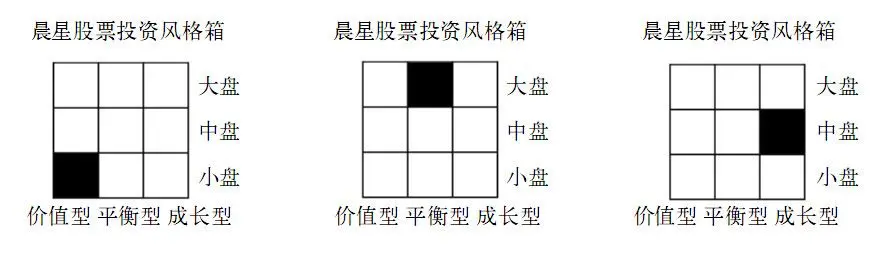

图3\-6 基金的风格

资料来源：晨星公司。

不过需要注意的是，即使是同一只基金，在不同的投资时期，其投资风格也非固定不变，而是会根据市场环境对投资风格进行不断的调整，以期获得更好的回报，这就是“风格变化”现象。

好了，你现在已经了解如何挑选出一只优质的股票基金了。下面，我们就去进行环球股票基金旅行吧！

区域类股票基金

中国的投资者在分享了2005～2007年的股市盛宴后，如果没有在A股市盈率过高时及时退出，那么必将经历2008上半年股市的疯狂下跌，损失惨重。对于投资者而言，产生这种结果的原因无非是要么根本不懂价值投资，要么在市场的狂乱中放弃了价值投资，迷失了方向。

你阅读了前面的章节后，应该了解到有时候国内的股票市场有投资价值，有时候则没有。尤其在国内股票市场失去投资价值时，你应该像郑和一样下西洋，探寻一下外面的世界，说不定能给你一些惊喜，发现有投资价值的股票市场。谈到这里，或许会有不少投资了国内基金公司发行的QDII股票基金的投资者会说：“我们遵从了资产配置的理念，分散了一部分资本到海外市场，可是大半年时间过去了，照样亏损30%以上。”可是你知道这是为什么吗？在2007年10月份左右，美国爆发的次贷危机已经在新闻报导上有所反映，必然对全球股票市场产生负面影响，同时亚洲股票市场的市盈率处于历史最高水平。在随后的大半年时间里，这些主要投资亚洲股市的QDII基金应声下跌是理所当然的事情。至于这些基金公司为什么在那个时点发行QDII基金也很好理解，那时基民们看到基金公司在过去两年为大家赚了不少钱，这些QDII股票基金自然很容易发售出去，基民们也会蜂拥而至争相认购。这里，我想起了巴菲特的一句话，“上帝欲让人灭亡，必先让其疯狂。”在市场疯狂时投资高市盈率的股票市场，除了灭亡还会有什么呢？

全球股票市场这么大，我们不必只盯着国内股票市场，也不必仅仅因为“遥远、不熟悉”而放弃价值探索。多说一句，作为投资者的你就真的对国内股票市场很熟悉吗？答案在你心中，你冷静时可以好好想想。

在环球股票基金的挑选过程中，请你始终牢记以上五个重要的参考指标：股票组合市盈率、基金相对比较基准的表现、标准差、基金评级和投资风格。下面将在“环球股票基金”、“新兴市场股票基金”、“拉丁美洲股票基金”、“中国股票基金”和“中国A股股票基金”这五个组别里各选一只优质基金来做重点介绍。其他区域的股票基金可以通过晨星香港网站，或从你的理财顾问那里进行了解。

本书中介绍的基金一般来自全球最大或当地市场最有声望的基金管理公司。它们包括：贝莱德资产管理公司（Black Rock）、富兰克林·邓普顿基金公司（Franklin Templeton）、富达基金公司（Fidelity）、霸菱基金公司（Barings）、保诚基金公司（Prudential）、施罗德基金公司（Schroder）、景顺基金公司（INVESCO）和国内中外合资的上投摩根基金公司等。

环球股票基金

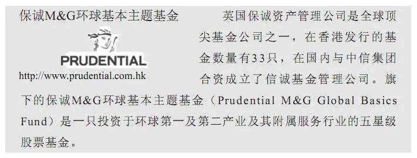

英国保诚资产管理公司是全球顶尖基金公司之一，在香港发行的基金数量有33只，在国内与中信集团合资成立了信诚基金管理公司。旗下的保诚M&G环球基本主题基金（Prudential M&G Global Basics Fund）是一只投资于环球第一及第二产业及其附属服务行业的五星级股票基金。

如图3\-7所示，此基金基本投资货币可选择欧元，年度回报则以美元计价，其2005～2007年的表现均超越了基准指数。这种环球股票基金和全球宏观经济紧密相连，所以只有在全球宏观经济较好时，才是比较好的投资时机。选择这种环球股票基金的重要原因是投资者为了防止单一国家或地区的股票市场风险过大，在全球股票市场通过此类基金进行布局，寻求风险分散化后的稳定回报。

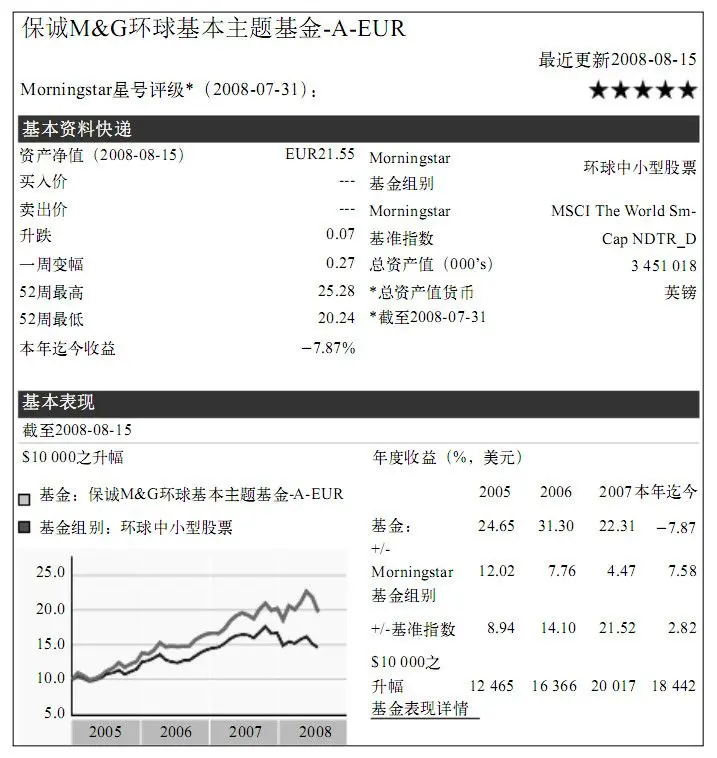

图3\-7 保诚M&G环球基本主题基金

资料来源：晨星公司。

图3\-8则更为详细地展现了这只基金从2001～2008年8月的每个年度表现。在全球宏观经济比较景气的2003～2007年，此基金均取得了正向回报，而且在2004～2007年均超越了比较基准，从2001～2008年8月的总体表现上也超越了比较基准。所以，这只基金应该是环球股票基金组别里的一只优质基金。

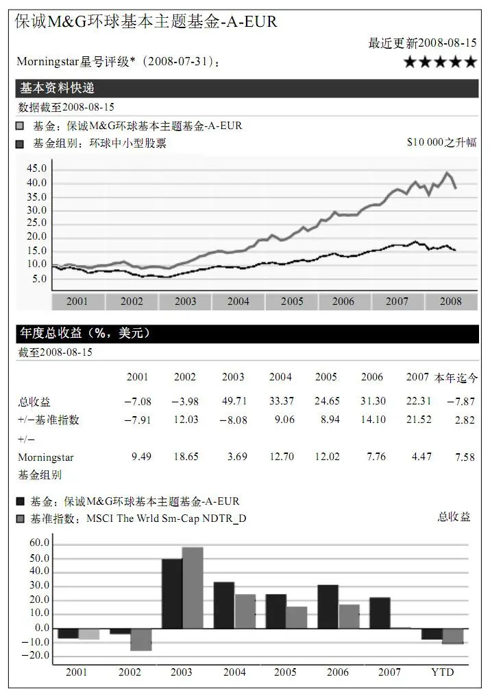

图3\-8 保诚M&G环球基本主题基金的具体表现

资料来源：晨星公司。

如图3\-9所示，截止到2008年4月30日，这只股票基金的组合市盈率为15\.75，相对全球股票类基金而言处于合理的估值区间，但并不便宜。其投资风格为以中型均衡型股票为主。

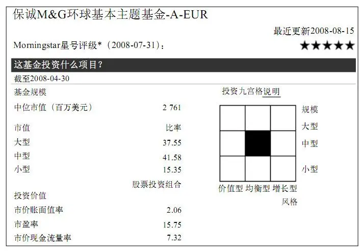

图3\-9 评估

资料来源：晨星公司。

从过去三年的时间来观察，这只基金的标准差为17\.07（见图3\-10）。如果有某只全球股票基金在其他指标上与此基金相近，那么则应该选择标准差较小的。

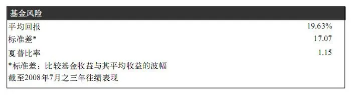

图3\-10 评估结果

资料来源：晨星公司。

新兴市场股票基金

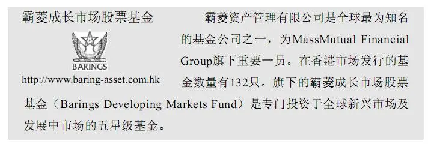

新兴市场的经济成长速度无论在近年，还是在未来2～3年（预测）都远远超过发达国家，这也是为什么国内的QDII股票基金出海首选新兴市场的主要原因（见图3\-11）。经济的成长才是一个国家或地区股市上涨的源动力，而市盈率的高低则是衡量投资风险的最佳标尺。在新兴市场的市盈率偏低时，投资该类地区的股票市场一般要比投资发达地区股票市场的回报要高出许多，当然，投资期间的波动性也会高不少。从国家和地区的角度来观察，股市上涨的源动力不是该国家或地区的GDP大小，否则占全世界GDP13%的日本的股市在近年应走好，不过，现实情况是日本经济的增长速度在持续下降甚至衰退，这也是近17年日本股市萎靡不振的根本原因。

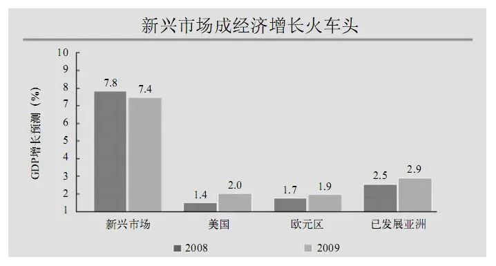

图3\-11 新兴市场的表现

资料来源：彭博资讯。

霸菱成长市场股票基金是一只五星级股票基金，其表现在全球新兴市场股票组别里名列前茅（见图3\-12）。

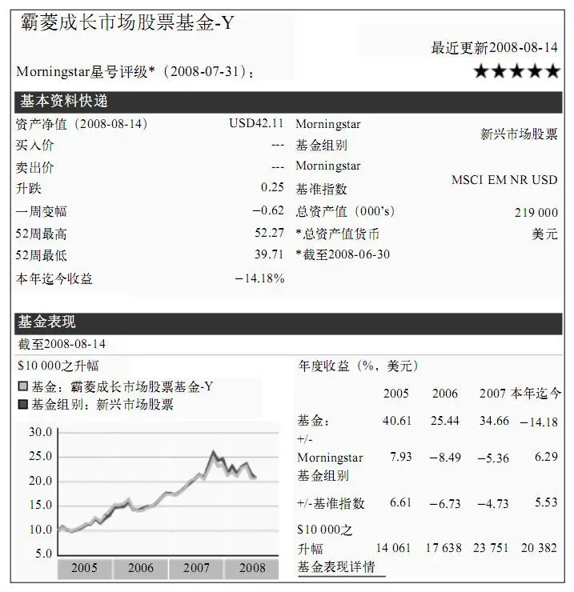

图3\-12 霸菱成长市场股票基金

资料来源：晨星公司。

从图3\-13观察到，霸菱成长市场股票基金从2003～2007年的表现总体超越了基准指数，处于同组别基金的前50%水平。即使今年以来8个月的回报为\-14\.18%，但比起国内同样投资新兴市场的QDII股票基金平均35%的跌幅要少很多，这体现了全球顶尖基金公司旗下五星级基金的管理水平。

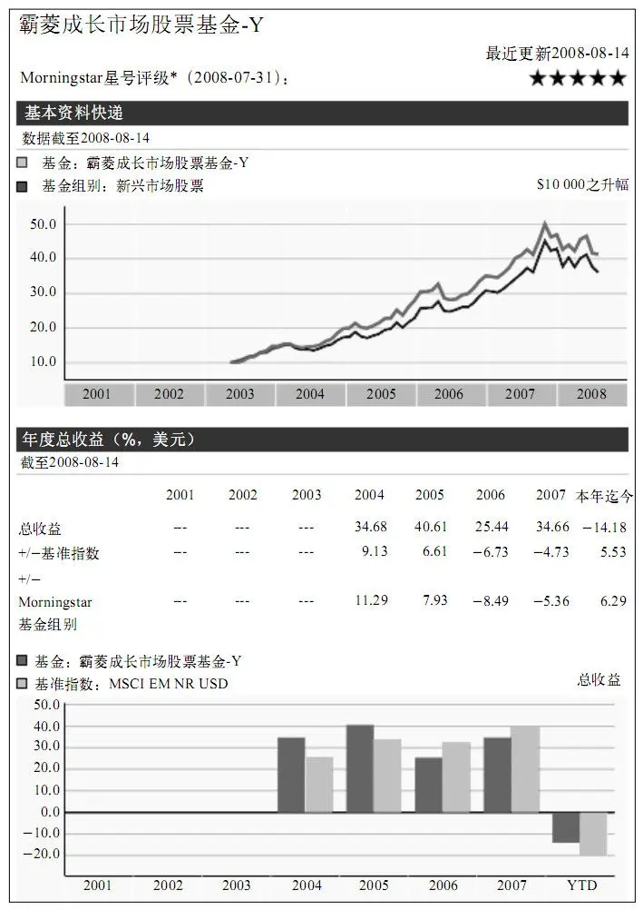

图3\-13 总体表现

资料来源：晨星公司。

根据全球顶尖投资银行摩根士丹利预测，在未来三年，新兴市场的经济成长性比发达国家要高出不少。此款专门投资于全球新兴市场的股票基金的组合市盈率为13\.89，应该说非常具有估值的吸引力（见图3\-14）。

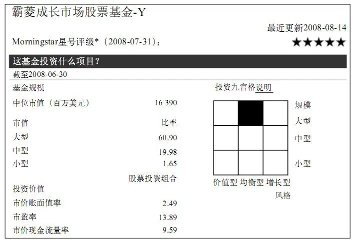

图3\-14 评估

资料来源：晨星公司。

此款基金的标准差是20\.53，相比前述的保诚M&G环球基本主题基金的标准差要高（见图3\-15），这就是新兴市场的特征，其证券市场的波动性要比发达国家证券市场高，但潜在回报也会高些。

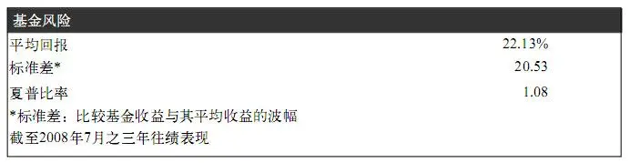

图3\-15 评估结果

资料来源：晨星公司。

拉丁美洲股票基金

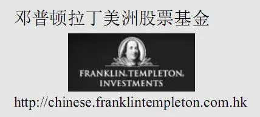

富兰克林·邓普顿资产管理公司有着60多年的环球投资经验，其总部位于美国加州的圣马蒂奥。其创始人之一约翰·邓普顿爵士被评为“20世纪全球十大顶尖基金经理人”，其名言“在极度悲观的市场气氛下入市，并在最乐观时沽出，是投资的最佳方式”在全球证券投资界广为流传，并成为诸多职业基金经理信守的准则之一。该公司在香港市场发行的基金数量有152只，旗下邓普顿拉丁美洲股票基金是一只专门投资于拉丁美洲股票市场的五星级股票基金。

当你看到图3\-16时或许会想这只享誉全球的五星级股票基金怎么在最近三年里有两年都跑输基准指数。其实在拉丁美洲股票基金这个组别里的其他股票基金多半也是如此。就此，我曾和基金公司的专业人士交流过，原来晨星选取的比较基准是“新兴拉丁美洲市场”，只包括巴西、墨西哥等几个国家（晨星以拉丁美洲代替），并不包含全部拉丁美洲国家。不过这只基金的投资区域包含了所有拉丁美洲国家和地区，且业绩表现在同组别的拉丁美洲股票基金里长期位于最前列，无论是三年还是五年的评级，都是五星级。

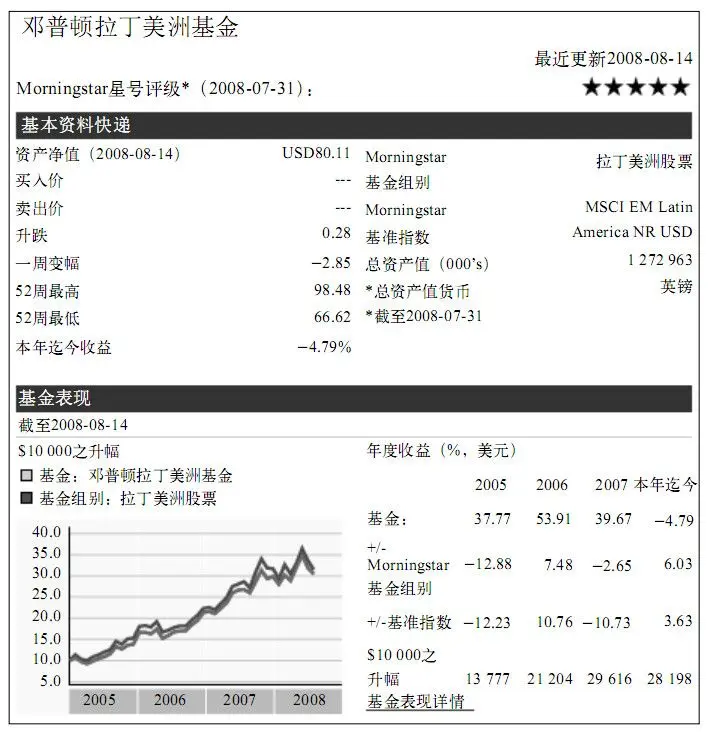

图3\-16 邓普顿拉丁美洲基金

资料来源：晨星公司。

拉丁美洲是新兴市场的重要组成部分，其中，巴西是金砖四国之一，墨西哥是北美自由贸易区成员之一（另外两个国家是美国和加拿大）。自2003年以来，其经济成长性一直位居全球前三，股市平均市盈率在5～13倍之间（见图3\-17），极具投资吸引力，这也是这只基金在最近五年时间里持续上涨的重要原因（见图3\-18）。在2003年国内A股暂无投资价值时，你若在当时投资了这款邓普顿拉丁美洲基金，并持有到2005年年末，其三年总回报将达253%。中国作为新兴市场的一员可以作为重点考虑的投资地区，但不要忘了还有印度、俄罗斯和拉丁美洲。

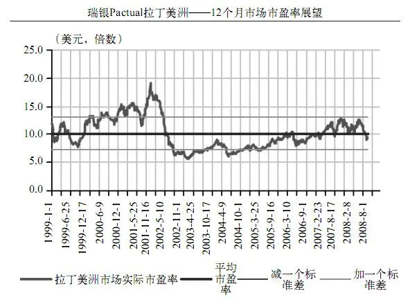

图3\-17 拉丁美洲股市市盈率走势

资料来源：瑞士银行。

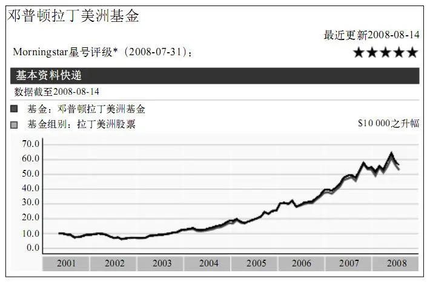

图3\-18 邓普顿拉丁美洲基金的具体表现

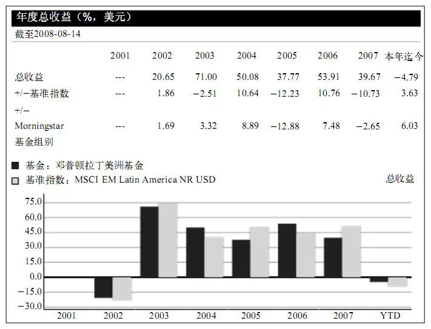

图 3\-18 （续）

资料来源：晨星公司。

在2008年7月的基金报告中，邓普顿拉丁美洲股票基金的平均市盈率才11\.74倍（见图3\-19），难道不是太便宜了吗？

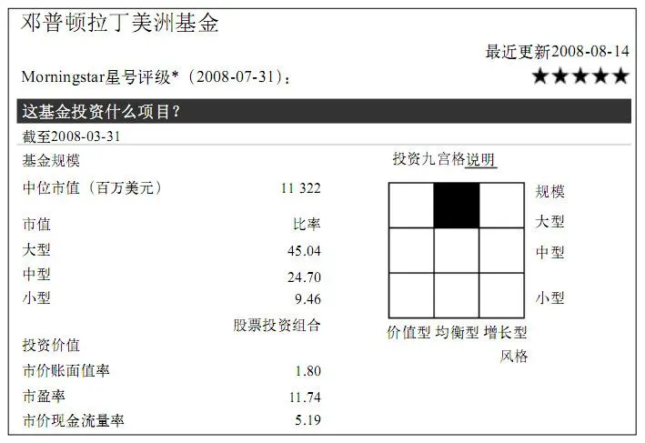

图3\-19 评估

资料来源：晨星公司。

中国股票基金

霸菱香港中国股票基金

中国股票，大家一定非常熟悉，但是很多人又非常“陌生”。这里所指的中国股票是站在全球高度来选择中国股票，包括在中国A股市场、香港恒生市场和台湾地区股票市场上市的企业。或许你会问，既然有A股可以选择投资，我何必又绕道到别的地方去投资中国股票呢？你在百度上搜寻一下全球商品大王罗杰斯投资中国股票的新闻就会知道答案了。其实原因很简单，中国A股和在香港上市的中国股票有时并不同步，在香港的市盈率是10倍的时候，在A股市场上有可能是30倍或更高。既然同一只股票，在香港市场上便宜那么多，你又何必非要用更贵的价格去买呢？

霸菱香港中国股票基金是自2007年年末以来最受争议的一只海外股票基金，原因之一是国内某家中资银行由于不合理的产品设计结构，导致在这只基金下跌50%后被迫清仓，使得投资者在短短半年的时间里净亏损50%；二是某些外资银行的理财顾问在2007年四季度大力鼓吹“做多中国”，在A股市盈率和香港恒生市盈率同创历史新高时建议客户买入，结果导致大幅亏损。

不过这只专门投资于中国股票的五星级股票基金仍然有其可圈可点之处，毕竟基金经理只能在投资组合里分散降低风险，并不能降低整个市场的风险。

如图3\-20所示，在国内股票基金为了在2005年不亏损而竭尽全力的情况下，霸菱香港中国基金已经在该年取得了12\.96%的回报率。近年来，该基金一直都有非常出色的表现（见图3\-21）。

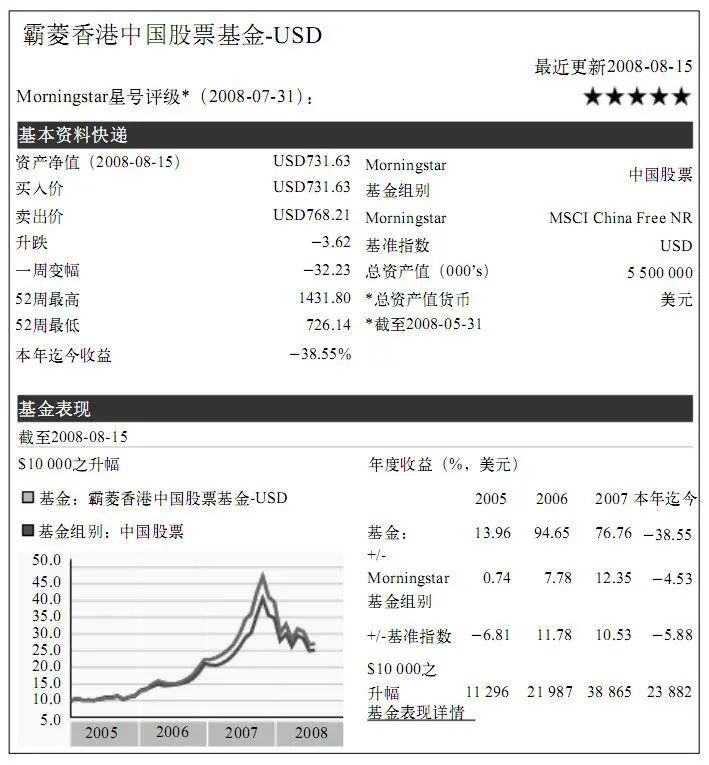

图3\-20 霸菱香港中国股票基金

资料来源：晨星公司。

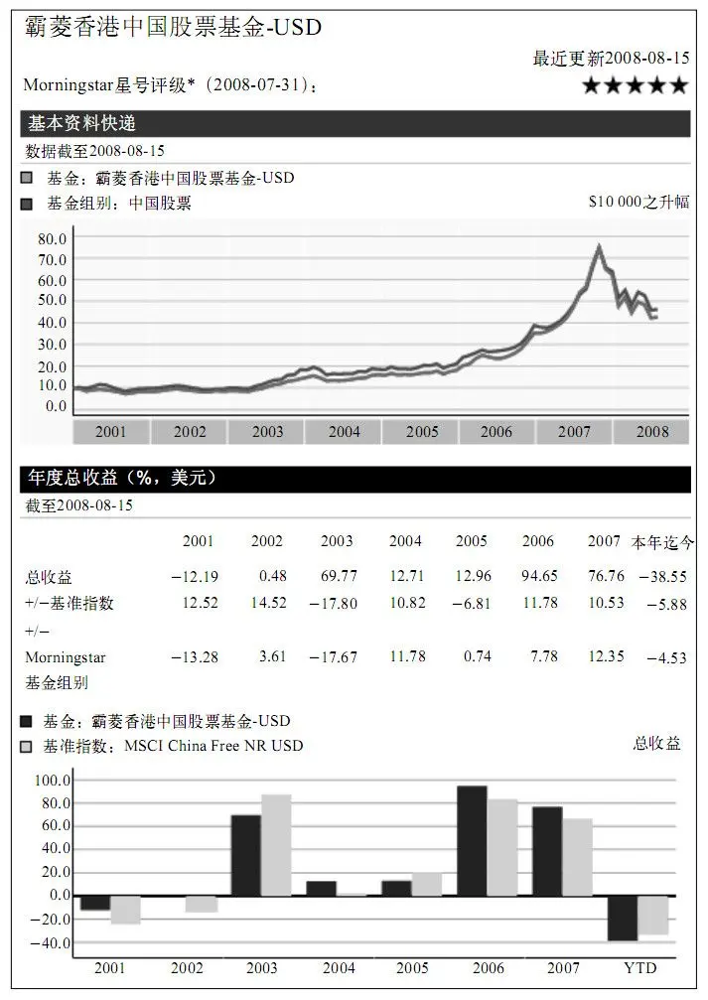

图3\-21 霸菱香港中国股票基金的具体表现

资料来源：晨星公司。

相信看到图3\-21后，你明白为什么我要介绍这只中国股票基金了吧！从2002～2005年上证指数下跌了30%，国内股票基金大面积亏损，而霸菱香港中国股票基金却取得了126%的回报率。原因还是那么简单，2002年香港股市市盈率才14倍，而A股市场市盈率是40倍。即使你只愿意投资中国股票基金，也不要只把眼光盯在A股上，外面的中国股票或许更有投资价值！

2007年年末，香港恒生市场市盈率达到历史最高水平的24倍，随后便大幅下挫，此基金也随之回调，向合理的价值区间回归。同时，霸菱香港中国股票基金截至2008年7月的股票组合市盈率为17\.23倍（见图3\-22），相比恒生市场的平均历史市盈率仍然算不上便宜。对此基金有兴趣的投资者可以静待其变，等到它的平均市盈率跌到15倍以下时，便可分批买入。

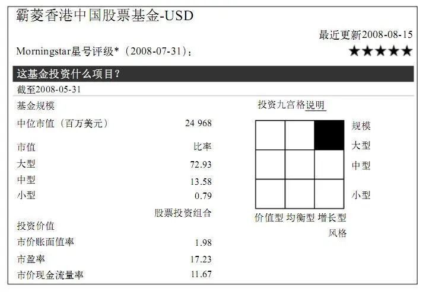

图3\-22 评估

资料来源：晨星公司。

中国A股股票基金

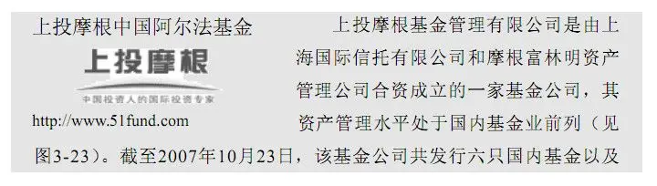

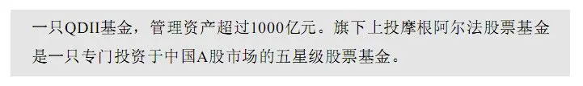

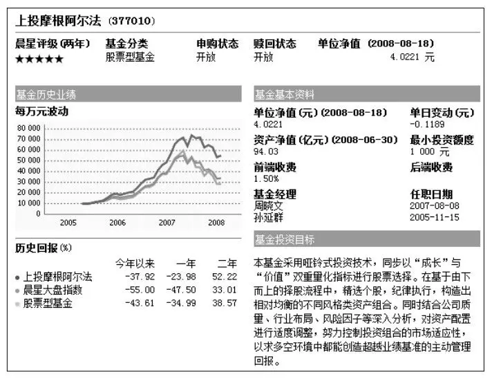

图3\-23 上投摩根阿尔法基金

资料来源：晨星公司。

这只基金在过去的表现一直位于国内A股股票基金的前列，过去两年的年均回报率为52\.22%，高于比较基准股票型基金的年均回报率38\.57%。而在今年以来的表现中，下跌了37\.92%，低于比较基准43\.6%的跌幅。

由于此基金在2005年9月份才发行，故晨星只显示了从2006年以来的基金净值表现情况。在2006～2007年的A股牛市中，绝大多数的A股股票基金涨幅巨大，但这只基金在2006年和2007年比A股股票基金的平均涨幅分别多出48\.78%和11\.99%。今年以来的表现，也比A股股票基金的表现好出5\.68%（见图3\-24）。所以，这是一只优质的A股股票基金。

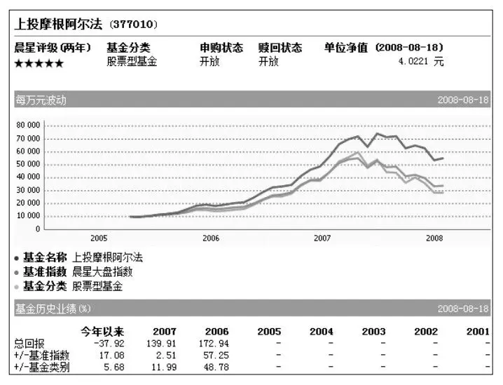

图3\-24 上投摩根阿尔法基金的具体表现

资料来源：晨星公司。

近两年，此股票基金标准差为34\.03%，相对A股股票基金的净值波动率是偏低的（见图3\-25）。所以，相对表现相近的A股股票基金，其投资风险较低。

综上所述，在A股市场市盈率偏低，具有投资价值时，应重点考虑类似上投摩根阿尔法这样的A股优质股票基金。当A股市场市盈率偏高，失去投资价值时，即使这样的优质股票基金也会被A股市场的下跌所拖累。因为，它也是A股股海中的一艘帆船，逆风而动，前行太难。

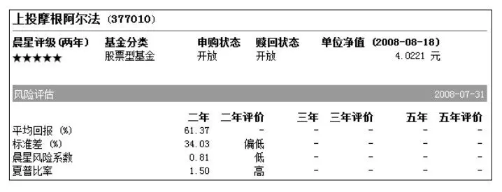

图3\-25 上投摩根阿尔法的标准差

资料来源：晨星公司。

__行业类股票基金__

如果你觉得美国股市太遥远、欧洲股市太沉闷、对拉丁美洲股市又不了解，不愿涉足这些你不熟悉的市场，那么不妨看看现在的世界正在经历什么样的变化，出现了哪些机会，或许行业型股票基金能满足你的要求。

如果你是某个行业的专家或资深人士，那么你所处的行业过去和现在经历的变化一定为你所知，你可以更深入、客观地看待这些变化所带来的机遇或风险。在你熟知的行业出现成长性机会时，那便是考虑积极投资的时机，当然这个行业的市盈率不能过高。

下面重点为投资者重点介绍下两个行业的优质股票基金，其他的行业基金投资者可登录晨星香港网站做进一步的了解。

金融服务行业股票基金

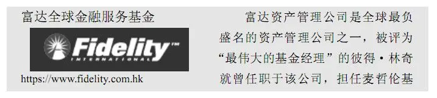

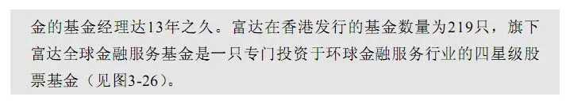

富达资产管理公司是全球最负盛名的资产管理公司之一，被评为“最伟大的基金经理”的彼得·林奇就曾任职于该公司，担任麦哲伦基金的基金经理达13年之久。富达在香港发行的基金数量为219只，旗下富达全球金融服务基金是一只专门投资于环球金融服务行业的四星级股票基金（见图3\-26）。

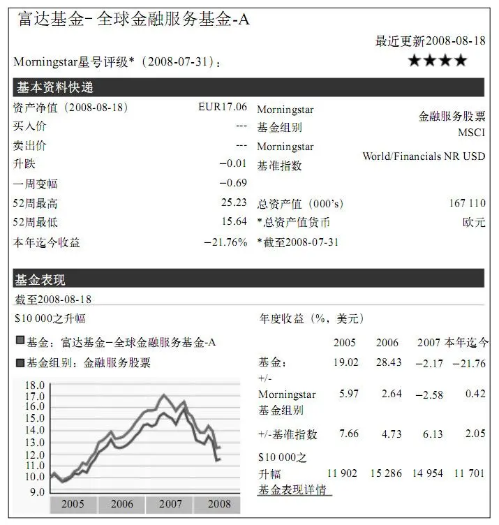

图3\-26 富达全球金融服务基金

资料来源：晨星公司。

金融服务行业属于第三产业，全球金融服务行业和全球宏观经济紧密相连。当全球宏观经济比较景气时，投资市盈率不高的全球金融服务行业基金是个不错的选择；当全球宏观经济增速放缓甚至是衰退时，不论金融服务行业的市盈率高低都会面临较大的投资风险。在2007年美国次贷危机爆发后，全球诸多金融服务行业的公司陷入窘境，不少国际顶尖商业银行和投资银行产生巨额坏账，久负盛名的大投行贝尔斯登甚至以倒闭收场。所以，富达全球金融服务基金的净值也在2007年下半年至今持续下跌。

了解全球宏观经济的现状并不是件难事，你只需登录中证网了解目前的世界经济状况就可以了。由于美国的GDP占到全球GDP25%的份额，而美国经济的风吹草动对全球经济有着较大影响，所以你也可以通过对美国宏观经济的观察来窥探环球经济的平均表现。

在2001～2002年，包括美国、日本、巴西、阿根廷在内的几个国家的GDP都在下跌，由于全球金融服务行业也受到这种因素的拖累，致使富达全球金融服务行业基金也在同期下跌。而在宏观经济比较景气的2003年到2007年上半年，全球金融服务行业亦受益于此，取得了182%的回报率（见图3\-27）。

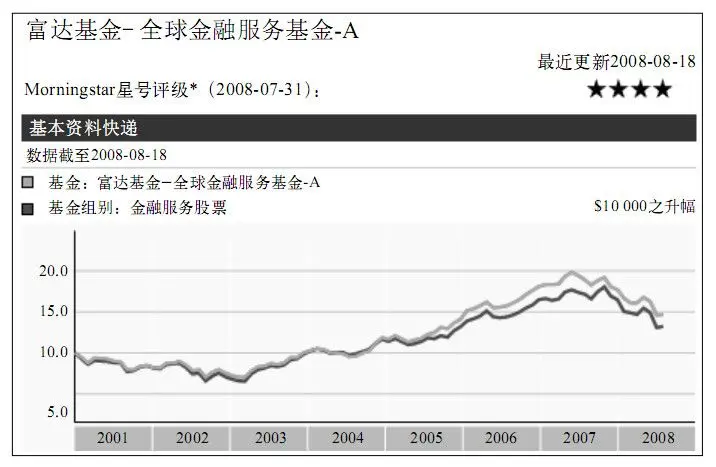

图3\-27 富达全球金融服务基金的具体表现

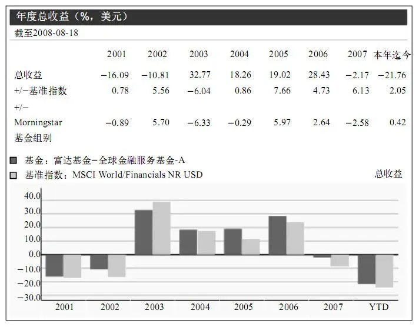

图3\-27 （续）

资料来源：晨星公司。

截至2008年5月31日，此股票基金的组合市盈率为9\.85，低于此行业的合理市盈率区间10～14倍，有估值吸引力（见图3\-28）。待到美国次贷危机得到彻底解决，全球宏观经济恢复到健康的快车道，可以考虑作为资产配置的一部分进行投资。

科技行业股票基金

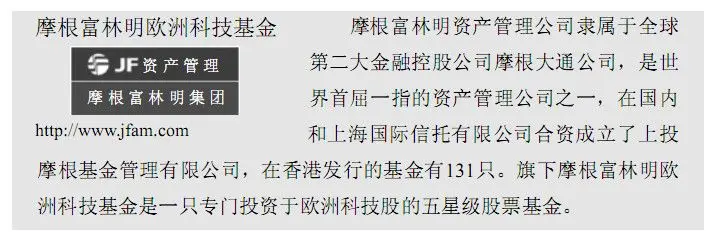

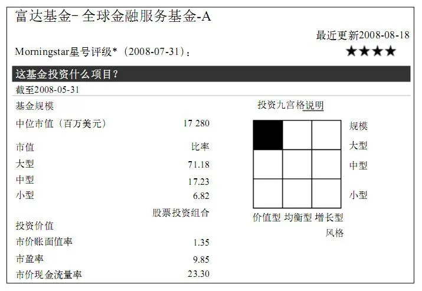

图3\-28 评估

资料来源：晨星公司。

自计算机、电脑软件和通信工具迅猛发展以来，全球诞生了不少对世界颇具影响力的上市公司，在欧洲及该基金的重仓股里有诺基亚、SAP、爱立信和阿尔卡特等。这些公司成为世界科技的弄潮儿，在这日新月异的世界里，它们的新产品不断地将世界翻新。不过投资这些公司则需要十足的胆量和智慧，因为这个行业变化得太快了，稍不留神就有可能被挤出去，像世界电气巨头西门子的手机业务就退出了通信终端行业。不过一旦在这个行业取得了突破性进展，也有可能在短时间内收益颇丰，比如这五年以来的诺基亚，硬是把摩托罗拉挤了下去。

如图3\-29所示，此基金近三年的净值走势图，颇有点波澜壮阔、起伏跌宕的感觉。这是一个高风险、高波动，同时也是高回报的行业，所以此行业公司股价的表现也是呈现巨大的波动性。此基金只比较适合对欧洲科技的发展比较熟悉，能够承受高风险，谋求高回报的投资者。

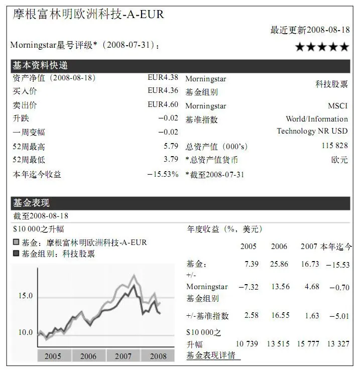

图3\-29 摩根富林明欧洲科技基金

资料来源：晨星公司。

2003年，那是欧洲科技公司集体发光的岁月。以诺基亚、爱立信、阿尔卡特、西门子为代表的欧洲科技公司都在全球劲增的手机业务上取得了飞速的发展，就连后来退出手机行业的西门子都在2003年的全球销量排名第四，全年销量接近6000万部。同时，当时这些科技股的盈利状况普遍不错，且股票市盈率较低。故此，在2003年摩根富林明欧洲科技取得了88\.23%的回报率（见图3\-30）。虽然在2004～2007年这些欧洲科技巨头在世界科技通信行业仍取得了不俗的业绩，但过高的市盈率却妨碍了它们的股价进一步的表现。

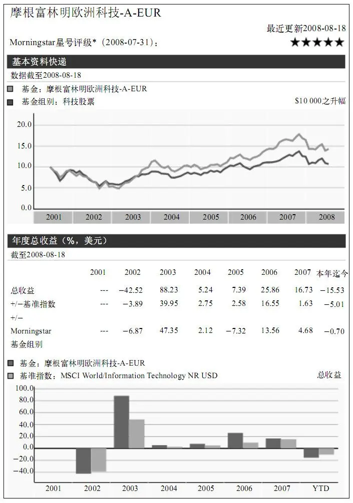

图3\-30 摩根富林明欧洲科技基金的具体表现

资料来源：晨星公司。

目前，此基金的股票组合市盈率为13\.37，对仍处高速发展的科技行业来说并不算高，但发展势头远比不上2003年的光辉岁月了（见图3\-31）。如果这些欧洲科技公司的盈利状况在未来有明显大幅改善，那么以现在的市盈率对应的价格买入也是一种不错的选择。不过，这种股票基金只适合钟爱高风险高回报的投资者。

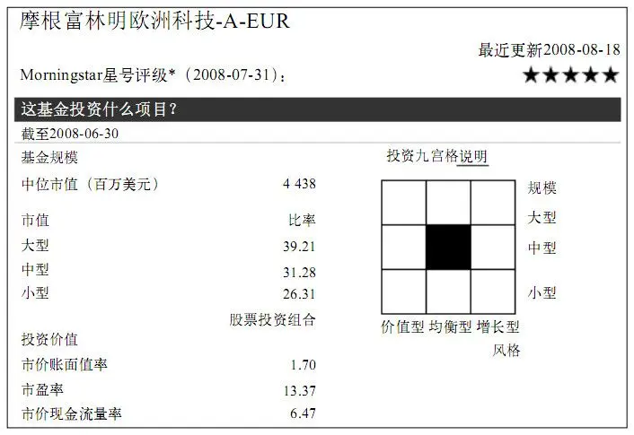

图3\-31 评估

资料来源：晨星公司。

__商品类股票基金__

大宗商品包括以石油为主的能源，以小麦、大豆、玉米等为主的农产品和以黄金、白金、铜为主的贵金属及基本金属。这三类大宗商品在1999年之前没有得到投资者的青睐，但是由于以中国和印度为主的新兴市场快速崛起，这三类大宗商品自1999年后便产生了延续至今的大牛市。全球商品大王罗杰斯早在1998年便发现大宗商品将是未来30年最值得投资的品种之一，于是在当年成立了著名的罗杰斯国际商品指数，截至2007年11月，该指数上涨幅度超过了230%。同期美国标准普尔500指数增长28\.56%，上证指数增长261%。

作为资产配置的一部分，商品投资不但可以起到分散风险的作用，而且可以提高整体投资回报。就2008年来看，全球石油、基本金属和农产品的供需不平衡仍然存在，大宗商品的价格虽然反复，但是价格上涨的主旋律不会变化。

投资商品类金融产品有两种方式：一种是直接投资这些商品的价格指数，其中包括非常著名的罗杰斯国际商品指数、瑞银彭博商品超额回报指数和德意志商品超额回报指数等；第二种是投资和这些商品相关的股票基金，以下将介绍和商品市场紧密相连的四只优质的商品类股票基金。

与直接投资商品指数不同的是，投资商品类股票基金不单是依靠商品价格的上涨来获得回报，在商品价格下跌或不变时也有可能获得回报。投资商品指数就是直接和商品价格进行挂钩，其表现完全由商品价格的涨跌决定。商品类股票的表现最终是由所投资公司的股票市盈率和每股收益的成长性而定。比如，在黄金的供需达到平衡，黄金价格不变时，直接投资黄金价格指数是没有回报的。但如果是投资某家黄金公司的股票，假设这家公司因为销售收入增加，最终致使每股收益增加，且市盈率处于历史低位，那么投资这只股票是可以获得回报的。

所以，投资商品类股票基金仍然是以市盈率、每股收益增长等核心指标作为投资决策的依据，只不过在商品牛市中去投资商品类股票基金可以克服在商品价格回调或横盘时，单一投资商品指数所面临的风险。

能源类股票基金

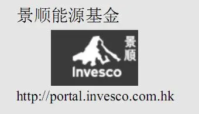

景顺资产管理有限公司于1978年在美国成立，经过30年的发展已成为全世界最大的基金管理公司之一，全球管理的资产超过4600亿美元，并在中国和长城证券公司合资成立了景顺长城基金管理公司。该公司在香港发行的基金数量为158只，旗下的景顺能源基金为一只专门投资于全球能源股票的五星级基金。

此基金投资的能源公司包括全球较大的石油公司、能源服务、开采及生产石油和汽油的公司，以及生产其他能源的公司。英国石油（BP）、道达尔石油及天然气（TOTAL）和巴西石油等世界著名的能源公司都是此基金的重仓股。

占能源最大比例的仍是以石油为主的自然资源，自2004年以来，原油价格从每桶40美元一路飚升至2008年8月的每桶112美元，涨幅达180%，而景顺能源基金同期回报则为202%，略高于石油价格涨幅。在全球传统能源面临在未来30年可能枯竭的背景下，能源类股票基金极具吸引力。在其股票投资组合市盈率偏低的情况下，可作为商品类资产配置的一部分。

在近三年的表现中，景顺能源基金有两年跑赢了基准指数，在2006年此基金则跑输基准基数8\.57%（见图3\-32）。

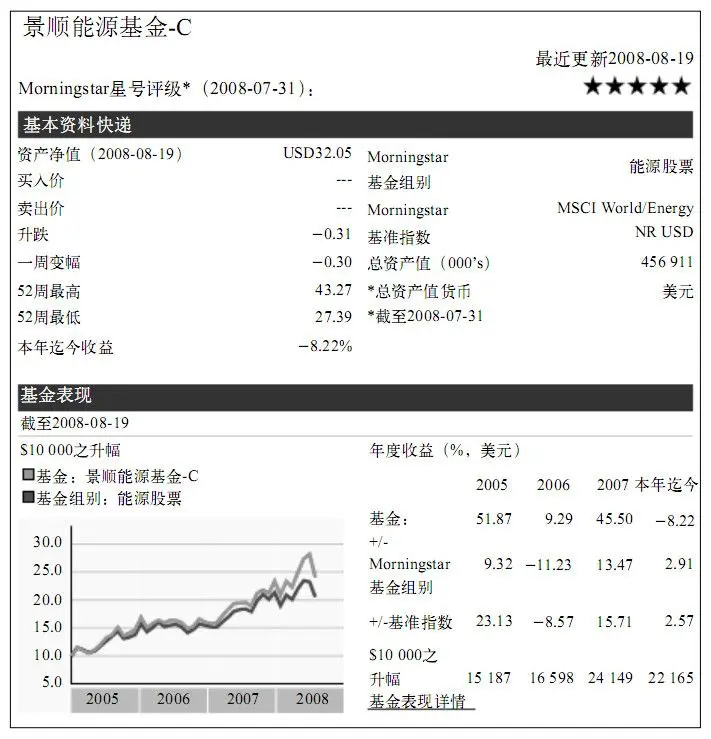

图3\-32 景顺能源基金

资料来源：晨星公司。

综观图3\-33和图3\-34，从2003年至今，全球能源类股票的平均市盈率一直处在10～15倍的区间，在石油价格大幅攀升，能源类公司每股收益大幅增长的环境下，这样的市盈率是比较低的，这也是全球能源类股票基金在这几年表现突出的重要原因。即使在2007年爆发美国次贷危机之后，能源类股票所受影响也较小，景顺能源基金在2007年还是取得了45\.50%的回报率，而在2008年前八个月的下跌幅度也只有8\.22%，远远小于美国标准普尔500的20%的下跌幅度和中国A股50%的下跌幅度。

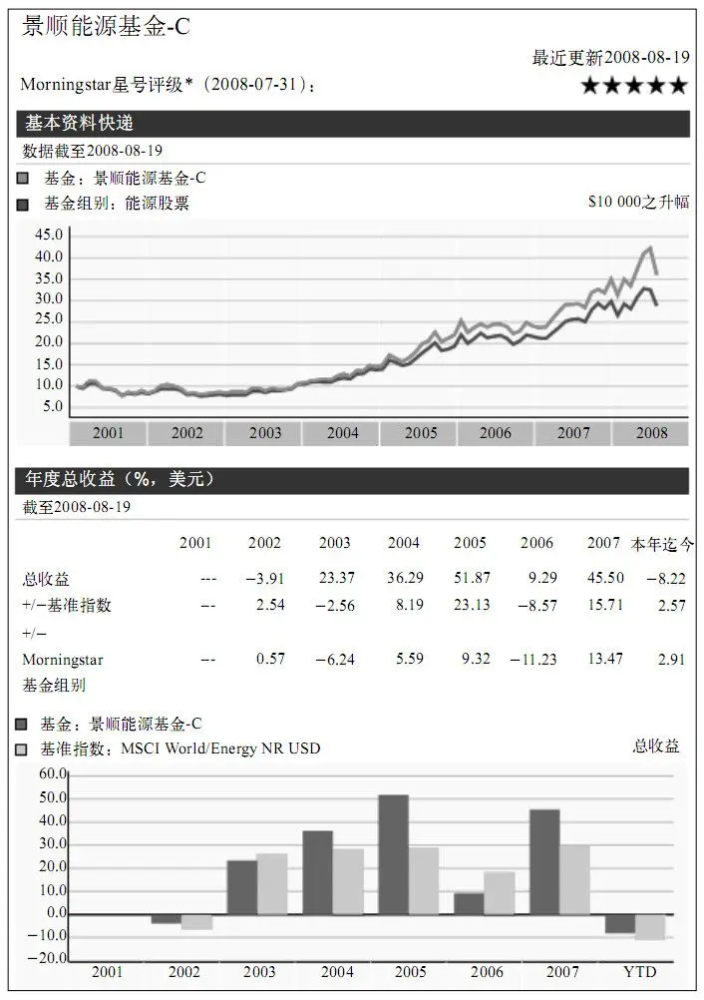

图3\-33 景顺能源基金的具体表现

资料来源：晨星公司。

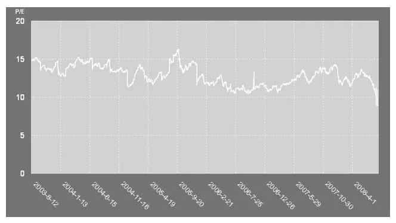

图3\-34 全球能源行业股票平均市盈率

资料来源：彭博资讯。

时至2008年7月，全球能源类股票的平均市盈率10倍不到，价值被严重低估，非常具有投资价值。石油价格在未来是涨是跌，你我都不能准确预测，但市盈率10倍不到的全球能源类股票和景顺能源基金却是就在眼前的！

农业类股票基金

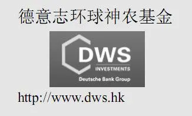

德意志资产管理有限公司是德意志银行集团旗下的专业资产管理公司，截止2008年3月，管理资产总值为2550亿欧元，位居全球前十之列。在香港发行的基金数量为34只，旗下的德意志环球神农基金是一只专门投资于全球经营农业或与农业相关业务公司股票的基金。由于其成立时间是2006年9月，所以晨星暂未给此基金评级。

在过去的30年间，全球资本投入大部分流向了工业生产和科技发展，忽视了对农业的资本投入，导致2007年全球农产品供需极度不平衡，全球粮食短缺，粮价飞涨，而与之相关的农产品大豆、玉米、小麦的价格齐涨。在这种宏观经济背景下，德意志资产管理有限公司认为这是一个极好的投资环球农业的机会，故在2006年9月发行了此基金。

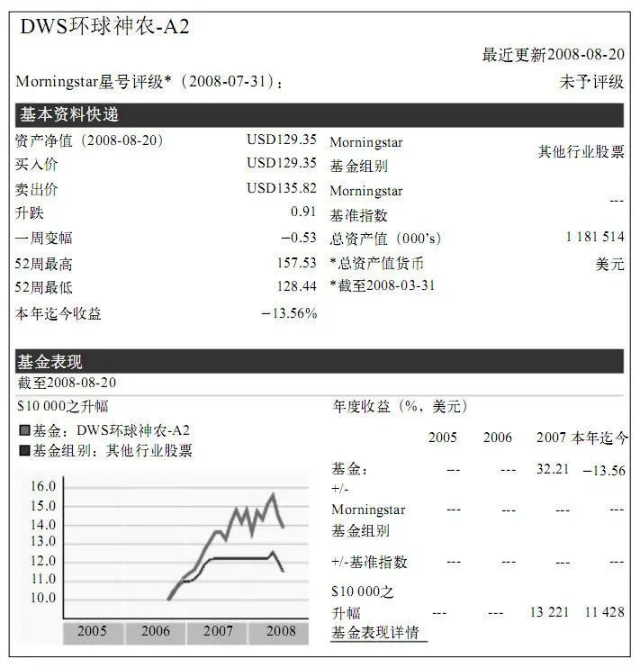

图3\-35 德意志环球神农基金

资料来源：晨星公司。

2006年9月成立的德意志环球神农基金在近两年的表现优异，取得了近40%的回报率。由于此组别的基金数量非常少，所以暂时没有比较基准。

此基金的表现并不完全由农产品的价格表现决定，此基金投资的范围涵盖从事农业产品的灌溉、收割、生产、加工、服务及经销的公司，以及间接受益于农业生产扩大的服务行业。在农产品价格上涨的过程中，从事农产品灌溉和收割的公司将从中获益。即使农产品价格保持稳定甚至下跌，由于全球农产品的供需仍不平衡，依然会促使农业生产扩大，需要更多的农业生产器械，比如收割机和运输机械等，亦能使农产品机械生产商从中获益。而在农产品物流和相关金融服务业方面，由于农产品供给逐渐增多，需要更多的物流服务和资本扶持，这两个行业也能从中受益。总体而言，德意志环球神农基金并不仅仅依靠农产品价格上涨推高基金净值，而是从全球农产品的供需不平衡中寻求商机，进行动态的投资组合管理，谋求资本增值（见图3\-36）。

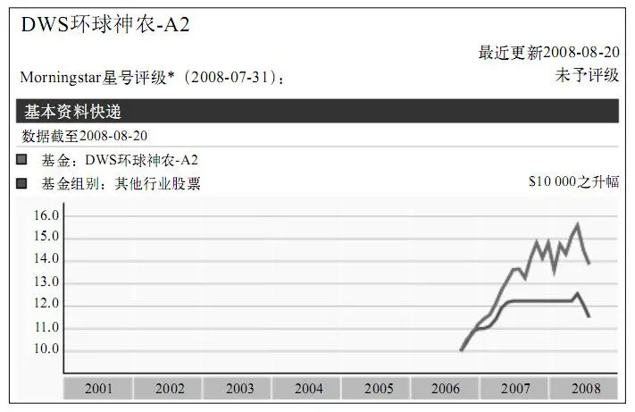

图3\-36 德意志环球神农基金的具体表现

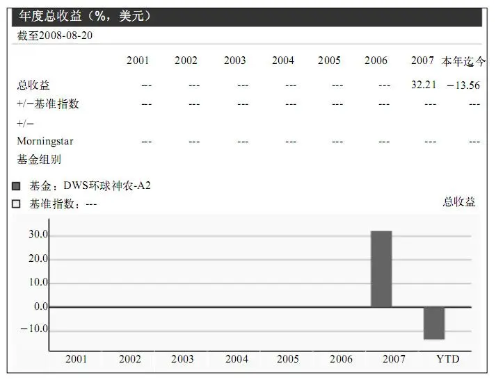

图3\-36 （续）

资料来源：晨星公司。

综观全球农业行业股票平均市盈率近五年的走势图（见图3\-37），其平均市盈率在15～20倍之间属于合理估值区间。2006年9月～2007年12月，全球农业股票市盈率在16～20倍之间波动，此基金净值同期上涨46%。即使在2008年7月，全球农业股票平均市盈率也只有16倍，在全球农业供需平衡问题未得到解决之前，此基金仍有投资价值。

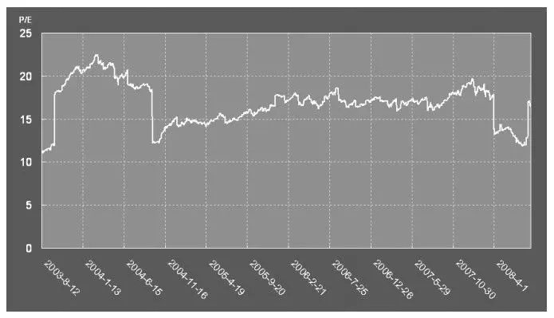

图3\-37 全球农业行业股票平均市盈率

资料来源：彭博资讯。

金属行业股票基金

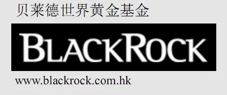

贝莱德资产管理公司是全球最大的资产管理公司之一，截至2008年7月，管理的全球资产达到1\.36万亿美元，位居全球同行前五，且为纽约证券交易所上市公司（代码：BLK）。贝莱德资产管理公司在诸多资产管理业务上独树一帜，尤其在资产配置方面，建立了“核心资产”加“卫星资产”的理念，为投资者进行资产配置建立了基本的参考模型。贝莱德在香港发行的基金数量达424只，旗下的贝莱德世界黄金基金是一只专门投资于全球黄金开采业务公司股票的四星级股票基金。

此基金是贵金属股票组别里评级最高的黄金股票基金，其回报率和回报的稳定性均列同组别前列（见图3\-38）。由于投资范围非常集中，所以参考的基准指数没有设置，只有晨星基金组别的表现作为参考（所有黄金股票基金的平均表现）。

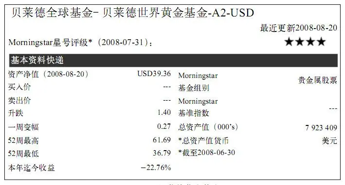

图3\-38 贝莱德黄金基金

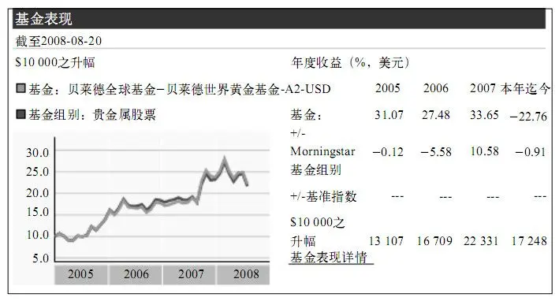

图3\-38 （续）

资料来源：晨星公司。

贝莱德世界黄金基金近年来的表现和周期的黄金价格走势如图3\-39、3\-40所示。

结合图3\-39和图3\-40，我们可以发现黄金股票基金的表现和黄金价格的走势是紧密相关的。从2001～2007年，只有在2004～2005年黄金价格是下跌的，同期贝莱德黄金股票基金下跌6\.24%。而在其余黄金价格上涨的年份，贝莱德黄金股票基金也是上涨的。至于为什么在可以直接投资黄金价格指数的情况下，还要考虑投资黄金股票基金，相信图3\-41能给你准确的答案。

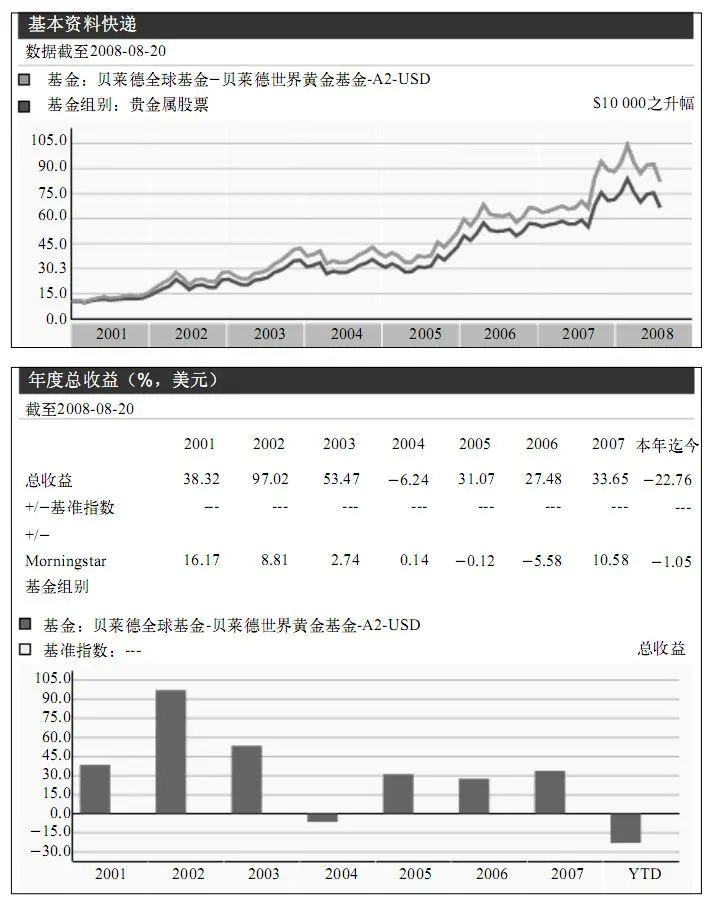

图3\-39 贝莱德世界黄金基金的具体表现

资料来源：晨星公司。

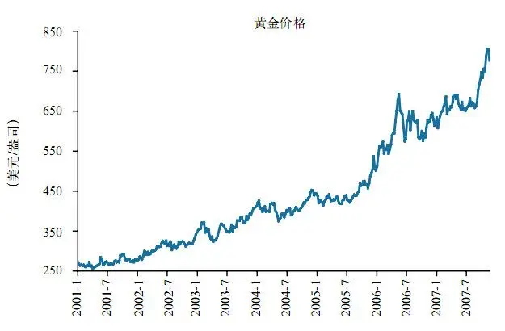

图3\-40 黄金价格走势

资料来源：彭博咨询。

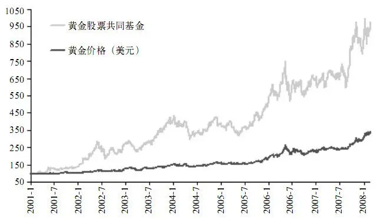

图3\-41 黄金价格与黄金股票共同基金

资料来源：彭博咨询。

从2001年至2008年1月，黄金价格累计上涨了250%，同期黄金股票基金累计上涨了850%，比黄金价格的涨幅整整高出了600%。黄金股票基金之所以比黄金价格的表现要好，是因为在黄金价格上涨的同时，黄金开采公司的销售收入也在大幅增加，在市盈率合理的时期内，这些黄金公司股价上涨的幅度大于黄金价格上涨的幅度，最终导致黄金股票基金的表现要远远优于直接投资黄金价格指数。

既然我们知道黄金股票基金的表现和黄金价格密切相关，而且是成正向关系。那么只要我们了解了影响黄金价格的主要因素，就可以判断在黄金股票市盈率合理的情况下，应不应该投资黄金股票基金了。

大家知道，在国际金融界素有美金是软黄金一说，这是不无道理的。美国作为全球唯一的超级大国，其货币美元在全球货币中具有最高的信用评级，因此全世界都愿意在交易中接受美元这种货币。

当美元指数（美元兑一篮子货币的汇率变化程度）稳定或上涨时，人们更倾向于持有美元；当美元指数下跌时，人们则更倾向于抛出美元，持有黄金以起到保值的目的。而美元指数和黄金价格的关系就如图3\-42所示，是呈反向关系的。美元指数上涨，黄金价格下跌；美元指数下跌，黄金价格上涨。

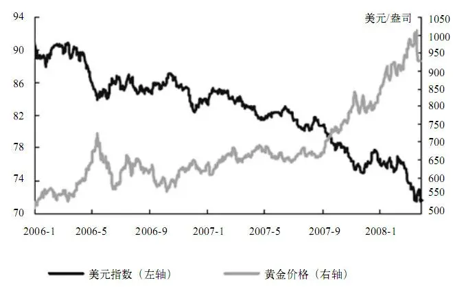

图3\-42 黄金价格与美元指数的相关性

资料来源：彭博咨询。

所以，如果你对黄金类资产有投资兴趣，那么你应该在美元指数预期下跌或下跌过程中投资黄金价格指数或表现更好的黄金股票基金，当然贝莱德黄金股票基金是个不错的选择。还要记住：黄金股票基金的股票组合市盈率不能太高！

贝莱德世界矿业基金

贝莱德世界矿业基金是一只专门投资于全球主要经营生产基本金属及工业矿物（例如铁矿和煤）的矿务及金属公司股票的五星级基金。在过去三年的时间里，基金净值累计涨幅达225%，远远超过基准指数。此基金在本书的序言中有所提到，截至2008年5月23日，此基金今年以来上涨19\.57%，截至2008年8月20日，此基金今年以来却下跌了18\.04%。这只基金在如此短的时间内发生大幅度下滑，我们该如何看待呢？

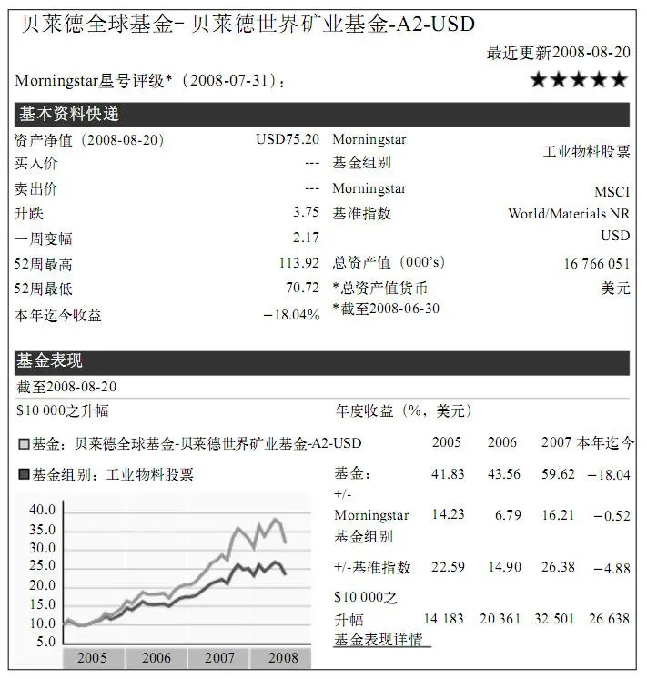

图3\-43 贝莱德世界矿业基金

资料来源：晨星公司。

我们先来回顾一下全球基本金属行业股票的平均市盈率走势（图3\-44）。在过去五年多的时间里，全球基本金属行业股票的市盈率从最高的33倍回落到最低的12倍后，一直徘徊在12～18倍之间。对于这个每年成30%速度递增的行业来说，市盈率是完全偏低的，价值被严重低估！

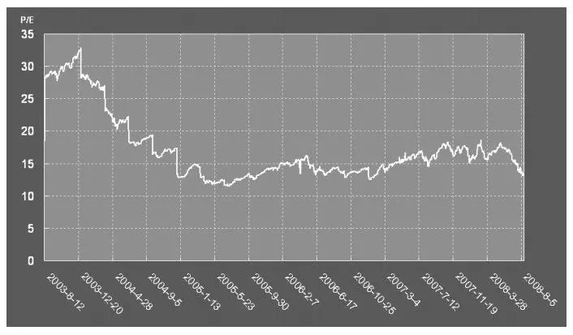

图3\-44 全球基本金属行业股票平均市盈率

资料来源：彭博咨询。

再看图3\-45，2001～2007年，此基金每年均取得了正向回报，累计回报率达776%。在2003～2004年行业市盈率偏高的环境下，此基金也取得了10\.36%的回报率。在2008年8月贝莱德世界矿业基金的股票组合市盈率才10倍不到，比行业平均市盈率还低，难道不是一个绝佳买入投资的机遇吗？

2008年以来，局势对于股票投资者来说可谓相当艰难。由美国次贷危机引发全球金融秩序混乱，投资者情绪极低。同时最近几个星期，矿业行业受到的冲击尤其显著，这并不是矿业股票第一次出现如此程度的下滑，也不是市场第一次担忧中国对商品原料需求的强劲势头能否持续。图3\-46列出了过去10年间矿业股票的10次大幅回调，可以看到有两次回调的幅度比目前这次回调（截至2008年8月4日）的幅度更大。

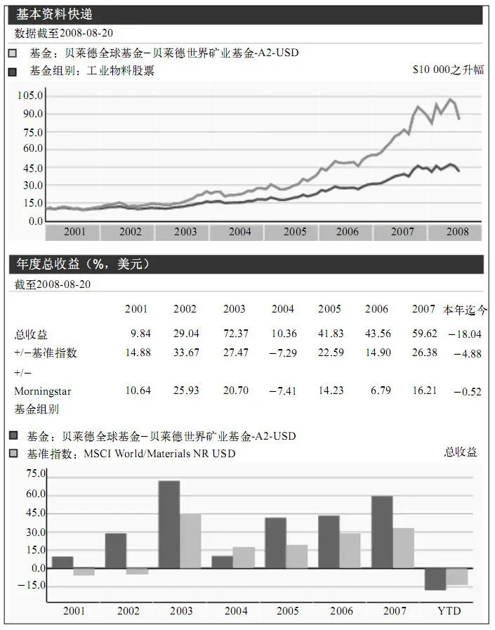

图3\-45 贝莱德世界矿业基金的具体表现

资料来源：彭博资讯。

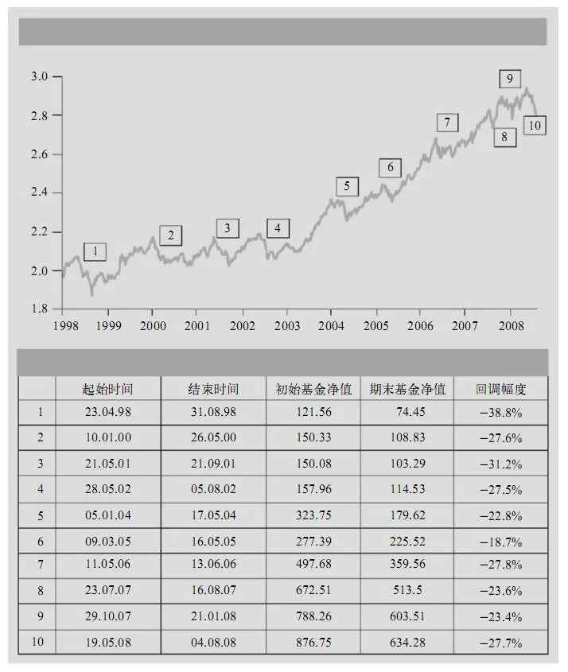

图3\-46 过去10年矿业股票的走势

资料来源：Datastream\.

目前西方国家的经济形势严峻，这没有错；受出口及其相关投资放缓等因素的影响，中国GDP的增长速度从2008年一季度的10\.60%下降到二季度的10\.10%，外围因素也影响到了中国经济，这也没错，但是，中国国内基础设施建设的需求并没有受到发达国家经济下滑的影响，对基本金属的需求并没有放缓反而在增加。中国预计未来10年将在基础设施建设方面投入9万亿美元，整个新兴市场国家预计将投入21万亿美元。

在整个矿业行业需求仍在强劲攀升，行业市盈率处于历史最低位的背景下，矿业股票价格的大幅下跌难道不是你以更便宜的价格买高价值股票的机会吗？

还记得中国A股市场在2005年年初18倍的市盈率时就已经具备投资价值了吗？但是指数还是在半年内非理性地下跌了30%，市盈率也随之下降到15倍。指数每一次的下跌都是你以更便宜的价格买入的机会！“价值先生”在随后的两年里不是给了A股投资者丰厚的回报吗？

在全球矿业股票平均市盈率处于历史最低位的13倍，行业仍处于高速发展之中的2008年，不要为短期波动一叶障目，投资者应该牢牢抓住“投资价值”，未来会告诉我们“你是对的”。

__债券基金__

债券从来就不是最有吸引力的投资类别。人们一直认为它过于平稳、保守，总是木偶般地缺乏激情，属于最乏味的投资产品。尤其在优质股票基金面前，它没有耀眼的光环，毫不惹人注目。但是，在股市步入熊市的岁月中，抵御通货膨胀的最佳工具却是债券类资产。

投资债券类资产有直接投资（国债、企业债和可转债）和间接投资（投资债券基金）两种方式。既然投资者可以直接购买债券，那么为什么还要考虑通过债券基金来间接投资呢？

首先，债券基金可以帮助投资者买到更多“好”的债券。实际上，目前国内个人投资者只可以购买国债、企业债和可转换公司债。而债券基金还可以投资只限银行间交易的国债和金融债，债券基金可以帮助你买到利率更高的企业债，也可以在银行债券交易市场里以更低的价格买到国债和金融债，以获取更高的回报。

其次，通过对不同种类和期限结构的债券品种进行投资组合，可以较单只债券创造更多的潜在收益。债券和债券基金的主要风险是利率风险，而不同期限的债券对利率的敏感度不同，长期债券的价格受利率变化影响较大，假如出现利率上升，长期债的价格就会下降而使债券的持有人遭受损失。那么你以前投资的低票息债券则有可能抵御不了通货膨胀。

最后，投资债券基金比投资单只债券具有更好的流动性。一般债券是根据期限到期偿还的，如果投资于银行柜台交易的国债，一旦要用钱，债券卖出的手续费是比较高的。而通过债券基金间接投资于债券，则可以获得很高的流动性，随时可将持有的债券基金赎回，费用也比较低。

债券基金投资的目的是保值，抵御通货膨胀，而不是像投资股票类资产那样寻求资本增值。投资债券基金一般不如市况好时投资股票基金的回报高，但在股市不佳时，却是最佳的投资工具之一。

普通债券基金

普通债券基金的投资特点是：债券投资占基金资产净值的比例不小于70%，股票投资占基金资产净值的比例不超过20%（主要是可转债转换后的股票），且债券组合的存续期没有限制。

如果你打算投资债券基金，一定需要了解债券存续期的基本概念。存续期是指一只债券的加权到期时间。它综合考虑了到期时间、债券现金流以及市场利率对债券价格的影响，可以用以反映利率的微小变动对债券价格的影响，因此它是一个较好的债券风险衡量指标。债券基金的存续期等于基金组合中各个债券的投资比例与对应债券存续期的加权平均。

存续期的概念或许过于深涩难懂，不过不要紧，应用它还是很简单的。要衡量利率变动对债券基金净值的影响，只要用存续期乘以利率变化即可。例如，某只债券基金的存续期是五年；当市场利率下降1%时，该债券基金的资产净值约增加5%；而当市场利率上升1%时，该债券基金的净值约减少5%。所以，债券基金的平均存续期越长，投资风险就越大，预期回报就越高；反之亦然。

因此，在选择债券类基金进行投资时，你愿意承担的风险越高，预期回报越高，就应选择存续期较长的债券基金；否则应选择存续期较短的债券基金。

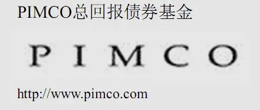

PIMCO太平洋资产管理有限公司是全球首屈一指的专注于固定收益证券投资的专业机构。PIMCO创始于1971年，其创始人之一就是全球大名鼎鼎的债券之王比尔·格罗斯。他把债券投资提升到了新的境界，创立了债券总收益投资法，为全球债券投资者取得了年均9\.5%的超额回报，这甚至比一些股票基金的长期回报还要高。PIMCO在香港发行的固定收益类基金数量为25只，旗下的PIMCO总回报债券基金是一只专门投资于全球的存续期为3～6年债券的五星级基金。

PIMCO总回报债券基金的现任基金经理仍然是债权之王比尔·格罗斯。在过去全球股市牛市的三年中，这只债券基金仍然取得了正向回报，在全球所有债券基金中表现优异。在2008年全球股市大幅下挫的背景下，此基金截止2008年8月21日的迄今回报达到3\.20%。

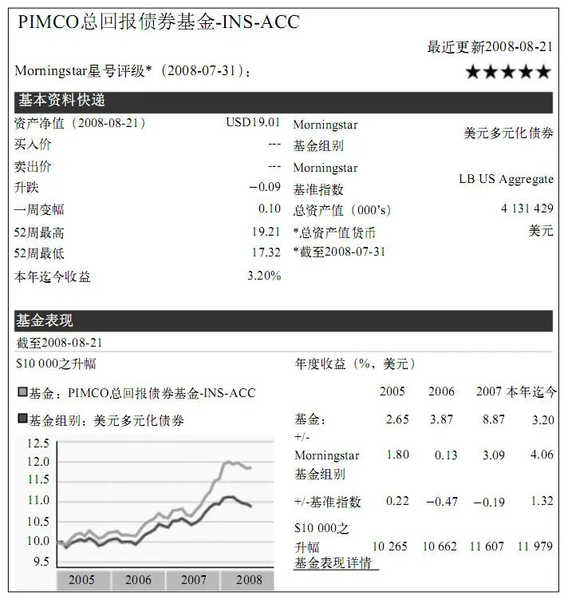

图3\-47 PIMCO总回报债券基金

资料来源：晨星公司。

通过图3\-48我们观察到，在过去全球股市普遍上涨的五年中，此债券基金仍在每个年度取得了正向回报，在2001～2002年全球股市熊市的环境中，此基金分别取得了8\.81%和9\.91%的超额回报。如果在2001年投资了此债券基金，到2005年底其投资回报率达34\.08%，年均回报率为6\.1%，比2008年美国5年期国债3\.059%的收益率几乎高出一倍。这就是投资债券基金相对于直接投资债券的益处，能获得超额回报，并抵御通货膨胀。

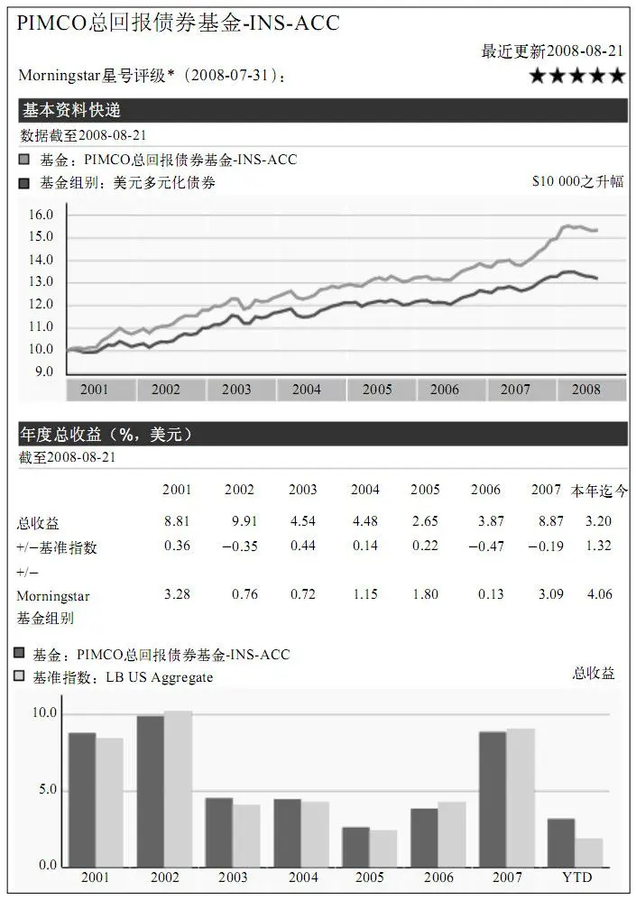

图3\-48 PIMCO总回报债券基金的具体表现

资料来源：晨星公司。

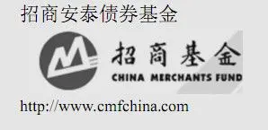

招商基金是由招商银行、招商证券和荷兰ING集团合资组建的一家基金管理公司。目前在国内共发行9只基金，旗下招商安泰债券基金是一只专门投资于国内债券市场的四星级基金。

此基金在过去两年取得了年均12\.00%的回报率，优于比较基准（见图3\-49）。

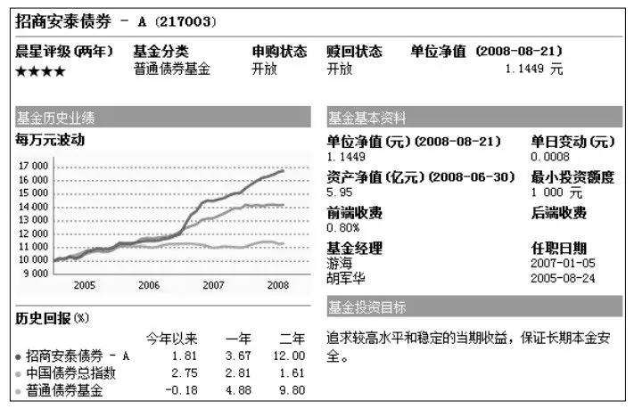

图3\-49 招商安泰债券基金

资料来源：晨星公司。

如图3\-50所示，如果你在2004年投资招商安泰债券基金，截止到2006年年末，其投资回报率为14\.59%，年均回报率为4\.65%，比同期发行的2004年五年期国债第四期的利率3\.00%高出1\.65%，而且还能在2006年及时赎回变现。而2004年投资的五年期国债如果在2006年赎回变现，则年利率只能按2\.61%计算，还要缴纳0\.1%的手续费。

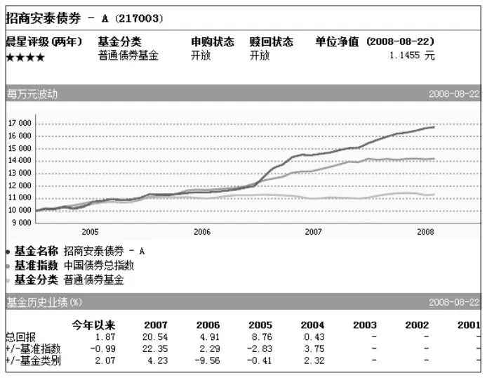

图3\-50 招商安泰债券基金的近年走势

资料来源：晨星公司。

贝莱德新兴市场短期债券基金

贝莱德新兴市场短期债券基金是一只专门投资于发展中国家政府，或于当地注册的机构及公司所发行债券的四星级基金。

此基金投资债券的存续期一般不超过三年，平均存续期不长于两年，对利率调整的敏感程度相对存续期较长的债券基金要小。在2006~2007年分别取得了13\.76%和11\.78%的回报，在2008年全球股市下挫的前8个月亦取得了6\.17%的涨幅。

这类新兴市场债券基金表现出的超额回报一方面是由于新兴市场近年的经济成长比较强劲，高利率吸引了可观的外国资本流入，支持新兴市场的高速发展。例如，巴西央行目前的利率为11\.25%，而美国联邦基金的利率为2\.00%，当中息差高达9%，即使相对中国央行目前的利率4\.10%，也高出7\.15%。另一方面是来自于这些新兴市场货币对美元的升值，在汇率方面也获得了一些回报；其中有不少新兴市场国家货币兑人民币也是升值的（见图3\-5）。

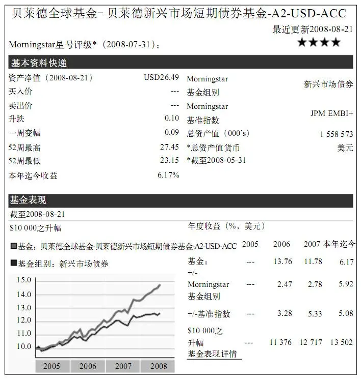

图3\-51 贝莱德新兴市场短期债券基金

资料来源：晨星公司。

在全球股市低迷、通货膨胀高启的2008年，贝莱德新兴市场短期债券基金是一个能够规避股市下跌风险，抵御通货膨胀的优质投资工具。

__货币基金__

货币基金是一种现金管理工具，不同于股票基金——一种资本增值工具，也不同于债券基金——一种资本保值工具。其投资的金融工具主要包括：①现金；②1年以内（含1年）的银行定期存款、大额存单；③剩余期限在397天以内（含397天）的债券；④期限在1年以内（含1年）的债券回购；⑤期限在1年以内（含1年）的中央银行票据等。

它具有风险低、流动性好的特点。货币基金是厌恶市场风险、对资产流动性和安全性要求高的投资者进行短期投资的理想工具，或暂时存放现金的理想场所。货币基金同样也会面临利率风险、信用风险和流动性等风险。但与银行定期存款不同，货币基金并不保证收益水平，而是由投资标的的表现所决定的。因此，尽管货币基金的风险较低，但并不意味着没有投资风险。

贝莱德货币基金

贝莱德货币基金是一只专门投资于环球存续期不超过12个月的货币市场工具的五星级基金（见图3\-52）。例如像摩根大通银行、通用电气公司发行的短期债券和各国的活期及定期存款都是投资对象。

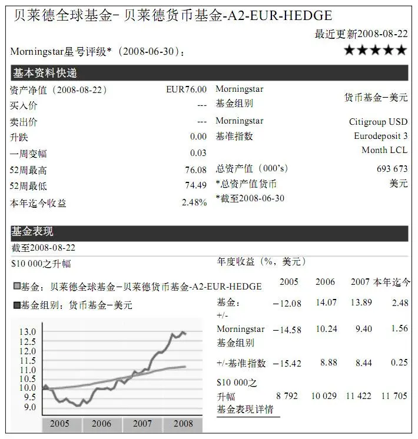

图3\-52 贝莱德货币基金

资料来源：晨星公司。

这只货币基金曾在2005年年度下跌12\.08%（见图3\-53），这就是投资货币基金的风险。或许在国内很多货币基金的投资者还没有碰到过类似情形，也掩盖了投资货币基金其实存在风险的事实。希望这只基金的历史表现能使投资者对投资货币的风险产生客观清醒的认识。不过就我个人对在香港和国内发行的货币基金的历史表现的了解，还未曾出现过投资货币基金连续两年亏损的情况，这从另一方面也说明了货币基金的风险相对股票、债券基金还是较小的。

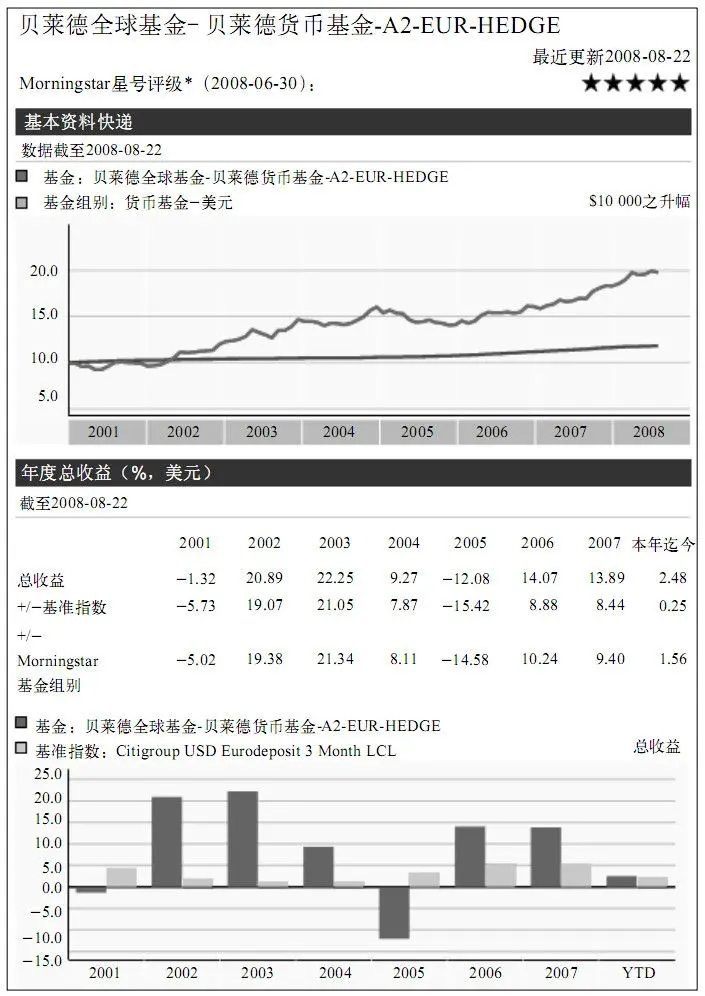

图3\-53 贝莱德货币基金的具体表现

资料来源：晨星公司。

贝莱德货币基金在过去长达七年的表现中，有五年超越了比较基准，而且是大幅超越，总回报达82\.18%，这比不少债券基金的同期回报都要高。我们可以看到在全球经济比较低迷的2001～2002年，这只基金的表现相当优异，在2003～2007年全球经济比较景气的五年里也能平稳表现，帮助投资者管理好现金资产，甚至抵御了通货膨胀。

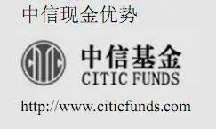

中信基金管理有限公司是中信证券100%控股的基金公司。在国内共发行了4只基金，旗下的中信现金优势是一只专门投资于国内货币市场工具的货币基金。

中信现金优势货币基金的名称就已经表明了这只基金的参考目标是现金，期望其投资绩效能超越同期活期存款利率0\.72%（税前）。实际上，这只优质的货币基金也达到了投资目标（见图3\-54）。

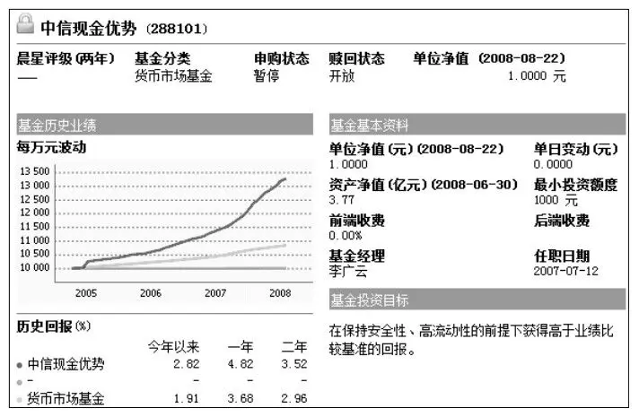

图3\-54 中信现金优势

资料来源：晨星公司。

在过往有历史数据记载的投资期限内，此基金的年度回报率均超越了同期的银行活期存款利率，是国内投资者管理现金的优质投资工具（见图3\-55）。

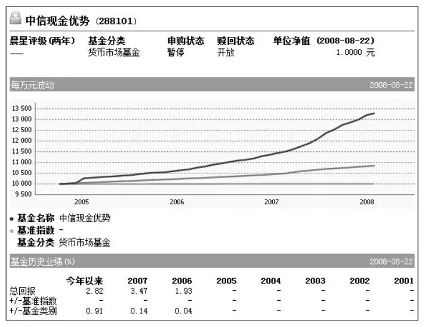

图3\-55 中信现金优势的具体表现

资料来源：晨星公司。

## 第二篇 市场赢家的工具 - (2) 第4章 结构性投资产品

\(2\) 第4章 结构性投资产品

2026年3月14日

9:57

第4章 结构性投资产品

无论你到中资银行还是外资银行，当有理财顾问向你介绍“挂钩××的理财产品”时，那它多半是当前流行的结构性投资产品（structured product）。只不过因为这些产品设计结构较为复杂，其学名“结构性衍生投资产品”过于专业化，为了不让你听而却步，所以简称为“挂钩××的理财产品”。

结构性投资产品在国际证券市场上非常流行，在国内的中、外资银行中也非常普遍，几乎每月都有新发行的产品。但每家银行叫法各有不同，主要的名称有：结构性投资产品、结构性票据、结构性存款、结构性理财产品等。只要它的名称中有“结构性”三个字，那你就不要以“基金思维”去看待这些“变种”的投资产品，而要从另外的角度来审视这些给你带来不同机会的投资产品。

那么，结构性投资产品对投资者而言有什么意义呢？

1\.在可能获得较高收益的同时，达到到期保本之目的。如果你希望通过投资股票组合或基金组合获得高收益而又不愿意承担投资到期可能亏损的风险，那么结构性投资产品可以帮助你达到上述目的。通过恒定比例投资组合保险策略（constant proportion portfolio insurance, CPPI）或期权加零息债券组合策略均可实现，这两种策略会在后面做详细介绍。

2\.在股票组合下跌的同时，获得较高收益。在市场行情不好时，如果你对某些股票组合持有限看跌的观点，但又希望从中获利，那么期权组合型结构性产品可以帮助你实现这个目标。某些股票期权组合投资产品在股票组合下跌20%的范围内可以获得30%的年投资收益率。

为了能使你透彻地理解这些结构性产品是如何帮助你实现投资目标的，本章将就产品的基本设计原理、产品结构和特性等进行逐个分析，你将会看到除了传统共同基金外的另一片绚烂的天空。

在完全理解结构性产品之前，投资者需要学习一些基本的金融知识，比如期权、零息债券、CPPI策略等。在了解这些金融术语的意义后，你就能了解一些主流结构性产品的基本特点，这对你在将来做投资规划来说有重要的作用，能够帮助你理性地做出决策。

期权

期权（option）在金融工程学中的定义为：买方向卖方支付一定数量的金额（期权费）后拥有的在未来一段时间内（指美式期权）或未来某一特定日期（指欧式期权）以事先规定好的价格（指履约价格或执行价格）向卖方购买或出售一定数量的特定标的物的权力，但不负有必须买进或卖出的义务。

如果你对特定标的物在未来一段时间是看涨的，你可以考虑购入“看涨期权”来获利；如果你对特定标的物在未来一段时间是看跌的，你可以考虑购入“看跌期权”来获利。

在上述定义中，美式期权是指可以在成交后有效期内任何一天被执行的期权；欧式期权是指只有在合约到期日才被允许执行的期权。

为了让你更清晰地理解期权的定义，让我们一起来看下面这个看涨欧式期权的例子：

期权赋予期权的购买人（即持有人）在未来时间买或卖的权力。如果你得知一个月后经销商那里会有一批新款的宝马530轿车到货，你可以立即付给他1万元，给你自己预定一辆，并约定到货后以固定价格购买，比如说50万元人民币。因为有了这样一个买入期权，你自然希望新到的宝马车的价格上升：如果涨到55万元人民币，那么你将以51万元的价格（即1万元期权费＋50万元协定购买价）买到价值55万元的宝马车，你多获得了4万元的价值，即多赚了4万元。而且，你有了这样的期权，你的损失也是有限的。如果车价只要40万元，那么你可以不要那1万元，直接花40万元买车。

希望上面的例子能使你对期权有清晰的认识，期权就是帮助你在做投资决策时占据主动，先预付定金（期权费），等待特定标的物价格明朗时再做决定：买还是不买。

如果挂钩标的是股票，那么对应的期权就是股票期权；如果挂钩标的是股票指数，那么对应的期权就是股票指数期权，以此类推。

零息债券

零息债券（zero coupon bond）在金融工程学中的定义为：以贴现方式发行，不附息票，而在到期日时按面值一次性支付本利的债券。

简单地说，投资一张票面价值100元的三年期零息债券，如果现在的购买价格是85元，那么在持有到期时就可以得到100元，不论途中债券市场发生什么样的变化。但是，如果未到期就抛售手中的零息债券，则按照市价进行交易。

零息债券在保本型结构性产品中起到到期保本的作用。假设某保本型结构性产品起初投资资金为100元，投资期限为两年，提供到期保本，挂钩标的为招商银行港股看涨股票期权。那么，我们可以用90元去购买两年期的零息债券，投资期到期时这张零息债券将以100元面值赎回，达到到期保本作用。另外的10元去买入招商银行港股看涨股票期权，其产品投资收益将由这份期权的表现来决定，即使是这份股票期权全部损失掉，那么也至少会拿回本金；如果这份期权如期上涨，就会获得一些收益（如图4\-1所示）。

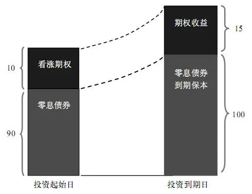

图4\-1 期权加零息债券

CPPI策略

恒定比例投资组合保险（CPPI）策略是动态保本策略中最为常见的一种策略，也提供到期保本，但其运作机制与期权加零息债券有所不同。CPPI在不同的金融机构有时也被称为CPPT，即constant proportion portfolio technique，不过原理都是一样的，并无他意。

下面，我们举例来说明CPPI机制是如何运作的（见图4\-2、4\-3）。

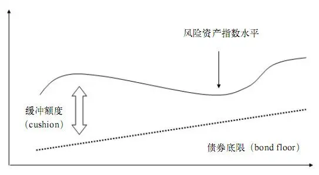

图4\-2 走势曲线

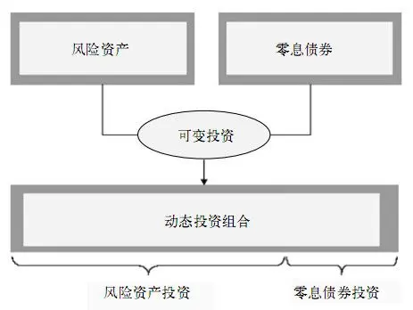

图4\-3 投资组合

假设，我们挂钩ABC股票基金（被称为风险资产），同时要求提供到期100%本金保证。那么，我们可以通过CPPI来达到上述目的。

如图4\-2所示，风险资产指数的走势曲线代表了ABC股票基金在CPPT机制下的运作走势，债券底限的走势曲线代表了零息债券在投资期的价格走势。在投资初期，我们将根据零息债券的票息水平和挂钩标的风险特性设定一个投资组合的比例，如图4\-3所示。然后，根据市场的变化状况来动态调整两者的投资比例。当风险资产指数水平下跌时，会减少风险资产在投资组合中的资金比例，加大零息债券的资金比例，起到减小投资风险的作用；当风险资产指数水平上涨时，会加大风险资产在投资组合中的资金比例，通常可以将100%的资金投入风险资产，在市场行情较好时可能将风险资产放大到100%以上（可能高达120%甚至更高）来获取超额收益（见图4\-4）。

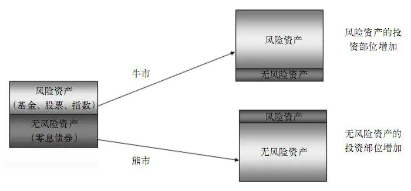

图4\-4 具体操作

当然，CPPI策略也是有风险的，其表现为：如果提前赎回，这种策略不能保证100%本金赎回，赎回净值将根据市场行情而定；一旦风险资产在投资途中触及债券底限（见图4\-1）（金融术语称之为cash out），那么风险资产将被全部抛售转而买入在那个时点的零息债券，投资者只能被动持有到期拿回100%本金。自那个时点后此投资的表现将与风险资产的表现无关，即使是风险资产在此之后上涨。

为了尽量避免cash out发生，所选标的波动性较小为好；如果标的波动性较大，则触及债券底限而被迫提前“到期保本”的概率会增大。

__到期保本结构性投资产品__

本节主要介绍到期保本型结构性产品的种类和特点，这类结构性产品大多数由两种策略组合构成。

一种是期权加零息债券的组合策略；另一种则是CPPT策略，两种策略各有特点。一般来说，期权加零息债券组合产品的投资期限较短，有的短则12个月，时间较长的也不过30个月左右，附有提前赎回机制的这类结构性产品则有可能只有几个月就提前结束了；而CPPT策略的到期保本产品的保本期限则相对比较长，一般为4～6年，因为如果时间比较短，在市场剧烈波动时，因风险资产的急剧下跌导致提前全部转为零息债券而只能到期拿回本金的概率就比较大。但只有时间长达4~6年才提供到期保本的条款，并不意味着会减少你的投资回报，这仅仅是从风险控制的角度来设定保本时间段的。比如，某外资银行发行的美林平衡型新兴市场指数（CPPT到期保本4年6个月）在运行8个月后收益就达33\.16%，如果提前赎回便可兑现这部分利润并拿回100%本金。

投资大师格雷厄姆和巴菲特都曾对期权这类衍生金融工具提出过不同程度的批评，从而导致不少他们的追随者也一味地对期权等金融衍生工具加以抵制，其实，并不需要如此。我们也同意滥用或过多地投资期权等高风险金融衍生工具是一个错误的决策，但如果是期权加零息债券的投资组合就不一样了，零息债券的那部分投资很好地保护了整个投资组合，使得到期时投资组合的本金风险降为零，而且能够通过期权的那部分投资有望获得较高的收益。

那么，投资期限较短的到期保本型结构性产品比较适合怎样的投资规划呢？

假设你计划在未来的一年买一辆30万元的轿车，预算正好是30万元，这笔钱不能在未来一年买车消费时变少了，即这笔钱如果进行一年期投资，则不能承受任何本金损失的风险。那么，如果你存在银行投资一年定期存款，大概可以获得4%左右的回报，即12000元。但如果你投资一款一年期到期保本型结构性产品，则有机会获得比4%高一些的回报，而风险仅仅是最多损失掉这4%的收益。简单地说，就是你在未来一年里冒着损失4%的利息去谋求10%或者更高的回报。如果您能承受这种风险，那么这样的投资对你来说就是合适的。

如果你大宗消费的时间安排在未来的2年、4年或者更长的时间，则可选择相对应期限的到期保本型结构性产品。不过，在进行决策时，你仍然需要对投资条款和产品特性有细致的了解，在认可这款产品的前提下进行投资。毕竟，我们投资还是希望获得一些收益，并非为了到期仅仅拿回本金。

同时，投资者也需要清楚地了解到期保本型投资产品的主要特点：

1\.投资收益。由于你拥有到期拿回100%本金的权利，这就意味着投资到期时你的本金不会有任何损失的风险，自然其投资收益就不能与行情较好时的股票基金或者债券基金进行比较，这两者都是较高风险投资品种，无论你的投资期限有多长都存在亏损的风险。投资期限较短的到期保本型结构性产品的年化收益率的比较基准则是一年期银行定期存款收益率，这类投资产品旨在帮助投资者在持有到期时获得比同期限的一年期银行定期存款高一些的回报。所以，如果你投资这类一年期的产品，在到期时只拿到6%的回报就不足为奇了。

2\.投资风险。当你看到到期提供100%本金保障时，就应清楚如果持有到期，最差的情况就是投资收益为零。如果你连这个风险都承受不了，说明任何有风险的投资都是不适合你的，剩下的只有银行定期存款或国债适合你。如果这类到期保本结构性产品提供提前赎回的条款，那么在提前赎回时，赎回价格将公平、公开地按照金融市场的市价进行赎回，就像你投资股票卖掉时按照当时的市场报价来进行交易。此时，你的投资本金有可能会损失掉一部分，也有可能获得一定的投资收益。这类投资产品只能提供到期100%本金保障，不可能提供任何时点的本金保障，这就是风险收益的对称性。

3\.流动性。由于有些到期保本结构性产品的投资期限比较短，比如12个月或24个月，那么我们更建议你持有到期，而不是有些浮亏就提前赎回，除非你急着使用这笔钱。尤其是有限看跌区间累计计息的产品，持有到期多少还有些收益，而在浮亏时提前赎回就会产生实际的本金亏损。

指数挂钩到期保本结构性投资产品

指数挂钩到期保本结构性产品的投资标的是某个市场的指数，比如美国道琼斯工业指数、香港恒生指数或者罗杰斯国际商品指数（Rogers international commodity index, RICI）等。如果我们期望通过某个指数的上涨或波动来获利，又不愿意承担到期本金可能损失的风险，就可以选择这种类型的结构性投资产品。下面，我们将通过一款挂钩商品指数的结构性产品来深入地了解这种投资产品的特点。

商品指数中非常有名的是罗杰斯国际商品指数，因“商品大王”罗杰斯准确地预言了商品牛市而声名大振。罗杰斯国际商品指数（RICI）是世界上主要的商品指数之一，同高盛商品指数（GSCI）、道琼斯\-AIG商品指数（DJAIG）、德意志银行流动商品指数（DBLCI）、标准普尔商品指数（SPCI）和路透CRB商品指数（CRB）共同成为最受追捧的六类商品价格指数。其中，德银流动商品指数是由德意志银行开发的一种分别由能源、工业物料、贵金属和农产品的价格综合构成的商品指数。

2008年年初，全球股市因美国次贷危机爆发继续全面下挫，但商品市场宛如古希腊神话中诱人的曲调一样，继续吸引着全球投资者的高度关注。众多金融机构预期2008年将仍然是商品价格上涨的一年，尤其是农产品板块。如果这种预期和你不谋而合，那么下面这款与德银流动商品指数挂钩的结构性投资产品很值得关注。

某外资银行在2008年发行了一款挂钩“德银流动商品指数”（DBLCI\-MR）的到期保本型结构性产品，采用的是期权加零息债券组合策略，其特点如下：

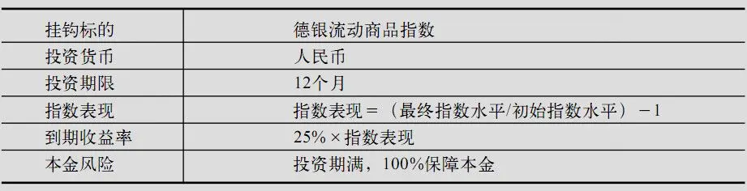

如果这款产品是在2007年1月发行的，那么投资者的收益将根据图4\-5中灰色柱状图所示数据来进行计算：

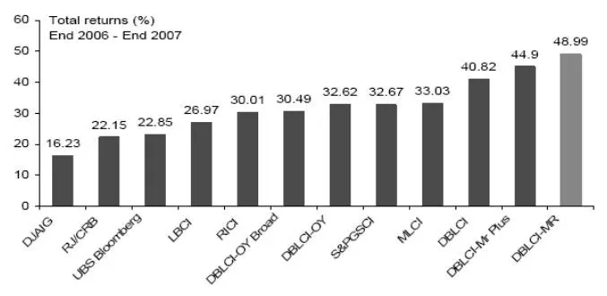

图4\-52007年全球商品指数一览

资料来源：彭博资讯。

我们观察到德银流动商品指数在2007年全年上涨幅度为48\.99%，那么投资者的到期收益率则为：25%×48\.99%=12\.25%；但是，如果德银流动商品指数在2007年全年都是下跌的，无论下跌的幅度为多少，你都可以拿回100%本金。因为你投资这项指数享受了到期100%本金的保障，所以收益就会有所折扣，这就是投资的风险收益对称性。

股票篮子挂钩到期保本型结构性投资产品

股票篮子挂钩到期保本型结构性产品是国内的中外资银行中最常见也是品种最多元化的到期保本型结构性产品。在通常情况下，这种产品会选取一组含3～5只基本面良好的股票组成一个投资组合，挂钩其中表现最好或者最差的一只股票价格进行收益的计算，并让投资者有权利根据跟踪股票价格在不同的区间获得不同的收益。下面，将着重介绍两种此类型产品的投资方式。

一、区间累计型股票篮子挂钩到期保本型结构性投资产品

某外资银行在2008年发行了一款瑞银“香江地产”到期保本型结构性产品，旨在捕捉香港地产优质股票价格在下跌7%以内或上涨所带来的投资机会的同时，规避到期投资本金损失的风险。采用期权加零息债券组合策略，其特点如下：

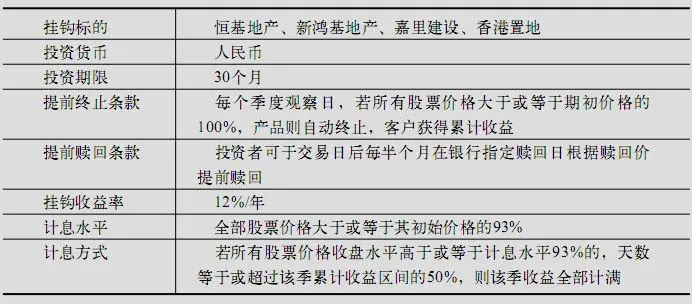

我们从这款产品的设计原理上可以观察到投资者并不依赖投资组合中的股价上涨来获益，而是只要投资组合中全部股票价格不跌破初始价格的93%就可以按照12%/年来计息。这个投资组合中的股票期权赋予投资者以下三种权利：

1\.投资期限可能较短，提高了资金的投资效率。如果在季度观察日，全部股票价格大于或等于初始价格的100%，产品则提前终止，投资者拿回100%本金及累计收益。

2\.股价下跌时仍能获取较高收益。通常，投资者依靠股价上涨来获取收益，同时承担股价下跌所带来的损失。但是，这份股票期权赋予投资者在价格下跌7%（93%计息水平）的幅度内获得12%/年的利息。这就是股票期权的优势，能赋予投资者在股价有限下跌时仍能获得一定收益。当然，投资者也会承担相应的机会成本，比如全部股票价格在一年内上涨超过12%而达到15%，那多出的3%收益就是你投资的机会成本。

3\.累进式计息方式。在一般情况下，这种股票期权加零息债券的投资组合赋予投资者按照实际达到计息水平的天数来计算收益，但是这款产品赋予投资者累进式计息方式，大大提高了获取收益的概率和空间。

为了更为直观地说明两种计息方式的差别，举例说明。

我们假设投资观察期为一个季度，证券交易日天数为60天，其中有40天全部股票价格大于或等于初始价格的93%，那么收益计算如下：

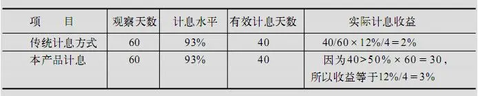

不过，目前中国市场上大多数区间累计型计息的到期保本型结构性产品采用的是传统计息方式，这要根据当时的市场状况和期权的特性而定。

二、阶段均值型股票篮子挂钩到期保本型结构性投资产品

某外资银行在2008年发行了一款挂钩“中国航运”股票篮子挂钩到期保本型结构性产品，旨在捕捉中国航运业四只优质股股价上涨所带来的回报，并提供到期保本。采用股票期权加零息债券组合策略，其特点如下：

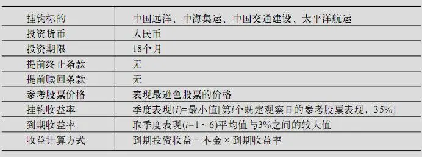

为了更好理解本产品的运行机制及收益计算情况，举例说明。

如图4\-6所示，表现最差的股票在每个季度观察日的股价相对于初始价格的表现为：

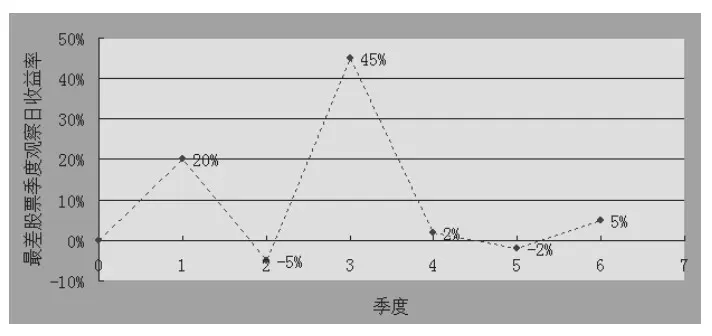

图4\-6 中国航运股票篮子结构性投资

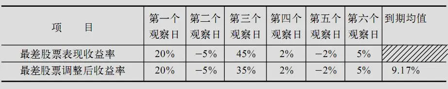

我们观察到，表现最差股票的股价在第三个季度观察日相对初始价格上涨45%，根据投资条款，第三个季度表现\(3\)=最小值\[45%，35%\]=35%，所以第三个观察日的实际收益率为35%，而非实际表现45%，投资者应予以注意。

根据最差股票调整后收益率，得出到期时此投资产品的表现均值为9\.17%。则到期收益率=较大值\[9\.17%，3%\]=9\.17%。

当然，上述数据纯属虚拟，如果在每个观察日表现最差股票相对初始价格都是上涨，且停留在25%的水平，那么到期均值则为25%，投资者的回报也是25%，而不是9\.17%。但是，如果到期均值小于3%，那么投资者的回报就是3%。所以，这其实是一款到期保证最低3%的结构性投资产品。在锁定到期最低3%的收益情况下，还有机会获得更高的收益，而且期限仅仅18个月，相信这可以满足一部分投资者的需求。

基金篮子挂钩到期保本型结构性投资产品

基金篮子挂钩到期保本型结构性投资产品既能帮助投资者最大限度地捕捉基金净值上涨带来的收益，又能提供到期100%本金保证的权利。如果你非常看好某些共同基金未来几年的成长性，但又不愿意承担投资到期本金有损失的风险，那么这类投资产品是比较适合你的。

在一般情况下，这类投资产品采用CPPT策略来进行设计，期限为4～6年不等，选取的标的多为波动性较高的成长型基金搭配一些波动性较低的配置型基金，在严格控制风险的前提下，最大限度地捕捉投资机会。在市场行情较好的情况下，甚至会采用杠杆策略扩大风险资产的投资比例，提高投资收益。下面，我们将介绍一款CPPT策略的基金篮子挂钩到期保本型结构性投资产品供大家做深入的了解。

某外资银行在2007年年初发行了一款挂钩“美林平衡型新兴市场指数”到期保本型结构性投资产品。采用CPPT策略，其主要特点如下：

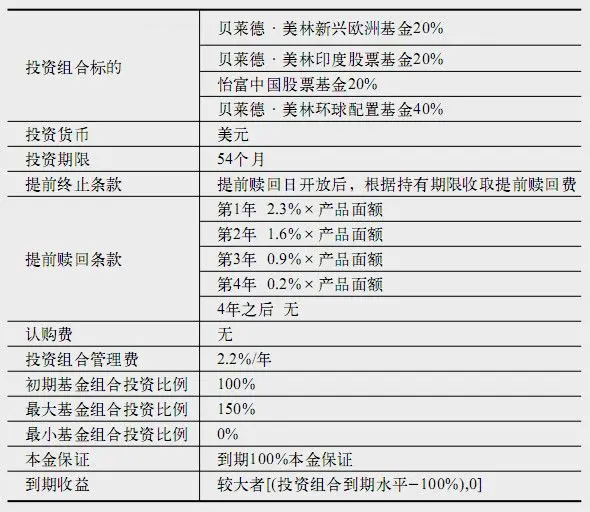

以中国、印度、俄罗斯为主的新兴市场近年来经济高速发展，成为全球经济增长的发动机。回首过往，展望未来，根据摩根士丹利对欧非中东、亚洲（除日本）、拉丁美洲、英国及美国的GDP成长性所做的分析报告，如图4\-7所示。

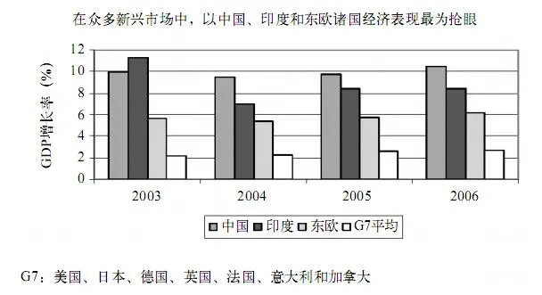

图4\-7 新兴市场的表现

资料来源：摩根士丹利公司。

众多金融机构认为未来的投资热点和重心仍在新兴市场，应充分把握新兴市场高速成长所赋予的投资机会。同时，考虑到新兴市场的波动性比较大，这部分的投资比较适合能够承受高风险以谋求高回报的投资者，而风险承受能力比较弱的投资者则不应参与，或投放较少资金到此类市场。

回到这款美林平衡型新兴市场指数结构性投资产品，之所以称做指数，其实就是由四只基金按照相应的比例构成一个组合，然后指数表现挂钩四只基金在CPPT机制运作下的表现。在初期，100%的资金将投放到基金组合中，资金分配比例如条款所示；如果该指数上涨，会根据市场状况调整风险资产比例，最高达150%，就是运用杠杆将风险资产放大到150%。在150%的杠杆策略下，如果该指数实际上涨10%，那么该投资组合的上涨幅度为15%，即10%×150%=15%。在市况比较好的时候，这种结构性投资组合除了能100%跟踪传统投资组合的表现外，还能通过运用杠杆策略来获取超额收益。在市况比较差的时候，也能适时地调整风险资产和零息债券的比例（见图4\-4），有效降低在风险资产下跌时所引致投资组合指数下跌。

这款产品中，资产之所以没有100%投放到新兴市场的三只基金，而是各配置了20%，另外40%配置到了贝莱德·美林环球配置基金，是出于对投资组合风险管理的考虑。还记得前面图4\-2中提到的债券底限吧，如果这款产品将100%资金配置到高波动性的三只新兴市场基金，投资组合管理人则担忧在市场状况比较差的时候，投资组合指数会触及债券底限而被迫抛售全部风险资产，转而购入那个时点的零息债券，到时投资人只有到期拿回本金的机会了，即使随后风险资产大幅上涨也与此投资组合的表现无关了。

美林平衡型新兴市场指数在运行到2007年10月中旬时，其实际收益率已达33\.16%（见图4\-8），当时的市场状况是大中华地区股票平均市盈率高达40倍，印度市场股票平均市盈率高达50倍，理财顾问将此市场状况与投资者沟通后，投资者可以进行赎回，锁定这33\.16%的回报，扣除第一年的赎回费后实际回报依然有31%，这是投资这款产品8个月后的实际回报。

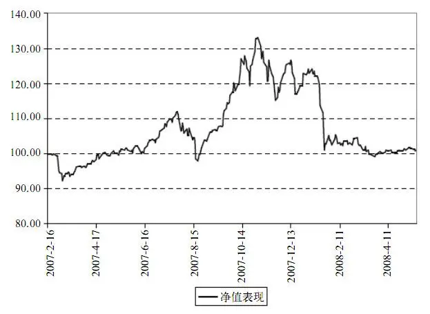

图4\-8 美林平衡型新兴市场指数

资料来源：美林公司。

当然，我们看到截止到2008年4月这款产品的净值大概是101左右（见图4\-8），相比初期上涨1%左右。自2007年10月到2008年4月全球跌幅最深的是中国股市和印度股市，所以该产品的净值回调这么多也是可以理解的。2008年1月1日至2008年6月9日，全球股票市场跌幅前三的市场也是印度股市、中国股市和新兴欧洲股市（不含俄罗斯），详情参见图4\-9。

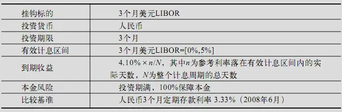

图4\-9 全球股市跌幅较大的市场

资料来源：晨星公司。

投资本产品一年多的时间，投资收益从期初0%攀高到最高收益33\.16%再到1%，这就是新兴市场的高波动性，游走在“天堂与地狱”之间。但是，站在今天、放眼未来，全球最值得投资的地区仍然是以中国、印度、俄罗斯等为核心的新兴市场，它们未来的表现如何就让时间来证明吧！

不过到2011年8月此投资产品到期时，即使这些挂钩标的基金价格低于期初水平，投资者也没有损失本金的风险。

最后，不论是这种挂钩基金组合的结构性投资产品还是传统的方向型股票基金，一定要记住——投资价值！如果有投资价值，不论它们下跌多少，都应持有，时间迟早会纠正市场的错误；如果失去了投资价值，不论它们上涨多少，都应抛售，时间迟早也会纠正市场的疯狂。

利率挂钩到期保本型结构性投资产品

利率挂钩到期保本型结构性投资产品旨在帮助投资者把握某种利率走势的情况下获取收益，同时提供到期100%本金保证。一般情况下，这种类型产品挂钩的标的多为美元N个月伦敦银行间同业拆借利率（N通常会取1、3、6或12），而且投资期限一般比较短，多为1个月、3个月或6个月等。

这类短期产品在各家中外资银行比较普遍，挂钩标的多为N个月美元伦敦银行同业拆借利率（LIBOR）。LIBOR是London Inter Bank Offered Rate的缩写，意指伦敦银行间同业拆借利率，是在伦敦的第一流银行借款给伦敦的另一家第一流银行资金的利率。现在LIBOR已经成为国际金融市场中大多数浮动利率的基础利率。作为银行从市场上筹集资金进行转贷的融资成本，贷款协议中议定的LIBOR通常是由几家指定的参考银行，在规定的时间（一般是伦敦时间上午11∶00）报价的平均利率。最常参考的是3个月和6个月的LIBOR。中国对外筹资成本即是在LIBOR利率的基础上加一定的百分点。从LIBOR演变出来的，还有新加坡同业拆放利率（SIBOR）、纽约同业拆放利率（NIBOR）、香港同业拆放利率（HIBOR），等等。

某外资银行在2008年6月发行了一款3个月美元LIBOR挂钩的到期保本型结构性投资产品，采用期权加零息债券组合策略，其特点如下：

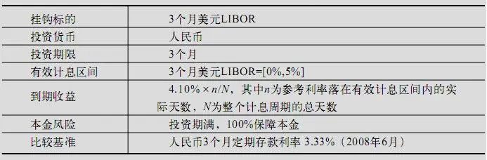

由于这款产品投资期限非常短，只有3个月，所以比较适合“短途”闲置资金投资。如果LIBOR落在\[0%, 5%\]区间内，就按照4\.10%/年的标准来计息，否则就不计息（见图4\-10）。那么这款产品的投资收益就由落在\[0%,5%\]区间的天数和概率来决定了，在你投资这类产品时，就需要了解下现在LIBOR的情况以及在未来3个月的可能走势，才能在这类产品和同期限的定期存款之间做出更优选择。

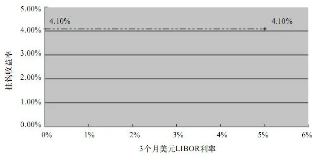

图4\-10 利率挂钩结构性投资产品

我们可以从路透社、华尔街日报和MoneyCafe等财经网站查询到3个月美元LIBOR目前的情况，也可以在你的理财顾问那获取这些信息。图4\-11是3个月美元LIBOR自1998年到2008年6月的走势图，我们可以清晰地看到目前3个月美元LIBOR落在2%～3%的区间，如果你希望了解到更为精确的数据，可以参考表4\-1。

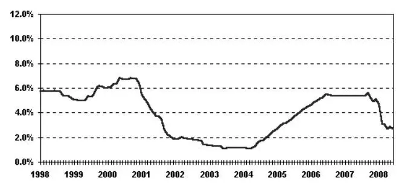

图4\-113个月的LIBOR

资料来源：MoneyCafe\.

表4\-1 具体的LIBOR数据 （%）

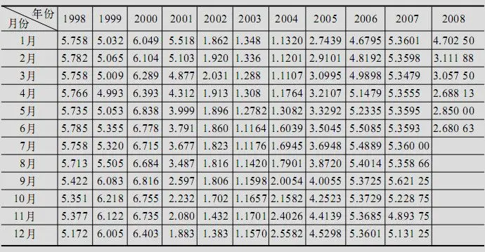

资料来源：MoneyCafe\.

2008年6月份3个月美元LIBOR报价是2\.68063%，如要预测未来3个月LIBOR的走势，我们就需要了解一下LIBOR的走势会受哪些因素的影响。由于美元LIBOR是伦敦银行间同业美元的拆借利率，那么对它影响最大的是美联储联邦基金利率。联邦基金利率是指美国同业拆借市场的利率，是其最主要的隔夜拆借利率。简单地说，美联邦基金利率是央行对美国银行业同业拆借资金的指导利率，而LIBOR则是根据这个指导利率遵循市场供需关系由各家主要银行报出的市场利率。所以，当我们再回溯观察图4\-11和图4\-12时，我们会发现LIBOR的走势和联邦基金利率的走势非常相近。

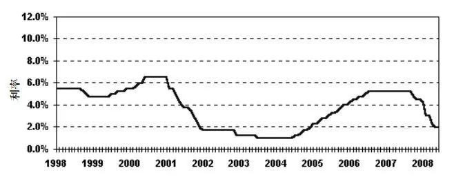

图4\-12 联邦基金利率

资料来源：MoneyCafe\.

站在2008年6月这个时点，由于美国次贷危机导致美国经济动荡，甚至可能大幅下滑，美联储已经多次下调联邦基金利率，为贷款者减负，希望起到稳定金融市场的作用。对于未来3个月，市场普遍认为美联储减息还有机会，但加息的可能性很小。故此，我们可以以此推断LIBOR在未来3个月大幅上调的可能性也比较小，所以LIBOR落在\[0%,5%\]区间的概率会较大，同时游离在此计息区间的天数也会较多，有望获得4\.1%的年息。

汇率挂钩到期保本型结构性投资产品

汇率挂钩到期保本结构性投资产品旨在帮助投资者通过跟踪一种外币对另一种外币的汇率变化情况获取收益，同时提供到期100%本金保证。一般情况下，这类投资产品的期限比较短，有的只有短短14天，其投资收益由协定汇率及落在此汇率区间的天数来决定，这点和上述提到的利率挂钩结构性产品有相似之处。

这类投资挂钩的汇率比较多样，目前常见的有挂钩欧元/美元、澳元/美元等。投资货币也有较多选择，有美元、欧元、澳元和人民币等。同时，这类产品的目标在于帮助投资者在100%保本的基础上寻求增值。关于各币种汇率的详细信息，投资者可以登录主流的金融网站进行查询，也可以通过投资顾问了解最新情况。

某外资银行在2008年1月发行了一款14天挂钩欧元/美元的到期保本结构性投资产品，采用期权加零息债券组合策略，其特点如下：

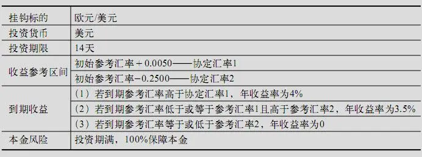

为了更清楚地计算这款产品的到期收益，我们可以参考图4\-13。

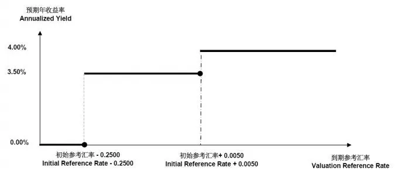

图4\-13 收益说明图

在投资初始日会以渣打银行报的欧元/美元汇率为初始参考汇率，到期收益将根据投资条款分为三种情形：

（1）到期参考汇率高于协定汇率1；到期收益率=4%×14/360

（2）协定汇率2低于到期参考汇率低于或等于协定汇率1；到期收益率=3\.5%×14/360

（3）到期参考汇率低于或等于协定汇率2；到期收益率=0

我们假设在交易日2008年1月10日，欧元/美元汇率报价为1欧元=10\.4196美元。

则：协定汇率1=10\.4196\+0\.0050=10\.4246

协定汇率2=10\.4196\-0\.2500=10\.1696

在此投资到期日2008年1月23日欧元/美元汇率报价为1欧元=10\.6422高于协定汇率10\.4246。

则：到期收益率=4%×14/360

通过对这款产品的协定汇率1和协定汇率2的观察，我们可以看到只要投资者对欧元/美元是看涨或有限看跌都是值得投资的。关于近年欧元兑美元汇率走势可参考图4\-14。

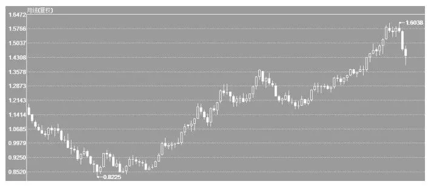

图4\-14 欧元兑美元汇率

资料来源：同花顺资讯。

__非保本结构性投资产品__

以上我们了解了保本的结构性投资产品，接下来我们将介绍两种主流的非保本结构性投资产品。

目前，由于中国金融市场还不够成熟，无做空机制，所以不少创新类的投资策略无法在国内金融市场实行，不能为中国A股市场释放系统性风险，无法使投资者在整体下跌的情况下规避风险。所以，这类避险投资基本上不为国内投资者所熟悉。其实，对于一个地区性的股票市场，在其市值被明显高估的情况下，有一些避险策略不仅可以帮助投资者回避系统性风险释放所引发的下跌，还可以在波动市和熊市中获取一定的收益。

下面，我们将介绍两种主流的附有做空机制的结构性投资产品：一种是多种期权组合策略的投资产品，一种是长短仓策略的投资组合。

股票篮子挂钩结构性投资产品

还记得前面提到的宝马汽车期权的例子吗？在市场不明朗的时候，我们可以先买入一个期权，等待标的价格进入我们的交易区间时，我们就行使这个权利，否则就放弃，这种策略在熊市中也可以采用。比如，我们在某只股票价格高估时买入一个看跌期权，挂钩25%年息。等到这只股票跌到我们的交易区间时，我们便行使这个权利，获取25%的年息；如果始终达不到这个交易区间，我们就放弃这个期权，最多损失掉这笔期权费。

为了应对市场复杂的变化，我们可以采用多种期权组合来提高获取收益的概率，降低投资单一期权的风险，这种多种期权组合就像一排阶梯一样，标的价格在每一个区间内波动就会有不同的收益——风险与之匹配，即便标的价格下跌，我们也有机会从中获得收益，而不是像常规策略那样被动承受标的价格下降所带来的投资损失。

这种期权组合的投资策略也可以看做是一根弹簧，标的的初始价格就是弹簧的初始位置；当标的价格上升时，弹簧开始拉伸，触及既定位置，投资结束，投资者拿回本金及挂钩的利息；当标的价格下降时，弹簧开始压缩，每压缩到一个相应的区间就有相应的收益与之对应；当标的价格下降到一定程度，即弹簧压缩到了极限，那么就会使得弹簧失去弹性，我们就换一个弹簧来延续这个投资，并开始随标的价格而自由伸缩。

从上面的介绍可以看出，这种期权组合不是单一地通过标的价格上涨来获取收益，而是只要不跌破既定的价格区间就可获得相应的回报，只有在标的价格下跌过多的情况下，才会发生比较不利的情形。简单地说，当你对某个标的在未来一段时间不看涨时，这种策略将是不错的选择。

外资银行在开发创新类投资产品方面一直走在市场的前沿，利用国际市场上创新策略为国内投资者提供了不少避险类投资产品，尤其在2008年年初香港恒生指数持续下跌，中国股票价格波幅增大的时期，为投资者创造了年投资收益率达30%的投资机会，实际上，投资者在短短一个月后也获得2\.5%的绝对回报。

这类投资产品一般采用多种期权的组合策略来应对市场的波动，寻求在市场有限下跌的情况下为投资者获得较高回报。由于国内股票市场机制的限制，在国内的投资均为方向型投资，即只有投资标的上涨才能获得收益，否则就是零收益或者亏损。所以，这类多种期权组合策略的投资产品拓宽了投资宽度，提供了一条很好的避险通道。

某外资银行在2008年2月发行了一款瑞信“价值发现”股票挂钩可转换结构性投资产品，采用多种股票期权组合策略，其特点如表4\-2所示。

表4\-2 “价值发现”的特点

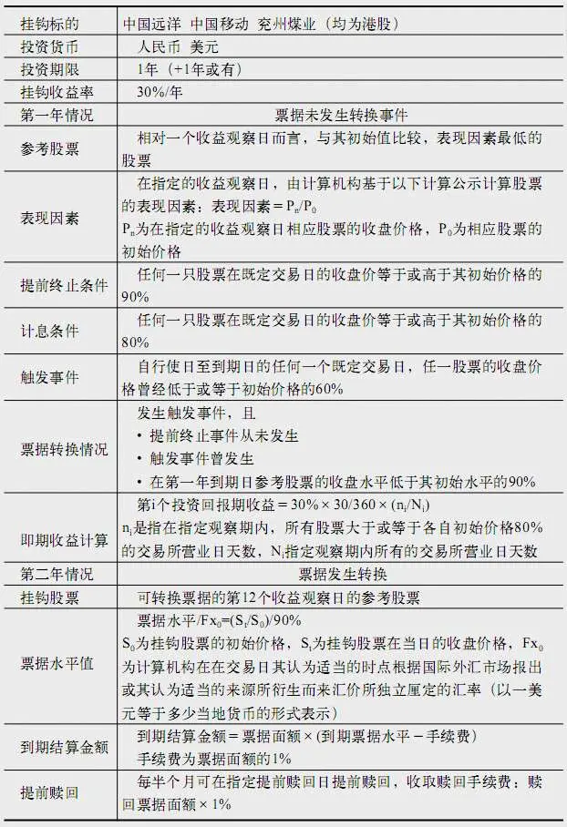

由于这款投资产品采用了复杂的期权组合策略，所以条款较为繁多，需要认真仔细地阅读才能理解其基本要义。

这款“价值发现”期权组合产品是分为两个票据来设计的，第一张票据是一年期“价值发现”有条件保本股票挂钩可转换的结构性票据，第二张票据是一年期股票挂钩的非保本结构性票据。

第一张票据挂钩在香港联交所上市的三家红筹股，分别为中国远洋、中国移动和兖州煤业，其票据参考股票为这三只股票中每天在收盘时表现最差的那只，此票据表现情形有如下四种情景（以美元为例）。

情景一：较优情景——票据于第2个月内即被提前赎回（如图4\-15）。

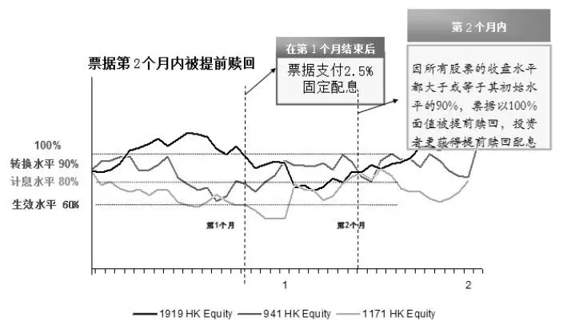

图4\-15 情景一

在第1个月结束后，票据支付2\.5%固定配息；

在第2个月第7个交易日（本月共20个交易日），3只股票表现均等于或高于90%，提前终止事件被触发；

7个交易日中3只股票表现均等于或高于80%，累计配息=30%÷12×7÷20=0\.875%；

总收益=2\.5%\+0\.875%=3\.375%，提前终止事件被触发后5个工作日，本金连配息一同返还；

若投资10000美元于票据，投资回报=3\.375%×10000=337\.5（美元）

情景二：票据于第4个月末即被提前赎回（见图4\-16）。

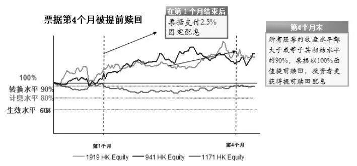

图4\-16 情景二

在第1个月结束后,票据支付2\.5%固定配息；

在第4个月末，3只股票表现等于或高于90%，提前终止事件被触发；

4个月中，3只股票表现均等于或高于80%，累计配息=2\.5%×3=7\.5%；

总收益=2\.5%\+7\.5%=10%，提前终止事件被触发5个工作日后,本金连配息一同返还；

若投资10000美元于票据，投资回报=10%×10000=1000（美元）

情景三：提前终止事件没有被触发，触发事件亦没有发生（见图4\-17）。

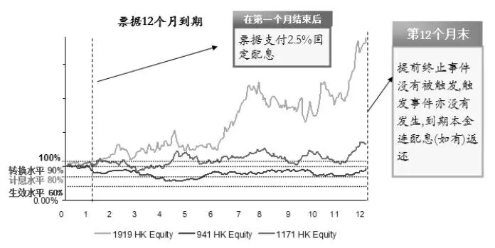

图4\-17 情景三

在第1个月结束后，票据支付2\.5%固定配息；

自第2月至期末，从未发生3只股票在同一交易日表现等于或高于90%，无提前终止事件被触发；

各个观察月中有部分交易日出现3只股票表现均等于或高于80%,累计配息在0～27\.5%之间；

假设累计配息=16\.5%，总收益=2\.5%\+16\.5%=19%，5个工作日后，本金连配息一同返还；

若投资10000美元于票据，投资回报=19%×10000=1900（美元）

情景四：提前终止事件没有被触发，触发事件发生（如图4\-18）。

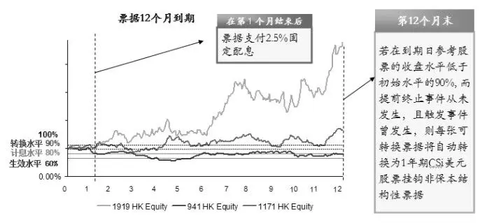

图4\-18 情景四

在第1个月结束后，票据支付2\.5%固定配息；

自第2月至期末，从未发生3只股票在同一交易日表现等于或高于90%，无提前终止事件被触发；

在某交易日，某股票跌破60%生效水平且在到期日表现小于90%，触发事件被触发；

各个观察月中有部分交易日出现3只股票表现均等于或高于80%，累计配息在0～27\.5%；

假设累计配息=13\.75%；总收益=2\.5%\+13\.75%=16\.25%，每张可转换票据将自动转换为1年期瑞信一年期美元股票挂钩非保本结构性票据；

投资表现将取决于1年期瑞信美元股票挂钩非保本结构性票据的表现，可能损失本金。

当转换事件发生后，第一张有条件保本的结构性票据将转换成一张非保本挂钩表现最差股票的票据，其票据水平值由下式决定：

上述公式的符号意义可参考前述“票据水平值”一栏。公式所表达的意义，就是在第一张票据到期时，将表现最差的股票以9折的价格卖给投资者，然后投资者可最多持有一年，并有权利在此一年的每个月的两次提前赎回日进行提前赎回，其票据净值将由挂钩的股票价格决定。

虽然这款产品设计较为复杂，但其有限看跌的策略能够帮助投资者回避相当多的系统风险和挂钩股票下跌引致的风险，还能在10%的下跌区间内有提前终止权，并在下跌20%的区间内以30%/年的标准来计息。至于最差的情况，我们则需要了解挂钩股票一些基本情况,以此来判定转换事件发生的可能性。在2008年2月份的时点去观察，中国远洋2008年预估市盈率只有9\.45，中国移动2008年预估市盈率是19\.7，兖州煤业2008年预估市盈率13\.72，即使这三家公司的盈利不能增长，其基本面不足以推高股价，但稳定的业绩和较低的市盈率也说明了这三只股票的投资风险是较低的。如果投资者认为这三只股票在一年时间内跌破60%的可能性较小，而表现最差的股票有可能在某个交易日停在其初始价格的90%以上发生提前终止事件，也有可能有一段时间停在其初始价格的80%以上，以30%/年的标准来计息，那么这款产品就是适合你的。

在2009年，包括中国在内的全球经济有放缓的可能，在这种经济状况的预判下多家外资银行发行了有限看跌和有限看涨的多种期权组合策略的投资产品，帮助国内投资者在国内及香港股市下跌的行情里获得了降低投资风险、获取较高回报的机会。关于更为详细的投资信息，投资者可以向自己的专属客户经理进行咨询。

## 第二篇 市场赢家的工具 - (3) 第5章 信托投资产品

\(3\) 第5章 信托投资产品

2026年3月14日

9:57

第5章 信托投资产品

信托（trust），就是信托投资公司接受两个或两个以上委托人委托，依据委托人确定的管理方式（指定用途）或由信托投资公司代为确定的管理方式（非指定用途）管理和运用货币资金的行为，它是一种投资模式，其投资范围没有限制，可以涉及有价证券、公司融资、实业股权投资和房地产投资等。由于投资方向广泛，投资手段灵活，深受广大投资者欢迎，其主要发行渠道为信托公司和商业银行。

本书主要为投资者介绍几种常见的信托投资产品，它们包括房地产信托、公司融资信托、基础建设项目融资和证券投资信托。每种信托投资产品的风险特点与预期回报都不同，投资者可以根据自己的风格特点进行合理的搭配。

__房地产信托产品__

房地产信托投资是房地产公司委托信托公司，向公众募集资金后投资于房地产项目建设的信托产品。此类房地产信托一般不设本金保证条款，若房地产公司到期无力归还资金，投资者将面临本金风险，所以一般应选择信誉度高的房地产公司项目和信托公司，或由实力雄厚的金融机构承担不可撤销连带责任担保的产品。

在2006年3月20日至2006年4月7日，深圳国际信托投资公司发行了一款万科朗润园集合资金信托计划，由中国银行深圳分行提供本房地产项目开发贷款的不可撤销的连带责任保证担保，如果万科公司在信托项目到期时无法归还贷款本金，将由中国银行深圳分行进行偿付。

此信托投资计划所募集的资金将以贷款方式发放给上海万科房地产集团有限公司，用于其开发的位于上海市闵行区七宝镇新龙路的万科朗润园项目建设。投资期限为两年，期间投资者不可进行提前赎回，每满一年将向投资者分配当期信托净收益。预计投资者年收益率为：4\.0%，但并不保证。

根据以上条款，投资者可以看到这是一款低风险、稳定回报的信托产品。其4\.0%的年收益率略高于当时的两年期定期存款利率2\.7%（税前）。由于中国银行深圳分行对此房地产贷款资金具有不可撤销的连带责任，所以此投资的本金风险是非常低的。

2008年，由于全国房价高启，导致诸多住房买家和房地产投资者对楼市看淡，一直是有价无市；又由于央行不断通过加息和提高银行存款准备金率以收紧银根，进行宏观调控，房地产商的资金趋于紧张。在这种情况下，房地产商很难得到商业银行的贷款，转而与信托公司合作开发房地产信托产品，进行融资，希望缓解资金压力。

事实上，在2008年部分房地产信托的资金被开发商用于支付2007年高位拍下的土地款。数据显示，全国地价指数在2007年三季度达到最高点，也就意味着在2007年7～9月拿地的开发商支付的地价款非常高。如果房产行业成交量不能保持、回暖趋势缓慢，那么2008年7～9月将会是开发商资金链最紧张的时候。如果一年大限到来之际，土地款不能到位，则前期投入将彻底“打水漂”。而央行又规定，开发商必须四证齐全且自有资金达到30%，才能向银行申请贷款。为此，房地产公司求助于银行和信托公司，通过发行信托理财产品融资到30%以上后，再向申请银行贷款。

著名经济学家弗里德曼在一次受访时被问：“如果只用一句话来概括经济学，你将会说什么？”他答道：“天下没有免费的午餐。”

所以当你看到2008年发行的诸多房地产信托投资产品年投资收益率在5%～7%，甚至高达11%而然心动时，请回顾一下弗里德曼的这句话。

__公司信贷信托产品__

公司信贷信托一般是指实业公司不向商业银行贷款，转而委托信托公司向公众融资或商业银行出让一部分信贷资金的收益，将此贷款向信托公司抵押向公众融资，然后将其用于银行经营的信托产品。

既然财务健康的实业公司可以得到商业银行的信贷支持，它为什么要委托信托公司向公众进行融资呢？原因有三：一是此公司在商业银行的融资额度已经用完，为了获得充沛的现金或扩大再生产只有向公众融资；二是此公司通过信托公司融资的成本比商业银行低，能够降低资金成本；三是某些项目不能得到商业银行的审批，转而向公众融资。无论是哪一种，投资者都应了解资金用途，分析投资风险后再做决策。

近年来，有些商业银行也委托信托公司发行了多款信贷资产抵押，向公众融资的公司信贷信托产品，主要的原因是商业银行在经营期间贷款资金趋紧，便将信贷资产进行抵押，向公众融资出让一部分原有的贷款收益，同时增加现有可贷资金量，满足贷款量增长的要求。

在2006年4月27日，深圳国际信托公司受原深圳市商业银行委托，发行了一款深国投·深圳市商业银行“盈丰（五期）”信贷资产受让项目集合资金信托产品。募集所得信托资金将全额用于受让由深圳市商业银行承诺以溢价回购的信贷资产，并由深圳市商业银行负责该信贷资产的日常管理。投资期限一年，预期投资年收益率为4\.5%，比同期银行一年期定期存款利率2\.25%（税前）高出一倍。

本款信托产品的结构非常简单，而且资金用途也比较明确。如果投资者对原深圳商业银行的经营质量和商业信誉比较信任，那么这是比较适合做短期投资的一款信托产品。

__基础建设类信托产品__

基础建设类信托产品的投资方向一般为国家或当地政府支持发展的公路、桥梁、港口和机场等基建设施项目。其中一些项目会由国家开发银行提供信托贷款本息不可撤销的连带责任担保。由于有国家开发银行参与贷款本息担保，其本金风险非常低。

在2006年12月14日成立的深国投·国开佛山公路项目集合资金信托计划中，此信托资金将以贷款方式运用于佛山市三水区宏升基础设施投资有限公司的云东海旅游经济区中心区主路网等三个项目。国家开发银行对信托贷款本息提供不可撤销的连带责任担保。其投资期限为一年，预期年投资收益率为3\.7%，高于当时的一年期定期存款利率2\.79%（税前）。

然而就在基建类信托投资产品由于其风险低、回报稳健而广受投资者欢迎时，却在2008年7月发生了一起与基建信托有关的法律案件，值得投资者警醒。

2004年，在银行的安排下，由1923名个人客户组成的两家公司，出资8000万元与安信信托签署了河南新陵公路项目贷款资金信托合同，此后项目出现政策风险，资金无法收回，而安信信托则以资金来源和去向皆由光大银行太原分行所控制为由，拒绝偿付。此信托产品的投资者在信托合同到期时，不仅无法获得收益，而且面临本金无法赎回的巨大风险。此款信托的内容一直没有公布，但基于本金风险的猜测，国家开发银行应该是没有参与其中并对贷款资金的本息进行不可撤销的连带责任担保的。

所以，即使是国家或当地政府支持的基础建设类信托产品，在没有大型金融机构参与贷款本息担保的情况下，投资风险还是存在的，而且是比较大的。希望投资者注意！

__证券类信托产品__

证券类信托投资产品主要包括了新股申购、股票投资和债券投资等。作为投资者，最熟悉的证券投资产品莫过于共同基金了。之所以以信托方式发行证券投资信托产品，一是因为专项的新股申购产品不适合以基金方式存在，二是股票和债券投资以信托方式发行后，可以以私募基金方式运作，避开公募基金的硬性规定，自由地在市场中进行投资。信托只是证券投资的一种手段和渠道，和公募基金相比，各有利弊。

新股申购信托产品

新股申购一直受到证券投资者的追捧，主要是因为它具有风险较低、投资回报率较高的特点。然而新股申购信托产品的年投资收益率在不同市场环境下，差别还是比较大的（见图5\-1）。

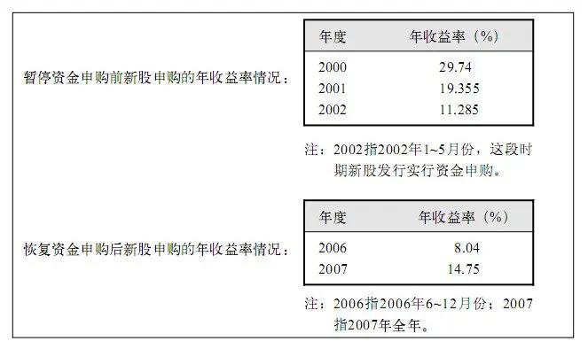

图5\-1 新股申购信托产品

资料来源：中海信托公司。

影响新股申购信托产品年投资收益率的最主要原因是两点：新股发行的数量与金额；参与市场认购新股的资金量。前者是新股的供应量，后者是新股的需求量。2006年国内A股市场共发行新股32只，新股认购资金非常庞大，这导致中签率较低，平均新股申购的年投资收益率为8\.04%；2007年国内A股市场共发行新股122只，认购资金亦然比较充足，因此中签率较2006年明显提升，平均新股申购的年投资收益率上升为14\.75%。

个人投资者可以自行在市场上进行新股申购，与专业信托机构相比，在了解市场发行新股动态、鉴别优劣质新股和资金运用效率方面则相对较弱。所以，参与新股认购，个人投资者委托专业信托机构进行操作，其风险更低，收益会更高。

表5\-1列出了一些近年新股认购信托产品的特点，供投资者参考。

表5\-1 新股认购信托产品

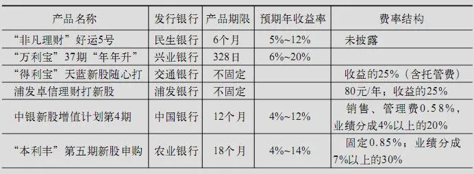

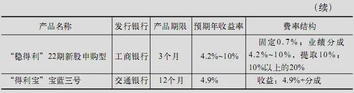

资料来源：中海信托公司。

证券投资信托

证券投资信托是投资者委托信托公司将资金于专业资产管理公司运作的一种模式。在目前国内市场上，此类信托多为私募基金的运作平台。与公募基金相比，它有以下特点（见表5\-2）：

表5\-2 证券投资信托的特点

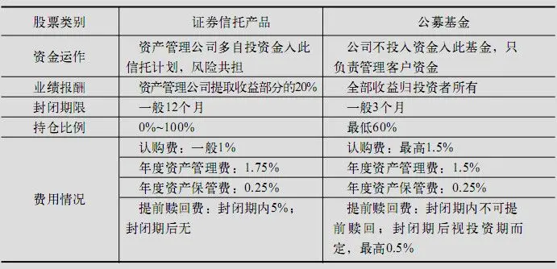

私募性质的股票信托投资与公募股票基金的最大区别在于持有其股票资产的比例可以在0～100%之间自由调配，在股市风险明显很高时，允许不持有任何股票，甚至主动清仓归还资金给客户，公募股票基金则必须保持最低60%的资金持有股票资产。另外，私募股票信托一般要分取收益部分的20%，而公募基金的投资收益全部归客户所有。

在国内私募股票信托诸多产品中，深国投·赤子之心信托投资一直声名在外，其完善的价值投资理念、卓越的投资绩效和敢为天下先的强烈责任感吸引了众多“价值投资者”。基金经理赵丹阳曾从事过实业，后转入证券投资行业，成立了深圳赤子之心资产管理公司，2008年网上竞拍最终以211万美元获得与股神巴菲特共进午餐的机会。

在他的投资生涯中，有诸多经典案例值得投资者反复思考。投资同仁堂的时候，赵丹阳除了请教医生对同仁堂的评价，每月都会去药店一趟，看六味地黄丸瓶底的出厂日期，计算它的流通速度。在SARS肆虐的时候，还专程从香港飞到北京参加股东大会，“当时整个飞机上只有一两个客人。”买盐田港之前，赵丹阳去江下村码头。那里是边境线，警卫很森严，他就借了件工服混进去，跟码头工人聊天，数货柜的数量，待了整整一天。为了考察五粮液的销售情况，他参加经销商大会，和经销商住一个房间，同吃同睡。五粮液的董秘说，这么多年赵丹阳是第一个这样考察企业的投资者。投资宁沪高速之前，他专门蹲在路边实施“数车”计划，测算车流量来判断宁沪高速的收益状况。尤其在银广厦一度被热炒时，他亲自到天津查询了银广厦的用电情况，得知这么大一家公司一个月才用电一百多度时，立马打道回府。

赵丹阳精彩的投资故事还有很多。当他在2008年1月决定将公司的几只股票信托计划全面清盘时，业界为之一惊。不少人骂他是“白痴”、“神经病”，因为当时上证指数还高高挂在5000点左右，还有无数痴迷的投资者期盼着奥运行情。事实胜于雄辩，今天投资者应该明白他清盘的理由了！下面特摘录赵丹阳致投资者的一封信，我也希望广大的投资者能忠实价值投资，长久地活在证券市场里面，并最终实现财富增值的目标。

致投资者的一封信——2007

亲爱的投资者：

您好！

2007滴滴答答地从身边滑过，时光飞逝。

对赤子之心的投资者而言，今年是艰苦的一年。同任何相关指数相比，我们都远远落后。在此，我们深表歉意。

赤子之心香港今年加权收益率约为13%，同比恒生指数上升38\.06%，国企指数上升54\.32%；赤子之心香港过去五年累计升幅约为541%；

深国投·赤子之心（中国）集合资金信托全年加权收益率约为48%，同比上证指数上升96\.7%；过去四年累计升幅约371%；

深国投·赤子之心投资哲学集合资金信托全年加权收益率为47\.37%；

深国投·赤子之心（中国）2期集合资金信托累计加权收益率约为22\.12%；

平安·PUREHEART中国成长一期集合资金信托累计加权收益率为49\.25%；

平安·PUREHEART中国成长二期集合资金信托累计加权收益率为24\.54%。

为什么会出现这样的情况？

时间拉回2002年，那时香港仍未走出97金融风暴的阴影，房地产和股市非常低迷。当时恒生指数在10000点左右，H股指数在2000点左右，我们在香港成立赤子之心中国成长基金。2003年初，基于中国的基本面，我们认为H股未来若干年有望挑战10000点（见相关媒体报道），所有人都认为是笑谈。

2004年初，大陆A股市场已经下跌了近三年，系统性风险已经释放，我们和深国投合作成立赤子之心中国一期。2005年5月25日，A股1060点，同样基于中国强劲的基本面，我们认为A股未来三～五年会达到3000～5000点（见相关媒体报道）。

2006年底，在致投资者信中，我们谈到“充沛的流动性一次次把市场推向更高的位置。2007年我们最重要的事情依然是风险控制，在适当的时机，对于有些估值偏高的股票，我们会考虑套现。”至今日，H股和A股都已越过我们所理解的范围，我们在H股10000点，A股3500点实现了我们的收益。回头看，我们过早地出局。指数的顶和底永远是个谜。今天，就我们的投资能力，已找不到既符合我们投资标准又有足够安全边际的投资标的。未来一段时间，市场的强劲也许会持续很久，经过慎重考虑，并和两个信托公司沟通后，赤子之心作为顾问的所有信托将尽快清盘。将投资款返还给投资者，便于投资者自由把握未来投资机会。

回顾赤子之心过去五年的业绩，我们没有一个投资者亏损。赤子之心香港是一个对冲基金，我们的投资参照不是指数。我们的目标很简单，长期实现HIGH AND HIGH。打个不贴切的比喻，就是希望每一年年底要比上一年有正的回报。长期看，对投资而言，这是极具挑战性的任务。在回避风险的前提下，取得一定的正向回报，至于回报的多少，我们只能怀着感恩的心态，由上帝决定。在2003年成立香港基金时，我们的小册子第一部分这样写着：

投资的哲学——生存的艺术

基金的优势首先不体现在一段时间、某只股票赚钱的多少，而是体现在持续控制风险的能力上。风险的量化程度是衡量基金经理专业化程度的标志。在投资界，“活下来”永远是第一位的。但是对专业投资而言，单方面讨论风险测度是没有意义的。

投资的核心是确定风险和收益的对称性。任何风险资产都是可以投资的，只要有足够的收益补偿。投资研究的核心目的是寻找风险——收益之间的对称关系。围绕着这一对称关系，可引申到投资的所有领域：股票的风险及定价，保险资产的风险及补偿，抵押债券的定价，期货、期权等衍生工具的定价等。

专业投资的主要目的之一就是寻找这种风险——收益关系的偏差，当市场因为各种原因使我们的研究标的出现风险——收益的非对称定价关系时，便是我们获取超过市场平均利润的机会。

最普遍的例子，寻找低于市场平均市盈率以下的股票——根据平均市盈率水平来保护交易头寸，就是运用这则原理最简单的做法。但是作为基金、作为专业投资者，我们需要从更大的范围考虑：

1\.目前该市场的整体平均市盈率水平合理吗？

2\.该公司股票的市盈率水平合理吗？

3\.市盈率指标足以反映公司的内在风险吗？

4\.是否有更好的风险－收益的测度手段？

我们将永远坚守我们的生存哲学。

2007年之后，赤子之心将更理解：什么样的公司值得长期拥有，什么样的公司只能阶段性持有；自我的恐惧和贪婪，宏观经济和通货膨胀。我们需用一生的时间去完善自我的投资理论体系。

赤子之心，坦诚伴您。

赤子之心总经理 赵丹阳

2007年岁末

## 第二篇 市场赢家的工具 - (4) 第6章 另类投资产品

\(4\) 第6章 另类投资产品

2026年3月14日

9:57

第6章 另类投资产品

在本章，我们将介绍对冲基金和商品指数的投资。在金融界，对冲基金一直都是一种极富神秘色彩的投资产品，不为大众所熟知，因为它无须像公募基金那样定期向大众披露基金信息，或许正是因为它一贯的低调反而使得诸多投资者对其充满了好奇，其实它并没有那么神奇和难以理解，只是根据另一种看市场的角度采用了不同的操作手法而已。至于商品指数投资，它兼具了价值投资与投机成分，在商品供给小于需求的时期内，商品价格必定上涨，然而在价格上涨的过程中又伴随着诸多投机商的参与，使得现代商品投资的波动性大幅增加，提高了商品指数投资的难度。

随着中国证券市场的逐步开放，国内投资者已经可以接触到这些另类投资产品，但是对它们的运作原理和特点仍然知之甚少，希望本章能帮助大家对它们有更深入的了解。

__对冲基金__

对冲基金（hedge fund）亦称避险基金或套利基金，意为“风险对冲过的基金”。通常情况下，投资者在以某一价格买入股票之后，只有股价上涨才能获得收益。但是对冲基金为了避免由于这只股票的下跌而产生的亏损，它会在前景看好的某个行业买入最看好的几只优质股，同时也以一定的比例卖出几只劣质股。如此组合的结果是，如果该行业发展良好，优质股组合的涨幅必定超过同行业劣质股，买入的优质股组合的收益将大于卖空劣质股组合的损失；如果预期错误，此行业股票不涨反跌，那么劣质股跌幅必大于优质股，则卖空盘口所获利润必高于买入优质股下跌造成的损失。这种操作手法在对冲基金行业里称为“长/短仓策略”（long\-short strategy），运用商业价值分析的逻辑买入优质股票组合，同时卖出劣质股票组合进行套利。

在本书的第4章结构性投资产品里介绍过“期权”，对冲基金也广泛使用期权等金融衍生工具进行套利交易。在操作过程中，一般会根据当地市场的具体情况在计算机里设置固定的程式，待市场出现套利交易机会，计算机会自动提示交易员，然后由基金经理下达指令进行操作。这种模式又称为“模型定价交易”，这是运用定量化分析的程式进行风险对冲的套利模式。

对冲基金之所以能在现代金融市场迅速发展起来，是因为它具有独一无二的特性：市场中立。关于市场未来的走势，没人可以准确预测，股票基金因其投资组合中的股票价格上涨而获得收益。而对冲基金允许投资组合中的股票有涨有跌，而且仍然有望获得收益。所以，对冲基金应该是在整个资产配置中独立于市场判断的中立性投资产品，寻求无论市场好坏都能获得绝对回报的投资品种。

中国投资者了解对冲基金应该是在1997年亚洲金融风暴开始的，全球盛名的对冲基金专家索罗斯率领他的量子基金在亚洲展开了大规模的货币及利率对冲交易，迫使不少国家放弃了原有的汇率政策，而且导致一些亚洲国家财富大量损失。索罗斯在这场与亚洲各国的较量中曾一夜赚取了约10亿美元的财富，或许是这样的故事引起了不少投资者对对冲基金的关注。索罗斯观察市场的方式和操作策略是对冲基金界的泰斗，仰而望之，寥寥数人能及。不过我们还是可以通过下文对对冲基金有些基本的了解，希望能为你拨云见日！

长/短仓股票组合

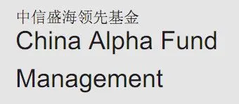

中信盛海领先基金是一只由中信证券公司和中国盛海基金管理公司合资的长/短仓策略的对冲基金。此基金主要投资于在香港、上海、深圳、新加坡、伦敦和纽约上市的公司证券、金融衍生品等。通过对产业链价值的深度分析，挖掘产业中的优质企业，采用买入做多策略；同时，对产业中的弱化企业进行卖空（短仓）。

由于国内融资融券业务还没有正式运行，所以很多投资者对卖空（短仓）策略不甚了解，其实卖空策略是很容易理解的。举例来说，投资者对某只股票后市看淡，认为股价会下跌。那么他可以在现价100元时向证券公司融券（借股票）100股，然后立即在市场上以100元/股的价格将其卖出，便持有现金资产10000元。一个月后，此股票下跌至80元，投资者又以80元的价格买入此股100股，投资金额为8000元，将此100股归还给证券公司后，投资者在此次交易中获利2000元，这就是卖空（短仓）策略。

中信盛海领先基金的主要投资策略就是在一个产业中去发现最好和最差的公司，然后分别对其股票进行买多和卖空，最大限度地回避市场波动，期望由公司的基本面好坏来决定投资组合绩效。

示例

上游强－下游弱：煤供应商－发电厂

在2006年，基金经理发现在煤电产业中，过去两年的煤价上涨幅度远远超过电费，然而出于对通胀的担忧，政府迟迟没有启动煤电联动计划。随着煤价的上涨，电力公司必然受到成本提高，收入减少的负面影响，于是该经理便在煤电这个产业中选择了基本面最好和最差的股票各一只：神华能源和山东国电（港股），对其进行长/短仓策略投资。

众所周知，2006～2007年是中国A股和香港股市的大牛市，即便如此，山东国电由于其基本面弱化，在投资期一年半的时间里，还是落后神华能源300%的涨幅（见图6\-1）。所以，这一对长/短仓股票组合的同期投资回报为：420%－100%=320%。

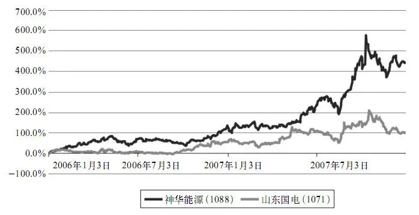

图6\-1 神华能源与山东国电的对比

资料来源：彭博资讯。

示例

上游弱－下游强：家电制造商－家电零售商

在近年家电制造业和家电零售业的大产业链中，以国美、苏宁为龙头的专业家电零售商发展迅速，盈利水平不断提高，且对家电制造商的议价能力逐日增强。但国内主要的几家大家电制造商则过于依靠国美、苏宁这样的家电零售商进行产品分销，导致议价能力减弱，其单件产品的利润也在减少，产业大部分利润逐步向专业的家电零售商转移。

经过基金经理的深入分析，国美是专业家电零售商中基本面最好的公司，而TCL则是家电制造商中基本面最差的公司，相信在过去几年TCL兼并欧洲家电制造商汤姆逊失败的事件也广为人知。因此，此基金构建了买多国美，卖空TCL的长/短仓股票组合。

如图6\-2所示，在2006～2007年的大牛市中，TCL仍然下跌了约50%，而国美则上涨了270%，所以这一对长/短仓股票组合的同期回报为：270%－\(－50%\)=320%。

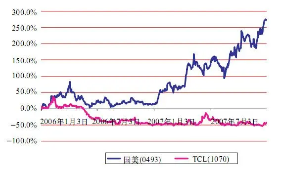

图6\-2 国美与TCL的对比

资料来源：彭博资讯。

即便在2008年中国A股和港股步入熊市以来，从2008年1月2日至2008年5月22日，国美电器股价下挫了－11\.4%，而同期TCL股价则下挫－33\.3%；这对长/短仓组合的回报为：－11\.4%\-\(\-33\.3%\)=21\.9%。如果你是按照传统交易方式，买这两支股票的其中一只，那么你最少也要亏损－11\.4%。

可见无论牛熊市，这种长/短仓策略的对冲基金都有可能为投资者实现正向回报。

多重策略对冲基金

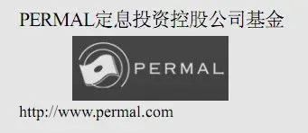

PERMAL是全球实力最强，规模最大的对冲基金公司之一，经营金融业务超过30年，是多重策略对冲基金的业内顶尖专家。旗下的PERMAL定息投资控股公司基金是PERMAL集团的一员，专注于环球定息类资产（债券及债券衍生品）的投资，采用多重策略的方式进行套利交易。

PERMAL定息投资控股公司基金的操作策略和上述长/短仓股票策略是不同的，它专注于环球定息资产而不是股票，可以采用任何允许的方式进行对冲，并不局限于某个国家或地区，也不局限于大众熟知的政府或公司债券，其操作的灵活性远远高于一般的公募债券基金。

图6\-3显示了PERMAL定息投资控股公司基金自2000年～2007年的表现，可以看到这只固定收益类对冲基金与环球股市几乎是绝缘的。无论在2000～2002年全球股市普遍下跌的时期，还是在2003～2007年全球股市普遍上涨的5年，这只定息投资对冲基金在每年均取得了正向回报，并且每年都超越了比较基准JP摩根全球政府债券指数。

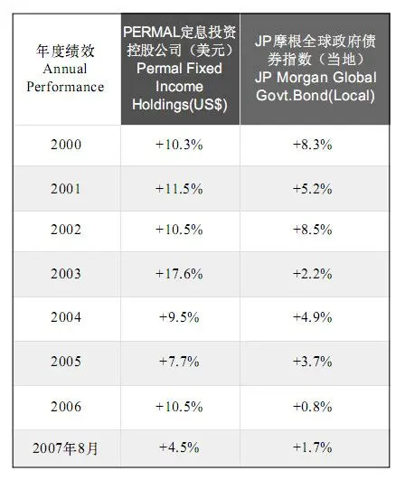

图6\-3 PERMAL公司的历年收益

资料来源：Permal公司。

图6\-4则清晰地显示了此基金从1999年12月至2007年8月的表现，其回报率远远超过比较基准，而且可以清晰地观察到此基金的年度波幅非常小，每年都取得了正向回报。

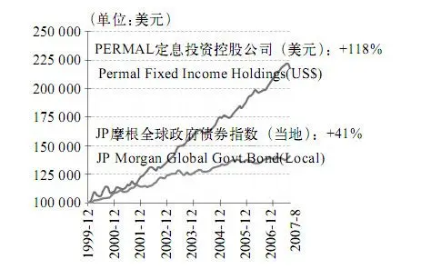

图6\-4 投资10万美元的绩效

资料来源：Permal公司。

__商品指数__

国内众多投资者知道黄金、石油和农产品的价格在近几年出现了大幅上涨，但是怎么从这些商品价格上涨的过程中获取投资回报，仍然不是很清晰。如果石油价格上涨，你可以在石油价格100美元/桶时去直接买入一些石油，待价格上涨后再卖出获益；还可以间接投资与石油价格相关的金融产品，同样也能在石油价格上涨时获益。

不过，投资石油、黄金和农产品价格指数需要高度的专业性，并不适合一般的投资者，除非你是这个行业的专家或者对这个行业非常了解，因为这些指数是由较复杂的金融衍生品种组合而成。这些商品指数与实际商品的价格趋势成同向发展，即石油价格上涨，石油价格指数也会上涨，反之亦然。

本节为大家介绍由瑞士银行投资银行部研发的三款专门投资于商品指数的产品，如果你对这些商品指数的投资感兴趣，可以做深入了解。

瑞银彭博固定期限成份原油超额回报指数、瑞银彭博固定期限成份黄金超额回报指数、瑞银彭博固定期限农产品超额回报指数。

瑞银彭博商品超额回报指数（CMCI）是由瑞士银行投资银行部研发的专门投资于全球商品指数的工具，旨在最大限度地跟踪商品价格的变化，为商品投资者提供交易渠道。石油、黄金这些不可再生资源在未来30年可能枯竭，就10年以上的时间来说，这些商品由于供不应求，其价格必然上涨，不过在此过程中会有多次反复，甚至是大幅下跌，所以这类投资比较适合能够承受高风险谋求高回报的投资者。

农产品价格在近年上涨，主要是由于在过去30年间全球大部分资本投向了工业生产和科技行业，忽视了对其投入，导致现在农产品供需极其不平衡，这也是导致全球通货膨胀的重要原因；另外一个重要原因是由于新能源的开发，对以玉米为主的农产品的需求大幅攀升。在农产品供给与需求没有达到平衡前，农产品价格在未来还会上涨，直至实现供需平衡。在这个过程中，可以投资一部分农产品价格指数，分享农产品价格上涨所带来的收益。

图6\-5显示了瑞银彭博三个商品指数自2003年5月至2008年1月的走势，方便大家了解三类商品指数在过去五年多的表现。

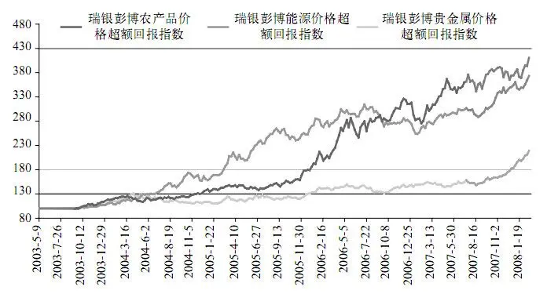

图6\-5 三个商品指数的走势

资料来源：瑞士银行。

瑞银彭博固定期限成份原油超额回报指数自1998年7月以来（见图6\-6），不仅100%追踪到原油价格的实际变化，而且超越了原油价格上涨的幅度。

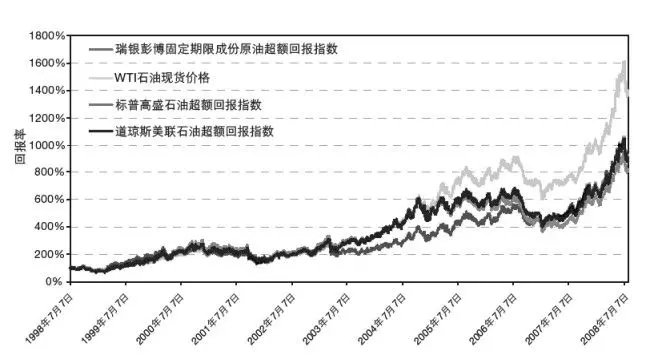

图6\-6 瑞银彭博固定期限成份原油超额回报指数的历史表现

资料来源：彭博资讯。

瑞银彭博固定期限成份黄金超额回报指数（见图6\-7）与其他跟踪黄金价格变化的指数相比，表现基本一致，都实现了跟踪黄金价格变化的目标。

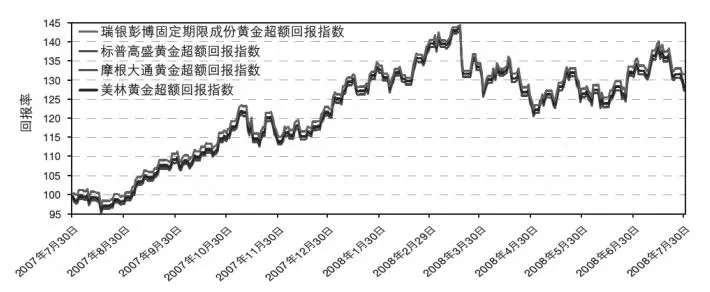

图6\-7 瑞银彭博固定期限成份黄金超额回报指数的历史表现

资料来源：彭博资讯。

瑞银彭博固定期限农产品超额回报指数（见图6\-8）相对其他跟踪农产品价格变化的指数则表现优异，在过去五年超越了其他指数的回报率。

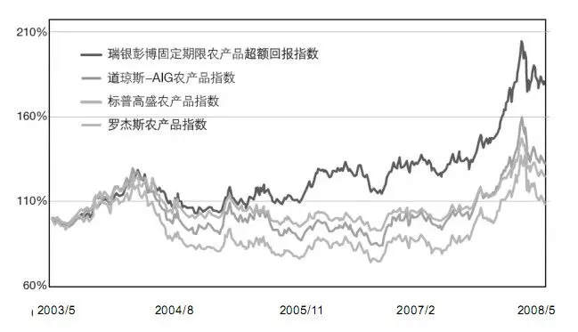

图6\-8 瑞银彭博固定期限农产品超额回报指数的历史表现

资料来源：彭博资讯。

## 第三篇 市场赢家的实战

第三篇 市场赢家的实战

■如何构建投资组合

■投资组合风格一览

■动态投资组合管理

■赢家投资渠道一览

决定投资组合绩效的不是标的的数量，也不是投资时间，而是标的的质量。

## 第三篇 市场赢家的实战 - (1) 第7章 如何构建投资组合

\(1\) 第7章 如何构建投资组合

2026年3月14日

9:57

第7章 如何构建投资组合

在建立了正确的投资信念——价值投资、掌握了基本的投资知识和了解了市场上的主流投资工具之后，我们就可以正式踏上构建投资组合的征程了。即便如此，还是会有不少投资者对年投资收益率抱有过高的期望，如果能获得30%～40%的年投资收益率，他们就会觉得比较满意，这是我在职业生涯里听到过无数次的“笑话”。按照30%～40%的年投资收益率，你在30岁时投入20万元，那么你在50岁时将会有3800万～1\.67亿元的金融资产。如果事情真是如此美妙的话，那些从事实业和贸易的商人都应该转行来专职金融投资了。

在某些年份里，你确实能够获得30%甚至更高的年投资收益率，但在其他年份里你可能只有5%的年投资收益率，而在比较差的年份里你可能还会亏损20%，这是投资市场的基本规律之一，你必须直面事实而别无选择。

过高的预期投资收益率不仅不现实，而且还会严重影响你正确遵循投资理念和原则。当投资收益率达不到你的预期时，你可能会因为希望落空而内心受挫，这时焦躁不安的心情会使你在最不应该放弃的时候错误地放弃自己原本正确的投资策略，或者更糟糕的是，在追逐这种水中望月的高收益率时，你可能会完全放弃以前所掌握的最有价值的理念和方法，跟着大众一起疯狂地冒不必要的风险从而遭受巨额亏损。不论市场好坏，你都应该坚守前文所讲到的正确的投资策略，只有这样，你才能使投资回报最大化。

既然持续的30%～40%的年投资收益率是不切实际的，那么比较现实的年投资收益率应该是多少呢？就股票资产而言，一般发达国家股票市场的长期投资收益率为9%～10%，新兴市场则为15%，但新兴市场的股价波动率比发达国家的高得多。因此，当你的股票投资组合在五年的时间里，其年均投资收益率比上述市场的长期平均回报率要低时，那么你应该好好审视一下你的投资策略了。否则的话，你何必要委托专业机构来帮助你选择股票投资组合呢？你大可直接去投资指数型基金就好了。

至于说在投资组合中，到底要持有多少种资产、每种资产持有多少品种才是合适的呢？这是一个1000人眼中有1000个哈姆雷特的问题。让我们回到现实生活中，问一下你自己，到底我需要多少件不同风格、同一风格不同颜色的衣服呢？你会发现随着年龄的增长、审美趣味的变化和财富的增加，你对衣服的风格和数量要求也会有所不同。投资组合的构建亦是如此。不过，在一般情况下，投资组合中的标的资产为5～10个比较好，你会有时间来照看这些“财富金蛋”，也不会因为其中某一只表现不好而导致资产过度受损。

当你有闲置的财富时，你可以不断地加进投资组合中的优质资产，也可以投资于新的品种；当你发现投资组合中有高风险无价值的资产时，也可以将它卖掉，转换成其他品种；如果某种类型的资产整体风险较大时，你可以一点都不持有，全部转为现金资产也是可以的。记住一点：决定投资组合绩效的不是投资标的的数量，也不是持有的时间，而是投资标的的质量！如果质量没有问题，你就不应该放弃它！

本章将运用前面两个部分的知识、技能与方法来构建投资组合，我们先来看看构建投资组合到底有哪些工具？

如表7\-1所示，金融投资产品被分为了四大类，分别是：现金/短期保本型投资、债券投资、股票投资和其他投资。共计30个小类，囊括书中所提到的所有投资产品类型，也是国内个人投资者最熟悉、最常见的投资产品。当然，在具体的投资组合构建过程中，你不必每个种类都选，你只需选择最熟悉、最合适自己的就好。

表7\-1 投资标的总类

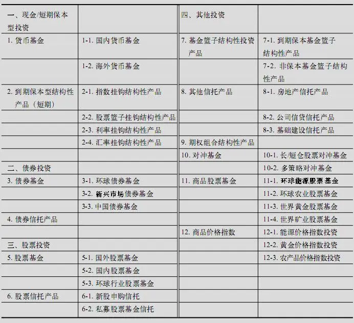

另外，如你所知，主流金融市场包括股票市场、债券市场、货币市场和商品市场。如果你在看过本书之后，还总是在股市不佳时脱口而出“市场不好”，那这本书你几乎是白读了。在近半个世纪的全球金融市场发展史中，还从未出现四个市场齐跌的情形。因此，股市不佳就是股市不佳，你不要跟着大众传媒随波逐流称“市场不好”。股市不佳时，其他市场持续上涨的情况比比皆是，你“只要”把投资组合的方向调整一下就可以了。

为了便于投资者清晰地了解投资组合的作用，在本章及下一章里，我们所选取的投资标的均为有公开数据的共同基金（数据摘自晨星深圳公司、晨星香港公司和各基金公司）。

我们将根据投资标的池（见表7\-2）的分类来挑选每个类别的优质基金作为投资参考标的。选择的标准就是在共同基金那章所提及的最重要的三个参考指标：相对基准的表现，标准差和晨星评级。由于是在同类基金里挑选优质品种，因此我们只需比较同类基金的历史表现就可以了，并以此来替代相对基准的表现。

表7\-2 投资标的池

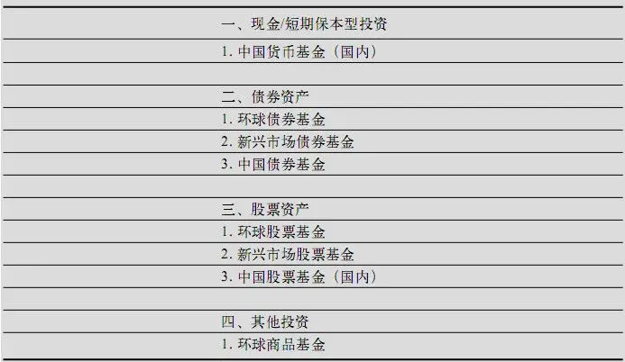

现金/短期保本型投资

中国货币基金（国内）

在国内货币基金里，我们选择了五家知名基金公司的产品，由于晨星暂未对国内货币基金评级，因此无此参考指标。通过比较过去三年的基金回报率和标准差，综合来看，这五只货币基金里最好的应该是博时现金收益。

博时现金收益三年回报率为2\.6%/年，低于同组别中三年回报（年度）率最高的华夏现金增利。两者相比较而言，华夏现金增利的三年回报（年度）率比博时现金收益高出6\.92%（2\.78/2\.60×100%\-100%），而华夏现金增利的标准差（三年）比博时现金收益高出59\.09%（0\.35/0\.22×100%\-100%）。这意味着如果选择华夏现金增利，就要冒着比选择博时现金收益多出59\.09%的风险去谋求高出的6\.92%的收益。理性的投资者衡量一下性价比就知道该选择哪只基金了。

表7\-3 中国货币基金（国内）

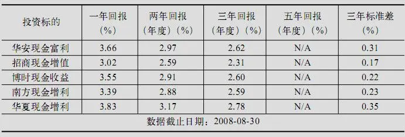

资料来源：晨星公司。

债券资产

环球债券基金

比较过去一年回报至五年回报的环球债券基金表现（见表7\-4），两只五星级环球债券基金邓普顿环球债券基金和邓普顿环球总收益基金位居前列，表现不分仲伯。观察三年回报（年度）一栏，邓普顿环球总收益基金的表现高出邓普顿环球债券基金5\.72%，三年标准差也高出11\.20%。这正是基金投资收益与风险的对称性，为了获得更高的回报，承受的风险相应会更高些。

表7\-4 环球债券基金

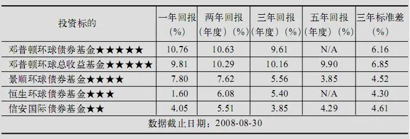

资料来源：晨星公司。

比较积极的投资者可以选择将邓普顿环球总收益基金作为环球债券部分的配置基金，而平衡型及保守型投资者则可以考虑将邓普顿环球债券基金作为环球债券部分的配置基金。

至于另外的三只环球债券基金，其三年标准差相对两只五星级基金减少了约35%，但收益却减少了约48%。虽然景顺环球债券基金和恒生环球债券基金也取得了债券基金抵御通货膨胀的效用，但如有更好的品种选择，投资者为什么不选择更好的呢？

新兴市场债券基金

仅从表7\-5中新兴市场债券基金的历史表现来看，毋庸置疑最好的是景顺新兴市场债券基金，但其标准差也相对较高，达到8\.19。观察三年回报（年度）一栏，贝莱德新兴市场短债基金的年回报率为12\.3%，其标准差为6\.31%，这一标准差数据几乎接近于环球债券基金组别中的邓普顿环球债券基金。新兴市场债券基金的标准差一般要高出发达国家地区许多，但贝莱德新兴市场短债基金却非常成功地控制了风险，基金标准差和主要投资发达国家地区的五星级基金非常接近，并且也小于邓普顿环球总收益基金的标准差。同时，贝莱德新兴市场短债基金的历史表现也优于两只五星级的环球债券基金。因此，贝莱德新兴市场短债基金应该是新兴市场债券基金里最佳性价比的基金。

表7\-5 新兴市场债券基金

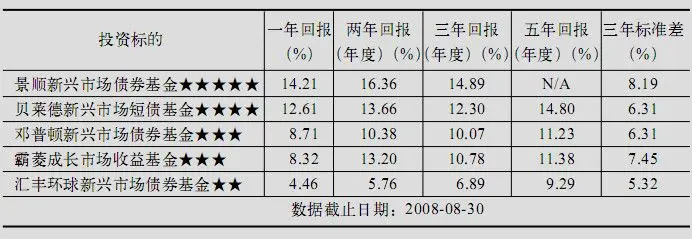

资料来源：晨星公司。

在这组新兴市场债券基金里，我们发现贝莱德新兴市场短债基金和霸菱成长市场收益基金的三年标准差数据是完全一样的，都是6\.31%。比较一年回报、二年回报（年度）和三年回报（年度），贝莱德新兴市场短债基金都要远远优于霸菱成长市场收益基金。在风险一样的情况下，投资者应该选择表现更好的一只：贝莱德新兴市场短债基金。

积极型投资风格的投资者可以在新兴市场债券基金组别里配置景顺新兴市场债券基金或贝莱德新兴市场短债基金，平衡型和保守型投资者则可以重点考虑贝莱德新兴市场短债基金。

中国债券基金

在中国债券基金这个组别里挑选真正的债券基金确实费了一番工夫，很多中国债券基金违反了既定的投资原则。在2006～2007年中国股市的牛市阶段，投放了一部分资金到股票资产，导致许多国内债券基金2008年1～8月表现不佳或亏损，这也是为什么“股市不好债市好”的常规在中国国内市场失效的原因——违反了既定的投资原则。

中国债券基金组别只选取了纯粹的债券基金，在基金资产中凡是持有股票资产的都被我剔除了，以确保苹果和苹果比较的公平性。

观察表7\-6中的三年回报（年度）一栏，招商安泰债券基金\-A的表现优于融通债券基金，同时其三年标准差也更低。这表明招商安泰债券基金\-A通过更低的风险却获得了更高的回报，两者相比较，当然选择招商安泰债券基金\-A。

表7\-6 中国债券基金

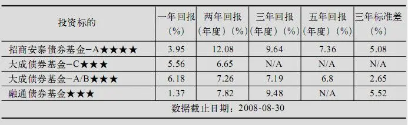

资料来源：晨星公司。

大成债券基金－A/B的三年回报（年度）比招商安泰债券基金低35\.26%，不过其三年标准差也低出了47\.83%。因此，这是一款风险更低、回报更稳定的债券基金。

因此，积极型风格的投资者应该选择招商安泰债券基金－A作为中国债券基金组别的配置品种，而平衡型和保守型风格的投资者则可以重点考虑大成债券基金－A/B。

股票资产

环球股票基金

无论是从历史表现观察，还是进行风险数据分析，环球股票基金组别里最好的应是非保诚环球民生基础基金莫属（见表7\-7）。观察三年回报（年度）和三年标准差两栏，保诚环球民生基础基金的回报率比组别排名第二的贝莱德环球中小型企业基金要高出85\.58%，其三年标准差却只高出19\.28%。只承受多出19\.28%的风险却获得85\.58%的更多的收益率，这种性价比是非常值得的！

表7\-7 基金表现

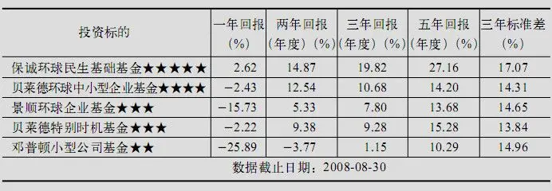

资料来源：晨星公司。

因此，无论什么风格的投资者都应把保诚环球民生基础基金作为环球股票基金组别里的首选配置品种。

新兴市场股票基金

新兴股票市场风险最低，且最具投资价值的是拉丁美洲股票市场。观察表7\-8，三年回报（年度）最高的是邓普顿拉丁美洲基金，三年标准差最低的是邓普顿拉丁美洲基金。它以新兴市场股票基金组别里最低的风险获得了最高的回报，还有什么理由不选择它呢？

表7\-8 新兴市场股票基金

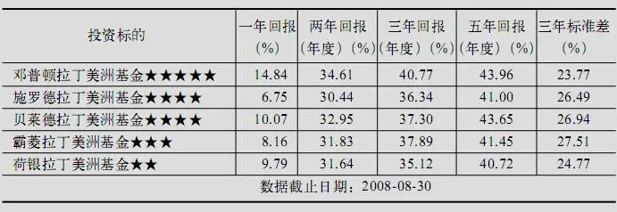

资料来源：晨星公司。

中国股票基金（国内）

由于有些优质的中国股票基金成立时间较晚、历史数据较短，因此没有将其纳入这个组别。

如表7\-9所示，从三年回报（年度）一栏观察，历史表现最佳的是华夏大盘精选基金，它比组别里排名第二的华夏成长基金的年度回报率高出63\.59%，其三年标准差仅略高出18\.41%。因此，华夏大盘精选应是该组别里综合排名第一的股票基金。

表7\-9 中国股票基金（内地）

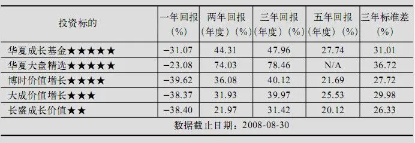

资料来源：晨星公司。

因此，当中国股市有投资价值时，应该重点考虑将华夏大盘股票基金这样的优质基金作为中国股票组别里的配置品种。但在国内股市市盈率高达40～60倍、完全失去了投资价值时，华夏大盘精选基金这种顶尖的优质股票基金也会下跌23\.08%（一年回报）。

不过由于华夏大盘精选基金目前正处于封闭状态，不可申购只可赎回，因此在本章构建投资组合规划时我们将选择目前能够进行申购的华夏成长基金作为投资标的。

环球商品基金

了解了挑选优质基金的方法和过程之后，这个组别（见表7\-10）的最优基金留给你来选吧。

祝你成功！

表7\-10 环球商品基金

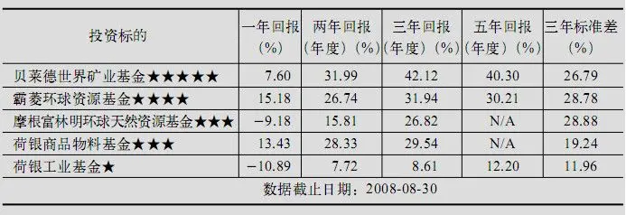

资料来源：晨星公司。

## 第三篇 市场赢家的实战 - (2) 第8章 投资组合风格一览

\(2\) 第8章 投资组合风格一览

2026年3月14日

9:57

第8章 投资组合风格一览

世界上每个人的性格不同，对于投资产品的态度也会有所不同。有的投资者比较喜欢冒险，希望寻求超额回报的投资机会；有的投资者比较保守，寻求风险尽可能低的稳定回报；有的投资者则介于这两者之间。无论是哪种投资者，现代商业银行基本上都有一套风险评测软件来帮助你客观、深入地了解自己的投资风格。在其他领域，你有时顺从自己内心的直觉去做判断或许会取得喜人的效果，但在投资理财领域，你则要尽量避免这种情况的发生，而是应该基于事实和数据分析的结果，客观地选择真正适合自己的投资品种。

下面将为三种主要投资风格的投资者构建个性化的投资组合，以供参考，共同基金的历史数据均摘自晨星（深圳）公司、晨星（香港）公司和发行基金的基金公司。每类投资组合里共同基金的投资比例是由一家全球顶尖的金融服务咨询公司而设定的。

进取型投资风格

进取型投资风格投资组合的资产分配比例为：现金/短期保本型投资0；债券资产0～20%；股票资产0～60%；其他投资0～20%。

表8\-1所示的共同基金均从前文介绍的优质基金池进行选取。投资者可以根据本书所讲的投资理念和技巧进行投资标的的选择和调整，以保持最佳的投资效果。

表8\-1 进取型投资组合

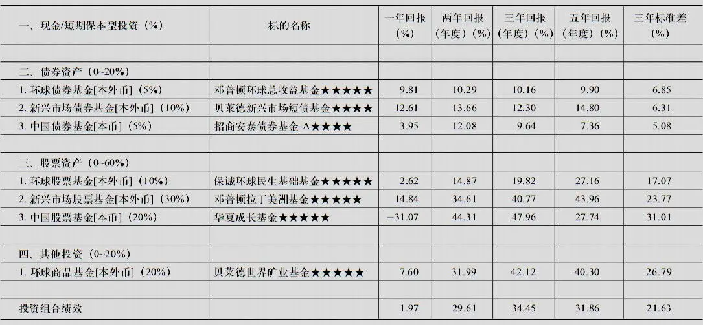

资料来源：晨星公司。

平衡型投资风格

平衡型投资风格投资组合的资产分配比例为：现金/短期保本型投资15%；债券资产0～35%；股票资产0～40%；其他投资0～10%。

如表8\-2所示，平衡型投资组合的三年回报（年度）是24\.60%，比进取型投资组合低；不过其三年标准差却也只有14\.81%，同样比积极型投资组合低。风险和收益对称下降，符合金融投资的基本规律。

表8\-2 平衡型投资组合

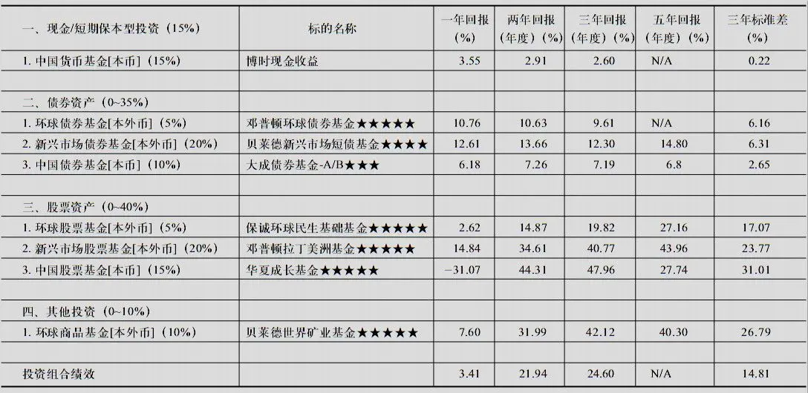

资料来源：晨星公司。

保守型投资风格

保守型投资风格投资组合的资产分配比例为：现金/短期保本型投资55%；债券资产0～25%；股票资产0～15%；其他投资0～5%。

如表8\-3所示，保守型投资风格的年度回报率更加趋于稳定，其两年回报（年度）和三年回报（年度）非常接近，而且在全球股市集体下跌的近一年时期，仍然取得了3\.75%的回报，这完全是因为在股票和其他资产上投资比例较小，减少了因股市下跌所造成的损失。当然，在股市行情较好时，也不一定会水涨船高。

表8\-3 保守型投资组合

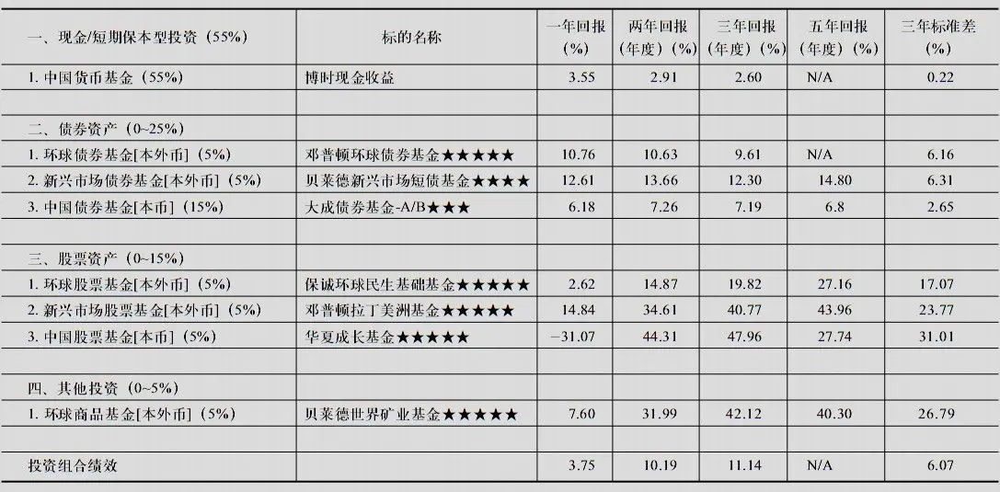

资料来源：晨星公司。

或许细心的投资者会提出另外两个更加深刻的问题：

1\.只在国内市场做投资组合和在全球进行投资组合布局，哪个效果更好？

2\.上列共同基金均以美元计价，近年来美元兑人民币持续贬值，上述年度回报率应扣除汇率损失。扣除汇率损失后，到底表现如何呢？

我们先来回答第一个问题，这里以进取型风格投资组合为例（见表8\-4、8\-5）。

表8\-4中的共同基金及其数据与表8\-1完全一致。表8\-5中的配置品种只限于国内，债券资产20%，股票资产80%。我们将这两组投资组合的绩效放在一起进行比较（见表8\-1）。

表8\-4 进取型投资组合（环球配置）

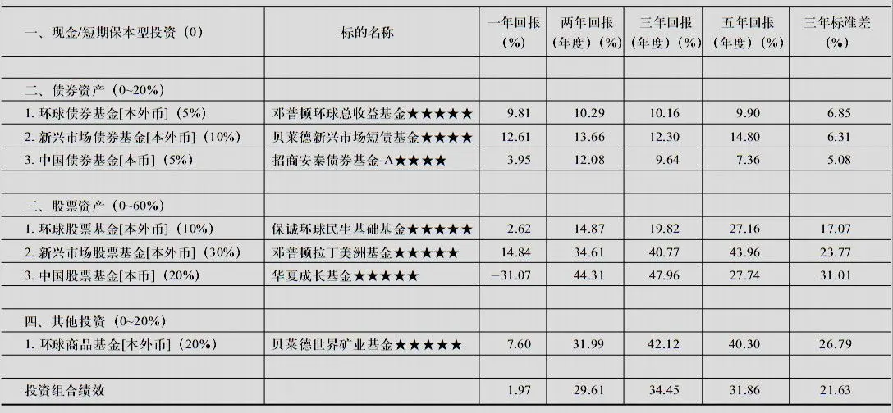

资料来源：晨星公司。

表8\-5 进取型投资组合（仅国内配置）

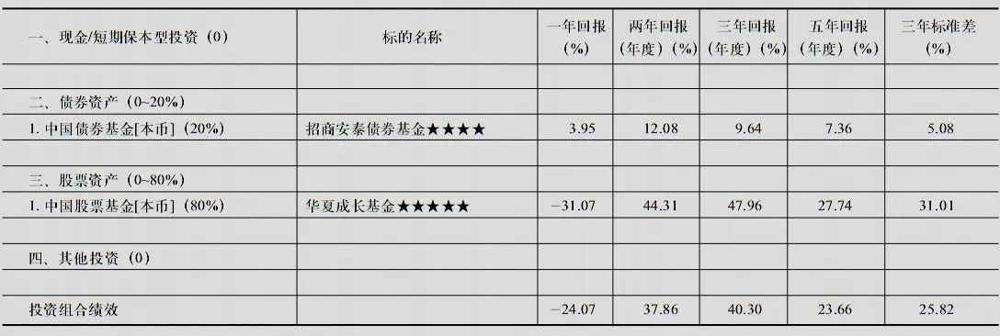

资料来源：晨星公司。

表8\-6 绩效的对比

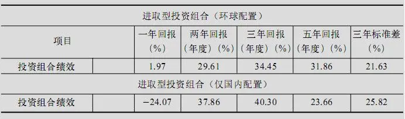

资料来源：晨星公司。

投资者可以清晰地看到，在一年回报栏，尽管全球股市在近一年来大幅下跌，环球配置组仍然取得了1\.97%的收益率，而国内配置组却下跌24\.07%。

在两年回报（年度）和三年回报（年度）栏，环球配置组的表现则逊色于国内配置组，因为在2006～2007年中国上证指数的表现位列全球第一，这给国内配置组带来了许多加分。不过稍微把时间拉长一点，你就会发现环球配置组比国内配置组的五年回报（年度）高出不少，平均年回报高出8\.2%（31\.86%\-23\.66%），五年则高出41%（8\.2%×5），即使减去自2003年9月到2008年9月美元兑人民币贬值的21%汇率损失，五年回报仍然还是高出20%。

还有更为重要的一点是，投资组合表现的稳定性！环球配置组在两年回报（年度）、三年回报（年度）和五年回报（年度）的年度回报率比较接近，基本上在30%左右。尤其是在2003～2004年，环球配置组取得了55\.95%（31\.86%×5\-34\.45%×3）的回报率。而国内配置组的回报稳定性要差不少，三年回报（年度）为40\.30%，五年回报（年度）为23\.66%。在2003～2004年全球经济景气的时期，国内股市却仍然持续下跌，这导致国内配置组的同期表现为\-2\.59%（23\.66%×5\-40\.30%×3）。

综上所述，在国内市场风险较高和稍微长一点的时间段来观察，环球配置的绩效和稳定性要比国内配置的效果更优！

第二个问题：汇率风险。

进行全球共同基金配置，在国外市场上进行投资不可以直接用人民币，确实面临着汇率风险。但汇率风险并不意味着人民币转换成外币进行投资就一定是在汇率上遭受亏损，风险对立的一面是收益，这在汇率上也是存在的。

还记得开篇提到的“不要盲从地跟随大众”吗？人民币升值是人民币兑美元升值，并非人民币兑所有国家的货币都升值。人民币在2003～2008年确实兑美元升值了约21%，但是人民币兑欧元却在同期贬值了约11%。这是事实！你可以登陆中国银行网站或者其他任何财经网站进行查询，这些都是公开的数据。你不能只是跟着大众传媒或感觉行事，投资理财成功的基础是理性客观。

本书中提到的所有海外共同基金都是可以用美元或欧元进行投资的，你完全可以在过去五年的时间里选择用人民币兑换成欧元来进行这些基金的投资，而且许多外资银行的理财顾问也确实是这样建议投资者的。

关于未来，有的投资者对美元兑人民币的汇率走势继续看跌，有的则看涨；而有的投资者对欧元兑人民币的汇率走势继续看涨，有的则看跌。无论哪种观点都不重要，你完全可以忽略这些噪音，在选择海外共同基金时，将资金各分一半，一半以人民币兑美元进行投资，另一半则以人民币兑欧元进行投资。这不是很好的对冲汇率风险的策略吗？

选择适合自己风格的投资组合，合理地进行汇率风险对冲，你就能在浪起浪落的环球市场中实现自己的投资目标！

## 第三篇 市场赢家的实战 - (3) 第9章 动态投资组合管理

\(3\) 第9章 动态投资组合管理

2026年3月14日

9:57

第9章 动态投资组合管理

如果你只是根据前文所述的投资组合进行资产配置后便撒手不管了，那你就还没有完全领会“价值投资”的要义。世界在变化，市场也在变化，资产配置不是机械地什么都去投资一点，也不是选到优质标的后就照本宣科地进行配置，而应该是根据市场变化的本质进行动态的管理。

以我个人为例，我是一个非常积极的投资者，我对股票和债券投资有着深入的了解和客观的认识。所以在我的投资组合里永远都会存在着有价值的股票组合，也会根据市场状况来决定是否添加有投资价值的债券资产。以2005年1月为起点、2008年8月为终点，我将演示我是如何根据“投资价值”来动态地管理投资组合的（见表9\-1）。一般而言，我会每半年检视一次投资组合并进行必要的调整。在选择共同基金的投资币种时，在过去几年我会尽量选择强势货币欧元。如果不能以欧元投资，我也会接受美元，尽管我明明知道美元兑人民币很有可能在未来会贬值，但那些高速成长的地区和行业实在是太吸引人了。最关键的是唯一只能用美元投资的邓普顿拉丁美洲基金的投资地区是巴西、墨西哥等国家，而这些国家的货币兑人民币是在升值的，这让我就更加不担心了。

表 9\-1 进取型投资组合（环球配置）

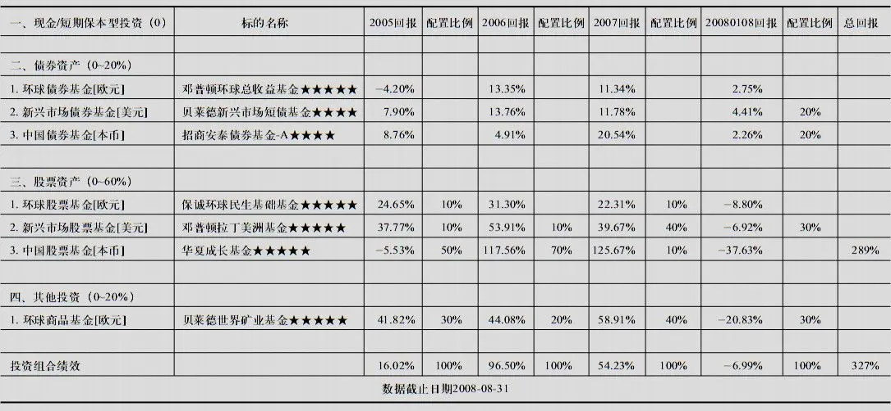

资料来源：晨星公司。

配置2005

在2005年年初，全球宏观经济持续景气，中国A股的平均市盈率只有18倍，并且上市公司的利润大幅度地增加，于是配置华夏成长股票基金50%。而全球矿业公司得益于以中国、印度为主的新兴国家基础建设的发展，全球基本金属供不应求，这必将推动世界矿业公司利润的高速增长，而且全球矿业行业的市盈率处于历史较低水平，因此配置贝莱德世界矿业基金30%。拉丁美洲同期的市盈率也处于历史较低水平，而上市公司的利润也同样大幅度地增加，配置邓普顿拉丁美洲基金10%。最后，受益于全球宏观经济增长的保诚环球民生基金的市盈率和重仓股公司的高速发展也非常吸引人，于是配置10%。

如果在2005年你只配置了中国的这只五星级股票基金，其投资组合的年回报是\-5\.53%，而环球配置后的投资组合的同期回报是16\.02%。

配置2006

在2006年年初，中国A股的平均市盈率比2005年年初的18倍更低，只有16倍。而中国上市公司的预期利润增幅比2005年还要大，于是缩减其他地区行业的投资比例，提高在中国A股的配置比例，调高到70%。剩下的资产，邓普顿拉丁美洲基金配置10%，贝莱德世界矿业基金配置20%。

2006年全年的投资组合回报为96\.50%，虽然低于华夏成长股票基金的117\.56%，但你也不要忘了2005年投资组合的绩效胜出了21\.55%（16\.02%＋5\.53%）。更重要的是，我理性地遵循了价值投资的理念，并进行了科学的资产配置，将潜在的风险尽可能地降低了。

配置2007

在2007年年初，中国A股市盈率猛然窜升到30倍，在随后不久的2007年5月便攀升到40倍，此时我将手中的A股基金全部抛掉，一分未剩。所以，平均算下来，2007年在中国A股的配置比例大概也就10%。没错，或许你会觉得我很“蠢”，居然错过了华夏成长基金涨幅最大的一年——125\.67%。在别人获得125\.67%的回报时，而我却只获得了可怜的12\.567%的回报。其实，价格的变动和基金净值的变动对我、对价值投资者来讲是最没有用的信息，它只是证明是否有一群傻子在用更高的价格去“搏傻”而已。价值投资者永远只看一点：有无投资价值！

另外几个地区行业股票基金的平均市盈率还是可怜的13倍以下，上市公司利润的高速增长仍在持续，我为什么不调整资金到这些更有投资价值的股票资产上去呢？

然而，到了2007年8月，美国爆发了恐怖的次贷危机，我敏感地意识到这必将对全球股市造成一定的负面影响，至于影响的程度和时间，坦率地说，直到今天我也不能给出明确的答案。原因很简单，我没有那个水平。关于这一点，巴菲特曾说：“关于我无法理解、不能弄懂的东西，我的态度就是找一个一英尺（1英尺=0\.3048米。）高的栏杆跨过去，把那个七英尺高的栏杆留在身后。”关于次贷危机的分析，对我来说就是一个七英尺的栏杆，那就留在身后吧！

但根据价值投资的原则，在全球股市受负面影响的可能性较大的猜测下，我必将调高债券资产配置的比例，降低股票资产的比重。不过那些仍然有很高安全边际且有巨大投资价值的股票资产，我是不会全部抛售的。

2007年环球配置投资组合的回报是54\.23%，比起华夏成长基金125\.67%的回报确实是令人汗颜。不过这种感觉只会在那些盲目跟风的投机者心中荡漾，价值投资者却正在一旁冷眼笑视呢！

配置2008

自2008年1月至2008年8月，中国上证指数的表现又位居了全球第一，不过这次是倒数第一，跌幅深达55%。华夏成长基金良好的风险控制使得它在同期的下跌幅度只有37\.63%，但在环球配置组别里仍然是最高的。

股市不好债市佳的规律果然发生了作用，三只债券基金同期均上涨。贝莱德新兴市场短债基金和招商安泰债券基金\-A各20%的配置为整个投资组合很好地降低了风险，并取得了正向的回报。虽然邓普顿拉丁美洲基金和贝莱德世界矿业基金分别下跌了6\.92%和20\.83%，但是它们的组合市盈率却是历史最低，重仓股公司的盈利增速也并没有下降，价值投资者实在找不出一个完全抛售它们的理由。只不过债券资产在这种情况下确实太吸引人了，才调了一部分资产到债券基金。

2008年1月至2008年8月，环球资产配置的投资表现是\-6\.99%，远远低于华夏成长基金的\-37\.63%和上证指数的\-55%。这种配置方法达到了分散投资、降低风险的作用。

2005～2008年投资绩效回顾

如上所示，在2006年和2007年，环球资产配置的表现均逊色于华夏成长基金，但从整个投资期来看，环球资产配置的回报为327%，华夏成长基金的回报289%，前者多出后者38%的回报。更为重要的是，环球资产配置帮助国内投资者在2005年和2008年有效地规避了A股下跌的风险，尤其避免了因2008年A股大幅下挫所造成的巨大亏损和悲痛。

## 第三篇 市场赢家的实战 - (4) 第10章 赢家投资渠道一览

\(4\) 第10章 赢家投资渠道一览

2026年3月14日

9:57

第10章 赢家投资渠道一览

市场赢家自然需要金融市场上信誉卓著、经营稳健的金融机构与之相伴，方能借它们的渠道来进行价值投资。

本书中绝大多数的海外投资产品可以通过目前已在中国大陆注册为本地法人的外资银行进行投资，例如环球共同基金、结构性投资产品、对冲基金和大宗商品投资。随着中国内地金融市场逐步的对外开放，目前不少外资银行已经可以经营人民币业务，也可以通过它们投资于国内的共同基金、信托产品和各类保险。投资起点一般是价值一万美元的人民币或其他外币。投资者在认购海外投资产品时无需占用个人购汇额度，银行可以帮助投资者直接通过QDII渠道进行认购。说到QDII，不少国内投资者也许对此有误解。QDII是Qualified Domestic Institutional Investors的缩写，中文意思为“合格境内机构投资者”，只有获得此资格，中国境内的金融机构才能发行海外投资产品。QDII绝不是上投摩根亚太优势基金、嘉实海外基金的代名词。只要是中国境内金融机构发行的海外投资产品都属于QDII范畴。所以说，QDII只是对合格境内机构投资者的简称，而不是大众所误解的海外基金。

中资银行仍是国内主流金融产品的主要营销渠道，各大中资银行在架销售的共同基金多达453只（截至2008\-09\-23）。但并不是每只基金都可以在一家中资银行进行认购，有些基金公司暂未与一些中资银行签署合作协议。因此，当你决定认购某只基金时，你可以先登录基金公司的网站，了解一下该基金公司的合作银行有哪些，然后再去银行网点或通过该银行的网络银行进行认购。至于其他类别的国内投资产品，投资者可以登陆各大中资银行网站或亲临网点进行咨询。

下面重点介绍几家在个人金融银行业务比较有名气的金融机构，并附带个人投资理财业务的相关信息，以便供投资者参考。

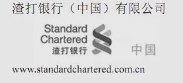

渣打银行是一家总部位于英国伦敦的环球银行集团，渣打集团分别在伦敦及香港交易所上市，名列英国富时100指数前25家大公司（以市值计算），且为中国香港特别行政区三大发钞行之一。渣打集团在全球最有活力的金融市场上经营业务超过150年，在亚洲、非洲及中东市场位居领导地位。

渣打银行于1858年在上海成立首家分行，150年来在华经营从未间断。2007年4月，渣打银行（中国）有限公司成为第一批本地法人银行。目前，渣打银行（中国）有限公司在中国拥有15家分行、33家支行、1家代表处。2008年渣打银行（中国）有限公司荣膺《亚洲银行家》杂志中国最佳外资零售银行大奖。2007年，渣打银行（中国）有限公司获《首席财务官》杂志颁发的“最佳企业金融增值服务奖”及“最佳中小企业服务奖”，并被《21世纪经济报道》授予“2007年度中国最佳企业公民”。

渣打银行（中国）有限公司个人银行业务的旗舰品牌是Priority Banking——优先理财。配备专职客户经理为在渣打银行（中国）有限公司总资产达到等值10万美元（人民币亦可）以上的贵宾客户提供全面的财富管理业务。

同时，渣打银行（中国）有限公司也为年轻的、正值事业发展中的客户提供Elite Banking——创智理财。在渣打银行（中国）有限公司的总资产超过等值1万美元（人民币亦可）即可认购渣打银行（中国）有限公司发行的投资产品。

投资者可通过渣打银行（中国）有限公司客户服务中心热线进行具体的业务垂询：800\-820\-8088。也可以登陆渣打银行（中国）有限公司的网址，点击网站“投资服务－聚通天下”了解渣打银行（中国）有限公司已发行产品的简要信息。详情可以直接联系您所在地区的分支行的理财顾问。

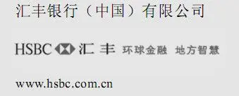

汇丰银行（中国）有限公司于2007年4月2日正式开业，总行设于上海，是香港上海汇丰银行有限公司全资拥有的外商独资银行，其前身是香港上海汇丰银行有限公司的中国内地分支机构。

香港上海汇丰银行有限公司于1865年在香港和上海成立，是汇丰集团的创始成员和汇丰集团在亚太区的旗舰，也是中国香港特别行政区最大的本地注册银行及其三家发钞银行之一。汇丰集团是世界规模最大的银行及金融服务机构之一，在世界的85个国家和地区设有大约9500个分支机构。

香港上海汇丰银行有限公司143年来从未间断其在内地的服务，是在内地投资最多的外资银行之一，入股内地中资金融机构及自身发展的总投资已超过50亿美元，其中包括入股交通银行19%的股份、平安保险16\.80%的股份以及上海银行8%的股份。

汇丰银行（中国）有限公司在中国的个人银行业务的旗舰品牌是Premier Banking——卓越理财。配有专属客户经理为总资产达50万元人民币或等值外币的客户提供全面的财富管理。

投资者可通过汇丰银行（中国）有限公司的客户服务中心热线：800\-830\-2880进行业务咨询。也可以登陆汇丰（中国）有限公司的网站了解更多的投资机会。

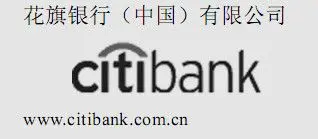

花旗集团是一家总部位于美国纽约的世界级金融服务机构，在全球100多个国家拥有超过2亿的客户。花旗银行（中国）有限公司于2007年4月2日成为首批在中国成立本地法人的外资银行之一，由其母公司美国花旗银行有限公司全资拥有。

花旗银行（中国）有限公司目前在大陆拥有8家企业银行分行、2家投资银行代表处及24家个人消费银行网点。在2006年8月获得合格境内机构投资者（QDII）的许可，代表中国公司和个人进行国际投资，同时获得批准可以为根据QDII条款拥有提供海外财富管理服务资质的中国金融机构提供托管服务。

花旗银行（中国）有限公司在华的个人银行业务的旗舰品牌是CITIGOLD——花旗财富管理，配有经验丰富的客户经理为总资产超过50万元人民币的客户提供全面的财富管理服务。其投资范围涵盖全球，品种齐全，适合不同投资风格的投资者。

投资者可通过花旗银行（中国）有限公司的客户服务中心热线：800\-830\-1880进行业务咨询，也可以登陆花旗（中国）有限公司的网站了解更多的投资机会。

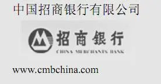

中国招商银行有限公司（招商银行）成立于1987年4月8日，是我国第一家完全由企业法人持股的股份制商业银行，总行设在深圳。

在20多年的发展过程中，招商银行一直敢为天下先、不断开拓、锐意创新，在革新金融产品与服务方面创造了数十个第一，较好地满足了市场和客户不断变化的需求，被广大客户和社会公众誉为国内创新能力强、服务好、技术领先的银行，为中国银行业的改革和发展做出了有益的探索，同时也取得了良好的经营业绩。

截至2007年12月31日，招商银行在中国境内设有40家分行、534家支行（含分理处）、1个代表处，在香港设有1家分行及1家子公司，在纽约设有1个代表处。

招商银行个人银行业务的旗舰品牌是金葵花理财。在每家支行网点配有专职客户经理为总资产在50万元人民币以上的贵宾客户提供财富管理服务。招商银行目前发行的大多数金融产品的投资地域在境内，涵盖共同基金、结构性投资产品、信托投资产品等。

更多关于招商银行的投资资讯，投资者可以致电招商银行电话银行服务中心：95555。也可以登陆招商银行的网站了解更多的投资机会。

## 跋 赢输分界线

跋 赢输分界线

到这里，本书你应该读完了。如果本书的内容对你有所启发和帮助，我会深感荣幸，也达到了我撰写这本书的目的。

在我的职业生涯中，曾与许多客户和朋友有过关于证券投资方面的交流。我发现其实明白价值投资的道理并不是一件难事，而且多数投资者还是乐于接受价值理念的。同时，市面上原创的价值投资书籍并不缺乏，你读读巴菲特、彼得·林奇的投资书籍足以明白价值投资的理念。但是，在明白并接受了这些投资真谛之后，无论是客户还是我身边金融机构的朋友，最终成为市场赢家的却寥寥无几，绝大多数仍然是市场输家。

究其原因，归根结底还是难以克服人性的弱点：恐惧与贪婪背后的非理性行为！

我仍然记得在2005年年初之时，上证指数为1200点左右，平均市盈率仅为17倍。在经历了五年的漫漫熊途后，几乎所有人都对中国A股丧失了信心与热情，当时的市场气氛非常压抑，几乎是谈股色变。可是我却发现相对过往的市盈率而言，当时的市盈率是非常低的，A股被严重低估了。将此惊喜的发现与我认为是比较有投资头脑的一位专业人士分享，哪知他不以为然，断言中国A股必将崩盘，推倒重来。他的理由很简单：全流通伤害了普通股民，大众必将疯狂地抛售，导致大盘崩溃。

坦率地说，当时的我远没有今天这么执著地坚信价值投资的理念并坚守价值投资的原则。不过，我还是抱着试一试的心态在中国A股上进行了一点儿投资，算是价值投资的实验吧。即使全部赔掉，我也还能维持有饭吃的生活。

随着时间的推移，上证指数像有千斤顶一样被死死地压住，反弹不得，持续的阴跌就像春季的梅雨连绵不断，搅得人心始终不得安宁，没有阳光，只有黑夜。那是我投资生涯里最黑暗的一段日子，倒不是因为投资的本金产生了亏损，而是我每天都要去怀疑价值投资是否正确。你知道，当你准备坚守一辈子的信念可能会垮掉时，那种内心的煎熬是多么得痛苦。在上证指数跌到1000点以下的那天，我确实绝望了，恐惧的情绪占据了绝对的上风。我打开证券交易软件，鼠标指针直奔“卖出”……

然而，我还是没有按下最后那一下。深思半晌，扪心自问：“如果我这样做了，我和别人有什么区别呢？还不是一味地跟着市场屁股后面走吗？”价值投资的实验到这就结束了？就意味着我彻底否定了巴菲特50多年来的投资信念和他卓越的投资绩效。

……

时间过得很快，一晃就是2007年4月了，那时的上证指数已经上涨到4000点左右，市盈率也到了40倍，我手持的优质股票和基金也上涨了非常多。还是我那位圈内的专业人士朋友，又断言上证指数必将受益于奥运行情，短期将看涨到8000点至10000点，现在是最佳的投资时机！40倍的平均市盈率，即使国内上市公司维持目前前所未有的利润增长速度，我也要花40年才能收回成本。这项投资实在太不划算了。我的分批卖出在朋友之间成了最受欢迎的笑话，有人称我是“赵丹阳第二，中国巴菲特。”对此，我也欣然接受，反正我已经是赢家了。

但是万万没有想到的是，在我卖出A股资产后，上证指数像载有火箭推进器的航天飞机一样直冲云霄，要是你的股票在一周内都没有涨停过，要么就是你的运气实在太差，要么就是被人斜视为市场新手。至于像我这样本来可以疯狂赚上一把却在“最佳”时机抛售的则被称为“股市白痴。”

人们被市场先生的极度疯狂所引诱，世界上没有任何坏消息可以阻止上证指数继续向上冲。酒楼里的侍者，街边卖茶叶蛋的老太太，报亭里的老大爷，甚至是工厂车间里的技工都无时无刻地谈论着自己怎么选中了牛股，自己的投资技巧有多么得高超。人性的贪婪在此时此刻暴露得淋漓尽致！

至于上证指数后市的走势，不说你也会非常清楚。A股市场先生从2005年至今在经历了压抑、恐惧、绝望、喜悦、摇摆、疯狂、贪婪、希冀、迷茫、失望、幻想和彻底的失望后，又回到了恐惧……

此时，我又在重复着2005年年初的故事，继续我的价值投资。

是的，明白价值投资的道理并不难，最难的是坚守价值投资的原则！

你有可能在价值被低估、市盈率偏低时买入股票资产后，市场仍然下跌，大众仍然恐慌，而此时你偏偏应该理性地不断买入这些被低估的优质股票资产。如果你没有这样做，原因只有一个：你被人类的天性“恐惧”左右！

也有可能在价值被高估、市盈率偏高的时候，市场仍然上涨，大众仍然兴奋，而此时你则应该理性地卖出这些被高估的股票资产。如果你没有这样做，原因只有一个：你被人类的天性“贪婪”左右！

要在未来的投资路上迈向成功，除了要明白市场赢家的价值投资理念、掌握市场赢家的投资工具、运用所学到的知识和技能参与市场实战之外，还有最重要的一点：永远坚守价值投资的原则！

如果你能遵循价值投资的信念，永远坚守价值投资的原则，你必将成为证券市场最终的大赢家。
