# 《张化桥 股民的眼泪》全文合订版

> 共63个章节。原章节顺序、段落结构和图表均予以保留。

## 自序 冷眼看股市风险

自序 冷眼看股市风险

股市的风险，除了种种欺诈以外，还有股民自己创造的，产业的变化，以及政治问题。我举几个例子。

（1）花旗银行和AIG保险公司都是世界金融界最大和最知名的机构。它们（和大量其他的公司）在2008年的大风暴中都几乎死亡，最后靠美国纳税人的拯救才得以活下来。当然，万千股民的投资都只剩下了一个小零头。在香港，大家对发钞票的机构，汇丰银行和渣打银行，都信心满满。可是在风平浪静的最近几年（2012—2016年），它们坏账如山，股民们也受了重创。这些可以预见吗？当然不可能。

（2）中国石油（601857）曾经是亚洲利润最大的公司，它在2007年11月上市当天的股价曾高达48\.62元。后来崩盘的故事，大家都熟悉。这种大股票屠杀了股民无数。它今天的结局是可以预见的？是可以的。本书试图对人性的弱点和国企的劣根性做点分析。

（3）基本面分析十分重要：每股盈利，每股净资产，毛利率，行业地位，竞争格局，等等。可是，谁也无法确定股价究竟是5倍市盈率合理，还是50倍合理。分析师振振有辞，但是，实际上估值区间就是那么宽，那么不可理喻。实例比比皆是。

（4）一家公司究竟值多少钱？公司有大量的土地，或者利润丰厚，现金流强劲，存款也多。可是小股东能够获得任何实在的好处吗？账上的钱可以流走，或者浪费在无谓的资本支出上。利润和现金流也可以变化。所以，对小股东来说，最实在的还是现金派息。可是派息水平又是可以变化的，谁能担保它不下降呢？

（5）亚洲的股票为什么一直比美欧的便宜？原因很多。比如科技水平差和管理水平低，负债率普遍太高，等等，但是，法律制度脆弱也是一个重要的原因。比如，小股东可以通过正常途径推翻大股东和管理层吗？野蛮人能够得逞吗？并购重组容易吗？小股东如何才能申请公司歇业清盘，等等。千万不要小看这些法律问题：它们决定了公司的內含价值能够被真正挖掘出来。

从1994年起，我一直在香港和内地的资本市场折腾，其中15年在投资银行工作，其余的时间在上市公司任高管。我两次离开投资银行，都是因为我觉得我没有用处，我帮不了客户的忙，因此那份工作越来越不能让我满足。在全球，投资银行这个行业的产能过剩很严重，竞争过于激烈，同质化的重复劳动很多。我多少有些厌倦了。

本书的主题虽然是如何识别股票市场的地雷和避开地雷，但是，我花了大量的笔墨讲述我为什么离开投资银行，以及患得患失的历程。

依我18年的股市经验，我认为股票市场有三种地雷。这三种地雷分别由上市公司（大股东和高管）、政府和股民埋下。当然，受伤的都是股民。

1\.上市公司埋下的地雷一般由假账、豪言壮语和报喜不报忧混合而成。有些地雷可以持续20年甚至30年不为人知。我们常见的丑闻曝光只是地雷爆炸的极少数情况。比如，企业由于某个偶然的事件，纸终于包不住火了。但是，在绝大多数情况下，股民受了重伤却永远不知道受了伤，更不知道为什么受伤。因为这种地雷没有明显的爆炸，爆炸的形式不是通过丑闻曝光的形式，而是表现为企业的利润奇怪地下滑（或者增长率比预期的低），行业莫名其妙地走下坡路，或者企业突然撇账或者重组，等等。

股票分析不是一门科学，完全是常识。但是，如果公司做假账，你如何分析和给它们估值？

很多公司的大股东从公司偷钱。他们是怎样偷的？在本书中，我做了一些研究。

2\.政府埋下的地雷一般由两个元素组成：怂恿、纵容和帮助上市公司（和拟上市公司）夸大销售额、利润和历史上的缴税额；或者给这些公司吃小灶，在土地、税收、环保和资金方面给予优惠。用低价向上市的国企注资，或者用高价把上市国企的不良资产剥离出来都属于此类。但是，由于这些补贴本身都是一次性的，不可能持续，更不能持续增长，而股民买的是企业未来几十年的收益，因此，这种政府干预都具有欺诈性质，如同地雷。它给股民一次次诱惑，而股民一次次受伤。

3\.股民自己经常埋下地雷：投机行为，过度自信，侥幸心理，不做真正的调研，等等。行业周期性的变化对股民的伤害也都是由于股民不愿意承认自己的能力有限。股民当然还有另外的问题，其中，不留安全边际就是最大的错误。

本书专门用实例讲解这三种地雷的危害。第一种和第三种地雷，全球都不少见，但是第二种地雷是中国特产。假账的严重性中国可能全球第一。我经常讲，中国的地沟油有多么严重，上市公司的假账就有多么严重，因为它们都是同一个文化背景的产物。

本书收录了我的朋友赵鹏给我写的六篇文章，他写的太好了，抓住了香港这五六年几个典型案例。赵鹏是一位香港投资者，他自学成才，观点独到。这六篇文章为本书增色许多，我很感激。

我很高兴，Raymond Jook（祝振驹，13年前我在瑞士银行研究部的旧同事和朋友）允许我用他的三篇关于识别股市地雷的文章（见附录），我非常感激。他现在是翱腾投资管理（香港）有限公司（Avant Capital Management （HK） Limited）董事总经理，专注于大中华区的价值投资。

在本书的末尾，我提供了一个新的书单，供读者参考。我也增加了一篇讲欧美创业企业做假账的小文章。

张化桥

__照片摄于沈阳欧亚农业的兰花大棚。（编按：内地民企欧亚农业于1999年在香港上市，后涉嫌做假账，该公司现已除牌；作者任职分析师时，曾撰写报告质疑欧亚农业的账目。）__

__2001年，作者还因为写格林柯尔的负面报告而被格林柯尔和其董事长顾雏军告上香港高等法院。后来，格林柯尔也被除牌了。这两个公司的董事长也都先后入狱。__

## 第一章 券商不知不觉帮了坏人的忙

第一章 券商不知不觉帮了坏人的忙

__“拿人钱财，替人消灾”，这是个朴素的道理。投资银行的投行部和审计师吃的都是上市公司的饭，所以，多多少少会站在公司这一边。在不违法不违规的情况下，只要能过得去的事，投行和审计师都会让它过去。毕竟他们都不是警察。__

2026年3月14日

9:55

## 第一章 券商不知不觉帮了坏人的忙 - (01) 1.01 投资的信仰危机

\(01\) 1\.01 投资的信仰危机

2026年3月14日

9:55

1\.01 投资的信仰危机

20世纪90年代，吉姆·沃克（Jim Walker），人称Dr\. Jim是我在里昂证券的顶头上司。他是亚洲首席经济学家，我负责大中华区的宏观经济学研究。他多年被基金经理们评选为最佳经济师。我也很欣赏他的勤勉和水平。10多年来，跟竞争者一样，他坚持每个季度写一本亚洲地区的宏观经济报告，对每个国家每个月的汇率和消费者物价指数（以下简称CPI）也要做出预测。我对这种预测毫无兴趣，也确实不知道怎么做预测。不过，所有投行都做这样一件自欺欺人的事，并且堂而皇之地出版和推介。我真的不明白买方的投资者们为什么愿意花时间听这种预测。

今天回头看，我当时的那种看法也许对，也许错。谁知道呢？不过，我铁了心要转行做股票研究。

捅马蜂窝被辞职

1998年底，我在汇丰银行做中国研究部主管才半年，突然被开除了（准确地说是被辞职）。在那前面的几年，我一直有一个理论，并且写过很多报告。我认为，中国当时的外汇储备已经太多（不是太少），人民币被低估，而不是高估。我认为当时的亚洲金融危机对人民币没有什么影响。1998年，中国财政部宣布发行20亿美元的扬基债券（Yankee Bonds）。我认为当时的官方借口完全没有道理。他们说，中国需要一个利率曲线，以便日后中国政府和企业到国外市场发行债券时作为基础利率的参照系。其实，当时的真实原因是，外国投行不断游说中国财政部发债（毕竟外国投行需要佣金收入）。有人说，我们的财政部官员也想趁机出国旅行（美其名曰“路演”）。是否就这么简单？我不得而知。

不过，这让我联想到这几年内地大量的省政府和市政府在香港的大型招商活动。领导们带领几百人甚至上千人到香港住在昂贵的酒店，吹一通大话，然后大吃一通。领导们和喽啰们就去采购LV包、化妆品、西装和其他奢侈品。有时参加这种会，我碰到一些莫名其妙的人。他们对招商的内容一点兴趣也没有。他们来香港只是为领导们的奢侈消费埋单的。但是你别可怜他们。领导让他们埋单是瞧得起他们，是给他们面子。成百上千的人想来埋单，但是没有机会。

比起近些年招商活动的奢侈，1998年的国债发行的环球路演简直可以算是“艰苦朴素”。1994年，我刚到瑞士银行工作时，曾经陪同几个部委的处长、司长和部级领导到欧洲考察“金融市场”。坦白说，当时只是美酒佳肴、豪华酒店和工作内容不清晰而已，没有任何可以炫耀的额外花絮。官员们为老百姓当公仆，辛辛苦苦，改善一下待遇，也无可挑剔。

1998年12月15日，我反对中国政府发行“美国扬基债券”的报告被香港《南华早报》摘要报道了。该报引用我的话说，中国财政部发行扬基债，是个“双输的行为”。毕竟，这些债券融到的钱又会用来买美国国债，利息只有3%左右。在利率上，中国的老百姓净亏两个百分点以上。我可捅了马蜂窝了。我当天就被辞职。在失业四个月之后，我又被我以前的雇主法国东方汇理银行下属的惠嘉证券聘回，当股票研究部主管。两个月后，我又被另外一个老东家瑞士银行挖角过来，也是担任中国股票研究部主管。

预测股价如掷硬币

这次回到瑞士银行，我老老实实工作了7年。从完全不懂股票，到稍微有点明白。虽然我5次被《机构投资者》杂志评为中国分析师第一名，但是我知道我实际上知之甚少。我获奖靠的是嗓门大，而不是专业知识。很快，更大的问题又来了。我开始发现，我根本不能为客户增值。虽然我对个股、行业和股市的评论（报告）很多，但是我明显感到，基金客户对分析师应接不暇。投行界有个说法，基金客户至多只看了他们收到的分析师的研究报告的10%。在很多情况下，他们接待来访的分析师只是出于应付，或者礼貌，或者维护良好关系。我假想，如果我两个月或者三个月不写研究报告，不拜访基金，不打电话，会不会有客户觉得缺少了什么？当然不会。我觉得，这份工作不能做了。

与此同时，我对股票研究的看法也开始转变。我看到我自己对公司利润的预测，对股价的预测，没有任何准确性可言。我的买入和卖出建议一半对一半错，甚至更差。这样的工作不是像掷硬币一样吗？如果是那样，我们何必装模作样写几十页（甚至上百页）的报告呢？那些报告花里胡哨，多少有点煞有介事。比如，我们经常看到分析师把企业明年的利润预测上调5%，或者股票的目标价格上调10%之类。我开始感觉那是有点滑稽的。我后来到企业工作，确信了一点，企业利润在10%以内的变动实在是会计上的一个小误差，可股票分析师竟然把它当一回事。股价变动呢？影响的因素就更多了。5%的股价变动几乎是天天都可能发生的事情。

那时，我的信仰发生了危机。一方面，我开始读有关巴菲特的书，开始相信认真选择好公司，长期持有。另一方面，我开始分析《漫步华尔街》（A Random Walk Down Wall Street）。我同时开始理解指数基金为什么比绝大多数投资更优越。我在这两个宗教中挣扎。很显然，我已经抛弃了第三个宗教：频繁交易，试图跑赢大市。但这正是多数人的信仰。

我知道，证券公司的生命在于客户频繁交易，虽然证券公司好像并没有积极地怂恿客户频繁买卖，但是这里潜在的利害冲突是明显的。

## 第一章 券商不知不觉帮了坏人的忙 - (02) 1.02 第三次回到投行

\(02\) 1\.02 第三次回到投行

2026年3月14日

9:55

1\.02 第三次回到投行

2006年初，正当我开始怀疑自己在股市有无任何价值的时候，深圳市政府在香港的上市公司，深圳控股有限公司，希望改善资本市场的工作和投资者关系。有几个基金经理建议他们来聘我。虽然我犹豫过，但我还是很兴奋地接受了这项挑战。深圳控股额外给了我企业管理方面的责任，任命我担任执行董事和首席运营官。

我究竟是否给深圳控股有限公司带来了任何增值，坦率地说，我不知道。确实，自从2006年3月我去深圳控股有限公司之后，它的股价曾经在两年内上涨6倍，但是，那在很大程度上是由于它的股价以前估值太低，而且2006年和2007年是香港股市发疯的年代，猪也能飞起来，特别是内地的地产股。在业务发展方面，我协助董事长和总裁出售了很多非核心资产，购入了很多土地，突出了主业，但是，有些资产的购入是聪明的，有些是愚蠢的。而且，在改善企业管理方面，我几乎毫无贡献。当然，我可以很容易地找到一个借口：这是大国企，我怎么能有任何作为呢？但是，我认为，我不能说这样的话。大量的国企领导在非常艰难的政府管制条件下，依然对企业治理作出了贡献。他们是英雄，而我自己只是过客，赚了点钱，跑掉了，没有留下长期的价值。

与投行旧爱重燃

2008年9月下旬，全球银行危机正在爆发。投资银行一个个被超级的负债率所困。贝尔斯登（Bear Stearns）已经倒在摩根大通（JPMorgan Chase）的怀抱，雷曼兄弟公司（Lehman Brothers）正在瓦解。我收到老东家瑞士银行的电话。当时的中国区主席蔡洪平我以前没见过，我只听说他是个工作狂。瑞士银行当时的亚洲区投资银行主席洛永勤（Bob Rankin），也约见了我。我在瑞士银行当分析师时就认识他。

在投行界阴云漫天的时候，他们约我第三次加盟。我真不知道如何是好：惊喜交加。这次，他们没有让我到研究部工作，而是让我到投行部，帮助企业上市、发债和并购。虽然在此之前的14年（即1994年），我做过一年的投行业务，帮助两家公司发行了B股，模模糊糊理解投行部（IBD）是怎么一回事，但是1994年的经济和社会环境跟2008年哪里可以同日而语？

这时候，我在深圳控股有限公司的三年合同也差不多快到期了。更重要的是，我发现我的工作主要还是局限于表面功夫。我对深圳控股有限公司有点失望，但是我对自己更加失望！在深圳控股有限公司，我究竟还能做点什么？那时，它的股价也随着全球危机开始下跌，房子也开始难卖。我不能弃船而逃！那是不仗义的。我必须在最困难的时候坚守岗位。我回绝了瑞士银行。

接踵而来的是更多的瑞士银行老同事跟我见面，表达邀请之意。被人追求，每个人都会感到很有面子，很高兴。我也一样。毕竟，人家还愿意付很高的薪酬。

这时候，我对投行部旧爱重燃，又决定加入瑞士银行。蔡洪平比我大九岁，但是精力充沛，对国内企业和政府非常熟悉。我很佩服他。他天天出差也不说累，对业务的专注十分惊人。他如果批评我，我是不会有意见的，因为他比任何人更卖力。他确实有点脾气，不过对我一直很客气，可能因为我的岁数比团队里其他人都要大很多。其他人一般在25～35岁，而我那时四十六七岁。

互抢生意 疲于奔命

我在瑞银做投行业务几乎三年。我承认我的热情在两年后就开始下降。我发现这个行业现在的产能过剩让人不敢相信。1994─1995年，我做投行业务时，基本上是一个上市IPO，只有一两家投行参与，虽然那时投行的家数比现在更多。现在，投行家数少多了，因为很多老投行被兼并或者倒闭了，或者关门了。不幸的是，现在一项不怎么样的中型IPO都有3～5家甚至6～8家投行参与，出现严重的重复劳动。一本招股书需要30个人参加讨论吗？现在的情况使得每家投行团队都疲倦不堪。与其花时间把投行工作做好，大家都更注意在客户（上市公司或者拟上市公司）那里做小动作，表现自己。

已经被任命为保荐人或主承销商的银行并没有安全感，因为他们随时可以被挤掉。我也被挤掉过几回。我责怪客户吗？当然不。客户也有各种压力。有时压力来自非常高层的官员，有时来自客户的亲友，或者当地税务局或者放款银行或者供应商。我开始学习善解人意。公司老总是多年的朋友，这没错。但是，他可能有压力，也可能有问题需要解决。当官也不容易。在投行，抢不到生意，着急。抢到了，如果卖不掉，更着急。每个季度的收入指标也很让人头疼。最终让我想离开投行的事件是某大型企业在2010年底的可转换债券发行。我代表瑞银负责这家客户的关系。所有投行都知道这家公司将发行4亿美元可转换债券的事情。大家各显神通，拉关系和游说，争取获得这单承销的生意。我在这方面很笨，消息不灵通，也不知道内幕，有时连关于我自己的小道消息和谣言，我都是最后一个听说的。

## 第一章 券商不知不觉帮了坏人的忙 - (03) 1.03 这就是投资银行吗？

\(03\) 1\.03 这就是投资银行吗？

2026年3月14日

9:55

1\.03 这就是投资银行吗？

不过，瑞银毕竟是国际一流的投行，我们跟大多数主要客户都保持了良好的关系，我的工作也算相对容易一点。2010年12月3日下午2点，瑞银和其他三家最受该公司宠爱的投行得到风声，来到了该公司在香港中环的办公室。但是，公司高管从董事长到总经理和财务总监都不肯接见我们，虽然我们平时都很熟悉。我们每家投行大约有2～3个代表坐在大会议室等待。高管们正在审阅我们四家银行的报价资料。我们等到下午5点多，公司高管们才出面。这时候，公司要求投行硬包销，并且股票的转换价格不能低于12港元，在其他若干指标上，公司也有明确的要求（比如企业分红的处理和转换价格的调整，等等）。投行必须答应这些条件，否则不能入局。于是乎，每个投行的代表开始紧急地往香港总部通过黑莓送电邮，打电话，请求支持。这时又有三家投资银行得到风声，加入了角逐，他们的代表也携报价书来到了客户的中环办公室。整个大会议室开始挤得水泄不通了。

市场竞争真有效：所有七家投行都答应了公司的条件。晚上9点，公司宣布，摩根大通和瑞信（Credit Suisse）两家银行入选。这时，又有三家投行加入战斗，其中两家的报价更具有吸引力。会议室的拥挤蔓延到了走廊和电梯甚至楼下的大堂。公司决定，那天的时间太晚了，亚洲的交易员和基金经理都回家了，无法宣布交易。更有趣的是，公司说，现在不缺钱，公司暂时中止这笔交易！

老到的投行人当然不相信中止交易的话。宁可信其有，不可信其无。第二天，前一天的原班人马从早上开始就驻扎到了公司的大会议室。我也带队在中午之前去了那里。我们等到下午3点，公司还是那句话：这笔交易已经中止了，请大家回去吧。可是，我们都不相信。下午5点钟，公司果然开始跟在场的投行讨论价格和其他条款。又有三家投行加入了角逐。乱套了！每家投行都开始到董事长、总经理和四个副总经理的办公室里寻找各自最好的朋友，作最后的游说！但是他们的电话都关机了，办公室要么锁上了，要么他们不在里面。

我们激烈的游说从来就没有停止。有好几间办公室开始出现激烈推门、关门和撞门的乱象。那吵闹，那烟雾，那紧张的气氛，让我非常吃惊！我的压力也上来了：我也可以强推门啊！但是，晚上8点多，公司明确提出，这个交易确实中止了！

晚上回到家，我感觉坏极了。我问自己，这就是投行业务吗？第三天，当其他投行都聚集到那家公司的中环办公室时，我已经没有热情再去了。而且，我开始相信公司也许真的想把这单交易延后。不管怎样，我一直拖到下午3点多才在同事们的压力下来到其他投行的代表驻扎的地方。等了大约3个小时，公司宣布，另外三家投行获得了这项交易。我很失望，很累，很有点……愤怒！可是，老油条们提醒我，如今投行的生意就是这样，适者生存！

这时，瑞银的亚洲区主管开始打电话问我，究竟是怎样失去这单生意的？虽然他们说没有责怪我的意思，但是言语间我当然能够感受到责任和压力。我表示，我应该承担责任，不过我真的不敢保证这家客户的下一单生意属于我们。

离开投行 继续寻梦

我明白了，这种投行业务也许不是我之所爱。即使我幸运地得到了这笔生意，我的增值或者贡献在哪里呢？我愿意重复这种角逐吗？我的亲友中有多少市长、书记？

如果你的工作让你在养家糊口的同时能够让你得到满足，那你就是最幸运的。可是，我的梦在哪里呢？投行确实依然是一个很有挑战性的地方。很多聪明能干的人在这里聚集。可是，如果越来越多的生意都要碰到这样的竞争局面，我能开心吗？也许，我是一个难以满足的家伙？另外，我根本就没有资格挑挑拣拣！

不管怎样，我开始继续寻找我的梦工作。也许，我应该开一个对冲基金？我害怕融资的苦处，害怕市场波动的压力，害怕业绩的烦恼。成立私募股权投资（private equity，PE）基金？这好像是个好主意，不过，也得先融到一大笔钱。显然这不是一件容易的事。投资之后还有抢投资机会的问题（希望不要动武），和把公司带到股票市场的问题。

这时，小额贷款进入了我的视线。这的确不是一个赚大钱的行业，但是它比起多数其他行业来讲还算不错。虽然它的可复制性很差，但它毕竟有利润。在虚幻的投行工作了15年，我也该做点实在的事吧！我在湖北农村长大，对农民有感情，看到小商小贩就很亲切。我本来应该是其中一员。他们对社会贡献很大，但是一想到中国几十年的户籍制度和其他很多制度（比如教育和医疗）我就很不满。

我访问过几乎20家小额贷款公司，终于决定换换生活方式。对于我的决定，我妻子当然很有保留，毕竟香港是一个生活费用很高的地方。工作条件和社会地位的变化暂且不说，每个月的工资要砍掉95%以上可不是一件容易的事。不过，我还是说服了她。2006年年初，她帮我把办公室用品从香港中环的国际金融中心（瑞银的办公室）搬到位于九龙、比较朴素的深圳控股的办公室之后，我看到了她眼中的泪水：“你为什么要这样折腾呢？”

这一次，她问了我同样的问题。我说：“给我三年时间试试身手吧！就算我回到大学当老师，如何？我寻梦的努力也许完全失败，但是，我们还是衣食无忧。”2011年6月20日，我第三次离开瑞银在中环的办公室，搭乘当天的火车到了广州，住进了花都区朴素的新东豪酒店。

## 第一章 券商不知不觉帮了坏人的忙 - (04) 1.04 投资银行的人势利吗？

\(04\) 1\.04 投资银行的人势利吗？

2026年3月14日

9:55

1\.04 投资银行的人势利吗？

我有时听到别人批评投行的人很势利。我本人在投行工作了15年，深感批评的不公平。难道你没有生意可做的时候，还指望投行的人天天围着你转吗？

当然，生意就是生意。如果不是赤裸裸的，至少也是冷冰冰的。跟任何生意一样，对于投资银行来讲，营销是首要任务。因为投行赚钱多，所以投行的人更专注，花样也更多。有些花样是公开的，有些很隐蔽，甚至不合法。

当你拿到某项生意时，你大概知道为什么你拿到了。但是，当你没有拿到或者失去了某项生意时，你经常不知道原因。投行在每次营销受挫时，都习惯性地做“解剖分析”（post\-mortem）。有时，这种活动变成了互相指责或者推卸责任，就像中国过去的批斗大会。有那么几回，我干脆主动把失去生意的责任揽到身上，免得大家费劲儿。其实，即使你这样做，同事们也未必真地相信你或者怪罪你。不过，我觉得我这样做节省时间。我认为，也许我们永远不可能知道失去生意的真正原因。有时候，竞争对手想出来的奇怪招数和动用的上层关系我们根本不知道。

在深圳控股工作的那三年，我很“强势”，经常固执己见，说话不饶人且尖刻，伤害了不少同事。我真的很惭愧，很后悔。人往往认为自己有道理，别人理亏，其实不然。

2008年9月，我重回瑞士银行时，曾经发誓做个好好先生，善待所有同事和客户。后来的3年里，虽然我对客户一般还不错，不过也跟同事大发脾气至少两次，让我很后悔。这两件事确实证明我不是什么好人。第一次生气，是跟另一位董事总经理讨论谁负责哪些企业客户。其实那就是抢地盘，争功劳。回想起来，很没有意思。看来，我一点也没有超脱。第二次我大发脾气，是因为给一家公司配售新股。我通过努力，获得了那家公司的授权，但是，很遗憾，那家公司的股票流通量太小，交投不活跃，我们的股票市场部（ECM）说没有办法把1亿美元的股票卖掉。正巧，那个傍晚我在从香港到北京的飞机上，ECM部门跟客户的沟通也断了线。我到了北京之后已经是晚上10点多钟，这单生意已经被客户取消了。第二天，另外两家银行成功配售了这批新股。我写了几封非常刁钻、尖刻的电邮，抄送全世界，大骂ECM无能和不努力。我感觉出了口气，但是我得罪了很多同事，也伤害了我们之间本来十分良好的合作关系。我只能怪罪自己。其实，瑞士银行的ECM已经是业内最优秀的。但不管怎样，没有人能够保证每单生意都做得漂漂亮亮。

有人说，亚洲的投行业务以关系为主，欧美的投行业务以水平为主。我不同意这个说法。在投行的那么多年，我看到的是欧美的同事们同样仰仗关系学。关系学甚至变成了严肃的科学被认真研究。不然他们怎么会在校友圈子里做那么多文章呢？谁是耶鲁大学毕业的，谁是哈佛大学毕业的，你跟谁踢足球、打网球，等等。另外，你怎么解释社交网站的成功和社交活动的受人追捧？不然领英（LinkedIn）和脸书（Facebook）为什么会那么成功？

当然，欧美的投行不像亚洲的投行那样过分。在亚洲，规矩被打破的概率要大一些，贿赂和利害冲突更容易被容忍甚至崇拜！

我们每个人都有一些朋友，朋友的朋友，校友，校友的邻居和亲属，等等。这些人当然在投行里被人们很当真。我去澳大利亚读书和教书长达5年（1989─1994年），而那正是中国突飞猛进的5年。我到香港投行工作的前面10多年，又主要在研究部工作。这很适合我不善交际的性格。同时，那10多年的经历也助长了我淡于交际的习惯。我能做到80%的时间在自己家里吃晚饭，有的朋友说，这在投行圈子里很少见。

长期做研究工作也为我后来转做投行业务（IPO、发债和并购等）增添了困难。不过，做研究的那些年，我也结识了不少政府官员和企业高管。

人生不只是营销

投行里的高层员工（比如董事总经理和副总裁们）都有营销和拉生意的责任。2008年9月，我重新加入瑞银时，蔡洪平用半开玩笑的口吻问我：“求人没有问题吧？”我耸耸肩说：“没事儿！”其实，我是有事儿！

第一个月，我在瑞银的一位同事就给了我很好的忠告：“脸皮要厚。永远不要有受挫折的感觉。永不言败！不错，每个人都有很多朋友是企业高管，但是，这些朋友跟另外的投行也很密切。朋友归朋友。他能接你的电话，就算不错了。”这种平和、豁达的态度对我帮助很大。

我一直没有学会坚韧不拔的营销，也没有学会把生意从竞争对手的手中夺过来的本领。很多时候，我去北京或者上海出差，我会尽量事先用电邮或者短信跟我想见的官员、企业高管甚至老校友们联系，而不是打电话联系。一是我不想打搅别人。二是我想给别人一个机会不理我，或者一个机会说，“没有收到电邮”“没有收到短信”，或者“收到电邮时见面已经太晚了”。你站在对方的位置想一想，他们也实在不容易：追他们的人当然很多，除了投行的，还有做私人理财的，还有卖保险的和卖私人飞机的，等等。

我当然明白，每个行业都涉及营销。有一本英文书，书名就叫《人生就是营销》（Life's a Pitch）。当我无法劝阻自己八岁的孩子在黑暗中读书，于是狠狠地打了他几巴掌之后，我很难过，很挫败：我的营销能力和谈判技巧为什么这么差呢？

后来，我慢慢想通了。虽然我不介意做营销，但我不想长期做营销。让更适合营销的人去营销吧。我还是找个不太需要营销的事情做。

## 第一章 券商不知不觉帮了坏人的忙 - (05) 1.05 企业做假账的例子

\(05\) 1\.05 企业做假账的例子

2026年3月14日

9:55

1\.05 企业做假账的例子

我在香港的外国投资银行工作长达15年，其中当宏观经济师4年，股票分析师7年，做投行业务（帮助企业上市、发债和并购等）4年。另外，我在一家上市公司（深圳控股）工作了3年。总的来讲，我觉得上市公司的多数大股东和管理层还是本分的、遵纪守法的，但是也有一小撮想尽办法利用股票分析师大发不义之财。

我先讲讲我的几次悲惨遭遇。

__1\.香港上市的某民营制药公司。__2001年，它的业务零零碎碎，市值大约只有7亿港元。当时我特别喜欢中小企业，特别是民营企业。香港媒体给了我一个外号─“民营企业之父”。这家公司的董事长刚刚买壳入主。他曾在中央某部工作，好像跟石油进口有点关系。5月的一天，他托人约我吃饭，我不知中计。饭毕，董事长说，正好上周是我的生日，他想送股票给我做礼物。我吓了一大跳！我马上说，你的话算没有讲，我也算没有听见。当然，由于你说出这话，你的股票我永远不会研究！后来，我把这事完全忘了。他的公司也早就倒闭了，不知道伤害了多少股民。

__2\.香港上市的華東某玻璃厂。__这家公司2004年到香港上市，好不隆重！三家投资银行抬轿子。参加它的IPO午餐讲解会的分析师和投资者大约有300人，连门口都站满了人。我到的略晚了一些，没能进去，只好折回。当然，公司成功上市了。在后来的一年里，我和秘书几十次联系公司，想去拜访，也许可以写研究报告。但是，公司总是找借口推托。为什么？因为我在2001─2002年跟两家坏公司（格林柯尔和欧亚农业）挣扎打斗，所以，有香港媒体叫我为“香港打假英雄”。

有些有问题的公司都害怕我去拜访。直到今日，我也没有见到公司管理层。当然，我也不需要见了：两年前，它出了大问题，正在清盘。我没有感到奇怪！

__3\.香港上市的华南某民营铝制品公司。__总裁是我的熟人，还在投资银行跟我做过同事。2005年1月，神州大地经济腾飞，金银铜铁锡铝以及制品的需求大振，这家公司的业绩当然也不错。我和助手跟管理层见过几次面。他们的故事也已经广为人知：购买铝材，进行加工，毛利率为一个固定的比例，然后“顺价销售”。虽然故事不算令人兴奋，但是也还算过得去。2003年，我还为公司管理层组织过几次午餐会（跟基金经理见面）。我根据这些资料做出了2004年利润预测，写成了报告。我的推荐意见当然是“买入”。过了一个多月，公司公布业绩，业绩大跌！我跌破眼镜！为什么？他们的毛利率完全没有什么稳定性！管理层一直在撒谎。也许他们做铝的期货亏了很多钱，只好用产品加工的毛利率的大幅下降来掩盖？我感觉受了骗，除了在分析师大会上大骂管理层骗人，还专门写信谴责他们整个团队。一周后，我宣布停止对该股票的研究。三年后，这家公司债务缠身，进入了破产程序。

__4\.香港上市的华东某食品配送公司。__2004年，它被几家投资银行隆重推到香港上市。这只黑马的股价扶摇直上。2006年，它的市值曾经接近300亿港币。公司又配售了新股，发行了可转换债券。2004─2005年，我多次陪同基金经理到公司拜访管理层，参观他们的餐馆和超级食堂。他们声称为上百万工人提供盒饭。客户包括TCL的工厂、海尔的工厂、鸿海在中国的工厂和大量的写字楼白领。

这个故事不难理解，也不难相信。我的疑点有三。为几百万人烧饭的食堂该有多大啊！虽然公司说他们的食堂分布各地，但是，上海松江的工厂据说也为50万人烧饭啊！我看不到忙碌的厨师们，也看不到川流不息的卡车（或者餐车）。我很奇怪。公司说，我去的时间是上午9点钟，太早了。那么，几点钟最忙？11点钟？OK！我11点钟再去，还是冷冷清清的。我打电话给鸿海公司，他们说，他们不用这家公司的送餐服务。我质问公司的CFO，他回答：“哦！我们以前为鸿海送餐。现在忙不过来，就不再为他们服务了。”我不悦，再问鸿海公司，以前是否用这家公司的送餐服务。回答是否定的。我更气愤了，再质问公司的CFO，他说：“抱歉，我记错了。”另外，他们的大米仓库小得可怜。CFO指着仓库中间的一堆大米说：“那就是我们的大米。”我琢磨，他们在上海松江的仓库每天起码需要400吨大米。我在农村长大，种过田，卖过稻子，大概知道400吨是什么概念。CFO完全是睁着眼睛说瞎话。

__5\.香港上市的福建某药厂。__2003年，我20世纪80年代在北京五道口读书时的某校友跟这家药厂管理层联手欺诈。他师兄前师兄后叫得很甜。我不疑有诈，耐心听他们讲解多次。由于我只是中国研究部主管，不是医药分析师，也不懂医药，所以一直推托不写报告。后来，我安排这家公司和另外几家医药公司到新加坡做了一趟路演。不知为什么，我的脑袋里出现了一种莫名其妙的悲凉感：我真的了解这些公司吗？我究竟在干什么？帮助坏人还是帮助诚实的企业？几个月后，我听说这家公司连工厂都没有。我打电话大骂五道口师弟不诚实。他极力辩解。某日，这家公司的股票暴跌90%以上，然后，那股妖火就熄灭了。和蔼可亲的董事长再也见不到了，我的师弟也消失了。

__6\.香港上市的中国中药公司。__2010年，我还在瑞士银行做投资银行业务时，带几个同事拜访过华东地区一家上市的中药和饮料公司。这家公司的股票市值高达260亿元，可不是好玩的。我们希望跟他们建立关系，日后配售他们的股份或者做其他生意。董事长兴致勃勃的讲解和产品展示给大家留下了深刻印象。突然，董事长小心翼翼地从保险柜里拿出一个三层丝绸包着的发黄了的线装书。那本书的封皮都破了，烂了，卷起来了。一眼看去就知道是老书，很老的书。

虽然基本上没有文化，但董事长不知道从哪里弄了一个医学博士的文凭。听说他的公司还在申请博士后流动站，他本人也是几家大学的博导。这几年，我对国内的博导头衔产生了莫名其妙的鄙视，就跟鄙视我自己的董事总经理头衔一样。我知道这种心理状况很不健康，但是我没办法。好在我掩饰得不错。

董事长眉飞色舞地讲起他祖先在明朝元年开始师从中医吴天禹学习草药和香薰技术的光荣历史。那一页一页竖排版的密密麻麻的文字，都是闪光的智慧。当然，董事长只是在我们眼前晃一晃，不会让我等认真地看。不过，我生性多疑，不然哪里来的“香港打假英雄”的称号呢？我一眼就看到书的中间有“东风吹战鼓擂，现在世界上究竟谁怕谁”之类的句子。我差点叫出声来：这不是“文化大革命”时期的句子吗？

我稍微给董事长施加了一点压力。我问他为什么把那几页纸“夹杂”在如此贵重的传世之宝里面。董事长似乎明白我的讽刺，连忙招呼大家到隔壁的书房吃午饭。虽然我已经完全知道这家公司是彻头彻尾的骗子，我永远也不会跟他做生意了，不过午餐还是在轻松愉快的基调中进行的。

一年后，该公司产品的有用性和宣传的欺骗性开始被多家媒体怀疑。它主要依靠几个美女和少俊乱舞乱叫来支撑的局面已经难以维持了。现在股价从顶峰跌了80%以上。

__7\.某保健品企业。__这家公司有4个工厂。七年前到香港上市，股民欢呼，两年内股价翻番。当时，它的两个老厂本来就很宽敞。如果董事长是一个诚实的企业家，他应该在那两个老厂增加生产线，甚至连生产线都不用增加，增加一个班次就可以了，从一班增加到偶尔的两班倒。这是很理性的解决方案，何况，它当时连一班也没有开足马力。

但是，董事长显然有另外的小算盘。他想占领地盘，圈地，而且享受市（县）政府给予的各种优惠。或者，用招股书上的冠冕堂皇的话，扩大再生产，占领制高点，创建百年老店。当然这都不是什么问题。

问题在于，圈地的好处和地方政府招商引资的好处并没有流到股东那里去，而是流到了董事长的个人口袋。更大的问题还在后面。这家公司不大，三年来的资本支出7亿～8亿元人民币。人们一般不习惯把几年的资本支出加总考虑，其实这很重要。我以前跟大多数分析师一样，参观工厂时一般不留心建一家工厂究竟要花多少钱。我做了几年的地产业务之后，对有些细节开始感兴趣了。

比如，这家公司花8亿元建的两个工厂，我看最多只需要3亿元。怎么讲？这两个工厂都建在二线城市的郊区以及郊区的郊区，占地面积分别为200亩和150亩。这是两个不小的工厂。土地成本要么是政府低价卖给企业的，要么是免费送的。我们还是大方一点吧。算它20万元一亩。这350亩地的土地成本只不过是7000万元。简单的厂房和生产设备，再花2亿元。仅此而已。

跑冒滴漏。在这家公司里，我看到的不是跑冒滴漏，而是董事长用大卡车把股民的钱往自己家里搬运。跑冒滴漏太小意思了。

对这家公司，我感到非常恶心，虽然它的其他各项指标好得难以让人相信：

（1）销售额的五年复合增长率25%左右；

（2）股东应占年度利润的复合增长率27%左右，ROE超过20%；

（3）市盈率只有5～7倍；

（4）现金派息虽然低，但也有2%的息率；

（5）市净率不到50%；

（6）投资者关系也还不错。

很多公司上市已经十几年甚至几十年。从IPO起，它在股市配股融资的总额，除了支付股民的些许红利以外，其他全部用在了资本支出、买地和建造各种设施。这些土地和设施有没有用处我们暂且不说，它们的真实成本究竟有多大？年复一年，它的利润一直保持增长。某一年，“黑天鹅”出现，公司就把前些年的虚高利润（假账）全部冲掉。然后，公司又从一个较低的利润水平成长若干年。然后……如此重复。

## 第一章 券商不知不觉帮了坏人的忙 - (06) 1.06 辉山乳业出事了吗？

\(06\) 1\.06 辉山乳业出事了吗？

2026年3月14日

9:55

1\.06 辉山乳业出事了吗？

2008年9月，我重回瑞士银行工作。某日，辉山乳业的财务总监（CFO）来访。公司的第二大股东，里昂证券PE希望退出（1996—1998年我在里昂证券工作过）。我看了一下CFO递过来的材料，为我的老东家感到难过。投资了五年之后，公司的业绩没有什么大增长。我想，这笔投资可能是要亏钱了。CFO希望我能找到其他的投资者接盘。

虽然我们投行的人喜欢做生意，可我知道，这笔生意我是无能为力的。我也就没有往前推进。我当然知道，中国的农业和牧业几乎在每个小的领域都远远落后于西方和绝大部分亚非拉国家：我们的土地、空气和河流严重污染，加上我们没有大片的土地，无法大规模生产，我们的农业牧业必然是昂贵的、低劣的。我们的玉米、大豆、牛奶等也不可能有太大的国际竞争力，只有高高的关税和其他限制性措施（也就是通过牺牲消费者的办法）才能保护十分落后的中国的农业和牧业。你不需要做研究，你只要到欧美去旅行一趟就知道了。

在接待了辉山乳业的CFO之后的四年后，我突然从报纸上看到它来香港上市热火朝天的报道。它的销售额和利润以及估值都大了许多。你猜猜我有多么吃惊！

对冲基金是朋友，不是敌人

中国企业的老板老是骂对冲基金如何野蛮，帝国主义居心不良、反华，或者不专业，不了解中国国情，拋空了股票就是为了赚钱，等等。请允许我直言：

__1\.对冲基金的人既不是坏人，也不是好人，他们是普通的自私自利的商人。__他们不是政治工具，也不是野蛮人。使用“文革”的语言只能说明你心中有鬼，想欺骗股民、银行和监管当局，但现在不是20世纪七八十年代了。

__2\.对冲基金的生意冒很大风险，不是准赢的。__借股票拋空之后，还要再从二级市场买回来，归还给股票的主人，所以，如果公司没有问题的话，股价又会回升的。如果一直不回升，你应该知道为什么！而且，对冲基金的拋空和回购大大增加了交投活跃度。所以，大股东和上市公司都应该感谢对冲基金。

__3\.对冲基金有时候看的准，有时候看错。__这很正常。对上市公司来说，你怕什么？不做亏心事，不怕鬼敲门！对冲基金是一个天经地义的生意。他们没有阴谋，只有阳谋。

## 第一章 券商不知不觉帮了坏人的忙 - (07) 1.07 上市公司陷阱多

\(07\) 1\.07 上市公司陷阱多

2026年3月14日

9:55

1\.07 上市公司陷阱多

__作者：赵鹏__

__香港投资者__

我的一个朋友赵鹏给我写了六篇文章，收录在本节，他写的太好了，抓住了香港近五六年几个典型的案例。

慷慨分红的股票可以高枕无忧吗？

上市公司银基集团（0886\.HK）为白酒经销平台，经营多种畅销白酒以及香烟，为五粮液的最大经销代理。白酒是一门好生意，毛利率超高，国人有浓厚的白酒文化，茅台、五粮液也是长期的消费白马股。银基集团作为经销商，业绩如何？

公司2009年上市，2010年6月（公司年报截至3月31日）交出第一份上市后年报（见表1\-1）：

表1\-1

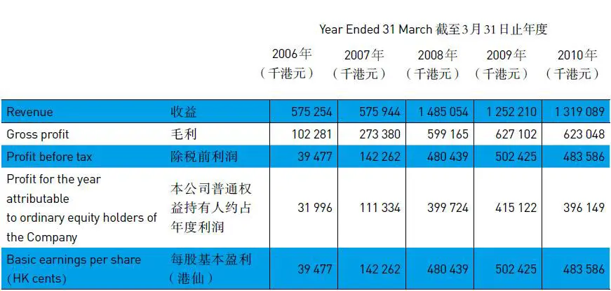

上市后第一年的业绩是倒退的，这是非常正常的现象，几乎所有的公司为了上市都会粉饰报表，这样上市可以卖个好价钱，上市之后需要时间来磨平粉饰的业绩，消化为了上市而产生的过高业绩。

有人质疑公司并没有挣到这些钱，因为对应的现金流量表不好看（见表1\-2）：

表1\-2

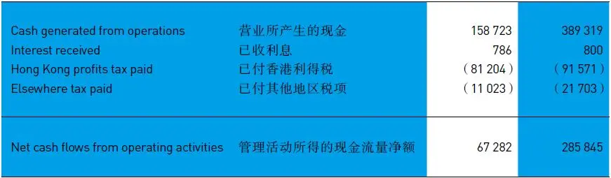

公司对此的解释是，公司将大量资金压在了存货上，白酒作为一种特殊的存货不用太担心，同时为了打消投资者的疑虑，公司决定将赚到的钱几乎全部用来派息，股息支付率高达98\.6%。上市公司用真金白银打消投资者顾虑在港股市场还是非常有效的，公司股价随后一路上升，最高涨幅达到300%以上。

2011年6月公司发布2010年年报，盈利高增长，同样几乎全部派息，市场依然认可，年报之后股价继续创新高（见表1\-3）。

表1\-3

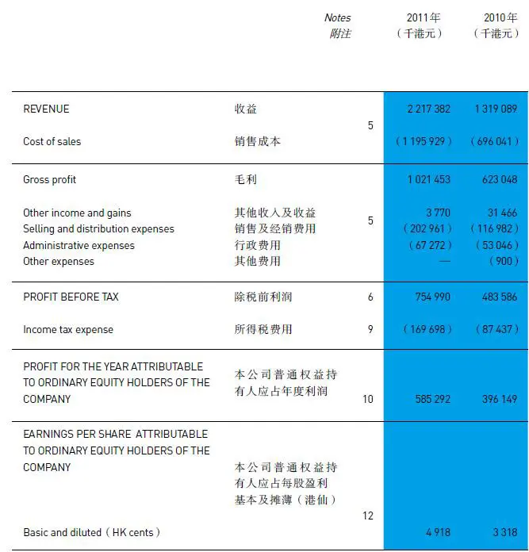

但需要注意的是，在这份年报里，公司隐瞒了非常严重的问题：

经营活动现金流与利润严重不匹配，现金流失非常厉害；税收与利润也不匹配；更为严重的是应收账款激增，从原来的1733万港元增加到6\.67亿港元，接近一整年的利润，公司对此也没有特别的解释，并强调不存在坏账问题。看到这里基本上可以断定公司存在账务问题，雷已经埋下，爆只是时间的问题（见表1\-4）。

表1\-4

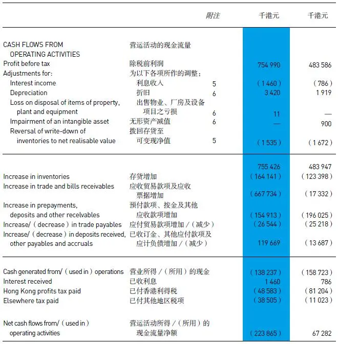

不出意料在2011年11月的半年报里，应收账款继续恶化，现金流持续流出，公司停止了派息，派息是非停止不可，因为现金流已经支持不了（见表1\-5）。

表1\-5

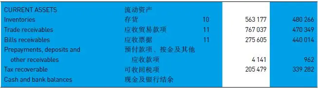

尽管派息停止了，但公司仍然坚持应收账款没有任何问题，都是可以收回的资金，可是到这里，市场已经不再相信。在随后的年份里，公司开始计提应收账款坏账拨备，股价也一路向下。中小股东如果反应慢一点，还寄希望公司收到账款后恢复派息，等来的便是股价无止境的下跌（见图1\-1）。

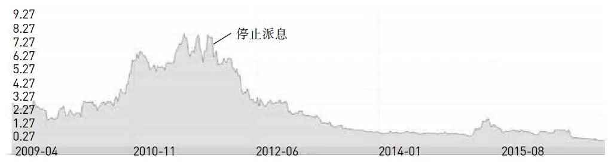

图1\-1

上市公司陷阱很多，如果因为看中公司的派息而买入公司，必须要弄清楚派息能否稳定持续，现金流是否健康，不要因为公司慷慨的股息而忽略了财务中隐藏的问题。要知道，有些时候，慷慨的股息是故意派出来给大家看的。

无论涨得多好，一天跌掉全部

2016年1月28日，港股市场上有一只股票在短短半个小时之内下跌超过90%，而在此之前的一个星期内，它已经下跌超过30%，如果之前股民有100万该股票，经过这么疯狂的下跌，还剩不到6万元。这只股票是恒发洋参（0911\.HK）。恒发洋参在2014年、2015年曾是热门股票，股价涨幅好几倍，但是有什么用呢，只需要一天，它就可以让所有买入而没有卖出的股民亏本，特别是在高位买入的股民，而股价一路上涨过程中的成交量，远远低于股价在高位横盘的成交量，说明大部分人是股价上涨之后才来关注并买入，从而损失惨重。

恒发洋参的核心业务为采购及批发西洋参，公司官网介绍如下：

本公司成立30年，一直深受顾客支持，并于行内累积相当丰富的经验。凭借过往宝贵经验，本集团早在90年代初期开始，定期委派资深专员到美加采购货源，坚持选材严谨的态度，加上丰富知识及经验，本集团业务发展稳步上扬，成为行内首屈一指的大型花旗参供货商。香港被视为全球最主要的西洋参收运港口，约90%的加拿大西洋参出口至香港，而本集团是香港最大的一级西洋参批发商。作为市场的龙头企业，本集团拥有与客户、种植商及供货商较强的议价能力。本集团的销售点亦于近年不断增加，把业务进一步扩展到零售层面。

公司讲了这么多，说白了很明确，公司是贸易商，不是洋参种植企业，更不是有研发技术的药企。对于贸易商，我们重点要关注其品牌价值、渠道价值、用户黏性以及成长空间，这几年的常识是贸易商受电商冲击，毛利率下降，以往庞大的销售网络反而会成为负担，拖累毛利率。我们来看一下公司的基本财务指标（见表1\-6）：

表1\-6

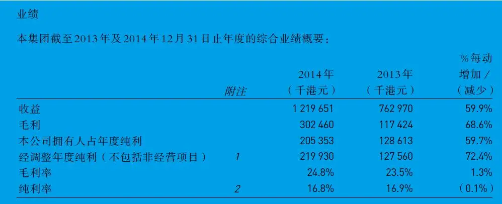

公司的毛利率以及纯利率太好了，这个情况下，使得净资产收益率很高，与有着自主研发医药的药企处于一个级别，净资产收益率是国药控股、上海医药等这些做医药物流的企业的2倍以上，怎么看都不像是一个正常贸易企业的利润率（见表1\-7）。怎么人家全国性企业做贸易都做得苦哈哈的，你一个产品单一的贸易商能这么赚钱？

表1\-7

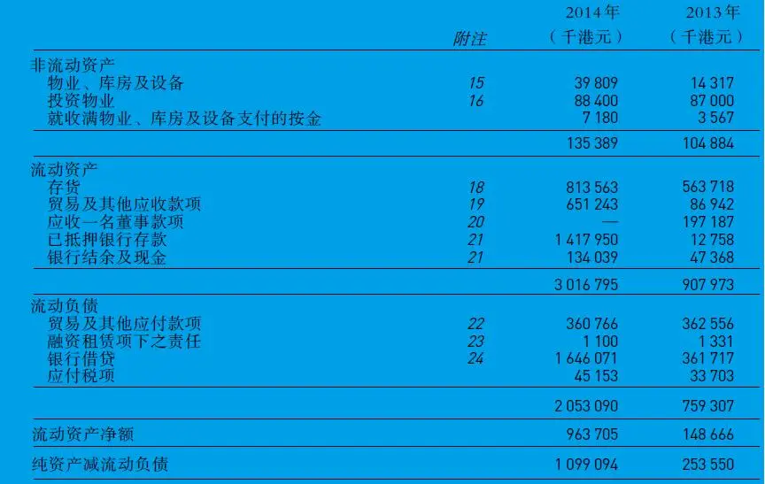

当然单凭毛利率我们只能怀疑而不能断定就是造假，结合资产负债表看看公司资产质量就明显很多。2014年公司凭空多出将近6亿港元应收账款，即使没有问题，也是大幅度向下游压货造成虚假销售导致，实际销售现金还没有回到公司账上；另外资产负债表里多出将近13亿港元银行借贷，这个钱哪里去了？资产负债表上找一下不难发现，对应在“已抵押银行存款”上，这个行为就疑惑了，公司拥有如此高的毛利率，应该拿银行贷款扩大经营，现在是拿了贷款再去抵押，看不懂管理层在做什么。其实看不懂就对了，管理层只希望股民看到公司的利润，不要去管公司资产负债表，至此账务老千行为基本可以下结论。现金流量表其实可以不用再看了，因为6亿港元的应收账款摆在那里，现金流不可能好看（见表1\-8），果不其然：

表1\-8

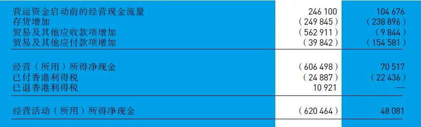

原来这么好的生意，全部是停留在每股盈利数字的纸上富贵啊！上面的分析都来自2014年年报数据，年报公布后股价仍然继续上涨，离2016年崩盘有整整大半年的时间。坦白讲，年报上恒发洋参老千股公司的特征很明显，虽然大多数股民不可能去实地调研，但是在公开的财报和招股说明书里，如果能够看出蛛丝马迹，就应该立刻远离这样的公司，完全可以规避掉2016年1月的暴跌。

有那么多公司可以选择，为什么很多股民非要刀口上舔血？港股的流动性一般般，一些好好经营没有什么新闻的公司，一天下来没什么成交量，成交量低于500万的股票太多了，而这种老千公司，在老千被揭穿之前，竟然可以保持数千万的日内交易量，机构投资者是不会去买这样的股票的，大部分还是散户，很多股民并没有完完整整地看完一份年报，直接就下单买了股票。有一句很有名的话：“很多时候，人们买股票，仅仅是因为股票在涨。”

我想说的是，每天都有股票涨，每天也都有股票暴涨，我们不可能也没有必要去试图抓住每一次机会，即使是我们身边显而易见的一些机会，没抓住也没有关系，你并没有什么损失，你只要努力做到自己出手买到的股票可以上涨就行。在港股市场，如何做到这一点？第一步，远离老千股！

对了，恒发洋参换名字了，叫前海健康。打算洗心革面重新做人？更大的可能是换个马甲过几年骗新股民。

有的公司，连年报都不用看

这是一家上市公司的月K线图（见图1\-2），上市首日收盘价格113\.5港元，上市的第一年有涨有跌，然后就一路下跌，月K线后面都看不清楚了，为什么看不清楚？因为价格已经跌到零头的零头都不剩，相对于前面的价格，后面的波动可以忽略不计了，最新的价格在2\.3港元。

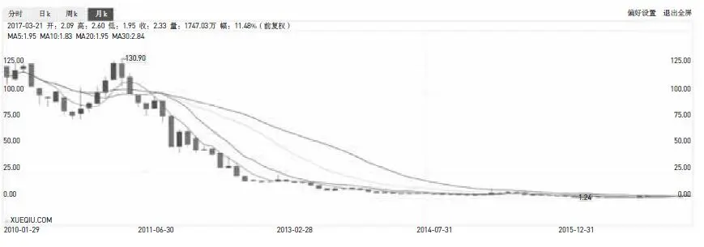

图1\-2

从上市到现在，7年，从100多元跌到3元不到，期间没有任何一次分红，如果是中长线投资者，买入这只股票基本就没有赚钱的。

这只股票的名字叫做南戈壁（1878\.HK），在内蒙古经营煤矿，2010年上市，当时在4万亿元经济刺激计划下，煤炭的需求强劲，公司号称有着充足的煤炭储量。这种在你根本没有听说过，也根本不可能去当地调查清楚的公司，即使不是老千股，股民也最好不要碰。

为什么要提到这家公司？最近煤炭价格企稳，2016年的煤炭价格相对于2015年上涨超过50%，煤炭企业的盈利状况大幅改观，某些财经媒体“有意无意中”又开始推荐南戈壁这只股票，对于一些看图炒股的技术派，最近的K线看上去至少趋势很好，“似乎”有利可图（见图1\-3）。

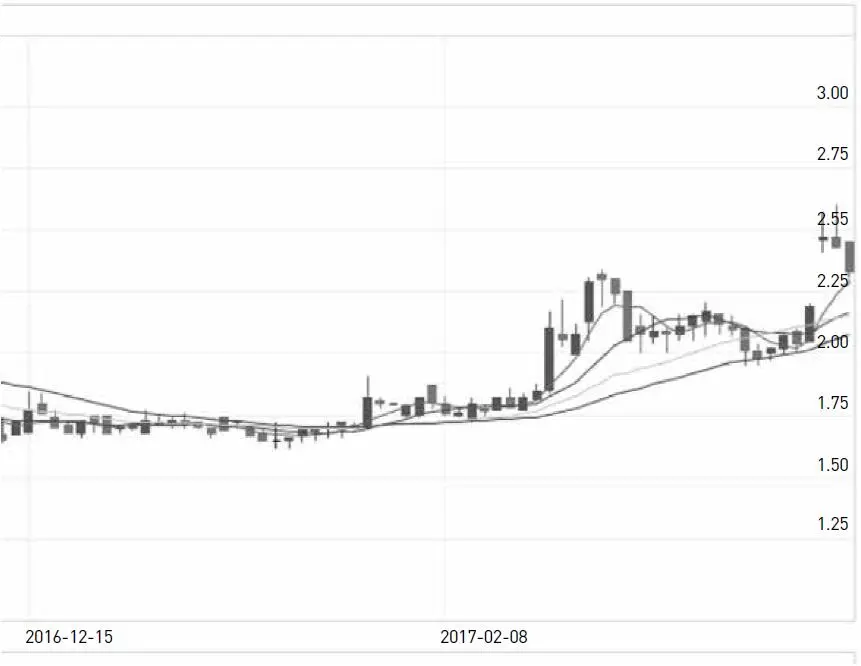

图1\-3

一些新股民有可能觉得跌了这么久，差不多该涨了，可以买一点试试看。事情是这样的吗？仔细看看这只股票上市之后每逢市场行情转好，或者行业景气度提升，都要拿出来炒一下，可过不了多久，股价会继续下跌，创出新低。对于这种类型的公司，看看戏就行了，或者连看都不用看，至少我就不会打开财务报表去分析数据，根本没必要浪费时间。

看不懂的上涨不要管

汉能薄膜发电（0566，HK）是前两年的大热门股票，港股通开通以来，尽管质疑声一片，股价却一路飙升，最高峰市值达到3700亿港元，高位稳定下来也一直维持在2700亿港元以上，静态PE高达70，PB高达14。汉能在一路上涨过程中，成交量也非常大，基本上每天都过亿，要知道整个港股市场每天的成交额也就是几百亿港元而已，汉能的成交量和市值，足以媲美恒生成分股里的大型蓝筹股票。可以简单对比一下（见表1\-9）：

表1\-9

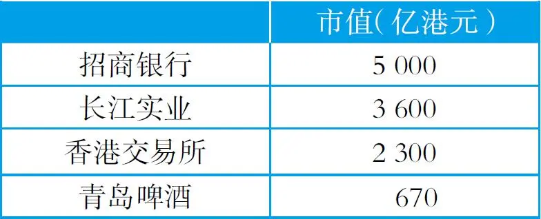

从市值上看汉能已经超越香港交易所，如果继续涨下去，很快也能超越长江实业、招商银行，消费大蓝筹青岛啤酒已经只是它的零头了。那么这么大型的公司它的具体业务包含哪些？汉能的官方网站上这样介绍：

自2009年进入薄膜发电行业以来，汉能薄膜发电致力于成为整线生产线的领先供应商，并于2013年开始拓展至下游薄膜发电领域，各方面都得到快速发展。在可预见的将来，汉能薄膜发电将继续致力于薄膜发电生产线组装、技术研发和薄膜发电项目及应用产品领域。薄膜化、柔性化是光伏产业发展的未来和总趋势。基于这一战略判断，汉能专注于薄膜太阳能路线，目前已成为全球规模第一、技术第一的薄膜太阳能企业。薄膜太阳能电池技术属于新一代太阳能电池技术，它具有环境友好、无污染、成本低、平均发电量高、弱光响应好等优势。汉能通过积极的产业布局，形成了上游核心技术研发、高端装备制造、中游太阳能电池组件生产、下游薄膜发电系统集成解决方案的全产业链商业模式。

按照公司说法，汉能致力于太阳能薄膜发电。要搞清楚太阳能薄膜发电，对于一般的投资者来说比较困难。我们先来看一下晶体硅太阳能发电，这个技术投资者应该不陌生，因为晶体硅太阳能发电是政府前几年大力推广发展的项目，很多地方都有类似产业园，新闻报道里面更是经常听到。晶体硅太阳能发电经历了早期的一哄而上，然后的行业洗牌，最终逐渐走出一些龙头企业，目前国内推进的绝大部分太阳能发电项目采用的就是晶体硅技术。在汉能受到热捧的时候，资本市场并不是太待见晶体硅技术太阳能企业，如果是作为生产企业，必须不断地依靠新订单继续运营。由于行业整体产能过剩，需求不足，生产企业即使成为龙头也没有定价权，毛利率得不到提升，龙头企业保利协鑫能源（3800\.HK）市值为400亿港元，只有汉能的零头，晶体硅发电项目就更困难了。就目前阶段的技术而言，晶硅发电主要靠政府补贴，否则以其发电成本，根本无法在市场上自由竞争。

回到薄膜发电，按照公司说法，薄膜太阳能属于新一代太阳能电池技术，成本低、平均发电量高、弱光响应好，看上去是晶体硅技术的升级替代。汉能在2009年进入该行业，如果薄膜确实是晶体硅技术的替代，再加上公司自称的技术领先地位，那么薄膜发电应该在市场中占据举足轻重的地位，并且能够持续地在市场中抢占晶体硅技术份额，这样才可以支撑得起汉能的千亿市值（见图1\-4）。但是，实际情况是晶体硅依然占据绝大部分市场份额。我们看各大新能源电力公司，新装机的太阳能发电项目几乎全部采用晶体硅技术，即使是在汉能的官方网站上，大型的薄膜发电应用实例也非常少，薄膜发电基本还是停留在故事和概念阶段，产品形态应用很广泛，前景很美好，但是身边看不到。这里要非常注意，汉能有数个生产基地，但公布的大型应用项目甚至没有生产基地数量多，存在明显的需求不足情况。

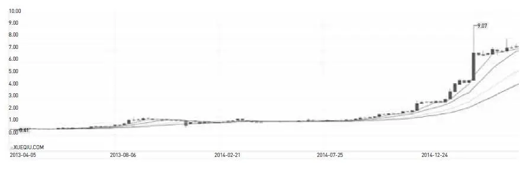

图1\-4

尽管按照常识分析下来，薄膜技术撑不起公司千亿市值，但是汉能的股价仍然高高在上（见图1\-5），并且高成交量维持了很长时间。我认为的原因有两个：

1\.大股东高度控盘并进行市值维护，市场流通股份偏少，在缺少足够卖盘的情况下，容易暴涨。

2\.在持续大涨的财富效应下，以及A股牛市的带动及港股通资金的推动下，大量的散户和游资进行短期博弈，买入汉能，推动股价上涨。

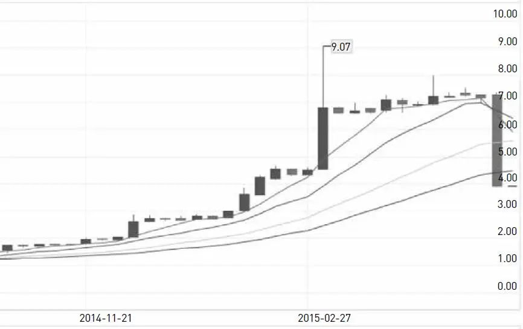

图1\-5

有新闻报道称部分外资机构做空汉能，由于被逼空，不得不大量买入从而推高了股价。这个说法我个人不太认可，外资机构的做空是很谨慎的，通常挑选大市不太稳定或者弱势情况，另外还会发布早已准备好的非常详尽的研究报告，打出一套组合拳，所谓不轻易出手，出手必伤要害。但是汉能大涨的背景是A股持续的大牛市，以及沪港通开通后港股脉冲式牛市，即使股价有泡沫，做空符合逻辑但胜率得不到保障，再加上汉能的流动性非常好，不存在为了平掉空头头寸而推高股价这么多的可能。

2016年5月20日，在毫无征兆的情况下，汉能股票大跌，接近腰斩，随后股票停牌，至今没有复牌，停牌期间公司发布2015年年报，巨亏122亿港元。

关于汉能，我想说的是，有的时候，公司股价上涨，我们说不出来原因，也看不懂，通过常识分析，公司股价上涨没有任何逻辑性可言，基本面根本不支持上涨，但不管怎样，股价就是涨，对于这种股票，看看就好，不看也没有问题，因为有时候多看也是一种干扰，特别是看不懂如何上涨的股票。我们要严格待在自己的能力圈里面，做自己看得懂的投资，这样，犯错的概率会变小。投资，首先要保证不犯错。

谜一样的资本开支

港股市场老千手法层出不穷，简单点的就是起个响亮的名字，搞些热门业务，诱骗散户买入。明明是中小企业，偏要起个类似中国石油、中国银行这样的名字，还有不满足的，以亚洲、世界开头起名；然后就是各种令人眼花缭乱的资本运作，合股、拆股、供股、配股等，总之就是想尽各种办法侵占中小股民的利益。稍微复杂一点的老千手法就是将公司的利润，从资本开支里面支出。

对于本来有些不错的业务，可以正常挣钱的上市公司，如果大股东以这种造假方式侵占中小股东权益，短期内最不容易察觉，往往大股东还会夸大公司盈利水平，营造一个公司业务景气度特别高的假象，同时加大资本投入，开拓新的业务。

大股东这样做往往一举多得，首先，在持续的资本开支中大股东可以将上市公司资产转移到大股东的关联公司；其次，高毛利率加上大量的资本投入，容易让市场相信公司具有卓越的竞争力，公司的发展还处于生命周期的早期，股价往往会一路走高，大股东可以在市场上减持或者股权质押。

只不过，持续这样做终究纸包不住火，到头来倒霉的还是中小股东。

蜡笔小新食品（1262\.HK）主营休闲食品，2011年上市，由于业绩出众，2011—2014年为热门股，股价一路上涨，最高涨幅接近3倍。其公布的业绩如下（见表1\-10）：

表1\-10

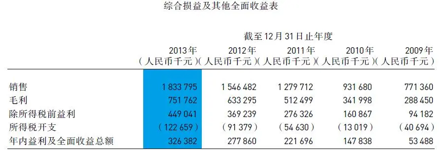

蜡笔小新食品2013年毛利率高达43%，略高于龙头企业中国旺旺（41\.5%）。蜡笔小新作为快消行业非龙头企业，在任何资源都不占优势的情况下，甚至有高于龙头的毛利率，这个本身来说不合理，更不合理的是其庞大的资本开支（见表1\-11）：

表1\-11

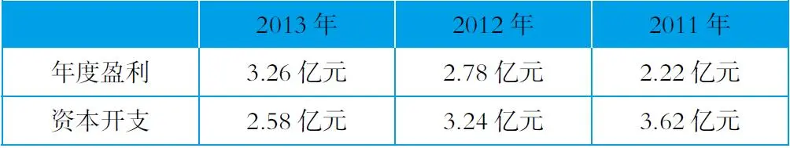

资本开支都用来购买土地、兴建厂房、添置生产设备，也就是说公司从上市开始整整三年，所有利润都用于资本开支，由于利润不全是现金流，因此还有不小的缺口，当然要靠银行贷款补足。其实在公布2013年业绩之前，就已经有机构质疑蜡笔小新食品涉嫌造假，夸大销售及毛利，股价因此暴跌，但公司坚决予以否认。我的观点是，对于一个快消行业，如此高的资本开支，是否利润造假已经不重要，如果涉嫌造假，毫无疑问，隐藏在高额的资本开支里面，用不了多久就会有巨额资产坏账计提，本质上公司没有赚到那么多钱，气球越吹越大，总有一天要炸掉；如果没有造假，如此巨额的资本开支也变相地将公司利润抽走，要知道这是快消行业，并不是传统意义上的重资产行业。考虑到其超高的毛利率，第一种可能性更大。

作为普通投资者，如果不能对公司的资本开支警觉起来，是很容易吃亏的。通常来说，我不喜欢资本开支过高的企业，那是属于大股东或者管理层的公司，不是中小股东的公司。

蜡笔小新随后遭遇食品安全问题，高毛利率自然一去不复返，公司持续亏损至今，并在2015年计提物业厂房减值3\.17亿元，2016年计提物业厂房减值2\.41亿元。你问我公司当年在利润上到底有没有造假？我不知道，也不想花时间去弄清楚，我只知道2016年刚刚计提完物业厂房减值2\.41亿元，转头又有2\.6亿元用于厂房设备的资本开支了。

年报一定要看

不知道有多少个人投资者，年报都没有看过，就匆匆买入股票，这其实是一件非常危险的事情。有多危险呢？以买房子类比，我们一定会看一下房子本身，看一下周围环境，看一下最近成交价格以及周边价格，有可能的话，会多看几个不同的地区，多看一些房子，最后再做决定。不看年报买股票就好比什么都不看，直接下定金买房。这种事情你会干吗？那为什么不看一下年报再买？

有两个朋友向我推荐华瀚生物制药（0587\.HK，现已更名为华瀚健康，以下简称华瀚），理由是估值便宜，作为一只医药股，估值比大部分医药股都低。华瀚并不在我关注的股票当中，于是便打开截至2015年6月的最新年报（华瀚年报以6月结算）。

我们先以华瀚为例，看看如何快速梳理一下年报，然后再简单介绍一下如何看年报，以及如何做决策。先看一下主要财务数据（见表1\-12）：

表1\-12

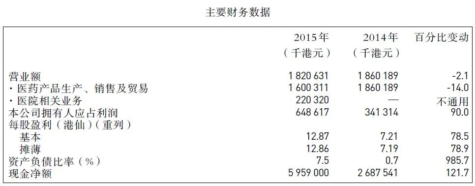

盈利是大家最关心的，盈利必须结合营业收入来看，如果营业收入没有大的变化，盈利增加大多靠压缩成本或者其他一次性收入，不能持续。华瀚的营业收入好坏参半，主营业务医药产品生产营业收入下跌14%不是好事情，但是医院相关业务开始有营业收入贡献，是好现象。

主营业务下滑，是短期影响还是长期影响？公司如何应对处理？要看销售数据和管理层的解释，进一步在年报里找答案。但是，看了两遍管理层讨论和分析，没有关于主营业务销售下滑的分析和解释，为了确保起见，又浏览了整个150页的年报，真的没有！其实看到这里已经有点有问题的感觉，毕竟也看过其他医药公司的年报，对于产品的分销数据、销售分析和展望是很重要的，华瀚在这里避而不谈，看来只能到年报之外寻找答案。通常来说，都是不好的结果，管理层喜欢把好消息放大了说，对坏消息闭口不言。

医院相关业务2015年度开始产生营业收入，这是一个非常好的事情。这几年我们知道医保控费对于一些药企确实有影响，如果医院相关业务能够稳定增长超过药品下滑部分，那么公司的经常性盈利就可以重新回到增长的路上，我想知道的是医院业务大概是如何挣钱的，2\.2亿港元的营业收入能够贡献多少利润，于是又看了一遍整个150页的年报，没有找到具体描述，这个就很难以理解了。如果说坏消息公司避而不谈，可以理解，但是增加营业收入的新业务公司同样避而不谈，就比较令人疑惑。关于医院业务的描述年报中包括如下：

__医院业务开拓__

本年度内本集团积极拓展医疗服务业务，创新提出新建医院、TIOT、非常6\+1等模式，于2014年7—11月与六盘水市政府和铜仁市政府签署了在这两个地方发展医疗大健康产业的一揽子合作协议，内容包括新医院建设、设立干细胞存储及以TIOT模式投资管理医院。截至本年报日期，TIOT模式合作医院已达8家，包括六盘水市人民医院、六盘水市第二人民医院、六盘水市妇幼保健院、铜仁市人民医院、德江县人民医院、沿河县人民医院、息烽县人民医院、息烽县中医院等，总床位数达到5151张；此外，11家医院已于年结日后就干细胞授权集与本集团签订合作协议；本集团现正兴建或计划兴建三家医院，包括六盘水市凉都人民医院（占68%股权，与六盘水市人民医院合资建设），六枝中医院（占70%股权，将与六盘水市第二人民医院合资建设），铜仁市中心医院（将占100%股权），新建医院床位数达到2560张。

__固定资产投资__

到目前为止，本集团贵阳高新区沙文生态园区、贵州汉方药业有限公司中药生产基地专案一期工程已基本完工，正在进行设备调试和生产前准备；六盘水市凉都人民医院专案顺利进行，该专案占地188亩，建筑面积22万平方米，含医技用房、商业铺面、细胞库及分子学实验室，总投资额约15\.3亿元人民币，按三级甲等医院设计，床位数1500张，建成贵州西部辐射黔、滇最大的综合性旗舰医院，覆盖人口750万，预计2016年下半年内投入运营；铜仁市汉方医药大健康产业园工程已于2015年6月部分建成并开始试营业，该专案占地160亩，规划建筑面积15万平方米。于年结日后，一期工程包含铜仁市细胞库和泛特人胎盘固体制剂生产线，二期工程包含人胎盘冻干、液体制剂等系列保健品生产线正在建设中。

医院投资业务：以新建医院、TIOT、非常6\+1等模式，快速扩大合作医院集群，以投资拉动、资源整合为主要方式植入多项业务内涵，快速形成收入规模和利润增长点。

加快建设凉都人民医院、铜仁市中心医院、六枝中医院三家三级医院。将进行施工的六枝中医院工程占地面积将为12亩，建筑面积达4\.2万平方米，总投资2\.9亿元，按三级乙等医院设计，床位数500张，建成贵州省最具特色的中医院，预计2016年底前投入运营；铜仁市中心医院（本集团100%股权）专案系原铜仁市人民医院旧址改扩建项目，在市中心地段占地面积50亩，已有建筑面积5万平方米，按三级甲等医院设计，床位数560张，总投资额约5亿元，建成贵州东北部立足黔东、辐射黔湘的“小综合、大专科”式医院，覆盖人口800万，预计2016年3月投入运营。有关三级医院分类型打造本集团综合性旗舰医院，小综合、大专科医院，中医特色专科医院示范基地，使之成为医技人才聚合，业务内容聚拢，管理模式聚形的平台，不仅要产出效益，更要为下一步本集团发展医疗服务业务输出人才、业务、管理。

这里可以看到公司投入了大量的资本在医疗合作、新建医院方面，累计资本开支惊人。关于资本开支，投资者要特别留意，我个人特别反感，尤其是这么庞大的开支，毛估计这几年公司赚到的钱加上银行贷款以及发行可转债的钱都投入到几个医院项目里，花了这么多资本投入，长达150页的年报里只有这么点描述，怎么看都觉得不够。另外关于民营医院，2001年国家在该领域就已经放开，经过这么多年的发展，已经有了一定程度的市场化，也有一批上市公司，其净资产收益率是绝对低于制药企业的。华瀚以制药企业身份，将公司几乎所有资源投入到民营医院，而不是投入新药研发，本身也不合理。

看到这里基本上我已经不想再浪费时间，告诉朋友最好不要投资华瀚，公司有很多信息没有向投资者披露，有很大的不确定性。便宜有便宜的道理，不能贪便宜，有一位朋友并没有接受意见，仍然持有华瀚。后来华瀚被机构质疑，虚构利润，并夸大资本开支冲减虚构的利润并掏空上市公司，2016年开始停牌至今。

这里我们可以明显看到，简单阅读一下公司的年报，就可以规避掉一些地雷，赚钱以后再说，至少可以不亏钱，可是很多股民不断地在市场上亏钱，却不愿意花时间阅读一下年报。

关于如何读年报：

1\.年报最重要的数字是盈利，但盈利不能单独看，要和营业收入结合起来看，弄清楚盈利的来源。

2\.盈利的质量比盈利的来源更重要，它决定了公司发展的可持续性，因此要结合资产负债表和现金流量表一并看盈利，三张表要协同发展，不能以牺牲其中任何一张表为代价发展其他两张表。

3\.任何一张表上任何一项出现异常变动，都要弄清楚原因。

4\.看完年报，至少要说清楚公司过去靠什么挣钱；如果说不清楚，就不要去碰。

5\.最好多看几家竞争对手的年报，看看大家有什么区别，各自靠什么在市场里面维持竞争优势。

6\.看完最近的年报，把过去几年的年报都拿出来看一下，看看公司一路是怎么发展过来的，公司所处的行业处于生命周期的早中晚哪个阶段，公司又处于整个行业的什么位置。

7\.看完年报，请记住，所有的数字和描述，都是公司的过去，过去并不代表未来，而决定公司股票价格的，是未来。

最后一点是不是很困惑？但事实就是这样，投资股票本来就不是一件容易的事情。

没事多看看大牛股的前后几年的年报，也可以多看看烂股票前后几年的年报，多思考、多积累经验总是好事情。

## 第一章 券商不知不觉帮了坏人的忙 - (08) 1.08 魔鬼在其中

\(08\) 1\.08 魔鬼在其中

2026年3月14日

9:55

1\.08 魔鬼在其中

__作者：William Ho__

__香港投资者__

2012年，香港证监会勒令上市只有3个月的洪良国际（0946\.HK）向小股东退还上市资金，即是“还原”交易。原因是洪良国际在招股书中夸大了营业额、税前利润、现金价值及虚增了特许经营店数目。

在这次事件上，小股东可以说得上是非常幸运，能保住血汗钱。但是，散户被骗真的是不可避免吗？根据《新财富》的研究，洪良国际的招股书本身就已经是魔鬼在其中。

1\.招股书上的2006年到2009年上半年的销售收入年复合增长率超过36%，而2008年的全球金融危机对这家公司完全没有影响。

2\.服装零售业务的毛利率表现不正常。2009年上半年，零售服装的平均售价大跌28%，毛利却奇迹般上升了近9个百分点。

3\.2008年的一项1\.4亿元收购，在13个月后该投资立刻带来超过原始投资额的1\.54亿元的毛利。

4\.洪良国际在2009年12月成功IPO融资近10亿港元前，分别于2008年和2009年上半年一共派发了5\.28亿元人民币的股息。如果公司真的需要上市融资，还需要在上市前把相当于一半融资金额的现金当红利分出去吗？

事后诸葛亮地看这些招股书上的造假伎俩比较容易，都是常识可以判断出来的，但股民完全被IPO时的热闹情绪所影响，据说还有超过38倍的超额认购呢！

最近两年另一家已经被证监会勒令停牌的太阳能公司，借壳上市数年来从单一客户（大股东）带来所有的营业收入，却一直被大股东拖欠账款并持续累积在应收账上，只是因为大股东未能及时拿到政府的补贴！虽然这些交易及已逾期的应收账都不是秘密而且堂堂正正地刊登在年报上，但是大股东累次的股份增持却使股民冲昏头脑盲目跟从。公司的商业模式及诚信在这次事件上都是一直让人摸不着头脑，彷佛只要股价一直上升就没有让人深思业务的可行性及坏账的可回收性。股民就像灯蛾扑火，为追求光和热，将身子扑向灯火，终于死在灯下，发现公司在缺少与大股东的交易后根本连盈利的能力都没有。

__张化桥点评：__

其实，这几年被香港证监会除牌的中国森林和中国金属再生都有一个共同点：它们的业绩太好了，让同行业的企业无法相比。内地有个在香港上市的民营化工企业也是如此。对冲基金也正是凭这一条攻击公司的。它被迫停牌两年了。这个市值高达500多亿元的公司何时能够复牌，解放苦苦等待的股民？

## 第一章 券商不知不觉帮了坏人的忙 - (09) 1.09 上市公司的婚姻和寿命

\(09\) 1\.09 上市公司的婚姻和寿命

2026年3月14日

9:55

1\.09 上市公司的婚姻和寿命

资本市场其实很简单。你看看下面的表1\-13：它反映了95家A\+H公司的H/A股价折扣。你看到什么规律了？

表1\-13

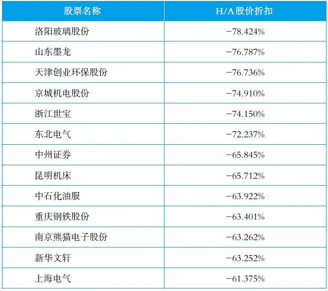

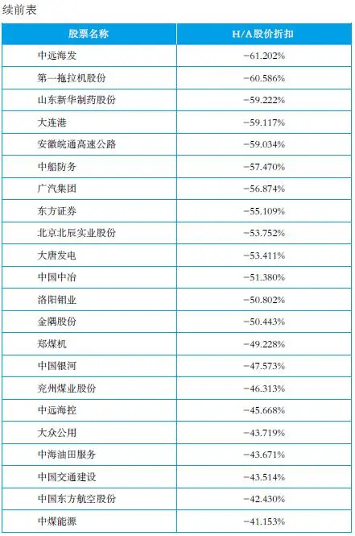

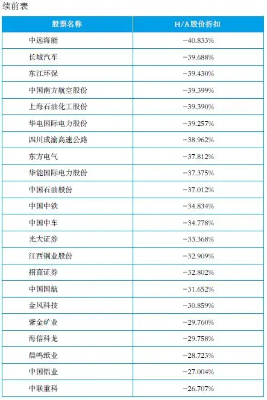

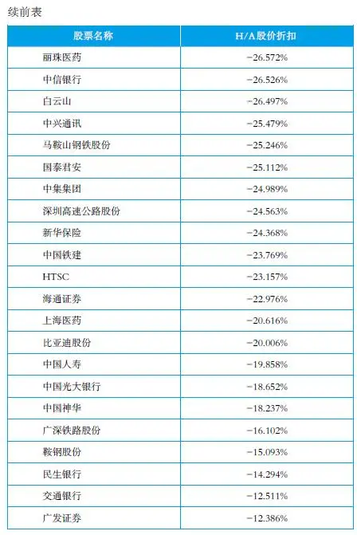

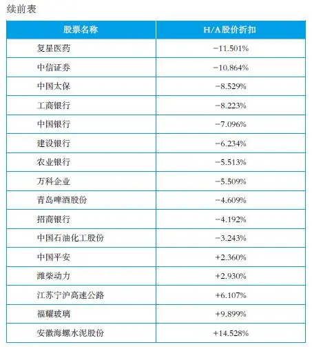

表1\-13展示了95家A\+H公司在两地市场的估值差距。你可以看到，__小公司和烂公司在A股市场有极大的优越性，而好公司和大公司没有，而且有5家公司甚至倒挂。__

表1\-13反映的是2017年5月9日的情况。未来几年，由于A股跌，港股涨，因此，更多的公司把差距缩小。为什么？

（1）价值回归。

（2）国内IPO的加快，金融业（银行、保险、理财）的整顿。

（3）股民逐渐变聪明。

__上市其实很简单，它就是卖股份。__你卖得太贵了，就有人要吃亏，他就会记得你。举个著名的例子：这家公司很成功，很优秀。它10年前在香港上市。它的每股净资产从3\.3港元涨到了现在的11港元。但是现在的股价跟10年前差不多，而且过去10年里，它在绝大部分时间一直潜水，有些时候甚至比上市价格低一半，或低80%。你想想，它得罪了多少人，挨了多少骂！其实，过去10年，该公司一直在为上市价格过高做填充，补课。

大家知道，在短期内，上市公司有很多办法推高利润，比如，减少营销支出，或把成品塞到客户和经销商的渠道里，或卖出一个子公司或进行物业重估，或把费用延后或资本化，或让大股东补贴公司，或者干脆做点假账，等等。

但是，这些都不能持续。而且，今年夸大了利润，会拖低未来的增长率和ROE。从长期来看，你是瞎折腾。

每个人都爱谈品牌和客户体验，但是大家容易忘记自己在资本市场的品牌和股东们的体验。最近，辉山乳业出了一点小问题。省政府要求众多银行不要抽贷，不要做资产保全。最滑稽的是第三条，不上征信！

关于科技创业去哪里上升的问题，只要你明白了一件事，就行了。上市只是万里之行的一个小小的里程碑，不是目的地。上市的过程越简单快捷越好。很多公司在上市时轰轰烈烈，但管理层为了上市，大伤元气，心力交瘁，而且做了不少坏事，耗了不少钱，这太不值得：企业上市了，业务垮了。为了上市（特别是A股上市），你需要维持管理层的稳定性，业务的连续性，屏住呼吸，捆住手脚，忍住本来应该做的战略调整，等等，对公司伤害很大。

__注意：好公司永远是贱卖的。__因为你的股票一直往上涨，所以你每次卖股票都是亏的。比如腾讯、亚马逊或者新粤燃气。__只有烂公司才能永远抓住高点卖股票。因为它的股价不断跌，所以每次卖股票都是对的。__我在投行工作时，曾帮某企业配售过几次股票。每次配完之后，我就心情紧张，因为只要股票不跌，这位老兄就不高兴，因为他没抓住高点，他会责怪我。

现在，我在中国内地、中国香港和美国的上市公司都兼有董事职务。究竟去哪里上市最佳，我认为很难一概而论，因为每个公司的背景不同。不过，有几个因素要考虑：

1\.A股仍需排队，中国香港和美国则不需要。

2\.内地的监督当局对上市的时机和价格有限制，中国香港和美国则没有。

3\.上市后，内地监管很细，而中国香港和美国以披露为主。比如关联交易、增发、并购、资金用途和减持，等等。

4\.A股在上市后价格贵，有利于老股东套现和抵押贷款，但是也碰到大量的限制。

5\.任何行业的企业都可以在中国香港和美国上市，但是有些行业的企业（比如，类金融、信托、烟草、博彩，也许餐饮）不能在A股上市，不允许。

6\.一般来说，中国香港和美国上市的企业在过了6个月的禁售期之后，没有在减持、增发和并购方面的限制。A股有，而且政策常变。

7\.中国香港和美国无所谓“主营业务”，融资用途可以任意改变，后续融资和并购可以随时进行，这给管理层很多灵活性，而A股限制很多。

香港的互联网公司不多，除了腾讯（00700\.HK）、网龙（00777\.HK）、科通芯城（00400\.HK）、美图（01357\.HK）、金蝶国际（00268\.HK）、中国信贷（08207\.HK），等等。老实讲，这些公司的估值是相当不错的，如果它们有A股的话，A股的股价也不会更高，甚至可能更低。千万不要忘了，香港上巿公司的管理层根本不需要知道交易所和证监会领导的名字，甚至办公室的地址。你想想这是多么大的解脱啊！

另外，股东作为资产配置的一部分，有点外汇也不是什么坏事吧？

做IPO，选哪个投行？我认为，内地前30家和香港前20家大券商（即投行）都非常好，绰绰有余。投行的核心竞争力是忽悠，你可别上当。上市、增发、并购等都不是高科技，只要勤快、真诚就行。这几年，香港养成了一个坏习惯，经常出现20多个投行共同承销一个IPO的例子。这种大合唱说明投行的产能严重过剩，它也浪费了管理层大量的协调时间。我建议你只聘一个投行，最多两个，让他们吃饱吃好，专心做事。

科技行业的IPO，瑞信和摩根士丹利（Morgan Stanley）做的最多，但是他们手上接的活儿太多，有时难免重视不够（人手少）。那么，花旗、美林、UBS或Jeffries能做吗？当然，也许做得更好。你如果挤到瑞信或摩根，它的股票分析师也许顾不上你。在中国香港和美国，分析师确实非常独立，投行的老板也不敢得罪的。

一个IPO是否成功，上市的时机、行业的敏感程度和公司的质量是关健，投行的作用并不太大。公司的管理层是最重要的销售员。管理层的朋里圈子里经常有各种专家和说客出各种馊主意，不少人还建议管理层做坏事，耍小把戏，明智的管理层都知道该把精力放在正道上。

香港的上市，大家喜欢找大批基石投资者和锚定投资者。这是缺乏自信的表现。大多数公司上市之后不会有分析师写正式的报告。即使主承销商的分析师也可能很快抛弃你。我认为，这没关系。如果你的业绩越做越好，分析师会重新覆盖的。

最后一点，借壳上市也很好。A股有顺丰、分众传媒等。香港借壳比比皆是：500亿市值甚至几千亿市值的公司也借壳（比如，华润燃气、中信股份、中国信贷、深圳国际、国美、海通国际）。我当了十几年分析师，我觉得，市场并不歧视借壳。最近的一个借壳上市是金融科技：51信用卡。

## 第一章 券商不知不觉帮了坏人的忙 - (10) 1.10 如何跟分析师打交道

\(10\) 1\.10 如何跟分析师打交道

2026年3月14日

9:55

1\.10 如何跟分析师打交道

过去25年，我在上市公司高管、投行分析师、投行人士之间多次转换角色。这里我只想讲上市公司如何跟分析师打交道。

中小上市公司的通常定义：市值在400亿港元以下，也就是50亿美元以下。

香港上市的公司与同等规模的中国内地和美国公司相比，交投只有1/3，或者更少。但是，对于持续增长的公司来说，这并不是一个太大的缺陷。对于夕阳西下的企业，这是个大问题。另外，香港的平均估值，大约相当于A股的一半或1/3。但是，对于好公司和大公司来讲，差别不明显，甚至倒挂。而且，未来几年，这个差距会逐步缩小。另外，香港的监管制度更加灵活。

上市的时候，承销商的分析师会写报告。但是，绝大多数在中国香港和美国上市的内地企业必须接受一个现实。上市后几个月内，甚至连承销商的分析师都会抛弃你。也就是说，市场上完全没有人发表正式的研究报告。A股的情况当然好多了，因为A股的分析师人数很多。

香港上市的中小企业总数有2000家左右，其中受到分析师正式研究的不到500家。香港的券商400多家，但是只有50多家雇有分析师，而且有的券商只有一两个分析师。香港的股评人士（在媒体发表文章的）约有70人，有点影响力的也就10人左右。

中小上市公司一般靠CFO、CEO和董事长的推介来提高流动性和股价。分析师靠不住。交易佣金下降了20年加上交投不活跃，因此分析师难以生存。现在，除了UBS和国泰君安（HK），所有的研究部（现金股票部）都亏钱，靠其他部门补贴过日子。

现在分析师的平均报酬相当于10年前的一半以下。他们的绝大部分时间都用在为本券商的IPO项目（和增发）写报告和路演上，基本上没有时间顾及其他事情。而且，竞争压力巨大。这种状况可怕吗？不可怕！大家要接受这个现实。你逼着投行的领导做出承诺也没用，因为这个承诺没有法律效力。

中小公司受到分析师垂青的几种情况：

1\.本投行保荐上市的（不过分析师跳槽或者上市公司出现业绩大幅下降，随时会导致分析师的抛弃）。

2\.本投行想为你增发新股或做并购或发债（不可靠）。

3\.某大型基金公司持有该中小股票的数量较多，授意某相好的分析师写报告，或者某分析师主动逢迎（也不可靠）。

4\.行业令人激动，比如医疗、直播、社交媒体和四五年前的城市天然气等等，但是，风水轮流转。

5\.公司的增长率令人激动，比如30%以上，或者派息较高，在业内受人尊重。

与欧美不同的是，香港和内地上市公司一般都有大股东，而且股比都在30%以上，有些甚至在50%～80%。加上在香港和内地，监管规则使野蛮人很难成功。香港跟内地一样，公司的利润率普遍低于欧美，现金流不好，派息率低，而且负债率高。这是共识。

中小公司吸引眼球的几个套路：

（1）公司名字叫“中国×××”（已经被用滥了，不灵了）。

（2）傍大款（李嘉诚入股，腾讯入股。依然有效，为期半年）。

（3）尽量强调公司靠近时髦的行业，虽然自己的业务只有一小部分沾边。

（4）加大分红。持续几次，效果十分明显。

（5）勤快。有的管理层每年除了参加十多家投资银行的研讨会以外（一般在京、沪、深、港），还参加美、欧、新、港的全球路演，一年三四次，每次两周，精疲力尽，耗资不菲。另外，还有大量的午餐会和晚餐会，分析师和投资者到公司访问等等。如果有求必应的话，至少需要两个全职的干部（一个级别高的，一个助手）。中国石油据说有50多人专门做投资者关系和交易所的合规工作。很多中小公司设有副主席，就是专门干这个的。有些CFO实际上是投资者关系总监。

我本人既在投资银行组织过这类活动长达10年，还在上市公司受过这种折磨，酸甜苦辣。后来我给自己定了一些规矩：只参加在香港举行的研讨会，一年不超过五次。尽量不接待单个的基金经理拜访（除非他已经持有较多我的股票），除了IPO以外，绝不做全球路演，尽量用电话会议和较频繁的业务更新公告代替路演，等等。每月只腾出一天应付资本市场足矣！大家知道，巴菲特每年只花一天时间对付资本市场。

## 第一章 券商不知不觉帮了坏人的忙 - (11) 1.11 中国股市“水至清则无鱼”？

\(11\) 1\.11 中国股市“水至清则无鱼”？

1\.11 中国股市“水至清则无鱼”？

2001年，当我担任瑞银（UBS）中国区研究部主管时，受到了两家在港交所上市的中国企业的威胁。其中之一的格林柯尔科技（Greencool Technology）以诽谤罪名起诉了我和我的雇主。另一家欧亚农业（Euro\-Asia Agricultural Holdings）也同样来势汹汹，对媒体扬言要告我。此前，我撰写了不利于这两家公司的研究报告，它们的股价由此大跌。

不到两年，这两个在顶峰时市值曾达数十亿美元的公司都崩盘了。接着，两家公司的董事长（格林柯尔的顾雏军和欧亚农业的杨斌）都在中国锒铛入狱。

正义得到伸张了吗？没有，起码没有完全伸张。两名董事长的刑事罪行受到了惩罚，但两案均未提及他们在资本市场的欺诈行为，更不要说依此处罚了。牵涉其中的大量投行家、审计师、董事和公司高管，都逃脱了恰如其分的追究。最糟糕的是，不论是相关政府部门还是公众，都没有从中吸取教训。

对我而言，失眠并非这些案子对我造成的唯一损害，我受到数百散户甚至机构投资者中许多人的责难。他们谴责我让他们亏了钱：若不是我对这两家公司提出质疑，他们或许来得及卖掉股票，借此斩获丰厚利润，至少他们是这么声称的。许多人质问我的动机何在；有些人甚至问，我的雇主是否正在做空这两只股票，意思是瑞银将受益于股价下跌。

那段日子里，尽管法庭审案引起不小轰动，媒体也对我的作用做了广泛报道，但没有一个政府部门向我询问我对两家公司的怀疑。他们也从未询问我的现场调查之行（目的是查清一些事实，比如说有些工厂是否正在生产他们号称在生产的新产品），这让我感到担忧。我基本上只能依靠自己为自己辩护。人们把我称为“黑嘴”，在香港和内地大城市的街头被人认出时，有些人会用奇怪有时充满敌意的目光瞪着我。

支持我的人很少，我的雇主瑞银是其中之一。瑞银不但为我支付了打官司的费用，还让我继续任职。我在股票销售部、财富管理部和投资银行部的同事们也面对着客户（包括富人、基金公司和公司客户）的负面言论。

如今，我是一家香港上市公司的董事长，也是其他多家公司的董事。规范上市公司及其董事的法律和规则写得明明白白（即便有点烦琐沉闷），但我认为，政府和中国公众对于资本市场上的违法和不当行为还是太宽容了。

似乎所有人都认同，偷钱既犯罪又缺德；然而，如果是偷众人（市场）的钱，或者大量陌生人（也是市场）的钱，而我们自己不是直接受害者的话，我们的道德判断就有点不那么明确了。即便我们真是受害者，委屈感也会很快消失。违法和不当行为有时甚至受到人们的敬佩，认为那是金融工程或高超技能的运用。

当很多人往街上倒垃圾，而我们容忍这种做法时，街道很脏就不应感到惊讶。当排污者得不到惩罚时，我们就只好住在有毒的环境里。同样，当监管机构打击股市操纵时，许多公众似乎不感兴趣。当中国两年前发起反腐败斗争时，商界有些人似乎主要担心反腐对经济增长的负面影响。他们援引古谚：“水至清则无鱼”，换言之，生物只有在“浑水”里才能生存。按此逻辑，结论就是：“不要对骗子或腐败官员太狠。不要对朋友太苛刻。人无完人。”

过去15年里，亚洲上市公司的治理水平有了很大提高。但我认为，监管机构还有很多工作可做。资本市场里的某些不当行为几乎尽人皆知。政府需要的只是更多资源、更多人才和更大决心。监管者对市场实行严厉的监管，对各方都有好处。公众必须把坏人当坏人，而不要甘当帮凶。

2026年3月14日

9:55

## 第一章 券商不知不觉帮了坏人的忙 - (12) 1.12 闭上眼睛给股票估值

\(12\) 1\.12 闭上眼睛给股票估值

2026年3月14日

9:55

1\.12 闭上眼睛给股票估值

如果我们都不知道一组个股的股价甚至也不知道指数，让分析师们给一组股票定价。你猜猜他们会如何定？

他们会手足无措！我们经常见到分析师给一个股票定价是在现价的基础上上浮20%～30%，或者下浮20%～30%，甚至就是现价！这说明什么道理？其实，大家都是以过去和现在为参照系。这是一种依赖和没有信心的表现。实际上大家是不知道怎样定价。另一方面，这也说明，估值可以是一个很大的区间。它取决于太多因素，有些我们知道，有些我们不知道。

买股票留“安全边际”

市场的市盈率可以是20倍，或者15倍，也可以是5倍。美国在经历了15年（1968—1982年）熊市之后，就是5～6倍市盈率。英国在20世纪70年代中期就是5倍市盈率。大家永远不要说：“中国有社会主义特色。政府绝不会让市场跌到那种程度。”说这种话是自欺欺人。

由于市场的市盈率（整体估值水平）只有老天爷知道，大家唯一的保护是，在买股票时多留“安全边际”（margin of safety）。不要说“真便宜，才15倍市盈率！”在中国目前的利率水平下，一个健康的优秀的公司，如果在15倍市盈率，那是很合理的估值。但是，你我为什么要投资一个“估值合理”的公司呢？我们靠什么赚钱呢？我们的安全边际在哪里呢？

分析师不能影响市场

投资分析师的定位越来越难了。首先，他们的作用本来是向基金客户提供独立意见，以换取交易佣金，可是，由于投行多，所以同质化的研究成了一个大问题。而且大的基金公司越来越掌握着比投行分析师更好的资讯和研究管道，他们往往可以经常见到大公司的首脑，而分析师经常是跟负责投资者关系的官员或财务总监接触。

其次，大的基金经理有全球的同事们支持，也越来越拥有自己的分析师队伍，比如富达、希洛德、Templeton和Alliance等都有很多分析师遍布全球各地。

投行分析师遇到的第三个问题是，随着电子电脑技术的发展，交易佣金已经和正在快速下降，所以靠交易佣金就很难再过舒服的日子了。很多交易通过商业银行或E\-trade来做更便宜，小的当地投行和证券公司也越来越多。香港有近500家券商，内地也有几百号。好在股市的交易量是稳步上升的，抵消了一部分影响。

第四，分析师与投行部（做IPO和并购之类的）的“中国墙”使得分析师及证券部与投行分账方面稍微不像过去那么直接了。如果股市不好，IPO大大减少，二级市场交易量萎缩，裁员也就在所难免。我从1994年起经历了四次裁员潮。

分析师随波逐流

分析师遇到的最后一个问题就是“无密可保”，在互联网繁荣之前，投行往往把分析师的报告邮寄给基金客户，外人是看不到的，而晨会的内容提要是传真给客户的，或者由销售经纪在电话上跟客户讲的。所以其他投行以及非客户一般是不知道分析师的报告内容的，这就为投行分析师的存在提供了一个屏障或者一个个的小安乐窝。每个分析师都有自己的小天地，或者存在的价值。但现在不同，互联网和媒体随时把任何一个分析师的报告传播全世界。虽然非客户不能直接获取投行分析师的报告，但开个户之后做很少的交易就可以随时在网上获取全投行所有分析师的所有报告，大小客户平等。而且现在分析师都在手上拿着另外的分析师的报告，也就是说，相互的竞争成了同台同时演出，过去的安乐窝和屏障不见了。任何一份研究报告都可以被任何人用电邮转送来转过去。

分析师的这种同台同时演出，理论上讲，本应该逼迫分析师千方百计提供差异化的研究和服务，但我个人的感觉是正好相反。首先，差异化的东西谈何容易；其次，人都是可以影响和受影响的，所以最后的结果是研究同质化，而分析师心情紧张，压力加大，以稳妥和随大流来保全自己。在某种意义上，做分析师成了一个“叫卖”的行当，看谁的嗓门儿高、嗓门儿亮，而实际上篮子里卖的东西也许是大同小异。

投行的分析师和经纪们大都喜欢说“我们在这档股票上的观点是contrarian，即与主流观点不同的”。为什么这样说？一来是因为大家都知道主流观点或其他的分析师在讲什么；二来也说明反潮流的观点成了稀缺之物。

以前，西方投行的销售经纪可以跟本行的分析师的观点不一致。后来2001—2002年，美国纽约州的总检察长因为分析师缺乏独立性而对十大投资银行罚款200亿美元之后，多家大投行都开始谨慎起来，不准销售经纪与本行分析师明显唱反调。

后来，大家发现这样做似乎太离谱，所以又修改了规则：销售经纪必须先讲分析师的观点，然后可以接着说：“不过，我个人不同意本行的分析师的观点。”而且，销售经纪人在所有电邮的后面都必须自动加上一段“免责声明”：“这是销售经纪人的电邮，不是研究报告或研究观点。”

此外，在本投行的分析师尚未正式研究的大量股票中，销售经纪们也有直接跟踪分析的，有些销售经纪人的工作非常出色，他们的好处是涉猎比较广，关注的不是一个行业或一个国家，而且与基金客户接触更密切，所以在视野的宽阔度及对市场走势的灵敏度方面大大超过分析师。而分析师最常犯的错误是“只见树木，不见森林”。我本人就常犯这个错误。把这五档股票（或五棵树）盯得太紧，而忘记了别的行业在发生什么事对这五档股票可能产生的影响。

分析师的角色混淆

在一个成熟的市场上，分析师的好坏是指他的判断能力和预见力，而不是对市场的影响力，原因很简单，一个分析师只有看对了，他才有影响力；如果看错了，他是没有影响力的，即使他很有名气，或者曾经被认为有市场影响力。

在市场上我们常看到一个分析师对某个中小股票发表初步报告之后股价有很大的波动，这只能说明这位大行的分析师猜中了市场的运动，而不是影响了市场，靠名气只能影响股票几天，而很快它又会回到它的基本面所决定的股价。

很多分析师在写报告或与基金客户沟通时，有一个角色上的混淆。比如，很多分析师讲某某公司应该怎样，如何重组，如何把利润搞上去，如何与资本市场沟通，等等。你究竟是独立的分析师，还是这家上市公司的顾问，想帮助公司做提升呢？我认为，毫无疑问，分析师的角色是前者，而不是后者。这也就是为什么我反复在公开场合说，“我这个分析师，就是投资者的走狗”，这不仅是个法律上的问题，也是事实和常识。分析师的报告印刷千份万份，电邮发到全球，是写给谁看的？当然不是写给公司几个高管们看的，而是写给基金经理们看的，基金经理们对这家公司“应该怎样”毫无兴趣，他们只关心这家公司“会怎样”。“应该怎样”是个价值判断的问题，而“会怎样”是个不带感情的预测。任何基金经理所能投资的股票都是很多的，甚至成百上千，他们不是必须在一棵树上吊死，所以他们对某个公司“应该怎样”兴趣不大。即使他们犯错误投了一家不争气的公司，他们一般也不想花太多精力来关心这家公司“应该怎样”，大不了卖了走人。

“应该怎样”是投行部的事。他们向上市和非上市公司提供意见，以换取为这家公司发行股票、债券和做其他生意的机会。简言之，分析师是基金经理的顾问，投行部是上市公司的顾问。分析师跟基金经理讲某某公司“会怎样”。反过来，投行部的银行家们会告诉上市公司“应该怎样”，否则基金经理们“会怎样”（即买或卖你的股票）。我认为，这正是“中国墙”存在的理由。

不少分析师在同一份研究报告里出现角色混淆：一会儿说基金经理“应该怎样”（即买或卖这档股票），一会儿说上市公司“应该怎样”（比如减成本、抓市场份额、抓利润之类）。

有些分析师和基金经理（当然也包括销售经纪）由于对自己的角色理解不清楚，所以在行为上难免显得很荒唐。比如，他们中有些在访问公司管理层的时候，指点江山、激扬文字，随便给建议，以为这样才显得他们有见识，或者以为这样便可以改变一个公司的行为，殊不知“江山易改，本性难移”。你在批评上市公司时，负责接待的官员（董秘甚至总裁和董事长）可能客客气气，但他们一年要接待几百号或者更多的访客，你的建议有多少影响？有的人建议公司向东走，你建议他们向西走，还有人建议公司原地踏步。你以为你对公司高层有特别的影响吗？“三岁看老”，这话很实在，想改变任何公司都很不容易，我在深圳控股三年，对公司的行为方式有了些许影响，仅仅是因为我日复一日地在公司上班，把自己融入公司里来。我怀疑任何外人（包括投行、麦肯锡（Mckinsey & Company，管理顾问公司）、政协委员）对公司的运营产生任何实质的影响，在我加入深圳控股之前，公司请麦肯锡做过一个运营方面的系统报告。坦白地讲，它被放在我的书柜里，可我从来没有打开。一年以后，麦肯锡回访，我也找借口没有参加。不是因为我不尊敬专家，而是因为我感到外部力量之渺小。

还是回到基金经理和分析师与上市公司的关系。有些基金公司和分析师对上市公司居高临下，有时过分地施加压力，或者因为错误地买了人家的股票（或者错误地推荐了人家的股票）。但这种做法往往徒劳。

2005年，一位英国的基金经理在拜访比亚迪时，对比亚迪的新款汽车很有兴趣，一定要试开一下展车。当接待人员说这车只供展览不供试开时，这位基金经理大为不悦：“什么？我做股东，不能试开我自己的车？”这位基金经理是真的股东还是假的股东先不管，但用这种态度对待一家公司实在是不专业。

瑞银的销售经纪古丁（Nial Gooding）在这个问题上很有见地。他说：“我访问公司时，既不赞扬，也不批评。我去的目的是了解情况。如果你认为公司有一个十分愚蠢的商业计划，那只是你的观点，你不可以评论，也不能强加给上市公司。你应该谢谢人家花时间见你。对这档股票是买还是卖，那是你的决定。”

## 第一章 券商不知不觉帮了坏人的忙 - (13) 1.13 新股上市，投行搅局

\(13\) 1\.13 新股上市，投行搅局

2026年3月14日

9:55

1\.13 新股上市，投行搅局

即使我在投资银行工作的那15年，我也一直觉得买IPO是不够明智的。我自己没有买过IPO，我最反对的是散户买IPO。我举两个有代表性的例子。

2009年，本人在瑞士银行投行部工作，有幸参与了一家红筹公司的IPO。当时市场气氛很好。全世界人民刚刚从金融海啸中爬出来，感到无比幸运。这家公司的董事长说，过去两年的上市努力都失败了，原因在于市场气氛不好，被迫延到现在，必须打一场漂亮仗。他还说，定价必须非常激进，“以充分反映公司的优点”。在确定价格区间的那个星期六，我很着急。我听说董事长想把价格区间定在明年预测利润的13～16倍，而且明年预测利润在今年的乐观预测的基础上又高出了40%！我知道这个价格很贵，但是哪家投资银行反对，就很可能被迫出局（也就是不能参加IPO路演和这项交易）。对投资银行来讲，这可不行。过去两年，我们的IPO团队千辛万苦，好不容易熬到现在，到嘴的肥肉可不能让它飞了。

到了周六下午开会的时候，董事长带着他的管理团队，跟四家投资银行的代表，几家律师事务所的代表和公关公司主管坐满了大会议室。董事长很兴奋，先祝贺各家中介机构取得了阶段性胜利，然后他讲了很多给大家打气的话。最后轮到四家投资银行的代表发言。谁敢说负面的话？二级市场的风险哪里有？某投行的一位董事总经理开始发言。他先说了几句好听的（无非是拟上市公司的优秀品质），然后他建议：“我们还是希望留点碎银在桌子上给投资者（leave some change on the table）”。也就是说，不要把价格定到太高，留点空间给二级市场。当时我在场，看到他的“大佬”脸色通红，屋子里的气氛非常紧张。董事长干笑了两下。大佬用脚踢了他的董事总经理一下，开始发言。他说：“这样吧，我们把定价区间弄得宽一点。优秀的东西就应该有优秀的价格，让路演团队的精彩表现来决定最终IPO价格。我建议13～17倍。行吗？”董事长当然高兴。他环顾四周。谁也不敢反对，一片赞成的声音。我听到自己也咕哝了一个：“好！”后来，我怕大家没听见，就清了清嗓子，又大声说了一遍：“好！”这样，不到一刻钟，会议结束了，价格区间就定下来了。上限定在了8港元。我坦白，我提心吊胆：这样高的价格怎么卖呢！

投行放大IPO价格

我的新担忧来了。各家投资银行必须挣表现。也就是说，我们必须卖力气安排高品质的基金公司跟公司管理层见面。更重要的是，我们要把大单子拿回来。大订单。买股票的大订单。基金经理们虽然也跟散户一样盲从和跟风，但是他们特别讨厌！他们喜欢分析来分析去。说服他们不是一件很容易的事。在有些IPO上亏了大钱，他们会怪罪投资银行推荐的公司太烂，或者IPO定价太高，或者后市没有扶持（研究报告和推广不力之类）。所以，这里有点约束机制。投资银行如果想持续地把IPO卖给基金经理们，必须掌握一个平衡点。不能不兼顾投资者的利益。但是，投资银行毕竟是投资银行，一单生意就是一单生意，做了这单生意再说。于是，短期行为和一锤子买卖的心态还是占上风的。

你可以想象，这家公司的IPO后来就定在了上限每股8港元。从IPO以来它就一直往下跌。四年后的今天，它的价格2港元不到。投资者们欲哭无泪。在股票跌到5港元左右时，董事长虽然也回购了一些股份，但那是螳臂当车。

这种情况非常普遍。另外一个例子。某公司2009年上市。公司不大，但是贪欲不小。它的IPO定价定到云端之上去了。由于公司董事长跟某美国投资银行的主管有几十年的交情，而且该投资银行还为该企业做过IPO之前的融资，立了汗马功劳，所以，这家美国投资银行主持这家民营企业的IPO工作。当时，几家没有入局的投资银行都想挤进承销团（当然也包括敝人供职的投行），分一点承销费，另外，在计算各家投资银行的市场份额时好看。所以，各大银行所承诺的IPO包销价格比那家美国投行定的本来已经很高的IPO价格高出几乎1/3！那就意味着10亿港元的差距啊！

那家美国投行坚决反对把IPO价格提高1/3。不过，交情的力量毕竟是有限的，那位董事长坚持要那家美国投行用我们几家“搅局者”的报价，否则，董事长绝对不会让友情影响他的商业决定。他明明确确地、斩钉截铁地说，谁的价格高，谁就做账簿管理人（主承销商）。最后，这家美国投行只好屈服。IPO价格提高了1/3。四年后的今天，这档股票还比IPO价格低55%！

多数IPO交易（或者债券发行）都有大量投资银行充当“搅局者”，因为搅局的代价很低。A银行花了半年甚至几年的时间做尽职调查，设计交易结构，梳理拟上市公司的资料，获取证监会和交易所批准，但是，到了临门一脚的时候，其他银行来了。如果运气好，搅局者可以加入承销团，甚至把“原配”投行挤掉，独家揽这单生意。如果运气不好，搅局反正没有成本。所以，股票市场好的时候，IPO的价格容易放大。市场不好的时候，大多数IPO都卖不掉。在这两种情况下，股民都是弱势群体。

## 第一章 券商不知不觉帮了坏人的忙 - (14) 1.14 Facebook的官司，股民的教训

\(14\) 1\.14 Facebook的官司，股民的教训

1\.14 Facebook的官司，股民的教训

2012年5月，脸书（Facebook）的上市是全球股民和观察家们最关注的事情。由于它的股价在第一个星期便跌到发行价以下16%，有些投资者开始追究公司和投行的责任，几桩官司开始了。个体投资者们抱怨的理由之一是，投行在IPO的前几天把调低了的利润预测告诉给了大的机构投资者，但是没有告诉散户投资者，这很不公平。

投行承销团的主打是摩根士丹利。它回应说，这次IPO所遵循的程序跟任何其他IPO的程序是一样的，因此无可厚非。那么，投行一般遵循什么样的程序呢？

散户与基金公司的不平等待遇

在美国，以及其他股市，投行在承销一单IPO之前，一般要获得研究部的同意。也就是说，他们的行业分析师（准确地说，是即将写研究报告的那位分析师）和研究委员会必须对这项IPO持正面积极的态度。当然，这个态度在IPO之前和之后可以有微调，甚至可以有很大的变化。不管这种态度是否变化，如何变化，分析师都会积极主动地跟大基金保持沟通。另外，投行的股票销售部和股票资本市场部也会主动用电话、电邮和口头的方式，跟大基金公司保持联系。监管当局规定，研究员要想公开发表研究报告，必须等到上市40个工作日之后。但是，基金公司可以合法地收到分析师的IPO研究报告（不公开的），并且在IPO之前跟分析师面谈，这叫预路演（pre\-marketing）。这种厚此薄彼的不公平行为天天发生，大家习以为常。

以香港为例。对于一个IPO，投行的各个部门都会把各种有关资讯传达给基金公司。拟上市公司的管理层也会不遗余力地面见大基金公司，详细阐述公司的业务前景和风险。投行的分析师也会拜会大基金公司，详细讲解拟上市公司的情况和行业的情况。当然，散户没有这种待遇。他们最多只有一个大型的午餐会，或者只能读招股书。我觉得散户最好的保护是，不买IPO，等到公司上市一年之后再做分析。有些聪明的基金管理公司规定，只能投资上市三年以上的股票。我觉得这条规则很适合散户。

在香港，每年的IPO公司都有近百家，大家可以看到两个荒唐的事情：一是20多家投行为一个上市做保荐、承销等等，俗称大合唱；二是很多的IPO都有大量的基石投资者、锚定投资者和“朋友亲人团”（friends and family），俗称抬轿子。难怪绝大多数IPO都在半年内跌破发行价。

2026年3月14日

9:55

## 第一章 券商不知不觉帮了坏人的忙 - (15) 1.15 可爱的分析师和审计师

\(15\) 1\.15 可爱的分析师和审计师

2026年3月14日

9:55

1\.15 可爱的分析师和审计师

“拿人钱财，替人消灾”，这是个朴素的道理。投资银行的投行部和审计师吃的都是上市公司的饭，所以，多多少少会站在公司这一边。在不违法不违规的情况下，只要能过得去的事，投行和审计师都会让它过去。毕竟他们都不是警察。显然，这里似乎有点利害冲突。但是，当今世界还没有找到一个两全其美的办法。投资银行的投行部门受雇于上市公司，他们理所当然要为企业设计交易结构，挖掘亮点，寻求上市的最好时机和最高定价。这样的时机和定价不见得对投资者也是最有利的。

记得1994年我刚刚加入投资银行时，参加一个中国B股公司的IPO。那家公司实在有点破烂（我指的是很多方面）。我们帮它把账目梳理了几个月，编写了业务战略和公司理念，又做了一个幻灯片、PPT文档和招股书。在IPO路演的时候，坐在五星级酒店里看幻灯片和PPT文档，连我自己都觉得大吃一惊：这公司还挺像一回事的！这就是包装和忽悠的神奇魅力。基金经理和其他投资者看看幻灯片、PPT文档和招股书，再看看公关公司的推介材料、媒体报道和分析师的报告，有点心动是不奇怪的。

不少公司的高管们在私下里都承认，不管是IPO路演还是上市后的普通路演，他们如果不小心，就很容易把自己营销进去，把自己忽悠进去。他们很多人买了不该买的（自己公司的）股票，或者该卖的时候没有卖（自己公司的股票）。

分析师和审计师“乐于助人”

2002年，美国政府逼迫全球投资银行采取了很多实实在在的措施，把投行业务与证券研究分开。我本人在这两边（几家外国投行）都工作了很长时间，我敢说，外国投行现在已经基本解决了与研究有关的利害冲突问题。但是，有几件事情还是值得一提：

__1\.尽管外国投资银行的股票研究部门基本解决了与投行业务的利害冲突，但是，分析师也可以是“可爱的”和“善解人意”的一群人。__他们有些人在基本公正的情况下，也略微“给公司帮点忙”。大家不要忘记，投行部和ECM部门（股票资本市场部）虽然不可以对分析师施加压力，更不是研究部的上级单位（各个部门都是垂直领导），他们在合法的情况下对分析师施加影响和游说还是可能的。而且，拟上市公司的高管也是可以对分析师施加影响的，不管这种影响是多么微妙。

__2\.国内投资银行的分析师在独立性方面比外国投行的分析师差很多。__国内的同行（更不要提公众或者官员）甚至完全不理解为什么“分析师不听证券公司总经理或者副总经理的话”。国内强调统一领导、一元化领导。但是，外国投行的分析师（至少从2002年开始）完全是垂直领导。

__3\.偶尔也有分析师跟拟上市公司勾结作案。__

__4\.在市场气氛好的时候，IPO价格一般都很高；而当市场气氛不好的时候，多数公司会选择等待时机。这就意味着投资者几乎总是付高价。__

审计师的问题也很明显：

__1\.他们是由拟上市的公司在有竞争的情况下聘请的。__即使是四大审计师公司也是有激烈竞争的。拟上市的公司需要付报酬给审计师，而且也决定上市之后是否继续聘用这家审计师公司。

__2\.审计是依靠抽样调查的。__把100%的单据全部拿出来核查是没有可能的。另外，如果上市公司存心要欺诈，审计师很难查出来。审计师依靠的原始材料当然是由上市公司提供的。如果上市公司把业务夸张5倍，审计师可能很容易发现，但20%～30%的夸张是不容易查出来的。另外，同样一个支出，究竟是作为当年的费用开支，还是作为资本支出，还是有弹性的。一项存货究竟如何估值？一栋楼如何估值或减值？坏账如何处理？弹性很大。你我基本上可以假定，审计师在合理合法的情况下是“能过去则过去”。

把企业或者企业集团的一部分业务（比较好的业务）包装上市，而把比较差的业务留在上市公司的外面，这也有欺诈嫌疑。为什么？因为在过去、现在和未来，比较好的业务与比较差的业务并不是真正的独立。它们至少在员工待遇、采购、销售和设施共用方面还保持着千丝万缕的联系。有些公司的欺诈更加过分：它们在上市之前，由比较差的业务补贴比较好的业务，上市融资之后，再反向操作。这样的欺诈行为在国企和民企中都有。

## 第二章 股民的眼泪

第二章 股民的眼泪

__“我们每个人都以为自己比大多数人聪明；而实际上，我们就是大多数人。”__

## 第二章 股民的眼泪 - (01) 2.01 自设地雷，股民垂泪

\(01\) 2\.01 自设地雷，股民垂泪

2026年3月14日

9:55

2\.01 自设地雷，股民垂泪

2011年，全球股市动荡，但是，美国道琼斯指数上升了5%，欧洲股市的下跌也很有限。奇怪的事情就在咱们家门口：香港和内地市场均大跌20%左右。在香港，财经演员们捶胸顿足：“太便宜了，不得了啦。”但是并没有太多上市公司大手笔回购自己的股票，也没有太多的控股股东大手笔增持自己的公司的股票。全面收购而退市的就更加屈指可数！而且，长长的IPO的队伍也不见疏散。大家知道，IPO就是把公司的一部分股权卖给大众。当然，卖新股和卖老股在本质上是一样的。

在A股市场上，评论员、官员和股民们不断惊呼：“超跌了，见底了！”可是股票继续下跌。上市公司的高管和大股东们除了偷偷地感谢股民的执迷不悟和财经演员的热情奔放以外，只顾埋头不断地减持、增发、配股、私募、辞职和套现。回购和增持非常少见，更不要提全面收购和私有化了。同时，成百上千的公司排着长队，想上市募集资金。显然，他们认为，现在的股价在大跌以后，对他们大股东来讲，依然非常有吸引力！

左边是热情的股民和评论员，右边是大股东、上市公司和想上市的公司。这两边的人们对股票估值的看法大相径庭。究竟谁聪明，谁愚蠢，只有老天爷知道！

有些上市公司的控股股东可能会说俏皮话：“如果我们手上有钱，如果银行愿意提供贷款，我们肯定会增持和回购股票。”真的吗？况且，2011年并不是什么黑天鹅事件。在一个非常正常的年份，企业的流动性管理就成了这个模样，难道我们股民不应该担忧吗？

对于中国股市2011年的表现，人们有这样和那样的评论。但是，很少有人说到点子上。虽然中国的经济增长快过其他很多国家，但是，你只要愿意保持一点冷静，就会发现我们的股票太贵了。虽然很贵的东西可以变得更贵，但是，下跌的概率毕竟大一些。我不明白大家为什么对2011年中国股市的大跌表示惊诧。

先问自己该不该买股票

2009年10月，为了推介我的新书，我到《北京青年报》做了一场慈善演讲。书中有一节专门讲股民千万不要参与IPO，我在演讲中也特别强调了这个观点。虽然当时我还是瑞士银行投资银行部的董事总经理，我的观点严重有违我的职业利益，但是听众不领情。几个听者反驳说：“我在股市赚的钱全靠打新股，你讲的不符合中国的国情。”

股民的眼泪究竟是怎样流的？我看最大的祸害是股民在毫无调研的情况下，首先定下了“要买股”的基调，然后不断说服自己这个股票好，那个股票便宜。我觉得，股民的第一个问题应该是：“我该不该买股票？”我认为内地的股民还是不应该。即使现在，我在A股也看不到太多价值。当然，我也许错了，也许错得离谱。但是，我觉得每个人都应该先问自己该不该买股票。

投资三大教训

这几年，我投资的教训主要可以归纳为如下三点：

__1\.资产的估值应该是一个很宽的区间。__比如，一个股票的合理估值可能是3～10元。在这个区间任何价格都很正常，而且，有时它还可以超出这个区间。我们投资者应该尽量留足安全边际，尽量在低端购买，不要在7～10元时追买。否则，我们可能会血本无归。我们经常看到分析师在股票突然跌了一半时调低目标价格，就是这个原因。在买股票之前，我们要问自己一个问题：“它可能跌一半吗？”

__2\.周期性股票的估值必须打很大的折扣。__也许，多大的折扣也不过分。过去3～4年，股市慢慢教会了我什么叫周期性股票，什么叫真正的公用事业股票（注意，中国的发电企业是制造企业和周期性企业，不是公用事业）。如果大家想做些比较，看看金风科技、钢铁股、汽车股、化学股这几年的表现，就明白我的意思了。我投资的有几个重仓股（新奥能源、中国燃气和粤海投资）可以算得上公用事业或者说它们的周期性不强，它们帮了我的大忙。

__3\.选公司很重要，选行业好像更重要。__比如，我过去几年一直持有几个地产股：宝业集团（2355\.HK）、建业地产（0832\.HK）、中渝置地（1224\.HK）和天安（0028\.HK）。它们的管理层的敬业让我很放心，但是，我照样大亏其钱。巴菲特曾经说过，在选股时，骑师不如马本身重要。可是在实战中我往往忘记这一点。

价值陷阱深不见底

什么叫“价值陷阱”？一个下跌了80%的股票还可以再下跌80%。我本来以为我早就明白这个道理的，但是，我开始怀疑自己了。

几年前，我买了很多三林环球（3938\.HK）的股票，因为它在马来西亚、新西兰和圭亚那的森林很值钱，它的估值低得让人难以置信！我苦苦等了3年，一直亏钱。2011年，日本地震之后，股民们开始大谈日本重建。而三林环球正好把木材出口到中国和日本，所以，分析师强烈推荐，股价突然大涨，我终于把解放军盼到了！我卖光了，发誓以后永远不再看它。一阵热风过后，它的股价又创下了历史新低……和更低！在股市，投机是坏事，不过，别人的投机对我们是好事。

未来几年，我会采取何种战略？

1\.我想把持股个数从20只减少到10只左右。如果持有太多公司，我会跟踪不过来。不熟不做。套话。过去一年，我把好公司卖掉了，留下了一堆不争气的阿斗。这是典型的错误。彼得·林奇（Peter Lynch）把这种愚蠢叫做：在花园里，把花剪掉，却给杂草浇水。我准备择机把好公司再买回来，把杂草拔掉。不争气的阿斗可以害你到永远。

2\.还是多持有一些公用事业和跟经济周期关系比较弱的公司。在行业选择上，继续强调未来3～5年的健康发展，少看短期（比如1～2年）的情况。少看新闻，少看研究报告，少做交易。

3\.继续和坚决地忽略公司重组的炒作，忽略财政政策、货币政策、通胀率和汇率政策。

4\.逼迫自己少看利润增长率，多看利润率。

## 第二章 股民的眼泪 - (02) 2.02 坏公司上市，赚了股民的钱

\(02\) 2\.02 坏公司上市，赚了股民的钱

2\.02 坏公司上市，赚了股民的钱

我在投资银行最后3年的工作是帮企业上市和发债。我见过一些有趣的人。

1\.王董事长经常说自己是某某宗教的信仰者，对钱不在乎，他在乎的是社会责任和事业感。我跟他见过几次面，很佩服他的商业眼光和为人。他每次讲起社会责任，我都倾听、敬仰。有一次，他跟我说，他下周想在公开市场配售一些老股，让我找些人把股价炒高一点，帮助他一下。我简直不敢相信我的耳朵！

2\.不知道从哪天起，资本市场开始对地产公司的估值用市盈率，而淡化净资产折扣。2009年，我们几家投行帮一家地产公司上市。老板决定把凡是能在当年卖掉的房地产专案以及投资物业全部卖掉，要把利润“做得像个样子”。几家投行都同意用2009年预测的净利润的11倍来定价，即融资前的估值（pre\-money）为11倍。它的利润曲线很有意思。2007年，公司只实现了1亿元净利润，2008年4亿元利润，2009年预测22亿元利润。当然，我们投行都为这家公司捏了一把汗。幸好这个IPO没有做成功。如果成功了，这家公司的市值可能会从IPO时的300亿元一直跌到现在谁知道多少呢？

2009年，这家公司把凡是能卖的东西都卖了。可是，它的后续开发能力没有跟上，留下来的专案基本上都太偏僻，根本不能开工和销售。最近，我听说它在2010年和2011年的销售额基本上都低于10亿元，利润小于2亿元。你想想，这档股票如果成功上市的话，股民可能已经亏了250亿元甚至更多钱。现在，这一类公司在香港的市值不过也就是30亿～40亿元而已。好笑的是，当时如果董事长愿意把IPO的价格稍微降一点点（比如5%），那单IPO就成功了！

现在，内地房地产公司（大大小小，形形色色）在香港上市的大约有45家。2007年上市的中国奥园（3883\.HK）和众安房产（0672\.HK）分别融资5亿～6亿多美元，卖出25%的新股。可是，现在它们的总市值均低于3亿美元。也就是说，它们的股价都跌了70%以上。

当然，大量的其他公司也没有好到哪里去。恒盛地产（0845\.HK）在2009年IPO时，融资14亿美元，IPO的股价4\.4港元。2016年底，它的股价在1港元附近徘徊。

好公司的股票永远贱卖

2008年底，我们开始为一家公司做并购。刘董事长很开明，说钱不是问题，他只想做事业。但是，每一轮谈判都是因为价格差一点点不欢而散。他每到关键时刻，就提出新的要求。几年里，我们跟很多上市公司谈配售股票。有一位老板很有趣。如果配售之后股票下跌，他就夸奖投行抓住了高点。如果股价上升，他就很不开心（“贱卖了”）。此外，大量公司的股票配售活动都是因为老板坚持那额外的几分钱而流产。有时，老板坚持每股5元才配股，但是，市价只有4\.8元。怎么办？等等。结果，股价很快跌到3元，甚至2元。

后来，我找到了一个理论：好公司的股票永远是贱卖的。它从IPO开始就是贱卖，因为股价一路上升。后来的增发也是如此。只有昙花一现的公司是“赚”的。它用最高价把股票卖给了公众。以后，江河日下。遗憾的是，在内地和香港两地，大多数公司是赚的，赚了股民的钱。

2026年3月14日

9:55

## 第二章 股民的眼泪 - (03) 2.03 博人民币升值买汇贤产业信托？

\(03\) 2\.03 博人民币升值买汇贤产业信托？

2\.03 博人民币升值买汇贤产业信托？

说起概念股，我想到李嘉诚先生控制的北京东方广场。这家企业业务不错。2011年3月，它以汇贤产业信托（87001\.HK）的形式到香港上市。股民趋之若鹜，因为汇贤的股票开了先河，用人民币计价。大家都说，如果人民币升值，股民就可以直接受益。可是，IPO以来（到2012年5月20日），汇贤的股价跌去了22\.3%。

为什么？虽然这家公司业务不错，但是香港的基金和股民为了买汇贤，就必须把港元换成人民币，并非每个香港基金和香港人都有大量的人民币存款。所以，汇贤用人民币标价是“搬起石头砸自己的脚”，给股民增添了麻烦。香港股票多又多，大家不是非要买汇贤不可。

其次，即使人民币真的可以长期升值，你也完全不用买汇贤。为什么？香港股民只需要买任何有大量人民币收入的公司就行。虽然它们的股票是用港币标价的，但是当它们的收入和利润折合成港币，升值的效应也是一样的。

最后一点，谁说人民币只能升值不能贬值呢？果然，2015年以来，人民币一路下滑。

2026年3月14日

9:55

## 第二章 股民的眼泪 - (04) 2.04 中国股民需要大实话

\(04\) 2\.04 中国股民需要大实话

2026年3月14日

9:55

2\.04 中国股民需要大实话

中国股市虽然只有20年的历史，但是，股民的信心危机已经非常严重。如果不扭转这种状况，它会危及整个资本市场的前途。

究竟政府该做什么，股民该做什么，这是一个巨大的话题。我觉得，最重要的一点是，中国股民需要大实话。我们真的不需要政府官员给股民打气。过去，官方媒体的社论，领导人对股民的鼓励，企业界精英的豪言壮语和券商的煽动实际上是害死了一批又一批的股民。这些人起初并不见得都有恶意（当然少数人确实有恶意），但结果是，他们屠杀了大量无知的股民。现在，我们需要大实话。

什么是大实话？我觉得起码有如下几个方面。

__1\.做生意赚钱是很难的，持续赚钱更难，赚钱越来越多是难上加难。__但是，这正好就是股票市场对利润增长的基本要求。所以，要想股票有持续的表现，起码条件之一是，公司持续赚钱，并且越赚越多。问题在于，这是必要条件，但不是充分条件。即使满足了这一条，别的很多因素照样可以摧毁股票价格，摧毁股票市场。

__2\.宏观经济学不是科学。它的结论都是不确定的。__正确地预测宏观经济很难，预测对了，也不见得对投资有任何指导意义。宏观经济指标与股市的联系是不可靠的，不是一对一的。

__3\.人类对经济和股票市场知之甚少，巴菲特承认这一点，很多其他伟人承认这一点。__谁真地预测到了1997—1998年的亚洲金融危机和2007—2008年的全球金融危机，以及目前的欧洲债务危机？巴菲特最近连续4年跑输了标准普尔500（S&P 500）指数。全球知名的基金经理，美盛公司（Legg Mason）的比尔·米勒（Bill Miller）虽然连续15年跑赢标准普尔500指数，但是最近5年输给了标准普尔500指数。不仅如此，他这5年输得太惨：他跑输的金额比他过去15年跑赢的金额大得多。中国有个王亚伟，他同样是凡人。如果他多抛几次硬币，他的概率就只是一半一半。

__4\.政府对股票的交易减税是毒害股民的。__相反，我认为政府应该大幅增加印花税，鼓励长期投资，惩罚短炒行为。为什么老百姓在房地产市场上赚钱，而在股市亏钱？交易越容易，投资者越随心所欲，越不严肃，结果亏钱越多。如果房产交易就像股票一样容易，那么，我们可以想想，结果是，税务局赚了大钱，老百姓无法赚钱，或者赚钱的比例要小很多。

__5\.政府对欺诈和内幕交易的软弱就是对股民的残忍。__这跟容忍音乐和书籍的盗版是一样的，国家是最终的受害者。

__6\.股民需要对自己的投资负责。要明白，股票估值是一个非常不确定的东西。估值区间可d以大到完全失去意义。__比如，同一只股票，50倍市盈率不算高，但是5倍也不算低。过分自信就是骗自己，害自己。

__7\.在短期、中期和长期，多数股民和多数基金必然跑输大市。__这并不是说他们一定会亏钱。我只是说他们必然比大市赚得更少，或者亏得更多。这是一个定律。绝大多数股民不应该自己买股票，应该把钱存在银行，投资于生意，买房子，或者买指数基金。

__8\.股民如果有资金想买股票，必须满足三个条件：一是有时间做认真的调研；二是有能力（包括有钱买机票做实地考察）做调研；三是有能力做判断。__当然，即使满足了这些条件，也不等于你一定跑赢大市。

## 第二章 股民的眼泪 - (05) 2.05 股民没来由的自信

\(05\) 2\.05 股民没来由的自信

2026年3月14日

9:55

2\.05 股民没来由的自信

最近，我跟一位澳大利亚资深基金经理、Ed Benton基金公司的彼得·麦肯锡（Peter Macksey）聊天。他说：我做基金管理的时间越长，越是觉得，对于宏观经济、汇率以及消费者行为，我们知道的太少了。对于上市公司，我们知道的也非常有限。不要夸口说你对某个公司或者行业有多么懂，说这话只是证明一个人浅薄。在场的一位PE投资者（深圳云宏资本的黄小杰）表示完全赞同。2010年，云宏资本在认真做完尽职调查之后，投资8000万元占了某科技公司（实际上是制造业）15%的股份。黄小杰也被派到该公司担任副总兼CFO。直到半年多以后，他才发现这家公司存在逃税和做假账的问题。虽然问题不至于把公司打垮，但是黄小杰很失望。他微笑着问我们：你们二级市场的投资者满怀信心地买这只股票那只股票，哪里来的信心？事实上，很多公司的董事长和总裁都不知道公司的问题所在，虽然有时候他们是主谋。

我们对上市公司知道太少

彼得·麦肯锡的投资选择很简单。他承认他对90%以上的上市公司完全不了解，只是在极少数公司里战战兢兢寻找投资机会。行业必须简单，业务必须很清楚，负债很低，现金流强劲（成熟的公司），分红也不错。他不会买脸书（Facebook）甚至谷歌或者苹果（Apple）。他在整个亚洲公司里，买了3只股票：领汇房地产基金（0823\.HK）、怡和控股和华润燃气（1193\.HK）。

他说，这3家公司在他的眼里都是属于能够平均每年增值20%～30%的股票。这已经非常超群、非常杰出了。投资者老是贪心，希望自己买的股票每年翻一番或者翻几番，结果当然是频繁进出，或者选择概念股和高风险的股票。那是害自己的。

彼得·麦肯锡特别强调不犯错误，至少不犯大错误。他说，只有这样才能赚钱。如果踩一个地雷，你就需要在其他股票上额外赚取很多钱才能弥补这个损失，如果你想跑赢其他基金，简直就不可能了！

不沾手太复杂的企业

那天在场的有一个股票分析师推荐雅居乐地产（3383\.HK）和味千（中国）（0538\.HK）。彼得·麦肯锡说这两家公司一直在很多投行分析师的推荐单子上，但是，对他来讲，这些公司太复杂了。你看过雅居乐的几十个项目吗？你对它的土地合同都有十足把握吗？成本、售价和税收很容易计算吗？同城市的其他楼盘你了解吗？需求可以预测吗？说起味千拉面，他说餐饮业的竞争太激烈了。你对它们的成本控制有把握吗？每个人都有自己的能力圈，别去追逐别人的梦想。这两个公司也许是你的梦想，但是我对它们没有梦想。

谈起行业周期的变化，竞争格局的变化，新技术的出现，或者消费者口味的变化，董事长和总裁们不见得比外人更明白。他们离得太近，太自信，太不愿意听负面的话。这也就是为什么很多公司往往在股价顶峰回购自己的股票，或者在对方股价达到顶峰时收购对方。这些高管也是常人，他们不具备优越的判断力。

我跟香港的一个基金经理聊天，他说，他在反复踩地雷之后，得出了一个悲观的结论：股票都不可信，公司都不可信。他看待企业，特别是复杂的企业比如上海实业（0363\.HK）、华润创业（0291\.HK）、和记黄埔（0013\.HK）这样的综合性企业的办法是，只看现金分红。太看重现金分红率当然也有缺陷，但是，他说这样比较安全。

澳大利亚的First State Fund Management在香港的基金经理叫刘国杰（Martin Lau）。这10年来他的基金表现很不错。但是，如果你看看他的持股，你就会发现，他非常保守。保守就少犯错误，少受损失。他的几个重仓股包括长和（0001\.HK）、和记黄埔（0013\.HK）、领汇（0823\.HK）、港华燃气（1083\.HK）、友邦保险（1299\.HK）和招商银行（3968\.HK）。

## 第二章 股民的眼泪 - (06) 2.06 亏钱容易赚钱难

\(06\) 2\.06 亏钱容易赚钱难

2026年3月14日

9:55

2\.06 亏钱容易赚钱难

不是我过分悲观。其实，我对生活的态度非常积极。但是，两个残酷的事实摆在我们的面前：

__1\.在生意场上（我指的是实体生意），亏钱的可能性总是大于赚钱的可能性。__我们经常听到或者在媒体上看到胜者，但是亏钱的人数更多，只是他们比较安静或者低调而已。

__2\.上市公司也同样在生意场上混。上市这件事并没有改变什么。__一个千亿市值的公司可以很容易变成百亿或者500亿。有人说，大公司和上市公司比较容易活下来。这话也许对，也许不对。我们先不去管它对错。一个千亿市值的公司变成了百亿，当然也算活下来了，但是遍体鳞伤。你我作为小股东可能亏了90%的钱。如果千亿市值变成500亿，你我作为小股东，也亏了一半。

未经深思 生意越做越穷

下面是我跟外甥的对话。他在湖北某电厂人事科工作了10多年。这段对话投射出来的道理完全也适合上市公司，因此，同样适用于股票投资。

外甥：“舅舅，我想辞职，到武汉开一间商店，卖婴幼儿服装和用品，需要你做天使投资者。”

我：“可以。需要多少钱？你做过市场调研吗？”

外甥：“我观察了很久。你想想，现在的小孩都是独生子女，父母舍得花钱。我估计需要80万元租商铺、装修和进货。”

我：“你的商店有什么竞争力呢？顾客多走几步路，到大商场购买不是更好吗？那里，品种多，价格也低，因为它们进货量大。而且，电子商务公司还可以免费送货，更便宜！”

外甥：“既然别人能开小商店，我也能开。为什么那么多人还在开商店呢？”

我：“事实是，很多人开商店，勉强为生，甚至亏钱。他们用100万元开始做生意，5年之后，发现他们的银行现金余额是60万元而已。他们做生意越做越穷了。”

外甥：“我的月薪不到4000元，机会成本低。”

我：“你穷，不等于要把自己弄得更穷。”

外甥：“每次我提出一个生意上的主意，你都反对。但是，不做商店，做什么呢？”

我：“说这话，证明你的思想太懒，你并没有认真思考。无可奈何做生意，只能亏钱。你堂弟做的计程车生意也一样。几年下来，赚的钱只够买新的车，完全没有多出来的钱（没有自由现金流）。也就是说，他没有赚到钱。”

认真创业 还是失败居多

我的朋友徐一雷在江苏省做各种小生意。他最近投资200万元，当上了一家餐饮和服装业积分奖励公司的第二大股东。这家公司还处在创业阶段，尚无销售。最近，公司烧钱加速，需要融资给大量的餐馆和服装店安装POS机，“只需要1亿元左右”，他怂恿我入股。

我认真听了他的讲解，也飞到江苏跟创业者做了畅谈。但是，我没有把握，于是不敢投资。

下面是我跟他的对话：

我：“对不起，我决定不投资。”

徐一雷：“为什么？”

我：“我没有信心。风险太大。”

徐一雷：“风险何在？”

我：“这个生意需要很多方面的运气：（1）资金随时能够获得；（2）团队持续卖力；（3）银联继续支持；（4）竞争者不进来搅局；（5）企业IT管理和物流管理成功。”

徐一雷：“这5个方面我们都跟你一一解释过了啊！”

我：“但是我没有完全信服。而且，还有我们没有想到的风险。也就是美国前国防部长拉姆斯菲尔德（Donald Rumsfeld）所说的人‘未知的未知’（the unknown unknowns）。这家企业要想成功，必须在这5个重大环节上有运气，环环成功。这是一个小概率事件。只要有一个环节出问题，这个公司就失败了。这个概率要大很多。”

徐一雷：“可是这个团队很认真，很有信心。”

我：“是啊。我相信。每一个创业者都一样。每个创业者都看好自己的生意，没有一个创业者是为了故意把企业搞垮。搞垮只是后来的结果。”

## 第二章 股民的眼泪 - (07) 2.07 对冲基金不是坏人

\(07\) 2\.07 对冲基金不是坏人

2026年3月14日

9:55

2\.07 对冲基金不是坏人

神州大地，春寒料峭。某日，我眉飞色舞地跟某个政府部门的领导解释了中国某项经济政策的不合理性，并且提出了改革建议。听完后，他皱起了眉头：“你说了半天，不就是想多赚钱吗？”我哑口无言。

在世界上多数地方，对冲基金的形象都不好。当他们揭露上市公司的欺诈时，人们对上市公司的欺诈行为不感兴趣，而是质问对冲基金的意图。其实，他们没有阴谋，只有阳谋。他们的逐利行为客观上帮助社会减少欺诈。

对冲基金大战上市公司

最近，我读了对冲基金经理大卫·安鸿（David Einhorn）的一本书，《永远蒙骗部分人》（Fooling Some of The People All of The Time）。此书如泣如诉，让我难以放下。2008年，作者因为跟雷曼兄弟公司打擂台战而威名远扬。但是，他的书所讲的是他在长达6年的时间里（2002─2008年）跟一家上市公司肉搏的惊险和心酸。

虽然我10多年前在香港跟几家内地的骗子公司干过几仗，但是，我的挣扎只持续了1年左右。我真的怀疑我有无毅力坚持6年，特别是当你处处遇到障碍的时候。

2001年，大卫·安鸿发现一家上市的小企业投资公司联合资本，实际上是个“庞式骗局”。这家上市公司的两大业务之一是根据联邦政府小企业局（SBA）的扶持政策对小企业发放贷款。小企业局对这种贷款的坏账的最初70%提供担保，而且小贷公司通常很容易把这种小企业贷款全部打包卖给银行，从而加速资金周转。

大卫·安鸿发现，联合资本的各个分支机构在发放贷款时存在大量的偷懒、不尽责和显而易见的欺诈，导致联邦政府（纳税人）亏了数亿美元。与此同时，上市公司瞒天过海，系统性地做假账。但是，这家上市公司的业务很复杂，而且活动能力很强。

2002年，大卫·安鸿在一次大型研讨会上揭露了这家公司的骗局。后来，他还把详细的调研报告放到了互联网上。他资源丰富，胆大心细，侦探技巧堪称一流。他不断向美国证监会（SEC）、小企业局、中央情报局、司法部、国会议员以及若干主要报社的记者讲解联合资本公司的丑恶伎俩。但是，兵来将挡，水来土掩。联合资本通过给国会议员捐助选举经费、聘请高明的律师、游说官府和颠倒是非等办法，屡屡成功地化解了危险。

联合资本的股民大多是散户，因为它的市值不到30亿美元。上市公司欺骗股市本来就非难事，欺骗散户就更容易了。在那6年的时间里，公司管理层通过偷换概念、账目微调、遮遮掩掩等手段，成功地掩盖了业务上的黑洞，应付了监管部门的很不情愿的、三心二意的、走过场式的调查。

在那6年里，虽然每次爆出丑闻时联合资本的股价会在短期内下跌，但是它一直在20～30美元之间波动。而且，它一直处于微微向上的态势。虽然证据确凿，联合资本确实有很多欺诈行为，但是对冲基金还是亏了不少钱。为什么？

拆东墙补西墙的骗局

联合资本有几个杀手锏：

1\.它的业务太复杂。除了贷款业务之外，它还有很大的股权投资业务。公司架构也奇怪：它不合并那家小额贷款的全资附属公司的报表，不提供详细的业务披露（SPV）。连股票分析师都没有能力弄懂公司内部的风云变幻。

2\.它每个季度分红。按照法规，投资公司（BDC）必须基本上把利润分光。虽然联合资本的贷款业务亏损严重，但是它总是通过把有利可图的股权投资项目卖掉，把烂苹果留在仓库里（并且不做减值处理）。只有到了万不得已的时候，它才减值。谁不喜欢现金分红呢？很多人认为，如果一个公司派息率很高，那证明它没有假账。他们错了！高额的现金分红很容易麻醉大家。其实分红也许本来就是高价配售新股圈来的钱的一部分。公司只不过是拿出其中小小的部分来分给大家。大家不明真相，继续追捧这只股票。公司继续配售新股，再拿出一小部分还给大家。如此继续。绝大部分圈来的钱需要用来填补以前的黑洞（假账）以及分给大股东和高管们。

3\.在那6年里，它配售新股16次，融资20多亿美元。通过配售活动，他们给分析师的投资银行雇主施加了微妙的影响：尽量少写负面的研究报告。

4\.这20多亿美元的新资金远远大于联合资本6年内的分红，而且在很大程度上还填补了贷款的坏账和假账。（窃以为，一边分红一边发行新股融资是很不正常、很不经济的行为，只是增加了大量的税收和费用。）

5\.各个监管当局基本上都带着“多一事不如少一事”的心态。特别是，如果案子比较复杂，或者有人游说，那么这种案子可以拖很多年。

6年里，这家管理60亿美元的大基金公司经历了无数折磨：大卫·安鸿的太太被一家报社辞退，他的电话被窃听，他和同事经常受到联合资本的威胁和污蔑。大卫·安鸿还为此案件受到美国证监会长达3年的关于内幕交易的调查。美国证监会对坏人（联合资本）手软，对好人强硬。几乎所有报纸的报道都是对大卫·安鸿不利的（都站在联合资本那边）。大卫·安鸿的侦探工作耗费巨大，再加上他们在股票抛空中也损失不小，一直到2008年。

与此同时，联合资本的高管们不仅高薪厚禄，而且每个人从股票中套现几千万美元。

2008年，正义终于得以伸张。联合资本的主要贷款实体的拆东墙补西墙的游戏终于难以为继，被迫宣告破产，它的股票从30美元跌到了1美元。这时，大卫·安鸿开始把精力转向了雷曼兄弟公司。

跟很多中国股民一样，联合资本的美国股民在那6年里要么对公司高管的欺诈漠不关心，要么责骂对冲基金“别有用心”。最后，顽固不化的股民只好见财化水。

## 第二章 股民的眼泪 - (08) 2.08 作为股民，我究竟想赚谁的钱？

\(08\) 2\.08 作为股民，我究竟想赚谁的钱？

2\.08 作为股民，我究竟想赚谁的钱？

我最近老是在想一个问题：作为股民，我究竟想赚谁的钱？如果我想赚上市公司的钱，那么我就必须选择那些从长远来看有成长潜力的好公司，耐心等待它们成长（毕竟，草长出来也是要花时间的）。如果我想赚其他股民的钱，那么，我就必须学点心理学，或者学会打听消息，试图先人一步，着重分析短期的经济资料和公司的财务资料，以及猜测其他人对这些短期资料的反应。

从短期来看，股市基本上是个零和游戏。如果你做短期，那就只能依靠比别人聪明或者幸运，赚其他股民的钱，因为公司的业务不能在短期有明显变化。但是，股市在中长期并非零和游戏。

有几个道理，我们也许可以串起来（它们实际上是同一个道理的几种说法）：

1\.短期投资就是想赚其他股民的钱；长期投资就是想分享上市公司在生意中赚的钱。

2\.短期投资只需要研究股民，研究股票；而长期投资者才需要研究上市公司。

3\.我们每个人都以为自己比大多数人聪明；而实际上，我们就是大多数人。

4\.短期投资者需要关注价值洼地；而长期投资者关注几年甚至几十年以后的结果，不需要太看中间的过程。

5\.上市公司的董事们经常被迫赚钱，因为他们的买卖受到限制。

6\.IPO是一场热闹，亏钱容易赚钱难。

7\.总的来说，做PE股权投资的人比做二级市场的人好像聪明一些。对不起，我说这句话，会得罪太多人。请允许我收回这句话。做PE股权投资的人跟做二级市场的人相比，赢在了起跑线上。他们投资的企业也许能够上市，也许终究不能，所以他们一般被迫留足了空间，而二级市场的人总是指望“见势不妙，撒腿便跑”，可是我们总是在还没有来得及跑掉之前，资金就不见了一大半。这时候，于心不甘，继续持有，于是我们就亏了更多。

8\.最好不要做预测；如果你一定要做预测，那就只做长期的、模糊的和方向性的预测。预测几个月以后的物价、金价、铜价、汇价或者股价，实在是不明智。

2026年3月14日

9:55

## 第二章 股民的眼泪 - (09) 2.09 股民总是坐立不安

\(09\) 2\.09 股民总是坐立不安

2026年3月14日

9:55

2\.09 股民总是坐立不安

在海内外股市，我们可以看到如下三种有趣的现象：

__第一是绝大多数人都急于聆听别人的意见（不管是专家还是杂家）。__而且，大家也都很容易接受别人的意见。看空的人有道理，看多的人也不错。于是，专家们就经常收到演讲的邀请，生意兴旺。股民见了庙就拜，见了菩萨就烧香。这可不限于普罗大众，也适用于一些养尊处优的投资经理。

__第二是绝大多数股民很容易在极短的时间内抛弃上星期刚刚从演讲中听到的专家意见，因为今天的演讲嘉宾好像听起来更有道理。__当然，这意味着股票要换，资产配置要调整。

__第三是绝大多数股评人士和证券分析师对股价的预测都是在目前价格上再加上15%，或者减去15%（小心的人只是加减10%而已）。__你有没有听过如下的专家意见？“这档股票8块钱买入，7元止损，9元卖出！”对宏观经济指标比如GDP（国内生产总值）、通胀、汇率等的预测，也是如此。可是，大家都知道，市场不是这样走的：股票一年内翻几番，或减值大半，都是司空见惯的事情。在预测股票指数的点位方面，可笑的故事就更多了。

没做足功课 股民胆怯

为什么股民包括一些所谓的专业人士如此胆怯？为什么他们的信仰如此脆弱？我和同事们有时笑谈这种现象，但大家都没有答案。我猜想，可能有这样几个原因：

大家没有做足功课，对1000只股票都知道一些大概，而对每一只股票和它们背后的公司的精髓都不太了解。在电脑面前一坐就是一整天，但是并没有花时间弄通一件事。我们听了许多专家的看法，但都是别人用勺子喂给自己吃的。所以，我们所持的股票一旦下跌10%，我们便怀疑别人知道的多过自己，我们也许中了埋伏，于是“斩仓止损”。反过来，如果我们所持的股票突然涨了15%，我们就不知道是否应该继续持有。电视上和收音机里，专家们对股票的点评也很可笑：他们可以解答任何人关于任何股票的疑惑，其渊博和自信实在让人佩服。

理论上，每个专业的股票分析师都应该对他们自己所负责研究的那十几只股票和它们背后公司的业务相当熟悉，应该敢于拍着桌子做出更大胆的预测，但是，他们很少这样做。

原因有三：一是他们的工作相当艰难，几乎无法去做。你想想，预测短期（几个月或者一年内的股价和汇价）谈何容易。即使你的基本面分析百分之百正确，市场不见得肯配合。分析师们也许都明白这个道理，所以一般都很谨慎，不愿意太大胆，他们的工作不允许他们看得太远。英文里有句话很恰当：“谁也不想把脖子伸出来让别人砍。”二是股票分析师们经常忙于事务性的工作，比如为基金经理们安排访问公司、组织会议、内部管理等。三是忙于销售自己和销售自己的观点，没有太多时间做研究。这听起来很有讽刺意味：没有时间做研究，但必须花大量的时间销售自己的研究成果。别笑，这是生意经。2002年，本人在跟某基金经理推介一只股票时，没想到他是真正的专家，我被他的几个基本问题问得浑身冒汗，因为我回答不上来。他穷追不舍，直到我差点昏过去为止。从他的办公室出来，我浑身就像散了架一样。从此，我发誓不再做路演，除非万不得已。

股市里，坏人太多了（要提防坏人），不确定性太多了（要提防不测风云），诱惑太多了（生怕错过机会）！这三种需要让大家坐卧不安，哪里有信心！？

不熟不买 只看长期

股票投资的事儿，只能洁身自爱。那我们究竟如何解决缺乏信心的问题？我觉得，两个办法可能很有效。

一是逼迫自己只投资完全弄懂了的股票。很多国人近年来开始谈论到海外买股票，我不敢苟同。如果你的资金在1亿元以下，你投资海外股票所遇到的研究成本和交易成本会抵消你可能创造的回报。投资身边最熟悉的资产永远是最好的策略，全球如此。不要害怕跑输了别人。自己过自己的日子，你生怕错过了机会，你就不能坚持长期的态度。

二是逼迫自己看长期（5年以上）。这说到容易做到难。2011年底，本人自以为在美国发掘了一个“十倍股”（ten\-baggar），买了很多，但是它连续半年一直下跌。起初，我记住巴菲特的教导，追加了很多，不亦乐乎。但后来，它的股价继续下跌。我的底气越来越不足了：我是不是看错了？这时，它已经占到我的资产组合的20%了，好在它的董事长最近提出把公司私有化才让我挽回了信心。

## 第二章 股民的眼泪 - (10) 2.10 惹不起，躲得起

\(10\) 2\.10 惹不起，躲得起

2026年3月14日

9:55

2\.10 惹不起，躲得起

一个周末，我和同行业的几个朋友去张家口滑雪。我们听高瓴投资公司的张磊讲了几个有意思的观点。大家最赞同的，是他说投资者要切记：惹不起，躲得起。在餐桌上，他反复用英文唠叨：“You do not have to do anything\!”（“你不是必须要做点什么！”）

张磊用很多实例来解释，对于绝大多数股票，即使他花了大量的时间进行研究，但既没有强烈的欲望做多，也没有强烈的欲望做空。所以，他就天天研究问题，思考问题，既不买，也不做空。也就是说，他一直等着把钱用在刀刃上的机会。美国投资界把这种情况叫只做high\-conviction ideas。说这句话的人不少，但是由于各种现实的原因，长期坚持做到的人并不多见。张磊有资格反复唠叨这句话，因为这些年他做到了，而且业绩骄人。

十拿九稳才投资

正巧，那几天我在读大卫·安鸿的书《永远蒙骗部分人》。他反复讲，他开始创办对冲基金时，资金非常少，只能集中火力。而集中火力就意味着承担高风险。怎么办？他降低风险的办法是，三思而后行。不对：百思而后行。只做十拿九稳的项目。

当然，大多数投资者（包括敝人）均为性情中人。我们经常看到这个股票也好，那个也可爱。看到每份研究报告（不管是看多，还是看空），都觉得颇有道理。听每个讲座（不管是哪路神圣），都觉得热血沸腾。见每个上市公司的高管，都觉得想写支票（买股票）。

作为投资者，我们每天都要做很多决定：这个新股要不要申购？那个股票要不要换马？我是否错过了什么大趋势？张磊的说法是，只做那些把握非常大的决定；惹不起，躲得起；不做决定好过勉强做个决定。同行的陈一舟举了一个恰当的例子，某股票5元以下必买，60元以上必卖（甚至做空），但是在5～60元之间，看不明白，所以惹不起，躲得起。

性情中人的投资法

在性格上弱点比较明显的股民（特别是性情中人）可能无法按照张磊和陈一舟的理念行事，因为那需要很大的自我控制能力和忍耐力。怎么办？我觉得大家可以考虑敝人在拙作《投行分析师的叛逆宣言》中所建议的方法，即排除法和分散法。我们要么投资覆盖面很广的基金，或者指数基金，要么自建一个范围很广的资产组合，程序如下：去掉最大的20%的公司（难增长），去掉最小的20%的公司（风险高），再去掉行业不熟悉的公司，概念多过内容的公司，和明显在走下坡路的公司，内部管理有问题的公司（出过丑闻），在媒体频繁曝光的公司，需要政府扶持的公司，最后再去掉热门的公司，去掉一眼看去就很贵的公司……然后撒胡椒粉，多投资一些公司。当然，这种方法是次优。

张磊的方法也许是最优。在餐桌上，同行的朋友们都拿他开玩笑，You do not have to do anything！我觉得，这实在是一个非常强劲有力的口号。不信？你多说几遍，体验那份畅快！

## 第二章 股民的眼泪 - (11) 2.11 如何避开股市的地雷

\(11\) 2\.11 如何避开股市的地雷

2026年3月14日

9:55

2\.11 如何避开股市的地雷

公司因为做假账而出问题。常见的地雷包括如下几种：

1\.企业的大股东暗中“补贴”上市公司，推高企业的销售、利润率和净利润，从而推高股价，并从股价中获益（倍数效应）。

2\.在结账日（比如，6月30日和12月31日），通过跟银行和关联公司的巧妙安排，降低实际的负债率数字。过了结账日，再反向操作。

3\.在结账日，把企业的产品推到销售通道里，以降低库存数位。在销售收入的确认方面，窍门也很多。

4\.隐瞒负面消息和“或有风险”。

5\.偷窃企业资产，比如通过资本支出（基建、维修、扩建工程）把钱从公司偷走。

6\.直截了当地做假账。

有朋友问我，如何从企业的报表中发现问题。我回答，那是不可能的。报表都是专业人士做的，怎么会有问题呢？为了发现问题，你必须到企业去，跟上下游谈，跟竞争者谈，跟监管部门谈，用点常识和坚持怀疑的态度（宁可信其坏，不可信其好）。

中国企业做假账的比例非常高，所以上述地雷我们谁都可能碰到。而且，你信不信：绝大多数假账永远不会曝光。也就是说，我们股民长期被骗，还在夸奖公司管理层。他们听了夸奖都悄悄地脸红。那么，假账最终如何被消化呢？我发现，它们中有些企业是通过对未来业绩的人为降低来消化的（比如撇账、减值、重组、重列、出售、并购）。有些年份，生意本来很好（利润增长了40%），但是，企业报告出很一般的业绩（利润增长只是10%而已），让股民惊诧。不少受人尊敬的公司也曾经在某个阶段做过假账。不敢相信？但是千真万确。做假账的公司有民企，也有国企。

如何避开地雷？长期以来，我太相信公司报出来的数字，现在我的笨办法是先把官方数字砍一半，再分析。如果企业说去年的利润比前年增加30%，我把它当成是差不多没增长。也许去年还不如前年。

负债太多的危险

我们学经济学或财务的人一般有个信仰：负债比较便宜，股本太贵，要把生意做大，就必须提高杠杆率。在正常情况下，这是对的，因为负债利率大大低于股本应有的回报率。而且，财务成本可以在税前抵扣。不过，当你的贷款利率或者发债的利率超过10%甚至15%的时候，传统的理论就开始有点问题了。

你想想，你的负债减少了你的企业的很多自由（借债的条款限制），在借款和发债时还有费用，融来的钱并不见得马上能用上（闲置），海外筹集的钱还有汇入境内的麻烦，还款之前半年，你又必须想办法筹集新钱归还旧债。如果你把这些费用、焦虑和自由度的丧失加以量化，借款和发债实在不值得。

我做个事后诸葛亮：我们国内地产公司的负债率都太高。国内信托资金的成本（15%以上）太高。到海外发债的成本也太高（普遍10%以上）。如果地价房价不能大涨，这种负债很伤害企业的内含价值。虽然它不至于把公司弄垮，但是，它很容易把千亿市值的公司变成百亿市值的公司。

基于这种想法，我这几年一直持有一家净现金的地产公司（手持现金多于银行负债）：宝业（2355\.HK）。它是绍兴的一家地产和建筑公司，我一直仰慕它，自从2003年上市以来，它的股价上升了210%，加上分红，股东的回报率大约高达3倍。现在的息率还有5\.5%左右，市盈率3\.5倍。有另外两家在香港上市的内地地产公司虽然也是3倍左右的市盈率，但是它们的负债很多：不仅危险，而且，当你把净负债加上市值以后，你发现它们的“企业价值”（Enterprise Value，EV）很大。也就是说，它们的股票很贵：10倍以上。

虽然地产行业形势不好，但是，如果宝业地产现在突然决定用目前的股价退市，我依然很乐意做小股东。我信任管理层的人品和能力。如果一家公司突然决定用目前的股价退市，我依然很乐意做小股东，那才是真正的、没有焦虑的投资。

## 第三章 我从股票得到的深刻教训

第三章 我从股票得到的深刻教训

__“没有护城河的生意，就是坏生意，不管短期它做得怎么好。”__

2026年3月14日

9:55

## 第三章 我从股票得到的深刻教训 - (01) 3.01 公司壮大不等于股民赚钱

\(01\) 3\.01 公司壮大不等于股民赚钱

2026年3月14日

9:55

3\.01 公司壮大不等于股民赚钱

每个人都有几个有趣的股票故事。我想通过这几个故事来说明我的想法。我未来的投资方式会受到它们的巨大影响。

零售企业：国美电器

我认为，国美电器（0493\.HK）是一家成功的公司，但是它的兴衰史反映的是大多数中国企业的共同问题：快速扩张，大量消耗资本，快速摊薄股份，负债率上升，很少分红。但是当行业走下坡路时，它们面临一个抉择：究竟是做减法，直到关闭，还是继续扩张直到弹尽粮绝？

国美电器于2004年通过走后门（back\-door）到香港上市。表3\-1和图3\-1是自它上市以来的业绩表现。

大家可以看到，它的各项指标都很好，非常好，复合增长率很高。但是，除了2007年它每股分红17分以外，它在其他年份分红很少，而且2009年完全没有分红。

重要的是，今天它的处境不好。大股东黄光裕在公司持股已经从100%被摊薄到33%。当然，小股民也被相应地摊薄了。你可以说，大股东被摊薄关系不大，因为只要不失去控制权，33%跟100%几乎是一样的。但是，小股东的处境却很悲哀。他们既没有得到像样的分红，股份又被摊薄了，而且股价也从4港元以上的高峰跌到了2012年7月的0\.80港元。2017年初它的股价依然在1港元以下。

表3\-1 国美电器的业绩表现

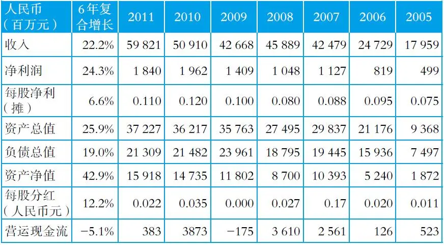

资料来源：国美电器年报。

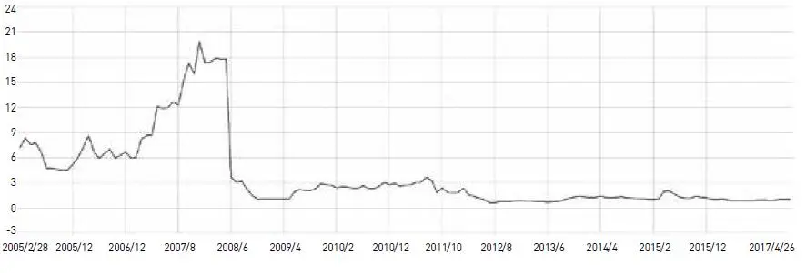

图3\-1 国美电器股价图（2005─2017年）

资料来源：新浪。

一家上市的百货公司在六七年前曾经风光，但这六年来要么亏损，要么微利。它的净资产远远大于股票市值：P/B=0\.2倍。董事长跟我说，他们的商场都是自有物业，值50亿元（银行和独立评级公司认定）。但是这种估值没有任何意义：没有人愿意花50亿元买它的商场，这种估值是安慰性的。而且，如果公司卖掉了商场它就必须租商场，那么它的百货业务就会大亏。所以它不能把物业估值与百货业务的估值加起来，说“我们公司太便宜了！”

__我的教训：__

1\.零售和餐饮行业没有护城河。它们只能在行业快速成长时看起来不错。客户叛逃的成本太低，没有黏性。

2\.国美电器所犯的错误和目前面临的困难在中国企业中很具有代表性。从避险的角度来看，股民在任何时候都应该多看“自由现金流”，而不光是营运现金流。国美每年不断赚钱，不断获得营运现金流，但是不断要投入更多的钱（资本支出很大）。公司越做越大，但是股民所获不多。

很多科技企业实际上是工业企业或者制造企业。它们最容易跌到这个陷阱里面。它们的资本支出和研发开支太大。今年赚10亿元，明年要投资15亿元。如此循环。但是，没有这些开支，它们很快就失去了生命，诺基亚和摩托罗拉都属此类。另外，其他行业的企业也容易掉到同样的陷阱。国美就是其中之一。

## 第三章 我从股票得到的深刻教训 - (02) 3.02 激励机制决胜

\(02\) 3\.02 激励机制决胜

2026年3月14日

9:55

3\.02 激励机制决胜

葡萄酒：张裕、长城和王朝

大约在2010─2013年，这3家公司本来差不多大小。王朝酒业（00828\.HK）在香港上市，后续融资管道畅通。烟台张裕（200869\.SZ）在B股市场上市，受到的限制更多。长城没有上市。10年前，中国人喝葡萄酒的习惯刚刚开始，葡萄酒还被认为是很贵的饮料。2003年，我写了一份洋洋洒洒的行业研究报告，大谈行业的美好前景。坦白地说，当时3家公司看着都不错。但是，张裕的股价太贵，王朝很便宜。半年后，张裕的股价大涨，王朝原地踏步。我隐隐约约知道我错了，但是，张裕已经变得更贵了，我无法修改自己的错误，无法转过来推荐张裕。面子攸关。

现在，事情当然非常清楚：张裕是过去20年整个中国股市的大牛股之一，虽然2012年以来它的股价跌了一半多，但20年来，它依然是一个成功的故事（见图3\-2）。而王朝呢？它的业绩（和股价）一直是前进两步，再后退两步（见图3\-3）。长城葡萄酒的业绩介于上述两家公司之间。为什么？制度使然。张裕的MBO（管理层收购）十分成功，管理层十分进取、卖力。就这么简单。我可以写一本厚厚的书，用事后诸葛亮的眼光解释这3家公司的历史。但是，简单的道理就是最好的道理。

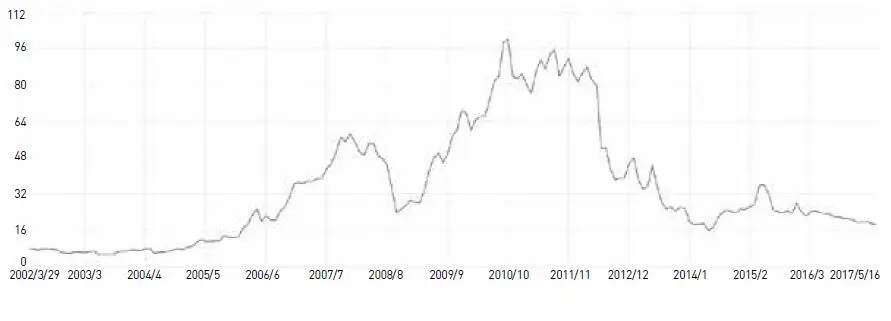

图3\-2 烟台张裕股价图（2002─2017年）

资料来源：新浪。

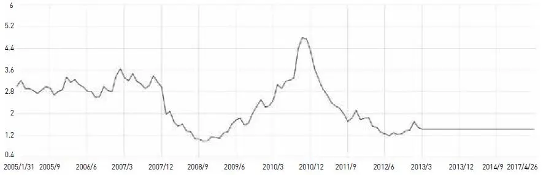

图3\-3 王朝酒业股价图（2005─2017年）

资料来源：新浪。

同样的道理，你看看联想的成功和方正电脑的失败。10年前，它们的差距不大，15年前，它们不相上下。今天呢？天壤之别。再看神州数码，这家公司在实行MBO之前一直不景气，但是最近5年来的成功让人羡慕。管理层的激励机制决定一切。在竞争性行业，国有企业或者激励机制不友好的公司基本上没戏，国有企业在资金等方面的优势也无法改变这个规律。

__我的教训：__

1\.其他条件不变，管理层的激励机制决定一切。

2\.不要看股票的估值。贵有贵的道理。投资的技巧就在于找到那些不够贵的好公司。

3\.茅台酒和青岛啤酒公司的激励机制也并没有很好地解决，但是，它们得益于它们的品牌。多数所谓的品牌其实不堪一击，但是这两个品牌还是有它的力量。当然青岛啤酒的品牌比茅台酒要差很多。

## 第三章 我从股票得到的深刻教训 - (03) 3.03 好行业也有坏公司

\(03\) 3\.03 好行业也有坏公司

2026年3月14日

9:55

3\.03 好行业也有坏公司

燃气公司：新奥能源、中油燃气和华润燃气

燃气公司的业务基本上可以分为两大块：一是建筑安装（即铺设和安装管道）；二是供气（居家、企业和汽车）。后面这项业务看起来不起眼。居家买的燃气量不大，价格还受到政府管制。但是，政府并不管制企业和汽车用气的价格，或者管制得不严格。这是细水长流的好生意，还不用竞争。

燃气公司的第一项业务本来是很差的业务，不过由于垄断性，它实在太诱人了。你想想，只有你能在这个城市铺设和安装管道，别人不可以。虽然在获取一个城市的特许经营权之前你需要参与竞争，但是一旦你获得这个权利，你就成了垄断者。想想这个生意！

中国的商界也许是世界上竞争最激烈的，但是，还是有些企业不需要竞争。这种避风港实在太难得了。

2001年，新奥能源（2688\.HK）到香港上市。一周以后，我到河北省廊坊市访问。我兴奋不已，本来是两个小时的访问，我跟管理层谈了三个小时，并多住了一个晚上。当时，我只是感到这个生意太好了！当时这家公司的业务还很小：它是香港的一个创业板公司，市值只有10亿港元左右，业务只有一个地级市（廊坊）和两个县级市（葫芦岛和密云）。而且当时的股价只有1\.2港元左右，10年后的今天，它的股价涨到了30多港元（见图3\-4）。由于当时它的生意还处于初创阶段，坦率地说，它的业务和治理还有很多不实在和浮夸的地方。我只是几年以后才感受到这一点。

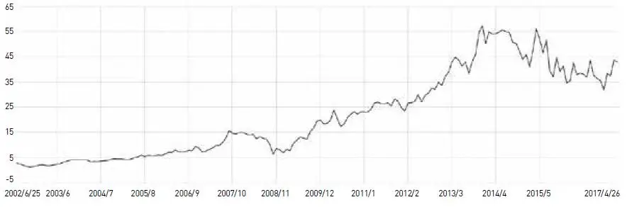

图3\-4 新奥能源股价图（2002─2017年）

资料来源：新浪。

回到香港，我发表了一份热情洋溢的报告，指出这家公司可以值13\.50港元，如果用香港中华煤气服务的人口为标准。顺便说一句，绝大多数股民（当然包括我）都太急躁，看不上中华煤气这种公司的股票。但是，年复一年，这家公司（以及这类公司）给投资者的回报率是最可靠和最高的之一。另外一个这类股票就是我经常提到的领汇房产基金（0823\.HK）。公司什么也不做，只是每年收商场的租金，对商场做些简单的维护和修整。它把90%以上的现金流分掉，它的股票表现（综合回报率）也是最好的之一。

这类成功的燃气公司也包括华润燃气（1193\.HK）和中油燃气（0603\.HK）。但是，我的热情也蒙蔽了我的眼睛。有两家燃气公司很失败。一是天津的华燊燃气（8035\.HK，已改名为滨海投资（2886\.HK））。这家公司被迫停牌5年之久。那些年，它的业务几乎停顿，现在依然没有回到2004年的繁荣。现在，它的规模不及新奥的10%。

第二个倒霉的燃气公司，洁美能源，发源于新疆和甘肃。我也曾经推介过这只股票。但是，不知何种原因（债务过大，还是账务问题？），两年后，这家公司人间蒸发了。我记得它的董事长和总裁曾经一天到晚在香港路演和推介。

还有那么五六家燃气公司虽然行业条件很好，也到海外上市融资了，但是业务发展很不顺意，股价长期疲软（见图3\-5）。

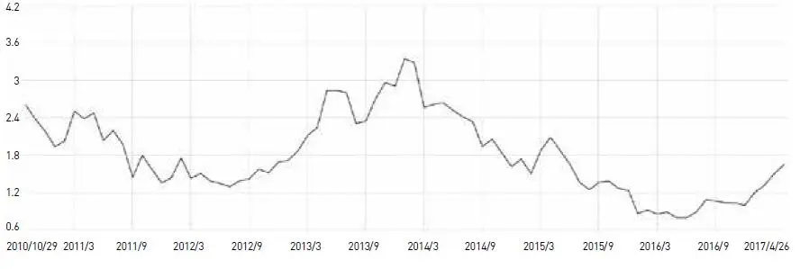

图3\-5 新天绿色能源股价图（2010─2017年）

资料来源：新浪。

__我的教训：__

1\.好的行业是成功的必要条件，但不是充分条件。

2\.好公司总是极少数。

燃气公司有前途吗？

我很看好这个行业，__主要是凭直觉，因为它们的竞争不激烈。__我讲讲早期的燃气分析师的困惑。

2001年，伦敦的一位基金经理对新奥做了10年的详细预测，结果发现即使10年以后，这个公司依然没有什么价值。原因是，接驳量和接驳费会大幅下降，燃气销售又基本上不挣钱。他来香港时，打开他的手提电脑，跟我讨论他的一行一行的预测，他问我，“我哪里错了？”当然，我找不出他的模型的错误。我狡辩，“可是我真的看好！”“为什么？”

为什么？这个问题困扰了我几年。当时，我在报告中这样写道，新奥未来的覆盖城市人口会数倍于香港，或者旧金山，或者伦敦，因此，它的经济价值（市值）也会大于这些城市的燃气公司。怀疑者反驳，“那些城市的燃气公司跟政府有固定回报协议。可是中国没有”。没错，但是，协议不协议，只是中短期的问题。长期来看，经济价值一定比协议更重要。但是，经济价值究竟怎样体现出来，我不知道。现在，过了15年，我大概知道了这个行业表现优秀的原因。

（1）15年前，谁也没有想到城市化和燃气的普及会这么快。所以，那位基金经理的预测和我等分析师对业务量的预测都太保守。我们一直预测接驳费会很快消失，但是，它没有。

（2）过去15年，接驳费的费率没有太大变化，还是2000元上下。可是中国的通胀有点高，这也就是说，接驳费一直在贬值（等于下调），这刺激了需求，改善了老百姓的支付能力。这跟电话的初装费（以及后来取消初装费）是一样的道理。

（3）现在中国的燃气价格还是太高，部分原因是中国签订的长协价格太高。但是，随着中国的收入增加和通胀的继续，燃气价格相对于咱们的收入，相对于城市的房产，也就算不了什么啦。这跟高速公路的收费一样。十几年前，高速公路的收费显得太贵，但是，随着中国的城里人陆陆续续住上几百万几千万的豪宅，支付一点高速公路费也就成了小菜一碟了。

（4）最重要的是我们忽略了工商业用户的增长。现在工商业用户的消费量是居民的四倍以上。

现在用煤的工厂，还将继续被天然气所替代。这是一个长长的过程。咱们要大胆预测。也许咱们目前的预测还不够大胆。现在的车船还将继续改装。汽油与天然气在价格和环保方面的优势和劣势也会发生变化。谁知道呢？天然气行业的增长还可能继续让咱们吃惊。城镇化还有很大空间，人们对环保的态度也会随着收入的增加而改变。

过去10年，内地的六个高速公路公司的股票在香港股市的表现大大好过恒生指数和H股指数。我认为这只有一个原因：__在竞争性行业，内地企业的能力很差，__而高速公路的竞争远不如其他行业那么激烈。燃气行业虽然有竞争（比如加气站，工业直供），但是，竞争并不太激烈。对于投资者来说，护城河是好事。另外，天然气的成本价格（和用户价格）虽然会调整，但是调整并不频繁。这种相对稳定对于企业的管理决策是好事。

这几年，美日欧国家的利率都在朝零靠近，这导致各种资产的估值大涨。中国房地产和A股价格的疯狂也预示着利率还要下跌很长时期。稳定性资产的贷款成本会下降，价格还会上升（特别是定息资产、高速公路、燃气公司、水务公司等）。

过去两年，燃气公司的表现不好。这说明这个行业也是周期性行业。但是，它的周期性远远弱于金属、矿业、石油、房地产、建筑、港口、运输，等等。而且，它的资本密集程度也相对较弱，低成本的银行贷款比较可靠。

最后，我总结一下：__燃气行业还是高增长行业，护城河还在，监管的稳定性意味着企业管理层犯大错误的可能性比较小，燃气价格和接驳费的不断下降（按照通胀率调整以后）会不断改善企业和家庭的支付能力，从而刺激需求。人们环保意识会不断提高，从而偏向燃气，离开煤炭。天然气真实价格的下降，天然气发电厂、天然气化工和LNG技术的进步，成本的下降，都会推动燃气行业成长。燃气行业远远好过上游开采企业，并购机会还是很多。__

用同样的眼光来看，深圳燃气也十分低估。究竟是什么因素阻止了其价值的实现？

## 第三章 我从股票得到的深刻教训 - (04) 3.04 周期性股票难以捕捉

\(04\) 3\.04 周期性股票难以捕捉

2026年3月14日

9:55

3\.04 周期性股票难以捕捉

钢铁公司：中国东方集团

我从来没有买过钢铁企业的股票，主要是不懂这个行业。2003─2004年，中国经济腾飞，这个板块大涨。当然，我完全没有预见到，所以错过了机会。7年后的2011年初，我参加一个投资者年会，听了中国东方集团（0581\.HK）的演讲。这家香港上市的钢铁企业地处河北省。几年前，它的单一大股东变成了印度的米塔尔。由于中国的政策不允许外国公司控股中国的钢厂，所以，米塔尔除了自己相对控股中国东方以外，还请德意志银行和荷兰银行代持了一部分股权。这些股份加起来，实际上米塔尔是绝对控股。（顺便插一句，我真不明白中国为什么要实行这种帮助外国人而伤害自己人的政策。名为防止外国人控制中国的经济命脉，实际上伤害中国的经济开放和繁荣。）

米塔尔跟那两家银行的协议是，不管市场股价如何变动，米塔尔都将在未来中国政府开恩，即允许它绝对控股的时候，从德意志银行和荷兰银行用每股5港元买下那些股份。研讨会的那天，听了中国东方集团的演讲，我简直不相信我的运气！中国东方的股价才3港元，大股东承诺随时用5港元增持20%的股份（从那两家银行买入）。这家公司又是响当当的跨国企业。当时，它的市盈率只有5倍！而且，它基本上没有银行负债，处于净现金状态！作为股民，你还想要什么？

在那个研讨会上，不仅仅是我热血沸腾，很多人热血沸腾！难怪股价那几天很强劲。我正准备打电话给我的香港经纪人下单买股票，可是……我突然想到，我还是回香港以后再读读公司的年报再说。回到香港，我就因为别的事忙起来了。后来，我想起来再看看中国东方的股价。你猜对了：它比我热血沸腾时又跌了1/3以上（见图3\-6）。

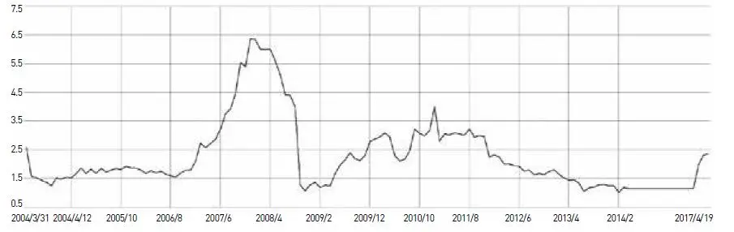

图3\-6 中国东方集团股价图（2004─2017年）

资料来源：新浪。

__我的教训：__

1\.研究周期性的公司，你必须先人一步，找到经济周期的上行拐点。如果你没有这个能力，那么你也就没有能力在经济下行之前撤退。

2\.这好像是老掉牙的套话：周期性的股票，怎样便宜都不过分。

周期性公司的高负债率

周期性强的公司特别是大宗商品类的公司往往在商品价格下跌时发现自己负债率太高，很多死于高负债率。2013—2016年，全球的中小矿业企业死亡了一大半，连嘉能可（Glencore）这种巨无霸也差点牺牲了。

其实，这种周期性的打击很频繁。2007—2008年大危机之后，遍地都是负债累累的半死不活的公司。举个我亲身经历的例子。

2008年9月雷曼兄弟刚倒台，我有幸再回到瑞士银行投行部工作。某日，一家日本大企业（周期性的制造业加矿业）的CFO来访。这个会议是东京办公室的同事安排的，所以，我不知道将谈什么。

客人坐定，稍事寒暄。“我们是一家综合性企业，EV企业价值约为160亿美元”。我一楞，这种介绍方法挺新鲜！企业价值=市值\+净负债。我从来没有听到有人这样介绍自己的公司。

我翻开客人递过来的PPT文档，才发现，确实如此：不到20亿美元市值，140多亿美元净负债！当然，市值刚刚跌了七成多！

这件事一直印在我脑子里。我后来发现了很多类似的例子：如果一家公司负债累累，它的股价和市值可以一跌再跌。即使跌到地板上，还有那么大一块负债是“刚性”的，它并不随着股价和市值的下跌而跌，相反，它往上窜，而且还是加速度的。为什么？股价大跌时，即使你的业务“正常”，债主们也开始找借口，要求你提前还款，或者提高利率，收紧条款。更何况，你的股价大跌也许正好说明你的业务出了问题，或者大环境出了问题。你受到两面夹击。在风平浪静的时候，年复一年的5%（或者7%）利息滚动，也是一个很可怕的东西。很多中国企业热衷于借债，被压得喘不过气来。

当股民的，有时候忍不住。一看某个名声还不错的公司股价大跌30%，便冲进去抄底，殊不知，这个下跌过程很残酷。最近，我看一家地产公司，市值真的低，市盈率也低，可是它的负债太大。这还不包括“名股实债”的那些东西。大众不明白这个道理可以理解，但是基金经理有时也受到这个迷惑：被市盈率所骗，被股价下跌了80%这件事所骗，忽略了EV企业价值。

也许，这家公司的股价为零，都高估了。为什么？它的净负债已经大于公司的实际价值。

那位日本企业的CFO可能觉得“区区20亿美元市值”不够面子，所以要援引EV企业价值。我们中国大量的负债累累的上市公司死要面子时喜欢引用总资产的概念。一回事。

## 第三章 我从股票得到的深刻教训 - (05) 3.05 赚钱是小概率事件

\(05\) 3\.05 赚钱是小概率事件

2026年3月14日

9:55

3\.05 赚钱是小概率事件

林业公司：三林环球

2007年，中国经济迅猛发展。马来西亚的林业公司三林环球（3938\.HK），乘势杀入香港股市。在三家外国大投资银行（汇丰、瑞信和嘉诚）的簇拥之下，隆重上市。那可是一个热闹非凡的IPO，万人争购。IPO价格最后定在每股价格2\.5港元。我因为在投资银行里有朋友，差点获得大量认购。但是，最后一刻，我那故意避开热闹的坏习惯起了点作用。我决定抽单。IPO之后，它的股价一路下滑。我躲过了一颗子弹。

可是，我一直怀有这样一个情结：中国人需要进口很多木材。三林环球除了在马来西亚有林场以外，还在新西兰和南美洲的圭亚那有林场。那美丽的森林给了我无穷的想象空间。虽然我没有去过南美洲，但是网站上的照片太美了！我必须投资这样的公司。等到股价跌了一半（即1\.25港元）的时候，我出手了。可是，股票继续下行到0\.8港元，甚至0\.5港元的时候，我不知道该怎么办了。既然我看好，我应该在股票更便宜时加仓啊！可是，我没有这个底气。我虽然见过公司的管理层，可是，我有信心吗？没有。

我一直焦急地等待。终于有一天（2011年6月），我在报纸上读到香港股民炒日本地震后重建家园的故事。重建家园需要进口大量木材。于是，某投资银行的分析师发表了一份热情洋溢的报告，三林环球的股价大涨。我痛苦了2年，终于得见天日。我毫不犹豫，斩仓大吉。一个星期以后，这朵昙花也死亡了。虽然2012年大股东把这家公司私有化了，但是，我已经完全不想再纠缠了。过去5年来股民除了辛酸的眼泪以外，什么也没有得到。当一个企业业绩长期不振，又不分红，只是每年都讲自己的资产如何优秀，对股民来讲有何意义呢？

最近几年，香港和内地有几十家（不，上百家）上市公司在世界各地收购矿山和冶炼企业。但是，最后转化成利润的成功者寥寥无几。失败者包括大公司、小公司，包括国有企业，也有民营企业。

在中国和印度对矿产需要如此巨大的情况下，为什么上百家企业（而且是受到股票交易所监管的上市公司）在这个大浪中失败呢？我想有如下原因：

__一是骗子。__买家和卖家中都有大量的骗子。2007年华北某铜矿被大股东用天价卖给了一家香港上市公司，但是，买家急于买，卖家吊起来卖。账目的夸张让人们事后惊诧不已。可惜买家只能打掉牙往肚里吞。为什么？难道把自己的愚蠢暴露在法庭上吗？况且在急匆匆的成交过程中，买方难免留下了几个把柄给卖方。

2007年，某中国公司收购了某印度尼西亚金矿。半年后，这个金矿神奇般地出现了“泥石流”，开采工作被延后了4年。中国公司的股东（大小股东）欲哭无泪。在有些矿业并购中，除了黑手党一类的活动以外，还出现过游击队的骚扰。有些游击队跟中国企业在国内外修路、开矿和建厂时遇到的土豪劣绅的袭击类似。有些时候甚至是地方政府的干预。这都是股民噩梦的起源。很多事情并没有通过上市公司在交易所披露，股民只是知道结果而已。那些惊险的细节大家只能在电影中看到。

二是经营矿业的难处。经营矿业跟经营任何生意一样困难，远不像人们想象的那样简单：挖泥巴。从探测，到技术论证，到各种各样的批文的获取，再到码头和公路的修建……任何一个环节出了错，都可能带来巨大损失，甚至让整个项目垮掉。所以，它们的成功是小概率事件，不成功是大概率事件。

__三是当大家一窝蜂收购矿产的时候，价格最可能太高。__这跟买股票一样。不管多么好的公司，如果你收购时付出的价格太高，你就等于支付了它未来40年，甚至50年或者60年的好处。那怎么赚钱呢？

__我的教训：__

1\.南美的渔业、非洲的矿山和南洋的渔业都不是我等散户的投资对象。留给别人吧，留给机构投资者吧。

2\.赚钱是小概率事件，亏钱是大概率事件。开矿如此，买股票可能也是如此。

## 第三章 我从股票得到的深刻教训 - (06) 3.06 餐饮业没有护城河

\(06\) 3\.06 餐饮业没有护城河

2026年3月14日

9:55

3\.06 餐饮业没有护城河

餐饮企业：味千（中国）、乡村基

2007年，味千（中国）（0538\.HK）到香港上市。大家都知道它的面条好吃，我本人也经常光顾它的店。当时亚洲股市达到了顶峰，在IPO的那个星期里，香港基金经理和散户对味千的热爱达到了如痴如醉的程度。有一位基金经理对我说：“化桥，这是一个买了，永远持有，给孙子交学费的股票。”但是，我还是不想凑热闹。不过，这位基金经理是一个高人，可见高人也会失去冷静，至少是偶然失去冷静。

我为什么不凑热闹呢？三个原因。第一，我知道我如果抽那么热捧的IPO，一定分不到几百股，没意思。第二，我想起了巴菲特的话，餐饮和商场没有护城河。从一家店走到另外一家店，太容易了。第三，我在香港中环上班18年，记得交易广场的餐馆每两年就换一次牌子。为什么？这个生意太难了。大家都说麦当劳的成功和肯德基的成功，但那是偶然，不是必然。凭什么我就有这么好的运气，碰到一个偶然呢？既然大家都如此喜欢，我还是避开为好。

后来的故事，大家都知道。潘董事长卖了她的很多股份，公司在汤料的宣传方面有些夸张和水分，等等。10年下来，这只股票走了过山车，股民除了焦虑之外，还亏了大钱（见图3\-7）。考虑到它所处的行业的艰难，它的股价的这个表现还算很不错的！

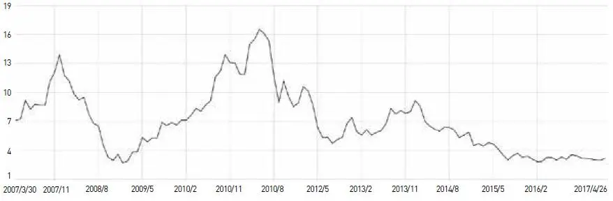

图3\-7 味千（中国）股价图（2007─2017年）

资料来源：新浪。

也是在2011年初，那个投资者研讨会，我听了潘董事长精彩的演讲后，很想买入这只股票。但是另外一个基金经理的热情让我望而却步。她说：“下个季度，下个中期的业绩公告一定好得不得了。我们调查了它很多店的经营状况。”

从那时候的高峰，到现在（2012年中），这只股票跌了80%以上。

重庆的乡村基（CCSC\.US）是另外一个成功的餐饮连锁店。2010年，它在众星捧月之下到美国上市。但是，不到两年时间，公司的股价跌去了73%！2016年该公司宣布退市（见图3\-8）。当然，你可以找这个原因，找那个原因，但真正的原因是巴菲特说的那句话：餐饮企业和商店没有护城河。就这么简单。

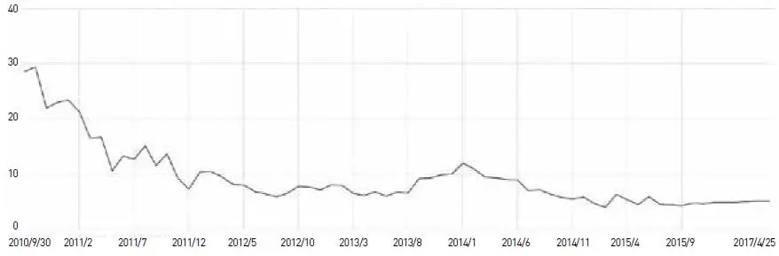

图3\-8 乡村基（CSCC\.US）股价图（2010─2017年）

资料来源：新浪。

有些人说，餐饮企业的收入里面有现金问题，成本也容易造假，等等。但是，在我看来，这都是不重要的事情。这个行业的公司要么是昙花一现，要么根本就没戏！当然，你永远可以说，瞧瞧麦当劳和肯德基！投资是关于概率，为什么要追逐小概率事件呢？

__我的教训：__

1\.不要凑热闹。特别是不能在IPO的时候凑热闹。

2\.饮食行业经常被授予一个好听的名字：消费类企业。其实，它们没有护城河。绝大多数企业至多只是昙花一现。

## 第三章 我从股票得到的深刻教训 - (07) 3.07 便宜货是“价值陷阱”

\(07\) 3\.07 便宜货是“价值陷阱”

2026年3月14日

9:55

3\.07 便宜货是“价值陷阱”

机械及汽车制造业：庆铃汽车

1997年以前，我们内地股票分析师的日子可真难过。特别是在香港的内地分析师更是如此。原因是，红筹股和H股的数量少，品质一个比一个差。1996─1998年，我在里昂证券工作。我记得有一个同事运气不好，被安排研究洛阳的第一拖拉机股份（0038\.HK）（见图3\-9）。在晨会上，他反复讲“中国政府扶持农业”“这家龙头企业”“净现金”。后来，股价反复下跌，公司炒掉他。我觉得他很冤枉：有些公司太烂，管理层根本不想把公司做好，我们分析师有什么办法呢？

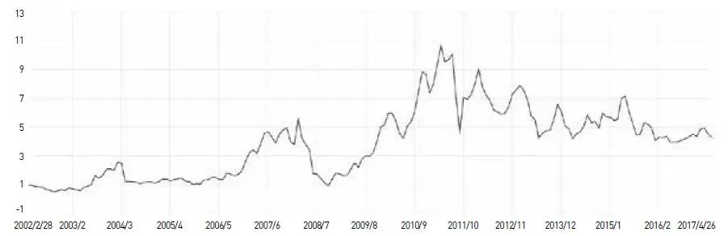

图3\-9 第一拖拉机股价图（2002─2017年）

资料来源：新浪。

几年后，我到了瑞士银行当中国研究部主管。我的一个同事在庆铃汽车（1122\.HK）上栽了同样的跟头（见图3\-10）。他的理论是：“庆铃有净现金，股票太便宜了。而且，中国人的内需正在升级。”他反复推介这只股票，可是不断出错，直到基金客户屡屡抱怨。我的上司几次要我炒掉这个分析师，我一直顶着不办。我出差的某天，我的上司终于让他走了。

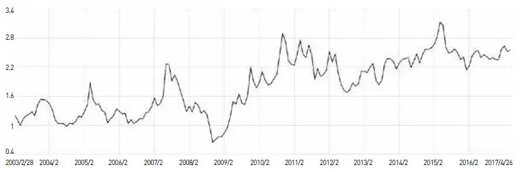

图3\-10 庆铃汽车股价图（2003─2017年）

资料来源：新浪。

__我的教训：__

1\.有些国有企业的高管并不希望把公司的生意做好。或者，他们不知道怎样做好。或者，他们的手脚被捆得太紧，能力施展不开。

2\.净现金不能说明任何问题。便宜货很可能是个价值陷阱。巴菲特说，公司里只要有现金，管理层一定会找到理由把它花掉。

## 第三章 我从股票得到的深刻教训 - (08) 3.08 小心竞争激烈的行业

\(08\) 3\.08 小心竞争激烈的行业

2026年3月14日

9:55

3\.08 小心竞争激烈的行业

食品加工企业：大成生化

2002年，我注意到红筹公司大成生化（00809\.HK）的股价很好。几个基金经理也开始问我如何看待这匹黑马。我坦白，我当时完全不懂这个行业以及它的国际性。但我们分析师岂能说不懂？我用最快的速度囫囵吞枣，了解了几个专业术语，比如高果糖浆、山梨醇、磷酸酯淀粉，等等。两周内，我的研究报告就出笼了，虽然关于国际市场和这个行业的运转规律我依然是“一问三不知”。“我们分析师把问题弄得太懂，也没有必要”，我经常自嘲地说。

我发现多数基金经理跟我一样，一知半解。所以，像我这样的南郭先生也可以蒙混过关，竟然还获奖无数。2003年，终于有一天，我在东京推介时，遇到了一个真专家。他对我的“忽悠”很不满意。他一直追问我复杂的问题，然后是简单的问题，直到我差点瘫痪。从他的办公室出来，我决定多做研究，少做推介。可是，我们分析师哪里有时间做分析？我们一天到晚在营销。至少我是这样。

图3\-11很清楚，大成生化的股价在过去10多年是个过山车。虽然公司越做越大，但那是以增发新股、股数增加来实现的。公司的负债率也不断提高。除了第一年（2001年），它的股价健康成长，以及2003年末和2004年初大涨以外，它基本上是一路下滑。现在的股价跟2002年相似。

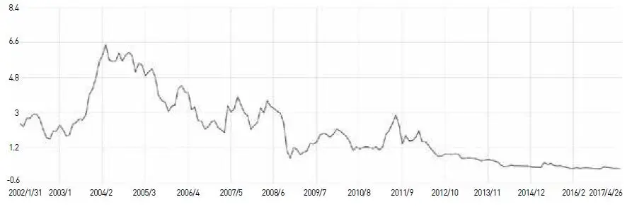

图3\-11 大成生化股价图（2002─2017年）

资料来源：新浪。

__我的教训：__

1\.消费类的公司千奇百怪。但是，很多公司实际上就是工业企业，简单的制造业，或者周期性的制造业。大成生化就是如此。这类企业的竞争力就是低成本。可是，永远要小心：更新的竞争者还可以加入。

2\.这类企业当然有科技的成分。但是，这类科技不构成太大的进入障碍。管理层要么不懂这一点，要么撒谎说：别人无法竞争。

3\.这不是一个好行业，因为没有护城河。我太笨：我几乎10年后才明白这一点。

## 第三章 我从股票得到的深刻教训 - (09) 3.09 中国房地产公司基本不行

\(09\) 3\.09 中国房地产公司基本不行

3\.09 中国房地产公司基本不行

表3\-2显示的是32家内房股自从IPO以来的回报率（以2012年6月11日为止），以及2012年到2017年的变化趋势。又一轮房地产大牛市之后，大多数上市公司依然低于上市发行价格。首先，有几点需要说明：

1\.我们只选择了过去十几年来到香港上市的一部分内地房地产公司。其他有些公司我没有选择，原因是，它们要么太小，要么它们是通过后门上市的（当然也就无所谓IPO价格），或者中途转型为地产公司的。但是，那些没有入选的公司在股价方面更加糟糕，原因是它们的规模一般都比较小。小有小的道理。生意上不够成功才小。比如，香港建设（HKC）（0190\.HK）曾经在2006─2008年数次发行股票融资50亿～60亿港元，但是现在它的全部市值还不到30亿港元。另外，中新（0563\.HK，已改名为“上实城开”）也在高峰时期融资50亿港元以上，但是五六年后的今天，它的市值大大小于那个数。

2\.从IPO以来的股票回报率包含了每年的现金分红。

表3\-2告诉我们什么呢？我觉得至少有如下结论：

表3\-2 内地房地产公司上市至今的股价升跌

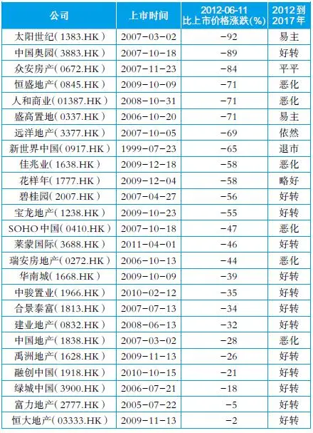

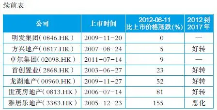

注：明发集团长期停牌。

卓尔发展的股价失真。

资料来源：谷歌。

1\.除了少数几个在2005─2006年上市的地产公司以外，也就是说，在公众还没有对房地产板块疯狂追捧之前上市的地产公司以外，其他几乎都是股民的噩梦。股民在这些高峰期上市和配股的公司里亏损了好几千亿港元。这个数字用任何标准来看都是惊人的！

2\.短期内，我们很难判断一个公司的成败。不过，如果我们用事后诸葛亮的眼光来看，我们可以发现，成功的地产公司基本上是资金周转比较快的公司。其他有些公司死守着几块土地和楼房，基本上不行。

3\.有些公司在高峰时期购买了太多土地，太多昂贵的土地，都是摧毁价值的。在地产市场兴旺时，大多数公司都在不同程度上犯过过于乐观的错误。这类公司包括绿城中国、远洋地产、盛高置地、合景泰富，等等。

4\.跟大家一样，在高峰时期，我对地产行业也曾经过度热情，失去了理智。现在用事后诸葛亮的态度来看，负债是一把双刃剑。在资产价格快速增长时，它带给企业成倍的好处。但是，在资产价格下降或者缓慢变动时，它可以毁灭一个负债率太高的企业。

现在，在香港上市的40多家内地地产公司的股票大都很便宜，但是不像有些人所说的那么便宜，而且也有一些股票是价值陷阱（即看起来便宜但可能变得更加便宜）。如果你能避开价值陷阱，分散持有多个地产股票长达4～5年，你的回报率会很不错的。

分析地产股的三种方法各有优缺点，投资者要多看几个指标，多用几种方法。另外，大家不要死板和固执。除了定量的指标之外，也要看定性的指标（比如管理层的激励机制，土地储备的位置和价格，以及项目品质的好坏）。

__1\.净资产值（net asset value，NAV）估算方法。__这种方法历史悠久，也最广为接受。把所有的专案按合理的销售价格、建造成本和税收做一个估算。然后把未来的现金收入用一个贴现率折回到今天，减掉净的债务，算出来一个总数。这个数就是公司的净资产值。这个方法在我看来是最被滥用的一个方法。我感到多数人算出来的净资产值都太高，不切实际，原因是多方面的。第一，他们假定的售价太高，或者成本太低（包括利息和营销）。当然，人们低估了监管部门折腾企业的能力和花招，以及企业公关费用的巨大。第二，人们一般高估企业管理层控制专案进度的能力。今年的1亿元销售收入与明年的1亿元含金量不同。这会直接影响净资产值。第三，有些地块在可预见的未来根本不能动工，因为没有需求。

__2\.市盈率（price earning ratio，P/E ratio）。__我以前一直很反对用这种方法，但近来我开始悟出了它的道理。如果一家公司的管理层是进取的，它就应该经常有利润和现金流，如果它老是告诉股民，他有5栋非常值钱的楼，10块待开发的土地，你想股东们会耐心地等它多久？资金周转慢是5种疾病的表现：要么管理层是懒汉，或者无能，或者没有动力，或者很优秀但是犯了一些决策错误，或者行业出了大问题。市盈率的方法就逼着管理层不断在高速公路上加油。

__3\.市净率（price/ book ratio）。__股票价格除以公司的每股账面价值。问题在于，有的公司的账面价值作了很大的调整（物业重估），而有些没有，或者重估的程度不一样。有些评估师十分慷慨，有些比较保守。有些地产公司有收租物业，评估得很频繁，有些公司反之。而土地和在建专案不能重估，这就影响了跨公司之间的比较。

市净率的最大缺陷是，它只能反映静态，不能反映动态。它只能反映地产公司今天的贵贱，但不能反映其未来的贵贱。如果这家公司未来5年一直坐在那几块地上晒太阳，那么5年以后它的股票会更加便宜。另外，我们不要假定土地价格永远往上涨，不要认为政府不会用税收和行政的办法改变游戏规则。如果一家公司长期无所作为，它的土地增值和物业增值跟小股东有何关系呢？相比较，净资产值和市盈率的方法就可以抓住动态。

我们还要考虑一个非常重要的事情。资金快速周转的公司永远处于战争状态，内部系统运转有序，员工勤奋且训练有素，大量土地和房屋常年处于正在出售和即将出售的状态，这样的公司在风险控制方面好过慢腾腾的公司。我们经常听到某地产公司的老板说，最近资金紧张，要借高利贷，或者要发盈利警告，或者要改变业务策略，或者要低价出售心爱的办公楼，原因是某个大专案本来准备5月份开盘销售的，结果形势突然变了（比如，银行加息了，政府政策变了，附近的楼盘打折，附近修高速公路，或者老天爷下连阴雨，等等），你就知道这不是一个好公司。它们今天有这个借口，明天还会有一个你完全想不到的另外的借口。我认为，最好的防御是进攻，最好的风险防范是高速的资金周转。

另外，我想谈谈两个有意思的观点：__一是投资物业在地产公司的估值里面要大打折扣；二是所有开发型的地产公司也都应该有很大的估值折扣。__

我们经常看到某些地产公司的市值严重低于它们所拥有的几幢办公楼或者购物中心的价值。除了在专案层面有负债以外，它们已经把很多营业面积用很低的租金长期租给了大客户（沃尔玛或者微软），所以未来的租金收益率成问题。有些物业虽然没有这样的暗伤，但是租金回报率也不高。在正常情况下，这些物业的账面价值（重估过的价值）只是自我安慰而已，别人不会用那个价格购买它的（当然，除了少数不理性的国有企业以外）。你也许会说，物业在未来可以升值啊！但是，它也可能贬值。而且很多物业实际上是不能出售的：首先是要交高昂的土地增值税，还有企业所得税。对于在香港上市的公司来说，分红的汇出还要再交5%的预提税。所以，这些物业看着好，闻着香，但是不好吃。当然，它们的净资产值要有折扣。

我们再看看开发型的地产公司吧，人们计算NAV时，一般假定所有的建筑面积都会出售，但是公用面积（会所、车库，等等）并非都可以出售，另外，如果有20%的房子卖不掉（包括楼层、朝向、设计或者品质有问题或者需求不足），而这家地产公司的净利润率也是20%（这个数字已经不低），那么这个公司的全部利润就是无人要的存货！也难怪它们总是缺钱。

说完了坏话，再说点好话。我认为，现在多数内地地产公司的股票很便宜，充分反映了我讲的几个风险。很多中型的地产公司的成长性也很不错。如果未来4～5年，股票市场对这个行业依然如此看淡，也就是说，估值的折扣依然如此大，而它们的利润（或者净资产值）可能翻一番以上，那么，这样的回报是相当不错的。当然，股市气氛的好转就是你的额外利润。如何选取投资对象？我建议大家特别关注资金周转快、销售额有成长的公司。窃以为几十个中型公司都符合这个标准。未来几年，这个板块很可能跑赢其他板块。

地产公司成为“价值陷阱”的故事

2001年，有一个化妆品公司在香港上市。当然，不论是IPO发行定价，还是后市的表现，都取决于公司的利润（和现金流），而与公司究竟有多少固定资产或者物业没有太大关系（当然，扣除那一点小小的租金收入）。但董事长不明白这个道理，为了让初次上市的资产价值大一些，好看一些，他就把价值10亿元的办公楼也放在上市公司里面。显然，他的投资银行没跟他讲清楚这个道理，或者他拒绝弄懂。

上市一年以后，当他明白了股市奥妙时，他问我他可不可以把那个办公楼拿出上市公司。我告诉他，当然可以，但是相当麻烦：这是一项关联交易，上市公司必须聘请独立的财务顾问做估值，报请小股东批准，而且他还要拿出真金白银从上市公司买回这项资产。所以，这个办公楼在上市公司里，其实几乎是沉淀的资产，在上市公司的整个估值中是零蛋，也就是免费的。有没有这项资产，几乎不影响股票的价格或估值。有些股民甚至基金经理会说，你看，这个股票好便宜，它的市值低于这栋楼的价值，而它的化妆品业务是免费的。他们正好搞颠倒了：资本市场给化妆品业务有正确的估值，但那栋楼是免费的。

还有一个故事。韩国有一个上市的百货公司有大量的超值物业（大多是30年前或者20年前用非常低的价钱购置的）。公司的股票的估值当然是有一个市盈率（大约13倍），或者企业价值除以现金流的一个倍数（enterprise value/EBITDA），大约7～9倍。虽然它的市净率很低，但大多数人不太重视这个指标，因为大家认为物业重估的水分太多，没有太多意义。另外，如果你长期持有这些物业，又不变卖，对于小股东来讲，它的实际意义就只是租金收入。自用物业就是租给自己，也可以算出回报率。如果回报率低，如果公司总的利润近些年没有明显增长，未来的前景一般，那就很可能出现一种情况，公司的估值很可能低于物业处置的净收入。或者它的物业价值被市场完全忘掉。这好像很不公平，但这样的例子比比皆是。

小股东很自然地问，你的物业即使很值钱，跟我有何相干？某基金经理谈起这家韩国公司时，抱怨股票分析师水平太差：“某某大银行负责研究这个股票的分析师甚至不知道这家百货公司拥有大片值钱的物业，包括那些百货商场和购物中心。”我安慰她：“你的牢骚有一点点道理，但是，这个分析师知道不知道这家百货公司的持有物业，对于他的分析和评估没有太多的影响。”这家公司用很低的租金把物业租给自己用，这已经转化成了他自己的商场的毛利，它的物业又不想变现和分红，反复强调公司和家族的“五代人的眼光”，股民为什么要陪你玩呢？在我的眼里，这家韩国公司是一个典型的“价值陷阱”。

在美国，这样的公司比较少，因为在那里，家族公司越来越少，而专业化管理（外人）、股权分散的公司一定会尽量把价值挖掘出来。如何挖？很简单：把物业快速变现，加大分红，借债来做生意以提高净资产回报率。这已经成了标准动作，所以一旦有公司的业务往西边走（夕阳，或者现金流强壮但增长有限），市场马上就明白管理层大概会如何做。

除了极少数情况，中国人几乎都不愿意把公司的物业卖掉，把现金分掉，把公司解散。这是中国企业文化的一个缺陷，也是上市太难的产物。这也是我等股民必须严防价值陷阱的最重要原因。

2026年3月14日

9:55

## 第三章 我从股票得到的深刻教训 - (10) 3.10 地产行业的陷阱

\(10\) 3\.10 地产行业的陷阱

2026年3月14日

9:55

3\.10 地产行业的陷阱

__作者：侯凌中__

__东方资产__

粗略统计，号称以内地房地产开发或者运营为主营业务的香港主板上市公司，已经超过110家，在港股已成为一个公司数量多、总市值规模大、融资活跃的重要板块。公司多了，自然是鱼龙混杂，除了与其他行业类似的通常陷阱之外，还多了一些颇具行业特色的独有陷阱。

__●土地储备：规模大/成本低。__尤其在城市间的房价差距还没有这么大的年代，这一卖点在资本市场很受欢迎。2007年碧桂园上市时，号称中国最大地主，市值曾远超中海、华润乃至A股的万科，成为当年香港股市的“股王”。以此为榜样，不少中小型地产商上市前，都会到城市远郊或者中小城市，一次性囤上几百万平方米、成本低廉的大幅土地。于是乎，显得个个手头土地储备过千万平方米，且平均楼面地价相对于历史售价都低得不值一提。好在随着这些年内房股板块的发展，有经验的投资者，越来越看重能实现的销售数据，而非土地储备所暗示的发展潜力。

__●跨区域发展/全国性布局。__恒大、龙湖等民企中的佼佼者，2005年、2006年之前都只在一个城市有业务，其后短短几年迅猛扩张到十几个乃至几十个城市，跻身全国性大开发商。有鉴于此，一些中小地产商纷纷效仿，在上市前后展开跑马圈地式的扩张。路演资料的地图上多插几个旗子，表明已进入十几个、几十个城市，再假设每个城市都能贡献上10亿、20亿销售额，未来销售规模几百亿的故事自然是水到渠成。这方面，不光是住宅地产商，一些商业地产商也讲全国性布局的故事。至于管理层能否驾驭全国性的开发团队，一般投资人哪里来得及分辨。尤其是职业经理人不受重视的家族化企业，这方面尤其值得警惕，常常会战线拉得越长、业绩搞得越差。

__●土地获取能力强。__佳兆业事件之后，已经没有地产商再把“政府关系好”当做卖点给投资人宣讲了。但之前，特别是一些区域性的民企和国企，常常会或明或暗地表示，有能力以低于市场的价格获得优质土地，值得投资者高看一眼。万达的商业模式打开了另外一种思路，部分有商业地产、产业地产概念的公司，会强调除了多年积累的政商关系外，自己独特的营运能力也对土地获取极有帮助，可谓是升级版的“拿地能力强”。随着地产行业竞争越来越激烈，土地市场日益公开透明，凡是商业模式中涉及大量政府地价优惠的公司，应该说，都值得警惕。

__●一二线城市，还是三四线城市。__2010年政府启动行业调控，特别是大城市，限购限贷政策不断，三四线城市业务在资本市场上一度受宠：没有限购限贷、地价低、需求旺，政府鼓励城镇化发展方向。在三四线城市的土地储备占比多（当然是按建筑面积口径算），曾成为一些内房股值得宣讲的亮点。在这种气氛下，连做高端产品的星河湾、绿城也跑到中小城市去开发豪宅。然而两三年后，三四线城市供应过剩就成为共识，管理层纷纷开始强调公司的一二线城市土地储备占比有多高（当然要按照土地价值口径算）。最近一两年，在京沪深等城市出现明显的“需求外溢”，带动周边小城市楼市升温，土地储备的演示口径也正随着这一热点风向进行调整。总结来说，如果一家公司没有深耕细作的区域，没有独特擅长的产品类型，而仅跟着资本市场的喜好去“变脸”，最好敬而远之。

__●旅游地产、养老地产。__还没有哪家内房股是专做此类产品的，但不断有公司宣称已涉足甚至拟重资投入到此等领域。虽然听起来很美，但就目前的行业状况来看，潜在供应量大、投资周期长、回报率低、资金成本居高不下，仍决定了中国的旅游地产、养老地产在相当长一段时间内，都很可能属于价值陷阱。迄今为止，地产商主导的所谓“旅游地产”“养老地产”成功案例，或位于京沪深等大城市周边地区，或来自海南这一特殊市场，本质上都仍是销售型的住宅开发项目。

## 第四章 十倍股，往何处寻？

第四章 十倍股，往何处寻？

__“如果你做足了功课，你坚信你选的都是十倍股，你的股票大跌的概率就很小，而且，即使跌了很多，你也知道怎么办。怎么办？加仓！”__

## 第四章 十倍股，往何处寻？ - (1) 4.01 如果利润不再增长……

\(1\) 4\.01 如果利润不再增长……

2026年3月14日

9:55

4\.01 如果利润不再增长……

当今世界绝大多数股票投资者都是同一个老师教出来的：股票投资的要诀之一是寻找企业的利润增长。第二次世界大战以来，欧美国家除了1968─1982年长达15年的熊市以外，基本上是一个经济高增长所推动的牛市。近10年，虽然全球股市基本上白干，但也是在一个高位横行，而且经济高增长依然是主题，依然是主流的期望。

中国人就更不要提了：我们投资股市的历史才20年，但是，过去30多年中国经济只有高增长和很高增长。

现在，越来越多的人开始明白了增长的极限。世界经济的增长在放缓，中国经济也一样。其实，即使在高增长的年代，任何国家都有大量不增长甚至长期走下坡路的行业和公司，只是大家没有注意而已。

我们应当如何适应一个新的环境？如果这个环境下大多数公司要么长期不增长，要么负增长，我们怎样对待股票估值？

你说：“不可能没有增长！”但是，你看看，2011年，很多公司的每股净利润甚至低于2005─2006年，每股的现金流就更差了。2012年如何？未来几年如何？如果你假定一家公司每年有10%的每股利润增长，这听起来好像很实在，但是，现在看起来，这还是太乐观。如果它的利润在过去5年内没有增长（只是上下波动而已），那么为了保证10年的复合增长率在10%左右，它在未来5年就必须有每年20%以上的复合增长率才行。这谈何容易！

如果一家公司的利润长期下滑或者横行，那么是否意味着股票市场的终结？也许是，也许不是。但是，已有的股票依然有它们的价值。我们如何给它们估值？我们如何选股？

有护城河的企业何必瞎忙

其实，一家企业如果有一个可持续的生意，这个生意有一点护城河（要么竞争不激烈，要么不需要竞争），那么，这家企业就很幸运，它什么都不用做。少做少错，多做多错。没增长没关系，它的长期回报率依然可以相当好！这种公司在西方国家很多，在香港也很多。其实，在中国内地也不少，只是我们不那样思考问题而已。

一个10年前购入的商铺，就是这个道理。你什么也不需要做，它有护城河，它的租金每年上涨一点（有时甚至狠狠地涨）。即使我们完全不谈商铺本身资本价值的上升，光是租金已经很好了。这个道理跟股票一样。

过去10年，中国经济腾飞，理论上讲，上市公司应该大赚其钱，但事实并非如此。太多的公司忙忙碌碌，确实利润总额增长很快，公司越做越大，但它们是摧毁价值的，原因是，它们的股票越发越多，摊薄原有股东利益。而且它们的负债越来越多，也分走了公司的利益。很多公司通过负债赚取的额外收益非常小，甚至为负数，白白给银行打工。

表4\-1是15家在香港上市的公司在过去10年的股票回报率（含现金分红）。我想说明的问题是，一家公司越是忙碌，它的股价表现越差。比如，粤海投资（0270\.HK）过去10年几乎什么也没有做，太懒。公司守着东江水，把水送往香港。这就是最好的生意。幸好管理层没有穷折腾。10年里，它的股票回报率最高。恒隆集团（0010\.HK）地产专案不多，靠收租，但也赚得很美满，股票回报率排在第二名。

领汇房地产基金（0823\.HK）2005年上市。这家公司是真正意义上的“无所作为”，只是维修现有的商铺，收租，然后把几乎所有的现金流都分掉。但是，这家公司的回报率远远高于绝大多数勤奋和增长的公司。你不禁会问，为什么要增长？

再往下面看就是几家高速公路公司和北京首都国际机场。有趣的是，越是不勤快的高速公路公司，它的股票回报率越高：多年来，深圳高速（0548\.HK）大兴土木，收购兼并，它的股票回报率在高速公路公司里面最差。

路劲基建（1098\.HK）本来在全国经营18条高速公路，日子美满幸福。但是，它在2005─2006年忍不住诱惑，进入了地产行业，导致公司的总体回报率下降。2006─2008年，我曾经代表我的雇主（深圳控股）在路劲基建公司兼职，我可以证明，它的管理层非常敬业，但越是辛苦，回报率越差。

表4\-115家上市公司过去10年的股票回报率\*（含现金分红）

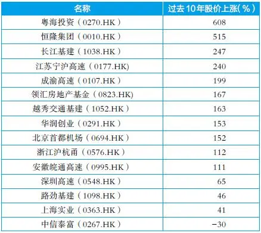

\*2002年6月22日至2012年6月22日（领汇房产基金：2005年上市日至2012年6月22日）。

资料来源：谷歌。

华润创业（0291\.HK）的两个主要业务（啤酒和零售）并非很有吸引力，竞争相当激烈。但是，除了在2001─2003年，这家公司做过一些大型并购以外，迄今为止没有大的举措，这是福气！做少错少。另外，它还有一些收租业务帮了大忙。10年里，它的股东们赚了153%的股票回报率。这听起来不刺激，每年只有9\.72%的复合回报率，但是已经非常不容易了。

上海实业（0363\.HK）靠着它的老业务（收费公路、南阳烟草、光明乳业和上海家化等），本来可以给投资者很好的长期回报率，但是，它也忍不住在2008─2009年大举进入房地产业务，大伤元气。资金配置失当是最大的失误。

回报率最差的是中信泰富（0267\.HK）。这家公司在内地及香港地区长期拥有很多特权。它的业务也曾经有很好的护城河，比如，香港的海底隧道，世界上最优秀的航空公司（国泰航空）的股权，还有收租物业，等等。但是，它的不安分导致它十分频繁地买卖资产，后来进入澳大利亚矿业和湖北的大冶特种钢，以及大量的房地产业务。后来，它在澳元上的赌博差点把公司带向死亡。这家公司的股票即使有政府支持，今天依然大大低于15年前的水平。

究竟怎样才能找到长期的好公司？我的初步理解是：

__1\.企业最好有高增长，但是一定不要那种耗费太多资本的高增长。__如何找这样的公司？我想应该考虑两点：一是公司的股本收益率（Return on Equity，ROE）要高，公司扩大业务所需要的投资必须保证ROE不下降，或者不下降太多。二是最好不需要发行太多新的股票，或者不需要负债太多。这样的标准不容易掌握，但是，基本原则是少费钱，多办事。

__2\.降格求其次：如果公司的业务完全没有增长，或者增长很慢，也没有关系。这样的公司依然可以有很高的股票回报率。前提是ROE很高，现金分红率高。__

有赏必有罚

很多人就此话题写过很多本书，我不想参加辩论。我只想讲一件事：公司授予高管的认股权证没有用处！

除了在深圳控股当过两年半首席运营官，我还在6家上市公司担任过董事。我的观察是，企业高管的激励机制没用！不管你的设计如何美妙，认股权证只能让经理们有一个美好的愿望，但是不能调动任何人拼命工作。三个和尚没水喝，这是最大的问题。公司必须有惩罚的办法。必须有一套制度评判每个人的工作，可以开除那些不努力的经理。

## 第四章 十倍股，往何处寻？ - (2) 4.02 体育用品公司前途堪忧

\(2\) 4\.02 体育用品公司前途堪忧

2026年3月14日

9:55

4\.02 体育用品公司前途堪忧

在世界各地挂牌上市的中国体育用品公司和没有上市的竞争者很多。现在，这个行业出现了严重下滑。这是暂时的，还是永久性的？

如果是暂时的，那么，这些公司目前的痛苦挣扎就是值得的。如果这个行业的春天已经过去了，那么，这些公司的努力就是不明智的。

企业战略转型（继续辉煌）说起来容易，做起来难。对于大量已经发达了的企业家来说，如果他不再斗志昂扬，如果他不愿意交出管理权，如果他尚未找到新的增长点，最明智的选择是停止公司的业务发展，开始收割以往的劳动成果，加大分红，逐步结业。对于很多企业来讲，这就是最体面的“退休”，企业家本人也应该为此感到荣幸。

体面的退路

我知道一家体育用品公司，它曾经很风光。直到3年前，它的生意很好，股价也好，账面上留着50亿元现金，基本上没有银行负债。但是，那是顶峰。激烈的竞争很快把它的生意和股价打了下来。这家公司不断并购品牌，开设新的店面，大打广告。但是，这可能已经来不及了。它越战越勇，但是屡战屡败。50亿元的现金很快变成了30亿元，20亿元。我最近想劝董事长收手，但是无果。我担心它的净现金很快会变成净负债，然后，某一天壮烈献身。

除了战略转型，继续做伟大的公司以外，柯达和大量消亡了的好企业都曾经有一个体面的退路，那就是退休。为什么企业不可以像人一样退休呢？为什么一定要死在战场上呢？

美国的家电零售企业百思买现在还处在健康状态，还是大企业，利润也还不错，负债很轻，只是老态龙钟，斗不过电子商务。据我的观察，它很有可能明智而且体面地收拾行李，退休。最终的结果可能是一个大大瘦身以后的小企业。

体育用品公司实际上是制造业公司和零售企业。声称有多少的品牌价值，实际是夸大其辞。找几个名人和明星做代言人，难道就增加了多少品牌价值？普通消费者可以信，咱们股民千万不可轻信忽悠。

这个道理也适用于巨无霸比如耐克。耐克在前15年，都是一个随时可以死亡的企业。请看创业者的自传，我的书评：新浪博客文章“耐克公司的鞋痴和创业者”。

## 第四章 十倍股，往何处寻？ - (3) 4.03 别碰需要营销的公司

\(3\) 4\.03 别碰需要营销的公司

2026年3月14日

9:55

4\.03 别碰需要营销的公司

我经常到全国各地出差。每次上飞机前，我都要买几本财经方面的杂志。我最喜欢的杂志是《新营销》《商界》和《环球企业家》。其中我最喜欢的文章是关于营销的，特别是关于消费品营销或者电子商务的故事。

但是，在投资股票时，我尽量不碰那些需要营销的公司的股票。我喜欢基本上不需要营销就能卖产品的公司，比如港交所（0388\.HK）、燃气公司、领汇房地产基金（0823\.HK）、收费公路和中小银行（虽然它们需要竞争，但是高成长性还是比较有把握的）。

投资银行抢生意很累，原因是每个投行在太多方面都一样。发新股做IPO、并购咨询、发可转换债券等，每家银行都会做。这种同质的竞争就只有靠关系，靠运气，靠声嘶力竭的叫喊或者一些十分偶然的不重要的因素（比如某个投行的PPT做得比较好，某些投行的人来公司不太勤，或者说对了或说错了几句话，分析师可能在名气上稍微响一点，等等）。对于今天世界上的10大投行来讲，好在它们的家数只有10家（感谢几十年的整合），很难看到一个IPO有某家投行能做而另外的投行做不了，或做得比较差一些。甲投行的研究团队今年排得靠前明年则靠后；甲投行在可转换债券方面做得比较多，而IPO做得比较少。在配新股方面，乙投行在全球做得比较多，而在亚洲做得比较少，或者这两年倒霉，做了几单不太成功的生意。

每个投行在送给公司客户的宣传小册子或PPT上面，都有独立的权威机构所做的“本投行在某某方面的排名第几”。有不少公司的高管十分混淆。为什么10个投行都有如此互相抵触的声称？究竟谁第一、第二，谁第九、第十？事实上，每个投行讲的也许都是实话，但是“你讲的是最近两年第一，我讲的是过去五年我总分第一，你讲的是在美国IPO主承销总量第一，我讲的可能是在亚洲的股债发行量第一”。如此等等。

最高境界是避开竞争

在激烈的竞争中脱颖而出，当然很风光，但这不是最高境界。最高境界是尽量避开直接竞争。

从花旗银行、瑞银到美林和贝尔斯登，几乎都把银行的老本全部亏空了。为什么？我想主要是正面交锋和直接竞争的结果。问题的起源从发放按揭的商业银行开始，商业银行钱太多，无处可贷，所以连根本无力还款的人也获得了大量住房贷款，而且投行还把这种垃圾贷款几千亿美元、几万亿美元买过来，打造成一个组合，再以此为抵押，发行多种花里胡哨的债券，还煞有其事地分级、评级、做保险。想想看，这些是不是激烈竞争的结果？

这跟买股票有什么两样？因为别人都看好这个项目，所以你也就看好；因为别人都追捧某只股票，所以你也就高看一眼。

在生意场上，你可以因为赢得一个项目而全军覆没，也可以因为输掉一个项目而躲过一颗子弹。所以，还是避开竞争最好。

美国人喜欢竞争，所以他们常说的一句话就是要改变游戏规则。我觉得最高境界是改变游戏。

## 第四章 十倍股，往何处寻？ - (4) 4.04 港人爱股大势已去？

\(4\) 4\.04 港人爱股大势已去？

2026年3月14日

9:55

4\.04 港人爱股大势已去？

过去几十年，汇丰控股（0005\.HK）和思捷环球（0330\.HK）都是香港股民的爱股，确实为很多人赚了很多钱（股价上升和分红）。它们足够大，足够可靠，一直到它们突然变得不可靠。

长期以来，投资界有这样一个辩论：长期持有（buy and hold）好公司的策略还行不行？我是个实用主义者，不想卷入理论探讨。不过买了股票以后何时卖，跟何时买和买什么同等重要。但是，全球股民最大的问题从来就不是“何时卖”，而是大家持有时间太短，太短。

既然如此，我们还是把“何时卖”的问题转化成如下问题：现在该不该投资汇丰银行和思捷环球？当一颗巨星陨落时，我们应该怎么办？应该留念，还是寻找下一个巨星？显然，这个问题不能一概而论。不过，我们常人没有能力在巨星陨落之前有先见之明。但是，当巨星陨落之后，我们应该认真检讨。我的看法是，在多数情况下，我们是不应该留念的。

先谈汇丰控股。也许它的新管理层可以恢复这家银行的某些光辉，但是论投资，行业永远比公司重要。我们要问自己一个问题，在全球，银行业还是一个高成长的行业吗？汇丰有什么特别之处吗？它的估值特别有吸引力吗？回答都是未必。也就是说，对于个人投资者来说，现在的汇丰只是一个马马虎虎的投资机会，它并没有留下特别多的空间给我们。

再谈思捷环球。直到6～8年前，这是一个高品质、高品位的消费品公司，主要服务年轻和中年女性，有欧洲气质和精细化的管理。但是，三个因素共同发挥作用，消灭了思捷环球：__（1）随着内地消费者购买力的增加，本土品牌有了实力展开竞争；（2）欧美市场增长放慢，迫使欧美的高档品牌加大在中国市场的投入；（3）思捷环球的管理层开始感到很疲倦和失去斗志。__赚了那么多钱，谁还有斗志和意愿像饥渴的创业者那样拼搏？公司主席邢李原不断卖股票，就是明证。当然，公司可以依靠新的团队，使公司更上一层楼，但是，成功的团队是偶然，多数团队是注定要失败的。这是全世界的规律。今天的微软，今天的苹果，今天的长江都面临同样的挑战。从概率上讲，新的团队失败的可能性大于成功的可能性。

我的上述看法并不是说这两家公司不能给投资者赚很多钱。也许它们会，也许不会。分析师可以花很多时间研究这些行业和企业，基金经理可以花更多时间挣扎，但是这种公司的空间没有大到足够个人投资者应该投资的程度。它们成功的概率对投资者是不利的。

我们常人没有能力在一个行业或者商业模式走下坡路之前得出正确的判断。但是，在下坡路已经很明显时，我们有能力判断“大势已去”（the game is over）。不留恋过去的明星，可以避免很多错误。

## 第四章 十倍股，往何处寻？ - (5) 4.05 中国地产股成了二手汽车

\(5\) 4\.05 中国地产股成了二手汽车

4\.05 中国地产股成了二手汽车

崭新的汽车，只要开出了车行，立刻大幅贬值。全世界如此。二手汽车为什么很便宜？因为买者随时可以买到新车。更重要的是信息不对称：谁知道上一手的车主在什么地方撞过车，甚至偷换过什么零部件？

股票市场也一样。让虚假的利润预测飞吧！让坑蒙拐骗的管理层偷笑吧！他们的公信力会集体下降，估值水平也会集体下降。反复受伤的股民首先会把上市公司当成骗子，除非你证明你不是。以前的状况是，股民先假定你是诚实的，直到他们发现你不是的。

花样百出 股民厌倦了

过去5年，大约30家中国地产公司在海外成功发行股票，加上该行业原来的老上市公司（和改头换面的地产公司）大约有20家。此外，大约有40家地产公司尝试过或者正在尝试海外的IPO。每次有公司上市、发债或者做私募融资，故事都很动听，直到近一年，投资者完全不想听为止。在已经上市的40多家地产公司中，只有大约40%让股民赚了钱。但如果你考虑到通货膨胀因素，以及港币对人民币的贬值，这个比例还会更低。

5年前，股民们说，中国地产公司的估值不应该低于“重估的净资产”，甚至应该有溢价。很快，中国公司把“重估的净资产”越估越高。于是，股民们开始要求有20%，甚至30%的折扣。道高一尺，魔高一丈！上市公司把重估的净资产进一步提高，股民要求的折扣也更高。地产公司认为，别的公司都玩花样，我如果不玩，不就吃亏了吗？帽子三尺高，任你砍一刀。现在，这种估值折扣听说已经达到了60%甚至70%！谁知道以后会不会涨到90%？

劣币可以驱逐良币，至少在某些阶段可以。现在，市场环境被搞坏了，很多好好的地产公司也开始遇到上市和融资的困难。这太可惜了。

这个故事其实也像污染的防治：别人都往空中排污，为什么我要控制？别人都浪费水，为什么我要节水？但是，大家最后都没有水了。

2026年3月14日

9:55

## 第四章 十倍股，往何处寻？ - (6) 4.06 寻找十倍大牛股

\(6\) 4\.06 寻找十倍大牛股

2026年3月14日

9:55

4\.06 寻找十倍大牛股

希腊有句古训：“能者干，不能者教，傻瓜评。”由于我傻，所以我想评论2012年《理财周刊》登出的30个大牛股。前10大牛股在过去10年涨了10倍以上，后面20个亚军也涨了6倍以上。

过去10年，A股市场的10个大牛股分别是茅台（600519\.SS）、张裕（200869\.SZ）、泸州（000568\.SZ）、中联重科（000157\.SZ）、双汇（000895\.SZ）、格力（000651\.SZ）、包钢稀土（600111\.SS）、恒瑞医药（600276\.SS）、云南白药（000538\.SZ）、山西汾酒（600809\.SS）。另外20个亚军基本上是品牌很强的食品和医药类股票和矿业类。比如西山煤电（000983\.SZ）、宇通（600066\.SS）、东阿（000423\.SZ）、古井（000596\.SZ）、盐湖（000792\.SZ）、五粮液（000858\.SZ）、兰花科创（600123\.SS）。

在中短期内，不理性的股票市场可能扭曲股价，但是从长期来看，任何不理性的市场行为都会让位于基本面。好公司的股票就是好股票，坏公司的股票就是坏股票。但是，这种结论太空泛。后来我有点新思考。

四大类大牛股

这30个大牛股基本上可以归纳为四大类。

__第一类是重组类：比如海通证券（600837\.SS）。__这是可遇不可求的东西，所以不须讨论。

__第二类属于制造业中的特殊情况，比如格力和中联重科。__这个行业只能在非常时期（即它们的产品需求正旺，并且撞上了杰出的管理者）才能胜出。在香港上市的联想电脑在某个阶段也给了投资者非凡的回报。但那是历史。

__第三类是医药和保健品。__虽然这些产品遇到进口商品的竞争，但是毕竟中国的医药产品和服务还是有文化特征的。这就是竞争中的障碍，相当于巴菲特所说的“护城河”。

__最后一类是好几个白酒公司。__很多人的评论是：“中国人太爱喝酒，所以把白酒公司变成了大牛股。”可我觉得这也许没有说到问题的根子上。我们中国人在白酒上花的钱比在房子、衣服、教育、交通、通信、食品和蔬菜上花的钱少多了，为什么偏偏白酒公司在股票市场胜出呢？另外，全国的白酒销售额比推土机、卡车、发电厂、石油、家电、化工、钢铁、造船和建材方面的销售额相比简直太小了！为什么在另外的众多行业基本上没有产生10年大牛股呢？

我有几个假说。首先，白酒是一个本国文化影响很重的行业，不存在外国竞争。而这正是护城河的概念。当然，在这个行业内有上千家公司（多数还没有上市），为什么有些胜出，有些原地踏步呢？那就跟管理层、当地政府、股东结构和其他偶然因素有关系。但是，在所有行业中，白酒是护城河最宽最深的行业。白酒行业是一个古老的行业，管理相对简单。而诸多其他的行业对中国人来讲还太新，我们还没有达到熟练的程度。

投资要诀是以小博大

有人稍加夸张地说，如果你发现了一个企业或者行业，它不需要营销，那一定是个美妙的投资物件。电信行业、银行业、高速公路、机场、港口和发电厂好像都是。但是，它们为什么没有产生10年大牛股呢？我觉得有这么几个可能性。

__1\.国有企业的性质决定了它们有多少收入，就会有多少支出。__不管多么困难，大家一定会想出办法把多出来的钱用掉。结果是股东回报率永远高不起来。

__2\.这些行业的资本支出太大。__相比较而言，虽然白酒企业也基本上都是国有企业，但是，它们不需要太多的资本支出，至少不需要持续的巨额资本支出。这让我们回想到麦肯锡的一个观点：亚洲的公司虽然增长很快，但是它们的股票估值基本上被它们的资本支出给摧毁了。这也是全球的工业企业和科技企业的通病。1996年，巴菲特在写给投资者的信中曾经这样说，科技是社会进步的基石，但也可以是出资人的噩梦。他还说：“月球之旅虽然让人兴奋，但是我更愿意把兴奋让给别人。”我把他的话翻译如下：“投资的要诀是用小钱赚大钱，而不是用大钱赚大钱。”

我曾经很怀疑白酒企业的投资价值。现在，我还在琢磨。

__3\.中国的银行业在过去10年的经营环境很好，不论增长率还是利差，都好到了难以持续。__但是，它们的股票表现受到它们不断增资扩股的压力，这跟电信企业和机场的无穷无尽的资本支出是一回事。另外，绝大多数银行上市的历史还不足10年。现在，银行股正处在一个估值特别低迷的阶段。毕竟10年还是一个比较短的时间，还不足以说明问题。

__4\.矿业类企业一般也不需要持续的巨额资本支出。__

## 第五章 提防官商同诈，重建股市文化

第五章 提防官商同诈，重建股市文化

__“股票市场有高有低，完全要任之，不要干扰它。自私自利的股民会自己相互搞定。政府既然不懂，也就不要干预。”__

2026年3月14日

9:55

## 第五章 提防官商同诈，重建股市文化 - (1) 5.01 政府欺诈毒害股市

\(1\) 5\.01 政府欺诈毒害股市

2026年3月14日

9:55

5\.01 政府欺诈毒害股市

政府的欺诈有多种形式，对社会道德和股市文化产生了致命的打击，比企业家的欺诈具有更大的杀伤力。如果我们想重建中国的商业道德和股市文化，必须从政府开刀。我举四个例子。

__1\.某地政府为了扶持几个本地的公司到证券交易所上市，不惜在税收、环保、资金和土地等方面给这些公司开小灶。__它们甚至帮企业设计如何做假账，比如伪造前几年的销售额、利润和实际缴税额。这种做法有很多恶果：破坏公平竞争、浪费纳税人的钱财、鼓励官商勾结、欺骗股民、毒害股市。

政府的扶持当然不能让一个阿斗公司强壮起来。可是，股民买的是公司未来很多年的利润。这也就是20倍或者35倍市盈率的含义。政府扶持不能持续35年，更不能持续增长35年。从长远来看，这种公司的股价必然会跌，股民必然受害。

__2\.当一家公司变成了ST（按规定，连续亏损3年的公司，中国的交易所会在该公司名字前加上ST字样，提示股民小心）或者将变成ST时，政府部门通过人为地输血使上市公司苟延残喘。__但阿斗毕竟是阿斗，不可能因为一两次输血而强壮起来。当然，股民不懂（或者不愿意懂）。他们长期追捧这些僵尸。虽然有人说他们亏钱是活该，但我不这样认为。我的看法是，他们毕竟是弱势群体，多数人不明真相。中国证监会应该在教育他们的同时，严厉打击繁殖僵尸的各级政府，帮助弱势群体戒毒。

__3\.把企业或者企业集团的一部分业务（比较好的业务）包装上市，而把比较差的业务留在上市公司的外面，这也许有欺诈嫌疑。__为什么？因为在过去、现在和未来，比较好的业务与比较差的业务并不是真正的独立。它们至少在员工待遇、采购、销售和设施共用方面还保持着千丝万缕的联系。有些公司的欺诈更加过分：它们在上市之前，由比较差的业务补贴比较好的业务，上市融资之后，再反向操作。这样的欺诈行为在国企和民企中都有。

__4\.政府或者政府部门给它们所控制的上市公司注资。__有些注资的价格完全是国有资产流失。我们老百姓啊：几乎没有人代表我们的利益！官员们为了从他们的认股权证中赚钱，不惜用超低的价格把纯国有资产卖给上市公司。我在投资银行工作时，经常见到上市公司高管吹嘘他们用多么低的价格从政府“拿到”优秀资产。作为一个中国人，我就是笑不起来。偷了我的东西，还到我的面前炫耀！等到某项业务搞砸了以后（或者变得不时髦之后），他们再用高价把它卖回给政府。这叫“剥离”。

有些官员和国企高管说，他们低价注资和高价剥离是为了“保护小股民”。非也！他们保护的是他们的面子和认股权证。为什么我这样说？因为他们并没有花力气改善企业的能力和治理，所以即使好资产装进上市公司以后，也会慢慢变坏，两三年后又需要“剥离”。这种循环会给小股民创造一个个诱惑和一个个陷阱。10年之后，小股民一无所得。

给企业估值 别忘剔除补贴

在民营企业中，我们看到另外两种现象。但是，杀伤力不如政府的作为。

1\.王老板慷慨地（公开地或者偷偷地）补贴他控制的一家上市企业。让这家公司显示出漂亮的历史曲线（销售额、利润、现金流、用户数的增长，等等），然后择机卖股票，赚很多倍的钱（注意：市盈率往往是几十倍）。

2\.刘老板把他的企业卖给一家上市公司。价格呢？价格只是今年的预测利润的15倍。多便宜啊！而且，刘老板爽快地担保，如果今年的实际利润最终低于某一个水平，他会掏腰包补足差额，甚至补贴更多。但是，你有没有发觉问题所在？刘老板补贴了一点点钱，却用15倍的高售价把企业卖掉了。他的企业的盈利能力并没有他说的那么强。

另外，我们还见过很多更离谱的情况：到明年3月公布今年的业绩之后，刘老板拒绝兑现诺言。为什么？今年下半年的天气比预想的差很多，或者，新的管理层没有尽职，或者出现了另外的“黑天鹅”事件。有时他还直接耍赖。

上当的企业有的是运气不好，有的是交易结构设计不好，有的是买家过于热情，还有的是……国企。

在企业估值时，我们要剔除税收补贴和其他非持续性的收入（比如资产处置收入）。这是常识。但是，大家经常忘记。

## 第五章 提防官商同诈，重建股市文化 - (2) 5.02 上市公司的庞式骗局

\(2\) 5\.02 上市公司的庞式骗局

2026年3月14日

9:55

5\.02 上市公司的庞式骗局

国内经常出现的非法集资案和“庞式骗局”有什么共同点？我觉得它们有两个共同点：__（1）它们都许诺高回报率，并且在一段时间内做到；（2）它们都是用张三的钱去付给李四。__

一个庞式骗局可以持续很多很多年。当然，并非所有的庞式骗局最后都曝光。美国前纳斯达克（NASDAQ）证交所主席麦道夫（Bernard Madoff）骗了30多年之后，终于因为2007年和2008年全球金融危机导致股市下跌才曝光（水落石出）。日本的大公司奥林巴斯（Olympus）的骗局也持续了20年。

你再想想，如果一个上市公司想玩这种庞式骗局，不是很容易吗？其实，很多上市公司玩的就是这个游戏。只是很少有人知道而已。骗的程度越浅，持续性越有保障。

上市公司大股东或者管理层花一点钱，就骗到了大量股东。其实，上市公司想骗人太容易了：它并不需要所有的人都相信，只要有足够多的人受骗就可以了。在中国，不相信的人要做空也没有可能。即使在美国，要想做空一只股票也不容易。原因是做空者需要在一定的时间内把股票买回来，还给原主。如果在这段时间里（比如3个月），股票不跌反升，做空者会亏很多钱。

回购与增持的陷阱

另外，即使上市公司完全没有假账，公司回购和大股东增持也不是小股民跟风的理由。为什么？大股东看自己的公司越看越爱。这种自爱有心理学的基础：这家公司是他们一手做起来的，有过酸甜苦辣，而且给他们很大的满足和控制。这种心理可能蒙蔽他们的眼睛，妨碍他们冷静和客观地看待自己的公司。

美国学者所做的大量研究表明，大股东增持和公司回购股票往往发生在股价的顶峰。上市公司回购股票和大股东增持股票不能说明什么问题。这是雕虫小技。上市公司首先通过做假账从股民手上圈20亿元。如果股票下跌10%，那么拿出1亿元来回购股票。于是，我等股民就感动了。如果股票再跌10%，大股东或者高管就爽快地拿出20万元增持。我等股民又感动了。如果股票再跌30%，公司就不回购了，大股东和高管们也不增持了。这部“电影”在全世界不断重放。

## 第五章 提防官商同诈，重建股市文化 - (3) 5.03 企业假账多如地沟油

\(3\) 5\.03 企业假账多如地沟油

2026年3月14日

9:55

5\.03 企业假账多如地沟油

10多年前，我在瑞士银行当中国研究部主管。格林柯尔和它的董事长顾雏军正在香港高等法院起诉我和瑞士银行，理由是我诽谤他和他的公司。另外一个中国的红筹公司，欧亚农业（在沈阳市荷兰村种植兰花的骗子公司）的董事长杨斌也在对记者喊话，要告我。我有过很多不眠之夜，全靠家人和雇主支持。香港的媒体非常好，它们公正的报道给了我鼓舞。香港的企业界领袖蔡东豪还在《信报》撰文“我挺张化桥”。瑞士银行高层对我的大力支持也让我终生难忘。奇怪的是，当时内地的数家大媒体反而骂我“黑嘴”“别有用心”。

某日，我跟一位医生朋友吃午饭。谈及香港电讯时，他竟然失禁而泣。原来，他刚刚妻离子散，主要是因为全部家当都亏在这档股票上。2000年，香港电讯被互联网空壳公司盈科数码动力收购。很快，泡沫破灭，这只股票大跌90%以上，毁掉了无数的香港家庭。汇丰银行和香港电讯曾经是香港几十年来最大和最可靠的上市公司。

又有一次，我在北京碰到30多年前的同学。他的弟弟曾经是一位中学校长。校长说，他读过我的书，一定要跟我聊聊。校长的遭遇跟那位香港医生类似。不同的是，残害校长的不是互联网泡沫，而是中国土制的地雷：企业假账。

政府应打击股市通胀

校长问我，我国企业的假账究竟有多么严重？我回答：中国的假酒和地沟油有多少，企业的假账就有多严重，因为它们都是同一个文化下的产物。作为股民，作为分析师，我也多次受骗。

投资股票的终极目的是为了分享企业的业务增长。如果某家上市公司的市盈率是30倍，而实际利润又被财务技巧夸大了1倍，那么，股民买的就是未来60年的业绩。虽然企业未来利润会有增长，但是大家很容易忘掉经济周期和利润也有下降的年份。如果大米的价格涨到每斤50元，政府绝对不允许。如果上市公司的市盈率涨到60倍（当然表面上可能是20倍），政府是否应该检讨呢？一个只值5元的东西卖到20元，难道不是敲诈投资者吗？

我申明，我反对政府干预股市的价格。但是，当我们看到假账横行，股票货不对板，或者股票价格离谱时，政府应该看看货币政策和股票发行制度是否合理，以及企业账目是否基本真实。中国证监会在打击欺诈和检讨新股发行方面的新政给了我很大的信心，而太多的股民执迷不悟，助长了欺诈。

我敦促企业的高管和大股东（和中介机构的帮凶们）在欺诈成功、弹冠相庆之余，也请为无数的受害者们默哀一分钟。

## 第五章 提防官商同诈，重建股市文化 - (4) 5.04 中国式畸形股权文化

\(4\) 5\.04 中国式畸形股权文化

2026年3月14日

9:55

5\.04 中国式畸形股权文化

我们中国的股权文化非常畸形。这表现在几个方面。第一，我们的官员和大众把股票大涨当好事，把股价下降当坏事，把支撑股市当己任。这不是可笑吗？你想想，一个只值5元的东西卖到20元，难道不是敲诈和剥削那个投资者吗？他如果不能用20元以上的价格卖给下家，那不是让他做了冤大头吗？如果他能够用28元卖出，那不是让别人做冤大头了吗？击鼓传花，总有停下来的时候。一只股票有人买，必然有人卖；对卖主好，必然对买主不好。从静态来看，这只是一个零和游戏；如果考虑到税收和交易成本，它是个负和游戏。

我们全国人民都只喜欢听唱多的故事（自我陶醉），不愿意听唱空的理由（外国间谍，别有用心）。17年来，本人很少到股票投资研讨会做演讲。2010年11月，某券商花钱请我做主题发言，听众都是基金客户。我去的时候，券商们很高兴。董事长请我吃早饭。可是，我讲完后，老兄们可能有点失望，都不想送我出门。你可能猜到原因了，我的演讲题目是“未来几年全球大牛市，中国除外”。英文有句话：“不要朝信使开枪！”股市不可能因为几个人唱空就跌，也不会因为几个人唱多就涨。

政府硬撑股市 老百姓买烂货

在股市，永远是看多者众，看空者寡，中国尤甚。同时，政府部门常常做一些蠢事，硬撑股市，美其名曰“保护小投资者”。难道诱使老百姓花大钱、买贵货和买烂货不是错误吗？你可能会说，“股市大跌容易引发社会动荡和金融危机”，那么，股票大涨会不会引发更危险的泡沫呢？你诡辩说，那么股市总要有一个合理的估值水平啊！可是，什么叫合理的水平？你知道吗？难道你指望专家或者我们的政府知道吗？大家不要忘记，有人编制国民经济计划和搞物价管制的那几十年，他们差点把中国带到了深渊！

股票市场有高有低，完全要任之。不要干扰它。自私自利的股民会自己相互搞定。政府既然不懂，也就不要干预。对于股民来说，股票便宜一点难道不是好事吗？你可以不断地用越来越便宜的价格买同样的货。股票可跟化妆品不同，并不是越贵越好。你准备买某只股票，你是希望它贵还是便宜？当然是便宜的好！

分析，但不要预测

我们腐朽的股权文化的第二个表现是，短期行为太多：炒来炒去的散户还是太多，比例太高；机构也太短线。每个人都认为自己的智商和心理素质高于大多数人。这在数学上是不成立的。过去10年，香港这个弹丸之地竟然是世界上最大的股票涡轮市场（也就是认股和认沽的权证市场）。权证的期限一般是几个月甚至几个星期，过期作废。买这种产品就是短炒和做短期预测（敝人很后悔，也干过那蠢事）。当然，还有更极端的短炒。比如，美国20世纪90年代出现过一个庞大的“当日炒”（day\-trading）队伍。随着互联网泡沫的破灭，他们都死光了。

经过很多这样的事情以及本次全球经济危机，我开始相信某智者曾经给我的劝导：“分析，但不要预测。”我把它翻译为，丢掉你的预测吧！如果你一定要预测，那就只做长期的、模糊的和方向性的预测。而且不要太肯定、太武断。

在国内，我们有一个庞大的打新股的队伍。他们同样危险和可笑。2010年我在北京演讲时，大家取笑我：“我的钱都是打新股赚来的！”我不明白，像打新股这样一个明显而且很容易复制的商业模式竟然持续了那么多年。水位为什么没有被推平呢？也许人们天生就爱凑热闹？作为曾经的投行人士，我也许不应该讲下面这句话：一个IPO就是一场热闹。经过一班投行人士数个月的辛勤劳动，挖掘投资亮点，大力推销，众星捧月，还剩下多少可以被王大妈和刘二叔来发现的呢？肯定有，但不会比比皆是。每个IPO都有个截止日期，好像逼着你做出决定。过了这个村，就没有这个店。大量的股票上市后就被人冷落，好像不再新鲜的瓜果一样。

美国有学者对过去15年来几千家IPO公司做过实证研究，发现绝大多数在上市之后的前两年严重跑输了大市。我不觉得奇怪。

官商勾结 股民受伤

我们股权文化的第三个问题是大量的欺诈。公司的高管们串通一气，没有多少人会主持正义。还有，审计师、估值师、分析师、券商们乃至地方政府同流合污。惊人！谁是受害者？除了股民外，还有他们自己。本书第四章4\.05“中国地产股成了二手汽车”，讲的就是这个道理。大家都往市场上丢垃圾，最后的结果是估值水平越来越低。最近，中国在美国上市的公司遭到怀疑和调查，大家不要责怪对冲基金，睁开眼睛看看我们的很多公司是些什么货色！对冲基金没有什么阴谋，只有赚钱的阳谋。当然，它们也不是什么“反华势力”。

10年前，当我作为股票分析师跟做假账的上市公司在法庭内外交锋的时候，我基本上没有得到外部支援，除了家人和我亲爱的投行雇主。大量浅薄而自私的媒体和股民骂我从他们投资的股票里面挑毛病，“黑嘴”。难怪大家看见流氓欺负无辜百姓的时候都装作没有看见。

中国股市几年内难有作为

讲完了难听的话，下面请允许我讲一点更难听的：我们的股市在近几年很可能没戏。这跟大家的愿望可能不一致。我看我们眼下的熊市可能持续好几年，会考验投资者的耐心。唯一可能出现的短期兴奋是，如果政府顶不住大众和企业的压力，突然开闸放水，推翻过去一年来的宏观调控。可能吗？当然可能，但是可能性不大。而且时间难以把握。等待这种短暂的爆发不是投资，是投机。我讲个故事。6年前，我发掘了一个很便宜的股票，我认定了董事长会把它私有化。我买了很多，耐心等待。2010年，我终于如愿以偿。董事长给了50%的溢价收回所有股票。但对我来说，这是好事吗？当然不是。我4年内在账面上先亏了70%，然后才等到了“解放军”。算下来，我等了4年，还净亏55%。

现在大家在股市里苦苦煎熬，我认为违背了一个最起码的投资原则，叫“留足余地”或“安全边际”。这样的高通胀、高利率，股市能有什么作为？而且，大家好像混淆了两个东西：预测和希望。预测是冷静的判断，而希望是另一个东西。

日本大地震后，东京股市大跌。不少人惊呼，“投资的机会来了”。这是一种短炒的思维。地震之前，如果东京市场不吸引人，那它并不会因为下跌了10%或者20%而变为有吸引力。反过来说，好的公司的股票不会因为它已经涨了30%或50%而变成坏股票。

我近几年的醒悟之一就是，股票的估值是选股的最后一步，一个不太重要的步骤，一个可以将就的步骤，而选择优秀的、可持续成长的、不骗人的公司是关键。广州有一家好公司2010年底在香港上市。它很贵（大约40倍市盈率）。我花了些时间研究它，2011年初买入，想长期持有，半年后竟然涨了40%。你看长线，结果短期就有好的回报。反过来，一条船下沉了50%与下沉了80%，其实没什么区别。你把注意力太密切地投在估值水平上，就会忽略更重要的事情：公司的商业模式、前途和诚信。我跟大家一样，曾经长期在烟屁股中寻求“价值洼地”，很压抑，很亏钱。更重要的是，我们错过了“沉舟侧畔千帆过，病树前头万木春”！

一只股票一年如果涨30%，那就算很不错了。可是你如果把这30%分解为每天的复合增长，那是多少？千分之一？我没有算过，反正它小到可以忽略不计。所以，我们做投资的人不要每天都把眼睛盯在电脑上。

我到宁波出差时，某君问我：“我的高利贷生意不错，年回报率在25%左右。但我听说A股市场很便宜。我应该转一部分钱投资股市吗？”我笑答：“如果你能比较稳定地赚25%的年息，巴菲特都应该把钱分给你管。那25%的回报不光是可以，是超级可以。你换个角度想想：如果你能取得那样的回报，说明全国资金很紧，那么，资产的价格（包括股价）一定会向下走。你为什么要飞蛾扑火呢？”

打击通胀是首要任务

宏观经济资料很多，极少数有用，大多数没用。数位的采集不准确，处理不恰当，发布时再加酱油，消费时再误读。这是全球性的问题。本人花了很多年的时间专门研究宏观资料，但是我最终觉得它们与投资的关系不密切、不稳定、不中用。如果你是长期投资者，你只需要瞇着眼睛，从遥远的地方看看宏观大趋势即可，万万不可钻进去，万万不可追求准确，不可研读过分。如果你是短炒的人士，这些资料更没用：它们相互矛盾，作用互相抵消，与股市的关系不密切。应付这些资料，我曾经疲于奔命（说得好听一点，叫努力工作）。现在，我主张大家少看互联网，少看报纸，少看研究报告。

今天，我们的通货膨胀很严重，失业也很严重。政府的宏观经济政策会不断在打击通胀和治理失业之间摇摆。我的判断是，未来几年的重中之重是打击通胀，因为民怨太甚。美国1968─1982年的14年间，道琼斯指数跌了一半，如果考虑到通胀因素，股民亏了80%以上。1977年的美国通胀跟今天中国的通胀在根源上有相似之处：经济高增长所带来的成本推动。巴菲特说，通胀就是一种额外的税收，股市怎么好得起来呢？

今天，很多人看好中国通胀下的股市，因为有些公司的利润可能会因此不错。但是，他们完全忽略了另外两个因素：一是成本的上升（领导们喝红酒、游欧美，以及资金成本的大涨）；二是市盈率是可以变化的。60倍的市盈率我们大家见过，而6倍也没什么了不起。可这是多么大的一个区间啊！说到底，市盈率大概就是市场利率的倒数。当然，如何定义市场利率是一个技巧性的问题。

利率环境影响A股市场

这一年来，中国人民银行一直避免大幅度加息，而一直在用存款准备金率的调整和信贷额度的控制来给经济降温。原因无非是害怕利率上升而吸引海外的热钱流入，加剧人民币升值。可是我们未免太天真了！货币政策的各种手段在效果上是完全相通的。虽然官方的基准利率没有调整，但是市场利率早就调整了！不仅千千万万的典当行、租赁公司、担保公司、小贷公司和民间贷款机构立竿见影，就连国有银行也去掉了利率优惠，抬高了利息上浮，添加了“贷款咨询费”，而且信贷员的寻租行为也已经有所抬头。对企业来讲，实际贷款的成本增加了很多。在这种情况下，你叫股市如何有作为呢？

大家想知道资金有多么紧缺，不妨看看上海银行间同业拆借利率（SHIBOR）在各个时段的变化，这是很准确的温度计。当然，你也可以问问几千家典当行、小贷公司、租赁公司和担保公司中的任何一家的利率情况。这还不包括那活跃的民间借贷。

在通胀时期，即使人民银行不紧缩信贷，资金也会很缺的，主要是因为完成同样规模的经济活动需要更多的资金（做润滑剂）。工厂和商店以及家庭都需要更多的铺底资金和周转资金，钱显得很不够，利率上升，资产价格下降。

第二次世界大战以来，全球经济经历了60多年的高速增长，尽管中途遇到过数次衰退和萧条。主要的原因可以归纳为三点：人口增长、工业进步（电脑、互联网和矿产开采技术）和世界和平所带来的风险折扣的降低（从而利率的降低）。

但是现在，这三大因素似乎都被用尽了，或者开始成为负面影响。比如，人口增长已经把大自然和环境压得喘不过气来。工业进步意味着几乎每个行业的产能过剩。利率降到不能再降了，也许会慢慢上升。革命性的技术进步好像也没有了。

如果我要对目前和未来几年的世界经济做一个总结，那就是“不死不活”。发达国家有三个共同特点：通货膨胀基本上很温和，失业问题很严重，加上财政赤字巨大。也就是说，它们的利率还会持续走低。即使加息，空间也很有限，而且，即使利率翻番，绝对水平也不高。同时，低利率也反映出市场对投资回报率的要求很低。你想想这是什么意思？这就是说，市盈率会很高。

在这样的背景下，发达国家的大多数企业都在朝“现金牛”的方向转化：资本支出缩小，分红派息上升，利润增长平平，但是企业利润率很可观，现金流很不错。如果利率继续走低，这些公司的估值可以大涨，至少具备大涨的前提条件。

我的结论是：A股这几年可能没戏。如果政府屈于压力而放松信贷，那也只能给股市带来短期的抗旱之水，不能解决根本问题。香港股市（和国际股市）未来几年看起来很不错，利率环境与内地不同使然。我1994年来香港做股票分析师时，内地股票的市盈率大都在10倍以下，而A股都在40～50倍，这17年来的大趋势大家是知道的：A股的倍数一直在跌，香港的倍数一直在涨。今天，大量的A\+H股票是倒挂的：A股更便宜。问问为什么！A股市场大多数烂股票贵过好公司的股票，再问问为什么！

在内地，最好的投资行业可能在股市之外，特别是金融业（比如，大量的非银行金融机构）、矿产、食品和地产。其他行业好像意思不大。最近我研究了私募股权的市场，发现机会很多，比我以前想象的好多了。特别是在那长期饱受歧视的中小企业群，投资机会很多。如果你不介意它们还没有上市，而且很久甚至可能永远无法上市，你的选择空间就更大。

为什么一定要买股票？

以前，每遇到A股股市下跌，必有官员和媒体的社论给股民打气和壮胆，害了一批又一批股民。现在，这种现象少了，因为大家终于发现那是多么可笑。这是进步。

请允许我讲讲怎样的估值才可以让人接受。股票估值不是科学。它靠常识，经验判断，再加运气。我认为，市盈率基本上应该是社会利率水平的倒数。虽然对个股我们不能用这个尺子来衡量，但是，对于一个股票市场，这是一个正确的尺子。那么，未来3～5年，中国的平均利率水平会是多少？虽然利率千万种，但是我觉得，一个安全的办法是用普通中型企业从自由市场获取贷款的利率。现在，这个利率可能是10%～13%，它反映了资金的松紧。在这种情况下，我认为，股票市场的市盈率应该在7～10倍之间。当然，个股情况有别。但是，当我们一脚就可以踢到好多个市盈率高达20倍甚至40倍，而且品质马马虎虎的公司时，我们应该知道，这个市场的水位还太高，温度还太高。我们应该静等。10年并不太久。很多股市跌了10年甚至20年，才找到自己正确的位置，我们为什么要鲁莽而入？20倍和40倍的市盈率意味着20年或者40年后，股民可以收回成本。但是，那些公司能存活那么久吗？

换一个角度：理财产品的收益率是6%～7%，你额外加上1/3的安全边际，大约9%～10%。所以，股票市场的合理的市盈率应该在10～11倍。

投资者不能满足于投资一个“公平的”股票，而必须留足安全边际。即使这个股票真的值5元，我为什么要买一个“合理估值”的东西呢？我们必须占便宜。这是硬道理。那么，我们需要多大的安全边际？我看起码30%～40%的安全边际。如果你认为某个股票值4～5元，那你只能在2～3元时才下手。

我们股市中人都有一个大毛病：我们首先就决定了要买股票。我们的苦恼只是买哪些股票和买多少。我们根本不愿意花时间研究一个更基本的问题：该不该买股票和为什么一定要买股票。

其次，我们要明白，一个公司对于不同的人有不同的估值。这话听起来可笑，但是千真万确。比如，公司的大股东觉得公司的股票价格值5元，但是，这家公司对于散户来讲，可能只值3元或者更少。公司的管理层吃香的、喝辣的，所有的开支都在公司里报销，所以，这家公司对他们的意义更大、更值钱。但是，普通股民既没有发言权和知情权，也没有分红，当然不能用同样的标准看待这家公司。在地产公司里有太多价值陷阱：这栋楼值5亿元，那块地又值8亿元。算下来，每股的净资产8元，但是股票只有3元。那8元也许可以叫“清盘价格”，但是，这家公司何时会清盘呢？它们永不清盘，它们的大股东永远有一个玩物。而我等股民呢？

用上述标准来看A股市场，我觉得基本上没有多少长期价值。也谈不上安全边际。而且，各个行业和板块都是相互关联的。大市下跌的时候，大家都不能幸免。不要做过于精准的分析。

你可能会反驳我：“用你的标准，你一个股票也不能买！”我的回答是，那有什么了不起！你为什么一定要买股票呢？基金经理由于工作的原因没办法不买股票，但是其他人完全不要勉强自己，不要说服自己买股票。当然，如果你买股票的目的只是乐趣（而不为赚钱），那就另当别论。

提高利润率与现金流

跟股市密切相关的两个问题是：（1）未来5～10年的中国经济增长是加速还是减速？（2）我们的企业在利润率，特别是现金流方面会不会有改进？

过去10年，中国的经济高速增长与两样东西有关：政府消费（或者叫政府投资），以及出口高增长。现在，这两个因素都在发生变化。政府消费是以高税收和高信贷为前提的。高税收加剧了国进民退，窒息了民营经济，牺牲了效率和公平。高信贷呢？加剧了通胀。这种状况已经无法再持续了。我们政府的财政扩张和信贷扩张也快走到尽头了。至于出口的增长，咱们就不讲了。大家有共识。

所以，我们大概可以同意这个观点：未来几年的经济活动会比过去10年慢一些。这就要考验企业营商的水平了。显然，粗放式赚钱的难度加大了。这对很多行业都有影响：船运、建筑、建材、矿产和相关的服务。其实，整个经济都是密切相关的。

瑞信的陈昌华是业内高人。他写过一篇文章，题为《没有现金的增长》，他讲过去多年来中国公司的利润虽然有不错的增长，但是现金流很差。他说，2011年上半年，中国非金融类的A股上市公司（共2132家）的总体销售收入和利润同比分别上升了26%和20%。可喜。但同是这批企业，它们在营运中产生的现金流则比同期下降6%。这个问题在过去几年有恶化的迹象。

它跟我们的经济发展阶段有关，也跟我们的管理能力有关。未来10年，如果经济增长放慢，我们的企业会被迫学习一样新技术：降低成本，提高利润率，提高现金流。也就是学习多“榨汁”。

我想起麦肯锡的三位研究员的《价值：企业财务的四根支柱》。这本书讲到一个道理：利润率（或者资本回报率）比利润增长率对于股票估值来说更重要。这个道理在中国还比较新鲜。他们说，亚洲公司为什么不如美国公司的估值高？大家一般认为，这是美国资本市场的偏见。不对！根本原因是亚洲公司回报率（利润率）太低。利润增长快，但是它们消耗太多的资本（股和债）。他们说，高负债率不仅不能增加股东的回报率，反而降低他们的回报率，经常导致财务危机和抗风险能力的下降。

我认为，宏观指标与股票市场的关系不稳定、不可靠、不单一。不过，股民应该看看银行承兑汇票市场。这个市场很大，很活跃，它的利率完全由供求关系决定。在正常情况下，这个利率一般略低于银行基准利率，但是几个月前这个利率涨到了11%～12%，虽然基准利率还是维持在7%以下。在这种情况下，如果你指望股市有什么作为，实在是一相情愿。

最近，这个利率降到了10%以下，所以股市有点回暖。不过，我个人认为，最近的资金市场松动属于抗旱救灾性质，不属于基本面的改善。那些中短期炒作股票的人除了密切关注银行同业拆借利率之外，应该多看看银行承兑汇票的利率变化。当然，我建议大家完全忽略中短期，从遥远的地方瞇着眼睛看看宏观指标就可以了。

现在，我想回答朋友们很关心的一个问题：银行的存款额最近为什么下降？很多人说，因为钱都跑去放高利贷了，或者买银行和信公司的理财产品去了，或者买股票和房子去了。这全是没有常识的话。你从银行取款买东西（任何东西），虽然你的存款下降了，但是别人的销售收入，从而存款相应地增加了。所以，买卖行为根本不影响全银行系统的存款余额。那么，如何解释我们存款的下降呢？答案很简单：人民银行多次提高存款准备金率，还用贷款额度来限制信用扩张，贷款和存款当然都会同时下降。存款到哪里去了？烟消云散了。

另外一种情况，如果经济前景黯淡，商界不愿意贷款，纷纷降低负债率，那么即使货币政策宽松，也可能出现贷款和存款同时下降的情况。现在欧美和日本遇到的就是这种情况。

## 第五章 提防官商同诈，重建股市文化 - (5) 5.05 分红无限好，只是别强迫

\(5\) 5\.05 分红无限好，只是别强迫

5\.05 分红无限好，只是别强迫

强制上市公司分红非常危险

最近，听说有人建议中国证监会强迫上市公司的现金分红要达到某个水平。我觉得这个主意千万使不得，当中有五个原因。

1\.每个公司处于不同的发展阶段，是否分红和分红多少的条件各有不同，政府很难制定统一的政策来约束它们。分红未必就好，不分红未必就坏。

2\.现金究竟在上市公司里面还是在股东手上，本质上应该是一样的。中国的公司有这样那样的恶行，并不能通过强制分派现金来解决。

庞式骗局可以从股民手上骗来10亿元，分红6亿元，内部人落得4亿元。股民在那里傻乐，但终于有一天骗局爆煲。其实，股民如果真的要分红，还不如卖掉一些股票更简单。如果你怀疑某公司其实是个庞式骗局，你应该远离。

3\.是否分红和分红多少是企业的权力，不是政府的权力。我们不能乱来。

企业分红当然好。我做股民也喜欢分红，赞成分红。但是这跟政府无关，不能强迫。中国政企不分问题已经很严重了。

4\.现在的A股估值还是太贵。1元的现金支撑着好几元的股票市值。也就是说，它们的“市净率”在3～4倍。如果强制分红，我估计很多股票的价格会因为失去现金支撑而倒塌。分掉1元现金，市值便要缩水3～4元。

失去现金支持，股价会大跌的。特别是大量中小型的股票会很悲惨。股民必须理解这一点。英文里有一句话，用在这里很恰当，Be careful what you wish for。意思是，你究竟想要什么，你可想清楚\!你如果真的得到了你所要的东西，你可别哭鼻子！

5\.现金分掉以后，很多公司就留下来一堆没人要的存货、应收款、生锈的设备和漏雨的厂房。它们的财务费用就会上升（如果还有人愿意借钱给它们的话）。

A股市场的泡沫是多年形成的，不可能短期解决。

2026年3月14日

9:55

## 第五章 提防官商同诈，重建股市文化 - (6) 5.06 分红派息的欺骗性

\(6\) 5\.06 分红派息的欺骗性

2026年3月14日

9:55

5\.06 分红派息的欺骗性

某公司在香港上市不久。董事长问我关于派息政策。

__我（张化桥）__：如果你现金流强，公司未来几年不需要太多资金，当然应该多派息。

__他__：不过，我们很快就需要增发新股，拓展业务。

__我__：那为何要派息？

__他__：大家都说要派三分之一。

__我__：一边派息，一边增发新股，有点耍流氓的味道。而且还有很多费用。

在场一位基金经理王先生：香港上市公司做假账的太多。派息相当于宣告，它账上的现金是真的。

__我__：这个目标真的可怜，真的很低。不过，即使你派很多股息，并不证明你的账目真实。

__他__：派大额股息，也可以是一种耍流氓的行为。

__我__：A股公司那么贵，比如50倍市盈率，即使公司把利润分光，那么息率也才2%。况且，能否持续这样派息才是关键。偶尔派高息，确有操纵的嫌疑。政府规定，分红是增发的前提条件，逻辑上有问题。

下面是我三年多前写的有关文章。

企业分红的坏处

最近，我看了巴菲特2012年给股东的信。我最感兴趣的一段，是他谈论分红的坏处。

他举了一个例子：一家公司，净值200万元，你我各占一半。该企业的股本回报率ROE每年12%，留存利润也一样获得12%的年回报率。外人不断想以净值的25%溢价入股。

你想每年分红率为1/3，另外2/3留存。第一年末，你我各分得红利4万元。于是，每年的派息额和“股票”价值均增长8%（亦即，12%减去4%）。

十年弹指一挥间。咱俩的公司的净值达到了4317850元（亦即200万元每年复合增长8%）。你我的各半股份当然有个市价：2698656元（注意：25%的净值溢价）。咱俩都发达了。

但是，如果咱哥俩10年不分红，咱们就可以更加发达！当然，大家都要养家糊口，需要现金。OK。咱俩每年出售3\.2%的股份。第一年，咱俩各拿回4万元。但是这个数额每年增长（增长率为12%）。

10年后，咱俩的股份价值会高达6211696元（亦即，200万元，每年复合增长12%）。咱俩的股份分别跌到了36\.12%。但是，它们的价值为2804425元。比第一种方案多4%。

这还不算。你每年买股票所获现金也比1/3的分红多4%。咱们两头受益！你看，还是不分红为妙！

分红这件事和分红率的确定必须对每个股东一视同仁。所以，有强加于人的问题：有的股东想不分红，有的想多分或者少分，众口难调。但是，如果不分红，那就可以满足每个股东的要求。为什么？你可以选择多出售股份，或者少出售股份。

虽然股东分红以后也可以选择去公开市场增持股份，但是，别忘了他这样做就会吃亏：股价含有25%的净值溢价。

此外，分红就得缴税，还有交易费用，等等。注意：在美国，虽然股票增值也要缴税，但是只是对增值的部分缴税。但是红利税可是要对分红全额征收的。（在中国香港，股票投资的增值不交税。）

很多公司一边分红，一边增发新股。也不知道他们想蒙谁。既然需要钱做生意，或者扩大生意，何必分红呢？你看看这样折腾的代价。H股分红到香港还有一道税。红筹公司派息出国，也要交税。

## 第五章 提防官商同诈，重建股市文化 - (7) 5.07 提防永不长大的上市公司

\(7\) 5\.07 提防永不长大的上市公司

5\.07 提防永不长大的上市公司

全世界有大量中小型上市公司。它们中间，有些已经上市多年，甚至几十年，但是业务不见起色，甚至江河日下。

投资者和分析师们（包括本人）经常问一个问题，这种公司既然永远做不大，好像也没有野心做大，为什么大股东不把公司卖掉，或者另请高明呢？

日复一日，年复一年，总有投资者觉得这种公司的估值便宜，认为可能业务会有转机，或者可能会“卖盘”（即转移控制权）。于是，我们投机去买这种股票，结果被越套越牢。2011年，我开始明白它们大多数是“价值陷阱”，但是并不知道为什么。

最近，有高人指点，我略有开窍。

上市公司主席花钱买享受

我和这位高人冯先生都是香港深湾游艇会（AMC）的会员，而且都是自己花钱买的会籍。这个会籍让我们任何时候带着家人来吃饭，或者使用体育设施，或者会朋友。

冯先生说，在绝大多数情况下，让这些上市公司的大股东让位或者“卖盘”实际上是观察家们的胡思乱想。为什么？他们都有几亿元甚至几十亿元的身家。如果卖盘，他们可能富裕了一点点。但是这又怎样呢？他们很欠缺这额外的钱吗？当然不。

但是，卖盘会使他们的社会地位大大下降。他们也会因此失去支配小股东资金的能力。

现在，他们是上市公司的主席，有面子，有社会地位，有个不错的平台玩玩，家人和朋友的开销都有地方开支，额外也有剩余存款。这种状况非常好。当然，把企业不断做大做强更好，但是，大家也都知道，那是相当不容易的。成功毕竟是一个小概率事件。

他说：“保留对上市公司的控制权好像不理性，好像牺牲了几亿元的经济利益，但是这跟我们花几百万元买AMC的会籍是同一个道理。看起来都不理性。但是花点钱，买个享受，何错之有？”

积习难改 10年依旧

冯先生的这段话，我并非完全同意，但是它似乎可以解释很多现象。

关于小企业，首先让我声明，我喜欢它们。小公司的成长性比大公司强，也比较容易管理。但是，通过在小公司圈子里混这么久，我总结出一个道理。如果一个公司做了10年、20年，还是小公司，那也许说明三个问题。要么商业模式有问题，要么管理层有问题，要么两者都有问题。

十几年前，某小型化妆品公司上市。我误以为公司的前程似锦，于是写了不少报告推荐这只股票。后来我开始明白，公司的管理是有缺陷的：他们需要减少家族色彩，更加开放和现代化，所以，我直言不讳提了一些建议。管理层爽快地表示接受。几个月过去了，什么也没有发生。我又重提我的建议。董事长甚至流出眼泪，对改革太慢表示道歉。她的真诚让我很感动。又过了半年，我再去公司参观，发现公司一点改革都没有，我又提起改革的事情，她又一次哭了。不过，这一次，我不再感动。我明白了，旧习惯、旧理念要改起来多么困难！

江山易改，本性难移！我以后再也不试图给公司提建议了。有智者曾经说过：“最需要建议的人，也是最不会听取建议的。”

这家公司上市十多年来，利润和市值基本上没有增加，尽管过去十年，中国化妆品市场实现了数倍的增长！现在蛋糕的扩大速度已经放慢，这家公司失去了一个辉煌增长的十几年。

2026年3月14日

9:55

## 第五章 提防官商同诈，重建股市文化 - (8) 5.08 股市好坏的七大标准

\(8\) 5\.08 股市好坏的七大标准

2026年3月14日

9:55

5\.08 股市好坏的七大标准

如果中国邮政只发行30张伦敦奥运会的纪念邮票，那么这套邮票的二级市场的交易价格肯定很高。但是，如果它未来不断增发，那么这套邮票的价格就会下跌，甚至大跌。

也许邮票的例子太抽象，因为纪念邮票几乎没有使用价值，而虚拟价值和收藏价值才是估值的主要内容。我们还是来看看计程车的例子吧。如果政府紧紧地卡住发行牌照的数量，但对未来即将发行的新牌照数量含糊其辞，那么，起初的牌照价格会很高（由于供不应求），而随着新牌照的不断面世，牌照的价格会下降。

沪深股市如果长期只有几十只小股票，那么股价肯定一直很高。但是，20年来，我们中国人发现，股价竟然也受供求关系的影响。这20年来的市盈率虽然波动很大，但是大趋势十分清楚：向下，再向下。当然，股市里出现的欺诈和伪劣产品的横行也不断摧残着股民。

全球的股民都有一个共性：又贪婪，又害怕（失去机会）。现在，他们受够了，在撤退。但是，他们的贪婪的一面永远不会消亡。政府必须保护这种贪婪，否则，股市的持续发展就会受到影响。

如果我们可以吃后悔药，我认为，20年来政府对IPO发行通道，增发以及配股的控制和发行节奏的“调节”是中国股市长期寻底和探底的主要原因之一。为什么不从一开始就把门打开，让市场供求关系决定股价呢？股民现在依然在为我们几十年的计划经济思想和控制欲付出沉重的代价。

股价高低并非股市健康的标准

现在的股市好吗？对于亏损累累的股民来说，它糟糕透顶。但是，对于以前没有参与，现在正准备进入的人们，这个股市也许没有那么坏。有些人成功地完成了高价集资（和超高价集资），甚至实现了胜利大逃亡，他们也许正在弹冠相庆呢\!

对于一个社会来讲，难道股市的估值越高越好吗？当然不是。虽然高估值对于卖出者是好事，但是对于买入者却是亏钱的风险。如果全国人民都参加击鼓传花，越传越高，那么，谁来最终接棒？当音乐停下来时，总会有人成为冤大头。

一个公司（一只股票）总有一个合理的价值。一个公司可以10年，甚至30年不分红，但是，它的价值归根结底在于长期的分红。所以，分红的能力、分红的意愿和分红的现实可行性是决定股票基本价值的基础。而且，分红水平可以与其他金融资产和实物资产相比较，从而得出股票的估值。即使每个股民都傻，但是，市场作为一个整体是不傻的，至少长期来看不会傻。

我们的官员和大众把股票上涨当好事，把股价下降当坏事，把支撑股市当作任务。这非常可笑。你想想，一个价值10元的东西被卖到20元，难道不是敲诈和剥削投资者吗？他如果不能用20元以上的价格卖给下家，那不是让他做了冤大头吗？如果他能够用28元卖出，那不是让他的下家做了冤大头吗？一只股票有人买，必然有人卖；对卖主好，必然对买主不好。从静态来看，这只是一个零和游戏；如果考虑到税收和交易成本，它是个负和游戏。

股市并不创造任何价值。实际上，它摧毁价值（因为它有交易成本）。股民作为一个集体，如果想赚钱，必须靠股票背后的公司。所以，股民和监管机构不应该在股票价格上（或者指数上）做文章，而应该在企业层面做文章。

对股市进行估值从来就很困难。究竟1000点合理还是3000点合理？也许，合理的估值是一个区间（一个很宽的区间），而不是一个数值。而且，这种区间不断随着利率和其他因素的变化而波动。另外，股市变得超级便宜或者超级昂贵都有可能。长期来看，政府不应该也没有能力改变市场。这些年，我们的官员有很大的进步，不再怂恿股民去股市当炮灰。有些报纸也不再通过社论给股民灌迷魂汤。这是大家醒悟的表现，可喜可贺。

股市好坏有如下7大标准：

1\.任何一家想上市的企业（包括前景黯淡和江河日下的企业）随时可以上市，完全不受额度限制。在上市和增发过程中，公开的成本和隐性的成本极低。

2\.不管一家企业前景多么黯淡，管理层如何无能，只要它们如实披露，并且有人愿意买它们的股票，那么，政府没有道理阻碍它们上市。上市跟获取银行贷款和非上市企业的股权融资没有任何区别，愿打愿挨。

3\.我坚决反对强制退市制度。不管企业多么糜烂，它都有翻身的可能。况且，即使糜烂到烟消云散也没有关系。这是成年人之间的事情，跟政府无关。愿打愿挨。大家请不要说，“你看\!美国也有退市制度……”美国也有很多愚蠢的政策。当然，如果企业主动退市，政府要任其自由，不要干预。强制退市所伤害的正是小股民。他们炒作垃圾股是他们的自由，招谁惹谁了？

4\.我认为，从长期来看，分红的能力、意愿和现实可行性是股票估值的基础，但是我坚决反对政府强制企业分红。这是企业的权力，不是政府的权力。

5\.虚假披露、虚假交易、操纵股市和其他欺诈行为得到尽可能严厉的打击。

6\.股票交易所跟农贸市场、期货市场、产权交易中心和大豆交易所并无实质区别。只要资讯披露恰当，欺诈行为得到合理的镇压，每个省、市甚至每个县都可以有一个股票交易所。条件是，交易所也是企业，不浪费纳税人的钱。那些没有规模和品质的交易所必然会自生自灭。

7\.股价、期货价、蔬菜价格和大豆价格的高低都不是衡量交易所好坏的标准。而交易的公正、方便和交易成本低才是实在的标准。

我认为，中国的股市正在朝健康的方向发展。股价高低或者指数的高低不是它健康与否的标准。目前中国股市仅有的两个缺点：

__1\.政府对新股发行、增发和金融创新的限制还太多，因此，市场的交易成本还太高，还不够方便和不够公正。__

__2\.政府对欺诈行为的打击还有改善的空间。但是，我认为政府的努力很显然。对此，我充满信心。__

## 第六章 合理资产配置，降低风险

第六章 合理资产配置，降低风险

__“作为一个长期投资者，我觉得比较好的机会可能包括如下几个方面：（1）全球范围的矿产品，矿产企业。（2）一些海外的农业股和环保类公司。”__

2026年3月14日

9:55

## 第六章 合理资产配置，降低风险 - (1) 6.01 噪声中觅经济方向

\(1\) 6\.01 噪声中觅经济方向

2026年3月14日

9:55

6\.01 噪声中觅经济方向

各个经济变量的关系是不稳定的、不可靠的。把经济学转化成投资决策还要跨越一道鸿沟。所以，经济学对于绝大多数投资者来讲，也许只是累赘而已。

经济学不是科学，不能用对待物理反应或者化学反应的态度来对待它。虽然近五六十年来，海外学者费尽心机，试图把数学的精准引入经济学，但是，他们的努力还只是点缀而已。对于投资者来讲，经济学天天受到检验和挑战。分析经济现象和资本市场时，理性的态度是谈论概率：如果这件事发生，另外一件事情有可能发生。当然，别的力量随时可能冒出来抵消或放大这件事的影响，而且时滞有长有短。

投资者未必需要经济学

在研究中，我们经常犯如下的错误：

__1\.试图做精准或者短期的预测，比如下个季度的金价、股价、铜价、物价。__又比如，我们把6%跟8%的差别当太大一回事。实际上，6%可能大于8%。

__2\.我们的很多研究报告很牵强，不光是研究报告的消费者认为牵强，甚至连分析师本人都知道牵强。__我承认，我也没少写那样的报告。比如，两件一前一后发生的事情经常被无端说成有因果关系。有些经济现象发生过两三次，就被认为是规律；人们画一张图，把坐标扭曲一下（比如，求增长率、求对数、平移坐标，等等），就说，“你看，这两个变数多么相关啊！”人们全然不顾样本太少和逻辑不通这一类的麻烦。还有：如果8年的历史数字不支持他的某个偏见，那么他就把时间定在7年或6年。

__3\.在资讯污染中挣扎。__20世纪90年代，美联储前主席格林斯潘被大家吹捧成了神明。我当时在外国投资银行做经济师，听说他老人家每天关注120个经济变量。我佩服得不得了。后来，我转为个股分析师，又听说巴菲特做企业的贴现现金流（DCF）做30年长。我同样佩服得五体投地。我连明年的现金流都无法预测，更别提30年以后的现金流。

这里有个食物链。如果消费者（基金经理们）每天询问下个月的物价、汇价、金价，或者工业生产总值，就必然有分析师做这样的预测，尽管大家都知道那是瞎蒙。如果消费者不断问明天的股票指数是多少，是涨还是跌，就会有分析师随着音乐而跳舞。有需求就必然有供给。

我认为，券商每天的研究报告都太多，分析师们对每件事都立刻有评论，不免失去了真正想问题的时间和必要的距离。比如，每个券商每天都有“每日智慧”“每日快报”一类的出版物。我把这种现象叫“踩噪声”。在这方面，我本人以前犯了很多可笑的错误而不知道。在一个高度竞争的行业，这种状况可以理解，分析师都怕被人遗忘。但是消费者必须保持清醒，而他们的清醒可以引导卖方行为。如果消费者忽略每个月的统计数字、官员们的豪言、海内外千千万万的事件，那么，卖方的分析师也就不再穷于应付。也就是说，现在，卖方的问题全部是消费者导致的。

世界各国政府部门多、统计资料多、官员多、研究报告多。投资者即使一天到晚什么都不做，也无法跟踪所有这些。况且，这些噪声跟投资真的有关系吗？

巴菲特说，股民的频繁买卖不叫投资，一夜情的加总不能叫作浪漫。在经济学领域，我们可以说，对新闻垃圾和统计数字的评论不能叫经济学。美国经济学家保罗·克鲁格曼（Paul Krugman）说，那最多只能叫“上上下下的经济学”。

如何把经济学里面的一些基本原理引申到投资决策？我看小心为妙。利率下降是否一定刺激资产价格？汇率下调是否一定刺激出口？刺激了出口难道就是好事？股民应该为之高兴吗？GDP增长加快对于股市是利好吗（想想2000─2005年）？放慢是坏事吗？通胀率下降一定有利于股市吗？退市好吗？国际板坏吗？

我认为，所有这些问题的答案都是“不见得”。这也就决定了，大家应该抱怀疑的态度。用这种心态，我现在讲讲我对未来经济的几点模糊的、方向性的和长期的看法。

全球投资回报率下降

我认为全球所面临的共同问题是回报率的下降（也就是，赚钱的机会在减少，增长的速度在放慢）；由于这个问题，所以，厂商所能承受以及愿意支付的贷款利率在下降，从而存款的利率也在下降。

其实，这种平行下移的过程也许已经持续了几十年。但为什么偏偏在今天显得十分突出呢？原因就在于厂商在过去几十年内用增加负债率的办法缓解了产品过剩的危机，推迟了增长的极限的逼近。厂商在股本收益率本来不够吸引人的情况下，用增加负债率的办法提高了股本收益率。现在，欧美的工商企业负债率不高，但是金融系统在撇掉坏账后的真实负债率还是很高的。降低负债率的过程会很漫长而痛苦。

中国过去的10年也经历了同样的过程：企业、政府和家庭三个板块的负债率都有很大程度的提高。这无疑刺激了经济，但是负债率的提高毕竟有极限。中国离极限也许还有很大距离，但是，负债率的提高对未来经济的刺激很可能会放慢。

欧美日的大趋势意味着什么？中长期资金回报率的下降，意味着投资回本所需的时间在拉长。这也就是市盈率的概念。在中长期，全球股市的市盈率会出现攀升的趋势，也许中国除外。

有人问，如果预期的中长期利率水平对于股市估值是好事，而日本过去15年利率水平极低，为什么股市不死不活呢？我觉得，日本的股市（还有中国台湾地区的股市）虽然多年来不死不活，但它们的市盈率却一直很高。它们曾经贵得离谱，直到现在还处在一个漫长而痛苦的消化过程中；中国大陆股市迄今的市盈率也高于世界大多数股市，主要是因为股票发行受到限制，所以股票长期严重短缺。现在，我们股票的估值也许同样面临一个漫长而痛苦的消化过程。

很多人喜欢唠叨“中国股市或者中国楼市的中国特色”，我看那是自欺欺人。股市就是股市，楼市就是楼市。特色只能是短期的，不可能是长期的。短期内由于文化或者制度的原因，可能会有特殊性。但是，本来只值3元的东西被推高到8元，它迟早要回归。这个规律是没有国界的。我经常听到的“中国特色”包括：“在中国，租金回报率跟房价没有关系”“中国的丈母娘特别看重置业”“中国人投资的选择很少，所以只能买股票或者房子”“政府绝不可能让价格大跌”，等等。我都不以为然。

股市里还有两种似是而非的论调。一是：“今年股市特别难做”，好像别的年份曾经好做！第二个论调是：“现在钱多泛滥，实体经济难做，所以股市一定涨。”我在2004年就犯过类似的错误。当时我写了一篇报告《中国B股的春天还远吗？》，我的论据是惊人的简单！你看中国人手持的外汇越来越多，B股的市值和估值越来越低，总有一天……结果呢？7年过去了。我真希望我没写过那份报告。

我的几个判断：

1\.虽然未来几年的通货膨胀率可能有所缓和，但是实体经济的成本压力是照样的；加上老百姓对生活费用的抱怨，我看货币政策还会相对偏紧。

2\.因为税收增长，财政政策确实有刺激经济的能力，但是我看政府不太可能有激烈的刺激措施，特别是因为2009年4万亿元的后遗症已经十分明显，也因为地方融资平台的形象太差。

3\.在经济增长放慢时，企业利润增长幅度会明显下降，甚至出现大滑坡。今天20倍市盈率的股票，明年会变成26倍，如果股价不变。

4\.未来几年中国股市如何？一年多来，我写过几篇悲观的文章，受到了几个朋友的赞扬。其实，关于股市的走向，我坦白，我完全不知道。准确地说，我的看法是，相对于公司的品质和市场利率来说，我们的股票都还比较贵，没有给投资者留下太多安全边际，所以今天看起来大势依然不妙。但是，贵的东西可以更贵，便宜的东西可以更便宜。不理性的市场可以持续很多年。未来股市的走向，谁知道呢？

## 第六章 合理资产配置，降低风险 - (2) 6.02 企业少做少错的道理

\(2\) 6\.02 企业少做少错的道理

2026年3月14日

9:55

6\.02 企业少做少错的道理

有人说，A\+H的两类股票应该有相同的公允价值，因为它们毕竟是同一个企业，同股同权。我想谈点不同看法。不过，首先，我想谈谈百货企业的估值。

领汇跑赢中国百货公司的启示

中国的百货公司（金鹰、银泰、百盛和茂业等）与超级市场（上海联华和物美等）不同。前者主要靠出租柜台，收取佣金，后者主要依靠自己采购和销售。前者就是收租公司。由此，我想到香港的领汇房产基金（0823\.HK）（业务模式基本相同，都是收租婆。房产基金必须把绝大多数现金流拿来分红）。从2005年上市以来，它的股价上升了142%，加上6年多的分红（假定年息率为5%），投资者的综合回报率高达200%。

2年后（2007年），股市兴旺，银泰百货（1833\.HK）到香港上市。迄今为止，股民的综合回报率大约55%，也很不错。特别是考虑到期间的全球金融危机和国内的两轮房地产打压。

又过了一年（2008年），茂业国际（0848\.HK）到香港上市。迄今为止，股民的综合回报率大约是负的32%。

都是收租婆，为什么领汇跑赢银泰和茂业那么多？几个原因：

__1\.现金分红很重要。__苏格兰有句谚语，“手上一只鸟，胜过林中两只鸟”。两个美国学者发表了一篇学术文章：“真奇怪！高派息导致利润的高增长”。（“Surprise\! Higher Dividends=Higher Earnings Growth” by Robert Arnott and Clifford S\. Asness）。这篇文章用计量经济学的实证方法，研究几千家上市公司的资料，得到的结论令人思考：公司的钱多了，浪费也就多，资本支出就多，很多项目是摧毁（抵消）企业价值的；分红率一旦确定，管理层就有压力和动力维持分红率不至于下降。另外，高分红表达了管理层对未来利润增长的信心。

__2\.领汇在香港有稀缺性。__

__3\.股民担心电子商务的侵略，也害怕内地商场供过于求。__

__4\.香港之鉴。__过去30年来，香港的零售市场不可谓不好，但是香港的老牌百货企业都没有经得起时间的考验：它们包括综合性的百货公司，如永安、先施，也包括服装店，如Theme、佐丹奴、Joyce，等等。也许唯一的例外是SOGO。

__5\.但我认为最重要的因素：领汇基本上不再投资新项目，而是用很少的钱维护现有的商场，不断收割利润和现金流。__它的商场就是摇钱树。这样的公司当然没有增发新股之类的事。而银泰和茂业（以及内地绝大多数商场）不断开发新专案，耗资巨大。从长期的角度来看，这种业务拓展可能是英明的，但也有可能是错误的。从中短期来看，内地很多百货商场（特别是新商场）的利用效率还不高，租金回报率还太低。

回头看，银泰和茂业在业务开拓中，有些交易是摧毁价值的，有些是高明之举。当然，谁都不是神仙，都会犯点错。总的来讲，我觉得银泰和茂业的管理层没犯过大错，为企业增值很多。不过，它们大大落后于香港领汇这件事，非常值得长期投资者思考。也许它们现在的股票超值，因为它们的商场还没有显现价值？也许……也许……我悟出一个小小的道理：股价表现时，乃企业放慢投资时？！

2005年，我买过领汇的IPO。后来，我觉得它“没有增长空间”“会跑得很慢”，就把它卖掉了，买了内地的百货公司的股票。但是，四五六年下来，结果表明，投资欲速则不达。增长率很重要，但是现金流、资本的节省，以及负债的降低更加重要。

如果你想多考虑这个问题，可以品味一下麦肯锡的结论：亚洲公司的估值多半是被资本支出所摧毁的。请参考《价值：企业财务的四根支柱》。

有人反驳我说，房产基金（REITs）相当于债券，所以不能跟股票相比。错！很多房产基金有极高的成长性（通过并购）。而且，任何资产都可以相比。另外，股票本来也是债券，只是它的期限为永远。巴菲特对此有极为精辟的解释。

A股H股价值大不同

我的结论如下：

1\.从长期来看，市场利率是股票估值最重要的变数之一。对于同一个公司来讲（比如A\+H股公司，青岛啤酒（上交所：600600\.SS，港交所：0168\.HK）、兖州煤业（上交所：600188\.SS，港交所：1171\.HK）、海螺水泥（上交所：600585\.SS，港交所：0914\.HK）和中国平安（上交所：601318\.SS，港交所：2318\.HK）等），两个市场的估值差距只取决于一个因素：长期的市场利率。

2\.虽然美国大印钞票，迟早会导致通胀和加息，但是，我感觉在未来5～10年内，中国内地的名义利率也许还会大大高于美国利率（=香港的利率）。

3\.H股的投资者基本上是海外人士，他们所面对的市场利率明显低于内地的利率，所以，H股的股价应该（大大）高于A股的价格。虽然青岛啤酒的公司内含价值只有一个，但是A股投资者与香港投资者的资金成本不同，机会成本不同，所以，他们所要求的回报率不同。回报率的倒数就是市盈率。

在这个问题上，汇率预期完全不重要，因为买H股和买A股在汇率上的好处是一样的。外国投资者如果想获取人民币升值的好处，完全不需要买A股，只要买H股和红筹股即可。这也是为什么汇贤（87001\.HK，北京东方广场）在香港上市后在概念上完全失败的原因。汇贤用人民币币种在香港上市，只是给股民增添了换汇的麻烦而已。

“同股同权”没错。作为股东（不管A股还是H股），每年收到的分红相同，投票权相同，但是每股分红两角钱的权利对不同的人有不同的价值。

1994年，我开始做股票分析师时，A股市场到处是50倍和60倍的市盈率。18年下来，虽然中间有过波动，但是，市盈率的下行趋势是明确的，不以长官意志为转移。相反，香港的市盈率一直在往上走，虽然中间有波动。

你问我为什么？利率使然！美联储宣布，低利率会持续到2014年。之后，虽然加息难免，但是利率的绝对水平还会很低。毕竟，通胀只是决定名义利率的因素之一。同时，利率高低也取决于企业盈利率和经济增长率。

## 第六章 合理资产配置，降低风险 - (3) 6.03 资本市场和社会的绝望

\(3\) 6\.03 资本市场和社会的绝望

2026年3月14日

9:55

6\.03 资本市场和社会的绝望

过去二三十年，西方的资本市场得益于通胀下降所带来的名义利率水平下降。2008年的大危机本来应该是这种繁荣的终止。但是，由于别无出路，各国政府变本加厉，把它推到了今天的极端。中国也走了一条类似的路。但是，谁也不知道，我们距离西方的2008年还有多远。

过去30年，中国城里人赚钱是以牺牲农民的利益，牺牲环境为前提的。但是咱们还能继续这样吗？

香港股市也不便宜。它只是比A股便宜很多而已。内地企业没有核心竞争力，盈利差，负债高，治理脆弱。当你看到内地经济泡沫化，货币贬值的预期如此强烈时，港股能有什么价值？

有人说，外国基金经理们歧视中国，对中国公司和中国经济有偏见，不理解。这种观点很可笑。自私自利的纽约基金经理和伦敦基金经理可不管你是哪个国家的公司。

__A股市场为什么很贵？这是一个非常高深的学术问题。我不知道答案。__显然，中国货币供应量的高增长率不是原因之一。如果中国只有一家上市公司，难道它的估值就应该是几十万亿吗？大家首先要明白，买股票图的是什么。

在西方国家，最近二三十年的资产升值与通胀的持续下降有很大的关系。科技进步，劳动生产率提升，通胀下降，从而名义利率下降，债股价格上升。中国加入世界经济大循环（便宜的工业品）以及输出储蓄也起了很大的作用。

所以，几十年的利率下降不是因为美联储英明，而是世界经济的自然发展。美联储至多只能在短期內影响利率，但是在中长期，它只是顺应。

这种趋势与西方国家的增长率和收益率的下降是同步的。为了追求增长，西方的银行在找不到好客户的情況下追逐了次贷，把它推到了极端。2008年的危机之后，西方并没有找到出路。在减少了次贷的同时，西方银行只好把整个金融体制的过剩产能投入到资本市场，导致利率进一步下行。

西方各界人士并没有故意设计一套经济制度惩罚大众。不过，你看看这种零利率的结果是什么？债、股、房地产等资产的价格被推到了天高。受益者当然是有产阶级，资产越多越好，负债越多越好。

无独有偶。中国过去30年也经历了一个通膨率下降的通道。这个过程是否已经结束，谁也不知道。不过它的结果与西方一模一样。过去十几年中国出现了一批又一批依靠资产升值（包括股权、土地升值）而富贵的人们。这个阶级远远大于依靠收入增加而富贵的人们。

经济放缓时的劳资关系十分微妙。如何分配GDP蛋糕（收入分配）当然重要，但是比分配蛋糕更重要的是财富的变化。

西方世界贫富悬殊已经很严重。占领华尔街，川普当道，英国脱欧，德法澳等国的极端分子在选举中的风头都说明一个共同的问题。香港地区因为收入差距（特別是财富差距）带来的问题也很多，你知道的。

西方国家会不会闹革命？它们的制度还能容忍多久？我不知道。有一条很明显：利率继续下降的空间不大了。

也许中国内地的利率还可以往下走一段时间。能否走到今天的欧日美的水平？当然可能。不过，我希望不会。那不是一个美丽的图像。那是一个加大社会矛盾的过程，那是一个没有前途和活力的图像。

中国的资产泡沫化过程不是政府官员设计出来的。骂政府没道理，也没用。但是，大家心里应该明白，大家今天的纸上富贵不是因为大家比前辈们更能干，主要是因为搭上了世界技术进步的快车。咱们可以沉醉于“中国四大发明”的传说中，但中国对世界技术进步所做的贡献并不多。所以，对外开放至关重要。

这30多年，中国城市的成功是以牺牲农民的利益，牺牲环境为前提的。举个小例子，农民的宅基地不能流通，不能用来作贷款抵押（这是谁规定的？）；在城市的房价已经涨到天上以后，政府才允许农民来接盘。政府财政支出绝大部分用在城市特别是大城市。中国的利率水平长期过低，惩防储蓄，奖励负债。

公务员每次加薪都是对农民的摊薄。虽然公务员的劳动生产率并没有提高（很多公务员根本不创造经济价值，甚至帮倒忙，管卡压贪），但是他们总能找到加薪的借口。可是农民永远没有反摊薄的借口。谁给他们加薪呢？这样的政策实行了几十年，严重恶化了城乡差别。咱们把中国看成一个巨大的企业，如果30年前城乡的股份比例为65∶35，那么今天这个比例已经变成95∶5。

在1978年基数本来就很高的基础上，中国人口又增加了5亿。这确实帮助企业和特权阶级赚了很多钱。有人把它叫做人口红利。但是，这究竟是谁的红利？是城市下层人民的红利吗？是农民的红利吗？都不是。农民确实增加了自由，但是主要是跟鸟儿一样飞翔的自由，受穷和受歧视的自由，到某些城市（但不是所有的城市）为高昂的房价接盘的自由。

咱们把国企的浪费和低效说成是优越性，把扼杀民营企业，扼杀竞争说成是好事，不怕赤字财政，不怕大印钞票，在银行的坏账注销和资本金要求上总是“灵活处理”。

中国的另一个问题是外汇管制的不公平。政府死撑汇率，那么配给制就成了必然。有些人能够获得外汇，大量的公众掩护少数人撤退了。这种现象在所有的发展中国家不断重演。问问你自己，你是掩护者，还是被掩护者？

也许世界的末日不会很快到来。也许西方国家的利率水平（即经济增长率、贴现率、利润率）过几年可以回升。那时，资产价格也许会有明显下调。

中国的资产价格也许不像有些人说的那么可怕，因为它只是反映了投资机会的缺乏，投资回报率的下降，以及增长率的放慢。但是，我很难看到未来几年大涨的机会，除非利率大幅下降。

关于汇率，我只想提几个数字供参考。一是1983年我到央行研究所读研究生时，1美元=2元人民币。6年后，央行派我出国留学。我用1:12从同事手上买了100美元。这也是当时的自由市场价格。

中国人民银行有能力支撑人民币汇率。但是它害怕外汇储备的下降。我认为这是自卑心态在作怪。中国为什么需要外汇储备？我百思不得其解。

__作为一个长期投资者，我觉得比较好的机会可能包括如下几个方面：__

__（1）全球范围的矿产品，矿业企业。__有些商品，比如金银铜铁锡和石油，都是全球商品，适合大家用来规避人民币的汇率风险。但是，这些板块的A股公司不适合，因为它们太贵。我建议大家通过深港通和沪港通来购买相对应的H股和红筹股。最近三年发展中国家的货币贬得太多了，大家最好买它们的矿业公司。

__（2）大家可以投资一些海外的农业股和环保类公司。__非洲大陆现在有12亿人口。联合国预计，到2050年，这个数字会变成24亿。这是一个十分可怕的趋势。印度、巴基斯坦、孟加拉国、菲律宾、中国和越南正在人口过剩和人口快速膨胀的重压下挣扎。它们会带来巨大的移民问题、安全问题和环境问题。

__（3）坚持纪律。__最近，有个电气工程师问我如何筛选股票。我说‘其实我没有资格谈股票。不过你反复问，我就讲四个标准。一是行业好（有护城河，基本上不竞争，比如公路、燃气、水务等）；二是每股利润和销售收入增长很快（比如15%以上）；三是便宜（比如，市盈率不超过15倍）；四是长期拿着安心（比如，每股派息与股价的比例在4%以上）。我用这个标准去衡量，找到了粤高速B。你呢？

## 第六章 合理资产配置，降低风险 - (4) 6.04 资产配置的新问题

\(4\) 6\.04 资产配置的新问题

2026年3月14日

9:55

6\.04 资产配置的新问题

世人有个共识，中国的房地产和股票都很贵。本人也是这个看法。但我最近一直在想，如果这种昂贵只是持续几个月或几年，你也许可以说，它是泡沫。但是如果它持续十年甚至几十年，那你就必须检讨你的判断，问市场究竟在表达一个什么意思。

如果把房子当成一个公司，租金回报率1%就意味着100倍的市盈率。即使考虑到未来的租金上涨，它的市盈率恐怕也在40～60倍。另外，A股市场40～60倍市盈率也比比皆是。

这两个最大的资产市场似乎都在告诉我们，中国未来合理的市盈率应该在40～60倍。换言之，投资回收期应该在40～60年。（这是一个悲哀的结论。）

我们换个角度看这个问题。一个股票或房子的现金流折现值（DCF）为：

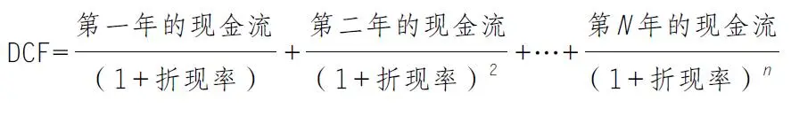

从公式可见，如果中国的房子和股票从中长期来看大致反映了它们的DCF价值的话，那么也许我们可以得到如下两个结论：

__（1）未来的现金流会高速增长；__

__（2）折现率非常低。__

你有没有发现，这两个结论互相矛盾。如果未来现金流增长强劲，利率水平一定很高，相应地，折现率也会很高。反之，折现率会很低。

既然大家抱怨资产荒和投资机会有限，以及利率的下降，我认为第一种情况不太可能。那就只有第二种可能性了。

此处的折现率更准确地说是WACC，即企业的股债的加权平均资金成本。中国的两大资产市场似乎在告诉我们，中国的折现率非常低，还会更低。多低？

20多年来，分析师们一般认为中国的无风险利率为3%～4%，大多数公司的WACC应该在8%～10%，当然不同的公司会因负债率高低、税率高低而异。

如果我们都错了，如果这两个数字分别应该为1%～2%，和4%～5%，那么咱们的资产估值会大不相同。

遗憾的是，咱们都没有先知先觉。上述两个很低的利率水平都是我们从目前房地产市场和A股市场倒推出来的。而且，我们并不知道它们是否可持续。

如果它们可持续，大家回头看投资配置，你也许会得出如下初步结论：

（1）房地产市场和A股市场因为已经反映了折现率的大幅下移，因此估值是合理的，但是并无系统性上涨空间。

（2）相反，债券市场和私募债市场也许还有较大的上涨空间。美欧过去20多年的债券大牛市也许在中国刚开始，生息资产（包括派息较多的股票）会更受追捧。

（3）咱们的新感悟也许会鼓励你拼命地投资海外资产甚至外国货币，毕竟国别的利率差距越来越小了。

（4）我个人从来反对投资黄金、白银，因为它们不生息，并无太大的真实用途。但是，利率水平的下移使得贵金属的缺点也不像从前那么严重了。换个角度看，持有它们的财务成本降低了。2008年以来，虽然全球的股市和债券一直在上升，但是，黄金价格在连续下跌了四年之后，今年才恢复了不少失地。黄金市场与全球的债券市场和股票市场严重脱钩，也跟其他金属和矿产品市场严重脱钩。未来几年黄金也许有一个追涨的机会。由于黄金的价格和矿产的价格是国际价格，因此那些无法买到外汇的人可以把黄金和矿产当成外汇的替代。但是，我必须强调，我一贯的立场是:大家千万不要试图预测黄金和任何资产的中短期价格（比如几年之内的价格），因为那是相当不明智的举动。

（5）如果我们又看错了，也就是说，过去几年折现率的下移只是暂时的，那么房地产和A股市场下跌的风险会高于债券市场。在债券市场上，短期产品的风险小于长期的产品。

最后一点，不甘示弱的人们应该在私募基金、私有化、直接投资、信贷、P2P和实业等比较肥沃的领域寻宝。

## 第六章 合理资产配置，降低风险 - (5) 6.05 如何降低投资的风险

\(5\) 6\.05 如何降低投资的风险

2026年3月14日

9:55

6\.05 如何降低投资的风险

__作者：吴超__

__深圳资深投资人__

本人银行业背景，在股市打拼20年，交了大量学费，很敬畏市场，有几点粗浅体会。

__1\.方法：__股市有多种赚钱方式和途径，千万不要否定别人的运作模式，任何模式都会有赚钱和亏损的时候。投资股市只有赚钱概率高低之分，没有必然正确与错误之分。每个人要结合自己的经历、性格、年龄、资金和时间实际，确定相应的投资方式，并不断摸索坚持下去。若是坚持5年后还是搞不懂，应该停止股票投资。

__2\.赚钱：__方法正确不一定就能赚钱。它跟做其他任何事情一样，必须天时、地利、人和三者具备。方法正确只是人和，天时地利不在我们控制之内。如宏观变化、突发事件、第三方影响、恶意做空等，都会影响股票表现。所以，在一定时间内没达标，不要轻易怀疑投资方法，责怪自己无能。

__3\.价值投资与投机的主要区别：__价值投资追求的是确定性，重现实、重数字、重已有的、重有形的、重自己了解掌握的。投机追求的是不确定性，重有想象空间、重无形的、重未来发展。价值投资多用数字来说明理由（如用增长率、占有率、第一名、今年赚2亿元利润，明年赚4\.3亿元等具体数字说明问题），投机多用文字来表达理由（如用应该、一定、趋势、突出、好评、优秀等来定论）。

__4\.实业态度：__要买公司，不要买股票；要买价值，不买价格；要利用市场，不要被市场所利用。所以，投资者要认识什么是好公司，什么是好股票，日常做什么事情。好公司就是：行业好；有赚钱优势；有护城河（保护赚钱优势）。好股票就是：好公司\+价格便宜。投资者日常做的事情就是：关心和守住账户里已买进的好公司；寻找和研究市场出现的好股票；更换账户里变坏的好公司，或对账户里高估值的好公司更换为市场新发现的好股票。日常不要预测大市走势，不要看重股价变化，放宽心态，勤奋工作，一定会有收获。

__5\.好股票多的地方：__一般出现在三个方向：一是拐点行业和拐点公司；二是好公司出大问题；三是市场争议大的公司。这类公司的共同特点是关心调研的人少，交易量少，股价超低。股票投资一定要逆向思维，人多的地方不要去，大家看好的公司一定是好公司，不是好股票。但是，这类公司风险很大，成功率极低，要做深入细致和与众不同的调研。

__6\.调研公司：__有效地了解认识一家公司，要做到“懂、熟、广、常”四方面：首先，自己要下苦功夫弄懂公司的行业和经营。弄不懂就是没缘分，这个公司就不要再进行下去了。其次，要深入企业尽量接触多方面人员交流了解情况。由于你是内行，所以易于交流，易于抓住重点，易于熟悉企业的本质情况。第三，还要广泛调研企业上下游，以及同行业情况，从更高更广信息，来验证我们对企业调研结果的真假和分寸。第四，在投资以后，调研工作不能停止，要定时定量常调研常跟踪。一笔好投资，基础在调研。调研工作必须亲力亲为，才有真实感受。调研工作是苦力活、智慧活，有时还是低头活。在资本市场，聪明人太多，我们不能与他人比聪明，要比信息不对称。就是通过与众不同的调研，使我们了解到企业的信息比别人更多更有价值。所以，一个价值投资决策者，一个时期内只能控制投资10只以内股票，超过了，他的工作就无法很细，否则，他就是股神。

__7\.股票投资前要三问答：__一是公司是不是好公司；二是市场为何不认同；三是市场什么原因和什么时候认同。只有这三方面都弄明白和调研清楚，才可以下手买入。好公司容易理解，重点是第二点：“别人为何不认同”。我们一定要通过与众不同的调研，发现公司被市场误读，或看不到，或刚发生的具体事件，来验证公司被市场低估的原因。若找不到具体和有说服力的事件和理由，这公司就不能买入。这问题解决了，第三点什么时候被市场认同，那就是时间问题了。

__8\.投资分散与集中的把握：__尽可能降低风险是价值投资的核心。分散或集中投资，都是为了降低风险率。投资风险包括可预测风险和不可预测风险（如黑天鹅事件），分散投资是为了“鸡蛋不集中放在一个篮子里”，回避不可预测的风险。集中投资是为了有更多时间和精力专注调研少数公司，提高确定性，回避可预测风险。明白这个道理，股票投资应该采取适当分散原则，不能高度集中也不能过度分散。这个度如何把握，要根据个人能力范围来确定，普通人投资不要超过10个企业，超过就是超人了。

__9\.股市心态：__心态是个无形指标，人与人天生区别很大，股市平日波动无序，是众多股民心态综合变化的反映。股市中股票价格围绕着价值上下运动，价格对准价值只是瞬间，绝大部分时间是脱离价值的。无法理解和承受大波动的人，不要进入股市。实际上，很多人在股市上心态不好，根本原因是对所投资的企业经营情况，也即是对企业价值心中无底。还有一些人过量负债投资。所以，解决股市心态问题，最实际的方法就是：投资熟悉的企业，不要过量负债投资。

__10\.投资股票与做实业的区别：__投资股票的工作时间90%在决策，10%在执行。决策是调研、分析、决定，需要很多时间，而执行只是筹资金换股票，时间很少。做实业工作时间10%是决策，90%是执行。决策是研究决定办这个企业，时间相对不多，执行是要长期才能把这个厂办好起来，时间很长。所以，以买公司作为投资股票的人，在决策买入股票以后，就要有耐心培伴企业成长。要明白：实业是干出来的，投资是等出来的。

## 附录识别股市的地雷

附录识别股市的地雷

__作者：祝振驹__

__翱腾投资管理（香港）有限公司董事总经理__

一、剩股等人买

__剩股有三低特色__

香港有剩女，股市有剩股。截至2011年底，香港的上市公司达1496家，其中主板占88\.6%，创业板占余下的11\.4%。根据彭博（彭博社）数据，有证券分析师追踪及作投资建议的上市公司540多家（它们大部分市值都高于3亿美元），换句话说超过六成的上市公司都是不被机构投资者留意的剩股！

剩股的特色是有三低：（1）市值低（通常低于1亿美元）；（2）成交低（通常接近零或最多平均不到数十万港元一天）；（3）人气低─很少人拜访，很少人建议。基金嫌弃它们没有流通量，所以没兴趣拜访。因为缺乏成交量，投行分析师没诱因去追踪及撰写报告，而销售部同事也不会容许他们去做无利可图的投资建议。成交低所以没有人留意，没有人留意即是没有人买卖，所以就愈加没有成交。

__冷落剩股三大原因__

20年的投资及研究生涯中，笔者拜访过大小不下一二百家这类缺乏成交及不为市场留意的剩股，有的可能因业绩增长而有幸短暂脱离剩股行业（通常都是只可维持一两年，业绩一倒退又打回原形），但大部分包括很多基本面不俗的公司始终都无人垂青。笔者归纳有以下数点原因：

（1）管理被动，缺乏公关活动或不愿投放资源在投资者关系上。笔者认识过最主动的管理层（某公司首席财务官）在高峰时花差不多一半的工作时间做路演推广。一个电话或电邮查询，他就不辞劳苦立刻由老远的九龙工业区跑到中环登门拜访，对大小基金和证券商都一视同仁。

（2）业绩缺乏稳定性或派息欠奉。剩股业绩通常都很飘忽，行业周期上扬时就赚钱，反之不是盈利大幅倒退就是亏损。长线基金一般都不喜欢这类缺乏增长持续性的公司，所以就算它们某年赚大钱，但市盈率仍可能非常低迷。另外有一类资产估值有大折让的公司（通常是三四线的香港地产股），它们经常以保留现金作发展为理由不愿派息，就算愿意派息，派息比率都偏低（通常15%都不到）。这类股票估值一般对资产值都有平均60%～80%的折让。

（3）金玉其外，败絮其中。很多估值便宜吸引的剩股继续便宜，因为基金投资者知道公司有管治问题或者质疑其财务真确性，所以敬而远之。前者一般是大股东有欺骗或误导投资者的往绩，最常见的是管理者把前景夸大，吸引基金投资。财技了得的屡屡在股市高峰或业绩见顶时趁高位减持或配股，之后业绩立刻走样无以为继，然后在股市低潮或股价低残时作大折让供股增持甚至私有化。

假若大股东素有榨取小股东利益或其他不良声誉（大花筒，例如报销公司开支作私人享乐，娱乐版新闻多多，不务正业，高价收购资产，关联交易等等），这些剩股基金通常都会避之则吉，所以估值很难大翻身。现在坊间很多所谓股神和专家都喜欢在媒体上推介这类表面超值但内里有管治问题或财务有水分的小型股。单凭年报上的表面数字去判断估值便宜而作出投资建议是一个危险的决定。

__基金拣股有如选美求爱__

股票和男女关系最相似的地方是大多数上市公司都希望被基金追求及持有，但只有少数的蓝筹股、高增长股和高管理质素公司会被长线基金挑选中。有很多由小型股成长为中大型的基金爱股其实也经历和基金约会恋爱较长一段时间，建立互信关系后才能成为其投资组合中的一部分。

__基金选股有四高要求__

10个上市公司老板9个都认为自己的股票价值被市场低估，但大部分都是孤芳自赏，不明白市场的四高要求（高流通量，高持续性，高增长和高派息）。市场上有接近1500只股票，基金组合一般只持有20～60只，所以三四线上市公司一定要懂得打扮包装推广才会突围而出获得基金青睐，否则很难脱离剩股一族身份。

二、好股，坏股，烂股，便宜股

民企造假，谈股色变。由民企主导的中小型股板块从2011年中开始就坏消息一个紧接一个，令投资者焦头烂额，身边不少的基金朋友也决定短期不碰这类股票，就算估值再便宜也不作考虑。而事实上，假若公司决意造假账，任何有经验的审计和分析师也没可能在短期内察觉出来。笔者一直认为要确认一家上市公司的真实性与业绩基础，一定需要观察管理层较长一段时间，最好是经历起码1～2个行业和股市低潮。稳定和较高的现金派息率永远是上市公司货真价实的最佳保证。但也不一定！笔者以前在瑞士银行研究部旧同事张化桥最近在他的博客中就指出公司分红和回购股份并不代表公司账目一定真实，因为管理层可能只不过利用配股集资的一小部分资金回馈小股东。用小股东的一小部分钱换取更高估值和市值，然后又可在更高位配股集资，除笨有精。

__公司上市为抽水__

一家日本股神长期建议的中国消费概念股票就是采用这种模式在资本市场操作：公司上市10年有5年派息（平均派息率为14\.9%），但每年配股或供股接近一次（过去10年8次在二级市场集资合计17\.8亿港元，另IPO集资5000万港元），每年的资本开支都十分巨大（10年合计约24\.1亿港元），纯利虽然有增长，但每股盈利经摊薄后一定原地踏步或倒退（2011年的每股盈利比10年前倒退了近17%），同期股本收益率由32\.7%下滑至只有4\.4%。这表示公司的投资越多回报就越低。今天的股价只比10年前的发行价略升不到17%，现在市值只有11亿港元，比在市场集资的总金额还要少！基本上这是一家不停摧毁股东价值的公司，所以基金早已敬而远之（笔者认识曾长线持有的基金大部分都止损离场）。从更坏的角度看，公司根本是通过不停的集资再投资，然后把股东的钱消耗掉和转移到管理层自己的口袋（通过昂贵的收购、扩产或开支），一旦集资游戏中止，业绩和现金流能否维持将会是一个疑问。

__长线投资在稳健的管理层__

长线投资股票最重要的是押注在有素质及稳健的管理上。香港的小型股当中有好些是上市经年，业绩和派息稳定而又估值便宜的公司。其中一家是同样上市差不多达10年的香港公司信佳国际（00912\.HK），股价10年升值128%，派息从不间断（派息率平均约为40%），上市以来只在9年前在二级市场集资过一次共2800万港元，2011年股本收益率达24\.5%。2011年9月的中期营业额增长达7%，盈利上升18\.5%，现时市盈率只有6倍多，股息率高于6%，净现金达1\.09亿港元（每股0\.18港元）。虽然主业以电子代工及欧美日（占营业收入的76%）市场为主，但业务集中在毛利较高和少批量生产的产品（互动教学、专业音响、自动收费系统、通信产品、宠物培训器材），所以业绩仍然维持稳定增长。信佳管理比一般香港工业股优胜之处是不断求变及开拓能增值毛利的业务，不求货量，以稳定增长为目标。公司在5年前曾失掉一个占营业收入达30%的内地通信产品大客户（因客户被其他公司兼并），但管理层随即开拓了一个新欧洲客户生产互动教学产品，现今业务已增长至占营业收入的25%。

__香港工业股有内含资产价值__

随着广东省的经济发展，很多原来在深圳市区设厂的公司都逐渐移迁到较为便宜的地区生产。有些坐落在优质地点的厂址可能被卖或与当地发展商合作开发地产项目。笔者相信这个趋势会日趋明显，让很多估值便宜的工业股有机会借此套现，假若大股东愿意将所得利润作特别股息派发，股价便有机会大翻身。信佳在未来一年正计划迁离深圳布吉的厂址，该址土地面积达3万平方米，假设每平方米升值1万元，该址已升值3亿元（或每股0\.48港元）。

三、低管治，低估值

有一家上市11年的小型石化公司和上面谈及的消费股可说是难兄难弟，两者都是香港人作大股东及高级管理，两者都是中国概念股，后者数年前曾一度持有前者超过13%的股份。两者最雷同的地方就是在市场集资次数很频密。

__持股至今亏损96%__

石化公司在过去11年里配股或供股共10次，加上IPO的集资金额达18\.6亿港元，它今天的市值只有不到1\.2亿港元。在11年里，资本开支和投资总额达31亿港元，它的股本收益率由上市初的33\.5%下降到2011年只有3\.1%，每股盈利同期倒退78\.5%，更甚的是它过去9年从未派息，现今市净率只有0\.04倍！换句话说，市场认为它现在96%的资产值都可以作废。如果按IPO价买入这只股票并持有至现在，账面上亏损达91\.3%！在以往8次（最近一次供股仍在进行中）集资认购而持有至现在者都要亏损，最少的亏85\.5%，最多的亏达96\.4%，亦即是接近全部报销。

这些公司管理最常见的伎俩通常是把公司包装成价值股，将前景描绘得非常秀丽，例如未来市盈率只有5～6倍而盈利增长有30%以上，但需要扩展产能或作新投资，所以有必要集资。它们的借贷比例很多时都偏低甚至没有，表面上看来非常健康，但实际上可能根本没有银行愿意贷款，更可能的是它们一心只是为了在市场集资，然后通过资本开支把资金消耗掉。因为对很多上市大股东而言，资本市场集到的资金是公司的钱，而公司的钱亦即是等于自己口袋里的钱。而向银行借贷的钱，就算利率再怎么低，终归要偿还，所以最好是集外钱作投资。

__今次和上次不一样？__

奇怪的是为何一家不停摧毁股东价值的公司，仍然能够在市场集资？理由颇多，第一，市场上不断有新进场的投资新手，可能是刚学投资的散户，也可能是刚投资中国的基金经理和分析师，他们对公司以往的历史不熟悉，没有太大的包袱去抗拒。第二，市场上永远有一些价值投资者被低迷的估值吸引，向高难度进发，总认为自己的目光比人强，眼光比人准，这次的投资论点和以前的不一样。第三，每次牛市重临，鸡犬升天之际，必定有财经媒体推介一些落后股或超值股，贪婪的投资者往往因股价突然大升而跟风追入，而烂股就把握时机在高位配股。第四，公司每次在高位配股前必定有新的故事告诉投资者，可能是业务转亏为盈，可能是物色到新的投资项目，可能是收购合并，总之要令投资者觉得今次和上次不一样，今次是进入收成期，以往都是投资期。第五，每次配股总是有一些中小型的本地投行为了赚取较高的包销费用而愿意协助推介给新的投资者。

__烂股有如爱情骗子__

烂股就有如爱情骗子一样，经常甜言蜜语，编出各种动听故事使投资者入市，每次投资者都失望而回，最后分手离场，而愈迟退出者则伤痕愈深，痛苦愈大。分手后，爱情骗子又会寻觅下一个对象，按股市周期，循环不息。这些个案告诉投资者买进一只小型股时，要清楚知道股东及管理者的背景，艺高胆大者如果硬是要和爱情骗子一类交往，最多也只可发展极短期的爱情，绝不能交心。
