# 《张化桥 谁偷走了我们的财富？》全文合订版

> 共58个章节。原章节顺序、段落结构和图表均予以保留。

## 序 你的艰难岁月，我的艰难岁月

__序__

__你的艰难岁月，我的艰难岁月__

虽然已经有了36年的经济高速增长，但是从某些角度看，咱们中国确实还是很穷。而且，考虑到自然资源（包括水和新鲜空气）等因素，咱们未来还会有段比较艰难的日子。

发牢骚很容易，但是，我这本书不准备那样做。我只是想分析，咱们为什么会如此。究竟是谁偷走了本来属于咱们的财富？

说实话，我认为，其实咱们还是应该反思自己。我们的国家、做决策的部门，都是由千千万万普通人组成的。20世纪80年代，我本人就在中国人民银行总行工作过三年。后来，我又到国有大企业担任高级管理职务。当然，决策部门在制定政策的过程中，实际上在大多数情况下反映了民意，但民意经常是错的。有些政策开始是正确的，但是，时过境迁，政策就需要调整。有时候，民意可能会阻碍改革、阻碍进步。

本书分析了部分经济决策的问题，更重要的是分析咱们自己的无知。本书的落脚点是，作为一个老百姓，我和你如何看到咱们自己的问题，以求尽量少犯错误。虽然我们无力强迫别人改变看法，但独立思考和实现财务自由，总可以吧！

__年轻时的艰难与幸运__

我年轻的时候，日子过得很艰难。但是，今天的年轻人可能没有我那时候幸运。因为你遇到的挑战更大。

我已经52岁。1979年，我从湖北省荆门县的农村考进湖北财经学院读大学本科。虽然当时的中国和当时的我都非常贫困，但是，空气是清新的，空气中流动着希望。

我的父母都是农民，而且因为他们是老上中农成分，所以在村子里抬不起头来。

在大学里，我们几乎没有学到真正的知识或者技能。因为，师资在当时非常差，课程安排和现在也不能比。我记住的仅有的两个东西，就是“经济基础决定上层建筑”、“财政取之于民，用之于民”。

大学生在那个时候是天之骄子，学费全免。生活费也有救济，我家贫困，所以我每个月可以收到12元人民币的政府补贴，父母再补贴3元，足够了。衣服和其他消费大约每个月6元。

1983年，我们顺利地毕业了。当然，我们的脑子里还是空空的，所学到的财经知识极少。但是，我们有担保分配。我被分配到了襄樊市税务局。不过，我还没有来得及去襄樊报到上班，就收到了研究生的录取通知书。

虽然专业知识很少，但是我的数学和英文还算不错。我考到了在北京市五道口的中国人民银行的研究生部。这里的学制和师资跟武汉市差不多。三年又顺利地过去了，我依然头脑空空。

在五道口，我的月薪46元人民币，再加上副食补贴5元，交通补贴3元，日子也能过得去。虽然当时北京的国营企业工人的平均月薪也不过40多元人民币，但是人家还要养家糊口。我的学长跟我强调，我每个月至少要存15元才能保证五年以后成家！所以，我必须开始储蓄。

我那样一个农村的穷学生可以顺利读完七年大学和研究生，靠的是政府支持。而且，当时的城乡相对平等，大家生活条件差不多，物价也很低。我并没有感受到城里来的同学有太严重的优越感。

__中国的巨变__

到了30多年以后的今天，中国发生了翻天覆地的变化。跟30多年前比，你的名义收入比我当时增加了很多倍，你的财富增加了很多倍，也许你还买了好几套房子。但是其实很多人还是会担心，我们的退休真的有保障吗？我们的房子会不会因为环境恶化而贬值许多？我们的子女能够找到合适的工作吗？他们会遇到何种竞争？

这30多年来，我认为中国最大的变化是：

（1） 房改＋利率管制。十多年前“房改”导致的巨大财富聚集。一大批本来的公共性房屋突然间变成了私有财产。拥有房产的人象征性地付了一点钱，但是这些钱还是大大低于公平价值的。随后年复一年的经济发展以及通胀推高了这些房产的价格，使房产拥有者的财富迅速升值，造成了与无房者的差距越来越大。

在一个资产价格持续膨胀的环境里，你必须有资产，才能跟市场保持一致。如果你的资产多于平均数，你就会跑赢大市；否则，你会被大市甩在后面。就是这样残酷。

（2） 股市。这20年来的股市伤害了大量股民，养肥了部分上市公司大股东、PE（私募股权投资）投资者和内幕交易者。这里的主要原因是什么呢？

首先，我们把企业上市当成了“扶贫”，以及国有企业的“脱贫”。当然，这种特权不能太多太泛，因此，政府严格控制了上市企业的数量，其结果是股票价格的长期被高估。在企业上市数目不断增加的过程中，股价就处于长期下滑趋势中。

其次，每次遇到股市大跌，股民便“勇敢地”当起了炮灰。同时，股民看到了四面八方在给我们鼓劲儿：报纸的社论、电视演说、降低印花税、停止IPO（首次公开募股）。

（3） 城乡差距。多年来，中国的城乡差距在迅速扩大。

2014年，政府开始下决心逐渐缩小这种城乡差距。不过，我不知道真正取消户口还要多长时间，因为毕竟这涉及多方面的利益。

让人十分担忧的一点是，即使农民可以自由进城，他们中的一些人可能也没有经济能力住在城里。他们的医疗、教育、文化、经济和政治地位在短期内还是会有巨大差距。30多年来的通胀和资产价格升值使他们离开家乡的难度增大了。而农村的土地在萎缩，河流被污染或者干涸，森林在消逝，他们的生计受到了根本性的威胁。

（4） 国有企业。特别是垄断性国有企业，比如石油、石化、铁路、电力、交通、水务、银行等行业的参与者占领了有利的地位。他们的报酬越来越高，越来越高于其他行业，因此现在调整也渐渐开始，以免出现报酬与付出脱节的情况。毕竟，我们不能以“多劳多得，激励机制”为理由，将国有资产本来就应该有的回报当成员工们的劳动回报。如果不尽快调整，在以上这些行业之外，我们很多人会越来越被甩在后面。

__英国是如何转型的？__

过去一年多，我住在伦敦，处于半退休的状态。我的主要兴趣在研究英国和欧洲的经济变迁。

我经常问自己，英国为什么国富民强？它的国土面积相当于中国的江苏、浙江和上海之和，人口相当于江、浙、沪的一半。但是，它的经济实力和国际地位为什么那么高？环境保护得为什么那么好？

我想起咱们的榆林地区、大同地区和其他类似地方的命运，不禁有点黯然。咱们何时才能转型？转型做什么？怎么转型？100年前，英国曾经也是一个煤炭大国，但是到20世纪的五六十年代，它的煤炭资源开始枯竭。当撒切尔夫人的政府强制关掉一些奄奄一息的煤矿时，全国的大罢工充分反映了民众的迷茫和恐慌。今天，那些旧时产煤地区的经济仍然比较脆弱，但是，英国的经济转型总体还算成功。

过去，英国曾经侵略和掠夺过很多国家和资源，罪大恶极。今天，这样一个小国依然有大量的公民在世界各地谋生和发展。海外“英侨”占英国总人口比重的排名可能在世界上数一数二。这本身就是开放和进取的标志。除此之外，虽然国土面积很小，但是从英国对外来人口和外商投资的开放程度看，它依然是世界上最好的地方之一，有时坚持这样做也相当不容易。

__开放与富有密切相关__

2014年年初，我亲身感受了一件有趣的事，这件事足以证明英国的政策稳定性和了不起。十年前，东欧几个穷国（罗马尼亚、保加利亚等）加入了欧洲共同体。当时的条约是，十年后，这些国家的公民可以随时到欧洲共同体的任何其他国家（包括英国）就业和定居。2014年年初，十年的限期很快就要结束了。可是，欧洲经济整体还在萧条之中，只有英国经济稍微好一些，而且，作为欧洲唯一的英语国家和（也许是）最开放的国家，英国对于东欧公民具有很大的吸引力。所以，从2013年起，许多英国人就开始担心东欧的劳工蜂拥而至，抢他们的饭碗，导致英国的住房、车站和医院等基础设施无法应付。

英国的一份报纸《每日电讯报》（The Daily Telegraph）甚至组织了万人签名运动，呼吁政府紧急采取措施，要么撤销当时的条约，要么增设对外来劳工和移民的限制（其实也是撤销承诺）。英国政府虽然遇到来自选民的极大压力，但是承诺就是承诺，条约就是条约。所幸的是，东欧的移民并没有像潮水一样涌入英国。

在整个抗议过程中，我一直在思考，如果把英国换成中国，情况又会如何呢？说不定，我们会找无数个理由，说这个不行，那个不行，武断地撤销承诺。英国今天的富有当然跟它的开放密切相关。我问自己，咱们能否认识到这一点？

在伦敦，我经常碰到中国的企业家到这里来考察、旅游、经商，大家都说英国的法律制度透明和容易遵循。这就是英国成功的关键，也是它未来继续繁荣的根本原因。它在外国人中的口碑，给外国人的消费者体验实在是金不换。如果一个国家的人非要把外国人折腾得死去活来才善罢甘休，伤害的当然是自己。

我在中国人民银行总行工作时，已经有大量的外国银行在中国成立了代表处。但是差不多30年以后的今天，外国银行还是受到诸多限制，它们在中国的银行业务也一直在寒风中哆嗦。我们多年来奢谈监管和限制，受伤害的当然只能是中国人自己。

有时候，我们可能还有一些心理障碍，导致了我们的贫困。在本书中，我希望通过各种话题，谈谈咱们公众所需要的心态调整，也试图对一些经济政策和咱们老百姓的反应做一些评论，发表我的建议。

今天我们遇到经济问题时不能归罪于别人，不能归罪于政府，只能反思自己。咱们自己的错误和无知是最大的敌人。如果我们想朝着美好的方向改变，最大的障碍往往是不能及时意识到或者改正咱们自己的错误。

本书前面几篇文章是新写的，后面多数是在我的博客文章基础上整理的。得罪人不是我的目的，我只是希望讲出实话。

张化桥

## 第1章 谁能战胜股市？

__第1章__

__谁能战胜股市？__

“我们股市中人，都有一个大毛病：我们早就决定了要买股票。我们的挣扎只是买哪些股票和买多少，而根本不愿意花时间研究一个更基本的问题：该不该买股票和为什么一定要买股票。”

## 第1章 谁能战胜股市？ - (01) 1.01 打工仔的发财梦

\(01\) 1\.01 打工仔的发财梦

2026年3月14日

9:59

__1\.01__

__打工仔的发财梦__

1998年年底，我到一个英国投资银行申请工作。主考官问我：“请你告诉我，你将如何为我们赚钱？你要先为我们赚钱，我们才能有钱付你的工资和奖金。”我大吃一惊！打工就是打工，你给我多少钱，我做多少事。我以前可从来没有想过她说的那种问题。

中国的年轻一代太多月光族。为什么？挣得少，花得多。但是，更重要的是，他们浪费得更多。浪费在哪里？主要在“投资”方面。很多人省吃俭用，“投资”的时候却一掷千金，打了水漂。我一直到2001年都是如此。现在，我终于完全安静下来，以“不亏钱”为第一原则。在“不亏钱”的前提下，赚取稳稳当当的钱。

1994年，在我到香港地区的外国投资银行工作之前，银行账上的存款已经有100多万港元。那些钱全部是我在澳大利亚工作和做咨询时的积蓄，完全没有负债。到了香港地区的投行，虽然我高薪厚禄，但是我越来越穷。在1998年年底失业时，我几乎一分钱也没有。为什么？不是因为我花掉了，我其实非常节省，可是炒股票慢慢亏掉了。后来，我痛定思痛，重新学习投资。今天的我，没有了过去的焦躁，非常镇定，投资有得，反而富足了。

__别贱卖时间__

大家都说，中国人勤劳。这可未必。你看，全中国有多少人每天在耗费光阴，或者以为难他人为职业、为乐趣？中小学生拼命读书，大学生和成年人拼命玩乐，而且玩得不耐烦。

20世纪80年代，我在澳大利亚留学的时候，就发现了一个现象。大批中国留学生愿意在教室或者实验室熬到半夜，到餐馆端盘子或者洗碗，一年工作365天。你说咱们中国人勤劳吗？No！我发现，有一件事情，多数中国留学生就是不肯做。那就是最困难，也许是最枯燥、最考验意志的事情：学习英文。不要以为去了美国或者澳大利亚，光凭呼吸人家的空气，就可以学好英文。错！大错！

我见过不少在美国读研究生和工作好几年的人，用英文说不清楚几句话，还有更过分的。2000年，我在上海主持瑞士银行的首届大中华投资研讨会，台下多数是外国投资者。咱们的一位同胞作为某企业的代表发表演讲，他曾经在美国居住15年，还拿到了名牌大学的博士学位（不是西太平洋大学之类的“野鸡大学”），竟然还要求我给他安排翻译！

跟大家一样，我在职业生涯中做过很多傻事儿。有些事，我回想起来，很惭愧。但是，有一件小事，我算做对了。1989年年初，我到澳大利亚国立大学读硕士。7月初，暑假开始，我和中国来的其他穷学生一样，疯狂找工作。我第一天就受聘到堪培拉工人俱乐部的餐馆洗盘子。一天下来，虽然我累坏了，但是当天就赚了100澳元的工资。对我来说，这可是天文数字！你想想，当时，加上补贴，我在中国人民银行总行的月薪才54元人民币，仅此而已。那100澳元一天的工资，相当于我在北京当公务员时一年的收入！

不过，我第二天早上就辞掉了这份“肥差”。为什么？那份工作是贱卖我的青春，像那样打工，十年下去，工资不但不会上升，反而会下降。等我真的累断腰的时候，谁还要我？

我辞掉了工作，把足足两个月的暑假完全投入了英文训练：朗读和其他英语训练。我每天朗读英文两个小时，然后再读很多书报。两年后，等我把硕士学位拿到时，我就被堪培拉大学聘为了正式讲师，而且还是终身教职（tenured）。当时很多中国同学在拿到博士学位以后还在当助教，当然那些都是合同制的教职。

后来，我一直拼命学英文。我认为，在西方的职场上，英文水准的高低比专业知识更重要。（当然，运气和人际关系最重要。）

1991年，我开始在《澳大利亚金融评论报》（Australian Financial Review）发表文章。1994年起，我陆续在《华尔街日报》《纽约时报》《南华早报》和《金融时报》发表了好几十篇文章。

多年来，我给那些出国读书的人（主要是文科的）的建议都是：花80%的时间学英文，剩下的时间学专业。

我的看法是，贱卖时间，相当于把你的人生价值画成一条平平的直线。抓紧时间学点差异化的本事，相当于画了一条上升的直线。

__站在老板的立场考虑问题__

下面是我2011年在万穗小额贷款公司担任董事长时，给新员工的讲话，主题是职场态度，但愿对大家有用。

各位新同事，欢迎加入草根金融行业，欢迎加入万穗小额贷款公司。我想讲两个话题，一是我们草根金融从业人员的职业规划，二是小额贷款行业为我们创造的光明前景。

首先要讲的一点是我们草根金融人士的职业规划。我在2011年6月20日离开瑞士银行，加入了万穗小额贷款公司。有人表示赞赏，有人不理解。但是，自己的日子还得自己过，我不太在乎别人怎么说。人们的“震惊”让我觉得我好像做了一件自残的蠢事，委屈自己的事。我想说，我很高兴我做了一个正确的决定。我父母和妻小也都很高兴。

我知道你们有的人是因为喜欢这个行业而来，有的人是勉强而来。但是，不管怎样，我希望大家在未来几个月能够发现小额贷款行业的美丽，决定扎根这个行业。

新来的同事中，有一个华南理工大学的毕业生。她问我，参加工作后，如何继续增加自己的知识。我觉得，有针对性的学习才最有收获。我建议，假想三年后你准备自己开设一家小额贷款公司，把这个目标当作你最重要的学习任务。有了这个目标，你就会细心地观察你的同事们每天在做什么，为什么那样做，万穗公司的流程和制度，客户评审和服务，等等。你会知道你必须做一个多面手。想想看：三年后你站在街上，大吼一声，我开店了！你想聘请6～8个员工，到哪里去找？花多少钱？如何说服他们加盟？这些人如何分工？你如何把这6～8个孤岛连接起来？灯油火蜡，样样都要你掏钱，你承受得了吗？万一前期的投入不能马上有收获，你怎么办？

我们鼓励大家要有另立门户、开办小额贷款公司的想法，我们愿意帮你找种子资金。你们如果每天都有这种想法，就会明白创业者的艰辛和孤独！特别是在亏钱的时候和前途不明朗的时候，他们更加孤独。这两个月，我领略了那种滋味。好在我不是在创业，我接过来的是一个运行非常平稳，让同行们很羡慕的企业，而且我们正处在一个沸腾的朝阳行业！

你们有些校友去了北大和清华读研究生。不要羡慕他们。你们还有些校友当上了公务员，或者找到了大银行的工作。不要羡慕他们。让他们羡慕你们吧！在职业发展和个人收入方面，他们走上了一个平稳上升的轨迹。我们的起点也许比他们低很多，但是，我们的轨迹是一条斜率很大，很陡的曲线。三年后，或者五年后，我们的轨迹会跟他们的相交。之后，我们的会超越他们的。我们的技能积累会更快，也会更早实现财务自由。

我的希望是，我们的员工在跟亲友和老同学聚会的时候，用很自豪的语气说：“我在万穗小额贷款公司工作。那是一个和睦的工作环境。我们的工作有意思，待遇也很不错。”

任何工作都有可能变得枯燥。但是，我们的工作也真不错：你的客户分布在所有行业。这是一个学习真本事的课堂。书海茫茫，让我们经常失去方向。我们很多人每天双眼盯着电脑，在漫无边际和没有意义的新闻和噪声中度日。这不叫学习。我坦白，我也经常如此。

关于学习实用的东西，我讲讲个人的故事。我在大学和研究生时学的都是宏观经济学。毕业后，我做的也是经济学研究，直到1998年年底我被汇丰银行开除。我失业了四个月。那时候，亚洲金融危机正处于最恶劣的阶段，香港的各类商业机构都在裁员。我去找工作时，面试的人都说，你专业还挺不错的，但是我们没有空缺。有一个英国投资银行（Cazenove，嘉诚）的女主管May Tan（马来西亚华人，现在她是渣打银行亚洲区的行长）对我说的那番话让我终生难忘。她问我：“你能否告诉我，你将如何为我们赚钱？你要先为我们赚钱，我们才能有钱付你的工资。”我大吃一惊！我以前从来没有想过这种事。我们传统的观念是，你当雇主的，给我多少钱，我就干多少活。你安排我干什么，我就干什么。我不高兴，就跳槽。她的话真的帮我开始为我的老板考虑。我很感谢她改变了我的职业观。那以后的十多年里，我一直跟她有来往。虽然我和她算是竞争者，但我还帮她的几个大客户安排了在北京的会议。我喜欢用这个故事来教育我的孩子和侄子们。

当时，我无法告诉嘉诚的她，我如何能为嘉诚赚钱。于是我也没有获得嘉诚的聘用。几周以后，我的老东家法国东方汇理银行请我回巢。又过了几个月，我的另外一个老东家，瑞士银行，也请我回巢，还加薪晋级当研究部主管。你可以想象我的感激。不过，瑞士银行的老板有话在先：瑞银的中国研究部必须是《机构投资者》杂志前三甲，否则会炒我鱿鱼。那几年，我真的是拼命了。两年后，我排名第一，一直维持了五年。后来，我眼看撑不住了，就跳到了一家上市公司工作。

我扯得太远了。我想说的是，你们可以先站在老板的立场上考虑问题。你为老板着想，就容易成为老板。如果三年以后自己开办小额贷款公司，你准备好了吗？

__草根金融不会垮__

我想讲的第二个问题是，我们行业的美好前景。上周，我快80岁的父亲从湖北农村来广州的花都区看我，还带来了我的侄子们。我的妻小也从香港来会合。老父亲坐了一整天的汽车和火车，晚上八点才到酒店。晚上十点多他还坚持要去参观我们的三个分公司。我们有些同事还跟他说过话。看到你们那么晚还在跟客户谈贷款，他说，信用社一定不是我们的对手！

起初，我父亲对我开办“信用社”非常不满，因为在他眼里，农村信用社的形象不太好。我跟他解释，我们跟信用社有两大区别。第一，我们不能吸收存款。我们受到的限制和监管比信用社多很多。第二，信用社一般都有几百个股东，或者几千个股东（称为“社员”），而我们只有13个股东。股权太分散，每个人都拥有一丁点儿，也就没有人关心信用社。于是，管理层和地方政府就可以随心所欲一些，没有太多人站出来维护信用社的最大利益。这也就是全民所有制企业的最大问题。当然，信用社也有很多优秀的管理人员和员工，地方政府也有大量好干部，但是，中国的信用社在根本制度的设计上还有待改善。

很多人说，我们微型金融会被银行的小贷部门打垮。你们天天跟他们打交道，你们相信吗？银行的行长们都是大大的好人，但是，把你我放到他们的位置，我们同样有难处。他们每天的议事日程都排不上微型金融。今天他们要抓存款，明天要抓大客户贷款，未来的三天里，又有人一批一批地来视察，他们要送往迎来。他们太忙了！另外，他们的审贷时间和标准也不太适合微小企业和消费者，只适合大企业，特别是国有企业。

还有人说，我们小额贷款行业眼下的火爆只是因为宏观调控。我认为这完全是误解。美国和日本的小额贷款行业今天也很繁荣。你们记得2009年，当中国“四万亿”宏观刺激资金水漫金山的时候，我们的行业也同样兴旺。根本原因是，银行弯不下腰来做我们所做的事情。这也是市场细分的结果。当然，今天的信贷紧缩使我们可以收取更高的利息，但是，我们的根本利益和长期利益在于利息更低，而不是更高。利息太高，对我们的客户和我们来说，风险都太高。我们希望可以得到许可，增加融资渠道，提高负债率。现在，0\.5倍的负债率的上限确实让我们很艰难。相比而言，银行有10～20倍的负债率，信用社就更高了。当我们负债率提高时，就会有更多的资金用于发放微型金融，我们也就有能力降低利率。当然，因为供求关系的变化，我们小额贷款公司也会被迫降低利率。

草根金融是慈善，但是，政策还是不应该把草根金融的发展建立在人们的慈善心肠上，最好给予公平待遇。首先，其实银行对小额贷款公司的贷款最好不用受限。你想想，银行能够自主地对普通工商企业贷款，为什么不能自主决定对小额贷款公司贷款呢？允许银行贷款，银行不见得就会贷款。目前，小额贷款公司可以从银行获得相当于股本50%的贷款，但是很多小额贷款公司并没有得到贷款。为什么？因为银行不愿意，它们知道如何区别对待。退一万步，即使银行不能贷款给小额贷款公司，小额贷款公司也应该可以从其他渠道获得融资，比如发债等。

最近，我去很多小额贷款公司做调研，我发现它们都做得不错。原因在于大家用自己的钱做生意都很小心谨慎。这个行业不吸收存款，也就谈不上系统性风险。我们放款分散，也就从源头上解决了烂账的问题。

## 第1章 谁能战胜股市？ - (02) 1.02 踏踏实实的个人投资

\(02\) 1\.02 踏踏实实的个人投资

2026年3月14日

9:59

__1\.02__

__踏踏实实的个人投资__

我经常碰到神人，吹嘘自己投资回报率多少倍。起初，我汗颜，因为我虽然科班出身，在外国投资银行混了将近20年，但是从来没有投资过赚十倍的股票。后来我发现，他们不过是内幕交易的好手，其中几位还受到了监管当局的强烈关注。

我还认识另外一些神人，几年不见，他们突然身价百倍，叫我好不佩服。时间长了，大家才发现，此君不过是“白手套”。最近几年，我认识的有几位神人还“进去了”。

__投资需要平静__

我觉得做老百姓最实在。实在人也可以过得不错，只是不要随波逐流。

不知道你有没有这样的感觉，反正我经常有。我时常感觉到市面上热门的投资话题很多，大家在沙龙、博客群、微信群里讨论热烈，摩拳擦掌，而我常常被隔绝在外。

我到现在也拒绝使用微信，我实在不需要它。我也没有脸书（Facebook）或者推特（Twitter）账户。博客和微博呢？我也只是发表意见而已，但很少参与讨论问题。我会不会错过大量的交友机会，错过投资理念的切磋，错过投身新生事物的机会，以及赚大钱的机会？管它呢！无论如何，我宁可我行我素。

我看大家太忙了。除了日常工作，每天还要免费为互联网公司打工几个小时。我不愿意那样。我主张大家安静下来，想想自己究竟需要什么。

（1） 我需要把上班的本分工作做好。

（2） 我需要花时间陪家里人。

（3） 我需要足够的休息。

（4） 我需要锻炼身体。

（5） 我要简化生活：朋友圈子小一点，应酬少一点。

（6） 我要留下大量的时间关注我的业余爱好：国际政治。我喜欢读关于印度、非洲、欧洲政治方面的书。我喜欢写文章，主要是英文的财经文章，以文会友。这都需要时间。

（7） 我要投资。但是，跟一帮像无头苍蝇一样的人一起整天到处窜来窜去、海聊，这是投资致富的路吗？我很怀疑。

我认为，我找到了平静，宝贵的平静。阿里巴巴到美国做IPO，或者某个社交网站在香港股市被热炒，某大佬加盟某电商平台，某电影很热闹，政府又出了文件，大力支持环保、农业和软件，等等。我从网上稍微看一看标题，知道了！仅此而已。

我不再像多年以前那样，焦躁不安，生怕错过了机会，如饥似渴地找角度。我们每个人每天都错过大把机会，难道不是吗？

__寻找适合自己的投资观__

对于股市和投资，我形成了自己的几个观点，感到很适合自己。我不见得都正确，不过，我的看法是从书本和实践中来的，愿意随时修改。

（1） 过去36年，中国的通胀非常严重。从现在货币供应量的高增长率（年增长率14%左右）来看，未来5～10年的通胀也会很高。我们必须用稳健的投资，跑赢通胀。

（2） 中国市场到处是地雷，我作为一个老百姓必须提防。部分地方政府有时会在上市公司行将倒闭时施以援手，在土地、资金和环保方面“照顾”企业，让企业运营下去，但是这并没改革企业制度，没有改善企业的运营能力，因此，这种企业会继续坑害股民。

（3） 中国的股市管理制度还不太完善。“严格审查”IPO是寻租的根源。它和动不动叫停IPO加起来导致了股市价格高企。过去22年，我没有碰过A股，未来我还是不会碰A股。错过好机会，没有关系，我必须留足安全边际。我的投资市场依然是中国香港地区和美国。

（4） 中国的A股还是太贵。虽然贵的东西可以更贵，但是，我的投资哲学不允许我涉足。

（5） 私募股权投资在很多情况下是一个“博傻”的游戏和拉关系的游戏。我已经做了一些投资，但以后还是避开为好。

（6） 国内人们讨论的“T＋0”毫无意义。我认为，股市就是一个产权交易所，每个星期开市半天足够了。当然，任何其他国家的股市也一样。

（7） 继续把自己的投资圈划定在自己熟悉的行业和公司。

（8） 坚持不投机，不打听消息，不玩侥幸。主要关注上市企业的四个内容：管理层的诚信、利润率、利润增长率和现金流。

跟过去几年一样，我依然关注如下我所熟悉的行业。

（1） 银行业。银行业比租赁、小贷、典当、证券、基金、信托一类的资产管理公司更优越。我在书中有详细讲解。

（2） 燃气。一旦获得城市的特许经营权，它们不需要竞争，长期经营有保证。

（3） 工业。有巨大成本优势和“护城河”的工业企业不容易寻找，不过还是有的。在这方面，我的观点跟过去相比有点变化。

（4） 地产。非常有安全边际的地产公司。

（5） 少量的消费品企业，不需要狂轰滥炸打广告的消费品企业。它们中的多数其实就是工业企业。

（6） 医药企业。

__股票市场的规律__

谈起个人投资，自然会谈到股市预测，其实，任何规律都有例外。不过，两个“小规律”很有趣。

（1） 我在投资银行当分析师的时候，有一位很有智慧的销售部同事Gooding先生。某日，他对我说：“你看我们销售员每天打交道最多的都是基金经理中不那么特别聪明的。他们天天问，该买哪只股票，为什么，等等。其实，最聪明的投资者很少交易，很少问你的意见，很少关心天底下在发生什么事，很少关心政府出了什么政策。”我当时不太明白，不过后来我到投行部，某智者告诉了我一个类似的现象。

（2） 有位关先生对我说：“最优秀的公司很少跟投行打交道。为什么？它们生意不错，现金流稳定增长，不需要老是发行债券，不需要（也不愿意）配股或者增发。投资银行几乎很难找到跟它们做生意的机会。你看香港中华煤气（0003\.HK）、香港电灯（0006\.HK，后来改名为电能实业）、恒生银行（0011\.HK）、恒安国际（1044\.HK）、康师傅控股（0322\.HK）、康哲药业（0867\.HK）、贵州茅台（600519\.SH），等等。”

我强调，规律可以有很多例外。不过，我经常回想起这两个人的话。

## 第1章 谁能战胜股市？ - (03) 1.03 我的资产分布

\(03\) 1\.03 我的资产分布

2026年3月14日

9:59

__1\.03__

__我的资产分布__

在这篇文章里，我想谈一谈自己的资产分布。但我一直都说，投资是非常个人化的追求，我的方法主要适合自己，所以对任何人的投资盈利或者亏损绝对不负任何责任。

（1） 香港和伦敦的房子，加上深圳的小公寓。

（2） 国内的P2P投资。

（3） 广州市万穗小额贷款公司的股份。

（4） 几个没有上市也不可能上市的公司的股份。

（5） 内地地产公司在香港发行的高息债券。

（6） 股票集中在：博耳电力（1685\.HK）、重庆农村商业银行（3618\.HK）、中油燃气（0603\.HK）、中裕燃气（3633\.HK）、茂业国际（0848\.HK）和中集安瑞科（3899\.HK）。这些投资我很少买卖。

__什么行业值得投资？__

我对未来几年股市的看法如下。

任何时候，永远要投资高增长的行业。行业决定一切，至少决定80%的成功。我看好医药和养老、互联网、旅游。

医药行业是很不错的。有人说医药实在太专业，不投资，甚至一些专业的私募都刻意回避，但我觉得至少可以看出行业的前景很旺，还是值得研究。

下一步，我准备投资四环医药（0460\.HK，见图1—1），曾经在2012年就把康哲药业（0867\.HK，见图1—2）卖掉了，现在踏空了，大错特错，也许应该买回来。

互联网我完全错过了，况且我觉得它们的估值太高，算了。旅游业我没有找到合适的投资标的。酒店业的回报率不行，不准备涉足。我准备投资威胜集团（3393\.HK，见图1—3），它跟博耳电力有相似之处。

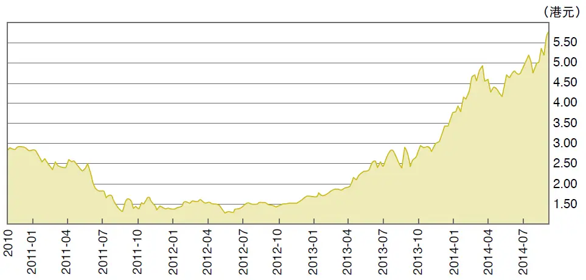

图1—1 四环医药（0460\.HK） 2010—2014 年股价走势图

资料来源：雅虎财经。

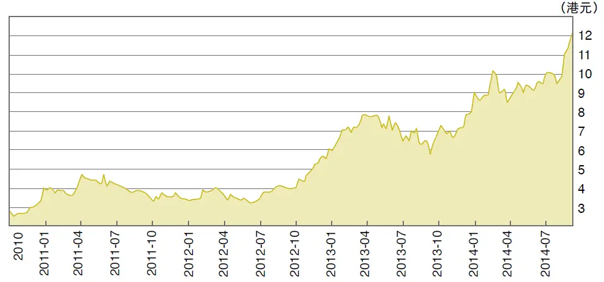

图1—2 康哲药业（0867\.HK） 2010—2014 年股价走势图

资料来源：雅虎财经。

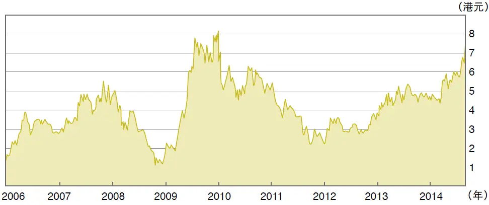

图1—3 威胜集团（3393\.HK） 2006—2014 年股价走势图

资料来源：雅虎财经。

煤炭行业：在2015年某个时候也许应该投资。其他矿业：不准备涉足。

建筑业和高铁有关的行业：算了，周期性太强。资产密集性的行业很危险。

乳业和食品：风险太大，不可预测。

服装业：算了。

电讯：大国企的成长率太低。算了。

“三桶油”：同样的问题。

码头和航运：算了，周期性太强。

航空业：太考验你的运气。

百货公司：时光不会倒流。

超市：略好一些，但是，好不了太多。我在上海联华超市（0980\.HK，见图1—4）上面亏了钱。它有点像个价值陷阱。便宜，很便宜，但是又怎样呢？

地产：我现在准备谨慎投资几个地产公司，比如，河南建业地产（0832\.HK，见图1—5）和茂业国际（0848\.HK，见图1—6）以及新城地产（1030\.HK，见图1—7，后来改名为新城发展控股）。

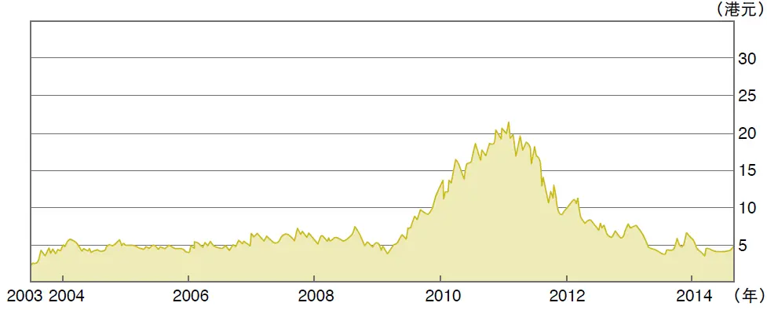

图1—4 联华超市（0980\.HK） 2003—2014 年股价走势图

资料来源：雅虎财经。

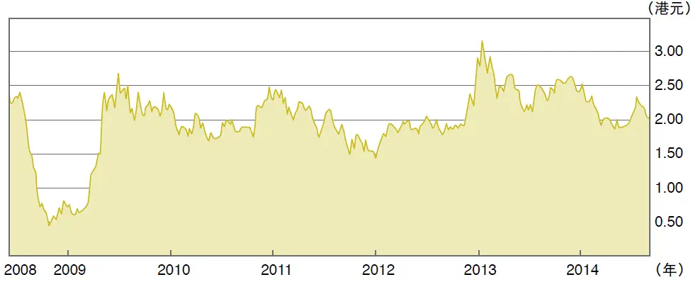

图1—5 建业地产（0832\.HK） 2008—2014 年股价走势图

资料来源：雅虎财经。

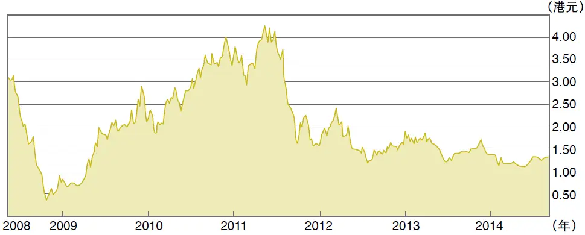

图1—6 茂业国际（0848\.HK） 2008—2014 年股价走势图

资料来源：雅虎财经。

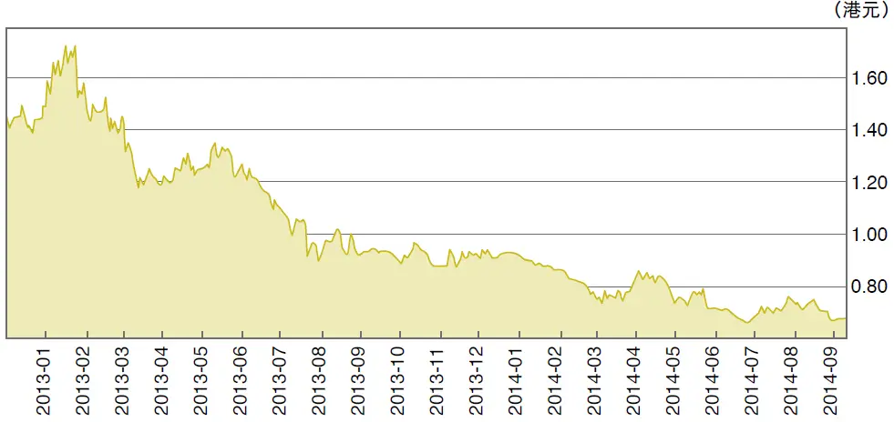

图1—7 新城地产（1030\.HK） 2013—2014 年股价走势图

资料来源：雅虎财经。

## 第1章 谁能战胜股市？ - (04) 1.04 国有企业好过民营企业

\(04\) 1\.04 国有企业好过民营企业

2026年3月14日

9:59

__1\.04__

__国有企业好过民营企业__

我坚信，中国的国有企业好过民营企业。你会感到奇怪，张化桥这样一个“老愤青”，怎么会持有这样的看法？请听我解释。

__国企这一杆大旗__

中国从某个角度看，是一个“贫穷”的国家，人口压力巨大，自然资源很少，某些传统文化还在“拖后腿”。如果我们发展自由资本主义，那就像印度、巴基斯坦和菲律宾一样，也许还不如它们。当千千万万平民一分钱都没有，一点技能都没有的时候，逼着他们自己创业或者找工作，大家都在肮脏的大街上像无头苍蝇一样，这是非常浪费和危险的。印度、巴基斯坦和菲律宾就是如此。

中国的国有企业就像一杆大旗，让大家云集在大旗之下。它们为大家提供了至关重要的组织系统和稳定。组织系统比做生意的启动资金更加重要。

中国的某些国有企业管理方法比较落后和低效。这些咱们都知道。但是你想想，如果没有大量的国企，中国的20世纪40年代到70年代初是什么样子。大量国有企业的存在是中国过去30多年发展成功最重要的原因。国有企业的脆弱正是亚洲、非洲、拉丁美洲大多数穷国依然十分贫穷的原因之一。这听起来很离谱，但是我真的这样看。

我在湖北农村长大。20世纪七八十年代，我自己（和很多亲戚）也曾经像幽灵一样在小镇里穿梭，艰难谋生。当然那只能是浪费时间。这对于社会资源是浪费，也是社会不安定的起源。20世纪80年代，我到了中央银行工作，后来留学澳大利亚，又到香港地区的外国投资银行工作了15年。2006—2008年，我来到一家国企—深圳控股（0604\.HK）担任执行董事和首席运营官，并且同时在另外两家国企—越秀地产（0123\.HK）和深圳国际（0152\.HK）担任非执行董事。在这段时间，我体会到了国有经济制度的很多问题，也知道中国有些人对国企有意见。但是，他们知道，虽然他们在口头上不肯承认，在中国实行自由资本主义制度更加危险。其实，他们每天都在用实际行动拒绝自由资本主义。你看，绝大多数大学生疯狂地追逐公务员的职位，疯狂地追逐国有企业的职位。每次遇到一个经济问题，他们就呼唤“政府加强监管”。他们口头上有时指责国家发展和改革委员会（以下简称“发改委”），但事实上，按照他们的愿望，中国即便成立100个甚至1000个发改委也不够用。

自从清朝末代皇帝退位，到1949年，中国出现了资本主义萌芽，但是它导致严重的贫富悬殊和社会问题，引发了叛乱和革命。国民党政府虽然有西方支持，虽然有军队和钱财，但是千千万万老百姓抛弃了它，支持了中国共产党。中国的公众用血汗和生命选择，抛弃了国民党，这比任何轻松的投票和高谈阔论的民主更加具有说服力。

__民企优势有限__

2014年我出版了一本英文新书，Party Man, Company Man，与2013年出版的Inside China's Shadow Banking（中文书名《影子银行内幕》，机械工业出版社出版）的写作都是出于同样的目的：教育西方读者。我很幸运，从贫穷的农村，到中央银行，再到澳大利亚、香港地区、深圳和广州，体验到了各种社会制度和生活方式。我希望把体验告诉大家，影响大家。

大多数欧美人都以“自由者”（libertarian，或者liberal）自居。有些人批评中国人实行的国有经济制度。但是，我强烈反对他们。不是因为我没有看到国有经济制度的一些问题，恰恰相反，我有实际经验。我认为，国有经济制度是中国成功的利器和秘诀。

中国人和外国人都看到了今天的事实，中国问题的透明度很高，但是每个人的观点和结论不同。我的书有强烈的观点，这些观点基于我的背景和经历。

我想特别指出两点。

（1） 很多中国人其实还依然不看好民企。由于不被看好，部分民企就试图走偏门，而且业绩也不好（部分原因是规模不经济，部分是因为没有优势，还有经济高速增长带来的动荡）。大家就说：“你看！你做坏事！你的业绩也不怎么样！”这是一个恶性循环。整体来看，民企的业绩确实不如国企。这是事实，但很多人不承认。

（2） 总的来讲，国企的历史更长、经验更多、治理更好。这也是事实。我在这本书中详细讲解了原因。

其实，从20世纪70年代末以来，中国政府确实把一些经济部门和行业放给了民营企业，但是最近十年，这个动作又慢慢走了回头路。是好是坏，大家可以评判，但是，回头路是肯定的。何以为证？

（1） 中国最大、最好、最赚钱的行业牢牢掌握在政府手上：烟草、盐业、银行、保险、证券、信托、电讯、“三桶油”（中石油、中石化、中海油），以及基础设施（机场、港口、道路）等。说起“宽宽的护城河”，政府手上的企业都是巴菲特会选择的：有很宽的“护城河”。

（2） 从2005年以来，股市所有公司的利润加起来，银行业占了一半以上，加上“三桶油”，占到70%以上。如果再加上电讯和其他政府的企业，这个比例就更高了。民营企业利润总额小得可怜。

民营企业做的是一些毛利极低的简单制造业、累死人不偿命的服务业和不赚钱的农业。有些行业虽然初看不错，但是它们没有持续发展的可能性，因为前景不明朗，或者那些行业根本就没有“护城河”。

这个变化究竟是怎么回事呢？

（1） 政府的财政收入占GDP（国内生产总值）的比重，在1979—2003年一直下降。但是，过去十年，这个比例大大回升，翻番有余：从10%增加到23%。不信？你到国家统计局的网站看看。

（2） 高速的、长期的信贷膨胀。这种膨胀加上利率管制（存款利率低，放款利率高），结果就把所有其他行业的利润都转移到了银行业。这种转移支付持续的时间之长、程度之深，全世界也没有先例。谁是银行的大股东？你知道的。

（3） 国有企业贷款利率低（年息5%～7%），民营企业贷款成本高（年息10%～50%），民企怎么竞争？

## 第1章 谁能战胜股市？ - (05) 1.05 看好银行股的理由

\(05\) 1\.05 看好银行股的理由

2026年3月14日

9:59

__1\.05__

__看好银行股的理由__

有一次，深圳东方港湾投资公司的钟兆民（下文称“钟”）跟我（下文称“张”）辩论银行股。

张：你为什么不看好中国的银行股？

钟：我不看好任何国家的银行股。第一，周期性。第二，资本密集型，银行需要不断圈钱。第三，高负债率，危险。

张：我看好目前中国的银行股。

（1）周期性：中国绝大多数行业都有周期性，程度不同而已。现在虽然不是周期的谷底，但也不是周期的顶峰。

（2）资本密集型：这本身就是进入门槛啊！还有牌照上的限制。

（3）高负债率确实是个很大的风险。银行赚钱靠杠杆，但坏账也可以把银行整垮。不过，经济更糟糕时，银行垮台之前，我们的工厂和商业很可能更烂。银行获救时，股民会被摊薄，但是，工厂和商业企业的股东们可能已经连被拯救的时间都没有了。

（4）银行的坏账确实看不清楚，但是工商企业账目更清楚吗？

（5）我认为，股民要买通用设备（比如银行和跟日常生活关系密切的公司）的股票，尽量避开专用设备（比如看不见摸不着的公司）。通用设备就是不太需要专业知识的投资。比如，银行就是整个经济的综合反映。专用设备包括高精尖的东西、专业性太强的东西以及狭窄行业的东西。这些行业波动性大，也比较容易作假（因为大家不懂）。

我还有几个例子：南美的森林、太平洋的渔业、蒙古的锡矿、泰山顶峰上的香精，等等。另外，什么叫“云端叠式磁性共振化疗”？这些行业只适合专业投资者，不适合老百姓。（说起渔业，注意蓝田股份在洪湖养的鱼。）

巴菲特说：“科技是人类进步的基石。不过我还是把登月的乐趣让给人家。”其实，指数基金就是通用设备（不是专用设备），因为它涵盖很多行业，特别适合没有时间或者没有能力把握狭窄行业周期变动和万千气象的投资者。

钟：可是现在，中国最差的银行都在赚钱。这能持续吗？

张：不太好的银行确实还在赚钱。不过，这实际上是一种转移支付：储蓄者会补贴银行，补贴使用贷款的企业。从某些角度看，这不是很好（刺激信贷需求、浪费宝贵的资金、可能导致腐败，等等）。但是我看十年之内，这种状况不太可能有变化。

## 第1章 谁能战胜股市？ - (06) 1.06 老股民的新困惑

\(06\) 1\.06 老股民的新困惑

2026年3月14日

9:59

__1\.06__

__老股民的新困惑__

关于公司增发新股，我有一次和朋友们进行了一番讨论，也请股民们注意。

张：每个人都说，中国地产公司的股价相对于资产净值（NAV）有40%甚至70%的折扣，但是它们为什么依然愿意增发新股（和可转换债券）或者做IPO呢？我搞不懂。我觉得一定是我们股民算错了，分析师算错了，而不是公司和大股东算错了。买的人不如卖的人精。

朋友A：因为增发新股以后，公司负债率下降。公司就可以从银行借更多的钱发展业务。

张：我糊涂了。你的意思是，房地产公司为了赚取12%的净资产收益率（ROE）回报而忍受15%的债务成本（包括信托）加上53%的净资产折让？我想大股东没有那么笨。我敢肯定，肯定是我们股民笨、分析师笨。董事长装傻，私下里嘲笑我们股民和分析师。

朋友B：可是，发行新股或者可转换债券，都是为了做大做强啊！

张：你的逻辑不对。发行新股或者可转换债券，都是出卖股份的方式而已。如果中国房地产公司的股票真的像我等傻瓜说的那样，有40%～70%的估值折让，那么，这些公司应该把所有的业务停下来，用资金回购自己的股票，大股东也应该竭尽全力增持这些股票。你想想，天底下哪里能够找到40%～70%的投资回报率啊！？投资自己不是最好吗？

朋友C：你是真糊涂？

张：我真的有点老糊涂。我觉得对中国地产公司行为的唯一解释（当然也适用于其他所有行业）是，在大股东眼中，虽然增发新股也许贱卖了股份，但是小股民的股份也是属于他的。不求所有，但求所在！他的属于他，你的也属于他！

朋友D：折不折价无所谓，反正小股东不太可能拥有公司实际控制权，也就没可能决定清算公司资产。圈钱才是关键。

张：我同意。请允许我做个广告。我在《避开股市的地雷》那本书里说，假设政府只允许企业用2倍的市盈率发行股票，也会有大量（极大量）的企业增发新股或者做IPO。我敢打赌。

注意：我讲的道理适用于所有的行业，都是大实话。但是，大家选择听不懂。投资银行的人找出各种理由为企业辩解，怂恿企业多发债，增发新股、可转换债券等。他们的理由无非是“增加股票的流动性，扩大投资者基础，市值管理，以便分析师好写报告，等等”。

更有甚者，有些股民不断说服自己、安慰自己，把明摆着的垃圾说成是艺术品。当然，券商的销售术就更花样繁多了。

在我的书中，我讲了一个例子，解释为什么大量日落西山的公司即使在股价长期低于账面净资产80%的情况下也不肯回购、增持、卖盘或者清盘。为什么？他的属于他，你的也属于他！

## 第1章 谁能战胜股市？ - (07) 1.07 股市见底了吗？

\(07\) 1\.07 股市见底了吗？

2026年3月14日

9:59

__1\.07__

__股市见底了吗？__

我跟远道而来的一位英国投资者吃晚饭。他说,为了避免草率行事,投资银行的研究报告最好放一段时间再看。听了这句话,我额头冒汗,因为我的研究报告虽然可以装一卡车,但是绝大多数经不起时间的考验。不过,为了虚荣心,我终于找到了一篇。不对,半篇（其中还是有很多错误）。

__港股A股此消彼长__

以下是2011年11月18日,我在华安基金研讨会上的演讲。

回顾过去一年，我的预测对了一半，错了一半。不过，这个成绩可不算太差。我经常说，做预测本来就是很不明智的事情。你的预测越短期、越精确，也就错得越远。不过，请允许我做一个长期的、模糊的和方向性的预测。未来几年，中国的股市依然令人担心。根本原因有三：

（1） 通胀的压力和相关的信贷紧缩。

（2） 有些企业账目的问题和谎言（包括豪言壮语）终会受到时间的检验。

（3） 我们的股票基本都太贵，也许除了银行股和少量地产股以外，其他大多数股票依然太贵。你想想，这些股票的估值在这一轮大跌以前曾经多么荒唐！

我1994年到香港当股票分析员以来，见证了港股与A股的此消彼长。我看这个大趋势还在继续。最近几个星期，内地的资金市场松动属于“抗旱救灾”性质，不属于基本面的改善。一年多来的信贷紧缩或多或少窒息了民营经济，但是大部分国有企业毫发未伤。我们老百姓要为此付出代价。即使作为自私的股民，我们也不应该忽视这件事。

2012年的通胀率会因为2011年的高基数而“显得”在下降，但是，在实业界苦苦挣扎的人们并不会因为过了12月底就能看到什么神奇的改善。通胀就像筑起了一个高台。以前买一吨煤，占用300元资金，而现在占用700元。商店和工厂的铺底资金也一样增加了。即使央行不紧缩信贷，通胀本身就是紧缩性的因素，就像卡住脖子一样窒息经济活动。而且，未来几年不太可能有过去多年来20%以上的货币供应量增长了。这也是压制股市的原因之一。1977年，巴菲特写过一篇长文章，讲通胀与股债的关系。我做了摘译和点评，建议大家看看。

以前，每遇到A股股市下跌，必有官员和媒体的社论给股民打气和壮胆，害了一批又一批股民。现在，这种现象少了，因为大家终于发现那是多么可笑。这是进步。

__留足安全边际__

请允许我讲讲怎样的估值才可以让人接受。股票估值不是科学。它靠常识、经验判断，再加运气。我认为，市盈率基本上应该是利率水平的倒数。虽然对个股，我们不能用这个尺子来衡量，但是对于一个股票市场，这是一把正确的尺子。那么，未来3～5年，中国的平均利率水平会是多少？虽然利率千万种，但是我觉得，一个安全的办法是用普通中型企业从利伯维尔场（自由市场）获取贷款的利率。现在，这个利率可能是10%～13%，它反映了资金的松紧。在这种情况下，我认为，股票市场的市盈率应该在7～10倍。当然，个股情况有别。但是，当我们一脚就可以踢到好多个市盈率高达20倍甚至40倍，而且质量马马虎虎的公司时，我们应该知道，这个市场的水位还太高，温度还太高。我们应该静待。10年并不太久。很多股市跌了10年甚至20年，才找到自己正确的位置，我们为什么要鲁莽而入？20倍和40倍的市盈率意味着20年或者40年后，股民可以收回成本。但是，那些公司能存活那么久吗？

换一个角度：理财产品的收益率是6%～7%，你额外加上1/3的安全边际，大约9%～10%。所以，股票市场的合理市盈率应该在10～11倍。

投资者不能满足于投资一只“公平的”股票，而必须留足安全边际。即使这只股票真的值5元，我为什么要买一个“合理估值”的东西呢？我们必须占便宜。这是硬道理。那么，我们需要多大的安全边际？我看起码30%～40%的安全边际。如果你认为某只股票值4～5元，那你只能在2～3元时下手。

我们股市中人，都有一个大毛病：我们早就决定了要买股票。我们的挣扎只是买哪些股票和买多少，而根本不愿意花时间研究一个更基本的问题：该不该买股票，以及为什么一定要买股票。

其次，我们要明白，一家公司对于不同的人有不同的估值。这话听起来可笑，但是千真万确。比如，公司大股东觉得公司的股票价格值5元，但是这家公司对于散户来讲，可能只值3元或者更少。公司的管理层吃香的、喝辣的，可以在公司里报销开支，所以这家公司对他们的意义更大，更值钱。但是，普通股民如果没有发言权和知情权，也没有分红，当然不能用同样的标准看待这家公司。在地产公司里，有太多的价值陷阱：这栋楼值5亿元，那块地又值8亿元。算下来，每股的净资产8元，但是股价只有3元。那8元也许可以叫“清盘价格”，但是，这家公司何时会清盘呢？它永不清盘，它的大股东永远掌握着一家公司。而我等股民呢？

用上述标准来看A股市场，我觉得基本上没有多少长期价值，也谈不上安全边际。而且，各个行业和板块都是相互关联的。大市下跌的时候，大家都不能幸免。所以不要做过于精准的分析。

你可能会反驳我：“用你的标准，一只股票也不能买！”我的回答是，那又怎样！你为什么一定要买股票呢？基金经理由于工作的原因没办法不买股票，但是其他人完全不要勉强自己，不要说服自己买股票。当然，如果你买股票的目的只是乐趣（而不为赚钱）,那就另当别论。

__利润率比利润增长率更重要__

跟股市密切相关的两个问题是：

（1） 未来5～10年中国经济增长是加速还是减速？

（2） 我们企业的利润率，特别是现金流会不会有改进？

过去十年，中国的经济高速增长与两样东西有关：政府消费（或者叫政府投资），以及出口高增长。现在，这两个因素都在发生变化。消费是以高税收和高信贷为前提的。高税收多少会窒息民营经济，降低效率。高信贷呢？加剧了通胀。这种状况已经无法再持续了。我们政府的财政扩张和信贷扩张也面临调整。至于出口的增长，咱们就不讲了，大家有共识。

所以，我们大概可以统一这个观点：未来几年的经济活动会比过去十年慢一些。这就要考验企业营商的水平了。显然，粗放式赚钱的难度加大了，这对很多行业都有影响：船运、建筑、建材、矿产，以及相关的服务。其实，整个经济都是密切相关的。

瑞士信贷的陈昌华是业内高人，他写过一篇文章，题为《没有现金的增长》，讲过去多年来中国公司的利润虽然有不错的增长，但是现金流很差。他说，2011年上半年，中国非金融类的A股上市公司（共2132家）的总体销售收入和利润同比分别上升了26%和20%。可喜。但同是这批企业，它们在营运中产生的现金流则比同期下降6%。这个问题在过去几年有恶化的迹象。

它跟我们的经济发展阶段有关，也跟我们的管理能力有关。未来十年，如果经济增长放慢，我们的企业会被迫学习一样新技术：降低成本，提高利润率，提高现金流。也就是学习多“榨汁”。

我想起麦肯锡的三位研究员2010年出版的一本书，《价值：公司金融的四大基石》（Value：The Four Cornerstones of Corporate Finance）。本人对此书写过一篇书评，叫《光有利润增长是不够的》。这本书讲到一个道理：利润率（或者资本回报率）比利润增长率对于股票估值来说更重要。这个道理在中国还比较新鲜。他们说，亚洲公司为什么不如美国公司的估值高？大家一般认为，这是美国资本市场的偏见。不对！根本原因是亚洲公司回报率（利润率）太低。利润增长快，但是消耗了太多的资本（股和债）。他们说，高负债率不仅不能增加股东的回报率，反而会降低他们的回报率，经常导致财务危机和抗风险能力下降。

我认为，宏观指标与股票市场的关系不稳定、不可靠、单一。不过，股民应该看看银行承兑汇票市场。这个市场很大、很活跃，它的利率完全由供求关系决定。在正常情况下，这个利率一般略低于银行基准利率，但是由于贷款基准利率没有上调，所以银行承兑汇票市场的利率涨到了11%～12%，虽然基准利率还是维持在7%以下。在这种情况下，如果你指望股市有什么作为，实在是一厢情愿。

最近，这个利率降到了10%以下，所以股市也开始回暖。不过，我个人认为，最近的资金市场松动属于“抗旱救灾”性质，不属于基本面的改善。那些中短期炒作股票的人，除了密切关注银行同业拆借利率之外，应该多看看银行承兑汇票利率的变化。当然，我建议大家完全忽略中短期，从遥远的地方眯着眼睛看看宏观指标就可以了。

现在，我想回答朋友们很关心的一个问题：银行的存款额最近为什么下降？很多人说，因为钱都跑去放高利贷去了，或者买银行和信托公司的理财产品去了，或者买股票和房子去了。这全是没有常识的话。你从银行取款买东西（任何东西），虽然你的存款下降了，但是别人的销售收入增加了，从而存款相应地也增加了。所以，买卖行为根本不影响全银行系统的存款余额。那么，如何解释我们存款的下降呢？答案很简单：人民银行多次提高存款准备金率，还用贷款额度来限制信用扩张，贷款和存款当然都会同时下降。存款到哪里去了？烟消云散了。

另外一种情况，如果经济前景黯淡，商界不愿意贷款，纷纷降低负债率，那么即使货币政策宽松，也可能出现贷款和存款同时下降的情况。现在美欧和日本遇到的就是这种情况。

## 第1章 谁能战胜股市？ - (08) 1.08 债券与股市的关系

\(08\) 1\.08 债券与股市的关系

2026年3月14日

9:59

__1\.08__

__债券与股市的关系__

1986年6月，我到中国人民银行总行工作。第一个月工资54元（含副食补贴5元和交通补贴3元）。可是，办公室扣掉了我10元认购国库券的钱。那时候，每个干部都要认购国库券，年息10%，5年期。大家咕咕哝哝，但也只好接受。

那时候，北京的西单和三里河到处是二道贩子，倒买倒卖国库券，也是5年期的。我记得很清楚，基本上都是半价，甚至3～4折。为什么？原因有二：一是国库券没有合法的二级市场的转让。二是通胀严重。在通胀严重的情况下，我觉得那时候黑市的国库券价格相当合理。

未来5～10年的通胀如何，我不会预测。不过，在2013年11月，十年期国库券的收益率在4\.7%左右，这是市场很乐观的象征。乐观当然是好事，明天总是更美好。可是，一旦大家发现自己过于乐观，债券价格会下跌，特别是长期债券价格！

债市跟股市是相通的：大家对债券市场的乐观当然也会影响股市。也就是说，大家现在对股市通胀率和风险系数的预测都是相当乐观的。我觉得那个时候的人也许比现在更聪明。

我想重复三句大白话。

（1） 股市的市盈率是长期市场利率的倒数（在国债利率基础上要加一些百分点）。短期内，这句话不见得正确，但是中长期，它是没有问题的。

（2） 通胀本身就是紧缩性的。怎么讲？在通胀的情况下，如果央行迎合通胀，即提高信贷总额的名义增长率，那么名义市场利率会相应地上升。水多了加面，面多了加水。过去30年来，咱们基本就是这个螺旋式上升。反过来，如果央行反击通胀，保持信贷的名义增长率不变，那就是变相的紧缩。如果央行更进一步，降低信贷总额的增长率，那么短期内流动性就会紧得不得了，就像卡了脖子一样，喘不过气来。当然，这样的话，通胀率就会很快下跌，甚至出现通缩，然后股市在大跌以后，迎来的是蓝天白云。

（3） 股市中人（特别是分析师们）基本上都是“拉拉队员”。一味唱好，并不觉得自己有失公允。本人当了“拉拉队员”十多年，略有体会。我们容易把希望跟判断混为一谈。

## 第1章 谁能战胜股市？ - (09) 1.09 A和H，买哪个？

\(09\) 1\.09 A和H，买哪个？

2026年3月14日

9:59

__1\.09__

__A和H，买哪个？__

20年前，我来香港给华尔街打工。当时，香港的股票基本上就是8～13倍市盈率。A股呢？百倍不算高。

当时，大家有共识：中国社会主义市场经济就是不同，有特色，估值更高是应该的。不过，岁月不饶人啊！在2014年8月，工商银行的A股价格大概是3\.5元人民币，H股大概是5港元（大约相当于4元人民币）（见图1—8及图1—9）。

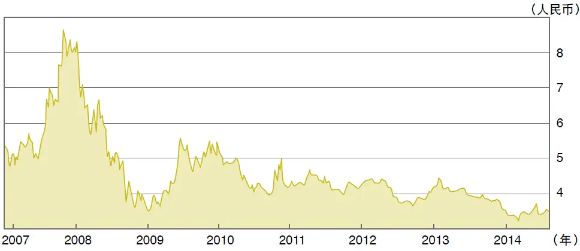

图1—8 工商银行（601398\.SH）2007—2014 年股价走势图

资料来源：雅虎财经。

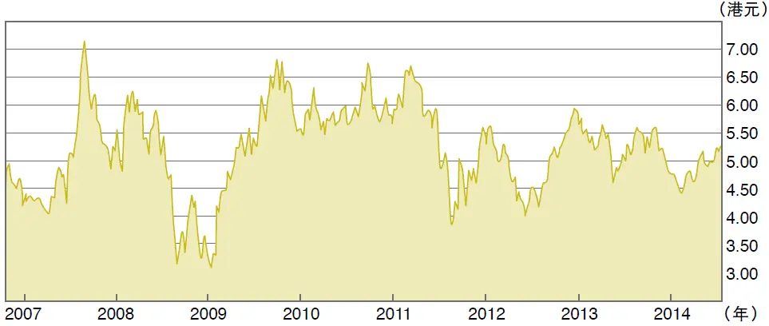

图1—9 工商银行（1398\.HK）2007—2014 年股价走势图

资料来源：雅虎财经。

如果你问我这个老愤青，H股好呢，还是A股好呢？我跟你私下说说就算了，千万不可外传：你当然要买H股啦！

我的老掉牙的理论很简单。任何资产都是DCF（discounted cash flow，现金流量折现）的结果。市场利率越高，估值越低。这跟官方（基准）利率无关。市场利率=预期通胀率＋真实利率。

十多年来，不少朋友跟我抬杠：同一家公司的A股与H股同股同权，估值应该平等。没错，同股同权。但是同样数额的分红（比如每股3角人民币）在内地值多少？用DCF方法把未来的分红折现到今天，也许值6元人民币（打个比方），但是，用同样的方法把未来香港地区的股东（或者外国股东）所能收到的分红折现到今天，可能相当于12港元（即，约10元人民币）。你说，A股与H股哪个更有吸引力？

信不信由你：高速的信贷增长、高速的货币供应量增长是A股市场的最大杀手。

我从来讨厌炒作概念。在我看来，沪港通也只是一个概念。大家千万小心为妙，因为地雷到处都是。

2012年9月，我出版了得意之作《避开股市的地雷》。书中谈到我十多年在香港当分析师的观察，以及避开地雷的体会。20个月之后，我很荣幸地向读者报告，其中推荐的十多只股票，多数上升一倍以上（比如安瑞科、深圳国际），少数几个错误选择，也只是打平或者微亏。运气好,撞对了一次。

## 第1章 谁能战胜股市？ - (10) 1.10 我们会犯的七大错误

\(10\) 1\.10 我们会犯的七大错误

2026年3月14日

9:59

__1\.10__

__我们会犯的七大错误__

我跟朋友交流时发现，大家（甚至包括一些基金经理）容易犯这样几个错误。

（1） 迷信名人。因为某某名人买了某只股票，我们就跟着他买。但是，这位名人也许并没有做过研究，也许这项投资是个错误（连巴菲特也时有错误）。有些时候，这项投资也许是明智的，但是由于各种原因，三个月后这只股票跌了30%，我们就把它卖了。而那位名人坚持持有了两年，赚了一倍。有时候一些企业公开招股，有些名人碍于面子（或者一时头脑发热）认购了新股，散户便争先恐后跟着认购。

（2） 过分看重一次性的利好或者不利因素。举个例子，早前香港某股票大涨30%，原因是该公司突然发现它手持的香港交易所（0388\.HK，简称港交所）的股票升值，价值更已大于该公司的总市值。也就是说，其他业务都是免费送给投资者的，意味着“这股票真的便宜”。于是，大家蜂拥而入。可是，大家没想到，这家公司的主营业务还是马马虎虎，没有多大前途。况且，还有三个问题：该公司会不会把手持的港交所的股票全部卖掉？假使卖掉了，会不会全部分红？如果不分红，那些钱会不会被浪费掉？如果在回答这三个问题之前买入这只股票，赔钱的可能性很大。

又比如，某公司因赢得了一项大合同，股价便大涨，而大家忘记了问这个合同的真正好处以及可持续性。一次性的税务优惠、成本下降（如裁员），或者产品价格大涨，也经常被当成永远的利好。一个成功的并购（可能纯粹是靠运气）也会被夸大。投资者看市盈率时，也过分看重眼前的比率，而忘记了过去的比率和未来可能的比率。

（3） 忘记企业对业务监控的能力。在香港地区上市的不少公司的管理层经常在香港地区居住或者与投资者见面。这本身不是问题，问题在于，他们跟内地的业务会不会脱节？跟拉丁美洲、俄罗斯或者蒙古的业务会不会脱节？如果一个企业的业务遍布全中国几个城市甚至几十个城市，那么公司高层究竟住在香港，还是北京或者西安都一样。

可是，有些公司的高管太关注股价，而慢慢忘记了业务，业务便开始下滑。长期假手于人的结果就是下属自建独立王国。前几年，某公司的香港总部决定与另外一家公司合并。协议刚公告，下面几个附属公司的高层就开始造反，连公章也不肯交出来，也不配合对方公司的尽职调查，甚至连财务报告也拒绝做。还有，有些公司本来就是借壳上市（back\-door listing），公司像盖了两张皮。虽然他们内部有沟通，但毕竟时间长了，两边各说各话。

（4） 喜欢忙碌的公司。有一类公司很忙碌：不断发行新股票、债券或者可转换债券，同时又分派不错的现金红利。这实际上是耍弄投资者的雕虫小技，但很多人被迷惑。还有一种公司不断兼并收购，过了一两年，又陆陆续续把它们卖掉。买的时候有故事，卖掉的时候也有理由。它们的股价会高于安安静静的公司的股票。投资者还有一个偏好：喜欢IPO公司，忽略老公司。这很像香港地区居民喜欢买新房，而不爱旧房一样。

（5） 期望过高，导致回报过低。理论上，股票市场的中长期回报率与宏观经济的增长率应该差不多。以今天来说，那就是4%～8%。其实，美国股市、日本股市和不少其他股市在过去十年的回报率是负数。大多数基金在过去10年和15年的回报也非常低。当然，每个人都认为自己很聪明，或比大多数人高明，但结果不见得总是如意。

如果你告诉一个散户，他的中长期投资回报率只能是4%～8%，他会很不愉快，或者嘲笑你：太低了！

我们买了股票以后，往往还没来得及让公司的基本面改善，或者让市场认识到公司的优点，就急不可耐地卖掉了。比如，股票半年后还没涨，甚至跌了，我们便开始怀疑自己的眼光。另外，我们太容易见异思迁，于是不断地搬迁。

有研究发现，多数股票和大市大涨或者大跌都集中在某个很短的时间内。你如果没有耐性，买来卖去，也就很可能正好错过那大涨的某几天。反过来，你会说，你也可能正好躲过了股票大跌的日子。但是，你怎么知道你的运气就那么好呢？

举个例子，在新加坡等出租车不容易，我曾试过在某处等了十分钟，开始不耐烦，于是走到另一个路口去碰运气。可是，我刚刚走开，在我后面排队的人就等到了车。我在新的位置又等了十分钟，还是嫌出租车来得太慢：也许这个位置不好。如此反复，半小时以后，我还是没有等到车，而那些后来者都已经回家了。

（6） 过分轻信公司管理层和专家。多数投资者都犯过，或经常犯这个错误。我们轻信公司的概念、故事以及媒体的报道，所以投资太轻率。公司高管可能撒谎，又或是他们虽然没有骗你，但是高估了自己的能力，也可能低估了面对的困难。很多投资者输钱就是因为他们轻信股评家、分析师和媒体。而这些人发表意见之前，未必做过认真研究。

（7） 这山望见那山高。很多投资者（包括基金经理和我这样的个人投资者）容易见异思迁。本来自己已经有一个不错的资产组合（里面包括20或者30个不错的公司），但是有时由于股票评论员的怂恿，有时由于自己心血来潮，耐不住寂寞，突然觉得某个概念、某家公司很好，好过自己所持有的某某公司。于是，我们卖掉旧的，腾出资金买入新的。大家有没有发现，在未来两年内，旧的公司跑赢了新的？我们根本没有给公司足够长的时间来让它们自我表现。

## 第1章 谁能战胜股市？ - (11) 1.11 我的选股路线图

\(11\) 1\.11 我的选股路线图

2026年3月14日

9:59

__1\.11__

__我的选股路线图__

如果你接受我的基本投资理念，即避开恒生指数的成分股（大价股），在中小股票中找寻50～70只股票，你可以沿着如下路途往前走。

（1） 不要急于一次买齐50～70只股票。永远记住我们没有能力抓住最佳的入市时机，所以“平均成本法原则”是个好原则。一下子急于入市，万一遇到股市下跌，你的弹药就不够了。当然，如果股市一直上涨，你会错过很多机会，但是，我们只有在事后才知道我们处在一个股市的谷底，而在事前谁知道呢？随着每个月工资和奖金的流入，我们可以分步建仓。等到买齐了50～70只股票之后，我们可以每个月加码。50～70只股票，一般人可能很难做。在香港地区，大家可以选市值在10亿港元以上的股票，范围很广，选择很多。

（2） 过一段时间你持有的部分股票突然涨了很多，你就需要资产配置再平衡，即rebalance。但是之前要分析两件事，一是这只股票是否真的太贵或者前途开始黯淡？二是它在整个资产组合中的比重是否太大？如果没有特别的原因，可以尽量降低再配置的频率，长期持有和减少交易费用都是十分重要的原则。巴菲特说，对于好公司的股票，你应该让它多跑一段时间。它在跑完现在的高增长阶段之后，也许能找到新的增长点，关键是找到一个好的管理团队。他说，如果你找到了好的团队，那么，最佳的持股时间是永远。当然，他自己就承认他持有可口可乐时间过长（在1999年该股票严重高估时，巴菲特也没有出售），一直到近几年该股票严重跑输大市。另外，他持有《华盛顿邮报》的股票也是时间太长。也许，这是他的投资哲学使然？也许，他的资金量太大，不允许他频繁换马？好像不对。在这方面，要把握得好，实在不容易，连“股神”也不完美，更何况我们？

（3） 在选股时，剔除企业管治方面明显有问题的公司。董事长个人有无问题，管理层名声如何，公司透明度怎样？记住避免损失比赚钱更为重要。本人在过去多年的投资里，四次碰到地雷公司（公司因为管治方面的问题而关闭或者长期停牌），损失惨重。我受伤的概率不可谓不高。这可以看出有些内地和香港的公司中的巨大问题。这些还都是上市公司，理论上应该属于比较好的一群。所以投资者再怎么小心也不为过。

（4） 利润增长率对股票升值至关重要。这句话怎么强调也不过分。其实避开恒生指数的股票（即大价股）本身就是为了寻求中小企业作为一个整体所具备的较高的利润增长率，但并非每个中小企业都会高速成长。大量中小企业因为行业走下坡路或者企业管理水平差而长期停滞不前甚至倒退。在这方面，我们应该做一些初选，但不要太认真选，也就是说，不要有太强的观点。在行业上足够分散，在个股的选择上，尽量避开太热门或者估值太高的股票。

注意：避开大价股（比如恒生指数成分股）并不代表它们都不能有好的表现。但是，从概率上讲，大部分大价股已经毕业了，已经辉煌过了。这为未来的成长增添了困难。当然太小的公司也有两个问题：一是在业务上规模不经济，二是业务在竞争中失败的可能性较大。

（5）记住，不要对汇率或大宗商品的价格作预测。讲句实话，谁也无法作准确的预测。

## 第2章 股民要如何避免越来越穷？

__第2章__

__股民要如何避免越来越穷？__

“在短期内，股市必然是个零和游戏。张三的利润只能是李四的亏损。所以，股民要赚钱，只能靠股票背后的企业中长期内为你争气。股民作为一个集体，不可能通过强行把股市推高来赚钱，这完全是梦想。推高了的股市必然掉下来。”

2026年3月14日

9:59

## 第2章 股民要如何避免越来越穷？ - (01) 2.01 “股市真便宜”是什么意思？

\(01\) 2\.01 “股市真便宜”是什么意思？

__2\.01__

__“股市真便宜”是什么意思？__

我曾经在上海一个研讨会发言时提到沪指1000点，这很不幸被大家误解。我收回那句话。我的准确意思是这样的。

（1） 现在的股市还是太贵。

（2） 如果要留足1/3安全边际，让我掏钱投资，我觉得1000点合适。

（3） 我在发言时就强调，那1000点不是预测。我非常反对预测。我也反复强调，贵的东西可以更贵，便宜的东西可以更便宜。我不知道明年、后年股票指数是多少,但是股民们必须知道，自己在一个很贵的市场博弈。当然，输钱的概率大于赚钱的概率。

（4） 投资的核心是留足安全边际。大家为什么要买“合理估值的股票”呢？占便宜是硬道理。另外，大家注意，大股东的合理估值与小股民的合理估值是不一样的。前者有控制权和签单权，而后者没有。

（5） 中国的股市为什么“跌跌不休”？太贵了呗！

__“便宜”的标准__

“股市真便宜”是什么意思？我们可以掌握这样几个标准：

（1） 上市公司纷纷回购股票，不是装模作样地回购，而是大幅度地回购，穷其资源回购。

（2） 大股东们纷纷增持股票。同样，不是装模作样地增持，而是大幅度地增持，穷其资源增持。

（3） 新股发行被大量的公司主动叫停，而不是被政府叫停。最好看到这种状况：几乎所有的公司都对IPO失去兴趣，撤回申请，而政府只好做拟上市公司的工作，施加压力，让它们看在国家的利益上申请IPO。最好看到党员董事长们被动员起来，起模范带头作用。

大股东和管理层知道的公司内情远远超过我们股民。股民不能自作聪明，要跟着他们做，千万不能反向操作。比如，他们在拼命上市IPO、增发、配股、减持，而股民还认为股票真便宜，还傻乎乎地高唱“敢死队”的战歌。不可笑吗？

1989年，澳大利亚政府决定在首都堪培拉开设赌场。在此之前，全澳人民就赌场带来的社会问题和家庭问题辩论了几年。

当时，西方国家经济萧条。1991年，我到堪培拉大学当讲师，我的两个毕业生都因为找不到银行的工作而去了赌场做客户教育和心理咨询。

这些年来,中国股市所带来的社会问题和家庭问题远远大于一般赌场带来的问题。但是，有没有人花足够的力气保护股民，并为不幸运的人们提供心理辅导呢？

__小心“价值陷阱”__

什么叫“价值陷阱”？看起来便宜，其实不便宜的股票是也！你买了它，它却越陷越深。

在伦敦，有个基金经理长期投资亚洲股票。某日，他问我：“中国股市的价值陷阱为什么那么多？”

我虽然研究过价值陷阱这个现象，但是从来没有想过他说的这个问题。

后来过了几周，我一直苦思冥想，不得答案。确实，中国的价值陷阱好像不少：银行、石化、制造业、服务业、酒店业等。我有如下几个初步设想，供大家参考。

（1） 价值陷阱特别容易在经济缓慢增长或者经济衰退的国家出现。虽然中国整体经济增长很快，但是这20多年来经济结构变化很快，有很多行业在下滑，甚至消逝。这类行业的公司就容易成为价值陷阱。有的企业转型成功，但是大多数企业要么坐失良机，要么无能力转型，或者不愿意转型，或者转型失败。

（2）在市场经济国家，大量的价值陷阱都是通过主动的关、停、并、转来实现的，其中也可能涉及大量分红派息，有时它们的分红派息远远超过当年的利润（即把滚存利润全部分给股东们），甚至变卖家当用来分红派息。但是有时候咱们执行这个过程很有难度：民营企业不愿意这样做，不愿意放弃控制权，而国企多少可以享受些补贴或者注资，或者靠其他优惠活着，不需要这样做。其实大量回购本公司的股票也是一个缩水和瘦身的办法，不过，中国很多企业不愿意这样做，或者觉得做起来困难。

（3）另外有些价值陷阱是通过被别人收购来实现的。但是，在咱们看来，这个过程还是有很大的难度。并购贷款从哪里来？通过发股票来收购，行得通吗？监管部门和各种各样的其他部门会批准吗？工人们同意吗？企业高管会作梗吗？

__股市是把双刃剑__

我觉得，我们每一个人自己必须懂得资本市场的基本逻辑，而不是像一小部分人，知识和理解还差得很远，却只知道审批和喊口号。

其次，我们必须懂得股市是一把非常锋利的双刃剑，既可以让百姓得到财富，也可以伤害千千万万老百姓。如果只是怂恿股民当炮灰，那就太浅薄、太危险了。“经济一定会高速增长，投资一定能赚钱”这种不切实际的话必然会害了一批又一批股民。我们还是给他们一点大实话吧。但是在给他们大实话之前，咱们自己先要弄懂！

股市的职能究竟是什么？首先，股票市场跟国内外大大小小的产权交易中心没有区别。它的最基本的职能是交换产权，跟农贸市场和大豆交易所也没什么区别。它的第二个职能由此派生出来：某些企业想扩大生产，需要发行新股，引进新股东。严格讲，为了行使这两项职能，股市每个星期交易半个小时完全足够了。

我的两个结论：

（1） 股市好坏跟股价完全没有关系，只要交易所确保交易各方提供的信息真实准确，并且在自愿原则下交易就行了。股市好坏指的是股票交易所服务态度、工作效率、为客户保密的情况、IT系统是否可靠等，与股票指数完全无关。

大豆交易所的好坏与大豆价格的涨跌无关，金属交易所的好坏与金属价格的涨跌无关，农贸市场的好坏与蔬菜价格无关。如何衡量中国证监会和沪深交易所的工作？主要是看他们的服务态度、服务质量，以及镇压欺诈的力度，而不是看股指高低。

相应地，为股市工作的人们永远不要向任何人推荐股票，或者劝说任何人在任何时候购买或者出售任何股票，也永远不应该鼓吹“基金经理们要做价值投资，购买蓝筹股”，等等。

（2） 在短期内，股市必然是个零和游戏。张三的利润只能是李四的亏损。而且，交易不是没有费用的。所以，股民要赚钱，只能靠股票背后的企业中长期内为你争气。如果你认为你比大多数股民聪明，你也许可以赚他们的钱。但是，股民作为一个集体，不可能通过强行把股市推高来赚钱，这完全是梦想。

推高了的股市必然掉下来，它只能帮助那些短期出货的人赚钱，而让接货的人亏钱。

2026年3月14日

9:59

## 第2章 股民要如何避免越来越穷？ - (02) 2.02 为什么中国股市不尽如人意？

\(02\) 2\.02 为什么中国股市不尽如人意？

__2\.02__

__为什么中国股市不尽如人意？__

中国股市经历了不长不短的20多年历史。回头看，大家都知道谁得益了：基本上是大股东和PE投资者。谁亏钱了？捐款者们集体亏钱，但是依然爱心不死，拼命为股市辩护。他们只要听到负面的分析或者声音，便大为光火。

H股指数出现以来的大约20年时间里，中国的名义GDP增长了十倍左右，但是，H股指数只是增长了46%左右。你苦心等待了差不多20年，只是赚取46%！

__IPO陷阱重重__

这里我提几点看法，供大家参考。

有些公司在IPO之前会做点手脚。它们的业绩包含两个部分：真实的部分和需要股民多加小心的部分。真实的部分虽然跟中国经济一起增长，但是有些部分不可能一直增长，反而可能下降。所以，如果它们的业绩总量在上市以后要么下降，要么只是缓慢增长，低于IPO时候的许诺，那么股价自然可想而知。

一部分公司在IPO之前，得到了母公司的“照顾”，比如，用低价为上市公司提供产品、服务或资金，用高价从上市公司购买产品。母公司还把原来的包袱（比如劳动力或者江河日下的业务）承接过去，说这是“无私的剥离”。

有些母公司还为上市公司承担IPO过程中的费用，上市之后，它们就用每年的低增长，或者业绩下滑来冲销过去的夸张。名曰“洗澡”。

有的学者做过美欧股市的研究，发现几十年来，上市公司在IPO之后的两年普遍跑输大市。其中的原因很多，包括IPO时机的选择，以及股民的脆弱（遇到路演和推销，就心动，喜新厌旧等）。但是中国公司的情况好像严重一点。为什么？现在你知道个中原因了。

听说中国的某些地方政府，为了培养更多的当地公司上市，在资金、税收、环保和其他方面网开一面，最终却是种下了恶果。当然，一部分国有企业的“注资”同样会导致问题，因为注资并不代表企业管理能力的提高，而且注资的事情不可持续。它们推高投资者的期望，但最终却不幸以悲哀结局。

在内地和香港市场上，如果这种恶行不仅不被大家谴责、鄙视，反而被追捧，就简直可笑。如果这样的话，内地和香港的股民难免受罪。不过有些上市公司还会公然在年报和路演过程中，把此类恶行当成“投资故事”和“亮点”来推销给市场。股民们呢？千万别笑贫不笑娼！

当然，少数公司一旦IPO圈到了钱，落袋为安，你的钱也就成了它们的钱。如果以后没有可能继续圈钱（比如增发），那么业绩不好的公司的真面目就开始显现了，所以股民请一定擦亮眼。

__通胀伤害股民__

本人在2013年出版了一本书，专门分析中国的影子银行。书中，我特意用一章分析内地和香港的股市为什么难以表现出众。我引用了巴菲特对美国股市的分析。他把1964—1998年那34年的美国股市分成两个17年。前面17年，美国经济腾飞，但是道琼斯指数在17年里基本没有上升，原因是通胀太严重。在第二个17年，虽然经济增长率明显放慢，但是由于通胀得到控制，名义利率很快下降，结果道琼斯指数上升了十倍！没错，十倍！

巴菲特的结论是，股市在短期内受到各种因素影响，但是在长期内，只有一个决定因素：（名义）利率，而名义利率取决于通胀率。1977年，他在《财富》杂志发表了一篇很长的文章“How Inflation Swindles the Equity Investor”，中文大致翻译为《通胀如何伤害股民》。他指出，在持续通胀的情况下，企业遇到的最大挑战是成本的上升。虽然它们的产品售价也在上升，但是成本上升似乎更快，而且真实的税收负担也在上升。而且，对资产估值的折现率（discount rate）也会因为名义利率的上升而上升。

这个分析，如果套用到过去20年的中国，难道不是太恰当了吗？对于H股和红筹股来说，虽然由于联系汇率，香港地区的投资者因为折现率的上升而没有受到影响，但是中国股票的“稀缺性价值”越来越小了。

另外，很多其他因素也妨碍了中国股市的表现。

（1） 管理层难以真正站在股东角度看问题。

（2） 人事任命每四年一届，不利企业战略的连续性。

（3） 少数公司的人花钱大手大脚，觉得股东的钱用起来不心疼。

（4） 太喜欢发行新股，摊薄很快，每股收益打折。

2026年3月14日

9:59

## 第2章 股民要如何避免越来越穷？ - (03) 2.03 投资者需要安全边际

\(03\) 2\.03 投资者需要安全边际

2026年3月14日

9:59

__2\.03__

__投资者需要安全边际__

几年来，中国股市不断下跌，财经演员们惊呼“真便宜啊”，可是股市并不领情。我认为，与其讨论股票指数明年的走势，或者下个季度的点位，还不如考虑一个长远的问题：中国投资是否有点像沉船上的游戏？

如果一条船正在慢慢下沉，那么我们在船上把椅子这样摆还是那样摆，最终的结果都不会有太大的区别。确实，这是一个十分沉重的话题。本人并不知道中国投资是不是一条沉船。我只是提出问题来，请大家讨论。

__市盈率底部何在？__

2003年，我还在瑞士银行做研究部主管时，发表过一篇尖刻的报告。报告开篇就问，如果有规定，任何公司只能用2倍的市盈率发行股票，否则就不准发行，你猜，结果会怎样？我觉得，大量的公司除了加倍夸大利润之外，会接受用2倍市盈率发行新股。虽然2倍听起来是贱卖，但是大部分上市公司是国有的，可能就不太在乎这些。就算很多民营企业也不会放弃发行新股的机会，虽然它们会咕咕哝哝地抱怨：“2倍市盈率真是个混账的政策。我真是贱卖啊！”

各位看官，如果你觉得2倍市盈率太遥远，没有关系。大家这样想：9倍、10倍的市盈率似乎足够便宜了吧，但是有多少公司会大规模回购股票？有多少大股东会大规模增持股票？有多少公司会真正寻求退市？

相反，发行新股的中国公司依然排着长队。如果股票跌到8倍的市盈率，我敢说，排队的企业会更多，而不是更少，因为大家害怕永远错过了机会。如果股市跌到6倍市盈率呢？如果再跌到5倍、4倍或者3倍呢？你可以用数学的方法无穷逼近，来思考这个问题。你会得出跟我一样的结论：中国股市市盈率的真正底部也许是0。这样的话，会有多么恐怖啊！

我们的国务院国有资产监督管理委员会（国资委）真正英明并且有远见。很多年以前他们就规定，政府控股甚至参股的企业不能低于净资产发行股票。否则就是国有资产流失。虽然这项政策有部分不合理之处，但是假想没有这项政策，我们的国有企业会被一家又一家快速摊薄，甚至卖掉。别生气！虽然有些热血沸腾的国企董事长会抗议：“我的良心绝对不允许我那样做！”没关系，只要有第一家国企不顾公司的估值而发售新股，就会有第二家、第三家、第四家……

民营企业虽然觉得2倍的市盈率太低，但是股本融资毕竟是不用归还的资金。如果不允许它们用2倍以上的市盈率出卖股票，它们也会骂骂咧咧地贱卖。反正小股东实际上没有权力，大股东控制公司股份的35%跟控制60%实际上是一样的。

想到这里，我开始头晕。但是，上述的推理可以揭示中国投资的远虑和近忧。

过去20年（特别是最近10年），大量的投资者（特别是PE投资者）从中国市场获利甚丰，所以大家完全忽略了一个问题：小股东（包括机构投资者）没有受到足够的保护。在风和日丽的时候，大股东可以做君子，但是，一旦经济大萧条，或者企业经营遇到严重困难，大家就会发现小股东无法获得公平的待遇，我们的法律和制度的脆弱就会暴露出来，大股东也会原形毕露。每次遇到某个行业走下坡路，那个行业就会曝出一大批丑闻。

__小股东需要充足保护__

其实，在股市和实体经济中，长期以来一直存在中外投资者被大股东“欺负”的现象。很多投资者哑忍，很多向法庭或者政府寻求公正的解决，但结果是代价高昂、旷日持久。

投资者缺乏安全感和缺乏保护的问题并不仅仅存在于股市。在没有上市的公司里，问题可能更加严重。那些胆子大的企业几乎总是大赢家。

有一段时间，突然有规定宣布以后大的节假日高速公路不准收过路费，改变了市场的游戏规则。当然，以后还会有煤炭价格、银行收费、油价、电力价格和干部派遣方面的新政策，都无疑加大了中国投资的不确定性，加大了估值的风险折让。

谈起这个话题，我多少觉得有点揪心。不过，市场作为一个集体，并不特别傻，至少长期不傻。如果我们假装问题不存在，我们就永远不会从根本上找到解决办法。

中国的股市究竟值多少倍的市盈率？谁知道呢？至少我不知道。但是，让我说句实话，估值只是第二位的问题。

## 第2章 股民要如何避免越来越穷？ - (04) 2.04 股民怎样才能越来越富？

\(04\) 2\.04 股民怎样才能越来越富？

__2\.04__

__股民怎样才能越来越富？__

停止IPO、停止增发都不能改变现有股票太贵这样一个事实，而且下一轮的IPO发行价格会以现在人为的价格为参照系。人为地撑着股市的价格，只是给股民短暂的希望和幻觉，这种希望迟早会破灭。作为一个群体，他们会越来越穷。这是一个巨大的划分“财主”和“贫民”的过程，这样的财富转移运动也许会被未来的历史学家定义为一场“圈地运动”。每个股民都天真地认为，自己一定是个赢家，当然结果是另一回事。

__卖方觉得不好意思__

我认为A股太贵，也许除了银行以外。这么贵的股票市场让大批的股民很受伤，所以政府需要借助国内IPO，用供给的大量增加来把估值降下来，否则越拖问题越大，越难解决。在短期内，股市是个零和游戏，张三的利润只能是李四的亏损，这我在前面的文章中解释过了。

市面上，任何产品的效用并不因为其价格的涨跌而变化。所以，作为买家和消费者，我们理所当然尽量压低价格。当然，卖家会尽量抬高价格。

这是大白话。不过，轮到中国的股市，这个逻辑好像就不大灵了。中国股民总是尽量地抬高股价，便宜了，就不高兴。买股票的人群和卖股票的人群都齐心协力，把股票往上抬。

有一次，我应邀到深圳的某PE基金公司做客，我问起他们所投资的几家企业在过去几年的上市（和退出）情况。老板说，券商和股民们“瞎胡闹”，在IPO时，那么高的估值，让他都感到不好意思。

在中国，股民们为上市公司的估值做辩护的劲头比大股东们（包括PE基金）还大。老实讲，我看不明白。卖家说，每股7元就够了。买方说：“不行！你别客气。这么好的资产，每股起码13元……”

产品的价格取决于供求关系。增加产品的供应量，肯定会有利于消费者。但是，这个逻辑在中国股市不适用，股民竟然会反对政府开放IPO的大门和增加供应量。相反地，企业主（包括PE投资者们）并不反对。我觉得挺奇怪。

下面是2013年时《证券时报》的采访，或许更能说明我的看法。

问题1：您认为如何实现股民和上市公司间的双赢？

张：双赢？不可能！我们的上市公司在IPO时估值一旦贵了，就会肥了大股东和上市公司，牺牲了股民。如果股民已经支付了上市公司未来30年甚至50年的利润，你还想赚钱？等10年吧，或者你先亏10年再说。我认为，20年来对IPO发行通道，增发以及配股的控制和发行节奏的调节是中国股市比较贵的主要原因。

问题2：您怎么看待2012年一系列的新股改革？新股停发和市场疲软有必然联系吗？

张：我觉得新政最好的地方是增加了披露，惩罚了坏人。但是，万里长征才走了一步，需要坚持百年。2012年的停发应该马上改正。有的公司上市，不是因为缺钱，只是为了圈钱。当然，圈钱本身没错，大股东套现也没错，股市跟大大小小的产权交易中心没有区别，跟农贸市场和大豆交易所也没什么区别，它的最基本的职能是交换产权。蔬菜和大豆价格下跌，难道我们可以随便关闭农贸市场和大豆交易所吗？

问题3：如何看待上市公司“圈钱”的现象呢？另外，上市公司再融资热情突然高涨，是什么原因导致的？

张：圈钱没什么错，一个愿打，一个愿挨，只要披露全面和真实就行。上市公司再融资热情突然高涨，是什么原因导致的？这么昂贵的估值，它们的融资热情当然高涨！其实，它们的热情从来就高昂，永远高昂！即使2倍的市盈率甚至1倍的市盈率，它们的热情也会高昂。IPO带来的股本融资，等于永远不需要归还的债务，而且是永远不需要付利息的债务。天底下哪里去找这样的好东西？对于大股东来讲，他的股份属于他，你的股份也属于他。不求所有，只求所在！这是我跟大家的观点最不同的地方。

问题4：您认为新股发行和股市涨跌是什么关系？

张：关系不密切、不稳定，不是一对一的关系。

问题5：近900家公司的排队压力，归根结底还是新股发行的问题，您认为证监会在发行改革上会有什么动作？

张：我不知道证监会下一步会有什么动作。900家企业排队上市，太少了！我感到奇怪，为什么没有9万家或者90万家企业排队上市？这是免费的钱，为什么不要？在我的眼里，股票的合理估值有一个标志，那就是一种均衡状态：尚未上市的公司又想上，又不想上，可上可不上；已经上市的公司在留市和退市之间没有太大的偏好。这种均衡状态下，股票估值就叫合理。股票如果高于这个合理估值，公司就会排队上市和增发，大股东排队减持。股票如果低于这个估值，公司就会纷纷退市或者回购，或者撤回上市申请，大股东纷纷增持。

问题6：如何看待上市公司“左手圈钱，右手理财”的现象，监管层应该设立什么措施去监管募集资金的流向？

张：上市公司“左手圈钱，右手理财”的现象完全没有什么错，一个愿打，一个愿挨，只要披露全面和真实就行。理财没有什么不好，至少要比乱盖工厂好一百倍！要比随便把钱装进自己口袋好一万倍！

问题7：您觉得A股市场的整体估值如何，是牛市的起点吗？城镇化对未来的中国有何意义？

张：A股贵得离谱，也许除了银行以外。现在3年定期存款的利息可以高达5%，多数理财产品的收益率是6%～8%。你需要留下起码1/3的安全边际，也就是说，A股股市的合理市盈率在9～11倍；股市的市盈率只不过是市场利率的倒数。但是除了银行以外，现在多数A股的市盈率高于20倍（如果利润有夸张成分，那么真实的市盈率可能更高一些）。我不知道城镇化对股市的影响。我不看概念。

问题8：2014年1月新增贷款或达1万亿元，你怎么看银行股的后市表现？

张：短期统计数字没有任何意义。作为投资者，我不看。

问题9：市场上对茅于轼提出的加息4个点的利弊争议很大，你的看法是能消灭影子银行，杜绝银行跟影子银行之间的利益输送。除此之外，对宏观经济、银行利润，以及股市都会产生什么影响？

张：我崇拜茅于轼，他正直和渊博。他关于加息的观点，我赞同。股市和楼市会因为加息而大跌。早就该跌了！如果一边压制利率，一边打压楼市，这多么可笑！

问题10：如今中小企业融资艰难，您怎么看？

张：中国几十年的利率压制人为地刺激了贷款需求，鼓励了低效率但是可能有关系和特权的投资者，包括国有企业和有特权的民营企业。这样，即使在信贷失控的状态下，中小企业也很难融资，只剩下三条路：付高息、走其他路或者忍受饥渴。

我认为，中国人民银行必须加息，才能真正减息。什么意思？大量的国企和大民企不需要那么多钱，它们有些常年在资金池里浸泡着。低利率会“鼓励”这些企业投资低效率的项目，浪费宝贵的资金，加剧全社会的资金短缺。所以中小企业就只好付出高息。换句话说，中小企业的高利息负担与国企和大民企的低利率不无关系。

市场上有一个均衡利率。有人享受了特权（即低利率），那么必然要有人买单（即高利率和资金短缺），就这么简单。如果真的想降低中小企业的融资成本，就必须大幅提高基准利率，这样可以迫使享受低利率的公司放弃一些低质量的投资项目，同时加大存款。社会资金充裕了，才能慢慢流到中小企业。

问题11：你如何投资？

张：我是个快乐的港股投资者。

2026年3月14日

9:59

## 第2章 股民要如何避免越来越穷？ - (05) 2.05 我们要与时俱进

\(05\) 2\.05 我们要与时俱进

2026年3月14日

9:59

__2\.05__

__我们要与时俱进__

我在香港《信报》看到了专栏作家毕老林发表的一篇高水平文章，要跟大家分享。我读这篇文章时，耳边回旋着崔健的歌声：“不是我不明白，这世界变化快。喔……”

文中，毕老林讲了这几年世界资本市场的一个反常现象，债券投资者把息率抛到了一边，只管追逐债券价格的升值，而股民却把股价抛到了一边，只管追逐现金分红。结果呢？在欧美和中国香港地区，现在股票的分红息率已经跟银行存款利率和国债回报率相若，甚至略高。

__高息股受追捧__

过去三四十年，投资者买入债券，都是为了固定收益（fixed income）和由此产生的投资回报（yield），很少有人持有债券是为了博取资本升值（capital appreciation）。过去，如果某人跟你说，他在息率1\.5%的水平上买入了美国十年期国债，你也许会说：你疯了吗？

即使今天，购买回报率只有1\.5%的十年期美国国债，也显得很愚蠢。可是有谁会料到，一年前购买30年期美国国债的人竟然在12个月内赚了22%的回报率！虽然一年前这种长期国债的息率只有3\.7%，但是12个月后，这些“傻瓜”投资者竟然大赚其钱，利息加债券增值高达22%，当然绝大部分回报率来自债券价格的上升。

短炒国债赚价格上升，已经不是什么新鲜事，但投资者对这种转变未必能一下子适应过来。所以，我们需要与时俱进。同样，全球股票投资者也在改变长期以来重价不重息的习惯，结果高息股受到越来越多的追捧。

对于这件事，我是这么想的。

1977年5月，巴菲特在《财富》杂志发表了一篇超长的文章，指出股票也是债券，只是比债券更危险、更波动、更不确定。看来他真有点道理。

读完《信报》的文章，我很害怕。我想，国内股民可千万不能染上外国股民目前的毛病。如果我的同胞们都像欧美股民们一样，要求股票的分红息率略高于银行存款的利率和国债回报率，那不乱套了吗？我简直不敢往下想！如果A股的息率要达到3%～4%，那就意味着很多公司会因为现金分红（失血过多）而导致资金链断裂，或者可以维持现有的、超低的分红水平，但眼睁睁地看着股价再跌一半。那我们的股市还有什么特色呢？（我们的特色正好就是股价高、分红低。）

我们坚决不能“崇洋媚外”！

## 第2章 股民要如何避免越来越穷？ - (06) 2.06 你究竟是股东，还是捐款人？

\(06\) 2\.06 你究竟是股东，还是捐款人？

__2\.06__

__你究竟是股东，还是捐款人？__

1994年，我到投资银行当分析师的时候，A股一般都是50～60倍的市盈率。这个数值一直在往下跌，现在平均值为10多倍，但是除了中国石油、中国石化、保险类和银行以外，平均市盈率可能还在20倍。这“两桶油”也许不是严格意义上的“企业”，它们是正部级“单位”。中国人寿的成长性也遇到结构性的问题。银行确实不错。几年来，我反复讲，银行的股票是通用设备，特别适合小股民。当然，H股的银行股票比A股的银行股票更好，因为香港地区的投资者面对的利率（资金成本和贴现率）比内地投资者低，所以从这个角度看，H股的银行股相比而言具有更高的市场价值。

__将股票当作永续债券__

现在，我国的社会利率可能在7%～8%，也许更高。你可以把它当成是社会的资金成本，或者贴现率。用这样高的社会利率，加上1/3或者1/2的“安全边际”，你很难找到合适的A股投资机会。

但是，上述讨论并不重要，重要的是，我们究竟是股东还是捐款人？大家不要生气，不要急着辩解。你认真想想这个问题，对身体健康有益，对财务健康也有益。

巴菲特说，股票就是债券，只是比债券更波动、更不可靠。如果你把股票当成债券，一个永远不需要归还的债券（永续债券），而且是可以永远不付利息的永续债券，就知道如何估值了。另外，由于很多上市公司的投资级别属于“非投资级别”，也就是“垃圾债券”，你就明白它的年化利率应该是多少了。

你把钱存在银行，稳稳当当每年获得3%的利息，甚至5%的利息。理财产品的收益更高，都不用你操心。如果A股的股息率要达到这个水平，那就只有两个可能性：要么企业分红直到流血而死，要么股价跌一半甚至更多。你自己去算吧。

国内股民发明了很多有趣的词：“破发”、“破净”。这些词在英文里面不存在，因为这种事情司空见惯。香港人有个词叫“仙股”，也就是股价低于1港元的股票。跟内地不同，在香港地区，股票拆细（比如每一股拆成八股）或者股票合并（比如每十股并成一股）很容易，所以，香港地区的仙股并不意味着便宜或者贵，但是股价大大低于账面净资产的比比皆是。在内地，我们的股民要习惯这种情况。过不了几年，我们会发现A股市场也会有很多仙股。

__企业估值时的地雷__

我们费那么多力气对企业进行估值，但是，你应该先问问自己这样几个问题。

（1） 企业的账目如果完全是假的，或者20%是假的，你还分析什么啊？！

（2） 有一种可能性是，小部分政府部门干预企业和市场，包括注资、减税、调价，突然减免高速公路收费，控制油价、气价和水价，政府采购、补贴等。这种情况你能预测吗？

（3） 企业即使没有假账，如果管理层和大股东没有平等对待小股东的坚定信念，他们可以随时把钱转到自己的腰包（比如通过兼并收购、资本支出）。另外，即使企业没有假账，即使管理层和大股东不乱用钱，他们可以霸着上市公司的平台，长期让小股东陪着玩。公司的每股价值3元或者5元，但是永不分红，或者很少分红，那么企业的内涵价值跟小股东有何相干？大股东40%的股份属于他自己，散户的60%也属于他。另外，他们如果失去了工作热情，却又霸着位置，不肯退位，不肯清盘，不肯卖盘，小股东只好落得个“价值陷阱”。

2026年3月14日

9:59

## 第2章 股民要如何避免越来越穷？ - (07) 2.07 股票市场需要游说者吗？

\(07\) 2\.07 股票市场需要游说者吗？

__2\.07__

__股票市场需要游说者吗？__

美国的经济总量（按GDP看）比中国大不了多少，但是2014年美国股市的总市值比中国的大13倍！剔除少量外国公司在美国的上市，美国股市的市值也大约相当于中国的10倍！而且咱们的股票超贵，上市资源已经极度匮乏（这是国信证券前总裁胡继之的语录）。为什么出现这种情况？因为咱们公司的盈利水平太低！为什么这么低？因为通胀太厉害，还要再加上监管成本。

在咱们祖国，至少有六个集团军整天游说人民银行降准、减息、放宽信贷、增加货币供应量、刺激经济。这些游说者们包括地方政府、银行人士、炒房者等。这些我都可以理解。

不过，有一个集团军我不太理解：股票市场的人们（散户、PE投资者、经济学家和分析师们）。他们怂恿人民银行所做的事情其实有违他们的私利，对于股市的振兴很不利。一小撮人以为降准或者增加货币供应量可以刺激股市。大错特错！

__市盈率取决于市场利率__

我之前也引用过巴菲特对美国1964—1998年这34年间股市表现所做的精辟分析。他把这34年分成两个17年。前面17年股市一直打横，因为虽然经济腾飞，但是通胀严重，企业的净现值（DCF价值）不高。后面17年，在美联储新任主席沃尔克的强势货币政策打击之下，经济虽然疲软，但是通胀得到了根治。用媒体通常的说法，打断了“通胀的脊梁骨”。在这17年里，道琼斯指数大涨10倍！

上面这个分析，收录进了一本叫Tap Dancing to Work（大致意思是《踩着舞步去上班》）的书中。它搜集了过去50年美国《财富》杂志对巴菲特的报道和巴菲特本人的几篇文章。其中巴菲特在1999年写的一篇文章就讲的这个故事，很有趣。

1964—1998年出现了一个大熊市和一个大牛市。道琼斯指数在1964年年底为874点，17年以后，即1981年年底，是875点。当然，通胀侵蚀了购买力。在第二个17年的起点，即1981年年底，指数为875点，但是到1998年年底，它大涨到了9181点。

这跟经济增长有关系吗？完全没有。其实正好负相关！请看：美国的GNP（国民生产总值）在1964—1981年大涨373%，可谓经济腾飞！相反，在1981—1998年，GNP只是小涨了177%。

当然，巴菲特的意思不是说股市表现跟GNP（或者GDP）负相关。他说，经济增长率固然重要，但是利率水平更加重要。美国政府长期国债（30年）的票面利率在1964年年底为4\.2%，随后一路上扬到1981年年底的13\.65%。高利率是股市的克星。虽然经济腾飞，企业利润大涨，但是市盈率从20倍左右一路下滑到6～8倍。

20世纪80年代初，新的美联储主席沃尔克严打通胀，不断收紧货币，即使每年有100～200家银行倒闭，也毫不手软。终于制服了通胀后，名义利率才普遍下降。到1998年年底，长期国债的收益水平降到了5\.09%。虽然经济疲软，但是股市一路上扬。

他的结论：从长期来看，市盈率取决于市场利率。那么，我们A股投资者能从中学到什么呢？

__“激素经济”危害极大__

但是，咱们股市里的人很少阅读这个故事，更少人真正理解它。咱们的股市众人只知道：刺激，刺激，再刺激。你看咱们这个经济肥头大耳，变成了啥样子！企业在这种“激素经济”中，盈利水平就会变差。中国过去20多年，货币供应量的增长速度屡破纪录，但是股市表现如何大家都看到了。

鄙人在很多文章中讲，A股的振兴需要紧缩信贷，通过提高基准利率来把市场利率拉下来，把经济中无效的和浪费性的活动挤掉。没有这个，A股还是太贵，因为市场利率太高（注意：基准利率不管用。如果你把基准利率再降低，那么市场利率会更高。道理不难懂：有人用了便宜的钱，就必须找冤大头来买单）。

如果你不知道中国的通胀率是多少，只需要看看市场利率（不是基准利率）是多少就够了。市场一般不会骗你。市场利率=真实利率＋通胀预期。

简而言之，增加货币供应量只能推高市场利率和风险溢价。风险溢价（和市场利率）决定市盈率的倍数。你逃不掉这个规律。

2026年3月14日

9:59

## 第2章 股民要如何避免越来越穷？ - (08) 2.08 摆脱流动性刺激，振兴股市

\(08\) 2\.08 摆脱流动性刺激，振兴股市

__2\.08__

__摆脱流动性刺激，振兴股市__

我觉得，大家需要从流动性刺激的习惯中爬出来。

（1） 经济学第一课：货币供应量的高速增长会伤害股市，而不是帮助股市。过去十年，中国的货币供应量大涨了四倍，但是，咱们的股市如何？如果你说十年太短，咱们看看过去20年，M2 （货币供应量）大涨了几乎31倍，咱们的股市如何（见图2—1）？

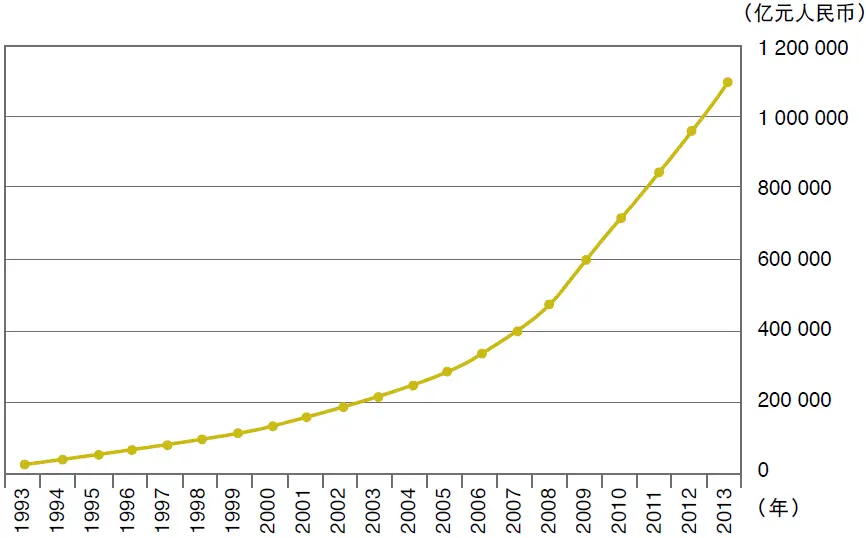

图2—11993—2013 年中国广义货币供应量

注：1993年的起始数字为34879\.8亿元人民币。

资料来源：中国人民银行。

（2） 咱们再看看跟中国一样的大国和发展中国家：巴西。过去十年，巴西的M2大涨3\.5倍，但是，股市呢？到2014年年中，是2008年高位的正好一半。这些数据尚未考虑货币贬值对投资回报率的影响。

（3） 再看印度。过去十年，股市不振，只有在新总理莫迪（Modi）当选那阵子才把指数刺激起来。但是，用美元来计量，指数还是下跌，因为印度的卢比从2007年以来，贬值了1/3。当然，M2在2013年增长了14\.9%，2012年增长了11\.2%，而2010—2011年的增长率更高：16%～17%。可见，印钞票、降准、增加信贷是最容易的事情。

（4） 美国1964—1998年的34年间（足够长的时间），M2和GDP增长与股市表现正好相反。巴菲特有精彩论述，可见本书中的“股票市场需要游说者吗？”一节。

（5） 最近五年，美国和西欧国家货币供应量的年复合增长率低于3%，你看看它们的股市如何？大涨，不是中涨，更不是小涨！

那么，如何振兴中国的股市？

（1） 经济学第二课：股票只是复印件，不要天天盯着它。股民在十年以后，50年以后，还得继续炒股票。既然如此，咱们还是花点力气把企业做好。如何做好？账目清楚，多点诚实，是第一步。

（2） 第二步，减税。减少逃税的动力。

（3） 第三步，减少公务员的数量，减少政府干预，让企业家们花时间把生意做好，提高竞争力、效率和利润水平。中长期来看，只有利润和现金流才是正道。

（4） 另外，减少咱们“激素经济”环境中的寻租活动。政府必须紧缩信贷，提高利率，最好的办法是放开利率管制，放开汇率管制。

振兴股市，匹夫有责。大家从长远计议，必能扭转局面。否则，现在的激素环境下，A股还是太贵，真的。

2026年3月14日

9:59

## 第2章 股民要如何避免越来越穷？ - (09) 2.09 A股的未来十年

\(09\) 2\.09 A股的未来十年

2026年3月14日

9:59

__2\.09__

__A股的未来十年__

2005年年底，我还在瑞士银行当股票分析师时，到美国拜会基金经理们，讲宏观经济如何、买什么股票、卖什么股票。某基金经理一坐下来，就说：“Tell me something I do not know\.”意思是：“说点我不知道的东西吧。”

我一愣。如果我要讲他所不知道的东西，我就必须首先知道他知道什么。后来，我越想越不对劲儿。如果我每次都要讲别人所不知道的东西，分析师这活儿怎么干呀？于是，我开始想办法离开我混了10多年的分析师岗位。

__合理市盈率在10倍__

我没办法讲读者都不知道的东西，不过，我想讲点让大家可能觉得不安的话。我自己琢磨了很长时间，确实有点不安。

关于A股的估值，我想问两个问题：第一，A股为什么还是这么贵？第二，过去10年大家白干，未来10年会不会还是白干？我只有假说，没有结论。我的思路如下。

（1） 多数A股股票现在的市盈率在20倍左右。（如果利润有夸张成分，那么真实的市盈率可能高一些。）

（2） 一个市场的市盈率应该相当于市场利率的倒数。现在中国的市场利率是多少？我选择了普通企业的正常资金成本，大约10%。也就是说，A股的合理市盈率在10倍上下，比现在的实际情况再低一半！

（3） 存在的必然有其道理。虽然A股的市盈率已经从20世纪90年代初的50～60倍跌到了现在的20倍上下，但是，它为什么没有一直跌到我们所推断的10倍上下呢？是什么因素在支撑A股的估值？过去市盈率的惯性是一个因素，但是仅仅这个因素还不够，一定还有别的因素。

（4） 也许我们选择的市场利息率不对。虽然大多数企业的资金成本为10%左右，但A股是一个以散户为主的市场。对于多数股民来讲，他们虽然可以购买理财产品，参加民间借贷，但是对于绝大多数股民，他们的机会成本仅仅是存款利息而已。现在3年定期存款的利息可以高达5%，多数理财产品的收益率也只是6%～8%而已。也就是说，也许，股市的合理市盈率不止10倍？！

（5） 未来，两种情况可能把A股的市盈率拖下来：一是未来的通胀，从而利率上升，或者资金紧张。这有可能跟2000—2004年的情况相似：经济活跃但是股市连跌5年。也可能更混乱。

二是利率市场化，从而老百姓可以减少对银行存款的过度依赖。民间借贷、理财产品、货币市场基金、债权投资基金、私募基金和另类金融机构等都像西方国家20世纪80年代出现过的“脱媒”。脱媒的结果是，居民慢慢开始摆脱银行的剥削，即使市场利率水平不变，他们投资股票的机会成本也会提高，从而导致整个股市市盈率的下滑。

由于利率市场化会很缓慢，所以，我们的股市也许不会大跌，而是横行10年甚至15年。与此同时，企业利润继续增长，但是报出来的增长率不会很高。因为很多企业需要填补夸张了的利润。10年之后，我们回头看，股票市盈率跌到了10倍上下，但是我们的股票指数基本上原地踏步：我们又白干了10年。不过，大家不要沮丧，有危就有机……况且，我只是理论推导，可能全错。

我重复我最爱说的话：贵的可以更贵，便宜的可以更加便宜。股票的走势，谁知道呢？

## 第2章 股民要如何避免越来越穷？ - (10) 2.10 该控制货币供应量了

\(10\) 2\.10 该控制货币供应量了

2026年3月14日

9:59

__2\.10__

__该控制货币供应量了__

有一次，我经不住利诱，到中国移动公司给员工们讲了一次股市。虽然我眉飞色舞，但还是老生常谈，毫无新意。

某领导问了一个高水平的问题：“货币供应量长期高速增长，按理说，资金的（市场）价格应该下降，而股市应该上升。可是，咱们的现实是……”

当时，我没有准备，答得含含糊糊。回家后，我又做了点功课，现在交卷。

__减缓通胀才有股市春天__

货币供应量增长的主要通道是信贷。信贷立刻转化成存款，存款再（按比例）派生出贷款，贷款再转成存款……

贷款的增加当然可以推动生产活动，但是很多生产要素（比如原材料、能源、管理能力，甚至劳动力）的供应不是无限的，所以价格会上涨。因此，你需要更多的“铺底资金”来润滑同样多的生产活动。

在增加贷款的同时，经济对贷款的需求也增加了，所以利率反而会上升。而且，长期印钞票的结果是，货币流通速度会放慢。大家还记得20世纪八九十年代的“三角债”吗？那个时候，印钞票的速度非常快，但是“三角债”使得经济转不动。

现在，“三角债”有点回头的迹象。钱多，但是转不动。

美国在20世纪七八十年代的“滞涨”就是如此。当时的美国国债利率曾经高达13\.5%。后来，美联储的主席沃尔克上台，实行强势的货币政策，打断了“通胀的脊梁骨”，利率一路下滑到4\.5%，才迎来股市的15年繁荣（涨十倍）。

所以，利率是股市的关键，而通胀是利率的关键。当然，政府管制利率是没有用的。我讲的是利伯维尔场利率，政府说通胀是多少，都没有关系，市场有自己的脉搏。

结论：只有紧缩信贷，才有利率下降。只有用强势的货币紧缩，才能打断通胀的脊梁，才有股市的春天。这个逻辑跟直观相左，但是，没办法。

1992年股市成立以来，中国M2增加了43倍！但是，股市感到呼吸都有困难，氧气不够。奇怪吗？一点都不奇怪。信贷增长并不能增加资金，只是增加了对资金（生产要素）的索取权。

## 第2章 股民要如何避免越来越穷？ - (11) 2.11 中国股市需要QFII吗？

\(11\) 2\.11 中国股市需要QFII吗？

2026年3月14日

9:59

__2\.11__

__中国股市需要QFII吗？__

2002年的时候，QFII（合格境外投资者）正热。我在瑞士银行工作,参与这件事。外国的机构投资者把中国证监会和外汇管理局的门都踏破了，央求中国政府多给点QFII额度。咱们回答说：“你们这些老外不就是想来赚我们的钱吗？没门儿！”于是，这种央求持续了好多年。

世事如云啊！2012年，听说我们的监管部门在全球做了路演，推介QFII。我还听说QFII们“十分看好中国股市”。

可是，如果他们真的看好咱们的A股，A股怎么会一直跌呢？30多年前，我一直看到报纸上说“美国和欧洲掀起了一股又一股汉语热潮”，直到1986年我第一次出国，才大吃一惊：我碰到的外国人都不会半句汉语！打那以后，我就不再相信无端说出的“全世界人民看好中国”之类的话。

__别架起吊桥__

我认为，QFII本身其实是没有自信心的产物，是胆怯和岛国心态的典型案例。搞什么QFII？全世界大国小国和岛国，都可以把股市开放，我们当然也可以。咱们确实有特殊情况：人民币不能自由兑换，所以……但是，谁规定，人民币必须永远像现在这样！

世界上的大国小国和岛国，绝大多数都实行自由浮动的汇率制度和资本的自由流动，我们比较特殊。但是也不应该只要跟外国人做生意，咱们就提防别人有赚钱的“阴谋”。我在外国银行工作了将近20年，从没有碰到过不想赚钱而白白跟中国做生意的外国人！同样，我也从没有碰到过不想赚钱而白白跟外国做生意的中国同胞！

做生意从来就是互利互惠的，所以，把贸易关系当成是对别人的施舍就不好了。如果咱们在外资、外贸和外汇方面的政策以减少施舍为基础，当然就会伤害到我们中国人自己的利益。

有人反驳我说：“美欧不也有大量限制外国企业的政策吗？”确实如此。但是，那是它们的愚蠢，我们一定要在愚蠢方面竞赛吗？

这也让我想起有一次，某记者问我：“市场普遍认为，大力增加RQFII（人民币合格境外投资者）和QFII的额度会推动A股大涨。你怎么看？”

张：“你知道过去100年，美欧和日本的QFII额度分别是多少吗？”

记者：“不知道。”

张：“它们从来不搞这种封闭自己的‘岛国游戏’。岛国心态就像架起吊桥，不准敌人过来。”

记者：“你怎么看中国的QFII？”

张：“你可以把马牵到河边，但是你无法强迫它喝水。”

## 第3章 什么是能让你安枕的好公司？

__第3章__

__什么是能让你安枕的好公司？__

“我对企业的执行力体会很深。有些公司本来运气好，在一个不错的行业，周边的条件也不错，可是因为执行力太差，所以业绩和股票就很不争气。好的行业是成功的必要条件，但不是充分条件；好公司总是极少数。”

2026年3月14日

9:59

## 第3章 什么是能让你安枕的好公司？ - (1) 3.01 你的钱属于谁？

\(1\) 3\.01 你的钱属于谁？

2026年3月14日

9:59

__3\.01__

__你的钱属于谁？__

在巴菲特2012年给股东的信中，最让人感兴趣的一段，是他谈论分红的坏处。

__扩大生意，何必分红？__

他举了一个例子。一家公司，净值200万元，你我各占一半。该企业的ROE是每年12%，留存利润也一样获得12%的年回报率。外人不断想以净值的25%溢价入股。

你想每年分红率为1/3，另外2/3留存。第一年末，你我各分得红利4万元。于是，每年的派息额和“股票”价值均增长8%（即12%减去4%）。

十年弹指一挥，咱俩的公司的净值达到了4317850元（即200万元每年复合增长8%）。你我的各半股份当然有个市价：2698656元（注意：25%的净值溢价）。咱俩都发达了。

但是，如果咱哥俩十年不分红，咱们就可以更加发达！当然，大家都要养家糊口，需要现金，没问题，咱俩每年出售3\.2%的股份。第一年，咱俩各拿回4万元，但是这个数额每年增长（增长率为12%）。

十年后，咱俩的股份价值会高达6211696元（即200万元，每年复合增长12%）。咱俩的股份都跌到了36\.12%，但是，它们的价值为2804425元，比第一种方案多4%。

这还不算。你每年买股票所获现金也比1/3的分红多4%。咱们两头受益！你看，还是不分红为妙！

分红这件事和分红率的确定必须对每个股东一视同仁，所以，这里有强加于人的问题：有的股东想不分红，有的想多分或者少分，众口难调。但是，如果不分红，那就可以满足每个股东的要求。为什么？你可以选择多出售股份，或者少出售股份。

虽然股东分红以后，也可以选择去公开市场增持股份，但是，别忘了他这样做就会吃亏：股价含有25%的净值溢价。

此外，分红就得缴税，还有交易费用，等等。注意：在美国，虽然股票增值也要缴税，但是只是对增值的部分缴税，红利税可是要对分红全额征收的。（在香港地区，股票投资的增值不交税。）

很多公司一边分红，一边增发新股。也不知道它们想蒙谁？既然需要钱做生意，或者扩大生意，何必分红呢？你看看这样折腾的代价：H股分红到香港地区还有一道税，红筹公司派息出国，也要交税。

__溢价的重要性__

从上面的故事，我们能看出来巴菲特演绎的结果是，大股东的根本利益在于不分红，而通过股票套现的办法来实现利益最大化。

这里，最重要的指标只有一个，那就是25%的溢价。当然，长期达到12%的ROE也不是一件容易的事。它正好相当于美国50年来道琼斯指数公司的平均回报率。

咱们来看看神州大地。中国公司为什么不分红？它们的股票相对于净资产的溢价可不是25%，也不是55%，而是几倍！

在这种情况下，只有当大股东笨到极点的时候，才会大量分红！但是，大股东怎么会笨到极点呢？他们一点都不笨，也许他们比股民还要略微聪明一点。

股民们一边抬高股价，一边希望上市公司增加分红，这完全是自相矛盾的。巴菲特的演绎显示，只有当股价的溢价低于25%时，分红才是理性的。

结论：中国大股东们的行为对他们自己而言，是理性的。股民们如果想分红，就必须把股价弄到25%的溢价之下。市场不相信无私奉献，也不相信口号，它只相信利益。我好几位朋友跟我说，即使股价再低，我们的上市公司也不会分红。怎么办？

我首先承认，如果股价太高（高于净资产的25%溢价），大股东为了利益最大化，会自然选择不分红，而出售股票套现。

但是，即使股价低于净资产，公司也照样可能不分红。

那就是另外一个层面的问题了。大股东如果选择把钱留在手中，永远不让小股东沾手，那小股东是一点办法也没有。那怎么办呢？你根本就不要买他的股票。

结论：股价低是高分红的必要条件，但不是充分条件。巴菲特举的例子是诚实的公司。

## 第3章 什么是能让你安枕的好公司？ - (2) 3.02 董事长的业绩

\(2\) 3\.02 董事长的业绩

2026年3月14日

9:59

__3\.02__

__董事长的业绩__

在上市公司发布业绩的季节，我参加某国有企业的业绩发布会。董事长大谈他任内六年公司发生的巨大变化：销售额增长1\.5倍，利润也翻了一番多。在场的人都祝贺他，还听说他要上调了。

回到办公室，我上网查看国家统计局的网站。中国这六年的名义GDP增长了140%，M2大涨182%。房价、地价涨了多少？说起来，那位董事长还跑输了全国的平均值，凭什么让他上调？他的业绩增长完全是货币幻觉！他的公司根本没有增长！

如果咱们的企业业绩下滑，有的人就责怪别人。如果有了一点点增长，那就成了他们上调的资本。

另外，我经常听到中国国有企业的“市值管理”。但是真的需要国资委考核国企的市值吗？市值由很多因素（内在、外在）决定。另外，市值管理可能会鼓励国企的管理层增发新股，有时做无谓的分拆上市。很多分拆上市是摧毁股东价值的罪行。券商当然高兴,也喜欢出主意。打个比方，如果一家公司把码头分拆，再把炼油厂分拆，再把加油站分拆，再把特种化学品分拆，再把仓储分拆，再把运输分拆，再把餐饮业分拆，再把度假村分拆……这有什么意义呢？所有的上市公司的市值加起来确实增加了。但是，股东获得了什么？纳税人获得了什么？

还有可能会有一个问题，就是子公司已经全部上市之后，再来整体上市！不断圈钱，摊薄收益，股东获得了什么？纳税人获得了什么？

## 第3章 什么是能让你安枕的好公司？ - (3) 3.03 董事被迫发大财

\(3\) 3\.03 董事被迫发大财

2026年3月14日

9:59

__3\.03__

__董事被迫发大财__

大多数人可能以为，金融从业人员一定会把自己的家庭财务管理得很好。其实不然，据我观察，大多数人的个人理财都一塌糊涂。即使在投资银行界，多数人的家庭财务都管理得很差：要么不管（存款在银行），要么随意乱投，没有长远考虑，也不科学。

__谨慎投资是福气__

在外国投资银行工作，意味着我们和家人在投资方面有很多限制。比如，我们买股票或债券必须事先征得顶头上司的书面批准。然后我们必须到银行内部的电子网络上征得法律及合规部的批准。当然，每次批准只能当天有效。在实际落盘买卖股票时，你的顶头上司也会自动收到一个邮件通知，而且法务部也会收到交易副本。买任何股票必须持有30天以上。跟银行有生意往来的公司的股票在敏感期内我们不能买卖，有些敏感期长达几年之久。这些规则是为了避免员工滥用客户的商业机密，先于客户买卖，或者出现利害冲突等。有的同事说，因为有这些限制，所以干脆不买股票和债券。我认为这是大错特错，因为这些限制对于银行的员工来说，实在太好了。

比如，由于每次买和卖都需要顶头上司书面批准，这就逼着我们认真想清楚，认真做研究。显然，你的老板那么忙，不可能三天两头为你批准买卖股票一类的事，你也不想让老板看到你天天在炒股。另外，30天的最低持有期我认为太短，你被迫持有三年才好，这样可以逼着你更加认真地分析行业和公司，而不是抱有侥幸心理。巴菲特说：“如果你不能持有某只股票十年，你就不应该持有十分钟。”他还说：“股票的最佳持有期是永远。”我们只听说有长线投资者发达的，没有听说过因为短炒而发达的。短炒的极端例子是“即日鲜”（day trading），这种现象现在几乎绝迹了，因为他们亏得差不多了。

由于股票可以随时卖掉，人们才过于随意、不负责任。巴菲特建议大家给自己定一个总的额度：我一辈子只能买股票和卖股票若干次。额度用完了，就没有了。这样，我们就格外谨慎。

__钱少更要投资和增值__

还有一些朋友说，手上钱不多，所以不值得投资，这也是大错特错。我们正是因为钱少才需要投资和增值。难道不是吗？也有人说，因为工作太忙而无暇投资。其实投资是不占时间的，如果你长期投资，就不需要每周查看股价，更不需要每天跟踪。你在投资上花的少许时间跟你的工作是相辅相成的。我看它们不矛盾。

还有一个有趣的现象，我发现大量的金融从业人员根本不愿意花时间琢磨、研究和领悟一个企业和商业模式。大家似乎忘记了一句古话—“求人不如求己”。有的人愿意花无穷无尽的时间和努力去拉关系和求恩惠，而不肯花少许时间做些功课。

在中国香港地区和美国，大家可以发现大量的公司董事很有钱，主要原因是他们手上的股票大幅增值。为何？董事在敏感期内（在公布业绩之前两个月，在做并购期间，或在其他敏感期）是不可以买卖股票的。在其他时间，每次买卖都要事先经过董事会批准，而且要公告，因此董事要顾及形象和闲言碎语。他们也担心其他董事（特别是董事长）和基金经理说自己对公司“不看好”、“没有长远打算”、“不务正业，只是一天到晚炒股票”。

__自律会让人赚钱__

所以，就出现一个受约束的现象：董事买卖自己的股票很不频繁，而且，买的次数多于卖的次数。他们持股的时间一般比较长，有时长达10年、20年。他们被迫发了大财。本人在2006—2008年的三年里，当了几家香港公司的董事，“自律”让我赚了一些钱，但是我心中的蠢动和短期行为让我少赚了很多钱。下回再做董事，我可得多看长线。

那些做不了董事的人，也可以从中明白，长期投资和减少交易是福气。20世纪80年代，我在澳大利亚读书时，有个老师说，他的钱都是被逼着挣的。他不断地买房子，每个月付很多按揭的供款，这也逼着他省钱和想办法赚外快。这跟董事发大财是同一个道理。

## 第3章 什么是能让你安枕的好公司？ - (4) 3.04 投资者踩着舞步去上班

\(4\) 3\.04 投资者踩着舞步去上班

2026年3月14日

9:59

__3\.04__

__投资者踩着舞步去上班__

我读过一本好书，其中收集了巴菲特几十年来的文章，由巴菲特的朋友卡罗尔·卢米斯编辑。我觉得此书很有趣，文笔也很优美，有些涉及投资哲学，有些涉及企业管理的道理。我从中摘录出15条精华，算是我的读书笔记，与大家分享。汉语的部分基本是英语部分的大意。

（1） 巴菲特说，他每天踩着舞步去上班，因为他开心。他只跟他喜欢、尊敬、仰慕的人打交道。（I tap dance to work\. I do business with people I like, respect and admire\.）

（2） 有人说：“我很讨厌我现在的工作。我准备只干十年，然后我就……”对此，巴菲特说：“这种话就像等到老了再做爱一样奇怪。”（That is a little like saving up sex for your old age\.）

（3） 巴菲特引用某人的话说，投资者的不幸都是由于他们不能安安静静地等待。（All men’s misfortunes spring from the single cause that they are unable to stay quietly in one room\.）

（4） 企业向投行征求配股和并购等方面的意见，投资者向

经纪人征求股票买卖方面的建议，就像问理发师：“我应该理发了吗？”（Do not ask the barber whether you need a haircut\.）

（5） 上市公司用自己本来就低估的股票作为货币（对价）去收购别的企业，简直不可理喻。

（6） 不要见上市公司管理层，见他们有害，你会被他们的花言巧语和忽悠影响。2002年，我是怎么发现中国石油（PetroChina，PTR）这只股票的投资机会的？潜心研读财报（见图3—1） 。（We read—that’s about it\.）

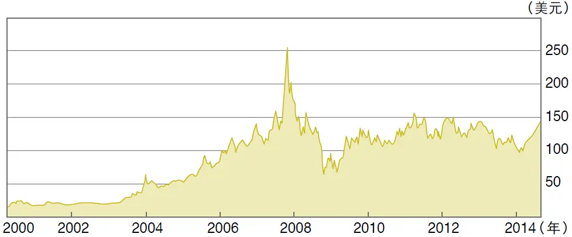

图3—1 中国石油（PTR）2000—2014 年股价走势图

资料来源：雅虎财经。

（7） 如果企业处境困难，不要指望能干的管理层扭转乾坤。只投资傻瓜也能管理的企业，因为迟早会有傻瓜来管理的。（We have not learned how to solve difficult problems\. What we have learned is to avoid them\. I want to be in businesses so goodthat even a dummy can make money\.\.\.Someday a fool will come to run the business\.）

（8）资金最紧张的时候就是投资的最好时候。（The best time to buy assets may be when it is hardest to raise money\.）

（9）买便宜货你好像占了便宜，但是它的问题一个接着一个。如果你需要持有很长时间才能变现，你的持有成本就会要你的命。时间是好公司的朋友，烂公司的敌人。（Any initial advantage you secure will be quickly eroded by the low returns that the business earns\.\.\.Time is the friend of the wonderful business, the enemy of the mediocre\.）

（10）巴菲特发现了企业的“机构通病”。第一，企业转向其实很困难。第二，企业只要账上还有钱，就有人会想方设法把它花掉。第三，很多投资项目本来很愚蠢，但是企业内部策划部总能找到采纳的理由。第四，大家都爱模仿同行。

（11）投资的要诀是，买的东西好，价格合适。何时卖不重要，因为你本来就留足了空间。（Never count on making a good sale\. Have the purchase price be so attractive that even a mediocre sale gives good results\.）

（12）怎样发现好企业？巴菲特说，你碰到时就会知道，就像碰到美女一样。（The truth is, you know them when you see them\.）在算账时，不要算到小数点后面两位数。

（13）投资者一定要控制风险，不能把种子烧掉了。巴菲特在他公司的墙上有一句话：You only need to get rich once\.（你只需要发一次财。）

（14）投资者不应该关注某个行业未来会怎样改变社会，怎样高速增长。重要的是，投资对象（企业）究竟有无持续的竞争优势。

（15）20世纪，道琼斯指数从66点涨到11497点。在100年的时间里它涨了174倍，但是，平均每年的复合增长只有5\.3%！现在投资者所期望的年回报率总是太高，结果当然只有失望。

各位看官，希望上面的读书笔记对你有用。当然，读书笔记永远无法替代读书。当我旅行时，飞机延误，我就拿出一本书来看看，这好像比微信更加有趣。上面15条精华中，我觉得第三条对我本人最有用。多年来，我的股票买卖太过于频繁。

## 第3章 什么是能让你安枕的好公司？ - (5) 3.05 企业执行力左右大局

\(5\) 3\.05 企业执行力左右大局

2026年3月14日

9:59

__3\.05__

__企业执行力左右大局__

分析企业最重要的变量无非三个：一是诚信，二是商业模式，三是执行力。诚信这东西很好办，只要静静观察几年便知，有时间听听业内的或上、下游供货商或顾客以及公司中下层员工的窃窃私语便够了。如果你实在不放心，可以用股票风险分散的办法来解决。

一家公司内部可能有好几个业务板块，商业模式各有不同，主要分类为轻资产型与重资产型、劳动密集型与资本密集型、自营与代工生产、顾客是集中几家或面向大众的、成本如何确定、产品价格是受管制还是完全放松的、业务量是否可以放大和延伸，等等。

例如，银行盈利是靠吃利差，还是靠赚取收费？汽车公司卖了汽车之后，要提供多少年保修或赔偿？广告公司有多少风险？保险公司暗藏什么风险？零售企业如何付租金，如何与供货商合作？又比如，技术公司在专利费和特许费方面的复杂变换、存货由谁承担损失、有无买方信贷或卖方信贷，与经纪人的分账等。泛泛而谈，很难说哪种商业模式优越，哪种商业模式落后，关键是要理解每家公司如何生存、如何赚钱、现金如何进账和隐蔽的风险在哪里。

__寻求放大效应__

巴菲特和他的合伙人查利·芒格（Charlie Munger）都很不喜欢资本密集型的行业，因为前期投入太大，风险太大，而且遇到经济下滑时，这样的公司容易出大问题。但是，他们还是投资了很多重资产型的公司的股票。可见，优秀的管理层在巴菲特的眼里比商业模式更重要，或者可以弥补商业模式的缺陷。比如，几年前他们就持有一家铁路公司伯灵顿北方（Burlington Northern）22\.6%的股权。在2009年11月，他们又以市价再加31\.5%的溢价收购了全部的剩余股份，并把该公司私有化，单单这一项后续投资就花费了260亿美元。铁路不可谓不是重资产型的公司。

而且，巴菲特还花巨资投资了几家航空公司，包括很不成功的投资（比如美国航空公司（US Airways））和很成功的投资（比如Net Jet（一家没有上市的商用飞机租赁公司））。此外，巴菲特还投资了一些其他的资本密集型公司，比如中国石油（赚了也卖了）和康菲石油公司（Conoco Philips，亏了并且卖了）。当然，大家不要低估了Tesco超级市场连锁店的资本密集程度（即固定资产占总资产的比重）。这也是巴菲特的爱股之一。

众所周知，巴菲特喜欢保险公司，因为保险公司在保费收入与赔付额之间有一个巨大的差额（利润），而且在时间上，收保费与最终的赔付有一个相当长的差距，这就是免费的贷款。有句老实话：占用别人的钱财好过自己的钱财被别人占用。但是，这并不代表所有的保险公司都是好公司。至于零售企业，虽然也占用供货商的资金，但巴菲特对多数零售公司所面临的激烈竞争很担心。

一个理发师（或者会计师、律师）平均每天赚1000元，那么如果你聘用10个理发师就可以赚1万元，这就是一个萝卜一个坑的例子，它比较难放大。相反，微软的软件发展成本相对固定，但销售额可以无穷增长，而对成本的影响很小，也就是说，它的边际成本会下降。这也是资本市场喜欢软件公司而不喜欢系统集成公司的原因。在一定范围内，零售企业有放大的效应，但它们的放大效应比较有限；批发企业就好多了，银行业的放大倍数算是不错的，房地产业也是如此，但建筑业的放大效应就很差；医药公司面临很高的风险（研发的失败太正常了），可是一旦成功地发明一个商业化的专利产品，它对利润就有很好的扩张和放大效应。

我对企业的执行力体会很深。有些公司本来运气好，在一个不错的行业，周边的条件也不错，可是因为执行力太差，所以业绩和股票就很不争气。什么叫执行力？打个比方，几个咖啡杯放在客厅里的茶几上，全家人都认为这些杯子应该拿到厨房里去洗洗，再放到柜子里，但谁也不想放弃电视上转播的球赛，所以这些杯子一直到半夜大家入睡前或第二天早晨还在客厅里。

__激励与鞭策并行__

执行力的好坏在国企和民企有不同的表现。民企执行力差，也许是因为大股东变懒了，性格有问题，或者事无巨细的工作方法限制了团队的积极性。国企的执行力弱也有多种原因，也许几个高层不太和睦，什么事都做不了，也许某些政府主管部门干预太多，所以董事会做不了决定，而且即使做了决定，也容易被推翻。还有一个可能性，高层管理人员没有合适的激励机制，对公司的营运结果不太在乎，或者虽然有激励机制，但有其他好处也许更吸引人。如果有激励机制，却没有惩罚制度，又容易形成“铁饭碗”和“大锅饭”。激励制度只能给大家美好的愿望，但不能导致勤奋—要大家勤奋，就必须有鞭策。

在一家公司，五个董事可能都完全赞成某项资产应该尽快处理掉，不然其市场价值会不断下降。开会时，五个董事各个慷慨激昂，但散会了，谁去主持办理这件事了呢？功劳如何分配呢？有真正的问责吗？

有人需要拿出方案或实施步骤，可能需要去与各个监管部门沟通。与这些部门沟通时，免不了会遇到各种障碍：资产如何评估？高层如何再安排？最后主理这件事的人会心想：“我何必惹这个麻烦呢？”当大家的热情消逝时，这件事也就束之高阁了。如此反复，大家也就成了习惯。

执行力不够还有一个原因，就是会有少数人不干活，使得干活的人不开心。时间一长，原来干活的人也就可能变成懒汉。比如，要做某件事，本来只需要五个人，但公司里人多，又大多不对路，或者滥竽充数的“南郭先生”很多，结果每次都是那么几个能干的人在忙碌。公司本应该裁掉一些无用的人，再招些有用的人，但这样做太难。有时不干活的人的存在，使干活的人很愤怒，所以大家都不愿意干，结果，三个和尚没水喝。

## 第3章 什么是能让你安枕的好公司？ - (6) 3.06 好行业也有坏公司

\(6\) 3\.06 好行业也有坏公司

2026年3月14日

9:59

__3\.06__

__好行业也有坏公司__

在这篇文章里，我想讲讲燃气这个行业和相关的公司。

燃气公司的业务基本上可以分为两大块：一是建筑安装（即铺设和安装管道），二是供气（居家、企业和汽车）。后面这项业务看起来不起眼，居家买的燃气量不大，价格还受到政府管制。但是，政府并不管制企业和汽车用气的价格，或者管制得不严格。这是细水长流的好生意，还不用竞争。

燃气公司的第一项业务本来是很差的业务，不过由于垄断性，它实在太诱人了。你想想，只有你能在这个城市铺设和安装管道，别人不可以。虽然在获取一个城市的特许经营权之前，你需要参与竞争，但是一旦你获得这个权力，你就成了垄断者。想想这个生意！

中国的商界也许是世界上竞争最激烈的，但是，还是有些企业不太需要参与很激烈的竞争。这种避风港实在太难得了。

__好行业是成功的必要条件__

2001年，新奥能源（2688\.HK）到香港上市。它上市一周以后，我到河北省廊坊市访问。我兴奋不已，本来是两个小时的访问，我跟管理层谈了三个小时，并多住了一个晚上，因为我感到这个生意太好了！当时这家公司的业务还很小：它是香港的一个创业板公司，市值只有10亿港元左右，业务只有一个地级市（廊坊）和两个县级市（葫芦岛和密云），而且当时的股价只有1\.2港元左右，到了2014年8月，它的股价涨到了50多港元（见图3—2）。由于当时它的生意还处于初创阶段，坦率地说，它的业务和治理还有很多不实在和浮夸的地方，我只是几年以后才感受到这一点。

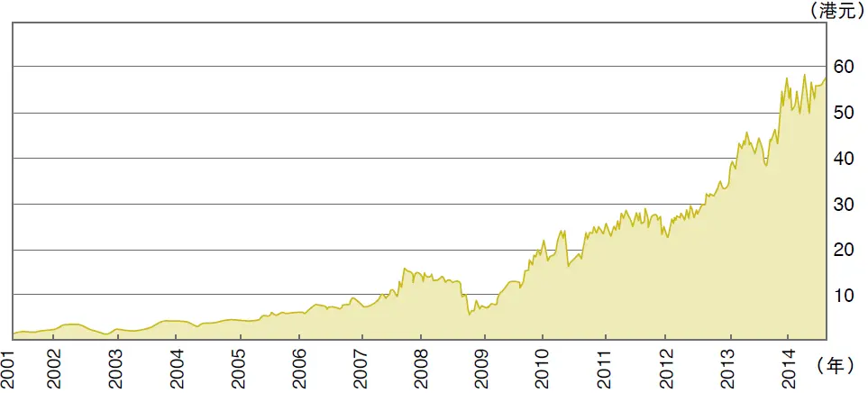

图3—2 新奥能源（2688\.HK） 2001—2014 年股价走势图

资料来源：雅虎财经。

当时回到香港，我发表了一份热情洋溢的报告，指出如果用香港中华煤气（0003\.HK）服务的人口为标准的话，这家公司可以值13\.5港元。顺便说一句，绝大多数股民（当然包括我）都太急躁，看不上中华煤气这种公司的股票。但是，年复一年，这家公司（以及这类公司）给投资者的回报率是最可靠和最高的之一。另外一只这类股票就是我经常提到的领汇房产基金（0823\.HK）。公司什么也不做，只是每年收商场的租金，对商场做些简单的维护和修整。它把90%以上的现金流分掉，它的股票表现（综合回报率）也是最好的之一。

这类成功的燃气公司也包括华润燃气（1193\.HK）和中油燃气（0603\.HK）。但是，我的热情也蒙蔽了我的眼睛，有两家燃气公司很失败。一是天津的华燊燃气（8035\.HK，2009年已改名为滨海投资，2014年由创业板转至主板，股票编号为2886\.HK）。这家公司由于违反外汇管制和其他问题而被迫停牌5年之久。那些年，它的业务几乎停顿，现在依然没有回到2004年的繁荣。现在，它的规模不如新奥的10%。

第二个倒霉的燃气公司，洁美能源，发源于新疆和甘肃，我也曾经推介过这只股票。但是，不知何种原因（债务过大，还是账务问题？），后来，这家公司人间蒸发了。我记得它的董事长和总裁曾经一天到晚在香港路演和推介。

还有那么五六家燃气公司虽然行业条件很好，也到海外上市融资了，但是业务发展很不顺利，股价长期疲软。

我的教训：

（1）好的行业是成功的必要条件，但不是充分条件。

（2）好公司总是极少数。

## 第3章 什么是能让你安枕的好公司？ - (7) 3.07 公路股的投资价值

\(7\) 3\.07 公路股的投资价值

2026年3月14日

9:59

__3\.07__

__公路股的投资价值__

取消节假日高速公路收费造成的黄金周大堵车给了我一个小小的提醒：消费者还是比较爱贪便宜的，如果高速公路降低收费就可以增加车流量。换句话说，高速公路作为一个商品，它的需求的价格弹性还不小。虽然高速公路不可能降低收费，可是，未来消费者收入的增加就等于高速公路收费的降低。

基于此种考虑，也基于这个板块的上市公司股价低迷，我研究了皖通高速（600012\.SH，0995\.HK，ROE：约12\.5%）和成渝高速（601107\.SH，0107\.HK，ROE：约10%）。其他四家高速公路公司H股的情况也很相似。由于内地利率在未来五年甚至十年还可能继续高于香港地区的水平，因此我们在计算DCF时会发现，H股会比同一家公司的A股更值钱。多年来，我这个“谬论”受到了不少人批评。但是，未来5～10年，A＋H公司的股价会继续走过去几年的趋势：H股会比A股更贵，贵很多，原因就是资金的机会成本。

我研究H股高速公路公司的股票，还有另外一些考虑：它们比较安全。它们上市已经十年以上，已经经历了资本市场的磨炼，做假账的可能性不大，而且，它们4%左右的息率还不错。另外，在资本市场对这个板块很负面时，也给大家提供了买入的机会。我们来看看这两家公司。

__（一）皖通高速__

基本情况：

股比：省政府占31%，招商局华建占21%，A股18%，H股30%（H股股价走势见图3—3）。

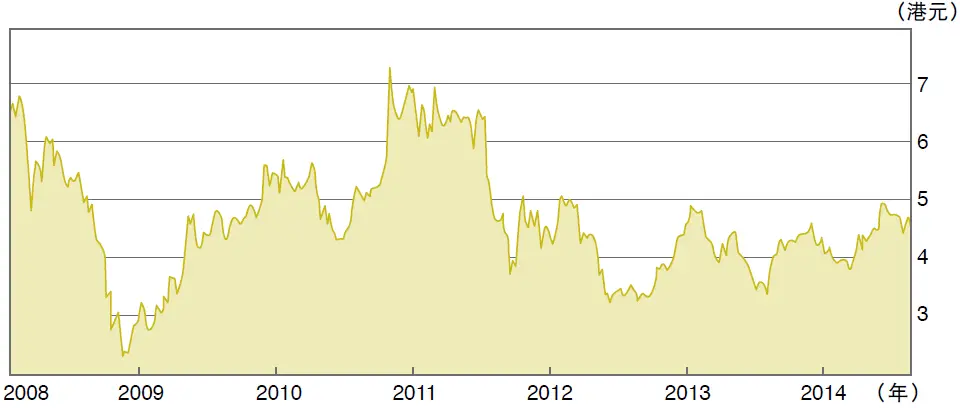

图3—3 安徽皖通高速（0995\.HK） 2008—2014 年股价走势图

资料来源：雅虎财经。

到2014年8月，整个公司市值75\.8亿元人民币，A股市盈率为8\.8，H股市盈率约7\.4。

公司缺点也很多：

（1）派息率还是太低。

（2）政府和公众对这个行业似乎有些敌意，另外政策变化可能会有影响。

（3）国有控股企业，股东会异常繁忙，很难一直兼顾公司。所以公司在找不到好的收费公路项目的情况下，管理层难免把现金用到次优项目上，比如参股典当、小贷、金融投资公司。注意，它有几个这样的投资都是参股，而不控股。根据我的观察，在部分别的公司，这类投资都是“人情投资”，有人打了招呼。皖通的具体情况究竟是怎样，我们应该深入研究。

__（二）成渝高速__

基本情况：

在2014年8月，H股价格约2\.6港元，低于它的A股2\.8元人民币（约3\.5港元）（H股股价走势见图3—4）。

股比：省政府占32%，华建占21%，A股17%，H股29%。

整个公司市值80\.9亿元人民币，到2014年年中，其H股市盈率6\.15倍。

这家企业有四个特点：

（1）负债率高。但是对这个行业来讲，也不是什么了不起的事。

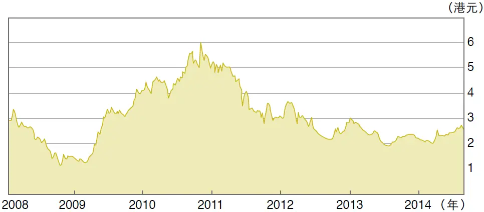

图3—4 四川成渝高速（0107\.HK） 2008—2014 年股价走势图

资料来源：雅虎财经。

（2）除了运营收费公路以外，成渝高速还承接大量的代客（代理政府部门）建造公路和基础设施的业务。遗憾的是，这项业务不挣钱，占用的资金不少。

（3）由于建造业务的存在，成渝高速的应收贸易款及其他应收款约高达19亿元人民币，而其他应付款及应计负债也高达20亿元人民币。虽然这两个数字好像大体相抵，但是在实际运营中，企业难以周旋。

（4）2013年，成渝高速的分部报表说明其实只有通常的公路收费业务有盈利，而建造业务和加油站业务明显经营不善，有无跑冒滴漏问题？公路收费营业额25亿元人民币，有11\.4亿元人民币经营利润；代客建造营业额37亿元人民币，经营利润2\.4亿元人民币；加油站经营营业额22\.5亿元人民币，却只

有区区6676万元人民币的经营利润。

大家在忙乎研究水泥厂甚至钢铁企业的时候，是否应该看看高速公路板块？

## 第3章 什么是能让你安枕的好公司？ - (8) 3.08 看见魔鬼时，别吭声！

\(8\) 3\.08 看见魔鬼时，别吭声！

2026年3月14日

9:59

__3\.08__

__看见魔鬼时，别吭声！__

50多岁的人，在读书时应该保持冷静。不过，我读日本奥林巴斯前CEO迈克尔·伍德福德（Michael Woodford）的书Exposure时，中文译名为《一个告密者的自白》，数次为之动容。2011年，伍德福德与奥林巴斯的董事会和其他高管进行斗争，揭露公司20年的假账，让我想起我本人十几年前与几家上市公司在法庭内外的“搏斗”，以及个人付出的代价。

除了与骗子较量，伍德福德和我都同样遇到了公众的冷漠、同事的不理解和恶人的诬陷。部分股民极端自私自利，当假账曝光时，他们不会感谢讲真话的人，而是把股价暴跌的损失怪罪到讲真话的人身上。当然，这一小撮人的邪恶和自私自利也纵容了企业的管理层。

__伍德福德的战斗__

奥林巴斯是日本最大的跨国公司之一，主要生产照相机和医疗器材。从20世纪80年代后期开始，奥林巴斯高管就一直在地产和股市上做大量投机，亏损很快堆积起来，可他们认为自己只是被“套住了”，于是他们一边掩盖，一边继续投机，可是日本楼市和股市一直拒绝回到20世纪90年代初的高位。

后来，国际会计准则发生了变化，要求上市公司按照市场价格对持有的投资产品进行调整，奥林巴斯的管理层将被迫承认过去的损失和多年的掩盖。那怎么行呢？欺诈是要坐牢的。怎么办？于是他们在新加坡、伦敦和东京成立了三个基金，然后用收购海外根本不值钱的皮包公司发生巨额亏损的办法，把过去的亏损和假账冲掉。

2010年年中，奥林巴斯财务部一位正直的员工，把部分细节透露给了一家日本小报Facta，Facta把这些资料分期分批登了出来。可是，6个月内，日本主流媒体一直装作不知道、没看见。伍德福德刚刚从欧洲业务主管提拔为集团CEO，而且他不会讲日语，所以到处两眼一抹黑，董事长还是一手遮天。

伍德福德坚持不懈，通过审计师的帮助找到了更多证据，于是发出了“哀的美敦书”（即最后通牒），逼董事长和其他高管集体辞职。不幸的是，19人的董事会反戈一击，罢免了他。

公开的战斗爆发了。伍德福德先是通过西方国家的媒体，然后是通过日本的媒体，向董事会开炮。奥林巴斯是个全球化的公司，很多假账和支付都是通过海外分支机构进行的。他冒着生命危险，向英国、美国和日本的监管部门和警察局详述了他之所知。

几个月后，奥林巴斯的主要高层才被捕。不幸的是，新任管理层还是原来的中高层，他们早就知道公司多年的假账，但是一直不吭声，而且他们某些人还参与了其中某些活动。在整个曝光过程中，他们一直站在正义的对立面。

伍德福德和奥林巴斯的外国股东们一直试图清洗原来的19人董事会，并且让伍德福德官复原职。但是，很遗憾，日本的股东们和债权银行票数过半，反对伍德福德官复原职，反对彻底改革。

__正直和诚实需要鼓励__

在那6个月的公开战斗中，伍德福德某些原来的好朋友站到了他的对立面：你为什么要把整个事情公开化？为什么不能在内部悄悄运作？

还有很多旧同事为了个人职业的发展，立刻跟伍德福德划清界限，保持距离。这跟我的经历几乎一样。十几年前，我本人在香港地区跟骗子公司搏斗时，除了我的雇主瑞银慷慨相助以外，我没有收到任何其他帮助和鼓励，只有几个可怜又可恶的股民骂我“黑嘴”和别有用心。虽然香港地区的媒体给了我十分公正的报道，但是个别几家内地媒体从来就是一边倒，骂我“不专业”和别有用心。

伍德福德本人和他的家庭为此案付出了巨大代价，我本人也一样。经常失眠是最起码的，家庭关系也会受到影响。以后，如果你发现某个企业做假账，千万别吭声，没有人会帮你的，

也许，朋友也会远离你。监管机构要么太忙，要么不感兴趣。坏人的威胁不奇怪。而且，律师的费用很高，这一点我不需要提醒你。当年，我很幸运，瑞银全部买单，你不见得有这样的运气。

英文里有句话：看见魔鬼，别吭声！（See no evil, hear no evil, and speak no evil！）

## 第4章 金融创新成了危机之源？

__第4章__

__金融创新成了危机之源？__

“我建议，未来所有金融机构只上市，但是不融资。也就是所有股票全流通，挂牌交易，但是不融资。那些已经上市的银行（和非银行金融机构）也应该大幅分红，同时，不断回购股票，并注销回购的股票，这样才能减少银行业资本金过剩的程度。”

2026年3月14日

9:59

## 第4章 金融创新成了危机之源？ - (1) 4.01 中国的银行不能再膨胀了

\(1\) 4\.01 中国的银行不能再膨胀了

2026年3月14日

9:59

__4\.01__

__中国的银行不能再膨胀了__

到了2014年年中，中国最大的银行中已有18家在境内外股票市场上市，2014年7月初，又有11家小银行准备上市。

其实在一个受到信贷泡沫威胁的国家，我们应该对该决定表示担忧。这一举动或将为中国的信贷泡沫火上浇油：让更多银行能筹集更多资本，将使已经膨胀的银行业扩大资本基础，增加放贷能力。

另外两项政策也难免让人担忧：一是通过定向降准放宽信贷供应，二是鼓励上市银行发行优先股，因为多数上市银行股的股价已低于每股账面价值。

__公司盈利能力受损__

有些官员和分析师经常把两条理由挂在嘴边。第一，政府觉得经济增长势头太弱，需要扩大经济中的信贷量予以刺激。第二，银行需要更多资本，以便在增加放贷的同时维持合理的资本充足率。

然而，可能还有第三个理由：有的银行背负沉重的坏账负担，它们的资本缓冲并不像声称的那样厚实。

这些普遍持有的观点听起来可能有道理，但还是不能作为制定政策的依据。在过去30多年里，中国经济一直受到财政与货币刺激的影响，如今工业产能过剩，公司盈利能力太低。

有一个残酷的对比：以GDP衡量,并按当前汇率计算，美国经济规模比中国约高出80%。但是，即便剔除在美上市的外国公司，美国股市市值仍至少是中国股市市值的七八倍。

为何中美股市估值差距如此之大？是因为美国公司比中国公司盈利能力更强。尽管美联储实施了QE，但近年来美国货币供应增速一直只保持在较低的个位数，中国货币供应增速则为13%～14%。中国的公司被信贷淹没了。

__“减肥”迫在眉睫__

银行业是中国纳税额最多的行业。如果银行承认持有比例高得多的坏账并将其核销，那么净利润就将大幅下滑，纳税也将大大降低。

抑制中国信贷泡沫的唯一现实途径，就是不让银行获得新资本。这里有三条建议可达到此目的。

第一，中国政府应当禁止银行的任何融资行为。没错，上千家未上市银行的股权投资者理应有一条退出途径。但办法之一应是通过“介绍形式上市”，允许这些银行在不发行新股的情况下上市。这将使一些股东得以退出银行，但银行的资本不会增加。

第二，不要鼓励银行发行优先股。银行在这方面不需要鼓励，它们对“跑马圈地”的理解本来就比对持续的投资回报理解深刻。

第三，可以迫使中国的银行每年把大多数（以至于全部）净利润用于派息。银行目前的放贷能力应当足以支撑经济发展好多年。

有些人可能会问，如果中国的银行被坏账侵蚀得厉害，它们是否应当补充资本基础？答案当然是肯定的，但前提是银行必须同时核销坏账。

另一个问题是，中国是否应创立一些“坏账银行（资产管理公司）”来处置银行业的巨额坏账？答案是绝对不应该。上一次这么做是在2000—2001年，坏账银行被证明是当今信贷泡沫的根源。在全盘兜底的存款保险制度下，资本充足率没有太大意义。

尽管中国经济规模比美国小得多，但中国的广义货币供应量却已比美国高出61%。与此同时，中国的信贷余额在很高基数上仍以每年14%的增速在扩大。近年来，国际货币基金组织等机构开出的紧缩“处方”在全球范围内遭到了强烈反对，然而，中国则是急需紧缩的例子。

## 第4章 金融创新成了危机之源？ - (2) 4.02 银行可以上市，但不得融资

\(2\) 4\.02 银行可以上市，但不得融资

__4\.02__

__银行可以上市，但不得融资__

看到11家银行（城商行，农商行）抱团上市的新闻，我非常吃惊。中国的银行业早就有产能严重过剩的问题，大家为什么还要不断融资，不断扩充放贷能力呢？

__资本金不足？奇怪！__

有的银行很奇怪：一边高派息，一边要增资扩股，发行各种各样的优先股和可换股债券。为什么瞎折腾？（互相抵销；H股股东额外交税。）

还有，银行们哭着喊着：“资本金不够！”这怎么可能呢？我真的难以理解。过去20年（或者30年），中国银行业的资本金每年以超过20%的速度复合增长，留存利润又那么多，怎么会出现资本金不够用的情况呢？资本金够不够完全是由资产规模和资产结构所决定的。有多少资本金，办多少事。有多少钱，贷多少款。就这么简单。如果银行减少贷款规模，资本金不就够了吗？甚至可以出现资本金过剩的情况，那太容易了。

为什么银行不这样做呢？

可能的原因很简单：

（1）银行太贪心，想“做大做强”。

（2）银行的有些资产可能已经腐烂，或者被套住了，卡住了，转不动了。所以，它们需要新钱来撬动生了锈的船。欧美国家的很多银行也出现了这种情况，它们从2008年的大危机以来，就一直叫喊“缩减资产规模”，但是这么多年来，实际效果很有限。为什么？瘦身不容易。减少资产规模会出现很多亏损，暴露很多黑洞。解套只能慢慢来。

咱们词汇丰富，把这种状况叫做“用增量解决存量的问题”。欧美人虽然也有类似说法，但他们多数也是空谈。不少欧美银行的杠杆倍数还是20～30倍（总资产除以资本金），即使不考虑衍生工具和或有负债，不考虑坏账减值不足等问题。

__如何解决资本金过剩？__

其实，在信贷高速膨胀的情况下，不管你有多少资本金都是不够用的。资本金够不够，取决于信贷总额。如果放慢信贷增长，或者信贷缩水，资本金不是马上就有富余了吗？而这正是中国目前急需的。

我知道，银行的股东们需要“流动性”，即退出的通道，卖出股票的通道，这可以理解。我建议，未来所有金融机构只上市，但是不融资。也就是所有股票全流通，挂牌交易，但是不融资，这样可以避免银行业产能过剩的恶化。那些已经上市的银行（和非银行金融机构）也应该大幅分红，甚至全额分红（100%分红），同时不断回购股票，并注销回购的股票，这样才能减少银行业资本金过剩的程度。

2026年3月14日

9:59

## 第4章 金融创新成了危机之源？ - (3) 4.03 中国银行股的黄金岁月

\(3\) 4\.03 中国银行股的黄金岁月

2026年3月14日

9:59

__4\.03__

__中国银行股的黄金岁月__

有好几个读者来电询问我为什么竟然看好中国的金融股。他们的反驳论据有二。第一，中国的银行坏账太多，所以账面净值被大大高估。第二，全球的银行（从花旗银行到雷曼，到苏格兰皇家银行，再到日本的许多银行）给投资者带来的只是心酸的泪水，中国的银行怎能例外？

我明白这两个道理，但是，大家要看趋势和阶段。第一，中国的银行坏账也许比报告出来的要高，但是，这些年银行制度的改进和员工水平的提高也是很明显的。我认为，这个趋势还将持续很多年。

第二，在业务上，中国的银行还有很多最基本的潜力没有挖掘，这些潜力包括的范围很广：信用卡、放款的审查、结算体系、人员管理，等等。这些都是劳动生产率的提高，而且这都是不需要跳起来就可以摘到的果子，这还不包括金融创新（新产品）。

第三，过去十年，欧美日银行的日子确实艰难，但是，大家千万不要忘记在此之前的三四十年，它们也曾经有过金色年华。很多银行股的股价涨了几倍、几十倍，那些没有上市的银行也都赚得爽极了。这说明了什么问题呢？银行就是经济的综合体和放大镜，在经济往上走的时候，银行的日子好过，而且有放大效应。相反地，经济往下走的时候，银行受伤更重。虽然银行股的股东们会因为经济衰退而亏很多钱，但是相比其他行业，银行业不知道好了多少倍。你看看那些被抛弃的工厂和烟消云散的品牌就知道了。

美国的银行业者基本上都是聪明人，他们当然知道次贷（次级抵押贷款，即贷款给低收入者、失业者和无家可归人士）是有风险的。但是由于有产者的资金需求都早已得到了满足，而银行为了“业务增长”，只好往金字塔的下端走，一直走到荒唐的地步。

__中国的银行还有十年好日子__

当然，中国的银行最终可能也会走上那条路，但是，从现在到那里，还有很遥远的距离。只要眯着眼睛看看大势，你就知道我们的银行至少还有十年的好日子过。

也许你会反驳，我们的银行完全靠利率管制而发财，只要政府取消利率管制，它们的好日子就完了。我同意。但是，让我告诉你，好事不见得能做，不见得马上有人做。1983—1986年，我在人民银行读研究生时的论文就是《中国利率自由化的途径》。20多年后的今天，大家还在谈利率自由化。不过，对于五千年的中华文明来说，20多年算不了什么，大家别急。

大家问我为什么选择民生银行和重庆农商银行。因为我考虑了它们的规模（增长潜力）、市场定位和管理层的水平。

多数中国银行既有A股，又有H股。但是，即使A股的股价跟H股的股价相若，我也不会选择A股。原因很简单，只要你眯着眼睛看未来5～10年，就会理解内地的利率水平会继续大大高于香港地区（和美国）的利率水平。而股市的合理市盈率无非就是市场利率的倒数。也就是说，同样是民生银行的股票，H股（1988\.HK）应该比A股（600016\.SS）贵很多（也许贵一半以上）才对（见图4—1及图4—2）。对于一个长期投资者来说，你只需要知道这么多，那些复杂的细节，让专家们去辩论。

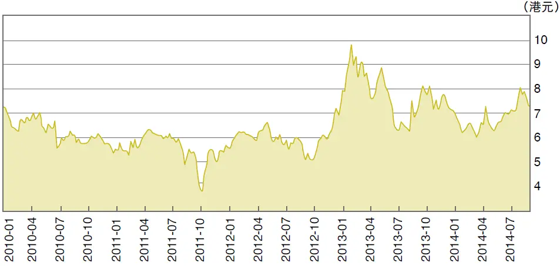

图4—1 民生银行（1988\.HK） 2010—2014 年股价走势图

资料来源：雅虎财经。

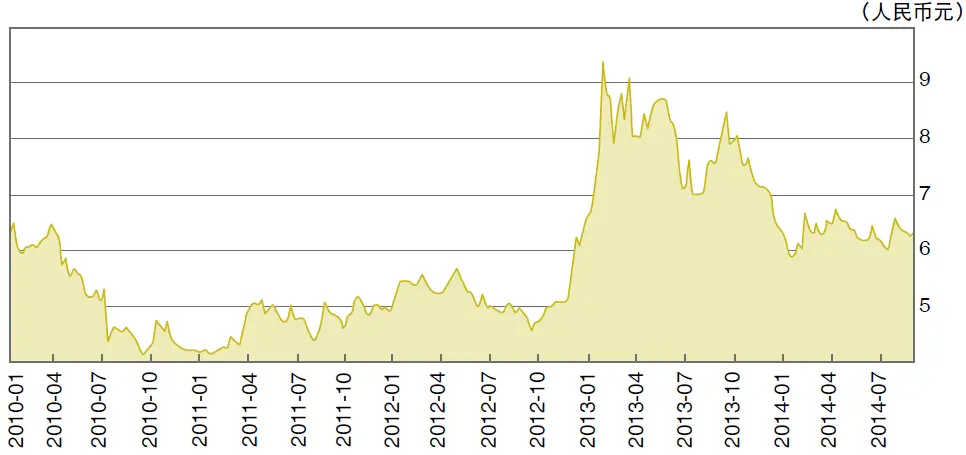

图4—2 民生银行（600016\.SS） 2010—2014 年股价走势图

资料来源：雅虎财经。

这里有两点需要说明。第一，我说的利率是市场利率（取决于通胀），不是官方利率。第二，对于同一家公司来说，由于其他变量相同，所以利率是估值的唯一因素。

__傻瓜看重庆农商银行__

对于重庆农村商业银行（3618\.HK），在一次午餐会上，我发表了一番跟大家有点不同的意见，某大佬听进去了，拿起电话给他的经纪人：“喂？”

我很看好这家银行，原因如下。

（1） 不太可能倒闭。

（2） 确实有坏账风险，但是哪个行业没有呢？出了大问题的话，政府会拯救它，倒不一定拯救别的行业的企业。

（3） 虽然是家小银行，但是凭着它356亿港元的市值，也算得上一家大型上市企业。

（4） 它是一家地方性银行，没错。但这又有什么不好？难道到处撒胡椒面，没有一个核心市场就好吗？重庆虽小，占地面积也几乎赶上匈牙利，人口多两倍，你还不满足？

（5） 我曾经在重庆调研和投资小贷公司，经常碰到农商银行的人。在重庆，你竞争不过他们。

（6） 别看分析师定的12个月目标价格。我们看4年或者5年。如果不行，6年。它的利润可能会比2012年翻一番。如果4年、5年或者6年里股价一直不涨，那到时候由于利润翻番，市盈率就会从2012年的6倍变成3倍（在2014年年中，其市盈率已经变成了4\.47）。假定它的派息比例不变，到时候它的息率就会从2012年的5%变成10%。它的市净率就会变成0\.4左右。

这种情况可能出现吗？当然可能。什么都可能，不过概率不大。也就是说，在4～6年内，它的股价非涨不可。我估计它会翻一番有余。这个回报率也相当不错啊！你等得起：你一边等，一边收到5%以上的息率（每年）。还不够吗？

（7） 重庆农商银行也许不是最好的银行。不过，确实已经相当好！

## 第4章 金融创新成了危机之源？ - (4) 4.04 余额宝想动银行的奶酪？

\(4\) 4\.04 余额宝想动银行的奶酪？

2026年3月14日

9:59

__4\.04__

__余额宝想动银行的奶酪？__

余额宝和其他“宝”想动银行的奶酪？没门儿！

我在2014年年初于《南华早报》发表了一篇文章，某君给翻译成了中文，摘要如下。

__利率市场化终成阻碍__

互联网公司根本抢不到银行业的奶酪，下面是一些被大家忽视的真相。

第一，支付宝2500亿元人民币的资金仅是银行业总存款的0\.24%。

第二，电商公司既无贷款技能，也没有客户，更没有贷款牌照。严格说来，余额宝买卖货币市场基金，处于监管的灰色地带，这是一种聪明的创新，而且无伤大局，所以监管层对这种创新尚处于理解和容忍阶段，但如果这种创新如野火般迅速蔓延，监管层态度就可能改变。

第三，到目前为止，余额宝（或其他“宝”）投资渠道非常有限：货币市场基金、国债和银行存款。但要注意，货币市场基金本身也需将资金投资于银行存款和国债。因此，在某种程度上，余额宝不是在和银行竞争，而是在为银行打工。

当然，有人会说余额宝收益率比银行高，但这是银行同业市场目前紧张的短期情况，不是常态。

余额宝和其他“宝”无疑会推高整个银行业的短期资金成本，但这种成本的上升最终取决于银行的转嫁能力。

最后，你必须问一个问题：为什么谷歌和亚马逊不推出“美版余额宝”？答案非常简单：这种商业模式在美国不能成立，因为利率是市场化的。

目前，中国有约1/4的银行资金已经被“市场化”了，这就是所谓的“理财产品”。银行在理财产品中的获利比普通存贷业务更丰：利差更大，加上多重收费。可以想象，在未来5～10年，所有银行的利率都将由市场决定。

等到利率市场化之后，存款利率将走高，余额宝的存在逐渐失去意义，“宝”类产品就被利率自由化抛在身后，或者它们必须发明新的游戏。

__对储蓄大众功不可没__

现在看来，银行不屑于理睬余额宝和其他“宝”，但如果它们开始动银行的奶酪，相信银行会反击。银行有多种方式“曲线加息”以争夺存款，或者在各项业务中互相补贴。

余额宝和其他“宝”没有“护城河”，银行其实可以用非常小的边际成本打垮它们，只是银行目前还不愿意，也不需要这么做。

注意：国债市场和货币基金并不是没有风险的。一阵狂风就可以打翻余额宝和其他“宝”，而银行岿然不动。

在看完我的余额宝文章之后，有读者批评我：“你的分析正确，但是态度不对。你没有看到余额宝等正在努力解放储户吗？”

我的感情立场当然是站在余额宝这边，但是，分析问题时，不能带有感情。

另外，我在文章中，也大赞余额宝对储蓄大众的贡献，但是翻译者摘译的时候省掉了。我写道：“余额宝和其他‘宝’对储蓄大众功不可没。它们逼迫银行设法提高短期利率，不管央行的利率管制如何。”

但是退一步说，即使电商公司马上获得银行牌照，也休想搬动银行的奶酪。为什么？

作为银行，你必须遵守一系列的监管规则，包括资本充足率和贷款额度控制等。任何电商和民营企业成立的银行都是“极小的银行”。你有多少资本金？这就是最大的限制！你的资本金就限制了你的贷款规模。所以，银行牌照成了负担。

## 第4章 金融创新成了危机之源？ - (5) 4.05 政府必须奖励余额宝

\(5\) 4\.05 政府必须奖励余额宝

2026年3月14日

9:59

__4\.05__

__政府必须奖励余额宝__

社会如何进步？我们为什么还是这样贫穷？摆在大家面前的问题就是这样明显。

余额宝和其他“宝”正在做的事情不过是试图赚钱，试图咬一口银行的奶酪，试图吸引眼球。它们的手段非常简单和可爱：为老百姓效劳。它们既没有巴结权贵、贿赂他人，也没有欺诈抢劫。我找不到比这更加光明正大的事情。

__竞争才会成长__

如果银行感觉不舒服，那太正常了。做生意不是请客吃饭，不是做文章，不是绘画绣花；生意场上会有打斗和竞争，会有倒闭和失败。政府的最高职责是既不参与打斗，又要“鼓励”打斗，维持秩序，让打斗公平公正。

如果每次遇到打斗，政府就做“和事佬”，或者残酷地把一方逼走、劝退、打垮、消灭，那才是问题。

为了“鼓励”打斗，我们必须“没事找事”，打开大门，让外国的“好事者”也进来参与打斗，那才是真正的推动社会进步。一个人的心胸有多狭窄，他就有多么落后和贫穷。

咱们的汽车工业在强力保护下，到今天还是目前的状况。虽然中国的汽车销量已经达到世界第一，为民族汽车工业提供了巨大的商机，但是越受到保护，越没有出息。你看，咱们国产汽车的技术水平如何？创新能力如何？品牌如何？前途如何？能否夺取美欧市场总销量的1/5？

中国的银行业在关爱之下，肥头大耳，实在需要竞争来逼着它们多跑几圈，减肥、增效。

事实上，余额宝和其他“宝”根本无法对银行构成任何威胁，它们至多是迫使银行提高短期资金成本。但是，银行的转嫁能力巨大。而且，即使银行无法转嫁，也没有关系，也许更好。谁规定银行必须有这样丰厚的利差空间？近几年，银行业占了全国企业界总利润的一半左右，这是利率管制的结果。存款利率太低，导致影子银行盛行，储蓄者长期受损。贷款利率也相应太低，低效投资盛行，包括房地产泡沫达到危险的地步，以及污染和产能过剩。

我建议，给余额宝授予“五一”劳动勋章，给其他“宝”授予“青年突击队”称号。

## 第4章 金融创新成了危机之源？ - (6) 4.06 开办民营银行的“捷径”

\(6\) 4\.06 开办民营银行的“捷径”

__4\.06__

__开办民营银行的“捷径”__

政府一句话：“大家可以开办民营银行了！”

于是乎，人们奔走相告，摩拳擦掌。但是，且慢！

银行不是随便开的，更何况民营银行，而且是中国的民营银行。

我认为，大家对民营银行还没想好，至少还需要30年才能想好，才能真正地接受民营银行。这是我的判断，信不信由你。民营企业需要攻克万重山，才能走一小步，太艰难。

（1） 银行是个很复杂的生意，很难的生意，比做鞋子和开商店难多了。监管规则之复杂，也超乎想象。

（2） 现在中国的银行都已经巨大了，用世界标准来看也是如此。你想开个什么银行？你有多少资本金？能够跟兴业银行一比吗？能够跟华夏银行一比吗？当然，永远不要谈跟五大银行较量，至少30年不要谈。

（3） 银行业高速增长的顺风顺水的时代可能已经过去了。现在，我本人的担忧是，在银行业产能过剩已经如此严重的情况下，咱们怎么收场。现在，银行纷纷到香港地区上市，在各处增发，发行CB（可转换公司债）和优先股，以及利润留成，等等，都是产能扩张的举动。

30多年来，信贷膨胀这么严重，到现在已经很棘手，这才是真正的问题。另外，好客户都被银行抢光了，而且它们都已经开始在次贷领域寻宝，还有多少空间给新银行？在下一波的经济衰退中，一批中小银行会损手损脚。

（4） 银行需要前期的高投入。你有多少钱？银行是个护城河很深，客户叛逃不容易的行业，新来的银行会很艰难。

我不是说，民营企业不可以在银行业有一点点作为。其实，我看好银行业作为投资标的。由于长期的政策和利率管制，银行业还是非常肥美的。我相信这些政策和利率管制在未来十年都不会有太大的变化。民营企业如果想分一杯羹，完全不需要（也不应该）新设银行。中国有几百家（对不起，几千家）城商行、农商行、农信社、联社等，这些都是几十年的政策的受益者。你斗不过它们，可以加入它们。现在，很多中小银行都在寻求上市，估值很有吸引力。这才是民营企业真正的机会，不要新设银行。

2026年3月14日

9:59

## 第4章 金融创新成了危机之源？ - (7) 4.07 谈影子银行内幕

\(7\) 4\.07 谈影子银行内幕

2026年3月14日

9:59

__4\.07__

__谈影子银行内幕__

我之前出版过一本书，《影子银行内幕：下一个次贷危机的源头？》，误打误撞，我仿佛成了影子银行的“代言人”。后来，《华尔街日报》就此采访了我，让我谈谈对金融改革、监管和次贷风险等问题的一些看法。

__影子银行资产大体安全__

《华尔街日报》：您在书中表示大家看不起小额贷款提供者。为什么会这样？

张：因为过去我们的理念是，民间金融机构危险且会破坏现有系统，而且高利率是不道德的。大家完全无视我们在与次贷客户（高风险、高成本）开展业务这一事实。问题其实很简单：我们作为企业需要获得足够回报，否则将无法生存。

《华尔街日报》：金融体系的变化可能是在为下一场次贷危机埋下种子。您认为这场危机会如何演绎，影子银行会是危机爆发的原因还是危机的症状？

张：我认为影子银行的资产大体上很安全，我们对自己资

金的管理非常谨慎。由于监管非常严格，即便我们想承担过多的风险，实际上也做不到。但是影子银行的快速发展从一个侧面反映出了正规银行体系的问题。“金融压迫”一直管制利率水平，利率水平远低于通货膨胀。这导致了信贷的快速膨胀，银行被迫年复一年地快速增加贷款投放，但好的放贷机会并没有这么快增长。因此，银行不得不降低放贷门槛，导致银行自身的次级贷款增加。当然，低利率也扭曲投资项目的可行性：利率如此低,烂项目可能也就变成了好项目。

《华尔街日报》：中国的小额信贷与穆罕默德·尤努斯（Muhammad Yunus）创办的知名的孟加拉乡村银行（Grameen Bank）模式有什么区别？

张：中国的小额信贷承受着很大的偏见，并且受到严格监管。而民间借贷有更大的灵活性和更高的效率。与印度和孟加拉国相比，我们平均每一笔贷款的规模要大得多。

《华尔街日报》：您一直非常积极地用中文声援小额信贷。那么您又是出于什么样的目的用英文写了这本书？

张：我发现外国投资者和学者的许多争论都没有谈到点子上，他们错把矛头对准了影子银行的资产质量和影子银行给整个金融系统带来的风险。但这两个问题在我看来并不重要。我让人们把关注重点放到影子银行的快速发展传递的信号上来。为什么影子银行在监管如此严苛的背景下仍然能够发展得如此之快？这说明了什么问题？

还有一个原因，我发现中国的政策越来越受到外国投资者、学者和香港地区投资界的影响。我希望这本书能够影响那些有影响的人。

《华尔街日报》：您表示小额信贷在中国面临的最大障碍就是监管部门的反对。这是否意味着小额信贷注定在中国难以发展？怎样才能使小额信贷真正地发展起来？

张：对小额信贷公司持保留态度的不仅是中国监管部门，其他政府部门、银行以及公众都抱有同样的态度。在许多问题上，我们都需要观念上的变革。我本人正在做这方面的教育工作。作为一个公民，我对此感到自豪。

__我们需要变革观念__

《华尔街日报》：如果中国发生次贷危机，您认为金融体系最薄弱的环节在哪？

张：我认为房地产泡沫最有可能成为危机的起点，其次是地方政府融资平台。

《华尔街日报》：您曾指出，中国货币供应量在最近几年的增速已明显高于美国。这是否值得担忧？中国月度消费者价格指数升幅依然不高，为什么货币供应的加速增长还没有反映在通货膨胀上？

张：中国的货币供应增速远高于其他国家，这件事情本身并不值得担心。但每年的货币供应增速都在16%～17%，如果长期以来年复一年，那么中国的货币政策就非常宽松且容易引发恶性通胀。信贷增长与通货膨胀会相互增强，推波助澜，从而成为一个恶性循环。

《华尔街日报》：监管部门经常要求银行加强对中小企业的信贷投放。是否可以设想银行能够解决小企业长期以来面临的信贷枯竭问题？

张：尽管银行面临压力而且拥有良好意愿，但大型银行有不同的成本结构，而且决策过程烦琐，并不适合发放小额贷款。这并不是银行的错，如果我是行长，我也会这么做，银行也有自己的压力。但专业分工是一个美丽的东西，小额信贷公司就是专门为中小企业服务的。只需政府减少限制，公众不再抱有偏见，小额信贷公司就会做好这项工作。

## 第4章 金融创新成了危机之源？ - (8) 4.08 小微贷款的基础设施在哪里？

\(8\) 4\.08 小微贷款的基础设施在哪里？

__4\.08__

__小微贷款的基础设施在哪里？__

做了一年半的小额贷款生意之后，我发现有两个问题。

（1） 全国6000家小额贷款公司面临着一个共同的挑战。除了少数几家小贷公司有像样的IT设施，其他都是土法上马，当然没办法做大业务。一家公司1亿～2亿元人民币的股本金，依靠手工能做多大？如果每家小贷公司都开发自己的IT系统，这就是6000个，全社会有多少重复劳动？我们可以共享一套中央系统吗？我很想知道。

之前，德意志银行呼吁全球的投资银行共享IT和交易系统。这是英明的见解，虽然现在还没有投行响应。投行的IT和交易系统是奇贵的，小贷公司的IT系统对于实力单薄的小贷公司来说，当然也很贵。

如果没有像样的IT，小贷公司就不能做千千万万的微小贷款，也就只好发放大额贷款，吃银行的剩饭。小贷公司的放款利率（年息24%上下）大大高于银行的贷款利率（8%～9%），如何保持长期的竞争优势？

这会成为一个恶性循环。高风险的客户到小贷公司，低风险的客户到银行。小贷公司由于承担了高风险，资金成本高，而因为监管，又负债率低，因此只好用高利率来维持。如此循环，我们小贷行业有可能自生自灭。难道这就是我们制度设计的用意吗？

（2） 缺一个征信系统。商业银行可以用人民银行的征信系统。虽然这个系统有缺陷，但是远远好过没有。现在，在多数省市，这个系统并没有对小贷公司开放。在开放的省市，这个系统收取的使用费也是个门槛。我们小贷公司在审查客户时，不知道客户在其他地方有没有贷款，有多少，过去的信誉如何。这样会导致在同一个地区，每个小贷公司都在做重复劳动。

在美国，有3个大的私有的企业征信局。也许，我们应该鼓励私有部门做这样的事？我最近在看这方面的材料。但我还完全是外行，希望行家指教。如果我弄得有点明白了，想领头做这事儿，你们会不会当我的天使投资人？

2026年3月14日

9:59

## 第4章 金融创新成了危机之源？ - (9) 4.09 银行业的前景如何？

\(9\) 4\.09 银行业的前景如何？

2026年3月14日

9:59

__4\.09__

__银行业的前景如何？__

目前中国银行业最大的问题有两个。第一，对存款利率的管制，从某一角度看，其实等于从存款人处拿钱，补贴那些能够获得贷款的企业（国企和能够获得贷款的民企）。第二，银行业的利润太丰厚，会对其他行业有影响。

__无奈的投资机会__

而中国银行业的前景又如何呢？利率自由化主要是放开存款利率。它至关重要，利国利民。可是，应该发生的事情会不会发生呢？我的冷静判断是：5～10年内不会发生。这很遗憾。我从1983年加入中国人民银行总行那一天就反复听说利率自由化和人民币自由兑换，但是30多年过去了，我们还是总能听到这些讨论。

银行业受宠时，我们这些投资人，该怎么办？只好买银行的股票。英文里有句话：“If you cannot beat them, join them\.”意思是，如果你斗不过他们，那就加入他们吧。当我发现小贷公司、租赁公司和典当公司实在无法跟银行较量时，我服服帖帖地买了招商银行和民生银行的H股。其实，银行业股票的投资前景好极了，但是有时我真的不希望现实是这样的。

至于风险方面，中国银行业最大的坏账风险，在理财产品和信托公司。理论上，这些产品的风险最终都是由投资者承担的，但是，你我都知道，银行和信托公司是脱不了干系的。这些理财产品有6万多亿元人民币，相当于总信贷余额的9%，这可是个不小的比例。理财产品利率高，但是风险也大。其实，为什么不直接把存款利率放开，或者大幅提高存款利率呢？用理财产品的快速膨胀来蚕食普通存款，是很危险的。

__中小贷前景堪忧__

而很多人关心的中小企业贷款，在未来几年，前景可能不大好。银行业只是实体经济的反映。在实体经济层面，国有企业在各个领域都很强势地与民企竞争着。作为银行的一个普通经理，如果对中小企业感兴趣，工作就太麻烦了，也不值得！作为银行的分行行长和支行行长，你每天“压力山大”，根本无法顾及考虑中小企业贷款，因为给中小企业贷款吃力不讨好。

虽然现在很多银行都在做中小企业贷款，它们的中小贷款增长很快，但是这有几个因素：第一，很多银行的经理都是凭着良心发放中小企业贷款。但是，这可以持续吗？政策能够建立在良心和觉悟的基础上吗？第二，有些银行的中小企业贷款存在“定义”和分类上的小把戏。第三，如果在实体层面，国企继续强势与民企竞争，银行的中小企业贷款就会失去长期增长的基础。现在，不仅银行，连小额贷款公司，都遇到了好客户不够的问题。

对于小额贷款公司而言，皮之不存，毛将焉附？如果国企和民企的竞争势态依然这样持续，要不了几年，小额贷款公司的客户就都不见了。

## 第5章 咱们的财富在哪里？

__第5章__

__咱们的财富在哪里？__

“一个国家就相当于一个上市公司。如果国家不断增发货币，那必然摊薄已经持有货币的人。如果货币供应量的年复合增长率为13%，而你自己的回报率因此超过13%，那么你是受益者。否则，你就是一个受害者。这个道理是不是不难理解？”

## 第5章 咱们的财富在哪里？ - (01) 5.01 如果水价涨五倍……

\(01\) 5\.01 如果水价涨五倍……

2026年3月14日

9:59

__5\.01__

__如果水价涨五倍……__

如果中国的水价马上涨五倍，会怎样？多数人会回答：“那会严重伤害老百姓的！”有人甚至会说：“那会出现社会混乱！”当然，甚至有的人会说出更激烈的话。

水价会不会涨五倍？我看一切皆有可能。十年前，甚至五六年前，谁也没有料到中国的地价和房价会是今天这么高。谁也没有料到煤价、油价、铜价、金价会是今天的样子。中国人喜欢说：“我们的政府肯定会进行调控的……所以，政府不会允许它们一直上涨。”好像政府是万能的。就像在谈到铁矿石的价格时，我们喜欢说：“中国作为最大的买家，一定会有话语权。”当然，那些都已经被证明不是这回事。

__消耗资源不可持续__

关于电、水、粮食的价格和资金的价格（利率和汇率），我们喜欢死撑，尽管效果不太好，而且代价也越来越沉重。

我的湖北老家在汉江边上，两大支流把我的村庄夹在中间。我的童年和少年是跟游泳、捕鱼和划船连在一起的。可惜，那是20世纪六七十年代，多年的人口膨胀和免费用水，终于消灭了这两条支流。连汉江也快消失了。

今天，我们花很多钱买名牌包，或者买长期空置的住房，却不肯花钱挽留青山绿水。没错，我们确实很穷，但是河流的消失会让我们更穷，我们会被迫付出惨痛的代价。这已经不能再继续了。

不管我们实行怎样的水价政策，其结果都是一样的：在未来20年，水价必然会上升几十倍。这不会因为调控而改变，也不会因为我们大家不高兴而改变。中国人要么尽快、主动地把水价提高五倍或者十倍，要么若干年后被迫这样做。主动做比较好，因为我们可以争取到缓冲余地，会保留青山绿水。相反，等到山穷水尽的时候，缺水恐怕会成为饥荒、疾病、瘟疫的源头。到那个时候，不管多高的水价，我们也要被迫承受。那岂不就是敬酒不吃吃罚酒？从这个角度看，讨论水价该不该上升十倍或者几十倍，其实没有多大意义。它绝对会上升五倍甚至十倍，仅有的区别是主动和被动，早十年还是晚十年。

__水价上涨的影响__

21世纪初的时候，每桶石油的价格只有20多美元。当石油价格开始涨的时候，很多人疾呼：“不得了啦！天要塌了！如果油价超过60美元，世界经济会崩溃的！”后来，随着油价超过60美元、80美元、120美元，这些人的嗓门儿越来越大。但是现在，大家习惯了：140美元也到过，其实也没有什么了不起。也许250美元也没什么了不起。关于房价、汇率、利率、水价和铁矿石的价格，道理也都一样。我们不要大惊小怪。

利率控制的结果是能够从银行获得贷款的企业和人们享受到了补贴。同时，低利率所创造出来的过大的资金需求会导致资金短缺，迫使没有得到银行贷款的人从银行以外寻找资金，付出更高的利息（比如典当行和高利贷），或者望梅止渴。

压低价格必然刺激需求，鼓励消费和浪费，导致短缺。时间长了，我们会觉得骑虎难下，因为利益集团会反对改变现状，加上部分人得过且过（谁也不想做恶人），改革成了不可能的事情。

作为股民，我最关心的问题是，如果水价上涨五倍或者更多，会对经济和股市有何影响。

第一，医疗和医药行业会因为水价大涨而萎缩。这是大好事。为什么？因为水污染，以及与此相关的空气污染而导致的各种疾病太多了，太严重了。而水价大涨，全民节水所带来的青山绿水会大大改善全民健康状况。

第二，水价大涨对于居民消费没有什么影响。水占家庭消费的比重太小，涨了十倍也不会很大，相对于食品、衣服、住房、教育、电话的支出还是小，节约水的空间也很大。

第三，耗水大户（钢厂、化工厂、桑拿房等）会需要多付很多钱，但这是应该的，早就应该如此。而且，部分的支出增加会得以向下游转嫁，部分会通过节约来解决。大家也会被迫发明新工艺和新产品。毕竟，人是需要有压力的。

第四，污水处理行业（从设计、设备制造到运营）会大获其利。到目前为止，这个行业一直靠财政补贴，萎靡不振，它们该赚钱了。

第五，海水淡化遇到的最大障碍是水价太低。如果大幅提高水价，海水淡化会前景广阔。

## 第5章 咱们的财富在哪里？ - (02) 5.02 咱们为什么都爱发改委？

\(02\) 5\.02 咱们为什么都爱发改委？

__5\.02__

__咱们为什么都爱发改委？__

每次，美国的校园发生枪击惨案以后，各方人士就提出这样和那样的解决方案，比如检查买枪人的背景，购买的枪支数必须有上限，实行核准制，等等。但是，问题从来就不可能得到解决。根源何在？

《华盛顿邮报》的评论员亨利·艾伦（Henry Allen）说，美国人根本就不想解决这个问题：“美国人太爱他们的枪了。这是美国文化的一部分，把持枪当作与生俱来的权利。”

由此，我联想到咱们对特权和贪污的深仇大恨。其实，准确地说，某些人只是痛恨别人的特权和贪污而已，说不定如果自己有机会，还是想试试的。因此，各路神仙拿出的解决方案也都是根本无法解决问题的隔靴挠痒，因为某些人根本不想解决这些问题。

你看发改委，正如有些人所说，也许发改委是阻碍经济效率和社会进步的。但是，大家一边骂它，一边又喜欢它，热爱它。有人做梦都想当发改委主任。另外，每次遇到经济问题，专家、官员和大众提出的解决方案都是：更多的管制，更强烈的“监管”。按照大家的方案，再增设100个发改委也可能还不够！

这里我摘录亨利·艾伦在文中讲的一个寓言故事。某人把戒指丢在家里某处了，却一直趴在房子外面的地上寻找。邻居见状，问他，既然你丢到房间里了，为什么不到房间里去找？他回答说：“你这傻瓜，当然是外面的光线好啊！”

2026年3月14日

9:59

## 第5章 咱们的财富在哪里？ - (03) 5.03 最简单的政策就是不行！

\(03\) 5\.03 最简单的政策就是不行！

__5\.03__

__最简单的政策就是不行！__

1995年，美国的金融衍生工具快速膨胀，各工商企业趋之若鹜，给整个金融体系带来了越来越大的风险。怎么办？有人请巴菲特出主意。巴菲特说，很简单，叫所有工商企业的CEO在年报上签字，确认他们本人明白和理解他们所购买的衍生产品。因为这些CEO根本不懂复杂的衍生产品，所以他们会乖乖地减少衍生产品的使用。

巴菲特说，当然，这样简单的政策措施不可能得到监管部门的采纳，因为人类都喜欢把简单的事情复杂化。（他的原话是：My proposal will not be adopted, because it is too simple\.）

美国跟中国何其相似！在中国，房地产市场好像已经失去理智，大家都开始群体离婚。通胀失控，以后你不带计算器，根本不敢上街买菜。芹菜的价格终究（注意是终究）会涨到每斤35210元。以后，每个人的年薪都会超过百万。影子银行太可恶了，等等。但是我们就是不愿意做最简单的事情：把利率上调2～3个点。

我的方案很简单，而且太简单了！但是，大家会群起反对。加息以后，工业企业怎么办？下岗职工怎么办？经济衰退怎么办？对于水污染、水枯竭，我的方案也很简单：加价五倍！天然气短缺，环境污染？加价！但是，这个方案也太简单！

呜呼！我投降！简单的事情就是做不成！

有什么样的老百姓，就有什么样的政府。所以，大家不要一味地责怪政府，咱们要多多责怪自己。咱们的脑袋都太复杂。

2026年3月14日

9:59

## 第5章 咱们的财富在哪里？ - (04) 5.04 谁夺走了企业家的快感？

\(04\) 5\.04 谁夺走了企业家的快感？

__5\.04__

__谁夺走了企业家的快感？__

2007年，中国石油（601857\.SS）在A股市场隆重亮相。这是中国企业界的骄傲，IPO价格区区16\.7元人民币，不贵。

后来的故事，大家都很熟悉，无须我废话（见图5—1）。我真诚地为成千上万的股民的巨额亏损而难过。但是，大家有没有问一个实质性的问题：中国石油所代表的究竟是什么？它的遭遇能否说明公有制摧毁价值，过度监管扼杀企业？我不知道。

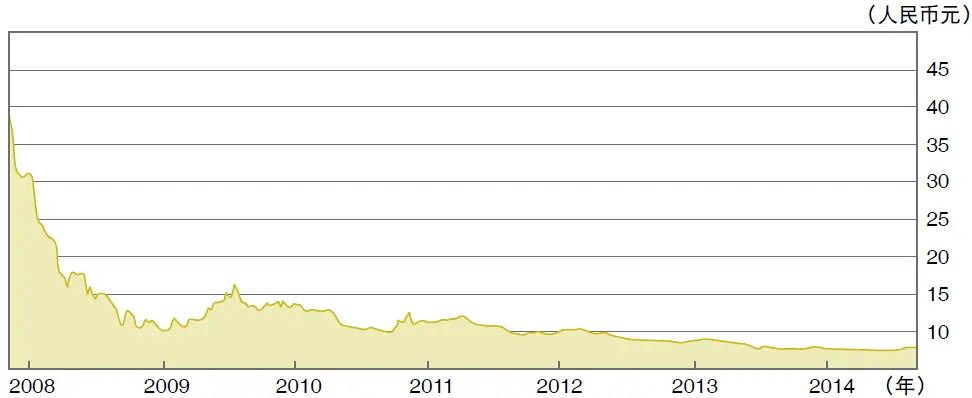

图5—1 中国石油（601857\.SS） 2008—2014 年股价走势图

资料来源：雅虎财经。

__呼吁监管导致企业喘不过气__

中国石油的广大员工跟其他员工一样勤勉。不过，这家企业难免会有些低效率的问题。更关键的问题是，它身上集中了过度监管。大家不要一味地批评监管部门，咱们老百姓应该自责，咱们也都十分崇尚公有制和监管，大家动辄呼吁“加强监管”。我问你，你有没有跟大家一起呼吁过，“进口天然气的价格要管制”，“石油价格要管制”，“员工不能辞退”，“改善福利”，等等？如果一家企业被咱们的管制压得喘不过气来，它的管理层即使有十八般武艺，也施展不出来。

如果中国石油不上市，那咱们就可以永远安慰自己：锦旗，奖状，豪言，部级单位，世界500强，等等。但不幸的是，它上市了。这就意味着，全世界可以清清楚楚看到它具体是如何为股东增值的，它的成本控制如何，项目进展如何，整个公司是否进取。

当然，远洋集团（601919\.SS）、中冶集团（601618\.SS）和大批其他企业也面临同样的挑战（见图5—2及图5—3）。

__做生意需要乐趣__

在这件事上，我们无法怪罪德国人或者孟加拉国居民。这些企业都是被咱们自己折腾的。而且，大批民企也已经被咱们弄得痛不欲生！股民啊，你正在为此付出代价！如果情况不变，你还将继续付出代价。

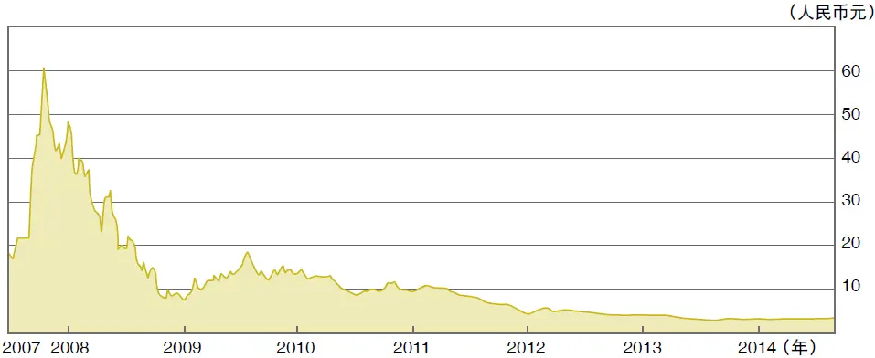

图5—2 远洋集团（601919\.SS）2007—2014 年股价走势图

资料来源：雅虎财经。

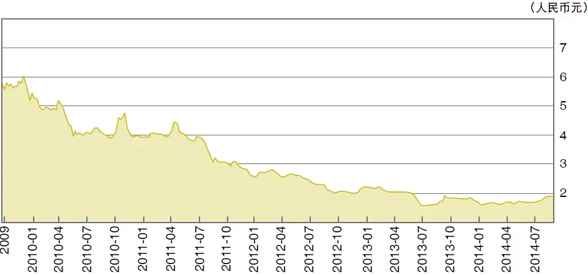

图5—3 中冶集团（601618\.SS） 2009—2014 年股价走势图

资料来源：雅虎财经。

你可能会说，你从来不买股票。其实，你也变相在付出代价：你或者你的家人能否找到工作？看看咱们自己把公司都监管死了，或者奄奄一息，它们哪里还有能力和意愿聘用你或者你的家人？

我之前出版《影子银行内幕：下一个次贷危机的源头？》时，瑞士银行在伦敦举办了一场大型午餐会，让我跟投资者们聊聊这本书。有一位已经读过这本书的基金经理说，你的故事太压抑了。在中国做生意那么累吗？如果英美的企业家碰到那一半的困难，早就放弃了！

做生意为什么那么痛苦？我们连打哈欠也要申请拍照。买两支铅笔，也要所有董事们开会，并且还要面签许多文件。

中西文化都强调和赞美执着，“坚持到底就是胜利”，但是，越来越多的企业家回答：“人生太短。放弃吧！” 他们完全不想一天接待三个检查组，晚饭要在同一家餐馆应酬两三批人。咱们逼着咱们的企业家做了多少此类事情？

“天将降大任于斯人也，必先苦其心志，劳其筋骨，饿其体肤，空乏其身……”悲壮，这确实悲壮，但是，做生意难道不可以多点乐趣吗？

最近，一个德国企业家对记者说：“中国还有一点成本优势。感谢上帝，中国人缺乏创意。否则，我们德国人哪里还有市场？”我接触的中国企业家很多，他们一天到晚已经被无穷无尽的会议，送往迎来以及讨批文弄得筋疲力尽，哪里还有创意？哪里还有快感？

请不要怪政府，要怪还是怪咱们自己。你看，咱们一边抱怨公务员太多，老百姓养活不了，一边挤破脑袋想当公务员；一边抱怨监管压得企业喘不过气来，一边鼓吹加强监管。如果你不明白你持有的高速公路公司的股票为什么亏钱，请让我提醒你，过去几年，你不是跟大家一起呼吁取消节假日收费吗？那直接伤害了上市公司10%的利润。如果你不明白你持有的航空公司的股票为什么不争气，那我告诉你，咱们到处伤害它们，它们能争气吗？

2026年3月14日

9:59

## 第5章 咱们的财富在哪里？ - (05) 5.05 企业的并购和噩梦

\(05\) 5\.05 企业的并购和噩梦

2026年3月14日

9:59

__5\.05__

__企业的并购和噩梦__

几年前，华东地区一家老国企通过增资扩股的方式，引进了新的控股股东。新的控股股东是一家很骄傲的大型股份制企业。当然，此举的目的是通过改革，大幅提升这家老国企的效率，以便大家都赚钱。遗憾的是，几年之后，这家老国企的管理层还是原封不动，我行我素。

这家老国企的老董事长甚至这样刺激他的新老板：“我们是副局级单位，你老老实实做股东吧，不要想入非非。”据说，他的新老板为此浑身上火，在医院住了几天。

另外，一家在香港上市的燃气集团在收购了某城市燃气公司的控股权之后发现，对付这家老国企就像狗咬刺猬，不知道如何下口。原来的管理团队不肯让位，这家上市公司感到被绑架了。

可是呢，这两位新的控股股东除了愤怒（和打自己的耳光）之外，也没法行使自己的控股权。

欢迎来到中国的并购行业！最近，我听到做PE投资的几个朋友（包括机构和个人）讲类似的故事。钱，一旦离开自己的口袋，就不能说还是自己的钱，不管对方是国企，还是民企。

我赶紧安慰他们，其实，我们做股票投资，何尝不是如此呢？唯一的区别是，股民A也许可以把自己的亏损转给股民B。

__不刺激的并购生意__

我曾经读过一本好书，《资本之王》（King of Capital：The Remarkable Rise, Fall, and Rise Again of Steve Schwarzman and Blackstone）。这本书讲的是黑石PE投资，特别是并购业务的20多年历史。

虽然书中的不少故事我们都知道，比如，美国民众对并购基金的抗议，以及在黑石公司IPO上市的时候，中国人如何申购30亿美元，如何巨亏等。但是，现在有人把它写成一本翔实的历史书，险象环生，还是很值得一读的。

这本书最大的遗憾是，在美国做并购生意太简单了！只需要融资，找到并购目标，发出要约收购，裁员，改善管理，然后就赚大钱，或者……亏大钱！

这太不刺激了！不需要设计开曼群岛的秘密账户，不需要喝酒喝得死去活来！整本书391页，没有一个带着“腥味”的故事。

坦白讲，我不喜欢这本书，我还是宁可读中国的企业故事，因为中国的故事惊心动魄，富贵险中求。在中国做并购的人们会发现黑石的故事太过于世外桃源，甚至……书生气太重。

《资本之王》这本书在对黑石的投资项目以及其他并购公司30年来的项目做了分析之后，得出如下几个结论：

（1） 并购者当然是唯利是图的商人（谁又不是呢？），但是，他们在客观上为众多企业在最困难的时候提供了一个额外的选择，可以叫雪中送炭。他们的资金与传统的银行融资大不相同。在这一点上，他们与高利贷业者的光荣使命是一样的。

（2） 他们确实在刚刚并购一家企业之后，会裁员。但是，人浮于事难道就是好事吗？而且，他们在裁员之后，盘活了企业，后来又创造就业，或者避免了企业的倒闭，保住了很多就业机会。

（3） 过去30年，并购行业的成功与西方世界的利率长期下滑有关。利率下滑的结果是资产估值上升（即市盈率是市场利率的倒数）。买下一个企业，只需要等它几年，估值就上去了，你便可以卖出。我个人认为，其实整个投资界（并购也好，PE也好，买股票也好）都得益于另外一个巨大的因素：时间。即使利率永远不变，资产估值的倍数不变，一个正常的企业在正常年代会不断增值，有时快一点，有时慢一点。耐心终究会有回报：大回报、小回报。只要分散风险，赚钱的概率大于亏钱的概率。这也是巴菲特赚钱的核心要素之一。

（4） 并购基金和PE基金靠什么赚钱？当然，业者们经常宣称，他们给所并购的企业带来了管理和效率的提升，这是赚钱的源头。但是，作者认为，这有夸大和自我美化之嫌。无数并购案例证明，他们主要还是“搭车一族”。当然，搭顺风车并没有什么错。这就是一门生意，一门好生意。输了是有限合伙人的，赚了是大家的（有限合伙人拿八成，一般合伙人拿两成）。财技不是一个贬义词。

（5） 时点很重要。作者认为，过去30年，美国几百项并购交易赚钱的源头是时点（和经济周期）的把握（timing）。即买低卖高。也就是说，靠运气。对此，我个人是有点体会的。

2006—2008 年，我在深圳控股（0604\.HK）做执行董事和COO（首席运营官），我的主要工作就是买卖资产，很像并购基金的工作。我主持卖掉了十多项非核心业务，包括电厂、收费公路、电视台、物业和工厂。我也负责做了几项收购。也许，我的样本太小，时间太短（三年），或者因为那几年经济正处于经济周期的顶峰吧，我们的资产处置全部是成功的，而所有的并购都是亏钱的。也就是说，我（们）没什么本事，只是碰到了运气好而已。

未来几十年，中国将一直是世界上并购行业最肥美的土壤。大量的上市公司和非上市公司只需要用常识（完全不需要高科技）重新组织一下，改变一下激励机制，即可给企业明显增值，这可是绝佳的机会。不过，总经理们可能需要做点牺牲，这也是障碍所在。

## 第5章 咱们的财富在哪里？ - (06) 5.06 降低中小企业资金成本的关键

\(06\) 5\.06 降低中小企业资金成本的关键

__5\.06__

__降低中小企业资金成本的关键__

中国的利率就像一个高高的水泥柱。柱子的下端是活期存款利率：年息1%甚至更低。往上看，是定期存款利率（2%～5%），基准贷款利率（6%以上）。再往上看，是银行实际收取的中小企业贷款利率，为10%左右，小额贷款公司收取的年息18%～25%，以及民间借贷利率30%～50%。

__市场供求失衡致利率高企__

每个国家的中小企业贷款利率都大大高于基准利率，这不奇怪，但是，中国利率的这根水泥柱太高。不是因为贷款者心狠手辣，而是逼出来的市场供求就是这样。以小额贷款公司为例，在现有的监管制度下，它们收取客户18%以下的年息是要亏本的，原因在于它们的监管成本和资金成本太高。为什么？

第一，小贷公司在规模上受到限制（规模不经济，于是单位运营成本高），业务在地域上受到限制（本县、区），导致风险集中，因此风险溢价高。

第二，小贷公司负债率的上限为注册资本的一半。它们的借贷成本一般在年息7%～13%。小贷公司虽然承蒙政府大力扶持，但是5\.65%的营业税和附加税，以及25%的收入所得税是无法躲开的。另外，还有营业成本、坏账成本和起码的利润。如果我们把让别人做义务工作（即不赚钱）当作经济政策的基础，那就是自欺欺人。

小额贷款公司借入的资金还有闲置成本（不可能在第一天就全部放贷出去）。所有这些加起来，放款的利率无法低于18%。而这个利率对小客户来讲，显然太高。

小额贷款公司的根本利益和长远利益是收取低利率，因为高利率伴随着高风险（更多坏账），也伤害了客户，等于竭泽而渔。

__反思国企的资金占用__

同时，政府的政策动机也是把水泥柱上端的利率降下来。当然，利率只是供求关系的反映。要把上端的利率降下来，就必须改善供给。要改善供给，就必须减少国有企业对资金的占用。

国有企业凭借它们的身份，占用了很多资金，加剧了中小企业的资金紧张，抬高了它们的资金成本。我曾经认为解决方案在于政府大幅提高贷款的基准利率，迫使国有企业放弃一部分低效率的项目。后来，经高人指点，我才理解这个方案不行，因为国有企业对利率的敏感性太低，天高的利率它们也会照样借。

说到利率，我想起来，2013年6月起，市场利率明显上涨，虽然官方利率不变。

有人说，这是影子银行在作怪。这种说法相当于把自己搞不懂的自然现象都归结于“鬼”。

有人说，可能是中央银行在紧缩。不会吧？仅仅2006年年初到2013年11月底，中国的广义货币供应量就涨了272%！ 换言之，2013年11月底的数字就是2006年年初的3\.72倍（这可是世界冠军）。而且，2013年各月的增幅都很高：14%左右的同期增长率！你还要多么宽松的货币政策？你还要什么QE5，或者QE6？

那究竟什么原因在推高利率呢？我在猜想，也许有两个原因。

第一，长期信贷膨胀带来的通胀率可能比官方的数字高。名义利率=真实利率＋通胀率。即使咱们每个人都傻，市场也不会傻。

第二，也许地方政府和国企对利率不十分敏感，推高了资金需求，从而推高了利率。这也就是典型的“政府部门的挤出效应”，把私有部门挤出了信贷市场和投资市场。

所以，要想从根本上解决中小企业资金成本太高的问题，就要降低国有企业在经济中的比重，减少它们对资金的过度占用。这也许是长治久安的办法。

2026年3月14日

9:59

## 第5章 咱们的财富在哪里？ - (07) 5.07 咱们天天被摊薄，还在傻乐

\(07\) 5\.07 咱们天天被摊薄，还在傻乐

__5\.07__

__咱们天天被摊薄，还在傻乐__

2007年年底，中国的货币供应量相当于美国的74%。六年以后呢？它比美国的高61%, 虽然美国的经济总量（GDP）依然比中国大83%。

很多中国人以为，美国搞了QE，所以，街上肯定撒满了钞票。不，不是那样的！

美国的广义货币供应量的增长非常缓慢。在过去几年，虽然有QE、QE2和QE3，但是货币供应量的年复合增长率只有约2%～3%。相比较，中国的M2年复合增长率高达18\.31%。

咱们的很多评论员们，拍拍脑袋就想当然，瞎喊：“美国QE，印钞票……”要知道，印钞票最疯狂的是我们。

下面是原始数据，供大家核实（见表5—1）。

__“钱荒”是钱多造成的__

张维迎说：“2012年发生的‘钱荒’，是钱太多造成的。2009年年初，各家银行、企业，无论有没有利润效率，都借钱投资，投资以后没需求，没需求还要还债，还债没钱，就闹了‘钱荒’。用‘灌水’解决‘钱荒’不是办法，只能钱越来越荒。”

表5\-1 美国及中国2006—2013年M2统计

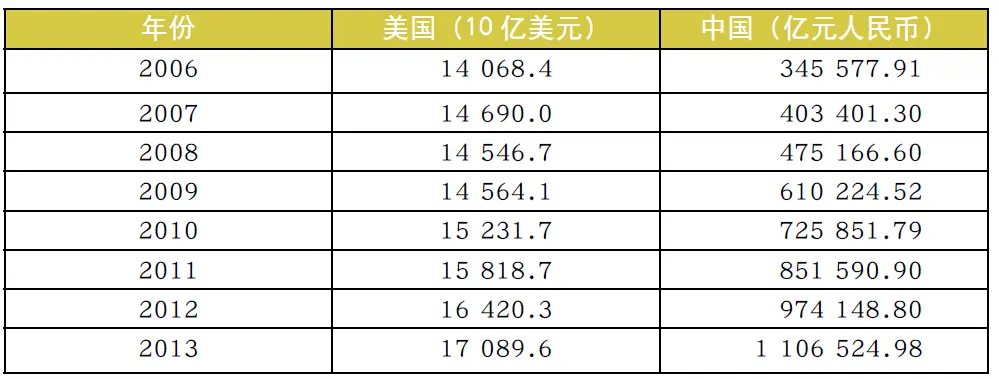

资料来源：联邦储备委员会；中国人民银行。

我跟他结论一样。不过，我想这样描述。货币供应量增长的主要通道是信贷。信贷立刻转化成存款，存款再（按比例）派生出贷款，贷款再转成存款……贷款的增加当然可以推动生产活动，但是很多生产要素（比如原材料、能源、管理能力，甚至劳动力）的供应不是无限的。所以，价格会上涨。所以，你需要更多的铺底资金来润滑同样多的生产活动。

在增加贷款的同时，经济对贷款的需求也增加了（包括投机需求）。所以，利率反而会上升 （因为有通胀和预期通胀）。而且，长期印钞票的结果是，货币流通速度会放慢。大家还记得20世纪八九十年代的三角债吗？那个时候，印钞票的速度非常快，但是三角债使得经济转不动。

你想想，如果一家上市公司不断发行新股，股民们一定不高兴，因为被摊薄是很痛苦的，除非融来的新钱能够创造更高的回报。这个道理大家都理解。

一个国家就相当于一个上市公司。如果国家不断增发货币，那必然摊薄已经持有货币的人（两把斧子对等三张羊皮），除非新的货币发行能够为国家创造更高的回报率，而且你本人的份额也随着货币供应量的增长而增长。

如果货币供应量的年复合增长率为13%，而你自己的回报率因此超过13%，那么你是受益者。否则，你就是一个受害者。这个道理是不是不难理解？

所以，当我看到股民们为降准、减息和增加货币供应量而欢呼的时候，我感到十分困惑。

2026年3月14日

9:59

## 第5章 咱们的财富在哪里？ - (08) 5.08 衡量通胀, 看科长指数

\(08\) 5\.08 衡量通胀, 看科长指数

2026年3月14日

9:59

__5\.08__

__衡量通胀, 看科长指数__

大家对一般的通胀率数据普遍有怀疑，因此，2010年我发明了一个科长指数来衡量通胀。为什么不用局长指数，或者部长指数？因为科长的综合薪酬和生活费用的增长比局长和部长的更有代表性。

本人1986—1989年在中国人民银行总行当主任科员（也就是科长），当时每月工资加上副食品补贴和免费的单身宿舍及医疗保障，综合价值（the package）大约是每月130元人民币。到2013年，同样一个科长的综合价值大约15000元人民币。也就是说，这25年来纳税人供养一名科长的费用，每年大约以20\.9%的复合比例增长。

显然，中国实体经济并没有以20\.9%的高速度增长。或者说，科长的劳动生产率并没有达到20\.9%的复合增长。中间的差距是什么？如果扣除向市场经济转型所需要的额外的货币润滑剂，那就是通货膨胀。

从这个角度来看，中国这几十年的通货膨胀率确实不低，而真实的存款利率、贷款利率（包括房贷利率）确实可能为负数。

各位看官，如果1986—1989年的科长指数为100，今天的指数为11538\.46。敬请留意。

__复合增长率的游戏__

复合增长率是一个会让人目瞪口呆的东西。巴菲特做演讲。他问听众：20世纪，道琼斯指数从66点涨到11497点，100年涨了174倍。你猜猜吧，平均每年的复合增长率是多少？好多人回答：30%！65%！

当然，他们都答错了。巴菲特说：只有5\.3%！

一个小数字，只要年复一年地复合增长，就很可怕！只要通胀持续下去，要不了多久，咱们每个人的月薪都会超过千万元人民币！

从我到中国人民银行总行上班到现在这将近30年，中国的货币供应量（M2）的复合增长率大致为21%。这可是天文数字！如果不带计算器，以后咱们还敢上街买东西吗？一件衬衣可能需要几十万元，咱们的算数能力可能不够。

有人问我，最近十年，货币供应量的复合增长率如何？每个人都可以到国家统计局和人民银行的网站去看。2003年年底，广义货币供应量为219227亿元人民币，2013年年底，涨到1106525亿元人民币，增加5倍，年复合增长率高达17\.6%！

中国现在需要一个像样的“经济衰退”，不再要“四万亿”那样的经济刺激措施。我们的工业产能过剩、环境污染、资产泡沫都已经因为通胀而恶化。我们需要动大手术。有人建议用房地产税来对付房地产泡沫，这可能有用，但是，更紧迫的是把利率提高2个百分点，避免负利率的持续。

## 第5章 咱们的财富在哪里？ - (09) 5.09 “货币战争”的可笑

\(09\) 5\.09 “货币战争”的可笑

2026年3月14日

9:59

__5\.09__

__“货币战争”的可笑__

在QE风生水起之时，中国有些人批评美国和日本政府不负责任，试图通过印钞票来把经济问题转嫁给其他国家。说得好！

不过，中国印钞票的速度远远超过美国和日本。从1999年年底到2012年年底，日本的M2只增加了33%，美国的M2增加了220%。中国呢？大涨740%！举个例子，在日本大谈调整货币政策方向时，2012年9月至2013年2月，日本的基础货币只是增长了1\.46%。而我们在2012年8—12月，基础货币增长了11\.89%。这是何其惊人的反差！

有的人看到了最近日元的贬值, 但是没有看到过去几年日元的升值。很多人说，日元贬值是日本政府操纵的结果。我认为，这其实有点多虑了，因为日本政府的操纵必然导致基础货币大涨。但是，这种情况没有发生。

__印钞绝非万全之策__

通过印钞票来刺激经济，或者通过压低利率来扶持“不争气的阿斗”，或者通过行政手段压低汇率，以刺激出口，都不是最好的选择。全世界有好多政客和半通不通的学者经常主张这类政策。很多严谨的学者已经证明，这样做的效果至多是短期的。长期来看，等于搬起石头砸自己的脚。

我们一边打压房地产行业，一边继续压低利率，执行高速的信贷扩张。大家似乎不觉得这两个做法有矛盾。另外，我们还一边说钢铁、水泥、建材和汽车等行业产能过剩，一边继续压低利率，执行高速的信贷扩张，加重了产能过剩。

几十年来，中国的存款利率一直低于通胀水平，其实这样不利于存款人，而有能力获得贷款的人获得了补贴，不过有些贷不到款的企业只好被迫忍受饥渴。高速的信贷扩张、低利率和通胀是三个同胎的恶魔。除了牺牲经济效率和加剧经济犯罪以外，它们还恶化了城乡差别，导致贫富差距。

另外想想我们的汇率问题。压低汇率刺激出口虽然可以让我们把大量价廉物美的产品运到美欧和日本，但换来美元的过程也很辛苦。我们的工业污染很让人担心，而外汇储备又天天贬值，从某一方面看，我们被外汇绑架了。

## 第5章 咱们的财富在哪里？ - (10) 5.10 中国必须加息，而不是减息

\(10\) 5\.10 中国必须加息，而不是减息

__5\.10__

__中国必须加息，而不是减息__

中国经济正在减速。炒股的人们和评论员们不断地给政府施加压力：降准吧！ 再来“四万亿”吧！减息吧！增加信贷吧！过去20多年，中国就是这样走过来的。

然而他们忘了想想希腊和西班牙是怎么破产的：你想当选国会议员？那必须答应大幅度增加福利开支，更多的假期，更好的失业救济，更像样的市政工程。

有些人的逻辑和那些国家很相似。最好的亲民政策是，免费的高速公路，“四万亿”，宽松的财政政策，更多的假期，便宜的水、电、气、油和大大的地方融资平台。

天下没有免费的午餐。我还是老观点：如果印钞票和财政刺激能够富国强民，世界上为什么还有那么多穷国和难民？

__提高利率降低小企业负担__

你看看我们有的地方：工业产能过剩，房地产泡沫，资源枯竭，河流污染。它像什么？它像一个得了肥胖症的中年男人，喝了太多白酒，吃了太多鲍鱼，得了高血压和肝硬化。他一走路就大喘粗气。他需要吃更多的鲍鱼吗？不！ 他需要吃稀饭和清汤，他需要增加体育锻炼。这不是一个愉快的调整，但是，他别无选择。

过去不到十年，中国的货币供应量增加了几乎三倍。这是天文数字！我纳闷：为什么还有那么多聪明人呼吁放松信贷，实施财政刺激？

我认为，中国需要慢慢加息（比如1～2个百分点），而不是减息，更不是财政刺激或者信贷刺激。我听到了你的惊呼：我们的国企哪里受得了？失业大军怎么办？外国的热钱拍打我国的海岸，怎么办？

30多年来，我们的利率管制直接导致了负的真实利率。我们现在需要把疲倦不堪的企业家解放出来：他们被大量的会议、监管、繁杂的手续、送往迎来折腾得要命，根本没有时间和精力做生意。

除了财政刺激、货币刺激，我们还有别的办法吗？减税，降低企业负担，减少公务员的数量，减少有些人对企业的过度干涉。这都是反复被别国证明行之有效的政策，为什么大家不考虑一下呢？

我认为，人民银行必须加息，才能真正减息。什么意思？大量的国企和大民企常年在资金池里浸泡着。低利率鼓励它们投资更多效率较低的项目，加剧全社会的资金短缺。所以中小企业就只好付出高息。也就是说，人民银行必须大幅提高基准利率，才能真正降低中小企业负担。

2026年3月14日

9:59

## 第5章 咱们的财富在哪里？ - (11) 5.11 我们的两个信贷市场

\(11\) 5\.11 我们的两个信贷市场

2026年3月14日

9:59

__5\.11__

__我们的两个信贷市场__

因为我有一些在小贷公司的经验，有人问我，在人民银行降低存款准备金率和减息的时候，中小企业看到好处了吗？答案是，很遗憾，完全没有。我们相当于有两个信贷市场：一是为国企和大民企服务的，二是为中小企业服务的。过度监管在两者之间筑起了一座大坝，中间偶有裂缝，但那是小打小闹。人民银行的动作主要影响前者，不影响后者。今天，我们草根金融的利率还是很高。小额贷款行业的人们不喜欢这种情况的持续，因为高利率必有高风险，而且，这么高的利率对小贷行业客户的长期发展有致命的打击。

其实有很多人认为，小额贷款行业的繁荣是因为过去几年的宏观调控。但事实上，我们的繁荣是因为银行弯不下腰来。这是社会分工的问题，是专业化的问题。即使在2009年政府打开水闸，水漫金山的时候，中小企业在融资方面也没有看到非常明显的好处。所以，小额贷款行业与货币政策关系不大。

__对商界放开手__

政府其实一直在反复强调要降低中小企业的融资成本，我相信政府的意图，但是，达到目标并没有那么容易。所以，某种程度上，人民银行降低利率会恶化中小企业与国有企业和大民企的竞争。大企业的融资成本降低了，但是中小企业的融资成本没有变化，处于不利的竞争地位。你想想那座可怕的大坝！

所以，就像我在前一篇文章里说的，人民银行必须加息，才能真正减息。大量的国企和大民企不需要那么多钱，而中小企业却只好付出高息。

有些人大代表建议禁止地方政府发债。我完全赞同。中国的地方政府就像7岁的小孩子，你让他照看冰激凌店，并且告诉他，偶尔也可以吃一点。等他胖得像个小猪了，做父母的怎么办？

其实，地方政府在商界的干预已经很多，营商环境被恶化，还导致有些好端端的公务员不幸落马，让人痛心疾首。

__企业存款利率已有自由__

也有人跟我说，利率自由化和减息会对银行的利润有影响，在这个问题上，我完全不同意市场上多数人的看法。我认为，中国的利率基本上已经自由化，除了居民存款利率以外。未来几年，大家别指望人民银行完全放开居民存款利率，因为政府不相信银行的自律。企业存款的利率已经有些自由（大额存款可以就利率进行谈判）。而且，任何银行在放宽利率上，已经有很多灵活性。官方的限制不是绝对强制性的。

人民银行减息时，很多人认为，银行的利息差会因此收窄。我不同意。其实银行可以很容易把贷款利率向上浮动30%、50%甚至120%（只要它们愿意），这样既合法合规，客户也无法抵抗。我看民生银行和招商银行在未来几年的利润上升幅度会大大超过市场预期。它们发放的中小贷款既降低了银行的风险，利率又很高，很让小贷行业的人们羡慕。

## 第5章 咱们的财富在哪里？ - (12) 5.12 建议发行“中华地票”

\(12\) 5\.12 建议发行“中华地票”

2026年3月14日

9:59

__5\.12__

__建议发行“中华地票”__

长期以来，因为储蓄存款的利率在通货膨胀以下，结果之一是老百姓对人民币的保值功能失去了信心。这是事实，不是观点。何以为证？很多人被迫买第二套、第三套，甚至第八套住房。很多人买了房子以后，既不住，也不出租，甚至根本不装修。随着城市发展，很多房子在10年或者20年以后就成为需要“旧城改造”的对象。

这个状况让人十分痛心，它起码有四大恶果。

首先，“投资者”并没有真正实现财富的增值保值。

其次，它导致了大量钢筋混凝土以及人力的浪费，对环境的破坏也十分严重。

再次，整个过程中可能还有贪污腐败的情况出现。

最后，政府的限购和限贷等措施不仅失败了，而且影响了形象，因为它违反市场经济的起码原则。

__“中华地票”运作方式__

我的建议如下：

（1） 由全国二十大地产商协同四大银行发行一种股权凭证，暂定名为“中华地票”。任何希望获取房地产价格上升好处的中国公民均可无限制地购买这种“中华地票”。这对于普通收入的老百姓比较公平：虽然他们也许买不起一套房，甚至无力支付首期，但是他们至少可以买“中华地票”，每天都可以买，每张两万元起步。

（2） 如何衡量房价的上升？为了公平可信，我建议用若干家民间指数为标准。

（3） 如果你只看好某个城市的房价趋势，或者某个大区的房价走势，你还可以购买那个城市或者那个大区的“中华地票”。为了简化手续，我建议起初十年只发行省会城市的“中华地票”，以后可以根据需要发行衍生产品。

（4） “中华地票”可以让持有者在每月末选择购买住房或者收取现金。“中华地票”也可以交易。

（5） 这个构想虽然粗糙，但是我觉得方向不错，我相信专家们可以把它细化。

（6） 考虑到公信力，我建议“中华地票”由中国香港金融管理局监督执行。

## 附录A 投资要有护城河

__附录A__

__投资要有护城河__

在本书中，我多次提到了“护城河”的概念。有些读者懂其含义，有的读者未必知道。因此，我在附录A中放入之前专门写的有关投资护城河的文章，作为复习，或者阐释。

股票只不过是上市公司的影子。从长期来看，只要你的公司生意好，股票一定会好的。但是公司就像一个城堡，它需要有护城河，不然的话，它很容易被敌人攻破。你可能会说：“我很机灵，我会在敌人攻破这个城堡之前弃城逃脱，换到另外一个城堡里去生活。”很多不愿做长期投资的股民，就抱有这个想法。

我重读了一本好书，有了一点新的理解。这本书是2008年美国晨星公司（Morningstar）的股票研究主管帕特·多尔西（Pat Dorsey）写的The Little Book That Builds Wealth，译名为《巴菲特的护城河》。他认为，从根本上讲，世界是不公平的。行业有好有坏，至少它们在不同的发展阶段有好有坏。好的行业就像顺水行舟（事半功倍），坏的行业就像逆水行舟（事倍功半）。古语云，男怕入错行，女怕嫁错郎。不过，要选对有护城河保护的公司，知易行难。

巴菲特在20世纪80年代把这个概念植入到了很多股民心中，但大家慢慢又忘掉了它，因为寻找这样的好公司太难和太累了，不如炒概念来得容易。帕特认为，好公司的定义是能够持续创造比别人高的回报的公司。这样的公司有护城河，不容易在短期内被敌人打垮。这与概念股，例如今天生物化学、明天环保或后天内需，是不一样的。

如果你说投资的理念经常互相矛盾，那你可说到点子上了。比如，巴菲特本人说过一句著名的话：“当一个名声响亮的企业家碰到一个名声糟糕的企业，结果往往是企业的名声岿然不动。（When a manager with a reputation for brilliance tackles a business with a reputation for poor economics, it is the reputation of the business which remains intact\.）”但是，巴菲特在几十年来也确实投资过一些他自己公开认为“名声糟糕”的行业，比如航空公司、零售业，以及资本密集型的企业，当然结果也不很理想。另外，他教育大家不要太相信管理层的回天之力或者名人效应， 但他自己经常忘掉了行业的弊端而追逐优秀的管理层。

__是陷阱，还是护城河？__

人们经常问：在赛马的时候，究竟是马重要，还是骑师重要？作者帕特认为，骑师固然重要，但作用有限。他说，人们一般不怀疑护城河的重要性，但究竟什么是护城河，见仁见智。

他说，最常犯的错误是把“产品好”、“市场占有率高”、“执行力强”、“优秀管理团队”当作护城河。这都是投资的陷阱，而不是护城河。

先谈“产品好”。克莱斯勒汽车公司在20世纪80年代初首次推出小型货车时大出风头，赚了大钱。可是好产品没有用，其他的汽车厂商蜂拥而上，也开始生产同类车，克莱斯勒马上失去了优势。生产甜甜奶酪饼的Krispy Kreme在刚刚推出甜甜圈（doughnut）时，风靡美国，没想到别人也可以生产甜甜圈，而且消费者对甜甜圈的热情很快就消失了。

前几年，美国政府大举推动用玉米提炼乙醇，认为这既环保，又减少了对海外高价石油的依赖。由于2006—2007年玉米收成好，价格低廉，所以厂商赚取厚利，这些公司的股价也飙升，大家认为这个产品太酷了。可是一年后，新的厂商加入，乙醇的产能大增，玉米又不再那么丰收而令价格大涨，石油价格也不再那么高，结果大量乙醇厂商欲哭无泪。

中国地产公司个个说自己的房子是一流的，但实际上的区别并不是特别大，而地点更重要。各种电视机、计算机、手机和冰箱真的有特别大的质量差别吗？各种衬衣和套装的质量好坏差别很大吗？

再让我们来看看“市场占有率高”这件事。《纽约时报》的名气很大，但是它的股票价格在几年间跌了80%～90%，经常面临财务危机（见图A—1）。香港地区《南华早报》的股价也很差，虽然它在香港地区“江湖地位”很高。

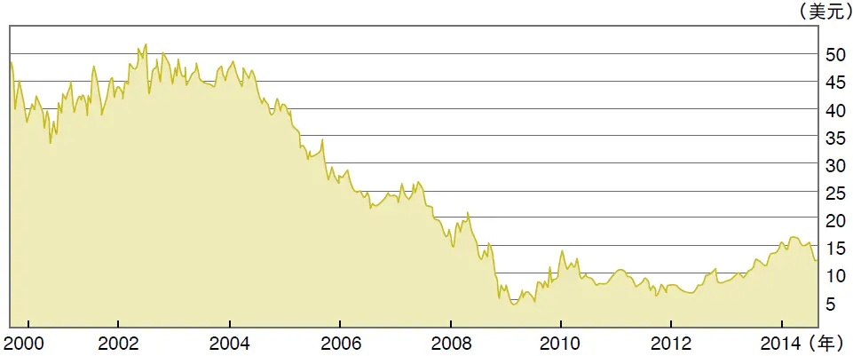

图A—1 《纽约时报》（NYT） 2000—2014 年股价走势图

资料来源：雅虎财经。

海尔、戴尔、通用汽车、科达及大量的建筑工程公司等在各自的产品线的市场份额都很大，但是看看它们的利润如何吧。有时候，市场份额大是个优势，但并不一定。如果潜在的竞争者随时存在，这就让你的利润率高不起来，因为门口有人“将你的军”。你的公司永远在“食之无味，弃之可惜”的收益率之间运转。有些产品会因为规模大而降低成本，有些不见得（比如律师、审计师、理发师、美容院、系统集成、建筑、研究咨询、物业管理，甚至地产开发）。一般而言，“市场占有率高”不是一条可持续的护城河。

我们再来看看“执行力强”和“优秀管理团队”。这两个优点经常被人们一并提到，因为执行力强主要有两个原因。一是管理团队在一起工作的时间长，磨合得不错，工作上比较顺手，团队里面没有明显捣蛋的人；二是因为团队里面有个德高望重的领袖。这两个因素都有些偶然，可遇不可求，而且可以随时变化。如果领袖生病了，或者死了，或者被挖角跳槽了，怎么办？有些领袖不自量力，在退休之后又重出江湖（原因是他创办的公司好像缺了他不行），而把他辛辛苦苦（当然也是运气好）累积下来的名气再丢掉。比如，美国一家曾经很大的计算机公司Gateway（捷威）的创始人就是如此。他重出江湖之后，回天乏力，大失所望。其实，他当年的成就与当年该行业的高增长很有关系。此外，管理层好坏往往只有在事后我们才能看出来，而不是事前。可是，事后的判断对于投资者来讲没有太大的实际意义。

__品牌和专利的用处__

既然这样，我们如何判断一家公司有没有护城河呢？

第一，品牌被认为优秀或者可靠，公司的产品可以卖出高价，因此公司利润率高于同业。

第二，它的产品无法替代，或者客户很难离弃。如果离弃，客户需要付出不小的代价（叛逃费）。

第三，有些公司有明显的网络效应（互相照应，或者众星捧月的好处）。

第四，有些公司的业务由于地点、工艺方法、规模、营销网络，或者某种长期协议而使得成本便宜很多。

大多数搞企业战略研究和咨询的专家和学者，因为需要把他们的产品和服务卖给尽可能多的客户，一般倾向于说：“任何公司只要遵循这样那样的原则、战略或方法，就可以变成优秀公司。”但帕特认为，公司的出身决定一切，至少在绝大多数情况下是如此。他完全不相信公司文化和团队起长期的决定性作用。我以前在演讲时曾经说过一句过头的话：“我想投资那些懒汉和傻瓜也能管理得不错的公司。”

很多公司都说自己有品牌、专利和特许经营权，但是，很多专利和品牌完全不能给你带来收入或者好处，它无法在生意上和产品上真正显现出优越性，比如提供别人无法替代的产品和服务。品牌是需要花钱来建立和维护的。如果你的品牌那么好，你能创造出超额利润吗？如果不能，那凭什么证明你的品牌值钱呢？名气大（大家都知道你的公司的名字）不等于好品牌，不等于你的产品可以高出市场定价。

作者举了一个关于品牌的例子。比如，现在阿司匹林是一个常见的镇痛药，专利很多年前就过期了，但德国拜耳的阿司匹林还是比别人的完全同样的药片贵很多，而且卖的量大很多。这就是品牌的力量。另外，一个品牌如果能够减少顾客的“搜寻成本”（searching cost）， 比如麦当劳、可口可乐、肯德基，那它们也很有价值，虽然它们的产品价格不见得可以高于市场价。

说起专利，大家可能注意到，有些专利没有商用价值，而且专利可以受到挑战。在外国，债券评级公司（标准普尔、穆迪和惠誉）很赚钱，因为它们的生意需要得到政府的特许，而政府又很难授予这样的许可，所以进入门槛很高。另外，赌场的老虎机也只有几家授权的生产商。对股票基金进行评级的理柏公司（Lipper）和晨星研究公司（Morningstar）也是如此。

在外国，公用事业公司一般受到产品价格和企业回报率方面的监管。这类公司可以是很不错的投资对象：风险低，回报率很稳定。在中国，这方面的监管机制还带有点随意性，所以我们的供水、供电和供气公司可以很赚钱。十多年来，不少人对中国燃气公司的投资价值有些怀疑，我是这样看的：它们的燃气销售量会增长很快，而且未来的单位成本会因此下降（因为公摊的固定费用增加不大）。最重要的是，它们其实是建筑安装公司，把燃气管道接到你的厨房和浴室。与普通的建筑安装公司不同的是，它们有特权：在它们经营的城市内，只有它们能做这项业务，别人不可以做，而且它们的安装收费特别高（大概每家2000多元人民币）。

我曾经碰到一家为钢厂和化工厂在现场提取和提供氧气、氢气和其他工业气体的公司。我认为其商业模式也不错。虽然它们需要跟同行的四大跨国公司竞争以便获取新的项目，但一旦拿下一个项目，它们的业务和长期的回报率是相当不错的（比如内部收益率高达14%或者18%）。即使它们不再获取任何新的项目，现有的项目也是一个很不错的生意。中国的城市燃气公司也是如此。它们虽然在获取新项目的时候有激烈的竞争，但现有的生意就已经相当诱人。

__客户的叛逃成本__

谈起客户的叛逃成本，大家想想，你会经常调换银行吗？你需要填写很多表格，改换工资自动转账的指令，注销定期支付水电费的安排。你如果有住房按揭，即使银行对你不友善，你会调换银行吗？成本太高了。保险公司也是如此，退出现有的人身保险单，换一个保险公司就需要重新体检。一般情况下，我们会忍受现有保险公司的问题，当然抱怨归抱怨。

同样，基金公司的日子也很好过，因为一旦你把钱交给它们管，你不太容易抽逃。抽逃有费用，也很麻烦。而且你敢说下一个基金公司（或者基金经理）的水平会高出很多吗？况且，在你抽逃的同时，另一位客户也许会把钱从别的地方转过来（就像公共汽车一样，有的人下车，有的人上车）。他转过来的原因可能是他对原来的那家基金公司极为不满，所以想在这家公司试试运气。你们俩正好换了个位置。

上市公司一般要注意形象，不愿意换审计师。换审计师需要董事会批准，需要公告，还给人留下做假账的嫌疑。在香港地区，各公司的强积金都要由外部专业机构来管理，但是一旦选定，大家谁也不愿意换机构，因为那样太麻烦和浪费钱，换一家也不一定就好到哪里去。

__网络效应不容忽视__

网络效应主要在新产品、新科技或互联网方面出现。比如，使用微软的办公软件的人越多，越多的人就必须使用它的办公软件，否则，你的软件或者系统就不能跟别人兼容。越多的人讲英语，也就越多的人必须讲英语。

越多的公司在香港地区上市，也就越多的基金经理和分析师会关注香港地区的市场，驻扎在香港地区，它的流动性（交投）就越活跃，也许股票的价格就越高。

越多的买家上eBay买东西，也就有越多的卖家到那里去卖东西。这跟eBay收费高低关系不大。对于一家报社来讲，读者越多，报社就能够聘请越多的高水平记者，报道越多的高质量的新闻和分析文章，然后，读者也就越多。

用专业的说法，扩大网络的好处是非线性的：网点多10%，给网络带来的好处可以增加30%。这一类的公司比较少，但你一旦发现它们，千万不要错过投资的机会。

低成本的例子很多：一些企业养着一大批人，这就导致高成本。而且，办事的程序繁多也会加大业务成本。小的企业没有这些麻烦，而且对减少浪费资源的控制通常好一些，因此总的成本就比较低。欧美的企业在成本控制方面，经常遇到工会的阻力。小电视台跟大的电视台（比如英国的天空广播、英国最大的卫星电视运营商）相比，因为观众和订户不多，所以没有实力转播大型的足球赛，从而形成了恶性循环。

有些行业前期投入巨大，固定成本高，因此形成一条很宽的护城河。比如收费公路、港口、机场和快递公司（如美国快递公司联邦快递）等。

还有一类企业实际上是自然垄断。比如，华盛顿邮报集团（巴菲特的爱股）下属的在美国一些中小城市经营的有线电视业务就很赚钱，因为这些城市不大，只能容纳一个有线电视运营商。

__零售、饮食生意难做__

帕特又认为，零售企业和餐馆是很不容易的生意，因为它们没有护城河的保护。客户太容易叛逃，叛逃的成本太低。不错，星巴克很成功，但这是例外，而不是规律。股票投资是一个概率游戏，明智的人不能把钱放在小概率的事件上。这些年，中国零售企业的表现都很优秀，但这在某种程度上是因为水涨船高：当零售额每年以两位数增长的时候，很容易取得好的成绩，但这不能与中长期内关于护城河的分析混为一谈。

这也就好像在大牛市的情况下，张先生炒股赚了50% 的回报一样。运气跟水平还是有点不同的：水平可以理解成长期持续的运气。十几年前，有些计算机和手机的生产商大赚其钱，很多人误以为那些行业有很高的进入门槛（护城河），当然实际上是没有的。现在，水位退下来了，我们看得比较清楚。

此外，作者提到有护城河的公司理所应当有很高的资本回报率。如果没有，我们要找原因，也许它根本就没有护城河的保护。反过来，有些公司在最近几年有很高的回报率，但这也许完全是因为阴差阳错或者运气，或者因为某个正在消逝的原因。我们一定要把那个实实在在的原因找出来，否则就是骗自己。总之，高回报率是判断有没有护城河的必要条件，但不是充分条件。

寻找有护城河保护的公司很重要，但时过境迁，我们要注意护城河的干涸。如果优势在消逝，我们要勇于承认，甚至弃城逃跑。监管制度的变化、消费者胃口的改变、替代产品的出现都可以摧毁护城河。

一家公司有没有护城河，河究竟有多宽，这是一个很主观的判断，仁者见仁，智者见智，但是这种思维方法和逻辑对投资很有用。分析护城河只是为了帮助长期投资者，对于短期炒作的人没有用处。作者有一句话对我很有启发：“读公司的年报比分析联邦储备局主席的讲话重要100倍。看报纸和互联网上的股市和新闻评论没有太大的意义。”
