# 《袁克成 明明白白看年报投资者必读》全文合订版

> 共41个章节。原章节顺序、段落结构和图表均予以保留。

## 推荐序一

推荐序一

巴菲特的“三板斧”

有记者问过巴菲特，选股有什么诀窍？

巴菲特说，第一，去学会计，做一个聪明的投资人，而不要做一个冲动的投资人。因为会计是一种通用的商务语言，通过会计财务报表，聪明的投资人会发现企业的内部价值，而冲动的投资人看重的只是股票的外部价格。第二是阅读技能，只投资自己看得明白的公司，如果一个公司的年报让你看不明白，很自然就会怀疑这家公司的诚信度，或者该公司在刻意掩藏什么信息，故意不让投资者明白。第三是耐心等待，一个人一生中真正投资的股票也就四五只，一旦发现了，就要大量买入。

听了这个“三板斧”的回答，你满意吗？

可能有点失望，本指望巴菲特能口吐莲花，露一点独门绝技，没成想，却是无甚出奇。

但不要小看这个无甚出奇的回答，留意一下，我们不难发现，巴菲特的“三板斧”中，有两招都与年报相关（财务报表是年报的重要组成部分）。可见巴菲特对读年报的重视与推崇。

巴菲特如此强调年报的重要性，并不意外。因为年报是了解、分析上市公司基本面的核心依据，而读年报是炒股的基本功，特别对于那些有志于价值投资的股民来说，更是如此。

同样的年报、同样的内容，高手就能去伪存真，就能入木三分，就能透过数字看出背后的玄机。而普通投资者，可能只是浮光掠影，过眼不过心。

那么如何练就一双“慧眼”，可以在年报中淘金呢？

我想先要具备一定的基础知识，包括财务知识、证券知识、公司运作知识等。然后是多看，只有大量阅读年报，我们对很多关键点的感知才能够变得细腻、敏感。最后是找到一本好的教材，作为梳理思路、答疑解惑、开启智慧的指南，以达事半功倍之效。

而《明明白白看年报投资者必读》就是这样一本好教材。

在我看来，本书有三大特点。一是注重理解本质。这一点，在书中的会计报表篇、财务指标篇，体现得尤其明显。因为坊间大多数相关书籍，仅仅是在摘抄教科书上的定义，罗列财务分析的公式，以至于投资者知其然，却不知其所以然，真正到了应用时，却发现捉襟见肘、漏洞百出。但本书却着重于会计报表的内涵、财务分析的本质。以利润表为例，不少投资者也许对利润表中的会计科目不陌生，但对利润表的本质内涵──“利润=收入\-费用”，却不甚了了。本书花大量笔墨讲解了收入与费用的匹配关系，而这一点，对于判断上市公司的盈利能力其实至关重要。

二是紧密结合实际。这本书可以说做到了三结合。首先是结合了2007年年报的特点，特别是注重了新的企业会计准则与新的年报格式在2007年年报中的应用。其次是结合了目前中国股市的特点，比如说股权激励、交叉持股这些目前中国股市中的新生事物，书中有专门章节进行讲解。最后是结合了具体案例，将理论阐述与实际应用相衔接。

三是通俗易懂。年报内容较为专业与枯燥，而本书却能用普通人能够理解的语言，深入浅出娓娓道来，相信即使是对年报较为陌生的投资者也能够无障碍阅读。

所谓百战归来再读书，希望投资者在历经了两年的大牛市后，能够静下心来，反思过往，扎扎实实地读几本书。当然，不是读那些所谓秘籍、绝招之类的野狐禅，而是读那些真正能够帮助投资者练内功、长元气的书籍。我相信，《明明白白看年报投资者必读》就是其中的一本。

张昕帆

中信建投副总经理

中央电视台《理财教室》特邀讲师

## 推荐序二

推荐序二

年报是上市公司信息披露的核心，也是分析上市公司基本面的最重要资料，它对所有投资者都是公开的，绝大多数投资者也都会在相同的时间看到年报。对年报信息的理解、分析与利用，考验着每一名投资者的眼光与判断能力。

平庸的投资者，可能只是浏览几个简单的财务数据便浅尝辄止弃之一旁；有经验的投资者，可以从年报中，粗略看出上市公司的价值或症结所在；而高水平的投资者，则能见人所未见，从年报中找寻到上市公司未来兴盛或衰败的蛛丝马迹，并将年报作为投资决策时的关键依据。

因此，判断一家上市公司的投资价值，很多时候并不取决于投资者占有信息量的多少，而是取决于分析信息的能力。对不少投资者来说，与其舍本逐末，孜孜不倦于听消息，道听途说所谓的内幕、题材，还不如扎扎实实地求问于年报，求问于公开信息。

比如，投资者都很关注年报中净利润的数据，这一数据固然重要，但更重要的是年报中所展示的净利润产生过程。由这个过程，投资者可以解读出上市公司的真实盈利能力。

《明明白白看年报投资者必读》中，有专门一章分析上市公司的产品毛利率。产品毛利率就是分析净利润产生过程中所得出的一个财务指标。这项财务指标的重要意义往往要超过作为结果的净利润。因为它在很大程度上，代表了上市公司所生产产品或所提供服务的“含金量”，而这一点是决定上市公司未来能否实现业绩高成长的关键因素。正如书中所言，很多时候，上市公司净利润本身的增长并不能真正说明问题，因为它很可能夹杂了过多的噪音与偶然性因素，而产品毛利率的提高才是上市公司真正发家致富的标志。

从上面的例子中可以看出，当投资者能够透过表象看到内在的变化，屏蔽杂音听到真实的旋律，通过枯燥的财务数据品味出公司经营的兴衰时，上市公司年报的魅力就开始真正向我们敞开。

年报中，除了财务信息，还有大量的非财务信息。这些信息对于投资者判断上市公司投资价值也相当有帮助。

比如说，上市公司高管是否实施了股权激励，就可以视为判断其投资价值的重要参考依据，特别是当股权激励的行权价格与市价相接近之时，更值得投资者给予密切关注。

但值得注意的是，股权激励作为中国证券市场中的新生事物，很多投资者对其概念与实际应用相当陌生，这样一来，对年报中大量与股权激励有关的信息，如行权价、行权期、激励成本等，难免无法吃透。而本书，不仅对股权激励做了相当通俗易懂的介绍，同时对股权激励在股票操作中的应用进行了详解。投资者完全可以按图索骥，将股权激励融入自己的股票评价体系与选股标准。

事实上，2007年年报中如股权激励这样的新概念还有很多，如上市公司交叉持股、新会计准则下的一系列新会计科目等，准确理解这些概念的内涵，把握它们在实际应用时的要点，对于充分汲取年报中的“营养”至关重要，本书则在这方面有的放矢，以明白晓畅的解读方式，将各领域的专业知识做了通俗化的转换，为投资者“畅游”年报做了非常必要的准备。

年报是一座富矿，但这座富矿需要投资者自己去探索、开采和提炼，在年报所提供的林林总总的信息中，缺乏耐心者、怠于钻研者、懈于思考者会止步于看似烦琐的文字与数据，而有心人则会甘之如饴，在其中流连忘返，将其视为取之不尽的宝藏。

本书为投资者描绘了这座宝藏的全貌，描绘了走进宝藏深处的路线图以及充分利用这座宝藏的种种方法。有志于探索这座宝藏的投资者，完全可以将本书视为自己的向导与助手。有了这本书陪伴，在持续稳定获得投资收益的道路上，你会走得更快、更远。

程峰

联合证券广州华乐路营业部总经理

联合证券研究所高级研究员

联证华乐证券培训学校校长

## 第1版前言 股票也是商品

第1版前言 股票也是商品

我们去超市购物时会发现，每一种商品除了标示价格外，在其包装上还会标示产品成分、生产日期、保质期、性能介绍、原产地等信息，这些信息是消费者决定是否购买该商品的重要参考依据。对这些信息的内容与格式，有关部门都有明确而详细的规定。

对投资者来说，上市公司（股票）其实也是一种商品，既然是商品，除了价格（股价）外，当然也会有其他的信息提供给投资者参考。与普通商品一样，上市公司所提供信息的内容与格式也有明确规范，这样，投资者看起来才有用，才方便。

上市公司所提供的信息有很多，涉及的领域也很广，但其中最重要的就是年报。从某种意义上讲，年报就如同我国政府每年提交人大审议的政府工作报告。它主要告诉我们，上市公司在去年一年都干了什么，干得怎么样，现在情况如何，明年有什么打算等。

从这些信息中，投资者可以比较充分地了解一家上市公司目前生产经营的全貌，预测上市公司未来的发展潜力，进而结合股价判断该上市公司是不是值得投资。

两类信息

从内容的角度分析，一份上市公司年报，主要包括两类信息：财务信息与非财务信息。其中财务信息又是最核心的内容。

为什么财务信息是最核心的内容呢？因为财务信息是数字化、量化的信息，与其他信息相比较，财务信息最客观、最准确、最容易进行比较。比如我们经常会在上市公司年报的董事会报告中发现这样的描述：公司去年的销售业绩同比有大幅提高。但“大幅”是多少呢？语焉不详，只有看了利润表中营业收入的数额，投资者才会知道，所谓“大幅”到底是多少。

再比如，一些上市公司年报中，公司董事会声称该公司的盈利能力（净资产收益率）有了令人可喜的进步，但投资者通过查阅该公司及同行上市公司的财务信息，也许就会发现，虽然这家公司的盈利能力的确有了提高，但与同行公司相比，提高的速度并不快。由此，我们对所谓“令人可喜的进步”就须保持相对审慎的态度。

当然，很多非财务信息对于投资的参考意义也同样不容忽视。如上市公司前十大流通股东的名单及其持股量、上市公司的年度利润分配预案等，都值得投资者高度关注。

2007年的新变化

具体到2007年年报，与以前相比，又有了很大变化。一方面，新的《企业会计准则》实施后，2007年年报的财务报告无论是内容还是格式，都与以前有了很大不同。比如投资者以前所熟知的净资产、净利润的名称都改变了，会计报表也由之前的三张表变成了四张表，一些新的会计科目也出现了，一些老的会计科目也有了新的含义，会计附注的内容也更加翔实了。

另一方面，新的年报披露规范格式也使2007年年报增加了不少非财务信息。公司对持股、参股其他上市公司情况的说明，对股权激励计划实施情况的详细说明等内容，都是以前年报中从未出现过的。

传记文学

在很多投资者看来，阅读年报是相当枯燥与痛苦的事情，这一方面是因为年报的内容主要是一大堆枯燥的格式化的记述和数字；另一方面，真正理解年报还要具备一些相应的财务知识，了解证券市场的一些政策、规定，熟悉公司运营的基本常识与规律。也就是说，上市公司年报表述的内容不仅不易理解，而且表述的方式也不能做到生动活泼。

毋庸讳言，看年报肯定不如读小说一般赏心悦目，但如果我们能够掌握一些基本知识与常识，认真体会、品味年报中所展露的信息，年报就不会像初看上去那么面目可憎了，渐渐地，你可能还会体验到一种别样的乐趣。

其实，如果通读一家上市公司上市历年来的年报，就如同看这家企业的“传记”一般。从每年年报所披露的各种信息中，我们可以体会公司经营中的跌宕起伏，可以品味出开拓的艰辛、收获的喜悦；我们可以目睹什么叫峰回路转、柳暗花明，什么是好风轻借力送我上青天；我们可以理解，为什么千里之堤会毁于蚁穴，为什么差之毫厘能失之千里。

当然，更重要的是，在阅读的同时，你更可以展开充分的遐想，推测一下公司的未来。

总之，如果有心，人生百态、世间道理，都可以在年报中找到踪迹。投资大师巴菲特的一大嗜好就是独自一人在办公室研读年报。可以想见，在巴菲特的感受中，阅读年报所带来的乐趣，分析年报所启发的智慧，预测未来所调动的激情，都是令人甘之如饴的。

每天40万字

目前上市公司的年报字数平均10万，截至2007年年底，沪深两市A股上市公司在1500家左右，其年报的总字数过亿，即使我们用一年的时间看这些年报，每天也要看40万字。

对于一个正常人来说，不用说40万字，每天4万字也是很痛苦的事情。因此，我们得找到一些方法，既能够减少阅读量，又能够汲取有效信息，使年报为我所用。这就要求我们具备三项技能：

一是熟悉年报的基本格局与框架，知道哪些内容，会出现在年报的什么地方。这样，查询、阅读时会大大提高速度。

二是具备很好的基本功。基本功主要包括一定的财务知识、证券专业知识与上市公司经营、运作知识。这样有利于加快阅读速度，不会使一些专业化内容与表述成为阅读障碍。

三是学会抓关键点。上市公司年报字数虽多，但真正有意义的内容，大概不到8000字，剩下的多是赘言。因此，这就要求投资者深刻把握决定一家上市公司投资价值的一些关键看点，从而按图索骥。

记住：阅读年报并不是看上市公司希望我们看的内容，而是看那些我们期望看到的内容以及内容背后的“玄机”。

本书的目的

本书共计六篇，分别为宏观篇、股东篇、董事会报告篇、重要事项篇、会计报表篇、财务指标篇。每一篇的内容都紧密结合2007年年报的内容与格式，按照上述三项技能的要求，进行解读与分析。

其中宏观篇，侧重于从宏观上把握年报的大致框架与整体脉络；股东篇，着重于从控股股东、限售股东以及机构投资者的角度，分析上市公司的未来发展；董事会报告篇，主要针对于年报“董事会报告”部分的三个关键点进行解读；重要事项篇，是基于年报“重要事项”部分中，三项对评估上市公司最有帮助的内容展开的；会计报表篇，详细分析了四张会计报表的本质内涵、基本要素以及重要看点；而财务指标篇，则是讲解投资中最为常用也最为有效的五个财务指标。

建议投资者在阅读本书之后，再精读3～4份上市公司年报，这样就能较为熟练地把握阅读上市公司年报的基本要领。请注意，所谓精读，一定要逐字逐句地阅读上市公司年报全文，阅读时要结合该上市公司以前年度的年报。

在选择所精读的年报时，最好挑选一家自己平时比较关注的上市公司的年报，一家业绩多年持续大幅增长的上市公司的年报，再找一家多年微利甚至亏损的上市公司的年报。这样，有利于熟悉不同业绩类型上市公司的基本特色。

精读之后，如果投资者还有时间，可以选择不同行业的上市公司年报进行解读，这样有利于熟悉各行业的基本财务特征。阅读时，每个行业最好选择两家公司进行对照，这样有利于加深理解年报中各项要素的功能与意义。

重要提示

在此特别提示投资者，由于实施了新的《企业会计准则》，2007年年报中，净利润和净资产都改名了。原来投资者日常所接触的上市公司净资产改称为“归属于母公司所有者权益”；上市公司净利润改名为“归属于母公司所有者的净利润”。而且，上述两个财务数据以合并会计报表中的数据内容为准（切不可以母公司会计报表中的数据为准）。在计算上市公司财务指标，如每股收益、净资产收益率以及每股净资产时，也都是以上述两个数据为准。

为遵循投资者阅读习惯，本书除有特别说明之处，所写净资产、净利润，均是指“归属于母公司所有者权益”以及“归属于母公司所有者的净利润”。

## 第2版前言 鱼龙混杂淘宝时

第2版前言 鱼龙混杂淘宝时

我以前的一位同事，是京城古籍善本的超级发烧友，虽然囊中难称阔绰，但多年孜孜以求，手中精品已然充栋，不少版本更是价值不菲。这位仁兄并非只识货不问价之人，购书主渠道，不是琉璃厂那些标价令人咋舌的书店。此人最大的爱好，是穿梭于潘家园那样的跳蚤市场，千挑万选，斩获严重物美价廉的好书。

这种在鱼龙混杂之所慧眼淘宝的方法与能力，非常值得投资者学习。特别在当下，股市暴跌泥沙俱下之时，这样的“选股”思路更值得借鉴，也更具操作性。

对于一位注重基本面的投资者来说，痛苦之一，就是面对高质高价、价质相符，甚至质高价更高的局面。泥沙俱下，才是下手之时；鸡犬升天，则是退避三舍之刻。这种“唯恐天下不乱”，渴望乱中渔利的心态，是成熟投资者所应具备的基本心理架构。

当然，淘宝的关键在于眼光，而眼光来自于扎实的基本功与长期的实践，否则，货色琳琅，也会买椟还珠。研读年报，就是投资者在股市中淘宝的基本功，是需要不断学习、反思、总结的长期实践内容。

（一）

那么具备一定研读年报的能力，对股票投资有什么益处呢？

首先，了解公司。我们买的是股票，而股票后面是公司，这家公司在生产哪些产品，提供什么服务，产品的毛利率如何，公司的管理能力怎么样，运作是否规范，核心竞争力在哪里，与竞争对手相比又有什么不足。凡此种种，都需要从年报中获取，或者说，年报是上述信息之集大成者。有这些了解作为基础，才可能结合更广泛的信息，形成判断。每一个投资者都期望找到物美价廉的股票，而“物美”又是重中之重。研读年报，其实就是通过了解公司，不断规范我们的审美标准，修订我们的审美取向，提升我们的审美情趣。

其次，规避风险。阅读年报的过程，其实就是不断质疑的过程，就是不断吹毛求疵的过程，就是不断排除的过程，就是不断自我否定、寻找答案的过程。只有那些没有明显瑕疵、没有明显疑点，经过严格筛选的公司，才可能纳入自己的股票池。很多时候，阅读年报的意义并不在于挖掘价值，而是规避风险。对多数投资者而言，通过阅读年报，即使没有找到大牛股，也要力求排雷避险。

最后，预测公司的未来。预测未来总是困难的，但却是这个市场中每一位投资者都在做的事情，只不过依据不同，方法各异。对于相信公司内在素质将最终决定公司股票价格的投资者来说，年报以及其他的定期报告，是预测公司未来的最基本出发点。

（二）

写完本书第1版，是2008年1月底，当时的A股市场已经开始回调，2008年年底，在本书开始补充与修订时，大盘已惨不忍睹。如此暴跌，出乎大多数人意料。

牛熊转换的背景下，一位读者这样问我：看年报真的有用吗？大盘暴跌时，似乎无股幸免。我想，这位读者的疑问，也是很多投资者共同的心声。

坦率地讲，看年报不是判断大盘走势的关键依据。决定大盘走势的因素，主要包括宏观经济各领域的表现、投资者的心理作用等。年报作为单个公司经营情况的事后总结，难以承担起见微知著、窥一斑而知全豹的重任。当然，对各公司年报数据汇总后的分析，可以成为预判宏观经济的一个参考，但其时效性与代表性仍然有很大局限。

坦率地讲，看年报也不是判断个股短期走势的关键依据。决定个股短期走势的关键因素，主要包括大盘波动、机构大户的进出以及投资者的心理预期。包括年报在内的上市公司定期报告，一年只有四次，无论从信息的涉及面，还是信息的发布频率看，都无法成为判断个股短期走势的有力参照。

坦率地讲，仅看年报无法帮助你在牛熊转换时全身而退，但肯定能帮助你最大限度减少损失，并为下一次成功奠定基础。

总之，研读年报是成功投资的必要条件（技术派投资者可能不这么看），而不是充要条件，虽然这个必要条件的重要性值得一再强调。

事实上，在股市中根本不存在一招鲜吃遍天的秘诀，一个投资者的成功，来自于长期不懈的努力、学习与实践，舍此别无他途。不要因为一时的成功，就故步自封，以为修炼得道；更不要因为一时的挫折，转而成为全盘否定后的虚无主义者。

（三）

本书第2版中，所修订与补充的内容有如下几个方面：

第一，根据证监会对2008年年报披露内容的最新变化，进行了相应补充。

第二，增加了第1版中没有谈到但在实际操作中比较重要的内容，主要包括两个新章节：一是“所得税”，二是“环比数据”。

第三，对第1版没有谈透的内容进行了增添。同时，对一些不妥之处进行了修改。这部分内容大概占了原文的40%。

写作本书时，我对自己的要求是，不求面面俱到，更要避免不懂装懂、貌似艰深，而是力求将一些基本概念讲透、说明白，让普通投资者能尽快“登堂入室”。这一想法，其实也是源于自己的体验，因为在我的自学过程中，看过太多泛泛而谈、浅尝辄止，关键处避重就轻，知其然而不知其所以然的书籍，这类“名词解释”的读物常常令我哭笑不得。我不希望这本书带给读者同样的感受。如果读者觉得本书有同样的流弊，那肯定是能力所限，绝非我的初衷。

## 第3版前言 一分耕耘一分收获

第3版前言 一分耕耘一分收获

（一）

本书第3版对第2版修订与补充的内容主要有如下几方面：

★新增三个章节：“创业板年报概述”、“杠杆效应”、“创业板财务特征”。

★根据证监会、交易所对2009年年报披露内容的最新要求，进行了相应补充。

★对第2版中的部分内容进行修订，这部分内容大概占原文的30%。

（二）

本书出版后，不少读者反馈了意见，其中包括不少问题，借此机会，选出三个最具代表性的问题，答复如下。

问题一：书中介绍了这么多基础知识后，为什么不讲讲选股的直接方法？

答：市场中关于选股方法的书，已经汗牛充栋，其中不乏大师的经典之著，也充斥很多泛泛之作。我很怀疑，自己奢言选股方法的价值与必要性。

平心而论，我自认的能力，就是写出一本对普通投资者阅读年报很有帮助的普及读物。当然，这也并不是容易达到的目标，如果翻翻坊间那些以概念解释概念，或者照抄规定、准则的读物，你就知道，深入浅出是一件多么难的事。

更何况，所谓选股方法并无一定之规，在我身边的朋友中，即使是那些同样使用基本面选股的成功者，其方法与风格也往往大相径庭，究其原因，有性格使然，也跟每个人的财务状况、回报率预期、风险承受能力以及获取信息的能力相关。而本书的作用，就是为投资者在形成自己的选股方法或投资风格过程中，提供更多的基础性帮助。

而且，以我的经验看，提高投资水平的过程，很多时候并不是触摸掌握更高深的理论与方法，反而是回顾过往，检讨那些看似已懂实则未知的基础知识与概念。其实大家想想，我们上学时做错的数学题、物理题，有多少缘于未解妙法，又有多少因为基本概念留有夹生。

问题二：本书介绍的财务知识全面吗？看完后，还需要哪些方面的提高？

答：说全面，当然自夸了。但容我妄言一句，对普通投资者来说，研读更精深的财务书籍，并不是要务，多读年报，多看、多想、多比较，收获会更大，实践中遇到疑问，想不清楚了，再去查相关书籍，或者去网上找找答案，效果可能会更好。

对投资者来说，会计报表是描述上市公司的一个视角，是公司生产经营的数字化展示，数字背后，是活生生的现实，而这些现实大都会遵循既有的逻辑，这里鲜有奇迹，没有那么多戏剧化效果，它与我们的生活经验、常识相通，很多最基本的道理不离左右、贯穿始终。每一个会计数据、财务指标映射着的事实，表现出的规律，才需要认真体会，才值得再三把玩。

问题三：研究基本面，网络中有哪些资源？

答：很多，网上资源非常值得开掘，大量有价值信息，其实都是公开的，就放在那儿，只不过被信息海洋掩盖，需要你去挖掘。简单而言，这样的网站可分为三类：一是政府类网站，如国家统计局、央行、海关总署，等等，这些网站中的宏观及行业统计信息很有价值；二是证券类网站，特别是两个交易所的网站，有价值的信息不少，却容易被忽略，此外如上市公司网站、研究报告类网站等等含金量也不低；三是一些论坛、博客，藏龙卧虎，不少真知灼见都值得借鉴。

总之，只要是有心人，注意收集、筛选、整理，“金矿”就会显现。有兴趣的投资者，可以参考一下本人的另一本书《股市信息藏宝图》，主要讲的就是这个事。

（三）

承蒙上海证券交易所厚爱，2009年我以本书为蓝本，录制了《上交所证券大讲堂·年报系列讲座》节目，更难得的是，上交所诸位专家们对讲座稿进行了极为细致的修订，这也就使本书的大部分章节有幸经历了专业眼光的洗礼。

借此机会，我要特别感谢上交所投资者教育部总监杨欣女士，给我提供了宝贵的机会与平台，使我对年报的理解，能以一种更为广阔的方式传播开来；我还要特别感谢上交所的马军生博士，正是他高度的专业性和严谨性，使本书质量得以进一步提高；我还要特别感谢上交所的朱林，在与他长时间交流中，我的财务知识以及其他上市公司相关知识得以刷新，我以为，这是难得的享受。

当然，上述诸言，只是表达我的感受，而并非是为本书的质量做背书。本书错漏抑或有失严谨之处，实为本人能力所限，以及追求通俗化表述时，难以避免的代价。

谢意连绵，请读者允许我，继续表达一下迟到的谢意──想到第3版前言中才行此事，实在汗颜。

要感谢机械工业出版社的王颖女士，她毫无吝啬很有杀伤力的一贯鼓励以及极具价值的建议，使我至今还保持着写作的乐趣。当然，还有我的父母，他们看到本书出版时的骄傲与欣慰，一直是我坚持下来的巨大动力。要特别感谢我的妻子陆靖，她的宽容与理解，使我能心无旁骛地投入工作，而她广博的兴趣，更是我生活中永不枯竭的滋养。还有此时就堆积在我膝下的──麦太，我必须承认，没有他肥硕的陪伴与热乎乎的袭扰，盯在电脑前苦思冥想往复敲击是相当枯燥的。当然，更应该感谢的，是我的读者，每想到有那么多读者在阅读这本小书，我岂有理由懈怠，又怎能不感动。

2026年3月14日

9:58

## 宏观篇

宏观篇

■探马来报──年报业绩早知道

■无网不利──网络年报资源扫描

■庖丁解牛──年报正文概述

■遗珠之憾──年报摘要概述

■度身定做──创业板年报概述

■质量鉴定书──审计报告

## 宏观篇 - (1) 第1章 探马来报 年报业绩早知道

\(1\) 第1章 探马来报 年报业绩早知道

第1章 探马来报 年报业绩早知道

每年1月1日至4月30日，是上市公司公布上一年度年报的时间。多数投资者阅读年报，最想知道的，还是上市公司上一年度的业绩──净利润或每股收益。

其实很多时候，投资者不必等到年报披露之日，就可以通过三季报、业绩预告以及业绩快报等渠道，大致了解一家上市公司的全年业绩概况，或比较准确地掌握全年业绩信息（见图1\-1）。

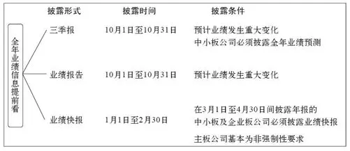

图 1\-1 业绩信息提前看

关注三季报

最先透露全年业绩信息的，是上市公司第三季度报告。该报告披露时间是每年的10月1日至31日。

按照规定：如果上市公司预测全年累计净利润可能为亏损、扭亏为盈，或者与上一年同比会发生大幅度变动（上升或者下降50%以上），应当在其第三季度报告中，予以披露并说明原因。据此，一些上市公司会在其三季报中对全年业绩做出预测（见图1\-2）。

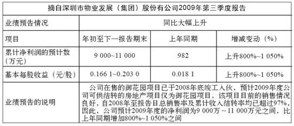

图 1\-2 三季报示例

值得注意的是，按照规定，中小板上市公司必须在每年第三季度报告中对全年业绩作预测。这一点与主板上市公司有明显区别。

当然，与后面将要讲到的业绩预告、业绩快报相比，三季报中对全年业绩做出的预测，准确性要低一些。毕竟，第四季度经营尚未发生，不可预知因素很多。比如，从2008年的情况看，由于全球经济在第四季度加剧衰退，不少上市公司修订了三季报中的盈利预测（见图1\-3）。

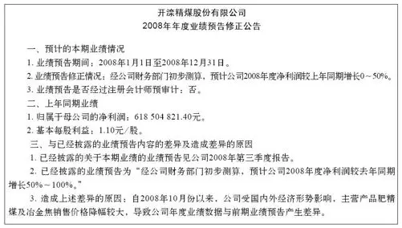

图 1\-3 业绩预告修正公告

业绩预告

从每年11月1日至来年1月31日之间（交易所之所以将1月31日作为上市公司披露业绩预告的截止日，是考虑到在1月份之时，公司已可以对去年全年业绩做出较为准确的判断），上市公司若符合下列两项条件之一的，也要对全年业绩进行预告（见图1\-4）。

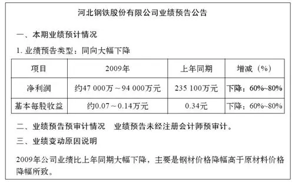

图 1\-4 业绩预告公告

条件一：预计全年业绩将出现亏损、实现扭亏为盈或者与上年相比业绩出现大幅变动（上升或者下降50%以上）。

条件二：在会计年度结束后1个月内，经上市公司财务核算或初步审计确认，公司全年经营业绩将出现亏损、实现扭亏为盈、与上年同期相比业绩出现大幅变动（上升或者下降50%以上）。

由以上规定，投资者可以推算：如果一家上市公司在1月31日之前还没有公布业绩预告，那么该公司全年业绩很可能同比增幅或降幅不会超过50%。此外，上市公司发布业绩预告后，如出现实际业绩与预计业绩存在重大差异，还会及时披露业绩预告修正公告。

业绩快报

除业绩预告外，按照规定，在年报披露前，有条件的上市公司可以主动披露全年业绩快报。须注意的是，主动披露并非强制性要求。只有在上市公司全年业绩被提前泄漏，或者因业绩传闻导致公司股票异常波动的情况下，上市公司才必须披露业绩快报。

中小板上市公司、创业板上市公司的业绩快报也另有要求：如果公司年报预约披露时间在3月或4月，公司应当在2月底前披露业绩快报。

与业绩预告一样，如果公司实际业绩与业绩快报所披露的数字出现重大差异，上市公司也会披露业绩快报修正公告。

与业绩预告不同的是，业绩快报的内容更加翔实、准确（见图1\-5），更加接近最终年报公布的数据。业绩快报与年报数据间的差别，主要在于前者尚未经会计师审计，一般来说，快报数据经审计后，微调可能会有，但发生大变动的可能性已经不大。

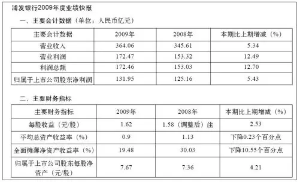

图 1\-5 浦发银行2009年度业绩快报

业绩预告汇总

很多投资者还会有这样的需求──能够及时快速浏览已经公布的，上市公司业绩预告的汇总，以便从中寻找可能的投资对象。

这里建议大家利用新浪财经网站中的“业绩预告”栏目（查询路径：新浪首页→财经→股票→业绩预告），如图1\-6、图1\-7所示。

该统计汇总的优点在于，及时汇总了所有的业绩预告，而且将预告内容按照预增、预减、略增、略减等标准分类，有利于投资者按图索骥。同时，在“点击查看明细”栏目中，还可以方便地阅读业绩预告全文。

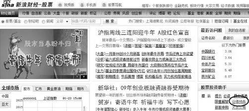

图 1\-6 业绩预告界面

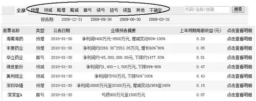

图 1\-7 业绩预告示例

另类盈利预测

除了刚才所提到的三季报、业绩预告、业绩快报之外，个别上市公司还会在一些公开披露的文件中，夹杂着对年度业绩信息的预测。这类预测的一个普遍特点是，更多基于主观估计与评价，不确定性更高。正因为如此，我们姑且将它们称为“另类盈利预测”。

另类盈利预测主要见于上市公司的招股说明书（包括IPO以及发行新股）、重大资产重组的说明书。

从目前情况看，上市公司在招股说明书中进行年度盈利预测属于“自选动作”，监管部门没有强制性要求（但如果披露，监管部门对其披露内容与格式都有明确规定）。这主要是因为，公司在招股时进行盈利预测，很可能是考虑有利股票的发行，具备高估盈利的潜在动机。因此，投资者在参考这类盈利预测时，要充分考虑风险。

此外，按照规定，上市公司进行重大资产重组时，如果存在下列两项情形之一，应当提供盈利预测报告（见图1\-8）：

（一）上市公司出售资产的总额和购买资产的总额占其最近一个会计年度经审计的合并财务会计报告期末资产总额的比例均达到70%以上。

（二）上市公司出售全部经营性资产，同时购买其他资产。

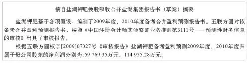

图 1\-8 另类盈利预测

从上述规定看，这类资产重组，大都是“脱胎换骨”，也就是上市公司的规模、资产、主营业务，甚至控股股东，都发生了根本性改变。因此，对于去年实施过此类重组的上市公司，投资者判断其全年业绩时，可回溯重组时披露的盈利预测报告以为参考。

2026年3月14日

9:58

## 宏观篇 - (2) 第2章 无网不利 网络年报资源扫描

\(2\) 第2章 无网不利 网络年报资源扫描

第2章 无网不利 网络年报资源扫描

上市公司披露年报前，都要与交易所预约披露时间，投资者可以在上海证券交易所（http：//www\.sse\.com\.cn）、深圳证券交易所网站（http：//www\.szse\.cn）的首页，看到“年报预约查询栏目”。

通过这个栏目，投资者可以在披露开始前，方便地查询哪一家上市公司，会在哪一天披露年报（见图2\-1）。一般来说，只有少数公司，会变更预约时间，如果出现变动，交易所网站会马上更新预约时间。

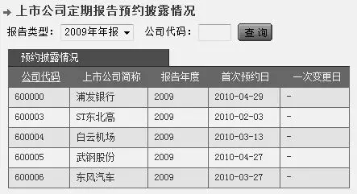

图 2\-1 年报预约查询栏目界面

资料来源：上海证券交易所网站。

提前半天看年报

阅读年报，通过网络比较方便，建议投资者登录上海证券交易所网站、深圳证券交易所网站或巨潮资讯网（http：//www\.cninfo\.com\.cn）。这些网站会在每天收盘之后，刊登上市公司年报及其年报摘要，时效性最强。

投资者需要注意，上市公司年报在上述网站实际披露时间，比预约披露时间要早半天──因为按照惯例，预约披露时间是指年报摘要见报时间，而网络披露时间要早于见报时间半天。比如说，如果上市公司预约在1月23日披露年报，1月22日下午15点收盘后至24点间，公司年报就会率先见诸网站。

此外，上市公司还会主要在《上海证券报》、《中国证券报》、《证券时报》三家报刊中，选择一家或多家，刊登上市公司年报摘要（见图2\-2，注意，报纸上只刊登年报摘要，年报全文则只在网上披露），至于选择哪家报纸刊登年报摘要，见于年报全文的第二部分──公司基本情况简介。

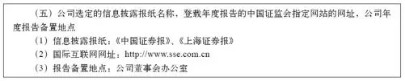

图 2\-2 年报摘要

投资者要注意，通过报纸阅读年报信息，时效性会打折扣，当天晚上网上已经披露的年报，第二天才能见报。因此，建议有条件的投资者，最好上网读年报。

过往年报查询

如果想查询上市公司过往几个年度的年报，可以首选巨潮资讯网，该网站完整保存了所有上市公司过去几年的所有披露信息，并进行了清晰分类。

巨潮网首页抬头处，有专门的证券查询栏（见图2\-3）。输入股票代码后，会看到一个清晰的上市公司信息页面（见图2\-4）。

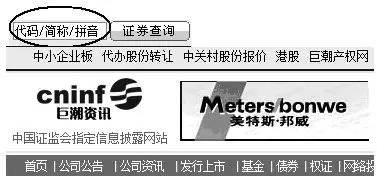

图 2\-3 巨潮网首页

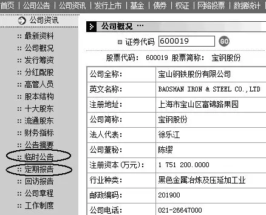

图 2\-4 上市公司信息页面

该页面中，投资者最常用的，是“临时公告”栏目，以及“定期报告”栏目。前者显示上市公司最近几年中，所有的公告原文；而后者则涵盖了上市公司近几年披露过的年报、半年报以及季报。

巨潮网的资料查询也有不足。主要是上市公司公告内容只保留2～3年，三年前的公告，一般无法查询。为弥补上述缺憾，投资者可以在中国上市公司资讯网http：//www\.cnlist\.com查询（见图2\-5）。

图 2\-5 中国上市公司资讯网

通过该网站首页的“个股查询”栏目，即可进入到个股信息页面。与巨潮网的内容不同，该网站几乎收集了各上市公司自上市以来的每一份公告。通过该网站提供的时间段选择功能，很多公司十几年前的公告，都可以找到。这一功能在目前各财经网站中极为罕见。

当然，与巨潮网相比较，中国上市公司资讯网在信息的及时性以及权威性上还稍逊一筹，很多公告不能提供PDF格式文档，因此，一些包含大量数据的公告，格式较混乱，容易误读。因此，若仅仅查询近几年内上市公司披露的信息，首选巨潮网。

年报开始使用“世界语”

从2009年年报开始，上市公司在网上披露的年报，其格式，除了原有PDF文档外，另增加了一种基于XBRL（可扩展商业报告语言）的新模式。当然，这份新年报的内容并没有变化，变化的只是披露形式。

简单而言，XBRL的意思就是将上市公司年报中的信息（包括财务信息以及非财务信息），高度标准化、格式化、统一化。这样做的目的，就是使投资者在使用、查询、分析年报信息时更加便捷高效。

目前上交所与深交所，都在各自网站开辟了基于XBRL的上市公司信息栏目。我们以上交所为例（见图2\-6），通过该所网站首页的“上市公司XBRL”，大家就可以方便查询各上市公司定期报告的XBRL版本（见图2\-7）。在XBRL中，上市公司的定期报告按照内容类型，被“肢解”成很多部分，查询时，可以点击内容类型，便可迅捷达到目的地。

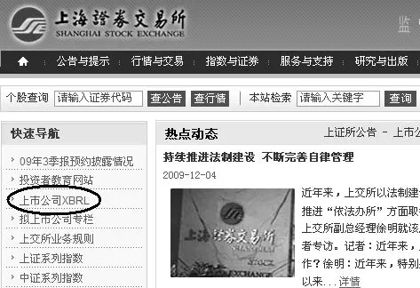

图 2\-6 上交所首页

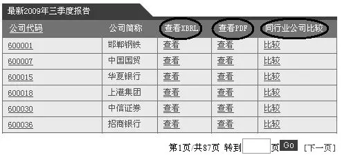

图 2\-7 年报格式的选择

更值得欣喜的是，交易所网站中，还提供了基于XBRL的、同行业上市公司之间的财务信息对比（目前最多可以实现5家公司信息同时比对）。而对比结果的展示，除表格外，还提供直观的彩色柱状图（见图2\-8）、折线图表现形式。

XBRL可谓商业报告中的“世界语”，也就是说，全世界所有上市公司信息的披露，都能够据此统一格式。可以预期的是，随着XBRL格式全面铺开，投资者可以很方便地对同行业间、不同行业间，甚至不同国家间的公司数据进行比较与分析，而很多财经类网站也都可以据此为投资者提供更加清晰、更加丰富、更具价值的海量数据信息。

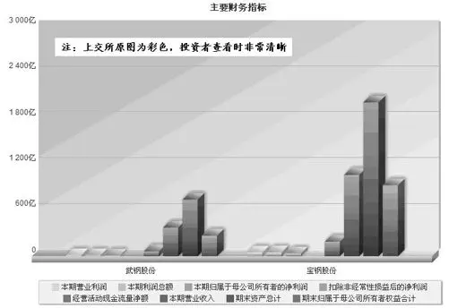

图 2\-8 对比结果

2026年3月14日

9:58

## 宏观篇 - (3) 第3章 庖丁解牛 年报正文概述

\(3\) 第3章 庖丁解牛 年报正文概述

第3章 庖丁解牛 年报正文概述

上市公司公布的年报有两个版本：一是年报正文；二是年报正文摘要。从2009年年报来看，一份年报正文的篇幅平均11万字左右，内容相当庞杂。因此，快速浏览或查询年报的有价值信息，是每一位投资者应掌握的基本功。本章主要讲解年报正文的格式、内容框架，以及要点提示，以便投资者对年报格局心中有数。

十三部分

年报内容分为十三个部分（见图3\-1）。前十二个部分是“规定动作”，属于必须披露的内容，第十三部分是“自选动作”，可以省略。规定动作部分，各上市公司的格式基本一致，但内容详略各异，结构偶有微调。

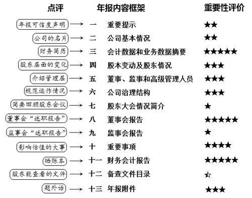

图 3\-1 年报的内容

其中，比较重要的是第三、四、五、六、八、十、十一部分，投资者如果十分关注一家上市公司，这七部分内容是必读选项；如果是一般关注，可以只看第三、八、十一部分；如果简单浏览，只看第三部分即可。

以下，我们对十三个部分，一一概述。

重要提示

“重要提示”篇幅很短，一般分为六段（见图3\-2，以沪市公司为例，深市公司有所微调）。

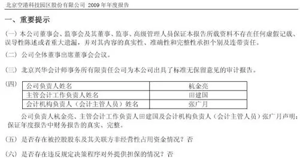

图 3\-2 空港股份2009年年报“重要提示”

其中第一段是上市公司管理层对年报真实性所做承诺。如果年报出了问题，上述机构和人员将据此承担法律责任。

正常情况下，该段陈述没有任何差别。但极个别时，有人会对年报发表不同意见。这种情况一般出现在上市公司发生重大问题之时。比较典型的例子是科龙电器的2005年年报（见图3\-3）。

当时，科龙电器因财务造假，被证监会查处，一系列黑幕正有待揭开。因此，对于2005年年报的真实、准确和完整，一些独立董事、监事表示了不同意见。

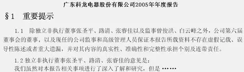

图 3\-3 科龙电器2005年年报“重要提示”

注：独立董事具体意见很长，图中以省略号代替。

虽然上述情况出现概率极低，但投资者拿到年报后，不妨扫一眼该段，如有异常，须认真阅读。

重要提示第二段是讲董事会审议年报时，董事们是否全部出席。这一段意义不大。

第三段是讲会计师事务所对上市公司财务报表出具了什么类型的审计报告。相当于会计师对报表的鉴定，本书第6章对此专门解读。第四段是公司相关负责人对财务报告真实性、准确性的声明，意义不大。第五段与第六段是上市公司对是否存在常见违规行为（股东方占用上市公司资金与违规担保）的说明。

公司基本情况

该部分介绍上市公司的最基本信息，相当于一张名片，有价值信息很少。

对投资者可能有帮助的，是董事会秘书及证券事务代表的联系电话（见图3\-4）。投资者研究公司时，如有疑问，可打电话询问。此外，投资者还可以通过其中提供的公司网址，登录公司网站，查询到更多有价值的信息。

图 3\-4 空港股份2009年年报“公司基本情况”

提醒一下，投资者若特别关注某家上市公司，应经常浏览该公司网站，里面可能会提供一些信息披露之外的有用内容，诸如月度经营数据、项目进展、领导讲话、产品销售、技术研发等方面内容。

会计数据和业务数据摘要

这部分极为重要，也是多数投资者拿到年报后要先睹为快的内容。该部分一般分为三张表格（见图3\-5）。个别公司还会增加一个表格，内容是同时在海外上市的公司，披露中国会计准则与国际会计准则在计算净利润与净资产时的差异。

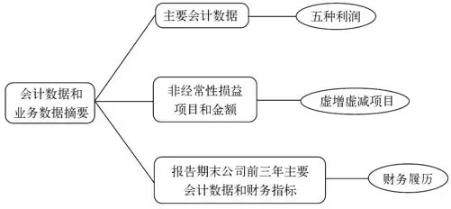

图 3\-5 会计数据和业务数据摘要结构

第一张表格“主要会计数据”中有五个数据，都在讲上市公司当年产生的“利润”，只不过是从五个不同的视角着眼，五个“利润”各司其职，互为补充，使投资者对上市公司的了解更加全面与深入（见图3\-6，详细讲解见第19章、第20章）。

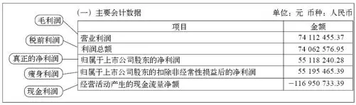

图 3\-6 空港股份2009年年报“主要会计数据”

其中“营业利润”也就是经营过程中产生的利润，可以理解为毛利润（具体阐述见第22章）。

“利润总额”可以理解为税前利润，也就是没有交企业所得税前的利润。

“归属于上市公司股东的净利润”是税后利润，也就是我们看2007年以前的年报中所称的净利润。之所以换了名称，是由于从2007年开始，执行了新的企业会计准则。

“归属于上市公司股东的扣除非经常性损益后净利润”，是将净利润减去“非经常性损益”后的数据，可以理解为“瘦身利润”（具体阐述在第29章）。之所以有公司瘦身后的净利润还增加了，是因为非经常性损益为负值。

“经营活动产生的现金流量净额”属于现金流量表中的数据，可以理解为“现金利润”（参阅第20章）。

第二张表格是“非经常性损益项目和金额”（见图3\-7），其内容是明细利润中“虚增”、“虚减”的项目（具体阐述见第29章）。

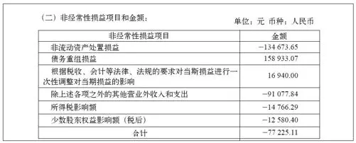

图 3\-7 空港股份2009年年报“非经常性损益项目和金额”

第三张表格是“报告期末公司前三年主要会计数据和财务指标”。三张表中，这张表数据最全面，可以视为上市公司的简明“财务履历”。研读该表，一家上市公司最近三年的基本财务情况便可大致明了。

一般来说，这张表又为分两部分──会计数据与财务指标。其中会计数据是指会计报表中的数据（见图3\-8），而财务指标是利用会计数据计算出来的相对指标（见图3\-9）。

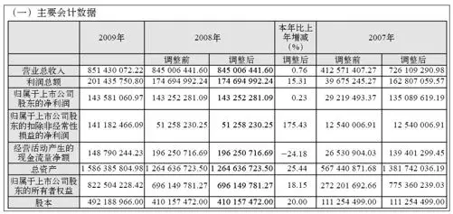

图 3\-8 海印股份2009年年报“主要会计数据”

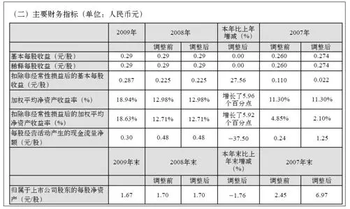

图 3\-9 海印股份主要财务指标（2009年）

在此提醒一下投资者，2009年年报中，这张表里面的2008年、2007年数据，可能有两套，分别是调整后、调整前的内容。之所以如此，是因为2007年年报执行了新的《企业会计准则》，投资者应以调整后的数据为准。

股本变动及股东情况

这部分内容分为三大类，分别是“股本变动情况”、“证券发行与上市情况”和“股东和实际控制人情况”。这三大类中，表格多有点眼花缭乱，可以简化如图3\-10。

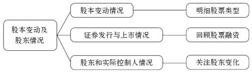

图 3\-10 简化结构

第一类“股本变动情况”涉及两项内容：一是股份变动情况表；二是限售股份变动情况。

其中股份变动情况表，将上市公司总股本分成“限售股”与“流通股”两类，然后分别按照持股人的性质与股票类型进行明细（见图3\-11）。限售股被分成这么多类型，其实对投资者参考价值不大，之所以列示，主要是股权分置改革以前的历史遗留，随着时间推移，限售股会越来越少。流通股的分类，主要是让投资者清楚，公司所有在外能够流通的股票，都包括什么类型（A股、B股或H股等）。

限售股份变动情况则比较重要、有价值的看点，是大小非解禁情况，以及一些新增限售股的可抛售时点（见图3\-12，具体阐述见第7章）。

第二类“证券发行与上市情况”中，比较重要的是这样一张表格──前三年历次证券发行情况（见图3\-13）。它可以直观表现出公司最近三年股票融资的时点、价格与数量。其主要意义在于提醒投资者，公司一些财务数据（如净资产）同比产生突变可能与经营无关，是股票融资所致。

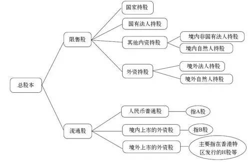

图 3\-11 股份变动情况表中的股票分类

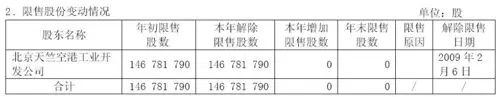

图 3\-12 空港股份限售股变动情况（2009年）

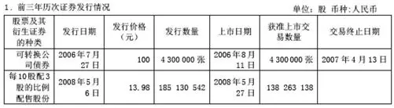

图 3\-13 华发股份证券发行与上市情况（2008年）

第三类“股东和实际控制人情况”所包含内容较多，可简化为下列框图（见图3\-14）。其中比较重要的“股东数量及持股情况”、“实际控制人”部分在本书有专门章节阐述。

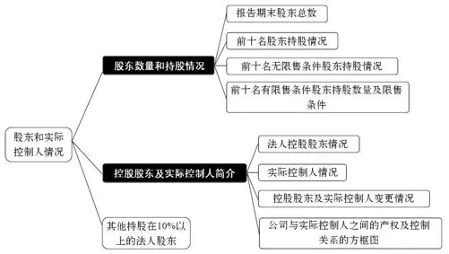

图 3\-14 “股东和实际控制人情况”简化结构

注：翻白部分为重点，下同。

董事、监事和高级管理人员

年报第五部分“董事、监事和高级管理人员”是介绍公司管理层，分为四项（见图3\-15）。其中第一项值得特别关注，本书第9章有专门讲解。

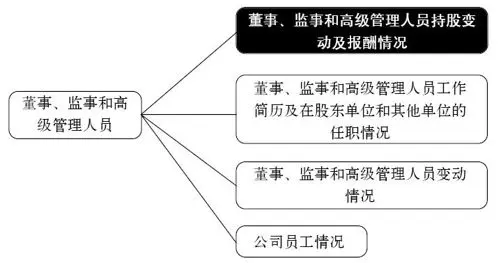

图 3\-15 公司管理层结构示例

公司治理结构

年报第六部分“公司治理结构”主要介绍上市公司各项“基本法”的落实情况。其内容见框图（见图3\-16），详细讲解见第9章。

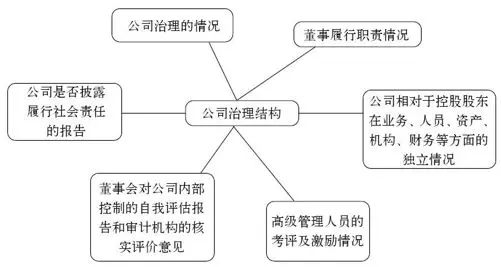

图 3\-16 公司治理结构图解

股东大会情况简介

该部分内容介绍报告期内，上市公司召开的年度股东大会和临时股东大会的有关情况，包括会议届次、召开日期、会议决议刊登的信息披露报纸及披露日期。这些内容参考价值不大。

董事会报告

公司管理架构中，董事会位处中枢。对上，要向全体股东负责；对下，要肩负起对公司发展战略的把握并监督高管的具体经营。

“董事会报告”其实是董事会的述职报告，既有总结陈词，也有答疑解惑，更要展望未来。在年报中，重要性仅次于“财务会计报告”。其内容庞杂，涉及面广泛，主要包括六个方面（见图3\-17）。

六个方面中，最重要的是第一方面，其次是第五、第二和第三方面。其中第一方面“管理层讨论与分析”内容最多。主要包括两部分，每部分又有很多小项。基本内容框架与点评如图3\-18所示。

需要注意，虽然证监会对年报内容与格式做出了详细规定，但从执行效果看，“管理层讨论与分析”的内容与格式，各公司执行得最不统一。一些公司偷工减料情况严重，而另一些公司却细之又细。

“报告期内公司经营情况回顾”分为七小项，其中“主营业务状况”中，对主营业务按产品、行业与销售地区进行明细，并计算出了明细后的毛利率。对三张报表中金额同比发生重大变化的说明，可以与会计附注中的说明联系在一起看。而“控股公司经营情况”中，对各控股公司的主要财务数据，以表格形式列示，这是财务报告中没有的内容，非常宝贵。

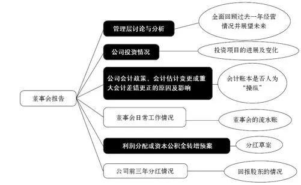

图 3\-17 董事会报告结构图

“公司未来发展展望”段落内容偏虚，实用价值有限。

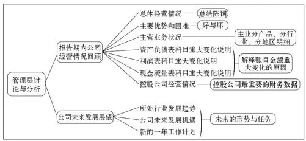

图 3\-18 管理层讨论与分析框架

第二方面，“公司投资情况”包括两类：募集资金使用情况与非募集资金使用情况。

第三方面与会计有关。如果会计师事务所对上市公司财务报表出具了非标准审计报告，董事会在此会做出说明；公司做出会计政策、会计估计变更或重要前期差错更正的，董事会在此会介绍原因及影响。对于会计政策、会计估计做出变更的上市公司，投资者要特别留意，其中往往蕴含着对股价有重大影响的信息。

第四方面“董事会日常工作情况”可以忽略。

第五方面是“利润分配或资本公积金转增预案”，也就是投资者很关心的分配草案。如果报告期内公司盈利，但未提出现金分红预案，公司会详细说明原因，同时说明未分配利润的用途和使用计划（详细阐述见第11章）。

第六方面是公司前三年分红情况。从2008年开始，证监会对上市公司现金分红政策有了新的规定，主要鼓励现金分红，详细内容见第11章。

监事会报告

形式主义，不必关注。

重要事项

年报第十部分“重要事项”主要包括十一项内容：

一、重大诉讼仲裁事项

二、破产重整相关事项

三、公司持有其他上市公司股权、参股金融企业股权情况

四、资产交易事项

五、重大关联交易事项

六、重大合同及其履行情况

七、承诺事项履行情况

八、聘任、解聘会计师事务所情况

九、上市公司及其董事、监事、高管、公司股东、实际控制人受处罚及整改情况

十、其他重大事项的说明

十一、信息披露索引

十一项内容中，除最后一项属资料性质不必阅读外，其余十项都与上市公司估值有重大干系，很有关注必要。

财务会计报告

财务会计报告是年报核心，包括三方面内容：审计报告、会计报表、会计报表附注（见图3\-19、图3\-20）。本书“财务数据篇”对此有专门解读。

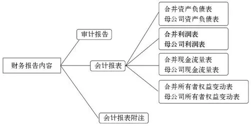

图 3\-19 财务会计报告结构图

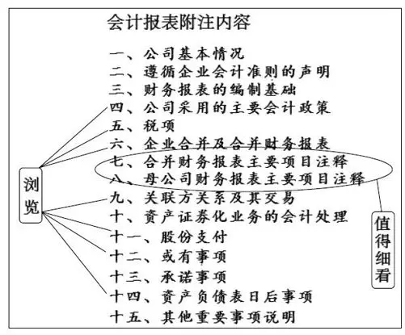

图 3\-20 会计报表附注结构图

备查文件目录

这部分是不得不走的形式，不必关注。

年报附件

附件内容并非强制性披露（见图3\-21），因此，部分公司没有涉及（详细解释见第9章）。

图 3\-21 年报附件示例

2026年3月14日

9:58

## 宏观篇 - (4) 第4章 遗珠之憾 年报摘要概述

\(4\) 第4章 遗珠之憾 年报摘要概述

2026年3月14日

9:58

第4章 遗珠之憾 年报摘要概述

年报正文篇幅较长，其中一些资料性汇总，以及在不同分部内容重复，给投资者快速阅读带来不便，同时考虑到需要在报纸上刊载，因此上市公司在公布年报正文的同时，还公布一个年报简化版──年报摘要。

年报摘要虽然精简，但也将一些有价值的信息删除了──特别是财务报告中的会计附注部分。因此，如果是精读，投资者最好还是看正文。

年报摘要主要包括以下九个方面的内容：

一、重要提示

二、公司基本情况简介

三、主要财务数据和指标

四、股本变动及股东情况

五、董事、监事和高级管理人员

六、董事会报告

七、监事会报告

八、重要事项

九、财务会计报告

与年报正文相比，年报摘要将“公司治理结构”、“股东大会情况简介”、“备查文件目录”三部分全删除了。所剩余的九个部分，与正文相比，也都有不同程度的精简。

重要提示部分，与年报正文没有差别。

公司基本情况和简介部分删除了一些无用信息，大大简化了表格，颇具实用性。

主要财务数据和指标部分，与正文部分相比，减少了一些数据，同时在使用2007年的财务数据时，统一用了调整后数据。

股本变动和股东情况部分，与年报正文相比少了两项较为重要的内容。

一是在股东情况部分，少了“前十名有限售条件股东持股数量及限售条件表”（见图4\-1）。该表对于直观判断原非流通股东抛售时点是很有帮助的。

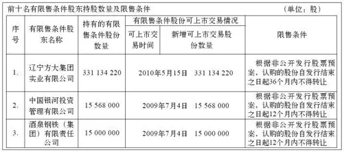

图 4\-1 “前十名有限售条件股东持股数量及限售条件”示例

资料来源：方大炭素2008年年报。

董事、监事、高级管理人员部分，虽然只保留了年报正文中的一张“董事、监事、高管情况表”，但对投资者使用却没有大的妨碍。

董事会报告部分，除删掉了“董事会日常工作情况”，与正文几乎无异。

监事会报告投资者无须关注；重要事项部分与年报正文无异；财务报告部分，去掉了相当重要的会计附注内容，这也是年报摘要最可惜的地方。

## 宏观篇 - (5) 第5章 度身定做 创业板年报概述

\(5\) 第5章 度身定做 创业板年报概述

第5章 度身定做 创业板年报概述

2009年10月，创业板推出，这一新的投资品种，在很多方面（如上市门槛、交易制度、信息披露规则等）与主板有所区别。其中，年报的内容与格式，较主板公司也有相应变化。

总的来说，监管层针对创业板公司的特点，“度身定做”了一套新的年报规则，其特色可总结成12个字：内容创新、突出重点、删繁就简。

删繁就简

先说删繁就简。看创业板公司年报，直观感觉，就是与主板比，内容精简了。首先是年报内容的框架中，少了“股东大会情况简介”部分，同时将年报中重复出现的内容进行了合并或删除──主要是关联交易、资产计量属性的披露内容。此外，对已经在临时报告中披露的事项，年报中也进行了简化，一般只要求披露临时报告时间、网址链接等内容。

突出重点

主板年报中，“董事会报告”、“重要事项”部分相对靠后，而考虑到创业板公司经营风险突出的特点，创业板年报将这两部分前置（见图5\-1），放在“会计数据和业务数据摘要”之后，便于投资者查阅和对比分析。

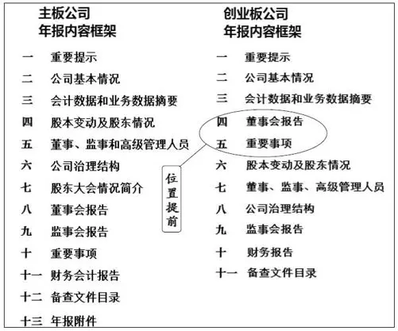

图 5\-1 突出重点

内容创新尽在“董事会报告”

创业板年报的内容创新，主要表现在“董事会报告”部分。创新内容则紧密结合了创业板公司自身特点。

一般来说，创业板公司成长性较强，经营机制更为灵活，经营模式和盈利模式多元化特征更为突出，同时，经营不确定性大，抵御外部风险能力较弱。

根据这些特点，创业板年报首先强化对公司披露核心竞争能力以及变化的披露要求（见图5\-2）。即要求创业板公司分析说明报告期内公司核心竞争能力（如设备、专利、非专利技术、特许经营权、核心技术人员、独特经营方式和盈利模式、允许他人使用自己所有的资源要素或作为被许可方使用他人资源要素等）方面的重要变化，对公司产生的影响，以及公司采取的相应措施。

三、报告期内，公司核心技术团队或关键技术人员（非董事、监事、高级管理人员）没有发生变动。

报告期内，公司的高层和核心技术人员未发生变化。在公司多年的发展过程中，公司一直以“选、育、用、留”为基本出发点，通过内部培养和外部引进两个渠道不断扩充和提升管理层队伍。

图 5\-2 同花顺2009年年报相关内容

其次，增加研发情况的披露内容（见图5\-3）。要求创业板公司披露研发支出总额、资本化研发支出额的比重、研发支出占营业收入的比重，以及报告期内正在从事的研发项目进展情况、拟达到的目标等信息。

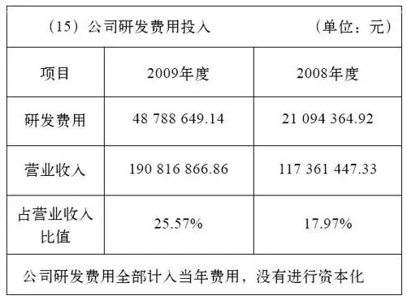

图 5\-3 同花顺2009年年报相关内容

这里顺带说明一下，所谓资本化研发支出额，是指研发的支出，没有被视为当期的成本（费用），而是作为资产，放进了资产负债表中的无形资产中。这种“以虚当实”的做法，虽然在会计上被允许，但毕竟加大了资产的水分、利润的水分，因此需要投资者注意。

再者，强化对无形资产情况的披露。由于相当部分创业板公司的无形资产，在资产中占比较大，因此年报中会披露无形资产的变化情况及产生变化的主要影响因素。若报告期内创业板公司无形资产（商标、专利、非专利技术、土地使用权、水面养殖权、探矿权、采矿权等）发生重大变化，公司还会说明产生变化的主要影响因素。

此外，创业板年报还特别强化了对风险因素的披露要求。与主板相比，要求披露的风险因素增加了单一客户依赖风险（见图5\-4）、原材料价格及供应风险、资产质量或资产结构风险等，而且披露的内容基本上都采取了定量方式，一目了然（见图5\-5）。

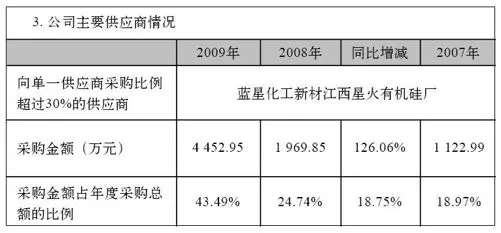

图 5\-4 风险因素披露

资料来源：硅宝科技2009年年报。

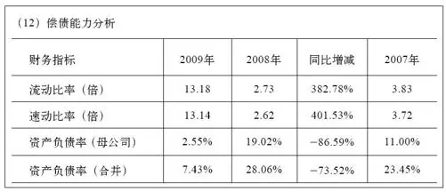

图 5\-5 定量披露

资料来源：同花顺2009年年报。

2026年3月14日

9:58

## 宏观篇 - (6) 第6章 质量鉴定书 审计报告

\(6\) 第6章 质量鉴定书 审计报告

2026年3月14日

9:58

第6章 质量鉴定书 审计报告

年报正文一开始的“重要提示”部分，篇幅很短，二三百字。其中，会计师事务所对年报中财务报表的审计报告类型，值得重视，它相当于会计师事务所对财务报表出具的一份质量鉴定书（见图6\-1）。

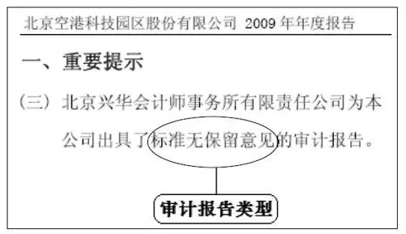

图 6\-1 空港股份2008年年报“重要提示”

四种不合格产品

上市公司在年报中披露的财务报表，由上市公司自己编制。其真实性、准确性与完整性，除了需要上市公司董事、监事、高管以及会计人员担保外，还需要会计师事务所作为独立方进行审计。审计后，事务所要出具审计报告。审计报告分为两大类：一种是标准无保留意见审计报告；另一种是非标准意见审计报告（简称非标意见）。

前者表明，会计师认为财务报表质量合格。在特别提示中，通常这样表述：XXX会计师事务所为本公司出具了标准无保留意见的审计报告（见图6\-1）。

非标准意见审计报告，表示会计师认为财务报表质量不合格。当然，不合格的程度也有区分，按照程度不同，非标意见被分为四种：

·带强调事项段的无保留意见审计报告

·保留意见的审计报告

·否定意见的审计报告

·无法表示意见的审计报告

通俗讲，第一种报告，意味着会计师认为报表存在瑕疵；第二种，认为报表存在错误；第三种，说明会计师认为报表问题严重；而第四种无法表示意见，则说明会计师认为，报表所说无凭所载无据迷雾重重，因此无法置评了。

特别提示中，对四种非标意见，会有这样的表述：XXX会计师事务所为本公司出具了带强调事项段的无保留意见（或保留意见、无法表示意见、否定意见）的审计报告，本公司董事会、监事会对相关事项亦有详细说明，请投资者注意阅读。

有一点要注意，特别提示中只会列示审计报告的类型，而审计报告的具体内容则出现在年报“财务会计报告”的开始部分。标准意见审计报告的内容几乎完全一致，不必看了。而非标意见则会因为各公司不同的情况，区别很大，注册会计师会在其中明确阐述出具非标意见的原因。对这样的审计报告，投资者要认真阅读。

君子不立危墙之下

一般而言，如果会计师事务所出具的是标准意见审计报告，则说明上市公司财务报表的可信度有了比较大的保证，投资者根据报表内容对上市公司的业绩表现做出判断、分析，对其未来发展进行预测，也就有了可靠基础。

当然，这种保证也不是百分之百。在现实中，也会出现被会计师事务所认为合格的财务报表，最终却被证实是“伪劣产品”的事例。国内证券市场中，有名的银广夏案、蓝田案、科龙案，等等，都是如此。当然，这是小概率事件，投资者大可不必因噎废食，进而怀疑所有财务报表的真实性。

如果会计师出具非标意见，对这样的公司，投资者在选股时要慎之又慎。特别是上述四种非标意见中的后三种，对这样的上市公司，最好是避之惟恐不及。因为，不合格的报表往往意味着上市公司隐含着巨大风险，披露出的，很可能只是冰山一角。对普通投资者来说，放着那么多低风险的上市公司不关注，非要刀口舔血，是没有必要的。古语所谓“君子不立危墙之下”，就是这个道理。

事故多发地带

从过去几年的情况看，非标意见在全部审计报告中的比例，开始呈现下降趋势（见图6\-2）。统计显示，带强调事项段的无保留意见审计报告，在非标意见中所占的比例大概是60%。也就是说，四种非标意见中，比较严重的后三种，在全部审计报告中所占比例一般保持在3%左右（以2007年、2008年数据计算）。

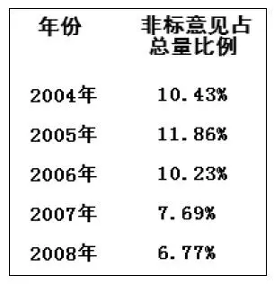

图 6\-2 非标意见的比例

以往事实表明，非标意见一般集中于资产质量差的公司、微利公司、亏损公司。对这些公司来说，它们面临着业绩评价的巨大压力。较其他公司而言，更有粉饰报表进行财务造假的动机。比如说，按照规定，连续三年亏损的上市公司会被暂停上市，有些公司为避免暂停上市，就铤而走险，在财务报表上做手脚。这样的公司被出具非标意见的概率就很大。

非标意见的多发地带，从一个侧面也说明了，绩差公司财务报表造假的可能性较之其他公司要大。对此，投资者务必心中有数，选股时，将绩差公司排除在外，不失为稳妥之举。

监管层高度关注

非标意见隐含巨大风险的说法并非危言耸听，事实上，证券市场监管层对此也一直保持高度关注。

按照规定：如果财务报表被出具了非标意见，上市公司董事会、监事会对非标意见所涉及的事项要在年报中进行详细说明。这个详细说明分别见于年报的“董事会报告”部分与“监事会报告”部分。

此外，对于2009年年报，上海证券交易所还做出规定：若公司2009年度财务报表被会计师事务所出具了无法表示意见或否定意见的审计报告，上市公司应当自披露2009年年度报告之日起，至所涉及事项解决或2010半年度报告披露之日止，每半个月披露一次风险提示公告，公告中应明确说明公司近期经营状况及所涉及事项的解决情况。

交易所出台这样的措施，当然不是无的放矢。其用意就是提醒投资者，对上市公司可能存在的风险保持高度警惕。

连锁后果不可小觑

上市公司年报被出具非标意见，还会出现一系列连锁后果（见图6\-3）。

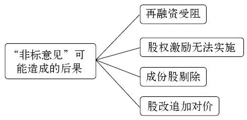

图 6\-3 连锁后果

第一，再融资可能受阻。按照《上市公司证券发行管理办法》的规定，如果上市公司最近三年及最近一期的财务报表，被注册会计师出具保留意见、否定意见或无法表示意见的审计报告，就会失去公开增发、配股、发行可转换债券的资格。如果上市公司最近三年及最近一期的财务报表，被出具带强调事项段的无保留意见审计报告，且所涉及的事项对上市公司有重大不利影响，同时在再融资前重大不利影响未消除，也丧失了公开增发、配股、发行可转换债券的资格。

由此可见，一旦上市公司财务报表被出具非标意见，其再融资（定向增发除外）的能力至少三年内将不复存在。这对上市公司健康、快速发展肯定要造成较大的影响，对此，投资者要有充分估计。

第二，股权激励可能无法实施。大多数上市公司实施股权激励时，都将会计师事务所对财务报表出具标准意见的审计报告作为前提条件。也就是说，一旦上市公司财务报表被出具了非标意见，其实施的股权激励也就随之失效。

第三，成分股剔除。在沪深交易所推出的一系列指数里，其指数成分股的选择标准中，不少就将上市公司财务报表未被出具非标意见审计报告作为前提条件。比较典型的如上证治理指数即是如此。

由于一些投资基金将选股范围与指数成分股挂钩，因此，一旦上市公司从成分股中剔除，必将导致机构投资者大规模抛售股票，从而造成股价大跌。对此，投资者也要保持清醒认识。

第四，股改追加对价。在上市公司股改时，一些公司的股改方案中，曾提出如果上市公司财务报表被出具非标意见的审计报告，原有的非流通股股东将向流通股东送股票。

相对前三种连带后果，这一后果对投资者可能较为有利。至于是否送股以及送多少股票，投资者可以查询上市公司当初的股改方案。

会计师事务所信誉

刚才讲过，即使财务报表被会计师事务所出具了标准意见审计报告，也不能百分之百保证财务报表的真实性。那么投资者如何避免“踩雷”呢？

办法有很多，在此，结合审计报告，我们先讲其中一点，也就是关注出具审计报告的会计师事务所。

会计师事务所的生存发展，主要靠的是信誉。也就是说，只有其出具的审计报告没有问题或者出问题的概率很低，其审计的财务报表经得起考验，事务所才可能揽到更多业务，才可能壮大。从这个意义上讲，那些知名的规模大的会计师事务所，较之不知名的规模小的事务所，审计的财务报表出问题的概率要小。

至于哪些事务所规模大能力强，投资者不妨参考一下中国注册会计师协会每年发布的──会计师事务所综合评价前百家信息。这里暂列出2009年前10家的名单，投资者如果感兴趣可以登录中注协网站查询（www\.cicpa\.org\.cn）。

1\.普华永道中天会计师事务所

2\.安永华明会计师事务所

3\.德勤华永会计师事务所

4\.毕马威华振会计师事务所

5\.中瑞岳华会计师事务所

6\.立信会计师事务所

7\.万隆亚洲会计师事务所

8\.浙江天健东方会计师事务所

9\.大信会计师事务所

10\.信永中和会计师事务所

更换会计师事务所

投资者在阅读年报时，要注意上市公司是否更换了出具审计报告的会计师事务所（见图6\-4）。年报“重大事项”部分，对此有详细说明。

其原因在于，如果事务所要出具非标意见的审计报告，而上市公司对此无法接受，当这种矛盾极端激化无法调和时，上市公司就有可能采取更换会计师事务所的方式，以得到其希望得到的审计报告。

因此，上市公司更换会计师事务所，特别是更换理由不充分之时，投资者需要高度警惕。现实中的案例说明，进行财务造假的上市公司中，很多公司出现过更换会计师事务所的“犯罪前戏”行为。

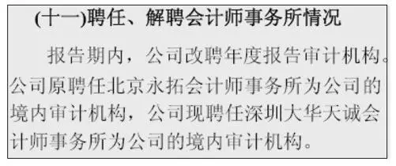

图 6\-4 “更换会计师事务所”示例

按照规定，上市公司解聘会计师事务所或者会计师事务所辞聘，上市公司与会计师事务所均应报告中国证监会和交易所且公开披露原因，并对所披露信息的真实性负责。被解聘的会计师事务所对被解聘的理由如有异议，有权向上市公司股东大会申诉，同时可以要求公司披露，公司也有义务对此披露。

因此，投资者对于更换会计师事务所的情况务必保持高度关注，这可能就是上市公司欲行不轨的重要“征兆”。

## 股东篇

股东篇

■闸门开启之后──限售时间表

■比比谁的『后台』硬──实际控制人

## 股东篇 - (1) 第7章 闸门开启之后 限售时间表

\(1\) 第7章 闸门开启之后 限售时间表

第7章 闸门开启之后 限售时间表

所谓限售股，就是尚不能在股市中抛售的股票，这些股票的抛售，有一定时间限制以及条件约束。这样的股票，有如被闸门截住的水，一旦闸门开启，就可能汹涌而出，冲击股价。因此，投资者有必要了解闸门的开启时间以及开启条件。

限售股来源大致有五种（见图7\-1），其规模、持股成本以及流通时间与条件都有很大差异。

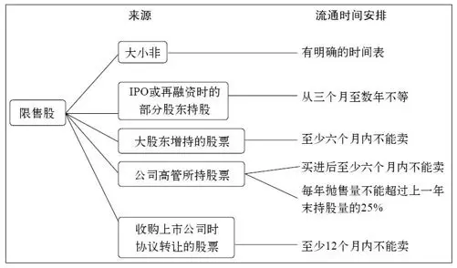

图 7\-1 限售股来源

年报中的限售股

在详细分析各类限售股之前，我们先看一下，年报中有关限售股的内容。

年报第四部分“股本变动及股东情况”中的第一个表格──股份变动情况表，将总股本分为限售股与流通股两大类。在限售股部分，统计了报告期末，上市公司限售股总量及占总股本比例（见图7\-2）。通过这两个数据，投资者可以简要了解限售股规模。一般而言，限售股规模当然是越少越好。

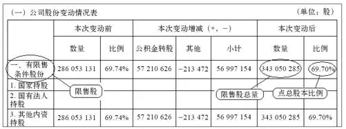

图 7\-2 海印股份2009年年报“股东变动情况”

年报第四部分的另一张表格──前十名有限售条件股东持股数量及限售条件，披露了最大的10个限售股股东，所持有的限售股数量和可抛售时点（见图7\-3）。虽然限售股股东可能并不只有10个，但一般而言，前10名的持股数量已经能够占到限售股总量的绝大部分。因此，仅看该表格就可以对限售股情况有较为全面准确的了解。

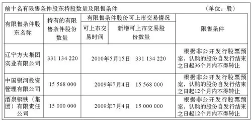

图 7\-3 前十名有限售条件股东持股数量及限售条件

注：本表中4～10名限售股东省去。

大小非

目前限售股中的大部分，还是股改的产物，也被称为“大小非”──股改时，持量股占总股本≥5%的非流通股股东被称为大非，持股量占总股本＜5%的非流通股股东被称为小非。

股改后，大小非虽有了流通权，但不能马上抛售，其流通有个时间表。由于这部分股票数量庞大，持股成本极低，一旦流通后，很可能使抛盘突然加大，从而造成股价下跌。因此，投资者对这些股票的流通时间安排要高度关注。

准确了解大小非的流通时间，要通过上市公司披露过的《股权分置改革方案》，每一个方案中，都会以表格形式，清晰列示各股东所持股票的可上市流通时间（见图7\-4）。而这一信息，仅看年报尚不能全面掌握。

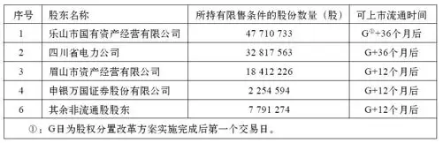

图 7\-4 乐山电力股权分置改革方案

投资者须注意，允许抛售的时间点，很可能不是大小非实际抛售的时间点。按照规定，在深圳证券交易所上市的公司，其控股股东大量抛售股票前，可能会预先告之。

深交所规定：上市公司控股股东、实际控制人如果计划在解除限售后六个月以内通过证券交易系统出售股份达到5%以上的，应在解除限售公告中披露拟出售的数量、时间、价格区间等；如果在限售股份解除限售后六个月以内暂无通过证券交易系统出售5%以上解除限售流通股计划的，则应承诺若计划未来出售解除限售流通股，并于第一笔减持起六个月内减持数量达到5%以上的，控股股东（或实际控制人）将于第一次减持前两个交易日内通过上市公司对外披露出售提示性公告（见图7\-5）。

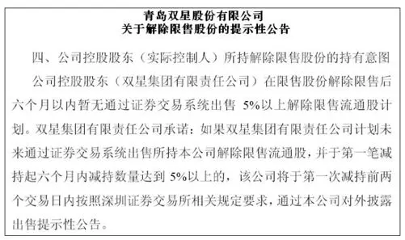

图 7\-5 青岛双星2007年12月1日公告

此外，为防止上市公司大股东利用内幕信息抛售股票，深交所还规定：当上市公司控股股东或实际控制人最近一年被交易所公开谴责或两次以上通报批评处分，或上市公司被实施退市风险警示等情形，控股股东、实际控制人拟通过证券交易系统出售股份的应在出售前两个交易日刊登提示性公告，就拟出售的数量、时间、原因等事项进行说明。

若上市公司的大小非中还有上市公司，这些上市公司在出售前也可能按照规定刊登相关公告（见图7\-6）。

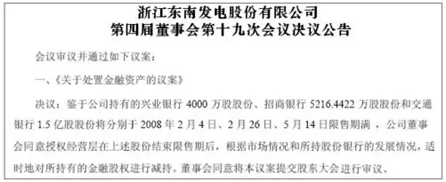

图 7\-6 上市公司大小非股东拟售股公告示例

按照交易所规定，上市公司拟出售资产所产生的利润达到上一年度净利润的10%以上时，经董事会批准后，公司应在两个工作日内公告。鉴于大多数上市公司持有其他上市公司股票的成本价都很便宜（详情参阅第13章），故而这些公司准备抛售股票前，大都会刊登相关公告。

融资限售股

除了大小非外，数量最多的限售股，来自于上市公司融资时发行的部分股票，以及公司上市前的老股东持股（见图7\-7）。

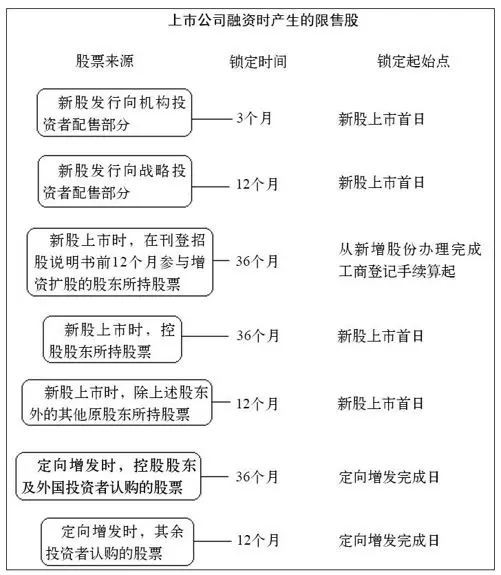

图 7\-7 融资限售股示例

从目前规定看，监管层只对上市公司IPO（首发上市）及定向增发时，做出了部分股东的强制性限售规定。

新股发行时，真正供普通投资者申购的股票，只是一部分，其余股票还要向一些机构投资者进行配售。一些大盘股发行的时候，除了上述两类发行对象外，还会拿出一部分股票，专门向战略投资者配售（机构投资者与战略投资者的定义很烦琐，投资者没有必要掌握）。

机构投资者获得新股后，不能在上市首日抛售，而是要锁定3个月；向战略投资者配售的股票，锁定期比机构投资者还要长，达到12个月。

12个月的锁定期，除了针对于战略投资者，还针对上市公司在上市前的部分股东们。按照规定，除了上市公司控股股东所持股票外，多数上市前的股东所持股票，在上市后要锁定12个月。

从以上分析可以看出，由于战略投资者的持股锁定期与上市前老股东的持股锁定期重合，因此，一只新股上市后的第12个月期满之时，是比较危险的日子，投资者务必谨记。

对于新上市公司的控股股东，它所持有的股票锁定期更长，达到3年。锁定期也是从上市之日开始算起。可以想见，一旦3年到期，控股股东可能会抛售股票。而且，由于控股股东的持股量大，因此届时抛盘可能更多，下跌幅度可能更大。

定向增发是从2006开始实施的一种上市公司再融资方式，简单而言，定向增发是指上市公司不公开发售新股，而是自己选择不超过10个投资者，向他们出售新股。

参与定向增发的投资者，有各不相同的锁定期。如果上市公司的控股股东参与了定向增发，或者上市公司向外国战略投资者定向发行了股票，那么这部分股票的锁定期是36个月。在上述两类投资者之外，参与定向增发的投资者所持股票，锁定期是12个月。投资者对这两个时间点，也要加以注意。

大股东增持

从2005年下半年开始，上市公司中出现了第一轮大股东增持上市公司股票的热潮，也就是大股东直接在二级市场买进自己所控股的上市公司的股票。2008年第四季度，上市公司大股东，特别是国有上市公司大股东，又一次出现了增持上市公司股票的热潮。

按照规定，大股东增持的股票，在购买完成后，至少6个月内不能卖出。因此，6个月，是个非常重要的时间点。

管理层持股

上市公司管理层所持股票的锁定期同样是六个月。除此之外，还有两条对抛售的限制性规定：一是每年抛售量不能超过上一年末持股量的25%；二是离职后六个月内，不得抛售股票。需要提醒的是，管理层抛售股票的时间点及价格，大家可以在两个证券交易所的网站上进行查询（详情见第9章）。

收购锁定期

如果上市公司被收购，按照规定，收购人持有的上市公司股份，在收购完成后12个月内不得转让。

承诺

当然，上述所谈的各种限售股的限制时间及限售条件，都是法律及规章中要求的最低标准。部分上市公司股东，会在此标准之上，严格要求自我，承诺更高的标准──如延长限售时间等（见图7\-8）。想及时了解这些内容，就需要投资者注意关注公司日常的公告信息。

图 7\-8 承诺公告示例

2026年3月14日

9:58

## 股东篇 - (2) 第8章 比比谁的“后台”硬 实际控制人

\(2\) 第8章 比比谁的“后台”硬 实际控制人

第8章 比比谁的“后台”硬 实际控制人

所谓实际控制人，也就是上市公司的后台老板，实际控制人虽然不一定直接是上市公司的控股股东，但通过产权联系，在很大程度上，能够做到真正支配上市公司行为。

实际控制人之所以重要，是因为上市公司的未来发展一方面取决于自己的经营；另一方面就取决于实际控制人的实力与地位──这一点与个人的发展实在无二，一看实力二看背景，而且后者往往更重要。因此，对于年报中所披露的上市公司实际控制人，投资者一定要多加留意、细加品味。

估值要考虑实际控制人

都市股份在2006年之前，一直是一家经营业绩处于中游的上市公司，但在当年12月，海通证券通过都市股份借壳上市（海通证券资产与都市股份原有资产进行置换），重组后，该公司的股价涨了数倍。

那么海通证券为何能借都市股份的壳上市呢？很重要的一点，就是两家公司的实际控制人，都是上海市国资委（见图8\-1）。两者之间的资产置换，可以视为上海市国有资产之间的重新配置。

从这个案例不难看出，是实际控制人主导了本次重组，上市公司自身对于重组则没有什么发言权，普通投资者也无法从都市股份以前所披露的经营业绩信息中，预测出该公司会以重组告终。如果投资者是以一般意义上的价值判断标准对都市公司估值，根本不可能得出该公司股价会上涨数倍的结论。

图 8\-1 都市股份与实际控制人之间的产权关系图

有经验的投资者都知道，证券市场中有所谓的上海本地股板块与深圳本地股板块。这两个板块每隔一段时间，就会掀起一轮行情。其根本原因就在于，投资者认为这两个板块的实际控制人（上海国资委、深圳国资委），有可能对所控制的上市公司进行重组。而事实也一再证明，这种重组一直在持续，投资者的预测绝非空穴来风。

上市资格在我国是稀缺资源，将最优质的企业、最优质的资产放进证券市场这个平台，发挥证券市场的融资功能，使企业发展壮大，是每一个实际控制人所要考虑的问题，特别是在股改之后，所有的股票都实现了流通，证券市场对于实际控制人的重要性更加明显，实际控制人最充分地利用证券市场的欲望更加强烈。

由此可见，对于一家上市公司的估值，不能不考虑该公司的实际控制人，实际控制人的实力、地位以及资本运作思路，在一定程度上，决定着上市公司的命运。

三类控制人

从大的角度看，上市公司的实际控制人可以分为三类：一是个人；二是地方国资委；三是国务院国资委。

如果上市公司的实际控制人是个人，一般很难有实力凭借一己之力对所控制的上市公司实施大规模资产重组。这主要是因为，与各个国资委管理着几百亿元、上千亿元的国有资产、国有企业相比，个人的实力以及其所能调动的资源还是相当有限的。除了已经装进上市公司的资产外，这些实际控制人，已经很难再有其他的优质资产、优质企业。因此，我们会发现，个人控制的上市公司如果经营中遇到困难，业绩表现平平，几乎不可能出现都市股份模式的重组。如果上市公司最终连连亏损，这些实际控制人最后所能做的，也只是将上市公司转让给其他人甚至退市。

因此，如果投资者在年报中看到，上市公司的实际控制人是个人，就得打消实际控制人再注入优质资产的可能性。对这些上市公司进行估值，要完全从其自身经营的角度进行分析，除此之外，不太可能有什么“惊喜”。

在个人控制的上市公司中，还会出现一种情况，就是一个自然人同时控制了好几家上市公司。对于这样的公司，投资者不妨加点小心。因为个人的实力毕竟有限，如果实际控制人“子孙满堂”，其所辖上市公司并非“万千宠爱集于一身”，其发展前景也往往平平。事实也证明了，在这样的上市公司中，我们很难找到真正的绩优股。

地方国资委

地方国资委所控制的上市公司，能不能出现都市股份这样的“奇迹”，主要取决于地方国资委的实力。上海本地股、深圳本地股之所以能够一再风生水起，还是因为上海市与深圳市本身实力雄厚，所控制的资源相当多，施展的空间也就足够大。因此，投资者对那些发达地区的国有上市公司不妨高看一眼。

此外，判断一家上市公司能否成为当地国资委关注的焦点之一，还要看看这家上市公司在地方国资委眼中，处于什么样的战略地位。如果一家上市公司所处的行业、所经营的产品与当地政府的战略规划、战略目标相一致，那么，我们就有理由相信，这样的公司被地方国资委支持、扶持的力度也会更大。

为了解这些信息，投资者可以通过各地方国资委的网站进行查询。以重庆港九为例，该公司年报显示，公司实际控制人为重庆市国资委（见图8\-2）。我们登录重庆市国资委（www\.sasaccq\.gov\.cn）网站，就会查询到，重庆市属国有重点企业共有20家（见图8\-3），其中第一家就是重庆港务物流集团有限公司。而这家公司恰恰就是重庆港九控股股东的全资控股人。在国资委网站对重庆港务物流集团的介绍来看（见图8\-4），这家港务物流集团只控制着一家上市公司。从这些信息中可以初步判断，重庆港九在重庆市国资委的资产布局中，应该处于相当重要的地位。这家公司的未来发展，有可能会得到地方政府的大力支持。

图 8\-2 重庆港九与实际控制人产权关系图

图 8\-3 重庆市属国有重点企业

资料来源：重庆市国资委网站。

再如深圳市国资委网站（http：//www\.szgzw\.gov\.cn）显示，其全资企业及控股企业共有24家（见图8\-5）。在这些企业中，就不乏上市公司（农产品、深振业、深天健）或上市公司的控股股东（如沙河实业的控股股东深圳市沙河实业集团有限公司等）。

图 8\-4 重庆港务物流集团有限公司简介

资料来源：重庆市国资委网站。

图 8\-5 深圳市国资委全资、控股企业

资料来源：深圳市国资委网站。

这些上市公司的实际控制人是深圳市国资委，可谓大树底下好乘凉。可以推断，在实力雄厚的深圳市国资委支持下，这些公司发展中若是遇到困难，至少不会出现“无依无靠”的惨境。

央企

所谓央企，就是指由国务院国资委直接控制的企业，截至2010年2月，实际控制人是央企的上市公司是236家（见附表8\-1）。少部分上市公司的实际控制人为财政部、铁道部、中科院等，这些上市公司也可以视为央企，截至2010年2月，这些公司的数量是17家（见附表8\-2）。

最近几年来，央企所控股的上市公司已经成为证券市场中的一大亮点。其原因就在于，大多数央企的实力极为雄厚，而央企所控股的上市公司，往往成为央企优化上市资源配置，实施资本运作的平台。

其中有代表性的案例，就是沪东重机的重组。沪东重机的大股东是中国船舶工业集团公司（见图8\-6），而沪东重机在重组前，只是集团公司控股的一家中型上市公司。2007年年初，通过重组，集团公司将自己的核心资产注入了上市公司，而沪东重机也因此改名为──中国船舶。重组后，中国船舶的股价一飞冲天，10个月的时间，从30元涨到300元。

图 8\-6 沪东重机与实际控制人产权关系图

判断央企所控股的上市公司的未来发展前景，首先要了解，国务院国资委对所辖企业进行布局的基本战略。

目前的129家央企根据业务范围大体分布在三个领域：关系国家安全和国民经济命脉的关键领域，基础性和支柱产业领域，其他行业和领域。

关系国家安全和国民经济命脉的关键领域主要包括军工、电网电力、石油石化、电信、煤炭、航空运输、航运等行业。这一领域目前有40多家中央企业，资产总额占全部中央企业的75%，国有资产占82%，利润占79%。国有经济在这一领域要保持绝对控制力，由国有资本保持独资或绝对控股。

基础性和支柱产业领域包括装备制造、汽车、电子信息、建筑、钢铁、有色金属、化工、勘察设计、科技等行业。这一领域目前有60家左右中央企业，资产总额占全部中央企业的17%，国有资产占12%，利润占15%。国有经济要对这一领域的重要骨干企业保持较强控制力，同时汽车、机械、电子行业的重要骨干企业要为成为世界一流企业打下坚实基础。

其他行业和领域主要包括商贸流通、投资、医药、建材、农业、地质勘察等行业。这一领域目前有40家左右中央企业，资产总额占全部中央企业的8%，国有资产占6%，利润占6%。国有经济要在这一领域保持必要影响力，表现为国有资本对一些影响较大的行业排头兵企业，以及具有特殊功能的医药、农业、地质勘察企业保持控股。

结合上述战略布局中，投资者就可以对现有央企控股的上市公司的后台地位与实力做出判断。

三大主业

目前央企所控股的上市公司有很多，有时候，一家央企所控制的上市公司多达五六家，这样的上市公司的未来发展，则要具体与央企的主业目标相结合进行分析。

从目前国务院国资委对央企的要求看，一般每一家央企最多可以确定三个主业方向，只有极少数央企可以确定四个主业。因此，那些虽为央企控股，但其经营领域与控股股东主业方向不一致的上市公司，有可能将被转让或者重组。

以中粮地产为例，这家公司的第一大股东──中粮集团有限公司即是央企，而查询的结果是，中粮集团在六家上市公司中持有股份。结合上市公司年报进一步查询的结果是，中粮集团在其中三家上市公司中（中粮地产、中粮屯河、丰原生化）是控股股东。

再从国务院国资委网站（www\.sasac\.gov\.cn）中，可以查询出中粮集团的三大主业分别是：食品加工与制造；粮油、食品贸易，粮油糖期货；物流、酒店、房地产开发经营。

结合上述资料，以及三家上市公司的资料，我们可以判断，中粮地产对应着中粮集团的物流、酒店、房地产开发经营；中粮屯河对应着食品加工与制造；丰原生化作为国内燃料乙醇龙头企业，可以对应粮油主业。因此，投资者有理由预测，未来三家上市公司将分别承载中粮集团三大主业中的优质资产。

2026年3月14日

9:58

## 董事会报告篇

董事会报告篇

■避免人祸的发生──公司治理

■有财大家发──股权激励

■猜猜蛋糕怎么分──分红预案

■百分之十五是个槛──所得税

## 董事会报告篇 - (1) 第9章 避免人祸的发生 公司治理

\(1\) 第9章 避免人祸的发生 公司治理

第9章 避免人祸的发生 公司治理

一些原本业绩突出的上市公司，逐渐走下坡路，直至巨额亏损。原因何在呢？有些可能是天灾──比如公司所处市场萎缩、竞争激烈，但很多公司则是缘于人祸──如大股东掏空上市公司、管理层监守自盗。

避免人祸要靠制度，要靠规范的公司治理。这里所讲的公司治理，不仅仅局限于公司管理制度──如财务制度、采购制度、人事制度等，公司治理主要是指规范股东大会、董事会、管理层各自的权利与责任（见图9\-1），并在此基础上制定并切实执行规范措施。

图 9\-1 公司架构图

不规范的公司治理有哪些特征呢？比如说，个别上市公司董事长与总经理一肩挑，这就有些危险，因为总经理本来需要董事会进行考核、聘任，一肩挑了，总经理很可能就没人管了。一旦他做出损害公司利益的事，很难指望有什么力量去阻止、去制衡。

国有上市公司出现上述局面，更要特别当心。国有公司虽出身不凡，有一段自然的风流态度，却也有“不足之症”。虽然我们听到过领导们爱岗敬业的传说，但从理论上讲，没有人会如同爱护自己的财产一样爱护国有资产，这就需要将权力分解形成制衡，以求最大程度上消解痼疾。而一旦出现一肩挑，就等于放弃了权力的互相制衡。这样一来，就为“反客为主”的内部人控制大开了方便之门。

又比如，有些事情本应提交股东大会讨论，但董事会越权批准了，进而一些可能损害中小股东利益的事情（比如说价格不合理的关联交易）也就发生了。再比如，董事会应当制订合理的、针对管理层的考核方案以及薪酬方案，以激励管理层将其自身财富的增长与企业经营业绩的提高结合起来。但在一些公司，董事会在这方面却无所作为，事实上，这是在教唆管理层走向一条我们不希望看到的道路。

我们相信，良好的制度，阻止人性恶泛起，魔鬼不是别人，魔鬼就在心中，轻言诺诺信誓旦旦不足为凭，没有制度约束，那就是让人性做极限运动。因此，没有良好的公司治理，就不能形成公司参与方各司其职、各尽其职的局面，上市公司的可持续发展就是一句空话。这样的公司可能显赫一时，但泯灭只是时间问题。

因此，投资者在评判上市公司时，不能仅局限于对管理者、业绩、产品、市场、行业的分析，公司治理优良与否也应该纳入视线。

公司治理专项活动

年报第六部分“公司治理”，分为六个小项（见图9\-2）。六个小项的内容都是针对上市公司在公司治理方面可能存在的薄弱环节。值得投资者关注的是，其中的第一项──公司治理的情况、第四项──高级管理人员的考评及激励情况、第六项──公司披露董事会对公司内部控制的自我评估报告和审计机构的核实评价意见。

图 9\-2 公司治理结构图

第一项中，投资者要留意的，是“公司治理专项活动情况”的内容。

2007年3月～10月，证监会开展了“加强上市公司治理专项活动”。该活动的一大特点，就是公开披露了上市公司在公司治理方面存在的问题，以及其整改措施。2008年6月，证监会发布文件，要求“继续深入开展上市公司治理专项活动”，上市公司在2008年又一次以公开披露的形式，公告自身在公司治理方面存在的问题以及整改方案。

2009年，又被证监会定为“上市公司治理整改年”，要求上市公司对治理方面存在的问题进一步规范。相应地，在2009年年报中，上市公司会披露年内完成整改的治理问题和尚未完成整改的治理问题。同时，对尚未完成整改的治理问题，还会披露公司整改责任人、未及时完成整改的原因、目前的整改进展、承诺完成整改的时间等信息。

需要指出的是，连续三年的，公司治理活动中，上市公司公开披露的大量信息，特别是披露自身问题及整改措施方面的信息，对投资者透彻了解上市公司很有帮助。

以五粮液为例，该公司2007年《自查报告和整改计划》中，在一开始的特别提示部分，披露了公司在治理方面存在的四个问题（见图9\-3）。而后，在整改计划中，披露了公司对四个问题的整改方案（见图9\-4）。2008年7月，该公司又一次公开披露了公司治理中存在的问题及整改方案（见图9\-5）。2009年12月，公司又披露了《进一步完善公司治理结构的整改方案》。

图 9\-32007年7月8日五粮液公告内容

图 9\-42007年整改方案

应该说，规范的公司治理较为复杂，中国证监会、交易所颁布的相关文件不胜枚举，普通投资者很难全面理解掌握，更遑论以这些文件去对照上市公司有哪些不足之处。而《自查报告和整改计划》则非常清晰地列示出，上市公司在治理方面的不足之处。

2009年年报当中，不仅简要披露了各上市公司《自查报告和整改计划》的内容，同时还披露了整改计划的落实情况，以及整改之后取得了哪些成效。建议投资者将年报中的内容与《自查报告和整改计划》相结合，对深入了解上市公司很有帮助。

图 9\-5 进一步整改方案

高管的薪酬体系

合理的薪酬体系是激励公司高管勤勉尽职的重要手段。总的来说，薪酬体系的标准应该明确，应该有具体的业绩目标（见图9\-6）。而对那些内容空泛、没有细节描述的上市公司要特别留意。

图 9\-6 “高管考评及激励”（华发股份2008年年报）

投资者还可以通过巨潮资讯网，查询各家上市公司是否建立了管理层的薪酬考核制度，进而评估这一制度是否合理（见图9\-7）。在巨潮网对各公司披露信息的分类中，有一类是“工作制度”，它囊括了上市公司所披露的各项规章制度，其中就包括管理层的薪酬考核制度。

评估薪酬体系是否合理，除了研究其考核制度的文本外，最直观的办法，就是对比年报中披露的董事、高管薪酬变动（由于年报中，只披露管理层过去一年的薪酬，因此，查询变动情况，需要对比前后两年的年报），与上市公司业绩的变动是否相匹配。如果上市公司主营业务大幅下滑，管理层薪酬却不降反升，那就说明考核体系相当不合理。对于这样“穷庙富方丈”的上市公司，投资者最好敬而远之。

图 9\-7 巨潮资讯网“工作制度”界面

管理层持股情况

上市公司管理层持股情况，虽然没有被列入年报的“公司治理结构”部分，但从实际意义看，管理层持股，以及持股的数量，与形成良好的公司治理结构有重大关联。试想，如果上市公司管理层持有大量的自己上市公司的股票，那么，一方面说明管理层对上市公司未来前景有信心；另一方面，通过提升公司业绩，进而推动股价上涨，也成为管理层完成自身财富积累的重要手段。而这一手段恰好也与投资者的利益相一致。上市公司针对高管推出的股权激励计划，与管理层持股有类似之处，本书第10章有专门讲解。

值得一提的是，管理层持股与普通投资者还有很大区别（见图9\-8）。由于这些规定的存在，使管理层持股趋于长期投资，也有利于公司的长期稳定发展。

图 9\-8 管理层持股特征

管理层的持股情况，见于年报第五部分的一张表格──“董事、监事、高级管理人员的情况”（见图9\-9）。

图 9\-9 管理层持股情况示例

资料来源：张江高科2007年年报。

除了管理层的持股数量，投资者当然还会关心管理层的买进时间、买进价格，以及卖出时间。这些信息，投资者可以从交易所网站及时获悉。

以上交所网站为例，在其首页中，有“上市公司诚信记录”栏目（见图9\-10），进入该栏目后，就会看到“董事、监事、高级管理人员持有本公司股份变动情况”（见图9\-11）。

图 9\-10 上交所“上市公司诚信记录”

图 9\-11 上市公司诚信记录示例

可以说，该栏目是投资者动态了解公司管理层持股变动情况的唯一渠道（从上市公司中报、年报中了解管理层持股变动信息，时效性大打折扣）。

一般而言，上市公司管理层持股变动状况，往往代表了高管对上市公司目前股价是否高估或低估的看法。虽然这种看法并非百分百准确，但考虑到高管对其所任职上市公司的熟悉程度，其对股价的判断，还是非常值得投资者重视。

一般来说，上市公司的某一位高管，抛售股票，有可能是自己的原因，并不能成为公司高管看空股票的有力佐证，但如果是多位高管集中抛售股票，那就要引起投资者高度关注。

因此，建议投资者在考虑投资某只股票时，务必在交易所网站上，查询一下该公司高管的持股变动状况。如果已经持仓了某只股票，则要经常浏览一下交易所网站，看看该公司高管的持股有何变化。

与上交所不同，深交所网站将高管持股变动信息，置于其“信息披露”栏目下，其查询路径是“深交所首页→信息披露→主板诚信档案或中小板诚信档案→董监高及相关人员股份变动情况”。

较之上交所，深交所披露信息涉及面更大，主要是增加了董事、监事、高级管理人员的亲属（父母、配偶、兄弟姐妹）的股票账户变动情况（见图9\-12）。例如，输入000002（万科A）就会发现，该公司董事长王石先生的夫人王江穗女士，曾在2007年7月6日，买入万科46900股，其后又在2007年7月23日，将46900股卖出。

图 9\-12 深交所高管亲属持股变动查询示例

两份报告

在2009年年报中，一大批上市公司披露了内控制度报告与社会责任报告。与2008年相比，披露范围有了大范围提高。

其中，深市上市公司，按照深交所要求，全部披露了“年度内部控制自我评价报告”，纳入“深圳100指数”的上市公司必须披露社会责任报告。沪市中的“上证公司治理板块”样本公司、境外上市外资股公司以及金融类公司三类公司，按照要求必须披露内控报告和社会责任报告。

内控报告的核心内容，是公司对于各类风险的防范机制。与针对证监会加强公司治理活动而披露的《自查与整改计划》不同，内控报告侧重于具体生产经营过程中的风险控制。内控报告最有看点之处，是其中的“缺陷及整改计划”部分。通过它，投资者可以在一定程度上，了解上市公司具体生产经营中都存在哪些可能的风险。

社会责任报告的内容，主要是说明公司在股东、债权人、职工、供应商、客户、消费者等利益相关方权益保护，以及环境保护、节能减排、社会公益等方面履行社会责任的情况。

社会责任报告的内容虽然与生产经营较远，但一家社会形象、口碑优良的上市公司，对于公司顺畅开展经营活动是相当重要的。特别是对于那些生产消费品，或者与普通人生活息息相关的上市公司，品牌的内涵、公司的形象，实际上就是一笔巨大的无形资产。

公司治理溢价

良好的公司治理意味着更低的风险，意味着遭遇人祸的概率大为降低，意味着上市公司可持续增长的概率增加。正因为如此，从中外证券市场的经验来看，都存在公司治理溢价的现象。

上海证券交易所从2008年1月2日开始，推出了上证治理指数，深圳证券交易所也推出了深证治理指数。目前，市场中也已经出现了专门基于两指数成分股的投资基金，从近年表现来看，两个指数的走势都强于大盘。

2026年3月14日

9:58

## 董事会报告篇 - (2) 第10章 有财大家发 股权激励

\(2\) 第10章 有财大家发 股权激励

2026年3月14日

9:58

第10章 有财大家发 股权激励

股权激励使公司管理层，在公司股票价格上涨时，可以赚大钱。因此，买进这样的股票，等于是让上市公司老总帮你炒股。他想赚钱，就得让你也赚钱。

如果实施了股权激励，那么上市公司必须在年报中进行详细披露（见图10\-1）。

图 10\-1 “股权激励情况”（宝新能源2009年年报）

股权激励的内容披露，散见于年报各部分。“董事会报告”部分会披露股权激励的执行情况；“董事、监事、高级管理人员和员工情况”部分会披露股权激励涉及了管理层的哪些成员；“会计附注”部分，会披露股权激励可能对公司利润造成的影响。对这三部分，投资者都应该认真阅读。

期权激励

先来了解一下，什么是股权激励，以及投资者如何利用这项金融工具。

按照规范的定义，股权激励是指上市公司以本公司股票为标的，对其董事、监事、高级管理人员及其他员工进行的长期性激励。

股权激励的方式有很多种，从上市公司目前实施股权激励的情况看，最流行的一种是──期权型股权激励。我们可以这样理解：期权型股权激励是赋予上市公司管理层一项权利，即管理层在上市公司达到一定业绩目标的前提下，可以用之前确定的价格购买一定量的股票。

比如说A上市公司实施股权激励，公司与管理层约定：如果明后两年的净利润增长率都能够达到30%，那么就向管理层以5元/股的价格发行1000万股股票。

如果管理层想赚钱，不仅要完成净利润的增长指标，还得想办法使公司两年后的股价高于5元。如果两年后，上市公司净利润增长达到了之前确定的目标，而公司股价也涨到了10元。那么管理层届时就可以用5元的价格买到1000万股股票。市价是10元的股票，能用5元买到，而且是1000万股，岂不是很爽！

有了这样的制度，公司管理层当然会加倍努力。而投资者买进这样的股票，赚钱的可能性也就大增。

细心的投资者会问：如果我们想赚钱，那也得用5元的价格，或者至少只比5元高一点的价格买到股票呀。

中国证监会在制定相关政策时，已经替投资者想到这一点了。证监会的政策规定：上市公司在授予激励对象股票期权时，行权价格不应低于下列价格较高者：①股权激励计划草案摘要公布前一个交易日的公司股票收盘价；②股权激励计划草案摘要公布前30个交易日内的公司股票平均收盘价。

这里面的行权价格就是刚才所举A公司例子当中5元/股的价格。所谓行权就是行使权利，就是管理层以约定好的价格向上市公司买股票的权利。

大家应该注意到，政策中，对行权价格的规定，是以股权激励草案公布时的股票市价为依据的。这也就在很大程度上保证了投资者可以用与行权价差不多的价格买到股票的可能性。

假如说，A公司公布股权激励草案前一天的收盘价是4\.8元，那么A公司股权激励方案中的行权价就不能比4\.8元低。如果投资者在草案公布的当天就买进股票，最贵也只有5\.28元（4\.8元×10%）。如果行权价是5元，5\.28元买进也还是可以接受的。

你与管理层的区别

虽然你买进了股权激励的股票，等于是让上市公司老总帮你炒股，但并不等于说，上市公司老总就肯定能帮你赚钱，这当中也蕴含着一系列风险。

我们来看看，你与上市公司管理层在股权激励方面的区别。对于上市公司管理层来说，股权激励是一项权利，但并不是一项义务。也就是说，管理层有买股票的权利，同时也有不买股票的权利──也就是没有买股票的义务。

还以A公司为例，假如两年后，上市公司净利润增长达到了目标，但由于大势不好，A公司的股价跌到了4元。这个时候，管理层可以选择不买股票。试想，股价都跌到4元了，管理层还行使以5元的价格买1000万股股票的权利干什么，就是他们想买，也完全可以直接从二级市场以4元的价格买。

但对于投资者来说，如果你两年前就以5元的价格买了股票，两年后，股票跌到了4元，你可就亏钱了。

再者，时间成本不同。管理层购买股票的时间，是在业绩达到目标之后；而为了在行权价附近买到股票，投资者有可能在激励草案推出之后，就须买进。这两者之间的距离，可能长达两年甚至更多。

股权激励实际上使上市公司管理层几乎立于不败之地。管理层可以少赚钱，甚至不赚钱，但亏钱的可能很低，除非行权后，股票还没有卖出之时（按照规定，管理层买进股票后，至少6个月内不得卖出），股价跌破了行权价。

草案未落实

投资者在股权激励草案公布的时候买进，还可能存在一个风险，就是草案迟迟没有被批准实施，或者股价大跌后，上市公司管理层认为无利可图，最终取消激励草案。

从程序角度讲，上市公司公布股权激励草案后，还要被证监会批准，如果是国有上市公司，还要被国资委批准，之后，还得公司股东大会批准。这几项程序都走完了，股权激励方案才能实施。

一般来说，公司股东大会都会批准股权激励方案的，如果草案卡壳，大都是没有被国资委或证监会批准。目前就有不少上市公司遇到了这样的问题，草案公布很长时间了，但就是没有被批准。

还有一些上市公司，在推出期权激励草案后，遇到股市暴跌，结果股价大大低于行权价，压缩了盈利空间，甚至在可预见的未来，已经无利可图。这就使上市公司继续推行草案的动力大为减弱，直至最终取消激励草案。

如华神集团股权激励草案中，设定的行权价为12～88元，但该公司股价之后一度跌到3\.17元，草案已经形同虚设，该公司最终取消了激励草案（见图10\-2）。

图 10\-2 华神集团股权激励草案取消公告

激励成本

期权式的股权激励，对上市公司业绩而言，也存在负面效应，如果激励规模很大，这一负面效应将相当明显（见图10\-3）。因为按照会计准则的要求，对上市公司管理层的期权激励，视为公司对管理层发放的薪酬，而薪酬将记入公司的管理费用（见图10\-4），从而影响上市公司利润。如伊利股份由于实施股权激励，2007年亏损2000万元，而该公司2006年尚且实现盈利3\.2亿元。

图 10\-3 伊利股份2007年年度业绩预亏公告

图 10\-4 伊利股份2007年利润公告

至于股权激励会给上市公司当期业绩带来多大的负面影响，投资者可以在年报所有者权益变动表的附注中找到答案（见图10\-5）。从伊利股份2007年年报显示的内容可以看出来，当年由于实施了股权激励，该公司管理费用增加了4\.59亿元。

当然，所谓对净利润的影响，只是从账面上看。虽然股权激励被视为管理费用，但它只是会计处理的一种方式，与真正的管理费用不同，也就是说，上市公司没有因此真的支付了一笔费用，只是低价向高管发行了股票。因此，公司的资产构成与负债构成都不会受任何影响。在企业的会计报表中，会出现这样的变化，利润表中会由于管理费用增加，从而减少当期利润。资产负债表中的所有者权益部分，会因此减少所有者权益，增加资本公积。

图 10\-5 伊利股份2007年年报附注

“安然”的教训

除了影响利润外，实施股权激励，还可能使上市公司存在一定的潜在风险。也就是，在巨大的利益诱惑面前，上市公司管理层为了完成业绩目标，促进股价上涨，有可能大量从事高风险高收益业务，甚至不惜做假账。

美国国际集团（纽交所上市，代码：AIG）是全球最大的保险集团。该集团管理层手中也持有大量股票期权。正是由于这些股票期权的“激励”，管理层忽视了巨大风险，巨额持有各类金融衍生品。更准确地说，这些管理层对于金融衍生品的风险心知肚明，但他们也清楚，只要衍生品的泡沫在他们行权并抛售股票前不破裂就可以了。正是在巨大利益的驱动下，使其铤而走险。当然，AIG最终遭遇了金融危机，公司股价在一年间，从接近60美元，跌至1美元（见图10\-6）。不仅期权成为废纸，股东也损失惨重。

从AIG的事例可以看出，股权激励可能使上市公司管理层有这样一种动力：用公司的钱去“搏一把”。赚了钱，当然股价大涨，自己身价也随之暴涨，亏了钱，公司倒霉，于自己却无损（损失的只是赚大钱的机会）。

更恶劣的，是前几年美国发生的“安然”事件（见图10\-7）。这家以天然气生产、运输以及天然气衍生品交易为主的世界500强公司，本来经营状况良好。但由于该公司针对管理层实施了巨额的股权激励，公司管理层的心态开始发生变化。本来公司经营中遇到了一些暂时的困难，经营业绩出现一些下降甚至亏损，是很正常的事情，但由于管理层担心会影响股权激励的实施，于是就做假账掩盖真相。但事情的发展就是这样，一旦做假账，就需要更多的假账去遮挡；一旦开始撒谎，就需要更大的谎言去掩盖前一个谎言，直至谎言被戳穿。最终股价大跌，投资者要求索赔，安然以倒闭结束。

图 10\-6 AIG股价走势图

图 10\-7 安然股票走势图

安然事件所展示的，正是在巨大的利益面前，管理层心态的极度扭曲直至犯罪。这就如同面对金牌的诱惑，运动员不惜服用兴奋剂，以提高成绩。

AIG、安然的教训告诉我们，虽然买了股权激励类的股票可以比较安心，但在闭上一只眼的同时，也得睁着一只眼。

首先，如果公司的业绩出现大幅增长，而这种增长明显高于同行业水平的时候，一定要看看公司的经营性现金流。这一点大家可以参考本书的“会计报表篇”。一般来说，上市公司业绩造假，很难在现金流上造假，因为这样做的成本相当高。

其次，在选择股权激励类股票的时候，有一个原则：第一大股东持股比例高的公司比持股比例低的公司更安全一些；民营类上市公司比国有上市公司更安全一些。

这是因为，第一大股东持股比例越高，说明第一大股东对上市公司的控制力越强，在第一大股东强有力的控制下，上市公司管理层做假账的可能性就越小。而如果上市公司的股权比较分散，没有一个股东有足够的实力，对管理层进行控制与监督，管理层做假账的空间就越大。其实，安然事件中，就存在这一问题，安然的股权比较分散，没有一个股东能够对安然的管理层进行有效监督。

大家要有一个概念，在股改已经完成的背景下，上市公司管理层做假账若被发现，最大的受害者，是它的第一大股东。因为它持有的股票最多，股价跌下来，它的损失最大。

至于为什么民营上市公司比国有上市公司更安全，倒不是说国有上市公司的管理层道德水平低，惯于违法违规，而是由于国有上市公司与民营上市公司相比较，存在天然的制度性缺陷。

简单说，国有上市公司虽然也有控股股东，但控股股东对上市公司的控制与监督也要靠人来执行，但对这些具体执行的人来讲，上市公司毕竟不是自己的财产，因此，执行的时候不尽心、不尽力，甚至与上市公司管理层沆瀣一气的可能性还是有的。而民营上市公司就不是这样，民营上市公司的控股股东是个人，他的财产主要体现为在上市公司中的持股。他肯定不能容忍公司管理层为了短期利益做假账，因为事情一旦败露，股价大跌，最受伤的就是他自己。对这样的控股股东来说，他不仅会随时随地睁大双眼盯着管理层的一举一动防止安然事件重演，而且会全心全意帮助管理层将上市公司真正经营好。

跌破行权价

截至2009年12月，已经实施以及拟实施股权激励的上市公司有100家左右，其中实施期权激励的有近90家，截至2009年年底，这90家中有1/3左右的公司股价跌破了行权价。

这些“破权”公司大多是在2007年下半年至2008年年初，推出的期权激励方案。当时的股价处于高位，而大盘转熊之后，自然未能幸免。

对于这样的公司，投资者一定要注意分析。一些破权严重，且受金融危机影响较大的上市公司，很可能会取消股权激励方案。但一些破权并不严重的上市公司，很可能还会坚持实施股权激励方案，毕竟，行权日期可能要在几年以后。对于这样的公司，投资者可以高度关注。

此外，选择股权激励公司时，还有两点需要强调：

第一，看看哪家公司的业绩目标订得更严格。上市公司股价上涨的根本原因，在于公司的业绩能够大幅提高。因此，那些业绩目标订得更高的上市公司，更值得关注。比如说，A公司的业绩目标是：净利润在两年时间里，每年至少增长30%。而B公司的业绩目标是：净利润在两年时间里，每年至少增长15%。

显而易见，A公司的业绩目标订得更高一些，因此，其股价的涨幅也可能会更大一些。

第二，看看哪家上市公司的股东中，机构投资者更多一些。一般来说，机构投资者在上市公司中的持股比例越高，就越能说明上市公司的发展前景良好。毕竟，机构投资者的研究力量与研究手段比普通投资者要强得多。选择机构投资者持股比例大的上市公司，就等于给自己再加了一道保险。

## 董事会报告篇 - (3) 第11章 猜猜蛋糕怎么分 分红预案

\(3\) 第11章 猜猜蛋糕怎么分 分红预案

第11章 猜猜蛋糕怎么分 分红预案

对于很多投资者来说，年报看点，除了每股收益，就要算分配预案了（见图11\-1）。虽然这样做值得商榷，但必须承认，分配预案对公司股价有重要影响，特别是短期内，影响还很明显。

当然，所谓“预案”即是尚未最终确定的方案──分配预案在提交年度股东大会并获得通过后才能实施。但从实际情况看，不能被股东大会通过的分配预案非常罕见，因此，市场中都以预案为“定论”。

图 11\-1 海印股份2009年利润分配预案

分配预案可以包括三项内容：一是利润分配预案；二是资本公积转增股本预案；三是盈余公积转增股本预案（见图11\-2）。

其中利润分配又有两种方式可以选择：一是分现金，二是送红股。分现金很容易理解，而送红股实际上是会计科目之间的调整，不涉及现金流出。

图 11\-2 分配方案的内容

资金公积转增股本，严格来讲，不属于分红范畴，但由于这一行为的实质与送红股类似，一般都将其视为分红的一种。因此，在上市公司年报中，利润分配预案与资本公积转增预案被放在一起表述。

至于盈余公积转增股本预案，虽然在理论上可行，但上市公司极少实施，投资者可暂不予以关注。

利润分配的前提条件

上市公司董事会在年报中提出利润分配预案有两个前提条件。

第一，本年度净利润弥补以前年度亏损后仍为正。实际中，有些上市公司以前年度发生过巨额亏损，导致其账面上“未分配利润”这一会计科目为负值。按照规定，上市公司对当年的净利润进行分配前，先要弥补以前年度亏损。如果弥补后的未分配利润还是负数，上市公司则不能进行利润分配（见图11\-3）。

图 11\-3 道博股份2008年利润情况

因此，对“未分配利润”还留有巨额亏损的上市公司，投资者就不必指望利润分配预案了。

这里提醒一下：新的《公司法》实施前，上市公司可以用资本公积弥补以前年度亏损，因此，弥补以前年度亏损还算容易──多数上市公司的资本公积金都比较充裕。但新《公司法》中，禁止了用资本公积弥补以前年度亏损。这样，一旦上市公司账面形成巨额亏损，很有可能几年之内，都难以分红。

第二，本年度盈利。虽然从理论上讲，当年亏损的上市公司仍然有可能分配利润──只要以前年度的未分配利润与本年度亏损相加后仍为正数。但在现实中，这样厚脸皮的上市公司极为罕见，十几年来，总数也不会超过5家。因此，年报已经预亏的上市公司，投资者也不用指望利润分配预案了。

资本公积转增的前提条件

从理论上讲，资本公积转增股本，没有利润分配那样的两个前提条件。也就是说，无论上市公司当期是否赚钱，无论上市公司的未分配利润是正是负，只要公司的资本公积会计科目上还有钱，都可以提出资本公积转增的预案。

但实际操作中，绝大多数上市公司董事会在决定是否提出资本公积转增预案时，还是遵循着利润分配的两个前提条件，这已经成为业内惯例。早年间，有过个别亏损公司在年报中提出资本公积金转增预案的孟浪之举，甫一出现，便为人所不齿，形象很差，现如今，这一现象已基本绝迹。

利润分配的顺序

满足上述两个条件后，上市公司就可以进行利润分配，但按照规定，分配前，上市公司先要从当年的净利润中提取10%列入公司的法定盈余公积。如果法定盈余公积已经达到了公司注册资本的50%以上时，可以不再提取。

提取了法定盈余公积后，按照规定，还可以提取一定比例的任意盈余公积金。实际操作中，这样做的上市公司也很少。

在上述步骤完成后，上市公司就可以提出利润分配预案了。但投资者要注意，提取各项公积金后的当期净利润，要与以前年度的未分配利润加总，形成可供股东分配的利润。这个可供股东分配的利润才是利润分配的那块“蛋糕”（见图11\-4）。而至于资本公积转增股本，则没有这么多烦琐的程序。

图 11\-4 利润分配顺序

股本扩张潜力

现实中，最受投资者欢迎的分配预案，是那些提出大比例送红股或大比例资本公积转增股本的预案。那么哪些公司具备大比例送转的潜力呢？

判断一家上市公司的送股潜力，要看两个指标：每股未分配利润与每股资本公积。前者可用来送红股，后者可用来实施资本公积转增。

如果每股未分配利润或每股资本公积金大于1，从理论上讲，公司就具备了10送10或10转增10的潜力。当然，这个数字越大越好，越大就说明送股的潜力越大。

这两个指标不会在上市公司定期报告中提供，投资者可以自己计算，也就是用上市公司的未分配利润或资本公积除以总股本。当然，如果投资者用电脑炒股，那么一般股票软件的F10（资料查询键）中，一打开，都会有这两个数据（见图11\-5），查起来很方便。

图 11\-5 佛山照明每股未分配利润

潜力何时兑现

潜力具备了，上市公司是不是一定会实施大比例送转呢？未必，一般而言，上市公司选择大比例送转的时机都很有讲究。以下几种情况，上市公司大量送股的概率会大一些。

第一，公司有再融资打算。上市公司发行新股时，总想卖个好价钱，而新股的卖价与股价有关，股价越高，新股的价格也能定得越高，因此，为提高股价，上市公司就会产生大量送股的动力。至于公司发行新股的打算，投资者注意上市公司的公告内容就可以了。

第二，公司的大股东或者其他重要股东要抛股票了。公司的大股东或一些战略投资者在抛股票之前，上市公司有可能会大量送股，这样股价涨上去了，抛股票也可以卖个好价钱。股改时，大股东减持都有一个时间表，投资者可以查一下上市公司股改时大股东的承诺内容，这样对大股东何时可能抛股票就清楚了。

第三，公司股价太高了。从中国股市目前的客观情况分析，股价涨到30元以上，其流通性就开始明显下降，因此，我们姑且将30元作为一个衡量指标。过了这个线，公司通过送股除权降低股价的可能性就很大了。

第四，小盘绩优股。很多总股本较小但业绩优良的上市公司，有着强烈的股本扩张冲动。这些公司提出大比例送转的概率很高。投资者可以特别关注中小板的公司、创业板公司，这些公司上市时间不长，资本公积金丰厚，年报中提出大比例送转预案的可能性相当大。

现金分红

与送红股或转增股本相比，投资者对年报现金分红的企盼程度不高。

这一方面是因为，多数投资者觉得从二级市场赚取差价，所得要远远超过现金分红；另一方面，也是因为多年来，国内证券市场中，也很少有上市公司能够坚持持续、稳定的现金分红政策，无法树立一批具有示范效应的榜样。但实际上，能送现金，特别是大量送现金，对投资者而言未尝不是一件好事。

能大量送现金的上市公司，大都很健康。有些公司看上去赚了不少钱，但这些钱很多是应收账款，实际账上的现金并不多，有的时候，应收账款最后就变成坏账了。因此，能大量送现金，说明上市公司的经营风险不大，不太可能出现突然亏损的情况。

上市公司大量分现金，也说明它对投资者真正负责。有些钱放在公司账上，没什么好项目可以投资，日常经营中暂时也用不上，只好放在银行里吃利息，或者买买国债，与其这样，不如分给投资者。

而且，投资者分得了现金，也算是真正落袋为安，这就跟分到股票不一样，股票虽然多了，但有可能贴权，这样比起来，拿到现金更安全一些。而且，如果你真看好这家公司，完全可以用分到的现金接着再买它的股票。

此外，有专家还从多年的实际情况分析出这样一个结论，那些多年来坚持大量派送现金红利的上市公司，其股价的涨幅明显高于市场平均水平（现金分红受到一些长线机构投资者的青睐，如社保基金）。

鉴于现金分红对股市健康发展的重要性，证监会也在2008年10月，推出了有关现金分红的新规定。

第一，申请增发或配股的公司（注意，不包括定向增发），最近三年以现金方式累计分配的利润不少于最近三年实现的年均可分配利润的30%。

这项规定，使强有力的现金分红成为再融资的重要前提条件。因此，可以预期，许多以前年度现金分红比例过低的上市公司，很有可能会推出大比例的现金分红预案（见图11\-6）。

图 11\-6 现金分红示例

第二，证监会要求从2008年年报开始，上市公司应当以列表方式明确披露公司前三年现金分红的数额、与净利润的比率（见图11\-5）。同时要求，年报盈利但未提出现金利润分配预案的公司，应详细说明未分红的原因、未用于分红的资金留存公司的用途（见图11\-7）。

图 11\-7 中兵光电未分红原因说明（2008年）

10%的所得税

无论是获得红股，还是获得现金分红，来源都是上市公司的利润，因此，投资者都要交纳所得税，该税种的全称是“股息红利个人所得税”。

按照规定，其税率为20%，但是从2005年开始，国家出台政策，实际征收时，暂时减半。也就是说，目前股息红利个人所得税的实际税率为10%。操作中，10%的所得税由上市公司在分红时代扣代交──收税措施总是这么高效和不由分说。

由于存在所得税，造成投资者真正获得的分红，与年报利润分配预案中的含税分红金额小有差异（见图11\-8、图11\-9）。如苏泊尔2008年年报中的利润分配预案为：10派2元（含税），但真正的利润分配实施公告中，实际现金分红为：10派1\.8元。这当中0\.2元的差额，就是扣除10%的所得税导致的。

图 11\-8 苏泊尔2008年利润分配预案

图 11\-9 苏泊尔2008年的利润分配

投资者经常不解的一种情况是送红股也要交税。比如说，上市公司的分红方案中，有这样的表述：每10股送5股。那么在实际操作中，投资者在获得这5股的同时，是要交税的。假设投资者持有100股，通过分红又获得50股，那么其税基是50元（以每股面值1元计算），税率是10%，实际交税应是5元。

投资者并没有拿到现金，为何还要交税呢？这是因为，送红股行为，被税务局慢动作回放后，发现其实是两步：先是将利润以现金形式分给了投资者，然后投资者再用这个现金认购了新股，其中第一个步骤分明是分钱了，当然需要交税。至于第二步呢，我们按照税务局的思路一想，其实也可以视为买股票，需要交印花税，眼下没征，似乎百密一疏。

又有人问，送红股不同于送现金，上市公司怎么代扣所得税呢？总不会从投资者的股票账户中扣吧？有此一问的人，显然低估了有关部门的创造力，他们想出的办法是，要求上市公司配合一下，也就是让上市公司在送红股的同时，夹带着送一点现金，而这一点现金红利的实际意义，就是用来交送红股时产生的所得税。

如国金证券2008年年报中的利润分配预案为：10送10、10派1\.2元（含税）。按照规定，国金证券的普通投资者应缴纳的10%所得税为：每10股1\.12元（包括红股及现金须缴纳的所得税）。这样一来，在真正实施利润分配时，每10股的派现金额到了投资者口袋里，只有每10股0\.08元（每股只摊到0\.008元，也就是8厘钱）。这样的现金分红，当然也只是象征意义了（见图11\-10、图11\-11）。

图 11\-10 国金证券2008年利润分配预案

图 11\-11 国金证券利润分配

与送红股、派发现金时需交所得税不同，上市公司用资本公积金转增股本时，投资者不用缴纳所得税。这是因为，资本公积金的来源并非上市公司的利润，既然并非上市公司经营“所得”，也就谈不上缴纳所得税了。而如果上市公司用盈余公积金转增股本，由于盈余公积金的来源属于利润（也即“所得”），因此也需要缴纳所得税，只不过盈余公积金转增股本的案例，在目前A股上市公司中很少出现。

2026年3月14日

9:58

## 董事会报告篇 - (4) 第12章 百分之十五是个槛 所得税

\(4\) 第12章 百分之十五是个槛 所得税

2026年3月14日

9:58

第12章 百分之十五是个槛 所得税

上市公司利润表的“利润总额”科目下，有一个会计科目──所得税费用（见图12\-1）。该科目虽不醒目，但自从2008年国家出台对高新技术企业税收新的优惠政策后，投资者有必要认真了解上市公司的企业所得税问题。

图 12\-1 凯迪电力合并利润表（2009年）

33%、25%与15%

长期以来，我国企业所得税的基本税率是33%，但从2008年1月1日开始，根据新税法，基本税率降至25%。更重要的是，根据税法等规定，高新技术企业可以享受15%的所得税率。

不要小看25%与15%的区别，对于一家年利润总额2亿元的企业来说（A股公司中，年利润总额超过2亿元的企业，在500家左右），意味着2000万元的差别。大家注意，2000万元可是真金白钱，如果这家企业的利润总额能够不断提高，意味着每年都能够节省2000万元以上。因此，有没有这个差别，对于一家企业来说大不一样。

投资者阅读年报时，除了看利润表中的所得税费用，为更清楚了解企业适用的所得税率，可以参考财务报表附注的第五部分──税项（见图12\-2）。

图 12\-2 凯迪电力2009年企业所得税税项

八大领域

高新技术是一个模糊范畴，对于已经被认定为高新技术企业的上市公司，大家只要看一下年报中的内容即可（见图12\-2），对于尚未执行15%所得税率的上市公司，大家可以对照一下科技部、国税总局颁布的《高新技术企业认定管理办法》中的界定方法，看一看未来有没有可能上位，差距有多大。

界定方法中，可以对照年报内容进行查询的，主要包括以下条件（须同时满足）：

一、具有大学专科以上学历的科技人员占企业当年职工总数的30%以上，其中研发人员占企业当年职工总数的10%以上。

关于这一条标准，可以对照年报第五部分中的──公司员工情况的明细表（见图12\-3）。

图 12\-3 公司职工情况明细示例

二、高新技术产品（服务）收入占企业当年总收入的60%以上。所谓高新技术产品，包括以下八大领域：

·电子信息技术

·生物与新医药技术

·航空航天技术

·新材料技术

·高技术服务业

·新能源及节能技术

·资源与环境技术

·高新技术改造传统产业

对于这八大领域，《高新技术企业认定管理办法》中还有非常详细的说明，投资者可以参考。看过详细说明之后，再对照年报中主营业务收入的附注（见图12\-4），就可以大致估计上市公司是否有望达标。

图 12\-4 主营业务收入附注示例

按照高新技术企业的认定流程，经初步认定的高新技术企业，会在“高新技术企业认定管理工作网”（https：//www\.innocom\.gov\.cn）公示15个工作日（见图12\-5）。有兴趣的投资者，可以经常到这个网站中浏览一下，碰碰运气，看看有没有上市公司进入公示期。进入公示期，上市公司一般不会进行公告（只有最终通过认定，才会公告），但既然公示了，就说明通过的把握很大，由于能够享受15%的所得税率，对上市公司来说属于重大利好。因此，这其中的时间差值得重视。

图 12\-5 高新技术企业认定管理工作网界面

需要提醒的是，高新技术企业资格自颁发证书之日起有效期为三年。企业应在期满前三个月内提出复审申请，不提出复审申请或复审不合格的，其资格到期自动失效。

子公司所得税率

虽然合并利润表中有“所得税费用”科目，但交税的实际操作，却是每一个公司法人独立进行。也就是说，如果上市公司有控股子公司，那么母公司与子公司各自独立缴纳企业所得税。投资者不能简单地从合并利润表中“所得税费用”占“利润总额”的比例，来计算公司的所得税率。

因此，子公司的所得税率，特别是重要子公司的所得税率同样值得关注。这一信息，在会计报表附注“税项”信息中有详细披露（见图12\-6）。

需要说明的是，税务局征收所得税时，对企业利润的计算，是按照税务会计进行的，而不是按照企业会计准则进行计算，税务会计核算出的税前利润额，在绝大多数情况下，都大于投资者在年报中所看到的利润总额。

图 12\-6 方大炭素2009年年报附注“税项”

优惠到期日

新税法实施前，中央及各地方出台过一大批税收优惠政策。按照规定，这些政策中绝大部分会在新税法之后，逐步向25%的比例过渡。因此，投资者有必要对部分上市公司目前执行的优惠所得税率的有效性给予关注（见图12\-7）。当然，如果上市公司能够被认定为高新技术企业，则仍然会享受15%的所得税率。

一般来说，自2008年1月1日起，原享受低税率优惠政策的企业，在新税法施行后5年内逐步过渡到法定税率。其中：享受企业所得税15%税率的企业，2008年按18%税率执行，2009年按20%税率执行，2010年按22%税率执行，2011年按24%税率执行，2012年按25%税率执行；原执行24%税率的企业，2008年起按25%税率执行。

图 12\-7 优惠所得税执行示例

## 重要事项篇

重要事项篇

■身不由己的好处──交叉持股

■亲兄弟如何明算账──关联交易

■警惕『连坐』风险──担保

## 重要事项篇 - (1) 第13章 身不由己的好处 交叉持股

\(1\) 第13章 身不由己的好处 交叉持股

第13章 身不由己的好处 交叉持股

提起雅戈尔，一般人肯定会想到──衬衣、西服。但这家公司的股票自2006年开始不到两年时间里能涨10倍，却不是因为服装大卖；从2007年中开始不到两年时间下跌近80%，也不是因为服装突然滞销（见图13\-1）。

图 13\-1 雅戈尔股价趋势

当然，雅戈尔的暴涨与暴跌与股市牛熊转换的大背景有关，但其波动性却超过大盘，主要原因，是它巨额持有几家上市公司的股票──如中信证券、海通证券、宁波银行，等等。

中信证券股价大幅上涨时，雅戈尔所持中信证券的市值一度达到150亿元左右，而雅戈尔当初买这些股票时，成本仅为2\.6亿元。中信证券股价大跌后，雅戈尔的潜在盈利也迅速缩水。

作服装是赚辛苦钱，雅戈尔贵为中国服装业老大，每年卖衣服也不过赚5个亿；而中信证券、海通证券股价波动带给雅戈尔的影响，则远远超过了其主业的表现。

如雅戈尔这样，本身是上市公司，又持有其他上市公司股票的现象，被称为交叉持股。因交叉持股带来估值水平剧烈变化，是投资者衡量上市公司投资价值时，必须特别关注的一个方面。

四种来源

有投资者可能会问，雅戈尔买的中信证券怎么会这么便宜？这个问题得从交叉持股的来源说起。

交叉持股的股票来源主要有四种（见图13\-2）：第一种是上市公司打新股中签得到的股票；第二种是上市公司参与其他上市公司再融资（包括公开增发、定向增发、配股、可转换债券）获得的股票，雅戈尔所持有的海通证券，就是通过参与海通证券定向增发购得的；第三种是直接在二级市场购买的股票；第四种是上市公司在其他上市公司上市之前，甚至成立之时便认购的股票，这种股票被称为发起人股。

图 13\-2 交叉持股的四种来源

盈利空间最大的是第四种，也就是发起人股。这种股票有两个特点：一是数量多，在上市公司交叉持股中，发起人股占到了总量的70%；二是潜在盈利巨大，当初这些股票的认购价大都在一两元左右，而目前的市价大多是其认购价的十倍、几十倍甚至上百倍。股改之前，这些股票没有流通权，不能在交易所抛售，股改后，这些股票获得了流通权，一旦抛售，上市公司将获得巨大的盈利。

雅戈尔持有的中信证券就属于第四种。1999年8月，雅戈尔在中信证券成立之时，就以每股1\.6元的价格认购了中信证券2亿股股票，成为中信证券的第二大股东。2003年1月，中信证券上市。由于雅戈尔所持有2亿股中信证券不能在交易所流通，因此在雅戈尔的财务报表中，一直将这些股票以每股1\.6元的成本价入账，中信证券股价的涨跌对雅戈尔的财务状况也不构成任何影响。雅戈尔能够得到的收益，只是中信证券的现金分红。到了2005年8月，中信证券股改完成，雅戈尔所持有的股票获得了流通权，按照规定，这些股票可以陆续在交易所抛售。此时，中信证券的股价已经远远超过了雅戈尔当初的认购价，雅戈尔获得了巨大的潜在盈利空间。

像雅戈尔这样“身不由己”，被暴富的例子，在上市公司中还有不少。因此，投资者看这些公司年报时，已经不能仅看生产经营状况，更要看所持股票的状况。

三种类型

刚才，我们把上市公司交叉持股，按照各自的来源分为四种。但在上市公司的资产负债表中，却不是这样划分的。上市公司依据持股目的与未来打算的不同，在资产负债表中，将交叉持股归为三种类型（见图13\-3）──需要说明的是，这三个会计科目所涵盖的内容，并不仅仅限于交叉持股，其明细可以看会计附注。

·第一种类型：交易性金融资产。

·第二种类型：可供出售金融资产。

·第三种类型：长期股权投资。

这三种类型各自的定义，比较专业，在此不详述。但可以举一个例子，简单加以说明。如果你2009年年初花50万买了一套房子，到了年底，这套房子已经涨到了100万。你怎么看待这套房子呢？

图 13\-3 交叉持股类型示例

注：该表格引用时有删节。

如果你炒房子，打算过一阵就卖，这个时候，你就等于把房子视为交易性金融资产；如果你是用来自己住，根本没想过卖，房子涨跌跟你没什么关系，你不去考虑买房是赔是赚的问题，你就等于把房子视为长期股权投资；如果你自己住，但也可能在价格合适的时候卖掉房子，是住是卖还没拿定主意，这个时候房子就是可供出售金融资产。

由于上市公司交叉持股被归类为不同的会计科目，其会计核算方式会有很大差别，对上市公司每年的财务表现会产生截然不同的影响，这一点，我们一会儿详细解释。

上市公司持有股票的具体归类情况，投资者可以直接查询年报“重要事项”部分，其中有一个表格──持有其他上市公司股权情况（见图13\-4）。表格内容包括所持每只股票的数量、初始投资成本，以及会计核算科目等。

图 13\-4 持有其他上市公司股权示例

对这个表格，务必认真看，特别是初始投资成本与会计核算科目两栏。因为前者显示这些股票的成本价，一看成本价，投资者很容易算出成本价与市价的差额，进而判断出上市公司在这些股票上的是赔是赚，赔多少赚多少。后者是讲上市公司将所持股票，归为三类中的哪一类。

交易性金融资产

如果上市公司将持有的股票归为交易性金融资产，那么这些股票股价的变化，将对上市公司的当期利润构成影响，在年报中这一影响表现为利润表中的“公允价值变动收益”。

四川长虹持有1766万股南方航空，四川长虹将这些股票归类为交易性金融资产。如果南方航空股价涨了，四川长虹的利润就要增加。这里要明确一下，所谓“涨了”，是指会计报告期末南方航空的收盘价，与上一个会计报告期末南方航空的收盘价相比较而言。假如说，南方航空2006年12月31日的收盘价是5元，2007年12月31日的收盘价是10元，那么在四川长虹2007年的年报中，就会由于南方航空股价上涨了5元，而增加利润8830万元（1766万股×5元）。

刚才所讲的有一个前提，就是四川长虹没有抛售南方航空的股票。假如四川长虹将南方航空的股票抛了，那么就以抛售时的价格与上一会计年度末的收盘价的差额进行核算。比如说，四川长虹在2007年12月3日，将所持南方航空股票全部抛售，卖出的均价是12元，那么在四川长虹2007年的年报中，会由于卖出南方航空而增加利润1\.24亿元（1766万股×7元）。

可供出售金融资产

如果上市公司将所持股票归为可供出售金融资产，那么所持股票股价的变化，将对上市公司的净资产构成影响。具体表现为资本公积增加。

雅戈尔持有的1\.5亿股中信证券，就是可供出售金融资产。假如2006年12月31日，中信证券的收盘价是50元，2007年12月31日，中信证券的收盘价是100元，那么在雅戈尔2007年的年报中，公司的净资产就会因此增加75亿元（见图13\-5）。

图 13\-5 雅戈尔2007年三季报资产负债表

大家可能注意到了，中信证券股价的变化，是影响雅戈尔的净资产，而不是利润。这也是可供出售金融资产与交易性金融资产在会计核算时最大的不同。

我们再假设，雅戈尔在2007年的某一天，将1\.5亿股中信证券以每股100元的价格都抛了，那么在这种情况下，就对雅戈尔的利润有影响了。雅戈尔2007年的利润会因此增加147\.4亿元（150亿元\-2\.6亿元）。

150亿好理解，这2\.6亿元是从何而来的呢？在前文中，我们提到过，2\.6亿元是雅戈尔当初买1\.5亿股中信证券时花的钱。

雅戈尔抛售中信证券时，获利的计算方式，与四川长虹抛售南方航空时的计算方式也不一样。前者的基数是初始投资成本2\.6亿元，后者的基数计算要看上一会计年度末的股票收盘价。

长期股权投资

上市公司如果将所持股票归为长期股权投资，那么所持股票股价的变化，对上市公司不构成任何影响。但被持上市公司业绩的变化，会对持股方的业绩产生影响（其前提是上市公司将这部分投资按权益法进行核算，如果按成本法核算，只有现金分红才会对上市公司的业绩构成影响。详细分析请参阅本书第19章）。

长江电力持有的2\.3亿股广州控股，被长江电力归类为长期股权投资。如果长江电力不抛这些股票，广州控股股价如何涨跌，对长江电力都不会有任何影响。

这个时候，广州控股业绩的变化会对长江电力的业绩产生影响。假如广州控股2007年净利润是1亿元，长江电力持有的2\.3亿股占广州控股总股本的10%，那么长江电力2007年的净利润中，就会有1000万元，是源于广州控股的贡献。

当然，如果长江电力最终将广州控股抛了，那就对利润有影响了。其计算方式与雅戈尔抛售中信证券是一样的。

综合上述三种类型，我们将其对上市公司的影响列图如下（见图13\-6）。

图 13\-6 交叉持股三类型影响示意图

利润蓄水池

上市公司将所持股票归为上述三类中的哪一类，《企业会计准则》并没有管得很死，而是允许上市公司根据自己的持股目的与未来打算，自由选择。特别是在可供出售金融资产与交易性金融资产之间，上市公司几乎可以随意选择，但一旦选择后，就不得随意更改。

在这两者之间，上市公司一般倾向于将持有数量较多的股票，归为可供出售的金融资产。因为，如果上市公司将自己持有的大量股票归为交易性金融资产，就会产生一个问题：公司无法掌控自己每年的业绩表现。

按照刚才所讲的，一旦将股票视为交易性金融资产，股价的变化就对上市公司的利润构成影响。还以雅戈尔为例，如果它将持有的1\.5亿股中信证券作为交易性金融资产，那么假如中信证券的股价在2007年跌了20元，那么仅在中信证券这一只股票上，雅戈尔在2007年就会亏损30亿元，这样一来，即使雅戈尔其他业务经营得再好，其2007年也必然亏损。因此，为了避免“身不由己”，雅戈尔就将这些股票视为可供出售金融资产。

有统计数据显示，截至2009年年底，全体上市公司的可供出售金融资产的市值总额大约为1万亿左右。而这些资产的初始投资成本大约为2000亿。这也就是说，假如上市公司在2009年年底将持有的归类为可供出售金融资产的股票，以市价变现，那么就会产生8000亿的利润。

当然，这只是假设，但从中也可以看出，可供出售金融资产潜在的价值。因此，投资者在观察一家上市公司的时候，务必要看一看，它手上是不是持有巨额的可供出售金融资产，以及这些资产的初始投资成本。

未上市企业

除了持有其他上市公司的股票，不少上市公司还持有其他的非上市公司的股权，而这些非上市公司如果有朝一日上市，上市公司则会因交叉持股而大获其利。

因此，投资者还可以关注上市公司持有哪些拟上市公司的股权。而这一信息，在上市公司的最新年报中，也会以表格的形式列出。表格的名称是──公司持有非上市金融企业、拟上市公司股权的情况（实例见图13\-7）。表格中会详细记载投资了哪些公司，持有多少股票，投资成本是多少。

至于这些拟上市的公司最终能不能上市，何时上市，这可不好说。排着队申请上市的企业太多了，但最终能上的，只是其中的极少数。这主要取决于这些拟上市公司的盈利能力、产业定位等因素。

图 13\-7 长江电力2007年持有的非上市公司股权

对投资者来说，不妨反其道而行之。就是在每只新股预披露招股说明书的时候，查一查这只新股的前十大股东中，有没有上市公司。如果有，就可以研究一下，看看这家上市公司会因为这只新股上市赚多少钱，是不是值得投资。

败也萧何

虽然一些上市公司由于交叉持股突然暴富，自身的股价也随着所持股票股价的上涨而上涨，但投资者须注意，只要这些股票没有最终变现，其盈利终究还是纸面上的。一旦所持股票股价下跌，上市公司自己的股价也会随之下跌，而2008年牛熊剧烈转换后，恰恰印证了这一点。

更重要的是，对于很多同类的上市公司来说，即使能够将股票变现，这种收益也是一次性的，并不能构成上市公司可持续发展的根本。如果上市公司自己的主业盈利能力不强，就算在股票上赚了很多钱，从长远看，也不能给予过高的估值。

2026年3月14日

9:58

## 重要事项篇 - (2) 第14章 亲兄弟如何明算账 关联交易

\(2\) 第14章 亲兄弟如何明算账 关联交易

第14章 亲兄弟如何明算账 关联交易

虽说亲兄弟也要明算账，可实施起来确有难度。因为总有些说不清道不明的因素，会干扰账目的合理与公平。

上市公司的经营过程中，也会遇到这样的问题，这就是关联交易。关联交易是关联方操纵上市公司利润的重要手段之一。通过关联交易，上市公司的业绩有可能被人为打压或抬高。

有鉴于此，上市公司年报中，将关联交易作为重大事项，进行了详细披露（见图14\-1）。投资者对这些“沾亲带故”的信息要高度重视，这是判断上市公司业绩可信度的重要参考依据。

图 14\-1 凯迪电力2009年关联交易

什么是关联交易

上市公司及其控股子公司与关联方之间发生的交易就是关联交易。会计上对关联方的定义比较晦涩。在实际操作中，上市公司的关联方主要包括两种：一是上市公司的控股股东（母公司）；另一种是同一控股股东所控股的其他公司（兄弟公司）。

上市公司与关联方的关联交易主要发生在经营中的两个环节：一是采购；二是销售（上市公司与关联方之间发生的资产置换、重组，属于非经常性关联交易，不在本章节讨论范围之内）。

在2009年年报中，除了“重大事项”部分会披露关联交易信息外，在会计附注部分，也会披露关联交易信息。相比较而言，前者内容较为简洁，投资者可以一目了然，后者内容更加翔实。建议投资者若在“重大事项”部分发现疑点，可以利用会计附注部分详加分析。

买与卖

证券市场中的无数案例告诉我们，关联交易容易滋生黑幕，所谓黑幕包括两个方面：一是虚增利润，也就是关联方利用关联交易向上市公司输送利润，如高价购买上市公司产品；二是抽走利润，也即利用关联交易从上市公司身上榨取暴利，如高价向上市公司卖出产品或服务。

我们以某上市公司（简称A公司）为例，看看关联交易可能给上市公司带来的影响。A公司2008年年报显示，公司向关联方销售的产品，价值41多亿元，从关联方采购的货物，价值23亿元。而A公司2008年主营业务收入是79亿元，主营业务成本是36亿元。由此可以估算，A公司的主营业务成本中，有64%的金额与关联方有关。而其主营业务收入中，有52%也与关联方有关。

在采购环节，最为投资者所诟病的，是A公司与某关联公司（以下简称B公司）的关系。B公司2008年向A公司销售了价值近8亿元的产品，而B公司年净资产收益率达到50%以上（如此惊人的盈利能力，即使在上市公司中，也极为罕见），远远超过了A公司自身16%的水平。由此，市场人士普遍认为，A公司从B公司采购的货物价格有过高之嫌。

在销售环节，最为投资者所质疑的，是A公司与另一家关联公司（简称C公司）之间的销售关联。2008年A公司向C公司销售产品40亿元。据测算，C公司通过销售A公司产品，获利7亿元。

据此，有机构曾经推算，通过这两项关联交易，A公司当年损失的净利润达到9亿元。而A公司2008年全年的净利润不过是18亿元。

输送利益更可怕

从理论上讲，所有的关联交易，其价格的合理性与公平性，都是值得怀疑的。因为它是非市场化的产物，其价格没有经过市场的充分竞争。

因此，在关联交易无法避免的情况下，投资者特别要关注关联交易在上市公司采购、销售环节所占比例。比例越低，关联黑幕的潜在危害性就越小。

有投资者可能会问，刚才所讲的，是关联方通过关联交易，可能损害了上市公司利益。对这样的公司，当然要十分小心。但如果反过来，关联方向上市公司输送利益又如何呢？

在某种程度上讲，输送利益所带来的投资风险，绝对不亚于所谓“抽血”。要知道，“将欲取之，必先予之”，关联方向上市公司输送利益，必定有所求，最终关联方还是会收回“投资”，而且往往是加倍收回。因此，投资者切不可暂时为关联交易所带来的利益所迷惑，进而对上市公司的真实价值产生误判。

从另一个角度看，如果关联方利用关联交易从上市公司获得一定的利润，那只能说明，上市公司的利润还没有被完全表现出来，也就是说，在一定程度上，上市公司的价值被低估了，从谨慎性的原则来分析，上市公司至少不太可能净利润突然下降。比较可怕的，恰恰是输送利益，因为一旦这种输送停止，或者开始“抽血”，上市公司的业绩表现就可能是突然下滑。

数据露端倪

我国的上市公司大多数是由国有企业改制或进行部分资产的剥离而成的，因而这些上市公司与原国有企业，在经营上存在着千丝万缕的联系，有的甚至是唇齿相依。因此，对这些上市公司来说，关联交易无法避免。

那以投资者如何识别那些不正常的关联交易呢？

如果由于关联交易，虚增了上市公司的利润。那么投资者则可以从应收账款、存货、经营性现金流量净额中看出端倪。一般来说，在虚增利润的情况下，应收账款、存货都很可能呈明显的增加趋势，同时经营性现金流量净额会明显低于净利润。

如果是打压了上市公司利润，很可能出现的明显标志是，产品毛利率（计算方式，请参阅本书第20章）与同行业公司相比明显偏低。

我们以关联交易较多的五粮液为例，该公司2007年的产品毛利率是45\.59%。但同期，贵州茅台的产品毛利率是79\.61%，品牌度比五粮液还差一些的山西汾酒，2007年的毛利率也达到了78\.3%。连品牌优势与五粮液差距较大的泸州老窖，其2007年的毛利率都达到了60\.37%。由此可见，五粮液的产品毛利率在可以比较的同行业公司中明显偏低。这种不正常的毛利率偏低的现象，就给投资者提供了一个思考其关联交易是否合理的切入口。

我们用上述办法，再来分析一个例子。武钢股份的关联交易数额也较大。那么武钢集团是否利用关联交易，向武钢股份输送利益或榨取利益了呢？

资料显示，武钢股份2007年实现净利润为65\.2亿元，其当年的经营性现金流量净额为98\.4亿元。这两个数据的比较，使武钢股份虚增利润的可能性大减。

再看武钢股份的产品毛利率，资料显示，武钢股份2007年的产品毛利率为23\.16%。而同期，宝钢股份的产品毛利率为15\.27%。两者相比。武钢股份的产品毛利率还要高一些，这也在很大程度上，排除了武钢集团利用关联交易榨取利益的可能性。

2026年3月14日

9:58

## 重要事项篇 - (3) 第15章 警惕“连坐”风险 担保

\(3\) 第15章 警惕“连坐”风险 担保

2026年3月14日

9:58

第15章 警惕“连坐”风险 担保

上市公司面临的风险，不仅会出现在经营过程。有时，非经营性的风险会从天而降，令投资者措手不及。这些非经营性风险中，最常见的就是担保。

其风险在于，上市公司为其他企业向银行的贷款提供担保，如果贷款企业届时还不上钱，上市公司则需代为还款。担保如同古时的“连坐”制度，一人犯事，会殃及他人。

由于这种“连坐”的风险，可能会突然严重损害投资者利益，因此，年报“重要事项”部分中，对上市公司所出具的担保进行了详细披露（见图15\-1）。

图 15\-1 空港股份对外担保披露（2009年）

暗箭

对投资者来说，上市公司担保风险的最大特点是突发性，这一点与经营性风险很不同。

经营风险大都有一个渐进过程。比如说，先是经营性现金流净额低于净利润、然后应收账款增多、接着是营业收入下降，等等。对投资者来讲，规避这样的风险，只要观察仔细，还有反应时间，可以全身而退。

担保风险往往会被投资者忽略。担保风险演变成被银行逼债的事实，事前大都无迹可寻，因为投资者对被担保企业的经营情况一无所知。一旦事情发生，股价突然大跌，投资者损失惨重。

所谓明枪易躲、暗箭难防。对担保这样的“暗箭”，投资者必须见微知著，防患于未然。

担保比例

投资者在图15\-2中可以看到一个统计指标：担保总额占公司净资产的比例。该指标揭示了上市公司可能承担的风险上限。由这个上限可以判断出，若是出现最坏情况，上市公司可能承担的还款负担，占其家底（净资产）的比例是多少。如果这个比例过高，则说明上市公司面临的潜在风险过大。

一般来说，无论担保对象是谁，资质如何，这个比例也不宜超过50%。超过这个比例，则说明公司面临的风险过大，同时也表明管理层控制风险的意识较为薄弱。正因为如此，在图中，才会有另一个统计数字──担保总额超过净资产50%部分的金额。这个数字也就是提醒投资者，上市公司面临的超额风险。

以往案例显示，那些因为担保被拖累的上市公司，其担保占比都很高，有些公司的担保额甚至超过了公司净资产的数倍。这样的公司就如同惯于违章行驶的司机，出事故的概率极大，投资者一定要避而远之。

如中关村2006年年报显示，该公司担保总额占公司净资产比例达到了惊人的831\.6%（见图15\-2）。这么高的担保额等于将中关村置于火山口，危险可能随时降临。果不其然，到了2007年9月11日，公司公告称，由于贷款方无法偿还到期的31\.2亿元债务，债权方要求中关村承担全部还款责任。对于当时净资产仅5亿元的中关村而言，31\.2亿元的还款负担无异于灭顶之灾。

图 15\-2 中关村担保总额

高风险担保

除了担保总额与净资产之比是其风险的重要标志外，基于担保对象的不同，担保风险也有所区别，这一点在年报中也被明细化。

风险最高的担保类别是：为股东、实际控制人及其关联方提供的担保。之所以风险最高，是因为此类担保往往成为上述对象从上市公司“提款”的工具。也就是说，这些被担保人，让上市公司出具担保贷款后，就没有做还款的打算，上市公司很可能成为最后的买单者。

即使这些被担保人不存在恶意逃脱还款责任的想法，这样的担保也存在巨大的风险。原因在于，这些被担保人向银行贷款之时，完全可以先用自己所持有的上市公司股权作质押（很多上市公司控股股东向银行贷款时都是这样做的），根本用不着让上市公司为其贷款担保。当上市公司要出面为其担保之时，往往说明，这些被担保人信用透支、债务缠身，已经是抵无可抵、押无可押。这样的被担保人还不上钱的风险可想而知。

正是由于上述风险，此类担保一度被证监会明令禁止。投资者如果在年报中发现上市公司仍然存在这种担保，则不仅风险高，更说明上市公司的治理不规范，对这样的公司，投资者最好回避。

风险较高的担保是：直接或间接为资产负债率超过70%的被担保对象提供的担保。

一家公司的资产负债率超过70%，我们称之为高负债经营，无论其经营业绩如何，这样高的负债率都相当危险。一旦公司经营过程中出现些许闪失，现金流一时不畅，高负债率很可能会将其压垮。因此，为这样的对象提供担保，一方面说明上市公司管理层风险意识淡漠；另一方面也等于将上市公司置于悬崖峭壁。

对外担保

上市公司出于业务开拓、客户维系等原因，有时候也要为无关联公司提供担保。即使这些被担保的公司负债率不高，这样的担保也越少越好。

我国企业群体中，上市公司的资质普遍较高，信用等级也较高，对银行而言，如果有上市公司出具担保，承担连带责任，银行对贷款人的信用等级要求就可能人为降低──反正有上市公司承担最终还款责任。这样一来，违约风险就会放大，而放大的风险将由上市公司来承担。因此，如果年报显示此类担保占净资产比例过大（超过10%），就要倍加小心。

上市公司的担保类型中，占比最高的是为自己的子公司担保。一般而言，这样的担保风险较小。因为上市公司可以对子公司的经营决策实施控制，进而控制子公司的还款违约风险。

多米诺骨牌

目前证券市场中，还有一种现象──上市公司之间相互担保。其原因在于，上市公司一般融资金额较大，普通公司无法为其担保。而上市公司之间相互担保，银行大多能接受，上市公司间也能接受。

不过，这样的担保存在一种风险，即一旦担保圈中的一家上市公司出现问题，其余上市公司就如同多米诺骨牌一样，接连倒下。

比如A上市公司与B上市公司之间互保，而B上市公司又与C上市公司之间互保，虽然B上市公司自身经营业绩尚可，但如果C上市公司出事，其风险也会通过互保传递至A公司。

历史资料显示，国内证券市场中，曾经出现的上海担保圈、福建担保圈、深圳担保圈、湖南担保圈以及河北担保圈，都出现过这种多米诺骨牌现象，而2010年年初，辽西几家上市公司也出现了担保连环倒的危险端倪。对于这样关联复杂、盘根错节的担保圈，投资者要小心，特别当担保金额过大之时，杀伤力相当惊人。

此外，资料显示，上市公司贷款的最大担保者是其控股股东。上市公司到了需要互保借款之时，说明不仅自身实力有限，大股东的实力也相当有限。对这样的公司，投资者谨慎为上。

无担保贷款

有投资者会想，上市公司之间互保，有利于融资。如果都不担保，银行怎么会给上市公司借款呢？

借款一般分为三种：一是保证借款，指有其他公司或法人作为借款担保人而获得的借款；二是抵押借款，指以公司的财产作为抵押而获得的借款；三是信用借款，指不需要保证人担保、不设定财产抵押而获得的信用借款。

真正优秀的、有实力的上市公司一般可以通过无须担保的信用借款，融集大部分所需资金。

工商银行的《招股说明书》就显示，该行的公司贷款客户按信用评级，从AAA到B被分为12个内部评级。按照工商银行规定，具备AA\-或以上信用评级的申请人可获授无担保贷款。对于具备AA\-以下信用评级的客户，工商银行则要求贷款有担保品，或由第三方保证。

投资者可以在年报会计附注中，查到上市公司短期借款与长期借款的分类明细（见图15\-3）。从中可以看出上市公司在银行的内部评级中，是否达到了AA\-以上的等级。而这一点，是从一个侧面考察上市公司实力的办法。

图 15\-3 凯迪电力短期借款明细（2009年）

## 会计报表篇

会计报表篇

■领略年报的半壁江山──财务报告概述

■上市公司的『全景照』──资产负债表

■摸家底探虚实──资产类负债类会计科目

■好片子要从头看到尾──利润表

■『只认钱不认人』──现金流量表

■纸上谈兵──权益类会计科目及所有者权益变动表

## 会计报表篇 - (1) 第16章 领略年报的半壁江山 财务报告概述

\(1\) 第16章 领略年报的半壁江山 财务报告概述

第16章 领略年报的半壁江山 财务报告概述

财务报告虽然只是年报十三部分中的一个，但却最重要，其篇幅也几乎占据了半壁江山。投资者应该熟悉财务报告的基本框架，并能熟练地通过会计信息和财务特征，掌握一家上市公司的基本脉络，进而结合股价判断投资价值。

一份完整的财务报告包括三方面内容：审计报告、会计报表以及会计报表附注（见图16\-1）。这当中，会计报表是核心，附注主要是对报表的细化、解释与延伸，审计报告是对报表及其附注真实性的鉴定。

会计报表又包括四张表，分别是：资产负债表、利润表、现金流量表以及所有者权益变动表，这四张表又分别包括合并类与母公司类。

图 16\-1 财务报告结构

一家虚拟公司

所谓母公司，很好理解，它是指上市公司自身。但请投资者记住：母公司会计报表所显示的财务数据，并非上市公司的“真实数据”，我们平常使用的财务数据如净资产、净利润等，都是以合并报表中的数据为准。

以海印股份2009年年报中的利润表为例（见图16\-2），表中，母公司2009年净利润5265万元，而合并类中，“归属于母公司所有者的净利润”却是1\.43亿元。这个1\.43亿元，才是平常所讲的上市公司净利润。

图 16\-2 海印股份2009年利润表

之所以这样，是由于上市公司在自身之外，往往还控股了一些公司。这些被控制的公司也有自己的经营业务，甚至可能是上市公司具体经营以及产生利润的真正主体──此时，上市公司自身只是以投资公司的形式存在。

如果没有合并类的会计报表，只提供母公司会计报表，就会出现一个问题：我们会看到很多上市公司的诸如营业收入、营业成本、存货、应收账款等关键财务数据都非常少（见图16\-3）。这样一来，大量有价值的财务数据信息都会被屏蔽掉，然后异常简单地体现于母公司资产负债表中的长期股权投资，以及母公司利润表中的投资收益。这样一来，会计报表对于投资者的参考作用将大打折扣。

为使投资者了解全貌，上市公司在提供自己的（母公司）会计报表的同时，也要提供合并会计报表。也就是将上市公司及其能够控制的公司“打包”在一起，视为一家公司。这家“虚拟公司”的会计报表，就是合并会计报表。合并会计报表中的各类财务数据，才能够展示上市公司的“真相”。而投资者在依据上市公司财务信息评估其投资价值时，应该主要使用合并会计报表。

图 16\-3 两个报表相差很大

当然，由于合并报表将上市公司及其控制的公司“虚拟合并”为一家公司看待，“虚拟公司”所展示的净利润、净资产就可能有水分，不能被直接视为上市公司的净利润、净资产。因为，这里面还包括有，被控制公司的除上市公司之外的股东所应享有的净利润份额（又被称为“少数股东损益”）与净资产份额（又被称为“少数股东权益”）。因此，将少数股东损益与少数股东权益去掉，才能得到这两个的会计科目──归属于母公司所有者的净利润与归属于母公司所有者的权益，这两个拗口的会计科目中的数字，才是上市公司真正的净利润与净资产（见图16\-2、图16\-4）。

图 16\-4 宝钛股份合并资产负债表（2009年）

有细心的投资者可能会问：既然已经将少数股东损益与权益去掉了，那么母公司报表中的净利润与净资产，应该与合并报表中的“归属于母公司所有者的净利润”、“归属于母公司所有者的权益”完全一致才对呀，为什么还会出现明显的不同？

之所以出现明显差别，是由于会计核算方式的差异。概言之，合并会计报表与母公司会计报表在核算对外投资时存在的差异，导致了两者在核算净利润、净资产时结果不同──合并会计报表的操作原理相当复杂，普通投资者不必深究。

至于哪些公司能够与上市公司一起合并报表，这涉及较为复杂的会计判断标准，简单说，只要是上市公司能够控制的公司，都需要合并。所谓控制，是指一个企业能够决定另一个企业的财务和经营政策，并能从另一个企业的经营活动中获取利益。此外，对那些上市公司持有其股份，却无法真正形成控制的公司（比如说仅仅是参股），则不会合并报表，但会以成本法或权益法，体现上市公司的投资成果（第19章有详细解读）。

同比看趋势

会计报表中的每张表，以及附注中大部分内容，都是对比式的──同时出具当期数据以及去年同期数据。这样一来，投资者可以清晰对比一年中上市公司发生的变化。要知道，绝大多数有价值的财务信息，都是通过比较得出的。比如上市公司净利润同比增加了50%，应收账款同比下降了30%，等等（环比数据也很重要，但年报中没有提供，请参阅第28章）。

单看当期数据，只能看结果，比较过去的数据，却能够看出趋势，而趋势的重要性大大超过结果。因为对上市公司的估值，主要来自于投资者对公司未来发展趋势的预期，而上市公司过去几年中所展示的发展趋势，往往决定了未来几年中的发展轨迹。这与技术面投资者看股票走势相类似，一家处于上升通道（净利润连年大幅增长）的上市公司，很可能还会百尺竿头更进一步，一家处于下降通道（净利润连年下滑）的上市公司，也很难指望它“咸鱼翻身”。

会计报表的附注，以及董事会报告中“管理层讨论与分析”部分，都有大量的关于各种财务数据同比发生重大变化的专项说明与解释（见图16\-5），这些内容，对于更加细致、全面、深入地了解上市公司很有帮助，因此，投资者尤须关注。

图 16\-5 海印股份2009年年报董事会报告中“管理层讨论与分析”部分

四张表及附注

会计报表包括四张表，其中，所有者权益变动表是从2007年年报开始新增加的。这四张表可谓年报的核心部分。每一张表所提供的信息互相联系，却各有侧重。通过四张表，基本上就可以勾勒出一家上市公司的大致轮廓。

简单而言，资产负债表是一张上市公司的“全景照”，它主要显示上市公司的钱从哪里来，都用到什么地方去了；利润表则是上市公司过去一年活动的“纪录短片”，它显示上市公司过去一年间都干了些什么，干得怎么样；现金流量表可以视为对上市公司的“终极考验”，它以“认钱不认人”的高度客观性，展示过去一年之中，上市公司现金的各种变化；所有者权益变动表就相当于上市公司向自己老板（股东）上交的一份“简明成果总结”，它告诉我们，股东们投在上市公司的钱是否增值、怎么增值、增值了多少。

会计报表附注，则主要是上述四张表的明细、延伸与解释，投资者看四张表的过程中，遇到的一些基本问题、疑惑，都可以在附注中找到答案（见图16\-6）。将上述的照片、短片、报告、总结以及附注结合起来，投资者就有了较为透彻了解上市公司的依据。

需要说明的是，会计附注的内容很多，一般包括15项内容（见图16\-7）。其中合并报表与母公司报表主要项目的注释，是会计附注中的核心内容，必须引起高度重视。而其余13项内容，虽然重要性相对不高，但也应有所了解。

图 16\-6 会计报表附注示例

图 16\-7 会计报表附注内容

其中前三项（基本情况、声明、编制基础）可以不看；第10项“资产证券化业务的会计处理”，目前几乎没有上市公司涉及，因此也可以忽略；第14项“资产负债表日后事项”与第15项“其他重要事项说明”的内容，与上市公司日常公告的内容重合，建议大家阅读公告；第9项“关联方关系及其交易”与第12项“或有事项”，与年报第10部分“重要事项”中的内容基本重合，因此也可以略过。

公司采用的主要会计政策：如果是初次查阅一家上市公司的年报，这一部分应该看一下。

税项：介绍与上市公司相关的各种税负，其中企业所得税部分要高度重视，增值税部分也可以看一下。

企业合并及合并财务报表：介绍与上市公司合并报表的公司，但没有财务数据，可以简单浏览。

股份支付：主要指上市公司对管理层或职工的股权激励。该部分中，会对股权激励给公司当期利润造成的负面影响有详细解释。因此，存在股权激励的上市公司，这部分要认真阅读。

承诺事项：主要内容是介绍上市公司抵押贷款，价值不大，简单浏览即可。

2026年3月14日

9:58

## 会计报表篇 - (2) 第17章 上市公司的“全景照” 资产负债表

\(2\) 第17章 上市公司的“全景照” 资产负债表

第17章 上市公司的“全景照” 资产负债表

上市公司的四张会计报表中，若从对投资者的重要性角度排座次，资产负债表居首。

资产负债表中包含的信息量与利用价值，是其他三张表无法比拟的。有些投资者可能更看重利润表，轻视资产负债表，这说明投资理念还不成熟。投资股票，首先是不亏钱，特别是不亏大钱。实际中，投资者亏了大钱，往往是因为买到了那些业绩突然下滑，甚至突然巨亏的股票。而要避免触雷，首先要关注的，就是资产负债表，因为上市公司的种种“隐患”、“暗疾”，往往会在资产负债中露马脚。当然，上市公司未来业绩的高速成长，很多时候也会在资产负债表中有所征兆。相比之下，利润表在排除未来隐患，明确展示成长迹象方面的作用就弱了一些。

资产负债表是反映一家上市公司在某一特定日期所拥有的经济资源、所承担的经济义务和公司股东拥有的权益的一张报表。简单说，年报中的资产负债表，如同每年的12月31日，给上市公司拍了一张“全景照”。

这张照片的神奇在于，它将一家复杂的上市公司，分门别类条理清晰地数字化、模块化，将千言万语都未必能够准确表述的纷繁事物，浓缩为一张简洁明快，又意味深长的表格。这张照片不仅能反映眼睛看得见的东西，很多看不见摸不着的东西，也全部现形。

第一恒等式

把握资产负债表的内涵，必须先领会下面这个等式（又被称为会计第一恒等式）：

资产=负债\+所有者权益

简单讲，资产是一家公司所拥有的可以计量的经济资源，负债是指公司的债务，而所有者权益（净资产）也就是公司资产减去负债的余额，它是公司股东真正享有的财产。

为理解这一等式，我们举一个简单的例子，如果一个家庭的资产为：价值100万元的房子，其他家具、家电、日用品、衣服等共价值20万元，银行存款10万，借给亲戚10万元（债权），那么其资产额为140万。如果这个家庭没有负债，则该家庭的财产（净资产）为140万，套用上述公式，或表述为：140万=0\+140万；如果这一家还有40万房贷没有还，那么套用公式可表述为：

140万=40万\+100万

资产、负债与所有者权益这三个概念中，最容易理解的是负债，也就是欠了别人的钱（或者货物、某种服务），对一家公司来说，负债可能是欠银行的钱，欠客户的钱、欠客户的产品（货款收到，但货物尚未发出）、欠职工的钱，等等。

所有者权益的概念不直观，完全属于账面概念。这一点就与资产、负债不同，一家公司可以说，这台机器是其资产，这幢房子是其资产，负债也有凭有据，有协议有合同可查。但所有者权益不同，其数额是通过资产减去负债推导出来的。现实中，找不到相对应的财物可以称之为所有者权益。此外，上述会计等式之所以成立，关键在于，我们将所有者权益定义为资产减去负债的余额。从本质上来讲，资产=负债\+所有者权益，只不过是“所有者权益=资产\-负债”的一个数学变形公式。

至于资产的概念，除了刚才所讲的可感可见的物品，还包括对外投资形成的股权、把钱借给别人形成的债权，以及无形资产等。从本质上讲，资产是一种经济资源，通过使用这种资源，可以给企业带来经济利益。

平衡关系

投资者须注意，这一等式反映了企业经营过程中，在任何一个时点上，资产、负债及所有者权益三者之间都保持着数额相等的关系。也就是说，企业任何的经营活动，所导致的资产、负债、所有者权益的相应变化，都不会改变这一等式的平衡关系。

比如，某公司用银行存款1万元买了一台机器，那么公司的负债与所有者权益没有变，但资产的分布形态在变化，银行存款少了1万元，与此同时，固定资产却多出1万元；如果公司通过银行贷款1万元买了一台机器，那么公司的资产中多出1万元，但与此同时，负债也多出了1万元，这样等式两边仍然平衡；再假如，这台机器突然被摔坏了，完全报废了，那么资产就少了1万元，而与此同时，机器完全摔坏了，属于公司的财产损失，所有者权益中，也就减少了1万元，这样等式两边还是平衡。

我们把这种变化总结起来，可以分成四种情况：

·资产增加，负债或所有者权益等量增加

·资产减少，负债或所有者权益等量减少

·资产不变，负债和所有者权益的不同项目间呈等量相反变化

·负债与所有者权益不变，不同资产项目间呈等量相反变化

了解第一恒等式的平衡关系，就可以明白了一个道理：上市公司的任何一项涉及资产负债表的经营活动，投资者都要从多方面评估其后果，这样才能准确把握经营活动的真正内涵。

何来何往

一张标准的资产负债表，就是按照“资产=负债\+所有者权益”的格式展现的，也就是表的左面列示资产，表的右面列示负债及所有者权益（见图17\-1）。

图 17\-1 标准资产负债表

事实上，我们也可以将资产理解为，一家公司把钱都投向了什么地方：是买了机器，买了股票，或者对外投资，等等。而负债与所有者权益，其实是讲，上市公司用以经营的钱从何而来：是借的，抑或是股东自己掏的。

因此，资产负债表左面的资产一栏，就是告诉投资者钱到哪儿去了，右面的负债及所有者权益栏目，则是展示上市公司的钱从哪儿来的。而且有来必有往，来往必相等。

会计科目分类

实际的资产负债表中，在资产、负债及所有者权益这三个栏目下，分别还有很多会计科目。这些会计科目其实是资产、负债及所有者权益的明细（见图17\-2）。

设定各种会计科目，能够使公司纷繁的事物分门别类，以简洁又不失清晰的方式呈现给报表使用者。这就如同让你表述一下家庭中的资产状况时，如果你一一列举：夏普42寸平板电视一台10000元、东芝32寸彩电一台2000元、LEE09款女式低腰牛仔裤一条600元……那成千上万条记录肯定令人崩溃，比较恰当的方法，是分门别类，表述为家电100000元、衣服80000元、家具100000元等等，这其中的家电、衣服其实就等同于会计科目。

图 17\-2 海印股份资产负债表明细（2009年）

资产负债表中还对这些会计科目进行了大的分类。其中资产类科目分为流动资产与非流动资产。负债类科目分为流动负债与非流动负债（这样分类的用意下文会讲到）。

流动资产是指预计在一年内将变现或耗用的资产。非流动资产的定义则很宽泛：流动资产以外的资产都是非流动资产。流动负债是指预计在一年之内要偿还的债务；而流动负债以外的负债都是非流动负债。

流动性排列

资产负债表中，会计科目的排列有规律可循，这一规律一般称之为“流动性排列”，即资产类会计科目按变现能力由强到弱排列，负债类科目按偿还期限由短到长排列。

从刚才的图中可以看出，“货币资金”排在资产负债表的第一位，这是因为货币资金基本上等于现金，变现能力最强。“应收账款”之所以能排在“存货”前面，也是因为它转化成现金的速度要超过存货。

至于负债类会计科目，近期需要偿还的债务列示在最前面，如短期借款。以后需较长时间偿还的债务列示在后，不需偿还的所有者权益部分则出现在最后。

资产负债表的左右两方都按流动性排列所形成的对称结构，最大的好处是方便了投资者分析上市公司偿还债务的能力。如流动负债的偿还期限不超过一年，投资者就要观察，上市公司是否有相当规模的流动资产作为保证（见图17\-3）。这是因为，上市公司偿还流动负债的来源，一般应该是流动资产──如果一家公司到了需要变卖“家底”（固定资产）还债的时候，那说明气数已尽。

图 17\-3 如何判断偿债能力

三大看点

讲完资产负债表的整体结构，我们要分析一下，拿到一张资产负债表，要看什么，关注哪些点。

有三大看点（见图17\-4）。第一点，是关注资产与负债的结构比例，以评估上市公司负债的安全性、合理性，这一点下文有详细阐述；第二点，关注资产质量，特别是资产是否存在大幅贬值的可能性，这一点，在第18章有非常详细的描述；第三点，是关注资产负债表透露出的，有关上市公司经营水平与盈利能力的信息。这不仅要研究具体的会计科目，而且还要与利润表及现金流量表相结合，在本书第18章、19章、20章、26章分别有阐述。

图 17\-4 三大看点

迫在眉睫

所谓财务风险，主要是指企业勉为其难地偿还负债（特别是银行贷款形成的负债），甚至无法偿还负债所形成的风险。与企业所面临的其他风险不同，财务风险的特点在于：一旦发作，便“病来如山倒”。

原因在于，大多数上市公司维持日常经营运转的现金流，在一定程度上，都有赖于银行持续稳定的信贷支持。而现金流之于企业的重要性，就如同血液之于人体。一个人节衣缩食尚能艰苦度日，但绝不能失血过多。对企业来说，遇到产品市场的波动，遇到原材料涨价，只要调整生产节奏，仍可以勉力维持。但如果银行缩减贷款，企业无法借新还旧，现金流陡然缩减，那么企业的产供销诸环节可能很快陷入混乱，从而造成经营业绩迅速下滑，更有甚者，还有“性命之虞”。

明白了这一点，我们就可以理解，为什么经济危机来临之时，上市公司最担心的不是产品市场萎缩，而是银行惜贷。

不容半点闪失

衡量一家公司负债水平最简单的指标是──资产负债率（负债÷总资产）。一般来说，负债率越高，财务风险发生的概率越高。当然，其前提是，负债中的主体是银行借款。个别公司的负债以应付账款、应付票据以及预收账款为主，则较少受上述条件约束。（注：如果上市公司存在大额的经营性租赁费用，那么在计算资产负债率时，应将未来年度需要支付的租赁费用视为负债和固定资产，进而通盘考虑。详细解释，请参阅第26章。）

财务风险由隐患变成表征，原因主要有两点：一是外因，由于宏观经济波动，银行缩小信贷规模，甚至停止放贷。在这种情况下，即使企业自身的盈利状况没有大的波动，但由于现金流短缺，正常经营流程也会被打乱。

二是内因，企业自身盈利状况下滑，净现金流入减少。这个时候，银行为保证贷款安全性，缩小贷款模式，甚至只收不贷，导致企业“雪上加霜”。

当然，很多时候内外因叠加共振，对企业的危害更大。

事实上，高负债率的风险就在于：企业对银行的依赖性过大后，对信贷的稳定性，对自身盈利状况的稳定性，对现金流量净额的稳定性，都要求非常高。这几个方面，都不能出现大的波动。这等于让企业没有了回旋的余地，容不得半点闪失。

流动比率

单单关注资产负债率，还不足以充分揭示上市公司的财务风险。有些企业，虽然资产负债率并不高，也容易形成财务风险。原因在于，负债结构与资产结构不匹配。因此，还有必要关注另一个财务指标──流动比率：

流动比率=流动资产÷流动负债

经验表明，对一般企业，特别是制造业来说，合理的流动比率是2，至少也要大于1。这是因为，流动资产中变现能力最差的存货，约占流动资产的一半，其余变现能力强的各类流动资产，至少要等于流动负债。只有这样，公司的短期偿债能力才会有保证。因此，流动比率越高，说明公司的偿债能力越强。

一些上市公司虽然资产负债率不高，但流动比率却较低，最常见的原因就是短债长用，也就是将短期银行借款用于固定资产等长期投资，导致流动负债大大高于流动资产。这种模式一旦遇到危机，将会极大地影响上市公司的业绩表现，甚至生存安全。

速动比率

为了更严格地评估公司的财务风险，投资者还可以关注另一个指标──速动比率：

速动比率=（流动资产\-存货\-预付账款\-待摊费用）÷流动负债总额

速动比率是企业速动资产与流动负债的比率。速动资产是将流动资产中存货、预付账款、待摊费用等剔除，它是用来衡量企业流动资产中可以立即变现用于偿还流动负债的能力。

在流动资产中，存货的流动性较差，而且容易产生减值，而待摊费用、预付账款是已经实际支出的项目。因此，将这些项目剔除，可以更准确反映企业的偿债能力。一般来说速动比率在1左右比较合适。

当然，更严格考察方法，还可以看看“流动负债”与“经营活动产生的现金流量净额”的比值。如果比值小于1，说明即使企业发生筹资困难，也能用经营产生的现金剩余，归还到期债务。

好公司还不起钱

但是，请投资者注意，有时候流动比率（或速动比率）高，并不是一家优秀上市公司的标致（只能算是合格公司的标致）。相反，流动比率能够接近1，往往是一家优秀公司的表现。

我们以苏宁电器为例，该公司2008年第三季度报告显示（见图17\-5），其流动资产与流动负债的比是1\.28。从一般的角度看，这个比值已经很低了，似乎风险不小。但仔细研究其短期负债构成就会发现，真正的短期借款（银行短期贷款）只有2\.16亿元，在流动负债总额157亿元中，所占比很低，而流动负债中占大头的，是应付票据与应付账款，两者共计142亿元。

图 17\-5 苏宁电器2008年第三季度报告

联系苏宁电器所从事的业务──家电零售，我们完全可以推测，应付票据与应付账款的形成，肯定是因为苏宁电器先拿了家电制造商的货去卖，但进货的钱还没有付给这些制造商。

这实际上意味着，苏宁电器在借着供货商的钱去经营自己的业务，而且这种借款不用付利息。免费用别人的钱做生意，实际上是每一家公司梦寐以求的事。但真正能够做的，只有那些市场地位超强的公司。这样的公司，虽然流动比率乍一看不理想，但只要分析一下其负债结构，就可以看出其中的奥秘之处了。

当然，免费拿着别人的钱去做生意，固然有利于上市公司提高净资产收益率，但这也同时要求，该公司的流动资产变现能力很强。以苏宁电器为例，也就是要求苏宁电器能够尽快把货卖掉，拿回现金，然后偿付供货商。图17\-5显示，苏宁电器当期货币资金达到了115亿元，占其流动资产总额的57\.2%。这就表明，苏宁电器的生意做得红火，电器卖得很快。

综上所述，投资者在遇到上市公司流动比率较低时，也不可一味地高估短期偿债风险，而是要仔细研究流动负债构成与流动资产构成，同时结合其所经营的业务进行分析。

2026年3月14日

9:58

## 会计报表篇 - (3) 第18章 摸家底探虚实 资产类负债类会计科目

\(3\) 第18章 摸家底探虚实 资产类负债类会计科目

第18章 摸家底探虚实 资产类负债类会计科目

资产负债表的资产项目和负债项目下，包含一系列会计科目──权益类科目将在第21章中解读。这些科目展示了上市公司的家底、虚实，把握它们的内涵，熟悉它们的应用，非常有助于投资者判断一家上市公司的资产质量、资产安全性乃至投资价值。接下来，我们选取一些重要科目进行解读，首先从资产项目下的会计科目说起（见图18\-1）。

图 18\-1 资产项目示例

应收票据

假设A公司卖给B公司一批货，B公司没有马上支付现金，而是给了A公司一张汇票，这张汇票对A公司来说就是应收票据。票据上会载明未来付款日期，一般不会超过6个月，届时凭票据，A公司就可以到银行，从B公司的账上取得现金。

汇票一般分为银行承兑汇票与商业承兑汇票两种（见图18\-2）。前者有银行信用保证（B公司若没钱，银行要替B公司出钱），基本上相当于现金，可以很方便地在银行进行“贴现”（将汇票交给银行，提出现金，相当于抵押贷款）。

而商业承兑汇票则不一定有银行信用保证，贴现难度相当高（除非相当有实力的大公司开具的商业承兑汇票，普通小公司开具的汇票，银行不提供贴现业务）。相比较而言，银行承兑汇票的信用等级更高。

图 18\-2 应收票据示例

虽然商业承兑汇票的风险并不大，但投资者可以从一家上市公司应收票据的构成中，看出该公司的“市场地位”。产品较为热销的上市公司，普遍会要求收货人支付有银行信用作保证的银行承兑汇票。因此，其年报应收票据的构成中，可能都是银行承兑汇票。相反，产品不算热销的上市公司，应收票据则大多数为商业承兑汇票。

上述分析，其实给投资者提供了一个思路──从一家上市公司销售商品的收款方式，可以看出公司的市场竞争实力。

产品极为抢手的上市公司，可能是先收款，再发货，在年报中，则体现为预收账款多；产品热销的上市公司，可能是一手交货一手拿钱，在年报中，体现为货币资金多；产品较为热销的上市公司，可以要求收货人支付银行承兑汇票；接下来，则是支付商业承兑汇票；再接下来，身处竞争激烈市场的上市公司，产品竞争力不强，没有实力要求收货人提供汇票，只能接受没有什么保障的延期付款方式，于是形成了应收账款。

当然，绝大多数公司推广新产品时，都会面临开拓市场的困难，这个时候，接受具有一定风险的付款方式，是无法回避的现象，只要这些延期支付的金额在公司的收入中占比不大，还是可以理解的。

应收账款

与应收票据一样，应收账款也是企业卖出商品后，未马上收到货款。但应收票据有汇票作保证，应收账款却没有相应的保证。因此，应收账款存在货款不能收回的可能性，较应收票据要大得多。

一般而言，应收账款与上市公司的营业收入应该保持比较稳定的比例关系，应收账款突然大增，且增幅高于营业收入增幅，往往不是什么好兆头。当然，在营业收入增加的前提下，应收账款能够减少，则是吉兆，说明企业的产品竞争力增强了。

鉴于应收账款的风险性，投资者除了要关注其数额，还要看附注中，与应收账款相关的各种明细表。其中，最值得关注的是“应收账款账龄情况表”（见图18\-3）。在应收账款的构成中，一年以内的应收账款所占比例当然是越多越好──经验显示，优秀上市公司，其一年以内应收账款所占比例至少应在85%以上。

投资者对薄利多销类型的上市公司进行估值时，应当严格执行这一标准。试想，一家生产彩电的公司，一台彩电的销售收入是4000元，净利润是40元，如果销售的100台彩电中，有一台的钱没收回来，那等于赔上了其余99台彩电所赚的钱。也就是说，如果这家公司实际经营中，存在1%的坏账率，则是做赔本生意。

对于应收账款，除了账龄分类外，还应关注公司的坏账准备情况。所谓坏账准备，就是为了反映可能存在的，账款无法全额回收的情况，在计算当期利润时，扣除一些金额。这样一来，企业盈利能力与资产质量的水分更少，出现突然“变脸”的可能性更低。

图 18\-3 宝钛股份应收账款账龄情况表（2009年）

需要指出的是，在账龄明细表中，“账面余额”减去“坏账准备”才是资产负债表中“应收账款”科目下的金额（见图18\-3）。换句话说，“应收账款”科目下的金额并非上市公司账面上真实的应收账款金额，而是挤出了可能存在的水分后，或者说“瘦身”后的金额。

此类对资产的“瘦身”处理方式，不仅存在于应收账款，在资产类会计科目中，还会多处出现，如其他应收款、存货等。

计提坏账准备的方法较为复杂，各公司不尽相同，甚至差异相当大。如图18\-4所示，多数公司计提原则是，以账龄确定计提比例（账拖得越久，计提比例越高），同时辅以单项测试（对于关键的应收账款单独进行减值测试）。

投资者评估各上市公司坏账准备计提方法时，掌握的尺度是：越严格越好。比如说，三年以上应收账款，能够100%计提，也就是将这些应收款，都视为坏账。

严格的坏账计提标准，一方面说明上市公司对于坏账采取了“宁可信其有”的严谨态度；另一方面也展示了公司对于自身资产质量的高度自信。

值得一提的是，坏账计提标准，一般保持不变。如果变更，采取更严格的尺度，当然是好事，但如果上市公司突然放松计提标准，则须十分警惕。因为这往往是出于包装利润的需要。

图 18\-4 计提坏账准备

其他应收款

会计上对其他应收款的定义使用了排除法：除存出保证金、买入返售金融资产、应收票据、应收账款、预付账款、应收股利、应收利息、应收代位追偿款、应收分保账款、应收分保合同准备金、长期应收款等以外的其他各种应收及暂付款项。

看懂了吗？原谅写出这个定义的人吧，我们只需明白一个简单的道理：其他应收款越少越好。

因为实践表明，其他应收款是“藏污纳垢”所在，很多危险都潜伏在这个“其他”中。如大股东占用上市公司资金，绝大多数都体现在上市公司的其他应收款中。此外，一些公司间非正常的与经营无关的资金拆借也会体现在该科目中。

总的来说，越是经营规范、主业突出、业绩优良的上市公司，其他应收款越少，甚至于为零。相反，越是经营不规范、主业混乱、业绩平平的上市公司，其他应收款越多。

与应收账款一样，投资者也要关注一下会计附注中，其他应收款的一些明细表。其中重要的是“其他应收款账龄情况表”（见图18\-5）。

图 18\-5 其他应收款账龄情况表

预付账款

顾名思义，预付账款是指上市公司尚未拿到货时，支付给供货单位的定金或货款。

企业在经营时，最好是欠别人的钱，而不是别人欠自己的钱──这一点与做人的标准刚好相反，可见经营企业多么冷酷无情。体现在报表中，则应该是“应付账款”（负债类会计科目）多，应收账款很少。相反，如果付款的时候特别痛快──货未到钱已经支付了，收款却很困难──应收账款增加，则说明公司竞争力很有问题。

因此，投资者对预付账款要留意一下，一家优秀的上市公司，预付账款往往很少。如果上市公司的预付账款突然增加，则须提高警惕。

当然，对于一些需大量采购大宗商品作为原材料的上市公司来说，在大宗商品紧缺、价格处于上涨区间时，增加预付账款，有利于保障原材料来源以及降低成本。但是，如果对价格走势判断失误，在原材料价格上涨时大量支付预付款，待原材料到手时，其价格已经大跌，这就会大大挤压产品的利润空间，甚至形成原材料价格高于产品价格的尴尬局面。

如云南铜业2008年半年报中显示，其1年以内的预付款项，在半年时间内猛增55亿元（见图18\-6），主要用途就是增加存货（主要铜矿石）。不幸的是，铜价及铜矿石价格在2008年6月之后大跌，云南铜业的盈利状况可想而知。

图 18\-6 云南铜业预付款项明细（2008年半年报）

因此，对存在巨额预付款，用以购买原材料的上市公司，投资者务必密切关注原材料和产成品的价格走势。一旦价格出现拐点，对上市公司利润的影响，不是暴涨就是暴跌（见图18\-7）。

图 18\-7 云南铜业2008年第三季度报告

存货

存货是企业在日常生产经营过程中持有以待出售，或仍然处在生产过程，或者在生产或提供劳务过程中将耗用的材料或物品等，包括库存商品、产成品、半成品、原材料等。

存货在上市公司流动资产中所占比例通常较大，与应收账款一样，在正常情况下，存货与上市公司营业收入之间也应保持一个稳定的比例。存货增多，不仅影响上市公司的资金使用效率，而且往往说明公司产品滞销──库存商品增加。为看个清楚，投资者可以看看会计附注中存货的明细表（见图18\-8）。

图 18\-8 南通科技存货分类（2009年）

与预付账款一样，当市场价格出现拐点时，巨额存货对上市公司利润助涨助跌的作用也很明显。

在经济衰退的大背景下，当存货价格、产成品处于下降通道时，巨额存货往往成为上市公司的“大包袱”。特别是那些从原材料采购到产品销售的周期较长，或者说存货周转率（存货周转率=销售收入÷存货平均余额）较低的上市公司，这一点尤其明显。

试想，当高价采购而来的原材料，还在生产流程中，产成品的市场价格却已经大幅下降，这种高买低卖的格局长期持续，肯定会对上市公司的盈利造成极大伤害（见图18\-9）。

与应收账款一样，存货也应当根据实际情况，计提跌价准备（见图18\-10）。一般来说，上市公司对于存货价值的确认标准是：按照成本与可变现净值孰低计量。简单而言，就是按照账面价值与真实价值孰低来计量。这样一来，在经济衰退时，计提存货跌价准备往往成为上市公司巨额亏损的首要原因。

值得注意的是，一些上市公司为了避免当期利润大幅缩水，故意不对存货跌价足额计提，从而虚增当期利润。因此，投资者考察一家上市公司时，应该浏览一下同行业上市公司的计提标准与计提比例。通过对比，就可以大致了解，上市公司对存货跌价准备计提是否充分与恰当。

图 18\-9 业绩预示公告示例

图 18\-10 计提跌价准备示例

需要特别提醒的是，一些上市公司由于产品本身的特性，其存货跌价风险较一般公司要高得多，对这些公司来说，一旦产品出现滞销，存货价值会大幅缩水，甚至归零。如彩电类公司采购的液晶面板，其价格往往会在几个月之间，大幅下调。如果这些公司生产的产品，不能尽快销售，最终很可能要割肉。更典型的是乳品企业的鲜奶产品，若几天滞销，存货价值就归为零。因此，投资者对于上市公司的产品特性要有充分估计。

固定资产

固定资产通常是指使用期限超过一年的房屋、建筑物、机器、运输工具以及其他与生产经营有关的设备、工具等。

从上述定义就可以推断出，对于多数上市公司，特别是制造业上市公司来说，固定资产在公司资产总额中所占比例往往很大，一般都会超过50%。投资者如果对一家上市公司感兴趣，可以看看会计附注中，固定资产的明细表（见图18\-11），从中可以大致了解，公司将资金都用在什么地方，是热衷于建豪华办公楼，还是投向了直接与生产相关的机器设备。

图 18\-11 华发股份固定资产明细（2008年）

上市公司建厂房、买设备所支出的资金，与买原材料的资金一样，都是成本。只不过这个成本不会在当期被全部列为成本，而是通过多年折旧，分摊计入成本。简单讲，如果上市公司买进一台设备花费了10万，预计该设备使用期为5年，那么可以在未来5年中，每年将2万元列入当年成本。

对投资者来说，要特别关注固定资产折旧的会计政策（见图18\-12）。盈利能力强的上市公司，往往倾向于缩短折旧时间。相反，盈利能力不强的上市公司则可能会延长折旧时间。

图 18\-12 华发股份固定资产折旧（2009年）

因此，投资者在判断一家上市公司投资价值时，务必要注意固定资产折旧政策，与同行业公司相比，如果一家公司的折旧期较长，往往不是什么好事。相反，折旧期较短的公司，更值得关注。

投资性房地产

投资性房地产是指以赚取租金或资本增值为目的而持有的房地产，这是在新会计准则下新出台的会计科目。

同样是房地产，在会计科目划分上，有的被视为固定资产，有的则被视为投资性房地产，原因何在呢？这是因为，由于房地产在企业中扮演的角色不同，因而被区别开来。被视为固定资产的房地产，如厂房、办公楼，是企业生产过程中的一个组成部分，它自身并不能实现收益，只是生产最终产品不可或缺的要素之一。投资性房地产则不然，这种房地产可以用于出租，收取租金，或者购买的目的不是自用而是等待升值。总之，其自身就可能带来收入实现收益。

会计准则中，将同样的物品，根据用途与购买目的不同，划分在不同科目中，是常见现象。如买地（实际是购买土地使用权），如果自用，则视为无形资产；如果打算在上面盖房子，然后出售，则视为存货。又比如，同样是购车，如果打算改装后出售，就是存货；如果打算自用，就是固定资产。

这样划分有一个好处，投资者可以清晰了解上市公司的资产分布情况、使用效率、真实价值以及各项业务的盈利能力。

投资性房地产的核算有两种模式：成本法与公允价值模式。所谓成本法，就是购置时花了多少钱，账面上就列示多少钱。而公允价值模式，简单说，则是根据房地产市场价格的变化，每年对房地产进行估值。假如估值后，房地产价格大幅升值，则会相应增加上市公司当期利润，当然，如果房产贬值，则会相应减少当期利润。

这两种核算模式，上市公司可以自选，从实际情况看，绝大多数上市公司采取了成本法模式（见图18\-13），以2008年年报为例，1570家上市公司中，存在投资性房地产的有630家，但仅18家上市公司（如金融街、昆百大等）采用公允价值对投资性房地产进行后续计量。

这样一来，房地产价格的波动不大会对上市公司的利润产生影响。

图 18\-13 陆家嘴2007年年报相关内容

在建工程

投资者可以直接将这个会计科目理解为──正在建设的工程。在建工程属于固定资产的“预备员”，一旦工程建好，投入使用，就将视为固定资产。与固定资产的最大不同在于，在建工程不需计提折旧。

正是因为这个不同，该科目容易成为公司业绩造假的“死角”。比如说，一项本早已完工的项目，上市公司迟迟不将其转入固定资产科目，由此少提折旧费。因此，投资者有必要看一下附注中，在建工程明细表（见图18\-14），如果对照以前年度年报中的明细表，发现一项工程拖了几年不完工，则要保持警惕。

图 18\-14 海印股份在建工程变动情况（2009年）

无形资产

无形资产主要包括上市公司持有的土地使用权、专利权、非专利技术、商标权等。实际中，无形资产主要体现为土地使用权。

由于我们国家土地是国家所有（农村土地是集团所有），企业只拥有土地的使用权，而不是所有权。因此，企业买了地，就被视为无形资产（见图18\-15）。

图 18\-15 宝钛股份无形资产摊销（2009年）

买地花的钱当然也是成本，不过这个成本与固定资产类似，也要在N年中摊销。一般而言，摊销年限都很长，如30年、50年不等，因此，反映到每一年的成本中并不多。

值得一提的是，房地产类上市公司出于建筑商品房的目的所购买的土地使用权，可不被视为无形资产，而是当做存货。

商誉

这个会计科目只涉及上市公司购买另一家公司的股权。假设A上市公司购买了B公司40%的股权，虽然从账面上看，B公司40%的股权所对应的净资产是1个亿，但由于B公司盈利能力很强，因此A上市公司购买股权时支付了3亿元。那么，超出净资产的2亿元，也就是溢价部分，被视为商誉（见图18\-16）。剩下的1亿元，被视为长期股权投资。

图 18\-16 方大炭素商誉价值（2008年）

投资者要注意的是，按照2008年以前的企业会计准则，上市公司要对商誉按不超过10年的时间进行摊销──也就是分期摊到上市公司的费用中去，而新准则不再要求对商誉进行摊销，但要求每年年底对商誉进行减值测试，如果发现商誉减值，就要计提减值准备。

应当说，目前的规定，对那些习惯溢价购买其他公司股权、喜欢兼并扩张的上市公司来说是比较有利的。但与此同时，由于缺少了之前的强制性摊销制度，商誉由于“名不符实”从而伤害上市公司资产质量，乃至突然拖累上市公司利润的可能性，也有所增强。

对商誉数额较大的上市公司，投资者应当细究所收购公司的盈利状况。这也是考察商誉是否名实相符的重要依据。

长期待摊费用

长期待摊费用是指企业已经支出，但摊销期限在1年以上的费用（见图18\-17），包括固定资产大修理支出、保险费、排污费、技术转让费等。

图 18\-17 华发股份长期待摊费用（2008年）

提醒投资者，不要被该科目中的“费用”两字迷惑，它不是利润表中的会计科目，仍然是资产负债表中的资产类会计科目，也就是说，这个“费用”是资产，虽然它已经被花出去了。当然，长期待摊费用会按照一定的期限，逐年在利润表中列为费用。

须注意，个别上市公司有时会将巨额广告费视为长期待摊费用，这时就要保持警惕。一般来说，广告费都要在当期列入费用，而不是视为资产，但有些公司为了虚增利润，将广告费视为长期待摊费用，因此，有必要关注一下附注中的明细表。

其他资产类科目

以上重点解读了几种最常见也最有价值的资产类会计科目。其余较常见，且有必要进行说明的资产类会计科目主要有：

交易性金融资产、可供出售金融资产、长期股权投资，这三个会计科目主要是对上市公司所持其他公司的股权进行归类，详细解释见第13章。

“工程物资”主要是指为建设固定资产，预先购入的材料，或者为购买材料支付的预付款。工程物资可以视为“在建工程”或“固定资产”的“预备役”，一旦工程开始，就可以转入在建工程科目，工程完成后，就变为固定资产科目了。

固定资产清理、生产性生物资产、油气资产，这三个会计科目，很少使用，普通投资者不必关注。

“开发支出”顾名思义就是企业在新技术与新产品开发阶段的支出。在新会计准则中，对上市公司的研发投入资本化，其实有相当严格的条件（见图18\-18），能够这样做的上市公司很少，能够将巨额研发费用资本化的上市公司更是凤毛麟角。值得注意的是，如果上市公司当期“开发支出”增加额较大，且与当期利润之比较高，则该上市公司可能有故意压低利润之嫌。

图 18\-18 研发支出示例

“递延所得税资产”是由于税务会计与会计准则之间的差异，形成的会计科目，普通投资者不必了解。

资产减值准备

只要是资产，几乎都会贬值──连现金都会因为通货膨胀而贬值，更遑论其他。从理论上讲，只要是发现某项资产的实际价值低于其账面值，上市公司就应该计提减值准备，也就是将实际价值与账面值的差额列为当期费用（减少当期利润）。会计附注中，有一个对各项资产计提减值准备的汇总明细表，非常直观，值得关注（见图18\-19）。

图 18\-19 中兵光电资产减值准备（2008年）

现实操作中，上市公司计提各类资产减值准备，有可能不是按照实际贬值速度逐年计提，而是突然大幅计提，从而导致上市公司当期利润大幅下滑。这种情况往往令投资者防不胜防。

事实上，仅从报表中观察一家上市公司的资产是不是贬值、实际价值应该是多少，是很困难的事情。因此，不妨换个思路：一般来说，长期保持强有力的盈利水平，应收账款比例少，经营性现金流净额大的上市公司，出现突然大幅计提减值准备的可能性很小──即使有早就计提了，没必要藏着掖着。

相反，那些盈利能力差、应收账款多，现金流又不畅的上市公司，容易出现突然大幅计提的现象──有隐瞒实际损失的动机。这一点，也算是投资绩优股风险会更小的一个佐证吧。

短期借款和长期借款

说完资产类科目，再讲讲负债类会计科目（见图18\-20），相比前者，负债类科目更容易理解，普遍可以“顾名思义”。而且与资产类科目比起来，负债类科目一般“弹性”不大。资产的真实价值与账面价值可能会有很大出入，但负债一般不会有这种问题，欠多少就是多少，一清二楚。只有极个别公司（如航空公司），存在巨额外债，由于人民币汇率变动的缘故，可能会出现相应损益。这一点要注意。

图 18\-20 负债类会计科目

上市公司从银行的贷款，主要体现在短期借款与长期借款两个科目中。投资者应首先关注短期借款与长期借款的总额，同时结合利润表中的财务费用，看一看企业一年的利息支出有多少，在费用中占比多大。这样就可以清晰评估利息支出对企业利润的影响程度特别是可能蕴含的潜在风险（详细阐述参考第17章、第26章）。此外，当央行调整贷款利率时，大家要特别计算一下，利率调整对企业利润的影响力度。

其次，看上市公司的贷款条件。一般来说，如果贷款中有相当部分是信用贷款，说明银行对上市公司的基本面相当信任（详细阐述见第15章）。

第三，关注贷款利率。目前银行对企业的贷款利率下限是确定的，基本上是央行公布的贷款基准利率，但贷款利率上限却基本实现市场化，除少数优质企业，能够以基准利率从银行得到贷款外，多数企业的贷款利率是基准利率上浮30%左右（见图18\-21），但有些则会上浮50%左右。因此，关注上市公司的贷款利率，能看出在银行眼中公司的信誉度与安全性。

图 18\-21 东软集团贷款利率（2008年）

必须指出的是，我国的信贷环境，总是由于宏观经济环境及政策调控因素，呈现出明显的冷热交替的大幅波动特征，银行一会儿可能不顾自身风险乱放贷，一会儿是不顾客户死活不放贷。

在这种背景下，一旦“冷空气”来临，那些业绩一般、在银行眼中信誉度差可靠性不高的客户，是首先被挤压的对象，这些企业不是拿不到贷款，就是必须接受高额的贷款利率。因此，结合上市公司的贷款条件和贷款利率，投资者完全可以分析出上市公司面临的外部融资环境优劣与否。

第四，留意巨额外币贷款。少部分上市公司的借款构成中，存在巨额外币贷款（见图18\-22），在目前人民币汇率波动较大的背景下，年报中以人民币核算的外币贷款，每年度都可能会出现很大汇兑损益。如东方航空2008年净汇兑收益达到了19\.7亿元（见图18\-23）。

图 18\-22 东方航空的外币贷款（2008年）

图 18\-23 东方航空2008年净汇兑收益

应付票据、应付账款与预收款项

“应付票据”与“应付账款”一般都是在上市公司采购原材料及劳务时，形成的未付款。虽然也属于负债一种，但这种负债不同于银行贷款──它们不用支付利息（个别应付票据需要支付利息）。而且从另一角度讲，应付票据与应付账款的形成，也说明上市公司在市场博弈中的强势地位──否则卖方不会接受暂不付款的条件。

预收款项更了不起，能做到货未卖出，款先到（也不用支付利息），说明上市公司的产品相当抢手，因此，大额预收款项往往成为少数极品上市公司的重要特征。

当然，还有一些公司，由于行业特点的原因，会形成巨额的预收款项（如房地产公司），虽然我们不能就此判定这样的公司都是优秀的，但预收款项却能够成为预测公司来年销售收入的重要窗口（详细阐述见第20章）。

资产重大变动说明

若资产项会计科目同比发生的重大变化（增减幅度50%以上），投资者还可以在年报“董事会报告”章节，找到一个专门的部分──“报告期内公司资产构成同比发生重大变动说明”（图18\-24）。

在此提醒投资者，虽然会计报表附注中，也都有相应的说明，但内容分散，不便阅读。上述部分将重大变化说明归集一起，有利于集中阅读，通盘考虑。

图 18\-24 宝钛股份资产重大变动说明（2009年）

2026年3月14日

9:58

## 会计报表篇 - (4) 第19章 好片子要从头看到尾 利润表

\(4\) 第19章 好片子要从头看到尾 利润表

第19章 好片子要从头看到尾 利润表

之前说过，资产负债表是一张“全景照”，而利润表则犹如一部“短片”。这部短片该怎么看呢？若只看结尾──净利润，那是“暴殄天物”。真正值得品味的，是短片从头至尾的过程。

还有投资者认为，整个过程中，结尾最重要。这里要着重指出：利润表所列示的会计科目中，净利润绝非最关键，诸如营业收入、营业成本这样的科目，重要性绝不亚于净利润。原因在于，净利润是一系列数字加加减减后的结果，在经过多步骤的运算后，净利润这个数字，很可能夹杂了过多的“噪声”，很多非常有价值的信息被掩盖，并不利于我们看清一家上市公司的真正优势所在、真正问题所在。

事实上，与赚了多少钱相比，上市公司怎么赚钱，才是投资者更应该关注的。因为前者只说明过去，但后者却预示将来；前者只是结果，而后者描述过程。

第二恒等式

在利润表从头至尾的加减运算中，贯穿着一个基本逻辑，也就是：

利润=收入\-费用

这个恒等式位列“资产=负债\+所有者权益”之后，被称为第二恒等式。理解该等式，是看懂利润表的基本功。

在会计的概念范畴里，收入是指企业所从事的经常性经营活动中所产生的经济利益流入。比如，制造类公司制造并销售产品、商业类公司销售商品、银行类公司对外贷款等，由这些活动产生的经济利益流入构成收入。

须注意，有些经济利益的流入并非收入。如企业接受政府补助，一次性资产置换或债务重组中产生的收益。因为，这些活动不是企业为完成其经营目标所从事的经常性活动，由此产生的经济利益流入不构成收入，利润表中，这些收益表现为“营业外收入”。

有投资者奇怪，都是经济利益流入，为什么要分开？这个问题的答案涉及利润表的核心特征，下面马上会讲到。

花钱是为了赚钱

直观地讲，费用是企业生产经营过程中发生的各项耗费。费用包括两大类：一是直接费用，包括原材料费、生产工人薪酬、生产用水电，生产设施的折旧等，在利润表中，体现为“营业成本”与“营业税金及附加”（按营业收入计征的税金，包括营业税、消费税和资源税等）。

二是期间费用，包括三个方面，企业行政管理部门为组织和管理生产经营活动而发生的管理费用，为销售而发生的运输支出、广告支出等属于销售费用，以及借款的利息支出──财务费用（直接费用与期间费用的区别，大家可以参考第22章）。

由费用所辖的两大分类可看出，费用是企业为创造收入而发生的经济利益流出。由此，也就建立了收入与费用的联系，即只有为创造收入而发生的经济利益流出才被视为费用；不是为了经济利益而产生的利益流出，在利润表中被视为“营业外支出”，而并非费用。如处理固定资产、无形资产过程中产生的净损失，就被视为“营业外支出”。

同样，企业发生费用的目的是为了创造收入。只有发生了费用的经济利益流入才能视为收入，没有费用的经济利益流入不能视为收入。

比如说，对一个卖菜的摊贩而言，卖菜得到的现金，当然是收入。而他在批发站买菜时的支出，就是费用，为了运菜所买的三轮车也是费用（通过固定资产折旧体现），为了在农贸市场得到摊位而缴纳的摊位费、市场管理费、卫生管理费等也都是费用。而这个摊贩给女儿的零用钱就不能视为费用，而是营业外支出。他在进货路上捡到一块废铜卖掉后取得的收益也不能视为收入，而是营业外收入。这位摊贩炒股票所赚的钱，也不是收入，而是投资收益。

由一至七是关键

从上述定义及分析中，投资者可以看出，在收入与费用之间，有着相当明确的匹配关系。

建立这一匹配关系的目的，就是准确核实利润来源，让会计报表使用者清晰地了解，一家公司到底是如何赚钱的，所从事业务的赚钱效率怎么样。

还以刚才的摊贩为例，如果其进货成本是100元，卖菜所得是200元，其他费用是30元，那么其利润就是70元。这样看下来，卖菜这个生意的利润不可谓不厚。但若是将摊贩给女儿的零用钱50元，也视为与收入相关的费用，那么，投资者至少在报表中，无法清晰地了解，卖菜的利润到底如何。

因此，建立“利润=收入\-费用”这一公式的目的，并不是核算最终的净利润，而是要衡量经营活动的成果与效率。

这一匹配关系，在上市公司利润表中（见图19\-1），表现得相当明显。

大家从图中可以看出，利润表的第一个会计科目，就是营业收入，而在营业收入之后，就是减去一系列的费用。与收入联系最紧密的费用是营业成本，也就是刚才我们所讲的直接费用，被排在了第二位。然后是营业税金及附加（按营业收入计征的税金，包括营业税、消费税和资源税等），然后就是三项期间费用。

在这之后，是资产减值损失。严格来讲，资产减值损失也可以算为期间费用，因为资产减值是生产经营过程中的常见现象，如存货减值、应收账款计提坏账准备等。

由利润表中第一个会计科目──营业收入，到第七个会计科目──资产减值损失，是“利润=收入\-费用”这一恒等式的完整体现（见图19\-2），其中费用的具体内容如图19\-3所示。

图 19\-1 海印股份合并利润表（2009年）

投资者看利润表，可以先按此公式，计算上市公司的利润。虽然这个利润并非最终的净利润，但其重要性，要比净利润更大。从中，投资者可以大致了解，上市公司所从事的经营业务是不是赚钱，效率如何。关于这一点，读者可以参阅第22章。

图 19\-2 利润等式简图

图 19\-3 费用结构图

“听天由命”的收益

接下来的会计科目是“公允价值变动收益”，主要内容是交易性金融资产所带来的收益（具体内容请参阅第13章）。“投资收益”主要核算上市公司投资其他公司的收益（见图19\-4）。其中最主要的内容是长期股权投资的投资收益。

长期股权投资又分为两种：一是成本法核算的长期股权投资；二是权益法核算的长期股权投资。前者是指，只有被投资企业现金分红，才能在当期确认上市公司投资收益的股权投资（确认额为上市公司所收到的现金额）。后者是指，无论被投资企业是亏损还是盈利，上市公司都要按持股比例，核算进利润表中。比如A上市公司在B公司持股比例为20%，B公司当年实现利润1亿元，那么A公司实现投资收益2000万元（无论B公司是否现金分红）。

图 19\-4 投资收益示例

在第16章，我们讲到过合并会计报表。请投资者注意，合并会计报表与成本法、权益法的区别。如果上市公司在另一家公司的持股比例较大，已经形成控制，那么上市公司在年报披露时，就需要与该公司合并会计报表。如果还没有形成控制，就要按成本法或权益法视为长期股权投资。

至于什么样的公司实行成本法，什么的公司实行权益法，主要是看上市公司对被投资公司经营决策的影响程度。影响较大的，实行权益法，影响很小或无影响的，按成本法核算。

我们之所以将公允价值变动收益与投资收益放在一起讲，是因为这两个会计科目的本质含义很相似。它们都是收益，这一点与之前的收入、费用类会计科目很不同。收益的数额是可正可负的，也就是投资可能有盈利，也可能有亏损。但营业收入的数字肯定是正的（不可能出现负收入）。相对于收入，费用的数字肯定是负的（不可能出现正费用）。

更重要的是，收入与费用是在描述上市公司经营的过程；而公允价值变动收益与投资收益是一个结果，与上市公司的经营过程无关。收益的变化已经与上市公司自身的经营能力、努力程度无关了（与决策者的投资眼光有关）。在一定意义上，一旦投资完成，收益的变化只能听天由命了。正因为如此，我们使用“利润=收入\-费用”这一恒等式时，要将其排除在外。因为，从利润表中，首先要找寻的结论是：上市公司自己的生意是不是在赚钱。

当然，这两个收益越高越好。但我们最终希望看到的是，净利润丰厚的上市公司是自食其力的结果──投资收益在净利润中所占比例不要过高。

“不务正业”的项目

简单说，营业外收入以及支出，就是与上市公司正常经营业务、投资业务无关的收益及支出。两者可能涉及的项目有很多。在此，就不一一讲解了。但投资者可以在与之相关的附注中，了解其明细（见图19\-5、图19\-6）。

但在评估上市公司真实经营盈利水平时，这两个因素一定要排除在外。

图 19\-5 海印股份营业外收入明细（2009年）

图 19\-6 海印股份营业外支出（2009年）

找到真正的利润源

从利润表的构成来看，得出净利润的一系列运算步骤，夹杂了营业外收入、营业外支出，以及投资收益、公允价值变动收益的影响因素。

这里要再一次提醒投资者，一家上市公司的投资价值，主要取决于其自身经营业务的盈利能力。虽然一些上市公司的非经营业务收入与收益相当可观，但投资者仍要细加斟酌。这层含义，投资者可以参阅第29章。

净利润改名了

投资者以前所理解的上市公司净利润，在2007年开始的年报中，被改名为：归属于母公司所有者的净利润（见图19\-7）。在计算每股收益、净资产收益率等财务指标的时候，都是用这个──归属于母公司所有者的净利润。而2007年以后的年报利润表中所列示的“净利润”除了“归属于母公司所有者的净利润”外，还包括“少数股东损益”。

图 19\-7 真正的净利润

净利润被改成这样一个诘屈聱牙的怪名字，还是因为新的《企业会计准则》，其原因投资者也不必深究。至于“少数股东损益”的概念，是由于合并利润表，将上市公司及其控制的公司“虚拟合并”为一家公司看待，这样一来，这家“虚拟公司”所展示的净利润就有水分，不能被直接视为上市公司的净利润。因为，这里面还包括有，被控制公司的除上市公司之外的股东所应享有的利润份额，这一部分就是少数股东损益。

此外，在2007年以后的年报利润表中，投资者最后可以看见每股收益被分为基本每股收益与稀释每股收益。基本每股收益就是以前投资者所理解的净利润除以总股本。而稀释每股收益，则考虑到一些潜在的、可能增加总股本的事项（详细内容请参阅第25章）。

增收无极限

我们再回来讲一讲营业收入。营业收入是利润表中排在第一位的会计科目。这一数据的变化，对于投资者判断上市公司投资价值极其重要。

其一，营业收入是上市公司实现利润的根本。没有营业收入的增长，利润的增长则几乎不可能。一家上市公司想增加利润，无非是两条：一是增收，二是节支。节支是可能的，但节支毕竟有其极限；而增收，从理论上讲，没有极限。通俗地讲，钱是赚出来的，而不是省出来的。经验证明，几乎每一家业绩优良、持续高速增长的上市公司，其营业收入都会大幅增长。

营业收入的大幅增长，往往说明了上市公司市场拓展能力以及市场占有率的提高，或者说明了上市公司推出了被市场成功接受的新产品、新服务。

其二，由营业收入与营业成本之间的比例关系，可以推算上市公司的产品毛利率（这一点请读者参阅第22章）。

其三，营业收入与应收账款、存货之间的比例关系，可以看出上市公司盈利的含金量（这一点请读者参阅本书第18章）。

其四，营业收入与三项期间费用之间的比例关系，可以看出上市公司的管理水平。一般而言，三项期间费用的增长比例应该低于营业收入的增长比例。否则，说明上市公司的管理水平存在问题。

取消主营业务收入

从2007年报开始，利润表与之前的年度利润表，在会计科目设置、会计科目排序方面，有了较大变化。以前的年报利润表中（见图19\-8），投资者所看到的第一个会计科目是主营业务收入，第二个科目是主营业务成本……投资者可以对照一下图19\-1与图19\-8的区别。

图 19\-8 贵州茅台年报利润表部分内容（2006年）

新的利润表中不再有“主营业务收入”、“主营业务成本”的位置，而是将其列示在营业收入的附注中（见图19\-9）。

图 19\-9 海印股份营业收入明细（2009年）

投资者有必要关注一下这个附注，从中研究上市公司的主营业务类别中，哪些是厚利，哪些是薄利（相关分析请参阅第22章）。

防范虚假收入

值得注意的是，在一系列上市公司虚增利润的案件中，大多数都涉及虚增销售收入或提前确认销售收入，如红光实业虚构销售收入、银广夏虚构主营业务收入、蓝田股份虚构收入、科龙电器提前确认销售收入，等等。针对这种风险，投资者可以通过各项财务数字之间的关系，观察一些异动。如企业销售收入的大幅增长没有引起销售费用的上升，或者应收账款大幅增加，或是经营性现金流没有相应的变化，都可能预示财务造假。

费用同比变动说明

利润表中费用类会计科目的同比重大变动（增减幅度50%以上），有时候在其附注中找不到相关说明，那么投资者就需要查阅年报“董事会报告”部分，里面有对“报告期内公司费用同比发生重大变动的情况”的专项说明（见图19\-10）。

图 19\-10 费用同比变动说明示例

2026年3月14日

9:58

## 会计报表篇 - (5) 第20章 “只认钱不认人” 现金流量表

\(5\) 第20章 “只认钱不认人” 现金流量表

第20章 “只认钱不认人” 现金流量表

炒股票讲究落袋为安，账面上赚了钱还不能说胜券在握。投资者评价上市公司时，也要这么严格要求。上市公司仅仅账面利润好看还不行，现金拿到手才算真正盈利。而上市公司的现金流量表，就是对上市公司的“终极考验”，能够过了这一关测试，才是真正的“绩优股”。

现金流量表能被称为“终极考验”的另一个原因是，与其他几张表相比，现金流量表的造假难度非常高。这是因为，其他报表的编制中，涉及大量人为估计的成分（如固定资产折旧年限、坏账准备的计提标准等），而现金流量表却不存在这一问题，这张表“只认钱不认人”，排除了主观因素。此外，会计师事务所审计现金流量表时，也很简单，将该表与银行对账单核实一下就可以了。因此，财务造假者想在现金流量表上做文章相当难。

一手交钱一手交货

现金流量表的重要性，主要与会计制度中，对收入、支出的确认有关。

企业做生意，与市场买菜不同，一手交钱一手交货的情况很少，多数情况是货先交了，钱过一段时间再付。而企业的会计制度中，却不用等货款到账，只要交了货，就可以在利润表的营业收入中添上一笔（确认收入超前于收到现金），同时在资产负债表中，反映为“应收账款”或“应收票据”。

这种记账与款到不同步的现象，造成一个问题。一旦将来货款只能收回一部分或者根本收不回，那么已经在年报中公布的营业收入，可就有水分了，进而，在营业收入基础上核算出来的净利润也同样有水分了。

为解决这个问题，上市公司的财务报表中，除了资产负债表、利润表，还要提供现金流量表，也就是以一手交钱一手交货的标准，来描述其各项业务的运行。

现金流的三种类别

当然，现金流量表的内容，不仅仅限于对上市公司经营中现金流量变化的考察。

该表将上市公司的现金流动分为三种类别（为方便投资者阅读，本书将一张现金流量表按类别一为分三）。

经营活动产生的现金流量：指的是所有能影响利润表变化的营业活动，如产品销售、支付薪酬、购买原材料等（见图20\-1）。

图 20\-1 经营活动产生的现金流量

投资活动产生的现金流量：主要指取得或者处分长期资产的活动，如购买土地使用权、建厂房、买设备，或出售废旧机器（见图20\-2）。

图 20\-2 投资活动产生的现金流量

筹资活动产生的现金流量：如上市公司的借款、还款、支付现金红利、发行新股募集资金等活动（见图20\-3）。

图 20\-3 筹资活动产生的现金流

预警指标

在上述现金流量表的三个类别中，经营活动产生的现金流量最重要。其中的一项数据──“经营活动产生的现金流量净额”（以下简称经营现金净额），又是重中之重。在某种意义上，这个数据可视为现金版的净利润。

正因为其重要性，在年报的“本报告期主要财务数据”中，也将其列示（见图20\-4）。

图 20\-4 预警指标

经营现金净额的第一大作用是预警。

我们可以将经营现金净额与净利润进行比较。如果经营现金净额明显低于净利润，那就得小心了。

通常情况下，导致上述现象的主要原因，一是公司销售回款速度下降，卖出货后没收回钱；二是存货出现积压，采购来的原材料尚未形成产品或产品尚未销售。为了验证事实如何，投资者可以查一下，上市公司资产负债表中的应收账款与存货，看看它们的数额是不是明显增加了。如果是，那么基本上可以断定，就是这两个原因导致了经营现金净额低于净利润。

投资者不要小看回款速度下降与存货积压的问题严重性。

首先，这说明企业生产的产品不抢手，只有靠赊销，才能打开市场，而赊销则容易滋生坏账。这等于是给公司未来的经营埋下隐患。

其次，由此产生的经营现金净额减少，可能使企业没有足够的现金扩大再生产，开发新产品。企业很可能要从银行贷款来解决这些问题，这就增加了企业的利息负担。

如果经营现金净额长期明显低于净利润，甚至为负数时，就是十分危险的信号了。这说明企业长期处于入不敷出的状况，特别是当企业负债很高，经营现金净额再为负，投资者一定要避而远之。因为这种亚健康的状态，很可能会突然演化为“大病一场”──巨额亏损。

此外，上市公司以往财务造假案例也显示，造假公司在案发前，大都有经营现金净额为负的朕兆。因为上市公司财务造假一般是合同作假，把净利润打扮得好看，但却会在经营现金净额上露马脚──由于现金流造假成本太高，造假者大多不会在这上做文章。因此，对经营现金净额保持警惕，还可以避免“踩雷”。

报喜鸟

既然经营现金净额能报忧，自然也有报喜的功能。

如果上市公司经营现金净额持续增长并大大超过净利润，其原因通常有两种。

第一，预收账款大幅增加，上市公司今后的净利润会大幅提高。投资者可以查一下资产负债表中的预收账款，如果预收账款大幅增加，则说明公司的产品很抢手。其销售是先收钱，过一段时间再交货。由于货还没有交，在会计处理上，还不能算作是销售收入，而先收下的钱，就放到了预收账款这个会计科目中。但这些预收账款在未来会变成销售收入，为净利润提高作贡献。

一般来说，上市公司的产品到了有人拿钱排队取货的地步，就说明产品供不应求，这个时候，上市公司就有能力提高产品的销售价格，从而大幅提高产品毛利率。

典型的例子如格力电器（见图20\-5），这家空调企业，品牌优势明显，产品抢手。公司2005年至2007年报中的预收账款分别为18亿元、32亿元和46亿元。同期，公司的净利润分别为5亿元、6\.3亿元和12\.7亿元。

图 20\-5 格力电器2008年第三季度报告的预收款项

此外，在房地产类上市公司中，由于预售房屋而收到的现金，由于结算的规定，可能在当年不能确认为销售收入，也会导致预收账款增加。如果买房地产股票，务必要关注其预收账款：如果大增，说明房产预售行情火爆，来年的利润就有了保证；如果减少，则前景堪忧。

因此，投资者遇到预收账款大增导致经营现金净额增加的上市公司，很值得密切关注。

第二，应付账款大幅增加，导致经营现金净额增长。这说明企业在购买原材料的时候，处于买方市场，能够长时间赊账。这对上市公司来说也是比较有利的，能够长时间赊账，是在拿别人的钱当自己的运营资金用，这等于是在免息从银行贷款。

第三，故意压低净利润，导致经营现金净额超过净利润。在实际经营过程中，有时候上市公司为了保证净利润每年都能有一定增长，在赚了大钱的年度，会通过增加坏账准备、存货减值准备等手段增加当年费用，以达到降低当年净利润的目的，以便在以后年度逐渐释放这些被人为隐藏的净利润，但由于经营现金净额大幅增长，事实上已经展露了公司的真实盈利情况，投资者对这些公司以后年度的净利润增长可以保持一定信心。

为了验证公司是不是故意增加坏账准备等，投资者可以看一下其年度报告中对会计政策的披露，如果以往执行的会计政策、会计估计被改变，与此同时资产负债表中的坏账准备与存货减值准备等大幅增加，那么就有故意压低利润的重大嫌疑。

折旧不会支出现金

经营现金净额的报喜功能也不是万灵的，一些公司由于所处行业本身的特点，使费用支出与收入实现往往不在同一年发生，这就会导致经营现金净额一直远远超过净利润，但并不因此可以认为其净利润将大幅增加。

比如说资本密集型的企业，存在着较大的固定资产。而固定资产折旧虽然每年会纳入公司成本，但不会产生现金的流出，所以就导致了经营现金净额远远超过净利润。

水电类上市公司就很典型，大量资金的使用是在水电站建设时期，电站一建成，日常运营并不需要大量现金支出，而这类公司每年的成本，主要体现为水电站的固定资产折旧，而折旧并不会使公司支出现金，所以水电类上市公司的经营现金净额会常年高于净利润。如长江电力2006年净利润为36亿元，而其经营现金净额则是50亿元。

此外，景点旅游、钢铁、运输、商业类上市公司也不同程度地存在着这样的情况。因此，对这类上市公司不能单纯用经营现金净额来预测公司净利润的增长。

“有钱人”容易被盯上

刚才讲了，有些经营现金净额超过净利润的上市公司，由于行业特点，不一定具备净利润大增的可能。但从另外一个角度讲，其中一些公司也因此成为很好的并购对象。

商业类上市公司就很典型。从这几年证券市场的并购案例来看，商业类上市公司是并购多发地带。其中一个主要原因就是这些公司虽然盈利能力平平，但却拥有难得的产生经营现金净额的能力。这一点，对很多公司来说十分具有吸引力。因为一旦控制了这种上市公司，并购方就等于控制了一家“小银行”，巨额的现金就可以为我所用。于是，商业类上市公司往往成为资本猎取的目标。

当证券市场低迷，上市公司股价大都处于相对较低的区域，这种针对现金流充沛的上市公司的并购案例很可能会发生，而这一点已经被中外证券市场的经验一再证明。而二级市场的收购战一旦展开，被收购的上市公司的股价往往会在短期内大幅上涨。

职工拿多少钱

在“经营活动产生的现金流量”中，还有一个项目值得关注──支付给职工以及为职工支付的现金（见图20\-1）。

这个项目有两点意义。首先，由于职工薪酬普遍具备较强的单向刚性──有只升不降的特征，它是分析一家上市公司经营杠杆时的重要构成因素（详细阐述见第26章）。

其次，通过分析一家上市公司薪酬支出总额与净利润的对比，以及职工平均收入──职工人数在年报第五部分查询，可以评估一家公司的利润增长空间，或者经营风险。

投资者如果大量阅读上市公司年报，会发现一个有趣的现象──多数上市公司的职工薪酬支出要大于公司净利润，其中不少公司，当期薪酬支出会远远超过当期净利润。而且，这一特点没有行业局限性，非常普遍（见图20\-6）。

图 20\-6 职工拿多少钱

注：本表数据来自于上述企业2008年年报。

这一特点决定了一个结果，也就是如果给职工涨薪酬，那么上市公司的净利润将遭受重大影响。我们以TCL为例，如果该公司打算转过年来，给职工平均涨10%的薪酬──也就是增加2\.2亿元的开支，那么该公司若不能让净利润大幅增长的话──至少增长50%，净利润将大幅下降。

当然，如果TCL决定来年给职工减薪，净利润也会相应大幅上升。但刚才我们讲过，薪酬开支有明显的只升难降的单向刚性特征。因此，利润的增长空间很容易被薪酬的增长需求所吞噬。

需要提醒大家注意的是，在近几年国内实际通货膨胀率居高不下，以及未来高膨胀可能性较大的背景下，职工薪酬的增长，有强烈的驱动因素。因此，在选股票时，一定要注意这一问题，最好选择那些净利润与职工薪酬之比较高的公司，这样才能留出较多的安全边际，避免利润增长为薪酬开支所累。

2026年3月14日

9:58

## 会计报表篇 - (6) 第21章 纸上谈兵 权益类会计科目及所有者权益变动表

\(6\) 第21章 纸上谈兵 权益类会计科目及所有者权益变动表

2026年3月14日

9:58

第21章 纸上谈兵 权益类会计科目及所有者权益变动表

与其他三张报表相比，所有者权益变动表对投资者而言的重要性要弱了不少。从本质上讲，该表只是资产负债表中所有者权益类会计科目的附注（利润表、现金流量表其实也可视为资产负债表的附注，投资者若有兴趣可以思考一下），而且这一附注的内容，也散见于年报的各分部中。将这些散落的内容归集在一起，形成一张表，主要是让投资者清晰地了解，一年当中，所有者权益变化的明细原因。

在解读所有者权益变动表之前，有必要认识一下权益类的几个会计科目（权益类会计科目属于资产负债表，但为了便于投资者理解，将其放在这里讲解）。

净资产改名了

从2007年年报开始的新《企业会计准则》，引入了一个新概念：归属于母公司所有者权益（见图21\-1）。它相当于以前投资者使用的所有者权益，也即净资产。

从2007年年报开始出现的“所有者权益”中，还包括了“少数股东权益”。引入少数股东权益这一概念，是由于上市公司在合并报表时，将自身及其所控制的公司“打包”在一起，虚拟为一家公司了，但这些被控制的公司，上市公司并非百分之百控股，还有其他的股东参股，这些股东在这些被控制公司中所占权益就是少数股东权益。简单说，少数股东权益就是别人的钱，跟上市公司无关。这一点与利润表中的“少数股东损益”是一回事儿。

图 21\-1 真正的净资产

资料来源：海印股份2009年年报“合并资产负债表”。

本金加收益

净资产在资产负债表中被明细化。成为实收资本、资本公积、盈余公积以及未分配利润之和（见图21\-2）。

图 21\-2 净资产构成示意图

注：鉴于库存股目前在上市公司中极罕见，本表未将其列出。

我们知道，净资产是上市公司股东实际拥有的财产。将其明细化，是为了让投资者清楚地知道，这些财产中，哪些是股东投资进去的钱，哪些是上市公司用股东所投资的钱赚来的钱。简单而言，净资产被细化为本金和收益。上述四个会计科目中，实收资本与资本公积金，我们基本上可以理解为本金，盈余公积金与未分配利润就是收益（见图21\-2）。

当然，如此划分，还有从法律层面考虑的因素，即股东可以分收益，但不能分本金。按照《公司法》规定，公司成立后，股东不得抽逃资金。也就是说，股东投资进上市公司的钱，作为本金，不能再分给股东，股东能够分的，应该是利用这些本金赚来的收益。应用到报表中，也就是“实收资本”与“资本公积金”两个科目中的钱，已经无法以现金的形式分给股东（按照规定，盈余公积金中的钱也不能以现金形式分给股东）。

实收资本就是总股本

实收资本就是指上市公司的股本。投资者平常所说，上市公司的总股本是多少，就是指实收资本的数额。在计算每股收益、每股净资产等指标时，作为分母的，就是这个数字。

资本公积

资本公积的主要部分是股东认购股票时形成的溢价，也就是股东认购股票时所支付的钱中，超出股票面值的部分。在我国，股票面值绝大多数都是每股1块钱（截至2009年年底，A股公司中只有“紫金矿业”的股票面值是0\.1元）。但投资者认购时，可不是每股1元钱买的。比如说，一只股票的发行价是每股20元，发行了100股，共募集资金2000元。那么上市公司在入账的时候，将其中的100元，计入实收资本科目中，另外1900元，计入资本公积科目中。

有投资者可能奇怪，既然都是股东投的钱，都是所谓的本金，为何还要分成实收资本与资本公积呢？

原因还是由于股票溢价发行所致。如果所有股票的发行价都是1元/股，那就好办了，实收资本科目与资本公积科目就可以完全合二为一了。而一旦出现溢价发行，如果再将两个科目合并，那我们从会计报表中，就仅能知道上市公司收了多少“本金”，而不知道上市公司发行了多少股票。从这个意义上讲，实收资本科目就是告诉投资者，上市公司发行了多少股票，而实收资本与资本公积的和，才是上市公司通过发行股票募集了多少“本金”。

当然，实际操作中，资本公积这个会计科目，除了列示股票溢价发行的部分，还包含了一些别的钱。比如“可供出售金融资产”的公允价值与账面余额的差额，计入资本公积（具体解释见第13章），等等。因此，在会计附注中，资本公积又被明细为两项：股本溢价、其他资本公积（见图21\-3）。因此，严格来讲，刚才所说的本金应该等于股本溢价加实收资本。

图 21\-3 空港股份资本公积（2009年）

之所以将资本公积继续分割，加入了“其他资本公积”，主要是为了将一些可能实现但尚未最终实现的收益装进来。刚才所讲的“可供出售金融资产”的公允价值与账面余额的差额，就属于这一范畴。

假如，A上市公司持有B上市公司1亿股股票，当初A公司买这些股票的时，是在B公司上市前，那时股票很便宜，价格是2元/股，如今B公司上市了，12月31日那一天，股票收盘价是22元/股，A公司账面上盈利了20亿元。但由于股票没有卖，因此盈利仅仅是账面上的。这20亿元账面盈利就要列入A公司年报中的资本公积科目里。什么时候真的卖了，再把赚的钱转为当期的投资收益。同时取消资本公积科目中原有的账面盈利记录。

“账面盈利”放进资本公积的好处在于，既能通过报表真实反映上市公司的潜在盈利，又能控制潜在盈利发生变动的风险。大家想一想，在上述例子中，如果20亿元的账面盈利不在报表中反映，那么会计报表对投资者的实用性就会大打折扣。如果将20亿元反映在当期利润表的投资收益中，一旦这些股票有了波动──比如股价跌至到10元，那么此前的20亿元收益又会大缩水。因此，将这些可能实现但尚未实现的收益装到资产负债表的资本公积中，既稳妥又方便。

投资者在看年报时会发现，一些持有巨额股票的上市公司的资本公积数额非常惊人（见图21\-4），道理即如上所述。

图 21\-4 雅戈尔资本公积（2007年三季报）

资本公积的用处只有一个：转增股本（见图21\-2）。相信大多数投资者，对这一点都很熟悉，对于上市公司在年报中推出大比例的资本公积转增预案也都很欢迎。事实上，判断一家上市公司的股本扩张潜力，主要就是看它的资本公积金与实收资本之比（也就是每股资本公积），比值越高，扩张潜力也就越大。

库存股

库存股是指上市公司回购了自己的股票，但这些股票尚未注销。实际操作中，国内上市公司目前几乎不涉及该科目，投资者一般不必了解。

盈余公积

盈余公积顾名思义，就是上市公司从盈余（净利润）中积攒下来的钱。盈余公积金又分为两类：法定盈余公积与任意盈余公积（见图21\-5）。

图 21\-5 华发股份盈余公积（2008年）

按照法律规定，上市公司对当年净利润进行分配时，在分配前，应当先提取10%列入公司法定盈余公积。公司法定盈余公积累计额为公司实收资本（股本）的50%以上时，可以不再提取。

而任意盈余公积金，则没有强制性提取规定，可提可不提。在实际操作中，提取任意盈余公积的上市公司非常少。

盈余公积有两个用处：一是弥补亏损，二是转增股本（见图21\-2）。所谓弥补亏损，就是当上市公司未分配利润为负值时，可以用盈余公积回补。实际中，用到这两点的上市公司也非常少。

未分配利润

未分配利润就是上市公司还未作分配的利润，它是历年未分配完的净利润的积累，可以在以后年度继续进行分配。如果未分配利润为负值，就是以前年度亏损。

相对于资本公积、盈余公积来说，未分配利润的用处更大一些（见图21\-2），它即可以被提取为盈余公积，还可以转换成股本，也就是平常所称的送红股，又可以现金的形式分给股东，也就是平常所称的派现。上市公司未分配利润与股本的比值，被称为“每股未分配利润”。每股未分配利润越高，说明上市公司股本扩张潜力越大。

可能性越来越小

从上述对权益类科目的分析可以看出，在构成一家公司净资产的四个科目中，“未分配利润”→“盈余公积金”→“资本公积金”→“实收资本”，这四个科目中的“钱”，股东可以使用与支配的可能性呈现越来越小的规律（见图21\-2）。

未分配利润可以用来向股东派现、或转换成实收资本（也就是送红股），或提取部分作为盈余公积金；盈余公积金只能用来转换成实收资本（盈余公积转增股本）或弥补亏损；到了资本公积金则只有一个用途，也就是转换成实收资本（资本公积转增股本）；至于实收资本就只能一动不动趴在账上了。

投资者有没有认真想过，为什么《企业会计准则》当中，将股东权益叠床架屋分得这么细，而《公司法》又分别赋予其不同范围的转换通道？其原因，除了刚才讲到的利于投资者区别本金与收益外，更重要的原因，其实是保护一家公司债权人的利益，或者说，限制股东对股东权益的使用与支配，特别是限制股东现金分红的可能性，是保护债权人债权安全性的一个重要措施。否则，如果公司经营情况不妙，股东大可以开个会，要求上市公司将资产变现，然后以分配股东权益为借口，将钱先分掉。

由此，大家也就可以理解，投资上市公司，成为公司股东，持有一家公司的股票，除了可能享受股价上涨及现金分红的利益，也要承担相应的风险。而这种风险一方面来自于股价下跌，另一方面也来自于与债权人不同的利益保护措施。风险与收益相匹配，由此可见一般。

权益科目不写实

一些投资者对会计的基本概念可能比较陌生。这里要强调一下，刚才所讲的实收资本、资本公积、盈余公积以及未分配利润，都是属于权益类会计科目，并不是说，上市公司真的有一个资本公积或者未分配利润账户，里面存了一大笔钱。这些会计科目只是停留在纸面上，真实的资金一直在被上市公司使用着，参与着生产经营的循环活动。

这一点与资产类会计科目以及负债类会计科目，有着本质区别。如果上市公司存货科目中数额是1000万元，那么在现实中，我们可以找到价值1000万元的原材料等物品，如果短期借款科目的数额是1亿元，我们也可以看到1亿元借款合同。

但权益类会计科目可并非如此，未分配利润科目的数额是2亿元，并不是真的有2亿元现金等着股东分，而只是说，如果上市公司真的有2亿元现金，在股东大会同意的前提下，上市公司股东有权力从上市公司那里瓜分这些钱。

从刚才的分析可以看出，所有者权益其实是体现上市公司股东纸面上的财产。而权益类科目则是对这些纸面财产的细化。而细化后的各个科目，其用途，在法律层面又有着不同的规定。

所有者权益变动表

本章一开始，我们就讲过，对权益类会计科目一年间变化原因的描述，就是所有者权益变动表的功能。

那么为什么要以一张表的形式，描述所有者权益变化的原因呢？

其原因首先在于，所有者权益是上市公司股东所拥有财产，它的增减，直接影响着上市公司每一个股东的利益。因此，上市公司有必要有义务，以明细的报表方式，将其增减变化呈现出来。

其次，所有者权益变化的原因较为复杂，有实现净利润的原因，有利润分配的原因，也有发行新股募资资金的原因等。报表的方式，有利于投资者一目了然地看清楚变化原因。

对于这张表，投资者不必过于细究。建议将关注点放在所有者权益变动表中的两项内容（见图21\-6）：一是细看“直接计入所有者权益的利得和损失”；二是关注一下“股份支付计入所有者权益的金额”。

刚才我们在讲“资本公积”时提到过，资本公积包括两种：一是股本溢价，二是其他资本公积。而其他资本公积主要是表现一些有望实现但尚未最终实现的利润。而“直接计入所有者权益的利得和损失”这一项目，主要就是直观表现，其他资本公积在过去一年中的变化数额（当然，在有关资本公积的会计附注中，我们也可以查到其他资本公积的具体变化数额）。

图 21\-6 所有者权益（股东权益）变动表

资料来源：宝新能源2007年年报（只保留了该表的部分内容）。

由此，投资者可以对上市公司未来可能实现的利润的变化有一个直观认识（具体解读，请参考第13章）。

此外，“股份支付计入所有者权益的金额”这一项目虽然较为重要，但具体解读涉及到上市公司股权激励，故请投资者参考本书第10章。

## 财务指标篇

财务指标篇

■暴利从哪里来──产品毛利率

■优质商品的可靠保证──净资产收益率

■如果股票不能卖──每股净资产及市净率

■让指标动起来──市盈率及每股收益

■找到支点──杠杆效应

■青春期的『躁动』──创业板财务特征

■这本账要自己算──季度环比数据

■给上市公司卸妆──非经常性损益

## 财务指标篇 - (1) 第22章 暴利从哪里来 产品毛利率

\(1\) 第22章 暴利从哪里来 产品毛利率

第22章 暴利从哪里来 产品毛利率

解读利润表时，我们一再强调收入与费用相匹配的观察角度。从这一思路出发，可以引入一个评判上市公司盈利能力与未来发展的关键性指标──毛利率（也称为营业利润率）。

下文中，我们就以毛利率为主线，找寻那些真正令人心动的上市公司。需要说明的是，由于券商、银行、保险类上市公司的行业特殊性，本文所讨论的毛利率不包括这些公司。

何谓“毛利率”

先介绍两个公式：

毛利=营业收入\-营业成本

毛利率=（营业收入\-营业成本）÷营业收入

利润表中，有两个科目分别是营业收入与营业成本（见图22\-1），营业收入好理解，可以视为一年中公司的产品销售额。营业成本有点复杂。会计学中，营业成本有专门定义，与平常理解的成本概念不完全一致。简言之，营业成本一般包含了生产产品的原材料费、工人薪酬、制造费用（包括生产设备折旧、水电费等开销）。

企业经营中的很多花费，虽然也与经营业务有关，但并不纳入营业成本的范畴，而是列入其他的会计科目。如销售产品时的广告费，运输产品时的运输费，销售人员的薪酬等被列入销售费用科目。管理人员的薪酬、排污费等被列入管理费用。而从银行贷款所要支付的利息被列为财务费用（上述三项费用又被称为期间费用，其具体含义，可参阅本书第19章）。

图 22\-1 营业收入与营业成本

由此可见，营业成本是指生产产品时直接发生的成本，而并非包含企业生产经营时所支出的期间费用，因此，营业收入减去营业成本的余额，就有了“毛利”之称。

营业成本的三个特点

将支出划归不同的会计科目，可以帮助投资者比较清楚地了解，企业的各经营环节中，支出分别是多少，从而判断出，企业的核心竞争力在哪儿，企业的盈利有没有提高潜力。

营业成本这一会计科目，就是让投资者了解，上市公司在生产环节中，花了多少钱。那么了解这一信息，对投资者来说有什么价值呢？

从营业成本的构成不难判断出，对大多数企业，特别是制造型企业来说，营业成本是所有支出当中最大的一部分。投资者如果多看看年报，就会发现，这一特点十分醒目。

营业成本还有另一个特点，就是与销售费用、管理费用、财务费用比起来，它与营业收入的关联度最高。从极端的角度讲，一家企业在有营业收入的情况下，可以没有财务费用，甚至可以没有销售与管理费用，但肯定有营业成本。也就是说，有营业收入必有营业成本。

关联度高的另外一个体现是，营业收入与营业成本的波动方向与幅度比较接近。例如，如果产品卖得多、卖得火，营业成本一般情况下也会相应增加。而销售费用、管理费用、财务费用与营业收入的关联度就没这么高了。比如说，A公司的营业收入增长了50%，营业成本会增长45%，而销售费用、管理费用、财务费用只增加了15%。

之所以如此，也是与这些会计科目的构成有关。投资者有兴趣，可以想一想企业经营流程，然后再多看看年报，你会发现，多数上市公司的情况即是如此。

营业成本的第三个特点是，由于其与产品生产的紧密联系，当一家上市公司存在多类产品时，营业成本能够做到拆细后，分别与各类产品进行一一对应。而这一点，是管理费用、财务费用、销售费用无法做到的。正是由于这个特点，才可能分行业、分产品，核算企业的毛利与毛利率（见图22\-2）。

图 22\-2 营业成本三大特点

试想，如果一家企业的管理费用（管理费用包括管理人员薪酬、行政人员薪酬费办公费，等等，主要是指企业为组织和管理企业所发生的费用）是1000万元，我们无法将这1000万元再拆细，去对应每一类产品的生产。

利润之源

明白了营业成本的三个特点，也就明白了由营业收入减营业成本所得出的毛利，对投资者而言有什么价值。

多数情况下，毛利是一家企业盈利的源泉，是企业创造利润的第一步，也可以说是最重要的一步。如果上市公司第一步就没走好，剩下的环节，投资者基本上就不用看了。

比如，对于一些加工制造型的企业来说，原材料在营业成本中所占的比重很大。假如一家企业买进原材料花费了1000万元，而其销售额只有1050万，那么还能赚什么钱呢。且不说工人工资，以及生产时所消耗的水电，就算把销售费用、管理费用、财务费用都降为零，这家企业最多也只能赚50万了。

由此不难看出，毛利是影响企业盈利的决定性因素，一家企业即使拼命压缩各种费用，减少各种开支，对企业利润的贡献也是有限的。用一句通俗的话讲：钱是赚出来的，不是省出来的。

有细心的投资者可能会反驳，创造利润的第一步，应该是营业收入呀，没有收入哪儿来的利润呢？

营业收入的重要性毋庸讳言──本书第19章，会对其进行专门讲解。但刚才讲过，营业成本其实是伴随营业收入的形成而形成，两者在某种意义上可以视为一体。虽然在利润表中，营业收入是单独一个会计科目且排在第一位，但此时，还没有形成“利润”，因为所谓“利润”，是一个差额概念，收入减支出才会有“利润”，既然营业成本在企业支出中占大头，而且与营业收入又相伴而生，完全可以将营业收入与营业成本两者合二为一，将毛利的形成，视为企业创造利润的第一步。

毛利增幅低于30%

既然毛利是利润之源。那么如何评判上市公司毛利的增长或降低呢？

从实践经验看，如果一家上市公司的毛利增长连续几年同比低于30%，那么这家公司就暂时不值得关注。

毛利增幅低于30%，无外乎两点原因：一是营业收入增长太慢；二是营业成本增幅过快。营业收入增长太慢甚至不增反降，为什么会伤害上市公司，这一点在此就不展开了。营业成本增幅过快，对上市公司也相当不利。如一些以石化产品为原料的上市公司，由于原油价格大幅上涨，导致原材料价格大幅上涨，进而毛利急速下降。

有投资者问，年报中的数据只是过去的事情，更重要的是将来，难道说毛利增长低于30%的上市公司，未来就不会高速成长吗？

当然有可能高成长，但概率不高，特别在接下来的几年中，高成长更可能是一个小概率事件。

因为无数正在优秀或者曾经优秀的上市公司的经验告诉我们：这些公司的发展大都不是匀速上升的，在其发展过程中，会出现一个高速增长期。而作为投资者应该做的，就是在确认这个高速增长期已经出现时，买进其股票。那种希望买在低速增长行将结束，高速增长即将到来的时点上的想法固然好，但对于普通投资者来说，难度相当高。

还有投资者想，将毛利同比增幅50%设为一个门槛岂不更好。将增幅门槛提得过高，可能出现两个问题：一是将很多本来优秀的上市公司排除在外；二是在符合标准的群体中，可能会出现不少虽然一度优秀，但行将过气的上市公司。

毛利增幅高于30%

对于投资者来说，在毛利增幅高于30%的上市公司群体中，再进行选择甄别，是一个比较妥当的办法。

那么，如何继续进行甄别以减小选择范围呢？我们先得分析一下，毛利增长超过30%的原因。从毛利形成公式可以看出，毛利增加也就是营业收入与营业成本的差额扩大。进而言之，在营业收入增加的前提下，只要营业成本的增加额不超过营业收入的增加额，毛利就会增加。

因此，毛利增幅能够超过30%，首先是营业收入有明显增长（当然，从理论上讲，在营业收入持平或减少时，营业成本大幅降低，毛利也可能增加，但这种情况在上市公司中极为罕见）。

那么在营业收入明显增长的同时，营业成本的表现如何呢？可以分为两种情况：第一种是营业成本的增速超过了营业收入的增速；第二种是营业成本的增速低于营业收入的增速。

如果出现第一种情况，建议投资者可以将其排除在选择范围之外。因为多数情况下，说明企业以牺牲赚钱效率为代价，扩大销售规模。这种增长往往是隐患，意味着成长性难以为继。比如有些彩电类的上市公司，在1997年的时候，大打价格战，虽然随着产品价格的降低，扩大了市场占有率，营业收入与毛利也都在快速增长，但由于销售价格降低，营业成本的增速超过了营业收入的增速，时至1998年，这些企业就开始步入衰退期，最终出现巨额亏损。

毛利率登场

因此，投资者要密切关注的，是那些营业收入增速高于营业成本增速的上市公司，也就是毛利率在提高的公司。

从毛利率的公式中，投资者可以推导出，若要使毛利率增长，必须是营业收入的增速高于营业成本的增速（见图22\-3）。

图 22\-3 毛利与毛利率

投资者可能觉得，在毛利增幅超过30%的前提下，再引入毛利率增长这一条件，是不是太过严格了。

事实并非如此，真实的情况是，很多毛利增幅超过30%的公司，毛利率都在增长。其原因，还是与营业成本的构成有关。

刚才讲了，营业成本主要包括原材料费、工人薪酬、生产设备折旧、生产所用水电费等。假设原材料价格与产品销售价格不变，产品产量的增加，会导致原材料费与水电费同比例增加，但工人薪酬与生产设备折旧却很可能不会同比例增加（详细阐述参阅第26章）。

比如说，由于生产流程优化，现场管理水平提高，工人工作熟练程度提高等原因，都会在不增加工人、不增加工人薪酬的条件下，使产品产量增加。生产设备在很多企业也有挖潜余地，也就是在不增加设备的同时增高产量。再比如，企业引进了更先进的生产设备，减少了生产工人的人数，进而使减少的工人薪酬支出大于新设备的折旧费。

总而言之，在一个平稳的市场环境中，一家企业毛利率提高，并不是什么稀罕事儿，这是一家优秀的上市公司应该具备的特征。

暴利公司

既然毛利率增加还不足以使我们完全动心，那么还应引入哪些条件呢？

我们还可以在毛利率上做文章，从优秀上市公司的经验看，很多公司的毛利率都保持在30%以上。因此，我们不仅要看毛利率的变化趋势，还要给这个趋势附加一个起点──10%。

毛利率同比增加10%说明什么呢？一般而言，说明两种可能：一是上市公司处于市场高速扩张期，营业收入的大幅增长，使毛利率保持在一个高水平上；二是上市公司在生产暴利的产品，或者提供暴利服务。对于前者，其实刚才讲述毛利率的增长时，已经分析过了。更加令人动心的是后者。

所谓暴利产品、暴利服务，肯定是那种营业成本很低，但出售价格却很高的产品或服务。比如说，我们熟知的茅台酒，即是典型的暴利产品。由于国酒茅台强大的品牌优势，其产品的价格与其他白酒相比极高，贵州茅台年报显示，其主打产品的毛利率超过了85%。又比如，一些旅游业上市公司就属于暴利服务行业。夸张一点讲，国内很多旅游类公司，就是在一些名胜所在设个路障、建个收费窗口，然后开始坐地收钱，其成本投入相当低。丽江旅游2007年年报显示，这家公司的毛利率就保持在80%以上。再比如，软件以及电子商务行业也属于典型的暴利，其产品的生产所涉及的原材料几乎为零（见图22\-4）。生意宝2007年年报显示，该公司毛利率为90\.5%，用友软件2007年的毛利率为88\.9%。

图 22\-4 生意宝资产负债表部分内容

国内证券市场中，其他的暴利上市公司还有诸如高速公路类的上市公司、制药类上市公司、房地产类上市公司、矿业类上市公司，等等。

暴利的两种类型

观察一家上市公司，不能仅仅迷恋于产品暴利的表象，还要分析成因。掌握这些原因，对上市公司未来的发展才能了然于胸。

暴利公司大致可以分为两种：第一种，我们可以称之为时来运转型；第二种叫水到渠成型。如矿产类、房地产类上市公司就是时来运转型，这些公司所处行业大都是周期性行业，行业火爆时，产品价格猛涨，产品体现出明显的暴利特征，公司毛利也极速攀升。而水到渠成型上市公司，周期性就不明显。如茅台酒暴利是由于品牌优势；丽江旅游暴利是由于低成本，以及一定的品牌优势；一些药业上市公司暴利，是由于其药品的专利技术以及品牌优势，这些公司毛利的增长就并不过分依赖产品价格的高速攀升。

时来运转型公司的爆发力很强，短期内净利润可能暴涨，但可持续性较差；而水到渠成型公司，不太可能短期内净利润暴涨，但可以做到持续增长，稳定增长。相比较而言，水到渠成型上市公司更适合长期投资。

要与同行相比较

分析一家上市公司的毛利增幅、毛利率变化趋势以及毛利率时，务必要与同行企业进行比较。

大多数上市公司的财务表现，都具备两个特征：一个是行业特征；另一个是公司自身的特征（见图22\-5）。行业特征是指，由于行业本身的特性，使其财务表现具备了一定的特点。比如说，药业上市公司的毛利率普遍较高；出租车类上市公司的应收账款很少；发电类上市公司的经营活动产生的现金流量净额普遍很大。

图 22\-5 两个特征

而公司自身的特征，则需要通过与同行业上市公司的比较方可显现。比如说，A、B公司同样是钢铁类上市公司，但年报数据显示，毛利率差别很大。这就会引起我们的关注，通过分析产品结构会发现，毛利率差别大，是由于具体产品的区别。A公司的主打产品是汽车面板，技术含量高，产品附加值高，因此毛利率也高，而B公司的主打产品是普通的中厚板材，技术含量低，产品附加值也低，因此毛利率也低。

通过与同行公司的比对，投资者就会发现，公司的自身特征，如产品的技术含量高低、营销策略的差异、规模效应是不是导致成本优势等。了解这些信息，对上市公司的把握也就更加深刻。

要看分产品明细表

年报“董事会报告”部分，有一个相当重要的表格──主营业务分行业分产品情况表（见图22\-6）。借助该表，投资者可以清晰地了解一家上市公司各种主要产品的毛利与毛利率，进而对上市公司的产品竞争力、盈利能力以及发展潜力做出判断。

图 22\-6 方大炭素主营业务分行业、产品情况表（2008年）

之所以关注这张表，是因为如果只看利润表中的营业收入、营业成本，容易对有些上市公司的盈利能力与发展趋势产生误判。

大多数上市公司都不是生产单一产品，而是多品种甚至跨行业。因此，通过这张明细表，才可能准确了解到底是哪些产品，真正在支撑上市公司的毛利、毛利率。

比如说，眼下房地产行业相当火爆，利润也很高，不少原来并非房地产行业的上市公司也开始涉足其中，由于很多此类公司资金有限，实力并不强，开发房地产的规模有限，土地储备也不足。虽然由于房地产行业目前的暴利特征，这些小打小闹的“外来户”也沾了一些光──公司整体毛利率得以大幅提高，但可持续性很成问题。

如果不看这张明细表，仅看利润表中的数据，根本无法了解这类公司整体毛利率大幅提高的真实原因，在这种情况下贸然投资该股票相当危险。

优势与局限

与其他单一财务指标一样，从毛利与毛利率的角度分析一家公司，有其独特的优势，但也有其局限性。

从前文的一系列分析可以看出，分析一家公司的毛利与毛利率，有利于准确把握上市公司的产品竞争力、产品盈利能力以及未来发展潜力。而这一优势，是其他财务指标无法替代的。而比较明显的不足之处在于，该方式没有考虑销售、管理、财务费用对上市公司的影响。而这三项期间费用在某些时候的表现，会颠覆我们从毛利与毛利率的分析中得出的结论。比如说，一些制造消费品的上市公司，为拓展市场，会投放巨额广告。在一系列广告轰炸之后，公司的毛利与毛利率的确在提高，但问题在于，巨额广告费的支出是体现在销售费用中。如果考虑到销售费用的提高，这些公司的毛利与毛利率则并没有提高。

为了避免出现这样的问题，对公司毛利与毛利率进行分析时，一定也要看一下这三项期间费用有没有异动，如果出现异动，则要认真进行分析，找出原因，看看是不是会影响此前分析得出的结论。

2026年3月14日

9:58

## 财务指标篇 - (2) 第23章 优质商品的可靠保证 净资产收益率

\(2\) 第23章 优质商品的可靠保证 净资产收益率

第23章 优质商品的可靠保证 净资产收益率

本书前言说到，股票也是商品。既然是商品，当然希望它价廉物美。判断一只股票是否物美，要使用一个指标──净资产收益率。

什么是净资产收益率

净资产收益率是反映上市公司盈利能力及经营管理水平的核心指标，其计算公式是：

净资产收益率=净利润÷净资产

上市公司的资产中，除去负债，其余都属于全体股东，这部分资产称为净资产（所有者权益）。净资产就如同做生意当中的本金。如果有两家上市公司，A公司一年赚1亿，B公司一年赚两亿，仅从这个数据，无法判断哪家公司经营得更好。因为我们不知道，A、B两家公司赚这些钱时用的本金（净资产）是多少。如果A公司的净资产是5亿，B公司的净资产是20亿，可以肯定地说，A公司的盈利能力要比B公司强很多。因为A公司的净资产收益率是20%，而B公司则是10%。

如果不考虑股价因素，好公司的标准当然是那些很会赚钱的公司，而净资产收益率就是用来告诉投资者，一家上市公司赚钱的能力怎么样，赚钱效率高不高。

投资者在看上市公司年报时，还会遇到四个相当冗长的名词（注：2009年年报中，精简为两个名词了，见图23\-1）：

·全面摊薄净资产收益率

·加权平均净资产收益率

·扣除非经常性损益后全面摊薄净资产收益率

·扣除非经常性损益后的加权平均净资产收益率

图 23\-1 精简后的两个词

这四个让人眼晕的名词，其实不难懂：

全面摊薄净资产收益率=净利润÷期末净资产

加权平均净资产收益率=净利润÷加权平均净资产

两个公式的不同在于，使用的净资产值不一样。期末净资产指年报中的股东权益数，它是12月31日那一天的数值，因此叫期末。加权平均净资产，计算公式较复杂，投资者不必掌握。简单说，它是一个平均数，之所以如此，主要是考虑到上市公司在一年当中，可能会由于发行新股融资等因素，导致净资产突然增加，将这个因素考虑进去，净资产收益率的计算结果将更客观。否则，仅看全面摊薄的净资产收益率，有失公允。

一般来说，当年盈利的上市公司，其全面摊薄净资产收益率都要略小于加权平均净资产收益率。

非经常性损益，第29章有专门介绍，它大概的意思是指，与经营无关的意外之财或意外的损失。

至少看三年

在所有评价上市公司的常用财务指标中，净资产收益率最重要（市盈率由于考虑了股价的因素，本质上不属于财务指标）。

也许有投资者不认同，认为每股收益更重要。事实上，如果每股收益不与股价相结合进行分析──其实就是分析市盈率，每股收益的单独存在意义不大，因为由于送红股、转增股本等原因，每股收益的变化与公司经营优劣与否，很可能没有任何关系（见图23\-2）。

图 23\-2 贵州茅台2006年年报部分内容

观察净资产收益率，至少要看过去三年的指标──年报正文开始部分的“报告期末公司前三年主要会计数据和财务指标”表格中，有连续三年的数据，看起来很方便。如果公司没有经过大的资产重组，最好看看自其上市以来，每一年的净资产收益率（实例见图23\-3）。

这是因为，由于融资、投资进度等原因，只看一两年净资产收益率，有可能无法全面反映上市公司的盈利能力，连续几年净资产收益率最能将上市公司的盈利能力暴露无遗。

图 23\-3 贵州茅台历年净资产收益率变化趋势图

注：含第一季度、半年报、三季度及年报指标。

越过隐形的坎

观察一家上市公司连续几年的净资产收益率表现，会发现一个有意思的现象：刚刚上市的几年中，上市公司都有不错的净资产收益率表现，但之后，这个指标会出现明显下滑。

这是因为，当一家企业随着规模扩大，净资产不断增加，必须开拓新的产品、新的市场，并辅之以新的管理模式，以保证净利润与净资产同步增长。这对于企业来说，是很大的挑战，它在考验一个企业领导者对行业发展的预测、对新的利润增长点的判断，以及他的管理能力是否可以不断提升。

有时候，上市公司看上去赚钱能力还不错，主要是因为领导者，熟悉某种产品、某项技术、某种营销方式，或者是适合于管理某种规模的人员、资金。当企业的发展对他提出更高要求时，他可能就捉襟见肘、力不从心了。

因此，当一家上市公司随着规模扩大，仍能够长期保持一个较好的净资产收益率，则说明这家公司的领导者具备了带领企业从一个胜利走向另一个胜利的潜力。对于这样的企业家所管理的上市公司，我们可以给予更高的估值（见图23\-4）。

图 23\-4 注意长期的ROE表现

不能比利率低

上市公司的净资产收益率多少合适呢？一般来说，上不封顶，越高越好，但下限还是有的──不能低于银行利率。

100元存在银行，一年定期的存款利率是2\.25%（2008年年底数据），那么这100元一年的净资产收益率就是约2\.25%（注：严格按照上市公司净资产收益率的计算公式，该值应该是2\.19%）。

如果一家上市公司的净资产收益率低于2\.25%，说明这家公司经营得很一般，赚钱效率很低，不太值得关注。

投资者认购新股时，有没有想过，为什么一家上市公司的每股净资产是5元，而新股的发行价格会是15元。也就是说，为什么原来5元钱的东西能卖到15元？最重要原因，就是认购者预期上市公司的净资产收益率可能会远远高于银行利率，于是溢价发行的新股才会被市场接受。

可以说，高于银行利率的净资产收益率是上市公司经营的及格线，偶尔一年低于银行利率，也许还可以原谅；若长年低于银行利率，这家公司上市的意义也就不存在了。有鉴于此，证监会也对上市公司的净资产收益率保持特别关注，证监会明确规定：上市公司公开增发时，最近三年的加权平均净资产收益率平均不得低于6%。

杜邦分析法

由于净资产收益率在所有财务指标中，处于核心地位。因此，以净资产收益率为切入口，通过逐级分解，不仅能够了解上市公司的盈利能力，还可以清晰知道盈利能力从何而来。

这种将净资产收益率分解的方式即是杜邦分析法──这种分析方法由美国杜邦公司率先使用，故称杜邦分析法。对于普通投资者来说，深刻领会杜邦分析法，对准确把握一家上市公司的优缺点非常有帮助。

净资产收益率可以分解为三个财务指标的乘积（见图23\-5），即：

净资产收益率=销售净利率×资产周转率×权益乘数

图 23\-5 杜邦分析法

第一次接触杜邦分析法的投资者，可能奇怪，将净资产收益率分解成三个财务指标的乘积有什么意义呢？

先讲一下，三个财务指标各自的含义。销售净利率是说明一家公司所卖产品利润率的高低；资产周转率其实是说明一家公司的资产运转效率，一般而言，如果一家公司的资产周转率高，则说明这家公司从原材料采购──加工──销售──收回现金──再采购原材料，这一个完整的经营流程运行得很快；而权益乘数则是看一家公司负债率的高低。权益乘数高，说明这家公司的负债率高，说明这家公司的依靠高额负债支持经营。

假设A公司、B公司、C公司，三家公司的净利润都是10元，期末净资产都是100元，这样三家公司的净资产收益率都是10%。但是三家公司的营业收入、总资产却不相同。A公司营业收入为20元，总资产为100元；B公司营业收入为200元，总资产为100元；C公司营业收入为50元，总资产为500元，则三家公司的净资产收益率分别为：

借助杜邦分析法，我们发现三家公司虽然净利润、期末净资产、净资产收益率都一样，但三家公司实现净资产收益率的途径却大相径庭。

A公司营业收入只有20元，在三家公司当中最少，但依靠这20元的营业收入，却实现了10元的净利润，销售净利率达到了50%。这说明A公司所卖产品的利润率非常之高，其特点是厚利少销。

B公司营业收入达到了200元，资产周转率为2，这在三家公司当中是最高的，但200元的营业收入也只实现了10元的净利润，销售净利率只有5%，说明B公司产品的利润率很低，与A公司的厚利少销相比，B公司显然是薄利多销。

C公司的营业收入介于A、B公司之间，特点是资产周转率很低，只有10%，但期末总资产很高，达到了500元。由于C公司的期末净资产是100元，说明负债很多，资产负债率达到80%，权益乘数为5。与A、B公司相比较，C公司能够实现10元的净利润主要是依靠高额负债来实现。

通过上述三家公司的分析，可以看出，即使净利润、净资产、净资产收益率相同的公司，经营风格也会有巨大区别。如果分析一家上市公司时，仅仅关注净资产收益率这一项指标──虽然该指标极为重要，仍然无法对公司进行深入分析。而通过杜邦分析法，将净资产收益率分解，则可以由表及里，洞察一家公司的优势是什么、缺点又在哪里。

三项指标排座次

形成净资产收益率的三项财务指标，虽然在公式中完全平等，但在实际分析中，还是有高低之分。

一般来说，三个指标中，更看重销售净利率，因为该指标往往会成为判断一家公司能否持续成长的决定性因素。这里需要强调的是，销售净利率=净利润÷营业收入，其潜台词或者说该公式真正有效的前提条件是，净利润与营业收入之间，存在比较明确的匹配关系，也就是说，净利润应当主要源自于营业收入，如果净利润主要来自于与营业收入无关的方面（如非经常性损益），那么该公式的有效性就会大打折扣（见下）。

因此，建议投资者在使用杜邦分析法时，先要看一下上市公司非经常性损益的数额，如果该数额对净利润的影响过大，则不妨对杜邦分析法进行一下微调：

资产周转率次之，它主要表现一家公司管理能力、营销策略水平。而权益乘数则适中为好，也就是说，一家上市公司的资产负债率要保持在适中的程度。过低（接近1），则说明公司没有发挥负债的杠杆作用；过高（超过70%），则说明公司在经营中，过多依赖负债，财务风险较高。（注：如果上市公司存在大额的经营性租赁费用，那么在计算资产负债率时，应当将未来年度需要支付的租赁费用视为负债和固定资产，同时调整总资产，进而通盘考虑。详细解释，请参阅第26章。）

这里要特别强调一下，权益乘数过大，也就是高负债经营的风险所在。比如说，个别上市公司虽然净资产收益率很高，但负债率却超过了70%（一般来说，负债占总资产比率超过70%，被认为经营风险过高），这样的公司虽然盈利能力强，运营效率也很高，但这是建立在高负债基础上的，一旦市场有什么波动，或者银行抽紧银根，不仅净资产收益率会大幅下降，公司自身也可能会出现亏损。

这就如同炒房子，如果一套房子价格100万，你只需首付30万就买了，一年后这套房子升值到200万，你卖掉房子，赚了将近100万，你的净资产收益率就超过300%。虽然净资产收益率很高，但要知道，你是负债经营，是借了银行的钱（银行按揭）炒房。一旦房子贬值，那风险可就大了，如果房价一年后跌到了70万，你再脱手，本金30万都会亏光。

对上市公司来说，适当的负债经营非常有利于提高资金使用效率，提高净资产收益率。但如果以高负债为代价，片面追求高净资产收益率，虽然一时看上去风光，但风险也不可小觑。

此外，有些投资者对那些资产负债率很低──比如说低于30%，同时盈利能力很强的上市公司，往往给予负面评价，因为其没有好好使用权益乘数，提高净资产收益率。但一般不要这样看，负债率低、盈利能力强的公司，恰恰说明它还有较大的改善业绩的可能性。

买股票是买未来，只有那些未来盈利还有上升空间的公司，才会带来惊喜。即便是绩优公司，如果一时半会儿找不到支撑它未来盈利继续攀升的理由，也不值得关注。从这个意义上讲，那些已经把权益乘数发挥到极致的公司，盈利能力纵然强，也仍要小心。

比较是关键

使用杜邦分析法，“比较”是关键。比较体现在两方面：一方面是公司自己纵向比；另一方面是同行业公司横向比。要提醒的是，行业之间的财务特征往往差别很大，不同行业的上市公司以杜邦分析法进行对照，很可能缺乏可比性。

以三一重工（600031）为例，看一下该公司2006年、2005年净资产收益率指标用杜邦分析法所进行的比较：

从以上分析可以看出，三一重工2006年的净资产收益率之所以能够同比大幅提高，主要得益于销售净利率与资产周转率的大幅提高，与此同时，公司负债率还略有降低。杜邦分析法显示，公司产品的利润率与资产周转率都在大幅提高，这说明公司运转进入了良性发展轨道。

三一重工与山推股份（000680）都属于工程机械行业，我们用杜邦分析法，看一下两家公司的区别：

以上数据显示，三一重工的净资产收益率能够高于山推股份。主要得益于其销售净利率，这说明三一重工所销售产品的利润率明显高于山推股份。此外，三一重工的权益乘数也略高于山推股份，说明三一重工利用负债拉动净资产收益率的程度较高；而山推股份的资产周转率明显高于三一重工，说明山推股份虽然产品利润率低，但经营流程运行速度快。

2026年3月14日

9:58

## 财务指标篇 - (3) 第24章 如果股票不能卖 每股净资产及市净率

\(3\) 第24章 如果股票不能卖 每股净资产及市净率

第24章 如果股票不能卖 每股净资产及市净率

顾名思义，每股净资产=净资产÷总股本。每股净资产是告诉投资者，每股股票所对应的股东权益额。

在年报开始部分的重要表格──“报告期末公司主要会计数据和财务指标”中，每股净资产位列最后（见图24\-1），不太显眼，那么其价值何在呢？

图 24\-1 海印股份每股净资产（2009年）

本来面目

解释这个问题，须从股票的交易价格说起。众所周知，股权分置改革前，上市公司国有股不能在证券市场上流通，如果国有股东想出售所持股权，一般的方式是通过协议转让──所谓协议转让，简单讲就是以签订协议（合同）的形式转让股权。

协议转让上市公司股权时，可以发现一个现象：每股协议转让价格大都接近于每股净资产，一般情况是，价格比每股净资产额稍高一些，但远远低于股份在证券市场的价格（股价）。比如说，A公司的每股净资产是2元，每股收益是0\.2元，股价是6元，而协议转让股权的价格可能就是2\.8元。

同一样东西，在同一时间，交易价格为何迥异呢？

这是因为，证券市场的流通性远远高于协议转让市场。简单而言，如果股份可以在证券市场流通，那么股份变现非常便利，只需打一个电话就OK了，除非持股量很大，否则不用担心没有买家，因为参与证券市场的投资者非常多。但协议转让的方式就没这么简单，你想转让股份，很可能一时半会儿根本找不到买家；即使好不容易有人要买了，买方也许还要考察企业，再进行谈判，转让过程会拖得很长。从你想卖到最后成交，不知道要等多少时间。

因此，我们可以明白，证券市场的股票价格中，有一部分可以被称为流通溢价，也就是说，因为证券市场的流通性好，同样的股份在证券市场上卖，价格就要高。

如果大家觉得流通溢价还不好理解，那么你可以自问，如果你原本打算以6元的价格买进A公司股票，但现在告诉你，买进A公司股票后，将被禁止在证券市场出售，此时，你是否还愿以6元的价格买进呢？

如果不考虑流通溢价，一家公司股份的价格由什么决定呢？这个问题比较复杂，在此不必赘述，简单而言，有两个因素必须考虑：一是每股净资产；二是这家公司未来能赚多少钱。

每股净资产为什么必须考虑呢？因为从会计角度分析，每股净资产作为公司股份的账面价值，是股东投入和利润的累积。对多数企业来说，这个账面价值比较接近于企业的内在价值。

判断一家公司未来能赚多少钱，是很难的事，因为不确定性因素多，但每股净资产一目了然，清清楚楚。因此，协议转让，买卖双方大多把每股净资产作为价格谈判基准，再辅以对公司未来盈利状况的预测，如果赚钱，就会在每股净资产的基础上加价，反之，则要减价。

因此，如果投资者买股票，是以参股一家企业的心态，打算长期持有，那么在决定以什么样的价位买进股票时，就不用去理会证券市场的股价。也就是无视刚才所讲的流通溢价，而是如协议转让时一样，考虑每股净资产额，再结合对企业成长性的判断来决定买进价位。例如，在巴菲特的投资组合中，巴菲特就认为可口可乐、吉列两只股票要永远持有，巴菲特当然非常看好这两家公司的成长性，但值得投资者注意的是，巴菲特买进可口可乐与吉列的价格只是比这两只股票当时的每股净资产额稍高一些。

证券市场的股价对这样的投资者来说，其意义只是报价，而不是判断其合理价位的依据。也就是说，当股价与你心中的合理价位相符合时，你就可以买进了。

挤干水分

从2007年年报开始，取消了一个以前年报中出现的财务指标：调整后的每股净资产（见图24\-2）。这个指标的计算公式是：

调整后的每股净资产=（净资产\-3年以上的应收款项净额\-

长期待摊费用）÷总股本

图 24\-2 福耀玻璃调整后的每股净资产（2006年）

公式中的应收款项（勿与“应收账款”混淆）净额包括应收账款、其他应收款、预付账款、应收股利、应收利息、应收补贴款。

这个公式看上去挺复杂，但其本质含义，理解起来并不难。与每股净资产的计算公式相比，调整后的每股净资产计算时，只是将净资产“瘦身”了，也即减去了一系列会计科目。

之所以减去这些会计科目，是出于稳健性与谨慎性的考虑，将净资产中可能存在的水分挤干，由此计算出的每股净资产更加实实在在。

比如说，三年以上的应收款项要从净资产中扣除，这是因为账龄超过三年的应收款项，回收概率很小，很可能成为坏账。这样的项目虽然也被视为资产，但它们既不能流动也很难变现。因此，将这些应收款从净资产中扣除，净资产会更加接近本来面目。

虽然年报中取消了这个指标，但是建议投资者使用每股净资产对上市公司进行估值时，仍然按照上述公式自己进行演算。如果大家觉得过于复杂，可以将三年以上的应收款项只视为三年以上应收账款与其他应收款之和。这样算出来的结果，也可以使用。

从差额看问题

投资者在自己演算时，可以观察到这样的现象，绩优公司，盈利能力强的公司，每股净资产与调整后的每股净资产，差额往往都很小，有的时候，差额甚至可以忽略不计。

这是因为，一方面绩优公司对应收款项的管理很好，或者产品很抢手，买家都是先付款后提货，应收账款微乎其微，所谓“三年以上应收账款”当然就罕见了；另一方面，绩优公司由于盈利能力强以及出于少缴税的原因，对广告费、开办费这样的支出，不愿意分年度摊销，而是作为当期费用在利润表中全部列支。

这样一来，计算调整后的每股净资产时，扣除项的金额少，与每股净资产的差额也自然就小。

相反，绩差公司年报中，差额往往很大，原因与绩优公司的情况刚好相反。

在极个别上市公司中，每股净资产可能还是正数，调整后的每股净资产则为负了。

其实，调整后的净资产与之前讲过的扣除非经常性损益后的净利润有些类似。前者是挤出资产中的水分，使投资者接近上市公司资产的真实质量；后者是挤干当期利润水分，使投资者可以接近上市公司的真实盈利能力，即：

净资产\-水分=调整后的净资产

净利润\-水分=扣除非经常性损益后的净利润

与股价相结合

每股净资产虽然有它单独存在的意义，但单独使用这一数据的投资者毕竟不多。多数投资者使用每股净资产时，还是会结合股价，也就是使用市净率指标：

市净率=股价÷每股净资产

从公式看，市净率是在告诉我们：购买上市公司1元的净资产，要花多少钱。假如一家上市公司的市净率是5，就说明，这家上市公司账面上1元的净资产在证券市场中卖5元。

凭什么账面上1元的净资产，在证券市场中能卖5元？这个问题的答案，在刚才讨论每股净资产时已经涉及了。简单说，1元的净资产能够卖高价是因为还存在流通溢价以及对公司未来盈利的估计。

假设一家公司的净资产收益率为100%，且能够持续。在不考虑流通溢价以及银行利率的前提下，公司的市净率会是1吗？当然不会，因为我们知道，如果不进行现金分红，公司第二年的净资产就会增长100%，第三年时，与第一年比，净资产就会增长300%。如果这样的公司市净率为1，无异于馅饼从天而降。

从理论上讲，如果一家公司的净资产收益率能够保持在比银行利率高的水准，且能够持续，市净率就应超过1。

因人而宜

用市净率评估个股，也要因公司而宜。资本密集型上市公司用这个办法，一般较适合。比如说，钢铁类上市公司行业周期性强，盈利水平易大起大落，用市盈率估值，容易误判，因此，一般采取市净率法。

因为无论行业景气还是低迷，钢铁类上市公司的净资产是稳定的。钢铁行业属于成熟产业，资产质量相对安全，不会出现因技术进步而迅速贬值的问题。因此，可以将净资产视为此类公司的价值底线（见图24\-3）。再比如，高速公路类上市公司、电力企业等，都可以用市净率的办法估值。

图 24\-3 宝钢股份K线图（月线·复权）

高科技类、服务类上市公司，用市净率的办法进行估值，效果就不理想。因为这些企业的核心价值，很大程度上游离于报表外，如果不考虑人员、管理、研发水平、市场开拓等因素，其报表中的资产，很难与股价形成明显有效的对应关系，也就是说，对这些企业估值时，净资产的作用并不大。

为什么会有“破净”

一些在2006年之前入市的股民，可能还记得，在2006年之前，很多股票的价格低于每股净资产。这种现象在证券市场中被称为“破净”，也就是股价跌破了每股净资产。

个别资产质量很差、业绩亏损的上市公司出现破净是正常现象，因为这种公司的真实价值要低于其账面价值，比如，若调整后的每股净资产远远低于每股净资产，出现破净就很有可能。但是若证券市场中，出现大面积破净公司，而且一些破净公司仍然保持着一定的盈利时，原因一般有两点：

第一，投资者不看好某一行业或者是宏观经济的未来发展。也就是说，虽然这些上市公司仍然盈利，但投资者对其未来的发展相当悲观，认为盈利无法持续，在未来可能会大幅下降，甚至出现亏损。

第二，心理作用。市场处于熊市当中，行情表现十分低迷。投资者认为股价还会下跌，因此纷纷抛售股票，或者不愿买进。

从破净看大盘走势

从历史经验中，可以发现这样一种现象：当市场中有一大批上市公司的股价，特别是一些资产密集型上市公司出现破净或者接近每股净资产时（见图24\-4），大盘也就基本上跌至底部。

原因在于，我国的上市公司群体中，资产密集型的上市公司占据了绝对主力地位。如石化类上市公司、钢铁类上市公司、电力类上市公司以及很多制造业上市公司，真正的高科技上市公司在A股市场中并不多见。基于这一现象，我们可以将中国的上市公司视为一家公司，这家公司的基本特征就是资产密集型。

按照上述分析个股时的思路，净资产是这些公司的价值底线，一批公司接近价值底线时，则说明大盘已经跌无可跌了，投资者按照这个思路判断大盘的底部位置一般不会有较大误差。

图 24\-4 上市公司破净资产示例

2026年3月14日

9:58

## 财务指标篇 - (4) 第25章 让指标动起来 市盈率及每股收益

\(4\) 第25章 让指标动起来 市盈率及每股收益

第25章 让指标动起来 市盈率及每股收益

与上市公司有关的量化指标，一般可分为三大类：第一类是技术性指标，也即指标的原始数据来自股价、成交量、时间；第二类是基本面指标，也即指标的原始数据来自上市公司财务数据；第三类是混合性指标，也就是将技术面与基本面数据相混合。

第三类中，有一个指标最常见──市盈率。市盈率的计算公式是：

市盈率=股价÷每股收益

每股收益

了解市盈率，得先说每股收益。顾名思义，每股收益=净利润÷总股本。净利润是时间段的概念。媒体文章引用它时，都会明确是年度每股收益还是半年度每股收益，或者是季度每股收益。但在计算市盈率时，一般都是用年度每股收益。

有一点应注意，如果在报告期，上市公司发行了新股，每股收益与以前比，可能会明显下降。这种下降很正常，其原因是由于股本的增加与净利润的增长不同步，并非上市公司盈利能力降低。比如说，A公司在12月发行了新股，募集了一些钱，但这些钱刚到位，未及投入项目并产生效益。于是，A公司当年的每股收益，会由于总股本突然增加而下降。

每股收益如此，也会连累市盈率遇到同样的问题。一旦上市公司发行了新股，市盈率很可能会明显提高。因此，投资者使用市盈率时，要注意看看，公司最近一次发行新股是什么时候。

每股收益也改名了

从2007年开始的年报中，出现了三个不同的每股收益：基本每股收益、稀释每股收益以及扣除非经常性损益后的基本每股收益（见图25\-1）。

基本每股收益就是我们平常所称的每股收益。而稀释每股收益是用来评价“潜在普通股”对每股收益的影响，以提醒投资者注意每股收益指标中可能存在的水分。

图 25\-1 三个不同的每股收益

潜在普通股是指赋予其持有者在报告期或以后期间享有取得股票权利的一种金融工具。目前上市公司发行的潜在普通股主要有可转换公司债券、认股权证、股票期权等──这些金融产品将来都可能增加上市公司股本。

而稀释每股收益，就是假设现在这些产品已经转换成股票，由此按照新的总股本，计算出的每股收益。通过该指标与基本每股收益的差异，可以提醒投资者，该上市公司还发行有上述金融工具，未来有可能会使总股本增加。

扣除非经常性损益后的基本每股收益，自然不难理解。也就是使用“扣除非经常性损益后的净利润”来计算每股收益。以此来计算市盈率，应该说是比较合理的。但很可惜的是，目前各类股票软件中，所提示的市盈率都没有使用该类每股收益作为计算基础。因此，投资者使用市盈率指标时，务必考虑这一因素。

本金收回时间

从计算公式看，市盈率粗略传递这样一个信息：如果上市公司保持目前的盈利能力，投资者购买股票的本金，什么时候能收回来。

假设一只股票的价格为10元，过去一年公司的每股收益为1元，市盈率就是10。如果这1元每年都能以现金的形式分给投资者，在不考虑利息因素的前提下，10年后，现在买入这只股票的本金就能收回。

因此，如果市盈率低，说明本金回收速度快，市盈率高，则本金回收的速度慢。仅从这点看，市盈率低的股票，投资价值更高一些。

计算市盈率时，股价是分子，而股价随时在变，于是市盈率也随时在变。因此，投资者可以用这个指标动态判断股价高低；两只股票中，谁的风险可能大一些，谁的投资价值多一些；在众多股票中，哪些股票还没有被炒作，哪些板块的股票还值得高度关注。

在不少股票软件中，股票实时走势的页面上，都会显示该股票实时市盈率的变化（见图25\-2），这一点对于投资者来说相当便捷。

图 25\-2 股票实时走势示例

资料来源：同花顺股票软件。

市盈率的有效使用也有一个范围。亏损公司无法进行市盈率计算就不用说了，对于微利上市公司，市盈率也没什么参考意义。

比如说，一家上市公司的股价是2元，每股收益是0\.01元，市盈率就是200。这个市盈率当然是惊人的高──200年才回本，据此，2元已是天价。但事实并非如此，经验告诉我们，一家上市公司的每股收益从一分钱上升到一毛钱甚至更多一点儿并不算太难。因此，没有必要被眼前的200倍市盈率吓倒，如果股价不变，也许一年后，市盈率就会是20了。

高市盈率的风险

投资股票时，总会遇到这样的尴尬：基本面千挑万选，好不容易看中的股票，但股价却令人咋舌，或者说市盈率太高。这个时候，要不要下手呢？如果不买，会不会就此错过了一只真正的大牛股，在这个价位，再也没有机会买进了呢？

理论上，不能排除这种可能性。比如A股票每股收益1元，市盈率是60，股价60元。乍一看，市盈率太高，但试想，如果A公司当年净利润增长50%，市盈率也就降为40了，第二年再增长50%，市盈率其实也只有27了。这样算下来，动态市盈率似乎又并不高。但问题在于，60元买进的合理性，需要有三个前提：

第一，A公司果真连续两年净利润增长50%。但两年时间中，什么都可能发生，一旦出现了不可预期的因素，50%的增长就化为泡影。

第二，A公司在两年之后，仍然能够保持较高速度增长。仅仅能够连续两年实现净利润同比增长50%，还不足以支撑该股票的市盈率继续保持在60的水平。我们知道，买股票是买未来，曾经的高增长，并不代表着今后仍然会高增长。因此，若想将市盈率仍然坚持在60，就需要A公司在两年之后，继续保持非常有说服力的高增长潜力。如若不然，一旦继续高增长的预期丧失，市盈率回落，股价则会大幅下滑（见图25\-3）。

图 25\-3 市盈率和股价

持续高增长真的很难吗？我们可以看看下面的例子。如果设定这样的选股标准：

·2005年、2006年、2007年，公司主营业务收入同比增幅每年都超过40%

·同期，净利润的同比增幅每年都超过40%

结果是，在1600多家A股公司中，同时满足上述两项条件的只有10家（见表25\-1），可谓凤毛麟角。

有投资者可能不信，因为年报中，不少公司的净利润有过井喷之举。的确，一家公司在某一年实现暴发式增长，完全可能，但想在几年当中，连续高增长，则难上加难。这如同要求运动员用百米速度长跑，都是现实制约理想的事。

第三，市场整体估值水平没有发生变化。稍有市场经验的投资者都知道，市盈率并不仅仅取决于单个公司的盈利能力与发展潜力，还与整个市场的估值水平息息相关，或者说，与大盘的走势息息相关。

即使是相当优质的股票，在大盘大幅回调之时，也很难独善其身。即使公司业绩保持了高速增长，如果市盈率本身随着大盘回调，股价也难有起色。

有投资者会想，遇到大盘下跌，而公司基本面仍不错，那就扛着，等到大盘上涨，整体市盈率回升，也就云开雾散。但风险在于，有可能出现这样的情况：大盘回落的几年中，公司业绩的确保持了高增长，但由于持续高增长的难度，恰恰在大盘回升之时，公司的增长速度又下来了，从而导致市盈率也随之下降，这个时候，可就白等一场了（见图25\-4）。

当然，还有投资者想，自己不会持有股票这么久，不会贪心，非要等到股价翻番，而是见好就收。这样一来，被高市盈率所误的几率会降低。想法虽不错，但千挑万选的股票，只是见好就收，似乎不太可能；若真的如此，不如使用技术分析，用不着费力气研究基本面。

图 25\-4 动态市盈率示例

从上述三个前提条件可以看出，如果在市盈率高点买入股票，风险不能低估，除非你对公司成长性非常有信心。

低市盈率的缺陷

既然高市盈率有风险，那么低市盈率股票更安全吗？

当然不是。如果基本面不理想，业绩无法增长，低市盈率并不能提供更多的安全边际。因为一旦上市公司业绩大幅下滑，甚至亏损，之前的低市盈率会马上变成高市盈率。

与高市盈率的股价风险相比较，上市公司基本面的高风险更可怕。前者可能输的是时间，而后者很可能让人血本无归。

三种市盈率

最常使用的市盈率中，每股收益都是选用上一年数字，这样的市盈率被称为固定市盈率。其缺陷在于，随着时间推移，每股收益无法反映上市公司经营的最新变化。

比如说，当上市公司第三季度报告已经披露，业绩同比提高了50%，这时再用去年的每股收益，作为计算市盈率的基数，则显得与现实脱节。

为弥补这个缺陷，市场中经常还会使用一个让市盈率动起来的指标──动态市盈率。这个动态市盈率=股价÷\[每股收益×（1\+i）×n\]。其中i为净利润增长率，n为增长年数。

上述公式涉及指数运算，有点复杂，但对净利润增长率一般只预估1～2年的情况（考虑太远，不确定性大大增加），因此计算时还是方便的。

动态市盈率是用目前的股价与预测未来的每股收益作比较。据此对股票估价，往往比较激进。牛市中，市场对上市公司利润增长的预期趋于乐观，动态市盈率的使用频率很高，容易被市场认可。而熊市中，市场趋于保守，动态市盈率的使用，以及对净利润增长率的估计都会变得谨慎。

其实一般投资者使用动态市盈率时，不妨先把增长年数定为一年，特别是在每年的中报披露之后（8月之后），可以参考中报以及上市公司对本年度净利润的预估，这样把握性更大些。

如果说固定市盈率容易保守，动态市盈率偏于激进，那么还有一种市盈率──滚动市盈率，则是在两者之间取得一种平衡（见图25\-5）。

图 25\-5 滚动市盈率

所谓滚动市盈率，是每股收益数据，来自于最近四个季度收益的总和，由此计算的市盈率也被称为TTM市盈率（见第28章）。滚动市盈率既能够反映上市公司经营的最新变化，同时也没有预估成分，可谓前两种市盈率的折中。

参考人民币的市盈率

说了这么多，有人会问，一般来说，一家上市公司的市盈率应该是多少，有没有大概的数值，以备参考。

除非详细研究一家上市公司的基本面，否则笼统讲一家上市公司的市盈率是高是低，是很困难的。但评价证券市场的整体市盈率是否过高，可以参考人民币的市盈率。

假设中国是一家上市公司，人民币是其发行的股票，以2007年11月的情况看，在不考虑复利的情况下，每股（100元）的净利润是3\.87元（一年期存款利率当时是3\.87%）。那么其市盈率是100÷3\.87=25\.8。

而在2007年11月，国内上市公司的平均市盈率在45左右，与人民币的市盈率相对照，显然是偏高了。

需要注意，从谨慎性角度出发，人民币市盈率不能作为判断整体市盈率是否偏低的依据。

2026年3月14日

9:58

## 财务指标篇 - (5) 第26章 找到支点 杠杆效应

\(5\) 第26章 找到支点 杠杆效应

2026年3月14日

9:58

第26章 找到支点 杠杆效应

“给我一个支点，就能撬动地球”，这是阿基米德阐述“杠杆效应”时的一句名言。通俗讲，杠杆效应可理解为：如果存在“支点”，一个因素的小变化就能引致其他因素的大变化。

有趣的是，杠杆效应不仅存在于物理世界，它在其他领域也时有表现。如上市公司的财务数据中，由于“支点”的存在，也有各式各样的杠杆效应在起作用（见图26\-1）。了解这些杠杆效应，对于把握上市公司发展规律以及业绩表现的脉动很有帮助。

图 26\-1 各种杠杆

出现支点

各种杠杆效应中，经营杠杆最常见、最普遍，而经营杠杆的定义一般被这样表述：由于固定成本的存在，使利润的变动幅度大于收入变动幅度的杠杆效应。解释经营杠杆先得从会计第二恒等式开始（第19章对该恒等式有详细解读），也就是：

收入\-成本（费用）=利润

三个要素构成该恒等式，那么三要素在实际变化中，会保持一个什么样的关系呢？

假设一家小店卖碟片，每张碟片进价5元，售价10元，第一天卖出1张，那么第一天的利润，在不考虑其他成本的前提下，按照公式就是10\-5=5。第二天卖出2张，那么第二天的利润，按照公式就是20\-10=10。可见，在第二天，恒等式中三个要素都增加了100%，也就是说，收入、成本与利润都保持了同比例的变动幅度。

但现实中，却并非如此。由于成本构成相当复杂，使它与收入的变动幅度并不同步，我们假设，上面例子的成本中，除了碟片成本，还加入销售人员工资1元/天，小店电费1元/天，那么第一天的利润是多少呢？10\-（5\+1\+1）=3。第二天呢？应该是20\-（10\+1\+1）=8。

我们发现，当成本构成丰富后，三个要素并未同比增长，其中成本增幅低于收入增幅，利润增幅高于收入增幅。原因，就是存在销售人员工资与电费这样的固定成本，借用杠杆原理中的术语，也可以称固定成本为“支点”，正是由于支点的存在，一个较小的收入幅增（100%），引致了一个较大的利润增幅（166%）。同理，如果第三天，又只卖出一张碟片，那么第三天与第二天比较，一个较小的收入降幅（50%），又会引发一个较大的利润降幅（62\.5%）。

经营杠杆

当然，上述例子是理想化状态，因为现实中，支点完全保持“固定”是不可能的。但只要某些成本，没有与收入的波动“共振”，利润的表现就不会与收入的表现共振。

我们看一看创业板公司──同花顺（300033）2009年年报的合并利润表（见图26\-2），其中成本增幅就低于收入增幅，而利润增幅就高于收入增幅。

图 26\-2 同花顺合并利润表（2009年）

那么成本中，相对保持固定的项目可能有哪些呢？

成本可以分为变动成本与固定成本两大类，而固定成本，又能进一步被区分为刚性固定成本和弹性固定成本（见图26\-3）。

图 26\-3 成本的分类

其中，变动成本主要有原材料费用、直接人工的费用，这点好理解，如果产量增加，原材料肯定用得多，工人收入也会相应增加。而刚性固定成本，则主要包括厂房和机器设备的折旧费、无形资产摊销、房屋设备租金、管理人员的工资等。这类成本一经确定，一般不能轻易变更。而弹性固定成本，主要有产品开发费、广告费等。这类成本有固定的特征，但同时也可以人为进行调整，因而称其为弹性固定成本。

需要指出的是，固定成本并非真的一成不变，称其为固定，只是相对变动成本而言，或者说，其变动方式只是不像变动成本那样，基本保持与收入亦步亦趋的状态。即使是刚性的固定成本，也只是在一定时期和一定业务量范围内，不受业务量增减变动的影响。比如说，一旦业务量的增加，需要更多的厂房、机器设备支撑（原有厂房、设备的潜力已经饱和，不足以支撑继续增产），那么建设新厂房、购置新设备后，折旧费也会增加。

经营杠杆高低

刚才讲的这些，就是希望纠正部分投资者可能存在的一个不正确的直觉认识──收入变化与业绩变化趋于同步（幅度）。

大家不要低估固定成本，在公司业绩形成过程中的作用，特别是那些固定成本在成本中占比较高的公司。

假设B公司（见图26\-4）2008年的营业收入是1000万元，而当年成本为950万元，其中变动成本600万元，固定成本350万元，利润50万元。如果B公司2009年收入下降了20%，那么利润怎样呢？当然不是同样下降20%，而是下降125%，最终亏损30万元。

图 26\-4 B公司的经营情况

由此，我们就不难理解，为什么收入下降时，有些公司的亏损会这么严重（见图26\-5），个别公司甚至会达到破产的境地。例如，由于经济危机的影响，乘客减少，东方航空2008年营业收入为418亿元，与2007年相比，下降了17亿元，那么东方航空2008年的营业利润是多少呢？巨额亏损64亿元，而07年东方航空的营业利润还有1亿元。

图 26\-5 东方航空出现亏损

东方航空营业收入的小幅下降──08年同比下降3\.9%，为什么会导致利润的巨幅波动──08年同比下降6500%，其中一个重要原因（另一个重要原因是航油价格上涨），就是东方航空的成本构成中，固定成本占比很大，而这部分成本无法随着营业收入的下降而下降，在经营杠杆的作用下，利润巨幅下滑。那么东方航空的固定成本有哪些，在总成本中占比有多少呢？简单而言，东方航空的总成本中，固定成本占比50%左右，主要包括固定资产折旧（飞机折旧）、起降服务费、飞机租金、飞机修理费、人员工资等。

正是这些固化的成本，使东方航空的成本缺乏弹性，无法随着收入的下降而下降，进而成为公司巨额亏损的主要原因之一。

固定成本怎么查

有投资者问，既然固定成本那么重要，那么如何准确知道，一家上市公司的固定成本是多少呢？

很不幸，上市公司利润表中的成本构成，是按照与收入的匹配程度以及业务领域进行划分的，并不会直接提供变动成本与固定成本的数额。

因此，投资者只能粗略估计一下，上市公司固定成本的数额。上文讲了固定成本大致的构成（见图26\-3），这些构成因素，基本都可以在上市公司的年报中查询（见图26\-6）。如固定资产折旧，在固定资产科目的附注中可以看到；无形资产摊销，在无形资产的附注中可以查知；租金，在附注中“承诺事项”部分有比较明确的记载。

这里要重点说一下──人员工资，该项目的金额可以在现金流量表中了解。但大家可能注意到了，在前面的图26\-3中，我们将人员工资分类两种：一是直接人工成本；二是管理人员工资。普遍的理论都认为，前者是变动成本，而后者是固定成本。原因在于：生产一线工人的工资很多时候与生产量挂钩，或者说是计件工资制。因此，理论上认为：直接人工成本会与生产量同步波动；而管理人员工资由于工作特点的原因，无法实行计件工资制，因此被认为是固定成本。

图 26\-6 固定成本的查询

但现实中，我们发现，无论是上市公司的直接人工，还是管理人员薪酬，都具有“单向刚性”的特点（管理人员薪酬的这一特点更加突出）。也就是说，人员工资总额往往只是向上波动，而很少向下波动，甚至在企业销售量下降效益不佳之时，人员工资也上升，最少要与去年同期持平。

其实这与我们生活中的直接经验很相似，很多企业中，特别是上市公司这样的大中型企业中，只要企业效益没有巨幅下滑巨额亏损，人员工资的单向刚性特点体现得相当明显。这是因为，企业下调人员工资会直接伤害职工的“既得利益”，更会伤害薪酬决策者、公司管理层自己的“既得利益”。因此，不到万不得已，企业一般不会拿起减薪大棒玩自残，更何况在很多企业员工看来，在外部通货膨胀的背景下，薪酬不涨就等同于下降了。

正是基于上述分析，同时基于谨慎性的考虑，在对上市公司未来的业绩做预测时（如何预测下文就将讲到），我们对人员工资不妨采取这样一个方法：当预期企业销售收入增长时，我们将人员工资视为变动成本，也就是要考虑人员工资增加的问题；而当预期企业销售收入下降时，就将人员工资视为固定成本──如果投资者想更谨慎一些，也可以在企业销售收入下降时，仍假设人员工资会小幅上调。

警惕投资冲动

通过之上的这么多分析，我们看出，由于存在经营杠杆效应，那些固定成本占比较高的企业，如果销售收入呈快速增长趋势，经营杠杆则有利于利润的快速增长；如果销售收入增势缓慢，甚至收入下降，经营杠杆则可能导致利润快速下滑直至亏损。再通俗点讲，就是当市场繁荣时，经营杠杆可以放大利润增幅；市场萎靡时，经营杠杆会放大利润降幅。

由此我们也可以理解这样一种现象：为什么很多企业，在市场大环境景气时会有固定资产投资的冲动，也就是大量增加厂房、设备，然后招兵买马扩充产能。就是因为这样做，会提高固定成本在总成本中的占比，可以利用经营杠杆的作用，放大利润。

对于这种现象，投资者要保持相当的警惕，因为经营杠杆的作用是双向的，市场环境好时，固然可以放大利润，而一旦不好，则损失惨重。特别是一些在行业内没有占据第一、第二位置，没有核心竞争力、没有品牌优势、没有价格优势的上市公司，这些企业在“鸡犬升天”时加大投资多挣钱，往往会为以后产能严重过剩、利润大幅下滑埋下隐患。

因此，在研究上市公司的成本构成，以及产能扩张时，一定要考虑一下产能是否可以被市场充分消化；如果不能，有可能造成怎样的后果。

经营杠杆系数

有读者可能追问，了解经营杠杆的放大效应后，能否量化一下，放大效应有多大呢，进而言之，如果能够预判上市公司销售收入的增幅，是否就能预判利润的变动幅度呢？

这个思路当然很好，理论上也可行。只需要先计算出上市公司当期的经营杠杆系数，然后再乘以预期的收入增幅，就得出了预期的利润增幅，即：

经营杠杆系数=（营业利润\+固定成本）÷营业利润

预期利润增幅=预期收入增幅×经营杠杆系数

我们以C公司为例（见图26\-7），就可以发现，如果固定成本保持不变，如果营业收入与变动成本的变动幅度一致，如果能够准确预测营业收入的变动幅度，那么就可以准确预测出利润的变动幅度。

图 26\-7 C公司的经营状况

不幸的是，正是有了这么多的如果、有了这么多的假设，理论上的完美才能演化为现实中的展示。无数现实中的数据告诉我们，这样理想化的推演是不存在的。因为上市公司的经营是那么复杂，变量众多，不确定性因素很大，精确地量化预测是不可能的。

其实很多券商研究报告，对上市公司未来年度的利润（或每股收益）量化预测，主要就是源于这一系列假设、如果与预判。大家对这些量化预测值不妨报以姑且听之的态度，大可不必太当真。

当然，量化预测的不确定性，并不妨碍我们对上市公司做出定性化、趋势化的预判，因为基于经营杠杆系数的预测，毕竟有内在的逻辑合理性，毕竟是从企业现实经营中提炼出的规律性。

简单而言，务必记住以下两个结论。

结论一：固定成本在总成本中占比越高，上市公司经营杠杆的效应越明显。

结论二：经营杠杆系数随着收益的增加会逐渐降低，随着收益减少而逐渐增大。

第一个结论，通过之前的分析想必大家已经很清楚了，而第二个结论，则需要提醒投资者注意。仔细看图26\-7，能够看出，经营杠杆系数并非一个固定值，而是随着企业的利润变动而变动（从经营杠杆系数的计算公式也可以推导出来），如果固定成本不变，营业利润越小，经营杠杆系数越大。这就阐述了一个道理：当一家上市公司处于微利时，未来利润的变动幅度可能会很大。

在现实中也往往会看到这种现象，一家微利或者濒临亏损的公司，利润突然会增长N倍，带给人似乎惊艳的冲击力，其实这并不表明该公司突然脱胎换骨，只不过是经营杠杆在起作用。

价格作用

不知大家注意到了吗，在之前卖碟片的例子中，我们的假设，有一个重要条件，就是碟片的销售价与进货价保持不变，变动的只是销售量。

现在来看一个稍微复杂的对比案例（见图26\-8、图26\-9），也就是：对比一下，销售量变动与销售价格变动（进货价保持不变），两种不同假设条件下，各自利润的变化程度。

图 26\-8 销售量变动

图 26\-9 销售价变动

从D公司的两张对比图中，可以发现，若进货价保持不变，销售价格变动时，营业利润增长了500%，而价格都不变，销售量变动时，营业利润却只增长了300%。

同一家公司，营业收入同样增长了50%，为什么营业利润的变化幅度会差别这么大呢？

问题的关键在于，当销售价变动时，原来的“变动成本”并没有变，这个变动成本事实上已经成为了固定成本。

此类价格变动（包括产品销售价格、原材料价格）对利润造成的杠杆效应，实际上只是经营杠杆的一种变形（或者说细分，见图26\-10），可称之为价格杠杆，其实质都是使收入变动幅度与成本变动幅度不同步，进而导致利润变动幅度与收入变动幅度不同步。与之前所讲的销售量变化相比，由于固定成本在总成本中的占比发生了改变，因此价格杠杆这种较为特殊的经营杠杆，对利润的放大效应更加明显。

图 26\-10 经营杠杆的变形

上面只举了一个销售价格上涨的例子，但现实中，会更加复杂，比如说销售价格下滑、进货价格上涨、进货价格下降、销售价格下滑的同时进货价格却上涨（相当杯具）、销售价格上涨的同时进货价格却下滑（相当爽）。在这些条件下，利润都可能发生剧烈变化，而且这种价格变化所产生的效果要远远大于销售量变化对利润的刺激作用。

我们来看看云南铜业2008年年报，公司收入的降幅为\-25\.3%，而利润降幅则达到了惊人的\-394%（见图26\-11）。利润降幅远超收入降幅的一个重要原因，就是铜价在2008年下半年开始跳水，而公司的采矿成本及其他成本并没有相应幅度下降，于是，原本的变动成本相对“支点”化（成本也有小幅下降，但却大大低于收入降幅），在杠杆作用下，公司的利润恶化程度被明显放大了。

图 26\-11 云南铜业合并利润表（2008年）

此外，还有不少上市公司，在2008年出现了一种现象：在原材料价格高位时，囤积了不少原料──预判原材料价格还可能上涨，结果经济危机袭来，产品销售价格暴跌，导致原料价格与产品销售价格倒挂，形成巨额亏损。

又比如，很多时候会出现这样的现象：由于市场竞争相当激烈，一家上市公司出于保持市场占有率的需要，降低产品销售价格进行促销，虽然销售收入最终有了小幅增长，但利润却不增而降，甚至还亏损，原因就是价格杠杆在起作用。

因此，投资者在分析上市公司基本面时，对于价格因素的持续密切关注是十分必要的。

财务杠杆

在经营杠杆之外，投资者在研究上市公司的过程中，还经常会遇到另外一种杠杆效应──财务杠杆。所谓财务杠杆，就是由于债务的存在而导致每股收益变动幅度大于“息税前利润”变动幅度的杠杆效应。（注：息税前利润是指企业支付利息及所得税前的利润，这一数据在利润表中并没有展示，需要投资者自己计算。）

也许大家觉得上述定义有一点点费解，我们可以先简化一下，财务杠杆从最本质的意义上讲，可以归结为一句话：用别人的钱替自己赚钱。比如说，你从银行贷款炒股就是在使用财务杠杆。因为，贷款利率固定，只要炒股收益超过了贷款利息你就能赚钱。

说句题外话，国内的私募基金，就是利用财务杠杆在赚钱。一般来说，私募基金对委托来的资金并不保本，也不会支付利息，而且一般会在资金的盈利部分提取20%，作为自己的收益。

由于资金并不保本付息，因此，支点的负杠杆效应归零，也就是说，私募基金没有亏损的可能，基金的盈利空间从理论上讲，没有上限。有了这样的机制，私募基金的投资风格，当然会趋于保守──只要投资能赚钱，无论多少，基金就可以从盈利中分成。而且，对私募基金来说，扩大基金规模，比提高自己的投资水平更重要、更划算，这也就是为什么，在私募基金中，普遍对募集资金环节给予较高的“费用”。

言归正传，为理解财务杠杆的概念，看这样一个例子（见图26\-12）：如果A公司2009年、2010年的总资产、股本、股东权益及负债都保持不变，那么由于债务利息的固定（都是20万元），其息税前利润的变动幅度（100%），小于每股收益的变动幅度（125%）。

图 26\-12 A公司

之所以会出现上述的杠杆效应，关键点就在于利息的固化，也就是说，利息并没有随着息税前利润的提高而提高，因此每股收益最终得以放大。当然，在这个例子中，如果2010年的息税前利润同比下降了，那么每股收益的下降幅度也会大于前者的下降幅度。

为了更透彻说明财务杠杆，我们换一个例子（见图26\-13），如果B公司希望在2010年将息税前利润，由2009年的100万元提升至300万元，需要500万元新资金的投入，此时面临两种选择：选择一是发行新股500万股，募集500万元；选择二是从银行贷款500万元，但要支付20%的利息。

图 26\-13 B公司

那么对该公司的股东来说，哪一种选择合理呢？如果2010年真能够实现息税前利润300万元的目标，显然选择二对公司股东来说更有利，因为选择二的每股收益达到了0\.32元，同比增长100%，而选择一的每股收益只增长了50%。

由此可见，在经营赚钱的前提下，提高负债对于提升上市公司的每股收益有正面的促进作用。

重要前提

本书第23章，我们分析了杜邦分析法，其中说到的权益乘数，在净资产收益率形成过程中所起的作用，其实就是负债对每股收益的放大作用（大家稍稍想想，就会发现，在很大程度上，两者其实是一个问题的两个方面）。

那么用杜邦分析法分析财务杠杆，能告诉我们什么呢？从图26\-14中，可以看出，如果将杜邦分析法的三项式简化为两项式，也就是把净资产收益率变成资产收益率与权益乘数的乘积。那么就可以非常直观地看出，权益乘数能够发挥正面作用的前提条件。

图 26\-14 杜邦分析法的简化

如果想依靠提高权益乘数，来提高净资产收益率──也就是想依靠提高财务杠杆率来提高每股收益，那么就必须保证：若资产收益率的下降，那么下降幅度不能超过权益乘数的提高幅度（呵呵，学过四则运算，都能明白吧）。

回到财务杠杆的分析视角，上面这句话还可以换成：企业息税前全部资金利润率要高于贷款利率。更简单的话就是：用借来的钱所赚的钱，必须要超过需要支付的利息（之所以进行这么烦琐的分析，有希望大家重温杜邦分析法的用意）。

明白了这个前提，大家就会知道上市公司加大负债后，面临的风险是什么了：一旦经营层面出现问题，由于固定财务费用的存在，可能出现负杠杆效应──利润大幅下降甚至亏损。而且要明白，财务费用与之前所提固定成本中的很多费用有本质区别，利息是现金实实在在的流出，而诸如折旧费与摊销费用，并不意味着现金流出（钱早花出去了，只不过分期反映在每年的成本中）。因此，利用贷款放大每股收益的预期落空后，对上市公司的伤害更大。

现实中这样的事例不胜枚举。很多公司，由于快速扩张的冲动，可能会高负债扩大生产规模，一旦市场稍有风吹草动，便可能酿成财务危机。特别是那些经营能力不强、用借款赚来的钱只比贷款利息高些许的上市公司，这些公司如果高负债，实际上是将自己放在了悬崖边，是在走钢丝、是在赌博，稍有不慎，就会被高负债拖垮。

而且有时候这个不慎，已经不是上市公司自己能把握的。比如说，央行提高贷款利率；比如说，银行紧缩银根，企业无法足额借新还旧，都会使企业遭遇危机。天有不测风云，好的企业总是应该在经营中留出较大的安全边际，而不是玩“极限运动”。

因此大家务必记住：低效的经营水平\+高负债=赌博

少就是好

有投资者可能想，负债虽然有风险，但富贵险中求呀，投资高负债企业有时也会带来高收益。

这样想也不无道理，但前提是所投资上市公司的产品利润率非常高，这样就留出了足够多的安全边际。或者说，上市公司的负债中，银行贷款并不多，更多的是应付账款或者预收账款（详细解读见第18章）。

更普遍的意义上，无论公司经营水平如何，负债总是越少越好。原因有两点：一是财务风险小；二是每股收益增长空间大──也就是使用财务杠杆效应的空间大。特别是第二点，一定要注意，买股票是买未来，对那些增长能力已经殆尽的公司，即使眼下不错，也要远离；那些增长能力尚有巨大发挥空间的企业，才值得关注。

经营性租赁

谈及财务杠杆，投资者大多会想到银行贷款，现实中，还有一类财务杠杆，应用较为普遍，却可能被忽略，这就是：租赁。

我们知道，借钱一般被称为贷款；而借物，则被视为租赁。无论借钱还是借物都要付出代价，贷款时要支付利息，租赁时则要支付租金。

租赁一般又被分为两种：融资租赁与经营性租赁。两者区别在于，融资租赁的目的，一般是延期取得设备的所有权。比如说，一台设备价值36万元，承租人向出租人租赁该设备3年，每月付款1万元，3年期满后，该设备的所有权就归承租人了。从某种意义上讲，融资租赁就如同购房时向银行按揭。

而经营性租赁的目的，只是谋求设备在一段时间内的使用权。比如说，还是那台价值36万元的设备，承租人向出租人，经营性租赁该设备3年，每月只需付款3000元；3年期满后，该设备的使用权仍归出租人所有。其实，前些年我们去音像店租碟片，就是在使用经营性租赁。

两种租赁形式中，融资租赁与银行贷款非常相似。因此，在上市公司资产负债表中，也将融资租赁视为负债的一种，未来需要支付的租金，都放在负债类的“长期应付款”科目下（基于“资产=负债\+所有者权益”的恒等原则，这些租金也同时放于资产类“固定资产”科目下）。如东方航空2008年年报显示，该公司长期应付款为210亿元（见图26\-15），如此巨额的长期应付款，其主要成因，就是对飞机进行融资租赁。

图 26\-15 东方航空的长期应付款（2008年）

正是由于融资租赁被体现于负债类的长期应付款科目，因而，投资者在考查该公司的真实负债额、负债率时，一般不会将其忽略。而经营性租赁则不是这样，由于这种租赁不谋求最终所有权，因此，未来年度需要支付的租金，在资产负债表中没有反映，只会以“营业成本”或“管理费用”的形式，每年在利润表中体现。

问题在于，从本质上讲，经营性租赁合同一旦签订后，未来年度需要支付的租金也已经被“固化”，因此，它也符合财务杠杆的特征。进而言之，从上市公司能够使用的经济资源总量来说，对同样的设备，无论是购买，还是融资租赁，抑或经营性租赁，其效用都是一样的，只不过所有权不同，在会计中，费用的处理方式不同。比如说，同样是东方航空，该公司飞机的来源，就分为购买、融资租赁以及经营性租赁（见图26\-16）。

图 26\-16 东方航空的固定资产（2008年）

由于经营性租赁的租金也有固化的特征，因此，与银行贷款一样，同样成为财务杠杆，同样具备相应的风险。正是基于此，这一点，投资者一定要注意，特别是在分析一家企业的负债风险时，一定要认真看看年报，研究它有没有大额的经营性租赁费用。如果有，就应当将这部分租金也换算成负债，进而通盘考虑负债率。

之所以这样做，是因为大多数租赁费用，其实都与日常的生产经营息息相关，如租赁生产经营用地、租赁厂房、租赁设备等，这些租赁物事实上都成为了生产经营不可或缺的一部分。即使租赁期满后，上市公司往往也会继续租赁，以满足生产经营正常运转。从这一角度讲，这些租金的支付，与支付银行利息已经非常相似了，其区别，不过是一个借钱、一个借物；一个租钱、一个租物。

8倍租金法

那么经营性租赁的租金换算成负债如何进行呢？

一般来说，最简单的办法，是查一查年报的财务报告中，会计附注部分的“承诺事项”，该事项中，会有对未来年度需要支付租金的明细表述。比如，东方航空2008年年报显示，该公司未来年度需要支付的经营性租赁租金为167亿元（见图26\-17）。投资者就可以将这个167亿元视为负债了。

图 26\-17 东方航空的承诺事项（2008年）

企业在实际操作中，经营性租赁合同可能会出现这样的情况，也就是租金分成了两部分：一部分是最低应支付的租金，这部分租金是每年必须要支付的；另一部分是浮动租金，这部分租金可能会根据未来每年实际的经营业绩情况收取。

但上市公司在披露租赁信息时，可能并不详细，投资者也不知道租金是不是被分成两部了，抑或只是一个定额。因此，出于谨慎性原则，投资者在计算未来实际租金时，还有一个更简单的办法──8倍租金法，也即，将上市公司当年的租金乘以8，作为对未来年度租金的估计。之所以乘以8，是因为多数租赁合同的时间是5～8年。

假设有这样一家公司（称其为A公司，A公司的简化资产负债表、利润表如图26\-18、图26\-19），其保持生产经营的大部分设备都是经营性租赁而来，每年需要支付的租金为7000元。如果不考虑租赁因素，单看其财务数据，会发现，这家公司的盈利能力超级强，净资产收益率达到了50%，而且更为关键的是，如此牛的盈利能力是在负债率为零的前提下实现的。如果我们再用之前讲过的杜邦分析法进行分析（图26\-20），会发现，这家公司的资产周转率也达到了相当优异的5倍。

图 26\-18 A公司简化资产负债表

图 26\-19 A公司简化利润表

图 26\-20 A公司的杜邦分析

但真实情况是这样吗？显然不是，一旦考虑了经营性租赁因素，不难发现，其财务杠杆对盈利的贡献极大，同时，A公司的财务风险其实异常之高。如果我们用8倍租金法，对该公司的资产负债表进行调整（见图26\-21），同时再用杜邦分析法进行重新梳理（见图26\-20），会发现，公司的资产负债率达到了惊人的96\.5%，资产周转率也下降到0\.17。

我们以苏宁电器为例，2008年公司租金支出为18\.2亿元（见图26\-22），它的8倍就相当于146亿元的实际负债额。用杜邦分析法，再对苏宁电器进行分析（见图26\-23），就会发现该公司的净资产收益率之所以较高，一定程度上，就是拜这些负债所赐。

图 26\-21 调整后的资产负债表

图 26\-22 苏宁电器2008年年报相关内容

图 26\-23 苏宁电器的杜邦分析

复合杠杆

之前讲了三种杠杆效应，下面简单讲讲经营杠杆与财务杠杆的复合效应，也就是复合杠杆。复合杠杆是指由于固定生产经营成本和固定财务费用的存在而导致的普通股每股利润变动大于产销业务量变动的杠杆效应。

需要说明的是，经营杠杆与财务杠杆，在某种程度上，就有重合之处，因为财务费用就是固定成本的一部分。只不过两者对支点的选取范围，对作用点及放大点的着眼点不同（见图26\-24）。

图 26\-24 四种杠杆效应

对复合杠杆普通投资者不必了解太深，但必须明白一个道理：由于复合杠杆是两种杠杆效应的叠加，因此，其放大功能更加明显。比如说，上市公司利用银行贷款进行巨额的固定资产投资，就很可能形成提高经营杠杆和财务杠杆的叠加效应（大家有兴趣，可以按照之前分析的思路想一想），每股收益的相对于收入的变动幅度，会非常明显。

当然，这样做更是双刃剑，在刺激每股收益的同时，也大大增加了企业的经营风险与财务风险。也正是因为这个原因，上市公司银行贷款的多数用途都投向于补充流动资金，而不是固定资产。固定资产投资的资金来源则更多是发行新股融资，或利润留存。这样做的用意就是减少复合杠杆效应所蕴含的巨大风险。

因此，投资者在评估上市公司时，特别要注意，看看是不是高经营杠杆与高财务杠杆同时并存，如果是这样，则要十分小心。

## 财务指标篇 - (6) 第27章 青春期的“躁动” 创业板财务特征

\(6\) 第27章 青春期的“躁动” 创业板财务特征

第27章 青春期的“躁动” 创业板财务特征

创业板与主板的区别，不仅在于制度层面──如准入制度、交易制度、披露制度，更重要的，创业板公司与主板公司存在较为明显的差异，而这种差异，在财务领域体现得较为突出。或者说，创业板公司体现出了一些独具特色的财务特征（见图27\-1），熟悉这些特征，对投资者把握创业板公司的内涵与发展规律很有帮助。（注：投资者若想对创业板公司的各类特征，以及相应的投资思路有进一步了解，可参考深圳证券交易所推出的，由本人主笔的《创业板投资28讲》。）

图 27\-1 创业板公司财务特征

起点决定速度

创业板公司与主板上市公司相比，之所以具备高成长的巨大潜力，最重要的一个原因就是创业板公司规模小、起点低。

多数事物的成长过程中，增长速度（同比增幅）都不是均匀的。一般来说，规模小时增速快，而规模大时增速则慢。就以人类的生长为例，按照世界卫生组织的统计，一个男童从出生到5岁时，其体重的增长速度，随着体重的不断增加，呈逐年下降趋势（见表27\-1）。

再来看上市公司，如果设定这样的选股标准：

·2005年、2006年、2007年，公司主营业务收入同比增幅每年都超过40%

·同期，净利润的同比增幅每年都超过40%

那么，A股公司中，同时满足上述两项条件的只有10家（见表27\-2）。

观察这10家公司的构成，投资者很容易发现，入围的10家公司中，有7家是中小板公司──在1600家A股上市公司中（截至2008年9月）中小板公司只有272家。

中小板公司所占比例如此之高，高成长的概率较之主板公司明显要大，当然不是偶然的，最根本原因，就是中小板公司营业收入的规模小，净利润绝对值的起点低。

刘翔的0\.01秒

那么，大公司高成长的概率为什么低呢？或者说，百尺竿头更进一步，为什么殊为不易呢？

就以我们熟知的跨栏选手刘翔为例，其110米栏，1999年的最好成绩是14秒19；2000年的最好成绩是13秒87；到了2002年，最好成绩是13秒12；2004年，我们很熟悉，最好成绩是12秒91；2006年破了世界纪录，成绩是12秒88。

大家看一看，刘翔的成绩提升速度越来越慢。这当然不是说刘翔训练水平低，放松了对自己的要求，而是因为，随着成绩不断提高，进而达到世界顶尖水平后，再每提升0\.01秒，都要不断挑战自己的身体极限，都要付出比以前更为艰苦的努力。

上市公司的经营也是一样。规模小、利润少时，可能只要多卖出一些产品、多使用一点财务杠杆──提高负债率，业绩就会有明显提升；而一旦规模大，利润多时，再想大幅度提升业绩，则相当困难。这是因为，当企业达到一定规模之时，支撑其业绩高速增长的条件，已不是多卖些产品那么简单了，还需要公司经营者能力相应提升，管理模式及时改变，新产品研发及市场开拓卓有成效，乃至利用资本运作进行成功并购。

可以说，每一家公司或迟或早，都会遇到自身的发展瓶颈，都会受制于产品或服务的市场容量、公司的管理能力等一系列因素，公司不可能无限制地高速成长。

高成长伴随高风险

既然与大公司相比，小公司具备更为明显的高成长潜力，那么是不是说，创业板公司一定比主板公司更具备投资价值，投资创业板企业，其回报也肯定更加丰厚呢？

当然不是。

小公司固然具备了高成长优势，但同时，也有其天然的缺陷。比如与大公司相比，小公司在面对技术、市场、财务等风险的冲击时，“抗击打能力”更弱，业绩的不确定性更大，更容易出现逆转，以至于一蹶不振甚至夭折。

比如，甲公司与乙公司同属一个行业，前者年营业额10亿元，后者1亿元。如果同时得到1000万元的订单，对乙来说，肯定是一桩大生意，但对甲来说，不过是增加1%的份额。同理，如果同时失去一个千万元的订单，对乙而言，必然影响重大，对甲则是无碍大局。这就如同一个小孩子，跟成年人比，小孩子身体当然长得快，但由于免疫系统尚未发育完全，也更容易得病。

我们再以现实中的两家公司为例。卡特彼勒（NYSE：CAT）是全球工程机械的巨头，而山河智能（002097）则是2006年登陆中小板的一家工程机械公司。从两家公司2005～2008年的业绩表现（见图27\-2、图27\-3）可以明显看出，山河智能业绩的波动性要大大高于卡特彼勒。2005～2007年，全球经济火热时，山河智能的业绩增速要明显快于卡特彼勒，但2008年全球陷入经济危机时，卡特彼勒的业绩表现几乎不为所动，而山河智能的业绩却出现明显下滑。

图 27\-2 卡特彼勒的业绩表现

图 27\-3 山河智能的业绩表现

因此，在创业板公司的群体中，我们既会看到更多持续高速增长的精彩，也会目睹创业未半中道崩殂的无奈。所以，对投资者而言，在享受小公司高速成长可能性的同时，也要相应承担更大的投资风险。

轻资产结构

创业板中的部分公司，其资产结构中，固定资产或者非实物性资产，在总资产中所占比例偏低，此类公司一般被称为“轻公司”。观察全球各创业板的构成，这样的企业都占据一席之地。轻公司的形成，一般来说有三大原因。

一是行业本身的属性所致。与制造业公司不同，诸如软件公司、互联网公司等，由于行业本身的特点，其资产结构中，天然就脱离了厂房、大型生产设备的要求，进而形成了“轻装上阵”的特征。我们在eBay（主营网上拍卖）、谷歌（主营网络搜索引擎）、微软（主营软件）这三家企业与通用汽车的财务数据对比中，就可以很明显看出这种区别（见图27\-4）。

在资产结构中，轻公司的资产主体主要包括现金类资产或无形资产等，而在制造业公司中，大量资产为存货、应收账款、固定资产等。

除了资产结构中的区别，这类轻公司的生产流程与普通制造业“原材料采购──制造──销售”的生产流程也有明显区别。这类公司的原材料采购很少，其生产资料主要体现为人力资源投入。而公司的成本结构也主要表现为人力成本与运营费用。

图 27\-4 行业原因

商业模式

形成轻公司的另一个原因是商业模式的选择。以服装企业为例，原有的服装企业，大多集纳了服装生产链条中的制造环节，因此这类企业的资产结构中，会拥有大量的机器设备类固定资产。

但一些新兴服装企业，则是将制造环节外包，自身只注重设计、销售渠道以及品牌建设。这样一来，公司的资产结构也就轻型化了。在中国香港上市的李宁公司以及在中小板上市的美邦服饰，就是这类新兴服装企业的代表，与主板某服装类上市公司相对照，大家也可以明显看出两类商业模式的区别（见图27\-5）。

图 27\-5 商业模式的不同

发展阶段

还有一些创业板公司形成轻资产，只是由于发展阶段所致。这些公司成立时间不长，公司的宝贵资金，暂时未投入兴建、购买办公楼，有的时候连厂房与设备都是租赁而来。这些企业将主要的资金投入到研发、营销或人力资源等与企业核心竞争力相关的领域中。

当然，随着企业的成长，实力的增加，这些公司也会相应提高固定资产的投入。

能否承受之轻

对于“重公司”来说，在市场需求旺盛的情况下，一旦达到产能限制，若想获得更高利润，则须购设备、建厂房、培训新员工，进而扩张产能。但这需要消耗大量资金和时间，如果投产不及时，还可能丧失获利机会。一旦需求下降，“重公司”很可能由于需要计提大量固定资产折旧，以及支付职工薪酬而反受其累。

轻公司虽然提供了高速成长的可能，但在具体实践中，又存在一系列风险。稍有不慎，则可能“画虎不成反类犬”。

首先，将生产环节外包，等于放弃了生产环节的利润，这就需要企业的产品在品牌附加值及销售量上获得更高的利润。但品牌与销售渠道的建设投入，绝非小数目，特别是品牌建设，需要大量资金的持续投入（如明星代言、投放广告），而且这种投入，又无法沉淀为固定资产。一旦产品最终回报无法补偿资金投入，则会形成恶性循环。

其次，将生产环节外包，是对公司产品质量控制体系、物流体系、资金管理体系的重大考验。国内某食品类上市公司就曾经尝试轻资产运营模式，结果产品质量出现问题，导致品牌形象受损，进而严重影响了公司的业绩表现。

再者，在未形成强有力的品牌、技术及渠道优势之前，轻资产的运营模式由于门槛低，很容易被模仿。大量竞争者的加入，会迅速降低公司的产品利润率。

最后，对很多公司来说，厂房、机器设备等固定资产不仅承担了生产任务，同时也是向银行贷款的抵押物。而轻公司由于缺乏抵押品，有可能使融资存在障碍。

估值底线

在对上市公司估值时，每股净资产额一直是重要的参考数据之一。从实践中看，这一数据，对诸如钢铁、船舶制造、电力等行业的上市公司尤其重要。一旦股价低于这些公司的每股净资产，往往意味着股价已经跌无可跌。

之所以会形成这样的规律，是因为这些公司大都属于资金密集型企业，其资产结构中，固定资产占有绝对比例。股价接近每股净资产，事实上意味着股价已经接近了其估值底线。也就是说，在不考虑企业未来盈利的条件下，仅仅这些固定资产的价值，就已经与公司市值相差无几了。因此，股价继续大跌的可能性会大大降低。

但对一些轻公司来说，每股净资产对股价的支撑作用则不会这样明显。如果公司的经营陷入困难，其资产结构中，很可能充斥着大量存货、应收账款以及无形资产。这些资产的可变现价值很可能要远远低于账面价值。

从海外创业板的经验来看，一些经营失败的轻公司，股价会远远低于账面的每股净资产，对此风险，投资者不可不察。

现金分红少

创业板公司大多处于快速成长期，资金需求量较大。因此，现金分红比例低是很多创业板公司的特征。

处于快速成长期的公司，在市场开拓、科技研发、企业并购等方面有巨大的资金需求。因此，公司盈余将主要投入到经营过程中，能够向投资者派现的比例，会低于处于成熟期的公司。

美国纳斯达克的上市公司中，多数公司更是常年没有现金分红，少数保持稳定现金分红的公司，也都是因为进入了稳定发展期。

以美国微软公司为例，该公司自1986年在纳斯达克上市以来，直至2003年的17年间，虽然赚得钵满，却几乎没有现金分红，直至2003年之后，该公司才开始执行持续稳定的现金分红政策（见图27\-6）。

这是因为，在微软的快速成长期，需要大量资金进行软件研发以及企业并购。而2003年之后，微软已经进入成熟期，虽然业绩增速放缓，但盈利空间已经相当稳固，所持现金量也已经大大超出了研发、并购的需要。这个时候，以派现的方式回报股东，就成为相对合理的选择。

此外，一些身处变动剧烈行业的高科技公司，虽然盈利能力强，现金流充沛，但为了保持强大的“后备力量”与“机动能力”，以应对不期而至的各类风险与挑战，或把握稍纵即逝的各种机遇，也会吝于现金分红。而这一点，在互联网行业表现得十分明显。如谷歌公司，2008年净利润达到42亿美元，2008年年底所持现金及短期投资总额达到158亿美元，但该公司从2004年上市至2009年，却未进行过现金分红。

图 27\-6 微软公司的分红

高送转

虽然派现比例较低，但可以预期的是，成长型公司送红股及公积金转增股本的比例将会较高。

如2007年度，上市公司股本扩张中，达到10送（转增）10的公司共有35家，其中14家是中小板公司，所占比例达到40%。这一比例大大超出了中小板公司在全部上市公司中的占比。

成长型公司股本能够快速扩张的背后，有两点原因：一是公司业绩增速快，股价涨幅高，存在通过拆细股本摊薄股价的动因；二是公司上市时间短，溢价发行股票后，形成大量的资本公积金，有高送转的基础。

股息率

当一家上市公司业绩快速提升，市盈率提高，股价大涨时，现金分红对投资者的吸引力并不高，这是因为，此时的股息率（每股派现额÷股价）远远低于存款利率。但当股市低迷，市盈率下降，公司股价处于低位之时，持续稳定的现金分红就有助于股价稳定。因为此时的股息率很可能已经超过存款利率。

我们以可口可乐与沃尔玛为例（见表27\-3），这两家公司在2008年都进行了现金分红。如果以2008年1月4日收盘价为准，两家公司的股息率分别为2\.4%和2\.1%；如果以2008年12月31日收盘价为准，两家公司的股息率分别为：3\.3%和1\.7%。而美联储基准利率在08年年初与08年年底分别为：4\.25%和0%～0\.25%区间。

从以上对比可见，2008年年初，两家公司的股息率还大大低于基准利率，而到了2008年年底，两家公司的股息率则已经大大超出了基准利率。如果这两家现金流充沛，盈利能力较强的上市公司，能够保持这样的现金分红力度，则将对股价形成较强的支撑作用（见图27\-7）。

图 27\-7 现金分红的支撑作用

与纽交所的两家蓝筹股的分红政策不同，多数纳斯达克上市公司长期不进行现金分红，因此，股息率对于这些公司股价的支撑作用也就无从谈起了。

事实上，创业板投资者对上市公司进行估值时，更多关注上市公司的成长性，而不是稳定的现金分红回报率。或者说，创业板公司对投资者的回报，更多来自于业绩上涨带来的股价上涨，而不是现金分红。这一点，与投资主板公司有较大不同。对此，投资者要有清醒的认识与预期。

低负债率

低负债率是全球各创业板企业较为普遍的特点。以在纳斯达克上市的几家中国公司为例（见表27\-4），其资产负债率（负债÷总资产）都保持在较低的水平。这一特点，与主板市场有较为明显的区别。以A股市场为例，从2007年的情况看，资产负债率低于35%的上市公司，仅占A股总数的21%。54%的A股公司，资产负债率都高于50%。

创业板公司负债率偏低，主要是因为以下三点原因。

首先，创业板企业在未上市之前，其融资方式侧重于股权融资，而不是银行贷款。这主要是因为，企业初始发展期，资金主要投向于购置机器、设备、建设厂房等固定资产。这类支出，由于沉淀时间长、回收时间慢，一般主要借助资金本解决。若是过多依赖银行贷款，则容易因为资金回收期与还贷期的不匹配，造成巨大的财务压力。

此外，银行贷款所附带的还款压力，与企业初始发展期的业务稳定性也往往不相匹配。进而言之，在初始期，企业产品的市场前景与稳定性，还存在较大的不确定性。如果大量贷款，一旦市场出现波动，企业很可能会因为还款压力出现重大危机。因此，很多企业宁愿减少贷款，降低负债率，选择相对保守的举债政策。

其次，银行贷款难。很多创业板企业在上市前，由于公司规模有限、资产结构中固定资产比例偏低、缺乏担保方等原因，导致银行对其贷款时相对谨慎。从目前银行信贷投向看，中小企业融资难是普遍现象。

再者，创业板企业上市后，由于公开发行股票实现融资，很可能在一段时期内能够保持资本金充裕，加之考虑到增强抵御各类风险的能力，企业会继续维持相对保守的财务政策。

财务风险

创业板公司大多处于成长期，企业发展过程中必然要面临各种不确定性因素，面临各类风险，诸如技术风险、市场风险、财务风险（负债风险）等。

在这些风险中，财务风险一旦发生，对企业的潜在危害性最大。一般来说，出现技术风险、市场风险等问题时，如果财务状况并未完全恶化，企业尚有扭转局面的时间与可能。而一旦出现财务风险，银行催还贷款，又无法借新还旧，公司很可能会陷入“无以自拔”的境地。

事实上，在这次经济危机来临之时，全球多数企业感受到的最大压力，并非是产品市场萎缩，更迫在眉睫的压力是来自于银行惜贷。因为，一旦贷款无法保障，企业的现金流就可能出现“断档”，而现金流之于企业，就如同血液之于人体一样重要。对于一个人来说，每天少吃一些，尚能勉强维持生存，若失血过多，则有生命之虞。

因此，创业板公司的低负债率特点，是与企业的发展阶段、自身状况相适应的，有利于控制财务风险的爆发。

2026年3月14日

9:58

## 财务指标篇 - (7) 第28章 这本账要自己算 季度环比数据

\(7\) 第28章 这本账要自己算 季度环比数据

第28章 这本账要自己算 季度环比数据

同比，是报告期数据与去年同期数据相比；而环比，则是报告期数据与其前一期数据相比。

年报财务数据的对比项目中，投资者能够清晰看到的，只有年度同比数据，其实也是年度环比数据，也就是和去年同期相比的数据（见图28\-1），但很可惜的是，季度环比数据（第四季度数据，以及四季度与三季度的数据之比）却没有列示。

不仅年报如此，上市公司半年报、季报都存在同样问题──即不提供环比数据，只提供同比数据。由于季度环节数据在评估上市公司发展趋势，判断拐点方面，敏感性与及时性，都要超过同比数据。因此，投资者需要自己动手计算环比数据。

图 28\-1 同比数据

60日均线与5日均线

同比与环比都是数据之间进行比较，其差别在于基期选择的不同。而基期选择不同，会使比较产生不同的效果。

如同你学钢琴，遇到复杂的曲子，可能觉得举步维艰，无甚进展。这时候，若听听一年前自己弹琴的录音，肯定会惊讶于自己的进步。这种比较就是同比，同比的特点在于，由于间隔较长，会对事物的发展趋势有一个相对明确的判断与估计。但如果你听一周前录音，可能觉得没有任何进步，甚至在某些指法上还退步了。这种比较就是环比，环比的特点在于，由于间隔短，对事物发展的微小变化会很敏感，容易及时发现问题所在。

事物总有两面性，同比、环比各自的优点，也决定了各自的局限。同比准确性相对高，但时效性却差，特别在趋势反转时，反应太慢。具体到上市公司，则可能出现这样的问题：同比看，公司发展势头不错，但从环比看，却发现增长势头已经放慢，甚至是零增长或者下降。

环比的问题在于，由于间隔短，一些短期的波动，暂时的小变化，会干扰对大趋势的把握。具体到上市公司，可能有这样的现象：从环比看，虽然增长势头有下降趋势，但却是新产品市场开拓期，遇到的正常困难，甚至只是由于财务结算周期原因，形成的正常波动。

事实上，同比与环比，与股票价格均线中，60日均线与5日均线的异同很相似（也就是长期均线与短期均线的异同）。各种均线的着眼点不同，各有用处，也各有局限，比较好的方法是组合使用。

季节性因素

有投资者会想，既然如此，为方便起见，上市公司报表中，为什么不提供环比数据呢？这可能有两方面的考虑：

一是减少财务数据篇幅，使年报更加简洁。毕竟，单季度数据，以及环比数据，投资者可以自己演算（在定期报告中，可以看到第一季度数据、第三季度数据，但是在半年报中，看不到第二季度数据，年报中，看不到第四季度数据，而各季度之间的环比数据也缺失，这些都需要投资者自己计算）。

二是考虑公司经营的具体特点，环比数据的说服力与局限性较大。因为，国内公司的财务核算，是以自然年度为一个完整会计年报，很多公司的日常经营并不都是线性特征，生产安排、财务结算周期、回款时间，都有其季节性。更何况，一些公司的产品本身，由于客观条件的原因，其销售与结算也存在必然的季节性与区间性。如空调的销售、烟花爆竹的销售等（见图28\-2）。

图 28\-2 格力电器的季节性变化

这种情况下，同比信息的客观性与有效性更强，而环比则缺乏合理性。

连续两个季度

虽然环比存在一定局限性，而的确不能掩盖其敏感性优势。比如说，对那些生产经营季节性不明显的上市公司，如果环比出现大幅下滑或增长，就需要引起投资者注意。

当然，大多数公司的发展都不是呈现完全线性的趋势，由于项目、销售结算期等原因，小波动总是难免。为了在一定程度上弥补环比的局限性，我们引入这样一个概念：从连续两个季度的环节数据看问题。如果一家上市公司连续两个季度环比下降，则可初步判定其经营出现了颓势。

这种判断有其内在合理性。因为，极少有公司会由于季节性等客观原因，连续两个季度出现难以避免的下滑（空调等极少数企业会在三季度与四季度出现销售自然下滑，见图28\-2）。毕竟，两个季度已经长达半年时间，这个时间跨度，在很大程度上，足以滤平短期波动所造成的，对长期趋势判断形成的干扰。

我们以2007年第二季度、第三季度为例，在这两个季度中，业绩连续呈现环比下降的公司只有58家，而第三季度业绩环比下降的公司，却多达488家。考察这58家公司，绝大多数都是经营出现颓势，而并非客观性原因。

事实上，国际上对于一个国家宏观经济是否进入衰退期的公认判断标准，就是连续两个季度GDP出现环比下降。这在一定程度上也证明了，考察连续两个季度环比表现的有效性。

同理，当一家上市公司连续两个季度业绩出现环比上升，则说明其很有可能走出了衰退期，或者处于加速上扬期。

最近12个月

环比是对上市公司单季度财务数据的充分利用，而另一个利用单季度财务数据的方法就是：最近12个月。

大家在看券商的上市公司研究报告时，有时在财务指标旁会看到这样一个注释：TTM。TTM（Trailing Twelve Months的缩写）的含义直译过来，就是最近12个月。但在实际应用中，由于上市公司的财务信息是每季度披露一次，因此，TTM的真正含义并非“最近12个月”，对于我们来说，更加准确的说法应该是“已经披露财务数据的最近4个季度”。

比如说，现在是2010年6月15日，对于某一家A股公司而言，它的净利润TTM就应当是2009年第二季度、第三季度、第四季度以及2010年第一季度的净利润之和，也就是2009年4月1日～2010年3月31日间实现的净利润。

为什么要引入这样一个概念呢？刚才我们讲过，同比数据的时效性太慢，而季度环比数据的“噪声”又过大，虽然引入了连续两个季度的概念，但时效性上，还是不能完全令人满意。而TTM的出现，则可以在一定程度上，进一步弥补这个缺憾。

TTM数据是一个滚动概念，每个季度都会不同。虽然它的起始点会发生变化，但却始终包括有四个不同的季度（1、2、3、4；2、3、4、1；3、4、1、2；4、1、2、3），虽然这四个季度有可能属于两个不同的自然年度，但仍然弥补了上市公司季节性的客观差异所造成的影响。

这样一来，相隔两个季度之间的TTM数据比较时，其采样中，总会出现3个季度的重合，1个季度不同。正是由于加入了3个重合的季度，则使这种比较，在一定程度上过滤掉小波动，进而更加客观地反映上市公司的真实情况。

以图28\-3为例，如果单看A上市公司09年第一季度的同比数据，主营业务收入同比增加66\.7%，这个数据很可能夸大了上市公司的增长趋势，毕竟09年一季度的环比增长率为零，除非存在如季节性等客观因素，环比增长率为零，至少说明该上市公司的增长趋势已经放缓。但09年一季度环比增长率为零就反映了上市公司经营的真实表现吗？应该说，也不客观。毕竟，纵观5个季度的表现，上市公司的主营业务收入上了一个台阶，虽然一季度环比增长率不理想，但很可能处于“平台整理期”，尚不能就此得出经营出现颓势的结论。相比较而言，主营业务收入TTM的环比为12%，很可能更加客观。

图 28\-3 A公司的TTM

TTM数据的第二个好处，是中外公司之间进行比较。在我国，按照规定，所有企业都以自然年度作为一个完整的会计年度（事业单位与国家机关也是如此）。但其他一些国家和地区就不同，那里的企业可以相对自由的选择适合自己的会计年度（见图28\-4）。

图 28\-4 会计年度的选择

注：华建控股为一家我国香港特区的上市公司。

一般而言，这些上市公司会将会计年度的起始点，定在经营活动相对平淡的时候，因为此时各项会计数据的变化较小，也便于会计师进行审计。

由于会计年度不同，在各个上市公司之间进行年度数据比较就缺少更加有效的可比性。因此，引入TTM数据，就使各上市公司之间的数据比较更加便利。如果投资者习惯于在不同国家和地区的同行业上市公司间进行比较，最好使用TTM数据。

事实上，在海外证券市场中，TTM数据的使用频率非常高，其重要性甚至超过了年度数据。如路透社的财经网页中，列示的上市公司数据，就非常强调TTM概念（见图28\-5）。

图 28\-5 路透社网页界面

注意可比性

值得提醒的是，无论同比抑或环比，都要考虑上市公司的基本面是不是发生过根本性变化。如果存在这种变化，那么数据之间的可比性就大大降低了。

比如说，如果上市公司发行了新股，或者进行了大规模并购，又或进行了重大资产重组，都会使不同期间数据的可比性大大降低。因此，投资者在进行比较时，务必首先确认上述问题。

2026年3月14日

9:58

## 财务指标篇 - (8) 第29章 给上市公司卸妆 非经常性损益

\(8\) 第29章 给上市公司卸妆 非经常性损益

第29章 给上市公司卸妆 非经常性损益

投资者希望看到的，是上市公司素面朝天的本来面目，而并非涂抹后的容颜。为了能让上市公司洗尽铅华，年报在主要财务数据和指标部分，一再将“非经常性损益”这一概念引入关键指标中──如扣除非经常性损益后的净利润等，并单独对非经常性损益列示明细表（见图29\-1）。它对于投资者准确把握上市公司的真实盈利能力，具有不可替代的作用。

图 29\-1 海印股份非经常性损益（2009年）

1号文件

中国证监会为非经常性损益下的定义是：与公司正常经营业务无直接关系，以及虽与正常经营业务相关，但由于性质特殊和偶发性，影响报表使用人对公司经营业绩和盈利能力做出正常判断的各项交易和事项产生的损益。

如果大家觉得这个定义看不太明白，那通俗一点儿讲，非经常性损益就是意外之喜或不测之灾。打个比方说：你的工资收入就是经常性损益，而你中彩票就是非经常性损益；你买菜的支出就是经常性损益，而丢钱包则是非经常性损益。

观察非经常性损益，对准确判断公司投资价值来说很重要。比如说，一些上市公司通过一次性资产置换产生的利润，往往占到年度净利润的大部分，如果不把这部分利润列为非经常性损益，投资者只看净利润总额，可能会产生错觉，认为上市公司本年度生产经营搞得不错。这就好像一个人年薪5万，但中彩票得了5万，于是就对外宣称，自己年收入10万，如果你以年收入10万的数据判断这个人的生活水平与工作能力，那就大错特错了。

需要提醒的是，非经常性损益不属于会计科目，不是财务指标，在年报的财务报表中，看不到“非经常性损益”这一名称。非经常性损益可以说是证监会的“发明”，从本质上讲，它属于信息披露范畴。

所以，仅看财务报表，投资者无法清晰甄别，哪些收入是上市公司非经常性损益，因此证监会在给它下了定义外，还不厌其烦地列出了21种应认定为非经常损益的事项。中国证监会颁布的《公开发行证券的公司信息披露解释性公告第1号──非经常性损益（2008）》（见附件一）就是对非经常性损益的使用进行规范。

证监会之如此重视非经常性损益，主要目的就是减少上市公司利润操纵现象的发生，使投资者更加方便、更加可靠、更加准确地了解上市公司生产经营的真实状况，也就是说，即不能让意外之喜使投资者高估了上市公司的盈利水平，也不能令不测之灾使投资者低估了上市公司的赚钱能力。

须说明的是，在利润表中，有两个会计科目──经营外收入与经营外支出，这两个会计科目所核算的内容，与非经常性损益相类似，但其范围要窄得多。本着对上市公司谨慎估值的态度，投资者还是应该使用非经常性损益。

操纵利润的法宝

非经常性损益虽然包括“益”与“损”，但现实情况中，绝大多数是那个“益”。大多数上市公司在一年当中，都或多或少会捡个钱包发点小财，这本没什么不好。但问题在于，一些上市公司试图在非经常性损益上作文章，将它作为“化妆品”，成为粉饰业绩、调节利润的法宝，并以此来制造迷人的幻象。

上市公司的小把戏，主要有以下几种。

第一，失而复得。上市公司卖出一批产品，货款还未收到，计账的时候，就将这笔业务列为应收账款，如果几年都没收回来，那么就得计提损失了。比如说，公司有1万元货款5年没收回来，那就得做好最坏的打算──这1万元打了水漂，为此，就得将这1万元视为坏账当做企业的费用了。但如果这笔钱后来又收回了，那就是意外之喜了──本来已经当做死账提了费用，在收回的当年，企业的利润就可以增加1万元。

有的上市公司动了歪脑筋，故意将一些可以收回的账款视为坏账，等到哪一年经营惨淡业绩不好的时候再收回来，这样当年的利润就可以增加。

除了死账收回外，上市公司还会在其他方面耍“失而复得”的把戏，比如说存货跌价冲回等，其方法与上面的例子一样。

第二，一次性财政补贴。一次性财政补贴是指地方政府送给上市公司一笔钱。通常是政府从扶持或政策导向角度出发，给予企业的一种资金支持。

政府送钱给上市公司当然是好事，这一点也无可厚非，但有些地方政府出钱的目的，主要是防止上市公司连续亏损。按照规定，上市公司连续三年亏损就要退市，一些地方政府为了不使自己控股的上市公司退市，于是就拿出一笔钱，使上市公司渡过危急关头。

可能有投资者讲，政府能这样做，应当欢迎呀。对于那些持有这些亏损公司股票的投资者来说，自然是好事。但对证券市场整体来说，可就并不是好事了。一个健康的证券市场，跟人一样，也需要新陈代谢，把经营不善连续亏损的公司从上市公司的行列中剔除，将有限的上市资源给予业绩优良的公司，有利于证券市场健康发展。

第三，卖家当。有些上市公司为了不亏损或者使业绩好看，会变卖公司的资产。比如说，公司有一块地，买了几年，地也升值了，本来这块地是打算用来建新厂房，但一看今年要亏损，为了扭亏，就把地卖了。

对上市公司而言，卖家当，固然可以提高某一年的业绩，但从长远看，这种败家的行为会对上市公司的可持续发展造成损害。

上述三种小把戏得来的收益，都属于非经常性损益，虽然算在了事发当年的利润当中，但投资者可别将它们与靠主营业务得来的利润混为一谈。

个别情况下，非经常性损益也会体现为另一种现象，就是在某一个会计年度，上市公司突然由于非经常性损益导致业绩大幅下降甚至巨额亏损。这种现象，一般是上市公司对以前年度发生的未披露的损失、潜亏，在一年中进行集中释放。这种情况，在上市公司重组时比较常见，新的控股股东来了，习惯将以前藏着掖着的坏账、损失、费用一股脑儿全亮相，这样才有利于公司轻装上阵。这种现象对上市公司来说是有利的。投资者对潜在问题一次性释放完的上市公司，可以保持关注，一般情况下，风险释放过后的上市公司会有比较好的业绩表现。

透过现象

包含非经常性损益在内的利润指标，虽然是公司业绩的真实反映，但如果不排除非经常性损益的因素，可能会干扰投资者对公司主营业务或其他正常投资活动的盈利能力或回报的判断（见图29\-2）。

使用上市公司盈利指标以及以利润为基准的估值指标，最好使用剔除非经常损益后的数字，这样才能透过现象看本质。因为扣除后的指标是上市公司盈利能力更加真实的反映。

图 29\-2 两个数字的对比

资料来源：光明乳业2008年半年报。

投资者要理解这样一个道理：上市公司定期公布财务指标，是在向我们进行工作“述职”，我们看这些述职报告，不仅是想知道上市公司过去都干了些什么，更重要的，是以这些述职报告为基础，判断上市公司的盈利能力，领导者的管理水平等，进而预测上市公司将来会怎么样，因为任何一只股票的价格都是建立在对该公司未来收益的预期上。基于这样的目的，就有必要剔除那些有可能妨碍我们正确把握上市公司价值内涵的因素。

研究报告时，除了要仔细看非经常性损益的情况，还要认真看看会计报表中的利润表，利润表中，有两个会计科目：营业收入、营业成本。投资者应当仔细观察这两个科目的变化。因为它们基本上不涉及非经常性损益的问题（具体分析请看本书第22章）。

孰低原则

除了定期报告中，出现非经常性损益，还有两个地方，也会出现非经常性损益。

一个是上市公司公开增发新股。按照证监会的规定，上市公司在公开增发时，最近三年的加权平均净资产收益率平均不得低于6%。这里的净资产收益率计算时，所使用的净利润数据，是以扣除非经常性损益的净利润，与没有扣除时的净利润相比较，哪一个低算哪一个。因为有些上市公司由于非经常性损益体现为损失（即非经常性损益为负数），扣除后的净利润与扣除前相比反倒增加了，而采取孰低原则，可以说，要求更加严格。

另一个是股权激励。上市公司在实施股权激励时，会设定一些业绩目标，如果能够达标，就可以实施股权激励。而业绩目标主要包括净利润增长率、净资产收益率等指标，在计算这些指标时，也会考虑非经常性损益的因素，一般来说，用到净利润的时候，也会采取上述的孰低原则。

投资者要特别关注这两个地方，判断上市公司是否能够达到公开增发的标准，或者是否可以达到股权激励的要求，都要记住这个孰低原则，否则容易误判。

附件 公开发行证券的公司信息披露解释性公告第1号──非经常性损益（2008年）

一、非经常性损益的定义

非经常性损益是指与公司正常经营业务无直接关系，以及虽与正常经营业务相关，但由于其性质特殊和偶发性，影响报表使用人对公司经营业绩和盈利能力做出正常判断的各项交易和事项产生的损益。

二、非经常性损益通常包括以下项目：

（一）非流动性资产处置损益，包括已计提资产减值准备的冲销部分；

（二）越权审批，或无正式批准文件，或偶发性的税收返还、减免；

（三）计入当期损益的政府补助，但与公司正常经营业务密切相关，符合国家政策规定、按照一定标准定额或定量持续享受的政府补助除外；

（四）计入当期损益的对非金融企业收取的资金占用费；

（五）企业取得子公司、联营企业及合营企业的投资成本小于取得投资时应享有被投资单位可辨认净资产公允价值产生的收益；

（六）非货币性资产交换损益；

（七）委托他人投资或管理资产的损益；

（八）因不可抗力因素，如遭受自然灾害而计提的各项资产减值准备；

（九）债务重组损益；

（十）企业重组费用，如安置职工的支出、整合费用等；

（十一）交易价格显失公允的交易产生的超过公允价值部分的损益；

（十二）同一控制下企业合并产生的子公司期初至合并日的当期净损益；

（十三）与公司正常经营业务无关的或有事项产生的损益；

（十四）除同公司正常经营业务相关的有效套期保值业务外，持有交易性金融资产、交易性金融负债产生的公允价值变动损益，以及处置交易性金融资产、交易性金融负债和可供出售金融资产取得的投资收益；

（十五）单独进行减值测试的应收款项减值准备转回；

（十六）对外委托贷款取得的损益；

（十七）采用公允价值模式进行后续计量的投资性房地产公允价值变动产生的损益；

（十八）根据税收、会计等法律、法规的要求对当期损益进行一次性调整对当期损益的影响；

（十九）受托经营取得的托管费收入；

（二十）除上述各项之外的其他营业外收入和支出；

（二十一）其他符合非经常性损益定义的损益项目。

三、公司在编报招股说明书、定期报告或发行证券的申报材料时，应对照非经常性损益的定义，综合考虑相关损益同公司正常经营业务的关联程度以及可持续性，结合自身实际情况做出合理判断，并做出充分披露。

四、公司除应披露非经常性损益项目和金额外，还应当对重大非经常性损益项目的内容增加必要的附注说明。

五、公司对“其他符合非经常性损益定义的损益项目”以及根据自身正常经营业务的性质和特点将本规定列举的非经常性损益项目界定为经常性损益的项目，应当在附注中单独做出说明。

六、公司计算同非经常性损益相关的财务指标时，如涉及少数股东损益和所得税影响的，应当予以扣除。

七、注册会计师为公司招股说明书、定期报告、申请发行证券材料中的财务报告出具审计报告或审核报告时，应对非经常性损益项目、金额和附注说明予以充分关注，并对公司披露的非经常性损益及其说明的真实性、准确性、完整性及合理性进行核实。

八、上市公司自2008年12月1日起执行，在编制2008年度财务报告时应按照本公告要求披露非经常性损益。拟上市公司自公告之日起执行。

2026年3月14日

9:58

## 财务指标篇 - (9) 结束语 安全第一 年报中的风险提示

\(9\) 结束语 安全第一 年报中的风险提示

结束语 安全第一 年报中的风险提示

阅读年报的目的有两个：寻找投资价值与规避投资风险，鉴于股票操作中安全第一的原则同，规避投资风险是第一位的。

在本书前面的章节中，已经有大量内容涉及风险提示，但仍然有必要将风险作为一个单独章节，进一步分析其迹象与成因，便于投资者提高警惕。

技术风险

股票所面临的风险可以分为两大类：技术风险与基本面风险。其中技术风险是指，由投资者心理，而不是由于公司基本面变化，造成股价下跌。最为常见的例子是，当一只股票或者整个大盘积累了过多的获利盘之后，股价就会下跌。当然，何时下跌以及下跌幅度有多深，属于股票技术分析领域，阅读年报无法求得答案。

但值得一提的，年报中有关限售股的内容（详解见第7章），可以被视为技术风险的一种提示。主要原因在于，这些限售股价的成本价一般会大大低于市价，这些股票事实上等同于获利盘，在限售股流通日到来之际，股价往往会下跌。

基本面风险

基本面风险又可分为三种：宏观风险、行业风险、个股风险。

宏观风险

宏观风险主要是指宏观经济环境发生重大变化，导致上市公司股价下跌。具体原因如经济衰退，银根全面紧缩，严重通货膨胀或通货紧缩等等。此外，如果政局变动、爆发战争时，也会出现宏观风险。

宏观风险的最大特征是，风险形成原因发生在上市公司外部，上市公司本身无法控制，而且绝大多数上市公司都会受影响。对于宏观风险，虽然很难预测，但投资者可以通过研读年报熟悉上市公司的财务特征以及产品特征，当宏观风险出现时，尽快做出操作决策，从而在一定程度上减少损失。

如利率处于上升周期时，那些资产负债率较高，财务费用较重的上市公司，肯定受影响更大。当严重通货膨胀来临之时，那些非基础原材料的上市公司，受到的影响会更大一些，而诸如农业、黄金、原油类上市公司，所受影响就要小很多。

行业风险

行业风险是指行业环境发生变化导致该行业上市公司受到影响。

例如胶卷行业面临数码相机的冲击，全行业萎缩，从而导致其中的上市公司也难逃厄运（见图A）。手机行业竞争激烈，导致产品毛利率大幅降低，也使该行业上市公司走下坡路（见图B）。

图 A 柯达公司股价走势图

图 B 摩托罗拉股价走势图

个股风险

与宏观风险、行业风险不同，个股风险是由上市公司自身造成的，很多时候，投资者可以从上市公司年报中看出风险的端倪。个股风险大致可以分为六种：经营风险、投资风险、或有风险、财务风险、股东风险以及道德风险。

经营风险是最常见的，是指由上市公司经营不善带来的风险。经营风险主要是由公司本身的管理水平、技术、经营方向、产品结构、市场营销策略等因素所导致的。经营风险不可能直接体现在年报中，但投资者可以从年报的财务报表及其附注中看出一些迹象。比如营业收入增幅减缓甚至下降、毛利率明显下降、存货和应收账款大量增加、经营性现金流量净额大幅降低等。

投资风险主要是指上市公司持有其他上市公司股票时，所持股票股价下跌形成的风险，具体内容可以参考本书第11章。

或有风险主要是指风险尚处于隐患阶段，但转化为现实的可能性较大，如巨额担保、大量的关联交易、更换会计师事务所、公司治理不规范、会计报表被出具非标准意见审计报告。

财务风险主要是指上市公司的负债率过高，或者负债与资产分布不匹配，或者会计政策过于激进（如资产减值准备标准过低）。从本质上讲，财务风险也可以被视为或有风险，但这种隐患转化为现实的可能性相当大。

股东风险主要是指大股东，公司高管抛售股票所带来的风险，当大股东或者上市公司高管抛售股票时，往往说明其不看到上市公司的未来发展。此时，投资者需要保持高度警惕。

道德风险主要是针对上市公司董事会成员以及高管被证监会、交易所处罚所隐含的风险，这些处罚事项，投资者可以在上市公司年报中找到，在这些处罚当中，与信息披露相关的处罚最值得投资者注意，因为它往往涉及董事、高管的诚信问题，而一旦上市公司诚信出现瑕疵，投资者最好退避三舍。

>

本书由“行行”整理，如果你不知道读什么书或者想获得更多免费电子书请加小编微信或QQ：2338856113 小编也和结交一些喜欢读书的朋友 或者关注小编个人微信公众号名称：幸福的味道 id：d716\-716 为了方便书友朋友找书和看书，小编自己做了一个电子书下载网站，网站的名称为：周读 网址：http://www\.ireadweek\.com

2026年3月14日

9:58
