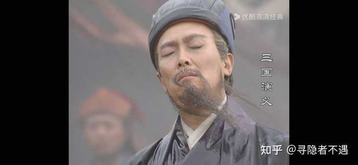
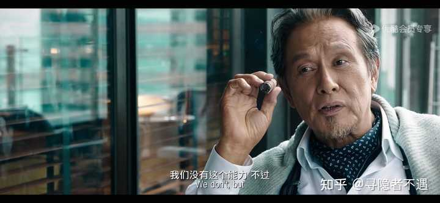
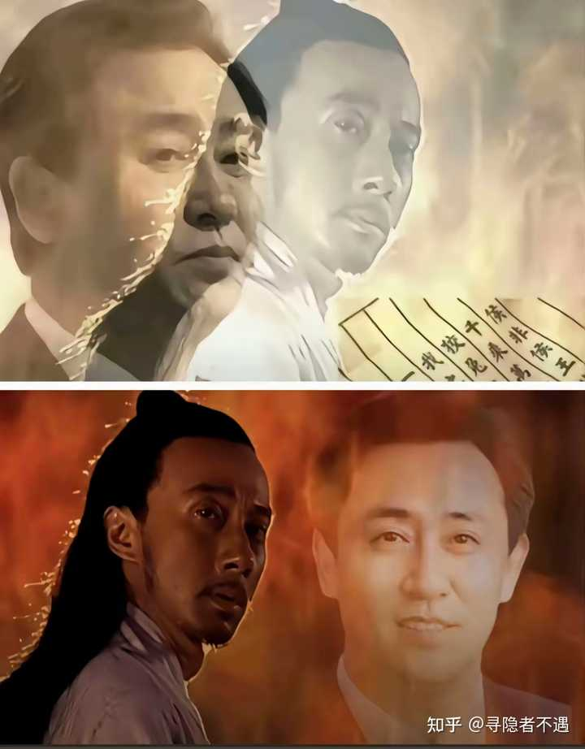

《大明王朝 1566》里，为什么要塑造沈一石这种「不卑不亢、才华与权谋兼备」的形象？ \- 寻隐者不遇 的回答

沈一石，一介商人。 在剧里不管是面对省一省二，还是织造局总管，表现都是不卑不亢。 面对两任杭州知府甚至气场还压他们一头，特别是对高瀚文。 唯独面对海瑞…

在整个小破站历史上弹幕量最高的视频是84版《三国演义》中诸葛亮病逝五丈原时的那一段——在落日余晖下，油尽灯枯的诸葛亮最后一次检阅部队，蜀国士卒们纷纷下跪大呼：“丞相，保重啊！”而此时这五个字也密密麻麻飘着屏幕上，代表了所有人对这位一心想要“匡扶汉室”却最终遗憾落幕的诸葛丞相那种由衷的敬意。

alt="Image">

而这一切要感谢《三国演义》的作者罗贯中，正是他的妙笔创作出了这样一个拥有鬼神之智却无力回天诸葛亮形象，将“意难平”三个字超越近两千年的鼓角争鸣与刀光剑影，深深刻入现代中国人的文化基因中。

因为所谓意难平其本质是对就那么差一点就成功却最终功亏一篑经历的悔恨。而你纵观整部《三国演义》，从关羽大意失荆州导致诸葛亮隆中对谋划的“待天下有变则命一上将将荆州之兵以向宛洛，将军身，将军身率益州之众出于秦川”两路出击的大策略成为泡影，到刘备一意孤行发动夷陵之战导致整个蜀国折损了几乎所有精锐士卒跟中生代将领，到几次北伐不是马谡刚愎自用不在当道下寨就是李严后方谎称军粮不继被迫撤退，再到上方谷机关算尽结果一场大雨救了司马懿父子，直到自己被耗的油尽灯枯想用“祈禳之术”续命，结果被魏延冒失闯进来破坏，诸葛亮离最终理想永远就差那么一点点。最终只能如同杜甫《蜀相》中悲叹的那样：“出师未捷身先死，长使英雄泪满襟。”

alt="Image">

笔者少年时读《三国演义》，每每读到诸葛亮病逝这段后便不愿再读，仿佛三国那段历史从失去诸葛亮那一刻起就瞬间黯然失色，整部书也只剩了三家归晋的机械流程。而等到笔者年长一些，读了更多的王朝兴衰更替的史书后，再回头看诸葛亮，那份意难平也就释然了，无他，只因他本就是逆时代而行，所以他的失败其实就是必然的。

因为我们翻翻历史就能知道，虽然从领土面积上看，东吴（145万平方公里）与蜀汉（106万平方公里）勉强与曹魏（291万平方公里）能够打成平手，但只要你细细研究就会发现，东汉整个十三州曹魏一家就独占了九州，蜀汉与东吴的很多地方要么人口稀少，要么属于化外蛮荒地区，不仅难以实现实际统治，甚至要派遣士兵加以防范。并且在东晋“衣冠南渡”前，黄河流域是中国绝对的政治经济中心，这就导致蜀汉与东吴在经济发达程度与人才储备上跟曹魏就不是一个数量级的。而农耕文明时代的战争，经济就意味着更多的粮草补给跟军备保障，人口则意味着更大规模的动员跟军事人员数量。

这也是为什么同样经历惨痛失败，曹魏虽然输了赤壁之战但在三国后期依旧有源源不断的兵源补充以及层出不穷的高级将领，而蜀汉经历夷陵之战惨败后再想北伐时就陷入了常备军数量不足人才断档，导致“蜀中无大将，廖化作先锋”的无奈窘境。所以从双方实力对比的角度来看，诸葛亮在军事上的失败几乎是不可避免的，他能够打成那样已经无愧于杰出军事家的头衔了。

而更重要的是，古代中国政治制度的变迁衍生出的一个新的阶层已经在此时登上了历史舞台，那就是“世家大族”。从先秦分封制的瓦解到秦汉郡县制的建立，一个现实问题摆在统治者面前，那就是如何选拔跟任用官员。

历史的教训告诉他们，“任亲”是极度危险的，因为皇帝的叔伯兄弟无论你用“嫡庶”如何进行区分，他们本质上也有着与皇帝相同的法理继承权，哪怕他们本人足够忠心也无法保证他们的后代不会有异心而重演春秋战国诸侯争霸的局面，甚至刘邦同志亲自主持操刀的“刘姓血亲分封”连一代人都没撑住就整出了个“七国之乱”。

于是在生产力极度落后，交通极度不便的既定事实下，为了继续维持一个庞大疆域的中央集权，统治者不得不从“任亲”退而求其次变为“任贤”。但问题在于，全国那么多郡县，朝廷那么多官员，皇帝又不可能真的“圣明”到一眼看穿“忠奸贤愚”，那么如何进行人才的甄别筛选呢？最简单的方式当然是由中央统一选拔筛选考核后派往地方。

但这又涉及到另外一个严重问题，那就是“中央”其实是一个很抽象的概念，皇帝虽然高高在上看似主宰一切却只是一个孤家寡人，他的身前是由一个个“功臣勋贵”组成的利益集团集合。而一旦让这些位高权重之人掌握了“人事推荐权”，时间一长就会变成了“老子英雄儿好汉”的高层权力世袭，这自然就会造成对皇权极大的威胁。

alt="Image">

alt="Image">

为了防止这种“高层权力系统世袭”导致可能出现的大权旁落。皇帝便开始将选官的推荐权下放到地方，中央只保留制定人才标准以及最终考核的权力，甚至定下了“自今郡国率二十万口，岁举孝廉一人”这种具体的执行方式，让推荐名单根据人口数量均匀分散到全国各地，这等于变相削弱了“功臣勋贵”对官员任用的控制力，这就是所谓的“察举制”。

但正如我之前文章中提到的，任何看似完美的政治制度在运行几百年后都不可避免的出现系统性崩坏，察举制自然也不例外。因为这个制度在经历了四百年的岁月变迁后，地方上早已经不是当初那盘松散的细沙了，“他们”已经通过几十代不断累加的权力、财富、联姻等方式形成了一个又一个的世家大族，中央虽然仍有对地方推荐上去的人有着最终的考核权，但正如电影《寒战2》中反派boss蔡Sir面对李文斌质疑他们没有能力委任警务处长时所说：__“我们确实没有这个能力，但我们有提供人才的能力，如果排队上位的都是自己人，委任谁，又有什么分别？”__

alt="Image">

alt="Image">

alt="Image">

alt="Image">

alt="Image">

alt="Image">

换而言之，当世家大族已经垄断了各地的人才推荐权，那么推荐上去的所谓“孝廉”也就基本都是世家大族出身的子弟。到了这一步，无论中央再如何严格地进行考核筛选，也不过是在世家大族子弟中选择相对更优秀的那一部分而已。更何况到了东汉末年，世家大族早已从地方走向中央，那些帝国高级官员们自己都是出身世家大族，于情于理他们能忍住不伸手拉自己同宗同源的亲人们一把吗？

所以在我看来，三国时代看似群雄逐鹿，其实细究其背后不过是世家大族们的代理人战争。比如“四世三公”（实际上是四世五公）的“汝南袁氏”，代表人物是袁绍与袁术。同样“四世三公”的“弘农杨氏”，代表人物是那个被曹操杀掉的杨修。比如为曹魏立下汗马功劳的“颍川荀氏”，代表人物是荀彧与荀攸。比如“吴郡四姓”的顾、陆、朱、张四大家族，出过陆逊、陆抗、顾雍、朱桓、张温等东吴集团的核心文臣武将。

甚至诸葛亮自己就出身琅琊诸葛氏，他的二姐嫁给了“襄阳庞氏”的核心人物庞德公的独子庞山民，这位仁兄还有个更著名的堂弟，那就是《三国演义》中反复渲染的“卧龙凤雏”中的那个“凤雏”庞统。并且诸葛亮娶了荆州名士黄承彦独女，而这位黄承彦的妻子还有一个妹妹跟一个弟弟，这个妹妹嫁给了当时的荆州牧刘表，弟弟则是《三国演义》中因“蒋干盗书”而被曹操猜忌杀掉的那个水军都督蔡瑁。

所以当历史的车轮已经来到了“世家大族”的时代，诸葛亮北伐成功与否的结果其实已经不重要了。因为哪怕他真的创造奇迹，完成了“兴复汉室，还于旧都”的伟业，从大历史的角度看也是无法影响历史的走向的。

道理很简单，如果统一后的蜀汉政权选择与世家大族合作，那么符合世家大族切身利益的“九品中正制”就一定会被摆上台面，哪怕没有陈群也会有张群马群刘群提出同样的建议，权力进一步被垄断的结果就是司马懿这种兼具家族背景、个人能力跟夺权野心的权臣出现就是不避免的，通过阴谋亦或阳谋改朝换代让世家大族从幕后走向台前就成了历史的必然。

相反，如果蜀汉选择不与世家大族合作，他们能够选择团结拉拢与世家大族抗衡的无非就是刘姓皇族宗室而已，而加强宗族权力的后果就又不可避免的走上了“强枝弱干”的老路。这时只要出现类似主少国疑的“黑天鹅事件”，西晋的“八王之乱”就一定会重现。而一旦中原汉族王朝内部出现动乱，从汉武帝北伐匈奴后四百余年不断汉化、内迁的匈奴、鲜卑、羯、氐、羌这些少数民族仍会趁机起事，“五胡乱华”乃至其后影响中国几百年的“民族杀戮与民族融合”也就会是历史的必然。

而正如诸葛亮再神机妙算也无法挣脱既往历史为他布下的沉重囚笼，剧中的沈一石也是一样——他个人有再厉害的权谋手段跟再缜密的逻辑推演也无法逃脱最终身死业消的悲惨命运，因为他代表的其实是__商业资本在封建帝制时代永远无法超脱的困局。__

alt="Image">

首先沈一石的来历就很迷，在他死后，郑泌昌何茂才要把他的资产转卖给徽商时杨金水说的很清楚，沈一石的资产不是织造局的，但在嘉靖给赵贞吉的圣旨中却写道：__“沈一石何许人？二十年前织造局当差一书吏耳，何以将织造局之作坊桑田尽归于此人名下？且任其将该司之丝绸行贿于浙江各司衙门达百万匹之巨！”__

这其实就很自相矛盾了，因为杨金水说沈一石的资产是他自己的，而嘉靖的圣旨的意思却是沈一石不知道用了什么手段把原属江南织造局的资产挂到了他自己的名下。但问题来了，一个二十年前江南织造局的小小书办真的有这么大能量吗？就算他真的有这样的狼子野心，但江南织造局的资产本就是嘉靖个人的私产，四任巡抚五任织造有几个脑袋敢对嘉靖私产被转移的事不闻不问？假使他们都冒着九族消消乐的风险不报，真到东窗事发那一天，以嘉靖“朕的钱”中表现的“大度量”，能饶的了他们？但剧中在整个浙江贪墨案审理中，嘉靖从未追究这笔“巨额国有资产流失事件”中的任何一个责任人。所以其实真相是昭然若揭的——有人授意沈一石接管了江南织造局的资产，这个人不是别人，正是嘉靖本人。而他的目的则是建立防火墙，堵住朝廷的悠悠众口。

alt="Image">

而之所以要绕这么大个圈子，又不得不提到笔者之前文章中说过的“外儒内法”，即中国古代为了应对领地内大规模自然灾害以及北方游牧民族的侵害不得已早早施行全国范围内的郡县制，但法家“断手断脚”的严苛峻法又太过残酷影响统治，于是披着儒家温情外衣，表面用儒家“仁义礼智信”，实际依旧是法家那一套的“外儒内法”诞生了。__而这种表里不一不仅仅是体现在政治制度上，更体现在君王臣民们的行事逻辑上。再说明白些，整个国家从君王到百姓都在表演，有的在表演贤君圣主，有的在表演忠臣良将，有的在表演孝子贤孙，嘴上都是主义，而心里全是生意。__

这就导致皇帝哪怕再私欲横行，每天锦衣玉食奢华无度却还要假惺惺的在公开场合念叨百姓疾苦，说要敬天爱民，官员们则是哪怕再贪墨敛财，每天对治下百姓敲骨吸髓却还要假惺惺的说着要勤政爱民，要不负皇恩，普通百姓们则是白天孔孟之乡，晚上男盗女娼，父母在时一脸嫌弃动辄打骂，而一旦父母去世时却要表演孝顺，哭的震天动地给旁人表演孝子贤孙。

所以沈一石就是这样一个制度下的畸形产物，嘉靖要盖大房子，要茅台洗脚松木泡脚，要“大撒币”一口气就赏给李妃家十万匹丝绸，他需要有人帮他敛财，但这一切必须维持住表面上的仁义道德，而作为管理宫中采买的江南织造局是绝对不能涉及与民争利的丝绸业务的，于是嘉靖将江南织造局的资产转到沈一石名下，把那些上不了台面，拿不出手的贱价买田、半价收丝的事都丢给沈一石来做，嘉靖就不仅能获得丝绸贸易带来的巨额财富，还能在道德上占据制高点，一旦东窗事发就快速切割，一句我不知道这事谁干的就完美搪塞过去。

所以沈一石是一个正常的商人吗？他经营的丝绸生意是一个正常的商业产物吗？答案当然是否定的，他不过是皇权统治下的一个畸形附庸，他能够做到首富是因为他的丝绸产品力过硬还是因为他的养蝉烧丝技术遥遥领先？又或者他在《永乐大典》里偷学了什么光刻机技术？通通不是，__他的成功本质是利用金钱与行政官员交换特权地位，将浙江的丝绸贸易从原则上所有人都能做变成实际上只有他能做的区域垄断，再利用半价收丝以及低价买田产生的成本优势获取超额利润。__

但他的利润却不是自己的，在他的绝笔信中写的很清楚，嘉靖拿走了50％，严党拿走25％，还不算随时需要打发“大鬼小鬼”的各种“孝敬”，这导致他并没有多余资金进行技术革新与升级，只能通过不断扩大规模来勉强保证企业运转，终于在“改稻为桑”这个各方势力角力，掺杂了太多政治因素的经济改革中败下阵来，迎来了自己的末日。

而正如诸葛亮的北伐成功与否都不会影响后面的历史，其实沈一石哪怕在“改稻为桑”中侥幸胜出也终究免不了同样的结局。道理很简单，从近处看，嘉靖只有五年的寿命了，等到裕王继位，新的太阳升起意味着权力的重新洗牌，一朝天子一朝臣，一定会有新人取代沈一石的地位，沈一石这个旧浪就会被直接拍死在沙滩上，更别提浙江贪墨案的审理，海瑞一开始就翻出了“沈一石家产被转卖徽商”、以及“毁堤淹田”的案子，我们可以想象，如果沈一石还在，他是无论如何也逃不了干系的，如果连他的“保护伞”杨金水都不得不装疯才能勉强逃过一劫，他作为一介布衣商人，不过是大明这个丛林法则金字塔中最低等的肉食者跟避开悠悠众口的防火墙，他又能如何保全自己呢？

而如果看的更远，沈一石最终也是难逃厄运，__因为他的成功本质上是以普通百姓的悲惨遭遇为代价的。__这不仅是一个道德问题，而是一个商业模式是否能够持续的问题。正如沈一石自己所说“卖油的娘子水梳头”中蕴含的经济规律一样，__沈一石越富代表了底层百姓越穷，底层百姓越穷则根本无力消费沈一石产出的丝绸，内需不振，出口就成了唯一的救命稻草。__

此外，但正如我前面所说，沈一石需要以金钱换取行政特权，这导致了他除了压榨百姓利益来降低成本，他的产品并没有其他的核心竞争力，一旦外部环境发生变化，比如东南战事堵塞对外贸易出口，又或者海外通过更先进的养蝉烧丝方式乃至于机器设备的技术革新，导致海外同类竞品大幅度降低成本的同时增加大量新的花样图案，沈一石的丝绸顷刻间就会出现产品滞销导致崩盘。近代国外商品进入后直接摧毁中国的小农经济的史实就会在沈一石的身上复刻重现。

因为本质上沈一石与现代商业是背道而驰的，现代商业是在市场上通过“尸山血海”的残酷竞争中获得领先地位，而非通过单一行政指令导致的区域竞争优势，前者能够在竞争中大幅度降低产品成本，让更多人用得起形成正向循环，而后者则是只能通过压榨人力以及物料成本来实现所谓的竞争优势，并且行政垄断往往伴随着大面积腐败，导致企业没有任何竞争对手的前提下年年亏空。

alt="Image">

所以到了这里对于沈一石笔者还有最后一个问题，__那就是他究竟是愿意在海瑞这种清官还是在郑泌昌何茂才这种贪官手下做生意呢？__可能在很多人看来，沈一石的发家靠的就是官商勾结鱼肉百姓，海瑞挡在淳安让他低价买田的事彻底崩盘，他当然是愿意跟着郑泌昌何茂才这类人了。

但在我看来，这种回答说明你对商业一无所知。因为商业你要面对的不是春天播种秋天就能收获的必然，而是你可能挣一个亿也可能倒亏一个亿的高风险与高收益的两者并存。正因如此，__商业最需要的就是一个真正用法律保护所有人切身利益的政治清明的大环境。__就像剧中海瑞肯定不会支持沈一石半价收丝鱼肉百姓，但也不会允许他的下属以帮助收丝的名义向沈一石吃拿卡要，沈一石可能在海瑞治下无法享受赋税减免，他必须按照大明律法一分一厘的给国库缴税，但也绝对不会出现没有任何理由就将收入的四分之一全部上交供各级官员挥霍。

这可能也是为什么最终沈一石选择了将所有粮食赈济给淳安建德的灾民，除了他被海瑞逼迫不得已的因素，在我看来，他也是对这位“海青天”由衷的敬佩与折服，正如他绝笔中透露出的那种无比清醒的绝望：“__我大明拥有四海，倘使朝廷节用以爱人，使民以时，各级官员清廉自守，何至于今日之国库亏空。上下挥霍无度，便掠之于民；民变在即，便掠之于商。沈某今日之结局，皆意料中事；沈某先行一步，俟诸公锒铛于九泉，此日不远。”__

人之初终究是性本善的，如果真有再来一次的机会，沈一石能够在海瑞这样的官员手下做生意，他又何尝不想像他的偶像嵇康一样做一个才华横溢、清冷孤傲却刚正不阿的正人君子呢？

alt="Image">

__The end__
