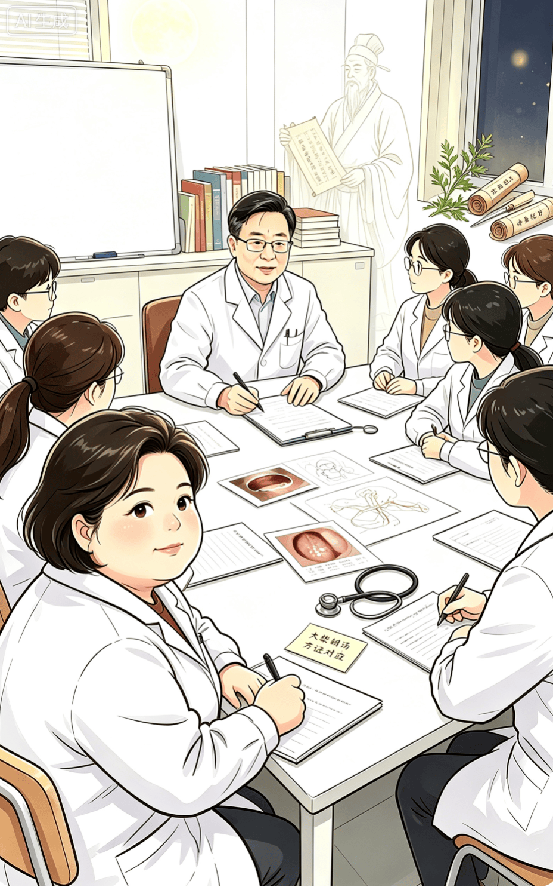
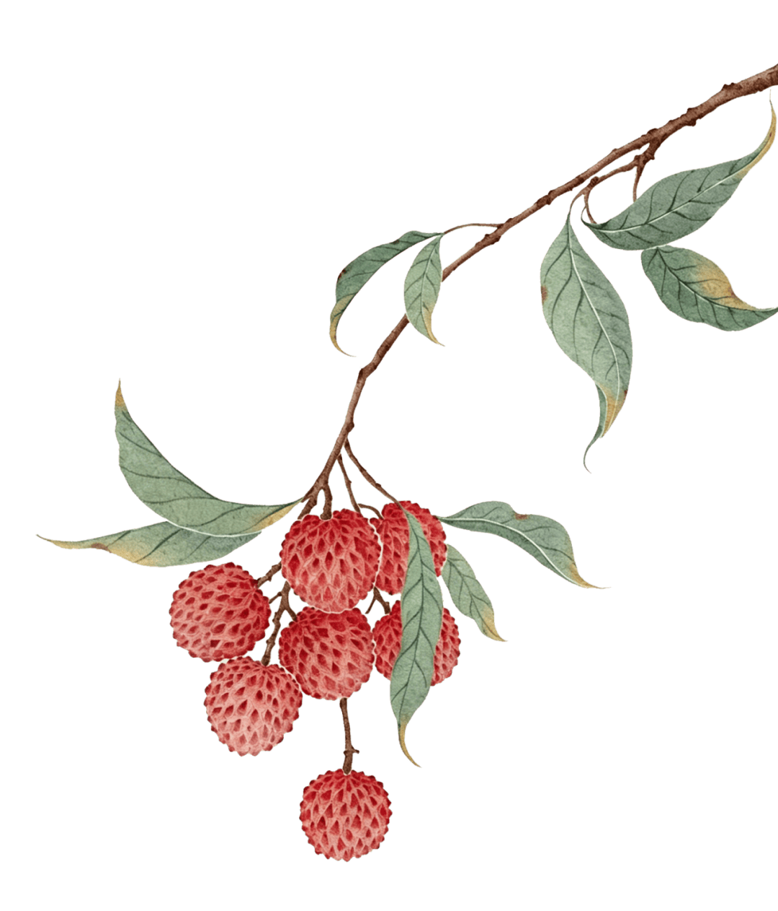

《学员跟诊日记》——今月曾经照古人，古方可以治今病 ——黄煌教授大柴胡汤异病同治医案举偶

公众号名称：经方医学工作室

作者名称：刘新宇

发布时间：2026\-09\-1012:42

我来自医圣张仲景的故乡南阳，是一名南阳市中心医院的临床医生。根植仲景故里，深耕临床一线，我始终对千年经方心怀敬畏与探索之心。

2026年7月，我远赴南京，跟随当代著名的经方大咖黄煌教授进修学习。此行我满载临床困惑与求索之心，始终怀揣一个萦绕已久的疑问：一千八百年前的仲景古方，是否依旧能够精准施治、化解当代人的诸多疾患？

回望东汉末年，战乱频发、民不聊生，百姓多受饥寒、瘟疫、劳损之苦，疾病多以虚证、寒证、外感急症为主；而如今时代更迭，人们生活富足，饮食丰裕甚至营养过剩，久坐少动、情志失调成为常态，高血压、高血脂、脂肪肝、代谢综合征等各类“富贵病”高发频发。同时，相较于东汉时期，现代人均寿命大幅提升，临床患者大多合并多种基础疾病，病情错综复杂、虚实夹杂。

反观仲景经方，大多配伍简练、药味精少、法度严谨。这让我不禁深思，如此古朴精简的古方，能否适配当代复杂多变的体质与病情，能否应对现代临床纷繁复杂的疑难病症？今月曾经照古人，古方究竟可否根治今病？带着这份初心与疑惑，我潜心跟随黄煌教授研习经方、复盘医案、参悟方证，在古今医学的交融碰撞中，探寻经方传世不衰、历久弥新的核心真谛。

很快，我见识到了黄煌教授的门诊诊治流程，不同与大多中医的三个指头加一个枕头，而是每个患者必做腹诊，都观察咽喉，强调“腹诊辨虚实，粘膜的颜色辨寒热”。也给患者做诊脉，也看患者的检查单和化验单，更详细了解患者目前正在使用的西药，是真正意义的中西医协同。最重要的是治疗很多西医治疗效果不理想的疾病。他经常鼓励那些辗转多地就医，面带愁容的患者，“让我们见招拆招，试试看”，这话让患者看到了希望，也让我看到了“医者仁心”和“用药如用兵”，针对不同的疾病和不同患者的体质，黄煌教授有很多的“秘密武器”，其中大柴胡汤是使用频率较高的经方之一，以下是几个大柴胡汤异病同治的门诊医案：

· 案例一 ·

CASE 01

## 1\. 某女，22岁

主诉：心脏早搏一年余

现病史：一年前体检时发现心脏早搏，室性早搏和窦性早搏均有，当时学业压力大，月经延后，食欲不好，进食后胃胀，反酸，时有偏头痛。晨起口苦，口臭，焦虑，睡眠差，多梦，大便略干。

舌苔厚，脐跳明显。咽喉红，扁桃体Ⅱ°肿大。

处方：大柴胡汤

柴胡20g 黄芩15g 姜半夏15g 枳壳30g 白芍15g 制大黄5g 干姜5g 红枣20g

· 案例二 ·

CASE 02

## 2\. 某女，59岁

主诉：左侧锁骨淋巴结疼痛及全身疼痛2年

现病史：全身疼痛，右手臂无力，自行口服止疼

药物控制，2026年4月29日胸腹部CT：胸腔及腹膜厚多发肿大淋巴结，淋巴瘤待排除，左锁骨上肿大淋巴结\(11mm\)，现胸闷气短，有时想要流泪，食欲佳，饭后胃胀反酸，失眠，夜醒2\-3次。大便偏干，粘马桶。

绝经10年。

既往史：近查轻度腔隙性脑梗塞；慢性胃炎；颈椎病；高血压；桥本甲状腺炎。

家族史：父亲肺癌去世，母亲肠癌去世。

咽喉暗红，面部潮红，腹部硕大，充实，脉弦滑。

处方：大柴胡汤

柴胡20g黄芩15g 姜半夏15g 枳壳30g 白芍15g 制大黄5g 干姜5g 红枣20g

· 案例三·

CASE 03

## 3\. 某男，50岁

主诉：湿疹4年

现病史：皮肤瘙痒4年，后背及双下肢经常发湿

疹，多处就医，每日需3\-7次外涂止痒药膏，夜间瘙痒明显，影响睡眠，夜醒，入眠困难，1\-2小时才能入睡，食用油腻、烧烤等会出现右侧腹痛，情绪急躁易怒，大便正常。

既往史：胆结石8年，2\.0X1\.1cm。

皮肤可见多处抓痕，皮损，腹部充实。

处方：大柴胡汤

柴胡20g黄芩15g 姜半夏15g 枳壳30g 白芍15g 制大黄5g 干姜5g 红枣20g

· 案例四 ·

CASE 04

## 4\. 某男，49岁

主诉：肝癌术后

现病史：2026\-05因“大便变细”发现肝占位，

MR：肝右叶前上段42\*31mm，06\-08行肝部分切除术病理示：肝细胞腺瘤，现在症：术前口干、口苦明显，术后口干苦症状不明显，易出汗，入睡难，矢气，大便正常，食欲尚可。

既往史：糖尿病“达格列净、二甲双胍、瑞格列

净”控制血糖，现空腹血糖5mmol/L左右、高血压，口服“络和喜”降压、萎缩性胃炎、肺结节、酗酒史。

家族史：父：乙肝

实验室检查：2026\-06\-24 ALT：71，AST：50

体征：舌苔黄厚，边有齿痕，眼睑通红，腹直肌硬

处方：大柴胡汤

柴胡20g黄芩15g姜半夏15g枳壳30g白芍15g

制大黄5g干姜5g红枣20g

· 案例五·

CASE 05

## 5\. 某男，49岁

主诉：尿急，尿频，尿淋漓不净3年余

现病史：患者3年前无明显诱因出现尿急、尿频、

尿淋漓不净，西医诊断：前列腺增生，食欲差，进食后腹胀，嗳气，矢气，失眠多梦，小便黄，大便每天2\-4次，排便不畅，疲劳，以前怕凉，现在怕热，焦虑，性功能减退。

体壮，舌苔厚，上腹部充实。

处方：大柴胡汤加半夏厚朴汤

柴胡20g黄芩15g姜半夏15g枳壳30g白芍15g制大黄5g干姜5g红枣20g 茯苓30g 苏梗15g 厚朴15g

在《伤寒论》中大柴胡汤的条文有三条：第103条“太阳病，过经十余日，反二三下之，后四五日，柴胡证仍在者，先与小柴胡。呕不止，心下急，郁郁微烦者，为未解也，与大柴胡汤，下之则愈。”第136条：“伤寒十余日，热结在里，复往来寒热者，与大柴胡汤”。第165条“伤寒发热，汗出不解，心中痞硬，呕吐而下利者，大柴胡汤主之。”《金匮要略》描写大柴胡汤更简单明了“按之心下满痛者，此为实也，当下之，予大柴胡汤。”黄煌教授把大柴胡汤人形象地总结为“脸宽胸大肚儿凸，苔厚口臭易发怒\.\.\.\.\.\.”。大柴胡汤可以用来治疗以上腹部胀满疼痛为主要表现的消化道疾病如胰腺炎，胆石症，胃及十二指肠反流症等；以便秘腹痛为表现的疾病如肠梗阻等；以咳嗽、气喘、发热为表现的呼吸道疾病如肺部感染，支气管哮喘等；以头疼，头晕，便秘为主要表现的疾病如代谢综合征和高血压，脂肪肝等\.\.\.\.\.\.

## JINGFANG

“方—病—人”是黄煌教授标志性理论，简单来说，什么处方对应治疗何种疾病，且这种疾病的人应该有什么样的特征，我们在看病时不仅要看疾病，更要看这个患病的人，以上五个门诊患者，虽然病不同，但他们符合“大柴胡人”的特征。

大柴胡汤的门诊医案还有很多，我仅是沧海拾贝，遥想当年仲景先师，在那个没有专家共识和指南，也没有电灯的时代，独自整理前人和自己的经验，他很可能在月下思考，找寻治疗疾病的灵感。

月光无语，继续自己的阴晴圆缺，《伤寒论》在历经1800年后没有象其他国宝一样，静静躺在博物馆，那些经典的古方，经过千年的临床实践后依然呵护着人们的健康。“方若对症一口汤”，我明白，今月曾经照古人，古方可以治今病。我的经方之路，始于2026年的南京\.\.\.\.\.\.

河南省南阳市中心医院 刘新宇

2026\.9\.8

黄煌经方工作室

2026/09/10
