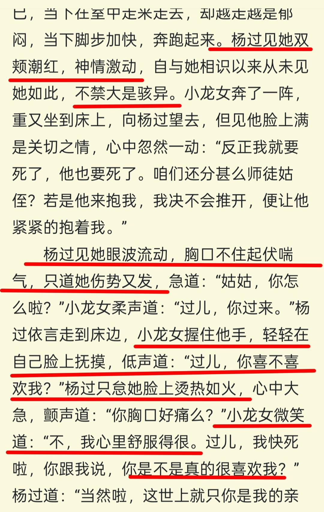

《神雕侠侣》看懂了玉女心经，你就看懂了林朝英。

1、玉女心经以全真教武功为基础，练全真武功就要知道全真口诀。所以古墓派想练玉女心经，就一定会去全真派拐一个全真弟子回来。

————杨过就是被孙婆婆和小龙女合伙拐骗进古墓的全真弟子。不是他，也会是别的全真弟子。孙婆婆是靠骗，而小龙女想的是严刑逼供。也就是说，小龙女就是拿全真弟子当炉鼎，没有爱。

2、玉女心经需要两人脱光衣服相对练习，互相照应。————林朝英创造这门武功的时候，心里想的是王重阳，满心都是男女情事。所以玉女心经都是亭亭如盖（裸男趴在裸女身上）、愿为铁甲（裸男趴在裸女身上，搂住裸女）之类的暧昧招式。

年轻男女脱光衣服相对，还要搂搂抱抱、肌肤相亲，这种限制级场面会发生什么？一定会擦枪走火、不可描述。————正好被古墓派女人采阳补阴。

3、玉女心经讲究的“阴进阳退”，也就是采阳补阴。————练玉女心经，受益者只有女方，女方能吸男方的内力辅助自己精进，而男方会被吸干。

4、玉女心经讲究“心意相通”，其实就是摄魂控制。两个独立的人，怎么才能达到“如同一人”的境界呢？————要求男方放弃自己的意识，接受女方摄魂。所以对敌的时候小龙女会反复要求杨过看她。杨过只要看她，就会被小龙女摄魂，这样就能“心意相通”啦。摄魂的最终结果就是男方成为被控制的行尸走肉、提线木偶。

5、玉女心经还有催情的副作用。

玉女心经是林朝英思念王重阳创造出来的，她对王重阳的情欲也变成了玉女心经的底层代码，练玉女心经的人都会被催情。

练了玉女心经之后，小龙女忍不住古墓跑圈，依然无法遏制奔涌的情欲，于是去诱惑只有16岁、已经被她的情欲吓呆了的杨过。小龙女眼波流转、胸口不住的起伏、娇喘吁吁，拉着杨过的手，强制他抚摸自己火热滚烫的脸…………咱就是说，这段，是不是在明写刘备文？

正是因为王重阳看出了玉女心经采阳补阴、摄魂、催情的本质，但他又无法破解玉女心经的摄魂术，才脸如死灰。

——————林朝英以全真武功为基础，创造玉女心经这门邪功，就没打算给王重阳留活路，也没打算给全真弟子留活路。林朝英贪婪的既想占有王重阳的人，想要他的内力、他的武功、他的精魄，还想要他放弃自己的独立人格，接受她的摄魂控制，彻底成为行尸走肉！

__综上所述，男人练玉女心经需要经历 : 绑架虐待\+裸女诱惑\+摄魂\+催情→被采阳补阴。__

练玉女心经的女人会吸男人的内力和精魄，周伯通武功那么高，喜欢小龙女之后，几乎被吸干，最后襄阳大战的时候武功水平已经退化到跟陆无双差不多了。南帝给周伯通把脉之后，不禁叹息摇头，就是因为发现周伯通的身体亏空已经很严重了。16岁的杨过那点内力和精魄够小龙女吸几回？？他但凡接受了小龙女的求欢，他就无法活着走出古墓。

杨过陪小龙女练玉女心经的后期，会忍不住要抱小龙女，想亲小龙女，就是被摄魂\+催情的表现。也就是说，因为杨过与小龙女的武力差距越来越大，无论杨过的意志多么坚定，在玉女心经的猛烈摧残之下，他都已经快坚持不住了。

幸好，他发现并学习了王重阳刻在石壁上的移魂大法。移魂大法就是王重阳给全真弟子留下的一条活路。杨过靠着移魂大法，终于夺回了身体控制权，所以杨过练过石壁上的武功后，极其敬佩王重阳。

林朝英创造出这么毒辣阴损的武功算计王重阳，也难怪王重阳宁可出家也不愿意娶林朝英为妻了。这也太可怕了。还没谈婚论嫁，林朝英就算计着把王重阳做成自己的炉鼎了！

从玉女心经这种邪门儿武功就能看出林朝英的性格，狠毒而且变态，控制欲极强。她要的根本不是爱侣，而是傀儡，是炉鼎，为了她自己容颜永驻，武功精进，她可以完全不顾王重阳的死活。她也知道王重阳不会乖乖就范，所以玉女心经用上了摄魂术，就是为了防止男方反抗。

整本神雕侠侣，杨过都在反抗————反抗小龙女的控制。小龙女作为杨过的师父，掌握着杨过的生死，只要师徒名分还在，那么就算小龙女杀了杨过，也理所当然。杨过反抗的是“君为臣纲，父为子纲”、“君要臣死，臣不得不死；父要子亡，子不得不亡”的封建礼教。凭什么师（小龙女）要徒（杨过）死，徒弟就不得不死？凭什么师父就能掌控徒弟的生死？？后来杨过在全真教与小龙女拜堂形婚，其实就是杨过在试图用夫权对抗师权。也就是用“夫为妻纲”对抗“父（师）为子（徒）纲”。

而小龙女的唯一目标就是控制杨过、睡他、吸干他，让他为自己而死。出了古墓以后，每次姑姑因为控制不了杨过而动了杀意，杨过就会赶紧做出一副含情脉脉的样子，对小龙女甜言蜜语 : 我们回去就洞房！他太明白姑姑想要什么了！所以这一招屡试不爽。当然，只要脱离了危险，杨过就装糊涂，要么睡着醒不了，要么拉着小龙女在花园坐一夜，要么通宵看信，要么没话找话聊一夜……

杨龙二人作出这么多妖，就是因为杨龙之间存在根本分歧 : 杨过想逃、不愿意做炉鼎，而小龙女想控制他。

如果杨过爱小龙女，那写两章就结束了 : 遇到小龙女、隐居古墓。杨过心甘情愿被小龙女吸干、早衰、死亡。然后小龙女继续蹲古墓拐骗其他全真弟子。杨过死的早，小龙女吃得饱。大家都有光明的未来。happy ending！
