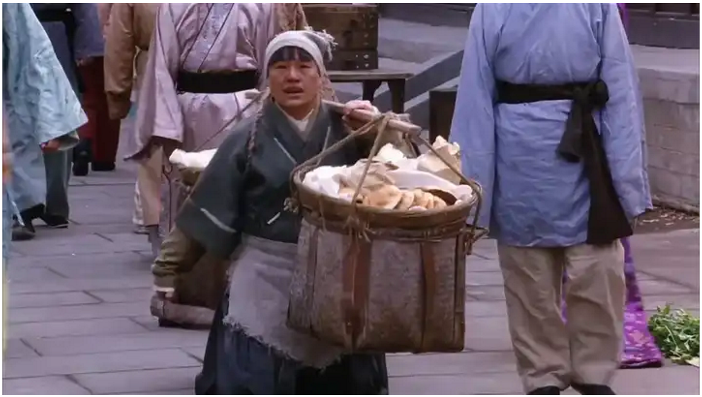
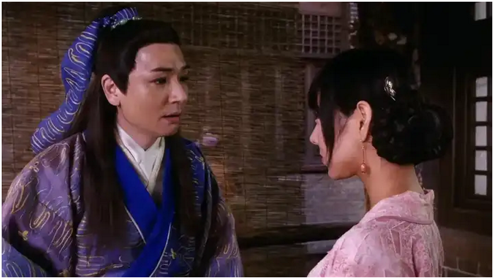
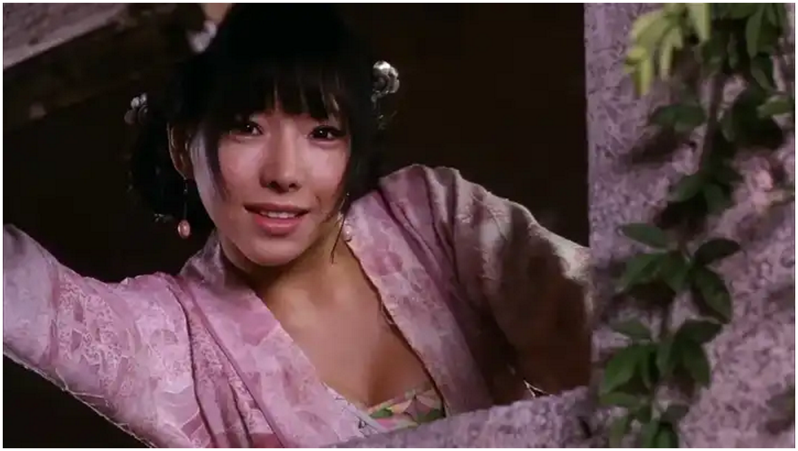

《金瓶梅》中有哪些细思恐极的情节？ \- 迦文 的回答

《红楼梦》、《水浒传》中细思恐极的细节，前人之述备矣，那《金瓶梅》呢？

__有些人你是盛不住的。__

如果一个女孩子非常漂亮，轻则你以后是个摆设，重则有性命危险。有些人本就不属于普通人。

这是网红律师郭延娇在直播间说的。

和郭律师连线的小伙子有个非常漂亮的女朋友，二人谈婚论嫁了，房子车子也都准备好了。但是，有个大佬一直花大价钱追求这个女生，两个人一直暧昧，没断了联系。

女生呢也因为各种事有点嫌弃小伙子，觉得小伙子能力不行、不但事之类的。

小伙子连线问说怎么调整自己心态，以及以后结婚了该怎么相处。

基于以上信息，郭律师要求小伙只认真听，不要去反驳，接着就说出了如上的观点。

潘金莲不是武大郎能盛住的，他是一定要死的。

冤枉，但也不冤枉。

__人真的要有自知之明，不要贪恋不属于自己的东西，人也好，财也罢。强行拥有，就是灾难一场。__

alt="Image">

[古典绝版，自行下载哈。](https://link.zhihu.com/?target=https%3A//pan.quark.cn/s/65be3f890b4d)

严格来说，武大郎不是一无是处的人，他脑子还算灵活。《金瓶梅》前几期就讲了，他会做烧饼，租了张大户的房子，会说好听的话哄人开心，和张大户家下人的关系很好。

好话传到张大户耳朵里，张大户被哄开心了，就免了他的房租。

搭上张大户，本本分分过日子，等着武松回来，衙门口也算有人，日子也不难过，在清河县总会有生存空间。

可他答应娶了潘金莲，这可是白得的漂亮媳妇，自己没花一分钱。

__你得到的东西都有代价__，武大郎的代价是被带绿帽子。

张大户本就和潘金莲有染，奈何家里老婆不同意，没招了只好把潘金莲打发出去，思来想去打发给武大郎，自己悄悄的再去幽会。

房子和媳妇都是张大户的，只不过是在自己这寄存一段时间，武大郎明白，所以一切装作不知道。

后来就是张大户去世，原来的地方呆不下去了，潘金莲自己出钱在别处典了房子。接着就是武松回来，春心荡漾的潘金莲看上了身强体壮、模样周正的武松。

武大郎能没感觉吗？他又不傻。可他又能如何？

再然后就是最为经典的相遇，潘金莲遇见了西门庆，很快就勾搭在了一起。每天武大郎上班之后，潘金莲和西门庆就在隔壁王婆家私会。

原著中说整个清河县都知道了，就是武大郎不知道。怎么可能不知道呢？他只是假装不知道。

因为日子总得过下去啊。还能离咋滴？

西门庆他是惹不起的，有钱有权长得又帅，潘驴邓小闲样样俱全。再看自己，自己有啥呢？

要不就离婚，和潘金莲分开，让潘金莲去找自己的幸福。可他舍不得放手这样的日子，老婆年轻貌美，手里还有点体己，能给自己买房子。

你看，人啊，就是这样，__见识过或是得到过非常棒的东西，人就很难再降低标准了。__

alt="Image">

武大郎如此，潘金莲也一样。

体验过了西门庆，怎么可能安心和武大郎过日子？

再接着就是卖梨子的郓哥和王婆撕逼干架，气急败坏的郓哥扬言谁都别好过，西门大官人可不是你王婆一个人的。

郓哥把这事给武大郎挑明了，开始激将法，让武大郎去捉奸。

事情到这个份上了，武大郎不去也得去了。

当场被踢的起不来，重病在床连亲女儿都不敢喂一口水吃，后又被潘金莲和王婆设计毒死。

武大郎必须是这样的结局。

总结一下武大郎的结局，这是整个系统的绞杀。

1、潘金莲想让他死，这样就名正言顺地跟着西门庆。

2、王婆也得让他死，死人不会说话，死人不会把自己牵连进来。

3、西门庆无所谓，死或者不死对他没有任何威胁。

4、郓哥真的是好心吗？不是的，他是为了自己的利益，为了自己出口气。

5、亲闺女迎儿，不敢给他喂一口水，这是为什么？

后妈潘金莲拿这个小姑娘当丫头使唤，使唤也就算了，还虐待殴打，这一点儿武大郎心知肚明，他亲口吐槽“朝打暮骂，不予饭吃”。

他知道，但是不管，也不维护自己自己的亲女儿。

把亲女儿吓得都有心理阴影了。

但凡，他这个亲爹合格一点，也不会死在别人手上。

我也只能说活该。

还有一点就是为什么武大郎能忍张大户，却忍不了西门庆？

第一、武大郎窝囊猥琐，但一点都不傻。

他知道三人行的关系里自己占了大便宜，潘金莲其实是张大户的私有财产，给自己当媳妇白睡，确切说白睡这辈子都睡不着的漂亮姑娘，还有钱拿。

第二、隐秘的优越感。

这个优越感源自于自己年轻的基因，虽然自己矮穷戳，牵着不走打着倒退，还穷。

但是，自己年轻啊，有体力啊，反正床上能折腾一会。

再怎么着比张大户一个老头子强吧。应该是吧，潘金莲床上顺口咧咧的吧。

张大户虽然有钱，可就是一个老头子啊，老头子在床上能折腾啥呢，是吧。

基因深处生出的隐秘优越感，让武大郎有股莫名其妙的自信，他觉得可以拥有潘金莲。

第三、西门庆打破了他的幻想。

西门庆之与武大郎，那是基因层面的降维打击。

他也明白，拿啥和西门庆比呢？

潘驴邓小闲，样样比不过。

如果自己只是没钱也就罢了，起码别的地方能找补一下，但是没法找补啊。自己作为一个男人，最后的一丝幻想坍塌了。

第四、其实他是假装不知道的，但是被别人一激，自尊心首先受不了。

第五、还有个隐秘的心理，那就是他觉得自己有了武松这个靠山。

那时候武松已经是武都头，负责治安管理的小头头。

各种复杂因素合力趋势，他想和西门庆斗一斗。

只是\.\.\.

alt="Image">

__《金瓶梅》是本奇书，不仅写权力是如何运作的。__

__更是写尽了人性的隐秘幽微，还有不虚的因果。__

__性欲望是最不值得一提的。__

\-\-\-\-\-\-\-\-\-\-\-\-\-分割线\-\-\-\-\-\-\-\-\-\-\-\-\-\-

以上，希望能帮到你，

我是 [@迦文](https://www.zhihu.com/people/e259a39ca13724db738d4be8d0802f62)，一个自媒体博主，咨询或是沟通情感问题可私信联系，

（骚扰的，性 聊的勿扰）

或去公众号找我，公众号：__迦文小姐姐。__
