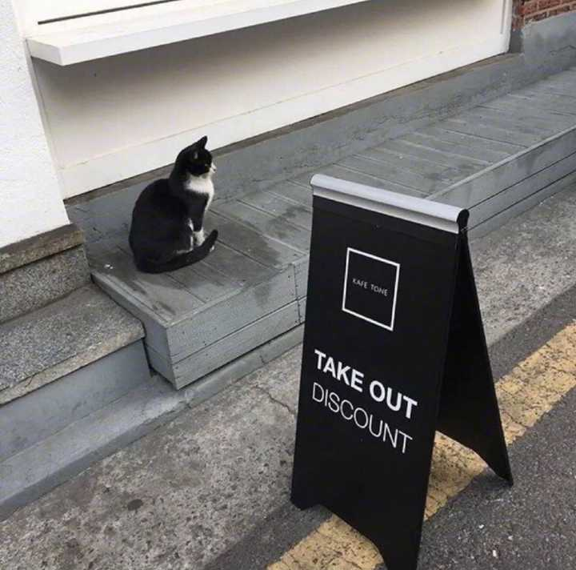
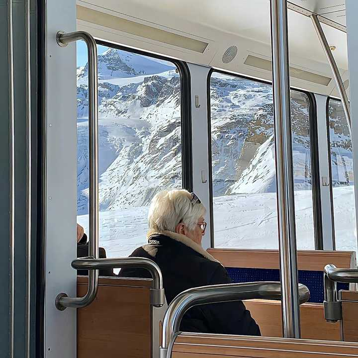
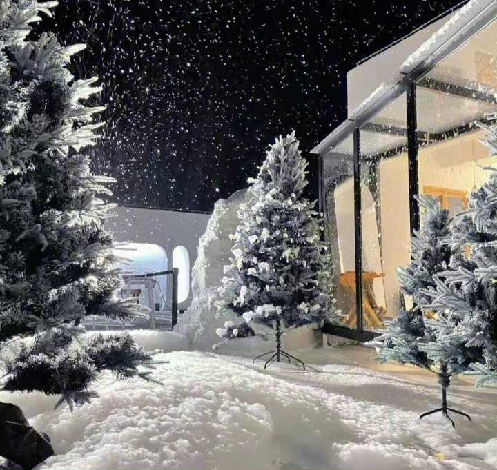

人在什么情况下才会大彻大悟？ \- 金九彩 的回答

1\.

曾经有个朋友在我刚上大学的时候，给我说过一番话，让我醍醐灌顶。他说：“不论你做什么事情，一定要尽力去做好，在努力做的过程中，你一定会学到一些东西，这样日积月累下来，你的人生就会发生质变。如果你只是简单应付了事，那么你将可能一无所获，反而让你做事的态度也会变得简单应付了事，而且关键还会浪费时间。你怎样对待生活，生活也会怎样对待你。”

2\.

无论是什么关系，提供不了情绪价值，给予不了经济支持，给不了正面陪伴，三点不占一样，舍弃才是明智之举。

3\.

活得累是因为心里装了多余的东西，跟吃饱了撑的是一个道理。

4\.

性是肉体生活，遵循快乐原则；爱情是精神生活，遵循理想原则；婚姻是社会生活，遵循现实原则。

是三个完全不同的东西。

——周国平《婚姻与爱情》。

5\.

如果别人说你两句，你就受不了，被两句话干扰得吃不好，睡不好你得有多脆弱，你要明白的，能干扰你的，往往是自己的太在意力，能伤害你的，往往是自己的想不开。

你若平和，无人能扰。所以不要过于敏感，内心要不断地强大，别被别人左右你的情绪。有心者，有所累，无心者，无所谓。做一个内心强大的人，走自己的路，让别人说去吧。

6\.

我年纪还轻、阅历不深的时候，我父亲教导过我一句话，我至今还念念不忘。“每逢你想要批评任何人的时候，”他对我说，“你就记住，这个世界上所有的人，并不是个个都有过你拥有的那些优越条件。”

——菲茨杰拉德《了不起的盖茨比》

7\.

人一旦堕落，哪怕是短暂的几年，上帝就会以最快的速度，收走你的天赋和力量。

8\.

忘掉“人脉”二字，社交的本质是价值互换，没本事、没资源跟人换，人脉就是个笑话。

❤️__如果我的回答触动到你，对你有所帮助的话，给我一个朴质单纯的双击三连吧，即使隔着屏幕的距离，我也能偷笑好几天__

alt="Image">

9\.

谁禁止你优秀，谁就是坏人，远离他们，他们没有品尝过美好人生的滋味，也不许你品尝。

10\.

吞噬你的，很多时候不是惊涛骇浪，相反是那些普通的日子，好像不用太努力，日子也能过，好像就这样，就可以了。然后，有一天，你爱的人离开你，父母病重你无能为力，因为阶层的变化和有些朋友再无交集。你，如梦初醒。

11\.

这世上，本就没有任何一句话，可以让你醍醐灌顶。真正让你醍醐灌顶的，只能是一段经历。而那句话，只是火药仓库内划燃的一根火柴。

12\.

懒惰是很奇怪的东西，它使你以为那是安逸，是休息，是福气；但实际上它所给你的是无聊，是倦怠，是消沉；它剥夺你对前途的希望，割断你和别人之间的友情，使你心胸日渐狭窄，对人生也越来越怀疑 。

——罗兰《忙碌与进取》

13\.

这些年我一直提醒自己一件事情，千万不要自己感动自己。大部分人看似的努力，不过是愚蠢导致的。什么熬夜看书到天亮，连续几天只睡几小时，多久没放假了，如果这些东西也值得夸耀，那么富士康流水线上任何一个人都比你努力多了。人难免天生有自怜的情绪，唯有时刻保持清醒，才能看清真正的价值在哪里。”

——于宙《我们这一代人的困惑》

14\.

如果你挣不到钱，如果你得了大病，就不要怪别人对你绝情。

15\.

你所赚的每一块钱，都是你前半生做对事情得到的赞赏；

你所花掉的每一块钱，都是你为你想要的世界投票；

你所亏掉的每一块钱，都是你为你认知的缺陷交学费。

16\.

远离那些嫌你穷、怕你富、恨你强、笑你弱、互相咬，心术不正的圈子。找一个积极向上的圈子回让自己进步更快，正所谓圈子决定论，你的圈子是什么样子，你可能就是什么样子。 [@金九彩](https://www.zhihu.com/people/9c061ed01701946304a462e73216f71a)

❤️ __如果你还不知道最感兴趣的是什么，建议直接以赚钱为目标，多赚点钱总是没错的。PS:有没有强烈认同的同学，双击文章赏个赞，让我看到你们的双手～__

alt="Image">

17\.

冷漠，可以省去80%的麻烦。

18\.

时间在不断筛选身边的人和事，当你什么都不在乎的时候，人生才刚刚开始。

19\.

要么努力到出类拔萃，要么就懒得乐知天命，最怕你见识打开了，可努力又跟不上， 骨子里清高至极，性格上软弱无比。

20\.

没有人会去帮助一个毫无价值的人，你必须好好经营自己，就算你跌入了谷底，也要有与人交换的筹码，这就是强者定律。

21\.

有钱可以解决大部分问题，剩下的问题需要更多的钱来解决。

22\.

最能让你变强的阶段，永远是那段生不如死的时光。那是你眼睁睁看着自己被撕碎，再亲手将自己重组的过程。若未与“苦难”刀枪相见，永远没法看到一束光。

23\.

如果你现在不觉得一年前自己是个蠢货，那说明这一年你没学到什么东西。

——莎士比亚

24\.

自律不是6点起床，7点准时学习，而是不管别人怎么说怎么看，你也会坚持去做，绝不打乱自己的节奏，是一种自我的恒心。

25\.

你怎么爱你自己，就是在教别人怎么爱你。

——露比•考尔

__今天九彩就分享这些了，谢谢你在这数万条回答里点开了我，一直陪我读到这里～你的点赞和收藏，让我码字更有动力了！嘻嘻～我很开心__

alt="Image">

图文均来自网络，侵删

hi，我是 [@金九彩](https://www.zhihu.com/people/9c061ed01701946304a462e73216f71a) ，喜欢读书和写作，关注我，期待我们一起成长～

以下是我近期的回答，希望你喜欢：
