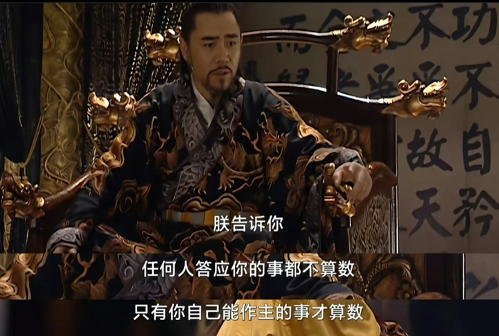

你在职场悟出了哪些道理？ \- 周行长 的回答

看2遍《大明王朝1566》，你就全明白了。

它表面上是历史剧，其实是一本中国特色职场教科书，而且是禁书那种。

剧里有太多值得细品的职场金句了。

下面分享几个经典的吧。

__1、领导用人不分好坏，只分好用不好用。__

嘉靖在剧里说了一段名言：

“长江水清，黄河水浊，但都能灌溉两岸，不能因为水清就偏用，也不能因为水浊就偏废。”

翻译成职场大白话就是：

__好人我用，坏人我也用。__

你以为他不知道严嵩贪？他当然知道。

但严嵩能给他搞钱，能背锅，能在前面挡枪。

这种人就像黄河，浊，但有用。

你以为领导不知道海瑞直？他也知道。

留下海瑞能给他立牌坊，能替他在史书上留个好名声。

这种人就像长江，清，也有用。

职场也是一个道理。

别再天真地问为啥人品差的人升得比你快了（知乎真太多这种问题了）。

__在领导眼里，没有好坏，只有好用不好用。__

你把自己定位成好人的那一刻，就已经输了。

__2、别等出事了才想起找后路。__

吕芳教冯保的那段话，又是一段经典：

“做官要三思，思危、思退、思变。

知道了危险就能躲开危险，这叫思危；

躲到人家都不注意你的地方，这叫思退；

退下来就有机会慢慢看、慢慢想，自己以前哪儿错了，往后该怎么做，这叫思变。”

吕芳是什么人？

司礼监掌印太监，嘉靖身边最信任的人，堪称二号首长级人物。

但他比谁都清醒，嘉靖一旦驾崩，新皇登基，第一个收拾的就是他。

所以他提前安排冯保去裕王身边当眼线，给自己留后路，关键时刻主动求退，保全性命。

职场其实也是这样。

__风光的时候，你就得想清楚，万一哪天不风光了，往哪儿退？__

别等到被优化那天才问“为什么是我”。

真正的聪明人，都是边走边看路的，早就在给自己铺后路了。

大白话：AI来了，你有想过自己的后路么？

__3、你的位置，决定你能说什么。__

胡宗宪是整个剧里我最佩服的人。

毁堤淹田的事发了，他知道是严党干的。

也知道查下去会牵连多少人，更知道嘉靖现在不想倒严。

所以他怎么做？

查，但查到一定程度就停；

报，但报得恰到好处。

书呆子谭纶劝他揭发，他说了一句经典：

“同样的话，有人能说，有人不能说，这件事，你上疏不公也为公，我上疏无私也有私。”

这就是职场里最大的真相：

__你的位置，决定了你能说什么。__

千万别以为你有理你就直说。

理是理，位置是位置，你不在那个位置上，说出来就是冒犯，就是找死。

胡宗宪的高明在于：

他听懂了老板的真正需求——嘉靖要的是银子，不是真相。

所以他该扛的扛，该瞒的瞒，该擦屁股的擦。

这才是真正的职业打工人：

__知道老板要什么，再用老板想要的方式给他。__

__4、背黑锅是中间层的宿命。__

这一条有点厚黑，大家谨慎参考吧。

杨金水有一句经典：

“有些事不上秤没有四两重，上了秤一千斤也打不住。”

他是浙江织造局的头儿，负责给宫里搞钱。

上面接的是吕芳，下面接的是沈一石，说白了，就是个中间层（白手套）。

中间层的宿命是什么？

__好处过手，黑锅背定。__

改稻为桑搞砸了，总要有人顶罪。

杨金水选择了装疯。

他疯得不早不晚，疯得恰到好处。

把所有脏水都挡在自己这儿，绝不往宫里引。

因为他知道，只要不牵扯嘉靖和吕芳，自己还有活路，一旦牵扯上去，必死无疑。

这就是职场中间层的厚黑生存法则：

__好处可以拿，但不能拿得扎眼；__

__事情可以做，但不能做得越界；__

__黑锅可以背，但要背得让领导念你的好。__

千万别做那种人，好处全占，黑锅全甩，这种人一次两次行，三次必死。

__5、别把领导的随口一说当真。__

马宁远这个角色，出场早，死得快。

他的问题是什么？

太想表现了。

“改稻为桑”是国策，他就真敢炸堤淹田，还瞒着胡宗宪，以为这是在替领导分忧。

结果胡宗宪被他坑得要死，最后他自己也被砍了头。

这种人在职场里太多了：

__领导随口一说，他当成圣旨；领导画个饼，他当真的了。__

醒醒吧，领导说的很多话，只是说说而已。

胡宗宪骂马宁远的那句话，就是一句经典：

“孔子说的知不可而为之，是告诉世人做事时不问可不可能，但问应不应该。”

翻译到职场来就是：

__任何事你应该先问这事儿该不该做？__

__做了谁背锅？出了事领导认不认？__

而不是傻乎乎地冲上去：领导放心，交给我！

你冲得越前，只会死得越快。

最后，《大明王朝1566》里还有一幕经典：

嘉靖对孙子朱翊钧说了一句话：

“任何人答应你的事都不算数，只有你自己能做主的事才算数。”

我认为这是对所有打工人的一句忠告：

__别信画饼，别看承诺，别指望谁会拉你一把。__

__你的安全感，只能长在自己身上。__

————— 分割线 —————

我的公Z号：__周行的职场笔记__

一个专注讲职场、讲领导的号。

你将读到更多精选的职场大招、领导心机、人情世故的文章 ……

更多文章推荐：

alt="Image">
