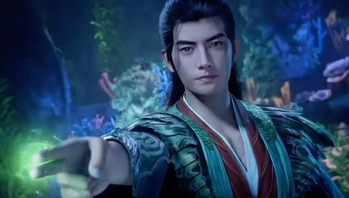
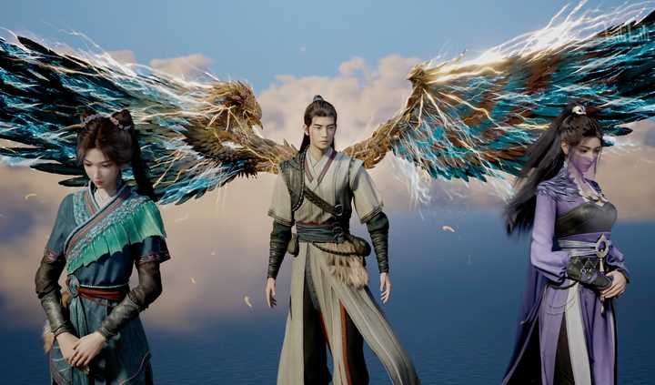

凡人修仙传中大事件的时间顺序是怎样的？ \- airplay 的回答

像是封印螟虫之母，魔界入侵人界等等这样的大事件。

10岁：韩立离家加入七玄门，拜墨大夫为师，修炼长春功，捡到撑天瓶。

14岁：发现了撑天瓶催生灵植的秘密，调制丹药，结交厉飞雨。

16岁：学会罗烟步和眨眼剑法，夺舍中战胜墨大夫，得曲魂。

18岁：韩立灭杀金光上人得升仙令，嘉元城结识墨家三女，得暖阳宝玉解毒。

参加太南小会，用升仙令加入黄枫谷。

21岁：杀陆师兄，救陈巧倩，夺得两枚筑基丹，参加血色禁地试炼，和南宫婉春风一度，拜李化元为师。

alt="Image">

### 筑基期

25岁：筑基成功，从师傅李化元那里得到全套十三层青元剑诀及法宝青竹蜂云剑炼制之法，灭杀奸细得大衍决，从雷万鹤手中换得丹方，开始炼制灵丹。

29岁：和董萱儿一起参加了燕翎堡夺宝大会，与王蝉结仇。炼大衍决，炼制傀儡。矿下隧道混战夺得血玉蜘蛛卵、残破古传送阵、大挪移令。

31岁：进入筑基中期。击杀同阶魔道名声大起，请齐云霄辛如音修复古传送阵，在越京得到弄焰决、敛息术。灭黑煞教，得到虚天残图和血凝五行丹。

被当作弃子脱离黄枫谷。获辛如音赠物及古传送阵修补之法，救南宫屏，法力被南宫屏吸去大半重回炼气期。

拒绝南宫屏的邀请，借古传送遁走乱星海。

51岁：进入筑基后期，结识元瑶，受六连殿之邀出海捕杀婴鲤兽，韩立布阵杀死古长老，夺得降尘丹、混元钵。

55岁：曲魂成功凝结煞丹，回小寰岛偶得噬金虫。

58岁：落户天星城，制作二级傀儡，出海杀妖取丹。

61岁：前往外星海，利用霓裳草引诱妖兽，杀妖取妖丹数百颗。

66岁：开始闭关并用霓裳草催熟噬金虫。

### 结丹期

126岁：结丹成功，结识紫灵，获得天雷竹，参悟大衍决第三层。

147岁：炼制七十二口青竹蜂云剑作为本命法宝，曲魂身躯被玄骨霸占。

进虚天殿，取得九曲灵参，得啼魂兽，灭玄骨，得虚天鼎，巧遇元瑶沐浴，得到万年灵乳、养魂木等物，返回天星城解救凌玉灵，贿赂星宫远遁外星海。

156岁：捕杀数百六、七级妖兽，抽魂取丹，炼丹修炼。

170岁：爆发兽潮，妖族攻占奇渊岛，屠杀人类修士。

175岁：韩立进入结丹中期，修炼青元剑诀到了第八层。

195岁：韩立赠公孙杏宝物，购得梵圣真片，救文思月遭遇风希，风希赠韩立碧焰酒，韩立借此进阶结丹后期。设计暗算三妖，灭杀毒蛟，抢走风雷翅，通过妙音门传送阵逃回内星海。

197岁：再遇元瑶，替其解围，得其灵乳、阵法等物，护法遭遇温天仁，鬼雾来袭掉入阴冥之地，阴灵水、降灵符等物。啼魂兽吞噬阴冥兽精魂，得到大量魄石，以武术杀死温天仁。带领紫灵、梅凝逃出鬼雾，横穿无边海，返回天南。

198岁：婉拒梅凝、紫灵，拜入落云宗。遭遇尸魈，银月夺舍灵狐，拜韩立为主。参加试剑大会，韩立趁机取得灵眼之树灵根、定灵丸等。

alt="Image">

### 元婴期

217岁：大衍决炼至第四层，青元剑诀炼至第九层，凝结元婴。担任落云宗长老，纳慕沛灵为妾，开始炼化乾蓝冰焰，参悟大庚剑阵。

218岁：擒至木灵婴，灭付家满门，得辛如音遗物，回乡了却尘缘，放走了菡云芝，收柳玉为记名弟子，得驱虫术和六翼霜蚣。

220岁：参加天南交易会，得赤精芝、上古傀儡术，受南陇侯邀请进苍坤遗址趁乱得宝。路遇雷万鹤得知南宫婉即将大婚，化形入山，两人互诉心声，结为道侣，南宫婉加入落云宗。韩立拒绝重回黄枫谷，收取令狐老祖三宝，承诺解救黄枫谷三次危难。韩立灭天哭、谷双蒲，从仲神师手中逃脱，声名大噪。

221岁：再遇紫灵、梅凝，商定进坠魔谷摘取灵烛果，韩立替天道盟出战，得庚精、玄天仙藤根茎，炼制降灵符、雷珠应对大战。韩立救出碎魂、云露，灭阴罗宗宗主夫人，抢得元明灯，扭转战局，南宫婉被阴罗宗四长老种下封魂咒，自封于冰内修炼姹女天月决。韩立祭炼大庚剑阵，前往赴约，灭杀阴罗宗四长老，得鬼罗幡、炼尸之法。修炼第二元婴，炼制天绝魔尸，培育六翼霜蚣。

222岁：韩立赴极西之地，大衍神君传授韩立大衍决、傀儡术。

225岁：韩立炼制结丹期傀儡。入谷后与南陇侯、鲁卫英会合，斩杀蟒兽、火蟾兽，得罡银沙、火蟾兽内丹、七焰扇炼制之法。摘得灵烛果，炼制造化丹服用。

韩立大战血焰主魂，替令狐老祖等解围。与主魂被吸进灵渺园残骸，主魂被灵界禁制所灭，韩立得到大量灵药，炼制灵丹。分魂夺走韩立两把青竹峰云剑。

252岁：韩立进阶元婴中期，从灵渺园脱困，慕沛灵改修颠凤培元功。前往百巧院观礼，云梦三宗重新排名。完全炼化乾蓝冰焰，修习虚天鼎通宝决，炼制元婴级傀儡。得三大修士赠送的灵鳌岛。在魔气之渊得魔髓钻、叱灵软玉，修复鬼罗幡。

253岁：慕沛灵结丹。

256岁：第二元婴大成，韩立前往大晋。

257岁：在天澜草原，噬金虫暴露，被大批突兀仙师追杀，救枫岳，得冯家密窟钥匙。灭九仙宫修士，得金焰石。天澜圣女伙同两大仙师追杀韩立，第二元婴失踪，银月沉睡，韩立擒获圣兽分身，得圣鼎，被迫自封于冰中，沿舜江漂流至大晋。

258岁：被曹梦容所救，静养恢复修为。

259岁：参加关宁府参王大会，得金刚罩、晶化妖丹，进冯家密窟取得佛宗功法明王决，得炫烨王天尸珠，炼化金刚罩，修炼明王决第一层。混入皇清观，学习炼器术，修炼明王决第二层。

261岁：闯岳阳宫，得昊阳鸟翎羽、土甲龙。路过晋西坊市，购得天机府，结识富成，换得雷灵晶。被肖老儿敲诈，杀人灭口，得到寒髓。地下交易会，用魔髓钻换得墨金、五行玉、庚精等。

262岁：路过天符门，归还降灵符，再遇向之礼，出手震慑煞阳宗，得化灵符及灵影术。临江府屠蛟，得赤火蛟鳞片。

264岁：炼制元婴后期级人形傀儡，前往苦竹岛得乌凤之翎，大衍神君坦然坐化，韩立收服土甲龙。

265岁：炼制三焰扇。昆吾山寻宝，银月苏醒，韩立偶得天晶碑，得太阴真火。在北极元光中收服圭灵，设伏截杀乾老魔，得五子同心魔。从何仙师哪里得噬金虫培育之法，得通天灵宝八灵尺。

266岁：韩立在雪连山闭关收服五子同心魔。

280岁：在小极宫灭杀寒骊上人等，得一红色灭仙珠，得雷震子、五种寒焰及大量万年玄玉，和冰凤被传送至虚天殿，两人在虚天殿闭关苦修八十年。

360岁：韩立进阶元婴后期，和冰凤联手脱离虚天殿。韩立在星空殿被温青拦截，温青忌惮韩立修为，放其离去，收田琴儿为徒。韩立赶往碧灵岛得一根游天鲲鹏的翎羽。杀妙鹤和极阴，得蛮胡子的托天魔功功法，得极品灵石。双圣赠送韩立元磁神光功法，魔湖岛灭杀金花，得天阙玉书。

362岁：回到落云宗，二炼风雷翅，炼制火灵丝与破灭法目，去坠魔谷救闺蜜宋玉三人组，收回第二元婴，帮天澜圣兽撑过连环天雷，得怪异金角，收取帝流浆液，炼成化界珠，改进疾风九变功法，然后闭死关修炼（一百二十三年）。

485岁：收石坚为徒，教其大衍决。前往乱星海灭六道极圣，回到天南闭关。

540岁：闭关50年，与南宫婉出游半年，后用五种寒焰冲刺化神境界失败。再次出游到大晋，得芥子空间炼制方法。劫杀阴罗宗宗主和多名阴罗宗元婴修士，得十余杆鬼罗幡及黑色灭仙珠一颗，被化神期风老怪追杀，再遇向之礼。经调和后参加魔陀山呼庆雷老魔纳妾典礼，用寒髓换得紫灵自由，与其春风一度后，紫灵竟然飘然离去，用万年玄玉换得魔元丹。前往火狱，捉得太阳精火，回到落云宗。

570岁：再次闭关，炼化太阳精火，炼制回阳水，入坠魔谷，将半截黑风旗最终化为赤魂幡，芥子空间炼制完毕，再次回到宗门，用一瓶回阳水浇灌救玄天仙藤，开始参悟元磁神光。

585岁：元磁神光第一层修炼成功，玄天仙藤复活。前往乱星海星宫，用赤魂幡收取元磁神山，杀金蛟王风希二妖，得妖丹、龙鳞果树、移植灵树的方法及淬骨决，回到天南落云宗，然后进入坠魔谷闭死关。

885岁：从芥子空间中出关，期间（300年）进入芥子空间，将金蛟王的内丹，炼成金属性丹灵根，开始正式修炼元磁神光，二百多年后功法大成，将元磁山彻底炼化，可以自行收入体内，成为了一件至宝。服下“魔元丹”等多种灵药，并在极品灵石和五种极寒之焰的辅助下，终于一举突破化神初期。

alt="Image">

### 化神期

885岁：在乱星海陪同南宫婉十余年，之后带石坚回天南，让其去那极西之地，将千竹教教主位子抢下，继承大衍神君衣钵。再次回到坠魔谷，用百余年修炼至初期的顶峰，将青元剑诀的最后一层修至了大圆满境界。前往五龙海，探查空间节点，纵掠天下，搜寻防护性宝物，准备偷渡空间节点。明王诀修炼到了第四层。

957岁：再次回到五龙海的空间节点处，和冰凤相约三十年后共渡空间节点。

1007岁：和冰凤联手进入空间节点，偷渡至灵界人族天元境内的青罗沙漠，因禁制发作，故将元婴及第二元婴的精元散到肉身，但法力尽失，随天东商号到安远城，遭遇兽潮，救出人族和黑凤族的混血女童黛儿。

1047岁：韩立出现在虞阳城，回到青罗沙漠取之前留的宝物，六翼霜蚣进阶后反叛。经过数年赶到达落日之墓。

1050岁：在落日城，收购了银芯石和其他材料炼制灵具，太阴真火融合了太阳精火又吸收了噬炎的灵族本源，进化为噬灵天火，收得豹麟兽、得灵族神血，被灵族两位炼虚追杀，最后逃至一山腹中，炼化神血。

1160岁：在山腹中潜修百余年，金刚决修炼大成，解除了禁制。元婴重新凝成遭遇两色雷劫。被赵无归等两位天渊卫出手相救，引渡回天渊城，此后六十年间，担任丙五十六小队青冥卫。在天渊城换取天雷木，习得雷纹，在自己的灵地进入莫名空间，得到百脉炼宝决，修炼梵圣真魔功，进阶化神中期，噬金虫催熟成功。

1220岁：接任务前往木族，得芝龙果，完成任务，得足量灭尘丹，与天凤世家白衣少女共战真龙世家陇姓青年，得天凤之翎、天凤真龙灵血，收筱虹储物镯，得极品风属性灵石及三颗黑炎丹，将鲲鹏之羽和天凤之翎炼进风雷翅，威能更大。合伙飞升修士收取碧眼真蟾期间，遭遇夜叉族围攻，收走一窝碧眼真蟾，与肖姓道友共抗夜叉王，用传送法阵传送至风元大陆边缘半岛上的黑隐山脉，在山中苦修梵圣真魔功，将双手和元磁神山、五子同心魔炼制一体后，按照百脉炼宝决将七十二口青竹蜂云剑，先后三次突破化神后期瓶颈失败出关。

1310岁：杀宝光尊者，得一极重石墩，用噬金虫吞噬，与山中皓兽等交换得十五对金髓晶虫和三葫芦金母珊瑚沙。

1315岁： 冒充天鹏族人混入天鹏圣地，风雷翅上的鲲鹏真羽惊动了被封印的鲲鹏灵魂。与天鹏族大长老金悦交易，冒充天鹏圣子参加地渊测试，以保全天鹏族。得天鹏真血，舍利，惊蛰十二诀，进阶化神后期。

1315岁：威胁五光族鱼店主后，得青灵果核；保护天鹏圣子雷兰、白璧，参加地渊测试，豹麟兽食地渊阴寒之物进阶。被妖王木青带回，遇元瑶，跟木青学习辟邪神雷的用法。

1316岁：渡灵界的第二次小天劫。去地血处炼制紫血傀儡，回木青处继续修炼祭雷之术，后离开四合体老妖，独自修炼，元瑶二女来访，商讨逃离办法。

1320岁：冥河之地，联手破禁，困敌脱身由二女布下转轮聚阴阵，施法除去四合体的印记，逃跑途中被鬼雾吸入青元子洞府。

1420岁：回黑隐山脉洞府，重炼元磁神山、用万年金雷竹种剑。一百多年后进阶炼虚初期。

### 炼虚期

1461岁：四十年后，洞府外两合体收阴冥雾，果断跑路。赶路中遭遇角蚩族、海王族合体血祭大阵收取玄天斩灵剑，韩立用玄天斩灵剑斩开血海，被吸入空间裂缝传送至雷鸣大陆近海海域火瑚群岛，被娲氏分支火阳族救起，服用烈阳神丹恢复元气，助火阳族灭乌罗族。杀鲸鱼般海兽得空云晶。

1463岁：修复传送阵，从火瑚群岛传送至雷鸣大陆，入天云十三族绿光城，适逢角蚩族进攻，城破逃出。救甲天木并与其传送至云城。在云城遇到向之礼。从晶族女修纤纤处得破损的天外魔甲，去魔金山脉外围猎杀魔猿。甲天木赠送炼虚级通灵傀儡，回到洞府后，使用噬灵天火和五子同心魔在万古族匣子中获得广寒令并激发。

1464岁：参加四族拍卖。入魔金山脉，借助玄天斩灵剑灭魔猿、啼魂灭天外魔君分魂，从魔猿血床得金阙玉书外页，记载“玄天炼器术”，从魔猿尸体得山岳巨猿真血。真麟本源被啼魂兽吸收。灭铁翅魔化身得水璃珠赠予“娃娃”。修复天外魔甲，与天外魔头结仇。宝花圣祖苏醒，带冥罗圣祖魔鳄出魔金山。

1465岁：送芝仙兵解；芝仙助九曲灵参幻化成形，取名“曲儿”；将芝仙之躯炼制成身外化身，交由曲儿操纵修炼，梵圣金身修成金身之体。

1468岁：入广寒界，星图灌体，进阶炼虚后期巅峰；得炼神术、太乙青山、金剑图、混元尺、黑刃、虚灵丹、银色莲蓬及大量灵药等，习得金篆文。

1469岁：出广寒界，受天云十三族的翡前辈之托送东西给冰魄仙子或其直系后人，和天云十三族的三合体老怪交换灵药，一个月后传回风元大陆。

1564岁：花费了近百年时间回到天渊城附近，与鸣族少主雷云子大战数月，未分胜负握手言和，并互相交换了删减版的秘术。之后来到天渊城附近，救人族四位修士。

1565岁：闭关半年，炼神术第一层修炼成功，进阶合体初期。

### 合体期

1605岁：归还人界所得虚天鼎。参加万宝大会，路遇器灵子、海大少、白果儿，收三人为记名弟子。韩立变身巨猿战陇家老祖，救出器灵子。黑域交易解救冰凤。

1611岁：真灵大典，韩立代表谷家出手。受陇家老祖邀请参加魔界之行。

1806岁：遍游三境七地，寻南宫婉未果。闭关潜修，万毒混元身炼至最后一层。

1925岁：突破合体初期，进入合体中期。噬金虫再次变异。

1927岁：离开天元大陆前往飞灵族。

2000岁左右：再次回到天鹏族，进入地渊完成青元子的交易。

2012岁：以天鹏相关法术为报酬，借助金悦之权进地渊。传送过程意外遭遇鱼店主，化灵大战，鱼店主肉身被元磁极山和太乙青山打爆，元婴被辟邪神雷所灭，啼魂兽吞噬雷兽，飞升真仙界，韩立得五色孔雀真血，鱼店主储物袋。冥河之地见到青元子、金焰候及虚灵三位大乘，得冥河神乳，培育噬金虫王秘术。

2332岁：魔斑现；韩立培育出候选虫王，进入天渊城居住。

2337岁：大战爆发，受命支援倚天城，途中灭杀三名魔尊，得镇魔锁，被血光分身追杀，问计车骑恭，退血光，得紫言鼎。前往黄泉地火之地抽取镇魔锁中的混沌二气。元刹联合血光一起追杀韩立，韩立路遇被宝花始祖、魔鳄追杀的雷云子，与雷云子施展双重雷阵逃跑成功。从车骑恭处得混沌二气炼化之法，将镇魔锁丢入魔界。回到天渊城，灭青龙上人，得冰凤元阴之气，进阶合体后期。

2338岁：炼制天戈符。天渊大战，灭圣祖之下第一魔尊和血光化身，天渊之战取得大胜。

2339岁：陇家老祖到访，魔界之行提前。

2340岁：人族和灵族汇合，硬闯节点进入魔界。韩立途中炼化紫言鼎。宝花根据卦象紧随其后进入魔界。

2342岁：遭遇魔界兽潮，从血鸦城两名炼虚魔修处探得消息，进入血鸦城并从城主手中得到泣灵圣祖所留四块圣砖，后碰到吸魔蚁潮与陇老怪等人分头突围。

2342岁多：路遇幻夜白家子弟，同返幻夜城，买下误入魔界的小灵天女修朱果儿，此女修炼素女轮回功，韩立怀疑南宫婉身处小灵天。后为白家助拳灭杀矿脉魔灵并重创矿中魔兽，得到逃走魔兽的半截紫角，以及白家提供的报酬，包括两头八足魔蜥，一面阴罗盘，一盒金鲸珠以及一块头颅大小的异魔金。

2343岁：与陇老怪等人会合，林姓男子身负重伤决定返回灵界，韩立赠药并请其带朱果儿同返，二人途中遇宝花二人，林姓男子被灭，朱果儿被擒。余下众人在凑够八足魔蜥后进入幻啸沙漠。

2383岁：走出幻啸沙漠后众人再次分头行动，韩立与羽衣少女结伴同行，路遇兽尊殿二魔并惊退二魔。

2384岁：与羽衣少女成功夺取青鸾真血，重创追击而来的凌源圣祖化身，然后继续赶路。

2384岁：顺利到达目的地苦灵岛。入岛破禁时被元魇始祖感知，而后赶来禁制住众人，身为伪仙儡的止水被夺，千秋圣女、灵族老儒以及晖长老被杀。灵界大乘灵王分神控制伪仙儡自爆，除韩立外其余合体修士陨落。宝花现身，释放朱果儿，韩立与两位魔界始祖达成交易，用两株广寒界灵草换得入洗灵池洗髓易经，全身而退。出岛后遇涅槃始祖化身阻击，以小瓶绿液为祭品令圣蟹出手灭杀涅槃化身，韩立与圣蟹签订临时契约，后者化身蟹道人跟随其左右。

2400余岁：为寻宝暂留魔界，大杀四方，重伤血光本体；入蓝瀑湖，再遇紫灵，得异魔金、炼制阴阳大五行极山之物、血牙米；助宝花抗敌，得知小灵天消息；出魔界进入木族领地，遇元刹交手未果，被路过的敖啸惊走，答应敖啸帮助解决银月修炼忘情诀的反噬之扰。木族大战中镇守三十六天绝阵二号阵眼，虽灭十余名圣祖化身，但木族战败；回人妖两族领地闭关冲击大乘。

### 大乘期

2468余岁：闭关约68年，炼化异魔金，服食血牙米，百脉炼宝决大成，炼神术参悟至第二层，炼制成阴阳大五行极山，冲击大乘成功，噬金虫群再次互相吞噬，最后仅剩三只伪虫王。从洞天鼠王处得知六翼霜蚣消息。回到天渊城，一招击败圣岛前来讨要海大少的杜宇，举办大乘圣典，圣典上轻松击败夜叉族大乘。与蟹道人、银月再入魔界，营救莫简离和敖啸。与宝花等异界大乘在仙界何康老鬼的帮助下斩杀变异的螟虫之母，得螟虫之母妖核所化黑色晶石，助宝花夺回始祖之位，欲带紫灵返回灵界，紫灵拒绝，以求能追随韩立飞升仙界永伴左右。三只伪噬金虫王吞噬黑色晶石后开始最后的进化，得泣灵圣祖所留魔晶傀儡和墨灵圣舟等遗物。重返灵界寻找上古祭坛测算小灵天入口位置。一年后和莫简离前往灵族寻灵王，为敖啸求取三清雷霄符。与灵王达成交易，前往小修罗界寻找修罗蛛晶核用来炼制光阴之丝，一缕光阴之丝可换取一枚三清雷霄符。进入小修罗界，得玄武真血。修罗大战重创五光族大乘奕姓老者，得到元魂灯，在寒潭得到空鱼一族的洞天圣物——“山海珠”。空鱼一族认韩立为主，发誓世世代代效忠韩立，收空鱼族长之女蓝药为徒。回到人族，敖啸陨落。韩立在无涯海元合岛建立青元宫。

2476岁：在银月从丧失祖父的悲痛中恢复过来之后，将灵芝化身送给银月，彻底解决了忘情诀的祸端。带着朱果儿、花石老祖以及血魂前往雷鸣大陆，继续寻找小灵天入口，顺便探望青元子以及元瑶、妍丽二女。

路过飞灵族领地，遇飞灵族大乘老祖，应邀帮其炼制金木二属性元晶，得五行元晶各一块，期间帮助金悦解围。冥河之地击杀了黄元子与不灭天尊，三全道人逃走，噬金虫王首次大显神威。参加赫连商盟拍卖会，得到金阙玉书内页五藏锻元功。一行人传送到达血天大陆。

2477岁：入天鼎宫，救出被困数千年的冰魄仙子，冰魄仙子已继承天鼎真人衣钵进阶大乘；助冰魄取宝，得天鼎真人秘术——提炼雷之力秘术。真仙马良血祭血天大陆亿万生灵，祭炼万灵血玺，。六翼和冰凤因拒绝做马良的灵奴，而被马良追杀。

2479岁：应碧影之约，参加强者之战，杀凶司王，击败佛骨王；得仙界秘术——“元罡罩”。血骨门牵头成立灭魔会，集结大乘人手，伏击马良，反被马良所灭，萧冥、碧影等先后陨落。

2480岁：到达小灵天，与南宫婉重逢。震慑小灵天诸族，携带人族精 英百余名返回灵界。马良追杀六翼、冰凤至雷鸣大陆，二人嫁祸角蚩族，马良血洗角蚩族盖灵城等数座城池，击杀数位角蚩族大乘，灭杀角蚩族真灵蹄龙、泰雀，收服阳鹿，继续追杀六翼二人。

2482岁：马良追至风元大陆，斩杀甲豚族第一太上长老。六翼二人答应明尊作为诱饵引马良至鸣煞之地。韩立与六翼签订契约，六翼若帮其找到要求的宝物并在人族危难时出手3次，韩立就彻底放其自由。马良自负追至伏击圈，大发神威斩杀四头黑猊兽以及银罡子等诸位大乘，明尊启动两仪微尘阵欲献祭云淡、月梳兄妹与韩立，韩立因蟹道人帮助逃过一劫。韩立斩杀马良，得三颗真魂丹，盗天瓶等，收服魔光、火须子，灭杀明尊。

2482岁：灵界大乘接连冒犯青元宫，韩立力敌雷鸣、血天八大强者，随后出售一颗真魂丹。韩立被誉为灵界第一大乘。

2486岁：前往灵族，两招败灵王。对被困于冰中仙人搜魂，得知了掌天瓶瓶灵的消息。

2487岁：前往魔界，收服掌天瓶瓶灵，再遇魔界三大始祖之一元魇，其很有自知之明的未与韩立交手。同年，前往龙岛，参加广陵道果大会。

2488岁：在龙岛上获得大量珍稀材料，用真魂丹与金龙大长老换得记载着龙族飞升之劫经历的鳞片和万年金桑液。大赛中大出风头，得广陵道果一枚，随后返回灵界人族。数年后，冰魄仙子返回人族，人族开始兴盛。接下来的200年间，青元宫开始通过各种渠道向外发放顶级功法、天材地宝、法宝法器等，部份甚至流入到妖族，人妖二族的控制区域开始增加，人族逐步成为风元大陆第一大族。

2890岁：韩立受炼神术之苦，不得不再返始印之地，与何康老鬼交易，取得炼神术第三层修炼之法。

3190岁：白果儿寻回昊阴石，韩立炼成第四座极山——昊阴寒魄山。一年后，韩立派分魂下界获取北极元晶。再见凌玉灵，送其飞升之法。回家祭祖，赠后代功法，并引荐其拜入落云宗。返回灵界后，炼制出第五座极山——北极元山。至此，后玄天灵宝——元合五极山大成。数年后，元瑶携妍丽返回人族，在青元宫定居。随后韩立潜修数千年，修成炼神术第三层和五藏锻元功。

11190岁：莫简离陨落，银月进阶大乘，人族也出现新的大乘。灵界众修士尊称韩立为天尊。韩立度过飞升之劫，飞升仙界北寒仙域，接待者是高升。
