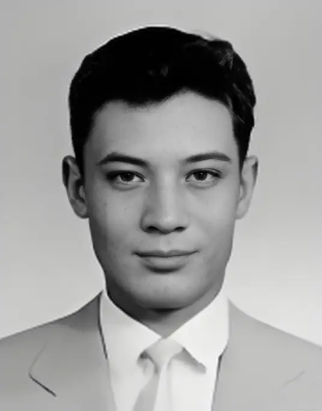
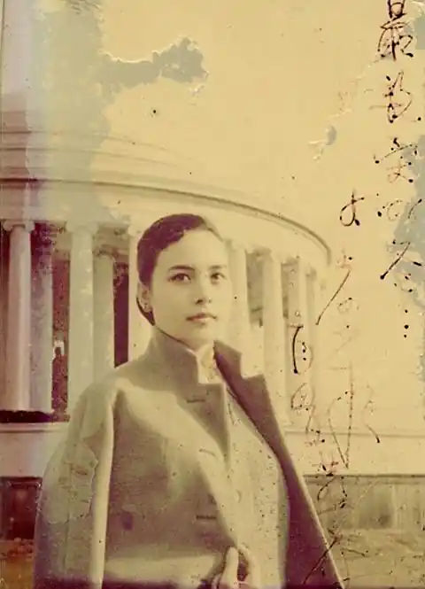
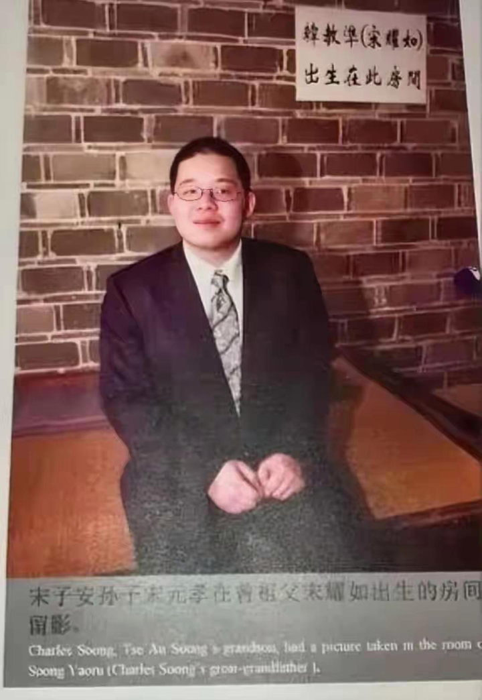
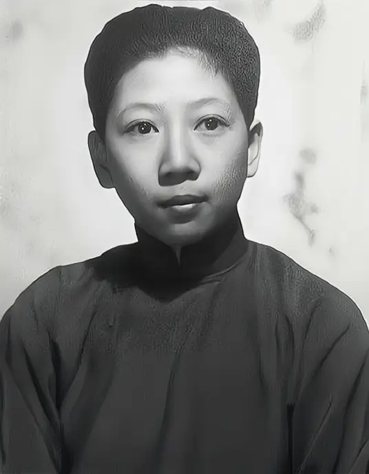
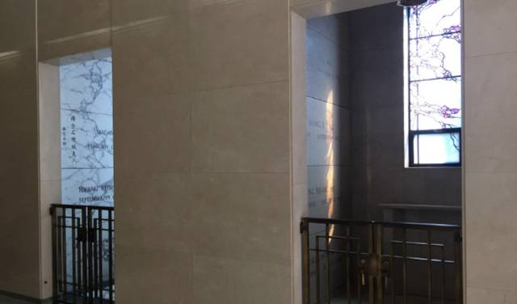
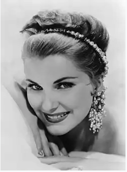

华人移民欧美三代之后，华人文化是否基本灭绝？ \- 知乎用户 的回答

因为欧美有一种超能力，哪怕你是中国达官贵人家的公子小姐，人家也能够让你自惭形秽，让你疯癫，让你坦诚的接受自己是一个劣等人。

这个最好举举例子，而最好的例子就是蒋宋孔三大家族。

虽然说是什么蒋宋孔陈四大家族，但是人家蒋宋孔是实在亲戚，陈氏兄弟还离着远了点

所谓的蒋宋孔陈四大家族，其实是个噱头，里面那个陈家无非是来凑个数的。

四大家族的称谓亦如四喜丸子

四喜总是好过三喜，有四喜丸子而绝对没有三喜丸子。

解放战争胜利后，蒋宋孔三家逃到了台湾，后来又都陆续去了美国

先说蒋家

老蒋有一个儿子，一个养子，老蒋的儿子蒋经国有四个孩子

蒋经国的长子蒋孝文是一个花花公子，在国内的时候就不安分。

去了美国之后，干脆就成了酒鬼，三十五岁就把自己喝成了瘫痪

alt="Image">

蒋孝文平素不学无术，人品败坏，他喜欢开车，尤其喜欢酒后开车，曾经撞死了无辜路人张慧云；喜欢玩女人，把军人福利社的女服务员玩弄后抛弃，让人家上吊自杀；他甚至曾经开枪射杀老蒋的卫士李之楚

老蒋让他念军校，他在就读期间，只去舞厅不去教室

为了争夺一个漂亮舞女，不仅掏枪示威，而且殴打前来维持秩序的军警

这号混世魔王，自然最后被军校开除

老蒋面上无光，找了个蒋孝文有鼻炎的理由给他办了退学。

退了学，也不能不学啊，老蒋的孙子连个大学文凭都没有，说出去也不好看

转去大学读书？就他这个混世魔王的样子，还不定干什么丢人事呢！

只好留学，换个风水

老蒋自己也是留学生，是去了日本之后转了性，所以老蒋觉得让孙子留学也不失是一个办法

但是这里就又有了一个问题，老蒋前不久刚刚下令不准私人留学！

事情是这样的，当时国民党高官都和疯了一样的把小孩往美国送，老蒋很生气，认为他们这是对在台湾站稳脚跟没有信心，送小孩去美国读书是假，让小孩替他们去美国打前站是真，无非是为了将来往美国逃命罢了。

于是勒令高中生们不允许去美国留学

但是亲孙子这么不争气，老蒋也没法子了

自己说出去的话，也没法往回咽，于是他就钻了个空子：私人留学照旧不行，公费留学是允许的

私人留学是对在台湾站稳脚跟没有信心，公费留学，那是为了国家科学进步

说的倒是冠冕堂皇，但是大家都是知道是怎么回事的

于是，老蒋为了能够让他的宝贝孙子蒋孝文留学，指令伪教育部专门办了一个高中毕业菁英__公费__赴美留学考试

打着送高中生去美国公费留学的旗号，把自己的宝贝孙子也送去了美国。

这一次大家算是沾了蒋大少爷的光，不仅能够去美国，而且还是公费

至于名单上的人么？猜都不用猜，一准是家庭条件特别好的高中毕业菁英

这当然引发了人们的侧目，于是雷震写文章笑话蒋孝文无能，老蒋食言而肥

老蒋竟然罕见的保持了沉默

靠着爷爷作弊，蒋孝文去了美国之后，就读于加州大学伯克利分校企业管理专业

别看蒋公子就读的专业高大上，但是蒋公子根本就不读书，照样是花天酒地——而且酒瘾越来越大，至于原因么？据他自己说是难以忍受中美文化的差异

去了不到两个月，就已经有精神病的意思了

这样的公子哥，在美国这个有钱人的天堂，何以会这个样子？原因那就颇值得思考了。

老蒋听说大孙子成了这个德行，很是不放心，联想自己早年的经验，觉得孙子是缺女人。

于是大笔一挥派了徐锡麟的孙女徐乃锦去美国照顾他

说起来这个徐乃锦了，她的母亲是德国人。

彼时国民党的高层，已经看不上中国人了，结婚都得是找洋人才好

徐乃锦因为母亲的缘故，已经在德国就读大学了。

是国民党硬把她从德国转学去了蒋大少爷的学校的。

至于目的么？明眼人都知道，就是让徐乃锦伺候蒋孝文，从各方面慰藉蒋家大少爷的异乡孤独感（按照蒋孝文的话，就是中美文化差异）

这个说实在的十分侮辱人，惹得徐乃锦的父亲，也就是徐锡麟的儿子徐学文，勃然大怒

徐锡麟的公子这号过气儿人物，怒不怒的其实也无所谓

更何况了，徐学文当时担任台湾的烟酒专卖局局长，拿人饭碗受人管，也由不得他不同意。

小蒋做了做工作，徐学文就同意

婚后蒋孝文着实安稳了一阵子，但是随着徐乃锦怀孕，他那个邪火没地方撒了

于是越发的疯了，终于在1964年酒驾出了车祸，因为在法庭上辱骂法官（其实从蒋孝文的角度来说，他有理由生气，因为在中国的时候蒋家大少爷撞死人都不算犯罪，来了美国撞坏个隔离柱就被拘留了）且涉嫌保险诈骗，被美国人赶出了美国，如此自然也就没拿到学位

蒋家的大少爷，还真就没大学学历

老蒋对此很是失望。

蒋孝文回到台湾后，也安排了工作，任台湾电力公司桃园区管理处处长，他的主要工作是带着流氓去眷村问给他爹，他爷爷卖命的老兵讨要水电费

此时他已经是一副精神病的样子了，谁敢惹他呢？所以竟然能够如数催缴

由于他的精神疾病已经很严重了，但是又没什么理由让他发疯

所以坊间流传他的疯癫是因为梅毒的原因——他的梅毒已经到了能够损伤大脑的地步

甚至还有很多人据此认为，蒋孝文那发生在1970年，并最终让他终身瘫痪、智力衰退的昏厥，不是因为糖尿病和过量饮酒导致，而是因为梅毒爆发导致（这个我觉得不大可靠，因为当时已经有青霉素了）

是的，蒋孝文从美国回来后第六年就瘫痪了，智力退化到六岁水平。

当然了在他发疯到瘫痪的五年时间里，他还是抓住一切可以抓住的机会干了不少坏事。

其中最离谱的是奸污了（一说是诱奸，还有一说是追求未遂）时任台北市长高玉树的儿媳妇吴纯纯，并杀害了高玉树的长子高成器

高市长虽然是台北市长，但是其实不是老蒋那一派的。

他是本省人，是无党籍人士，于是有冤无处诉，只能含垢忍辱

为了表示无声的抗议，这位高市长亲自操办了他儿子和儿媳妇的冥婚

需要说一点，这个高玉树和前面的雷震是好朋友，也难说蒋孝文不是出于报复的动机才这么做的。

蒋孝文在去美国之前是混蛋公子哥，但是在美国待了这么几年就蜕变成了发疯的混蛋公子哥

在美国的四年经历对于他可真是人生的转折点

至于蒋孝文何以在美国染上酒瘾和发了精神病，你就猜吧

肯定不是看棒球赛看的太多，在美国过得太爽导致的

蒋孝文的旅美经历代表了公子哥赴美的一大结局：成为废人

小蒋的大女儿蒋孝章，品学兼优且相貌周正，在蒋孝文去美国后第二年也去美国留学。

小蒋托台湾的伪国防部部长俞大维之子，已经离过两次婚，且比蒋孝章大十几岁的俞扬和代为照顾这个品学兼优，相貌端正的第一千金。

alt="Image">

结果一来二去，两人刚接触不到半年，俞扬和就把小蒋的第一千金照顾到床上去了

蒋孝章成了被俞扬和玩弄的情妇

于是国民党内部就说了，是小蒋安排女儿勾引俞扬和的。

目的是为了能够拉拢掌握台湾那个伪国防部的俞大维

气的小蒋大骂俞大维，甚至打上门去，把俞大维的办公室给砸了。

小蒋本来是打算强令两人分手的，但是蒋孝章肚子都被玩大了，而且因为月份大没法打胎。

小蒋没了法子，天天气的团团转，又没个章程。

最后还是疼孙女的爷爷老蒋和奶奶宋美玲出面，才把这个事情安排了算完

两人是1960年8月结婚的，结婚场面十分冷清，宾主尴尬（1961年5月女儿就出生了，所以估计是大着肚子结婚的）

![被 指 未 婚 先 孕 蒋 经 国 长 女 告 台 前 “ 联 勤 总 司 令 ” 诽 谤
2001 年 6 月 5 日 09 ． 39
中 新 网 香 港 6 月 4 日 消 息 ： 台 北 讯 ， 蒋 经 国 先 生 的 长 女 蒋 孝 章 及 实 婚 俞 扬 和 日 前 委
托 律 师 王 清 峰 向 台 北 地 方 法 院 提 出 诽 谤 自 诉 ， 控 告 前 “ 勒 总 司 令 ” 温 哈 熊 涉 嫌 诽
谤 等 ， 承 审 法 官 吴 定 亚 今 天 表 示 ， 可 望 于 七 月 才 会 开 庭 审 理 本 是
接 受 蒋 孝 章 及 夹 婿 俞 扬 和 的 委 任 的 王 清 葺 律 师 昨 天 指 出 ， 俞 扬 和 夹 妇 的 名 誉 由 于
受 到 严 重 的 伤 害 ， 且 和 解 未 成 因 此 才 诉 诸 法 徨 途 径 。
王 清 指 出 ， 她 接 受 这 个 子 深 入 加 以 了 解 后 发 现 温 哈 熊 在 接 受 “ 中 研 院 ” 访 问
的 口 述 历 史 著 作 “ 访 问 纪 录 ” 中 的 谈 话 内 容 是 很 有 问 题 ， 他 在 书 中 说 俞 扬 和 已 结 婚 #
有 孩 子 ， # 引 诱 蒋 孝 章 把 肚 子 弄 大 ， 但 事 实 上 ， 当 时 俞 扬 和 已 离 婚 ， 且 无 孩 子 ， 两 人
是 结 婚 后 才 有 孩 孔 ](attachments/a044af074d36c455.png)

alt="Image">

至于这个一贯表现良好，喜欢读书，尤其喜欢读哲学的第一千金怎么成了老男人俞扬和的玩物，这个事情么，就仁者见仁智者见智了

反正肯定不是在美国看迪士尼看的太开心的结果

这是堕落结局。

不过也算是小蒋的第一千金走了大运，找了个中国男人，要是找了个美国男人，那可完蛋咯

说不定得被家暴

前一阵子不是有中国的大小姐，让他那个无业的外国男朋友殴打死了么？

虽然吧，我说了类似于玩弄之类的话

但是其实这是不带有人格诋毁的色彩的，因为老男人和比自己小十几岁的小姑娘谈恋爱，确实也只能认为是玩弄。大家的社会阅历完全不是一个层面。

而且玩弄这种东西，如果是长期的对一个特定对象的专一的玩弄。

也不是不能够理解为是某种意义上的爱情（有点畸形就是了）

更何况了，人家兴许就是爱情。

蒋孝文留美留成了酒疯子，蒋孝章留美留成了老男人俞扬和的玩物，小蒋觉得老美那边可能不大对劲

于是就让因为殴打辱骂教官被军校开除的老三蒋孝武去了德国，留学归来之后，蒋孝武成了中美关系研究专家（德国也有美国人不是么？）

他还算是正常的，毕竟江南案也不是一般人能够犯下的

现在蒋家的儿子里面就剩下蒋孝勇了，小蒋一看没准老小可以接班

于是送老小蒋孝勇也读了军校，老小蒋孝勇倒是挺刻苦，至少没有迟到早退，殴打教官

但你以为蒋孝勇就能读出军校来么？他到底也是吃不了苦，想退学，又怕亲爹小蒋生气——这位三少爷于是就想到了绝妙的办法，自残

他故意在训练中把自己的脚踝跌成骨折

气的他爹在日记里骂他

1970年3月9日：“勇儿以因公务受伤之理由，办理退学与转学之手续，__明知此为欺人自欺之作__，但是事实如此，__如何使我不自感惭愧耶__。”

两年后，蒋经国去伪军校参加校庆，看见伪军校的伪军官们一个个神气活现的

不禁想起了自己喝成瘫痪的大儿子孝文，殴打教官被开除的二儿子蒋孝武，自残装病的小儿子蒋孝勇

一想三个宝贝儿子都是这个德行，小蒋便是悲从中来

1972年6月19日日记：“军校校庆前夕宿于军校之春晖堂，想起文、勇两儿先后从军校退学，__实在没有面目可见军校之学生__，深感愧疚。而文儿尚在重病中。儿辈之不争气，影响家誉和事业，余身为人父而未尽父职，此心必将一生不安。”

其实蒋孝勇这个人算是他们蒋家为数不多的正常人

他出生的时候，老蒋、小蒋已经到台湾垂泪对宫娥去了

所以算是没有和他俩哥哥一样，学成流氓

多少还有点正经样子，比如说吧，蒋孝勇不想念军校，采取的是自残的办法

美国的教育，把小蒋的长子教育成了酒鬼，大女儿教育成了老男人的玩具；欧洲的教育把二儿子教育的也是莫名其妙

小蒋吸取教训，小孩还是在台湾读书吧，去台大吧——于是最能替蒋家生孩子的蒋孝勇成长起来了

蒋孝勇绝对是小蒋积德的产物，这个小儿子不仅没有什么逼奸少女，撞死路人，随意开枪，酗酒闹事这类事情

而且转入台大之后，还挺仗义，赢得了师生的赞誉。

设若小蒋送蒋孝勇去美国留学，兴许老蒋就绝后了

毕竟蒋家老大在美国三四年就喝酒喝成了废人，蒋家大小姐去了不到两年就成了玩物

这个也不是没根据的说法，比如说蒋孝勇的三个儿子吧

他的三个儿子，都是在美国长大的，老大、老二还好（但是总是觉得怪怪的，好像什么地方不对劲），老三直接被刺激的疯疯癫癫的

不过说实话，我对蒋孝勇家的老大，印象很好

因为他有一句名言

30岁以下的人我不用，因为这些人烂、又没有责任感。

我到了三十岁之后，就觉得这句话说的特别的对

就蒋家来说——也不能说是留美毁了他们家俩孩子吧，但是至少能够看出来

意志力薄弱的人，小男孩在美国容易酒精成瘾或者麻药成瘾，小女孩容易被骗上当失身失财（当然了，蒋家大小姐这个也不算，人家两口子感情其实不错，生育多个子女）

至于其中的缘故，不知道，但是结果却是如此。

而且这也不是蒋家的特例，在某种意义上，这种情况甚至具有相当的普遍性

酒精成瘾也好，性成瘾也罢，实际上都是精神抑郁的结果

为什么这么有钱的小孩，在美国会精神抑郁？这个事情啊，就只有当事人自己知道了。

蒋家说完了，再说宋家

宋家本来姓韩，因为过继的缘故，于是就姓了宋了，据宋嘉澍（韩教准）自称，他们家是韩琦的后人，真假就不知道了

宋嘉澍家族是基督教家族，宋本人就是牧师，所以宋嘉澍说了，他的女婿只能是基督徒

这也是老蒋为什么之前还向我佛起誓，后来却改信了基督的原因

宋嘉树的夫人倪桂珍是当时少见的知识女性，会弹钢琴，被盛宣怀请去当了家庭教师

哦对了，宋嘉澍老先生还有个教名叫查理宋，也可以叫宋查理

所以宋家很洋气的。

宋氏家族，宋氏三姐妹这个自不必说，宋子文生了三个女儿，宋子良生的也是女儿

只有宋子安生了两个儿子：宋伯熊、宋仲虎

宋氏家族虽然是基督教家族，但是这个名字起的倒是十分有古风古韵，可惜只有俩儿子，如果有老三，估计老三就得叫宋叔豹了

宋伯熊只有一个女儿，宋仲虎生了宋氏家族目前唯一的男丁：宋元孝

alt="Image">

他们家是几百年的基督教家庭，所以在美国不能拿寻常华人家庭看待

不过不知道为什么，几代下来，宋家成了单传了

至于孔祥熙家族

孔祥熙其实也是基督徒，可以说南京国民政府其实是一个基督教政府

孔祥熙之所以信仰基督教，主要是因为他小时候得了腮腺炎，差点病死。

是教会医院帮他治好的——后来庚子国难的时候，他们家又掩护了传教士，于是他们家就和基督教会混熟了

庚子国难后，他和公理会的牧师合伙办过一个铭贤师范学校，任课老师就是公理会牧师

孔祥熙用人讲究惟贤、惟晋，这里面的贤不是贤才，而是他在铭贤师范学校的学生们，晋就是山西省

虽然他也是一个任人唯亲的人

但客观地讲，孔祥熙可比宋子文更讨蒋介石喜欢——甚至于在孔家拆了小蒋在上海的台之后也是如此

毕竟蒋介石至少没对孔祥熙说过类似于

“这辈子我就没和你做过不赔钱的买卖”这类话（他倒是对宋子文这么说过）

是的，孔祥熙是接任宋子文当的财政部长

1933年蒋介石因为要打内战，发行了十四亿元的公债，由于此时南京国民政府每个月财政赤字高达八百万元，所以这些公债根本卖不出去

宋子文表示自己办不了给蒋介石筹款的工作于是辞职

蒋介石无法，只好让孔祥熙接任财政部长

他上任之后，一番折腾，竟然让南京国民政府至少达到了收支相抵的状态

不过这个是后话了

还是回到1912年吧

因为有教会这个背景，孔祥熙在1912年通过代理壳牌的灯油发了大财

之后更是在1913年在日本，以“中华留日基督教青年会”总干事的身份和孙中山搭上了关系

1914年以孙中山为介绍人同宋蔼龄结婚（当时宋蔼龄是孙中山的秘书，宋蔼龄嫁给孔祥熙之后，宋庆龄先生才成了孙中山的秘书），孔祥熙于是正式加入了宋氏王朝

不过加入了之后，也没他什么职务可干，孙中山自己都在流亡状态，总不能和康有为一样，画个委任状糊弄孔祥熙吧？

于是孔祥熙还是回到山西，老老实实的当乡绅

不过因为他和教会关系很好，他这个乡绅是手眼通天的乡绅

此时的孔祥熙还不那么坏，所以在山西旱灾里面很有作为，争取到100万美元的外国救助，并以工代赈修了很多公路，受到了北洋政府的表彰

现在有很多人认为是孙文提拔了孔祥熙

但是从历史上来看

与其说是孙文提拔他，不如说是他给孙文提供了一个抓手

由于孔祥熙赈灾办得好，又有好朋友兼基督教教友王正廷帮衬，所以很快就在北洋政府里面打得火热

孙文联系冯玉祥，联系张作霖，都是通过孔祥熙的渠道

1925年孙文北上也是孔祥熙一路陪同

孙中山去世后，孔祥熙的大靠山虽然倒了，不过没关系，他又靠上了老蒋

就资历上来说，孔祥熙是老资格的，就和孙中山的关系上，孔祥熙更近

所以老蒋在初期是指望着孔祥熙的。

所以孙中山并没有给孔祥熙安排具体职务，但是老蒋上来就委任孔祥熙当了广东财政厅长

投桃必然报李，孔祥熙不仅帮着蒋介石在北洋系里面兴风作浪，联系阎锡山和冯玉祥分裂北洋；而且在1926年把宋美玲介绍给了蒋介石当老婆

这下子可就不得了了

蒋介石本来是孙中山的学生，如此一来，就成了孙中山的连襟

学生和老师成了同辈关系，这个对于老蒋可是很要紧的事情

于是老蒋就越发的爱戴起来孔祥熙了。

孔祥熙先后出任实业部长，央行行长，并替老蒋买过军火—总之了是顶重要的人物

孔祥熙有四个孩子，分别是孔令仪，孔令侃，孔令伟，孔令杰

孔祥熙的大女儿孔令仪找了个叫陈纪恩的穷小子

能够巴结这种大小姐的穷书生，往往不是好人

宋蔼龄对于这个婚姻不满意，持反对态度，但是孔令仪非得嫁给这个陈纪恩

孔祥熙夫妇拗不过，只好同意

两个人结婚的时候恰好是1943年，抗日战争最吃紧的时候

孔祥熙夫妇给女儿的陪嫁是两飞机的礼品

婚后，陈男本性暴露，不仅吃喝嫖赌，甚至殴打怀孕的孔令仪，让孔大小姐流产并丧失了生育能力

两人自此分手，至于陈男则下落不明——就是消失在历史的长河里面了

1981年，宋美玲去了美国，孔令仪照顾了姨妈二十年，直到宋美玲去世

孔家大小姐很长寿，2008年才去世，2007年的时候还来大陆参观了一下童年旧居。

不晓得为什么，中国的这帮大小姐去了美国之后，很多都混成了家暴的受害者

想来，这些人在国内被保护的太好了，出了国之后，脱离了保护他们的那个社会环境，就如同离了水的鱼

孔祥熙的大儿子是孔令侃，此人曾经的最大志向是能够和自己的舅舅宋子文成为连襟

alt="Image">

“娘舅怕什么，讨了他的小姨子，我和他（宋子文）不就平起平坐了。”

这等荒唐的言论自然不被宋蔼龄认可，此时恰好盛宣怀的儿子盛升颐因为走私被下了大牢，盛升颐那个妓女出身的小老婆白兰花经常去孔家活动

盛宣怀虽然是大清朝的尚书，孔祥熙虽然是先行者的连襟

但是两家那是父一辈子一辈的交情，孔祥熙的老岳母倪桂珍就当过盛宣怀家里的家庭教师，孔祥熙的太太宋蔼龄更是当过盛家五小姐盛关颐的英文教师

论起来，孔部长和盛尚书的关系可比和他的辛亥革命同志亲近多了。

作为盛升颐小老婆的白兰花自然是能够搭上话的

于是也不知道是谁勾搭的谁，一来二去，盛升颐的小老婆白兰花就和孔令侃搞上了

白兰花本来就是干那行的，对于玩男人经验丰富，又比孔大少年长将近二十岁，一来二去，孔大少可就离不开白兰花了

盛升颐对此虽然知道，但是却无可奈何

只好踢足球解闷，盛升颐除了走私，赚钱，占便宜，还创办了一支东华足球队

白兰花和孔令侃二人长期维持偷情关系，直到孔大少被派驻去了香港

孔大少二十郎当岁就当了国民政府的高等秘书，1937年全面抗战爆发后，更是被派驻去了香港。

他这号公子哥，机会多了去了

至于孔大少的表现么？那就很完蛋了

孔大少在香港是烂赌成性，曾经一把输了国民政府十五万元法币的公费

十五万元是一个什么概念呢？当时国军发的是抗战薪水，上尉一个月工资是80元，一年一千元

孔大少一笔输出去150个上尉一年的工资

不过没关系，谁让他爹是孔祥熙呢？当时香港人挖苦他是：爹爹在朝为宰相，人人称我小霸王

后来1939年，英国人找了个由头，说他设立电台，从事间谍活动，把他从香港赶了出去。

当时香港是中国抗战物资的唯一入口了

老蒋对此很不满意

孔家就让他去哈佛大学读书，躲躲风头

私设电台，从事间谍活动，这个也不能说是没有

私设电台是他孔大少想家，每天都要给在重庆的孔祥熙夫妇发电报

至于间谍活动吗？

孔大少在圣约翰大学上学的时候，搜集了一群他的跟班，成立了什么南尖社（取名自德国的纳粹党，南尖就说nazi）。

这个小团体，到了最后竟然成了南京政府财政部的编外机构

1937年之后，许多成员和孔大少一起去了香港，情报工作搞了，但主要靠着看报纸、听墙根、请吃饭、收购小道消息等方式搜集情报。

哦，对了，期间孔大少还炒了外汇，据说获利颇丰。

该说不说，这可能是孔大少在香港干的最好的事情。

该说不说，孔大少运气好的不得了，得亏让英国人轰走了，要是此时不走，估计就得赶上太平洋战争了。

孔大少兴许啊，那就得去集中营

当然了——就孔大少这个身份

就算是让日本人捉了，到最后也无非就是被礼送出境。

至于孔大少的南尖社的成员么——就在香港殉国吧。

在去美国的路上，孔大少，越想越窝囊，于是为了报复重庆政府对他的无情（主要是他爸爸对他的无情），发电报请老情人白兰花来菲律宾和他结婚

老情人闻言大喜，立即买票去找孔大少

于是在马尼拉，23岁的孔家大少如愿以偿的娶了盛升颐那42岁的，从事过特种行业的小老婆

去了美国之后，孔大少根本无心学习，天天寻欢作乐，但是老美的学位不下点真功夫是拿不到的

于是孔家大少突发奇想，找了个姓吴的科员替他上学考试

两年后，孔大少带着哈佛的文凭，潇洒回国

至于吴科员么？则被孔大少提拔当了副经理

吴科员被讥讽成了地下硕士。

孔大少回国之后，就闹出来了扬子公司那档子事，小蒋很是恨这个孔大少，不过也没什么办法

只好高高举起，轻轻放下，把孔大少轰走了事。

于是孔大少又回了美国，并自此长居

孔大少在美国生活了五十多年，宋美玲在美国的宅子就是他买的

孔大少没有子女，一个都没有。

孔祥熙家的老三就是异装癖孔令伟了

alt="Image">

人家孔家二小姐，12岁的时候就见过美国总统罗斯福

这样的人物，那是不把中国人当人看的

这位孔家二小姐，在中国的时候干过下面这些事情，枪杀交警，撞飞哨兵（人家要灯火管制，他一脚油门把人家撞飞），和龙云的儿子在公园拔枪对射（两人毫发无损，打伤多名路人），1939年接替他那个因为从事间谍活动被英国佬递解出境的哥哥孔令侃去香港——他没他哥哥倒卖外汇的本事，于是只好走私烟土

1941年太平洋战争爆发，日本人马上就要开进香港

国民党派飞机接在香港的要人去重庆

结果要人们到了机场后，却发现本来安排好接他们的飞机，上面的座位竟然早就已经被孔二小姐和他的十七条狗给占满了

南天王陈济棠要求上飞机，竟然被孔二小姐拿小手枪赶了下去——孔二小姐时年不到24岁

这是一个小霸王一般的女人。

但是他在美国的时候，可是老实的不得了，从来没有什么违法行为，简直就是良好公民

孔家二小姐，六十年代随着父母回到台湾后，被宋美玲留下来当了老蒋和宋美玲的大管家

宋美玲靠着他经营圆山饭店赚了不少钱，自然这些钱都下落不明了

alt="Image">

在此期间这位孔二小姐，以男人的身份包养多名女子。

他从来都是男装打扮，直到得癌症去世

最搞笑的来了

孔二小姐这辈子虽然就没穿过女装，但是死了之后，反而是穿的女装下葬的

当时这位孔二小姐因为癌症、心肺衰竭在台北死掉了

按道理说就地埋了就是

那可不行，必须坐飞机弄去美国下葬

由于防腐处理不当，等到了纽约的时候，孔二小姐已经没法看了

花了大价钱，化妆，换的女装

至于为什么非得换女装下葬，因为基督教不准许这种异装癖和女同性恋

看看，多么的乖顺啊

孔二小姐埋葬的墓园是芬克里夫墓园

alt="Image">

宋美玲和孔祥熙，宋子文、宋子良家族都埋在这里

顾维钧也埋在这里

徐志摩的老婆儿子也埋在这里

除了这几个华人是不得了的大人物外，这个墓园埋葬的主要是演艺界人士

我看好多人说这个墓地如何高档云云，但是他是一个无宗教的墓地

换句话说，在基督教盛行的美国，这个属于非主流墓地

宋氏家族，都是基督徒，他们家是基督徒世家

然而很遗憾，他们到底是不能埋到基督教的墓地里面去的，他们终究是外人

是信仰了基督教的黄皮猴子。

墓地是非主流墓地，只能和叛逆艺术家当邻居

至于安葬的地方么？

事实上，上面这些曾影响了中国的大人物，连一个像样的墓地都没有

alt="Image">

他们采取的是壁葬的方式

alt="Image">

宋美玲的棺材就和货架上的货一样，垒在自己的外甥女孔令怡的棺材上面

中间隔了一道薄薄的水泥板。

至于孔家的墓葬，那就更寒酸了

alt="Image">

一家人整整齐齐的码放了一墙，最下面是孔家大少，上面是孔祥熙，在上面是宋蔼龄，再上面是孔令伟，最上面是孔令杰。

因为实在是太寒酸了，所以他们自称这是暂厝

说实在的，就算是暂厝，也没这样的

足以见得，就算是宋家王朝，在美国没了利用价值，也是死无葬身之地的。

既然写到这里，就再说说孔令杰，孔令杰出生比较晚，1949年的时候不过是毛头小伙

在给毛邦初当了几年管汽油采购的军需官之后

就拿着自家的资本在美国搞石油买卖去了，还开了一个石油公司叫西兰石油

这个人在最开始是很赚钱的，以至于能够突破自己身为黄种人的种族限制，娶到了好莱坞女明星黛布拉·佩吉特

alt="Image">

女明星是孔家的恩人，要不是他，孔家得绝后

因为孔令杰结婚的时候已经四十岁了，再晚上几年就不能生了

至于孔先生为什么四十岁才在美国结婚，这个事情，就无人知晓了

总不能是钞票太少，不足够弥补身为小黄人的缺乏魅力吧？

财神爷的儿子，怎么可能缺钱，不缺钱，也难找哟！

总之了，别看孔家曾经一大堆人，现在所有的财产都掌握在黛布拉·佩吉特儿子手里

这个儿子叫孔德基，不会中文，一句都不会。

他们家族就他一个人了。

孔令杰的石油大亨生意开始的时候非常赚钱，在1981年的时候甚至为员工和自己的家庭修建了规模很大的核战争避难掩体

看来孔令杰老先生，也是求生狂这类活动的爱好者

但是到了1987年，孔令杰的西兰石油公司，忽然破产了！

猜猜为什么？你肯定猜不到，因为那一年小蒋病危了，并在1988年1月份去世

估计是美国人看着孔令杰的靠山垮掉了，所以吃上门来

孔令杰索性抢先破产

总之了，我这是推测

不过考虑到宋美玲去世之前，也就是1995年，他在蝗虫谷的房舍就被贱卖，甚至连家具都不准带走

房屋被贱卖就算了，为什么家具都不允许带走呢？

原来是购买他房产的美国商人，在合同里埋设了陷阱

260万美元，购买的不仅是庄园，而且还有庄园里面的所有的东西

于是宋美玲的家具、珍藏的古董（1991年宋美玲回台湾，带走了大批古董有两个飞机）、甚至蒋介石的照片、信件都被美国商人买走了

宋美玲不允许从别墅里面带走一张纸，否则就是违约，宋美玲就要承担巨大的违约责任

美国商人单靠这个合同条款，靠着卖宋美玲的文物就发了大财，而宋美玲对此只能唯唯诺诺

老蒋的夫人，竟然请不到好律师。

是真的请不到么？是真的请不到。

因为1995年，李登辉已经站稳了脚跟了，孙美玲的影响力已经垮掉了

虽然也是这一年，美国国会请她去做了抗战胜利五十年演讲，让他再风光了一回

但是又有什么用呢？

他被人坑了。

而在宋美玲去世后，一毛不拔的蒋氏家族、宋氏家族、孔氏家族，更是不知为什么给大学捐了几千万美元（这个确有此事，但是具体大学名称是什么，决策者是谁，记不得了）

之所以说不知道为什么，因为此时的蒋宋孔三大家族的男丁，尤其是宋家和孔家的男丁——只有两个了，连带上小女孩，也不超过十个人

根本没必要掏钱赞助大学

需要上学的时候，单个花钱就好了——那么你猜他为什么要捐款呢？

无非是被老美吃了绝户罢了

现在宋家的唯一继承人宋元孝老先生和孔家的唯一继承人孔德基老先生

在网络上那是一点消息都没有，两个人一个赛一个的低调

低调的都不正常

如果他们过世了，你猜猜他们的财富归谁？如果真的有坏人知道他们的财富

你猜猜他们还能留下孩子么？

这就是他们为什么异常低调的原因了，他们倒是也回国参加过各种活动

但是神情可就很奇怪了

美国人玩的那一套，连蒋宋孔三大家族都遭不住，一般的华人岂能遭得住呢？

根本遭不住的

总之了当2003年10月24日，虔诚的基督徒，循道宗信徒宋美玲去世的时候。

这个曾经把老蒋葬礼办成了基督教宣传会的人，这个中国最早的华人传教士的女儿——把自己埋在了一个完全没有宗教氛围的无宗派坟地，同时在墓碑上没有丝毫的基督教标志，连一个十字符号都没有。

虽然他的葬礼还是基督教的，但是他的心态，到底是怎么样的呢？

只能说很难说，很难说

现在他的墓地还时不时有中国人祭扫，但是祭扫的人，是中国人，而不是他的教友。

蒋家到底好说，宋家和孔家的子孙，不是想不想当华人，而是能不能、敢不敢当华人了

现在宋氏家族和孔氏家族，就一个叫宋曹琍璇的老太太还能说中文

别的都不会说中文了

对了说起来了，其实孙文的子孙也在美国，

孙文有一个儿子，就是孙科，台湾管他叫先总理哲嗣

孙科有两个儿子，孙治平和孙治强

孙治平的儿子孙国雄虽然有大学学位，但是却当了替身演员

换句话说，就是孙中山的长房重孙子当了替身演员

只要有风险的戏码，孙先生的重孙就要冒着生命危险去当替身

在中国，孙先生的长房重孙是要进政协的，但是在美国，炸死孙先生的重孙不要紧，可不敢炸死美国的三流明星；孙先生的长房重孙，是可以受伤的，是要作为三流明星的人肉防护服的。

“孙国雄也有自己的梦想——成为电影演员。大学时他虽然念的是生物化学系，但凭着一种热情和信念，他勇闯好莱坞 ，后来任职特技演员长达37年。而很多时候，他还坚持跑龙套、当替身。孙国雄第一次出镜，是在美国著名影星马龙·白兰 度主演的《丑陋的美国人》一片中扮演一位村民，辛苦一天，赚到16美元。职业生涯中，他前后参加过大约600部电影和 电视剧的制作，拍过很多从高楼坠下的惊险画面，也拍过撞车和爆炸场面。在一部《非凡的勇气》的电影里，他甚至“死”过 19回。虽然辛苦，但他对能做自己喜欢的职业十分满意，认为__“孙中山的后代做特技演员是一件非常有趣的事情”（实在是难以认同，千金之子坐不垂堂，更何况他，而且其实他不缺钱，他父亲作为孙先生的长房长孙从台湾拿到了足够的钱——之所以会这样，只能理解为让老美教育的。）__。”

而且最悲惨的是，这个几乎等于替死鬼的工作，还被父传子了

孙国雄的小儿子孙伟仁接了他爸爸特技演员的班（他也是孙国雄唯一的男孩）

孙中山的另一个儿子是孙治强，他的儿子，孙国升虽然有经济系大学文凭，但是最后却混成了保险销售员；孙国升的亲哥哥孙国元连弟弟都不如，孙国元因为照顾生病的孙治强，从大学退学，没有拿到大学文凭。作为一个高龄高中生的他在社会上根本就找不到好工作——干脆就长期失业在家了

alt="Image">孙国升

孙文先生的重孙子一共就三个，一个当了替身演员，一个当了保险销售（后来转了码农），一个长期失业

还是老美厉害

美国建国以来，有无数的名门望族去美国避难，那么看到这里，你大概就知道，这些名门望族去了那里了吧？

都让老美干掉啦！

多了我也不敢说，但是我觉得吧，单就是孙先生重孙这个身份

毕竟封建王朝还讲究一个二王三恪呢。

更何况了，还有点师承关系。

不过孙先生的重孙们，已经不会说中国话了。

可叹可叹。

孙先生的子孙，不仅成了美国人，而且还成了不会说中国话的美国人，最关键的是过得实在是不能够说好

美国大学学费是很贵的

不知道孙先生重孙的儿子们，还有没有机会接受高等教育了。

如果接受不了高等教育，那么未来的人生，会怎么样呢？还会有子嗣么？

这都是顶尖家族，在美国是这样子的。其他的自然也不用问了。
