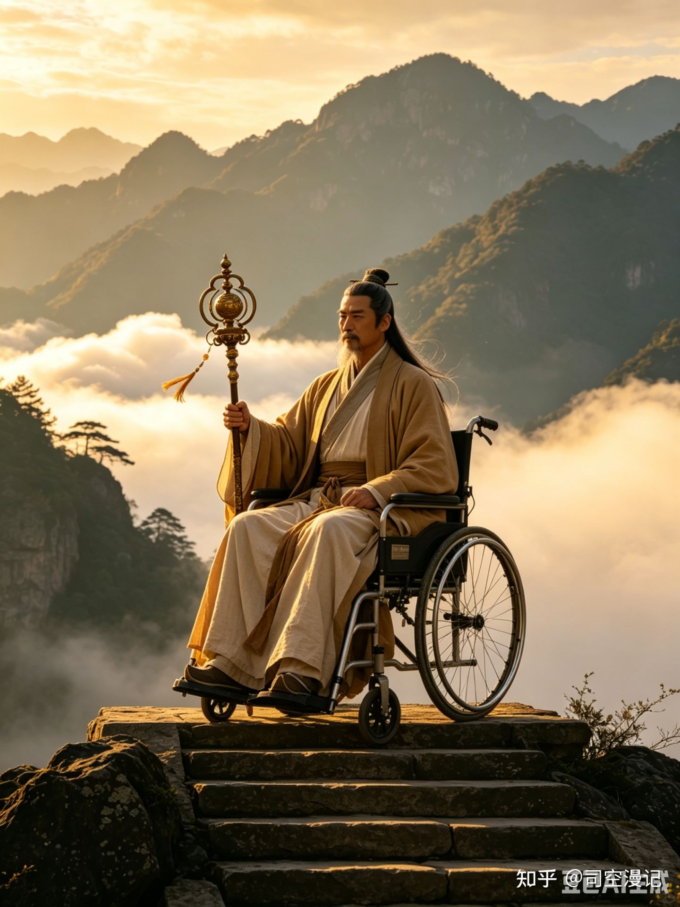

古或今：凡人修仙传的战力天花板，为何一个能打七个？

他不是在打架，是在改写规则。你出招，他直接让时间倒流——这仗怎么打？

在《凡人修仙传》的仙界篇中，古或今作为时间道祖、天庭之主，是全书公认的战力天花板。瑶池大战，他一人独战七大至尊道祖，打完衣服连个褶子都没有。轮回殿主、李元究、赤融道祖……这些排名前十的怪物联手释放法则洪流，放在任何道祖身上都是灭顶之灾，但古或今硬扛了下来，不是靠防御，而是让时间回到攻击发生之前，仿佛什么都没发生过。

凭什么？今天我们就从法则位阶、神通机制、道心境界三个维度，彻底拆解古或今为何如此无解。

一、法则位阶：时间是一切法则的“总开关”

仙界有三千大道，每条大道只有一位道祖。而这三千大道由三大至尊法则——时间、空间、轮回衍生而来。古或今掌控的时间法则，排在其他两个至尊法则之前。

为什么？因为任何法则的运行、任何神通的释放，都必须在时间流动这个基础框架内进行。空间法则再强，没有时间，空间就是一个静止的坐标点；轮回法则再玄，没有时间，轮回就是摆设。

魔主——空间道祖，曾冻结整片空间想困住古或今。结果古或今一拳下去，空间碎成玻璃渣。不是魔主不够强，而是空间的存在本身依赖时间流动。古或今打碎的不是空间，是空间存在的根基。

二、时光回溯：没有冷却、没有消耗的“读档”能力

古或今最逆天的技能是时光回溯。不是简单的加速减速，而是直接篡改因果链。

举个通俗的例子：你一拳打在我脸上，我脸肿了。古或今的做法是——让“你打出一拳”这个动作从时间线上彻底消失。你写了一篇文章骂他，他不反驳，他让时间回到你动笔之前，那篇文章从未存在。

瑶池大战中，七大道祖联手释放法则洪流，足以毁灭任何一位道祖。但打到古或今身上，人家衣衫完好无损——不是扛住了，是时间倒回到攻击发生之前，根本没发生过。更离谱的是，他的手下白云道祖和侏儒老者被轰成碎片，古或今随手两道金光，两人原地满血复活。

作者从未描写过时光回溯有冷却时间或法力消耗。说明时间法则已经与古或今的神魂完全绑定，他不是在“施展”时光回溯，他本身就是时光回溯。

三、天皇大手印：锁死你在时间中的唯一坐标

古或今的攻击手段同样无解。天皇大手印一旦打出，你跑到天涯海角也没用。

原理是什么？古或今通过玄黄卷轴锁定目标，隔着无数仙域直接拍出百里大小的金色巨掌。视觉冲击只是表象，真正恐怖的是底层逻辑——他锁定的不是你的空间位置，而是你在时间流中的唯一坐标。只要你活在这个宇宙中，这个坐标就永远跟着你。

韩立已经将时间领域实质化，能操控局部时间流速。但在古或今面前，他相当于在水池里搅动水流，而古或今是直接关水龙头的人——你搅出花来也没用。

四、混沌法则：从“使用者”变成“规则的祖宗”

以上还不是古或今的终极形态。他真正的底牌是混沌法则。

混沌是创世本源，是世界诞生之前就存在的东西。时间、空间、轮回，所有法则都从混沌中衍生出来。如果说时间法则是操作系统的源代码，那混沌法则就是源代码诞生之前的那片虚无。

古或今暗中布下三千道神大阵，收集三千种法则之力，逆向推导，最终回溯到混沌本源，融入自身，成就混沌法体。他将自己的存在本质彻底改写——从时间法则的掌控者，变成了所有法则的母体。

合道之后，他说了四个字：“万法不侵”。

韩立化身神魔，使出大五行灭绝拳，每一拳能锤碎一块大陆，成千上万拳砸下去天崩地裂。但古或今凝聚出一个混沌漩涡，所有拳劲消失得无影无踪。韩立的拳是五行法则的极致运用，混沌法则是五行法则的源头。用儿子去打爹，不是力量差距，是辈分差距。

五、道心碾压：只剩神魂也能反杀道祖

最能体现古或今底蕴的，是识海反杀隐明道祖那一幕。

隐明道祖趁古或今身体被困、法力被封，潜入识海想吞噬他的神魂。按理说肉身锁死、法力归零，只剩一个光溜溜的神魂，总该打得过了吧？

结果古或今在识海中爆发，时间法则化为一个金色磨盘，将隐明道祖生生研磨成粉末。这已经不是战力问题了，这是道心的绝对碾压。古或今曾经说过：“在探寻大道这条路上，我比所有人加起来走得都远，谁都不该低估我。”这话换别人说是狂妄，从他嘴里说出来，是实事求是。

六、他败在哪？不是不够强，是最后一子落错了

很多人把古或今定义成反派，我觉得太肤浅。他已经是仙界天花板，若论称霸，他早就称霸了。他真正要的，是跳出法则体系本身，从规则的使用者变成规则的创造者。

道祖虽然垄断了法则，但也被法则绑定死了，就像鱼离不开水。古或今的野心，就是离开水、登上岸，创造一个全新的世界，建立全新的规则。七大道祖围攻他，本质上不是正邪对决，而是旧秩序对颠覆者的集体绞杀。他们怕古或今一旦成功，所有现存法则都将失去意义，他们也将从垄断者变回普通人。

古或今最终还是败了。败在哪？

他看到了混沌的创世之力，却忽略了混沌的另一面——平衡。他想独吞混沌，反而被混沌反噬。而韩立之所以能赢，不是法则更高，而是他融合多种法则却不垄断任何一种，追求强大却不妄图掌控一切。韩立理解了平衡，古或今没有。

尾声：最让人唏嘘的大反派

古或今这个角色最让人唏嘘的地方在于：他的每一步都走对了，天赋、努力、格局、野心全拉满，唯独最后一步走错了。当你妄图让所有法则都臣服于你的时候，你也就成了所有法则的敌人。

他不是输给了韩立，是输给了自己。一个试图成为造物主的人，最终被造物主规则本身吞噬。
