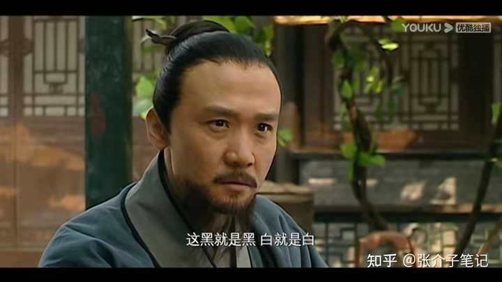

哪一件事让你意识到打工没出路？ \- 知乎用户20482 的回答

一直在关注的这个问题今天突然崩了，里面有许多优秀的回答，没看完… 很多大佬都在里面从不同角度的讲述了这个问题的答案，未来有一天我也会对这个问题做一番解…

建议去看看吴思写的__《血酬定律》__

__这是一本揭示中国社会的潜规则，能让人迅速抛弃对社会的幻想，及时调整生活策略，是促进大脑清醒的一剂良药。__

alt="Image">

__原文完整版PDF:__[http://caiyun\.139\.com/front/\#/detail?linkID=0Q5CrNRK5HCo5](https://link.zhihu.com/?target=http%3A//caiyun.139.com/front/%23/detail%3FlinkID%3D0Q5CrNRK5HCo5)

我们先来了解什么叫做“血酬定律”？

__这个定律实际上是给命定价。促使血酬发生的那个点，就是命的价格。而价格与实际的物，也就是生存资源相对应。__

__因此，血酬定律，也就是用命去博得生存资源，当那点生存资源成为个体的最低生存底线的时候，血酬就发生了。__

可以说，这个定律，就是生存底线的定律。这条底线一旦突破，那么，个体在原本相安无事的系统中，就走向了失控，也就是不会再去维持原本分配体系中的平衡状态。

__这种失控状态，在明史中是非常常见的，比如有官变匪，比如太监刘瑾就是名正言顺的强盗。又有匪变官，当土匪发现抢光老百姓以后，老百姓就要拼命了，这样他们得不偿失，于是就会制定一些能够持续共存的措施，以免羊群死亡。这其实就是变官了。__

用朱元璋的话说，官家与老百姓的关系，就像牧羊人与羊群的关系。

alt="Image">

__01、“血酬定律”，是非理性的。__

__在帝国时代，血酬定律的发生，大概率就是王朝气数将尽了。它的非理性，是基于权力阶层的贪婪和缺乏权力监督。__

__因此，这种贪婪就会演变为群体性行为，也就是说，有能力有途径有意愿加入这个群体的人，就会越来越多。这种群体膨胀的背后，是剥削者越来越多，而能被剥削的越来越少。__

更可怕的是，当这种行为成为一种权力阶层通行的规则时，那么，底层民众就基本沦为了随时可以被鱼肉的对象。

这里面涉及两个问题，第一是权力阶层灰制度的形成，第二是越是在权力顶端的人，越贪婪，那么这种贪婪就会形成一种搜刮链，最终，一定是羊毛出在羊身上，一定都会由福利生产集团来兜底。就是谁在执行生产，谁就是这种贪婪的兜底者。

__帝国时代说的官逼民反，本质上就是赋敛集团在生存资源的分配上，突破了福利生产集团的生存底线。也就是分配失控，过度消耗了福利生产集团。__

这种突破底线，当然是不理性的，最终是杀鸡取卵。但是，帝国时代一直在这条路上循环，究其原因，不过是贪官们无所谓亡不亡国，因为，这个国反正不是他的国，它是李世民的，是朱元璋的。

alt="Image">

__02、血酬的发生，本质是大家都选择了非合作性博弈。__

博弈，分为合作性博弈和非合作性博弈。

__前者，是为了大家都能够获得一定的利益，大家以各自的方式退一步，最终形成一种利益平衡结构。后者，是大家都坚持自己的利益最大化，坚决不做任何让步。__

__前者是理性的，是看清楚了博弈的本质，就是路不可走尽，把别人逼到穷径，势必如赶狗入穷巷，必遭反噬。因此，《孙子兵法》有云“围城必阙”。__

__给人留一条出路，才能让人带着侥幸和希望，才不至于殊死一搏。__

__而后者，就像斗鸡，最后，总要斗出个输赢，不是你躺下，就是我躺下，或者，大家一起躺下。最终，谁也得不到好处，谁都损失惨重。__

为什么说帝国时代不断发生的血酬现象，是一种极端的非合作性博弈？

__第一、是博弈双方存在严重的地位不平等，这意味着双方的博弈，本身就存在先天缺陷。__

因为，地位高的一方，拥有着“元规则”的权力，也就是，他们可以以法定的形式制定各种博弈规则，也就是让另一方退步的各种规则，或者说是惩罚手段。

__所谓的“罗生门”，其实质也就是进入了一种元规则与规则交错的闭环之中。__

__第二、当处于弱势地位的一方，进入到生存底线的问题的时候，这个时候，非合作性就会达到巅峰。__

这种巅峰，就是血酬。以命博聊以生存的资源。陈胜吴广的揭竿而起，就是左右都是死，那么，不妨就用这个命去搏命。

__在帝国时代，往往是开国之初的帝王，都深谙其中要害，他们也很想做好牧羊人，怎奈牧羊犬越来越多，有些牧羊犬还趁着牧羊人睡觉的时机，从开始的偷羊，渐渐随着偷羊的越来越多，就演变成为了一种份例。__

是皇帝们真的不知情吗？

__03、孟子云：“君之视臣如土芥，则臣视君如寇仇。”__

__朱元璋曾经因为这句话，把孟子逐出了圣贤堂。明朝的官吏俸禄是很微薄的，看海瑞就知道了，穷到不行。朱元璋是视臣如土芥的，一方面成为了官吏贪腐的主要原因，一方面也使得官吏对朝堂的威信度是很低的，这一点其实变相地激起了官吏集团的人性阴暗面。__

但是，他们所有的贪腐，就成为了对老百姓的敲骨吸髓。制度的悖论下，所有的压力，一定是向下的。

在“血酬定律”这个问题上，其实，在人际关系上，在商业中，都是有可借鉴之处的。

当地位悬殊，境遇悬殊，在高处的那一方，一定要给在低处的那一方让个路。就像当年李嘉诚被绑架，他跟绑匪说：“是我错了。”

__《血酬定律》这本书和吴思的《潜规则》一起读完后再去看《大明王朝1566》，会有不一样的体验。__

电子书PDF版合集：[http://caiyun\.139\.com/front/\#/detail?linkID=0Q5CrNRK5HCo5](https://link.zhihu.com/?target=http%3A//caiyun.139.com/front/%23/detail%3FlinkID%3D0Q5CrNRK5HCo5)
