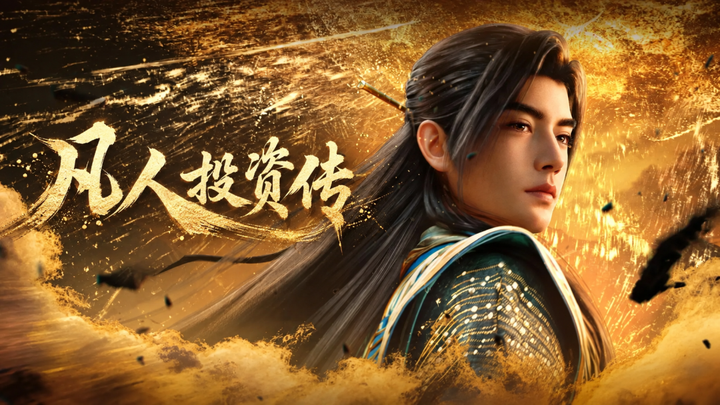

如何建立自己的投資哲學？ \- 疯智达子 的回答

投機、投資長期成功者一定有自己的投資哲學。 您如何建立自己的投資哲學？

alt="Image">

为什么一个“韩跑跑”，可能是最像投资大师的人？

最近五天，我一口气刷完了《凡人修仙传》190集。

真正让我上头的，不只是打斗和特效，而是韩立这个人。

观众叫他“韩跑跑”。能打则打，不能打就跑；动手之前先找退路，进秘境之前先备符箓，看到机缘也很少头脑一热。放在那些动辄逆天改命、越级挑战的主角旁边，他显得不够热血，甚至有点过分谨慎。

但越往后看，我越觉得：很多人误解了韩立。

他不是胆小，更不是没有野心。他只是生活在一个死亡概率极高的世界里，所以比别人更早明白一件事：如果失败的结果是永久退出，那么所有收益计算，都必须先服从生存概率。

修仙世界其实很像一个被放大到极致的资本市场。

资源稀缺。灵药、功法、法宝和修炼之地都有限，你多拿一份，别人就少一份；竞争残酷。参与者不仅要和同境界的人竞争，还要提防信息差、欺骗、掠夺和实力碾压；失败不可逆。在现实投资中，看错一家企业还可以止损，看错一个行业还可以重新研究，而在修仙界，一次误判就可能身死道消，连复盘的机会都没有。

血色试炼就是最典型的例子。所有人都知道里面有筑基所需的灵药，也知道进去的人大多无法活着出来。收益极高，死亡率也极高。虚天殿同样如此，机缘与杀机往往同时出现。这个世界从来不奖励单纯的勇敢，它奖励的是那些既敢于走进不确定性，又能从不确定性里活着回来的人。

韩立显然不是拒绝风险的人。他参加血色试炼，进入虚天殿，也一次次争夺重要机缘。一个真正的保守主义者，根本不会反复出现在这些地方。

他的特别之处，是从不把“敢不敢”当成问题，而是先问：最坏会发生什么？我能不能承受？一旦局面失控，有没有退出办法？如果这些问题有答案，他可以比很多人更果断；如果没有答案，再大的诱惑也很难让他押上全部身家。

所以，如果一定要给韩立定义一种投资风格，我不会说他是保守投资者，也不会简单说他是价值投资者。

更准确的说法是：他是一个赔率型生存者。

他并不追求每一局都赢，而是把“不出局”设为硬约束，再在这个约束之内尽可能提高胜率和赔率。正是这种看起来不够痛快的决策方式，让一个资质平平、没有背景的普通人，最终拥有了最长的时间。

而时间，恰恰是复利最需要的东西。

## 一、先计算最坏情况，再考虑能赚多少

大多数人看到机会时，思考顺序往往是这样的：如果成功，我能赚多少？然后才是失败会怎样。可一旦预期收益足够诱人，人就会本能地低估风险，为自己的冲动寻找理由。

韩立的顺序正好相反。

他先看最坏情况。如果输了只是损失一些资源，他可以下注；如果输了可能丢掉性命，他就必须确认自己有退路；如果失败既不可承受，又没有任何补救办法，再高的潜在收益也没有意义。

这和巴菲特所强调的“避免永久性资本损失”非常接近。投资风险并不等于股价波动，而是本金永久受损，以至于未来再也没有恢复和复利的能力。

假设有两个投资者。

第一个人连续十年获得30%的年化收益，第十一年因为一次满仓加杠杆而归零。第二个人每年只有15%，但持续了三十年。十年时，第一个人的净值一度接近初始本金的13\.8倍，看起来远远胜出；可一旦出现\-100%，前面十年的成功全部失效。第二个人三十年后的资产，则约为最初的66倍。

这不是投资鸡汤，而是乘法规则：复利公式里只要出现一个零，前面的所有乘数都失去意义。

当然，“不出局”只是必要条件，不是充分条件。如果把生存理解成什么都不做，那只是躺平。韩立并没有躲在洞府里等待寿元耗尽。他一边控制风险，一边炼丹、修炼、寻找功法、交换资源、争夺机缘，并不断为下一境界做准备。

他的目标不是零风险，而是避免承担那些一旦发生就无法承受、且收益不足以补偿的风险。

投资中真正应该回避的，也不是波动本身。优秀企业的股价同样会下跌，逆向投资必然伴随不舒服。应该回避的是永久损失：商业模式被破坏、资产负债表失控、治理结构恶化，或者投资者使用了等不起的资金，被迫在最差的时候退出。

韩立式决策的第一条原则因此不是“谨慎”，而是先看下行，再看上行。

只有最坏结果可以承受，赔率才有讨论的价值。

## 二、用确定的小成本，购买未来的概率优势

韩立并不只会避险。他更高明的地方，是愿意主动付出确定的成本，去换取未来成功概率的提升。

三转重元功是一个很好的例子。

修炼这门功法，需要散去辛苦积累的功力重新修炼，而且不是一次，而是反复三次。短期看，这是非常反常识的选择：别人都在向前冲，他却主动倒退；别人追求尽快突破，他却愿意把已经拥有的修为重新变成过程。

代价是确定的——时间被消耗，修为会倒退，眼前进度落后；回报却不是“保证成功”，而是提高结丹概率。

这就是一个标准的概率决策：用当下可以承受、可以计算的成本，换未来更高的胜率。

现实投资中，这类行为非常多。

花几个月研究一家企业，却最终决定不买，表面看是浪费时间，实际是在降低错误下注的概率；为了等待合理价格，眼看股价上涨而不追，付出的是可能踏空的成本，换来的是更大的安全边际；持有一定现金，会拖累牛市中的收益，却让投资者在危机时拥有选择权；放弃自己看不懂的热门赛道，可能错过暴涨，但同时避开了无法定价的风险。

买保险也是同一种结构。保费是确定的小损失，事故是否发生却不确定。我们付费，不是因为预测事故一定会来，而是因为某些小概率结果一旦发生，损失大到无法承受。

很多人以为投资能力主要是预测未来。其实预测只是其中很小的一部分。未来本来就无法被精确预测，真正可控的是：你是否能让自己的决策结构，在多种未来里都不至于太差。

好投资不是每次猜中答案，而是不断提高自己面对未来的胜率。

这也解释了韩立为什么看起来很慢，结果却很快。他并非在每个阶段都冲得最快，而是在关键节点之前，愿意为提高通过率而反复准备。别人一次失败就退出，他可以一次次进入下一轮。时间一长，短期的“慢”反而变成了长期的快。

## 三、永远给自己留下后手

韩立出门时，储物袋里永远不只准备一种方案。

符箓、傀儡、丹药、法器和逃命手段，有些可能几年都用不上。单看使用频率，它们似乎降低了资源效率；但在真正失算的那一刻，其中任何一个后手，都可能把“身死道消”改写成“损失一些资源后离开”。

这就是安全边际。

很多人把安全边际理解成“低价买入”，其实价格只是最常见的表现形式。安全边际的本质，是为自己的认知误差预留空间。

你认为一家企业合理价值是100元，但估值必然建立在利润率、增长率、资本开支和折现率等假设上。只愿意在70元买，并不是认定它一定会跌到70元，而是承认自己的100元可能算错。企业可能只值85元，行业可能比预想更差，管理层也可能做出意料之外的资本配置。价格差额给了错误一个缓冲区。

除了价格，安全边际还可以来自资产负债表。类现金资产充足、有息负债低的企业，在行业下行时更容易坚持；也可以来自商业模式。高复购、强品牌和稳定现金流，会提高企业穿越周期的能力；还可以来自投资组合和资金期限。不给单一判断决定全部命运，不用短期要用的钱投资长期资产，都是给自己留下后手。

安全边际并不会自动降低收益。恰恰相反，它让投资者在犯错以后仍有本金，在机会真正出现时仍有行动能力。

韩立最值得学习的地方，不是每一次都算对，而是他始终假设自己可能算错。

这种对自身局限的承认，比自信更接近理性。

## 四、不同修士，其实代表不同的投资人格

如果把《凡人修仙传》中的人物放进资本市场，他们并不是简单的“成功者”和“失败者”，而是代表了几种完全不同的风险结构。

alt="Image">

## 1\. 墨大夫：失败的不是能力，而是结构

墨大夫并不是一个简单的赌徒。

他有能力、有耐心，也足够深谋远虑。他会长期布局，会给自己留遗书，也会考虑身后之事。把他的失败归因于“愚蠢”或“贪婪”，反而低估了这个人物真正有价值的地方。

墨大夫的问题，是把几乎所有希望押在一次无法回撤的行动上。

第一，他的标的不可控。他投入大量时间培养韩立，但计划最终能否实现，取决于另一个有独立意志的人。第二，他没有退出机制。夺舍不是可以分批建仓、逐步验证的交易，失败一次就彻底结束。第三，他依赖多个不可控变量同时成立。计划越精密，关键节点越多，系统整体的成功率反而可能越低。

假设一个计划有五个关键环节，每一环的成功率都高达90%，五个环节全部成功的概率也只有约59%。如果任一环失败都无法重来，那么“每一步看起来都很有把握”，并不意味着整体安全。

现实中，很多投资者也会陷入这种结构：重仓一项流动性很差的资产，相信一个多年后才能验证的故事，同时又没有持续现金流补充；或者把企业成功寄托在单一产品、单一客户、单一政策甚至某位关键人物身上。

他们未必研究不深，也未必判断能力差。真正危险的是，整个结构不允许判断出现偏差。

水平决定我们犯错的频率，结构决定我们犯错后能否重来。长期投资中，后者往往更加重要。

## 2\. 魔道修士：算术收益不等于真实财富增长

魔道功法往往追求快速获取力量：通过更激进的资源投入、更高的消耗，换取短期境界或战力的跃升。

这里不必进行道德批判。放到投资中，我们只讨论数学。

高波动策略最容易制造一种错觉：几次惊人的上涨，会让人高估长期回报。

假设本金是100万元，第一年上涨100%，变成200万元；第二年下跌50%，又回到100万元。两年的算术平均收益率是25%，真实财富却没有增长，年化复合收益率是0。

如果第一年上涨50%，第二年下跌50%，算术平均为0，100万元却只剩75万元。亏损50%以后，需要上涨100%才能回到原点；亏损80%以后，需要上涨400%。下跌与上涨从来不是对称的。

这就是波动拖累。账户财富按照几何方式增长，而不是按照新闻标题里的年度涨跌幅做算术平均。

高波动策略当然可能成功，也可能在某一阶段远远跑赢。但它的问题是，只要参与时间足够长，遭遇极端负收益的概率会不断积累。一条“三年十倍、第四年归零”的曲线，前三年足以吸引所有目光，却没有资格谈复利。

魔道式投资追求的是某一场战斗中的强大，韩立式投资追求的是穿过尽可能多的周期。前者重视峰值，后者重视终值。

## 3\. 宗门老祖：拥有生产资料，也被生产资料束缚

宗门老祖是另一种完全不同的存在。

他们掌握灵脉、灵矿、功法传承、护山大阵和组织体系。这些不只是一次性资源，而是能够持续生产资源的资产。弟子采集、宗门经营、传承积累，使资源不断流向组织中心。

这和产业资本非常相似。

企业的大股东、产业经营者掌握生产资料、组织能力、信息优势和资源配置权。他们不像普通投资者那样只分享价格变化，而能直接影响现金流的创造方式。只要系统稳定，单次损失不会摧毁全部基础，组织具有个人无法拥有的冗余。

但代价也很明确：自由度下降。

韩立遇到无法对抗的力量，可以换一个地方重新开始。宗门老祖却要保护山门、平衡内部利益、应对外部竞争，还要为整个组织的延续负责。财务投资者发现判断错误可以卖出股票，产业资本却不能轻易卖掉工厂、渠道、员工和供应链。

产业资本用流动性和自由，换取了控制力与稳定性。

因此，宗门老祖并不比韩立更高明或更迟钝，他们只是处于不同的约束条件。理解投资，不能只看收益，还要看收益背后的责任、流动性和退出成本。

## 五、炼气、筑基、结丹、元婴、化神，对应现实人生

《凡人修仙传》中的境界，不只是力量等级，也可以理解为一个人创造价值方式的变化。

这种对应并不适合简单换算成“一万元是炼气、一百万元是筑基”。财富数字受到时代、城市、家庭和运气影响，真正决定境界的，是一个人创造价值、组织资源和抵御风险的能力。

## 炼气期：先解决个人生存

炼气期对应的是靠时间和劳动换取收入的阶段。

你可能刚进入职场，也可能正在学习一项能被市场定价的技能。这个阶段的核心任务不是追求一夜暴富，而是建立基本赚钱能力、控制负债、积累应急资金，让自己不因为一次疾病、失业或意外就退出长期规划。

炼气期最容易犯的错，是本金还很少，却把注意力全部放在投资收益率上。对大多数人来说，此时提高专业能力、扩大主动收入，往往比研究如何把一万元做到年化20%更重要。

## 筑基期：建立核心竞争力和稳定现金流

筑基意味着你不再只出售容易替代的时间，而是拥有一项市场愿意持续付费的能力。

它可能是专业技能、客户资源、行业理解，也可能是一份相对稳定且可增长的职业现金流。这个阶段开始形成抵御风险的基础：收入来源更可靠，选择权更多，也能持续把结余转化为资产。

所谓“筑基”，不是已经实现财务自由，而是人生不再完全依赖下一笔工资才能运转。

## 结丹期：形成自己的系统

结丹期的关键，不是赚到某个整数，而是能力开始系统化。

投资者拥有稳定的研究框架，知道什么在能力圈内，如何估值，什么情况下买入和卖出；创业者形成可以重复运转的商业模式；内容创作者建立选题、研究、表达和分发体系；专业人士则能把个人经验沉淀为团队、流程、品牌或产品。

从这一刻开始，增长不再完全依赖增加工作时长，而来自系统自身的积累。

## 元婴期：影响力开始脱离个人

到元婴阶段，一个人的价值不再只存在于本人当下的劳动中。

企业可以在创始人不处理每一个细节时继续运营，作品能够持续影响陌生人，方法论可以被团队复制，资本能够支持新的生产活动。个人建立的系统拥有了某种独立生命。

这也是从“我能做什么”到“我建立的东西能做什么”的转变。

## 化神期：开始影响规则

化神对应的并非更豪华的生活，而是有能力改变行业的资源配置方式。

顶级企业家通过产品和组织改变产业结构，投资大师通过长期实践影响一代人的资本观念，行业领导者参与制定标准、建立生态。他们不再只是适应规则，而开始塑造规则。

因此，现实中的境界不是财富排行榜，而是价值创造方式的升级：从出售时间，到拥有能力；从拥有能力，到建立系统；从建立系统，到让系统跨越个人；最终，影响更大范围的资源和规则。

## 六、小绿瓶：真正的复利系统是什么？

谈韩立，绕不开小绿瓶。

最简单的解释是：韩立成功，是因为他拿到了外挂。这当然没错，却只解释了他“有什么”，没有解释他“如何使用”。

小绿瓶不会直接替韩立提升境界，也不会在每次危险中自动救他。它吸收月光、凝聚绿液、催熟灵药，提供的是一种持续生产稀缺资源的能力。

它最大的价值，不是一次给韩立多少财富，而是把偶然获取资源，变成了可以反复运行的生产过程。

一次性的宝物更像中彩票，能够改变某一刻；可持续的生产系统更像一门好生意，能够改变长期分布。

这正是复利真正的物理形态。

复利不是银行软件里不断变大的数字，而是一个系统把本轮产出重新投入下一轮，使未来产出能力继续扩大。没有持续的现金流，没有再投资空间，没有长期存续，复利就只是公式。

对个人而言，小绿瓶可能是一套学习系统。阅读、实践、复盘，再把新认知用于下一次判断；也可能是一套投资框架，让研究过的企业、犯过的错误和积累的数据不会随着一次交易结束而消失。时间越长，这套系统提供的不是更多信息，而是更高质量的决策。

对企业而言，小绿瓶就是能够持续创造自由现金流的商业模式。

品牌降低获客成本，规模摊薄固定投入，研发形成产品差异，渠道提高触达效率，用户习惯带来复购，管理层再把现金流投入高回报项目。每一轮经营都增强下一轮的竞争力，这才是优秀企业最迷人的地方。

真正值得长期持有的企业，不是某一年利润增长最快，而是拥有一台可以反复运转的价值创造机器。它能把资本投入转化为现金流，再把现金流转化为更强的护城河，或者在缺少高回报机会时，把多余现金返还股东。

但小绿瓶也不是自动印钞机。

如果资源被挥霍，产出的灵药被无意义消耗，再强的生产能力也无法形成复利。企业同样如此：自由现金流只有被合理配置，才会转化为每股价值。盲目扩张、昂贵并购、低回报资本开支，都可能让一门好生意变成差投资。

因此，拥有小绿瓶是一种幸运，理解它、保护它并长期正确使用它，则是一种能力。

韩立从筑基到结婴，走了将近两百年。他不是起点最高的人，也不是每一场战斗中最强的人，但他始终控制无法承受的下行风险，同时积累可以反复使用的能力，等待赔率合适的机会。

所以，韩立真正依靠的不只是小绿瓶，而是一整套让小绿瓶持续发挥价值的决策系统。

普通人羡慕韩立拥有小绿瓶，但真正决定他走到最后的，是他拥有让小绿瓶发挥价值的能力。
