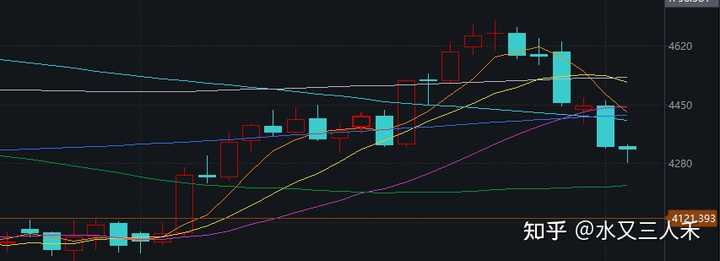

如何看待 2026 年 9 月 2 日 A 股市场行情？ \- 水又三人禾 的回答

9月2日，市场全天震荡调整，创业板指缩量调整跌超2%。截至收盘，沪指跌0\.97%，深成指跌1\.88%，创业板指跌2\.39%，科创综指跌1\.37%。 沪…

还是重点放在前面，供大家参考：

__（1）全球金融市场巨震，这种时候投资者还是乖乖蹲好，等着风暴过去，就当账户不存在了，自动休眠了。__

现在你看到的所有价格，都不是市场理性时候的价格，不要给自己徒增烦恼。

__（2）黄金和美债是风险偏好和流动性的风险标，这两个需要先稳住，别的才能稳住。__

__（3）这种时候就别做什么短线了，好好做防守，做好自己的本职工作，多学点东西，为以后的交易打基础，做准备，这就是投资的冬天，冬天不要乱动，保护好自己。__

美伊这么一闹，很多事情反而是要加速了。

这个2026年9月，注定成为全球央行的加息月。欧央行9月份应该有一次加息，美国和日本央行也吵着说要9月加息。

债券市场更是着急，没等各国央行真的有动作，市场抢先定价了紧缩，这几天 不光是美债利率，日债，还有其他一些国家的债券利率，都在往上走。

这就有点熟悉的味道了，自1973年布雷顿森林体系解体之后，美元潮汐就成了每隔一段时间必来的保留节目。

美元一旦拉升，美债利率一旦迅速走高，那就是在虹吸全球的资本，其他国家的热钱，发现本国的债券投资回报率不如美国，那就会疯狂的流向美国。

这就会进一步的助推美元指数走高。

美元指数走高，其他国家货币对应贬值，就会造成债务难以偿还，进口成本上升，国内股市、债市下跌的状况。

特别是债市，资金被抽离之后，本国债市下跌，利率就等于自动提高了。

这种情况下，就算该国货币当局不去加息，也等于市场自动加息了。

市场自动加息，就会提高本国新发债的利息成本，抑制实体和金融投资。

也就是说，高利率会造成经济增速下滑。

这种情况下，该国政府如果去外汇干预，外汇储备流失，最后外储耗尽，本币再次贬值，加速资本外流。

如果放任不管，任由本币贬值，本国金融市场必将出现大幅震荡，利率被动抬高，财政开支压力加大，最后都是落在经济增速下滑这个事情上面。

所以下一个剧本，就是弱国经济下滑，甚至债务违约。

比如阿根廷，比如埃及，还有很多抗风险能力不足的国家，都会出问题。

再加上目前是通胀率拔高，油价粮价双高的情况，内外交困，这已经类似于局部经济危机了。

所以按照我的判断，除了AI投资比较强的中美两国，其他国家接下来应该经济增速慢慢下滑了。

然后因为通胀的关系，美国还要拉着全球一起加息，这些弱国的经济就会被拉爆。

这几乎是必然会出现的局面，是无解的死局。

我今天开始写了一个关于弱国怎么被美元潮汐拉爆的长文，刚写了个开头，等写完了放出来给大家看，到时候可以一起讨论一下这些问题。

我所说的经济下滑，应该会在未来的6\-12个月慢慢显现。

所以全球石油需求，能源需求之类的，在未来1\-2年，应该是会分化明显。

跟中美相关的，跟AI相关的，需求依然强劲。

但是AI之外的，需求一定是下滑的。

这不是简单的碳基、硅基之类的问题，这是经济内生增长能力的问题。

现在全球经济形态的差异已经很大了，部分地区还在刀耕火种，部分地区已经进入科幻领域。

这样的生产力差异下，大家又共享同一个地球的能源和粮食，这就会出问题。

弱的被强的拉爆，强国享受太平，弱国物价波动不断，这就是现状，也是未来。

所以美联储9月如果真的加息，是坏事吗？

其实不是的。

早点加息，早点完成这一轮美元潮汐，让代价成为代价，这或许就是残酷的必然。

因为我们都无法改变什么，历史已经轮回了几十年了，从大的宏观经济角度，现在跟50年前，全球经济面对的问题其实也并没有什么两样。

加息，经济衰退，需求下滑，油价下跌。

然后再降息，刺激经济，恢复生产。

我们要等的就是这个轮回走完。

所以每天看股市，意义其实也不大，我们根本用不着每天交易。

把握大方向，不犯大错误，这是最重要的。

股票市场每天的波动，其实算是扰动，只有趋势出来，并持续，那才是重要的赚钱机会。

某种程度上，最近都是适合沉淀下来，多思考，多学习的阶段，因为交易上面不需要你太多操作。

全球金融市场都很混乱，这种时候你乱操作，只会左右挨打。

alt="Image">

我刚才看了一下，我在知乎3年多，写了400多万字。

对于业余创作者来说，也算不错了，毕竟我有很多日子都是给自己放假的。

对于读者来说，最重要的是内容看，然后要有好内容看。

这些是最重要的。

我尽量保证输出的都是有价值的东西，不浪费大家的时间。

其实投资是有阶段的，就是你要认清目前所处的阶段是哪里，在周期的哪个位置上。

在合适的位置上，你闭着眼睛买入就能赚钱，在错误的位置上，你费尽心机都做不好收益。

这就是大势的影响。

现在的大势是什么？

就是等寒冬结束，等冲击结束。

股票投资者现在就是要熬着。

在这个前提下，你分析再细致，其实都没用，大的浪潮还没出现。

alt="Image">

但是有没有好消息呢？

其实也是有的，因为物极必反，全球金融市场搞成今天这个样子，距离拐点其实就很近了。

连道琼斯指数都跌破50日均线了。

按照美股的特定，这种短期暴跌的行情后面，都是V字拉上去的。

只不过到底哪一天见底，这个不太好猜。

要看美国跟伊朗哪天不打了，又坐下来谈判了。

alt="Image">

大家可以多看看美债跟黄金，这两个东西如果稳住了，短期市场就稳住了。

这个很简单，经过这一年的重重考验，相信大家的宏观分析能力也有了很大的提升。

虽然这一年你们没怎么赚到钱，但是你们收获了知识，陶冶了情操。

这在未来都是有用的。

这个不是段子，我们就好比2018年，大家也是没赚到钱，就是学了一肚子知识，但是之后几年都赚的比较舒服。

历史就是不断轮回的，别灰心，别慌张，要相信未来。

最后推荐下我的长文。

看美债的，看这篇：

[全球长债遭抛售，30 年期美债收益率升破 5\.3%，创 2007 年以来新高，将如何影响全球经济？](https://www.zhihu.com/answer/2078159038639087927)

看粮食危机的，看这篇：

[摩根大通警告明年或爆发全球粮食危机，食品通胀率将从2\.8%升至5%，粮价会大涨吗？会对国内有影响吗？](https://www.zhihu.com/question/2072359611483382539/answer/2073081262558930489)

看通胀的，看这篇：

[纸币会带来通胀，金银也会带来通胀吗？](https://www.zhihu.com/question/2063981377708725274/answer/2063994103159957434)

看白银逻辑的，看这篇：

[巴菲特真的不喜欢黄金和白银之类的金属投资吗？](https://www.zhihu.com/question/2065024936763188522/answer/2065965682370539626)

好，今天行情回答就写这么多，祝大家交易顺利，天天开心！
