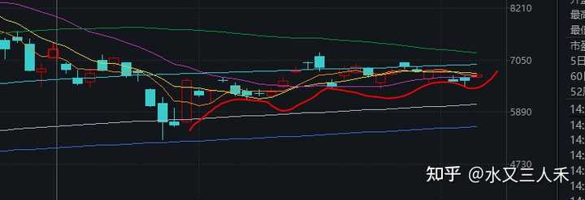
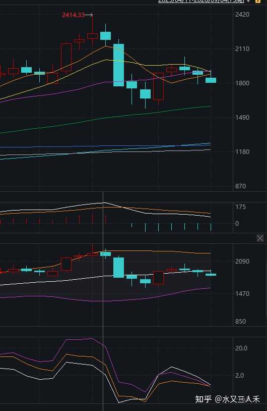
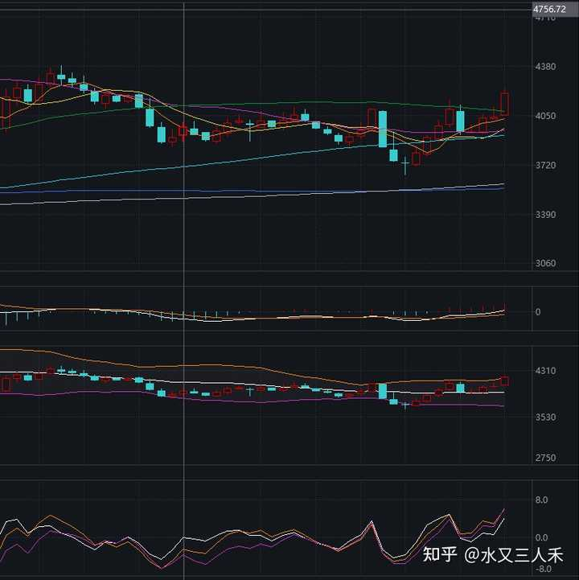

如何看待 2026 年 9 月 4 日 A 股市场行情？ \- 水又三人禾 的回答

美联储沃勒转鸽！9月加息预期大幅降温；美股科技股大涨；英伟达119亿美元收购抱抱脸；“微信单删提示”冲上热搜！客服回应丨每经早参 | 每经网 美联储理…

还是重点放在前面，供大家参考：

__（1）市场在静待晚上美国非农就业数据出炉，这个很关键。__

从白天的纳指期货、美债利率、商品市场表现看，估计今晚的就业数据是比较低的。

（2）A股还在努力避险，但是周K维度看，未来三周需要小心红利超买回调。

（3）黄金大概率稳住了，如果后面再回调，跌不破4300美元/盎司，就是绝佳买点。

今天晚上有美国8月份非农就业数据，这个才是重头戏。

美联储最近一直是三派，一派是无论如何都要降息，一派是有条件的鹰派，还有一派是摇摆派。

坚决降息派人数其实不少，只不过最近半年都被美国通胀率数据给压住声音了。

沃勒其实属于摇摆派，降息派的是米兰。

沃勒这个时候选择鸽派发言，跟之前的ADP数据较差是有较大关系的。

就业数据变差，摇摆中间派的那几个人就会转向鸽派。

所以我说今天晚上的非农数据，应该是很重要的。

我今天去拉了一下美国上半年的库存增速数据。

我发现美国上半年的商品销售额增速真的很高，商品销售额增速，是库存增速的前瞻性指标。

商品销售额增速高起来的几个月后，库存增速通常也会高起来。

这两个数据下半年如果出现拐点，那才是美联储货币转向的关键。

说到底，美国经济需求还是强悍，所以通胀率才下不去。

如果光从政策操作来讲，我觉得2026年上半年美联储就应该开始加息了，加到2026年的年底，这样通胀率大概率就按住了，2027年又可以降息了。

但是沃什是很摇摆的，嘴上说着狠话，实际上一直没有加息。

所以美国通胀率回落这个事情，就延后了很久很久。

总之美国这个状况，历史上也比较少见，沃什这个动作，跟伯恩斯都有点像了。

美股三大波段仙人，最近这个梗都传遍了。

懂王是石油仙人，不停让油价在70\-90美元中间波动。

贝森特是美债仙人，不停的让美债利率来回震荡。

沃什是加息预期仙人，每次加息概率爆表的时候，沃什就静悄悄了，每次加息概率下去了，他又出来讲话了。

alt="Image">

这些宏观上面的预期变化，直接会影响股票、债券、商品，汇率的走势。

但是这样的影响不会那么快，那么短期。

比如我们今天下午看到韩国股市涨幅扩大，纳指期货开始上拉，原油、大豆、玉米期货价格都往下跌。

美债利率从中午开始下跌。

这些东西大家要敏锐的注意到的话，就会发现他们指向的都是一个结果，那就是：

__今天晚上的非农就业数据，会不及预期，美联储加息预期，会下调。__

__这就是明晃晃的告诉你答案了。__

alt="Image">

所以，我们看见A股这边还在避险，很多股票还在下跌，你就会觉得很违和。

但是没关系，到底市场怎么走，我们多等几天就知道了，A股一直是稍微滞后于外围的，但是A股的动量效应又比外围强。

就是说，A股反应慢，但是刹车踩的也迟。

涨的时候，会多涨几天，跌的时候，也会多跌几天。

因为我们市场有效性不足，机构投资者较弱，散户多。

纳指期货这个日K线位置，空头应该看了会吓得睡不着觉的。

就差一点了，再上去一点，再涨一点，马上就把所有均线踩在脚下，形成多头排列了。

MACD跟布林带的位置也不错。

这是比2026年8月中旬更好的突破位置。

alt="Image">

韩综指其实也是一样，这都多少个底部垫在下面了。

试探了多次，下不去，也就下不去了。

这个道理，其实并不复杂。

如果未来几周纳指、韩综指、费城半导体指数这些的涨上去了。

不要忘记我今天写的话，不是要证明我多厉害，而是说，读者要学会这个分析方法。

这个实战教学的机会太难得了。

学会了，下次你们自己也能看出来了。

alt="Image">

我们再看科创100这个走势图。

从日K线看，这两个红线支撑位，就比较迷惑人，让你觉得要破位。

但是你切成周K线，很明显能看出来，下跌的力量已经释放很多了，再跌1\-2周，超卖回补又会出现。

我们去切韩综指、纳指的周K线，看出来的也是类似的，就是上涨势头没用尽，如果转跌，1\-2周反而又可能出现反弹。

所以更可能的走势就是反弹很快就要出现，下一次回调反而要延后看。

alt="Image">

alt="Image">

银行指数的周K已经有点危险，月K看着还行。

所以9月份，如果银行股开始回调，那么波动还不会太大。

但是如果9月涨满一整个月，10月肯定得跑路，因为月K指标出现超买。

别的红利股也是一样，大家注意一下。

6月份科技的暴跌，其实也跟月度超买有很大的关系，我那时候没提前看出来，疏忽懈怠了，那是我菜，但是复盘之后，我还是找到了问题所在。

很多人直觉上的涨多了，涨快了，量化起来就是月度超买。

alt="Image">银行指数周K

白酒简单讲几句。

有几家白酒说是3季度销量不错，所以情绪共振。

加上今天市场资金还是在避险，白酒自然也是资金避险的高股息标的。

所以涨的也比较好。

这个东西就是熬时间，白酒的业绩短期很难特别超预期，消费大盘不是特别好，但是之前跌多了，反弹都是正常的。

你不要频繁交易，你如果喜欢白酒，你就放着，总有涨上去的时候。

你不喜欢白酒，你喜欢科技，你喜欢黄金，喜欢别的，那你把这个逻辑弄懂，也是逢低买入，不要频繁交易，最后你赚钱的概率也会提高。

熬时间，最后你发现就是很重要的事情。

资金总在割韭菜，你操作频率少，他就割不到你。

你少换手，出错的概率就低。

就这么简单。

坚持你自己看好的方向。

别被别人带偏，独立思考。

很多资产你最后就发现，只要熬下去，好像都比频繁交易好。

当然前提是你买的要是正经资产，有价值的蓝筹股票，或者有价值的资源。

你去跟随孙割，拥抱币圈，我就不知道你会怎么样了。

资产的长期确定性，这个很重要。

虚拟币这个，实在是不太能理解。

好，今天就写这么多，祝大家投资顺利，身体健康。
