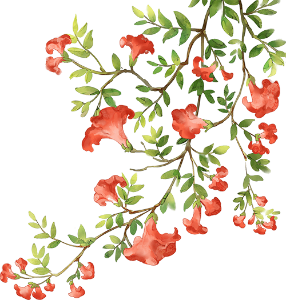
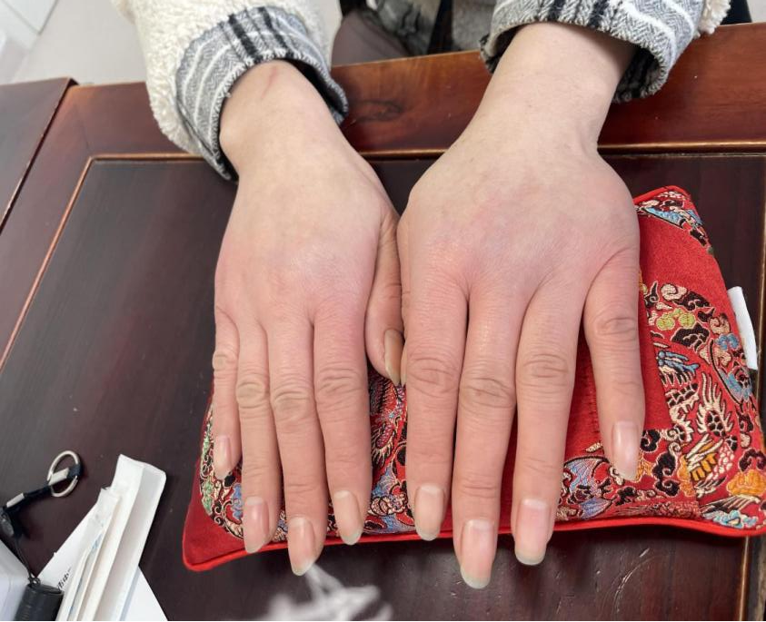
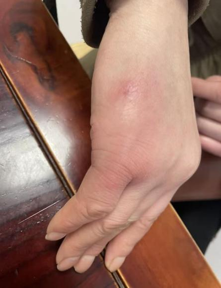
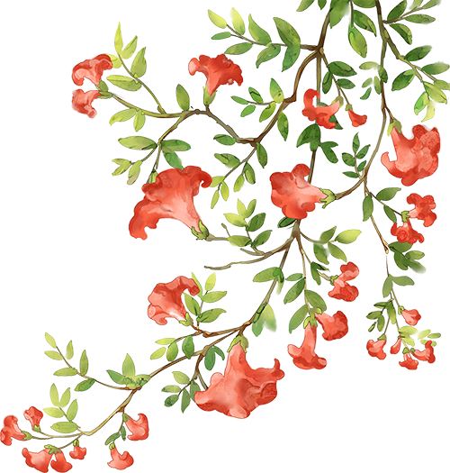

我的经方之路第一百三十八期——浙江张薇医生的经方故事

公众号名称：经方医学工作室

作者名称：张薇

发布时间：2026\-09\-0911:51

经

方

医

学

__我的经方之路__

__第__

__138__

__期__

浙江省金华市中医医院

张薇

2016年，我偶然看到南京中医药大学黄煌教授的经方培训班信息，第一次听课就被他深入浅出的讲解吸引，并立即购入了《黄煌经方使用手册》《中医十大类方》等系列著作。从此在临床中，我开始尝试以“方\-病\-人”思维模式辨治患者，不再拘泥于传统辨证，而是思考患者属于“桂枝人”“柴胡人”还是“麻黄人”，用药也从对应类方中选取。这种思路直观易上手，临床疗效也逐渐显现，经方二字不再形如浮云，而是显出柳暗花明的独特意蕴。

随着学习的深入，我不再满足于书本和课程，萌生了一个念头：黄煌老师到底如何看诊病人？机会终于来了！2023年12月，我参加了黄煌经方临床实战带教班，亲眼见到老师诊疗思路与著作高度一致，甚至用量都相近，且疗效显著，令我深受震撼。师者的博学与经方的优良疗效令我又萌生了一个强烈想法，想去南京跟诊，想跟随黄煌老师系统学习经方。幸运的是，培训期间我偶遇黄老师，鼓起勇气表达了跟诊学习的愿望。经他同意，2024年3月起，我多次前往南京系统跟师学习。

跟诊经方学习的过程是一种中医思维方式不断完善健全的过程。黄煌经方方\-病\-人这种诊疗模式如潺潺泉水，滴灌培育了医者全新的思维体系，这种内化于心外化于行的通治法，正是中医核心思想之一整体观的体现。

跟诊不久一个案例让我印象深刻。有一位年轻女孩，因月经量过多严重贫血就诊，平时需服用铁剂和不间断输血，尝试各种中药西药止血补血，均不见效。黄煌老师没用一味止血药，而用一张简单的经方——甘草泻心汤，神奇地让她经量减少，贫血改善，最后停止输血和口服西药。

面对这类久病或病情复杂患者，黄老师更多去关注人的体质状态，而非局限于疾病本身。该患为体形消瘦的青年人，唇舌暗红，平时有消化道症状腹泻，有焦虑及睡眠障碍，符合甘草泻心汤适用人群。该方适应病症通常在口腔溃疡、胃及肠道溃疡、皮肤湿疹伴或不伴精神心理疾病。患者经血过多为子宫内膜病变，内膜也属粘膜，最终显效考虑该方可能对粘膜病变有效相关。黄煌老师常教导我们：学习经方，不要仅局限于书本条文内容，而要学会延伸思考，扩大经方使用范围。这个案例充分体现了这种思维。

之后的日子，我便一边跟诊学习，一边参与成立全国名中医黄煌经方金华工作室，开设中医经方门诊，治疗之余同时也向更多人宣传经方。如今，我的经方门诊不时有病人或家属前来讨论他们自己对经方的使用情况，每当此时，我眼前都会浮现黄煌老师诲人不倦的身影，于是我学着像他那样耐心解答，并让病人们了解我开方的思路和理由，以致让经方更广泛地惠及千万人，传播千万家。

十年经方，漫漫长途，艰辛之余，亦有快乐。读经典，跟名师，勤临床于我不再是一句口号，而是一套组合拳，是能让自己实现真正蜕变的行动指南。我想让经方不再被看作天上宫阙、沧海明珠，而是真真切切、实实在在能为百姓治愈痛苦，传播中医魅力的独特手段。我深知我的经方之路仍是开始，但良师、益友与挥洒过的汗水都赐予我力量。未来，我会继续踔厉奋发，叩响中医之门，且歌且行且进！

__医案二则__

案一：当归四逆加吴茱萸生姜汤治月经不调伴冻疮案

Q某，女，49岁。

__初诊：2025年11月9日__

2025年3月份月经一月两至后停经，8月13日月经至后又暂停，量不多，色偏暗。既往有多发的子宫肌瘤，小囊肿。在就诊过程中发现患者手凉，手指发红肿胀，根根像胡萝卜。询问得知Q女士从小就容易长冻疮，手脚都怕冷，偶尔有小腿疼痛，温度到十度以下就会手指红肿，发痒，不敢接触冷水，每年冬天都深受其苦。

此外，Q女士述平时胃也不太好，吃点就容易胃胀，大便时干时稀。

腹诊过程中发现肚子整体偏软，能感觉到上腹部比其他处皮肤温度更低，触诊心下有一定抵抗感，左侧脐周有压痛，双侧腹股沟外1/3均有压痛。

Q女士的人物特征是个单眼皮中年女性，面色黄白，面部有色素沉着，有眼袋，头发干枯。舌暗苔白，舌下静脉淤曲，脉细弱。

综其情况，给Q女士使用了当归四逆汤加吴茱萸生姜汤。

__处方：__当归四逆汤加吴茱萸生姜汤

当归12g 桂枝12g 白芍12g 大枣30g 炙甘草5g 细辛3g 通草6g 吴茱萸3g 鲜生姜12g，7剂。

一个月内，坚持服用本方（剂量稍有调整），12月21日Q女士再来就诊，诉12月6日月经来潮，大便情况也好转了，从干稀不调到规律1\-2天1次，成型，质地中等。

在原方的基础上加量：细辛加到10g，吴茱萸5g。

至2026年2月1日，再次就诊，末次月经2026\-1\-27，脉象更有力了，腹诊压痛缓解。诉今年手上只长了一个冻疮。中药口感“虽然有点麻，但是还可以”。在原方基础上调整剂量：

__处方：__

当归15g 桂枝10g 肉桂10g（后下） 白芍15g 大枣30g 炙甘草5g 细辛10g（开盖煎） 通草6g 吴茱萸6g 鲜生姜15g，7剂。

按

语

本案围绕当归四逆合吴茱萸生姜汤，没有用传统意义上的活血药，却令49岁的Q女士月经停经大半年后又能按时而至，同时解决了困扰其多年的手部冻疮。

根据黄煌经方“方\-病\-人”诊疗体系，Q女士是个典型的当归人，面色黄白，头发干枯，有眼袋，面部色素沉着，腹部多处压痛，月经周期紊乱，宜用当归类方。

当归四逆汤是一张传统的温经散寒方。伤寒论原文：“手足厥寒，脉细欲绝者，当归四逆汤主之。”，现代研究提示本方能扩张末梢血管。该方适用病症常见四肢冰冷疼痛为表现的病症，如雷诺病、血管神经性头痛、血栓闭塞性脉管炎、冻疮及其他各种痛症。“若其人内有久寒者，宜当归四逆加吴茱萸生姜汤主之。”Q女士的冻疮是从小就年年发作，还有胃寒导致的食后作胀，血虚寒凝导致的月经不调，下肢疼痛，提示有久寒，应合吴茱萸生姜。

有趣之处是，细辛吴茱萸的口感很多人接受不了，有人分别3g都觉得舌麻受不了，不愿再喝。而Q女士细辛加到10g，吴茱萸5g也觉得“还可以，不是很麻”。对症的中药，适口性也更好，也体现了方\-病\-人体系对应的神奇之处。

__医案二则__

案二：葛根芩连汤治腰痛伴网球肘案

S某，男，46岁。

__初诊：2025年3月27日__

__病史：__反复腰酸胀痛5～6年，步行正常，大便一天2次，粘滞不爽，白天多汗，口苦耳鸣，口渴喜饮冷水，失眠欠佳，梦多易醒。曾多次就诊和检查，未发现异常，西医建议使用消炎止痛药，患者拒绝，要求中药。

__体征：__形体壮实，双眼皮，颜面皮肤和头发易出油，眼睑充血，舌淡胖，边齿痕，苔薄腻，脉弦细。腹软。

__处方：__葛根芩连汤合泻心汤

葛根60g（先煎） 黄连5g 酒黄芩15g 甘草10g 熟大黄5g 牛膝30g，7剂。

药后腰痛汗出缓解，口干口苦耳鸣减少，睡眠好转，仍有梦醒。大便一天一次，前成形，后稀溏，偶有肠鸣，去熟大黄，加肉桂。

__处方：__

葛根60g（先煎） 黄连5g 酒黄芩15 甘草10g 牛膝30g 肉桂5g（后下），7剂。

药后患者觉得轻松很多，腰痛基本消失，自述连已经3\-4年的网球肘疼痛也莫名缓解了，睡眠好转，梦少，大便成形，一天一次，肠鸣消失。为巩固疗效，要求续服7剂后停药。

按

语

葛根芩连汤主治太阳阳明合病，表证未解，里热炽盛，协热下利。《伤寒论》：“太阳病，桂枝证，医反下之，利遂不止。脉促者，表未解也；喘而汗出，葛根芩连汤主之。”患者腰痛检查未见明显异常，病位在肌肉腠理，为太阳表证。多汗口干、喜饮冷水为阳明里热，头晕耳鸣、失眠多梦、面油眼充血为热邪上冲头面，排便粘腻不爽为热邪内迫湿热下注。

患者为形体壮实，面有油光，排便次数多不成形，压力较大的中年男性，腰部疼痛不适可以理解为项背强痛不舒的延伸，符合葛根芩连汤适用人群。该方适用以腹泻为表现的疾病，也多见于头晕为表现的如颈椎病、高血压、糖尿病等疾病。患者使用该方后不仅腰痛缓解，多年疼痛的网球肘也一并好转，充分体现经方通治法的神奇疗效，也是中医学整体观表现。

方中重用葛根，葛根主入阳明经，外解肌表之邪，内侵阳明之热，又生津止泻。合大黄为泻心汤之意，导热下行使热从大便去。二诊后热象已经去除，加肉桂合方中黄连取交泰丸交通心肾、清上温下，牛膝补肝肾、强筋骨、引药下行。黄煌老师常在葛根芩连汤中加肉桂牛膝，用来治疗有或无糖尿病合并腰腿无力、大便粘滞不爽或腹泻者。

__免责声明__

•本公众号所载医案，均为个人经验总结或文献摘录，旨在交流学习，分享中医知识，传播健康理念。不能替代执业医师的当面诊断和治疗建议。请勿将内容作为自行诊断或用药的依据。

•请读者知晓并同意，如有任何健康问题，应及时前往正规医疗机构就诊，咨询专业医师意见，切勿依照本文自行诊断耽误病情。

•本公众号及运营者不对任何个人或团体因依赖本文内容而遭受的损失承担责任。

黄煌经方医学工作室

地址：南京市鼓楼区凤凰西街208号

电话：025\-86538120
