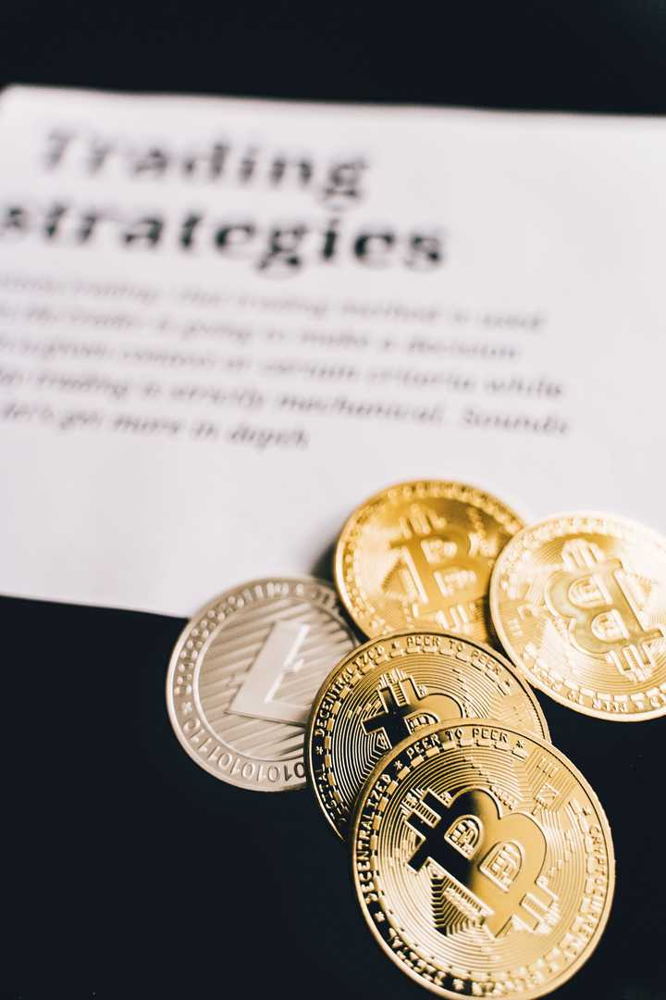

投资中保持耐心有多重要? \- AlPHA\.logs 的回答

或者叫，为什么耐心在投资中很重要？ 不限于股票，债券 ，期货，所有的品种都可以。 欢迎大家畅所欲言。

alt="Image">

__投资里，耐心非常重要，它决定了一个人最后能不能真正吃到复利。__

不过耐心只有放在正确的东西上才有价值。

买错了一家公司，等十年不会自动变成价值投资；一个商业模式已经坏掉了，继续持有也不会因为时间够长就变得正确。

所以投资里真正稀缺的能力，其实是两件事：__判断值得不值得等，以及真的等得下去。__

大多数人第一件事已经很难，第二件事更难。

## 很多钱，其实是“等”出来的

我们平时看投资，很容易把注意力放到价格上。

今天涨百分之3，明天跌百分之5，这个月跑赢指数，下个月又落后。账户每天都在给你反馈，于是人会产生一种错觉：投资收益是通过不断处理这些价格变化赚出来的。

可一旦把时间拉到十年、二十年，情况会变得很不一样。

一家真正优秀的企业，在很长的时间里持续卖产品、赚利润、扩大规模、回购股份、分红，企业本身的价值就在一点点累积。

股价当然会乱跑。

企业一年赚十块钱的时候，市场可能愿意给它二十倍估值；经济不好时，突然只愿意给十二倍；情绪亢奋的时候，又可能给到三十倍。

短期看，投资者天天在面对这些价格变化。

时间拉长以后，真正推动财富增长的东西，慢慢从“别人今天愿意出多少钱”变成了“这家公司这些年到底多赚了多少钱”。

伯克希尔的持仓就是一个很极端的例子。

截至2025年底，伯克希尔持有的美国运通股票账面成本约十二点八七亿美元，市场价值已经达到约五百六十一亿美元；可口可乐的账面成本约十二点九九亿美元，市场价值约二百八十亿美元。

更有意思的是分红。

仅2025年一年，美国运通给伯克希尔带来的分红约四点七九亿美元，可口可乐约八点一六亿美元。也就是说，可口可乐一年支付给伯克希尔的现金分红，已经超过当年整个持仓原始成本的一半。

当然，这里有非常明显的幸存者偏差。

世界上曾经有无数家公司，拿二三十年最后拿没了，大家不会专门写文章纪念它们。所以这个例子不能证明“只要长期持有就会发财”。

它真正说明的是另一件事：

__如果一个资产本身能够持续创造越来越多的现金流，时间会成为投资者的朋友。__

前几年看起来只是增长百分之几、百分之十，时间一长，增长发生在更大的基数上，复利才开始露出真正的样子。

很多人知道复利公式，却低估了其中最重要的那个变量。

不是收益率。

是时间。

## 市场最折磨人的地方，是好日子和坏日子挤在一起

可为什么大家都知道长期投资，真正做到的人还是少？

因为长期是一个事后看起来非常舒服的词。

身处其中的时候一点都不舒服。

你今天回头看一张二十年的指数走势图，可能会觉得曲线整体就是从左下往右上。

可真正生活在那二十年里，你经历的是金融危机、疫情、战争、通胀、加息、企业暴雷、行业泡沫、政策变化，还有账户里一次又一次真实的下跌。

每一次发生的时候，新闻都不会告诉你：

“放心，这只是长期走势图里的一个小坑。”

当时的新闻只会告诉你，事情可能比你想象中严重得多。

这也是市场择时特别难的地方。

Vanguard统计过一个很典型的例子：假设1988年投入十万美元跟踪标普500，并一直持有到2024年底，最终大约会增长到四百九十万美元。

如果只是错过这三十七年里表现最好的十个交易日，结果会下降到大约二百三十万美元。

二十个最好交易日没赶上，只剩大约一百四十万美元。

这里当然不能简单理解成“永远不能卖”。

这种统计还有一个必须说清楚的问题：如果一个人神奇地避开了最差的交易日，结果同样会大幅改善。

麻烦就在这里。

现实中没人提前知道明天属于“最好的一天”还是“最差的一天”。

更麻烦的是，两者经常离得非常近。

市场最剧烈的反弹，很多时候恰恰发生在恐慌最严重的时期。Vanguard对长期市场数据的研究也发现，最好和最差的交易日往往会集中出现。

这意味着一个人在最害怕的时候离开市场，很可能确实躲过了一部分下跌。

但什么时候回来？

这一步通常比卖出去难得多。

跌百分之20的时候你害怕。

跌到百分之30，你会觉得自己卖对了。

等它突然反弹百分之10，你又会认为只是熊市反弹。

再涨一点，你开始等回调。

等到终于确认“危机过去了”，价格可能已经回去了很大一截。

所以很多择时失败并不发生在第一次卖出。

真正丢掉收益的地方，经常发生在第二个决定：__不知道什么时候重新回来。__

## 投资者最容易输掉的，恰恰是自己本来已经赚到的钱

这一点其实有真实数据。

Morningstar在2026年最新一期《Mind the Gap》研究里统计了美国共同基金和ETF投资者过去十年的实际投资结果。

截至2025年底，这些基金本身的年化总回报大约是百分之9\.9。

可把投资者真实的资金流入流出算进去以后，平均每一美元实际获得的年化回报大约只有百分之8\.7。

每年少了约一点二个百分点。

百分之1\.2听起来并不吓人。

放到十年、二十年以后，它会慢慢变成很大一笔钱。

更值得注意的是，这个差距并不是基金突然少赚了。

基金的净值就在那里。

损失主要来自投资者什么时候买、什么时候卖，以及每次投入多少钱。

换句话说，有一部分人选到的资产其实没那么差，最后拿到手的收益却明显低于资产本身的长期收益。

市场把钱赚出来了。

人自己折腾掉了一部分。

这件事可能比“怎样找到下一只十倍股”更值得普通投资者想一想。

因为选中下一个伟大公司的难度非常高，少犯几个行为错误，反而是很多人真正有可能做到的事情。

## 为什么什么都不做，反而这么难

投资有一个很反人性的地方：

__努力和结果之间，并没有我们在现实生活里熟悉的那种对应关系。__

上班的时候，多做一点事通常不会错。

考试的时候，多刷几套题通常也不会错。

创业的时候，你一天什么都不干，大概率真的会出问题。

我们从小形成的经验都是：遇到问题，采取行动。

股票账户恰好每天都能制造“问题”。

跌了，要不要止损？

涨了，要不要止盈？

别人涨得更多，要不要换？

新闻出来了，要不要调整？

美联储讲话了怎么办？

某个行业突然热门，要不要进去？

于是人很容易把“我正在处理投资”误认为“我正在改善投资结果”。

两件事其实没有稳定关系。

有时候你当然应该行动。

但很多时候，频繁行动只是缓解焦虑的一种方式。

账户跌百分之10，你非常难受。卖掉以后，即使价格继续跌，你反而舒服了，因为控制感回来了。

这就是市场特别有意思的一点。

__交易会立刻给情绪一个结果，长期投资却经常几年都不给你答案。__

人天然喜欢前一种反馈。

所以短期投资从心理体验上，经常比长期投资更加诱人。

你每天都有事情做，每天都有胜负，每天都有新的信息，每天都可以证明自己比昨天聪明了一点。

长期持有则很无聊。

公司还在正常经营，财报没什么大问题，估值也没有荒唐到完全无法接受。

然后呢？

然后可能就是没有然后。

再等一个季度。

再等一年。

再等三年。

这对人的心理其实要求很高。

## 真正难熬的，还不是下跌

很多人以为耐心最大的考验，是自己持有的资产跌。

其实还有一种情况更痛苦：

__你没怎么跌，但别人一直在涨。__

自己的账户一年赚百分之8，本来已经挺不错。

旁边突然出现一个一年涨百分之80的东西。

刷短视频看到有人晒收益。

打开社交媒体又看到有人说自己抓住了某个赛道。

再过几个月，你原来那百分之8突然变得特别碍眼。

这时候人的参照系已经换了。

你不再问：

“我的投资有没有按照原来的逻辑发展？”

你开始问：

“为什么别人赚钱比我快？”

投资从资产判断变成了社会比较。

很多真正长期的策略，就是在这个时候被破坏掉的。

牛市最容易让人失去耐心，原因也在这里。

熊市至少大家一起难受。

牛市出现结构性行情以后，有人一天赚的钱可能比你一个月还多。你每天都能看到自己“错过了多少”。

这种感觉非常真实。

所以耐心需要接受一件特别难接受的事情：

__你完全可能做了一件长期正确的事情，同时在很长一段时间里显得像个傻子。__

市场不会每天给正确的人发奖状。

有时候它甚至会连续几年奖励另一套方法。

## 但“长期”也是市场里最好用的借口之一

说到这里，还必须给耐心踩一个刹车。

因为投资市场上有一句特别危险的话：

“拿着就好了。”

一家公司从一百跌到六十，说长期。

六十跌到三十，继续长期。

基本面开始恶化，还是长期。

商业模式已经发生变化，又告诉自己市场迟早会发现价值。

最后所谓耐心，慢慢变成了不愿意承认判断错误。

这种事情一点也不少见。

所以真正的耐心一定要有一个锚。

这个锚应该落在当初为什么买，而不是买入价格是多少。

假设当初看中的是一家企业未来几年能够持续增长，那么接下来真正需要观察的是订单、利润、现金流、竞争格局和行业空间有没有按照原来的方向发展。

如果这些东西还在，股价暂时不动，等待可能有意义。

如果原来的逻辑已经消失，只剩一句“我都拿这么久了”，时间反而开始成为成本。

还有一个很简单的判断方法。

想象一下，忘掉你的持仓成本。

今天第一次看到这个资产，你还愿不愿意以现在的价格持有它？

如果答案已经完全改变，那至少应该重新检查一次原来的判断。

人特别容易被成本价绑架。

买入一百元以后，九十元会觉得“亏了十块”。

可市场根本不知道你一百元买的。

未来从九十走到多少，只和未来发生什么有关。

那张一百元的成交单，只存在于你的账户和记忆里。

## 耐心还有一个经常没人讲的前提：你得等得起

长期投资听起来很公平。

实际上，它对资金结构有要求。

一个二十五岁、有稳定收入、未来几年没有大额支出的人，和一个两年以后就要买房、交学费或者偿还债务的人，即使买了完全一样的东西，他们承受长期波动的能力也完全不同。

这也是为什么“长期一定能等回来”这种话很危险。

资产有自己的周期。

人生也有自己的周期。

如果市场需要五年恢复，而你的钱两年以后就必须拿出来，那么第五年的收益对你没有意义。

所以耐心从来不只是性格。

背后还有现金流。

有稳定收入的人，更容易等。

没有杠杆的人，更容易等。

短期没有大额资金需求的人，更容易等。

仓位让自己晚上睡得着的人，也更容易等。

很多人最后卖在最难受的位置，并不一定是判断力突然消失了。

有时候只是仓位太重，生活里的钱又突然需要用。

市场稍微一跌，心理问题很快就变成了现金流问题。

到了那个阶段，再谈信仰已经没什么意义。

## 投资最后比的，可能是谁能少犯一点错

大家进入市场以后，很自然地会寻找更多信息。

更多财报。

更多宏观数据。

更多行业新闻。

更多专家观点。

这些当然都有用。

但投资做到最后，会发现知识增长到一定程度以后，新的难题慢慢转移到了自己身上。

你能不能在市场最热的时候接受自己没有买到最热的东西？

能不能在暂时落后时继续按照原来的标准判断？

能不能在所有人都恐慌的时候，不让价格变化直接替代基本面判断？

更难的是，当真正的事实证明自己错了，能不能停止用“长期”安慰自己？

这几个问题都没有公式。

可它们可能决定了一个人最后真正拿到多少收益。

所以我越来越觉得，投资里的耐心并不是什么浪漫品质。

它更接近一种能力。

你先花很长时间判断一个东西值不值得拥有，买下以后继续观察它有没有按照原来的方向发展。

如果答案还成立，就允许时间工作。

如果答案已经变了，也允许自己承认判断曾经错过。

中间大量时候，其实没什么事情值得做。

这恰恰是最难的地方。

金融市场每天开门，价格每秒都在变化，新闻永远源源不断，它天然会制造一种感觉：你应该不停地做决定。

可财富的增长速度，很多时候没有那么戏剧化。

企业要一年一年赚钱，现金流要一点一点积累，复利需要把收益放到更大的本金上继续增长。

它很慢。

前几年甚至慢得让人怀疑人生。

等时间真正拉开以后，你才会发现，投资里最昂贵的一种能力，可能就是允许一件正确但无聊的事情，安静地发生很多年。

__耐心当然不能保证赚钱。__

但如果一个人连等待正确事情发生的能力都没有，那么即使偶尔真的买到了一个好资产，也未必能把属于它的长期回报完整拿走。

市场里从来不缺机会。

真正稀缺的，可能是一个人在机会出现以后，还能不能把时间留给它。
