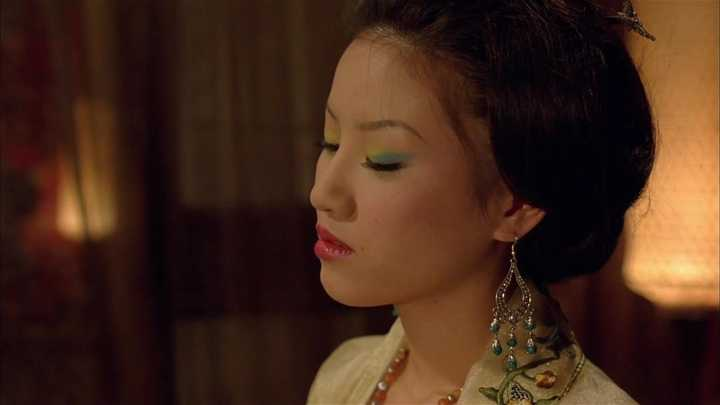
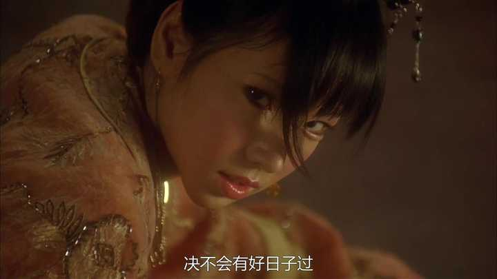
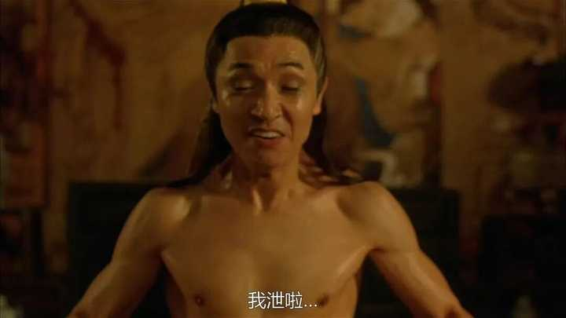

金瓶梅里李瓶儿为什么完全不斗潘金莲？ \- 迦文 的回答

一味的只会忍气吞声，被人骂上脸了都不反抗。

她的敌人不是潘金莲，是整个系统。

她深刻又清晰地认识到这样残酷的一个点：除了西门庆，整个西门府的人都希望她去死。

个人很难斗得过系统。

这是非常隐蔽的一件事，包括李瓶儿本人的心理，都本能地不敢面对。

李瓶儿进门之前，西门府维持着微妙的平衡。

大娘吴月娘，不受宠，但是正牌大娘子，有名誉有权力，其他妾要给她请安行礼的；别人怎么受宠无所谓，西门庆睡谁无所谓，反正她的地位在。

二娘李娇儿，勾栏出身，有娱乐场所资源，掌管一段时间财务，有生态位。

三娘孟玉楼，有钱寡妇改嫁西门庆，和西门庆算是公司合并，强强联合，她的生存空间很大。就算西门庆没多大兴趣和她上床，但也不敢怠慢孟玉楼。

四娘孙雪娥，前任正妻贴身丫鬟，做饭好吃，西门庆破格提拔她做四娘，兼任后勤主管。她自己心里边其实也接受在西门家的地位，四娘的名头总比下人强，要啥自行车？心里不舒服，大不了给西门庆戴个绿帽子呗，这不就平衡了。

五娘潘金莲，西门庆为了睡她前期花了钱，后又付出巨大代价娶进门的，属于什么呢，除了床上那点事没给西门庆别的实际利益，甚至对于西门庆来讲这是亏本买卖。潘金莲也得益于自己的性魅力，这是她受宠的核心资源。

可六娘李瓶儿进门，系统微妙的平衡被打破了。

alt="Image">

妥妥大富婆，太有钱了，孟玉楼那点钱不算啥。

又生了个儿子，要知道那时候吴月娘还没孩子呢，连个女儿都没有，你说这事恐怖不？

以及西门庆喜欢她的白屁股，这让潘金莲嫉妒的不行。

这不是西门庆和谁睡的事，而是事关生存的大事！

家人们，李瓶儿抢了多少人的饭碗啊！

谁能看她顺眼？

谁不希望她死？

只不过大家默契的不说，不表现出来，仅此而已。

潘金莲就是直白地表现出了恶意。

__一个已经完成分配的运行系统，任何一个人想在这个系统搞点什么，现有的资源持有者都会默契的想要搞死你。__

在这个系统里，你试图争取一点什么，就会立刻感受到压力。

而且这种压力的诡异在于很隐蔽，好像没谁针对你，但你就是做事不顺，但又找不到具体的源头。

现有的系统里，对于既得利益者来讲，稳定就是收益。

李瓶儿进门成了六娘，大家细想多少人的生存空间被压缩了？

所以，系统里最为理性的选择就是让她死，一切回归常态。

不是潘金莲一个人针对李瓶儿，是整个西门府__所有人意念层面的自发协同，大家很默契，心照不宣，都在维护自己的生存空间。__

李瓶儿理解这一点，她知道斗潘金莲是无效的。

就算她无法用语言描述出来，她的潜意识也会告诉她忍气吞声，因为这么做收益最大。

alt="Image">

整个系统都是阻力，整个系统都想她死，想来也挺让人绝望的。

想要对抗，或者摆脱这个系统，大家都明白，仁义道德那一套屁用没有，只会让人吃干抹净。

__⭐️__最有效的办法其实就是提前看透，不入局。

说白了就是，李瓶儿不进西门府就行了，六娘爱谁当谁当，好像是屁话哈，因为木已成舟了，不过我还是想让大家有一点启示。

李瓶儿勾搭西门庆，婚内出轨，没毛病，我从生存的角度来讲。

重点提一句：__生存面前，不谈道德。__

不然一个美丽的女人，有着巨大的财富，没可靠的男人，没儿子\.\.\.是等死吗？

最好的谋算其实就是守住手里的钱，用钱吊着西门庆，不能一点不给，也不能虎了吧唧的全都给，总之儿子先生了再说。

不进西门府，就是不进，不直接参与女人间的斗争。又不是没钱没房子，住自己大别墅不香么，没人敢动她，都知道她是西门庆的女人。

钱在手，儿子在手，怕个毛线。

__以后的行事准则是，这件事对儿子有利，那就去做；对儿子没利，那就不去做。__

这么做并不是万无一失，谁都不知道以后有什么意外，可进西门府的确不是一个好的选择。

加上李瓶儿有个硬伤，注定她会输。

她的身体素质是真不行啊，可能先天基因差点，被花太监当成玩物又得了妇科病，崩漏之疾也就是下边流血不断。

虽然花太监出钱给治，但架不住太监变态啊，这病反反复复，留下根了。

进了西门府，劳心费神的宅斗需要身体素质作为支撑，可她没客观条件养体格。

精神上需要忍受系统隐秘的恶意，生理上更是，比如怀孕了西门庆突然兴起要办事，肚子不舒服还得出来应酬，陪笑脸喝酒，生完孩子后潘金莲各种作闹影响她休息。

最致命的精神打击就是儿子没了。

最致命的身体打击是生完孩子后下边流血不断，西门庆吃了春药和王六儿没折腾够，回来折腾李瓶儿。拗不过的她只能一边擦拭身子一边和西门庆行房，西门庆意满射 精。

alt="Image">

李瓶儿却是一天不如一天\.\.\.直至死亡。

物质世界，肉身陨灭，等于完全失败。

⭐️李瓶儿给我们普通人什么启示呢？

请一定一定注意身体健康。

[人生翻盘指南](https://www.zhihu.com/column/c_1989331416786441232)，我还是推荐大家订阅我的专栏。原因，以及方式方法我说腻了。

__人的身体素质会影响自身的判断力、评估能力、长期规划能力，情绪，甚至是人生走向。__

__你觉得自己还行，其实你已经不行了。你觉得自己做的决定是正确的，经过深思熟虑的，但事实不是如此。__

身体慢慢不好，有个极其阴险的点，这个过程是慢性的、隐蔽的、且不会给你任何明确的警报信号的，表现在医学上就是没有任何病变。

也就是说西医永远查不出毛病。

你这个人不会突然倒下，你只是变得比平时更加不行，仅此而已。

每一个单独拿出来都不算什么大事，但累积起来，半年、一年，你的生活会发生质的向下的变化，但你就是不知道为什么。

等查出毛病了，离死也不远了。

很多回答都在说认知、思维方式之类的，啥用没有，你的事业和生活不会因此变好。

人生负面闭环：

身体不好，影响判断力和长期规划，做出了错误的选择；

选择错了之后，因为沉默成本不想放弃，身体加速不好，也没那个体力和精力从头再来。

李瓶儿就是这样。

如果你现在也是人生困境，假如你认为的话，其实你根本不需要什么具体的方法，去学什么高深的哲学、心理学、经济学知识，注意，我不是说没用。

只是，目前，你吃好喝好睡好，身体这台机器维护好，然后你回头再看这些事。

\-\-\-\-\-\-\-\-\-\-\-\-\-分割线\-\-\-\-\-\-\-\-\-\-\-\-\-\-

安利下我的公众号：__迦文小姐姐__

以上，

条件允许，可以请我喝杯咖啡吗？

手动先来个比心 ～

爱你们～

请我喝咖啡的朋友们都来财来财～

点点下方 ↓ ↓ [@知乎人文](https://www.zhihu.com/people/0eebc9b425a88e87408729eec9f09be4)
