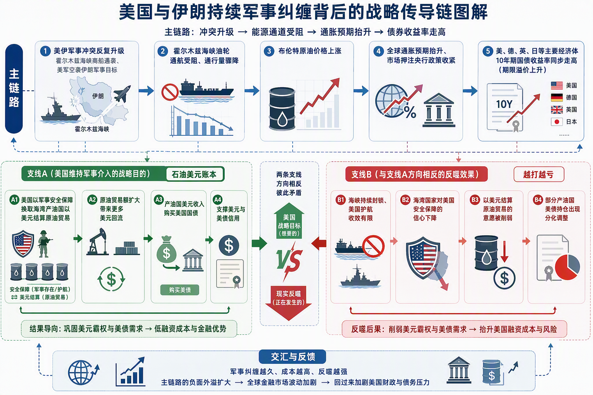

陈兵5万仍不撤：美国纠缠伊朗的战略账本

DEEPTOPIC · 地缘政治 · 2026\-09\-02

拿军事保护换石油美元结算，这笔账正变得越来越贵

[核心结论](NULL) [交火与油价](NULL) [传导链条](NULL) [石油美元](NULL) [矛盾账本](NULL) [财政政治](NULL) [A股传导](NULL) [后续观察](NULL) [基金产品](NULL)

__核心结论：__2026年9月美伊在中东军事摩擦再度升级，布伦特原油与全球主要经济体国债收益率同步走高。__背后是美国用军事保护换石油美元结算的战略账本，如今因海峡失控、财政与选举压力攀升而越算越亏，却仍难轻易放弃。__

买基金就是买板块，打包板块成分股，跟踪板块走势！ ▾

## 新一轮交火：导弹、油价与全球国债的同一夜

美国与伊朗持续军事纠缠背后的战略传导链

2026年9月1日，美国中央司令部对伊朗革命卫队的防空阵地、雷达系统、海上相关设施与布雷能力相关装备发动新一轮打击，官方给出的理由是回应伊朗此前企图袭击霍尔木兹海峡商船与美方军事人员。彼时，超过5万名美军已在中东部署待命。9月2日凌晨，伊朗革命卫队发布声明，称向约旦亚喀巴湾沿岸的美国海军陆战队营地发射了重型弹道导弹，并表示"复仇行动仍在继续"——__截至目前，美军与约旦官方均未就此作出回应，这一说法暂时只能算伊朗一方的表态，尚未获得独立证实。__

几乎在同一时间窗口，市场给出了自己的反应：布伦特原油价格连续走高，德国、英国、日本的10年期国债收益率据市场消息分别触及2011年、2008年、1996年以来的高位，美国10年期国债收益率据市场消息也升至金融危机以来的罕见水平。

这不是这轮冲突第一次演出"打—停—再打"的剧本。冲突从2026年2月底爆发算起，半年多时间里已经循环了四五轮：3月美方放弃了地面夺岛方案，4月转向海上封锁并展开停火协商，5月启动海军护航，6月19日双方在日内瓦正式签署谅解备忘录——约定伊朗尽力在60天内保障商船安全通行，美方则在30天内解除海上封锁、放开伊朗原油出口。但这份备忘录留了一个关键空白：海峡长期意义上的通航主权归谁，双方并没有写清楚。结果是，7月8日伊朗最高领袖葬礼结束当天，伊朗革命卫队就对通行商船发动了袭击，海峡通行量迅速跌回停火前水平；7月25日，特朗普一度下令暂停空袭；8月25日，美国财政部转向新一轮制裁"经济弃儿行动"；到9月1日至2日，局势又从制裁重新升级为直接军事对抗。

美伊冲突半年脉络

2026年2月底至9月初，冲突循环了四五轮"打—停—再打"

2026年2月底

美伊冲突爆发

2026年3月

美方放弃地面夺岛方案

2026年4月

双方协商阶段性停火，美方转向海上封锁

2026年5月

美国海军启动护航行动

2026年6月19日

双方在日内瓦签署谅解备忘录

2026年7月8日

伊朗最高领袖葬礼当天，伊朗革命卫队对商船发动袭击，海峡通行量迅速回落

2026年7月25日

特朗普下令暂停对伊空袭

2026年8月25日

美国财政部启动新一轮对伊制裁"经济弃儿行动"

2026年9月1\-2日

美军打击伊朗军事目标，伊朗革命卫队宣布对约旦境内美军基地发动导弹反击（尚未获美方证实）

#### *布伦特原油近期收盘价走势（2611合约，美元/桶）*

数据来源：行情数据接口

__单看这几天的走势，布伦特原油从8月27日的88\.47美元/桶一路上冲到9月1日的95\.19美元/桶，短短几个交易日涨幅接近8%。__这轮波动为什么没有停在"油价涨了"这一层，而是一路传导到全球国债市场，是接下来要讲清楚的第一件事。

## 从油价到国债：一条被反复验证的传导链

原油几乎是所有工业品和运输成本的基础输入，价格一涨，市场对未来通胀的预期会跟着抬升；通胀预期走高，各国央行推迟降息甚至考虑加息的概率就会上升，这意味着愿意持有长期国债的人，要求更高的补偿。这份补偿里除了对未来通胀的预期，还包含对政策不确定性的额外要求，后者在市场里被称为期限溢价。__期限溢价一旦上升，各国长期国债收益率就会同步走高——这正是"美伊冲突→油价→全球国债"这条传导链的核心中间环节。__

数据能印证这条链条在不同阶段的走法。3月中旬当周，布伦特原油单周涨超11%，10年期美债收益率同期单周上升14个基点，德国、葡萄牙、意大利、西班牙的国债收益率也同步上行10多个基点，这一阶段的驱动主要是通胀预期本身。到8月下旬情况有了变化：据机构测算，2026年初以来10年期美债收益率累计上升约53个基点，__其中7月以来的上升里，期限溢价贡献了约32个基点，成为7月以来长端利率上行的主要边际驱动，通胀预期本身的贡献反而有限__——也就是说，市场担心的已经不只是通胀，还包括未来国债供给会不会进一步扩大、政策沟通的信誉是否打了折扣。

#### *主要经济体10年期国债收益率最新水平（%，截至2026年9月初）*

数据来源：宏观数据库

资金流向数据也在同一方向上给出了佐证：6月底那波避险情绪最浓的一周，全球债券基金单周净流入289\.5亿美元，处于近几年高分位水平，货币市场基金同期流入约520亿美元，美股基金反而净流出约141亿美元。钱从股票撤出、涌进避险资产，这是"冲突升级带来避险需求"最直接的行为证据，也说明这场冲突已经不只是中东地区的局部事件，而是实实在在地改写了全球资金的配置节奏。

## 石油美元账本：美国为什么离不开伊朗这块拼图

要理解美国为什么在伊朗问题上反复纠缠、迟迟不肯彻底放手，得回到一个1974年就定下的老规矩——石油美元体系。当年美国与沙特达成协议：沙特承诺石油出口只用美元计价结算，并把贸易顺差里的美元收入拿去购买美国国债；美国则承诺为沙特提供军事安全保障，作为美元本身存在贬值风险的补偿。这套安排后来扩展到整个海湾产油国圈子，也成为此后半个世纪美元维持全球储备货币地位的一块重要支柱。

这套账本的运转逻辑很直接：美国出安全保障，产油国出美元结算和美债购买。只要这个循环不断，美元和美债的信用背后就有产油国的真金白银在撑着；一旦某个环节掉了链子，整本账就要重新算。

放到本轮冲突里看，美国在伊朗（以及同一时期在委内瑞拉）动用军事力量，目标同时包含三件事：打掉不用美元结算的原油贸易渠道，通过局势紧张抬升油价、扩大整体贸易规模从而带动更多美元回流，削弱伊朗这类拒绝纳入美元结算体系的产油国的话语权。__这才是回答"美国为什么愿意为伊朗持续花钱花时间"最直接的答案——美国真正要维护的,是这套让美元继续充当"世界货币"的底层秩序,伊朗只是这套秩序当前受到挑战的一个节点。__

## 矛盾点：海峡越封越死，账本却越算越亏

这本账原本应该是稳赚不亏的——安全保障换美元结算,理论上双方都能得利。但本轮冲突把这套逻辑打出了一个大缺口。

先看海峡通行的实际情况。2026年2月底到6月初,霍尔木兹海峡持续封锁超过100天,6月上旬日均通行量只有约20万吨,远低于战前日均1033万吨的水平;6月19日谅解备忘录签署后,通行短暂恢复,但7月8日伊朗最高领袖葬礼当天就再度对商船动手,通行量迅速跌回停火前水平。到8月底,据最新一期船舶追踪数据,8月20\-26日一周通过霍尔木兹海峡的船舶为152艘,日均约22艘,比前一周涨了近四成,但伊朗方面明确表态只是"临时允许经中间特定航道通行",长期通航安排仍要看后续谈判,海峡还远没有恢复到无条件的常态通航。__换句话说,美国海军的护航和威慑,并没有换来一个稳定、可预期的通航局面。__

更关键的反噬发生在信任层面。美国承诺的安全保障,如果连一条海峡的通航权都保不住,海湾产油国维持"用美元结算换安全保障"这笔交易的意愿本身就会打折扣。这一点已经在美国财政部的国际资本流动数据里露出了苗头：__沙特持有的美债规模从2026年2月的1604亿美元降到6月的1425亿美元,四个月降了一成多__;但阿联酋走的是相反方向,同期持仓还在增长,近两年涨了六成多。

#### *中东主要产油国持有美债规模变化（亿美元）*

数据来源：美国财政部公开统计（TIC数据）

两国持仓方向相反,还看不出海湾产油国"集体抛售美债"的实锤,但沙特这一样本的下滑方向,已经足以说明"安全保障换美元忠诚"这笔交易正在被重新议价,而不再像过去几十年那样被视为理所当然。__这正是"越打越亏却停不下来"这本账最矛盾的地方——美国动用军力本想巩固石油美元体系,可越用力打,海峡越乱,产油国对"美国能兑现安全承诺"的信心反而越薄,账本的负债端被自己越滚越大。__

## 双重刹车：财政账本与政治账本

财政这本账,先算显性成本。目前没有查到国会针对本轮美伊军事行动单独追加的专项拨款数字——公开可查的只有美国例行的整体国防预算:2026财年总额突破1\.05万亿美元,同比增长17%;2027财年预算提案进一步提高到1\.5万亿美元。__这些是美国每年的整体军费,并非专门针对伊朗这一件事的账单。__可参照的历史经验来自伊拉克战争:如果美国被拖入一场长期战争,军费大约会额外占到联邦总支出的3%左右。这笔钱最终要么挤占其他财政支出,要么靠多发国债来填补,而后者恰恰会反过来推高美债供给端的压力,与前面提到的期限溢价上升形成呼应。

政治这本账,可能比军事考量更早触发妥协。据8月下旬多方预测市场与民调数据交叉验证,__民主党赢得2026年中期选举众议院控制权的概率已升至约九成__,同期特朗普的支持率跌破四成、净支持率约为负20个百分点\(以上均为当前市场隐含概率与民调数据,尚未落地为选举结果\)。众议院一旦易手,特朗普推进对伊强硬政策的国内政治资源和精力都会被大幅分流。这也解释了这轮冲突为什么呈现"打一阵、停一阵、再打一阵"的反复节奏,而不是一次性打到底——双方比拼的与其说是军力,不如说是谁能扛住国内的政治成本和民意压力更久。__财政加政治这两本账,才是决定这场纠缠还能拖多久的真正硬约束。__

## 落地：三条A股产业传导线

海峡运力紧张、油价高位运行、地缘避险配置需求,这三条逻辑沿着不同路径分别外溢到A股的三个板块。

油运板块是传导最直接的一条线。海峡通行受阻直接抬升运价与运力紧张预期,以原油、成品油运输为主业的公司对这类溢价的敏感度较高;__从近一个月的市场表现看,主要油运标的普遍录得两位数区间涨幅__,方向上验证了"海峡越乱、运价预期越高"这条逻辑,但这类涨幅更多反映的是预期,后续仍需要跟踪实际运价指数是否同步走高。

黄金板块反而是这轮冲突里最反直觉的一条线。地缘避险情绪本应直接推升黄金配置需求,但__本轮冲突里黄金与美元指数近期同步小幅走强,并没有出现"黄金单边飙升、美元同步走弱"的传统搭配__——这与前文提到的"美元正被重新定价为避险资产"是同一个逻辑的两面。这提示黄金板块的短期弹性可能被美元走强部分对冲,是这条传导线里最需要动态跟踪的变量。

军工/防务板块的传导则更偏主题层面。中东高强度消耗战对全球军贸格局与弹药补库存周期有外溢关注度,但目前没有看到A股相关标的与本轮冲突之间存在直接订单或业务往来的证据,__这条线目前仍停留在主题联动层面,尚未观察到因果层面的绑定证据。__

油运板块核心标的近期股价走势

图表加载失败，请点击重试

__标的（简称\+代码）__

__所属产业链环节__

__核心逻辑__

招商轮船 601872\.SH

油运（原油\+散货运输）

主业含原油运输，海峡通行受阻抬升运价预期时敏感度较高

中远海能 600026\.SH

油运\+LNG运输

油轮与LNG运输双主业布局，同样受益于海峡风险溢价传导

招商南油 601975\.SH

沿海及全球原油/成品油运输

以原油、成品油散装运输为核心，运力紧张预期传导最直接

中国石油 601857\.SH

油气上游勘探与生产

国内原油产量规模领先，油价上行对上游利润弹性直接

紫金矿业 601899\.SH

黄金开采

地缘避险配置需求带动的黄金板块联动标的

山东黄金 600547\.SH

黄金开采

地缘避险配置需求带动的黄金板块联动标的

中金黄金 600489\.SH

黄金开采

地缘避险配置需求带动的黄金板块联动标的

赤峰黄金 600988\.SH

黄金开采

地缘避险配置需求带动的黄金板块联动标的

军工龙头ETF 512710

防务/军工主题

中东消耗战外溢关注度带来的主题联动，非直接订单证据

中证军工ETF 512560

防务/军工主题

中东消耗战外溢关注度带来的主题联动，非直接订单证据

## 接下来看什么

谅解备忘录的下一个关键节点,是海峡长期通航安排的谈判进展——如果双方就"谁来长期保障海峡安全"达成更明确的安排,地缘溢价大概率会开始回吐;如果谈判继续搭不上台面,7月那种"停火后再度动手"的剧本仍有可能重演。

中期选举的落地时间是11月,期间每一次民调更新和预测市场概率的变化,都是观察特朗普政治耐受力是否见顶的领先信号。

美联储9月议息会议的表态,决定了这轮美债收益率上升到底是"地缘驱动的通胀预期"还是"美联储自身信誉问题",两种归因对应完全不同的后续路径。

OPEC\+的增产节奏也值得盯紧。年初以来OPEC\+已经连续多月增产,不同机构测算的累计增产规模在98\.8万至116万桶/日之间;如果后续增产提速或美国释放战略储备,当前主要由地缘因素驱动的油价涨势可能被供给端对冲,油价单边上行的逻辑会被削弱。

#### *OPEC\+2026年以来累计增产节奏（万桶/日，不同机构统计时点）*

数据来源：OPEC\+及市场机构测算

美国财政部国际资本流动数据的下一期更新（通常滞后约两个月）,能进一步验证海湾产油国美债持仓是否会从当前"沙特减、阿联酋增"的分化状态,转向更一致的方向——这将是判断石油美元体系是否真正受到实质冲击的关键证据。

## 风险提示

若美伊达成新一轮谅解备忘录或正式协议，霍尔木兹海峡通行恢复常态，地缘溢价可能快速回吐，本文提到的油价与全球国债联动逻辑随之减弱；若共和党在中期选举中保住众议院多数，特朗普维持对伊强硬政策的政治资源不会明显收窄，"政治耐受力见顶"这条逻辑链条的解释力将被削弱。

若美联储9月议息会议的表态更多由内生性通胀数据驱动、地缘因素影响有限，美债收益率上行的归因需要从"美伊叙事"重新校准至"美联储自身政策路径"；若海湾产油国出现更明确的去美元化实锤动作，或反之持仓重新转为一致增持，"石油美元体系受冲击"的研判都需要根据新证据重新评估，本文所述沙特减、阿联酋增的分化状态可能只是阶段性现象。

若OPEC\+超预期增产或美国加大战略储备释放力度，油价的地缘归因可能被基本面供给证伪，需要结合月度产量数据交叉验证；若伊朗内部权力交接等出现失控，冲突路径可能脱离当前"消耗战/耐力比拼"框架，本文财政账本、政治账本的分析框架也需要相应调整。

本文所涉数据均来自公开研报、监管机构统计与市场行情接口，部分为市场预期或预测市场隐含概率，不代表官方结论；文中标的仅为产业逻辑梳理，不构成任何投资建议，市场有风险，投资需谨慎。

## 相关基金产品

中东消耗战对全球军贸格局与弹药补库存周期的外溢关注度，可通过军工/防务主题ETF或场外基金获得板块化跟踪敞口。

ETF产品（场内）

场外基金

## 相关期货品种

油价地缘溢价与避险情绪同步升温，可通过原油、贵金属期货品种跟踪价格波动。

__沪金__au9999

国内黄金期货主力合约，地缘避险情绪与美元体系承压下的关注品种

›
