15000字，看懂凡人修仙传里的紫灵仙子

万字长文剧透预警，随便转载或引用。

本文以凡人修仙传（含仙界篇）正版原著为基础，主要梳理紫灵的四方面内容。

一是修仙历程。

二是彩环转世。

三是和韩立的感情线。

四是“黑点”。

主要内容，省流版：

__1\.紫灵在原著人气同样很高；__

__2\.紫灵的原型，出身不好，努力，漂亮；__

__3\.紫灵是可以严格证明的天下第一美人；__

__4\.紫灵有很多修仙的良好品质，以散修之身结婴，很了不起；__

__5\.紫灵是可以严格证明的墨彩环的转世；__

__6\.韩立的初恋是墨凤舞，韩立的终极心魔是墨彩环；__

__7\.紫灵和韩立在魔陀山之前是交易关系，大体上公平合理；__

__8\.缘起魔陀山，紫灵很爱韩立，三拒韩立都有较为充分的理由；__

__9\.紫灵有一个被作者吃书吃掉的儿子，这影响了她第三次拒绝韩立的逻辑；__

__10\.韩立为了紫灵三次搏命，四次心痛；__

__11\.紫灵在仙界篇，给了韩立非常关键的陪伴，二人世界既温馨长久，又对韩立修行有重要助力；__

__12\.紫灵没有主动依附过任何男人，紫灵从始至终只有韩立一个男人；__

__13\.紫灵的“茶“是心机，是她独自游历天下磨砺出来的保护色；__

__14\.紫灵的黑点中，只有出身不好、买卖炉鼎一条成立，但这是宏观设定的问题，南宫、元瑶也多少都有一些。__

__感兴趣可以往下看，不感兴趣请X掉，因为非常非常非常长。__

__1\.紫灵在原著人气同样很高；__

__原著里，讨厌紫灵的人多，但喜欢紫灵的人也很多。仙界篇结束后，动画开播前，忘语公众号的投票，纯书粉投出来的，还是有很多人喜欢书里的紫灵的。__

__另外，在如今的起点正版凡人修仙传中，还有对《凡人凡语》的推荐。这本书记录了当年凡人书评区的百花齐放，共307万字，一点都不逊色于现在的解析和二创。这本书起点有书号，目前可以找到txt版本。在这本书中，紫灵的讨论度也是很高的。对历史感兴趣的道友可以看看。__

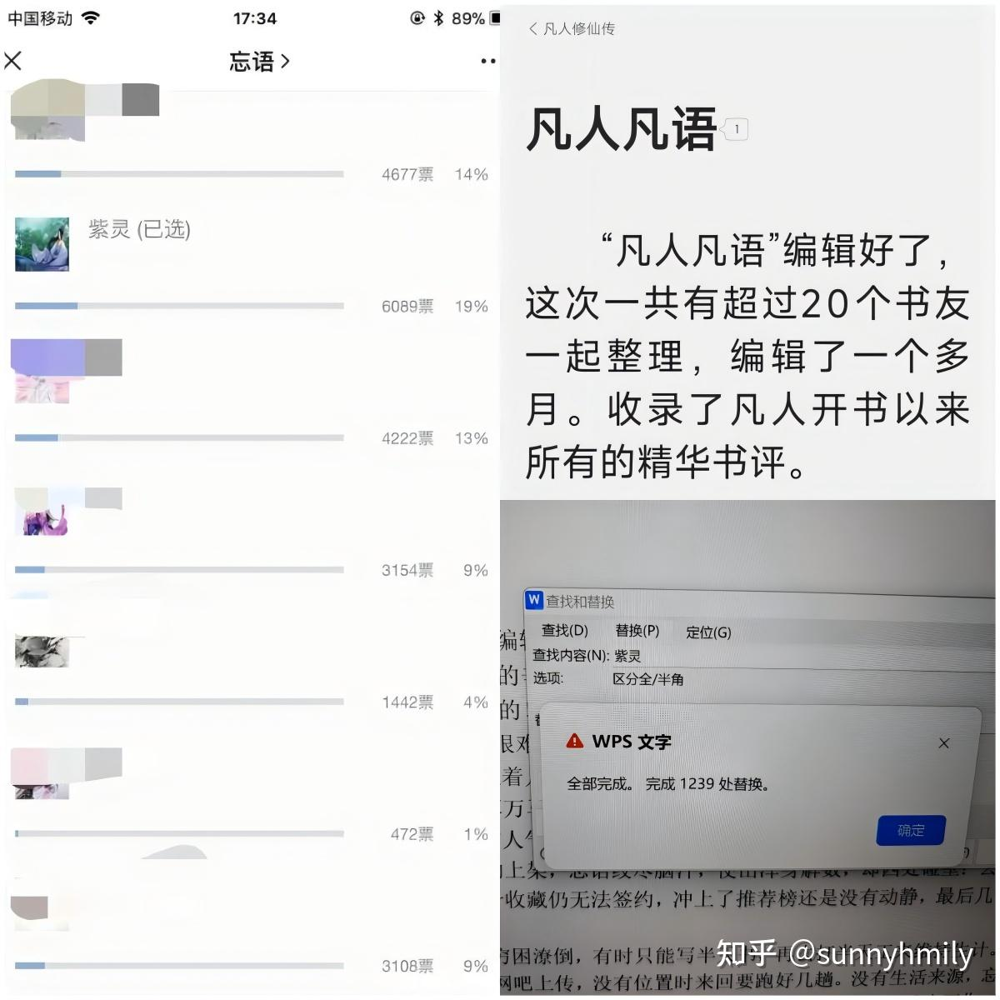

__2\.一句话总结紫灵，人不能选择自己的出身，却可以选择自己的活法。__

__站在紫灵的角度，如果你是一个出身卑微的女子，在一个弱肉强食的丛林世界，长了一张天下第一的脸，你绝无可能比她过得好。__

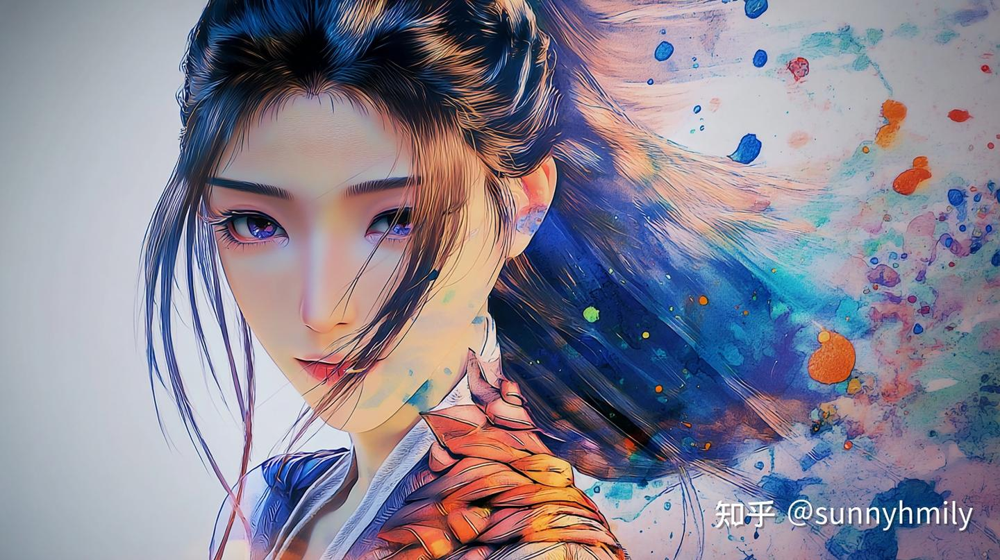

__站在韩立的角度，紫灵给了韩立由凡入仙、由仙返凡的修仙人生一个道心圆满。这不仅是感情路，更是修仙路，起于仙凡分别，终于宿命重聚，穿越两世三界，历经千难万险，彼此不再是小镇青年、小城姑娘，却依稀还是当年模样，仿佛这数十万年的时光，在刹那芳华中瞬间划过。原来，我们从未真正离开过彼此，从起点到终点。__

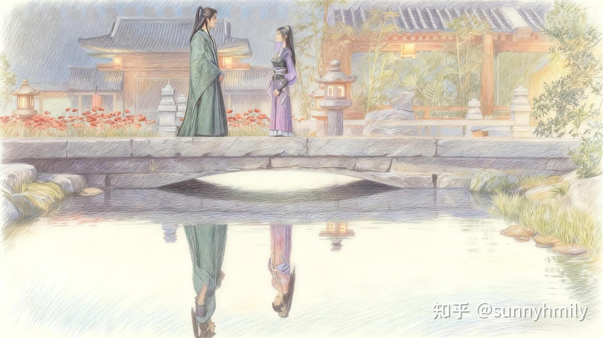

作者2011年的YY活动中，对紫灵原型的形容：__美丽、家境不好、努力的女孩。__

__先说弱肉强食的世界。__凡人修仙传，无论人灵仙中的哪一界，都是社会达尔文主义的世界，实力为尊，强者几乎可以对弱者为所欲为。这是分析这本书中一切人物和情节的前提。

作者在2009 年的访谈中，是这样说的：

“善良的修仙者当然也有，不过估计这样写了，大部分人又觉得太假了吧”。

“毕竟修仙环境在那里，这种人很难有机会修炼到高层次的”。

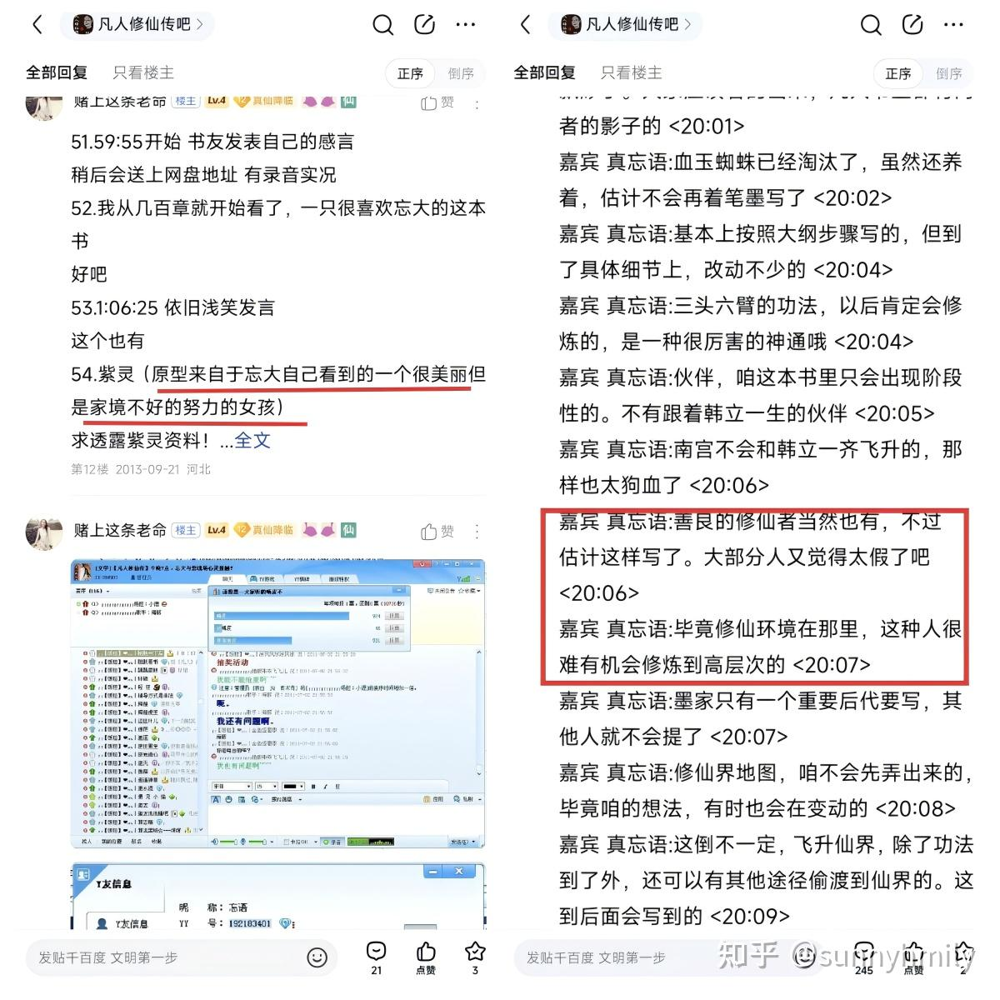

__说她出身卑微，主要指两个方面。__

__一是比动画更惨的天崩开局。__

母亲是门派唯一的结丹修士，被害死；

门派的2名客卿结丹长老都叛变；

左右二使各有心思；

更没有星宫大长老的庇护；

面对的高阶修士，如赤火和乌丑，都觊觎她的美色。

__二是没有门派、资源和功法支持。__

在碰到六极转修魔功之前，紫灵就以散修之身，独自进阶元婴，是书中非常稀少的散修元婴女修士。

第1243章，作者给的评语是“机警和聪慧”“孤身一人就敢独自游历天下”。

孤身一人，独自游历，即为孤独。

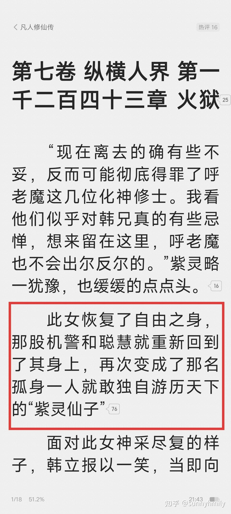

__她的修行，其实就是到处下高级副本搏命。__

如果她有门派庇护，有好的资源和功法，可以在一个安全的环境里打坐修炼，她肯定不会如此拼命。

439章，她筑基闯虚天殿，哪怕永坠鬼道，也要结丹，不会回头。

795章，结丹闯坠魔谷，她说如果真有不幸，就是自己福缘浅薄，而且她也会尽力自保。

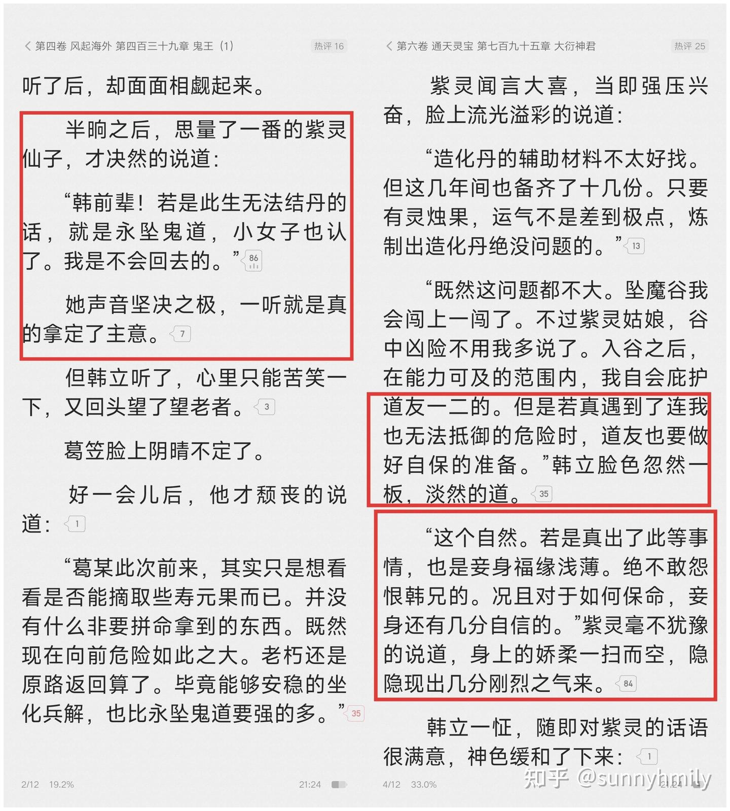

__3\.天下第一美女。__

__因为第一是个明确的说法，所以我先予以证明。__仙界篇 1246 章，金童进化成大美女，注意描述，和紫灵并列韩立见过的第一美女（或者略逊）。所以，到此为止，紫灵仍是第一。此时离大结局 1394 章仅差 149 章（含头尾），这些章里没有新的成年、美貌女修登场。__综上，根据归纳法和状态不变性，紫灵到大结局，三界第一美女没有任何疑问。__

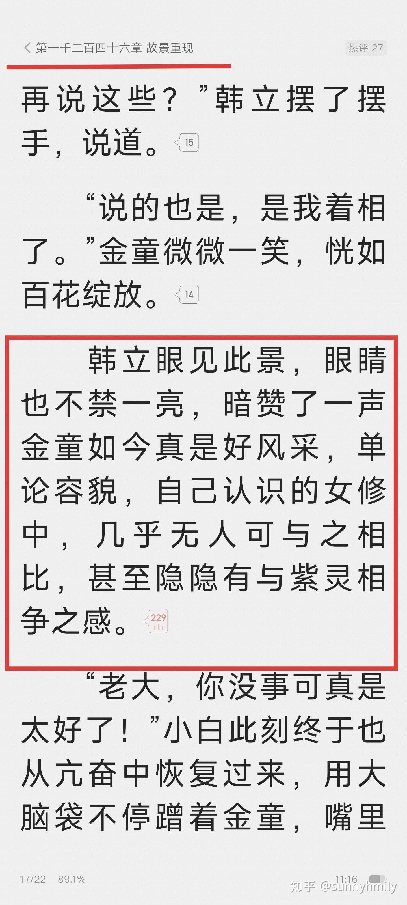

__在第591章、749章明确，元瑶、南宫都在姿色上略逊紫灵一筹。__但她们气质不同，紫灵是娇艳妩媚，南宫是清冷，元瑶是风情万种，作者还是给了较为明确的区分。

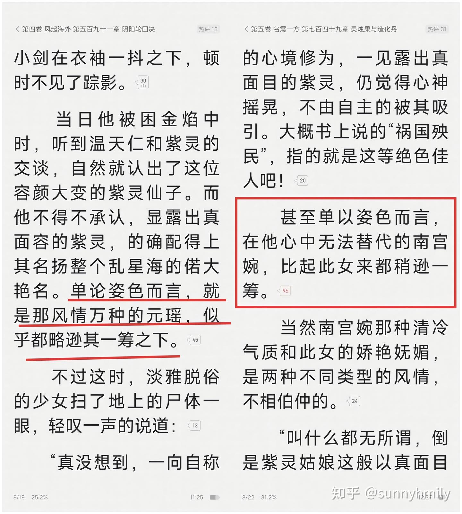

__不完全统计，书中明确觊觎紫灵美貌，或者明确指出紫灵美貌的名单如下__：韩立，孟姓修士，乌丑，赤火，虚天殿李姓修士，温天仁，苍护法，鬼灵门核心弟子，梅凝，宋玉，柳玉，大衍神君，呼老魔，向之礼，黑河上人，石穿空等。

第436章，易容的紫灵，让韩立“一呆”，“自觉失态转过头去，脸上微热不敢多看”。书友评论：肤色黝黑，脸红也看不出来，转头纯多此一举。

第749章，已经元婴的韩立看到紫灵真容，“心神摇晃，不由自主被吸引”。

但我也要为韩立分辨几句，书里的韩立开始确实有点好色，但不会为之上头。比如，第456章，极阴拉拢他，说可以把紫灵抢了来给他，他当时已经被易容的紫灵美颜暴击，但仍然觉得无言之极，不为所动。

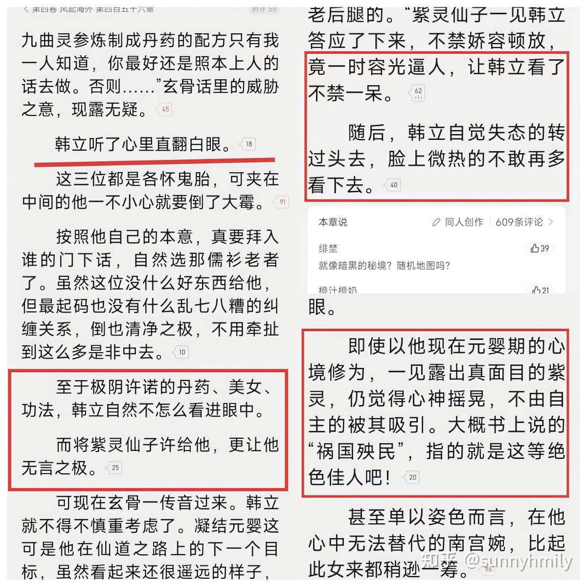

795章，大衍神君的闪亮登场，就是在韩立的脑子里对紫灵发春，真是奇人干奇事。

1172章，柳玉更是对着慕慕指出，紫灵的美貌连女人都心动，已经被称为天南第一美女，又和韩立关系匪浅，让慕慕小心，对慕慕造成了真实伤害。

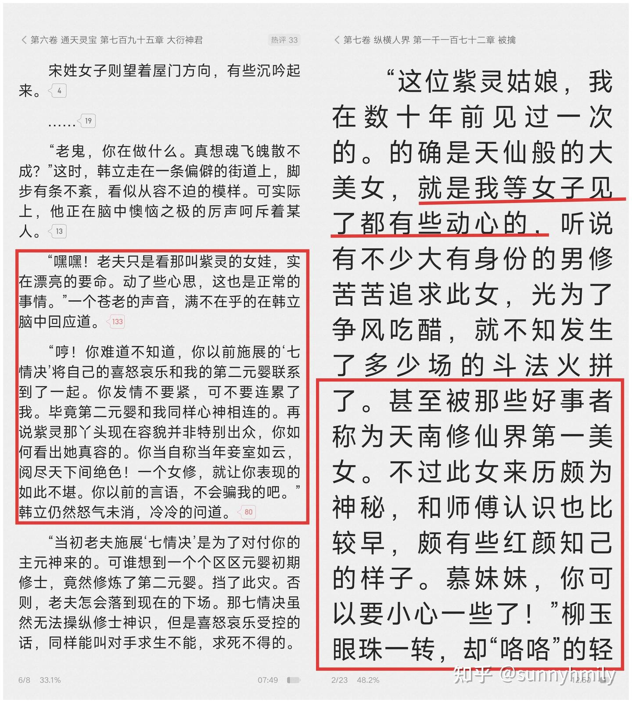

__4\.紫灵有很多修仙的良好品质__

__4\.1 向道之心__

其实韩立真的是懂紫灵的，就让他来说吧。751章，他在宋玉面前长篇大论，指出紫灵追求强大之心远胜常人，一定会冒险进坠魔谷。

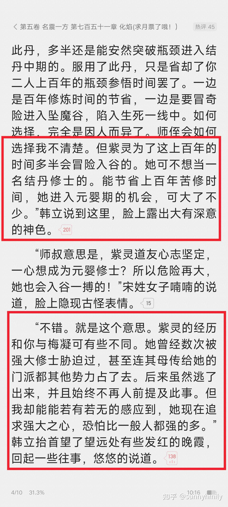

多说一句，紫灵的向道之心是哪来的？__上帝视角看，是前世那个不甘心的凡人姑娘，是她“没有灵根，真的无法修仙吗”的执念，是她独守一生、未见君归的痛苦，转化成了这辈子要不顾一切在仙路上前进的决心。“修仙者的世界是什么样的，你不用告诉我，我会自己去看”。__

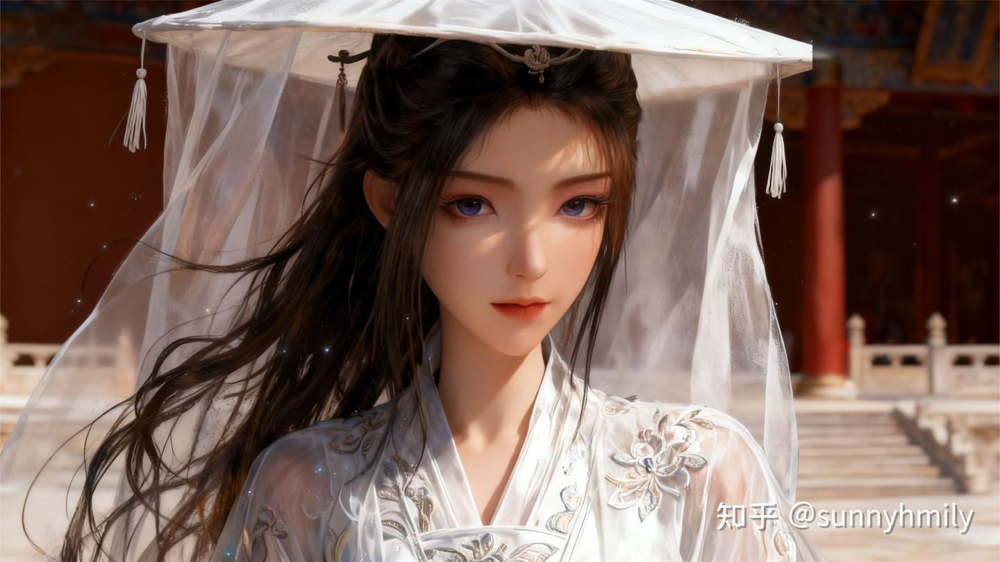

__4\.2机智懂事。__

同样有请特邀评论员韩立。

760章，韩立认为紫灵提前离开是机灵、作出明智之举，换他来也是一样的选择，夸紫灵的同时也夸了自己。

832章，坠魔谷，她克制贪念，知道自己出力少，主动只要一枚果子，让韩立为之改观。对了，紫灵只要一枚果子，结果成功炼丹，炼丹水平不容小觑。

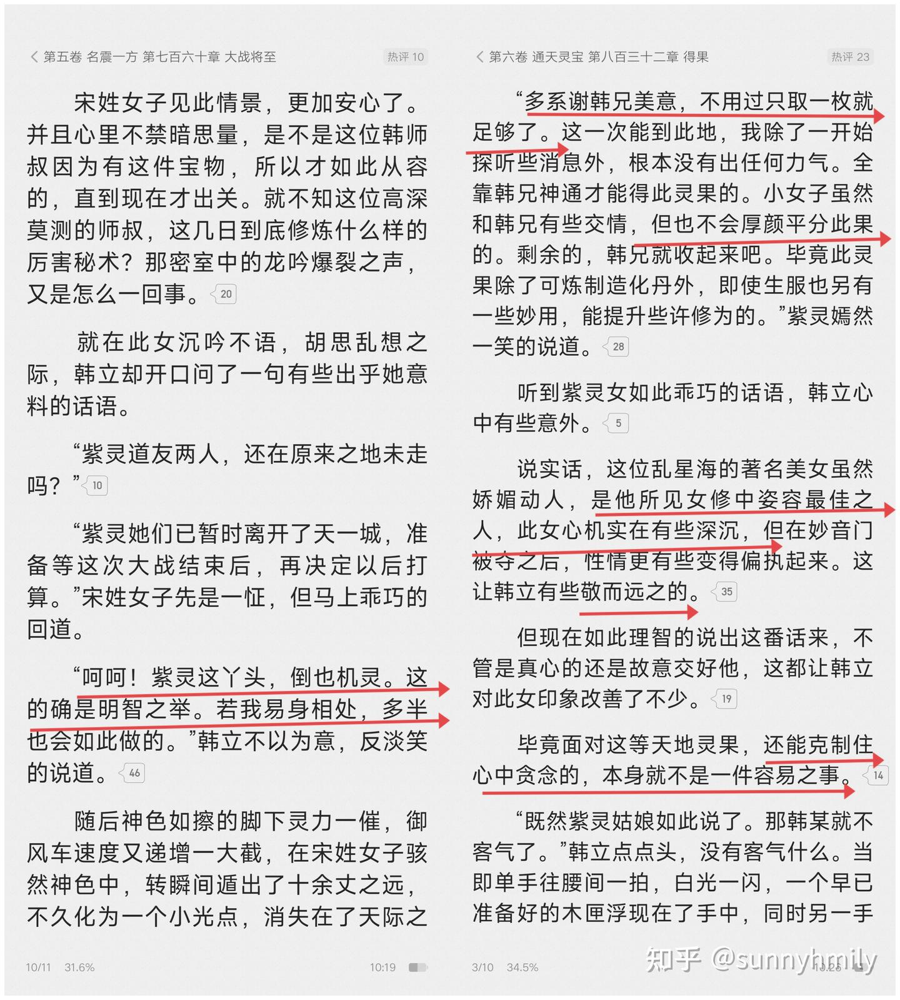

__4\.3 聪明。__

我只举一个容易被人忽视的地方。

411章，在给竹子之后，她看出来韩立是苦修之士不会插手门内事务，而且只要持续交好，韩立不是彻底翻脸无情的人，早晚能把人情还了。

436章，仅仅25章之后，韩立所思、所行就完全如她所料，她成功得到回报。

另外，也可以关注一下她作出的，谁结丹谁做门主的决定，以大的长远共同利益，压制住左右二使的个人心思，思路非常正确。

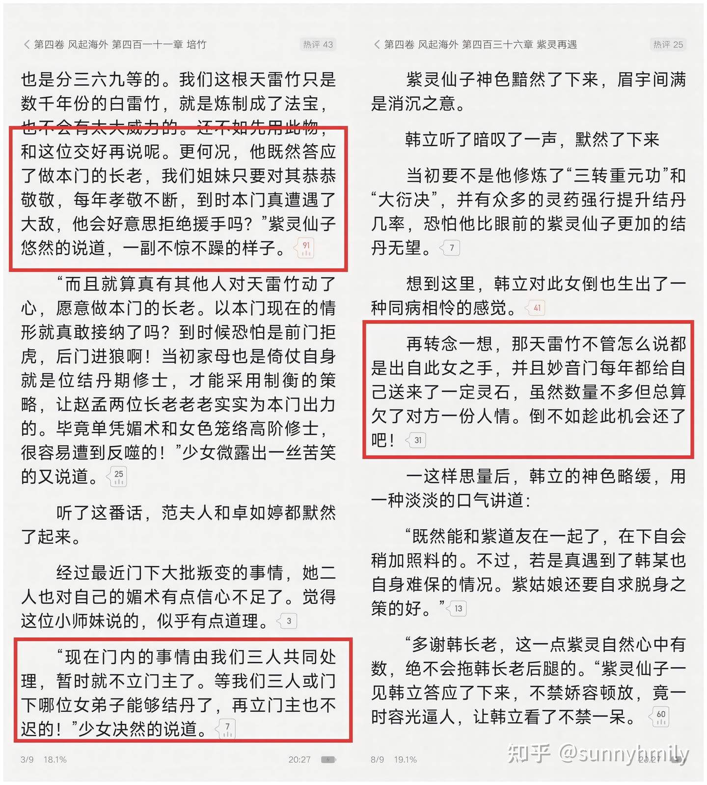

__4\.4 心思细密。__

825章，为了追踪灵烛果，紫灵早在1个月前就对鬼灵门弟子下了标记。

1171章，紫灵和韩立探坠魔谷后，整理了一份路线给宋玉，她很用心整理与修仙有关的一切事项，而且对她的小姐妹很够意思。

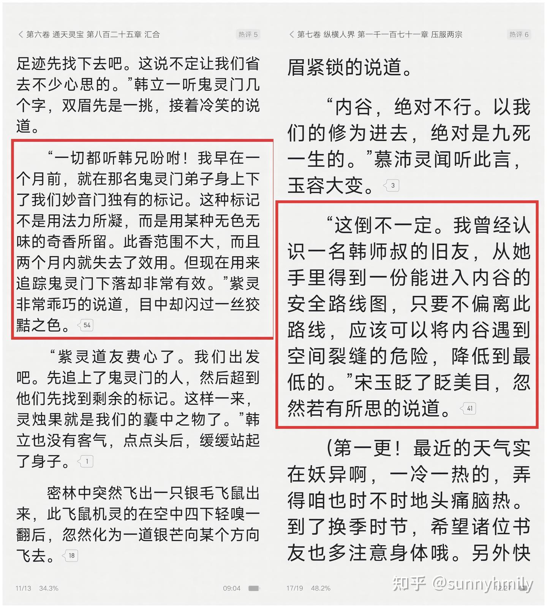

__4\.5 有一定的政治家风范。__

406章，她筑基面对极阴，试图抬出双圣，扯虎皮拉大旗，让极阴也微微色变。

而且很快作出决定，果断说服孙门主和她临时合作。注意，这里和动画不同，孙门主和她没有提前合作，只是认同她联手才能有活路的判断。

另外，这一章里，对她的描写，多用“冷静”“果断”“冰冷”“寒声”等词汇，铁娘子范儿十足。

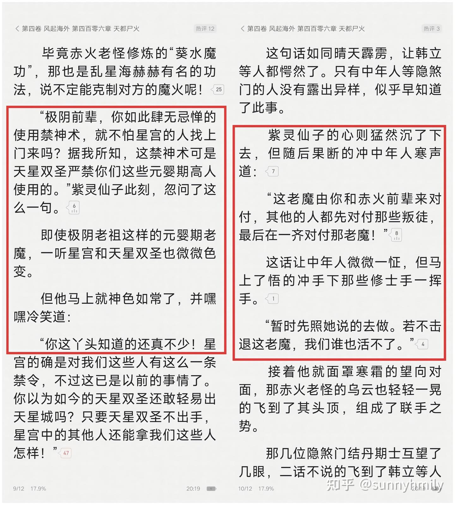

__4\.6 她不是恋爱脑。__

仙界篇1314章（这个1314很妙啊），她和韩立游历天下200多年，她主动要求结束游历，让韩立回去闭关。这一章是在2019年12月24日发出来的，大概相当于平安夜约妹子出来，妹子却跟你说，不许瑟瑟，还不赶紧去图书馆复习线性代数？

仙界篇1318章，还真让她学出东西了。她通过看书，提醒老魔行善的问题所在就是有心为善虽善不赏，对老魔斩善尸有所启发。

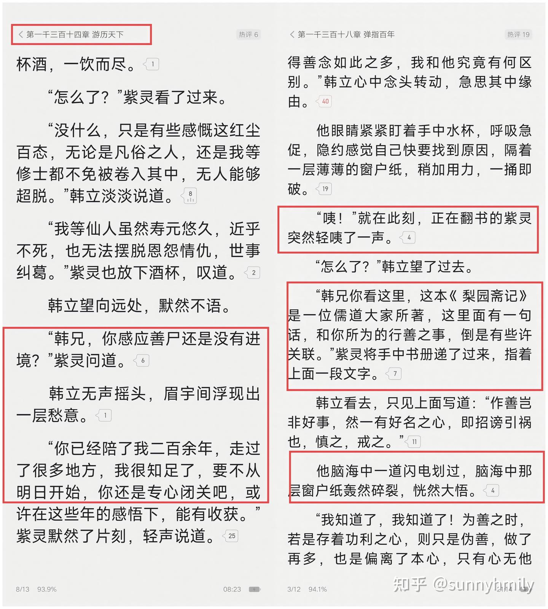

__5\.紫灵是可以严格证明的墨彩环的转世。__

__动画已经在2020年8月官方明示，就不多说。__

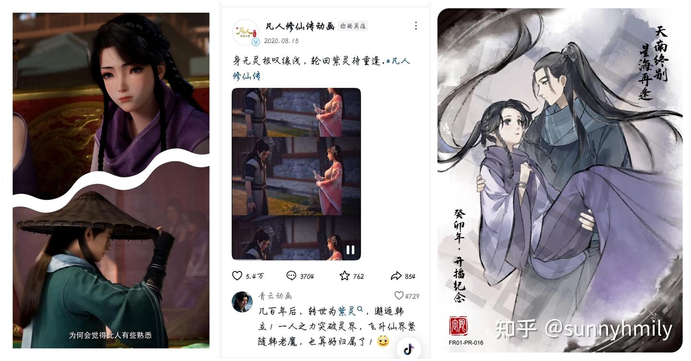

__原著里，彩环转世是排除法的唯一答案。__

仙界篇第1334章，紫灵前世与韩立有纠葛

仙界篇第1326章，紫灵前世一是人界没有灵根的凡俗女子，二是等了一个人一辈子，三是有让韩立印象深刻的一声呼唤或一句台词。

以上4个条件，符合条件的只有墨彩环。墨凤舞平淡度日，没有执念和苦等，也没有给韩立留下什么深刻言论。考虑到韩立与紫灵的男女关系，也不能是韩小妹。

有人说不对，彩环的人生也是大风大浪。确实，但相比紫灵的万年经历，那肯定都不算什么了。

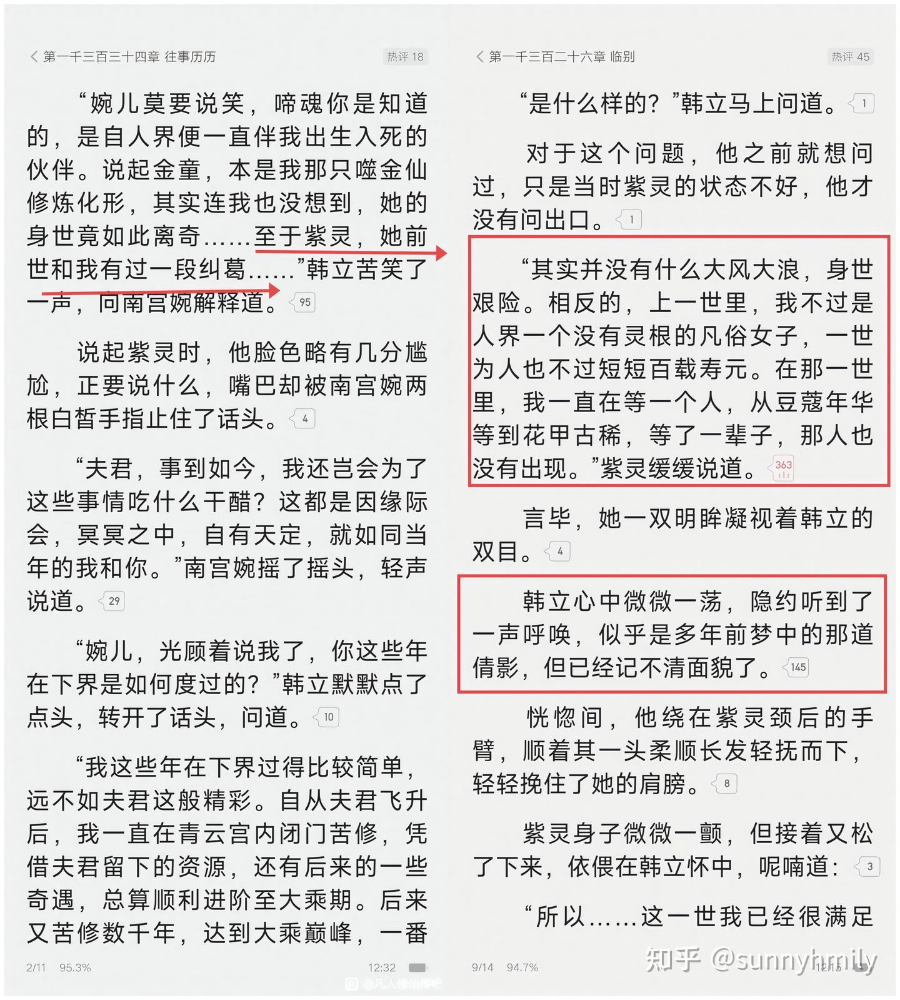

__有一个问题要澄清，就是紫灵年龄多大？__

__答案是，紫灵大概比韩立小100岁左右，和彩环转世对得上。__

749章，紫灵自己说可能比韩立大，首先韩立很早服了定颜丹，看着年轻，更重要是拉平身份不想叫前辈的狡黠心思。她以后叫了韩兄一辈子。

可靠的推测是，韩立初见紫灵，韩立结丹 130 多岁往上，紫灵不超过筑基中期，因为第436章，韩立见到紫灵是筑基后期时恭喜她修为大进。

紫灵的资质是韩立在第751章、第1196章两次认定的好资质，非比一般，凝结元婴不稀奇。

所以，怎么看 30 岁左右到这个境界是合理的甚至都算是慢的。动画为什么要提升紫灵的修为，也是适当修正，因为动画紫灵只比韩立小40岁左右，比原著紫灵大不少。

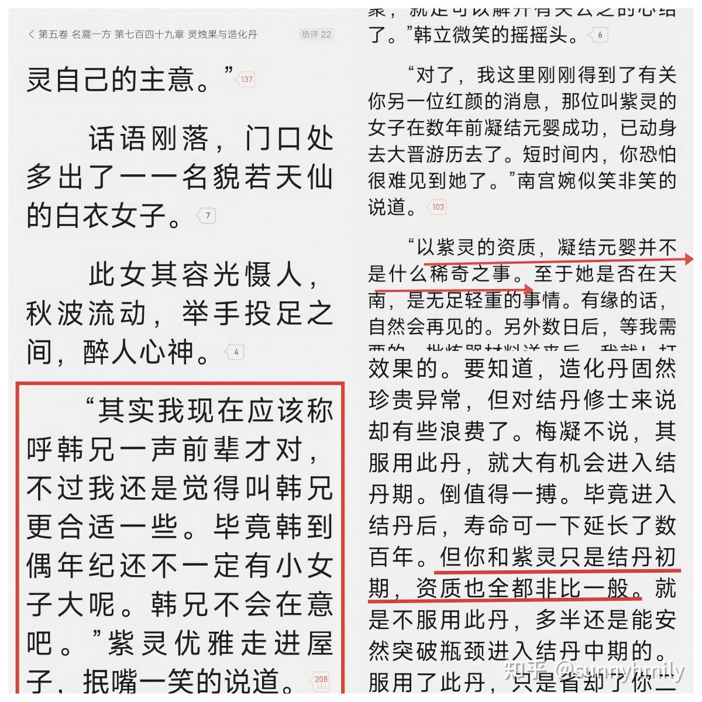

__那么，关于彩环转世，现在只剩最后一个问题要探讨，那就是彩环转世，是轮回殿主安排的吗？__

我的个人观点是，不能确定，但有嫌疑。

仙界篇1307章、1308章：

轮回殿主首先质疑了韩立已经有紫灵，为什么还要和他抢南宫，让韩立无言以对，说明他知道紫灵，某种意义上利用了紫灵作为手段，实现自己的目的；

韩立心神动荡要离开，他主动提醒韩立要不要让紫灵等其他人来使用六道轮回盘，看自己的前世；

他对啼魂不看前世的行为赞许，对金童说你最应该看前世，说明他有办法了解别人的前世，而且还很愿意评价别人看前世的行为；

但紫灵去看前世的时候，他很漠然，没有任何表情和评价，有点反常。

以上表现，我觉得多少还是有一些意味在里面，当然毕竟没有写明，那就仁者见仁、智者见智吧。

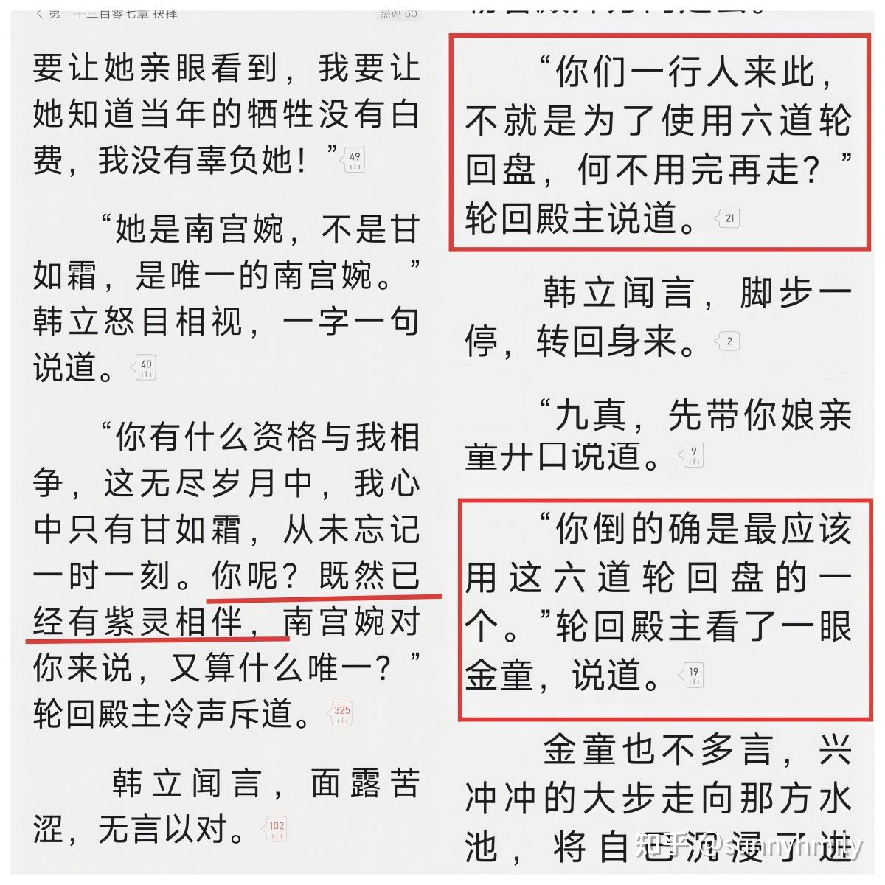

__6\.韩立的初恋是墨凤舞，韩立的终极心魔是墨彩环。__

解决了彩环转世的问题，下面说明彩环在韩立心里的位置。

首先要明确，书里，彩环不是韩立明面的初恋，凤舞才是。

283章，明确写出来韩立初见墨凤舞第一次动男女之情。

也是全书第一次明确写出来，韩立对某位女子有了想要与其结为道侣的想法。

所以，凤舞的初恋地位没有争议，无可动摇。

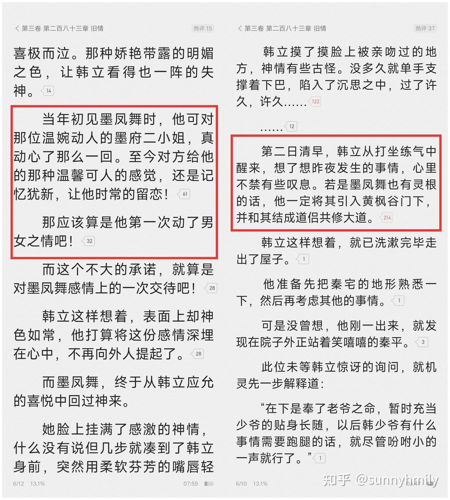

__但是，彩环在韩立的心里其实非常重要。__

252章，看韩立和彩环的分别，韩立的表现和想法，默默守望，不想看到爱人在自己面前枯萎，显然是有很复杂的感觉在里面。

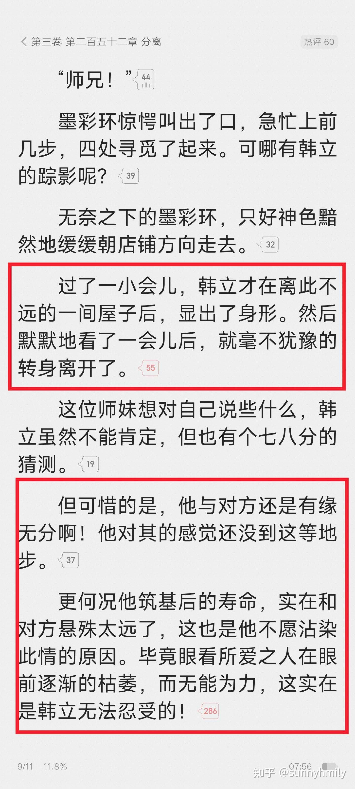

__重点来了，在和彩环分别数千年后，彩环却出现在第2183章，韩立的大乘心魔之中，而且是当仁不让的C位。__

在仙界篇之前，这是凡人修仙传整部小说最后的心魔环节，大乘也是最终境界。所以，这里体现的内容，算是对人、灵两界的盖棺定论。

在这次心魔中，韩立先回到了小时候，对妻子，他想不起来是青梅、春婉还是小灵。春婉是南宫，小灵是紫灵（当然，也可以理解为慕沛灵，甚至圭灵），那么青梅这个排第一的名字是谁？

度过小时候后，心魔气急败坏，指出我总能找到你印象最深、最难以忘怀的事情。圣斗士里，一辉和艾丝美拉达既视感。

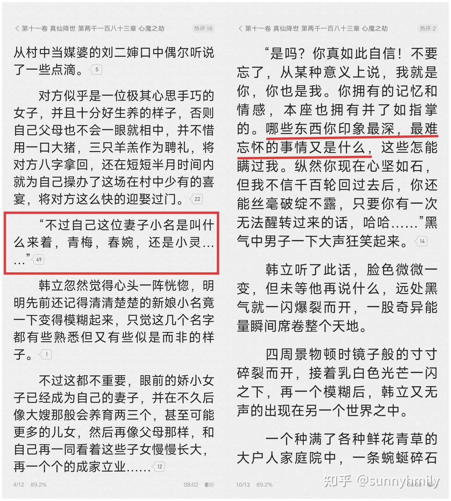

__紧接着心魔的这句话，场景就切换到墨彩环和韩立的初遇。__这就是韩立大乘心魔里最深刻的情节，也是唯一有单人特写、大段描写的场景，而且都不是彩环最出圈的台词，只是初遇！这个墨彩莲真的让人蚌埠住了。

接下来，就是2185章，亲人、好友、红颜知己、敌人等等，都是流水线了。而且注意到，连南宫和紫灵，这两位已经明确发生关系的红颜知己都是一笔带过。

纵观这次大乘心魔，只能得出一个结论，在人、灵两界故事的结局，韩立内心最深处，竟然是他和彩环的初遇。

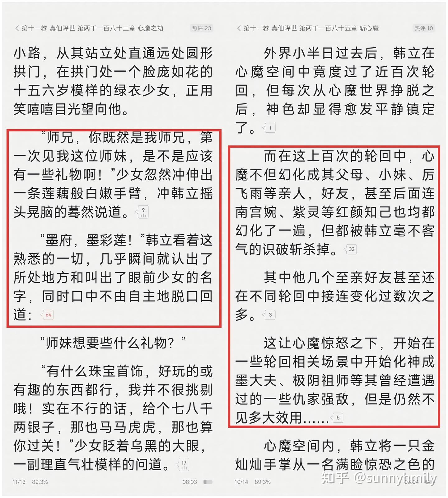

__7\.紫灵和韩立在魔陀山之前是交易关系，大体上公平合理。__

但是，前世缘分，到仙界最后才揭晓。紫灵和韩立，__其实一直到魔陀山之前，没有明显的感情苗头__。

当然，无边海的3个月算有一点点后补的伏笔吧：仙界篇1394章，全书大结局，韩立重回人界，回到百万年前他和紫灵从罗睺腹中出来的地方，那是他心灵上的安定，是无法取代的地方。

作者在写这段时，回望自己断续10年的创作历程，会怎么评价他笔下的紫灵呢？是一个惊叹号，还是一个句号呢？还是像410章__把紫灵仙子打成紫霞仙子的时候，又是盒子又是青霞的时候，是一个问号吗？__

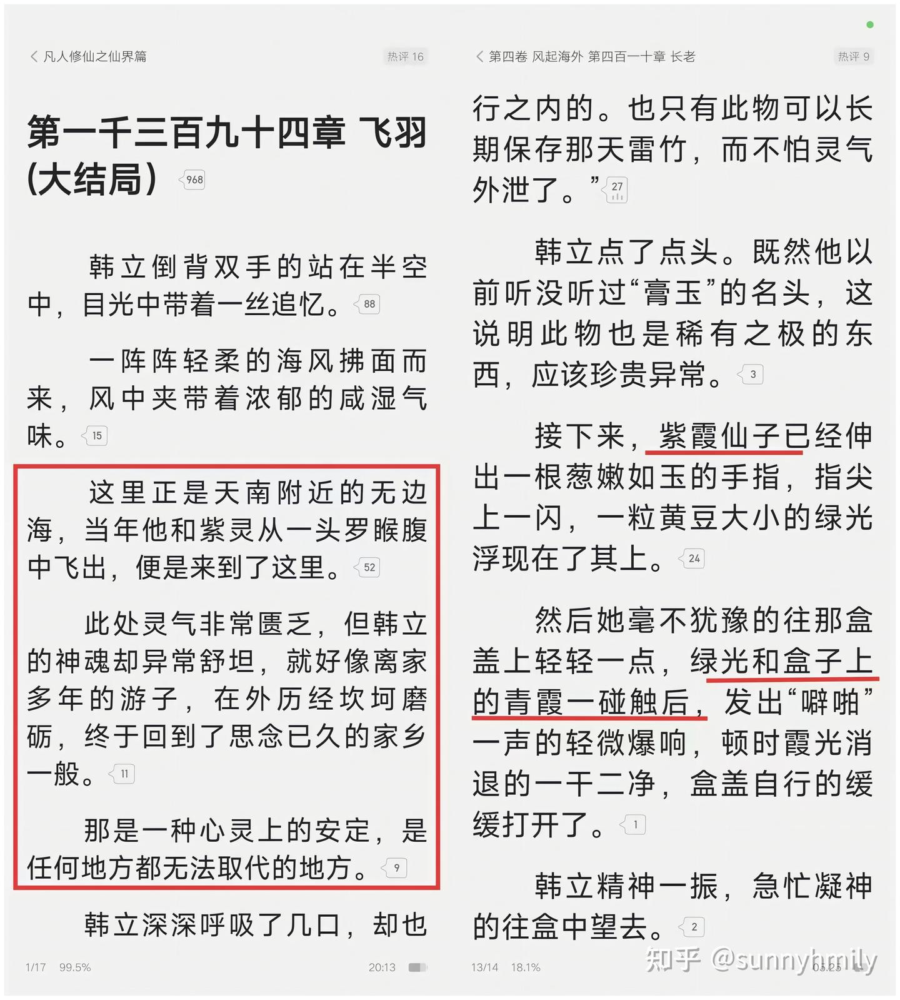

__一直到第1196章，人界篇快结束了，还有不到50章就到魔陀山了，韩立对紫灵依然是欣赏，（认可她结婴），但不关心，（无足轻重，有缘自会再见）。__可见韩立没有对紫灵产生明显的感情。对了，请大家记住这时韩立对紫灵的态度，一会讲温天仁之战的时候我还会讲。

当然，有趣的是，在此之前的1173章，背叛韩老魔的第二元婴，劈头盖脸问宋玉：“紫灵还好吧？”，说明韩立心里，起码没把紫灵当路人。而在坠魔谷，紫灵对韩立非常欣赏，有一点点可惜错过的感受，但也止步于此。

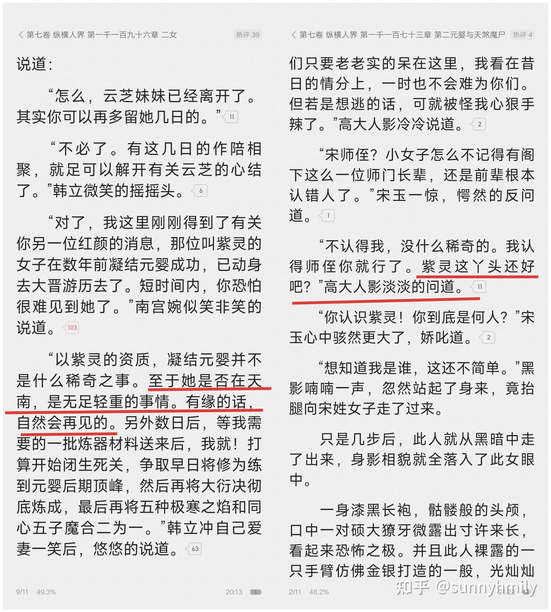

在此之前，尽管两人已经共同经历了蝎岛、虚天殿、韩温大战、阴冥之地、坠魔谷等多个副本，__但大体上是合作关系。__

__这段时间，她不是韩立的女人甚至好友，请记住韩立说的“无足轻重”。__

她也不是纯粹依附韩立。紫灵给竹子、上供奉、讲虚天殿、讲啼魂、讲冰火道、提供灵果信息，侦查跟踪，准备材料，配合行动等，努力提供价值。

当然，因为韩立的强大和富有，确实不能算等价交易，__但起码紫灵尽力做到自己能做的了__，最典型的是坠魔谷，812章、825章，她单身入谷，以结丹初期在一群元婴中躲闪腾挪，努力帮韩立打杂。

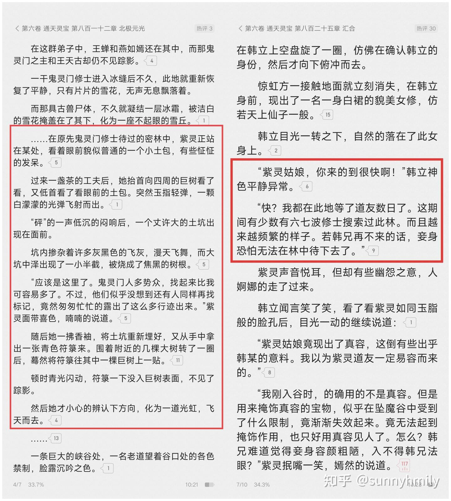

__其实在合作的过程中，两人相互算计，相互猜疑，也挺有意思。__

410章，两人围绕竹子讨价还价，让韩立感觉要害被拿住了，这糟糕的台词。

828章，韩立带紫灵疯狂飙车成功，紫灵先前并不信任，韩立也是硬着头皮侥幸了一回。

832章，韩立让紫灵先摘果子，个人觉得多少有让紫灵蹚雷的想法，这果子附近颇多花样。不过也可能是我心太黑了，这里老魔单纯就是lady first。

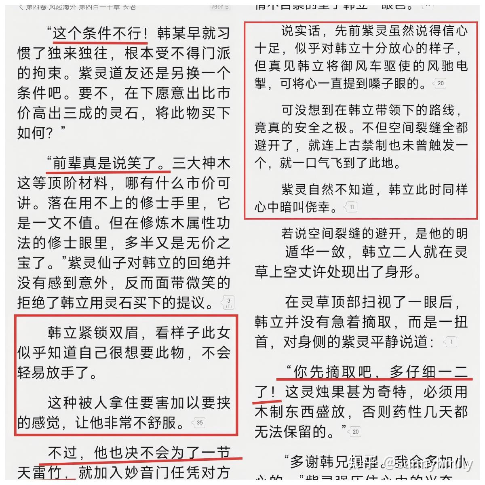

__8\.缘起魔陀山，紫灵很爱韩立，三拒韩立都有较为充分的理由；__

__9\.紫灵有一个被作者吃书吃掉的儿子，这影响了她第三次拒绝韩立的逻辑；__

__10\.韩立为了紫灵三次搏命，心里是有紫灵的；__

__11\.紫灵在仙界篇，给了韩立非常关键的陪伴，二人世界既温馨长久，又对韩立修行有重要助力；__

__真正缘起，还是在魔陀山的力抗化神和春风一度。__写的非常精彩。韩立以元婴后期，跨大境界对抗化神修士，而且是在对方的老巢，纳妾典礼现场周围还有一群元婴的徒子徒孙，__全程都是紫灵认命、韩立主动，韩立没有一秒钟放弃，既冷静又热血 “虽千万人吾往矣”，这一部分到1243章结束 ，人界篇到1261章结束，所以这一部分 可以说是人界篇章的压轴大戏之一。__

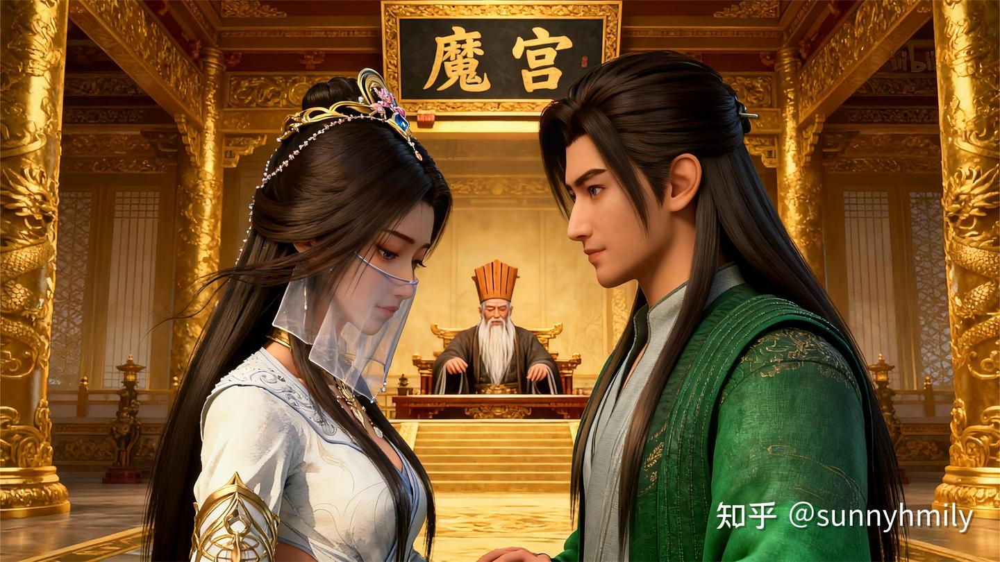

这一部分整体从1235章到1243章。

魔陀山，韩立初见要被纳为侍妾、白色宫装的紫灵，身形一震，脸色大变！紫灵也是先难以置信，再狂喜，后不知所措。

然后，呼老魔让紫灵给韩立倒酒，以示斩断因果。紫灵恢复了冷漠，看韩立像陌生人。这里她第一次放弃了，不想连累韩立。但韩立先嘴角抽搐，后眯眼，既是观察紫灵的禁制，也是内心不平静。

接着，韩立饮下杯中酒，紫灵以为韩立也放弃了，转身离开。这是她第二次放弃。但是韩立这次喝的是乔峰的酒，不是段誉的酒。他要开始了。

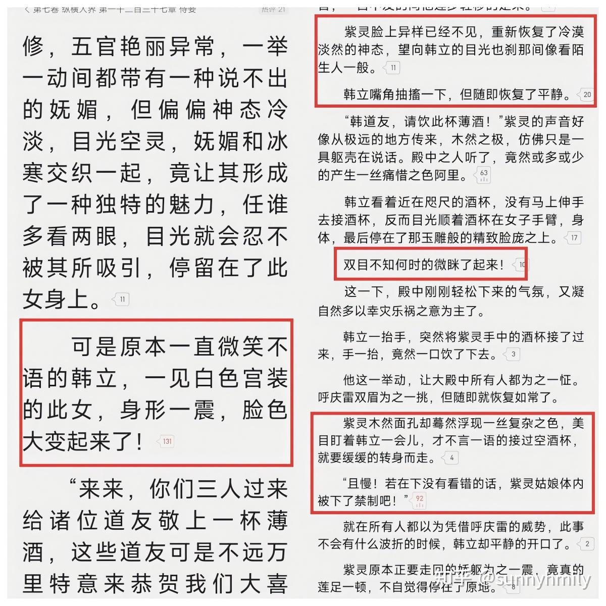

__韩立询问紫灵是否自愿，若是不愿的话。。。当着呼老魔的面，韩立竟然语露威胁，确实霸气！__、

紫灵受到鼓舞，终于说出实情。注意，她是被几个元婴围攻的。

韩立提出要交换紫灵，他不是莽夫，__但他对呼老魔一脸的不善视若无睹，霸气依旧。__

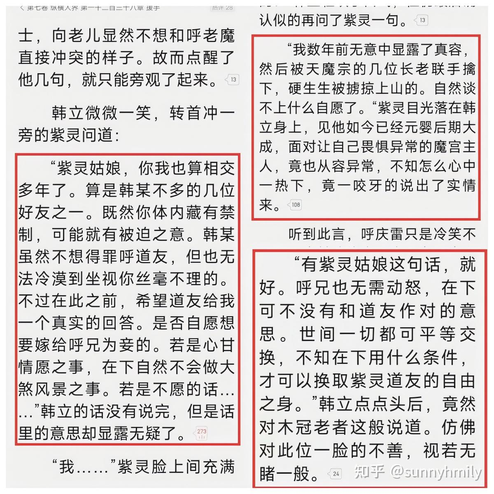

韩立软硬兼施，诱之以利，镇之以灭仙珠。__呼老魔决定先给个台阶，但韩立不下，而且是毫不犹豫，毫不退让，我韩立没有收回所说话语的习惯！__怎么感觉写这块的时候，作者是代入了吗。。。也跟着燃起来了？

呼老魔大怒，爆发气势，韩立手抚紫灵肩膀，轻松化解。

韩立用可以炼制延年益寿药品的原料寒髓一份，拿来换紫灵。这个东西非常珍贵，呼老魔之前如此生气，也直接真香了。

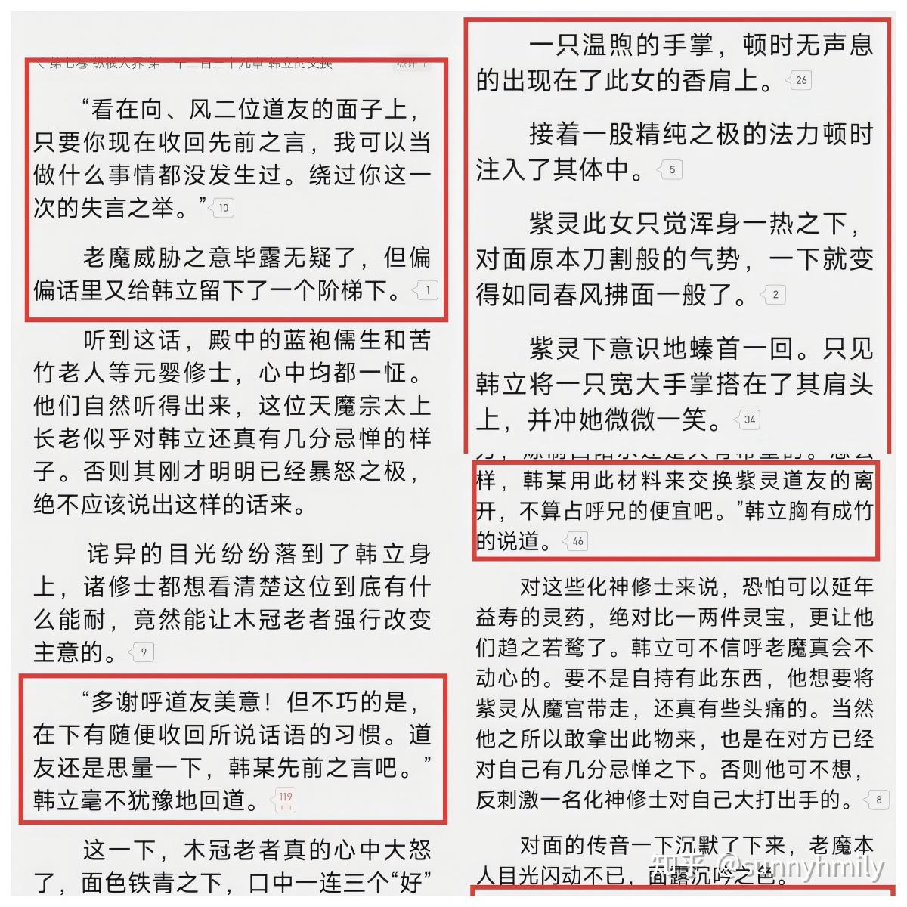

呼老魔同意交易，但提出韩立不躲不闪，不用灭仙珠，硬接一击的要求。__紫灵怕韩立出事，第三次放弃。韩立明白她的心意，但还是不肯退让，毫不在意的一口答应下来。__

多说一句，韩立的学习能力很强啊。后面灵界让人上龙青硬接一击，以及打架直接扔山，大概都是从呼老魔这儿学的。

后面，韩立出去战斗，紫灵要求观战，眼睛里有异色。这里大概会是动画留影珠的伏笔。韩立拉住紫灵出去战斗。

最后，三月同游，亲昵相处，春风一度，两人定情。书友们的评论接近2000条。。。

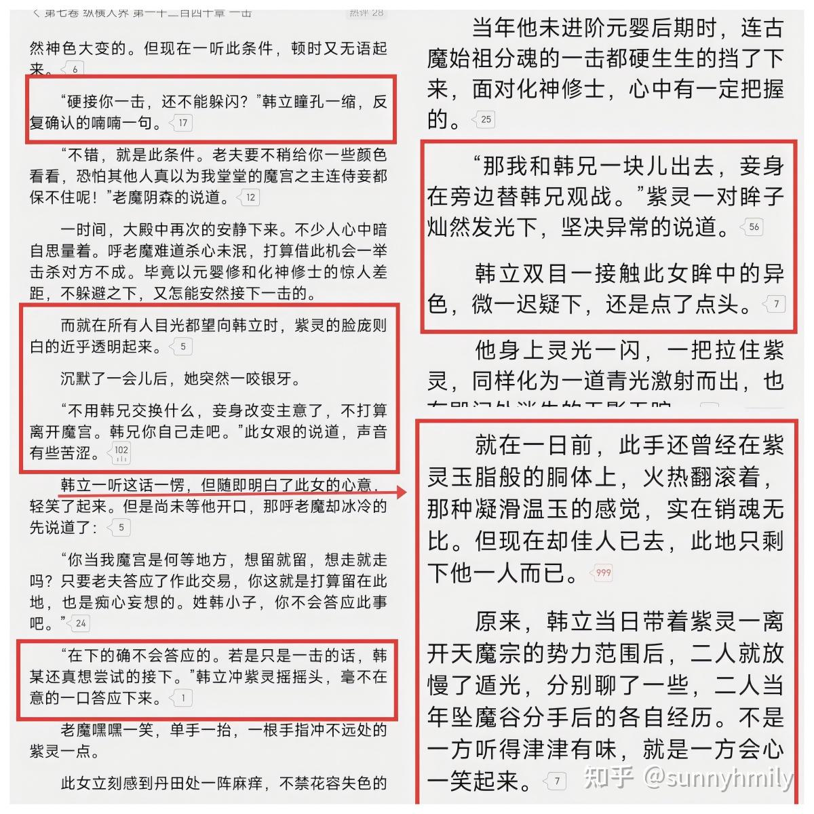

__但是，两者缘起即散，这是紫灵三拒韩立的第一拒。__

第1243章，紫灵把处女之身给了韩立，然后飘然离去了，没纠缠韩立，没要韩立任何东西，还做出永世忠贞的许诺。__要注意，紫灵与韩立春风一度只和感情有关，和任何“未来”“回报”等现实因素无关。__在当时的她看来，她和韩立没有未来，她也确实没有在人界篇再出现了，她做出这个决定只是像作者说的，“情不自禁”。

紫灵这次拒绝，是不做侍妾。这非常合理，593章，紫灵劝梅凝的话中，体现了她对侍妾地位很低的认知。

紫灵走了，给韩立留下各种滋味，失落，心痛，迷茫。这也是韩立__第一次因为紫灵心痛。__

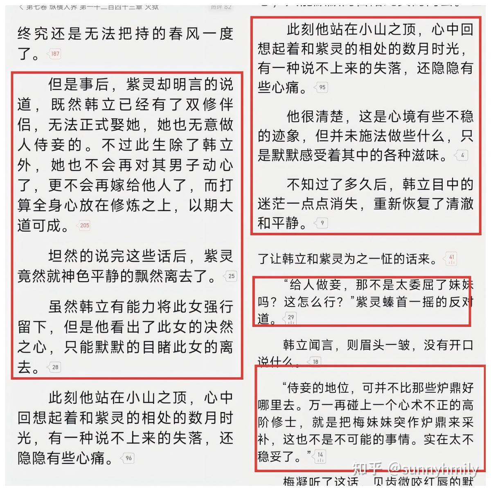

两人下一次见面，是隔了近900章的灵界。这期间，紫灵彻底从剧情里消失了。

2122章，紫灵诉说离情，说自己不知道是不是太过思念，在做梦。__这句话说的韩立心中一痛，这是第二次。__

紫灵灵界的闺蜜，广源斋主人蓝颖，犀利吐槽韩立这个负心人长的平平无奇，也证明了紫灵一直在牵肠挂肚，还让她帮忙卜算。

对了，多说一句，__这个蓝颖，是作者亲口承认的，原定灵界篇女主。也可能是我多想，但是蓝颖，紫灵，这名字也好对称啊。。。__

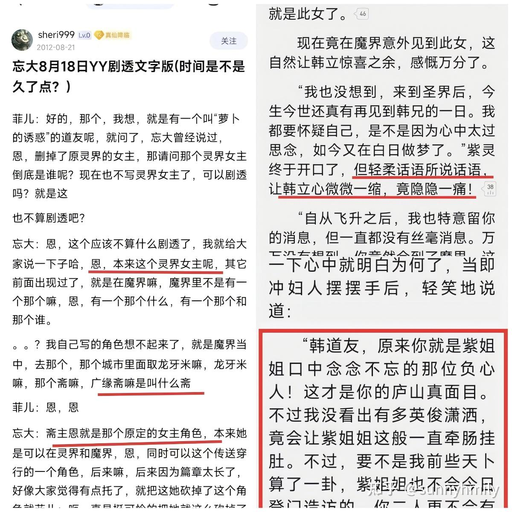

这里需要说明，第2120章，蓝颖自己说过，卜算有损寿元，价格很高，__所以紫灵肯定是付出了很高代价，来卜算能不能遇到韩立。__

__这次重逢，最需要注意的是，紫灵看到韩立修为大进、“功成名就”，第一反应是“你一定吃了很多苦吧”，这是真爱。下次仙界篇984章，两人再见面，紫灵的反应一模一样，说了同样的话。如果一个女人，不是你的妈妈，却能这样对你，请你珍惜她。__

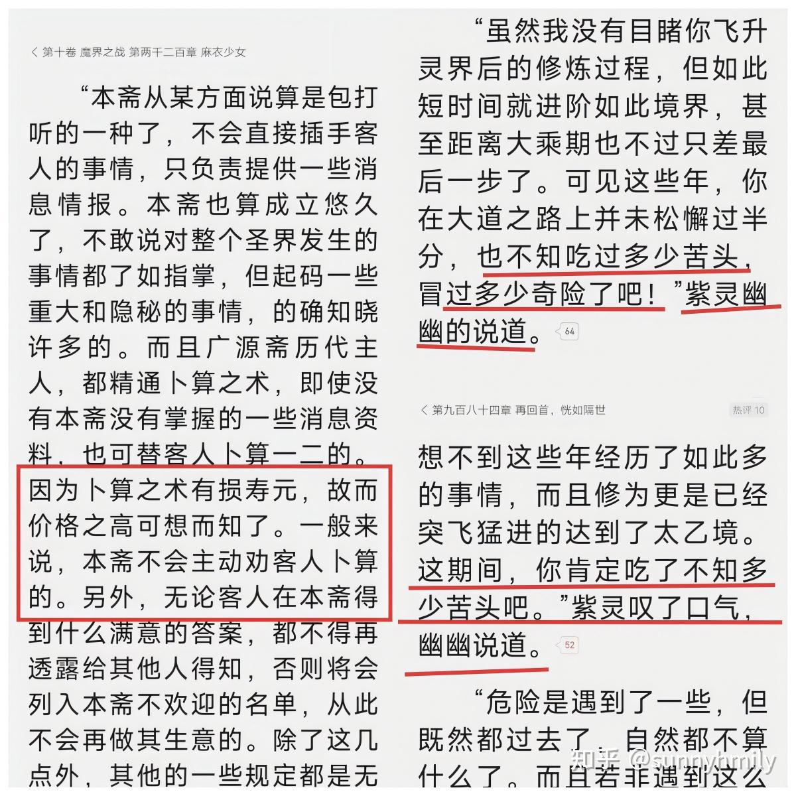

__接下来，2123章，紫灵诉说了自己接触六极，改练魔功，飞升魔界，成为六极备用化身的事情。__

此处，很多人说紫灵忘恩负义，背刺六极。我提醒三点，

一是紫灵没有多怨恨什么，而且承认六极对她有恩，否则她早就老死人界。

二是她飞升上来后，才从六极本人口中得知，是把她当做候选化身之体。在人界，她并不知道。

三是六极虽然看似给了她选择，但她面对的是一方老祖，修为高、势力大，她孤单一人在人家的地盘，修为还是入门级，其实是被逼无奈的。韩立就完全理解她的无奈。

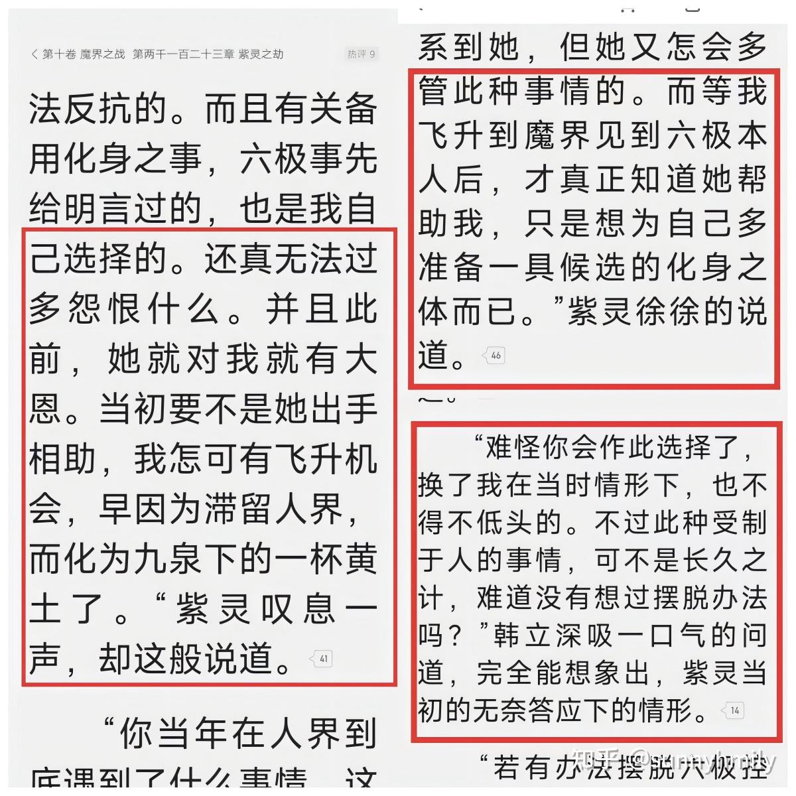

__知道紫灵有可能被六极炼成化身后，韩立非常担心，但碍于现在还不是大乘，所以在2123章，他强行压下心中的担心，让紫灵先忍耐。__

第2133章，他和紫灵离别，注意他说的话。他说，只要他能进阶成功，一定马上返回魔界，将紫灵救出。在此期间，若是六极在此之前就打算将紫灵炼化成化身的话，让紫灵通知他，他会破界来救她。这是他毫不犹豫的承诺。

__这是他第二次为紫灵搏命。因为他说的在此之前，就是他进阶大乘之前。也就是说，如果紫灵要被炼成化身，哪怕他没有进阶大乘，他一样不会坐视，就像他当年元婴对化神一样。__

第2134章，真的走了，韩立又心痛。__这是他第三次因为紫灵心痛。__

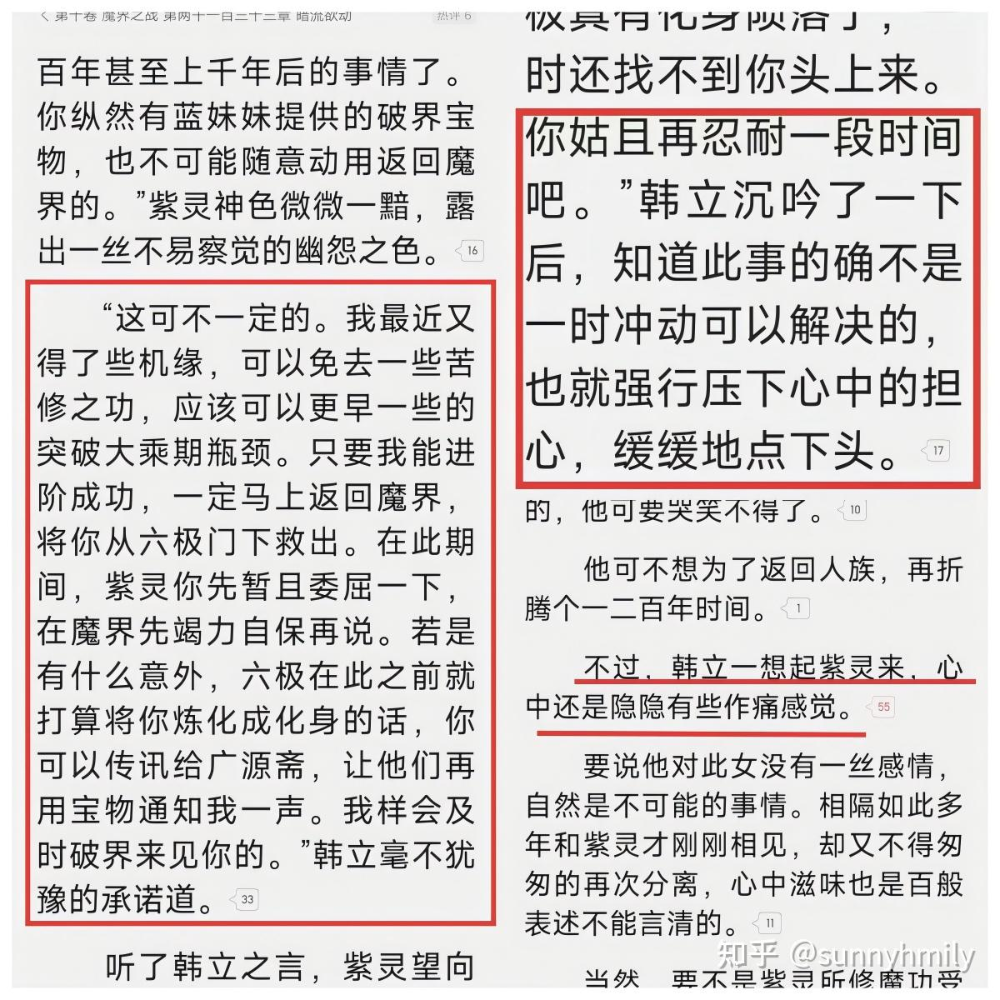

__离开后，韩立一直放在心上。__

第2138章，韩立在有机会杀掉一个六极化身的时候，让宝花放了她，就是顾虑紫灵。

第2247章，进阶大乘后，协助宝花解决了六极，韩立兴冲冲准备了几种秘术，想带紫灵走。但紫灵问了他一个关键问题，他有多大概率飞升仙界。

__韩立说，如果是别人，他不会说丝毫真话。但如果是紫灵，他没有顾忌，他大概有一半概率可以飞升，这确实是实话。__

__紫灵听了后，决定不跟韩立走，她要留在这里修魔功。这是她第二次拒绝韩立。__

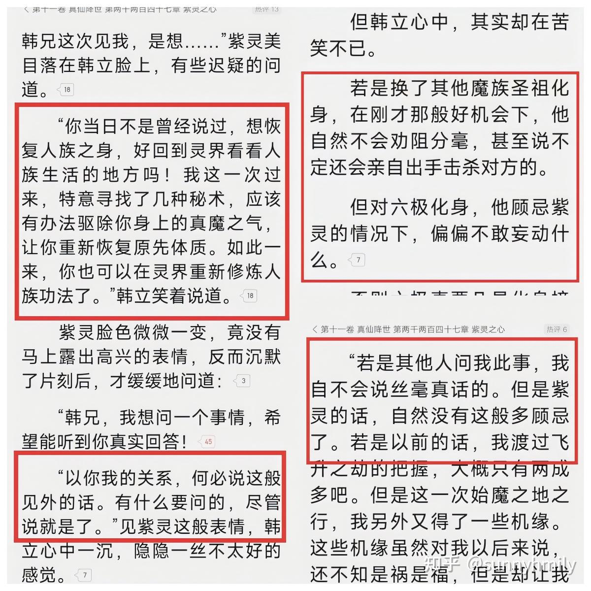

韩立听完，没有勉强紫灵，而是送了紫灵修炼魔功的资源。紫灵说，韩立可以破界来找她。说这话的时候，紫灵还害羞了，呦，你脸红啦？__多年以后，我才知道，这本来是一个很大的伏笔的，可惜吃书写没了，后面还会讲。__

第2248章，韩立与紫灵在人界、灵界的故事来到终点。两人共同游历数日，回忆往昔，柏拉图式的相处。和上次不同，这次换韩立离去，紫灵怔怔地远眺天空，既甜蜜，又毅然。

蓝颖不理解，明明陪在韩立身边，不久之前还是紫灵的期待，为什么要离别呢？紫灵说了一段，__个人认为是全书点睛之笔的话，也是紫灵在人界、灵界的杀青台词。是贪图一时之欢，还是谋求以后一丝的永久相伴？她选择了追随韩立去仙界，去搏一个永远。__

__为什么我说是点睛之笔，就是我觉得很多人看这本书，还是用“凡人”思维在看，而忽略了修仙者和凡人最根本的区别，就是境界不同，寿命不同。所以，不要用看言情小说的思路来看修仙小说，这是紫灵留给我们最后的话语。这句话对十多年后的今天，依然有意义。__

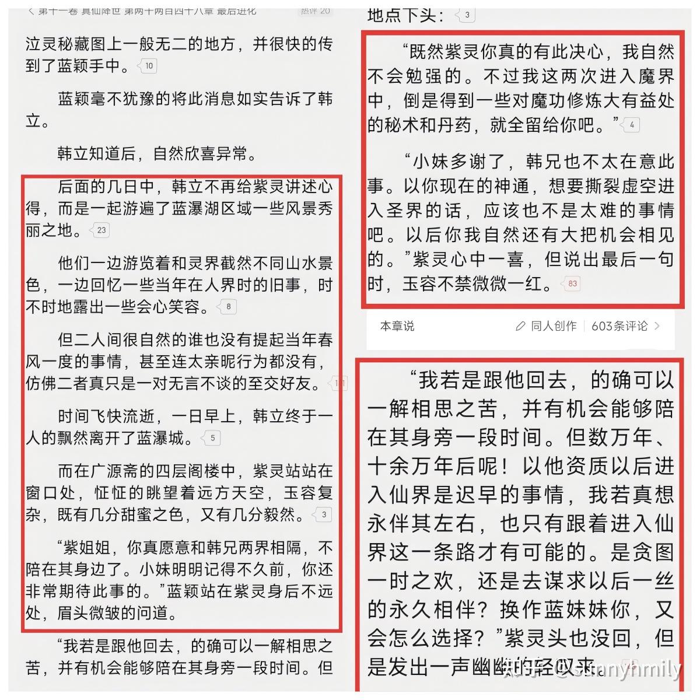

最后说一下，紫灵的这番心意，韩立get到了吗？

是的，仙界篇1266章，韩立在天魔乱神中，斩杀紫灵幻象。紫灵幻象哭着说，我这么多年刻苦修炼，一心一意只为了能飞升仙界，和你双宿双栖，同修大道。这是韩立潜意识里的紫灵，他明知道这是天魔幻化，心中仍旧泛起道道涟漪。

当然，果断杀掉了。

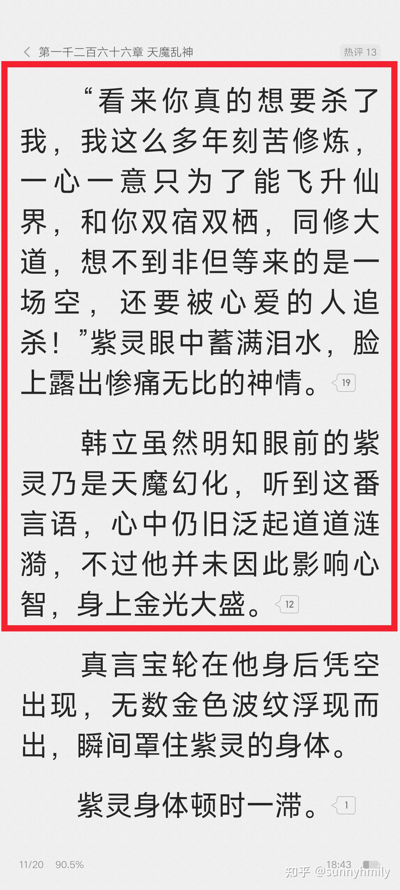

下面进入仙界篇。仙界篇，韩立更“拟人”了，我觉得很合理。首先，作者经过差不多10年再提笔，心态已经有变化；其次，__仙，山中之人也，欲求仙道，先修人道，人做不好，何以为仙？__

仙界篇第632章，韩立看到广源斋，想起紫灵。

仙界篇第776章，韩立请好友：石穿空，帮忙打听紫灵的消息。

__这两次，如果我没记错，应该是韩立第一次主动想起紫灵、主动想去找紫灵。之前，应该都是遇到了就是缘分这种态度。__

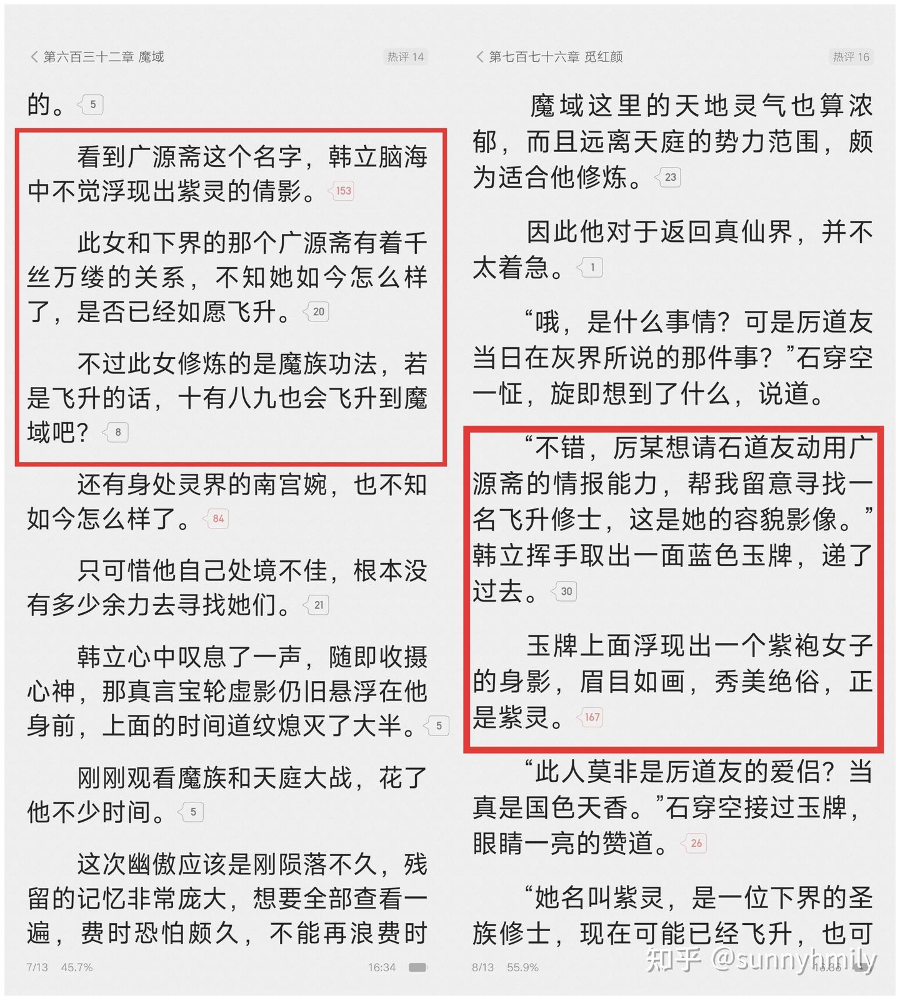

接下来，打听到紫灵一飞升，就被大罗境的黑河上人抓去做侍妾，但紫灵誓死不从，又被流放到积鳞空境。积鳞空境是个险地，而且不能动用灵力和魔力，只能靠肉体。

在这个过程中，韩立的态度非常坚决。仙界篇__第845章，他说他不惜代价，而且认为紫灵虽非他的道侣，但在其心中，却和南宫婉一样，有着某种特别的意义。__

仙界篇第846章，石穿空也看出来紫灵对韩立，不仅仅是红颜知己那么简单。

后面，就是接近140章的积鳞空境寻找紫灵的过程，在此期间，韩立可以说千辛万苦，数次冒险。但需要指出，他不仅仅是为了紫灵下这个副本，也有蟹道人、炼体等多种因素，一举多得。

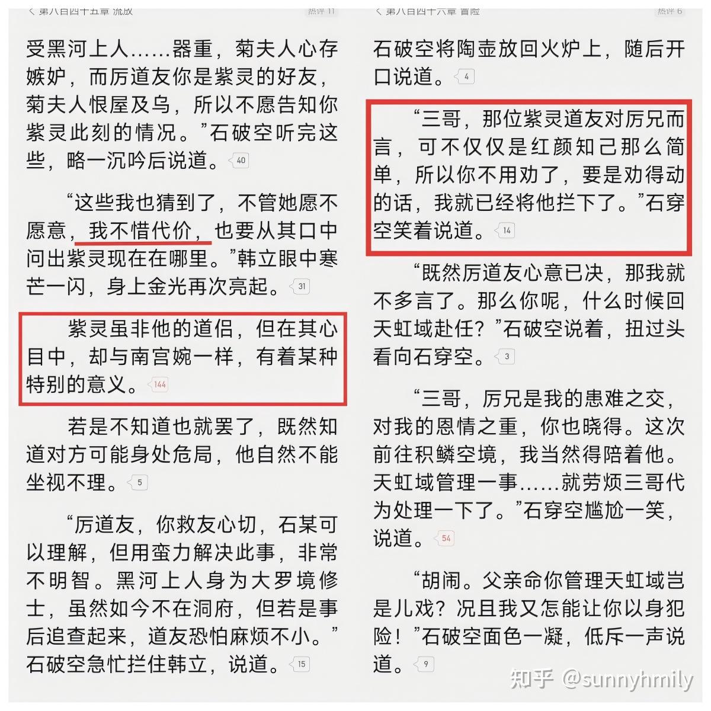

找到紫灵的时候，紫灵已经神魂受禁，失去记忆，形如傀儡，成为一名叫“小紫”的工具人，还和韩立上演了一出冥冥感应，但身不由己、相爱相杀的常见失忆剧情，不多赘述。

仙界篇第980章，“小紫”露出真面目，此时她重伤昏迷，小腹被击穿，嘴角淌血，躺在韩立怀里，韩立心被针狠狠刺了一下，心中懊恼。__这是他第四次为了紫灵心痛。__

仙界篇第984章，紫灵神魂解封，两人真正重逢。一个摸脸，一个握手，画面感很强。

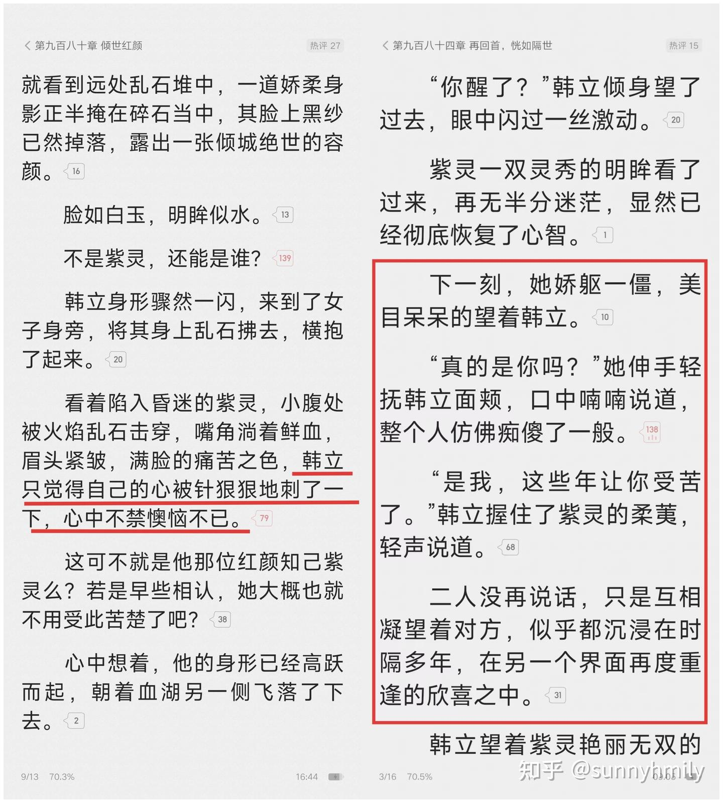

__接下来，可能是原著紫灵争议最大的一段剧情，也是很多读者不喜欢她的原因。__

仙界篇第984章，紫灵问了韩立送命题：“我和南宫姐姐，你更在意谁？”

韩立的回答是：“你和婉儿都是我最在意的人”。其实结合之前韩立的内心独白，这是韩立的真心话。

紫灵不满意这个回答，以跟在韩立身边会增加负担为由，留在魔域继续修炼。

这一段，让很多读者不满的是，和之前不同，这一次韩立可是找了紫灵140章，千辛万苦、屡次冒险，是真的做到位了，结果紫灵又拒绝了，__第三次拒绝韩立。__而且，之前灵界，紫灵说要追韩立到仙界求一个长久， 结果现在来到仙界了，又要比大小，岂非前后矛盾？

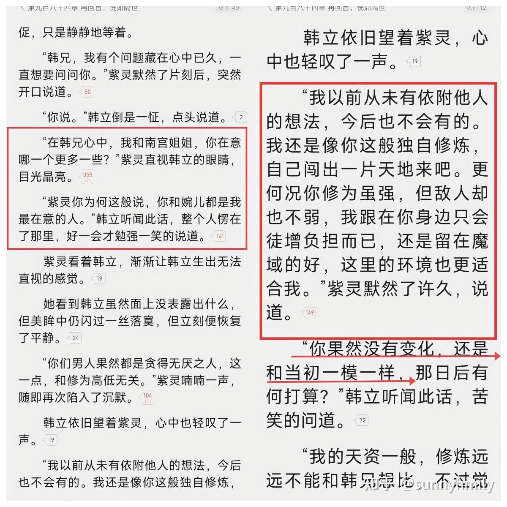

__韩立的回答，在紫灵看来，多少有些令人失望。首先，紫灵就是紫灵，南宫就是婉儿？__情商真二愣子，只有起错的名字，没有叫错的外号。__其次，敲黑板，这种送命题是有标准答案的，那就是谁问的，谁就更重要__，谁问的，我就跳水里先救谁；两个都在现场，就尿遁逃跑或者岔开话题，不要回答，不要回答，不要回答！其实这时候抱上去亲两口都比乱答好用，直男们学会了吗？

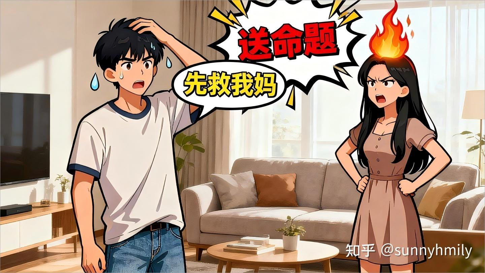

__而且，根据目前的成书，紫灵这一问并没有逻辑。__

仙界篇第984章，紫灵称呼南宫为姐姐，而且说自己飞升前，去看过青元宫，南宫修行很顺利等等。说明紫灵和南宫之前已有接触。

仙界篇第985章，紫灵给韩立半块玉佩作为小礼物，这个玉佩里有一个人影，韩立见了面色微变，紫灵说这件事你不用多管，我自己会处理好，今日只是和你说一下。

仙界篇第1333章，南宫给了韩立另外半块玉佩，答案揭晓。南宫这半块里面是紫灵，紫灵当年那半块里面是南宫。而且南宫说，既然到了仙界，有些事可以进行了，此事韩立不用管。

__据此，唯一合理的理解，就是紫灵和南宫在灵界已经达成协议。那么紫灵这一问并没有必要。__

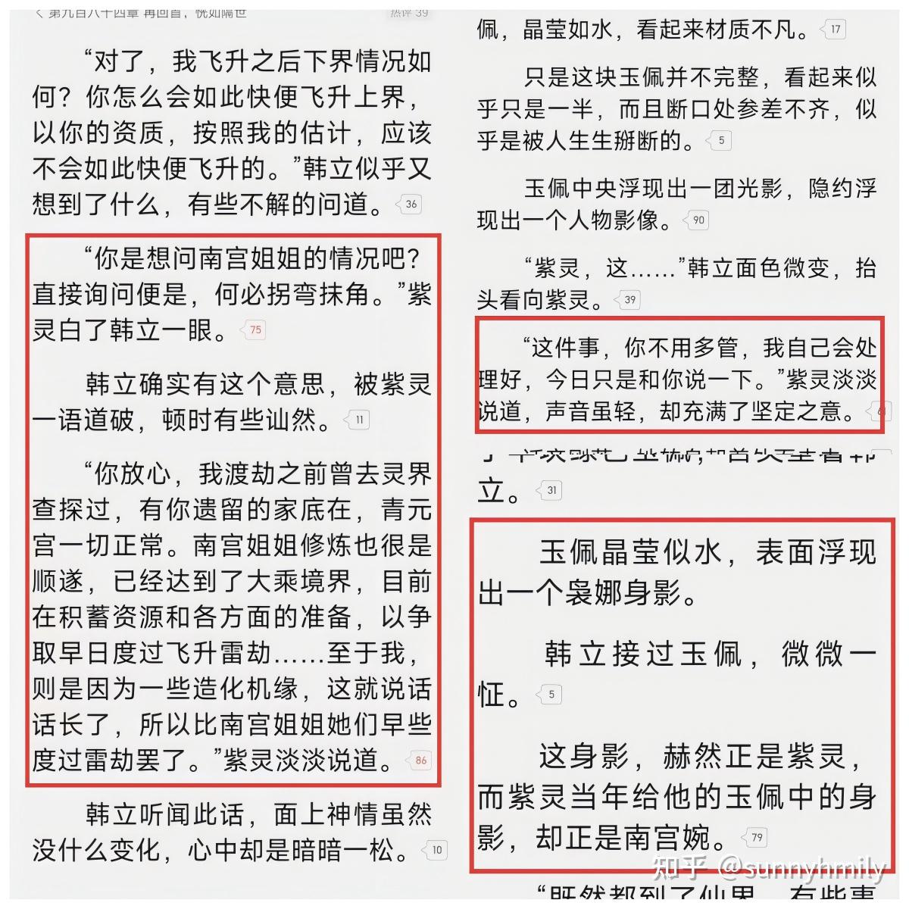

__这一次拒绝的真实原因呢？我的观点是，此时原定紫灵已经是韩立的儿子他娘，但吃书了。仅供讨论。__

__仙界篇988 章，玉佩里有什么呢？是一个有几分像韩立的人影。截至 2025 年 11 月，此章依然起点可见。这一部分打开书评，几乎所有书友都认为是韩立的儿子。此处与第1333章说的，紫灵那半块是南宫，完全矛盾，吃书。__

__仙界篇1394 章后的完本感言，作者说的很清楚，韩立有儿有女，但大结局明确写出来只有一个南宫的女儿，儿子呢？__

__有人质疑，说韩立和紫灵在灵界没有发生过关系，何来儿子？还记得之前提过，灵界篇的伏笔吗？紫灵和韩立分别时，说韩立可以来魔界找她，还害羞了。__

__如果有这个儿子，一定是紫灵的。因为之前也看到，紫灵让韩立不用管了，她会处理好。如果不是自己的儿子，比如是南宫或者元瑶的，紫灵不会如此大包大揽，孩子和亲妈都还在呢。紫灵一定会说，你和南宫有个儿子在下界，以此为凭相认。__

__最后，我要明确，作品要以作品本身说话，哪怕是吃书，也要以吃书后的结果为准。以现在的成书，紫灵和韩立没有明写的儿子。__

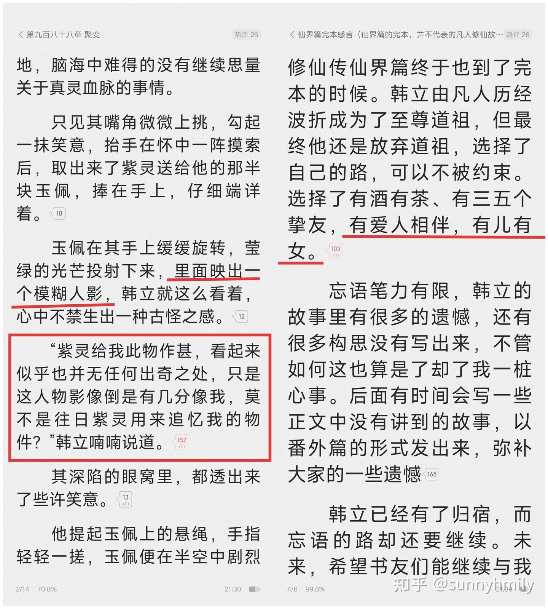

以这个逻辑再看，就能理解了。__作者写这段时候，是按照紫灵和韩立已有一个儿子为前提来写的，结果后来儿子没了，但是这部分人物行为逻辑却没有改。__紫灵此时作为韩立儿子的母亲，明确自己，更重要的是明确儿子在韩立心里的位置，是一个母亲的人之常情。

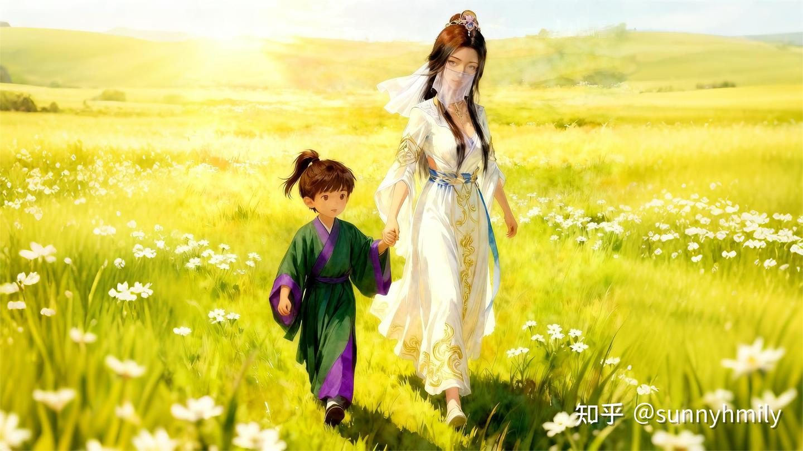

不管怎么说吧，因为这道送命题，两人要离别了。但是，尽管如此，断是不可能断的，两人的情依然存在。

仙界篇第995章，分别前，__韩立给紫灵的左手戴上戒指__，紫灵眼含泪光，韩立叮嘱她，”我不在你身旁，如果遇到什么无法解决的困难之事，不要硬抗“

韩立传送走，两人对视，紫灵痴在原地。这真的不是王婵和风希的既视感吗。

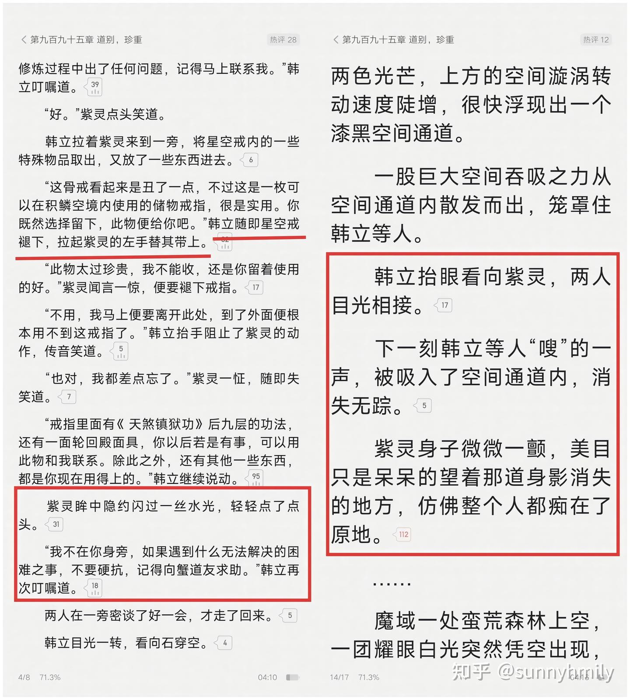

再重逢，就是仙界篇第1291、1292章，看六道轮回盘之前。

韩立眼中闪过柔情，说紫灵，想不到你我还能再见面。__情商依旧还是二愣子水平。__

紫灵偷偷给他透露秘密。而且一直关注他的消息，叮嘱他赶紧提升实力、注意安全，都磕巴了。__这应该是紫灵第一次磕巴，关心则乱。韩立听了心中一暖。__

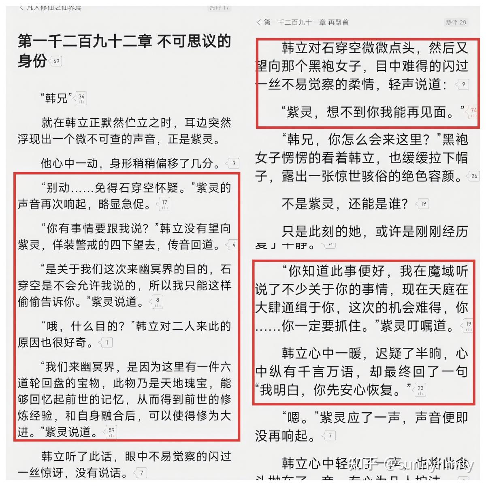

__仙界篇1307章，看过六道轮回盘后，紫灵彻底放下执念，勇敢面对自己的感情，彩环自己给自己做了个媒，这段感情始于彩环，终于彩环。__

__紫灵是用第一视角“沉浸式”回想前世的，此时的她，其实相当于彩环的意识，加上紫灵的记忆又重活一世，彩环在先，紫灵记忆多，算是彩环\-紫灵复合体。注意描写，彩环沉睡了2万年，一觉醒来看到陌生又熟悉的韩立，大概就是这个感觉吧？紫灵这一生，大概是第一次也是唯一一次当面直呼韩立姓名吧？至于到底是不是一个意识，太抽象了，可以看看美剧西部世界的有关探讨。__

__还有个参考就是看仙界篇1309章金童的反应，她也似乎是一个统一的意识。当然，她的情况比较特殊。__

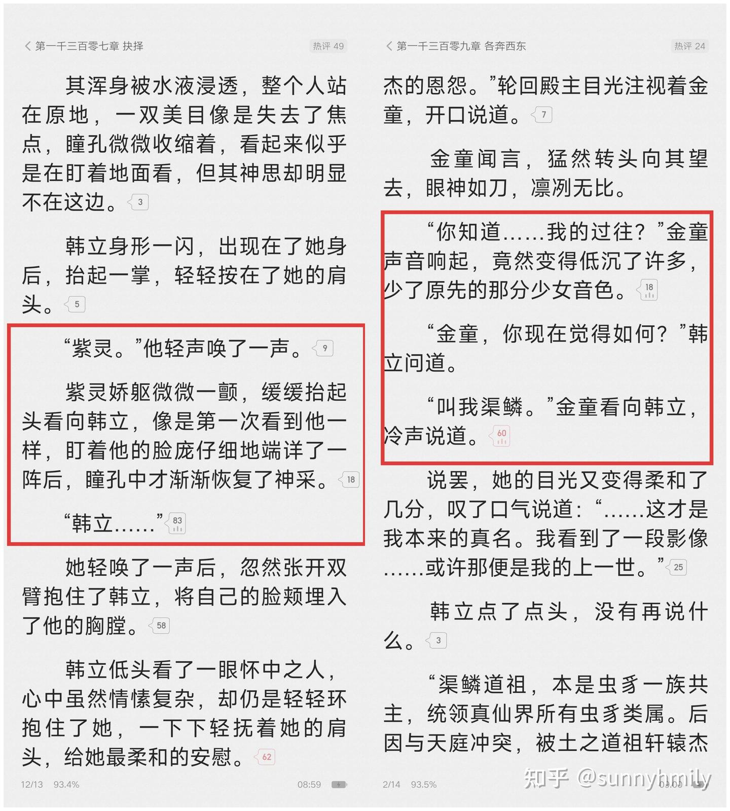

__找回记忆后，紫灵在韩立最需要的时候，给了最关键的陪伴。__

仙界篇第1306章，韩立在碰到轮回殿主之后，可以说是人生最失魂落魄的时候。他原来是大能的一时二生，他一辈子的努力被否定，因为实力不足，还要主动让南宫待在轮回殿主身边，他失魂落魄到求助于瓶灵前辈。

仙界篇第1307章，紫灵观察到他的状态不对，金童和啼魂两个小棉袄也是。

__仙界篇第1312章，紫灵提出要陪在韩立身边。此时的韩立是什么状态呢？真正的孑然一身__，却要提升实力去战胜古或今、夺回南宫婉。

很少有人注意到，韩立其实一直不孤单，这是他修仙以来最孤独的时刻。韩立其实一直是有人陪的，有银月、大眼儿，有南宫、慕沛灵，有道友们、徒弟们，有金童和啼魂，还有石穿空、老螃蟹。__但这时候他谁都没有，只有紫灵。__

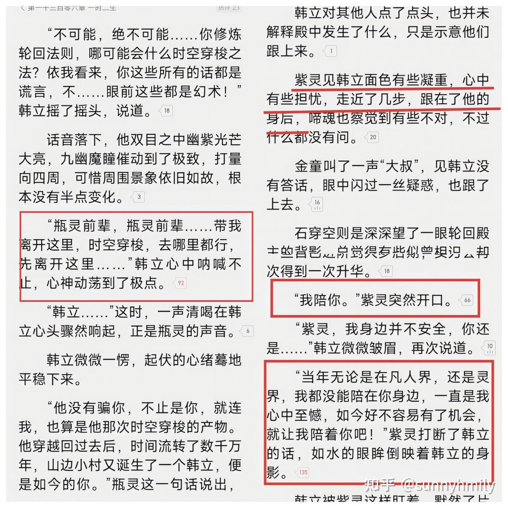

她陪他修炼二十万年。

她陪他游历仙界 200 多年。

__她陪他化凡，开夫妻医馆，用百余年感悟善尸，走完凡人夫妻的一生，真正意义上的白头偕老__。韩立当年也是韩神医起家的呢。

离别前给了他一个女人最大的温柔和体贴。

紫灵对韩立不重要吗？

__虽未真正靠近，但也从未远离，她其实是一直努力在他身边的。__

题外话，文化人开车是真的会。

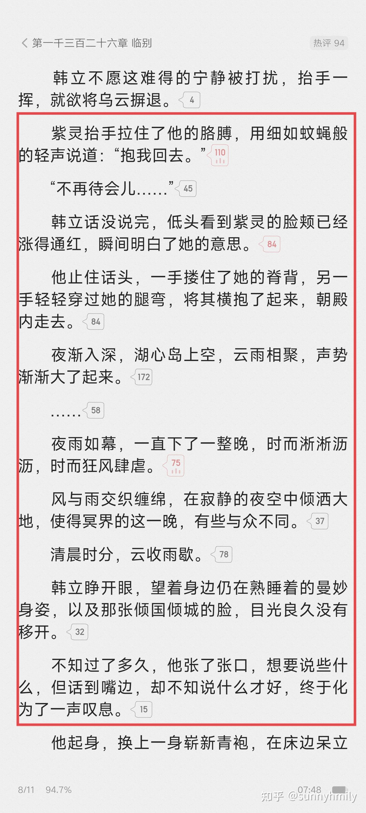

__12\.紫灵没有主动依附过任何男人，紫灵从始至终只有韩立一个男人\.__

__因为美貌而被抓，是受害者有罪论。__原著没有一个字写紫灵主动投靠哪个男修，最多就是和男修结伴下虚天殿，或者使用美貌迷惑一下鬼灵门弟子套情报，但都没有过界，更没有写身体接触。

温天仁这里，温天仁在575章自己承认，是勉强紫灵加入逆星盟。之前的一些描写也清楚表明紫灵的被迫。

而且韩立在591章也看出紫灵的不情愿。

呼老魔那里之前说过，是被数个元婴长老围攻擒下，强迫做妾的，就不多说了。

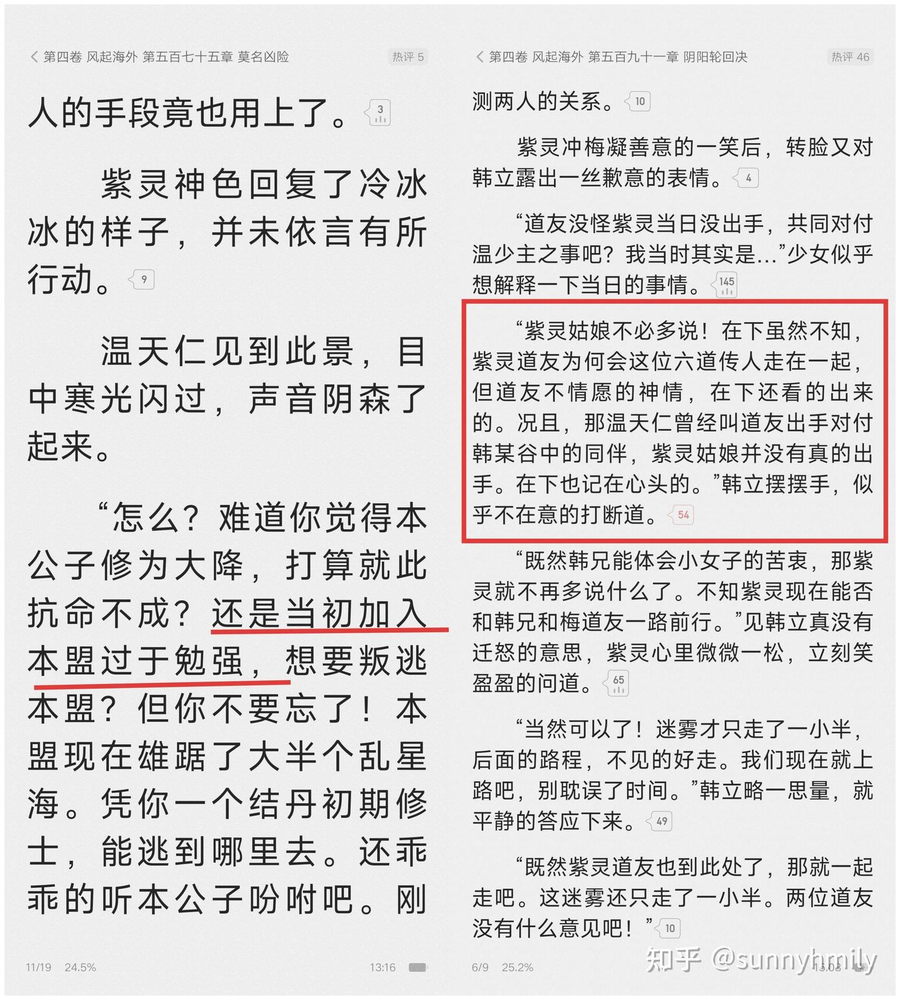

仙界篇845章，刚刚飞升的紫灵，面对最高境界的大罗，宁死不从，试图逃跑，__算不算兑现当年人界离别时，只爱韩立一人，不会嫁给他人的承诺？__

最后因此流落积鳞空境，神魂被禁，变成一具战斗傀儡，身受重伤，如果韩立不来，随时就陨落在某次战斗中了。__如果要傍大款，黑河上人就是修仙界最高境界的大款啊？何至于此？__

__其实，主要还是作者写法的问题。__

作者总是写紫灵“不小心露出真容”然后被抓，一而再再而三，读者自然觉得别扭，进而质疑人物。所以，哪怕在仙界篇第984章，紫灵自己说“从未想过依附别人”，有很多人不买账。

明明有更好的设定啊，__第501章，韩立自己就认定，改变容貌是小把戏，除了两三种诡异秘术和珍惜之极的宝物，根本瞒不过神识强大之人。__

紫灵除了温天仁，人界呼老魔，魔界六极，（女子，划掉），仙界黑河上人，都是一界的最顶点，她本来就瞒不过这些人啊。完全可以套用这个设定。

__另外，还有人说紫灵这么漂亮还到处走，导致被抓。这个观点真的很好笑，紫灵啥都没有，不寻找机缘，还修什么仙，宅洞府就能修到仙界吗？__

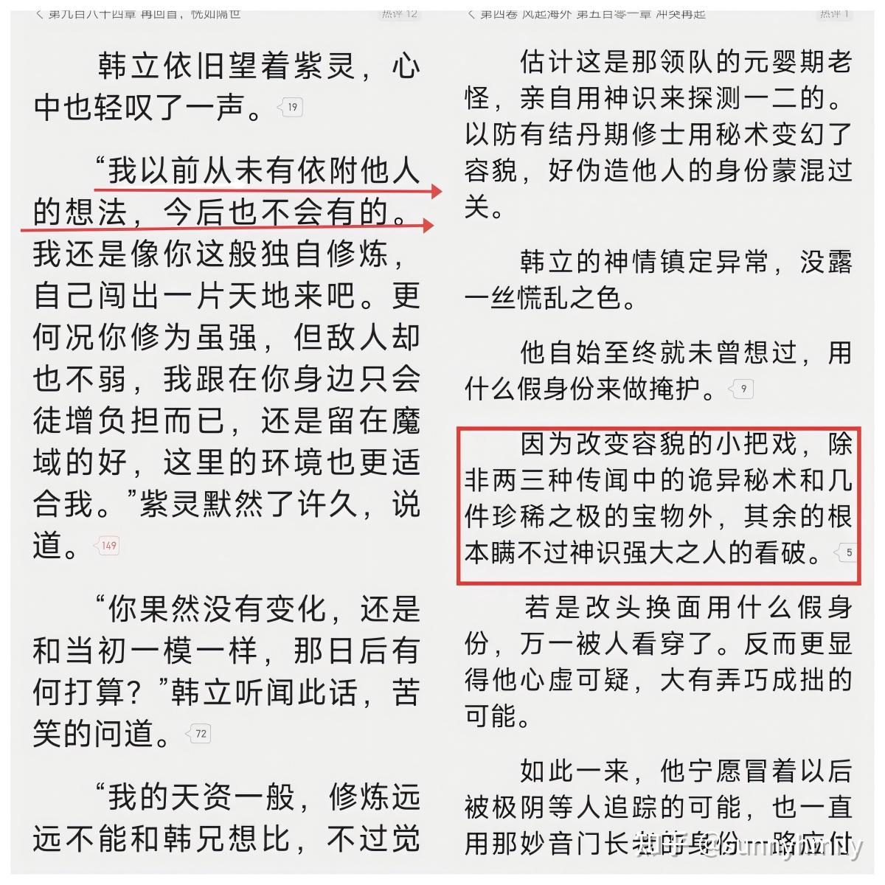

__说一下紫灵“裤裆”的问题。__

__第1235、1236章，呼老魔对元贞之女，不会轻易取下对方的元贞之身，会郑重举办纳妾典礼，而且这次主要是为了紫灵办的典礼。__

__我能理解，有些读者会觉得，温天仁、呼老魔、黑河上人都不用强，是很不合理的。但作者这么设定，因为他不是要写紫灵遭难，而是要写韩立救美，这些情节是服务韩立的，不是塑造紫灵的。当然，写法上重复是个问题。__

__仙界篇第845章，韩立自己都说了，紫灵孤身一人，哪怕真被迫发生了什么，也不是她的错。更遑论没有发生。__

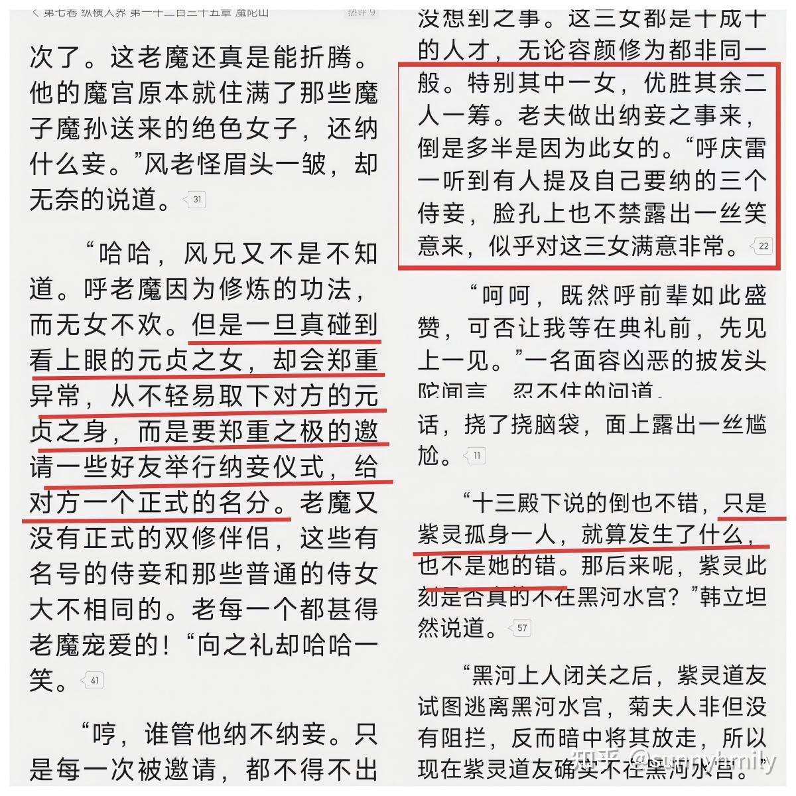

__13\.紫灵的“茶“是心机，是她独自游历天下磨砺出来的保护色。__

如果说紫灵“茶”，是觉得她心机重，这非常对，一点问题也没有，毕竟韩立也认定她心机深沉。但请不要忘了开头就给出的本书设定，这是一个弱肉强食的世界，在这样的世界，一个出身低微的修仙者，独自混了成百上千年，如果还是傻白甜，才是不正常的吧？__紫灵的一些察言观色、长袖善舞的表现，就是她的保护色。__

仙界篇1314章，韩立和紫灵对斩善尸都陷入了困惑，难道修炼之人不是都杀戮不断吗？说明作者的初心一直未变，高级修仙者不会有真正的好人。

但要指出，紫灵底色依然是善良的。第568章，在被温天仁胁迫期间，即使自身朝不保夕，她对要被温天仁杀害的修仙者仍然是抱有同情的。

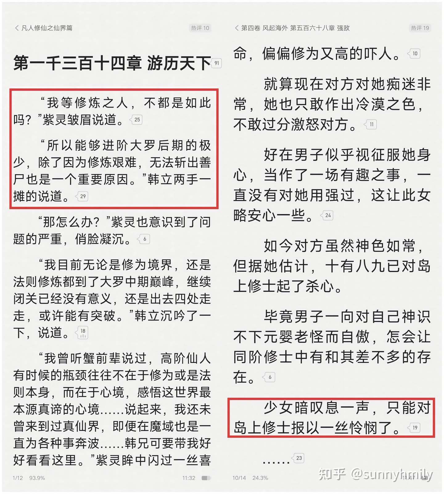

__说到这，顺便说一下温天仁一战的问题。很多人说紫灵没帮韩立，但其实紫灵已经两次暗帮，而且这两次温天仁都注意到了，记小本本了，如果他赢了，估计紫灵也没有好果子吃。__

572章，紫灵点破八门金光镜，让韩立有了准备。温天仁大有深意地瞅了紫灵一眼。

575章，紫灵判断韩立和元瑶应该关系匪浅，拒绝温天仁让她去攻击元瑶的要求。温天仁气急败坏，直接威胁紫灵。

紫灵本身实力就无法介入韩温大战，已经尽她所能。

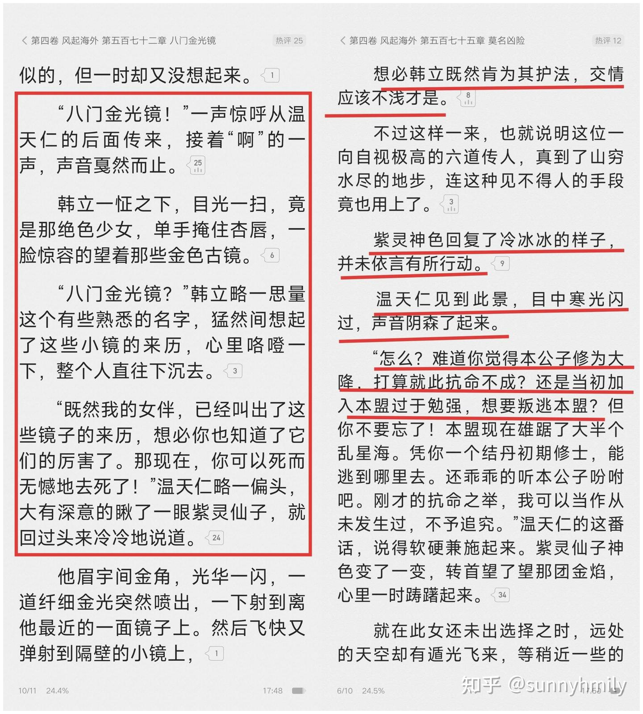

__其实，最关键的是，韩温大战时，紫灵到底该不该帮韩立？__

很多人拿紫灵没有坚定站在韩立这一边来说事，说谁赢，她就帮谁。却忘了此时紫灵和韩立是什么关系？之前已经强调过，哪怕在此后共同经历了阴冥之地、无边海和坠魔谷，__韩立的定性仍然是无足轻重。__

既然是这样，紫灵两次暗帮韩立，应该说已经尽力。而且，在她看来，温天仁赢，自己肯定是没好下场；但如果韩立赢，韩立已经在她面前露了很多底牌，特别是天雷竹，竹子可是她给的，她也不确定会不会被灭口。

__所以，575章，她没有选择：谁赢她就帮谁，而是毫不犹豫地逃跑。__

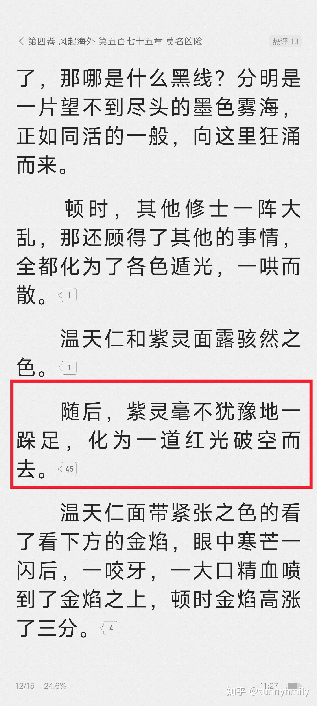

__这件事韩立也是理解的，__否则以韩立的智慧和性格，他会不找紫灵算账，而是在591章出言表示理解，还带她走出阴冥之地？

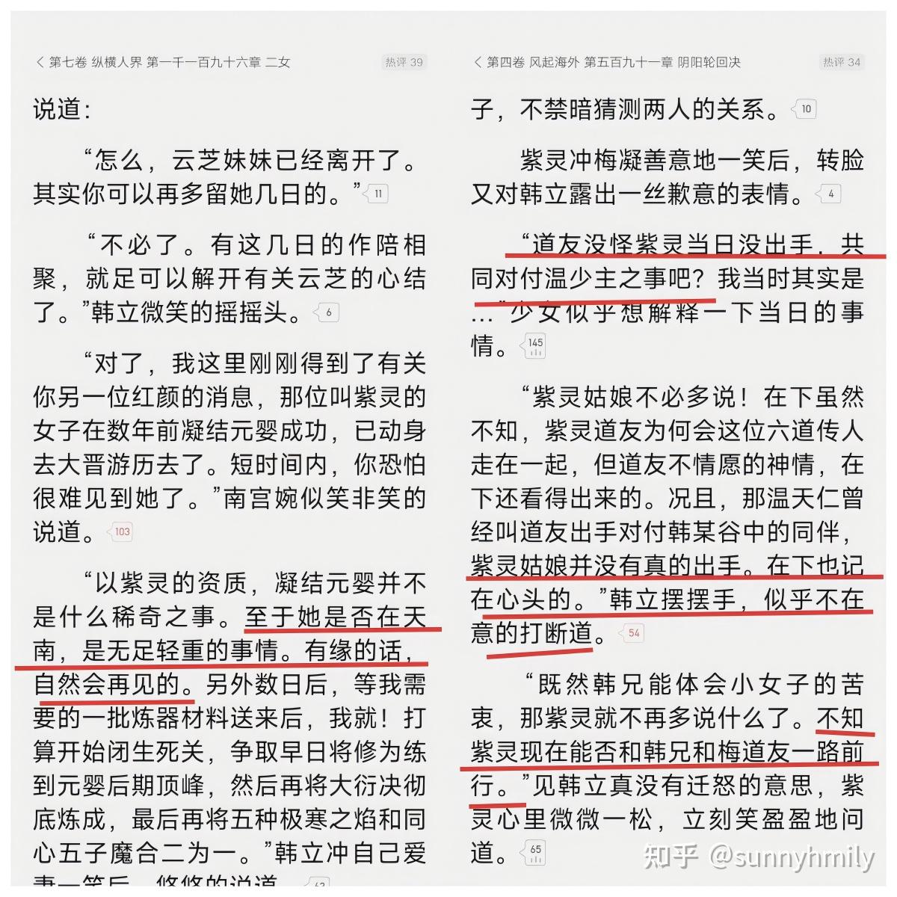

__继续话题。关于紫灵的茶，还有一方面，就是认为她吊着韩立、吸韩立血。__

吊着韩立，前面三次拒绝韩立，我都已经讲清楚了。我说一下我的认知。

__我认为，三拒韩立反而是紫灵的魅力时刻，是紫灵不同于其他女性的地方。__这三次，第一次韩立已经力抗化神，第二次韩立说自己很有把握进阶大乘，第三次韩立能够在仙界的“死地”翻云覆雨，每一次韩立都是马上要站在此界顶点的真正大能，可以说紫灵深知韩立是修仙界天之骄子，跟他走，比自己四处冒险舒服一百倍。而且韩立也都要带她走，__紫灵能够说三次不，难道不是非常令人敬佩？__

如果紫灵真的对韩立没感情，而是一心修行，跟他走就是了啊。第794章，紫灵自己就说过，若是做韩道友的双修伴侣，肯定比自己慢慢修炼强得多。结果真有机会，她反而放弃了，而且是三次。

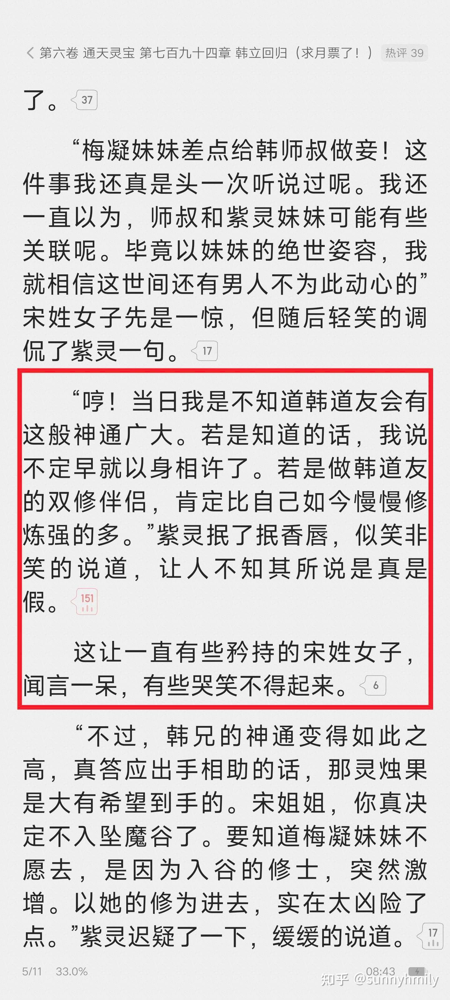

__另外，紫灵也并不存在身份上的顾虑。__

人界修仙界大概是一夫一妻多妾制，所以紫灵走掉了。

灵界的世界观，第2253章，人妖双大乘认定，高阶修士，双修伴侣多几个无所谓。

仙界篇1351章，韩立的自我尸幻化成为古或今，认定南宫、紫灵双道侣。起码在韩立的潜意识里，是可以有两位道侣的。

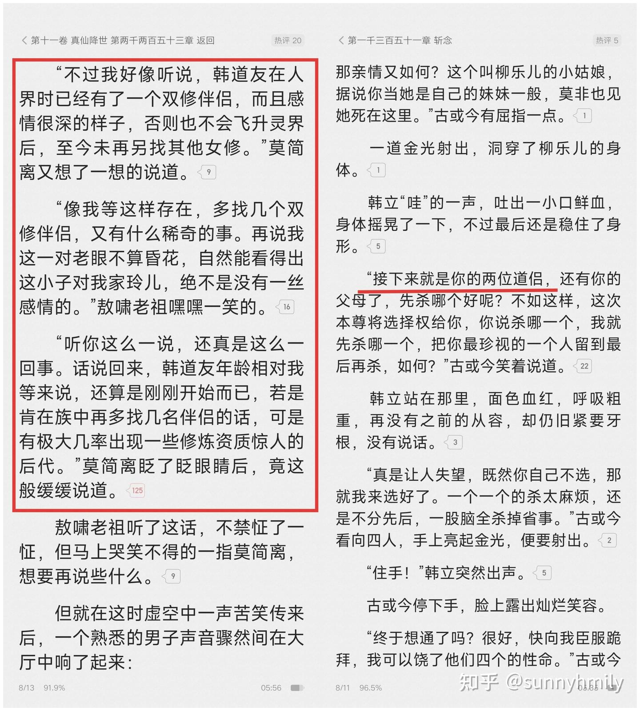

__下面说吸血的问题。__

紫灵和韩立，在魔陀山定情之前，交易明细如下：

蝎岛和虚天殿，紫灵付出白雷竹、灵石，换取韩立做妙音门挂名长老，以及虚天殿带她走一段。注意，蝎岛，韩立没有救紫灵，也没有杀赵长老，他主要做的就是自保。

妙音门挂名长老对韩立是有用的。第501章，他去外海，就是靠这个身份，省了很多麻烦。

竹子就更不用说了，第411章，韩立笑的非常开心，认为这是他占的最大一次便宜。这个竹子是韩立的本命法宝原材料，它直到仙界篇1387章，打最终BOSS古或今，都还在用。

阴冥之地，之前已经详述。客观上韩立从温天仁手上救了紫灵，还带她走出去。但有没有紫灵，韩立都要和温天仁一战，为自保也为元瑶，不是为了救紫灵。带她走出去，确实是靠韩立。

坠魔谷，紫灵提供了重要情报，还有宋玉提供了丹方（最后紫灵也给了路线作为回报），做了一些打杂类的工作，韩立带紫灵进内谷，紫灵只拿了一枚果子。总体上算是交易。

__总而言之，定情前，韩立能者多劳，但紫灵没有让韩立白帮，大体上是交易的范畴。定情后，看自己理解吧。__

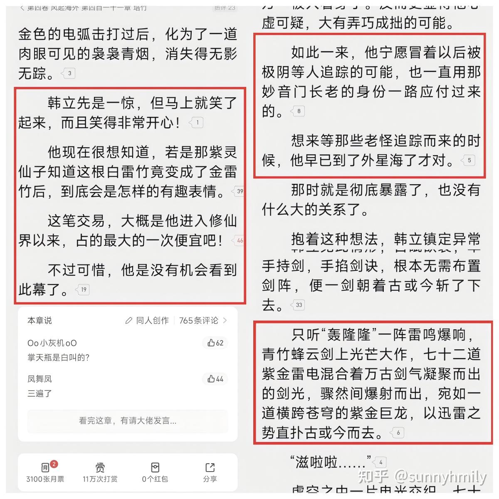

__14\.紫灵的黑点中，只有出身不好、买卖炉鼎一条成立，但这是宏观设定的问题，南宫、元瑶也多少都有一些。__

__小说设定，女人兼有性价值和修炼价值，本身就是一种资源。比如炉鼎，第512章介绍，买卖炉鼎是相当普遍的一种行为，人们习以为常，甚至公开拍卖。而且不少女修还自愿成为炉鼎，以求安稳和机遇。__

__所以，炉鼎其实是一种商品，是硬通货，换句话说就是灵石。紫灵作为一个经商门派的门主，肯定要涉及这块“业务”，__比如第408章请赤火出手是10个炉鼎，而极阴给赤火的回礼是20个。第410章，想送女弟子给韩立做妾，拉拢韩立。注意，韩立拒绝不是因为男女之事，而是看不上双修的功力。

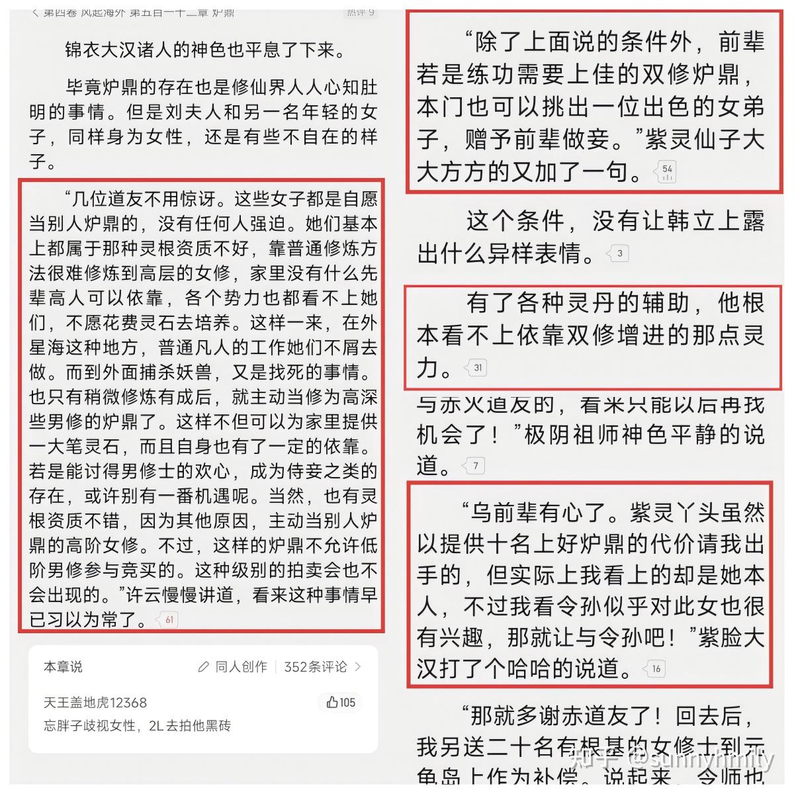

__而且，紫灵没有参与培养女弟子。__

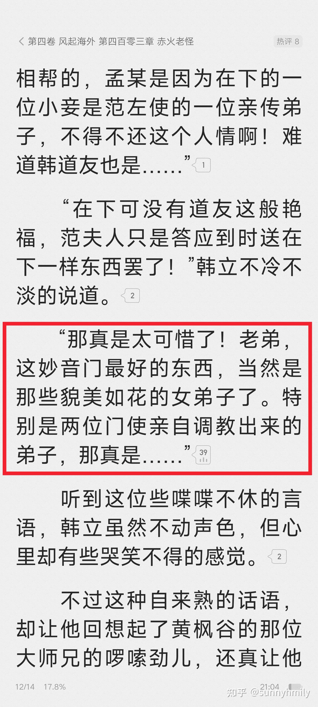

__但是，紫灵这个黑点，其实是出身问题。她是这个门派的门主，很多事她要来做，不当家不知柴米贵。如果她是凌玉灵的出身，自然就不会这样。__

__而且，南宫、元瑶也都多少有类似问题。__所以作者的设定，感觉起码在初期，是想突出这种弱肉强食的残酷吧。

__先说南宫。__掩月宗是双修门派，但和南宫本人的修炼无关。

第178章，掩月宗的低阶弟子，女子烟视媚行，男子视女子为禁脔。

第339章，掩月宗和合欢宗大有渊源。

第711章，如果当年韩立跟南宫回去，南宫更可能会失望，会冷淡下来，随意找一名女弟子应付他。__所以，高阶女修对低阶女修，都是很随意的。__

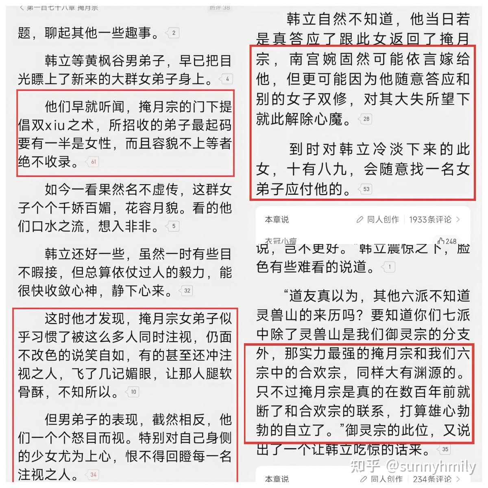

__元瑶则是出身修仙小派，年少无知。__第563章，元瑶和妍丽在门派筑基无望，想要通过成为高阶修士的双修伴侣继续修仙。后来，见青阳门少主门派好、修行高、长得帅，也为了救师姐，就起了攀附心思，想嫁给他做妾。当然，元瑶后面反击少主以证道，拿到了修仙第一桶金，还是很牛的。

注意韩立的回答，情商很高，而且也印证了炉鼎、侍妾这种事在修仙界是非常普遍的。

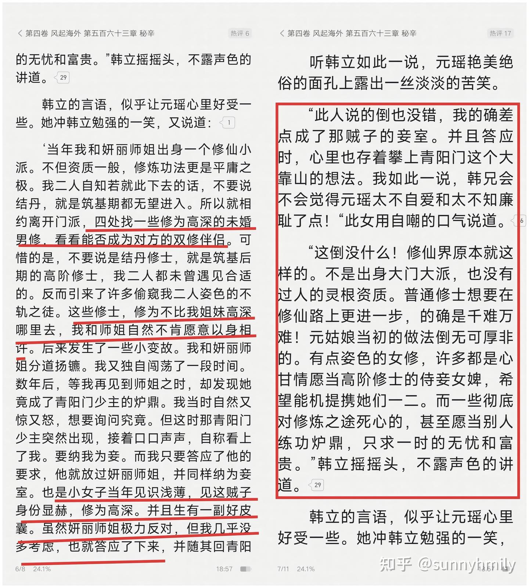

__总结一下，这个角色有争议，一是部分读者过于代入韩立视角，视紫灵为后宫成员而不是修仙同道__，厌恶她被别的男人抓、和别的男人一起下副本。__然而，这些“黑点”是修仙常态，韩立亦然。__韩立没被抓？没在实力强的人面前虚与委蛇？没和别的女人一起下副本？没有把修仙摆在爱情前面？__其实很多事情，主角视角觉得没什么，换成紫灵或者其他女性角色立刻就得爆炸，我随便举一个例子就够。这里如果是紫灵对温天仁虚与委蛇，撒娇说“省的了省的了”，想想看吧？__

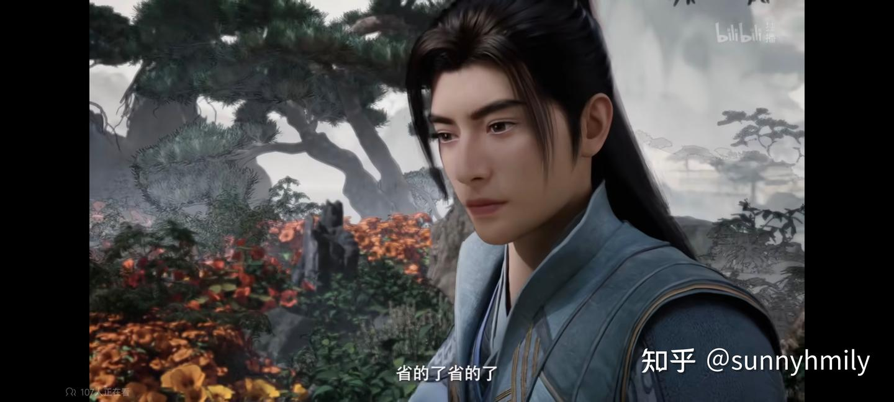

__二是认为紫灵不适合做主角的女人。很多书评有说，如果紫灵是个男的觉得还挺有特点，但是作为主角的女人看就不讨喜。__

__确实，哪怕没有开挂的魔功体质，紫灵依然以散修身份结婴，而且保护好了自己的贞洁，她付出的努力可见一斑，修仙界必然会将她磨砺成为一个聪明、智慧、成熟，但有心机而且长袖善舞的女人，我觉得用一个英文词更恰当，“sophisticated”。而这种女人不是很多人心中的良配，他们喜欢更单纯的女人。__

__这是纯粹的个人取向，我很尊重。如果可以，又有哪个女孩想真的长大成人呢？但我个人取向，我就喜欢“sophisticated”的女人，有意思，有味道。__

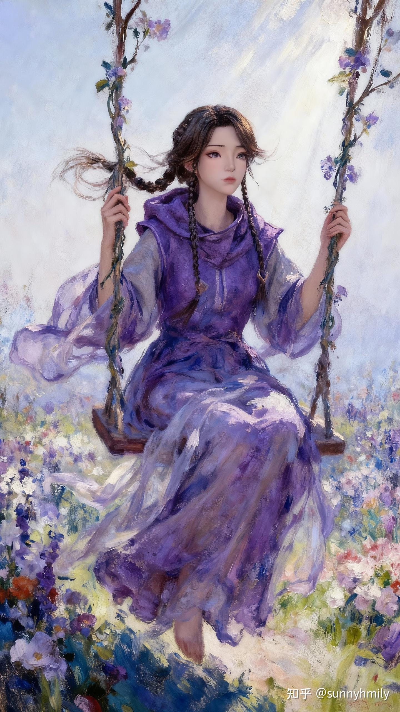

讲到这里，原著紫灵基本该说的就说完了。一点个人感想。

其实，我看书的时候设想的紫灵，并不是这样的。我希望她能成为韩立的修仙老熟人，两人相亲但不可相近，在灵界、仙界的某个副本隔三差五遇见，有时候一起坑别人，有时候互相坑一下，默契地轻笑一声，怎么老是你啊？最后在大道终点，相逢一笑泯恩仇，一声“道友”尽沧桑。

但是，后面我看作者的其他书，比如叶天眉\-珈蓝，西门雪\-钟秀，聂彩珠\-余馨，其实和南宫婉\-紫灵是差不多的配置，也就明白了，这是作者的个人偏好吧，尊重原著，尊重作者。

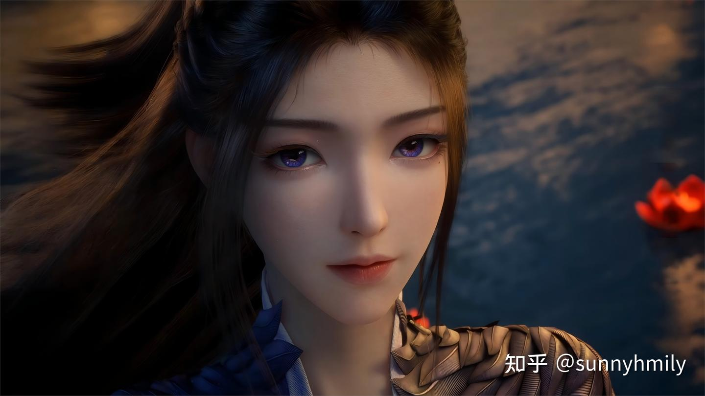

文章略长，谢谢各位看到最后。

附：

本文原著内容以 2025 年 11 月可阅读的起点正版为准；
