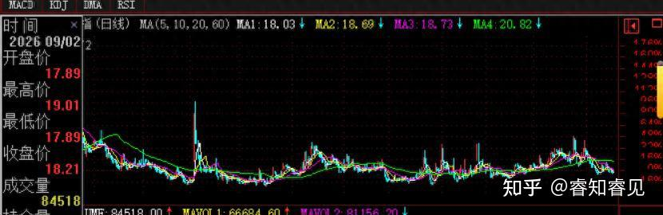
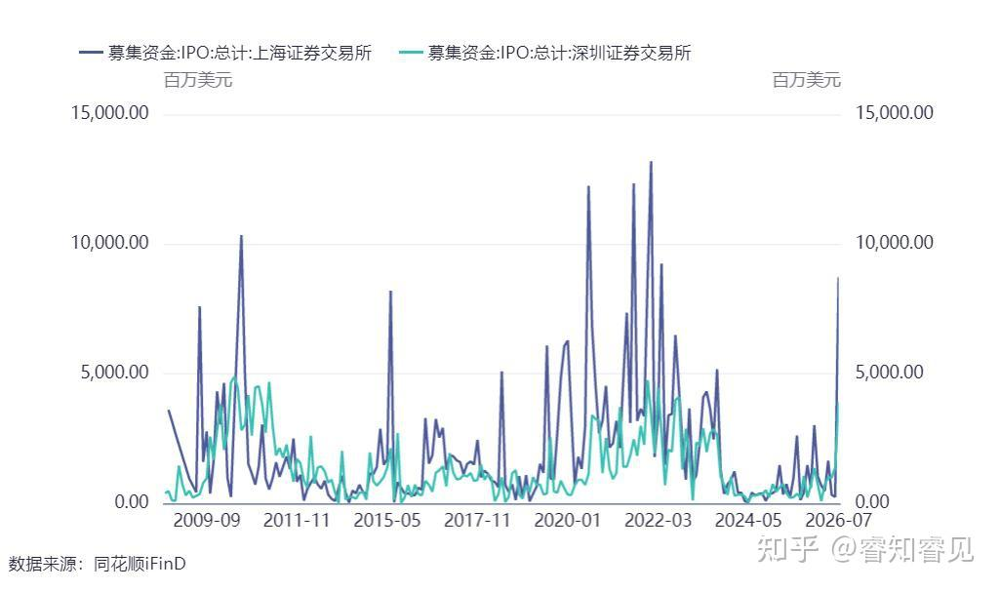

A股开始变得静悄悄了！有大事要发生吗？

[源网页](https://zhuanlan.zhihu.com/p/2079851671283308539?share_code=1cef80I3kywGG&utm_psn=2079993030069822933)

股市这种地方，可以在一两个月发生逆转。

6月份的时候，还喊打喊杀，科技改变世界呢。

7月暴跌后，8月再快速轮动了一阵，现在市场变得鸦雀无声了。

A股的人心散了吗？

我们可以观察一些数据和现象。

## 一、情绪指标

__首先是成交额不断创新低。__

7月的时候，我就跟大家分享过。

A股接下来会不断缩量，直至缩到地量水平。

什么是地量水平呢？

大概是1\.6万亿左右。

本周最低缩到了1\.78万亿左右，距离不远了。

__第二，证券和基金开户数下降。__

2026年8月A股新开户239\.73万户，同比去年8月265\.03万户下降10\.0%;

2026年8月基金新开户16\.86万户，环比下降15\.28%，同比2025年8月的18\.25万户下降7\.62%。

这可以侧面证明新增资金不足。

__第三，大跌的时候，鸦雀无声。__

就比如本周三的大跌吧，居然没听到鬼哭狼嚎。

我在想，如果跌出新低，会不会逼出尖叫呢？

__第四，社交平台浏览量降低。__

就拿我自己的账号来说吧，最近一个月的浏览量明显下降。

在科技股暴涨的时候，即便我看空，浏览量也不低。只不过是跟我抬杠的人比较多而已。

我大概看了看其他博主，也大都差不多是这种情况。

__第五，波动率降低__

由于传统板块这边跌得早，所以沪深300的波动率已经降到稳定状态。

科创50和创业板的波动率有所降低，但还差点意思。估计未来还会继续下降。

其他的现象就不一一列举了，比如，融资余额下降，热门股的拥挤度下降等等。

## 二、这是无人问津处吗？

情绪下降了，但距离无人问津还不是时候。

真到了无人问津的时候，会出现另一些指标的变化。

比如，像我这样的博主开始全面且强烈看多了，然后被一群网友围着骂。

再说了，现在的估值肯定也不是无人问津处的估值。

倒是某些被错杀的板块是无人问津处的估值了，但人们往往看不上。

国家队在那个时候大概率也会大手笔买入，并且会喊出来，而不是默默的买。

对了，当下__公募基金已不再公布前十大持有者了，__那么，国家队的行踪会被隐藏起来，以后就更神鬼莫测了。

到时候，甚至IPO都可能直接停掉。最近，倒是有传言要收紧IPO了。

看样子，监管也发现流动性有点不够了。

A股有一个规律，过去即便走熊了，IPO也不会立刻停止，因为要服务于产业。

这一次似乎有所改善。

一方面是，即便在牛市里，IPO的融资金额小于以前；（也就7月份的融资规模偏大）

另一方面就是提早收紧IPO了。

读者朋友可能会问，现在A股到底是什么状态？

## 三、4000点上下翻飞

上证指数在4000点附近上下翻飞已经快一年了。

__是一种突破了又没稳住，跌破了又没跌穿的状态。__

为啥会是这种状态呢？

能一直维持下去吗？

我估计呀，还真可能维持挺长一段时间。

__首先，要搞明白管理层为什么要股市涨起来。__

实际上股市拉起来的主要目的是__稳预期！__

既然好不容易拉起来了，岂能容它轻易跌回去？

国家队不早就把子弹留足了吗？

__第二，资产荒太严重。__

现在利率这么低，存银行不划算，买债券也赚不到几个钱。

楼市的信仰也破了，而且筑底周期很长。

投资海外，被额度封死，还要缴税。

自己创业？算了吧！想败光家底吗？

那么你说现在钱能去哪里？

兜兜转转不还是得有一部分进入股市吗？

再说了，现在确实还有不少股票的股息率比较不错。

那么即便科技股跌了，这些大蓝筹也能撑着指数在4000点附近。

__第三，钱很多。__

央行始终强调要实施适度宽松的货币政策。

债券利率现在这么低，俨然就是钱太多了。

再说了，现在出口很旺盛，赚到的钱有部分要回国，这里会有部分增量资金！

那些富人手里还有大把的钱要做资产配置。

钱这么多的情况下，如果股市出现拉升行情，恐怕赌性会驱使大量资金入市。

最后，看看投资者的心理。

__一方面，有人害怕踏空，__害怕错过一个亿。尤其是在资产荒的背景下。

要是踏空，后面搞不好要熬几年才有一次机会。

__另一方面，有人觉得估值不低了，嫌弃它贵。__

再说了，经济预期这么差，万一继续下探怎么办？

__还有一方面，有人希望指数深度下跌，他好抄底。__

于是指数就犹犹豫豫的来回晃荡！

所以呀，现在无论你买还是不买，估计都会被恶心到！

在我看来，这很正常！

股市从来不会让人开开心心赚钱。

要真是开开心心赚钱了，后面铁定有大坑。

所以痛苦是好事！

不过，如果把资产配置做好，也不存在痛苦。

毕竟来股市应该是获得被动收入的。

把配置做好了，就放一边少看。

然后该工作工作，该生活生活，该娱乐娱乐。

即便过去十几年围绕3000点大转，做好配置，不照样能获得良好的收益。好歹现在是围绕4000店打转了。

喜欢我文章的朋友欢迎来我的同名公号：__睿知睿见__

内容效果不满意？[点此反馈](https://feedback.notebooksyncer.com/feedback/83df4c90_1788689024877?u=https%3A%2F%2Fzhuanlan.zhihu.com%2Fp%2F2079851671283308539%3Fshare_code%3D1cef80I3kywGG%26utm_psn%3D2079993030069822933&s=onenote)
