Livermore说的不要失掉你的仓位真正的意思是什么？ \- 知乎用户 的回答

在《股票作手回忆录》中专门有一章讲年轻的Livermore遇到一位前辈学会了不要失去自己的部位一说，讲的是要抓大波动不要在遇到合理的回调的时候把自己手…

回忆录第五章这块是最精髓的内容，可以说是任何投机、投资获得大盈利的唯一方法。

盈利并不来自【平仓】这个动作，而是来自品种本身的价格运动。

平仓不是获利动作，平仓是中止动作。

平仓截断发展，截断趋势。亏损的时候，逆势的时候，必须平仓阻止亏损发展壮大。

但有盈利的时候，平仓也是阻止获利。认为涨多了（或者跌多了）之后要反着走一个reaction，然后对reaction做出react，那是自降身份，把格局从长线大趋势降级成短线小波动，本来是从龙功臣的现在变成来回跳反的雇佣兵了。

平仓了，然后该何去何从呢？何时何价平仓，平完了突然拉起来怎么办？面对卖飞的资产，追高还是不追？假摔虚晃一枪，突然接住立刻拉起，这在趋势中极其常见。

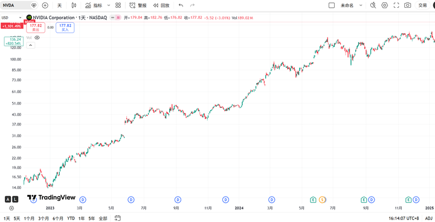

alt="Image">2023年2月、5月，2024年2月财报日

女大这轮10倍，好几个财报日都是回调到半路突然跳空高开到历史新高的。不追就要踏空。图里的几个跳空就是。卖了就卖飞，不追高就踏空。

但也不是财报日就一定跳空高开然后一路上涨。跳高以后真摔下来的也有很多。追高就被套。而且要承受相当大比例的浮亏。

"My dear boy," said old Partridge, in great distress "my dear boy, if I sold that stock now I'd lose my position; and then where would I be?"
“……如果我卖了，我就失去我的头寸，然后我该何去何从？”
（回忆录第5章）

平仓了，然后咋整？

卖飞以后追高，中间错失的一段，就相当于开空对冲后打的止损。这相当于一次新的动作，而且是逆势的，核算赢面和盈亏比后，有正期望吗？

胜率高吗？五五开。实盘操作过就知道判断经常是错误的，对回调的预判经常不准，markets are never wrong, opinions often are\.

盈亏比够吗？潜在收益足够覆盖试错止损吗？逆势做空，希望不大。

回调是可预期的，但不是可操作的。所有人都知道涨多了会跌，跌多了会死猫反弹。但它出现的时间、运动的幅度全都不是能以正期望捕捉获利的。

Disregarding the big swing and trying to jump in and out was fatal to me\. Nobody can catch all the fluctuations\. In a bull market your game is to buy and hold until you believe that the bull market is near its end\.
眼光不看大势，而在小波动里反复横跳是致命的。没人能捕捉所有波动。牛市里唯一该做的就是买入然后持有一直到你相信牛市结束（大势结束而非回调）。
（回忆录第五章）

试图捕捉短线回调小波动的动作极其有害，实盘试过就知道都不如老老实实拿着。

回调是用来忍的，浮盈垫就是用来在这种时候扛风险的。回撤就回撤，入市的收益都是风险收益，不承担风险哪可能有超额收益。

开仓必须要承担试错止损的风险，持仓必须要承担浮盈回吐的风险。落袋为安躲过回调的“亏损”（浮盈回吐）是不切实际的，就像试图开仓在一点浮亏都没有的完美点位一样，不存在的。

如果不能接受和处理好开仓试错必须的止损，不能接受和处理好趋势中巨大波动的浮盈回吐（比开仓点大得多得多得多），那就绝对不可能在投机或者投资中取得大的收益。

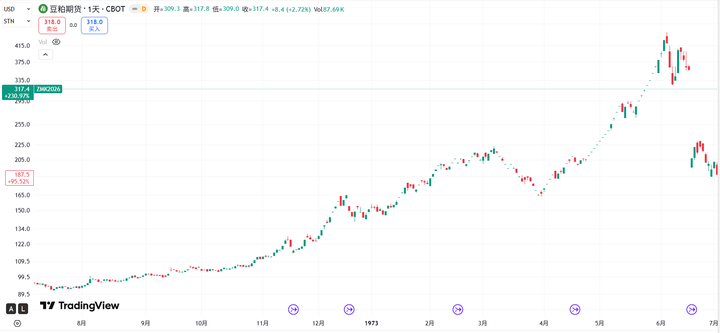

alt="Image">1973豆宗强者恐怖如斯，从100涨到200回落150，最高涨到450（随后的巨大跳空为换月）

1973石油危机叠加饲料荒的豆粕，不到一年翻了4倍，50多年前的价格涨到了都比现在还高。中间有无数次巨大起伏，跌停板天地天都是常规波动，回调更是以连续跌停的方式进行。

这么涨当然一定会有回调，但有多少回调是能躲过的可操作的？3月那轮200→150的大回调可能还算有点操作性，但之后又涨到450差不多3倍。任何一个趋势系统如果为了捕捉200→150而失去150→450的潜力，那必须得挂起来狠狠夸一辈子。

J\.L\.在操盘术里也反思了小麦趋势里失去仓位的错误。

I did not, however, fully realize the full possibilities which lay ahead\.
Then, when I had a 25 cents per bushel profit, I cashed in—and sat back and saw the market advance 20 cents more within a few days\.
Right then I realized I had made a great mistake\. Why had I been afraid of losing something I never really had? I was altogether too anxious to convert a paper profit into actual cash, when I should have been patient and had the courage to play the deal out to the end\.
但我没有对趋势无限可能的想象力，我在浮盈25美分的时候卖飞，然后眼睁睁看着几天之内又涨了20美分。我立刻意识到我犯了多严重的错误，为什么要担心失去浮盈？我太急于把浮盈落袋为安，我（本该拿这些浮盈作为风险资本去扛波动）保持耐心和勇气持仓一直到趋势结束。
（操盘术第7章）
（不过J\.L\.在半山腰卖飞小麦后，再度用一半仓位追高，也算没有完全错过趋势。）

6个月内30多板涨停，这是世界大战级别的行情，试图从中捕捉回调就像让战壕里的机枪手向右移动五米的微操指挥一样。这不是聪明的投机者该做的事。

涨4倍的豆粕，没人能准确捕捉，也不需要捕捉到其中的回调。没有人能预测到它会涨4倍，也不需要预测。但是浮盈没吐太多就拿着呗，回调是可预期而不可操作的，浮盈就是用来扛这些回调的。

平仓就是封锁了失去了对趋势的想象力。太多聪明人在趋势中没有对趋势发展的想象力，但却对回调、反转充满梦幻般的想象力。（反过来，在逆势大浮亏时没有恐惧，总是对反弹和反转充满幻想，包括搞出大新闻被Buffett批判了一番的LTCM那些最聪明的大脑也是一样）

然而那些回调的波动幅度，相比于大势的运动都是微不足道的。即使真反转了，那也只能认，浮盈吐了就吐呗，鱼尾吃不到的。经验和事实告诉我上涨趋势中只有买点，没有什么好卖点，绝大多数的看跌信号都是假信号都会失效，自作聪明的读盘让我在趋势面前变成了tape worm, semisucker。

我觉得要回调，我觉得要反转，所有“我觉得、我认为”的想法总是不断被市场打脸，卖完总是卖飞踏空，最后发现这些自作聪明的thinking和trading的瞎折腾，不如挂个止损关了账户不看。

女大十年百倍，捕捉一点小波动，早一点晚一点进场，在数量级上和这百倍趋势比根本微不足道。这百倍绝非靠【平仓】这个动作“高明地”躲回调来实现的。

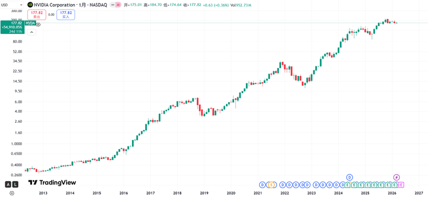

alt="Image">

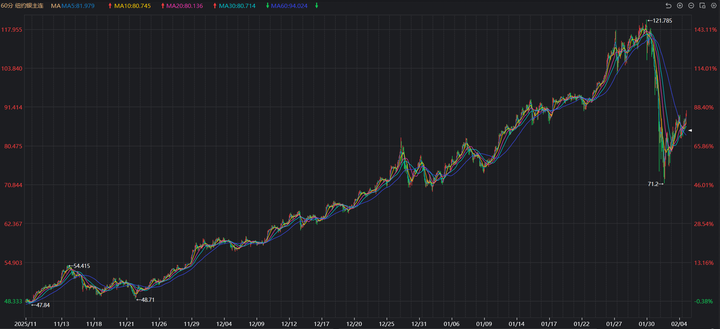

alt="Image">

COMEX白银从50到120，中间有无数次看着很唬人的闪崩跳水，但放长线看在1月底那个日内\-35%的崩盘前，涨势一直在延续，想空银子的都不知道被拉爆了多少。

alt="Image">空银子

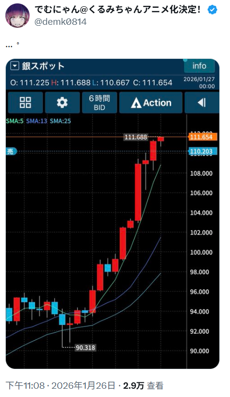

alt="Image">韭留美作者被拉爆

被彭博封神的中财大户边锡明，空银子也被拉到不停砍仓止损亏了10个小目标，才扛到崩盘后浮盈20个。而且之前已经在黄金和铜长线做多三四年。黄金周期以年为单位，周K都是小波动，金价已经翻了两倍多了。

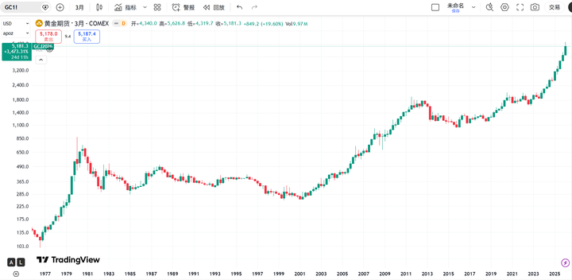

alt="Image">黄金季K

金价这两倍的大势需要什么thinking、trading、高抛低吸的操作吗？坐着不动就是，让浮盈去承受波动的风险。

前段时间抖音上看到一个徽商账户做多不到10手碳酸锂（还分了合约有在远月开的，明显一开始就做好长线准备），提保限仓前就开，成本线9w左右，投入本金10w左右，不加仓不减仓拿着不动好几个月一直到碳酸锂价15w，浮盈50多。中间元旦前跌停也没走。当时看到非常震撼，在抖音这个遍地逆势做空，频繁交易手续费比浮盈还高的散户堆里，简直是一股清流。

顺势开多，不高抛低吸耐心持仓拿得住，能忍住不加仓追击也不减仓落袋为安，太有定力了，太坐得住了。语气也不像一些晒单炫耀赚钱的博主那么浮夸，这是有难得糊涂的大智慧的高手，也让我对徽商席位的刷新认知，在家人们里看到old turkey Patridge了。

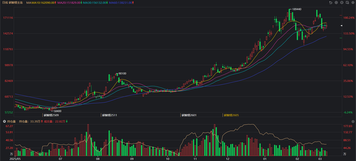

alt="Image">碳酸锂以涨停为主升，巨幅跳空为波动，跌停为回调

（找到了，抖音的一个用表情包ID的账号，大盘手王实盘大赛叫“香港第一深情”的选手

6\.48 复制打开抖音，看看【🌞1的图文作品】Handclap\.\# 碳酸锂 \# 碳酸锂期货 \# \.\.\. [https://v\.douyin\.com/DAybCy0uZl0/](https://link.zhihu.com/?target=https%3A//v.douyin.com/DAybCy0uZl0/) [O@k\.PK](mailto:O@k.PK) lcn:/ 05/18

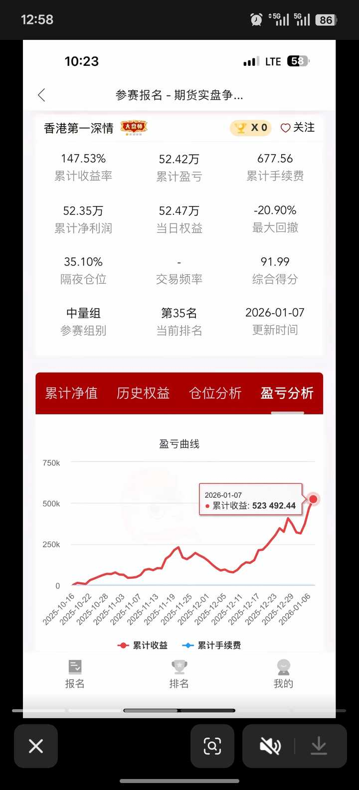

alt="Image">

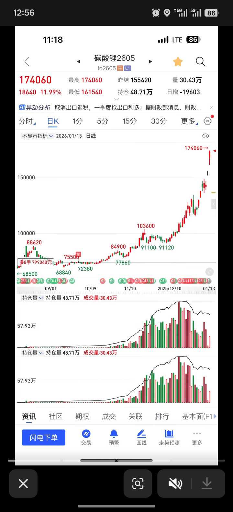

alt="Image">

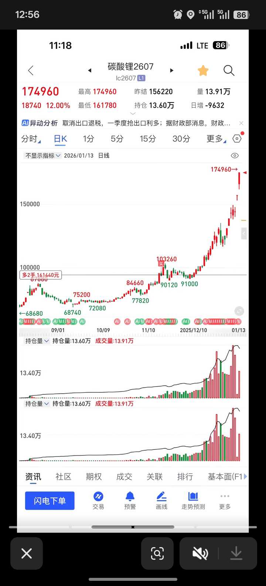

alt="Image">

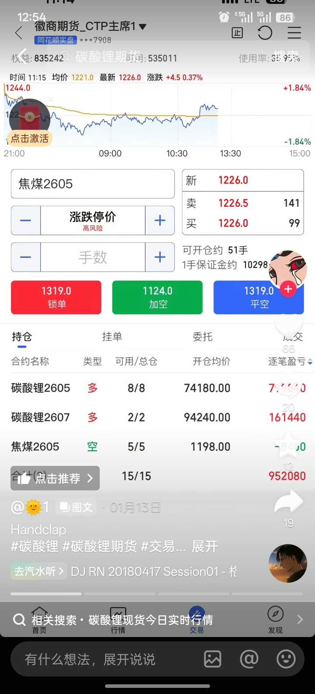

alt="Image">

这个选手最后一次更新是在1\.13，从9月开仓，中间补了2手，小半年一动不动，跌停也不放在眼里，投入10万翻10倍，总资金40w变百万。这一轮的收益足够之后一次1w的止损捕捉下一轮大行情试错60次。

碳酸锂这次行情，就算是拿到2月初那轮暴跌最低点也有50万。行情就摆在所有人面前，10万本金很多人都拿的出，但绝对没几个人拿的住。

做多碳酸锂有这个资金量的人多得很，凭借聪明机敏高抛低吸的操作，有几个拿到了老老实实一动不动的百万，即使最大回撤低点也是50万的收益？

一顿操作猛如虎，然后连一动不动的收益都拿不到。连一次大趋势都没拿完整过，市场给的beta都拿不到足额，就想去捞更多的超额alpha，捞来捞去，最后的收益还不如什么都不做，结果总是什么都没捞到。

）

肯定有很多人都看到了趋势，一定会有很多人在中间高抛低吸瞎折腾，但是他们的盈利一定没有那个徽商的散户多。他们对还不存在的，不知道何时发生的小回调充满想象力，着眼于微观的局部的小波动，那里只有小钱，是小聪明（尽管相对一潭死水的品种可能波动很大，但比起趋势的幅度来说又完全不足为道）。

平仓失去头寸的行为是封锁想象力，对正在发生的趋势事实缺乏想象力，看的不再是宏观的整体的大趋势。而这个大趋势才有大收益，过滤小波动和回调，跟着大势才是大智慧。

看对方向选对品种只是最次最初级的，根本不能算作交易核心能力素养的技能。不管是价值投资行业基本面研究选股的Graham, Fisher, Buffett, Bill Ackman, Carl Icahn，还是价格投机的J\.L\. , PTJ, Soros， Kovner所有的高收益都必须来自拿着一段足够长的足够大的趋势的发展。

盈利从来都不是来自平仓这个动作，平仓只是把浮盈转化为实盈。高抛低吸是不切实际的，高抛完了会飞到更高，低吸完了会不停更低，最后打得晕头转向。不如老老实实拿着。

（反过来说，亏损也不是来自平仓，而是持有错误的仓位。平仓是一个切断动作，不是发展动作。止损做的是停止错误，是正确而必要的）

After spending many years in Wall Street and after making and losing millions of dollars I want to tell you this: It never was my thinking that made the big money for me\. It always was my sitting\. Got that? My sitting tight\! It is no trick at all to be right on the market\. You always find lots of early bulls in bull markets and early bears in bear markets\. I've known many men who were right at exactly the right time, and began buying or selling stocks when prices were at the very level which should show the greatest profit\. And their experience invariably matched mine that is, they made no real money out of it\. Men who can both be right and sit tight are uncommon\. I found it one of the hardest things to learn\. But it is only after a stock operator has firmly grasped this that he can make big money\. It is literally true that millions come easier to a trader after he knows how to trade than hundreds did in the days of his ignorance\.
（回忆录第5章）

这是一切市场参与者都必须学习的大智慧，难得糊涂的大智慧，这个大智慧不需要什么学历，即使像J\.L\.一样小学没毕业也能学会，只要能谦卑放低身段放弃高明地优化捕捉更多。

和股债期汇币，和小资金大资金，投机投资无关，盈利就是来自拿着一大段。只要实盘试过就知道，小资金在趋势中不折腾的收益绝对高过来回瞎折腾。

看到杂波就看不到大势，就必然因小失大。

不失去头寸就是要把波动当聋瞎，大势不糊涂的大智慧。不要对小幅波动和还没发生的崩盘充满梦幻想象，趋势的发展才是真正该发挥想象力的地方。

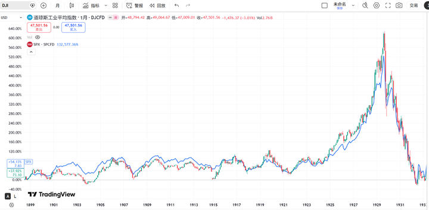

alt="Image">1900～1933道指（K线）、标普500（蓝线）

这里的1901就已经是回忆录第4章说的“史无前例的大牛市”，对赌行破产，摩根和哈里曼财团的北太平洋铁路控股权争夺战。但这个“史无前例的大牛市”转眼就被1907前的繁荣给超了。比“史无前例的大牛市”更疯牛的疯牛，在中间卖了还敢不敢再进？然而真正的boss1925年才登场，之前的那些大牛市、大崩盘，放长了看都只是不起眼的小坎。

1925到1929的4年真正“史无前例的大牛市”，这种疯牛行情里，卖了还敢追吗？追完砸下来还扛得住吗？不追高踏空看着它这么涨坐得住吗？最终归根结底的，主观高抛低吸的操作，收益能比呆若木鸡持仓不动拿完整段（按\-20%止损）更高吗？如果不能，那这些操作在收益端就是毫无意义的。

J\.L\.之前的老一辈大作手其实也都早早就知道，盈利是靠持有，old turkey Patridge回忆录第5章这个投机史上最高的山就不必再重复了，第19章的Jay Gould（操纵了1869年的历史上第一次黄金大疯牛和崩盘）

……He early saw that the big money was in owning the railroads instead of rigging their securities on the floor of the Stock Exchange\.
（Jay Gould）他图谋的是公司资产，而不是想着把股价拉高出货。他很早就知道大钱来自拥有铁路公司，而不是在交易所里折腾。

回忆录第6章，J\.L\.做空Union Pacific时的辩解。所提到的黑色星期五就是Jay Gould操纵金价搞出来的。

A man was talking to Jim Fisk a little before Black Friday, giving ten good reasons why gold ought to go down for keeps\. He got so encouraged by his own words that he ended by telling Fisk that he was going to sell a few million\. And Jim Fisk just looked at him and said, "Go ahead\! Do\! Sell it short and invite me to your funeral\."

而J\.L\.长期的对手盘，芝加哥谷物大作手，大多头Arthur Cutten（在回忆录第11章，玉米丰产过剩J\.L\.大量做空时利用道路泥泞运输中断逼空的那个“Stratton”。以及操盘术第7章，拉黑麦带小麦暴涨的幕后庄家，都是cutten）

cutten最初当场内交易员做scalping，但也知道短线交易带不来大收益，大钱不能靠波动，要靠一大段的趋势。

I bought 2,000 shares of Soo Line at 54, and two years later, in 1906, I sold it at 164\. That was my real start\. In that same year I married Miss Maud Boomer, of Evanston\.
1904年以54美元买入2000股Soo Line ，1905年以164美元卖出。
Certainly that Soo Line deal confirmed my notion that the way to make money was to let your profits pile up\. The chief temperamental distinction, I think, between a merchant and a speculator is that when a merchant has a small profit, his fingers itch to take it\. All his training inspires him to keep turning over his capital\.
“苏线的交易证明了我的理念，交易的盈利来自让利润不断积累。商贩和投机者的最大性格差异，就是商贩总在小有利润时就想落袋为安，他所受的所有训练都是在让他资金周转的。”

Warren Buffett说主动型公募长期跑不赢SP500，投基金不如买指数ETF。

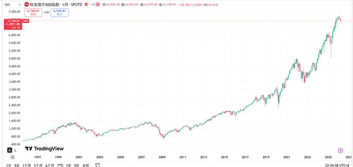

alt="Image">

而Jesse Livermore会说私募中短期也跑不赢SP500，每一轮牛市主升浪里啥都不干忍着回调拿完整到鱼尾的“傻子”，收益一定比中间高抛低吸躲回调的聪明人要更高。

做空的时候也是，一直空到筑底才能拿完整段的幅度。在中间高抛低吸？2008年金融危机花旗从500跌到50，逢高加空的位置有不少，但能平空买完再等反弹接回来开空的位置就没多少。

回调是可以预期的，但不是可操作的。它当然会有，但很难是正好在平仓后就回调，很难一平仓就回到更好的价位倒车接人重新进场赚更多价差。超跌之后还能突破超跌，平空完要追空吗？一追它又有非常大的反弹。

按照只能卖1股，不加杠杆的情况考虑，没有什么人能靠精准巧妙的微观优化操作，能把这段收益操作到超过500→50从头到尾一动不动，大智若愚的持仓不动忍受中间的波动就是最高期望的策略。实盘试过就知道，趋势行情里持仓不动的收益最高。

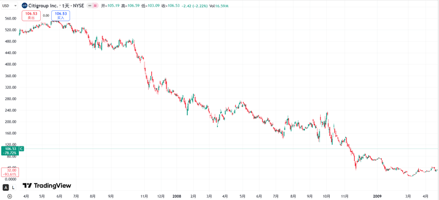

alt="Image">

26年3月的原油化工，25年金属碳酸锂多晶硅焦煤，24年锰硅欧线氧化铝，23年纯碱欧线，22年原油棕榈油，21年铁矿动力煤黑色系，股市新能源。价格运动年年有，能看对的人多得很，但是能取得一整段足额收益的人少之又少。绝大多数都是来回折腾一通，最后收益还没有拿着不动高。

要是10倍股，2倍期的行情，都能给玩成盈亏相抵甚至亏损，那这些操作的意义是什么呢？最该优化的是账户持有人。所有大行情的品种，底下的评论区都是后悔卖飞踏空，那怎么才能不卖飞呢？把自己优化了，账户密码忘了，挂个止损不看了，当个买完长春高新忘记账户的东北大妈。

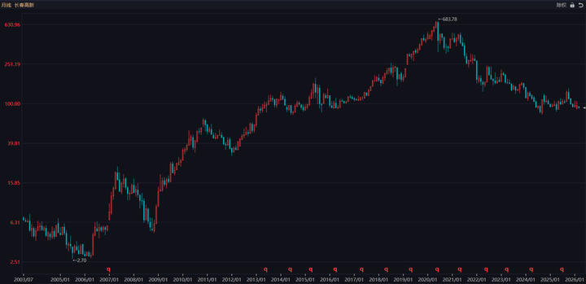

alt="Image">长春高新月K（不复权）

坐着不动就是最高收益的操作。不止是趋势中坐着不动，没趋势的时候更是要字面意义的坐着不动。

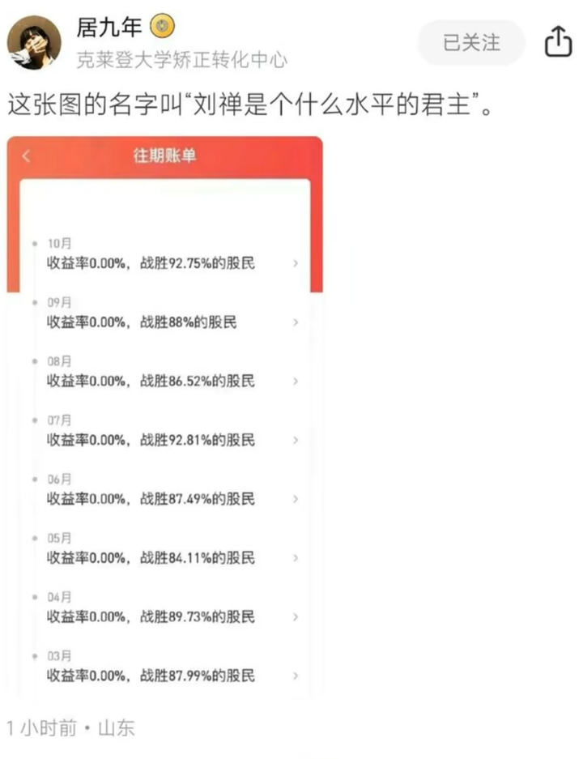

alt="Image">

越微操，越折腾，效果反而越差，实盘精神痛苦过就知道自己智慧不如刘禅了。只不过出于某些刻板印象或者对市场缺乏亲身经验了解，大多数人想的“高手”是分析判断研究准确运筹帷幄料事如神操作精准，主观操作把握市场的每一次呼吸脉络，而不会认为也不会意识到，这种“主观操作高手”才是最该被优化的一环。
