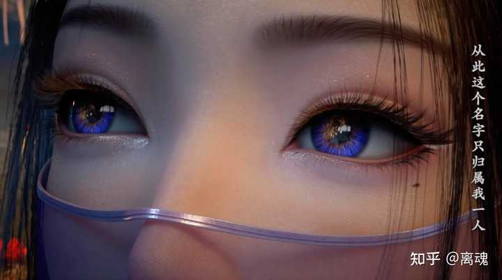
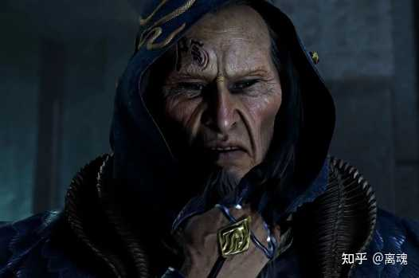
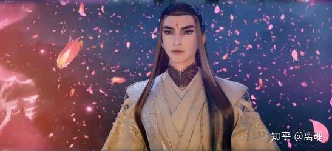
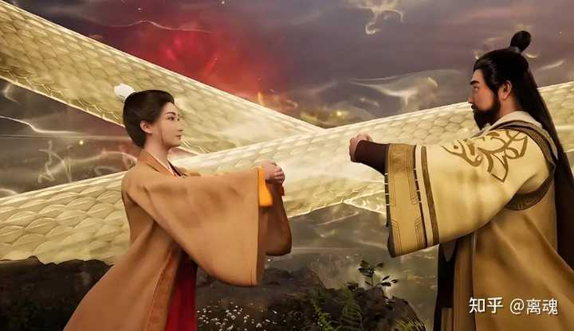
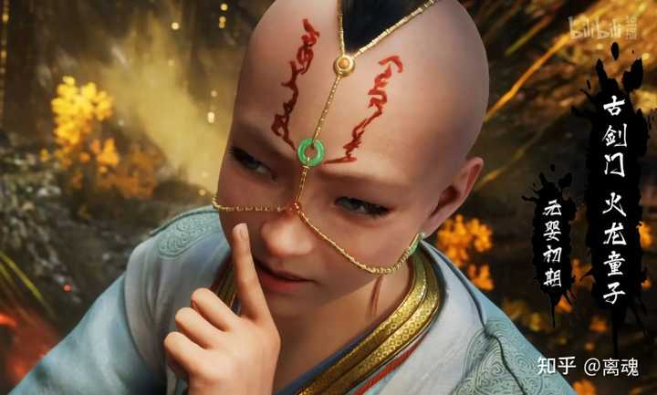
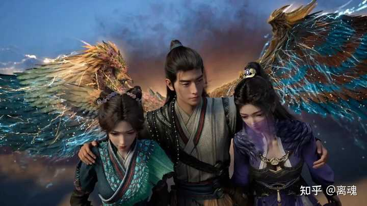
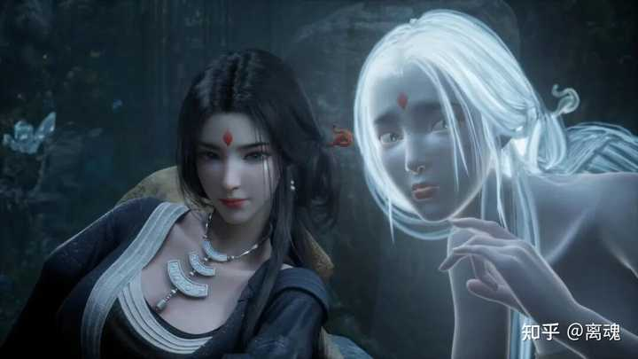
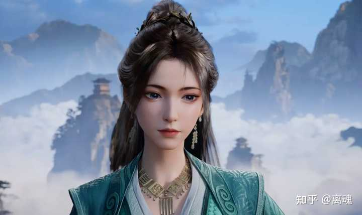

__问题描述：__

——二编——— 评论区一堆何不食肉糜看的我哭笑不得。 先说说为什么发出这个问题。这是三刷人界灵界的时候发出的疑问。 定颜丹，主材是几株千年灵草，人界没…

大部分的修士不使用定颜丹并不是说定颜丹不好，而是已经没有必要了。

服用定颜丹也是有__最佳窗口期__的，一般效果最好应该是在__炼气期__到__筑基期__之间，因为那时候的容颜英姿飒爽值得珍藏，那也是一个人一生中最好的状态，最美的年华。

alt="Image">

但是矛盾点又来了，那时候的修士容颜虽然特别年轻，但是__缺少资源__啊，别说千年灵草，就连百年灵草估计都没有见过，怎么能搞得到定颜丹这种高级货？

等到成功到了元婴级别，有实力又有钱了，但是都已经是几百岁的人了，早已经容颜不再，吃不吃定颜丹变化已经不大了，已经没有任何的意义了。

alt="Image">

而在这个修仙世界中生存法则才是第一位的价值观下，长得好看不好看，基本上都是不值一提的小事，所以元婴修士基本上都是__仙风道骨__满脸皱纹的形象，长得像小白脸一样的修士，也基本上只有云露老魔一人了吧。

alt="Image">

也有很多例外，即便没有定颜丹，依旧容颜不改，比如黄枫谷的__红拂仙子__，她修炼的功法自带美颜效果，即使过了几百岁了，依然是风韵犹存。

alt="Image">

还有元婴级别的剑修__火龙童子__，都一把年纪的人了，身体还是一个小孩子的形象，这和他所修炼的功法是密不可分的。

alt="Image">

所以这就成为了一个__完美的死循环__，这和现在的社会又是何其的相似。

你年轻的时候没钱，有钱的时候了早已青春不在。

所以这也导致定颜丹这种稀罕货，在凡人修仙传的修仙世界中位置也是相当尴尬的。

韩立因为有小绿瓶的加持，早早就炼制了很多定颜丹，不仅如此了，给身边的很多女修都安排上了，这也导致无论韩立修炼多少年自己的容颜依旧，见到身边的那些女修士的时候，依然都是年轻漂亮的状态。

alt="Image">

放在现在，你看一下，多少女人为了爱美做美容，做减肥，做整容。

你要是有一颗定颜丹，这不一颗就搞定了吗？

所以__定颜丹__这个东西你放在任何一个时代它都是一个硬通货。

这个东西让整个凡人修仙传的剧情得到了一个质的升华。

alt="Image">

你想一下，在修仙世界里，哪个修士没修炼个几百年？

要是没有定颜丹的话全是老头老太太，还有什么漂亮的女修士，完全没有看点。

alt="Image">

所以定颜丹的出场直接拉高了整部小说的颜值。
